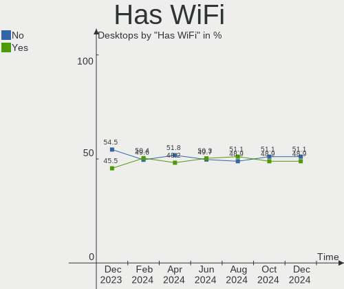
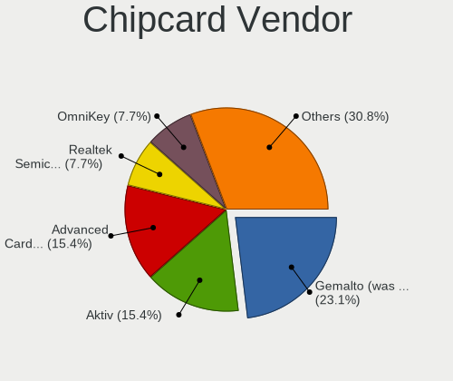

Linux - Hardware Trends (Desktops)
----------------------------------

A project to identify most popular hardware characteristics and track their change
over time based on data collected by Linux users at https://Linux-Hardware.org.

Anyone can contribute to this report by the [hw-probe](https://github.com/linuxhw/hw-probe) tool:

    sudo -E hw-probe -all -upload

This report is for one last month. Overall report since the beginning of time: [TestCoverage](https://github.com/linuxhw/TestCoverage)

Period: Jan, 2023.

Contents
--------

* [ System ](#system)
  - [ OS                       ](#os)
  - [ OS Family                ](#os-family)
  - [ Kernel                   ](#kernel)
  - [ Kernel Family            ](#kernel-family)
  - [ Kernel Major Ver.        ](#kernel-major-ver)
  - [ Arch                     ](#arch)
  - [ DE                       ](#de)
  - [ Display Server           ](#display-server)
  - [ Display Manager          ](#display-manager)
  - [ OS Lang                  ](#os-lang)
  - [ Boot Mode                ](#boot-mode)
  - [ Filesystem               ](#filesystem)
  - [ Part. scheme             ](#part-scheme)
  - [ Dual Boot with Linux/BSD ](#dual-boot-with-linuxbsd)
  - [ Dual Boot (Win)          ](#dual-boot-win)

* [ Board ](#board)
  - [ Vendor                   ](#vendor)
  - [ Model                    ](#model)
  - [ Model Family             ](#model-family)
  - [ MFG Year                 ](#mfg-year)
  - [ Form Factor              ](#form-factor)
  - [ Secure Boot              ](#secure-boot)
  - [ Coreboot                 ](#coreboot)
  - [ RAM Size                 ](#ram-size)
  - [ RAM Used                 ](#ram-used)
  - [ Total Drives             ](#total-drives)
  - [ Has CD-ROM               ](#has-cd-rom)
  - [ Has Ethernet             ](#has-ethernet)
  - [ Has WiFi                 ](#has-wifi)
  - [ Has Bluetooth            ](#has-bluetooth)

* [ Location ](#location)
  - [ Country                  ](#country)
  - [ City                     ](#city)

* [ Drives ](#drives)
  - [ Drive Vendor             ](#drive-vendor)
  - [ Drive Model              ](#drive-model)
  - [ HDD Vendor               ](#hdd-vendor)
  - [ SSD Vendor               ](#ssd-vendor)
  - [ Drive Kind               ](#drive-kind)
  - [ Drive Connector          ](#drive-connector)
  - [ Drive Size               ](#drive-size)
  - [ Space Total              ](#space-total)
  - [ Space Used               ](#space-used)
  - [ Malfunc. Drives          ](#malfunc-drives)
  - [ Malfunc. Drive Vendor    ](#malfunc-drive-vendor)
  - [ Malfunc. HDD Vendor      ](#malfunc-hdd-vendor)
  - [ Malfunc. Drive Kind      ](#malfunc-drive-kind)
  - [ Failed Drives            ](#failed-drives)
  - [ Failed Drive Vendor      ](#failed-drive-vendor)
  - [ Drive Status             ](#drive-status)

* [ Storage controller ](#storage-controller)
  - [ Storage Vendor           ](#storage-vendor)
  - [ Storage Model            ](#storage-model)
  - [ Storage Kind             ](#storage-kind)

* [ Processor ](#processor)
  - [ CPU Vendor               ](#cpu-vendor)
  - [ CPU Model                ](#cpu-model)
  - [ CPU Model Family         ](#cpu-model-family)
  - [ CPU Cores                ](#cpu-cores)
  - [ CPU Sockets              ](#cpu-sockets)
  - [ CPU Threads              ](#cpu-threads)
  - [ CPU Op-Modes             ](#cpu-op-modes)
  - [ CPU Microcode            ](#cpu-microcode)
  - [ CPU Microarch            ](#cpu-microarch)

* [ Graphics ](#graphics)
  - [ GPU Vendor               ](#gpu-vendor)
  - [ GPU Model                ](#gpu-model)
  - [ GPU Combo                ](#gpu-combo)
  - [ GPU Driver               ](#gpu-driver)
  - [ GPU Memory               ](#gpu-memory)

* [ Monitor ](#monitor)
  - [ Monitor Vendor           ](#monitor-vendor)
  - [ Monitor Model            ](#monitor-model)
  - [ Monitor Resolution       ](#monitor-resolution)
  - [ Monitor Diagonal         ](#monitor-diagonal)
  - [ Monitor Width            ](#monitor-width)
  - [ Aspect Ratio             ](#aspect-ratio)
  - [ Monitor Area             ](#monitor-area)
  - [ Pixel Density            ](#pixel-density)
  - [ Multiple Monitors        ](#multiple-monitors)

* [ Network ](#network)
  - [ Net Controller Vendor    ](#net-controller-vendor)
  - [ Net Controller Model     ](#net-controller-model)
  - [ Wireless Vendor          ](#wireless-vendor)
  - [ Wireless Model           ](#wireless-model)
  - [ Ethernet Vendor          ](#ethernet-vendor)
  - [ Ethernet Model           ](#ethernet-model)
  - [ Net Controller Kind      ](#net-controller-kind)
  - [ Used Controller          ](#used-controller)
  - [ NICs                     ](#nics)
  - [ IPv6                     ](#ipv6)

* [ Bluetooth ](#bluetooth)
  - [ Bluetooth Vendor         ](#bluetooth-vendor)
  - [ Bluetooth Model          ](#bluetooth-model)

* [ Sound ](#sound)
  - [ Sound Vendor             ](#sound-vendor)
  - [ Sound Model              ](#sound-model)

* [ Memory ](#memory)
  - [ Memory Vendor            ](#memory-vendor)
  - [ Memory Model             ](#memory-model)
  - [ Memory Kind              ](#memory-kind)
  - [ Memory Form Factor       ](#memory-form-factor)
  - [ Memory Size              ](#memory-size)
  - [ Memory Speed             ](#memory-speed)

* [ Printers & scanners ](#printers--scanners)
  - [ Printer Vendor           ](#printer-vendor)
  - [ Printer Model            ](#printer-model)
  - [ Scanner Vendor           ](#scanner-vendor)
  - [ Scanner Model            ](#scanner-model)

* [ Camera ](#camera)
  - [ Camera Vendor            ](#camera-vendor)
  - [ Camera Model             ](#camera-model)

* [ Security ](#security)
  - [ Fingerprint Vendor       ](#fingerprint-vendor)
  - [ Fingerprint Model        ](#fingerprint-model)
  - [ Chipcard Vendor          ](#chipcard-vendor)
  - [ Chipcard Model           ](#chipcard-model)

* [ Unsupported ](#unsupported)
  - [ Unsupported Devices      ](#unsupported-devices)
  - [ Unsupported Device Types ](#unsupported-device-types)

System
------

OS
--

Installed operating systems

| Name                         | Desktops | Percent |
|------------------------------|----------|---------|
| OpenMandriva 23.01           | 522      | 20.97%  |
| Ubuntu 22.04                 | 307      | 12.33%  |
| Linux Mint 21.1              | 126      | 5.06%   |
| Debian 11                    | 116      | 4.66%   |
| Fedora 37                    | 113      | 4.54%   |
| ROSA 12.3                    | 105      | 4.22%   |
| Ubuntu 22.10                 | 90       | 3.62%   |
| Pop!_OS 22.04                | 87       | 3.5%    |
| Arch Rolling                 | 72       | 2.89%   |
| Ubuntu 20.04                 | 58       | 2.33%   |
| Zorin 16                     | 48       | 1.93%   |
| OpenMandriva 4.3             | 46       | 1.85%   |
| Linux Mint 20.3              | 46       | 1.85%   |
| Manjaro                      | 37       | 1.49%   |
| KDE neon 22.04               | 37       | 1.49%   |
| ArcoLinux Rolling            | 31       | 1.25%   |
| Ubuntu 18.04                 | 28       | 1.12%   |
| Kubuntu 22.04                | 27       | 1.08%   |
| openSUSE Tumbleweed-XXXXXXXX | 23       | 0.92%   |
| Linux Mint 21                | 23       | 0.92%   |
| EndeavourOS Rolling          | 22       | 0.88%   |
| Debian                       | 20       | 0.8%    |
| Gentoo 2.9                   | 19       | 0.76%   |
| Kubuntu 22.10                | 18       | 0.72%   |
| Nobara 37                    | 17       | 0.68%   |
| Manjaro 22.0.0               | 16       | 0.64%   |
| Xubuntu 22.04                | 15       | 0.6%    |
| Xubuntu 20.04                | 15       | 0.6%    |
| Nobara 36                    | 15       | 0.6%    |
| BlackPanther 18.1            | 15       | 0.6%    |
| LMDE 5                       | 14       | 0.56%   |
| MX 21                        | 13       | 0.52%   |
| Elementary 6.1               | 11       | 0.44%   |
| OpenMandriva 4.2             | 10       | 0.4%    |
| OpenMandriva 22.12           | 10       | 0.4%    |
| Kali 2022.4                  | 10       | 0.4%    |
| Fedora 36                    | 10       | 0.4%    |
| Red OS 7.3.2                 | 9        | 0.36%   |
| OpenMandriva 4.50            | 9        | 0.36%   |
| Manjaro 22.0                 | 9        | 0.36%   |

OS Family
---------

OS without a version

| Name              | Desktops | Percent |
|-------------------|----------|---------|
| OpenMandriva      | 600      | 24.11%  |
| Ubuntu            | 486      | 19.53%  |
| Linux Mint        | 220      | 8.84%   |
| Debian            | 141      | 5.66%   |
| Fedora            | 124      | 4.98%   |
| ROSA              | 114      | 4.58%   |
| Pop!_OS           | 89       | 3.58%   |
| Arch              | 72       | 2.89%   |
| Manjaro           | 69       | 2.77%   |
| Kubuntu           | 54       | 2.17%   |
| Zorin             | 53       | 2.13%   |
| KDE neon          | 40       | 1.61%   |
| Xubuntu           | 37       | 1.49%   |
| ArcoLinux         | 33       | 1.33%   |
| Nobara            | 32       | 1.29%   |
| openSUSE          | 29       | 1.17%   |
| EndeavourOS       | 22       | 0.88%   |
| Gentoo            | 19       | 0.76%   |
| Ubuntu MATE       | 15       | 0.6%    |
| Red OS            | 15       | 0.6%    |
| Garuda Linux      | 15       | 0.6%    |
| BlackPanther      | 15       | 0.6%    |
| LMDE              | 14       | 0.56%   |
| Elementary        | 14       | 0.56%   |
| ALT Linux         | 14       | 0.56%   |
| MX                | 13       | 0.52%   |
| Lubuntu           | 12       | 0.48%   |
| Kali              | 10       | 0.4%    |
| Ubuntu Unity      | 9        | 0.36%   |
| SteamOS           | 6        | 0.24%   |
| Solus             | 6        | 0.24%   |
| Rocky Linux       | 6        | 0.24%   |
| AlmaLinux         | 5        | 0.2%    |
| Ubuntu Studio     | 4        | 0.16%   |
| Ubuntu Budgie     | 4        | 0.16%   |
| NixOS             | 4        | 0.16%   |
| Lilidog           | 4        | 0.16%   |
| CentOS            | 4        | 0.16%   |
| Ultramarine Linux | 3        | 0.12%   |
| Clear Linux       | 3        | 0.12%   |

Kernel
------

Version of the Linux kernel

| Version                            | Desktops | Percent |
|------------------------------------|----------|---------|
| 6.1.1-desktop-1omv2290             | 505      | 20.29%  |
| 5.15.0-58-generic                  | 301      | 12.09%  |
| 5.15.0-56-generic                  | 153      | 6.15%   |
| 5.15.0-57-generic                  | 117      | 4.7%    |
| 6.0.12-76060006-generic            | 78       | 3.13%   |
| 5.10.0-20-amd64                    | 77       | 3.09%   |
| 5.19.0-29-generic                  | 54       | 2.17%   |
| 5.4.0-137-generic                  | 46       | 1.85%   |
| 5.16.7-desktop-1omv4003            | 44       | 1.77%   |
| 5.15.79-generic-1rosa2021.1-x86_64 | 42       | 1.69%   |
| 6.1.1-1-MANJARO                    | 32       | 1.29%   |
| 5.15.75-generic-1rosa2021.1-x86_64 | 29       | 1.17%   |
| 6.0.15-300.fc37.x86_64             | 28       | 1.12%   |
| 5.4.0-136-generic                  | 27       | 1.08%   |
| 5.15.0-43-generic                  | 23       | 0.92%   |
| 5.10.0-2-amd64                     | 22       | 0.88%   |
| 5.19.0-26-generic                  | 20       | 0.8%    |
| 6.1.6-200.fc37.x86_64              | 19       | 0.76%   |
| 6.1.4-arch1-1                      | 17       | 0.68%   |
| 5.4.0-135-generic                  | 17       | 0.68%   |
| 6.1.7-200.fc37.x86_64              | 16       | 0.64%   |
| 5.10.0-21-amd64                    | 16       | 0.64%   |
| 6.1.1-arch1-1                      | 15       | 0.6%    |
| 5.19.0-28-generic                  | 15       | 0.6%    |
| 6.0.14-201.fsync.fc36.x86_64       | 13       | 0.52%   |
| 5.15.85-1-MANJARO                  | 12       | 0.48%   |
| 6.1.7-arch1-1                      | 11       | 0.44%   |
| 6.1.3-arch1-1                      | 11       | 0.44%   |
| 6.1.8-arch1-1                      | 10       | 0.4%    |
| 6.1.5-200.fc37.x86_64              | 10       | 0.4%    |
| 6.0.7-301.fc37.x86_64              | 10       | 0.4%    |
| 6.0.10-desktop-2omv22090           | 10       | 0.4%    |
| 5.10.14-desktop-1omv4002           | 10       | 0.4%    |
| 6.0.17-300.fc37.x86_64             | 9        | 0.36%   |
| 6.0.16-300.fc37.x86_64             | 9        | 0.36%   |
| 6.0.0-6-amd64                      | 9        | 0.36%   |
| 5.4.0-138-generic                  | 9        | 0.36%   |
| 5.19.0-21-generic                  | 9        | 0.36%   |
| 6.1.7-1-MANJARO                    | 8        | 0.32%   |
| 6.1.6-arch1-1                      | 8        | 0.32%   |

Kernel Family
-------------

Linux kernel without a distro release

| Version  | Desktops | Percent |
|----------|----------|---------|
| 5.15.0   | 649      | 26.07%  |
| 6.1.1    | 569      | 22.86%  |
| 5.4.0    | 131      | 5.26%   |
| 5.10.0   | 130      | 5.22%   |
| 5.19.0   | 114      | 4.58%   |
| 6.0.12   | 84       | 3.37%   |
| 6.1.7    | 52       | 2.09%   |
| 6.1.6    | 52       | 2.09%   |
| 6.1.4    | 49       | 1.97%   |
| 5.16.7   | 44       | 1.77%   |
| 5.15.79  | 44       | 1.77%   |
| 6.0.0    | 40       | 1.61%   |
| 5.15.75  | 34       | 1.37%   |
| 6.0.15   | 32       | 1.29%   |
| 6.1.8    | 30       | 1.21%   |
| 6.1.3    | 27       | 1.08%   |
| 6.1.5    | 25       | 1%      |
| 4.15.0   | 22       | 0.88%   |
| 6.1.2    | 17       | 0.68%   |
| 5.15.85  | 15       | 0.6%    |
| 6.1.0    | 13       | 0.52%   |
| 6.0.16   | 13       | 0.52%   |
| 6.0.14   | 13       | 0.52%   |
| 5.15.80  | 13       | 0.52%   |
| 5.14.0   | 13       | 0.52%   |
| 6.0.7    | 11       | 0.44%   |
| 6.0.10   | 11       | 0.44%   |
| 6.0.18   | 10       | 0.4%    |
| 6.0.17   | 10       | 0.4%    |
| 5.15.86  | 10       | 0.4%    |
| 5.13.0   | 10       | 0.4%    |
| 5.10.14  | 10       | 0.4%    |
| 6.0.11   | 8        | 0.32%   |
| 5.6.14   | 8        | 0.32%   |
| 5.10.155 | 8        | 0.32%   |
| 5.15.78  | 7        | 0.28%   |
| 4.19.0   | 7        | 0.28%   |
| 4.18.16  | 7        | 0.28%   |
| 5.19.12  | 6        | 0.24%   |
| 6.0.6    | 5        | 0.2%    |

Kernel Major Ver.
-----------------

Linux kernel major version

| Version | Desktops | Percent |
|---------|----------|---------|
| 6.1     | 834      | 33.51%  |
| 5.15    | 802      | 32.22%  |
| 6.0     | 244      | 9.8%    |
| 5.10    | 170      | 6.83%   |
| 5.4     | 134      | 5.38%   |
| 5.19    | 130      | 5.22%   |
| 5.16    | 51       | 2.05%   |
| 4.15    | 22       | 0.88%   |
| 5.14    | 18       | 0.72%   |
| 5.18    | 14       | 0.56%   |
| 5.13    | 10       | 0.4%    |
| 4.18    | 10       | 0.4%    |
| 5.17    | 9        | 0.36%   |
| 5.6     | 8        | 0.32%   |
| 4.19    | 8        | 0.32%   |
| 5.11    | 5        | 0.2%    |
| 4.4     | 4        | 0.16%   |
| 6.2     | 3        | 0.12%   |
| 3.10    | 3        | 0.12%   |
| 5.8     | 2        | 0.08%   |
| 5.0     | 2        | 0.08%   |
| 4.9     | 2        | 0.08%   |
| 5.9     | 1        | 0.04%   |
| 5.3     | 1        | 0.04%   |
| 5.12    | 1        | 0.04%   |
| 2.6     | 1        | 0.04%   |

Arch
----

OS architecture (x86_64, i586, etc.)

| Name        | Desktops | Percent |
|-------------|----------|---------|
| x86_64      | 2466     | 99.08%  |
| i686        | 21       | 0.84%   |
| riscv64     | 1        | 0.04%   |
| loongarch64 | 1        | 0.04%   |

DE
--

Desktop Environment

| Name              | Desktops | Percent |
|-------------------|----------|---------|
| GNOME             | 944      | 37.93%  |
| KDE5              | 888      | 35.68%  |
| X-Cinnamon        | 205      | 8.24%   |
| XFCE              | 125      | 5.02%   |
| Unknown           | 111      | 4.46%   |
| MATE              | 72       | 2.89%   |
| LXQt              | 25       | 1%      |
| Cinnamon          | 19       | 0.76%   |
| Pantheon          | 16       | 0.64%   |
| i3                | 10       | 0.4%    |
| Unity             | 9        | 0.36%   |
| LXDE              | 9        | 0.36%   |
| Budgie            | 7        | 0.28%   |
| KDE               | 6        | 0.24%   |
| lightdm-xsession  | 4        | 0.16%   |
| GNOME Flashback   | 4        | 0.16%   |
| GNOME Classic     | 4        | 0.16%   |
| sway              | 3        | 0.12%   |
| LeftWM            | 3        | 0.12%   |
| KDE4              | 3        | 0.12%   |
| Hyprland          | 3        | 0.12%   |
| qtile             | 2        | 0.08%   |
| Deepin            | 2        | 0.08%   |
| chadwm            | 2        | 0.08%   |
| awesome           | 2        | 0.08%   |
| Trinity           | 1        | 0.04%   |
| TOS:GNOME         | 1        | 0.04%   |
| sussy_bspwm       | 1        | 0.04%   |
| steamos           | 1        | 0.04%   |
| openbox           | 1        | 0.04%   |
| none+i3           | 1        | 0.04%   |
| i3-with-shmlog    | 1        | 0.04%   |
| Enlightenment     | 1        | 0.04%   |
| DWM               | 1        | 0.04%   |
| bspwm             | 1        | 0.04%   |
| /etc/X11/Xsession | 1        | 0.04%   |

Display Server
--------------

X11 or Wayland

| Name    | Desktops | Percent |
|---------|----------|---------|
| X11     | 1757     | 70.59%  |
| Wayland | 599      | 24.07%  |
| Tty     | 75       | 3.01%   |
| Unknown | 58       | 2.33%   |

Display Manager
---------------

SDDM, LightDM, etc.

| Name    | Desktops | Percent |
|---------|----------|---------|
| SDDM    | 767      | 30.82%  |
| Unknown | 695      | 27.92%  |
| GDM3    | 453      | 18.2%   |
| LightDM | 295      | 11.85%  |
| GDM     | 268      | 10.77%  |
| XDM     | 2        | 0.08%   |
| SLiM    | 2        | 0.08%   |
| LXDM    | 2        | 0.08%   |
| KDM     | 2        | 0.08%   |
| TDM     | 1        | 0.04%   |
| LYNDE   | 1        | 0.04%   |
| Ly      | 1        | 0.04%   |

OS Lang
-------

Language

| Lang    | Desktops | Percent |
|---------|----------|---------|
| en_US   | 1076     | 43.23%  |
| ru_RU   | 265      | 10.65%  |
| de_DE   | 179      | 7.19%   |
| fr_FR   | 114      | 4.58%   |
| en_GB   | 114      | 4.58%   |
| it_IT   | 95       | 3.82%   |
| pt_BR   | 86       | 3.46%   |
| es_ES   | 57       | 2.29%   |
| Unknown | 57       | 2.29%   |
| en_CA   | 54       | 2.17%   |
| pl_PL   | 50       | 2.01%   |
| en_AU   | 31       | 1.25%   |
| C       | 30       | 1.21%   |
| nl_NL   | 22       | 0.88%   |
| es_MX   | 17       | 0.68%   |
| cs_CZ   | 17       | 0.68%   |
| de_AT   | 16       | 0.64%   |
| hu_HU   | 14       | 0.56%   |
| de_CH   | 13       | 0.52%   |
| es_AR   | 12       | 0.48%   |
| en_IN   | 9        | 0.36%   |
| fi_FI   | 8        | 0.32%   |
| en_NZ   | 8        | 0.32%   |
| zh_CN   | 7        | 0.28%   |
| fr_BE   | 7        | 0.28%   |
| el_GR   | 7        | 0.28%   |
| ro_RO   | 6        | 0.24%   |
| pt_PT   | 6        | 0.24%   |
| es_CL   | 6        | 0.24%   |
| tr_TR   | 5        | 0.2%    |
| sv_SE   | 5        | 0.2%    |
| POSIX   | 5        | 0.2%    |
| fr_CA   | 5        | 0.2%    |
| es_VE   | 5        | 0.2%    |
| es_CO   | 5        | 0.2%    |
| en_ZA   | 5        | 0.2%    |
| da_DK   | 5        | 0.2%    |
| ru_UA   | 4        | 0.16%   |
| nl_BE   | 4        | 0.16%   |
| es_PE   | 4        | 0.16%   |

Boot Mode
---------

EFI or BIOS

| Mode | Desktops | Percent |
|------|----------|---------|
| BIOS | 1357     | 54.52%  |
| EFI  | 1132     | 45.48%  |

Filesystem
----------

Type of filesystem

| Type    | Desktops | Percent |
|---------|----------|---------|
| Ext4    | 1573     | 63.2%   |
| Overlay | 575      | 23.1%   |
| Btrfs   | 282      | 11.33%  |
| Xfs     | 25       | 1%      |
| Zfs     | 15       | 0.6%    |
| Tmpfs   | 7        | 0.28%   |
| F2fs    | 5        | 0.2%    |
| Ext2    | 3        | 0.12%   |
| XXXXXXX | 1        | 0.04%   |
| Jfs     | 1        | 0.04%   |
| Ext3    | 1        | 0.04%   |
| Unknown | 1        | 0.04%   |

Part. scheme
------------

Scheme of partitioning

| Type    | Desktops | Percent |
|---------|----------|---------|
| GPT     | 1422     | 57.13%  |
| Unknown | 596      | 23.95%  |
| MBR     | 471      | 18.92%  |

Dual Boot with Linux/BSD
------------------------

Hosting more than one Linux/BSD

| Dual boot | Desktops | Percent |
|-----------|----------|---------|
| No        | 1772     | 71.19%  |
| Yes       | 717      | 28.81%  |

Dual Boot (Win)
---------------

Hosting Linux and Windows

| Dual boot | Desktops | Percent |
|-----------|----------|---------|
| No        | 1594     | 64.04%  |
| Yes       | 895      | 35.96%  |

Board
-----

Vendor
------

Motherboard manufacturer

| Name                                 | Desktops | Percent |
|--------------------------------------|----------|---------|
| ASUSTek Computer                     | 696      | 27.96%  |
| Gigabyte Technology                  | 459      | 18.44%  |
| MSI                                  | 299      | 12.01%  |
| ASRock                               | 227      | 9.12%   |
| Dell                                 | 189      | 7.59%   |
| Hewlett-Packard                      | 177      | 7.11%   |
| Lenovo                               | 94       | 3.78%   |
| Intel                                | 55       | 2.21%   |
| Acer                                 | 36       | 1.45%   |
| Unknown                              | 24       | 0.96%   |
| Pegatron                             | 23       | 0.92%   |
| Fujitsu                              | 22       | 0.88%   |
| Foxconn                              | 15       | 0.6%    |
| AZW                                  | 15       | 0.6%    |
| Biostar                              | 14       | 0.56%   |
| Medion                               | 13       | 0.52%   |
| ECS                                  | 13       | 0.52%   |
| Huanan                               | 8        | 0.32%   |
| BESSTAR Tech                         | 7        | 0.28%   |
| ASRockRack                           | 6        | 0.24%   |
| Positivo                             | 5        | 0.2%    |
| Alienware                            | 5        | 0.2%    |
| MACHINIST                            | 4        | 0.16%   |
| HC                                   | 4        | 0.16%   |
| Gateway                              | 4        | 0.16%   |
| Apple                                | 4        | 0.16%   |
| Shenzhen Meigao Electronic Equipment | 3        | 0.12%   |
| Semp Toshiba                         | 3        | 0.12%   |
| PCWare                               | 3        | 0.12%   |
| Hardkernel                           | 3        | 0.12%   |
| Fujitsu Siemens                      | 3        | 0.12%   |
| SYWZ                                 | 2        | 0.08%   |
| Shuttle                              | 2        | 0.08%   |
| OEM                                  | 2        | 0.08%   |
| MAXSUN                               | 2        | 0.08%   |
| EVGA                                 | 2        | 0.08%   |
| ELSKY                                | 2        | 0.08%   |
| DFI                                  | 2        | 0.08%   |
| AMD                                  | 2        | 0.08%   |
| ZOTAC                                | 1        | 0.04%   |

Model
-----

Motherboard model

| Name                         | Desktops | Percent |
|------------------------------|----------|---------|
| ASUS All Series              | 71       | 2.85%   |
| Unknown                      | 28       | 1.12%   |
| ASUS TUF Gaming X570-PLUS    | 19       | 0.76%   |
| ASUS PRIME A320M-K           | 17       | 0.68%   |
| Dell OptiPlex 7010           | 16       | 0.64%   |
| Gigabyte B550M DS3H          | 14       | 0.56%   |
| MSI MS-7C91                  | 13       | 0.52%   |
| MSI MS-7C37                  | 13       | 0.52%   |
| ASUS M5A97 R2.0              | 13       | 0.52%   |
| MSI MS-7C56                  | 12       | 0.48%   |
| MSI MS-7C02                  | 12       | 0.48%   |
| Gigabyte B450M DS3H          | 11       | 0.44%   |
| ASRock B450M Pro4            | 11       | 0.44%   |
| Dell OptiPlex 790            | 10       | 0.4%    |
| Gigabyte A320M-S2H           | 9        | 0.36%   |
| ASUS ROG STRIX B550-F GAMING | 9        | 0.36%   |
| ASUS PRIME B450M-A           | 9        | 0.36%   |
| MSI MS-7B89                  | 8        | 0.32%   |
| MSI MS-7B86                  | 8        | 0.32%   |
| Dell OptiPlex 9020           | 8        | 0.32%   |
| Dell OptiPlex 3020           | 8        | 0.32%   |
| ASUS TUF Gaming B550M-PLUS   | 8        | 0.32%   |
| ASUS TUF Gaming B550-PLUS    | 8        | 0.32%   |
| ASUS PRIME X570-P            | 8        | 0.32%   |
| MSI MS-7D22                  | 7        | 0.28%   |
| MSI MS-7817                  | 7        | 0.28%   |
| MSI MS-7693                  | 7        | 0.28%   |
| HP Compaq Elite 8300 SFF     | 7        | 0.28%   |
| Gigabyte P85-D3              | 7        | 0.28%   |
| Gigabyte H510M H             | 7        | 0.28%   |
| Gigabyte GA-78LMT-USB3 6.0   | 7        | 0.28%   |
| Gigabyte B450 AORUS M        | 7        | 0.28%   |
| ASUS ROG STRIX B450-F GAMING | 7        | 0.28%   |
| ASUS ROG CROSSHAIR VIII HERO | 7        | 0.28%   |
| ASUS M5A78L-M/USB3           | 7        | 0.28%   |
| MSI MS-7B79                  | 6        | 0.24%   |
| Gigabyte H61M-S1             | 6        | 0.24%   |
| Gigabyte B450 AORUS ELITE    | 6        | 0.24%   |
| Dell OptiPlex 780            | 6        | 0.24%   |
| ASUS ROG STRIX B550-I GAMING | 6        | 0.24%   |

Model Family
------------

Motherboard model prefix

| Name                   | Desktops | Percent |
|------------------------|----------|---------|
| ASUS PRIME             | 158      | 6.35%   |
| Dell OptiPlex          | 116      | 4.66%   |
| ASUS ROG               | 101      | 4.06%   |
| ASUS TUF               | 77       | 3.09%   |
| ASUS All               | 71       | 2.85%   |
| HP Compaq              | 49       | 1.97%   |
| Lenovo ThinkCentre     | 46       | 1.85%   |
| Dell Precision         | 29       | 1.17%   |
| Unknown                | 28       | 1.12%   |
| HP EliteDesk           | 27       | 1.08%   |
| Gigabyte B450M         | 27       | 1.08%   |
| HP Pavilion            | 25       | 1%      |
| ASUS M5A97             | 23       | 0.92%   |
| Gigabyte B550M         | 22       | 0.88%   |
| Acer Aspire            | 22       | 0.88%   |
| Fujitsu ESPRIMO        | 19       | 0.76%   |
| ASRock B450M           | 19       | 0.76%   |
| Gigabyte B450          | 18       | 0.72%   |
| Gigabyte X570          | 17       | 0.68%   |
| Dell Inspiron          | 17       | 0.68%   |
| Lenovo ThinkStation    | 16       | 0.64%   |
| HP ProDesk             | 15       | 0.6%    |
| ASUS M5A78L-M          | 15       | 0.6%    |
| Lenovo IdeaCentre      | 14       | 0.56%   |
| MSI MS-7C91            | 13       | 0.52%   |
| MSI MS-7C37            | 13       | 0.52%   |
| ASRock B450            | 13       | 0.52%   |
| MSI MS-7C56            | 12       | 0.48%   |
| MSI MS-7C02            | 12       | 0.48%   |
| Gigabyte A320M-S2H     | 12       | 0.48%   |
| ASUS P8H61-M           | 12       | 0.48%   |
| Gigabyte Z390          | 11       | 0.44%   |
| Gigabyte GA-78LMT-USB3 | 11       | 0.44%   |
| ASRock X570            | 11       | 0.44%   |
| Gigabyte Z690          | 9        | 0.36%   |
| Gigabyte X570S         | 9        | 0.36%   |
| Gigabyte B550          | 9        | 0.36%   |
| Dell XPS               | 9        | 0.36%   |
| Dell Vostro            | 9        | 0.36%   |
| MSI MS-7B89            | 8        | 0.32%   |

MFG Year
--------

Motherboard manufacture year

| Year    | Desktops | Percent |
|---------|----------|---------|
| 2020    | 263      | 10.57%  |
| 2018    | 247      | 9.92%   |
| 2012    | 240      | 9.64%   |
| 2021    | 214      | 8.6%    |
| 2019    | 207      | 8.32%   |
| 2013    | 183      | 7.35%   |
| 2022    | 152      | 6.11%   |
| 2017    | 148      | 5.95%   |
| 2014    | 142      | 5.71%   |
| 2011    | 131      | 5.26%   |
| 2015    | 115      | 4.62%   |
| 2009    | 107      | 4.3%    |
| 2010    | 94       | 3.78%   |
| 2016    | 89       | 3.58%   |
| 2008    | 81       | 3.25%   |
| 2007    | 40       | 1.61%   |
| 2006    | 17       | 0.68%   |
| 2005    | 11       | 0.44%   |
| Unknown | 4        | 0.16%   |
| 2004    | 1        | 0.04%   |
| 2003    | 1        | 0.04%   |
| 2002    | 1        | 0.04%   |
| 2001    | 1        | 0.04%   |

Form Factor
-----------

Physical design of the computer

| Name    | Desktops | Percent |
|---------|----------|---------|
| Desktop | 2489     | 100%    |

Secure Boot
-----------

Enabled or disabled

| State    | Desktops | Percent |
|----------|----------|---------|
| Disabled | 2425     | 97.43%  |
| Enabled  | 64       | 2.57%   |

Coreboot
--------

Have coreboot on board

| Used | Desktops | Percent |
|------|----------|---------|
| No   | 2487     | 99.92%  |
| Yes  | 2        | 0.08%   |

RAM Size
--------

Total RAM memory

| Size in GB      | Desktops | Percent |
|-----------------|----------|---------|
| 16.01-24.0      | 671      | 26.96%  |
| 32.01-64.0      | 452      | 18.16%  |
| 8.01-16.0       | 399      | 16.03%  |
| 4.01-8.0        | 387      | 15.55%  |
| 3.01-4.0        | 291      | 11.69%  |
| 64.01-256.0     | 127      | 5.1%    |
| 24.01-32.0      | 89       | 3.58%   |
| 1.01-2.0        | 51       | 2.05%   |
| 2.01-3.0        | 14       | 0.56%   |
| 0.51-1.0        | 6        | 0.24%   |
| More than 256.0 | 2        | 0.08%   |

RAM Used
--------

Used RAM memory

| Used GB     | Desktops | Percent |
|-------------|----------|---------|
| 1.01-2.0    | 866      | 34.79%  |
| 2.01-3.0    | 613      | 24.63%  |
| 4.01-8.0    | 374      | 15.03%  |
| 3.01-4.0    | 296      | 11.89%  |
| 0.51-1.0    | 156      | 6.27%   |
| 8.01-16.0   | 118      | 4.74%   |
| 0.01-0.5    | 27       | 1.08%   |
| 16.01-24.0  | 20       | 0.8%    |
| 24.01-32.0  | 8        | 0.32%   |
| 32.01-64.0  | 6        | 0.24%   |
| 64.01-256.0 | 4        | 0.16%   |
| Unknown     | 1        | 0.04%   |

Total Drives
------------

Number of drives on board

| Drives | Desktops | Percent |
|--------|----------|---------|
| 1      | 893      | 35.88%  |
| 2      | 721      | 28.97%  |
| 3      | 402      | 16.15%  |
| 4      | 235      | 9.44%   |
| 5      | 114      | 4.58%   |
| 6      | 45       | 1.81%   |
| 7      | 31       | 1.25%   |
| 0      | 20       | 0.8%    |
| 8      | 12       | 0.48%   |
| 9      | 6        | 0.24%   |
| 18     | 2        | 0.08%   |
| 13     | 2        | 0.08%   |
| 10     | 2        | 0.08%   |
| 25     | 1        | 0.04%   |
| 20     | 1        | 0.04%   |
| 17     | 1        | 0.04%   |
| 12     | 1        | 0.04%   |

Has CD-ROM
----------

Has CD-ROM on board

| Presented | Desktops | Percent |
|-----------|----------|---------|
| No        | 1412     | 56.73%  |
| Yes       | 1077     | 43.27%  |

Has Ethernet
------------

Has Ethernet on board

| Presented | Desktops | Percent |
|-----------|----------|---------|
| Yes       | 2471     | 99.28%  |
| No        | 18       | 0.72%   |

Has WiFi
--------

Has WiFi module

| Presented | Desktops | Percent |
|-----------|----------|---------|
| No        | 1359     | 54.6%   |
| Yes       | 1130     | 45.4%   |

Has Bluetooth
-------------

Has Bluetooth module

| Presented | Desktops | Percent |
|-----------|----------|---------|
| No        | 1616     | 64.93%  |
| Yes       | 873      | 35.07%  |

Location
--------

Country
-------

Geographic location (country)

| Country      | Desktops | Percent |
|--------------|----------|---------|
| USA          | 496      | 19.93%  |
| Russia       | 306      | 12.29%  |
| Germany      | 238      | 9.56%   |
| France       | 145      | 5.83%   |
| Italy        | 120      | 4.82%   |
| Brazil       | 120      | 4.82%   |
| Canada       | 107      | 4.3%    |
| UK           | 105      | 4.22%   |
| Spain        | 80       | 3.21%   |
| Poland       | 58       | 2.33%   |
| Netherlands  | 58       | 2.33%   |
| Australia    | 56       | 2.25%   |
| Hungary      | 36       | 1.45%   |
| Mexico       | 30       | 1.21%   |
| Romania      | 25       | 1%      |
| Czechia      | 25       | 1%      |
| Switzerland  | 24       | 0.96%   |
| Austria      | 24       | 0.96%   |
| Finland      | 22       | 0.88%   |
| Turkey       | 21       | 0.84%   |
| India        | 20       | 0.8%    |
| Argentina    | 20       | 0.8%    |
| Sweden       | 19       | 0.76%   |
| Greece       | 19       | 0.76%   |
| Belgium      | 19       | 0.76%   |
| Portugal     | 18       | 0.72%   |
| New Zealand  | 14       | 0.56%   |
| Norway       | 13       | 0.52%   |
| Denmark      | 13       | 0.52%   |
| Slovakia     | 12       | 0.48%   |
| Chile        | 12       | 0.48%   |
| Indonesia    | 11       | 0.44%   |
| Ukraine      | 10       | 0.4%    |
| Serbia       | 10       | 0.4%    |
| Japan        | 9        | 0.36%   |
| Colombia     | 9        | 0.36%   |
| Bulgaria     | 8        | 0.32%   |
| Thailand     | 7        | 0.28%   |
| Saudi Arabia | 7        | 0.28%   |
| China        | 7        | 0.28%   |

City
----

Geographic location (city)

| City           | Desktops | Percent |
|----------------|----------|---------|
| Moscow         | 46       | 1.85%   |
| Voronezh       | 40       | 1.61%   |
| Sydney         | 20       | 0.8%    |
| London         | 18       | 0.72%   |
| St Petersburg  | 17       | 0.68%   |
| New York       | 16       | 0.64%   |
| Madrid         | 16       | 0.64%   |
| Berlin         | 16       | 0.64%   |
| Vienna         | 14       | 0.56%   |
| Sao Paulo      | 14       | 0.56%   |
| Rome           | 14       | 0.56%   |
| Milan          | 14       | 0.56%   |
| Paris          | 13       | 0.52%   |
| Novosibirsk    | 13       | 0.52%   |
| Hamburg        | 12       | 0.48%   |
| Budapest       | 12       | 0.48%   |
| Toronto        | 11       | 0.44%   |
| Warsaw         | 10       | 0.4%    |
| Córdoba       | 10       | 0.4%    |
| Bucharest      | 10       | 0.4%    |
| Amsterdam      | 10       | 0.4%    |
| Prague         | 9        | 0.36%   |
| Montreal       | 9        | 0.36%   |
| Melbourne      | 9        | 0.36%   |
| Stuttgart      | 8        | 0.32%   |
| Samara         | 8        | 0.32%   |
| Rio de Janeiro | 8        | 0.32%   |
| Oryol          | 8        | 0.32%   |
| Los Angeles    | 8        | 0.32%   |
| Santiago       | 7        | 0.28%   |
| Mexico City    | 7        | 0.28%   |
| Istanbul       | 7        | 0.28%   |
| Dallas         | 7        | 0.28%   |
| Belgrade       | 7        | 0.28%   |
| Athens         | 7        | 0.28%   |
| Wroclaw        | 6        | 0.24%   |
| Vancouver      | 6        | 0.24%   |
| Seattle        | 6        | 0.24%   |
| Portland       | 6        | 0.24%   |
| Ottawa         | 6        | 0.24%   |

Drives
------

Drive Vendor
------------

Hard drive vendors

| Vendor                      | Desktops | Drives | Percent |
|-----------------------------|----------|--------|---------|
| WDC                         | 823      | 1095   | 17.31%  |
| Seagate                     | 803      | 1063   | 16.89%  |
| Samsung Electronics         | 687      | 937    | 14.45%  |
| Kingston                    | 323      | 359    | 6.79%   |
| Toshiba                     | 236      | 273    | 4.96%   |
| Crucial                     | 234      | 271    | 4.92%   |
| SanDisk                     | 215      | 242    | 4.52%   |
| Hitachi                     | 129      | 163    | 2.71%   |
| Intel                       | 94       | 102    | 1.98%   |
| China                       | 81       | 86     | 1.7%    |
| Unknown                     | 64       | 85     | 1.35%   |
| A-DATA Technology           | 64       | 67     | 1.35%   |
| Silicon Motion              | 56       | 60     | 1.18%   |
| Phison Electronics          | 55       | 61     | 1.16%   |
| PNY                         | 47       | 51     | 0.99%   |
| SPCC                        | 46       | 55     | 0.97%   |
| HGST                        | 46       | 65     | 0.97%   |
| Micron/Crucial Technology   | 39       | 40     | 0.82%   |
| Patriot                     | 33       | 34     | 0.69%   |
| Kingston Technology Company | 30       | 31     | 0.63%   |
| Maxtor                      | 29       | 31     | 0.61%   |
| Intenso                     | 29       | 36     | 0.61%   |
| SK hynix                    | 28       | 29     | 0.59%   |
| OCZ                         | 26       | 29     | 0.55%   |
| GOODRAM                     | 25       | 31     | 0.53%   |
| Micron Technology           | 23       | 29     | 0.48%   |
| Phison                      | 22       | 25     | 0.46%   |
| Apacer                      | 22       | 23     | 0.46%   |
| Realtek Semiconductor       | 18       | 19     | 0.38%   |
| Team                        | 17       | 17     | 0.36%   |
| Gigabyte Technology         | 17       | 18     | 0.36%   |
| JMicron Technology          | 16       | 16     | 0.34%   |
| Unknown                     | 16       | 16     | 0.34%   |
| Netac                       | 15       | 19     | 0.32%   |
| Lexar                       | 15       | 15     | 0.32%   |
| Transcend                   | 14       | 14     | 0.29%   |
| ADATA Technology            | 13       | 14     | 0.27%   |
| KIOXIA-EXCERIA              | 12       | 13     | 0.25%   |
| Corsair                     | 12       | 13     | 0.25%   |
| KIOXIA                      | 11       | 13     | 0.23%   |

Drive Model
-----------

Hard drive models

| Model                                                 | Desktops | Percent |
|-------------------------------------------------------|----------|---------|
| Samsung NVMe SSD Controller SM981/PM981/PM983 500GB   | 93       | 1.7%    |
| Kingston SA400S37240G 240GB SSD                       | 88       | 1.61%   |
| Seagate ST1000DM010-2EP102 1TB                        | 64       | 1.17%   |
| Seagate ST2000DM008-2FR102 2TB                        | 61       | 1.12%   |
| Seagate ST500DM002-1BD142 500GB                       | 52       | 0.95%   |
| Kingston SA400S37480G 480GB SSD                       | 48       | 0.88%   |
| Samsung SSD 860 EVO 500GB                             | 43       | 0.79%   |
| WDC WD10EZEX-08WN4A0 1TB                              | 42       | 0.77%   |
| Samsung SSD 850 EVO 250GB                             | 39       | 0.71%   |
| Kingston SA400S37120G 120GB SSD                       | 36       | 0.66%   |
| Toshiba DT01ACA100 1TB                                | 35       | 0.64%   |
| Crucial CT1000MX500SSD1 1TB                           | 35       | 0.64%   |
| Silicon Motion SM2263EN/SM2263XT SSD Controller 512GB | 33       | 0.6%    |
| Samsung NVMe SSD Controller PM9A1/PM9A3/980PRO 512GB  | 33       | 0.6%    |
| Samsung SSD 850 EVO 500GB                             | 32       | 0.59%   |
| Toshiba HDWD110 1TB                                   | 29       | 0.53%   |
| Crucial CT500MX500SSD1 500GB                          | 29       | 0.53%   |
| Unknown SD/MMC/MS PRO 2GB                             | 27       | 0.49%   |
| Toshiba DT01ACA200 2TB                                | 27       | 0.49%   |
| Toshiba DT01ACA050 500GB                              | 26       | 0.48%   |
| Seagate ST1000DM003-1CH162 1TB                        | 26       | 0.48%   |
| Samsung SSD 860 EVO 250GB                             | 26       | 0.48%   |
| Kingston SV300S37A120G 120GB SSD                      | 26       | 0.48%   |
| Seagate ST1000DM003-1ER162 1TB                        | 25       | 0.46%   |
| Samsung SSD 970 EVO Plus 500GB                        | 25       | 0.46%   |
| Seagate ST4000DM004-2CV104 4TB                        | 24       | 0.44%   |
| Samsung SSD 860 EVO 1TB                               | 24       | 0.44%   |
| Seagate ST2000DM001-1ER164 2TB                        | 23       | 0.42%   |
| Samsung SSD 980 1TB                                   | 22       | 0.4%    |
| Crucial CT480BX500SSD1 480GB                          | 22       | 0.4%    |
| Phison E12 NVMe Controller 1TB                        | 21       | 0.38%   |
| Intel SSD 660P Series 512GB                           | 21       | 0.38%   |
| Crucial CT240BX500SSD1 240GB                          | 21       | 0.38%   |
| Seagate ST1000DM003-1SB102 1TB                        | 20       | 0.37%   |
| Samsung SSD 870 EVO 500GB                             | 20       | 0.37%   |
| Kingston Company A2000 NVMe SSD 1TB                   | 20       | 0.37%   |
| WDC WD10EZEX-00BBHA0 1TB                              | 19       | 0.35%   |
| Seagate ST3500413AS 500GB                             | 19       | 0.35%   |
| Seagate ST2000DM001-1CH164 2TB                        | 18       | 0.33%   |
| Micron/Crucial P2 NVMe PCIe SSD 500GB                 | 18       | 0.33%   |

HDD Vendor
----------

Hard disk drive vendors

| Vendor              | Desktops | Drives | Percent |
|---------------------|----------|--------|---------|
| Seagate             | 789      | 1036   | 37.55%  |
| WDC                 | 706      | 922    | 33.6%   |
| Toshiba             | 215      | 246    | 10.23%  |
| Hitachi             | 129      | 163    | 6.14%   |
| Samsung Electronics | 115      | 134    | 5.47%   |
| HGST                | 46       | 65     | 2.19%   |
| Unknown             | 29       | 30     | 1.38%   |
| Maxtor              | 26       | 28     | 1.24%   |
| Apple               | 6        | 6      | 0.29%   |
| USB3.0              | 5        | 5      | 0.24%   |
| SABRENT             | 5        | 6      | 0.24%   |
| Intenso             | 5        | 5      | 0.24%   |
| ASMT                | 5        | 5      | 0.24%   |
| Hewlett-Packard     | 4        | 5      | 0.19%   |
| HGST HTS            | 3        | 3      | 0.14%   |
| Fujitsu             | 3        | 3      | 0.14%   |
| ExcelStor           | 2        | 2      | 0.1%    |
| Unknown             | 2        | 2      | 0.1%    |
| USB                 | 1        | 1      | 0.05%   |
| StoreJet            | 1        | 1      | 0.05%   |
| JMicron Technology  | 1        | 1      | 0.05%   |
| FreeBSD             | 1        | 1      | 0.05%   |
| External            | 1        | 1      | 0.05%   |
| ASMedia             | 1        | 1      | 0.05%   |

SSD Vendor
----------

Solid state drive vendors

| Vendor              | Desktops | Drives | Percent |
|---------------------|----------|--------|---------|
| Samsung Electronics | 358      | 434    | 20.57%  |
| Kingston            | 271      | 298    | 15.57%  |
| Crucial             | 202      | 235    | 11.61%  |
| SanDisk             | 120      | 129    | 6.9%    |
| WDC                 | 118      | 128    | 6.78%   |
| China               | 80       | 85     | 4.6%    |
| A-DATA Technology   | 53       | 55     | 3.05%   |
| SPCC                | 44       | 52     | 2.53%   |
| PNY                 | 43       | 47     | 2.47%   |
| Intel               | 40       | 43     | 2.3%    |
| Patriot             | 32       | 33     | 1.84%   |
| OCZ                 | 26       | 29     | 1.49%   |
| GOODRAM             | 25       | 29     | 1.44%   |
| Intenso             | 21       | 27     | 1.21%   |
| Apacer              | 19       | 20     | 1.09%   |
| Toshiba             | 18       | 18     | 1.03%   |
| Team                | 14       | 14     | 0.8%    |
| Micron Technology   | 14       | 20     | 0.8%    |
| Transcend           | 12       | 12     | 0.69%   |
| SK hynix            | 11       | 11     | 0.63%   |
| Lexar               | 11       | 11     | 0.63%   |
| Unknown             | 11       | 11     | 0.63%   |
| Netac               | 10       | 13     | 0.57%   |
| KIOXIA-EXCERIA      | 10       | 10     | 0.57%   |
| JMicron Technology  | 9        | 9      | 0.52%   |
| XrayDisk            | 7        | 7      | 0.4%    |
| Seagate             | 7        | 7      | 0.4%    |
| KingDian            | 7        | 8      | 0.4%    |
| Gigabyte Technology | 7        | 7      | 0.4%    |
| LITEON              | 6        | 6      | 0.34%   |
| Leven               | 6        | 6      | 0.34%   |
| Emtec               | 6        | 6      | 0.34%   |
| KingSpec            | 5        | 5      | 0.29%   |
| Hewlett-Packard     | 5        | 5      | 0.29%   |
| Corsair             | 5        | 6      | 0.29%   |
| AMD                 | 5        | 5      | 0.29%   |
| TO Exter            | 4        | 4      | 0.23%   |
| Smartbuy            | 4        | 4      | 0.23%   |
| Qumo                | 4        | 5      | 0.23%   |
| Mushkin             | 4        | 4      | 0.23%   |

Drive Kind
----------

HDD or SSD

| Kind    | Desktops | Drives | Percent |
|---------|----------|--------|---------|
| HDD     | 1631     | 2672   | 40.92%  |
| SSD     | 1400     | 1944   | 35.12%  |
| NVMe    | 870      | 1109   | 21.83%  |
| Unknown | 74       | 103    | 1.86%   |
| MMC     | 11       | 11     | 0.28%   |

Drive Connector
---------------

SATA, SAS, NVMe, etc.

| Type | Desktops | Drives | Percent |
|------|----------|--------|---------|
| SATA | 2203     | 4428   | 67.04%  |
| NVMe | 869      | 1108   | 26.45%  |
| SAS  | 203      | 292    | 6.18%   |
| MMC  | 11       | 11     | 0.33%   |

Drive Size
----------

Size of hard drive

| Size in TB | Desktops | Drives | Percent |
|------------|----------|--------|---------|
| 0.01-0.5   | 1607     | 2381   | 48.86%  |
| 0.51-1.0   | 914      | 1219   | 27.79%  |
| 1.01-2.0   | 385      | 465    | 11.71%  |
| 3.01-4.0   | 153      | 201    | 4.65%   |
| 2.01-3.0   | 103      | 152    | 3.13%   |
| 4.01-10.0  | 102      | 135    | 3.1%    |
| 10.01-20.0 | 25       | 63     | 0.76%   |

Space Total
-----------

Amount of disk space available on the file system

| Size in GB     | Desktops | Percent |
|----------------|----------|---------|
| 101-250        | 470      | 18.88%  |
| 251-500        | 391      | 15.71%  |
| 1-20           | 374      | 15.03%  |
| 501-1000       | 342      | 13.74%  |
| 1001-2000      | 273      | 10.97%  |
| More than 3000 | 245      | 9.84%   |
| Unknown        | 138      | 5.54%   |
| 2001-3000      | 120      | 4.82%   |
| 51-100         | 93       | 3.74%   |
| 21-50          | 43       | 1.73%   |

Space Used
----------

Amount of used disk space

| Used GB        | Desktops | Percent |
|----------------|----------|---------|
| 1-20           | 953      | 38.29%  |
| 21-50          | 290      | 11.65%  |
| 101-250        | 257      | 10.33%  |
| 51-100         | 196      | 7.87%   |
| 251-500        | 192      | 7.71%   |
| 501-1000       | 184      | 7.39%   |
| Unknown        | 138      | 5.54%   |
| 1001-2000      | 135      | 5.42%   |
| More than 3000 | 81       | 3.25%   |
| 2001-3000      | 62       | 2.49%   |
| 0              | 1        | 0.04%   |

Malfunc. Drives
---------------

Drive models with a malfunction

| Model                                 | Desktops | Drives | Percent |
|---------------------------------------|----------|--------|---------|
| Seagate ST500DM002-1BD142 500GB       | 13       | 13     | 2.77%   |
| Seagate ST2000DM001-1CH164 2TB        | 7        | 7      | 1.49%   |
| Seagate ST31000524AS 1TB              | 6        | 6      | 1.28%   |
| Seagate ST3500413AS 500GB             | 5        | 5      | 1.06%   |
| Seagate ST2000DM008-2FR102 2TB        | 5        | 5      | 1.06%   |
| Seagate ST2000DL003-9VT166 2TB        | 5        | 5      | 1.06%   |
| Seagate ST1000LM024 HN-M101MBB 1TB    | 5        | 5      | 1.06%   |
| Toshiba DT01ACA050 500GB              | 4        | 4      | 0.85%   |
| Seagate ST3320613AS 320GB             | 4        | 4      | 0.85%   |
| Seagate ST250DM000-1BD141 250GB       | 4        | 4      | 0.85%   |
| Seagate ST1000DM010-2EP102 1TB        | 4        | 4      | 0.85%   |
| Samsung Electronics SSD 870 EVO 1TB   | 4        | 5      | 0.85%   |
| Kingston SV300S37A120G 120GB SSD      | 4        | 4      | 0.85%   |
| Kingston SA400S37480G 480GB SSD       | 4        | 4      | 0.85%   |
| Unknown                               | 4        | 4      | 0.85%   |
| WDC WD5000AAKX-08U6AA0 500GB          | 3        | 3      | 0.64%   |
| WDC WD5000AAKX-001CA0 500GB           | 3        | 3      | 0.64%   |
| WDC WD30EFRX-68EUZN0 3TB              | 3        | 3      | 0.64%   |
| WDC WD10EZEX-60ZF5A0 1TB              | 3        | 3      | 0.64%   |
| WDC WD10EZEX-08WN4A0 1TB              | 3        | 3      | 0.64%   |
| WDC WD10EARS-00Y5B1 1TB               | 3        | 3      | 0.64%   |
| WDC WD10EADS-65L5B1 1TB               | 3        | 3      | 0.64%   |
| Seagate STM3250318AS 250GB            | 3        | 3      | 0.64%   |
| Seagate ST500LM021-1KJ152 500GB       | 3        | 3      | 0.64%   |
| Seagate ST3808110AS 80GB              | 3        | 3      | 0.64%   |
| Seagate ST3500418AS 500GB             | 3        | 3      | 0.64%   |
| Seagate ST3320620AS 320GB             | 3        | 3      | 0.64%   |
| Seagate ST31500341AS 1TB              | 3        | 3      | 0.64%   |
| Seagate ST31000528AS 1TB              | 3        | 3      | 0.64%   |
| Seagate ST2000DM001-1ER164 2TB        | 3        | 3      | 0.64%   |
| Seagate ST1500DL003-9VT16L 1TB        | 3        | 3      | 0.64%   |
| Seagate ST1000DM003-9YN162 1TB        | 3        | 3      | 0.64%   |
| Samsung Electronics SSD 870 EVO 500GB | 3        | 3      | 0.64%   |
| Samsung Electronics HD103UJ 1TB       | 3        | 3      | 0.64%   |
| Maxtor STM3250310AS 250GB             | 3        | 3      | 0.64%   |
| Intel SSDSC2CT120A3 120GB             | 3        | 3      | 0.64%   |
| Hitachi HDS721616PLA380 160GB         | 3        | 3      | 0.64%   |
| WDC WD7500BPVT-24HXZT3 752GB          | 2        | 2      | 0.43%   |
| WDC WD5001AALS-00L3B2 500GB           | 2        | 2      | 0.43%   |
| WDC WD5000AAVS-00N7B0 500GB           | 2        | 2      | 0.43%   |

Malfunc. Drive Vendor
---------------------

Vendors of faulty drives

| Vendor                    | Desktops | Drives | Percent |
|---------------------------|----------|--------|---------|
| Seagate                   | 144      | 163    | 32.43%  |
| WDC                       | 118      | 130    | 26.58%  |
| Samsung Electronics       | 35       | 43     | 7.88%   |
| Hitachi                   | 31       | 34     | 6.98%   |
| Toshiba                   | 18       | 18     | 4.05%   |
| Kingston                  | 17       | 17     | 3.83%   |
| Maxtor                    | 8        | 9      | 1.8%    |
| Intel                     | 8        | 8      | 1.8%    |
| HGST                      | 6        | 8      | 1.35%   |
| Crucial                   | 6        | 6      | 1.35%   |
| SanDisk                   | 5        | 5      | 1.13%   |
| A-DATA Technology         | 5        | 5      | 1.13%   |
| OCZ                       | 4        | 4      | 0.9%    |
| China                     | 4        | 4      | 0.9%    |
| Unknown                   | 4        | 4      | 0.9%    |
| XPG                       | 3        | 3      | 0.68%   |
| USB3.0                    | 2        | 2      | 0.45%   |
| KingSpec                  | 2        | 2      | 0.45%   |
| Apacer                    | 2        | 2      | 0.45%   |
| XrayDisk                  | 1        | 1      | 0.23%   |
| Teclast                   | 1        | 1      | 0.23%   |
| T-FORCE                   | 1        | 1      | 0.23%   |
| SUNEAST                   | 1        | 1      | 0.23%   |
| SK hynix                  | 1        | 1      | 0.23%   |
| s60                       | 1        | 1      | 0.23%   |
| Realtek Semiconductor     | 1        | 2      | 0.23%   |
| PNY                       | 1        | 1      | 0.23%   |
| Patriot                   | 1        | 1      | 0.23%   |
| Netac                     | 1        | 1      | 0.23%   |
| Micron/Crucial Technology | 1        | 1      | 0.23%   |
| Micron Technology         | 1        | 7      | 0.23%   |
| LDLC                      | 1        | 1      | 0.23%   |
| Initio                    | 1        | 1      | 0.23%   |
| Hewlett-Packard           | 1        | 1      | 0.23%   |
| GOODRAM                   | 1        | 1      | 0.23%   |
| Corsair                   | 1        | 1      | 0.23%   |
| C-Series                  | 1        | 1      | 0.23%   |
| ASMT                      | 1        | 1      | 0.23%   |
| ASMedia                   | 1        | 1      | 0.23%   |
| Apple                     | 1        | 1      | 0.23%   |

Malfunc. HDD Vendor
-------------------

Vendors of faulty HDD drives

| Vendor              | Desktops | Drives | Percent |
|---------------------|----------|--------|---------|
| Seagate             | 144      | 163    | 41.5%   |
| WDC                 | 111      | 122    | 31.99%  |
| Hitachi             | 31       | 34     | 8.93%   |
| Samsung Electronics | 23       | 27     | 6.63%   |
| Toshiba             | 18       | 18     | 5.19%   |
| Maxtor              | 8        | 9      | 2.31%   |
| HGST                | 6        | 8      | 1.73%   |
| USB3.0              | 2        | 2      | 0.58%   |
| Hewlett-Packard     | 1        | 1      | 0.29%   |
| ASMT                | 1        | 1      | 0.29%   |
| ASMedia             | 1        | 1      | 0.29%   |
| Apple               | 1        | 1      | 0.29%   |

Malfunc. Drive Kind
-------------------

Kinds of faulty drives

| Kind | Desktops | Drives | Percent |
|------|----------|--------|---------|
| HDD  | 308      | 387    | 76.24%  |
| SSD  | 83       | 94     | 20.54%  |
| NVMe | 13       | 15     | 3.22%   |

Failed Drives
-------------

Failed drive models

| Model                                            | Desktops | Drives | Percent |
|--------------------------------------------------|----------|--------|---------|
| WDC WD7501AALS-00J7B0 752GB                      | 1        | 1      | 8.33%   |
| WDC WD7500BPVT-22HXZT3 752GB                     | 1        | 1      | 8.33%   |
| WDC WD5000AAKS-00C8A0 500GB                      | 1        | 1      | 8.33%   |
| Seagate ST500DM002-1BD142 500GB                  | 1        | 1      | 8.33%   |
| Seagate ST3750640NS 752GB                        | 1        | 1      | 8.33%   |
| Seagate ST31000528AS 1TB                         | 1        | 1      | 8.33%   |
| Seagate ST250DM000-1BD141 250GB                  | 1        | 1      | 8.33%   |
| Samsung Electronics MZ7PC128HAFU-000H1 128GB SSD | 1        | 1      | 8.33%   |
| Samsung Electronics HD502HJ 500GB                | 1        | 1      | 8.33%   |
| Samsung Electronics HD103UJ 1TB                  | 1        | 1      | 8.33%   |
| Intel SSDPEKKW256G7 256GB                        | 1        | 1      | 8.33%   |
| HGST HTS725025A7 250GB                           | 1        | 1      | 8.33%   |

Failed Drive Vendor
-------------------

Failed drive vendors

| Vendor              | Desktops | Drives | Percent |
|---------------------|----------|--------|---------|
| Seagate             | 4        | 4      | 33.33%  |
| WDC                 | 3        | 3      | 25%     |
| Samsung Electronics | 3        | 3      | 25%     |
| Intel               | 1        | 1      | 8.33%   |
| HGST                | 1        | 1      | 8.33%   |

Drive Status
------------

Number of failed and malfunc. drives

| Status   | Desktops | Drives | Percent |
|----------|----------|--------|---------|
| Works    | 1355     | 2871   | 46.76%  |
| Detected | 1140     | 2460   | 39.34%  |
| Malfunc  | 391      | 496    | 13.49%  |
| Failed   | 12       | 12     | 0.41%   |

Storage controller
------------------

Storage Vendor
--------------

Storage controller vendors

| Vendor                           | Desktops | Percent |
|----------------------------------|----------|---------|
| Intel                            | 1511     | 40.61%  |
| AMD                              | 922      | 24.78%  |
| Samsung Electronics              | 302      | 8.12%   |
| SanDisk                          | 141      | 3.79%   |
| ASMedia Technology               | 123      | 3.31%   |
| Phison Electronics               | 99       | 2.66%   |
| Kingston Technology Company      | 89       | 2.39%   |
| Silicon Motion                   | 76       | 2.04%   |
| Micron/Crucial Technology        | 69       | 1.85%   |
| JMicron Technology               | 69       | 1.85%   |
| Marvell Technology Group         | 60       | 1.61%   |
| Nvidia                           | 50       | 1.34%   |
| Realtek Semiconductor            | 26       | 0.7%    |
| ADATA Technology                 | 24       | 0.64%   |
| SK hynix                         | 17       | 0.46%   |
| KIOXIA                           | 15       | 0.4%    |
| VIA Technologies                 | 14       | 0.38%   |
| Silicon Image                    | 11       | 0.3%    |
| Micron Technology                | 11       | 0.3%    |
| MAXIO Technology (Hangzhou)      | 10       | 0.27%   |
| Seagate Technology               | 9        | 0.24%   |
| Toshiba America Info Systems     | 8        | 0.21%   |
| LSI Logic / Symbios Logic        | 8        | 0.21%   |
| Broadcom / LSI                   | 8        | 0.21%   |
| Lite-On Technology               | 5        | 0.13%   |
| Shenzhen Longsys Electronics     | 4        | 0.11%   |
| INNOGRIT                         | 4        | 0.11%   |
| Transcend                        | 3        | 0.08%   |
| Solid State Storage Technology   | 3        | 0.08%   |
| Netac Technology                 | 3        | 0.08%   |
| Integrated Technology Express    | 3        | 0.08%   |
| Biwin Storage Technology         | 3        | 0.08%   |
| Tekram Technology                | 2        | 0.05%   |
| Solidigm                         | 2        | 0.05%   |
| Silicon Integrated Systems [SiS] | 2        | 0.05%   |
| Hewlett-Packard                  | 2        | 0.05%   |
| Adaptec                          | 2        | 0.05%   |
| Zhaoxin                          | 1        | 0.03%   |
| Union Memory (Shenzhen)          | 1        | 0.03%   |
| Sony                             | 1        | 0.03%   |

Storage Model
-------------

Storage controller models

| Model                                                                                   | Desktops | Percent |
|-----------------------------------------------------------------------------------------|----------|---------|
| AMD FCH SATA Controller [AHCI mode]                                                     | 486      | 10.65%  |
| AMD 400 Series Chipset SATA Controller                                                  | 202      | 4.43%   |
| Samsung NVMe SSD Controller SM981/PM981/PM983                                           | 179      | 3.92%   |
| Intel 8 Series/C220 Series Chipset Family 6-port SATA Controller 1 [AHCI mode]          | 164      | 3.59%   |
| AMD 500 Series Chipset SATA Controller                                                  | 151      | 3.31%   |
| Intel Q170/Q150/B150/H170/H110/Z170/CM236 Chipset SATA Controller [AHCI Mode]           | 120      | 2.63%   |
| ASMedia ASM1062 Serial ATA Controller                                                   | 112      | 2.45%   |
| Intel 7 Series/C210 Series Chipset Family 6-port SATA Controller [AHCI mode]            | 111      | 2.43%   |
| Intel 6 Series/C200 Series Chipset Family 6 port Desktop SATA AHCI Controller           | 102      | 2.24%   |
| AMD SB7x0/SB8x0/SB9x0 SATA Controller [AHCI mode]                                       | 101      | 2.21%   |
| Intel 200 Series PCH SATA controller [AHCI mode]                                        | 100      | 2.19%   |
| AMD SB7x0/SB8x0/SB9x0 IDE Controller                                                    | 100      | 2.19%   |
| Intel Cannon Lake PCH SATA AHCI Controller                                              | 95       | 2.08%   |
| Intel NM10/ICH7 Family SATA Controller [IDE mode]                                       | 77       | 1.69%   |
| Intel Alder Lake-S PCH SATA Controller [AHCI Mode]                                      | 77       | 1.69%   |
| Intel 500 Series Chipset Family SATA AHCI Controller                                    | 77       | 1.69%   |
| Intel SATA Controller [RAID mode]                                                       | 73       | 1.6%    |
| Silicon Motion SM2263EN/SM2263XT SSD Controller                                         | 60       | 1.31%   |
| Samsung NVMe SSD Controller PM9A1/PM9A3/980PRO                                          | 58       | 1.27%   |
| Intel 82801G (ICH7 Family) IDE Controller                                               | 58       | 1.27%   |
| AMD SB7x0/SB8x0/SB9x0 SATA Controller [IDE mode]                                        | 58       | 1.27%   |
| AMD FCH SATA Controller D                                                               | 53       | 1.16%   |
| Intel 6 Series/C200 Series Chipset Family Desktop SATA Controller (IDE mode, ports 4-5) | 52       | 1.14%   |
| Intel 6 Series/C200 Series Chipset Family Desktop SATA Controller (IDE mode, ports 0-3) | 52       | 1.14%   |
| Samsung NVMe SSD Controller 980                                                         | 49       | 1.07%   |
| AMD 300 Series Chipset SATA Controller                                                  | 46       | 1.01%   |
| Intel 9 Series Chipset Family SATA Controller [AHCI Mode]                               | 45       | 0.99%   |
| SanDisk Non-Volatile memory controller                                                  | 41       | 0.9%    |
| Micron/Crucial P2 NVMe PCIe SSD                                                         | 39       | 0.85%   |
| JMicron JMB363 SATA/IDE Controller                                                      | 39       | 0.85%   |
| Phison E12 NVMe Controller                                                              | 37       | 0.81%   |
| Kingston Company Company Non-Volatile memory controller                                 | 37       | 0.81%   |
| Samsung NVMe SSD Controller SM961/PM961/SM963                                           | 34       | 0.75%   |
| Intel Volume Management Device NVMe RAID Controller                                     | 34       | 0.75%   |
| AMD SATA controller                                                                     | 33       | 0.72%   |
| Kingston Company A2000 NVMe SSD                                                         | 30       | 0.66%   |
| Intel SSD 660P Series                                                                   | 30       | 0.66%   |
| Intel Comet Lake SATA AHCI Controller                                                   | 29       | 0.64%   |
| Phison E16 PCIe4 NVMe Controller                                                        | 27       | 0.59%   |
| Nvidia MCP61 SATA Controller                                                            | 26       | 0.57%   |

Storage Kind
------------

Kind of storage controller (IDE, SATA, NVMe, SAS, ...)

| Kind | Desktops | Percent |
|------|----------|---------|
| SATA | 2097     | 57.45%  |
| NVMe | 869      | 23.81%  |
| IDE  | 487      | 13.34%  |
| RAID | 164      | 4.49%   |
| SAS  | 23       | 0.63%   |
| SCSI | 10       | 0.27%   |

Processor
---------

CPU Vendor
----------

Processor vendors

| Vendor        | Desktops | Percent |
|---------------|----------|---------|
| Intel         | 1510     | 60.67%  |
| AMD           | 975      | 39.17%  |
| CentaurHauls  | 2        | 0.08%   |
| sifive,u74-mc | 1        | 0.04%   |
| Loongson      | 1        | 0.04%   |

CPU Model
---------

Processor models

| Model                                       | Desktops | Percent |
|---------------------------------------------|----------|---------|
| AMD Ryzen 5 3600 6-Core Processor           | 60       | 2.41%   |
| AMD Ryzen 5 5600G with Radeon Graphics      | 46       | 1.85%   |
| AMD Ryzen 7 3700X 8-Core Processor          | 45       | 1.81%   |
| Intel Core i7-3770 CPU @ 3.40GHz            | 43       | 1.73%   |
| AMD Ryzen 5 5600X 6-Core Processor          | 42       | 1.69%   |
| Intel Core i5-3470 CPU @ 3.20GHz            | 32       | 1.29%   |
| AMD Ryzen 5 2600 Six-Core Processor         | 32       | 1.29%   |
| AMD Ryzen 7 5800X 8-Core Processor          | 30       | 1.21%   |
| AMD Ryzen 9 5900X 12-Core Processor         | 27       | 1.08%   |
| AMD FX-8350 Eight-Core Processor            | 26       | 1.04%   |
| AMD Ryzen 7 5700G with Radeon Graphics      | 25       | 1%      |
| AMD Ryzen 9 3900X 12-Core Processor         | 22       | 0.88%   |
| Intel Core i5-6500 CPU @ 3.20GHz            | 21       | 0.84%   |
| Intel Core i7-4790 CPU @ 3.60GHz            | 20       | 0.8%    |
| Intel Core i7-6700 CPU @ 3.40GHz            | 19       | 0.76%   |
| Intel Core i5-4570 CPU @ 3.20GHz            | 19       | 0.76%   |
| Intel Core i5-2400 CPU @ 3.10GHz            | 19       | 0.76%   |
| Intel Core 2 Duo CPU E8400 @ 3.00GHz        | 19       | 0.76%   |
| Intel Core i7-4790K CPU @ 4.00GHz           | 18       | 0.72%   |
| Intel Core i5-8400 CPU @ 2.80GHz            | 18       | 0.72%   |
| Intel Core 2 Duo CPU E7500 @ 2.93GHz        | 17       | 0.68%   |
| AMD Ryzen 9 5950X 16-Core Processor         | 16       | 0.64%   |
| AMD Ryzen 7 2700X Eight-Core Processor      | 16       | 0.64%   |
| AMD Ryzen 5 3600X 6-Core Processor          | 16       | 0.64%   |
| AMD Ryzen 5 3400G with Radeon Vega Graphics | 16       | 0.64%   |
| Intel Core i7-4770 CPU @ 3.40GHz            | 15       | 0.6%    |
| Intel Core i5-10400 CPU @ 2.90GHz           | 15       | 0.6%    |
| AMD Ryzen 5 1600 Six-Core Processor         | 15       | 0.6%    |
| Intel Core i7-7700K CPU @ 4.20GHz           | 14       | 0.56%   |
| Intel Core i7-2600 CPU @ 3.40GHz            | 14       | 0.56%   |
| Intel Core i5-4460 CPU @ 3.20GHz            | 14       | 0.56%   |
| Intel Core i5-10400F CPU @ 2.90GHz          | 14       | 0.56%   |
| AMD Ryzen 7 5700X 8-Core Processor          | 14       | 0.56%   |
| AMD Ryzen 7 2700 Eight-Core Processor       | 14       | 0.56%   |
| AMD FX-6300 Six-Core Processor              | 14       | 0.56%   |
| Intel Core i9-9900K CPU @ 3.60GHz           | 13       | 0.52%   |
| Intel Core i5-4440 CPU @ 3.10GHz            | 13       | 0.52%   |
| Intel Core i3-3220 CPU @ 3.30GHz            | 13       | 0.52%   |
| Intel Core i3-2120 CPU @ 3.30GHz            | 13       | 0.52%   |
| Intel Core i3-2100 CPU @ 3.10GHz            | 13       | 0.52%   |

CPU Model Family
----------------

Processor model prefix

| Model                   | Desktops | Percent |
|-------------------------|----------|---------|
| Intel Core i5           | 410      | 16.47%  |
| AMD Ryzen 5             | 307      | 12.33%  |
| Intel Core i7           | 306      | 12.29%  |
| AMD Ryzen 7             | 193      | 7.75%   |
| Intel Core i3           | 182      | 7.31%   |
| Other                   | 141      | 5.66%   |
| Intel Xeon              | 115      | 4.62%   |
| AMD Ryzen 9             | 92       | 3.7%    |
| AMD FX                  | 83       | 3.33%   |
| Intel Celeron           | 81       | 3.25%   |
| Intel Core 2 Duo        | 69       | 2.77%   |
| Intel Pentium           | 58       | 2.33%   |
| Intel Core 2 Quad       | 40       | 1.61%   |
| AMD Ryzen 3             | 34       | 1.37%   |
| Intel Pentium Dual-Core | 30       | 1.21%   |
| AMD Phenom II X4        | 29       | 1.17%   |
| AMD A8                  | 23       | 0.92%   |
| AMD Athlon II X2        | 22       | 0.88%   |
| Intel Core i9           | 21       | 0.84%   |
| AMD Phenom II X6        | 19       | 0.76%   |
| AMD Athlon 64 X2        | 17       | 0.68%   |
| AMD A6                  | 17       | 0.68%   |
| AMD A4                  | 17       | 0.68%   |
| AMD A10                 | 17       | 0.68%   |
| Intel Pentium 4         | 12       | 0.48%   |
| Intel Pentium Dual      | 11       | 0.44%   |
| Intel Atom              | 10       | 0.4%    |
| AMD Athlon              | 10       | 0.4%    |
| AMD Ryzen 5 PRO         | 9        | 0.36%   |
| Intel Pentium Gold      | 8        | 0.32%   |
| AMD Ryzen Threadripper  | 8        | 0.32%   |
| AMD Athlon II X4        | 8        | 0.32%   |
| Intel Pentium D         | 7        | 0.28%   |
| Intel Core 2            | 7        | 0.28%   |
| Intel Pentium Silver    | 6        | 0.24%   |
| AMD Phenom II X2        | 6        | 0.24%   |
| AMD Athlon X4           | 6        | 0.24%   |
| AMD Ryzen 7 PRO         | 5        | 0.2%    |
| AMD PRO A10             | 5        | 0.2%    |
| AMD Sempron             | 4        | 0.16%   |

CPU Cores
---------

Number of processor cores

| Number  | Desktops | Percent |
|---------|----------|---------|
| 4       | 883      | 35.48%  |
| 2       | 550      | 22.1%   |
| 6       | 486      | 19.53%  |
| 8       | 314      | 12.62%  |
| 12      | 84       | 3.37%   |
| 16      | 52       | 2.09%   |
| 1       | 48       | 1.93%   |
| 3       | 31       | 1.25%   |
| 10      | 19       | 0.76%   |
| 24      | 7        | 0.28%   |
| 14      | 5        | 0.2%    |
| 20      | 4        | 0.16%   |
| 32      | 2        | 0.08%   |
| 36      | 1        | 0.04%   |
| 28      | 1        | 0.04%   |
| 18      | 1        | 0.04%   |
| Unknown | 1        | 0.04%   |

CPU Sockets
-----------

Number of sockets

| Number  | Desktops | Percent |
|---------|----------|---------|
| 1       | 2463     | 98.96%  |
| 2       | 25       | 1%      |
| Unknown | 1        | 0.04%   |

CPU Threads
-----------

Threads per core (Hyper-Threading)

| Number  | Desktops | Percent |
|---------|----------|---------|
| 2       | 1540     | 61.87%  |
| 1       | 945      | 37.97%  |
| 4       | 3        | 0.12%   |
| Unknown | 1        | 0.04%   |

CPU Op-Modes
------------

CPU Operation Modes (32-bit, 64-bit)

| Op mode        | Desktops | Percent |
|----------------|----------|---------|
| 32-bit, 64-bit | 2482     | 99.72%  |
| 32-bit         | 4        | 0.16%   |
| Unknown        | 3        | 0.12%   |

CPU Microcode
-------------

Microcode number

| Number     | Desktops | Percent |
|------------|----------|---------|
| Unknown    | 634      | 25.47%  |
| 0x306c3    | 162      | 6.51%   |
| 0x306a9    | 136      | 5.46%   |
| 0x08701021 | 109      | 4.38%   |
| 0x206a7    | 91       | 3.66%   |
| 0x506e3    | 81       | 3.25%   |
| 0x1067a    | 77       | 3.09%   |
| 0x906ea    | 65       | 2.61%   |
| 0x906e9    | 52       | 2.09%   |
| 0x0800820d | 51       | 2.05%   |
| 0xa0653    | 41       | 1.65%   |
| 0x0a201016 | 40       | 1.61%   |
| 0x0a50000d | 39       | 1.57%   |
| 0x90672    | 36       | 1.45%   |
| 0x0a20120a | 36       | 1.45%   |
| 0xa0671    | 33       | 1.33%   |
| 0x06000852 | 29       | 1.17%   |
| 0xa0655    | 28       | 1.12%   |
| 0x08001138 | 26       | 1.04%   |
| 0x906ed    | 24       | 0.96%   |
| 0x06001119 | 23       | 0.92%   |
| 0x010000c8 | 23       | 0.92%   |
| 0x08101016 | 22       | 0.88%   |
| 0x90675    | 20       | 0.8%    |
| 0x0a601203 | 20       | 0.8%    |
| 0x0a50000c | 20       | 0.8%    |
| 0x08701013 | 19       | 0.76%   |
| 0x08108109 | 19       | 0.76%   |
| 0x306f2    | 18       | 0.72%   |
| 0x10676    | 18       | 0.72%   |
| 0x906c0    | 16       | 0.64%   |
| 0x6fb      | 16       | 0.64%   |
| 0x906eb    | 15       | 0.6%    |
| 0x06000822 | 15       | 0.6%    |
| 0x06003106 | 14       | 0.56%   |
| 0x6fd      | 13       | 0.52%   |
| 0x106e5    | 13       | 0.52%   |
| 0x0a201205 | 13       | 0.52%   |
| 0x08600106 | 13       | 0.52%   |
| 0x906ec    | 12       | 0.48%   |

CPU Microarch
-------------

Microarchitecture

| Name             | Desktops | Percent |
|------------------|----------|---------|
| Haswell          | 245      | 9.84%   |
| KabyLake         | 231      | 9.28%   |
| Zen 3            | 226      | 9.08%   |
| IvyBridge        | 192      | 7.71%   |
| Zen 2            | 189      | 7.59%   |
| SandyBridge      | 142      | 5.71%   |
| Zen+             | 122      | 4.9%    |
| Penryn           | 117      | 4.7%    |
| Skylake          | 116      | 4.66%   |
| Piledriver       | 109      | 4.38%   |
| K10              | 96       | 3.86%   |
| Unknown          | 95       | 3.82%   |
| CometLake        | 92       | 3.7%    |
| Zen              | 82       | 3.29%   |
| Alderlake Hybrid | 53       | 2.13%   |
| Core             | 52       | 2.09%   |
| Nehalem          | 39       | 1.57%   |
| Westmere         | 32       | 1.29%   |
| Silvermont       | 31       | 1.25%   |
| Icelake          | 30       | 1.21%   |
| K8 Hammer        | 27       | 1.08%   |
| Steamroller      | 22       | 0.88%   |
| NetBurst         | 20       | 0.8%    |
| Tremont          | 17       | 0.68%   |
| Goldmont plus    | 16       | 0.64%   |
| Broadwell        | 16       | 0.64%   |
| Excavator        | 15       | 0.6%    |
| Bulldozer        | 13       | 0.52%   |
| K10 Llano        | 11       | 0.44%   |
| Bobcat           | 11       | 0.44%   |
| Bonnell          | 9        | 0.36%   |
| Goldmont         | 8        | 0.32%   |
| Jaguar           | 7        | 0.28%   |
| Puma             | 3        | 0.12%   |
| TigerLake        | 2        | 0.08%   |
| K6               | 1        | 0.04%   |

Graphics
--------

GPU Vendor
----------

Vendors of graphics cards

| Vendor                           | Desktops | Percent |
|----------------------------------|----------|---------|
| Nvidia                           | 1012     | 38.07%  |
| AMD                              | 836      | 31.45%  |
| Intel                            | 790      | 29.72%  |
| Matrox Electronics Systems       | 7        | 0.26%   |
| ASPEED Technology                | 6        | 0.23%   |
| VIA Technologies                 | 3        | 0.11%   |
| Zhaoxin                          | 1        | 0.04%   |
| Silicon Integrated Systems [SiS] | 1        | 0.04%   |
| Loongson Technology              | 1        | 0.04%   |
| ATI Technologies                 | 1        | 0.04%   |

GPU Model
---------

Graphics card models

| Model                                                                       | Desktops | Percent |
|-----------------------------------------------------------------------------|----------|---------|
| Intel Xeon E3-1200 v3/4th Gen Core Processor Integrated Graphics Controller | 117      | 4.29%   |
| AMD Ellesmere [Radeon RX 470/480/570/570X/580/580X/590]                     | 109      | 4%      |
| Intel CoffeeLake-S GT2 [UHD Graphics 630]                                   | 73       | 2.68%   |
| Intel Xeon E3-1200 v2/3rd Gen Core processor Graphics Controller            | 72       | 2.64%   |
| Nvidia GP107 [GeForce GTX 1050 Ti]                                          | 68       | 2.5%    |
| Intel HD Graphics 530                                                       | 68       | 2.5%    |
| Intel 2nd Generation Core Processor Family Integrated Graphics Controller   | 67       | 2.46%   |
| AMD Cezanne [Radeon Vega Series / Radeon Vega Mobile Series]                | 59       | 2.17%   |
| Nvidia GK208B [GeForce GT 710]                                              | 55       | 2.02%   |
| Nvidia GP108 [GeForce GT 1030]                                              | 45       | 1.65%   |
| AMD Navi 23 [Radeon RX 6600/6600 XT/6600M]                                  | 43       | 1.58%   |
| Intel 4 Series Chipset Integrated Graphics Controller                       | 41       | 1.5%    |
| AMD Navi 22 [Radeon RX 6700/6700 XT/6750 XT / 6800M]                        | 40       | 1.47%   |
| AMD Navi 10 [Radeon RX 5600 OEM/5600 XT / 5700/5700 XT]                     | 38       | 1.39%   |
| AMD Navi 21 [Radeon RX 6800/6800 XT / 6900 XT]                              | 35       | 1.28%   |
| AMD Picasso/Raven 2 [Radeon Vega Series / Radeon Vega Mobile Series]        | 33       | 1.21%   |
| Nvidia GM107 [GeForce GTX 750 Ti]                                           | 31       | 1.14%   |
| Intel CometLake-S GT2 [UHD Graphics 630]                                    | 31       | 1.14%   |
| Nvidia GP106 [GeForce GTX 1060 6GB]                                         | 30       | 1.1%    |
| Nvidia GT218 [GeForce 210]                                                  | 29       | 1.06%   |
| Intel HD Graphics 630                                                       | 29       | 1.06%   |
| AMD Raven Ridge [Radeon Vega Series / Radeon Vega Mobile Series]            | 29       | 1.06%   |
| Nvidia TU117 [GeForce GTX 1650]                                             | 27       | 0.99%   |
| Intel IvyBridge GT2 [HD Graphics 4000]                                      | 27       | 0.99%   |
| AMD Raphael                                                                 | 27       | 0.99%   |
| Intel 4th Generation Core Processor Family Integrated Graphics Controller   | 26       | 0.95%   |
| Nvidia GP106 [GeForce GTX 1060 3GB]                                         | 23       | 0.84%   |
| Nvidia GM206 [GeForce GTX 960]                                              | 23       | 0.84%   |
| Intel Atom Processor Z36xxx/Z37xxx Series Graphics & Display                | 23       | 0.84%   |
| Intel AlderLake-S GT1                                                       | 23       | 0.84%   |
| AMD Cedar [Radeon HD 5000/6000/7350/8350 Series]                            | 22       | 0.81%   |
| Nvidia TU116 [GeForce GTX 1660 SUPER]                                       | 21       | 0.77%   |
| Nvidia GA104 [GeForce RTX 3060 Ti Lite Hash Rate]                           | 21       | 0.77%   |
| AMD Caicos [Radeon HD 6450/7450/8450 / R5 230 OEM]                          | 20       | 0.73%   |
| Nvidia GK208B [GeForce GT 730]                                              | 19       | 0.7%    |
| Nvidia GA106 [GeForce RTX 3060 Lite Hash Rate]                              | 19       | 0.7%    |
| Intel 82G33/G31 Express Integrated Graphics Controller                      | 19       | 0.7%    |
| Nvidia GP104 [GeForce GTX 1070]                                             | 17       | 0.62%   |
| Intel RocketLake-S GT1 [UHD Graphics 750]                                   | 17       | 0.62%   |
| Intel JasperLake [UHD Graphics]                                             | 17       | 0.62%   |

GPU Combo
---------

Combinations of graphics cards

| Name                    | Desktops | Percent |
|-------------------------|----------|---------|
| 1 x Nvidia              | 908      | 36.48%  |
| 1 x AMD                 | 733      | 29.45%  |
| 1 x Intel               | 648      | 26.03%  |
| Intel + Nvidia          | 53       | 2.13%   |
| 2 x AMD                 | 47       | 1.89%   |
| AMD + Nvidia            | 29       | 1.17%   |
| Intel + AMD             | 24       | 0.96%   |
| 2 x Nvidia              | 12       | 0.48%   |
| 2 x Intel               | 11       | 0.44%   |
| 1 x Matrox              | 7        | 0.28%   |
| 1 x ASPEED              | 4        | 0.16%   |
| 1 x VIA                 | 3        | 0.12%   |
| Other                   | 2        | 0.08%   |
| Nvidia + ASPEED         | 2        | 0.08%   |
| Intel + 2 x Nvidia      | 2        | 0.08%   |
| 3 x AMD                 | 1        | 0.04%   |
| 1 x Zhaoxin             | 1        | 0.04%   |
| 1 x SiS                 | 1        | 0.04%   |
| 1 x Loongson Technology | 1        | 0.04%   |

GPU Driver
----------

Free vs proprietary

| Driver      | Desktops | Percent |
|-------------|----------|---------|
| Free        | 1887     | 75.81%  |
| Proprietary | 479      | 19.24%  |
| Unknown     | 123      | 4.94%   |

GPU Memory
----------

Total video memory

| Size in GB | Desktops | Percent |
|------------|----------|---------|
| Unknown    | 1166     | 46.85%  |
| 1.01-2.0   | 284      | 11.41%  |
| 7.01-8.0   | 221      | 8.88%   |
| 0.51-1.0   | 201      | 8.08%   |
| 0.01-0.5   | 184      | 7.39%   |
| 3.01-4.0   | 181      | 7.27%   |
| 8.01-16.0  | 113      | 4.54%   |
| 5.01-6.0   | 84       | 3.37%   |
| 2.01-3.0   | 36       | 1.45%   |
| 16.01-24.0 | 16       | 0.64%   |
| 4.01-5.0   | 3        | 0.12%   |

Monitor
-------

Monitor Vendor
--------------

Monitor vendors

| Vendor               | Desktops | Percent |
|----------------------|----------|---------|
| Samsung Electronics  | 409      | 16.06%  |
| Goldstar             | 305      | 11.98%  |
| Dell                 | 252      | 9.9%    |
| Acer                 | 204      | 8.01%   |
| Hewlett-Packard      | 190      | 7.46%   |
| AOC                  | 128      | 5.03%   |
| Philips              | 121      | 4.75%   |
| BenQ                 | 106      | 4.16%   |
| Ancor Communications | 106      | 4.16%   |
| ASUSTek Computer     | 74       | 2.91%   |
| ViewSonic            | 62       | 2.44%   |
| Iiyama               | 48       | 1.89%   |
| Lenovo               | 43       | 1.69%   |
| Sony                 | 33       | 1.3%    |
| Eizo                 | 22       | 0.86%   |
| NEC Computers        | 21       | 0.82%   |
| MSI                  | 19       | 0.75%   |
| Gigabyte Technology  | 19       | 0.75%   |
| Vizio                | 14       | 0.55%   |
| HannStar             | 14       | 0.55%   |
| Unknown              | 13       | 0.51%   |
| LG Electronics       | 13       | 0.51%   |
| Unknown              | 13       | 0.51%   |
| Toshiba              | 12       | 0.47%   |
| Sceptre Tech         | 12       | 0.47%   |
| Panasonic            | 12       | 0.47%   |
| Fujitsu Siemens      | 12       | 0.47%   |
| Mi                   | 11       | 0.43%   |
| Medion               | 11       | 0.43%   |
| Vestel Elektronik    | 8        | 0.31%   |
| RTK                  | 8        | 0.31%   |
| HUAWEI               | 8        | 0.31%   |
| Sharp                | 7        | 0.27%   |
| Hitachi              | 7        | 0.27%   |
| MStar                | 6        | 0.24%   |
| eMachines            | 6        | 0.24%   |
| Belinea              | 6        | 0.24%   |
| AOpen                | 6        | 0.24%   |
| HKC                  | 5        | 0.2%    |
| Denver               | 5        | 0.2%    |

Monitor Model
-------------

Monitor models

| Model                                                                 | Desktops | Percent |
|-----------------------------------------------------------------------|----------|---------|
| Samsung Electronics C24F390 SAM0D2C 1920x1080 521x293mm 23.5-inch     | 15       | 0.56%   |
| Goldstar FULL HD GSM5B55 1920x1080 480x270mm 21.7-inch                | 15       | 0.56%   |
| Unknown                                                               | 13       | 0.49%   |
| Samsung Electronics C27F390 SAM0D32 1920x1080 598x336mm 27.0-inch     | 12       | 0.45%   |
| Goldstar LG ULTRAWIDE GSM59F1 2560x1080 670x280mm 28.6-inch           | 12       | 0.45%   |
| Goldstar IPS FULLHD GSM5AB8 1920x1080 480x270mm 21.7-inch             | 12       | 0.45%   |
| AOC 24G2W1G4 AOC2402 1920x1080 527x296mm 23.8-inch                    | 12       | 0.45%   |
| Samsung Electronics U28E590 SAM0C4D 3840x2160 607x345mm 27.5-inch     | 11       | 0.41%   |
| Samsung Electronics S24F350 SAM0D20 1920x1080 521x293mm 23.5-inch     | 10       | 0.38%   |
| AOC 27G2G4 AOC2702 1920x1080 598x336mm 27.0-inch                      | 10       | 0.38%   |
| Ancor Communications ASUS VS197 ACI19F2 1366x768 410x230mm 18.5-inch  | 10       | 0.38%   |
| Goldstar Ultra HD GSM5B08 3840x2160 600x340mm 27.2-inch               | 9        | 0.34%   |
| Philips PHL 243V7 PHLC155 1920x1080 527x296mm 23.8-inch               | 8        | 0.3%    |
| Panasonic TV MEIA296 1920x1080 1280x720mm 57.8-inch                   | 8        | 0.3%    |
| AOC 24B1W1G5 AOC2401 1920x1080 527x296mm 23.8-inch                    | 8        | 0.3%    |
| Vestel Elektronik 50FHD_LCD_TV VES3700 1920x1080 1280x720mm 57.8-inch | 7        | 0.26%   |
| Philips PHL 276E8V PHLC18F 3840x2160 597x336mm 27.0-inch              | 7        | 0.26%   |
| Goldstar Ultra HD GSM5B09 3840x2160 600x340mm 27.2-inch               | 7        | 0.26%   |
| Goldstar HDR WFHD GSM7714 2560x1080 798x334mm 34.1-inch               | 7        | 0.26%   |
| Goldstar HDR 4K GSM7707 3840x2160 600x340mm 27.2-inch                 | 7        | 0.26%   |
| Dell U2412M DELA07A 1920x1200 518x324mm 24.1-inch                     | 7        | 0.26%   |
| Dell P2419H DELD0D9 1920x1080 527x296mm 23.8-inch                     | 7        | 0.26%   |
| Unknown LCD Monitor FFFF 2288x1287 2550x2550mm 142.0-inch             | 6        | 0.23%   |
| Samsung Electronics LCD Monitor SAM07C0 1920x1080 890x500mm 40.2-inch | 6        | 0.23%   |
| Toshiba TV TSB0108 1440x900 700x390mm 31.5-inch                       | 5        | 0.19%   |
| Samsung Electronics LCD Monitor SAM0C39 1920x1080 885x498mm 40.0-inch | 5        | 0.19%   |
| Samsung Electronics LC27G5xT SAM707A 2560x1440 597x336mm 27.0-inch    | 5        | 0.19%   |
| MStar Demo MST0030 1920x1080 708x398mm 32.0-inch                      | 5        | 0.19%   |
| Goldstar HD GSM5ACB 1366x768 410x230mm 18.5-inch                      | 5        | 0.19%   |
| Goldstar 32inch FHD GSM76F5 1920x1080 698x392mm 31.5-inch             | 5        | 0.19%   |
| Goldstar 27GL850 GSM5B7F 2560x1440 597x336mm 27.0-inch                | 5        | 0.19%   |
| Gigabyte Technology M27Q GBT270D 2560x1440 596x335mm 26.9-inch        | 5        | 0.19%   |
| ASUSTek Computer VP28U AUS28B1 3840x2160 621x341mm 27.9-inch          | 5        | 0.19%   |
| AOC 2269W AOC2269 1920x1080 477x268mm 21.5-inch                       | 5        | 0.19%   |
| Ancor Communications ASUS VS247 ACI249A 1920x1080 520x290mm 23.4-inch | 5        | 0.19%   |
| Ancor Communications ASUS VS228 ACI22FD 1920x1080 476x268mm 21.5-inch | 5        | 0.19%   |
| Acer SB220Q ACR06AB 1920x1080 476x268mm 21.5-inch                     | 5        | 0.19%   |
| Samsung Electronics SyncMaster SAM0248 1280x1024 380x300mm 19.1-inch  | 4        | 0.15%   |
| Samsung Electronics S24D330 SAM0D92 1920x1080 531x299mm 24.0-inch     | 4        | 0.15%   |
| Samsung Electronics S22F350 SAM0D1A 1920x1080 477x268mm 21.5-inch     | 4        | 0.15%   |

Monitor Resolution
------------------

Monitor screen resolution

| Resolution         | Desktops | Percent |
|--------------------|----------|---------|
| 1920x1080 (FHD)    | 1176     | 47.65%  |
| 3840x2160 (4K)     | 259      | 10.49%  |
| 2560x1440 (QHD)    | 217      | 8.79%   |
| 1280x1024 (SXGA)   | 162      | 6.56%   |
| 1680x1050 (WSXGA+) | 117      | 4.74%   |
| 1366x768 (WXGA)    | 89       | 3.61%   |
| 1440x900 (WXGA+)   | 70       | 2.84%   |
| 1920x1200 (WUXGA)  | 65       | 2.63%   |
| 1600x900 (HD+)     | 63       | 2.55%   |
| 3440x1440          | 55       | 2.23%   |
| 2560x1080          | 38       | 1.54%   |
| 1360x768           | 24       | 0.97%   |
| Unknown            | 23       | 0.93%   |
| 1920x540           | 18       | 0.73%   |
| 3840x1080          | 15       | 0.61%   |
| 1600x1200          | 11       | 0.45%   |
| 1024x768 (XGA)     | 11       | 0.45%   |
| 2560x1600          | 9        | 0.36%   |
| 2288x1287          | 9        | 0.36%   |
| 1280x720 (HD)      | 8        | 0.32%   |
| 5760x1080          | 4        | 0.16%   |
| 3840x1600          | 4        | 0.16%   |
| 3360x1080          | 4        | 0.16%   |
| 3840x1200          | 3        | 0.12%   |
| 7680x2160          | 2        | 0.08%   |
| 2944x1080          | 2        | 0.08%   |
| 1280x800 (WXGA)    | 2        | 0.08%   |
| 6400x1440          | 1        | 0.04%   |
| 6000x1440          | 1        | 0.04%   |
| 4960x1080          | 1        | 0.04%   |
| 4480x1600          | 1        | 0.04%   |
| 3600x1080          | 1        | 0.04%   |
| 3520x1080          | 1        | 0.04%   |
| 1400x1050          | 1        | 0.04%   |
| 1280x768           | 1        | 0.04%   |

Monitor Diagonal
----------------

Diagonal size in inches

| Inches  | Desktops | Percent |
|---------|----------|---------|
| 27      | 416      | 16.43%  |
| 24      | 364      | 14.38%  |
| 23      | 313      | 12.36%  |
| 21      | 269      | 10.62%  |
| 19      | 154      | 6.08%   |
| 31      | 140      | 5.53%   |
| Unknown | 119      | 4.7%    |
| 18      | 90       | 3.55%   |
| 20      | 85       | 3.36%   |
| 22      | 83       | 3.28%   |
| 34      | 79       | 3.12%   |
| 17      | 73       | 2.88%   |
| 84      | 42       | 1.66%   |
| 32      | 34       | 1.34%   |
| 72      | 24       | 0.95%   |
| 40      | 24       | 0.95%   |
| 15      | 22       | 0.87%   |
| 54      | 21       | 0.83%   |
| 25      | 19       | 0.75%   |
| 28      | 15       | 0.59%   |
| 52      | 12       | 0.47%   |
| 29      | 11       | 0.43%   |
| 48      | 10       | 0.39%   |
| 26      | 10       | 0.39%   |
| 46      | 9        | 0.36%   |
| 65      | 7        | 0.28%   |
| 47      | 7        | 0.28%   |
| 42      | 7        | 0.28%   |
| 36      | 7        | 0.28%   |
| 142     | 6        | 0.24%   |
| 49      | 5        | 0.2%    |
| 37      | 5        | 0.2%    |
| 35      | 5        | 0.2%    |
| 69      | 4        | 0.16%   |
| 38      | 4        | 0.16%   |
| 33      | 4        | 0.16%   |
| 16      | 4        | 0.16%   |
| 14      | 4        | 0.16%   |
| 12      | 4        | 0.16%   |
| 74      | 3        | 0.12%   |

Monitor Width
-------------

Physical width

| Width in mm    | Desktops | Percent |
|----------------|----------|---------|
| 501-600        | 997      | 40.69%  |
| 401-500        | 590      | 24.08%  |
| 601-700        | 212      | 8.65%   |
| 701-800        | 123      | 5.02%   |
| Unknown        | 119      | 4.86%   |
| 301-350        | 96       | 3.92%   |
| 351-400        | 94       | 3.84%   |
| 1001-1500      | 81       | 3.31%   |
| 1501-2000      | 72       | 2.94%   |
| 801-900        | 39       | 1.59%   |
| 901-1000       | 14       | 0.57%   |
| 201-300        | 7        | 0.29%   |
| More than 2000 | 6        | 0.24%   |

Aspect Ratio
------------

Proportional relationship between the width and the height

| Ratio   | Desktops | Percent |
|---------|----------|---------|
| 16/9    | 1657     | 70.45%  |
| 16/10   | 284      | 12.07%  |
| 5/4     | 153      | 6.51%   |
| 21/9    | 100      | 4.25%   |
| Unknown | 89       | 3.78%   |
| 4/3     | 29       | 1.23%   |
| 32/9    | 15       | 0.64%   |
| 3/2     | 10       | 0.43%   |
| 6/5     | 9        | 0.38%   |
| 1.00    | 6        | 0.26%   |

Monitor Area
------------

Area in inch²

| Area in inch² | Desktops | Percent |
|----------------|----------|---------|
| 201-250        | 789      | 31.83%  |
| 301-350        | 428      | 17.27%  |
| 151-200        | 321      | 12.95%  |
| 351-500        | 270      | 10.89%  |
| 251-300        | 156      | 6.29%   |
| 141-150        | 150      | 6.05%   |
| More than 1000 | 131      | 5.28%   |
| Unknown        | 119      | 4.8%    |
| 501-1000       | 80       | 3.23%   |
| 101-110        | 17       | 0.69%   |
| 111-120        | 7        | 0.28%   |
| 71-80          | 4        | 0.16%   |
| 131-140        | 2        | 0.08%   |
| 121-130        | 2        | 0.08%   |
| 91-100         | 2        | 0.08%   |
| 81-90          | 1        | 0.04%   |

Pixel Density
-------------

Pixels per inch

| Density | Desktops | Percent |
|---------|----------|---------|
| 51-100  | 1538     | 64.54%  |
| 101-120 | 475      | 19.93%  |
| Unknown | 119      | 4.99%   |
| 1-50    | 109      | 4.57%   |
| 121-160 | 95       | 3.99%   |
| 161-240 | 47       | 1.97%   |

Multiple Monitors
-----------------

Total monitors connected

| Total | Desktops | Percent |
|-------|----------|---------|
| 1     | 1926     | 77.38%  |
| 2     | 361      | 14.5%   |
| 0     | 158      | 6.35%   |
| 3     | 40       | 1.61%   |
| 5     | 2        | 0.08%   |
| 4     | 2        | 0.08%   |

Network
-------

Net Controller Vendor
---------------------

Controller vendors

| Vendor                          | Desktops | Percent |
|---------------------------------|----------|---------|
| Realtek Semiconductor           | 1615     | 46.21%  |
| Intel                           | 1007     | 28.81%  |
| Qualcomm Atheros                | 187      | 5.35%   |
| Broadcom                        | 93       | 2.66%   |
| Ralink Technology               | 79       | 2.26%   |
| TP-Link                         | 73       | 2.09%   |
| MediaTek                        | 55       | 1.57%   |
| Nvidia                          | 41       | 1.17%   |
| Ralink                          | 39       | 1.12%   |
| Marvell Technology Group        | 19       | 0.54%   |
| Qualcomm Atheros Communications | 18       | 0.52%   |
| Broadcom Limited                | 18       | 0.52%   |
| Samsung Electronics             | 16       | 0.46%   |
| Aquantia                        | 15       | 0.43%   |
| Xiaomi                          | 14       | 0.4%    |
| Microsoft                       | 14       | 0.4%    |
| Huawei Technologies             | 14       | 0.4%    |
| D-Link                          | 13       | 0.37%   |
| ASUSTek Computer                | 13       | 0.37%   |
| NetGear                         | 12       | 0.34%   |
| D-Link System                   | 11       | 0.31%   |
| VIA Technologies                | 8        | 0.23%   |
| Edimax Technology               | 8        | 0.23%   |
| ASIX Electronics                | 8        | 0.23%   |
| Linksys                         | 7        | 0.2%    |
| Belkin Components               | 6        | 0.17%   |
| Motorola PCS                    | 5        | 0.14%   |
| IMC Networks                    | 5        | 0.14%   |
| DisplayLink                     | 5        | 0.14%   |
| AVM                             | 5        | 0.14%   |
| Qualcomm                        | 4        | 0.11%   |
| OPPO Electronics                | 4        | 0.11%   |
| Gemtek                          | 4        | 0.11%   |
| 3Com                            | 4        | 0.11%   |
| ZTE WCDMA Technologies MSM      | 3        | 0.09%   |
| Oculus VR                       | 3        | 0.09%   |
| Mercucys                        | 3        | 0.09%   |
| ICS Advent                      | 3        | 0.09%   |
| Google                          | 3        | 0.09%   |
| American Megatrends             | 3        | 0.09%   |

Net Controller Model
--------------------

Controller models

| Model                                                             | Desktops | Percent |
|-------------------------------------------------------------------|----------|---------|
| Realtek RTL8111/8168/8411 PCI Express Gigabit Ethernet Controller | 1287     | 32.34%  |
| Realtek RTL8125 2.5GbE Controller                                 | 168      | 4.22%   |
| Intel I211 Gigabit Network Connection                             | 124      | 3.12%   |
| Intel Wi-Fi 6 AX200                                               | 121      | 3.04%   |
| Intel Ethernet Controller I225-V                                  | 113      | 2.84%   |
| Intel 82579LM Gigabit Network Connection (Lewisville)             | 98       | 2.46%   |
| Intel Ethernet Connection (2) I219-V                              | 70       | 1.76%   |
| Intel Ethernet Connection (7) I219-V                              | 54       | 1.36%   |
| Realtek RTL810xE PCI Express Fast Ethernet controller             | 49       | 1.23%   |
| Intel Wi-Fi 6 AX210/AX211/AX411 160MHz                            | 47       | 1.18%   |
| Intel Dual Band Wireless-AC 3168NGW [Stone Peak]                  | 46       | 1.16%   |
| Intel Ethernet Connection I217-LM                                 | 45       | 1.13%   |
| Realtek RTL8821CE 802.11ac PCIe Wireless Network Adapter          | 40       | 1.01%   |
| Ralink MT7601U Wireless Adapter                                   | 35       | 0.88%   |
| Realtek 802.11ac NIC                                              | 33       | 0.83%   |
| Intel Ethernet Connection (2) I218-V                              | 33       | 0.83%   |
| Realtek RTL8188EUS 802.11n Wireless Network Adapter               | 30       | 0.75%   |
| Intel Ethernet Connection I217-V                                  | 30       | 0.75%   |
| Intel Cannon Lake PCH CNVi WiFi                                   | 29       | 0.73%   |
| Intel Wireless-AC 9260                                            | 28       | 0.7%    |
| Intel 82579V Gigabit Network Connection                           | 28       | 0.7%    |
| Intel Ethernet Connection (2) I219-LM                             | 27       | 0.68%   |
| Nvidia MCP61 Ethernet                                             | 23       | 0.58%   |
| Realtek RTL88x2bu [AC1200 Techkey]                                | 22       | 0.55%   |
| Intel 82574L Gigabit Network Connection                           | 22       | 0.55%   |
| MediaTek MT7921K (RZ608) Wi-Fi 6E 80MHz                           | 21       | 0.53%   |
| Intel Alder Lake-S PCH CNVi WiFi                                  | 21       | 0.53%   |
| Intel Wireless 7265                                               | 20       | 0.5%    |
| Intel Wireless 3165                                               | 20       | 0.5%    |
| Intel 82567LM-3 Gigabit Network Connection                        | 20       | 0.5%    |
| MediaTek MT7922 802.11ax PCI Express Wireless Network Adapter     | 19       | 0.48%   |
| Intel Ethernet Connection (14) I219-V                             | 19       | 0.48%   |
| Realtek RTL8192EE PCIe Wireless Network Adapter                   | 18       | 0.45%   |
| Qualcomm Atheros AR8161 Gigabit Ethernet                          | 18       | 0.45%   |
| Intel I210 Gigabit Network Connection                             | 18       | 0.45%   |
| Broadcom BCM4360 802.11ac Wireless Network Adapter                | 18       | 0.45%   |
| Intel Wireless 7260                                               | 17       | 0.43%   |
| Qualcomm Atheros Killer E220x Gigabit Ethernet Controller         | 16       | 0.4%    |
| Broadcom NetXtreme BCM5761 Gigabit Ethernet PCIe                  | 16       | 0.4%    |
| Qualcomm Atheros AR9271 802.11n                                   | 15       | 0.38%   |

Wireless Vendor
---------------

Wireless vendors

| Vendor                                | Desktops | Percent |
|---------------------------------------|----------|---------|
| Intel                                 | 417      | 34.92%  |
| Realtek Semiconductor                 | 273      | 22.86%  |
| Qualcomm Atheros                      | 101      | 8.46%   |
| Ralink Technology                     | 79       | 6.62%   |
| TP-Link                               | 71       | 5.95%   |
| MediaTek                              | 50       | 4.19%   |
| Ralink                                | 39       | 3.27%   |
| Broadcom                              | 38       | 3.18%   |
| Qualcomm Atheros Communications       | 18       | 1.51%   |
| Microsoft                             | 14       | 1.17%   |
| ASUSTek Computer                      | 13       | 1.09%   |
| D-Link                                | 12       | 1.01%   |
| NetGear                               | 11       | 0.92%   |
| Edimax Technology                     | 8        | 0.67%   |
| Linksys                               | 7        | 0.59%   |
| D-Link System                         | 6        | 0.5%    |
| Belkin Components                     | 6        | 0.5%    |
| IMC Networks                          | 5        | 0.42%   |
| AVM                                   | 5        | 0.42%   |
| Gemtek                                | 4        | 0.34%   |
| Broadcom Limited                      | 4        | 0.34%   |
| Mercucys                              | 3        | 0.25%   |
| ZyDAS                                 | 2        | 0.17%   |
| Sitecom Europe                        | 2        | 0.17%   |
| Texas Instruments                     | 1        | 0.08%   |
| Marvell Technology Group              | 1        | 0.08%   |
| LSI                                   | 1        | 0.08%   |
| Belkin                                | 1        | 0.08%   |
| AboCom Systems                        | 1        | 0.08%   |
| 802.11g Adapter [Linksys WUSB54GC v3] | 1        | 0.08%   |

Wireless Model
--------------

Wireless models

| Model                                                          | Desktops | Percent |
|----------------------------------------------------------------|----------|---------|
| Intel Wi-Fi 6 AX200                                            | 121      | 9.98%   |
| Intel Wi-Fi 6 AX210/AX211/AX411 160MHz                         | 47       | 3.87%   |
| Intel Dual Band Wireless-AC 3168NGW [Stone Peak]               | 46       | 3.79%   |
| Realtek RTL8821CE 802.11ac PCIe Wireless Network Adapter       | 40       | 3.3%    |
| Ralink MT7601U Wireless Adapter                                | 35       | 2.89%   |
| Realtek 802.11ac NIC                                           | 33       | 2.72%   |
| Realtek RTL8188EUS 802.11n Wireless Network Adapter            | 30       | 2.47%   |
| Intel Cannon Lake PCH CNVi WiFi                                | 29       | 2.39%   |
| Intel Wireless-AC 9260                                         | 28       | 2.31%   |
| Realtek RTL88x2bu [AC1200 Techkey]                             | 22       | 1.81%   |
| MediaTek MT7921K (RZ608) Wi-Fi 6E 80MHz                        | 21       | 1.73%   |
| Intel Alder Lake-S PCH CNVi WiFi                               | 21       | 1.73%   |
| Intel Wireless 7265                                            | 20       | 1.65%   |
| Intel Wireless 3165                                            | 20       | 1.65%   |
| MediaTek MT7922 802.11ax PCI Express Wireless Network Adapter  | 19       | 1.57%   |
| Realtek RTL8192EE PCIe Wireless Network Adapter                | 18       | 1.48%   |
| Broadcom BCM4360 802.11ac Wireless Network Adapter             | 18       | 1.48%   |
| Intel Wireless 7260                                            | 17       | 1.4%    |
| Qualcomm Atheros AR9271 802.11n                                | 15       | 1.24%   |
| Realtek RTL8822CE 802.11ac PCIe Wireless Network Adapter       | 14       | 1.15%   |
| Realtek RTL8821AE 802.11ac PCIe Wireless Network Adapter       | 14       | 1.15%   |
| TP-Link TL-WN722N v2/v3 [Realtek RTL8188EUS]                   | 13       | 1.07%   |
| Ralink RT2870/RT3070 Wireless Adapter                          | 13       | 1.07%   |
| Qualcomm Atheros AR9462 Wireless Network Adapter               | 13       | 1.07%   |
| Qualcomm Atheros AR93xx Wireless Network Adapter               | 13       | 1.07%   |
| Realtek RTL8188FTV 802.11b/g/n 1T1R 2.4G WLAN Adapter          | 12       | 0.99%   |
| Ralink RT5370 Wireless Adapter                                 | 12       | 0.99%   |
| Qualcomm Atheros AR9485 Wireless Network Adapter               | 12       | 0.99%   |
| Qualcomm Atheros AR9287 Wireless Network Adapter (PCI-Express) | 12       | 0.99%   |
| Intel Wireless 8260                                            | 12       | 0.99%   |
| Realtek RTL8812AE 802.11ac PCIe Wireless Network Adapter       | 11       | 0.91%   |
| Qualcomm Atheros AR9285 Wireless Network Adapter (PCI-Express) | 11       | 0.91%   |
| TP-Link TL-WN823N v2/v3 [Realtek RTL8192EU]                    | 10       | 0.82%   |
| Intel Comet Lake PCH CNVi WiFi                                 | 10       | 0.82%   |
| Realtek RTL8822BE 802.11a/b/g/n/ac WiFi adapter                | 9        | 0.74%   |
| TP-Link 802.11ac NIC                                           | 8        | 0.66%   |
| Realtek RTL8192EU 802.11b/g/n WLAN Adapter                     | 8        | 0.66%   |
| Qualcomm Atheros AR9227 Wireless Network Adapter               | 8        | 0.66%   |
| MediaTek MT7921 802.11ax PCI Express Wireless Network Adapter  | 8        | 0.66%   |
| Intel Wireless 8265 / 8275                                     | 8        | 0.66%   |

Ethernet Vendor
---------------

Ethernet vendors

| Vendor                            | Desktops | Percent |
|-----------------------------------|----------|---------|
| Realtek Semiconductor             | 1523     | 57.02%  |
| Intel                             | 793      | 29.69%  |
| Qualcomm Atheros                  | 91       | 3.41%   |
| Broadcom                          | 58       | 2.17%   |
| Nvidia                            | 41       | 1.54%   |
| Marvell Technology Group          | 19       | 0.71%   |
| Samsung Electronics               | 16       | 0.6%    |
| Aquantia                          | 15       | 0.56%   |
| Xiaomi                            | 14       | 0.52%   |
| Broadcom Limited                  | 14       | 0.52%   |
| Huawei Technologies               | 12       | 0.45%   |
| VIA Technologies                  | 8        | 0.3%    |
| ASIX Electronics                  | 8        | 0.3%    |
| MediaTek                          | 5        | 0.19%   |
| DisplayLink                       | 5        | 0.19%   |
| D-Link System                     | 5        | 0.19%   |
| Qualcomm                          | 4        | 0.15%   |
| OPPO Electronics                  | 4        | 0.15%   |
| Motorola PCS                      | 4        | 0.15%   |
| 3Com                              | 4        | 0.15%   |
| ZTE WCDMA Technologies MSM        | 3        | 0.11%   |
| ICS Advent                        | 3        | 0.11%   |
| Google                            | 3        | 0.11%   |
| American Megatrends               | 3        | 0.11%   |
| TP-Link                           | 2        | 0.07%   |
| Silicon Integrated Systems [SiS]  | 2        | 0.07%   |
| Mellanox Technologies             | 2        | 0.07%   |
| SysKonnect                        | 1        | 0.04%   |
| Sundance Technology Inc / IC Plus | 1        | 0.04%   |
| OnePlus Technology (Shenzhen)     | 1        | 0.04%   |
| NetGear                           | 1        | 0.04%   |
| Loongson Technology               | 1        | 0.04%   |
| Lenovo                            | 1        | 0.04%   |
| JMicron Technology                | 1        | 0.04%   |
| HTC (High Tech Computer)          | 1        | 0.04%   |
| D-Link                            | 1        | 0.04%   |
| Apple                             | 1        | 0.04%   |

Ethernet Model
--------------

Ethernet models

| Model                                                               | Desktops | Percent |
|---------------------------------------------------------------------|----------|---------|
| Realtek RTL8111/8168/8411 PCI Express Gigabit Ethernet Controller   | 1287     | 46.92%  |
| Realtek RTL8125 2.5GbE Controller                                   | 168      | 6.12%   |
| Intel I211 Gigabit Network Connection                               | 124      | 4.52%   |
| Intel Ethernet Controller I225-V                                    | 113      | 4.12%   |
| Intel 82579LM Gigabit Network Connection (Lewisville)               | 98       | 3.57%   |
| Intel Ethernet Connection (2) I219-V                                | 70       | 2.55%   |
| Intel Ethernet Connection (7) I219-V                                | 54       | 1.97%   |
| Realtek RTL810xE PCI Express Fast Ethernet controller               | 49       | 1.79%   |
| Intel Ethernet Connection I217-LM                                   | 45       | 1.64%   |
| Intel Ethernet Connection (2) I218-V                                | 33       | 1.2%    |
| Intel Ethernet Connection I217-V                                    | 30       | 1.09%   |
| Intel 82579V Gigabit Network Connection                             | 28       | 1.02%   |
| Intel Ethernet Connection (2) I219-LM                               | 27       | 0.98%   |
| Nvidia MCP61 Ethernet                                               | 23       | 0.84%   |
| Intel 82574L Gigabit Network Connection                             | 22       | 0.8%    |
| Intel 82567LM-3 Gigabit Network Connection                          | 20       | 0.73%   |
| Intel Ethernet Connection (14) I219-V                               | 19       | 0.69%   |
| Qualcomm Atheros AR8161 Gigabit Ethernet                            | 18       | 0.66%   |
| Intel I210 Gigabit Network Connection                               | 18       | 0.66%   |
| Qualcomm Atheros Killer E220x Gigabit Ethernet Controller           | 16       | 0.58%   |
| Broadcom NetXtreme BCM5761 Gigabit Ethernet PCIe                    | 16       | 0.58%   |
| Samsung Galaxy series, misc. (tethering mode)                       | 13       | 0.47%   |
| Realtek RTL8153 Gigabit Ethernet Adapter                            | 13       | 0.47%   |
| Intel Ethernet Connection (7) I219-LM                               | 12       | 0.44%   |
| Xiaomi Mi/Redmi series (RNDIS)                                      | 11       | 0.4%    |
| Qualcomm Atheros AR8121/AR8113/AR8114 Gigabit or Fast Ethernet      | 11       | 0.4%    |
| Intel 82566DM-2 Gigabit Network Connection                          | 11       | 0.4%    |
| Intel Ethernet Connection (5) I219-LM                               | 10       | 0.36%   |
| Realtek RTL-8100/8101L/8139 PCI Fast Ethernet Adapter               | 9        | 0.33%   |
| Qualcomm Atheros AR8151 v2.0 Gigabit Ethernet                       | 9        | 0.33%   |
| Qualcomm Atheros AR8131 Gigabit Ethernet                            | 9        | 0.33%   |
| Intel Ethernet Connection (17) I219-V                               | 9        | 0.33%   |
| Intel Ethernet Connection (10) I219-V                               | 9        | 0.33%   |
| Marvell Group 88E8053 PCI-E Gigabit Ethernet Controller             | 8        | 0.29%   |
| Intel Ethernet Connection (2) I218-LM                               | 8        | 0.29%   |
| Huawei ELS-NX9                                                      | 8        | 0.29%   |
| Qualcomm Atheros Killer E2400 Gigabit Ethernet Controller           | 7        | 0.26%   |
| Intel Ethernet Connection (11) I219-V                               | 7        | 0.26%   |
| Broadcom NetXtreme BCM5754 Gigabit Ethernet PCI Express             | 7        | 0.26%   |
| Aquantia AQC113CS NBase-T/IEEE 802.3bz Ethernet Controller [AQtion] | 7        | 0.26%   |

Net Controller Kind
-------------------

Ethernet, WiFi or modem

| Kind     | Desktops | Percent |
|----------|----------|---------|
| Ethernet | 2471     | 68.24%  |
| WiFi     | 1127     | 31.12%  |
| Modem    | 17       | 0.47%   |
| Unknown  | 6        | 0.17%   |

Used Controller
---------------

Currently used network controller

| Kind     | Desktops | Percent |
|----------|----------|---------|
| Ethernet | 1978     | 78.09%  |
| WiFi     | 554      | 21.87%  |
| Unknown  | 1        | 0.04%   |

NICs
----

Total network controllers on board

| Total | Desktops | Percent |
|-------|----------|---------|
| 1     | 1557     | 62.56%  |
| 2     | 803      | 32.26%  |
| 3     | 87       | 3.5%    |
| 4     | 22       | 0.88%   |
| 0     | 12       | 0.48%   |
| 5     | 4        | 0.16%   |
| 6     | 2        | 0.08%   |
| 8     | 1        | 0.04%   |
| 7     | 1        | 0.04%   |

IPv6
----

IPv6 vs IPv4

| Used | Desktops | Percent |
|------|----------|---------|
| No   | 1736     | 69.75%  |
| Yes  | 753      | 30.25%  |

Bluetooth
---------

Bluetooth Vendor
----------------

Controller vendors

| Vendor                          | Desktops | Percent |
|---------------------------------|----------|---------|
| Intel                           | 383      | 42.79%  |
| Cambridge Silicon Radio         | 189      | 21.12%  |
| Realtek Semiconductor           | 88       | 9.83%   |
| ASUSTek Computer                | 49       | 5.47%   |
| Broadcom                        | 35       | 3.91%   |
| MediaTek                        | 30       | 3.35%   |
| TP-Link                         | 28       | 3.13%   |
| IMC Networks                    | 21       | 2.35%   |
| Qualcomm Atheros Communications | 19       | 2.12%   |
| Foxconn / Hon Hai               | 9        | 1.01%   |
| Apple                           | 8        | 0.89%   |
| Lite-On Technology              | 5        | 0.56%   |
| Realtek                         | 4        | 0.45%   |
| Integrated System Solution      | 4        | 0.45%   |
| Edimax Technology               | 4        | 0.45%   |
| Belkin Components               | 4        | 0.45%   |
| Dynex                           | 3        | 0.34%   |
| Micro Star International        | 2        | 0.22%   |
| Sitecom Europe                  | 1        | 0.11%   |
| SINO WEALTH                     | 1        | 0.11%   |
| SIN                             | 1        | 0.11%   |
| Ralink                          | 1        | 0.11%   |
| Nintendo                        | 1        | 0.11%   |
| Motorola PCS                    | 1        | 0.11%   |
| Hewlett-Packard                 | 1        | 0.11%   |
| Creative Technology             | 1        | 0.11%   |
| 3Com                            | 1        | 0.11%   |
| Unknown                         | 1        | 0.11%   |

Bluetooth Model
---------------

Controller models

| Model                                                    | Desktops | Percent |
|----------------------------------------------------------|----------|---------|
| Cambridge Silicon Radio Bluetooth Dongle (HCI mode)      | 189      | 21%     |
| Intel AX200 Bluetooth                                    | 109      | 12.11%  |
| Intel Bluetooth wireless interface                       | 84       | 9.33%   |
| Realtek Bluetooth Radio                                  | 64       | 7.11%   |
| Intel Wireless-AC 3168 Bluetooth                         | 45       | 5%      |
| Intel AX210 Bluetooth                                    | 43       | 4.78%   |
| Intel Bluetooth Device                                   | 40       | 4.44%   |
| Intel Bluetooth 9460/9560 Jefferson Peak (JfP)           | 35       | 3.89%   |
| MediaTek Wireless_Device                                 | 30       | 3.33%   |
| TP-Link TPuLink UB500 Adapter                            | 28       | 3.11%   |
| Intel Wireless-AC 9260 Bluetooth Adapter                 | 26       | 2.89%   |
| Broadcom BCM20702A0 Bluetooth 4.0                        | 22       | 2.44%   |
| Realtek  Bluetooth 4.2 Adapter                           | 18       | 2%      |
| ASUS Broadcom BCM20702A0 Bluetooth                       | 15       | 1.67%   |
| IMC Networks Bluetooth Radio                             | 14       | 1.56%   |
| ASUS ASUS USB-BT500                                      | 13       | 1.44%   |
| Qualcomm Atheros  Bluetooth Device                       | 9        | 1%      |
| IMC Networks Wireless_Device                             | 7        | 0.78%   |
| Foxconn / Hon Hai Wireless_Device                        | 7        | 0.78%   |
| ASUS Bluetooth Radio                                     | 6        | 0.67%   |
| Intel Centrino Bluetooth Wireless Transceiver            | 5        | 0.56%   |
| Apple Bluetooth USB Host Controller                      | 5        | 0.56%   |
| Realtek Bluetooth Radio                                  | 4        | 0.44%   |
| Lite-On Bluetooth Device                                 | 4        | 0.44%   |
| Belkin Components Bluetooth Mini Dongle                  | 4        | 0.44%   |
| ASUS Broadcom BCM20702 Single-Chip Bluetooth 4.0 + LE    | 4        | 0.44%   |
| ASUS Bluetooth Device                                    | 4        | 0.44%   |
| Realtek RTL8821A Bluetooth                               | 3        | 0.33%   |
| Qualcomm Atheros QCA61x4 Bluetooth 4.0                   | 3        | 0.33%   |
| Qualcomm Atheros Bluetooth USB Host Controller           | 3        | 0.33%   |
| Qualcomm Atheros AR9462 Bluetooth                        | 3        | 0.33%   |
| Edimax Bluetooth Adapter                                 | 3        | 0.33%   |
| Dynex Bluetooth 4.0 Adapter [Broadcom, 1.12, BCM20702A0] | 3        | 0.33%   |
| Broadcom BCM92046DG-CL1ROM Bluetooth 2.1 Adapter         | 3        | 0.33%   |
| Realtek RTL8822BE Bluetooth 4.2 Adapter                  | 2        | 0.22%   |
| Micro Star International MS-6970 BToes Bluetooth adapter | 2        | 0.22%   |
| Integrated System Solution KY-BT100 Bluetooth Adapter    | 2        | 0.22%   |
| Integrated System Solution Bluetooth Device              | 2        | 0.22%   |
| Foxconn / Hon Hai Bluetooth Device                       | 2        | 0.22%   |
| Broadcom HP Portable Bumble Bee                          | 2        | 0.22%   |

Sound
-----

Sound Vendor
------------

Sound card vendors

| Vendor                      | Desktops | Percent |
|-----------------------------|----------|---------|
| Intel                       | 1450     | 34.74%  |
| AMD                         | 1134     | 27.17%  |
| Nvidia                      | 962      | 23.05%  |
| C-Media Electronics         | 103      | 2.47%   |
| Creative Labs               | 47       | 1.13%   |
| Logitech                    | 44       | 1.05%   |
| ASUSTek Computer            | 24       | 0.57%   |
| JMTek                       | 23       | 0.55%   |
| Texas Instruments           | 22       | 0.53%   |
| Creative Technology         | 20       | 0.48%   |
| GN Netcom                   | 19       | 0.46%   |
| Razer USA                   | 18       | 0.43%   |
| Generalplus Technology      | 18       | 0.43%   |
| SteelSeries ApS             | 17       | 0.41%   |
| Focusrite-Novation          | 17       | 0.41%   |
| Kingston Technology         | 16       | 0.38%   |
| Micro Star International    | 10       | 0.24%   |
| Corsair                     | 10       | 0.24%   |
| Dell                        | 9        | 0.22%   |
| Realtek Semiconductor       | 8        | 0.19%   |
| Plantronics                 | 8        | 0.19%   |
| KTMicro                     | 8        | 0.19%   |
| VIA Technologies            | 7        | 0.17%   |
| Jieli Technology            | 7        | 0.17%   |
| Hewlett-Packard             | 7        | 0.17%   |
| Blue Microphones            | 7        | 0.17%   |
| Tenx Technology             | 6        | 0.14%   |
| FiiO Electronics Technology | 6        | 0.14%   |
| BEHRINGER International     | 6        | 0.14%   |
| Sony                        | 5        | 0.12%   |
| Giga-Byte Technology        | 5        | 0.12%   |
| XMOS                        | 4        | 0.1%    |
| RME                         | 4        | 0.1%    |
| PreSonus Audio Electronics  | 4        | 0.1%    |
| Microsoft                   | 4        | 0.1%    |
| Medeli Electronics          | 4        | 0.1%    |
| Astro Gaming                | 4        | 0.1%    |
| Trust                       | 3        | 0.07%   |
| SAVITECH                    | 3        | 0.07%   |
| Samson Technologies         | 3        | 0.07%   |

Sound Model
-----------

Sound card models

| Model                                                                             | Desktops | Percent |
|-----------------------------------------------------------------------------------|----------|---------|
| AMD Starship/Matisse HD Audio Controller                                          | 301      | 6.1%    |
| AMD Family 17h/19h HD Audio Controller                                            | 203      | 4.12%   |
| Intel 8 Series/C220 Series Chipset High Definition Audio Controller               | 173      | 3.51%   |
| AMD SBx00 Azalia (Intel HDA)                                                      | 163      | 3.3%    |
| Intel 6 Series/C200 Series Chipset Family High Definition Audio Controller        | 154      | 3.12%   |
| AMD Navi 21/23 HDMI/DP Audio Controller                                           | 140      | 2.84%   |
| Intel 7 Series/C216 Chipset Family High Definition Audio Controller               | 138      | 2.8%    |
| Intel Xeon E3-1200 v3/4th Gen Core Processor HD Audio Controller                  | 130      | 2.64%   |
| AMD Family 17h (Models 00h-0fh) HD Audio Controller                               | 127      | 2.58%   |
| Intel 100 Series/C230 Series Chipset Family HD Audio Controller                   | 125      | 2.53%   |
| AMD Ellesmere HDMI Audio [Radeon RX 470/480 / 570/580/590]                        | 117      | 2.37%   |
| Intel 200 Series PCH HD Audio                                                     | 107      | 2.17%   |
| Intel Cannon Lake PCH cAVS                                                        | 102      | 2.07%   |
| AMD Renoir Radeon High Definition Audio Controller                                | 101      | 2.05%   |
| Nvidia GP107GL High Definition Audio Controller                                   | 92       | 1.87%   |
| Nvidia GK208 HDMI/DP Audio Controller                                             | 81       | 1.64%   |
| AMD FCH Azalia Controller                                                         | 79       | 1.6%    |
| Intel NM10/ICH7 Family High Definition Audio Controller                           | 76       | 1.54%   |
| Intel Alder Lake-S HD Audio Controller                                            | 74       | 1.5%    |
| AMD Raven/Raven2/Fenghuang HDMI/DP Audio Controller                               | 62       | 1.26%   |
| Nvidia TU116 High Definition Audio Controller                                     | 60       | 1.22%   |
| Nvidia GP106 High Definition Audio Controller                                     | 58       | 1.18%   |
| Nvidia GA104 High Definition Audio Controller                                     | 53       | 1.07%   |
| Intel 82801JI (ICH10 Family) HD Audio Controller                                  | 52       | 1.05%   |
| Intel Audio device                                                                | 50       | 1.01%   |
| AMD Oland/Hainan/Cape Verde/Pitcairn HDMI Audio [Radeon HD 7000 Series]           | 50       | 1.01%   |
| Intel 9 Series Chipset Family HD Audio Controller                                 | 48       | 0.97%   |
| Nvidia GM107 High Definition Audio Controller [GeForce 940MX]                     | 46       | 0.93%   |
| AMD Navi 10 HDMI Audio                                                            | 46       | 0.93%   |
| Nvidia GP108 High Definition Audio Controller                                     | 45       | 0.91%   |
| AMD Baffin HDMI/DP Audio [Radeon RX 550 640SP / RX 560/560X]                      | 45       | 0.91%   |
| Nvidia GP104 High Definition Audio Controller                                     | 42       | 0.85%   |
| Nvidia High Definition Audio Controller                                           | 41       | 0.83%   |
| Intel Tiger Lake-H HD Audio Controller                                            | 39       | 0.79%   |
| Nvidia GA106 High Definition Audio Controller                                     | 38       | 0.77%   |
| Intel 5 Series/3400 Series Chipset High Definition Audio                          | 38       | 0.77%   |
| Nvidia TU106 High Definition Audio Controller                                     | 37       | 0.75%   |
| Nvidia GF108 High Definition Audio Controller                                     | 35       | 0.71%   |
| AMD Rembrandt Radeon High Definition Audio Controller                             | 34       | 0.69%   |
| AMD Caicos HDMI Audio [Radeon HD 6450 / 7450/8450/8490 OEM / R5 230/235/235X OEM] | 34       | 0.69%   |

Memory
------

Memory Vendor
-------------

Memory module vendors

| Vendor                       | Desktops | Percent |
|------------------------------|----------|---------|
| Kingston                     | 319      | 17.66%  |
| Unknown                      | 240      | 13.29%  |
| Corsair                      | 228      | 12.62%  |
| Samsung Electronics          | 160      | 8.86%   |
| G.Skill                      | 151      | 8.36%   |
| Crucial                      | 141      | 7.81%   |
| SK hynix                     | 133      | 7.36%   |
| Micron Technology            | 72       | 3.99%   |
| A-DATA Technology            | 44       | 2.44%   |
| Team                         | 37       | 2.05%   |
| Unknown                      | 30       | 1.66%   |
| Patriot                      | 27       | 1.5%    |
| GOODRAM                      | 22       | 1.22%   |
| Nanya Technology             | 21       | 1.16%   |
| Ramaxel Technology           | 17       | 0.94%   |
| AMD                          | 17       | 0.94%   |
| Unknown (ABCD)               | 9        | 0.5%    |
| Transcend                    | 7        | 0.39%   |
| Apacer                       | 7        | 0.39%   |
| Qumo                         | 6        | 0.33%   |
| Elpida                       | 6        | 0.33%   |
| Patriot Memory (PDP Systems) | 5        | 0.28%   |
| Patriot Memory               | 5        | 0.28%   |
| Kingmax                      | 5        | 0.28%   |
| Unifosa                      | 4        | 0.22%   |
| Smart                        | 4        | 0.22%   |
| Silicon Power                | 4        | 0.22%   |
| Unknown (0x5846)             | 3        | 0.17%   |
| Timetec                      | 3        | 0.17%   |
| Goldkey                      | 3        | 0.17%   |
| Gold Key                     | 3        | 0.17%   |
| GeIL                         | 3        | 0.17%   |
| CSX                          | 3        | 0.17%   |
| Unknown (0x0C97)             | 2        | 0.11%   |
| Swissbit                     | 2        | 0.11%   |
| Sesame                       | 2        | 0.11%   |
| PNY                          | 2        | 0.11%   |
| Mushkin                      | 2        | 0.11%   |
| KLEVV                        | 2        | 0.11%   |
| Foxline                      | 2        | 0.11%   |

Memory Model
------------

Memory module models

| Model                                                        | Desktops | Percent |
|--------------------------------------------------------------|----------|---------|
| Corsair RAM CMK16GX4M2B3200C16 8GB DIMM DDR4 3600MT/s        | 33       | 1.69%   |
| Unknown                                                      | 30       | 1.54%   |
| Unknown RAM Module 2GB DIMM DDR2 800MT/s                     | 16       | 0.82%   |
| Kingston RAM KF3200C16D4/8GX 8GB DIMM DDR4 3600MT/s          | 15       | 0.77%   |
| Unknown RAM Module 4GB DIMM 1333MT/s                         | 14       | 0.72%   |
| Kingston RAM KHX1600C9D3/4GX 4GB DIMM DDR3 2400MT/s          | 14       | 0.72%   |
| G.Skill RAM F4-3200C16-8GVKB 8GB DIMM DDR4 3866MT/s          | 14       | 0.72%   |
| Corsair RAM CMK16GX4M2B3000C15 8GB DIMM DDR4 3200MT/s        | 14       | 0.72%   |
| Unknown RAM Module 2GB DIMM SDRAM                            | 13       | 0.67%   |
| Unknown RAM Module 4GB DIMM DDR3 1333MT/s                    | 12       | 0.61%   |
| Unknown RAM Module 2GB DIMM 800MT/s                          | 12       | 0.61%   |
| Kingston RAM KHX1866C10D3/8G 8192MB DIMM DDR3 2133MT/s       | 11       | 0.56%   |
| Team RAM TEAMGROUP-UD4-3200 8GB DIMM DDR4 3733MT/s           | 10       | 0.51%   |
| Micron RAM 8JTF51264AZ-1G6E1 4GB DIMM DDR3 1600MT/s          | 10       | 0.51%   |
| Kingston RAM KHX2666C16/8G 8GB DIMM DDR4 3466MT/s            | 10       | 0.51%   |
| Kingston RAM KF3200C16D4/16GX 16GB DIMM DDR4 3200MT/s        | 10       | 0.51%   |
| G.Skill RAM F4-3000C16-8GISB 8GB DIMM DDR4 3200MT/s          | 10       | 0.51%   |
| Unknown RAM Module 8GB DIMM DDR3 1600MT/s                    | 9        | 0.46%   |
| Unknown (ABCD) RAM 123456789012345678 4GB DIMM DDR4 2400MT/s | 9        | 0.46%   |
| Team RAM TEAMGROUP-UD4-3200 16GB DIMM DDR4 3800MT/s          | 9        | 0.46%   |
| Kingston RAM KHX2400C15/8G 8GB DIMM DDR4 3400MT/s            | 9        | 0.46%   |
| G.Skill RAM F4-3200C16-16GVK 16GB DIMM DDR4 3600MT/s         | 9        | 0.46%   |
| Kingston RAM KF3200C16D4/32GX 32GB DIMM DDR4 3200MT/s        | 8        | 0.41%   |
| Crucial RAM BLS8G3D1609DS1S00. 8GB DIMM DDR3 1600MT/s        | 8        | 0.41%   |
| Corsair RAM CMK32GX4M2E3200C16 16GB DIMM DDR4 3200MT/s       | 8        | 0.41%   |
| A-DATA RAM DDR4 3200 8GB DIMM DDR4 3400MT/s                  | 8        | 0.41%   |
| Unknown RAM Module 8GB DIMM DDR3 1333MT/s                    | 7        | 0.36%   |
| Unknown RAM Module 2GB DIMM DDR3 1333MT/s                    | 7        | 0.36%   |
| SK hynix RAM HMT351U6CFR8C-PB 4GB DIMM DDR3 1800MT/s         | 7        | 0.36%   |
| G.Skill RAM F4-3200C16-8GIS 8GB DIMM DDR4 3200MT/s           | 7        | 0.36%   |
| Unknown RAM Module 8GB DIMM 1600MT/s                         | 6        | 0.31%   |
| Unknown RAM Module 4GB DIMM 1600MT/s                         | 6        | 0.31%   |
| Unknown RAM Module 2GB DIMM DDR2 667MT/s                     | 6        | 0.31%   |
| Unknown RAM Module 2GB DIMM 1333MT/s                         | 6        | 0.31%   |
| SK hynix RAM HMT451U6AFR8C-PB 4GB DIMM DDR3 1600MT/s         | 6        | 0.31%   |
| SK hynix RAM HMA81GU6AFR8N-UH 8192MB DIMM DDR4 2400MT/s      | 6        | 0.31%   |
| Samsung RAM M378B5673FH0-CH9 2GB DIMM DDR3 1600MT/s          | 6        | 0.31%   |
| Samsung RAM M378B5173QH0-CK0 4GB DIMM DDR3 1600MT/s          | 6        | 0.31%   |
| Samsung RAM M378A1K43CB2-CTD 8GB DIMM DDR4 3200MT/s          | 6        | 0.31%   |
| Kingston RAM KHX3200C16D4/8GX 8GB DIMM DDR4 3600MT/s         | 6        | 0.31%   |

Memory Kind
-----------

Memory module kinds

| Kind    | Desktops | Percent |
|---------|----------|---------|
| DDR4    | 804      | 50.53%  |
| DDR3    | 488      | 30.67%  |
| Unknown | 89       | 5.59%   |
| DDR2    | 69       | 4.34%   |
| SDRAM   | 63       | 3.96%   |
| DDR5    | 46       | 2.89%   |
| DDR     | 18       | 1.13%   |
| LPDDR4  | 14       | 0.88%   |

Memory Form Factor
------------------

Physical design of the memory module

| Name         | Desktops | Percent |
|--------------|----------|---------|
| DIMM         | 1450     | 92.18%  |
| SODIMM       | 112      | 7.12%   |
| Row Of Chips | 5        | 0.32%   |
| RIMM         | 4        | 0.25%   |
| FB-DIMM      | 2        | 0.13%   |

Memory Size
-----------

Memory module size

| Size  | Desktops | Percent |
|-------|----------|---------|
| 8192  | 657      | 38.13%  |
| 4096  | 416      | 24.14%  |
| 16384 | 284      | 16.48%  |
| 2048  | 208      | 12.07%  |
| 32768 | 92       | 5.34%   |
| 1024  | 57       | 3.31%   |
| 512   | 9        | 0.52%   |

Memory Speed
------------

Memory module speed

| Speed   | Desktops | Percent |
|---------|----------|---------|
| 1600    | 281      | 15.97%  |
| 1333    | 190      | 10.8%   |
| 3200    | 189      | 10.74%  |
| 3600    | 133      | 7.56%   |
| 2667    | 117      | 6.65%   |
| 2400    | 116      | 6.59%   |
| 2133    | 101      | 5.74%   |
| 800     | 66       | 3.75%   |
| 3400    | 37       | 2.1%    |
| 3000    | 37       | 2.1%    |
| 2666    | 37       | 2.1%    |
| 1866    | 34       | 1.93%   |
| 667     | 32       | 1.82%   |
| Unknown | 32       | 1.82%   |
| 2933    | 29       | 1.65%   |
| 3466    | 28       | 1.59%   |
| 3733    | 27       | 1.53%   |
| 1867    | 27       | 1.53%   |
| 1066    | 20       | 1.14%   |
| 4800    | 17       | 0.97%   |
| 3866    | 17       | 0.97%   |
| 2800    | 13       | 0.74%   |
| 1800    | 13       | 0.74%   |
| 400     | 13       | 0.74%   |
| 3800    | 12       | 0.68%   |
| 533     | 10       | 0.57%   |
| 5200    | 9        | 0.51%   |
| 2048    | 8        | 0.45%   |
| 1067    | 8        | 0.45%   |
| 6000    | 6        | 0.34%   |
| 3666    | 6        | 0.34%   |
| 2000    | 6        | 0.34%   |
| 5800    | 5        | 0.28%   |
| 1334    | 5        | 0.28%   |
| 5808    | 4        | 0.23%   |
| 4000    | 4        | 0.23%   |
| 1639    | 4        | 0.23%   |
| 49926   | 3        | 0.17%   |
| 5600    | 3        | 0.17%   |
| 3533    | 3        | 0.17%   |

Printers & scanners
-------------------

Printer Vendor
--------------

Printer device vendors

| Vendor                | Desktops | Percent |
|-----------------------|----------|---------|
| Hewlett-Packard       | 52       | 36.36%  |
| Brother Industries    | 29       | 20.28%  |
| Canon                 | 22       | 15.38%  |
| Seiko Epson           | 14       | 9.79%   |
| Samsung Electronics   | 9        | 6.29%   |
| Prolific Technology   | 4        | 2.8%    |
| STMicroelectronics    | 2        | 1.4%    |
| Ricoh                 | 2        | 1.4%    |
| QinHeng Electronics   | 2        | 1.4%    |
| Kyocera               | 2        | 1.4%    |
| Zebra                 | 1        | 0.7%    |
| Seiko Instruments     | 1        | 0.7%    |
| Oki Data              | 1        | 0.7%    |
| Lexmark International | 1        | 0.7%    |
| Dymo-CoStar           | 1        | 0.7%    |

Printer Model
-------------

Printer device models

| Model                                                     | Desktops | Percent |
|-----------------------------------------------------------|----------|---------|
| Prolific PL2305 Parallel Port                             | 4        | 2.76%   |
| HP ENVY 5000 series                                       | 4        | 2.76%   |
| HP DeskJet 2700 series                                    | 4        | 2.76%   |
| Seiko Epson ET-2820 Series                                | 3        | 2.07%   |
| STMicroelectronics LED badge -- mini LED display -- 11x44 | 2        | 1.38%   |
| Seiko Epson ET-2710 Series                                | 2        | 1.38%   |
| Samsung SCX-3400 Series                                   | 2        | 1.38%   |
| Samsung M2070 Series                                      | 2        | 1.38%   |
| QinHeng CH340S                                            | 2        | 1.38%   |
| HP LaserJet P1005                                         | 2        | 1.38%   |
| HP LaserJet 1018                                          | 2        | 1.38%   |
| HP DeskJet 4100 series                                    | 2        | 1.38%   |
| HP DeskJet 2600 series                                    | 2        | 1.38%   |
| HP ColorLaserJet M253-M254                                | 2        | 1.38%   |
| Canon PIXMA MX490 Series                                  | 2        | 1.38%   |
| Canon PIXMA MG2500 Series                                 | 2        | 1.38%   |
| Brother HL-L2305 series                                   | 2        | 1.38%   |
| Zebra ZP 450 Printer                                      | 1        | 0.69%   |
| Seiko Instruments Smart Label Printer 620                 | 1        | 0.69%   |
| Seiko Epson XP-225 Series                                 | 1        | 0.69%   |
| Seiko Epson XP-100 Series                                 | 1        | 0.69%   |
| Seiko Epson WF-3520 Series                                | 1        | 0.69%   |
| Seiko Epson Printer                                       | 1        | 0.69%   |
| Seiko Epson L396 Series                                   | 1        | 0.69%   |
| Seiko Epson L310 Series                                   | 1        | 0.69%   |
| Seiko Epson L300 Series                                   | 1        | 0.69%   |
| Seiko Epson ET-3840 Series                                | 1        | 0.69%   |
| Seiko Epson ET-2800 Series                                | 1        | 0.69%   |
| Samsung SCX-472x Series                                   | 1        | 0.69%   |
| Samsung SCX-4623FW Series                                 | 1        | 0.69%   |
| Samsung ML-2950 Series                                    | 1        | 0.69%   |
| Samsung ML-1640 Series Laser Printer                      | 1        | 0.69%   |
| Samsung M2020 Series                                      | 1        | 0.69%   |
| Ricoh Printing Support                                    | 1        | 0.69%   |
| Ricoh Aficio SP 100SU                                     | 1        | 0.69%   |
| Oki Data USB Device                                       | 1        | 0.69%   |
| Lexmark International E260dn                              | 1        | 0.69%   |
| Kyocera FS-1120MFP                                        | 1        | 0.69%   |
| Kyocera ECOSYS P5021cdn                                   | 1        | 0.69%   |
| HP Smart Tank 750 series                                  | 1        | 0.69%   |

Scanner Vendor
--------------

Scanner device vendors

| Vendor                      | Desktops | Percent |
|-----------------------------|----------|---------|
| Canon                       | 13       | 48.15%  |
| Seiko Epson                 | 6        | 22.22%  |
| Hewlett-Packard             | 5        | 18.52%  |
| Mustek Systems              | 1        | 3.7%    |
| AGFA-Gevaert NV             | 1        | 3.7%    |
| Acer Peripherals (now BenQ) | 1        | 3.7%    |

Scanner Model
-------------

Scanner device models

| Model                                                    | Desktops | Percent |
|----------------------------------------------------------|----------|---------|
| Canon CanoScan LiDE 110                                  | 3        | 11.11%  |
| Seiko Epson GT-X820 [Perfection V600 Photo]              | 2        | 7.41%   |
| HP ScanJet 3400cse                                       | 2        | 7.41%   |
| Canon CanoScan LiDE 50/LiDE 35/LiDE 40                   | 2        | 7.41%   |
| Canon CanoScan LiDE 220                                  | 2        | 7.41%   |
| Canon CanoScan LiDE 210                                  | 2        | 7.41%   |
| Seiko Epson GT-X900 [Perfection V700/V750 Photo]         | 1        | 3.7%    |
| Seiko Epson GT-X770 [Perfection V500]                    | 1        | 3.7%    |
| Seiko Epson GT-F700 [Perfection V350]                    | 1        | 3.7%    |
| Seiko Epson GT-F500/GT-F550 [Perfection 2480/2580 PHOTO] | 1        | 3.7%    |
| Mustek Systems ScanExpress 1200 UB                       | 1        | 3.7%    |
| HP Scanjet N6010                                         | 1        | 3.7%    |
| HP ScanJet G4010                                         | 1        | 3.7%    |
| HP ScanJet 7400c                                         | 1        | 3.7%    |
| Canon CanoScan N670U/N676U/LiDE 20                       | 1        | 3.7%    |
| Canon CanoScan LiDE 200                                  | 1        | 3.7%    |
| Canon CanoScan LiDE 120                                  | 1        | 3.7%    |
| Canon CanoScan LiDE 100                                  | 1        | 3.7%    |
| AGFA-Gevaert NV SnapScan e20                             | 1        | 3.7%    |
| Acer Peripherals (now BenQ) Benq 5560                    | 1        | 3.7%    |

Camera
------

Camera Vendor
-------------

Camera device vendors

| Vendor                                 | Desktops | Percent |
|----------------------------------------|----------|---------|
| Logitech                               | 179      | 37.53%  |
| Microdia                               | 49       | 10.27%  |
| Microsoft                              | 28       | 5.87%   |
| Samsung Electronics                    | 19       | 3.98%   |
| Sunplus Innovation Technology          | 18       | 3.77%   |
| Chicony Electronics                    | 13       | 2.73%   |
| Generalplus Technology                 | 12       | 2.52%   |
| ARC International                      | 10       | 2.1%    |
| Realtek Semiconductor                  | 9        | 1.89%   |
| Apple                                  | 9        | 1.89%   |
| Z-Star Microelectronics                | 8        | 1.68%   |
| MacroSilicon                           | 7        | 1.47%   |
| Jieli Technology                       | 7        | 1.47%   |
| Razer USA                              | 5        | 1.05%   |
| KYE Systems (Mouse Systems)            | 5        | 1.05%   |
| Hewlett-Packard                        | 5        | 1.05%   |
| WaveRider Communications               | 4        | 0.84%   |
| Trust                                  | 4        | 0.84%   |
| Sunplus IT                             | 4        | 0.84%   |
| Cubeternet                             | 4        | 0.84%   |
| Creative Technology                    | 4        | 0.84%   |
| Aveo Technology                        | 4        | 0.84%   |
| 2M UVC CAMERA                          | 4        | 0.84%   |
| SunplusIT                              | 3        | 0.63%   |
| Sonix Technology                       | 3        | 0.63%   |
| Philips (or NXP)                       | 3        | 0.63%   |
| Guillemot                              | 3        | 0.63%   |
| Cheng Uei Precision Industry (Foxlink) | 3        | 0.63%   |
| Arkmicro Technologies                  | 3        | 0.63%   |
| SN0002                                 | 2        | 0.42%   |
| Silicon Motion                         | 2        | 0.42%   |
| Lite-On Technology                     | 2        | 0.42%   |
| Linux Foundation                       | 2        | 0.42%   |
| LG Electronics                         | 2        | 0.42%   |
| Lenovo                                 | 2        | 0.42%   |
| Huawei Technologies                    | 2        | 0.42%   |
| GEMBIRD                                | 2        | 0.42%   |
| AVerMedia Technologies                 | 2        | 0.42%   |
| Asuscom Network                        | 2        | 0.42%   |
| A4Tech                                 | 2        | 0.42%   |

Camera Model
------------

Camera device models

| Model                                   | Desktops | Percent |
|-----------------------------------------|----------|---------|
| Logitech Webcam C270                    | 36       | 7.48%   |
| Logitech HD Pro Webcam C920             | 26       | 5.41%   |
| Samsung Galaxy A5 (MTP)                 | 19       | 3.95%   |
| Microdia USB 2.0 Camera                 | 15       | 3.12%   |
| Microdia Webcam Vitade AF               | 13       | 2.7%    |
| Logitech C922 Pro Stream Webcam         | 12       | 2.49%   |
| ARC International Camera                | 10       | 2.08%   |
| Logitech Webcam C310                    | 9        | 1.87%   |
| Logitech HD Webcam C525                 | 9        | 1.87%   |
| Logitech C920 PRO HD Webcam             | 9        | 1.87%   |
| Generalplus GENERAL WEBCAM              | 9        | 1.87%   |
| Microdia Camera                         | 8        | 1.66%   |
| Logitech Webcam C170                    | 8        | 1.66%   |
| Apple iPhone 5/5C/5S/6/SE               | 8        | 1.66%   |
| Microsoft LifeCam HD-3000               | 7        | 1.46%   |
| Logitech Webcam C930e                   | 7        | 1.46%   |
| Logitech BRIO Ultra HD Webcam           | 7        | 1.46%   |
| Jieli USB PHY 2.0                       | 7        | 1.46%   |
| Sunplus FHD Camera Microphone           | 6        | 1.25%   |
| MacroSilicon USB Video                  | 6        | 1.25%   |
| Chicony HP High Definition 1MP Webcam   | 6        | 1.25%   |
| Microdia Sonix USB 2.0 Camera           | 5        | 1.04%   |
| Logitech Webcam C250                    | 5        | 1.04%   |
| Logitech StreamCam                      | 5        | 1.04%   |
| Logitech HD Webcam C910                 | 5        | 1.04%   |
| Logitech HD Webcam C615                 | 5        | 1.04%   |
| Sunplus IT AUKEY PC-LM1 USB Camera      | 4        | 0.83%   |
| Logitech QuickCam Pro 9000              | 4        | 0.83%   |
| 2M UVC CAMERA NexiGo N660 FHD Webcam    | 4        | 0.83%   |
| WaveRider USB 2.0 Camera                | 3        | 0.62%   |
| SunplusIT USB 2.0 Camera                | 3        | 0.62%   |
| Sunplus ZET USB WEBCAM                  | 3        | 0.62%   |
| Sunplus Full HD webcam                  | 3        | 0.62%   |
| Realtek USB Camera                      | 3        | 0.62%   |
| Realtek HP 1.0MP High Definition Webcam | 3        | 0.62%   |
| Realtek Full HD webcam                  | 3        | 0.62%   |
| Razer USA Razer Kiyo Pro                | 3        | 0.62%   |
| Microsoft LifeCam VX-700                | 3        | 0.62%   |
| Microsoft LifeCam VX-2000               | 3        | 0.62%   |
| Microsoft LifeCam Studio                | 3        | 0.62%   |

Security
--------

Fingerprint Vendor
------------------

Fingerprint sensor vendors

| Vendor                | Desktops | Percent |
|-----------------------|----------|---------|
| LighTuning Technology | 5        | 35.71%  |
| AuthenTec             | 3        | 21.43%  |
| Microsoft             | 2        | 14.29%  |
| DigitalPersona        | 2        | 14.29%  |
| Focal-systems.Corp    | 1        | 7.14%   |
| Elan Microelectronics | 1        | 7.14%   |

Fingerprint Model
-----------------

Fingerprint sensor models

| Model                                       | Desktops | Percent |
|---------------------------------------------|----------|---------|
| LighTuning Fingerprint Sensor               | 5        | 35.71%  |
| Microsoft Fingerprint Reader                | 2        | 14.29%  |
| DigitalPersona Fingerprint Reader           | 2        | 14.29%  |
| AuthenTec AES1600                           | 2        | 14.29%  |
| Focal-systems.Corp FT9201Fingerprint.       | 1        | 7.14%   |
| Elan fingerprint sensor [FeinTech FPS00200] | 1        | 7.14%   |
| AuthenTec Fingerprint Sensor                | 1        | 7.14%   |

Chipcard Vendor
---------------

Chipcard module vendors

| Vendor                   | Desktops | Percent |
|--------------------------|----------|---------|
| Reiner SCT Kartensysteme | 3        | 15.79%  |
| Gemalto (was Gemplus)    | 3        | 15.79%  |
| Alcor Micro              | 3        | 15.79%  |
| SCM Microsystems         | 2        | 10.53%  |
| Advanced Card Systems    | 2        | 10.53%  |
| Realtek Semiconductor    | 1        | 5.26%   |
| Purism, SPC              | 1        | 5.26%   |
| OmniKey                  | 1        | 5.26%   |
| Clay Logic               | 1        | 5.26%   |
| Chicony Electronics      | 1        | 5.26%   |
| Aktiv                    | 1        | 5.26%   |

Chipcard Model
--------------

Chipcard module models

| Model                                                                      | Desktops | Percent |
|----------------------------------------------------------------------------|----------|---------|
| Gemalto (was Gemplus) GemPC Twin SmartCard Reader                          | 3        | 15.79%  |
| Reiner SCT Kartensysteme cyberJack RFID basis contactless smartcard reader | 2        | 10.53%  |
| Alcor Micro AU9540 Smartcard Reader                                        | 2        | 10.53%  |
| SCM Microsystems uTrust 3700 F CL Reader                                   | 1        | 5.26%   |
| SCM Microsystems SCR331-LC1 / SCR3310 SmartCard Reader                     | 1        | 5.26%   |
| Reiner SCT Kartensysteme cyberJack one                                     | 1        | 5.26%   |
| Realtek Semiconductor Smart Card Reader Interface                          | 1        | 5.26%   |
| Purism, SPC Librem Key                                                     | 1        | 5.26%   |
| OmniKey 5022 Smart Card Reader                                             | 1        | 5.26%   |
| Clay Logic Nitrokey Start                                                  | 1        | 5.26%   |
| Chicony Electronics HP Skylab USB Smartcard Keyboard                       | 1        | 5.26%   |
| Alcor Micro Watchdata W 1981                                               | 1        | 5.26%   |
| Aktiv Rutoken lite                                                         | 1        | 5.26%   |
| Advanced Card Systems ACR39U                                               | 1        | 5.26%   |
| Advanced Card Systems ACR38 SmartCard Reader                               | 1        | 5.26%   |

Unsupported
-----------

Unsupported Devices
-------------------

Total unsupported devices on board

| Total | Desktops | Percent |
|-------|----------|---------|
| 0     | 2050     | 82.36%  |
| 1     | 360      | 14.46%  |
| 2     | 64       | 2.57%   |
| 3     | 7        | 0.28%   |
| 4     | 4        | 0.16%   |
| 6     | 2        | 0.08%   |
| 5     | 2        | 0.08%   |

Unsupported Device Types
------------------------

Types of unsupported devices

| Type                     | Desktops | Percent |
|--------------------------|----------|---------|
| Graphics card            | 179      | 34.89%  |
| Net/wireless             | 131      | 25.54%  |
| Communication controller | 48       | 9.36%   |
| Unassigned class         | 32       | 6.24%   |
| Sound                    | 20       | 3.9%    |
| Multimedia controller    | 17       | 3.31%   |
| Fingerprint reader       | 14       | 2.73%   |
| Camera                   | 14       | 2.73%   |
| Chipcard                 | 13       | 2.53%   |
| Net/ethernet             | 10       | 1.95%   |
| Storage/raid             | 9        | 1.75%   |
| Bluetooth                | 7        | 1.36%   |
| Network                  | 4        | 0.78%   |
| Tv card                  | 3        | 0.58%   |
| Modem                    | 3        | 0.58%   |
| Dvb card                 | 3        | 0.58%   |
| Storage/ide              | 2        | 0.39%   |
| Card reader              | 2        | 0.39%   |
| Storage/nvme             | 1        | 0.19%   |
| Storage/ata              | 1        | 0.19%   |

