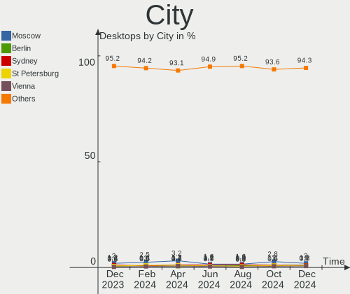
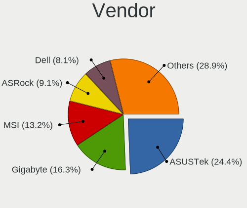
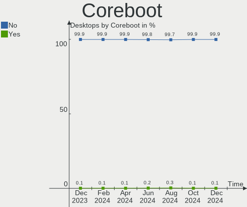

Linux Hardware Trends (Desktop)
-------------------------------

A project to identify most popular hardware characteristics and track their change
over time based on data collected by Linux users at https://Linux-Hardware.org.

Anyone can contribute to the study by uploading probes of their computers by
the [hw-probe](https://github.com/linuxhw/hw-probe) tool:

    sudo hw-probe -all -upload

Full-feature report is available here: https://linux-hardware.org/?view=trends&formfactor=desktop

Period: Nov, 2019.

Contents
--------

- [ OS                       ](#os)
- [ OS Family                ](#os-family)
- [ Kernel                   ](#kernel)
- [ Kernel Family            ](#kernel-family)
- [ Kernel Major Ver.        ](#kernel-major-ver)
- [ Arch                     ](#arch)
- [ DE                       ](#de)
- [ Display Server           ](#display-server)
- [ OS Lang                  ](#os-lang)
- [ Boot Mode                ](#boot-mode)
- [ Filesystem               ](#filesystem)
- [ Dual Boot with Linux     ](#dual-boot-with-linux)
- [ Dual Boot (Win)          ](#dual-boot-win)
- [ Country                  ](#country)
- [ City                     ](#city)
- [ Vendor                   ](#vendor)
- [ Model                    ](#model)
- [ Model Family             ](#model-family)
- [ MFG Year                 ](#mfg-year)
- [ Form Factor              ](#form-factor)
- [ Secure Boot              ](#secure-boot)
- [ Coreboot                 ](#coreboot)
- [ RAM Size                 ](#ram-size)
- [ RAM Used                 ](#ram-used)
- [ Drive Vendor             ](#drive-vendor)
- [ Drive Model              ](#drive-model)
- [ Drive Kind               ](#drive-kind)
- [ Drive Connector          ](#drive-connector)
- [ Drive Size               ](#drive-size)
- [ Space Total              ](#space-total)
- [ Space Used               ](#space-used)
- [ Malfunc. Drives          ](#malfunc-drives)
- [ Malfunc. Drive Vendor    ](#malfunc-drive-vendor)
- [ Malfunc. Drive Kind      ](#malfunc-drive-kind)
- [ Failed Drives            ](#failed-drives)
- [ Failed Drive Vendor      ](#failed-drive-vendor)
- [ Drive Status             ](#drive-status)
- [ CPU Vendor               ](#cpu-vendor)
- [ CPU Model                ](#cpu-model)
- [ CPU Model Family         ](#cpu-model-family)
- [ CPU Cores                ](#cpu-cores)
- [ CPU Sockets              ](#cpu-sockets)
- [ CPU Threads              ](#cpu-threads)
- [ CPU Op-Modes             ](#cpu-op-modes)
- [ CPU Microarch            ](#cpu-microarch)
- [ CPU Microcode            ](#cpu-microcode)
- [ GPU Vendor               ](#gpu-vendor)
- [ GPU Model                ](#gpu-model)
- [ GPU Combo                ](#gpu-combo)
- [ GPU Driver               ](#gpu-driver)
- [ GPU Memory               ](#gpu-memory)
- [ Monitor Vendor           ](#monitor-vendor)
- [ Monitor Model            ](#monitor-model)
- [ Monitor Resolution       ](#monitor-resolution)
- [ Monitor Diagonal         ](#monitor-diagonal)
- [ Monitor Width            ](#monitor-width)
- [ Aspect Ratio             ](#aspect-ratio)
- [ Monitor Area             ](#monitor-area)
- [ Pixel Density            ](#pixel-density)
- [ Multiple Monitors        ](#multiple-monitors)
- [ Net Controller Vendor    ](#net-controller-vendor)
- [ Net Controller Model     ](#net-controller-model)
- [ Net Controller Kind      ](#net-controller-kind)
- [ Used Controller          ](#used-controller)
- [ NICs                     ](#nics)
- [ Unsupported Devices      ](#unsupported-devices)
- [ Unsupported Device Types ](#unsupported-device-types)

OS
--

Installed operating systems

| Name                         | Computers | Percent |
|------------------------------|-----------|---------|
| Ubuntu 18.04                 | 222       | 28.28%  |
| ROSA R11                     | 130       | 16.56%  |
| Ubuntu 19.10                 | 99        | 12.61%  |
| Mint 19.2                    | 65        | 8.28%   |
| Ubuntu 19.04                 | 29        | 3.69%   |
| Fedora 31                    | 23        | 2.93%   |
| Ubuntu 16.04                 | 18        | 2.29%   |
| Zorin 15                     | 14        | 1.78%   |
| ROSA R8.1                    | 13        | 1.66%   |
| Fedora 30                    | 12        | 1.53%   |
| Endless 3.7.3                | 11        | 1.4%    |
| Arch                         | 9         | 1.15%   |
| Manjaro                      | 8         | 1.02%   |
| KDE neon 18.04               | 8         | 1.02%   |
| Debian 10                    | 7         | 0.89%   |
| Peppermint 10                | 6         | 0.76%   |
| CentOS 8                     | 6         | 0.76%   |
| ROSA R10                     | 5         | 0.64%   |
| Debian Testing               | 5         | 0.64%   |
| Debian                       | 5         | 0.64%   |
| ROSA R9                      | 4         | 0.51%   |
| Mint 19.1                    | 4         | 0.51%   |
| Mint 19                      | 4         | 0.51%   |
| Mint 18.3                    | 4         | 0.51%   |
| Endless 3.7.4                | 4         | 0.51%   |
| Zorin 12                     | 3         | 0.38%   |
| Ubuntu 20.04                 | 3         | 0.38%   |
| Ubuntu 18.10                 | 3         | 0.38%   |
| ROSA Nickel 2019.0           | 3         | 0.38%   |
| Manjaro 18.1.3               | 3         | 0.38%   |
| Debian Unstable              | 3         | 0.38%   |
| Clear Linux 31470            | 3         | 0.38%   |
| Arch Rolling                 | 3         | 0.38%   |
| ROSA R12                     | 2         | 0.25%   |
| Manjaro 18.1.2               | 2         | 0.25%   |
| Mageia 7                     | 2         | 0.25%   |
| Fedora 32                    | 2         | 0.25%   |
| Endless 3.6.0                | 2         | 0.25%   |
| antergos                     | 2         | 0.25%   |
| Ubuntu 17.10                 | 1         | 0.13%   |
| TTOS 1.1                     | 1         | 0.13%   |
| Solus 4.0                    | 1         | 0.13%   |
| RHEL 8.1                     | 1         | 0.13%   |
| RHEL 7.7                     | 1         | 0.13%   |
| RED X4                       | 1         | 0.13%   |
| Reborn OS                    | 1         | 0.13%   |
| Pop!_OS 19.10                | 1         | 0.13%   |
| Pop!_OS 18.04                | 1         | 0.13%   |
| openSUSE Tumbleweed-20191107 | 1         | 0.13%   |
| openSUSE Tumbleweed-20191101 | 1         | 0.13%   |
| openSUSE Leap-15.1           | 1         | 0.13%   |
| openSUSE 15.1                | 1         | 0.13%   |
| OpenMandriva 4.0             | 1         | 0.13%   |
| MX 18.3                      | 1         | 0.13%   |
| Kali 2019.4                  | 1         | 0.13%   |
| Gentoo                       | 1         | 0.13%   |
| Generic 30                   | 1         | 0.13%   |
| Freedesktop 18.08.37         | 1         | 0.13%   |
| Fedora 29                    | 1         | 0.13%   |
| Endless 3.6.2                | 1         | 0.13%   |

OS Family
---------

OS without a version

| Name         | Computers | Percent |
|--------------|-----------|---------|
| Ubuntu       | 375       | 47.77%  |
| ROSA         | 157       | 20%     |
| Mint         | 77        | 9.81%   |
| Fedora       | 38        | 4.84%   |
| Debian       | 21        | 2.68%   |
| Endless      | 20        | 2.55%   |
| Zorin        | 17        | 2.17%   |
| Manjaro      | 13        | 1.66%   |
| Arch         | 12        | 1.53%   |
| KDE neon     | 8         | 1.02%   |
| Clear Linux  | 7         | 0.89%   |
| CentOS       | 7         | 0.89%   |
| Peppermint   | 6         | 0.76%   |
| openSUSE     | 4         | 0.51%   |
| RHEL         | 2         | 0.25%   |
| Pop!_OS      | 2         | 0.25%   |
| Mageia       | 2         | 0.25%   |
| ClearOS      | 2         | 0.25%   |
| antergos     | 2         | 0.25%   |
| TTOS         | 1         | 0.13%   |
| Solus        | 1         | 0.13%   |
| RED          | 1         | 0.13%   |
| Reborn OS    | 1         | 0.13%   |
| OpenMandriva | 1         | 0.13%   |
| MX           | 1         | 0.13%   |
| Kali         | 1         | 0.13%   |
| Gentoo       | 1         | 0.13%   |
| Generic      | 1         | 0.13%   |
| Freedesktop  | 1         | 0.13%   |
| EndeavourOS  | 1         | 0.13%   |
| Arcolinux    | 1         | 0.13%   |
| ALT Linux    | 1         | 0.13%   |

Kernel
------

Version of the Linux kernel

| Version                          | Computers | Percent |
|----------------------------------|-----------|---------|
| 5.0.0-36-generic                 | 84        | 10.7%   |
| 5.0.0-32-generic                 | 69        | 8.79%   |
| 4.15.0-66-generic                | 64        | 8.15%   |
| 4.15.0-70-generic                | 63        | 8.03%   |
| 4.15.0-desktop-60.7rosa-x86_64   | 50        | 6.37%   |
| 5.3.0-19-generic                 | 42        | 5.35%   |
| 4.15.0-desktop-45.1rosa-x86_64   | 42        | 5.35%   |
| 5.3.0-23-generic                 | 41        | 5.22%   |
| 4.9.155-nrj-desktop-1rosa-x86_64 | 19        | 2.42%   |
| 5.0.0-23-generic                 | 13        | 1.66%   |
| 5.3.0-12-generic                 | 11        | 1.4%    |
| 4.15.0-desktop-45.1rosa-i586     | 11        | 1.4%    |
| 5.3.11-300.fc31.x86_64           | 10        | 1.27%   |
| 5.3.0-18-generic                 | 9         | 1.15%   |
| 4.15.0-54-generic                | 8         | 1.02%   |
| 5.3.8-300.fc31.x86_64            | 7         | 0.89%   |
| 5.0.0-34-generic                 | 7         | 0.89%   |
| 5.3.8-arch1-1                    | 6         | 0.76%   |
| 5.3.0-21-generic                 | 6         | 0.76%   |
| 5.0.0-35-generic                 | 6         | 0.76%   |
| 4.15.0-desktop-60.7rosa-i586     | 6         | 0.76%   |
| 4.18.0-80.11.2.el8_0.x86_64      | 5         | 0.64%   |
| 4.15.0-66-lowlatency             | 5         | 0.64%   |
| 5.3.8-200.fc30.x86_64            | 4         | 0.51%   |
| 5.3.7-200.fc30.x86_64            | 4         | 0.51%   |
| 5.3.0-22-generic                 | 4         | 0.51%   |
| 5.3.0-2-amd64                    | 4         | 0.51%   |
| 5.0.0-desktop-33.1rosa-x86_64    | 4         | 0.51%   |
| 4.9.60-nrj-desktop-1rosa-x86_64  | 4         | 0.51%   |
| 4.9.20-nrj-desktop-1rosa-x86_64  | 4         | 0.51%   |
| 4.15.0-29-generic                | 4         | 0.51%   |
| 5.3.7-301.fc31.x86_64            | 3         | 0.38%   |
| 5.3.11-200.fc30.x86_64           | 3         | 0.38%   |
| 5.3.11-1-MANJARO                 | 3         | 0.38%   |
| 5.3.0-24-generic                 | 3         | 0.38%   |
| 5.2.0-3-amd64                    | 3         | 0.38%   |
| 5.0.0-15-generic                 | 3         | 0.38%   |
| 4.4.0-166-generic                | 3         | 0.38%   |
| 4.19.0-6-amd64                   | 3         | 0.38%   |
| 4.18.0-25-generic                | 3         | 0.38%   |
| 4.15.0-69-generic                | 3         | 0.38%   |
| 5.3.9-863.native                 | 2         | 0.25%   |
| 5.3.9-300.fc31.x86_64            | 2         | 0.25%   |
| 5.3.8-854.native                 | 2         | 0.25%   |
| 5.3.8-3-MANJARO                  | 2         | 0.25%   |
| 5.3.7-desktop-4.mga7             | 2         | 0.25%   |
| 5.3.7-2-MANJARO                  | 2         | 0.25%   |
| 5.3.11-arch1-1                   | 2         | 0.25%   |
| 5.0.0-37-generic                 | 2         | 0.25%   |
| 5.0.0-29-generic                 | 2         | 0.25%   |
| 4.9.9-nrj-desktop-1rosa-x86_64   | 2         | 0.25%   |
| 4.4.0-169-generic                | 2         | 0.25%   |
| 4.15.0-desktop-65.4rosa-x86_64   | 2         | 0.25%   |
| 4.15.0-64-generic                | 2         | 0.25%   |
| 4.15.0-22-generic                | 2         | 0.25%   |
| 4.15.0-20-generic                | 2         | 0.25%   |
| 4.12.14-lp151.28.32-default      | 2         | 0.25%   |
| 4.10.0-38-generic                | 2         | 0.25%   |
| 4.1.38-nrj-desktop-2rosa-x86_64  | 2         | 0.25%   |
| 3.10.0-1062.1.2.el7.x86_64       | 2         | 0.25%   |

Kernel Family
-------------

Linux kernel without a distro release

| Version  | Computers | Percent |
|----------|-----------|---------|
| 4.15.0   | 281       | 35.8%   |
| 5.0.0    | 198       | 25.22%  |
| 5.3.0    | 129       | 16.43%  |
| 5.3.8    | 24        | 3.06%   |
| 5.3.11   | 20        | 2.55%   |
| 4.9.155  | 19        | 2.42%   |
| 5.3.7    | 16        | 2.04%   |
| 4.18.0   | 11        | 1.4%    |
| 4.4.0    | 9         | 1.15%   |
| 4.19.0   | 7         | 0.89%   |
| 5.4.0    | 4         | 0.51%   |
| 5.3.9    | 4         | 0.51%   |
| 5.3.12   | 4         | 0.51%   |
| 4.9.60   | 4         | 0.51%   |
| 4.9.20   | 4         | 0.51%   |
| 3.10.0   | 4         | 0.51%   |
| 5.3.10   | 3         | 0.38%   |
| 5.2.0    | 3         | 0.38%   |
| 4.9.9    | 3         | 0.38%   |
| 4.13.0   | 3         | 0.38%   |
| 4.1.38   | 3         | 0.38%   |
| 5.3.6    | 2         | 0.25%   |
| 5.2.21   | 2         | 0.25%   |
| 5.0.21   | 2         | 0.25%   |
| 4.9.0    | 2         | 0.25%   |
| 4.19.81  | 2         | 0.25%   |
| 4.12.14  | 2         | 0.25%   |
| 4.10.0   | 2         | 0.25%   |
| 5.4.1    | 1         | 0.13%   |
| 5.3.5    | 1         | 0.13%   |
| 5.3.13   | 1         | 0.13%   |
| 5.2.6    | 1         | 0.13%   |
| 5.2.20   | 1         | 0.13%   |
| 5.2.15   | 1         | 0.13%   |
| 5.1.2    | 1         | 0.13%   |
| 5.1.0    | 1         | 0.13%   |
| 5.0.9    | 1         | 0.13%   |
| 4.9.124  | 1         | 0.13%   |
| 4.8.13   | 1         | 0.13%   |
| 4.4.74   | 1         | 0.13%   |
| 4.19.85  | 1         | 0.13%   |
| 4.19.82  | 1         | 0.13%   |
| 4.19.79  | 1         | 0.13%   |
| 4.19.49  | 1         | 0.13%   |
| 4.14.151 | 1         | 0.13%   |
| 3.13.0   | 1         | 0.13%   |

Kernel Major Ver.
-----------------

Linux kernel major version

| Version | Computers | Percent |
|---------|-----------|---------|
| 4.15    | 281       | 35.8%   |
| 5.3     | 204       | 25.99%  |
| 5.0     | 201       | 25.61%  |
| 4.9     | 33        | 4.2%    |
| 4.19    | 13        | 1.66%   |
| 4.18    | 11        | 1.4%    |
| 4.4     | 10        | 1.27%   |
| 5.2     | 8         | 1.02%   |
| 5.4     | 5         | 0.64%   |
| 3.10    | 4         | 0.51%   |
| 4.13    | 3         | 0.38%   |
| 4.1     | 3         | 0.38%   |
| 5.1     | 2         | 0.25%   |
| 4.12    | 2         | 0.25%   |
| 4.10    | 2         | 0.25%   |
| 4.8     | 1         | 0.13%   |
| 4.14    | 1         | 0.13%   |
| 3.13    | 1         | 0.13%   |

Arch
----

OS architecture (x86_64, i586, etc.)

| Name   | Computers | Percent |
|--------|-----------|---------|
| x86_64 | 723       | 92.1%   |
| i686   | 62        | 7.9%    |

DE
--

Desktop Environment

| Name            | Computers | Percent |
|-----------------|-----------|---------|
| Unknown         | 249       | 31.72%  |
| GNOME           | 226       | 28.79%  |
| KDE5            | 156       | 19.87%  |
| XFCE            | 46        | 5.86%   |
| X-Cinnamon      | 34        | 4.33%   |
| MATE            | 20        | 2.55%   |
| KDE             | 20        | 2.55%   |
| Cinnamon        | 10        | 1.27%   |
| Unity           | 9         | 1.15%   |
| LXDE            | 6         | 0.76%   |
| LXQt            | 3         | 0.38%   |
| Deepin          | 2         | 0.25%   |
| Budgie          | 2         | 0.25%   |
| GNOME Flashback | 1         | 0.13%   |
| Enlightenment   | 1         | 0.13%   |

Display Server
--------------

X11 or Wayland

| Name    | Computers | Percent |
|---------|-----------|---------|
| Unknown | 501       | 63.82%  |
| X11     | 266       | 33.89%  |
| Wayland | 16        | 2.04%   |
| Tty     | 2         | 0.25%   |

OS Lang
-------

Language

| Lang       | Computers | Percent |
|------------|-----------|---------|
| Unknown    | 510       | 64.97%  |
| en_US      | 79        | 10.06%  |
| de_DE      | 40        | 5.1%    |
| pt_BR      | 20        | 2.55%   |
| fr_FR      | 15        | 1.91%   |
| en_GB      | 15        | 1.91%   |
| es_ES      | 12        | 1.53%   |
| ru_RU      | 11        | 1.4%    |
| it_IT      | 11        | 1.4%    |
| en_CA      | 7         | 0.89%   |
| en_AU      | 6         | 0.76%   |
| en_US.utf8 | 5         | 0.64%   |
| C          | 5         | 0.64%   |
| nl_NL      | 4         | 0.51%   |
| hu_HU      | 4         | 0.51%   |
| ro_RO      | 3         | 0.38%   |
| es_AR      | 3         | 0.38%   |
| cs_CZ      | 3         | 0.38%   |
| zh_CN      | 2         | 0.25%   |
| sl_SI      | 2         | 0.25%   |
| pt_PT      | 2         | 0.25%   |
| ja_JP      | 2         | 0.25%   |
| es_MX      | 2         | 0.25%   |
| en_ZA      | 2         | 0.25%   |
| en_IN      | 2         | 0.25%   |
| zh_TW      | 1         | 0.13%   |
| tr_TR      | 1         | 0.13%   |
| th_TH      | 1         | 0.13%   |
| ru_UA      | 1         | 0.13%   |
| pl_PL      | 1         | 0.13%   |
| nl_BE      | 1         | 0.13%   |
| nb_NO      | 1         | 0.13%   |
| hr_HR      | 1         | 0.13%   |
| fr_CH      | 1         | 0.13%   |
| fi_FI      | 1         | 0.13%   |
| es_UY      | 1         | 0.13%   |
| es_PE      | 1         | 0.13%   |
| en_IE      | 1         | 0.13%   |
| el_GR      | 1         | 0.13%   |
| de_CH      | 1         | 0.13%   |
| da_DK      | 1         | 0.13%   |
| ca_ES      | 1         | 0.13%   |
| bg_BG      | 1         | 0.13%   |

Boot Mode
---------

EFI or BIOS

| Mode | Computers | Percent |
|------|-----------|---------|
| BIOS | 550       | 70.06%  |
| EFI  | 235       | 29.94%  |

Filesystem
----------

Type of filesystem

| Type    | Computers | Percent |
|---------|-----------|---------|
| Ext4    | 728       | 92.74%  |
| Overlay | 18        | 2.29%   |
| Btrfs   | 17        | 2.17%   |
| Xfs     | 15        | 1.91%   |
| Ext3    | 3         | 0.38%   |
| Zfs     | 1         | 0.13%   |
| Jfs     | 1         | 0.13%   |
| Ext2    | 1         | 0.13%   |
| Unknown | 1         | 0.13%   |

Dual Boot with Linux
--------------------

Hosting more than one Linux

| Dual boot | Computers | Percent |
|-----------|-----------|---------|
| No        | 666       | 84.84%  |
| Yes       | 119       | 15.16%  |

Dual Boot (Win)
---------------

Hosting Linux and Windows

| Dual boot | Computers | Percent |
|-----------|-----------|---------|
| No        | 516       | 65.73%  |
| Yes       | 269       | 34.27%  |

Country
-------

Geographic location (country)

| Country                   | Computers | Percent |
|---------------------------|-----------|---------|
| Russia                    | 164       | 20.89%  |
| USA                       | 108       | 13.76%  |
| Germany                   | 88        | 11.21%  |
| Brazil                    | 51        | 6.5%    |
| Italy                     | 42        | 5.35%   |
| Spain                     | 32        | 4.08%   |
| France                    | 32        | 4.08%   |
| UK                        | 31        | 3.95%   |
| Canada                    | 20        | 2.55%   |
| Netherlands               | 17        | 2.17%   |
| Australia                 | 17        | 2.17%   |
| Ukraine                   | 13        | 1.66%   |
| Poland                    | 13        | 1.66%   |
| Belarus                   | 11        | 1.4%    |
| Romania                   | 9         | 1.15%   |
| Portugal                  | 9         | 1.15%   |
| Czech Republic            | 9         | 1.15%   |
| Argentina                 | 8         | 1.02%   |
| Hungary                   | 7         | 0.89%   |
| Slovakia                  | 6         | 0.76%   |
| China                     | 6         | 0.76%   |
| Bulgaria                  | 6         | 0.76%   |
| Belgium                   | 6         | 0.76%   |
| Switzerland               | 5         | 0.64%   |
| Serbia                    | 5         | 0.64%   |
| India                     | 5         | 0.64%   |
| Turkey                    | 4         | 0.51%   |
| Sweden                    | 4         | 0.51%   |
| New Zealand               | 4         | 0.51%   |
| Mexico                    | 4         | 0.51%   |
| Finland                   | 4         | 0.51%   |
| Slovenia                  | 3         | 0.38%   |
| Norway                    | 3         | 0.38%   |
| Japan                     | 3         | 0.38%   |
| Austria                   | 3         | 0.38%   |
| South Africa              | 2         | 0.25%   |
| Singapore                 | 2         | 0.25%   |
| Malaysia                  | 2         | 0.25%   |
| Iran, Islamic Republic of | 2         | 0.25%   |
| Greece                    | 2         | 0.25%   |
| Denmark                   | 2         | 0.25%   |
| Croatia                   | 2         | 0.25%   |
| Vietnam                   | 1         | 0.13%   |
| Venezuela                 | 1         | 0.13%   |
| Uruguay                   | 1         | 0.13%   |
| Thailand                  | 1         | 0.13%   |
| Taiwan                    | 1         | 0.13%   |
| Philippines               | 1         | 0.13%   |
| Peru                      | 1         | 0.13%   |
| Morocco                   | 1         | 0.13%   |
| Luxembourg                | 1         | 0.13%   |
| Lithuania                 | 1         | 0.13%   |
| Israel                    | 1         | 0.13%   |
| Ireland                   | 1         | 0.13%   |
| Iceland                   | 1         | 0.13%   |
| Estonia                   | 1         | 0.13%   |
| Egypt                     | 1         | 0.13%   |
| Dominican Republic        | 1         | 0.13%   |
| Colombia                  | 1         | 0.13%   |
| Chile                     | 1         | 0.13%   |

City
----

Geographic location (city)

| City                   | Computers | Percent |
|------------------------|-----------|---------|
| Moscow                 | 29        | 3.69%   |
| St Petersburg          | 10        | 1.27%   |
| São Paulo             | 8         | 1.02%   |
| Yekaterinburg          | 6         | 0.76%   |
| Madrid                 | 6         | 0.76%   |
| Frankfurt am Main      | 6         | 0.76%   |
| Berlin                 | 6         | 0.76%   |
| Warsaw                 | 5         | 0.64%   |
| Wahroonga              | 5         | 0.64%   |
| Rostov-on-Don          | 5         | 0.64%   |
| Rome                   | 5         | 0.64%   |
| Novosibirsk            | 5         | 0.64%   |
| Munich                 | 5         | 0.64%   |
| Krasnodar              | 5         | 0.64%   |
| Voronezh               | 4         | 0.51%   |
| Vitebsk                | 4         | 0.51%   |
| Samara                 | 4         | 0.51%   |
| Perm                   | 4         | 0.51%   |
| Gladbeck               | 4         | 0.51%   |
| Calgary                | 4         | 0.51%   |
| Villingen-Schwenningen | 3         | 0.38%   |
| Twickenham             | 3         | 0.38%   |
| Sofia                  | 3         | 0.38%   |
| Severodvinsk           | 3         | 0.38%   |
| Prague                 | 3         | 0.38%   |
| Porto Alegre           | 3         | 0.38%   |
| Nuremberg              | 3         | 0.38%   |
| Nizhniy Novgorod       | 3         | 0.38%   |
| Minsk                  | 3         | 0.38%   |
| Lisbon                 | 3         | 0.38%   |
| Kyiv                   | 3         | 0.38%   |
| Hamburg                | 3         | 0.38%   |
| Genoa                  | 3         | 0.38%   |
| Curitiba               | 3         | 0.38%   |
| Cologne                | 3         | 0.38%   |
| Chelyabinsk            | 3         | 0.38%   |
| Bucharest              | 3         | 0.38%   |
| Bristol                | 3         | 0.38%   |
| Bologna                | 3         | 0.38%   |
| Abakan                 | 3         | 0.38%   |
| Zurich                 | 2         | 0.25%   |
| Zaragoza               | 2         | 0.25%   |
| Votuporanga            | 2         | 0.25%   |
| Volgograd              | 2         | 0.25%   |
| Vinnytsia              | 2         | 0.25%   |
| Vienna                 | 2         | 0.25%   |
| Valencia               | 2         | 0.25%   |
| The Hague              | 2         | 0.25%   |
| Tehran                 | 2         | 0.25%   |
| Tampere                | 2         | 0.25%   |
| Taganrog               | 2         | 0.25%   |
| São Carlos            | 2         | 0.25%   |
| Surgut                 | 2         | 0.25%   |
| Strasbourg             | 2         | 0.25%   |
| Stockholm              | 2         | 0.25%   |
| Stavropol              | 2         | 0.25%   |
| Smolensk               | 2         | 0.25%   |
| Seattle                | 2         | 0.25%   |
| Sao Goncalo            | 2         | 0.25%   |
| Saint-Laurent-d'Agny   | 2         | 0.25%   |

Vendor
------

Motherboard manufacturer

| Name                | Computers | Percent |
|---------------------|-----------|---------|
| ASUSTek Computer    | 217       | 27.64%  |
| Gigabyte Technology | 144       | 18.34%  |
| ASRock              | 90        | 11.46%  |
| MSI                 | 84        | 10.7%   |
| Dell                | 53        | 6.75%   |
| Hewlett-Packard     | 46        | 5.86%   |
| Acer                | 24        | 3.06%   |
| Intel               | 23        | 2.93%   |
| Lenovo              | 14        | 1.78%   |
| ECS                 | 10        | 1.27%   |
| Fujitsu             | 9         | 1.15%   |
| Foxconn             | 9         | 1.15%   |
| Pegatron            | 7         | 0.89%   |
| Biostar             | 7         | 0.89%   |
| Unknown             | 6         | 0.76%   |
| Medion              | 4         | 0.51%   |
| eMachines           | 4         | 0.51%   |
| Packard Bell        | 3         | 0.38%   |
| Wistron             | 2         | 0.25%   |
| WinFast             | 2         | 0.25%   |
| Shuttle             | 2         | 0.25%   |
| Positivo            | 2         | 0.25%   |
| PCWare              | 2         | 0.25%   |
| IBM                 | 2         | 0.25%   |
| Alienware           | 2         | 0.25%   |
| ZOTAC               | 1         | 0.13%   |
| WINCOR NIXDORF      | 1         | 0.13%   |
| Supermicro          | 1         | 0.13%   |
| SiS Technology      | 1         | 0.13%   |
| Qbex                | 1         | 0.13%   |
| PCChips             | 1         | 0.13%   |
| OEM                 | 1         | 0.13%   |
| NEC Computers       | 1         | 0.13%   |
| Megaware            | 1         | 0.13%   |
| Login Informatica   | 1         | 0.13%   |
| Login               | 1         | 0.13%   |
| K-Systems           | 1         | 0.13%   |
| JW Technology       | 1         | 0.13%   |
| iEi                 | 1         | 0.13%   |
| HARDKERNEL          | 1         | 0.13%   |
| Gateway             | 1         | 0.13%   |
| Fujitsu Siemens     | 1         | 0.13%   |

Model
-----

Motherboard model

| Name                            | Computers | Percent |
|---------------------------------|-----------|---------|
| All Series                      | 22        | 2.8%    |
| Unknown                         | 7         | 0.89%   |
| PRIME A320M-K                   | 4         | 0.51%   |
| OptiPlex 745                    | 4         | 0.51%   |
| MS-7C02                         | 4         | 0.51%   |
| MS-7A38                         | 4         | 0.51%   |
| MS-7A34                         | 4         | 0.51%   |
| M5A97 R2.0                      | 4         | 0.51%   |
| H61M-K                          | 4         | 0.51%   |
| G31M-ES2L                       | 4         | 0.51%   |
| B450M S2H                       | 4         | 0.51%   |
| 970 Pro3 R2.0                   | 4         | 0.51%   |
| PRIME X370-PRO                  | 3         | 0.38%   |
| PRIME B350-PLUS                 | 3         | 0.38%   |
| P8H77-V LE                      | 3         | 0.38%   |
| P8H67                           | 3         | 0.38%   |
| P5Q                             | 3         | 0.38%   |
| OptiPlex 960                    | 3         | 0.38%   |
| OptiPlex 9020                   | 3         | 0.38%   |
| OptiPlex 760                    | 3         | 0.38%   |
| OptiPlex 755                    | 3         | 0.38%   |
| OptiPlex 3020                   | 3         | 0.38%   |
| MS-7693                         | 3         | 0.38%   |
| M5A78L-M/USB3                   | 3         | 0.38%   |
| M5A78L-M LX3                    | 3         | 0.38%   |
| M2N-MX SE Plus                  | 3         | 0.38%   |
| H81M-S2H                        | 3         | 0.38%   |
| H61M-A/BR                       | 3         | 0.38%   |
| H110M-S2H                       | 3         | 0.38%   |
| G41C-GS                         | 3         | 0.38%   |
| EliteDesk 800 G1 SFF            | 3         | 0.38%   |
| Compaq dc5800 Small Form Factor | 3         | 0.38%   |
| B75M-D3H                        | 3         | 0.38%   |
| B450M Pro4                      | 3         | 0.38%   |
| B450 AORUS M                    | 3         | 0.38%   |
| 970A-DS3P                       | 3         | 0.38%   |
| Z77P-D3                         | 2         | 0.25%   |
| Z77 Extreme4                    | 2         | 0.25%   |
| Z420 Workstation                | 2         | 0.25%   |
| Z170-A                          | 2         | 0.25%   |
| XPS 8930                        | 2         | 0.25%   |
| X570 AORUS PRO WIFI             | 2         | 0.25%   |
| Veriton N282G                   | 2         | 0.25%   |
| Veriton L4610G                  | 2         | 0.25%   |
| ROG STRIX B450-I GAMING         | 2         | 0.25%   |
| ProLiant ML110 G6               | 2         | 0.25%   |
| PRIME Z270-P                    | 2         | 0.25%   |
| Precision WorkStation T3500     | 2         | 0.25%   |
| POS-EIH61CE                     | 2         | 0.25%   |
| P8Z77-V LX                      | 2         | 0.25%   |
| P8H77-M PRO                     | 2         | 0.25%   |
| P8H61-M LX3 R2.0                | 2         | 0.25%   |
| P8H61-M LX2                     | 2         | 0.25%   |
| P7H55-M                         | 2         | 0.25%   |
| P6T SE                          | 2         | 0.25%   |
| P5K PRO                         | 2         | 0.25%   |
| P5K                             | 2         | 0.25%   |
| P5G41T-M LX2/GB                 | 2         | 0.25%   |
| P5B-Deluxe                      | 2         | 0.25%   |
| P35-DS4                         | 2         | 0.25%   |

Model Family
------------

Motherboard model prefix

| Name                   | Computers | Percent |
|------------------------|-----------|---------|
| Dell OptiPlex          | 31        | 3.95%   |
| ASUS All               | 22        | 2.8%    |
| ASUS PRIME             | 21        | 2.68%   |
| HP Compaq              | 18        | 2.29%   |
| Acer Aspire            | 12        | 1.53%   |
| ASUS M5A78L-M          | 11        | 1.4%    |
| Lenovo ThinkCentre     | 10        | 1.27%   |
| Acer Veriton           | 8         | 1.02%   |
| Unknown                | 8         | 1.02%   |
| HP EliteDesk           | 7         | 0.89%   |
| ASUS P8H61-M           | 7         | 0.89%   |
| ASUS M5A97             | 7         | 0.89%   |
| Gigabyte B450          | 6         | 0.76%   |
| Fujitsu ESPRIMO        | 6         | 0.76%   |
| Dell Precision         | 6         | 0.76%   |
| Dell Inspiron          | 6         | 0.76%   |
| ASUS ROG               | 6         | 0.76%   |
| ASRock 970             | 6         | 0.76%   |
| Gigabyte GA-78LMT-USB3 | 5         | 0.64%   |
| Gigabyte B450M         | 5         | 0.64%   |
| ASUS P5K               | 5         | 0.64%   |
| ASRock B450M           | 5         | 0.64%   |
| MSI MS-7C02            | 4         | 0.51%   |
| MSI MS-7A38            | 4         | 0.51%   |
| MSI MS-7A34            | 4         | 0.51%   |
| HP ProDesk             | 4         | 0.51%   |
| Gigabyte Z390          | 4         | 0.51%   |
| Gigabyte G31M-ES2L     | 4         | 0.51%   |
| Dell XPS               | 4         | 0.51%   |
| ASUS P5Q               | 4         | 0.51%   |
| ASUS P5G41T-M          | 4         | 0.51%   |
| ASUS M2N-MX            | 4         | 0.51%   |
| ASUS H61M-K            | 4         | 0.51%   |
| ASRock Z77             | 4         | 0.51%   |
| Packard Bell iMedia    | 3         | 0.38%   |
| MSI MS-7693            | 3         | 0.38%   |
| HP ProLiant            | 3         | 0.38%   |
| Gigabyte H81M-S2H      | 3         | 0.38%   |
| Gigabyte H110M-S2H     | 3         | 0.38%   |
| Gigabyte B75M-D3H      | 3         | 0.38%   |
| Gigabyte 970A-DS3P     | 3         | 0.38%   |
| ASUS TUF               | 3         | 0.38%   |
| ASUS P8Z77-V           | 3         | 0.38%   |
| ASUS P8H77-V           | 3         | 0.38%   |
| ASUS P8H67             | 3         | 0.38%   |
| ASUS P6T               | 3         | 0.38%   |
| ASUS H61M-A            | 3         | 0.38%   |
| ASRock X470            | 3         | 0.38%   |
| ASRock G41C-GS         | 3         | 0.38%   |
| ASRock 990FX           | 3         | 0.38%   |
| Wistron ProLiant       | 2         | 0.25%   |
| Positivo POS-EIH61CE   | 2         | 0.25%   |
| Pegatron IPMSB-H61     | 2         | 0.25%   |
| MSI MS-7C37            | 2         | 0.25%   |
| MSI MS-7B79            | 2         | 0.25%   |
| MSI MS-7A33            | 2         | 0.25%   |
| MSI MS-7996            | 2         | 0.25%   |
| MSI MS-7971            | 2         | 0.25%   |
| MSI MS-7850            | 2         | 0.25%   |
| MSI MS-7758            | 2         | 0.25%   |

MFG Year
--------

Motherboard manufacture year

| Year    | Computers | Percent |
|---------|-----------|---------|
| 2019    | 90        | 11.46%  |
| 2012    | 82        | 10.45%  |
| 2018    | 80        | 10.19%  |
| 2010    | 69        | 8.79%   |
| 2013    | 68        | 8.66%   |
| 2014    | 65        | 8.28%   |
| 2011    | 54        | 6.88%   |
| 2009    | 48        | 6.11%   |
| 2015    | 44        | 5.61%   |
| 2008    | 43        | 5.48%   |
| 2016    | 42        | 5.35%   |
| 2017    | 33        | 4.2%    |
| 2007    | 32        | 4.08%   |
| 2006    | 17        | 2.17%   |
| 2005    | 7         | 0.89%   |
| 2003    | 4         | 0.51%   |
| 2004    | 2         | 0.25%   |
| 2001    | 2         | 0.25%   |
| Unknown | 2         | 0.25%   |
| 2002    | 1         | 0.13%   |

Form Factor
-----------

Physical design of the computer

| Name    | Computers | Percent |
|---------|-----------|---------|
| Desktop | 785       | 100%    |

Secure Boot
-----------

Enabled or disabled

| State    | Computers | Percent |
|----------|-----------|---------|
| Disabled | 766       | 97.58%  |
| Enabled  | 19        | 2.42%   |

Coreboot
--------

Have coreboot on board

| Used | Computers | Percent |
|------|-----------|---------|
| No   | 785       | 100%    |

RAM Size
--------

Total RAM memory

| Size in GB  | Computers | Percent |
|-------------|-----------|---------|
| 8.01-16.0   | 197       | 25.1%   |
| 3.01-4.0    | 196       | 24.97%  |
| 16.01-24.0  | 136       | 17.32%  |
| 4.01-8.0    | 99        | 12.61%  |
| 1.01-2.0    | 57        | 7.26%   |
| 32.01-64.0  | 46        | 5.86%   |
| 2.01-3.0    | 19        | 2.42%   |
| 64.01-256.0 | 16        | 2.04%   |
| 24.01-32.0  | 12        | 1.53%   |
| 0.01-1.0    | 6         | 0.76%   |
| Unknown     | 1         | 0.13%   |

RAM Used
--------

Used RAM memory

| Used GB    | Computers | Percent |
|------------|-----------|---------|
| 1.01-2.0   | 321       | 40.89%  |
| 2.01-3.0   | 175       | 22.29%  |
| 0.01-1.0   | 153       | 19.49%  |
| 4.01-8.0   | 59        | 7.52%   |
| 3.01-4.0   | 58        | 7.39%   |
| 8.01-16.0  | 14        | 1.78%   |
| Unknown    | 2         | 0.25%   |
| 32.01-64.0 | 1         | 0.13%   |
| 24.01-32.0 | 1         | 0.13%   |
| 16.01-24.0 | 1         | 0.13%   |

Drive Vendor
------------

Hard drive vendors

| Vendor              | Computers | Drives | Percent |
|---------------------|-----------|--------|---------|
| Seagate             | 294       | 360    | 23.31%  |
| WDC                 | 287       | 353    | 22.76%  |
| Samsung Electronics | 162       | 184    | 12.85%  |
| Toshiba             | 93        | 101    | 7.38%   |
| Hitachi             | 68        | 72     | 5.39%   |
| Kingston            | 66        | 69     | 5.23%   |
| SanDisk             | 45        | 47     | 3.57%   |
| Crucial             | 37        | 38     | 2.93%   |
| Maxtor              | 22        | 23     | 1.74%   |
| Intel               | 22        | 22     | 1.74%   |
| OCZ                 | 14        | 14     | 1.11%   |
| China               | 14        | 15     | 1.11%   |
| Transcend           | 11        | 11     | 0.87%   |
| PLEXTOR             | 11        | 12     | 0.87%   |
| SPCC                | 10        | 10     | 0.79%   |
| A-DATA Technology   | 8         | 8      | 0.63%   |
| HGST                | 7         | 7      | 0.56%   |
| Generic             | 7         | 7      | 0.56%   |
| Corsair             | 7         | 7      | 0.56%   |
| Patriot             | 5         | 5      | 0.4%    |
| Micron Technology   | 5         | 5      | 0.4%    |
| Intenso             | 4         | 4      | 0.32%   |
| GOODRAM             | 4         | 5      | 0.32%   |
| Apacer              | 4         | 4      | 0.32%   |
| Team                | 3         | 3      | 0.24%   |
| PNY                 | 3         | 3      | 0.24%   |
| JMicron             | 3         | 3      | 0.24%   |
| Hewlett-Packard     | 3         | 4      | 0.24%   |
| Gigabyte Technology | 3         | 3      | 0.24%   |
| ASMT                | 3         | 3      | 0.24%   |
| USB30               | 2         | 2      | 0.16%   |
| Unknown             | 2         | 2      | 0.16%   |
| SK Hynix            | 2         | 2      | 0.16%   |
| LITEONIT            | 2         | 2      | 0.16%   |
| LITEON              | 2         | 2      | 0.16%   |
| KingSpec            | 2         | 2      | 0.16%   |
| KingDian            | 2         | 2      | 0.16%   |
| Fujitsu             | 2         | 2      | 0.16%   |
| Vi550               | 1         | 1      | 0.08%   |
| Verbatim            | 1         | 1      | 0.08%   |
| USB                 | 1         | 1      | 0.08%   |
| TO Exter            | 1         | 1      | 0.08%   |
| Oyen                | 1         | 1      | 0.08%   |
| OCZ-VERTEX          | 1         | 1      | 0.08%   |
| Mushkin             | 1         | 1      | 0.08%   |
| Lexar               | 1         | 1      | 0.08%   |
| ICY BOX             | 1         | 1      | 0.08%   |
| IBM/Hitachi         | 1         | 1      | 0.08%   |
| HyperX              | 1         | 1      | 0.08%   |
| HUAWEI              | 1         | 1      | 0.08%   |
| faspeed             | 1         | 1      | 0.08%   |
| ExcelStor           | 1         | 1      | 0.08%   |
| DREVO               | 1         | 1      | 0.08%   |
| Biostar             | 1         | 1      | 0.08%   |
| ASMT109x            | 1         | 1      | 0.08%   |
| ASMedia             | 1         | 1      | 0.08%   |
| Apple               | 1         | 1      | 0.08%   |
| AMD                 | 1         | 1      | 0.08%   |

Drive Model
-----------

Hard drive models

| Model                    | Computers | Percent |
|--------------------------|-----------|---------|
| ST500DM002-1BD142 500GB  | 27        | 1.88%   |
| DT01ACA050 500GB         | 23        | 1.6%    |
| ST1000DM010-2EP102 1TB   | 17        | 1.18%   |
| SSD 850 EVO 250GB        | 17        | 1.18%   |
| SA400S37120G 120GB SSD   | 15        | 1.04%   |
| ST3500418AS 500GB        | 14        | 0.97%   |
| DT01ACA100 1TB           | 14        | 0.97%   |
| DT01ACA200 2TB           | 13        | 0.9%    |
| WD10EZEX-08WN4A0 1TB     | 11        | 0.77%   |
| SSD 850 EVO 500GB        | 11        | 0.77%   |
| SV300S37A120G 120GB SSD  | 10        | 0.7%    |
| WD20EZRZ-00Z5HB0 2TB     | 9         | 0.63%   |
| ST3500413AS 500GB        | 9         | 0.63%   |
| ST1000DM003-1ER162 1TB   | 9         | 0.63%   |
| ST1000DM003-1CH162 1TB   | 9         | 0.63%   |
| SSD 860 EVO 250GB        | 9         | 0.63%   |
| SDSSDA240G 240GB         | 9         | 0.63%   |
| HDWD110 1TB              | 9         | 0.63%   |
| ST1000DM003-9YN162 1TB   | 8         | 0.56%   |
| SSD 840 EVO 250GB        | 8         | 0.56%   |
| SA400S37240G 240GB SSD   | 8         | 0.56%   |
| WD40EFRX-68N32N0 4TB     | 7         | 0.49%   |
| WD10EZEX-22MFCA0 1TB     | 7         | 0.49%   |
| ST31000524AS 1TB         | 7         | 0.49%   |
| ST2000DM008-2FR102 2TB   | 7         | 0.49%   |
| ST1000DM003-1SB102 1TB   | 7         | 0.49%   |
| SSD 840 EVO 120GB        | 7         | 0.49%   |
| Solid State Disk 128GB   | 7         | 0.49%   |
| Expansion 500GB          | 7         | 0.49%   |
| WD5000AAKX-00ERMA0 500GB | 6         | 0.42%   |
| WD20EFRX-68EUZN0 2TB     | 6         | 0.42%   |
| WD10EARS-00Y5B1 1TB      | 6         | 0.42%   |
| ST4000DM004-2CV104 4TB   | 6         | 0.42%   |
| ST3250410AS 250GB        | 6         | 0.42%   |
| ST3160815AS 160GB        | 6         | 0.42%   |
| ST3160318AS 160GB        | 6         | 0.42%   |
| ST31000528AS 1TB         | 6         | 0.42%   |
| ST250DM000-1BD141 250GB  | 6         | 0.42%   |
| ST2000DX002-2DV164 2TB   | 6         | 0.42%   |
| SSD 860 EVO 1TB          | 6         | 0.42%   |
| SD/MMC/MS PRO 128GB      | 6         | 0.42%   |
| SATA 120GB SSD           | 6         | 0.42%   |
| HDWD120 2TB              | 6         | 0.42%   |
| HDS721010DLE630 1TB      | 6         | 0.42%   |
| HD322HJ 320GB            | 6         | 0.42%   |
| CT120BX500SSD1 120GB     | 6         | 0.42%   |
| WD5000AADS-00S9B0 500GB  | 5         | 0.35%   |
| WD10EZRZ-00HTKB0 1TB     | 5         | 0.35%   |
| ST380815AS 80GB          | 5         | 0.35%   |
| ST3500312CS 500GB        | 5         | 0.35%   |
| ST2000DM006-2DM164 2TB   | 5         | 0.35%   |
| ST2000DM001-1ER164 2TB   | 5         | 0.35%   |
| ST2000DM001-1CH164 2TB   | 5         | 0.35%   |
| SSD 840 Series 250GB     | 5         | 0.35%   |
| SA400S37480G 480GB SSD   | 5         | 0.35%   |
| HD160JJ 160GB            | 5         | 0.35%   |
| HD154UI 1TB              | 5         | 0.35%   |
| DT01ACA300 3TB           | 5         | 0.35%   |
| CT250MX500SSD1 250GB     | 5         | 0.35%   |
| WD5000AAKX-001CA0 500GB  | 4         | 0.28%   |

Drive Kind
----------

HDD or SSD

| Kind    | Computers | Drives | Percent |
|---------|-----------|--------|---------|
| HDD     | 642       | 964    | 62.76%  |
| SSD     | 339       | 429    | 33.14%  |
| Unknown | 28        | 30     | 2.74%   |
| NVMe    | 14        | 15     | 1.37%   |

Drive Connector
---------------

SATA, SAS, NVMe, etc.

| Type | Computers | Drives | Percent |
|------|-----------|--------|---------|
| SATA | 765       | 1372   | 92.5%   |
| SAS  | 48        | 51     | 5.8%    |
| NVMe | 14        | 15     | 1.69%   |

Drive Size
----------

Size of hard drive

| Size in TB | Computers | Drives | Percent |
|------------|-----------|--------|---------|
| 0.01-0.5   | 646       | 924    | 59.43%  |
| 0.51-1.0   | 263       | 318    | 24.2%   |
| 1.01-2.0   | 108       | 121    | 9.94%   |
| 3.01-4.0   | 36        | 38     | 3.31%   |
| 2.01-3.0   | 20        | 21     | 1.84%   |
| 4.01-10.0  | 12        | 14     | 1.1%    |
| Unknown    | 2         | 2      | 0.18%   |

Space Total
-----------

Amount of disk space available on the file system

| Size in GB     | Computers | Percent |
|----------------|-----------|---------|
| 101-250        | 194       | 24.71%  |
| 251-500        | 157       | 20%     |
| 501-1000       | 123       | 15.67%  |
| 1001-2000      | 86        | 10.96%  |
| 51-100         | 61        | 7.77%   |
| 2001-3000      | 42        | 5.35%   |
| More than 3000 | 41        | 5.22%   |
| 21-50          | 39        | 4.97%   |
| 1-20           | 31        | 3.95%   |
| Unknown        | 11        | 1.4%    |

Space Used
----------

Amount of used disk space

| Used GB        | Computers | Percent |
|----------------|-----------|---------|
| 1-20           | 308       | 39.24%  |
| 21-50          | 102       | 12.99%  |
| 101-250        | 90        | 11.46%  |
| 51-100         | 83        | 10.57%  |
| 251-500        | 64        | 8.15%   |
| 501-1000       | 61        | 7.77%   |
| 1001-2000      | 40        | 5.1%    |
| More than 3000 | 15        | 1.91%   |
| 2001-3000      | 11        | 1.4%    |
| Unknown        | 11        | 1.4%    |

Malfunc. Drives
---------------

Drive models with a malfunction

| Model                    | Computers | Drives | Percent |
|--------------------------|-----------|--------|---------|
| ST3500418AS 500GB        | 3         | 3      | 2.83%   |
| ST500DM002-1BD142 500GB  | 2         | 2      | 1.89%   |
| ST3500312CS 500GB        | 2         | 2      | 1.89%   |
| ST3250318AS 250GB        | 2         | 2      | 1.89%   |
| ST320LT020-9YG142 320GB  | 2         | 2      | 1.89%   |
| SP2504C 250GB            | 2         | 2      | 1.89%   |
| HDS721010DLE630 1TB      | 2         | 2      | 1.89%   |
| HDS721010CLA332 1TB      | 2         | 2      | 1.89%   |
| X1 SSD 120GB             | 1         | 1      | 0.94%   |
| WD800BB-55JKC0 80GB      | 1         | 1      | 0.94%   |
| WD6402AAEX-00Y9A0 640GB  | 1         | 1      | 0.94%   |
| WD6400AAKS-22A7B0 640GB  | 1         | 1      | 0.94%   |
| WD6000HLHX-01JJPV0 600GB | 1         | 1      | 0.94%   |
| WD5001AALS-00E3A0 500GB  | 1         | 1      | 0.94%   |
| WD5000LPVX-22V0TT0 500GB | 1         | 1      | 0.94%   |
| WD5000AVCS-732DY1 500GB  | 1         | 1      | 0.94%   |
| WD5000AAKS-08V0A0 500GB  | 1         | 1      | 0.94%   |
| WD5000AAKS-00UU3A0 500GB | 1         | 1      | 0.94%   |
| WD5000AAKS-00A7B2 500GB  | 1         | 1      | 0.94%   |
| WD3200BPVT-75ZEST0 320GB | 1         | 1      | 0.94%   |
| WD3200BPVT-22ZEST0 320GB | 1         | 1      | 0.94%   |
| WD2503ABYX-01WERA1 256GB | 1         | 1      | 0.94%   |
| WD2500AAKX-75U6AA0 250GB | 1         | 1      | 0.94%   |
| WD2500AAKX-001CA0 250GB  | 1         | 1      | 0.94%   |
| WD2500AAJS-00V4A0 250GB  | 1         | 1      | 0.94%   |
| WD2500AAJS-00L7A0 250GB  | 1         | 1      | 0.94%   |
| WD20EZRX-00DC0B0 2TB     | 1         | 1      | 0.94%   |
| WD20EARX-00PASB0 2TB     | 1         | 1      | 0.94%   |
| WD20EARS-00S 2TB         | 1         | 1      | 0.94%   |
| WD20EARS-00MVWB0 2TB     | 1         | 1      | 0.94%   |
| WD2003FYYS-01T8B0 2TB    | 1         | 1      | 0.94%   |
| WD2000JS-00MHB0 200GB    | 1         | 1      | 0.94%   |
| WD2000JD-22HBC0 200GB    | 1         | 1      | 0.94%   |
| WD1600AAJS-07M0A0 160GB  | 1         | 1      | 0.94%   |
| WD1600AAJS-00B4A0 160GB  | 1         | 1      | 0.94%   |
| WD10EZEX-60Z 1TB         | 1         | 1      | 0.94%   |
| WD10EZEX-21M2NA0 1TB     | 1         | 1      | 0.94%   |
| WD10EARS-00Y5B1 1TB      | 1         | 1      | 0.94%   |
| WD10EACS-00D 1TB         | 1         | 1      | 0.94%   |
| WD1002FBYS-02A6B0 1TB    | 1         | 1      | 0.94%   |
| WD1002FAEX-00Z3A0 1TB    | 1         | 1      | 0.94%   |
| WD1002FAEX-00Y9A0 1TB    | 1         | 1      | 0.94%   |
| WD1002FAEX-0 1TB         | 1         | 1      | 0.94%   |
| VERTEX3 120GB SSD        | 1         | 1      | 0.94%   |
| SV300S37A120G 120GB SSD  | 1         | 1      | 0.94%   |
| SV300S3 120GB SSD        | 1         | 1      | 0.94%   |
| STM3500320AS 500GB       | 1         | 1      | 0.94%   |
| STM3320820AS 320GB       | 1         | 1      | 0.94%   |
| STM3250310AS 250GB       | 1         | 1      | 0.94%   |
| ST9500325AS 500GB        | 1         | 1      | 0.94%   |
| ST4000NM0033-9ZM170 4TB  | 1         | 1      | 0.94%   |
| ST380815AS 80GB          | 1         | 1      | 0.94%   |
| ST3802110ACE 80GB        | 1         | 1      | 0.94%   |
| ST380021A 80GB           | 1         | 1      | 0.94%   |
| ST3500413AS 500GB        | 1         | 1      | 0.94%   |
| ST3400620AS 400GB        | 1         | 1      | 0.94%   |
| ST340014A 40GB           | 1         | 1      | 0.94%   |
| ST3320620A 320GB         | 1         | 1      | 0.94%   |
| ST3320418AS 320GB        | 1         | 1      | 0.94%   |
| ST3320410SV 320GB        | 1         | 1      | 0.94%   |

Malfunc. Drive Vendor
---------------------

Vendors of faulty drives

| Vendor              | Computers | Drives | Percent |
|---------------------|-----------|--------|---------|
| WDC                 | 31        | 34     | 31.63%  |
| Seagate             | 27        | 29     | 27.55%  |
| Hitachi             | 13        | 15     | 13.27%  |
| Samsung Electronics | 10        | 10     | 10.2%   |
| Toshiba             | 3         | 3      | 3.06%   |
| MAXTOR              | 3         | 3      | 3.06%   |
| Intel               | 3         | 3      | 3.06%   |
| SanDisk             | 2         | 2      | 2.04%   |
| Kingston            | 2         | 3      | 2.04%   |
| OCZ                 | 1         | 1      | 1.02%   |
| IBM/Hitachi         | 1         | 1      | 1.02%   |
| DREVO               | 1         | 1      | 1.02%   |
| Crucial             | 1         | 1      | 1.02%   |

Malfunc. Drive Kind
-------------------

Kinds of faulty drives

| Kind | Computers | Drives | Percent |
|------|-----------|--------|---------|
| HDD  | 81        | 95     | 90%     |
| SSD  | 9         | 11     | 10%     |

Failed Drives
-------------

Failed drive models

| Model                 | Computers | Drives | Percent |
|-----------------------|-----------|--------|---------|
| WD1600JS-00MHB0 160GB | 1         | 1      | 33.33%  |
| ST3160318AS 160GB     | 1         | 1      | 33.33%  |
| HDS721010DLE630 1TB   | 1         | 1      | 33.33%  |

Failed Drive Vendor
-------------------

Failed drive vendors

| Vendor  | Computers | Drives | Percent |
|---------|-----------|--------|---------|
| WDC     | 1         | 1      | 33.33%  |
| Seagate | 1         | 1      | 33.33%  |
| Hitachi | 1         | 1      | 33.33%  |

Drive Status
------------

Number of failed and malfunc. drives

| Status   | Computers | Drives | Percent |
|----------|-----------|--------|---------|
| Detected | 546       | 1023   | 66.18%  |
| Works    | 187       | 306    | 22.67%  |
| Malfunc  | 89        | 106    | 10.79%  |
| Failed   | 3         | 3      | 0.36%   |

CPU Vendor
----------

Processor vendors

| Vendor | Computers | Percent |
|--------|-----------|---------|
| Intel  | 524       | 66.75%  |
| AMD    | 261       | 33.25%  |

CPU Model
---------

Processor models

| Model                                       | Computers | Percent |
|---------------------------------------------|-----------|---------|
| Intel Core 2 Duo CPU E8400 @ 3.00GHz        | 14        | 1.78%   |
| Intel Core i5-3470 CPU @ 3.20GHz            | 12        | 1.53%   |
| Intel Core 2 Quad CPU Q6600 @ 2.40GHz       | 12        | 1.53%   |
| AMD FX-8350 Eight-Core Processor            | 11        | 1.4%    |
| Intel Core i7-4770 CPU @ 3.40GHz            | 9         | 1.15%   |
| Intel Core i7-3770 CPU @ 3.40GHz            | 9         | 1.15%   |
| Intel Core i5-3330 CPU @ 3.00GHz            | 9         | 1.15%   |
| Intel Core i5-2400 CPU @ 3.10GHz            | 9         | 1.15%   |
| Intel Core i3-3220 CPU @ 3.30GHz            | 9         | 1.15%   |
| Intel Core i3-8100 CPU @ 3.60GHz            | 8         | 1.02%   |
| Intel Core i3-2120 CPU @ 3.30GHz            | 8         | 1.02%   |
| AMD Ryzen 7 2700 Eight-Core Processor       | 8         | 1.02%   |
| AMD Ryzen 5 2600 Six-Core Processor         | 8         | 1.02%   |
| AMD FX-6300 Six-Core Processor              | 8         | 1.02%   |
| Intel Core i5-6500 CPU @ 3.20GHz            | 7         | 0.89%   |
| Intel Core i3-2100 CPU @ 3.10GHz            | 7         | 0.89%   |
| Intel Core 2 Duo CPU E8500 @ 3.16GHz        | 7         | 0.89%   |
| Intel Core 2 Duo CPU E7500 @ 2.93GHz        | 7         | 0.89%   |
| AMD Ryzen 5 1600 Six-Core Processor         | 7         | 0.89%   |
| AMD Ryzen 3 2200G with Radeon Vega Graphics | 7         | 0.89%   |
| Intel Pentium CPU G620 @ 2.60GHz            | 6         | 0.76%   |
| Intel Core i7-2600 CPU @ 3.40GHz            | 6         | 0.76%   |
| Intel Core i5-8400 CPU @ 2.80GHz            | 6         | 0.76%   |
| Intel Core i5-4590 CPU @ 3.30GHz            | 6         | 0.76%   |
| Intel Core i5-3570 CPU @ 3.40GHz            | 6         | 0.76%   |
| Intel Core i3-6100 CPU @ 3.70GHz            | 6         | 0.76%   |
| AMD Ryzen 5 2400G with Radeon Vega Graphics | 6         | 0.76%   |
| AMD FX-4300 Quad-Core Processor             | 6         | 0.76%   |
| Intel Pentium 4 CPU 3.00GHz                 | 5         | 0.64%   |
| Intel Core i7-4790K CPU @ 4.00GHz           | 5         | 0.64%   |
| Intel Core i7-2600K CPU @ 3.40GHz           | 5         | 0.64%   |
| Intel Core i5-7500 CPU @ 3.40GHz            | 5         | 0.64%   |
| Intel Core i5-7400 CPU @ 3.00GHz            | 5         | 0.64%   |
| Intel Core 2 Quad CPU Q9400 @ 2.66GHz       | 5         | 0.64%   |
| Intel Celeron CPU G1840 @ 2.80GHz           | 5         | 0.64%   |
| AMD Ryzen 7 1700X Eight-Core Processor      | 5         | 0.64%   |
| AMD Ryzen 7 1700 Eight-Core Processor       | 5         | 0.64%   |
| AMD FX-8320 Eight-Core Processor            | 5         | 0.64%   |
| Intel Pentium Dual-Core CPU E5700 @ 3.00GHz | 4         | 0.51%   |
| Intel Pentium Dual-Core CPU E5400 @ 2.70GHz | 4         | 0.51%   |
| Intel Pentium CPU G4560 @ 3.50GHz           | 4         | 0.51%   |
| Intel Pentium CPU G3220 @ 3.00GHz           | 4         | 0.51%   |
| Intel Core i7-8700 CPU @ 3.20GHz            | 4         | 0.51%   |
| Intel Core i7-7700 CPU @ 3.60GHz            | 4         | 0.51%   |
| Intel Core i7-6700 CPU @ 3.40GHz            | 4         | 0.51%   |
| Intel Core i7-3770K CPU @ 3.50GHz           | 4         | 0.51%   |
| Intel Core i5-4460 CPU @ 3.20GHz            | 4         | 0.51%   |
| Intel Core i5-3570K CPU @ 3.40GHz           | 4         | 0.51%   |
| Intel Core i5-2500 CPU @ 3.30GHz            | 4         | 0.51%   |
| Intel Core i5 CPU 650 @ 3.20GHz             | 4         | 0.51%   |
| Intel Core i3-4170 CPU @ 3.70GHz            | 4         | 0.51%   |
| Intel Core 2 Duo CPU E6750 @ 2.66GHz        | 4         | 0.51%   |
| AMD Ryzen 5 3400G with Radeon Vega Graphics | 4         | 0.51%   |
| AMD Athlon II X4 640 Processor              | 4         | 0.51%   |
| AMD Athlon II X2 250 Processor              | 4         | 0.51%   |
| AMD Athlon 64 Processor 3200+               | 4         | 0.51%   |
| Intel Xeon CPU X3470 @ 2.93GHz              | 3         | 0.38%   |
| Intel Pentium Dual-Core CPU E5300 @ 2.60GHz | 3         | 0.38%   |
| Intel Pentium Dual CPU E2180 @ 2.00GHz      | 3         | 0.38%   |
| Intel Pentium CPU G3260 @ 3.30GHz           | 3         | 0.38%   |

CPU Model Family
----------------

Processor model prefix

| Model                   | Computers | Percent |
|-------------------------|-----------|---------|
| Intel Core i5           | 138       | 17.58%  |
| Intel Core i7           | 77        | 9.81%   |
| Intel Core i3           | 59        | 7.52%   |
| Intel Core 2 Duo        | 51        | 6.5%    |
| AMD FX                  | 48        | 6.11%   |
| AMD Ryzen 5             | 37        | 4.71%   |
| Intel Xeon              | 32        | 4.08%   |
| Intel Core 2 Quad       | 30        | 3.82%   |
| Intel Celeron           | 30        | 3.82%   |
| Intel Pentium           | 29        | 3.69%   |
| AMD Ryzen 7             | 26        | 3.31%   |
| AMD Athlon 64 X2        | 25        | 3.18%   |
| Intel Pentium Dual-Core | 21        | 2.68%   |
| AMD Athlon II X2        | 16        | 2.04%   |
| Intel Pentium 4         | 15        | 1.91%   |
| AMD Phenom II X4        | 14        | 1.78%   |
| AMD Ryzen 3             | 13        | 1.66%   |
| Intel Core 2            | 12        | 1.53%   |
| Intel Atom              | 11        | 1.4%    |
| AMD Athlon II X4        | 9         | 1.15%   |
| AMD A10                 | 9         | 1.15%   |
| AMD Athlon              | 8         | 1.02%   |
| AMD Athlon 64           | 7         | 0.89%   |
| Intel Core i9           | 6         | 0.76%   |
| AMD Phenom              | 6         | 0.76%   |
| AMD A8                  | 6         | 0.76%   |
| Intel Pentium Dual      | 5         | 0.64%   |
| AMD Athlon II X3        | 5         | 0.64%   |
| AMD A6                  | 5         | 0.64%   |
| AMD A4                  | 5         | 0.64%   |
| Intel Pentium D         | 4         | 0.51%   |
| AMD Sempron             | 3         | 0.38%   |
| AMD Athlon X4           | 3         | 0.38%   |
| Intel Pentium Silver    | 2         | 0.25%   |
| AMD Ryzen Threadripper  | 2         | 0.25%   |
| AMD Phenom II X6        | 2         | 0.25%   |
| AMD Phenom II X2        | 2         | 0.25%   |
| AMD E                   | 2         | 0.25%   |
| Other                   | 1         | 0.13%   |
| Intel Genuine           | 1         | 0.13%   |
| Intel Core 2 Extreme    | 1         | 0.13%   |
| AMD Turion II Neo       | 1         | 0.13%   |
| AMD Sempron X2          | 1         | 0.13%   |
| AMD Ryzen 9             | 1         | 0.13%   |
| AMD Ryzen 3 PRO         | 1         | 0.13%   |
| AMD Phenom II X3        | 1         | 0.13%   |
| AMD C-70                | 1         | 0.13%   |
| AMD Athlon XP           | 1         | 0.13%   |

CPU Cores
---------

Number of processor cores

| Number  | Computers | Percent |
|---------|-----------|---------|
| 4       | 333       | 42.42%  |
| 2       | 290       | 36.94%  |
| 6       | 54        | 6.88%   |
| 1       | 42        | 5.35%   |
| 8       | 38        | 4.84%   |
| 3       | 19        | 2.42%   |
| 18      | 2         | 0.25%   |
| 32      | 1         | 0.13%   |
| 28      | 1         | 0.13%   |
| 16      | 1         | 0.13%   |
| 14      | 1         | 0.13%   |
| 12      | 1         | 0.13%   |
| 10      | 1         | 0.13%   |
| Unknown | 1         | 0.13%   |

CPU Sockets
-----------

Number of sockets

| Number  | Computers | Percent |
|---------|-----------|---------|
| 1       | 777       | 98.98%  |
| 2       | 7         | 0.89%   |
| Unknown | 1         | 0.13%   |

CPU Threads
-----------

Threads per core (Hyper-Threading)

| Number  | Computers | Percent |
|---------|-----------|---------|
| 1       | 463       | 58.98%  |
| 2       | 321       | 40.89%  |
| Unknown | 1         | 0.13%   |

CPU Op-Modes
------------

CPU Operation Modes (32-bit, 64-bit)

| Op mode        | Computers | Percent |
|----------------|-----------|---------|
| 32-bit, 64-bit | 700       | 89.17%  |
| Unknown        | 76        | 9.68%   |
| 32-bit         | 9         | 1.15%   |

CPU Microarch
-------------

Microarchitecture

| Name          | Computers | Percent |
|---------------|-----------|---------|
| Core          | 128       | 16.31%  |
| Skylake       | 83        | 10.57%  |
| IvyBridge     | 80        | 10.19%  |
| Haswell       | 73        | 9.3%    |
| SandyBridge   | 71        | 9.04%   |
| K10           | 58        | 7.39%   |
| Piledriver    | 51        | 6.5%    |
| Zen           | 43        | 5.48%   |
| K8 Hammer     | 35        | 4.46%   |
| Zen+          | 28        | 3.57%   |
| NetBurst      | 22        | 2.8%    |
| Nehalem       | 20        | 2.55%   |
| Zen 2         | 11        | 1.4%    |
| Bonnell       | 11        | 1.4%    |
| Westmere      | 10        | 1.27%   |
| KabyLake      | 10        | 1.27%   |
| Bulldozer     | 10        | 1.27%   |
| Steamroller   | 8         | 1.02%   |
| Silvermont    | 6         | 0.76%   |
| Penryn        | 4         | 0.51%   |
| Jaguar        | 4         | 0.51%   |
| Goldmont plus | 4         | 0.51%   |
| K10 Liano     | 3         | 0.38%   |
| Bobcat        | 3         | 0.38%   |
| Excavator     | 2         | 0.25%   |
| Unknown       | 2         | 0.25%   |
| Puma          | 1         | 0.13%   |
| K6            | 1         | 0.13%   |
| K10 Llano     | 1         | 0.13%   |
| Goldmont      | 1         | 0.13%   |
| Broadwell     | 1         | 0.13%   |

CPU Microcode
-------------

Microcode number

| Number     | Computers | Percent |
|------------|-----------|---------|
| Unknown    | 100       | 12.74%  |
| 0x306c3    | 68        | 8.66%   |
| 0x306a9    | 66        | 8.41%   |
| 0x1067a    | 63        | 8.03%   |
| 0x206a7    | 60        | 7.64%   |
| 0x06000852 | 31        | 3.95%   |
| 0x010000c8 | 31        | 3.95%   |
| 0x506e3    | 23        | 2.93%   |
| 0x906e9    | 20        | 2.55%   |
| 0x906ea    | 18        | 2.29%   |
| 0x6fb      | 18        | 2.29%   |
| 0x6fd      | 13        | 1.66%   |
| 0x08001138 | 13        | 1.66%   |
| 0x06001119 | 13        | 1.66%   |
| 0x106e5    | 11        | 1.4%    |
| 0x08701013 | 11        | 1.4%    |
| 0x6f6      | 10        | 1.27%   |
| 0x10676    | 10        | 1.27%   |
| 0x0800820d | 10        | 1.27%   |
| 0x0600063e | 10        | 1.27%   |
| 0x010000db | 9         | 1.15%   |
| 0x906eb    | 8         | 1.02%   |
| 0x106a5    | 7         | 0.89%   |
| 0x0800820b | 7         | 0.89%   |
| 0x206d7    | 6         | 0.76%   |
| 0x06003106 | 6         | 0.76%   |
| 0xf43      | 5         | 0.64%   |
| 0x50654    | 5         | 0.64%   |
| 0x106ca    | 5         | 0.64%   |
| 0x0810100b | 5         | 0.64%   |
| 0x08001137 | 5         | 0.64%   |
| 0xf29      | 4         | 0.51%   |
| 0x906ec    | 4         | 0.51%   |
| 0x706a1    | 4         | 0.51%   |
| 0x106c2    | 4         | 0.51%   |
| 0x10677    | 4         | 0.51%   |
| 0x08108109 | 4         | 0.51%   |
| 0x08101016 | 4         | 0.51%   |
| 0x0700010f | 4         | 0.51%   |
| 0x03000027 | 4         | 0.51%   |
| 0x010000c7 | 4         | 0.51%   |
| 0x01000083 | 4         | 0.51%   |
| 0x306f2    | 3         | 0.38%   |
| 0x30678    | 3         | 0.38%   |
| 0x206c2    | 3         | 0.38%   |
| 0x20655    | 3         | 0.38%   |
| 0x20652    | 3         | 0.38%   |
| 0x10661    | 3         | 0.38%   |
| 0x08101013 | 3         | 0.38%   |
| 0x08001129 | 3         | 0.38%   |
| 0x0800111c | 3         | 0.38%   |
| 0xf65      | 2         | 0.25%   |
| 0xf47      | 2         | 0.25%   |
| 0xf41      | 2         | 0.25%   |
| 0xf27      | 2         | 0.25%   |
| 0x906ed    | 2         | 0.25%   |
| 0x6f7      | 2         | 0.25%   |
| 0x6f2      | 2         | 0.25%   |
| 0x406c4    | 2         | 0.25%   |
| 0x306e4    | 2         | 0.25%   |

GPU Vendor
----------

Vendors of graphics cards

| Vendor                           | Computers | Percent |
|----------------------------------|-----------|---------|
| Nvidia                           | 339       | 40.99%  |
| AMD                              | 257       | 31.08%  |
| Intel                            | 223       | 26.96%  |
| VIA Technologies                 | 3         | 0.36%   |
| Matrox Electronics Systems       | 2         | 0.24%   |
| Silicon Integrated Systems [SiS] | 1         | 0.12%   |
| ATI Technologies                 | 1         | 0.12%   |
| ASPEED Technology                | 1         | 0.12%   |

GPU Model
---------

Graphics card models

| Model                                                                 | Computers | Percent |
|-----------------------------------------------------------------------|-----------|---------|
| 2nd Generation Core Processor Family Integrated Graphics Controller   | 38        | 4.51%   |
| Xeon E3-1200 v3/4th Gen Core Processor Integrated Graphics Controller | 34        | 4.03%   |
| Xeon E3-1200 v2/3rd Gen Core processor Graphics Controller            | 34        | 4.03%   |
| Ellesmere [Radeon RX 470/480/570/570X/580/580X/590]                   | 32        | 3.8%    |
| GP106 [GeForce GTX 1060 6GB]                                          | 19        | 2.25%   |
| GP107 [GeForce GTX 1050 Ti]                                           | 18        | 2.14%   |
| GK208B [GeForce GT 710]                                               | 18        | 2.14%   |
| 4 Series Chipset Integrated Graphics Controller                       | 16        | 1.9%    |
| Raven Ridge [Radeon Vega Series / Radeon Vega Mobile Series]          | 14        | 1.66%   |
| GT218 [GeForce 210]                                                   | 14        | 1.66%   |
| Caicos [Radeon HD 6450/7450/8450 / R5 230 OEM]                        | 14        | 1.66%   |
| HD Graphics 530                                                       | 13        | 1.54%   |
| GM107 [GeForce GTX 750 Ti]                                            | 12        | 1.42%   |
| GF119 [GeForce GT 610]                                                | 12        | 1.42%   |
| Cedar [Radeon HD 5000/6000/7350/8350 Series]                          | 12        | 1.42%   |
| RS780L [Radeon 3000]                                                  | 11        | 1.3%    |
| HD Graphics 630                                                       | 11        | 1.3%    |
| UHD Graphics 630 (Desktop)                                            | 9         | 1.07%   |
| GK208B [GeForce GT 730]                                               | 9         | 1.07%   |
| 82945G/GZ Integrated Graphics Controller                              | 9         | 1.07%   |
| GK107 [GeForce GTX 650]                                               | 8         | 0.95%   |
| Vega 10 XL/XT [Radeon RX Vega 56/64]                                  | 7         | 0.83%   |
| GF108 [GeForce GT 630]                                                | 7         | 0.83%   |
| Turks PRO [Radeon HD 6570/7570/8550]                                  | 6         | 0.71%   |
| RV710 [Radeon HD 4350/4550]                                           | 6         | 0.71%   |
| Picasso                                                               | 6         | 0.71%   |
| Lexa PRO [Radeon 540/540X/550/550X / RX 540X/550/550X]                | 6         | 0.71%   |
| Kaveri [Radeon R7 Graphics]                                           | 6         | 0.71%   |
| GP107 [GeForce GTX 1050]                                              | 6         | 0.71%   |
| GF116 [GeForce GTX 550 Ti]                                            | 6         | 0.71%   |
| GF108 [GeForce GT 730]                                                | 6         | 0.71%   |
| GF108 [GeForce GT 430]                                                | 6         | 0.71%   |
| C61 [GeForce 6150SE nForce 430]                                       | 6         | 0.71%   |
| 82G33/G31 Express Integrated Graphics Controller                      | 6         | 0.71%   |
| 4th Generation Core Processor Family Integrated Graphics Controller   | 6         | 0.71%   |
| GP106 [GeForce GTX 1060 3GB]                                          | 5         | 0.59%   |
| GM204 [GeForce GTX 970]                                               | 5         | 0.59%   |
| GK107 [GeForce GT 640]                                                | 5         | 0.59%   |
| GF119 [GeForce GT 520]                                                | 5         | 0.59%   |
| G96C [GeForce 9500 GT]                                                | 5         | 0.59%   |
| C61 [GeForce 7025 / nForce 630a]                                      | 5         | 0.59%   |
| 8th Gen Core Processor Gaussian Mixture Model                         | 5         | 0.59%   |
| UHD Graphics 605                                                      | 4         | 0.47%   |
| RS880 [Radeon HD 4200]                                                | 4         | 0.47%   |
| Pitcairn PRO [Radeon HD 7850 / R7 265 / R9 270 1024SP]                | 4         | 0.47%   |
| Kabini [Radeon HD 8400 / R3 Series]                                   | 4         | 0.47%   |
| GT216 [GeForce GT 220]                                                | 4         | 0.47%   |
| GP104 [GeForce GTX 1070]                                              | 4         | 0.47%   |
| GP102 [GeForce GTX 1080 Ti]                                           | 4         | 0.47%   |
| GM206 [GeForce GTX 960]                                               | 4         | 0.47%   |
| GM107 [GeForce GTX 750]                                               | 4         | 0.47%   |
| GM107 [GeForce GTX 745]                                               | 4         | 0.47%   |
| GK208 [GeForce GT 630 Rev. 2]                                         | 4         | 0.47%   |
| G92 [GeForce 9800 GT]                                                 | 4         | 0.47%   |
| Core Processor Integrated Graphics Controller                         | 4         | 0.47%   |
| Cape Verde XT [Radeon HD 7770/8760 / R7 250X]                         | 4         | 0.47%   |
| C73 [GeForce 7100 / nForce 630i]                                      | 4         | 0.47%   |
| Baffin [Radeon RX 460/560D / Pro 450/455/460/555/555X/560/560X]       | 4         | 0.47%   |
| Atom Processor D4xx/D5xx/N4xx/N5xx Integrated Graphics Controller     | 4         | 0.47%   |
| TU106 [GeForce RTX 2060 Rev. A]                                       | 3         | 0.36%   |

GPU Combo
---------

Combinations of graphics cards

| Name                 | Computers | Percent |
|----------------------|-----------|---------|
| 1 x Nvidia           | 322       | 41.02%  |
| 1 x AMD              | 239       | 30.45%  |
| 1 x Intel            | 188       | 23.95%  |
| 2 x AMD              | 13        | 1.66%   |
| Intel + Nvidia       | 6         | 0.76%   |
| 2 x Nvidia           | 5         | 0.64%   |
| 1 x VIA              | 3         | 0.38%   |
| Intel + AMD          | 3         | 0.38%   |
| 1 x Matrox           | 2         | 0.25%   |
| Other                | 1         | 0.13%   |
| 2 x AMD + 1 x Nvidia | 1         | 0.13%   |
| 1 x SiS              | 1         | 0.13%   |
| 1 x ASPEED           | 1         | 0.13%   |

GPU Driver
----------

Free vs proprietary

| Driver      | Computers | Percent |
|-------------|-----------|---------|
| Free        | 577       | 73.5%   |
| Proprietary | 179       | 22.8%   |
| Unknown     | 29        | 3.69%   |

GPU Memory
----------

Total video memory

| Size in GB | Computers | Percent |
|------------|-----------|---------|
| Unknown    | 179       | 22.8%   |
| 1.01-2.0   | 174       | 22.17%  |
| 0.01-0.5   | 144       | 18.34%  |
| 0.51-1.0   | 143       | 18.22%  |
| 3.01-4.0   | 69        | 8.79%   |
| 7.01-8.0   | 34        | 4.33%   |
| 5.01-6.0   | 22        | 2.8%    |
| 2.01-3.0   | 11        | 1.4%    |
| 8.01-16.0  | 7         | 0.89%   |
| 4.01-5.0   | 2         | 0.25%   |

Monitor Vendor
--------------

Monitor vendors

| Vendor               | Computers | Percent |
|----------------------|-----------|---------|
| Samsung Electronics  | 107       | 16.41%  |
| Goldstar             | 74        | 11.35%  |
| Dell                 | 65        | 9.97%   |
| BenQ                 | 52        | 7.98%   |
| Acer                 | 42        | 6.44%   |
| Ancor Communications | 41        | 6.29%   |
| Philips              | 39        | 5.98%   |
| Hewlett-Packard      | 34        | 5.21%   |
| AOC                  | 34        | 5.21%   |
| ViewSonic            | 26        | 3.99%   |
| NEC Computers        | 11        | 1.69%   |
| Sony                 | 10        | 1.53%   |
| Iiyama               | 9         | 1.38%   |
| Fujitsu Siemens      | 9         | 1.38%   |
| Medion               | 6         | 0.92%   |
| HannStar             | 6         | 0.92%   |
| Toshiba              | 4         | 0.61%   |
| Lenovo               | 4         | 0.61%   |
| ASUSTek Computer     | 4         | 0.61%   |
| XYK                  | 3         | 0.46%   |
| Vizio                | 3         | 0.46%   |
| MSI                  | 3         | 0.46%   |
| Eizo                 | 3         | 0.46%   |
| Belinea              | 3         | 0.46%   |
| RTK                  | 2         | 0.31%   |
| Panasonic            | 2         | 0.31%   |
| Onkyo                | 2         | 0.31%   |
| LG Electronics       | 2         | 0.31%   |
| KTC                  | 2         | 0.31%   |
| INN                  | 2         | 0.31%   |
| Hitachi              | 2         | 0.31%   |
| Gateway              | 2         | 0.31%   |
| Envision Peripherals | 2         | 0.31%   |
| Compaq Computer      | 2         | 0.31%   |
| ___                  | 1         | 0.15%   |
| Westinghouse         | 1         | 0.15%   |
| UTV                  | 1         | 0.15%   |
| Unknown (XXX)        | 1         | 0.15%   |
| Unknown (ADA)        | 1         | 0.15%   |
| Unknown              | 1         | 0.15%   |
| Targa Visionary      | 1         | 0.15%   |
| SNC                  | 1         | 0.15%   |
| Seiki                | 1         | 0.15%   |
| Plain Tree Systems   | 1         | 0.15%   |
| PGE                  | 1         | 0.15%   |
| PEB                  | 1         | 0.15%   |
| Packard Bell         | 1         | 0.15%   |
| OUT                  | 1         | 0.15%   |
| OTM                  | 1         | 0.15%   |
| ONN                  | 1         | 0.15%   |
| MStar                | 1         | 0.15%   |
| Medion Akoya         | 1         | 0.15%   |
| LG Display           | 1         | 0.15%   |
| Lenovo Group Limited | 1         | 0.15%   |
| Konka                | 1         | 0.15%   |
| JVC                  | 1         | 0.15%   |
| Jean                 | 1         | 0.15%   |
| ITE                  | 1         | 0.15%   |
| Insignia             | 1         | 0.15%   |
| IBM                  | 1         | 0.15%   |

Monitor Model
-------------

Monitor models

| Model                                               | Computers | Percent |
|-----------------------------------------------------|-----------|---------|
| U2410 DELF015 1920x1200 520x320mm 24.0-inch         | 5         | 0.74%   |
| PD2700U BNQ802E 3840x2160 600x340mm 27.2-inch       | 4         | 0.59%   |
| W1942 GSM4B6F 1440x900 408x255mm 18.9-inch          | 3         | 0.44%   |
| W1752 GSM4490 1440x900 370x232mm 17.2-inch          | 3         | 0.44%   |
| P2715Q DEL40BD 3840x2160 597x336mm 27.0-inch        | 3         | 0.44%   |
| Monitor XYK2360 1920x1080 477x268mm 21.5-inch       | 3         | 0.44%   |
| GW2270 BNQ78DB 1920x1080 476x268mm 21.5-inch        | 3         | 0.44%   |
| GL2450 BNQ78A5 1920x1080 531x298mm 24.0-inch        | 3         | 0.44%   |
| ASUS VS247 ACI249A 1920x1080 521x293mm 23.5-inch    | 3         | 0.44%   |
| X315 INN3200 2560x1440 697x393mm 31.5-inch          | 2         | 0.3%    |
| W2253 GSM56DB 1920x1080 477x268mm 21.5-inch         | 2         | 0.3%    |
| W2042 GSM4E7E 1680x1050 434x270mm 20.1-inch         | 2         | 0.3%    |
| VX2250 SERIES VSCCB25 1920x1080 477x268mm 21.5-inch | 2         | 0.3%    |
| VE247 ACI2493 1920x1080 531x299mm 24.0-inch         | 2         | 0.3%    |
| VE228 ACI22FA 1920x1080 477x268mm 21.5-inch         | 2         | 0.3%    |
| VA702b VSC231C 1280x1024 338x270mm 17.0-inch        | 2         | 0.3%    |
| VA2226w-3 VSC2051 1680x1050 495x291mm 22.6-inch     | 2         | 0.3%    |
| V226HQL ACR032D 1920x1080 477x268mm 21.5-inch       | 2         | 0.3%    |
| V223W ACR001B 1680x1050 474x296mm 22.0-inch         | 2         | 0.3%    |
| Ultra HD GSM5B09 3840x2160 600x340mm 27.2-inch      | 2         | 0.3%    |
| U28E590 SAM0C4E 3840x2160 608x345mm 27.5-inch       | 2         | 0.3%    |
| U2414H DELA0A4 1920x1080 530x300mm 24.0-inch        | 2         | 0.3%    |
| U2412M DELA07A 1920x1200 518x324mm 24.1-inch        | 2         | 0.3%    |
| U2312HM DEL4072 1920x1080 510x290mm 23.1-inch       | 2         | 0.3%    |
| SyncMaster SAM0613 1920x1080                        | 2         | 0.3%    |
| SyncMaster SAM05C4 1920x1080 510x287mm 23.0-inch    | 2         | 0.3%    |
| SyncMaster SAM011E 1280x1024 338x270mm 17.0-inch    | 2         | 0.3%    |
| S24E500 SAM0D0F 1920x1080 521x293mm 23.5-inch       | 2         | 0.3%    |
| S242HL ACR0216 1920x1080 531x299mm 24.0-inch        | 2         | 0.3%    |
| S/T 77/76DFX STN0006 1280x1024 312x234mm 15.4-inch  | 2         | 0.3%    |
| RL2455 BNQ7F1C 1920x1080 531x298mm 24.0-inch        | 2         | 0.3%    |
| PHL BDM4350 PHL08FA 3840x2160 950x540mm 43.0-inch   | 2         | 0.3%    |
| MX279 ACI27C3 1920x1080 600x340mm 27.2-inch         | 2         | 0.3%    |
| LG ULTRAWIDE GSM59F1 1920x1080 580x240mm 24.7-inch  | 2         | 0.3%    |
| LEN L171 LEN240B 1280x1024 337x270mm 17.0-inch      | 2         | 0.3%    |
| LCD2261 ENV2261 1920x1080 477x268mm 21.5-inch       | 2         | 0.3%    |
| LCD Monitor SAM2C35 1024x768 280x210mm 13.8-inch    | 2         | 0.3%    |
| LCD Monitor SAM0509 1920x1080                       | 2         | 0.3%    |
| LCD Monitor PHLC081 1920x1080 480x270mm 21.7-inch   | 2         | 0.3%    |
| LCD BNQ801B 2560x1440 527x296mm 23.8-inch           | 2         | 0.3%    |
| L1942 GSM4B85 1280x1024 376x301mm 19.0-inch         | 2         | 0.3%    |
| L1710 HWP26EB 1280x1024 340x270mm 17.1-inch         | 2         | 0.3%    |
| K222HQL ACR03E1 1920x1080 477x268mm 21.5-inch       | 2         | 0.3%    |
| IPS FULLHD GSM5AB7 1920x1080 480x270mm 21.7-inch    | 2         | 0.3%    |
| GL2460 BNQ78CE 1920x1080 531x299mm 24.0-inch        | 2         | 0.3%    |
| GL2450 BNQ78A4 1920x1080 531x298mm 24.0-inch        | 2         | 0.3%    |
| G925HDA BNQ7843 1152x720 410x230mm 18.5-inch        | 2         | 0.3%    |
| G276HL ACR0300 1920x1080 600x340mm 27.2-inch        | 2         | 0.3%    |
| G2220HD BNQ7821 1920x1080 477x268mm 21.5-inch       | 2         | 0.3%    |
| FP93G BNQ76C7 1280x1024 376x301mm 19.0-inch         | 2         | 0.3%    |
| FP91G+ BNQ76A5 1280x1024 376x301mm 19.0-inch        | 2         | 0.3%    |
| E2350 GSM5791 1920x1080 510x290mm 23.1-inch         | 2         | 0.3%    |
| E224Wi NEC694F 1920x1080 476x267mm 21.5-inch        | 2         | 0.3%    |
| E2240 GSM57A4 1920x1080 477x268mm 21.5-inch         | 2         | 0.3%    |
| C32F391 SAM0D34 1920x1080 698x393mm 31.5-inch       | 2         | 0.3%    |
| C27F390 SAM0D32 1920x1080 600x340mm 27.2-inch       | 2         | 0.3%    |
| AV Receiver ONK1161 3840x2160 1600x900mm 72.3-inch  | 2         | 0.3%    |
| ASUS VX239 ACI23E1 1920x1080 509x286mm 23.0-inch    | 2         | 0.3%    |
| ASUS VS229 ACI22C2 1920x1080 477x268mm 21.5-inch    | 2         | 0.3%    |
| ASUS VS228 ACI22FD 1920x1080 476x268mm 21.5-inch    | 2         | 0.3%    |

Monitor Resolution
------------------

Monitor screen resolution

| Resolution         | Computers | Percent |
|--------------------|-----------|---------|
| 1920x1080 (FHD)    | 297       | 45.98%  |
| 1280x1024 (SXGA)   | 89        | 13.78%  |
| 1680x1050 (WSXGA+) | 56        | 8.67%   |
| 1440x900 (WXGA+)   | 35        | 5.42%   |
| 1920x1200 (WUXGA)  | 26        | 4.02%   |
| 3840x2160 (4K)     | 25        | 3.87%   |
| 1366x768 (WXGA)    | 24        | 3.72%   |
| 2560x1440 (QHD)    | 20        | 3.1%    |
| 1600x900 (HD+)     | 17        | 2.63%   |
| 1024x768 (XGA)     | 13        | 2.01%   |
| 1360x768           | 12        | 1.86%   |
| 1920x540           | 6         | 0.93%   |
| 2560x1080          | 5         | 0.77%   |
| 1600x1200          | 4         | 0.62%   |
| Unknown            | 4         | 0.62%   |
| 3840x1080          | 3         | 0.46%   |
| 1280x720 (HD)      | 3         | 0.46%   |
| 3440x1440          | 2         | 0.31%   |
| 3780x2160          | 1         | 0.15%   |
| 2560x1600          | 1         | 0.15%   |
| 1280x800 (WXGA)    | 1         | 0.15%   |
| 1280x768           | 1         | 0.15%   |
| 1152x864           | 1         | 0.15%   |

Monitor Diagonal
----------------

Diagonal size in inches

| Inches  | Computers | Percent |
|---------|-----------|---------|
| 21      | 104       | 15.76%  |
| 23      | 89        | 13.48%  |
| 27      | 63        | 9.55%   |
| 19      | 63        | 9.55%   |
| 24      | 59        | 8.94%   |
| 18      | 45        | 6.82%   |
| 17      | 44        | 6.67%   |
| 22      | 40        | 6.06%   |
| 20      | 30        | 4.55%   |
| Unknown | 26        | 3.94%   |
| 31      | 15        | 2.27%   |
| 15      | 14        | 2.12%   |
| 72      | 10        | 1.52%   |
| 32      | 8         | 1.21%   |
| 25      | 8         | 1.21%   |
| 13      | 6         | 0.91%   |
| 40      | 4         | 0.61%   |
| 26      | 4         | 0.61%   |
| 34      | 3         | 0.45%   |
| 16      | 3         | 0.45%   |
| 54      | 2         | 0.3%    |
| 52      | 2         | 0.3%    |
| 49      | 2         | 0.3%    |
| 46      | 2         | 0.3%    |
| 43      | 2         | 0.3%    |
| 29      | 2         | 0.3%    |
| 28      | 2         | 0.3%    |
| 84      | 1         | 0.15%   |
| 42      | 1         | 0.15%   |
| 41      | 1         | 0.15%   |
| 39      | 1         | 0.15%   |
| 33      | 1         | 0.15%   |
| 14      | 1         | 0.15%   |
| 12      | 1         | 0.15%   |
| 7       | 1         | 0.15%   |

Monitor Width
-------------

Physical width

| Width in mm | Computers | Percent |
|-------------|-----------|---------|
| 401-500     | 228       | 35.24%  |
| 501-600     | 207       | 31.99%  |
| 301-350     | 56        | 8.66%   |
| 351-400     | 54        | 8.35%   |
| 601-700     | 29        | 4.48%   |
| Unknown     | 26        | 4.02%   |
| 701-800     | 12        | 1.85%   |
| 1501-2000   | 11        | 1.7%    |
| 1001-1500   | 8         | 1.24%   |
| 201-300     | 6         | 0.93%   |
| 801-900     | 5         | 0.77%   |
| 901-1000    | 4         | 0.62%   |
| 101-200     | 1         | 0.15%   |

Aspect Ratio
------------

Proportional relationship between the width and the height

| Ratio   | Computers | Percent |
|---------|-----------|---------|
| 16/9    | 389       | 60.97%  |
| 16/10   | 115       | 18.03%  |
| 5/4     | 87        | 13.64%  |
| 4/3     | 22        | 3.45%   |
| Unknown | 12        | 1.88%   |
| 21/9    | 6         | 0.94%   |
| 32/9    | 3         | 0.47%   |
| 3/2     | 3         | 0.47%   |
| 6/5     | 1         | 0.16%   |

Monitor Area
------------

Area in inch²

| Area in inch² | Computers | Percent |
|----------------|-----------|---------|
| 151-200        | 207       | 31.46%  |
| 201-250        | 179       | 27.2%   |
| 301-350        | 65        | 9.88%   |
| 141-150        | 60        | 9.12%   |
| 251-300        | 35        | 5.32%   |
| 351-500        | 28        | 4.26%   |
| Unknown        | 26        | 3.95%   |
| More than 1000 | 16        | 2.43%   |
| 501-1000       | 12        | 1.82%   |
| 101-110        | 10        | 1.52%   |
| 111-120        | 7         | 1.06%   |
| 81-90          | 4         | 0.61%   |
| 131-140        | 4         | 0.61%   |
| 91-100         | 2         | 0.3%    |
| 71-80          | 1         | 0.15%   |
| 1-40           | 1         | 0.15%   |
| 121-130        | 1         | 0.15%   |

Pixel Density
-------------

Pixels per inch

| Density | Computers | Percent |
|---------|-----------|---------|
| 51-100  | 428       | 68.15%  |
| 101-120 | 130       | 20.7%   |
| Unknown | 26        | 4.14%   |
| 1-50    | 16        | 2.55%   |
| 161-240 | 16        | 2.55%   |
| 121-160 | 12        | 1.91%   |

Multiple Monitors
-----------------

Total monitors connected

| Total | Computers | Percent |
|-------|-----------|---------|
| 1     | 662       | 84.33%  |
| 2     | 83        | 10.57%  |
| 0     | 30        | 3.82%   |
| 3     | 9         | 1.15%   |
| 4     | 1         | 0.13%   |

Net Controller Vendor
---------------------

Controller vendors

| Vendor                            | Computers | Percent |
|-----------------------------------|-----------|---------|
| Intel                             | 113       | 57.65%  |
| Nvidia                            | 33        | 16.84%  |
| Samsung Electronics               | 6         | 3.06%   |
| ZTE WCDMA Technologies MSM        | 5         | 2.55%   |
| Realtek Semiconductor             | 5         | 2.55%   |
| VIA Technologies                  | 4         | 2.04%   |
| Huawei Technologies               | 4         | 2.04%   |
| D-Link System                     | 3         | 1.53%   |
| MediaTek                          | 2         | 1.02%   |
| D-Link                            | 2         | 1.02%   |
| Broadcom Limited                  | 2         | 1.02%   |
| ASUSTek Computer                  | 2         | 1.02%   |
| Arduino SA                        | 2         | 1.02%   |
| Android                           | 2         | 1.02%   |
| 3Com                              | 2         | 1.02%   |
| Vimtron Electronics               | 1         | 0.51%   |
| Standard Microsystems             | 1         | 0.51%   |
| NetGear                           | 1         | 0.51%   |
| Linux 3.4.99-bilbao with at91_udc | 1         | 0.51%   |
| Lenovo                            | 1         | 0.51%   |
| Intersil                          | 1         | 0.51%   |
| Holtek Semiconductor              | 1         | 0.51%   |
| Edimax Technology                 | 1         | 0.51%   |
| ASIX Electronics                  | 1         | 0.51%   |

Net Controller Model
--------------------

Controller models

| Model                                                              | Computers | Percent |
|--------------------------------------------------------------------|-----------|---------|
| I211 Gigabit Network Connection                                    | 31        | 15.12%  |
| MCP61 Ethernet                                                     | 21        | 10.24%  |
| 82579V Gigabit Network Connection                                  | 19        | 9.27%   |
| 82579LM Gigabit Network Connection (Lewisville)                    | 16        | 7.8%    |
| 82567LM-3 Gigabit Network Connection                               | 13        | 6.34%   |
| 82566DM-2 Gigabit Network Connection                               | 9         | 4.39%   |
| MCP51 Ethernet Controller                                          | 8         | 3.9%    |
| 82574L Gigabit Network Connection                                  | 7         | 3.41%   |
| GT-I9500 [Galaxy S4] / GT-I9250 [Galaxy Nexus] (network tethering) | 5         | 2.44%   |
| Wireless 8265 / 8275                                               | 4         | 1.95%   |
| ZTE Mobile Broadband Station                                       | 3         | 1.46%   |
| Wi-Fi 6 AX200                                                      | 3         | 1.46%   |
| VT6102/VT6103 [Rhine-II]                                           | 3         | 1.46%   |
| Android                                                            | 3         | 1.46%   |
| 82567V-2 Gigabit Network Connection                                | 3         | 1.46%   |
| 82566DM Gigabit Network Connection                                 | 3         | 1.46%   |
| SDM636-MTP _SN:5F93851E                                            | 2         | 0.98%   |
| RTL8187 Wireless LAN Adapter                                       | 2         | 0.98%   |
| PRO/100 VE Network Connection                                      | 2         | 0.98%   |
| NM10/ICH7 Family LAN Controller                                    | 2         | 0.98%   |
| MT65xx Android Phone                                               | 2         | 0.98%   |
| MCP55 Ethernet                                                     | 2         | 0.98%   |
| I210 Gigabit Network Connection                                    | 2         | 0.98%   |
| E398 LTE/UMTS/GSM Modem/Networkcard                                | 2         | 0.98%   |
| DWA-140 RangeBooster N Adapter(rev.B2) [Ralink RT3072]             | 2         | 0.98%   |
| CK804 Ethernet Controller                                          | 2         | 0.98%   |
| 82583V Gigabit Network Connection                                  | 2         | 0.98%   |
| VT6105/VT6106S [Rhine-III]                                         | 1         | 0.49%   |
| Uno (CDC ACM)                                                      | 1         | 0.49%   |
| RTL8723BU 802.11n WLAN Adapter                                     | 1         | 0.49%   |
| RTL8150 Fast Ethernet Adapter                                      | 1         | 0.49%   |
| Power Ice Evo                                                      | 1         | 0.49%   |
| OSA Express Network card                                           | 1         | 0.49%   |
| Mobile Composite Device Bus                                        | 1         | 0.49%   |
| Mega 2560 R3 (CDC ACM)                                             | 1         | 0.49%   |
| LAN7500 Ethernet 10/100/1000 Adapter                               | 1         | 0.49%   |
| K3                                                                 | 1         | 0.49%   |
| ISL3886 [Prism Javelin/Prism Xbow]                                 | 1         | 0.49%   |
| I350 Gigabit Network Connection                                    | 1         | 0.49%   |
| GT-I9070 (network tethering, USB debugging enabled)                | 1         | 0.49%   |
| Gadget Serial v2.4                                                 | 1         | 0.49%   |
| E353/E3131 34GB                                                    | 1         | 0.49%   |
| E173 3G Modem (modem-mode)                                         | 1         | 0.49%   |
| DWA-160 Xtreme N Dual Band USB Adapter(rev.B) [Ralink RT2870]      | 1         | 0.49%   |
| DWA-123 11n Adapter                                                | 1         | 0.49%   |
| DUB-1312                                                           | 1         | 0.49%   |
| BCM4401-B0 100Base-TX                                              | 1         | 0.49%   |
| BCM4401 100Base-T                                                  | 1         | 0.49%   |
| AX88179 Gigabit Ethernet                                           | 1         | 0.49%   |
| AC1750 USB                                                         | 1         | 0.49%   |
| A6210                                                              | 1         | 0.49%   |
| 82578DM Gigabit Network Connection                                 | 1         | 0.49%   |
| 82578DC Gigabit Network Connection                                 | 1         | 0.49%   |
| 82576 Gigabit Network Connection                                   | 1         | 0.49%   |
| 82567LF-3 Gigabit Network Connection                               | 1         | 0.49%   |
| 82566DC Gigabit Network Connection                                 | 1         | 0.49%   |
| 802.11ac WLAN Adapter                                              | 1         | 0.49%   |
| 3c940 10/100/1000Base-T [Marvell]                                  | 1         | 0.49%   |
| 3c905C-TX/TX-M [Tornado]                                           | 1         | 0.49%   |

Net Controller Kind
-------------------

Ethernet, WiFi or modem

| Kind     | Computers | Percent |
|----------|-----------|---------|
| Ethernet | 169       | 86.67%  |
| WiFi     | 16        | 8.21%   |
| Modem    | 7         | 3.59%   |
| Unknown  | 3         | 1.54%   |

Used Controller
---------------

Currently used network controller

| Kind     | Computers | Percent |
|----------|-----------|---------|
| Ethernet | 117       | 95.12%  |
| WiFi     | 6         | 4.88%   |

NICs
----

Total network controllers on board

| Total | Computers | Percent |
|-------|-----------|---------|
| 1     | 596       | 75.92%  |
| 2     | 157       | 20%     |
| 3     | 20        | 2.55%   |
| 4     | 5         | 0.64%   |
| 0     | 5         | 0.64%   |
| 5     | 2         | 0.25%   |

Unsupported Devices
-------------------

Total unsupported devices on board

| Total | Computers | Percent |
|-------|-----------|---------|
| 0     | 678       | 86.37%  |
| 1     | 90        | 11.46%  |
| 2     | 12        | 1.53%   |
| 3     | 3         | 0.38%   |
| 4     | 2         | 0.25%   |

Unsupported Device Types
------------------------

Types of unsupported devices

| Type                     | Computers | Percent |
|--------------------------|-----------|---------|
| Graphics card            | 43        | 35.25%  |
| Net/wireless             | 33        | 27.05%  |
| Communication controller | 14        | 11.48%  |
| Multimedia controller    | 7         | 5.74%   |
| Sound                    | 6         | 4.92%   |
| Unassigned class         | 5         | 4.1%    |
| Network                  | 5         | 4.1%    |
| Chipcard                 | 3         | 2.46%   |
| Camera                   | 3         | 2.46%   |
| Tv card                  | 1         | 0.82%   |
| Fingerprint reader       | 1         | 0.82%   |
| Card reader              | 1         | 0.82%   |

