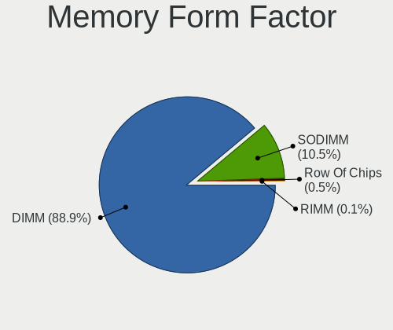

Linux - Hardware Trends (Desktops)
----------------------------------

A project to identify most popular hardware characteristics and track their change
over time based on data collected by Linux users at https://Linux-Hardware.org.

Anyone can contribute to this report by the [hw-probe](https://github.com/linuxhw/hw-probe) tool:

    sudo -E hw-probe -all -upload

This report is for one last month. Overall report since the beginning of time: [TestDays](https://github.com/linuxhw/TestDays)

Period: Jun, 2023.

Contents
--------

* [ System ](#system)
  - [ OS                       ](#os)
  - [ OS Family                ](#os-family)
  - [ Kernel                   ](#kernel)
  - [ Kernel Family            ](#kernel-family)
  - [ Kernel Major Ver.        ](#kernel-major-ver)
  - [ Arch                     ](#arch)
  - [ DE                       ](#de)
  - [ Display Server           ](#display-server)
  - [ Display Manager          ](#display-manager)
  - [ OS Lang                  ](#os-lang)
  - [ Boot Mode                ](#boot-mode)
  - [ Filesystem               ](#filesystem)
  - [ Part. scheme             ](#part-scheme)
  - [ Dual Boot with Linux/BSD ](#dual-boot-with-linuxbsd)
  - [ Dual Boot (Win)          ](#dual-boot-win)

* [ Board ](#board)
  - [ Vendor                   ](#vendor)
  - [ Model                    ](#model)
  - [ Model Family             ](#model-family)
  - [ MFG Year                 ](#mfg-year)
  - [ Form Factor              ](#form-factor)
  - [ Secure Boot              ](#secure-boot)
  - [ Coreboot                 ](#coreboot)
  - [ RAM Size                 ](#ram-size)
  - [ RAM Used                 ](#ram-used)
  - [ Total Drives             ](#total-drives)
  - [ Has CD-ROM               ](#has-cd-rom)
  - [ Has Ethernet             ](#has-ethernet)
  - [ Has WiFi                 ](#has-wifi)
  - [ Has Bluetooth            ](#has-bluetooth)

* [ Location ](#location)
  - [ Country                  ](#country)
  - [ City                     ](#city)

* [ Drives ](#drives)
  - [ Drive Vendor             ](#drive-vendor)
  - [ Drive Model              ](#drive-model)
  - [ HDD Vendor               ](#hdd-vendor)
  - [ SSD Vendor               ](#ssd-vendor)
  - [ Drive Kind               ](#drive-kind)
  - [ Drive Connector          ](#drive-connector)
  - [ Drive Size               ](#drive-size)
  - [ Space Total              ](#space-total)
  - [ Space Used               ](#space-used)
  - [ Malfunc. Drives          ](#malfunc-drives)
  - [ Malfunc. Drive Vendor    ](#malfunc-drive-vendor)
  - [ Malfunc. HDD Vendor      ](#malfunc-hdd-vendor)
  - [ Malfunc. Drive Kind      ](#malfunc-drive-kind)
  - [ Failed Drives            ](#failed-drives)
  - [ Failed Drive Vendor      ](#failed-drive-vendor)
  - [ Drive Status             ](#drive-status)

* [ Storage controller ](#storage-controller)
  - [ Storage Vendor           ](#storage-vendor)
  - [ Storage Model            ](#storage-model)
  - [ Storage Kind             ](#storage-kind)

* [ Processor ](#processor)
  - [ CPU Vendor               ](#cpu-vendor)
  - [ CPU Model                ](#cpu-model)
  - [ CPU Model Family         ](#cpu-model-family)
  - [ CPU Cores                ](#cpu-cores)
  - [ CPU Sockets              ](#cpu-sockets)
  - [ CPU Threads              ](#cpu-threads)
  - [ CPU Op-Modes             ](#cpu-op-modes)
  - [ CPU Microcode            ](#cpu-microcode)
  - [ CPU Microarch            ](#cpu-microarch)

* [ Graphics ](#graphics)
  - [ GPU Vendor               ](#gpu-vendor)
  - [ GPU Model                ](#gpu-model)
  - [ GPU Combo                ](#gpu-combo)
  - [ GPU Driver               ](#gpu-driver)
  - [ GPU Memory               ](#gpu-memory)

* [ Monitor ](#monitor)
  - [ Monitor Vendor           ](#monitor-vendor)
  - [ Monitor Model            ](#monitor-model)
  - [ Monitor Resolution       ](#monitor-resolution)
  - [ Monitor Diagonal         ](#monitor-diagonal)
  - [ Monitor Width            ](#monitor-width)
  - [ Aspect Ratio             ](#aspect-ratio)
  - [ Monitor Area             ](#monitor-area)
  - [ Pixel Density            ](#pixel-density)
  - [ Multiple Monitors        ](#multiple-monitors)

* [ Network ](#network)
  - [ Net Controller Vendor    ](#net-controller-vendor)
  - [ Net Controller Model     ](#net-controller-model)
  - [ Wireless Vendor          ](#wireless-vendor)
  - [ Wireless Model           ](#wireless-model)
  - [ Ethernet Vendor          ](#ethernet-vendor)
  - [ Ethernet Model           ](#ethernet-model)
  - [ Net Controller Kind      ](#net-controller-kind)
  - [ Used Controller          ](#used-controller)
  - [ NICs                     ](#nics)
  - [ IPv6                     ](#ipv6)

* [ Bluetooth ](#bluetooth)
  - [ Bluetooth Vendor         ](#bluetooth-vendor)
  - [ Bluetooth Model          ](#bluetooth-model)

* [ Sound ](#sound)
  - [ Sound Vendor             ](#sound-vendor)
  - [ Sound Model              ](#sound-model)

* [ Memory ](#memory)
  - [ Memory Vendor            ](#memory-vendor)
  - [ Memory Model             ](#memory-model)
  - [ Memory Kind              ](#memory-kind)
  - [ Memory Form Factor       ](#memory-form-factor)
  - [ Memory Size              ](#memory-size)
  - [ Memory Speed             ](#memory-speed)

* [ Printers & scanners ](#printers--scanners)
  - [ Printer Vendor           ](#printer-vendor)
  - [ Printer Model            ](#printer-model)
  - [ Scanner Vendor           ](#scanner-vendor)
  - [ Scanner Model            ](#scanner-model)

* [ Camera ](#camera)
  - [ Camera Vendor            ](#camera-vendor)
  - [ Camera Model             ](#camera-model)

* [ Security ](#security)
  - [ Fingerprint Vendor       ](#fingerprint-vendor)
  - [ Fingerprint Model        ](#fingerprint-model)
  - [ Chipcard Vendor          ](#chipcard-vendor)
  - [ Chipcard Model           ](#chipcard-model)

* [ Unsupported ](#unsupported)
  - [ Unsupported Devices      ](#unsupported-devices)
  - [ Unsupported Device Types ](#unsupported-device-types)

System
------

OS
--

Installed operating systems

| Name                         | Desktops | Percent |
|------------------------------|----------|---------|
| Ubuntu 22.04                 | 247      | 13.07%  |
| Linux Mint 21.1              | 143      | 7.57%   |
| Fedora 38                    | 137      | 7.25%   |
| Debian 12                    | 101      | 5.34%   |
| OpenMandriva 23.03           | 91       | 4.81%   |
| Ubuntu 23.04                 | 83       | 4.39%   |
| Pop!_OS 22.04                | 73       | 3.86%   |
| ArcoLinux Rolling            | 71       | 3.76%   |
| Arch Rolling                 | 70       | 3.7%    |
| ROSA 12.4                    | 62       | 3.28%   |
| Debian 11                    | 56       | 2.96%   |
| Zorin 16                     | 43       | 2.28%   |
| BlackPanther 18.1            | 43       | 2.28%   |
| Ubuntu 20.04                 | 39       | 2.06%   |
| Manjaro                      | 38       | 2.01%   |
| OpenMandriva 23.06           | 32       | 1.69%   |
| KDE neon 22.04               | 31       | 1.64%   |
| OpenMandriva 4.3             | 28       | 1.48%   |
| openSUSE Tumbleweed-XXXXXXXX | 24       | 1.27%   |
| Ubuntu 22.10                 | 21       | 1.11%   |
| Manjaro 23.0.0               | 19       | 1.01%   |
| Linux Mint 20.3              | 18       | 0.95%   |
| Nobara 37                    | 17       | 0.9%    |
| Kubuntu 22.04                | 16       | 0.85%   |
| Gentoo 2.13                  | 15       | 0.79%   |
| Xubuntu 22.04                | 14       | 0.74%   |
| LMDE 5                       | 14       | 0.74%   |
| Linux Mint 21                | 14       | 0.74%   |
| Kubuntu 23.04                | 14       | 0.74%   |
| EndeavourOS Rolling          | 13       | 0.69%   |
| Ubuntu 18.04                 | 12       | 0.63%   |
| openSUSE Leap-15.5           | 11       | 0.58%   |
| OpenMandriva 4.2             | 9        | 0.48%   |
| OpenMandriva 23.01           | 9        | 0.48%   |
| Kali 2023.2                  | 9        | 0.48%   |
| Xubuntu 23.04                | 7        | 0.37%   |
| SteamOS 3.4                  | 7        | 0.37%   |
| Fedora 37                    | 7        | 0.37%   |
| Debian 10                    | 7        | 0.37%   |
| ChimeraOS 42                 | 7        | 0.37%   |

OS Family
---------

OS without a version

| Name          | Desktops | Percent |
|---------------|----------|---------|
| Ubuntu        | 405      | 21.43%  |
| Linux Mint    | 192      | 10.16%  |
| OpenMandriva  | 173      | 9.15%   |
| Debian        | 171      | 9.05%   |
| Fedora        | 148      | 7.83%   |
| Pop!_OS       | 75       | 3.97%   |
| ArcoLinux     | 73       | 3.86%   |
| ROSA          | 72       | 3.81%   |
| Arch          | 70       | 3.7%    |
| Manjaro       | 59       | 3.12%   |
| Zorin         | 46       | 2.43%   |
| BlackPanther  | 46       | 2.43%   |
| openSUSE      | 43       | 2.28%   |
| Kubuntu       | 34       | 1.8%    |
| KDE neon      | 31       | 1.64%   |
| Xubuntu       | 26       | 1.38%   |
| Nobara        | 21       | 1.11%   |
| Gentoo        | 15       | 0.79%   |
| LMDE          | 14       | 0.74%   |
| Ubuntu MATE   | 13       | 0.69%   |
| EndeavourOS   | 13       | 0.69%   |
| Kali          | 11       | 0.58%   |
| Elementary    | 9        | 0.48%   |
| Lubuntu       | 8        | 0.42%   |
| ChimeraOS     | 8        | 0.42%   |
| SteamOS       | 7        | 0.37%   |
| CentOS        | 7        | 0.37%   |
| Ubuntu Unity  | 6        | 0.32%   |
| Xero          | 5        | 0.26%   |
| Red OS        | 5        | 0.26%   |
| Parrot        | 5        | 0.26%   |
| Garuda Linux  | 5        | 0.26%   |
| Ubuntu Budgie | 4        | 0.21%   |
| Artix         | 4        | 0.21%   |
| ALT Linux     | 4        | 0.21%   |
| Peppermint    | 3        | 0.16%   |
| NixOS         | 3        | 0.16%   |
| Mabox         | 3        | 0.16%   |
| Linux Lite    | 3        | 0.16%   |
| Archcraft     | 3        | 0.16%   |

Kernel
------

Version of the Linux kernel

| Version                           | Desktops | Percent |
|-----------------------------------|----------|---------|
| 5.19.0-43-generic                 | 153      | 8.1%    |
| 5.15.0-73-generic                 | 129      | 6.83%   |
| 6.2.6-desktop-1omv2390            | 93       | 4.92%   |
| 5.19.0-45-generic                 | 90       | 4.76%   |
| 5.15.0-75-generic                 | 76       | 4.02%   |
| 6.2.6-76060206-generic            | 66       | 3.49%   |
| 6.1.0-9-amd64                     | 61       | 3.23%   |
| 6.2.0-20-generic                  | 59       | 3.12%   |
| 6.1.20-generic-2rosa2021.1-x86_64 | 47       | 2.49%   |
| 5.10.0-23-amd64                   | 42       | 2.22%   |
| 6.2.0-23-generic                  | 36       | 1.9%    |
| 6.1.0-4-amd64                     | 35       | 1.85%   |
| 6.3.8-200.fc38.x86_64             | 33       | 1.75%   |
| 6.3.5-desktop-3omv2390            | 29       | 1.53%   |
| 6.3.9-arch1-1                     | 27       | 1.43%   |
| 6.1.31-2-MANJARO                  | 26       | 1.38%   |
| 6.3.5-200.fc38.x86_64             | 24       | 1.27%   |
| 5.6.14-desktop-2bP                | 23       | 1.22%   |
| 5.4.0-150-generic                 | 22       | 1.16%   |
| 6.3.4-201.fc38.x86_64             | 21       | 1.11%   |
| 6.3.8-arch1-1                     | 19       | 1.01%   |
| 6.3.7-200.fc38.x86_64             | 18       | 0.95%   |
| 5.15.0-72-generic                 | 17       | 0.9%    |
| 5.16.7-desktop-1omv4003           | 16       | 0.85%   |
| 6.3.6-200.fc38.x86_64             | 14       | 0.74%   |
| 6.3.5-arch1-1                     | 14       | 0.74%   |
| 6.2.15-300.fc38.x86_64            | 14       | 0.74%   |
| 5.19.0-32-generic                 | 14       | 0.74%   |
| 6.3.6-arch1-1                     | 13       | 0.69%   |
| 6.3.7-arch1-1                     | 12       | 0.63%   |
| 5.19.0-46-generic                 | 12       | 0.63%   |
| 5.16.13-desktop-1omv4003          | 12       | 0.63%   |
| 5.15.0-76-generic                 | 12       | 0.63%   |
| 5.15.0-56-generic                 | 12       | 0.63%   |
| 6.3.5-2-MANJARO                   | 11       | 0.58%   |
| 5.15.85-desktop-1bP               | 11       | 0.58%   |
| 6.2.9-300.fc38.x86_64             | 10       | 0.53%   |
| 6.1.1-desktop-1omv2290            | 10       | 0.53%   |
| 5.14.21-150500.53-default         | 10       | 0.53%   |
| 6.3.4-1-default                   | 9        | 0.48%   |

Kernel Family
-------------

Linux kernel without a distro release

| Version  | Desktops | Percent |
|----------|----------|---------|
| 5.19.0   | 293      | 15.5%   |
| 5.15.0   | 288      | 15.24%  |
| 6.2.6    | 161      | 8.52%   |
| 6.1.0    | 124      | 6.56%   |
| 6.2.0    | 105      | 5.56%   |
| 6.3.5    | 101      | 5.34%   |
| 6.3.8    | 63       | 3.33%   |
| 6.3.7    | 60       | 3.17%   |
| 5.10.0   | 59       | 3.12%   |
| 5.4.0    | 57       | 3.02%   |
| 6.1.20   | 48       | 2.54%   |
| 6.3.6    | 43       | 2.28%   |
| 6.1.31   | 42       | 2.22%   |
| 6.3.9    | 41       | 2.17%   |
| 6.3.4    | 39       | 2.06%   |
| 5.6.14   | 23       | 1.22%   |
| 6.3.3    | 18       | 0.95%   |
| 6.2.15   | 17       | 0.9%    |
| 5.16.7   | 16       | 0.85%   |
| 5.14.21  | 15       | 0.79%   |
| 5.16.13  | 12       | 0.63%   |
| 4.15.0   | 12       | 0.63%   |
| 6.2.9    | 11       | 0.58%   |
| 6.1.1    | 11       | 0.58%   |
| 5.15.85  | 11       | 0.58%   |
| 5.13.0   | 11       | 0.58%   |
| 6.4.0    | 9        | 0.48%   |
| 6.1.27   | 9        | 0.48%   |
| 4.19.0   | 9        | 0.48%   |
| 4.18.16  | 9        | 0.48%   |
| 5.15.114 | 8        | 0.42%   |
| 5.14.0   | 8        | 0.42%   |
| 6.2.12   | 7        | 0.37%   |
| 6.1.34   | 7        | 0.37%   |
| 5.10.14  | 7        | 0.37%   |
| 6.1.33   | 6        | 0.32%   |
| 6.3.2    | 5        | 0.26%   |
| 6.3.1    | 4        | 0.21%   |
| 6.2.16   | 4        | 0.21%   |
| 6.2.14   | 4        | 0.21%   |

Kernel Major Ver.
-----------------

Linux kernel major version

| Version  | Desktops | Percent |
|----------|----------|---------|
| 6.3      | 378      | 20%     |
| 5.15     | 333      | 17.62%  |
| 6.2      | 314      | 16.61%  |
| 5.19     | 296      | 15.66%  |
| 6.1      | 264      | 13.97%  |
| 5.10     | 81       | 4.29%   |
| 5.4      | 61       | 3.23%   |
| 5.16     | 28       | 1.48%   |
| 5.6      | 23       | 1.22%   |
| 5.14     | 23       | 1.22%   |
| 4.18     | 13       | 0.69%   |
| 6.0      | 12       | 0.63%   |
| 4.15     | 12       | 0.63%   |
| 5.13     | 11       | 0.58%   |
| 6.4      | 9        | 0.48%   |
| 4.19     | 9        | 0.48%   |
| 5.17     | 5        | 0.26%   |
| 5.11     | 4        | 0.21%   |
| 3.10     | 4        | 0.21%   |
| 5.9      | 3        | 0.16%   |
| 5.18     | 2        | 0.11%   |
| 6.3.0    | 1        | 0.05%   |
| 5.8      | 1        | 0.05%   |
| 5.15.107 | 1        | 0.05%   |
| 4.9      | 1        | 0.05%   |
| 4.4      | 1        | 0.05%   |

Arch
----

OS architecture (x86_64, i586, etc.)

| Name        | Desktops | Percent |
|-------------|----------|---------|
| x86_64      | 1875     | 99.21%  |
| i686        | 13       | 0.69%   |
| loongarch64 | 1        | 0.05%   |
| armv7l      | 1        | 0.05%   |

DE
--

Desktop Environment

| Name              | Desktops | Percent |
|-------------------|----------|---------|
| GNOME             | 742      | 39.26%  |
| KDE5              | 516      | 27.3%   |
| X-Cinnamon        | 185      | 9.79%   |
| XFCE              | 133      | 7.04%   |
| Unknown           | 120      | 6.35%   |
| MATE              | 66       | 3.49%   |
| LXQt              | 21       | 1.11%   |
| Cinnamon          | 17       | 0.9%    |
| i3                | 12       | 0.63%   |
| Pantheon          | 9        | 0.48%   |
| GNOME Classic     | 9        | 0.48%   |
| KDE               | 7        | 0.37%   |
| Deepin            | 7        | 0.37%   |
| Budgie            | 7        | 0.37%   |
| Unity             | 6        | 0.32%   |
| KDE4              | 6        | 0.32%   |
| LXDE              | 4        | 0.21%   |
| sway              | 3        | 0.16%   |
| Hyprland          | 3        | 0.16%   |
| bspwm             | 3        | 0.16%   |
| openbox           | 2        | 0.11%   |
| herbstluftwm      | 2        | 0.11%   |
| GNOME Flashback   | 2        | 0.11%   |
| Wayfire           | 1        | 0.05%   |
| ubuntu:pika:GNOME | 1        | 0.05%   |
| Trinity           | 1        | 0.05%   |
| ICEWM             | 1        | 0.05%   |
| i3-with-shmlog    | 1        | 0.05%   |
| Enlightenment     | 1        | 0.05%   |
| chadwm            | 1        | 0.05%   |
| awesome           | 1        | 0.05%   |

Display Server
--------------

X11 or Wayland

| Name    | Desktops | Percent |
|---------|----------|---------|
| X11     | 1241     | 65.66%  |
| Wayland | 500      | 26.46%  |
| Unknown | 85       | 4.5%    |
| Tty     | 62       | 3.28%   |
| Web     | 2        | 0.11%   |

Display Manager
---------------

SDDM, LightDM, etc.

| Name    | Desktops | Percent |
|---------|----------|---------|
| Unknown | 669      | 35.4%   |
| SDDM    | 432      | 22.86%  |
| GDM3    | 371      | 19.63%  |
| LightDM | 251      | 13.28%  |
| GDM     | 151      | 7.99%   |
| LXDM    | 5        | 0.26%   |
| KDM     | 5        | 0.26%   |
| SLiM    | 3        | 0.16%   |
| TDM     | 1        | 0.05%   |
| LY-DM   | 1        | 0.05%   |
| GREETD  | 1        | 0.05%   |

OS Lang
-------

Language

| Lang    | Desktops | Percent |
|---------|----------|---------|
| en_US   | 793      | 41.96%  |
| ru_RU   | 162      | 8.57%   |
| de_DE   | 141      | 7.46%   |
| en_GB   | 88       | 4.66%   |
| pt_BR   | 83       | 4.39%   |
| fr_FR   | 77       | 4.07%   |
| Unknown | 72       | 3.81%   |
| es_ES   | 51       | 2.7%    |
| it_IT   | 39       | 2.06%   |
| en_CA   | 39       | 2.06%   |
| en_AU   | 39       | 2.06%   |
| C       | 33       | 1.75%   |
| pl_PL   | 28       | 1.48%   |
| nl_NL   | 16       | 0.85%   |
| es_AR   | 15       | 0.79%   |
| en_IN   | 13       | 0.69%   |
| de_AT   | 12       | 0.63%   |
| zh_CN   | 11       | 0.58%   |
| cs_CZ   | 11       | 0.58%   |
| en_ZA   | 9        | 0.48%   |
| tr_TR   | 8        | 0.42%   |
| es_MX   | 8        | 0.42%   |
| de_CH   | 8        | 0.42%   |
| sv_SE   | 6        | 0.32%   |
| sk_SK   | 6        | 0.32%   |
| es_CO   | 6        | 0.32%   |
| en_NZ   | 6        | 0.32%   |
| zh_TW   | 5        | 0.26%   |
| pt_PT   | 5        | 0.26%   |
| hu_HU   | 5        | 0.26%   |
| es_CL   | 5        | 0.26%   |
| POSIX   | 4        | 0.21%   |
| nl_BE   | 4        | 0.21%   |
| fr_BE   | 4        | 0.21%   |
| fi_FI   | 4        | 0.21%   |
| es_EC   | 4        | 0.21%   |
| en_SG   | 4        | 0.21%   |
| en_PH   | 4        | 0.21%   |
| el_GR   | 4        | 0.21%   |
| ro_RO   | 3        | 0.16%   |

Boot Mode
---------

EFI or BIOS

| Mode | Desktops | Percent |
|------|----------|---------|
| BIOS | 1029     | 54.44%  |
| EFI  | 861      | 45.56%  |

Filesystem
----------

Type of filesystem

| Type     | Desktops | Percent |
|----------|----------|---------|
| Ext4     | 1094     | 57.88%  |
| Btrfs    | 317      | 16.77%  |
| Tmpfs    | 257      | 13.6%   |
| Overlay  | 173      | 9.15%   |
| Xfs      | 27       | 1.43%   |
| Zfs      | 8        | 0.42%   |
| F2fs     | 6        | 0.32%   |
| Ext3     | 3        | 0.16%   |
| Ext2     | 2        | 0.11%   |
| Rootfs   | 1        | 0.05%   |
| Reiserfs | 1        | 0.05%   |
| Jfs      | 1        | 0.05%   |

Part. scheme
------------

Scheme of partitioning

| Type    | Desktops | Percent |
|---------|----------|---------|
| GPT     | 1038     | 54.92%  |
| Unknown | 561      | 29.68%  |
| MBR     | 291      | 15.4%   |

Dual Boot with Linux/BSD
------------------------

Hosting more than one Linux/BSD

| Dual boot | Desktops | Percent |
|-----------|----------|---------|
| No        | 1473     | 77.94%  |
| Yes       | 417      | 22.06%  |

Dual Boot (Win)
---------------

Hosting Linux and Windows

| Dual boot | Desktops | Percent |
|-----------|----------|---------|
| No        | 1249     | 66.08%  |
| Yes       | 641      | 33.92%  |

Board
-----

Vendor
------

Motherboard manufacturer

| Name                                 | Desktops | Percent |
|--------------------------------------|----------|---------|
| ASUSTek Computer                     | 454      | 24.02%  |
| Gigabyte Technology                  | 322      | 17.04%  |
| MSI                                  | 263      | 13.92%  |
| ASRock                               | 151      | 7.99%   |
| Hewlett-Packard                      | 137      | 7.25%   |
| Dell                                 | 137      | 7.25%   |
| Lenovo                               | 82       | 4.34%   |
| Intel                                | 56       | 2.96%   |
| Acer                                 | 27       | 1.43%   |
| Unknown                              | 27       | 1.43%   |
| Biostar                              | 21       | 1.11%   |
| Fujitsu                              | 20       | 1.06%   |
| Pegatron                             | 16       | 0.85%   |
| Foxconn                              | 15       | 0.79%   |
| AZW                                  | 12       | 0.63%   |
| Supermicro                           | 11       | 0.58%   |
| Huanan                               | 11       | 0.58%   |
| ECS                                  | 10       | 0.53%   |
| Positivo                             | 8        | 0.42%   |
| Shenzhen Meigao Electronic Equipment | 6        | 0.32%   |
| AMI                                  | 6        | 0.32%   |
| Shuttle                              | 5        | 0.26%   |
| BESSTAR Tech                         | 5        | 0.26%   |
| ASRockRack                           | 5        | 0.26%   |
| Medion                               | 4        | 0.21%   |
| Fujitsu Siemens                      | 4        | 0.21%   |
| Apple                                | 4        | 0.21%   |
| OEM                                  | 3        | 0.16%   |
| Itautec                              | 3        | 0.16%   |
| Gateway                              | 3        | 0.16%   |
| Techvision                           | 2        | 0.11%   |
| System76                             | 2        | 0.11%   |
| Seco                                 | 2        | 0.11%   |
| PCWare                               | 2        | 0.11%   |
| Inventec                             | 2        | 0.11%   |
| Hardkernel                           | 2        | 0.11%   |
| GuoGuang                             | 2        | 0.11%   |
| Colorful Technology                  | 2        | 0.11%   |
| Chuwi                                | 2        | 0.11%   |
| Alienware                            | 2        | 0.11%   |

Model
-----

Motherboard model

| Name                            | Desktops | Percent |
|---------------------------------|----------|---------|
| Unknown                         | 33       | 1.75%   |
| ASUS All Series                 | 23       | 1.22%   |
| MSI MS-7C37                     | 14       | 0.74%   |
| Dell OptiPlex 7010              | 13       | 0.69%   |
| Lenovo ThinkCentre M55p 8808D8U | 12       | 0.63%   |
| Dell OptiPlex 9020              | 12       | 0.63%   |
| MSI MS-7C91                     | 11       | 0.58%   |
| MSI MS-7C02                     | 11       | 0.58%   |
| Dell OptiPlex 3020              | 11       | 0.58%   |
| ASUS TUF Gaming X570-PLUS       | 11       | 0.58%   |
| ASUS PRIME B450M-K              | 11       | 0.58%   |
| MSI MS-7C95                     | 10       | 0.53%   |
| MSI MS-7A38                     | 9        | 0.48%   |
| MSI MS-7B79                     | 8        | 0.42%   |
| MSI MS-7817                     | 8        | 0.42%   |
| Intel H61                       | 8        | 0.42%   |
| MSI MS-7C56                     | 7        | 0.37%   |
| Gigabyte B450M DS3H             | 7        | 0.37%   |
| Gigabyte B450 AORUS ELITE       | 7        | 0.37%   |
| MSI MS-7B86                     | 6        | 0.32%   |
| HP Compaq Pro 6300 SFF          | 6        | 0.32%   |
| HP Compaq Elite 8300 SFF        | 6        | 0.32%   |
| Gigabyte GA-78LMT-USB3 6.0      | 6        | 0.32%   |
| Gigabyte B550M DS3H             | 6        | 0.32%   |
| Dell OptiPlex 790               | 6        | 0.32%   |
| ASUS ROG STRIX B550-F GAMING    | 6        | 0.32%   |
| ASUS ROG STRIX B450-F GAMING    | 6        | 0.32%   |
| MSI MS-7D22                     | 5        | 0.26%   |
| MSI MS-7C94                     | 5        | 0.26%   |
| MSI MS-7B89                     | 5        | 0.26%   |
| MSI MS-7B17                     | 5        | 0.26%   |
| Gigabyte B550 AORUS ELITE V2    | 5        | 0.26%   |
| Gigabyte 970A-DS3P              | 5        | 0.26%   |
| Dell OptiPlex 7050              | 5        | 0.26%   |
| ASUS PRIME X570-P               | 5        | 0.26%   |
| ASUS PRIME B550M-A              | 5        | 0.26%   |
| MSI MS-7B98                     | 4        | 0.21%   |
| HP t620 Quad Core TC            | 4        | 0.21%   |
| HP ProDesk 600 G1 SFF           | 4        | 0.21%   |
| Gigabyte G31M-ES2L              | 4        | 0.21%   |

Model Family
------------

Motherboard model prefix

| Name                   | Desktops | Percent |
|------------------------|----------|---------|
| ASUS PRIME             | 115      | 6.08%   |
| Dell OptiPlex          | 84       | 4.44%   |
| ASUS ROG               | 79       | 4.18%   |
| Lenovo ThinkCentre     | 55       | 2.91%   |
| ASUS TUF               | 51       | 2.7%    |
| HP Compaq              | 47       | 2.49%   |
| Unknown                | 33       | 1.75%   |
| Dell Precision         | 23       | 1.22%   |
| ASUS All               | 23       | 1.22%   |
| HP EliteDesk           | 19       | 1.01%   |
| Gigabyte B450M         | 18       | 0.95%   |
| Gigabyte B450          | 17       | 0.9%    |
| MSI MS-7C37            | 14       | 0.74%   |
| Gigabyte B550          | 14       | 0.74%   |
| Fujitsu ESPRIMO        | 14       | 0.74%   |
| Gigabyte X570          | 13       | 0.69%   |
| Dell Inspiron          | 13       | 0.69%   |
| Acer Aspire            | 13       | 0.69%   |
| MSI MS-7C91            | 11       | 0.58%   |
| MSI MS-7C02            | 11       | 0.58%   |
| HP ProDesk             | 11       | 0.58%   |
| Gigabyte B550M         | 11       | 0.58%   |
| ASUS M5A78L-M          | 11       | 0.58%   |
| Acer Veriton           | 11       | 0.58%   |
| MSI MS-7C95            | 10       | 0.53%   |
| Dell XPS               | 10       | 0.53%   |
| ASRock B450            | 10       | 0.53%   |
| MSI MS-7A38            | 9        | 0.48%   |
| Gigabyte GA-78LMT-USB3 | 9        | 0.48%   |
| ASUS P8Z77-V           | 9        | 0.48%   |
| ASUS P8H61-M           | 9        | 0.48%   |
| ASUS M5A97             | 9        | 0.48%   |
| MSI MS-7B79            | 8        | 0.42%   |
| MSI MS-7817            | 8        | 0.42%   |
| Lenovo ThinkStation    | 8        | 0.42%   |
| Intel H61              | 8        | 0.42%   |
| ASRock X570            | 8        | 0.42%   |
| MSI MS-7C56            | 7        | 0.37%   |
| HP OMEN                | 7        | 0.37%   |
| Gigabyte Z390          | 7        | 0.37%   |

MFG Year
--------

Motherboard manufacture year

| Year    | Desktops | Percent |
|---------|----------|---------|
| 2018    | 207      | 10.95%  |
| 2020    | 161      | 8.52%   |
| 2019    | 157      | 8.31%   |
| 2022    | 156      | 8.25%   |
| 2021    | 144      | 7.62%   |
| 2012    | 142      | 7.51%   |
| 2013    | 137      | 7.25%   |
| 2011    | 111      | 5.87%   |
| 2014    | 109      | 5.77%   |
| 2017    | 100      | 5.29%   |
| 2010    | 87       | 4.6%    |
| 2015    | 80       | 4.23%   |
| 2016    | 68       | 3.6%    |
| 2009    | 66       | 3.49%   |
| 2008    | 54       | 2.86%   |
| 2007    | 45       | 2.38%   |
| 2023    | 44       | 2.33%   |
| 2006    | 13       | 0.69%   |
| 2005    | 4        | 0.21%   |
| Unknown | 4        | 0.21%   |
| 2002    | 1        | 0.05%   |

Form Factor
-----------

Physical design of the computer

| Name    | Desktops | Percent |
|---------|----------|---------|
| Desktop | 1890     | 100%    |

Secure Boot
-----------

Enabled or disabled

| State    | Desktops | Percent |
|----------|----------|---------|
| Disabled | 1849     | 97.83%  |
| Enabled  | 41       | 2.17%   |

Coreboot
--------

Have coreboot on board

| Used | Desktops | Percent |
|------|----------|---------|
| No   | 1890     | 100%    |

RAM Size
--------

Total RAM memory

| Size in GB      | Desktops | Percent |
|-----------------|----------|---------|
| 16.01-24.0      | 445      | 23.54%  |
| 32.01-64.0      | 357      | 18.89%  |
| 8.01-16.0       | 307      | 16.24%  |
| 4.01-8.0        | 279      | 14.76%  |
| 3.01-4.0        | 222      | 11.75%  |
| 64.01-256.0     | 141      | 7.46%   |
| 24.01-32.0      | 75       | 3.97%   |
| 1.01-2.0        | 31       | 1.64%   |
| 2.01-3.0        | 21       | 1.11%   |
| More than 256.0 | 5        | 0.26%   |
| 0.51-1.0        | 5        | 0.26%   |
| 0.01-0.5        | 2        | 0.11%   |

RAM Used
--------

Used RAM memory

| Used GB     | Desktops | Percent |
|-------------|----------|---------|
| 1.01-2.0    | 552      | 29.21%  |
| 2.01-3.0    | 423      | 22.38%  |
| 4.01-8.0    | 365      | 19.31%  |
| 3.01-4.0    | 245      | 12.96%  |
| 0.51-1.0    | 125      | 6.61%   |
| 8.01-16.0   | 112      | 5.93%   |
| 16.01-24.0  | 30       | 1.59%   |
| 0.01-0.5    | 19       | 1.01%   |
| 32.01-64.0  | 12       | 0.63%   |
| 64.01-256.0 | 4        | 0.21%   |
| 24.01-32.0  | 3        | 0.16%   |

Total Drives
------------

Number of drives on board

| Drives | Desktops | Percent |
|--------|----------|---------|
| 1      | 703      | 37.2%   |
| 2      | 529      | 27.99%  |
| 3      | 315      | 16.67%  |
| 4      | 168      | 8.89%   |
| 5      | 86       | 4.55%   |
| 6      | 43       | 2.28%   |
| 7      | 11       | 0.58%   |
| 8      | 10       | 0.53%   |
| 0      | 10       | 0.53%   |
| 10     | 5        | 0.26%   |
| 9      | 3        | 0.16%   |
| 11     | 2        | 0.11%   |
| 29     | 1        | 0.05%   |
| 21     | 1        | 0.05%   |
| 19     | 1        | 0.05%   |
| 14     | 1        | 0.05%   |
| 13     | 1        | 0.05%   |

Has CD-ROM
----------

Has CD-ROM on board

| Presented | Desktops | Percent |
|-----------|----------|---------|
| No        | 1176     | 62.22%  |
| Yes       | 714      | 37.78%  |

Has Ethernet
------------

Has Ethernet on board

| Presented | Desktops | Percent |
|-----------|----------|---------|
| Yes       | 1874     | 99.15%  |
| No        | 16       | 0.85%   |

Has WiFi
--------

Has WiFi module

| Presented | Desktops | Percent |
|-----------|----------|---------|
| No        | 999      | 52.86%  |
| Yes       | 891      | 47.14%  |

Has Bluetooth
-------------

Has Bluetooth module

| Presented | Desktops | Percent |
|-----------|----------|---------|
| No        | 1179     | 62.38%  |
| Yes       | 711      | 37.62%  |

Location
--------

Country
-------

Geographic location (country)

| Country      | Desktops | Percent |
|--------------|----------|---------|
| USA          | 397      | 21.01%  |
| Germany      | 184      | 9.74%   |
| Russia       | 181      | 9.58%   |
| Brazil       | 121      | 6.4%    |
| France       | 92       | 4.87%   |
| UK           | 76       | 4.02%   |
| Canada       | 64       | 3.39%   |
| Spain        | 57       | 3.02%   |
| Italy        | 56       | 2.96%   |
| Hungary      | 50       | 2.65%   |
| Australia    | 46       | 2.43%   |
| Poland       | 42       | 2.22%   |
| Netherlands  | 31       | 1.64%   |
| Sweden       | 22       | 1.16%   |
| Austria      | 21       | 1.11%   |
| Czechia      | 20       | 1.06%   |
| India        | 19       | 1.01%   |
| Argentina    | 19       | 1.01%   |
| Mexico       | 17       | 0.9%    |
| Turkey       | 16       | 0.85%   |
| Switzerland  | 16       | 0.85%   |
| Serbia       | 14       | 0.74%   |
| China        | 14       | 0.74%   |
| Belgium      | 14       | 0.74%   |
| Portugal     | 13       | 0.69%   |
| South Africa | 12       | 0.63%   |
| Romania      | 12       | 0.63%   |
| Greece       | 12       | 0.63%   |
| Colombia     | 12       | 0.63%   |
| Slovakia     | 10       | 0.53%   |
| Norway       | 10       | 0.53%   |
| Finland      | 10       | 0.53%   |
| Chile        | 10       | 0.53%   |
| New Zealand  | 9        | 0.48%   |
| Japan        | 9        | 0.48%   |
| Vietnam      | 8        | 0.42%   |
| Singapore    | 8        | 0.42%   |
| Philippines  | 8        | 0.42%   |
| Lithuania    | 7        | 0.37%   |
| Indonesia    | 7        | 0.37%   |

City
----

Geographic location (city)

| City              | Desktops | Percent |
|-------------------|----------|---------|
| Voronezh          | 35       | 1.85%   |
| Moscow            | 35       | 1.85%   |
| Sydney            | 17       | 0.9%    |
| Rio de Janeiro    | 15       | 0.79%   |
| Bangor            | 15       | 0.79%   |
| Sao Paulo         | 14       | 0.74%   |
| Budapest          | 14       | 0.74%   |
| Munich            | 13       | 0.69%   |
| Melbourne         | 13       | 0.69%   |
| Berlin            | 12       | 0.63%   |
| St Petersburg     | 11       | 0.58%   |
| Seattle           | 11       | 0.58%   |
| Paris             | 11       | 0.58%   |
| Milan             | 10       | 0.53%   |
| Manchester        | 10       | 0.53%   |
| Warsaw            | 9        | 0.48%   |
| Toronto           | 9        | 0.48%   |
| London            | 9        | 0.48%   |
| Singapore         | 8        | 0.42%   |
| Prague            | 8        | 0.42%   |
| New York          | 8        | 0.42%   |
| Madrid            | 8        | 0.42%   |
| Belgrade          | 8        | 0.42%   |
| Perm              | 7        | 0.37%   |
| Novosibirsk       | 7        | 0.37%   |
| Vienna            | 6        | 0.32%   |
| Rostov-on-Don     | 6        | 0.32%   |
| Istanbul          | 6        | 0.32%   |
| Helsinki          | 6        | 0.32%   |
| Hanover           | 6        | 0.32%   |
| Hamburg           | 6        | 0.32%   |
| Frankfurt am Main | 6        | 0.32%   |
| Buenos Aires      | 6        | 0.32%   |
| Brisbane          | 6        | 0.32%   |
| Atlanta           | 6        | 0.32%   |
| Stockholm         | 5        | 0.26%   |
| San Francisco     | 5        | 0.26%   |
| Rome              | 5        | 0.26%   |
| Palmas            | 5        | 0.26%   |
| Leipzig           | 5        | 0.26%   |

Drives
------

Drive Vendor
------------

Hard drive vendors

| Vendor                      | Desktops | Drives | Percent |
|-----------------------------|----------|--------|---------|
| WDC                         | 605      | 796    | 16.78%  |
| Seagate                     | 581      | 801    | 16.11%  |
| Samsung Electronics         | 507      | 697    | 14.06%  |
| Kingston                    | 225      | 246    | 6.24%   |
| SanDisk                     | 193      | 219    | 5.35%   |
| Crucial                     | 188      | 222    | 5.21%   |
| Toshiba                     | 174      | 196    | 4.83%   |
| Hitachi                     | 102      | 114    | 2.83%   |
| A-DATA Technology           | 60       | 63     | 1.66%   |
| Phison Electronics          | 52       | 60     | 1.44%   |
| China                       | 44       | 46     | 1.22%   |
| Micron/Crucial Technology   | 42       | 47     | 1.16%   |
| Kingston Technology Company | 41       | 42     | 1.14%   |
| Intel                       | 40       | 45     | 1.11%   |
| Unknown                     | 38       | 46     | 1.05%   |
| Intenso                     | 32       | 35     | 0.89%   |
| HGST                        | 32       | 40     | 0.89%   |
| SPCC                        | 31       | 39     | 0.86%   |
| SK hynix                    | 30       | 36     | 0.83%   |
| OCZ                         | 26       | 27     | 0.72%   |
| PNY                         | 25       | 28     | 0.69%   |
| Silicon Motion              | 22       | 24     | 0.61%   |
| Patriot                     | 22       | 22     | 0.61%   |
| Micron Technology           | 19       | 25     | 0.53%   |
| Realtek Semiconductor       | 18       | 18     | 0.5%    |
| Netac                       | 18       | 20     | 0.5%    |
| Maxtor                      | 18       | 19     | 0.5%    |
| GOODRAM                     | 18       | 18     | 0.5%    |
| ADATA Technology            | 16       | 17     | 0.44%   |
| Team                        | 14       | 16     | 0.39%   |
| Gigabyte Technology         | 14       | 14     | 0.39%   |
| Transcend                   | 13       | 13     | 0.36%   |
| MAXIO Technology (Hangzhou) | 13       | 13     | 0.36%   |
| KIOXIA                      | 13       | 14     | 0.36%   |
| SABRENT                     | 12       | 13     | 0.33%   |
| JMicron Technology          | 11       | 12     | 0.31%   |
| Apacer                      | 11       | 12     | 0.31%   |
| KingSpec                    | 10       | 10     | 0.28%   |
| Phison                      | 8        | 10     | 0.22%   |
| LITEON                      | 8        | 8      | 0.22%   |

Drive Model
-----------

Hard drive models

| Model                                                 | Desktops | Percent |
|-------------------------------------------------------|----------|---------|
| Samsung NVMe SSD Controller SM981/PM981/PM983 250GB   | 74       | 1.79%   |
| Samsung NVMe SSD Controller PM9A1/PM9A3/980PRO 2TB    | 57       | 1.38%   |
| Seagate ST2000DM008-2FR102 2TB                        | 49       | 1.19%   |
| Kingston SA400S37240G 240GB SSD                       | 49       | 1.19%   |
| Seagate ST500DM002-1BD142 500GB                       | 46       | 1.11%   |
| Seagate ST1000DM010-2EP102 1TB                        | 42       | 1.02%   |
| Toshiba DT01ACA100 1TB                                | 33       | 0.8%    |
| Samsung SSD 850 EVO 250GB                             | 33       | 0.8%    |
| Crucial CT500MX500SSD1 500GB                          | 33       | 0.8%    |
| Micron/Crucial P2 NVMe PCIe SSD 4TB                   | 32       | 0.78%   |
| Crucial CT480BX500SSD1 480GB                          | 32       | 0.78%   |
| Kingston SA400S37120G 120GB SSD                       | 30       | 0.73%   |
| Seagate ST4000DM004-2CV104 4TB                        | 28       | 0.68%   |
| Samsung SSD 860 EVO 500GB                             | 27       | 0.65%   |
| Kingston SA400S37480G 480GB SSD                       | 27       | 0.65%   |
| Seagate ST1000DM003-1ER162 1TB                        | 22       | 0.53%   |
| Crucial CT240BX500SSD1 240GB                          | 22       | 0.53%   |
| Seagate ST1000DM003-1CH162 1TB                        | 21       | 0.51%   |
| Samsung SSD 870 EVO 500GB                             | 21       | 0.51%   |
| Seagate ST2000DM001-1ER164 2TB                        | 20       | 0.48%   |
| Samsung SSD 980 1TB                                   | 20       | 0.48%   |
| Samsung SSD 860 EVO 1TB                               | 20       | 0.48%   |
| Crucial CT1000MX500SSD1 1TB                           | 20       | 0.48%   |
| WDC WD10EZEX-08WN4A0 1TB                              | 19       | 0.46%   |
| Samsung SSD 870 EVO 1TB                               | 19       | 0.46%   |
| Phison E12 NVMe Controller 1TB                        | 19       | 0.46%   |
| Toshiba HDWD110 1TB                                   | 18       | 0.44%   |
| Kingston SV300S37A120G 120GB SSD                      | 18       | 0.44%   |
| Seagate ST3500418AS 500GB                             | 17       | 0.41%   |
| Samsung SSD 850 EVO 500GB                             | 17       | 0.41%   |
| Seagate ST1000DM003-1SB102 1TB                        | 16       | 0.39%   |
| Sandisk WD Black SN750 / PC SN730 NVMe SSD 500GB      | 16       | 0.39%   |
| Samsung NVMe SSD Controller SM961/PM961/SM963 256GB   | 16       | 0.39%   |
| Kingston Company SNV2S1000G 1TB                       | 16       | 0.39%   |
| SanDisk NVMe SSD Drive 1TB                            | 15       | 0.36%   |
| Samsung SSD 860 EVO 250GB                             | 15       | 0.36%   |
| WDC WDS500G2B0A-00SM50 500GB SSD                      | 14       | 0.34%   |
| Unknown SD/MMC/MS PRO 250GB                           | 14       | 0.34%   |
| Silicon Motion SM2263EN/SM2263XT SSD Controller 256GB | 13       | 0.32%   |
| Sandisk WD Blue SN550 NVMe SSD 1TB                    | 13       | 0.32%   |

HDD Vendor
----------

Hard disk drive vendors

| Vendor              | Desktops | Drives | Percent |
|---------------------|----------|--------|---------|
| Seagate             | 571      | 780    | 37.44%  |
| WDC                 | 529      | 677    | 34.69%  |
| Toshiba             | 157      | 177    | 10.3%   |
| Hitachi             | 102      | 114    | 6.69%   |
| Samsung Electronics | 67       | 72     | 4.39%   |
| HGST                | 32       | 40     | 2.1%    |
| Maxtor              | 17       | 18     | 1.11%   |
| Unknown             | 15       | 15     | 0.98%   |
| Intenso             | 4        | 4      | 0.26%   |
| ASMT                | 4        | 7      | 0.26%   |
| Apple               | 4        | 4      | 0.26%   |
| USB3.0              | 2        | 3      | 0.13%   |
| QNAP                | 2        | 2      | 0.13%   |
| LaCie               | 2        | 2      | 0.13%   |
| Hewlett-Packard     | 2        | 6      | 0.13%   |
| Fujitsu             | 2        | 2      | 0.13%   |
| WD MediaMax         | 1        | 1      | 0.07%   |
| USB                 | 1        | 1      | 0.07%   |
| SSK                 | 1        | 1      | 0.07%   |
| SABRENT             | 1        | 2      | 0.07%   |
| Maxone              | 1        | 1      | 0.07%   |
| MARSHAL             | 1        | 1      | 0.07%   |
| JMicron Technology  | 1        | 2      | 0.07%   |
| IBM/Hitachi         | 1        | 1      | 0.07%   |
| HPE                 | 1        | 1      | 0.07%   |
| Fantom              | 1        | 1      | 0.07%   |
| ExcelStor           | 1        | 1      | 0.07%   |
| Dell                | 1        | 1      | 0.07%   |
| ASMedia             | 1        | 1      | 0.07%   |

SSD Vendor
----------

Solid state drive vendors

| Vendor              | Desktops | Drives | Percent |
|---------------------|----------|--------|---------|
| Samsung Electronics | 272      | 327    | 20.83%  |
| Kingston            | 181      | 195    | 13.86%  |
| Crucial             | 165      | 196    | 12.63%  |
| SanDisk             | 96       | 102    | 7.35%   |
| WDC                 | 76       | 91     | 5.82%   |
| A-DATA Technology   | 50       | 52     | 3.83%   |
| China               | 44       | 46     | 3.37%   |
| SPCC                | 28       | 34     | 2.14%   |
| OCZ                 | 26       | 27     | 1.99%   |
| Intenso             | 25       | 27     | 1.91%   |
| Intel               | 25       | 29     | 1.91%   |
| PNY                 | 22       | 24     | 1.68%   |
| Patriot             | 19       | 19     | 1.45%   |
| GOODRAM             | 18       | 18     | 1.38%   |
| Toshiba             | 13       | 13     | 1%      |
| Team                | 13       | 15     | 1%      |
| Micron Technology   | 13       | 17     | 1%      |
| Netac               | 12       | 13     | 0.92%   |
| Transcend           | 11       | 11     | 0.84%   |
| KingSpec            | 10       | 10     | 0.77%   |
| Gigabyte Technology | 10       | 10     | 0.77%   |
| Apacer              | 10       | 10     | 0.77%   |
| LITEON              | 8        | 8      | 0.61%   |
| T-FORCE             | 7        | 7      | 0.54%   |
| Plextor             | 7        | 7      | 0.54%   |
| SK hynix            | 6        | 7      | 0.46%   |
| Lexar               | 5        | 5      | 0.38%   |
| Hewlett-Packard     | 5        | 8      | 0.38%   |
| Seagate             | 4        | 4      | 0.31%   |
| FORESEE             | 4        | 4      | 0.31%   |
| External            | 4        | 5      | 0.31%   |
| Acer                | 4        | 4      | 0.31%   |
| XrayDisk            | 3        | 3      | 0.23%   |
| LITEONIT            | 3        | 3      | 0.23%   |
| Leven               | 3        | 3      | 0.23%   |
| KIOXIA-EXCERIA      | 3        | 3      | 0.23%   |
| KingDian            | 3        | 3      | 0.23%   |
| INNOVATION IT       | 3        | 3      | 0.23%   |
| Emtec               | 3        | 3      | 0.23%   |
| Corsair             | 3        | 3      | 0.23%   |

Drive Kind
----------

HDD or SSD

| Kind    | Desktops | Drives | Percent |
|---------|----------|--------|---------|
| HDD     | 1181     | 1938   | 39.18%  |
| SSD     | 1069     | 1464   | 35.47%  |
| NVMe    | 694      | 942    | 23.03%  |
| Unknown | 60       | 79     | 1.99%   |
| MMC     | 10       | 11     | 0.33%   |

Drive Connector
---------------

SATA, SAS, NVMe, etc.

| Type | Desktops | Drives | Percent |
|------|----------|--------|---------|
| SATA | 1657     | 3249   | 65.83%  |
| NVMe | 685      | 918    | 27.21%  |
| SAS  | 165      | 256    | 6.56%   |
| MMC  | 10       | 11     | 0.4%    |

Drive Size
----------

Size of hard drive

| Size in TB      | Desktops | Drives | Percent |
|-----------------|----------|--------|---------|
| 0.01-0.5        | 1196     | 1696   | 48.74%  |
| 0.51-1.0        | 682      | 906    | 27.79%  |
| 1.01-2.0        | 306      | 390    | 12.47%  |
| 3.01-4.0        | 114      | 175    | 4.65%   |
| 4.01-10.0       | 78       | 118    | 3.18%   |
| 2.01-3.0        | 62       | 81     | 2.53%   |
| 10.01-20.0      | 15       | 35     | 0.61%   |
| More than 100.0 | 1        | 1      | 0.04%   |

Space Total
-----------

Amount of disk space available on the file system

| Size in GB     | Desktops | Percent |
|----------------|----------|---------|
| 101-250        | 381      | 20.16%  |
| 501-1000       | 295      | 15.61%  |
| 251-500        | 291      | 15.4%   |
| More than 3000 | 273      | 14.44%  |
| 1001-2000      | 227      | 12.01%  |
| 1-20           | 114      | 6.03%   |
| Unknown        | 103      | 5.45%   |
| 2001-3000      | 98       | 5.19%   |
| 51-100         | 76       | 4.02%   |
| 21-50          | 32       | 1.69%   |

Space Used
----------

Amount of used disk space

| Used GB        | Desktops | Percent |
|----------------|----------|---------|
| 1-20           | 535      | 28.31%  |
| 21-50          | 284      | 15.03%  |
| 101-250        | 213      | 11.27%  |
| 51-100         | 182      | 9.63%   |
| 251-500        | 152      | 8.04%   |
| 1001-2000      | 141      | 7.46%   |
| 501-1000       | 141      | 7.46%   |
| Unknown        | 103      | 5.45%   |
| More than 3000 | 95       | 5.03%   |
| 2001-3000      | 44       | 2.33%   |

Malfunc. Drives
---------------

Drive models with a malfunction

| Model                                                          | Desktops | Drives | Percent |
|----------------------------------------------------------------|----------|--------|---------|
| Seagate ST500DM002-1BD142 500GB                                | 14       | 17     | 3.97%   |
| WDC WD5000AAKX-001CA0 500GB                                    | 4        | 4      | 1.13%   |
| WDC WD20EFRX-68EUZN0 2TB                                       | 4        | 6      | 1.13%   |
| Toshiba MQ01ABF050 500GB                                       | 4        | 4      | 1.13%   |
| Seagate ST3500418AS 500GB                                      | 4        | 4      | 1.13%   |
| Seagate ST3500413AS 500GB                                      | 4        | 4      | 1.13%   |
| Seagate ST3320418AS 320GB                                      | 4        | 4      | 1.13%   |
| Samsung Electronics SSD 870 EVO 1TB                            | 4        | 12     | 1.13%   |
| WDC WD2002FAEX-007BA0 2TB                                      | 3        | 3      | 0.85%   |
| WDC WD1600AAJS-00B4A0 160GB                                    | 3        | 3      | 0.85%   |
| WDC WD10EZEX-00WN4A0 1TB                                       | 3        | 3      | 0.85%   |
| Seagate ST3250310AS 250GB                                      | 3        | 3      | 0.85%   |
| Samsung Electronics HD103UJ 1TB                                | 3        | 3      | 0.85%   |
| Kingston SV300S37A120G 120GB SSD                               | 3        | 3      | 0.85%   |
| WDC WDS120G2G0A-00JH30 128GB SSD                               | 2        | 3      | 0.57%   |
| WDC WD5000LPLX-66ZNTT1 500GB                                   | 2        | 2      | 0.57%   |
| WDC WD5000AAKX-00ERMA0 500GB                                   | 2        | 2      | 0.57%   |
| WDC WD5000AAKS-00UU3A0 500GB                                   | 2        | 2      | 0.57%   |
| WDC WD5000AAKS-007AA0 500GB                                    | 2        | 2      | 0.57%   |
| WDC WD3200AAKS-61L9A0 320GB                                    | 2        | 2      | 0.57%   |
| WDC WD20EARX-00PASB0 2TB                                       | 2        | 2      | 0.57%   |
| WDC WD20EARS-00J2GB0 2TB                                       | 2        | 2      | 0.57%   |
| WDC WD15EARS-00MVWB0 1TB                                       | 2        | 2      | 0.57%   |
| WDC WD10PURZ-85U8XY0 1TB                                       | 2        | 2      | 0.57%   |
| WDC WD10EALX-009BA0 1TB                                        | 2        | 2      | 0.57%   |
| WDC WD1002FAEX-00Y9A0 1TB                                      | 2        | 2      | 0.57%   |
| Toshiba MQ04ABF100 1TB                                         | 2        | 2      | 0.57%   |
| Toshiba MQ01ABD100 1TB                                         | 2        | 2      | 0.57%   |
| Toshiba MQ01ABD050 500GB                                       | 2        | 2      | 0.57%   |
| Toshiba DT01ACA100 1TB                                         | 2        | 2      | 0.57%   |
| Toshiba DT01ACA050 500GB                                       | 2        | 2      | 0.57%   |
| Seagate ST500LM021-1KJ152 500GB                                | 2        | 2      | 0.57%   |
| Seagate ST3000DM001-1CH166 3TB                                 | 2        | 2      | 0.57%   |
| Seagate ST2000DM001-1CH164 2TB                                 | 2        | 2      | 0.57%   |
| Seagate ST1000LX015-1U7172 1TB                                 | 2        | 2      | 0.57%   |
| Seagate ST1000LM035-1RK172 1TB                                 | 2        | 3      | 0.57%   |
| Seagate ST1000LM024 HN-M101MBB 1TB                             | 2        | 2      | 0.57%   |
| SanDisk SSD PLUS 120 GB                                        | 2        | 2      | 0.57%   |
| Samsung Electronics SSD 850 EVO 1TB                            | 2        | 2      | 0.57%   |
| Samsung Electronics NVMe SSD Controller PM9A1/PM9A3/980PRO 2TB | 2        | 3      | 0.57%   |

Malfunc. Drive Vendor
---------------------

Vendors of faulty drives

| Vendor                | Desktops | Drives | Percent |
|-----------------------|----------|--------|---------|
| WDC                   | 97       | 107    | 28.61%  |
| Seagate               | 86       | 96     | 25.37%  |
| Samsung Electronics   | 32       | 44     | 9.44%   |
| Hitachi               | 25       | 26     | 7.37%   |
| Toshiba               | 21       | 23     | 6.19%   |
| Crucial               | 10       | 11     | 2.95%   |
| Kingston              | 9        | 9      | 2.65%   |
| Maxtor                | 7        | 8      | 2.06%   |
| SanDisk               | 5        | 5      | 1.47%   |
| A-DATA Technology     | 5        | 5      | 1.47%   |
| OCZ                   | 4        | 4      | 1.18%   |
| Intel                 | 3        | 4      | 0.88%   |
| HGST                  | 3        | 3      | 0.88%   |
| Transcend             | 2        | 2      | 0.59%   |
| Realtek Semiconductor | 2        | 2      | 0.59%   |
| Patriot               | 2        | 2      | 0.59%   |
| HS-SSD-C100           | 2        | 2      | 0.59%   |
| China                 | 2        | 2      | 0.59%   |
| ZHITAI                | 1        | 1      | 0.29%   |
| XrayDisk              | 1        | 1      | 0.29%   |
| Western Digital       | 1        | 2      | 0.29%   |
| WD MediaMax           | 1        | 1      | 0.29%   |
| Team                  | 1        | 1      | 0.29%   |
| SPCC                  | 1        | 1      | 0.29%   |
| SK hynix              | 1        | 1      | 0.29%   |
| Silicon Motion        | 1        | 1      | 0.29%   |
| Ramsta                | 1        | 1      | 0.29%   |
| ORTIAL                | 1        | 1      | 0.29%   |
| Mushkin               | 1        | 1      | 0.29%   |
| Micron Technology     | 1        | 4      | 0.29%   |
| MARSHAL               | 1        | 1      | 0.29%   |
| LITEON                | 1        | 1      | 0.29%   |
| Intenso               | 1        | 1      | 0.29%   |
| Indilinx              | 1        | 1      | 0.29%   |
| IBM/Hitachi           | 1        | 1      | 0.29%   |
| Hewlett-Packard       | 1        | 1      | 0.29%   |
| ExcelStor             | 1        | 1      | 0.29%   |
| Emtec                 | 1        | 1      | 0.29%   |
| ASMT                  | 1        | 1      | 0.29%   |
| ASMedia               | 1        | 1      | 0.29%   |

Malfunc. HDD Vendor
-------------------

Vendors of faulty HDD drives

| Vendor              | Desktops | Drives | Percent |
|---------------------|----------|--------|---------|
| WDC                 | 90       | 98     | 35.16%  |
| Seagate             | 86       | 96     | 33.59%  |
| Hitachi             | 25       | 26     | 9.77%   |
| Toshiba             | 21       | 23     | 8.2%    |
| Samsung Electronics | 17       | 17     | 6.64%   |
| Maxtor              | 7        | 8      | 2.73%   |
| HGST                | 3        | 3      | 1.17%   |
| WD MediaMax         | 1        | 1      | 0.39%   |
| MARSHAL             | 1        | 1      | 0.39%   |
| IBM/Hitachi         | 1        | 1      | 0.39%   |
| Hewlett-Packard     | 1        | 1      | 0.39%   |
| ExcelStor           | 1        | 1      | 0.39%   |
| ASMT                | 1        | 1      | 0.39%   |
| ASMedia             | 1        | 1      | 0.39%   |

Malfunc. Drive Kind
-------------------

Kinds of faulty drives

| Kind | Desktops | Drives | Percent |
|------|----------|--------|---------|
| HDD  | 234      | 278    | 73.82%  |
| SSD  | 70       | 88     | 22.08%  |
| NVMe | 13       | 15     | 4.1%    |

Failed Drives
-------------

Failed drive models

| Model                                 | Desktops | Drives | Percent |
|---------------------------------------|----------|--------|---------|
| WDC WD800BB-00FJA0 80GB               | 1        | 1      | 14.29%  |
| WDC WD3200BPVT-00JJ5T0 320GB          | 1        | 1      | 14.29%  |
| Toshiba HDWG180 8TB                   | 1        | 4      | 14.29%  |
| Toshiba DT01ACA100 1TB                | 1        | 1      | 14.29%  |
| Toshiba DT01ACA050 500GB              | 1        | 1      | 14.29%  |
| Seagate ST3500418AS 500GB             | 1        | 1      | 14.29%  |
| Samsung Electronics SSD 960 EVO 250GB | 1        | 2      | 14.29%  |

Failed Drive Vendor
-------------------

Failed drive vendors

| Vendor              | Desktops | Drives | Percent |
|---------------------|----------|--------|---------|
| Toshiba             | 3        | 6      | 42.86%  |
| WDC                 | 2        | 2      | 28.57%  |
| Seagate             | 1        | 1      | 14.29%  |
| Samsung Electronics | 1        | 2      | 14.29%  |

Drive Status
------------

Number of failed and malfunc. drives

| Status   | Desktops | Drives | Percent |
|----------|----------|--------|---------|
| Detected | 970      | 2133   | 44.48%  |
| Works    | 906      | 1909   | 41.54%  |
| Malfunc  | 298      | 381    | 13.66%  |
| Failed   | 7        | 11     | 0.32%   |

Storage controller
------------------

Storage Vendor
--------------

Storage controller vendors

| Vendor                           | Desktops | Percent |
|----------------------------------|----------|---------|
| Intel                            | 1170     | 40.47%  |
| AMD                              | 675      | 23.35%  |
| Samsung Electronics              | 241      | 8.34%   |
| SanDisk                          | 129      | 4.46%   |
| ASMedia Technology               | 99       | 3.42%   |
| Kingston Technology Company      | 85       | 2.94%   |
| Phison Electronics               | 76       | 2.63%   |
| Micron/Crucial Technology        | 64       | 2.21%   |
| Marvell Technology Group         | 47       | 1.63%   |
| JMicron Technology               | 42       | 1.45%   |
| Nvidia                           | 34       | 1.18%   |
| Silicon Motion                   | 31       | 1.07%   |
| ADATA Technology                 | 27       | 0.93%   |
| SK hynix                         | 26       | 0.9%    |
| Realtek Semiconductor            | 21       | 0.73%   |
| MAXIO Technology (Hangzhou)      | 21       | 0.73%   |
| KIOXIA                           | 13       | 0.45%   |
| LSI Logic / Symbios Logic        | 8        | 0.28%   |
| Broadcom / LSI                   | 8        | 0.28%   |
| VIA Technologies                 | 7        | 0.24%   |
| Silicon Image                    | 7        | 0.24%   |
| Micron Technology                | 7        | 0.24%   |
| Toshiba America Info Systems     | 6        | 0.21%   |
| Netac Technology                 | 6        | 0.21%   |
| Adaptec                          | 6        | 0.21%   |
| Yangtze Memory Technologies      | 4        | 0.14%   |
| Seagate Technology               | 4        | 0.14%   |
| INNOGRIT                         | 4        | 0.14%   |
| Solidigm                         | 3        | 0.1%    |
| Union Memory (Shenzhen)          | 2        | 0.07%   |
| Transcend                        | 2        | 0.07%   |
| Solid State Storage Technology   | 2        | 0.07%   |
| Shenzhen Longsys Electronics     | 2        | 0.07%   |
| Integrated Technology Express    | 2        | 0.07%   |
| Biwin Storage Technology         | 2        | 0.07%   |
| ULi Electronics                  | 1        | 0.03%   |
| TenaFe                           | 1        | 0.03%   |
| Silicon Integrated Systems [SiS] | 1        | 0.03%   |
| Promise Technology               | 1        | 0.03%   |
| Loongson Technology              | 1        | 0.03%   |

Storage Model
-------------

Storage controller models

| Model                                                                                   | Desktops | Percent |
|-----------------------------------------------------------------------------------------|----------|---------|
| AMD FCH SATA Controller [AHCI mode]                                                     | 371      | 10.59%  |
| AMD 400 Series Chipset SATA Controller                                                  | 155      | 4.42%   |
| Intel 8 Series/C220 Series Chipset Family 6-port SATA Controller 1 [AHCI mode]          | 143      | 4.08%   |
| AMD 500 Series Chipset SATA Controller                                                  | 129      | 3.68%   |
| Samsung NVMe SSD Controller SM981/PM981/PM983                                           | 114      | 3.25%   |
| ASMedia ASM1062 Serial ATA Controller                                                   | 89       | 2.54%   |
| Intel 200 Series PCH SATA controller [AHCI mode]                                        | 86       | 2.46%   |
| Intel Q170/Q150/B150/H170/H110/Z170/CM236 Chipset SATA Controller [AHCI Mode]           | 84       | 2.4%    |
| Intel 7 Series/C210 Series Chipset Family 6-port SATA Controller [AHCI mode]            | 84       | 2.4%    |
| Intel 6 Series/C200 Series Chipset Family 6 port Desktop SATA AHCI Controller           | 83       | 2.37%   |
| Samsung NVMe SSD Controller PM9A1/PM9A3/980PRO                                          | 79       | 2.26%   |
| AMD SB7x0/SB8x0/SB9x0 IDE Controller                                                    | 77       | 2.2%    |
| Intel Cannon Lake PCH SATA AHCI Controller                                              | 74       | 2.11%   |
| Intel NM10/ICH7 Family SATA Controller [IDE mode]                                       | 68       | 1.94%   |
| Intel SATA Controller [RAID mode]                                                       | 54       | 1.54%   |
| AMD SB7x0/SB8x0/SB9x0 SATA Controller [IDE mode]                                        | 54       | 1.54%   |
| AMD SB7x0/SB8x0/SB9x0 SATA Controller [AHCI mode]                                       | 54       | 1.54%   |
| Intel 82801G (ICH7 Family) IDE Controller                                               | 53       | 1.51%   |
| Intel Alder Lake-S PCH SATA Controller [AHCI Mode]                                      | 52       | 1.48%   |
| Intel 500 Series Chipset Family SATA AHCI Controller                                    | 50       | 1.43%   |
| Micron/Crucial P2 NVMe PCIe SSD                                                         | 48       | 1.37%   |
| Kingston Company Company Non-Volatile memory controller                                 | 38       | 1.08%   |
| Intel 6 Series/C200 Series Chipset Family Desktop SATA Controller (IDE mode, ports 4-5) | 38       | 1.08%   |
| Intel 6 Series/C200 Series Chipset Family Desktop SATA Controller (IDE mode, ports 0-3) | 38       | 1.08%   |
| Samsung NVMe SSD Controller 980                                                         | 34       | 0.97%   |
| AMD 300 Series Chipset SATA Controller                                                  | 30       | 0.86%   |
| Phison E12 NVMe Controller                                                              | 28       | 0.8%    |
| Intel 700 Series Chipset Family SATA AHCI Controller                                    | 28       | 0.8%    |
| AMD FCH SATA Controller D                                                               | 26       | 0.74%   |
| Intel Volume Management Device NVMe RAID Controller                                     | 24       | 0.69%   |
| Intel 9 Series Chipset Family SATA Controller [AHCI Mode]                               | 24       | 0.69%   |
| SanDisk WD Black SN750 / PC SN730 NVMe SSD                                              | 23       | 0.66%   |
| SanDisk Non-Volatile memory controller                                                  | 22       | 0.63%   |
| Samsung NVMe SSD Controller SM961/PM961/SM963                                           | 22       | 0.63%   |
| Silicon Motion SM2263EN/SM2263XT SSD Controller                                         | 21       | 0.6%    |
| Intel 5 Series/3400 Series Chipset 6 port SATA AHCI Controller                          | 21       | 0.6%    |
| Nvidia MCP61 SATA Controller                                                            | 20       | 0.57%   |
| Phison E16 PCIe4 NVMe Controller                                                        | 19       | 0.54%   |
| SanDisk WD Blue SN550 NVMe SSD                                                          | 18       | 0.51%   |
| MAXIO (Hangzhou) NVMe SSD Controller MAP1202                                            | 18       | 0.51%   |

Storage Kind
------------

Kind of storage controller (IDE, SATA, NVMe, SAS, ...)

| Kind | Desktops | Percent |
|------|----------|---------|
| SATA | 1586     | 56.91%  |
| NVMe | 685      | 24.58%  |
| IDE  | 368      | 13.2%   |
| RAID | 128      | 4.59%   |
| SAS  | 15       | 0.54%   |
| SCSI | 5        | 0.18%   |

Processor
---------

CPU Vendor
----------

Processor vendors

| Vendor                | Desktops | Percent |
|-----------------------|----------|---------|
| Intel                 | 1180     | 62.43%  |
| AMD                   | 708      | 37.46%  |
| Marvell Semiconductor | 1        | 0.05%   |
| Loongson              | 1        | 0.05%   |

CPU Model
---------

Processor models

| Model                                       | Desktops | Percent |
|---------------------------------------------|----------|---------|
| Intel Core i7-3770 CPU @ 3.40GHz            | 30       | 1.59%   |
| AMD Ryzen 7 5800X 8-Core Processor          | 28       | 1.48%   |
| Intel Core i7-4790 CPU @ 3.60GHz            | 26       | 1.38%   |
| AMD Ryzen 5 5600G with Radeon Graphics      | 26       | 1.38%   |
| AMD Ryzen 5 5600X 6-Core Processor          | 25       | 1.32%   |
| AMD Ryzen 7 3700X 8-Core Processor          | 24       | 1.27%   |
| AMD Ryzen 5 3600 6-Core Processor           | 24       | 1.27%   |
| AMD Ryzen 5 2600 Six-Core Processor         | 24       | 1.27%   |
| AMD Ryzen 9 5900X 12-Core Processor         | 22       | 1.16%   |
| Intel Core i3-2120 CPU @ 3.30GHz            | 20       | 1.06%   |
| Intel Core i5-3470 CPU @ 3.20GHz            | 19       | 1.01%   |
| AMD Ryzen 7 5700G with Radeon Graphics      | 19       | 1.01%   |
| Intel Core i7-2600 CPU @ 3.40GHz            | 16       | 0.85%   |
| AMD Ryzen 9 7900X 12-Core Processor         | 16       | 0.85%   |
| AMD Ryzen 9 5950X 16-Core Processor         | 16       | 0.85%   |
| Intel Core i5-2400 CPU @ 3.10GHz            | 15       | 0.79%   |
| Intel Core i5 CPU 650 @ 3.20GHz             | 15       | 0.79%   |
| Intel Core i3-4160 CPU @ 3.60GHz            | 15       | 0.79%   |
| AMD FX-8350 Eight-Core Processor            | 15       | 0.79%   |
| Intel Core i5-6500 CPU @ 3.20GHz            | 14       | 0.74%   |
| Intel Core i5-4590 CPU @ 3.30GHz            | 14       | 0.74%   |
| Intel Core i5-4460 CPU @ 3.20GHz            | 14       | 0.74%   |
| Intel Core 2 CPU 6400 @ 2.13GHz             | 14       | 0.74%   |
| AMD Ryzen 9 3900X 12-Core Processor         | 14       | 0.74%   |
| AMD Ryzen 5 5500                            | 14       | 0.74%   |
| AMD Ryzen 3 2200G with Radeon Vega Graphics | 14       | 0.74%   |
| Intel Core i5-9400 CPU @ 2.90GHz            | 12       | 0.63%   |
| Intel Core i5-4570 CPU @ 3.20GHz            | 12       | 0.63%   |
| Intel Core i3-3220 CPU @ 3.30GHz            | 12       | 0.63%   |
| AMD Ryzen 9 7950X 16-Core Processor         | 12       | 0.63%   |
| AMD Ryzen 7 2700X Eight-Core Processor      | 12       | 0.63%   |
| Intel Core i7-6700 CPU @ 3.40GHz            | 11       | 0.58%   |
| AMD Ryzen 7 5800X3D 8-Core Processor        | 11       | 0.58%   |
| AMD Ryzen 7 5700X 8-Core Processor          | 11       | 0.58%   |
| AMD Ryzen 5 3600X 6-Core Processor          | 11       | 0.58%   |
| AMD Ryzen 3 3200G with Radeon Vega Graphics | 11       | 0.58%   |
| Intel Core i7-7700K CPU @ 4.20GHz           | 10       | 0.53%   |
| Intel Core i7-3770K CPU @ 3.50GHz           | 10       | 0.53%   |
| Intel Core i5-9400F CPU @ 2.90GHz           | 10       | 0.53%   |
| Intel Core i5-6400 CPU @ 2.70GHz            | 10       | 0.53%   |

CPU Model Family
----------------

Processor model prefix

| Model                   | Desktops | Percent |
|-------------------------|----------|---------|
| Intel Core i5           | 304      | 16.08%  |
| Intel Core i7           | 231      | 12.22%  |
| AMD Ryzen 5             | 186      | 9.84%   |
| AMD Ryzen 7             | 154      | 8.15%   |
| Intel Core i3           | 151      | 7.99%   |
| Other                   | 126      | 6.67%   |
| AMD Ryzen 9             | 99       | 5.24%   |
| Intel Xeon              | 94       | 4.97%   |
| AMD FX                  | 64       | 3.39%   |
| Intel Celeron           | 52       | 2.75%   |
| Intel Core 2 Duo        | 44       | 2.33%   |
| Intel Pentium           | 38       | 2.01%   |
| AMD Ryzen 3             | 36       | 1.9%    |
| Intel Pentium Dual-Core | 33       | 1.75%   |
| Intel Core 2 Quad       | 29       | 1.53%   |
| Intel Core 2            | 21       | 1.11%   |
| AMD Phenom II X4        | 19       | 1.01%   |
| Intel Core i9           | 15       | 0.79%   |
| AMD A10                 | 14       | 0.74%   |
| AMD A8                  | 13       | 0.69%   |
| Intel Pentium Gold      | 12       | 0.63%   |
| AMD Athlon II X2        | 12       | 0.63%   |
| AMD A6                  | 12       | 0.63%   |
| Intel Atom              | 10       | 0.53%   |
| AMD Athlon              | 9        | 0.48%   |
| Intel Pentium Dual      | 8        | 0.42%   |
| AMD Ryzen Threadripper  | 8        | 0.42%   |
| AMD Ryzen 5 PRO         | 8        | 0.42%   |
| AMD A4                  | 8        | 0.42%   |
| Intel Pentium 4         | 7        | 0.37%   |
| AMD Phenom II X6        | 7        | 0.37%   |
| AMD Athlon II X4        | 7        | 0.37%   |
| AMD Athlon II X3        | 7        | 0.37%   |
| AMD GX                  | 5        | 0.26%   |
| AMD Athlon 64 X2        | 5        | 0.26%   |
| Intel Pentium D         | 3        | 0.16%   |
| Intel Genuine           | 3        | 0.16%   |
| AMD Phenom II X2        | 3        | 0.16%   |
| AMD Phenom              | 3        | 0.16%   |
| AMD E1                  | 3        | 0.16%   |

CPU Cores
---------

Number of processor cores

| Number | Desktops | Percent |
|--------|----------|---------|
| 4      | 676      | 35.77%  |
| 2      | 412      | 21.8%   |
| 6      | 313      | 16.56%  |
| 8      | 234      | 12.38%  |
| 12     | 85       | 4.5%    |
| 16     | 60       | 3.17%   |
| 1      | 33       | 1.75%   |
| 3      | 29       | 1.53%   |
| 10     | 18       | 0.95%   |
| 24     | 16       | 0.85%   |
| 14     | 9        | 0.48%   |
| 22     | 2        | 0.11%   |
| 32     | 1        | 0.05%   |
| 7      | 1        | 0.05%   |
| 5      | 1        | 0.05%   |

CPU Sockets
-----------

Number of sockets

| Number | Desktops | Percent |
|--------|----------|---------|
| 1      | 1871     | 98.99%  |
| 2      | 18       | 0.95%   |
| 0      | 1        | 0.05%   |

CPU Threads
-----------

Threads per core (Hyper-Threading)

| Number | Desktops | Percent |
|--------|----------|---------|
| 2      | 1179     | 62.38%  |
| 1      | 711      | 37.62%  |

CPU Op-Modes
------------

CPU Operation Modes (32-bit, 64-bit)

| Op mode        | Desktops | Percent |
|----------------|----------|---------|
| 32-bit, 64-bit | 1885     | 99.74%  |
| Unknown        | 3        | 0.16%   |
| 32-bit         | 2        | 0.11%   |

CPU Microcode
-------------

Microcode number

| Number     | Desktops | Percent |
|------------|----------|---------|
| Unknown    | 861      | 45.56%  |
| 0x306c3    | 87       | 4.6%    |
| 0x206a7    | 52       | 2.75%   |
| 0x306a9    | 48       | 2.54%   |
| 0x0a20120a | 45       | 2.38%   |
| 0x1067a    | 44       | 2.33%   |
| 0x0a601203 | 39       | 2.06%   |
| 0x0800820d | 34       | 1.8%    |
| 0x0a50000d | 32       | 1.69%   |
| 0x08701021 | 32       | 1.69%   |
| 0x08108109 | 32       | 1.69%   |
| 0x906ea    | 31       | 1.64%   |
| 0x506e3    | 31       | 1.64%   |
| 0x906e9    | 23       | 1.22%   |
| 0x0a201016 | 22       | 1.16%   |
| 0x06000852 | 22       | 1.16%   |
| 0x010000c8 | 18       | 0.95%   |
| 0x08701030 | 17       | 0.9%    |
| 0xb0671    | 15       | 0.79%   |
| 0x6f2      | 14       | 0.74%   |
| 0xa0653    | 13       | 0.69%   |
| 0x08600106 | 13       | 0.69%   |
| 0x08701013 | 12       | 0.63%   |
| 0xa0655    | 11       | 0.58%   |
| 0x906ed    | 11       | 0.58%   |
| 0xa0671    | 10       | 0.53%   |
| 0x08001138 | 10       | 0.53%   |
| 0x6fd      | 9        | 0.48%   |
| 0x20655    | 9        | 0.48%   |
| 0x08101016 | 9        | 0.48%   |
| 0x906eb    | 8        | 0.42%   |
| 0x90675    | 8        | 0.42%   |
| 0x08001137 | 8        | 0.42%   |
| 0x06003106 | 8        | 0.42%   |
| 0x06001119 | 8        | 0.42%   |
| 0x010000db | 8        | 0.42%   |
| 0x90672    | 7        | 0.37%   |
| 0x306e4    | 7        | 0.37%   |
| 0x10676    | 7        | 0.37%   |
| 0x0a201025 | 7        | 0.37%   |

CPU Microarch
-------------

Microarchitecture

| Name             | Desktops | Percent |
|------------------|----------|---------|
| Haswell          | 210      | 11.11%  |
| Zen 3            | 186      | 9.84%   |
| KabyLake         | 182      | 9.63%   |
| IvyBridge        | 133      | 7.04%   |
| Zen 2            | 112      | 5.93%   |
| SandyBridge      | 111      | 5.87%   |
| Unknown          | 111      | 5.87%   |
| Penryn           | 95       | 5.03%   |
| Zen+             | 90       | 4.76%   |
| Skylake          | 89       | 4.71%   |
| Piledriver       | 72       | 3.81%   |
| K10              | 62       | 3.28%   |
| CometLake        | 61       | 3.23%   |
| Zen              | 57       | 3.02%   |
| Core             | 57       | 3.02%   |
| Alderlake Hybrid | 51       | 2.7%    |
| Westmere         | 32       | 1.69%   |
| Nehalem          | 23       | 1.22%   |
| Icelake          | 19       | 1.01%   |
| Silvermont       | 15       | 0.79%   |
| Bulldozer        | 14       | 0.74%   |
| Steamroller      | 12       | 0.63%   |
| K8 Hammer        | 12       | 0.63%   |
| Goldmont plus    | 12       | 0.63%   |
| Excavator        | 11       | 0.58%   |
| NetBurst         | 10       | 0.53%   |
| Jaguar           | 8        | 0.42%   |
| Tremont          | 6        | 0.32%   |
| Bonnell          | 6        | 0.32%   |
| Puma             | 5        | 0.26%   |
| K10 Llano        | 5        | 0.26%   |
| Broadwell        | 5        | 0.26%   |
| TigerLake        | 4        | 0.21%   |
| Gracemont        | 4        | 0.21%   |
| Goldmont         | 4        | 0.21%   |
| Bobcat           | 4        | 0.21%   |

Graphics
--------

GPU Vendor
----------

Vendors of graphics cards

| Vendor                           | Desktops | Percent |
|----------------------------------|----------|---------|
| Nvidia                           | 737      | 36.31%  |
| AMD                              | 645      | 31.77%  |
| Intel                            | 626      | 30.84%  |
| ASPEED Technology                | 13       | 0.64%   |
| Matrox Electronics Systems       | 4        | 0.2%    |
| VIA Technologies                 | 2        | 0.1%    |
| Silicon Integrated Systems [SiS] | 1        | 0.05%   |
| S3 Graphics                      | 1        | 0.05%   |
| Loongson Technology              | 1        | 0.05%   |

GPU Model
---------

Graphics card models

| Model                                                                       | Desktops | Percent |
|-----------------------------------------------------------------------------|----------|---------|
| Intel Xeon E3-1200 v3/4th Gen Core Processor Integrated Graphics Controller | 93       | 4.44%   |
| AMD Ellesmere [Radeon RX 470/480/570/570X/580/580X/590]                     | 72       | 3.44%   |
| Intel 2nd Generation Core Processor Family Integrated Graphics Controller   | 51       | 2.43%   |
| Intel CoffeeLake-S GT2 [UHD Graphics 630]                                   | 50       | 2.39%   |
| Intel HD Graphics 530                                                       | 44       | 2.1%    |
| Nvidia GP107 [GeForce GTX 1050 Ti]                                          | 42       | 2%      |
| Intel Xeon E3-1200 v2/3rd Gen Core processor Graphics Controller            | 40       | 1.91%   |
| AMD Cezanne [Radeon Vega Series / Radeon Vega Mobile Series]                | 40       | 1.91%   |
| Nvidia GK208B [GeForce GT 710]                                              | 38       | 1.81%   |
| AMD Navi 23 [Radeon RX 6600/6600 XT/6600M]                                  | 38       | 1.81%   |
| AMD Raphael                                                                 | 37       | 1.77%   |
| Intel 4 Series Chipset Integrated Graphics Controller                       | 34       | 1.62%   |
| AMD Navi 22 [Radeon RX 6700/6700 XT/6750 XT / 6800M/6850M XT]               | 33       | 1.57%   |
| AMD Picasso/Raven 2 [Radeon Vega Series / Radeon Vega Mobile Series]        | 32       | 1.53%   |
| Nvidia GT218 [GeForce 210]                                                  | 30       | 1.43%   |
| Nvidia GA106 [GeForce RTX 3060 Lite Hash Rate]                              | 30       | 1.43%   |
| Intel HD Graphics 630                                                       | 30       | 1.43%   |
| Intel 4th Generation Core Processor Family Integrated Graphics Controller   | 28       | 1.34%   |
| Nvidia GK208B [GeForce GT 730]                                              | 27       | 1.29%   |
| Nvidia GP108 [GeForce GT 1030]                                              | 25       | 1.19%   |
| Nvidia TU117 [GeForce GTX 1650]                                             | 23       | 1.1%    |
| Nvidia GP106 [GeForce GTX 1060 6GB]                                         | 23       | 1.1%    |
| Intel CometLake-S GT2 [UHD Graphics 630]                                    | 23       | 1.1%    |
| AMD Cedar [Radeon HD 5000/6000/7350/8350 Series]                            | 22       | 1.05%   |
| AMD Navi 21 [Radeon RX 6800/6800 XT / 6900 XT]                              | 21       | 1%      |
| AMD Navi 10 [Radeon RX 5600 OEM/5600 XT / 5700/5700 XT]                     | 20       | 0.95%   |
| Nvidia TU116 [GeForce GTX 1660 SUPER]                                       | 17       | 0.81%   |
| Intel IvyBridge GT2 [HD Graphics 4000]                                      | 17       | 0.81%   |
| Intel 82Q963/Q965 Integrated Graphics Controller                            | 16       | 0.76%   |
| Intel 82G33/G31 Express Integrated Graphics Controller                      | 16       | 0.76%   |
| AMD Raven Ridge [Radeon Vega Series / Radeon Vega Mobile Series]            | 16       | 0.76%   |
| AMD Lexa PRO [Radeon 540/540X/550/550X / RX 540X/550/550X]                  | 16       | 0.76%   |
| Nvidia GM204 [GeForce GTX 970]                                              | 15       | 0.72%   |
| Intel AlderLake-S GT1                                                       | 15       | 0.72%   |
| AMD Caicos [Radeon HD 6450/7450/8450 / R5 230 OEM]                          | 15       | 0.72%   |
| Nvidia TU116 [GeForce GTX 1660 Ti]                                          | 14       | 0.67%   |
| Nvidia TU106 [GeForce RTX 2060 Rev. A]                                      | 14       | 0.67%   |
| Nvidia GP104 [GeForce GTX 1070]                                             | 14       | 0.67%   |
| Nvidia GM206 [GeForce GTX 960]                                              | 14       | 0.67%   |
| Nvidia GM107 [GeForce GTX 750 Ti]                                           | 13       | 0.62%   |

GPU Combo
---------

Combinations of graphics cards

| Name                     | Desktops | Percent |
|--------------------------|----------|---------|
| 1 x Nvidia               | 650      | 34.39%  |
| 1 x AMD                  | 553      | 29.26%  |
| 1 x Intel                | 512      | 27.09%  |
| 2 x AMD                  | 41       | 2.17%   |
| Intel + Nvidia           | 41       | 2.17%   |
| AMD + Nvidia             | 28       | 1.48%   |
| Intel + AMD              | 16       | 0.85%   |
| 1 x ASPEED               | 12       | 0.63%   |
| 2 x Nvidia               | 8        | 0.42%   |
| 2 x Intel                | 8        | 0.42%   |
| Other                    | 3        | 0.16%   |
| 1 x Matrox               | 3        | 0.16%   |
| 1 x VIA                  | 2        | 0.11%   |
| Intel + 2 x AMD          | 2        | 0.11%   |
| 3 x Nvidia + 1 x ASPEED  | 1        | 0.05%   |
| 2 x Intel + 1 x AMD      | 1        | 0.05%   |
| 2 x AMD + 1 x Nvidia     | 1        | 0.05%   |
| 1 x SiS                  | 1        | 0.05%   |
| 1 x S3 Graphics          | 1        | 0.05%   |
| Nvidia + Matrox          | 1        | 0.05%   |
| 1 x Loongson Technology  | 1        | 0.05%   |
| 1 x Intel + 3 x Nvidia   | 1        | 0.05%   |
| Intel + 2 x Nvidia       | 1        | 0.05%   |
| Intel + AMD + 1 x Nvidia | 1        | 0.05%   |
| AMD + 2 x Nvidia         | 1        | 0.05%   |

GPU Driver
----------

Free vs proprietary

| Driver      | Desktops | Percent |
|-------------|----------|---------|
| Free        | 1348     | 71.32%  |
| Proprietary | 423      | 22.38%  |
| Unknown     | 119      | 6.3%    |

GPU Memory
----------

Total video memory

| Size in GB | Desktops | Percent |
|------------|----------|---------|
| Unknown    | 1002     | 53.02%  |
| 7.01-8.0   | 162      | 8.57%   |
| 1.01-2.0   | 161      | 8.52%   |
| 3.01-4.0   | 159      | 8.41%   |
| 0.51-1.0   | 120      | 6.35%   |
| 0.01-0.5   | 104      | 5.5%    |
| 8.01-16.0  | 96       | 5.08%   |
| 5.01-6.0   | 58       | 3.07%   |
| 16.01-24.0 | 16       | 0.85%   |
| 2.01-3.0   | 11       | 0.58%   |
| 4.01-5.0   | 1        | 0.05%   |

Monitor
-------

Monitor Vendor
--------------

Monitor vendors

| Vendor               | Desktops | Percent |
|----------------------|----------|---------|
| Samsung Electronics  | 314      | 16.36%  |
| Goldstar             | 239      | 12.45%  |
| Dell                 | 191      | 9.95%   |
| Acer                 | 141      | 7.35%   |
| Hewlett-Packard      | 134      | 6.98%   |
| AOC                  | 113      | 5.89%   |
| Ancor Communications | 103      | 5.37%   |
| BenQ                 | 89       | 4.64%   |
| Philips              | 76       | 3.96%   |
| ViewSonic            | 45       | 2.34%   |
| ASUSTek Computer     | 39       | 2.03%   |
| Lenovo               | 35       | 1.82%   |
| Iiyama               | 31       | 1.62%   |
| Sony                 | 18       | 0.94%   |
| Unknown              | 16       | 0.83%   |
| NEC Computers        | 16       | 0.83%   |
| Eizo                 | 16       | 0.83%   |
| Sceptre Tech         | 14       | 0.73%   |
| MSI                  | 14       | 0.73%   |
| Gigabyte Technology  | 13       | 0.68%   |
| Panasonic            | 12       | 0.63%   |
| Fujitsu Siemens      | 12       | 0.63%   |
| Vestel Elektronik    | 9        | 0.47%   |
| Mi                   | 9        | 0.47%   |
| HannStar             | 9        | 0.47%   |
| Vizio                | 8        | 0.42%   |
| Insignia             | 8        | 0.42%   |
| HUAWEI               | 7        | 0.36%   |
| HKC                  | 6        | 0.31%   |
| Hitachi              | 6        | 0.31%   |
| RTK                  | 5        | 0.26%   |
| Unknown              | 5        | 0.26%   |
| ___                  | 4        | 0.21%   |
| Wacom                | 4        | 0.21%   |
| Unknown (XXX)        | 4        | 0.21%   |
| Toshiba              | 4        | 0.21%   |
| Sharp                | 4        | 0.21%   |
| SGT                  | 4        | 0.21%   |
| Medion               | 4        | 0.21%   |
| LG Electronics       | 4        | 0.21%   |

Monitor Model
-------------

Monitor models

| Model                                                                   | Desktops | Percent |
|-------------------------------------------------------------------------|----------|---------|
| Goldstar FULL HD GSM5B55 1920x1080 480x270mm 21.7-inch                  | 17       | 0.84%   |
| Goldstar ULTRAWIDE GSM59F1 2560x1080 673x284mm 28.8-inch                | 14       | 0.69%   |
| Ancor Communications ASUS VS229 ACI22D3 1920x1080 475x267mm 21.5-inch   | 13       | 0.64%   |
| Goldstar HDR 4K GSM7707 3840x2160 600x340mm 27.2-inch                   | 11       | 0.54%   |
| Samsung Electronics C24F390 SAM0D2C 1920x1080 521x293mm 23.5-inch       | 10       | 0.49%   |
| AOC 24P1W1 AOC2401 1920x1080 527x296mm 23.8-inch                        | 10       | 0.49%   |
| Vestel Elektronik 32FHD_LCD_TV VES3700 1920x1080 700x400mm 31.7-inch    | 8        | 0.39%   |
| AOC Q3279WG5B AOC3279 2560x1440 725x428mm 33.1-inch                     | 8        | 0.39%   |
| Samsung Electronics S24F350 SAM0D20 1920x1080 521x293mm 23.5-inch       | 7        | 0.34%   |
| Samsung Electronics C27F390 SAM0D32 1920x1080 598x336mm 27.0-inch       | 7        | 0.34%   |
| Goldstar LG IPS FULLHD GSM5AB8 1920x1080 480x270mm 21.7-inch            | 7        | 0.34%   |
| Goldstar HDR WFHD GSM7714 2560x1080 798x334mm 34.1-inch                 | 7        | 0.34%   |
| Goldstar FULL HD GSM5ABB 1920x1080 480x270mm 21.7-inch                  | 7        | 0.34%   |
| Unknown LCD Monitor FFFF 2288x1287 2550x2550mm 142.0-inch               | 6        | 0.3%    |
| Hewlett-Packard 2009 HWP2827 1600x900 440x250mm 19.9-inch               | 6        | 0.3%    |
| Goldstar ULTRAGEAR GSM5B7F 2560x1440 597x336mm 27.0-inch                | 6        | 0.3%    |
| Goldstar Ultra HD GSM5B09 3840x2160 600x340mm 27.2-inch                 | 6        | 0.3%    |
| AOC 27G2G4 AOC2702 1920x1080 598x336mm 27.0-inch                        | 6        | 0.3%    |
| Samsung Electronics C49RG9x SAM0F9C 3840x1080 1193x336mm 48.8-inch      | 5        | 0.25%   |
| Philips PHL 273V7 PHLC156 1920x1080 598x336mm 27.0-inch                 | 5        | 0.25%   |
| Philips PHL 223V5 PHLC0CF 1920x1080 477x268mm 21.5-inch                 | 5        | 0.25%   |
| Hitachi HISENSE HEC0030 3840x2160 1095x616mm 49.5-inch                  | 5        | 0.25%   |
| Goldstar IPS FULLHD GSM5AB7 1920x1080 480x270mm 21.7-inch               | 5        | 0.25%   |
| Goldstar HDR 4K GSM7750 3840x2160 697x392mm 31.5-inch                   | 5        | 0.25%   |
| Goldstar HDR 4K GSM7706 3840x2160 600x340mm 27.2-inch                   | 5        | 0.25%   |
| Ancor Communications ROG PG279Q ACI27EC 2560x1440 598x336mm 27.0-inch   | 5        | 0.25%   |
| Ancor Communications ASUS VS228 ACI22FD 1920x1080 476x268mm 21.5-inch   | 5        | 0.25%   |
| Ancor Communications ASUS PB278 ACI27A3 2560x1440 597x336mm 27.0-inch   | 5        | 0.25%   |
| Unknown                                                                 | 5        | 0.25%   |
| Samsung Electronics U32J59x SAM0F35 3840x2160 697x392mm 31.5-inch       | 4        | 0.2%    |
| Samsung Electronics SyncMaster SAM036F 1440x900 428x255mm 19.6-inch     | 4        | 0.2%    |
| Samsung Electronics LF24T35 SAM707D 1920x1080 530x300mm 24.0-inch       | 4        | 0.2%    |
| Samsung Electronics LCD Monitor SAM7017 3840x2160 1872x1053mm 84.6-inch | 4        | 0.2%    |
| Samsung Electronics LCD Monitor SAM0659 1920x1080                       | 4        | 0.2%    |
| Philips PHL 243V7 PHLC155 1920x1080 527x296mm 23.8-inch                 | 4        | 0.2%    |
| Insignia NS32DD200NA14 BBY0032 1680x1050 700x390mm 31.5-inch            | 4        | 0.2%    |
| HUAWEI ZQE-CBA HWV6A25 3440x1440 797x334mm 34.0-inch                    | 4        | 0.2%    |
| Hewlett-Packard E243i HPN3463 1920x1200 518x324mm 24.1-inch             | 4        | 0.2%    |
| Goldstar ULTRAWIDE GSM76F9 2560x1080 531x298mm 24.0-inch                | 4        | 0.2%    |
| Goldstar TV SSCR2 GSMC0C8 3840x2160                                     | 4        | 0.2%    |

Monitor Resolution
------------------

Monitor screen resolution

| Resolution         | Desktops | Percent |
|--------------------|----------|---------|
| 1920x1080 (FHD)    | 871      | 46.63%  |
| 3840x2160 (4K)     | 201      | 10.76%  |
| 2560x1440 (QHD)    | 161      | 8.62%   |
| 1280x1024 (SXGA)   | 102      | 5.46%   |
| 1366x768 (WXGA)    | 76       | 4.07%   |
| 1680x1050 (WSXGA+) | 70       | 3.75%   |
| 1600x900 (HD+)     | 62       | 3.32%   |
| 1440x900 (WXGA+)   | 61       | 3.27%   |
| 3440x1440          | 44       | 2.36%   |
| 2560x1080          | 43       | 2.3%    |
| 1920x1200 (WUXGA)  | 37       | 1.98%   |
| 1360x768           | 25       | 1.34%   |
| Unknown            | 23       | 1.23%   |
| 3840x1080          | 16       | 0.86%   |
| 1024x768 (XGA)     | 14       | 0.75%   |
| 1920x540           | 12       | 0.64%   |
| 1600x1200          | 9        | 0.48%   |
| 2288x1287          | 6        | 0.32%   |
| 1280x720 (HD)      | 6        | 0.32%   |
| 3840x1600          | 4        | 0.21%   |
| 2560x1600          | 4        | 0.21%   |
| 5760x1080          | 3        | 0.16%   |
| 5760x2160          | 2        | 0.11%   |
| 3840x1200          | 2        | 0.11%   |
| 2048x1152          | 2        | 0.11%   |
| 1280x960           | 2        | 0.11%   |
| 7280x2160          | 1        | 0.05%   |
| 6400x2160          | 1        | 0.05%   |
| 5560x2160          | 1        | 0.05%   |
| 4800x1080          | 1        | 0.05%   |
| 3840x2560          | 1        | 0.05%   |
| 3600x1200          | 1        | 0.05%   |
| 2944x1080          | 1        | 0.05%   |
| 1400x1050          | 1        | 0.05%   |
| 1280x800 (WXGA)    | 1        | 0.05%   |
| 1280x768           | 1        | 0.05%   |

Monitor Diagonal
----------------

Diagonal size in inches

| Inches  | Desktops | Percent |
|---------|----------|---------|
| 27      | 319      | 16.46%  |
| 24      | 261      | 13.47%  |
| 23      | 238      | 12.28%  |
| 21      | 232      | 11.97%  |
| 19      | 121      | 6.24%   |
| Unknown | 100      | 5.16%   |
| 31      | 85       | 4.39%   |
| 18      | 74       | 3.82%   |
| 34      | 69       | 3.56%   |
| 20      | 63       | 3.25%   |
| 22      | 53       | 2.73%   |
| 17      | 49       | 2.53%   |
| 84      | 39       | 2.01%   |
| 15      | 26       | 1.34%   |
| 72      | 21       | 1.08%   |
| 32      | 19       | 0.98%   |
| 40      | 16       | 0.83%   |
| 48      | 14       | 0.72%   |
| 54      | 12       | 0.62%   |
| 29      | 10       | 0.52%   |
| 28      | 10       | 0.52%   |
| 35      | 9        | 0.46%   |
| 25      | 9        | 0.46%   |
| 33      | 8        | 0.41%   |
| 46      | 7        | 0.36%   |
| 142     | 6        | 0.31%   |
| 13      | 6        | 0.31%   |
| 42      | 5        | 0.26%   |
| 26      | 5        | 0.26%   |
| 52      | 4        | 0.21%   |
| 43      | 4        | 0.21%   |
| 16      | 4        | 0.21%   |
| 14      | 4        | 0.21%   |
| 12      | 4        | 0.21%   |
| 65      | 3        | 0.15%   |
| 57      | 3        | 0.15%   |
| 38      | 3        | 0.15%   |
| 37      | 3        | 0.15%   |
| 36      | 3        | 0.15%   |
| 86      | 2        | 0.1%    |

Monitor Width
-------------

Physical width

| Width in mm    | Desktops | Percent |
|----------------|----------|---------|
| 501-600        | 741      | 39.6%   |
| 401-500        | 480      | 25.65%  |
| 601-700        | 138      | 7.38%   |
| Unknown        | 100      | 5.34%   |
| 701-800        | 98       | 5.24%   |
| 301-350        | 71       | 3.79%   |
| 351-400        | 67       | 3.58%   |
| 1501-2000      | 66       | 3.53%   |
| 1001-1500      | 49       | 2.62%   |
| 801-900        | 32       | 1.71%   |
| 201-300        | 14       | 0.75%   |
| 901-1000       | 9        | 0.48%   |
| More than 2000 | 6        | 0.32%   |

Aspect Ratio
------------

Proportional relationship between the width and the height

| Ratio   | Desktops | Percent |
|---------|----------|---------|
| 16/9    | 1249     | 70.76%  |
| 16/10   | 181      | 10.25%  |
| 5/4     | 101      | 5.72%   |
| 21/9    | 89       | 5.04%   |
| Unknown | 77       | 4.36%   |
| 4/3     | 33       | 1.87%   |
| 32/9    | 13       | 0.74%   |
| 3/2     | 7        | 0.4%    |
| 1.00    | 6        | 0.34%   |
| 1.96    | 4        | 0.23%   |
| 6/5     | 3        | 0.17%   |
| 2.00    | 1        | 0.06%   |
| 0.56    | 1        | 0.06%   |

Monitor Area
------------

Area in inch

| Area in inch | Desktops | Percent |
|----------------|----------|---------|
| 201-250        | 626      | 33.09%  |
| 301-350        | 326      | 17.23%  |
| 151-200        | 240      | 12.68%  |
| 351-500        | 197      | 10.41%  |
| 141-150        | 107      | 5.66%   |
| Unknown        | 100      | 5.29%   |
| More than 1000 | 99       | 5.23%   |
| 251-300        | 92       | 4.86%   |
| 501-1000       | 55       | 2.91%   |
| 101-110        | 25       | 1.32%   |
| 71-80          | 8        | 0.42%   |
| 111-120        | 5        | 0.26%   |
| 131-140        | 4        | 0.21%   |
| 81-90          | 3        | 0.16%   |
| 121-130        | 2        | 0.11%   |
| 51-60          | 1        | 0.05%   |
| 41-50          | 1        | 0.05%   |
| 91-100         | 1        | 0.05%   |

Pixel Density
-------------

Pixels per inch

| Density | Desktops | Percent |
|---------|----------|---------|
| 51-100  | 1112     | 61.74%  |
| 101-120 | 389      | 21.6%   |
| Unknown | 100      | 5.55%   |
| 121-160 | 76       | 4.22%   |
| 1-50    | 71       | 3.94%   |
| 161-240 | 53       | 2.94%   |

Multiple Monitors
-----------------

Total monitors connected

| Total | Desktops | Percent |
|-------|----------|---------|
| 1     | 1419     | 75.08%  |
| 2     | 288      | 15.24%  |
| 0     | 131      | 6.93%   |
| 3     | 43       | 2.28%   |
| 4     | 9        | 0.48%   |

Network
-------

Net Controller Vendor
---------------------

Controller vendors

| Vendor                          | Desktops | Percent |
|---------------------------------|----------|---------|
| Realtek Semiconductor           | 1215     | 44.95%  |
| Intel                           | 820      | 30.34%  |
| Qualcomm Atheros                | 140      | 5.18%   |
| MediaTek                        | 69       | 2.55%   |
| Broadcom                        | 65       | 2.4%    |
| TP-Link                         | 57       | 2.11%   |
| Ralink Technology               | 56       | 2.07%   |
| Nvidia                          | 28       | 1.04%   |
| Ralink                          | 20       | 0.74%   |
| Aquantia                        | 16       | 0.59%   |
| Qualcomm Atheros Communications | 15       | 0.55%   |
| D-Link System                   | 14       | 0.52%   |
| Broadcom Limited                | 14       | 0.52%   |
| Microsoft                       | 13       | 0.48%   |
| Marvell Technology Group        | 13       | 0.48%   |
| NetGear                         | 11       | 0.41%   |
| ASIX Electronics                | 10       | 0.37%   |
| D-Link                          | 9        | 0.33%   |
| Samsung Electronics             | 8        | 0.3%    |
| Xiaomi                          | 7        | 0.26%   |
| Edimax Technology               | 7        | 0.26%   |
| ASUSTek Computer                | 7        | 0.26%   |
| Linksys                         | 6        | 0.22%   |
| Huawei Technologies             | 6        | 0.22%   |
| OPPO Electronics                | 5        | 0.18%   |
| Mellanox Technologies           | 5        | 0.18%   |
| Qualcomm                        | 4        | 0.15%   |
| Motorola PCS                    | 4        | 0.15%   |
| Belkin Components               | 4        | 0.15%   |
| 3Com                            | 4        | 0.15%   |
| Wilocity                        | 3        | 0.11%   |
| VIA Technologies                | 3        | 0.11%   |
| JMicron Technology              | 3        | 0.11%   |
| ZTE WCDMA Technologies MSM      | 2        | 0.07%   |
| Insyde Software                 | 2        | 0.07%   |
| ICS Advent                      | 2        | 0.07%   |
| Google                          | 2        | 0.07%   |
| Gemtek                          | 2        | 0.07%   |
| Emulex                          | 2        | 0.07%   |
| Apple                           | 2        | 0.07%   |

Net Controller Model
--------------------

Controller models

| Model                                                             | Desktops | Percent |
|-------------------------------------------------------------------|----------|---------|
| Realtek RTL8111/8168/8411 PCI Express Gigabit Ethernet Controller | 917      | 29.72%  |
| Realtek RTL8125 2.5GbE Controller                                 | 141      | 4.57%   |
| Intel I211 Gigabit Network Connection                             | 94       | 3.05%   |
| Intel Wi-Fi 6 AX200                                               | 92       | 2.98%   |
| Intel Ethernet Controller I225-V                                  | 84       | 2.72%   |
| Intel 82579LM Gigabit Network Connection (Lewisville)             | 75       | 2.43%   |
| Intel Wi-Fi 6 AX210/AX211/AX411 160MHz                            | 59       | 1.91%   |
| Intel Ethernet Connection (2) I219-V                              | 58       | 1.88%   |
| Intel Ethernet Connection I217-LM                                 | 52       | 1.69%   |
| Realtek RTL810xE PCI Express Fast Ethernet controller             | 39       | 1.26%   |
| Intel Ethernet Connection (7) I219-V                              | 33       | 1.07%   |
| MediaTek MT7921K (RZ608) Wi-Fi 6E 80MHz                           | 32       | 1.04%   |
| Ralink MT7601U Wireless Adapter                                   | 30       | 0.97%   |
| Intel 82579V Gigabit Network Connection                           | 26       | 0.84%   |
| Realtek RTL8153 Gigabit Ethernet Adapter                          | 24       | 0.78%   |
| Realtek 802.11ac NIC                                              | 24       | 0.78%   |
| Intel Dual Band Wireless-AC 3168NGW [Stone Peak]                  | 24       | 0.78%   |
| Intel 700 Series Chipset Family Wi-Fi                             | 21       | 0.68%   |
| MediaTek MT7922 802.11ax PCI Express Wireless Network Adapter     | 20       | 0.65%   |
| Realtek RTL8188EUS 802.11n Wireless Network Adapter               | 19       | 0.62%   |
| Intel Wireless-AC 9260                                            | 19       | 0.62%   |
| Intel Ethernet Connection (2) I219-LM                             | 19       | 0.62%   |
| Realtek RTL8821CE 802.11ac PCIe Wireless Network Adapter          | 18       | 0.58%   |
| Nvidia MCP61 Ethernet                                             | 18       | 0.58%   |
| Intel Alder Lake-S PCH CNVi WiFi                                  | 17       | 0.55%   |
| TP-Link TL-WN823N v2/v3 [Realtek RTL8192EU]                       | 16       | 0.52%   |
| Realtek RTL88x2bu [AC1200 Techkey]                                | 16       | 0.52%   |
| Realtek RTL8188FTV 802.11b/g/n 1T1R 2.4G WLAN Adapter             | 16       | 0.52%   |
| Realtek RTL8152 Fast Ethernet Adapter                             | 16       | 0.52%   |
| Qualcomm Atheros AR93xx Wireless Network Adapter                  | 16       | 0.52%   |
| Qualcomm Atheros AR8151 v2.0 Gigabit Ethernet                     | 16       | 0.52%   |
| Intel Wireless 3165                                               | 16       | 0.52%   |
| Intel Ethernet Connection (14) I219-V                             | 15       | 0.49%   |
| Intel 82574L Gigabit Network Connection                           | 15       | 0.49%   |
| Broadcom BCM4360 802.11ac Wireless Network Adapter                | 15       | 0.49%   |
| Realtek RTL8192EU 802.11b/g/n WLAN Adapter                        | 14       | 0.45%   |
| Intel I210 Gigabit Network Connection                             | 14       | 0.45%   |
| Intel Cannon Lake PCH CNVi WiFi                                   | 14       | 0.45%   |
| Realtek RTL8192EE PCIe Wireless Network Adapter                   | 13       | 0.42%   |
| Intel Ethernet Connection I217-V                                  | 13       | 0.42%   |

Wireless Vendor
---------------

Wireless vendors

| Vendor                          | Desktops | Percent |
|---------------------------------|----------|---------|
| Intel                           | 335      | 35.3%   |
| Realtek Semiconductor           | 210      | 22.13%  |
| Qualcomm Atheros                | 77       | 8.11%   |
| MediaTek                        | 67       | 7.06%   |
| TP-Link                         | 56       | 5.9%    |
| Ralink Technology               | 56       | 5.9%    |
| Broadcom                        | 32       | 3.37%   |
| Ralink                          | 20       | 2.11%   |
| Qualcomm Atheros Communications | 15       | 1.58%   |
| Microsoft                       | 13       | 1.37%   |
| NetGear                         | 11       | 1.16%   |
| D-Link System                   | 8        | 0.84%   |
| Edimax Technology               | 7        | 0.74%   |
| D-Link                          | 7        | 0.74%   |
| Broadcom Limited                | 7        | 0.74%   |
| ASUSTek Computer                | 7        | 0.74%   |
| Linksys                         | 6        | 0.63%   |
| Wilocity                        | 3        | 0.32%   |
| Belkin Components               | 3        | 0.32%   |
| Gemtek                          | 2        | 0.21%   |
| ZyXEL Communications            | 1        | 0.11%   |
| ZyDAS                           | 1        | 0.11%   |
| Wacom                           | 1        | 0.11%   |
| Marvell Technology Group        | 1        | 0.11%   |
| IMC Networks                    | 1        | 0.11%   |
| Dell                            | 1        | 0.11%   |
| AVM                             | 1        | 0.11%   |

Wireless Model
--------------

Wireless models

| Model                                                          | Desktops | Percent |
|----------------------------------------------------------------|----------|---------|
| Intel Wi-Fi 6 AX200                                            | 92       | 9.59%   |
| Intel Wi-Fi 6 AX210/AX211/AX411 160MHz                         | 59       | 6.15%   |
| MediaTek MT7921K (RZ608) Wi-Fi 6E 80MHz                        | 32       | 3.34%   |
| Ralink MT7601U Wireless Adapter                                | 30       | 3.13%   |
| Realtek 802.11ac NIC                                           | 24       | 2.5%    |
| Intel Dual Band Wireless-AC 3168NGW [Stone Peak]               | 24       | 2.5%    |
| Intel 700 Series Chipset Family Wi-Fi                          | 21       | 2.19%   |
| MediaTek MT7922 802.11ax PCI Express Wireless Network Adapter  | 20       | 2.09%   |
| Realtek RTL8188EUS 802.11n Wireless Network Adapter            | 19       | 1.98%   |
| Intel Wireless-AC 9260                                         | 19       | 1.98%   |
| Realtek RTL8821CE 802.11ac PCIe Wireless Network Adapter       | 18       | 1.88%   |
| Intel Alder Lake-S PCH CNVi WiFi                               | 17       | 1.77%   |
| TP-Link TL-WN823N v2/v3 [Realtek RTL8192EU]                    | 16       | 1.67%   |
| Realtek RTL88x2bu [AC1200 Techkey]                             | 16       | 1.67%   |
| Realtek RTL8188FTV 802.11b/g/n 1T1R 2.4G WLAN Adapter          | 16       | 1.67%   |
| Qualcomm Atheros AR93xx Wireless Network Adapter               | 16       | 1.67%   |
| Intel Wireless 3165                                            | 16       | 1.67%   |
| Broadcom BCM4360 802.11ac Wireless Network Adapter             | 15       | 1.56%   |
| Realtek RTL8192EU 802.11b/g/n WLAN Adapter                     | 14       | 1.46%   |
| Intel Cannon Lake PCH CNVi WiFi                                | 14       | 1.46%   |
| Realtek RTL8192EE PCIe Wireless Network Adapter                | 13       | 1.36%   |
| Qualcomm Atheros AR9271 802.11n                                | 12       | 1.25%   |
| Qualcomm Atheros AR9485 Wireless Network Adapter               | 12       | 1.25%   |
| MediaTek MT7921 802.11ax PCI Express Wireless Network Adapter  | 11       | 1.15%   |
| Realtek RTL8852BE PCIe 802.11ax Wireless Network Controller    | 10       | 1.04%   |
| Realtek RTL8188EE Wireless Network Adapter                     | 10       | 1.04%   |
| Intel Wireless 7265                                            | 10       | 1.04%   |
| Intel Wireless 7260                                            | 10       | 1.04%   |
| Intel Tiger Lake PCH CNVi WiFi                                 | 10       | 1.04%   |
| Realtek RTL8192CU 802.11n WLAN Adapter                         | 9        | 0.94%   |
| Ralink RT5370 Wireless Adapter                                 | 9        | 0.94%   |
| Qualcomm Atheros QCA9377 802.11ac Wireless Network Adapter     | 9        | 0.94%   |
| Qualcomm Atheros QCA6174 802.11ac Wireless Network Adapter     | 9        | 0.94%   |
| Intel Wireless 8265 / 8275                                     | 9        | 0.94%   |
| Intel Comet Lake PCH CNVi WiFi                                 | 9        | 0.94%   |
| TP-Link Archer T4U ver.3                                       | 8        | 0.83%   |
| Realtek RTL8192CE PCIe Wireless Network Adapter                | 8        | 0.83%   |
| TP-Link 802.11ac NIC                                           | 7        | 0.73%   |
| Realtek RTL8822BE 802.11a/b/g/n/ac WiFi adapter                | 7        | 0.73%   |
| Qualcomm Atheros AR9287 Wireless Network Adapter (PCI-Express) | 7        | 0.73%   |

Ethernet Vendor
---------------

Ethernet vendors

| Vendor                           | Desktops | Percent |
|----------------------------------|----------|---------|
| Realtek Semiconductor            | 1132     | 55.52%  |
| Intel                            | 651      | 31.93%  |
| Qualcomm Atheros                 | 73       | 3.58%   |
| Broadcom                         | 34       | 1.67%   |
| Nvidia                           | 28       | 1.37%   |
| Aquantia                         | 16       | 0.78%   |
| Marvell Technology Group         | 12       | 0.59%   |
| ASIX Electronics                 | 10       | 0.49%   |
| Xiaomi                           | 7        | 0.34%   |
| Broadcom Limited                 | 7        | 0.34%   |
| D-Link System                    | 6        | 0.29%   |
| Samsung Electronics              | 5        | 0.25%   |
| OPPO Electronics                 | 5        | 0.25%   |
| Mellanox Technologies            | 5        | 0.25%   |
| Qualcomm                         | 4        | 0.2%    |
| Motorola PCS                     | 4        | 0.2%    |
| Huawei Technologies              | 4        | 0.2%    |
| 3Com                             | 4        | 0.2%    |
| VIA Technologies                 | 3        | 0.15%   |
| JMicron Technology               | 3        | 0.15%   |
| ZTE WCDMA Technologies MSM       | 2        | 0.1%    |
| MediaTek                         | 2        | 0.1%    |
| Insyde Software                  | 2        | 0.1%    |
| ICS Advent                       | 2        | 0.1%    |
| Google                           | 2        | 0.1%    |
| Emulex                           | 2        | 0.1%    |
| D-Link                           | 2        | 0.1%    |
| American Megatrends              | 2        | 0.1%    |
| TP-Link                          | 1        | 0.05%   |
| Solarflare Communications        | 1        | 0.05%   |
| Silicon Integrated Systems [SiS] | 1        | 0.05%   |
| MYRICOM                          | 1        | 0.05%   |
| Loongson Technology              | 1        | 0.05%   |
| DisplayLink                      | 1        | 0.05%   |
| Davicom Semiconductor            | 1        | 0.05%   |
| Compal Electronics               | 1        | 0.05%   |
| Belkin Components                | 1        | 0.05%   |
| Accton Technology                | 1        | 0.05%   |

Ethernet Model
--------------

Ethernet models

| Model                                                             | Desktops | Percent |
|-------------------------------------------------------------------|----------|---------|
| Realtek RTL8111/8168/8411 PCI Express Gigabit Ethernet Controller | 917      | 43.52%  |
| Realtek RTL8125 2.5GbE Controller                                 | 141      | 6.69%   |
| Intel I211 Gigabit Network Connection                             | 94       | 4.46%   |
| Intel Ethernet Controller I225-V                                  | 84       | 3.99%   |
| Intel 82579LM Gigabit Network Connection (Lewisville)             | 75       | 3.56%   |
| Intel Ethernet Connection (2) I219-V                              | 58       | 2.75%   |
| Intel Ethernet Connection I217-LM                                 | 52       | 2.47%   |
| Realtek RTL810xE PCI Express Fast Ethernet controller             | 39       | 1.85%   |
| Intel Ethernet Connection (7) I219-V                              | 33       | 1.57%   |
| Intel 82579V Gigabit Network Connection                           | 26       | 1.23%   |
| Realtek RTL8153 Gigabit Ethernet Adapter                          | 24       | 1.14%   |
| Intel Ethernet Connection (2) I219-LM                             | 19       | 0.9%    |
| Nvidia MCP61 Ethernet                                             | 18       | 0.85%   |
| Realtek RTL8152 Fast Ethernet Adapter                             | 16       | 0.76%   |
| Qualcomm Atheros AR8151 v2.0 Gigabit Ethernet                     | 16       | 0.76%   |
| Intel Ethernet Connection (14) I219-V                             | 15       | 0.71%   |
| Intel 82574L Gigabit Network Connection                           | 15       | 0.71%   |
| Intel I210 Gigabit Network Connection                             | 14       | 0.66%   |
| Intel Ethernet Connection I217-V                                  | 13       | 0.62%   |
| Intel 82566DM Gigabit Network Connection                          | 13       | 0.62%   |
| Intel Ethernet Controller I226-V                                  | 12       | 0.57%   |
| Intel Ethernet Connection (2) I218-V                              | 12       | 0.57%   |
| Aquantia AQC107 NBase-T/IEEE 802.3bz Ethernet Controller [AQtion] | 12       | 0.57%   |
| Intel Ethernet Connection (7) I219-LM                             | 11       | 0.52%   |
| Intel 82567LM-3 Gigabit Network Connection                        | 11       | 0.52%   |
| Qualcomm Atheros Killer E220x Gigabit Ethernet Controller         | 10       | 0.47%   |
| Intel I350 Gigabit Network Connection                             | 10       | 0.47%   |
| Intel 82566DM-2 Gigabit Network Connection                        | 10       | 0.47%   |
| Qualcomm Atheros AR8131 Gigabit Ethernet                          | 9        | 0.43%   |
| Intel Ethernet Connection (17) I219-V                             | 9        | 0.43%   |
| Broadcom NetXtreme BCM5761 Gigabit Ethernet PCIe                  | 9        | 0.43%   |
| Realtek RTL-8100/8101L/8139 PCI Fast Ethernet Adapter             | 8        | 0.38%   |
| Qualcomm Atheros Killer E2400 Gigabit Ethernet Controller         | 8        | 0.38%   |
| Marvell Group 88E8056 PCI-E Gigabit Ethernet Controller           | 8        | 0.38%   |
| Qualcomm Atheros AR8121/AR8113/AR8114 Gigabit or Fast Ethernet    | 7        | 0.33%   |
| Intel 82599ES 10-Gigabit SFI/SFP+ Network Connection              | 7        | 0.33%   |
| Intel 82578DC Gigabit Network Connection                          | 7        | 0.33%   |
| ASIX AX88179 Gigabit Ethernet                                     | 7        | 0.33%   |
| Realtek RTL8169 PCI Gigabit Ethernet Controller                   | 6        | 0.28%   |
| Realtek Killer E3000 2.5GbE Controller                            | 6        | 0.28%   |

Net Controller Kind
-------------------

Ethernet, WiFi or modem

| Kind     | Desktops | Percent |
|----------|----------|---------|
| Ethernet | 1872     | 67.29%  |
| WiFi     | 891      | 32.03%  |
| Modem    | 17       | 0.61%   |
| Unknown  | 2        | 0.07%   |

Used Controller
---------------

Currently used network controller

| Kind     | Desktops | Percent |
|----------|----------|---------|
| Ethernet | 1491     | 76.31%  |
| WiFi     | 463      | 23.69%  |

NICs
----

Total network controllers on board

| Total | Desktops | Percent |
|-------|----------|---------|
| 1     | 1136     | 60.11%  |
| 2     | 631      | 33.39%  |
| 3     | 82       | 4.34%   |
| 4     | 22       | 1.16%   |
| 0     | 15       | 0.79%   |
| 10    | 1        | 0.05%   |
| 8     | 1        | 0.05%   |
| 6     | 1        | 0.05%   |
| 5     | 1        | 0.05%   |

IPv6
----

IPv6 vs IPv4

| Used | Desktops | Percent |
|------|----------|---------|
| No   | 1293     | 68.41%  |
| Yes  | 597      | 31.59%  |

Bluetooth
---------

Bluetooth Vendor
----------------

Controller vendors

| Vendor                          | Desktops | Percent |
|---------------------------------|----------|---------|
| Intel                           | 318      | 43.5%   |
| Cambridge Silicon Radio         | 151      | 20.66%  |
| Realtek Semiconductor           | 62       | 8.48%   |
| MediaTek                        | 42       | 5.75%   |
| ASUSTek Computer                | 33       | 4.51%   |
| IMC Networks                    | 20       | 2.74%   |
| Qualcomm Atheros Communications | 18       | 2.46%   |
| TP-Link                         | 16       | 2.19%   |
| Broadcom                        | 15       | 2.05%   |
| Foxconn / Hon Hai               | 9        | 1.23%   |
| Actions                         | 7        | 0.96%   |
| Apple                           | 6        | 0.82%   |
| Belkin Components               | 5        | 0.68%   |
| Unknown                         | 5        | 0.68%   |
| Realtek                         | 3        | 0.41%   |
| Logitech                        | 3        | 0.41%   |
| Lite-On Technology              | 3        | 0.41%   |
| Integrated System Solution      | 3        | 0.41%   |
| Ralink                          | 2        | 0.27%   |
| Edimax Technology               | 2        | 0.27%   |
| Dynex                           | 2        | 0.27%   |
| Toshiba                         | 1        | 0.14%   |
| ISSC                            | 1        | 0.14%   |
| HTC (High Tech Computer)        | 1        | 0.14%   |
| Foxconn International           | 1        | 0.14%   |
| D-Link                          | 1        | 0.14%   |
| Creative Technology             | 1        | 0.14%   |

Bluetooth Model
---------------

Controller models

| Model                                                    | Desktops | Percent |
|----------------------------------------------------------|----------|---------|
| Cambridge Silicon Radio Bluetooth Dongle (HCI mode)      | 151      | 20.63%  |
| Intel AX200 Bluetooth                                    | 87       | 11.89%  |
| Intel AX210 Bluetooth                                    | 54       | 7.38%   |
| Realtek Bluetooth Radio                                  | 52       | 7.1%    |
| Intel Bluetooth wireless interface                       | 48       | 6.56%   |
| MediaTek Wireless_Device                                 | 42       | 5.74%   |
| Intel AX201 Bluetooth                                    | 34       | 4.64%   |
| Intel Wireless-AC 3168 Bluetooth                         | 24       | 3.28%   |
| Intel Bluetooth Device                                   | 24       | 3.28%   |
| Intel Bluetooth 9460/9560 Jefferson Peak (JfP)           | 21       | 2.87%   |
| Intel Wireless-AC 9260 Bluetooth Adapter                 | 20       | 2.73%   |
| TP-Link UB500 Adapter                                    | 16       | 2.19%   |
| IMC Networks Bluetooth Radio                             | 12       | 1.64%   |
| Qualcomm Atheros  Bluetooth Device                       | 10       | 1.37%   |
| ASUS ASUS USB-BT500                                      | 10       | 1.37%   |
| Realtek  Bluetooth 4.2 Adapter                           | 9        | 1.23%   |
| IMC Networks Wireless_Device                             | 8        | 1.09%   |
| Broadcom BCM20702A0 Bluetooth 4.0                        | 7        | 0.96%   |
| ASUS Broadcom BCM20702A0 Bluetooth                       | 7        | 0.96%   |
| Actions general adapter                                  | 7        | 0.96%   |
| Foxconn / Hon Hai Wireless_Device                        | 6        | 0.82%   |
| ASUS Bluetooth Radio                                     | 6        | 0.82%   |
| Apple Bluetooth USB Host Controller                      | 6        | 0.82%   |
| Intel Centrino Bluetooth Wireless Transceiver            | 5        | 0.68%   |
| Unknown                                                  | 5        | 0.68%   |
| Realtek Bluetooth Radio                                  | 3        | 0.41%   |
| Qualcomm Atheros AR9462 Bluetooth                        | 3        | 0.41%   |
| Logitech BT Mini-Receiver (HCI mode)                     | 3        | 0.41%   |
| Belkin Components Bluetooth Mini Dongle                  | 3        | 0.41%   |
| ASUS Bluetooth Device                                    | 3        | 0.41%   |
| Ralink RT3290 Bluetooth                                  | 2        | 0.27%   |
| Qualcomm Atheros QCA61x4 Bluetooth 4.0                   | 2        | 0.27%   |
| Qualcomm Atheros AR3011 Bluetooth                        | 2        | 0.27%   |
| Lite-On Qualcomm Atheros QCA9377 Bluetooth               | 2        | 0.27%   |
| Intel Centrino Advanced-N 6230 Bluetooth adapter         | 2        | 0.27%   |
| Integrated System Solution KY-BT100 Bluetooth Adapter    | 2        | 0.27%   |
| Edimax Bluetooth Adapter                                 | 2        | 0.27%   |
| Dynex Bluetooth 4.0 Adapter [Broadcom, 1.12, BCM20702A0] | 2        | 0.27%   |
| Broadcom HP Portable Bumble Bee                          | 2        | 0.27%   |
| Broadcom BCM20702A0                                      | 2        | 0.27%   |

Sound
-----

Sound Vendor
------------

Sound card vendors

| Vendor                               | Desktops | Percent |
|--------------------------------------|----------|---------|
| Intel                                | 1133     | 34.89%  |
| AMD                                  | 849      | 26.15%  |
| Nvidia                               | 705      | 21.71%  |
| C-Media Electronics                  | 104      | 3.2%    |
| Logitech                             | 47       | 1.45%   |
| Creative Labs                        | 35       | 1.08%   |
| ASUSTek Computer                     | 30       | 0.92%   |
| Razer USA                            | 20       | 0.62%   |
| Kingston Technology                  | 17       | 0.52%   |
| Micro Star International             | 14       | 0.43%   |
| Generalplus Technology               | 14       | 0.43%   |
| Creative Technology                  | 14       | 0.43%   |
| Texas Instruments                    | 13       | 0.4%    |
| JMTek                                | 13       | 0.4%    |
| GN Netcom                            | 13       | 0.4%    |
| VIA Technologies                     | 11       | 0.34%   |
| SteelSeries ApS                      | 11       | 0.34%   |
| Blue Microphones                     | 8        | 0.25%   |
| KTMicro                              | 7        | 0.22%   |
| Thesycon Systemsoftware & Consulting | 6        | 0.18%   |
| Giga-Byte Technology                 | 6        | 0.18%   |
| XMOS                                 | 5        | 0.15%   |
| Audio-Technica                       | 5        | 0.15%   |
| Asahi Kasei Microsystems             | 5        | 0.15%   |
| Trust                                | 4        | 0.12%   |
| Tenx Technology                      | 4        | 0.12%   |
| Scarlett                             | 4        | 0.12%   |
| SAVITECH                             | 4        | 0.12%   |
| RODE Microphones                     | 4        | 0.12%   |
| Realtek Semiconductor                | 4        | 0.12%   |
| Focusrite-Novation                   | 4        | 0.12%   |
| FiiO Electronics Technology          | 4        | 0.12%   |
| FIFINE Microphones                   | 4        | 0.12%   |
| Dell                                 | 4        | 0.12%   |
| Yamaha                               | 3        | 0.09%   |
| ROCCAT                               | 3        | 0.09%   |
| PreSonus Audio Electronics           | 3        | 0.09%   |
| M-Audio                              | 3        | 0.09%   |
| Hewlett-Packard                      | 3        | 0.09%   |
| DCMT Technology                      | 3        | 0.09%   |

Sound Model
-----------

Sound card models

| Model                                                                      | Desktops | Percent |
|----------------------------------------------------------------------------|----------|---------|
| AMD Starship/Matisse HD Audio Controller                                   | 197      | 5.12%   |
| AMD Family 17h/19h HD Audio Controller                                     | 183      | 4.76%   |
| Intel 8 Series/C220 Series Chipset High Definition Audio Controller        | 162      | 4.21%   |
| Intel 6 Series/C200 Series Chipset Family High Definition Audio Controller | 124      | 3.23%   |
| AMD Navi 21/23 HDMI/DP Audio Controller                                    | 117      | 3.04%   |
| Intel Xeon E3-1200 v3/4th Gen Core Processor HD Audio Controller           | 116      | 3.02%   |
| AMD SBx00 Azalia (Intel HDA)                                               | 105      | 2.73%   |
| Intel 7 Series/C216 Chipset Family High Definition Audio Controller        | 97       | 2.52%   |
| Intel 100 Series/C230 Series Chipset Family HD Audio Controller            | 90       | 2.34%   |
| Intel 200 Series PCH HD Audio                                              | 89       | 2.32%   |
| AMD Family 17h (Models 00h-0fh) HD Audio Controller                        | 82       | 2.13%   |
| AMD Renoir Radeon High Definition Audio Controller                         | 81       | 2.11%   |
| AMD Ellesmere HDMI Audio [Radeon RX 470/480 / 570/580/590]                 | 80       | 2.08%   |
| Nvidia GK208 HDMI/DP Audio Controller                                      | 70       | 1.82%   |
| Intel Cannon Lake PCH cAVS                                                 | 70       | 1.82%   |
| Intel NM10/ICH7 Family High Definition Audio Controller                    | 69       | 1.8%    |
| Nvidia GP107GL High Definition Audio Controller                            | 57       | 1.48%   |
| AMD FCH Azalia Controller                                                  | 53       | 1.38%   |
| Intel Alder Lake-S HD Audio Controller                                     | 51       | 1.33%   |
| AMD Oland/Hainan/Cape Verde/Pitcairn HDMI Audio [Radeon HD 7000 Series]    | 50       | 1.3%    |
| Nvidia TU116 High Definition Audio Controller                              | 46       | 1.2%    |
| AMD Rembrandt Radeon High Definition Audio Controller                      | 44       | 1.14%   |
| Nvidia GA106 High Definition Audio Controller                              | 42       | 1.09%   |
| AMD Raven/Raven2/Fenghuang HDMI/DP Audio Controller                        | 38       | 0.99%   |
| Nvidia High Definition Audio Controller                                    | 37       | 0.96%   |
| Nvidia GP106 High Definition Audio Controller                              | 37       | 0.96%   |
| Intel 5 Series/3400 Series Chipset High Definition Audio                   | 37       | 0.96%   |
| AMD Baffin HDMI/DP Audio [Radeon RX 550 640SP / RX 560/560X]               | 37       | 0.96%   |
| Nvidia GA104 High Definition Audio Controller                              | 35       | 0.91%   |
| Nvidia TU106 High Definition Audio Controller                              | 33       | 0.86%   |
| Nvidia GP104 High Definition Audio Controller                              | 32       | 0.83%   |
| Intel 82801JI (ICH10 Family) HD Audio Controller                           | 31       | 0.81%   |
| Nvidia GF108 High Definition Audio Controller                              | 30       | 0.78%   |
| Nvidia GM107 High Definition Audio Controller [GeForce 940MX]              | 29       | 0.75%   |
| Nvidia GA102 High Definition Audio Controller                              | 27       | 0.7%    |
| Intel 700 Series Chipset Family Precise Touch and Stylus Port #1           | 27       | 0.7%    |
| ASUSTek Computer USB Audio                                                 | 27       | 0.7%    |
| AMD Navi 10 HDMI Audio                                                     | 27       | 0.7%    |
| Nvidia TU104 HD Audio Controller                                           | 26       | 0.68%   |
| Intel Tiger Lake-H HD Audio Controller                                     | 26       | 0.68%   |

Memory
------

Memory Vendor
-------------

Memory module vendors

| Vendor                                  | Desktops | Percent |
|-----------------------------------------|----------|---------|
| Kingston                                | 212      | 17.11%  |
| Unknown                                 | 153      | 12.35%  |
| Corsair                                 | 150      | 12.11%  |
| Samsung Electronics                     | 126      | 10.17%  |
| Crucial                                 | 114      | 9.2%    |
| G.Skill                                 | 109      | 8.8%    |
| SK hynix                                | 78       | 6.3%    |
| Micron Technology                       | 56       | 4.52%   |
| A-DATA Technology                       | 37       | 2.99%   |
| Team                                    | 22       | 1.78%   |
| Unknown                                 | 21       | 1.69%   |
| Nanya Technology                        | 17       | 1.37%   |
| Patriot                                 | 11       | 0.89%   |
| Apacer                                  | 9        | 0.73%   |
| Unknown (ABCD)                          | 8        | 0.65%   |
| Micro Memory Bank                       | 8        | 0.65%   |
| Transcend                               | 7        | 0.56%   |
| Ramaxel Technology                      | 7        | 0.56%   |
| AMD                                     | 7        | 0.56%   |
| Smart                                   | 5        | 0.4%    |
| GOODRAM                                 | 5        | 0.4%    |
| Avant                                   | 5        | 0.4%    |
| Atermiter                               | 4        | 0.32%   |
| V-Color                                 | 3        | 0.24%   |
| Patriot Memory (PDP Systems)            | 3        | 0.24%   |
| Kingmax                                 | 3        | 0.24%   |
| Elpida                                  | 3        | 0.24%   |
| Wilk                                    | 2        | 0.16%   |
| Unknown (0x0E9D)                        | 2        | 0.16%   |
| Timetec                                 | 2        | 0.16%   |
| Teikon                                  | 2        | 0.16%   |
| TakeMS                                  | 2        | 0.16%   |
| Silicon Power Computer & Communications | 2        | 0.16%   |
| Silicon Power                           | 2        | 0.16%   |
| Qimonda                                 | 2        | 0.16%   |
| Patriot Memory                          | 2        | 0.16%   |
| Kllisre                                 | 2        | 0.16%   |
| GIGA-BYTE                               | 2        | 0.16%   |
| EVGA                                    | 2        | 0.16%   |
| Unknown (0x5846)                        | 1        | 0.08%   |

Memory Model
------------

Memory module models

| Model                                                                            | Desktops | Percent |
|----------------------------------------------------------------------------------|----------|---------|
| Unknown                                                                          | 21       | 1.56%   |
| Unknown RAM Module 2GB DIMM SDRAM                                                | 18       | 1.34%   |
| Corsair RAM CMK16GX4M2B3200C16 8192MB DIMM DDR4 3600MT/s                         | 15       | 1.12%   |
| Samsung RAM M378A1K43DB2-CTD 8GB DIMM DDR4 4333MT/s                              | 12       | 0.89%   |
| Corsair RAM CMK32GX4M2E3200C16 16GB DIMM DDR4 3534MT/s                           | 11       | 0.82%   |
| Micron RAM 8JTF51264AZ-1G6E1 4GB DIMM DDR3 1600MT/s                              | 10       | 0.74%   |
| Kingston RAM KF3200C16D4/32GX 32GB DIMM DDR4 3933MT/s                            | 10       | 0.74%   |
| Unknown RAM Module 2GB DIMM DDR2 800MT/s                                         | 8        | 0.6%    |
| Unknown (ABCD) RAM 123456789012345678 2GB DIMM LPDDR4 2400MT/s                   | 8        | 0.6%    |
| Micro Memory Bank RAM FFFFFFFFFFFFFFFFFFFFFFFFFFFFFFFFFFFF 2GB DIMM DDR2 667MT/s | 8        | 0.6%    |
| Kingston RAM KF3200C16D4/16GX 16GB DIMM DDR4 3200MT/s                            | 8        | 0.6%    |
| G.Skill RAM F4-3200C16-8GVKB 8GB DIMM DDR4 3866MT/s                              | 8        | 0.6%    |
| A-DATA RAM DDR4 3200 8GB DIMM DDR4 3600MT/s                                      | 8        | 0.6%    |
| Corsair RAM CMK16GX4M2B3000C15 8GB DIMM DDR4 3533MT/s                            | 7        | 0.52%   |
| Unknown RAM Module 4GB DIMM SDRAM                                                | 6        | 0.45%   |
| Unknown RAM Module 2GB DIMM DDR2 667MT/s                                         | 6        | 0.45%   |
| Samsung RAM M378B5173QH0-CK0 4GB DIMM DDR3 1600MT/s                              | 6        | 0.45%   |
| Samsung RAM M378B5173DB0-CK0 4GB DIMM DDR3 1600MT/s                              | 6        | 0.45%   |
| Samsung RAM M378A1K43CB2-CTD 8GB DIMM DDR4 3266MT/s                              | 6        | 0.45%   |
| Micron RAM 8KTF51264AZ-1G6E1 4GB DIMM DDR3 1600MT/s                              | 6        | 0.45%   |
| Kingston RAM KHX3200C16D4/8GX 8GB DIMM DDR4 3600MT/s                             | 6        | 0.45%   |
| Kingston RAM KF3200C16D4/8GX 8GB DIMM DDR4 3600MT/s                              | 6        | 0.45%   |
| Crucial RAM CT16G48C40S5.M8A1 16GB SODIMM DDR5 4800MT/s                          | 6        | 0.45%   |
| Crucial RAM BLS8G3D1609DS1S00. 8GB DIMM DDR3 1800MT/s                            | 6        | 0.45%   |
| Unknown RAM Module 8GB DIMM 1600MT/s                                             | 5        | 0.37%   |
| Unknown RAM Module 8GB DIMM 1333MT/s                                             | 5        | 0.37%   |
| Unknown RAM Module 4GB DIMM DDR3 1333MT/s                                        | 5        | 0.37%   |
| Unknown RAM Module 4GB DIMM 1333MT/s                                             | 5        | 0.37%   |
| Unknown RAM Module 2GB DIMM 1333MT/s                                             | 5        | 0.37%   |
| Unknown RAM Module 2048MB DIMM 800MT/s                                           | 5        | 0.37%   |
| Team RAM TEAMGROUP-UD4-3200 8GB DIMM DDR4 3800MT/s                               | 5        | 0.37%   |
| SK hynix RAM HMT451S6BFR8A-PB 4GB SODIMM DDR3 1600MT/s                           | 5        | 0.37%   |
| Patriot RAM 3200 C16 Series 8GB DIMM DDR4 3266MT/s                               | 5        | 0.37%   |
| Kingston RAM KHX2666C16/8G 8GB DIMM DDR4 3466MT/s                                | 5        | 0.37%   |
| Kingston RAM KHX1866C10D3/8G 8GB DIMM DDR3 2133MT/s                              | 5        | 0.37%   |
| Kingston RAM KHX1600C10D3/8G 8GB DIMM DDR3 1600MT/s                              | 5        | 0.37%   |
| Kingston RAM 99U5471-054.A00LF 8GB DIMM DDR3 1600MT/s                            | 5        | 0.37%   |
| G.Skill RAM F4-3000C16-8GISB 8GB DIMM DDR4 3200MT/s                              | 5        | 0.37%   |
| Corsair RAM CMK16GX4M2E3200C16 8GB DIMM DDR4 3200MT/s                            | 5        | 0.37%   |
| Unknown RAM Module 8GB DIMM DDR3 1600MT/s                                        | 4        | 0.3%    |

Memory Kind
-----------

Memory module kinds

| Kind    | Desktops | Percent |
|---------|----------|---------|
| DDR4    | 539      | 49%     |
| DDR3    | 304      | 27.64%  |
| Unknown | 65       | 5.91%   |
| DDR2    | 61       | 5.55%   |
| DDR5    | 60       | 5.45%   |
| SDRAM   | 53       | 4.82%   |
| LPDDR4  | 9        | 0.82%   |
| DDR     | 9        | 0.82%   |

Memory Form Factor
------------------

Physical design of the memory module

| Name         | Desktops | Percent |
|--------------|----------|---------|
| DIMM         | 998      | 91.73%  |
| SODIMM       | 87       | 8%      |
| Row Of Chips | 1        | 0.09%   |
| RIMM         | 1        | 0.09%   |
| FB-DIMM      | 1        | 0.09%   |

Memory Size
-----------

Memory module size

| Size  | Desktops | Percent |
|-------|----------|---------|
| 8192  | 437      | 36.82%  |
| 4096  | 240      | 20.22%  |
| 16384 | 225      | 18.96%  |
| 2048  | 144      | 12.13%  |
| 32768 | 94       | 7.92%   |
| 1024  | 37       | 3.12%   |
| 512   | 10       | 0.84%   |

Memory Speed
------------

Memory module speed

| Speed   | Desktops | Percent |
|---------|----------|---------|
| 1600    | 195      | 16.1%   |
| 3200    | 148      | 12.22%  |
| 1333    | 106      | 8.75%   |
| 3600    | 83       | 6.85%   |
| 2667    | 73       | 6.03%   |
| 2400    | 71       | 5.86%   |
| 2133    | 50       | 4.13%   |
| 667     | 41       | 3.39%   |
| Unknown | 39       | 3.22%   |
| 800     | 38       | 3.14%   |
| 4800    | 23       | 1.9%    |
| 1866    | 20       | 1.65%   |
| 2933    | 19       | 1.57%   |
| 3800    | 17       | 1.4%    |
| 1867    | 16       | 1.32%   |
| 3733    | 15       | 1.24%   |
| 2666    | 15       | 1.24%   |
| 1800    | 15       | 1.24%   |
| 6000    | 14       | 1.16%   |
| 1066    | 14       | 1.16%   |
| 3000    | 13       | 1.07%   |
| 4333    | 12       | 0.99%   |
| 3866    | 12       | 0.99%   |
| 3534    | 11       | 0.91%   |
| 3400    | 11       | 0.91%   |
| 3266    | 11       | 0.91%   |
| 3933    | 10       | 0.83%   |
| 5600    | 9        | 0.74%   |
| 3533    | 8        | 0.66%   |
| 2800    | 8        | 0.66%   |
| 5200    | 7        | 0.58%   |
| 3466    | 7        | 0.58%   |
| 6400    | 5        | 0.41%   |
| 3333    | 5        | 0.41%   |
| 2048    | 5        | 0.41%   |
| 400     | 5        | 0.41%   |
| 1067    | 4        | 0.33%   |
| 3666    | 3        | 0.25%   |
| 1648    | 3        | 0.25%   |
| 1334    | 3        | 0.25%   |

Printers & scanners
-------------------

Printer Vendor
--------------

Printer device vendors

| Vendor                        | Desktops | Percent |
|-------------------------------|----------|---------|
| Hewlett-Packard               | 40       | 40.4%   |
| Brother Industries            | 22       | 22.22%  |
| Canon                         | 8        | 8.08%   |
| Seiko Epson                   | 7        | 7.07%   |
| Samsung Electronics           | 7        | 7.07%   |
| Pantum                        | 3        | 3.03%   |
| Dymo-CoStar                   | 3        | 3.03%   |
| Xerox                         | 2        | 2.02%   |
| Lexmark International         | 2        | 2.02%   |
| Samsung Info. Systems America | 1        | 1.01%   |
| QinHeng Electronics           | 1        | 1.01%   |
| Philips (or NXP)              | 1        | 1.01%   |
| NCR                           | 1        | 1.01%   |
| Kyocera                       | 1        | 1.01%   |

Printer Model
-------------

Printer device models

| Model                                         | Desktops | Percent |
|-----------------------------------------------|----------|---------|
| HP DeskJet 3700 series                        | 3        | 3%      |
| HP OfficeJet 3830 series                      | 2        | 2%      |
| HP ENVY 5000 series                           | 2        | 2%      |
| HP DeskJet F4200 series                       | 2        | 2%      |
| HP DeskJet 2620 All-in-One Printer            | 2        | 2%      |
| Dymo-CoStar DYMO LabelWriter 450 Turbo        | 2        | 2%      |
| Canon LiDE 400                                | 2        | 2%      |
| Canon G3010 series                            | 2        | 2%      |
| Brother Printer                               | 2        | 2%      |
| Xerox Phaser 6125N                            | 1        | 1%      |
| Xerox B215                                    | 1        | 1%      |
| Seiko Epson XP-4200 Series                    | 1        | 1%      |
| Seiko Epson XP-240 Series                     | 1        | 1%      |
| Seiko Epson ME 320/330 Series [Stylus SX125]  | 1        | 1%      |
| Seiko Epson L365 Series                       | 1        | 1%      |
| Seiko Epson L210 Series                       | 1        | 1%      |
| Seiko Epson ET-2820 Series                    | 1        | 1%      |
| Seiko Epson ET-2800 Series                    | 1        | 1%      |
| Samsung Info. Systems America SAMSUNG SRP-270 | 1        | 1%      |
| Samsung SCX-4623 Series                       | 1        | 1%      |
| Samsung SCX-3200 Series                       | 1        | 1%      |
| Samsung ML-216x Series Laser Printer          | 1        | 1%      |
| Samsung ML-1640 Series Laser Printer          | 1        | 1%      |
| Samsung M2070 Series                          | 1        | 1%      |
| Samsung M2020 Series                          | 1        | 1%      |
| Samsung C48x Series                           | 1        | 1%      |
| QinHeng CH340S                                | 1        | 1%      |
| Philips (or NXP) Gprinter USB Printer         | 1        | 1%      |
| Pantum P2500W series                          | 1        | 1%      |
| Pantum M6550NW series                         | 1        | 1%      |
| Pantum M6500 series                           | 1        | 1%      |
| NCR Receipt Printer                           | 1        | 1%      |
| Lexmark International Laser Printer E232      | 1        | 1%      |
| Lexmark International B2236dw                 | 1        | 1%      |
| Kyocera PA2001                                | 1        | 1%      |
| HP Smart Tank 610 series                      | 1        | 1%      |
| HP PSC-1315/PSC-1317                          | 1        | 1%      |
| HP OfficeJet Pro 7740 series                  | 1        | 1%      |
| HP OfficeJet 8010 series                      | 1        | 1%      |
| HP OfficeJet 5600 (USBHUB)                    | 1        | 1%      |

Scanner Vendor
--------------

Scanner device vendors

| Vendor          | Desktops | Percent |
|-----------------|----------|---------|
| Canon           | 14       | 66.67%  |
| Seiko Epson     | 5        | 23.81%  |
| Mustek Systems  | 1        | 4.76%   |
| Hewlett-Packard | 1        | 4.76%   |

Scanner Model
-------------

Scanner device models

| Model                                                         | Desktops | Percent |
|---------------------------------------------------------------|----------|---------|
| Canon CanoScan LiDE 210                                       | 3        | 14.29%  |
| Canon CanoScan N670U/N676U/LiDE 20                            | 2        | 9.52%   |
| Canon CanoScan LiDE 60                                        | 2        | 9.52%   |
| Seiko Epson GT-X800 [Perfection 4990 PHOTO]                   | 1        | 4.76%   |
| Seiko Epson GT-F720 [GT-S620/Perfection V30/V300 Photo]       | 1        | 4.76%   |
| Seiko Epson GT-F520/GT-F570 [Perfection 3590 PHOTO]           | 1        | 4.76%   |
| Seiko Epson GT-8700/GT-8700F [Perfection 1640SU/1640SU PHOTO] | 1        | 4.76%   |
| Seiko Epson GT-8300UF [Perfection 1660 PHOTO]                 | 1        | 4.76%   |
| Mustek Systems ScanExpress 1200 UB                            | 1        | 4.76%   |
| HP ScanJet 3400cse                                            | 1        | 4.76%   |
| Canon CanoScan N1240U/LiDE 30                                 | 1        | 4.76%   |
| Canon CanoScan LIDE 25                                        | 1        | 4.76%   |
| Canon CanoScan LiDE 220                                       | 1        | 4.76%   |
| Canon CanoScan LiDE 200                                       | 1        | 4.76%   |
| Canon CanoScan LiDE 120                                       | 1        | 4.76%   |
| Canon CanoScan LiDE 110                                       | 1        | 4.76%   |
| Canon CanoScan 4400F                                          | 1        | 4.76%   |

Camera
------

Camera Vendor
-------------

Camera device vendors

| Vendor                                 | Desktops | Percent |
|----------------------------------------|----------|---------|
| Logitech                               | 128      | 34.97%  |
| Microdia                               | 47       | 12.84%  |
| Microsoft                              | 23       | 6.28%   |
| Sunplus Innovation Technology          | 20       | 5.46%   |
| Generalplus Technology                 | 15       | 4.1%    |
| Apple                                  | 10       | 2.73%   |
| Chicony Electronics                    | 8        | 2.19%   |
| Samsung Electronics                    | 6        | 1.64%   |
| KYE Systems (Mouse Systems)            | 6        | 1.64%   |
| Jieli Technology                       | 6        | 1.64%   |
| Creative Technology                    | 6        | 1.64%   |
| Realtek Semiconductor                  | 5        | 1.37%   |
| ARC International                      | 5        | 1.37%   |
| 2M UVC CAMERA                          | 5        | 1.37%   |
| Z-Star Microelectronics                | 3        | 0.82%   |
| Trust                                  | 3        | 0.82%   |
| Oculus VR                              | 3        | 0.82%   |
| MacroSilicon                           | 3        | 0.82%   |
| A4Tech                                 | 3        | 0.82%   |
| WaveRider Communications               | 2        | 0.55%   |
| Unknown                                | 2        | 0.55%   |
| Sonix Technology                       | 2        | 0.55%   |
| OmniVision Technologies                | 2        | 0.55%   |
| Lenovo                                 | 2        | 0.55%   |
| Hewlett-Packard                        | 2        | 0.55%   |
| GEMBIRD                                | 2        | 0.55%   |
| eMeet                                  | 2        | 0.55%   |
| Cubeternet                             | 2        | 0.55%   |
| Alcor Micro                            | 2        | 0.55%   |
| WCM_USB                                | 1        | 0.27%   |
| Valve Software                         | 1        | 0.27%   |
| Tobii Technology AB                    | 1        | 0.27%   |
| Suyin                                  | 1        | 0.27%   |
| Sunplus IT                             | 1        | 0.27%   |
| Sony Ericsson Mobile Communications AB | 1        | 0.27%   |
| SN0002                                 | 1        | 0.27%   |
| Silicon Motion                         | 1        | 0.27%   |
| SHENZHEN EMEET TECHNOLOGY              | 1        | 0.27%   |
| Ruision                                | 1        | 0.27%   |
| Razer USA                              | 1        | 0.27%   |

Camera Model
------------

Camera device models

| Model                                            | Desktops | Percent |
|--------------------------------------------------|----------|---------|
| Logitech Webcam C270                             | 29       | 7.92%   |
| Logitech HD Pro Webcam C920                      | 17       | 4.64%   |
| Microdia Webcam Vitade AF                        | 12       | 3.28%   |
| Logitech C922 Pro Stream Webcam                  | 12       | 3.28%   |
| Generalplus GENERAL WEBCAM                       | 11       | 3.01%   |
| Apple iPhone 5/5C/5S/6/SE/7/8/X                  | 10       | 2.73%   |
| Sunplus FHD Camera Microphone                    | 9        | 2.46%   |
| Microdia Camera                                  | 8        | 2.19%   |
| Logitech C920 PRO HD Webcam                      | 8        | 2.19%   |
| Microdia Sonix USB 2.0 Camera                    | 7        | 1.91%   |
| Microdia REDRAGON Live Camera Audio              | 7        | 1.91%   |
| Sunplus Full HD webcam                           | 6        | 1.64%   |
| Jieli USB PHY 2.0                                | 6        | 1.64%   |
| Samsung Galaxy A5 (MTP)                          | 5        | 1.37%   |
| Logitech Webcam C170                             | 5        | 1.37%   |
| Chicony HP High Definition 1MP Webcam            | 5        | 1.37%   |
| 2M UVC CAMERA NexiGo N660 FHD Webcam             | 5        | 1.37%   |
| Microsoft LifeCam HD-3000                        | 4        | 1.09%   |
| Logitech Webcam C930e                            | 4        | 1.09%   |
| Logitech Webcam C310                             | 4        | 1.09%   |
| Logitech HD Webcam C615                          | 4        | 1.09%   |
| Logitech HD Webcam C525                          | 4        | 1.09%   |
| ARC International Camera                         | 4        | 1.09%   |
| Oculus VR Quest 2                                | 3        | 0.82%   |
| Microsoft Xbox NUI Camera                        | 3        | 0.82%   |
| Microsoft Microsoft LifeCam Studio             | 3        | 0.82%   |
| Microsoft LifeCam Studio                         | 3        | 0.82%   |
| Microdia Integrated Camera                       | 3        | 0.82%   |
| Logitech Webcam B500                             | 3        | 0.82%   |
| Logitech StreamCam                               | 3        | 0.82%   |
| Logitech QuickCam Pro 9000                       | 3        | 0.82%   |
| Logitech HD Webcam C510                          | 3        | 0.82%   |
| Logitech C505 HD Webcam                          | 3        | 0.82%   |
| Logitech BRIO Ultra HD Webcam                    | 3        | 0.82%   |
| KYE Systems (Mouse Systems) AUKEY PC-LM1E Camera | 3        | 0.82%   |
| WaveRider USB 2.0 Camera                         | 2        | 0.55%   |
| Unknown HD camera                                | 2        | 0.55%   |
| Sunplus HD 720P webcam                           | 2        | 0.55%   |
| Realtek FULL HD 1080P Webcam                     | 2        | 0.55%   |
| Microsoft LifeCam VX-800                         | 2        | 0.55%   |

Security
--------

Fingerprint Vendor
------------------

Fingerprint sensor vendors

| Vendor                | Desktops | Percent |
|-----------------------|----------|---------|
| LighTuning Technology | 2        | 33.33%  |
| Elan Microelectronics | 2        | 33.33%  |
| DigitalPersona        | 1        | 16.67%  |
| Dell                  | 1        | 16.67%  |

Fingerprint Model
-----------------

Fingerprint sensor models

| Model                                          | Desktops | Percent |
|------------------------------------------------|----------|---------|
| LighTuning Fingerprint Sensor                  | 2        | 33.33%  |
| Elan fingerprint sensor [FeinTech FPS00200]    | 2        | 33.33%  |
| DigitalPersona Fingerprint Reader              | 1        | 16.67%  |
| Dell MS819 Wired Mouse With Fingerprint Reader | 1        | 16.67%  |

Chipcard Vendor
---------------

Chipcard module vendors

| Vendor                            | Desktops | Percent |
|-----------------------------------|----------|---------|
| Yubico.com                        | 1        | 16.67%  |
| VASCO Data Security International | 1        | 16.67%  |
| OmniKey                           | 1        | 16.67%  |
| Hewlett-Packard                   | 1        | 16.67%  |
| C3PO                              | 1        | 16.67%  |
| Alcor Micro                       | 1        | 16.67%  |

Chipcard Model
--------------

Chipcard module models

| Model                                          | Desktops | Percent |
|------------------------------------------------|----------|---------|
| Yubico.com Yubikey 4/5 U2F+CCID                | 1        | 16.67%  |
| VASCO Data Security International DIGIPASS 870 | 1        | 16.67%  |
| OmniKey CardMan 3121 (HID Technologies)        | 1        | 16.67%  |
| Hewlett-Packard SC Keyboard - Apollo (Liteon)  | 1        | 16.67%  |
| C3PO LTC31v2                                   | 1        | 16.67%  |
| Alcor Micro AU9540 Smartcard Reader            | 1        | 16.67%  |

Unsupported
-----------

Unsupported Devices
-------------------

Total unsupported devices on board

| Total | Desktops | Percent |
|-------|----------|---------|
| 0     | 1583     | 83.76%  |
| 1     | 264      | 13.97%  |
| 2     | 27       | 1.43%   |
| 3     | 7        | 0.37%   |
| 4     | 4        | 0.21%   |
| 5     | 3        | 0.16%   |
| 6     | 2        | 0.11%   |

Unsupported Device Types
------------------------

Types of unsupported devices

| Type                     | Desktops | Percent |
|--------------------------|----------|---------|
| Graphics card            | 153      | 43.34%  |
| Net/wireless             | 76       | 21.53%  |
| Communication controller | 30       | 8.5%    |
| Unassigned class         | 25       | 7.08%   |
| Multimedia controller    | 11       | 3.12%   |
| Camera                   | 11       | 3.12%   |
| Sound                    | 9        | 2.55%   |
| Net/ethernet             | 6        | 1.7%    |
| Card reader              | 6        | 1.7%    |
| Fingerprint reader       | 5        | 1.42%   |
| Chipcard                 | 4        | 1.13%   |
| Bluetooth                | 4        | 1.13%   |
| Storage/raid             | 3        | 0.85%   |
| Network                  | 3        | 0.85%   |
| Dvb card                 | 3        | 0.85%   |
| Storage/ide              | 2        | 0.57%   |
| Storage/nvme             | 1        | 0.28%   |
| Storage/ata              | 1        | 0.28%   |

