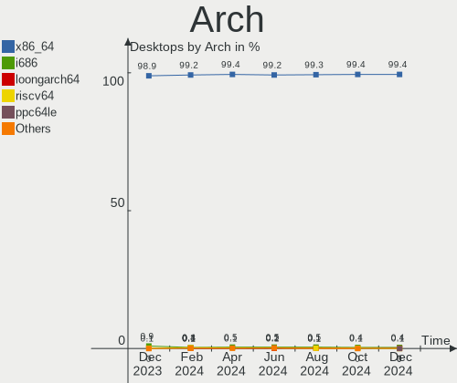
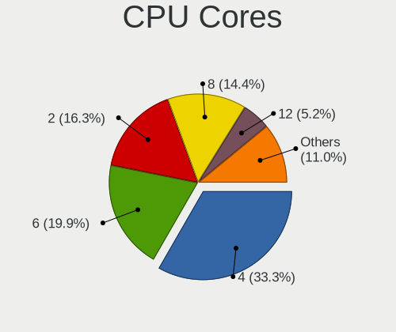
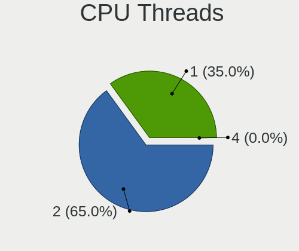
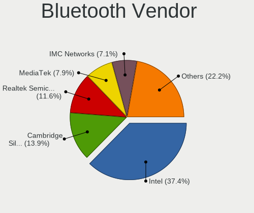

Linux - Hardware Trends (Desktops)
----------------------------------

A project to identify most popular hardware characteristics and track their change
over time based on data collected by Linux users at https://Linux-Hardware.org.

Anyone can contribute to this report by the [hw-probe](https://github.com/linuxhw/hw-probe) tool:

    sudo -E hw-probe -all -upload

This report is for one last month. Overall report since the beginning of time: [TestDays](https://github.com/linuxhw/TestDays)

Period: Dec, 2023.

Contents
--------

* [ System ](#system)
  - [ OS                       ](#os)
  - [ OS Family                ](#os-family)
  - [ Kernel                   ](#kernel)
  - [ Kernel Family            ](#kernel-family)
  - [ Kernel Major Ver.        ](#kernel-major-ver)
  - [ Arch                     ](#arch)
  - [ DE                       ](#de)
  - [ Display Server           ](#display-server)
  - [ Display Manager          ](#display-manager)
  - [ OS Lang                  ](#os-lang)
  - [ Boot Mode                ](#boot-mode)
  - [ Filesystem               ](#filesystem)
  - [ Part. scheme             ](#part-scheme)
  - [ Dual Boot with Linux/BSD ](#dual-boot-with-linuxbsd)
  - [ Dual Boot (Win)          ](#dual-boot-win)

* [ Board ](#board)
  - [ Vendor                   ](#vendor)
  - [ Model                    ](#model)
  - [ Model Family             ](#model-family)
  - [ MFG Year                 ](#mfg-year)
  - [ Form Factor              ](#form-factor)
  - [ Secure Boot              ](#secure-boot)
  - [ Coreboot                 ](#coreboot)
  - [ RAM Size                 ](#ram-size)
  - [ RAM Used                 ](#ram-used)
  - [ Total Drives             ](#total-drives)
  - [ Has CD-ROM               ](#has-cd-rom)
  - [ Has Ethernet             ](#has-ethernet)
  - [ Has WiFi                 ](#has-wifi)
  - [ Has Bluetooth            ](#has-bluetooth)

* [ Location ](#location)
  - [ Country                  ](#country)
  - [ City                     ](#city)

* [ Drives ](#drives)
  - [ Drive Vendor             ](#drive-vendor)
  - [ Drive Model              ](#drive-model)
  - [ HDD Vendor               ](#hdd-vendor)
  - [ SSD Vendor               ](#ssd-vendor)
  - [ Drive Kind               ](#drive-kind)
  - [ Drive Connector          ](#drive-connector)
  - [ Drive Size               ](#drive-size)
  - [ Space Total              ](#space-total)
  - [ Space Used               ](#space-used)
  - [ Malfunc. Drives          ](#malfunc-drives)
  - [ Malfunc. Drive Vendor    ](#malfunc-drive-vendor)
  - [ Malfunc. HDD Vendor      ](#malfunc-hdd-vendor)
  - [ Malfunc. Drive Kind      ](#malfunc-drive-kind)
  - [ Failed Drives            ](#failed-drives)
  - [ Failed Drive Vendor      ](#failed-drive-vendor)
  - [ Drive Status             ](#drive-status)

* [ Storage controller ](#storage-controller)
  - [ Storage Vendor           ](#storage-vendor)
  - [ Storage Model            ](#storage-model)
  - [ Storage Kind             ](#storage-kind)

* [ Processor ](#processor)
  - [ CPU Vendor               ](#cpu-vendor)
  - [ CPU Model                ](#cpu-model)
  - [ CPU Model Family         ](#cpu-model-family)
  - [ CPU Cores                ](#cpu-cores)
  - [ CPU Sockets              ](#cpu-sockets)
  - [ CPU Threads              ](#cpu-threads)
  - [ CPU Op-Modes             ](#cpu-op-modes)
  - [ CPU Microcode            ](#cpu-microcode)
  - [ CPU Microarch            ](#cpu-microarch)

* [ Graphics ](#graphics)
  - [ GPU Vendor               ](#gpu-vendor)
  - [ GPU Model                ](#gpu-model)
  - [ GPU Combo                ](#gpu-combo)
  - [ GPU Driver               ](#gpu-driver)
  - [ GPU Memory               ](#gpu-memory)

* [ Monitor ](#monitor)
  - [ Monitor Vendor           ](#monitor-vendor)
  - [ Monitor Model            ](#monitor-model)
  - [ Monitor Resolution       ](#monitor-resolution)
  - [ Monitor Diagonal         ](#monitor-diagonal)
  - [ Monitor Width            ](#monitor-width)
  - [ Aspect Ratio             ](#aspect-ratio)
  - [ Monitor Area             ](#monitor-area)
  - [ Pixel Density            ](#pixel-density)
  - [ Multiple Monitors        ](#multiple-monitors)

* [ Network ](#network)
  - [ Net Controller Vendor    ](#net-controller-vendor)
  - [ Net Controller Model     ](#net-controller-model)
  - [ Wireless Vendor          ](#wireless-vendor)
  - [ Wireless Model           ](#wireless-model)
  - [ Ethernet Vendor          ](#ethernet-vendor)
  - [ Ethernet Model           ](#ethernet-model)
  - [ Net Controller Kind      ](#net-controller-kind)
  - [ Used Controller          ](#used-controller)
  - [ NICs                     ](#nics)
  - [ IPv6                     ](#ipv6)

* [ Bluetooth ](#bluetooth)
  - [ Bluetooth Vendor         ](#bluetooth-vendor)
  - [ Bluetooth Model          ](#bluetooth-model)

* [ Sound ](#sound)
  - [ Sound Vendor             ](#sound-vendor)
  - [ Sound Model              ](#sound-model)

* [ Memory ](#memory)
  - [ Memory Vendor            ](#memory-vendor)
  - [ Memory Model             ](#memory-model)
  - [ Memory Kind              ](#memory-kind)
  - [ Memory Form Factor       ](#memory-form-factor)
  - [ Memory Size              ](#memory-size)
  - [ Memory Speed             ](#memory-speed)

* [ Printers & scanners ](#printers--scanners)
  - [ Printer Vendor           ](#printer-vendor)
  - [ Printer Model            ](#printer-model)
  - [ Scanner Vendor           ](#scanner-vendor)
  - [ Scanner Model            ](#scanner-model)

* [ Camera ](#camera)
  - [ Camera Vendor            ](#camera-vendor)
  - [ Camera Model             ](#camera-model)

* [ Security ](#security)
  - [ Fingerprint Vendor       ](#fingerprint-vendor)
  - [ Fingerprint Model        ](#fingerprint-model)
  - [ Chipcard Vendor          ](#chipcard-vendor)
  - [ Chipcard Model           ](#chipcard-model)

* [ Unsupported ](#unsupported)
  - [ Unsupported Devices      ](#unsupported-devices)
  - [ Unsupported Device Types ](#unsupported-device-types)

System
------

OS
--

Installed operating systems

| Name                         | Desktops | Percent |
|------------------------------|----------|---------|
| Ubuntu 22.04                 | 277      | 11.92%  |
| Linux Mint 21.2              | 190      | 8.18%   |
| Fedora 39                    | 173      | 7.44%   |
| Debian 12                    | 124      | 5.34%   |
| Ubuntu 23.10                 | 110      | 4.73%   |
| Arch Rolling                 | 105      | 4.52%   |
| OpenMandriva 5.0             | 100      | 4.3%    |
| ROSA 12.4                    | 76       | 3.27%   |
| OpenMandriva 23.08           | 76       | 3.27%   |
| CentOS 7                     | 71       | 3.06%   |
| ArcoLinux Rolling            | 71       | 3.06%   |
| Pop!_OS 22.04                | 70       | 3.01%   |
| OpenMandriva 23.11           | 55       | 2.37%   |
| Zorin 16                     | 52       | 2.24%   |
| BlackPanther 18.1            | 47       | 2.02%   |
| Ubuntu 20.04                 | 41       | 1.76%   |
| Nobara 38                    | 34       | 1.46%   |
| Zorin 17                     | 30       | 1.29%   |
| EndeavourOS Rolling          | 26       | 1.12%   |
| Kubuntu 23.10                | 25       | 1.08%   |
| KDE neon 22.04               | 25       | 1.08%   |
| Gentoo 2.14                  | 22       | 0.95%   |
| Manjaro                      | 21       | 0.9%    |
| LMDE 6                       | 21       | 0.9%    |
| openSUSE Tumbleweed-XXXXXXXX | 20       | 0.86%   |
| Manjaro 23.1.0               | 20       | 0.86%   |
| Kubuntu 22.04                | 18       | 0.77%   |
| Linux Mint 21.1              | 17       | 0.73%   |
| Debian 11                    | 17       | 0.73%   |
| OpenMandriva 23.03           | 14       | 0.6%    |
| openSUSE Leap-15.5           | 13       | 0.56%   |
| Xero Rolling                 | 12       | 0.52%   |
| Ubuntu 23.04                 | 12       | 0.52%   |
| Xubuntu 22.04                | 11       | 0.47%   |
| Fedora 38                    | 11       | 0.47%   |
| Debian                       | 11       | 0.47%   |
| Kali 2023.4                  | 10       | 0.43%   |
| Linux Mint 21                | 8        | 0.34%   |
| Ubuntu 18.04                 | 7        | 0.3%    |
| OpenMandriva 4.2             | 7        | 0.3%    |

OS Family
---------

OS without a version

| Name         | Desktops | Percent |
|--------------|----------|---------|
| Ubuntu       | 463      | 19.92%  |
| OpenMandriva | 274      | 11.79%  |
| Linux Mint   | 235      | 10.11%  |
| Fedora       | 191      | 8.22%   |
| Debian       | 161      | 6.93%   |
| Arch         | 105      | 4.52%   |
| ROSA         | 84       | 3.61%   |
| Zorin        | 83       | 3.57%   |
| CentOS       | 74       | 3.18%   |
| Pop!_OS      | 72       | 3.1%    |
| ArcoLinux    | 72       | 3.1%    |
| BlackPanther | 50       | 2.15%   |
| Manjaro      | 46       | 1.98%   |
| Kubuntu      | 46       | 1.98%   |
| Nobara       | 38       | 1.64%   |
| openSUSE     | 37       | 1.59%   |
| EndeavourOS  | 26       | 1.12%   |
| KDE neon     | 25       | 1.08%   |
| Xubuntu      | 24       | 1.03%   |
| LMDE         | 23       | 0.99%   |
| Gentoo       | 22       | 0.95%   |
| Xero         | 12       | 0.52%   |
| Kali         | 12       | 0.52%   |
| Garuda Linux | 9        | 0.39%   |
| NixOS        | 8        | 0.34%   |
| Lubuntu      | 8        | 0.34%   |
| ALT Linux    | 8        | 0.34%   |
| Red OS       | 6        | 0.26%   |
| BigLinux     | 6        | 0.26%   |
| Ultramarine  | 5        | 0.22%   |
| Ubuntu MATE  | 5        | 0.22%   |
| MX           | 5        | 0.22%   |
| Elementary   | 5        | 0.22%   |
| ChimeraOS    | 5        | 0.22%   |
| TUXEDO OS    | 4        | 0.17%   |
| SteamOS      | 4        | 0.17%   |
| Alpine       | 4        | 0.17%   |
| Void Linux   | 3        | 0.13%   |
| Rocky Linux  | 3        | 0.13%   |
| Parrot       | 3        | 0.13%   |

Kernel
------

Version of the Linux kernel

| Version                           | Desktops | Percent |
|-----------------------------------|----------|---------|
| 5.15.0-91-generic                 | 200      | 8.61%   |
| 6.2.0-39-generic                  | 158      | 6.8%    |
| 6.6.2-desktop-1omv2390            | 149      | 6.41%   |
| 6.2.0-37-generic                  | 128      | 5.51%   |
| 6.5.0-14-generic                  | 111      | 4.78%   |
| 5.15.0-89-generic                 | 75       | 3.23%   |
| 6.4.11-desktop-1omv2390           | 71       | 3.06%   |
| 6.1.0-16-amd64                    | 52       | 2.24%   |
| 3.10.0-1160.102.1.el7.x86_64      | 43       | 1.85%   |
| 6.1.0-13-amd64                    | 41       | 1.76%   |
| 6.1.58-generic-1rosa2021.1-x86_64 | 39       | 1.68%   |
| 6.6.7-arch1-1                     | 38       | 1.64%   |
| 6.5.6-76060506-generic            | 36       | 1.55%   |
| 6.6.6-76060606-generic            | 32       | 1.38%   |
| 6.6.7-200.fc39.x86_64             | 31       | 1.33%   |
| 6.6.4-200.fc39.x86_64             | 31       | 1.33%   |
| 6.6.8-200.fc39.x86_64             | 30       | 1.29%   |
| 6.6.2-201.fc39.x86_64             | 30       | 1.29%   |
| 6.6.3-arch1-1                     | 27       | 1.16%   |
| 6.6.6-200.fc39.x86_64             | 26       | 1.12%   |
| 6.6.8-arch1-1                     | 25       | 1.08%   |
| 6.6.4-arch1-1                     | 25       | 1.08%   |
| 6.1.20-generic-2rosa2021.1-x86_64 | 23       | 0.99%   |
| 5.6.14-desktop-2bP                | 21       | 0.9%    |
| 6.1.0-15-amd64                    | 19       | 0.82%   |
| 5.15.85-desktop-1bP               | 18       | 0.77%   |
| 6.5.0-13-generic                  | 17       | 0.73%   |
| 6.2.0-26-generic                  | 17       | 0.73%   |
| 6.5.6-300.fc39.x86_64             | 16       | 0.69%   |
| 6.6.7-zen1-1-zen                  | 14       | 0.6%    |
| 6.2.6-desktop-1omv2390            | 14       | 0.6%    |
| 5.15.0-76-generic                 | 14       | 0.6%    |
| 6.5.0-9-generic                   | 13       | 0.56%   |
| 5.19.0-38-generic                 | 13       | 0.56%   |
| 5.15.0-88-generic                 | 13       | 0.56%   |
| 6.6.3-1-default                   | 12       | 0.52%   |
| 6.6.1-arch1-1                     | 12       | 0.52%   |
| 6.6.6-arch1-1                     | 10       | 0.43%   |
| 6.5.0-kali3-amd64                 | 10       | 0.43%   |
| 6.4.8-desktop-2omv2390            | 10       | 0.43%   |

Kernel Family
-------------

Linux kernel without a distro release

| Version  | Desktops | Percent |
|----------|----------|---------|
| 5.15.0   | 337      | 14.5%   |
| 6.2.0    | 327      | 14.07%  |
| 6.6.2    | 195      | 8.39%   |
| 6.5.0    | 176      | 7.57%   |
| 6.1.0    | 154      | 6.63%   |
| 6.6.7    | 121      | 5.21%   |
| 6.6.6    | 87       | 3.74%   |
| 6.6.4    | 83       | 3.57%   |
| 6.6.8    | 79       | 3.4%    |
| 6.4.11   | 72       | 3.1%    |
| 3.10.0   | 71       | 3.06%   |
| 6.6.3    | 68       | 2.93%   |
| 6.5.6    | 56       | 2.41%   |
| 6.1.58   | 40       | 1.72%   |
| 5.4.0    | 30       | 1.29%   |
| 6.1.20   | 23       | 0.99%   |
| 5.6.14   | 21       | 0.9%    |
| 5.19.0   | 21       | 0.9%    |
| 6.6.5    | 18       | 0.77%   |
| 5.15.85  | 18       | 0.77%   |
| 6.6.1    | 17       | 0.73%   |
| 5.10.0   | 17       | 0.73%   |
| 6.2.6    | 14       | 0.6%    |
| 6.5.13   | 13       | 0.56%   |
| 6.5.11   | 13       | 0.56%   |
| 5.14.21  | 13       | 0.56%   |
| 6.7.0    | 11       | 0.47%   |
| 6.4.8    | 10       | 0.43%   |
| 6.1.68   | 10       | 0.43%   |
| 5.14.0   | 9        | 0.39%   |
| 4.15.0   | 8        | 0.34%   |
| 6.1.64   | 7        | 0.3%    |
| 6.1.52   | 7        | 0.3%    |
| 5.10.184 | 7        | 0.3%    |
| 5.10.14  | 7        | 0.3%    |
| 6.1.69   | 6        | 0.26%   |
| 6.1.67   | 6        | 0.26%   |
| 6.1.57   | 6        | 0.26%   |
| 5.15.127 | 6        | 0.26%   |
| 4.18.16  | 6        | 0.26%   |

Kernel Major Ver.
-----------------

Linux kernel major version

| Version | Desktops | Percent |
|---------|----------|---------|
| 6.6     | 669      | 28.79%  |
| 5.15    | 371      | 15.96%  |
| 6.2     | 349      | 15.02%  |
| 6.1     | 285      | 12.26%  |
| 6.5     | 273      | 11.75%  |
| 6.4     | 94       | 4.04%   |
| 3.10    | 71       | 3.06%   |
| 5.10    | 44       | 1.89%   |
| 5.4     | 33       | 1.42%   |
| 5.14    | 23       | 0.99%   |
| 5.6     | 22       | 0.95%   |
| 5.19    | 22       | 0.95%   |
| 6.7     | 11       | 0.47%   |
| 6.3     | 11       | 0.47%   |
| 4.18    | 8        | 0.34%   |
| 4.15    | 8        | 0.34%   |
| 5.16    | 6        | 0.26%   |
| 5.17    | 4        | 0.17%   |
| 5.11    | 4        | 0.17%   |
| 6.0     | 3        | 0.13%   |
| 5.8     | 3        | 0.13%   |
| 5.13    | 3        | 0.13%   |
| 5.18    | 2        | 0.09%   |
| 5.3     | 1        | 0.04%   |
| 4.9     | 1        | 0.04%   |
| 4.4     | 1        | 0.04%   |
| 4.19    | 1        | 0.04%   |
| 2.6     | 1        | 0.04%   |

Arch
----

OS architecture (x86_64, i586, etc.)

| Name    | Desktops | Percent |
|---------|----------|---------|
| x86_64  | 2299     | 98.92%  |
| i686    | 22       | 0.95%   |
| riscv64 | 2        | 0.09%   |
| i486    | 1        | 0.04%   |

DE
--

Desktop Environment

| Name             | Desktops | Percent |
|------------------|----------|---------|
| GNOME            | 929      | 39.97%  |
| KDE5             | 715      | 30.77%  |
| X-Cinnamon       | 213      | 9.17%   |
| XFCE             | 132      | 5.68%   |
| Unknown          | 101      | 4.35%   |
| MATE             | 64       | 2.75%   |
| Cinnamon         | 37       | 1.59%   |
| LXQt             | 29       | 1.25%   |
| i3               | 17       | 0.73%   |
| Hyprland         | 15       | 0.65%   |
| Budgie           | 10       | 0.43%   |
| LXDE             | 7        | 0.3%    |
| Pantheon         | 6        | 0.26%   |
| GNOME Classic    | 5        | 0.22%   |
| KDE4             | 4        | 0.17%   |
| GNOME Flashback  | 4        | 0.17%   |
| Deepin           | 4        | 0.17%   |
| bspwm            | 4        | 0.17%   |
| sway             | 3        | 0.13%   |
| KDE              | 3        | 0.13%   |
| Unity            | 2        | 0.09%   |
| qtile            | 2        | 0.09%   |
| icewm            | 2        | 0.09%   |
| awesome          | 2        | 0.09%   |
| xsession         | 1        | 0.04%   |
| X-Generic        | 1        | 0.04%   |
| wayfire          | 1        | 0.04%   |
| Trinity          | 1        | 0.04%   |
| Openbox          | 1        | 0.04%   |
| none+i3          | 1        | 0.04%   |
| lightdm-xsession | 1        | 0.04%   |
| KDE6             | 1        | 0.04%   |
| Endless:GNOME    | 1        | 0.04%   |
| DWM              | 1        | 0.04%   |
| DDE              | 1        | 0.04%   |
| Cutefish         | 1        | 0.04%   |
| chadwm           | 1        | 0.04%   |
| BunsenLabs       | 1        | 0.04%   |

Display Server
--------------

X11 or Wayland

| Name    | Desktops | Percent |
|---------|----------|---------|
| X11     | 1306     | 56.2%   |
| Wayland | 880      | 37.87%  |
| Unknown | 71       | 3.06%   |
| Tty     | 67       | 2.88%   |

Display Manager
---------------

SDDM, LightDM, etc.

| Name    | Desktops | Percent |
|---------|----------|---------|
| Unknown | 775      | 33.35%  |
| SDDM    | 594      | 25.56%  |
| GDM3    | 446      | 19.19%  |
| LightDM | 288      | 12.39%  |
| GDM     | 198      | 8.52%   |
| KDM     | 5        | 0.22%   |
| LY-DM   | 4        | 0.17%   |
| SLiM    | 3        | 0.13%   |
| NODM    | 3        | 0.13%   |
| XDM     | 2        | 0.09%   |
| SLIMSKI | 2        | 0.09%   |
| MDM     | 1        | 0.04%   |
| LXDM    | 1        | 0.04%   |
| LEMURS  | 1        | 0.04%   |
| EMPTTY  | 1        | 0.04%   |

OS Lang
-------

Language

| Lang    | Desktops | Percent |
|---------|----------|---------|
| en_US   | 912      | 39.24%  |
| de_DE   | 200      | 8.61%   |
| ru_RU   | 160      | 6.88%   |
| Unknown | 148      | 6.37%   |
| fr_FR   | 112      | 4.82%   |
| en_GB   | 109      | 4.69%   |
| pt_BR   | 93       | 4%      |
| it_IT   | 77       | 3.31%   |
| C       | 61       | 2.62%   |
| en_AU   | 55       | 2.37%   |
| pl_PL   | 48       | 2.07%   |
| es_ES   | 48       | 2.07%   |
| en_CA   | 34       | 1.46%   |
| en_IN   | 23       | 0.99%   |
| hu_HU   | 15       | 0.65%   |
| zh_CN   | 13       | 0.56%   |
| cs_CZ   | 13       | 0.56%   |
| nl_NL   | 12       | 0.52%   |
| es_MX   | 12       | 0.52%   |
| es_CO   | 8        | 0.34%   |
| es_CL   | 8        | 0.34%   |
| es_AR   | 8        | 0.34%   |
| de_AT   | 8        | 0.34%   |
| ja_JP   | 7        | 0.3%    |
| zh_TW   | 6        | 0.26%   |
| tr_TR   | 6        | 0.26%   |
| sv_SE   | 6        | 0.26%   |
| sk_SK   | 6        | 0.26%   |
| fr_CA   | 6        | 0.26%   |
| fi_FI   | 6        | 0.26%   |
| en_ZA   | 6        | 0.26%   |
| de_CH   | 6        | 0.26%   |
| pt_PT   | 5        | 0.22%   |
| nl_BE   | 5        | 0.22%   |
| nb_NO   | 5        | 0.22%   |
| ro_RO   | 4        | 0.17%   |
| en_PH   | 4        | 0.17%   |
| en_IE   | 4        | 0.17%   |
| POSIX   | 3        | 0.13%   |
| ko_KR   | 3        | 0.13%   |

Boot Mode
---------

EFI or BIOS

| Mode | Desktops | Percent |
|------|----------|---------|
| BIOS | 1173     | 50.47%  |
| EFI  | 1151     | 49.53%  |

Filesystem
----------

Type of filesystem

| Type    | Desktops | Percent |
|---------|----------|---------|
| Ext4    | 1353     | 58.22%  |
| Btrfs   | 356      | 15.32%  |
| Tmpfs   | 325      | 13.98%  |
| Overlay | 179      | 7.7%    |
| Xfs     | 40       | 1.72%   |
| Ext3    | 36       | 1.55%   |
| Zfs     | 18       | 0.77%   |
| F2fs    | 8        | 0.34%   |
| Rootfs  | 4        | 0.17%   |
| Unknown | 3        | 0.13%   |
| XXXXXXX | 1        | 0.04%   |
| Jfs     | 1        | 0.04%   |

Part. scheme
------------

Scheme of partitioning

| Type    | Desktops | Percent |
|---------|----------|---------|
| GPT     | 1313     | 56.5%   |
| Unknown | 689      | 29.65%  |
| MBR     | 322      | 13.86%  |

Dual Boot with Linux/BSD
------------------------

Hosting more than one Linux/BSD

| Dual boot | Desktops | Percent |
|-----------|----------|---------|
| No        | 1862     | 80.12%  |
| Yes       | 462      | 19.88%  |

Dual Boot (Win)
---------------

Hosting Linux and Windows

| Dual boot | Desktops | Percent |
|-----------|----------|---------|
| No        | 1616     | 69.54%  |
| Yes       | 708      | 30.46%  |

Board
-----

Vendor
------

Motherboard manufacturer

| Name                                 | Desktops | Percent |
|--------------------------------------|----------|---------|
| ASUSTek Computer                     | 567      | 24.4%   |
| Gigabyte Technology                  | 408      | 17.56%  |
| MSI                                  | 330      | 14.2%   |
| Hewlett-Packard                      | 196      | 8.43%   |
| ASRock                               | 180      | 7.75%   |
| Dell                                 | 177      | 7.62%   |
| Lenovo                               | 94       | 4.04%   |
| Intel                                | 56       | 2.41%   |
| Unknown                              | 37       | 1.59%   |
| Acer                                 | 32       | 1.38%   |
| Fujitsu                              | 27       | 1.16%   |
| Foxconn                              | 18       | 0.77%   |
| AZW                                  | 15       | 0.65%   |
| Supermicro                           | 14       | 0.6%    |
| Pegatron                             | 14       | 0.6%    |
| Biostar                              | 14       | 0.6%    |
| Shenzhen Meigao Electronic Equipment | 8        | 0.34%   |
| Medion                               | 8        | 0.34%   |
| MACHINIST                            | 8        | 0.34%   |
| Huanan                               | 7        | 0.3%    |
| ECS                                  | 7        | 0.3%    |
| Apple                                | 6        | 0.26%   |
| Positivo                             | 5        | 0.22%   |
| eMachines                            | 5        | 0.22%   |
| BESSTAR Tech                         | 5        | 0.22%   |
| AMI                                  | 5        | 0.22%   |
| Inventec                             | 4        | 0.17%   |
| HC Technology.                       | 4        | 0.17%   |
| Alienware                            | 4        | 0.17%   |
| ZOTAC                                | 3        | 0.13%   |
| Shuttle                              | 3        | 0.13%   |
| PCWare                               | 3        | 0.13%   |
| Packard Bell                         | 3        | 0.13%   |
| OEM                                  | 3        | 0.13%   |
| EVGA                                 | 3        | 0.13%   |
| ANGXUN                               | 3        | 0.13%   |
| LattePanda                           | 2        | 0.09%   |
| Google                               | 2        | 0.09%   |
| XFX                                  | 1        | 0.04%   |
| XDO.AI                               | 1        | 0.04%   |

Model
-----

Motherboard model

| Name                                | Desktops | Percent |
|-------------------------------------|----------|---------|
| Unknown                             | 41       | 1.76%   |
| ASUS All Series                     | 40       | 1.72%   |
| Gigabyte H81M-S2H                   | 17       | 0.73%   |
| MSI MS-7C56                         | 15       | 0.65%   |
| MSI MS-7C31                         | 15       | 0.65%   |
| Dell OptiPlex 7010                  | 15       | 0.65%   |
| ASUS PRIME A320M-K                  | 14       | 0.6%    |
| ASUS TUF Gaming X570-PLUS           | 13       | 0.56%   |
| MSI MS-7C02                         | 11       | 0.47%   |
| MSI MS-7C91                         | 10       | 0.43%   |
| MSI MS-7B86                         | 10       | 0.43%   |
| MSI MS-7A15                         | 10       | 0.43%   |
| Intel H61                           | 10       | 0.43%   |
| ASUS ROG STRIX B550-F GAMING        | 10       | 0.43%   |
| Dell OptiPlex 7040                  | 9        | 0.39%   |
| ASUS PRIME B450-PLUS                | 9        | 0.39%   |
| MSI MS-7B79                         | 8        | 0.34%   |
| MSI MS-7A38                         | 8        | 0.34%   |
| Lenovo ThinkCentre M710s 10M8S02A00 | 8        | 0.34%   |
| Gigabyte B550M DS3H                 | 8        | 0.34%   |
| Gigabyte B450M DS3H                 | 8        | 0.34%   |
| Dell OptiPlex 3020                  | 8        | 0.34%   |
| ASUS M5A97 R2.0                     | 8        | 0.34%   |
| ASUS H110M-K                        | 8        | 0.34%   |
| MSI MS-7C95                         | 7        | 0.3%    |
| MSI MS-7C37                         | 7        | 0.3%    |
| MSI MS-7A74                         | 7        | 0.3%    |
| HP Z440 Workstation                 | 7        | 0.3%    |
| HP Compaq Elite 8300 SFF            | 7        | 0.3%    |
| HP Compaq 8200 Elite SFF PC         | 7        | 0.3%    |
| Gigabyte B550 AORUS ELITE V2        | 7        | 0.3%    |
| Dell OptiPlex 9020                  | 7        | 0.3%    |
| AZW MINI S                          | 7        | 0.3%    |
| ASUS TUF Gaming B550M-PLUS          | 7        | 0.3%    |
| MSI MS-7B53                         | 6        | 0.26%   |
| MSI MS-7693                         | 6        | 0.26%   |
| HP EliteDesk 800 G1 SFF             | 6        | 0.26%   |
| Gigabyte 970A-DS3P                  | 6        | 0.26%   |
| Dell OptiPlex 3010                  | 6        | 0.26%   |
| ASUS ROG STRIX X570-E GAMING        | 6        | 0.26%   |

Model Family
------------

Motherboard model prefix

| Name                | Desktops | Percent |
|---------------------|----------|---------|
| ASUS PRIME          | 136      | 5.85%   |
| Dell OptiPlex       | 113      | 4.86%   |
| ASUS ROG            | 100      | 4.3%    |
| ASUS TUF            | 72       | 3.1%    |
| Lenovo ThinkCentre  | 62       | 2.67%   |
| HP Compaq           | 56       | 2.41%   |
| Unknown             | 41       | 1.76%   |
| ASUS All            | 40       | 1.72%   |
| HP EliteDesk        | 28       | 1.2%    |
| HP ProDesk          | 23       | 0.99%   |
| Fujitsu ESPRIMO     | 23       | 0.99%   |
| Dell Precision      | 23       | 0.99%   |
| Gigabyte B550       | 20       | 0.86%   |
| Acer Aspire         | 20       | 0.86%   |
| Gigabyte B550M      | 19       | 0.82%   |
| Gigabyte X570       | 17       | 0.73%   |
| Gigabyte H81M-S2H   | 17       | 0.73%   |
| Gigabyte B450M      | 17       | 0.73%   |
| MSI MS-7C56         | 15       | 0.65%   |
| MSI MS-7C31         | 15       | 0.65%   |
| Dell Inspiron       | 14       | 0.6%    |
| ASUS M5A97          | 13       | 0.56%   |
| ASUS M5A78L-M       | 13       | 0.56%   |
| ASRock B450M        | 13       | 0.56%   |
| MSI MS-7C02         | 11       | 0.47%   |
| Intel H61           | 11       | 0.47%   |
| Gigabyte B450       | 11       | 0.47%   |
| Dell Vostro         | 11       | 0.47%   |
| MSI MS-7C91         | 10       | 0.43%   |
| MSI MS-7B86         | 10       | 0.43%   |
| MSI MS-7A15         | 10       | 0.43%   |
| Lenovo ThinkStation | 10       | 0.43%   |
| Gigabyte Z790       | 10       | 0.43%   |
| Gigabyte Z390       | 10       | 0.43%   |
| Dell XPS            | 10       | 0.43%   |
| ASUS Pro            | 10       | 0.43%   |
| ASRock X570         | 9        | 0.39%   |
| ASRock B450         | 9        | 0.39%   |
| Acer Veriton        | 9        | 0.39%   |
| MSI MS-7B79         | 8        | 0.34%   |

MFG Year
--------

Motherboard manufacture year

| Year    | Desktops | Percent |
|---------|----------|---------|
| 2018    | 215      | 9.25%   |
| 2020    | 207      | 8.91%   |
| 2022    | 195      | 8.39%   |
| 2019    | 181      | 7.79%   |
| 2013    | 165      | 7.1%    |
| 2012    | 162      | 6.97%   |
| 2021    | 154      | 6.63%   |
| 2017    | 144      | 6.2%    |
| 2023    | 140      | 6.02%   |
| 2014    | 140      | 6.02%   |
| 2011    | 115      | 4.95%   |
| 2016    | 114      | 4.91%   |
| 2010    | 104      | 4.48%   |
| 2015    | 95       | 4.09%   |
| 2009    | 89       | 3.83%   |
| 2008    | 41       | 1.76%   |
| 2007    | 35       | 1.51%   |
| 2006    | 10       | 0.43%   |
| 2005    | 5        | 0.22%   |
| 2004    | 5        | 0.22%   |
| Unknown | 3        | 0.13%   |
| 2024    | 2        | 0.09%   |
| 2001    | 2        | 0.09%   |
| 2003    | 1        | 0.04%   |

Form Factor
-----------

Physical design of the computer

| Name    | Desktops | Percent |
|---------|----------|---------|
| Desktop | 2324     | 100%    |

Secure Boot
-----------

Enabled or disabled

| State    | Desktops | Percent |
|----------|----------|---------|
| Disabled | 2237     | 96.26%  |
| Enabled  | 87       | 3.74%   |

Coreboot
--------

Have coreboot on board

| Used | Desktops | Percent |
|------|----------|---------|
| No   | 2322     | 99.91%  |
| Yes  | 2        | 0.09%   |

RAM Size
--------

Total RAM memory

| Size in GB      | Desktops | Percent |
|-----------------|----------|---------|
| 16.01-24.0      | 544      | 23.41%  |
| 32.01-64.0      | 448      | 19.28%  |
| 4.01-8.0        | 401      | 17.25%  |
| 8.01-16.0       | 362      | 15.58%  |
| 3.01-4.0        | 202      | 8.69%   |
| 64.01-256.0     | 198      | 8.52%   |
| 24.01-32.0      | 110      | 4.73%   |
| 1.01-2.0        | 24       | 1.03%   |
| 2.01-3.0        | 15       | 0.65%   |
| More than 256.0 | 13       | 0.56%   |
| 0.51-1.0        | 4        | 0.17%   |
| 0.01-0.5        | 1        | 0.04%   |
| 0               | 1        | 0.04%   |
| Unknown         | 1        | 0.04%   |

RAM Used
--------

Used RAM memory

| Used GB     | Desktops | Percent |
|-------------|----------|---------|
| 1.01-2.0    | 680      | 29.26%  |
| 4.01-8.0    | 502      | 21.6%   |
| 2.01-3.0    | 498      | 21.43%  |
| 3.01-4.0    | 290      | 12.48%  |
| 8.01-16.0   | 137      | 5.9%    |
| 0.51-1.0    | 120      | 5.16%   |
| 0.01-0.5    | 40       | 1.72%   |
| 16.01-24.0  | 30       | 1.29%   |
| 32.01-64.0  | 9        | 0.39%   |
| 24.01-32.0  | 9        | 0.39%   |
| 64.01-256.0 | 6        | 0.26%   |
| Unknown     | 2        | 0.09%   |
| 0           | 1        | 0.04%   |

Total Drives
------------

Number of drives on board

| Drives | Desktops | Percent |
|--------|----------|---------|
| 1      | 864      | 37.18%  |
| 2      | 632      | 27.19%  |
| 3      | 386      | 16.61%  |
| 4      | 217      | 9.34%   |
| 5      | 100      | 4.3%    |
| 6      | 56       | 2.41%   |
| 7      | 20       | 0.86%   |
| 0      | 16       | 0.69%   |
| 8      | 9        | 0.39%   |
| 10     | 7        | 0.3%    |
| 9      | 7        | 0.3%    |
| 13     | 4        | 0.17%   |
| 11     | 2        | 0.09%   |
| 101    | 1        | 0.04%   |
| 21     | 1        | 0.04%   |
| 15     | 1        | 0.04%   |
| 12     | 1        | 0.04%   |

Has CD-ROM
----------

Has CD-ROM on board

| Presented | Desktops | Percent |
|-----------|----------|---------|
| No        | 1434     | 61.7%   |
| Yes       | 890      | 38.3%   |

Has Ethernet
------------

Has Ethernet on board

| Presented | Desktops | Percent |
|-----------|----------|---------|
| Yes       | 2295     | 98.75%  |
| No        | 29       | 1.25%   |

Has WiFi
--------

Has WiFi module

| Presented | Desktops | Percent |
|-----------|----------|---------|
| No        | 1237     | 53.23%  |
| Yes       | 1087     | 46.77%  |

Has Bluetooth
-------------

Has Bluetooth module

| Presented | Desktops | Percent |
|-----------|----------|---------|
| No        | 1407     | 60.54%  |
| Yes       | 917      | 39.46%  |

Location
--------

Country
-------

Geographic location (country)

| Country     | Desktops | Percent |
|-------------|----------|---------|
| USA         | 449      | 19.32%  |
| Germany     | 249      | 10.71%  |
| Russia      | 189      | 8.13%   |
| Australia   | 131      | 5.64%   |
| France      | 124      | 5.34%   |
| Brazil      | 122      | 5.25%   |
| Italy       | 103      | 4.43%   |
| UK          | 79       | 3.4%    |
| Hungary     | 71       | 3.06%   |
| Canada      | 69       | 2.97%   |
| Poland      | 66       | 2.84%   |
| Spain       | 61       | 2.62%   |
| Netherlands | 33       | 1.42%   |
| India       | 32       | 1.38%   |
| Mexico      | 30       | 1.29%   |
| Belgium     | 30       | 1.29%   |
| Sweden      | 26       | 1.12%   |
| China       | 24       | 1.03%   |
| Czechia     | 19       | 0.82%   |
| Switzerland | 18       | 0.77%   |
| Austria     | 18       | 0.77%   |
| Japan       | 17       | 0.73%   |
| Finland     | 15       | 0.65%   |
| Argentina   | 15       | 0.65%   |
| Portugal    | 14       | 0.6%    |
| Norway      | 14       | 0.6%    |
| Colombia    | 14       | 0.6%    |
| Israel      | 13       | 0.56%   |
| Vietnam     | 11       | 0.47%   |
| Turkey      | 11       | 0.47%   |
| Thailand    | 11       | 0.47%   |
| Romania     | 11       | 0.47%   |
| Chile       | 11       | 0.47%   |
| Singapore   | 10       | 0.43%   |
| Serbia      | 10       | 0.43%   |
| Greece      | 10       | 0.43%   |
| Egypt       | 10       | 0.43%   |
| Bulgaria    | 10       | 0.43%   |
| Taiwan      | 9        | 0.39%   |
| Slovakia    | 9        | 0.39%   |

City
----

Geographic location (city)

| City           | Desktops | Percent |
|----------------|----------|---------|
| Melbourne      | 80       | 3.44%   |
| Moscow         | 47       | 2.02%   |
| Sydney         | 27       | 1.16%   |
| Roubaix        | 20       | 0.86%   |
| Budapest       | 19       | 0.82%   |
| Warsaw         | 17       | 0.73%   |
| Sao Paulo      | 17       | 0.73%   |
| St Petersburg  | 16       | 0.69%   |
| Berlin         | 15       | 0.65%   |
| Rome           | 13       | 0.56%   |
| Hamburg        | 11       | 0.47%   |
| Singapore      | 10       | 0.43%   |
| Milan          | 10       | 0.43%   |
| Toronto        | 9        | 0.39%   |
| Rio de Janeiro | 9        | 0.39%   |
| Voronezh       | 8        | 0.34%   |
| Munich         | 8        | 0.34%   |
| Montreal       | 8        | 0.34%   |
| Helsinki       | 8        | 0.34%   |
| Cologne        | 8        | 0.34%   |
| Brisbane       | 8        | 0.34%   |
| Bogotá        | 8        | 0.34%   |
| Barcelona      | 8        | 0.34%   |
| Vienna         | 7        | 0.3%    |
| Santiago       | 7        | 0.3%    |
| Madrid         | 7        | 0.3%    |
| Lisbon         | 7        | 0.3%    |
| Kolkata        | 7        | 0.3%    |
| Chicago        | 7        | 0.3%    |
| Amsterdam      | 7        | 0.3%    |
| Yekaterinburg  | 6        | 0.26%   |
| Vancouver      | 6        | 0.26%   |
| Tehran         | 6        | 0.26%   |
| Seattle        | 6        | 0.26%   |
| Porto Alegre   | 6        | 0.26%   |
| Paris          | 6        | 0.26%   |
| Mumbai         | 6        | 0.26%   |
| Los Angeles    | 6        | 0.26%   |
| Harrisonburg   | 6        | 0.26%   |
| Cairo          | 6        | 0.26%   |

Drives
------

Drive Vendor
------------

Hard drive vendors

| Vendor                       | Desktops | Drives | Percent |
|------------------------------|----------|--------|---------|
| WDC                          | 777      | 1095   | 17.87%  |
| Samsung Electronics          | 659      | 952    | 15.16%  |
| Seagate                      | 635      | 872    | 14.6%   |
| Kingston                     | 268      | 302    | 6.16%   |
| Sandisk                      | 218      | 258    | 5.01%   |
| Toshiba                      | 201      | 232    | 4.62%   |
| Crucial                      | 190      | 243    | 4.37%   |
| Hitachi                      | 110      | 130    | 2.53%   |
| Micron/Crucial Technology    | 69       | 77     | 1.59%   |
| Intel                        | 67       | 90     | 1.54%   |
| Phison Electronics           | 66       | 76     | 1.52%   |
| A-DATA Technology            | 65       | 70     | 1.49%   |
| China                        | 56       | 63     | 1.29%   |
| Unknown                      | 51       | 73     | 1.17%   |
| Kingston Technology Company  | 47       | 49     | 1.08%   |
| PNY                          | 42       | 46     | 0.97%   |
| HGST                         | 34       | 77     | 0.78%   |
| Silicon Motion               | 33       | 33     | 0.76%   |
| SPCC                         | 32       | 36     | 0.74%   |
| MAXIO Technology (Hangzhou)  | 32       | 32     | 0.74%   |
| Micron Technology            | 29       | 30     | 0.67%   |
| ADATA Technology             | 28       | 32     | 0.64%   |
| Patriot                      | 26       | 26     | 0.6%    |
| Intenso                      | 26       | 29     | 0.6%    |
| SK hynix                     | 25       | 27     | 0.57%   |
| GOODRAM                      | 22       | 27     | 0.51%   |
| Team                         | 20       | 20     | 0.46%   |
| Corsair                      | 19       | 21     | 0.44%   |
| Maxtor                       | 18       | 18     | 0.41%   |
| Unknown                      | 16       | 18     | 0.37%   |
| Netac                        | 15       | 16     | 0.34%   |
| Hewlett-Packard              | 15       | 17     | 0.34%   |
| OCZ                          | 14       | 14     | 0.32%   |
| Lexar                        | 14       | 14     | 0.32%   |
| Fanxiang                     | 14       | 17     | 0.32%   |
| Realtek Semiconductor        | 13       | 14     | 0.3%    |
| KIOXIA-EXCERIA               | 13       | 18     | 0.3%    |
| Gigabyte Technology          | 13       | 13     | 0.3%    |
| Shenzhen Longsys Electronics | 12       | 13     | 0.28%   |
| AMD                          | 12       | 17     | 0.28%   |

Drive Model
-----------

Hard drive models

| Model                                                 | Desktops | Percent |
|-------------------------------------------------------|----------|---------|
| Samsung NVMe SSD Controller SM981/PM981/PM983 512GB   | 94       | 1.84%   |
| Samsung NVMe SSD Controller PM9A1/PM9A3/980PRO 2TB    | 74       | 1.45%   |
| WDC WD10EZEX-08WN4A0 1TB                              | 70       | 1.37%   |
| Seagate ST500DM002-1BD142 500GB                       | 53       | 1.04%   |
| Kingston SA400S37480G 480GB SSD                       | 50       | 0.98%   |
| Kingston SA400S37240G 240GB SSD                       | 48       | 0.94%   |
| Seagate ST2000DM008-2FR102 2TB                        | 47       | 0.92%   |
| Seagate ST1000DM010-2EP102 1TB                        | 43       | 0.84%   |
| Toshiba DT01ACA100 1TB                                | 42       | 0.82%   |
| Samsung SSD 860 EVO 500GB                             | 42       | 0.82%   |
| Micron/Crucial P2 NVMe PCIe SSD 4TB                   | 42       | 0.82%   |
| Samsung SSD 850 EVO 250GB                             | 34       | 0.66%   |
| Samsung SSD 860 EVO 1TB                               | 32       | 0.63%   |
| Seagate ST4000DM004-2CV104 4TB                        | 31       | 0.61%   |
| Samsung SSD 850 EVO 500GB                             | 30       | 0.59%   |
| Kingston SA400S37120G 120GB SSD                       | 30       | 0.59%   |
| Crucial CT500MX500SSD1 500GB                          | 30       | 0.59%   |
| Phison E12 NVMe Controller 1TB                        | 28       | 0.55%   |
| Samsung SSD 980 1TB                                   | 27       | 0.53%   |
| Crucial CT1000MX500SSD1 1TB                           | 27       | 0.53%   |
| Seagate ST1000DM003-1SB102 1TB                        | 26       | 0.51%   |
| Samsung SSD 870 EVO 1TB                               | 23       | 0.45%   |
| Kingston Company SNV2S1000G 1TB                       | 23       | 0.45%   |
| Silicon Motion SM2263EN/SM2263XT SSD Controller 500GB | 22       | 0.43%   |
| Samsung SSD 870 EVO 500GB                             | 22       | 0.43%   |
| Crucial CT240BX500SSD1 240GB                          | 22       | 0.43%   |
| Unknown SD/MMC/MS PRO 512GB                           | 21       | 0.41%   |
| Samsung SSD 860 EVO 250GB                             | 21       | 0.41%   |
| MAXIO (Hangzhou) NVMe SSD Controller MAP1202 256GB    | 21       | 0.41%   |
| WDC WD10EZEX-00WN4A0 1TB                              | 20       | 0.39%   |
| Toshiba DT01ACA050 500GB                              | 20       | 0.39%   |
| Samsung SSD 870 QVO 1TB                               | 20       | 0.39%   |
| Kingston SV300S37A120G 120GB SSD                      | 20       | 0.39%   |
| Seagate ST2000DM001-1ER164 2TB                        | 19       | 0.37%   |
| WDC WD10EZEX-00MFCA0 1TB                              | 18       | 0.35%   |
| Toshiba HDWD110 1TB                                   | 18       | 0.35%   |
| Sandisk WD Blue SN550 NVMe SSD 1TB                    | 18       | 0.35%   |
| Samsung SSD 840 EVO 250GB                             | 18       | 0.35%   |
| WDC WDS240G2G0A-00JH30 240GB SSD                      | 16       | 0.31%   |
| Seagate ST1000DM003-1ER162 1TB                        | 16       | 0.31%   |

HDD Vendor
----------

Hard disk drive vendors

| Vendor              | Desktops | Drives | Percent |
|---------------------|----------|--------|---------|
| WDC                 | 699      | 959    | 38.32%  |
| Seagate             | 623      | 853    | 34.16%  |
| Toshiba             | 181      | 210    | 9.92%   |
| Hitachi             | 110      | 130    | 6.03%   |
| Samsung Electronics | 84       | 94     | 4.61%   |
| HGST                | 33       | 54     | 1.81%   |
| Unknown             | 23       | 23     | 1.26%   |
| Maxtor              | 17       | 17     | 0.93%   |
| Fujitsu             | 11       | 11     | 0.6%    |
| SABRENT             | 4        | 4      | 0.22%   |
| HPQ                 | 4        | 4      | 0.22%   |
| Hewlett-Packard     | 4        | 6      | 0.22%   |
| ASMT                | 4        | 17     | 0.22%   |
| WD MediaMax         | 3        | 4      | 0.16%   |
| USB3.0              | 2        | 2      | 0.11%   |
| TO Exter            | 2        | 2      | 0.11%   |
| Intenso             | 2        | 2      | 0.11%   |
| External            | 2        | 2      | 0.11%   |
| Apple               | 2        | 2      | 0.11%   |
| USB                 | 1        | 2      | 0.05%   |
| SSI                 | 1        | 1      | 0.05%   |
| SAGE                | 1        | 1      | 0.05%   |
| OOS16000            | 1        | 1      | 0.05%   |
| NETAPP              | 1        | 12     | 0.05%   |
| MaxDigital          | 1        | 1      | 0.05%   |
| MARVELL             | 1        | 1      | 0.05%   |
| KINGWIN             | 1        | 1      | 0.05%   |
| KESU                | 1        | 1      | 0.05%   |
| JMicron Technology  | 1        | 1      | 0.05%   |
| H/W                 | 1        | 7      | 0.05%   |
| Elite               | 1        | 1      | 0.05%   |
| DC-624e             | 1        | 1      | 0.05%   |
| Unknown             | 1        | 1      | 0.05%   |

SSD Vendor
----------

Solid state drive vendors

| Vendor              | Desktops | Drives | Percent |
|---------------------|----------|--------|---------|
| Samsung Electronics | 373      | 463    | 24.03%  |
| Kingston            | 203      | 221    | 13.08%  |
| Crucial             | 165      | 208    | 10.63%  |
| WDC                 | 99       | 106    | 6.38%   |
| SanDisk             | 99       | 106    | 6.38%   |
| China               | 56       | 63     | 3.61%   |
| A-DATA Technology   | 50       | 55     | 3.22%   |
| Intel               | 42       | 61     | 2.71%   |
| PNY                 | 40       | 44     | 2.58%   |
| SPCC                | 27       | 30     | 1.74%   |
| Patriot             | 25       | 25     | 1.61%   |
| Intenso             | 22       | 25     | 1.42%   |
| GOODRAM             | 21       | 24     | 1.35%   |
| Team                | 16       | 16     | 1.03%   |
| Micron Technology   | 16       | 16     | 1.03%   |
| OCZ                 | 14       | 14     | 0.9%    |
| SK hynix            | 12       | 12     | 0.77%   |
| Netac               | 12       | 13     | 0.77%   |
| Corsair             | 12       | 12     | 0.77%   |
| Transcend           | 11       | 11     | 0.71%   |
| Lexar               | 11       | 11     | 0.71%   |
| KingSpec            | 10       | 10     | 0.64%   |
| Gigabyte Technology | 10       | 10     | 0.64%   |
| Verbatim            | 8        | 9      | 0.52%   |
| Toshiba             | 8        | 8      | 0.52%   |
| KIOXIA-EXCERIA      | 8        | 12     | 0.52%   |
| Emtec               | 8        | 8      | 0.52%   |
| Apacer              | 8        | 8      | 0.52%   |
| LITEON              | 7        | 7      | 0.45%   |
| JMicron Technology  | 7        | 8      | 0.45%   |
| XrayDisk            | 6        | 7      | 0.39%   |
| Plextor             | 6        | 6      | 0.39%   |
| LITEONIT            | 6        | 6      | 0.39%   |
| Fanxiang            | 6        | 7      | 0.39%   |
| AMD                 | 6        | 6      | 0.39%   |
| Unknown             | 6        | 6      | 0.39%   |
| KingDian            | 5        | 6      | 0.32%   |
| Hewlett-Packard     | 5        | 5      | 0.32%   |
| SUNEAST             | 4        | 4      | 0.26%   |
| Acer                | 4        | 4      | 0.26%   |

Drive Kind
----------

HDD or SSD

| Kind    | Desktops | Drives | Percent |
|---------|----------|--------|---------|
| HDD     | 1440     | 2428   | 39.51%  |
| SSD     | 1229     | 1773   | 33.72%  |
| NVMe    | 892      | 1249   | 24.47%  |
| Unknown | 76       | 134    | 2.09%   |
| MMC     | 8        | 9      | 0.22%   |

Drive Connector
---------------

SATA, SAS, NVMe, etc.

| Type | Desktops | Drives | Percent |
|------|----------|--------|---------|
| SATA | 1993     | 4011   | 64.77%  |
| NVMe | 891      | 1238   | 28.96%  |
| SAS  | 185      | 335    | 6.01%   |
| MMC  | 8        | 9      | 0.26%   |

Drive Size
----------

Size of hard drive

| Size in TB | Desktops | Drives | Percent |
|------------|----------|--------|---------|
| 0.01-0.5   | 1340     | 1938   | 45.33%  |
| 0.51-1.0   | 897      | 1192   | 30.35%  |
| 1.01-2.0   | 355      | 469    | 12.01%  |
| 3.01-4.0   | 152      | 207    | 5.14%   |
| 4.01-10.0  | 94       | 159    | 3.18%   |
| 2.01-3.0   | 80       | 118    | 2.71%   |
| 10.01-20.0 | 37       | 117    | 1.25%   |
| 20.01-50.0 | 1        | 1      | 0.03%   |

Space Total
-----------

Amount of disk space available on the file system

| Size in GB     | Desktops | Percent |
|----------------|----------|---------|
| 501-1000       | 433      | 18.63%  |
| 101-250        | 402      | 17.3%   |
| 251-500        | 329      | 14.16%  |
| More than 3000 | 318      | 13.68%  |
| 1001-2000      | 311      | 13.38%  |
| 1-20           | 129      | 5.55%   |
| 2001-3000      | 122      | 5.25%   |
| 51-100         | 120      | 5.16%   |
| Unknown        | 110      | 4.73%   |
| 21-50          | 50       | 2.15%   |

Space Used
----------

Amount of used disk space

| Used GB        | Desktops | Percent |
|----------------|----------|---------|
| 1-20           | 643      | 27.67%  |
| 21-50          | 336      | 14.46%  |
| 101-250        | 291      | 12.52%  |
| 51-100         | 261      | 11.23%  |
| 251-500        | 193      | 8.3%    |
| 501-1000       | 173      | 7.44%   |
| 1001-2000      | 137      | 5.9%    |
| More than 3000 | 121      | 5.21%   |
| Unknown        | 110      | 4.73%   |
| 2001-3000      | 53       | 2.28%   |
| 0              | 6        | 0.26%   |

Malfunc. Drives
---------------

Drive models with a malfunction

| Model                                 | Desktops | Drives | Percent |
|---------------------------------------|----------|--------|---------|
| Seagate ST500DM002-1BD142 500GB       | 16       | 17     | 3.85%   |
| WDC WD5000AAKX-001CA0 500GB           | 8        | 8      | 1.92%   |
| Seagate ST2000DM008-2FR102 2TB        | 6        | 6      | 1.44%   |
| Toshiba DT01ACA050 500GB              | 5        | 5      | 1.2%    |
| WDC WD10EZEX-08WN4A0 1TB              | 4        | 4      | 0.96%   |
| Seagate ST3500418AS 500GB             | 4        | 4      | 0.96%   |
| Seagate ST31000524AS 1TB              | 4        | 4      | 0.96%   |
| Seagate ST1000DM010-2EP102 1TB        | 4        | 4      | 0.96%   |
| Samsung Electronics HD103UJ 1TB       | 4        | 5      | 0.96%   |
| WDC WD5000AAKS-007AA0 500GB           | 3        | 3      | 0.72%   |
| WDC WD40EFRX-68N32N0 4TB              | 3        | 3      | 0.72%   |
| Seagate ST31000528AS 1TB              | 3        | 3      | 0.72%   |
| Seagate ST2000DM006-2DM164 2TB        | 3        | 3      | 0.72%   |
| Seagate ST2000DM001-1CH164 2TB        | 3        | 4      | 0.72%   |
| Samsung Electronics SSD 870 EVO 500GB | 3        | 3      | 0.72%   |
| Intel SSDSC2BB800G7 800GB             | 3        | 3      | 0.72%   |
| Crucial CT275MX300SSD1 275GB          | 3        | 3      | 0.72%   |
| WDC WD6400AAKS-22A7B2 640GB           | 2        | 2      | 0.48%   |
| WDC WD5002ABYS-02B1B0 500GB           | 2        | 3      | 0.48%   |
| WDC WD5000AAKX-22ERMA0 500GB          | 2        | 2      | 0.48%   |
| WDC WD5000AAKX-00ERMA0 500GB          | 2        | 2      | 0.48%   |
| WDC WD40EZRZ-00WN9B0 4TB              | 2        | 2      | 0.48%   |
| WDC WD40EFRX-68WT0N0 4TB              | 2        | 2      | 0.48%   |
| WDC WD3200AAKS-61L9A0 320GB           | 2        | 2      | 0.48%   |
| WDC WD30EZRZ-00Z5HB0 3TB              | 2        | 3      | 0.48%   |
| WDC WD20PURZ-85GU6Y0 2TB              | 2        | 2      | 0.48%   |
| WDC WD20PURX-64P6ZY0 2TB              | 2        | 2      | 0.48%   |
| WDC WD20EFRX-68EUZN0 2TB              | 2        | 3      | 0.48%   |
| WDC WD20EFRX-68AX9N0 2TB              | 2        | 2      | 0.48%   |
| WDC WD20EARX-00PASB0 2TB              | 2        | 2      | 0.48%   |
| WDC WD20EARS-00MVWB0 2TB              | 2        | 2      | 0.48%   |
| WDC WD10EZEX-00BN5A0 1TB              | 2        | 2      | 0.48%   |
| WDC WD10EARS-00Y5B1 1TB               | 2        | 3      | 0.48%   |
| WDC WD10EALS-00Z8A0 1TB               | 2        | 2      | 0.48%   |
| WDC WD10EADS-65M2B0 1TB               | 2        | 2      | 0.48%   |
| WDC WD Green 2.5 240GB SSD            | 2        | 2      | 0.48%   |
| Toshiba HDWD130 3TB                   | 2        | 5      | 0.48%   |
| Toshiba DT01ACA100 1TB                | 2        | 2      | 0.48%   |
| Seagate ST9500325AS 500GB             | 2        | 2      | 0.48%   |
| Seagate ST500LT012-9WS142 500GB       | 2        | 2      | 0.48%   |

Malfunc. Drive Vendor
---------------------

Vendors of faulty drives

| Vendor                      | Desktops | Drives | Percent |
|-----------------------------|----------|--------|---------|
| WDC                         | 115      | 139    | 29.11%  |
| Seagate                     | 108      | 120    | 27.34%  |
| Samsung Electronics         | 35       | 36     | 8.86%   |
| Hitachi                     | 33       | 39     | 8.35%   |
| Toshiba                     | 18       | 22     | 4.56%   |
| Intel                       | 12       | 16     | 3.04%   |
| Kingston                    | 10       | 10     | 2.53%   |
| Maxtor                      | 9        | 9      | 2.28%   |
| A-DATA Technology           | 7        | 8      | 1.77%   |
| Crucial                     | 5        | 5      | 1.27%   |
| SanDisk                     | 4        | 4      | 1.01%   |
| HGST                        | 4        | 11     | 1.01%   |
| Fujitsu                     | 3        | 3      | 0.76%   |
| China                       | 3        | 3      | 0.76%   |
| SK hynix                    | 2        | 2      | 0.51%   |
| PNY                         | 2        | 2      | 0.51%   |
| OCZ                         | 2        | 2      | 0.51%   |
| Netac                       | 2        | 2      | 0.51%   |
| Micron Technology           | 2        | 2      | 0.51%   |
| LDLC                        | 2        | 2      | 0.51%   |
| Hewlett-Packard             | 2        | 3      | 0.51%   |
| XPG                         | 1        | 1      | 0.25%   |
| USB3.0                      | 1        | 1      | 0.25%   |
| SUNEAST                     | 1        | 1      | 0.25%   |
| SPCC                        | 1        | 1      | 0.25%   |
| Realtek Semiconductor       | 1        | 1      | 0.25%   |
| Plextor                     | 1        | 1      | 0.25%   |
| ORTIAL                      | 1        | 1      | 0.25%   |
| Micron/Crucial Technology   | 1        | 1      | 0.25%   |
| MAXIO Technology (Hangzhou) | 1        | 1      | 0.25%   |
| Flashwar                    | 1        | 1      | 0.25%   |
| Drevo                       | 1        | 1      | 0.25%   |
| Corsair                     | 1        | 1      | 0.25%   |
| CHN25SATAS1                 | 1        | 1      | 0.25%   |
| ASMT                        | 1        | 1      | 0.25%   |
| Unknown                     | 1        | 1      | 0.25%   |

Malfunc. HDD Vendor
-------------------

Vendors of faulty HDD drives

| Vendor              | Desktops | Drives | Percent |
|---------------------|----------|--------|---------|
| WDC                 | 111      | 134    | 35.92%  |
| Seagate             | 108      | 120    | 34.95%  |
| Hitachi             | 33       | 39     | 10.68%  |
| Samsung Electronics | 20       | 21     | 6.47%   |
| Toshiba             | 18       | 22     | 5.83%   |
| Maxtor              | 9        | 9      | 2.91%   |
| HGST                | 4        | 11     | 1.29%   |
| Fujitsu             | 3        | 3      | 0.97%   |
| USB3.0              | 1        | 1      | 0.32%   |
| Hewlett-Packard     | 1        | 2      | 0.32%   |
| ASMT                | 1        | 1      | 0.32%   |

Malfunc. Drive Kind
-------------------

Kinds of faulty drives

| Kind | Desktops | Drives | Percent |
|------|----------|--------|---------|
| HDD  | 280      | 363    | 76.29%  |
| SSD  | 72       | 77     | 19.62%  |
| NVMe | 15       | 15     | 4.09%   |

Failed Drives
-------------

Failed drive models

| Model                            | Desktops | Drives | Percent |
|----------------------------------|----------|--------|---------|
| WDC WD7500BPKT-75PK4T0 752GB     | 1        | 1      | 14.29%  |
| WDC WD30 EZRS-00J99B0 3TB        | 1        | 1      | 14.29%  |
| Seagate ST3500418AS 500GB        | 1        | 1      | 14.29%  |
| Seagate ST2000NM0011 2TB         | 1        | 1      | 14.29%  |
| Samsung Electronics HD103SJ 1TB  | 1        | 1      | 14.29%  |
| Samsung Electronics HD080HJ 80GB | 1        | 1      | 14.29%  |
| Maxtor STM3320820AS 320GB        | 1        | 1      | 14.29%  |

Failed Drive Vendor
-------------------

Failed drive vendors

| Vendor              | Desktops | Drives | Percent |
|---------------------|----------|--------|---------|
| WDC                 | 2        | 2      | 28.57%  |
| Seagate             | 2        | 2      | 28.57%  |
| Samsung Electronics | 2        | 2      | 28.57%  |
| Maxtor              | 1        | 1      | 14.29%  |

Drive Status
------------

Number of failed and malfunc. drives

| Status   | Desktops | Drives | Percent |
|----------|----------|--------|---------|
| Works    | 1190     | 2504   | 44.59%  |
| Detected | 1126     | 2627   | 42.19%  |
| Malfunc  | 346      | 455    | 12.96%  |
| Failed   | 7        | 7      | 0.26%   |

Storage controller
------------------

Storage Vendor
--------------

Storage controller vendors

| Vendor                           | Desktops | Percent |
|----------------------------------|----------|---------|
| Intel                            | 1410     | 38.98%  |
| AMD                              | 856      | 23.67%  |
| Samsung Electronics              | 316      | 8.74%   |
| SanDisk                          | 144      | 3.98%   |
| ASMedia Technology               | 125      | 3.46%   |
| Kingston Technology Company      | 119      | 3.29%   |
| Phison Electronics               | 99       | 2.74%   |
| Micron/Crucial Technology        | 98       | 2.71%   |
| Marvell Technology Group         | 59       | 1.63%   |
| JMicron Technology               | 55       | 1.52%   |
| Silicon Motion                   | 48       | 1.33%   |
| ADATA Technology                 | 41       | 1.13%   |
| MAXIO Technology (Hangzhou)      | 39       | 1.08%   |
| Nvidia                           | 36       | 1%      |
| Realtek Semiconductor            | 25       | 0.69%   |
| Toshiba America Info Systems     | 14       | 0.39%   |
| Shenzhen Longsys Electronics     | 14       | 0.39%   |
| SK hynix                         | 13       | 0.36%   |
| Micron Technology                | 13       | 0.36%   |
| KIOXIA                           | 12       | 0.33%   |
| VIA Technologies                 | 11       | 0.3%    |
| LSI Logic / Symbios Logic        | 11       | 0.3%    |
| Broadcom / LSI                   | 11       | 0.3%    |
| INNOGRIT                         | 10       | 0.28%   |
| Seagate Technology               | 8        | 0.22%   |
| Solidigm                         | 4        | 0.11%   |
| Silicon Image                    | 4        | 0.11%   |
| Integrated Technology Express    | 4        | 0.11%   |
| Adaptec                          | 3        | 0.08%   |
| Union Memory (Shenzhen)          | 1        | 0.03%   |
| ULi Electronics                  | 1        | 0.03%   |
| Transcend                        | 1        | 0.03%   |
| Silicon Integrated Systems [SiS] | 1        | 0.03%   |
| O2 Micro                         | 1        | 0.03%   |
| Nextorage                        | 1        | 0.03%   |
| Netac Technology                 | 1        | 0.03%   |
| Lite-On Technology               | 1        | 0.03%   |
| Lite-On IT Corp. / Plextor       | 1        | 0.03%   |
| HighPoint Technologies           | 1        | 0.03%   |
| Hewlett-Packard                  | 1        | 0.03%   |

Storage Model
-------------

Storage controller models

| Model                                                                                   | Desktops | Percent |
|-----------------------------------------------------------------------------------------|----------|---------|
| AMD FCH SATA Controller [AHCI mode]                                                     | 446      | 10.41%  |
| Intel 8 Series/C220 Series Chipset Family 6-port SATA Controller 1 [AHCI mode]          | 185      | 4.32%   |
| AMD 500 Series Chipset SATA Controller                                                  | 166      | 3.87%   |
| AMD 400 Series Chipset SATA Controller                                                  | 151      | 3.52%   |
| Samsung NVMe SSD Controller SM981/PM981/PM983                                           | 133      | 3.1%    |
| Intel 200 Series PCH SATA controller [AHCI mode]                                        | 124      | 2.89%   |
| Intel Q170/Q150/B150/H170/H110/Z170/CM236 Chipset SATA Controller [AHCI Mode]           | 115      | 2.68%   |
| ASMedia ASM1062 Serial ATA Controller                                                   | 106      | 2.47%   |
| Intel 6 Series/C200 Series Chipset Family 6 port Desktop SATA AHCI Controller           | 103      | 2.4%    |
| Samsung NVMe SSD Controller PM9A1/PM9A3/980PRO                                          | 98       | 2.29%   |
| AMD SB7x0/SB8x0/SB9x0 SATA Controller [AHCI mode]                                       | 95       | 2.22%   |
| AMD SB7x0/SB8x0/SB9x0 IDE Controller                                                    | 91       | 2.12%   |
| Intel 7 Series/C210 Series Chipset Family 6-port SATA Controller [AHCI mode]            | 88       | 2.05%   |
| Intel Cannon Lake PCH SATA AHCI Controller                                              | 76       | 1.77%   |
| Intel SATA Controller [RAID mode]                                                       | 68       | 1.59%   |
| Micron/Crucial P2 [Nick P2] / P3 / P3 Plus NVMe PCIe SSD (DRAM-less)                    | 64       | 1.49%   |
| Intel Alder Lake-S PCH SATA Controller [AHCI Mode]                                      | 59       | 1.38%   |
| Intel 700 Series Chipset Family SATA AHCI Controller                                    | 59       | 1.38%   |
| AMD SB7x0/SB8x0/SB9x0 SATA Controller [IDE mode]                                        | 55       | 1.28%   |
| Intel 500 Series Chipset Family SATA AHCI Controller                                    | 54       | 1.26%   |
| Samsung NVMe SSD Controller 980 (DRAM-less)                                             | 52       | 1.21%   |
| Intel NM10/ICH7 Family SATA Controller [IDE mode]                                       | 47       | 1.1%    |
| Silicon Motion SM2263EN/SM2263XT (DRAM-less) NVMe SSD Controllers                       | 41       | 0.96%   |
| Phison E12 NVMe Controller                                                              | 41       | 0.96%   |
| Intel C610/X99 series chipset 6-Port SATA Controller [AHCI mode]                        | 39       | 0.91%   |
| Intel 6 Series/C200 Series Chipset Family Desktop SATA Controller (IDE mode, ports 4-5) | 39       | 0.91%   |
| Intel 6 Series/C200 Series Chipset Family Desktop SATA Controller (IDE mode, ports 0-3) | 39       | 0.91%   |
| AMD FCH SATA Controller D                                                               | 38       | 0.89%   |
| AMD 300 Series Chipset SATA Controller                                                  | 38       | 0.89%   |
| Kingston Company KC3000/FURY Renegade NVMe SSD E18                                      | 35       | 0.82%   |
| JMicron JMB363 SATA/IDE Controller                                                      | 35       | 0.82%   |
| Kingston Company NV2 NVMe SSD SM2267XT                                                  | 34       | 0.79%   |
| Intel 82801G (ICH7 Family) IDE Controller                                               | 34       | 0.79%   |
| Intel 9 Series Chipset Family SATA Controller [AHCI Mode]                               | 32       | 0.75%   |
| SanDisk Ultra 3D / WD Blue SN550 NVMe SSD                                               | 29       | 0.68%   |
| Samsung NVMe SSD Controller S4LV008[Pascal]                                             | 29       | 0.68%   |
| MAXIO (Hangzhou) NVMe SSD Controller MAP1202                                            | 29       | 0.68%   |
| Intel C610/X99 series chipset sSATA Controller [AHCI mode]                              | 29       | 0.68%   |
| Sandisk WD Black SN850X NVMe SSD                                                        | 27       | 0.63%   |
| Intel Volume Management Device NVMe RAID Controller Intel Corporation                   | 26       | 0.61%   |

Storage Kind
------------

Kind of storage controller (IDE, SATA, NVMe, SAS, ...)

| Kind | Desktops | Percent |
|------|----------|---------|
| SATA | 2016     | 58.11%  |
| NVMe | 892      | 25.71%  |
| IDE  | 377      | 10.87%  |
| RAID | 159      | 4.58%   |
| SAS  | 19       | 0.55%   |
| SCSI | 6        | 0.17%   |

Processor
---------

CPU Vendor
----------

Processor vendors

| Vendor        | Desktops | Percent |
|---------------|----------|---------|
| Intel         | 1423     | 61.23%  |
| AMD           | 897      | 38.6%   |
| sifive,u74-mc | 2        | 0.09%   |
| CentaurHauls  | 2        | 0.09%   |

CPU Model
---------

Processor models

| Model                                       | Desktops | Percent |
|---------------------------------------------|----------|---------|
| AMD Ryzen 5 3600 6-Core Processor           | 46       | 1.98%   |
| AMD Ryzen 5 5600G with Radeon Graphics      | 43       | 1.85%   |
| AMD Ryzen 7 5700G with Radeon Graphics      | 36       | 1.55%   |
| Intel Core i5-3470 CPU @ 3.20GHz            | 35       | 1.51%   |
| AMD Ryzen 5 5600X 6-Core Processor          | 35       | 1.51%   |
| Intel Core i5-9400 CPU @ 2.90GHz            | 33       | 1.42%   |
| Intel Core i5-4460 CPU @ 3.20GHz            | 33       | 1.42%   |
| AMD Ryzen 7 5800X 8-Core Processor          | 32       | 1.38%   |
| Intel Core i5-7400 CPU @ 3.00GHz            | 30       | 1.29%   |
| AMD Ryzen 7 3700X 8-Core Processor          | 29       | 1.25%   |
| Intel Core i7-3770 CPU @ 3.40GHz            | 25       | 1.08%   |
| Intel Core i5-2400 CPU @ 3.10GHz            | 23       | 0.99%   |
| AMD Ryzen 9 5900X 12-Core Processor         | 23       | 0.99%   |
| Intel Core i5-4570 CPU @ 3.20GHz            | 21       | 0.9%    |
| Intel Core i7-6700 CPU @ 3.40GHz            | 20       | 0.86%   |
| Intel Core i3-6100 CPU @ 3.70GHz            | 20       | 0.86%   |
| Intel Core 2 Duo CPU E8400 @ 3.00GHz        | 20       | 0.86%   |
| AMD Ryzen 7 5700X 8-Core Processor          | 20       | 0.86%   |
| Intel Core i7-4790 CPU @ 3.60GHz            | 19       | 0.82%   |
| AMD FX-6300 Six-Core Processor              | 19       | 0.82%   |
| Intel Core i7-8700 CPU @ 3.20GHz            | 18       | 0.77%   |
| AMD Ryzen 9 7950X 16-Core Processor         | 18       | 0.77%   |
| AMD Ryzen 7 7700X 8-Core Processor          | 18       | 0.77%   |
| AMD Ryzen 7 2700X Eight-Core Processor      | 18       | 0.77%   |
| Intel Core i5-6500 CPU @ 3.20GHz            | 17       | 0.73%   |
| AMD Ryzen 7 7800X3D 8-Core Processor        | 17       | 0.73%   |
| Intel Core i5-4590 CPU @ 3.30GHz            | 16       | 0.69%   |
| AMD Ryzen 9 3900X 12-Core Processor         | 16       | 0.69%   |
| AMD FX-8350 Eight-Core Processor            | 16       | 0.69%   |
| Intel Core i7-4790K CPU @ 4.00GHz           | 15       | 0.65%   |
| Intel Core i3-3220 CPU @ 3.30GHz            | 15       | 0.65%   |
| AMD Ryzen 9 5950X 16-Core Processor         | 15       | 0.65%   |
| Intel Core i7-7700 CPU @ 3.60GHz            | 14       | 0.6%    |
| Intel Core i5-8400 CPU @ 2.80GHz            | 14       | 0.6%    |
| Intel 13th Gen Core i9-13900K               | 14       | 0.6%    |
| AMD Ryzen 3 3200G with Radeon Vega Graphics | 14       | 0.6%    |
| Intel Core i5 CPU 650 @ 3.20GHz             | 13       | 0.56%   |
| Intel Core i3-2100 CPU @ 3.10GHz            | 13       | 0.56%   |
| AMD Ryzen 5 3400G with Radeon Vega Graphics | 13       | 0.56%   |
| AMD Ryzen 5 2600 Six-Core Processor         | 13       | 0.56%   |

CPU Model Family
----------------

Processor model prefix

| Model                   | Desktops | Percent |
|-------------------------|----------|---------|
| Intel Core i5           | 441      | 18.98%  |
| Intel Core i7           | 254      | 10.93%  |
| AMD Ryzen 5             | 238      | 10.24%  |
| AMD Ryzen 7             | 222      | 9.55%   |
| Other                   | 170      | 7.31%   |
| Intel Core i3           | 167      | 7.19%   |
| Intel Xeon              | 132      | 5.68%   |
| AMD Ryzen 9             | 113      | 4.86%   |
| AMD FX                  | 78       | 3.36%   |
| Intel Celeron           | 60       | 2.58%   |
| Intel Core 2 Duo        | 47       | 2.02%   |
| Intel Pentium           | 42       | 1.81%   |
| AMD Ryzen 3             | 32       | 1.38%   |
| AMD Phenom II X4        | 30       | 1.29%   |
| Intel Core 2 Quad       | 29       | 1.25%   |
| Intel Core i9           | 26       | 1.12%   |
| AMD Athlon II X2        | 22       | 0.95%   |
| AMD A8                  | 19       | 0.82%   |
| Intel Pentium Dual-Core | 16       | 0.69%   |
| Intel Atom              | 16       | 0.69%   |
| AMD Ryzen Threadripper  | 12       | 0.52%   |
| AMD A10                 | 12       | 0.52%   |
| AMD Phenom II X6        | 11       | 0.47%   |
| AMD Athlon 64 X2        | 11       | 0.47%   |
| AMD Athlon              | 11       | 0.47%   |
| AMD A4                  | 11       | 0.47%   |
| AMD A6                  | 9        | 0.39%   |
| Intel Pentium 4         | 8        | 0.34%   |
| Intel Pentium Gold      | 6        | 0.26%   |
| Intel Pentium Dual      | 6        | 0.26%   |
| AMD Ryzen 5 PRO         | 6        | 0.26%   |
| AMD Athlon X4           | 6        | 0.26%   |
| AMD Athlon II X4        | 6        | 0.26%   |
| AMD Ryzen 7 PRO         | 5        | 0.22%   |
| Intel Core 2            | 4        | 0.17%   |
| AMD Phenom II X2        | 4        | 0.17%   |
| AMD Phenom              | 4        | 0.17%   |
| AMD GX                  | 4        | 0.17%   |
| AMD E                   | 4        | 0.17%   |
| AMD PRO A10             | 3        | 0.13%   |

CPU Cores
---------

Number of processor cores

| Number  | Desktops | Percent |
|---------|----------|---------|
| 4       | 836      | 35.97%  |
| 2       | 426      | 18.33%  |
| 6       | 421      | 18.12%  |
| 8       | 297      | 12.78%  |
| 12      | 93       | 4%      |
| 16      | 80       | 3.44%   |
| 24      | 31       | 1.33%   |
| 3       | 31       | 1.33%   |
| 1       | 30       | 1.29%   |
| 10      | 29       | 1.25%   |
| 14      | 24       | 1.03%   |
| 32      | 5        | 0.22%   |
| 28      | 5        | 0.22%   |
| 20      | 4        | 0.17%   |
| Unknown | 4        | 0.17%   |
| 64      | 3        | 0.13%   |
| 22      | 2        | 0.09%   |
| 18      | 2        | 0.09%   |
| 36      | 1        | 0.04%   |

CPU Sockets
-----------

Number of sockets

| Number  | Desktops | Percent |
|---------|----------|---------|
| 1       | 2289     | 98.49%  |
| 2       | 32       | 1.38%   |
| Unknown | 3        | 0.13%   |

CPU Threads
-----------

Threads per core (Hyper-Threading)

| Number  | Desktops | Percent |
|---------|----------|---------|
| 2       | 1448     | 62.31%  |
| 1       | 872      | 37.52%  |
| Unknown | 4        | 0.17%   |

CPU Op-Modes
------------

CPU Operation Modes (32-bit, 64-bit)

| Op mode        | Desktops | Percent |
|----------------|----------|---------|
| 32-bit, 64-bit | 2312     | 99.48%  |
| Unknown        | 7        | 0.3%    |
| 32-bit         | 5        | 0.22%   |

CPU Microcode
-------------

Microcode number

| Number     | Desktops | Percent |
|------------|----------|---------|
| Unknown    | 1165     | 50.13%  |
| 0x306c3    | 91       | 3.92%   |
| 0x906e9    | 50       | 2.15%   |
| 0x306a9    | 50       | 2.15%   |
| 0x08701030 | 41       | 1.76%   |
| 0x0800820d | 40       | 1.72%   |
| 0x0a601206 | 38       | 1.64%   |
| 0x0a601203 | 37       | 1.59%   |
| 0x0a20120a | 36       | 1.55%   |
| 0x0a50000d | 35       | 1.51%   |
| 0x08701021 | 34       | 1.46%   |
| 0x506e3    | 33       | 1.42%   |
| 0x906ea    | 32       | 1.38%   |
| 0x206a7    | 32       | 1.38%   |
| 0x08108109 | 29       | 1.25%   |
| 0x1067a    | 27       | 1.16%   |
| 0x06000852 | 25       | 1.08%   |
| 0x010000c8 | 24       | 1.03%   |
| 0x0a20120e | 21       | 0.9%    |
| 0xb0671    | 15       | 0.65%   |
| 0x08001138 | 14       | 0.6%    |
| 0x0a50000f | 13       | 0.56%   |
| 0x0a50000c | 13       | 0.56%   |
| 0x0a201016 | 13       | 0.56%   |
| 0xa0653    | 12       | 0.52%   |
| 0x906ed    | 12       | 0.52%   |
| 0x08701013 | 12       | 0.52%   |
| 0x08101016 | 12       | 0.52%   |
| 0x06001119 | 12       | 0.52%   |
| 0x20655    | 11       | 0.47%   |
| 0x06003106 | 11       | 0.47%   |
| 0x06000822 | 11       | 0.47%   |
| 0x406f1    | 10       | 0.43%   |
| 0xa0655    | 9        | 0.39%   |
| 0x90672    | 9        | 0.39%   |
| 0x6fb      | 9        | 0.39%   |
| 0x106e5    | 9        | 0.39%   |
| 0x0a20102b | 9        | 0.39%   |
| 0x010000db | 9        | 0.39%   |
| 0x10676    | 8        | 0.34%   |

CPU Microarch
-------------

Microarchitecture

| Name             | Desktops | Percent |
|------------------|----------|---------|
| Haswell          | 264      | 11.36%  |
| KabyLake         | 241      | 10.37%  |
| Zen 3            | 236      | 10.15%  |
| Unknown          | 189      | 8.13%   |
| IvyBridge        | 157      | 6.76%   |
| Zen 2            | 134      | 5.77%   |
| SandyBridge      | 112      | 4.82%   |
| Skylake          | 107      | 4.6%    |
| Zen+             | 93       | 4%      |
| Penryn           | 87       | 3.74%   |
| K10              | 87       | 3.74%   |
| Piledriver       | 81       | 3.49%   |
| Alderlake Hybrid | 80       | 3.44%   |
| CometLake        | 71       | 3.06%   |
| Zen              | 54       | 2.32%   |
| Westmere         | 40       | 1.72%   |
| Nehalem          | 40       | 1.72%   |
| Core             | 31       | 1.33%   |
| Broadwell        | 29       | 1.25%   |
| Icelake          | 25       | 1.08%   |
| Silvermont       | 19       | 0.82%   |
| Steamroller      | 18       | 0.77%   |
| K8 Hammer        | 16       | 0.69%   |
| Bulldozer        | 15       | 0.65%   |
| Excavator        | 13       | 0.56%   |
| Bonnell          | 12       | 0.52%   |
| Gracemont        | 11       | 0.47%   |
| Goldmont plus    | 11       | 0.47%   |
| NetBurst         | 10       | 0.43%   |
| K10 Llano        | 8        | 0.34%   |
| Jaguar           | 8        | 0.34%   |
| Bobcat           | 6        | 0.26%   |
| Tremont          | 5        | 0.22%   |
| Puma             | 5        | 0.22%   |
| Goldmont         | 5        | 0.22%   |
| TigerLake        | 2        | 0.09%   |
| P6               | 2        | 0.09%   |

Graphics
--------

GPU Vendor
----------

Vendors of graphics cards

| Vendor                               | Desktops | Percent |
|--------------------------------------|----------|---------|
| Nvidia                               | 853      | 34.33%  |
| AMD                                  | 818      | 32.92%  |
| Intel                                | 791      | 31.83%  |
| ASPEED Technology                    | 13       | 0.52%   |
| Matrox Electronics Systems           | 4        | 0.16%   |
| VIA Technologies                     | 2        | 0.08%   |
| NVidia / SGS Thomson (Joint Venture) | 2        | 0.08%   |
| Silicon Integrated Systems [SiS]     | 1        | 0.04%   |
| S3 Graphics                          | 1        | 0.04%   |

GPU Model
---------

Graphics card models

| Model                                                                       | Desktops | Percent |
|-----------------------------------------------------------------------------|----------|---------|
| Intel Xeon E3-1200 v3/4th Gen Core Processor Integrated Graphics Controller | 143      | 5.56%   |
| AMD Raphael                                                                 | 86       | 3.35%   |
| AMD Ellesmere [Radeon RX 470/480/570/570X/580/580X/590]                     | 86       | 3.35%   |
| Intel CoffeeLake-S GT2 [UHD Graphics 630]                                   | 80       | 3.11%   |
| Intel HD Graphics 530                                                       | 65       | 2.53%   |
| AMD Cezanne [Radeon Vega Series / Radeon Vega Mobile Series]                | 65       | 2.53%   |
| Intel 2nd Generation Core Processor Family Integrated Graphics Controller   | 62       | 2.41%   |
| Nvidia GK208B [GeForce GT 710]                                              | 56       | 2.18%   |
| Intel Xeon E3-1200 v2/3rd Gen Core processor Graphics Controller            | 53       | 2.06%   |
| Intel HD Graphics 630                                                       | 49       | 1.91%   |
| AMD Navi 23 [Radeon RX 6600/6600 XT/6600M]                                  | 41       | 1.59%   |
| AMD Navi 22 [Radeon RX 6700/6700 XT/6750 XT / 6800M/6850M XT]               | 40       | 1.56%   |
| Nvidia GP107 [GeForce GTX 1050 Ti]                                          | 39       | 1.52%   |
| AMD Navi 21 [Radeon RX 6800/6800 XT / 6900 XT]                              | 39       | 1.52%   |
| Nvidia GA106 [GeForce RTX 3060 Lite Hash Rate]                              | 38       | 1.48%   |
| Intel Raptor Lake-S GT1 [UHD Graphics 770]                                  | 31       | 1.21%   |
| Intel CometLake-S GT2 [UHD Graphics 630]                                    | 29       | 1.13%   |
| Intel 4 Series Chipset Integrated Graphics Controller                       | 29       | 1.13%   |
| AMD Picasso/Raven 2 [Radeon Vega Series / Radeon Vega Mobile Series]        | 29       | 1.13%   |
| AMD Navi 10 [Radeon RX 5600 OEM/5600 XT / 5700/5700 XT]                     | 28       | 1.09%   |
| Nvidia GP108 [GeForce GT 1030]                                              | 27       | 1.05%   |
| AMD Cedar [Radeon HD 5000/6000/7350/8350 Series]                            | 24       | 0.93%   |
| Nvidia TU116 [GeForce GTX 1660 SUPER]                                       | 22       | 0.86%   |
| Nvidia GT218 [GeForce 210]                                                  | 22       | 0.86%   |
| Intel IvyBridge GT2 [HD Graphics 4000]                                      | 22       | 0.86%   |
| Nvidia GP106 [GeForce GTX 1060 6GB]                                         | 21       | 0.82%   |
| Nvidia GM107 [GeForce GTX 750 Ti]                                           | 21       | 0.82%   |
| Nvidia GM206 [GeForce GTX 960]                                              | 19       | 0.74%   |
| Nvidia AD102 [GeForce RTX 4090]                                             | 19       | 0.74%   |
| Intel Alder Lake-N [UHD Graphics]                                           | 19       | 0.74%   |
| Intel 4th Generation Core Processor Family Integrated Graphics Controller   | 19       | 0.74%   |
| AMD Polaris 20 XL [Radeon RX 580 2048SP]                                    | 19       | 0.74%   |
| AMD Navi 31 [Radeon RX 7900 XT/7900 XTX]                                    | 19       | 0.74%   |
| Nvidia TU117 [GeForce GTX 1650]                                             | 18       | 0.7%    |
| Nvidia GP106 [GeForce GTX 1060 3GB]                                         | 18       | 0.7%    |
| AMD Navi 32 [Radeon RX 7700 XT / 7800 XT]                                   | 18       | 0.7%    |
| Intel Core Processor Integrated Graphics Controller                         | 17       | 0.66%   |
| Nvidia GP107 [GeForce GTX 1050]                                             | 16       | 0.62%   |
| Nvidia GP104 [GeForce GTX 1070]                                             | 16       | 0.62%   |
| Nvidia GK208B [GeForce GT 730]                                              | 16       | 0.62%   |

GPU Combo
---------

Combinations of graphics cards

| Name                                          | Desktops | Percent |
|-----------------------------------------------|----------|---------|
| 1 x Nvidia                                    | 745      | 32.06%  |
| 1 x AMD                                       | 676      | 29.09%  |
| 1 x Intel                                     | 667      | 28.7%   |
| 2 x AMD                                       | 67       | 2.88%   |
| Intel + Nvidia                                | 47       | 2.02%   |
| AMD + Nvidia                                  | 40       | 1.72%   |
| Intel + AMD                                   | 26       | 1.12%   |
| 2 x Nvidia                                    | 11       | 0.47%   |
| 2 x Intel                                     | 11       | 0.47%   |
| 1 x ASPEED                                    | 8        | 0.34%   |
| Other                                         | 7        | 0.3%    |
| 1 x Matrox                                    | 4        | 0.17%   |
| AMD + ASPEED                                  | 3        | 0.13%   |
| Intel + 2 x Nvidia                            | 2        | 0.09%   |
| 3 x Nvidia + 1 x ASPEED                       | 1        | 0.04%   |
| 2 x AMD + 1 x Nvidia                          | 1        | 0.04%   |
| 1 x VIA                                       | 1        | 0.04%   |
| 1 x SiS                                       | 1        | 0.04%   |
| 1 x S3 Graphics                               | 1        | 0.04%   |
| 1 x NVidia / SGS Thomson (Joint Venture)      | 1        | 0.04%   |
| Nvidia + NVidia / SGS Thomson (Joint Venture) | 1        | 0.04%   |
| Nvidia + ASPEED                               | 1        | 0.04%   |
| 1 x Intel + 3 x Nvidia                        | 1        | 0.04%   |
| AMD + VIA                                     | 1        | 0.04%   |

GPU Driver
----------

Free vs proprietary

| Driver      | Desktops | Percent |
|-------------|----------|---------|
| Free        | 1728     | 74.35%  |
| Proprietary | 486      | 20.91%  |
| Unknown     | 110      | 4.73%   |

GPU Memory
----------

Total video memory

| Size in GB | Desktops | Percent |
|------------|----------|---------|
| Unknown    | 1171     | 50.39%  |
| 1.01-2.0   | 229      | 9.85%   |
| 7.01-8.0   | 196      | 8.43%   |
| 0.01-0.5   | 173      | 7.44%   |
| 0.51-1.0   | 156      | 6.71%   |
| 3.01-4.0   | 141      | 6.07%   |
| 8.01-16.0  | 129      | 5.55%   |
| 5.01-6.0   | 71       | 3.06%   |
| 16.01-24.0 | 36       | 1.55%   |
| 2.01-3.0   | 21       | 0.9%    |
| 4.01-5.0   | 1        | 0.04%   |

Monitor
-------

Monitor Vendor
--------------

Monitor vendors

| Vendor               | Desktops | Percent |
|----------------------|----------|---------|
| Samsung Electronics  | 375      | 15.98%  |
| Goldstar             | 274      | 11.67%  |
| Dell                 | 263      | 11.21%  |
| Acer                 | 158      | 6.73%   |
| Hewlett-Packard      | 131      | 5.58%   |
| Philips              | 129      | 5.5%    |
| AOC                  | 122      | 5.2%    |
| Ancor Communications | 90       | 3.83%   |
| BenQ                 | 81       | 3.45%   |
| ASUSTek Computer     | 60       | 2.56%   |
| Iiyama               | 56       | 2.39%   |
| Lenovo               | 54       | 2.3%    |
| ViewSonic            | 53       | 2.26%   |
| Sony                 | 27       | 1.15%   |
| Unknown              | 24       | 1.02%   |
| Gigabyte Technology  | 23       | 0.98%   |
| MSI                  | 21       | 0.89%   |
| NEC Computers        | 18       | 0.77%   |
| Vizio                | 17       | 0.72%   |
| Fujitsu Siemens      | 17       | 0.72%   |
| Sceptre Tech         | 16       | 0.68%   |
| Unknown              | 14       | 0.6%    |
| Panasonic            | 13       | 0.55%   |
| Eizo                 | 12       | 0.51%   |
| LG Electronics       | 11       | 0.47%   |
| HKC                  | 11       | 0.47%   |
| RTK                  | 9        | 0.38%   |
| HUAWEI               | 9        | 0.38%   |
| Unknown (XXX)        | 8        | 0.34%   |
| Sharp                | 8        | 0.34%   |
| Mi                   | 8        | 0.34%   |
| Denver               | 8        | 0.34%   |
| Toshiba              | 7        | 0.3%    |
| Insignia             | 7        | 0.3%    |
| OEM                  | 6        | 0.26%   |
| Medion               | 6        | 0.26%   |
| Compal               | 6        | 0.26%   |
| Belinea              | 6        | 0.26%   |
| Westinghouse         | 5        | 0.21%   |
| SGT                  | 5        | 0.21%   |

Monitor Model
-------------

Monitor models

| Model                                                                  | Desktops | Percent |
|------------------------------------------------------------------------|----------|---------|
| Philips 197EL PHLC08B 1366x768 410x230mm 18.5-inch                     | 19       | 0.77%   |
| Unknown LCD Monitor FFFF 2288x1287 2550x2550mm 142.0-inch              | 18       | 0.73%   |
| AOC 27G2G4 AOC2702 1920x1080 598x336mm 27.0-inch                       | 16       | 0.65%   |
| Unknown                                                                | 14       | 0.57%   |
| Goldstar HDR 4K GSM7707 3840x2160 600x340mm 27.2-inch                  | 13       | 0.53%   |
| Goldstar ULTRAWIDE GSM59F1 2560x1080 673x284mm 28.8-inch               | 11       | 0.45%   |
| Goldstar LG IPS FULLHD GSM5AB8 1920x1080 480x270mm 21.7-inch           | 10       | 0.41%   |
| Samsung Electronics C24F390 SAM0D2C 1920x1080 521x293mm 23.5-inch      | 9        | 0.37%   |
| Samsung Electronics U28E590 SAM0C4D 3840x2160 610x350mm 27.7-inch      | 7        | 0.28%   |
| Iiyama PLE2483H IVM6113 1920x1080 531x299mm 24.0-inch                  | 7        | 0.28%   |
| BenQ GL2460 BNQ78CE 1920x1080 531x299mm 24.0-inch                      | 7        | 0.28%   |
| AOC 24B2W1G5 AOC2402 1920x1080 527x296mm 23.8-inch                     | 7        | 0.28%   |
| AOC 24B1W AOC2401 1920x1080 521x293mm 23.5-inch                        | 7        | 0.28%   |
| Samsung Electronics S24F350 SAM0D20 1920x1080 521x293mm 23.5-inch      | 6        | 0.24%   |
| Panasonic TV MEIA296 1920x1080 698x392mm 31.5-inch                     | 6        | 0.24%   |
| OEM 26W_LCD_TV OEM3700 1920x540                                        | 6        | 0.24%   |
| Goldstar ULTRAGEAR GSM5B7F 2560x1440 597x336mm 27.0-inch               | 6        | 0.24%   |
| Goldstar LG Ultra HD GSM5B09 3840x2160 600x340mm 27.2-inch             | 6        | 0.24%   |
| Goldstar FULL HD GSM5B55 1920x1080 480x270mm 21.7-inch                 | 6        | 0.24%   |
| Dell S2721DGF DEL41D9 2560x1440 597x336mm 27.0-inch                    | 6        | 0.24%   |
| Sceptre Tech Sceptre F27 SPT0AD7 1920x1080 600x330mm 27.0-inch         | 5        | 0.2%    |
| Samsung Electronics C27F390 SAM0D32 1920x1080 598x336mm 27.0-inch      | 5        | 0.2%    |
| Mi Redmi Monitor XMI23C3 1920x1080 527x293mm 23.7-inch                 | 5        | 0.2%    |
| Hewlett-Packard 27es HWP3325 1920x1080 598x336mm 27.0-inch             | 5        | 0.2%    |
| Hewlett-Packard 25x HPN357F 1920x1080 544x303mm 24.5-inch              | 5        | 0.2%    |
| Goldstar ULTRAGEAR GSM5BD3 2560x1440 697x392mm 31.5-inch               | 5        | 0.2%    |
| Goldstar TV SSCR2 GSMC0C8 3840x2160                                    | 5        | 0.2%    |
| Goldstar HDR WFHD GSM7714 2560x1080 798x334mm 34.1-inch                | 5        | 0.2%    |
| Goldstar 2D HD TV GSM59CA 1366x768 509x286mm 23.0-inch                 | 5        | 0.2%    |
| Goldstar 2D FHD TV GSM59C6 1920x1080 509x286mm 23.0-inch               | 5        | 0.2%    |
| Dell U2412M DELA07A 1920x1200 520x320mm 24.0-inch                      | 5        | 0.2%    |
| BenQ GW2780 BNQ78E6 1920x1080 598x336mm 27.0-inch                      | 5        | 0.2%    |
| ASUSTek Computer VG27A AUS2722 2560x1440 597x336mm 27.0-inch           | 5        | 0.2%    |
| AOC G2460 AOC2460 1920x1080 531x299mm 24.0-inch                        | 5        | 0.2%    |
| AOC 2470W AOC2470 1920x1080 521x293mm 23.5-inch                        | 5        | 0.2%    |
| Ancor Communications VG248 ACI24A4 1920x1080 531x299mm 24.0-inch       | 5        | 0.2%    |
| Acer G276HL ACR0300 1920x1080 600x340mm 27.2-inch                      | 5        | 0.2%    |
| Vestel Elektronik 55UHD_LCD_TV VES3700 3840x2160 1872x1053mm 84.6-inch | 4        | 0.16%   |
| Samsung Electronics SyncMaster SAM03E5 1680x1050 470x300mm 22.0-inch   | 4        | 0.16%   |
| Samsung Electronics S24D330 SAM0D92 1920x1080 531x299mm 24.0-inch      | 4        | 0.16%   |

Monitor Resolution
------------------

Monitor screen resolution

| Resolution         | Desktops | Percent |
|--------------------|----------|---------|
| 1920x1080 (FHD)    | 1100     | 48.27%  |
| 3840x2160 (4K)     | 254      | 11.15%  |
| 2560x1440 (QHD)    | 215      | 9.43%   |
| 1280x1024 (SXGA)   | 129      | 5.66%   |
| 1680x1050 (WSXGA+) | 99       | 4.34%   |
| 1366x768 (WXGA)    | 81       | 3.55%   |
| 3440x1440          | 59       | 2.59%   |
| 1600x900 (HD+)     | 52       | 2.28%   |
| 1440x900 (WXGA+)   | 50       | 2.19%   |
| 1920x1200 (WUXGA)  | 49       | 2.15%   |
| 2560x1080          | 34       | 1.49%   |
| 1360x768           | 23       | 1.01%   |
| Unknown            | 20       | 0.88%   |
| 3840x1080          | 19       | 0.83%   |
| 2288x1287          | 18       | 0.79%   |
| 1920x540           | 15       | 0.66%   |
| 1024x768 (XGA)     | 13       | 0.57%   |
| 1600x1200          | 8        | 0.35%   |
| 2560x1600          | 7        | 0.31%   |
| 1280x720 (HD)      | 6        | 0.26%   |
| 3840x1600          | 5        | 0.22%   |
| 2048x1152          | 3        | 0.13%   |
| 7680x2160          | 2        | 0.09%   |
| 7680x1080          | 2        | 0.09%   |
| 5760x2160          | 2        | 0.09%   |
| 800x600            | 1        | 0.04%   |
| 7280x1440          | 1        | 0.04%   |
| 6400x2560          | 1        | 0.04%   |
| 5120x1080          | 1        | 0.04%   |
| 4800x1080          | 1        | 0.04%   |
| 3360x1080          | 1        | 0.04%   |
| 3200x1080          | 1        | 0.04%   |
| 3040x900           | 1        | 0.04%   |
| 2944x1080          | 1        | 0.04%   |
| 2880x1440          | 1        | 0.04%   |
| 1536x2048          | 1        | 0.04%   |
| 1400x1050          | 1        | 0.04%   |
| 1280x960           | 1        | 0.04%   |
| 1280x768           | 1        | 0.04%   |

Monitor Diagonal
----------------

Diagonal size in inches

| Inches  | Desktops | Percent |
|---------|----------|---------|
| 27      | 402      | 17.11%  |
| 24      | 327      | 13.91%  |
| 23      | 281      | 11.96%  |
| 21      | 269      | 11.45%  |
| 31      | 132      | 5.62%   |
| Unknown | 126      | 5.36%   |
| 19      | 116      | 4.94%   |
| 34      | 83       | 3.53%   |
| 18      | 77       | 3.28%   |
| 22      | 70       | 2.98%   |
| 20      | 63       | 2.68%   |
| 17      | 57       | 2.43%   |
| 84      | 36       | 1.53%   |
| 32      | 32       | 1.36%   |
| 72      | 25       | 1.06%   |
| 54      | 25       | 1.06%   |
| 40      | 23       | 0.98%   |
| 15      | 23       | 0.98%   |
| 142     | 18       | 0.77%   |
| 26      | 15       | 0.64%   |
| 25      | 15       | 0.64%   |
| 48      | 14       | 0.6%    |
| 42      | 11       | 0.47%   |
| 65      | 9        | 0.38%   |
| 49      | 9        | 0.38%   |
| 37      | 9        | 0.38%   |
| 29      | 9        | 0.38%   |
| 43      | 8        | 0.34%   |
| 46      | 7        | 0.3%    |
| 52      | 6        | 0.26%   |
| 35      | 6        | 0.26%   |
| 28      | 6        | 0.26%   |
| 33      | 4        | 0.17%   |
| 16      | 4        | 0.17%   |
| 41      | 3        | 0.13%   |
| 39      | 3        | 0.13%   |
| 74      | 2        | 0.09%   |
| 63      | 2        | 0.09%   |
| 60      | 2        | 0.09%   |
| 55      | 2        | 0.09%   |

Monitor Width
-------------

Physical width

| Width in mm    | Desktops | Percent |
|----------------|----------|---------|
| 501-600        | 933      | 41.07%  |
| 401-500        | 522      | 22.98%  |
| 601-700        | 182      | 8.01%   |
| Unknown        | 126      | 5.55%   |
| 701-800        | 118      | 5.19%   |
| 301-350        | 83       | 3.65%   |
| 1001-1500      | 81       | 3.57%   |
| 351-400        | 71       | 3.13%   |
| 1501-2000      | 66       | 2.9%    |
| 801-900        | 43       | 1.89%   |
| 901-1000       | 24       | 1.06%   |
| More than 2000 | 18       | 0.79%   |
| 201-300        | 5        | 0.22%   |

Aspect Ratio
------------

Proportional relationship between the width and the height

| Ratio   | Desktops | Percent |
|---------|----------|---------|
| 16/9    | 1520     | 70.8%   |
| 16/10   | 226      | 10.53%  |
| 5/4     | 118      | 5.5%    |
| 21/9    | 100      | 4.66%   |
| Unknown | 96       | 4.47%   |
| 4/3     | 30       | 1.4%    |
| 32/9    | 21       | 0.98%   |
| 1.00    | 18       | 0.84%   |
| 3/2     | 9        | 0.42%   |
| 6/5     | 4        | 0.19%   |
| 2.00    | 4        | 0.19%   |
| 0.75    | 1        | 0.05%   |

Monitor Area
------------

Area in inch²

| Area in inch² | Desktops | Percent |
|----------------|----------|---------|
| 201-250        | 735      | 31.98%  |
| 301-350        | 410      | 17.84%  |
| 351-500        | 265      | 11.53%  |
| 151-200        | 262      | 11.4%   |
| More than 1000 | 132      | 5.74%   |
| 251-300        | 126      | 5.48%   |
| Unknown        | 126      | 5.48%   |
| 141-150        | 117      | 5.09%   |
| 501-1000       | 91       | 3.96%   |
| 101-110        | 20       | 0.87%   |
| 71-80          | 3        | 0.13%   |
| 131-140        | 3        | 0.13%   |
| 91-100         | 3        | 0.13%   |
| 81-90          | 2        | 0.09%   |
| 51-60          | 1        | 0.04%   |
| 121-130        | 1        | 0.04%   |
| 111-120        | 1        | 0.04%   |

Pixel Density
-------------

Pixels per inch

| Density | Desktops | Percent |
|---------|----------|---------|
| 51-100  | 1368     | 61.76%  |
| 101-120 | 467      | 21.08%  |
| Unknown | 126      | 5.69%   |
| 1-50    | 112      | 5.06%   |
| 121-160 | 97       | 4.38%   |
| 161-240 | 45       | 2.03%   |

Multiple Monitors
-----------------

Total monitors connected

| Total | Desktops | Percent |
|-------|----------|---------|
| 1     | 1710     | 73.58%  |
| 2     | 338      | 14.54%  |
| 0     | 220      | 9.47%   |
| 3     | 50       | 2.15%   |
| 4     | 5        | 0.22%   |
| 6     | 1        | 0.04%   |

Network
-------

Net Controller Vendor
---------------------

Controller vendors

| Vendor                          | Desktops | Percent |
|---------------------------------|----------|---------|
| Realtek Semiconductor           | 1525     | 46.41%  |
| Intel                           | 999      | 30.4%   |
| Qualcomm Atheros                | 152      | 4.63%   |
| MediaTek                        | 104      | 3.16%   |
| Broadcom                        | 76       | 2.31%   |
| TP-Link                         | 58       | 1.77%   |
| Ralink Technology               | 55       | 1.67%   |
| Nvidia                          | 28       | 0.85%   |
| Ralink                          | 24       | 0.73%   |
| Microsoft                       | 24       | 0.73%   |
| NetGear                         | 17       | 0.52%   |
| D-Link System                   | 17       | 0.52%   |
| Aquantia                        | 17       | 0.52%   |
| Qualcomm Atheros Communications | 15       | 0.46%   |
| D-Link                          | 15       | 0.46%   |
| ASIX Electronics                | 14       | 0.43%   |
| Marvell Technology Group        | 12       | 0.37%   |
| Broadcom Limited                | 12       | 0.37%   |
| ASUSTek Computer                | 8        | 0.24%   |
| Samsung Electronics             | 7        | 0.21%   |
| Qualcomm                        | 6        | 0.18%   |
| Mercucys                        | 6        | 0.18%   |
| Linksys                         | 6        | 0.18%   |
| DisplayLink                     | 6        | 0.18%   |
| Xiaomi                          | 5        | 0.15%   |
| VIA Technologies                | 4        | 0.12%   |
| Mellanox Technologies           | 4        | 0.12%   |
| AVM                             | 4        | 0.12%   |
| Qualcomm Technologies           | 3        | 0.09%   |
| Edimax Technology               | 3        | 0.09%   |
| ZyDAS                           | 2        | 0.06%   |
| U-Blox                          | 2        | 0.06%   |
| Tenda                           | 2        | 0.06%   |
| T & A Mobile Phones             | 2        | 0.06%   |
| Sitecom Europe                  | 2        | 0.06%   |
| Sigma Designs                   | 2        | 0.06%   |
| Oculus VR                       | 2        | 0.06%   |
| Netchip Technology              | 2        | 0.06%   |
| Motorola PCS                    | 2        | 0.06%   |
| Huawei Technologies             | 2        | 0.06%   |

Net Controller Model
--------------------

Controller models

| Model                                                             | Desktops | Percent |
|-------------------------------------------------------------------|----------|---------|
| Realtek RTL8111/8168/8411 PCI Express Gigabit Ethernet Controller | 1144     | 30.46%  |
| Realtek RTL8125 2.5GbE Controller                                 | 227      | 6.04%   |
| Intel Ethernet Controller I225-V                                  | 114      | 3.04%   |
| Intel Wi-Fi 6 AX200                                               | 104      | 2.77%   |
| Intel I211 Gigabit Network Connection                             | 103      | 2.74%   |
| Intel 82579LM Gigabit Network Connection (Lewisville)             | 82       | 2.18%   |
| Intel Wi-Fi 6 AX210/AX211/AX411 160MHz                            | 75       | 2%      |
| Intel Ethernet Connection I217-LM                                 | 63       | 1.68%   |
| Intel Ethernet Connection (2) I219-V                              | 57       | 1.52%   |
| MediaTek MT7922 802.11ax PCI Express Wireless Network Adapter     | 52       | 1.38%   |
| Realtek RTL810xE PCI Express Fast Ethernet controller             | 44       | 1.17%   |
| Intel Ethernet Connection (2) I219-LM                             | 43       | 1.14%   |
| Intel Dual Band Wireless-AC 3168NGW [Stone Peak]                  | 42       | 1.12%   |
| Realtek RTL8821CE 802.11ac PCIe Wireless Network Adapter          | 38       | 1.01%   |
| Intel Ethernet Connection (7) I219-V                              | 38       | 1.01%   |
| Intel 700 Series Chipset Family Wi-Fi                             | 36       | 0.96%   |
| Realtek RTL88x2bu [AC1200 Techkey]                                | 32       | 0.85%   |
| MediaTek MT7921K (RZ608) Wi-Fi 6E 80MHz                           | 32       | 0.85%   |
| Realtek RTL8188EUS 802.11n Wireless Network Adapter               | 28       | 0.75%   |
| Realtek 802.11ac NIC                                              | 27       | 0.72%   |
| Ralink MT7601U Wireless Adapter                                   | 25       | 0.67%   |
| Intel Wireless 7265                                               | 25       | 0.67%   |
| Intel 82579V Gigabit Network Connection                           | 25       | 0.67%   |
| Intel Alder Lake-S PCH CNVi WiFi                                  | 24       | 0.64%   |
| Intel Ethernet Controller I226-V                                  | 23       | 0.61%   |
| Qualcomm Atheros AR9485 Wireless Network Adapter                  | 22       | 0.59%   |
| Intel Ethernet Connection I217-V                                  | 20       | 0.53%   |
| Intel 82567LM-3 Gigabit Network Connection                        | 20       | 0.53%   |
| Realtek RTL-8100/8101L/8139 PCI Fast Ethernet Adapter             | 19       | 0.51%   |
| Intel Ethernet Connection (2) I218-V                              | 19       | 0.51%   |
| Qualcomm Atheros AR8151 v2.0 Gigabit Ethernet                     | 18       | 0.48%   |
| Intel Wireless-AC 9260                                            | 18       | 0.48%   |
| Intel I210 Gigabit Network Connection                             | 18       | 0.48%   |
| Realtek RTL8153 Gigabit Ethernet Adapter                          | 15       | 0.4%    |
| Intel Ethernet Connection (14) I219-V                             | 15       | 0.4%    |
| Realtek RTL8852BE PCIe 802.11ax Wireless Network Controller       | 14       | 0.37%   |
| Qualcomm Atheros Killer E220x Gigabit Ethernet Controller         | 14       | 0.37%   |
| Intel Wireless 7260                                               | 14       | 0.37%   |
| Intel Cannon Lake PCH CNVi WiFi                                   | 14       | 0.37%   |
| Broadcom BCM4360 802.11ac Dual Band Wireless Network Adapter      | 14       | 0.37%   |

Wireless Vendor
---------------

Wireless vendors

| Vendor                                | Desktops | Percent |
|---------------------------------------|----------|---------|
| Intel                                 | 421      | 36.61%  |
| Realtek Semiconductor                 | 256      | 22.26%  |
| MediaTek                              | 99       | 8.61%   |
| Qualcomm Atheros                      | 87       | 7.57%   |
| TP-Link                               | 58       | 5.04%   |
| Ralink Technology                     | 55       | 4.78%   |
| Broadcom                              | 26       | 2.26%   |
| Ralink                                | 24       | 2.09%   |
| Microsoft                             | 24       | 2.09%   |
| NetGear                               | 17       | 1.48%   |
| Qualcomm Atheros Communications       | 15       | 1.3%    |
| D-Link                                | 14       | 1.22%   |
| D-Link System                         | 10       | 0.87%   |
| ASUSTek Computer                      | 7        | 0.61%   |
| Mercucys                              | 6        | 0.52%   |
| Linksys                               | 5        | 0.43%   |
| AVM                                   | 4        | 0.35%   |
| Edimax Technology                     | 3        | 0.26%   |
| ZyDAS                                 | 2        | 0.17%   |
| Tenda                                 | 2        | 0.17%   |
| Sitecom Europe                        | 2        | 0.17%   |
| BUFFALO                               | 2        | 0.17%   |
| Broadcom Limited                      | 2        | 0.17%   |
| Belkin Components                     | 2        | 0.17%   |
| ZyXEL Communications                  | 1        | 0.09%   |
| Wacom                                 | 1        | 0.09%   |
| NEC Computers                         | 1        | 0.09%   |
| IMC Networks                          | 1        | 0.09%   |
| Gemtek                                | 1        | 0.09%   |
| Accton Technology                     | 1        | 0.09%   |
| 802.11g Adapter [Linksys WUSB54GC v3] | 1        | 0.09%   |

Wireless Model
--------------

Wireless models

| Model                                                          | Desktops | Percent |
|----------------------------------------------------------------|----------|---------|
| Intel Wi-Fi 6 AX200                                            | 104      | 8.95%   |
| Intel Wi-Fi 6 AX210/AX211/AX411 160MHz                         | 75       | 6.45%   |
| MediaTek MT7922 802.11ax PCI Express Wireless Network Adapter  | 52       | 4.48%   |
| Intel Dual Band Wireless-AC 3168NGW [Stone Peak]               | 42       | 3.61%   |
| Realtek RTL8821CE 802.11ac PCIe Wireless Network Adapter       | 38       | 3.27%   |
| Intel 700 Series Chipset Family Wi-Fi                          | 36       | 3.1%    |
| Realtek RTL88x2bu [AC1200 Techkey]                             | 32       | 2.75%   |
| MediaTek MT7921K (RZ608) Wi-Fi 6E 80MHz                        | 32       | 2.75%   |
| Realtek RTL8188EUS 802.11n Wireless Network Adapter            | 28       | 2.41%   |
| Realtek 802.11ac NIC                                           | 27       | 2.32%   |
| Ralink MT7601U Wireless Adapter                                | 25       | 2.15%   |
| Intel Wireless 7265                                            | 25       | 2.15%   |
| Intel Alder Lake-S PCH CNVi WiFi                               | 24       | 2.07%   |
| Qualcomm Atheros AR9485 Wireless Network Adapter               | 22       | 1.89%   |
| Intel Wireless-AC 9260                                         | 18       | 1.55%   |
| Realtek RTL8852BE PCIe 802.11ax Wireless Network Controller    | 14       | 1.2%    |
| Intel Wireless 7260                                            | 14       | 1.2%    |
| Intel Cannon Lake PCH CNVi WiFi                                | 14       | 1.2%    |
| Broadcom BCM4360 802.11ac Dual Band Wireless Network Adapter   | 14       | 1.2%    |
| Realtek RTL8192EE PCIe Wireless Network Adapter                | 12       | 1.03%   |
| Qualcomm Atheros QCA9565 / AR9565 Wireless Network Adapter     | 12       | 1.03%   |
| Qualcomm Atheros AR9271 802.11n                                | 12       | 1.03%   |
| Qualcomm Atheros AR9287 Wireless Network Adapter (PCI-Express) | 12       | 1.03%   |
| TP-Link TL-WN722N v2/v3 [Realtek RTL8188EUS]                   | 11       | 0.95%   |
| Realtek RTL8188FTV 802.11b/g/n 1T1R 2.4G WLAN Adapter          | 11       | 0.95%   |
| Microsoft Xbox Wireless Adapter for Windows                    | 11       | 0.95%   |
| Intel Wireless 8260                                            | 11       | 0.95%   |
| TP-Link TL-WN823N v2/v3 [Realtek RTL8192EU]                    | 10       | 0.86%   |
| Realtek RTL8192CU 802.11n WLAN Adapter                         | 10       | 0.86%   |
| Ralink RT2870/RT3070 Wireless Adapter                          | 10       | 0.86%   |
| Intel Wireless 3165                                            | 10       | 0.86%   |
| Realtek Realtek WLAN controller                                | 9        | 0.77%   |
| Microsoft Xbox 360 Wireless Adapter                            | 9        | 0.77%   |
| Ralink RT5370 Wireless Adapter                                 | 8        | 0.69%   |
| Intel Comet Lake PCH CNVi WiFi                                 | 8        | 0.69%   |
| Intel CNVi: Wi-Fi                                              | 8        | 0.69%   |
| Realtek RTL8822CE 802.11ac PCIe Wireless Network Adapter       | 7        | 0.6%    |
| Realtek RTL8812AE 802.11ac PCIe Wireless Network Adapter       | 7        | 0.6%    |
| Realtek RTL8192EU 802.11b/g/n WLAN Adapter                     | 7        | 0.6%    |
| Qualcomm Atheros AR9285 Wireless Network Adapter (PCI-Express) | 7        | 0.6%    |

Ethernet Vendor
---------------

Ethernet vendors

| Vendor                    | Desktops | Percent |
|---------------------------|----------|---------|
| Realtek Semiconductor     | 1441     | 58.36%  |
| Intel                     | 765      | 30.98%  |
| Qualcomm Atheros          | 72       | 2.92%   |
| Broadcom                  | 53       | 2.15%   |
| Nvidia                    | 27       | 1.09%   |
| Aquantia                  | 17       | 0.69%   |
| ASIX Electronics          | 14       | 0.57%   |
| Marvell Technology Group  | 12       | 0.49%   |
| Broadcom Limited          | 10       | 0.41%   |
| D-Link System             | 7        | 0.28%   |
| Qualcomm                  | 6        | 0.24%   |
| DisplayLink               | 6        | 0.24%   |
| Xiaomi                    | 5        | 0.2%    |
| VIA Technologies          | 4        | 0.16%   |
| Samsung Electronics       | 4        | 0.16%   |
| MediaTek                  | 3        | 0.12%   |
| Motorola PCS              | 2        | 0.08%   |
| Mellanox Technologies     | 2        | 0.08%   |
| Huawei Technologies       | 2        | 0.08%   |
| Google                    | 2        | 0.08%   |
| Spreadtrum Communications | 1        | 0.04%   |
| Sharp                     | 1        | 0.04%   |
| QLogic                    | 1        | 0.04%   |
| Netchip Technology        | 1        | 0.04%   |
| Linksys                   | 1        | 0.04%   |
| Lenovo                    | 1        | 0.04%   |
| JMicron Technology        | 1        | 0.04%   |
| ICS Advent                | 1        | 0.04%   |
| Hisense                   | 1        | 0.04%   |
| D-Link                    | 1        | 0.04%   |
| ASUSTek Computer          | 1        | 0.04%   |
| Apple                     | 1        | 0.04%   |
| American Megatrends       | 1        | 0.04%   |
| Accton Technology         | 1        | 0.04%   |
| 3Com                      | 1        | 0.04%   |

Ethernet Model
--------------

Ethernet models

| Model                                                             | Desktops | Percent |
|-------------------------------------------------------------------|----------|---------|
| Realtek RTL8111/8168/8411 PCI Express Gigabit Ethernet Controller | 1144     | 44.72%  |
| Realtek RTL8125 2.5GbE Controller                                 | 227      | 8.87%   |
| Intel Ethernet Controller I225-V                                  | 114      | 4.46%   |
| Intel I211 Gigabit Network Connection                             | 103      | 4.03%   |
| Intel 82579LM Gigabit Network Connection (Lewisville)             | 82       | 3.21%   |
| Intel Ethernet Connection I217-LM                                 | 63       | 2.46%   |
| Intel Ethernet Connection (2) I219-V                              | 57       | 2.23%   |
| Realtek RTL810xE PCI Express Fast Ethernet controller             | 44       | 1.72%   |
| Intel Ethernet Connection (2) I219-LM                             | 43       | 1.68%   |
| Intel Ethernet Connection (7) I219-V                              | 38       | 1.49%   |
| Intel 82579V Gigabit Network Connection                           | 25       | 0.98%   |
| Intel Ethernet Controller I226-V                                  | 23       | 0.9%    |
| Intel Ethernet Connection I217-V                                  | 20       | 0.78%   |
| Intel 82567LM-3 Gigabit Network Connection                        | 20       | 0.78%   |
| Realtek RTL-8100/8101L/8139 PCI Fast Ethernet Adapter             | 19       | 0.74%   |
| Intel Ethernet Connection (2) I218-V                              | 19       | 0.74%   |
| Qualcomm Atheros AR8151 v2.0 Gigabit Ethernet                     | 18       | 0.7%    |
| Intel I210 Gigabit Network Connection                             | 18       | 0.7%    |
| Realtek RTL8153 Gigabit Ethernet Adapter                          | 15       | 0.59%   |
| Intel Ethernet Connection (14) I219-V                             | 15       | 0.59%   |
| Qualcomm Atheros Killer E220x Gigabit Ethernet Controller         | 14       | 0.55%   |
| Intel Ethernet Connection (17) I219-V                             | 13       | 0.51%   |
| Intel 82574L Gigabit Network Connection                           | 12       | 0.47%   |
| Broadcom NetXtreme BCM5761 Gigabit Ethernet PCIe                  | 12       | 0.47%   |
| Realtek Killer E3000 2.5GbE Controller                            | 11       | 0.43%   |
| ASIX AX88179 Gigabit Ethernet                                     | 11       | 0.43%   |
| Intel Ethernet Connection (2) I218-LM                             | 10       | 0.39%   |
| Nvidia MCP61 Ethernet                                             | 9        | 0.35%   |
| Intel I350 Gigabit Network Connection                             | 9        | 0.35%   |
| Intel 82578DM Gigabit Network Connection                          | 9        | 0.35%   |
| Broadcom NetXtreme BCM5764M Gigabit Ethernet PCIe                 | 9        | 0.35%   |
| Realtek RTL8169 PCI Gigabit Ethernet Controller                   | 8        | 0.31%   |
| Intel Ethernet Connection (7) I219-LM                             | 8        | 0.31%   |
| Intel Ethernet Connection (5) I219-LM                             | 8        | 0.31%   |
| Aquantia AQC107 NBase-T/IEEE 802.3bz Ethernet Controller [AQtion] | 8        | 0.31%   |
| Qualcomm Atheros Killer E2500 Gigabit Ethernet Controller         | 7        | 0.27%   |
| Intel Ethernet Connection (11) I219-V                             | 7        | 0.27%   |
| Intel Ethernet Connection (10) I219-V                             | 7        | 0.27%   |
| Realtek USB 10/100/1G/2.5G LAN                                    | 6        | 0.23%   |
| Qualcomm Atheros AR8161 Gigabit Ethernet                          | 6        | 0.23%   |

Net Controller Kind
-------------------

Ethernet, WiFi or modem

| Kind     | Desktops | Percent |
|----------|----------|---------|
| Ethernet | 2295     | 67.22%  |
| WiFi     | 1084     | 31.75%  |
| Modem    | 25       | 0.73%   |
| Unknown  | 10       | 0.29%   |

Used Controller
---------------

Currently used network controller

| Kind     | Desktops | Percent |
|----------|----------|---------|
| Ethernet | 1824     | 75.34%  |
| WiFi     | 596      | 24.62%  |
| Unknown  | 1        | 0.04%   |

NICs
----

Total network controllers on board

| Total | Desktops | Percent |
|-------|----------|---------|
| 1     | 1323     | 56.93%  |
| 2     | 844      | 36.32%  |
| 3     | 108      | 4.65%   |
| 0     | 21       | 0.9%    |
| 4     | 17       | 0.73%   |
| 5     | 7        | 0.3%    |
| 7     | 2        | 0.09%   |
| 6     | 2        | 0.09%   |

IPv6
----

IPv6 vs IPv4

| Used | Desktops | Percent |
|------|----------|---------|
| No   | 1572     | 67.64%  |
| Yes  | 752      | 32.36%  |

Bluetooth
---------

Bluetooth Vendor
----------------

Controller vendors

| Vendor                          | Desktops | Percent |
|---------------------------------|----------|---------|
| Intel                           | 397      | 41.92%  |
| Cambridge Silicon Radio         | 176      | 18.59%  |
| Realtek Semiconductor           | 109      | 11.51%  |
| MediaTek                        | 66       | 6.97%   |
| ASUSTek Computer                | 41       | 4.33%   |
| Broadcom                        | 36       | 3.8%    |
| IMC Networks                    | 27       | 2.85%   |
| TP-Link                         | 20       | 2.11%   |
| Qualcomm Atheros Communications | 20       | 2.11%   |
| Foxconn / Hon Hai               | 20       | 2.11%   |
| Realtek                         | 7        | 0.74%   |
| Actions                         | 6        | 0.63%   |
| Lite-On Technology              | 5        | 0.53%   |
| Integrated System Solution      | 4        | 0.42%   |
| Apple                           | 4        | 0.42%   |
| Belkin Components               | 3        | 0.32%   |
| Dynex                           | 2        | 0.21%   |
| Ralink                          | 1        | 0.11%   |
| HTC (High Tech Computer)        | 1        | 0.11%   |
| Dell                            | 1        | 0.11%   |
| Unknown                         | 1        | 0.11%   |

Bluetooth Model
---------------

Controller models

| Model                                                    | Desktops | Percent |
|----------------------------------------------------------|----------|---------|
| Cambridge Silicon Radio Bluetooth Dongle (HCI mode)      | 176      | 18.59%  |
| Intel AX200 Bluetooth                                    | 101      | 10.67%  |
| Realtek Bluetooth Radio                                  | 86       | 9.08%   |
| Intel Bluetooth Device                                   | 81       | 8.55%   |
| Intel AX210 Bluetooth                                    | 69       | 7.29%   |
| MediaTek Wireless_Device                                 | 66       | 6.97%   |
| Intel Bluetooth wireless interface                       | 65       | 6.86%   |
| Intel Wireless-AC 3168 Bluetooth                         | 42       | 4.44%   |
| TP-Link UB500 Adapter                                    | 20       | 2.11%   |
| Intel Bluetooth 9460/9560 Jefferson Peak (JfP)           | 19       | 2.01%   |
| ASUS Bluetooth Device                                    | 19       | 2.01%   |
| IMC Networks Bluetooth Radio                             | 18       | 1.9%    |
| Intel Wireless-AC 9260 Bluetooth Adapter                 | 17       | 1.8%    |
| Broadcom BCM20702A0 Bluetooth 4.0                        | 16       | 1.69%   |
| Foxconn / Hon Hai Wireless_Device                        | 15       | 1.58%   |
| Realtek  Bluetooth 4.2 Adapter                           | 14       | 1.48%   |
| ASUS Broadcom BCM20702A0 Bluetooth                       | 11       | 1.16%   |
| Qualcomm Atheros  Bluetooth Device                       | 10       | 1.06%   |
| IMC Networks Wireless_Device                             | 8        | 0.84%   |
| Realtek Bluetooth 5.1 Radio                              | 7        | 0.74%   |
| Realtek Bluetooth Radio                                  | 7        | 0.74%   |
| Actions general adapter                                  | 6        | 0.63%   |
| Foxconn / Hon Hai Bluetooth Device                       | 4        | 0.42%   |
| Broadcom BCM2045 Bluetooth                               | 4        | 0.42%   |
| ASUS Bluetooth Radio                                     | 4        | 0.42%   |
| Qualcomm Atheros Bluetooth USB Host Controller           | 3        | 0.32%   |
| Qualcomm Atheros AR9462 Bluetooth                        | 3        | 0.32%   |
| Intel Centrino Bluetooth Wireless Transceiver            | 3        | 0.32%   |
| ASUS Qualcomm Bluetooth 4.1                              | 3        | 0.32%   |
| Apple Bluetooth USB Host Controller                      | 3        | 0.32%   |
| Qualcomm Atheros QCA61x4 Bluetooth 4.0                   | 2        | 0.21%   |
| Lite-On Qualcomm Atheros QCA9377 Bluetooth               | 2        | 0.21%   |
| Integrated System Solution KY-BT100 Bluetooth Adapter    | 2        | 0.21%   |
| Integrated System Solution Bluetooth Device              | 2        | 0.21%   |
| Dynex Bluetooth 4.0 Adapter [Broadcom, 1.12, BCM20702A0] | 2        | 0.21%   |
| Broadcom BCM92046DG-CL1ROM Bluetooth 2.1 Adapter         | 2        | 0.21%   |
| Broadcom BCM43142 Bluetooth 4.0                          | 2        | 0.21%   |
| Belkin Components Bluetooth Mini Dongle                  | 2        | 0.21%   |
| ASUS Broadcom BCM20702 Single-Chip Bluetooth 4.0 + LE    | 2        | 0.21%   |
| Realtek RTL8822BE Bluetooth 4.2 Adapter                  | 1        | 0.11%   |

Sound
-----

Sound Vendor
------------

Sound card vendors

| Vendor                                       | Desktops | Percent |
|----------------------------------------------|----------|---------|
| Intel                                        | 1362     | 35.21%  |
| AMD                                          | 1055     | 27.28%  |
| Nvidia                                       | 816      | 21.1%   |
| C-Media Electronics                          | 97       | 2.51%   |
| ASUSTek Computer                             | 48       | 1.24%   |
| Creative Labs                                | 44       | 1.14%   |
| Logitech                                     | 36       | 0.93%   |
| JMTek                                        | 31       | 0.8%    |
| Micro Star International                     | 29       | 0.75%   |
| Kingston Technology                          | 23       | 0.59%   |
| Texas Instruments                            | 18       | 0.47%   |
| Generalplus Technology                       | 16       | 0.41%   |
| Focusrite-Novation                           | 14       | 0.36%   |
| Creative Technology                          | 14       | 0.36%   |
| Corsair                                      | 14       | 0.36%   |
| SteelSeries ApS                              | 13       | 0.34%   |
| Razer USA                                    | 13       | 0.34%   |
| Plantronics                                  | 11       | 0.28%   |
| Zoran Co. Personal Media Division (Nogatech) | 10       | 0.26%   |
| DCMT Technology                              | 8        | 0.21%   |
| GN Netcom                                    | 7        | 0.18%   |
| FIFINE Microphones                           | 7        | 0.18%   |
| DSEA A/S                                     | 7        | 0.18%   |
| Realtek Semiconductor                        | 6        | 0.16%   |
| Blue Microphones                             | 6        | 0.16%   |
| Unknown                                      | 6        | 0.16%   |
| VIA Technologies                             | 5        | 0.13%   |
| Tenx Technology                              | 5        | 0.13%   |
| Sony                                         | 5        | 0.13%   |
| RODE Microphones                             | 5        | 0.13%   |
| Dell                                         | 5        | 0.13%   |
| BR23                                         | 5        | 0.13%   |
| ASRock                                       | 5        | 0.13%   |
| Thesycon Systemsoftware & Consulting         | 4        | 0.1%    |
| M-Audio                                      | 4        | 0.1%    |
| Lenovo                                       | 4        | 0.1%    |
| JBL                                          | 4        | 0.1%    |
| Hewlett-Packard                              | 4        | 0.1%    |
| BEHRINGER International                      | 4        | 0.1%    |
| Yamaha                                       | 3        | 0.08%   |

Sound Model
-----------

Sound card models

| Model                                                                      | Desktops | Percent |
|----------------------------------------------------------------------------|----------|---------|
| AMD Family 17h/19h HD Audio Controller                                     | 258      | 5.51%   |
| AMD Starship/Matisse HD Audio Controller                                   | 252      | 5.38%   |
| Intel 8 Series/C220 Series Chipset High Definition Audio Controller        | 200      | 4.27%   |
| Intel Xeon E3-1200 v3/4th Gen Core Processor HD Audio Controller           | 155      | 3.31%   |
| AMD SBx00 Azalia (Intel HDA)                                               | 147      | 3.14%   |
| AMD Navi 21/23 HDMI/DP Audio Controller                                    | 143      | 3.05%   |
| Intel 6 Series/C200 Series Chipset Family High Definition Audio Controller | 139      | 2.97%   |
| Intel 200 Series PCH HD Audio                                              | 133      | 2.84%   |
| Intel 100 Series/C230 Series Chipset Family HD Audio Controller            | 122      | 2.61%   |
| AMD Renoir Radeon High Definition Audio Controller                         | 106      | 2.26%   |
| AMD Ellesmere HDMI Audio [Radeon RX 470/480 / 570/580/590]                 | 105      | 2.24%   |
| Intel 7 Series/C216 Chipset Family High Definition Audio Controller        | 104      | 2.22%   |
| AMD Rembrandt Radeon High Definition Audio Controller                      | 95       | 2.03%   |
| AMD Family 17h (Models 00h-0fh) HD Audio Controller                        | 84       | 1.79%   |
| Intel Cannon Lake PCH cAVS                                                 | 83       | 1.77%   |
| Nvidia GK208 HDMI/DP Audio Controller                                      | 73       | 1.56%   |
| Nvidia GP107GL High Definition Audio Controller                            | 60       | 1.28%   |
| Intel Alder Lake-S HD Audio Controller                                     | 57       | 1.22%   |
| Nvidia GA106 High Definition Audio Controller                              | 56       | 1.2%    |
| AMD FCH Azalia Controller                                                  | 56       | 1.2%    |
| Intel 700 Series Chipset Family Precise Touch and Stylus Port #1           | 55       | 1.17%   |
| Nvidia GA104 High Definition Audio Controller                              | 52       | 1.11%   |
| AMD Navi 31 HDMI/DP Audio                                                  | 50       | 1.07%   |
| Nvidia TU116 High Definition Audio Controller                              | 48       | 1.03%   |
| Intel NM10/ICH7 Family High Definition Audio Controller                    | 48       | 1.03%   |
| Intel 5 Series/3400 Series Chipset High Definition Audio                   | 48       | 1.03%   |
| AMD Raven/Raven2/Fenghuang HDMI/DP Audio Controller                        | 44       | 0.94%   |
| AMD Oland/Hainan/Cape Verde/Pitcairn HDMI Audio [Radeon HD 7000 Series]    | 43       | 0.92%   |
| ASUSTek Computer USB Audio                                                 | 42       | 0.9%    |
| Nvidia High Definition Audio Controller                                    | 41       | 0.88%   |
| Nvidia GP106 High Definition Audio Controller                              | 40       | 0.85%   |
| Nvidia GM107 High Definition Audio Controller [GeForce 940MX]              | 39       | 0.83%   |
| Intel 82801JI (ICH10 Family) HD Audio Controller                           | 39       | 0.83%   |
| Intel C610/X99 series chipset HD Audio Controller                          | 37       | 0.79%   |
| AMD Navi 10 HDMI Audio                                                     | 37       | 0.79%   |
| Intel 9 Series Chipset Family HD Audio Controller                          | 35       | 0.75%   |
| AMD Baffin HDMI/DP Audio [Radeon RX 550 640SP / RX 560/560X]               | 35       | 0.75%   |
| Nvidia GP104 High Definition Audio Controller                              | 34       | 0.73%   |
| Nvidia GA102 High Definition Audio Controller                              | 33       | 0.7%    |
| C-Media Electronics Audio Adapter (Unitek Y-247A)                          | 31       | 0.66%   |

Memory
------

Memory Vendor
-------------

Memory module vendors

| Vendor                                  | Desktops | Percent |
|-----------------------------------------|----------|---------|
| Kingston                                | 295      | 18.23%  |
| Corsair                                 | 174      | 10.75%  |
| Unknown                                 | 163      | 10.07%  |
| SK hynix                                | 149      | 9.21%   |
| Samsung Electronics                     | 149      | 9.21%   |
| G.Skill                                 | 149      | 9.21%   |
| Crucial                                 | 122      | 7.54%   |
| Micron Technology                       | 78       | 4.82%   |
| Unknown                                 | 46       | 2.84%   |
| A-DATA Technology                       | 43       | 2.66%   |
| Team                                    | 27       | 1.67%   |
| Patriot                                 | 25       | 1.55%   |
| Nanya Technology                        | 20       | 1.24%   |
| Ramaxel Technology                      | 17       | 1.05%   |
| GOODRAM                                 | 12       | 0.74%   |
| GeIL                                    | 11       | 0.68%   |
| Unknown (ABCD)                          | 8        | 0.49%   |
| Apacer                                  | 8        | 0.49%   |
| Silicon Power                           | 7        | 0.43%   |
| Kingmax                                 | 7        | 0.43%   |
| Smart                                   | 6        | 0.37%   |
| Elpida                                  | 6        | 0.37%   |
| AMD                                     | 6        | 0.37%   |
| Transcend                               | 5        | 0.31%   |
| Patriot Memory                          | 5        | 0.31%   |
| Unifosa                                 | 4        | 0.25%   |
| Patriot Memory (PDP Systems)            | 4        | 0.25%   |
| Goldkey                                 | 4        | 0.25%   |
| Avant                                   | 4        | 0.25%   |
| Asgard                                  | 4        | 0.25%   |
| Teikon                                  | 3        | 0.19%   |
| PNY                                     | 3        | 0.19%   |
| Kllisre                                 | 3        | 0.19%   |
| Hewlett-Packard                         | 3        | 0.19%   |
| Golden Empire                           | 3        | 0.19%   |
| ASint Technology                        | 3        | 0.19%   |
| Unknown (0x0E9D)                        | 2        | 0.12%   |
| Silicon Power Computer & Communications | 2        | 0.12%   |
| Lexar                                   | 2        | 0.12%   |
| CUSO                                    | 2        | 0.12%   |

Memory Model
------------

Memory module models

| Model                                                          | Desktops | Percent |
|----------------------------------------------------------------|----------|---------|
| Unknown                                                        | 46       | 2.61%   |
| Corsair RAM CMK16GX4M2B3200C16 8GB DIMM DDR4 3600MT/s          | 17       | 0.96%   |
| Unknown RAM Module 4GB DIMM 1333MT/s                           | 15       | 0.85%   |
| Micron RAM 8JTF51264AZ-1G6E1 4GB DIMM DDR3 1600MT/s            | 14       | 0.79%   |
| Samsung RAM M378A5244CB0-CRC 4GB DIMM DDR4 3066MT/s            | 13       | 0.74%   |
| Kingston RAM KF3200C16D4/16GX 16GB DIMM DDR4 3200MT/s          | 11       | 0.62%   |
| G.Skill RAM F4-2666C19-8GIS 8GB DIMM DDR4 3000MT/s             | 11       | 0.62%   |
| Unknown RAM Module 4GB DIMM DDR3 1333MT/s                      | 10       | 0.57%   |
| Unknown RAM Module 2GB DIMM DDR2 800MT/s                       | 10       | 0.57%   |
| Unknown RAM Module 2GB DIMM 1333MT/s                           | 10       | 0.57%   |
| Kingston RAM KF3200C16D4/8GX 8192MB DIMM DDR4 3600MT/s         | 10       | 0.57%   |
| GeIL RAM CL11-11-11 D3-1600 4GB DIMM 1600MT/s                  | 10       | 0.57%   |
| G.Skill RAM F4-3200C16-8GVKB 8GB DIMM DDR4 3866MT/s            | 10       | 0.57%   |
| Kingston RAM CL16-16-16 D4-2400 8192MB DIMM DDR4 2400MT/s      | 9        | 0.51%   |
| Unknown (ABCD) RAM 123456789012345678 2GB DIMM LPDDR4 2400MT/s | 8        | 0.45%   |
| Team RAM TEAMGROUP-UD4-3200 8GB DIMM DDR4 3733MT/s             | 8        | 0.45%   |
| SK hynix RAM HMT351U6CFR8C-PB 4GB DIMM DDR3 1800MT/s           | 8        | 0.45%   |
| Corsair RAM CMK32GX4M2E3200C16 16GB DIMM DDR4 3534MT/s         | 8        | 0.45%   |
| SK hynix RAM HMT351U6EFR8C-PB 4GB DIMM DDR3 1800MT/s           | 7        | 0.4%    |
| Samsung RAM M378B5773CH0-CH9 2GB DIMM DDR3 1867MT/s            | 7        | 0.4%    |
| Samsung RAM M378A1K43CB2-CTD 8GB DIMM DDR4 3266MT/s            | 7        | 0.4%    |
| Patriot RAM 3200 C16 Series 8GB DIMM DDR4 3600MT/s             | 7        | 0.4%    |
| G.Skill RAM F4-3200C16-8GIS 8GB DIMM DDR4 3200MT/s             | 7        | 0.4%    |
| Corsair RAM CMK16GX4M2B3000C15 8GB DIMM DDR4 3533MT/s          | 7        | 0.4%    |
| A-DATA RAM DDR4 3200 8GB DIMM DDR4 3600MT/s                    | 7        | 0.4%    |
| SK hynix RAM Module 8GB DIMM DDR4 2133MT/s                     | 6        | 0.34%   |
| SK hynix RAM HMT451U6BFR8C-PB 4GB DIMM DDR3 1600MT/s           | 6        | 0.34%   |
| SK hynix RAM HMT451U6BFR8A-PB 4GB DIMM DDR3 1600MT/s           | 6        | 0.34%   |
| SK hynix RAM HMT451U6AFR8C-PB 4GB DIMM DDR3 1600MT/s           | 6        | 0.34%   |
| Samsung RAM M378B5273CH0-CK0 4GB DIMM DDR3 2000MT/s            | 6        | 0.34%   |
| Samsung RAM M378B5173DB0-CK0 4GB DIMM DDR3 1600MT/s            | 6        | 0.34%   |
| Kingston RAM KHX1600C9D3/4GX 4096MB DIMM DDR3 1600MT/s         | 6        | 0.34%   |
| G.Skill RAM F4-3200C16-16GVK 16GB DIMM DDR4 3600MT/s           | 6        | 0.34%   |
| G.Skill RAM F4-3000C16-8GISB 8192MB DIMM DDR4 3200MT/s         | 6        | 0.34%   |
| Corsair RAM CMK64GX5M2B5600C40 32GB DIMM DDR5 5600MT/s         | 6        | 0.34%   |
| Corsair RAM CMK16GX4M2D3600C18 8GB DIMM DDR4 3600MT/s          | 6        | 0.34%   |
| Unknown RAM Module 4GB DIMM DDR3 1600MT/s                      | 5        | 0.28%   |
| Unknown RAM Module 2GB DIMM DDR 1333MT/s                       | 5        | 0.28%   |
| Unknown RAM Module 2GB DIMM 800MT/s                            | 5        | 0.28%   |
| Team RAM TEAMGROUP-UD4-2400 16GB DIMM DDR4 2400MT/s            | 5        | 0.28%   |

Memory Kind
-----------

Memory module kinds

| Kind    | Desktops | Percent |
|---------|----------|---------|
| DDR4    | 675      | 47.94%  |
| DDR3    | 431      | 30.61%  |
| DDR5    | 100      | 7.1%    |
| Unknown | 69       | 4.9%    |
| DDR2    | 49       | 3.48%   |
| SDRAM   | 47       | 3.34%   |
| DDR     | 16       | 1.14%   |
| LPDDR4  | 10       | 0.71%   |
| DRAM    | 8        | 0.57%   |
| LPDDR5  | 3        | 0.21%   |

Memory Form Factor
------------------

Physical design of the memory module

| Name         | Desktops | Percent |
|--------------|----------|---------|
| DIMM         | 1292     | 93.15%  |
| SODIMM       | 85       | 6.13%   |
| Row Of Chips | 4        | 0.29%   |
| RIMM         | 4        | 0.29%   |
| FB-DIMM      | 2        | 0.14%   |

Memory Size
-----------

Memory module size

| Size  | Desktops | Percent |
|-------|----------|---------|
| 8192  | 547      | 35.54%  |
| 4096  | 349      | 22.68%  |
| 16384 | 283      | 18.39%  |
| 2048  | 177      | 11.5%   |
| 32768 | 125      | 8.12%   |
| 1024  | 42       | 2.73%   |
| 512   | 8        | 0.52%   |
| 49152 | 3        | 0.19%   |
| 256   | 2        | 0.13%   |
| 65536 | 1        | 0.06%   |
| 128   | 1        | 0.06%   |
| 16    | 1        | 0.06%   |

Memory Speed
------------

Memory module speed

| Speed   | Desktops | Percent |
|---------|----------|---------|
| 1600    | 266      | 17.11%  |
| 1333    | 162      | 10.42%  |
| 3200    | 154      | 9.9%    |
| 2400    | 124      | 7.97%   |
| 3600    | 100      | 6.43%   |
| 2667    | 76       | 4.89%   |
| 2133    | 62       | 3.99%   |
| 800     | 45       | 2.89%   |
| 4800    | 36       | 2.32%   |
| 2666    | 30       | 1.93%   |
| 667     | 30       | 1.93%   |
| 3733    | 26       | 1.67%   |
| Unknown | 26       | 1.67%   |
| 3000    | 24       | 1.54%   |
| 1867    | 23       | 1.48%   |
| 1800    | 23       | 1.48%   |
| 3800    | 22       | 1.41%   |
| 5600    | 21       | 1.35%   |
| 3400    | 21       | 1.35%   |
| 1866    | 21       | 1.35%   |
| 6000    | 19       | 1.22%   |
| 3666    | 19       | 1.22%   |
| 1066    | 16       | 1.03%   |
| 3866    | 14       | 0.9%    |
| 3066    | 14       | 0.9%    |
| 6400    | 13       | 0.84%   |
| 2933    | 13       | 0.84%   |
| 3266    | 9        | 0.58%   |
| 3534    | 8        | 0.51%   |
| 3533    | 8        | 0.51%   |
| 2000    | 8        | 0.51%   |
| 5200    | 7        | 0.45%   |
| 2800    | 7        | 0.45%   |
| 400     | 7        | 0.45%   |
| 1648    | 6        | 0.39%   |
| 333     | 6        | 0.39%   |
| 2733    | 5        | 0.32%   |
| 2500    | 5        | 0.32%   |
| 2200    | 5        | 0.32%   |
| 2048    | 5        | 0.32%   |

Printers & scanners
-------------------

Printer Vendor
--------------

Printer device vendors

| Vendor                | Desktops | Percent |
|-----------------------|----------|---------|
| Hewlett-Packard       | 44       | 37.29%  |
| Brother Industries    | 22       | 18.64%  |
| Canon                 | 21       | 17.8%   |
| Seiko Epson           | 11       | 9.32%   |
| Samsung Electronics   | 10       | 8.47%   |
| Dymo-CoStar           | 2        | 1.69%   |
| Zebra                 | 1        | 0.85%   |
| Xerox                 | 1        | 0.85%   |
| Ricoh                 | 1        | 0.85%   |
| QinHeng Electronics   | 1        | 0.85%   |
| Pantum                | 1        | 0.85%   |
| Lexmark International | 1        | 0.85%   |
| Kyocera               | 1        | 0.85%   |
| Intermec Technologies | 1        | 0.85%   |

Printer Model
-------------

Printer device models

| Model                                | Desktops | Percent |
|--------------------------------------|----------|---------|
| Seiko Epson L3150 Series             | 2        | 1.69%   |
| Seiko Epson ET-4800 Series           | 2        | 1.69%   |
| Samsung M2070 Series                 | 2        | 1.69%   |
| Samsung M2020 Series                 | 2        | 1.69%   |
| Samsung C48x Series                  | 2        | 1.69%   |
| HP OfficeJet 5200 series             | 2        | 1.69%   |
| HP LaserJet M14-M17                  | 2        | 1.69%   |
| HP LaserJet 1018                     | 2        | 1.69%   |
| HP DeskJet 3700 series               | 2        | 1.69%   |
| HP Deskjet 3520 series               | 2        | 1.69%   |
| HP DeskJet 2600 series               | 2        | 1.69%   |
| Canon MF230 Series UFRII LT          | 2        | 1.69%   |
| Canon LiDE 400                       | 2        | 1.69%   |
| Zebra Thrmal 2844                    | 1        | 0.85%   |
| Xerox WorkCentre 6015N/NI            | 1        | 0.85%   |
| Seiko Epson XP-4100 Series           | 1        | 0.85%   |
| Seiko Epson XP-2100 Series           | 1        | 0.85%   |
| Seiko Epson WF-2530 Series           | 1        | 0.85%   |
| Seiko Epson L6270 Series             | 1        | 0.85%   |
| Seiko Epson L382 Series              | 1        | 0.85%   |
| Seiko Epson L3100 Series             | 1        | 0.85%   |
| Seiko Epson ET-2810 Series           | 1        | 0.85%   |
| Samsung SCX-6x55X Series             | 1        | 0.85%   |
| Samsung ML-331x Series Laser Printer | 1        | 0.85%   |
| Samsung ML-2010P Mono Laser Printer  | 1        | 0.85%   |
| Samsung CLP-325 Color Laser Printer  | 1        | 0.85%   |
| Ricoh Aficio SP 3510DN               | 1        | 0.85%   |
| QinHeng CH340S                       | 1        | 0.85%   |
| Pantum M6500NW-series                | 1        | 0.85%   |
| Lexmark International CX310dn        | 1        | 0.85%   |
| Kyocera UTAX_TA LP 3240_LP 4240      | 1        | 0.85%   |
| Intermec PC43t                       | 1        | 0.85%   |
| HP Smart Tank 7300 series            | 1        | 0.85%   |
| HP Printing Support                  | 1        | 0.85%   |
| HP OfficeJet Pro 7740 series         | 1        | 0.85%   |
| HP Officejet 2620 series             | 1        | 0.85%   |
| HP LaserJet Pro M404-M405            | 1        | 0.85%   |
| HP LaserJet Pro M118-M119            | 1        | 0.85%   |
| HP LaserJet P2055 series             | 1        | 0.85%   |
| HP LaserJet P1005                    | 1        | 0.85%   |

Scanner Vendor
--------------

Scanner device vendors

| Vendor                      | Desktops | Percent |
|-----------------------------|----------|---------|
| Canon                       | 17       | 68%     |
| Seiko Epson                 | 3        | 12%     |
| Ultima Electronics          | 1        | 4%      |
| Mustek Systems              | 1        | 4%      |
| Hewlett-Packard             | 1        | 4%      |
| AGFA-Gevaert NV             | 1        | 4%      |
| Acer Peripherals (now BenQ) | 1        | 4%      |

Scanner Model
-------------

Scanner device models

| Model                                         | Desktops | Percent |
|-----------------------------------------------|----------|---------|
| Canon CanoScan LiDE 210                       | 5        | 20%     |
| Canon CanoScan N670U/N676U/LiDE 20            | 3        | 12%     |
| Canon CanoScan LIDE 25                        | 2        | 8%      |
| Canon CanoScan LiDE 220                       | 2        | 8%      |
| Canon CanoScan 1220U                          | 2        | 8%      |
| Ultima Artec E+ Pro                           | 1        | 4%      |
| Seiko Epson GT-9400UF [Perfection 3170]       | 1        | 4%      |
| Seiko Epson GT-9300UF [Perfection 2400 PHOTO] | 1        | 4%      |
| Seiko Epson GT-8300UF [Perfection 1660 PHOTO] | 1        | 4%      |
| Mustek Systems BearPaw 2448 TA Plus           | 1        | 4%      |
| HP Scanjet 300                                | 1        | 4%      |
| Canon CanoScan LiDE 90                        | 1        | 4%      |
| Canon CanoScan LiDE 50/LiDE 35/LiDE 40        | 1        | 4%      |
| Canon CanoScan LiDE 100                       | 1        | 4%      |
| AGFA-Gevaert NV SnapScan 1236U                | 1        | 4%      |
| Acer Peripherals (now BenQ) Benq 5560         | 1        | 4%      |

Camera
------

Camera Vendor
-------------

Camera device vendors

| Vendor                                 | Desktops | Percent |
|----------------------------------------|----------|---------|
| Logitech                               | 156      | 36.79%  |
| Microdia                               | 46       | 10.85%  |
| Sunplus Innovation Technology          | 23       | 5.42%   |
| Microsoft                              | 21       | 4.95%   |
| Samsung Electronics                    | 13       | 3.07%   |
| Z-Star Microelectronics                | 12       | 2.83%   |
| Generalplus Technology                 | 12       | 2.83%   |
| Chicony Electronics                    | 9        | 2.12%   |
| ARC International                      | 9        | 2.12%   |
| Apple                                  | 9        | 2.12%   |
| Realtek Semiconductor                  | 7        | 1.65%   |
| Creality 3D Technology                 | 7        | 1.65%   |
| MacroSilicon                           | 6        | 1.42%   |
| KYE Systems (Mouse Systems)            | 6        | 1.42%   |
| Razer USA                              | 4        | 0.94%   |
| Jieli Technology                       | 4        | 0.94%   |
| Hewlett-Packard                        | 4        | 0.94%   |
| GEMBIRD                                | 4        | 0.94%   |
| Creative Technology                    | 4        | 0.94%   |
| WaveRider Communications               | 3        | 0.71%   |
| Trust                                  | 3        | 0.71%   |
| SunplusIT                              | 3        | 0.71%   |
| Sonix Technology                       | 3        | 0.71%   |
| Hopewin Electronic Material            | 3        | 0.71%   |
| YGTek                                  | 2        | 0.47%   |
| Tobii Technology AB                    | 2        | 0.47%   |
| Linux Foundation                       | 2        | 0.47%   |
| Lenovo                                 | 2        | 0.47%   |
| IMC Networks                           | 2        | 0.47%   |
| eMeet                                  | 2        | 0.47%   |
| Cubeternet                             | 2        | 0.47%   |
| Aveo Technology                        | 2        | 0.47%   |
| Arkmicro Technologies                  | 2        | 0.47%   |
| Unknown                                | 2        | 0.47%   |
| YT-230810-H                            | 1        | 0.24%   |
| Xiongmai                               | 1        | 0.24%   |
| Valve Software                         | 1        | 0.24%   |
| Sunplus Technology                     | 1        | 0.24%   |
| Sung Forn                              | 1        | 0.24%   |
| Sony Ericsson Mobile Communications AB | 1        | 0.24%   |

Camera Model
------------

Camera device models

| Model                                             | Desktops | Percent |
|---------------------------------------------------|----------|---------|
| Logitech Webcam C270                              | 40       | 9.39%   |
| Logitech HD Pro Webcam C920                       | 22       | 5.16%   |
| Microdia USB Camera                               | 16       | 3.76%   |
| Samsung Galaxy series, misc. (MTP mode)           | 13       | 3.05%   |
| Logitech Webcam C310                              | 11       | 2.58%   |
| ARC International Camera                          | 9        | 2.11%   |
| Apple iPhone 5/5C/5S/6/SE                         | 9        | 2.11%   |
| Microdia Webcam Vitade AF                         | 8        | 1.88%   |
| Logitech Webcam C930e                             | 8        | 1.88%   |
| Logitech C920 PRO HD Webcam                       | 8        | 1.88%   |
| Logitech Webcam C170                              | 7        | 1.64%   |
| Logitech HD Webcam C615                           | 7        | 1.64%   |
| Generalplus GENERAL WEBCAM                        | 7        | 1.64%   |
| Creality 3D CREALITY CAM                          | 7        | 1.64%   |
| Sunplus Integrated_Webcam_HD                      | 6        | 1.41%   |
| Microsoft LifeCam HD-3000                         | 6        | 1.41%   |
| Logitech C922 Pro Stream Webcam                   | 6        | 1.41%   |
| Microdia USB 2.0 Camera                           | 5        | 1.17%   |
| Microdia Integrated Camera                        | 5        | 1.17%   |
| Microdia Camera                                   | 5        | 1.17%   |
| Logitech HD Webcam C525                           | 5        | 1.17%   |
| Logitech BRIO Ultra HD Webcam                     | 5        | 1.17%   |
| Sunplus Full HD webcam                            | 4        | 0.94%   |
| Logitech StreamCam                                | 4        | 0.94%   |
| Jieli USB PHY 2.0                                 | 4        | 0.94%   |
| WaveRider USB 2.0 Camera                          | 3        | 0.7%    |
| Trust Full HD Webcam                              | 3        | 0.7%    |
| Razer USA Razer Kiyo Pro                          | 3        | 0.7%    |
| Microsoft LifeCam Cinema                          | 3        | 0.7%    |
| Microdia Sonix USB 2.0 Camera                     | 3        | 0.7%    |
| MacroSilicon USB3. 0 capture                      | 3        | 0.7%    |
| Logitech Webcam C925e                             | 3        | 0.7%    |
| Logitech Webcam C210                              | 3        | 0.7%    |
| Logitech QuickCam E 3500                          | 3        | 0.7%    |
| Logitech QuickCam Communicate MP/S5500            | 3        | 0.7%    |
| Logitech C505e HD Webcam                          | 3        | 0.7%    |
| KYE Systems (Mouse Systems) Genius Webcam         | 3        | 0.7%    |
| Generalplus 808 Camera #9 (web-cam mode)          | 3        | 0.7%    |
| GEMBIRD Generic UVC 1.00 camera [AppoTech AX2311] | 3        | 0.7%    |
| Chicony CNF8050 Webcam                            | 3        | 0.7%    |

Security
--------

Fingerprint Vendor
------------------

Fingerprint sensor vendors

| Vendor                | Desktops | Percent |
|-----------------------|----------|---------|
| LighTuning Technology | 1        | 50%     |
| DigitalPersona        | 1        | 50%     |

Fingerprint Model
-----------------

Fingerprint sensor models

| Model                             | Desktops | Percent |
|-----------------------------------|----------|---------|
| LighTuning Fingerprint Sensor     | 1        | 50%     |
| DigitalPersona Fingerprint Reader | 1        | 50%     |

Chipcard Vendor
---------------

Chipcard module vendors

| Vendor                    | Desktops | Percent |
|---------------------------|----------|---------|
| Advanced Card Systems     | 4        | 25%     |
| Gemalto (was Gemplus)     | 3        | 18.75%  |
| SCM Microsystems          | 2        | 12.5%   |
| OmniKey                   | 2        | 12.5%   |
| Alcor Micro               | 2        | 12.5%   |
| Reiner SCT Kartensysteme  | 1        | 6.25%   |
| Chicony Electronics       | 1        | 6.25%   |
| Aladdin Knowledge Systems | 1        | 6.25%   |

Chipcard Model
--------------

Chipcard module models

| Model                                                                      | Desktops | Percent |
|----------------------------------------------------------------------------|----------|---------|
| Gemalto (was Gemplus) GemPC Twin SmartCard Reader                          | 3        | 18.75%  |
| Advanced Card Systems ACR122U                                              | 2        | 12.5%   |
| SCM Microsystems uTrust 3700 F CL Reader                                   | 1        | 6.25%   |
| SCM Microsystems SCR331-LC1 / SCR3310 SmartCard Reader                     | 1        | 6.25%   |
| Reiner SCT Kartensysteme cyberJack RFID basis contactless smartcard reader | 1        | 6.25%   |
| OmniKey CardMan 3121 (HID Technologies)                                    | 1        | 6.25%   |
| OmniKey CardMan 3021 / 3121                                                | 1        | 6.25%   |
| Chicony Electronics HP Skylab USB Smartcard Keyboard                       | 1        | 6.25%   |
| Alcor Micro Watchdata W 1981                                               | 1        | 6.25%   |
| Alcor Micro AU9540 Smartcard Reader                                        | 1        | 6.25%   |
| Aladdin Knowledge Systems Token JC                                         | 1        | 6.25%   |
| Advanced Card Systems ACR38 SmartCard Reader                               | 1        | 6.25%   |
| Advanced Card Systems ACR1281 1S Dual Reader                               | 1        | 6.25%   |

Unsupported
-----------

Unsupported Devices
-------------------

Total unsupported devices on board

| Total | Desktops | Percent |
|-------|----------|---------|
| 0     | 1975     | 84.98%  |
| 1     | 273      | 11.75%  |
| 2     | 48       | 2.07%   |
| 3     | 14       | 0.6%    |
| 4     | 9        | 0.39%   |
| 5     | 3        | 0.13%   |
| 10    | 1        | 0.04%   |
| 6     | 1        | 0.04%   |

Unsupported Device Types
------------------------

Types of unsupported devices

| Type                     | Desktops | Percent |
|--------------------------|----------|---------|
| Graphics card            | 164      | 38.23%  |
| Net/wireless             | 80       | 18.65%  |
| Unassigned class         | 53       | 12.35%  |
| Communication controller | 34       | 7.93%   |
| Sound                    | 26       | 6.06%   |
| Multimedia controller    | 14       | 3.26%   |
| Bluetooth                | 12       | 2.8%    |
| Chipcard                 | 11       | 2.56%   |
| Storage/raid             | 9        | 2.1%    |
| Net/ethernet             | 8        | 1.86%   |
| Camera                   | 7        | 1.63%   |
| Storage/ide              | 3        | 0.7%    |
| Network                  | 2        | 0.47%   |
| Fingerprint reader       | 2        | 0.47%   |
| Dvb card                 | 2        | 0.47%   |
| Video                    | 1        | 0.23%   |
| Card reader              | 1        | 0.23%   |

