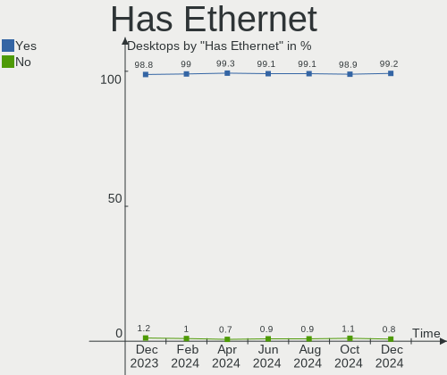
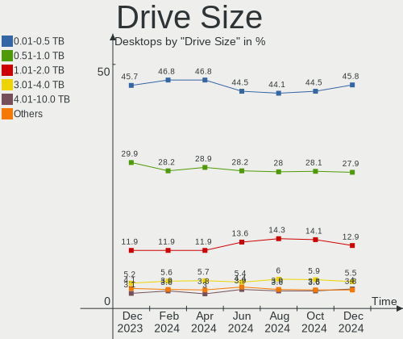
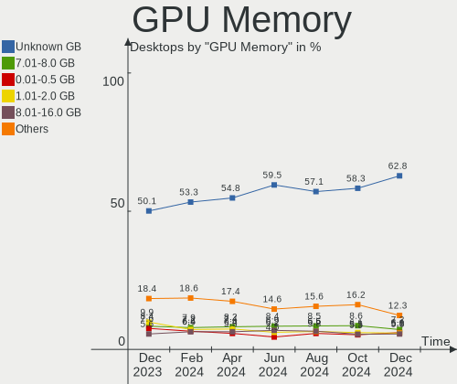

Linux Hardware Trends (Desktops)
--------------------------------

A project to identify most popular hardware characteristics and track their change
over time based on data collected by Linux users at https://Linux-Hardware.org.

Anyone can contribute to this report by the [hw-probe](https://github.com/linuxhw/hw-probe) tool:

    sudo -E hw-probe -all -upload

Full-feature report is available here: https://linux-hardware.org/?view=trends&formfactor=desktop

Period: Oct, 2021.

Contents
--------

* [ System ](#system)
  - [ OS                       ](#os)
  - [ OS Family                ](#os-family)
  - [ Kernel                   ](#kernel)
  - [ Kernel Family            ](#kernel-family)
  - [ Kernel Major Ver.        ](#kernel-major-ver)
  - [ Arch                     ](#arch)
  - [ DE                       ](#de)
  - [ Display Server           ](#display-server)
  - [ Display Manager          ](#display-manager)
  - [ OS Lang                  ](#os-lang)
  - [ Boot Mode                ](#boot-mode)
  - [ Filesystem               ](#filesystem)
  - [ Part. scheme             ](#part-scheme)
  - [ Dual Boot with Linux/BSD ](#dual-boot-with-linuxbsd)
  - [ Dual Boot (Win)          ](#dual-boot-win)

* [ Board ](#board)
  - [ Vendor                   ](#vendor)
  - [ Model                    ](#model)
  - [ Model Family             ](#model-family)
  - [ MFG Year                 ](#mfg-year)
  - [ Form Factor              ](#form-factor)
  - [ Secure Boot              ](#secure-boot)
  - [ Coreboot                 ](#coreboot)
  - [ RAM Size                 ](#ram-size)
  - [ RAM Used                 ](#ram-used)
  - [ Total Drives             ](#total-drives)
  - [ Has CD-ROM               ](#has-cd-rom)
  - [ Has Ethernet             ](#has-ethernet)
  - [ Has WiFi                 ](#has-wifi)
  - [ Has Bluetooth            ](#has-bluetooth)

* [ Location ](#location)
  - [ Country                  ](#country)
  - [ City                     ](#city)

* [ Drives ](#drives)
  - [ Drive Vendor             ](#drive-vendor)
  - [ Drive Model              ](#drive-model)
  - [ HDD Vendor               ](#hdd-vendor)
  - [ SSD Vendor               ](#ssd-vendor)
  - [ Drive Kind               ](#drive-kind)
  - [ Drive Connector          ](#drive-connector)
  - [ Drive Size               ](#drive-size)
  - [ Space Total              ](#space-total)
  - [ Space Used               ](#space-used)
  - [ Malfunc. Drives          ](#malfunc-drives)
  - [ Malfunc. Drive Vendor    ](#malfunc-drive-vendor)
  - [ Malfunc. HDD Vendor      ](#malfunc-hdd-vendor)
  - [ Malfunc. Drive Kind      ](#malfunc-drive-kind)
  - [ Failed Drives            ](#failed-drives)
  - [ Failed Drive Vendor      ](#failed-drive-vendor)
  - [ Drive Status             ](#drive-status)

* [ Storage controller ](#storage-controller)
  - [ Storage Vendor           ](#storage-vendor)
  - [ Storage Model            ](#storage-model)
  - [ Storage Kind             ](#storage-kind)

* [ Processor ](#processor)
  - [ CPU Vendor               ](#cpu-vendor)
  - [ CPU Model                ](#cpu-model)
  - [ CPU Model Family         ](#cpu-model-family)
  - [ CPU Cores                ](#cpu-cores)
  - [ CPU Sockets              ](#cpu-sockets)
  - [ CPU Threads              ](#cpu-threads)
  - [ CPU Op-Modes             ](#cpu-op-modes)
  - [ CPU Microcode            ](#cpu-microcode)
  - [ CPU Microarch            ](#cpu-microarch)

* [ Graphics ](#graphics)
  - [ GPU Vendor               ](#gpu-vendor)
  - [ GPU Model                ](#gpu-model)
  - [ GPU Combo                ](#gpu-combo)
  - [ GPU Driver               ](#gpu-driver)
  - [ GPU Memory               ](#gpu-memory)

* [ Monitor ](#monitor)
  - [ Monitor Vendor           ](#monitor-vendor)
  - [ Monitor Model            ](#monitor-model)
  - [ Monitor Resolution       ](#monitor-resolution)
  - [ Monitor Diagonal         ](#monitor-diagonal)
  - [ Monitor Width            ](#monitor-width)
  - [ Aspect Ratio             ](#aspect-ratio)
  - [ Monitor Area             ](#monitor-area)
  - [ Pixel Density            ](#pixel-density)
  - [ Multiple Monitors        ](#multiple-monitors)

* [ Network ](#network)
  - [ Net Controller Vendor    ](#net-controller-vendor)
  - [ Net Controller Model     ](#net-controller-model)
  - [ Wireless Vendor          ](#wireless-vendor)
  - [ Wireless Model           ](#wireless-model)
  - [ Ethernet Vendor          ](#ethernet-vendor)
  - [ Ethernet Model           ](#ethernet-model)
  - [ Net Controller Kind      ](#net-controller-kind)
  - [ Used Controller          ](#used-controller)
  - [ NICs                     ](#nics)
  - [ IPv6                     ](#ipv6)

* [ Bluetooth ](#bluetooth)
  - [ Bluetooth Vendor         ](#bluetooth-vendor)
  - [ Bluetooth Model          ](#bluetooth-model)

* [ Sound ](#sound)
  - [ Sound Vendor             ](#sound-vendor)
  - [ Sound Model              ](#sound-model)

* [ Memory ](#memory)
  - [ Memory Vendor            ](#memory-vendor)
  - [ Memory Model             ](#memory-model)
  - [ Memory Kind              ](#memory-kind)
  - [ Memory Form Factor       ](#memory-form-factor)
  - [ Memory Size              ](#memory-size)
  - [ Memory Speed             ](#memory-speed)

* [ Printers & scanners ](#printers--scanners)
  - [ Printer Vendor           ](#printer-vendor)
  - [ Printer Model            ](#printer-model)
  - [ Scanner Vendor           ](#scanner-vendor)
  - [ Scanner Model            ](#scanner-model)

* [ Camera ](#camera)
  - [ Camera Vendor            ](#camera-vendor)
  - [ Camera Model             ](#camera-model)

* [ Security ](#security)
  - [ Fingerprint Vendor       ](#fingerprint-vendor)
  - [ Fingerprint Model        ](#fingerprint-model)
  - [ Chipcard Vendor          ](#chipcard-vendor)
  - [ Chipcard Model           ](#chipcard-model)

* [ Unsupported ](#unsupported)
  - [ Unsupported Devices      ](#unsupported-devices)
  - [ Unsupported Device Types ](#unsupported-device-types)

System
------

OS
--

Installed operating systems

| Name                | Desktops | Percent |
|---------------------|----------|---------|
| Ubuntu 20.04        | 380      | 18.99%  |
| Linux Mint 20.2     | 160      | 8%      |
| Pop!_OS 21.04       | 143      | 7.15%   |
| OpenMandriva 4.2    | 107      | 5.35%   |
| Ubuntu 21.10        | 97       | 4.85%   |
| Debian 11           | 80       | 4%      |
| Ubuntu 21.04        | 70       | 3.5%    |
| Fedora 34           | 66       | 3.3%    |
| ROSA 12             | 62       | 3.1%    |
| ROSA R11.1          | 58       | 2.9%    |
| Zorin 16            | 56       | 2.8%    |
| KDE neon 20.04      | 44       | 2.2%    |
| BlackPanther 18.1   | 41       | 2.05%   |
| ArcoLinux Rolling   | 37       | 1.85%   |
| Arch                | 32       | 1.6%    |
| Xubuntu 20.04       | 27       | 1.35%   |
| Manjaro             | 26       | 1.3%    |
| Ubuntu 18.04        | 25       | 1.25%   |
| Gentoo 2.7          | 22       | 1.1%    |
| Kubuntu 20.04       | 20       | 1%      |
| Arch Rolling        | 19       | 0.95%   |
| OpenMandriva 4.50   | 17       | 0.85%   |
| Manjaro 21.1.6      | 17       | 0.85%   |
| Fedora 35           | 17       | 0.85%   |
| Pop!_OS 20.04       | 15       | 0.75%   |
| Linux Mint 20.1     | 14       | 0.7%    |
| RELS 7.3            | 11       | 0.55%   |
| Linux Mint 19.3     | 11       | 0.55%   |
| Zorin 15            | 10       | 0.5%    |
| Xubuntu 18.04       | 10       | 0.5%    |
| Manjaro 21.1.5      | 10       | 0.5%    |
| Linux Mint 20       | 9        | 0.45%   |
| Elementary 6        | 9        | 0.45%   |
| LinuxFX 11          | 8        | 0.4%    |
| Kali 2021.3         | 8        | 0.4%    |
| Debian 10           | 8        | 0.4%    |
| Xubuntu 21.04       | 7        | 0.35%   |
| Ubuntu MATE 20.04   | 7        | 0.35%   |
| MX 19               | 7        | 0.35%   |
| Gentoo 2.8          | 7        | 0.35%   |
| Endless 3.9.5       | 7        | 0.35%   |
| EndeavourOS Rolling | 7        | 0.35%   |
| ClearOS 7           | 7        | 0.35%   |
| Manjaro 21.1.4      | 6        | 0.3%    |
| Kubuntu 21.10       | 6        | 0.3%    |
| Debian Testing      | 6        | 0.3%    |
| Ubuntu 16.04        | 5        | 0.25%   |
| Ubuntu              | 5        | 0.25%   |
| openSUSE Leap-15.3  | 5        | 0.25%   |
| Lubuntu 20.04       | 5        | 0.25%   |
| LMDE 4              | 5        | 0.25%   |
| CentOS 7            | 5        | 0.25%   |
| RHEL 8              | 4        | 0.2%    |
| Peppermint 10       | 4        | 0.2%    |
| Kubuntu 21.04       | 4        | 0.2%    |
| Garuda Soaring      | 4        | 0.2%    |
| Clear Linux 35110   | 4        | 0.2%    |
| CentOS 8            | 4        | 0.2%    |
| Xubuntu 21.10       | 3        | 0.15%   |
| Ubuntu Budgie 21.10 | 3        | 0.15%   |

OS Family
---------

OS without a version

| Name          | Desktops | Percent |
|---------------|----------|---------|
| Ubuntu        | 585      | 29.24%  |
| Linux Mint    | 203      | 10.14%  |
| Pop!_OS       | 160      | 8%      |
| ROSA          | 126      | 6.3%    |
| OpenMandriva  | 124      | 6.2%    |
| Debian        | 100      | 5%      |
| Fedora        | 91       | 4.55%   |
| Zorin         | 67       | 3.35%   |
| Manjaro       | 62       | 3.1%    |
| Arch          | 51       | 2.55%   |
| Xubuntu       | 48       | 2.4%    |
| KDE neon      | 44       | 2.2%    |
| BlackPanther  | 44       | 2.2%    |
| ArcoLinux     | 37       | 1.85%   |
| Kubuntu       | 34       | 1.7%    |
| Gentoo        | 30       | 1.5%    |
| openSUSE      | 23       | 1.15%   |
| MX            | 12       | 0.6%    |
| RELS          | 11       | 0.55%   |
| Clear Linux   | 11       | 0.55%   |
| LinuxFX       | 10       | 0.5%    |
| EndeavourOS   | 10       | 0.5%    |
| Elementary    | 10       | 0.5%    |
| Kali          | 9        | 0.45%   |
| CentOS        | 9        | 0.45%   |
| Ubuntu MATE   | 8        | 0.4%    |
| Lubuntu       | 8        | 0.4%    |
| Endless       | 8        | 0.4%    |
| ClearOS       | 7        | 0.35%   |
| LMDE          | 5        | 0.25%   |
| Garuda        | 5        | 0.25%   |
| Ubuntu Budgie | 4        | 0.2%    |
| RHEL          | 4        | 0.2%    |
| Peppermint    | 4        | 0.2%    |
| Xero          | 3        | 0.15%   |
| Parrot        | 3        | 0.15%   |
| Makulu        | 3        | 0.15%   |
| Devuan        | 3        | 0.15%   |
| Solus         | 2        | 0.1%    |
| Slackware     | 2        | 0.1%    |
| Red OS        | 2        | 0.1%    |
| Mageia        | 2        | 0.1%    |
| Artix         | 2        | 0.1%    |
| ALT Linux     | 2        | 0.1%    |
| Void          | 1        | 0.05%   |
| Rocky Linux   | 1        | 0.05%   |
| RED           | 1        | 0.05%   |
| Reborn OS     | 1        | 0.05%   |
| Pardus        | 1        | 0.05%   |
| NixOS         | 1        | 0.05%   |
| Kaisen        | 1        | 0.05%   |
| Calculate     | 1        | 0.05%   |
| BunsenLabs    | 1        | 0.05%   |
| BuildRoot     | 1        | 0.05%   |
| Astra Linux   | 1        | 0.05%   |
| ArchLabs      | 1        | 0.05%   |
| Archcraft     | 1        | 0.05%   |

Kernel
------

Version of the Linux kernel

| Version                             | Desktops | Percent |
|-------------------------------------|----------|---------|
| 5.11.0-37-generic                   | 299      | 14.94%  |
| 5.11.0-38-generic                   | 166      | 8.3%    |
| 5.4.0-88-generic                    | 149      | 7.45%   |
| 5.13.0-7614-generic                 | 143      | 7.15%   |
| 5.10.14-desktop-1omv4002            | 102      | 5.1%    |
| 5.4.0-89-generic                    | 78       | 3.9%    |
| 5.10.71-generic-1rosa2021.1-x86_64  | 61       | 3.05%   |
| 5.13.0-20-generic                   | 51       | 2.55%   |
| 5.13.0-19-generic                   | 46       | 2.3%    |
| 5.10.0-8-amd64                      | 31       | 1.55%   |
| 5.10.0-9-amd64                      | 29       | 1.45%   |
| 5.11.0-27-generic                   | 27       | 1.35%   |
| 5.4.0-87-generic                    | 26       | 1.3%    |
| 5.14.9-200.fc34.x86_64              | 22       | 1.1%    |
| 5.14.14-arch1-1                     | 21       | 1.05%   |
| 4.18.16-desktop-1bP                 | 21       | 1.05%   |
| 5.6.14-desktop-2bP                  | 20       | 1%      |
| 5.13.19-2-MANJARO                   | 20       | 1%      |
| 5.4.83-generic-2rosa-x86_64         | 17       | 0.85%   |
| 5.10.0-7-amd64                      | 16       | 0.8%    |
| 4.15.0-desktop-122.124.1rosa-x86_64 | 15       | 0.75%   |
| 5.14.8-arch1-1                      | 13       | 0.65%   |
| 5.4.32-generic-2rosa-x86_64         | 12       | 0.6%    |
| 5.14.9-arch2-1                      | 12       | 0.6%    |
| 5.12.4-desktop-1omv4050             | 12       | 0.6%    |
| 4.15.0-159-generic                  | 12       | 0.6%    |
| 5.14.12-arch1-1                     | 11       | 0.55%   |
| 5.14.10-1-MANJARO                   | 11       | 0.55%   |
| 5.13.19-200.fc34.x86_64             | 11       | 0.55%   |
| 3.10.0-514.51.1.el7.x86_64          | 11       | 0.55%   |
| 5.4.0-74-generic                    | 10       | 0.5%    |
| 4.19.0-18-amd64                     | 9        | 0.45%   |
| 5.8.0-14-generic                    | 8        | 0.4%    |
| 5.11.0-36-generic                   | 8        | 0.4%    |
| 5.11.0-34-generic                   | 8        | 0.4%    |
| 5.10.70-1-MANJARO                   | 8        | 0.4%    |
| 4.15.0-142-generic                  | 8        | 0.4%    |
| 5.14.13-200.fc34.x86_64             | 7        | 0.35%   |
| 5.14.11-arch1-1                     | 7        | 0.35%   |
| 5.15.0-1-MANJARO                    | 6        | 0.3%    |
| 5.14.11-200.fc34.x86_64             | 6        | 0.3%    |
| 5.14.10-300.fc35.x86_64             | 6        | 0.3%    |
| 5.14.0-2-amd64                      | 6        | 0.3%    |
| 5.13.0-7620-generic                 | 6        | 0.3%    |
| 5.11.0-7620-generic                 | 6        | 0.3%    |
| 5.10.61-gentoo                      | 6        | 0.3%    |
| 4.18.0-305.19.1.el8_4.x86_64        | 6        | 0.3%    |
| 3.10.0-1160.45.1.el7.x86_64         | 6        | 0.3%    |
| 5.4.32-generic-2rosa-i586           | 5        | 0.25%   |
| 5.4.0-84-generic                    | 5        | 0.25%   |
| 5.14.9-zen2-1-zen                   | 5        | 0.25%   |
| 5.14.9-300.fc35.x86_64              | 5        | 0.25%   |
| 5.14.7-desktop-1omv4050             | 5        | 0.25%   |
| 5.14.7-2-MANJARO                    | 5        | 0.25%   |
| 5.13.13-1070.native                 | 5        | 0.25%   |
| 5.13.0-21-generic                   | 5        | 0.25%   |
| 5.11.12-desktop-1omv4002            | 5        | 0.25%   |
| 5.11.0-16-generic                   | 5        | 0.25%   |
| 5.10.68-1-MANJARO                   | 5        | 0.25%   |
| 3.10.0-1160.42.2.el7.x86_64         | 5        | 0.25%   |

Kernel Family
-------------

Linux kernel without a distro release

| Version | Desktops | Percent |
|---------|----------|---------|
| 5.11.0  | 537      | 26.84%  |
| 5.4.0   | 310      | 15.49%  |
| 5.13.0  | 257      | 12.84%  |
| 5.10.14 | 102      | 5.1%    |
| 5.10.0  | 93       | 4.65%   |
| 5.10.71 | 63       | 3.15%   |
| 5.14.9  | 51       | 2.55%   |
| 4.15.0  | 51       | 2.55%   |
| 5.14.14 | 37       | 1.85%   |
| 5.13.19 | 35       | 1.75%   |
| 5.8.0   | 32       | 1.6%    |
| 5.14.11 | 25       | 1.25%   |
| 5.14.10 | 25       | 1.25%   |
| 5.14.0  | 24       | 1.2%    |
| 3.10.0  | 23       | 1.15%   |
| 5.14.12 | 22       | 1.1%    |
| 5.4.83  | 21       | 1.05%   |
| 4.18.16 | 21       | 1.05%   |
| 5.6.14  | 20       | 1%      |
| 5.14.8  | 19       | 0.95%   |
| 5.4.32  | 17       | 0.85%   |
| 4.19.0  | 16       | 0.8%    |
| 5.14.13 | 14       | 0.7%    |
| 5.15.0  | 13       | 0.65%   |
| 5.14.7  | 13       | 0.65%   |
| 5.10.70 | 13       | 0.65%   |
| 5.12.4  | 12       | 0.6%    |
| 5.10.61 | 11       | 0.55%   |
| 5.14.6  | 10       | 0.5%    |
| 4.18.0  | 10       | 0.5%    |
| 5.3.18  | 9        | 0.45%   |
| 5.13.13 | 9        | 0.45%   |
| 5.11.12 | 8        | 0.4%    |
| 5.10.68 | 6        | 0.3%    |
| 5.11.22 | 5        | 0.25%   |
| 5.13.12 | 4        | 0.2%    |
| 5.10.75 | 4        | 0.2%    |
| 5.0.0   | 4        | 0.2%    |
| 4.9.20  | 4        | 0.2%    |
| 5.14.15 | 3        | 0.15%   |
| 5.10.72 | 3        | 0.15%   |
| 5.8.18  | 2        | 0.1%    |
| 5.4.150 | 2        | 0.1%    |
| 5.12.9  | 2        | 0.1%    |
| 5.10.29 | 2        | 0.1%    |
| 4.9.155 | 2        | 0.1%    |
| 4.9.0   | 2        | 0.1%    |
| 5.8.16  | 1        | 0.05%   |
| 5.8.15  | 1        | 0.05%   |
| 5.6.15  | 1        | 0.05%   |
| 5.6.0   | 1        | 0.05%   |
| 5.5.19  | 1        | 0.05%   |
| 5.4.148 | 1        | 0.05%   |
| 5.4.134 | 1        | 0.05%   |
| 5.3.6   | 1        | 0.05%   |
| 5.14.5  | 1        | 0.05%   |
| 5.14.4  | 1        | 0.05%   |
| 5.14.3  | 1        | 0.05%   |
| 5.14.1  | 1        | 0.05%   |
| 5.13.9  | 1        | 0.05%   |

Kernel Major Ver.
-----------------

Linux kernel major version

| Version | Desktops | Percent |
|---------|----------|---------|
| 5.11    | 551      | 27.54%  |
| 5.4     | 352      | 17.59%  |
| 5.13    | 312      | 15.59%  |
| 5.10    | 303      | 15.14%  |
| 5.14    | 247      | 12.34%  |
| 4.15    | 51       | 2.55%   |
| 5.8     | 36       | 1.8%    |
| 4.18    | 31       | 1.55%   |
| 3.10    | 23       | 1.15%   |
| 5.6     | 22       | 1.1%    |
| 5.12    | 17       | 0.85%   |
| 4.19    | 17       | 0.85%   |
| 5.15    | 13       | 0.65%   |
| 5.3     | 10       | 0.5%    |
| 4.9     | 8        | 0.4%    |
| 5.0     | 4        | 0.2%    |
| 5.5     | 1        | 0.05%   |
| 4.14    | 1        | 0.05%   |
| 4.13    | 1        | 0.05%   |
| 4.12    | 1        | 0.05%   |

Arch
----

OS architecture (x86_64, i586, etc.)

| Name   | Desktops | Percent |
|--------|----------|---------|
| x86_64 | 1961     | 98%     |
| i686   | 40       | 2%      |

DE
--

Desktop Environment

| Name            | Desktops | Percent |
|-----------------|----------|---------|
| GNOME           | 874      | 43.68%  |
| KDE5            | 460      | 22.99%  |
| X-Cinnamon      | 171      | 8.55%   |
| XFCE            | 138      | 6.9%    |
| Unknown         | 135      | 6.75%   |
| MATE            | 66       | 3.3%    |
| KDE4            | 34       | 1.7%    |
| Cinnamon        | 23       | 1.15%   |
| LXQt            | 19       | 0.95%   |
| LXDE            | 12       | 0.6%    |
| Pantheon        | 9        | 0.45%   |
| KDE             | 9        | 0.45%   |
| i3              | 8        | 0.4%    |
| Unity           | 7        | 0.35%   |
| Budgie          | 7        | 0.35%   |
| GNOME Flashback | 5        | 0.25%   |
| Openbox         | 4        | 0.2%    |
| xmonad          | 3        | 0.15%   |
| GNOME Classic   | 3        | 0.15%   |
| awesome         | 3        | 0.15%   |
| sway            | 2        | 0.1%    |
| qtile           | 2        | 0.1%    |
| Trinity         | 1        | 0.05%   |
| ICEWM           | 1        | 0.05%   |
| i3-with-shmlog  | 1        | 0.05%   |
| herbstluftwm    | 1        | 0.05%   |
| GNUstep         | 1        | 0.05%   |
| enlightenment   | 1        | 0.05%   |
| dwm             | 1        | 0.05%   |

Display Server
--------------

X11 or Wayland

| Name    | Desktops | Percent |
|---------|----------|---------|
| X11     | 1657     | 82.81%  |
| Wayland | 238      | 11.89%  |
| Unknown | 58       | 2.9%    |
| Tty     | 47       | 2.35%   |
| Web     | 1        | 0.05%   |

Display Manager
---------------

SDDM, LightDM, etc.

| Name    | Desktops | Percent |
|---------|----------|---------|
| Unknown | 671      | 33.53%  |
| GDM3    | 419      | 20.94%  |
| SDDM    | 346      | 17.29%  |
| LightDM | 272      | 13.59%  |
| GDM     | 252      | 12.59%  |
| KDM     | 34       | 1.7%    |
| XDM     | 4        | 0.2%    |
| SLiM    | 2        | 0.1%    |
| NODM    | 1        | 0.05%   |

OS Lang
-------

Language

| Lang    | Desktops | Percent |
|---------|----------|---------|
| en_US   | 718      | 35.88%  |
| ru_RU   | 216      | 10.79%  |
| de_DE   | 177      | 8.85%   |
| fr_FR   | 113      | 5.65%   |
| en_GB   | 100      | 5%      |
| pt_BR   | 86       | 4.3%    |
| Unknown | 74       | 3.7%    |
| en_AU   | 63       | 3.15%   |
| es_ES   | 48       | 2.4%    |
| it_IT   | 42       | 2.1%    |
| en_CA   | 42       | 2.1%    |
| pl_PL   | 41       | 2.05%   |
| C       | 23       | 1.15%   |
| en_IN   | 19       | 0.95%   |
| hu_HU   | 17       | 0.85%   |
| cs_CZ   | 15       | 0.75%   |
| es_MX   | 13       | 0.65%   |
| nl_NL   | 12       | 0.6%    |
| ru_UA   | 10       | 0.5%    |
| ja_JP   | 9        | 0.45%   |
| en_NZ   | 9        | 0.45%   |
| es_AR   | 8        | 0.4%    |
| en_IL   | 8        | 0.4%    |
| de_CH   | 8        | 0.4%    |
| sv_SE   | 7        | 0.35%   |
| es_CO   | 7        | 0.35%   |
| de_AT   | 7        | 0.35%   |
| tr_TR   | 6        | 0.3%    |
| fr_CH   | 6        | 0.3%    |
| en_ZA   | 6        | 0.3%    |
| zh_CN   | 5        | 0.25%   |
| nl_BE   | 5        | 0.25%   |
| fr_BE   | 5        | 0.25%   |
| en_IE   | 5        | 0.25%   |
| uk_UA   | 4        | 0.2%    |
| fr_CA   | 4        | 0.2%    |
| el_GR   | 4        | 0.2%    |
| zh_TW   | 3        | 0.15%   |
| sk_SK   | 3        | 0.15%   |
| ro_RO   | 3        | 0.15%   |
| nb_NO   | 3        | 0.15%   |
| hr_HR   | 3        | 0.15%   |
| fi_FI   | 3        | 0.15%   |
| es_VE   | 3        | 0.15%   |
| es_CL   | 3        | 0.15%   |
| en_DK   | 3        | 0.15%   |
| pt_PT   | 2        | 0.1%    |
| es_PE   | 2        | 0.1%    |
| es_EC   | 2        | 0.1%    |
| da_DK   | 2        | 0.1%    |
| ca_ES   | 2        | 0.1%    |
| vi_VN   | 1        | 0.05%   |
| sv_FI   | 1        | 0.05%   |
| sr_RS   | 1        | 0.05%   |
| sl_SI   | 1        | 0.05%   |
| POSIX   | 1        | 0.05%   |
| pa_IN   | 1        | 0.05%   |
| lv_LV   | 1        | 0.05%   |
| ko_KR   | 1        | 0.05%   |
| id_ID   | 1        | 0.05%   |

Boot Mode
---------

EFI or BIOS

| Mode | Desktops | Percent |
|------|----------|---------|
| BIOS | 1280     | 63.97%  |
| EFI  | 721      | 36.03%  |

Filesystem
----------

Type of filesystem

| Type       | Desktops | Percent |
|------------|----------|---------|
| Ext4       | 1568     | 78.36%  |
| Overlay    | 185      | 9.25%   |
| Btrfs      | 154      | 7.7%    |
| Xfs        | 58       | 2.9%    |
| Zfs        | 13       | 0.65%   |
| F2fs       | 9        | 0.45%   |
| Ext3       | 4        | 0.2%    |
| Ext2       | 4        | 0.2%    |
| Unknown    | 2        | 0.1%    |
| Tmpfs      | 1        | 0.05%   |
| Jfs        | 1        | 0.05%   |
| Fuse.sshfs | 1        | 0.05%   |
| ExX4       | 1        | 0.05%   |

Part. scheme
------------

Scheme of partitioning

| Type    | Desktops | Percent |
|---------|----------|---------|
| Unknown | 1112     | 55.57%  |
| GPT     | 561      | 28.04%  |
| MBR     | 328      | 16.39%  |

Dual Boot with Linux/BSD
------------------------

Hosting more than one Linux/BSD

| Dual boot | Desktops | Percent |
|-----------|----------|---------|
| No        | 1635     | 81.71%  |
| Yes       | 366      | 18.29%  |

Dual Boot (Win)
---------------

Hosting Linux and Windows

| Dual boot | Desktops | Percent |
|-----------|----------|---------|
| No        | 1289     | 64.42%  |
| Yes       | 712      | 35.58%  |

Board
-----

Vendor
------

Motherboard manufacturer

| Name                | Desktops | Percent |
|---------------------|----------|---------|
| ASUSTek Computer    | 519      | 25.94%  |
| Gigabyte Technology | 343      | 17.14%  |
| MSI                 | 247      | 12.34%  |
| ASRock              | 215      | 10.74%  |
| Dell                | 173      | 8.65%   |
| Hewlett-Packard     | 132      | 6.6%    |
| Lenovo              | 63       | 3.15%   |
| Intel               | 45       | 2.25%   |
| Acer                | 34       | 1.7%    |
| Unknown             | 30       | 1.5%    |
| Fujitsu             | 28       | 1.4%    |
| Pegatron            | 22       | 1.1%    |
| Foxconn             | 16       | 0.8%    |
| Biostar             | 13       | 0.65%   |
| Medion              | 12       | 0.6%    |
| Huanan              | 11       | 0.55%   |
| Supermicro          | 8        | 0.4%    |
| ECS                 | 7        | 0.35%   |
| Packard Bell        | 6        | 0.3%    |
| Apple               | 6        | 0.3%    |
| Shuttle             | 5        | 0.25%   |
| Alienware           | 5        | 0.25%   |
| Nvidia              | 4        | 0.2%    |
| IBM                 | 4        | 0.2%    |
| Fujitsu Siemens     | 4        | 0.2%    |
| Gateway             | 3        | 0.15%   |
| eMachines           | 3        | 0.15%   |
| Wistron             | 2        | 0.1%    |
| Positivo            | 2        | 0.1%    |
| OEM                 | 2        | 0.1%    |
| Digiboard           | 2        | 0.1%    |
| AOpen               | 2        | 0.1%    |
| AAEON               | 2        | 0.1%    |
| UMAX                | 1        | 0.05%   |
| TPV-INVENTA         | 1        | 0.05%   |
| T-bao               | 1        | 0.05%   |
| Sun Microsystems    | 1        | 0.05%   |
| Red Hat             | 1        | 0.05%   |
| R-StyleComputers    | 1        | 0.05%   |
| Philco              | 1        | 0.05%   |
| PCWare              | 1        | 0.05%   |
| PCChips             | 1        | 0.05%   |
| PANSHI              | 1        | 0.05%   |
| NCR                 | 1        | 0.05%   |
| MiTAC               | 1        | 0.05%   |
| LattePanda          | 1        | 0.05%   |
| ICP / iEi           | 1        | 0.05%   |
| ICL                 | 1        | 0.05%   |
| GreatWall           | 1        | 0.05%   |
| Google              | 1        | 0.05%   |
| EVGA                | 1        | 0.05%   |
| EPSON DIRECT        | 1        | 0.05%   |
| Emaxx Technologies  | 1        | 0.05%   |
| Digitron            | 1        | 0.05%   |
| Colorful Technology | 1        | 0.05%   |
| Clientron           | 1        | 0.05%   |
| Chuwi               | 1        | 0.05%   |
| BESSTAR Tech        | 1        | 0.05%   |
| Athermiter/PlexHD   | 1        | 0.05%   |
| AQUARIUS            | 1        | 0.05%   |

Model
-----

Motherboard model

| Name                             | Desktops | Percent |
|----------------------------------|----------|---------|
| ASUS All Series                  | 41       | 2.05%   |
| Unknown                          | 31       | 1.55%   |
| Dell OptiPlex 7010               | 14       | 0.7%    |
| MSI MS-7C37                      | 13       | 0.65%   |
| Gigabyte B450M DS3H              | 13       | 0.65%   |
| Dell OptiPlex 790                | 12       | 0.6%    |
| MSI MS-7B86                      | 10       | 0.5%    |
| Dell OptiPlex 9020               | 10       | 0.5%    |
| ASUS TUF GAMING X570-PLUS        | 10       | 0.5%    |
| Dell OptiPlex 9010               | 9        | 0.45%   |
| Intel H61                        | 8        | 0.4%    |
| Gigabyte X570 AORUS MASTER       | 8        | 0.4%    |
| ASUS PRIME B450M-A               | 8        | 0.4%    |
| MSI MS-7592                      | 7        | 0.35%   |
| Dell OptiPlex 3020               | 7        | 0.35%   |
| Dell OptiPlex 3010               | 7        | 0.35%   |
| ASUS PRIME B450-PLUS             | 7        | 0.35%   |
| ASRock B450M Pro4                | 7        | 0.35%   |
| MSI MS-7C35                      | 6        | 0.3%    |
| MSI MS-7C02                      | 6        | 0.3%    |
| MSI MS-7A34                      | 6        | 0.3%    |
| MSI MS-7817                      | 6        | 0.3%    |
| MSI MS-7693                      | 6        | 0.3%    |
| HP EliteDesk 800 G1 SFF          | 6        | 0.3%    |
| Gigabyte B450 AORUS ELITE        | 6        | 0.3%    |
| Dell OptiPlex 990                | 6        | 0.3%    |
| ASUS Z170-A                      | 6        | 0.3%    |
| ASUS PRIME A320M-K               | 6        | 0.3%    |
| ASUS M5A97 R2.0                  | 6        | 0.3%    |
| MSI MS-7B89                      | 5        | 0.25%   |
| MSI MS-7B79                      | 5        | 0.25%   |
| MSI MS-7721                      | 5        | 0.25%   |
| HP Z440 Workstation              | 5        | 0.25%   |
| HP Z420 Workstation              | 5        | 0.25%   |
| HP Compaq Pro 6305 SFF           | 5        | 0.25%   |
| Gigabyte H61M-S2PV               | 5        | 0.25%   |
| Gigabyte H61M-S1                 | 5        | 0.25%   |
| Gigabyte A320M-S2H               | 5        | 0.25%   |
| Dell OptiPlex 780                | 5        | 0.25%   |
| ASUS ROG STRIX X570-E GAMING     | 5        | 0.25%   |
| ASUS ROG STRIX B450-F GAMING     | 5        | 0.25%   |
| ASUS P8Z77-V LX                  | 5        | 0.25%   |
| ASUS M5A97 LE R2.0               | 5        | 0.25%   |
| ASUS H110M-R                     | 5        | 0.25%   |
| ASRock 970 Extreme4              | 5        | 0.25%   |
| MSI MS-7A38                      | 4        | 0.2%    |
| MSI MS-7982                      | 4        | 0.2%    |
| HP ProDesk 600 G1 DM             | 4        | 0.2%    |
| HP Compaq 6005 Pro SFF PC        | 4        | 0.2%    |
| Gigabyte Z77X-UD5H               | 4        | 0.2%    |
| Gigabyte GA-870A-UD3             | 4        | 0.2%    |
| Gigabyte G31M-ES2L               | 4        | 0.2%    |
| Gigabyte B550I AORUS PRO AX      | 4        | 0.2%    |
| Gigabyte B450 AORUS M            | 4        | 0.2%    |
| Gigabyte B450 AORUS ELITE V2     | 4        | 0.2%    |
| Gigabyte A320M-S2H V2            | 4        | 0.2%    |
| Gigabyte 970A-DS3P               | 4        | 0.2%    |
| Fujitsu ESPRIMO P910             | 4        | 0.2%    |
| Dell Precision WorkStation T3500 | 4        | 0.2%    |
| Dell OptiPlex 760                | 4        | 0.2%    |

Model Family
------------

Motherboard model prefix

| Name                   | Desktops | Percent |
|------------------------|----------|---------|
| ASUS PRIME             | 108      | 5.4%    |
| Dell OptiPlex          | 105      | 5.25%   |
| ASUS ROG               | 66       | 3.3%    |
| HP Compaq              | 43       | 2.15%   |
| Lenovo ThinkCentre     | 42       | 2.1%    |
| ASUS All               | 41       | 2.05%   |
| ASUS TUF               | 35       | 1.75%   |
| Unknown                | 31       | 1.55%   |
| Gigabyte X570          | 27       | 1.35%   |
| Dell Precision         | 25       | 1.25%   |
| Acer Aspire            | 24       | 1.2%    |
| Gigabyte B450M         | 22       | 1.1%    |
| Fujitsu ESPRIMO        | 20       | 1%      |
| Gigabyte B450          | 19       | 0.95%   |
| ASUS M5A97             | 17       | 0.85%   |
| Dell Inspiron          | 15       | 0.75%   |
| ASUS P8Z77-V           | 15       | 0.75%   |
| HP EliteDesk           | 14       | 0.7%    |
| MSI MS-7C37            | 13       | 0.65%   |
| HP ProDesk             | 12       | 0.6%    |
| HP Pavilion            | 12       | 0.6%    |
| ASUS P8H61-M           | 12       | 0.6%    |
| MSI MS-7B86            | 10       | 0.5%    |
| Gigabyte A320M-S2H     | 9        | 0.45%   |
| Dell Vostro            | 9        | 0.45%   |
| ASUS SABERTOOTH        | 9        | 0.45%   |
| Intel H61              | 8        | 0.4%    |
| ASUS P5G41T-M          | 8        | 0.4%    |
| ASUS M5A78L-M          | 8        | 0.4%    |
| ASRock X570            | 8        | 0.4%    |
| ASRock B550M           | 8        | 0.4%    |
| ASRock B450M           | 8        | 0.4%    |
| ASRock 970             | 8        | 0.4%    |
| MSI MS-7592            | 7        | 0.35%   |
| Gigabyte H310M         | 7        | 0.35%   |
| Dell XPS               | 7        | 0.35%   |
| ASRock B450            | 7        | 0.35%   |
| Acer Veriton           | 7        | 0.35%   |
| MSI MS-7C35            | 6        | 0.3%    |
| MSI MS-7C02            | 6        | 0.3%    |
| MSI MS-7A34            | 6        | 0.3%    |
| MSI MS-7817            | 6        | 0.3%    |
| MSI MS-7693            | 6        | 0.3%    |
| Lenovo ThinkStation    | 6        | 0.3%    |
| Gigabyte GA-78LMT-USB3 | 6        | 0.3%    |
| Gigabyte B550M         | 6        | 0.3%    |
| ASUS Z170-A            | 6        | 0.3%    |
| ASUS Maximus           | 6        | 0.3%    |
| MSI MS-7B89            | 5        | 0.25%   |
| MSI MS-7B79            | 5        | 0.25%   |
| MSI MS-7721            | 5        | 0.25%   |
| Lenovo IdeaCentre      | 5        | 0.25%   |
| Intel DG31PR           | 5        | 0.25%   |
| Huanan X79             | 5        | 0.25%   |
| HP Z440                | 5        | 0.25%   |
| HP Z420                | 5        | 0.25%   |
| HP ProLiant            | 5        | 0.25%   |
| Gigabyte H61M-S2PV     | 5        | 0.25%   |
| Gigabyte H61M-S1       | 5        | 0.25%   |
| Gigabyte B550          | 5        | 0.25%   |

MFG Year
--------

Motherboard manufacture year

| Year    | Desktops | Percent |
|---------|----------|---------|
| 2021    | 256      | 12.79%  |
| 2020    | 247      | 12.34%  |
| 2019    | 197      | 9.85%   |
| 2018    | 175      | 8.75%   |
| 2013    | 147      | 7.35%   |
| 2012    | 139      | 6.95%   |
| 2011    | 129      | 6.45%   |
| 2014    | 118      | 5.9%    |
| 2010    | 114      | 5.7%    |
| 2015    | 104      | 5.2%    |
| 2016    | 94       | 4.7%    |
| 2009    | 93       | 4.65%   |
| 2017    | 61       | 3.05%   |
| 2008    | 57       | 2.85%   |
| 2007    | 41       | 2.05%   |
| 2006    | 18       | 0.9%    |
| 2005    | 6        | 0.3%    |
| 2004    | 2        | 0.1%    |
| Unknown | 2        | 0.1%    |
| 2003    | 1        | 0.05%   |

Form Factor
-----------

Physical design of the computer

| Name    | Desktops | Percent |
|---------|----------|---------|
| Desktop | 2001     | 100%    |

Secure Boot
-----------

Enabled or disabled

| State    | Desktops | Percent |
|----------|----------|---------|
| Disabled | 1957     | 97.8%   |
| Enabled  | 44       | 2.2%    |

Coreboot
--------

Have coreboot on board

| Used | Desktops | Percent |
|------|----------|---------|
| No   | 2000     | 99.95%  |
| Yes  | 1        | 0.05%   |

RAM Size
--------

Total RAM memory

| Size in GB      | Desktops | Percent |
|-----------------|----------|---------|
| 16.01-24.0      | 508      | 25.39%  |
| 8.01-16.0       | 420      | 20.99%  |
| 32.01-64.0      | 287      | 14.34%  |
| 3.01-4.0        | 279      | 13.94%  |
| 4.01-8.0        | 278      | 13.89%  |
| 64.01-256.0     | 95       | 4.75%   |
| 1.01-2.0        | 64       | 3.2%    |
| 24.01-32.0      | 39       | 1.95%   |
| 2.01-3.0        | 23       | 1.15%   |
| 0.51-1.0        | 5        | 0.25%   |
| More than 256.0 | 3        | 0.15%   |

RAM Used
--------

Used RAM memory

| Used GB    | Desktops | Percent |
|------------|----------|---------|
| 1.01-2.0   | 751      | 37.53%  |
| 2.01-3.0   | 427      | 21.34%  |
| 4.01-8.0   | 272      | 13.59%  |
| 3.01-4.0   | 221      | 11.04%  |
| 0.51-1.0   | 182      | 9.1%    |
| 8.01-16.0  | 76       | 3.8%    |
| 0.01-0.5   | 47       | 2.35%   |
| 16.01-24.0 | 11       | 0.55%   |
| 24.01-32.0 | 10       | 0.5%    |
| 32.01-64.0 | 4        | 0.2%    |

Total Drives
------------

Number of drives on board

| Drives | Desktops | Percent |
|--------|----------|---------|
| 1      | 771      | 38.53%  |
| 2      | 569      | 28.44%  |
| 3      | 297      | 14.84%  |
| 4      | 172      | 8.6%    |
| 5      | 98       | 4.9%    |
| 6      | 32       | 1.6%    |
| 7      | 22       | 1.1%    |
| 0      | 17       | 0.85%   |
| 8      | 14       | 0.7%    |
| 9      | 3        | 0.15%   |
| 11     | 2        | 0.1%    |
| 68     | 1        | 0.05%   |
| 22     | 1        | 0.05%   |
| 16     | 1        | 0.05%   |
| 13     | 1        | 0.05%   |

Has CD-ROM
----------

Has CD-ROM on board

| Presented | Desktops | Percent |
|-----------|----------|---------|
| No        | 1052     | 52.57%  |
| Yes       | 949      | 47.43%  |

Has Ethernet
------------

Has Ethernet on board

| Presented | Desktops | Percent |
|-----------|----------|---------|
| Yes       | 1977     | 98.8%   |
| No        | 24       | 1.2%    |

Has WiFi
--------

Has WiFi module

| Presented | Desktops | Percent |
|-----------|----------|---------|
| No        | 1194     | 59.67%  |
| Yes       | 807      | 40.33%  |

Has Bluetooth
-------------

Has Bluetooth module

| Presented | Desktops | Percent |
|-----------|----------|---------|
| No        | 1433     | 71.61%  |
| Yes       | 568      | 28.39%  |

Location
--------

Country
-------

Geographic location (country)

| Country      | Desktops | Percent |
|--------------|----------|---------|
| USA          | 346      | 17.29%  |
| Germany      | 221      | 11.04%  |
| Russia       | 217      | 10.84%  |
| France       | 128      | 6.4%    |
| Brazil       | 110      | 5.5%    |
| UK           | 89       | 4.45%   |
| Hungary      | 63       | 3.15%   |
| Australia    | 63       | 3.15%   |
| Poland       | 62       | 3.1%    |
| Canada       | 58       | 2.9%    |
| Spain        | 56       | 2.8%    |
| Italy        | 48       | 2.4%    |
| India        | 31       | 1.55%   |
| Netherlands  | 29       | 1.45%   |
| Ukraine      | 27       | 1.35%   |
| Sweden       | 27       | 1.35%   |
| Switzerland  | 25       | 1.25%   |
| Mexico       | 25       | 1.25%   |
| Belgium      | 21       | 1.05%   |
| Austria      | 19       | 0.95%   |
| Czechia      | 18       | 0.9%    |
| Norway       | 13       | 0.65%   |
| Israel       | 13       | 0.65%   |
| Finland      | 13       | 0.65%   |
| Denmark      | 13       | 0.65%   |
| South Africa | 12       | 0.6%    |
| New Zealand  | 12       | 0.6%    |
| Japan        | 12       | 0.6%    |
| Argentina    | 12       | 0.6%    |
| Romania      | 11       | 0.55%   |
| Greece       | 10       | 0.5%    |
| Portugal     | 9        | 0.45%   |
| Colombia     | 9        | 0.45%   |
| Turkey       | 8        | 0.4%    |
| Taiwan       | 8        | 0.4%    |
| Indonesia    | 8        | 0.4%    |
| Egypt        | 8        | 0.4%    |
| China        | 8        | 0.4%    |
| Serbia       | 7        | 0.35%   |
| Morocco      | 7        | 0.35%   |
| Bulgaria     | 7        | 0.35%   |
| Slovakia     | 6        | 0.3%    |
| Ireland      | 6        | 0.3%    |
| Croatia      | 6        | 0.3%    |
| Belarus      | 6        | 0.3%    |
| Vietnam      | 5        | 0.25%   |
| Kazakhstan   | 5        | 0.25%   |
| Jamaica      | 5        | 0.25%   |
| Chile        | 5        | 0.25%   |
| Peru         | 4        | 0.2%    |
| Algeria      | 4        | 0.2%    |
| Venezuela    | 3        | 0.15%   |
| Thailand     | 3        | 0.15%   |
| Puerto Rico  | 3        | 0.15%   |
| Philippines  | 3        | 0.15%   |
| Pakistan     | 3        | 0.15%   |
| Malaysia     | 3        | 0.15%   |
| Lithuania    | 3        | 0.15%   |
| Iran         | 3        | 0.15%   |
| Ecuador      | 3        | 0.15%   |

City
----

Geographic location (city)

| City              | Desktops | Percent |
|-------------------|----------|---------|
| Moscow            | 44       | 2.2%    |
| Sydney            | 24       | 1.2%    |
| St Petersburg     | 24       | 1.2%    |
| Berlin            | 20       | 1%      |
| Voronezh          | 19       | 0.95%   |
| Paris             | 19       | 0.95%   |
| Rio de Janeiro    | 13       | 0.65%   |
| Budapest          | 13       | 0.65%   |
| Vienna            | 11       | 0.55%   |
| Madrid            | 11       | 0.55%   |
| Warsaw            | 10       | 0.5%    |
| S??o Paulo        | 10       | 0.5%    |
| Perth             | 10       | 0.5%    |
| Chepel?«vo        | 9        | 0.45%   |
| Amsterdam         | 9        | 0.45%   |
| M??laga           | 8        | 0.4%    |
| London            | 8        | 0.4%    |
| Hamburg           | 8        | 0.4%    |
| Yekaterinburg     | 7        | 0.35%   |
| Toronto           | 7        | 0.35%   |
| Stuttgart         | 7        | 0.35%   |
| Seattle           | 7        | 0.35%   |
| Nizhniy Novgorod  | 7        | 0.35%   |
| Montreal          | 7        | 0.35%   |
| Wroclaw           | 6        | 0.3%    |
| Munich            | 6        | 0.3%    |
| Milan             | 6        | 0.3%    |
| Miami             | 6        | 0.3%    |
| Melbourne         | 6        | 0.3%    |
| Kyiv              | 6        | 0.3%    |
| Frankfurt am Main | 6        | 0.3%    |
| Dallas            | 6        | 0.3%    |
| Athens            | 6        | 0.3%    |
| Zagreb            | 5        | 0.25%   |
| Valencia          | 5        | 0.25%   |
| Toulouse          | 5        | 0.25%   |
| Novosibirsk       | 5        | 0.25%   |
| Minsk             | 5        | 0.25%   |
| Los Angeles       | 5        | 0.25%   |
| Krasnoyarsk       | 5        | 0.25%   |
| Krakow            | 5        | 0.25%   |
| Cairo             | 5        | 0.25%   |
| Bucharest         | 5        | 0.25%   |
| Brussels          | 5        | 0.25%   |
| Bremen            | 5        | 0.25%   |
| Barcelona         | 5        | 0.25%   |
| Zurich            | 4        | 0.2%    |
| Tijuana           | 4        | 0.2%    |
| Tel Aviv          | 4        | 0.2%    |
| Taby              | 4        | 0.2%    |
| Sheffield         | 4        | 0.2%    |
| Salvador          | 4        | 0.2%    |
| Portland          | 4        | 0.2%    |
| Phoenix           | 4        | 0.2%    |
| New York          | 4        | 0.2%    |
| New Taipei        | 4        | 0.2%    |
| Montpellier       | 4        | 0.2%    |
| Medell?­n         | 4        | 0.2%    |
| Malmo             | 4        | 0.2%    |
| Irkutsk           | 4        | 0.2%    |

Drives
------

Drive Vendor
------------

Hard drive vendors

| Vendor                    | Desktops | Drives | Percent |
|---------------------------|----------|--------|---------|
| WDC                       | 737      | 986    | 20.36%  |
| Seagate                   | 711      | 994    | 19.64%  |
| Samsung Electronics       | 549      | 751    | 15.17%  |
| Kingston                  | 230      | 255    | 6.35%   |
| Toshiba                   | 181      | 223    | 5%      |
| Crucial                   | 154      | 181    | 4.25%   |
| Sandisk                   | 132      | 141    | 3.65%   |
| Hitachi                   | 121      | 135    | 3.34%   |
| Intel                     | 64       | 73     | 1.77%   |
| A-DATA Technology         | 57       | 59     | 1.57%   |
| MAXTOR                    | 46       | 47     | 1.27%   |
| Phison                    | 41       | 47     | 1.13%   |
| HGST                      | 40       | 63     | 1.1%    |
| China                     | 35       | 40     | 0.97%   |
| Unknown                   | 27       | 39     | 0.75%   |
| OCZ                       | 27       | 28     | 0.75%   |
| PNY                       | 24       | 26     | 0.66%   |
| Silicon Motion            | 21       | 21     | 0.58%   |
| GOODRAM                   | 20       | 21     | 0.55%   |
| SK Hynix                  | 18       | 20     | 0.5%    |
| SPCC                      | 17       | 18     | 0.47%   |
| Intenso                   | 17       | 18     | 0.47%   |
| Hewlett-Packard           | 16       | 19     | 0.44%   |
| XPG                       | 15       | 18     | 0.41%   |
| Team                      | 14       | 14     | 0.39%   |
| JMicron                   | 14       | 14     | 0.39%   |
| Transcend                 | 13       | 16     | 0.36%   |
| Patriot                   | 13       | 13     | 0.36%   |
| CORSAIR                   | 13       | 14     | 0.36%   |
| Realtek Semiconductor     | 12       | 13     | 0.33%   |
| Micron/Crucial Technology | 12       | 12     | 0.33%   |
| Micron Technology         | 11       | 13     | 0.3%    |
| Unknown                   | 11       | 11     | 0.3%    |
| KingSpec                  | 9        | 9      | 0.25%   |
| Gigabyte Technology       | 9        | 10     | 0.25%   |
| LITEON                    | 8        | 8      | 0.22%   |
| Smartbuy                  | 7        | 7      | 0.19%   |
| Mushkin                   | 7        | 7      | 0.19%   |
| Apacer                    | 7        | 7      | 0.19%   |
| PLEXTOR                   | 6        | 6      | 0.17%   |
| KIOXIA                    | 6        | 7      | 0.17%   |
| LITEONIT                  | 5        | 5      | 0.14%   |
| SABRENT                   | 4        | 8      | 0.11%   |
| LaCie                     | 4        | 4      | 0.11%   |
| KingFast                  | 4        | 4      | 0.11%   |
| KingDian                  | 4        | 4      | 0.11%   |
| Fujitsu                   | 4        | 4      | 0.11%   |
| AMD                       | 4        | 5      | 0.11%   |
| Lexar                     | 3        | 3      | 0.08%   |
| ExcelStor                 | 3        | 3      | 0.08%   |
| ASMT                      | 3        | 3      | 0.08%   |
| asmedia                   | 3        | 3      | 0.08%   |
| Verbatim                  | 2        | 2      | 0.06%   |
| Vaseky                    | 2        | 2      | 0.06%   |
| TO Exter                  | 2        | 2      | 0.06%   |
| Super Talent              | 2        | 2      | 0.06%   |
| StoreJet                  | 2        | 2      | 0.06%   |
| Netac                     | 2        | 3      | 0.06%   |
| Lite-On                   | 2        | 2      | 0.06%   |
| Leven                     | 2        | 2      | 0.06%   |

Drive Model
-----------

Hard drive models

| Model                                  | Desktops | Percent |
|----------------------------------------|----------|---------|
| Seagate ST500DM002-1BD142 500GB        | 56       | 1.33%   |
| Kingston SA400S37240G 240GB SSD        | 56       | 1.33%   |
| Seagate ST1000DM010-2EP102 1TB         | 50       | 1.19%   |
| Samsung SSD 860 EVO 500GB              | 45       | 1.07%   |
| Seagate ST2000DM008-2FR102 2TB         | 44       | 1.05%   |
| Kingston SA400S37120G 120GB SSD        | 35       | 0.83%   |
| WDC WD10EZEX-08WN4A0 1TB               | 34       | 0.81%   |
| Seagate ST3500418AS 500GB              | 34       | 0.81%   |
| Toshiba DT01ACA100 1TB                 | 31       | 0.74%   |
| Samsung SSD 860 EVO 1TB                | 31       | 0.74%   |
| Samsung NVMe SSD Drive 500GB           | 31       | 0.74%   |
| Samsung NVMe SSD Drive 1TB             | 31       | 0.74%   |
| Seagate ST1000DM003-1CH162 1TB         | 28       | 0.67%   |
| Samsung SSD 850 EVO 250GB              | 28       | 0.67%   |
| Kingston SA400S37480G 480GB SSD        | 27       | 0.64%   |
| Crucial CT500MX500SSD1 500GB           | 27       | 0.64%   |
| Toshiba DT01ACA050 500GB               | 26       | 0.62%   |
| Samsung SSD 860 EVO 250GB              | 25       | 0.59%   |
| Samsung SSD 850 EVO 500GB              | 24       | 0.57%   |
| Seagate ST2000DM006-2DM164 2TB         | 23       | 0.55%   |
| Seagate ST2000DM001-1ER164 2TB         | 23       | 0.55%   |
| Kingston SV300S37A120G 120GB SSD       | 22       | 0.52%   |
| Seagate ST1000DM003-1ER162 1TB         | 21       | 0.5%    |
| Toshiba HDWD110 1TB                    | 20       | 0.48%   |
| Crucial CT1000MX500SSD1 1TB            | 20       | 0.48%   |
| Crucial CT240BX500SSD1 240GB           | 19       | 0.45%   |
| WDC WDS240G2G0A-00JH30 240GB SSD       | 18       | 0.43%   |
| Seagate ST4000DM004-2CV104 4TB         | 18       | 0.43%   |
| Seagate ST31000524AS 1TB               | 18       | 0.43%   |
| Seagate ST3500413AS 500GB              | 17       | 0.4%    |
| Samsung SM963 2.5" NVMe PCIe SSD 250GB | 16       | 0.38%   |
| WDC WD20EARX-00PASB0 2TB               | 15       | 0.36%   |
| Toshiba DT01ACA200 2TB                 | 15       | 0.36%   |
| Seagate ST31000528AS 1TB               | 15       | 0.36%   |
| Seagate ST2000DM001-1CH164 2TB         | 15       | 0.36%   |
| Seagate Expansion 1TB                  | 15       | 0.36%   |
| WDC WD20EZRZ-00Z5HB0 2TB               | 14       | 0.33%   |
| WDC WD20EZRX-00D8PB0 2TB               | 14       | 0.33%   |
| WDC WD10EZEX-00WN4A0 1TB               | 13       | 0.31%   |
| Seagate ST3500312CS 500GB              | 13       | 0.31%   |
| Samsung SSD 840 EVO 250GB              | 13       | 0.31%   |
| WDC WD5000AAKX-001CA0 500GB            | 12       | 0.29%   |
| WDC WD10EZEX-00BN5A0 1TB               | 12       | 0.29%   |
| Seagate ST1000DM003-1SB102 1TB         | 12       | 0.29%   |
| Sandisk NVMe SSD Drive 1TB             | 12       | 0.29%   |
| Crucial CT480BX500SSD1 480GB           | 12       | 0.29%   |
| WDC WDS100T2B0A-00SM50 1TB SSD         | 11       | 0.26%   |
| WDC WD5000AAKX-60U6AA0 500GB           | 11       | 0.26%   |
| Seagate ST2000DL003-9VT166 2TB         | 11       | 0.26%   |
| Samsung SSD 970 EVO Plus 500GB         | 11       | 0.26%   |
| Samsung HD502HJ 500GB                  | 11       | 0.26%   |
| Unknown                                | 11       | 0.26%   |
| WDC WDS500G2B0A-00SM50 500GB SSD       | 10       | 0.24%   |
| Unknown SD/MMC/MS PRO 128GB            | 10       | 0.24%   |
| Seagate ST3250318AS 250GB              | 10       | 0.24%   |
| Seagate Backup+ Hub BK 8TB             | 10       | 0.24%   |
| SanDisk SDSSDA240G 240GB               | 10       | 0.24%   |
| Sandisk NVMe SSD Drive 500GB           | 10       | 0.24%   |
| Samsung SSD 970 EVO Plus 1TB           | 10       | 0.24%   |
| Samsung SSD 850 EVO 120GB              | 10       | 0.24%   |

HDD Vendor
----------

Hard disk drive vendors

| Vendor              | Desktops | Drives | Percent |
|---------------------|----------|--------|---------|
| Seagate             | 696      | 965    | 36.57%  |
| WDC                 | 652      | 861    | 34.26%  |
| Toshiba             | 159      | 193    | 8.36%   |
| Samsung Electronics | 132      | 156    | 6.94%   |
| Hitachi             | 121      | 135    | 6.36%   |
| MAXTOR              | 45       | 46     | 2.36%   |
| HGST                | 40       | 63     | 2.1%    |
| Unknown             | 11       | 16     | 0.58%   |
| Sabrent             | 4        | 8      | 0.21%   |
| JMicron             | 4        | 4      | 0.21%   |
| Hewlett-Packard     | 4        | 6      | 0.21%   |
| Fujitsu             | 4        | 4      | 0.21%   |
| ExcelStor           | 3        | 3      | 0.16%   |
| TO Exter            | 2        | 2      | 0.11%   |
| LaCie               | 2        | 2      | 0.11%   |
| Intenso             | 2        | 2      | 0.11%   |
| ASMT109x            | 2        | 2      | 0.11%   |
| asmedia             | 2        | 2      | 0.11%   |
| USB3.0              | 1        | 1      | 0.05%   |
| USB 3.0             | 1        | 2      | 0.05%   |
| QEMU                | 1        | 1      | 0.05%   |
| Promise             | 1        | 1      | 0.05%   |
| MDT                 | 1        | 1      | 0.05%   |
| MaxDigital          | 1        | 1      | 0.05%   |
| MARVELL             | 1        | 1      | 0.05%   |
| MARSHAL             | 1        | 1      | 0.05%   |
| Inateck             | 1        | 1      | 0.05%   |
| ICY BOX             | 1        | 1      | 0.05%   |
| IBM                 | 1        | 3      | 0.05%   |
| IB                  | 1        | 2      | 0.05%   |
| HPE                 | 1        | 1      | 0.05%   |
| H/W                 | 1        | 1      | 0.05%   |
| ASMT106x            | 1        | 1      | 0.05%   |
| ASMT                | 1        | 1      | 0.05%   |
| Apple               | 1        | 1      | 0.05%   |
| Unknown             | 1        | 1      | 0.05%   |

SSD Vendor
----------

Solid state drive vendors

| Vendor              | Desktops | Drives | Percent |
|---------------------|----------|--------|---------|
| Samsung Electronics | 315      | 375    | 24.8%   |
| Kingston            | 199      | 218    | 15.67%  |
| Crucial             | 137      | 159    | 10.79%  |
| SanDisk             | 101      | 107    | 7.95%   |
| WDC                 | 91       | 98     | 7.17%   |
| A-DATA Technology   | 42       | 43     | 3.31%   |
| China               | 35       | 40     | 2.76%   |
| Intel               | 30       | 32     | 2.36%   |
| OCZ                 | 25       | 25     | 1.97%   |
| PNY                 | 24       | 26     | 1.89%   |
| Toshiba             | 19       | 23     | 1.5%    |
| GOODRAM             | 17       | 18     | 1.34%   |
| SPCC                | 14       | 15     | 1.1%    |
| Intenso             | 14       | 15     | 1.1%    |
| Patriot             | 13       | 13     | 1.02%   |
| Team                | 12       | 12     | 0.94%   |
| Transcend           | 10       | 10     | 0.79%   |
| Micron Technology   | 9        | 10     | 0.71%   |
| KingSpec            | 9        | 9      | 0.71%   |
| Hewlett-Packard     | 8        | 8      | 0.63%   |
| Corsair             | 8        | 9      | 0.63%   |
| Mushkin             | 7        | 7      | 0.55%   |
| LITEON              | 7        | 7      | 0.55%   |
| Unknown             | 7        | 7      | 0.55%   |
| Smartbuy            | 6        | 6      | 0.47%   |
| PLEXTOR             | 6        | 6      | 0.47%   |
| Apacer              | 6        | 6      | 0.47%   |
| SK Hynix            | 5        | 5      | 0.39%   |
| LITEONIT            | 5        | 5      | 0.39%   |
| KingDian            | 4        | 4      | 0.31%   |
| Gigabyte Technology | 4        | 5      | 0.31%   |
| AMD                 | 4        | 5      | 0.31%   |
| Lexar               | 3        | 3      | 0.24%   |
| Verbatim            | 2        | 2      | 0.16%   |
| Vaseky              | 2        | 2      | 0.16%   |
| Unknown             | 2        | 2      | 0.16%   |
| Super Talent        | 2        | 2      | 0.16%   |
| Netac               | 2        | 3      | 0.16%   |
| Leven               | 2        | 2      | 0.16%   |
| KingFast            | 2        | 2      | 0.16%   |
| JMicron             | 2        | 2      | 0.16%   |
| Integral            | 2        | 2      | 0.16%   |
| INNOVATION IT       | 2        | 2      | 0.16%   |
| GALAX               | 2        | 2      | 0.16%   |
| FOXLINE             | 2        | 2      | 0.16%   |
| DREVO               | 2        | 2      | 0.16%   |
| ASMT                | 2        | 2      | 0.16%   |
| 2-Power             | 2        | 2      | 0.16%   |
| XINTOR              | 1        | 1      | 0.08%   |
| UMAX                | 1        | 1      | 0.08%   |
| TEXTORM             | 1        | 1      | 0.08%   |
| TCSUNBOW            | 1        | 1      | 0.08%   |
| SuperSSpeed         | 1        | 1      | 0.08%   |
| StoreJet            | 1        | 1      | 0.08%   |
| Solid               | 1        | 1      | 0.08%   |
| ShanDianZhe         | 1        | 1      | 0.08%   |
| Seagate             | 1        | 1      | 0.08%   |
| SBe                 | 1        | 1      | 0.08%   |
| S3+                 | 1        | 1      | 0.08%   |
| Radeon              | 1        | 1      | 0.08%   |

Drive Kind
----------

HDD or SSD

| Kind    | Desktops | Drives | Percent |
|---------|----------|--------|---------|
| HDD     | 1446     | 2492   | 47.99%  |
| SSD     | 1055     | 1408   | 35.01%  |
| NVMe    | 448      | 588    | 14.87%  |
| Unknown | 58       | 79     | 1.92%   |
| MMC     | 6        | 7      | 0.2%    |

Drive Connector
---------------

SATA, SAS, NVMe, etc.

| Type | Desktops | Drives | Percent |
|------|----------|--------|---------|
| SATA | 1850     | 3743   | 75.91%  |
| NVMe | 448      | 587    | 18.38%  |
| SAS  | 133      | 237    | 5.46%   |
| MMC  | 6        | 7      | 0.25%   |

Drive Size
----------

Size of hard drive

| Size in TB | Desktops | Drives | Percent |
|------------|----------|--------|---------|
| 0.01-0.5   | 1425     | 2068   | 51.95%  |
| 0.51-1.0   | 740      | 952    | 26.98%  |
| 1.01-2.0   | 330      | 440    | 12.03%  |
| 3.01-4.0   | 102      | 173    | 3.72%   |
| 2.01-3.0   | 78       | 114    | 2.84%   |
| 4.01-10.0  | 55       | 109    | 2.01%   |
| 10.01-20.0 | 12       | 43     | 0.44%   |
| 0          | 1        | 1      | 0.04%   |

Space Total
-----------

Amount of disk space available on the file system

| Size in GB     | Desktops | Percent |
|----------------|----------|---------|
| 101-250        | 461      | 23.04%  |
| 251-500        | 344      | 17.19%  |
| 501-1000       | 297      | 14.84%  |
| 1001-2000      | 208      | 10.39%  |
| More than 3000 | 186      | 9.3%    |
| 1-20           | 129      | 6.45%   |
| Unknown        | 118      | 5.9%    |
| 2001-3000      | 105      | 5.25%   |
| 51-100         | 104      | 5.2%    |
| 21-50          | 49       | 2.45%   |

Space Used
----------

Amount of used disk space

| Used GB        | Desktops | Percent |
|----------------|----------|---------|
| 1-20           | 654      | 32.68%  |
| 21-50          | 276      | 13.79%  |
| 101-250        | 218      | 10.89%  |
| 51-100         | 202      | 10.09%  |
| 251-500        | 154      | 7.7%    |
| 501-1000       | 143      | 7.15%   |
| Unknown        | 118      | 5.9%    |
| 1001-2000      | 117      | 5.85%   |
| More than 3000 | 79       | 3.95%   |
| 2001-3000      | 39       | 1.95%   |
| 0              | 1        | 0.05%   |

Malfunc. Drives
---------------

Drive models with a malfunction

| Model                                 | Desktops | Drives | Percent |
|---------------------------------------|----------|--------|---------|
| Seagate ST500DM002-1BD142 500GB       | 13       | 13     | 3.89%   |
| Seagate ST3500418AS 500GB             | 6        | 6      | 1.8%    |
| Samsung Electronics HD103UJ 1TB       | 6        | 7      | 1.8%    |
| WDC WD5000AAKX-001CA0 500GB           | 5        | 5      | 1.5%    |
| Toshiba DT01ACA050 500GB              | 5        | 6      | 1.5%    |
| Seagate ST3500413AS 500GB             | 4        | 5      | 1.2%    |
| Kingston SV300S37A120G 120GB SSD      | 4        | 4      | 1.2%    |
| WDC WD5000AAKX-60U6AA0 500GB          | 3        | 3      | 0.9%    |
| Seagate ST2000DL003-9VT166 2TB        | 3        | 3      | 0.9%    |
| Seagate ST1000LM024 HN-M101MBB 1TB    | 3        | 3      | 0.9%    |
| Seagate ST1000DM010-2EP102 1TB        | 3        | 3      | 0.9%    |
| A-DATA Technology SU630 240GB SSD     | 3        | 3      | 0.9%    |
| WDC WD6400AAKS-65A7B2 640GB           | 2        | 2      | 0.6%    |
| WDC WD5000BEVT-22A0RT0 500GB          | 2        | 2      | 0.6%    |
| WDC WD5000AAKX-08U6AA0 500GB          | 2        | 2      | 0.6%    |
| WDC WD5000AAKX-083CA1 500GB           | 2        | 2      | 0.6%    |
| WDC WD5000AAKS-00A7B0 500GB           | 2        | 2      | 0.6%    |
| WDC WD3200AAJS-00L7A0 320GB           | 2        | 2      | 0.6%    |
| WDC WD20EFRX-68EUZN0 2TB              | 2        | 3      | 0.6%    |
| WDC WD10EZEX-08WN4A0 1TB              | 2        | 2      | 0.6%    |
| WDC WD10EADS-65M2B0 1TB               | 2        | 2      | 0.6%    |
| Toshiba MQ04ABF100 1TB                | 2        | 2      | 0.6%    |
| Toshiba MQ01ABF050 500GB              | 2        | 2      | 0.6%    |
| Toshiba DT01ACA100 1TB                | 2        | 2      | 0.6%    |
| Seagate ST9320325AS 320GB             | 2        | 2      | 0.6%    |
| Seagate ST9250315AS 250GB             | 2        | 2      | 0.6%    |
| Seagate ST3320620AS 320GB             | 2        | 2      | 0.6%    |
| Seagate ST3250310AS 250GB             | 2        | 2      | 0.6%    |
| Seagate ST320LT012-1DG14C 320GB       | 2        | 2      | 0.6%    |
| Seagate ST3160023AS 160GB             | 2        | 2      | 0.6%    |
| Seagate ST3000DM001-1CH166 3TB        | 2        | 2      | 0.6%    |
| Seagate ST2000DM006-2DM164 2TB        | 2        | 2      | 0.6%    |
| Seagate ST2000DM001-9YN164 2TB        | 2        | 2      | 0.6%    |
| Seagate ST2000DM001-1CH164 2TB        | 2        | 2      | 0.6%    |
| Seagate ST1000DM003-1CH162 1TB        | 2        | 2      | 0.6%    |
| SanDisk SSD PLUS 240GB                | 2        | 2      | 0.6%    |
| Samsung Electronics SSD 960 EVO 250GB | 2        | 2      | 0.6%    |
| Samsung Electronics SP1604N 160GB     | 2        | 2      | 0.6%    |
| Samsung Electronics HM160HI 160GB     | 2        | 2      | 0.6%    |
| Samsung Electronics HD503HI 500GB     | 2        | 2      | 0.6%    |
| Samsung Electronics HD502HI 500GB     | 2        | 3      | 0.6%    |
| Samsung Electronics HD160HJ 160GB     | 2        | 2      | 0.6%    |
| Samsung Electronics HD154UI 1TB       | 2        | 2      | 0.6%    |
| Samsung Electronics HD103SJ 1TB       | 2        | 2      | 0.6%    |
| OCZ VERTEX4 256GB SSD                 | 2        | 2      | 0.6%    |
| MAXTOR STM3250310AS 250GB             | 2        | 2      | 0.6%    |
| MAXTOR 6Y080L0 82GB                   | 2        | 2      | 0.6%    |
| Intel SSDSC2CT120A3 120GB             | 2        | 2      | 0.6%    |
| Hitachi HTS545025B9A300 250GB         | 2        | 2      | 0.6%    |
| Hitachi HDS723020BLA642 2TB           | 2        | 2      | 0.6%    |
| Hitachi HDS721680PLA380 80GB          | 2        | 2      | 0.6%    |
| Hitachi HDS721032CLA362 320GB         | 2        | 2      | 0.6%    |
| Hewlett-Packard SSD EX900 1TB         | 2        | 2      | 0.6%    |
| XPG SPECTRIX S40G 512GB               | 1        | 1      | 0.3%    |
| WDC WDS240G2G0B-00EPW0 240GB SSD      | 1        | 1      | 0.3%    |
| WDC WDS240G2G0A-00JH30 240GB SSD      | 1        | 1      | 0.3%    |
| WDC WD800JD-55MUA1 80GB               | 1        | 1      | 0.3%    |
| WDC WD800JD-23LSA0 80GB               | 1        | 1      | 0.3%    |
| WDC WD800JD-00LSA0 80GB               | 1        | 1      | 0.3%    |
| WDC WD6400AAKS-65Z7B0 640GB           | 1        | 1      | 0.3%    |

Malfunc. Drive Vendor
---------------------

Vendors of faulty drives

| Vendor              | Desktops | Drives | Percent |
|---------------------|----------|--------|---------|
| WDC                 | 98       | 106    | 30.15%  |
| Seagate             | 84       | 90     | 25.85%  |
| Samsung Electronics | 41       | 45     | 12.62%  |
| Hitachi             | 25       | 26     | 7.69%   |
| Toshiba             | 13       | 14     | 4%      |
| MAXTOR              | 10       | 10     | 3.08%   |
| Kingston            | 8        | 8      | 2.46%   |
| Intel               | 7        | 7      | 2.15%   |
| OCZ                 | 6        | 6      | 1.85%   |
| A-DATA Technology   | 5        | 5      | 1.54%   |
| Crucial             | 4        | 4      | 1.23%   |
| SanDisk             | 3        | 3      | 0.92%   |
| HGST                | 3        | 3      | 0.92%   |
| Transcend           | 2        | 2      | 0.62%   |
| Hewlett-Packard     | 2        | 2      | 0.62%   |
| Fujitsu             | 2        | 2      | 0.62%   |
| XPG                 | 1        | 1      | 0.31%   |
| Phison              | 1        | 1      | 0.31%   |
| MDT                 | 1        | 1      | 0.31%   |
| LITEONIT            | 1        | 1      | 0.31%   |
| KingSpec            | 1        | 1      | 0.31%   |
| INNOVATION IT       | 1        | 1      | 0.31%   |
| ICY BOX             | 1        | 1      | 0.31%   |
| IB                  | 1        | 1      | 0.31%   |
| Corsair             | 1        | 1      | 0.31%   |
| BAITITON            | 1        | 1      | 0.31%   |
| Anobit              | 1        | 1      | 0.31%   |
| Unknown             | 1        | 1      | 0.31%   |

Malfunc. HDD Vendor
-------------------

Vendors of faulty HDD drives

| Vendor              | Desktops | Drives | Percent |
|---------------------|----------|--------|---------|
| WDC                 | 96       | 104    | 35.96%  |
| Seagate             | 84       | 90     | 31.46%  |
| Samsung Electronics | 31       | 35     | 11.61%  |
| Hitachi             | 25       | 26     | 9.36%   |
| Toshiba             | 13       | 14     | 4.87%   |
| MAXTOR              | 10       | 10     | 3.75%   |
| HGST                | 3        | 3      | 1.12%   |
| Fujitsu             | 2        | 2      | 0.75%   |
| MDT                 | 1        | 1      | 0.37%   |
| ICY BOX             | 1        | 1      | 0.37%   |
| IB                  | 1        | 1      | 0.37%   |

Malfunc. Drive Kind
-------------------

Kinds of faulty drives

| Kind | Desktops | Drives | Percent |
|------|----------|--------|---------|
| HDD  | 233      | 287    | 80.07%  |
| SSD  | 47       | 47     | 16.15%  |
| NVMe | 11       | 11     | 3.78%   |

Failed Drives
-------------

Failed drive models

| Model                            | Desktops | Drives | Percent |
|----------------------------------|----------|--------|---------|
| WDC WD800JD-00LSA0 80GB          | 1        | 1      | 12.5%   |
| WDC WD3200AAJS-00L7A0 320GB      | 1        | 1      | 12.5%   |
| Toshiba THNSN5512GPUK NVMe 512GB | 1        | 1      | 12.5%   |
| Seagate ST500DM002-1BD142 500GB  | 1        | 1      | 12.5%   |
| Seagate ST3320613AS 320GB        | 1        | 1      | 12.5%   |
| Samsung Electronics HD204UI 2TB  | 1        | 1      | 12.5%   |
| Hitachi HDS721010DLE630 1TB      | 1        | 2      | 12.5%   |
| HGST HDN724040ALE640 4TB         | 1        | 1      | 12.5%   |

Failed Drive Vendor
-------------------

Failed drive vendors

| Vendor              | Desktops | Drives | Percent |
|---------------------|----------|--------|---------|
| WDC                 | 2        | 2      | 25%     |
| Seagate             | 2        | 2      | 25%     |
| Toshiba             | 1        | 1      | 12.5%   |
| Samsung Electronics | 1        | 1      | 12.5%   |
| Hitachi             | 1        | 2      | 12.5%   |
| HGST                | 1        | 1      | 12.5%   |

Drive Status
------------

Number of failed and malfunc. drives

| Status   | Desktops | Drives | Percent |
|----------|----------|--------|---------|
| Detected | 1156     | 2543   | 51.56%  |
| Works    | 796      | 1677   | 35.5%   |
| Malfunc  | 282      | 345    | 12.58%  |
| Failed   | 8        | 9      | 0.36%   |

Storage controller
------------------

Storage Vendor
--------------

Storage controller vendors

| Vendor                           | Desktops | Percent |
|----------------------------------|----------|---------|
| Intel                            | 1264     | 45.62%  |
| AMD                              | 667      | 24.07%  |
| Samsung Electronics              | 179      | 6.46%   |
| ASMedia Technology               | 106      | 3.83%   |
| JMicron Technology               | 65       | 2.35%   |
| Nvidia                           | 64       | 2.31%   |
| Sandisk                          | 56       | 2.02%   |
| Marvell Technology Group         | 56       | 2.02%   |
| Phison Electronics               | 53       | 1.91%   |
| Kingston Technology Company      | 35       | 1.26%   |
| Silicon Motion                   | 31       | 1.12%   |
| Micron/Crucial Technology        | 31       | 1.12%   |
| Realtek Semiconductor            | 21       | 0.76%   |
| VIA Technologies                 | 20       | 0.72%   |
| ADATA Technology                 | 20       | 0.72%   |
| Silicon Image                    | 15       | 0.54%   |
| SK Hynix                         | 13       | 0.47%   |
| LSI Logic / Symbios Logic        | 13       | 0.47%   |
| Adaptec                          | 10       | 0.36%   |
| Toshiba America Info Systems     | 7        | 0.25%   |
| Broadcom / LSI                   | 7        | 0.25%   |
| Seagate Technology               | 6        | 0.22%   |
| KIOXIA                           | 5        | 0.18%   |
| Shenzhen Longsys Electronics     | 4        | 0.14%   |
| Promise Technology               | 4        | 0.14%   |
| Micron Technology                | 3        | 0.11%   |
| ULi Electronics                  | 2        | 0.07%   |
| OCZ Technology Group             | 2        | 0.07%   |
| Lite-On Technology               | 2        | 0.07%   |
| Hewlett-Packard                  | 2        | 0.07%   |
| Unknown                          | 1        | 0.04%   |
| Silicon Integrated Systems [SiS] | 1        | 0.04%   |
| Red Hat                          | 1        | 0.04%   |
| HighPoint Technologies           | 1        | 0.04%   |
| Biwin Storage Technology         | 1        | 0.04%   |
| Beijing Starblaze Technology     | 1        | 0.04%   |
| Advanced System Products         | 1        | 0.04%   |
| 3ware                            | 1        | 0.04%   |

Storage Model
-------------

Storage controller models

| Model                                                                                   | Desktops | Percent |
|-----------------------------------------------------------------------------------------|----------|---------|
| AMD FCH SATA Controller [AHCI mode]                                                     | 395      | 11.13%  |
| AMD 400 Series Chipset SATA Controller                                                  | 149      | 4.2%    |
| Intel 8 Series/C220 Series Chipset Family 6-port SATA Controller 1 [AHCI mode]          | 135      | 3.8%    |
| Intel 6 Series/C200 Series Chipset Family 6 port Desktop SATA AHCI Controller           | 124      | 3.49%   |
| Intel NM10/ICH7 Family SATA Controller [IDE mode]                                       | 113      | 3.18%   |
| Samsung NVMe SSD Controller SM981/PM981/PM983                                           | 103      | 2.9%    |
| Intel Q170/Q150/B150/H170/H110/Z170/CM236 Chipset SATA Controller [AHCI Mode]           | 102      | 2.87%   |
| ASMedia ASM1062 Serial ATA Controller                                                   | 100      | 2.82%   |
| AMD SB7x0/SB8x0/SB9x0 SATA Controller [AHCI mode]                                       | 99       | 2.79%   |
| AMD SB7x0/SB8x0/SB9x0 IDE Controller                                                    | 98       | 2.76%   |
| Intel 82801G (ICH7 Family) IDE Controller                                               | 94       | 2.65%   |
| Intel SATA Controller [RAID mode]                                                       | 88       | 2.48%   |
| Intel 7 Series/C210 Series Chipset Family 6-port SATA Controller [AHCI mode]            | 88       | 2.48%   |
| Intel 200 Series PCH SATA controller [AHCI mode]                                        | 87       | 2.45%   |
| AMD Starship/Matisse Chipset SATA Controller [AHCI mode]                                | 64       | 1.8%    |
| AMD SB7x0/SB8x0/SB9x0 SATA Controller [IDE mode]                                        | 64       | 1.8%    |
| Intel Cannon Lake PCH SATA AHCI Controller                                              | 61       | 1.72%   |
| Intel 6 Series/C200 Series Chipset Family Desktop SATA Controller (IDE mode, ports 4-5) | 52       | 1.47%   |
| Intel 6 Series/C200 Series Chipset Family Desktop SATA Controller (IDE mode, ports 0-3) | 51       | 1.44%   |
| AMD 300 Series Chipset SATA Controller                                                  | 42       | 1.18%   |
| JMicron JMB363 SATA/IDE Controller                                                      | 40       | 1.13%   |
| Nvidia MCP61 SATA Controller                                                            | 37       | 1.04%   |
| Samsung NVMe SSD Controller PM9A1/PM9A3/980PRO                                          | 34       | 0.96%   |
| Intel 500 Series Chipset Family SATA AHCI Controller                                    | 34       | 0.96%   |
| AMD FCH SATA Controller D                                                               | 33       | 0.93%   |
| Samsung NVMe SSD Controller SM961/PM961/SM963                                           | 31       | 0.87%   |
| Nvidia MCP61 IDE                                                                        | 29       | 0.82%   |
| Intel 9 Series Chipset Family SATA Controller [AHCI Mode]                               | 29       | 0.82%   |
| Intel 82801JI (ICH10 Family) SATA AHCI Controller                                       | 28       | 0.79%   |
| Silicon Motion SM2263EN/SM2263XT SSD Controller                                         | 26       | 0.73%   |
| Kingston Company A2000 NVMe SSD                                                         | 25       | 0.7%    |
| Intel 82801I (ICH9 Family) 2 port SATA Controller [IDE mode]                            | 25       | 0.7%    |
| Intel 400 Series Chipset Family SATA AHCI Controller                                    | 23       | 0.65%   |
| Phison E12 NVMe Controller                                                              | 22       | 0.62%   |
| Intel C610/X99 series chipset 6-Port SATA Controller [AHCI mode]                        | 22       | 0.62%   |
| Intel 4 Series Chipset PT IDER Controller                                               | 22       | 0.62%   |
| AMD FCH IDE Controller                                                                  | 22       | 0.62%   |
| Intel C610/X99 series chipset sSATA Controller [AHCI mode]                              | 21       | 0.59%   |
| Intel C600/X79 series chipset 6-Port SATA AHCI Controller                               | 20       | 0.56%   |
| ADATA XPG SX8200 Pro PCIe Gen3x4 M.2 2280 Solid State Drive                             | 20       | 0.56%   |
| Intel 82801JI (ICH10 Family) 4 port SATA IDE Controller #1                              | 19       | 0.54%   |
| Intel 82801JI (ICH10 Family) 2 port SATA IDE Controller #2                              | 19       | 0.54%   |
| Intel 82801JD/DO (ICH10 Family) SATA AHCI Controller                                    | 19       | 0.54%   |
| Intel 5 Series/3400 Series Chipset 6 port SATA AHCI Controller                          | 19       | 0.54%   |
| Sandisk WD Blue SN550 NVMe SSD                                                          | 18       | 0.51%   |
| Marvell Group 88SE9172 SATA 6Gb/s Controller                                            | 18       | 0.51%   |
| Intel 82801IR/IO/IH (ICH9R/DO/DH) 4 port SATA Controller [IDE mode]                     | 18       | 0.51%   |
| Intel 5 Series/3400 Series Chipset 4 port SATA IDE Controller                           | 18       | 0.51%   |
| Intel 5 Series/3400 Series Chipset 2 port SATA IDE Controller                           | 17       | 0.48%   |
| Sandisk WD Black SN750 / PC SN730 NVMe SSD                                              | 16       | 0.45%   |
| Phison E16 PCIe4 NVMe Controller                                                        | 16       | 0.45%   |
| Intel Comet Lake SATA AHCI Controller                                                   | 16       | 0.45%   |
| Intel 7 Series/C210 Series Chipset Family 4-port SATA Controller [IDE mode]             | 16       | 0.45%   |
| Intel 7 Series/C210 Series Chipset Family 2-port SATA Controller [IDE mode]             | 16       | 0.45%   |
| Samsung NVMe SSD Controller 980                                                         | 15       | 0.42%   |
| Micron/Crucial P2 NVMe PCIe SSD                                                         | 15       | 0.42%   |
| JMicron JMB368 IDE controller                                                           | 15       | 0.42%   |
| Intel SSD 660P Series                                                                   | 15       | 0.42%   |
| AMD X370 Series Chipset SATA Controller                                                 | 14       | 0.39%   |
| AMD FCH SATA Controller [IDE mode]                                                      | 13       | 0.37%   |

Storage Kind
------------

Kind of storage controller (IDE, SATA, NVMe, SAS, ...)

| Kind | Desktops | Percent |
|------|----------|---------|
| SATA | 1551     | 56.67%  |
| IDE  | 550      | 20.09%  |
| NVMe | 449      | 16.4%   |
| RAID | 156      | 5.7%    |
| SAS  | 18       | 0.66%   |
| SCSI | 13       | 0.47%   |

Processor
---------

CPU Vendor
----------

Processor vendors

| Vendor | Desktops | Percent |
|--------|----------|---------|
| Intel  | 1270     | 63.47%  |
| AMD    | 731      | 36.53%  |

CPU Model
---------

Processor models

| Model                                       | Desktops | Percent |
|---------------------------------------------|----------|---------|
| AMD Ryzen 5 3600 6-Core Processor           | 40       | 2%      |
| AMD Ryzen 7 3700X 8-Core Processor          | 33       | 1.65%   |
| Intel Core i5-3470 CPU @ 3.20GHz            | 29       | 1.45%   |
| AMD Ryzen 5 1600 Six-Core Processor         | 27       | 1.35%   |
| Intel Core i7-3770 CPU @ 3.40GHz            | 26       | 1.3%    |
| Intel Core i5-2400 CPU @ 3.10GHz            | 26       | 1.3%    |
| AMD Ryzen 5 5600X 6-Core Processor          | 25       | 1.25%   |
| AMD Ryzen 7 2700X Eight-Core Processor      | 24       | 1.2%    |
| AMD Ryzen 9 3900X 12-Core Processor         | 23       | 1.15%   |
| AMD Ryzen 5 2600 Six-Core Processor         | 22       | 1.1%    |
| AMD FX-8350 Eight-Core Processor            | 22       | 1.1%    |
| Intel Core i7-2600 CPU @ 3.40GHz            | 21       | 1.05%   |
| Intel Core 2 Duo CPU E8400 @ 3.00GHz        | 21       | 1.05%   |
| AMD Ryzen 3 2200G with Radeon Vega Graphics | 21       | 1.05%   |
| Intel Core i7-8700 CPU @ 3.20GHz            | 18       | 0.9%    |
| Intel Core i3-2120 CPU @ 3.30GHz            | 17       | 0.85%   |
| Intel Core i7-6700K CPU @ 4.00GHz           | 16       | 0.8%    |
| Intel Core i5-6500 CPU @ 3.20GHz            | 16       | 0.8%    |
| Intel Core 2 Quad CPU Q6600 @ 2.40GHz       | 16       | 0.8%    |
| AMD FX-6300 Six-Core Processor              | 16       | 0.8%    |
| Intel Core i7-4790 CPU @ 3.60GHz            | 15       | 0.75%   |
| AMD Ryzen 9 5900X 12-Core Processor         | 15       | 0.75%   |
| AMD Ryzen 7 5800X 8-Core Processor          | 15       | 0.75%   |
| Intel Core i5-3570K CPU @ 3.40GHz           | 14       | 0.7%    |
| Intel Core i5-9400F CPU @ 2.90GHz           | 13       | 0.65%   |
| Intel Core i5-4570 CPU @ 3.20GHz            | 13       | 0.65%   |
| AMD Ryzen 5 3400G with Radeon Vega Graphics | 13       | 0.65%   |
| Intel Pentium 4 CPU 3.00GHz                 | 12       | 0.6%    |
| Intel Core i7-4770 CPU @ 3.40GHz            | 12       | 0.6%    |
| Intel Core i7-3770K CPU @ 3.50GHz           | 12       | 0.6%    |
| Intel Core i5-8400 CPU @ 2.80GHz            | 12       | 0.6%    |
| Intel Core i5-4460 CPU @ 3.20GHz            | 12       | 0.6%    |
| Intel Core i5-2500 CPU @ 3.30GHz            | 12       | 0.6%    |
| Intel Core i3-2100 CPU @ 3.10GHz            | 12       | 0.6%    |
| Intel Core 2 Duo CPU E7500 @ 2.93GHz        | 12       | 0.6%    |
| AMD Ryzen 9 5950X 16-Core Processor         | 12       | 0.6%    |
| AMD Ryzen 5 2600X Six-Core Processor        | 12       | 0.6%    |
| Intel Core i7-8700K CPU @ 3.70GHz           | 11       | 0.55%   |
| Intel Core i7-7700K CPU @ 4.20GHz           | 11       | 0.55%   |
| Intel Core i7-4790K CPU @ 4.00GHz           | 11       | 0.55%   |
| Intel Core i5-4590 CPU @ 3.30GHz            | 11       | 0.55%   |
| Intel Pentium Dual-Core CPU E5300 @ 2.60GHz | 10       | 0.5%    |
| Intel Core i5-9600K CPU @ 3.70GHz           | 10       | 0.5%    |
| Intel Core i5-3570 CPU @ 3.40GHz            | 10       | 0.5%    |
| Intel Core i5-10400F CPU @ 2.90GHz          | 10       | 0.5%    |
| Intel Core i5-10400 CPU @ 2.90GHz           | 10       | 0.5%    |
| Intel Core i3-8100 CPU @ 3.60GHz            | 10       | 0.5%    |
| Intel Core i3-6100 CPU @ 3.70GHz            | 10       | 0.5%    |
| Intel Core i3-4130 CPU @ 3.40GHz            | 10       | 0.5%    |
| Intel Core i3-3220 CPU @ 3.30GHz            | 10       | 0.5%    |
| Intel Core 2 Duo CPU E6550 @ 2.33GHz        | 10       | 0.5%    |
| AMD FX-4300 Quad-Core Processor             | 10       | 0.5%    |
| Intel Pentium Dual-Core CPU E5700 @ 3.00GHz | 9        | 0.45%   |
| Intel Core i7-9700K CPU @ 3.60GHz           | 9        | 0.45%   |
| Intel Core i7-6700 CPU @ 3.40GHz            | 9        | 0.45%   |
| Intel Core i5-6400 CPU @ 2.70GHz            | 9        | 0.45%   |
| Intel Core i5-2500K CPU @ 3.30GHz           | 9        | 0.45%   |
| AMD Ryzen 7 3800X 8-Core Processor          | 9        | 0.45%   |
| AMD Ryzen 7 2700 Eight-Core Processor       | 9        | 0.45%   |
| AMD Ryzen 5 2400G with Radeon Vega Graphics | 9        | 0.45%   |

CPU Model Family
----------------

Processor model prefix

| Model                   | Desktops | Percent |
|-------------------------|----------|---------|
| Intel Core i5           | 344      | 17.19%  |
| Intel Core i7           | 252      | 12.59%  |
| AMD Ryzen 5             | 180      | 9%      |
| Intel Core i3           | 150      | 7.5%    |
| Intel Xeon              | 113      | 5.65%   |
| AMD Ryzen 7             | 112      | 5.6%    |
| AMD FX                  | 82       | 4.1%    |
| Intel Core 2 Duo        | 74       | 3.7%    |
| Intel Pentium           | 68       | 3.4%    |
| AMD Ryzen 9             | 59       | 2.95%   |
| Intel Pentium Dual-Core | 49       | 2.45%   |
| Intel Core 2 Quad       | 49       | 2.45%   |
| Intel Celeron           | 45       | 2.25%   |
| AMD Ryzen 3             | 38       | 1.9%    |
| AMD Athlon II X2        | 30       | 1.5%    |
| AMD Phenom II X4        | 28       | 1.4%    |
| Other                   | 27       | 1.35%   |
| Intel Core i9           | 26       | 1.3%    |
| AMD A8                  | 25       | 1.25%   |
| AMD A10                 | 24       | 1.2%    |
| AMD Athlon 64 X2        | 21       | 1.05%   |
| Intel Core 2            | 16       | 0.8%    |
| AMD Athlon II X4        | 16       | 0.8%    |
| AMD A4                  | 16       | 0.8%    |
| Intel Pentium 4         | 14       | 0.7%    |
| Intel Atom              | 13       | 0.65%   |
| Intel Pentium Dual      | 12       | 0.6%    |
| AMD Ryzen Threadripper  | 12       | 0.6%    |
| AMD A6                  | 10       | 0.5%    |
| AMD Phenom II X6        | 9        | 0.45%   |
| Intel Pentium D         | 8        | 0.4%    |
| AMD Ryzen 5 PRO         | 8        | 0.4%    |
| AMD Athlon              | 8        | 0.4%    |
| AMD Phenom II X2        | 7        | 0.35%   |
| Intel Pentium Gold      | 6        | 0.3%    |
| AMD Athlon X4           | 6        | 0.3%    |
| AMD Phenom II X3        | 4        | 0.2%    |
| AMD Phenom              | 4        | 0.2%    |
| AMD Ryzen 7 PRO         | 3        | 0.15%   |
| Intel Pentium Silver    | 2        | 0.1%    |
| Intel Genuine           | 2        | 0.1%    |
| Intel Core 2 Extreme    | 2        | 0.1%    |
| AMD Sempron             | 2        | 0.1%    |
| AMD Ryzen 3 PRO         | 2        | 0.1%    |
| AMD Opteron             | 2        | 0.1%    |
| AMD G                   | 2        | 0.1%    |
| AMD E1                  | 2        | 0.1%    |
| AMD E                   | 2        | 0.1%    |
| AMD Athlon XP           | 2        | 0.1%    |
| AMD Athlon II X3        | 2        | 0.1%    |
| AMD Athlon Dual Core    | 2        | 0.1%    |
| AMD Athlon 64           | 2        | 0.1%    |
| Intel Core m3           | 1        | 0.05%   |
| AMD Turion II Neo       | 1        | 0.05%   |
| AMD Turion 64 X2 Mobile | 1        | 0.05%   |
| AMD Sempron X2          | 1        | 0.05%   |
| AMD GX                  | 1        | 0.05%   |
| AMD Athlon X2           | 1        | 0.05%   |
| AMD Athlon II Neo       | 1        | 0.05%   |

CPU Cores
---------

Number of processor cores

| Number | Desktops | Percent |
|--------|----------|---------|
| 4      | 759      | 37.93%  |
| 2      | 555      | 27.74%  |
| 6      | 303      | 15.14%  |
| 8      | 188      | 9.4%    |
| 12     | 54       | 2.7%    |
| 1      | 46       | 2.3%    |
| 3      | 34       | 1.7%    |
| 16     | 31       | 1.55%   |
| 10     | 18       | 0.9%    |
| 24     | 5        | 0.25%   |
| 18     | 2        | 0.1%    |
| 14     | 2        | 0.1%    |
| 64     | 1        | 0.05%   |
| 36     | 1        | 0.05%   |
| 28     | 1        | 0.05%   |
| 20     | 1        | 0.05%   |

CPU Sockets
-----------

Number of sockets

| Number | Desktops | Percent |
|--------|----------|---------|
| 1      | 1970     | 98.45%  |
| 2      | 31       | 1.55%   |

CPU Threads
-----------

Threads per core (Hyper-Threading)

| Number | Desktops | Percent |
|--------|----------|---------|
| 2      | 1103     | 55.12%  |
| 1      | 898      | 44.88%  |

CPU Op-Modes
------------

CPU Operation Modes (32-bit, 64-bit)

| Op mode        | Desktops | Percent |
|----------------|----------|---------|
| 32-bit, 64-bit | 1993     | 99.6%   |
| 32-bit         | 7        | 0.35%   |
| Unknown        | 1        | 0.05%   |

CPU Microcode
-------------

Microcode number

| Number     | Desktops | Percent |
|------------|----------|---------|
| Unknown    | 485      | 24.24%  |
| 0x306c3    | 143      | 7.15%   |
| 0x206a7    | 119      | 5.95%   |
| 0x306a9    | 113      | 5.65%   |
| 0x1067a    | 100      | 5%      |
| 0x08701021 | 80       | 4%      |
| 0x506e3    | 63       | 3.15%   |
| 0x0800820d | 51       | 2.55%   |
| 0x906ea    | 44       | 2.2%    |
| 0x06000852 | 44       | 2.2%    |
| 0x906e9    | 42       | 2.1%    |
| 0x010000c8 | 42       | 2.1%    |
| 0x06001119 | 33       | 1.65%   |
| 0xa0653    | 26       | 1.3%    |
| 0x6fb      | 25       | 1.25%   |
| 0xa0655    | 22       | 1.1%    |
| 0x906ed    | 22       | 1.1%    |
| 0x0a201016 | 22       | 1.1%    |
| 0x08701013 | 22       | 1.1%    |
| 0x0a201009 | 21       | 1.05%   |
| 0xa0671    | 19       | 0.95%   |
| 0x6fd      | 18       | 0.9%    |
| 0x306f2    | 17       | 0.85%   |
| 0x010000db | 17       | 0.85%   |
| 0x906eb    | 16       | 0.8%    |
| 0x106e5    | 15       | 0.75%   |
| 0x08108109 | 15       | 0.75%   |
| 0x08001138 | 15       | 0.75%   |
| 0x08001137 | 15       | 0.75%   |
| 0x10676    | 14       | 0.7%    |
| 0x06003106 | 14       | 0.7%    |
| 0x0600063e | 14       | 0.7%    |
| 0x206d7    | 12       | 0.6%    |
| 0x0810100b | 12       | 0.6%    |
| 0x206c2    | 11       | 0.55%   |
| 0x08101016 | 11       | 0.55%   |
| 0x20652    | 10       | 0.5%    |
| 0x906ec    | 9        | 0.45%   |
| 0x08600106 | 9        | 0.45%   |
| 0xf43      | 8        | 0.4%    |
| 0x306e4    | 8        | 0.4%    |
| 0x106a5    | 8        | 0.4%    |
| 0x0a50000c | 8        | 0.4%    |
| 0x010000dc | 8        | 0.4%    |
| 0x6f2      | 7        | 0.35%   |
| 0x10677    | 7        | 0.35%   |
| 0x30678    | 6        | 0.3%    |
| 0x20655    | 6        | 0.3%    |
| 0x106ca    | 6        | 0.3%    |
| 0x0600611a | 6        | 0.3%    |
| 0x03000027 | 6        | 0.3%    |
| 0x406f1    | 5        | 0.25%   |
| 0x0700010f | 5        | 0.25%   |
| 0xf64      | 4        | 0.2%    |
| 0x706a1    | 4        | 0.2%    |
| 0x6f6      | 4        | 0.2%    |
| 0x406c4    | 4        | 0.2%    |
| 0x08600103 | 4        | 0.2%    |
| 0x05000119 | 4        | 0.2%    |
| 0x010000b6 | 4        | 0.2%    |

CPU Microarch
-------------

Microarchitecture

| Name          | Desktops | Percent |
|---------------|----------|---------|
| Haswell       | 205      | 10.24%  |
| KabyLake      | 187      | 9.35%   |
| SandyBridge   | 171      | 8.55%   |
| Penryn        | 156      | 7.8%    |
| IvyBridge     | 156      | 7.8%    |
| Zen 2         | 153      | 7.65%   |
| Piledriver    | 108      | 5.4%    |
| K10           | 107      | 5.35%   |
| Zen+          | 104      | 5.2%    |
| Skylake       | 91       | 4.55%   |
| Zen           | 81       | 4.05%   |
| Zen 3         | 80       | 4%      |
| Core          | 70       | 3.5%    |
| CometLake     | 63       | 3.15%   |
| Nehalem       | 40       | 2%      |
| Westmere      | 33       | 1.65%   |
| K8 Hammer     | 29       | 1.45%   |
| NetBurst      | 26       | 1.3%    |
| Steamroller   | 16       | 0.8%    |
| Silvermont    | 16       | 0.8%    |
| Bulldozer     | 16       | 0.8%    |
| Icelake       | 13       | 0.65%   |
| Excavator     | 12       | 0.6%    |
| Unknown       | 12       | 0.6%    |
| Broadwell     | 11       | 0.55%   |
| Bonnell       | 11       | 0.55%   |
| K10 Llano     | 9        | 0.45%   |
| Goldmont plus | 8        | 0.4%    |
| Jaguar        | 7        | 0.35%   |
| Bobcat        | 5        | 0.25%   |
| K6            | 2        | 0.1%    |
| Goldmont      | 2        | 0.1%    |
| Puma          | 1        | 0.05%   |

Graphics
--------

GPU Vendor
----------

Vendors of graphics cards

| Vendor                                       | Desktops | Percent |
|----------------------------------------------|----------|---------|
| Nvidia                                       | 899      | 42.59%  |
| AMD                                          | 603      | 28.56%  |
| Intel                                        | 585      | 27.71%  |
| ASPEED Technology                            | 9        | 0.43%   |
| Matrox Electronics Systems                   | 7        | 0.33%   |
| VIA Technologies                             | 5        | 0.24%   |
| XGI Technology (eXtreme Graphics Innovation) | 1        | 0.05%   |
| Silicon Motion                               | 1        | 0.05%   |
| Silicon Integrated Systems [SiS]             | 1        | 0.05%   |

GPU Model
---------

Graphics card models

| Model                                                                       | Desktops | Percent |
|-----------------------------------------------------------------------------|----------|---------|
| Intel Xeon E3-1200 v3/4th Gen Core Processor Integrated Graphics Controller | 85       | 3.95%   |
| AMD Ellesmere [Radeon RX 470/480/570/570X/580/580X/590]                     | 83       | 3.86%   |
| Intel 2nd Generation Core Processor Family Integrated Graphics Controller   | 75       | 3.49%   |
| Intel Xeon E3-1200 v2/3rd Gen Core processor Graphics Controller            | 65       | 3.02%   |
| Nvidia GK208B [GeForce GT 710]                                              | 56       | 2.6%    |
| Intel CometLake-S GT2 [UHD Graphics 630]                                    | 54       | 2.51%   |
| Nvidia GP107 [GeForce GTX 1050 Ti]                                          | 48       | 2.23%   |
| Intel 4 Series Chipset Integrated Graphics Controller                       | 46       | 2.14%   |
| Intel HD Graphics 530                                                       | 34       | 1.58%   |
| Intel CoffeeLake-S GT2 [UHD Graphics 630]                                   | 33       | 1.53%   |
| Nvidia GT218 [GeForce 210]                                                  | 32       | 1.49%   |
| Nvidia GP108 [GeForce GT 1030]                                              | 29       | 1.35%   |
| Intel HD Graphics 630                                                       | 29       | 1.35%   |
| Nvidia GM107 [GeForce GTX 750 Ti]                                           | 28       | 1.3%    |
| Nvidia GP106 [GeForce GTX 1060 6GB]                                         | 27       | 1.26%   |
| Nvidia GP106 [GeForce GTX 1060 3GB]                                         | 27       | 1.26%   |
| AMD Cedar [Radeon HD 5000/6000/7350/8350 Series]                            | 25       | 1.16%   |
| Intel 4th Generation Core Processor Family Integrated Graphics Controller   | 24       | 1.12%   |
| AMD Navi 10 [Radeon RX 5600 OEM/5600 XT / 5700/5700 XT]                     | 24       | 1.12%   |
| AMD Raven Ridge [Radeon Vega Series / Radeon Vega Mobile Series]            | 23       | 1.07%   |
| Nvidia GK208B [GeForce GT 730]                                              | 20       | 0.93%   |
| Intel 82G33/G31 Express Integrated Graphics Controller                      | 20       | 0.93%   |
| AMD Picasso                                                                 | 20       | 0.93%   |
| Nvidia GM206 [GeForce GTX 960]                                              | 19       | 0.88%   |
| Nvidia GP104 [GeForce GTX 1070]                                             | 17       | 0.79%   |
| Nvidia TU116 [GeForce GTX 1660 SUPER]                                       | 16       | 0.74%   |
| Nvidia GP104 [GeForce GTX 1080]                                             | 16       | 0.74%   |
| Nvidia GM204 [GeForce GTX 970]                                              | 16       | 0.74%   |
| Nvidia GF119 [GeForce GT 610]                                               | 16       | 0.74%   |
| Nvidia GF108 [GeForce GT 630]                                               | 16       | 0.74%   |
| AMD Renoir                                                                  | 16       | 0.74%   |
| AMD Lexa PRO [Radeon 540/540X/550/550X / RX 540X/550/550X]                  | 16       | 0.74%   |
| AMD Caicos [Radeon HD 6450/7450/8450 / R5 230 OEM]                          | 16       | 0.74%   |
| Nvidia GK107 [GeForce GTX 650]                                              | 15       | 0.7%    |
| Intel Core Processor Integrated Graphics Controller                         | 15       | 0.7%    |
| AMD Navi 21 [Radeon RX 6800/6800 XT / 6900 XT]                              | 15       | 0.7%    |
| AMD Baffin [Radeon RX 550 640SP / RX 560/560X]                              | 15       | 0.7%    |
| Nvidia TU104 [GeForce RTX 2070 SUPER]                                       | 14       | 0.65%   |
| AMD RS780L [Radeon 3000]                                                    | 14       | 0.65%   |
| Nvidia GP102 [GeForce GTX 1080 Ti]                                          | 13       | 0.6%    |
| Nvidia GF108 [GeForce GT 730]                                               | 13       | 0.6%    |
| Intel 82945G/GZ Integrated Graphics Controller                              | 13       | 0.6%    |
| Nvidia GK106 [GeForce GTX 660]                                              | 12       | 0.56%   |
| AMD Cezanne                                                                 | 12       | 0.56%   |
| AMD Cape Verde XT [Radeon HD 7770/8760 / R7 250X]                           | 12       | 0.56%   |
| Nvidia TU116 [GeForce GTX 1660]                                             | 11       | 0.51%   |
| Nvidia GP107 [GeForce GTX 1050]                                             | 11       | 0.51%   |
| Nvidia GA104 [GeForce RTX 3070]                                             | 11       | 0.51%   |
| AMD Oland PRO [Radeon R7 240/340]                                           | 11       | 0.51%   |
| AMD Navi 22 [Radeon RX 6700/6700 XT / 6800M]                                | 11       | 0.51%   |
| Nvidia TU106 [GeForce RTX 2060 Rev. A]                                      | 10       | 0.47%   |
| Nvidia GF119 [GeForce GT 520]                                               | 10       | 0.47%   |
| Intel RocketLake-S GT1 [UHD Graphics 750]                                   | 10       | 0.47%   |
| AMD Caicos XT [Radeon HD 7470/8470 / R5 235/310 OEM]                        | 10       | 0.47%   |
| Nvidia TU117 [GeForce GTX 1650]                                             | 9        | 0.42%   |
| Nvidia TU116 [GeForce GTX 1660 Ti]                                          | 9        | 0.42%   |
| Nvidia TU116 [GeForce GTX 1650 SUPER]                                       | 9        | 0.42%   |
| Intel Atom Processor Z36xxx/Z37xxx Series Graphics & Display                | 9        | 0.42%   |
| ASPEED Technology ASPEED Graphics Family                                    | 9        | 0.42%   |
| AMD Kaveri [Radeon R7 Graphics]                                             | 9        | 0.42%   |

GPU Combo
---------

Combinations of graphics cards

| Name                   | Desktops | Percent |
|------------------------|----------|---------|
| 1 x Nvidia             | 833      | 41.63%  |
| 1 x AMD                | 557      | 27.84%  |
| 1 x Intel              | 505      | 25.24%  |
| Intel + Nvidia         | 27       | 1.35%   |
| 2 x AMD                | 20       | 1%      |
| AMD + Nvidia           | 15       | 0.75%   |
| 2 x Nvidia             | 11       | 0.55%   |
| Intel + AMD            | 6        | 0.3%    |
| 1 x ASPEED             | 6        | 0.3%    |
| 1 x VIA                | 5        | 0.25%   |
| 1 x Matrox             | 5        | 0.25%   |
| Other                  | 4        | 0.2%    |
| Nvidia + ASPEED        | 2        | 0.1%    |
| 2 x AMD + 1 x ASPEED   | 1        | 0.05%   |
| 1 x XGI                | 1        | 0.05%   |
| 1 x SiS                | 1        | 0.05%   |
| Intel + Silicon Motion | 1        | 0.05%   |
| AMD + Matrox           | 1        | 0.05%   |

GPU Driver
----------

Free vs proprietary

| Driver      | Desktops | Percent |
|-------------|----------|---------|
| Free        | 1396     | 69.77%  |
| Proprietary | 508      | 25.39%  |
| Unknown     | 97       | 4.85%   |

GPU Memory
----------

Total video memory

| Size in GB | Desktops | Percent |
|------------|----------|---------|
| Unknown    | 812      | 40.58%  |
| 1.01-2.0   | 274      | 13.69%  |
| 0.51-1.0   | 232      | 11.59%  |
| 0.01-0.5   | 193      | 9.65%   |
| 3.01-4.0   | 161      | 8.05%   |
| 7.01-8.0   | 146      | 7.3%    |
| 5.01-6.0   | 76       | 3.8%    |
| 8.01-16.0  | 53       | 2.65%   |
| 2.01-3.0   | 46       | 2.3%    |
| 16.01-24.0 | 7        | 0.35%   |
| 4.01-5.0   | 1        | 0.05%   |

Monitor
-------

Monitor Vendor
--------------

Monitor vendors

| Vendor                  | Desktops | Percent |
|-------------------------|----------|---------|
| Samsung Electronics     | 368      | 17.77%  |
| Dell                    | 232      | 11.2%   |
| Goldstar                | 196      | 9.46%   |
| Acer                    | 158      | 7.63%   |
| Hewlett-Packard         | 134      | 6.47%   |
| BenQ                    | 111      | 5.36%   |
| Ancor Communications    | 111      | 5.36%   |
| AOC                     | 91       | 4.39%   |
| Philips                 | 87       | 4.2%    |
| ViewSonic               | 57       | 2.75%   |
| Iiyama                  | 37       | 1.79%   |
| Lenovo                  | 34       | 1.64%   |
| ASUSTek Computer        | 31       | 1.5%    |
| LG Electronics          | 26       | 1.26%   |
| Unknown                 | 21       | 1.01%   |
| Sony                    | 21       | 1.01%   |
| Eizo                    | 16       | 0.77%   |
| HannStar                | 14       | 0.68%   |
| Fujitsu Siemens         | 14       | 0.68%   |
| Unknown                 | 13       | 0.63%   |
| MSI                     | 12       | 0.58%   |
| Vizio                   | 11       | 0.53%   |
| NEC Computers           | 10       | 0.48%   |
| Toshiba                 | 9        | 0.43%   |
| Medion                  | 9        | 0.43%   |
| Insignia                | 9        | 0.43%   |
| Gigabyte Technology     | 8        | 0.39%   |
| Vestel Elektronik       | 7        | 0.34%   |
| Sceptre Tech            | 7        | 0.34%   |
| Compaq Computer         | 6        | 0.29%   |
| RTK                     | 5        | 0.24%   |
| MStar                   | 5        | 0.24%   |
| Hitachi                 | 5        | 0.24%   |
| GDH                     | 5        | 0.24%   |
| Gateway                 | 5        | 0.24%   |
| STD                     | 4        | 0.19%   |
| Sharp                   | 4        | 0.19%   |
| MiTAC                   | 4        | 0.19%   |
| HPN                     | 4        | 0.19%   |
| FUS                     | 4        | 0.19%   |
| Denver                  | 4        | 0.19%   |
| Unknown (XXX)           | 3        | 0.14%   |
| Sanyo                   | 3        | 0.14%   |
| Panasonic               | 3        | 0.14%   |
| ONN                     | 3        | 0.14%   |
| OEM                     | 3        | 0.14%   |
| Microstep               | 3        | 0.14%   |
| Lenovo Group Limited    | 3        | 0.14%   |
| HJW                     | 3        | 0.14%   |
| eMachines               | 3        | 0.14%   |
| DENON                   | 3        | 0.14%   |
| Compal                  | 3        | 0.14%   |
| Chi Mei Optoelectronics | 3        | 0.14%   |
| Apple                   | 3        | 0.14%   |
| XYK                     | 2        | 0.1%    |
| VIE                     | 2        | 0.1%    |
| Videoseven              | 2        | 0.1%    |
| Vestel                  | 2        | 0.1%    |
| TXD                     | 2        | 0.1%    |
| TopView                 | 2        | 0.1%    |

Monitor Model
-------------

Monitor models

| Model                                                                  | Desktops | Percent |
|------------------------------------------------------------------------|----------|---------|
| Unknown                                                                | 13       | 0.6%    |
| Goldstar FULL HD GSM5B55 1920x1080 480x270mm 21.7-inch                 | 12       | 0.56%   |
| Goldstar LG ULTRAWIDE GSM59F1 1920x1080 580x240mm 24.7-inch            | 11       | 0.51%   |
| Samsung Electronics C24F390 SAM0D2C 1920x1080 520x290mm 23.4-inch      | 10       | 0.46%   |
| Dell U2412M DELA07A 1920x1200 518x324mm 24.1-inch                      | 9        | 0.42%   |
| Philips PHL 243V5 PHLC0D1 1920x1080 521x293mm 23.5-inch                | 8        | 0.37%   |
| Vestel Elektronik 50UHD_LCD_TV VES3700 3840x2160 1872x1053mm 84.6-inch | 7        | 0.32%   |
| Goldstar IPS FULLHD GSM5AB8 1920x1080 480x270mm 21.7-inch              | 7        | 0.32%   |
| Ancor Communications ASUS VP228 ACI22C3 1920x1080 480x270mm 21.7-inch  | 7        | 0.32%   |
| Goldstar HDR 4K GSM7707 3840x2160 600x340mm 27.2-inch                  | 6        | 0.28%   |
| Goldstar 27GL850 GSM5B7F 2560x1440 597x336mm 27.0-inch                 | 6        | 0.28%   |
| AOC 24V2W1G5 AOC2402 1920x1080 527x296mm 23.8-inch                     | 6        | 0.28%   |
| Samsung Electronics U28E590 SAM0C4D 3840x2160 607x345mm 27.5-inch      | 5        | 0.23%   |
| Samsung Electronics SyncMaster SAM01E1 1280x1024 376x301mm 19.0-inch   | 5        | 0.23%   |
| Ancor Communications VE228 ACI22FA 1920x1080 477x268mm 21.5-inch       | 5        | 0.23%   |
| Ancor Communications ROG PG279Q ACI27EC 2560x1440 598x336mm 27.0-inch  | 5        | 0.23%   |
| Ancor Communications ASUS VW193D ACI19D5 1440x900 408x255mm 18.9-inch  | 5        | 0.23%   |
| Unknown LCD Monitor SAMSUNG 1920x1080                                  | 4        | 0.19%   |
| Sony TV SNYE903 1920x1080 1600x900mm 72.3-inch                         | 4        | 0.19%   |
| Samsung Electronics SyncMaster SAM03E5 1680x1050 470x300mm 22.0-inch   | 4        | 0.19%   |
| Samsung Electronics S24F350 SAM0D21 1680x1050 520x290mm 23.4-inch      | 4        | 0.19%   |
| Samsung Electronics S24F350 SAM0D20 1920x1080 521x293mm 23.5-inch      | 4        | 0.19%   |
| Samsung Electronics LCD Monitor SAM0C3C 1920x1080 700x390mm 31.5-inch  | 4        | 0.19%   |
| Samsung Electronics LCD Monitor SAM0A7A 1920x1080 1060x626mm 48.5-inch | 4        | 0.19%   |
| Samsung Electronics C27F390 SAM0D33 1920x1080 598x336mm 27.0-inch      | 4        | 0.19%   |
| Samsung Electronics C27F390 SAM0D32 1920x1080 600x340mm 27.2-inch      | 4        | 0.19%   |
| Philips PHL 243V7 PHLC155 1920x1080 530x300mm 24.0-inch                | 4        | 0.19%   |
| Philips PHL 223V5 PHLC0CF 1920x1080 480x270mm 21.7-inch                | 4        | 0.19%   |
| MStar TV_MONITOR MST0030 1440x900 1150x650mm 52.0-inch                 | 4        | 0.19%   |
| MSI Optix MAG27CQ MSI1462 2560x1440 597x336mm 27.0-inch                | 4        | 0.19%   |
| Goldstar W1942 GSM4B6F 1440x900 408x255mm 18.9-inch                    | 4        | 0.19%   |
| Goldstar 2D FHD LG TV GSM59C6 1920x1080 509x286mm 23.0-inch            | 4        | 0.19%   |
| GDH Smart TV GDH0030 3840x2160 708x398mm 32.0-inch                     | 4        | 0.19%   |
| Dell U2412M DELA07B 1920x1200 518x324mm 24.1-inch                      | 4        | 0.19%   |
| AOC Q32G1WG4 AOC3201 2560x1440 697x393mm 31.5-inch                     | 4        | 0.19%   |
| AOC 27G2G4 AOC2702 1920x1080 598x336mm 27.0-inch                       | 4        | 0.19%   |
| Ancor Communications ASUS VS228 ACI22FD 1920x1080 476x268mm 21.5-inch  | 4        | 0.19%   |
| Ancor Communications ASUS VN247 ACI24C3 1920x1080 520x290mm 23.4-inch  | 4        | 0.19%   |
| Ancor Communications ASUS VE278 ACI27F6 1920x1080 598x336mm 27.0-inch  | 4        | 0.19%   |
| Vizio E241i-A1 VIZ1005 1920x1080 521x293mm 23.5-inch                   | 3        | 0.14%   |
| Toshiba TV TSB0206 1920x1080 886x498mm 40.0-inch                       | 3        | 0.14%   |
| STD LED STD0001 1920x1080 480x260mm 21.5-inch                          | 3        | 0.14%   |
| Samsung Electronics U28E590 SAM0C4E 3840x2160 608x345mm 27.5-inch      | 3        | 0.14%   |
| Samsung Electronics U28D590 SAM0B80 3840x2160 607x345mm 27.5-inch      | 3        | 0.14%   |
| Samsung Electronics SyncMaster SAM0274 1440x900 410x257mm 19.1-inch    | 3        | 0.14%   |
| Samsung Electronics SyncMaster SAM022B 1280x1024 338x270mm 17.0-inch   | 3        | 0.14%   |
| Samsung Electronics SME1920N SAM06A3 1366x768 410x230mm 18.5-inch      | 3        | 0.14%   |
| Samsung Electronics SMB1930N SAM0632 1366x768 410x230mm 18.5-inch      | 3        | 0.14%   |
| Samsung Electronics S22D300 SAM0B3F 1920x1080 477x268mm 21.5-inch      | 3        | 0.14%   |
| Samsung Electronics LCD Monitor SAM0C39 1920x1080 1050x590mm 47.4-inch | 3        | 0.14%   |
| Samsung Electronics LCD Monitor SAM0509 1920x1080                      | 3        | 0.14%   |
| Samsung Electronics C49HG9x SAM0E5E 3840x1080 1196x336mm 48.9-inch     | 3        | 0.14%   |
| RTK LCD Monitor RTK1D1A 1920x1080 1020x570mm 46.0-inch                 | 3        | 0.14%   |
| Philips PHL 276E9Q PHLC17B 1920x1080 598x336mm 27.0-inch               | 3        | 0.14%   |
| Philips PHL 234E5 PHLC0C7 1920x1080 509x286mm 23.0-inch                | 3        | 0.14%   |
| ONN ONA18HO015 ONN0101 1920x1080 698x393mm 31.5-inch                   | 3        | 0.14%   |
| MSI G27C5 MSI3CA9 1920x1080 598x336mm 27.0-inch                        | 3        | 0.14%   |
| Iiyama PL2474H IVM6146 1920x1080 521x293mm 23.5-inch                   | 3        | 0.14%   |
| Iiyama PL2409HD IVM560C 1920x1080 521x293mm 23.5-inch                  | 3        | 0.14%   |
| Hewlett-Packard x2301 HWP2973 1920x1080 509x286mm 23.0-inch            | 3        | 0.14%   |

Monitor Resolution
------------------

Monitor screen resolution

| Resolution         | Desktops | Percent |
|--------------------|----------|---------|
| 1920x1080 (FHD)    | 917      | 45.74%  |
| 1280x1024 (SXGA)   | 154      | 7.68%   |
| 3840x2160 (4K)     | 149      | 7.43%   |
| 2560x1440 (QHD)    | 133      | 6.63%   |
| 1680x1050 (WSXGA+) | 125      | 6.23%   |
| 1366x768 (WXGA)    | 78       | 3.89%   |
| 1440x900 (WXGA+)   | 66       | 3.29%   |
| 1920x1200 (WUXGA)  | 58       | 2.89%   |
| Unknown            | 57       | 2.84%   |
| 1600x900 (HD+)     | 52       | 2.59%   |
| 3440x1440          | 38       | 1.9%    |
| 1360x768           | 29       | 1.45%   |
| 3840x1080          | 26       | 1.3%    |
| 2560x1080          | 21       | 1.05%   |
| 1024x768 (XGA)     | 17       | 0.85%   |
| 1920x540           | 12       | 0.6%    |
| 1600x1200          | 8        | 0.4%    |
| 4480x1440          | 6        | 0.3%    |
| 5760x1080          | 4        | 0.2%    |
| 2560x1600          | 4        | 0.2%    |
| 1400x1050          | 3        | 0.15%   |
| 1280x720 (HD)      | 3        | 0.15%   |
| 4480x1080          | 2        | 0.1%    |
| 3360x1050          | 2        | 0.1%    |
| 2288x1287          | 2        | 0.1%    |
| 2048x1152          | 2        | 0.1%    |
| 1152x864           | 2        | 0.1%    |
| 9840x3840          | 1        | 0.05%   |
| 8960x2160          | 1        | 0.05%   |
| 8704x2160          | 1        | 0.05%   |
| 7680x2164          | 1        | 0.05%   |
| 7680x2160          | 1        | 0.05%   |
| 7680x1080          | 1        | 0.05%   |
| 7040x1440          | 1        | 0.05%   |
| 6400x1440          | 1        | 0.05%   |
| 6400x1080          | 1        | 0.05%   |
| 5760x2160          | 1        | 0.05%   |
| 5520x2160          | 1        | 0.05%   |
| 5360x1440          | 1        | 0.05%   |
| 5040x1080          | 1        | 0.05%   |
| 4480x1200          | 1        | 0.05%   |
| 4096x1152          | 1        | 0.05%   |
| 3840x1600          | 1        | 0.05%   |
| 3840x1200          | 1        | 0.05%   |
| 3600x1080          | 1        | 0.05%   |
| 3360x1080          | 1        | 0.05%   |
| 3286x1080          | 1        | 0.05%   |
| 3200x900           | 1        | 0.05%   |
| 3200x2160          | 1        | 0.05%   |
| 3200x1200          | 1        | 0.05%   |
| 3200x1080          | 1        | 0.05%   |
| 3120x1050          | 1        | 0.05%   |
| 2944x1080          | 1        | 0.05%   |
| 2880x1080          | 1        | 0.05%   |
| 2732x768           | 1        | 0.05%   |
| 2624x900           | 1        | 0.05%   |
| 2560x1024          | 1        | 0.05%   |
| 2160x1200          | 1        | 0.05%   |
| 2048x768           | 1        | 0.05%   |
| 1360x765           | 1        | 0.05%   |

Monitor Diagonal
----------------

Diagonal size in inches

| Inches  | Desktops | Percent |
|---------|----------|---------|
| 27      | 274      | 13.55%  |
| 23      | 260      | 12.86%  |
| 24      | 231      | 11.42%  |
| 21      | 227      | 11.23%  |
| Unknown | 216      | 10.68%  |
| 19      | 140      | 6.92%   |
| 22      | 89       | 4.4%    |
| 18      | 84       | 4.15%   |
| 31      | 74       | 3.66%   |
| 20      | 70       | 3.46%   |
| 17      | 70       | 3.46%   |
| 34      | 54       | 2.67%   |
| 15      | 27       | 1.34%   |
| 25      | 22       | 1.09%   |
| 32      | 20       | 0.99%   |
| 72      | 19       | 0.94%   |
| 84      | 17       | 0.84%   |
| 40      | 14       | 0.69%   |
| 54      | 10       | 0.49%   |
| 48      | 10       | 0.49%   |
| 26      | 10       | 0.49%   |
| 52      | 8        | 0.4%    |
| 49      | 8        | 0.4%    |
| 46      | 6        | 0.3%    |
| 47      | 5        | 0.25%   |
| 28      | 5        | 0.25%   |
| 14      | 5        | 0.25%   |
| 74      | 3        | 0.15%   |
| 65      | 3        | 0.15%   |
| 55      | 3        | 0.15%   |
| 43      | 3        | 0.15%   |
| 42      | 3        | 0.15%   |
| 39      | 3        | 0.15%   |
| 35      | 3        | 0.15%   |
| 29      | 3        | 0.15%   |
| 16      | 3        | 0.15%   |
| 13      | 3        | 0.15%   |
| 142     | 2        | 0.1%    |
| 64      | 2        | 0.1%    |
| 57      | 2        | 0.1%    |
| 37      | 2        | 0.1%    |
| 33      | 2        | 0.1%    |
| 30      | 2        | 0.1%    |
| 59      | 1        | 0.05%   |
| 41      | 1        | 0.05%   |
| 36      | 1        | 0.05%   |
| 12      | 1        | 0.05%   |
| 11      | 1        | 0.05%   |

Monitor Width
-------------

Physical width

| Width in mm    | Desktops | Percent |
|----------------|----------|---------|
| 501-600        | 716      | 36.35%  |
| 401-500        | 517      | 26.24%  |
| Unknown        | 216      | 10.96%  |
| 601-700        | 118      | 5.99%   |
| 351-400        | 97       | 4.92%   |
| 301-350        | 93       | 4.72%   |
| 701-800        | 77       | 3.91%   |
| 1001-1500      | 57       | 2.89%   |
| 1501-2000      | 38       | 1.93%   |
| 801-900        | 22       | 1.12%   |
| 201-300        | 10       | 0.51%   |
| 901-1000       | 7        | 0.36%   |
| More than 2000 | 2        | 0.1%    |

Aspect Ratio
------------

Proportional relationship between the width and the height

| Ratio   | Desktops | Percent |
|---------|----------|---------|
| 16/9    | 1173     | 61.9%   |
| 16/10   | 253      | 13.35%  |
| Unknown | 199      | 10.5%   |
| 5/4     | 145      | 7.65%   |
| 21/9    | 56       | 2.96%   |
| 4/3     | 37       | 1.95%   |
| 32/9    | 11       | 0.58%   |
| 3/2     | 9        | 0.47%   |
| 6/5     | 8        | 0.42%   |
| 1.00    | 2        | 0.11%   |
| 1.96    | 1        | 0.05%   |
| 0.80    | 1        | 0.05%   |

Monitor Area
------------

Area in inch²

| Area in inch² | Desktops | Percent |
|----------------|----------|---------|
| 201-250        | 650      | 32.84%  |
| 151-200        | 291      | 14.7%   |
| 301-350        | 278      | 14.05%  |
| Unknown        | 216      | 10.91%  |
| 351-500        | 154      | 7.78%   |
| 141-150        | 124      | 6.27%   |
| 251-300        | 94       | 4.75%   |
| More than 1000 | 78       | 3.94%   |
| 501-1000       | 49       | 2.48%   |
| 101-110        | 24       | 1.21%   |
| 111-120        | 6        | 0.3%    |
| 131-140        | 5        | 0.25%   |
| 81-90          | 3        | 0.15%   |
| 71-80          | 2        | 0.1%    |
| 121-130        | 2        | 0.1%    |
| 91-100         | 2        | 0.1%    |
| 51-60          | 1        | 0.05%   |

Pixel Density
-------------

Pixels per inch

| Density | Desktops | Percent |
|---------|----------|---------|
| 51-100  | 1149     | 60.25%  |
| 101-120 | 358      | 18.77%  |
| Unknown | 216      | 11.33%  |
| 1-50    | 84       | 4.4%    |
| 121-160 | 71       | 3.72%   |
| 161-240 | 29       | 1.52%   |

Multiple Monitors
-----------------

Total monitors connected

| Total | Desktops | Percent |
|-------|----------|---------|
| 1     | 1544     | 77.16%  |
| 2     | 299      | 14.94%  |
| 0     | 115      | 5.75%   |
| 3     | 38       | 1.9%    |
| 4     | 5        | 0.25%   |

Network
-------

Net Controller Vendor
---------------------

Controller vendors

| Vendor                            | Desktops | Percent |
|-----------------------------------|----------|---------|
| Realtek Semiconductor             | 1261     | 44.62%  |
| Intel                             | 757      | 26.79%  |
| Qualcomm Atheros                  | 175      | 6.19%   |
| Broadcom                          | 87       | 3.08%   |
| Ralink Technology                 | 81       | 2.87%   |
| Nvidia                            | 55       | 1.95%   |
| Ralink                            | 40       | 1.42%   |
| TP-Link                           | 36       | 1.27%   |
| Broadcom Limited                  | 22       | 0.78%   |
| Marvell Technology Group          | 20       | 0.71%   |
| Qualcomm Atheros Communications   | 17       | 0.6%    |
| Xiaomi                            | 16       | 0.57%   |
| Samsung Electronics               | 16       | 0.57%   |
| Realtek                           | 16       | 0.57%   |
| Microsoft                         | 15       | 0.53%   |
| VIA Technologies                  | 13       | 0.46%   |
| Aquantia                          | 13       | 0.46%   |
| D-Link System                     | 12       | 0.42%   |
| ASUSTek Computer                  | 11       | 0.39%   |
| D-Link                            | 10       | 0.35%   |
| NetGear                           | 9        | 0.32%   |
| Linksys                           | 9        | 0.32%   |
| Huawei Technologies               | 9        | 0.32%   |
| MediaTek                          | 8        | 0.28%   |
| Qualcomm                          | 6        | 0.21%   |
| DisplayLink                       | 6        | 0.21%   |
| ASIX Electronics                  | 6        | 0.21%   |
| Microchip Technology              | 5        | 0.18%   |
| Belkin Components                 | 5        | 0.18%   |
| ZTE WCDMA Technologies MSM        | 4        | 0.14%   |
| Mercucys                          | 4        | 0.14%   |
| IMC Networks                      | 4        | 0.14%   |
| AVM                               | 4        | 0.14%   |
| OPPO Electronics                  | 3        | 0.11%   |
| Mellanox Technologies             | 3        | 0.11%   |
| Google                            | 3        | 0.11%   |
| Edimax Technology                 | 3        | 0.11%   |
| Xilinx                            | 2        | 0.07%   |
| ULi Electronics                   | 2        | 0.07%   |
| TRENDnet                          | 2        | 0.07%   |
| STMicroelectronics                | 2        | 0.07%   |
| Solarflare Communications         | 2        | 0.07%   |
| QLogic                            | 2        | 0.07%   |
| JMicron Technology                | 2        | 0.07%   |
| HMD Global                        | 2        | 0.07%   |
| Gemtek                            | 2        | 0.07%   |
| Accton Technology                 | 2        | 0.07%   |
| Unknown                           | 2        | 0.07%   |
| ZyXEL Communications              | 1        | 0.04%   |
| ZyDAS                             | 1        | 0.04%   |
| Wilocity                          | 1        | 0.04%   |
| Vimtron Electronics               | 1        | 0.04%   |
| U.S. Robotics                     | 1        | 0.04%   |
| Texas Instruments                 | 1        | 0.04%   |
| Tenda                             | 1        | 0.04%   |
| T & A Mobile Phones               | 1        | 0.04%   |
| SysKonnect                        | 1        | 0.04%   |
| Sundance Technology Inc / IC Plus | 1        | 0.04%   |
| SILICON Laboratories              | 1        | 0.04%   |
| Silicon Integrated Systems [SiS]  | 1        | 0.04%   |

Net Controller Model
--------------------

Controller models

| Model                                                             | Desktops | Percent |
|-------------------------------------------------------------------|----------|---------|
| Realtek RTL8111/8168/8411 PCI Express Gigabit Ethernet Controller | 1014     | 32.03%  |
| Intel I211 Gigabit Network Connection                             | 114      | 3.6%    |
| Intel Wi-Fi 6 AX200                                               | 110      | 3.47%   |
| Intel 82579LM Gigabit Network Connection (Lewisville)             | 88       | 2.78%   |
| Intel Ethernet Connection (2) I219-V                              | 83       | 2.62%   |
| Realtek RTL8125 2.5GbE Controller                                 | 80       | 2.53%   |
| Realtek RTL810xE PCI Express Fast Ethernet controller             | 66       | 2.08%   |
| Intel Ethernet Connection I217-LM                                 | 50       | 1.58%   |
| Intel 82579V Gigabit Network Connection                           | 39       | 1.23%   |
| Ralink MT7601U Wireless Adapter                                   | 36       | 1.14%   |
| Intel Ethernet Connection (7) I219-V                              | 34       | 1.07%   |
| Intel Dual Band Wireless-AC 3168NGW [Stone Peak]                  | 34       | 1.07%   |
| Nvidia MCP61 Ethernet                                             | 33       | 1.04%   |
| Intel Ethernet Controller I225-V                                  | 28       | 0.88%   |
| Realtek RTL88x2bu [AC1200 Techkey]                                | 26       | 0.82%   |
| Intel 82567LM-3 Gigabit Network Connection                        | 26       | 0.82%   |
| Intel Wireless-AC 9260                                            | 24       | 0.76%   |
| Realtek 802.11ac NIC                                              | 23       | 0.73%   |
| Realtek RTL8188EUS 802.11n Wireless Network Adapter               | 21       | 0.66%   |
| Qualcomm Atheros AR8151 v2.0 Gigabit Ethernet                     | 21       | 0.66%   |
| Ralink RT2870/RT3070 Wireless Adapter                             | 19       | 0.6%    |
| Intel 82574L Gigabit Network Connection                           | 18       | 0.57%   |
| Qualcomm Atheros AR9485 Wireless Network Adapter                  | 17       | 0.54%   |
| Intel Ethernet Connection (2) I219-LM                             | 17       | 0.54%   |
| Realtek 802.11n NIC                                               | 16       | 0.51%   |
| Intel Cannon Lake PCH CNVi WiFi                                   | 16       | 0.51%   |
| Broadcom BCM4360 802.11ac Wireless Network Adapter                | 16       | 0.51%   |
| Qualcomm Atheros AR9271 802.11n                                   | 15       | 0.47%   |
| Intel Wi-Fi 6 AX210/AX211/AX411 160MHz                            | 15       | 0.47%   |
| Intel Ethernet Connection I217-V                                  | 15       | 0.47%   |
| Realtek RTL8192EE PCIe Wireless Network Adapter                   | 14       | 0.44%   |
| Qualcomm Atheros Killer E220x Gigabit Ethernet Controller         | 14       | 0.44%   |
| Realtek RTL-8100/8101L/8139 PCI Fast Ethernet Adapter             | 13       | 0.41%   |
| Broadcom NetXtreme BCM5761 Gigabit Ethernet PCIe                  | 13       | 0.41%   |
| Realtek RTL8821CE 802.11ac PCIe Wireless Network Adapter          | 12       | 0.38%   |
| Realtek RTL8153 Gigabit Ethernet Adapter                          | 12       | 0.38%   |
| Qualcomm Atheros AR8131 Gigabit Ethernet                          | 12       | 0.38%   |
| TP-Link TL-WN722N v2/v3 [Realtek RTL8188EUS]                      | 11       | 0.35%   |
| Ralink RT5370 Wireless Adapter                                    | 11       | 0.35%   |
| Intel Wireless 3165                                               | 11       | 0.35%   |
| Intel Ethernet Connection (14) I219-V                             | 11       | 0.35%   |
| Xiaomi Mi/Redmi series (RNDIS)                                    | 10       | 0.32%   |
| Samsung Galaxy series, misc. (tethering mode)                     | 10       | 0.32%   |
| Qualcomm Atheros AR8161 Gigabit Ethernet                          | 10       | 0.32%   |
| Intel Wireless 8260                                               | 10       | 0.32%   |
| Intel I210 Gigabit Network Connection                             | 10       | 0.32%   |
| Intel Ethernet Connection (2) I218-V                              | 10       | 0.32%   |
| Intel 82566DM-2 Gigabit Network Connection                        | 10       | 0.32%   |
| Realtek RTL8812AE 802.11ac PCIe Wireless Network Adapter          | 9        | 0.28%   |
| Realtek RTL8188FTV 802.11b/g/n 1T1R 2.4G WLAN Adapter             | 9        | 0.28%   |
| Realtek RTL8169 PCI Gigabit Ethernet Controller                   | 9        | 0.28%   |
| Qualcomm Atheros QCA8171 Gigabit Ethernet                         | 9        | 0.28%   |
| Qualcomm Atheros AR9227 Wireless Network Adapter                  | 9        | 0.28%   |
| Qualcomm Atheros AR8152 v2.0 Fast Ethernet                        | 9        | 0.28%   |
| Intel Wireless 7265                                               | 9        | 0.28%   |
| Intel Comet Lake PCH CNVi WiFi                                    | 9        | 0.28%   |
| Aquantia AQC107 NBase-T/IEEE 802.3bz Ethernet Controller [AQtion] | 9        | 0.28%   |
| VIA VT6102/VT6103 [Rhine-II]                                      | 8        | 0.25%   |
| Ralink RT3090 Wireless 802.11n 1T/1R PCIe                         | 8        | 0.25%   |
| Qualcomm Atheros QCA6174 802.11ac Wireless Network Adapter        | 8        | 0.25%   |

Wireless Vendor
---------------

Wireless vendors

| Vendor                          | Desktops | Percent |
|---------------------------------|----------|---------|
| Intel                           | 266      | 30.57%  |
| Realtek Semiconductor           | 204      | 23.45%  |
| Qualcomm Atheros                | 82       | 9.43%   |
| Ralink Technology               | 81       | 9.31%   |
| Ralink                          | 39       | 4.48%   |
| TP-Link                         | 36       | 4.14%   |
| Broadcom                        | 31       | 3.56%   |
| Qualcomm Atheros Communications | 17       | 1.95%   |
| Realtek                         | 16       | 1.84%   |
| Microsoft                       | 14       | 1.61%   |
| ASUSTek Computer                | 11       | 1.26%   |
| NetGear                         | 9        | 1.03%   |
| Linksys                         | 9        | 1.03%   |
| D-Link                          | 9        | 1.03%   |
| D-Link System                   | 6        | 0.69%   |
| Belkin Components               | 5        | 0.57%   |
| Mercucys                        | 4        | 0.46%   |
| IMC Networks                    | 4        | 0.46%   |
| AVM                             | 4        | 0.46%   |
| Edimax Technology               | 3        | 0.34%   |
| Broadcom Limited                | 3        | 0.34%   |
| VIA Technologies                | 2        | 0.23%   |
| TRENDnet                        | 2        | 0.23%   |
| Gemtek                          | 2        | 0.23%   |
| ZyXEL Communications            | 1        | 0.11%   |
| ZyDAS                           | 1        | 0.11%   |
| Wilocity                        | 1        | 0.11%   |
| Tenda                           | 1        | 0.11%   |
| Samsung Electronics             | 1        | 0.11%   |
| PLANEX                          | 1        | 0.11%   |
| Panasonic (Matsushita)          | 1        | 0.11%   |
| MediaTek                        | 1        | 0.11%   |
| Guillemot                       | 1        | 0.11%   |
| BUFFALO                         | 1        | 0.11%   |
| ADMtek                          | 1        | 0.11%   |

Wireless Model
--------------

Wireless models

| Model                                                                                         | Desktops | Percent |
|-----------------------------------------------------------------------------------------------|----------|---------|
| Intel Wi-Fi 6 AX200                                                                           | 110      | 12.57%  |
| Ralink MT7601U Wireless Adapter                                                               | 36       | 4.11%   |
| Intel Dual Band Wireless-AC 3168NGW [Stone Peak]                                              | 34       | 3.89%   |
| Realtek RTL88x2bu [AC1200 Techkey]                                                            | 26       | 2.97%   |
| Intel Wireless-AC 9260                                                                        | 24       | 2.74%   |
| Realtek 802.11ac NIC                                                                          | 23       | 2.63%   |
| Realtek RTL8188EUS 802.11n Wireless Network Adapter                                           | 21       | 2.4%    |
| Ralink RT2870/RT3070 Wireless Adapter                                                         | 19       | 2.17%   |
| Qualcomm Atheros AR9485 Wireless Network Adapter                                              | 17       | 1.94%   |
| Realtek 802.11n NIC                                                                           | 16       | 1.83%   |
| Intel Cannon Lake PCH CNVi WiFi                                                               | 16       | 1.83%   |
| Broadcom BCM4360 802.11ac Wireless Network Adapter                                            | 16       | 1.83%   |
| Qualcomm Atheros AR9271 802.11n                                                               | 15       | 1.71%   |
| Intel Wi-Fi 6 AX210/AX211/AX411 160MHz                                                        | 15       | 1.71%   |
| Realtek RTL8192EE PCIe Wireless Network Adapter                                               | 14       | 1.6%    |
| Realtek RTL8821CE 802.11ac PCIe Wireless Network Adapter                                      | 12       | 1.37%   |
| TP-Link TL-WN722N v2/v3 [Realtek RTL8188EUS]                                                  | 11       | 1.26%   |
| Ralink RT5370 Wireless Adapter                                                                | 11       | 1.26%   |
| Intel Wireless 3165                                                                           | 11       | 1.26%   |
| Intel Wireless 8260                                                                           | 10       | 1.14%   |
| Realtek RTL8812AE 802.11ac PCIe Wireless Network Adapter                                      | 9        | 1.03%   |
| Realtek RTL8188FTV 802.11b/g/n 1T1R 2.4G WLAN Adapter                                         | 9        | 1.03%   |
| Qualcomm Atheros AR9227 Wireless Network Adapter                                              | 9        | 1.03%   |
| Intel Wireless 7265                                                                           | 9        | 1.03%   |
| Intel Comet Lake PCH CNVi WiFi                                                                | 9        | 1.03%   |
| Ralink RT3090 Wireless 802.11n 1T/1R PCIe                                                     | 8        | 0.91%   |
| Qualcomm Atheros QCA6174 802.11ac Wireless Network Adapter                                    | 8        | 0.91%   |
| TP-Link 802.11ac WLAN Adapter                                                                 | 7        | 0.8%    |
| Realtek RTL8822BE 802.11a/b/g/n/ac WiFi adapter                                               | 7        | 0.8%    |
| Realtek RTL8192CU 802.11n WLAN Adapter                                                        | 7        | 0.8%    |
| Realtek RTL8188CUS 802.11n WLAN Adapter                                                       | 7        | 0.8%    |
| Qualcomm Atheros QCA9565 / AR9565 Wireless Network Adapter                                    | 7        | 0.8%    |
| Microsoft Xbox 360 Wireless Adapter                                                           | 7        | 0.8%    |
| TP-Link TL-WN821N v5/v6 [RTL8192EU]                                                           | 6        | 0.69%   |
| Realtek RTL8812AU 802.11a/b/g/n/ac 2T2R DB WLAN Adapter                                       | 6        | 0.69%   |
| Realtek RTL8723BE PCIe Wireless Network Adapter                                               | 6        | 0.69%   |
| Realtek RTL8192EU 802.11b/g/n WLAN Adapter                                                    | 6        | 0.69%   |
| Realtek RTL8192CE PCIe Wireless Network Adapter                                               | 6        | 0.69%   |
| Realtek RTL8188EE Wireless Network Adapter                                                    | 6        | 0.69%   |
| Qualcomm Atheros AR9462 Wireless Network Adapter                                              | 6        | 0.69%   |
| Qualcomm Atheros AR93xx Wireless Network Adapter                                              | 6        | 0.69%   |
| NetGear A6210                                                                                 | 6        | 0.69%   |
| Intel Wireless 7260                                                                           | 6        | 0.69%   |
| Realtek RTL8822CE 802.11ac PCIe Wireless Network Adapter                                      | 5        | 0.57%   |
| Realtek RTL8188CE 802.11b/g/n WiFi Adapter                                                    | 5        | 0.57%   |
| Realtek RTL8187 Wireless Adapter                                                              | 5        | 0.57%   |
| Ralink RT5390 Wireless 802.11n 1T/1R PCIe                                                     | 5        | 0.57%   |
| Qualcomm Atheros QCA9377 802.11ac Wireless Network Adapter                                    | 5        | 0.57%   |
| Qualcomm Atheros AR9287 Wireless Network Adapter (PCI-Express)                                | 5        | 0.57%   |
| Intel Wireless 8265 / 8275                                                                    | 5        | 0.57%   |
| Intel Tiger Lake PCH CNVi WiFi                                                                | 5        | 0.57%   |
| Realtek Realtek 8812AU/8821AU 802.11ac WLAN Adapter [USB Wireless Dual-Band Adapter 2.4/5Ghz] | 4        | 0.46%   |
| Ralink MT7610U ("Archer T2U" 2.4G+5G WLAN Adapter                                             | 4        | 0.46%   |
| Ralink RT2561/RT61 rev B 802.11g                                                              | 4        | 0.46%   |
| Qualcomm Atheros AR2413/AR2414 Wireless Network Adapter [AR5005G(S) 802.11bg]                 | 4        | 0.46%   |
| Microsoft Wireless XBox Controller Dongle                                                     | 4        | 0.46%   |
| Mercucys 802.11n NIC                                                                          | 4        | 0.46%   |
| IMC Networks Mediao 802.11n WLAN [Realtek RTL8191SU]                                          | 4        | 0.46%   |
| Broadcom BCM4352 802.11ac Wireless Network Adapter                                            | 4        | 0.46%   |
| ASUS USB-N13 802.11n Network Adapter (rev. B1) [Realtek RTL8192CU]                            | 4        | 0.46%   |

Ethernet Vendor
---------------

Ethernet vendors

| Vendor                            | Desktops | Percent |
|-----------------------------------|----------|---------|
| Realtek Semiconductor             | 1181     | 53.76%  |
| Intel                             | 629      | 28.63%  |
| Qualcomm Atheros                  | 103      | 4.69%   |
| Broadcom                          | 58       | 2.64%   |
| Nvidia                            | 55       | 2.5%    |
| Marvell Technology Group          | 20       | 0.91%   |
| Broadcom Limited                  | 19       | 0.86%   |
| Xiaomi                            | 16       | 0.73%   |
| Samsung Electronics               | 15       | 0.68%   |
| Aquantia                          | 13       | 0.59%   |
| VIA Technologies                  | 11       | 0.5%    |
| MediaTek                          | 7        | 0.32%   |
| Huawei Technologies               | 7        | 0.32%   |
| Qualcomm                          | 6        | 0.27%   |
| DisplayLink                       | 6        | 0.27%   |
| D-Link System                     | 6        | 0.27%   |
| ASIX Electronics                  | 6        | 0.27%   |
| ZTE WCDMA Technologies MSM        | 4        | 0.18%   |
| OPPO Electronics                  | 3        | 0.14%   |
| Mellanox Technologies             | 3        | 0.14%   |
| Solarflare Communications         | 2        | 0.09%   |
| QLogic                            | 2        | 0.09%   |
| JMicron Technology                | 2        | 0.09%   |
| HMD Global                        | 2        | 0.09%   |
| Google                            | 2        | 0.09%   |
| Accton Technology                 | 2        | 0.09%   |
| Vimtron Electronics               | 1        | 0.05%   |
| ULi Electronics                   | 1        | 0.05%   |
| U.S. Robotics                     | 1        | 0.05%   |
| SysKonnect                        | 1        | 0.05%   |
| Sundance Technology Inc / IC Plus | 1        | 0.05%   |
| Silicon Integrated Systems [SiS]  | 1        | 0.05%   |
| OnePlus Technology (Shenzhen)     | 1        | 0.05%   |
| NetXen Incorporated               | 1        | 0.05%   |
| Netchip Technology                | 1        | 0.05%   |
| Microsoft                         | 1        | 0.05%   |
| Microchip Technology              | 1        | 0.05%   |
| IBM                               | 1        | 0.05%   |
| GoPro                             | 1        | 0.05%   |
| Emulex                            | 1        | 0.05%   |
| D-Link                            | 1        | 0.05%   |
| Corega K.K.                       | 1        | 0.05%   |
| Apple                             | 1        | 0.05%   |

Ethernet Model
--------------

Ethernet models

| Model                                                             | Desktops | Percent |
|-------------------------------------------------------------------|----------|---------|
| Realtek RTL8111/8168/8411 PCI Express Gigabit Ethernet Controller | 1014     | 44.91%  |
| Intel I211 Gigabit Network Connection                             | 114      | 5.05%   |
| Intel 82579LM Gigabit Network Connection (Lewisville)             | 88       | 3.9%    |
| Intel Ethernet Connection (2) I219-V                              | 83       | 3.68%   |
| Realtek RTL8125 2.5GbE Controller                                 | 80       | 3.54%   |
| Realtek RTL810xE PCI Express Fast Ethernet controller             | 66       | 2.92%   |
| Intel Ethernet Connection I217-LM                                 | 50       | 2.21%   |
| Intel 82579V Gigabit Network Connection                           | 39       | 1.73%   |
| Intel Ethernet Connection (7) I219-V                              | 34       | 1.51%   |
| Nvidia MCP61 Ethernet                                             | 33       | 1.46%   |
| Intel Ethernet Controller I225-V                                  | 28       | 1.24%   |
| Intel 82567LM-3 Gigabit Network Connection                        | 26       | 1.15%   |
| Qualcomm Atheros AR8151 v2.0 Gigabit Ethernet                     | 21       | 0.93%   |
| Intel 82574L Gigabit Network Connection                           | 18       | 0.8%    |
| Intel Ethernet Connection (2) I219-LM                             | 17       | 0.75%   |
| Intel Ethernet Connection I217-V                                  | 15       | 0.66%   |
| Qualcomm Atheros Killer E220x Gigabit Ethernet Controller         | 14       | 0.62%   |
| Realtek RTL-8100/8101L/8139 PCI Fast Ethernet Adapter             | 13       | 0.58%   |
| Broadcom NetXtreme BCM5761 Gigabit Ethernet PCIe                  | 13       | 0.58%   |
| Realtek RTL8153 Gigabit Ethernet Adapter                          | 12       | 0.53%   |
| Qualcomm Atheros AR8131 Gigabit Ethernet                          | 12       | 0.53%   |
| Intel Ethernet Connection (14) I219-V                             | 11       | 0.49%   |
| Xiaomi Mi/Redmi series (RNDIS)                                    | 10       | 0.44%   |
| Samsung Galaxy series, misc. (tethering mode)                     | 10       | 0.44%   |
| Qualcomm Atheros AR8161 Gigabit Ethernet                          | 10       | 0.44%   |
| Intel I210 Gigabit Network Connection                             | 10       | 0.44%   |
| Intel Ethernet Connection (2) I218-V                              | 10       | 0.44%   |
| Intel 82566DM-2 Gigabit Network Connection                        | 10       | 0.44%   |
| Realtek RTL8169 PCI Gigabit Ethernet Controller                   | 9        | 0.4%    |
| Qualcomm Atheros QCA8171 Gigabit Ethernet                         | 9        | 0.4%    |
| Qualcomm Atheros AR8152 v2.0 Fast Ethernet                        | 9        | 0.4%    |
| Aquantia AQC107 NBase-T/IEEE 802.3bz Ethernet Controller [AQtion] | 9        | 0.4%    |
| VIA VT6102/VT6103 [Rhine-II]                                      | 8        | 0.35%   |
| Intel Ethernet Connection (7) I219-LM                             | 8        | 0.35%   |
| Marvell Group 88E8056 PCI-E Gigabit Ethernet Controller           | 7        | 0.31%   |
| Xiaomi Mi/Redmi series (RNDIS + ADB)                              | 6        | 0.27%   |
| Qualcomm Atheros Killer E2400 Gigabit Ethernet Controller         | 6        | 0.27%   |
| MediaTek moto g(8) power lite                                     | 6        | 0.27%   |
| Intel NM10/ICH7 Family LAN Controller                             | 6        | 0.27%   |
| Intel Ethernet Connection (2) I218-LM                             | 6        | 0.27%   |
| Broadcom NetXtreme BCM5764M Gigabit Ethernet PCIe                 | 6        | 0.27%   |
| Broadcom Limited NetXtreme BCM5761 Gigabit Ethernet PCIe          | 6        | 0.27%   |
| ASIX AX88179 Gigabit Ethernet                                     | 6        | 0.27%   |
| Samsung GT-I9070 (network tethering, USB debugging enabled)       | 5        | 0.22%   |
| Qualcomm Mobile Router                                            | 5        | 0.22%   |
| Qualcomm Atheros Killer E2500 Gigabit Ethernet Controller         | 5        | 0.22%   |
| Qualcomm Atheros Attansic L1 Gigabit Ethernet                     | 5        | 0.22%   |
| Qualcomm Atheros AR8121/AR8113/AR8114 Gigabit or Fast Ethernet    | 5        | 0.22%   |
| Nvidia MCP77 Ethernet                                             | 5        | 0.22%   |
| Intel Ethernet Connection (11) I219-V                             | 5        | 0.22%   |
| Intel 82578DM Gigabit Network Connection                          | 5        | 0.22%   |
| Intel 82541PI Gigabit Ethernet Controller                         | 5        | 0.22%   |
| Broadcom NetXtreme BCM5754 Gigabit Ethernet PCI Express           | 5        | 0.22%   |
| Broadcom NetLink BCM57781 Gigabit Ethernet PCIe                   | 5        | 0.22%   |
| Qualcomm Atheros AR8132 Fast Ethernet                             | 4        | 0.18%   |
| Nvidia MCP73 Ethernet                                             | 4        | 0.18%   |
| Nvidia MCP55 Ethernet                                             | 4        | 0.18%   |
| Nvidia CK804 Ethernet Controller                                  | 4        | 0.18%   |
| Intel Ethernet Connection (12) I219-V                             | 4        | 0.18%   |
| Intel 82599 10 Gigabit Dual Port Network Connection               | 4        | 0.18%   |

Net Controller Kind
-------------------

Ethernet, WiFi or modem

| Kind     | Desktops | Percent |
|----------|----------|---------|
| Ethernet | 1981     | 70.22%  |
| WiFi     | 808      | 28.64%  |
| Modem    | 25       | 0.89%   |
| Unknown  | 7        | 0.25%   |

Used Controller
---------------

Currently used network controller

| Kind     | Desktops | Percent |
|----------|----------|---------|
| Ethernet | 1743     | 75.78%  |
| WiFi     | 556      | 24.17%  |
| Unknown  | 1        | 0.04%   |

NICs
----

Total network controllers on board

| Total | Desktops | Percent |
|-------|----------|---------|
| 1     | 1346     | 67.27%  |
| 2     | 526      | 26.29%  |
| 3     | 95       | 4.75%   |
| 0     | 11       | 0.55%   |
| 5     | 10       | 0.5%    |
| 4     | 10       | 0.5%    |
| 6     | 2        | 0.1%    |
| 8     | 1        | 0.05%   |

IPv6
----

IPv6 vs IPv4

| Used | Desktops | Percent |
|------|----------|---------|
| No   | 1479     | 73.91%  |
| Yes  | 522      | 26.09%  |

Bluetooth
---------

Bluetooth Vendor
----------------

Controller vendors

| Vendor                          | Desktops | Percent |
|---------------------------------|----------|---------|
| Intel                           | 240      | 41.17%  |
| Cambridge Silicon Radio         | 169      | 28.99%  |
| Realtek Semiconductor           | 52       | 8.92%   |
| Broadcom                        | 38       | 6.52%   |
| ASUSTek Computer                | 24       | 4.12%   |
| Qualcomm Atheros Communications | 22       | 3.77%   |
| Apple                           | 9        | 1.54%   |
| IMC Networks                    | 8        | 1.37%   |
| Edimax Technology               | 3        | 0.51%   |
| Dynex                           | 3        | 0.51%   |
| Belkin Components               | 3        | 0.51%   |
| Logitech                        | 2        | 0.34%   |
| HTC (High Tech Computer)        | 2        | 0.34%   |
| Dell                            | 2        | 0.34%   |
| Toshiba                         | 1        | 0.17%   |
| Ralink                          | 1        | 0.17%   |
| Lite-On Technology              | 1        | 0.17%   |
| Hewlett-Packard                 | 1        | 0.17%   |
| Creative Technology             | 1        | 0.17%   |
| Conwise Technology              | 1        | 0.17%   |

Bluetooth Model
---------------

Controller models

| Model                                                                | Desktops | Percent |
|----------------------------------------------------------------------|----------|---------|
| Cambridge Silicon Radio Bluetooth Dongle (HCI mode)                  | 168      | 28.82%  |
| Intel AX200 Bluetooth                                                | 104      | 17.84%  |
| Realtek Bluetooth Radio                                              | 39       | 6.69%   |
| Intel Wireless-AC 3168 Bluetooth                                     | 31       | 5.32%   |
| Intel Bluetooth wireless interface                                   | 22       | 3.77%   |
| Broadcom BCM20702A0 Bluetooth 4.0                                    | 22       | 3.77%   |
| Intel Wireless-AC 9260 Bluetooth Adapter                             | 21       | 3.6%    |
| Intel Bluetooth 9460/9560 Jefferson Peak (JfP)                       | 18       | 3.09%   |
| Intel Bluetooth Device                                               | 17       | 2.92%   |
| Intel AX210 Bluetooth                                                | 14       | 2.4%    |
| Intel AX201 Bluetooth                                                | 13       | 2.23%   |
| Realtek  Bluetooth 4.2 Adapter                                       | 9        | 1.54%   |
| Qualcomm Atheros  Bluetooth Device                                   | 8        | 1.37%   |
| ASUS Broadcom BCM20702A0 Bluetooth                                   | 8        | 1.37%   |
| ASUS Bluetooth Device                                                | 6        | 1.03%   |
| Qualcomm Atheros AR3011 Bluetooth                                    | 4        | 0.69%   |
| IMC Networks Bluetooth Radio                                         | 4        | 0.69%   |
| ASUS Bluetooth Radio                                                 | 4        | 0.69%   |
| Apple Bluetooth USB Host Controller                                  | 4        | 0.69%   |
| Qualcomm Atheros QCA61x4 Bluetooth 4.0                               | 3        | 0.51%   |
| Qualcomm Atheros AR9462 Bluetooth                                    | 3        | 0.51%   |
| Edimax EW-7611ULB 802.11b/g/n and Bluetooth 4.0 Adapter              | 3        | 0.51%   |
| Dynex Bluetooth 4.0 Adapter [Broadcom, 1.12, BCM20702A0]             | 3        | 0.51%   |
| ASUS Qualcomm Bluetooth 4.1                                          | 3        | 0.51%   |
| Apple Bluetooth HCI                                                  | 3        | 0.51%   |
| Realtek RTL8821A Bluetooth                                           | 2        | 0.34%   |
| Qualcomm Atheros Bluetooth USB Host Controller                       | 2        | 0.34%   |
| HTC (High Tech Computer) Vive Hub Bluetooth 4.1 (Broadcom BCM920703) | 2        | 0.34%   |
| Dell BT Mini-Receiver                                                | 2        | 0.34%   |
| Broadcom Bluetooth Device                                            | 2        | 0.34%   |
| Broadcom BCM92046DG-CL1ROM Bluetooth 2.1 Adapter                     | 2        | 0.34%   |
| Broadcom BCM43142A0 Bluetooth 4.0                                    | 2        | 0.34%   |
| Broadcom BCM2045 Bluetooth                                           | 2        | 0.34%   |
| Belkin Components Bluetooth Mini Dongle                              | 2        | 0.34%   |
| Apple Built-in Bluetooth 2.0+EDR HCI                                 | 2        | 0.34%   |
| Toshiba Atheros AR3012 Bluetooth                                     | 1        | 0.17%   |
| Realtek RTL8822BE Bluetooth 4.2 Adapter                              | 1        | 0.17%   |
| Realtek RTL8723B Bluetooth                                           | 1        | 0.17%   |
| Ralink RT3290 Bluetooth                                              | 1        | 0.17%   |
| Qualcomm Atheros Bluetooth (AR3011)                                  | 1        | 0.17%   |
| Qualcomm Atheros AR3012 Bluetooth 4.0                                | 1        | 0.17%   |
| Logitech BT Mini-Receiver (HCI mode)                                 | 1        | 0.17%   |
| Logitech Bluetooth wireless hub                                      | 1        | 0.17%   |
| Lite-On Bluetooth Device                                             | 1        | 0.17%   |
| IMC Networks Bluetooth Module                                        | 1        | 0.17%   |
| IMC Networks Bluetooth Device                                        | 1        | 0.17%   |
| IMC Networks BCM20702A0                                              | 1        | 0.17%   |
| IMC Networks Atheros AR3012 Bluetooth 4.0 Adapter                    | 1        | 0.17%   |
| HP Bluetooth 2.0 Interface [Broadcom BCM2045]                        | 1        | 0.17%   |
| Creative Bluetooth Audio W2                                          | 1        | 0.17%   |
| Conwise CW6622                                                       | 1        | 0.17%   |
| Cambridge Silicon Radio USB Bluetooth Device in DFU State            | 1        | 0.17%   |
| Broadcom HP Portable Bumble Bee                                      | 1        | 0.17%   |
| Broadcom Bluetooth dongle                                            | 1        | 0.17%   |
| Broadcom Bluetooth Controller                                        | 1        | 0.17%   |
| Broadcom Bluetooth 3.0 Dongle                                        | 1        | 0.17%   |
| Broadcom Bluetooth 3.0 Device                                        | 1        | 0.17%   |
| Broadcom BCM92045B3 ROM                                              | 1        | 0.17%   |
| Broadcom BCM43142 Bluetooth 4.0                                      | 1        | 0.17%   |
| Broadcom BCM2035 Bluetooth dongle                                    | 1        | 0.17%   |

Sound
-----

Sound Vendor
------------

Sound card vendors

| Vendor                                          | Desktops | Percent |
|-------------------------------------------------|----------|---------|
| Intel                                           | 1190     | 35.51%  |
| AMD                                             | 871      | 25.99%  |
| Nvidia                                          | 842      | 25.13%  |
| C-Media Electronics                             | 69       | 2.06%   |
| Creative Labs                                   | 43       | 1.28%   |
| Logitech                                        | 41       | 1.22%   |
| Texas Instruments                               | 20       | 0.6%    |
| JMTek                                           | 18       | 0.54%   |
| Kingston Technology                             | 16       | 0.48%   |
| VIA Technologies                                | 14       | 0.42%   |
| Corsair                                         | 13       | 0.39%   |
| SteelSeries ApS                                 | 12       | 0.36%   |
| Focusrite-Novation                              | 12       | 0.36%   |
| ASUSTek Computer                                | 12       | 0.36%   |
| Creative Technology                             | 11       | 0.33%   |
| Sennheiser Communications                       | 10       | 0.3%    |
| GN Netcom                                       | 9        | 0.27%   |
| Generalplus Technology                          | 9        | 0.27%   |
| Razer USA                                       | 6        | 0.18%   |
| SAVITECH                                        | 5        | 0.15%   |
| RODE Microphones                                | 5        | 0.15%   |
| Plantronics                                     | 5        | 0.15%   |
| BEHRINGER International                         | 5        | 0.15%   |
| Yamaha                                          | 4        | 0.12%   |
| Thesycon Systemsoftware & Consulting            | 4        | 0.12%   |
| Sony                                            | 4        | 0.12%   |
| Blue Microphones                                | 4        | 0.12%   |
| Tenx Technology                                 | 3        | 0.09%   |
| Samson Technologies                             | 3        | 0.09%   |
| Realtek Semiconductor                           | 3        | 0.09%   |
| PreSonus Audio Electronics                      | 3        | 0.09%   |
| M-Audio                                         | 3        | 0.09%   |
| Licensed by Sony Computer Entertainment America | 3        | 0.09%   |
| Hewlett-Packard                                 | 3        | 0.09%   |
| FIFINE Microphones                              | 3        | 0.09%   |
| Elgato Systems                                  | 3        | 0.09%   |
| Cambridge Silicon Radio                         | 3        | 0.09%   |
| Audio-Technica                                  | 3        | 0.09%   |
| Yealink Network Technology                      | 2        | 0.06%   |
| XMOS                                            | 2        | 0.06%   |
| Unknown                                         | 2        | 0.06%   |
| ULi Electronics                                 | 2        | 0.06%   |
| Thomann                                         | 2        | 0.06%   |
| Schiit Audio                                    | 2        | 0.06%   |
| ROCCAT                                          | 2        | 0.06%   |
| Microsoft                                       | 2        | 0.06%   |
| MAG Technology                                  | 2        | 0.06%   |
| JBL                                             | 2        | 0.06%   |
| iConnectivity                                   | 2        | 0.06%   |
| Harman                                          | 2        | 0.06%   |
| GYROCOM C&C                                     | 2        | 0.06%   |
| Fry's Electronics                               | 2        | 0.06%   |
| Bose                                            | 2        | 0.06%   |
| Astro Gaming                                    | 2        | 0.06%   |
| Alesis                                          | 2        | 0.06%   |
| Zoran Co. Personal Media Division (Nogatech)    | 1        | 0.03%   |
| TC Electronic                                   | 1        | 0.03%   |
| Silicon Integrated Systems [SiS]                | 1        | 0.03%   |
| Pixart Imaging                                  | 1        | 0.03%   |
| Panasonic (Matsushita)                          | 1        | 0.03%   |

Sound Model
-----------

Sound card models

| Model                                                                             | Desktops | Percent |
|-----------------------------------------------------------------------------------|----------|---------|
| AMD Starship/Matisse HD Audio Controller                                          | 195      | 5.12%   |
| Intel 6 Series/C200 Series Chipset Family High Definition Audio Controller        | 186      | 4.88%   |
| AMD SBx00 Azalia (Intel HDA)                                                      | 156      | 4.1%    |
| Intel 8 Series/C220 Series Chipset High Definition Audio Controller               | 149      | 3.91%   |
| AMD Family 17h (Models 00h-0fh) HD Audio Controller                               | 123      | 3.23%   |
| Intel NM10/ICH7 Family High Definition Audio Controller                           | 112      | 2.94%   |
| Intel 7 Series/C216 Chipset Family High Definition Audio Controller               | 111      | 2.91%   |
| Intel 100 Series/C230 Series Chipset Family HD Audio Controller                   | 99       | 2.6%    |
| Intel Xeon E3-1200 v3/4th Gen Core Processor HD Audio Controller                  | 97       | 2.55%   |
| Intel 200 Series PCH HD Audio                                                     | 97       | 2.55%   |
| AMD Family 17h (Models 10h-1fh) HD Audio Controller                               | 85       | 2.23%   |
| Nvidia GK208 HDMI/DP Audio Controller                                             | 83       | 2.18%   |
| AMD Ellesmere HDMI Audio [Radeon RX 470/480 / 570/580/590]                        | 83       | 2.18%   |
| AMD FCH Azalia Controller                                                         | 74       | 1.94%   |
| Intel Cannon Lake PCH cAVS                                                        | 67       | 1.76%   |
| Nvidia GP107GL High Definition Audio Controller                                   | 63       | 1.65%   |
| AMD Oland/Hainan/Cape Verde/Pitcairn HDMI Audio [Radeon HD 7000 Series]           | 60       | 1.58%   |
| Nvidia GP106 High Definition Audio Controller                                     | 56       | 1.47%   |
| Nvidia GF108 High Definition Audio Controller                                     | 51       | 1.34%   |
| Intel 82801JI (ICH10 Family) HD Audio Controller                                  | 51       | 1.34%   |
| Nvidia High Definition Audio Controller                                           | 48       | 1.26%   |
| Nvidia TU116 High Definition Audio Controller                                     | 47       | 1.23%   |
| Nvidia GM107 High Definition Audio Controller [GeForce 940MX]                     | 46       | 1.21%   |
| AMD Baffin HDMI/DP Audio [Radeon RX 550 640SP / RX 560/560X]                      | 43       | 1.13%   |
| AMD Raven/Raven2/Fenghuang HDMI/DP Audio Controller                               | 42       | 1.1%    |
| Nvidia GP104 High Definition Audio Controller                                     | 40       | 1.05%   |
| Intel 5 Series/3400 Series Chipset High Definition Audio                          | 39       | 1.02%   |
| Intel 82801I (ICH9 Family) HD Audio Controller                                    | 38       | 1%      |
| Nvidia MCP61 High Definition Audio                                                | 37       | 0.97%   |
| Nvidia GK107 HDMI Audio Controller                                                | 37       | 0.97%   |
| AMD Caicos HDMI Audio [Radeon HD 6450 / 7450/8450/8490 OEM / R5 230/235/235X OEM] | 32       | 0.84%   |
| Nvidia GF119 HDMI Audio Controller                                                | 31       | 0.81%   |
| AMD Navi 10 HDMI Audio                                                            | 31       | 0.81%   |
| AMD Navi 21 HDMI Audio [Radeon RX 6800/6800 XT / 6900 XT]                         | 30       | 0.79%   |
| Nvidia GP108 High Definition Audio Controller                                     | 29       | 0.76%   |
| Intel 9 Series Chipset Family HD Audio Controller                                 | 29       | 0.76%   |
| AMD Renoir Radeon High Definition Audio Controller                                | 29       | 0.76%   |
| AMD Cedar HDMI Audio [Radeon HD 5400/6300/7300 Series]                            | 28       | 0.74%   |
| Intel Comet Lake PCH-V Smart Sound Technology Audio Controller                    | 27       | 0.71%   |
| Nvidia TU106 High Definition Audio Controller                                     | 25       | 0.66%   |
| Nvidia TU104 HD Audio Controller                                                  | 25       | 0.66%   |
| Intel 82801JD/DO (ICH10 Family) HD Audio Controller                               | 25       | 0.66%   |
| Nvidia GM206 High Definition Audio Controller                                     | 24       | 0.63%   |
| Nvidia GA104 High Definition Audio Controller                                     | 23       | 0.6%    |
| Intel C610/X99 series chipset HD Audio Controller                                 | 23       | 0.6%    |
| Nvidia GM204 High Definition Audio Controller                                     | 22       | 0.58%   |
| Nvidia GA102 High Definition Audio Controller                                     | 22       | 0.58%   |
| Intel Tiger Lake-H HD Audio Controller                                            | 21       | 0.55%   |
| Intel C600/X79 series chipset High Definition Audio Controller                    | 21       | 0.55%   |
| Intel Comet Lake PCH cAVS                                                         | 20       | 0.53%   |
| Nvidia GK106 HDMI Audio Controller                                                | 19       | 0.5%    |
| Nvidia GK104 HDMI Audio Controller                                                | 18       | 0.47%   |
| AMD Trinity HDMI Audio Controller                                                 | 18       | 0.47%   |
| Intel Audio device                                                                | 17       | 0.45%   |
| Creative Labs Sound Core3D [Sound Blaster Recon3D / Z-Series]                     | 15       | 0.39%   |
| AMD Turks HDMI Audio [Radeon HD 6500/6600 / 6700M Series]                         | 15       | 0.39%   |
| Nvidia GF106 High Definition Audio Controller                                     | 14       | 0.37%   |
| JMTek USB PnP Audio Device                                                        | 14       | 0.37%   |
| AMD Tahiti HDMI Audio [Radeon HD 7870 XT / 7950/7970]                             | 14       | 0.37%   |
| AMD RV710/730 HDMI Audio [Radeon HD 4000 series]                                  | 14       | 0.37%   |

Memory
------

Memory Vendor
-------------

Memory module vendors

| Vendor                       | Desktops | Percent |
|------------------------------|----------|---------|
| Unknown                      | 237      | 19.77%  |
| Kingston                     | 200      | 16.68%  |
| Corsair                      | 133      | 11.09%  |
| Samsung Electronics          | 110      | 9.17%   |
| Crucial                      | 107      | 8.92%   |
| SK Hynix                     | 92       | 7.67%   |
| G.Skill                      | 83       | 6.92%   |
| Micron Technology            | 48       | 4%      |
| A-DATA Technology            | 29       | 2.42%   |
| Team                         | 23       | 1.92%   |
| Patriot                      | 16       | 1.33%   |
| Nanya Technology             | 15       | 1.25%   |
| Elpida                       | 10       | 0.83%   |
| Kingmax                      | 8        | 0.67%   |
| Ramaxel Technology           | 7        | 0.58%   |
| GOODRAM                      | 7        | 0.58%   |
| AMD                          | 7        | 0.58%   |
| Smart                        | 5        | 0.42%   |
| Unknown                      | 4        | 0.33%   |
| Transcend                    | 3        | 0.25%   |
| Multilaser                   | 3        | 0.25%   |
| GeIL                         | 3        | 0.25%   |
| Apacer                       | 3        | 0.25%   |
| Unknown (ABCD)               | 2        | 0.17%   |
| Strontium                    | 2        | 0.17%   |
| Silicon Power                | 2        | 0.17%   |
| Ramos Technology             | 2        | 0.17%   |
| PNY                          | 2        | 0.17%   |
| OCZ                          | 2        | 0.17%   |
| Goldkey                      | 2        | 0.17%   |
| CSX                          | 2        | 0.17%   |
| Centon                       | 2        | 0.17%   |
| Avant                        | 2        | 0.17%   |
| Wilk                         | 1        | 0.08%   |
| Vaseky                       | 1        | 0.08%   |
| Unknown (0x8001440000000000) | 1        | 0.08%   |
| Unknown (0x02BA)             | 1        | 0.08%   |
| Unifosa                      | 1        | 0.08%   |
| UMAX                         | 1        | 0.08%   |
| Toshiba                      | 1        | 0.08%   |
| TOP MEDIA                    | 1        | 0.08%   |
| TIMETEC                      | 1        | 0.08%   |
| Teikon                       | 1        | 0.08%   |
| Red Hat                      | 1        | 0.08%   |
| Qimonda                      | 1        | 0.08%   |
| PLEXHD                       | 1        | 0.08%   |
| Neo Forza                    | 1        | 0.08%   |
| M                            | 1        | 0.08%   |
| Kllisre                      | 1        | 0.08%   |
| Klevv                        | 1        | 0.08%   |
| KINGBOX                      | 1        | 0.08%   |
| J&A Information              | 1        | 0.08%   |
| Huanan                       | 1        | 0.08%   |
| Gloway                       | 1        | 0.08%   |
| GEIL 3                       | 1        | 0.08%   |
| GEIL 1                       | 1        | 0.08%   |
| Foxline                      | 1        | 0.08%   |
| atermiter                    | 1        | 0.08%   |
| ASint Technology             | 1        | 0.08%   |

Memory Model
------------

Memory module models

| Model                                                    | Desktops | Percent |
|----------------------------------------------------------|----------|---------|
| Kingston RAM KHX1600C9D3/4GX 4096MB DIMM DDR3 2400MT/s   | 15       | 1.12%   |
| Unknown RAM Module 2GB DIMM 800MT/s                      | 14       | 1.05%   |
| Unknown RAM Module 2GB DIMM SDRAM                        | 13       | 0.97%   |
| Corsair RAM CMK16GX4M2B3200C16 8GB DIMM DDR4 3600MT/s    | 13       | 0.97%   |
| Corsair RAM CMK32GX4M2B3200C16 16GB DIMM DDR4 3400MT/s   | 11       | 0.82%   |
| Unknown RAM Module 4GB DIMM 1333MT/s                     | 9        | 0.67%   |
| G.Skill RAM F4-3000C16-8GISB 8GB DIMM DDR4 3200MT/s      | 9        | 0.67%   |
| Unknown RAM Module 4096MB DIMM DDR3 1333MT/s             | 8        | 0.6%    |
| Kingston RAM KHX3200C16D4/16GX 16GB DIMM DDR4 3600MT/s   | 8        | 0.6%    |
| Kingston RAM KHX1600C10D3/8G 8192MB DIMM 1867MT/s        | 8        | 0.6%    |
| Corsair RAM CMK16GX4M2B3000C15 8GB DIMM DDR4 3466MT/s    | 8        | 0.6%    |
| A-DATA RAM DDR4 3200 8GB DIMM DDR4 3200MT/s              | 8        | 0.6%    |
| Kingston RAM KHX2666C16/8G 8GB DIMM DDR4 3200MT/s        | 7        | 0.52%   |
| Unknown RAM Module 4GB DIMM DDR3 1333MT/s                | 6        | 0.45%   |
| Unknown RAM Module 2GB DIMM 1333MT/s                     | 6        | 0.45%   |
| Unknown RAM Module 2048MB DIMM 800MT/s                   | 6        | 0.45%   |
| SK Hynix RAM HMT451U6BFR8A-PB 4GB DIMM DDR3 1600MT/s     | 6        | 0.45%   |
| SK Hynix RAM HMT351U6CFR8C-PB 4GB DIMM DDR3 1800MT/s     | 6        | 0.45%   |
| Kingston RAM KHX1600C10D3/4G 4096MB DIMM DDR3 1866MT/s   | 6        | 0.45%   |
| Corsair RAM CMK16GX4M2A2400C16 8GB DIMM DDR4 2933MT/s    | 6        | 0.45%   |
| Unknown RAM Module 4GB DIMM SDRAM                        | 5        | 0.37%   |
| Unknown RAM Module 4096MB DIMM 1333MT/s                  | 5        | 0.37%   |
| Unknown RAM Module 2048MB DIMM 1333MT/s                  | 5        | 0.37%   |
| Team RAM TEAMGROUP-UD4-3200 16384MB DIMM DDR4 3200MT/s   | 5        | 0.37%   |
| Samsung RAM M378B5173EB0-CK0 4096MB DIMM DDR3 1600MT/s   | 5        | 0.37%   |
| Kingston RAM KHX3200C16D4/8GX 8192MB DIMM DDR4 3533MT/s  | 5        | 0.37%   |
| Kingston RAM KHX1866C10D3/8G 8GB DIMM 1867MT/s           | 5        | 0.37%   |
| Kingston RAM KHX1866C10D3/4G 8GB DIMM DDR3 1866MT/s      | 5        | 0.37%   |
| G.Skill RAM F4-3200C16-8GTZR 8GB DIMM DDR4 3200MT/s      | 5        | 0.37%   |
| Unknown RAM Module 8192MB DIMM DDR3 1333MT/s             | 4        | 0.3%    |
| Unknown RAM Module 4GB DIMM 1600MT/s                     | 4        | 0.3%    |
| Unknown RAM Module 2GB DIMM DDR2 800MT/s                 | 4        | 0.3%    |
| Unknown RAM Module 2048MB DIMM SDRAM                     | 4        | 0.3%    |
| Unknown RAM Module 2048MB DIMM DDR3 1333MT/s             | 4        | 0.3%    |
| Unknown RAM Module 1GB DIMM 800MT/s                      | 4        | 0.3%    |
| SK Hynix RAM HMT451U6AFR8C-PB 4096MB DIMM DDR3 1600MT/s  | 4        | 0.3%    |
| Samsung RAM M393A4K40BB1-CRC 32GB DIMM DDR4 2400MT/s     | 4        | 0.3%    |
| Samsung RAM M378B5773DH0-CH9 2048MB DIMM DDR3 1333MT/s   | 4        | 0.3%    |
| Samsung RAM M378B5773CH0-CH9 2GB DIMM DDR3 1867MT/s      | 4        | 0.3%    |
| Samsung RAM M378B5273DH0-CH9 4096MB DIMM DDR3 2133MT/s   | 4        | 0.3%    |
| Samsung RAM M378B5273CH0-CH9 4096MB DIMM DDR3 1867MT/s   | 4        | 0.3%    |
| Micron RAM 8JTF25664AZ-1G6M1 2GB DIMM DDR3 1600MT/s      | 4        | 0.3%    |
| Kingston RAM KHX2133C14/8G 8GB DIMM DDR4 2400MT/s        | 4        | 0.3%    |
| Kingston RAM 99U5584-010.A00LF 4GB DIMM DDR3 1600MT/s    | 4        | 0.3%    |
| Kingston RAM 99U5471-020.A00LF 4096MB DIMM DDR3 1600MT/s | 4        | 0.3%    |
| G.Skill RAM F4-3200C16-8GVKB 8GB DIMM DDR4 3200MT/s      | 4        | 0.3%    |
| Crucial RAM CT8G4DFS824A.M8FD 8192MB DIMM DDR4 2400MT/s  | 4        | 0.3%    |
| Crucial RAM BLS8G3D1609DS1S00. 8192MB DIMM DDR3 1600MT/s | 4        | 0.3%    |
| Unknown                                                  | 4        | 0.3%    |
| Unknown RAM Module 8GB DIMM DDR3 1600MT/s                | 3        | 0.22%   |
| Unknown RAM Module 8GB DIMM 1600MT/s                     | 3        | 0.22%   |
| Unknown RAM Module 8GB DIMM 1333MT/s                     | 3        | 0.22%   |
| Unknown RAM Module 4GB DIMM 400MT/s                      | 3        | 0.22%   |
| Unknown RAM Module 4GB DIMM                              | 3        | 0.22%   |
| Unknown RAM Module 4096MB DIMM SDRAM                     | 3        | 0.22%   |
| Unknown RAM Module 4096MB DIMM DDR2 800MT/s              | 3        | 0.22%   |
| Unknown RAM Module 2GB DIMM DDR3 1333MT/s                | 3        | 0.22%   |
| Unknown RAM Module 2GB DIMM DDR2 667MT/s                 | 3        | 0.22%   |
| Unknown RAM Module 2GB DIMM 667MT/s                      | 3        | 0.22%   |
| Unknown RAM Module 2GB DIMM                              | 3        | 0.22%   |

Memory Kind
-----------

Memory module kinds

| Kind    | Desktops | Percent |
|---------|----------|---------|
| DDR4    | 453      | 43.31%  |
| DDR3    | 355      | 33.94%  |
| Unknown | 91       | 8.7%    |
| DDR2    | 71       | 6.79%   |
| SDRAM   | 53       | 5.07%   |
| DDR     | 17       | 1.63%   |
| LPDDR4  | 2        | 0.19%   |
| DRAM    | 2        | 0.19%   |
| RAM     | 1        | 0.1%    |
| LPDDR3  | 1        | 0.1%    |

Memory Form Factor
------------------

Physical design of the memory module

| Name            | Desktops | Percent |
|-----------------|----------|---------|
| DIMM            | 982      | 95.71%  |
| SODIMM          | 36       | 3.51%   |
| RIMM            | 2        | 0.19%   |
| FB-DIMM         | 2        | 0.19%   |
| Unknown         | 2        | 0.19%   |
| Row Of Chips    | 1        | 0.1%    |
| Proprietary Car | 1        | 0.1%    |

Memory Size
-----------

Memory module size

| Size  | Desktops | Percent |
|-------|----------|---------|
| 8192  | 362      | 31.62%  |
| 4096  | 311      | 27.16%  |
| 2048  | 205      | 17.9%   |
| 16384 | 155      | 13.54%  |
| 1024  | 60       | 5.24%   |
| 32768 | 44       | 3.84%   |
| 512   | 8        | 0.7%    |

Memory Speed
------------

Memory module speed

| Speed   | Desktops | Percent |
|---------|----------|---------|
| 1600    | 199      | 17.13%  |
| 1333    | 157      | 13.51%  |
| 3200    | 115      | 9.9%    |
| 2400    | 102      | 8.78%   |
| 800     | 61       | 5.25%   |
| 3600    | 59       | 5.08%   |
| 2133    | 59       | 5.08%   |
| 2667    | 47       | 4.04%   |
| Unknown | 46       | 3.96%   |
| 667     | 41       | 3.53%   |
| 2666    | 28       | 2.41%   |
| 3000    | 27       | 2.32%   |
| 2933    | 23       | 1.98%   |
| 1867    | 22       | 1.89%   |
| 3400    | 17       | 1.46%   |
| 1066    | 14       | 1.2%    |
| 400     | 12       | 1.03%   |
| 1800    | 11       | 0.95%   |
| 533     | 11       | 0.95%   |
| 3466    | 9        | 0.77%   |
| 1866    | 9        | 0.77%   |
| 1067    | 9        | 0.77%   |
| 3800    | 7        | 0.6%    |
| 3733    | 7        | 0.6%    |
| 2800    | 6        | 0.52%   |
| 3533    | 5        | 0.43%   |
| 2048    | 5        | 0.43%   |
| 49926   | 3        | 0.26%   |
| 3866    | 3        | 0.26%   |
| 3500    | 3        | 0.26%   |
| 3151    | 3        | 0.26%   |
| 2000    | 3        | 0.26%   |
| 1639    | 3        | 0.26%   |
| 1334    | 3        | 0.26%   |
| 4333    | 2        | 0.17%   |
| 4199    | 2        | 0.17%   |
| 3467    | 2        | 0.17%   |
| 3333    | 2        | 0.17%   |
| 3067    | 2        | 0.17%   |
| 2465    | 2        | 0.17%   |
| 2200    | 2        | 0.17%   |
| 2134    | 2        | 0.17%   |
| 333     | 2        | 0.17%   |
| 4266    | 1        | 0.09%   |
| 4133    | 1        | 0.09%   |
| 4000    | 1        | 0.09%   |
| 3666    | 1        | 0.09%   |
| 3266    | 1        | 0.09%   |
| 3100    | 1        | 0.09%   |
| 3066    | 1        | 0.09%   |
| 3007    | 1        | 0.09%   |
| 2934    | 1        | 0.09%   |
| 1450    | 1        | 0.09%   |
| 1166    | 1        | 0.09%   |
| 880     | 1        | 0.09%   |
| 742     | 1        | 0.09%   |
| 200     | 1        | 0.09%   |
| 133     | 1        | 0.09%   |

Printers & scanners
-------------------

Printer Vendor
--------------

Printer device vendors

| Vendor                | Desktops | Percent |
|-----------------------|----------|---------|
| Hewlett-Packard       | 30       | 28.85%  |
| Brother Industries    | 21       | 20.19%  |
| Seiko Epson           | 18       | 17.31%  |
| Canon                 | 13       | 12.5%   |
| Samsung Electronics   | 8        | 7.69%   |
| Lexmark International | 3        | 2.88%   |
| QinHeng Electronics   | 2        | 1.92%   |
| Dymo-CoStar           | 2        | 1.92%   |
| Star Micronics        | 1        | 0.96%   |
| Prolific Technology   | 1        | 0.96%   |
| MIIIW                 | 1        | 0.96%   |
| Konica Minolta        | 1        | 0.96%   |
| Dell                  | 1        | 0.96%   |
| Boca Systems          | 1        | 0.96%   |
| Unknown               | 1        | 0.96%   |

Printer Model
-------------

Printer device models

| Model                                                      | Desktops | Percent |
|------------------------------------------------------------|----------|---------|
| Seiko Epson WF-2510 Series                                 | 2        | 1.92%   |
| Samsung SCX-3200 Series                                    | 2        | 1.92%   |
| Samsung M2070 Series                                       | 2        | 1.92%   |
| QinHeng CH340S                                             | 2        | 1.92%   |
| Lexmark International InkJet Color Printer                 | 2        | 1.92%   |
| HP LaserJet M14-M17                                        | 2        | 1.92%   |
| HP LaserJet 1020                                           | 2        | 1.92%   |
| Canon TR4500 series                                        | 2        | 1.92%   |
| Brother Printer                                            | 2        | 1.92%   |
| Brother HL-5370DW series                                   | 2        | 1.92%   |
| Star Micronics TUP592 (STR_T-001)                          | 1        | 0.96%   |
| Seiko Epson XP-4100 Series                                 | 1        | 0.96%   |
| Seiko Epson XP-255 257 Series                              | 1        | 0.96%   |
| Seiko Epson XP-2100 Series                                 | 1        | 0.96%   |
| Seiko Epson XP-202 203 206 Series                          | 1        | 0.96%   |
| Seiko Epson Stylus NX230/SX235W Series                     | 1        | 0.96%   |
| Seiko Epson ME Office 600F/Stylus Office BX300F/TX300F     | 1        | 0.96%   |
| Seiko Epson ME 320/330 Series [Stylus SX125]               | 1        | 0.96%   |
| Seiko Epson L380 Series                                    | 1        | 0.96%   |
| Seiko Epson L365 Series                                    | 1        | 0.96%   |
| Seiko Epson L3150 Series                                   | 1        | 0.96%   |
| Seiko Epson L3110 Series                                   | 1        | 0.96%   |
| Seiko Epson L310 Series                                    | 1        | 0.96%   |
| Seiko Epson L222 Series                                    | 1        | 0.96%   |
| Seiko Epson L210 Series                                    | 1        | 0.96%   |
| Seiko Epson L120 Series                                    | 1        | 0.96%   |
| Seiko Epson ET-4750 [WorkForce ET-4750 EcoTank All-in-One] | 1        | 0.96%   |
| Samsung SCX-4100 Scanner                                   | 1        | 0.96%   |
| Samsung Phaser 3121                                        | 1        | 0.96%   |
| Samsung C48x Series Color Laser Multifunction Printer      | 1        | 0.96%   |
| Samsung C43x Series                                        | 1        | 0.96%   |
| Prolific PL2305 Parallel Port                              | 1        | 0.96%   |
| MIIIW MW Keyboard Air Mini                                 | 1        | 0.96%   |
| Lexmark International Lexmark MX410de                      | 1        | 0.96%   |
| Konica Minolta 206                                         | 1        | 0.96%   |
| HP Smart Tank Plus 550 series                              | 1        | 0.96%   |
| HP PSC 1100 series                                         | 1        | 0.96%   |
| HP OfficeJet Pro 8740                                      | 1        | 0.96%   |
| HP Officejet J4500 series                                  | 1        | 0.96%   |
| HP Officejet 2620 series                                   | 1        | 0.96%   |
| HP LaserJet Pro M404-M405                                  | 1        | 0.96%   |
| HP LaserJet P2015 series                                   | 1        | 0.96%   |
| HP LaserJet M101-M106                                      | 1        | 0.96%   |
| HP LaserJet 1010                                           | 1        | 0.96%   |
| HP EWS UPD                                                 | 1        | 0.96%   |
| HP ENVY Pro 6400 series                                    | 1        | 0.96%   |
| HP ENVY 5540 series                                        | 1        | 0.96%   |
| HP ENVY 4520 series                                        | 1        | 0.96%   |
| HP DeskJet F4100 Printer series                            | 1        | 0.96%   |
| HP DeskJet 990c                                            | 1        | 0.96%   |
| HP DeskJet 930c                                            | 1        | 0.96%   |
| HP DeskJet 840c                                            | 1        | 0.96%   |
| HP DeskJet 5550                                            | 1        | 0.96%   |
| HP DeskJet 3700 series                                     | 1        | 0.96%   |
| HP DeskJet 3630 series                                     | 1        | 0.96%   |
| HP Deskjet 3050A                                           | 1        | 0.96%   |
| HP DeskJet 2620 All-in-One Printer                         | 1        | 0.96%   |
| HP Deskjet 2540 series                                     | 1        | 0.96%   |
| HP DeskJet 2130 series                                     | 1        | 0.96%   |
| HP DeskJet 1110 series                                     | 1        | 0.96%   |

Scanner Vendor
--------------

Scanner device vendors

| Vendor          | Desktops | Percent |
|-----------------|----------|---------|
| Canon           | 16       | 66.67%  |
| Seiko Epson     | 3        | 12.5%   |
| Hewlett-Packard | 3        | 12.5%   |
| Visioneer       | 1        | 4.17%   |
| Mustek Systems  | 1        | 4.17%   |

Scanner Model
-------------

Scanner device models

| Model                                             | Desktops | Percent |
|---------------------------------------------------|----------|---------|
| Canon CanoScan N1240U/LiDE 30                     | 3        | 12.5%   |
| Canon CanoScan LiDE 50/LiDE 35/LiDE 40            | 3        | 12.5%   |
| Canon CanoScan LiDE 210                           | 3        | 12.5%   |
| Canon CanoScan N670U/N676U/LiDE 20                | 2        | 8.33%   |
| Visioneer OneTouch 5300 USB                       | 1        | 4.17%   |
| Seiko Epson GT-X770 [Perfection V500]             | 1        | 4.17%   |
| Seiko Epson GT-F650 [GT-S600/Perfection V10/V100] | 1        | 4.17%   |
| Seiko Epson GT-9400UF [Perfection 3170]           | 1        | 4.17%   |
| Mustek Systems BearPaw 2448 CU Pro                | 1        | 4.17%   |
| HP ScanJet 3970c                                  | 1        | 4.17%   |
| HP ScanJet 2400c                                  | 1        | 4.17%   |
| HP ScanJet 2200c                                  | 1        | 4.17%   |
| Canon CanoScan N650U/N656U                        | 1        | 4.17%   |
| Canon CanoScan LIDE 25                            | 1        | 4.17%   |
| Canon CanoScan LiDE 220                           | 1        | 4.17%   |
| Canon CanoScan LiDE 110                           | 1        | 4.17%   |
| Canon CanoScan 8800F                              | 1        | 4.17%   |

Camera
------

Camera Vendor
-------------

Camera device vendors

| Vendor                        | Desktops | Percent |
|-------------------------------|----------|---------|
| Logitech                      | 165      | 41.67%  |
| Microdia                      | 31       | 7.83%   |
| Microsoft                     | 20       | 5.05%   |
| Sunplus Innovation Technology | 13       | 3.28%   |
| Apple                         | 13       | 3.28%   |
| Z-Star Microelectronics       | 12       | 3.03%   |
| Samsung Electronics           | 11       | 2.78%   |
| Generalplus Technology        | 9        | 2.27%   |
| lihappe8                      | 8        | 2.02%   |
| Creative Technology           | 8        | 2.02%   |
| ARC International             | 8        | 2.02%   |
| KYE Systems (Mouse Systems)   | 7        | 1.77%   |
| GEMBIRD                       | 7        | 1.77%   |
| MacroSilicon                  | 5        | 1.26%   |
| Chicony Electronics           | 5        | 1.26%   |
| webcam vendor                 | 4        | 1.01%   |
| Sonix Technology              | 4        | 1.01%   |
| Realtek Semiconductor         | 4        | 1.01%   |
| Jieli Technology              | 4        | 1.01%   |
| Hewlett-Packard               | 4        | 1.01%   |
| Alcor Micro                   | 4        | 1.01%   |
| A4Tech                        | 4        | 1.01%   |
| SHENZHEN EMEET TECHNOLOGY     | 3        | 0.76%   |
| Lenovo                        | 3        | 0.76%   |
| Cubeternet                    | 3        | 0.76%   |
| Trust                         | 2        | 0.51%   |
| Sunplus IT                    | 2        | 0.51%   |
| Razer USA                     | 2        | 0.51%   |
| Philips (or NXP)              | 2        | 0.51%   |
| Novatek Microelectronics      | 2        | 0.51%   |
| Genesys Logic                 | 2        | 0.51%   |
| Aveo Technology               | 2        | 0.51%   |
| Arkmicro Technologies         | 2        | 0.51%   |
| ANYKA                         | 2        | 0.51%   |
| YGTek                         | 1        | 0.25%   |
| WN-5693-210616                | 1        | 0.25%   |
| WCM_USB                       | 1        | 0.25%   |
| Unknown                       | 1        | 0.25%   |
| Syntek                        | 1        | 0.25%   |
| Silicon Motion                | 1        | 0.25%   |
| Ruision                       | 1        | 0.25%   |
| Pixart Imaging                | 1        | 0.25%   |
| Nintendo                      | 1        | 0.25%   |
| Mimaki Engineering            | 1        | 0.25%   |
| LG Electronics                | 1        | 0.25%   |
| IPEVO                         | 1        | 0.25%   |
| Huawei Technologies           | 1        | 0.25%   |
| HTC (High Tech Computer)      | 1        | 0.25%   |
| HDR webcam                    | 1        | 0.25%   |
| Guillemot                     | 1        | 0.25%   |
| GEO Semi                      | 1        | 0.25%   |
| AVerMedia Technologies        | 1        | 0.25%   |
| Unknown                       | 1        | 0.25%   |

Camera Model
------------

Camera device models

| Model                                             | Desktops | Percent |
|---------------------------------------------------|----------|---------|
| Logitech Webcam C270                              | 52       | 13.1%   |
| Logitech HD Pro Webcam C920                       | 19       | 4.79%   |
| Logitech C922 Pro Stream Webcam                   | 16       | 4.03%   |
| Samsung Galaxy A5 (MTP)                           | 11       | 2.77%   |
| Logitech HD Webcam C525                           | 11       | 2.77%   |
| Apple iPhone 5/5C/5S/6/SE                         | 10       | 2.52%   |
| Microdia USB 2.0 Camera                           | 8        | 2.02%   |
| lihappe8 USB 2.0 Camera                           | 8        | 2.02%   |
| ARC International Camera                          | 8        | 2.02%   |
| Microsoft LifeCam HD-3000                         | 7        | 1.76%   |
| Logitech Webcam C310                              | 7        | 1.76%   |
| Z-Star Venus USB2.0 Camera                        | 6        | 1.51%   |
| Sunplus Full HD webcam                            | 6        | 1.51%   |
| Microdia Webcam Vitade AF                         | 6        | 1.51%   |
| Microdia Camera                                   | 6        | 1.51%   |
| Logitech HD Webcam C615                           | 6        | 1.51%   |
| Microdia Sonix USB 2.0 Camera                     | 5        | 1.26%   |
| Logitech Webcam C170                              | 5        | 1.26%   |
| Logitech HD Webcam C910                           | 5        | 1.26%   |
| Generalplus GENERAL WEBCAM                        | 5        | 1.26%   |
| webcam vendor webcam product                      | 4        | 1.01%   |
| Microsoft LifeCam VX-2000                         | 4        | 1.01%   |
| MacroSilicon USB Video                            | 4        | 1.01%   |
| Logitech Webcam C930e                             | 4        | 1.01%   |
| Logitech BRIO                                     | 4        | 1.01%   |
| Jieli USB PHY 2.0                                 | 4        | 1.01%   |
| Generalplus 808 Camera                            | 4        | 1.01%   |
| GEMBIRD USB2.0 PC CAMERA                          | 4        | 1.01%   |
| Sunplus Integrated_Webcam_HD                      | 3        | 0.76%   |
| SHENZHEN EMEET TECHNOLOGY HD Webcam eMeet C960    | 3        | 0.76%   |
| Logitech Webcam Pro 9000                          | 3        | 0.76%   |
| Logitech Webcam C600                              | 3        | 0.76%   |
| Logitech HD Webcam C510                           | 3        | 0.76%   |
| KYE Systems (Mouse Systems) PC-LM1E Camera        | 3        | 0.76%   |
| GEMBIRD Generic UVC 1.00 camera [AppoTech AX2311] | 3        | 0.76%   |
| Creative Live! Cam Sync HD [VF0770]               | 3        | 0.76%   |
| Creative Live! Cam Sync 1080p                     | 3        | 0.76%   |
| Z-Star A4 TECH USB2.0 PC Camera J                 | 2        | 0.5%    |
| Sunplus IT HD 1080P WebCam                        | 2        | 0.5%    |
| Sonix USB 2.0 Camera                              | 2        | 0.5%    |
| Realtek USB Camera                                | 2        | 0.5%    |
| Razer USA Gaming Webcam [Kiyo]                    | 2        | 0.5%    |
| Microsoft LifeCam VX-800                          | 2        | 0.5%    |
| Microsoft LifeCam VX-700                          | 2        | 0.5%    |
| Microsoft LifeCam Studio                          | 2        | 0.5%    |
| Microdia Integrated Camera                        | 2        | 0.5%    |
| Microdia ACR010 USB Webcam                        | 2        | 0.5%    |
| Logitech Webcam C300                              | 2        | 0.5%    |
| Logitech Webcam C250                              | 2        | 0.5%    |
| Logitech Webcam C210                              | 2        | 0.5%    |
| Logitech Webcam C110                              | 2        | 0.5%    |
| Logitech StreamCam                                | 2        | 0.5%    |
| Logitech QuickCam Pro for Notebooks               | 2        | 0.5%    |
| Logitech B525 HD Webcam                           | 2        | 0.5%    |
| Lenovo 500 RGB Camera                             | 2        | 0.5%    |
| Cubeternet GL-UPC822 UVC WebCam                   | 2        | 0.5%    |
| Chicony HP High Definition 1MP Webcam             | 2        | 0.5%    |
| Aveo USB2.0 Camera                                | 2        | 0.5%    |
| Apple iPhone 4                                    | 2        | 0.5%    |
| Alcor Micro USB 2.0 Camera                        | 2        | 0.5%    |

Security
--------

Fingerprint Vendor
------------------

Fingerprint sensor vendors

| Vendor                | Desktops | Percent |
|-----------------------|----------|---------|
| Suprema               | 1        | 33.33%  |
| Elan Microelectronics | 1        | 33.33%  |
| DigitalPersona        | 1        | 33.33%  |

Fingerprint Model
-----------------

Fingerprint sensor models

| Model                                            | Desktops | Percent |
|--------------------------------------------------|----------|---------|
| Suprema SUP-SFR400(A) BioMini Fingerprint Reader | 1        | 33.33%  |
| Elan ELAN:Fingerprint                            | 1        | 33.33%  |
| DigitalPersona Fingerprint Reader                | 1        | 33.33%  |

Chipcard Vendor
---------------

Chipcard module vendors

| Vendor                     | Desktops | Percent |
|----------------------------|----------|---------|
| OmniKey                    | 2        | 15.38%  |
| SCM Microsystems           | 1        | 7.69%   |
| Reiner SCT Kartensysteme   | 1        | 7.69%   |
| In Focus Systems           | 1        | 7.69%   |
| Hewlett-Packard            | 1        | 7.69%   |
| Gemalto (was Gemplus)      | 1        | 7.69%   |
| Fujitsu Siemens Computers  | 1        | 7.69%   |
| C3PO                       | 1        | 7.69%   |
| Athena Smartcard Solutions | 1        | 7.69%   |
| Alcor Micro                | 1        | 7.69%   |
| Aktiv                      | 1        | 7.69%   |
| Advanced Card Systems      | 1        | 7.69%   |

Chipcard Model
--------------

Chipcard module models

| Model                                             | Desktops | Percent |
|---------------------------------------------------|----------|---------|
| SCM Microsystems SCR335 SmartCard Reader          | 1        | 7.69%   |
| Reiner SCT Kartensysteme tanJack USB              | 1        | 7.69%   |
| OmniKey CardMan 3021 / 3121                       | 1        | 7.69%   |
| OmniKey CardMan 1021                              | 1        | 7.69%   |
| In Focus Systems EMV Smartcard Reader             | 1        | 7.69%   |
| Hewlett-Packard SC Keyboard - Apollo (Liteon)     | 1        | 7.69%   |
| Gemalto (was Gemplus) GemPC Twin SmartCard Reader | 1        | 7.69%   |
| Fujitsu Siemens Computers SmartCard Reader 2A     | 1        | 7.69%   |
| C3PO LTC31v2                                      | 1        | 7.69%   |
| Athena Smartcard Solutions ASEDrive CCID          | 1        | 7.69%   |
| Alcor Micro AU9540 Smartcard Reader               | 1        | 7.69%   |
| Aktiv Rutoken lite                                | 1        | 7.69%   |
| Advanced Card Systems ACR38 SmartCard Reader      | 1        | 7.69%   |

Unsupported
-----------

Unsupported Devices
-------------------

Total unsupported devices on board

| Total | Desktops | Percent |
|-------|----------|---------|
| 0     | 1693     | 84.61%  |
| 1     | 265      | 13.24%  |
| 2     | 28       | 1.4%    |
| 3     | 13       | 0.65%   |
| 8     | 2        | 0.1%    |

Unsupported Device Types
------------------------

Types of unsupported devices

| Type                     | Desktops | Percent |
|--------------------------|----------|---------|
| Graphics card            | 118      | 33.24%  |
| Net/wireless             | 82       | 23.1%   |
| Communication controller | 38       | 10.7%   |
| Unassigned class         | 35       | 9.86%   |
| Sound                    | 12       | 3.38%   |
| Bluetooth                | 12       | 3.38%   |
| Multimedia controller    | 10       | 2.82%   |
| Chipcard                 | 9        | 2.54%   |
| Net/ethernet             | 7        | 1.97%   |
| Storage/ide              | 4        | 1.13%   |
| Network                  | 4        | 1.13%   |
| Camera                   | 4        | 1.13%   |
| Storage/ata              | 3        | 0.85%   |
| Modem                    | 3        | 0.85%   |
| Fingerprint reader       | 3        | 0.85%   |
| Storage/raid             | 2        | 0.56%   |
| Firewire controller      | 2        | 0.56%   |
| Dvb card                 | 2        | 0.56%   |
| Card reader              | 2        | 0.56%   |
| Video                    | 1        | 0.28%   |
| Tv card                  | 1        | 0.28%   |
| Storage/nvme             | 1        | 0.28%   |

