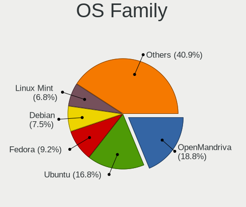
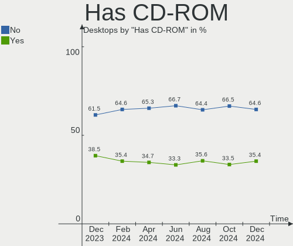
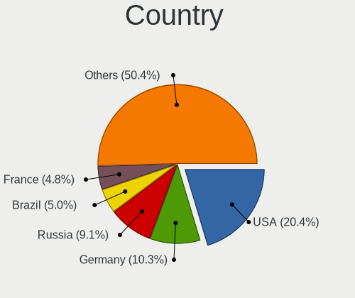
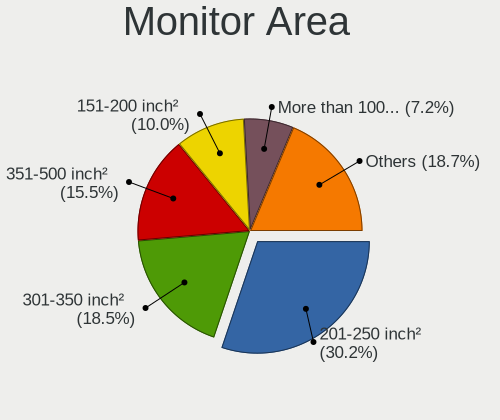
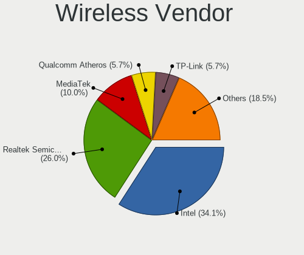
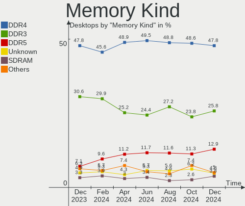

Linux - Hardware Trends (Desktops)
----------------------------------

A project to identify most popular hardware characteristics and track their change
over time based on data collected by Linux users at https://Linux-Hardware.org.

Anyone can contribute to this report by the [hw-probe](https://github.com/linuxhw/hw-probe) tool:

    sudo -E hw-probe -all -upload

This report is for one last month. Overall report since the beginning of time: [TestDays](https://github.com/linuxhw/TestDays)

Period: Apr, 2023.

Contents
--------

* [ System ](#system)
  - [ OS                       ](#os)
  - [ OS Family                ](#os-family)
  - [ Kernel                   ](#kernel)
  - [ Kernel Family            ](#kernel-family)
  - [ Kernel Major Ver.        ](#kernel-major-ver)
  - [ Arch                     ](#arch)
  - [ DE                       ](#de)
  - [ Display Server           ](#display-server)
  - [ Display Manager          ](#display-manager)
  - [ OS Lang                  ](#os-lang)
  - [ Boot Mode                ](#boot-mode)
  - [ Filesystem               ](#filesystem)
  - [ Part. scheme             ](#part-scheme)
  - [ Dual Boot with Linux/BSD ](#dual-boot-with-linuxbsd)
  - [ Dual Boot (Win)          ](#dual-boot-win)

* [ Board ](#board)
  - [ Vendor                   ](#vendor)
  - [ Model                    ](#model)
  - [ Model Family             ](#model-family)
  - [ MFG Year                 ](#mfg-year)
  - [ Form Factor              ](#form-factor)
  - [ Secure Boot              ](#secure-boot)
  - [ Coreboot                 ](#coreboot)
  - [ RAM Size                 ](#ram-size)
  - [ RAM Used                 ](#ram-used)
  - [ Total Drives             ](#total-drives)
  - [ Has CD-ROM               ](#has-cd-rom)
  - [ Has Ethernet             ](#has-ethernet)
  - [ Has WiFi                 ](#has-wifi)
  - [ Has Bluetooth            ](#has-bluetooth)

* [ Location ](#location)
  - [ Country                  ](#country)
  - [ City                     ](#city)

* [ Drives ](#drives)
  - [ Drive Vendor             ](#drive-vendor)
  - [ Drive Model              ](#drive-model)
  - [ HDD Vendor               ](#hdd-vendor)
  - [ SSD Vendor               ](#ssd-vendor)
  - [ Drive Kind               ](#drive-kind)
  - [ Drive Connector          ](#drive-connector)
  - [ Drive Size               ](#drive-size)
  - [ Space Total              ](#space-total)
  - [ Space Used               ](#space-used)
  - [ Malfunc. Drives          ](#malfunc-drives)
  - [ Malfunc. Drive Vendor    ](#malfunc-drive-vendor)
  - [ Malfunc. HDD Vendor      ](#malfunc-hdd-vendor)
  - [ Malfunc. Drive Kind      ](#malfunc-drive-kind)
  - [ Failed Drives            ](#failed-drives)
  - [ Failed Drive Vendor      ](#failed-drive-vendor)
  - [ Drive Status             ](#drive-status)

* [ Storage controller ](#storage-controller)
  - [ Storage Vendor           ](#storage-vendor)
  - [ Storage Model            ](#storage-model)
  - [ Storage Kind             ](#storage-kind)

* [ Processor ](#processor)
  - [ CPU Vendor               ](#cpu-vendor)
  - [ CPU Model                ](#cpu-model)
  - [ CPU Model Family         ](#cpu-model-family)
  - [ CPU Cores                ](#cpu-cores)
  - [ CPU Sockets              ](#cpu-sockets)
  - [ CPU Threads              ](#cpu-threads)
  - [ CPU Op-Modes             ](#cpu-op-modes)
  - [ CPU Microcode            ](#cpu-microcode)
  - [ CPU Microarch            ](#cpu-microarch)

* [ Graphics ](#graphics)
  - [ GPU Vendor               ](#gpu-vendor)
  - [ GPU Model                ](#gpu-model)
  - [ GPU Combo                ](#gpu-combo)
  - [ GPU Driver               ](#gpu-driver)
  - [ GPU Memory               ](#gpu-memory)

* [ Monitor ](#monitor)
  - [ Monitor Vendor           ](#monitor-vendor)
  - [ Monitor Model            ](#monitor-model)
  - [ Monitor Resolution       ](#monitor-resolution)
  - [ Monitor Diagonal         ](#monitor-diagonal)
  - [ Monitor Width            ](#monitor-width)
  - [ Aspect Ratio             ](#aspect-ratio)
  - [ Monitor Area             ](#monitor-area)
  - [ Pixel Density            ](#pixel-density)
  - [ Multiple Monitors        ](#multiple-monitors)

* [ Network ](#network)
  - [ Net Controller Vendor    ](#net-controller-vendor)
  - [ Net Controller Model     ](#net-controller-model)
  - [ Wireless Vendor          ](#wireless-vendor)
  - [ Wireless Model           ](#wireless-model)
  - [ Ethernet Vendor          ](#ethernet-vendor)
  - [ Ethernet Model           ](#ethernet-model)
  - [ Net Controller Kind      ](#net-controller-kind)
  - [ Used Controller          ](#used-controller)
  - [ NICs                     ](#nics)
  - [ IPv6                     ](#ipv6)

* [ Bluetooth ](#bluetooth)
  - [ Bluetooth Vendor         ](#bluetooth-vendor)
  - [ Bluetooth Model          ](#bluetooth-model)

* [ Sound ](#sound)
  - [ Sound Vendor             ](#sound-vendor)
  - [ Sound Model              ](#sound-model)

* [ Memory ](#memory)
  - [ Memory Vendor            ](#memory-vendor)
  - [ Memory Model             ](#memory-model)
  - [ Memory Kind              ](#memory-kind)
  - [ Memory Form Factor       ](#memory-form-factor)
  - [ Memory Size              ](#memory-size)
  - [ Memory Speed             ](#memory-speed)

* [ Printers & scanners ](#printers--scanners)
  - [ Printer Vendor           ](#printer-vendor)
  - [ Printer Model            ](#printer-model)
  - [ Scanner Vendor           ](#scanner-vendor)
  - [ Scanner Model            ](#scanner-model)

* [ Camera ](#camera)
  - [ Camera Vendor            ](#camera-vendor)
  - [ Camera Model             ](#camera-model)

* [ Security ](#security)
  - [ Fingerprint Vendor       ](#fingerprint-vendor)
  - [ Fingerprint Model        ](#fingerprint-model)
  - [ Chipcard Vendor          ](#chipcard-vendor)
  - [ Chipcard Model           ](#chipcard-model)

* [ Unsupported ](#unsupported)
  - [ Unsupported Devices      ](#unsupported-devices)
  - [ Unsupported Device Types ](#unsupported-device-types)

System
------

OS
--

Installed operating systems

| Name                         | Desktops | Percent |
|------------------------------|----------|---------|
| Ubuntu 22.04                 | 345      | 15.36%  |
| OpenMandriva 23.03           | 329      | 14.65%  |
| Linux Mint 21.1              | 161      | 7.17%   |
| Debian 11                    | 111      | 4.94%   |
| ROSA 12.4                    | 106      | 4.72%   |
| Pop!_OS 22.04                | 79       | 3.52%   |
| Fedora 38                    | 77       | 3.43%   |
| Zorin 16                     | 63       | 2.8%    |
| Arch Rolling                 | 56       | 2.49%   |
| Fedora 37                    | 53       | 2.36%   |
| Ubuntu 22.10                 | 51       | 2.27%   |
| Ubuntu 20.04                 | 46       | 2.05%   |
| Manjaro                      | 43       | 1.91%   |
| Ubuntu 23.04                 | 41       | 1.83%   |
| OpenMandriva 4.3             | 41       | 1.83%   |
| KDE neon 22.04               | 38       | 1.69%   |
| Debian 12                    | 36       | 1.6%    |
| OpenMandriva 23.01           | 35       | 1.56%   |
| Gentoo 2.13                  | 32       | 1.42%   |
| ArcoLinux Rolling            | 32       | 1.42%   |
| BlackPanther 18.1            | 28       | 1.25%   |
| Kubuntu 22.04                | 27       | 1.2%    |
| Nobara 37                    | 25       | 1.11%   |
| Manjaro 22.1.0               | 23       | 1.02%   |
| Linux Mint 20.3              | 20       | 0.89%   |
| openSUSE Tumbleweed-XXXXXXXX | 17       | 0.76%   |
| ROSA 12.3                    | 14       | 0.62%   |
| Linux Mint 21                | 13       | 0.58%   |
| OpenMandriva 4.2             | 12       | 0.53%   |
| EndeavourOS Rolling          | 11       | 0.49%   |
| MX 21                        | 10       | 0.45%   |
| Ubuntu MATE 22.04            | 9        | 0.4%    |
| Elementary 7                 | 9        | 0.4%    |
| Xubuntu 22.04                | 8        | 0.36%   |
| Ubuntu 18.04                 | 8        | 0.36%   |
| Kubuntu 22.10                | 8        | 0.36%   |
| Kali 2023.1                  | 8        | 0.36%   |
| Xubuntu 20.04                | 7        | 0.31%   |
| LMDE 5                       | 7        | 0.31%   |
| Garuda Linux Soaring         | 7        | 0.31%   |

OS Family
---------

OS without a version

| Name          | Desktops | Percent |
|---------------|----------|---------|
| Ubuntu        | 493      | 21.95%  |
| OpenMandriva  | 427      | 19.01%  |
| Linux Mint    | 203      | 9.04%   |
| Debian        | 156      | 6.95%   |
| Fedora        | 138      | 6.14%   |
| ROSA          | 135      | 6.01%   |
| Pop!_OS       | 79       | 3.52%   |
| Manjaro       | 66       | 2.94%   |
| Zorin         | 65       | 2.89%   |
| Arch          | 56       | 2.49%   |
| Kubuntu       | 41       | 1.83%   |
| KDE neon      | 38       | 1.69%   |
| Gentoo        | 34       | 1.51%   |
| ArcoLinux     | 33       | 1.47%   |
| BlackPanther  | 29       | 1.29%   |
| Nobara        | 26       | 1.16%   |
| openSUSE      | 25       | 1.11%   |
| Xubuntu       | 18       | 0.8%    |
| Ubuntu MATE   | 13       | 0.58%   |
| MX            | 11       | 0.49%   |
| EndeavourOS   | 11       | 0.49%   |
| Elementary    | 10       | 0.45%   |
| Red OS        | 9        | 0.4%    |
| Kali          | 9        | 0.4%    |
| Garuda Linux  | 9        | 0.4%    |
| LMDE          | 7        | 0.31%   |
| SteamOS       | 6        | 0.27%   |
| Devuan        | 5        | 0.22%   |
| Ubuntu Unity  | 4        | 0.18%   |
| Ubuntu Budgie | 4        | 0.18%   |
| Pardus        | 4        | 0.18%   |
| Lubuntu       | 4        | 0.18%   |
| CentOS        | 4        | 0.18%   |
| blendOS       | 4        | 0.18%   |
| ALT Linux     | 4        | 0.18%   |
| AlmaLinux     | 4        | 0.18%   |
| Parrot        | 3        | 0.13%   |
| NixOS         | 3        | 0.13%   |
| Endless       | 3        | 0.13%   |
| Artix         | 3        | 0.13%   |

Kernel
------

Version of the Linux kernel

| Version                             | Desktops | Percent |
|-------------------------------------|----------|---------|
| 6.2.6-desktop-1omv2390              | 326      | 14.51%  |
| 5.15.0-69-generic                   | 202      | 8.99%   |
| 5.19.0-38-generic                   | 192      | 8.55%   |
| 5.19.0-40-generic                   | 95       | 4.23%   |
| 5.10.0-21-amd64                     | 84       | 3.74%   |
| 6.2.6-76060206-generic              | 69       | 3.07%   |
| 6.1.20-generic-2rosa2021.1-x86_64   | 68       | 3.03%   |
| 5.15.0-67-generic                   | 52       | 2.32%   |
| 5.15.0-70-generic                   | 46       | 2.05%   |
| 5.19.0-41-generic                   | 44       | 1.96%   |
| 6.2.0-20-generic                    | 41       | 1.83%   |
| 6.2.11-300.fc38.x86_64              | 31       | 1.38%   |
| 6.1.1-desktop-1omv2290              | 30       | 1.34%   |
| 5.15.0-71-generic                   | 28       | 1.25%   |
| 5.4.0-146-generic                   | 26       | 1.16%   |
| 5.16.7-desktop-1omv4003             | 25       | 1.11%   |
| 5.15.0-58-generic                   | 25       | 1.11%   |
| 6.1.0-7-amd64                       | 22       | 0.98%   |
| 6.2.12-300.fc38.x86_64              | 19       | 0.85%   |
| 6.2.12-arch1-1                      | 17       | 0.76%   |
| 5.15.0-56-generic                   | 17       | 0.76%   |
| 6.2.10-arch1-1                      | 16       | 0.71%   |
| 5.16.13-desktop-1omv4003            | 16       | 0.71%   |
| 5.15.103-generic-1rosa2021.1-x86_64 | 16       | 0.71%   |
| 4.18.16-desktop-1bP                 | 15       | 0.67%   |
| 6.2.9-300.fc38.x86_64               | 14       | 0.62%   |
| 6.2.9-200.fc37.x86_64               | 13       | 0.58%   |
| 6.2.10-200.fc37.x86_64              | 13       | 0.58%   |
| 6.1.23-1-MANJARO                    | 13       | 0.58%   |
| 5.6.14-desktop-2bP                  | 13       | 0.58%   |
| 5.10.14-desktop-1omv4002            | 13       | 0.58%   |
| 6.2.11-arch1-1                      | 12       | 0.53%   |
| 6.2.10-zen1-1-zen                   | 12       | 0.53%   |
| 5.19.0-32-generic                   | 11       | 0.49%   |
| 6.2.8-200.fc37.x86_64               | 10       | 0.45%   |
| 5.10.0-20-amd64                     | 10       | 0.45%   |
| 6.2.9-arch1-1                       | 9        | 0.4%    |
| 6.2.12-zen1-1-zen                   | 9        | 0.4%    |
| 5.15.0-43-generic                   | 9        | 0.4%    |
| 6.2.12-1-MANJARO                    | 8        | 0.36%   |

Kernel Family
-------------

Linux kernel without a distro release

| Version  | Desktops | Percent |
|----------|----------|---------|
| 5.15.0   | 411      | 18.3%   |
| 6.2.6    | 404      | 17.99%  |
| 5.19.0   | 358      | 15.94%  |
| 5.10.0   | 103      | 4.59%   |
| 6.2.11   | 77       | 3.43%   |
| 6.1.20   | 72       | 3.21%   |
| 6.2.10   | 66       | 2.94%   |
| 6.2.12   | 64       | 2.85%   |
| 6.2.9    | 61       | 2.72%   |
| 6.1.0    | 55       | 2.45%   |
| 6.2.0    | 51       | 2.27%   |
| 5.4.0    | 50       | 2.23%   |
| 6.2.8    | 38       | 1.69%   |
| 6.1.1    | 31       | 1.38%   |
| 5.16.7   | 25       | 1.11%   |
| 6.1.23   | 17       | 0.76%   |
| 5.15.103 | 17       | 0.76%   |
| 6.1.19   | 16       | 0.71%   |
| 5.16.13  | 16       | 0.71%   |
| 4.18.16  | 15       | 0.67%   |
| 6.2.13   | 13       | 0.58%   |
| 5.6.14   | 13       | 0.58%   |
| 5.10.14  | 13       | 0.58%   |
| 5.15.104 | 12       | 0.53%   |
| 5.10.74  | 10       | 0.45%   |
| 6.1.25   | 9        | 0.4%    |
| 4.15.0   | 9        | 0.4%    |
| 6.3.0    | 8        | 0.36%   |
| 5.14.0   | 8        | 0.36%   |
| 6.1.22   | 7        | 0.31%   |
| 6.1.21   | 7        | 0.31%   |
| 6.0.12   | 7        | 0.31%   |
| 6.0.0    | 7        | 0.31%   |
| 5.14.21  | 7        | 0.31%   |
| 6.1.4    | 6        | 0.27%   |
| 5.15.75  | 6        | 0.27%   |
| 5.15.106 | 6        | 0.27%   |
| 5.15.102 | 6        | 0.27%   |
| 5.10.176 | 6        | 0.27%   |
| 6.0.7    | 5        | 0.22%   |

Kernel Major Ver.
-----------------

Linux kernel major version

| Version | Desktops | Percent |
|---------|----------|---------|
| 6.2     | 780      | 34.73%  |
| 5.15    | 484      | 21.55%  |
| 5.19    | 365      | 16.25%  |
| 6.1     | 240      | 10.69%  |
| 5.10    | 145      | 6.46%   |
| 5.4     | 55       | 2.45%   |
| 5.16    | 43       | 1.91%   |
| 6.0     | 29       | 1.29%   |
| 4.18    | 19       | 0.85%   |
| 5.14    | 17       | 0.76%   |
| 5.6     | 13       | 0.58%   |
| 4.15    | 9        | 0.4%    |
| 6.3     | 8        | 0.36%   |
| 5.13    | 6        | 0.27%   |
| 5.18    | 5        | 0.22%   |
| 5.17    | 5        | 0.22%   |
| 4.19    | 5        | 0.22%   |
| 5.3     | 3        | 0.13%   |
| 4.9     | 3        | 0.13%   |
| 4.4     | 3        | 0.13%   |
| 5.9     | 2        | 0.09%   |
| 5.11    | 2        | 0.09%   |
| 5.12    | 1        | 0.04%   |
| 5.0     | 1        | 0.04%   |
| 4.10    | 1        | 0.04%   |
| 3.10    | 1        | 0.04%   |
| 2.6     | 1        | 0.04%   |

Arch
----

OS architecture (x86_64, i586, etc.)

| Name    | Desktops | Percent |
|---------|----------|---------|
| x86_64  | 2225     | 99.07%  |
| i686    | 17       | 0.76%   |
| ppc64   | 2        | 0.09%   |
| sparc64 | 1        | 0.04%   |
| armv7l  | 1        | 0.04%   |

DE
--

Desktop Environment

| Name             | Desktops | Percent |
|------------------|----------|---------|
| GNOME            | 786      | 35%     |
| KDE5             | 778      | 34.64%  |
| X-Cinnamon       | 170      | 7.57%   |
| XFCE             | 128      | 5.7%    |
| Unknown          | 105      | 4.67%   |
| MATE             | 68       | 3.03%   |
| GNUstep          | 66       | 2.94%   |
| LXQt             | 48       | 2.14%   |
| Cinnamon         | 18       | 0.8%    |
| Hyprland         | 12       | 0.53%   |
| Pantheon         | 10       | 0.45%   |
| Budgie           | 9        | 0.4%    |
| LXDE             | 6        | 0.27%   |
| Unity            | 4        | 0.18%   |
| openbox          | 4        | 0.18%   |
| i3               | 4        | 0.18%   |
| GNOME Flashback  | 4        | 0.18%   |
| sway             | 3        | 0.13%   |
| Enlightenment    | 3        | 0.13%   |
| chadwm           | 3        | 0.13%   |
| KDE4             | 2        | 0.09%   |
| Deepin           | 2        | 0.09%   |
| awesome          | 2        | 0.09%   |
| xmonad           | 1        | 0.04%   |
| Trinity          | 1        | 0.04%   |
| onyx:GNOME       | 1        | 0.04%   |
| lightdm-xsession | 1        | 0.04%   |
| KDE              | 1        | 0.04%   |
| icewm            | 1        | 0.04%   |
| GNOME Classic    | 1        | 0.04%   |
| fly              | 1        | 0.04%   |
| dwm              | 1        | 0.04%   |
| default          | 1        | 0.04%   |
| bspwm            | 1        | 0.04%   |

Display Server
--------------

X11 or Wayland

| Name        | Desktops | Percent |
|-------------|----------|---------|
| X11         | 1516     | 67.5%   |
| Wayland     | 525      | 23.37%  |
| Tty         | 159      | 7.08%   |
| Unknown     | 44       | 1.96%   |
| Web         | 1        | 0.04%   |
| Unspecified | 1        | 0.04%   |

Display Manager
---------------

SDDM, LightDM, etc.

| Name    | Desktops | Percent |
|---------|----------|---------|
| SDDM    | 683      | 30.41%  |
| Unknown | 666      | 29.65%  |
| GDM3    | 382      | 17.01%  |
| LightDM | 309      | 13.76%  |
| GDM     | 187      | 8.33%   |
| SLiM    | 5        | 0.22%   |
| LXDM    | 3        | 0.13%   |
| KDM     | 2        | 0.09%   |
| XDM     | 1        | 0.04%   |
| TDM     | 1        | 0.04%   |
| SU      | 1        | 0.04%   |
| SLIMSKI | 1        | 0.04%   |
| NODM    | 1        | 0.04%   |
| MDM     | 1        | 0.04%   |
| Ly      | 1        | 0.04%   |
| GREETD  | 1        | 0.04%   |
| FLY-DM  | 1        | 0.04%   |

OS Lang
-------

Language

| Lang    | Desktops | Percent |
|---------|----------|---------|
| en_US   | 891      | 39.67%  |
| de_DE   | 214      | 9.53%   |
| ru_RU   | 212      | 9.44%   |
| fr_FR   | 113      | 5.03%   |
| en_GB   | 108      | 4.81%   |
| pt_BR   | 88       | 3.92%   |
| it_IT   | 62       | 2.76%   |
| en_CA   | 57       | 2.54%   |
| Unknown | 56       | 2.49%   |
| es_ES   | 50       | 2.23%   |
| en_AU   | 42       | 1.87%   |
| C       | 36       | 1.6%    |
| pl_PL   | 22       | 0.98%   |
| nl_NL   | 20       | 0.89%   |
| en_IN   | 20       | 0.89%   |
| de_AT   | 18       | 0.8%    |
| es_MX   | 16       | 0.71%   |
| de_CH   | 14       | 0.62%   |
| cs_CZ   | 13       | 0.58%   |
| ja_JP   | 12       | 0.53%   |
| hu_HU   | 12       | 0.53%   |
| es_AR   | 11       | 0.49%   |
| tr_TR   | 10       | 0.45%   |
| es_VE   | 10       | 0.45%   |
| en_IE   | 10       | 0.45%   |
| zh_CN   | 9        | 0.4%    |
| sk_SK   | 8        | 0.36%   |
| fi_FI   | 8        | 0.36%   |
| pt_PT   | 7        | 0.31%   |
| sv_SE   | 6        | 0.27%   |
| en_ZA   | 6        | 0.27%   |
| fr_CA   | 5        | 0.22%   |
| es_CL   | 5        | 0.22%   |
| ko_KR   | 4        | 0.18%   |
| fr_BE   | 4        | 0.18%   |
| en_DK   | 4        | 0.18%   |
| POSIX   | 3        | 0.13%   |
| nl_BE   | 3        | 0.13%   |
| en_PH   | 3        | 0.13%   |
| en_IL   | 3        | 0.13%   |

Boot Mode
---------

EFI or BIOS

| Mode | Desktops | Percent |
|------|----------|---------|
| BIOS | 1175     | 52.32%  |
| EFI  | 1071     | 47.68%  |

Filesystem
----------

Type of filesystem

| Type    | Desktops | Percent |
|---------|----------|---------|
| Ext4    | 1559     | 69.41%  |
| Btrfs   | 288      | 12.82%  |
| Overlay | 224      | 9.97%   |
| Tmpfs   | 108      | 4.81%   |
| Xfs     | 31       | 1.38%   |
| Zfs     | 24       | 1.07%   |
| F2fs    | 7        | 0.31%   |
| Aufs    | 2        | 0.09%   |
| Rootfs  | 1        | 0.04%   |
| Ext3    | 1        | 0.04%   |
| Ext2    | 1        | 0.04%   |

Part. scheme
------------

Scheme of partitioning

| Type    | Desktops | Percent |
|---------|----------|---------|
| GPT     | 1327     | 59.08%  |
| Unknown | 563      | 25.07%  |
| MBR     | 356      | 15.85%  |

Dual Boot with Linux/BSD
------------------------

Hosting more than one Linux/BSD

| Dual boot | Desktops | Percent |
|-----------|----------|---------|
| No        | 1723     | 76.71%  |
| Yes       | 523      | 23.29%  |

Dual Boot (Win)
---------------

Hosting Linux and Windows

| Dual boot | Desktops | Percent |
|-----------|----------|---------|
| No        | 1479     | 65.85%  |
| Yes       | 767      | 34.15%  |

Board
-----

Vendor
------

Motherboard manufacturer

| Name                                 | Desktops | Percent |
|--------------------------------------|----------|---------|
| ASUSTek Computer                     | 583      | 25.96%  |
| Gigabyte Technology                  | 376      | 16.74%  |
| MSI                                  | 275      | 12.24%  |
| ASRock                               | 195      | 8.68%   |
| Hewlett-Packard                      | 169      | 7.52%   |
| Dell                                 | 160      | 7.12%   |
| Lenovo                               | 77       | 3.43%   |
| Intel                                | 61       | 2.72%   |
| Fujitsu                              | 40       | 1.78%   |
| Acer                                 | 39       | 1.74%   |
| Unknown                              | 34       | 1.51%   |
| Biostar                              | 30       | 1.34%   |
| Foxconn                              | 17       | 0.76%   |
| Pegatron                             | 15       | 0.67%   |
| Medion                               | 13       | 0.58%   |
| ECS                                  | 13       | 0.58%   |
| Apple                                | 11       | 0.49%   |
| AZW                                  | 9        | 0.4%    |
| Shuttle                              | 8        | 0.36%   |
| BESSTAR Tech                         | 7        | 0.31%   |
| Shenzhen Meigao Electronic Equipment | 6        | 0.27%   |
| Huanan                               | 6        | 0.27%   |
| eMachines                            | 6        | 0.27%   |
| Fujitsu Siemens                      | 5        | 0.22%   |
| AMI                                  | 5        | 0.22%   |
| OEM                                  | 4        | 0.18%   |
| Inventec                             | 4        | 0.18%   |
| Alienware                            | 4        | 0.18%   |
| Techvision                           | 3        | 0.13%   |
| MACHINIST                            | 3        | 0.13%   |
| Gateway                              | 3        | 0.13%   |
| Acidanthera                          | 3        | 0.13%   |
| Win element                          | 2        | 0.09%   |
| System76                             | 2        | 0.09%   |
| Samsung Electronics                  | 2        | 0.09%   |
| PCWare                               | 2        | 0.09%   |
| Packard Bell                         | 2        | 0.09%   |
| Colorful Technology                  | 2        | 0.09%   |
| ASRockRack                           | 2        | 0.09%   |
| AMD                                  | 2        | 0.09%   |

Model
-----

Motherboard model

| Name                         | Desktops | Percent |
|------------------------------|----------|---------|
| ASUS All Series              | 51       | 2.27%   |
| Unknown                      | 37       | 1.65%   |
| Dell OptiPlex 7010           | 19       | 0.85%   |
| ASUS PRIME Z590-P            | 18       | 0.8%    |
| ASUS PRIME A320M-K           | 17       | 0.76%   |
| ASUS TUF Gaming X570-PLUS    | 14       | 0.62%   |
| ASUS PRIME X570-PRO          | 13       | 0.58%   |
| ASUS PRIME B550M-A           | 13       | 0.58%   |
| MSI MS-7C37                  | 11       | 0.49%   |
| ASUS TUF Gaming B550M-PLUS   | 11       | 0.49%   |
| MSI MS-7C02                  | 10       | 0.45%   |
| MSI MS-7B86                  | 10       | 0.45%   |
| Dell OptiPlex 3020           | 10       | 0.45%   |
| MSI MS-7B89                  | 8        | 0.36%   |
| MSI MS-7B79                  | 8        | 0.36%   |
| MSI MS-7C56                  | 7        | 0.31%   |
| MSI MS-7817                  | 7        | 0.31%   |
| MSI MS-7721                  | 7        | 0.31%   |
| Dell OptiPlex 9020           | 7        | 0.31%   |
| ASUS ROG STRIX B550-F GAMING | 7        | 0.31%   |
| MSI MS-7C91                  | 6        | 0.27%   |
| MSI MS-7C52                  | 6        | 0.27%   |
| HP Compaq Elite 8300 SFF     | 6        | 0.27%   |
| Gigabyte B550 AORUS ELITE V2 | 6        | 0.27%   |
| Gigabyte A320M-H             | 6        | 0.27%   |
| Dell Precision Tower 5810    | 6        | 0.27%   |
| ASUS M5A78L-M PLUS/USB3      | 6        | 0.27%   |
| ASRock B450M Pro4            | 6        | 0.27%   |
| Apple MacPro5,1              | 6        | 0.27%   |
| MSI MS-7D25                  | 5        | 0.22%   |
| MSI MS-7C95                  | 5        | 0.22%   |
| MSI MS-7693                  | 5        | 0.22%   |
| MSI MS-7592                  | 5        | 0.22%   |
| HP Z420 Workstation          | 5        | 0.22%   |
| HP ProDesk 600 G1 SFF        | 5        | 0.22%   |
| HP EliteDesk 800 G2 DM 35W   | 5        | 0.22%   |
| HP EliteDesk 800 G1 SFF      | 5        | 0.22%   |
| Gigabyte Z77M-D3H            | 5        | 0.22%   |
| Gigabyte GA-78LMT-S2P        | 5        | 0.22%   |
| Gigabyte B550M DS3H          | 5        | 0.22%   |

Model Family
------------

Motherboard model prefix

| Name                | Desktops | Percent |
|---------------------|----------|---------|
| ASUS PRIME          | 165      | 7.35%   |
| Dell OptiPlex       | 105      | 4.67%   |
| ASUS ROG            | 88       | 3.92%   |
| ASUS TUF            | 66       | 2.94%   |
| ASUS All            | 51       | 2.27%   |
| Lenovo ThinkCentre  | 41       | 1.83%   |
| HP EliteDesk        | 40       | 1.78%   |
| HP Compaq           | 38       | 1.69%   |
| Unknown             | 37       | 1.65%   |
| Dell Precision      | 29       | 1.29%   |
| Gigabyte B550       | 25       | 1.11%   |
| Acer Aspire         | 23       | 1.02%   |
| Gigabyte X570       | 21       | 0.93%   |
| Fujitsu CELSIUS     | 18       | 0.8%    |
| HP ProDesk          | 16       | 0.71%   |
| Gigabyte B450       | 16       | 0.71%   |
| Fujitsu ESPRIMO     | 15       | 0.67%   |
| Gigabyte B550M      | 14       | 0.62%   |
| Dell Inspiron       | 14       | 0.62%   |
| ASUS M5A78L-M       | 14       | 0.62%   |
| Lenovo ThinkStation | 13       | 0.58%   |
| ASUS M5A97          | 13       | 0.58%   |
| Lenovo IdeaCentre   | 12       | 0.53%   |
| MSI MS-7C37         | 11       | 0.49%   |
| Acer Veriton        | 11       | 0.49%   |
| MSI MS-7C02         | 10       | 0.45%   |
| MSI MS-7B86         | 10       | 0.45%   |
| ASUS P8H61-M        | 10       | 0.45%   |
| ASRock B450         | 10       | 0.45%   |
| HP ProLiant         | 9        | 0.4%    |
| Gigabyte B450M      | 9        | 0.4%    |
| ASRock B550M        | 9        | 0.4%    |
| ASRock B450M        | 9        | 0.4%    |
| MSI MS-7B89         | 8        | 0.36%   |
| MSI MS-7B79         | 8        | 0.36%   |
| ASRock B550         | 8        | 0.36%   |
| MSI MS-7C56         | 7        | 0.31%   |
| MSI MS-7817         | 7        | 0.31%   |
| MSI MS-7721         | 7        | 0.31%   |
| HP Pavilion         | 7        | 0.31%   |

MFG Year
--------

Motherboard manufacture year

| Year    | Desktops | Percent |
|---------|----------|---------|
| 2020    | 228      | 10.15%  |
| 2018    | 218      | 9.71%   |
| 2012    | 193      | 8.59%   |
| 2019    | 178      | 7.93%   |
| 2021    | 167      | 7.44%   |
| 2022    | 161      | 7.17%   |
| 2013    | 161      | 7.17%   |
| 2014    | 150      | 6.68%   |
| 2011    | 139      | 6.19%   |
| 2017    | 133      | 5.92%   |
| 2010    | 106      | 4.72%   |
| 2015    | 105      | 4.67%   |
| 2016    | 79       | 3.52%   |
| 2009    | 73       | 3.25%   |
| 2008    | 60       | 2.67%   |
| 2007    | 42       | 1.87%   |
| 2023    | 31       | 1.38%   |
| 2006    | 11       | 0.49%   |
| 2005    | 4        | 0.18%   |
| Unknown | 4        | 0.18%   |
| 2003    | 2        | 0.09%   |
| 2004    | 1        | 0.04%   |

Form Factor
-----------

Physical design of the computer

| Name    | Desktops | Percent |
|---------|----------|---------|
| Desktop | 2246     | 100%    |

Secure Boot
-----------

Enabled or disabled

| State    | Desktops | Percent |
|----------|----------|---------|
| Disabled | 2178     | 96.97%  |
| Enabled  | 68       | 3.03%   |

Coreboot
--------

Have coreboot on board

| Used | Desktops | Percent |
|------|----------|---------|
| No   | 2245     | 99.96%  |
| Yes  | 1        | 0.04%   |

RAM Size
--------

Total RAM memory

| Size in GB      | Desktops | Percent |
|-----------------|----------|---------|
| 16.01-24.0      | 576      | 25.65%  |
| 32.01-64.0      | 428      | 19.06%  |
| 8.01-16.0       | 360      | 16.03%  |
| 4.01-8.0        | 329      | 14.65%  |
| 3.01-4.0        | 212      | 9.44%   |
| 64.01-256.0     | 183      | 8.15%   |
| 24.01-32.0      | 92       | 4.1%    |
| 1.01-2.0        | 33       | 1.47%   |
| 2.01-3.0        | 21       | 0.93%   |
| More than 256.0 | 5        | 0.22%   |
| 0.51-1.0        | 5        | 0.22%   |
| Unknown         | 2        | 0.09%   |

RAM Used
--------

Used RAM memory

| Used GB     | Desktops | Percent |
|-------------|----------|---------|
| 1.01-2.0    | 708      | 31.52%  |
| 2.01-3.0    | 561      | 24.98%  |
| 4.01-8.0    | 358      | 15.94%  |
| 3.01-4.0    | 283      | 12.6%   |
| 8.01-16.0   | 132      | 5.88%   |
| 0.51-1.0    | 121      | 5.39%   |
| 0.01-0.5    | 35       | 1.56%   |
| 16.01-24.0  | 21       | 0.93%   |
| 24.01-32.0  | 13       | 0.58%   |
| 32.01-64.0  | 8        | 0.36%   |
| 64.01-256.0 | 3        | 0.13%   |
| Unknown     | 3        | 0.13%   |

Total Drives
------------

Number of drives on board

| Drives | Desktops | Percent |
|--------|----------|---------|
| 1      | 825      | 36.73%  |
| 2      | 633      | 28.18%  |
| 3      | 373      | 16.61%  |
| 4      | 205      | 9.13%   |
| 5      | 105      | 4.67%   |
| 6      | 50       | 2.23%   |
| 7      | 24       | 1.07%   |
| 0      | 11       | 0.49%   |
| 8      | 7        | 0.31%   |
| 9      | 5        | 0.22%   |
| 10     | 3        | 0.13%   |
| 11     | 2        | 0.09%   |
| 28     | 1        | 0.04%   |
| 26     | 1        | 0.04%   |
| 13     | 1        | 0.04%   |

Has CD-ROM
----------

Has CD-ROM on board

| Presented | Desktops | Percent |
|-----------|----------|---------|
| No        | 1334     | 59.39%  |
| Yes       | 912      | 40.61%  |

Has Ethernet
------------

Has Ethernet on board

| Presented | Desktops | Percent |
|-----------|----------|---------|
| Yes       | 2228     | 99.2%   |
| No        | 18       | 0.8%    |

Has WiFi
--------

Has WiFi module

| Presented | Desktops | Percent |
|-----------|----------|---------|
| No        | 1253     | 55.79%  |
| Yes       | 993      | 44.21%  |

Has Bluetooth
-------------

Has Bluetooth module

| Presented | Desktops | Percent |
|-----------|----------|---------|
| No        | 1466     | 65.27%  |
| Yes       | 780      | 34.73%  |

Location
--------

Country
-------

Geographic location (country)

| Country      | Desktops | Percent |
|--------------|----------|---------|
| USA          | 368      | 16.38%  |
| Germany      | 261      | 11.62%  |
| Russia       | 218      | 9.71%   |
| France       | 131      | 5.83%   |
| Brazil       | 119      | 5.3%    |
| Switzerland  | 108      | 4.81%   |
| UK           | 96       | 4.27%   |
| Canada       | 88       | 3.92%   |
| Italy        | 83       | 3.7%    |
| Spain        | 63       | 2.8%    |
| Australia    | 54       | 2.4%    |
| Hungary      | 47       | 2.09%   |
| Netherlands  | 42       | 1.87%   |
| Poland       | 38       | 1.69%   |
| Japan        | 27       | 1.2%    |
| India        | 26       | 1.16%   |
| Mexico       | 25       | 1.11%   |
| Austria      | 24       | 1.07%   |
| Czechia      | 23       | 1.02%   |
| Finland      | 21       | 0.93%   |
| China        | 21       | 0.93%   |
| Argentina    | 21       | 0.93%   |
| Turkey       | 18       | 0.8%    |
| Belgium      | 17       | 0.76%   |
| Greece       | 15       | 0.67%   |
| Slovakia     | 14       | 0.62%   |
| Portugal     | 13       | 0.58%   |
| Venezuela    | 12       | 0.53%   |
| Sweden       | 12       | 0.53%   |
| Norway       | 12       | 0.53%   |
| Israel       | 12       | 0.53%   |
| Bulgaria     | 12       | 0.53%   |
| Ukraine      | 11       | 0.49%   |
| South Africa | 11       | 0.49%   |
| Denmark      | 11       | 0.49%   |
| Malaysia     | 10       | 0.45%   |
| Ireland      | 9        | 0.4%    |
| Belarus      | 9        | 0.4%    |
| Taiwan       | 8        | 0.36%   |
| Serbia       | 8        | 0.36%   |

City
----

Geographic location (city)

| City              | Desktops | Percent |
|-------------------|----------|---------|
| Zurich            | 91       | 4.05%   |
| Moscow            | 40       | 1.78%   |
| Sydney            | 20       | 0.89%   |
| St Petersburg     | 19       | 0.85%   |
| Vienna            | 16       | 0.71%   |
| Paris             | 15       | 0.67%   |
| Milan             | 14       | 0.62%   |
| Rome              | 12       | 0.53%   |
| Melbourne         | 12       | 0.53%   |
| London            | 12       | 0.53%   |
| Warsaw            | 11       | 0.49%   |
| Prague            | 11       | 0.49%   |
| Helsinki          | 11       | 0.49%   |
| Budapest          | 11       | 0.49%   |
| Toronto           | 10       | 0.45%   |
| Sao Paulo         | 10       | 0.45%   |
| Kuala Lumpur      | 10       | 0.45%   |
| Istanbul          | 10       | 0.45%   |
| Hamburg           | 10       | 0.45%   |
| Berlin            | 10       | 0.45%   |
| Frankfurt am Main | 9        | 0.4%    |
| Yekaterinburg     | 8        | 0.36%   |
| Krasnodar         | 8        | 0.36%   |
| Seattle           | 7        | 0.31%   |
| Brisbane          | 7        | 0.31%   |
| Athens            | 7        | 0.31%   |
| Voronezh          | 6        | 0.27%   |
| The Hague         | 6        | 0.27%   |
| Novosibirsk       | 6        | 0.27%   |
| Montreal          | 6        | 0.27%   |
| Madrid            | 6        | 0.27%   |
| Los Angeles       | 6        | 0.27%   |
| Johannesburg      | 6        | 0.27%   |
| Barcelona         | 6        | 0.27%   |
| Stockholm         | 5        | 0.22%   |
| Samara            | 5        | 0.22%   |
| Rio de Janeiro    | 5        | 0.22%   |
| Perth             | 5        | 0.22%   |
| Nizhniy Novgorod  | 5        | 0.22%   |
| New York          | 5        | 0.22%   |

Drives
------

Drive Vendor
------------

Hard drive vendors

| Vendor                      | Desktops | Drives | Percent |
|-----------------------------|----------|--------|---------|
| Seagate                     | 733      | 952    | 17.39%  |
| WDC                         | 684      | 956    | 16.23%  |
| Samsung Electronics         | 623      | 894    | 14.78%  |
| Kingston                    | 276      | 319    | 6.55%   |
| SanDisk                     | 227      | 268    | 5.39%   |
| Toshiba                     | 202      | 235    | 4.79%   |
| Crucial                     | 200      | 240    | 4.75%   |
| Hitachi                     | 118      | 147    | 2.8%    |
| Intel                       | 76       | 77     | 1.8%    |
| A-DATA Technology           | 70       | 76     | 1.66%   |
| China                       | 64       | 70     | 1.52%   |
| Phison Electronics          | 51       | 59     | 1.21%   |
| HGST                        | 44       | 45     | 1.04%   |
| Micron/Crucial Technology   | 43       | 50     | 1.02%   |
| PNY                         | 41       | 47     | 0.97%   |
| Unknown                     | 37       | 44     | 0.88%   |
| SPCC                        | 34       | 37     | 0.81%   |
| Silicon Motion              | 31       | 34     | 0.74%   |
| SK hynix                    | 28       | 28     | 0.66%   |
| Kingston Technology Company | 28       | 32     | 0.66%   |
| Patriot                     | 27       | 27     | 0.64%   |
| Intenso                     | 23       | 25     | 0.55%   |
| Maxtor                      | 22       | 22     | 0.52%   |
| Micron Technology           | 21       | 23     | 0.5%    |
| Gigabyte Technology         | 20       | 21     | 0.47%   |
| Apacer                      | 19       | 19     | 0.45%   |
| Phison                      | 18       | 20     | 0.43%   |
| JMicron Technology          | 18       | 20     | 0.43%   |
| Corsair                     | 17       | 18     | 0.4%    |
| Transcend                   | 15       | 15     | 0.36%   |
| GOODRAM                     | 15       | 16     | 0.36%   |
| XPG                         | 14       | 15     | 0.33%   |
| Unknown                     | 14       | 15     | 0.33%   |
| Realtek Semiconductor       | 12       | 13     | 0.28%   |
| KingSpec                    | 12       | 12     | 0.28%   |
| MAXIO Technology (Hangzhou) | 11       | 11     | 0.26%   |
| ADATA Technology            | 11       | 12     | 0.26%   |
| Team                        | 9        | 11     | 0.21%   |
| SABRENT                     | 9        | 11     | 0.21%   |
| OCZ                         | 9        | 9      | 0.21%   |

Drive Model
-----------

Hard drive models

| Model                                                  | Desktops | Percent |
|--------------------------------------------------------|----------|---------|
| Samsung NVMe SSD Controller SM981/PM981/PM983 1TB      | 75       | 1.54%   |
| Kingston SA400S37240G 240GB SSD                        | 74       | 1.52%   |
| Seagate ST1000DM010-2EP102 1TB                         | 60       | 1.23%   |
| Seagate ST2000DM008-2FR102 2TB                         | 54       | 1.11%   |
| Seagate ST500DM002-1BD142 500GB                        | 48       | 0.98%   |
| Toshiba DT01ACA100 1TB                                 | 42       | 0.86%   |
| Samsung NVMe SSD Controller PM9A1/PM9A3/980PRO 2TB     | 41       | 0.84%   |
| Crucial CT500MX500SSD1 500GB                           | 39       | 0.8%    |
| Samsung SSD 860 EVO 500GB                              | 38       | 0.78%   |
| Samsung SSD 850 EVO 250GB                              | 38       | 0.78%   |
| Samsung SSD 980 PRO 1TB                                | 35       | 0.72%   |
| WDC WD10EZEX-08WN4A0 1TB                               | 34       | 0.7%    |
| Kingston SA400S37480G 480GB SSD                        | 33       | 0.68%   |
| Samsung SSD 860 EVO 1TB                                | 31       | 0.63%   |
| Seagate ST1000DM003-1ER162 1TB                         | 30       | 0.61%   |
| Samsung SSD 850 EVO 500GB                              | 29       | 0.59%   |
| Crucial CT1000MX500SSD1 1TB                            | 29       | 0.59%   |
| Micron/Crucial P2 NVMe PCIe SSD 1TB                    | 28       | 0.57%   |
| Kingston SA400S37120G 120GB SSD                        | 28       | 0.57%   |
| Samsung SSD 860 EVO 250GB                              | 27       | 0.55%   |
| Toshiba DT01ACA200 2TB                                 | 26       | 0.53%   |
| Samsung SSD 980 1TB                                    | 26       | 0.53%   |
| Seagate ST4000DM004-2CV104 4TB                         | 25       | 0.51%   |
| Seagate ST3500418AS 500GB                              | 23       | 0.47%   |
| Crucial CT240BX500SSD1 240GB                           | 23       | 0.47%   |
| Crucial CT480BX500SSD1 480GB                           | 21       | 0.43%   |
| WDC WD10EZEX-00BN5A0 1TB                               | 20       | 0.41%   |
| Toshiba DT01ACA050 500GB                               | 20       | 0.41%   |
| Phison E12 NVMe Controller 512GB                       | 20       | 0.41%   |
| WDC WDS240G2G0A-00JH30 240GB SSD                       | 19       | 0.39%   |
| Toshiba HDWD110 1TB                                    | 19       | 0.39%   |
| Silicon Motion SM2263EN/SM2263XT SSD Controller 1024GB | 19       | 0.39%   |
| Seagate ST1000DM003-1CH162 1TB                         | 19       | 0.39%   |
| Seagate ST2000DM006-2DM164 2TB                         | 18       | 0.37%   |
| Samsung SSD 870 QVO 1TB                                | 18       | 0.37%   |
| Kingston SV300S37A120G 120GB SSD                       | 18       | 0.37%   |
| Seagate ST31000528AS 1TB                               | 17       | 0.35%   |
| SanDisk NVMe SSD Drive 1TB                             | 17       | 0.35%   |
| Samsung SSD 970 EVO Plus 1TB                           | 17       | 0.35%   |
| Unknown SD/MMC/MS PRO 249GB                            | 16       | 0.33%   |

HDD Vendor
----------

Hard disk drive vendors

| Vendor              | Desktops | Drives | Percent |
|---------------------|----------|--------|---------|
| Seagate             | 713      | 920    | 39.15%  |
| WDC                 | 593      | 818    | 32.56%  |
| Toshiba             | 183      | 212    | 10.05%  |
| Hitachi             | 118      | 147    | 6.48%   |
| Samsung Electronics | 84       | 91     | 4.61%   |
| HGST                | 44       | 45     | 2.42%   |
| Maxtor              | 21       | 21     | 1.15%   |
| Unknown             | 16       | 16     | 0.88%   |
| JMicron Technology  | 15       | 17     | 0.82%   |
| Intenso             | 5        | 5      | 0.27%   |
| Inateck             | 4        | 4      | 0.22%   |
| Hewlett-Packard     | 3        | 5      | 0.16%   |
| Fujitsu             | 3        | 3      | 0.16%   |
| ASMT                | 3        | 5      | 0.16%   |
| SAGE                | 2        | 2      | 0.11%   |
| SABRENT             | 2        | 2      | 0.11%   |
| HPE                 | 2        | 3      | 0.11%   |
| WD MediaMax         | 1        | 1      | 0.05%   |
| USB3.0              | 1        | 1      | 0.05%   |
| USB                 | 1        | 1      | 0.05%   |
| StoreJet            | 1        | 1      | 0.05%   |
| RSH-319             | 1        | 1      | 0.05%   |
| LaCie               | 1        | 1      | 0.05%   |
| KESU                | 1        | 1      | 0.05%   |
| ASMedia             | 1        | 1      | 0.05%   |
| Apple               | 1        | 1      | 0.05%   |
| Adaptec             | 1        | 1      | 0.05%   |

SSD Vendor
----------

Solid state drive vendors

| Vendor              | Desktops | Drives | Percent |
|---------------------|----------|--------|---------|
| Samsung Electronics | 348      | 426    | 22.14%  |
| Kingston            | 217      | 244    | 13.8%   |
| Crucial             | 181      | 207    | 11.51%  |
| SanDisk             | 128      | 142    | 8.14%   |
| WDC                 | 97       | 101    | 6.17%   |
| China               | 63       | 69     | 4.01%   |
| A-DATA Technology   | 54       | 55     | 3.44%   |
| Intel               | 43       | 44     | 2.74%   |
| PNY                 | 39       | 45     | 2.48%   |
| SPCC                | 32       | 34     | 2.04%   |
| Patriot             | 26       | 26     | 1.65%   |
| Intenso             | 17       | 17     | 1.08%   |
| Apacer              | 17       | 17     | 1.08%   |
| Toshiba             | 15       | 16     | 0.95%   |
| GOODRAM             | 15       | 16     | 0.95%   |
| Gigabyte Technology | 14       | 15     | 0.89%   |
| Transcend           | 13       | 13     | 0.83%   |
| Micron Technology   | 13       | 15     | 0.83%   |
| SK hynix            | 11       | 11     | 0.7%    |
| KingSpec            | 11       | 11     | 0.7%    |
| OCZ                 | 9        | 9      | 0.57%   |
| Corsair             | 9        | 10     | 0.57%   |
| Unknown             | 9        | 10     | 0.57%   |
| Seagate             | 8        | 8      | 0.51%   |
| Team                | 7        | 8      | 0.45%   |
| XrayDisk            | 6        | 6      | 0.38%   |
| Smartbuy            | 6        | 6      | 0.38%   |
| LITEON              | 6        | 6      | 0.38%   |
| Lexar               | 6        | 6      | 0.38%   |
| Fanxiang            | 6        | 6      | 0.38%   |
| ASMT                | 6        | 6      | 0.38%   |
| Verbatim            | 5        | 5      | 0.32%   |
| Netac               | 5        | 5      | 0.32%   |
| Mushkin             | 5        | 5      | 0.32%   |
| Plextor             | 4        | 4      | 0.25%   |
| LITEONIT            | 4        | 4      | 0.25%   |
| KingFast            | 4        | 4      | 0.25%   |
| External            | 4        | 4      | 0.25%   |
| TAMMUZ              | 3        | 4      | 0.19%   |
| OCZ-VERTEX3         | 3        | 3      | 0.19%   |

Drive Kind
----------

HDD or SSD

| Kind    | Desktops | Drives | Percent |
|---------|----------|--------|---------|
| HDD     | 1416     | 2326   | 39.88%  |
| SSD     | 1267     | 1748   | 35.68%  |
| NVMe    | 793      | 1086   | 22.33%  |
| Unknown | 67       | 78     | 1.89%   |
| MMC     | 8        | 9      | 0.23%   |

Drive Connector
---------------

SATA, SAS, NVMe, etc.

| Type | Desktops | Drives | Percent |
|------|----------|--------|---------|
| SATA | 1975     | 3919   | 66.75%  |
| NVMe | 789      | 1076   | 26.66%  |
| SAS  | 187      | 243    | 6.32%   |
| MMC  | 8        | 9      | 0.27%   |

Drive Size
----------

Size of hard drive

| Size in TB | Desktops | Drives | Percent |
|------------|----------|--------|---------|
| 0.01-0.5   | 1384     | 2045   | 47.48%  |
| 0.51-1.0   | 831      | 1082   | 28.51%  |
| 1.01-2.0   | 374      | 456    | 12.83%  |
| 3.01-4.0   | 136      | 179    | 4.67%   |
| 4.01-10.0  | 88       | 158    | 3.02%   |
| 2.01-3.0   | 76       | 103    | 2.61%   |
| 10.01-20.0 | 26       | 51     | 0.89%   |

Space Total
-----------

Amount of disk space available on the file system

| Size in GB     | Desktops | Percent |
|----------------|----------|---------|
| 101-250        | 467      | 20.79%  |
| 251-500        | 361      | 16.07%  |
| 501-1000       | 332      | 14.78%  |
| More than 3000 | 269      | 11.98%  |
| 1001-2000      | 259      | 11.53%  |
| 1-20           | 164      | 7.3%    |
| 2001-3000      | 116      | 5.16%   |
| Unknown        | 116      | 5.16%   |
| 51-100         | 98       | 4.36%   |
| 21-50          | 64       | 2.85%   |

Space Used
----------

Amount of used disk space

| Used GB        | Desktops | Percent |
|----------------|----------|---------|
| 1-20           | 748      | 33.3%   |
| 21-50          | 286      | 12.73%  |
| 101-250        | 235      | 10.46%  |
| 51-100         | 232      | 10.33%  |
| 251-500        | 195      | 8.68%   |
| 501-1000       | 163      | 7.26%   |
| 1001-2000      | 126      | 5.61%   |
| Unknown        | 116      | 5.16%   |
| More than 3000 | 103      | 4.59%   |
| 2001-3000      | 42       | 1.87%   |

Malfunc. Drives
---------------

Drive models with a malfunction

| Model                               | Desktops | Drives | Percent |
|-------------------------------------|----------|--------|---------|
| Seagate ST500DM002-1BD142 500GB     | 12       | 14     | 2.55%   |
| Seagate ST3500418AS 500GB           | 7        | 7      | 1.49%   |
| Seagate ST31000528AS 1TB            | 7        | 8      | 1.49%   |
| WDC WD5000AAKX-75U6AA0 500GB        | 5        | 5      | 1.06%   |
| Seagate ST9500325AS 500GB           | 5        | 5      | 1.06%   |
| Seagate ST3250310AS 250GB           | 5        | 5      | 1.06%   |
| Kingston SV300S37A120G 120GB SSD    | 5        | 5      | 1.06%   |
| Toshiba DT01ACA200 2TB              | 4        | 4      | 0.85%   |
| Toshiba DT01ACA100 1TB              | 4        | 4      | 0.85%   |
| Seagate ST3250318AS 250GB           | 4        | 4      | 0.85%   |
| Seagate ST1000LM024 HN-M101MBB 1TB  | 4        | 4      | 0.85%   |
| HGST HTS545050A7E680 500GB          | 4        | 4      | 0.85%   |
| WDC WD10PURZ-85U8XY0 1TB            | 3        | 3      | 0.64%   |
| WDC WD10EALX-009BA0 1TB             | 3        | 3      | 0.64%   |
| WDC WD1002FAEX-00Z3A0 1TB           | 3        | 3      | 0.64%   |
| Toshiba MQ01ABD100 1TB              | 3        | 3      | 0.64%   |
| Toshiba DT01ACA050 500GB            | 3        | 3      | 0.64%   |
| Seagate ST500LM021-1KJ152 500GB     | 3        | 3      | 0.64%   |
| Seagate ST3250824AS 250GB           | 3        | 3      | 0.64%   |
| Seagate ST3160318AS 160GB           | 3        | 3      | 0.64%   |
| Seagate ST2000DM001-1CH164 2TB      | 3        | 3      | 0.64%   |
| Seagate ST2000DL003-9VT166 2TB      | 3        | 3      | 0.64%   |
| Seagate ST1000DM003-1CH162 1TB      | 3        | 3      | 0.64%   |
| SanDisk SSD PLUS 240GB              | 3        | 3      | 0.64%   |
| Samsung Electronics SSD 970 EVO 1TB | 3        | 3      | 0.64%   |
| Samsung Electronics SSD 870 EVO 1TB | 3        | 3      | 0.64%   |
| Samsung Electronics HM321HI 320GB   | 3        | 3      | 0.64%   |
| Samsung Electronics HD753LJ 752GB   | 3        | 3      | 0.64%   |
| Samsung Electronics HD103SJ 1TB     | 3        | 3      | 0.64%   |
| Hitachi HDS721010CLA332 1TB         | 3        | 3      | 0.64%   |
| Crucial CT525MX300SSD1 528GB        | 3        | 3      | 0.64%   |
| WDC WDS240G2G0A-00JH30 240GB SSD    | 2        | 2      | 0.42%   |
| WDC WD5000AAKX-00ERMA0 500GB        | 2        | 2      | 0.42%   |
| WDC WD5000AAKS-007AA0 500GB         | 2        | 2      | 0.42%   |
| WDC WD5000AADS-00S9B0 500GB         | 2        | 2      | 0.42%   |
| WDC WD40EFRX-68WT0N0 4TB            | 2        | 3      | 0.42%   |
| WDC WD3200AAKS-22L6A0 320GB         | 2        | 2      | 0.42%   |
| WDC WD20EFRX-68AX9N0 2TB            | 2        | 2      | 0.42%   |
| WDC WD20EARX-00PASB0 2TB            | 2        | 2      | 0.42%   |
| WDC WD1600AAJS-00L7A0 160GB         | 2        | 2      | 0.42%   |

Malfunc. Drive Vendor
---------------------

Vendors of faulty drives

| Vendor                    | Desktops | Drives | Percent |
|---------------------------|----------|--------|---------|
| Seagate                   | 138      | 147    | 30.2%   |
| WDC                       | 111      | 124    | 24.29%  |
| Samsung Electronics       | 46       | 48     | 10.07%  |
| Hitachi                   | 28       | 28     | 6.13%   |
| Toshiba                   | 23       | 24     | 5.03%   |
| Kingston                  | 14       | 14     | 3.06%   |
| Intel                     | 11       | 11     | 2.41%   |
| Maxtor                    | 10       | 10     | 2.19%   |
| Crucial                   | 10       | 10     | 2.19%   |
| SanDisk                   | 7        | 7      | 1.53%   |
| HGST                      | 7        | 7      | 1.53%   |
| A-DATA Technology         | 6        | 6      | 1.31%   |
| China                     | 4        | 4      | 0.88%   |
| KingSpec                  | 3        | 3      | 0.66%   |
| SK hynix                  | 2        | 2      | 0.44%   |
| Neo                       | 2        | 2      | 0.44%   |
| Micron Technology         | 2        | 2      | 0.44%   |
| LDLC                      | 2        | 2      | 0.44%   |
| JMicron Technology        | 2        | 2      | 0.44%   |
| Intenso                   | 2        | 2      | 0.44%   |
| Gigabyte Technology       | 2        | 2      | 0.44%   |
| Apacer                    | 2        | 2      | 0.44%   |
| XrayDisk                  | 1        | 1      | 0.22%   |
| XPG                       | 1        | 1      | 0.22%   |
| Silicon Motion            | 1        | 1      | 0.22%   |
| ShiJi                     | 1        | 1      | 0.22%   |
| SATAFIRM                  | 1        | 1      | 0.22%   |
| RSH-319                   | 1        | 1      | 0.22%   |
| PNY                       | 1        | 1      | 0.22%   |
| Phison Electronics        | 1        | 1      | 0.22%   |
| Patriot                   | 1        | 1      | 0.22%   |
| OWC                       | 1        | 1      | 0.22%   |
| OCZ                       | 1        | 1      | 0.22%   |
| Netac                     | 1        | 1      | 0.22%   |
| Micron/Crucial Technology | 1        | 1      | 0.22%   |
| KingDian                  | 1        | 1      | 0.22%   |
| HPE                       | 1        | 2      | 0.22%   |
| G.Skill                   | 1        | 1      | 0.22%   |
| Fujitsu                   | 1        | 1      | 0.22%   |
| Fanxiang                  | 1        | 1      | 0.22%   |

Malfunc. HDD Vendor
-------------------

Vendors of faulty HDD drives

| Vendor              | Desktops | Drives | Percent |
|---------------------|----------|--------|---------|
| Seagate             | 138      | 147    | 39.66%  |
| WDC                 | 109      | 121    | 31.32%  |
| Samsung Electronics | 28       | 30     | 8.05%   |
| Hitachi             | 28       | 28     | 8.05%   |
| Toshiba             | 22       | 23     | 6.32%   |
| Maxtor              | 10       | 10     | 2.87%   |
| HGST                | 7        | 7      | 2.01%   |
| RSH-319             | 1        | 1      | 0.29%   |
| JMicron Technology  | 1        | 1      | 0.29%   |
| Intenso             | 1        | 1      | 0.29%   |
| HPE                 | 1        | 2      | 0.29%   |
| Fujitsu             | 1        | 1      | 0.29%   |
| ASMedia             | 1        | 1      | 0.29%   |

Malfunc. Drive Kind
-------------------

Kinds of faulty drives

| Kind    | Desktops | Drives | Percent |
|---------|----------|--------|---------|
| HDD     | 311      | 373    | 74.76%  |
| SSD     | 85       | 90     | 20.43%  |
| NVMe    | 19       | 19     | 4.57%   |
| Unknown | 1        | 1      | 0.24%   |

Failed Drives
-------------

Failed drive models

| Model                               | Desktops | Drives | Percent |
|-------------------------------------|----------|--------|---------|
| Seagate ST500DM002-1BD142 500GB     | 2        | 2      | 22.22%  |
| WDC WD5000AAKX-001CA0 500GB         | 1        | 1      | 11.11%  |
| WDC WD20EARS-00MVWB0 2TB            | 1        | 2      | 11.11%  |
| Seagate ST9320423AS 320GB           | 1        | 1      | 11.11%  |
| Seagate ST320LM001 HN-M320MBB 320GB | 1        | 1      | 11.11%  |
| Seagate ST31000528AS 1TB            | 1        | 1      | 11.11%  |
| Samsung Electronics HD161GJ 160GB   | 1        | 1      | 11.11%  |
| Inland SATA SSD 128GB               | 1        | 1      | 11.11%  |

Failed Drive Vendor
-------------------

Failed drive vendors

| Vendor              | Desktops | Drives | Percent |
|---------------------|----------|--------|---------|
| Seagate             | 5        | 5      | 55.56%  |
| WDC                 | 2        | 3      | 22.22%  |
| Samsung Electronics | 1        | 1      | 11.11%  |
| Inland              | 1        | 1      | 11.11%  |

Drive Status
------------

Number of failed and malfunc. drives

| Status   | Desktops | Drives | Percent |
|----------|----------|--------|---------|
| Works    | 1193     | 2495   | 45.57%  |
| Detected | 1027     | 2259   | 39.23%  |
| Malfunc  | 389      | 483    | 14.86%  |
| Failed   | 9        | 10     | 0.34%   |

Storage controller
------------------

Storage Vendor
--------------

Storage controller vendors

| Vendor                           | Desktops | Percent |
|----------------------------------|----------|---------|
| Intel                            | 1363     | 40.19%  |
| AMD                              | 834      | 24.59%  |
| Samsung Electronics              | 292      | 8.61%   |
| SanDisk                          | 140      | 4.13%   |
| ASMedia Technology               | 120      | 3.54%   |
| Kingston Technology Company      | 94       | 2.77%   |
| Phison Electronics               | 86       | 2.54%   |
| Micron/Crucial Technology        | 65       | 1.92%   |
| Marvell Technology Group         | 62       | 1.83%   |
| JMicron Technology               | 54       | 1.59%   |
| Silicon Motion                   | 49       | 1.45%   |
| Nvidia                           | 35       | 1.03%   |
| ADATA Technology                 | 32       | 0.94%   |
| Realtek Semiconductor            | 22       | 0.65%   |
| SK hynix                         | 17       | 0.5%    |
| MAXIO Technology (Hangzhou)      | 16       | 0.47%   |
| LSI Logic / Symbios Logic        | 12       | 0.35%   |
| VIA Technologies                 | 10       | 0.29%   |
| Seagate Technology               | 10       | 0.29%   |
| Toshiba America Info Systems     | 8        | 0.24%   |
| Micron Technology                | 8        | 0.24%   |
| KIOXIA                           | 8        | 0.24%   |
| Broadcom / LSI                   | 8        | 0.24%   |
| Silicon Image                    | 6        | 0.18%   |
| Solidigm                         | 4        | 0.12%   |
| Netac Technology                 | 4        | 0.12%   |
| INNOGRIT                         | 4        | 0.12%   |
| Shenzhen Longsys Electronics     | 3        | 0.09%   |
| Hewlett-Packard                  | 3        | 0.09%   |
| Yangtze Memory Technologies      | 2        | 0.06%   |
| Solid State Storage Technology   | 2        | 0.06%   |
| Silicon Integrated Systems [SiS] | 2        | 0.06%   |
| Integrated Technology Express    | 2        | 0.06%   |
| IBM                              | 2        | 0.06%   |
| Union Memory (Shenzhen)          | 1        | 0.03%   |
| ULi Electronics                  | 1        | 0.03%   |
| Transcend                        | 1        | 0.03%   |
| TenaFe                           | 1        | 0.03%   |
| Promise Technology               | 1        | 0.03%   |
| PMC-Sierra                       | 1        | 0.03%   |

Storage Model
-------------

Storage controller models

| Model                                                                                   | Desktops | Percent |
|-----------------------------------------------------------------------------------------|----------|---------|
| AMD FCH SATA Controller [AHCI mode]                                                     | 467      | 11.4%   |
| Intel 8 Series/C220 Series Chipset Family 6-port SATA Controller 1 [AHCI mode]          | 170      | 4.15%   |
| AMD 500 Series Chipset SATA Controller                                                  | 157      | 3.83%   |
| AMD 400 Series Chipset SATA Controller                                                  | 150      | 3.66%   |
| Samsung NVMe SSD Controller SM981/PM981/PM983                                           | 141      | 3.44%   |
| Intel 6 Series/C200 Series Chipset Family 6 port Desktop SATA AHCI Controller           | 111      | 2.71%   |
| Intel Q170/Q150/B150/H170/H110/Z170/CM236 Chipset SATA Controller [AHCI Mode]           | 110      | 2.68%   |
| ASMedia ASM1062 Serial ATA Controller                                                   | 105      | 2.56%   |
| Samsung NVMe SSD Controller PM9A1/PM9A3/980PRO                                          | 98       | 2.39%   |
| Intel 200 Series PCH SATA controller [AHCI mode]                                        | 92       | 2.25%   |
| AMD SB7x0/SB8x0/SB9x0 IDE Controller                                                    | 91       | 2.22%   |
| Intel 7 Series/C210 Series Chipset Family 6-port SATA Controller [AHCI mode]            | 84       | 2.05%   |
| AMD SB7x0/SB8x0/SB9x0 SATA Controller [AHCI mode]                                       | 83       | 2.03%   |
| Intel SATA Controller [RAID mode]                                                       | 72       | 1.76%   |
| Intel Cannon Lake PCH SATA AHCI Controller                                              | 67       | 1.64%   |
| Intel NM10/ICH7 Family SATA Controller [IDE mode]                                       | 66       | 1.61%   |
| Intel 500 Series Chipset Family SATA AHCI Controller                                    | 62       | 1.51%   |
| Intel Alder Lake-S PCH SATA Controller [AHCI Mode]                                      | 59       | 1.44%   |
| AMD SB7x0/SB8x0/SB9x0 SATA Controller [IDE mode]                                        | 56       | 1.37%   |
| Intel 6 Series/C200 Series Chipset Family Desktop SATA Controller (IDE mode, ports 4-5) | 51       | 1.24%   |
| AMD FCH SATA Controller D                                                               | 51       | 1.24%   |
| Intel 6 Series/C200 Series Chipset Family Desktop SATA Controller (IDE mode, ports 0-3) | 50       | 1.22%   |
| Intel 82801G (ICH7 Family) IDE Controller                                               | 48       | 1.17%   |
| Micron/Crucial P2 NVMe PCIe SSD                                                         | 44       | 1.07%   |
| Intel 9 Series Chipset Family SATA Controller [AHCI Mode]                               | 44       | 1.07%   |
| Samsung NVMe SSD Controller 980                                                         | 42       | 1.03%   |
| Kingston Company Company Non-Volatile memory controller                                 | 42       | 1.03%   |
| Silicon Motion SM2263EN/SM2263XT SSD Controller                                         | 40       | 0.98%   |
| AMD 300 Series Chipset SATA Controller                                                  | 36       | 0.88%   |
| Phison E12 NVMe Controller                                                              | 34       | 0.83%   |
| SanDisk WD Blue SN550 NVMe SSD                                                          | 29       | 0.71%   |
| Intel 82801JI (ICH10 Family) SATA AHCI Controller                                       | 29       | 0.71%   |
| JMicron JMB363 SATA/IDE Controller                                                      | 27       | 0.66%   |
| Intel 400 Series Chipset Family SATA AHCI Controller                                    | 26       | 0.63%   |
| Samsung NVMe SSD Controller SM961/PM961/SM963                                           | 25       | 0.61%   |
| Intel C610/X99 series chipset 6-Port SATA Controller [AHCI mode]                        | 24       | 0.59%   |
| ADATA XPG SX8200 Pro PCIe Gen3x4 M.2 2280 Solid State Drive                             | 24       | 0.59%   |
| Kingston Company A2000 NVMe SSD                                                         | 23       | 0.56%   |
| SanDisk Non-Volatile memory controller                                                  | 22       | 0.54%   |
| Nvidia MCP61 SATA Controller                                                            | 21       | 0.51%   |

Storage Kind
------------

Kind of storage controller (IDE, SATA, NVMe, SAS, ...)

| Kind | Desktops | Percent |
|------|----------|---------|
| SATA | 1899     | 57.81%  |
| NVMe | 790      | 24.05%  |
| IDE  | 423      | 12.88%  |
| RAID | 145      | 4.41%   |
| SAS  | 17       | 0.52%   |
| SCSI | 11       | 0.33%   |

Processor
---------

CPU Vendor
----------

Processor vendors

| Vendor            | Desktops | Percent |
|-------------------|----------|---------|
| Intel             | 1366     | 60.82%  |
| AMD               | 875      | 38.96%  |
| CHRP IBM,8233-E8B | 2        | 0.09%   |
| Unknown           | 2        | 0.09%   |
| ARM               | 1        | 0.04%   |

CPU Model
---------

Processor models

| Model                                       | Desktops | Percent |
|---------------------------------------------|----------|---------|
| AMD Ryzen 5 3600 6-Core Processor           | 42       | 1.87%   |
| AMD Ryzen 5 5600X 6-Core Processor          | 40       | 1.78%   |
| AMD Ryzen 7 5800X 8-Core Processor          | 37       | 1.65%   |
| AMD Ryzen 5 5600G with Radeon Graphics      | 37       | 1.65%   |
| Intel Core i5-3470 CPU @ 3.20GHz            | 32       | 1.42%   |
| Intel Core i5-2400 CPU @ 3.10GHz            | 31       | 1.38%   |
| AMD Ryzen 7 3700X 8-Core Processor          | 30       | 1.34%   |
| Intel Core i7-3770 CPU @ 3.40GHz            | 26       | 1.16%   |
| AMD Ryzen 9 5900X 12-Core Processor         | 26       | 1.16%   |
| AMD Ryzen 7 5700G with Radeon Graphics      | 25       | 1.11%   |
| AMD Ryzen 5 2600 Six-Core Processor         | 24       | 1.07%   |
| Intel Core i7-4790 CPU @ 3.60GHz            | 23       | 1.02%   |
| Intel Core i7-2600 CPU @ 3.40GHz            | 22       | 0.98%   |
| AMD Ryzen 5 1600 Six-Core Processor         | 22       | 0.98%   |
| Intel Core i7-6700 CPU @ 3.40GHz            | 20       | 0.89%   |
| Intel Core i5-6500 CPU @ 3.20GHz            | 19       | 0.85%   |
| Intel Core i5-4590 CPU @ 3.30GHz            | 19       | 0.85%   |
| Intel Core i3-3220 CPU @ 3.30GHz            | 19       | 0.85%   |
| AMD Ryzen 9 5950X 16-Core Processor         | 19       | 0.85%   |
| Intel Core i5-4460 CPU @ 3.20GHz            | 18       | 0.8%    |
| Intel Core i5-10400F CPU @ 2.90GHz          | 18       | 0.8%    |
| AMD Ryzen 9 7950X 16-Core Processor         | 18       | 0.8%    |
| Intel Core i7-4790K CPU @ 4.00GHz           | 17       | 0.76%   |
| Intel 11th Gen Core i9-11900F @ 2.50GHz     | 17       | 0.76%   |
| AMD Ryzen 7 2700X Eight-Core Processor      | 17       | 0.76%   |
| Intel Core i5-4570 CPU @ 3.20GHz            | 16       | 0.71%   |
| AMD Ryzen 5 3400G with Radeon Vega Graphics | 16       | 0.71%   |
| Intel Core i7-4770 CPU @ 3.40GHz            | 15       | 0.67%   |
| Intel Core i3-6100 CPU @ 3.70GHz            | 15       | 0.67%   |
| Intel Core i7-8700K CPU @ 3.70GHz           | 14       | 0.62%   |
| AMD Ryzen 9 3900X 12-Core Processor         | 14       | 0.62%   |
| AMD FX-6300 Six-Core Processor              | 14       | 0.62%   |
| Intel Core i7-7700K CPU @ 4.20GHz           | 13       | 0.58%   |
| Intel Core i3-4130 CPU @ 3.40GHz            | 13       | 0.58%   |
| Intel Core i3-2120 CPU @ 3.30GHz            | 13       | 0.58%   |
| Intel Core 2 Duo CPU E8400 @ 3.00GHz        | 13       | 0.58%   |
| AMD Ryzen 3 3200G with Radeon Vega Graphics | 13       | 0.58%   |
| Intel Core i7-8700 CPU @ 3.20GHz            | 12       | 0.53%   |
| Intel Core i5-8400 CPU @ 2.80GHz            | 12       | 0.53%   |
| Intel Celeron N5105 @ 2.00GHz               | 12       | 0.53%   |

CPU Model Family
----------------

Processor model prefix

| Model                   | Desktops | Percent |
|-------------------------|----------|---------|
| Intel Core i5           | 382      | 17.01%  |
| Intel Core i7           | 281      | 12.51%  |
| AMD Ryzen 5             | 266      | 11.84%  |
| AMD Ryzen 7             | 166      | 7.39%   |
| Intel Core i3           | 147      | 6.54%   |
| Other                   | 137      | 6.1%    |
| Intel Xeon              | 130      | 5.79%   |
| AMD Ryzen 9             | 113      | 5.03%   |
| Intel Celeron           | 71       | 3.16%   |
| AMD FX                  | 70       | 3.12%   |
| Intel Core 2 Duo        | 52       | 2.32%   |
| Intel Pentium           | 51       | 2.27%   |
| Intel Core 2 Quad       | 34       | 1.51%   |
| AMD Ryzen 3             | 30       | 1.34%   |
| AMD A8                  | 26       | 1.16%   |
| Intel Pentium Dual-Core | 25       | 1.11%   |
| AMD Athlon II X2        | 22       | 0.98%   |
| Intel Core i9           | 20       | 0.89%   |
| AMD Phenom II X4        | 20       | 0.89%   |
| AMD A10                 | 18       | 0.8%    |
| AMD Ryzen Threadripper  | 13       | 0.58%   |
| AMD A4                  | 12       | 0.53%   |
| Intel Pentium Dual      | 11       | 0.49%   |
| AMD Phenom II X6        | 11       | 0.49%   |
| AMD Athlon              | 11       | 0.49%   |
| AMD A6                  | 10       | 0.45%   |
| Intel Pentium 4         | 9        | 0.4%    |
| Intel Atom              | 9        | 0.4%    |
| AMD Athlon II X4        | 9        | 0.4%    |
| Intel Core 2            | 8        | 0.36%   |
| AMD Sempron             | 8        | 0.36%   |
| AMD Ryzen 5 PRO         | 7        | 0.31%   |
| AMD Phenom II X2        | 7        | 0.31%   |
| AMD Athlon X4           | 6        | 0.27%   |
| Intel Pentium Gold      | 5        | 0.22%   |
| AMD Athlon II X3        | 5        | 0.22%   |
| AMD Athlon 64 X2        | 5        | 0.22%   |
| AMD Ryzen 7 PRO         | 4        | 0.18%   |
| AMD G                   | 4        | 0.18%   |
| Intel Pentium Silver    | 3        | 0.13%   |

CPU Cores
---------

Number of processor cores

| Number | Desktops | Percent |
|--------|----------|---------|
| 4      | 809      | 36.02%  |
| 2      | 460      | 20.48%  |
| 6      | 404      | 17.99%  |
| 8      | 280      | 12.47%  |
| 12     | 92       | 4.1%    |
| 16     | 70       | 3.12%   |
| 1      | 51       | 2.27%   |
| 3      | 29       | 1.29%   |
| 10     | 21       | 0.93%   |
| 24     | 15       | 0.67%   |
| 14     | 8        | 0.36%   |
| 32     | 3        | 0.13%   |
| 18     | 2        | 0.09%   |
| 36     | 1        | 0.04%   |
| 20     | 1        | 0.04%   |

CPU Sockets
-----------

Number of sockets

| Number | Desktops | Percent |
|--------|----------|---------|
| 1      | 2222     | 98.93%  |
| 2      | 24       | 1.07%   |

CPU Threads
-----------

Threads per core (Hyper-Threading)

| Number | Desktops | Percent |
|--------|----------|---------|
| 2      | 1393     | 62.02%  |
| 1      | 850      | 37.85%  |
| 4      | 3        | 0.13%   |

CPU Op-Modes
------------

CPU Operation Modes (32-bit, 64-bit)

| Op mode        | Desktops | Percent |
|----------------|----------|---------|
| 32-bit, 64-bit | 2240     | 99.73%  |
| 32-bit         | 5        | 0.22%   |
| Unknown        | 1        | 0.04%   |

CPU Microcode
-------------

Microcode number

| Number     | Desktops | Percent |
|------------|----------|---------|
| Unknown    | 906      | 40.34%  |
| 0x306c3    | 104      | 4.63%   |
| 0x08701021 | 73       | 3.25%   |
| 0x306a9    | 68       | 3.03%   |
| 0x206a7    | 62       | 2.76%   |
| 0x506e3    | 51       | 2.27%   |
| 0x0a20120a | 43       | 1.91%   |
| 0x0800820d | 43       | 1.91%   |
| 0x1067a    | 40       | 1.78%   |
| 0x906ea    | 37       | 1.65%   |
| 0x0a50000d | 37       | 1.65%   |
| 0x0a601203 | 36       | 1.6%    |
| 0x906e9    | 30       | 1.34%   |
| 0x0a201016 | 30       | 1.34%   |
| 0x010000c8 | 30       | 1.34%   |
| 0x08108109 | 29       | 1.29%   |
| 0x06001119 | 25       | 1.11%   |
| 0xa0671    | 22       | 0.98%   |
| 0x06000852 | 19       | 0.85%   |
| 0xa0653    | 18       | 0.8%    |
| 0x06003106 | 17       | 0.76%   |
| 0x0a50000c | 16       | 0.71%   |
| 0x6fd      | 15       | 0.67%   |
| 0x08101016 | 15       | 0.67%   |
| 0x08001138 | 15       | 0.67%   |
| 0xb0671    | 14       | 0.62%   |
| 0xa0655    | 14       | 0.62%   |
| 0x906ed    | 14       | 0.62%   |
| 0x90672    | 14       | 0.62%   |
| 0x306f2    | 14       | 0.62%   |
| 0x0a201025 | 14       | 0.62%   |
| 0x0a201205 | 12       | 0.53%   |
| 0x906c0    | 11       | 0.49%   |
| 0x08701013 | 11       | 0.49%   |
| 0x06000822 | 11       | 0.49%   |
| 0x0a201204 | 10       | 0.45%   |
| 0x0a201009 | 10       | 0.45%   |
| 0x08600106 | 10       | 0.45%   |
| 0x08001137 | 10       | 0.45%   |
| 0x6fb      | 9        | 0.4%    |

CPU Microarch
-------------

Microarchitecture

| Name             | Desktops | Percent |
|------------------|----------|---------|
| Haswell          | 255      | 11.35%  |
| Zen 3            | 224      | 9.97%   |
| KabyLake         | 188      | 8.37%   |
| IvyBridge        | 167      | 7.44%   |
| Zen 2            | 146      | 6.5%    |
| SandyBridge      | 145      | 6.46%   |
| Unknown          | 120      | 5.34%   |
| Skylake          | 118      | 5.25%   |
| Zen+             | 106      | 4.72%   |
| Penryn           | 103      | 4.59%   |
| Piledriver       | 86       | 3.83%   |
| K10              | 84       | 3.74%   |
| CometLake        | 74       | 3.29%   |
| Zen              | 66       | 2.94%   |
| Alderlake Hybrid | 49       | 2.18%   |
| Core             | 46       | 2.05%   |
| Westmere         | 37       | 1.65%   |
| Nehalem          | 33       | 1.47%   |
| Icelake          | 31       | 1.38%   |
| Steamroller      | 24       | 1.07%   |
| Excavator        | 16       | 0.71%   |
| Silvermont       | 15       | 0.67%   |
| Bulldozer        | 15       | 0.67%   |
| Tremont          | 13       | 0.58%   |
| NetBurst         | 13       | 0.58%   |
| K8 Hammer        | 13       | 0.58%   |
| K10 Llano        | 11       | 0.49%   |
| Broadwell        | 9        | 0.4%    |
| Goldmont plus    | 7        | 0.31%   |
| Bonnell          | 7        | 0.31%   |
| Jaguar           | 6        | 0.27%   |
| Puma             | 5        | 0.22%   |
| Goldmont         | 5        | 0.22%   |
| Bobcat           | 5        | 0.22%   |
| TigerLake        | 3        | 0.13%   |
| Gracemont        | 1        | 0.04%   |

Graphics
--------

GPU Vendor
----------

Vendors of graphics cards

| Vendor                     | Desktops | Percent |
|----------------------------|----------|---------|
| Nvidia                     | 951      | 39.53%  |
| AMD                        | 764      | 31.75%  |
| Intel                      | 673      | 27.97%  |
| Matrox Electronics Systems | 11       | 0.46%   |
| VIA Technologies           | 3        | 0.12%   |
| ASPEED Technology          | 3        | 0.12%   |
| 3DLabs                     | 1        | 0.04%   |

GPU Model
---------

Graphics card models

| Model                                                                       | Desktops | Percent |
|-----------------------------------------------------------------------------|----------|---------|
| Intel Xeon E3-1200 v3/4th Gen Core Processor Integrated Graphics Controller | 108      | 4.41%   |
| AMD Ellesmere [Radeon RX 470/480/570/570X/580/580X/590]                     | 94       | 3.84%   |
| Intel Xeon E3-1200 v2/3rd Gen Core processor Graphics Controller            | 69       | 2.82%   |
| Intel 2nd Generation Core Processor Family Integrated Graphics Controller   | 60       | 2.45%   |
| Intel HD Graphics 530                                                       | 58       | 2.37%   |
| Nvidia GP107 [GeForce GTX 1050 Ti]                                          | 51       | 2.08%   |
| Intel CoffeeLake-S GT2 [UHD Graphics 630]                                   | 48       | 1.96%   |
| AMD Cezanne [Radeon Vega Series / Radeon Vega Mobile Series]                | 47       | 1.92%   |
| AMD Raphael                                                                 | 43       | 1.75%   |
| Nvidia GK208B [GeForce GT 710]                                              | 41       | 1.67%   |
| Intel 4 Series Chipset Integrated Graphics Controller                       | 40       | 1.63%   |
| AMD Navi 22 [Radeon RX 6700/6700 XT/6750 XT / 6800M/6850M XT]               | 33       | 1.35%   |
| Nvidia TU117 [GeForce GTX 1650]                                             | 32       | 1.31%   |
| Nvidia GK208B [GeForce GT 730]                                              | 32       | 1.31%   |
| AMD Picasso/Raven 2 [Radeon Vega Series / Radeon Vega Mobile Series]        | 31       | 1.26%   |
| Nvidia GM107 [GeForce GTX 750 Ti]                                           | 30       | 1.22%   |
| Nvidia GP108 [GeForce GT 1030]                                              | 29       | 1.18%   |
| AMD Navi 10 [Radeon RX 5600 OEM/5600 XT / 5700/5700 XT]                     | 28       | 1.14%   |
| AMD Cedar [Radeon HD 5000/6000/7350/8350 Series]                            | 27       | 1.1%    |
| AMD Navi 23 [Radeon RX 6600/6600 XT/6600M]                                  | 26       | 1.06%   |
| Nvidia GA104 [GeForce RTX 3070 Lite Hash Rate]                              | 25       | 1.02%   |
| Nvidia GP106 [GeForce GTX 1060 6GB]                                         | 24       | 0.98%   |
| AMD Navi 21 [Radeon RX 6800/6800 XT / 6900 XT]                              | 24       | 0.98%   |
| AMD Lexa PRO [Radeon 540/540X/550/550X / RX 540X/550/550X]                  | 24       | 0.98%   |
| Intel IvyBridge GT2 [HD Graphics 4000]                                      | 23       | 0.94%   |
| Intel HD Graphics 630                                                       | 22       | 0.9%    |
| Intel CometLake-S GT2 [UHD Graphics 630]                                    | 22       | 0.9%    |
| Nvidia GA106 [GeForce RTX 3060 Lite Hash Rate]                              | 21       | 0.86%   |
| Intel 4th Generation Core Processor Family Integrated Graphics Controller   | 21       | 0.86%   |
| Nvidia GT218 [GeForce 210]                                                  | 20       | 0.82%   |
| Nvidia GM206 [GeForce GTX 960]                                              | 20       | 0.82%   |
| Intel AlderLake-S GT1                                                       | 20       | 0.82%   |
| Nvidia GF119 [GeForce GT 610]                                               | 19       | 0.78%   |
| AMD Raven Ridge [Radeon Vega Series / Radeon Vega Mobile Series]            | 19       | 0.78%   |
| AMD Kaveri [Radeon R7 Graphics]                                             | 19       | 0.78%   |
| Nvidia GP107GL [Quadro P400]                                                | 18       | 0.73%   |
| AMD RS780L [Radeon 3000]                                                    | 18       | 0.73%   |
| Nvidia GP102 [GeForce GTX 1080 Ti]                                          | 17       | 0.69%   |
| Intel JasperLake [UHD Graphics]                                             | 17       | 0.69%   |
| AMD Caicos [Radeon HD 6450/7450/8450 / R5 230 OEM]                          | 17       | 0.69%   |

GPU Combo
---------

Combinations of graphics cards

| Name                     | Desktops | Percent |
|--------------------------|----------|---------|
| 1 x Nvidia               | 858      | 38.2%   |
| 1 x AMD                  | 666      | 29.65%  |
| 1 x Intel                | 546      | 24.31%  |
| Intel + Nvidia           | 44       | 1.96%   |
| AMD + Nvidia             | 39       | 1.74%   |
| 2 x AMD                  | 31       | 1.38%   |
| Intel + AMD              | 22       | 0.98%   |
| 2 x Intel                | 10       | 0.45%   |
| 1 x Matrox               | 10       | 0.45%   |
| 2 x Nvidia               | 8        | 0.36%   |
| 1 x VIA                  | 3        | 0.13%   |
| 1 x ASPEED               | 3        | 0.13%   |
| Other                    | 1        | 0.04%   |
| 3 x AMD                  | 1        | 0.04%   |
| Intel + 2 x AMD          | 1        | 0.04%   |
| Intel + AMD + 1 x Nvidia | 1        | 0.04%   |
| AMD + Matrox             | 1        | 0.04%   |
| AMD + 3DLabs             | 1        | 0.04%   |

GPU Driver
----------

Free vs proprietary

| Driver      | Desktops | Percent |
|-------------|----------|---------|
| Free        | 1615     | 71.91%  |
| Proprietary | 531      | 23.64%  |
| Unknown     | 100      | 4.45%   |

GPU Memory
----------

Total video memory

| Size in GB | Desktops | Percent |
|------------|----------|---------|
| Unknown    | 1005     | 44.75%  |
| 1.01-2.0   | 261      | 11.62%  |
| 7.01-8.0   | 208      | 9.26%   |
| 0.51-1.0   | 193      | 8.59%   |
| 0.01-0.5   | 177      | 7.88%   |
| 3.01-4.0   | 169      | 7.52%   |
| 8.01-16.0  | 114      | 5.08%   |
| 5.01-6.0   | 67       | 2.98%   |
| 16.01-24.0 | 29       | 1.29%   |
| 2.01-3.0   | 19       | 0.85%   |
| 4.01-5.0   | 4        | 0.18%   |

Monitor
-------

Monitor Vendor
--------------

Monitor vendors

| Vendor                  | Desktops | Percent |
|-------------------------|----------|---------|
| Samsung Electronics     | 392      | 17.26%  |
| Goldstar                | 233      | 10.26%  |
| Dell                    | 224      | 9.86%   |
| Acer                    | 177      | 7.79%   |
| Hewlett-Packard         | 123      | 5.42%   |
| AOC                     | 121      | 5.33%   |
| BenQ                    | 112      | 4.93%   |
| Philips                 | 108      | 4.76%   |
| Ancor Communications    | 94       | 4.14%   |
| Iiyama                  | 44       | 1.94%   |
| ViewSonic               | 43       | 1.89%   |
| Lenovo                  | 42       | 1.85%   |
| ASUSTek Computer        | 42       | 1.85%   |
| LG Electronics          | 31       | 1.37%   |
| Unknown                 | 30       | 1.32%   |
| Sony                    | 27       | 1.19%   |
| MSI                     | 27       | 1.19%   |
| Sceptre Tech            | 24       | 1.06%   |
| Unknown                 | 23       | 1.01%   |
| NEC Computers           | 19       | 0.84%   |
| Fujitsu Siemens         | 19       | 0.84%   |
| Eizo                    | 19       | 0.84%   |
| Gigabyte Technology     | 15       | 0.66%   |
| Vizio                   | 13       | 0.57%   |
| Unknown (XXX)           | 8        | 0.35%   |
| Toshiba                 | 8        | 0.35%   |
| Panasonic               | 7        | 0.31%   |
| Medion                  | 7        | 0.31%   |
| Idek Iiyama             | 7        | 0.31%   |
| Mi                      | 6        | 0.26%   |
| HPN                     | 6        | 0.26%   |
| HannStar                | 6        | 0.26%   |
| Chi Mei Optoelectronics | 6        | 0.26%   |
| Onkyo                   | 5        | 0.22%   |
| HKC                     | 5        | 0.22%   |
| Xiaomi                  | 4        | 0.18%   |
| Viotek                  | 4        | 0.18%   |
| SGT                     | 4        | 0.18%   |
| Lenovo Group Limited    | 4        | 0.18%   |
| IPS                     | 4        | 0.18%   |

Monitor Model
-------------

Monitor models

| Model                                                                 | Desktops | Percent |
|-----------------------------------------------------------------------|----------|---------|
| Unknown                                                               | 30       | 1.25%   |
| Samsung Electronics LCD Monitor LF24T450F 1920x1080                   | 15       | 0.63%   |
| Philips PHL 243V7 PHLC155 1920x1080 527x296mm 23.8-inch               | 10       | 0.42%   |
| Goldstar ULTRAWIDE GSM59F1 2560x1080 673x284mm 28.8-inch              | 10       | 0.42%   |
| Goldstar FULL HD GSM5B55 1920x1080 480x270mm 21.7-inch                | 9        | 0.38%   |
| Samsung Electronics C24F390 SAM0D2C 1920x1080 521x293mm 23.5-inch     | 7        | 0.29%   |
| Goldstar Ultra HD GSM5B09 3840x2160 600x340mm 27.2-inch               | 7        | 0.29%   |
| Goldstar IPS FULLHD GSM5AB8 1920x1080 480x270mm 21.7-inch             | 7        | 0.29%   |
| Goldstar HDR WFHD GSM7714 2560x1080 798x334mm 34.1-inch               | 7        | 0.29%   |
| Goldstar HDR 4K GSM7707 3840x2160 600x340mm 27.2-inch                 | 7        | 0.29%   |
| BenQ GW2270 BNQ78DB 1920x1080 476x268mm 21.5-inch                     | 7        | 0.29%   |
| AOC 27G2G4 AOC2702 1920x1080 598x336mm 27.0-inch                      | 7        | 0.29%   |
| AOC 27G1G4 AOC2701 1920x1080 598x336mm 27.0-inch                      | 7        | 0.29%   |
| Unknown LCD Monitor FFFF 2288x1287 2550x2550mm 142.0-inch             | 6        | 0.25%   |
| Samsung Electronics S27F350 SAM0D22 1920x1080 598x336mm 27.0-inch     | 6        | 0.25%   |
| Samsung Electronics LCD Monitor SyncMaster 1920x1200                  | 6        | 0.25%   |
| Samsung Electronics C27F390 SAM0D32 1920x1080 598x336mm 27.0-inch     | 6        | 0.25%   |
| Ancor Communications ASUS VS247 ACI249A 1920x1080 521x293mm 23.5-inch | 6        | 0.25%   |
| Acer K222HQL ACR03E1 1920x1080 477x268mm 21.5-inch                    | 6        | 0.25%   |
| Sceptre Tech E248W-19203S SPT099D 1920x1080 443x249mm 20.0-inch       | 5        | 0.21%   |
| Samsung Electronics U28E590 SAM0C4D 3840x2160 607x345mm 27.5-inch     | 5        | 0.21%   |
| Samsung Electronics S24F350 SAM0D20 1920x1080 521x293mm 23.5-inch     | 5        | 0.21%   |
| Samsung Electronics LCD Monitor SyncMaster                            | 5        | 0.21%   |
| Samsung Electronics C32F391 SAM0D34 1920x1080 698x393mm 31.5-inch     | 5        | 0.21%   |
| Philips FTV PHL01EA 1920x1080 1440x810mm 65.0-inch                    | 5        | 0.21%   |
| Goldstar TV SSCR2 GSMC0C8 3840x2160                                   | 5        | 0.21%   |
| Goldstar FULL HD GSM5BDE 1920x1080 480x270mm 21.7-inch                | 5        | 0.21%   |
| BenQ GL2023 BNQ78CC 1600x900 443x249mm 20.0-inch                      | 5        | 0.21%   |
| AOC U34G2G4R3 AOC3402 3440x1440 797x334mm 34.0-inch                   | 5        | 0.21%   |
| AOC Q3279WG5B AOC3279 2560x1440 725x428mm 33.1-inch                   | 5        | 0.21%   |
| AOC 24P2W1DG5 AOC2402 1920x1080 527x296mm 23.8-inch                   | 5        | 0.21%   |
| AOC 24B1W1 AOC2401 1920x1080 527x296mm 23.8-inch                      | 5        | 0.21%   |
| AOC 2460G5 AOC2460 1920x1080 531x299mm 24.0-inch                      | 5        | 0.21%   |
| Ancor Communications VG248 ACI24A4 1920x1080 531x299mm 24.0-inch      | 5        | 0.21%   |
| Ancor Communications ASUS VS228 ACI22FD 1920x1080 476x268mm 21.5-inch | 5        | 0.21%   |
| Unknown LCD Monitor SAMSUNG 1920x1080                                 | 4        | 0.17%   |
| Unknown (XXX) Beyond TV XXX2851 3840x2160 1209x680mm 54.6-inch        | 4        | 0.17%   |
| Samsung Electronics S24D330 SAM0D92 1920x1080 531x299mm 24.0-inch     | 4        | 0.17%   |
| Samsung Electronics S24D300 SAM0B43 1920x1080 531x299mm 24.0-inch     | 4        | 0.17%   |
| Samsung Electronics LCD Monitor SyncMaster 1680x1050                  | 4        | 0.17%   |

Monitor Resolution
------------------

Monitor screen resolution

| Resolution         | Desktops | Percent |
|--------------------|----------|---------|
| 1920x1080 (FHD)    | 1011     | 44.91%  |
| 3840x2160 (4K)     | 244      | 10.84%  |
| 2560x1440 (QHD)    | 194      | 8.62%   |
| 1280x1024 (SXGA)   | 119      | 5.29%   |
| 1680x1050 (WSXGA+) | 107      | 4.75%   |
| 1366x768 (WXGA)    | 78       | 3.47%   |
| Unknown            | 72       | 3.2%    |
| 1920x1200 (WUXGA)  | 66       | 2.93%   |
| 1600x900 (HD+)     | 63       | 2.8%    |
| 3440x1440          | 47       | 2.09%   |
| 1440x900 (WXGA+)   | 46       | 2.04%   |
| 3840x1080          | 36       | 1.6%    |
| 2560x1080          | 35       | 1.55%   |
| 1360x768           | 32       | 1.42%   |
| 1024x768 (XGA)     | 14       | 0.62%   |
| 1600x1200          | 13       | 0.58%   |
| 1920x540           | 11       | 0.49%   |
| 3840x1200          | 9        | 0.4%    |
| 2288x1287          | 6        | 0.27%   |
| 2560x1600          | 5        | 0.22%   |
| 2048x1152          | 5        | 0.22%   |
| 4480x1440          | 3        | 0.13%   |
| 1280x960           | 3        | 0.13%   |
| 6400x2160          | 2        | 0.09%   |
| 5120x1440          | 2        | 0.09%   |
| 3840x1600          | 2        | 0.09%   |
| 3520x1200          | 2        | 0.09%   |
| 3200x1080          | 2        | 0.09%   |
| 7680x1080          | 1        | 0.04%   |
| 7360x1200          | 1        | 0.04%   |
| 6400x1440          | 1        | 0.04%   |
| 6000x1440          | 1        | 0.04%   |
| 5760x2160          | 1        | 0.04%   |
| 5760x1080          | 1        | 0.04%   |
| 5560x2300          | 1        | 0.04%   |
| 5440x1200          | 1        | 0.04%   |
| 5280x2160          | 1        | 0.04%   |
| 5120x1080          | 1        | 0.04%   |
| 4480x3600          | 1        | 0.04%   |
| 4480x1080          | 1        | 0.04%   |

Monitor Diagonal
----------------

Diagonal size in inches

| Inches  | Desktops | Percent |
|---------|----------|---------|
| 27      | 339      | 15.11%  |
| 24      | 292      | 13.01%  |
| Unknown | 263      | 11.72%  |
| 23      | 247      | 11.01%  |
| 21      | 235      | 10.47%  |
| 31      | 118      | 5.26%   |
| 19      | 113      | 5.04%   |
| 20      | 79       | 3.52%   |
| 18      | 77       | 3.43%   |
| 22      | 74       | 3.3%    |
| 34      | 61       | 2.72%   |
| 17      | 51       | 2.27%   |
| 84      | 32       | 1.43%   |
| 32      | 32       | 1.43%   |
| 72      | 25       | 1.11%   |
| 15      | 21       | 0.94%   |
| 54      | 19       | 0.85%   |
| 40      | 19       | 0.85%   |
| 26      | 15       | 0.67%   |
| 25      | 12       | 0.53%   |
| 35      | 11       | 0.49%   |
| 65      | 9        | 0.4%    |
| 28      | 9        | 0.4%    |
| 48      | 8        | 0.36%   |
| 52      | 7        | 0.31%   |
| 142     | 6        | 0.27%   |
| 37      | 6        | 0.27%   |
| 33      | 6        | 0.27%   |
| 49      | 5        | 0.22%   |
| 42      | 5        | 0.22%   |
| 16      | 5        | 0.22%   |
| 55      | 4        | 0.18%   |
| 36      | 4        | 0.18%   |
| 12      | 4        | 0.18%   |
| 30      | 3        | 0.13%   |
| 29      | 3        | 0.13%   |
| 74      | 2        | 0.09%   |
| 69      | 2        | 0.09%   |
| 63      | 2        | 0.09%   |
| 46      | 2        | 0.09%   |

Monitor Width
-------------

Physical width

| Width in mm    | Desktops | Percent |
|----------------|----------|---------|
| 501-600        | 805      | 37.03%  |
| 401-500        | 508      | 23.37%  |
| Unknown        | 263      | 12.1%   |
| 601-700        | 168      | 7.73%   |
| 701-800        | 104      | 4.78%   |
| 301-350        | 72       | 3.31%   |
| 351-400        | 69       | 3.17%   |
| 1501-2000      | 62       | 2.85%   |
| 1001-1500      | 60       | 2.76%   |
| 801-900        | 38       | 1.75%   |
| 201-300        | 10       | 0.46%   |
| 901-1000       | 8        | 0.37%   |
| More than 2000 | 7        | 0.32%   |

Aspect Ratio
------------

Proportional relationship between the width and the height

| Ratio   | Desktops | Percent |
|---------|----------|---------|
| 16/9    | 1378     | 66.03%  |
| Unknown | 234      | 11.21%  |
| 16/10   | 220      | 10.54%  |
| 5/4     | 109      | 5.22%   |
| 21/9    | 76       | 3.64%   |
| 4/3     | 35       | 1.68%   |
| 3/2     | 13       | 0.62%   |
| 32/9    | 7        | 0.34%   |
| 1.00    | 6        | 0.29%   |
| 6/5     | 4        | 0.19%   |
| 2.12    | 2        | 0.1%    |
| 3.20    | 1        | 0.05%   |
| 1.96    | 1        | 0.05%   |
| 0.89    | 1        | 0.05%   |

Monitor Area
------------

Area in inch

| Area in inch | Desktops | Percent |
|----------------|----------|---------|
| 201-250        | 649      | 29.35%  |
| 301-350        | 345      | 15.6%   |
| 151-200        | 275      | 12.44%  |
| Unknown        | 263      | 11.9%   |
| 351-500        | 238      | 10.76%  |
| More than 1000 | 120      | 5.43%   |
| 251-300        | 119      | 5.38%   |
| 141-150        | 115      | 5.2%    |
| 501-1000       | 49       | 2.22%   |
| 101-110        | 21       | 0.95%   |
| 131-140        | 7        | 0.32%   |
| 71-80          | 4        | 0.18%   |
| 51-60          | 2        | 0.09%   |
| 41-50          | 1        | 0.05%   |
| 121-130        | 1        | 0.05%   |
| 111-120        | 1        | 0.05%   |
| 91-100         | 1        | 0.05%   |

Pixel Density
-------------

Pixels per inch

| Density | Desktops | Percent |
|---------|----------|---------|
| 51-100  | 1257     | 59.15%  |
| 101-120 | 384      | 18.07%  |
| Unknown | 263      | 12.38%  |
| 121-160 | 95       | 4.47%   |
| 1-50    | 86       | 4.05%   |
| 161-240 | 40       | 1.88%   |

Multiple Monitors
-----------------

Total monitors connected

| Total | Desktops | Percent |
|-------|----------|---------|
| 1     | 1742     | 77.56%  |
| 2     | 329      | 14.65%  |
| 0     | 130      | 5.79%   |
| 3     | 41       | 1.83%   |
| 4     | 4        | 0.18%   |

Network
-------

Net Controller Vendor
---------------------

Controller vendors

| Vendor                                 | Desktops | Percent |
|----------------------------------------|----------|---------|
| Realtek Semiconductor                  | 1391     | 44.09%  |
| Intel                                  | 948      | 30.05%  |
| Qualcomm Atheros                       | 176      | 5.58%   |
| Broadcom                               | 87       | 2.76%   |
| MediaTek                               | 79       | 2.5%    |
| TP-Link                                | 71       | 2.25%   |
| Ralink Technology                      | 56       | 1.77%   |
| Ralink                                 | 28       | 0.89%   |
| Nvidia                                 | 25       | 0.79%   |
| Qualcomm Atheros Communications        | 22       | 0.7%    |
| NetGear                                | 19       | 0.6%    |
| D-Link                                 | 16       | 0.51%   |
| Aquantia                               | 16       | 0.51%   |
| Broadcom Limited                       | 15       | 0.48%   |
| Samsung Electronics                    | 14       | 0.44%   |
| Microsoft                              | 14       | 0.44%   |
| ASIX Electronics                       | 14       | 0.44%   |
| ASUSTek Computer                       | 13       | 0.41%   |
| Marvell Technology Group               | 11       | 0.35%   |
| D-Link System                          | 10       | 0.32%   |
| AVM                                    | 7        | 0.22%   |
| Arduino SA                             | 7        | 0.22%   |
| VIA Technologies                       | 6        | 0.19%   |
| Huawei Technologies                    | 6        | 0.19%   |
| Edimax Technology                      | 6        | 0.19%   |
| Linksys                                | 5        | 0.16%   |
| Belkin Components                      | 5        | 0.16%   |
| Xiaomi                                 | 4        | 0.13%   |
| Qualcomm                               | 4        | 0.13%   |
| OPPO Electronics                       | 4        | 0.13%   |
| Mellanox Technologies                  | 4        | 0.13%   |
| ZTE WCDMA Technologies MSM             | 3        | 0.1%    |
| JMicron Technology                     | 3        | 0.1%    |
| IMC Networks                           | 3        | 0.1%    |
| Emulex                                 | 3        | 0.1%    |
| DisplayLink                            | 3        | 0.1%    |
| STMicroelectronics                     | 2        | 0.06%   |
| Sony Ericsson Mobile Communications AB | 2        | 0.06%   |
| Silicon Integrated Systems [SiS]       | 2        | 0.06%   |
| OpenMoko                               | 2        | 0.06%   |

Net Controller Model
--------------------

Controller models

| Model                                                             | Desktops | Percent |
|-------------------------------------------------------------------|----------|---------|
| Realtek RTL8111/8168/8411 PCI Express Gigabit Ethernet Controller | 1056     | 29.61%  |
| Realtek RTL8125 2.5GbE Controller                                 | 187      | 5.24%   |
| Intel I211 Gigabit Network Connection                             | 117      | 3.28%   |
| Intel Ethernet Controller I225-V                                  | 111      | 3.11%   |
| Intel Wi-Fi 6 AX200                                               | 106      | 2.97%   |
| Intel Ethernet Connection (2) I219-V                              | 82       | 2.3%    |
| Intel 82579LM Gigabit Network Connection (Lewisville)             | 79       | 2.22%   |
| Intel Ethernet Connection I217-LM                                 | 66       | 1.85%   |
| Intel Wi-Fi 6 AX210/AX211/AX411 160MHz                            | 48       | 1.35%   |
| Realtek RTL810xE PCI Express Fast Ethernet controller             | 46       | 1.29%   |
| Intel Dual Band Wireless-AC 3168NGW [Stone Peak]                  | 43       | 1.21%   |
| Intel 82579V Gigabit Network Connection                           | 38       | 1.07%   |
| Intel Ethernet Connection (2) I219-LM                             | 36       | 1.01%   |
| Realtek RTL88x2bu [AC1200 Techkey]                                | 34       | 0.95%   |
| Intel Wireless-AC 9260                                            | 32       | 0.9%    |
| MediaTek MT7921K (RZ608) Wi-Fi 6E 80MHz                           | 30       | 0.84%   |
| Intel Alder Lake-S PCH CNVi WiFi                                  | 28       | 0.79%   |
| Realtek RTL8153 Gigabit Ethernet Adapter                          | 27       | 0.76%   |
| MediaTek MT7922 802.11ax PCI Express Wireless Network Adapter     | 27       | 0.76%   |
| Intel Ethernet Connection I217-V                                  | 26       | 0.73%   |
| Intel Ethernet Connection (7) I219-V                              | 25       | 0.7%    |
| Ralink MT7601U Wireless Adapter                                   | 24       | 0.67%   |
| Qualcomm Atheros AR8151 v2.0 Gigabit Ethernet                     | 23       | 0.64%   |
| Realtek 802.11ac NIC                                              | 22       | 0.62%   |
| Intel 82574L Gigabit Network Connection                           | 21       | 0.59%   |
| Qualcomm Atheros AR9271 802.11n                                   | 20       | 0.56%   |
| Intel Ethernet Connection (2) I218-V                              | 20       | 0.56%   |
| Qualcomm Atheros Killer E220x Gigabit Ethernet Controller         | 19       | 0.53%   |
| Intel 82567LM-3 Gigabit Network Connection                        | 18       | 0.5%    |
| Realtek RTL8188EUS 802.11n Wireless Network Adapter               | 17       | 0.48%   |
| Qualcomm Atheros AR9485 Wireless Network Adapter                  | 17       | 0.48%   |
| Realtek RTL8821CE 802.11ac PCIe Wireless Network Adapter          | 16       | 0.45%   |
| Realtek RTL8192EE PCIe Wireless Network Adapter                   | 14       | 0.39%   |
| Nvidia MCP61 Ethernet                                             | 14       | 0.39%   |
| Intel Wireless 7265                                               | 14       | 0.39%   |
| Intel Wireless 3165                                               | 14       | 0.39%   |
| Broadcom NetXtreme BCM5761 Gigabit Ethernet PCIe                  | 14       | 0.39%   |
| TP-Link TL-WN823N v2/v3 [Realtek RTL8192EU]                       | 13       | 0.36%   |
| Qualcomm Atheros AR9287 Wireless Network Adapter (PCI-Express)    | 13       | 0.36%   |
| Realtek RTL8812AE 802.11ac PCIe Wireless Network Adapter          | 12       | 0.34%   |

Wireless Vendor
---------------

Wireless vendors

| Vendor                                | Desktops | Percent |
|---------------------------------------|----------|---------|
| Intel                                 | 355      | 33.78%  |
| Realtek Semiconductor                 | 223      | 21.22%  |
| Qualcomm Atheros                      | 84       | 7.99%   |
| MediaTek                              | 75       | 7.14%   |
| TP-Link                               | 67       | 6.37%   |
| Ralink Technology                     | 56       | 5.33%   |
| Ralink                                | 28       | 2.66%   |
| Broadcom                              | 26       | 2.47%   |
| Qualcomm Atheros Communications       | 22       | 2.09%   |
| NetGear                               | 19       | 1.81%   |
| D-Link                                | 15       | 1.43%   |
| Microsoft                             | 14       | 1.33%   |
| ASUSTek Computer                      | 12       | 1.14%   |
| AVM                                   | 7        | 0.67%   |
| Edimax Technology                     | 6        | 0.57%   |
| D-Link System                         | 6        | 0.57%   |
| Belkin Components                     | 5        | 0.48%   |
| Linksys                               | 4        | 0.38%   |
| IMC Networks                          | 3        | 0.29%   |
| Broadcom Limited                      | 3        | 0.29%   |
| Micro Star International              | 2        | 0.19%   |
| Mercucys                              | 2        | 0.19%   |
| Dell                                  | 2        | 0.19%   |
| 802.11g Adapter [Linksys WUSB54GC v3] | 2        | 0.19%   |
| ZyXEL Communications                  | 1        | 0.1%    |
| ZyDAS                                 | 1        | 0.1%    |
| Wilocity                              | 1        | 0.1%    |
| Wacom                                 | 1        | 0.1%    |
| VIA Technologies                      | 1        | 0.1%    |
| Texas Instruments                     | 1        | 0.1%    |
| Tenda                                 | 1        | 0.1%    |
| Sitecom Europe                        | 1        | 0.1%    |
| Samsung Electronics                   | 1        | 0.1%    |
| Philips (or NXP)                      | 1        | 0.1%    |
| Ovislink                              | 1        | 0.1%    |
| Intersil                              | 1        | 0.1%    |
| Arduino SA                            | 1        | 0.1%    |

Wireless Model
--------------

Wireless models

| Model                                                          | Desktops | Percent |
|----------------------------------------------------------------|----------|---------|
| Intel Wi-Fi 6 AX200                                            | 106      | 9.99%   |
| Intel Wi-Fi 6 AX210/AX211/AX411 160MHz                         | 48       | 4.52%   |
| Intel Dual Band Wireless-AC 3168NGW [Stone Peak]               | 43       | 4.05%   |
| Realtek RTL88x2bu [AC1200 Techkey]                             | 34       | 3.2%    |
| Intel Wireless-AC 9260                                         | 32       | 3.02%   |
| MediaTek MT7921K (RZ608) Wi-Fi 6E 80MHz                        | 30       | 2.83%   |
| Intel Alder Lake-S PCH CNVi WiFi                               | 28       | 2.64%   |
| MediaTek MT7922 802.11ax PCI Express Wireless Network Adapter  | 27       | 2.54%   |
| Ralink MT7601U Wireless Adapter                                | 24       | 2.26%   |
| Realtek 802.11ac NIC                                           | 22       | 2.07%   |
| Qualcomm Atheros AR9271 802.11n                                | 20       | 1.89%   |
| Realtek RTL8188EUS 802.11n Wireless Network Adapter            | 17       | 1.6%    |
| Qualcomm Atheros AR9485 Wireless Network Adapter               | 17       | 1.6%    |
| Realtek RTL8821CE 802.11ac PCIe Wireless Network Adapter       | 16       | 1.51%   |
| Realtek RTL8192EE PCIe Wireless Network Adapter                | 14       | 1.32%   |
| Intel Wireless 7265                                            | 14       | 1.32%   |
| Intel Wireless 3165                                            | 14       | 1.32%   |
| TP-Link TL-WN823N v2/v3 [Realtek RTL8192EU]                    | 13       | 1.23%   |
| Qualcomm Atheros AR9287 Wireless Network Adapter (PCI-Express) | 13       | 1.23%   |
| Realtek RTL8812AE 802.11ac PCIe Wireless Network Adapter       | 12       | 1.13%   |
| Intel Wireless 7260                                            | 12       | 1.13%   |
| Realtek RTL8188EE Wireless Network Adapter                     | 11       | 1.04%   |
| TP-Link TL-WN722N v2/v3 [Realtek RTL8188EUS]                   | 10       | 0.94%   |
| Realtek RTL8192CU 802.11n WLAN Adapter                         | 10       | 0.94%   |
| TP-Link 802.11ac WLAN Adapter                                  | 9        | 0.85%   |
| Realtek RTL8822CE 802.11ac PCIe Wireless Network Adapter       | 9        | 0.85%   |
| Realtek RTL8812AU 802.11a/b/g/n/ac 2T2R DB WLAN Adapter        | 9        | 0.85%   |
| Realtek RTL8192CE PCIe Wireless Network Adapter                | 9        | 0.85%   |
| Ralink RT5370 Wireless Adapter                                 | 9        | 0.85%   |
| Qualcomm Atheros AR93xx Wireless Network Adapter               | 9        | 0.85%   |
| MediaTek MT7921 802.11ax PCI Express Wireless Network Adapter  | 9        | 0.85%   |
| Broadcom BCM4360 802.11ac Wireless Network Adapter             | 9        | 0.85%   |
| Realtek RTL8822BE 802.11a/b/g/n/ac WiFi adapter                | 8        | 0.75%   |
| Ralink RT2870/RT3070 Wireless Adapter                          | 8        | 0.75%   |
| Qualcomm Atheros AR9227 Wireless Network Adapter               | 8        | 0.75%   |
| NetGear A6100 AC600 DB Wireless Adapter [Realtek RTL8811AU]    | 8        | 0.75%   |
| Intel 700 Series Chipset Family Wi-Fi                          | 8        | 0.75%   |
| TP-Link AC600 wireless Realtek RTL8811AU [Archer T2U Nano]     | 7        | 0.66%   |
| Realtek RTL8852BE PCIe 802.11ax Wireless Network Controller    | 7        | 0.66%   |
| Realtek RTL8188CUS 802.11n WLAN Adapter                        | 7        | 0.66%   |

Ethernet Vendor
---------------

Ethernet vendors

| Vendor                                 | Desktops | Percent |
|----------------------------------------|----------|---------|
| Realtek Semiconductor                  | 1311     | 54.6%   |
| Intel                                  | 771      | 32.11%  |
| Qualcomm Atheros                       | 96       | 4%      |
| Broadcom                               | 65       | 2.71%   |
| Nvidia                                 | 25       | 1.04%   |
| Aquantia                               | 16       | 0.67%   |
| ASIX Electronics                       | 14       | 0.58%   |
| Broadcom Limited                       | 12       | 0.5%    |
| Marvell Technology Group               | 11       | 0.46%   |
| Samsung Electronics                    | 10       | 0.42%   |
| VIA Technologies                       | 5        | 0.21%   |
| Xiaomi                                 | 4        | 0.17%   |
| TP-Link                                | 4        | 0.17%   |
| OPPO Electronics                       | 4        | 0.17%   |
| Mellanox Technologies                  | 4        | 0.17%   |
| Huawei Technologies                    | 4        | 0.17%   |
| D-Link System                          | 4        | 0.17%   |
| ZTE WCDMA Technologies MSM             | 3        | 0.12%   |
| Qualcomm                               | 3        | 0.12%   |
| MediaTek                               | 3        | 0.12%   |
| JMicron Technology                     | 3        | 0.12%   |
| Emulex                                 | 3        | 0.12%   |
| DisplayLink                            | 3        | 0.12%   |
| Sony Ericsson Mobile Communications AB | 2        | 0.08%   |
| Silicon Integrated Systems [SiS]       | 2        | 0.08%   |
| IBM                                    | 2        | 0.08%   |
| Google                                 | 2        | 0.08%   |
| Chelsio Communications                 | 2        | 0.08%   |
| 3Com                                   | 2        | 0.08%   |
| vivo                                   | 1        | 0.04%   |
| Sundance Technology Inc / IC Plus      | 1        | 0.04%   |
| Motorola PCS                           | 1        | 0.04%   |
| Linksys                                | 1        | 0.04%   |
| Lenovo                                 | 1        | 0.04%   |
| ICS Advent                             | 1        | 0.04%   |
| Hewlett-Packard                        | 1        | 0.04%   |
| D-Link                                 | 1        | 0.04%   |
| Compal Electronics                     | 1        | 0.04%   |
| ASUSTek Computer                       | 1        | 0.04%   |
| American Megatrends                    | 1        | 0.04%   |

Ethernet Model
--------------

Ethernet models

| Model                                                             | Desktops | Percent |
|-------------------------------------------------------------------|----------|---------|
| Realtek RTL8111/8168/8411 PCI Express Gigabit Ethernet Controller | 1056     | 42.7%   |
| Realtek RTL8125 2.5GbE Controller                                 | 187      | 7.56%   |
| Intel I211 Gigabit Network Connection                             | 117      | 4.73%   |
| Intel Ethernet Controller I225-V                                  | 111      | 4.49%   |
| Intel Ethernet Connection (2) I219-V                              | 82       | 3.32%   |
| Intel 82579LM Gigabit Network Connection (Lewisville)             | 79       | 3.19%   |
| Intel Ethernet Connection I217-LM                                 | 66       | 2.67%   |
| Realtek RTL810xE PCI Express Fast Ethernet controller             | 46       | 1.86%   |
| Intel 82579V Gigabit Network Connection                           | 38       | 1.54%   |
| Intel Ethernet Connection (2) I219-LM                             | 36       | 1.46%   |
| Realtek RTL8153 Gigabit Ethernet Adapter                          | 27       | 1.09%   |
| Intel Ethernet Connection I217-V                                  | 26       | 1.05%   |
| Intel Ethernet Connection (7) I219-V                              | 25       | 1.01%   |
| Qualcomm Atheros AR8151 v2.0 Gigabit Ethernet                     | 23       | 0.93%   |
| Intel 82574L Gigabit Network Connection                           | 21       | 0.85%   |
| Intel Ethernet Connection (2) I218-V                              | 20       | 0.81%   |
| Qualcomm Atheros Killer E220x Gigabit Ethernet Controller         | 19       | 0.77%   |
| Intel 82567LM-3 Gigabit Network Connection                        | 18       | 0.73%   |
| Nvidia MCP61 Ethernet                                             | 14       | 0.57%   |
| Broadcom NetXtreme BCM5761 Gigabit Ethernet PCIe                  | 14       | 0.57%   |
| Samsung Galaxy series, misc. (tethering mode)                     | 10       | 0.4%    |
| Realtek RTL-8100/8101L/8139 PCI Fast Ethernet Adapter             | 10       | 0.4%    |
| Intel Ethernet Connection (7) I219-LM                             | 10       | 0.4%    |
| Intel Ethernet Connection (11) I219-V                             | 10       | 0.4%    |
| Intel I210 Gigabit Network Connection                             | 9        | 0.36%   |
| Intel Ethernet Connection (12) I219-V                             | 9        | 0.36%   |
| Aquantia AQC107 NBase-T/IEEE 802.3bz Ethernet Controller [AQtion] | 9        | 0.36%   |
| Qualcomm Atheros Killer E2500 Gigabit Ethernet Controller         | 8        | 0.32%   |
| Qualcomm Atheros Attansic L1 Gigabit Ethernet                     | 8        | 0.32%   |
| Qualcomm Atheros AR8161 Gigabit Ethernet                          | 8        | 0.32%   |
| Marvell Group 88E8056 PCI-E Gigabit Ethernet Controller           | 8        | 0.32%   |
| Intel Ethernet Controller I226-V                                  | 8        | 0.32%   |
| Intel Ethernet Connection (17) I219-V                             | 8        | 0.32%   |
| Intel Ethernet Connection (14) I219-V                             | 8        | 0.32%   |
| Broadcom NetXtreme BCM5754 Gigabit Ethernet PCI Express           | 8        | 0.32%   |
| ASIX AX88179 Gigabit Ethernet                                     | 8        | 0.32%   |
| Qualcomm Atheros QCA8171 Gigabit Ethernet                         | 7        | 0.28%   |
| Intel 82566DM-2 Gigabit Network Connection                        | 7        | 0.28%   |
| Broadcom NetXtreme BCM5764M Gigabit Ethernet PCIe                 | 7        | 0.28%   |
| Realtek RTL8169 PCI Gigabit Ethernet Controller                   | 6        | 0.24%   |

Net Controller Kind
-------------------

Ethernet, WiFi or modem

| Kind     | Desktops | Percent |
|----------|----------|---------|
| Ethernet | 2228     | 68.6%   |
| WiFi     | 990      | 30.48%  |
| Modem    | 28       | 0.86%   |
| Unknown  | 2        | 0.06%   |

Used Controller
---------------

Currently used network controller

| Kind     | Desktops | Percent |
|----------|----------|---------|
| Ethernet | 1773     | 77.25%  |
| WiFi     | 521      | 22.7%   |
| Unknown  | 1        | 0.04%   |

NICs
----

Total network controllers on board

| Total | Desktops | Percent |
|-------|----------|---------|
| 1     | 1433     | 63.8%   |
| 2     | 677      | 30.14%  |
| 3     | 93       | 4.14%   |
| 4     | 17       | 0.76%   |
| 0     | 11       | 0.49%   |
| 6     | 5        | 0.22%   |
| 5     | 5        | 0.22%   |
| 8     | 2        | 0.09%   |
| 7     | 2        | 0.09%   |
| 17    | 1        | 0.04%   |

IPv6
----

IPv6 vs IPv4

| Used | Desktops | Percent |
|------|----------|---------|
| No   | 1585     | 70.57%  |
| Yes  | 661      | 29.43%  |

Bluetooth
---------

Bluetooth Vendor
----------------

Controller vendors

| Vendor                          | Desktops | Percent |
|---------------------------------|----------|---------|
| Intel                           | 327      | 40.77%  |
| Cambridge Silicon Radio         | 173      | 21.57%  |
| Realtek Semiconductor           | 73       | 9.1%    |
| MediaTek                        | 46       | 5.74%   |
| ASUSTek Computer                | 43       | 5.36%   |
| Broadcom                        | 30       | 3.74%   |
| TP-Link                         | 24       | 2.99%   |
| IMC Networks                    | 23       | 2.87%   |
| Qualcomm Atheros Communications | 15       | 1.87%   |
| Apple                           | 13       | 1.62%   |
| Foxconn / Hon Hai               | 5        | 0.62%   |
| Belkin Components               | 5        | 0.62%   |
| Realtek                         | 4        | 0.5%    |
| Lite-On Technology              | 4        | 0.5%    |
| Edimax Technology               | 4        | 0.5%    |
| Actions                         | 3        | 0.37%   |
| Micro Star International        | 2        | 0.25%   |
| Dynex                           | 2        | 0.25%   |
| Unknown                         | 2        | 0.25%   |
| Primax Electronics              | 1        | 0.12%   |
| Motorola PCS                    | 1        | 0.12%   |
| Dell                            | 1        | 0.12%   |
| D-Link                          | 1        | 0.12%   |

Bluetooth Model
---------------

Controller models

| Model                                                    | Desktops | Percent |
|----------------------------------------------------------|----------|---------|
| Cambridge Silicon Radio Bluetooth Dongle (HCI mode)      | 173      | 21.54%  |
| Intel AX200 Bluetooth                                    | 98       | 12.2%   |
| Realtek Bluetooth Radio                                  | 58       | 7.22%   |
| Intel Bluetooth wireless interface                       | 51       | 6.35%   |
| MediaTek Wireless_Device                                 | 46       | 5.73%   |
| Intel AX210 Bluetooth                                    | 46       | 5.73%   |
| Intel Wireless-AC 3168 Bluetooth                         | 41       | 5.11%   |
| Intel Wireless-AC 9260 Bluetooth Adapter                 | 30       | 3.74%   |
| Intel AX201 Bluetooth                                    | 28       | 3.49%   |
| TP-Link UB500 Adapter                                    | 24       | 2.99%   |
| Intel Bluetooth Device                                   | 21       | 2.62%   |
| ASUS ASUS USB-BT500                                      | 19       | 2.37%   |
| Broadcom BCM20702A0 Bluetooth 4.0                        | 16       | 1.99%   |
| IMC Networks Bluetooth Radio                             | 14       | 1.74%   |
| Qualcomm Atheros  Bluetooth Device                       | 10       | 1.25%   |
| ASUS Broadcom BCM20702A0 Bluetooth                       | 10       | 1.25%   |
| Realtek  Bluetooth 4.2 Adapter                           | 9        | 1.12%   |
| Intel Bluetooth 9460/9560 Jefferson Peak (JfP)           | 9        | 1.12%   |
| IMC Networks Wireless_Device                             | 7        | 0.87%   |
| Apple Bluetooth Host Controller                          | 7        | 0.87%   |
| Realtek Bluetooth 5.1 Radio                              | 5        | 0.62%   |
| ASUS Bluetooth Radio                                     | 5        | 0.62%   |
| Apple Built-in Bluetooth 2.0+EDR HCI                     | 5        | 0.62%   |
| Lite-On Bluetooth Device                                 | 4        | 0.5%    |
| Foxconn / Hon Hai Wireless_Device                        | 4        | 0.5%    |
| Broadcom BCM2045 Bluetooth                               | 4        | 0.5%    |
| Realtek Bluetooth Radio                                  | 3        | 0.37%   |
| Qualcomm Atheros AR3011 Bluetooth                        | 3        | 0.37%   |
| Intel Centrino Bluetooth Wireless Transceiver            | 3        | 0.37%   |
| Edimax Bluetooth Adapter                                 | 3        | 0.37%   |
| ASUS Qualcomm Bluetooth 4.1                              | 3        | 0.37%   |
| ASUS BCM20702A0                                          | 3        | 0.37%   |
| Actions general adapter                                  | 3        | 0.37%   |
| Qualcomm Atheros Bluetooth USB Host Controller           | 2        | 0.25%   |
| Micro Star International Bluetooth Device                | 2        | 0.25%   |
| Dynex Bluetooth 4.0 Adapter [Broadcom, 1.12, BCM20702A0] | 2        | 0.25%   |
| Belkin Components F8T065BF Mini Bluetooth 4.0 Adapter    | 2        | 0.25%   |
| Belkin Components Bluetooth Mini Dongle                  | 2        | 0.25%   |
| Unknown                                                  | 2        | 0.25%   |
| Realtek RTL8822BE Bluetooth 4.2 Adapter                  | 1        | 0.12%   |

Sound
-----

Sound Vendor
------------

Sound card vendors

| Vendor                                       | Desktops | Percent |
|----------------------------------------------|----------|---------|
| Intel                                        | 1310     | 34.11%  |
| AMD                                          | 1054     | 27.45%  |
| Nvidia                                       | 906      | 23.59%  |
| C-Media Electronics                          | 96       | 2.5%    |
| Creative Labs                                | 45       | 1.17%   |
| Logitech                                     | 42       | 1.09%   |
| ASUSTek Computer                             | 33       | 0.86%   |
| Micro Star International                     | 27       | 0.7%    |
| JMTek                                        | 23       | 0.6%    |
| Texas Instruments                            | 21       | 0.55%   |
| Focusrite-Novation                           | 16       | 0.42%   |
| Razer USA                                    | 15       | 0.39%   |
| GN Netcom                                    | 15       | 0.39%   |
| Generalplus Technology                       | 14       | 0.36%   |
| Kingston Technology                          | 13       | 0.34%   |
| Creative Technology                          | 12       | 0.31%   |
| VIA Technologies                             | 10       | 0.26%   |
| Samson Technologies                          | 9        | 0.23%   |
| Realtek Semiconductor                        | 9        | 0.23%   |
| SteelSeries ApS                              | 8        | 0.21%   |
| Dell                                         | 8        | 0.21%   |
| RODE Microphones                             | 6        | 0.16%   |
| Yamaha                                       | 5        | 0.13%   |
| Trust                                        | 5        | 0.13%   |
| KTMicro                                      | 5        | 0.13%   |
| FiiO Electronics Technology                  | 5        | 0.13%   |
| Corsair                                      | 5        | 0.13%   |
| XMOS                                         | 4        | 0.1%    |
| Tenx Technology                              | 4        | 0.1%    |
| Hewlett-Packard                              | 4        | 0.1%    |
| DSEA A/S                                     | 4        | 0.1%    |
| DCMT Technology                              | 4        | 0.1%    |
| BEHRINGER International                      | 4        | 0.1%    |
| Astro Gaming                                 | 4        | 0.1%    |
| M-Audio                                      | 3        | 0.08%   |
| Giga-Byte Technology                         | 3        | 0.08%   |
| Zoran Co. Personal Media Division (Nogatech) | 2        | 0.05%   |
| Thesycon Systemsoftware & Consulting         | 2        | 0.05%   |
| Syntek                                       | 2        | 0.05%   |
| Sony                                         | 2        | 0.05%   |

Sound Model
-----------

Sound card models

| Model                                                                      | Desktops | Percent |
|----------------------------------------------------------------------------|----------|---------|
| AMD Starship/Matisse HD Audio Controller                                   | 275      | 6.1%    |
| AMD Family 17h/19h HD Audio Controller                                     | 199      | 4.41%   |
| Intel 8 Series/C220 Series Chipset High Definition Audio Controller        | 174      | 3.86%   |
| Intel 6 Series/C200 Series Chipset Family High Definition Audio Controller | 160      | 3.55%   |
| AMD SBx00 Azalia (Intel HDA)                                               | 137      | 3.04%   |
| Intel Xeon E3-1200 v3/4th Gen Core Processor HD Audio Controller           | 118      | 2.62%   |
| Intel 7 Series/C216 Chipset Family High Definition Audio Controller        | 116      | 2.57%   |
| Intel 100 Series/C230 Series Chipset Family HD Audio Controller            | 114      | 2.53%   |
| AMD Family 17h (Models 00h-0fh) HD Audio Controller                        | 108      | 2.4%    |
| Intel 200 Series PCH HD Audio                                              | 106      | 2.35%   |
| AMD Navi 21/23 HDMI/DP Audio Controller                                    | 105      | 2.33%   |
| AMD Ellesmere HDMI Audio [Radeon RX 470/480 / 570/580/590]                 | 99       | 2.2%    |
| AMD Renoir Radeon High Definition Audio Controller                         | 89       | 1.97%   |
| Nvidia GP107GL High Definition Audio Controller                            | 85       | 1.89%   |
| Nvidia GK208 HDMI/DP Audio Controller                                      | 81       | 1.8%    |
| AMD FCH Azalia Controller                                                  | 78       | 1.73%   |
| Intel NM10/ICH7 Family High Definition Audio Controller                    | 68       | 1.51%   |
| Nvidia GA104 High Definition Audio Controller                              | 65       | 1.44%   |
| Intel Cannon Lake PCH cAVS                                                 | 65       | 1.44%   |
| Intel Alder Lake-S HD Audio Controller                                     | 57       | 1.26%   |
| Intel 82801JI (ICH10 Family) HD Audio Controller                           | 55       | 1.22%   |
| AMD Baffin HDMI/DP Audio [Radeon RX 550 640SP / RX 560/560X]               | 52       | 1.15%   |
| Nvidia GM107 High Definition Audio Controller [GeForce 940MX]              | 50       | 1.11%   |
| AMD Rembrandt Radeon High Definition Audio Controller                      | 50       | 1.11%   |
| AMD Raven/Raven2/Fenghuang HDMI/DP Audio Controller                        | 50       | 1.11%   |
| Nvidia GA102 High Definition Audio Controller                              | 47       | 1.04%   |
| Intel 9 Series Chipset Family HD Audio Controller                          | 46       | 1.02%   |
| Nvidia TU116 High Definition Audio Controller                              | 45       | 1%      |
| Nvidia GP106 High Definition Audio Controller                              | 45       | 1%      |
| AMD Oland/Hainan/Cape Verde/Pitcairn HDMI Audio [Radeon HD 7000 Series]    | 42       | 0.93%   |
| Intel Tiger Lake-H HD Audio Controller                                     | 40       | 0.89%   |
| Nvidia TU107 GeForce GTX 1650 High Definition Audio Controller             | 38       | 0.84%   |
| AMD Navi 10 HDMI Audio                                                     | 38       | 0.84%   |
| Nvidia TU106 High Definition Audio Controller                              | 33       | 0.73%   |
| Nvidia GP104 High Definition Audio Controller                              | 33       | 0.73%   |
| Intel 5 Series/3400 Series Chipset High Definition Audio                   | 32       | 0.71%   |
| Nvidia GF119 HDMI Audio Controller                                         | 31       | 0.69%   |
| Nvidia GF108 High Definition Audio Controller                              | 31       | 0.69%   |
| Nvidia GA106 High Definition Audio Controller                              | 31       | 0.69%   |
| Intel C610/X99 series chipset HD Audio Controller                          | 31       | 0.69%   |

Memory
------

Memory Vendor
-------------

Memory module vendors

| Vendor                       | Desktops | Percent |
|------------------------------|----------|---------|
| Kingston                     | 344      | 20.34%  |
| Unknown                      | 197      | 11.65%  |
| Corsair                      | 191      | 11.3%   |
| Samsung Electronics          | 174      | 10.29%  |
| G.Skill                      | 136      | 8.04%   |
| Crucial                      | 134      | 7.92%   |
| SK hynix                     | 131      | 7.75%   |
| Micron Technology            | 65       | 3.84%   |
| A-DATA Technology            | 41       | 2.42%   |
| Team                         | 32       | 1.89%   |
| Unknown                      | 31       | 1.83%   |
| Nanya Technology             | 21       | 1.24%   |
| Ramaxel Technology           | 19       | 1.12%   |
| Patriot                      | 19       | 1.12%   |
| AMD                          | 17       | 1.01%   |
| GOODRAM                      | 14       | 0.83%   |
| Apacer                       | 9        | 0.53%   |
| Transcend                    | 8        | 0.47%   |
| Unknown (ABCD)               | 6        | 0.35%   |
| PNY                          | 6        | 0.35%   |
| Elpida                       | 6        | 0.35%   |
| Unifosa                      | 5        | 0.3%    |
| Smart                        | 5        | 0.3%    |
| Kllisre                      | 5        | 0.3%    |
| Silicon Power                | 4        | 0.24%   |
| Multilaser                   | 4        | 0.24%   |
| Hewlett-Packard              | 4        | 0.24%   |
| Avant                        | 4        | 0.24%   |
| Qumo                         | 3        | 0.18%   |
| Kingmax                      | 3        | 0.18%   |
| Foxline                      | 3        | 0.18%   |
| CSX                          | 3        | 0.18%   |
| ASint Technology             | 3        | 0.18%   |
| Toshiba                      | 2        | 0.12%   |
| Timetec                      | 2        | 0.12%   |
| Patriot Memory (PDP Systems) | 2        | 0.12%   |
| Patriot Memory               | 2        | 0.12%   |
| KLEVV                        | 2        | 0.12%   |
| Juhor                        | 2        | 0.12%   |
| Goldkey                      | 2        | 0.12%   |

Memory Model
------------

Memory module models

| Model                                                          | Desktops | Percent |
|----------------------------------------------------------------|----------|---------|
| Unknown                                                        | 31       | 1.65%   |
| Unknown RAM Module 4GB DIMM 1333MT/s                           | 16       | 0.85%   |
| Kingston RAM KHX1600C10D3/8G 8GB DIMM DDR3 1600MT/s            | 14       | 0.75%   |
| Corsair RAM CMK16GX4M2B3200C16 8GB DIMM DDR4 3600MT/s          | 13       | 0.69%   |
| Unknown RAM Module 2GB DIMM DDR2 800MT/s                       | 12       | 0.64%   |
| Kingston RAM 9905734-415.A00G 16GB DIMM DDR4 3200MT/s          | 12       | 0.64%   |
| G.Skill RAM F4-3200C16-16GVK 16GB DIMM DDR4 3600MT/s           | 12       | 0.64%   |
| Kingston RAM KF3200C16D4/16GX 16GB DIMM DDR4 3200MT/s          | 11       | 0.59%   |
| Corsair RAM CMK16GX4M2B3000C15 8192MB DIMM DDR4 3200MT/s       | 11       | 0.59%   |
| Unknown RAM Module 2GB DIMM 800MT/s                            | 10       | 0.53%   |
| Samsung RAM M378B5273DH0-CH9 4GB DIMM DDR3 2133MT/s            | 10       | 0.53%   |
| Samsung RAM M378B5173QH0-CK0 4GB DIMM DDR3 1600MT/s            | 10       | 0.53%   |
| Kingston RAM KHX3200C16D4/8GX 8GB DIMM DDR4 3600MT/s           | 10       | 0.53%   |
| Unknown RAM Module 2GB DIMM SDRAM                              | 9        | 0.48%   |
| Unknown RAM Module 2GB DIMM DDR3 1333MT/s                      | 9        | 0.48%   |
| Micron RAM 8JTF51264AZ-1G6E1 4GB DIMM DDR3 1600MT/s            | 9        | 0.48%   |
| Kingston RAM KHX1600C9D3/4GX 4GB DIMM DDR3 1600MT/s            | 9        | 0.48%   |
| Kingston RAM 9905734-016.A00G 16GB DIMM DDR4 3200MT/s          | 9        | 0.48%   |
| Corsair RAM CMV4GX3M1A1333C9 4GB DIMM DDR3 1600MT/s            | 9        | 0.48%   |
| A-DATA RAM DDR4 3200 8GB DIMM DDR4 3600MT/s                    | 9        | 0.48%   |
| Unknown RAM Module 4GB DIMM DDR3 1333MT/s                      | 8        | 0.43%   |
| Unknown RAM Module 2GB DIMM DDR2 667MT/s                       | 8        | 0.43%   |
| Unknown RAM Module 2GB DIMM 1333MT/s                           | 8        | 0.43%   |
| Kingston RAM KF3200C16D4/32GX 32GB DIMM DDR4 3933MT/s          | 8        | 0.43%   |
| Corsair RAM CMK16GX4M2D3600C18 8GB DIMM DDR4 3600MT/s          | 8        | 0.43%   |
| Corsair RAM CM4X16GC3000C16K4D 16GB DIMM DDR4 3000MT/s         | 8        | 0.43%   |
| Team RAM TEAMGROUP-UD4-3200 8GB DIMM DDR4 3800MT/s             | 7        | 0.37%   |
| Samsung RAM M378B5273CH0-CH9 4GB DIMM DDR3 1867MT/s            | 7        | 0.37%   |
| Samsung RAM M378A1K43CB2-CRC 8GB DIMM DDR4 3500MT/s            | 7        | 0.37%   |
| G.Skill RAM F4-3200C16-16GIS 16GB DIMM DDR4 3600MT/s           | 7        | 0.37%   |
| Unknown RAM Module 8GB DIMM DDR3 1600MT/s                      | 6        | 0.32%   |
| Unknown RAM Module 4GB DIMM DDR3 1600MT/s                      | 6        | 0.32%   |
| Unknown (ABCD) RAM 123456789012345678 2GB DIMM LPDDR4 2400MT/s | 6        | 0.32%   |
| SK hynix RAM HMT351U6CFR8C-PB 4GB DIMM DDR3 1800MT/s           | 6        | 0.32%   |
| Samsung RAM M378B5273DH0-CK0 4GB DIMM DDR3 2200MT/s            | 6        | 0.32%   |
| Nanya RAM NT2GC64B88B0NF-CG 2GB DIMM DDR3 1333MT/s             | 6        | 0.32%   |
| Kingston RAM KHX2400C15/8G 8GB DIMM DDR4 3400MT/s              | 6        | 0.32%   |
| Kingston RAM KF560C36-16 16GB DIMM DDR5 6000MT/s               | 6        | 0.32%   |
| Kingston RAM 99U5471-054.A00LF 8GB DIMM DDR3 1600MT/s          | 6        | 0.32%   |
| Corsair RAM CMK32GX4M2E3200C16 16GB DIMM DDR4 3534MT/s         | 6        | 0.32%   |

Memory Kind
-----------

Memory module kinds

| Kind    | Desktops | Percent |
|---------|----------|---------|
| DDR4    | 726      | 48.59%  |
| DDR3    | 483      | 32.33%  |
| Unknown | 89       | 5.96%   |
| DDR2    | 68       | 4.55%   |
| SDRAM   | 55       | 3.68%   |
| DDR5    | 55       | 3.68%   |
| LPDDR4  | 9        | 0.6%    |
| DDR     | 8        | 0.54%   |
| DRAM    | 1        | 0.07%   |

Memory Form Factor
------------------

Physical design of the memory module

| Name         | Desktops | Percent |
|--------------|----------|---------|
| DIMM         | 1338     | 91.27%  |
| SODIMM       | 116      | 7.91%   |
| RIMM         | 8        | 0.55%   |
| Row Of Chips | 3        | 0.2%    |
| FB-DIMM      | 1        | 0.07%   |

Memory Size
-----------

Memory module size

| Size  | Desktops | Percent |
|-------|----------|---------|
| 8192  | 575      | 35.47%  |
| 4096  | 357      | 22.02%  |
| 16384 | 309      | 19.06%  |
| 2048  | 214      | 13.2%   |
| 32768 | 115      | 7.09%   |
| 1024  | 42       | 2.59%   |
| 512   | 6        | 0.37%   |
| 64    | 2        | 0.12%   |
| 256   | 1        | 0.06%   |

Memory Speed
------------

Memory module speed

| Speed   | Desktops | Percent |
|---------|----------|---------|
| 1600    | 302      | 18.19%  |
| 3200    | 197      | 11.87%  |
| 1333    | 187      | 11.27%  |
| 3600    | 115      | 6.93%   |
| 2667    | 107      | 6.45%   |
| 2400    | 93       | 5.6%    |
| 2133    | 77       | 4.64%   |
| 800     | 52       | 3.13%   |
| 3000    | 41       | 2.47%   |
| 667     | 32       | 1.93%   |
| 1867    | 31       | 1.87%   |
| 1866    | 31       | 1.87%   |
| 2666    | 25       | 1.51%   |
| 4800    | 24       | 1.45%   |
| 2933    | 23       | 1.39%   |
| Unknown | 22       | 1.33%   |
| 1066    | 21       | 1.27%   |
| 3466    | 19       | 1.14%   |
| 3800    | 17       | 1.02%   |
| 3400    | 17       | 1.02%   |
| 6000    | 15       | 0.9%    |
| 3733    | 14       | 0.84%   |
| 1800    | 14       | 0.84%   |
| 3666    | 10       | 0.6%    |
| 2800    | 10       | 0.6%    |
| 3266    | 9        | 0.54%   |
| 400     | 9        | 0.54%   |
| 3933    | 8        | 0.48%   |
| 6400    | 7        | 0.42%   |
| 5200    | 7        | 0.42%   |
| 3866    | 7        | 0.42%   |
| 3534    | 7        | 0.42%   |
| 3500    | 7        | 0.42%   |
| 1067    | 7        | 0.42%   |
| 3066    | 6        | 0.36%   |
| 2200    | 6        | 0.36%   |
| 2048    | 5        | 0.3%    |
| 2000    | 5        | 0.3%    |
| 1639    | 5        | 0.3%    |
| 1334    | 5        | 0.3%    |

Printers & scanners
-------------------

Printer Vendor
--------------

Printer device vendors

| Vendor                | Desktops | Percent |
|-----------------------|----------|---------|
| Hewlett-Packard       | 32       | 28.57%  |
| Brother Industries    | 26       | 23.21%  |
| Seiko Epson           | 17       | 15.18%  |
| Canon                 | 14       | 12.5%   |
| Samsung Electronics   | 10       | 8.93%   |
| Lexmark International | 4        | 3.57%   |
| Xerox                 | 3        | 2.68%   |
| STMicroelectronics    | 2        | 1.79%   |
| QinHeng Electronics   | 1        | 0.89%   |
| Prolific Technology   | 1        | 0.89%   |
| Dymo-CoStar           | 1        | 0.89%   |
| Dell                  | 1        | 0.89%   |

Printer Model
-------------

Printer device models

| Model                                                     | Desktops | Percent |
|-----------------------------------------------------------|----------|---------|
| HP DeskJet 2620 All-in-One Printer                        | 3        | 2.65%   |
| STMicroelectronics LED badge -- mini LED display -- 11x44 | 2        | 1.77%   |
| Seiko Epson L120 Series                                   | 2        | 1.77%   |
| HP DeskJet 4100 series                                    | 2        | 1.77%   |
| Brother Printer                                           | 2        | 1.77%   |
| Brother MFC-J460DW                                        | 2        | 1.77%   |
| Brother HL-L2390DW                                        | 2        | 1.77%   |
| Xerox WorkCentre 6015N/NI                                 | 1        | 0.88%   |
| Xerox VersaLink B405                                      | 1        | 0.88%   |
| Xerox Phaser 6510                                         | 1        | 0.88%   |
| Seiko Epson XP-4100 Series                                | 1        | 0.88%   |
| Seiko Epson WF-3520 Series                                | 1        | 0.88%   |
| Seiko Epson WF-2860 Series                                | 1        | 0.88%   |
| Seiko Epson WF-2510 Series                                | 1        | 0.88%   |
| Seiko Epson Printer                                       | 1        | 0.88%   |
| Seiko Epson ME 320/330 Series [Stylus SX125]              | 1        | 0.88%   |
| Seiko Epson M2140 Series                                  | 1        | 0.88%   |
| Seiko Epson L6160 Series                                  | 1        | 0.88%   |
| Seiko Epson L555 Series                                   | 1        | 0.88%   |
| Seiko Epson L4260 Series                                  | 1        | 0.88%   |
| Seiko Epson L365 Series                                   | 1        | 0.88%   |
| Seiko Epson L3150 Series                                  | 1        | 0.88%   |
| Seiko Epson L222 Series                                   | 1        | 0.88%   |
| Seiko Epson ET-8550 Series                                | 1        | 0.88%   |
| Seiko Epson ET-2800 Series                                | 1        | 0.88%   |
| Samsung SCX-4623 Series                                   | 1        | 0.88%   |
| Samsung SCX-3400 Series                                   | 1        | 0.88%   |
| Samsung ML-371x Series                                    | 1        | 0.88%   |
| Samsung ML-1640 Series Laser Printer                      | 1        | 0.88%   |
| Samsung ML-1630 Series                                    | 1        | 0.88%   |
| Samsung M267x 287x Series                                 | 1        | 0.88%   |
| Samsung M2070 Series                                      | 1        | 0.88%   |
| Samsung M2020 Series                                      | 1        | 0.88%   |
| Samsung CLP-680 Series                                    | 1        | 0.88%   |
| Samsung C48x Series                                       | 1        | 0.88%   |
| QinHeng CH340S                                            | 1        | 0.88%   |
| Prolific PL2305 Parallel Port                             | 1        | 0.88%   |
| Lexmark International Z33 Printer                         | 1        | 0.88%   |
| Lexmark International MX317dn                             | 1        | 0.88%   |
| Lexmark International MS415dn                             | 1        | 0.88%   |

Scanner Vendor
--------------

Scanner device vendors

| Vendor                      | Desktops | Percent |
|-----------------------------|----------|---------|
| Canon                       | 10       | 50%     |
| Seiko Epson                 | 5        | 25%     |
| Hewlett-Packard             | 2        | 10%     |
| Mustek Systems              | 1        | 5%      |
| KYE Systems (Mouse Systems) | 1        | 5%      |
| AGFA-Gevaert NV             | 1        | 5%      |

Scanner Model
-------------

Scanner device models

| Model                                                         | Desktops | Percent |
|---------------------------------------------------------------|----------|---------|
| Canon CanoScan LiDE 110                                       | 2        | 10%     |
| Canon CanoScan LiDE 100                                       | 2        | 10%     |
| Seiko Epson GT-X770 [Perfection V500]                         | 1        | 5%      |
| Seiko Epson GT-F650 [GT-S600/Perfection V10/V100]             | 1        | 5%      |
| Seiko Epson GT-8700/GT-8700F [Perfection 1640SU/1640SU PHOTO] | 1        | 5%      |
| Seiko Epson GT-6600U [Perfection 610]                         | 1        | 5%      |
| Seiko Epson ES-D200 [GT-S50]                                  | 1        | 5%      |
| Mustek Systems ScanExpress A3 USB                             | 1        | 5%      |
| KYE Systems (Mouse Systems) ColorPage-Vivid 1200 XE           | 1        | 5%      |
| HP ScanJet 82x0C                                              | 1        | 5%      |
| HP ScanJet 3400cse                                            | 1        | 5%      |
| Canon CanoScan N670U/N676U/LiDE 20                            | 1        | 5%      |
| Canon CanoScan N1240U/LiDE 30                                 | 1        | 5%      |
| Canon CanoScan LiDE 90                                        | 1        | 5%      |
| Canon CanoScan LiDE 220                                       | 1        | 5%      |
| Canon CanoScan LiDE 210                                       | 1        | 5%      |
| Canon CanoScan 4200F                                          | 1        | 5%      |
| AGFA-Gevaert NV SnapScan e20                                  | 1        | 5%      |

Camera
------

Camera Vendor
-------------

Camera device vendors

| Vendor                        | Desktops | Percent |
|-------------------------------|----------|---------|
| Logitech                      | 156      | 36.03%  |
| Microsoft                     | 30       | 6.93%   |
| Microdia                      | 29       | 6.7%    |
| Sunplus Innovation Technology | 17       | 3.93%   |
| GEMBIRD                       | 14       | 3.23%   |
| Z-Star Microelectronics       | 10       | 2.31%   |
| Samsung Electronics           | 10       | 2.31%   |
| Generalplus Technology        | 10       | 2.31%   |
| Chicony Electronics           | 9        | 2.08%   |
| Realtek Semiconductor         | 8        | 1.85%   |
| KYE Systems (Mouse Systems)   | 8        | 1.85%   |
| Cubeternet                    | 8        | 1.85%   |
| Jieli Technology              | 7        | 1.62%   |
| ARC International             | 7        | 1.62%   |
| Razer USA                     | 6        | 1.39%   |
| Creative Technology           | 6        | 1.39%   |
| AVerMedia Technologies        | 6        | 1.39%   |
| 2M UVC CAMERA                 | 5        | 1.15%   |
| Tobii Technology AB           | 4        | 0.92%   |
| Sunplus IT                    | 4        | 0.92%   |
| MacroSilicon                  | 4        | 0.92%   |
| eMeet                         | 4        | 0.92%   |
| Apple                         | 4        | 0.92%   |
| Alcor Micro                   | 4        | 0.92%   |
| Sonix Technology              | 3        | 0.69%   |
| Lenovo                        | 3        | 0.69%   |
| Huawei Technologies           | 3        | 0.69%   |
| WaveRider Communications      | 2        | 0.46%   |
| ValueHD                       | 2        | 0.46%   |
| Trust                         | 2        | 0.46%   |
| SunplusIT                     | 2        | 0.46%   |
| Silicon Motion                | 2        | 0.46%   |
| Remo Tech                     | 2        | 0.46%   |
| Pixart Imaging                | 2        | 0.46%   |
| Google                        | 2        | 0.46%   |
| Genesys Logic                 | 2        | 0.46%   |
| eMeet-200611                  | 2        | 0.46%   |
| Elecom                        | 2        | 0.46%   |
| Aveo Technology               | 2        | 0.46%   |
| XHT-210518                    | 1        | 0.23%   |

Camera Model
------------

Camera device models

| Model                                      | Desktops | Percent |
|--------------------------------------------|----------|---------|
| Logitech Webcam C270                       | 41       | 9.45%   |
| Logitech HD Pro Webcam C920                | 13       | 3%      |
| GEMBIRD USB2.0 PC CAMERA                   | 13       | 3%      |
| Samsung Galaxy series, misc. (MTP mode)    | 10       | 2.3%    |
| Microsoft LifeCam HD-3000                  | 10       | 2.3%    |
| Logitech HD Webcam C615                    | 8        | 1.84%   |
| Logitech C922 Pro Stream Webcam            | 8        | 1.84%   |
| Logitech BRIO Ultra HD Webcam              | 8        | 1.84%   |
| Microdia Webcam Vitade AF                  | 7        | 1.61%   |
| Logitech Webcam C930e                      | 7        | 1.61%   |
| Jieli USB PHY 2.0                          | 7        | 1.61%   |
| Generalplus GENERAL WEBCAM                 | 7        | 1.61%   |
| ARC International Camera                   | 7        | 1.61%   |
| Sunplus FHD Camera Microphone              | 6        | 1.38%   |
| Microdia Integrated Camera                 | 6        | 1.38%   |
| Logitech Webcam C170                       | 6        | 1.38%   |
| Logitech C920 PRO HD Webcam                | 6        | 1.38%   |
| Logitech Webcam C310                       | 5        | 1.15%   |
| Logitech Webcam C110                       | 5        | 1.15%   |
| Logitech HD Webcam C525                    | 5        | 1.15%   |
| 2M UVC CAMERA NexiGo N60 FHD Webcam        | 5        | 1.15%   |
| Z-Star Venus USB2.0 Camera                 | 4        | 0.92%   |
| Tobii AB EyeChip                           | 4        | 0.92%   |
| Sunplus Canyon CNS-CWC5 Webcam             | 4        | 0.92%   |
| Razer USA Gaming Webcam [Kiyo]             | 4        | 0.92%   |
| Microdia USB 2.0 Camera                    | 4        | 0.92%   |
| Logitech Webcam C925e                      | 4        | 0.92%   |
| Logitech StreamCam                         | 4        | 0.92%   |
| Logitech HD Webcam C510                    | 4        | 0.92%   |
| eMeet HD Webcam C960                       | 4        | 0.92%   |
| Creative Live! Cam Chat HD [VF0700/VF0790] | 4        | 0.92%   |
| Apple iPhone 5/5C/5S/6/SE/7/8/X            | 4        | 0.92%   |
| Sunplus IT AUKEY PC-LM1 USB Camera         | 3        | 0.69%   |
| Realtek USB Camera                         | 3        | 0.69%   |
| Microsoft LifeCam Cinema                   | 3        | 0.69%   |
| Microdia Sonix USB 2.0 Camera              | 3        | 0.69%   |
| Microdia Camera                            | 3        | 0.69%   |
| MacroSilicon USB Video                     | 3        | 0.69%   |
| Logitech QuickCam Pro 9000                 | 3        | 0.69%   |
| Logitech QuickCam Communicate MP/S5500     | 3        | 0.69%   |

Security
--------

Fingerprint Vendor
------------------

Fingerprint sensor vendors

| Vendor                | Desktops | Percent |
|-----------------------|----------|---------|
| Dell                  | 2        | 25%     |
| AuthenTec             | 2        | 25%     |
| Synaptics             | 1        | 12.5%   |
| Microsoft             | 1        | 12.5%   |
| LighTuning Technology | 1        | 12.5%   |
| DigitalPersona        | 1        | 12.5%   |

Fingerprint Model
-----------------

Fingerprint sensor models

| Model                                          | Desktops | Percent |
|------------------------------------------------|----------|---------|
| Dell MS819 Wired Mouse With Fingerprint Reader | 2        | 25%     |
| Synaptics  WBDI Fingerprint Reader - USB 052   | 1        | 12.5%   |
| Microsoft Fingerprint Reader                   | 1        | 12.5%   |
| LighTuning Fingerprint Sensor                  | 1        | 12.5%   |
| DigitalPersona Fingerprint Reader              | 1        | 12.5%   |
| AuthenTec Fingerprint Sensor                   | 1        | 12.5%   |
| AuthenTec AES2550 Fingerprint Sensor           | 1        | 12.5%   |

Chipcard Vendor
---------------

Chipcard module vendors

| Vendor                | Desktops | Percent |
|-----------------------|----------|---------|
| Alcor Micro           | 4        | 28.57%  |
| OmniKey               | 3        | 21.43%  |
| Realtek Semiconductor | 2        | 14.29%  |
| Gemalto (was Gemplus) | 1        | 7.14%   |
| Chicony Electronics   | 1        | 7.14%   |
| Castles Technology    | 1        | 7.14%   |
| Bit4id                | 1        | 7.14%   |
| Advanced Card Systems | 1        | 7.14%   |

Chipcard Model
--------------

Chipcard module models

| Model                                                | Desktops | Percent |
|------------------------------------------------------|----------|---------|
| Alcor Micro Watchdata W 1981                         | 3        | 21.43%  |
| Realtek Semiconductor Smart Card Reader Interface    | 2        | 14.29%  |
| OmniKey CardMan 1021                                 | 2        | 14.29%  |
| OmniKey CardMan 3121 (HID Technologies)              | 1        | 7.14%   |
| Gemalto (was Gemplus) GemPC Twin SmartCard Reader    | 1        | 7.14%   |
| Chicony Electronics HP Skylab USB Smartcard Keyboard | 1        | 7.14%   |
| Castles Technology EZC                               | 1        | 7.14%   |
| Bit4id miniLector EVO                                | 1        | 7.14%   |
| Alcor Micro AU9540 Smartcard Reader                  | 1        | 7.14%   |
| Advanced Card Systems ACR38 SmartCard Reader         | 1        | 7.14%   |

Unsupported
-----------

Unsupported Devices
-------------------

Total unsupported devices on board

| Total | Desktops | Percent |
|-------|----------|---------|
| 0     | 1918     | 85.4%   |
| 1     | 286      | 12.73%  |
| 2     | 24       | 1.07%   |
| 3     | 13       | 0.58%   |
| 4     | 3        | 0.13%   |
| 6     | 1        | 0.04%   |
| 5     | 1        | 0.04%   |

Unsupported Device Types
------------------------

Types of unsupported devices

| Type                     | Desktops | Percent |
|--------------------------|----------|---------|
| Graphics card            | 142      | 37.87%  |
| Net/wireless             | 87       | 23.2%   |
| Unassigned class         | 35       | 9.33%   |
| Communication controller | 28       | 7.47%   |
| Sound                    | 12       | 3.2%    |
| Bluetooth                | 9        | 2.4%    |
| Chipcard                 | 8        | 2.13%   |
| Camera                   | 8        | 2.13%   |
| Net/ethernet             | 7        | 1.87%   |
| Multimedia controller    | 7        | 1.87%   |
| Storage/ide              | 5        | 1.33%   |
| Fingerprint reader       | 5        | 1.33%   |
| Storage/raid             | 4        | 1.07%   |
| Network                  | 4        | 1.07%   |
| Dvb card                 | 4        | 1.07%   |
| Modem                    | 3        | 0.8%    |
| Firewire controller      | 3        | 0.8%    |
| Card reader              | 2        | 0.53%   |
| Storage/nvme             | 1        | 0.27%   |
| Storage/ata              | 1        | 0.27%   |

