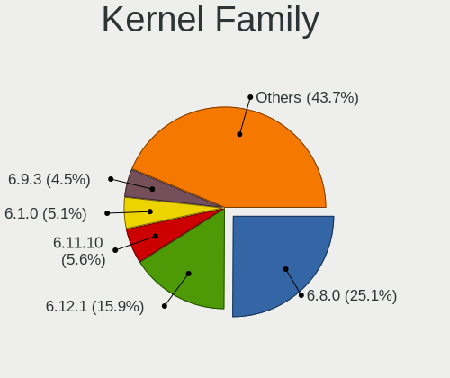
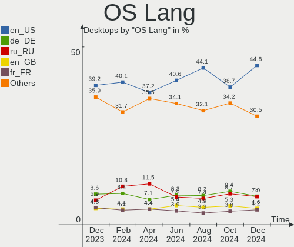
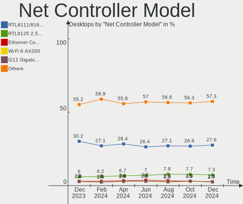
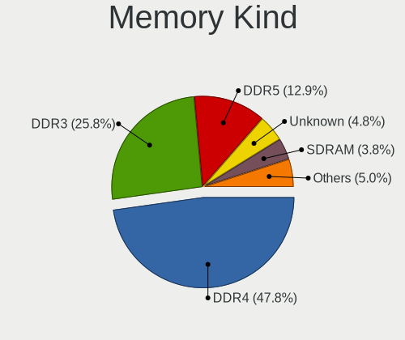
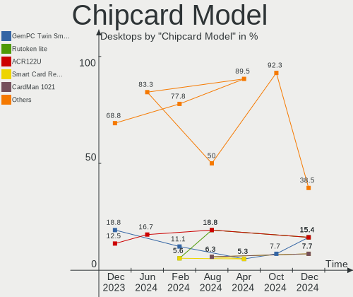
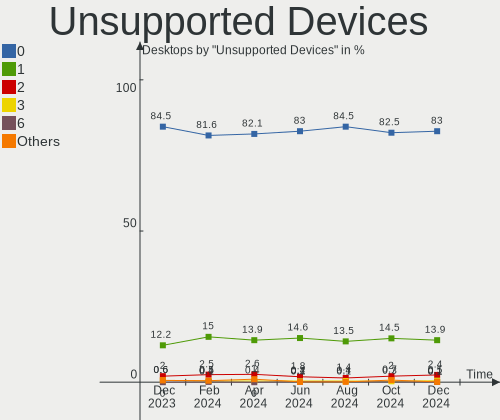

Linux - Hardware Trends (Desktops)
----------------------------------

A project to identify most popular hardware characteristics and track their change
over time based on data collected by Linux users at https://Linux-Hardware.org.

Anyone can contribute to this report by the [hw-probe](https://github.com/linuxhw/hw-probe) tool:

    sudo -E hw-probe -all -upload

This report is for one last month. Overall report since the beginning of time: [TestDays](https://github.com/linuxhw/TestDays)

Period: Sep, 2023.

Contents
--------

* [ System ](#system)
  - [ OS                       ](#os)
  - [ OS Family                ](#os-family)
  - [ Kernel                   ](#kernel)
  - [ Kernel Family            ](#kernel-family)
  - [ Kernel Major Ver.        ](#kernel-major-ver)
  - [ Arch                     ](#arch)
  - [ DE                       ](#de)
  - [ Display Server           ](#display-server)
  - [ Display Manager          ](#display-manager)
  - [ OS Lang                  ](#os-lang)
  - [ Boot Mode                ](#boot-mode)
  - [ Filesystem               ](#filesystem)
  - [ Part. scheme             ](#part-scheme)
  - [ Dual Boot with Linux/BSD ](#dual-boot-with-linuxbsd)
  - [ Dual Boot (Win)          ](#dual-boot-win)

* [ Board ](#board)
  - [ Vendor                   ](#vendor)
  - [ Model                    ](#model)
  - [ Model Family             ](#model-family)
  - [ MFG Year                 ](#mfg-year)
  - [ Form Factor              ](#form-factor)
  - [ Secure Boot              ](#secure-boot)
  - [ Coreboot                 ](#coreboot)
  - [ RAM Size                 ](#ram-size)
  - [ RAM Used                 ](#ram-used)
  - [ Total Drives             ](#total-drives)
  - [ Has CD-ROM               ](#has-cd-rom)
  - [ Has Ethernet             ](#has-ethernet)
  - [ Has WiFi                 ](#has-wifi)
  - [ Has Bluetooth            ](#has-bluetooth)

* [ Location ](#location)
  - [ Country                  ](#country)
  - [ City                     ](#city)

* [ Drives ](#drives)
  - [ Drive Vendor             ](#drive-vendor)
  - [ Drive Model              ](#drive-model)
  - [ HDD Vendor               ](#hdd-vendor)
  - [ SSD Vendor               ](#ssd-vendor)
  - [ Drive Kind               ](#drive-kind)
  - [ Drive Connector          ](#drive-connector)
  - [ Drive Size               ](#drive-size)
  - [ Space Total              ](#space-total)
  - [ Space Used               ](#space-used)
  - [ Malfunc. Drives          ](#malfunc-drives)
  - [ Malfunc. Drive Vendor    ](#malfunc-drive-vendor)
  - [ Malfunc. HDD Vendor      ](#malfunc-hdd-vendor)
  - [ Malfunc. Drive Kind      ](#malfunc-drive-kind)
  - [ Failed Drives            ](#failed-drives)
  - [ Failed Drive Vendor      ](#failed-drive-vendor)
  - [ Drive Status             ](#drive-status)

* [ Storage controller ](#storage-controller)
  - [ Storage Vendor           ](#storage-vendor)
  - [ Storage Model            ](#storage-model)
  - [ Storage Kind             ](#storage-kind)

* [ Processor ](#processor)
  - [ CPU Vendor               ](#cpu-vendor)
  - [ CPU Model                ](#cpu-model)
  - [ CPU Model Family         ](#cpu-model-family)
  - [ CPU Cores                ](#cpu-cores)
  - [ CPU Sockets              ](#cpu-sockets)
  - [ CPU Threads              ](#cpu-threads)
  - [ CPU Op-Modes             ](#cpu-op-modes)
  - [ CPU Microcode            ](#cpu-microcode)
  - [ CPU Microarch            ](#cpu-microarch)

* [ Graphics ](#graphics)
  - [ GPU Vendor               ](#gpu-vendor)
  - [ GPU Model                ](#gpu-model)
  - [ GPU Combo                ](#gpu-combo)
  - [ GPU Driver               ](#gpu-driver)
  - [ GPU Memory               ](#gpu-memory)

* [ Monitor ](#monitor)
  - [ Monitor Vendor           ](#monitor-vendor)
  - [ Monitor Model            ](#monitor-model)
  - [ Monitor Resolution       ](#monitor-resolution)
  - [ Monitor Diagonal         ](#monitor-diagonal)
  - [ Monitor Width            ](#monitor-width)
  - [ Aspect Ratio             ](#aspect-ratio)
  - [ Monitor Area             ](#monitor-area)
  - [ Pixel Density            ](#pixel-density)
  - [ Multiple Monitors        ](#multiple-monitors)

* [ Network ](#network)
  - [ Net Controller Vendor    ](#net-controller-vendor)
  - [ Net Controller Model     ](#net-controller-model)
  - [ Wireless Vendor          ](#wireless-vendor)
  - [ Wireless Model           ](#wireless-model)
  - [ Ethernet Vendor          ](#ethernet-vendor)
  - [ Ethernet Model           ](#ethernet-model)
  - [ Net Controller Kind      ](#net-controller-kind)
  - [ Used Controller          ](#used-controller)
  - [ NICs                     ](#nics)
  - [ IPv6                     ](#ipv6)

* [ Bluetooth ](#bluetooth)
  - [ Bluetooth Vendor         ](#bluetooth-vendor)
  - [ Bluetooth Model          ](#bluetooth-model)

* [ Sound ](#sound)
  - [ Sound Vendor             ](#sound-vendor)
  - [ Sound Model              ](#sound-model)

* [ Memory ](#memory)
  - [ Memory Vendor            ](#memory-vendor)
  - [ Memory Model             ](#memory-model)
  - [ Memory Kind              ](#memory-kind)
  - [ Memory Form Factor       ](#memory-form-factor)
  - [ Memory Size              ](#memory-size)
  - [ Memory Speed             ](#memory-speed)

* [ Printers & scanners ](#printers--scanners)
  - [ Printer Vendor           ](#printer-vendor)
  - [ Printer Model            ](#printer-model)
  - [ Scanner Vendor           ](#scanner-vendor)
  - [ Scanner Model            ](#scanner-model)

* [ Camera ](#camera)
  - [ Camera Vendor            ](#camera-vendor)
  - [ Camera Model             ](#camera-model)

* [ Security ](#security)
  - [ Fingerprint Vendor       ](#fingerprint-vendor)
  - [ Fingerprint Model        ](#fingerprint-model)
  - [ Chipcard Vendor          ](#chipcard-vendor)
  - [ Chipcard Model           ](#chipcard-model)

* [ Unsupported ](#unsupported)
  - [ Unsupported Devices      ](#unsupported-devices)
  - [ Unsupported Device Types ](#unsupported-device-types)

System
------

OS
--

Installed operating systems

| Name                         | Desktops | Percent |
|------------------------------|----------|---------|
| Ubuntu 22.04                 | 246      | 11.66%  |
| OpenMandriva 23.08           | 206      | 9.76%   |
| Fedora 38                    | 160      | 7.58%   |
| Linux Mint 21.2              | 117      | 5.55%   |
| Debian 12                    | 113      | 5.36%   |
| OpenMandriva 23.09           | 96       | 4.55%   |
| ROSA 12.4                    | 89       | 4.22%   |
| Arch Rolling                 | 85       | 4.03%   |
| Ubuntu 23.04                 | 73       | 3.46%   |
| Zorin 16                     | 58       | 2.75%   |
| Pop!_OS 22.04                | 53       | 2.51%   |
| BlackPanther 18.1            | 50       | 2.37%   |
| ArcoLinux Rolling            | 45       | 2.13%   |
| Ubuntu 20.04                 | 35       | 1.66%   |
| Manjaro                      | 35       | 1.66%   |
| KDE neon 22.04               | 28       | 1.33%   |
| Debian 11                    | 28       | 1.33%   |
| Kubuntu 22.04                | 25       | 1.18%   |
| EndeavourOS Rolling          | 24       | 1.14%   |
| OpenMandriva 4.3             | 23       | 1.09%   |
| Xero Rolling                 | 22       | 1.04%   |
| Kubuntu 23.04                | 22       | 1.04%   |
| openSUSE Tumbleweed-XXXXXXXX | 20       | 0.95%   |
| OpenMandriva 23.03           | 20       | 0.95%   |
| Linux Mint 21.1              | 19       | 0.9%    |
| Linux Mint 20.3              | 17       | 0.81%   |
| Gentoo 2.14                  | 17       | 0.81%   |
| Debian                       | 16       | 0.76%   |
| Xubuntu 22.04                | 15       | 0.71%   |
| openSUSE Leap-15.5           | 14       | 0.66%   |
| Nobara 38                    | 14       | 0.66%   |
| Kali 2023.3                  | 14       | 0.66%   |
| Manjaro 23.0.0               | 12       | 0.57%   |
| LMDE 5                       | 12       | 0.57%   |
| Ubuntu MATE 22.04            | 11       | 0.52%   |
| OpenMandriva 23.01           | 10       | 0.47%   |
| Fedora 39                    | 9        | 0.43%   |
| Elementary 7                 | 9        | 0.43%   |
| OpenMandriva 4.2             | 8        | 0.38%   |
| Ubuntu 22.10                 | 7        | 0.33%   |

OS Family
---------

OS without a version

| Name         | Desktops | Percent |
|--------------|----------|---------|
| Ubuntu       | 371      | 17.58%  |
| OpenMandriva | 371      | 17.58%  |
| Fedora       | 181      | 8.58%   |
| Linux Mint   | 169      | 8.01%   |
| Debian       | 157      | 7.44%   |
| ROSA         | 101      | 4.79%   |
| Arch         | 85       | 4.03%   |
| Manjaro      | 59       | 2.8%    |
| Zorin        | 58       | 2.75%   |
| BlackPanther | 56       | 2.65%   |
| Pop!_OS      | 53       | 2.51%   |
| Kubuntu      | 49       | 2.32%   |
| ArcoLinux    | 48       | 2.27%   |
| openSUSE     | 37       | 1.75%   |
| Xubuntu      | 28       | 1.33%   |
| KDE neon     | 28       | 1.33%   |
| EndeavourOS  | 24       | 1.14%   |
| Xero         | 22       | 1.04%   |
| Nobara       | 17       | 0.81%   |
| Gentoo       | 17       | 0.81%   |
| LMDE         | 16       | 0.76%   |
| Ubuntu MATE  | 15       | 0.71%   |
| Kali         | 14       | 0.66%   |
| Elementary   | 10       | 0.47%   |
| ALT Linux    | 10       | 0.47%   |
| Lubuntu      | 9        | 0.43%   |
| Garuda Linux | 9        | 0.43%   |
| MX           | 8        | 0.38%   |
| blendOS      | 7        | 0.33%   |
| Parrot       | 6        | 0.28%   |
| NixOS        | 6        | 0.28%   |
| Red OS       | 5        | 0.24%   |
| ChimeraOS    | 5        | 0.24%   |
| BigLinux     | 5        | 0.24%   |
| SteamOS      | 4        | 0.19%   |
| Clear Linux  | 4        | 0.19%   |
| TUXEDO OS    | 3        | 0.14%   |
| Endless      | 3        | 0.14%   |
| CentOS       | 3        | 0.14%   |
| antiX        | 3        | 0.14%   |

Kernel
------

Version of the Linux kernel

| Version                           | Desktops | Percent |
|-----------------------------------|----------|---------|
| 6.4.11-desktop-1omv2390           | 181      | 8.58%   |
| 6.2.0-32-generic                  | 162      | 7.68%   |
| 6.2.0-33-generic                  | 114      | 5.4%    |
| 5.15.0-83-generic                 | 107      | 5.07%   |
| 6.4.15-200.fc38.x86_64            | 69       | 3.27%   |
| 6.4.12-arch1-1                    | 66       | 3.13%   |
| 5.15.0-84-generic                 | 64       | 3.03%   |
| 5.15.0-82-generic                 | 51       | 2.42%   |
| 6.4.6-76060406-generic            | 42       | 1.99%   |
| 6.1.46-generic-2rosa2021.1-x86_64 | 40       | 1.9%    |
| 6.2.0-31-generic                  | 37       | 1.75%   |
| 6.1.0-12-amd64                    | 37       | 1.75%   |
| 6.1.0-11-amd64                    | 35       | 1.66%   |
| 6.5.3-desktop-1omv2390            | 31       | 1.47%   |
| 6.5.3-arch1-1                     | 29       | 1.37%   |
| 6.5.0-desktop-1omv2390            | 29       | 1.37%   |
| 6.4.8-desktop-2omv2390            | 27       | 1.28%   |
| 5.6.14-desktop-2bP                | 25       | 1.18%   |
| 5.10.0-25-amd64                   | 25       | 1.18%   |
| 6.1.20-generic-2rosa2021.1-x86_64 | 24       | 1.14%   |
| 6.4.13-200.fc38.x86_64            | 23       | 1.09%   |
| 6.2.6-desktop-1omv2390            | 20       | 0.95%   |
| 6.4.14-200.fc38.x86_64            | 19       | 0.9%    |
| 6.1.0-10-amd64                    | 19       | 0.9%    |
| 6.2.0-26-generic                  | 17       | 0.81%   |
| 6.5.1-desktop-1omv2390            | 16       | 0.76%   |
| 6.2.9-300.fc38.x86_64             | 16       | 0.76%   |
| 5.15.0-76-generic                 | 16       | 0.76%   |
| 6.4.12-200.fc38.x86_64            | 15       | 0.71%   |
| 4.18.16-desktop-1bP               | 15       | 0.71%   |
| 6.5.2-desktop-1omv2390            | 14       | 0.66%   |
| 6.4.12-zen1-1-zen                 | 14       | 0.66%   |
| 5.16.7-desktop-1omv4003           | 14       | 0.66%   |
| 6.1.38-generic-1rosa2021.1-x86_64 | 13       | 0.62%   |
| 5.14.21-150500.55.19-default      | 12       | 0.57%   |
| 6.4.10-202.fsync.fc38.x86_64      | 11       | 0.52%   |
| 5.15.0-79-generic                 | 11       | 0.52%   |
| 6.5.5-200.fc38.x86_64             | 10       | 0.47%   |
| 6.5.4-arch2-1                     | 10       | 0.47%   |
| 6.5.3-zen1-1-zen                  | 10       | 0.47%   |

Kernel Family
-------------

Linux kernel without a distro release

| Version | Desktops | Percent |
|---------|----------|---------|
| 6.2.0   | 352      | 16.68%  |
| 5.15.0  | 297      | 14.08%  |
| 6.4.11  | 191      | 9.05%   |
| 6.1.0   | 114      | 5.4%    |
| 6.4.12  | 104      | 4.93%   |
| 6.5.3   | 94       | 4.45%   |
| 6.4.15  | 75       | 3.55%   |
| 6.5.0   | 62       | 2.94%   |
| 6.1.46  | 47       | 2.23%   |
| 6.4.6   | 45       | 2.13%   |
| 5.4.0   | 36       | 1.71%   |
| 6.5.2   | 34       | 1.61%   |
| 6.5.5   | 33       | 1.56%   |
| 6.5.1   | 33       | 1.56%   |
| 5.10.0  | 32       | 1.52%   |
| 6.4.8   | 29       | 1.37%   |
| 6.4.13  | 28       | 1.33%   |
| 6.2.6   | 28       | 1.33%   |
| 5.19.0  | 26       | 1.23%   |
| 5.6.14  | 25       | 1.18%   |
| 6.1.20  | 24       | 1.14%   |
| 6.5.4   | 22       | 1.04%   |
| 6.4.14  | 22       | 1.04%   |
| 6.4.0   | 21       | 1%      |
| 6.4.10  | 17       | 0.81%   |
| 6.1.38  | 17       | 0.81%   |
| 6.2.9   | 16       | 0.76%   |
| 5.14.21 | 16       | 0.76%   |
| 4.18.16 | 15       | 0.71%   |
| 5.16.7  | 14       | 0.66%   |
| 6.1.53  | 12       | 0.57%   |
| 6.1.49  | 12       | 0.57%   |
| 6.3.9   | 11       | 0.52%   |
| 6.1.51  | 11       | 0.52%   |
| 6.2.16  | 10       | 0.47%   |
| 6.1.1   | 10       | 0.47%   |
| 5.15.85 | 10       | 0.47%   |
| 4.15.0  | 10       | 0.47%   |
| 5.16.13 | 9        | 0.43%   |
| 5.10.14 | 8        | 0.38%   |

Kernel Major Ver.
-----------------

Linux kernel major version

| Version | Desktops | Percent |
|---------|----------|---------|
| 6.4     | 543      | 25.73%  |
| 6.2     | 415      | 19.67%  |
| 5.15    | 329      | 15.59%  |
| 6.5     | 278      | 13.18%  |
| 6.1     | 272      | 12.89%  |
| 5.10    | 58       | 2.75%   |
| 5.4     | 40       | 1.9%    |
| 6.3     | 30       | 1.42%   |
| 5.19    | 27       | 1.28%   |
| 5.6     | 25       | 1.18%   |
| 5.16    | 24       | 1.14%   |
| 5.14    | 18       | 0.85%   |
| 4.18    | 18       | 0.85%   |
| 4.15    | 10       | 0.47%   |
| 6.6     | 6        | 0.28%   |
| 6.0     | 6        | 0.28%   |
| 5.11    | 3        | 0.14%   |
| 5.13    | 2        | 0.09%   |
| 4.19    | 2        | 0.09%   |
| 3.10    | 2        | 0.09%   |
| 5.17    | 1        | 0.05%   |
| 5.0     | 1        | 0.05%   |

Arch
----

OS architecture (x86_64, i586, etc.)

| Name        | Desktops | Percent |
|-------------|----------|---------|
| x86_64      | 2097     | 99.38%  |
| i686        | 10       | 0.47%   |
| loongarch64 | 1        | 0.05%   |
| armv7l      | 1        | 0.05%   |
| aarch64     | 1        | 0.05%   |

DE
--

Desktop Environment

| Name              | Desktops | Percent |
|-------------------|----------|---------|
| GNOME             | 749      | 35.5%   |
| KDE5              | 747      | 35.4%   |
| X-Cinnamon        | 167      | 7.91%   |
| XFCE              | 127      | 6.02%   |
| Unknown           | 109      | 5.17%   |
| LXQt              | 56       | 2.65%   |
| MATE              | 47       | 2.23%   |
| Cinnamon          | 23       | 1.09%   |
| Budgie            | 12       | 0.57%   |
| Pantheon          | 10       | 0.47%   |
| i3                | 10       | 0.47%   |
| LXDE              | 8        | 0.38%   |
| Hyprland          | 8        | 0.38%   |
| GNOME Classic     | 7        | 0.33%   |
| KDE               | 5        | 0.24%   |
| KDE4              | 4        | 0.19%   |
| GNOME Flashback   | 4        | 0.19%   |
| Enlightenment     | 3        | 0.14%   |
| Unity             | 2        | 0.09%   |
| icewm             | 2        | 0.09%   |
| Yaru:ubuntu:GNOME | 1        | 0.05%   |
| Unicorn:XFCE      | 1        | 0.05%   |
| UKUI              | 1        | 0.05%   |
| sway              | 1        | 0.05%   |
| openbox           | 1        | 0.05%   |
| onyx:GNOME        | 1        | 0.05%   |
| lightdm-xsession  | 1        | 0.05%   |
| dwm               | 1        | 0.05%   |
| Deepin            | 1        | 0.05%   |
| chadwm            | 1        | 0.05%   |

Display Server
--------------

X11 or Wayland

| Name        | Desktops | Percent |
|-------------|----------|---------|
| X11         | 1143     | 54.17%  |
| Wayland     | 820      | 38.86%  |
| Tty         | 87       | 4.12%   |
| Unknown     | 59       | 2.8%    |
| Unspecified | 1        | 0.05%   |

Display Manager
---------------

SDDM, LightDM, etc.

| Name    | Desktops | Percent |
|---------|----------|---------|
| Unknown | 698      | 33.08%  |
| SDDM    | 676      | 32.04%  |
| GDM3    | 350      | 16.59%  |
| LightDM | 238      | 11.28%  |
| GDM     | 134      | 6.35%   |
| GREETD  | 4        | 0.19%   |
| SLiM    | 3        | 0.14%   |
| LXDM    | 3        | 0.14%   |
| KDM     | 3        | 0.14%   |
| SLIMSKI | 1        | 0.05%   |

OS Lang
-------

Language

| Lang    | Desktops | Percent |
|---------|----------|---------|
| en_US   | 822      | 38.96%  |
| ru_RU   | 205      | 9.72%   |
| de_DE   | 175      | 8.29%   |
| pt_BR   | 100      | 4.74%   |
| fr_FR   | 98       | 4.64%   |
| en_GB   | 90       | 4.27%   |
| Unknown | 78       | 3.7%    |
| it_IT   | 67       | 3.18%   |
| C       | 49       | 2.32%   |
| en_CA   | 45       | 2.13%   |
| pl_PL   | 41       | 1.94%   |
| en_AU   | 40       | 1.9%    |
| es_ES   | 37       | 1.75%   |
| nl_NL   | 21       | 1%      |
| es_MX   | 21       | 1%      |
| es_AR   | 17       | 0.81%   |
| en_IN   | 15       | 0.71%   |
| hu_HU   | 14       | 0.66%   |
| de_AT   | 8        | 0.38%   |
| cs_CZ   | 8        | 0.38%   |
| tr_TR   | 7        | 0.33%   |
| sv_SE   | 7        | 0.33%   |
| fi_FI   | 7        | 0.33%   |
| es_CL   | 7        | 0.33%   |
| en_NZ   | 7        | 0.33%   |
| de_CH   | 7        | 0.33%   |
| pt_PT   | 6        | 0.28%   |
| en_ZA   | 6        | 0.28%   |
| en_IE   | 6        | 0.28%   |
| zh_CN   | 5        | 0.24%   |
| POSIX   | 5        | 0.24%   |
| nl_BE   | 5        | 0.24%   |
| zh_TW   | 4        | 0.19%   |
| ko_KR   | 4        | 0.19%   |
| fr_CA   | 4        | 0.19%   |
| es_CO   | 4        | 0.19%   |
| sk_SK   | 3        | 0.14%   |
| ro_RO   | 3        | 0.14%   |
| nb_NO   | 3        | 0.14%   |
| ja_JP   | 3        | 0.14%   |

Boot Mode
---------

EFI or BIOS

| Mode | Desktops | Percent |
|------|----------|---------|
| BIOS | 1103     | 52.27%  |
| EFI  | 1007     | 47.73%  |

Filesystem
----------

Type of filesystem

| Type     | Desktops | Percent |
|----------|----------|---------|
| Ext4     | 1194     | 56.59%  |
| Btrfs    | 336      | 15.92%  |
| Tmpfs    | 301      | 14.27%  |
| Overlay  | 216      | 10.24%  |
| Xfs      | 29       | 1.37%   |
| Zfs      | 15       | 0.71%   |
| F2fs     | 9        | 0.43%   |
| Reiserfs | 2        | 0.09%   |
| Ext3     | 2        | 0.09%   |
| Ext2     | 2        | 0.09%   |
| Ntfs     | 1        | 0.05%   |
| Nilfs2   | 1        | 0.05%   |
| Jfs      | 1        | 0.05%   |
| Aufs     | 1        | 0.05%   |

Part. scheme
------------

Scheme of partitioning

| Type    | Desktops | Percent |
|---------|----------|---------|
| GPT     | 1190     | 56.4%   |
| Unknown | 608      | 28.82%  |
| MBR     | 312      | 14.79%  |

Dual Boot with Linux/BSD
------------------------

Hosting more than one Linux/BSD

| Dual boot | Desktops | Percent |
|-----------|----------|---------|
| No        | 1628     | 77.16%  |
| Yes       | 482      | 22.84%  |

Dual Boot (Win)
---------------

Hosting Linux and Windows

| Dual boot | Desktops | Percent |
|-----------|----------|---------|
| No        | 1415     | 67.06%  |
| Yes       | 695      | 32.94%  |

Board
-----

Vendor
------

Motherboard manufacturer

| Name                                 | Desktops | Percent |
|--------------------------------------|----------|---------|
| ASUSTek Computer                     | 521      | 24.69%  |
| Gigabyte Technology                  | 341      | 16.16%  |
| MSI                                  | 250      | 11.85%  |
| ASRock                               | 193      | 9.15%   |
| Dell                                 | 170      | 8.06%   |
| Hewlett-Packard                      | 158      | 7.49%   |
| Lenovo                               | 71       | 3.36%   |
| Intel                                | 64       | 3.03%   |
| Acer                                 | 38       | 1.8%    |
| Unknown                              | 34       | 1.61%   |
| Fujitsu                              | 31       | 1.47%   |
| Pegatron                             | 22       | 1.04%   |
| Biostar                              | 21       | 1%      |
| Foxconn                              | 20       | 0.95%   |
| AZW                                  | 18       | 0.85%   |
| Shenzhen Meigao Electronic Equipment | 13       | 0.62%   |
| Supermicro                           | 11       | 0.52%   |
| Medion                               | 10       | 0.47%   |
| ECS                                  | 10       | 0.47%   |
| BESSTAR Tech                         | 9        | 0.43%   |
| Huanan                               | 8        | 0.38%   |
| Positivo                             | 7        | 0.33%   |
| Apple                                | 5        | 0.24%   |
| Gateway                              | 4        | 0.19%   |
| Alienware                            | 4        | 0.19%   |
| MACHINIST                            | 3        | 0.14%   |
| HC Technology.                       | 3        | 0.14%   |
| Google                               | 3        | 0.14%   |
| ASRockRack                           | 3        | 0.14%   |
| WesternDigital                       | 2        | 0.09%   |
| Semp Toshiba                         | 2        | 0.09%   |
| PCWare                               | 2        | 0.09%   |
| Packard Bell                         | 2        | 0.09%   |
| OEM                                  | 2        | 0.09%   |
| NZXT                                 | 2        | 0.09%   |
| HOUTER                               | 2        | 0.09%   |
| Hardkernel                           | 2        | 0.09%   |
| GMKtec                               | 2        | 0.09%   |
| Colorful Technology                  | 2        | 0.09%   |
| ANGXUN                               | 2        | 0.09%   |

Model
-----

Motherboard model

| Name                         | Desktops | Percent |
|------------------------------|----------|---------|
| ASUS All Series              | 35       | 1.66%   |
| Unknown                      | 34       | 1.61%   |
| Dell OptiPlex 7010           | 21       | 1%      |
| Dell OptiPlex 9020           | 14       | 0.66%   |
| MSI MS-7C91                  | 10       | 0.47%   |
| Intel H61                    | 10       | 0.47%   |
| MSI MS-7C95                  | 9        | 0.43%   |
| MSI MS-7C56                  | 8        | 0.38%   |
| MSI MS-7C37                  | 8        | 0.38%   |
| HP Compaq Elite 8300 SFF     | 8        | 0.38%   |
| AZW MINI S                   | 8        | 0.38%   |
| MSI MS-7C94                  | 7        | 0.33%   |
| MSI MS-7C02                  | 7        | 0.33%   |
| Gigabyte B450M DS3H          | 7        | 0.33%   |
| Dell OptiPlex 790            | 7        | 0.33%   |
| Dell OptiPlex 3020           | 7        | 0.33%   |
| ASUS TUF Gaming X570-PLUS    | 7        | 0.33%   |
| ASUS TUF Gaming B550M-PLUS   | 7        | 0.33%   |
| ASUS PRIME X370-PRO          | 7        | 0.33%   |
| ASUS PRIME A320M-K           | 7        | 0.33%   |
| MSI MS-7B89                  | 6        | 0.28%   |
| MSI MS-7B86                  | 6        | 0.28%   |
| MSI MS-7A38                  | 6        | 0.28%   |
| Intel H81                    | 6        | 0.28%   |
| Gigabyte X570 AORUS ELITE    | 6        | 0.28%   |
| Gigabyte H61M-S1             | 6        | 0.28%   |
| Gigabyte 970A-DS3P           | 6        | 0.28%   |
| ASUS ROG STRIX B550-F GAMING | 6        | 0.28%   |
| ASUS M5A78L-M/USB3           | 6        | 0.28%   |
| ASRock B450M Pro4            | 6        | 0.28%   |
| ASRock B450 Pro4             | 6        | 0.28%   |
| MSI MS-7B79                  | 5        | 0.24%   |
| MSI MS-7817                  | 5        | 0.24%   |
| MSI MS-7721                  | 5        | 0.24%   |
| HP Z400 Workstation          | 5        | 0.24%   |
| HP EliteDesk 800 G1 SFF      | 5        | 0.24%   |
| Gigabyte B450 AORUS M        | 5        | 0.24%   |
| Gigabyte A320M-S2H           | 5        | 0.24%   |
| Dell Precision T1700         | 5        | 0.24%   |
| Dell OptiPlex 3010           | 5        | 0.24%   |

Model Family
------------

Motherboard model prefix

| Name               | Desktops | Percent |
|--------------------|----------|---------|
| ASUS PRIME         | 116      | 5.5%    |
| Dell OptiPlex      | 102      | 4.83%   |
| ASUS ROG           | 87       | 4.12%   |
| ASUS TUF           | 55       | 2.61%   |
| HP Compaq          | 47       | 2.23%   |
| Lenovo ThinkCentre | 45       | 2.13%   |
| ASUS All           | 35       | 1.66%   |
| Unknown            | 34       | 1.61%   |
| Dell Precision     | 28       | 1.33%   |
| HP EliteDesk       | 26       | 1.23%   |
| Gigabyte X570      | 22       | 1.04%   |
| Fujitsu ESPRIMO    | 22       | 1.04%   |
| Gigabyte B450M     | 16       | 0.76%   |
| ASUS M5A78L-M      | 16       | 0.76%   |
| HP ProDesk         | 15       | 0.71%   |
| Gigabyte B550      | 15       | 0.71%   |
| ASRock B450        | 15       | 0.71%   |
| Acer Veriton       | 15       | 0.71%   |
| Acer Aspire        | 15       | 0.71%   |
| Dell Inspiron      | 13       | 0.62%   |
| HP Pavilion        | 12       | 0.57%   |
| Gigabyte B450      | 12       | 0.57%   |
| Gigabyte B550M     | 11       | 0.52%   |
| Dell XPS           | 11       | 0.52%   |
| ASRock B450M       | 11       | 0.52%   |
| MSI MS-7C91        | 10       | 0.47%   |
| Intel H61          | 10       | 0.47%   |
| Dell Vostro        | 10       | 0.47%   |
| ASUS P8H61-M       | 10       | 0.47%   |
| ASUS M5A97         | 10       | 0.47%   |
| MSI MS-7C95        | 9        | 0.43%   |
| Lenovo IdeaCentre  | 9        | 0.43%   |
| MSI MS-7C56        | 8        | 0.38%   |
| MSI MS-7C37        | 8        | 0.38%   |
| Gigabyte 970A-DS3P | 8        | 0.38%   |
| AZW MINI           | 8        | 0.38%   |
| MSI MS-7C94        | 7        | 0.33%   |
| MSI MS-7C02        | 7        | 0.33%   |
| Intel H81          | 7        | 0.33%   |
| ASUS P5G41T-M      | 7        | 0.33%   |

MFG Year
--------

Motherboard manufacture year

| Year    | Desktops | Percent |
|---------|----------|---------|
| 2018    | 228      | 10.81%  |
| 2020    | 201      | 9.53%   |
| 2022    | 169      | 8.01%   |
| 2012    | 158      | 7.49%   |
| 2013    | 146      | 6.92%   |
| 2021    | 144      | 6.82%   |
| 2019    | 143      | 6.78%   |
| 2011    | 136      | 6.45%   |
| 2017    | 122      | 5.78%   |
| 2014    | 120      | 5.69%   |
| 2010    | 95       | 4.5%    |
| 2016    | 85       | 4.03%   |
| 2023    | 83       | 3.93%   |
| 2009    | 83       | 3.93%   |
| 2015    | 77       | 3.65%   |
| 2008    | 60       | 2.84%   |
| 2007    | 41       | 1.94%   |
| 2006    | 15       | 0.71%   |
| Unknown | 2        | 0.09%   |
| 2005    | 1        | 0.05%   |
| 2002    | 1        | 0.05%   |

Form Factor
-----------

Physical design of the computer

| Name    | Desktops | Percent |
|---------|----------|---------|
| Desktop | 2110     | 100%    |

Secure Boot
-----------

Enabled or disabled

| State    | Desktops | Percent |
|----------|----------|---------|
| Disabled | 2032     | 96.3%   |
| Enabled  | 78       | 3.7%    |

Coreboot
--------

Have coreboot on board

| Used | Desktops | Percent |
|------|----------|---------|
| No   | 2108     | 99.91%  |
| Yes  | 2        | 0.09%   |

RAM Size
--------

Total RAM memory

| Size in GB      | Desktops | Percent |
|-----------------|----------|---------|
| 16.01-24.0      | 541      | 25.64%  |
| 32.01-64.0      | 389      | 18.44%  |
| 8.01-16.0       | 337      | 15.97%  |
| 4.01-8.0        | 318      | 15.07%  |
| 3.01-4.0        | 204      | 9.67%   |
| 64.01-256.0     | 181      | 8.58%   |
| 24.01-32.0      | 97       | 4.6%    |
| 1.01-2.0        | 23       | 1.09%   |
| 2.01-3.0        | 16       | 0.76%   |
| More than 256.0 | 2        | 0.09%   |
| 0.51-1.0        | 2        | 0.09%   |

RAM Used
--------

Used RAM memory

| Used GB     | Desktops | Percent |
|-------------|----------|---------|
| 1.01-2.0    | 629      | 29.81%  |
| 2.01-3.0    | 518      | 24.55%  |
| 4.01-8.0    | 381      | 18.06%  |
| 3.01-4.0    | 261      | 12.37%  |
| 0.51-1.0    | 125      | 5.92%   |
| 8.01-16.0   | 124      | 5.88%   |
| 16.01-24.0  | 29       | 1.37%   |
| 0.01-0.5    | 29       | 1.37%   |
| 32.01-64.0  | 6        | 0.28%   |
| 24.01-32.0  | 6        | 0.28%   |
| 64.01-256.0 | 2        | 0.09%   |

Total Drives
------------

Number of drives on board

| Drives | Desktops | Percent |
|--------|----------|---------|
| 1      | 759      | 35.97%  |
| 2      | 630      | 29.86%  |
| 3      | 341      | 16.16%  |
| 4      | 177      | 8.39%   |
| 5      | 100      | 4.74%   |
| 6      | 49       | 2.32%   |
| 7      | 15       | 0.71%   |
| 0      | 13       | 0.62%   |
| 9      | 8        | 0.38%   |
| 8      | 8        | 0.38%   |
| 10     | 5        | 0.24%   |
| 19     | 1        | 0.05%   |
| 16     | 1        | 0.05%   |
| 14     | 1        | 0.05%   |
| 12     | 1        | 0.05%   |
| 11     | 1        | 0.05%   |

Has CD-ROM
----------

Has CD-ROM on board

| Presented | Desktops | Percent |
|-----------|----------|---------|
| No        | 1270     | 60.19%  |
| Yes       | 840      | 39.81%  |

Has Ethernet
------------

Has Ethernet on board

| Presented | Desktops | Percent |
|-----------|----------|---------|
| Yes       | 2087     | 98.91%  |
| No        | 23       | 1.09%   |

Has WiFi
--------

Has WiFi module

| Presented | Desktops | Percent |
|-----------|----------|---------|
| No        | 1148     | 54.41%  |
| Yes       | 962      | 45.59%  |

Has Bluetooth
-------------

Has Bluetooth module

| Presented | Desktops | Percent |
|-----------|----------|---------|
| No        | 1329     | 62.99%  |
| Yes       | 781      | 37.01%  |

Location
--------

Country
-------

Geographic location (country)

| Country      | Desktops | Percent |
|--------------|----------|---------|
| USA          | 387      | 18.34%  |
| Russia       | 239      | 11.33%  |
| Germany      | 225      | 10.66%  |
| Brazil       | 133      | 6.3%    |
| France       | 100      | 4.74%   |
| Italy        | 89       | 4.22%   |
| Hungary      | 71       | 3.36%   |
| Canada       | 70       | 3.32%   |
| UK           | 67       | 3.18%   |
| Poland       | 53       | 2.51%   |
| Australia    | 49       | 2.32%   |
| Netherlands  | 45       | 2.13%   |
| Spain        | 44       | 2.09%   |
| Mexico       | 33       | 1.56%   |
| India        | 26       | 1.23%   |
| Belgium      | 24       | 1.14%   |
| Sweden       | 23       | 1.09%   |
| Argentina    | 23       | 1.09%   |
| Austria      | 21       | 1%      |
| Switzerland  | 18       | 0.85%   |
| Romania      | 18       | 0.85%   |
| Turkey       | 15       | 0.71%   |
| Thailand     | 15       | 0.71%   |
| Portugal     | 13       | 0.62%   |
| Finland      | 13       | 0.62%   |
| Bulgaria     | 13       | 0.62%   |
| Slovakia     | 12       | 0.57%   |
| Japan        | 12       | 0.57%   |
| Indonesia    | 12       | 0.57%   |
| Czechia      | 12       | 0.57%   |
| Belarus      | 12       | 0.57%   |
| Greece       | 11       | 0.52%   |
| South Africa | 10       | 0.47%   |
| Norway       | 10       | 0.47%   |
| China        | 9        | 0.43%   |
| Chile        | 9        | 0.43%   |
| Serbia       | 8        | 0.38%   |
| New Zealand  | 8        | 0.38%   |
| Malaysia     | 8        | 0.38%   |
| Ukraine      | 7        | 0.33%   |

City
----

Geographic location (city)

| City              | Desktops | Percent |
|-------------------|----------|---------|
| Moscow            | 46       | 2.18%   |
| Berlin            | 25       | 1.18%   |
| Sydney            | 24       | 1.14%   |
| Budapest          | 24       | 1.14%   |
| St Petersburg     | 21       | 1%      |
| Sao Paulo         | 16       | 0.76%   |
| Hamburg           | 13       | 0.62%   |
| Warsaw            | 11       | 0.52%   |
| Voronezh          | 11       | 0.52%   |
| Ufa               | 10       | 0.47%   |
| Montreal          | 10       | 0.47%   |
| Rio de Janeiro    | 9        | 0.43%   |
| Paris             | 9        | 0.43%   |
| Frankfurt am Main | 9        | 0.43%   |
| Vienna            | 8        | 0.38%   |
| Rome              | 8        | 0.38%   |
| Milan             | 8        | 0.38%   |
| Stuttgart         | 7        | 0.33%   |
| Minsk             | 7        | 0.33%   |
| Krasnoyarsk       | 7        | 0.33%   |
| Amsterdam         | 7        | 0.33%   |
| Yekaterinburg     | 6        | 0.28%   |
| Stockholm         | 6        | 0.28%   |
| Seattle           | 6        | 0.28%   |
| Novosibirsk       | 6        | 0.28%   |
| Mexico City       | 6        | 0.28%   |
| Melbourne         | 6        | 0.28%   |
| Los Angeles       | 6        | 0.28%   |
| Kuala Lumpur      | 6        | 0.28%   |
| Hanover           | 6        | 0.28%   |
| Chicago           | 6        | 0.28%   |
| Central           | 6        | 0.28%   |
| Brisbane          | 6        | 0.28%   |
| Bengaluru         | 6        | 0.28%   |
| Zurich            | 5        | 0.24%   |
| Turin             | 5        | 0.24%   |
| Tehran            | 5        | 0.24%   |
| Sofia             | 5        | 0.24%   |
| Santiago          | 5        | 0.24%   |
| Miami             | 5        | 0.24%   |

Drives
------

Drive Vendor
------------

Hard drive vendors

| Vendor                      | Desktops | Drives | Percent |
|-----------------------------|----------|--------|---------|
| WDC                         | 636      | 867    | 15.99%  |
| Seagate                     | 589      | 766    | 14.81%  |
| Samsung Electronics         | 577      | 796    | 14.51%  |
| Kingston                    | 265      | 297    | 6.66%   |
| Toshiba                     | 217      | 244    | 5.46%   |
| Sandisk                     | 209      | 250    | 5.26%   |
| Crucial                     | 181      | 203    | 4.55%   |
| Hitachi                     | 101      | 112    | 2.54%   |
| China                       | 67       | 71     | 1.68%   |
| A-DATA Technology           | 64       | 69     | 1.61%   |
| Intel                       | 58       | 68     | 1.46%   |
| Unknown                     | 49       | 66     | 1.23%   |
| Kingston Technology Company | 49       | 52     | 1.23%   |
| Micron/Crucial Technology   | 48       | 57     | 1.21%   |
| Phison Electronics          | 44       | 56     | 1.11%   |
| HGST                        | 42       | 56     | 1.06%   |
| SK hynix                    | 40       | 44     | 1.01%   |
| SPCC                        | 39       | 43     | 0.98%   |
| PNY                         | 39       | 44     | 0.98%   |
| Silicon Motion              | 37       | 37     | 0.93%   |
| Patriot                     | 31       | 31     | 0.78%   |
| Micron Technology           | 26       | 27     | 0.65%   |
| Apacer                      | 23       | 25     | 0.58%   |
| Transcend                   | 20       | 20     | 0.5%    |
| Intenso                     | 20       | 27     | 0.5%    |
| MAXIO Technology (Hangzhou) | 19       | 19     | 0.48%   |
| GOODRAM                     | 19       | 27     | 0.48%   |
| Unknown                     | 19       | 23     | 0.48%   |
| Maxtor                      | 17       | 17     | 0.43%   |
| Netac                       | 16       | 16     | 0.4%    |
| Hewlett-Packard             | 15       | 17     | 0.38%   |
| ADATA Technology            | 15       | 18     | 0.38%   |
| Team                        | 14       | 15     | 0.35%   |
| Realtek Semiconductor       | 14       | 15     | 0.35%   |
| OCZ                         | 14       | 14     | 0.35%   |
| Gigabyte Technology         | 13       | 13     | 0.33%   |
| Corsair                     | 13       | 15     | 0.33%   |
| Phison                      | 11       | 13     | 0.28%   |
| JMicron Technology          | 11       | 18     | 0.28%   |
| Lexar                       | 10       | 10     | 0.25%   |

Drive Model
-----------

Hard drive models

| Model                                                 | Desktops | Percent |
|-------------------------------------------------------|----------|---------|
| Samsung NVMe SSD Controller SM981/PM981/PM983 256GB   | 78       | 1.71%   |
| Kingston SA400S37240G 240GB SSD                       | 55       | 1.21%   |
| Kingston SA400S37480G 480GB SSD                       | 50       | 1.1%    |
| Seagate ST500DM002-1BD142 500GB                       | 46       | 1.01%   |
| Samsung SSD 850 EVO 250GB                             | 46       | 1.01%   |
| Toshiba DT01ACA100 1TB                                | 45       | 0.99%   |
| Seagate ST1000DM010-2EP102 1TB                        | 44       | 0.97%   |
| Seagate ST2000DM008-2FR102 2TB                        | 40       | 0.88%   |
| Samsung NVMe SSD Controller PM9A1/PM9A3/980PRO 1TB    | 40       | 0.88%   |
| Samsung SSD 860 EVO 500GB                             | 39       | 0.86%   |
| Micron/Crucial P2 NVMe PCIe SSD 1TB                   | 35       | 0.77%   |
| WDC WD10EZEX-08WN4A0 1TB                              | 34       | 0.75%   |
| Seagate ST1000DM003-1ER162 1TB                        | 32       | 0.7%    |
| Kingston SA400S37120G 120GB SSD                       | 29       | 0.64%   |
| Crucial CT500MX500SSD1 500GB                          | 28       | 0.62%   |
| Samsung SSD 980 1TB                                   | 25       | 0.55%   |
| Toshiba DT01ACA050 500GB                              | 22       | 0.48%   |
| Silicon Motion SM2263EN/SM2263XT SSD Controller 512GB | 22       | 0.48%   |
| Samsung SSD 870 EVO 500GB                             | 22       | 0.48%   |
| Kingston SV300S37A120G 120GB SSD                      | 22       | 0.48%   |
| Seagate ST3500418AS 500GB                             | 21       | 0.46%   |
| Crucial CT240BX500SSD1 240GB                          | 21       | 0.46%   |
| Crucial CT1000MX500SSD1 1TB                           | 21       | 0.46%   |
| Toshiba HDWD110 1TB                                   | 19       | 0.42%   |
| Kingston Company A2000 NVMe SSD 1TB                   | 19       | 0.42%   |
| Unknown                                               | 19       | 0.42%   |
| Samsung SSD 860 EVO 1TB                               | 18       | 0.4%    |
| Samsung SSD 850 EVO 500GB                             | 18       | 0.4%    |
| Samsung NVMe SSD Controller SM961/PM961/SM963 500GB   | 18       | 0.4%    |
| Seagate ST1000DM003-1CH162 1TB                        | 16       | 0.35%   |
| Phison E12 NVMe Controller 2TB                        | 16       | 0.35%   |
| Seagate ST4000DM004-2CV104 4TB                        | 15       | 0.33%   |
| Seagate ST2000DM001-1ER164 2TB                        | 15       | 0.33%   |
| Seagate ST2000DM001-1CH164 2TB                        | 15       | 0.33%   |
| Samsung SSD 970 EVO Plus 1TB                          | 15       | 0.33%   |
| Samsung SSD 870 EVO 1TB                               | 15       | 0.33%   |
| Toshiba DT01ACA200 2TB                                | 14       | 0.31%   |
| Sandisk WD Black SN850 1TB                            | 14       | 0.31%   |
| Samsung SSD 870 QVO 1TB                               | 14       | 0.31%   |
| Kingston Company SNV2S1000G 1TB                       | 14       | 0.31%   |

HDD Vendor
----------

Hard disk drive vendors

| Vendor              | Desktops | Drives | Percent |
|---------------------|----------|--------|---------|
| Seagate             | 579      | 746    | 35.48%  |
| WDC                 | 559      | 759    | 34.25%  |
| Toshiba             | 199      | 221    | 12.19%  |
| Hitachi             | 101      | 112    | 6.19%   |
| Samsung Electronics | 75       | 84     | 4.6%    |
| HGST                | 42       | 56     | 2.57%   |
| Maxtor              | 16       | 16     | 0.98%   |
| Unknown             | 14       | 14     | 0.86%   |
| Fujitsu             | 9        | 9      | 0.55%   |
| SABRENT             | 7        | 10     | 0.43%   |
| Hewlett-Packard     | 7        | 8      | 0.43%   |
| Intenso             | 4        | 4      | 0.25%   |
| Apple               | 4        | 4      | 0.25%   |
| SSK                 | 3        | 3      | 0.18%   |
| USB3.0              | 1        | 1      | 0.06%   |
| TDAS                | 1        | 4      | 0.06%   |
| Synology            | 1        | 1      | 0.06%   |
| Maxone              | 1        | 1      | 0.06%   |
| JMicron Technology  | 1        | 8      | 0.06%   |
| Initio              | 1        | 1      | 0.06%   |
| ICY BOX             | 1        | 1      | 0.06%   |
| IB-377U3            | 1        | 1      | 0.06%   |
| HPE                 | 1        | 2      | 0.06%   |
| H/W                 | 1        | 3      | 0.06%   |
| External            | 1        | 1      | 0.06%   |
| ASMT                | 1        | 2      | 0.06%   |
| Unknown             | 1        | 1      | 0.06%   |

SSD Vendor
----------

Solid state drive vendors

| Vendor              | Desktops | Drives | Percent |
|---------------------|----------|--------|---------|
| Samsung Electronics | 305      | 367    | 20.86%  |
| Kingston            | 217      | 237    | 14.84%  |
| Crucial             | 154      | 168    | 10.53%  |
| SanDisk             | 101      | 110    | 6.91%   |
| WDC                 | 86       | 91     | 5.88%   |
| China               | 67       | 71     | 4.58%   |
| A-DATA Technology   | 54       | 58     | 3.69%   |
| PNY                 | 39       | 44     | 2.67%   |
| SPCC                | 35       | 37     | 2.39%   |
| Patriot             | 28       | 28     | 1.92%   |
| Intel               | 26       | 29     | 1.78%   |
| Transcend           | 18       | 18     | 1.23%   |
| GOODRAM             | 18       | 22     | 1.23%   |
| Apacer              | 18       | 20     | 1.23%   |
| Micron Technology   | 17       | 18     | 1.16%   |
| SK hynix            | 16       | 16     | 1.09%   |
| Toshiba             | 14       | 16     | 0.96%   |
| OCZ                 | 14       | 14     | 0.96%   |
| Netac               | 12       | 12     | 0.82%   |
| Intenso             | 12       | 19     | 0.82%   |
| Team                | 11       | 12     | 0.75%   |
| Gigabyte Technology | 10       | 10     | 0.68%   |
| Unknown             | 10       | 10     | 0.68%   |
| KingSpec            | 9        | 10     | 0.62%   |
| Lexar               | 7        | 7      | 0.48%   |
| AMD                 | 7        | 7      | 0.48%   |
| Plextor             | 6        | 6      | 0.41%   |
| JMicron Technology  | 6        | 6      | 0.41%   |
| Hewlett-Packard     | 6        | 6      | 0.41%   |
| Fanxiang            | 6        | 6      | 0.41%   |
| Corsair             | 6        | 6      | 0.41%   |
| ASMT                | 6        | 7      | 0.41%   |
| KingDian            | 5        | 5      | 0.34%   |
| Emtec               | 5        | 5      | 0.34%   |
| Vaseky              | 4        | 4      | 0.27%   |
| Smartbuy            | 4        | 4      | 0.27%   |
| Verbatim            | 3        | 3      | 0.21%   |
| LITEON              | 3        | 3      | 0.21%   |
| KIOXIA-EXCERIA      | 3        | 6      | 0.21%   |
| INNOVATION IT       | 3        | 3      | 0.21%   |

Drive Kind
----------

HDD or SSD

| Kind    | Desktops | Drives | Percent |
|---------|----------|--------|---------|
| HDD     | 1277     | 2073   | 38.49%  |
| SSD     | 1172     | 1617   | 35.32%  |
| NVMe    | 788      | 1094   | 23.75%  |
| Unknown | 70       | 95     | 2.11%   |
| MMC     | 11       | 12     | 0.33%   |

Drive Connector
---------------

SATA, SAS, NVMe, etc.

| Type | Desktops | Drives | Percent |
|------|----------|--------|---------|
| SATA | 1802     | 3553   | 65.22%  |
| NVMe | 785      | 1089   | 28.41%  |
| SAS  | 165      | 237    | 5.97%   |
| MMC  | 11       | 12     | 0.4%    |

Drive Size
----------

Size of hard drive

| Size in TB | Desktops | Drives | Percent |
|------------|----------|--------|---------|
| 0.01-0.5   | 1291     | 1816   | 47.69%  |
| 0.51-1.0   | 796      | 1039   | 29.41%  |
| 1.01-2.0   | 324      | 409    | 11.97%  |
| 3.01-4.0   | 119      | 168    | 4.4%    |
| 4.01-10.0  | 89       | 134    | 3.29%   |
| 2.01-3.0   | 65       | 85     | 2.4%    |
| 10.01-20.0 | 23       | 39     | 0.85%   |

Space Total
-----------

Amount of disk space available on the file system

| Size in GB     | Desktops | Percent |
|----------------|----------|---------|
| 101-250        | 382      | 18.1%   |
| 251-500        | 361      | 17.11%  |
| 501-1000       | 336      | 15.92%  |
| More than 3000 | 258      | 12.23%  |
| 1001-2000      | 256      | 12.13%  |
| 1-20           | 157      | 7.44%   |
| 51-100         | 106      | 5.02%   |
| 2001-3000      | 105      | 4.98%   |
| Unknown        | 104      | 4.93%   |
| 21-50          | 45       | 2.13%   |

Space Used
----------

Amount of used disk space

| Used GB        | Desktops | Percent |
|----------------|----------|---------|
| 1-20           | 689      | 32.65%  |
| 21-50          | 293      | 13.89%  |
| 101-250        | 247      | 11.71%  |
| 51-100         | 185      | 8.77%   |
| 251-500        | 169      | 8.01%   |
| 501-1000       | 148      | 7.01%   |
| 1001-2000      | 119      | 5.64%   |
| More than 3000 | 110      | 5.21%   |
| Unknown        | 104      | 4.93%   |
| 2001-3000      | 46       | 2.18%   |

Malfunc. Drives
---------------

Drive models with a malfunction

| Model                                                           | Desktops | Drives | Percent |
|-----------------------------------------------------------------|----------|--------|---------|
| Seagate ST500DM002-1BD142 500GB                                 | 17       | 18     | 4.27%   |
| Seagate ST3500418AS 500GB                                       | 7        | 7      | 1.76%   |
| Seagate ST1000DM010-2EP102 1TB                                  | 7        | 8      | 1.76%   |
| WDC WD5000AAKX-001CA0 500GB                                     | 5        | 5      | 1.26%   |
| Toshiba DT01ACA100 1TB                                          | 5        | 5      | 1.26%   |
| WDC WD20EARS-00MVWB0 2TB                                        | 4        | 4      | 1.01%   |
| WDC WD10EARS-00Y5B1 1TB                                         | 4        | 4      | 1.01%   |
| Maxtor STM3160215AS 160GB                                       | 4        | 4      | 1.01%   |
| WDC WD5000AAKX-60U6AA0 500GB                                    | 3        | 3      | 0.75%   |
| Seagate ST9500325AS 500GB                                       | 3        | 3      | 0.75%   |
| Seagate ST3500312CS 500GB                                       | 3        | 3      | 0.75%   |
| Seagate ST3250310AS 250GB                                       | 3        | 3      | 0.75%   |
| Seagate ST31000528AS 1TB                                        | 3        | 3      | 0.75%   |
| Seagate ST2000DM001-1CH164 2TB                                  | 3        | 3      | 0.75%   |
| Seagate ST1000DM003-9YN162 1TB                                  | 3        | 3      | 0.75%   |
| Seagate ST1000DM003-1ER162 1TB                                  | 3        | 4      | 0.75%   |
| Samsung Electronics SSD 870 EVO 500GB                           | 3        | 3      | 0.75%   |
| Samsung Electronics NVMe SSD Controller SM981/PM981/PM983 256GB | 3        | 3      | 0.75%   |
| Samsung Electronics HD103UJ 1TB                                 | 3        | 4      | 0.75%   |
| Kingston SV300S37A120G 120GB SSD                                | 3        | 3      | 0.75%   |
| WDC WD5000AZLX-22JKKA0 500GB                                    | 2        | 3      | 0.5%    |
| WDC WD5000AVDS-63U7B1 500GB                                     | 2        | 2      | 0.5%    |
| WDC WD5000AVCS-632DY1 500GB                                     | 2        | 2      | 0.5%    |
| WDC WD5000AAKX-08U6AA0 500GB                                    | 2        | 2      | 0.5%    |
| WDC WD40EZRX-00SPEB0 4TB                                        | 2        | 2      | 0.5%    |
| WDC WD30EFRX-68EUZN0 3TB                                        | 2        | 3      | 0.5%    |
| WDC WD10PURZ-85U8XY0 1TB                                        | 2        | 2      | 0.5%    |
| WDC WD10EZEX-75M2NA0 1TB                                        | 2        | 2      | 0.5%    |
| WDC WD10EZEX-60M2NA0 1TB                                        | 2        | 2      | 0.5%    |
| WDC WD10EZEX-08WN4A0 1TB                                        | 2        | 2      | 0.5%    |
| Toshiba MQ01ABD100 1TB                                          | 2        | 2      | 0.5%    |
| Toshiba DT01ACA050 500GB                                        | 2        | 2      | 0.5%    |
| Seagate ST6000VN0033-2EE110 6TB                                 | 2        | 2      | 0.5%    |
| Seagate ST320LT012-9WS14C 320GB                                 | 2        | 2      | 0.5%    |
| Seagate ST3160815AS 160GB                                       | 2        | 2      | 0.5%    |
| Seagate ST31000524AS 1TB                                        | 2        | 2      | 0.5%    |
| Seagate ST2000DX001-1CM164 2TB                                  | 2        | 2      | 0.5%    |
| Seagate ST2000DM008-2FR102 2TB                                  | 2        | 3      | 0.5%    |
| Seagate ST2000DM001-9YN164 2TB                                  | 2        | 2      | 0.5%    |
| Seagate ST2000DL003-9VT166 2TB                                  | 2        | 2      | 0.5%    |

Malfunc. Drive Vendor
---------------------

Vendors of faulty drives

| Vendor                      | Desktops | Drives | Percent |
|-----------------------------|----------|--------|---------|
| Seagate                     | 108      | 119    | 27.69%  |
| WDC                         | 100      | 106    | 25.64%  |
| Samsung Electronics         | 48       | 51     | 12.31%  |
| Hitachi                     | 22       | 22     | 5.64%   |
| Toshiba                     | 21       | 21     | 5.38%   |
| Maxtor                      | 11       | 11     | 2.82%   |
| Kingston                    | 8        | 8      | 2.05%   |
| Intel                       | 8        | 8      | 2.05%   |
| Crucial                     | 8        | 8      | 2.05%   |
| HGST                        | 6        | 8      | 1.54%   |
| Micron Technology           | 5        | 5      | 1.28%   |
| China                       | 5        | 5      | 1.28%   |
| SPCC                        | 4        | 4      | 1.03%   |
| A-DATA Technology           | 4        | 4      | 1.03%   |
| SanDisk                     | 3        | 3      | 0.77%   |
| SK hynix                    | 2        | 2      | 0.51%   |
| Plextor                     | 2        | 2      | 0.51%   |
| OCZ                         | 2        | 2      | 0.51%   |
| Hewlett-Packard             | 2        | 2      | 0.51%   |
| XPG                         | 1        | 1      | 0.26%   |
| Transcend                   | 1        | 1      | 0.26%   |
| Super Talent                | 1        | 1      | 0.26%   |
| Reeinno                     | 1        | 1      | 0.26%   |
| Realtek Semiconductor       | 1        | 1      | 0.26%   |
| Qumo                        | 1        | 1      | 0.26%   |
| PNY                         | 1        | 1      | 0.26%   |
| Patriot                     | 1        | 1      | 0.26%   |
| OCZ-VERTEX3                 | 1        | 1      | 0.26%   |
| Netac                       | 1        | 1      | 0.26%   |
| Neo                         | 1        | 1      | 0.26%   |
| MAXIO Technology (Hangzhou) | 1        | 1      | 0.26%   |
| KingDian                    | 1        | 1      | 0.26%   |
| INNOVATION IT               | 1        | 1      | 0.26%   |
| ICY BOX                     | 1        | 1      | 0.26%   |
| Fujitsu                     | 1        | 1      | 0.26%   |
| EXRAM                       | 1        | 1      | 0.26%   |
| EX276687RUS                 | 1        | 1      | 0.26%   |
| Corsair                     | 1        | 1      | 0.26%   |
| Apple                       | 1        | 1      | 0.26%   |
| AMD                         | 1        | 1      | 0.26%   |

Malfunc. HDD Vendor
-------------------

Vendors of faulty HDD drives

| Vendor              | Desktops | Drives | Percent |
|---------------------|----------|--------|---------|
| Seagate             | 108      | 119    | 36.73%  |
| WDC                 | 94       | 100    | 31.97%  |
| Samsung Electronics | 28       | 30     | 9.52%   |
| Hitachi             | 22       | 22     | 7.48%   |
| Toshiba             | 21       | 21     | 7.14%   |
| Maxtor              | 11       | 11     | 3.74%   |
| HGST                | 6        | 8      | 2.04%   |
| ICY BOX             | 1        | 1      | 0.34%   |
| Hewlett-Packard     | 1        | 1      | 0.34%   |
| Fujitsu             | 1        | 1      | 0.34%   |
| Apple               | 1        | 1      | 0.34%   |

Malfunc. Drive Kind
-------------------

Kinds of faulty drives

| Kind | Desktops | Drives | Percent |
|------|----------|--------|---------|
| HDD  | 263      | 315    | 73.88%  |
| SSD  | 77       | 80     | 21.63%  |
| NVMe | 16       | 17     | 4.49%   |

Failed Drives
-------------

Failed drive models

| Model                             | Desktops | Drives | Percent |
|-----------------------------------|----------|--------|---------|
| WDC WD10EZEX-00BN5A0 1TB          | 1        | 1      | 20%     |
| Seagate ST3320613AS 320GB         | 1        | 1      | 20%     |
| Samsung Electronics SSD 980 1TB   | 1        | 2      | 20%     |
| Samsung Electronics HD502HJ 500GB | 1        | 1      | 20%     |
| Hitachi HDS721010DLE630 1TB       | 1        | 2      | 20%     |

Failed Drive Vendor
-------------------

Failed drive vendors

| Vendor              | Desktops | Drives | Percent |
|---------------------|----------|--------|---------|
| Samsung Electronics | 2        | 3      | 40%     |
| WDC                 | 1        | 1      | 20%     |
| Seagate             | 1        | 1      | 20%     |
| Hitachi             | 1        | 2      | 20%     |

Drive Status
------------

Number of failed and malfunc. drives

| Status   | Desktops | Drives | Percent |
|----------|----------|--------|---------|
| Works    | 1052     | 2209   | 43.58%  |
| Detected | 1015     | 2263   | 42.05%  |
| Malfunc  | 342      | 412    | 14.17%  |
| Failed   | 5        | 7      | 0.21%   |

Storage controller
------------------

Storage Vendor
--------------

Storage controller vendors

| Vendor                         | Desktops | Percent |
|--------------------------------|----------|---------|
| Intel                          | 1308     | 40.53%  |
| AMD                            | 743      | 23.02%  |
| Samsung Electronics            | 263      | 8.15%   |
| SanDisk                        | 133      | 4.12%   |
| ASMedia Technology             | 112      | 3.47%   |
| Kingston Technology Company    | 100      | 3.1%    |
| Micron/Crucial Technology      | 79       | 2.45%   |
| Phison Electronics             | 75       | 2.32%   |
| JMicron Technology             | 62       | 1.92%   |
| Silicon Motion                 | 53       | 1.64%   |
| Marvell Technology Group       | 41       | 1.27%   |
| Nvidia                         | 38       | 1.18%   |
| MAXIO Technology (Hangzhou)    | 35       | 1.08%   |
| ADATA Technology               | 29       | 0.9%    |
| SK hynix                       | 22       | 0.68%   |
| Realtek Semiconductor          | 20       | 0.62%   |
| Broadcom / LSI                 | 12       | 0.37%   |
| VIA Technologies               | 11       | 0.34%   |
| Toshiba America Info Systems   | 10       | 0.31%   |
| Seagate Technology             | 10       | 0.31%   |
| KIOXIA                         | 10       | 0.31%   |
| Micron Technology              | 9        | 0.28%   |
| Shenzhen Longsys Electronics   | 8        | 0.25%   |
| LSI Logic / Symbios Logic      | 7        | 0.22%   |
| Adaptec                        | 6        | 0.19%   |
| Silicon Image                  | 5        | 0.15%   |
| Netac Technology               | 5        | 0.15%   |
| Solidigm                       | 4        | 0.12%   |
| Solid State Storage Technology | 3        | 0.09%   |
| INNOGRIT                       | 3        | 0.09%   |
| Biwin Storage Technology       | 2        | 0.06%   |
| Yangtze Memory Technologies    | 1        | 0.03%   |
| ULi Electronics                | 1        | 0.03%   |
| Transcend                      | 1        | 0.03%   |
| TenaFe                         | 1        | 0.03%   |
| Loongson Technology            | 1        | 0.03%   |
| Lenovo                         | 1        | 0.03%   |
| HighPoint Technologies         | 1        | 0.03%   |
| Apple                          | 1        | 0.03%   |
| 3ware                          | 1        | 0.03%   |

Storage Model
-------------

Storage controller models

| Model                                                                                   | Desktops | Percent |
|-----------------------------------------------------------------------------------------|----------|---------|
| AMD FCH SATA Controller [AHCI mode]                                                     | 387      | 9.99%   |
| Intel 8 Series/C220 Series Chipset Family 6-port SATA Controller 1 [AHCI mode]          | 155      | 4%      |
| AMD 400 Series Chipset SATA Controller                                                  | 147      | 3.79%   |
| AMD 500 Series Chipset SATA Controller                                                  | 146      | 3.77%   |
| Samsung NVMe SSD Controller SM981/PM981/PM983                                           | 125      | 3.23%   |
| Intel 6 Series/C200 Series Chipset Family 6 port Desktop SATA AHCI Controller           | 109      | 2.81%   |
| Intel Q170/Q150/B150/H170/H110/Z170/CM236 Chipset SATA Controller [AHCI Mode]           | 105      | 2.71%   |
| ASMedia ASM1062 Serial ATA Controller                                                   | 102      | 2.63%   |
| Intel 200 Series PCH SATA controller [AHCI mode]                                        | 88       | 2.27%   |
| AMD SB7x0/SB8x0/SB9x0 IDE Controller                                                    | 79       | 2.04%   |
| Intel 7 Series/C210 Series Chipset Family 6-port SATA Controller [AHCI mode]            | 78       | 2.01%   |
| Intel Cannon Lake PCH SATA AHCI Controller                                              | 74       | 1.91%   |
| AMD SB7x0/SB8x0/SB9x0 SATA Controller [AHCI mode]                                       | 73       | 1.88%   |
| Intel NM10/ICH7 Family SATA Controller [IDE mode]                                       | 72       | 1.86%   |
| Intel SATA Controller [RAID mode]                                                       | 69       | 1.78%   |
| Samsung NVMe SSD Controller PM9A1/PM9A3/980PRO                                          | 64       | 1.65%   |
| Intel Alder Lake-S PCH SATA Controller [AHCI Mode]                                      | 55       | 1.42%   |
| Intel 500 Series Chipset Family SATA AHCI Controller                                    | 54       | 1.39%   |
| Intel 82801G (ICH7 Family) IDE Controller                                               | 53       | 1.37%   |
| Intel 6 Series/C200 Series Chipset Family Desktop SATA Controller (IDE mode, ports 4-5) | 50       | 1.29%   |
| AMD SB7x0/SB8x0/SB9x0 SATA Controller [IDE mode]                                        | 50       | 1.29%   |
| Micron/Crucial P2 [Nick P2] / P3 / P3 Plus NVMe PCIe SSD (DRAM-less)                    | 49       | 1.26%   |
| Intel 6 Series/C200 Series Chipset Family Desktop SATA Controller (IDE mode, ports 0-3) | 49       | 1.26%   |
| Silicon Motion SM2263EN/SM2263XT (DRAM-less) NVMe SSD Controllers                       | 43       | 1.11%   |
| Samsung NVMe SSD Controller 980                                                         | 39       | 1.01%   |
| AMD FCH SATA Controller D                                                               | 39       | 1.01%   |
| Kingston Company Company Non-Volatile memory controller                                 | 34       | 0.88%   |
| JMicron JMB363 SATA/IDE Controller                                                      | 34       | 0.88%   |
| Intel 9 Series Chipset Family SATA Controller [AHCI Mode]                               | 33       | 0.85%   |
| MAXIO (Hangzhou) NVMe SSD Controller MAP1202                                            | 28       | 0.72%   |
| Intel 700 Series Chipset Family SATA AHCI Controller                                    | 28       | 0.72%   |
| Samsung NVMe SSD Controller SM961/PM961/SM963                                           | 27       | 0.7%    |
| Intel Comet Lake SATA AHCI Controller                                                   | 27       | 0.7%    |
| Intel Volume Management Device NVMe RAID Controller                                     | 26       | 0.67%   |
| AMD 300 Series Chipset SATA Controller                                                  | 26       | 0.67%   |
| Phison E12 NVMe Controller                                                              | 25       | 0.65%   |
| Kingston Company A2000 NVMe SSD                                                         | 25       | 0.65%   |
| Intel 5 Series/3400 Series Chipset 6 port SATA AHCI Controller                          | 23       | 0.59%   |
| SanDisk WD Black SN770 / PC SN740 256GB / PC SN560 (DRAM-less) NVMe SSD                 | 22       | 0.57%   |
| Samsung NVMe SSD Controller S4LV008[Pascal]                                             | 22       | 0.57%   |

Storage Kind
------------

Kind of storage controller (IDE, SATA, NVMe, SAS, ...)

| Kind | Desktops | Percent |
|------|----------|---------|
| SATA | 1763     | 56.6%   |
| NVMe | 787      | 25.26%  |
| IDE  | 394      | 12.65%  |
| RAID | 144      | 4.62%   |
| SAS  | 22       | 0.71%   |
| SCSI | 5        | 0.16%   |

Processor
---------

CPU Vendor
----------

Processor vendors

| Vendor       | Desktops | Percent |
|--------------|----------|---------|
| Intel        | 1315     | 62.32%  |
| AMD          | 791      | 37.49%  |
| ARM          | 2        | 0.09%   |
| Loongson     | 1        | 0.05%   |
| CentaurHauls | 1        | 0.05%   |

CPU Model
---------

Processor models

| Model                                       | Desktops | Percent |
|---------------------------------------------|----------|---------|
| AMD Ryzen 5 3600 6-Core Processor           | 56       | 2.65%   |
| Intel Core i5-3470 CPU @ 3.20GHz            | 33       | 1.56%   |
| AMD Ryzen 5 5600X 6-Core Processor          | 32       | 1.52%   |
| AMD Ryzen 5 5600G with Radeon Graphics      | 31       | 1.47%   |
| Intel Core i7-2600 CPU @ 3.40GHz            | 27       | 1.28%   |
| AMD Ryzen 5 2600 Six-Core Processor         | 26       | 1.23%   |
| AMD Ryzen 7 5700G with Radeon Graphics      | 25       | 1.18%   |
| Intel Core i7-4790 CPU @ 3.60GHz            | 24       | 1.14%   |
| AMD Ryzen 7 5800X 8-Core Processor          | 24       | 1.14%   |
| Intel Core i5-2400 CPU @ 3.10GHz            | 23       | 1.09%   |
| AMD Ryzen 7 3700X 8-Core Processor          | 22       | 1.04%   |
| Intel Core i7-3770 CPU @ 3.40GHz            | 21       | 1%      |
| Intel Core i5-4590 CPU @ 3.30GHz            | 21       | 1%      |
| Intel Core i5-6500 CPU @ 3.20GHz            | 20       | 0.95%   |
| Intel Core i5-7400 CPU @ 3.00GHz            | 18       | 0.85%   |
| AMD Ryzen 9 5900X 12-Core Processor         | 18       | 0.85%   |
| AMD FX-8350 Eight-Core Processor            | 17       | 0.81%   |
| Intel Core i7-7700K CPU @ 4.20GHz           | 16       | 0.76%   |
| Intel Core i7-6700 CPU @ 3.40GHz            | 16       | 0.76%   |
| Intel Core 2 Duo CPU E8400 @ 3.00GHz        | 16       | 0.76%   |
| AMD Ryzen 9 3900X 12-Core Processor         | 16       | 0.76%   |
| Intel Core i5-8400 CPU @ 2.80GHz            | 15       | 0.71%   |
| Intel Core i5-10400 CPU @ 2.90GHz           | 15       | 0.71%   |
| AMD Ryzen 3 2200G with Radeon Vega Graphics | 15       | 0.71%   |
| AMD FX-6300 Six-Core Processor              | 15       | 0.71%   |
| Intel Core i5-4570 CPU @ 3.20GHz            | 14       | 0.66%   |
| Intel Core i3-2120 CPU @ 3.30GHz            | 14       | 0.66%   |
| AMD Phenom II X4 955 Processor              | 14       | 0.66%   |
| AMD Ryzen 5 3400G with Radeon Vega Graphics | 13       | 0.62%   |
| Intel Core i5-9400F CPU @ 2.90GHz           | 12       | 0.57%   |
| Intel Core i3-4130 CPU @ 3.40GHz            | 12       | 0.57%   |
| Intel Core 2 Quad CPU Q6600 @ 2.40GHz       | 12       | 0.57%   |
| Intel 13th Gen Core i9-13900K               | 12       | 0.57%   |
| AMD Ryzen 5 5600 6-Core Processor           | 12       | 0.57%   |
| Intel Core i7-9700K CPU @ 3.60GHz           | 11       | 0.52%   |
| Intel Core i7-8700 CPU @ 3.20GHz            | 11       | 0.52%   |
| Intel Core i7-6700K CPU @ 4.00GHz           | 11       | 0.52%   |
| Intel Core i7-4770 CPU @ 3.40GHz            | 11       | 0.52%   |
| Intel Core i5-10400F CPU @ 2.90GHz          | 11       | 0.52%   |
| Intel Core i3-4150 CPU @ 3.50GHz            | 11       | 0.52%   |

CPU Model Family
----------------

Processor model prefix

| Model                   | Desktops | Percent |
|-------------------------|----------|---------|
| Intel Core i5           | 382      | 18.1%   |
| Intel Core i7           | 275      | 13.03%  |
| AMD Ryzen 5             | 249      | 11.8%   |
| AMD Ryzen 7             | 158      | 7.49%   |
| Other                   | 142      | 6.73%   |
| Intel Core i3           | 136      | 6.45%   |
| Intel Xeon              | 120      | 5.69%   |
| AMD Ryzen 9             | 96       | 4.55%   |
| Intel Celeron           | 61       | 2.89%   |
| AMD FX                  | 61       | 2.89%   |
| Intel Core 2 Duo        | 50       | 2.37%   |
| AMD Phenom II X4        | 32       | 1.52%   |
| Intel Pentium           | 31       | 1.47%   |
| Intel Core 2 Quad       | 30       | 1.42%   |
| AMD Ryzen 3             | 27       | 1.28%   |
| Intel Pentium Dual-Core | 25       | 1.18%   |
| Intel Core i9           | 20       | 0.95%   |
| AMD A8                  | 19       | 0.9%    |
| AMD A10                 | 19       | 0.9%    |
| AMD Athlon II X2        | 16       | 0.76%   |
| AMD Athlon 64 X2        | 15       | 0.71%   |
| AMD A6                  | 14       | 0.66%   |
| Intel Pentium Gold      | 12       | 0.57%   |
| Intel Atom              | 10       | 0.47%   |
| AMD Ryzen Threadripper  | 9        | 0.43%   |
| AMD Phenom II X6        | 9        | 0.43%   |
| AMD Athlon              | 9        | 0.43%   |
| Intel Pentium Dual      | 8        | 0.38%   |
| AMD A4                  | 8        | 0.38%   |
| Intel Core 2            | 6        | 0.28%   |
| AMD Ryzen 5 PRO         | 5        | 0.24%   |
| AMD Athlon X4           | 5        | 0.24%   |
| AMD Athlon II X4        | 5        | 0.24%   |
| Intel Pentium 4         | 4        | 0.19%   |
| AMD E                   | 4        | 0.19%   |
| Intel Pentium Silver    | 3        | 0.14%   |
| AMD Ryzen 7 PRO         | 3        | 0.14%   |
| AMD Phenom II X2        | 3        | 0.14%   |
| AMD Phenom              | 3        | 0.14%   |
| AMD Athlon II X3        | 3        | 0.14%   |

CPU Cores
---------

Number of processor cores

| Number | Desktops | Percent |
|--------|----------|---------|
| 4      | 801      | 37.96%  |
| 2      | 405      | 19.19%  |
| 6      | 392      | 18.58%  |
| 8      | 247      | 11.71%  |
| 12     | 75       | 3.55%   |
| 16     | 59       | 2.8%    |
| 1      | 34       | 1.61%   |
| 10     | 30       | 1.42%   |
| 3      | 26       | 1.23%   |
| 24     | 20       | 0.95%   |
| 14     | 9        | 0.43%   |
| 18     | 3        | 0.14%   |
| 32     | 2        | 0.09%   |
| 28     | 2        | 0.09%   |
| 5      | 2        | 0.09%   |
| 36     | 1        | 0.05%   |
| 22     | 1        | 0.05%   |
| 20     | 1        | 0.05%   |

CPU Sockets
-----------

Number of sockets

| Number | Desktops | Percent |
|--------|----------|---------|
| 1      | 2084     | 98.77%  |
| 2      | 26       | 1.23%   |

CPU Threads
-----------

Threads per core (Hyper-Threading)

| Number | Desktops | Percent |
|--------|----------|---------|
| 2      | 1326     | 62.84%  |
| 1      | 783      | 37.11%  |
| 12     | 1        | 0.05%   |

CPU Op-Modes
------------

CPU Operation Modes (32-bit, 64-bit)

| Op mode        | Desktops | Percent |
|----------------|----------|---------|
| 32-bit, 64-bit | 2105     | 99.76%  |
| Unknown        | 3        | 0.14%   |
| 32-bit         | 2        | 0.09%   |

CPU Microcode
-------------

Microcode number

| Number     | Desktops | Percent |
|------------|----------|---------|
| Unknown    | 1098     | 52.04%  |
| 0x306c3    | 62       | 2.94%   |
| 0x206a7    | 53       | 2.51%   |
| 0x0a601203 | 47       | 2.23%   |
| 0x08701021 | 45       | 2.13%   |
| 0x0a50000d | 44       | 2.09%   |
| 0x0a20120a | 44       | 2.09%   |
| 0x0800820d | 40       | 1.9%    |
| 0x306a9    | 37       | 1.75%   |
| 0x08701030 | 34       | 1.61%   |
| 0x1067a    | 33       | 1.56%   |
| 0x010000c8 | 33       | 1.56%   |
| 0x906e9    | 27       | 1.28%   |
| 0x506e3    | 25       | 1.18%   |
| 0x08108109 | 24       | 1.14%   |
| 0x0a201016 | 22       | 1.04%   |
| 0xa0653    | 18       | 0.85%   |
| 0x06000852 | 18       | 0.85%   |
| 0x906ea    | 17       | 0.81%   |
| 0x0a50000c | 15       | 0.71%   |
| 0x0a201025 | 14       | 0.66%   |
| 0x06003106 | 13       | 0.62%   |
| 0x06001119 | 12       | 0.57%   |
| 0x906ed    | 10       | 0.47%   |
| 0x08101016 | 10       | 0.47%   |
| 0x6fd      | 9        | 0.43%   |
| 0x106e5    | 9        | 0.43%   |
| 0xa0671    | 8        | 0.38%   |
| 0x306e4    | 8        | 0.38%   |
| 0x0a404102 | 8        | 0.38%   |
| 0x08001138 | 8        | 0.38%   |
| 0x906eb    | 7        | 0.33%   |
| 0x90675    | 7        | 0.33%   |
| 0x90672    | 7        | 0.33%   |
| 0x406f1    | 7        | 0.33%   |
| 0x10676    | 7        | 0.33%   |
| 0x0a201009 | 7        | 0.33%   |
| 0x0810100b | 7        | 0.33%   |
| 0x0600081c | 7        | 0.33%   |
| 0x03000027 | 7        | 0.33%   |

CPU Microarch
-------------

Microarchitecture

| Name             | Desktops | Percent |
|------------------|----------|---------|
| Haswell          | 228      | 10.81%  |
| KabyLake         | 198      | 9.38%   |
| Zen 3            | 193      | 9.15%   |
| IvyBridge        | 149      | 7.06%   |
| SandyBridge      | 142      | 6.73%   |
| Zen 2            | 131      | 6.21%   |
| Unknown          | 121      | 5.73%   |
| Skylake          | 99       | 4.69%   |
| Penryn           | 95       | 4.5%    |
| Zen+             | 92       | 4.36%   |
| CometLake        | 81       | 3.84%   |
| Piledriver       | 78       | 3.7%    |
| K10              | 77       | 3.65%   |
| Alderlake Hybrid | 66       | 3.13%   |
| Zen              | 61       | 2.89%   |
| Core             | 42       | 1.99%   |
| Nehalem          | 39       | 1.85%   |
| Westmere         | 29       | 1.37%   |
| Icelake          | 25       | 1.18%   |
| Steamroller      | 22       | 1.04%   |
| K8 Hammer        | 18       | 0.85%   |
| Broadwell        | 16       | 0.76%   |
| Excavator        | 14       | 0.66%   |
| Silvermont       | 13       | 0.62%   |
| Goldmont plus    | 12       | 0.57%   |
| Tremont          | 11       | 0.52%   |
| K10 Llano        | 9        | 0.43%   |
| NetBurst         | 8        | 0.38%   |
| Bonnell          | 8        | 0.38%   |
| Gracemont        | 7        | 0.33%   |
| Bobcat           | 6        | 0.28%   |
| Bulldozer        | 5        | 0.24%   |
| TigerLake        | 4        | 0.19%   |
| Jaguar           | 4        | 0.19%   |
| Goldmont         | 4        | 0.19%   |
| Puma             | 2        | 0.09%   |
| K6               | 1        | 0.05%   |

Graphics
--------

GPU Vendor
----------

Vendors of graphics cards

| Vendor                     | Desktops | Percent |
|----------------------------|----------|---------|
| Nvidia                     | 853      | 37.79%  |
| AMD                        | 715      | 31.68%  |
| Intel                      | 669      | 29.64%  |
| ASPEED Technology          | 11       | 0.49%   |
| Matrox Electronics Systems | 6        | 0.27%   |
| VIA Technologies           | 1        | 0.04%   |
| Loongson Technology        | 1        | 0.04%   |
| ATI Technologies           | 1        | 0.04%   |

GPU Model
---------

Graphics card models

| Model                                                                       | Desktops | Percent |
|-----------------------------------------------------------------------------|----------|---------|
| Intel Xeon E3-1200 v3/4th Gen Core Processor Integrated Graphics Controller | 91       | 3.92%   |
| AMD Ellesmere [Radeon RX 470/480/570/570X/580/580X/590]                     | 74       | 3.19%   |
| Intel Xeon E3-1200 v2/3rd Gen Core processor Graphics Controller            | 65       | 2.8%    |
| Intel 2nd Generation Core Processor Family Integrated Graphics Controller   | 60       | 2.58%   |
| Intel CoffeeLake-S GT2 [UHD Graphics 630]                                   | 58       | 2.5%    |
| Intel HD Graphics 530                                                       | 56       | 2.41%   |
| AMD Cezanne [Radeon Vega Series / Radeon Vega Mobile Series]                | 56       | 2.41%   |
| AMD Raphael                                                                 | 54       | 2.33%   |
| Nvidia GP107 [GeForce GTX 1050 Ti]                                          | 46       | 1.98%   |
| Nvidia GK208B [GeForce GT 710]                                              | 39       | 1.68%   |
| Nvidia GA106 [GeForce RTX 3060 Lite Hash Rate]                              | 36       | 1.55%   |
| AMD Navi 22 [Radeon RX 6700/6700 XT/6750 XT / 6800M/6850M XT]               | 35       | 1.51%   |
| Nvidia GP108 [GeForce GT 1030]                                              | 34       | 1.46%   |
| Intel CometLake-S GT2 [UHD Graphics 630]                                    | 32       | 1.38%   |
| Intel 4th Generation Core Processor Family Integrated Graphics Controller   | 31       | 1.34%   |
| AMD Navi 23 [Radeon RX 6600/6600 XT/6600M]                                  | 31       | 1.34%   |
| Intel HD Graphics 630                                                       | 28       | 1.21%   |
| Intel 4 Series Chipset Integrated Graphics Controller                       | 27       | 1.16%   |
| AMD Picasso/Raven 2 [Radeon Vega Series / Radeon Vega Mobile Series]        | 26       | 1.12%   |
| Nvidia GP106 [GeForce GTX 1060 6GB]                                         | 25       | 1.08%   |
| Nvidia GA104 [GeForce RTX 3060 Ti Lite Hash Rate]                           | 24       | 1.03%   |
| AMD Raven Ridge [Radeon Vega Series / Radeon Vega Mobile Series]            | 24       | 1.03%   |
| Nvidia TU116 [GeForce GTX 1660 SUPER]                                       | 22       | 0.95%   |
| Nvidia GM107 [GeForce GTX 750 Ti]                                           | 22       | 0.95%   |
| Nvidia GK208B [GeForce GT 730]                                              | 22       | 0.95%   |
| AMD Navi 31 [Radeon RX 7900 XT/7900 XTX]                                    | 22       | 0.95%   |
| AMD Navi 10 [Radeon RX 5600 OEM/5600 XT / 5700/5700 XT]                     | 22       | 0.95%   |
| AMD Cedar [Radeon HD 5000/6000/7350/8350 Series]                            | 22       | 0.95%   |
| Nvidia TU117 [GeForce GTX 1650]                                             | 21       | 0.9%    |
| Nvidia GT218 [GeForce 210]                                                  | 21       | 0.9%    |
| Nvidia GP104 [GeForce GTX 1070]                                             | 20       | 0.86%   |
| Intel 82G33/G31 Express Integrated Graphics Controller                      | 19       | 0.82%   |
| Nvidia GP106 [GeForce GTX 1060 3GB]                                         | 18       | 0.78%   |
| AMD Caicos [Radeon HD 6450/7450/8450 / R5 230 OEM]                          | 18       | 0.78%   |
| Intel Raptor Lake-S GT1 [UHD Graphics 770]                                  | 17       | 0.73%   |
| Intel IvyBridge GT2 [HD Graphics 4000]                                      | 17       | 0.73%   |
| AMD Navi 21 [Radeon RX 6800/6800 XT / 6900 XT]                              | 17       | 0.73%   |
| Nvidia GP104 [GeForce GTX 1080]                                             | 16       | 0.69%   |
| AMD Polaris 20 XL [Radeon RX 580 2048SP]                                    | 16       | 0.69%   |
| AMD Lexa PRO [Radeon 540/540X/550/550X / RX 540X/550/550X]                  | 15       | 0.65%   |

GPU Combo
---------

Combinations of graphics cards

| Name                      | Desktops | Percent |
|---------------------------|----------|---------|
| 1 x Nvidia                | 745      | 35.31%  |
| 1 x AMD                   | 616      | 29.19%  |
| 1 x Intel                 | 557      | 26.4%   |
| Intel + Nvidia            | 52       | 2.46%   |
| 2 x AMD                   | 44       | 2.09%   |
| AMD + Nvidia              | 38       | 1.8%    |
| Intel + AMD               | 14       | 0.66%   |
| 2 x Nvidia                | 11       | 0.52%   |
| 1 x ASPEED                | 10       | 0.47%   |
| 2 x Intel                 | 9        | 0.43%   |
| Other                     | 4        | 0.19%   |
| 1 x Matrox                | 4        | 0.19%   |
| Nvidia + Matrox           | 2        | 0.09%   |
| 1 x VIA                   | 1        | 0.05%   |
| Nvidia + ASPEED           | 1        | 0.05%   |
| Intel + 2 x Nvidia        | 1        | 0.05%   |
| AMD + Loongson Technology | 1        | 0.05%   |

GPU Driver
----------

Free vs proprietary

| Driver      | Desktops | Percent |
|-------------|----------|---------|
| Free        | 1581     | 74.93%  |
| Proprietary | 441      | 20.9%   |
| Unknown     | 88       | 4.17%   |

GPU Memory
----------

Total video memory

| Size in GB | Desktops | Percent |
|------------|----------|---------|
| Unknown    | 1018     | 48.25%  |
| 7.01-8.0   | 215      | 10.19%  |
| 1.01-2.0   | 214      | 10.14%  |
| 0.51-1.0   | 161      | 7.63%   |
| 0.01-0.5   | 152      | 7.2%    |
| 3.01-4.0   | 143      | 6.78%   |
| 8.01-16.0  | 98       | 4.64%   |
| 5.01-6.0   | 64       | 3.03%   |
| 16.01-24.0 | 29       | 1.37%   |
| 2.01-3.0   | 16       | 0.76%   |

Monitor
-------

Monitor Vendor
--------------

Monitor vendors

| Vendor               | Desktops | Percent |
|----------------------|----------|---------|
| Samsung Electronics  | 374      | 16.98%  |
| Goldstar             | 269      | 12.21%  |
| Dell                 | 198      | 8.99%   |
| Hewlett-Packard      | 163      | 7.4%    |
| Acer                 | 152      | 6.9%    |
| AOC                  | 105      | 4.77%   |
| Philips              | 94       | 4.27%   |
| BenQ                 | 92       | 4.18%   |
| Ancor Communications | 89       | 4.04%   |
| ASUSTek Computer     | 55       | 2.5%    |
| ViewSonic            | 54       | 2.45%   |
| Iiyama               | 53       | 2.41%   |
| Lenovo               | 42       | 1.91%   |
| Sony                 | 26       | 1.18%   |
| Unknown              | 22       | 1%      |
| MSI                  | 22       | 1%      |
| Eizo                 | 18       | 0.82%   |
| NEC Computers        | 17       | 0.77%   |
| Fujitsu Siemens      | 16       | 0.73%   |
| Sceptre Tech         | 14       | 0.64%   |
| LG Electronics       | 14       | 0.64%   |
| Unknown              | 13       | 0.59%   |
| Gigabyte Technology  | 11       | 0.5%    |
| Panasonic            | 10       | 0.45%   |
| MStar                | 10       | 0.45%   |
| HannStar             | 10       | 0.45%   |
| ___                  | 8        | 0.36%   |
| Vizio                | 8        | 0.36%   |
| Unknown (XXX)        | 7        | 0.32%   |
| HUAWEI               | 7        | 0.32%   |
| HKC                  | 7        | 0.32%   |
| Hitachi              | 7        | 0.32%   |
| Toshiba              | 6        | 0.27%   |
| RTK                  | 5        | 0.23%   |
| Positivo             | 5        | 0.23%   |
| Insignia             | 5        | 0.23%   |
| Vestel Elektronik    | 4        | 0.18%   |
| Pixio                | 4        | 0.18%   |
| MiTAC                | 4        | 0.18%   |
| Mi                   | 4        | 0.18%   |

Monitor Model
-------------

Monitor models

| Model                                                                  | Desktops | Percent |
|------------------------------------------------------------------------|----------|---------|
| Goldstar ULTRAWIDE GSM59F1 2560x1080 673x284mm 28.8-inch               | 16       | 0.69%   |
| Unknown                                                                | 13       | 0.56%   |
| Goldstar FULL HD GSM5B55 1920x1080 480x270mm 21.7-inch                 | 12       | 0.52%   |
| Goldstar IPS FULLHD GSM5AB8 1920x1080 480x270mm 21.7-inch              | 11       | 0.47%   |
| Unknown LCD Monitor FFFF 2288x1287 2550x2550mm 142.0-inch              | 10       | 0.43%   |
| Samsung Electronics C24F390 SAM0D2C 1920x1080 521x293mm 23.5-inch      | 10       | 0.43%   |
| MStar Demo MST0030 1360x765 1150x650mm 52.0-inch                       | 10       | 0.43%   |
| Goldstar Ultra HD GSM5B09 3840x2160 600x340mm 27.2-inch                | 10       | 0.43%   |
| Samsung Electronics S24F350 SAM0D20 1920x1080 521x293mm 23.5-inch      | 9        | 0.39%   |
| AOC 27B2 AOC2702 1920x1080 598x336mm 27.0-inch                         | 9        | 0.39%   |
| AOC 24V2W1G5 AOC2402 1920x1080 527x296mm 23.8-inch                     | 9        | 0.39%   |
| Samsung Electronics C27F390 SAM0D32 1920x1080 598x336mm 27.0-inch      | 8        | 0.34%   |
| Goldstar HDR WFHD GSM7714 2560x1080 798x334mm 34.1-inch                | 8        | 0.34%   |
| Samsung Electronics U28E590 SAM0C4D 3840x2160 610x350mm 27.7-inch      | 7        | 0.3%    |
| Samsung Electronics LCD Monitor SAM0A7A 1920x1080 1060x626mm 48.5-inch | 7        | 0.3%    |
| Samsung Electronics C32F391 SAM0D34 1920x1080 698x393mm 31.5-inch      | 7        | 0.3%    |
| AOC 2460G4 AOC2460 1920x1080 531x299mm 24.0-inch                       | 7        | 0.3%    |
| ___ LCDTV16 ___9000 1360x768                                           | 6        | 0.26%   |
| Goldstar HDR 4K GSM7707 3840x2160 600x340mm 27.2-inch                  | 6        | 0.26%   |
| Dell U2412M DELA07B 1920x1200 518x324mm 24.1-inch                      | 6        | 0.26%   |
| BenQ GL2460 BNQ78CE 1920x1080 531x299mm 24.0-inch                      | 6        | 0.26%   |
| Unknown LCDTV16 9000 1360x768 1600x900mm 72.3-inch                     | 5        | 0.21%   |
| Samsung Electronics SyncMaster SAM06A3 1360x768 410x230mm 18.5-inch    | 5        | 0.21%   |
| Philips PHL 243V5 PHLC0D1 1920x1080 521x293mm 23.5-inch                | 5        | 0.21%   |
| Philips PHL 223V5 PHLC0CF 1920x1080 477x268mm 21.5-inch                | 5        | 0.21%   |
| Hewlett-Packard 24f HPN3545 1920x1080 527x296mm 23.8-inch              | 5        | 0.21%   |
| Goldstar W1943 GSM4BAD 1360x768 406x229mm 18.4-inch                    | 5        | 0.21%   |
| Goldstar LG TV SSCR2 GSMC0C8 3840x2160                                 | 5        | 0.21%   |
| Goldstar 27GL850 GSM5B7F 2560x1440 597x336mm 27.0-inch                 | 5        | 0.21%   |
| Dell S3221QS DELD107 3840x2160 697x392mm 31.5-inch                     | 5        | 0.21%   |
| Dell S2415H DELA0B5 1920x1080 530x300mm 24.0-inch                      | 5        | 0.21%   |
| BenQ GW2270 BNQ78DB 1920x1080 476x268mm 21.5-inch                      | 5        | 0.21%   |
| Ancor Communications ASUS VS247 ACI249A 1920x1080 521x293mm 23.5-inch  | 5        | 0.21%   |
| Vestel Elektronik 32W_LCD_TV VES3700 1920x1080 710x400mm 32.1-inch     | 4        | 0.17%   |
| Samsung Electronics S24D300 SAM0B43 1920x1080 531x299mm 24.0-inch      | 4        | 0.17%   |
| Samsung Electronics LCD Monitor SAM7016 3840x2160 950x540mm 43.0-inch  | 4        | 0.17%   |
| Samsung Electronics LCD Monitor SAM0659 1920x1080                      | 4        | 0.17%   |
| Philips FTV PHL01EA 1920x1080 1440x810mm 65.0-inch                     | 4        | 0.17%   |
| Panasonic TV MEIA296 3840x2160 698x392mm 31.5-inch                     | 4        | 0.17%   |
| Goldstar W1942 GSM4B6F 1440x900 408x255mm 18.9-inch                    | 4        | 0.17%   |

Monitor Resolution
------------------

Monitor screen resolution

| Resolution         | Desktops | Percent |
|--------------------|----------|---------|
| 1920x1080 (FHD)    | 997      | 46.2%   |
| 3840x2160 (4K)     | 237      | 10.98%  |
| 2560x1440 (QHD)    | 183      | 8.48%   |
| 1280x1024 (SXGA)   | 131      | 6.07%   |
| 1680x1050 (WSXGA+) | 90       | 4.17%   |
| 1440x900 (WXGA+)   | 80       | 3.71%   |
| 1366x768 (WXGA)    | 70       | 3.24%   |
| 1920x1200 (WUXGA)  | 56       | 2.59%   |
| 3440x1440          | 49       | 2.27%   |
| 1600x900 (HD+)     | 49       | 2.27%   |
| 2560x1080          | 40       | 1.85%   |
| 1360x768           | 36       | 1.67%   |
| Unknown            | 27       | 1.25%   |
| 3840x1080          | 20       | 0.93%   |
| 1920x540           | 13       | 0.6%    |
| 1024x768 (XGA)     | 12       | 0.56%   |
| 1600x1200          | 11       | 0.51%   |
| 2288x1287          | 10       | 0.46%   |
| 3840x1600          | 6        | 0.28%   |
| 2560x1600          | 6        | 0.28%   |
| 1280x720 (HD)      | 5        | 0.23%   |
| 5120x1440          | 3        | 0.14%   |
| 1280x960           | 3        | 0.14%   |
| 4480x1440          | 2        | 0.09%   |
| 1920x1440          | 2        | 0.09%   |
| 1400x1050          | 2        | 0.09%   |
| 7680x2160          | 1        | 0.05%   |
| 6880x1440          | 1        | 0.05%   |
| 5760x2160          | 1        | 0.05%   |
| 5200x1080          | 1        | 0.05%   |
| 4920x1920          | 1        | 0.05%   |
| 4800x1080          | 1        | 0.05%   |
| 4240x1440          | 1        | 0.05%   |
| 3840x2560          | 1        | 0.05%   |
| 3600x1080          | 1        | 0.05%   |
| 3520x1080          | 1        | 0.05%   |
| 3280x1080          | 1        | 0.05%   |
| 3280x1050          | 1        | 0.05%   |
| 3040x1050          | 1        | 0.05%   |
| 2966x900           | 1        | 0.05%   |

Monitor Diagonal
----------------

Diagonal size in inches

| Inches  | Desktops | Percent |
|---------|----------|---------|
| 27      | 350      | 15.82%  |
| 24      | 311      | 14.06%  |
| 23      | 271      | 12.25%  |
| 21      | 236      | 10.67%  |
| Unknown | 132      | 5.97%   |
| 19      | 120      | 5.42%   |
| 31      | 110      | 4.97%   |
| 18      | 88       | 3.98%   |
| 34      | 77       | 3.48%   |
| 17      | 70       | 3.16%   |
| 22      | 63       | 2.85%   |
| 20      | 57       | 2.58%   |
| 84      | 38       | 1.72%   |
| 72      | 28       | 1.27%   |
| 15      | 26       | 1.18%   |
| 32      | 23       | 1.04%   |
| 54      | 20       | 0.9%    |
| 52      | 18       | 0.81%   |
| 25      | 18       | 0.81%   |
| 40      | 17       | 0.77%   |
| 48      | 16       | 0.72%   |
| 28      | 13       | 0.59%   |
| 26      | 11       | 0.5%    |
| 142     | 10       | 0.45%   |
| 42      | 8        | 0.36%   |
| 46      | 7        | 0.32%   |
| 37      | 7        | 0.32%   |
| 65      | 6        | 0.27%   |
| 49      | 6        | 0.27%   |
| 29      | 6        | 0.27%   |
| 16      | 6        | 0.27%   |
| 35      | 5        | 0.23%   |
| 13      | 4        | 0.18%   |
| 55      | 3        | 0.14%   |
| 43      | 3        | 0.14%   |
| 39      | 3        | 0.14%   |
| 33      | 3        | 0.14%   |
| 12      | 3        | 0.14%   |
| 60      | 2        | 0.09%   |
| 57      | 2        | 0.09%   |

Monitor Width
-------------

Physical width

| Width in mm    | Desktops | Percent |
|----------------|----------|---------|
| 501-600        | 861      | 40.07%  |
| 401-500        | 497      | 23.13%  |
| 601-700        | 169      | 7.86%   |
| Unknown        | 132      | 6.14%   |
| 701-800        | 104      | 4.84%   |
| 301-350        | 93       | 4.33%   |
| 1001-1500      | 84       | 3.91%   |
| 351-400        | 76       | 3.54%   |
| 1501-2000      | 68       | 3.16%   |
| 801-900        | 32       | 1.49%   |
| 901-1000       | 15       | 0.7%    |
| More than 2000 | 10       | 0.47%   |
| 201-300        | 8        | 0.37%   |

Aspect Ratio
------------

Proportional relationship between the width and the height

| Ratio   | Desktops | Percent |
|---------|----------|---------|
| 16/9    | 1407     | 69.07%  |
| 16/10   | 246      | 12.08%  |
| 5/4     | 121      | 5.94%   |
| 21/9    | 96       | 4.71%   |
| Unknown | 92       | 4.52%   |
| 4/3     | 35       | 1.72%   |
| 32/9    | 12       | 0.59%   |
| 1.00    | 10       | 0.49%   |
| 3/2     | 9        | 0.44%   |
| 6/5     | 7        | 0.34%   |
| 2.00    | 1        | 0.05%   |
| 0.75    | 1        | 0.05%   |

Monitor Area
------------

Area in inch

| Area in inch | Desktops | Percent |
|----------------|----------|---------|
| 201-250        | 698      | 32.09%  |
| 301-350        | 356      | 16.37%  |
| 151-200        | 263      | 12.09%  |
| 351-500        | 233      | 10.71%  |
| More than 1000 | 141      | 6.48%   |
| Unknown        | 132      | 6.07%   |
| 251-300        | 123      | 5.66%   |
| 141-150        | 121      | 5.56%   |
| 501-1000       | 58       | 2.67%   |
| 101-110        | 22       | 1.01%   |
| 131-140        | 10       | 0.46%   |
| 71-80          | 7        | 0.32%   |
| 121-130        | 4        | 0.18%   |
| 111-120        | 4        | 0.18%   |
| 81-90          | 1        | 0.05%   |
| 51-60          | 1        | 0.05%   |
| 91-100         | 1        | 0.05%   |

Pixel Density
-------------

Pixels per inch

| Density | Desktops | Percent |
|---------|----------|---------|
| 51-100  | 1279     | 61.43%  |
| 101-120 | 420      | 20.17%  |
| Unknown | 132      | 6.34%   |
| 1-50    | 114      | 5.48%   |
| 121-160 | 93       | 4.47%   |
| 161-240 | 44       | 2.11%   |

Multiple Monitors
-----------------

Total monitors connected

| Total | Desktops | Percent |
|-------|----------|---------|
| 1     | 1609     | 76.26%  |
| 2     | 334      | 15.83%  |
| 0     | 118      | 5.59%   |
| 3     | 42       | 1.99%   |
| 4     | 7        | 0.33%   |

Network
-------

Net Controller Vendor
---------------------

Controller vendors

| Vendor                          | Desktops | Percent |
|---------------------------------|----------|---------|
| Realtek Semiconductor           | 1337     | 45.08%  |
| Intel                           | 917      | 30.92%  |
| Qualcomm Atheros                | 137      | 4.62%   |
| MediaTek                        | 86       | 2.9%    |
| Broadcom                        | 78       | 2.63%   |
| TP-Link                         | 61       | 2.06%   |
| Ralink Technology               | 56       | 1.89%   |
| Nvidia                          | 34       | 1.15%   |
| Ralink                          | 25       | 0.84%   |
| Qualcomm Atheros Communications | 20       | 0.67%   |
| D-Link                          | 17       | 0.57%   |
| Aquantia                        | 16       | 0.54%   |
| Broadcom Limited                | 14       | 0.47%   |
| D-Link System                   | 13       | 0.44%   |
| Microsoft                       | 12       | 0.4%    |
| Marvell Technology Group        | 12       | 0.4%    |
| NetGear                         | 11       | 0.37%   |
| Xiaomi                          | 9        | 0.3%    |
| Samsung Electronics             | 8        | 0.27%   |
| QinHeng Electronics             | 8        | 0.27%   |
| ASUSTek Computer                | 8        | 0.27%   |
| Linksys                         | 7        | 0.24%   |
| Huawei Technologies             | 6        | 0.2%    |
| Google                          | 5        | 0.17%   |
| VIA Technologies                | 4        | 0.13%   |
| Motorola PCS                    | 4        | 0.13%   |
| AVM                             | 4        | 0.13%   |
| ASIX Electronics                | 4        | 0.13%   |
| Mellanox Technologies           | 3        | 0.1%    |
| Apple                           | 3        | 0.1%    |
| ZyXEL Communications            | 2        | 0.07%   |
| ZTE WCDMA Technologies MSM      | 2        | 0.07%   |
| T & A Mobile Phones             | 2        | 0.07%   |
| BUFFALO                         | 2        | 0.07%   |
| 3Com                            | 2        | 0.07%   |
| Xilinx                          | 1        | 0.03%   |
| U-Blox                          | 1        | 0.03%   |
| Texas Instruments               | 1        | 0.03%   |
| Tenda                           | 1        | 0.03%   |
| Tehuti Networks                 | 1        | 0.03%   |

Net Controller Model
--------------------

Controller models

| Model                                                             | Desktops | Percent |
|-------------------------------------------------------------------|----------|---------|
| Realtek RTL8111/8168/8411 PCI Express Gigabit Ethernet Controller | 1013     | 30.05%  |
| Realtek RTL8125 2.5GbE Controller                                 | 165      | 4.89%   |
| Intel Ethernet Controller I225-V                                  | 105      | 3.11%   |
| Intel I211 Gigabit Network Connection                             | 95       | 2.82%   |
| Intel Wi-Fi 6 AX200                                               | 94       | 2.79%   |
| Intel 82579LM Gigabit Network Connection (Lewisville)             | 93       | 2.76%   |
| Intel Ethernet Connection I217-LM                                 | 65       | 1.93%   |
| Intel Wi-Fi 6 AX210/AX211/AX411 160MHz                            | 63       | 1.87%   |
| Intel Ethernet Connection (2) I219-V                              | 61       | 1.81%   |
| Realtek RTL810xE PCI Express Fast Ethernet controller             | 50       | 1.48%   |
| Intel Dual Band Wireless-AC 3168NGW [Stone Peak]                  | 44       | 1.31%   |
| MediaTek MT7921K (RZ608) Wi-Fi 6E 80MHz                           | 39       | 1.16%   |
| Intel Ethernet Connection (7) I219-V                              | 34       | 1.01%   |
| MediaTek MT7922 802.11ax PCI Express Wireless Network Adapter     | 32       | 0.95%   |
| Realtek RTL8821CE 802.11ac PCIe Wireless Network Adapter          | 28       | 0.83%   |
| Intel 82579V Gigabit Network Connection                           | 28       | 0.83%   |
| Realtek 802.11ac NIC                                              | 27       | 0.8%    |
| Ralink MT7601U Wireless Adapter                                   | 24       | 0.71%   |
| Intel Wireless-AC 9260                                            | 24       | 0.71%   |
| Intel Ethernet Controller I226-V                                  | 23       | 0.68%   |
| Realtek RTL88x2bu [AC1200 Techkey]                                | 22       | 0.65%   |
| Realtek RTL8188EUS 802.11n Wireless Network Adapter               | 22       | 0.65%   |
| Intel Ethernet Connection (2) I219-LM                             | 22       | 0.65%   |
| Intel Ethernet Connection I217-V                                  | 21       | 0.62%   |
| Realtek RTL-8100/8101L/8139 PCI Fast Ethernet Adapter             | 20       | 0.59%   |
| Intel I210 Gigabit Network Connection                             | 20       | 0.59%   |
| Realtek RTL8188FTV 802.11b/g/n 1T1R 2.4G WLAN Adapter             | 19       | 0.56%   |
| Nvidia MCP61 Ethernet                                             | 19       | 0.56%   |
| Intel Wireless 7265                                               | 18       | 0.53%   |
| Intel 82567LM-3 Gigabit Network Connection                        | 18       | 0.53%   |
| Realtek RTL8153 Gigabit Ethernet Adapter                          | 17       | 0.5%    |
| Intel Ethernet Connection (2) I218-V                              | 17       | 0.5%    |
| Intel Alder Lake-S PCH CNVi WiFi                                  | 17       | 0.5%    |
| Intel 82574L Gigabit Network Connection                           | 17       | 0.5%    |
| Intel 700 Series Chipset Family Wi-Fi                             | 17       | 0.5%    |
| Qualcomm Atheros AR9271 802.11n                                   | 16       | 0.47%   |
| Qualcomm Atheros AR8151 v2.0 Gigabit Ethernet                     | 15       | 0.44%   |
| Intel Ethernet Connection (14) I219-V                             | 15       | 0.44%   |
| Intel Cannon Lake PCH CNVi WiFi                                   | 15       | 0.44%   |
| Broadcom NetXtreme BCM5761 Gigabit Ethernet PCIe                  | 14       | 0.42%   |

Wireless Vendor
---------------

Wireless vendors

| Vendor                                | Desktops | Percent |
|---------------------------------------|----------|---------|
| Intel                                 | 360      | 35.61%  |
| Realtek Semiconductor                 | 220      | 21.76%  |
| MediaTek                              | 83       | 8.21%   |
| Qualcomm Atheros                      | 69       | 6.82%   |
| TP-Link                               | 58       | 5.74%   |
| Ralink Technology                     | 56       | 5.54%   |
| Broadcom                              | 30       | 2.97%   |
| Ralink                                | 25       | 2.47%   |
| Qualcomm Atheros Communications       | 20       | 1.98%   |
| D-Link                                | 17       | 1.68%   |
| Microsoft                             | 12       | 1.19%   |
| NetGear                               | 11       | 1.09%   |
| D-Link System                         | 8        | 0.79%   |
| ASUSTek Computer                      | 8        | 0.79%   |
| Linksys                               | 7        | 0.69%   |
| Broadcom Limited                      | 7        | 0.69%   |
| AVM                                   | 4        | 0.4%    |
| ZyXEL Communications                  | 2        | 0.2%    |
| Xiaomi                                | 2        | 0.2%    |
| BUFFALO                               | 2        | 0.2%    |
| Tenda                                 | 1        | 0.1%    |
| Sitecom Europe                        | 1        | 0.1%    |
| Mercucys                              | 1        | 0.1%    |
| Marvell Technology Group              | 1        | 0.1%    |
| IMC Networks                          | 1        | 0.1%    |
| Gemtek                                | 1        | 0.1%    |
| Edimax Technology                     | 1        | 0.1%    |
| CyberTAN Technology                   | 1        | 0.1%    |
| Belkin Components                     | 1        | 0.1%    |
| 802.11g Adapter [Linksys WUSB54GC v3] | 1        | 0.1%    |

Wireless Model
--------------

Wireless models

| Model                                                          | Desktops | Percent |
|----------------------------------------------------------------|----------|---------|
| Intel Wi-Fi 6 AX200                                            | 94       | 9.2%    |
| Intel Wi-Fi 6 AX210/AX211/AX411 160MHz                         | 63       | 6.16%   |
| Intel Dual Band Wireless-AC 3168NGW [Stone Peak]               | 44       | 4.31%   |
| MediaTek MT7921K (RZ608) Wi-Fi 6E 80MHz                        | 39       | 3.82%   |
| MediaTek MT7922 802.11ax PCI Express Wireless Network Adapter  | 32       | 3.13%   |
| Realtek RTL8821CE 802.11ac PCIe Wireless Network Adapter       | 28       | 2.74%   |
| Realtek 802.11ac NIC                                           | 27       | 2.64%   |
| Ralink MT7601U Wireless Adapter                                | 24       | 2.35%   |
| Intel Wireless-AC 9260                                         | 24       | 2.35%   |
| Realtek RTL88x2bu [AC1200 Techkey]                             | 22       | 2.15%   |
| Realtek RTL8188EUS 802.11n Wireless Network Adapter            | 22       | 2.15%   |
| Realtek RTL8188FTV 802.11b/g/n 1T1R 2.4G WLAN Adapter          | 19       | 1.86%   |
| Intel Wireless 7265                                            | 18       | 1.76%   |
| Intel Alder Lake-S PCH CNVi WiFi                               | 17       | 1.66%   |
| Intel 700 Series Chipset Family Wi-Fi                          | 17       | 1.66%   |
| Qualcomm Atheros AR9271 802.11n                                | 16       | 1.57%   |
| Intel Cannon Lake PCH CNVi WiFi                                | 15       | 1.47%   |
| Broadcom BCM4360 802.11ac Wireless Network Adapter             | 14       | 1.37%   |
| Intel Wireless 7260                                            | 13       | 1.27%   |
| Intel Wireless 3165                                            | 13       | 1.27%   |
| TP-Link TL-WN823N v2/v3 [Realtek RTL8192EU]                    | 11       | 1.08%   |
| Intel Comet Lake PCH CNVi WiFi                                 | 11       | 1.08%   |
| Realtek RTL8852BE PCIe 802.11ax Wireless Network Controller    | 10       | 0.98%   |
| Realtek RTL8192EE PCIe Wireless Network Adapter                | 10       | 0.98%   |
| Ralink RT2870/RT3070 Wireless Adapter                          | 10       | 0.98%   |
| Qualcomm Atheros AR9485 Wireless Network Adapter               | 10       | 0.98%   |
| Realtek RTL8812AU 802.11a/b/g/n/ac 2T2R DB WLAN Adapter        | 9        | 0.88%   |
| Qualcomm Atheros QCA9377 802.11ac Wireless Network Adapter     | 9        | 0.88%   |
| TP-Link Archer T2U PLUS [RTL8821AU]                            | 8        | 0.78%   |
| Realtek RTL8812AE 802.11ac PCIe Wireless Network Adapter       | 8        | 0.78%   |
| Ralink RT5370 Wireless Adapter                                 | 8        | 0.78%   |
| Qualcomm Atheros QCA6174 802.11ac Wireless Network Adapter     | 8        | 0.78%   |
| Qualcomm Atheros AR9287 Wireless Network Adapter (PCI-Express) | 8        | 0.78%   |
| TP-Link 802.11n NIC                                            | 7        | 0.68%   |
| Realtek RTL8821AE 802.11ac PCIe Wireless Network Adapter       | 7        | 0.68%   |
| Realtek RTL8188EE Wireless Network Adapter                     | 7        | 0.68%   |
| Qualcomm Atheros AR9227 Wireless Network Adapter               | 7        | 0.68%   |
| Intel Wireless 8265 / 8275                                     | 7        | 0.68%   |
| TP-Link Archer T3U [Realtek RTL8812BU]                         | 6        | 0.59%   |
| TP-Link 802.11ac WLAN Adapter                                  | 6        | 0.59%   |

Ethernet Vendor
---------------

Ethernet vendors

| Vendor                                 | Desktops | Percent |
|----------------------------------------|----------|---------|
| Realtek Semiconductor                  | 1257     | 55.89%  |
| Intel                                  | 728      | 32.37%  |
| Qualcomm Atheros                       | 74       | 3.29%   |
| Broadcom                               | 50       | 2.22%   |
| Nvidia                                 | 34       | 1.51%   |
| Aquantia                               | 16       | 0.71%   |
| Marvell Technology Group               | 11       | 0.49%   |
| Samsung Electronics                    | 8        | 0.36%   |
| Xiaomi                                 | 7        | 0.31%   |
| Broadcom Limited                       | 7        | 0.31%   |
| Google                                 | 5        | 0.22%   |
| D-Link System                          | 5        | 0.22%   |
| VIA Technologies                       | 4        | 0.18%   |
| Motorola PCS                           | 4        | 0.18%   |
| Huawei Technologies                    | 4        | 0.18%   |
| ASIX Electronics                       | 4        | 0.18%   |
| TP-Link                                | 3        | 0.13%   |
| Apple                                  | 3        | 0.13%   |
| ZTE WCDMA Technologies MSM             | 2        | 0.09%   |
| T & A Mobile Phones                    | 2        | 0.09%   |
| Mellanox Technologies                  | 2        | 0.09%   |
| MediaTek                               | 2        | 0.09%   |
| 3Com                                   | 2        | 0.09%   |
| Tehuti Networks                        | 1        | 0.04%   |
| Spreadtrum Communications              | 1        | 0.04%   |
| Sony Ericsson Mobile Communications AB | 1        | 0.04%   |
| OPPO Electronics                       | 1        | 0.04%   |
| NetXen Incorporated                    | 1        | 0.04%   |
| National Semiconductor                 | 1        | 0.04%   |
| MUCSE                                  | 1        | 0.04%   |
| Microchip Technology                   | 1        | 0.04%   |
| Loongson Technology                    | 1        | 0.04%   |
| Lenovo                                 | 1        | 0.04%   |
| ICS Advent                             | 1        | 0.04%   |
| Emulex                                 | 1        | 0.04%   |
| DisplayLink                            | 1        | 0.04%   |
| Compal Electronics                     | 1        | 0.04%   |
| American Megatrends                    | 1        | 0.04%   |

Ethernet Model
--------------

Ethernet models

| Model                                                               | Desktops | Percent |
|---------------------------------------------------------------------|----------|---------|
| Realtek RTL8111/8168/8411 PCI Express Gigabit Ethernet Controller   | 1013     | 43.59%  |
| Realtek RTL8125 2.5GbE Controller                                   | 165      | 7.1%    |
| Intel Ethernet Controller I225-V                                    | 105      | 4.52%   |
| Intel I211 Gigabit Network Connection                               | 95       | 4.09%   |
| Intel 82579LM Gigabit Network Connection (Lewisville)               | 93       | 4%      |
| Intel Ethernet Connection I217-LM                                   | 65       | 2.8%    |
| Intel Ethernet Connection (2) I219-V                                | 61       | 2.62%   |
| Realtek RTL810xE PCI Express Fast Ethernet controller               | 50       | 2.15%   |
| Intel Ethernet Connection (7) I219-V                                | 34       | 1.46%   |
| Intel 82579V Gigabit Network Connection                             | 28       | 1.2%    |
| Intel Ethernet Controller I226-V                                    | 23       | 0.99%   |
| Intel Ethernet Connection (2) I219-LM                               | 22       | 0.95%   |
| Intel Ethernet Connection I217-V                                    | 21       | 0.9%    |
| Realtek RTL-8100/8101L/8139 PCI Fast Ethernet Adapter               | 20       | 0.86%   |
| Intel I210 Gigabit Network Connection                               | 20       | 0.86%   |
| Nvidia MCP61 Ethernet                                               | 19       | 0.82%   |
| Intel 82567LM-3 Gigabit Network Connection                          | 18       | 0.77%   |
| Realtek RTL8153 Gigabit Ethernet Adapter                            | 17       | 0.73%   |
| Intel Ethernet Connection (2) I218-V                                | 17       | 0.73%   |
| Intel 82574L Gigabit Network Connection                             | 17       | 0.73%   |
| Qualcomm Atheros AR8151 v2.0 Gigabit Ethernet                       | 15       | 0.65%   |
| Intel Ethernet Connection (14) I219-V                               | 15       | 0.65%   |
| Broadcom NetXtreme BCM5761 Gigabit Ethernet PCIe                    | 14       | 0.6%    |
| Intel Ethernet Connection (17) I219-V                               | 12       | 0.52%   |
| Intel 82599ES 10-Gigabit SFI/SFP+ Network Connection                | 10       | 0.43%   |
| Broadcom NetXtreme BCM5764M Gigabit Ethernet PCIe                   | 9        | 0.39%   |
| Samsung Galaxy series, misc. (tethering mode)                       | 8        | 0.34%   |
| Qualcomm Atheros Killer E2500 Gigabit Ethernet Controller           | 8        | 0.34%   |
| Qualcomm Atheros Killer E220x Gigabit Ethernet Controller           | 8        | 0.34%   |
| Intel Ethernet Connection (7) I219-LM                               | 8        | 0.34%   |
| Realtek RTL8169 PCI Gigabit Ethernet Controller                     | 7        | 0.3%    |
| Qualcomm Atheros AR8161 Gigabit Ethernet                            | 7        | 0.3%    |
| Intel Ethernet Connection (5) I219-LM                               | 7        | 0.3%    |
| Intel Ethernet Connection (2) I218-LM                               | 7        | 0.3%    |
| Aquantia AQC113CS NBase-T/IEEE 802.3bz Ethernet Controller [AQtion] | 7        | 0.3%    |
| Aquantia AQC107 NBase-T/IEEE 802.3bz Ethernet Controller [AQtion]   | 7        | 0.3%    |
| Realtek Killer E3000 2.5GbE Controller                              | 6        | 0.26%   |
| Qualcomm Atheros AR8152 v2.0 Fast Ethernet                          | 6        | 0.26%   |
| Qualcomm Atheros AR8121/AR8113/AR8114 Gigabit or Fast Ethernet      | 6        | 0.26%   |
| Intel Ethernet Connection (11) I219-LM                              | 6        | 0.26%   |

Net Controller Kind
-------------------

Ethernet, WiFi or modem

| Kind     | Desktops | Percent |
|----------|----------|---------|
| Ethernet | 2087     | 67.96%  |
| WiFi     | 959      | 31.23%  |
| Modem    | 20       | 0.65%   |
| Unknown  | 5        | 0.16%   |

Used Controller
---------------

Currently used network controller

| Kind     | Desktops | Percent |
|----------|----------|---------|
| Ethernet | 1658     | 76.37%  |
| WiFi     | 513      | 23.63%  |

NICs
----

Total network controllers on board

| Total | Desktops | Percent |
|-------|----------|---------|
| 1     | 1279     | 60.62%  |
| 2     | 687      | 32.56%  |
| 3     | 96       | 4.55%   |
| 0     | 19       | 0.9%    |
| 4     | 18       | 0.85%   |
| 5     | 5        | 0.24%   |
| 6     | 4        | 0.19%   |
| 12    | 1        | 0.05%   |
| 7     | 1        | 0.05%   |

IPv6
----

IPv6 vs IPv4

| Used | Desktops | Percent |
|------|----------|---------|
| No   | 1430     | 67.77%  |
| Yes  | 680      | 32.23%  |

Bluetooth
---------

Bluetooth Vendor
----------------

Controller vendors

| Vendor                          | Desktops | Percent |
|---------------------------------|----------|---------|
| Intel                           | 329      | 40.97%  |
| Cambridge Silicon Radio         | 140      | 17.43%  |
| Realtek Semiconductor           | 85       | 10.59%  |
| MediaTek                        | 63       | 7.85%   |
| ASUSTek Computer                | 43       | 5.35%   |
| Broadcom                        | 24       | 2.99%   |
| Qualcomm Atheros Communications | 21       | 2.62%   |
| TP-Link                         | 20       | 2.49%   |
| IMC Networks                    | 15       | 1.87%   |
| Foxconn / Hon Hai               | 14       | 1.74%   |
| Apple                           | 10       | 1.25%   |
| Realtek                         | 7        | 0.87%   |
| Lite-On Technology              | 6        | 0.75%   |
| Integrated System Solution      | 4        | 0.5%    |
| Edimax Technology               | 4        | 0.5%    |
| Actions                         | 4        | 0.5%    |
| Unknown                         | 4        | 0.5%    |
| Dynex                           | 3        | 0.37%   |
| Logitech                        | 2        | 0.25%   |
| D-Link                          | 2        | 0.25%   |
| Belkin Components               | 2        | 0.25%   |
| Dell                            | 1        | 0.12%   |

Bluetooth Model
---------------

Controller models

| Model                                                    | Desktops | Percent |
|----------------------------------------------------------|----------|---------|
| Cambridge Silicon Radio Bluetooth Dongle (HCI mode)      | 140      | 17.37%  |
| Intel AX200 Bluetooth                                    | 88       | 10.92%  |
| Realtek Bluetooth Radio                                  | 72       | 8.93%   |
| MediaTek Wireless_Device                                 | 63       | 7.82%   |
| Intel AX210 Bluetooth                                    | 55       | 6.82%   |
| Intel Bluetooth wireless interface                       | 49       | 6.08%   |
| Intel Wireless-AC 3168 Bluetooth                         | 43       | 5.33%   |
| Intel AX201 Bluetooth                                    | 25       | 3.1%    |
| Intel Bluetooth 9460/9560 Jefferson Peak (JfP)           | 23       | 2.85%   |
| Intel Wireless-AC 9260 Bluetooth Adapter                 | 22       | 2.73%   |
| TP-Link UB5A Adapter                                     | 20       | 2.48%   |
| Intel Bluetooth Device                                   | 20       | 2.48%   |
| Foxconn / Hon Hai Wireless_Device                        | 13       | 1.61%   |
| Realtek  Bluetooth 4.2 Adapter                           | 12       | 1.49%   |
| Broadcom BCM20702A0 Bluetooth 4.0                        | 12       | 1.49%   |
| ASUS ASUS USB-BT500                                      | 12       | 1.49%   |
| ASUS Bluetooth Radio                                     | 11       | 1.36%   |
| ASUS Broadcom BCM20702A0 Bluetooth                       | 10       | 1.24%   |
| Qualcomm Atheros  Bluetooth Device                       | 9        | 1.12%   |
| IMC Networks Bluetooth Radio                             | 9        | 1.12%   |
| Realtek Bluetooth Radio                                  | 7        | 0.87%   |
| Apple Bluetooth Host Controller                          | 6        | 0.74%   |
| Intel Centrino Bluetooth Wireless Transceiver            | 5        | 0.62%   |
| IMC Networks Wireless_Device                             | 5        | 0.62%   |
| Qualcomm Atheros Bluetooth USB Host Controller           | 4        | 0.5%    |
| Qualcomm Atheros AR9462 Bluetooth                        | 4        | 0.5%    |
| Actions general adapter                                  | 4        | 0.5%    |
| Unknown                                                  | 4        | 0.5%    |
| Qualcomm Atheros QCA61x4 Bluetooth 4.0                   | 3        | 0.37%   |
| Lite-On Bluetooth Device                                 | 3        | 0.37%   |
| Integrated System Solution Bluetooth Device              | 3        | 0.37%   |
| Dynex Bluetooth 4.0 Adapter [Broadcom, 1.12, BCM20702A0] | 3        | 0.37%   |
| ASUS Qualcomm Bluetooth 4.1                              | 3        | 0.37%   |
| ASUS Broadcom BCM20702 Single-Chip Bluetooth 4.0 + LE    | 3        | 0.37%   |
| Logitech BT Mini-Receiver (HCI mode)                     | 2        | 0.25%   |
| Lite-On Bluetooth Radio                                  | 2        | 0.25%   |
| Intel Centrino Advanced-N 6230 Bluetooth adapter         | 2        | 0.25%   |
| Edimax EW-7611ULB 802.11b/g/n and Bluetooth 4.0 Adapter  | 2        | 0.25%   |
| Edimax Bluetooth Adapter                                 | 2        | 0.25%   |
| D-Link DBT-122 Bluetooth adapter                         | 2        | 0.25%   |

Sound
-----

Sound Vendor
------------

Sound card vendors

| Vendor                                       | Desktops | Percent |
|----------------------------------------------|----------|---------|
| Intel                                        | 1265     | 34.84%  |
| AMD                                          | 952      | 26.22%  |
| Nvidia                                       | 819      | 22.56%  |
| C-Media Electronics                          | 96       | 2.64%   |
| Logitech                                     | 41       | 1.13%   |
| ASUSTek Computer                             | 41       | 1.13%   |
| Creative Labs                                | 34       | 0.94%   |
| Micro Star International                     | 26       | 0.72%   |
| Kingston Technology                          | 21       | 0.58%   |
| SteelSeries ApS                              | 19       | 0.52%   |
| JMTek                                        | 19       | 0.52%   |
| Texas Instruments                            | 18       | 0.5%    |
| Razer USA                                    | 18       | 0.5%    |
| Focusrite-Novation                           | 18       | 0.5%    |
| Generalplus Technology                       | 16       | 0.44%   |
| Corsair                                      | 14       | 0.39%   |
| Creative Technology                          | 12       | 0.33%   |
| Zoran Co. Personal Media Division (Nogatech) | 11       | 0.3%    |
| VIA Technologies                             | 11       | 0.3%    |
| Plantronics                                  | 10       | 0.28%   |
| GN Netcom                                    | 8        | 0.22%   |
| Microsoft                                    | 6        | 0.17%   |
| KTMicro                                      | 6        | 0.17%   |
| Hewlett-Packard                              | 6        | 0.17%   |
| DCMT Technology                              | 6        | 0.17%   |
| BR23                                         | 6        | 0.17%   |
| Blue Microphones                             | 6        | 0.17%   |
| Sony                                         | 5        | 0.14%   |
| Samson Technologies                          | 5        | 0.14%   |
| BEHRINGER International                      | 5        | 0.14%   |
| Thesycon Systemsoftware & Consulting         | 4        | 0.11%   |
| Ensoniq                                      | 4        | 0.11%   |
| DSEA A/S                                     | 4        | 0.11%   |
| Dell                                         | 4        | 0.11%   |
| Turtle Beach                                 | 3        | 0.08%   |
| Schiit Audio                                 | 3        | 0.08%   |
| ROCCAT                                       | 3        | 0.08%   |
| PreSonus Audio Electronics                   | 3        | 0.08%   |
| Lenovo                                       | 3        | 0.08%   |
| JBL                                          | 3        | 0.08%   |

Sound Model
-----------

Sound card models

| Model                                                                      | Desktops | Percent |
|----------------------------------------------------------------------------|----------|---------|
| AMD Starship/Matisse HD Audio Controller                                   | 230      | 5.38%   |
| AMD Family 17h/19h HD Audio Controller                                     | 204      | 4.77%   |
| Intel 8 Series/C220 Series Chipset High Definition Audio Controller        | 169      | 3.95%   |
| Intel 6 Series/C200 Series Chipset Family High Definition Audio Controller | 165      | 3.86%   |
| AMD SBx00 Azalia (Intel HDA)                                               | 123      | 2.88%   |
| Intel Xeon E3-1200 v3/4th Gen Core Processor HD Audio Controller           | 115      | 2.69%   |
| Intel 100 Series/C230 Series Chipset Family HD Audio Controller            | 103      | 2.41%   |
| AMD Navi 21/23 HDMI/DP Audio Controller                                    | 102      | 2.39%   |
| Intel 200 Series PCH HD Audio                                              | 95       | 2.22%   |
| Intel 7 Series/C216 Chipset Family High Definition Audio Controller        | 94       | 2.2%    |
| AMD Family 17h (Models 00h-0fh) HD Audio Controller                        | 90       | 2.11%   |
| AMD Ellesmere HDMI Audio [Radeon RX 470/480 / 570/580/590]                 | 90       | 2.11%   |
| Intel Cannon Lake PCH cAVS                                                 | 87       | 2.04%   |
| AMD Renoir Radeon High Definition Audio Controller                         | 87       | 2.04%   |
| Intel NM10/ICH7 Family High Definition Audio Controller                    | 81       | 1.9%    |
| AMD Rembrandt Radeon High Definition Audio Controller                      | 67       | 1.57%   |
| Nvidia GA104 High Definition Audio Controller                              | 65       | 1.52%   |
| Nvidia GK208 HDMI/DP Audio Controller                                      | 63       | 1.47%   |
| Nvidia GP107GL High Definition Audio Controller                            | 61       | 1.43%   |
| AMD FCH Azalia Controller                                                  | 57       | 1.33%   |
| Intel Alder Lake-S HD Audio Controller                                     | 56       | 1.31%   |
| Nvidia TU116 High Definition Audio Controller                              | 52       | 1.22%   |
| Nvidia GA106 High Definition Audio Controller                              | 52       | 1.22%   |
| AMD Raven/Raven2/Fenghuang HDMI/DP Audio Controller                        | 50       | 1.17%   |
| Nvidia GP106 High Definition Audio Controller                              | 44       | 1.03%   |
| AMD Oland/Hainan/Cape Verde/Pitcairn HDMI Audio [Radeon HD 7000 Series]    | 43       | 1.01%   |
| Nvidia GP104 High Definition Audio Controller                              | 40       | 0.94%   |
| Intel 82801JI (ICH10 Family) HD Audio Controller                           | 40       | 0.94%   |
| Nvidia High Definition Audio Controller                                    | 39       | 0.91%   |
| Intel 5 Series/3400 Series Chipset High Definition Audio                   | 38       | 0.89%   |
| Nvidia GM107 High Definition Audio Controller [GeForce 940MX]              | 36       | 0.84%   |
| AMD Baffin HDMI/DP Audio [Radeon RX 550 640SP / RX 560/560X]               | 35       | 0.82%   |
| Nvidia GP108 High Definition Audio Controller                              | 34       | 0.8%    |
| Nvidia GA102 High Definition Audio Controller                              | 34       | 0.8%    |
| Nvidia GF108 High Definition Audio Controller                              | 33       | 0.77%   |
| AMD Navi 31 HDMI/DP Audio                                                  | 33       | 0.77%   |
| Intel 9 Series Chipset Family HD Audio Controller                          | 32       | 0.75%   |
| ASUSTek Computer USB Audio                                                 | 32       | 0.75%   |
| Intel Smart Sound Technology (SST) Audio Controller                        | 30       | 0.7%    |
| AMD Navi 10 HDMI Audio                                                     | 30       | 0.7%    |

Memory
------

Memory Vendor
-------------

Memory module vendors

| Vendor                       | Desktops | Percent |
|------------------------------|----------|---------|
| Kingston                     | 255      | 17.83%  |
| Unknown                      | 178      | 12.45%  |
| Corsair                      | 157      | 10.98%  |
| G.Skill                      | 124      | 8.67%   |
| SK hynix                     | 123      | 8.6%    |
| Samsung Electronics          | 120      | 8.39%   |
| Crucial                      | 104      | 7.27%   |
| Micron Technology            | 62       | 4.34%   |
| A-DATA Technology            | 46       | 3.22%   |
| Unknown                      | 34       | 2.38%   |
| Patriot                      | 21       | 1.47%   |
| Nanya Technology             | 17       | 1.19%   |
| Team                         | 16       | 1.12%   |
| Ramaxel Technology           | 12       | 0.84%   |
| Apacer                       | 12       | 0.84%   |
| AMD                          | 12       | 0.84%   |
| Elpida                       | 11       | 0.77%   |
| Patriot Memory (PDP Systems) | 7        | 0.49%   |
| Kingmax                      | 7        | 0.49%   |
| GOODRAM                      | 6        | 0.42%   |
| Transcend                    | 5        | 0.35%   |
| Unknown (ABCD)               | 4        | 0.28%   |
| Unknown (0x7FFF)             | 4        | 0.28%   |
| Unknown (0x0E9D)             | 4        | 0.28%   |
| Smart                        | 4        | 0.28%   |
| Silicon Power                | 4        | 0.28%   |
| PNY                          | 4        | 0.28%   |
| Lexar                        | 4        | 0.28%   |
| Patriot Memory               | 3        | 0.21%   |
| Goldkey                      | 3        | 0.21%   |
| CSX                          | 3        | 0.21%   |
| ASint Technology             | 3        | 0.21%   |
| Wodposit                     | 2        | 0.14%   |
| Unknown (0x0DD5)             | 2        | 0.14%   |
| Teikon                       | 2        | 0.14%   |
| Qimonda                      | 2        | 0.14%   |
| Neo Forza                    | 2        | 0.14%   |
| Multilaser                   | 2        | 0.14%   |
| Kllisre                      | 2        | 0.14%   |
| KingFast                     | 2        | 0.14%   |

Memory Model
------------

Memory module models

| Model                                                  | Desktops | Percent |
|--------------------------------------------------------|----------|---------|
| Unknown                                                | 34       | 2.15%   |
| Corsair RAM CMK16GX4M2B3200C16 8GB DIMM DDR4 3600MT/s  | 21       | 1.33%   |
| Samsung RAM M378B5173DB0-CK0 4GB DIMM DDR3 1600MT/s    | 12       | 0.76%   |
| Micron RAM 8JTF51264AZ-1G6E1 4GB DIMM DDR3 1600MT/s    | 12       | 0.76%   |
| Kingston RAM KF3200C16D4/16GX 16GB DIMM DDR4 3200MT/s  | 12       | 0.76%   |
| Unknown RAM Module 4GB DIMM 1333MT/s                   | 11       | 0.7%    |
| Samsung RAM M378B5273DH0-CH9 4GB DIMM DDR3 2133MT/s    | 11       | 0.7%    |
| G.Skill RAM F4-3200C16-16GVK 16GB DIMM DDR4 3600MT/s   | 10       | 0.63%   |
| Unknown RAM Module 2GB DIMM SDRAM                      | 9        | 0.57%   |
| Unknown RAM Module 2GB DIMM 800MT/s                    | 9        | 0.57%   |
| Samsung RAM M378B5173QH0-CK0 4GB DIMM DDR3 1600MT/s    | 9        | 0.57%   |
| Corsair RAM CMK16GX4M2B3000C15 8GB DIMM DDR4 3533MT/s  | 9        | 0.57%   |
| Unknown RAM Module 2GB DIMM DDR2 800MT/s               | 8        | 0.51%   |
| Kingston RAM KHX3200C16D4/8GX 8GB DIMM DDR4 3600MT/s   | 8        | 0.51%   |
| Kingston RAM KHX3200C16D4/16GX 16GB DIMM DDR4 3600MT/s | 8        | 0.51%   |
| Kingston RAM KF3200C16D4/8GX 8GB DIMM DDR4 3600MT/s    | 8        | 0.51%   |
| G.Skill RAM F4-3000C16-8GISB 8192MB DIMM DDR4 3200MT/s | 8        | 0.51%   |
| Unknown RAM Module 8GB DIMM DDR3 1600MT/s              | 7        | 0.44%   |
| Unknown RAM Module 2GB DIMM 1333MT/s                   | 7        | 0.44%   |
| SK hynix RAM HMT351U6CFR8C-PB 4GB DIMM DDR3 1800MT/s   | 7        | 0.44%   |
| Kingston RAM KHX1600C9D3/4GX 4GB DIMM DDR3 1600MT/s    | 7        | 0.44%   |
| G.Skill RAM F4-3200C16-8GVKB 8GB DIMM DDR4 3866MT/s    | 7        | 0.44%   |
| Crucial RAM CT102464BA160B.C16 8GB DIMM DDR3 1600MT/s  | 7        | 0.44%   |
| Unknown RAM Module 2GB DIMM DDR2 667MT/s               | 6        | 0.38%   |
| Unknown RAM Module 2GB DIMM 667MT/s                    | 6        | 0.38%   |
| SK hynix RAM HMT451U6BFR8A-PB 4GB DIMM DDR3 1600MT/s   | 6        | 0.38%   |
| SK hynix RAM HMT451U6AFR8C-PB 4GB DIMM DDR3 1600MT/s   | 6        | 0.38%   |
| Kingston RAM KHX2666C16/8G 8GB DIMM DDR4 3466MT/s      | 6        | 0.38%   |
| Kingston RAM KF3200C16D4/32GX 32GB DIMM DDR4 3933MT/s  | 6        | 0.38%   |
| G.Skill RAM F4-3200C16-8GIS 8GB DIMM DDR4 3200MT/s     | 6        | 0.38%   |
| Corsair RAM CMK32GX4M2E3200C16 16GB DIMM DDR4 3534MT/s | 6        | 0.38%   |
| Corsair RAM CMK32GX4M2D3600C18 16GB DIMM DDR4 3800MT/s | 6        | 0.38%   |
| A-DATA RAM DDR4 3200 8GB DIMM DDR4 3600MT/s            | 6        | 0.38%   |
| Unknown RAM Module 8GB DIMM 1333MT/s                   | 5        | 0.32%   |
| Unknown RAM Module 2GB DIMM 400MT/s                    | 5        | 0.32%   |
| SK hynix RAM HYMP125U64CP8-S6 2GB DIMM DDR2 49926MT/s  | 5        | 0.32%   |
| Kingston RAM KHX2400C15/8G 8GB DIMM DDR4 3400MT/s      | 5        | 0.32%   |
| Crucial RAM BLS8G3D1609DS1S00. 8GB DIMM DDR3 1800MT/s  | 5        | 0.32%   |
| Corsair RAM CMZ8GX3M2A1600C9 4GB DIMM DDR3 1800MT/s    | 5        | 0.32%   |
| Unknown RAM Module 8GB DIMM DDR3 1333MT/s              | 4        | 0.25%   |

Memory Kind
-----------

Memory module kinds

| Kind    | Desktops | Percent |
|---------|----------|---------|
| DDR4    | 609      | 48.26%  |
| DDR3    | 380      | 30.11%  |
| Unknown | 86       | 6.81%   |
| DDR5    | 68       | 5.39%   |
| DDR2    | 62       | 4.91%   |
| SDRAM   | 38       | 3.01%   |
| DDR     | 9        | 0.71%   |
| LPDDR4  | 7        | 0.55%   |
| DRAM    | 3        | 0.24%   |

Memory Form Factor
------------------

Physical design of the memory module

| Name         | Desktops | Percent |
|--------------|----------|---------|
| DIMM         | 1124     | 90.14%  |
| SODIMM       | 119      | 9.54%   |
| RIMM         | 3        | 0.24%   |
| Row Of Chips | 1        | 0.08%   |

Memory Size
-----------

Memory module size

| Size  | Desktops | Percent |
|-------|----------|---------|
| 8192  | 493      | 35.88%  |
| 4096  | 295      | 21.47%  |
| 16384 | 252      | 18.34%  |
| 2048  | 191      | 13.9%   |
| 32768 | 91       | 6.62%   |
| 1024  | 45       | 3.28%   |
| 49152 | 3        | 0.22%   |
| 512   | 2        | 0.15%   |
| 24576 | 1        | 0.07%   |
| 256   | 1        | 0.07%   |

Memory Speed
------------

Memory module speed

| Speed   | Desktops | Percent |
|---------|----------|---------|
| 1600    | 216      | 15.17%  |
| 3200    | 145      | 10.18%  |
| 1333    | 142      | 9.97%   |
| 3600    | 126      | 8.85%   |
| 2667    | 92       | 6.46%   |
| 2400    | 84       | 5.9%    |
| 2133    | 55       | 3.86%   |
| 800     | 50       | 3.51%   |
| 667     | 40       | 2.81%   |
| 4800    | 29       | 2.04%   |
| Unknown | 27       | 1.9%    |
| 3000    | 26       | 1.83%   |
| 2666    | 26       | 1.83%   |
| 1866    | 24       | 1.69%   |
| 1800    | 22       | 1.54%   |
| 1867    | 19       | 1.33%   |
| 3800    | 18       | 1.26%   |
| 3400    | 17       | 1.19%   |
| 2933    | 17       | 1.19%   |
| 1066    | 17       | 1.19%   |
| 3733    | 16       | 1.12%   |
| 400     | 12       | 0.84%   |
| 5600    | 11       | 0.77%   |
| 2800    | 11       | 0.77%   |
| 6000    | 10       | 0.7%    |
| 3866    | 10       | 0.7%    |
| 3533    | 10       | 0.7%    |
| 6400    | 8        | 0.56%   |
| 1334    | 8        | 0.56%   |
| 3666    | 7        | 0.49%   |
| 3466    | 7        | 0.49%   |
| 1648    | 7        | 0.49%   |
| 1067    | 7        | 0.49%   |
| 3933    | 6        | 0.42%   |
| 3534    | 6        | 0.42%   |
| 3266    | 6        | 0.42%   |
| 2000    | 6        | 0.42%   |
| 49926   | 5        | 0.35%   |
| 5200    | 5        | 0.35%   |
| 3333    | 5        | 0.35%   |

Printers & scanners
-------------------

Printer Vendor
--------------

Printer device vendors

| Vendor                 | Desktops | Percent |
|------------------------|----------|---------|
| Hewlett-Packard        | 41       | 36.94%  |
| Brother Industries     | 20       | 18.02%  |
| Canon                  | 11       | 9.91%   |
| Seiko Epson            | 10       | 9.01%   |
| Samsung Electronics    | 7        | 6.31%   |
| Pantum                 | 7        | 6.31%   |
| Xerox                  | 4        | 3.6%    |
| Dymo-CoStar            | 4        | 3.6%    |
| Kyocera                | 2        | 1.8%    |
| Prolific Technology    | 1        | 0.9%    |
| Oki Data               | 1        | 0.9%    |
| Lexmark International  | 1        | 0.9%    |
| HIPER                  | 1        | 0.9%    |
| Agere Systems (Lucent) | 1        | 0.9%    |

Printer Model
-------------

Printer device models

| Model                                  | Desktops | Percent |
|----------------------------------------|----------|---------|
| Seiko Epson ET-2710 Series             | 3        | 2.7%    |
| HP DeskJet 2600 series                 | 3        | 2.7%    |
| Dymo-CoStar DYMO LabelWriter 450 Turbo | 3        | 2.7%    |
| Xerox Phaser 3020                      | 2        | 1.8%    |
| Samsung ML-1640 Series Laser Printer   | 2        | 1.8%    |
| Pantum P2200 series                    | 2        | 1.8%    |
| HP OfficeJet 5200 series               | 2        | 1.8%    |
| HP LaserJet M14-M17                    | 2        | 1.8%    |
| HP ENVY 4520 series                    | 2        | 1.8%    |
| HP Deskjet 2050 J510                   | 2        | 1.8%    |
| Canon LiDE 400                         | 2        | 1.8%    |
| Xerox WorkCentre 3325                  | 1        | 0.9%    |
| Xerox WorkCentre 3220                  | 1        | 0.9%    |
| Seiko Epson XP-2200 Series             | 1        | 0.9%    |
| Seiko Epson Printer                    | 1        | 0.9%    |
| Seiko Epson L380 Series                | 1        | 0.9%    |
| Seiko Epson L3110 Series               | 1        | 0.9%    |
| Seiko Epson L210 Series                | 1        | 0.9%    |
| Seiko Epson ET-8550 Series             | 1        | 0.9%    |
| Seiko Epson ET-2850 Series             | 1        | 0.9%    |
| Samsung ML-2250 Series                 | 1        | 0.9%    |
| Samsung ML-1865                        | 1        | 0.9%    |
| Samsung M2020 Series                   | 1        | 0.9%    |
| Samsung C48x Series                    | 1        | 0.9%    |
| Samsung C460 Series                    | 1        | 0.9%    |
| Prolific PL2305 Parallel Port          | 1        | 0.9%    |
| Pantum P2200W series                   | 1        | 0.9%    |
| Pantum M6500W-series                   | 1        | 0.9%    |
| Pantum M6500NW-series                  | 1        | 0.9%    |
| Pantum M6500-series                    | 1        | 0.9%    |
| Pantum M6500 series                    | 1        | 0.9%    |
| Oki Data USB Device                    | 1        | 0.9%    |
| Lexmark International MS510dn          | 1        | 0.9%    |
| Kyocera FS-C5150DN                     | 1        | 0.9%    |
| Kyocera ECOSYS P2040dn                 | 1        | 0.9%    |
| HIPER P-1120                           | 1        | 0.9%    |
| HP Smart Tank 580-590 series           | 1        | 0.9%    |
| HP Smart Tank 510 series               | 1        | 0.9%    |
| HP OfficeJet Pro 9010 series           | 1        | 0.9%    |
| HP OfficeJet 8010 series               | 1        | 0.9%    |

Scanner Vendor
--------------

Scanner device vendors

| Vendor          | Desktops | Percent |
|-----------------|----------|---------|
| Canon           | 13       | 76.47%  |
| Hewlett-Packard | 3        | 17.65%  |
| Seiko Epson     | 1        | 5.88%   |

Scanner Model
-------------

Scanner device models

| Model                                   | Desktops | Percent |
|-----------------------------------------|----------|---------|
| Canon CanoScan LIDE 25                  | 4        | 23.53%  |
| Canon CanoScan N670U/N676U/LiDE 20      | 3        | 17.65%  |
| Canon CanoScan LiDE 110                 | 2        | 11.76%  |
| Seiko Epson GT-7700U [Perfection 1240U] | 1        | 5.88%   |
| HP ScanJet G4010                        | 1        | 5.88%   |
| HP ScanJet 3400cse                      | 1        | 5.88%   |
| HP ScanJet 2400c                        | 1        | 5.88%   |
| Canon CanoScan LiDE 60                  | 1        | 5.88%   |
| Canon CanoScan LiDE 220                 | 1        | 5.88%   |
| Canon CanoScan LiDE 210                 | 1        | 5.88%   |
| Canon CanoScan LiDE 100                 | 1        | 5.88%   |

Camera
------

Camera Vendor
-------------

Camera device vendors

| Vendor                        | Desktops | Percent |
|-------------------------------|----------|---------|
| Logitech                      | 133      | 35.19%  |
| Microdia                      | 42       | 11.11%  |
| Microsoft                     | 25       | 6.61%   |
| Sunplus Innovation Technology | 15       | 3.97%   |
| Z-Star Microelectronics       | 14       | 3.7%    |
| Generalplus Technology        | 13       | 3.44%   |
| Apple                         | 12       | 3.17%   |
| Samsung Electronics           | 8        | 2.12%   |
| Hewlett-Packard               | 8        | 2.12%   |
| Chicony Electronics           | 8        | 2.12%   |
| Trust                         | 7        | 1.85%   |
| MacroSilicon                  | 7        | 1.85%   |
| Creative Technology           | 7        | 1.85%   |
| Cubeternet                    | 6        | 1.59%   |
| webcamvendor                  | 5        | 1.32%   |
| WaveRider Communications      | 5        | 1.32%   |
| Realtek Semiconductor         | 5        | 1.32%   |
| KYE Systems (Mouse Systems)   | 5        | 1.32%   |
| Jieli Technology              | 5        | 1.32%   |
| GEMBIRD                       | 5        | 1.32%   |
| A4Tech                        | 5        | 1.32%   |
| Razer USA                     | 4        | 1.06%   |
| AVerMedia Technologies        | 4        | 1.06%   |
| Sonix Technology              | 3        | 0.79%   |
| Pixart Imaging                | 3        | 0.79%   |
| ARC International             | 3        | 0.79%   |
| Unknown                       | 2        | 0.53%   |
| IMC Networks                  | 2        | 0.53%   |
| Arkmicro Technologies         | 2        | 0.53%   |
| Valve Software                | 1        | 0.26%   |
| SunplusIT                     | 1        | 0.26%   |
| SHENZHEN EMEET TECHNOLOGY     | 1        | 0.26%   |
| Ruision                       | 1        | 0.26%   |
| Pyle                          | 1        | 0.26%   |
| OPPO Electronics              | 1        | 0.26%   |
| OmniVision Technologies       | 1        | 0.26%   |
| LeCroy                        | 1        | 0.26%   |
| Huawei Technologies           | 1        | 0.26%   |
| Genesys Logic                 | 1        | 0.26%   |
| Fifine K420                   | 1        | 0.26%   |

Camera Model
------------

Camera device models

| Model                                   | Desktops | Percent |
|-----------------------------------------|----------|---------|
| Logitech HD Pro Webcam C920             | 29       | 7.67%   |
| Logitech Webcam C270                    | 26       | 6.88%   |
| Microdia USB 2.0 Camera                 | 12       | 3.17%   |
| Microsoft LifeCam HD-3000               | 11       | 2.91%   |
| Logitech C922 Pro Stream Webcam         | 11       | 2.91%   |
| Apple iPhone 5/5C/5S/6/SE/7/8/X/XR      | 11       | 2.91%   |
| Generalplus CAMERA - UVC                | 10       | 2.65%   |
| Microdia Webcam Vitade AF               | 9        | 2.38%   |
| Samsung Galaxy series, misc. (MTP mode) | 8        | 2.12%   |
| Microdia Camera                         | 7        | 1.85%   |
| MacroSilicon USB3. 0 capture            | 7        | 1.85%   |
| Microdia Sonix USB 2.0 Camera           | 6        | 1.59%   |
| Logitech StreamCam                      | 6        | 1.59%   |
| Logitech HD Webcam C615                 | 6        | 1.59%   |
| Logitech HD Webcam C525                 | 6        | 1.59%   |
| webcamvendor webcamproduct              | 5        | 1.32%   |
| WaveRider USB Live camera               | 5        | 1.32%   |
| Sunplus Integrated_Webcam_HD            | 5        | 1.32%   |
| Logitech Webcam C170                    | 5        | 1.32%   |
| Logitech BRIO 4K Stream Edition         | 4        | 1.06%   |
| Jieli USB PHY 2.0                       | 4        | 1.06%   |
| Z-Star Venus USB2.0 Camera              | 3        | 0.79%   |
| Z-Star A4 tech USB2.0 Camera            | 3        | 0.79%   |
| Sunplus HD720P Webcam                   | 3        | 0.79%   |
| Razer USA Razer Kiyo Pro                | 3        | 0.79%   |
| Microsoft LifeCam Cinema                | 3        | 0.79%   |
| Logitech Webcam C310                    | 3        | 0.79%   |
| Logitech BRIO                           | 3        | 0.79%   |
| GEMBIRD USB2.0 PC CAMERA                | 3        | 0.79%   |
| ARC International Camera                | 3        | 0.79%   |
| A4Tech HD 720P PC Camera                | 3        | 0.79%   |
| Unknown HD camera                       | 2        | 0.53%   |
| Trust USB Camera                        | 2        | 0.53%   |
| Sonix GENERAL WEBCAM                    | 2        | 0.53%   |
| Realtek Full HD webcam                  | 2        | 0.53%   |
| Pixart Imaging GE 1.3 MP MiniCam Pro    | 2        | 0.53%   |
| Microsoft Xbox NUI Camera               | 2        | 0.53%   |
| Microsoft LifeCam VX-5000               | 2        | 0.53%   |
| Microdia USB Live camera                | 2        | 0.53%   |
| Microdia USB Camera                     | 2        | 0.53%   |

Security
--------

Fingerprint Vendor
------------------

Fingerprint sensor vendors

| Vendor                | Desktops | Percent |
|-----------------------|----------|---------|
| LighTuning Technology | 4        | 50%     |
| STMicroelectronics    | 1        | 12.5%   |
| Microsoft             | 1        | 12.5%   |
| Dell                  | 1        | 12.5%   |
| AuthenTec             | 1        | 12.5%   |

Fingerprint Model
-----------------

Fingerprint sensor models

| Model                                          | Desktops | Percent |
|------------------------------------------------|----------|---------|
| LighTuning Fingerprint Sensor                  | 4        | 50%     |
| STMicroelectronics Fingerprint Reader          | 1        | 12.5%   |
| Microsoft Fingerprint Reader                   | 1        | 12.5%   |
| Dell MS819 Wired Mouse With Fingerprint Reader | 1        | 12.5%   |
| AuthenTec AES2501 Fingerprint Sensor           | 1        | 12.5%   |

Chipcard Vendor
---------------

Chipcard module vendors

| Vendor                | Desktops | Percent |
|-----------------------|----------|---------|
| Advanced Card Systems | 3        | 33.33%  |
| Alcor Micro           | 2        | 22.22%  |
| Realtek Semiconductor | 1        | 11.11%  |
| OmniKey               | 1        | 11.11%  |
| Cherry                | 1        | 11.11%  |
| Aladdin R.D.          | 1        | 11.11%  |

Chipcard Model
--------------

Chipcard module models

| Model                                             | Desktops | Percent |
|---------------------------------------------------|----------|---------|
| Advanced Card Systems ACR38 SmartCard Reader      | 2        | 22.22%  |
| Realtek Semiconductor Smart Card Reader Interface | 1        | 11.11%  |
| OmniKey CardMan 3121 (HID Technologies)           | 1        | 11.11%  |
| Cherry SmartCard Reader Keyboard KC 1000 SC       | 1        | 11.11%  |
| Alcor Micro Watchdata W 1981                      | 1        | 11.11%  |
| Alcor Micro AU9540 Smartcard Reader               | 1        | 11.11%  |
| Aladdin R.D. JaCarta LT                           | 1        | 11.11%  |
| Advanced Card Systems ACR122U                     | 1        | 11.11%  |

Unsupported
-----------

Unsupported Devices
-------------------

Total unsupported devices on board

| Total | Desktops | Percent |
|-------|----------|---------|
| 0     | 1800     | 85.31%  |
| 1     | 269      | 12.75%  |
| 2     | 29       | 1.37%   |
| 4     | 5        | 0.24%   |
| 3     | 4        | 0.19%   |
| 5     | 2        | 0.09%   |
| 6     | 1        | 0.05%   |

Unsupported Device Types
------------------------

Types of unsupported devices

| Type                     | Desktops | Percent |
|--------------------------|----------|---------|
| Graphics card            | 140      | 40%     |
| Net/wireless             | 70       | 20%     |
| Unassigned class         | 33       | 9.43%   |
| Communication controller | 25       | 7.14%   |
| Multimedia controller    | 14       | 4%      |
| Sound                    | 12       | 3.43%   |
| Net/ethernet             | 10       | 2.86%   |
| Fingerprint reader       | 7        | 2%      |
| Bluetooth                | 7        | 2%      |
| Storage/raid             | 6        | 1.71%   |
| Chipcard                 | 5        | 1.43%   |
| Card reader              | 5        | 1.43%   |
| Firewire controller      | 4        | 1.14%   |
| Storage/ide              | 3        | 0.86%   |
| Dvb card                 | 3        | 0.86%   |
| Network                  | 2        | 0.57%   |
| Camera                   | 2        | 0.57%   |
| Storage                  | 1        | 0.29%   |
| Modem                    | 1        | 0.29%   |

