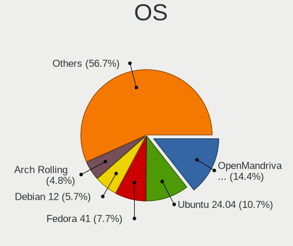
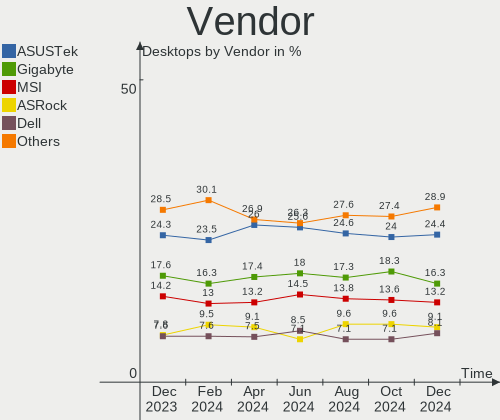
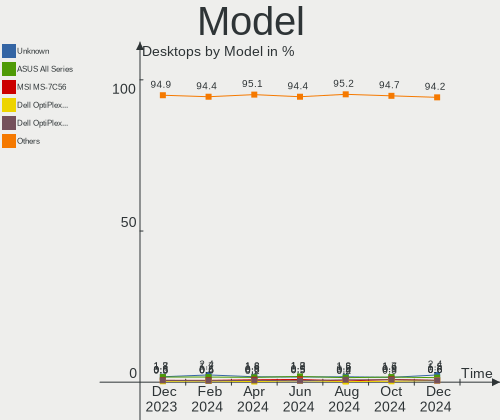
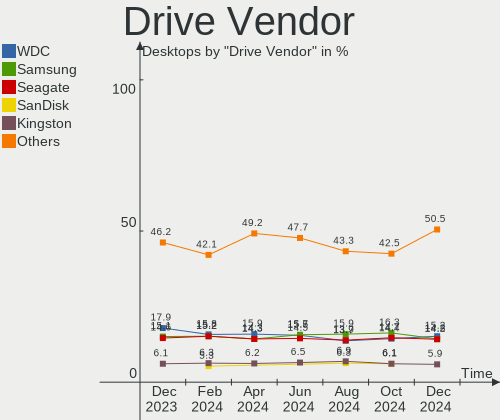
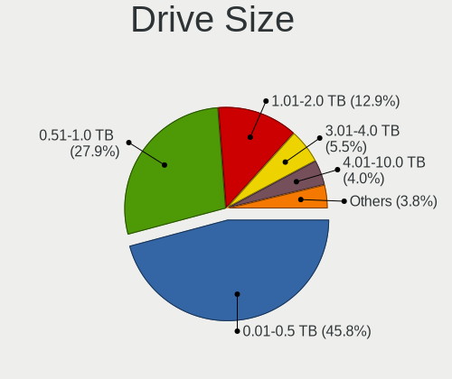
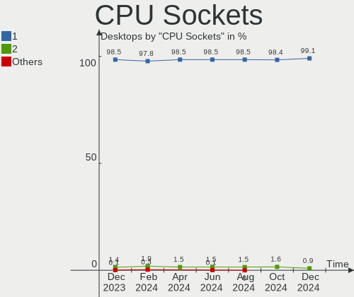
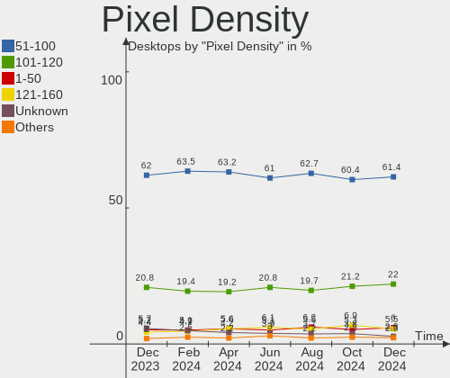

Linux Hardware Trends (Desktop)
-------------------------------

A project to identify most popular hardware characteristics and track their change
over time based on data collected by Linux users at https://Linux-Hardware.org.

Anyone can contribute to the study by uploading probes of their computers by
the [hw-probe](https://github.com/linuxhw/hw-probe) tool:

    sudo hw-probe -all -upload

Full-feature report is available here: https://linux-hardware.org/?view=trends&formfactor=desktop

Period: Dec, 2019.

Contents
--------

- [ OS                       ](#os)
- [ OS Family                ](#os-family)
- [ Kernel                   ](#kernel)
- [ Kernel Family            ](#kernel-family)
- [ Kernel Major Ver.        ](#kernel-major-ver)
- [ Arch                     ](#arch)
- [ DE                       ](#de)
- [ Display Server           ](#display-server)
- [ OS Lang                  ](#os-lang)
- [ Boot Mode                ](#boot-mode)
- [ Filesystem               ](#filesystem)
- [ Dual Boot with Linux     ](#dual-boot-with-linux)
- [ Dual Boot (Win)          ](#dual-boot-win)
- [ Country                  ](#country)
- [ City                     ](#city)
- [ Vendor                   ](#vendor)
- [ Model                    ](#model)
- [ Model Family             ](#model-family)
- [ MFG Year                 ](#mfg-year)
- [ Form Factor              ](#form-factor)
- [ Secure Boot              ](#secure-boot)
- [ Coreboot                 ](#coreboot)
- [ RAM Size                 ](#ram-size)
- [ RAM Used                 ](#ram-used)
- [ Drive Vendor             ](#drive-vendor)
- [ Drive Model              ](#drive-model)
- [ Drive Kind               ](#drive-kind)
- [ Drive Connector          ](#drive-connector)
- [ Drive Size               ](#drive-size)
- [ Space Total              ](#space-total)
- [ Space Used               ](#space-used)
- [ Malfunc. Drives          ](#malfunc-drives)
- [ Malfunc. Drive Vendor    ](#malfunc-drive-vendor)
- [ Malfunc. Drive Kind      ](#malfunc-drive-kind)
- [ Failed Drives            ](#failed-drives)
- [ Failed Drive Vendor      ](#failed-drive-vendor)
- [ Drive Status             ](#drive-status)
- [ CPU Vendor               ](#cpu-vendor)
- [ CPU Model                ](#cpu-model)
- [ CPU Model Family         ](#cpu-model-family)
- [ CPU Cores                ](#cpu-cores)
- [ CPU Sockets              ](#cpu-sockets)
- [ CPU Threads              ](#cpu-threads)
- [ CPU Op-Modes             ](#cpu-op-modes)
- [ CPU Microarch            ](#cpu-microarch)
- [ CPU Microcode            ](#cpu-microcode)
- [ GPU Vendor               ](#gpu-vendor)
- [ GPU Model                ](#gpu-model)
- [ GPU Combo                ](#gpu-combo)
- [ GPU Driver               ](#gpu-driver)
- [ GPU Memory               ](#gpu-memory)
- [ Monitor Vendor           ](#monitor-vendor)
- [ Monitor Model            ](#monitor-model)
- [ Monitor Resolution       ](#monitor-resolution)
- [ Monitor Diagonal         ](#monitor-diagonal)
- [ Monitor Width            ](#monitor-width)
- [ Aspect Ratio             ](#aspect-ratio)
- [ Monitor Area             ](#monitor-area)
- [ Pixel Density            ](#pixel-density)
- [ Multiple Monitors        ](#multiple-monitors)
- [ Net Controller Vendor    ](#net-controller-vendor)
- [ Net Controller Model     ](#net-controller-model)
- [ Net Controller Kind      ](#net-controller-kind)
- [ Used Controller          ](#used-controller)
- [ NICs                     ](#nics)
- [ Unsupported Devices      ](#unsupported-devices)
- [ Unsupported Device Types ](#unsupported-device-types)

OS
--

Installed operating systems

| Name                         | Computers | Percent |
|------------------------------|-----------|---------|
| Ubuntu 18.04                 | 262       | 26.17%  |
| ROSA R11                     | 145       | 14.49%  |
| Ubuntu 19.10                 | 112       | 11.19%  |
| BlackPanther 18.1            | 57        | 5.69%   |
| Mint 19.2                    | 50        | 5%      |
| Fedora 31                    | 36        | 3.6%    |
| Mint 19.3                    | 31        | 3.1%    |
| Debian 10                    | 26        | 2.6%    |
| Ubuntu 16.04                 | 22        | 2.2%    |
| Ubuntu 19.04                 | 18        | 1.8%    |
| ROSA R8.1                    | 16        | 1.6%    |
| Mint 19.1                    | 15        | 1.5%    |
| Zorin 15                     | 14        | 1.4%    |
| Endless 3.7.5                | 14        | 1.4%    |
| Arch Rolling                 | 13        | 1.3%    |
| ROSA R10                     | 10        | 1%      |
| Fedora 30                    | 10        | 1%      |
| Elementary 5.1               | 9         | 0.9%    |
| Arch                         | 9         | 0.9%    |
| KDE neon 18.04               | 8         | 0.8%    |
| Manjaro 18.1.4               | 7         | 0.7%    |
| Zorin 12                     | 6         | 0.6%    |
| Manjaro                      | 6         | 0.6%    |
| Debian                       | 6         | 0.6%    |
| Manjaro 18.1.3               | 5         | 0.5%    |
| Ubuntu 20.04                 | 4         | 0.4%    |
| Gentoo                       | 4         | 0.4%    |
| Debian Testing               | 4         | 0.4%    |
| ClearOS 7.7.2                | 4         | 0.4%    |
| Peppermint 10                | 3         | 0.3%    |
| Fedora 32                    | 3         | 0.3%    |
| CentOS 8                     | 3         | 0.3%    |
| Solus 4.0                    | 2         | 0.2%    |
| ROSA R9                      | 2         | 0.2%    |
| RHEL 8.1                     | 2         | 0.2%    |
| RED X4                       | 2         | 0.2%    |
| openSUSE 20191128            | 2         | 0.2%    |
| Mint 19                      | 2         | 0.2%    |
| Mint 18.3                    | 2         | 0.2%    |
| Kali 2019.4                  | 2         | 0.2%    |
| Gentoo 2.6                   | 2         | 0.2%    |
| Fedora 29                    | 2         | 0.2%    |
| Devuan 2.1                   | 2         | 0.2%    |
| Debian Unstable              | 2         | 0.2%    |
| ClearOS 7                    | 2         | 0.2%    |
| Arcolinux 19.12.15           | 2         | 0.2%    |
| Void Rolling                 | 1         | 0.1%    |
| Ubuntu Core 18               | 1         | 0.1%    |
| Ubuntu 18.10                 | 1         | 0.1%    |
| ROSA R12                     | 1         | 0.1%    |
| ROSA Nickel 2019.0           | 1         | 0.1%    |
| RED X3                       | 1         | 0.1%    |
| Reborn OS                    | 1         | 0.1%    |
| Parrot 4.7                   | 1         | 0.1%    |
| openSUSE Tumbleweed-20191216 | 1         | 0.1%    |
| openSUSE Tumbleweed-20191213 | 1         | 0.1%    |
| openSUSE 20191228            | 1         | 0.1%    |
| openSUSE 20191221            | 1         | 0.1%    |
| MX 18.3                      | 1         | 0.1%    |
| Mint 3                       | 1         | 0.1%    |

OS Family
---------

OS without a version

| Name         | Computers | Percent |
|--------------|-----------|---------|
| Ubuntu       | 420       | 41.96%  |
| ROSA         | 176       | 17.58%  |
| Mint         | 103       | 10.29%  |
| BlackPanther | 57        | 5.69%   |
| Fedora       | 51        | 5.09%   |
| Debian       | 40        | 4%      |
| Arch         | 22        | 2.2%    |
| Zorin        | 20        | 2%      |
| Manjaro      | 20        | 2%      |
| Endless      | 18        | 1.8%    |
| Elementary   | 9         | 0.9%    |
| KDE neon     | 8         | 0.8%    |
| openSUSE     | 6         | 0.6%    |
| Gentoo       | 6         | 0.6%    |
| ClearOS      | 6         | 0.6%    |
| Clear Linux  | 5         | 0.5%    |
| CentOS       | 5         | 0.5%    |
| Peppermint   | 3         | 0.3%    |
| Devuan       | 3         | 0.3%    |
| Arcolinux    | 3         | 0.3%    |
| Solus        | 2         | 0.2%    |
| RHEL         | 2         | 0.2%    |
| RED          | 2         | 0.2%    |
| Kali         | 2         | 0.2%    |
| Alpine       | 2         | 0.2%    |
| Void         | 1         | 0.1%    |
| Reborn OS    | 1         | 0.1%    |
| Parrot       | 1         | 0.1%    |
| MX           | 1         | 0.1%    |
| Mageia       | 1         | 0.1%    |
| Generic      | 1         | 0.1%    |
| Deepin       | 1         | 0.1%    |
| BunsenLabs   | 1         | 0.1%    |
| Antix        | 1         | 0.1%    |
| antergos     | 1         | 0.1%    |

Kernel
------

Version of the Linux kernel

| Version                          | Computers | Percent |
|----------------------------------|-----------|---------|
| 5.0.0-37-generic                 | 155       | 15.48%  |
| 4.15.0-72-generic                | 112       | 11.19%  |
| 5.3.0-24-generic                 | 83        | 8.29%   |
| 4.15.0-desktop-68.5rosa-x86_64   | 54        | 5.39%   |
| 4.18.16-desktop-1bP              | 45        | 4.5%    |
| 4.15.0-desktop-45.1rosa-x86_64   | 41        | 4.1%    |
| 5.0.0-36-generic                 | 33        | 3.3%    |
| 5.3.0-23-generic                 | 31        | 3.1%    |
| 4.15.0-70-generic                | 20        | 2%      |
| 4.19.0-6-amd64                   | 19        | 1.9%    |
| 4.9.155-nrj-desktop-1rosa-x86_64 | 18        | 1.8%    |
| 5.0.0-23-generic                 | 14        | 1.4%    |
| 5.3.16-300.fc31.x86_64           | 11        | 1.1%    |
| 5.1.15-desktop-1bP               | 11        | 1.1%    |
| 4.15.0-desktop-45.1rosa-i586     | 11        | 1.1%    |
| 5.0.0-32-generic                 | 10        | 1%      |
| 4.15.0-54-generic                | 10        | 1%      |
| 5.3.0-26-generic                 | 9         | 0.9%    |
| 4.15.0-20-generic                | 9         | 0.9%    |
| 5.3.0-18-generic                 | 8         | 0.8%    |
| 4.9.60-nrj-desktop-1rosa-x86_64  | 8         | 0.8%    |
| 5.4.2-arch1-1                    | 7         | 0.7%    |
| 4.15.0-desktop-60.7rosa-x86_64   | 7         | 0.7%    |
| 5.3.15-300.fc31.x86_64           | 6         | 0.6%    |
| 4.9.155-nrj-desktop-1rosa-i586   | 6         | 0.6%    |
| 4.9.0-11-amd64                   | 6         | 0.6%    |
| 5.3.13-arch1-1                   | 5         | 0.5%    |
| 5.3.13-300.fc31.x86_64           | 5         | 0.5%    |
| 5.3.0-25-generic                 | 5         | 0.5%    |
| 4.15.0-desktop-68.5rosa-i586     | 5         | 0.5%    |
| 4.15.0-73-generic                | 5         | 0.5%    |
| 5.3.12-300.fc31.x86_64           | 4         | 0.4%    |
| 5.3.12-1-MANJARO                 | 4         | 0.4%    |
| 5.3.12-1-default                 | 4         | 0.4%    |
| 5.3.0-24-lowlatency              | 4         | 0.4%    |
| 5.3.0-2-amd64                    | 4         | 0.4%    |
| 4.4.0-170-generic                | 4         | 0.4%    |
| 4.15.0-72-lowlatency             | 4         | 0.4%    |
| 4.15.0-55-generic                | 4         | 0.4%    |
| 4.15.0-45-generic                | 4         | 0.4%    |
| 4.15.0-29-generic                | 4         | 0.4%    |
| 4.1.38-nrj-desktop-2rosa-i586    | 4         | 0.4%    |
| 5.4.2-875.native                 | 3         | 0.3%    |
| 5.4.0-2.fc32.x86_64              | 3         | 0.3%    |
| 5.3.14-300.fc31.x86_64           | 3         | 0.3%    |
| 5.0.0-27-generic                 | 3         | 0.3%    |
| 4.18.0-15-generic                | 3         | 0.3%    |
| 4.15.0-66-generic                | 3         | 0.3%    |
| 4.15.0-58-generic                | 3         | 0.3%    |
| 4.1.38-nrj-desktop-2rosa-x86_64  | 3         | 0.3%    |
| 3.10.0-1062.9.1.el7.x86_64       | 3         | 0.3%    |
| 3.10.0-1062.4.3.el7.x86_64       | 3         | 0.3%    |
| 5.4.6-arch3-1                    | 2         | 0.2%    |
| 5.4.6-2-MANJARO                  | 2         | 0.2%    |
| 5.4.5-300.fc31.x86_64            | 2         | 0.2%    |
| 5.4.2-1-MANJARO                  | 2         | 0.2%    |
| 5.4.1-arch1-1                    | 2         | 0.2%    |
| 5.4.1-050401-generic             | 2         | 0.2%    |
| 5.4.0-desktop-8.1rosa-x86_64     | 2         | 0.2%    |
| 5.4.0-050400-generic             | 2         | 0.2%    |

Kernel Family
-------------

Linux kernel without a distro release

| Version  | Computers | Percent |
|----------|-----------|---------|
| 4.15.0   | 315       | 31.47%  |
| 5.0.0    | 217       | 21.68%  |
| 5.3.0    | 157       | 15.68%  |
| 4.18.16  | 46        | 4.6%    |
| 4.9.155  | 24        | 2.4%    |
| 4.19.0   | 24        | 2.4%    |
| 5.4.2    | 15        | 1.5%    |
| 5.3.13   | 14        | 1.4%    |
| 5.3.12   | 14        | 1.4%    |
| 4.18.0   | 13        | 1.3%    |
| 5.4.1    | 12        | 1.2%    |
| 5.3.16   | 12        | 1.2%    |
| 5.1.15   | 11        | 1.1%    |
| 5.4.0    | 10        | 1%      |
| 4.9.60   | 10        | 1%      |
| 5.3.15   | 9         | 0.9%    |
| 4.4.0    | 9         | 0.9%    |
| 5.4.6    | 7         | 0.7%    |
| 4.9.0    | 7         | 0.7%    |
| 4.1.38   | 7         | 0.7%    |
| 5.3.14   | 6         | 0.6%    |
| 5.3.11   | 6         | 0.6%    |
| 3.10.0   | 6         | 0.6%    |
| 5.4.5    | 3         | 0.3%    |
| 4.9.124  | 3         | 0.3%    |
| 4.19.86  | 3         | 0.3%    |
| 5.3.7    | 2         | 0.2%    |
| 5.2.0    | 2         | 0.2%    |
| 4.9.20   | 2         | 0.2%    |
| 4.8.0    | 2         | 0.2%    |
| 4.19.91  | 2         | 0.2%    |
| 4.19.88  | 2         | 0.2%    |
| 4.19.85  | 2         | 0.2%    |
| 4.15.18  | 2         | 0.2%    |
| 4.14.158 | 2         | 0.2%    |
| 5.3.9    | 1         | 0.1%    |
| 5.3.8    | 1         | 0.1%    |
| 5.2.8    | 1         | 0.1%    |
| 5.2.18   | 1         | 0.1%    |
| 5.2.16   | 1         | 0.1%    |
| 5.2.13   | 1         | 0.1%    |
| 5.2.1    | 1         | 0.1%    |
| 5.0.21   | 1         | 0.1%    |
| 5.0.11   | 1         | 0.1%    |
| 4.9.9    | 1         | 0.1%    |
| 4.9.206  | 1         | 0.1%    |
| 4.9.188  | 1         | 0.1%    |
| 4.9.160  | 1         | 0.1%    |
| 4.20.16  | 1         | 0.1%    |
| 4.19.89  | 1         | 0.1%    |
| 4.16.12  | 1         | 0.1%    |
| 4.14.89  | 1         | 0.1%    |
| 4.14.148 | 1         | 0.1%    |
| 4.10.0   | 1         | 0.1%    |
| 4.1.25   | 1         | 0.1%    |
| 3.18.25  | 1         | 0.1%    |
| 2.6.32   | 1         | 0.1%    |
| Unknown  | 1         | 0.1%    |

Kernel Major Ver.
-----------------

Linux kernel major version

| Version | Computers | Percent |
|---------|-----------|---------|
| 4.15    | 317       | 31.67%  |
| 5.3     | 222       | 22.18%  |
| 5.0     | 219       | 21.88%  |
| 4.18    | 59        | 5.89%   |
| 4.9     | 50        | 5%      |
| 5.4     | 47        | 4.7%    |
| 4.19    | 34        | 3.4%    |
| 5.1     | 11        | 1.1%    |
| 4.4     | 9         | 0.9%    |
| 4.1     | 8         | 0.8%    |
| 5.2     | 7         | 0.7%    |
| 3.10    | 6         | 0.6%    |
| 4.14    | 4         | 0.4%    |
| 4.8     | 2         | 0.2%    |
| 4.20    | 1         | 0.1%    |
| 4.16    | 1         | 0.1%    |
| 4.10    | 1         | 0.1%    |
| 3.18    | 1         | 0.1%    |
| 2.6     | 1         | 0.1%    |
| Unknown | 1         | 0.1%    |

Arch
----

OS architecture (x86_64, i586, etc.)

| Name    | Computers | Percent |
|---------|-----------|---------|
| x86_64  | 912       | 91.11%  |
| i686    | 88        | 8.79%   |
| Unknown | 1         | 0.1%    |

DE
--

Desktop Environment

| Name                      | Computers | Percent |
|---------------------------|-----------|---------|
| GNOME                     | 331       | 33.07%  |
| KDE5                      | 232       | 23.18%  |
| Unknown                   | 151       | 15.08%  |
| XFCE                      | 99        | 9.89%   |
| X-Cinnamon                | 59        | 5.89%   |
| MATE                      | 34        | 3.4%    |
| KDE                       | 28        | 2.8%    |
| Cinnamon                  | 22        | 2.2%    |
| Unity                     | 14        | 1.4%    |
| LXQt                      | 10        | 1%      |
| Pantheon                  | 8         | 0.8%    |
| LXDE                      | 4         | 0.4%    |
| communitheme:ubuntu:GNOME | 2         | 0.2%    |
| Budgie                    | 2         | 0.2%    |
| openbox                   | 1         | 0.1%    |
| i3                        | 1         | 0.1%    |
| GNOME-Classic:GNOME       | 1         | 0.1%    |
| GNOME Flashback           | 1         | 0.1%    |
| Deepin                    | 1         | 0.1%    |

Display Server
--------------

X11 or Wayland

| Name    | Computers | Percent |
|---------|-----------|---------|
| Unknown | 489       | 48.85%  |
| X11     | 477       | 47.65%  |
| Wayland | 33        | 3.3%    |
| Tty     | 2         | 0.2%    |

OS Lang
-------

Language

| Lang       | Computers | Percent |
|------------|-----------|---------|
| Unknown    | 379       | 37.86%  |
| en_US      | 208       | 20.78%  |
| de_DE      | 55        | 5.49%   |
| ru_RU      | 46        | 4.6%    |
| pt_BR      | 40        | 4%      |
| es_ES      | 29        | 2.9%    |
| en_GB      | 29        | 2.9%    |
| it_IT      | 27        | 2.7%    |
| fr_FR      | 22        | 2.2%    |
| en_CA      | 15        | 1.5%    |
| en_AU      | 12        | 1.2%    |
| C          | 11        | 1.1%    |
| pl_PL      | 10        | 1%      |
| en_IN      | 9         | 0.9%    |
| en_US.utf8 | 8         | 0.8%    |
| sv_SE      | 6         | 0.6%    |
| nl_NL      | 6         | 0.6%    |
| bg_BG      | 5         | 0.5%    |
| uk_UA      | 4         | 0.4%    |
| ja_JP      | 4         | 0.4%    |
| hu_HU      | 4         | 0.4%    |
| es_MX      | 4         | 0.4%    |
| es_AR      | 4         | 0.4%    |
| tr_TR      | 3         | 0.3%    |
| ru_UA      | 3         | 0.3%    |
| pt_PT      | 3         | 0.3%    |
| nb_NO      | 3         | 0.3%    |
| en_ZA      | 3         | 0.3%    |
| en_NZ      | 3         | 0.3%    |
| de_CH      | 3         | 0.3%    |
| de_AT      | 3         | 0.3%    |
| da_DK      | 3         | 0.3%    |
| zh_TW      | 2         | 0.2%    |
| sk_SK      | 2         | 0.2%    |
| ro_RO      | 2         | 0.2%    |
| nl_BE      | 2         | 0.2%    |
| fi_FI      | 2         | 0.2%    |
| es_PE      | 2         | 0.2%    |
| en_IN      | 2         | 0.2%    |
| en_IL      | 2         | 0.2%    |
| en_HK      | 2         | 0.2%    |
| cs_CZ      | 2         | 0.2%    |
| zh_CN      | 1         | 0.1%    |
| sl_SI      | 1         | 0.1%    |
| nl_BE.utf8 | 1         | 0.1%    |
| ko_KR      | 1         | 0.1%    |
| hr_HR      | 1         | 0.1%    |
| fr_FR.utf8 | 1         | 0.1%    |
| fr_CA      | 1         | 0.1%    |
| fr_BE      | 1         | 0.1%    |
| et_EE      | 1         | 0.1%    |
| es_VE      | 1         | 0.1%    |
| es_EC      | 1         | 0.1%    |
| es_CR      | 1         | 0.1%    |
| es_CO      | 1         | 0.1%    |
| en_GB.utf8 | 1         | 0.1%    |
| en_DK      | 1         | 0.1%    |
| en_DE      | 1         | 0.1%    |
| ca_ES      | 1         | 0.1%    |

Boot Mode
---------

EFI or BIOS

| Mode | Computers | Percent |
|------|-----------|---------|
| BIOS | 701       | 70.03%  |
| EFI  | 300       | 29.97%  |

Filesystem
----------

Type of filesystem

| Type    | Computers | Percent |
|---------|-----------|---------|
| Ext4    | 922       | 92.11%  |
| Btrfs   | 26        | 2.6%    |
| Xfs     | 21        | 2.1%    |
| Overlay | 20        | 2%      |
| Ext3    | 4         | 0.4%    |
| Ext2    | 3         | 0.3%    |
| Zfs     | 1         | 0.1%    |
| Tmpfs   | 1         | 0.1%    |
| Rootfs  | 1         | 0.1%    |
| Jfs     | 1         | 0.1%    |
| Unknown | 1         | 0.1%    |

Dual Boot with Linux
--------------------

Hosting more than one Linux

| Dual boot | Computers | Percent |
|-----------|-----------|---------|
| No        | 820       | 81.92%  |
| Yes       | 181       | 18.08%  |

Dual Boot (Win)
---------------

Hosting Linux and Windows

| Dual boot | Computers | Percent |
|-----------|-----------|---------|
| No        | 640       | 63.94%  |
| Yes       | 361       | 36.06%  |

Country
-------

Geographic location (country)

| Country             | Computers | Percent |
|---------------------|-----------|---------|
| Russia              | 222       | 22.18%  |
| USA                 | 138       | 13.79%  |
| Germany             | 84        | 8.39%   |
| Brazil              | 55        | 5.49%   |
| Hungary             | 50        | 5%      |
| Ukraine             | 35        | 3.5%    |
| UK                  | 34        | 3.4%    |
| France              | 34        | 3.4%    |
| Spain               | 32        | 3.2%    |
| Italy               | 30        | 3%      |
| Australia           | 23        | 2.3%    |
| Poland              | 22        | 2.2%    |
| Netherlands         | 22        | 2.2%    |
| Canada              | 22        | 2.2%    |
| India               | 13        | 1.3%    |
| Sweden              | 9         | 0.9%    |
| Romania             | 8         | 0.8%    |
| Slovakia            | 7         | 0.7%    |
| Japan               | 7         | 0.7%    |
| Finland             | 7         | 0.7%    |
| Bulgaria            | 7         | 0.7%    |
| Belarus             | 7         | 0.7%    |
| Czech Republic      | 6         | 0.6%    |
| Belgium             | 6         | 0.6%    |
| Taiwan              | 5         | 0.5%    |
| Switzerland         | 5         | 0.5%    |
| Portugal            | 5         | 0.5%    |
| Mexico              | 5         | 0.5%    |
| Kazakhstan          | 5         | 0.5%    |
| Israel              | 5         | 0.5%    |
| Argentina           | 5         | 0.5%    |
| Turkey              | 4         | 0.4%    |
| New Zealand         | 4         | 0.4%    |
| Lithuania           | 4         | 0.4%    |
| Greece              | 4         | 0.4%    |
| Denmark             | 4         | 0.4%    |
| Thailand            | 3         | 0.3%    |
| South Africa        | 3         | 0.3%    |
| Serbia              | 3         | 0.3%    |
| Norway              | 3         | 0.3%    |
| Latvia              | 3         | 0.3%    |
| Estonia             | 3         | 0.3%    |
| Croatia             | 3         | 0.3%    |
| Colombia            | 3         | 0.3%    |
| China               | 3         | 0.3%    |
| Austria             | 3         | 0.3%    |
| Slovenia            | 2         | 0.2%    |
| Singapore           | 2         | 0.2%    |
| Saudi Arabia        | 2         | 0.2%    |
| Philippines         | 2         | 0.2%    |
| Peru                | 2         | 0.2%    |
| Hong Kong           | 2         | 0.2%    |
| Ethiopia            | 2         | 0.2%    |
| Ecuador             | 2         | 0.2%    |
| Venezuela           | 1         | 0.1%    |
| Uruguay             | 1         | 0.1%    |
| Tunisia             | 1         | 0.1%    |
| Trinidad and Tobago | 1         | 0.1%    |
| Togo                | 1         | 0.1%    |
| South Korea         | 1         | 0.1%    |

City
----

Geographic location (city)

| City              | Computers | Percent |
|-------------------|-----------|---------|
| Moscow            | 30        | 3%      |
| St Petersburg     | 20        | 2%      |
| Yekaterinburg     | 10        | 1%      |
| Novosibirsk       | 10        | 1%      |
| São Paulo        | 9         | 0.9%    |
| Kyiv              | 8         | 0.8%    |
| Krakow            | 8         | 0.8%    |
| Vogue             | 6         | 0.6%    |
| Rostov-on-Don     | 6         | 0.6%    |
| Rome              | 6         | 0.6%    |
| Budapest          | 6         | 0.6%    |
| Berlin            | 6         | 0.6%    |
| Amsterdam         | 6         | 0.6%    |
| Wahroonga         | 5         | 0.5%    |
| Samara            | 5         | 0.5%    |
| Perm              | 5         | 0.5%    |
| Paris             | 5         | 0.5%    |
| Omsk              | 5         | 0.5%    |
| Ufa               | 4         | 0.4%    |
| Tyumen            | 4         | 0.4%    |
| Tel Aviv          | 4         | 0.4%    |
| Sofia             | 4         | 0.4%    |
| Munich            | 4         | 0.4%    |
| Lviv              | 4         | 0.4%    |
| Hornsby           | 4         | 0.4%    |
| Frankfurt am Main | 4         | 0.4%    |
| Fortaleza         | 4         | 0.4%    |
| Zaragoza          | 3         | 0.3%    |
| Vladikavkaz       | 3         | 0.3%    |
| Vitebsk           | 3         | 0.3%    |
| Toronto           | 3         | 0.3%    |
| Stockholm         | 3         | 0.3%    |
| Saransk           | 3         | 0.3%    |
| Orenburg          | 3         | 0.3%    |
| Novoye Devyatkino | 3         | 0.3%    |
| Nizhniy Novgorod  | 3         | 0.3%    |
| Miskolc           | 3         | 0.3%    |
| Minsk             | 3         | 0.3%    |
| Mesa              | 3         | 0.3%    |
| Melbourne         | 3         | 0.3%    |
| Luhansk           | 3         | 0.3%    |
| Las Vegas         | 3         | 0.3%    |
| Krasnoyarsk       | 3         | 0.3%    |
| Krasnodar         | 3         | 0.3%    |
| Khabarovsk        | 3         | 0.3%    |
| Gatchina          | 3         | 0.3%    |
| Eger              | 3         | 0.3%    |
| Debrecen          | 3         | 0.3%    |
| Cologne           | 3         | 0.3%    |
| Chicago           | 3         | 0.3%    |
| Chelyabinsk       | 3         | 0.3%    |
| Buenos Aires      | 3         | 0.3%    |
| Bratislava        | 3         | 0.3%    |
| Auckland          | 3         | 0.3%    |
| Zurich            | 2         | 0.2%    |
| Zheleznodorozhnyy | 2         | 0.2%    |
| Zagreb            | 2         | 0.2%    |
| Yoshkar-Ola       | 2         | 0.2%    |
| Volgograd         | 2         | 0.2%    |
| Vilnius           | 2         | 0.2%    |

Vendor
------

Motherboard manufacturer

| Name                       | Computers | Percent |
|----------------------------|-----------|---------|
| ASUSTek Computer           | 259       | 25.87%  |
| Gigabyte Technology        | 197       | 19.68%  |
| ASRock                     | 114       | 11.39%  |
| MSI                        | 95        | 9.49%   |
| Dell                       | 73        | 7.29%   |
| Hewlett-Packard            | 44        | 4.4%    |
| Acer                       | 31        | 3.1%    |
| Lenovo                     | 26        | 2.6%    |
| Intel                      | 26        | 2.6%    |
| Unknown                    | 16        | 1.6%    |
| Pegatron                   | 14        | 1.4%    |
| Fujitsu                    | 14        | 1.4%    |
| ECS                        | 11        | 1.1%    |
| Foxconn                    | 9         | 0.9%    |
| Biostar                    | 7         | 0.7%    |
| Fujitsu Siemens            | 6         | 0.6%    |
| Positivo                   | 5         | 0.5%    |
| Medion                     | 5         | 0.5%    |
| PCWare                     | 4         | 0.4%    |
| eMachines                  | 4         | 0.4%    |
| Apple                      | 3         | 0.3%    |
| WinFast                    | 2         | 0.2%    |
| Packard Bell               | 2         | 0.2%    |
| MEGA                       | 2         | 0.2%    |
| Insyde                     | 2         | 0.2%    |
| HARDKERNEL                 | 2         | 0.2%    |
| ZOTAC                      | 1         | 0.1%    |
| Wistron                    | 1         | 0.1%    |
| VIA Technologies           | 1         | 0.1%    |
| TriGem Computer            | 1         | 0.1%    |
| Supermicro                 | 1         | 0.1%    |
| SiS Technology             | 1         | 0.1%    |
| Shuttle                    | 1         | 0.1%    |
| Phitronics                 | 1         | 0.1%    |
| Philco                     | 1         | 0.1%    |
| PCP                        | 1         | 0.1%    |
| Onda Technology Corportion | 1         | 0.1%    |
| OEM                        | 1         | 0.1%    |
| Notebook                   | 1         | 0.1%    |
| MEN                        | 1         | 0.1%    |
| Itautec                    | 1         | 0.1%    |
| Huanan                     | 1         | 0.1%    |
| Google                     | 1         | 0.1%    |
| Gateway                    | 1         | 0.1%    |
| EVGA                       | 1         | 0.1%    |
| EPoX Computer              | 1         | 0.1%    |
| ELSA                       | 1         | 0.1%    |
| Daten Tecnologia           | 1         | 0.1%    |
| Compaq                     | 1         | 0.1%    |
| ASRockRack                 | 1         | 0.1%    |
| AMI                        | 1         | 0.1%    |
| Alienware                  | 1         | 0.1%    |
| ABIT                       | 1         | 0.1%    |
| AAEON                      | 1         | 0.1%    |

Model
-----

Motherboard model

| Name                        | Computers | Percent |
|-----------------------------|-----------|---------|
| All Series                  | 29        | 2.9%    |
| Unknown                     | 15        | 1.5%    |
| M5A78L-M/USB3               | 8         | 0.8%    |
| B450M DS3H                  | 8         | 0.8%    |
| 970A-DS3P                   | 8         | 0.8%    |
| PRIME A320M-K               | 6         | 0.6%    |
| OptiPlex 760                | 5         | 0.5%    |
| G31M-ES2L                   | 5         | 0.5%    |
| SABERTOOTH 990FX R2.0       | 4         | 0.4%    |
| Precision WorkStation T7500 | 4         | 0.4%    |
| OptiPlex 780                | 4         | 0.4%    |
| MS-7B89                     | 4         | 0.4%    |
| MS-7A38                     | 4         | 0.4%    |
| MS-7996                     | 4         | 0.4%    |
| X570 AORUS MASTER           | 3         | 0.3%    |
| PRIME Z370-P                | 3         | 0.3%    |
| PRIME H310M-R R2.0          | 3         | 0.3%    |
| PRIME B450M-A               | 3         | 0.3%    |
| PRIME B250M-A               | 3         | 0.3%    |
| P8Z68-V PRO                 | 3         | 0.3%    |
| OptiPlex 990                | 3         | 0.3%    |
| OptiPlex 745                | 3         | 0.3%    |
| OptiPlex 7010               | 3         | 0.3%    |
| OptiPlex 3020               | 3         | 0.3%    |
| MS-7C37                     | 3         | 0.3%    |
| MS-7817                     | 3         | 0.3%    |
| MS-7788                     | 3         | 0.3%    |
| MS-7693                     | 3         | 0.3%    |
| MS-7592                     | 3         | 0.3%    |
| M5A99FX PRO R2.0            | 3         | 0.3%    |
| M5A78L-M LX3                | 3         | 0.3%    |
| M5A78L-M LE/USB3            | 3         | 0.3%    |
| M5A78L LE                   | 3         | 0.3%    |
| M4A78LT-M-LE                | 3         | 0.3%    |
| Inspiron 3847               | 3         | 0.3%    |
| H81M-S1                     | 3         | 0.3%    |
| H310M S2H 2.0               | 3         | 0.3%    |
| G41M-VS3                    | 3         | 0.3%    |
| FM2A55M-DGS                 | 3         | 0.3%    |
| F2A78M-HD2                  | 3         | 0.3%    |
| Compaq 8200 Elite SFF PC    | 3         | 0.3%    |
| A68HM-K                     | 3         | 0.3%    |
| 970A-UD3P                   | 3         | 0.3%    |
| Z97X-UD3H                   | 2         | 0.2%    |
| Z68P-DS3                    | 2         | 0.2%    |
| Z370 AORUS Gaming 5         | 2         | 0.2%    |
| Z170-A                      | 2         | 0.2%    |
| X399 Taichi                 | 2         | 0.2%    |
| X370 Gaming X               | 2         | 0.2%    |
| TUF GAMING X570-PLUS        | 2         | 0.2%    |
| ROG STRIX X470-I GAMING     | 2         | 0.2%    |
| ROG STRIX B450-I GAMING     | 2         | 0.2%    |
| ROG STRIX B360-G GAMING     | 2         | 0.2%    |
| Raicila                     | 2         | 0.2%    |
| ProDesk 600 G1 SFF          | 2         | 0.2%    |
| PRIME Z370-A                | 2         | 0.2%    |
| PRIME B350-PLUS             | 2         | 0.2%    |
| PRIME B250-PLUS             | 2         | 0.2%    |
| Precision WorkStation T3500 | 2         | 0.2%    |
| POS-EIH61CE                 | 2         | 0.2%    |

Model Family
------------

Motherboard model prefix

| Name                    | Computers | Percent |
|-------------------------|-----------|---------|
| Dell OptiPlex           | 38        | 3.8%    |
| ASUS PRIME              | 36        | 3.6%    |
| ASUS All                | 29        | 2.9%    |
| HP Compaq               | 23        | 2.3%    |
| Acer Aspire             | 22        | 2.2%    |
| Unknown                 | 18        | 1.8%    |
| ASUS M5A78L-M           | 17        | 1.7%    |
| Lenovo ThinkCentre      | 16        | 1.6%    |
| Dell Inspiron           | 16        | 1.6%    |
| ASUS ROG                | 14        | 1.4%    |
| Gigabyte B450M          | 9         | 0.9%    |
| Gigabyte 970A-DS3P      | 9         | 0.9%    |
| Dell Precision          | 9         | 0.9%    |
| Fujitsu ESPRIMO         | 7         | 0.7%    |
| ASUS P8H61-M            | 7         | 0.7%    |
| Acer Veriton            | 7         | 0.7%    |
| HP ProDesk              | 5         | 0.5%    |
| Gigabyte H310M          | 5         | 0.5%    |
| Gigabyte G31M-ES2L      | 5         | 0.5%    |
| ASUS SABERTOOTH         | 5         | 0.5%    |
| ASUS P8Z68-V            | 5         | 0.5%    |
| ASUS M5A97              | 5         | 0.5%    |
| MSI MS-7B89             | 4         | 0.4%    |
| MSI MS-7A38             | 4         | 0.4%    |
| MSI MS-7996             | 4         | 0.4%    |
| Lenovo ThinkStation     | 4         | 0.4%    |
| Gigabyte Z390           | 4         | 0.4%    |
| Gigabyte H110M-H        | 4         | 0.4%    |
| Fujitsu Siemens ESPRIMO | 4         | 0.4%    |
| ASUS TUF                | 4         | 0.4%    |
| ASUS P8B75-M            | 4         | 0.4%    |
| ASUS P6T                | 4         | 0.4%    |
| ASRock X370             | 4         | 0.4%    |
| ASRock N68-VS3          | 4         | 0.4%    |
| MSI MS-7C37             | 3         | 0.3%    |
| MSI MS-7817             | 3         | 0.3%    |
| MSI MS-7788             | 3         | 0.3%    |
| MSI MS-7693             | 3         | 0.3%    |
| MSI MS-7592             | 3         | 0.3%    |
| Lenovo IdeaCentre       | 3         | 0.3%    |
| Gigabyte Z370           | 3         | 0.3%    |
| Gigabyte X570           | 3         | 0.3%    |
| Gigabyte X470           | 3         | 0.3%    |
| Gigabyte H81M-S1        | 3         | 0.3%    |
| Gigabyte F2A78M-HD2     | 3         | 0.3%    |
| Gigabyte B450           | 3         | 0.3%    |
| Gigabyte 970A-UD3P      | 3         | 0.3%    |
| Fujitsu CELSIUS         | 3         | 0.3%    |
| ASUS P5KPL-AM           | 3         | 0.3%    |
| ASUS M5A99FX            | 3         | 0.3%    |
| ASUS M5A78L             | 3         | 0.3%    |
| ASUS M4A78LT-M-LE       | 3         | 0.3%    |
| ASUS A68HM-K            | 3         | 0.3%    |
| ASRock Z77              | 3         | 0.3%    |
| ASRock X570             | 3         | 0.3%    |
| ASRock X399             | 3         | 0.3%    |
| ASRock G41M-VS3         | 3         | 0.3%    |
| ASRock FM2A55M-DGS      | 3         | 0.3%    |
| ASRock B450M            | 3         | 0.3%    |
| ASRock 970              | 3         | 0.3%    |

MFG Year
--------

Motherboard manufacture year

| Year    | Computers | Percent |
|---------|-----------|---------|
| 2019    | 127       | 12.69%  |
| 2018    | 103       | 10.29%  |
| 2011    | 88        | 8.79%   |
| 2010    | 84        | 8.39%   |
| 2012    | 82        | 8.19%   |
| 2014    | 81        | 8.09%   |
| 2013    | 71        | 7.09%   |
| 2016    | 70        | 6.99%   |
| 2009    | 67        | 6.69%   |
| 2015    | 50        | 5%      |
| 2017    | 45        | 4.5%    |
| 2008    | 45        | 4.5%    |
| 2007    | 40        | 4%      |
| 2006    | 24        | 2.4%    |
| 2005    | 12        | 1.2%    |
| 2004    | 4         | 0.4%    |
| 2003    | 4         | 0.4%    |
| 2002    | 3         | 0.3%    |
| Unknown | 1         | 0.1%    |

Form Factor
-----------

Physical design of the computer

| Name    | Computers | Percent |
|---------|-----------|---------|
| Desktop | 1001      | 100%    |

Secure Boot
-----------

Enabled or disabled

| State    | Computers | Percent |
|----------|-----------|---------|
| Disabled | 794       | 79.32%  |
| Unknown  | 184       | 18.38%  |
| Enabled  | 23        | 2.3%    |

Coreboot
--------

Have coreboot on board

| Used | Computers | Percent |
|------|-----------|---------|
| No   | 1000      | 99.9%   |
| Yes  | 1         | 0.1%    |

RAM Size
--------

Total RAM memory

| Size in GB  | Computers | Percent |
|-------------|-----------|---------|
| 3.01-4.0    | 240       | 23.98%  |
| 8.01-16.0   | 238       | 23.78%  |
| 16.01-24.0  | 184       | 18.38%  |
| 4.01-8.0    | 136       | 13.59%  |
| 1.01-2.0    | 68        | 6.79%   |
| 32.01-64.0  | 65        | 6.49%   |
| 2.01-3.0    | 20        | 2%      |
| 64.01-256.0 | 20        | 2%      |
| 24.01-32.0  | 18        | 1.8%    |
| 0.01-1.0    | 11        | 1.1%    |
| Unknown     | 1         | 0.1%    |

RAM Used
--------

Used RAM memory

| Used GB    | Computers | Percent |
|------------|-----------|---------|
| 1.01-2.0   | 382       | 38.16%  |
| 0.01-1.0   | 211       | 21.08%  |
| 2.01-3.0   | 191       | 19.08%  |
| 4.01-8.0   | 94        | 9.39%   |
| 3.01-4.0   | 80        | 7.99%   |
| 8.01-16.0  | 34        | 3.4%    |
| 16.01-24.0 | 5         | 0.5%    |
| Unknown    | 2         | 0.2%    |
| 32.01-64.0 | 1         | 0.1%    |
| 0          | 1         | 0.1%    |

Drive Vendor
------------

Hard drive vendors

| Vendor                | Computers | Drives | Percent |
|-----------------------|-----------|--------|---------|
| Seagate               | 383       | 467    | 23.98%  |
| WDC                   | 370       | 468    | 23.17%  |
| Samsung Electronics   | 203       | 229    | 12.71%  |
| Toshiba               | 96        | 105    | 6.01%   |
| Kingston              | 91        | 97     | 5.7%    |
| Hitachi               | 78        | 86     | 4.88%   |
| Intel                 | 40        | 43     | 2.5%    |
| Crucial               | 39        | 42     | 2.44%   |
| SanDisk               | 33        | 39     | 2.07%   |
| HGST                  | 25        | 26     | 1.57%   |
| A-DATA Technology     | 22        | 23     | 1.38%   |
| SPCC                  | 15        | 15     | 0.94%   |
| MAXTOR                | 15        | 15     | 0.94%   |
| China                 | 13        | 13     | 0.81%   |
| Unknown               | 12        | 14     | 0.75%   |
| Transcend             | 11        | 11     | 0.69%   |
| OCZ                   | 11        | 11     | 0.69%   |
| PNY                   | 9         | 9      | 0.56%   |
| Generic               | 9         | 9      | 0.56%   |
| Corsair               | 9         | 9      | 0.56%   |
| Patriot               | 8         | 8      | 0.5%    |
| KingDian              | 8         | 8      | 0.5%    |
| PLEXTOR               | 7         | 6      | 0.44%   |
| Hewlett-Packard       | 5         | 5      | 0.31%   |
| Micron Technology     | 4         | 4      | 0.25%   |
| Intenso               | 4         | 4      | 0.25%   |
| GOODRAM               | 4         | 5      | 0.25%   |
| Gigabyte Technology   | 4         | 4      | 0.25%   |
| Fujitsu               | 4         | 4      | 0.25%   |
| Apacer                | 4         | 4      | 0.25%   |
| Team                  | 3         | 3      | 0.19%   |
| SK Hynix              | 3         | 3      | 0.19%   |
| LITEON                | 3         | 3      | 0.19%   |
| KingSpec              | 3         | 3      | 0.19%   |
| KINGMAX               | 3         | 3      | 0.19%   |
| IBM/Hitachi           | 3         | 3      | 0.19%   |
| ExcelStor             | 3         | 3      | 0.19%   |
| DREVO                 | 3         | 3      | 0.19%   |
| AMD                   | 3         | 4      | 0.19%   |
| XPG                   | 2         | 2      | 0.13%   |
| TO Exter              | 2         | 2      | 0.13%   |
| Silicon Motion        | 2         | 2      | 0.13%   |
| Mushkin               | 2         | 2      | 0.13%   |
| LITEONIT              | 2         | 2      | 0.13%   |
| WDC WD50              | 1         | 1      | 0.06%   |
| WDC WD10              | 1         | 1      | 0.06%   |
| Vi550                 | 1         | 1      | 0.06%   |
| TrekStor              | 1         | 1      | 0.06%   |
| Sony                  | 1         | 1      | 0.06%   |
| sobetter              | 1         | 1      | 0.06%   |
| Smartbuy              | 1         | 1      | 0.06%   |
| Radeon                | 1         | 1      | 0.06%   |
| Phison                | 1         | 1      | 0.06%   |
| ORGE                  | 1         | 1      | 0.06%   |
| Netac                 | 1         | 1      | 0.06%   |
| MemoCom               | 1         | 1      | 0.06%   |
| Magnetic Data         | 1         | 1      | 0.06%   |
| LONDISK               | 1         | 1      | 0.06%   |
| LDLC                  | 1         | 1      | 0.06%   |
| Kingston Technologies | 1         | 1      | 0.06%   |

Drive Model
-----------

Hard drive models

| Model                        | Computers | Percent |
|------------------------------|-----------|---------|
| ST500DM002-1BD142 500GB      | 30        | 1.63%   |
| DT01ACA100 1TB               | 21        | 1.14%   |
| ST1000DM010-2EP102 1TB       | 20        | 1.09%   |
| SSD 850 EVO 250GB            | 20        | 1.09%   |
| WD10EZEX-08WN4A0 1TB         | 19        | 1.03%   |
| SA400S37240G 240GB SSD       | 18        | 0.98%   |
| ST3500418AS 500GB            | 17        | 0.92%   |
| SSD 860 EVO 500GB            | 16        | 0.87%   |
| SV300S37A120G 120GB SSD      | 15        | 0.81%   |
| ST31000528AS 1TB             | 13        | 0.71%   |
| SA400S37120G 120GB SSD       | 13        | 0.71%   |
| ST1000DM003-1ER162 1TB       | 12        | 0.65%   |
| WD5000AAKX-001CA0 500GB      | 11        | 0.6%    |
| SSD 860 EVO 250GB            | 11        | 0.6%    |
| SSD 850 EVO 500GB            | 11        | 0.6%    |
| SA400S37480G 480GB SSD       | 11        | 0.6%    |
| DT01ACA050 500GB             | 11        | 0.6%    |
| ST3250310AS 250GB            | 10        | 0.54%   |
| WD10EZEX-00BN5A0 1TB         | 9         | 0.49%   |
| HDWD110 1TB                  | 9         | 0.49%   |
| HDS721010CLA332 1TB          | 9         | 0.49%   |
| HD161HJ 160GB                | 9         | 0.49%   |
| WD10EARS-00Y5B1 1TB          | 8         | 0.43%   |
| ST380011A 80GB               | 8         | 0.43%   |
| ST2000DM006-2DM164 2TB       | 8         | 0.43%   |
| ST2000DM001-1CH164 2TB       | 8         | 0.43%   |
| ST1000DM003-1CH162 1TB       | 8         | 0.43%   |
| SSD 860 EVO 1TB              | 8         | 0.43%   |
| Solid State Disk 128GB       | 8         | 0.43%   |
| SD/MMC/MS PRO 128GB          | 8         | 0.43%   |
| HD502HJ 500GB                | 8         | 0.43%   |
| HD103UJ 1TB                  | 8         | 0.43%   |
| WDS240G2G0A-00JH30 240GB SSD | 7         | 0.38%   |
| WD10EZEX-22MFCA0 1TB         | 7         | 0.38%   |
| ST4000DM004-2CV104 4TB       | 7         | 0.38%   |
| ST3500312CS 500GB            | 7         | 0.38%   |
| HTS721010A9E630 1TB          | 7         | 0.38%   |
| WD5000AAKX-60U6AA0 500GB     | 6         | 0.33%   |
| WD5000AADS-00S9B0 500GB      | 6         | 0.33%   |
| WD40EZRZ-00GXCB0 4TB         | 6         | 0.33%   |
| WD20EZRZ-00Z5HB0 2TB         | 6         | 0.33%   |
| WD20EZRX-00D8PB0 2TB         | 6         | 0.33%   |
| WD10EZEX-21WN4A0 1TB         | 6         | 0.33%   |
| ST380815AS 80GB              | 6         | 0.33%   |
| ST3160815AS 160GB            | 6         | 0.33%   |
| ST3160318AS 160GB            | 6         | 0.33%   |
| ST31000524AS 1TB             | 6         | 0.33%   |
| ST1000DM003-9YN162 1TB       | 6         | 0.33%   |
| SSDSC2CW120A3 120GB          | 6         | 0.33%   |
| HDWD130 3TB                  | 6         | 0.33%   |
| HDS721616PLA380 164GB        | 6         | 0.33%   |
| CT500MX500SSD1 500GB         | 6         | 0.33%   |
| WDS240G2G0B-00EPW0 240GB SSD | 5         | 0.27%   |
| WD5000AAKX-00ERMA0 500GB     | 5         | 0.27%   |
| WD30EFRX-68EUZN0 3TB         | 5         | 0.27%   |
| WD20EFRX-68EUZN0 2TB         | 5         | 0.27%   |
| WD20EARS-00MVWB0 2TB         | 5         | 0.27%   |
| WD10EZEX-08M2NA0 1TB         | 5         | 0.27%   |
| WD10EZEX-00WN4A0 1TB         | 5         | 0.27%   |
| ST3000DM001-1CH166 3TB       | 5         | 0.27%   |

Drive Kind
----------

HDD or SSD

| Kind    | Computers | Drives | Percent |
|---------|-----------|--------|---------|
| HDD     | 815       | 1230   | 61.56%  |
| SSD     | 433       | 533    | 32.7%   |
| Unknown | 36        | 38     | 2.72%   |
| NVMe    | 34        | 37     | 2.57%   |
| MMC     | 6         | 6      | 0.45%   |

Drive Connector
---------------

SATA, SAS, NVMe, etc.

| Type | Computers | Drives | Percent |
|------|-----------|--------|---------|
| SATA | 964       | 1754   | 92.25%  |
| SAS  | 41        | 47     | 3.92%   |
| NVMe | 34        | 37     | 3.25%   |
| MMC  | 6         | 6      | 0.57%   |

Drive Size
----------

Size of hard drive

| Size in TB | Computers | Drives  | Percent |
|------------|-----------|---------|---------|
| 0.01-0.5   | 792       | 1136    | 57.27%  |
| 0.51-1.0   | 374       | 458     | 27.04%  |
| 1.01-2.0   | 117       | 139     | 8.46%   |
| 2.01-3.0   | 41        | 43      | 2.96%   |
| 3.01-4.0   | 39        | 43      | 2.82%   |
| 4.01-10.0  | 15        | 20      | 1.08%   |
| 10.01-20.0 | 4         | 5       | 0.29%   |
| Unknown    | 1         | Unknown | 0.07%   |

Space Total
-----------

Amount of disk space available on the file system

| Size in GB     | Computers | Percent |
|----------------|-----------|---------|
| 101-250        | 244       | 24.38%  |
| 251-500        | 185       | 18.48%  |
| 501-1000       | 150       | 14.99%  |
| 51-100         | 106       | 10.59%  |
| 1001-2000      | 105       | 10.49%  |
| More than 3000 | 68        | 6.79%   |
| 1-20           | 51        | 5.09%   |
| 2001-3000      | 41        | 4.1%    |
| 21-50          | 38        | 3.8%    |
| Unknown        | 13        | 1.3%    |

Space Used
----------

Amount of used disk space

| Used GB        | Computers | Percent |
|----------------|-----------|---------|
| 1-20           | 405       | 40.46%  |
| 21-50          | 134       | 13.39%  |
| 101-250        | 115       | 11.49%  |
| 51-100         | 92        | 9.19%   |
| 251-500        | 84        | 8.39%   |
| 501-1000       | 72        | 7.19%   |
| 1001-2000      | 42        | 4.2%    |
| More than 3000 | 26        | 2.6%    |
| 2001-3000      | 18        | 1.8%    |
| Unknown        | 13        | 1.3%    |

Malfunc. Drives
---------------

Drive models with a malfunction

| Model                    | Computers | Drives | Percent |
|--------------------------|-----------|--------|---------|
| WD5000AAKX-001CA0 500GB  | 4         | 4      | 2.19%   |
| ST500DM002-1BD142 500GB  | 4         | 4      | 2.19%   |
| ST3500418AS 500GB        | 4         | 4      | 2.19%   |
| ST31000528AS 1TB         | 4         | 4      | 2.19%   |
| ST3320613AS 320GB        | 3         | 3      | 1.64%   |
| ST3250410AS 250GB        | 3         | 3      | 1.64%   |
| ST3250310AS 250GB        | 3         | 3      | 1.64%   |
| HD161HJ 160GB            | 3         | 3      | 1.64%   |
| DT01ACA100 1TB           | 3         | 3      | 1.64%   |
| WD5000AADS-00S9B0 500GB  | 2         | 2      | 1.09%   |
| WD3200AAJS-00L7A0 320GB  | 2         | 2      | 1.09%   |
| WD20EFRX-68EUZN0 2TB     | 2         | 2      | 1.09%   |
| WD10EZEX-75WN4A0 1TB     | 2         | 2      | 1.09%   |
| WD10EARS-00Y5B1 1TB      | 2         | 2      | 1.09%   |
| WD10EALX-009BA0 1TB      | 2         | 2      | 1.09%   |
| WD10EADS-00M2B0 1TB      | 2         | 2      | 1.09%   |
| SV300S37A120G 120GB SSD  | 2         | 2      | 1.09%   |
| ST500DM002-1BD14 500GB   | 2         | 3      | 1.09%   |
| ST380811AS 80GB          | 2         | 2      | 1.09%   |
| ST380011A 80GB           | 2         | 2      | 1.09%   |
| ST3160815AS 160GB        | 2         | 2      | 1.09%   |
| SSD 60GB                 | 2         | 2      | 1.09%   |
| HDT722525DLA380 250GB    | 2         | 2      | 1.09%   |
| HD160JJ 160GB            | 2         | 2      | 1.09%   |
| HD103UJ 1TB              | 2         | 2      | 1.09%   |
| HD080HJ 80GB             | 2         | 2      | 1.09%   |
| DT01ACA050 500GB         | 2         | 2      | 1.09%   |
| X1 SSD 120GB             | 1         | 1      | 0.55%   |
| WD800JD-00MSA1 80GB      | 1         | 1      | 0.55%   |
| WD800BB-56JKC0 80GB      | 1         | 1      | 0.55%   |
| WD800BB-00JHC0 80GB      | 1         | 1      | 0.55%   |
| WD6400BEVT-22A0RT0 640GB | 1         | 1      | 0.55%   |
| WD5000AAKX-60U6AA0 500GB | 1         | 1      | 0.55%   |
| WD5000AAKX-221CA1 500GB  | 1         | 1      | 0.55%   |
| WD5000AAKX-0 500GB       | 1         | 1      | 0.55%   |
| WD5000AAKS-00UU3A0 500GB | 1         | 1      | 0.55%   |
| WD5000AAKS-00A7B0 500GB  | 1         | 1      | 0.55%   |
| WD400JB-00ENA0 40GB      | 1         | 1      | 0.55%   |
| WD3200AAKS-00SBA0 320GB  | 1         | 1      | 0.55%   |
| WD3200AAJS-56M0A0 320GB  | 1         | 1      | 0.55%   |
| WD3200AAJS-00B4A0 320GB  | 1         | 1      | 0.55%   |
| WD30EFRX-68EUZN0 3TB     | 1         | 1      | 0.55%   |
| WD30EFRX-68AX9N0 3TB     | 1         | 1      | 0.55%   |
| WD2500JS-55NCB1 250GB    | 1         | 1      | 0.55%   |
| WD2500AAKX-00ERMA0 250GB | 1         | 1      | 0.55%   |
| WD2500AAJS-00L7A0 250GB  | 1         | 1      | 0.55%   |
| WD2500AAJS-00B4A0 250GB  | 1         | 1      | 0.55%   |
| WD20EURS-63S48Y0 2TB     | 1         | 1      | 0.55%   |
| WD20EARX-00P 2TB         | 1         | 1      | 0.55%   |
| WD20EARS-60MVWB0 2TB     | 1         | 1      | 0.55%   |
| WD20EARS-00MVWB0 2TB     | 1         | 1      | 0.55%   |
| WD20EARS-00J2GB0 2TB     | 1         | 1      | 0.55%   |
| WD20EADS-22R6B0 2TB      | 1         | 1      | 0.55%   |
| WD205BA 21GB             | 1         | 1      | 0.55%   |
| WD1600JS-60NCB1 160GB    | 1         | 1      | 0.55%   |
| WD1600JS-00NCB1 160GB    | 1         | 1      | 0.55%   |
| WD1600AAJS-75M0A0 160GB  | 1         | 1      | 0.55%   |
| WD1600AAJS-00PSA0 160GB  | 1         | 1      | 0.55%   |
| WD1200BB-00GUC0 120GB    | 1         | 1      | 0.55%   |
| WD10TPVT-00HT5T1 1TB     | 1         | 1      | 0.55%   |

Malfunc. Drive Vendor
---------------------

Vendors of faulty drives

| Vendor              | Computers | Drives | Percent |
|---------------------|-----------|--------|---------|
| Seagate             | 58        | 65     | 35.37%  |
| WDC                 | 47        | 59     | 28.66%  |
| Samsung Electronics | 14        | 15     | 8.54%   |
| Hitachi             | 11        | 11     | 6.71%   |
| Toshiba             | 9         | 9      | 5.49%   |
| Corsair             | 4         | 4      | 2.44%   |
| Kingston            | 3         | 3      | 1.83%   |
| IBM/Hitachi         | 3         | 3      | 1.83%   |
| MAXTOR              | 2         | 2      | 1.22%   |
| KINGMAX             | 2         | 2      | 1.22%   |
| Intel               | 2         | 2      | 1.22%   |
| Crucial             | 2         | 2      | 1.22%   |
| SK Hynix            | 1         | 1      | 0.61%   |
| Silicon Motion      | 1         | 1      | 0.61%   |
| SanDisk             | 1         | 1      | 0.61%   |
| Patriot             | 1         | 1      | 0.61%   |
| KingSpec            | 1         | 1      | 0.61%   |
| DREVO               | 1         | 1      | 0.61%   |
| A-DATA Technology   | 1         | 1      | 0.61%   |

Malfunc. Drive Kind
-------------------

Kinds of faulty drives

| Kind | Computers | Drives | Percent |
|------|-----------|--------|---------|
| HDD  | 130       | 164    | 87.25%  |
| SSD  | 18        | 19     | 12.08%  |
| NVMe | 1         | 1      | 0.67%   |

Failed Drives
-------------

Failed drive models

| Model                   | Computers | Drives | Percent |
|-------------------------|-----------|--------|---------|
| ST380815AS 80GB         | 2         | 2      | 33.33%  |
| WD5000AAKS-00V1A0 500GB | 1         | 1      | 16.67%  |
| WD2500BEVT-22ZCT0 250GB | 1         | 1      | 16.67%  |
| MK5065GSX 500GB         | 1         | 1      | 16.67%  |
| HD642JJ 640GB           | 1         | 1      | 16.67%  |

Failed Drive Vendor
-------------------

Failed drive vendors

| Vendor              | Computers | Drives | Percent |
|---------------------|-----------|--------|---------|
| WDC                 | 2         | 2      | 33.33%  |
| Seagate             | 2         | 2      | 33.33%  |
| Toshiba             | 1         | 1      | 16.67%  |
| Samsung Electronics | 1         | 1      | 16.67%  |

Drive Status
------------

Number of failed and malfunc. drives

| Status   | Computers | Drives | Percent |
|----------|-----------|--------|---------|
| Detected | 607       | 1119   | 56.15%  |
| Works    | 322       | 535    | 29.79%  |
| Malfunc  | 146       | 184    | 13.51%  |
| Failed   | 6         | 6      | 0.56%   |

CPU Vendor
----------

Processor vendors

| Vendor       | Computers | Percent |
|--------------|-----------|---------|
| Intel        | 664       | 66.33%  |
| AMD          | 334       | 33.37%  |
| CentaurHauls | 3         | 0.3%    |

CPU Model
---------

Processor models

| Model                                       | Computers | Percent |
|---------------------------------------------|-----------|---------|
| AMD Ryzen 7 2700X Eight-Core Processor      | 16        | 1.6%    |
| AMD FX-8350 Eight-Core Processor            | 15        | 1.5%    |
| Intel Core i7-2600 CPU @ 3.40GHz            | 11        | 1.1%    |
| Intel Core i3-3220 CPU @ 3.30GHz            | 11        | 1.1%    |
| Intel Core 2 Duo CPU E8400 @ 3.00GHz        | 11        | 1.1%    |
| AMD Ryzen 5 2400G with Radeon Vega Graphics | 11        | 1.1%    |
| AMD FX-6300 Six-Core Processor              | 11        | 1.1%    |
| Intel Core i7-3770 CPU @ 3.40GHz            | 10        | 1%      |
| Intel Core i5-2400 CPU @ 3.10GHz            | 10        | 1%      |
| Intel Core 2 Quad CPU Q6600 @ 2.40GHz       | 10        | 1%      |
| Intel Pentium 4 CPU 3.00GHz                 | 9         | 0.9%    |
| Intel Core i7-6700K CPU @ 4.00GHz           | 9         | 0.9%    |
| Intel Core i7-6700 CPU @ 3.40GHz            | 9         | 0.9%    |
| Intel Core i5-4460 CPU @ 3.20GHz            | 9         | 0.9%    |
| Intel Core i3-8100 CPU @ 3.60GHz            | 9         | 0.9%    |
| Intel Core 2 CPU 6300 @ 1.86GHz             | 9         | 0.9%    |
| AMD Ryzen 3 2200G with Radeon Vega Graphics | 9         | 0.9%    |
| Intel Core i3-6100 CPU @ 3.70GHz            | 8         | 0.8%    |
| Intel Core 2 Duo CPU E7500 @ 2.93GHz        | 8         | 0.8%    |
| AMD Ryzen 7 3700X 8-Core Processor          | 8         | 0.8%    |
| AMD Ryzen 5 2600 Six-Core Processor         | 8         | 0.8%    |
| AMD Athlon II X4 640 Processor              | 8         | 0.8%    |
| AMD Athlon II X2 250 Processor              | 8         | 0.8%    |
| Intel Core i7-8700K CPU @ 3.70GHz           | 7         | 0.7%    |
| Intel Core i7-8700 CPU @ 3.20GHz            | 7         | 0.7%    |
| Intel Core i5-8400 CPU @ 2.80GHz            | 7         | 0.7%    |
| Intel Core i5-4570 CPU @ 3.20GHz            | 7         | 0.7%    |
| Intel Core i5-3470 CPU @ 3.20GHz            | 7         | 0.7%    |
| Intel Core i5 CPU 650 @ 3.20GHz             | 7         | 0.7%    |
| AMD Ryzen 5 3600 6-Core Processor           | 7         | 0.7%    |
| AMD Athlon II X2 240 Processor              | 7         | 0.7%    |
| Intel Pentium Dual-Core CPU E6700 @ 3.20GHz | 6         | 0.6%    |
| Intel Core i5-2500 CPU @ 3.30GHz            | 6         | 0.6%    |
| Intel Core i5 CPU 750 @ 2.67GHz             | 6         | 0.6%    |
| Intel Core i3-3240 CPU @ 3.40GHz            | 6         | 0.6%    |
| Intel Core i3-2120 CPU @ 3.30GHz            | 6         | 0.6%    |
| Intel Core i3-2100 CPU @ 3.10GHz            | 6         | 0.6%    |
| Intel Core i3 CPU 540 @ 3.07GHz             | 6         | 0.6%    |
| Intel Core 2 Duo CPU E6550 @ 2.33GHz        | 6         | 0.6%    |
| Intel Celeron CPU J1800 @ 2.41GHz           | 6         | 0.6%    |
| Intel Pentium Gold G5400 CPU @ 3.70GHz      | 5         | 0.5%    |
| Intel Pentium Dual-Core CPU E5400 @ 2.70GHz | 5         | 0.5%    |
| Intel Pentium Dual-Core CPU E5200 @ 2.50GHz | 5         | 0.5%    |
| Intel Pentium Dual CPU E2180 @ 2.00GHz      | 5         | 0.5%    |
| Intel Pentium CPU G4560 @ 3.50GHz           | 5         | 0.5%    |
| Intel Core i7-4790 CPU @ 3.60GHz            | 5         | 0.5%    |
| Intel Core i5-7400 CPU @ 3.00GHz            | 5         | 0.5%    |
| Intel Core i5-3450 CPU @ 3.10GHz            | 5         | 0.5%    |
| Intel Core i5-2500K CPU @ 3.30GHz           | 5         | 0.5%    |
| Intel Core i3-7100 CPU @ 3.90GHz            | 5         | 0.5%    |
| Intel Core i3 CPU 550 @ 3.20GHz             | 5         | 0.5%    |
| Intel Core 2 Quad CPU Q8200 @ 2.33GHz       | 5         | 0.5%    |
| Intel Core 2 Duo CPU E7300 @ 2.66GHz        | 5         | 0.5%    |
| Intel Core 2 CPU 6600 @ 2.40GHz             | 5         | 0.5%    |
| Intel Atom CPU D525 @ 1.80GHz               | 5         | 0.5%    |
| AMD Ryzen 5 3400G with Radeon Vega Graphics | 5         | 0.5%    |
| AMD FX-8300 Eight-Core Processor            | 5         | 0.5%    |
| AMD FX-6100 Six-Core Processor              | 5         | 0.5%    |
| AMD FX-4300 Quad-Core Processor             | 5         | 0.5%    |
| AMD Athlon 64 X2 Dual Core Processor 6000+  | 5         | 0.5%    |

CPU Model Family
----------------

Processor model prefix

| Model                   | Computers | Percent |
|-------------------------|-----------|---------|
| Intel Core i5           | 142       | 14.19%  |
| Intel Core i7           | 103       | 10.29%  |
| Intel Core i3           | 89        | 8.89%   |
| AMD FX                  | 57        | 5.69%   |
| Intel Core 2 Duo        | 49        | 4.9%    |
| Intel Celeron           | 46        | 4.6%    |
| Intel Pentium           | 42        | 4.2%    |
| AMD Ryzen 5             | 41        | 4.1%    |
| Intel Xeon              | 40        | 4%      |
| AMD Ryzen 7             | 37        | 3.7%    |
| Intel Core 2 Quad       | 32        | 3.2%    |
| AMD Athlon II X2        | 31        | 3.1%    |
| Intel Pentium Dual-Core | 30        | 3%      |
| AMD Athlon 64 X2        | 29        | 2.9%    |
| Intel Core 2            | 26        | 2.6%    |
| Intel Pentium 4         | 17        | 1.7%    |
| AMD Phenom II X4        | 16        | 1.6%    |
| Intel Atom              | 14        | 1.4%    |
| AMD Ryzen 3             | 14        | 1.4%    |
| AMD Athlon II X4        | 13        | 1.3%    |
| AMD A4                  | 13        | 1.3%    |
| AMD A10                 | 12        | 1.2%    |
| AMD A8                  | 11        | 1.1%    |
| Intel Pentium Dual      | 10        | 1%      |
| AMD Athlon              | 9         | 0.9%    |
| Intel Pentium D         | 6         | 0.6%    |
| AMD Phenom II X6        | 6         | 0.6%    |
| AMD Phenom              | 6         | 0.6%    |
| AMD A6                  | 6         | 0.6%    |
| Intel Pentium Gold      | 5         | 0.5%    |
| Intel Genuine           | 5         | 0.5%    |
| AMD Sempron             | 5         | 0.5%    |
| AMD Ryzen Threadripper  | 4         | 0.4%    |
| AMD Ryzen 9             | 4         | 0.4%    |
| AMD Athlon II X3        | 4         | 0.4%    |
| Intel Core i9           | 3         | 0.3%    |
| AMD Phenom II X2        | 3         | 0.3%    |
| AMD Athlon 64           | 3         | 0.3%    |
| Intel Pentium Silver    | 2         | 0.2%    |
| Intel Core 2 Extreme    | 2         | 0.2%    |
| AMD Athlon XP           | 2         | 0.2%    |
| AMD Athlon X4           | 2         | 0.2%    |
| Intel Celeron M         | 1         | 0.1%    |
| CentaurHauls VIA Nano   | 1         | 0.1%    |
| CentaurHauls VIA Esther | 1         | 0.1%    |
| CentaurHauls VIA C7     | 1         | 0.1%    |
| AMD Turion II Neo       | 1         | 0.1%    |
| AMD Ryzen 5 PRO         | 1         | 0.1%    |
| AMD Phenom II X3        | 1         | 0.1%    |
| AMD GX                  | 1         | 0.1%    |
| AMD Athlon X2           | 1         | 0.1%    |
| AMD A12                 | 1         | 0.1%    |

CPU Cores
---------

Number of processor cores

| Number | Computers | Percent |
|--------|-----------|---------|
| 2      | 401       | 40.06%  |
| 4      | 362       | 36.16%  |
| 6      | 84        | 8.39%   |
| 1      | 64        | 6.39%   |
| 8      | 50        | 5%      |
| 3      | 23        | 2.3%    |
| 12     | 8         | 0.8%    |
| 16     | 4         | 0.4%    |
| 24     | 2         | 0.2%    |
| 32     | 1         | 0.1%    |
| 20     | 1         | 0.1%    |
| 10     | 1         | 0.1%    |

CPU Sockets
-----------

Number of sockets

| Number | Computers | Percent |
|--------|-----------|---------|
| 1      | 987       | 98.6%   |
| 2      | 14        | 1.4%    |

CPU Threads
-----------

Threads per core (Hyper-Threading)

| Number | Computers | Percent |
|--------|-----------|---------|
| 1      | 558       | 55.74%  |
| 2      | 443       | 44.26%  |

CPU Op-Modes
------------

CPU Operation Modes (32-bit, 64-bit)

| Op mode        | Computers | Percent |
|----------------|-----------|---------|
| 32-bit, 64-bit | 973       | 97.2%   |
| 32-bit         | 19        | 1.9%    |
| Unknown        | 9         | 0.9%    |

CPU Microarch
-------------

Microarchitecture

| Name          | Computers | Percent |
|---------------|-----------|---------|
| Core          | 156       | 15.58%  |
| Skylake       | 115       | 11.49%  |
| SandyBridge   | 92        | 9.19%   |
| K10           | 84        | 8.39%   |
| Haswell       | 84        | 8.39%   |
| Piledriver    | 72        | 7.19%   |
| IvyBridge     | 68        | 6.79%   |
| Zen+          | 42        | 4.2%    |
| Zen           | 42        | 4.2%    |
| K8 Hammer     | 34        | 3.4%    |
| NetBurst      | 31        | 3.1%    |
| Westmere      | 30        | 3%      |
| Nehalem       | 24        | 2.4%    |
| Zen 2         | 21        | 2.1%    |
| KabyLake      | 16        | 1.6%    |
| Silvermont    | 15        | 1.5%    |
| Steamroller   | 10        | 1%      |
| Penryn        | 10        | 1%      |
| Bulldozer     | 10        | 1%      |
| Unknown       | 10        | 1%      |
| Bonnell       | 9         | 0.9%    |
| Excavator     | 6         | 0.6%    |
| K10 Llano     | 5         | 0.5%    |
| Goldmont plus | 5         | 0.5%    |
| K6            | 3         | 0.3%    |
| Puma          | 2         | 0.2%    |
| Broadwell     | 2         | 0.2%    |
| P6            | 1         | 0.1%    |
| Jaguar        | 1         | 0.1%    |
| Goldmont      | 1         | 0.1%    |

CPU Microcode
-------------

Microcode number

| Number     | Computers | Percent |
|------------|-----------|---------|
| Unknown    | 142       | 14.19%  |
| 0x206a7    | 75        | 7.49%   |
| 0x306c3    | 69        | 6.89%   |
| 0x1067a    | 65        | 6.49%   |
| 0x306a9    | 59        | 5.89%   |
| 0x010000c8 | 43        | 4.3%    |
| 0x906ea    | 36        | 3.6%    |
| 0x06000852 | 36        | 3.6%    |
| 0x506e3    | 35        | 3.5%    |
| 0x906e9    | 24        | 2.4%    |
| 0x06001119 | 22        | 2.2%    |
| 0x0800820d | 20        | 2%      |
| 0x6f6      | 19        | 1.9%    |
| 0x08701013 | 19        | 1.9%    |
| 0x6fb      | 18        | 1.8%    |
| 0x6fd      | 16        | 1.6%    |
| 0x10676    | 14        | 1.4%    |
| 0x0810100b | 13        | 1.3%    |
| 0x20655    | 12        | 1.2%    |
| 0x106a5    | 11        | 1.1%    |
| 0x0800820b | 11        | 1.1%    |
| 0x10677    | 10        | 1%      |
| 0x906eb    | 9         | 0.9%    |
| 0x206c2    | 9         | 0.9%    |
| 0x106e5    | 9         | 0.9%    |
| 0x0600063e | 9         | 0.9%    |
| 0x010000db | 9         | 0.9%    |
| 0x08101016 | 8         | 0.8%    |
| 0x6f2      | 7         | 0.7%    |
| 0x30678    | 7         | 0.7%    |
| 0x20652    | 7         | 0.7%    |
| 0x08001137 | 7         | 0.7%    |
| 0x06003106 | 7         | 0.7%    |
| 0x206d7    | 6         | 0.6%    |
| 0x106ca    | 6         | 0.6%    |
| 0xf49      | 5         | 0.5%    |
| 0xf43      | 5         | 0.5%    |
| 0xf41      | 5         | 0.5%    |
| 0x706a1    | 5         | 0.5%    |
| 0x03000027 | 5         | 0.5%    |
| 0x010000dc | 5         | 0.5%    |
| 0x01000095 | 5         | 0.5%    |
| 0xf47      | 4         | 0.4%    |
| 0x906ec    | 4         | 0.4%    |
| 0x306f2    | 4         | 0.4%    |
| 0x08108109 | 4         | 0.4%    |
| 0x06000822 | 4         | 0.4%    |
| 0x010000c7 | 4         | 0.4%    |
| 0xf13      | 3         | 0.3%    |
| 0x906ed    | 3         | 0.3%    |
| 0x406c4    | 3         | 0.3%    |
| 0x40651    | 3         | 0.3%    |
| 0x08001138 | 3         | 0.3%    |
| 0x08001126 | 3         | 0.3%    |
| 0x0600081c | 3         | 0.3%    |
| 0xf65      | 2         | 0.2%    |
| 0x806e9    | 2         | 0.2%    |
| 0x406c3    | 2         | 0.2%    |
| 0x306e4    | 2         | 0.2%    |
| 0x30661    | 2         | 0.2%    |

GPU Vendor
----------

Vendors of graphics cards

| Vendor                           | Computers | Percent |
|----------------------------------|-----------|---------|
| Nvidia                           | 410       | 39.35%  |
| AMD                              | 323       | 31%     |
| Intel                            | 300       | 28.79%  |
| VIA Technologies                 | 5         | 0.48%   |
| Silicon Integrated Systems [SiS] | 1         | 0.1%    |
| Matrox Electronics Systems       | 1         | 0.1%    |
| ASPEED Technology                | 1         | 0.1%    |
| Alliance Semiconductor           | 1         | 0.1%    |

GPU Model
---------

Graphics card models

| Model                                                                              | Computers | Percent |
|------------------------------------------------------------------------------------|-----------|---------|
| 2nd Generation Core Processor Family Integrated Graphics Controller                | 48        | 4.49%   |
| Ellesmere [Radeon RX 470/480/570/570X/580/580X/590]                                | 47        | 4.39%   |
| Xeon E3-1200 v3/4th Gen Core Processor Integrated Graphics Controller              | 36        | 3.36%   |
| Xeon E3-1200 v2/3rd Gen Core processor Graphics Controller                         | 34        | 3.18%   |
| GT218 [GeForce 210]                                                                | 29        | 2.71%   |
| 4 Series Chipset Integrated Graphics Controller                                    | 28        | 2.62%   |
| GK208B [GeForce GT 710]                                                            | 22        | 2.06%   |
| UHD Graphics 630 (Desktop)                                                         | 19        | 1.78%   |
| Raven Ridge [Radeon Vega Series / Radeon Vega Mobile Series]                       | 19        | 1.78%   |
| GP107 [GeForce GTX 1050 Ti]                                                        | 18        | 1.68%   |
| Cedar [Radeon HD 5000/6000/7350/8350 Series]                                       | 17        | 1.59%   |
| GP106 [GeForce GTX 1060 6GB]                                                       | 15        | 1.4%    |
| GK208B [GeForce GT 730]                                                            | 15        | 1.4%    |
| RS780L [Radeon 3000]                                                               | 14        | 1.31%   |
| Caicos [Radeon HD 6450/7450/8450 / R5 230 OEM]                                     | 14        | 1.31%   |
| HD Graphics 530                                                                    | 13        | 1.21%   |
| Baffin [Radeon RX 550 640SP / RX 560/560X]                                         | 13        | 1.21%   |
| GP107 [GeForce GTX 1050]                                                           | 12        | 1.12%   |
| GM206 [GeForce GTX 960]                                                            | 12        | 1.12%   |
| HD Graphics 630                                                                    | 11        | 1.03%   |
| 82G33/G31 Express Integrated Graphics Controller                                   | 11        | 1.03%   |
| 82945G/GZ Integrated Graphics Controller                                           | 11        | 1.03%   |
| GF119 [GeForce GT 610]                                                             | 10        | 0.93%   |
| GF108 [GeForce GT 430]                                                             | 10        | 0.93%   |
| Atom Processor Z36xxx/Z37xxx Series Graphics & Display                             | 10        | 0.93%   |
| GK107 [GeForce GTX 650]                                                            | 9         | 0.84%   |
| Kaveri [Radeon R7 Graphics]                                                        | 8         | 0.75%   |
| GP108 [GeForce GT 1030]                                                            | 8         | 0.75%   |
| GP102 [GeForce GTX 1080 Ti]                                                        | 8         | 0.75%   |
| GM204 [GeForce GTX 970]                                                            | 8         | 0.75%   |
| GM107 [GeForce GTX 750 Ti]                                                         | 8         | 0.75%   |
| GF116 [GeForce GTX 550 Ti]                                                         | 8         | 0.75%   |
| G96C [GeForce 9500 GT]                                                             | 8         | 0.75%   |
| G94 [GeForce 9600 GT]                                                              | 8         | 0.75%   |
| C61 [GeForce 7025 / nForce 630a]                                                   | 8         | 0.75%   |
| GP106 [GeForce GTX 1060 3GB]                                                       | 7         | 0.65%   |
| GP104 [GeForce GTX 1080]                                                           | 7         | 0.65%   |
| Curacao PRO [Radeon R7 370 / R9 270/370 OEM]                                       | 7         | 0.65%   |
| C61 [GeForce 6150SE nForce 430]                                                    | 7         | 0.65%   |
| Picasso                                                                            | 6         | 0.56%   |
| Park [Mobility Radeon HD 5430]                                                     | 6         | 0.56%   |
| Juniper XT [Radeon HD 5770]                                                        | 6         | 0.56%   |
| GK106 [GeForce GTX 660]                                                            | 6         | 0.56%   |
| Core Processor Integrated Graphics Controller                                      | 6         | 0.56%   |
| Baffin [Radeon RX 460/560D / Pro 450/455/460/555/555X/560/560X]                    | 6         | 0.56%   |
| 82Q35 Express Integrated Graphics Controller                                       | 6         | 0.56%   |
| UHD Graphics 605                                                                   | 5         | 0.47%   |
| Turks XT [Radeon HD 6670/7670]                                                     | 5         | 0.47%   |
| RV730 XT [Radeon HD 4670]                                                          | 5         | 0.47%   |
| RV710 [Radeon HD 4350/4550]                                                        | 5         | 0.47%   |
| Pitcairn PRO [Radeon HD 7850 / R7 265 / R9 270 1024SP]                             | 5         | 0.47%   |
| HD Graphics 610                                                                    | 5         | 0.47%   |
| GF119 [GeForce GT 520]                                                             | 5         | 0.47%   |
| GF108 [GeForce GT 730]                                                             | 5         | 0.47%   |
| GF108 [GeForce GT 630]                                                             | 5         | 0.47%   |
| G92 [GeForce GTS 250]                                                              | 5         | 0.47%   |
| Atom/Celeron/Pentium Processor x5-E8000/J3xxx/N3xxx Integrated Graphics Controller | 5         | 0.47%   |
| Atom Processor D4xx/D5xx/N4xx/N5xx Integrated Graphics Controller                  | 5         | 0.47%   |
| 8th Gen Core Processor Gaussian Mixture Model                                      | 5         | 0.47%   |
| 4th Generation Core Processor Family Integrated Graphics Controller                | 5         | 0.47%   |

GPU Combo
---------

Combinations of graphics cards

| Name                                 | Computers | Percent |
|--------------------------------------|-----------|---------|
| 1 x Nvidia                           | 393       | 39.26%  |
| 1 x AMD                              | 297       | 29.67%  |
| 1 x Intel                            | 264       | 26.37%  |
| 2 x AMD                              | 14        | 1.4%    |
| Intel + Nvidia                       | 7         | 0.7%    |
| 2 x Nvidia                           | 6         | 0.6%    |
| Intel + AMD                          | 6         | 0.6%    |
| 1 x VIA                              | 5         | 0.5%    |
| AMD + Nvidia                         | 3         | 0.3%    |
| Other                                | 1         | 0.1%    |
| 2 x AMD + 1 x Alliance Semiconductor | 1         | 0.1%    |
| 1 x SiS                              | 1         | 0.1%    |
| 1 x Matrox                           | 1         | 0.1%    |
| 1 x Intel + 4 x Nvidia               | 1         | 0.1%    |
| 1 x ASPEED                           | 1         | 0.1%    |

GPU Driver
----------

Free vs proprietary

| Driver      | Computers | Percent |
|-------------|-----------|---------|
| Free        | 775       | 77.42%  |
| Proprietary | 188       | 18.78%  |
| Unknown     | 38        | 3.8%    |

GPU Memory
----------

Total video memory

| Size in GB | Computers | Percent |
|------------|-----------|---------|
| Unknown    | 265       | 26.47%  |
| 1.01-2.0   | 200       | 19.98%  |
| 0.51-1.0   | 187       | 18.68%  |
| 0.01-0.5   | 166       | 16.58%  |
| 3.01-4.0   | 83        | 8.29%   |
| 7.01-8.0   | 58        | 5.79%   |
| 5.01-6.0   | 21        | 2.1%    |
| 2.01-3.0   | 11        | 1.1%    |
| 8.01-16.0  | 10        | 1%      |

Monitor Vendor
--------------

Monitor vendors

| Vendor                  | Computers | Percent |
|-------------------------|-----------|---------|
| Samsung Electronics     | 187       | 18.87%  |
| Goldstar                | 119       | 12.01%  |
| Dell                    | 107       | 10.8%   |
| Acer                    | 89        | 8.98%   |
| BenQ                    | 57        | 5.75%   |
| Ancor Communications    | 56        | 5.65%   |
| Hewlett-Packard         | 47        | 4.74%   |
| Philips                 | 45        | 4.54%   |
| AOC                     | 45        | 4.54%   |
| ViewSonic               | 25        | 2.52%   |
| LG Electronics          | 20        | 2.02%   |
| NEC Computers           | 16        | 1.61%   |
| Iiyama                  | 16        | 1.61%   |
| Sony                    | 15        | 1.51%   |
| Unknown                 | 11        | 1.11%   |
| Eizo                    | 11        | 1.11%   |
| Medion                  | 7         | 0.71%   |
| Lenovo                  | 6         | 0.61%   |
| Vizio                   | 5         | 0.5%    |
| HannStar                | 5         | 0.5%    |
| Fujitsu Siemens         | 4         | 0.4%    |
| Belinea                 | 4         | 0.4%    |
| Positivo                | 3         | 0.3%    |
| Planar                  | 3         | 0.3%    |
| Panasonic               | 3         | 0.3%    |
| MStar                   | 3         | 0.3%    |
| ASUSTek Computer        | 3         | 0.3%    |
| ___                     | 2         | 0.2%    |
| Vestel Elektronik       | 2         | 0.2%    |
| Toshiba                 | 2         | 0.2%    |
| Sharp                   | 2         | 0.2%    |
| Plain Tree Systems      | 2         | 0.2%    |
| LG Display              | 2         | 0.2%    |
| Lenovo Group Limited    | 2         | 0.2%    |
| Insignia                | 2         | 0.2%    |
| Idek Iiyama             | 2         | 0.2%    |
| IBM                     | 2         | 0.2%    |
| Haier                   | 2         | 0.2%    |
| Gericom                 | 2         | 0.2%    |
| Gateway                 | 2         | 0.2%    |
| Envision Peripherals    | 2         | 0.2%    |
| Chi Mei Optoelectronics | 2         | 0.2%    |
| AUS                     | 2         | 0.2%    |
| Westinghouse            | 1         | 0.1%    |
| WAC                     | 1         | 0.1%    |
| UGD                     | 1         | 0.1%    |
| TRL/RIC                 | 1         | 0.1%    |
| Tech Concepts           | 1         | 0.1%    |
| Tatung                  | 1         | 0.1%    |
| Targa Visionary         | 1         | 0.1%    |
| STD                     | 1         | 0.1%    |
| SNC                     | 1         | 0.1%    |
| Seiki                   | 1         | 0.1%    |
| Sceptre Tech            | 1         | 0.1%    |
| Sanyo                   | 1         | 0.1%    |
| Rolsen                  | 1         | 0.1%    |
| PVS                     | 1         | 0.1%    |
| PRI                     | 1         | 0.1%    |
| PLN                     | 1         | 0.1%    |
| Pioneer                 | 1         | 0.1%    |

Monitor Model
-------------

Monitor models

| Model                                               | Computers | Percent |
|-----------------------------------------------------|-----------|---------|
| W1943 GSM4BAD 1024x768 410x230mm 18.5-inch          | 6         | 0.58%   |
| Ultra HD GSM5B08 3840x2160 600x340mm 27.2-inch      | 5         | 0.49%   |
| U2415 DELA0BA 1920x1080 518x324mm 24.1-inch         | 5         | 0.49%   |
| MP59G GSM5B34 1920x1080 480x270mm 21.7-inch         | 5         | 0.49%   |
| U2412M DELA07A 1920x1200 518x324mm 24.1-inch        | 4         | 0.39%   |
| LCD Monitor LG TV 1920x1080                         | 4         | 0.39%   |
| K222HQL ACR03E1 1920x1080 477x268mm 21.5-inch       | 4         | 0.39%   |
| IPS FULLHD GSM5AB8 1920x1080 480x270mm 21.7-inch    | 4         | 0.39%   |
| IPS FULLHD GSM5AB6 1920x1080 480x270mm 21.7-inch    | 4         | 0.39%   |
| GW2255 BNQ78CD 1920x1080 480x270mm 21.7-inch        | 4         | 0.39%   |
| ASUS VS228 ACI22FD 1920x1080 476x268mm 21.5-inch    | 4         | 0.39%   |
| 190S PHL082F 1280x1024 338x270mm 17.0-inch          | 4         | 0.39%   |
| W1934 GSM4B7A 1440x900 410x260mm 19.1-inch          | 3         | 0.29%   |
| SyncMaster SAM0598 1360x768 410x230mm 18.5-inch     | 3         | 0.29%   |
| SyncMaster SAM011E 1280x1024 338x270mm 17.0-inch    | 3         | 0.29%   |
| S24D300 SAM0B43 1920x1080 531x299mm 24.0-inch       | 3         | 0.29%   |
| PHL 243V5 PHLC0D1 1920x1080 521x293mm 23.5-inch     | 3         | 0.29%   |
| P170S DEL4058 1280x1024 338x270mm 17.0-inch         | 3         | 0.29%   |
| LM522 AOCA522 1024x768 304x228mm 15.0-inch          | 3         | 0.29%   |
| LCD Monitor SyncMaster 1920x1080                    | 3         | 0.29%   |
| LCD Monitor SAM0902 1920x1080 1020x570mm 46.0-inch  | 3         | 0.29%   |
| LCD Monitor LG IPS FULLHD 1920x1080                 | 3         | 0.29%   |
| IPS FULLHD GSM5AB7 1920x1080 480x270mm 21.7-inch    | 3         | 0.29%   |
| HDR 4K GSM7707 3840x2160 600x340mm 27.2-inch        | 3         | 0.29%   |
| GW2270 BNQ78DB 1920x1080 476x268mm 21.5-inch        | 3         | 0.29%   |
| ASUS VS197 ACI19F2 1366x768 410x230mm 18.5-inch     | 3         | 0.29%   |
| 24f HPN3545 1920x1080 527x296mm 23.8-inch           | 3         | 0.29%   |
| 2270W AOC2270 1920x1080 477x268mm 21.5-inch         | 3         | 0.29%   |
| w1907 HWP26A2 1440x900 408x255mm 18.9-inch          | 2         | 0.19%   |
| VX2263 Series VSC692F 1920x1080 476x268mm 21.5-inch | 2         | 0.19%   |
| VE228 ACI22FA 1920x1080 477x268mm 21.5-inch         | 2         | 0.19%   |
| VA2445 SERIES VSC712E 1920x1080 521x293mm 23.5-inch | 2         | 0.19%   |
| ULTRAWIDE GSM76FA 2560x1080 798x334mm 34.1-inch     | 2         | 0.19%   |
| ULTRAWIDE GSM76F9 2560x1080 531x298mm 24.0-inch     | 2         | 0.19%   |
| ULTRAWIDE GSM76E4 3440x1440 800x335mm 34.1-inch     | 2         | 0.19%   |
| Ultra HD GSM5B09 3840x2160 600x340mm 27.2-inch      | 2         | 0.19%   |
| U28E850 SAM0CCB 3840x2160 607x345mm 27.5-inch       | 2         | 0.19%   |
| U2713HM DEL407E 2560x1440 597x336mm 27.0-inch       | 2         | 0.19%   |
| U2312HM DEL4072 1920x1080 510x290mm 23.1-inch       | 2         | 0.19%   |
| TV_MONITOR MST0030 1440x900 1150x650mm 52.0-inch    | 2         | 0.19%   |
| SyncMaster SAM03E5 1680x1050 470x300mm 22.0-inch    | 2         | 0.19%   |
| SyncMaster SAM03D0 1440x900 410x257mm 19.1-inch     | 2         | 0.19%   |
| SyncMaster SAM036F 1440x900 428x255mm 19.6-inch     | 2         | 0.19%   |
| SyncMaster SAM0285 1440x900 410x257mm 19.1-inch     | 2         | 0.19%   |
| SyncMaster SAM01E1 1280x1024 376x301mm 19.0-inch    | 2         | 0.19%   |
| SyncMaster SAM01D3 1440x900 410x260mm 19.1-inch     | 2         | 0.19%   |
| SyncMaster SAM01B7 1280x1024 338x270mm 17.0-inch    | 2         | 0.19%   |
| SyncMaster SAM011F 1280x1024 376x301mm 19.0-inch    | 2         | 0.19%   |
| SMS27A550H SAM07CC 1920x1080 600x340mm 27.2-inch    | 2         | 0.19%   |
| SMILE563 NON1503 1360x768 344x194mm 15.5-inch       | 2         | 0.19%   |
| SE2416H DELD081 1920x1080 527x296mm 23.8-inch       | 2         | 0.19%   |
| S273HL ACR00DB 1920x1080 600x340mm 27.2-inch        | 2         | 0.19%   |
| S22D300 SAM0B3B 1920x1080 477x268mm 21.5-inch       | 2         | 0.19%   |
| S2202W ENC1976 1680x1050 474x297mm 22.0-inch        | 2         | 0.19%   |
| S19B300 SAM08A6 1366x768 410x230mm 18.5-inch        | 2         | 0.19%   |
| PL2480H IVM610B 1920x1080 520x290mm 23.4-inch       | 2         | 0.19%   |
| PL2377 IVM561D 1920x1080 510x287mm 23.0-inch        | 2         | 0.19%   |
| PCT2235 PLN2235 1920x1080 477x268mm 21.5-inch       | 2         | 0.19%   |
| P2418D DELD0C2 2560x1440 526x296mm 23.8-inch        | 2         | 0.19%   |
| M2700HD BNQ7C06 1920x1080 598x336mm 27.0-inch       | 2         | 0.19%   |

Monitor Resolution
------------------

Monitor screen resolution

| Resolution         | Computers | Percent |
|--------------------|-----------|---------|
| 1920x1080 (FHD)    | 426       | 43.56%  |
| 1280x1024 (SXGA)   | 136       | 13.91%  |
| 1680x1050 (WSXGA+) | 62        | 6.34%   |
| 1366x768 (WXGA)    | 46        | 4.7%    |
| 1440x900 (WXGA+)   | 44        | 4.5%    |
| Unknown            | 36        | 3.68%   |
| 1360x768           | 33        | 3.37%   |
| 3840x2160 (4K)     | 28        | 2.86%   |
| 2560x1440 (QHD)    | 27        | 2.76%   |
| 1600x900 (HD+)     | 25        | 2.56%   |
| 1024x768 (XGA)     | 19        | 1.94%   |
| 1920x1200 (WUXGA)  | 17        | 1.74%   |
| 2560x1080          | 11        | 1.12%   |
| 1280x720 (HD)      | 10        | 1.02%   |
| 3840x1080          | 8         | 0.82%   |
| 3840x1200          | 5         | 0.51%   |
| 3780x2160          | 5         | 0.51%   |
| 1920x540           | 5         | 0.51%   |
| 3440x1440          | 4         | 0.41%   |
| 1600x1200          | 4         | 0.41%   |
| 2960x1050          | 3         | 0.31%   |
| 2560x1600          | 3         | 0.31%   |
| 5760x1080          | 2         | 0.2%    |
| 3840x1600          | 2         | 0.2%    |
| 5760x2160          | 1         | 0.1%    |
| 5520x2160          | 1         | 0.1%    |
| 5120x1440          | 1         | 0.1%    |
| 4480x1440          | 1         | 0.1%    |
| 3640x1920          | 1         | 0.1%    |
| 3600x1200          | 1         | 0.1%    |
| 3520x1080          | 1         | 0.1%    |
| 3280x1080          | 1         | 0.1%    |
| 2880x1200          | 1         | 0.1%    |
| 2390x768           | 1         | 0.1%    |
| 2048x1152          | 1         | 0.1%    |
| 1920x1440          | 1         | 0.1%    |
| 1912x1529          | 1         | 0.1%    |
| 1400x1050          | 1         | 0.1%    |
| 1360x765           | 1         | 0.1%    |
| 1280x800 (WXGA)    | 1         | 0.1%    |
| 1152x864           | 1         | 0.1%    |

Monitor Diagonal
----------------

Diagonal size in inches

| Inches  | Computers | Percent |
|---------|-----------|---------|
| 21      | 140       | 14.42%  |
| 23      | 128       | 13.18%  |
| Unknown | 122       | 12.56%  |
| 17      | 75        | 7.72%   |
| 24      | 73        | 7.52%   |
| 19      | 73        | 7.52%   |
| 18      | 67        | 6.9%    |
| 27      | 65        | 6.69%   |
| 22      | 49        | 5.05%   |
| 15      | 30        | 3.09%   |
| 20      | 28        | 2.88%   |
| 31      | 21        | 2.16%   |
| 72      | 11        | 1.13%   |
| 40      | 11        | 1.13%   |
| 32      | 10        | 1.03%   |
| 34      | 9         | 0.93%   |
| 54      | 6         | 0.62%   |
| 42      | 5         | 0.51%   |
| 26      | 5         | 0.51%   |
| 25      | 5         | 0.51%   |
| 14      | 5         | 0.51%   |
| 16      | 4         | 0.41%   |
| 13      | 4         | 0.41%   |
| 55      | 3         | 0.31%   |
| 28      | 3         | 0.31%   |
| 84      | 2         | 0.21%   |
| 44      | 2         | 0.21%   |
| 43      | 2         | 0.21%   |
| 37      | 2         | 0.21%   |
| 29      | 2         | 0.21%   |
| 65      | 1         | 0.1%    |
| 64      | 1         | 0.1%    |
| 52      | 1         | 0.1%    |
| 50      | 1         | 0.1%    |
| 49      | 1         | 0.1%    |
| 41      | 1         | 0.1%    |
| 35      | 1         | 0.1%    |
| 33      | 1         | 0.1%    |
| 11      | 1         | 0.1%    |

Monitor Width
-------------

Physical width

| Width in mm | Computers | Percent |
|-------------|-----------|---------|
| 401-500     | 301       | 31.35%  |
| 501-600     | 265       | 27.6%   |
| Unknown     | 122       | 12.71%  |
| 301-350     | 107       | 11.15%  |
| 351-400     | 53        | 5.52%   |
| 601-700     | 32        | 3.33%   |
| 701-800     | 21        | 2.19%   |
| 1001-1500   | 15        | 1.56%   |
| 801-900     | 14        | 1.46%   |
| 1501-2000   | 13        | 1.35%   |
| 901-1000    | 9         | 0.94%   |
| 201-300     | 8         | 0.83%   |

Aspect Ratio
------------

Proportional relationship between the width and the height

| Ratio   | Computers | Percent |
|---------|-----------|---------|
| 16/9    | 522       | 55.89%  |
| 16/10   | 127       | 13.6%   |
| 5/4     | 123       | 13.17%  |
| Unknown | 108       | 11.56%  |
| 4/3     | 35        | 3.75%   |
| 21/9    | 14        | 1.5%    |
| 6/5     | 2         | 0.21%   |
| 32/9    | 1         | 0.11%   |
| 3/2     | 1         | 0.11%   |
| 3.20    | 1         | 0.11%   |

Monitor Area
------------

Area in inch²

| Area in inch² | Computers | Percent |
|----------------|-----------|---------|
| 201-250        | 263       | 27.48%  |
| 151-200        | 218       | 22.78%  |
| Unknown        | 122       | 12.75%  |
| 141-150        | 114       | 11.91%  |
| 301-350        | 69        | 7.21%   |
| 351-500        | 44        | 4.6%    |
| 251-300        | 32        | 3.34%   |
| More than 1000 | 27        | 2.82%   |
| 101-110        | 27        | 2.82%   |
| 501-1000       | 23        | 2.4%    |
| 111-120        | 6         | 0.63%   |
| 91-100         | 4         | 0.42%   |
| 81-90          | 2         | 0.21%   |
| 131-140        | 2         | 0.21%   |
| 121-130        | 2         | 0.21%   |
| 71-80          | 1         | 0.1%    |
| 51-60          | 1         | 0.1%    |

Pixel Density
-------------

Pixels per inch

| Density | Computers | Percent |
|---------|-----------|---------|
| 51-100  | 570       | 60.83%  |
| 101-120 | 179       | 19.1%   |
| Unknown | 123       | 13.13%  |
| 1-50    | 36        | 3.84%   |
| 161-240 | 18        | 1.92%   |
| 121-160 | 11        | 1.17%   |

Multiple Monitors
-----------------

Total monitors connected

| Total | Computers | Percent |
|-------|-----------|---------|
| 1     | 835       | 83.42%  |
| 2     | 118       | 11.79%  |
| 0     | 41        | 4.1%    |
| 3     | 7         | 0.7%    |

Net Controller Vendor
---------------------

Controller vendors

| Vendor                                 | Computers | Percent |
|----------------------------------------|-----------|---------|
| Intel                                  | 159       | 61.39%  |
| Nvidia                                 | 38        | 14.67%  |
| Realtek Semiconductor                  | 8         | 3.09%   |
| VIA Technologies                       | 7         | 2.7%    |
| MediaTek                               | 6         | 2.32%   |
| Huawei Technologies                    | 5         | 1.93%   |
| ASIX Electronics                       | 5         | 1.93%   |
| Samsung Electronics                    | 4         | 1.54%   |
| LSI                                    | 4         | 1.54%   |
| D-Link                                 | 4         | 1.54%   |
| Qualcomm                               | 2         | 0.77%   |
| Oculus VR                              | 2         | 0.77%   |
| Android                                | 2         | 0.77%   |
| Westell                                | 1         | 0.39%   |
| TP-Link                                | 1         | 0.39%   |
| T & A Mobile Phones                    | 1         | 0.39%   |
| Sony Ericsson Mobile Communications AB | 1         | 0.39%   |
| Novatel Wireless                       | 1         | 0.39%   |
| Motorola                               | 1         | 0.39%   |
| Mellanox Technologies                  | 1         | 0.39%   |
| Kapelse                                | 1         | 0.39%   |
| Foxconn / Hon Hai                      | 1         | 0.39%   |
| Compal Electronics                     | 1         | 0.39%   |
| Broadcom Limited                       | 1         | 0.39%   |
| American Megatrends                    | 1         | 0.39%   |
| Altair Semiconductor                   | 1         | 0.39%   |

Net Controller Model
--------------------

Controller models

| Model                                                              | Computers | Percent |
|--------------------------------------------------------------------|-----------|---------|
| I211 Gigabit Network Connection                                    | 40        | 14.39%  |
| 82579LM Gigabit Network Connection (Lewisville)                    | 32        | 11.51%  |
| MCP61 Ethernet                                                     | 27        | 9.71%   |
| 82579V Gigabit Network Connection                                  | 20        | 7.19%   |
| 82567LM-3 Gigabit Network Connection                               | 15        | 5.4%    |
| 82574L Gigabit Network Connection                                  | 10        | 3.6%    |
| 82566DM-2 Gigabit Network Connection                               | 9         | 3.24%   |
| Wi-Fi 6 AX200                                                      | 8         | 2.88%   |
| VT6102/VT6103 [Rhine-II]                                           | 7         | 2.52%   |
| Wireless 8265 / 8275                                               | 6         | 2.16%   |
| RTL8125 2.5GbE Controller                                          | 6         | 2.16%   |
| 82578DM Gigabit Network Connection                                 | 6         | 2.16%   |
| MCP51 Ethernet Controller                                          | 5         | 1.8%    |
| 82578DC Gigabit Network Connection                                 | 5         | 1.8%    |
| I210 Gigabit Network Connection                                    | 4         | 1.44%   |
| 82566DC Gigabit Network Connection                                 | 4         | 1.44%   |
| MCP55 Ethernet                                                     | 3         | 1.08%   |
| LT WinModem                                                        | 3         | 1.08%   |
| GT-I9070 (network tethering, USB debugging enabled)                | 3         | 1.08%   |
| E353/E3131 34GB                                                    | 3         | 1.08%   |
| CK804 Ethernet Controller                                          | 3         | 1.08%   |
| 82567V-2 Gigabit Network Connection                                | 3         | 1.08%   |
| SDM636-MTP _SN:5F93851E                                            | 2         | 0.72%   |
| RTL8153 Gigabit Ethernet Adapter                                   | 2         | 0.72%   |
| Rift S                                                             | 2         | 0.72%   |
| Power Ice Evo                                                      | 2         | 0.72%   |
| AX88772B                                                           | 2         | 0.72%   |
| AX88179 Gigabit Ethernet                                           | 2         | 0.72%   |
| 82575EB Gigabit Network Connection                                 | 2         | 0.72%   |
| 82567LF-3 Gigabit Network Connection                               | 2         | 0.72%   |
| 82566DM Gigabit Network Connection                                 | 2         | 0.72%   |
| 82562V 10/100 Network Connection                                   | 2         | 0.72%   |
| X5max_PRO                                                          | 1         | 0.36%   |
| WireSpeed Dual Connect Modem                                       | 1         | 0.36%   |
| Virtual Ethernet                                                   | 1         | 0.36%   |
| SM56 Data Fax Modem                                                | 1         | 0.36%   |
| S41                                                                | 1         | 0.36%   |
| RTL8187 Wireless LAN Adapter                                       | 1         | 0.36%   |
| RTL8153 TP-Link UE300 USB 10/100/1000 LAN                          | 1         | 0.36%   |
| PRO/100 VE Network Connection                                      | 1         | 0.36%   |
| Nokia 8                                                            | 1         | 0.36%   |
| NM10/ICH7 Family LAN Controller                                    | 1         | 0.36%   |
| MT26448 [ConnectX EN 10GigE, PCIe 2.0 5GT/s]                       | 1         | 0.36%   |
| Modem YOTA 4G LTE                                                  | 1         | 0.36%   |
| MiFi 8800L                                                         | 1         | 0.36%   |
| Lecteur SESAM VITALE                                               | 1         | 0.36%   |
| I350 Gigabit Network Connection                                    | 1         | 0.36%   |
| H4113                                                              | 1         | 0.36%   |
| GT-I9500 [Galaxy S4] / GT-I9250 [Galaxy Nexus] (network tethering) | 1         | 0.36%   |
| GO-USB-N150 N Adapter                                              | 1         | 0.36%   |
| ELUGA                                                              | 1         | 0.36%   |
| E398 LTE/UMTS/GSM Modem/Networkcard                                | 1         | 0.36%   |
| E161/E169/E620/E800 HSDPA Modem 125.960192MB                       | 1         | 0.36%   |
| DWA-140 RangeBooster N Adapter(rev.B3) [Ralink RT5372]             | 1         | 0.36%   |
| DUB-1312                                                           | 1         | 0.36%   |
| DEXP Ixion X LTE 4.5"                                              | 1         | 0.36%   |
| CPH1717                                                            | 1         | 0.36%   |
| BCM4401 100Base-T                                                  | 1         | 0.36%   |
| AX88178                                                            | 1         | 0.36%   |
| Android                                                            | 1         | 0.36%   |

Net Controller Kind
-------------------

Ethernet, WiFi or modem

| Kind     | Computers | Percent |
|----------|-----------|---------|
| Ethernet | 231       | 87.5%   |
| WiFi     | 18        | 6.82%   |
| Modem    | 11        | 4.17%   |
| Unknown  | 4         | 1.52%   |

Used Controller
---------------

Currently used network controller

| Kind     | Computers | Percent |
|----------|-----------|---------|
| Ethernet | 169       | 96.02%  |
| WiFi     | 7         | 3.98%   |

NICs
----

Total network controllers on board

| Total | Computers | Percent |
|-------|-----------|---------|
| 1     | 731       | 73.03%  |
| 2     | 218       | 21.78%  |
| 3     | 33        | 3.3%    |
| 0     | 11        | 1.1%    |
| 5     | 4         | 0.4%    |
| 4     | 4         | 0.4%    |

Unsupported Devices
-------------------

Total unsupported devices on board

| Total | Computers | Percent |
|-------|-----------|---------|
| 0     | 882       | 88.11%  |
| 1     | 105       | 10.49%  |
| 2     | 12        | 1.2%    |
| 4     | 1         | 0.1%    |
| 3     | 1         | 0.1%    |

Unsupported Device Types
------------------------

Types of unsupported devices

| Type                     | Computers | Percent |
|--------------------------|-----------|---------|
| Graphics card            | 51        | 40.16%  |
| Net/wireless             | 26        | 20.47%  |
| Communication controller | 12        | 9.45%   |
| Unassigned class         | 8         | 6.3%    |
| Network                  | 8         | 6.3%    |
| Modem                    | 5         | 3.94%   |
| Sound                    | 4         | 3.15%   |
| Multimedia controller    | 4         | 3.15%   |
| Camera                   | 3         | 2.36%   |
| Chipcard                 | 2         | 1.57%   |
| Bluetooth                | 2         | 1.57%   |
| Firewire controller      | 1         | 0.79%   |
| Dvb card                 | 1         | 0.79%   |

