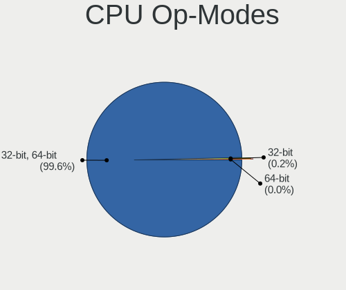
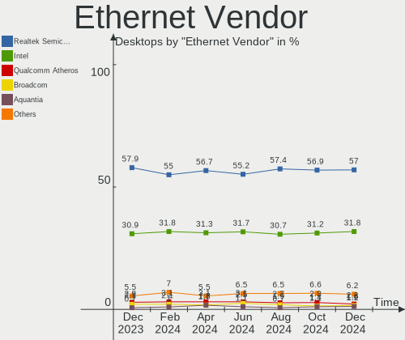

Linux - Hardware Trends (Desktops)
----------------------------------

A project to identify most popular hardware characteristics and track their change
over time based on data collected by Linux users at https://Linux-Hardware.org.

Anyone can contribute to this report by the [hw-probe](https://github.com/linuxhw/hw-probe) tool:

    sudo -E hw-probe -all -upload

This report is for one last month. Overall report since the beginning of time: [TestDays](https://github.com/linuxhw/TestDays)

Period: Dec, 2024.

Contents
--------

* [ System ](#system)
  - [ OS                       ](#os)
  - [ OS Family                ](#os-family)
  - [ Kernel                   ](#kernel)
  - [ Kernel Family            ](#kernel-family)
  - [ Kernel Major Ver.        ](#kernel-major-ver)
  - [ Arch                     ](#arch)
  - [ DE                       ](#de)
  - [ Display Server           ](#display-server)
  - [ Display Manager          ](#display-manager)
  - [ OS Lang                  ](#os-lang)
  - [ Boot Mode                ](#boot-mode)
  - [ Filesystem               ](#filesystem)
  - [ Part. scheme             ](#part-scheme)
  - [ Dual Boot with Linux/BSD ](#dual-boot-with-linuxbsd)
  - [ Dual Boot (Win)          ](#dual-boot-win)

* [ Board ](#board)
  - [ Vendor                   ](#vendor)
  - [ Model                    ](#model)
  - [ Model Family             ](#model-family)
  - [ MFG Year                 ](#mfg-year)
  - [ Form Factor              ](#form-factor)
  - [ Secure Boot              ](#secure-boot)
  - [ Coreboot                 ](#coreboot)
  - [ RAM Size                 ](#ram-size)
  - [ RAM Used                 ](#ram-used)
  - [ Total Drives             ](#total-drives)
  - [ Has CD-ROM               ](#has-cd-rom)
  - [ Has Ethernet             ](#has-ethernet)
  - [ Has WiFi                 ](#has-wifi)
  - [ Has Bluetooth            ](#has-bluetooth)

* [ Location ](#location)
  - [ Country                  ](#country)
  - [ City                     ](#city)

* [ Drives ](#drives)
  - [ Drive Vendor             ](#drive-vendor)
  - [ Drive Model              ](#drive-model)
  - [ HDD Vendor               ](#hdd-vendor)
  - [ SSD Vendor               ](#ssd-vendor)
  - [ Drive Kind               ](#drive-kind)
  - [ Drive Connector          ](#drive-connector)
  - [ Drive Size               ](#drive-size)
  - [ Space Total              ](#space-total)
  - [ Space Used               ](#space-used)
  - [ Malfunc. Drives          ](#malfunc-drives)
  - [ Malfunc. Drive Vendor    ](#malfunc-drive-vendor)
  - [ Malfunc. HDD Vendor      ](#malfunc-hdd-vendor)
  - [ Malfunc. Drive Kind      ](#malfunc-drive-kind)
  - [ Failed Drives            ](#failed-drives)
  - [ Failed Drive Vendor      ](#failed-drive-vendor)
  - [ Drive Status             ](#drive-status)

* [ Storage controller ](#storage-controller)
  - [ Storage Vendor           ](#storage-vendor)
  - [ Storage Model            ](#storage-model)
  - [ Storage Kind             ](#storage-kind)

* [ Processor ](#processor)
  - [ CPU Vendor               ](#cpu-vendor)
  - [ CPU Model                ](#cpu-model)
  - [ CPU Model Family         ](#cpu-model-family)
  - [ CPU Cores                ](#cpu-cores)
  - [ CPU Sockets              ](#cpu-sockets)
  - [ CPU Threads              ](#cpu-threads)
  - [ CPU Op-Modes             ](#cpu-op-modes)
  - [ CPU Microcode            ](#cpu-microcode)
  - [ CPU Microarch            ](#cpu-microarch)

* [ Graphics ](#graphics)
  - [ GPU Vendor               ](#gpu-vendor)
  - [ GPU Model                ](#gpu-model)
  - [ GPU Combo                ](#gpu-combo)
  - [ GPU Driver               ](#gpu-driver)
  - [ GPU Memory               ](#gpu-memory)

* [ Monitor ](#monitor)
  - [ Monitor Vendor           ](#monitor-vendor)
  - [ Monitor Model            ](#monitor-model)
  - [ Monitor Resolution       ](#monitor-resolution)
  - [ Monitor Diagonal         ](#monitor-diagonal)
  - [ Monitor Width            ](#monitor-width)
  - [ Aspect Ratio             ](#aspect-ratio)
  - [ Monitor Area             ](#monitor-area)
  - [ Pixel Density            ](#pixel-density)
  - [ Multiple Monitors        ](#multiple-monitors)

* [ Network ](#network)
  - [ Net Controller Vendor    ](#net-controller-vendor)
  - [ Net Controller Model     ](#net-controller-model)
  - [ Wireless Vendor          ](#wireless-vendor)
  - [ Wireless Model           ](#wireless-model)
  - [ Ethernet Vendor          ](#ethernet-vendor)
  - [ Ethernet Model           ](#ethernet-model)
  - [ Net Controller Kind      ](#net-controller-kind)
  - [ Used Controller          ](#used-controller)
  - [ NICs                     ](#nics)
  - [ IPv6                     ](#ipv6)

* [ Bluetooth ](#bluetooth)
  - [ Bluetooth Vendor         ](#bluetooth-vendor)
  - [ Bluetooth Model          ](#bluetooth-model)

* [ Sound ](#sound)
  - [ Sound Vendor             ](#sound-vendor)
  - [ Sound Model              ](#sound-model)

* [ Memory ](#memory)
  - [ Memory Vendor            ](#memory-vendor)
  - [ Memory Model             ](#memory-model)
  - [ Memory Kind              ](#memory-kind)
  - [ Memory Form Factor       ](#memory-form-factor)
  - [ Memory Size              ](#memory-size)
  - [ Memory Speed             ](#memory-speed)

* [ Printers & scanners ](#printers--scanners)
  - [ Printer Vendor           ](#printer-vendor)
  - [ Printer Model            ](#printer-model)
  - [ Scanner Vendor           ](#scanner-vendor)
  - [ Scanner Model            ](#scanner-model)

* [ Camera ](#camera)
  - [ Camera Vendor            ](#camera-vendor)
  - [ Camera Model             ](#camera-model)

* [ Security ](#security)
  - [ Fingerprint Vendor       ](#fingerprint-vendor)
  - [ Fingerprint Model        ](#fingerprint-model)
  - [ Chipcard Vendor          ](#chipcard-vendor)
  - [ Chipcard Model           ](#chipcard-model)

* [ Unsupported ](#unsupported)
  - [ Unsupported Devices      ](#unsupported-devices)
  - [ Unsupported Device Types ](#unsupported-device-types)

System
------

OS
--

Installed operating systems

| Name                         | Desktops | Percent |
|------------------------------|----------|---------|
| OpenMandriva 24.12           | 314      | 14.4%   |
| Ubuntu 24.04                 | 234      | 10.73%  |
| Fedora 41                    | 167      | 7.66%   |
| Debian 12                    | 125      | 5.73%   |
| Arch Rolling                 | 105      | 4.82%   |
| Pop!_OS 22.04                | 95       | 4.36%   |
| Linux Mint 22                | 95       | 4.36%   |
| Zorin 17                     | 73       | 3.35%   |
| Ubuntu 22.04                 | 62       | 2.84%   |
| ROSA 12.5.1                  | 52       | 2.39%   |
| Bazzite 41                   | 48       | 2.2%    |
| Ubuntu 24.10                 | 46       | 2.11%   |
| Linux Mint 21.3              | 35       | 1.61%   |
| OpenMandriva 5.0             | 32       | 1.47%   |
| Debian                       | 29       | 1.33%   |
| Kubuntu 24.04                | 27       | 1.24%   |
| Nobara 40                    | 26       | 1.19%   |
| KDE neon 24.04               | 26       | 1.19%   |
| ArcoLinux Rolling            | 24       | 1.1%    |
| OpenMandriva 23.08           | 22       | 1.01%   |
| Manjaro                      | 22       | 1.01%   |
| Fedora 40                    | 21       | 0.96%   |
| OpenMandriva 24.07           | 20       | 0.92%   |
| BlackPanther 18.1            | 19       | 0.87%   |
| openSUSE Tumbleweed-XXXXXXXX | 18       | 0.83%   |
| Elementary 8                 | 18       | 0.83%   |
| Ubuntu 20.04                 | 16       | 0.73%   |
| Kubuntu 24.10                | 16       | 0.73%   |
| Gentoo 2.17                  | 13       | 0.6%    |
| EndeavourOS Rolling          | 11       | 0.5%    |
| Manjaro 24.2.1               | 10       | 0.46%   |
| LMDE 6                       | 10       | 0.46%   |
| Xubuntu 24.04                | 9        | 0.41%   |
| Red OS 7.3                   | 9        | 0.41%   |
| openSUSE Leap-15.6           | 9        | 0.41%   |
| Kali 2024.4                  | 9        | 0.41%   |
| Fedora 42                    | 9        | 0.41%   |
| BlackPanther 22.1            | 9        | 0.41%   |
| Lubuntu 24.04                | 8        | 0.37%   |
| Garuda Linux Soaring         | 8        | 0.37%   |

OS Family
---------

OS without a version

| Name          | Desktops | Percent |
|---------------|----------|---------|
| OpenMandriva  | 409      | 18.76%  |
| Ubuntu        | 367      | 16.83%  |
| Fedora        | 201      | 9.22%   |
| Debian        | 163      | 7.48%   |
| Linux Mint    | 149      | 6.83%   |
| Arch          | 105      | 4.82%   |
| Pop!_OS       | 101      | 4.63%   |
| Zorin         | 79       | 3.62%   |
| ROSA          | 70       | 3.21%   |
| Kubuntu       | 49       | 2.25%   |
| Bazzite       | 49       | 2.25%   |
| Manjaro       | 41       | 1.88%   |
| openSUSE      | 30       | 1.38%   |
| Nobara        | 30       | 1.38%   |
| KDE neon      | 29       | 1.33%   |
| BlackPanther  | 28       | 1.28%   |
| Elementary    | 25       | 1.15%   |
| ArcoLinux     | 25       | 1.15%   |
| Garuda Linux  | 15       | 0.69%   |
| Red OS        | 14       | 0.64%   |
| Gentoo        | 14       | 0.64%   |
| Xubuntu       | 13       | 0.6%    |
| Ubuntu MATE   | 12       | 0.55%   |
| Kali          | 12       | 0.55%   |
| ALT Linux     | 12       | 0.55%   |
| EndeavourOS   | 11       | 0.5%    |
| NixOS         | 10       | 0.46%   |
| LMDE          | 10       | 0.46%   |
| Lubuntu       | 9        | 0.41%   |
| CachyOS       | 9        | 0.41%   |
| Slackware     | 6        | 0.28%   |
| MX            | 6        | 0.28%   |
| TUXEDO OS     | 5        | 0.23%   |
| Dts-distro    | 4        | 0.18%   |
| Vanilla       | 3        | 0.14%   |
| Ubuntu Budgie | 3        | 0.14%   |
| Drauger OS    | 3        | 0.14%   |
| Deepin        | 3        | 0.14%   |
| BigLinux      | 3        | 0.14%   |
| AlmaLinux     | 3        | 0.14%   |

Kernel
------

Version of the Linux kernel

| Version                           | Desktops | Percent |
|-----------------------------------|----------|---------|
| 6.12.1-desktop-1omv2490           | 293      | 13.44%  |
| 6.8.0-49-generic                  | 229      | 10.5%   |
| 6.8.0-51-generic                  | 146      | 6.7%    |
| 6.8.0-50-generic                  | 102      | 4.68%   |
| 6.9.3-76060903-generic            | 99       | 4.54%   |
| 6.1.0-28-amd64                    | 76       | 3.49%   |
| 6.11.10-300.fc41.x86_64           | 59       | 2.71%   |
| 6.6.47-generic-1rosa2021.1-x86_64 | 34       | 1.56%   |
| 6.12.4-arch1-1                    | 33       | 1.51%   |
| 6.6.2-desktop-1omv2390            | 32       | 1.47%   |
| 5.15.0-126-generic                | 30       | 1.38%   |
| 6.11.10-304.bazzite.fc41.x86_64   | 27       | 1.24%   |
| 6.11.0-13-generic                 | 27       | 1.24%   |
| 6.12.4-200.fc41.x86_64            | 25       | 1.15%   |
| 6.12.1-arch1-1                    | 25       | 1.15%   |
| 6.11.11-300.fc41.x86_64           | 24       | 1.1%    |
| 6.11.9-200.fsync.fc40.x86_64      | 23       | 1.06%   |
| 6.12.6-200.fc41.x86_64            | 22       | 1.01%   |
| 6.11.0-9-generic                  | 22       | 1.01%   |
| 6.8.0-41-generic                  | 19       | 0.87%   |
| 6.12.6-desktop-1omv2490           | 19       | 0.87%   |
| 6.10.0-desktop-1omv2490           | 19       | 0.87%   |
| 6.11.9-303.bazzite.fc41.x86_64    | 18       | 0.83%   |
| 6.11.8-1-default                  | 17       | 0.78%   |
| 6.11.4-301.fc41.x86_64            | 17       | 0.78%   |
| 6.1.0-27-amd64                    | 17       | 0.78%   |
| 6.12.4-1-MANJARO                  | 16       | 0.73%   |
| 6.12.1-zen1-1-zen                 | 16       | 0.73%   |
| 6.8.0-48-generic                  | 15       | 0.69%   |
| 6.12.5-200.fc41.x86_64            | 15       | 0.69%   |
| 6.11.10-amd64                     | 14       | 0.64%   |
| 6.4.8-desktop-2omv2390            | 12       | 0.55%   |
| 6.12.4-zen1-1-zen                 | 11       | 0.5%    |
| 6.6.27-generic-3rosa2021.1-x86_64 | 10       | 0.46%   |
| 6.4.11-desktop-1omv2390           | 10       | 0.46%   |
| 4.18.16-desktop-1bP               | 10       | 0.46%   |
| 6.8.12-4-pve                      | 9        | 0.41%   |
| 6.6.32-power-1bP                  | 9        | 0.41%   |
| 6.8.0-40-generic                  | 8        | 0.37%   |
| 6.8.0-38-generic                  | 8        | 0.37%   |

Kernel Family
-------------

Linux kernel without a distro release

| Version | Desktops | Percent |
|---------|----------|---------|
| 6.8.0   | 547      | 25.09%  |
| 6.12.1  | 347      | 15.92%  |
| 6.11.10 | 123      | 5.64%   |
| 6.1.0   | 111      | 5.09%   |
| 6.9.3   | 99       | 4.54%   |
| 6.12.4  | 91       | 4.17%   |
| 6.12.6  | 82       | 3.76%   |
| 6.11.0  | 74       | 3.39%   |
| 5.15.0  | 67       | 3.07%   |
| 6.11.9  | 47       | 2.16%   |
| 6.6.47  | 35       | 1.61%   |
| 6.11.11 | 33       | 1.51%   |
| 6.6.2   | 32       | 1.47%   |
| 6.12.5  | 32       | 1.47%   |
| 6.11.8  | 24       | 1.1%    |
| 6.12.3  | 20       | 0.92%   |
| 6.10.0  | 19       | 0.87%   |
| 6.8.12  | 18       | 0.83%   |
| 6.11.4  | 17       | 0.78%   |
| 6.6.63  | 16       | 0.73%   |
| 6.12.7  | 15       | 0.69%   |
| 5.4.0   | 15       | 0.69%   |
| 6.4.8   | 12       | 0.55%   |
| 6.13.0  | 11       | 0.5%    |
| 5.14.0  | 11       | 0.5%    |
| 6.6.27  | 10       | 0.46%   |
| 6.4.11  | 10       | 0.46%   |
| 4.18.16 | 10       | 0.46%   |
| 4.15.0  | 10       | 0.46%   |
| 6.6.65  | 9        | 0.41%   |
| 6.6.32  | 9        | 0.41%   |
| 6.11.2  | 9        | 0.41%   |
| 6.5.0   | 8        | 0.37%   |
| 6.4.0   | 8        | 0.37%   |
| 6.11.6  | 8        | 0.37%   |
| 5.6.14  | 8        | 0.37%   |
| 5.10.0  | 8        | 0.37%   |
| 6.11.5  | 7        | 0.32%   |
| 6.8.11  | 6        | 0.28%   |
| 5.16.7  | 6        | 0.28%   |

Kernel Major Ver.
-----------------

Linux kernel major version

| Version | Desktops | Percent |
|---------|----------|---------|
| 6.12    | 591      | 27.11%  |
| 6.8     | 580      | 26.61%  |
| 6.11    | 349      | 16.01%  |
| 6.6     | 140      | 6.42%   |
| 6.1     | 134      | 6.15%   |
| 6.9     | 111      | 5.09%   |
| 5.15    | 80       | 3.67%   |
| 6.10    | 31       | 1.42%   |
| 6.4     | 30       | 1.38%   |
| 5.10    | 19       | 0.87%   |
| 5.4     | 17       | 0.78%   |
| 5.14    | 12       | 0.55%   |
| 6.5     | 11       | 0.5%    |
| 6.13    | 11       | 0.5%    |
| 4.18    | 11       | 0.5%    |
| 4.15    | 10       | 0.46%   |
| 5.6     | 8        | 0.37%   |
| 6.2     | 7        | 0.32%   |
| 5.16    | 6        | 0.28%   |
| 5.19    | 5        | 0.23%   |
| 6.0     | 4        | 0.18%   |
| 6.7     | 3        | 0.14%   |
| 4.19    | 3        | 0.14%   |
| 5.17    | 2        | 0.09%   |
| 6       | 1        | 0.05%   |
| 5.8     | 1        | 0.05%   |
| 5.13    | 1        | 0.05%   |
| 5.11    | 1        | 0.05%   |
| 4.9     | 1        | 0.05%   |

Arch
----

OS architecture (x86_64, i586, etc.)

| Name        | Desktops | Percent |
|-------------|----------|---------|
| x86_64      | 2166     | 99.36%  |
| i686        | 9        | 0.41%   |
| loongarch64 | 3        | 0.14%   |
| riscv64     | 1        | 0.05%   |
| ppc64le     | 1        | 0.05%   |

DE
--

Desktop Environment

| Name             | Desktops | Percent |
|------------------|----------|---------|
| GNOME            | 778      | 35.69%  |
| Unknown          | 390      | 17.89%  |
| KDE6             | 284      | 13.03%  |
| KDE5             | 230      | 10.55%  |
| X-Cinnamon       | 145      | 6.65%   |
| XFCE             | 102      | 4.68%   |
| LXQt             | 66       | 3.03%   |
| MATE             | 52       | 2.39%   |
| Pantheon         | 26       | 1.19%   |
| Cinnamon         | 24       | 1.1%    |
| KDE              | 15       | 0.69%   |
| KDE4             | 8        | 0.37%   |
| Hyprland         | 8        | 0.37%   |
| COSMIC           | 8        | 0.37%   |
| Budgie           | 8        | 0.37%   |
| LXDE             | 7        | 0.32%   |
| i3               | 4        | 0.18%   |
| GNOME Classic    | 4        | 0.18%   |
| Trinity          | 2        | 0.09%   |
| sway             | 2        | 0.09%   |
| ICEWM            | 2        | 0.09%   |
| Endless:GNOME    | 2        | 0.09%   |
| DDE              | 2        | 0.09%   |
| chadwm           | 2        | 0.09%   |
| xmonad           | 1        | 0.05%   |
| Unity            | 1        | 0.05%   |
| lightdm-xsession | 1        | 0.05%   |
| gtk              | 1        | 0.05%   |
| fly              | 1        | 0.05%   |
| Enlightenment    | 1        | 0.05%   |
| Deepin           | 1        | 0.05%   |
| bspwm            | 1        | 0.05%   |
| awesome          | 1        | 0.05%   |

Display Server
--------------

X11 or Wayland

| Name    | Desktops | Percent |
|---------|----------|---------|
| X11     | 1044     | 47.89%  |
| Wayland | 1013     | 46.47%  |
| Tty     | 84       | 3.85%   |
| Unknown | 37       | 1.7%    |
| Web     | 2        | 0.09%   |

Display Manager
---------------

SDDM, LightDM, etc.

| Name           | Desktops | Percent |
|----------------|----------|---------|
| Unknown        | 724      | 33.21%  |
| SDDM           | 650      | 29.82%  |
| GDM3           | 377      | 17.29%  |
| LightDM        | 254      | 11.65%  |
| GDM            | 158      | 7.25%   |
| XDM            | 3        | 0.14%   |
| KDM            | 3        | 0.14%   |
| TDM            | 2        | 0.09%   |
| LXDM           | 2        | 0.09%   |
| GREETD         | 2        | 0.09%   |
| COSMIC-GREETER | 2        | 0.09%   |
| WDM            | 1        | 0.05%   |
| SLiM           | 1        | 0.05%   |
| LY-DM          | 1        | 0.05%   |

OS Lang
-------

Language

| Lang    | Desktops | Percent |
|---------|----------|---------|
| en_US   | 976      | 44.77%  |
| de_DE   | 175      | 8.03%   |
| ru_RU   | 172      | 7.89%   |
| en_GB   | 101      | 4.63%   |
| fr_FR   | 92       | 4.22%   |
| it_IT   | 85       | 3.9%    |
| pt_BR   | 78       | 3.58%   |
| C       | 57       | 2.61%   |
| es_ES   | 52       | 2.39%   |
| Unknown | 50       | 2.29%   |
| pl_PL   | 44       | 2.02%   |
| en_CA   | 44       | 2.02%   |
| en_AU   | 42       | 1.93%   |
| es_MX   | 15       | 0.69%   |
| cs_CZ   | 13       | 0.6%    |
| en_NZ   | 12       | 0.55%   |
| es_AR   | 11       | 0.5%    |
| tr_TR   | 10       | 0.46%   |
| hu_HU   | 10       | 0.46%   |
| de_AT   | 10       | 0.46%   |
| en_ZA   | 9        | 0.41%   |
| en_IN   | 9        | 0.41%   |
| nl_NL   | 8        | 0.37%   |
| de_CH   | 7        | 0.32%   |
| nl_BE   | 6        | 0.28%   |
| ja_JP   | 5        | 0.23%   |
| fi_FI   | 5        | 0.23%   |
| pt_PT   | 4        | 0.18%   |
| fr_CA   | 4        | 0.18%   |
| fr_BE   | 4        | 0.18%   |
| es_VE   | 4        | 0.18%   |
| en_IE   | 4        | 0.18%   |
| da_DK   | 4        | 0.18%   |
| sv_SE   | 3        | 0.14%   |
| ru_UA   | 3        | 0.14%   |
| ro_RO   | 3        | 0.14%   |
| en_SG   | 3        | 0.14%   |
| sk_SK   | 2        | 0.09%   |
| nn_NO   | 2        | 0.09%   |
| nb_NO   | 2        | 0.09%   |

Boot Mode
---------

EFI or BIOS

| Mode | Desktops | Percent |
|------|----------|---------|
| BIOS | 1270     | 58.26%  |
| EFI  | 910      | 41.74%  |

Filesystem
----------

Type of filesystem

| Type    | Desktops | Percent |
|---------|----------|---------|
| Ext4    | 1147     | 52.61%  |
| Btrfs   | 395      | 18.12%  |
| Tmpfs   | 307      | 14.08%  |
| Overlay | 275      | 12.61%  |
| Xfs     | 31       | 1.42%   |
| Zfs     | 11       | 0.5%    |
| F2fs    | 5        | 0.23%   |
| Ext3    | 3        | 0.14%   |
| Unknown | 2        | 0.09%   |
| Rootfs  | 1        | 0.05%   |
| Jfs     | 1        | 0.05%   |
| Ext2    | 1        | 0.05%   |
| Aufs    | 1        | 0.05%   |

Part. scheme
------------

Scheme of partitioning

| Type    | Desktops | Percent |
|---------|----------|---------|
| GPT     | 1279     | 58.67%  |
| Unknown | 651      | 29.86%  |
| MBR     | 250      | 11.47%  |

Dual Boot with Linux/BSD
------------------------

Hosting more than one Linux/BSD

| Dual boot | Desktops | Percent |
|-----------|----------|---------|
| No        | 1683     | 77.2%   |
| Yes       | 497      | 22.8%   |

Dual Boot (Win)
---------------

Hosting Linux and Windows

| Dual boot | Desktops | Percent |
|-----------|----------|---------|
| No        | 1470     | 67.43%  |
| Yes       | 710      | 32.57%  |

Board
-----

Vendor
------

Motherboard manufacturer

| Name                                 | Desktops | Percent |
|--------------------------------------|----------|---------|
| ASUSTek Computer                     | 531      | 24.36%  |
| Gigabyte Technology                  | 356      | 16.33%  |
| MSI                                  | 288      | 13.21%  |
| ASRock                               | 199      | 9.13%   |
| Dell                                 | 176      | 8.07%   |
| Hewlett-Packard                      | 167      | 7.66%   |
| Lenovo                               | 77       | 3.53%   |
| Intel                                | 60       | 2.75%   |
| Unknown                              | 48       | 2.2%    |
| Acer                                 | 26       | 1.19%   |
| AZW                                  | 20       | 0.92%   |
| Biostar                              | 19       | 0.87%   |
| Foxconn                              | 15       | 0.69%   |
| Fujitsu                              | 13       | 0.6%    |
| Shenzhen Meigao Electronic Equipment | 10       | 0.46%   |
| Pegatron                             | 10       | 0.46%   |
| Medion                               | 10       | 0.46%   |
| Supermicro                           | 9        | 0.41%   |
| Huanan                               | 9        | 0.41%   |
| GEEKOM                               | 9        | 0.41%   |
| MACHINIST                            | 7        | 0.32%   |
| AMI                                  | 7        | 0.32%   |
| ECS                                  | 6        | 0.28%   |
| JGINYUE                              | 4        | 0.18%   |
| Fujitsu Siemens                      | 4        | 0.18%   |
| Apple                                | 4        | 0.18%   |
| Shuttle                              | 3        | 0.14%   |
| Positivo                             | 3        | 0.14%   |
| Packard Bell                         | 3        | 0.14%   |
| Loongson                             | 3        | 0.14%   |
| DEPO Computers                       | 3        | 0.14%   |
| BESSTAR Tech                         | 3        | 0.14%   |
| Win Element                          | 2        | 0.09%   |
| TianBei                              | 2        | 0.09%   |
| System76                             | 2        | 0.09%   |
| PELADN                               | 2        | 0.09%   |
| OEM                                  | 2        | 0.09%   |
| MAXSUN                               | 2        | 0.09%   |
| Graviton                             | 2        | 0.09%   |
| Google                               | 2        | 0.09%   |

Model
-----

Motherboard model

| Name                            | Desktops | Percent |
|---------------------------------|----------|---------|
| Unknown                         | 53       | 2.43%   |
| ASUS All Series                 | 33       | 1.51%   |
| MSI MS-7C56                     | 14       | 0.64%   |
| Dell OptiPlex 9020              | 14       | 0.64%   |
| Dell OptiPlex 7010              | 12       | 0.55%   |
| AZW MINI S                      | 11       | 0.5%    |
| ASUS TUF Gaming X570-PLUS       | 11       | 0.5%    |
| ASUS PRIME A320M-K              | 11       | 0.5%    |
| MSI MS-7C37                     | 9        | 0.41%   |
| Dell OptiPlex 3050              | 9        | 0.41%   |
| MSI MS-7C02                     | 8        | 0.37%   |
| MSI MS-7A38                     | 8        | 0.37%   |
| ASUS TUF Gaming B550M-PLUS      | 8        | 0.37%   |
| ASUS ROG STRIX B550-F GAMING    | 8        | 0.37%   |
| MSI MS-7E51                     | 7        | 0.32%   |
| MSI MS-7C95                     | 7        | 0.32%   |
| MSI MS-7B89                     | 7        | 0.32%   |
| Intel X99                       | 7        | 0.32%   |
| Gigabyte B450M DS3H             | 7        | 0.32%   |
| Dell OptiPlex 780               | 7        | 0.32%   |
| AMI Intel                       | 7        | 0.32%   |
| MSI MS-7E26                     | 6        | 0.28%   |
| MSI MS-7D75                     | 6        | 0.28%   |
| MSI MS-7D25                     | 6        | 0.28%   |
| MSI MS-7B86                     | 6        | 0.28%   |
| MSI MS-7996                     | 6        | 0.28%   |
| Intel H61                       | 6        | 0.28%   |
| HP EliteDesk 800 G2 SFF         | 6        | 0.28%   |
| HP EliteDesk 800 G1 SFF         | 6        | 0.28%   |
| HP Compaq 8000 Elite SFF PC     | 6        | 0.28%   |
| Gigabyte B550M DS3H             | 6        | 0.28%   |
| Gigabyte B550M AORUS ELITE      | 6        | 0.28%   |
| Gigabyte B550 AORUS ELITE AX V2 | 6        | 0.28%   |
| Gigabyte B450M DS3H V2          | 6        | 0.28%   |
| Dell Precision Tower 3620       | 6        | 0.28%   |
| Dell OptiPlex 3010              | 6        | 0.28%   |
| ASUS PRIME B450M-A              | 6        | 0.28%   |
| ASUS P8Z77-V LX                 | 6        | 0.28%   |
| MSI MS-7E12                     | 5        | 0.23%   |
| MSI MS-7C52                     | 5        | 0.23%   |

Model Family
------------

Motherboard model prefix

| Name               | Desktops | Percent |
|--------------------|----------|---------|
| ASUS PRIME         | 120      | 5.5%    |
| Dell OptiPlex      | 116      | 5.32%   |
| ASUS ROG           | 91       | 4.17%   |
| ASUS TUF           | 83       | 3.81%   |
| Unknown            | 53       | 2.43%   |
| Lenovo ThinkCentre | 50       | 2.29%   |
| HP Compaq          | 44       | 2.02%   |
| HP EliteDesk       | 34       | 1.56%   |
| ASUS All           | 33       | 1.51%   |
| Dell Precision     | 29       | 1.33%   |
| HP ProDesk         | 27       | 1.24%   |
| Gigabyte B450M     | 23       | 1.06%   |
| Gigabyte B550M     | 22       | 1.01%   |
| Gigabyte B550      | 19       | 0.87%   |
| ASUS P8Z77-V       | 17       | 0.78%   |
| Gigabyte X570      | 16       | 0.73%   |
| MSI MS-7C56        | 14       | 0.64%   |
| HP Pavilion        | 13       | 0.6%    |
| ASUS ProArt        | 13       | 0.6%    |
| Gigabyte B650      | 12       | 0.55%   |
| Fujitsu ESPRIMO    | 12       | 0.55%   |
| Dell Inspiron      | 12       | 0.55%   |
| Gigabyte B450      | 11       | 0.5%    |
| AZW MINI           | 11       | 0.5%    |
| ASUS M5A78L-M      | 11       | 0.5%    |
| ASRock B450        | 11       | 0.5%    |
| Acer Aspire        | 11       | 0.5%    |
| ASRock X570        | 10       | 0.46%   |
| MSI MS-7C37        | 9        | 0.41%   |
| Lenovo IdeaCentre  | 9        | 0.41%   |
| ASRock B650M       | 9        | 0.41%   |
| ASRock B450M       | 9        | 0.41%   |
| MSI MS-7C02        | 8        | 0.37%   |
| MSI MS-7A38        | 8        | 0.37%   |
| Intel X99          | 8        | 0.37%   |
| Gigabyte Z390      | 8        | 0.37%   |
| Dell XPS           | 8        | 0.37%   |
| MSI MS-7E51        | 7        | 0.32%   |
| MSI MS-7C95        | 7        | 0.32%   |
| MSI MS-7B89        | 7        | 0.32%   |

MFG Year
--------

Motherboard manufacture year

| Year    | Desktops | Percent |
|---------|----------|---------|
| 2020    | 203      | 9.31%   |
| 2018    | 196      | 8.99%   |
| 2022    | 181      | 8.3%    |
| 2023    | 165      | 7.57%   |
| 2012    | 151      | 6.93%   |
| 2024    | 145      | 6.65%   |
| 2021    | 142      | 6.51%   |
| 2019    | 142      | 6.51%   |
| 2017    | 131      | 6.01%   |
| 2013    | 126      | 5.78%   |
| 2014    | 116      | 5.32%   |
| 2011    | 91       | 4.17%   |
| 2010    | 78       | 3.58%   |
| 2016    | 76       | 3.49%   |
| 2015    | 76       | 3.49%   |
| 2009    | 66       | 3.03%   |
| 2008    | 45       | 2.06%   |
| 2007    | 28       | 1.28%   |
| 2006    | 12       | 0.55%   |
| Unknown | 4        | 0.18%   |
| 2005    | 3        | 0.14%   |
| 2004    | 1        | 0.05%   |
| 2003    | 1        | 0.05%   |
| 2002    | 1        | 0.05%   |

Form Factor
-----------

Physical design of the computer

| Name    | Desktops | Percent |
|---------|----------|---------|
| Desktop | 2180     | 100%    |

Secure Boot
-----------

Enabled or disabled

| State    | Desktops | Percent |
|----------|----------|---------|
| Disabled | 2128     | 97.61%  |
| Enabled  | 52       | 2.39%   |

Coreboot
--------

Have coreboot on board

| Used | Desktops | Percent |
|------|----------|---------|
| No   | 2178     | 99.91%  |
| Yes  | 2        | 0.09%   |

RAM Size
--------

Total RAM memory

| Size in GB      | Desktops | Percent |
|-----------------|----------|---------|
| 16.01-24.0      | 557      | 25.55%  |
| 32.01-64.0      | 532      | 24.4%   |
| 8.01-16.0       | 293      | 13.44%  |
| 4.01-8.0        | 250      | 11.47%  |
| 64.01-256.0     | 212      | 9.72%   |
| 3.01-4.0        | 151      | 6.93%   |
| 24.01-32.0      | 148      | 6.79%   |
| 1.01-2.0        | 19       | 0.87%   |
| 2.01-3.0        | 12       | 0.55%   |
| More than 256.0 | 3        | 0.14%   |
| 0.51-1.0        | 3        | 0.14%   |

RAM Used
--------

Used RAM memory

| Used GB     | Desktops | Percent |
|-------------|----------|---------|
| 1.01-2.0    | 517      | 23.72%  |
| 4.01-8.0    | 501      | 22.98%  |
| 2.01-3.0    | 499      | 22.89%  |
| 3.01-4.0    | 324      | 14.86%  |
| 8.01-16.0   | 156      | 7.16%   |
| 0.51-1.0    | 94       | 4.31%   |
| 16.01-24.0  | 35       | 1.61%   |
| 24.01-32.0  | 19       | 0.87%   |
| 0.01-0.5    | 17       | 0.78%   |
| 32.01-64.0  | 14       | 0.64%   |
| 64.01-256.0 | 4        | 0.18%   |

Total Drives
------------

Number of drives on board

| Drives | Desktops | Percent |
|--------|----------|---------|
| 1      | 753      | 34.54%  |
| 2      | 644      | 29.54%  |
| 3      | 359      | 16.47%  |
| 4      | 224      | 10.28%  |
| 5      | 85       | 3.9%    |
| 6      | 47       | 2.16%   |
| 0      | 28       | 1.28%   |
| 7      | 18       | 0.83%   |
| 8      | 9        | 0.41%   |
| 9      | 5        | 0.23%   |
| 10     | 4        | 0.18%   |
| 14     | 2        | 0.09%   |
| 22     | 1        | 0.05%   |
| 11     | 1        | 0.05%   |

Has CD-ROM
----------

Has CD-ROM on board

| Presented | Desktops | Percent |
|-----------|----------|---------|
| No        | 1409     | 64.63%  |
| Yes       | 771      | 35.37%  |

Has Ethernet
------------

Has Ethernet on board

| Presented | Desktops | Percent |
|-----------|----------|---------|
| Yes       | 2163     | 99.22%  |
| No        | 17       | 0.78%   |

Has WiFi
--------

Has WiFi module

| Presented | Desktops | Percent |
|-----------|----------|---------|
| No        | 1113     | 51.06%  |
| Yes       | 1067     | 48.94%  |

Has Bluetooth
-------------

Has Bluetooth module

| Presented | Desktops | Percent |
|-----------|----------|---------|
| No        | 1237     | 56.74%  |
| Yes       | 943      | 43.26%  |

Location
--------

Country
-------

Geographic location (country)

| Country      | Desktops | Percent |
|--------------|----------|---------|
| USA          | 444      | 20.37%  |
| Germany      | 224      | 10.28%  |
| Russia       | 199      | 9.13%   |
| Brazil       | 109      | 5%      |
| France       | 105      | 4.82%   |
| Italy        | 99       | 4.54%   |
| Canada       | 91       | 4.17%   |
| UK           | 79       | 3.62%   |
| Spain        | 65       | 2.98%   |
| Poland       | 63       | 2.89%   |
| Australia    | 57       | 2.61%   |
| Hungary      | 49       | 2.25%   |
| Netherlands  | 32       | 1.47%   |
| India        | 30       | 1.38%   |
| Austria      | 29       | 1.33%   |
| Belgium      | 25       | 1.15%   |
| Sweden       | 22       | 1.01%   |
| Romania      | 22       | 1.01%   |
| Mexico       | 21       | 0.96%   |
| Czechia      | 21       | 0.96%   |
| Finland      | 19       | 0.87%   |
| Argentina    | 17       | 0.78%   |
| Japan        | 15       | 0.69%   |
| Turkey       | 14       | 0.64%   |
| Switzerland  | 14       | 0.64%   |
| Norway       | 14       | 0.64%   |
| New Zealand  | 14       | 0.64%   |
| China        | 12       | 0.55%   |
| Ukraine      | 11       | 0.5%    |
| South Africa | 11       | 0.5%    |
| Serbia       | 11       | 0.5%    |
| Malaysia     | 11       | 0.5%    |
| Greece       | 11       | 0.5%    |
| Ireland      | 10       | 0.46%   |
| Denmark      | 10       | 0.46%   |
| Venezuela    | 9        | 0.41%   |
| Slovakia     | 9        | 0.41%   |
| Indonesia    | 9        | 0.41%   |
| Portugal     | 8        | 0.37%   |
| Chile        | 8        | 0.37%   |

City
----

Geographic location (city)

| City          | Desktops | Percent |
|---------------|----------|---------|
| Moscow        | 44       | 2.02%   |
| Berlin        | 24       | 1.1%    |
| Sydney        | 22       | 1.01%   |
| St Petersburg | 18       | 0.83%   |
| Vienna        | 16       | 0.73%   |
| Budapest      | 16       | 0.73%   |
| Melbourne     | 14       | 0.64%   |
| Amsterdam     | 13       | 0.6%    |
| Los Angeles   | 12       | 0.55%   |
| Munich        | 11       | 0.5%    |
| Rome          | 10       | 0.46%   |
| Prague        | 10       | 0.46%   |
| Paris         | 10       | 0.46%   |
| Helsinki      | 10       | 0.46%   |
| Warsaw        | 9        | 0.41%   |
| Toronto       | 9        | 0.41%   |
| Rostov-on-Don | 9        | 0.41%   |
| Milan         | 9        | 0.41%   |
| Atlanta       | 9        | 0.41%   |
| Sao Paulo     | 8        | 0.37%   |
| Leipzig       | 8        | 0.37%   |
| Dublin        | 8        | 0.37%   |
| Dallas        | 8        | 0.37%   |
| Brisbane      | 8        | 0.37%   |
| Barcelona     | 8        | 0.37%   |
| Turin         | 7        | 0.32%   |
| Singapore     | 7        | 0.32%   |
| Naples        | 7        | 0.32%   |
| Montreal      | 7        | 0.32%   |
| Chicago       | 7        | 0.32%   |
| Stockholm     | 6        | 0.28%   |
| Pune          | 6        | 0.28%   |
| Minneapolis   | 6        | 0.28%   |
| Milano        | 6        | 0.28%   |
| Mexico City   | 6        | 0.28%   |
| Hanover       | 6        | 0.28%   |
| Chelyabinsk   | 6        | 0.28%   |
| Buenos Aires  | 6        | 0.28%   |
| Belgrade      | 6        | 0.28%   |
| Auckland      | 6        | 0.28%   |

Drives
------

Drive Vendor
------------

Hard drive vendors

| Vendor                       | Desktops | Drives | Percent |
|------------------------------|----------|--------|---------|
| WDC                          | 629      | 826    | 15.15%  |
| Samsung Electronics          | 593      | 852    | 14.29%  |
| Seagate                      | 588      | 786    | 14.17%  |
| SanDisk                      | 268      | 301    | 6.46%   |
| Kingston                     | 246      | 284    | 5.93%   |
| Crucial                      | 183      | 206    | 4.41%   |
| Toshiba                      | 174      | 200    | 4.19%   |
| Hitachi                      | 88       | 106    | 2.12%   |
| Phison Electronics           | 87       | 99     | 2.1%    |
| Micron/Crucial Technology    | 71       | 77     | 1.71%   |
| Unknown                      | 64       | 89     | 1.54%   |
| Kingston Technology Company  | 62       | 67     | 1.49%   |
| China                        | 62       | 63     | 1.49%   |
| A-DATA Technology            | 62       | 68     | 1.49%   |
| Intel                        | 58       | 74     | 1.4%    |
| MAXIO Technology (Hangzhou)  | 47       | 55     | 1.13%   |
| Silicon Motion               | 44       | 44     | 1.06%   |
| SK hynix                     | 35       | 40     | 0.84%   |
| SPCC                         | 34       | 34     | 0.82%   |
| HGST                         | 32       | 37     | 0.77%   |
| PNY                          | 30       | 31     | 0.72%   |
| Micron Technology            | 28       | 30     | 0.67%   |
| ADATA Technology             | 28       | 31     | 0.67%   |
| Patriot                      | 27       | 27     | 0.65%   |
| GOODRAM                      | 27       | 28     | 0.65%   |
| Intenso                      | 25       | 27     | 0.6%    |
| Team                         | 24       | 27     | 0.58%   |
| Realtek Semiconductor        | 23       | 25     | 0.55%   |
| Unknown                      | 23       | 24     | 0.55%   |
| Fanxiang                     | 19       | 23     | 0.46%   |
| Netac                        | 18       | 18     | 0.43%   |
| Apacer                       | 18       | 19     | 0.43%   |
| OCZ                          | 17       | 18     | 0.41%   |
| Lexar                        | 17       | 17     | 0.41%   |
| Shenzhen Longsys Electronics | 16       | 16     | 0.39%   |
| JMicron Technology           | 15       | 17     | 0.36%   |
| Maxtor                       | 14       | 15     | 0.34%   |
| KingSpec                     | 13       | 13     | 0.31%   |
| Transcend                    | 12       | 12     | 0.29%   |
| Hewlett-Packard              | 12       | 16     | 0.29%   |

Drive Model
-----------

Hard drive models

| Model                                                 | Desktops | Percent |
|-------------------------------------------------------|----------|---------|
| Samsung NVMe SSD Controller SM981/PM981/PM983 512GB   | 96       | 2.01%   |
| Samsung NVMe SSD Controller PM9A1/PM9A3/980PRO 512GB  | 65       | 1.36%   |
| Kingston SA400S37240G 240GB SSD                       | 44       | 0.92%   |
| Seagate ST500DM002-1BD142 500GB                       | 43       | 0.9%    |
| Seagate ST2000DM008-2FR102 2TB                        | 43       | 0.9%    |
| Kingston SA400S37480G 480GB SSD                       | 41       | 0.86%   |
| Seagate ST1000DM010-2EP102 1TB                        | 39       | 0.82%   |
| Samsung SSD 850 EVO 250GB                             | 35       | 0.73%   |
| Silicon Motion SM2263EN/SM2263XT SSD Controller 256GB | 33       | 0.69%   |
| Micron/Crucial P2 NVMe PCIe SSD 500GB                 | 33       | 0.69%   |
| Samsung SSD 860 EVO 500GB                             | 31       | 0.65%   |
| Toshiba DT01ACA100 1TB                                | 30       | 0.63%   |
| Samsung SSD 860 EVO 1TB                               | 30       | 0.63%   |
| Kingston Company SNV2S1000G 1TB                       | 30       | 0.63%   |
| Samsung SSD 850 EVO 500GB                             | 27       | 0.56%   |
| MAXIO (Hangzhou) NVMe SSD Controller MAP1202 512GB    | 27       | 0.56%   |
| Phison E12 NVMe Controller 480GB                      | 25       | 0.52%   |
| Crucial CT500MX500SSD1 500GB                          | 25       | 0.52%   |
| Toshiba HDWD110 1TB                                   | 24       | 0.5%    |
| Seagate ST4000DM004-2CV104 4TB                        | 24       | 0.5%    |
| Seagate ST1000DM003-1CH162 1TB                        | 24       | 0.5%    |
| Samsung SSD 980 1TB                                   | 24       | 0.5%    |
| Crucial CT240BX500SSD1 240GB                          | 23       | 0.48%   |
| Unknown                                               | 23       | 0.48%   |
| Samsung NVMe SSD Controller SM961/PM961/SM963 256GB   | 22       | 0.46%   |
| WDC WD10EZEX-08WN4A0 1TB                              | 21       | 0.44%   |
| Seagate ST2000DM008-2UB102 2TB                        | 21       | 0.44%   |
| Samsung SSD 990 PRO 1TB                               | 20       | 0.42%   |
| Kingston SA400S37120G 120GB SSD                       | 20       | 0.42%   |
| Samsung SSD 990 PRO 2TB                               | 18       | 0.38%   |
| Samsung SSD 840 EVO 250GB                             | 18       | 0.38%   |
| Phison E16 PCIe4 NVMe Controller 1TB                  | 18       | 0.38%   |
| Kingston SNV2S500G 500GB                              | 18       | 0.38%   |
| Kingston SA400S37960G 960GB SSD                       | 18       | 0.38%   |
| Crucial CT1000BX500SSD1 1TB                           | 18       | 0.38%   |
| WDC WDS240G2G0A-00JH30 240GB SSD                      | 17       | 0.36%   |
| Seagate ST1000DM003-1ER162 1TB                        | 17       | 0.36%   |
| Sandisk WD Blue SN550 NVMe SSD 256GB                  | 17       | 0.36%   |
| Crucial CT1000MX500SSD1 1TB                           | 17       | 0.36%   |
| Samsung SSD 870 EVO 500GB                             | 16       | 0.33%   |

HDD Vendor
----------

Hard disk drive vendors

| Vendor              | Desktops | Drives  | Percent |
|---------------------|----------|---------|---------|
| Seagate             | 573      | 761     | 37.35%  |
| WDC                 | 540      | 693     | 35.2%   |
| Toshiba             | 153      | 178     | 9.97%   |
| Hitachi             | 88       | 106     | 5.74%   |
| Samsung Electronics | 65       | 70      | 4.24%   |
| HGST                | 32       | 37      | 2.09%   |
| Unknown             | 16       | 17      | 1.04%   |
| Maxtor              | 14       | 15      | 0.91%   |
| JMicron Technology  | 13       | 15      | 0.85%   |
| SABRENT             | 8        | 10      | 0.52%   |
| Hewlett-Packard     | 6        | 9       | 0.39%   |
| Fujitsu             | 4        | 4       | 0.26%   |
| Apple               | 3        | 3       | 0.2%    |
| External            | 2        | 2       | 0.13%   |
| ASMT                | 2        | 4       | 0.13%   |
| WD MediaMax         | 1        | 1       | 0.07%   |
| Verbatim            | 1        | 1       | 0.07%   |
| TO Exter            | 1        | 1       | 0.07%   |
| StoreJet            | 1        | 1       | 0.07%   |
| SAGE                | 1        | Unknown | 0.07%   |
| RSH-319             | 1        | 1       | 0.07%   |
| QUANTUM             | 1        | 1       | 0.07%   |
| KESU                | 1        | 1       | 0.07%   |
| Intenso             | 1        | 1       | 0.07%   |
| Inateck             | 1        | 2       | 0.07%   |
| HPE                 | 1        | 1       | 0.07%   |
| HGST HTS            | 1        | 1       | 0.07%   |
| ExcelStor           | 1        | 1       | 0.07%   |
| 256MB               | 1        | 1       | 0.07%   |
| Unknown             | 1        | 1       | 0.07%   |

SSD Vendor
----------

Solid state drive vendors

| Vendor              | Desktops | Drives | Percent |
|---------------------|----------|--------|---------|
| Samsung Electronics | 310      | 383    | 21.16%  |
| Kingston            | 174      | 201    | 11.88%  |
| Crucial             | 163      | 179    | 11.13%  |
| WDC                 | 105      | 117    | 7.17%   |
| SanDisk             | 99       | 110    | 6.76%   |
| China               | 62       | 63     | 4.23%   |
| A-DATA Technology   | 51       | 55     | 3.48%   |
| SPCC                | 31       | 31     | 2.12%   |
| PNY                 | 30       | 31     | 2.05%   |
| Intel               | 29       | 40     | 1.98%   |
| GOODRAM             | 27       | 28     | 1.84%   |
| Patriot             | 24       | 24     | 1.64%   |
| Intenso             | 23       | 25     | 1.57%   |
| Team                | 18       | 19     | 1.23%   |
| OCZ                 | 17       | 18     | 1.16%   |
| Apacer              | 14       | 14     | 0.96%   |
| Netac               | 13       | 13     | 0.89%   |
| KingSpec            | 13       | 13     | 0.89%   |
| Unknown             | 13       | 13     | 0.89%   |
| Toshiba             | 12       | 12     | 0.82%   |
| SK hynix            | 11       | 11     | 0.75%   |
| Fanxiang            | 11       | 13     | 0.75%   |
| Micron Technology   | 10       | 11     | 0.68%   |
| Transcend           | 9        | 9      | 0.61%   |
| Plextor             | 9        | 10     | 0.61%   |
| Seagate             | 8        | 9      | 0.55%   |
| LITEON              | 8        | 8      | 0.55%   |
| Lexar               | 7        | 7      | 0.48%   |
| Emtec               | 7        | 8      | 0.48%   |
| KIOXIA-EXCERIA      | 6        | 6      | 0.41%   |
| Gigabyte Technology | 5        | 5      | 0.34%   |
| Corsair             | 5        | 5      | 0.34%   |
| Verbatim            | 4        | 5      | 0.27%   |
| T-FORCE             | 4        | 4      | 0.27%   |
| HS-SSD-C100         | 4        | 4      | 0.27%   |
| Hewlett-Packard     | 4        | 4      | 0.27%   |
| BR                  | 4        | 4      | 0.27%   |
| AMD                 | 4        | 4      | 0.27%   |
| Timetec             | 3        | 3      | 0.2%    |
| SD                  | 3        | 3      | 0.2%    |

Drive Kind
----------

HDD or SSD

| Kind    | Desktops | Drives | Percent |
|---------|----------|--------|---------|
| SSD     | 1211     | 1638   | 34.49%  |
| HDD     | 1207     | 1939   | 34.38%  |
| NVMe    | 1009     | 1391   | 28.74%  |
| Unknown | 77       | 104    | 2.19%   |
| MMC     | 7        | 7      | 0.2%    |

Drive Connector
---------------

SATA, SAS, NVMe, etc.

| Type | Desktops | Drives | Percent |
|------|----------|--------|---------|
| SATA | 1772     | 3464   | 59.91%  |
| NVMe | 1007     | 1380   | 34.04%  |
| SAS  | 172      | 228    | 5.81%   |
| MMC  | 7        | 7      | 0.24%   |

Drive Size
----------

Size of hard drive

| Size in TB | Desktops | Drives | Percent |
|------------|----------|--------|---------|
| 0.01-0.5   | 1216     | 1727   | 45.83%  |
| 0.51-1.0   | 741      | 934    | 27.93%  |
| 1.01-2.0   | 342      | 428    | 12.89%  |
| 3.01-4.0   | 147      | 182    | 5.54%   |
| 4.01-10.0  | 107      | 155    | 4.03%   |
| 2.01-3.0   | 58       | 76     | 2.19%   |
| 10.01-20.0 | 42       | 75     | 1.58%   |

Space Total
-----------

Amount of disk space available on the file system

| Size in GB     | Desktops | Percent |
|----------------|----------|---------|
| 501-1000       | 359      | 16.47%  |
| More than 3000 | 349      | 16.01%  |
| 101-250        | 340      | 15.6%   |
| 251-500        | 335      | 15.37%  |
| 1001-2000      | 272      | 12.48%  |
| 1-20           | 225      | 10.32%  |
| 2001-3000      | 130      | 5.96%   |
| 51-100         | 70       | 3.21%   |
| Unknown        | 67       | 3.07%   |
| 21-50          | 33       | 1.51%   |

Space Used
----------

Amount of used disk space

| Used GB        | Desktops | Percent |
|----------------|----------|---------|
| 1-20           | 726      | 33.3%   |
| 21-50          | 260      | 11.93%  |
| 101-250        | 245      | 11.24%  |
| 251-500        | 188      | 8.62%   |
| 501-1000       | 176      | 8.07%   |
| 51-100         | 167      | 7.66%   |
| 1001-2000      | 140      | 6.42%   |
| More than 3000 | 135      | 6.19%   |
| 2001-3000      | 69       | 3.17%   |
| Unknown        | 67       | 3.07%   |
| 0              | 7        | 0.32%   |

Malfunc. Drives
---------------

Drive models with a malfunction

| Model                               | Desktops | Drives | Percent |
|-------------------------------------|----------|--------|---------|
| Seagate ST500DM002-1BD142 500GB     | 20       | 21     | 5.25%   |
| Seagate ST1000DM003-1ER162 1TB      | 4        | 4      | 1.05%   |
| WDC WDS240G2G0A-00JH30 240GB SSD    | 3        | 3      | 0.79%   |
| WDC WD30EFRX-68EUZN0 3TB            | 3        | 4      | 0.79%   |
| WDC WD10EZEX-60ZF5A0 1TB            | 3        | 3      | 0.79%   |
| WDC WD10EARS-00Y5B1 1TB             | 3        | 3      | 0.79%   |
| Toshiba DT01ACA100 1TB              | 3        | 3      | 0.79%   |
| Toshiba DT01ACA050 500GB            | 3        | 3      | 0.79%   |
| Seagate ST3500418AS 500GB           | 3        | 3      | 0.79%   |
| Seagate ST3320620AS 320GB           | 3        | 4      | 0.79%   |
| Seagate ST3250318AS 250GB           | 3        | 3      | 0.79%   |
| Seagate ST2000DM006-2DM164 2TB      | 3        | 3      | 0.79%   |
| Seagate ST1000DM003-1CH162 1TB      | 3        | 3      | 0.79%   |
| SanDisk SSD PLUS 480GB              | 3        | 3      | 0.79%   |
| SanDisk SSD PLUS 240GB              | 3        | 3      | 0.79%   |
| Samsung Electronics SSD 870 EVO 1TB | 3        | 3      | 0.79%   |
| Hitachi HDT722516DLA380 165GB       | 3        | 3      | 0.79%   |
| HGST HTS721010A9E630 1TB            | 3        | 3      | 0.79%   |
| XPG SPECTRIX S40G 1TB               | 2        | 2      | 0.52%   |
| WDC WD7500AARS-00Y5B1 752GB         | 2        | 2      | 0.52%   |
| WDC WD5000LPCX-24C6HT0 500GB        | 2        | 2      | 0.52%   |
| WDC WD5000AZLX-75K2TA0 500GB        | 2        | 2      | 0.52%   |
| WDC WD5000AAKX-60U6AA0 500GB        | 2        | 2      | 0.52%   |
| WDC WD5000AAKX-08U6AA0 500GB        | 2        | 2      | 0.52%   |
| WDC WD5000AAKX-00ERMA0 500GB        | 2        | 2      | 0.52%   |
| WDC WD5000AAKS-00UU3A0 500GB        | 2        | 2      | 0.52%   |
| WDC WD3200AAKS-00L9A0 320GB         | 2        | 2      | 0.52%   |
| WDC WD3200AAJS-00L7A0 320GB         | 2        | 2      | 0.52%   |
| WDC WD30EZRX-00D8PB0 3TB            | 2        | 2      | 0.52%   |
| WDC WD10EZEX-60M2NA0 1TB            | 2        | 2      | 0.52%   |
| WDC WD Green 2.5 240GB SSD          | 2        | 2      | 0.52%   |
| Toshiba HDWD110 1TB                 | 2        | 2      | 0.52%   |
| Seagate ST9500325AS 500GB           | 2        | 2      | 0.52%   |
| Seagate ST9320325AS 320GB           | 2        | 3      | 0.52%   |
| Seagate ST9250315AS 250GB           | 2        | 2      | 0.52%   |
| Seagate ST500LM021-1KJ152 500GB     | 2        | 2      | 0.52%   |
| Seagate ST3320418AS 320GB           | 2        | 2      | 0.52%   |
| Seagate ST3250310AS 250GB           | 2        | 2      | 0.52%   |
| Seagate ST31000524AS 1TB            | 2        | 2      | 0.52%   |
| Seagate ST2000DM008-2FR102 2TB      | 2        | 3      | 0.52%   |

Malfunc. Drive Vendor
---------------------

Vendors of faulty drives

| Vendor                   | Desktops | Drives | Percent |
|--------------------------|----------|--------|---------|
| WDC                      | 106      | 112    | 28.65%  |
| Seagate                  | 100      | 112    | 27.03%  |
| Samsung Electronics      | 31       | 33     | 8.38%   |
| Toshiba                  | 22       | 27     | 5.95%   |
| Hitachi                  | 21       | 22     | 5.68%   |
| SanDisk                  | 9        | 9      | 2.43%   |
| Maxtor                   | 8        | 8      | 2.16%   |
| Kingston                 | 8        | 9      | 2.16%   |
| HGST                     | 8        | 8      | 2.16%   |
| A-DATA Technology        | 7        | 7      | 1.89%   |
| Intel                    | 6        | 7      | 1.62%   |
| Crucial                  | 6        | 6      | 1.62%   |
| XPG                      | 4        | 4      | 1.08%   |
| China                    | 3        | 3      | 0.81%   |
| Realtek Semiconductor    | 2        | 2      | 0.54%   |
| OCZ                      | 2        | 2      | 0.54%   |
| Micron Technology        | 2        | 2      | 0.54%   |
| Fujitsu                  | 2        | 2      | 0.54%   |
| TrekStor                 | 1        | 1      | 0.27%   |
| Transcend                | 1        | 1      | 0.27%   |
| tecmiyo                  | 1        | 1      | 0.27%   |
| SPCC                     | 1        | 1      | 0.27%   |
| Silicon Motion           | 1        | 1      | 0.27%   |
| PNY                      | 1        | 1      | 0.27%   |
| Netac                    | 1        | 1      | 0.27%   |
| LITEON                   | 1        | 1      | 0.27%   |
| KingSpec                 | 1        | 1      | 0.27%   |
| Intenso                  | 1        | 1      | 0.27%   |
| HPE                      | 1        | 1      | 0.27%   |
| FORESEE                  | 1        | 1      | 0.27%   |
| Fordisk                  | 1        | 1      | 0.27%   |
| Fanxiang                 | 1        | 1      | 0.27%   |
| ExcelStor                | 1        | 1      | 0.27%   |
| Espada                   | 1        | 1      | 0.27%   |
| Emtec                    | 1        | 1      | 0.27%   |
| Dogfish                  | 1        | 1      | 0.27%   |
| Biwin Storage Technology | 1        | 1      | 0.27%   |
| Apacer                   | 1        | 1      | 0.27%   |
| AMD                      | 1        | 1      | 0.27%   |
| 2.5"                     | 1        | 1      | 0.27%   |

Malfunc. HDD Vendor
-------------------

Vendors of faulty HDD drives

| Vendor              | Desktops | Drives | Percent |
|---------------------|----------|--------|---------|
| WDC                 | 100      | 104    | 35.59%  |
| Seagate             | 100      | 112    | 35.59%  |
| Toshiba             | 22       | 27     | 7.83%   |
| Hitachi             | 21       | 22     | 7.47%   |
| Samsung Electronics | 17       | 18     | 6.05%   |
| Maxtor              | 8        | 8      | 2.85%   |
| HGST                | 8        | 8      | 2.85%   |
| Fujitsu             | 2        | 2      | 0.71%   |
| HPE                 | 1        | 1      | 0.36%   |
| ExcelStor           | 1        | 1      | 0.36%   |
| Unknown             | 1        | 1      | 0.36%   |

Malfunc. Drive Kind
-------------------

Kinds of faulty drives

| Kind | Desktops | Drives | Percent |
|------|----------|--------|---------|
| HDD  | 253      | 304    | 73.55%  |
| SSD  | 72       | 75     | 20.93%  |
| NVMe | 19       | 19     | 5.52%   |

Failed Drives
-------------

Failed drive models

| Model                             | Desktops | Drives | Percent |
|-----------------------------------|----------|--------|---------|
| WDC WD20EARS-00S8B1 2TB           | 1        | 1      | 14.29%  |
| WDC WD20EARS-00MVWB0 2TB          | 1        | 1      | 14.29%  |
| Toshiba DT01ACA050 500GB          | 1        | 1      | 14.29%  |
| Seagate ST9250315AS 250GB         | 1        | 1      | 14.29%  |
| Seagate ST31000528AS 1TB          | 1        | 1      | 14.29%  |
| Samsung Electronics HD322GJ 320GB | 1        | 1      | 14.29%  |
| Hitachi HDS72101 1TB              | 1        | 1      | 14.29%  |

Failed Drive Vendor
-------------------

Failed drive vendors

| Vendor              | Desktops | Drives | Percent |
|---------------------|----------|--------|---------|
| WDC                 | 2        | 2      | 28.57%  |
| Seagate             | 2        | 2      | 28.57%  |
| Toshiba             | 1        | 1      | 14.29%  |
| Samsung Electronics | 1        | 1      | 14.29%  |
| Hitachi             | 1        | 1      | 14.29%  |

Drive Status
------------

Number of failed and malfunc. drives

| Status   | Desktops | Drives | Percent |
|----------|----------|--------|---------|
| Works    | 1085     | 2223   | 44.11%  |
| Detected | 1048     | 2450   | 42.6%   |
| Malfunc  | 319      | 398    | 12.97%  |
| Failed   | 7        | 7      | 0.28%   |
| Fixed    | 1        | 1      | 0.04%   |

Storage controller
------------------

Storage Vendor
--------------

Storage controller vendors

| Vendor                         | Desktops | Percent |
|--------------------------------|----------|---------|
| Intel                          | 1280     | 36.23%  |
| AMD                            | 828      | 23.44%  |
| Samsung Electronics            | 308      | 8.72%   |
| SanDisk                        | 190      | 5.38%   |
| Kingston Technology Company    | 135      | 3.82%   |
| ASMedia Technology             | 122      | 3.45%   |
| Phison Electronics             | 107      | 3.03%   |
| Micron/Crucial Technology      | 86       | 2.43%   |
| MAXIO Technology (Hangzhou)    | 58       | 1.64%   |
| Silicon Motion                 | 51       | 1.44%   |
| JMicron Technology             | 46       | 1.3%    |
| ADATA Technology               | 41       | 1.16%   |
| Marvell Technology Group       | 36       | 1.02%   |
| Realtek Semiconductor          | 33       | 0.93%   |
| Nvidia                         | 30       | 0.85%   |
| SK hynix                       | 25       | 0.71%   |
| Shenzhen Longsys Electronics   | 24       | 0.68%   |
| Micron Technology              | 23       | 0.65%   |
| Toshiba America Info Systems   | 11       | 0.31%   |
| Solidigm                       | 10       | 0.28%   |
| KIOXIA                         | 9        | 0.25%   |
| INNOGRIT                       | 9        | 0.25%   |
| Broadcom / LSI                 | 9        | 0.25%   |
| VIA Technologies               | 8        | 0.23%   |
| Seagate Technology             | 8        | 0.23%   |
| Zhaoxin                        | 4        | 0.11%   |
| Netac Technology               | 4        | 0.11%   |
| Unknown                        | 4        | 0.11%   |
| Yangtze Memory Technologies    | 3        | 0.08%   |
| Solid State Storage Technology | 3        | 0.08%   |
| LSI Logic / Symbios Logic      | 3        | 0.08%   |
| Loongson Technology            | 3        | 0.08%   |
| Lite-On Technology             | 3        | 0.08%   |
| Adaptec                        | 3        | 0.08%   |
| Transcend                      | 2        | 0.06%   |
| Nextorage                      | 2        | 0.06%   |
| Hosin Global Electronics       | 2        | 0.06%   |
| Biwin Storage Technology       | 2        | 0.06%   |
| Union Memory (Shenzhen)        | 1        | 0.03%   |
| ULi Electronics                | 1        | 0.03%   |

Storage Model
-------------

Storage controller models

| Model                                                                                   | Desktops | Percent |
|-----------------------------------------------------------------------------------------|----------|---------|
| AMD FCH SATA Controller [AHCI mode]                                                     | 322      | 7.77%   |
| AMD 600 Series Chipset SATA Controller                                                  | 170      | 4.1%    |
| AMD 500 Series Chipset SATA Controller                                                  | 169      | 4.08%   |
| AMD 400 Series Chipset SATA Controller                                                  | 149      | 3.59%   |
| Intel 8 Series/C220 Series Chipset Family 6-port SATA Controller 1 [AHCI mode]          | 132      | 3.18%   |
| Samsung NVMe SSD Controller SM981/PM981/PM983                                           | 120      | 2.89%   |
| Intel 7 Series/C210 Series Chipset Family 6-port SATA Controller [AHCI mode]            | 99       | 2.39%   |
| Intel 200 Series PCH SATA controller [AHCI mode]                                        | 96       | 2.32%   |
| ASMedia ASM1061/ASM1062 Serial ATA Controller                                           | 96       | 2.32%   |
| Intel 6 Series/C200 Series Chipset Family 6 port Desktop SATA AHCI Controller           | 89       | 2.15%   |
| Samsung NVMe SSD Controller PM9A1/PM9A3/980PRO                                          | 86       | 2.07%   |
| Intel Q170/Q150/B150/H170/H110/Z170/CM236 Chipset SATA Controller [AHCI Mode]           | 86       | 2.07%   |
| Intel SATA Controller [RAID mode]                                                       | 80       | 1.93%   |
| Intel Raptor Lake SATA AHCI Controller                                                  | 80       | 1.93%   |
| Intel Cannon Lake PCH SATA AHCI Controller                                              | 75       | 1.81%   |
| Intel Alder Lake-S PCH SATA Controller [AHCI Mode]                                      | 70       | 1.69%   |
| AMD SB7x0/SB8x0/SB9x0 IDE Controller                                                    | 69       | 1.66%   |
| AMD SB7x0/SB8x0/SB9x0 SATA Controller [AHCI mode]                                       | 55       | 1.33%   |
| Samsung NVMe SSD Controller S4LV008[Pascal]                                             | 53       | 1.28%   |
| Intel 500 Series Chipset Family SATA AHCI Controller                                    | 51       | 1.23%   |
| Intel NM10/ICH7 Family SATA Controller [IDE mode]                                       | 50       | 1.21%   |
| AMD SB7x0/SB8x0/SB9x0 SATA Controller [IDE mode]                                        | 45       | 1.09%   |
| Samsung NVMe SSD Controller 980 (DRAM-less)                                             | 44       | 1.06%   |
| Silicon Motion SM2263EN/SM2263XT (DRAM-less) NVMe SSD Controllers                       | 43       | 1.04%   |
| Sandisk WD Black SN850X NVMe SSD                                                        | 41       | 0.99%   |
| Intel 82801G (ICH7 Family) IDE Controller                                               | 39       | 0.94%   |
| MAXIO (Hangzhou) NVMe SSD Controller MAP1202 (DRAM-less)                                | 38       | 0.92%   |
| Micron/Crucial P2 [Nick P2] / P3 / P3 Plus NVMe PCIe SSD (DRAM-less)                    | 35       | 0.84%   |
| AMD A320 Chipset SATA Controller [AHCI mode]                                            | 34       | 0.82%   |
| Intel 9 Series Chipset Family SATA Controller [AHCI Mode]                               | 33       | 0.8%    |
| AMD 300 Series Chipset SATA Controller                                                  | 33       | 0.8%    |
| Intel Volume Management Device NVMe RAID Controller                                     | 30       | 0.72%   |
| Phison E12 NVMe Controller                                                              | 29       | 0.7%    |
| SanDisk WD Black SN770 / PC SN740 256GB / PC SN560 (DRAM-less) NVMe SSD                 | 28       | 0.68%   |
| Kingston Company KC3000/FURY Renegade NVMe SSD [E18]                                    | 27       | 0.65%   |
| Intel 6 Series/C200 Series Chipset Family Desktop SATA Controller (IDE mode, ports 4-5) | 27       | 0.65%   |
| Intel 6 Series/C200 Series Chipset Family Desktop SATA Controller (IDE mode, ports 0-3) | 27       | 0.65%   |
| Kingston Company NV2 NVMe SSD [SM2267XT] (DRAM-less)                                    | 26       | 0.63%   |
| Intel Alder Lake-N SATA AHCI Controller                                                 | 26       | 0.63%   |
| Samsung NVMe SSD Controller SM961/PM961/SM963                                           | 25       | 0.6%    |

Storage Kind
------------

Kind of storage controller (IDE, SATA, NVMe, SAS, ...)

| Kind | Desktops | Percent |
|------|----------|---------|
| SATA | 1874     | 55.81%  |
| NVMe | 1009     | 30.05%  |
| IDE  | 299      | 8.9%    |
| RAID | 157      | 4.68%   |
| SAS  | 13       | 0.39%   |
| SCSI | 6        | 0.18%   |

Processor
---------

CPU Vendor
----------

Processor vendors

| Vendor                   | Desktops | Percent |
|--------------------------|----------|---------|
| Intel                    | 1294     | 59.36%  |
| AMD                      | 877      | 40.23%  |
| CentaurHauls             | 4        | 0.18%   |
| Loongson                 | 3        | 0.14%   |
| sifive,u74-mc            | 1        | 0.05%   |
| PowerNV C1P9S01 REV 1.02 | 1        | 0.05%   |

CPU Model
---------

Processor models

| Model                                  | Desktops | Percent |
|----------------------------------------|----------|---------|
| AMD Ryzen 5 3600 6-Core Processor      | 40       | 1.83%   |
| AMD Ryzen 7 5800X 8-Core Processor     | 35       | 1.61%   |
| AMD Ryzen 7 5700G with Radeon Graphics | 31       | 1.42%   |
| AMD Ryzen 5 5600X 6-Core Processor     | 28       | 1.28%   |
| AMD Ryzen 5 5600G with Radeon Graphics | 28       | 1.28%   |
| AMD Ryzen 9 5900X 12-Core Processor    | 27       | 1.24%   |
| Intel Core i5-3470 CPU @ 3.20GHz       | 26       | 1.19%   |
| Intel Core i7-3770 CPU @ 3.40GHz       | 25       | 1.15%   |
| Intel Core i7-4790 CPU @ 3.60GHz       | 22       | 1.01%   |
| Intel Core i5-6500 CPU @ 3.20GHz       | 22       | 1.01%   |
| AMD Ryzen 7 3700X 8-Core Processor     | 22       | 1.01%   |
| Intel N100                             | 21       | 0.96%   |
| Intel Core i7-2600 CPU @ 3.40GHz       | 21       | 0.96%   |
| AMD Ryzen 9 7950X3D 16-Core Processor  | 20       | 0.92%   |
| AMD Ryzen 5 2600 Six-Core Processor    | 19       | 0.87%   |
| AMD Ryzen 7 5700X 8-Core Processor     | 18       | 0.83%   |
| Intel Core i7-7700K CPU @ 4.20GHz      | 17       | 0.78%   |
| Intel Core i5-8400 CPU @ 2.80GHz       | 17       | 0.78%   |
| Intel 12th Gen Core i5-12400F          | 17       | 0.78%   |
| AMD Ryzen 5 7600X 6-Core Processor     | 17       | 0.78%   |
| Intel Core i7-6700 CPU @ 3.40GHz       | 16       | 0.73%   |
| Intel Core 2 Duo CPU E8400 @ 3.00GHz   | 16       | 0.73%   |
| Intel Core i7-8700 CPU @ 3.20GHz       | 15       | 0.69%   |
| Intel Core i5-4570 CPU @ 3.20GHz       | 15       | 0.69%   |
| Intel Core i7-6700K CPU @ 4.00GHz      | 14       | 0.64%   |
| AMD Ryzen 9 7950X 16-Core Processor    | 14       | 0.64%   |
| AMD Ryzen 9 3900X 12-Core Processor    | 14       | 0.64%   |
| AMD FX-8350 Eight-Core Processor       | 14       | 0.64%   |
| Intel Core i5-2400 CPU @ 3.10GHz       | 13       | 0.6%    |
| AMD Ryzen 7 9700X 8-Core Processor     | 13       | 0.6%    |
| AMD Ryzen 7 7700X 8-Core Processor     | 13       | 0.6%    |
| AMD Ryzen 5 1600 Six-Core Processor    | 13       | 0.6%    |
| Intel Core i7-4770 CPU @ 3.40GHz       | 12       | 0.55%   |
| Intel Core i5-3570 CPU @ 3.40GHz       | 12       | 0.55%   |
| Intel Core i5-10400F CPU @ 2.90GHz     | 12       | 0.55%   |
| Intel Core i7-8700K CPU @ 3.70GHz      | 11       | 0.5%    |
| Intel 12th Gen Core i5-12600K          | 11       | 0.5%    |
| AMD Ryzen 7 5800X3D 8-Core Processor   | 11       | 0.5%    |
| AMD Ryzen 7 2700X Eight-Core Processor | 11       | 0.5%    |
| AMD Ryzen 5 5600 6-Core Processor      | 11       | 0.5%    |

CPU Model Family
----------------

Processor model prefix

| Model                   | Desktops | Percent |
|-------------------------|----------|---------|
| Intel Core i5           | 353      | 16.19%  |
| Intel Core i7           | 279      | 12.8%   |
| AMD Ryzen 5             | 260      | 11.93%  |
| AMD Ryzen 7             | 228      | 10.46%  |
| Other                   | 195      | 8.94%   |
| AMD Ryzen 9             | 139      | 6.38%   |
| Intel Core i3           | 114      | 5.23%   |
| Intel Xeon              | 112      | 5.14%   |
| Intel Celeron           | 62       | 2.84%   |
| AMD FX                  | 48       | 2.2%    |
| Intel Core i9           | 37       | 1.7%    |
| Intel Core 2 Duo        | 35       | 1.61%   |
| Intel Pentium           | 30       | 1.38%   |
| AMD Ryzen 3             | 28       | 1.28%   |
| Intel Pentium Dual-Core | 26       | 1.19%   |
| Intel Core 2 Quad       | 21       | 0.96%   |
| AMD Athlon II X2        | 18       | 0.83%   |
| AMD Athlon 64 X2        | 17       | 0.78%   |
| AMD Phenom II X4        | 16       | 0.73%   |
| AMD A8                  | 16       | 0.73%   |
| AMD Ryzen 5 PRO         | 15       | 0.69%   |
| AMD A10                 | 12       | 0.55%   |
| AMD Phenom II X6        | 11       | 0.5%    |
| Intel Core 2            | 8        | 0.37%   |
| Intel Atom              | 7        | 0.32%   |
| AMD Ryzen Threadripper  | 7        | 0.32%   |
| AMD Athlon II X4        | 7        | 0.32%   |
| AMD A4                  | 7        | 0.32%   |
| Intel Pentium Gold      | 6        | 0.28%   |
| Intel Pentium Dual      | 5        | 0.23%   |
| Intel Pentium D         | 5        | 0.23%   |
| Intel Pentium 4         | 5        | 0.23%   |
| AMD Phenom              | 5        | 0.23%   |
| AMD Athlon              | 5        | 0.23%   |
| AMD A6                  | 5        | 0.23%   |
| AMD Athlon X4           | 4        | 0.18%   |
| Intel Genuine           | 3        | 0.14%   |
| AMD Ryzen 7 PRO         | 3        | 0.14%   |
| AMD Phenom II X2        | 3        | 0.14%   |
| AMD GX                  | 3        | 0.14%   |

CPU Cores
---------

Number of processor cores

| Number | Desktops | Percent |
|--------|----------|---------|
| 4      | 726      | 33.3%   |
| 6      | 433      | 19.86%  |
| 2      | 355      | 16.28%  |
| 8      | 314      | 14.4%   |
| 12     | 113      | 5.18%   |
| 16     | 83       | 3.81%   |
| 10     | 41       | 1.88%   |
| 14     | 31       | 1.42%   |
| 24     | 27       | 1.24%   |
| 1      | 20       | 0.92%   |
| 20     | 11       | 0.5%    |
| 3      | 9        | 0.41%   |
| 18     | 6        | 0.28%   |
| 28     | 4        | 0.18%   |
| 36     | 2        | 0.09%   |
| 32     | 2        | 0.09%   |
| 128    | 1        | 0.05%   |
| 22     | 1        | 0.05%   |
| 5      | 1        | 0.05%   |

CPU Sockets
-----------

Number of sockets

| Number | Desktops | Percent |
|--------|----------|---------|
| 1      | 2161     | 99.13%  |
| 2      | 19       | 0.87%   |

CPU Threads
-----------

Threads per core (Hyper-Threading)

| Number | Desktops | Percent |
|--------|----------|---------|
| 2      | 1417     | 65%     |
| 1      | 762      | 34.95%  |
| 4      | 1        | 0.05%   |

CPU Op-Modes
------------

CPU Operation Modes (32-bit, 64-bit)

| Op mode        | Desktops | Percent |
|----------------|----------|---------|
| 32-bit, 64-bit | 2172     | 99.63%  |
| 32-bit         | 4        | 0.18%   |
| Unknown        | 3        | 0.14%   |
| 64-bit         | 1        | 0.05%   |

CPU Microcode
-------------

Microcode number

| Number     | Desktops | Percent |
|------------|----------|---------|
| Unknown    | 1896     | 86.97%  |
| 0x306c3    | 21       | 0.96%   |
| 0x306a9    | 17       | 0.78%   |
| 0x1067a    | 14       | 0.64%   |
| 0x206a7    | 11       | 0.5%    |
| 0xa0653    | 10       | 0.46%   |
| 0x906eb    | 9        | 0.41%   |
| 0x506e3    | 8        | 0.37%   |
| 0x0a601206 | 8        | 0.37%   |
| 0x90675    | 7        | 0.32%   |
| 0x406f1    | 7        | 0.32%   |
| 0x906ea    | 6        | 0.28%   |
| 0x906e9    | 6        | 0.28%   |
| 0x08701021 | 6        | 0.28%   |
| 0x08101016 | 6        | 0.28%   |
| 0x06003106 | 6        | 0.28%   |
| 0xb06e0    | 5        | 0.23%   |
| 0x0800820d | 5        | 0.23%   |
| 0x010000c8 | 5        | 0.23%   |
| 0xb0671    | 4        | 0.18%   |
| 0x90672    | 4        | 0.18%   |
| 0x0a50000d | 4        | 0.18%   |
| 0x08701030 | 4        | 0.18%   |
| 0x06001119 | 4        | 0.18%   |
| 0x010000db | 4        | 0.18%   |
| 0x306f2    | 3        | 0.14%   |
| 0x106e5    | 3        | 0.14%   |
| 0x10676    | 3        | 0.14%   |
| 0x0a500011 | 3        | 0.14%   |
| 0x0a20120e | 3        | 0.14%   |
| 0x08600106 | 3        | 0.14%   |
| 0x08108109 | 3        | 0.14%   |
| 0x06000852 | 3        | 0.14%   |
| 0xf27      | 2        | 0.09%   |
| 0xa0671    | 2        | 0.09%   |
| 0xa0655    | 2        | 0.09%   |
| 0x906c0    | 2        | 0.09%   |
| 0x6f6      | 2        | 0.09%   |
| 0x50654    | 2        | 0.09%   |
| 0x10677    | 2        | 0.09%   |

CPU Microarch
-------------

Microarchitecture

| Name             | Desktops | Percent |
|------------------|----------|---------|
| Unknown          | 296      | 13.58%  |
| Zen 3            | 234      | 10.73%  |
| Haswell          | 203      | 9.31%   |
| KabyLake         | 196      | 8.99%   |
| IvyBridge        | 142      | 6.51%   |
| Zen 2            | 137      | 6.28%   |
| SandyBridge      | 107      | 4.91%   |
| Skylake          | 106      | 4.86%   |
| Alderlake Hybrid | 87       | 3.99%   |
| Penryn           | 77       | 3.53%   |
| CometLake        | 69       | 3.17%   |
| Zen+             | 67       | 3.07%   |
| K10              | 63       | 2.89%   |
| Zen              | 62       | 2.84%   |
| Piledriver       | 51       | 2.34%   |
| Nehalem          | 31       | 1.42%   |
| Core             | 29       | 1.33%   |
| Broadwell        | 26       | 1.19%   |
| Westmere         | 21       | 0.96%   |
| Gracemont        | 20       | 0.92%   |
| Steamroller      | 19       | 0.87%   |
| K8 Hammer        | 19       | 0.87%   |
| Icelake          | 19       | 0.87%   |
| Tremont          | 14       | 0.64%   |
| Silvermont       | 13       | 0.6%    |
| Goldmont plus    | 12       | 0.55%   |
| NetBurst         | 11       | 0.5%    |
| Excavator        | 11       | 0.5%    |
| Bulldozer        | 9        | 0.41%   |
| Puma             | 7        | 0.32%   |
| K10 Llano        | 7        | 0.32%   |
| Goldmont         | 4        | 0.18%   |
| Bonnell          | 4        | 0.18%   |
| Jaguar           | 2        | 0.09%   |
| TigerLake        | 1        | 0.05%   |
| Sapphire Rapids  | 1        | 0.05%   |
| P6               | 1        | 0.05%   |
| Crestmont        | 1        | 0.05%   |
| Bobcat           | 1        | 0.05%   |

Graphics
--------

GPU Vendor
----------

Vendors of graphics cards

| Vendor                     | Desktops | Percent |
|----------------------------|----------|---------|
| Nvidia                     | 879      | 36.73%  |
| AMD                        | 815      | 34.06%  |
| Intel                      | 675      | 28.21%  |
| ASPEED Technology          | 9        | 0.38%   |
| Matrox Electronics Systems | 5        | 0.21%   |
| Zhaoxin                    | 4        | 0.17%   |
| Loongson Technology        | 3        | 0.13%   |
| VIA Technologies           | 1        | 0.04%   |
| Red Hat                    | 1        | 0.04%   |
| ATI Technologies           | 1        | 0.04%   |

GPU Model
---------

Graphics card models

| Model                                                                       | Desktops | Percent |
|-----------------------------------------------------------------------------|----------|---------|
| AMD Raphael                                                                 | 97       | 3.88%   |
| Intel Xeon E3-1200 v3/4th Gen Core Processor Integrated Graphics Controller | 82       | 3.28%   |
| AMD Ellesmere [Radeon RX 470/480/570/570X/580/580X/590]                     | 80       | 3.2%    |
| Intel 2nd Generation Core Processor Family Integrated Graphics Controller   | 60       | 2.4%    |
| Intel HD Graphics 530                                                       | 58       | 2.32%   |
| Intel CoffeeLake-S GT2 [UHD Graphics 630]                                   | 56       | 2.24%   |
| AMD Cezanne [Radeon Vega Series / Radeon Vega Mobile Series]                | 55       | 2.2%    |
| AMD Navi 31 [Radeon RX 7900 XT/7900 XTX/7900 GRE/7900M]                     | 51       | 2.04%   |
| Intel Xeon E3-1200 v2/3rd Gen Core processor Graphics Controller            | 48       | 1.92%   |
| Nvidia GP107 [GeForce GTX 1050 Ti]                                          | 42       | 1.68%   |
| Nvidia GK208B [GeForce GT 710]                                              | 41       | 1.64%   |
| AMD Navi 22 [Radeon RX 6700/6700 XT/6750 XT / 6800M/6850M XT]               | 40       | 1.6%    |
| AMD Navi 23 [Radeon RX 6600/6600 XT/6600M]                                  | 37       | 1.48%   |
| AMD Navi 32 [Radeon RX 7700 XT / 7800 XT]                                   | 36       | 1.44%   |
| AMD Granite Ridge [Radeon Graphics]                                         | 36       | 1.44%   |
| Nvidia GP108 [GeForce GT 1030]                                              | 32       | 1.28%   |
| Intel HD Graphics 630                                                       | 32       | 1.28%   |
| Nvidia GA106 [GeForce RTX 3060 Lite Hash Rate]                              | 31       | 1.24%   |
| Nvidia AD107 [GeForce RTX 4060]                                             | 30       | 1.2%    |
| Intel Raptor Lake-S GT1 [UHD Graphics 770]                                  | 29       | 1.16%   |
| Intel Alder Lake-N [UHD Graphics]                                           | 29       | 1.16%   |
| AMD Raven Ridge [Radeon Vega Series / Radeon Vega Mobile Series]            | 27       | 1.08%   |
| Intel 4 Series Chipset Integrated Graphics Controller                       | 26       | 1.04%   |
| AMD Navi 10 [Radeon RX 5600 OEM/5600 XT / 5700/5700 XT]                     | 25       | 1%      |
| AMD Navi 33 [Radeon RX 7600/7600 XT/7600M XT/7600S/7700S / PRO W7600]       | 24       | 0.96%   |
| AMD Lexa PRO [Radeon 540/540X/550/550X / RX 540X/550/550X]                  | 24       | 0.96%   |
| Nvidia GT218 [GeForce 210]                                                  | 23       | 0.92%   |
| Nvidia GP106 [GeForce GTX 1060 6GB]                                         | 23       | 0.92%   |
| Intel CometLake-S GT2 [UHD Graphics 630]                                    | 23       | 0.92%   |
| Intel IvyBridge GT2 [HD Graphics 4000]                                      | 21       | 0.84%   |
| Intel AlderLake-S GT1                                                       | 21       | 0.84%   |
| AMD Navi 21 [Radeon RX 6800/6800 XT / 6900 XT]                              | 21       | 0.84%   |
| Nvidia GM204 [GeForce GTX 970]                                              | 20       | 0.8%    |
| Nvidia GP104 [GeForce GTX 1070]                                             | 19       | 0.76%   |
| AMD Cedar [Radeon HD 5000/6000/7350/8350 Series]                            | 19       | 0.76%   |
| AMD Picasso/Raven 2 [Radeon Vega Series / Radeon Vega Mobile Series]        | 18       | 0.72%   |
| Nvidia TU117 [GeForce GTX 1650]                                             | 17       | 0.68%   |
| Intel 4th Generation Core Processor Family Integrated Graphics Controller   | 16       | 0.64%   |
| Nvidia GA104 [GeForce RTX 3070]                                             | 15       | 0.6%    |
| Intel Alder Lake-S GT1 [UHD Graphics 730]                                   | 15       | 0.6%    |

GPU Combo
---------

Combinations of graphics cards

| Name                     | Desktops | Percent |
|--------------------------|----------|---------|
| 1 x Nvidia               | 727      | 33.35%  |
| 1 x AMD                  | 625      | 28.67%  |
| 1 x Intel                | 533      | 24.45%  |
| 2 x AMD                  | 89       | 4.08%   |
| AMD + Nvidia             | 71       | 3.26%   |
| Intel + Nvidia           | 60       | 2.75%   |
| Intel + AMD              | 21       | 0.96%   |
| 2 x Intel                | 17       | 0.78%   |
| 2 x Nvidia               | 10       | 0.46%   |
| 1 x ASPEED               | 6        | 0.28%   |
| 1 x Zhaoxin              | 4        | 0.18%   |
| 1 x Matrox               | 3        | 0.14%   |
| 1 x Loongson Technology  | 3        | 0.14%   |
| Other                    | 2        | 0.09%   |
| Nvidia + Matrox          | 2        | 0.09%   |
| 2 x AMD + 2 x Nvidia     | 1        | 0.05%   |
| 1 x VIA                  | 1        | 0.05%   |
| 1 x Red Hat              | 1        | 0.05%   |
| Nvidia + ASPEED          | 1        | 0.05%   |
| Intel + 2 x Nvidia       | 1        | 0.05%   |
| Intel + AMD + 1 x Nvidia | 1        | 0.05%   |
| AMD + ASPEED             | 1        | 0.05%   |

GPU Driver
----------

Free vs proprietary

| Driver      | Desktops | Percent |
|-------------|----------|---------|
| Free        | 1587     | 72.8%   |
| Proprietary | 453      | 20.78%  |
| Unknown     | 140      | 6.42%   |

GPU Memory
----------

Total video memory

| Size in GB | Desktops | Percent |
|------------|----------|---------|
| Unknown    | 1370     | 62.84%  |
| 7.01-8.0   | 157      | 7.2%    |
| 0.01-0.5   | 132      | 6.06%   |
| 1.01-2.0   | 129      | 5.92%   |
| 8.01-16.0  | 123      | 5.64%   |
| 0.51-1.0   | 100      | 4.59%   |
| 3.01-4.0   | 88       | 4.04%   |
| 5.01-6.0   | 39       | 1.79%   |
| 16.01-24.0 | 35       | 1.61%   |
| 2.01-3.0   | 5        | 0.23%   |
| 4.01-5.0   | 2        | 0.09%   |

Monitor
-------

Monitor Vendor
--------------

Monitor vendors

| Vendor               | Desktops | Percent |
|----------------------|----------|---------|
| Samsung Electronics  | 346      | 14.98%  |
| Goldstar             | 295      | 12.78%  |
| Dell                 | 228      | 9.87%   |
| Acer                 | 155      | 6.71%   |
| Hewlett-Packard      | 146      | 6.32%   |
| AOC                  | 128      | 5.54%   |
| BenQ                 | 99       | 4.29%   |
| Philips              | 95       | 4.11%   |
| Ancor Communications | 85       | 3.68%   |
| ASUSTek Computer     | 66       | 2.86%   |
| ViewSonic            | 57       | 2.47%   |
| MSI                  | 47       | 2.04%   |
| Iiyama               | 47       | 2.04%   |
| Lenovo               | 40       | 1.73%   |
| Unknown              | 34       | 1.47%   |
| Gigabyte Technology  | 25       | 1.08%   |
| Sony                 | 18       | 0.78%   |
| Sceptre Tech         | 18       | 0.78%   |
| NEC Computers        | 18       | 0.78%   |
| Eizo                 | 15       | 0.65%   |
| Mi                   | 13       | 0.56%   |
| Fujitsu Siemens      | 13       | 0.56%   |
| RTK                  | 11       | 0.48%   |
| Hitachi              | 11       | 0.48%   |
| HannStar             | 11       | 0.48%   |
| Denver               | 11       | 0.48%   |
| Vestel Elektronik    | 10       | 0.43%   |
| SKG                  | 10       | 0.43%   |
| HKC                  | 10       | 0.43%   |
| Unknown              | 9        | 0.39%   |
| Unknown (XXX)        | 8        | 0.35%   |
| Medion               | 8        | 0.35%   |
| Vizio                | 7        | 0.3%    |
| Panasonic            | 7        | 0.3%    |
| Toshiba              | 6        | 0.26%   |
| Insignia             | 6        | 0.26%   |
| HUAWEI               | 6        | 0.26%   |
| MStar                | 5        | 0.22%   |
| MiTAC                | 5        | 0.22%   |
| ___                  | 4        | 0.17%   |

Monitor Model
-------------

Monitor models

| Model                                                                  | Desktops | Percent |
|------------------------------------------------------------------------|----------|---------|
| Unknown LCD Monitor FFFF 2288x1287 2550x2550mm 142.0-inch              | 25       | 1.04%   |
| Goldstar FULL HD GSM5B55 1920x1080 480x270mm 21.7-inch                 | 25       | 1.04%   |
| Samsung Electronics C27F390 SAM0D32 1920x1080 600x340mm 27.2-inch      | 13       | 0.54%   |
| Goldstar LG TV SSCR2 GSMC0C8 3840x2160                                 | 13       | 0.54%   |
| AOC 24G2W1G5 AOC2402 1920x1080 527x296mm 23.8-inch                     | 12       | 0.5%    |
| AOC Q27G2WG4 AOC2702 2560x1440 597x336mm 27.0-inch                     | 11       | 0.46%   |
| Vestel Elektronik 49FHD_LCD_TV VES3700 1920x1080 1280x720mm 57.8-inch  | 10       | 0.41%   |
| Samsung Electronics S24F350 SAM0D20 1920x1080 521x293mm 23.5-inch      | 10       | 0.41%   |
| Philips PHL 243V7 PHLC155 1920x1080 527x296mm 23.8-inch                | 9        | 0.37%   |
| Goldstar HDR 4K GSM7707 3840x2160 600x340mm 27.2-inch                  | 9        | 0.37%   |
| Unknown                                                                | 9        | 0.37%   |
| Denver PrimetekH3CQC LHCFFFF 3840x1080 1197x337mm 49.0-inch            | 8        | 0.33%   |
| BenQ GW2480 BNQ78E7 1920x1080 527x296mm 23.8-inch                      | 8        | 0.33%   |
| Goldstar Ultra HD GSM5B08 3840x2160 600x340mm 27.2-inch                | 7        | 0.29%   |
| Goldstar HDR WFHD GSM7714 2560x1080 798x334mm 34.1-inch                | 7        | 0.29%   |
| AOC Q3279WG5B AOC3279 2560x1440 725x428mm 33.1-inch                    | 7        | 0.29%   |
| Samsung Electronics U28E590 SAM0C4D 3840x2160 607x345mm 27.5-inch      | 6        | 0.25%   |
| Samsung Electronics LF24T35 SAM707D 1920x1080 528x297mm 23.9-inch      | 6        | 0.25%   |
| Hitachi HISENSE HEC0030 3840x2160 1872x1053mm 84.6-inch                | 6        | 0.25%   |
| Goldstar ULTRAWIDE GSM59F1 2560x1080 677x290mm 29.0-inch               | 6        | 0.25%   |
| Goldstar ULTRAGEAR GSM7766 2560x1440 697x392mm 31.5-inch               | 6        | 0.25%   |
| Goldstar ULTRAGEAR GSM5C1A 1920x1080 527x296mm 23.8-inch               | 6        | 0.25%   |
| Goldstar ULTRAGEAR GSM5B7F 2560x1440 597x336mm 27.0-inch               | 6        | 0.25%   |
| Dell U2412M DELA07B 1920x1200 518x324mm 24.1-inch                      | 6        | 0.25%   |
| BenQ EW3270U BNQ7950 3840x2160 698x393mm 31.5-inch                     | 6        | 0.25%   |
| AOC 2460G4 AOC246A 1920x1080 531x299mm 24.0-inch                       | 6        | 0.25%   |
| Samsung Electronics S24D330 SAM0D92 1920x1080 531x299mm 24.0-inch      | 5        | 0.21%   |
| Samsung Electronics LCD Monitor SAM0902 1920x1080 700x390mm 31.5-inch  | 5        | 0.21%   |
| Samsung Electronics C24F390 SAM0D2C 1920x1080 521x293mm 23.5-inch      | 5        | 0.21%   |
| Philips FTV PHL01EA 1920x1080 1440x810mm 65.0-inch                     | 5        | 0.21%   |
| MSI MAG342CQR MSI3DB6 3440x1440 797x333mm 34.0-inch                    | 5        | 0.21%   |
| Hewlett-Packard 22xi HWP302E 1920x1080 480x270mm 21.7-inch             | 5        | 0.21%   |
| Goldstar ULTRAGEAR GSM7765 2560x1440 697x392mm 31.5-inch               | 5        | 0.21%   |
| Goldstar HDR 4K GSM7706 3840x2160 600x340mm 27.2-inch                  | 5        | 0.21%   |
| Goldstar FULL HD GSM5B54 1920x1080 480x270mm 21.7-inch                 | 5        | 0.21%   |
| Dell P2419H DELD0DA 1920x1080 527x296mm 23.8-inch                      | 5        | 0.21%   |
| AOC 24B1W1 AOC2401 1920x1080 527x296mm 23.8-inch                       | 5        | 0.21%   |
| AOC 2460G4 AOC2460 1920x1080 531x299mm 24.0-inch                       | 5        | 0.21%   |
| Ancor Communications ASUS PB287Q ACI28A3 3840x2160 621x341mm 27.9-inch | 5        | 0.21%   |
| Samsung Electronics Odyssey G40B SAM727D 1920x1080 597x336mm 27.0-inch | 4        | 0.17%   |

Monitor Resolution
------------------

Monitor screen resolution

| Resolution         | Desktops | Percent |
|--------------------|----------|---------|
| 1920x1080 (FHD)    | 1045     | 46.88%  |
| 3840x2160 (4K)     | 304      | 13.64%  |
| 2560x1440 (QHD)    | 255      | 11.44%  |
| 1280x1024 (SXGA)   | 99       | 4.44%   |
| 3440x1440          | 88       | 3.95%   |
| 1680x1050 (WSXGA+) | 66       | 2.96%   |
| 1920x1200 (WUXGA)  | 64       | 2.87%   |
| 1366x768 (WXGA)    | 64       | 2.87%   |
| 1440x900 (WXGA+)   | 47       | 2.11%   |
| 1600x900 (HD+)     | 43       | 1.93%   |
| 2560x1080          | 31       | 1.39%   |
| 2288x1287          | 26       | 1.17%   |
| 1920x540           | 13       | 0.58%   |
| 1360x768           | 13       | 0.58%   |
| Unknown            | 10       | 0.45%   |
| 3840x1080          | 9        | 0.4%    |
| 2560x1600          | 7        | 0.31%   |
| 1280x720 (HD)      | 7        | 0.31%   |
| 3840x1600          | 6        | 0.27%   |
| 1600x1200          | 6        | 0.27%   |
| 1024x768 (XGA)     | 5        | 0.22%   |
| 1152x864           | 2        | 0.09%   |
| 800x480            | 1        | 0.04%   |
| 7680x1080          | 1        | 0.04%   |
| 6400x2160          | 1        | 0.04%   |
| 5120x1440          | 1        | 0.04%   |
| 5120x1080          | 1        | 0.04%   |
| 4480x1440          | 1        | 0.04%   |
| 3840x2560          | 1        | 0.04%   |
| 3840x1200          | 1        | 0.04%   |
| 2560x682           | 1        | 0.04%   |
| 2560x2880          | 1        | 0.04%   |
| 2520x1680          | 1        | 0.04%   |
| 2160x1440          | 1        | 0.04%   |
| 2160x1200          | 1        | 0.04%   |
| 2048x1152          | 1        | 0.04%   |
| 1920x720           | 1        | 0.04%   |
| 1920x1440          | 1        | 0.04%   |
| 1400x1050          | 1        | 0.04%   |
| 1360x765           | 1        | 0.04%   |

Monitor Diagonal
----------------

Diagonal size in inches

| Inches  | Desktops | Percent |
|---------|----------|---------|
| 27      | 412      | 17.88%  |
| 24      | 348      | 15.1%   |
| 23      | 271      | 11.76%  |
| 21      | 231      | 10.03%  |
| 31      | 190      | 8.25%   |
| 34      | 109      | 4.73%   |
| 19      | 102      | 4.43%   |
| 18      | 62       | 2.69%   |
| Unknown | 60       | 2.6%    |
| 20      | 50       | 2.17%   |
| 22      | 49       | 2.13%   |
| 17      | 45       | 1.95%   |
| 84      | 40       | 1.74%   |
| 32      | 35       | 1.52%   |
| 54      | 31       | 1.35%   |
| 15      | 26       | 1.13%   |
| 142     | 25       | 1.09%   |
| 40      | 25       | 1.09%   |
| 72      | 24       | 1.04%   |
| 26      | 17       | 0.74%   |
| 49      | 15       | 0.65%   |
| 25      | 13       | 0.56%   |
| 52      | 12       | 0.52%   |
| 48      | 12       | 0.52%   |
| 28      | 11       | 0.48%   |
| 65      | 9        | 0.39%   |
| 46      | 9        | 0.39%   |
| 42      | 9        | 0.39%   |
| 33      | 8        | 0.35%   |
| 37      | 7        | 0.3%    |
| 43      | 6        | 0.26%   |
| 29      | 5        | 0.22%   |
| 13      | 4        | 0.17%   |
| 64      | 3        | 0.13%   |
| 16      | 3        | 0.13%   |
| 85      | 2        | 0.09%   |
| 55      | 2        | 0.09%   |
| 47      | 2        | 0.09%   |
| 39      | 2        | 0.09%   |
| 38      | 2        | 0.09%   |

Monitor Width
-------------

Physical width

| Width in mm    | Desktops | Percent |
|----------------|----------|---------|
| 501-600        | 946      | 42.56%  |
| 401-500        | 432      | 19.43%  |
| 601-700        | 242      | 10.89%  |
| 701-800        | 155      | 6.97%   |
| 1001-1500      | 100      | 4.5%    |
| 301-350        | 69       | 3.1%    |
| 1501-2000      | 68       | 3.06%   |
| 351-400        | 67       | 3.01%   |
| Unknown        | 60       | 2.7%    |
| 801-900        | 38       | 1.71%   |
| More than 2000 | 25       | 1.12%   |
| 901-1000       | 15       | 0.67%   |
| 201-300        | 6        | 0.27%   |

Aspect Ratio
------------

Proportional relationship between the width and the height

| Ratio   | Desktops | Percent |
|---------|----------|---------|
| 16/9    | 1545     | 73.78%  |
| 16/10   | 202      | 9.65%   |
| 21/9    | 123      | 5.87%   |
| 5/4     | 92       | 4.39%   |
| Unknown | 37       | 1.77%   |
| 1.00    | 26       | 1.24%   |
| 4/3     | 22       | 1.05%   |
| 32/9    | 17       | 0.81%   |
| 6/5     | 9        | 0.43%   |
| 3/2     | 9        | 0.43%   |
| 1.96    | 3        | 0.14%   |
| 0.56    | 2        | 0.1%    |
| 3.75    | 1        | 0.05%   |
| 3.20    | 1        | 0.05%   |
| 2.70    | 1        | 0.05%   |
| 2.69    | 1        | 0.05%   |
| 2.12    | 1        | 0.05%   |
| 2.00    | 1        | 0.05%   |
| 0.89    | 1        | 0.05%   |

Monitor Area
------------

Area in inch

| Area in inch | Desktops | Percent |
|----------------|----------|---------|
| 201-250        | 681      | 30.17%  |
| 301-350        | 417      | 18.48%  |
| 351-500        | 349      | 15.46%  |
| 151-200        | 226      | 10.01%  |
| More than 1000 | 162      | 7.18%   |
| 251-300        | 149      | 6.6%    |
| 141-150        | 90       | 3.99%   |
| 501-1000       | 83       | 3.68%   |
| Unknown        | 60       | 2.66%   |
| 101-110        | 20       | 0.89%   |
| 111-120        | 10       | 0.44%   |
| 71-80          | 3        | 0.13%   |
| 131-140        | 3        | 0.13%   |
| 121-130        | 2        | 0.09%   |
| 61-70          | 1        | 0.04%   |
| 51-60          | 1        | 0.04%   |

Pixel Density
-------------

Pixels per inch

| Density | Desktops | Percent |
|---------|----------|---------|
| 51-100  | 1336     | 61.43%  |
| 101-120 | 478      | 21.98%  |
| 1-50    | 131      | 6.02%   |
| 121-160 | 119      | 5.47%   |
| Unknown | 61       | 2.8%    |
| 161-240 | 50       | 2.3%    |

Multiple Monitors
-----------------

Total monitors connected

| Total | Desktops | Percent |
|-------|----------|---------|
| 1     | 1648     | 75.6%   |
| 2     | 354      | 16.24%  |
| 0     | 122      | 5.6%    |
| 3     | 50       | 2.29%   |
| 4     | 4        | 0.18%   |
| 6     | 1        | 0.05%   |
| 5     | 1        | 0.05%   |

Network
-------

Net Controller Vendor
---------------------

Controller vendors

| Vendor                          | Desktops | Percent |
|---------------------------------|----------|---------|
| Realtek Semiconductor           | 1432     | 45.62%  |
| Intel                           | 956      | 30.46%  |
| MediaTek                        | 148      | 4.71%   |
| Qualcomm Atheros                | 114      | 3.63%   |
| TP-Link                         | 63       | 2.01%   |
| Broadcom                        | 59       | 1.88%   |
| Ralink Technology               | 51       | 1.62%   |
| Aquantia                        | 28       | 0.89%   |
| Nvidia                          | 25       | 0.8%    |
| Microsoft                       | 20       | 0.64%   |
| Qualcomm Technologies           | 19       | 0.61%   |
| Samsung Electronics             | 17       | 0.54%   |
| D-Link                          | 15       | 0.48%   |
| Ralink                          | 14       | 0.45%   |
| Qualcomm Atheros Communications | 13       | 0.41%   |
| ASIX Electronics                | 13       | 0.41%   |
| Marvell Technology Group        | 10       | 0.32%   |
| Xiaomi                          | 9        | 0.29%   |
| QinHeng Electronics             | 8        | 0.25%   |
| NetGear                         | 8        | 0.25%   |
| D-Link System                   | 8        | 0.25%   |
| Broadcom Limited                | 8        | 0.25%   |
| ASUSTek Computer                | 7        | 0.22%   |
| Huawei Technologies             | 6        | 0.19%   |
| VIA Technologies                | 5        | 0.16%   |
| Edimax Technology               | 5        | 0.16%   |
| Linksys                         | 4        | 0.13%   |
| Google                          | 4        | 0.13%   |
| Belkin Components               | 4        | 0.13%   |
| American Future Technology      | 4        | 0.13%   |
| Motorola PCS                    | 3        | 0.1%    |
| Loongson Technology             | 3        | 0.1%    |
| IMC Networks                    | 3        | 0.1%    |
| Arduino SA                      | 3        | 0.1%    |
| Sitecom Europe                  | 2        | 0.06%   |
| Realtek                         | 2        | 0.06%   |
| Netchip Technology              | 2        | 0.06%   |
| Microchip Technology            | 2        | 0.06%   |
| Mercucys                        | 2        | 0.06%   |
| Mellanox Technologies           | 2        | 0.06%   |

Net Controller Model
--------------------

Controller models

| Model                                                                  | Desktops | Percent |
|------------------------------------------------------------------------|----------|---------|
| Realtek RTL8111/8168/8211/8411 PCI Express Gigabit Ethernet Controller | 1004     | 27.57%  |
| Realtek RTL8125 2.5GbE Controller                                      | 265      | 7.28%   |
| Intel Ethernet Controller I225-V                                       | 101      | 2.77%   |
| Intel Wi-Fi 6 AX200                                                    | 93       | 2.55%   |
| Intel I211 Gigabit Network Connection                                  | 90       | 2.47%   |
| Intel Ethernet Connection (2) I219-V                                   | 71       | 1.95%   |
| MediaTek MT7922 802.11ax PCI Express Wireless Network Adapter          | 70       | 1.92%   |
| Intel Ethernet Connection I217-LM                                      | 67       | 1.84%   |
| Intel 82579LM Gigabit Network Connection (Lewisville)                  | 67       | 1.84%   |
| Intel Wi-Fi 6E(802.11ax) AX210/AX1675* 2x2 [Typhoon Peak]              | 66       | 1.81%   |
| Realtek RTL8821CE 802.11ac PCIe Wireless Network Adapter               | 50       | 1.37%   |
| Intel Ethernet Controller I226-V                                       | 46       | 1.26%   |
| Realtek 802.11ac NIC                                                   | 44       | 1.21%   |
| Intel Ethernet Connection (7) I219-V                                   | 39       | 1.07%   |
| Realtek RTL810xE PCI Express Fast Ethernet controller                  | 38       | 1.04%   |
| Intel Raptor Lake-S PCH CNVi WiFi                                      | 37       | 1.02%   |
| Intel Ethernet Connection (2) I219-LM                                  | 36       | 0.99%   |
| Intel Dual Band Wireless-AC 3168NGW [Stone Peak]                       | 31       | 0.85%   |
| Realtek RTL88x2bu [AC1200 Techkey]                                     | 29       | 0.8%    |
| Ralink MT7601U Wireless Adapter                                        | 29       | 0.8%    |
| MediaTek MT7921K (RZ608) Wi-Fi 6E 80MHz                                | 26       | 0.71%   |
| Intel Alder Lake-S PCH CNVi WiFi                                       | 25       | 0.69%   |
| Realtek RTL8852BE PCIe 802.11ax Wireless Network Controller            | 24       | 0.66%   |
| Realtek RTL8188EUS 802.11n Wireless Network Adapter                    | 23       | 0.63%   |
| Realtek RTL8153 Gigabit Ethernet Adapter                               | 23       | 0.63%   |
| Intel Wireless 7265                                                    | 22       | 0.6%    |
| Intel 82579V Gigabit Network Connection                                | 22       | 0.6%    |
| Intel 82567LM-3 Gigabit Network Connection                             | 21       | 0.58%   |
| Realtek RT8126 PCIe Ethernet Controller                                | 19       | 0.52%   |
| Qualcomm WCN785x Wi-Fi 7(802.11be) 320MHz 2x2 [FastConnect 7800]       | 19       | 0.52%   |
| Intel Wi-Fi 5(802.11ac) Wireless-AC 9x6x [Thunder Peak]                | 19       | 0.52%   |
| Intel I210 Gigabit Network Connection                                  | 16       | 0.44%   |
| Intel Ethernet Connection (14) I219-V                                  | 16       | 0.44%   |
| Qualcomm Atheros Killer E220x Gigabit Ethernet Controller              | 15       | 0.41%   |
| Qualcomm Atheros AR9485 Wireless Network Adapter                       | 15       | 0.41%   |
| Nvidia MCP61 Ethernet                                                  | 15       | 0.41%   |
| Intel Wireless 3165                                                    | 15       | 0.41%   |
| Intel Ethernet Connection (7) I219-LM                                  | 15       | 0.41%   |
| Intel Ethernet Connection (2) I218-V                                   | 15       | 0.41%   |
| Intel Cannon Lake PCH CNVi WiFi                                        | 15       | 0.41%   |

Wireless Vendor
---------------

Wireless vendors

| Vendor                          | Desktops | Percent |
|---------------------------------|----------|---------|
| Intel                           | 380      | 34.11%  |
| Realtek Semiconductor           | 290      | 26.03%  |
| MediaTek                        | 111      | 9.96%   |
| Qualcomm Atheros                | 64       | 5.75%   |
| TP-Link                         | 63       | 5.66%   |
| Ralink Technology               | 51       | 4.58%   |
| Broadcom                        | 24       | 2.15%   |
| Microsoft                       | 20       | 1.8%    |
| Qualcomm Technologies           | 19       | 1.71%   |
| Ralink                          | 14       | 1.26%   |
| D-Link                          | 14       | 1.26%   |
| Qualcomm Atheros Communications | 13       | 1.17%   |
| NetGear                         | 8        | 0.72%   |
| ASUSTek Computer                | 7        | 0.63%   |
| D-Link System                   | 6        | 0.54%   |
| Edimax Technology               | 5        | 0.45%   |
| Linksys                         | 4        | 0.36%   |
| Belkin Components               | 4        | 0.36%   |
| IMC Networks                    | 3        | 0.27%   |
| Broadcom Limited                | 3        | 0.27%   |
| Sitecom Europe                  | 2        | 0.18%   |
| Realtek                         | 2        | 0.18%   |
| Mercucys                        | 2        | 0.18%   |
| ZTopInc                         | 1        | 0.09%   |
| Wacom                           | 1        | 0.09%   |
| VIA Technologies                | 1        | 0.09%   |
| Micro Star International        | 1        | 0.09%   |
| AVM                             | 1        | 0.09%   |

Wireless Model
--------------

Wireless models

| Model                                                            | Desktops | Percent |
|------------------------------------------------------------------|----------|---------|
| Intel Wi-Fi 6 AX200                                              | 93       | 8.22%   |
| Intel Wi-Fi 6E(802.11ax) AX210/AX1675* 2x2 [Typhoon Peak]        | 66       | 5.83%   |
| MediaTek MT7922 802.11ax PCI Express Wireless Network Adapter    | 58       | 5.12%   |
| Realtek RTL8821CE 802.11ac PCIe Wireless Network Adapter         | 50       | 4.42%   |
| Realtek 802.11ac NIC                                             | 44       | 3.89%   |
| Intel Raptor Lake-S PCH CNVi WiFi                                | 36       | 3.18%   |
| Intel Dual Band Wireless-AC 3168NGW [Stone Peak]                 | 31       | 2.74%   |
| Realtek RTL88x2bu [AC1200 Techkey]                               | 29       | 2.56%   |
| Ralink MT7601U Wireless Adapter                                  | 29       | 2.56%   |
| MediaTek MT7921K (RZ608) Wi-Fi 6E 80MHz                          | 26       | 2.3%    |
| Intel Alder Lake-S PCH CNVi WiFi                                 | 25       | 2.21%   |
| Realtek RTL8188EUS 802.11n Wireless Network Adapter              | 23       | 2.03%   |
| Intel Wireless 7265                                              | 22       | 1.94%   |
| Qualcomm WCN785x Wi-Fi 7(802.11be) 320MHz 2x2 [FastConnect 7800] | 19       | 1.68%   |
| Intel Wi-Fi 5(802.11ac) Wireless-AC 9x6x [Thunder Peak]          | 19       | 1.68%   |
| Realtek RTL8852BE PCIe 802.11ax Wireless Network Controller      | 18       | 1.59%   |
| Qualcomm Atheros AR9485 Wireless Network Adapter                 | 15       | 1.33%   |
| Intel Wireless 3165                                              | 15       | 1.33%   |
| Intel Cannon Lake PCH CNVi WiFi                                  | 15       | 1.33%   |
| Realtek RTL8852CE PCIe 802.11ax Wireless Network Controller      | 14       | 1.24%   |
| Microsoft Xbox Wireless Adapter for Windows                      | 14       | 1.24%   |
| MediaTek MT7921 802.11ax PCI Express Wireless Network Adapter    | 14       | 1.24%   |
| Intel Wireless 7260                                              | 13       | 1.15%   |
| Broadcom BCM4360 802.11ac Dual Band Wireless Network Adapter     | 13       | 1.15%   |
| Qualcomm Atheros AR9271 802.11n                                  | 12       | 1.06%   |
| TP-Link Archer T2U PLUS [RTL8821AU]                              | 11       | 0.97%   |
| Realtek RTL8188FTV 802.11b/g/n 1T1R 2.4G WLAN Adapter            | 11       | 0.97%   |
| Intel Wireless 8260                                              | 11       | 0.97%   |
| Realtek RTL8822CE 802.11ac PCIe Wireless Network Adapter         | 10       | 0.88%   |
| Realtek RTL8192EE PCIe Wireless Network Adapter                  | 10       | 0.88%   |
| Realtek RTL8188CUS 802.11n WLAN Adapter                          | 10       | 0.88%   |
| Ralink RT2870/RT3070 Wireless Adapter                            | 10       | 0.88%   |
| TP-Link 802.11ac WLAN Adapter                                    | 9        | 0.8%    |
| Intel Wireless 8265 / 8275                                       | 9        | 0.8%    |
| TP-Link TL-WN823N v2/v3 [Realtek RTL8192EU]                      | 8        | 0.71%   |
| Realtek RTL8821AE 802.11ac PCIe Wireless Network Adapter         | 8        | 0.71%   |
| Realtek RTL8188CE 802.11b/g/n WiFi Adapter                       | 8        | 0.71%   |
| Intel Comet Lake PCH CNVi WiFi                                   | 8        | 0.71%   |
| TP-Link 802.11ac NIC                                             | 7        | 0.62%   |
| Realtek RTL8812AE 802.11ac PCIe Wireless Network Adapter         | 7        | 0.62%   |

Ethernet Vendor
---------------

Ethernet vendors

| Vendor                                 | Desktops | Percent |
|----------------------------------------|----------|---------|
| Realtek Semiconductor                  | 1344     | 57.05%  |
| Intel                                  | 750      | 31.83%  |
| Qualcomm Atheros                       | 52       | 2.21%   |
| Broadcom                               | 37       | 1.57%   |
| Aquantia                               | 28       | 1.19%   |
| MediaTek                               | 26       | 1.1%    |
| Nvidia                                 | 25       | 1.06%   |
| Samsung Electronics                    | 13       | 0.55%   |
| ASIX Electronics                       | 13       | 0.55%   |
| Marvell Technology Group               | 10       | 0.42%   |
| Xiaomi                                 | 9        | 0.38%   |
| Huawei Technologies                    | 5        | 0.21%   |
| Broadcom Limited                       | 5        | 0.21%   |
| VIA Technologies                       | 4        | 0.17%   |
| Google                                 | 4        | 0.17%   |
| Motorola PCS                           | 3        | 0.13%   |
| Loongson Technology                    | 3        | 0.13%   |
| Netchip Technology                     | 2        | 0.08%   |
| Mellanox Technologies                  | 2        | 0.08%   |
| Insyde Software                        | 2        | 0.08%   |
| D-Link System                          | 2        | 0.08%   |
| American Megatrends                    | 2        | 0.08%   |
| ADMtek                                 | 2        | 0.08%   |
| vivo                                   | 1        | 0.04%   |
| T & A Mobile Phones                    | 1        | 0.04%   |
| Suzhou Motorcomm Electronic Technology | 1        | 0.04%   |
| Sony Ericsson Mobile Communications AB | 1        | 0.04%   |
| Solarflare Communications              | 1        | 0.04%   |
| Silicon Integrated Systems [SiS]       | 1        | 0.04%   |
| Qualcomm                               | 1        | 0.04%   |
| OPPO Electronics                       | 1        | 0.04%   |
| Hewlett-Packard                        | 1        | 0.04%   |
| DisplayLink                            | 1        | 0.04%   |
| D-Link                                 | 1        | 0.04%   |
| Chelsio Communications                 | 1        | 0.04%   |
| 3Com                                   | 1        | 0.04%   |

Ethernet Model
--------------

Ethernet models

| Model                                                                           | Desktops | Percent |
|---------------------------------------------------------------------------------|----------|---------|
| Realtek RTL8111/8168/8211/8411 PCI Express Gigabit Ethernet Controller          | 1004     | 40.85%  |
| Realtek RTL8125 2.5GbE Controller                                               | 264      | 10.74%  |
| Intel Ethernet Controller I225-V                                                | 101      | 4.11%   |
| Intel I211 Gigabit Network Connection                                           | 90       | 3.66%   |
| Intel Ethernet Connection (2) I219-V                                            | 71       | 2.89%   |
| Intel Ethernet Connection I217-LM                                               | 67       | 2.73%   |
| Intel 82579LM Gigabit Network Connection (Lewisville)                           | 67       | 2.73%   |
| Intel Ethernet Controller I226-V                                                | 46       | 1.87%   |
| Intel Ethernet Connection (7) I219-V                                            | 39       | 1.59%   |
| Realtek RTL810xE PCI Express Fast Ethernet controller                           | 38       | 1.55%   |
| Intel Ethernet Connection (2) I219-LM                                           | 36       | 1.46%   |
| Realtek RTL8153 Gigabit Ethernet Adapter                                        | 23       | 0.94%   |
| Intel 82579V Gigabit Network Connection                                         | 22       | 0.9%    |
| Intel 82567LM-3 Gigabit Network Connection                                      | 21       | 0.85%   |
| Realtek RT8126 PCIe Ethernet Controller                                         | 19       | 0.77%   |
| Intel I210 Gigabit Network Connection                                           | 16       | 0.65%   |
| Intel Ethernet Connection (14) I219-V                                           | 16       | 0.65%   |
| Qualcomm Atheros Killer E220x Gigabit Ethernet Controller                       | 15       | 0.61%   |
| Nvidia MCP61 Ethernet                                                           | 15       | 0.61%   |
| Intel Ethernet Connection (7) I219-LM                                           | 15       | 0.61%   |
| Intel Ethernet Connection (2) I218-V                                            | 15       | 0.61%   |
| Intel Ethernet Connection I217-V                                                | 14       | 0.57%   |
| Samsung Galaxy series, misc. (tethering mode)                                   | 13       | 0.53%   |
| Qualcomm Atheros AR8151 v2.0 Gigabit Ethernet                                   | 12       | 0.49%   |
| MediaTek MT7922 802.11ax PCI Express Wireless Network Adapter                   | 12       | 0.49%   |
| Intel 82574L Gigabit Network Connection                                         | 11       | 0.45%   |
| ASIX AX88179 Gigabit Ethernet                                                   | 11       | 0.45%   |
| MediaTek WLAN controller                                                        | 10       | 0.41%   |
| Intel Ethernet Connection (17) I219-LM                                          | 10       | 0.41%   |
| Aquantia AQtion AQC113CS NBase-T/IEEE 802.3an Ethernet Controller [Antigua 10G] | 10       | 0.41%   |
| Intel Ethernet Connection (17) I219-V                                           | 9        | 0.37%   |
| Broadcom NetXtreme BCM5761 Gigabit Ethernet PCIe                                | 9        | 0.37%   |
| Xiaomi Mi/Redmi series (RNDIS)                                                  | 8        | 0.33%   |
| Realtek RTL8111/8168/8411 PCI Express Gigabit Ethernet Controller               | 8        | 0.33%   |
| Realtek RTL-8100/8101L/8139 PCI Fast Ethernet Adapter                           | 8        | 0.33%   |
| Intel CNVi: Wi-Fi                                                               | 8        | 0.33%   |
| Intel I350 Gigabit Network Connection                                           | 7        | 0.28%   |
| Intel Ethernet Connection (5) I219-LM                                           | 7        | 0.28%   |
| Intel Ethernet Connection (2) I218-LM                                           | 7        | 0.28%   |
| Intel Ethernet Connection (11) I219-V                                           | 7        | 0.28%   |

Net Controller Kind
-------------------

Ethernet, WiFi or modem

| Kind     | Desktops | Percent |
|----------|----------|---------|
| Ethernet | 2163     | 66.05%  |
| WiFi     | 1063     | 32.46%  |
| Modem    | 34       | 1.04%   |
| Unknown  | 15       | 0.46%   |

Used Controller
---------------

Currently used network controller

| Kind     | Desktops | Percent |
|----------|----------|---------|
| Ethernet | 1666     | 75.25%  |
| WiFi     | 547      | 24.71%  |
| Unknown  | 1        | 0.05%   |

NICs
----

Total network controllers on board

| Total | Desktops | Percent |
|-------|----------|---------|
| 1     | 1233     | 56.56%  |
| 2     | 783      | 35.92%  |
| 3     | 110      | 5.05%   |
| 4     | 23       | 1.06%   |
| 0     | 16       | 0.73%   |
| 5     | 8        | 0.37%   |
| 6     | 3        | 0.14%   |
| 11    | 1        | 0.05%   |
| 9     | 1        | 0.05%   |
| 8     | 1        | 0.05%   |
| 7     | 1        | 0.05%   |

IPv6
----

IPv6 vs IPv4

| Used | Desktops | Percent |
|------|----------|---------|
| No   | 1453     | 66.65%  |
| Yes  | 727      | 33.35%  |

Bluetooth
---------

Bluetooth Vendor
----------------

Controller vendors

| Vendor                          | Desktops | Percent |
|---------------------------------|----------|---------|
| Intel                           | 369      | 37.39%  |
| Cambridge Silicon Radio         | 137      | 13.88%  |
| Realtek Semiconductor           | 114      | 11.55%  |
| MediaTek                        | 78       | 7.9%    |
| IMC Networks                    | 70       | 7.09%   |
| Foxconn / Hon Hai               | 61       | 6.18%   |
| ASUSTek Computer                | 45       | 4.56%   |
| TP-Link                         | 29       | 2.94%   |
| Qualcomm Atheros Communications | 18       | 1.82%   |
| Broadcom                        | 17       | 1.72%   |
| Apple                           | 9        | 0.91%   |
| Realtek                         | 8        | 0.81%   |
| Actions                         | 8        | 0.81%   |
| Unknown                         | 5        | 0.51%   |
| Ralink                          | 3        | 0.3%    |
| HTC (High Tech Computer)        | 2        | 0.2%    |
| Edimax Technology               | 2        | 0.2%    |
| Dynex                           | 2        | 0.2%    |
| Dell                            | 2        | 0.2%    |
| SINO WEALTH                     | 1        | 0.1%    |
| Mercucys                        | 1        | 0.1%    |
| Lite-On Technology              | 1        | 0.1%    |
| Kensington                      | 1        | 0.1%    |
| Integrated System Solution      | 1        | 0.1%    |
| Foxconn International           | 1        | 0.1%    |
| Conwise Technology              | 1        | 0.1%    |
| Belkin Components               | 1        | 0.1%    |

Bluetooth Model
---------------

Controller models

| Model                                                                | Desktops | Percent |
|----------------------------------------------------------------------|----------|---------|
| Cambridge Silicon Radio Bluetooth Dongle (HCI mode)                  | 137      | 13.84%  |
| Intel AX200 Bluetooth                                                | 89       | 8.99%   |
| Realtek Bluetooth Radio                                              | 85       | 8.59%   |
| MediaTek Wireless_Device                                             | 78       | 7.88%   |
| Intel Bluetooth wireless interface                                   | 67       | 6.77%   |
| Intel AX210 Bluetooth                                                | 58       | 5.86%   |
| Intel AX211 Bluetooth                                                | 41       | 4.14%   |
| IMC Networks Bluetooth Radio                                         | 40       | 4.04%   |
| Intel AX201 Bluetooth                                                | 39       | 3.94%   |
| Intel Wireless-AC 3168 Bluetooth                                     | 32       | 3.23%   |
| Foxconn / Hon Hai Wireless_Device                                    | 30       | 3.03%   |
| TP-Link TP-Link Bluetooth USB Adapter                                | 29       | 2.93%   |
| IMC Networks Wireless_Device                                         | 27       | 2.73%   |
| Foxconn / Hon Hai Bluetooth Device                                   | 26       | 2.63%   |
| ASUS ASUS USB-BT500                                                  | 19       | 1.92%   |
| Intel Bluetooth 9460/9560 Jefferson Peak (JfP)                       | 18       | 1.82%   |
| Intel Wireless-AC 9260 Bluetooth Adapter                             | 17       | 1.72%   |
| ASUS Broadcom BCM20702A0 Bluetooth                                   | 13       | 1.31%   |
| Realtek Bluetooth 5.3 Radio                                          | 11       | 1.11%   |
| Broadcom BCM20702A0 Bluetooth 4.0                                    | 11       | 1.11%   |
| Realtek  Bluetooth 4.2 Adapter                                       | 10       | 1.01%   |
| Realtek Bluetooth Radio                                              | 8        | 0.81%   |
| Qualcomm Atheros  Bluetooth Device                                   | 8        | 0.81%   |
| Actions general adapter                                              | 8        | 0.81%   |
| Intel Centrino Bluetooth Wireless Transceiver                        | 6        | 0.61%   |
| Apple Bluetooth Host Controller                                      | 5        | 0.51%   |
| Unknown                                                              | 5        | 0.51%   |
| Realtek RTL8821A Bluetooth                                           | 4        | 0.4%    |
| Qualcomm Atheros AR3011 Bluetooth                                    | 4        | 0.4%    |
| Intel Bluetooth Device                                               | 4        | 0.4%    |
| Foxconn / Hon Hai Bluetooth Radio                                    | 4        | 0.4%    |
| ASUS Bluetooth Adapter                                               | 4        | 0.4%    |
| Realtek Bluetooth 5.4 Radio                                          | 3        | 0.3%    |
| Ralink RT3290 Bluetooth                                              | 3        | 0.3%    |
| Qualcomm Atheros Bluetooth USB Host Controller                       | 3        | 0.3%    |
| ASUS Bluetooth Radio                                                 | 3        | 0.3%    |
| ASUS Bluetooth Device                                                | 3        | 0.3%    |
| Apple Built-in Bluetooth 2.0+EDR HCI                                 | 3        | 0.3%    |
| Qualcomm Atheros AR9462 Bluetooth                                    | 2        | 0.2%    |
| HTC (High Tech Computer) Vive Hub Bluetooth 4.1 (Broadcom BCM920703) | 2        | 0.2%    |

Sound
-----

Sound Vendor
------------

Sound card vendors

| Vendor                                       | Desktops | Percent |
|----------------------------------------------|----------|---------|
| Intel                                        | 1255     | 32.58%  |
| AMD                                          | 1052     | 27.31%  |
| Nvidia                                       | 849      | 22.04%  |
| C-Media Electronics                          | 97       | 2.52%   |
| Logitech                                     | 48       | 1.25%   |
| Micro Star International                     | 36       | 0.93%   |
| ASUSTek Computer                             | 36       | 0.93%   |
| Texas Instruments                            | 29       | 0.75%   |
| Creative Labs                                | 28       | 0.73%   |
| SteelSeries ApS                              | 24       | 0.62%   |
| JMTek                                        | 22       | 0.57%   |
| Razer USA                                    | 19       | 0.49%   |
| Kingston Technology                          | 19       | 0.49%   |
| Creative Technology                          | 19       | 0.49%   |
| Generalplus Technology                       | 18       | 0.47%   |
| Focusrite-Novation                           | 17       | 0.44%   |
| Zoran Co. Personal Media Division (Nogatech) | 15       | 0.39%   |
| Jieli Technology                             | 14       | 0.36%   |
| Sony                                         | 12       | 0.31%   |
| KTMicro                                      | 12       | 0.31%   |
| Corsair                                      | 11       | 0.29%   |
| GN Netcom                                    | 10       | 0.26%   |
| Tenx Technology                              | 9        | 0.23%   |
| Hewlett-Packard                              | 9        | 0.23%   |
| Thesycon Systemsoftware & Consulting         | 8        | 0.21%   |
| Samson Technologies                          | 7        | 0.18%   |
| DSEA A/S                                     | 7        | 0.18%   |
| XMOS                                         | 6        | 0.16%   |
| Realtek Semiconductor                        | 6        | 0.16%   |
| Unknown                                      | 6        | 0.16%   |
| VIA Technologies                             | 5        | 0.13%   |
| RODE Microphones                             | 5        | 0.13%   |
| Giga-Byte Technology                         | 5        | 0.13%   |
| Zhaoxin                                      | 4        | 0.1%    |
| Dell                                         | 4        | 0.1%    |
| Yamaha                                       | 3        | 0.08%   |
| Walmart                                      | 3        | 0.08%   |
| Valve Software                               | 3        | 0.08%   |
| Turtle Beach                                 | 3        | 0.08%   |
| M-Audio                                      | 3        | 0.08%   |

Sound Model
-----------

Sound card models

| Model                                                                      | Desktops | Percent |
|----------------------------------------------------------------------------|----------|---------|
| AMD Family 17h/19h/1ah HD Audio Controller                                 | 326      | 7%      |
| AMD Starship/Matisse HD Audio Controller                                   | 255      | 5.48%   |
| AMD Rembrandt Radeon High Definition Audio Controller                      | 158      | 3.39%   |
| Intel 8 Series/C220 Series Chipset High Definition Audio Controller        | 151      | 3.24%   |
| AMD Navi 21/23 HDMI/DP Audio Controller                                    | 120      | 2.58%   |
| Intel 6 Series/C200 Series Chipset Family High Definition Audio Controller | 117      | 2.51%   |
| Intel 200 Series PCH HD Audio                                              | 113      | 2.43%   |
| Intel 7 Series/C216 Chipset Family High Definition Audio Controller        | 112      | 2.41%   |
| AMD Renoir Radeon High Definition Audio Controller                         | 111      | 2.38%   |
| AMD Navi 31 HDMI/DP Audio                                                  | 111      | 2.38%   |
| AMD SBx00 Azalia (Intel HDA)                                               | 101      | 2.17%   |
| Intel Xeon E3-1200 v3/4th Gen Core Processor HD Audio Controller           | 94       | 2.02%   |
| Intel 100 Series/C230 Series Chipset Family HD Audio Controller            | 92       | 1.98%   |
| AMD Ellesmere HDMI Audio [Radeon RX 470/480 / 570/580/590]                 | 91       | 1.95%   |
| Intel Cannon Lake PCH cAVS                                                 | 82       | 1.76%   |
| Intel Raptor Lake High Definition Audio Controller                         | 76       | 1.63%   |
| Intel Alder Lake-S HD Audio Controller                                     | 70       | 1.5%    |
| AMD Family 17h (Models 00h-0fh) HD Audio Controller                        | 67       | 1.44%   |
| Nvidia GP107GL High Definition Audio Controller                            | 60       | 1.29%   |
| Nvidia GK208 HDMI/DP Audio Controller                                      | 59       | 1.27%   |
| Nvidia GA104 High Definition Audio Controller                              | 58       | 1.25%   |
| Nvidia GA106 High Definition Audio Controller                              | 50       | 1.07%   |
| AMD FCH Azalia Controller                                                  | 49       | 1.05%   |
| Intel NM10/ICH7 Family High Definition Audio Controller                    | 47       | 1.01%   |
| AMD Raven/Raven2/Fenghuang HDMI/DP Audio Controller                        | 45       | 0.97%   |
| Nvidia TU116 High Definition Audio Controller                              | 42       | 0.9%    |
| Nvidia GP104 High Definition Audio Controller                              | 41       | 0.88%   |
| AMD Baffin HDMI/DP Audio [Radeon RX 550 640SP / RX 560/560X]               | 40       | 0.86%   |
| Nvidia GA102 High Definition Audio Controller                              | 38       | 0.82%   |
| Micro Star International USB Audio                                         | 36       | 0.77%   |
| AMD Oland/Hainan/Cape Verde/Pitcairn HDMI Audio [Radeon HD 7000 Series]    | 36       | 0.77%   |
| Nvidia AD104 High Definition Audio Controller                              | 35       | 0.75%   |
| Nvidia TU106 High Definition Audio Controller                              | 34       | 0.73%   |
| AMD Navi 10 HDMI Audio                                                     | 34       | 0.73%   |
| Nvidia High Definition Audio Controller                                    | 33       | 0.71%   |
| Nvidia GP106 High Definition Audio Controller                              | 33       | 0.71%   |
| Intel C610/X99 series chipset HD Audio Controller                          | 33       | 0.71%   |
| Nvidia GP108 High Definition Audio Controller                              | 32       | 0.69%   |
| Intel 82801JI (ICH10 Family) HD Audio Controller                           | 32       | 0.69%   |
| Intel 5 Series/3400 Series Chipset High Definition Audio                   | 32       | 0.69%   |

Memory
------

Memory Vendor
-------------

Memory module vendors

| Vendor                                  | Desktops | Percent |
|-----------------------------------------|----------|---------|
| Kingston                                | 267      | 18.13%  |
| Corsair                                 | 183      | 12.42%  |
| Unknown                                 | 162      | 11%     |
| Samsung Electronics                     | 145      | 9.84%   |
| G.Skill                                 | 135      | 9.16%   |
| SK hynix                                | 98       | 6.65%   |
| Crucial                                 | 91       | 6.18%   |
| Micron Technology                       | 60       | 4.07%   |
| Unknown                                 | 41       | 2.78%   |
| A-DATA Technology                       | 35       | 2.38%   |
| Team                                    | 33       | 2.24%   |
| Patriot                                 | 24       | 1.63%   |
| Ramaxel Technology                      | 18       | 1.22%   |
| Elpida                                  | 12       | 0.81%   |
| Apacer                                  | 11       | 0.75%   |
| Nanya Technology                        | 10       | 0.68%   |
| GOODRAM                                 | 10       | 0.68%   |
| AMD                                     | 10       | 0.68%   |
| Lexar                                   | 6        | 0.41%   |
| GeIL                                    | 6        | 0.41%   |
| Atermiter                               | 6        | 0.41%   |
| Unknown (ABCD)                          | 5        | 0.34%   |
| Unknown (0x0E9D)                        | 5        | 0.34%   |
| Timetec                                 | 4        | 0.27%   |
| PNY                                     | 4        | 0.27%   |
| KINGBANK                                | 4        | 0.27%   |
| Hikvision                               | 4        | 0.27%   |
| Unifosa                                 | 3        | 0.2%    |
| Smart                                   | 3        | 0.2%    |
| Qimonda                                 | 3        | 0.2%    |
| Patriot Memory                          | 3        | 0.2%    |
| Lexar Co Limited                        | 3        | 0.2%    |
| KingSpec                                | 3        | 0.2%    |
| Kingmax                                 | 3        | 0.2%    |
| Wodposit                                | 2        | 0.14%   |
| Unknown (0x0CC7)                        | 2        | 0.14%   |
| Unknown (0B92)                          | 2        | 0.14%   |
| Transcend                               | 2        | 0.14%   |
| Silicon Power Computer & Communications | 2        | 0.14%   |
| Patriot Memory (PDP Systems)            | 2        | 0.14%   |

Memory Model
------------

Memory module models

| Model                                                        | Desktops | Percent |
|--------------------------------------------------------------|----------|---------|
| Unknown                                                      | 41       | 2.55%   |
| Corsair RAM CMK32GX4M2E3200C16 16GB DIMM DDR4 3534MT/s       | 19       | 1.18%   |
| Corsair RAM CMK16GX4M2B3200C16 8GB DIMM DDR4 3600MT/s        | 16       | 0.99%   |
| Kingston RAM KF3200C16D4/16GX 16GB DIMM DDR4 3200MT/s        | 14       | 0.87%   |
| Unknown RAM Module 2GB DIMM SDRAM                            | 13       | 0.81%   |
| Unknown RAM Module 4GB DIMM 1333MT/s                         | 11       | 0.68%   |
| Team RAM TEAMGROUP-UD4-3200 8GB DIMM DDR4 3800MT/s           | 9        | 0.56%   |
| Kingston RAM KF3200C16D4/8GX 8GB DIMM DDR4 3600MT/s          | 9        | 0.56%   |
| G.Skill RAM F4-3200C16-8GVKB 8GB DIMM DDR4 4000MT/s          | 9        | 0.56%   |
| G.Skill RAM F4-3200C16-8GIS 8GB DIMM DDR4 3200MT/s           | 9        | 0.56%   |
| Unknown RAM Module 2GB DIMM 800MT/s                          | 8        | 0.5%    |
| Samsung RAM M378B5173DB0-CK0 4096MB DIMM DDR3 1600MT/s       | 8        | 0.5%    |
| Kingston RAM KHX3200C16D4/8GX 8GB DIMM DDR4 3733MT/s         | 8        | 0.5%    |
| Kingston RAM KHX1600C9D3/4GX 4GB DIMM DDR3 1800MT/s          | 8        | 0.5%    |
| Corsair RAM CMK16GX4M2B3000C15 8GB DIMM DDR4 3600MT/s        | 8        | 0.5%    |
| Unknown RAM Module 4GB DIMM DDR3 1333MT/s                    | 7        | 0.43%   |
| G.Skill RAM F5-6000J3040G32G 32GB DIMM DDR5 6000MT/s         | 7        | 0.43%   |
| Corsair RAM CMK32GX4M2B3200C16 16GB DIMM DDR4 3800MT/s       | 7        | 0.43%   |
| SK hynix RAM HMT451U6BFR8C-PB 4GB DIMM DDR3 1600MT/s         | 6        | 0.37%   |
| Kingston RAM KF560C36-16 16GB DIMM DDR5 6000MT/s             | 6        | 0.37%   |
| G.Skill RAM F5-6000J3038F16G 16GB DIMM DDR5 6000MT/s         | 6        | 0.37%   |
| G.Skill RAM F4-3200C16-16GVK 16GB DIMM DDR4 3600MT/s         | 6        | 0.37%   |
| G.Skill RAM F4-3000C16-8GISB 8GB DIMM DDR4 3200MT/s          | 6        | 0.37%   |
| A-DATA RAM DDR4 3200 8GB DIMM DDR4 3600MT/s                  | 6        | 0.37%   |
| Unknown RAM Module 2GB DIMM DDR2 800MT/s                     | 5        | 0.31%   |
| Unknown RAM Module 2GB DIMM 667MT/s                          | 5        | 0.31%   |
| Unknown (ABCD) RAM 123456789012345678 2GB DIMM DDR3 2400MT/s | 5        | 0.31%   |
| SK hynix RAM HMT451U6BFR8A-PB 4GB DIMM DDR3 1600MT/s         | 5        | 0.31%   |
| SK hynix RAM HMT41GU6MFR8C-PB 8GB DIMM DDR3 1600MT/s         | 5        | 0.31%   |
| SK hynix RAM HMT351U6CFR8C-PB 4GB DIMM DDR3 1800MT/s         | 5        | 0.31%   |
| SK hynix RAM HMA81GU6AFR8N-UH 8GB DIMM DDR4 2400MT/s         | 5        | 0.31%   |
| SK hynix RAM HMA42GR7MFR4N-TF 16GB DIMM DDR4 3200MT/s        | 5        | 0.31%   |
| Samsung RAM M378B5173EB0-YK0 4GB DIMM DDR3 1600MT/s          | 5        | 0.31%   |
| Samsung RAM M378A1K43CB2-CTD 8GB DIMM DDR4 3266MT/s          | 5        | 0.31%   |
| Ramaxel RAM RMR5030MN68F9F1600 4GB DIMM DDR3 1600MT/s        | 5        | 0.31%   |
| Patriot RAM 3200 C16 Series 4GB DIMM DDR4 3600MT/s           | 5        | 0.31%   |
| Kingston RAM KHX3200C16D4/16GX 16GB DIMM DDR4 3600MT/s       | 5        | 0.31%   |
| Kingston RAM KHX2666C16/8G 8GB DIMM DDR4 3466MT/s            | 5        | 0.31%   |
| Kingston RAM KHX2400C15/8G 8GB DIMM DDR4 3400MT/s            | 5        | 0.31%   |
| Kingston RAM 99U5471-012.A00LF 4GB DIMM DDR3 1333MT/s        | 5        | 0.31%   |

Memory Kind
-----------

Memory module kinds

| Kind    | Desktops | Percent |
|---------|----------|---------|
| DDR4    | 623      | 47.78%  |
| DDR3    | 336      | 25.77%  |
| DDR5    | 168      | 12.88%  |
| Unknown | 62       | 4.75%   |
| SDRAM   | 50       | 3.83%   |
| DDR2    | 39       | 2.99%   |
| DDR     | 10       | 0.77%   |
| LPDDR4  | 8        | 0.61%   |
| DRAM    | 4        | 0.31%   |
| LPDDR5  | 2        | 0.15%   |
| RAM     | 1        | 0.08%   |
| LPDDR3  | 1        | 0.08%   |

Memory Form Factor
------------------

Physical design of the memory module

| Name         | Desktops | Percent |
|--------------|----------|---------|
| DIMM         | 1140     | 88.92%  |
| SODIMM       | 135      | 10.53%  |
| Row Of Chips | 6        | 0.47%   |
| RIMM         | 1        | 0.08%   |

Memory Size
-----------

Memory module size

| Size  | Desktops | Percent |
|-------|----------|---------|
| 8192  | 468      | 33.1%   |
| 16384 | 377      | 26.66%  |
| 4096  | 252      | 17.82%  |
| 32768 | 132      | 9.34%   |
| 2048  | 131      | 9.26%   |
| 1024  | 33       | 2.33%   |
| 49152 | 11       | 0.78%   |
| 512   | 6        | 0.42%   |
| 65536 | 2        | 0.14%   |
| 256   | 1        | 0.07%   |
| 16    | 1        | 0.07%   |

Memory Speed
------------

Memory module speed

| Speed   | Desktops | Percent |
|---------|----------|---------|
| 1600    | 216      | 14.97%  |
| 3200    | 181      | 12.54%  |
| 1333    | 115      | 7.97%   |
| 3600    | 92       | 6.38%   |
| 2667    | 92       | 6.38%   |
| 2400    | 82       | 5.68%   |
| 2133    | 66       | 4.57%   |
| 6000    | 53       | 3.67%   |
| 4800    | 49       | 3.4%    |
| 800     | 38       | 2.63%   |
| 3733    | 31       | 2.15%   |
| 5600    | 30       | 2.08%   |
| Unknown | 30       | 2.08%   |
| 2666    | 29       | 2.01%   |
| 3800    | 27       | 1.87%   |
| 667     | 23       | 1.59%   |
| 1866    | 22       | 1.52%   |
| 1867    | 21       | 1.46%   |
| 3534    | 19       | 1.32%   |
| 3400    | 16       | 1.11%   |
| 4000    | 13       | 0.9%    |
| 3000    | 13       | 0.9%    |
| 6400    | 12       | 0.83%   |
| 3466    | 12       | 0.83%   |
| 2933    | 12       | 0.83%   |
| 1800    | 12       | 0.83%   |
| 5200    | 10       | 0.69%   |
| 1067    | 9        | 0.62%   |
| 400     | 7        | 0.49%   |
| 333     | 7        | 0.49%   |
| 3266    | 6        | 0.42%   |
| 1639    | 6        | 0.42%   |
| 1066    | 6        | 0.42%   |
| 3666    | 5        | 0.35%   |
| 5808    | 4        | 0.28%   |
| 3066    | 4        | 0.28%   |
| 2800    | 4        | 0.28%   |
| 2733    | 4        | 0.28%   |
| 2048    | 4        | 0.28%   |
| 1648    | 4        | 0.28%   |

Printers & scanners
-------------------

Printer Vendor
--------------

Printer device vendors

| Vendor                | Desktops | Percent |
|-----------------------|----------|---------|
| Hewlett-Packard       | 34       | 31.48%  |
| Canon                 | 21       | 19.44%  |
| Brother Industries    | 18       | 16.67%  |
| Seiko Epson           | 10       | 9.26%   |
| Samsung Electronics   | 9        | 8.33%   |
| Pantum                | 4        | 3.7%    |
| Lexmark International | 3        | 2.78%   |
| Zebra                 | 2        | 1.85%   |
| Oki Data              | 2        | 1.85%   |
| Zebra Technologies    | 1        | 0.93%   |
| Xerox                 | 1        | 0.93%   |
| Ricoh                 | 1        | 0.93%   |
| Kyocera               | 1        | 0.93%   |
| Dell                  | 1        | 0.93%   |

Printer Model
-------------

Printer device models

| Model                                                 | Desktops | Percent |
|-------------------------------------------------------|----------|---------|
| Canon CanoScan LiDE 300                               | 4        | 3.6%    |
| HP DeskJet 2620 All-in-One Printer                    | 3        | 2.7%    |
| Pantum P2200 series                                   | 2        | 1.8%    |
| HP Smart Tank 580-590 series                          | 2        | 1.8%    |
| HP OfficeJet 3830 series                              | 2        | 1.8%    |
| HP LaserJet P1005                                     | 2        | 1.8%    |
| HP LaserJet 1020                                      | 2        | 1.8%    |
| HP DeskJet 2300 series                                | 2        | 1.8%    |
| Canon LiDE 400                                        | 2        | 1.8%    |
| Brother DCP-1610W                                     | 2        | 1.8%    |
| Zebra ZTC ZM400-200dpi ZPL                            | 1        | 0.9%    |
| Zebra GX420d Desktop Label Printer                    | 1        | 0.9%    |
| Zebra GK420t Label Printer                            | 1        | 0.9%    |
| Xerox Phaser 3140 and 3155                            | 1        | 0.9%    |
| Seiko Epson XP-7100 Series                            | 1        | 0.9%    |
| Seiko Epson XP-4100 Series                            | 1        | 0.9%    |
| Seiko Epson XP-3100 Series                            | 1        | 0.9%    |
| Seiko Epson XP-2100 Series                            | 1        | 0.9%    |
| Seiko Epson WF-3520 Series                            | 1        | 0.9%    |
| Seiko Epson WF-2870 Series                            | 1        | 0.9%    |
| Seiko Epson L6270 Series                              | 1        | 0.9%    |
| Seiko Epson L386 Series                               | 1        | 0.9%    |
| Seiko Epson L355 Series                               | 1        | 0.9%    |
| Seiko Epson L3150 Series                              | 1        | 0.9%    |
| Seiko Epson L3110 Series                              | 1        | 0.9%    |
| Samsung ML-216x Series Laser Printer                  | 1        | 0.9%    |
| Samsung ML-1670 Series                                | 1        | 0.9%    |
| Samsung M332x 382x 402x Series                        | 1        | 0.9%    |
| Samsung M283x Series                                  | 1        | 0.9%    |
| Samsung M2070 Series                                  | 1        | 0.9%    |
| Samsung M2020 Series                                  | 1        | 0.9%    |
| Samsung CLX-3300 Series                               | 1        | 0.9%    |
| Samsung CLP-325 Color Laser Printer                   | 1        | 0.9%    |
| Samsung C48x Series Color Laser Multifunction Printer | 1        | 0.9%    |
| Ricoh SP 213w                                         | 1        | 0.9%    |
| Pantum P3010DW series                                 | 1        | 0.9%    |
| Pantum M6500W-series                                  | 1        | 0.9%    |
| Oki Data USB Device                                   | 1        | 0.9%    |
| Oki Data MC342 Multifunction Printer                  | 1        | 0.9%    |
| Lexmark International Z35 Printer                     | 1        | 0.9%    |

Scanner Vendor
--------------

Scanner device vendors

| Vendor          | Desktops | Percent |
|-----------------|----------|---------|
| Canon           | 12       | 54.55%  |
| Seiko Epson     | 5        | 22.73%  |
| Hewlett-Packard | 4        | 18.18%  |
| Mustek Systems  | 1        | 4.55%   |

Scanner Model
-------------

Scanner device models

| Model                                             | Desktops | Percent |
|---------------------------------------------------|----------|---------|
| Canon CanoScan LiDE 210                           | 5        | 22.73%  |
| HP Scanjet G2710                                  | 3        | 13.64%  |
| Seiko Epson GT-F650 [GT-S600/Perfection V10/V100] | 2        | 9.09%   |
| Canon CanoScan LiDE 220                           | 2        | 9.09%   |
| Seiko Epson Perfection V37/V370                   | 1        | 4.55%   |
| Seiko Epson GT-X900 [Perfection V700/V750 Photo]  | 1        | 4.55%   |
| Seiko Epson GT-X820 [Perfection V600 Photo]       | 1        | 4.55%   |
| Mustek Systems BearPaw 1200 CU Plus               | 1        | 4.55%   |
| HP ScanJet 3400cse                                | 1        | 4.55%   |
| Canon CanoScan N670U/N676U/LiDE 20                | 1        | 4.55%   |
| Canon CanoScan LIDE 25                            | 1        | 4.55%   |
| Canon CanoScan LiDE 200                           | 1        | 4.55%   |
| Canon CanoScan LiDE 110                           | 1        | 4.55%   |
| Canon CanoScan 4200F                              | 1        | 4.55%   |

Camera
------

Camera Vendor
-------------

Camera device vendors

| Vendor                        | Desktops | Percent |
|-------------------------------|----------|---------|
| Logitech                      | 135      | 34.97%  |
| Microdia                      | 37       | 9.59%   |
| Sunplus Innovation Technology | 21       | 5.44%   |
| Microsoft                     | 15       | 3.89%   |
| Samsung Electronics           | 13       | 3.37%   |
| Realtek Semiconductor         | 13       | 3.37%   |
| Generalplus Technology        | 12       | 3.11%   |
| Razer USA                     | 11       | 2.85%   |
| Apple                         | 9        | 2.33%   |
| MacroSilicon                  | 7        | 1.81%   |
| Jieli Technology              | 6        | 1.55%   |
| eMeet                         | 6        | 1.55%   |
| Trust                         | 5        | 1.3%    |
| SunplusIT                     | 5        | 1.3%    |
| Creative Technology           | 5        | 1.3%    |
| 2M UVC CAMERA                 | 5        | 1.3%    |
| Z-Star Microelectronics       | 4        | 1.04%   |
| Sonix Technology              | 4        | 1.04%   |
| KYE Systems (Mouse Systems)   | 4        | 1.04%   |
| ARC International             | 4        | 1.04%   |
| Linux Foundation              | 3        | 0.78%   |
| GEMBIRD                       | 3        | 0.78%   |
| Anker PowerConf C200          | 3        | 0.78%   |
| WaveRider Communications      | 2        | 0.52%   |
| Valve Software                | 2        | 0.52%   |
| SiGma Micro                   | 2        | 0.52%   |
| SHENZHEN EMEET TECHNOLOGY     | 2        | 0.52%   |
| Pixart Imaging                | 2        | 0.52%   |
| Hewlett-Packard               | 2        | 0.52%   |
| Chicony Electronics           | 2        | 0.52%   |
| AVerMedia Technologies        | 2        | 0.52%   |
| Arkmicro Technologies         | 2        | 0.52%   |
| Alcor Micro                   | 2        | 0.52%   |
| A4Tech                        | 2        | 0.52%   |
| Unknown                       | 2        | 0.52%   |
| XHT-220428-ZW                 | 1        | 0.26%   |
| vivo                          | 1        | 0.26%   |
| USB 4K Camera                 | 1        | 0.26%   |
| Unknown                       | 1        | 0.26%   |
| Tobii Technology AB           | 1        | 0.26%   |

Camera Model
------------

Camera device models

| Model                                     | Desktops | Percent |
|-------------------------------------------|----------|---------|
| Logitech Webcam C270                      | 33       | 8.53%   |
| Logitech HD Pro Webcam C920               | 30       | 7.75%   |
| Logitech C922 Pro Stream Webcam           | 13       | 3.36%   |
| Samsung Galaxy series, misc. (MTP mode)   | 11       | 2.84%   |
| Microdia Camera                           | 9        | 2.33%   |
| Microdia USB 2.0 Camera                   | 8        | 2.07%   |
| Generalplus GENERAL WEBCAM                | 8        | 2.07%   |
| Apple iPhone 5/5C/5S/6/SE/7/8/X/XR        | 8        | 2.07%   |
| Sunplus FULL HD webcam                    | 7        | 1.81%   |
| Razer USA Gaming Webcam [Kiyo]            | 7        | 1.81%   |
| Sunplus DICOTA 4K                         | 6        | 1.55%   |
| Microdia Webcam Vitade AF                 | 6        | 1.55%   |
| Logitech Webcam C310                      | 6        | 1.55%   |
| Realtek FULL HD 1080P Webcam              | 5        | 1.29%   |
| Logitech HD Webcam C525                   | 5        | 1.29%   |
| Jieli USB PHY 2.0                         | 5        | 1.29%   |
| 2M UVC CAMERA NexiGo N60 FHD Webcam       | 5        | 1.29%   |
| Microsoft LifeCam Cinema                  | 4        | 1.03%   |
| Microdia Streaming Camera W8GS            | 4        | 1.03%   |
| Microdia Sonix USB 2.0 Camera             | 4        | 1.03%   |
| MacroSilicon USB Video                    | 4        | 1.03%   |
| Logitech BRIO Ultra HD Webcam             | 4        | 1.03%   |
| ARC International Camera                  | 4        | 1.03%   |
| SunplusIT USB 2.0 Camera                  | 3        | 0.78%   |
| Microsoft LifeCam HD-3000                 | 3        | 0.78%   |
| Logitech StreamCam                        | 3        | 0.78%   |
| Logitech QuickCam Pro 9000                | 3        | 0.78%   |
| Logitech HD Webcam C615                   | 3        | 0.78%   |
| Logitech B525 HD Webcam                   | 3        | 0.78%   |
| Creative Live! Cam Sync 1080p V2          | 3        | 0.78%   |
| Anker PowerConf C200 Anker PowerConf C200 | 3        | 0.78%   |
| Valve Software 3D Camera                  | 2        | 0.52%   |
| Trust Trust Full HD Webcam                | 2        | 0.52%   |
| Sunplus USB 2.0 Camera                    | 2        | 0.52%   |
| Sunplus FHD Capture                       | 2        | 0.52%   |
| Sonix HDF Webcam USB                      | 2        | 0.52%   |
| SiGma Micro WebCam SiGma Micro            | 2        | 0.52%   |
| Realtek NexiGo N660P FHD Webcam           | 2        | 0.52%   |
| Razer USA Razer Kiyo X                    | 2        | 0.52%   |
| Razer USA Razer Kiyo Pro Ultra            | 2        | 0.52%   |

Security
--------

Fingerprint Vendor
------------------

Fingerprint sensor vendors

| Vendor           | Desktops | Percent |
|------------------|----------|---------|
| Validity Sensors | 1        | 50%     |
| Upek             | 1        | 50%     |

Fingerprint Model
-----------------

Fingerprint sensor models

| Model                                                       | Desktops | Percent |
|-------------------------------------------------------------|----------|---------|
| Validity Sensors Synaptics VFS7552 Touch Fingerprint Sensor | 1        | 50%     |
| Upek Biometric Touchchip/Touchstrip Fingerprint Sensor      | 1        | 50%     |

Chipcard Vendor
---------------

Chipcard module vendors

| Vendor                | Desktops | Percent |
|-----------------------|----------|---------|
| Gemalto (was Gemplus) | 3        | 23.08%  |
| Aktiv                 | 2        | 15.38%  |
| Advanced Card Systems | 2        | 15.38%  |
| Realtek Semiconductor | 1        | 7.69%   |
| OmniKey               | 1        | 7.69%   |
| Feitian Technologies  | 1        | 7.69%   |
| CHERRY                | 1        | 7.69%   |
| Alcor Micro           | 1        | 7.69%   |
| Aladdin R.D.          | 1        | 7.69%   |

Chipcard Model
--------------

Chipcard module models

| Model                                             | Desktops | Percent |
|---------------------------------------------------|----------|---------|
| Gemalto (was Gemplus) GemPC Twin SmartCard Reader | 2        | 15.38%  |
| Aktiv Rutoken lite                                | 2        | 15.38%  |
| Advanced Card Systems ACR122U                     | 2        | 15.38%  |
| Realtek Semiconductor Smart Card Reader Interface | 1        | 7.69%   |
| OmniKey CardMan 1021                              | 1        | 7.69%   |
| Gemalto (was Gemplus) GemPC433-Swap               | 1        | 7.69%   |
| Feitian Technologies SCR301                       | 1        | 7.69%   |
| CHERRY SmartCard Reader Keyboard KC 1000 SC       | 1        | 7.69%   |
| Alcor Micro AU9540 Smartcard Reader               | 1        | 7.69%   |
| Aladdin R.D. JaCarta                              | 1        | 7.69%   |

Unsupported
-----------

Unsupported Devices
-------------------

Total unsupported devices on board

| Total | Desktops | Percent |
|-------|----------|---------|
| 0     | 1810     | 83.03%  |
| 1     | 304      | 13.94%  |
| 2     | 52       | 2.39%   |
| 3     | 10       | 0.46%   |
| 6     | 2        | 0.09%   |
| 4     | 2        | 0.09%   |

Unsupported Device Types
------------------------

Types of unsupported devices

| Type                     | Desktops | Percent |
|--------------------------|----------|---------|
| Graphics card            | 182      | 42.52%  |
| Net/wireless             | 80       | 18.69%  |
| Unassigned class         | 42       | 9.81%   |
| Communication controller | 28       | 6.54%   |
| Network                  | 17       | 3.97%   |
| Net/ethernet             | 15       | 3.5%    |
| Sound                    | 14       | 3.27%   |
| Bluetooth                | 11       | 2.57%   |
| Storage/raid             | 8        | 1.87%   |
| Multimedia controller    | 8        | 1.87%   |
| Chipcard                 | 8        | 1.87%   |
| Camera                   | 6        | 1.4%    |
| Card reader              | 3        | 0.7%    |
| Firewire controller      | 2        | 0.47%   |
| Fingerprint reader       | 2        | 0.47%   |
| Dvb card                 | 2        | 0.47%   |

