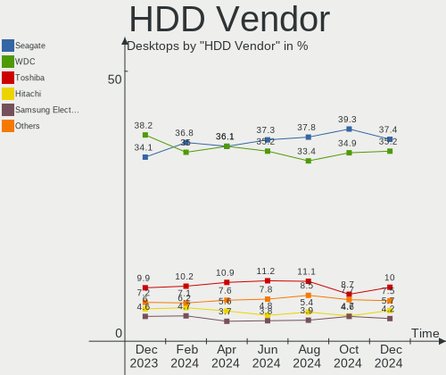
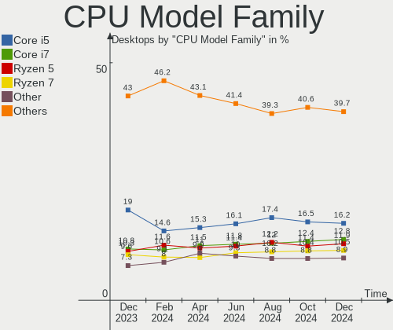

Linux Hardware Trends (Desktops)
--------------------------------

A project to identify most popular hardware characteristics and track their change
over time based on data collected by Linux users at https://Linux-Hardware.org.

Anyone can contribute to this report by the [hw-probe](https://github.com/linuxhw/hw-probe) tool:

    sudo -E hw-probe -all -upload

Full-feature report is available here: https://linux-hardware.org/?view=trends&formfactor=desktop

Period: Jul, 2021.

Contents
--------

* [ System ](#system)
  - [ OS                       ](#os)
  - [ OS Family                ](#os-family)
  - [ Kernel                   ](#kernel)
  - [ Kernel Family            ](#kernel-family)
  - [ Kernel Major Ver.        ](#kernel-major-ver)
  - [ Arch                     ](#arch)
  - [ DE                       ](#de)
  - [ Display Server           ](#display-server)
  - [ Display Manager          ](#display-manager)
  - [ OS Lang                  ](#os-lang)
  - [ Boot Mode                ](#boot-mode)
  - [ Filesystem               ](#filesystem)
  - [ Part. scheme             ](#part-scheme)
  - [ Dual Boot with Linux/BSD ](#dual-boot-with-linuxbsd)
  - [ Dual Boot (Win)          ](#dual-boot-win)

* [ Board ](#board)
  - [ Vendor                   ](#vendor)
  - [ Model                    ](#model)
  - [ Model Family             ](#model-family)
  - [ MFG Year                 ](#mfg-year)
  - [ Form Factor              ](#form-factor)
  - [ Secure Boot              ](#secure-boot)
  - [ Coreboot                 ](#coreboot)
  - [ RAM Size                 ](#ram-size)
  - [ RAM Used                 ](#ram-used)
  - [ Total Drives             ](#total-drives)
  - [ Has CD-ROM               ](#has-cd-rom)
  - [ Has Ethernet             ](#has-ethernet)
  - [ Has WiFi                 ](#has-wifi)
  - [ Has Bluetooth            ](#has-bluetooth)

* [ Location ](#location)
  - [ Country                  ](#country)
  - [ City                     ](#city)

* [ Drives ](#drives)
  - [ Drive Vendor             ](#drive-vendor)
  - [ Drive Model              ](#drive-model)
  - [ HDD Vendor               ](#hdd-vendor)
  - [ SSD Vendor               ](#ssd-vendor)
  - [ Drive Kind               ](#drive-kind)
  - [ Drive Connector          ](#drive-connector)
  - [ Drive Size               ](#drive-size)
  - [ Space Total              ](#space-total)
  - [ Space Used               ](#space-used)
  - [ Malfunc. Drives          ](#malfunc-drives)
  - [ Malfunc. Drive Vendor    ](#malfunc-drive-vendor)
  - [ Malfunc. HDD Vendor      ](#malfunc-hdd-vendor)
  - [ Malfunc. Drive Kind      ](#malfunc-drive-kind)
  - [ Failed Drives            ](#failed-drives)
  - [ Failed Drive Vendor      ](#failed-drive-vendor)
  - [ Drive Status             ](#drive-status)

* [ Storage controller ](#storage-controller)
  - [ Storage Vendor           ](#storage-vendor)
  - [ Storage Model            ](#storage-model)
  - [ Storage Kind             ](#storage-kind)

* [ Processor ](#processor)
  - [ CPU Vendor               ](#cpu-vendor)
  - [ CPU Model                ](#cpu-model)
  - [ CPU Model Family         ](#cpu-model-family)
  - [ CPU Cores                ](#cpu-cores)
  - [ CPU Sockets              ](#cpu-sockets)
  - [ CPU Threads              ](#cpu-threads)
  - [ CPU Op-Modes             ](#cpu-op-modes)
  - [ CPU Microcode            ](#cpu-microcode)
  - [ CPU Microarch            ](#cpu-microarch)

* [ Graphics ](#graphics)
  - [ GPU Vendor               ](#gpu-vendor)
  - [ GPU Model                ](#gpu-model)
  - [ GPU Combo                ](#gpu-combo)
  - [ GPU Driver               ](#gpu-driver)
  - [ GPU Memory               ](#gpu-memory)

* [ Monitor ](#monitor)
  - [ Monitor Vendor           ](#monitor-vendor)
  - [ Monitor Model            ](#monitor-model)
  - [ Monitor Resolution       ](#monitor-resolution)
  - [ Monitor Diagonal         ](#monitor-diagonal)
  - [ Monitor Width            ](#monitor-width)
  - [ Aspect Ratio             ](#aspect-ratio)
  - [ Monitor Area             ](#monitor-area)
  - [ Pixel Density            ](#pixel-density)
  - [ Multiple Monitors        ](#multiple-monitors)

* [ Network ](#network)
  - [ Net Controller Vendor    ](#net-controller-vendor)
  - [ Net Controller Model     ](#net-controller-model)
  - [ Wireless Vendor          ](#wireless-vendor)
  - [ Wireless Model           ](#wireless-model)
  - [ Ethernet Vendor          ](#ethernet-vendor)
  - [ Ethernet Model           ](#ethernet-model)
  - [ Net Controller Kind      ](#net-controller-kind)
  - [ Used Controller          ](#used-controller)
  - [ NICs                     ](#nics)
  - [ IPv6                     ](#ipv6)

* [ Bluetooth ](#bluetooth)
  - [ Bluetooth Vendor         ](#bluetooth-vendor)
  - [ Bluetooth Model          ](#bluetooth-model)

* [ Sound ](#sound)
  - [ Sound Vendor             ](#sound-vendor)
  - [ Sound Model              ](#sound-model)

* [ Memory ](#memory)
  - [ Memory Vendor            ](#memory-vendor)
  - [ Memory Model             ](#memory-model)
  - [ Memory Kind              ](#memory-kind)
  - [ Memory Form Factor       ](#memory-form-factor)
  - [ Memory Size              ](#memory-size)
  - [ Memory Speed             ](#memory-speed)

* [ Printers & scanners ](#printers--scanners)
  - [ Printer Vendor           ](#printer-vendor)
  - [ Printer Model            ](#printer-model)
  - [ Scanner Vendor           ](#scanner-vendor)
  - [ Scanner Model            ](#scanner-model)

* [ Camera ](#camera)
  - [ Camera Vendor            ](#camera-vendor)
  - [ Camera Model             ](#camera-model)

* [ Security ](#security)
  - [ Fingerprint Vendor       ](#fingerprint-vendor)
  - [ Fingerprint Model        ](#fingerprint-model)
  - [ Chipcard Vendor          ](#chipcard-vendor)
  - [ Chipcard Model           ](#chipcard-model)

* [ Unsupported ](#unsupported)
  - [ Unsupported Devices      ](#unsupported-devices)
  - [ Unsupported Device Types ](#unsupported-device-types)

System
------

OS
--

Installed operating systems

| Name                | Desktops | Percent |
|---------------------|----------|---------|
| Ubuntu 20.04        | 333      | 17.15%  |
| OpenMandriva 4.2    | 163      | 8.39%   |
| Pop!_OS 21.04       | 127      | 6.54%   |
| Ubuntu 21.04        | 107      | 5.51%   |
| Debian 11           | 107      | 5.51%   |
| Fedora 34           | 87       | 4.48%   |
| Mint 20.2           | 81       | 4.17%   |
| ROSA R11.1          | 62       | 3.19%   |
| Mint 20.1           | 60       | 3.09%   |
| BlackPanther 18.1   | 53       | 2.73%   |
| Ubuntu 18.04        | 47       | 2.42%   |
| Debian 10           | 42       | 2.16%   |
| KDE neon 20.04      | 38       | 1.96%   |
| OpenMandriva 4.50   | 36       | 1.85%   |
| Arch                | 36       | 1.85%   |
| Manjaro             | 34       | 1.75%   |
| Arch Rolling        | 32       | 1.65%   |
| Manjaro 21.1.0      | 24       | 1.24%   |
| Kubuntu 20.04       | 23       | 1.18%   |
| ArcoLinux Rolling   | 23       | 1.18%   |
| Xubuntu 20.04       | 21       | 1.08%   |
| Mint 19.3           | 21       | 1.08%   |
| Manjaro 21.0.7      | 21       | 1.08%   |
| Zorin 15            | 20       | 1.03%   |
| Pop!_OS 20.04       | 19       | 0.98%   |
| Mint 20             | 19       | 0.98%   |
| Kubuntu 21.04       | 16       | 0.82%   |
| Ubuntu 20.10        | 15       | 0.77%   |
| Pop!_OS 20.10       | 12       | 0.62%   |
| Gentoo 2.7          | 12       | 0.62%   |
| Debian              | 12       | 0.62%   |
| Ubuntu MATE 20.04   | 10       | 0.51%   |
| LMDE 4              | 10       | 0.51%   |
| Endless 3.9.5       | 10       | 0.51%   |
| Lubuntu 20.04       | 9        | 0.46%   |
| ROSA R11            | 8        | 0.41%   |
| Gentoo              | 8        | 0.41%   |
| Fedora 33           | 8        | 0.41%   |
| Xubuntu 18.04       | 6        | 0.31%   |
| openSUSE Leap-15.3  | 6        | 0.31%   |
| EndeavourOS Rolling | 6        | 0.31%   |
| CentOS 8            | 6        | 0.31%   |
| Ubuntu 16.04        | 5        | 0.26%   |
| Ubuntu MATE 21.04   | 4        | 0.21%   |
| Mint 19.1           | 4        | 0.21%   |
| Mageia 8            | 4        | 0.21%   |
| Kali 2021.2         | 4        | 0.21%   |
| Clear Linux 34860   | 4        | 0.21%   |
| Ubuntu Budgie 21.04 | 3        | 0.15%   |
| Ubuntu Budgie 20.04 | 3        | 0.15%   |
| ROSA R12            | 3        | 0.15%   |
| RHCOS 4.6           | 3        | 0.15%   |
| Mint 19.2           | 3        | 0.15%   |
| Mint 18.3           | 3        | 0.15%   |
| Lubuntu 21.04       | 3        | 0.15%   |
| Hash Linux          | 3        | 0.15%   |
| Elementary 5.1.7    | 3        | 0.15%   |
| ClearOS 7.9.1       | 3        | 0.15%   |
| ALT Linux 9.1       | 3        | 0.15%   |
| Zorin 16            | 2        | 0.1%    |

OS Family
---------

OS without a version

| Name          | Desktops | Percent |
|---------------|----------|---------|
| Ubuntu        | 513      | 26.4%   |
| OpenMandriva  | 199      | 10.24%  |
| Mint          | 193      | 9.93%   |
| Debian        | 164      | 8.44%   |
| Pop!_OS       | 158      | 8.13%   |
| Fedora        | 101      | 5.2%    |
| Manjaro       | 81       | 4.17%   |
| ROSA          | 76       | 3.91%   |
| Arch          | 68       | 3.5%    |
| BlackPanther  | 53       | 2.73%   |
| Kubuntu       | 42       | 2.16%   |
| KDE neon      | 38       | 1.96%   |
| Xubuntu       | 32       | 1.65%   |
| ArcoLinux     | 23       | 1.18%   |
| Zorin         | 22       | 1.13%   |
| Gentoo        | 20       | 1.03%   |
| openSUSE      | 19       | 0.98%   |
| Ubuntu MATE   | 15       | 0.77%   |
| Lubuntu       | 14       | 0.72%   |
| Endless       | 12       | 0.62%   |
| LMDE          | 10       | 0.51%   |
| CentOS        | 10       | 0.51%   |
| Clear Linux   | 7        | 0.36%   |
| Ubuntu Budgie | 6        | 0.31%   |
| Kali          | 6        | 0.31%   |
| EndeavourOS   | 6        | 0.31%   |
| RHCOS         | 5        | 0.26%   |
| Mageia        | 4        | 0.21%   |
| Elementary    | 4        | 0.21%   |
| MX            | 3        | 0.15%   |
| Hash Linux    | 3        | 0.15%   |
| Deepin        | 3        | 0.15%   |
| ClearOS       | 3        | 0.15%   |
| ALT Linux     | 3        | 0.15%   |
| RHEL          | 2        | 0.1%    |
| Parrot        | 2        | 0.1%    |
| Makulu        | 2        | 0.1%    |
| Kaisen        | 2        | 0.1%    |
| GNOME OS      | 2        | 0.1%    |
| Artix         | 2        | 0.1%    |
| Xero          | 1        | 0.05%   |
| Void          | 1        | 0.05%   |
| Sparky        | 1        | 0.05%   |
| Solus         | 1        | 0.05%   |
| Slackware     | 1        | 0.05%   |
| Redcore       | 1        | 0.05%   |
| RED           | 1        | 0.05%   |
| PureOS        | 1        | 0.05%   |
| Puppyrus-a    | 1        | 0.05%   |
| NixOS         | 1        | 0.05%   |
| Gooroom       | 1        | 0.05%   |
| Garuda        | 1        | 0.05%   |
| Flatcar       | 1        | 0.05%   |
| Ecp-veil      | 1        | 0.05%   |
| Calculate     | 1        | 0.05%   |

Kernel
------

Version of the Linux kernel

| Version                             | Desktops | Percent |
|-------------------------------------|----------|---------|
| 5.8.0-59-generic                    | 200      | 10.29%  |
| 5.4.0-77-generic                    | 181      | 9.32%   |
| 5.11.0-7620-generic                 | 141      | 7.26%   |
| 5.10.14-desktop-1omv4002            | 136      | 7%      |
| 5.4.0-80-generic                    | 87       | 4.48%   |
| 5.11.0-22-generic                   | 76       | 3.91%   |
| 5.8.0-63-generic                    | 75       | 3.86%   |
| 5.10.0-8-amd64                      | 71       | 3.65%   |
| 5.6.14-desktop-2bP                  | 44       | 2.26%   |
| 5.11.0-25-generic                   | 35       | 1.8%    |
| 4.19.0-17-amd64                     | 34       | 1.75%   |
| 5.12.13-300.fc34.x86_64             | 30       | 1.54%   |
| 5.11.12-desktop-1omv4002            | 27       | 1.39%   |
| 5.10.0-7-amd64                      | 27       | 1.39%   |
| 5.12.4-desktop-1omv4050             | 24       | 1.24%   |
| 5.10.42-1-MANJARO                   | 21       | 1.08%   |
| 5.12.15-arch1-1                     | 20       | 1.03%   |
| 5.4.83-generic-2rosa-x86_64         | 18       | 0.93%   |
| 5.4.32-generic-2rosa-x86_64         | 17       | 0.87%   |
| 5.12.14-arch1-1                     | 17       | 0.87%   |
| 5.8.0-43-generic                    | 16       | 0.82%   |
| 5.12.15-300.fc34.x86_64             | 16       | 0.82%   |
| 5.4.0-74-generic                    | 14       | 0.72%   |
| 5.12.14-300.fc34.x86_64             | 14       | 0.72%   |
| 4.15.0-147-generic                  | 14       | 0.72%   |
| 5.10.0-2-amd64                      | 13       | 0.67%   |
| 5.12.9-1-MANJARO                    | 12       | 0.62%   |
| 5.8.0-14-generic                    | 11       | 0.57%   |
| 5.13.4-200.fc34.x86_64              | 11       | 0.57%   |
| 4.15.0-151-generic                  | 11       | 0.57%   |
| 5.4.0-26-generic                    | 10       | 0.51%   |
| 5.11.0-24-generic                   | 10       | 0.51%   |
| 5.10.49-1-MANJARO                   | 10       | 0.51%   |
| 4.15.0-desktop-122.124.1rosa-x86_64 | 10       | 0.51%   |
| 5.4.0-58-generic                    | 9        | 0.46%   |
| 5.11.0-7614-generic                 | 9        | 0.46%   |
| 4.18.16-desktop-1bP                 | 9        | 0.46%   |
| 5.4.0-73-generic                    | 8        | 0.41%   |
| 5.11.0-16-generic                   | 8        | 0.41%   |
| 5.10.52-1-MANJARO                   | 8        | 0.41%   |
| 5.8.0-55-generic                    | 7        | 0.36%   |
| 5.12.7-desktop-1omv4003             | 7        | 0.36%   |
| 5.10.0-0.bpo.7-amd64                | 7        | 0.36%   |
| 4.15.0-desktop-45.1rosa-x86_64      | 7        | 0.36%   |
| 5.4.0-72-generic                    | 6        | 0.31%   |
| 5.13.5-arch1-1                      | 6        | 0.31%   |
| 5.12.15-zen1-1-zen                  | 6        | 0.31%   |
| 5.12.14-zen1-1-zen                  | 6        | 0.31%   |
| 5.12.13-arch1-2                     | 6        | 0.31%   |
| 5.13.4-arch2-1                      | 5        | 0.26%   |
| 5.11.0-26-generic                   | 5        | 0.26%   |
| 4.4.0-210-generic                   | 5        | 0.26%   |
| 5.8.0-63-lowlatency                 | 4        | 0.21%   |
| 5.8.0-61-generic                    | 4        | 0.21%   |
| 5.4.83-generic-2rosa-i586           | 4        | 0.21%   |
| 5.4.32-generic-2rosa-i586           | 4        | 0.21%   |
| 5.4.0-77-lowlatency                 | 4        | 0.21%   |
| 5.13.1-3-MANJARO                    | 4        | 0.21%   |
| 5.13.0-1-MANJARO                    | 4        | 0.21%   |
| 5.12.12-arch1-1                     | 4        | 0.21%   |

Kernel Family
-------------

Linux kernel without a distro release

| Version | Desktops | Percent |
|---------|----------|---------|
| 5.4.0   | 346      | 17.81%  |
| 5.8.0   | 337      | 17.34%  |
| 5.11.0  | 292      | 15.03%  |
| 5.10.0  | 137      | 7.05%   |
| 5.10.14 | 136      | 7%      |
| 4.15.0  | 62       | 3.19%   |
| 5.12.15 | 47       | 2.42%   |
| 5.6.14  | 44       | 2.26%   |
| 5.12.13 | 44       | 2.26%   |
| 5.12.14 | 43       | 2.21%   |
| 4.19.0  | 43       | 2.21%   |
| 5.13.4  | 30       | 1.54%   |
| 5.11.12 | 29       | 1.49%   |
| 5.12.4  | 24       | 1.24%   |
| 5.4.83  | 22       | 1.13%   |
| 5.4.32  | 21       | 1.08%   |
| 5.10.42 | 21       | 1.08%   |
| 5.13.1  | 19       | 0.98%   |
| 5.13.0  | 18       | 0.93%   |
| 5.10.52 | 16       | 0.82%   |
| 4.18.0  | 14       | 0.72%   |
| 5.13.5  | 13       | 0.67%   |
| 5.12.9  | 13       | 0.67%   |
| 5.10.49 | 12       | 0.62%   |
| 5.12.12 | 11       | 0.57%   |
| 4.18.16 | 9        | 0.46%   |
| 5.3.18  | 8        | 0.41%   |
| 5.12.7  | 8        | 0.41%   |
| 5.11.22 | 8        | 0.41%   |
| 5.13.2  | 7        | 0.36%   |
| 4.4.0   | 7        | 0.36%   |
| 3.10.0  | 7        | 0.36%   |
| 5.10.53 | 6        | 0.31%   |
| 5.10.27 | 6        | 0.31%   |
| 5.13.6  | 5        | 0.26%   |
| 5.12.16 | 5        | 0.26%   |
| 5.12.0  | 5        | 0.26%   |
| 5.10.47 | 5        | 0.26%   |
| 5.12.17 | 4        | 0.21%   |
| 4.9.155 | 4        | 0.21%   |
| 5.10.48 | 3        | 0.15%   |
| 5.0.0   | 3        | 0.15%   |
| 5.8.18  | 2        | 0.1%    |
| 5.4.124 | 2        | 0.1%    |
| 5.3.0   | 2        | 0.1%    |
| 5.14.0  | 2        | 0.1%    |
| 5.12.1  | 2        | 0.1%    |
| 5.11.6  | 2        | 0.1%    |
| 5.10.36 | 2        | 0.1%    |
| 4.10.0  | 2        | 0.1%    |
| 5.9.16  | 1        | 0.05%   |
| 5.8.16  | 1        | 0.05%   |
| 5.7.7   | 1        | 0.05%   |
| 5.7.15  | 1        | 0.05%   |
| 5.6.0   | 1        | 0.05%   |
| 5.4.132 | 1        | 0.05%   |
| 5.4.129 | 1        | 0.05%   |
| 5.4.112 | 1        | 0.05%   |
| 5.4.106 | 1        | 0.05%   |
| 5.3.7   | 1        | 0.05%   |

Kernel Major Ver.
-----------------

Linux kernel major version

| Version | Desktops | Percent |
|---------|----------|---------|
| 5.4     | 395      | 20.33%  |
| 5.10    | 354      | 18.22%  |
| 5.8     | 340      | 17.5%   |
| 5.11    | 334      | 17.19%  |
| 5.12    | 209      | 10.76%  |
| 5.13    | 93       | 4.79%   |
| 4.15    | 63       | 3.24%   |
| 5.6     | 45       | 2.32%   |
| 4.19    | 45       | 2.32%   |
| 4.18    | 23       | 1.18%   |
| 5.3     | 11       | 0.57%   |
| 4.4     | 7        | 0.36%   |
| 3.10    | 7        | 0.36%   |
| 4.9     | 5        | 0.26%   |
| 5.0     | 3        | 0.15%   |
| 5.7     | 2        | 0.1%    |
| 5.14    | 2        | 0.1%    |
| 4.10    | 2        | 0.1%    |
| 5.9     | 1        | 0.05%   |
| 5.2     | 1        | 0.05%   |
| 4.1     | 1        | 0.05%   |

Arch
----

OS architecture (x86_64, i586, etc.)

| Name   | Desktops | Percent |
|--------|----------|---------|
| x86_64 | 1911     | 98.35%  |
| i686   | 32       | 1.65%   |

DE
--

Desktop Environment

| Name                     | Desktops | Percent |
|--------------------------|----------|---------|
| GNOME                    | 772      | 39.73%  |
| KDE5                     | 406      | 20.9%   |
| X-Cinnamon               | 164      | 8.44%   |
| Unknown                  | 157      | 8.08%   |
| XFCE                     | 113      | 5.82%   |
| KDE                      | 86       | 4.43%   |
| MATE                     | 58       | 2.99%   |
| KDE4                     | 53       | 2.73%   |
| LXQt                     | 22       | 1.13%   |
| Cinnamon                 | 22       | 1.13%   |
| i3                       | 13       | 0.67%   |
| Unity                    | 10       | 0.51%   |
| LXDE                     | 10       | 0.51%   |
| Deepin                   | 9        | 0.46%   |
| Budgie                   | 9        | 0.46%   |
| GNOME Flashback          | 7        | 0.36%   |
| Trinity                  | 5        | 0.26%   |
| Pantheon                 | 5        | 0.26%   |
| GNOME Classic            | 5        | 0.26%   |
| xmonad                   | 2        | 0.1%    |
| sway                     | 2        | 0.1%    |
| Openbox                  | 2        | 0.1%    |
| lightdm-xsession         | 2        | 0.1%    |
| awesome                  | 2        | 0.1%    |
| Yaru:ubuntu:GNOME        | 1        | 0.05%   |
| XSession                 | 1        | 0.05%   |
| ubuntustudio             | 1        | 0.05%   |
| qtile                    | 1        | 0.05%   |
| Enlightenment            | 1        | 0.05%   |
| bspwm                    | 1        | 0.05%   |
| /usr/bin/openbox-session | 1        | 0.05%   |

Display Server
--------------

X11 or Wayland

| Name    | Desktops | Percent |
|---------|----------|---------|
| X11     | 1630     | 83.89%  |
| Wayland | 179      | 9.21%   |
| Unknown | 74       | 3.81%   |
| Tty     | 60       | 3.09%   |

Display Manager
---------------

SDDM, LightDM, etc.

| Name    | Desktops | Percent |
|---------|----------|---------|
| Unknown | 1062     | 54.66%  |
| SDDM    | 425      | 21.87%  |
| GDM     | 186      | 9.57%   |
| TDM     | 165      | 8.49%   |
| KDM     | 52       | 2.68%   |
| LightDM | 39       | 2.01%   |
| XDM     | 4        | 0.21%   |
| SLiM    | 3        | 0.15%   |
| GDM3    | 3        | 0.15%   |
| Ly      | 2        | 0.1%    |
| LXDM    | 2        | 0.1%    |

OS Lang
-------

Language

| Lang       | Desktops | Percent |
|------------|----------|---------|
| en_US      | 776      | 39.94%  |
| de_DE      | 161      | 8.29%   |
| ru_RU      | 153      | 7.87%   |
| en_GB      | 97       | 4.99%   |
| Unknown    | 96       | 4.94%   |
| fr_FR      | 91       | 4.68%   |
| pt_BR      | 84       | 4.32%   |
| en_AU      | 46       | 2.37%   |
| es_ES      | 42       | 2.16%   |
| it_IT      | 35       | 1.8%    |
| C          | 34       | 1.75%   |
| en_CA      | 30       | 1.54%   |
| pl_PL      | 29       | 1.49%   |
| es_MX      | 21       | 1.08%   |
| en_IN      | 19       | 0.98%   |
| en_ZA      | 15       | 0.77%   |
| hu_HU      | 13       | 0.67%   |
| ja_JP      | 12       | 0.62%   |
| sv_SE      | 11       | 0.57%   |
| es_AR      | 11       | 0.57%   |
| ru_UA      | 10       | 0.51%   |
| pt_PT      | 10       | 0.51%   |
| nl_NL      | 10       | 0.51%   |
| es_CL      | 8        | 0.41%   |
| en_NZ      | 8        | 0.41%   |
| de_AT      | 8        | 0.41%   |
| sk_SK      | 6        | 0.31%   |
| cs_CZ      | 6        | 0.31%   |
| uk_UA      | 5        | 0.26%   |
| fr_CA      | 5        | 0.26%   |
| es_VE      | 5        | 0.26%   |
| en_IL      | 5        | 0.26%   |
| ro_RO      | 4        | 0.21%   |
| fr_BE      | 4        | 0.21%   |
| en_SG      | 4        | 0.21%   |
| en_PH      | 4        | 0.21%   |
| zh_CN      | 3        | 0.15%   |
| POSIX      | 3        | 0.15%   |
| nl_BE      | 3        | 0.15%   |
| ko_KR      | 3        | 0.15%   |
| fi_FI      | 3        | 0.15%   |
| es_PE      | 3        | 0.15%   |
| es_CO      | 3        | 0.15%   |
| en_DE      | 3        | 0.15%   |
| da_DK      | 3        | 0.15%   |
| zh_TW      | 2        | 0.1%    |
| nb_NO      | 2        | 0.1%    |
| id_ID      | 2        | 0.1%    |
| hr_HR      | 2        | 0.1%    |
| fr_CH      | 2        | 0.1%    |
| es_EC      | 2        | 0.1%    |
| en_IE      | 2        | 0.1%    |
| en_DK      | 2        | 0.1%    |
| el_GR      | 2        | 0.1%    |
| de_CH      | 2        | 0.1%    |
| ca_ES      | 2        | 0.1%    |
| zh_HK      | 1        | 0.05%   |
| tr_TR      | 1        | 0.05%   |
| sl_SI      | 1        | 0.05%   |
| ru_RU.UTF8 | 1        | 0.05%   |

Boot Mode
---------

EFI or BIOS

| Mode | Desktops | Percent |
|------|----------|---------|
| BIOS | 1214     | 62.48%  |
| EFI  | 729      | 37.52%  |

Filesystem
----------

Type of filesystem

| Type    | Desktops | Percent |
|---------|----------|---------|
| Ext4    | 1465     | 75.4%   |
| Overlay | 242      | 12.45%  |
| Btrfs   | 149      | 7.67%   |
| Xfs     | 44       | 2.26%   |
| Zfs     | 18       | 0.93%   |
| F2fs    | 7        | 0.36%   |
| Ext3    | 6        | 0.31%   |
| Tmpfs   | 3        | 0.15%   |
| Ext2    | 2        | 0.1%    |
| Aufs    | 2        | 0.1%    |
| Unknown | 2        | 0.1%    |
| XXXXX   | 1        | 0.05%   |
| XXXfs   | 1        | 0.05%   |
| Jfs     | 1        | 0.05%   |

Part. scheme
------------

Scheme of partitioning

| Type    | Desktops | Percent |
|---------|----------|---------|
| Unknown | 966      | 49.72%  |
| GPT     | 631      | 32.48%  |
| MBR     | 346      | 17.81%  |

Dual Boot with Linux/BSD
------------------------

Hosting more than one Linux/BSD

| Dual boot | Desktops | Percent |
|-----------|----------|---------|
| No        | 1517     | 78.08%  |
| Yes       | 426      | 21.92%  |

Dual Boot (Win)
---------------

Hosting Linux and Windows

| Dual boot | Desktops | Percent |
|-----------|----------|---------|
| No        | 1249     | 64.28%  |
| Yes       | 694      | 35.72%  |

Board
-----

Vendor
------

Motherboard manufacturer

| Name                | Desktops | Percent |
|---------------------|----------|---------|
| ASUSTek Computer    | 536      | 27.59%  |
| Gigabyte Technology | 344      | 17.7%   |
| MSI                 | 223      | 11.48%  |
| ASRock              | 191      | 9.83%   |
| Dell                | 160      | 8.23%   |
| Hewlett-Packard     | 138      | 7.1%    |
| Intel               | 56       | 2.88%   |
| Lenovo              | 48       | 2.47%   |
| Acer                | 31       | 1.6%    |
| Pegatron            | 21       | 1.08%   |
| Biostar             | 21       | 1.08%   |
| Fujitsu             | 20       | 1.03%   |
| Foxconn             | 18       | 0.93%   |
| Unknown             | 16       | 0.82%   |
| ECS                 | 13       | 0.67%   |
| Huanan              | 10       | 0.51%   |
| Supermicro          | 6        | 0.31%   |
| Medion              | 6        | 0.31%   |
| Shuttle             | 5        | 0.26%   |
| EVGA                | 5        | 0.26%   |
| System76            | 4        | 0.21%   |
| Positivo            | 4        | 0.21%   |
| Packard Bell        | 4        | 0.21%   |
| Apple               | 4        | 0.21%   |
| Alienware           | 4        | 0.21%   |
| PCWare              | 3        | 0.15%   |
| eMachines           | 3        | 0.15%   |
| AMD                 | 3        | 0.15%   |
| OEM                 | 2        | 0.1%    |
| Koloe               | 2        | 0.1%    |
| Itautec             | 2        | 0.1%    |
| Inventec            | 2        | 0.1%    |
| Gateway             | 2        | 0.1%    |
| Fujitsu Siemens     | 2        | 0.1%    |
| Chuwi               | 2        | 0.1%    |
| AWOW Technology     | 2        | 0.1%    |
| ASRockRack          | 2        | 0.1%    |
| AMI                 | 2        | 0.1%    |
| YANYU               | 1        | 0.05%   |
| Xi3                 | 1        | 0.05%   |
| WinFast             | 1        | 0.05%   |
| Wibtek              | 1        | 0.05%   |
| SYWZ                | 1        | 0.05%   |
| Semp Toshiba        | 1        | 0.05%   |
| Seco                | 1        | 0.05%   |
| Samsung Electronics | 1        | 0.05%   |
| R-StyleComputers    | 1        | 0.05%   |
| Protectli           | 1        | 0.05%   |
| PCChips             | 1        | 0.05%   |
| Minix               | 1        | 0.05%   |
| Megaware            | 1        | 0.05%   |
| MAXSUN              | 1        | 0.05%   |
| MACHINIST           | 1        | 0.05%   |
| Lanix               | 1        | 0.05%   |
| KLLISRE             | 1        | 0.05%   |
| JGINYUE             | 1        | 0.05%   |
| HPE                 | 1        | 0.05%   |
| HARDKERNEL          | 1        | 0.05%   |
| Google              | 1        | 0.05%   |
| ELSA                | 1        | 0.05%   |

Model
-----

Motherboard model

| Name                         | Desktops | Percent |
|------------------------------|----------|---------|
| ASUS All Series              | 46       | 2.37%   |
| Unknown                      | 16       | 0.82%   |
| ASUS TUF GAMING X570-PLUS    | 14       | 0.72%   |
| MSI MS-7817                  | 11       | 0.57%   |
| ASUS PRIME A320M-K           | 11       | 0.57%   |
| MSI MS-7C56                  | 10       | 0.51%   |
| Dell OptiPlex 790            | 10       | 0.51%   |
| ASUS ROG STRIX B550-F GAMING | 10       | 0.51%   |
| MSI MS-7C37                  | 9        | 0.46%   |
| Gigabyte B450M DS3H          | 8        | 0.41%   |
| Dell OptiPlex 990            | 8        | 0.41%   |
| Dell OptiPlex 9020           | 8        | 0.41%   |
| ASUS ROG STRIX X570-E GAMING | 8        | 0.41%   |
| MSI MS-7C02                  | 7        | 0.36%   |
| MSI MS-7A38                  | 7        | 0.36%   |
| Gigabyte X570 AORUS MASTER   | 7        | 0.36%   |
| Dell OptiPlex 780            | 7        | 0.36%   |
| Dell OptiPlex 7010           | 7        | 0.36%   |
| ASUS ROG STRIX B450-F GAMING | 7        | 0.36%   |
| ASUS PRIME B350-PLUS         | 7        | 0.36%   |
| ASUS M5A97 R2.0              | 7        | 0.36%   |
| HP Compaq 8200 Elite SFF PC  | 6        | 0.31%   |
| Gigabyte A320M-S2H           | 6        | 0.31%   |
| ASUS TUF B450M-PLUS GAMING   | 6        | 0.31%   |
| ASUS ROG STRIX B550-I GAMING | 6        | 0.31%   |
| ASUS PRIME B450M-A           | 6        | 0.31%   |
| ASRock B450 Pro4             | 6        | 0.31%   |
| MSI MS-7C91                  | 5        | 0.26%   |
| MSI MS-7B89                  | 5        | 0.26%   |
| MSI MS-7B86                  | 5        | 0.26%   |
| MSI MS-7996                  | 5        | 0.26%   |
| HP Compaq Elite 8300 SFF     | 5        | 0.26%   |
| Gigabyte H61M-DS2            | 5        | 0.26%   |
| Gigabyte B550I AORUS PRO AX  | 5        | 0.26%   |
| Gigabyte A320M-S2H V2        | 5        | 0.26%   |
| Gigabyte 970A-DS3P           | 5        | 0.26%   |
| Dell XPS 8700                | 5        | 0.26%   |
| ASUS TUF GAMING B550M-PLUS   | 5        | 0.26%   |
| ASUS TUF GAMING B550-PLUS    | 5        | 0.26%   |
| ASUS PRIME X570-P            | 5        | 0.26%   |
| ASUS P8H61-M LX3 R2.0        | 5        | 0.26%   |
| ASUS M5A97 LE R2.0           | 5        | 0.26%   |
| ASUS M5A78L-M PLUS/USB3      | 5        | 0.26%   |
| ASRock B450M-HDV R4.0        | 5        | 0.26%   |
| ASRock B450M Pro4            | 5        | 0.26%   |
| System76 Thelio              | 4        | 0.21%   |
| MSI MS-7C84                  | 4        | 0.21%   |
| MSI MS-7C75                  | 4        | 0.21%   |
| MSI MS-7C35                  | 4        | 0.21%   |
| MSI MS-7B98                  | 4        | 0.21%   |
| MSI MS-7B79                  | 4        | 0.21%   |
| MSI MS-7A34                  | 4        | 0.21%   |
| MSI MS-7918                  | 4        | 0.21%   |
| MSI MS-7721                  | 4        | 0.21%   |
| MSI MS-7693                  | 4        | 0.21%   |
| Intel H61                    | 4        | 0.21%   |
| Huanan X99-F8                | 4        | 0.21%   |
| HP Z620 Workstation          | 4        | 0.21%   |
| HP Z440 Workstation          | 4        | 0.21%   |
| HP Compaq 6005 Pro SFF PC    | 4        | 0.21%   |

Model Family
------------

Motherboard model prefix

| Name                   | Desktops | Percent |
|------------------------|----------|---------|
| ASUS PRIME             | 102      | 5.25%   |
| Dell OptiPlex          | 91       | 4.68%   |
| ASUS ROG               | 69       | 3.55%   |
| HP Compaq              | 50       | 2.57%   |
| ASUS TUF               | 50       | 2.57%   |
| ASUS All               | 46       | 2.37%   |
| Lenovo ThinkCentre     | 29       | 1.49%   |
| Dell Precision         | 24       | 1.24%   |
| Dell Inspiron          | 23       | 1.18%   |
| Acer Aspire            | 22       | 1.13%   |
| Gigabyte X570          | 21       | 1.08%   |
| ASUS P8H61-M           | 18       | 0.93%   |
| HP EliteDesk           | 16       | 0.82%   |
| ASUS M5A97             | 16       | 0.82%   |
| ASUS M5A78L-M          | 16       | 0.82%   |
| Unknown                | 16       | 0.82%   |
| Gigabyte B450M         | 15       | 0.77%   |
| Fujitsu ESPRIMO        | 15       | 0.77%   |
| MSI MS-7817            | 11       | 0.57%   |
| HP Pavilion            | 11       | 0.57%   |
| Gigabyte B450          | 11       | 0.57%   |
| Gigabyte A320M-S2H     | 11       | 0.57%   |
| Dell XPS               | 11       | 0.57%   |
| MSI MS-7C56            | 10       | 0.51%   |
| Gigabyte Z390          | 10       | 0.51%   |
| ASRock B450M           | 10       | 0.51%   |
| ASRock B450            | 10       | 0.51%   |
| MSI MS-7C37            | 9        | 0.46%   |
| ASRock X570            | 9        | 0.46%   |
| Gigabyte H61M-DS2      | 8        | 0.41%   |
| ASUS P8Z77-V           | 8        | 0.41%   |
| Acer Veriton           | 8        | 0.41%   |
| MSI MS-7C02            | 7        | 0.36%   |
| MSI MS-7A38            | 7        | 0.36%   |
| HP ProDesk             | 7        | 0.36%   |
| Gigabyte GA-78LMT-USB3 | 7        | 0.36%   |
| ASUS P6T               | 7        | 0.36%   |
| Lenovo ThinkStation    | 6        | 0.31%   |
| HP ProLiant            | 6        | 0.31%   |
| Gigabyte B550          | 6        | 0.31%   |
| Gigabyte 970A-DS3P     | 6        | 0.31%   |
| Dell Vostro            | 6        | 0.31%   |
| ASUS SABERTOOTH        | 6        | 0.31%   |
| ASUS Maximus           | 6        | 0.31%   |
| ASRock B450M-HDV       | 6        | 0.31%   |
| ASRock 970             | 6        | 0.31%   |
| MSI MS-7C91            | 5        | 0.26%   |
| MSI MS-7B89            | 5        | 0.26%   |
| MSI MS-7B86            | 5        | 0.26%   |
| MSI MS-7996            | 5        | 0.26%   |
| Intel DH61WW           | 5        | 0.26%   |
| Gigabyte H310M         | 5        | 0.26%   |
| Gigabyte B550I         | 5        | 0.26%   |
| ASUS P8P67             | 5        | 0.26%   |
| ASUS P5KPL-AM          | 5        | 0.26%   |
| ASUS M5A99X            | 5        | 0.26%   |
| ASRock X470            | 5        | 0.26%   |
| System76 Thelio        | 4        | 0.21%   |
| MSI MS-7C84            | 4        | 0.21%   |
| MSI MS-7C75            | 4        | 0.21%   |

MFG Year
--------

Motherboard manufacture year

| Year    | Desktops | Percent |
|---------|----------|---------|
| 2020    | 278      | 14.31%  |
| 2021    | 218      | 11.22%  |
| 2019    | 197      | 10.14%  |
| 2018    | 192      | 9.88%   |
| 2013    | 129      | 6.64%   |
| 2012    | 126      | 6.48%   |
| 2010    | 125      | 6.43%   |
| 2011    | 120      | 6.18%   |
| 2014    | 112      | 5.76%   |
| 2015    | 109      | 5.61%   |
| 2009    | 99       | 5.1%    |
| 2016    | 79       | 4.07%   |
| 2017    | 60       | 3.09%   |
| 2008    | 46       | 2.37%   |
| 2007    | 32       | 1.65%   |
| 2006    | 14       | 0.72%   |
| 2005    | 3        | 0.15%   |
| 2004    | 2        | 0.1%    |
| 2001    | 1        | 0.05%   |
| Unknown | 1        | 0.05%   |

Form Factor
-----------

Physical design of the computer

| Name    | Desktops | Percent |
|---------|----------|---------|
| Desktop | 1943     | 100%    |

Secure Boot
-----------

Enabled or disabled

| State    | Desktops | Percent |
|----------|----------|---------|
| Disabled | 1908     | 98.2%   |
| Enabled  | 35       | 1.8%    |

Coreboot
--------

Have coreboot on board

| Used | Desktops | Percent |
|------|----------|---------|
| No   | 1941     | 99.9%   |
| Yes  | 2        | 0.1%    |

RAM Size
--------

Total RAM memory

| Size in GB      | Desktops | Percent |
|-----------------|----------|---------|
| 16.01-24.0      | 471      | 24.24%  |
| 8.01-16.0       | 384      | 19.76%  |
| 32.01-64.0      | 305      | 15.7%   |
| 3.01-4.0        | 285      | 14.67%  |
| 4.01-8.0        | 281      | 14.46%  |
| 64.01-256.0     | 107      | 5.51%   |
| 1.01-2.0        | 48       | 2.47%   |
| 24.01-32.0      | 32       | 1.65%   |
| 2.01-3.0        | 20       | 1.03%   |
| More than 256.0 | 5        | 0.26%   |
| 0.51-1.0        | 5        | 0.26%   |

RAM Used
--------

Used RAM memory

| Used GB     | Desktops | Percent |
|-------------|----------|---------|
| 1.01-2.0    | 697      | 35.87%  |
| 2.01-3.0    | 402      | 20.69%  |
| 4.01-8.0    | 273      | 14.05%  |
| 3.01-4.0    | 217      | 11.17%  |
| 0.51-1.0    | 170      | 8.75%   |
| 8.01-16.0   | 106      | 5.46%   |
| 0.01-0.5    | 49       | 2.52%   |
| 16.01-24.0  | 16       | 0.82%   |
| 24.01-32.0  | 6        | 0.31%   |
| 32.01-64.0  | 5        | 0.26%   |
| 64.01-256.0 | 2        | 0.1%    |

Total Drives
------------

Number of drives on board

| Drives | Desktops | Percent |
|--------|----------|---------|
| 1      | 729      | 37.52%  |
| 2      | 536      | 27.59%  |
| 3      | 328      | 16.88%  |
| 4      | 168      | 8.65%   |
| 5      | 92       | 4.73%   |
| 6      | 37       | 1.9%    |
| 7      | 13       | 0.67%   |
| 8      | 12       | 0.62%   |
| 9      | 11       | 0.57%   |
| 0      | 9        | 0.46%   |
| 10     | 3        | 0.15%   |
| 32     | 1        | 0.05%   |
| 23     | 1        | 0.05%   |
| 15     | 1        | 0.05%   |
| 12     | 1        | 0.05%   |
| 11     | 1        | 0.05%   |

Has CD-ROM
----------

Has CD-ROM on board

| Presented | Desktops | Percent |
|-----------|----------|---------|
| No        | 1032     | 53.11%  |
| Yes       | 911      | 46.89%  |

Has Ethernet
------------

Has Ethernet on board

| Presented | Desktops | Percent |
|-----------|----------|---------|
| Yes       | 1922     | 98.92%  |
| No        | 21       | 1.08%   |

Has WiFi
--------

Has WiFi module

| Presented | Desktops | Percent |
|-----------|----------|---------|
| No        | 1157     | 59.55%  |
| Yes       | 786      | 40.45%  |

Has Bluetooth
-------------

Has Bluetooth module

| Presented | Desktops | Percent |
|-----------|----------|---------|
| No        | 1398     | 71.95%  |
| Yes       | 545      | 28.05%  |

Location
--------

Country
-------

Geographic location (country)

| Country             | Desktops | Percent |
|---------------------|----------|---------|
| USA                 | 389      | 20.02%  |
| Germany             | 217      | 11.17%  |
| Russia              | 177      | 9.11%   |
| Brazil              | 121      | 6.23%   |
| France              | 102      | 5.25%   |
| UK                  | 86       | 4.43%   |
| Canada              | 61       | 3.14%   |
| Hungary             | 54       | 2.78%   |
| Australia           | 54       | 2.78%   |
| Spain               | 53       | 2.73%   |
| Italy               | 45       | 2.32%   |
| Ukraine             | 39       | 2.01%   |
| Poland              | 37       | 1.9%    |
| Netherlands         | 34       | 1.75%   |
| Mexico              | 31       | 1.6%    |
| India               | 26       | 1.34%   |
| South Africa        | 20       | 1.03%   |
| Sweden              | 19       | 0.98%   |
| Austria             | 19       | 0.98%   |
| Finland             | 18       | 0.93%   |
| Belgium             | 18       | 0.93%   |
| Argentina           | 18       | 0.93%   |
| Japan               | 17       | 0.87%   |
| Romania             | 15       | 0.77%   |
| Indonesia           | 14       | 0.72%   |
| Slovakia            | 12       | 0.62%   |
| New Zealand         | 12       | 0.62%   |
| Portugal            | 11       | 0.57%   |
| Norway              | 11       | 0.57%   |
| Czechia             | 11       | 0.57%   |
| Switzerland         | 10       | 0.51%   |
| Malaysia            | 10       | 0.51%   |
| Denmark             | 10       | 0.51%   |
| Chile               | 10       | 0.51%   |
| Venezuela           | 7        | 0.36%   |
| Thailand            | 7        | 0.36%   |
| Israel              | 7        | 0.36%   |
| Greece              | 7        | 0.36%   |
| Bulgaria            | 7        | 0.36%   |
| Belarus             | 7        | 0.36%   |
| Turkey              | 6        | 0.31%   |
| South Korea         | 5        | 0.26%   |
| Taiwan              | 4        | 0.21%   |
| Singapore           | 4        | 0.21%   |
| Serbia              | 4        | 0.21%   |
| Pakistan            | 4        | 0.21%   |
| Hong Kong           | 4        | 0.21%   |
| Estonia             | 4        | 0.21%   |
| Egypt               | 4        | 0.21%   |
| Ecuador             | 4        | 0.21%   |
| Colombia            | 4        | 0.21%   |
| China               | 4        | 0.21%   |
| Trinidad and Tobago | 3        | 0.15%   |
| Slovenia            | 3        | 0.15%   |
| Philippines         | 3        | 0.15%   |
| Peru                | 3        | 0.15%   |
| Morocco             | 3        | 0.15%   |
| Ireland             | 3        | 0.15%   |
| Iran                | 3        | 0.15%   |
| Algeria             | 3        | 0.15%   |

City
----

Geographic location (city)

| City              | Desktops | Percent |
|-------------------|----------|---------|
| Moscow            | 27       | 1.39%   |
| Berlin            | 24       | 1.24%   |
| St Petersburg     | 18       | 0.93%   |
| Sydney            | 17       | 0.87%   |
| Budapest          | 16       | 0.82%   |
| Voronezh          | 14       | 0.72%   |
| Frankfurt am Main | 13       | 0.67%   |
| Vienna            | 12       | 0.62%   |
| Munich            | 12       | 0.62%   |
| London            | 12       | 0.62%   |
| Yekaterinburg     | 11       | 0.57%   |
| Vancouver         | 11       | 0.57%   |
| Portland          | 11       | 0.57%   |
| Paris             | 11       | 0.57%   |
| Rio de Janeiro    | 9        | 0.46%   |
| Cape Town         | 9        | 0.46%   |
| Warsaw            | 8        | 0.41%   |
| S??o Paulo        | 8        | 0.41%   |
| Novosibirsk       | 8        | 0.41%   |
| Helsinki          | 8        | 0.41%   |
| Hamburg           | 7        | 0.36%   |
| Copenhagen        | 7        | 0.36%   |
| Athens            | 7        | 0.36%   |
| New York          | 6        | 0.31%   |
| Mexico City       | 6        | 0.31%   |
| Lyon              | 6        | 0.31%   |
| Los Angeles       | 6        | 0.31%   |
| Kyiv              | 6        | 0.31%   |
| Bucharest         | 6        | 0.31%   |
| Brisbane          | 6        | 0.31%   |
| Barcelona         | 6        | 0.31%   |
| Valencia          | 5        | 0.26%   |
| Rome              | 5        | 0.26%   |
| Prague            | 5        | 0.26%   |
| Ocala             | 5        | 0.26%   |
| Montreal          | 5        | 0.26%   |
| Milan             | 5        | 0.26%   |
| Miami             | 5        | 0.26%   |
| Melbourne         | 5        | 0.26%   |
| Madrid            | 5        | 0.26%   |
| Leipzig           | 5        | 0.26%   |
| Kharkiv           | 5        | 0.26%   |
| Houston           | 5        | 0.26%   |
| Dallas            | 5        | 0.26%   |
| Bras?­lia         | 5        | 0.26%   |
| Austin            | 5        | 0.26%   |
| 's-Hertogenbosch  | 5        | 0.26%   |
| Zurich            | 4        | 0.21%   |
| Wroclaw           | 4        | 0.21%   |
| Tyumen            | 4        | 0.21%   |
| Tel Aviv          | 4        | 0.21%   |
| Stuttgart         | 4        | 0.21%   |
| Stoke-on-Trent    | 4        | 0.21%   |
| St Louis          | 4        | 0.21%   |
| Sofia             | 4        | 0.21%   |
| Singapore         | 4        | 0.21%   |
| Pretoria          | 4        | 0.21%   |
| Perm              | 4        | 0.21%   |
| Minsk             | 4        | 0.21%   |
| Lisbon            | 4        | 0.21%   |

Drives
------

Drive Vendor
------------

Hard drive vendors

| Vendor                    | Desktops | Drives | Percent |
|---------------------------|----------|--------|---------|
| WDC                       | 749      | 1031   | 21.32%  |
| Seagate                   | 656      | 914    | 18.67%  |
| Samsung Electronics       | 540      | 800    | 15.37%  |
| Kingston                  | 214      | 236    | 6.09%   |
| Toshiba                   | 177      | 211    | 5.04%   |
| Crucial                   | 154      | 174    | 4.38%   |
| SanDisk                   | 144      | 167    | 4.1%    |
| Hitachi                   | 118      | 132    | 3.36%   |
| A-DATA Technology         | 54       | 60     | 1.54%   |
| Phison                    | 52       | 64     | 1.48%   |
| Intel                     | 52       | 55     | 1.48%   |
| China                     | 38       | 45     | 1.08%   |
| HGST                      | 37       | 55     | 1.05%   |
| Unknown                   | 33       | 47     | 0.94%   |
| Corsair                   | 31       | 32     | 0.88%   |
| MAXTOR                    | 30       | 31     | 0.85%   |
| PNY                       | 28       | 29     | 0.8%    |
| OCZ                       | 24       | 25     | 0.68%   |
| Silicon Motion            | 23       | 24     | 0.65%   |
| Intenso                   | 20       | 20     | 0.57%   |
| SPCC                      | 19       | 19     | 0.54%   |
| SK Hynix                  | 18       | 19     | 0.51%   |
| XPG                       | 17       | 18     | 0.48%   |
| Hewlett-Packard           | 14       | 17     | 0.4%    |
| Transcend                 | 13       | 15     | 0.37%   |
| Micron Technology         | 13       | 19     | 0.37%   |
| JMicron                   | 13       | 14     | 0.37%   |
| GOODRAM                   | 12       | 12     | 0.34%   |
| Gigabyte Technology       | 12       | 13     | 0.34%   |
| Patriot                   | 11       | 12     | 0.31%   |
| Lexar                     | 10       | 10     | 0.28%   |
| Apacer                    | 10       | 12     | 0.28%   |
| PLEXTOR                   | 9        | 9      | 0.26%   |
| Mushkin                   | 7        | 7      | 0.2%    |
| LaCie                     | 7        | 9      | 0.2%    |
| Verbatim                  | 6        | 6      | 0.17%   |
| Netac                     | 6        | 6      | 0.17%   |
| Micron/Crucial Technology | 6        | 6      | 0.17%   |
| Realtek Semiconductor     | 5        | 5      | 0.14%   |
| KingFast                  | 5        | 5      | 0.14%   |
| ASMT                      | 5        | 5      | 0.14%   |
| Team                      | 4        | 4      | 0.11%   |
| SABRENT                   | 4        | 4      | 0.11%   |
| LITEONIT                  | 4        | 4      | 0.11%   |
| LITEON                    | 4        | 4      | 0.11%   |
| Zheino                    | 3        | 3      | 0.09%   |
| Smartbuy                  | 3        | 3      | 0.09%   |
| KingSpec                  | 3        | 3      | 0.09%   |
| Kingmax                   | 3        | 4      | 0.09%   |
| EMTEC                     | 3        | 3      | 0.09%   |
| DOGFISH                   | 3        | 3      | 0.09%   |
| ASMedia                   | 3        | 4      | 0.09%   |
| Apple                     | 3        | 3      | 0.09%   |
| Vaseky                    | 2        | 2      | 0.06%   |
| Phison Electronics        | 2        | 2      | 0.06%   |
| Lite-On                   | 2        | 3      | 0.06%   |
| LDLC                      | 2        | 2      | 0.06%   |
| KLEVV                     | 2        | 2      | 0.06%   |
| KingDian                  | 2        | 2      | 0.06%   |
| InnoDisk                  | 2        | 2      | 0.06%   |

Drive Model
-----------

Hard drive models

| Model                            | Desktops | Percent |
|----------------------------------|----------|---------|
| Seagate ST500DM002-1BD142 500GB  | 55       | 1.33%   |
| Seagate ST1000DM010-2EP102 1TB   | 49       | 1.19%   |
| Kingston SA400S37240G 240GB SSD  | 44       | 1.07%   |
| Samsung NVMe SSD Drive 500GB     | 39       | 0.95%   |
| Samsung SSD 860 EVO 1TB          | 38       | 0.92%   |
| Seagate ST2000DM008-2FR102 2TB   | 37       | 0.9%    |
| Samsung SSD 860 EVO 500GB        | 33       | 0.8%    |
| Samsung SSD 850 EVO 500GB        | 33       | 0.8%    |
| Toshiba DT01ACA100 1TB           | 32       | 0.78%   |
| Samsung SSD 850 EVO 250GB        | 31       | 0.75%   |
| Seagate ST4000DM004-2CV104 4TB   | 29       | 0.7%    |
| Kingston SA400S37120G 120GB SSD  | 29       | 0.7%    |
| WDC WD10EZEX-08WN4A0 1TB         | 28       | 0.68%   |
| Samsung SSD 860 EVO 250GB        | 28       | 0.68%   |
| Seagate ST2000DM001-1ER164 2TB   | 27       | 0.65%   |
| Seagate ST1000DM003-1ER162 1TB   | 24       | 0.58%   |
| Samsung NVMe SSD Drive 1TB       | 24       | 0.58%   |
| Kingston SA400S37480G 480GB SSD  | 22       | 0.53%   |
| Crucial CT500MX500SSD1 500GB     | 22       | 0.53%   |
| Seagate ST1000DM003-1CH162 1TB   | 20       | 0.48%   |
| Kingston SV300S37A120G 120GB SSD | 20       | 0.48%   |
| Toshiba DT01ACA050 500GB         | 19       | 0.46%   |
| Crucial CT240BX500SSD1 240GB     | 19       | 0.46%   |
| WDC WDS120G2G0A-00JH30 120GB SSD | 18       | 0.44%   |
| WDC WD20EZRZ-00Z5HB0 2TB         | 18       | 0.44%   |
| Seagate ST3500418AS 500GB        | 17       | 0.41%   |
| Samsung SSD 970 EVO Plus 500GB   | 17       | 0.41%   |
| WDC WDS500G2B0A-00SM50 500GB SSD | 16       | 0.39%   |
| Toshiba DT01ACA200 2TB           | 16       | 0.39%   |
| Seagate ST2000DM006-2DM164 2TB   | 16       | 0.39%   |
| Samsung SSD 840 EVO 250GB        | 16       | 0.39%   |
| WDC WD10EZEX-00BN5A0 1TB         | 15       | 0.36%   |
| Toshiba HDWD110 1TB              | 15       | 0.36%   |
| Crucial CT1000MX500SSD1 1TB      | 15       | 0.36%   |
| WDC WD20EZRX-00D8PB0 2TB         | 14       | 0.34%   |
| Seagate ST2000DM001-1CH164 2TB   | 14       | 0.34%   |
| WDC WD10EARS-00Y5B1 1TB          | 13       | 0.32%   |
| WDC WD1003FZEX-00MK2A0 1TB       | 13       | 0.32%   |
| Seagate ST3250318AS 250GB        | 13       | 0.32%   |
| Seagate ST31000524AS 1TB         | 13       | 0.32%   |
| Seagate ST1000DM003-1SB102 1TB   | 13       | 0.32%   |
| SanDisk SDSSDA240G 240GB         | 13       | 0.32%   |
| Sandisk NVMe SSD Drive 1TB       | 13       | 0.32%   |
| Samsung SSD 970 EVO 500GB        | 13       | 0.32%   |
| Samsung SSD 870 EVO 1TB          | 13       | 0.32%   |
| Crucial CT250MX500SSD1 250GB     | 13       | 0.32%   |
| WDC WDS240G2G0A-00JH30 240GB SSD | 12       | 0.29%   |
| Unknown SD/MMC/MS PRO 128GB      | 12       | 0.29%   |
| Sandisk NVMe SSD Drive 500GB     | 12       | 0.29%   |
| Samsung SSD 870 QVO 1TB          | 12       | 0.29%   |
| Samsung NVMe SSD Drive 250GB     | 12       | 0.29%   |
| Samsung HD103SJ 1TB              | 12       | 0.29%   |
| WDC WD20EFRX-68EUZN0 2TB         | 11       | 0.27%   |
| WDC WD20EARX-00PASB0 2TB         | 11       | 0.27%   |
| Seagate ST3160318AS 160GB        | 11       | 0.27%   |
| Seagate Expansion 4TB            | 11       | 0.27%   |
| Samsung SSD 970 EVO Plus 1TB     | 11       | 0.27%   |
| Phison NVMe SSD Drive 1TB        | 11       | 0.27%   |
| WDC WD5000AAKX-001CA0 500GB      | 10       | 0.24%   |
| WDC WD30EFRX-68EUZN0 3TB         | 10       | 0.24%   |

HDD Vendor
----------

Hard disk drive vendors

| Vendor              | Desktops | Drives | Percent |
|---------------------|----------|--------|---------|
| WDC                 | 643      | 880    | 36.35%  |
| Seagate             | 641      | 878    | 36.24%  |
| Toshiba             | 159      | 191    | 8.99%   |
| Samsung Electronics | 118      | 132    | 6.67%   |
| Hitachi             | 118      | 132    | 6.67%   |
| HGST                | 37       | 55     | 2.09%   |
| Maxtor              | 27       | 28     | 1.53%   |
| Hewlett-Packard     | 6        | 8      | 0.34%   |
| ASMT                | 3        | 3      | 0.17%   |
| LaCie               | 2        | 2      | 0.11%   |
| Unknown             | 1        | 4      | 0.06%   |
| Sabrent             | 1        | 1      | 0.06%   |
| PI-041              | 1        | 1      | 0.06%   |
| PHD 3.0             | 1        | 1      | 0.06%   |
| MDT                 | 1        | 1      | 0.06%   |
| Maxone              | 1        | 1      | 0.06%   |
| MaxDigital          | 1        | 2      | 0.06%   |
| Intenso             | 1        | 1      | 0.06%   |
| InnoDisk            | 1        | 1      | 0.06%   |
| Inateck             | 1        | 1      | 0.06%   |
| HPE                 | 1        | 1      | 0.06%   |
| Fujitsu             | 1        | 1      | 0.06%   |
| ExcelStor           | 1        | 1      | 0.06%   |
| ASMT109x            | 1        | 2      | 0.06%   |
| ASMT106x            | 1        | 1      | 0.06%   |

SSD Vendor
----------

Solid state drive vendors

| Vendor              | Desktops | Drives | Percent |
|---------------------|----------|--------|---------|
| Samsung Electronics | 308      | 417    | 24.43%  |
| Kingston            | 181      | 198    | 14.35%  |
| Crucial             | 138      | 158    | 10.94%  |
| SanDisk             | 108      | 129    | 8.56%   |
| WDC                 | 104      | 111    | 8.25%   |
| A-DATA Technology   | 44       | 48     | 3.49%   |
| China               | 38       | 45     | 3.01%   |
| PNY                 | 26       | 27     | 2.06%   |
| Intel               | 26       | 29     | 2.06%   |
| OCZ                 | 24       | 25     | 1.9%    |
| Intenso             | 17       | 17     | 1.35%   |
| Corsair             | 16       | 16     | 1.27%   |
| SPCC                | 14       | 14     | 1.11%   |
| JMicron             | 12       | 13     | 0.95%   |
| GOODRAM             | 12       | 12     | 0.95%   |
| Transcend           | 11       | 13     | 0.87%   |
| Patriot             | 11       | 12     | 0.87%   |
| Micron Technology   | 11       | 15     | 0.87%   |
| Toshiba             | 10       | 12     | 0.79%   |
| Lexar               | 10       | 10     | 0.79%   |
| Apacer              | 10       | 12     | 0.79%   |
| SK Hynix            | 7        | 7      | 0.56%   |
| PLEXTOR             | 7        | 7      | 0.56%   |
| Gigabyte Technology | 7        | 7      | 0.56%   |
| Verbatim            | 6        | 6      | 0.48%   |
| Seagate             | 6        | 6      | 0.48%   |
| Hewlett-Packard     | 6        | 6      | 0.48%   |
| Netac               | 5        | 5      | 0.4%    |
| Mushkin             | 5        | 5      | 0.4%    |
| Team                | 4        | 4      | 0.32%   |
| LITEONIT            | 4        | 4      | 0.32%   |
| LITEON              | 4        | 4      | 0.32%   |
| Unknown             | 3        | 3      | 0.24%   |
| Maxtor              | 3        | 3      | 0.24%   |
| KingSpec            | 3        | 3      | 0.24%   |
| Kingmax             | 3        | 4      | 0.24%   |
| Dogfish             | 3        | 3      | 0.24%   |
| ASMedia             | 3        | 4      | 0.24%   |
| Vaseky              | 2        | 2      | 0.16%   |
| Smartbuy            | 2        | 2      | 0.16%   |
| KLEVV               | 2        | 2      | 0.16%   |
| KingDian            | 2        | 2      | 0.16%   |
| Emtec               | 2        | 2      | 0.16%   |
| BIWIN               | 2        | 2      | 0.16%   |
| ASMT                | 2        | 2      | 0.16%   |
| Apple               | 2        | 2      | 0.16%   |
| Xinhaike            | 1        | 1      | 0.08%   |
| VENO                | 1        | 1      | 0.08%   |
| USB30               | 1        | 1      | 0.08%   |
| TUSUNBOW            | 1        | 1      | 0.08%   |
| TrueNAS             | 1        | 2      | 0.08%   |
| TO Exter            | 1        | 1      | 0.08%   |
| TCSUNBOW            | 1        | 1      | 0.08%   |
| SMART               | 1        | 1      | 0.08%   |
| Pioneer             | 1        | 2      | 0.08%   |
| OWC                 | 1        | 1      | 0.08%   |
| OCZ-VERTEX3         | 1        | 1      | 0.08%   |
| Lite-On             | 1        | 2      | 0.08%   |
| Leven               | 1        | 1      | 0.08%   |
| LDLC                | 1        | 1      | 0.08%   |

Drive Kind
----------

HDD or SSD

| Kind    | Desktops | Drives | Percent |
|---------|----------|--------|---------|
| HDD     | 1392     | 2329   | 46.48%  |
| SSD     | 1052     | 1468   | 35.13%  |
| NVMe    | 465      | 614    | 15.53%  |
| Unknown | 79       | 100    | 2.64%   |
| MMC     | 7        | 8      | 0.23%   |

Drive Connector
---------------

SATA, SAS, NVMe, etc.

| Type | Desktops | Drives | Percent |
|------|----------|--------|---------|
| SATA | 1813     | 3694   | 74.67%  |
| NVMe | 465      | 612    | 19.15%  |
| SAS  | 143      | 205    | 5.89%   |
| MMC  | 7        | 8      | 0.29%   |

Drive Size
----------

Size of hard drive

| Size in TB | Desktops | Drives | Percent |
|------------|----------|--------|---------|
| 0.01-0.5   | 1353     | 1952   | 50.11%  |
| 0.51-1.0   | 732      | 981    | 27.11%  |
| 1.01-2.0   | 313      | 400    | 11.59%  |
| 3.01-4.0   | 131      | 201    | 4.85%   |
| 2.01-3.0   | 94       | 136    | 3.48%   |
| 4.01-10.0  | 63       | 100    | 2.33%   |
| 10.01-20.0 | 13       | 26     | 0.48%   |
| 0          | 1        | 1      | 0.04%   |

Space Total
-----------

Amount of disk space available on the file system

| Size in GB     | Desktops | Percent |
|----------------|----------|---------|
| 101-250        | 370      | 19.04%  |
| 251-500        | 336      | 17.29%  |
| 501-1000       | 270      | 13.9%   |
| More than 3000 | 224      | 11.53%  |
| 1001-2000      | 194      | 9.98%   |
| Unknown        | 159      | 8.18%   |
| 1-20           | 139      | 7.15%   |
| 51-100         | 98       | 5.04%   |
| 2001-3000      | 86       | 4.43%   |
| 21-50          | 67       | 3.45%   |

Space Used
----------

Amount of used disk space

| Used GB        | Desktops | Percent |
|----------------|----------|---------|
| 1-20           | 622      | 32.01%  |
| 21-50          | 251      | 12.92%  |
| 101-250        | 223      | 11.48%  |
| 51-100         | 163      | 8.39%   |
| Unknown        | 159      | 8.18%   |
| 251-500        | 152      | 7.82%   |
| 501-1000       | 135      | 6.95%   |
| 1001-2000      | 102      | 5.25%   |
| More than 3000 | 91       | 4.68%   |
| 2001-3000      | 44       | 2.26%   |
| 0              | 1        | 0.05%   |

Malfunc. Drives
---------------

Drive models with a malfunction

| Model                               | Desktops | Drives | Percent |
|-------------------------------------|----------|--------|---------|
| Seagate ST500DM002-1BD142 500GB     | 15       | 16     | 4.31%   |
| Seagate ST3500418AS 500GB           | 7        | 8      | 2.01%   |
| WDC WD20EFRX-68EUZN0 2TB            | 5        | 8      | 1.44%   |
| Samsung Electronics HD103SJ 1TB     | 5        | 5      | 1.44%   |
| Toshiba DT01ACA050 500GB            | 4        | 4      | 1.15%   |
| Seagate ST3250318AS 250GB           | 4        | 4      | 1.15%   |
| WDC WD6400AAKS-22A7B2 640GB         | 3        | 3      | 0.86%   |
| WDC WD5000AAKX-083CA1 500GB         | 3        | 3      | 0.86%   |
| WDC WD5000AAKX-001CA0 500GB         | 3        | 3      | 0.86%   |
| WDC WD3200AAKS-00L9A0 320GB         | 3        | 3      | 0.86%   |
| WDC WD10EZEX-60WN4A0 1TB            | 3        | 3      | 0.86%   |
| WDC WD10EZEX-08WN4A0 1TB            | 3        | 3      | 0.86%   |
| WDC WD1003FZEX-00MK2A0 1TB          | 3        | 3      | 0.86%   |
| Toshiba DT01ACA100 1TB              | 3        | 3      | 0.86%   |
| Seagate ST9500325AS 500GB           | 3        | 3      | 0.86%   |
| Samsung Electronics HD161HJ 160GB   | 3        | 3      | 0.86%   |
| Samsung Electronics HD103UJ 1TB     | 3        | 3      | 0.86%   |
| Samsung Electronics HD103SI 1TB     | 3        | 3      | 0.86%   |
| Kingston SV300S37A120G 120GB SSD    | 3        | 3      | 0.86%   |
| Hitachi HDS721050CLA362 500GB       | 3        | 3      | 0.86%   |
| Crucial CT275MX300SSD1 275GB        | 3        | 4      | 0.86%   |
| WDC WD6400AAKS-22A7B0 640GB         | 2        | 2      | 0.57%   |
| WDC WD5000AAKX-08U6AA0 500GB        | 2        | 2      | 0.57%   |
| WDC WD5000AAKS-22V1A0 500GB         | 2        | 2      | 0.57%   |
| WDC WD5000AADS-00S9B0 500GB         | 2        | 2      | 0.57%   |
| WDC WD3200AAJS-56M0A0 320GB         | 2        | 2      | 0.57%   |
| WDC WD3200AAJS-00RYA0 320GB         | 2        | 2      | 0.57%   |
| WDC WD20EARS-00MVWB0 2TB            | 2        | 2      | 0.57%   |
| WDC WD2002FAEX-007BA0 2TB           | 2        | 2      | 0.57%   |
| WDC WD10EARS-00Y5B1 1TB             | 2        | 2      | 0.57%   |
| WDC WD10EALX-009BA0 1TB             | 2        | 2      | 0.57%   |
| Seagate ST9500420AS 500GB           | 2        | 2      | 0.57%   |
| Seagate ST500LM012 HN-M500MBB 500GB | 2        | 2      | 0.57%   |
| Seagate ST4000DM000-1F2168 4TB      | 2        | 2      | 0.57%   |
| Seagate ST3500630AS 500GB           | 2        | 2      | 0.57%   |
| Seagate ST3320620AS 320GB           | 2        | 2      | 0.57%   |
| Seagate ST32000542AS 2TB            | 2        | 2      | 0.57%   |
| Seagate ST3160318AS 160GB           | 2        | 2      | 0.57%   |
| Seagate ST1000LM035-1RK172 1TB      | 2        | 2      | 0.57%   |
| Seagate ST1000DX001-1CM162 1TB      | 2        | 2      | 0.57%   |
| Seagate ST1000DM010-2EP102 1TB      | 2        | 2      | 0.57%   |
| Seagate ST1000DM003-1CH162 1TB      | 2        | 2      | 0.57%   |
| Samsung Electronics SP2504C 250GB   | 2        | 2      | 0.57%   |
| Samsung Electronics SP2004C 200GB   | 2        | 2      | 0.57%   |
| Samsung Electronics HD502HI 500GB   | 2        | 2      | 0.57%   |
| Samsung Electronics HD160JJ/ 160GB  | 2        | 2      | 0.57%   |
| Kingston SA400S37240G 240GB SSD     | 2        | 2      | 0.57%   |
| Kingmax SSD 60GB                    | 2        | 2      | 0.57%   |
| Intel SSDSC2CT120A3 120GB           | 2        | 2      | 0.57%   |
| Hitachi HDS721032CLA362 320GB       | 2        | 2      | 0.57%   |
| WDC WDS240G2G0A-00JH30 240GB SSD    | 1        | 1      | 0.29%   |
| WDC WDS100T2B0A-00SM50 1TB SSD      | 1        | 1      | 0.29%   |
| WDC WD60EFAX-68SHWN0 6TB            | 1        | 1      | 0.29%   |
| WDC WD5003ABYX-18WERA0 500GB        | 1        | 2      | 0.29%   |
| WDC WD5002ABYS-01B1B0 500GB         | 1        | 1      | 0.29%   |
| WDC WD5002AALX-00J37A0 500GB        | 1        | 1      | 0.29%   |
| WDC WD5000HHTZ-04N21V0 500GB        | 1        | 1      | 0.29%   |
| WDC WD5000BPVT-22HXZT1 500GB        | 1        | 1      | 0.29%   |
| WDC WD5000BEVT-75A0RT0 500GB        | 1        | 1      | 0.29%   |
| WDC WD5000BEVT-22A0RT0 500GB        | 1        | 1      | 0.29%   |

Malfunc. Drive Vendor
---------------------

Vendors of faulty drives

| Vendor              | Desktops | Drives | Percent |
|---------------------|----------|--------|---------|
| WDC                 | 116      | 132    | 34.83%  |
| Seagate             | 89       | 98     | 26.73%  |
| Samsung Electronics | 35       | 37     | 10.51%  |
| Hitachi             | 18       | 20     | 5.41%   |
| Toshiba             | 12       | 13     | 3.6%    |
| Maxtor              | 8        | 8      | 2.4%    |
| Kingston            | 8        | 8      | 2.4%    |
| Intel               | 8        | 9      | 2.4%    |
| Crucial             | 7        | 8      | 2.1%    |
| HGST                | 6        | 6      | 1.8%    |
| SanDisk             | 4        | 4      | 1.2%    |
| Corsair             | 3        | 3      | 0.9%    |
| PLEXTOR             | 2        | 2      | 0.6%    |
| OCZ                 | 2        | 2      | 0.6%    |
| Kingmax             | 2        | 2      | 0.6%    |
| A-DATA Technology   | 2        | 3      | 0.6%    |
| Verbatim            | 1        | 1      | 0.3%    |
| Transcend           | 1        | 1      | 0.3%    |
| SK Hynix            | 1        | 2      | 0.3%    |
| PNY                 | 1        | 1      | 0.3%    |
| Mushkin             | 1        | 1      | 0.3%    |
| Micron Technology   | 1        | 4      | 0.3%    |
| LITEONIT            | 1        | 1      | 0.3%    |
| KingDian            | 1        | 1      | 0.3%    |
| Intenso             | 1        | 1      | 0.3%    |
| China               | 1        | 2      | 0.3%    |
| Apacer              | 1        | 2      | 0.3%    |

Malfunc. HDD Vendor
-------------------

Vendors of faulty HDD drives

| Vendor              | Desktops | Drives | Percent |
|---------------------|----------|--------|---------|
| WDC                 | 114      | 130    | 41.16%  |
| Seagate             | 89       | 98     | 32.13%  |
| Samsung Electronics | 30       | 32     | 10.83%  |
| Hitachi             | 18       | 20     | 6.5%    |
| Toshiba             | 12       | 13     | 4.33%   |
| Maxtor              | 8        | 8      | 2.89%   |
| HGST                | 6        | 6      | 2.17%   |

Malfunc. Drive Kind
-------------------

Kinds of faulty drives

| Kind | Desktops | Drives | Percent |
|------|----------|--------|---------|
| HDD  | 259      | 307    | 82.75%  |
| SSD  | 49       | 59     | 15.65%  |
| NVMe | 5        | 6      | 1.6%    |

Failed Drives
-------------

Failed drive models

| Model                             | Desktops | Drives | Percent |
|-----------------------------------|----------|--------|---------|
| WDC WD20EZRX-00D8PB0 2TB          | 2        | 2      | 28.57%  |
| Seagate ST3500418AS 500GB         | 1        | 1      | 14.29%  |
| Seagate ST3250318AS 250GB         | 1        | 1      | 14.29%  |
| Samsung Electronics HD252HJ 250GB | 1        | 1      | 14.29%  |
| Samsung Electronics HD103UJ 1TB   | 1        | 1      | 14.29%  |
| Intenso SSD SATAIII 1TB           | 1        | 1      | 14.29%  |

Failed Drive Vendor
-------------------

Failed drive vendors

| Vendor              | Desktops | Drives | Percent |
|---------------------|----------|--------|---------|
| WDC                 | 2        | 2      | 28.57%  |
| Seagate             | 2        | 2      | 28.57%  |
| Samsung Electronics | 2        | 2      | 28.57%  |
| Intenso             | 1        | 1      | 14.29%  |

Drive Status
------------

Number of failed and malfunc. drives

| Status   | Desktops | Drives | Percent |
|----------|----------|--------|---------|
| Detected | 1030     | 2219   | 46.8%   |
| Works    | 861      | 1921   | 39.12%  |
| Malfunc  | 303      | 372    | 13.77%  |
| Failed   | 7        | 7      | 0.32%   |

Storage controller
------------------

Storage Vendor
--------------

Storage controller vendors

| Vendor                         | Desktops | Percent |
|--------------------------------|----------|---------|
| Intel                          | 1208     | 44.59%  |
| AMD                            | 673      | 24.84%  |
| Samsung Electronics            | 192      | 7.09%   |
| ASMedia Technology             | 89       | 3.29%   |
| Phison Electronics             | 80       | 2.95%   |
| Marvell Technology Group       | 75       | 2.77%   |
| Sandisk                        | 70       | 2.58%   |
| Nvidia                         | 61       | 2.25%   |
| JMicron Technology             | 61       | 2.25%   |
| Kingston Technology Company    | 38       | 1.4%    |
| Silicon Motion                 | 33       | 1.22%   |
| ADATA Technology               | 26       | 0.96%   |
| Micron/Crucial Technology      | 21       | 0.78%   |
| VIA Technologies               | 13       | 0.48%   |
| Broadcom / LSI                 | 12       | 0.44%   |
| SK Hynix                       | 9        | 0.33%   |
| Toshiba America Info Systems   | 8        | 0.3%    |
| LSI Logic / Symbios Logic      | 8        | 0.3%    |
| Realtek Semiconductor          | 7        | 0.26%   |
| Silicon Image                  | 6        | 0.22%   |
| Micron Technology              | 3        | 0.11%   |
| Seagate Technology             | 2        | 0.07%   |
| Lite-On Technology             | 2        | 0.07%   |
| Adaptec                        | 2        | 0.07%   |
| Unknown                        | 1        | 0.04%   |
| Union Memory (Shenzhen)        | 1        | 0.04%   |
| ULi Electronics                | 1        | 0.04%   |
| Solid State Storage Technology | 1        | 0.04%   |
| Shenzhen Longsys Electronics   | 1        | 0.04%   |
| KIOXIA                         | 1        | 0.04%   |
| Hewlett-Packard                | 1        | 0.04%   |
| ATTO Technology                | 1        | 0.04%   |
| Apple                          | 1        | 0.04%   |
| 3ware                          | 1        | 0.04%   |

Storage Model
-------------

Storage controller models

| Model                                                                                   | Desktops | Percent |
|-----------------------------------------------------------------------------------------|----------|---------|
| AMD FCH SATA Controller [AHCI mode]                                                     | 396      | 11.34%  |
| Intel 8 Series/C220 Series Chipset Family 6-port SATA Controller 1 [AHCI mode]          | 152      | 4.35%   |
| AMD 400 Series Chipset SATA Controller                                                  | 142      | 4.07%   |
| Samsung NVMe SSD Controller SM981/PM981/PM983                                           | 131      | 3.75%   |
| Intel 6 Series/C200 Series Chipset Family 6 port Desktop SATA AHCI Controller           | 119      | 3.41%   |
| AMD SB7x0/SB8x0/SB9x0 IDE Controller                                                    | 108      | 3.09%   |
| Intel 200 Series PCH SATA controller [AHCI mode]                                        | 92       | 2.63%   |
| Intel Q170/Q150/B150/H170/H110/Z170/CM236 Chipset SATA Controller [AHCI Mode]           | 84       | 2.4%    |
| ASMedia ASM1062 Serial ATA Controller                                                   | 83       | 2.38%   |
| AMD SB7x0/SB8x0/SB9x0 SATA Controller [IDE mode]                                        | 83       | 2.38%   |
| Intel NM10/ICH7 Family SATA Controller [IDE mode]                                       | 81       | 2.32%   |
| AMD Starship/Matisse Chipset SATA Controller [AHCI mode]                                | 80       | 2.29%   |
| AMD SB7x0/SB8x0/SB9x0 SATA Controller [AHCI mode]                                       | 80       | 2.29%   |
| Intel SATA Controller [RAID mode]                                                       | 74       | 2.12%   |
| Intel 7 Series/C210 Series Chipset Family 6-port SATA Controller [AHCI mode]            | 66       | 1.89%   |
| Intel Cannon Lake PCH SATA AHCI Controller                                              | 64       | 1.83%   |
| Intel 82801G (ICH7 Family) IDE Controller                                               | 61       | 1.75%   |
| Intel 6 Series/C200 Series Chipset Family Desktop SATA Controller (IDE mode, ports 4-5) | 59       | 1.69%   |
| Intel 6 Series/C200 Series Chipset Family Desktop SATA Controller (IDE mode, ports 0-3) | 58       | 1.66%   |
| AMD FCH SATA Controller D                                                               | 42       | 1.2%    |
| AMD 300 Series Chipset SATA Controller                                                  | 40       | 1.15%   |
| Phison E12 NVMe Controller                                                              | 38       | 1.09%   |
| Nvidia MCP61 SATA Controller                                                            | 37       | 1.06%   |
| Intel 82801JI (ICH10 Family) 4 port SATA IDE Controller #1                              | 32       | 0.92%   |
| Kingston Company A2000 NVMe SSD                                                         | 31       | 0.89%   |
| Intel Comet Lake SATA AHCI Controller                                                   | 31       | 0.89%   |
| Nvidia MCP61 IDE                                                                        | 30       | 0.86%   |
| JMicron JMB363 SATA/IDE Controller                                                      | 30       | 0.86%   |
| Intel 82801JI (ICH10 Family) 2 port SATA IDE Controller #2                              | 29       | 0.83%   |
| Intel 400 Series Chipset Family SATA AHCI Controller                                    | 28       | 0.8%    |
| Sandisk WD Blue SN550 NVMe SSD                                                          | 27       | 0.77%   |
| Phison E16 PCIe4 NVMe Controller                                                        | 27       | 0.77%   |
| Samsung NVMe SSD Controller SM961/PM961/SM963                                           | 26       | 0.74%   |
| Samsung NVMe SSD Controller PM9A1/PM9A3/980PRO                                          | 26       | 0.74%   |
| Intel 9 Series Chipset Family SATA Controller [AHCI Mode]                               | 26       | 0.74%   |
| Intel 82801I (ICH9 Family) 2 port SATA Controller [IDE mode]                            | 25       | 0.72%   |
| ADATA XPG SX8200 Pro PCIe Gen3x4 M.2 2280 Solid State Drive                             | 25       | 0.72%   |
| Intel 5 Series/3400 Series Chipset 4 port SATA IDE Controller                           | 23       | 0.66%   |
| Intel C610/X99 series chipset 6-Port SATA Controller [AHCI mode]                        | 22       | 0.63%   |
| Intel C600/X79 series chipset 6-Port SATA AHCI Controller                               | 22       | 0.63%   |
| Silicon Motion SM2263EN/SM2263XT SSD Controller                                         | 21       | 0.6%    |
| Intel 500 Series Chipset Family SATA AHCI Controller                                    | 21       | 0.6%    |
| Intel 5 Series/3400 Series Chipset 2 port SATA IDE Controller                           | 21       | 0.6%    |
| Intel 82801JI (ICH10 Family) SATA AHCI Controller                                       | 20       | 0.57%   |
| Intel 5 Series/3400 Series Chipset 6 port SATA AHCI Controller                          | 19       | 0.54%   |
| Intel 4 Series Chipset PT IDER Controller                                               | 19       | 0.54%   |
| AMD FCH IDE Controller                                                                  | 19       | 0.54%   |
| JMicron JMB368 IDE controller                                                           | 18       | 0.52%   |
| Intel 82801IR/IO/IH (ICH9R/DO/DH) 4 port SATA Controller [IDE mode]                     | 17       | 0.49%   |
| Samsung NVMe Controller                                                                 | 16       | 0.46%   |
| Sandisk WD Black SN750 / PC SN730 NVMe SSD                                              | 15       | 0.43%   |
| Intel 82801JD/DO (ICH10 Family) SATA AHCI Controller                                    | 15       | 0.43%   |
| Marvell Group 88SE9172 SATA 6Gb/s Controller                                            | 14       | 0.4%    |
| Intel 7 Series/C210 Series Chipset Family 4-port SATA Controller [IDE mode]             | 14       | 0.4%    |
| Intel 7 Series/C210 Series Chipset Family 2-port SATA Controller [IDE mode]             | 14       | 0.4%    |
| Intel Celeron/Pentium Silver Processor SATA Controller                                  | 13       | 0.37%   |
| Intel C610/X99 series chipset sSATA Controller [AHCI mode]                              | 13       | 0.37%   |
| Intel C602 chipset 4-Port SATA Storage Control Unit                                     | 13       | 0.37%   |
| Intel C600/X79 series chipset SATA RAID Controller                                      | 13       | 0.37%   |
| Samsung NVMe SSD Controller SM951/PM951                                                 | 12       | 0.34%   |

Storage Kind
------------

Kind of storage controller (IDE, SATA, NVMe, SAS, ...)

| Kind | Desktops | Percent |
|------|----------|---------|
| SATA | 1528     | 57.12%  |
| IDE  | 529      | 19.78%  |
| NVMe | 466      | 17.42%  |
| RAID | 122      | 4.56%   |
| SAS  | 23       | 0.86%   |
| SCSI | 7        | 0.26%   |

Processor
---------

CPU Vendor
----------

Processor vendors

| Vendor | Desktops | Percent |
|--------|----------|---------|
| Intel  | 1214     | 62.48%  |
| AMD    | 729      | 37.52%  |

CPU Model
---------

Processor models

| Model                                         | Desktops | Percent |
|-----------------------------------------------|----------|---------|
| AMD Ryzen 7 3700X 8-Core Processor            | 45       | 2.32%   |
| AMD Ryzen 5 3600 6-Core Processor             | 44       | 2.26%   |
| AMD Ryzen 5 2600 Six-Core Processor           | 30       | 1.54%   |
| Intel Core i5-2400 CPU @ 3.10GHz              | 29       | 1.49%   |
| Intel Core 2 Duo CPU E8400 @ 3.00GHz          | 29       | 1.49%   |
| Intel Core i5-3470 CPU @ 3.20GHz              | 27       | 1.39%   |
| AMD FX-6300 Six-Core Processor                | 27       | 1.39%   |
| AMD Ryzen 9 3900X 12-Core Processor           | 26       | 1.34%   |
| Intel Core i7-4790 CPU @ 3.60GHz              | 24       | 1.24%   |
| AMD Ryzen 5 5600X 6-Core Processor            | 22       | 1.13%   |
| Intel Core i7-3770 CPU @ 3.40GHz              | 20       | 1.03%   |
| Intel Core i3-2100 CPU @ 3.10GHz              | 20       | 1.03%   |
| AMD Ryzen 5 1600 Six-Core Processor           | 19       | 0.98%   |
| Intel Core i3-2120 CPU @ 3.30GHz              | 17       | 0.87%   |
| AMD Ryzen 5 2400G with Radeon Vega Graphics   | 17       | 0.87%   |
| Intel Core i7-6700K CPU @ 4.00GHz             | 16       | 0.82%   |
| AMD Ryzen 7 5800X 8-Core Processor            | 16       | 0.82%   |
| AMD FX-8350 Eight-Core Processor              | 16       | 0.82%   |
| Intel Core i7-8700 CPU @ 3.20GHz              | 15       | 0.77%   |
| Intel Core i7-2600K CPU @ 3.40GHz             | 15       | 0.77%   |
| Intel Core i5-4460 CPU @ 3.20GHz              | 15       | 0.77%   |
| Intel Core i7-10700K CPU @ 3.80GHz            | 14       | 0.72%   |
| Intel Core i5-4570 CPU @ 3.20GHz              | 14       | 0.72%   |
| Intel Core i5-2500K CPU @ 3.30GHz             | 14       | 0.72%   |
| Intel Core i3-8100 CPU @ 3.60GHz              | 14       | 0.72%   |
| Intel Core 2 Quad CPU Q6600 @ 2.40GHz         | 14       | 0.72%   |
| AMD Ryzen 7 2700X Eight-Core Processor        | 14       | 0.72%   |
| AMD Ryzen 3 2200G with Radeon Vega Graphics   | 14       | 0.72%   |
| Intel Core i7-4770 CPU @ 3.40GHz              | 13       | 0.67%   |
| Intel Core i5-6500 CPU @ 3.20GHz              | 13       | 0.67%   |
| Intel Core i9-9900K CPU @ 3.60GHz             | 12       | 0.62%   |
| Intel Core i7-8700K CPU @ 3.70GHz             | 12       | 0.62%   |
| Intel Core i5-7400 CPU @ 3.00GHz              | 12       | 0.62%   |
| AMD Ryzen 9 5950X 16-Core Processor           | 12       | 0.62%   |
| AMD Ryzen 9 5900X 12-Core Processor           | 12       | 0.62%   |
| AMD Ryzen 5 3400G with Radeon Vega Graphics   | 12       | 0.62%   |
| AMD Ryzen 5 2600X Six-Core Processor          | 12       | 0.62%   |
| Intel Core i5-2500 CPU @ 3.30GHz              | 11       | 0.57%   |
| AMD Ryzen 7 3800X 8-Core Processor            | 11       | 0.57%   |
| Intel Pentium CPU G3220 @ 3.00GHz             | 10       | 0.51%   |
| Intel Core i7-4790K CPU @ 4.00GHz             | 10       | 0.51%   |
| Intel Core i5-9400F CPU @ 2.90GHz             | 10       | 0.51%   |
| Intel Core i5-7500 CPU @ 3.40GHz              | 10       | 0.51%   |
| Intel Core i5-4440 CPU @ 3.10GHz              | 10       | 0.51%   |
| Intel Core i5-10400 CPU @ 2.90GHz             | 10       | 0.51%   |
| Intel Core 2 Duo CPU E7500 @ 2.93GHz          | 10       | 0.51%   |
| AMD Ryzen 3 3200G with Radeon Vega Graphics   | 10       | 0.51%   |
| AMD Athlon II X2 250 Processor                | 10       | 0.51%   |
| Intel Core i7-7700 CPU @ 3.60GHz              | 9        | 0.46%   |
| Intel Core i7-2600 CPU @ 3.40GHz              | 9        | 0.46%   |
| AMD A8-9600 RADEON R7, 10 COMPUTE CORES 4C+6G | 9        | 0.46%   |
| Intel Pentium CPU G620 @ 2.60GHz              | 8        | 0.41%   |
| Intel Core i7-10700 CPU @ 2.90GHz             | 8        | 0.41%   |
| Intel Core i7 CPU 860 @ 2.80GHz               | 8        | 0.41%   |
| Intel Core i5-4590 CPU @ 3.30GHz              | 8        | 0.41%   |
| Intel Core i3-10100 CPU @ 3.60GHz             | 8        | 0.41%   |
| Intel Core 2 Quad CPU Q8200 @ 2.33GHz         | 8        | 0.41%   |
| Intel Core i7-7700K CPU @ 4.20GHz             | 7        | 0.36%   |
| Intel Core i7-6700 CPU @ 3.40GHz              | 7        | 0.36%   |
| Intel Core i7-3770K CPU @ 3.50GHz             | 7        | 0.36%   |

CPU Model Family
----------------

Processor model prefix

| Model                   | Desktops | Percent |
|-------------------------|----------|---------|
| Intel Core i5           | 349      | 17.96%  |
| Intel Core i7           | 265      | 13.64%  |
| AMD Ryzen 5             | 186      | 9.57%   |
| Intel Core i3           | 142      | 7.31%   |
| AMD Ryzen 7             | 107      | 5.51%   |
| Intel Xeon              | 102      | 5.25%   |
| AMD FX                  | 83       | 4.27%   |
| Intel Core 2 Duo        | 74       | 3.81%   |
| Intel Pentium           | 62       | 3.19%   |
| AMD Ryzen 9             | 59       | 3.04%   |
| Intel Core 2 Quad       | 48       | 2.47%   |
| Intel Celeron           | 44       | 2.26%   |
| AMD Ryzen 3             | 38       | 1.96%   |
| AMD Athlon II X2        | 32       | 1.65%   |
| Intel Pentium Dual-Core | 31       | 1.6%    |
| Intel Core i9           | 30       | 1.54%   |
| AMD Phenom II X4        | 26       | 1.34%   |
| AMD A8                  | 21       | 1.08%   |
| AMD Athlon 64 X2        | 20       | 1.03%   |
| Other                   | 18       | 0.93%   |
| AMD Ryzen Threadripper  | 18       | 0.93%   |
| AMD A10                 | 17       | 0.87%   |
| AMD Athlon              | 14       | 0.72%   |
| AMD A4                  | 14       | 0.72%   |
| AMD Athlon II X4        | 13       | 0.67%   |
| Intel Core 2            | 12       | 0.62%   |
| Intel Pentium Gold      | 9        | 0.46%   |
| Intel Pentium 4         | 9        | 0.46%   |
| AMD Phenom II X6        | 9        | 0.46%   |
| AMD Phenom II X2        | 8        | 0.41%   |
| AMD A6                  | 8        | 0.41%   |
| Intel Atom              | 7        | 0.36%   |
| Intel Pentium Dual      | 6        | 0.31%   |
| Intel Pentium D         | 6        | 0.31%   |
| AMD Sempron             | 6        | 0.31%   |
| AMD Ryzen 5 PRO         | 6        | 0.31%   |
| AMD Athlon X4           | 6        | 0.31%   |
| AMD Athlon Dual Core    | 4        | 0.21%   |
| Intel Genuine           | 3        | 0.15%   |
| AMD Ryzen 7 PRO         | 3        | 0.15%   |
| AMD Phenom              | 3        | 0.15%   |
| AMD Athlon II X3        | 3        | 0.15%   |
| AMD Athlon 64           | 3        | 0.15%   |
| AMD PRO A8              | 2        | 0.1%    |
| AMD Phenom II X3        | 2        | 0.1%    |
| AMD G                   | 2        | 0.1%    |
| AMD Athlon X2           | 2        | 0.1%    |
| AMD Turion II Neo       | 1        | 0.05%   |
| AMD Ryzen Embedded      | 1        | 0.05%   |
| AMD Ryzen 3 PRO         | 1        | 0.05%   |
| AMD Quad-Core Opteron   | 1        | 0.05%   |
| AMD GX                  | 1        | 0.05%   |
| AMD E2                  | 1        | 0.05%   |
| AMD E1                  | 1        | 0.05%   |
| AMD E                   | 1        | 0.05%   |
| AMD Athlon XP           | 1        | 0.05%   |
| AMD Athlon II Neo       | 1        | 0.05%   |
| AMD Athlon II           | 1        | 0.05%   |

CPU Cores
---------

Number of processor cores

| Number  | Desktops | Percent |
|---------|----------|---------|
| 4       | 759      | 39.06%  |
| 2       | 497      | 25.58%  |
| 6       | 290      | 14.93%  |
| 8       | 183      | 9.42%   |
| 12      | 61       | 3.14%   |
| 1       | 47       | 2.42%   |
| 3       | 46       | 2.37%   |
| 16      | 24       | 1.24%   |
| 10      | 13       | 0.67%   |
| 24      | 5        | 0.26%   |
| 28      | 4        | 0.21%   |
| 14      | 4        | 0.21%   |
| 32      | 3        | 0.15%   |
| 64      | 1        | 0.05%   |
| 44      | 1        | 0.05%   |
| 40      | 1        | 0.05%   |
| 36      | 1        | 0.05%   |
| 22      | 1        | 0.05%   |
| 18      | 1        | 0.05%   |
| Unknown | 1        | 0.05%   |

CPU Sockets
-----------

Number of sockets

| Number | Desktops | Percent |
|--------|----------|---------|
| 1      | 1920     | 98.82%  |
| 2      | 23       | 1.18%   |

CPU Threads
-----------

Threads per core (Hyper-Threading)

| Number  | Desktops | Percent |
|---------|----------|---------|
| 2       | 1085     | 55.84%  |
| 1       | 856      | 44.06%  |
| 8       | 1        | 0.05%   |
| Unknown | 1        | 0.05%   |

CPU Op-Modes
------------

CPU Operation Modes (32-bit, 64-bit)

| Op mode        | Desktops | Percent |
|----------------|----------|---------|
| 32-bit, 64-bit | 1937     | 99.69%  |
| 32-bit         | 6        | 0.31%   |

CPU Microcode
-------------

Microcode number

| Number     | Desktops | Percent |
|------------|----------|---------|
| Unknown    | 443      | 22.8%   |
| 0x306c3    | 158      | 8.13%   |
| 0x206a7    | 134      | 6.9%    |
| 0x08701021 | 101      | 5.2%    |
| 0x306a9    | 89       | 4.58%   |
| 0x1067a    | 86       | 4.43%   |
| 0x506e3    | 57       | 2.93%   |
| 0x906ea    | 54       | 2.78%   |
| 0x0800820d | 50       | 2.57%   |
| 0x010000c8 | 44       | 2.26%   |
| 0x906e9    | 40       | 2.06%   |
| 0x06000852 | 39       | 2.01%   |
| 0x0a201009 | 32       | 1.65%   |
| 0xa0655    | 30       | 1.54%   |
| 0x106e5    | 23       | 1.18%   |
| 0x06001119 | 23       | 1.18%   |
| 0x08108109 | 21       | 1.08%   |
| 0x08701013 | 20       | 1.03%   |
| 0x106a5    | 19       | 0.98%   |
| 0xa0653    | 18       | 0.93%   |
| 0x6fd      | 18       | 0.93%   |
| 0x6fb      | 18       | 0.93%   |
| 0x306f2    | 18       | 0.93%   |
| 0x906ed    | 16       | 0.82%   |
| 0x06003106 | 16       | 0.82%   |
| 0x08101016 | 15       | 0.77%   |
| 0x08001138 | 15       | 0.77%   |
| 0x906eb    | 13       | 0.67%   |
| 0x206d7    | 13       | 0.67%   |
| 0x10676    | 13       | 0.67%   |
| 0x20652    | 12       | 0.62%   |
| 0x0a201016 | 12       | 0.62%   |
| 0x08001137 | 12       | 0.62%   |
| 0x0600611a | 12       | 0.62%   |
| 0xa0671    | 11       | 0.57%   |
| 0x206c2    | 10       | 0.51%   |
| 0x20655    | 10       | 0.51%   |
| 0x0810100b | 10       | 0.51%   |
| 0x706a1    | 8        | 0.41%   |
| 0x50654    | 8        | 0.41%   |
| 0x10677    | 8        | 0.41%   |
| 0x0600063e | 8        | 0.41%   |
| 0x010000db | 8        | 0.41%   |
| 0x6f6      | 7        | 0.36%   |
| 0x906ec    | 6        | 0.31%   |
| 0x406f1    | 6        | 0.31%   |
| 0x306e4    | 6        | 0.31%   |
| 0x08600106 | 6        | 0.31%   |
| 0x08001129 | 6        | 0.31%   |
| 0x010000dc | 6        | 0.31%   |
| 0xf65      | 5        | 0.26%   |
| 0x6f2      | 5        | 0.26%   |
| 0x010000b6 | 5        | 0.26%   |
| 0xf41      | 4        | 0.21%   |
| 0x706a8    | 4        | 0.21%   |
| 0x50657    | 4        | 0.21%   |
| 0x30678    | 4        | 0.21%   |
| 0x0700010f | 4        | 0.21%   |
| 0x03000027 | 4        | 0.21%   |
| 0x010000c7 | 4        | 0.21%   |

CPU Microarch
-------------

Microarchitecture

| Name          | Desktops | Percent |
|---------------|----------|---------|
| Haswell       | 220      | 11.32%  |
| SandyBridge   | 184      | 9.47%   |
| KabyLake      | 184      | 9.47%   |
| Zen 2         | 177      | 9.11%   |
| Penryn        | 128      | 6.59%   |
| IvyBridge     | 120      | 6.18%   |
| K10           | 107      | 5.51%   |
| Zen+          | 106      | 5.46%   |
| Piledriver    | 99       | 5.1%    |
| Skylake       | 86       | 4.43%   |
| Zen           | 84       | 4.32%   |
| CometLake     | 68       | 3.5%    |
| Zen 3         | 62       | 3.19%   |
| Core          | 60       | 3.09%   |
| Nehalem       | 49       | 2.52%   |
| Westmere      | 36       | 1.85%   |
| K8 Hammer     | 31       | 1.6%    |
| NetBurst      | 18       | 0.93%   |
| Excavator     | 18       | 0.93%   |
| Steamroller   | 16       | 0.82%   |
| Silvermont    | 15       | 0.77%   |
| Bulldozer     | 14       | 0.72%   |
| Goldmont plus | 13       | 0.67%   |
| Unknown       | 12       | 0.62%   |
| Broadwell     | 11       | 0.57%   |
| K10 Llano     | 5        | 0.26%   |
| Jaguar        | 4        | 0.21%   |
| Icelake       | 4        | 0.21%   |
| Goldmont      | 4        | 0.21%   |
| Bobcat        | 4        | 0.21%   |
| Bonnell       | 3        | 0.15%   |
| K6            | 1        | 0.05%   |

Graphics
--------

GPU Vendor
----------

Vendors of graphics cards

| Vendor                                       | Desktops | Percent |
|----------------------------------------------|----------|---------|
| Nvidia                                       | 855      | 41.89%  |
| AMD                                          | 598      | 29.3%   |
| Intel                                        | 571      | 27.98%  |
| Matrox Electronics Systems                   | 7        | 0.34%   |
| ASPEED Technology                            | 7        | 0.34%   |
| XGI Technology (eXtreme Graphics Innovation) | 1        | 0.05%   |
| VIA Technologies                             | 1        | 0.05%   |
| ATI Technologies                             | 1        | 0.05%   |

GPU Model
---------

Graphics card models

| Model                                                                       | Desktops | Percent |
|-----------------------------------------------------------------------------|----------|---------|
| Intel Xeon E3-1200 v3/4th Gen Core Processor Integrated Graphics Controller | 99       | 4.76%   |
| AMD Ellesmere [Radeon RX 470/480/570/570X/580/580X/590]                     | 98       | 4.71%   |
| Intel 2nd Generation Core Processor Family Integrated Graphics Controller   | 83       | 3.99%   |
| Nvidia GK208B [GeForce GT 710]                                              | 72       | 3.46%   |
| Intel CometLake-S GT2 [UHD Graphics 630]                                    | 64       | 3.08%   |
| Intel Xeon E3-1200 v2/3rd Gen Core processor Graphics Controller            | 51       | 2.45%   |
| Nvidia GP107 [GeForce GTX 1050 Ti]                                          | 50       | 2.4%    |
| Intel 4 Series Chipset Integrated Graphics Controller                       | 39       | 1.88%   |
| Nvidia GT218 [GeForce 210]                                                  | 37       | 1.78%   |
| AMD Navi 10 [Radeon RX 5600 OEM/5600 XT / 5700/5700 XT]                     | 37       | 1.78%   |
| Intel HD Graphics 530                                                       | 33       | 1.59%   |
| Nvidia GP108 [GeForce GT 1030]                                              | 29       | 1.39%   |
| AMD Picasso                                                                 | 28       | 1.35%   |
| Intel HD Graphics 630                                                       | 27       | 1.3%    |
| AMD Raven Ridge [Radeon Vega Series / Radeon Vega Mobile Series]            | 25       | 1.2%    |
| Nvidia GM107 [GeForce GTX 750 Ti]                                           | 23       | 1.11%   |
| Nvidia GP104 [GeForce GTX 1080]                                             | 22       | 1.06%   |
| Nvidia GM204 [GeForce GTX 970]                                              | 22       | 1.06%   |
| Intel 82G33/G31 Express Integrated Graphics Controller                      | 22       | 1.06%   |
| Intel 4th Generation Core Processor Family Integrated Graphics Controller   | 22       | 1.06%   |
| Intel CoffeeLake-S GT2 [UHD Graphics 630]                                   | 21       | 1.01%   |
| Nvidia GP102 [GeForce GTX 1080 Ti]                                          | 20       | 0.96%   |
| Nvidia GM206 [GeForce GTX 960]                                              | 20       | 0.96%   |
| Nvidia GK208B [GeForce GT 730]                                              | 20       | 0.96%   |
| AMD Cedar [Radeon HD 5000/6000/7350/8350 Series]                            | 20       | 0.96%   |
| Nvidia GP106 [GeForce GTX 1060 6GB]                                         | 19       | 0.91%   |
| Nvidia TU117 [GeForce GTX 1650]                                             | 18       | 0.87%   |
| Nvidia GP104 [GeForce GTX 1070]                                             | 18       | 0.87%   |
| AMD RS780L [Radeon 3000]                                                    | 18       | 0.87%   |
| Nvidia GP107 [GeForce GTX 1050]                                             | 17       | 0.82%   |
| AMD Baffin [Radeon RX 550 640SP / RX 560/560X]                              | 17       | 0.82%   |
| AMD Navi 21 [Radeon RX 6800/6800 XT / 6900 XT]                              | 16       | 0.77%   |
| AMD Lexa PRO [Radeon 540/540X/550/550X / RX 540X/550/550X]                  | 16       | 0.77%   |
| Nvidia GF119 [GeForce GT 610]                                               | 15       | 0.72%   |
| Intel Core Processor Integrated Graphics Controller                         | 14       | 0.67%   |
| Intel GeminiLake [UHD Graphics 600]                                         | 13       | 0.63%   |
| AMD Baffin [Radeon RX 460/560D / Pro 450/455/460/555/555X/560/560X]         | 13       | 0.63%   |
| Nvidia TU116 [GeForce GTX 1660 SUPER]                                       | 12       | 0.58%   |
| Nvidia TU106 [GeForce RTX 2060 SUPER]                                       | 12       | 0.58%   |
| Nvidia TU104 [GeForce RTX 2070 SUPER]                                       | 12       | 0.58%   |
| Nvidia GP106 [GeForce GTX 1060 3GB]                                         | 12       | 0.58%   |
| AMD Caicos [Radeon HD 6450/7450/8450 / R5 230 OEM]                          | 12       | 0.58%   |
| AMD Kaveri [Radeon R7 Graphics]                                             | 11       | 0.53%   |
| Nvidia GA104 [GeForce RTX 3070]                                             | 10       | 0.48%   |
| AMD Wani [Radeon R5/R6/R7 Graphics]                                         | 10       | 0.48%   |
| AMD Renoir                                                                  | 10       | 0.48%   |
| AMD Oland PRO [Radeon R7 240/340]                                           | 10       | 0.48%   |
| Nvidia TU116 [GeForce GTX 1650 SUPER]                                       | 9        | 0.43%   |
| Nvidia GK107 [GeForce GTX 650]                                              | 9        | 0.43%   |
| Nvidia GK107 [GeForce GT 640]                                               | 9        | 0.43%   |
| Nvidia GF116 [GeForce GTX 550 Ti]                                           | 9        | 0.43%   |
| Nvidia G96C [GeForce 9500 GT]                                               | 9        | 0.43%   |
| Nvidia G86 [GeForce 8500 GT]                                                | 9        | 0.43%   |
| Nvidia TU116 [GeForce GTX 1660]                                             | 8        | 0.38%   |
| Nvidia TU106 [GeForce RTX 2060 Rev. A]                                      | 8        | 0.38%   |
| Nvidia GK106 [GeForce GTX 660]                                              | 8        | 0.38%   |
| Nvidia GK104 [GeForce GTX 670]                                              | 8        | 0.38%   |
| Nvidia GF108 [GeForce GT 730]                                               | 8        | 0.38%   |
| Nvidia GF108 [GeForce GT 630]                                               | 8        | 0.38%   |
| Nvidia GA102 [GeForce RTX 3090]                                             | 8        | 0.38%   |

GPU Combo
---------

Combinations of graphics cards

| Name                 | Desktops | Percent |
|----------------------|----------|---------|
| 1 x Nvidia           | 792      | 40.76%  |
| 1 x AMD              | 548      | 28.2%   |
| 1 x Intel            | 499      | 25.68%  |
| Intel + Nvidia       | 27       | 1.39%   |
| 2 x AMD              | 18       | 0.93%   |
| 2 x Nvidia           | 14       | 0.72%   |
| AMD + Nvidia         | 14       | 0.72%   |
| Intel + AMD          | 10       | 0.51%   |
| 1 x Matrox           | 7        | 0.36%   |
| 1 x ASPEED           | 6        | 0.31%   |
| Other                | 1        | 0.05%   |
| 3 x Nvidia           | 1        | 0.05%   |
| 3 x AMD + 1 x Nvidia | 1        | 0.05%   |
| Nvidia + XGI         | 1        | 0.05%   |
| Nvidia + VIA         | 1        | 0.05%   |
| 1 x Intel + 4 x AMD  | 1        | 0.05%   |
| AMD + 2 x Nvidia     | 1        | 0.05%   |
| AMD + ASPEED         | 1        | 0.05%   |

GPU Driver
----------

Free vs proprietary

| Driver      | Desktops | Percent |
|-------------|----------|---------|
| Free        | 1416     | 72.88%  |
| Proprietary | 432      | 22.23%  |
| Unknown     | 95       | 4.89%   |

GPU Memory
----------

Total video memory

| Size in GB | Desktops | Percent |
|------------|----------|---------|
| Unknown    | 809      | 41.64%  |
| 1.01-2.0   | 270      | 13.9%   |
| 0.51-1.0   | 229      | 11.79%  |
| 0.01-0.5   | 176      | 9.06%   |
| 3.01-4.0   | 171      | 8.8%    |
| 7.01-8.0   | 153      | 7.87%   |
| 8.01-16.0  | 51       | 2.62%   |
| 5.01-6.0   | 49       | 2.52%   |
| 2.01-3.0   | 23       | 1.18%   |
| 16.01-24.0 | 7        | 0.36%   |
| 4.01-5.0   | 2        | 0.1%    |
| 24.01-32.0 | 2        | 0.1%    |
| 32.01-64.0 | 1        | 0.05%   |

Monitor
-------

Monitor Vendor
--------------

Monitor vendors

| Vendor               | Desktops | Percent |
|----------------------|----------|---------|
| Samsung Electronics  | 313      | 15.83%  |
| Goldstar             | 245      | 12.39%  |
| Dell                 | 221      | 11.18%  |
| Acer                 | 149      | 7.54%   |
| Hewlett-Packard      | 139      | 7.03%   |
| Ancor Communications | 113      | 5.72%   |
| BenQ                 | 106      | 5.36%   |
| AOC                  | 96       | 4.86%   |
| Philips              | 92       | 4.65%   |
| ViewSonic            | 40       | 2.02%   |
| LG Electronics       | 32       | 1.62%   |
| Lenovo               | 30       | 1.52%   |
| ASUSTek Computer     | 29       | 1.47%   |
| Unknown              | 28       | 1.42%   |
| Iiyama               | 25       | 1.26%   |
| Sony                 | 21       | 1.06%   |
| Fujitsu Siemens      | 21       | 1.06%   |
| NEC Computers        | 19       | 0.96%   |
| HannStar             | 15       | 0.76%   |
| Eizo                 | 13       | 0.66%   |
| Toshiba              | 11       | 0.56%   |
| Hitachi              | 11       | 0.56%   |
| Sceptre Tech         | 10       | 0.51%   |
| Vizio                | 9        | 0.46%   |
| Panasonic            | 8        | 0.4%    |
| MSI                  | 8        | 0.4%    |
| Medion               | 6        | 0.3%    |
| ___                  | 5        | 0.25%   |
| AUS                  | 5        | 0.25%   |
| RTK                  | 4        | 0.2%    |
| Idek Iiyama          | 4        | 0.2%    |
| Gigabyte Technology  | 4        | 0.2%    |
| Vestel Elektronik    | 3        | 0.15%   |
| Unknown (XXX)        | 3        | 0.15%   |
| Sharp                | 3        | 0.15%   |
| Sanyo                | 3        | 0.15%   |
| Plain Tree Systems   | 3        | 0.15%   |
| Pixio                | 3        | 0.15%   |
| OEM                  | 3        | 0.15%   |
| Mi                   | 3        | 0.15%   |
| KTC                  | 3        | 0.15%   |
| Insignia             | 3        | 0.15%   |
| HPN                  | 3        | 0.15%   |
| CHR                  | 3        | 0.15%   |
| Belinea              | 3        | 0.15%   |
| Westinghouse         | 2        | 0.1%    |
| VIE                  | 2        | 0.1%    |
| SNC                  | 2        | 0.1%    |
| SKY                  | 2        | 0.1%    |
| Seiki                | 2        | 0.1%    |
| PRISM+               | 2        | 0.1%    |
| Packard Bell         | 2        | 0.1%    |
| Mitsubishi           | 2        | 0.1%    |
| Lenovo Group Limited | 2        | 0.1%    |
| Lacie                | 2        | 0.1%    |
| Jean                 | 2        | 0.1%    |
| IOD                  | 2        | 0.1%    |
| IBM                  | 2        | 0.1%    |
| HVR                  | 2        | 0.1%    |
| Grundig              | 2        | 0.1%    |

Monitor Model
-------------

Monitor models

| Model                                                                  | Desktops | Percent |
|------------------------------------------------------------------------|----------|---------|
| Goldstar FULL HD GSM5B55 1920x1080 480x270mm 21.7-inch                 | 16       | 0.76%   |
| Goldstar LG ULTRAWIDE GSM59F1 1920x1080 580x240mm 24.7-inch            | 12       | 0.57%   |
| Samsung Electronics C24F390 SAM0D2C 1920x1080 520x290mm 23.4-inch      | 9        | 0.43%   |
| Philips PHL 243V5 PHLC0D1 1920x1080 521x293mm 23.5-inch                | 8        | 0.38%   |
| Dell U2412M DELA07A 1920x1200 518x324mm 24.1-inch                      | 8        | 0.38%   |
| BenQ GL2450H BNQ78A7 1920x1080 530x300mm 24.0-inch                     | 7        | 0.33%   |
| AOC 2460 AOC2460 1920x1080 531x299mm 24.0-inch                         | 7        | 0.33%   |
| Goldstar IPS FULLHD GSM5AB8 1920x1080 480x270mm 21.7-inch              | 6        | 0.29%   |
| Goldstar IPS FULLHD GSM5AB7 1920x1080 480x270mm 21.7-inch              | 6        | 0.29%   |
| Dell E176FP DELA014 1280x1024 340x270mm 17.1-inch                      | 6        | 0.29%   |
| Ancor Communications VS248 ACI2498 1920x1080 531x299mm 24.0-inch       | 6        | 0.29%   |
| Samsung Electronics S24F350 SAM0D20 1920x1080 521x293mm 23.5-inch      | 5        | 0.24%   |
| Goldstar HDR 4K GSM7707 3840x2160 600x340mm 27.2-inch                  | 5        | 0.24%   |
| Goldstar 27GL850 GSM5B7F 2560x1440 597x336mm 27.0-inch                 | 5        | 0.24%   |
| Samsung Electronics S22D300 SAM0B3F 1920x1080 477x268mm 21.5-inch      | 4        | 0.19%   |
| Samsung Electronics LCD Monitor SAM0B7C 1920x1080 886x498mm 40.0-inch  | 4        | 0.19%   |
| Panasonic TV MEIA296 1920x1080 1280x720mm 57.8-inch                    | 4        | 0.19%   |
| HannStar Hanns.G Hi221 HSD2469 1680x1050 474x297mm 22.0-inch           | 4        | 0.19%   |
| Goldstar W2043 GSM4E9D 1600x900 443x249mm 20.0-inch                    | 4        | 0.19%   |
| Goldstar HDR WFHD GSM7714 2560x1080 798x334mm 34.1-inch                | 4        | 0.19%   |
| Goldstar FULL HD GSM5B54 1920x1080 480x270mm 21.7-inch                 | 4        | 0.19%   |
| Goldstar 22MP55 GSM5A26 1920x1080 477x268mm 21.5-inch                  | 4        | 0.19%   |
| Goldstar 20EN33 GSM4EE1 1600x900 443x249mm 20.0-inch                   | 4        | 0.19%   |
| BenQ G2420HD BNQ7840 1920x1080 530x300mm 24.0-inch                     | 4        | 0.19%   |
| AOC 24B1W AOC2401 1920x1080 521x293mm 23.5-inch                        | 4        | 0.19%   |
| AOC 2369M AOC2369 1920x1080 509x286mm 23.0-inch                        | 4        | 0.19%   |
| AOC 1970W AOC1970 1366x768 410x230mm 18.5-inch                         | 4        | 0.19%   |
| Ancor Communications VG248 ACI24A4 1920x1080 530x300mm 24.0-inch       | 4        | 0.19%   |
| Ancor Communications VE248 ACI2494 1920x1080 531x299mm 24.0-inch       | 4        | 0.19%   |
| Ancor Communications ROG PG279Q ACI27EC 2560x1440 598x336mm 27.0-inch  | 4        | 0.19%   |
| Ancor Communications ASUS VH242H ACI24F3 1920x1080 521x293mm 23.5-inch | 4        | 0.19%   |
| Acer AL1717 A ACRAD46 1280x1024 338x270mm 17.0-inch                    | 4        | 0.19%   |
| ___ LCDTV16 ___0101 1600x1200 1600x900mm 72.3-inch                     | 3        | 0.14%   |
| ViewSonic VX2250 SERIES VSCCB25 1920x1080 477x268mm 21.5-inch          | 3        | 0.14%   |
| Vestel Elektronik 50UHD_LCD_TV VES3700 3840x2160 1872x1053mm 84.6-inch | 3        | 0.14%   |
| Unknown LCD Monitor FFFF 2288x1287 2550x2550mm 142.0-inch              | 3        | 0.14%   |
| Samsung Electronics SyncMaster SAM036F 1440x900 428x255mm 19.6-inch    | 3        | 0.14%   |
| Samsung Electronics SME1920NR SAM06A4 1280x1024 376x301mm 19.0-inch    | 3        | 0.14%   |
| Samsung Electronics LU28R55 SAM1015 3840x2160 632x360mm 28.6-inch      | 3        | 0.14%   |
| Samsung Electronics LCD Monitor SyncMaster 1680x1050                   | 3        | 0.14%   |
| Samsung Electronics LCD Monitor SAM0A7D 1920x1080 1060x626mm 48.5-inch | 3        | 0.14%   |
| Samsung Electronics LCD Monitor SAM0659 1920x1080                      | 3        | 0.14%   |
| Samsung Electronics C49RG9x SAM0F9C 3840x1080 1190x340mm 48.7-inch     | 3        | 0.14%   |
| Samsung Electronics C27F390 SAM0D32 1920x1080 600x340mm 27.2-inch      | 3        | 0.14%   |
| RTK LCD Monitor RTK1D1A 1920x1080 1020x570mm 46.0-inch                 | 3        | 0.14%   |
| Philips PHL 276E7 PHLC108 1920x1080 598x336mm 27.0-inch                | 3        | 0.14%   |
| Philips PHL 223V5 PHLC0CF 1920x1080 480x270mm 21.7-inch                | 3        | 0.14%   |
| Philips PHL 193V5 PHLC0CD 1366x768 410x230mm 18.5-inch                 | 3        | 0.14%   |
| Philips LCD Monitor PHLC0B1 1920x1080 480x270mm 21.7-inch              | 3        | 0.14%   |
| OEM 32W_LCD_TV OEM3700 1920x1080                                       | 3        | 0.14%   |
| NEC Computers LCD175VXM+ NEC66C0 1280x1024 338x270mm 17.0-inch         | 3        | 0.14%   |
| MSI Optix MAG27CQ MSI1462 2560x1440 597x336mm 27.0-inch                | 3        | 0.14%   |
| LG Electronics LCD Monitor LG IPS FULLHD 1920x1080                     | 3        | 0.14%   |
| Lenovo LEN T22i-10 LEN61A9 1920x1080 476x268mm 21.5-inch               | 3        | 0.14%   |
| Lenovo LEN L27i-28 LEN65E0 1920x1080 598x336mm 27.0-inch               | 3        | 0.14%   |
| Lenovo LEN L171p LEN24C9 1280x1024 338x270mm 17.0-inch                 | 3        | 0.14%   |
| Hewlett-Packard w1907 HWP26A3 1440x900 410x260mm 19.1-inch             | 3        | 0.14%   |
| Hewlett-Packard VH240a HPN3499 1920x1080 527x296mm 23.8-inch           | 3        | 0.14%   |
| Hewlett-Packard V270 HPN3521 1920x1080 598x336mm 27.0-inch             | 3        | 0.14%   |
| Hewlett-Packard L1706 HWP265C 1280x1024 340x270mm 17.1-inch            | 3        | 0.14%   |

Monitor Resolution
------------------

Monitor screen resolution

| Resolution         | Desktops | Percent |
|--------------------|----------|---------|
| 1920x1080 (FHD)    | 869      | 44.52%  |
| 1280x1024 (SXGA)   | 178      | 9.12%   |
| 3840x2160 (4K)     | 153      | 7.84%   |
| 2560x1440 (QHD)    | 129      | 6.61%   |
| 1680x1050 (WSXGA+) | 125      | 6.4%    |
| 1366x768 (WXGA)    | 77       | 3.94%   |
| 1440x900 (WXGA+)   | 75       | 3.84%   |
| 1600x900 (HD+)     | 54       | 2.77%   |
| 1920x1200 (WUXGA)  | 49       | 2.51%   |
| Unknown            | 42       | 2.15%   |
| 2560x1080          | 33       | 1.69%   |
| 3440x1440          | 29       | 1.49%   |
| 1360x768           | 28       | 1.43%   |
| 3840x1080          | 17       | 0.87%   |
| 1600x1200          | 17       | 0.87%   |
| 1024x768 (XGA)     | 11       | 0.56%   |
| 1920x540           | 8        | 0.41%   |
| 5760x1080          | 4        | 0.2%    |
| 4480x1440          | 4        | 0.2%    |
| 2560x1600          | 4        | 0.2%    |
| 2288x1287          | 4        | 0.2%    |
| 1400x1050          | 4        | 0.2%    |
| 5120x1440          | 3        | 0.15%   |
| 2048x1152          | 3        | 0.15%   |
| 1280x720 (HD)      | 3        | 0.15%   |
| 3840x1600          | 2        | 0.1%    |
| 2160x1200          | 2        | 0.1%    |
| 1280x960           | 2        | 0.1%    |
| 1152x864           | 2        | 0.1%    |
| 7680x4320          | 1        | 0.05%   |
| 7680x2160          | 1        | 0.05%   |
| 6400x1080          | 1        | 0.05%   |
| 5760x2160          | 1        | 0.05%   |
| 5760x1200          | 1        | 0.05%   |
| 5206x1200          | 1        | 0.05%   |
| 5120x1080          | 1        | 0.05%   |
| 4721x1050          | 1        | 0.05%   |
| 4640x1080          | 1        | 0.05%   |
| 4480x1080          | 1        | 0.05%   |
| 3840x1200          | 1        | 0.05%   |
| 3600x1080          | 1        | 0.05%   |
| 3520x1080          | 1        | 0.05%   |
| 3360x1050          | 1        | 0.05%   |
| 3286x1080          | 1        | 0.05%   |
| 3200x1080          | 1        | 0.05%   |
| 3120x1050          | 1        | 0.05%   |
| 2944x1080          | 1        | 0.05%   |
| 2560x1024          | 1        | 0.05%   |
| 1792x1344          | 1        | 0.05%   |
| 1360x765           | 1        | 0.05%   |

Monitor Diagonal
----------------

Diagonal size in inches

| Inches  | Desktops | Percent |
|---------|----------|---------|
| 24      | 284      | 14.4%   |
| 23      | 245      | 12.42%  |
| 27      | 232      | 11.76%  |
| 21      | 218      | 11.05%  |
| Unknown | 183      | 9.28%   |
| 19      | 142      | 7.2%    |
| 17      | 97       | 4.92%   |
| 22      | 84       | 4.26%   |
| 18      | 81       | 4.11%   |
| 20      | 75       | 3.8%    |
| 31      | 68       | 3.45%   |
| 34      | 52       | 2.64%   |
| 15      | 29       | 1.47%   |
| 84      | 23       | 1.17%   |
| 72      | 20       | 1.01%   |
| 32      | 20       | 1.01%   |
| 25      | 15       | 0.76%   |
| 40      | 13       | 0.66%   |
| 48      | 9        | 0.46%   |
| 46      | 8        | 0.41%   |
| 26      | 8        | 0.41%   |
| 54      | 6        | 0.3%    |
| 37      | 6        | 0.3%    |
| 42      | 5        | 0.25%   |
| 33      | 5        | 0.25%   |
| 28      | 5        | 0.25%   |
| 16      | 5        | 0.25%   |
| 65      | 4        | 0.2%    |
| 142     | 3        | 0.15%   |
| 52      | 3        | 0.15%   |
| 39      | 3        | 0.15%   |
| 29      | 3        | 0.15%   |
| 55      | 2        | 0.1%    |
| 47      | 2        | 0.1%    |
| 43      | 2        | 0.1%    |
| 36      | 2        | 0.1%    |
| 14      | 2        | 0.1%    |
| 95      | 1        | 0.05%   |
| 74      | 1        | 0.05%   |
| 63      | 1        | 0.05%   |
| 35      | 1        | 0.05%   |
| 30      | 1        | 0.05%   |
| 13      | 1        | 0.05%   |
| 12      | 1        | 0.05%   |
| 10      | 1        | 0.05%   |

Monitor Width
-------------

Physical width

| Width in mm    | Desktops | Percent |
|----------------|----------|---------|
| 501-600        | 698      | 36.64%  |
| 401-500        | 508      | 26.67%  |
| Unknown        | 183      | 9.61%   |
| 301-350        | 121      | 6.35%   |
| 601-700        | 102      | 5.35%   |
| 351-400        | 99       | 5.2%    |
| 701-800        | 77       | 4.04%   |
| 1501-2000      | 45       | 2.36%   |
| 1001-1500      | 34       | 1.78%   |
| 801-900        | 24       | 1.26%   |
| 901-1000       | 7        | 0.37%   |
| 201-300        | 4        | 0.21%   |
| More than 2000 | 3        | 0.16%   |

Aspect Ratio
------------

Proportional relationship between the width and the height

| Ratio   | Desktops | Percent |
|---------|----------|---------|
| 16/9    | 1147     | 61.93%  |
| 16/10   | 246      | 13.28%  |
| 5/4     | 170      | 9.18%   |
| Unknown | 158      | 8.53%   |
| 21/9    | 58       | 3.13%   |
| 4/3     | 42       | 2.27%   |
| 3/2     | 14       | 0.76%   |
| 32/9    | 7        | 0.38%   |
| 6/5     | 5        | 0.27%   |
| 1.00    | 3        | 0.16%   |
| 11/10   | 1        | 0.05%   |
| 1.96    | 1        | 0.05%   |

Monitor Area
------------

Area in inch²

| Area in inch² | Desktops | Percent |
|----------------|----------|---------|
| 201-250        | 666      | 34.47%  |
| 151-200        | 289      | 14.96%  |
| 301-350        | 238      | 12.32%  |
| Unknown        | 183      | 9.47%   |
| 351-500        | 148      | 7.66%   |
| 141-150        | 142      | 7.35%   |
| 251-300        | 105      | 5.43%   |
| More than 1000 | 67       | 3.47%   |
| 501-1000       | 48       | 2.48%   |
| 101-110        | 23       | 1.19%   |
| 131-140        | 8        | 0.41%   |
| 111-120        | 7        | 0.36%   |
| 81-90          | 2        | 0.1%    |
| 121-130        | 2        | 0.1%    |
| 91-100         | 2        | 0.1%    |
| 71-80          | 1        | 0.05%   |
| 41-50          | 1        | 0.05%   |

Pixel Density
-------------

Pixels per inch

| Density | Desktops | Percent |
|---------|----------|---------|
| 51-100  | 1177     | 63.38%  |
| 101-120 | 339      | 18.26%  |
| Unknown | 183      | 9.85%   |
| 121-160 | 65       | 3.5%    |
| 1-50    | 60       | 3.23%   |
| 161-240 | 33       | 1.78%   |

Multiple Monitors
-----------------

Total monitors connected

| Total | Desktops | Percent |
|-------|----------|---------|
| 1     | 1496     | 76.99%  |
| 2     | 304      | 15.65%  |
| 0     | 113      | 5.82%   |
| 3     | 27       | 1.39%   |
| 4     | 3        | 0.15%   |

Network
-------

Net Controller Vendor
---------------------

Controller vendors

| Vendor                                | Desktops | Percent |
|---------------------------------------|----------|---------|
| Realtek Semiconductor                 | 1208     | 44.84%  |
| Intel                                 | 789      | 29.29%  |
| Qualcomm Atheros                      | 158      | 5.86%   |
| Broadcom                              | 76       | 2.82%   |
| Ralink Technology                     | 59       | 2.19%   |
| Nvidia                                | 55       | 2.04%   |
| TP-Link                               | 53       | 1.97%   |
| Ralink                                | 27       | 1%      |
| Marvell Technology Group              | 24       | 0.89%   |
| D-Link                                | 19       | 0.71%   |
| Broadcom Limited                      | 19       | 0.71%   |
| Microsoft                             | 17       | 0.63%   |
| Samsung Electronics                   | 16       | 0.59%   |
| Qualcomm Atheros Communications       | 14       | 0.52%   |
| NetGear                               | 13       | 0.48%   |
| Aquantia                              | 12       | 0.45%   |
| ASIX Electronics                      | 11       | 0.41%   |
| D-Link System                         | 10       | 0.37%   |
| Xiaomi                                | 9        | 0.33%   |
| MediaTek                              | 9        | 0.33%   |
| Huawei Technologies                   | 7        | 0.26%   |
| Edimax Technology                     | 6        | 0.22%   |
| Linksys                               | 5        | 0.19%   |
| InterBiometrics                       | 5        | 0.19%   |
| VIA Technologies                      | 4        | 0.15%   |
| ASUSTek Computer                      | 4        | 0.15%   |
| ZTE WCDMA Technologies MSM            | 3        | 0.11%   |
| Sundance Technology Inc / IC Plus     | 3        | 0.11%   |
| Motorola PCS                          | 3        | 0.11%   |
| Mellanox Technologies                 | 3        | 0.11%   |
| Google                                | 3        | 0.11%   |
| Belkin Components                     | 3        | 0.11%   |
| Apple                                 | 3        | 0.11%   |
| 802.11g Adapter [Linksys WUSB54GC v3] | 3        | 0.11%   |
| OPPO Electronics                      | 2        | 0.07%   |
| Mercucys                              | 2        | 0.07%   |
| Lenovo                                | 2        | 0.07%   |
| IMC Networks                          | 2        | 0.07%   |
| Gemtek                                | 2        | 0.07%   |
| BUFFALO                               | 2        | 0.07%   |
| AVM                                   | 2        | 0.07%   |
| Arduino SA                            | 2        | 0.07%   |
| ZyDAS                                 | 1        | 0.04%   |
| Wilocity                              | 1        | 0.04%   |
| ULi Electronics                       | 1        | 0.04%   |
| Texas Instruments                     | 1        | 0.04%   |
| T & A Mobile Phones                   | 1        | 0.04%   |
| Sitecom Europe                        | 1        | 0.04%   |
| ROCCAT                                | 1        | 0.04%   |
| Qualcomm                              | 1        | 0.04%   |
| PLANEX                                | 1        | 0.04%   |
| Padix (Rockfire)                      | 1        | 0.04%   |
| Netchip Technology                    | 1        | 0.04%   |
| Microchip Technology                  | 1        | 0.04%   |
| Micro Star International              | 1        | 0.04%   |
| MCS                                   | 1        | 0.04%   |
| Manta                                 | 1        | 0.04%   |
| LG Electronics                        | 1        | 0.04%   |
| ICS Advent                            | 1        | 0.04%   |
| Guillemot                             | 1        | 0.04%   |

Net Controller Model
--------------------

Controller models

| Model                                                             | Desktops | Percent |
|-------------------------------------------------------------------|----------|---------|
| Realtek RTL8111/8168/8411 PCI Express Gigabit Ethernet Controller | 986      | 32.55%  |
| Intel I211 Gigabit Network Connection                             | 118      | 3.9%    |
| Intel Wi-Fi 6 AX200                                               | 112      | 3.7%    |
| Realtek RTL8125 2.5GbE Controller                                 | 84       | 2.77%   |
| Intel 82579LM Gigabit Network Connection (Lewisville)             | 83       | 2.74%   |
| Intel Ethernet Connection (2) I219-V                              | 75       | 2.48%   |
| Realtek RTL810xE PCI Express Fast Ethernet controller             | 50       | 1.65%   |
| Intel Ethernet Connection (7) I219-V                              | 41       | 1.35%   |
| Intel 82579V Gigabit Network Connection                           | 38       | 1.25%   |
| Intel Ethernet Connection I217-LM                                 | 37       | 1.22%   |
| Intel Dual Band Wireless-AC 3168NGW [Stone Peak]                  | 36       | 1.19%   |
| Nvidia MCP61 Ethernet                                             | 33       | 1.09%   |
| Intel Ethernet Controller I225-V                                  | 31       | 1.02%   |
| Intel Ethernet Connection I217-V                                  | 30       | 0.99%   |
| Intel Wireless-AC 9260                                            | 28       | 0.92%   |
| Intel 82574L Gigabit Network Connection                           | 26       | 0.86%   |
| Realtek RTL8188EUS 802.11n Wireless Network Adapter               | 25       | 0.83%   |
| Qualcomm Atheros AR9485 Wireless Network Adapter                  | 25       | 0.83%   |
| Realtek RTL-8100/8101L/8139 PCI Fast Ethernet Adapter             | 24       | 0.79%   |
| Ralink MT7601U Wireless Adapter                                   | 23       | 0.76%   |
| Intel 82567LM-3 Gigabit Network Connection                        | 22       | 0.73%   |
| Realtek RTL8821CE 802.11ac PCIe Wireless Network Adapter          | 17       | 0.56%   |
| Ralink RT5370 Wireless Adapter                                    | 17       | 0.56%   |
| Intel Ethernet Connection (2) I219-LM                             | 17       | 0.56%   |
| Intel Ethernet Connection (2) I218-V                              | 17       | 0.56%   |
| Realtek 802.11ac NIC                                              | 16       | 0.53%   |
| Qualcomm Atheros AR9287 Wireless Network Adapter (PCI-Express)    | 16       | 0.53%   |
| Realtek RTL88x2bu [AC1200 Techkey]                                | 15       | 0.5%    |
| Intel Wireless 8260                                               | 15       | 0.5%    |
| Intel I210 Gigabit Network Connection                             | 15       | 0.5%    |
| Realtek RTL8153 Gigabit Ethernet Adapter                          | 14       | 0.46%   |
| Broadcom BCM4360 802.11ac Wireless Network Adapter                | 14       | 0.46%   |
| Qualcomm Atheros AR8151 v2.0 Gigabit Ethernet                     | 13       | 0.43%   |
| Marvell Group 88E8056 PCI-E Gigabit Ethernet Controller           | 13       | 0.43%   |
| Intel Comet Lake PCH CNVi WiFi                                    | 13       | 0.43%   |
| Qualcomm Atheros AR9271 802.11n                                   | 12       | 0.4%    |
| Realtek RTL8192EE PCIe Wireless Network Adapter                   | 11       | 0.36%   |
| Qualcomm Atheros AR9227 Wireless Network Adapter                  | 11       | 0.36%   |
| Samsung Galaxy series, misc. (tethering mode)                     | 10       | 0.33%   |
| Qualcomm Atheros AR93xx Wireless Network Adapter                  | 10       | 0.33%   |
| Microsoft Xbox 360 Wireless Adapter                               | 10       | 0.33%   |
| Intel Wireless 3165                                               | 10       | 0.33%   |
| Intel Ethernet Connection (11) I219-V                             | 10       | 0.33%   |
| Intel Cannon Lake PCH CNVi WiFi                                   | 10       | 0.33%   |
| Broadcom NetXtreme BCM5761 Gigabit Ethernet PCIe                  | 10       | 0.33%   |
| Realtek RTL8821AE 802.11ac PCIe Wireless Network Adapter          | 9        | 0.3%    |
| Realtek RTL8812AE 802.11ac PCIe Wireless Network Adapter          | 9        | 0.3%    |
| Realtek RTL8192CE PCIe Wireless Network Adapter                   | 9        | 0.3%    |
| Realtek RTL8188FTV 802.11b/g/n 1T1R 2.4G WLAN Adapter             | 9        | 0.3%    |
| Realtek RTL8188EE Wireless Network Adapter                        | 9        | 0.3%    |
| Aquantia AQC107 NBase-T/IEEE 802.3bz Ethernet Controller [AQtion] | 9        | 0.3%    |
| TP-Link TL-WN823N v2/v3 [Realtek RTL8192EU]                       | 8        | 0.26%   |
| Qualcomm Atheros Killer E2400 Gigabit Ethernet Controller         | 8        | 0.26%   |
| Qualcomm Atheros Killer E220x Gigabit Ethernet Controller         | 8        | 0.26%   |
| Qualcomm Atheros AR8161 Gigabit Ethernet                          | 8        | 0.26%   |
| Nvidia MCP77 Ethernet                                             | 8        | 0.26%   |
| Intel Wireless 7260                                               | 8        | 0.26%   |
| Intel I350 Gigabit Network Connection                             | 8        | 0.26%   |
| Intel Ethernet Connection (2) I218-LM                             | 8        | 0.26%   |
| Intel 82578DM Gigabit Network Connection                          | 8        | 0.26%   |

Wireless Vendor
---------------

Wireless vendors

| Vendor                                | Desktops | Percent |
|---------------------------------------|----------|---------|
| Intel                                 | 265      | 32.2%   |
| Realtek Semiconductor                 | 178      | 21.63%  |
| Qualcomm Atheros                      | 91       | 11.06%  |
| Ralink Technology                     | 59       | 7.17%   |
| TP-Link                               | 52       | 6.32%   |
| Broadcom                              | 36       | 4.37%   |
| Ralink                                | 27       | 3.28%   |
| D-Link                                | 18       | 2.19%   |
| Microsoft                             | 17       | 2.07%   |
| Qualcomm Atheros Communications       | 14       | 1.7%    |
| NetGear                               | 13       | 1.58%   |
| Edimax Technology                     | 6        | 0.73%   |
| Linksys                               | 5        | 0.61%   |
| Broadcom Limited                      | 5        | 0.61%   |
| ASUSTek Computer                      | 4        | 0.49%   |
| Huawei Technologies                   | 3        | 0.36%   |
| D-Link System                         | 3        | 0.36%   |
| Belkin Components                     | 3        | 0.36%   |
| 802.11g Adapter [Linksys WUSB54GC v3] | 3        | 0.36%   |
| Mercucys                              | 2        | 0.24%   |
| MediaTek                              | 2        | 0.24%   |
| IMC Networks                          | 2        | 0.24%   |
| Gemtek                                | 2        | 0.24%   |
| BUFFALO                               | 2        | 0.24%   |
| AVM                                   | 2        | 0.24%   |
| ZyDAS                                 | 1        | 0.12%   |
| Wilocity                              | 1        | 0.12%   |
| Sitecom Europe                        | 1        | 0.12%   |
| PLANEX                                | 1        | 0.12%   |
| Micro Star International              | 1        | 0.12%   |
| Guillemot                             | 1        | 0.12%   |
| CyberTAN Technology                   | 1        | 0.12%   |
| Belkin                                | 1        | 0.12%   |
| Accton Technology                     | 1        | 0.12%   |

Wireless Model
--------------

Wireless models

| Model                                                                | Desktops | Percent |
|----------------------------------------------------------------------|----------|---------|
| Intel Wi-Fi 6 AX200                                                  | 112      | 13.54%  |
| Intel Dual Band Wireless-AC 3168NGW [Stone Peak]                     | 36       | 4.35%   |
| Intel Wireless-AC 9260                                               | 28       | 3.39%   |
| Realtek RTL8188EUS 802.11n Wireless Network Adapter                  | 25       | 3.02%   |
| Qualcomm Atheros AR9485 Wireless Network Adapter                     | 25       | 3.02%   |
| Ralink MT7601U Wireless Adapter                                      | 23       | 2.78%   |
| Realtek RTL8821CE 802.11ac PCIe Wireless Network Adapter             | 17       | 2.06%   |
| Ralink RT5370 Wireless Adapter                                       | 17       | 2.06%   |
| Realtek 802.11ac NIC                                                 | 16       | 1.93%   |
| Qualcomm Atheros AR9287 Wireless Network Adapter (PCI-Express)       | 16       | 1.93%   |
| Realtek RTL88x2bu [AC1200 Techkey]                                   | 15       | 1.81%   |
| Intel Wireless 8260                                                  | 15       | 1.81%   |
| Broadcom BCM4360 802.11ac Wireless Network Adapter                   | 14       | 1.69%   |
| Intel Comet Lake PCH CNVi WiFi                                       | 13       | 1.57%   |
| Qualcomm Atheros AR9271 802.11n                                      | 12       | 1.45%   |
| Realtek RTL8192EE PCIe Wireless Network Adapter                      | 11       | 1.33%   |
| Qualcomm Atheros AR9227 Wireless Network Adapter                     | 11       | 1.33%   |
| Qualcomm Atheros AR93xx Wireless Network Adapter                     | 10       | 1.21%   |
| Microsoft Xbox 360 Wireless Adapter                                  | 10       | 1.21%   |
| Intel Wireless 3165                                                  | 10       | 1.21%   |
| Intel Cannon Lake PCH CNVi WiFi                                      | 10       | 1.21%   |
| Realtek RTL8821AE 802.11ac PCIe Wireless Network Adapter             | 9        | 1.09%   |
| Realtek RTL8812AE 802.11ac PCIe Wireless Network Adapter             | 9        | 1.09%   |
| Realtek RTL8192CE PCIe Wireless Network Adapter                      | 9        | 1.09%   |
| Realtek RTL8188FTV 802.11b/g/n 1T1R 2.4G WLAN Adapter                | 9        | 1.09%   |
| Realtek RTL8188EE Wireless Network Adapter                           | 9        | 1.09%   |
| TP-Link TL-WN823N v2/v3 [Realtek RTL8192EU]                          | 8        | 0.97%   |
| Intel Wireless 7260                                                  | 8        | 0.97%   |
| TP-Link TL-WN821N Version 5 RTL8192EU                                | 7        | 0.85%   |
| TP-Link TL-WN722N v2/v3 [Realtek RTL8188EUS]                         | 7        | 0.85%   |
| Realtek RTL8812AU 802.11a/b/g/n/ac 2T2R DB WLAN Adapter              | 7        | 0.85%   |
| Realtek RTL8192EU 802.11b/g/n WLAN Adapter                           | 7        | 0.85%   |
| Qualcomm Atheros QCA6174 802.11ac Wireless Network Adapter           | 7        | 0.85%   |
| Intel Wireless 7265                                                  | 7        | 0.85%   |
| Realtek RTL8188CUS 802.11n WLAN Adapter                              | 6        | 0.73%   |
| Ralink RT2870/RT3070 Wireless Adapter                                | 6        | 0.73%   |
| Qualcomm Atheros AR9462 Wireless Network Adapter                     | 6        | 0.73%   |
| Intel Wireless 8265 / 8275                                           | 6        | 0.73%   |
| Intel Tiger Lake PCH CNVi WiFi                                       | 6        | 0.73%   |
| Broadcom BCM4352 802.11ac Wireless Network Adapter                   | 6        | 0.73%   |
| TP-Link AC600 wireless Realtek RTL8811AU [Archer T2U Nano]           | 5        | 0.6%    |
| Realtek RTL8822BE 802.11a/b/g/n/ac WiFi adapter                      | 5        | 0.6%    |
| Realtek RTL8192CU 802.11n WLAN Adapter                               | 5        | 0.6%    |
| Realtek RTL8188CE 802.11b/g/n WiFi Adapter                           | 5        | 0.6%    |
| Microsoft XBOX ACC                                                   | 5        | 0.6%    |
| D-Link DWA-131 Wireless N Nano Adapter (Rev. E1) [Realtek RTL8192EU] | 5        | 0.6%    |
| Broadcom BCM43228 802.11a/b/g/n                                      | 5        | 0.6%    |
| TP-Link Archer T4U ver.3                                             | 4        | 0.48%   |
| TP-Link Archer T2U PLUS [RTL8821AU]                                  | 4        | 0.48%   |
| TP-Link 802.11ac WLAN Adapter                                        | 4        | 0.48%   |
| TP-Link 802.11ac NIC                                                 | 4        | 0.48%   |
| Ralink RT5572 Wireless Adapter                                       | 4        | 0.48%   |
| Ralink RT5372 Wireless Adapter                                       | 4        | 0.48%   |
| Ralink RT5392 PCIe Wireless Network Adapter                          | 4        | 0.48%   |
| Qualcomm Atheros QCA9565 / AR9565 Wireless Network Adapter           | 4        | 0.48%   |
| NetGear A6210                                                        | 4        | 0.48%   |
| Broadcom BCM4306 802.11b/g Wireless LAN Controller                   | 4        | 0.48%   |
| TP-Link TL-WN822N Version 4 RTL8192EU                                | 3        | 0.36%   |
| TP-Link Archer T3U [Realtek RTL8812BU]                               | 3        | 0.36%   |
| Realtek RTL8811AU 802.11a/b/g/n/ac WLAN Adapter                      | 3        | 0.36%   |

Ethernet Vendor
---------------

Ethernet vendors

| Vendor                            | Desktops | Percent |
|-----------------------------------|----------|---------|
| Realtek Semiconductor             | 1150     | 54.71%  |
| Intel                             | 649      | 30.88%  |
| Qualcomm Atheros                  | 75       | 3.57%   |
| Nvidia                            | 55       | 2.62%   |
| Broadcom                          | 40       | 1.9%    |
| Marvell Technology Group          | 24       | 1.14%   |
| Samsung Electronics               | 16       | 0.76%   |
| Broadcom Limited                  | 14       | 0.67%   |
| Aquantia                          | 12       | 0.57%   |
| ASIX Electronics                  | 11       | 0.52%   |
| Xiaomi                            | 9        | 0.43%   |
| D-Link System                     | 7        | 0.33%   |
| MediaTek                          | 6        | 0.29%   |
| VIA Technologies                  | 4        | 0.19%   |
| Huawei Technologies               | 4        | 0.19%   |
| Sundance Technology Inc / IC Plus | 3        | 0.14%   |
| Google                            | 3        | 0.14%   |
| OPPO Electronics                  | 2        | 0.1%    |
| Motorola PCS                      | 2        | 0.1%    |
| Mellanox Technologies             | 2        | 0.1%    |
| Lenovo                            | 2        | 0.1%    |
| Apple                             | 2        | 0.1%    |
| TP-Link                           | 1        | 0.05%   |
| T & A Mobile Phones               | 1        | 0.05%   |
| Qualcomm                          | 1        | 0.05%   |
| Netchip Technology                | 1        | 0.05%   |
| LG Electronics                    | 1        | 0.05%   |
| ICS Advent                        | 1        | 0.05%   |
| DisplayLink                       | 1        | 0.05%   |
| D-Link                            | 1        | 0.05%   |
| American Megatrends               | 1        | 0.05%   |
| 3Com                              | 1        | 0.05%   |

Ethernet Model
--------------

Ethernet models

| Model                                                                      | Desktops | Percent |
|----------------------------------------------------------------------------|----------|---------|
| Realtek RTL8111/8168/8411 PCI Express Gigabit Ethernet Controller          | 986      | 45.23%  |
| Intel I211 Gigabit Network Connection                                      | 118      | 5.41%   |
| Realtek RTL8125 2.5GbE Controller                                          | 84       | 3.85%   |
| Intel 82579LM Gigabit Network Connection (Lewisville)                      | 83       | 3.81%   |
| Intel Ethernet Connection (2) I219-V                                       | 75       | 3.44%   |
| Realtek RTL810xE PCI Express Fast Ethernet controller                      | 50       | 2.29%   |
| Intel Ethernet Connection (7) I219-V                                       | 41       | 1.88%   |
| Intel 82579V Gigabit Network Connection                                    | 38       | 1.74%   |
| Intel Ethernet Connection I217-LM                                          | 37       | 1.7%    |
| Nvidia MCP61 Ethernet                                                      | 33       | 1.51%   |
| Intel Ethernet Controller I225-V                                           | 31       | 1.42%   |
| Intel Ethernet Connection I217-V                                           | 30       | 1.38%   |
| Intel 82574L Gigabit Network Connection                                    | 26       | 1.19%   |
| Realtek RTL-8100/8101L/8139 PCI Fast Ethernet Adapter                      | 24       | 1.1%    |
| Intel 82567LM-3 Gigabit Network Connection                                 | 22       | 1.01%   |
| Intel Ethernet Connection (2) I219-LM                                      | 17       | 0.78%   |
| Intel Ethernet Connection (2) I218-V                                       | 17       | 0.78%   |
| Intel I210 Gigabit Network Connection                                      | 15       | 0.69%   |
| Realtek RTL8153 Gigabit Ethernet Adapter                                   | 14       | 0.64%   |
| Qualcomm Atheros AR8151 v2.0 Gigabit Ethernet                              | 13       | 0.6%    |
| Marvell Group 88E8056 PCI-E Gigabit Ethernet Controller                    | 13       | 0.6%    |
| Samsung Galaxy series, misc. (tethering mode)                              | 10       | 0.46%   |
| Intel Ethernet Connection (11) I219-V                                      | 10       | 0.46%   |
| Broadcom NetXtreme BCM5761 Gigabit Ethernet PCIe                           | 10       | 0.46%   |
| Aquantia AQC107 NBase-T/IEEE 802.3bz Ethernet Controller [AQtion]          | 9        | 0.41%   |
| Qualcomm Atheros Killer E2400 Gigabit Ethernet Controller                  | 8        | 0.37%   |
| Qualcomm Atheros Killer E220x Gigabit Ethernet Controller                  | 8        | 0.37%   |
| Qualcomm Atheros AR8161 Gigabit Ethernet                                   | 8        | 0.37%   |
| Nvidia MCP77 Ethernet                                                      | 8        | 0.37%   |
| Intel I350 Gigabit Network Connection                                      | 8        | 0.37%   |
| Intel Ethernet Connection (2) I218-LM                                      | 8        | 0.37%   |
| Intel 82578DM Gigabit Network Connection                                   | 8        | 0.37%   |
| Intel 82567V-2 Gigabit Network Connection                                  | 8        | 0.37%   |
| Intel 82566DM-2 Gigabit Network Connection                                 | 8        | 0.37%   |
| Broadcom NetXtreme BCM5764M Gigabit Ethernet PCIe                          | 8        | 0.37%   |
| Xiaomi Mi/Redmi series (RNDIS)                                             | 7        | 0.32%   |
| Realtek RTL-8110SC/8169SC Gigabit Ethernet                                 | 7        | 0.32%   |
| Qualcomm Atheros Attansic L1 Gigabit Ethernet                              | 7        | 0.32%   |
| Intel Ethernet Connection (7) I219-LM                                      | 7        | 0.32%   |
| ASIX AX88179 Gigabit Ethernet                                              | 7        | 0.32%   |
| Samsung GT-I9070 (network tethering, USB debugging enabled)                | 6        | 0.28%   |
| Realtek RTL8169 PCI Gigabit Ethernet Controller                            | 6        | 0.28%   |
| Qualcomm Atheros QCA8171 Gigabit Ethernet                                  | 6        | 0.28%   |
| Qualcomm Atheros Killer E2500 Gigabit Ethernet Controller                  | 6        | 0.28%   |
| Qualcomm Atheros AR8152 v2.0 Fast Ethernet                                 | 6        | 0.28%   |
| Qualcomm Atheros AR8121/AR8113/AR8114 Gigabit or Fast Ethernet             | 6        | 0.28%   |
| Marvell Group 88E8001 Gigabit Ethernet Controller                          | 6        | 0.28%   |
| Nvidia MCP51 Ethernet Controller                                           | 5        | 0.23%   |
| MediaTek 100015685-A                                                       | 5        | 0.23%   |
| Intel Ethernet Connection (12) I219-V                                      | 5        | 0.23%   |
| Intel 82578DC Gigabit Network Connection                                   | 5        | 0.23%   |
| Intel 82571EB/82571GB Gigabit Ethernet Controller (Copper)                 | 5        | 0.23%   |
| Intel 82562V-2 10/100 Network Connection                                   | 5        | 0.23%   |
| D-Link System DGE-528T Gigabit Ethernet Adapter                            | 5        | 0.23%   |
| Broadcom NetXtreme BCM5755 Gigabit Ethernet PCI Express                    | 5        | 0.23%   |
| Intel Ethernet Connection (5) I219-LM                                      | 4        | 0.18%   |
| Intel 82566DM Gigabit Network Connection                                   | 4        | 0.18%   |
| Broadcom NetXtreme BCM5762 Gigabit Ethernet PCIe                           | 4        | 0.18%   |
| VIA VT6102/VT6103 [Rhine-II]                                               | 3        | 0.14%   |
| Sundance Inc / IC Plus IC Plus IP100A Integrated 10/100 Ethernet MAC + PHY | 3        | 0.14%   |

Net Controller Kind
-------------------

Ethernet, WiFi or modem

| Kind     | Desktops | Percent |
|----------|----------|---------|
| Ethernet | 1922     | 70.4%   |
| WiFi     | 786      | 28.79%  |
| Modem    | 17       | 0.62%   |
| Unknown  | 5        | 0.18%   |

Used Controller
---------------

Currently used network controller

| Kind     | Desktops | Percent |
|----------|----------|---------|
| Ethernet | 1683     | 75.5%   |
| WiFi     | 544      | 24.41%  |
| Modem    | 1        | 0.04%   |
| Unknown  | 1        | 0.04%   |

NICs
----

Total network controllers on board

| Total | Desktops | Percent |
|-------|----------|---------|
| 1     | 1269     | 65.31%  |
| 2     | 563      | 28.98%  |
| 3     | 72       | 3.71%   |
| 0     | 16       | 0.82%   |
| 4     | 12       | 0.62%   |
| 5     | 6        | 0.31%   |
| 6     | 3        | 0.15%   |
| 13    | 1        | 0.05%   |
| 7     | 1        | 0.05%   |

IPv6
----

IPv6 vs IPv4

| Used | Desktops | Percent |
|------|----------|---------|
| No   | 1432     | 73.7%   |
| Yes  | 511      | 26.3%   |

Bluetooth
---------

Bluetooth Vendor
----------------

Controller vendors

| Vendor                          | Desktops | Percent |
|---------------------------------|----------|---------|
| Intel                           | 248      | 44.6%   |
| Cambridge Silicon Radio         | 138      | 24.82%  |
| Realtek Semiconductor           | 47       | 8.45%   |
| ASUSTek Computer                | 39       | 7.01%   |
| Broadcom                        | 26       | 4.68%   |
| Qualcomm Atheros Communications | 17       | 3.06%   |
| IMC Networks                    | 8        | 1.44%   |
| Apple                           | 6        | 1.08%   |
| HTC (High Tech Computer)        | 3        | 0.54%   |
| Foxconn / Hon Hai               | 3        | 0.54%   |
| Dell                            | 3        | 0.54%   |
| Conwise Technology              | 3        | 0.54%   |
| Belkin Components               | 3        | 0.54%   |
| Realtek                         | 2        | 0.36%   |
| Lite-On Technology              | 2        | 0.36%   |
| Integrated System Solution      | 2        | 0.36%   |
| D-Link                          | 2        | 0.36%   |
| Micro Star International        | 1        | 0.18%   |
| Kensington                      | 1        | 0.18%   |
| Hewlett-Packard                 | 1        | 0.18%   |
| Dynex                           | 1        | 0.18%   |

Bluetooth Model
---------------

Controller models

| Model                                                                | Desktops | Percent |
|----------------------------------------------------------------------|----------|---------|
| Cambridge Silicon Radio Bluetooth Dongle (HCI mode)                  | 138      | 24.82%  |
| Intel AX200 Bluetooth                                                | 109      | 19.6%   |
| Intel Bluetooth wireless interface                                   | 41       | 7.37%   |
| Intel Wireless-AC 3168 Bluetooth                                     | 35       | 6.29%   |
| Realtek Bluetooth Radio                                              | 34       | 6.12%   |
| Intel Wireless-AC 9260 Bluetooth Adapter                             | 27       | 4.86%   |
| Intel AX201 Bluetooth                                                | 16       | 2.88%   |
| Intel Bluetooth 9460/9560 Jefferson Peak (JfP)                       | 15       | 2.7%    |
| Broadcom BCM20702A0 Bluetooth 4.0                                    | 14       | 2.52%   |
| ASUS Broadcom BCM20702A0 Bluetooth                                   | 13       | 2.34%   |
| Realtek  Bluetooth 4.2 Adapter                                       | 12       | 2.16%   |
| IMC Networks Bluetooth Radio                                         | 7        | 1.26%   |
| ASUS ASUS USB-BT500                                                  | 7        | 1.26%   |
| ASUS Bluetooth Radio                                                 | 6        | 1.08%   |
| Qualcomm Atheros Bluetooth USB Host Controller                       | 5        | 0.9%    |
| Qualcomm Atheros QCA61x4 Bluetooth 4.0                               | 4        | 0.72%   |
| ASUS Bluetooth Adapter                                               | 4        | 0.72%   |
| ASUS BCM20702A0                                                      | 4        | 0.72%   |
| Apple Bluetooth USB Host Controller                                  | 4        | 0.72%   |
| Qualcomm Atheros AR9462 Bluetooth                                    | 3        | 0.54%   |
| Qualcomm Atheros AR3011 Bluetooth                                    | 3        | 0.54%   |
| Intel Bluetooth Device                                               | 3        | 0.54%   |
| HTC (High Tech Computer) Vive Hub Bluetooth 4.1 (Broadcom BCM920703) | 3        | 0.54%   |
| Conwise CW6622                                                       | 3        | 0.54%   |
| ASUS Broadcom BCM20702 Single-Chip Bluetooth 4.0 + LE                | 3        | 0.54%   |
| Realtek Bluetooth Radio                                              | 2        | 0.36%   |
| Qualcomm Atheros  Bluetooth Device                                   | 2        | 0.36%   |
| Lite-On Bluetooth Device                                             | 2        | 0.36%   |
| Integrated System Solution Bluetooth Device                          | 2        | 0.36%   |
| Foxconn / Hon Hai Bluetooth Device                                   | 2        | 0.36%   |
| Dell BT Mini-Receiver                                                | 2        | 0.36%   |
| D-Link DBT-122 Bluetooth adapter                                     | 2        | 0.36%   |
| Broadcom BCM43142A0 Bluetooth 4.0                                    | 2        | 0.36%   |
| Broadcom BCM2045 Bluetooth                                           | 2        | 0.36%   |
| Belkin Components F8T065BF Mini Bluetooth 4.0 Adapter                | 2        | 0.36%   |
| ASUS Bluetooth Device                                                | 2        | 0.36%   |
| Realtek RTL8821A Bluetooth                                           | 1        | 0.18%   |
| Micro Star International Bluetooth Device                            | 1        | 0.18%   |
| Kensington Bluetooth EDR Dongle                                      | 1        | 0.18%   |
| Intel Centrino Bluetooth Wireless Transceiver                        | 1        | 0.18%   |
| Intel Centrino Advanced-N 6230 Bluetooth adapter                     | 1        | 0.18%   |
| IMC Networks Bluetooth Device                                        | 1        | 0.18%   |
| HP Bluetooth 2.0 Interface [Broadcom BCM2045]                        | 1        | 0.18%   |
| Foxconn / Hon Hai Bluetooth USB Host Controller                      | 1        | 0.18%   |
| Dynex Bluetooth 4.0 Adapter [Broadcom, 1.12, BCM20702A0]             | 1        | 0.18%   |
| Dell Broadcom BCM20702A0 Bluetooth                                   | 1        | 0.18%   |
| Broadcom HP Portable Bumble Bee                                      | 1        | 0.18%   |
| Broadcom Bluetooth Device                                            | 1        | 0.18%   |
| Broadcom Bluetooth 3.0 Dongle                                        | 1        | 0.18%   |
| Broadcom Bluetooth 3.0 Device                                        | 1        | 0.18%   |
| Broadcom BCM92046DG-CL1ROM Bluetooth 2.1 UHE Dongle                  | 1        | 0.18%   |
| Broadcom BCM92046DG-CL1ROM Bluetooth 2.1 Adapter                     | 1        | 0.18%   |
| Broadcom BCM2210 Bluetooth                                           | 1        | 0.18%   |
| Broadcom BCM2035B3 Bluetooth Adapter                                 | 1        | 0.18%   |
| Belkin Components Bluetooth Mini Dongle                              | 1        | 0.18%   |
| Apple Built-in Bluetooth 2.0+EDR HCI                                 | 1        | 0.18%   |
| Apple Bluetooth HCI                                                  | 1        | 0.18%   |

Sound
-----

Sound Vendor
------------

Sound card vendors

| Vendor                               | Desktops | Percent |
|--------------------------------------|----------|---------|
| Intel                                | 1151     | 35.39%  |
| AMD                                  | 846      | 26.01%  |
| Nvidia                               | 804      | 24.72%  |
| C-Media Electronics                  | 87       | 2.68%   |
| Creative Labs                        | 42       | 1.29%   |
| JMTek                                | 24       | 0.74%   |
| Logitech                             | 23       | 0.71%   |
| Kingston Technology                  | 18       | 0.55%   |
| Generalplus Technology               | 18       | 0.55%   |
| Focusrite-Novation                   | 12       | 0.37%   |
| Texas Instruments                    | 11       | 0.34%   |
| SteelSeries ApS                      | 11       | 0.34%   |
| GYROCOM C&C                          | 11       | 0.34%   |
| Creative Technology                  | 10       | 0.31%   |
| Plantronics                          | 9        | 0.28%   |
| Razer USA                            | 8        | 0.25%   |
| GN Netcom                            | 8        | 0.25%   |
| Corsair                              | 8        | 0.25%   |
| Tenx Technology                      | 7        | 0.22%   |
| BEHRINGER International              | 7        | 0.22%   |
| ASUSTek Computer                     | 7        | 0.22%   |
| VIA Technologies                     | 6        | 0.18%   |
| RODE Microphones                     | 6        | 0.18%   |
| Samson Technologies                  | 5        | 0.15%   |
| Blue Microphones                     | 5        | 0.15%   |
| Yamaha                               | 4        | 0.12%   |
| Sennheiser Communications            | 4        | 0.12%   |
| Realtek Semiconductor                | 4        | 0.12%   |
| Giga-Byte Technology                 | 4        | 0.12%   |
| Thesycon Systemsoftware & Consulting | 3        | 0.09%   |
| Native Instruments                   | 3        | 0.09%   |
| M-Audio                              | 3        | 0.09%   |
| Dell                                 | 3        | 0.09%   |
| Cambridge Silicon Radio              | 3        | 0.09%   |
| Astro Gaming                         | 3        | 0.09%   |
| AKAI Professional M.I.               | 3        | 0.09%   |
| XMOS                                 | 2        | 0.06%   |
| Xilinx                               | 2        | 0.06%   |
| USB MICROPHONE                       | 2        | 0.06%   |
| Unknown                              | 2        | 0.06%   |
| Sony                                 | 2        | 0.06%   |
| Schiit Audio                         | 2        | 0.06%   |
| PreSonus Audio Electronics           | 2        | 0.06%   |
| iConnectivity                        | 2        | 0.06%   |
| Hangzhou Worlde                      | 2        | 0.06%   |
| Ensoniq                              | 2        | 0.06%   |
| Bose                                 | 2        | 0.06%   |
| Alesis                               | 2        | 0.06%   |
| ULi Electronics                      | 1        | 0.03%   |
| Turtle Beach                         | 1        | 0.03%   |
| Trust                                | 1        | 0.03%   |
| Thomann                              | 1        | 0.03%   |
| TerraTec Electronic                  | 1        | 0.03%   |
| TEAC                                 | 1        | 0.03%   |
| Tdlasunnic                           | 1        | 0.03%   |
| Solid State Logic                    | 1        | 0.03%   |
| Shure                                | 1        | 0.03%   |
| SHARKOON Technologies                | 1        | 0.03%   |
| SAVITECH                             | 1        | 0.03%   |
| ROCCAT                               | 1        | 0.03%   |

Sound Model
-----------

Sound card models

| Model                                                                             | Desktops | Percent |
|-----------------------------------------------------------------------------------|----------|---------|
| AMD Starship/Matisse HD Audio Controller                                          | 221      | 5.88%   |
| Intel 6 Series/C200 Series Chipset Family High Definition Audio Controller        | 181      | 4.81%   |
| AMD SBx00 Azalia (Intel HDA)                                                      | 163      | 4.33%   |
| Intel 8 Series/C220 Series Chipset High Definition Audio Controller               | 156      | 4.15%   |
| Intel Xeon E3-1200 v3/4th Gen Core Processor HD Audio Controller                  | 112      | 2.98%   |
| AMD Family 17h (Models 00h-0fh) HD Audio Controller                               | 112      | 2.98%   |
| Intel 200 Series PCH HD Audio                                                     | 103      | 2.74%   |
| AMD Ellesmere HDMI Audio [Radeon RX 470/480 / 570/580/590]                        | 100      | 2.66%   |
| Nvidia GK208 HDMI/DP Audio Controller                                             | 99       | 2.63%   |
| Intel 7 Series/C216 Chipset Family High Definition Audio Controller               | 87       | 2.31%   |
| Intel 100 Series/C230 Series Chipset Family HD Audio Controller                   | 85       | 2.26%   |
| Intel NM10/ICH7 Family High Definition Audio Controller                           | 81       | 2.15%   |
| AMD Family 17h (Models 10h-1fh) HD Audio Controller                               | 79       | 2.1%    |
| Nvidia GP107GL High Definition Audio Controller                                   | 73       | 1.94%   |
| Intel Cannon Lake PCH cAVS                                                        | 69       | 1.83%   |
| AMD FCH Azalia Controller                                                         | 59       | 1.57%   |
| Intel 82801JI (ICH10 Family) HD Audio Controller                                  | 56       | 1.49%   |
| AMD Raven/Raven2/Fenghuang HDMI/DP Audio Controller                               | 52       | 1.38%   |
| Nvidia High Definition Audio Controller                                           | 51       | 1.36%   |
| AMD Oland/Hainan/Cape Verde/Pitcairn HDMI Audio [Radeon HD 7000 Series]           | 49       | 1.3%    |
| Intel 5 Series/3400 Series Chipset High Definition Audio                          | 48       | 1.28%   |
| Nvidia GP104 High Definition Audio Controller                                     | 47       | 1.25%   |
| AMD Baffin HDMI/DP Audio [Radeon RX 550 640SP / RX 560/560X]                      | 47       | 1.25%   |
| AMD Navi 10 HDMI Audio                                                            | 44       | 1.17%   |
| Nvidia GM107 High Definition Audio Controller [GeForce 940MX]                     | 41       | 1.09%   |
| Nvidia MCP61 High Definition Audio                                                | 34       | 0.9%    |
| Nvidia GP106 High Definition Audio Controller                                     | 33       | 0.88%   |
| Nvidia TU116 High Definition Audio Controller                                     | 32       | 0.85%   |
| Nvidia GF108 High Definition Audio Controller                                     | 32       | 0.85%   |
| Intel 82801I (ICH9 Family) HD Audio Controller                                    | 32       | 0.85%   |
| Intel Comet Lake PCH-V Smart Sound Technology Audio Controller                    | 30       | 0.8%    |
| Nvidia GP108 High Definition Audio Controller                                     | 29       | 0.77%   |
| Nvidia GK104 HDMI Audio Controller                                                | 29       | 0.77%   |
| Nvidia GF119 HDMI Audio Controller                                                | 29       | 0.77%   |
| Intel 9 Series Chipset Family HD Audio Controller                                 | 29       | 0.77%   |
| Nvidia TU106 High Definition Audio Controller                                     | 27       | 0.72%   |
| Nvidia GM204 High Definition Audio Controller                                     | 27       | 0.72%   |
| Nvidia GK107 HDMI Audio Controller                                                | 27       | 0.72%   |
| Intel C610/X99 series chipset HD Audio Controller                                 | 27       | 0.72%   |
| Intel Comet Lake PCH cAVS                                                         | 26       | 0.69%   |
| Intel C600/X79 series chipset High Definition Audio Controller                    | 26       | 0.69%   |
| Intel 82801JD/DO (ICH10 Family) HD Audio Controller                               | 25       | 0.66%   |
| Nvidia TU104 HD Audio Controller                                                  | 24       | 0.64%   |
| AMD Navi 21 HDMI Audio [Radeon RX 6800/6800 XT / 6900 XT]                         | 24       | 0.64%   |
| AMD Cedar HDMI Audio [Radeon HD 5400/6300/7300 Series]                            | 24       | 0.64%   |
| Nvidia GM206 High Definition Audio Controller                                     | 23       | 0.61%   |
| Nvidia GP102 HDMI Audio Controller                                                | 21       | 0.56%   |
| Nvidia GK106 HDMI Audio Controller                                                | 19       | 0.51%   |
| JMTek USB PnP Audio Device                                                        | 19       | 0.51%   |
| AMD Turks HDMI Audio [Radeon HD 6500/6600 / 6700M Series]                         | 19       | 0.51%   |
| AMD Caicos HDMI Audio [Radeon HD 6450 / 7450/8450/8490 OEM / R5 230/235/235X OEM] | 19       | 0.51%   |
| Nvidia TU107 GeForce GTX 1650 High Definition Audio Controller                    | 18       | 0.48%   |
| AMD Trinity HDMI Audio Controller                                                 | 18       | 0.48%   |
| Generalplus Technology USB Audio Device                                           | 17       | 0.45%   |
| C-Media Electronics Audio Adapter (Unitek Y-247A)                                 | 16       | 0.43%   |
| AMD Family 15h (Models 60h-6fh) Audio Controller                                  | 16       | 0.43%   |
| Nvidia GF116 High Definition Audio Controller                                     | 15       | 0.4%    |
| Intel Audio device                                                                | 15       | 0.4%    |
| Nvidia GA104 High Definition Audio Controller                                     | 14       | 0.37%   |
| Nvidia GA102 High Definition Audio Controller                                     | 14       | 0.37%   |

Memory
------

Memory Vendor
-------------

Memory module vendors

| Vendor                       | Desktops | Percent |
|------------------------------|----------|---------|
| Unknown                      | 234      | 18.66%  |
| Kingston                     | 230      | 18.34%  |
| Corsair                      | 147      | 11.72%  |
| G.Skill                      | 114      | 9.09%   |
| Samsung Electronics          | 106      | 8.45%   |
| Crucial                      | 100      | 7.97%   |
| SK Hynix                     | 92       | 7.34%   |
| Micron Technology            | 53       | 4.23%   |
| Team                         | 20       | 1.59%   |
| A-DATA Technology            | 19       | 1.52%   |
| Nanya Technology             | 15       | 1.2%    |
| Patriot                      | 13       | 1.04%   |
| GOODRAM                      | 11       | 0.88%   |
| Elpida                       | 9        | 0.72%   |
| Kingmax                      | 8        | 0.64%   |
| GeIL                         | 7        | 0.56%   |
| Ramaxel Technology           | 6        | 0.48%   |
| Unknown (ABCD)               | 4        | 0.32%   |
| Smart                        | 4        | 0.32%   |
| Kllisre                      | 4        | 0.32%   |
| AMD                          | 4        | 0.32%   |
| Silicon Power                | 3        | 0.24%   |
| Exceleram                    | 3        | 0.24%   |
| Apacer                       | 3        | 0.24%   |
| Transcend                    | 2        | 0.16%   |
| Super Talent                 | 2        | 0.16%   |
| S                            | 2        | 0.16%   |
| PNY                          | 2        | 0.16%   |
| Hikvision                    | 2        | 0.16%   |
| Hewlett-Packard              | 2        | 0.16%   |
| CSX                          | 2        | 0.16%   |
| Avant                        | 2        | 0.16%   |
| Wilk Elektronik              | 1        | 0.08%   |
| Unknown (89D0)               | 1        | 0.08%   |
| Unknown (08C8)               | 1        | 0.08%   |
| Unknown (07FB)               | 1        | 0.08%   |
| Toshiba                      | 1        | 0.08%   |
| TIMETEC                      | 1        | 0.08%   |
| Tigo                         | 1        | 0.08%   |
| Teikon                       | 1        | 0.08%   |
| TakeMS                       | 1        | 0.08%   |
| SanDisk                      | 1        | 0.08%   |
| Qumo                         | 1        | 0.08%   |
| Qimonda                      | 1        | 0.08%   |
| Patriot Memory (PDP Systems) | 1        | 0.08%   |
| OLOY                         | 1        | 0.08%   |
| OCZ                          | 1        | 0.08%   |
| Neo Forza                    | 1        | 0.08%   |
| Klevv                        | 1        | 0.08%   |
| Kingmax Semiconductor        | 1        | 0.08%   |
| Hyundai lnc                  | 1        | 0.08%   |
| HPE                          | 1        | 0.08%   |
| Goldkey                      | 1        | 0.08%   |
| Gloway                       | 1        | 0.08%   |
| Gigabyte Technology          | 1        | 0.08%   |
| Dynet                        | 1        | 0.08%   |
| atermiter                    | 1        | 0.08%   |
| 2C0C1121390963FE             | 1        | 0.08%   |
| 2C0C1121390963FD             | 1        | 0.08%   |
| 2C0C1121390963F9             | 1        | 0.08%   |

Memory Model
------------

Memory module models

| Model                                                          | Desktops | Percent |
|----------------------------------------------------------------|----------|---------|
| Corsair RAM CMK16GX4M2B3200C16 8GB DIMM DDR4 3600MT/s          | 18       | 1.29%   |
| Kingston RAM KHX3200C16D4/32GX 32GB DIMM DDR4 3200MT/s         | 13       | 0.93%   |
| Kingston RAM KHX3200C16D4/8GX 8GB DIMM DDR4 3533MT/s           | 11       | 0.79%   |
| Unknown RAM Module 4GB DIMM 1333MT/s                           | 10       | 0.71%   |
| Corsair RAM CMK16GX4M2B3000C15 8GB DIMM DDR4 3466MT/s          | 10       | 0.71%   |
| Unknown RAM Module 2048MB DIMM DDR2 800MT/s                    | 9        | 0.64%   |
| Kingston RAM KHX2666C16/8G 8GB DIMM DDR4 3200MT/s              | 9        | 0.64%   |
| Unknown RAM Module 2048MB DIMM 1333MT/s                        | 8        | 0.57%   |
| Unknown RAM Module 4GB DIMM DDR3 1333MT/s                      | 7        | 0.5%    |
| Unknown RAM Module 2GB DIMM DDR2 800MT/s                       | 7        | 0.5%    |
| Unknown RAM Module 2GB DIMM 800MT/s                            | 7        | 0.5%    |
| Unknown RAM Module 2048MB DIMM 800MT/s                         | 7        | 0.5%    |
| Samsung RAM M378B5173QH0-CK0 4096MB DIMM DDR3 1866MT/s         | 7        | 0.5%    |
| Micron RAM 8JTF51264AZ-1G6E1 4GB DIMM DDR3 1600MT/s            | 7        | 0.5%    |
| Kingston RAM KHX1600C10D3/8G 8GB DIMM DDR3 1867MT/s            | 7        | 0.5%    |
| Kingston RAM 99U5471-020.A00LF 4GB DIMM DDR3 1600MT/s          | 7        | 0.5%    |
| Unknown RAM Module 2GB DIMM SDRAM                              | 6        | 0.43%   |
| Unknown RAM Module 2048MB DIMM DDR2 667MT/s                    | 6        | 0.43%   |
| Unknown RAM Module 1024MB DIMM DDR2 667MT/s                    | 6        | 0.43%   |
| SK Hynix RAM HMT351U6CFR8C-PB 4096MB DIMM DDR3 1800MT/s        | 6        | 0.43%   |
| Kingston RAM KHX3200C16D4/16GX 16384MB DIMM DDR4 3600MT/s      | 6        | 0.43%   |
| Kingston RAM KHX2400C15/8G 8GB DIMM DDR4 2933MT/s              | 6        | 0.43%   |
| G.Skill RAM F4-3600C16-16GTZNC 16GB DIMM DDR4 3600MT/s         | 6        | 0.43%   |
| G.Skill RAM F4-3200C16-8GVKB 8GB DIMM DDR4 3200MT/s            | 6        | 0.43%   |
| Unknown RAM Module 4GB DIMM 400MT/s                            | 5        | 0.36%   |
| Unknown RAM Module 4096MB DIMM DDR3 1333MT/s                   | 5        | 0.36%   |
| Unknown RAM Module 4096MB DIMM 1333MT/s                        | 5        | 0.36%   |
| Unknown RAM Module 2GB DIMM 667MT/s                            | 5        | 0.36%   |
| Unknown RAM Module 2GB DIMM 1333MT/s                           | 5        | 0.36%   |
| Unknown RAM Module 2048MB DIMM 1066MT/s                        | 5        | 0.36%   |
| SK Hynix RAM HMT451U6BFR8A-PB 4GB DIMM DDR3 1600MT/s           | 5        | 0.36%   |
| Micron RAM 8JTF25664AZ-1G6M1 2GB DIMM DDR3 1600MT/s            | 5        | 0.36%   |
| Kingston RAM KHX1600C9D3/4GX 4096MB DIMM DDR3 2400MT/s         | 5        | 0.36%   |
| G.Skill RAM F4-3200C16-16GVK 16GB DIMM DDR4 3600MT/s           | 5        | 0.36%   |
| G.Skill RAM F4-3000C16-8GISB 8GB DIMM DDR4 3200MT/s            | 5        | 0.36%   |
| Corsair RAM CMZ8GX3M2A1600C9 4096MB DIMM DDR3 1600MT/s         | 5        | 0.36%   |
| Corsair RAM CMK32GX4M2B3200C16 16GB DIMM DDR4 3400MT/s         | 5        | 0.36%   |
| Unknown RAM Module 8192MB DIMM 1333MT/s                        | 4        | 0.29%   |
| Unknown RAM Module 4GB DIMM 1600MT/s                           | 4        | 0.29%   |
| Unknown RAM Module 2GB DIMM DDR2 667MT/s                       | 4        | 0.29%   |
| Unknown RAM Module 2GB DIMM 400MT/s                            | 4        | 0.29%   |
| Unknown RAM Module 2048MB DIMM SDRAM                           | 4        | 0.29%   |
| Unknown RAM Module 2048MB DIMM DDR3 1333MT/s                   | 4        | 0.29%   |
| Unknown RAM Module 1GB DIMM DDR2 800MT/s                       | 4        | 0.29%   |
| Unknown (ABCD) RAM 123456789012345678 2GB DIMM LPDDR4 2133MT/s | 4        | 0.29%   |
| SK Hynix RAM HMT451U6AFR8C-PB 4096MB DIMM DDR3 1600MT/s        | 4        | 0.29%   |
| Samsung RAM M378B5273DH0-CK0 4GB DIMM DDR3 2200MT/s            | 4        | 0.29%   |
| Samsung RAM M378B5173DB0-CK0 4096MB DIMM DDR3 1600MT/s         | 4        | 0.29%   |
| Samsung RAM M3 78T5663EH3-CF7 2048MB DIMM DDR2 2048MT/s        | 4        | 0.29%   |
| Micron RAM 8KTF51264AZ-1G6E1 4GB DIMM DDR3 1600MT/s            | 4        | 0.29%   |
| Kllisre RAM KRE-D3U1600M/8G 8GB DIMM DDR3 1600MT/s             | 4        | 0.29%   |
| Kingston RAM Module 8GB DIMM DDR4 2667MT/s                     | 4        | 0.29%   |
| Kingston RAM KHX2133C14D4/8G 8GB DIMM DDR4 2667MT/s            | 4        | 0.29%   |
| Kingston RAM 9905471-011.A00LF 4096MB DIMM DDR3 1600MT/s       | 4        | 0.29%   |
| G.Skill RAM F4-3200C16-8GTZR 8192MB DIMM DDR4 3200MT/s         | 4        | 0.29%   |
| G.Skill RAM F4-3200C16-8GIS 8192MB DIMM DDR4 3200MT/s          | 4        | 0.29%   |
| Crucial RAM BLS4G3D1609DS1S00. 4GB DIMM DDR3 1600MT/s          | 4        | 0.29%   |
| Corsair RAM CMZ16GX3M2A1600C10 8GB DIMM DDR3 1600MT/s          | 4        | 0.29%   |
| Corsair RAM CMK32GX4M2A2666C16 16384MB DIMM DDR4 3100MT/s      | 4        | 0.29%   |
| Corsair RAM CMK16GX4M2D3600C18 8GB DIMM DDR4 3600MT/s          | 4        | 0.29%   |

Memory Kind
-----------

Memory module kinds

| Kind    | Desktops | Percent |
|---------|----------|---------|
| DDR4    | 487      | 43.48%  |
| DDR3    | 411      | 36.7%   |
| Unknown | 87       | 7.77%   |
| DDR2    | 74       | 6.61%   |
| SDRAM   | 38       | 3.39%   |
| DDR     | 17       | 1.52%   |
| LPDDR4  | 5        | 0.45%   |
| DRAM    | 1        | 0.09%   |

Memory Form Factor
------------------

Physical design of the memory module

| Name    | Desktops | Percent |
|---------|----------|---------|
| DIMM    | 1057     | 95.66%  |
| SODIMM  | 44       | 3.98%   |
| RIMM    | 3        | 0.27%   |
| FB-DIMM | 1        | 0.09%   |

Memory Size
-----------

Memory module size

| Size  | Desktops | Percent |
|-------|----------|---------|
| 8192  | 406      | 33.47%  |
| 4096  | 319      | 26.3%   |
| 2048  | 200      | 16.49%  |
| 16384 | 168      | 13.85%  |
| 1024  | 58       | 4.78%   |
| 32768 | 46       | 3.79%   |
| 512   | 12       | 0.99%   |
| 256   | 3        | 0.25%   |
| 65536 | 1        | 0.08%   |

Memory Speed
------------

Memory module speed

| Speed   | Desktops | Percent |
|---------|----------|---------|
| 1600    | 247      | 20%     |
| 1333    | 174      | 14.09%  |
| 3200    | 117      | 9.47%   |
| 3600    | 85       | 6.88%   |
| 2400    | 84       | 6.8%    |
| 2667    | 68       | 5.51%   |
| 800     | 58       | 4.7%    |
| 2133    | 54       | 4.37%   |
| 667     | 49       | 3.97%   |
| Unknown | 33       | 2.67%   |
| 1066    | 23       | 1.86%   |
| 3000    | 22       | 1.78%   |
| 2933    | 22       | 1.78%   |
| 2666    | 22       | 1.78%   |
| 1867    | 19       | 1.54%   |
| 1866    | 16       | 1.3%    |
| 3400    | 12       | 0.97%   |
| 400     | 12       | 0.97%   |
| 3533    | 11       | 0.89%   |
| 1800    | 11       | 0.89%   |
| 3466    | 10       | 0.81%   |
| 2800    | 8        | 0.65%   |
| 1067    | 7        | 0.57%   |
| 3800    | 6        | 0.49%   |
| 3100    | 4        | 0.32%   |
| 3066    | 4        | 0.32%   |
| 2200    | 4        | 0.32%   |
| 2048    | 4        | 0.32%   |
| 533     | 4        | 0.32%   |
| 333     | 4        | 0.32%   |
| 4333    | 3        | 0.24%   |
| 3866    | 3        | 0.24%   |
| 3733    | 3        | 0.24%   |
| 3500    | 3        | 0.24%   |
| 49926   | 2        | 0.16%   |
| 4000    | 2        | 0.16%   |
| 3334    | 2        | 0.16%   |
| 3333    | 2        | 0.16%   |
| 3151    | 2        | 0.16%   |
| 2465    | 2        | 0.16%   |
| 2000    | 2        | 0.16%   |
| 1639    | 2        | 0.16%   |
| 1334    | 2        | 0.16%   |
| 66      | 2        | 0.16%   |
| 3666    | 1        | 0.08%   |
| 3007    | 1        | 0.08%   |
| 2934    | 1        | 0.08%   |
| 2747    | 1        | 0.08%   |
| 2473    | 1        | 0.08%   |
| 2448    | 1        | 0.08%   |
| 2134    | 1        | 0.08%   |
| 1162    | 1        | 0.08%   |
| 200     | 1        | 0.08%   |

Printers & scanners
-------------------

Printer Vendor
--------------

Printer device vendors

| Vendor                   | Desktops | Percent |
|--------------------------|----------|---------|
| Hewlett-Packard          | 45       | 39.13%  |
| Brother Industries       | 19       | 16.52%  |
| Samsung Electronics      | 15       | 13.04%  |
| Seiko Epson              | 12       | 10.43%  |
| Canon                    | 9        | 7.83%   |
| Dymo-CoStar              | 3        | 2.61%   |
| Prolific Technology      | 2        | 1.74%   |
| Dell                     | 2        | 1.74%   |
| Citizen                  | 2        | 1.74%   |
| Zhuhai Poskey Technology | 1        | 0.87%   |
| Zebra                    | 1        | 0.87%   |
| QinHeng Electronics      | 1        | 0.87%   |
| Panasonic (Matsushita)   | 1        | 0.87%   |
| ARGOX                    | 1        | 0.87%   |
| Agere Systems (Lucent)   | 1        | 0.87%   |

Printer Model
-------------

Printer device models

| Model                                                                 | Desktops | Percent |
|-----------------------------------------------------------------------|----------|---------|
| HP DeskJet 2620 All-in-One Printer                                    | 4        | 3.36%   |
| HP LaserJet Professional P 1102w                                      | 3        | 2.52%   |
| HP LaserJet M14-M17                                                   | 3        | 2.52%   |
| HP ENVY 4520 series                                                   | 3        | 2.52%   |
| HP Deskjet 3050 J610 series                                           | 3        | 2.52%   |
| HP Deskjet 2050 J510                                                  | 3        | 2.52%   |
| Brother Printer                                                       | 3        | 2.52%   |
| Seiko Epson XP-243 245 247 Series                                     | 2        | 1.68%   |
| Samsung SCX-3400 Series                                               | 2        | 1.68%   |
| Prolific PL2305 Parallel Port                                         | 2        | 1.68%   |
| HP LaserJet 1010                                                      | 2        | 1.68%   |
| HP ENVY 5000 series                                                   | 2        | 1.68%   |
| HP DeskJet 2700 series                                                | 2        | 1.68%   |
| HP DeskJet 2130 series                                                | 2        | 1.68%   |
| Citizen Thermal Receipt Printer [CT-E351]                             | 2        | 1.68%   |
| Canon PIXMA MX450 Series                                              | 2        | 1.68%   |
| Brother HL-L2300D series                                              | 2        | 1.68%   |
| Zhuhai Poskey Printer                                                 | 1        | 0.84%   |
| Zebra LP2844 Printer                                                  | 1        | 0.84%   |
| Seiko Epson XP-7100 Series                                            | 1        | 0.84%   |
| Seiko Epson USB2.0 Printer (Hi-speed)                                 | 1        | 0.84%   |
| Seiko Epson Printer                                                   | 1        | 0.84%   |
| Seiko Epson ME OFFICE 620F Series/Stylus Office BX305F/BX305FW/TX320F | 1        | 0.84%   |
| Seiko Epson ME 320/330 Series [Stylus SX125]                          | 1        | 0.84%   |
| Seiko Epson L395 Series                                               | 1        | 0.84%   |
| Seiko Epson L3150 Series                                              | 1        | 0.84%   |
| Seiko Epson L120 Series                                               | 1        | 0.84%   |
| Seiko Epson ET-4750 [WorkForce ET-4750 EcoTank All-in-One]            | 1        | 0.84%   |
| Seiko Epson AL-M310DN                                                 | 1        | 0.84%   |
| Samsung Xerox Phaser 3117 Laser Printer                               | 1        | 0.84%   |
| Samsung SCX-4623 Series                                               | 1        | 0.84%   |
| Samsung SCX-4600 Series                                               | 1        | 0.84%   |
| Samsung SCX-4300 Series                                               | 1        | 0.84%   |
| Samsung ML-216x Series Laser Printer                                  | 1        | 0.84%   |
| Samsung ML-2010P Mono Laser Printer                                   | 1        | 0.84%   |
| Samsung ML-1865                                                       | 1        | 0.84%   |
| Samsung ML-1660 Series                                                | 1        | 0.84%   |
| Samsung ML-1450                                                       | 1        | 0.84%   |
| Samsung M283x Series                                                  | 1        | 0.84%   |
| Samsung CLX-3300 Series                                               | 1        | 0.84%   |
| Samsung C48x Series Color Laser Multifunction Printer                 | 1        | 0.84%   |
| Samsung C43x Series                                                   | 1        | 0.84%   |
| QinHeng CH340S                                                        | 1        | 0.84%   |
| Panasonic (Matsushita) KX-MB2030 Multifunction Laser Printer          | 1        | 0.84%   |
| HP Officejet Pro 8000 A809                                            | 1        | 0.84%   |
| HP Officejet 4620 series                                              | 1        | 0.84%   |
| HP LaserJet Pro M148f-M149f                                           | 1        | 0.84%   |
| HP LaserJet P1006                                                     | 1        | 0.84%   |
| HP LaserJet M203-M206                                                 | 1        | 0.84%   |
| HP LaserJet M101-M106                                                 | 1        | 0.84%   |
| HP LaserJet CP1025nw                                                  | 1        | 0.84%   |
| HP LaserJet 400 color M451dn                                          | 1        | 0.84%   |
| HP LaserJet 1018                                                      | 1        | 0.84%   |
| HP Ink Tank 310 series                                                | 1        | 0.84%   |
| HP ENVY 4500 series                                                   | 1        | 0.84%   |
| HP Deskjet F4500 series                                               | 1        | 0.84%   |
| HP DeskJet F4100 Printer series                                       | 1        | 0.84%   |
| HP Deskjet F2280 series                                               | 1        | 0.84%   |
| HP DeskJet 930c                                                       | 1        | 0.84%   |
| HP DeskJet 5150c                                                      | 1        | 0.84%   |

Scanner Vendor
--------------

Scanner device vendors

| Vendor          | Desktops | Percent |
|-----------------|----------|---------|
| Canon           | 12       | 54.55%  |
| Seiko Epson     | 8        | 36.36%  |
| Plustek         | 1        | 4.55%   |
| Hewlett-Packard | 1        | 4.55%   |

Scanner Model
-------------

Scanner device models

| Model                                             | Desktops | Percent |
|---------------------------------------------------|----------|---------|
| Canon CanoScan LiDE 210                           | 3        | 13.64%  |
| Seiko Epson GT-X820 [Perfection V600 Photo]       | 2        | 9.09%   |
| Canon CanoScan N1240U/LiDE 30                     | 2        | 9.09%   |
| Canon CanoScan LiDE 110                           | 2        | 9.09%   |
| Seiko Epson Stylus Photo RX500/510                | 1        | 4.55%   |
| Seiko Epson GT-X770 [Perfection V500]             | 1        | 4.55%   |
| Seiko Epson GT-X700 [Perfection 4870]             | 1        | 4.55%   |
| Seiko Epson GT-F670 [Perfection V200 Photo]       | 1        | 4.55%   |
| Seiko Epson GT-8300UF [Perfection 1660 PHOTO]     | 1        | 4.55%   |
| Seiko Epson GT-7300U [Perfection 1260/1260 PHOTO] | 1        | 4.55%   |
| Plustek 600DPI USB Scanner                        | 1        | 4.55%   |
| HP ScanJet G4010                                  | 1        | 4.55%   |
| Canon CanoScan N670U/N676U/LiDE 20                | 1        | 4.55%   |
| Canon CanoScan LiDE 500F                          | 1        | 4.55%   |
| Canon CanoScan LIDE 25                            | 1        | 4.55%   |
| Canon CanoScan LiDE 220                           | 1        | 4.55%   |
| Canon CanoScan LiDE 120                           | 1        | 4.55%   |

Camera
------

Camera Vendor
-------------

Camera device vendors

| Vendor                                 | Desktops | Percent |
|----------------------------------------|----------|---------|
| Logitech                               | 134      | 40%     |
| Microdia                               | 37       | 11.04%  |
| Microsoft                              | 22       | 6.57%   |
| Sunplus Innovation Technology          | 14       | 4.18%   |
| Samsung Electronics                    | 14       | 4.18%   |
| Generalplus Technology                 | 9        | 2.69%   |
| Z-Star Microelectronics                | 8        | 2.39%   |
| Apple                                  | 8        | 2.39%   |
| KYE Systems (Mouse Systems)            | 6        | 1.79%   |
| Alcor Micro                            | 6        | 1.79%   |
| Realtek Semiconductor                  | 5        | 1.49%   |
| GEMBIRD                                | 5        | 1.49%   |
| Chicony Electronics                    | 5        | 1.49%   |
| Unknown                                | 4        | 1.19%   |
| Jieli Technology                       | 4        | 1.19%   |
| Huawei Technologies                    | 4        | 1.19%   |
| Hewlett-Packard                        | 4        | 1.19%   |
| ARC International                      | 4        | 1.19%   |
| Creative Technology                    | 3        | 0.9%    |
| Aveo Technology                        | 3        | 0.9%    |
| Arkmicro Technologies                  | 3        | 0.9%    |
| Xiaomi                                 | 2        | 0.6%    |
| Trust                                  | 2        | 0.6%    |
| Sonix Technology                       | 2        | 0.6%    |
| Silicon Motion                         | 2        | 0.6%    |
| MacroSilicon                           | 2        | 0.6%    |
| Intel                                  | 2        | 0.6%    |
| A4Tech                                 | 2        | 0.6%    |
| Sony                                   | 1        | 0.3%    |
| SiGma Micro                            | 1        | 0.3%    |
| Pixart Imaging                         | 1        | 0.3%    |
| Philips (or NXP)                       | 1        | 0.3%    |
| OmniVision Technologies                | 1        | 0.3%    |
| Novatel Wireless                       | 1        | 0.3%    |
| Nikon                                  | 1        | 0.3%    |
| MediaTek                               | 1        | 0.3%    |
| Linux Foundation                       | 1        | 0.3%    |
| Lenovo                                 | 1        | 0.3%    |
| HRY                                    | 1        | 0.3%    |
| Genesys Logic                          | 1        | 0.3%    |
| Dynex                                  | 1        | 0.3%    |
| Cubeternet                             | 1        | 0.3%    |
| Cheng Uei Precision Industry (Foxlink) | 1        | 0.3%    |
| Canon                                  | 1        | 0.3%    |
| Asuscom Network                        | 1        | 0.3%    |
| Alcorlink                              | 1        | 0.3%    |
| Acer                                   | 1        | 0.3%    |

Camera Model
------------

Camera device models

| Model                                     | Desktops | Percent |
|-------------------------------------------|----------|---------|
| Logitech Webcam C270                      | 35       | 10.42%  |
| Logitech HD Pro Webcam C920               | 19       | 5.65%   |
| Samsung Galaxy A5 (MTP)                   | 14       | 4.17%   |
| Microdia Webcam Vitade AF                 | 13       | 3.87%   |
| Microsoft LifeCam HD-3000                 | 12       | 3.57%   |
| Logitech Webcam C310                      | 8        | 2.38%   |
| Generalplus GENERAL WEBCAM                | 8        | 2.38%   |
| Apple iPhone 5/5C/5S/6/SE                 | 8        | 2.38%   |
| Logitech HD Webcam C910                   | 7        | 2.08%   |
| Logitech C922 Pro Stream Webcam           | 7        | 2.08%   |
| Microdia Camera                           | 6        | 1.79%   |
| Logitech HD Webcam C525                   | 6        | 1.79%   |
| Alcor Micro USB 2.0 PC Camera             | 6        | 1.79%   |
| Z-Star Venus USB2.0 Camera                | 5        | 1.49%   |
| Microdia Integrated Camera                | 5        | 1.49%   |
| Logitech Webcam C930e                     | 5        | 1.49%   |
| Logitech Webcam C925e                     | 5        | 1.49%   |
| GEMBIRD USB2.0 PC CAMERA                  | 5        | 1.49%   |
| Sunplus Full HD webcam                    | 4        | 1.19%   |
| Microsoft LifeCam Cinema                  | 4        | 1.19%   |
| Microdia Sonix USB 2.0 Camera             | 4        | 1.19%   |
| Logitech Webcam C170                      | 4        | 1.19%   |
| Logitech QuickCam Pro 9000                | 4        | 1.19%   |
| Logitech HD Webcam C615                   | 4        | 1.19%   |
| Logitech BRIO                             | 4        | 1.19%   |
| Jieli USB PHY 2.0                         | 4        | 1.19%   |
| Huawei UVC Camera                         | 4        | 1.19%   |
| ARC International Camera                  | 4        | 1.19%   |
| Unknown HD camera                         | 3        | 0.89%   |
| Logitech Webcam C250                      | 3        | 0.89%   |
| Logitech Webcam C200                      | 3        | 0.89%   |
| Arkmicro USB2.0 PC CAMERA                 | 3        | 0.89%   |
| Sunplus HD 720P webcam                    | 2        | 0.6%    |
| Sunplus FHD Camera Microphone             | 2        | 0.6%    |
| Sunplus Aukey-PC-LM1E Camera              | 2        | 0.6%    |
| Realtek AF FULL HD 1080P Webcam           | 2        | 0.6%    |
| Microsoft LifeCam HD-5000                 | 2        | 0.6%    |
| Microdia USB 2.0 Camera                   | 2        | 0.6%    |
| MacroSilicon USB Video                    | 2        | 0.6%    |
| Logitech StreamCam                        | 2        | 0.6%    |
| Logitech QuickCam Pro for Notebooks       | 2        | 0.6%    |
| Logitech Quickcam 3000 For Business       | 2        | 0.6%    |
| Logitech HD Webcam C510                   | 2        | 0.6%    |
| KYE Systems (Mouse Systems) FaceCam 1000X | 2        | 0.6%    |
| Intel RealSense 3D Camera (Front F200)    | 2        | 0.6%    |
| HP Webcam 3110                            | 2        | 0.6%    |
| A4Tech FHD 1080P PC Camera                | 2        | 0.6%    |
| Z-Star Vimicro USB Camera (Altair)        | 1        | 0.3%    |
| Z-Star Integrated Camera                  | 1        | 0.3%    |
| Z-Star A4 TECH USB2.0 PC Camera J         | 1        | 0.3%    |
| Xiaomi Mi/Redmi series (PTP + ADB)        | 1        | 0.3%    |
| Xiaomi Mi 10 Lite 5G                      | 1        | 0.3%    |
| Unknown Avaya HC020                       | 1        | 0.3%    |
| Trust USB Camera                          | 1        | 0.3%    |
| Trust AUKEY PC-LM1A Webcam                | 1        | 0.3%    |
| Sunplus USB camera                        | 1        | 0.3%    |
| Sunplus UHD Capture                       | 1        | 0.3%    |
| Sunplus HD USB Camaer 4K                  | 1        | 0.3%    |
| Sunplus ezcap U3 capture-04               | 1        | 0.3%    |
| Sony CEVCECM                              | 1        | 0.3%    |

Security
--------

Fingerprint Vendor
------------------

Fingerprint sensor vendors

| Vendor                     | Desktops | Percent |
|----------------------------|----------|---------|
| Shenzhen Goodix Technology | 2        | 50%     |
| Elan Microelectronics      | 1        | 25%     |
| Dell                       | 1        | 25%     |

Fingerprint Model
-----------------

Fingerprint sensor models

| Model                                          | Desktops | Percent |
|------------------------------------------------|----------|---------|
| Shenzhen Goodix  Fingerprint Device            | 2        | 50%     |
| Elan fingerprint sensor [FeinTech FPS00200]    | 1        | 25%     |
| Dell MS819 Wired Mouse With Fingerprint Reader | 1        | 25%     |

Chipcard Vendor
---------------

Chipcard module vendors

| Vendor                   | Desktops | Percent |
|--------------------------|----------|---------|
| OmniKey                  | 2        | 18.18%  |
| Alcor Micro              | 2        | 18.18%  |
| Yubico.com               | 1        | 9.09%   |
| Reiner SCT Kartensysteme | 1        | 9.09%   |
| Realtek Semiconductor    | 1        | 9.09%   |
| Jing-Mold Enterprise     | 1        | 9.09%   |
| Gemalto (was Gemplus)    | 1        | 9.09%   |
| Cherry                   | 1        | 9.09%   |
| Advanced Card Systems    | 1        | 9.09%   |

Chipcard Model
--------------

Chipcard module models

| Model                                                                      | Desktops | Percent |
|----------------------------------------------------------------------------|----------|---------|
| OmniKey CardMan 1021                                                       | 2        | 18.18%  |
| Yubico.com Yubikey 4 CCID                                                  | 1        | 9.09%   |
| Reiner SCT Kartensysteme cyberJack RFID basis contactless smartcard reader | 1        | 9.09%   |
| Realtek Semiconductor Smart Card Reader Interface                          | 1        | 9.09%   |
| Jing-Mold Enterprise HP USB Business Slim Smartcard CCID Keyboard          | 1        | 9.09%   |
| Gemalto (was Gemplus) GemPC Twin SmartCard Reader                          | 1        | 9.09%   |
| Cherry SmartCard Reader Keyboard KC 1000 SC                                | 1        | 9.09%   |
| Alcor Micro Watchdata W 1981                                               | 1        | 9.09%   |
| Alcor Micro AU9540 Smartcard Reader                                        | 1        | 9.09%   |
| Advanced Card Systems ACR38 SmartCard Reader                               | 1        | 9.09%   |

Unsupported
-----------

Unsupported Devices
-------------------

Total unsupported devices on board

| Total | Desktops | Percent |
|-------|----------|---------|
| 0     | 1652     | 85.02%  |
| 1     | 262      | 13.48%  |
| 2     | 20       | 1.03%   |
| 3     | 4        | 0.21%   |
| 4     | 2        | 0.1%    |
| 7     | 1        | 0.05%   |
| 6     | 1        | 0.05%   |
| 5     | 1        | 0.05%   |

Unsupported Device Types
------------------------

Types of unsupported devices

| Type                     | Desktops | Percent |
|--------------------------|----------|---------|
| Graphics card            | 114      | 35.96%  |
| Net/wireless             | 85       | 26.81%  |
| Unassigned class         | 35       | 11.04%  |
| Communication controller | 26       | 8.2%    |
| Sound                    | 16       | 5.05%   |
| Multimedia controller    | 12       | 3.79%   |
| Bluetooth                | 7        | 2.21%   |
| Camera                   | 6        | 1.89%   |
| Network                  | 4        | 1.26%   |
| Card reader              | 3        | 0.95%   |
| Net/ethernet             | 2        | 0.63%   |
| Storage/raid             | 1        | 0.32%   |
| Storage                  | 1        | 0.32%   |
| Modem                    | 1        | 0.32%   |
| Firewire controller      | 1        | 0.32%   |
| Fingerprint reader       | 1        | 0.32%   |
| Dvb card                 | 1        | 0.32%   |
| Chipcard                 | 1        | 0.32%   |

