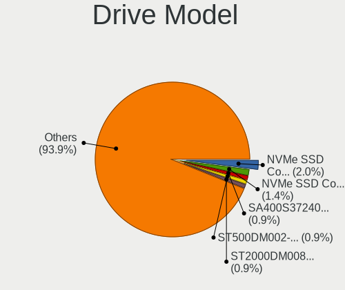
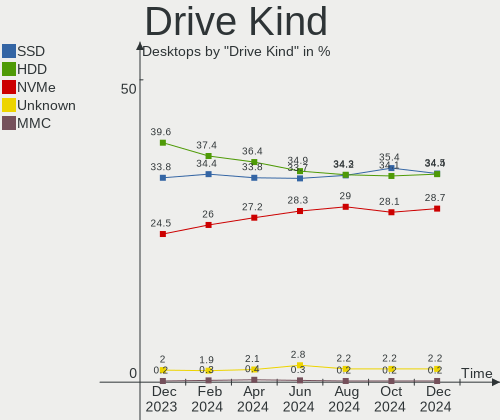
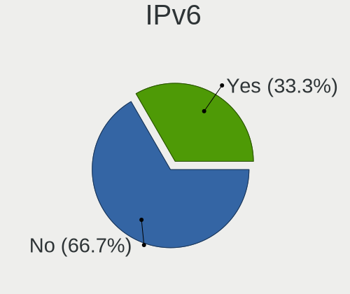

Linux Hardware Trends (Desktops)
--------------------------------

A project to identify most popular hardware characteristics and track their change
over time based on data collected by Linux users at https://Linux-Hardware.org.

Anyone can contribute to this report by the [hw-probe](https://github.com/linuxhw/hw-probe) tool:

    sudo -E hw-probe -all -upload

This report is for one last month. Overall report since the beginning of time: [TestCoverage](https://github.com/linuxhw/TestCoverage)

Period: Apr, 2022.

Contents
--------

* [ System ](#system)
  - [ OS                       ](#os)
  - [ OS Family                ](#os-family)
  - [ Kernel                   ](#kernel)
  - [ Kernel Family            ](#kernel-family)
  - [ Kernel Major Ver.        ](#kernel-major-ver)
  - [ Arch                     ](#arch)
  - [ DE                       ](#de)
  - [ Display Server           ](#display-server)
  - [ Display Manager          ](#display-manager)
  - [ OS Lang                  ](#os-lang)
  - [ Boot Mode                ](#boot-mode)
  - [ Filesystem               ](#filesystem)
  - [ Part. scheme             ](#part-scheme)
  - [ Dual Boot with Linux/BSD ](#dual-boot-with-linuxbsd)
  - [ Dual Boot (Win)          ](#dual-boot-win)

* [ Board ](#board)
  - [ Vendor                   ](#vendor)
  - [ Model                    ](#model)
  - [ Model Family             ](#model-family)
  - [ MFG Year                 ](#mfg-year)
  - [ Form Factor              ](#form-factor)
  - [ Secure Boot              ](#secure-boot)
  - [ Coreboot                 ](#coreboot)
  - [ RAM Size                 ](#ram-size)
  - [ RAM Used                 ](#ram-used)
  - [ Total Drives             ](#total-drives)
  - [ Has CD-ROM               ](#has-cd-rom)
  - [ Has Ethernet             ](#has-ethernet)
  - [ Has WiFi                 ](#has-wifi)
  - [ Has Bluetooth            ](#has-bluetooth)

* [ Location ](#location)
  - [ Country                  ](#country)
  - [ City                     ](#city)

* [ Drives ](#drives)
  - [ Drive Vendor             ](#drive-vendor)
  - [ Drive Model              ](#drive-model)
  - [ HDD Vendor               ](#hdd-vendor)
  - [ SSD Vendor               ](#ssd-vendor)
  - [ Drive Kind               ](#drive-kind)
  - [ Drive Connector          ](#drive-connector)
  - [ Drive Size               ](#drive-size)
  - [ Space Total              ](#space-total)
  - [ Space Used               ](#space-used)
  - [ Malfunc. Drives          ](#malfunc-drives)
  - [ Malfunc. Drive Vendor    ](#malfunc-drive-vendor)
  - [ Malfunc. HDD Vendor      ](#malfunc-hdd-vendor)
  - [ Malfunc. Drive Kind      ](#malfunc-drive-kind)
  - [ Failed Drives            ](#failed-drives)
  - [ Failed Drive Vendor      ](#failed-drive-vendor)
  - [ Drive Status             ](#drive-status)

* [ Storage controller ](#storage-controller)
  - [ Storage Vendor           ](#storage-vendor)
  - [ Storage Model            ](#storage-model)
  - [ Storage Kind             ](#storage-kind)

* [ Processor ](#processor)
  - [ CPU Vendor               ](#cpu-vendor)
  - [ CPU Model                ](#cpu-model)
  - [ CPU Model Family         ](#cpu-model-family)
  - [ CPU Cores                ](#cpu-cores)
  - [ CPU Sockets              ](#cpu-sockets)
  - [ CPU Threads              ](#cpu-threads)
  - [ CPU Op-Modes             ](#cpu-op-modes)
  - [ CPU Microcode            ](#cpu-microcode)
  - [ CPU Microarch            ](#cpu-microarch)

* [ Graphics ](#graphics)
  - [ GPU Vendor               ](#gpu-vendor)
  - [ GPU Model                ](#gpu-model)
  - [ GPU Combo                ](#gpu-combo)
  - [ GPU Driver               ](#gpu-driver)
  - [ GPU Memory               ](#gpu-memory)

* [ Monitor ](#monitor)
  - [ Monitor Vendor           ](#monitor-vendor)
  - [ Monitor Model            ](#monitor-model)
  - [ Monitor Resolution       ](#monitor-resolution)
  - [ Monitor Diagonal         ](#monitor-diagonal)
  - [ Monitor Width            ](#monitor-width)
  - [ Aspect Ratio             ](#aspect-ratio)
  - [ Monitor Area             ](#monitor-area)
  - [ Pixel Density            ](#pixel-density)
  - [ Multiple Monitors        ](#multiple-monitors)

* [ Network ](#network)
  - [ Net Controller Vendor    ](#net-controller-vendor)
  - [ Net Controller Model     ](#net-controller-model)
  - [ Wireless Vendor          ](#wireless-vendor)
  - [ Wireless Model           ](#wireless-model)
  - [ Ethernet Vendor          ](#ethernet-vendor)
  - [ Ethernet Model           ](#ethernet-model)
  - [ Net Controller Kind      ](#net-controller-kind)
  - [ Used Controller          ](#used-controller)
  - [ NICs                     ](#nics)
  - [ IPv6                     ](#ipv6)

* [ Bluetooth ](#bluetooth)
  - [ Bluetooth Vendor         ](#bluetooth-vendor)
  - [ Bluetooth Model          ](#bluetooth-model)

* [ Sound ](#sound)
  - [ Sound Vendor             ](#sound-vendor)
  - [ Sound Model              ](#sound-model)

* [ Memory ](#memory)
  - [ Memory Vendor            ](#memory-vendor)
  - [ Memory Model             ](#memory-model)
  - [ Memory Kind              ](#memory-kind)
  - [ Memory Form Factor       ](#memory-form-factor)
  - [ Memory Size              ](#memory-size)
  - [ Memory Speed             ](#memory-speed)

* [ Printers & scanners ](#printers--scanners)
  - [ Printer Vendor           ](#printer-vendor)
  - [ Printer Model            ](#printer-model)
  - [ Scanner Vendor           ](#scanner-vendor)
  - [ Scanner Model            ](#scanner-model)

* [ Camera ](#camera)
  - [ Camera Vendor            ](#camera-vendor)
  - [ Camera Model             ](#camera-model)

* [ Security ](#security)
  - [ Fingerprint Vendor       ](#fingerprint-vendor)
  - [ Fingerprint Model        ](#fingerprint-model)
  - [ Chipcard Vendor          ](#chipcard-vendor)
  - [ Chipcard Model           ](#chipcard-model)

* [ Unsupported ](#unsupported)
  - [ Unsupported Devices      ](#unsupported-devices)
  - [ Unsupported Device Types ](#unsupported-device-types)

System
------

OS
--

Installed operating systems

| Name                 | Desktops | Percent |
|----------------------|----------|---------|
| Ubuntu 20.04         | 251      | 11.09%  |
| ROSA 12.2            | 199      | 8.79%   |
| Linux Mint 20.3      | 156      | 6.89%   |
| OpenMandriva 4.3     | 132      | 5.83%   |
| Debian 11            | 123      | 5.44%   |
| Ubuntu 21.10         | 113      | 4.99%   |
| Fedora 35            | 111      | 4.9%    |
| Pop!_OS 21.10        | 93       | 4.11%   |
| Ubuntu 22.04         | 89       | 3.93%   |
| Kometa P10           | 79       | 3.49%   |
| Zorin 16             | 68       | 3%      |
| Manjaro              | 55       | 2.43%   |
| KDE neon 20.04       | 51       | 2.25%   |
| Arch                 | 40       | 1.77%   |
| ArcoLinux Rolling    | 37       | 1.63%   |
| Arch Rolling         | 35       | 1.55%   |
| Fedora 36            | 30       | 1.33%   |
| Ubuntu 18.04         | 28       | 1.24%   |
| Elementary 6.1       | 26       | 1.15%   |
| ROSA R11.1           | 24       | 1.06%   |
| OpenMandriva 4.2     | 24       | 1.06%   |
| Pop!_OS 22.04        | 23       | 1.02%   |
| Manjaro 21.2.5       | 22       | 0.97%   |
| Xubuntu 20.04        | 21       | 0.93%   |
| BlackPanther 18.1    | 18       | 0.8%    |
| Debian Testing       | 13       | 0.57%   |
| Manjaro 21.2.6       | 12       | 0.53%   |
| Linux Mint 19.3      | 12       | 0.53%   |
| Kubuntu 20.04        | 12       | 0.53%   |
| Kubuntu 21.10        | 11       | 0.49%   |
| Kali 2022.1          | 11       | 0.49%   |
| Gentoo 2.8           | 11       | 0.49%   |
| Gentoo 2.6           | 11       | 0.49%   |
| Fedora 34            | 11       | 0.49%   |
| LMDE 5               | 10       | 0.44%   |
| Linux Mint 20.2      | 10       | 0.44%   |
| Solus 4.3            | 9        | 0.4%    |
| Debian 10            | 9        | 0.4%    |
| Ubuntu MATE 20.04    | 8        | 0.35%   |
| EndeavourOS Rolling  | 8        | 0.35%   |
| Slackware 15.0       | 7        | 0.31%   |
| Pop!_OS 20.04        | 7        | 0.31%   |
| Linux Mint 20.1      | 7        | 0.31%   |
| Kubuntu 22.04        | 7        | 0.31%   |
| Gentoo 2.7           | 7        | 0.31%   |
| Zorin 15             | 6        | 0.27%   |
| Ubuntu 16.04         | 6        | 0.27%   |
| Xubuntu 21.10        | 5        | 0.22%   |
| ROSA 12.1            | 5        | 0.22%   |
| Pop!_OS 21.04        | 5        | 0.22%   |
| openSUSE Leap-15.3   | 5        | 0.22%   |
| MX 21                | 5        | 0.22%   |
| Garuda Linux Soaring | 5        | 0.22%   |
| Endless 4.0.4        | 5        | 0.22%   |
| Debian Unstable      | 5        | 0.22%   |
| Ubuntu 21.04         | 4        | 0.18%   |
| ROSA R11             | 4        | 0.18%   |
| Parrot 5.0           | 4        | 0.18%   |
| Lubuntu 20.04        | 4        | 0.18%   |
| Linux Mint 20        | 4        | 0.18%   |

OS Family
---------

OS without a version

| Name             | Desktops | Percent |
|------------------|----------|---------|
| Ubuntu           | 492      | 21.74%  |
| ROSA             | 235      | 10.38%  |
| Linux Mint       | 190      | 8.4%    |
| OpenMandriva     | 159      | 7.03%   |
| Fedora           | 153      | 6.76%   |
| Debian           | 153      | 6.76%   |
| Pop!_OS          | 128      | 5.66%   |
| Manjaro          | 90       | 3.98%   |
| ALT Linux        | 83       | 3.67%   |
| Arch             | 75       | 3.31%   |
| Zorin            | 74       | 3.27%   |
| KDE neon         | 52       | 2.3%    |
| ArcoLinux        | 37       | 1.63%   |
| Kubuntu          | 35       | 1.55%   |
| Gentoo           | 29       | 1.28%   |
| Elementary       | 29       | 1.28%   |
| Xubuntu          | 28       | 1.24%   |
| openSUSE         | 22       | 0.97%   |
| BlackPanther     | 18       | 0.8%    |
| Ubuntu MATE      | 13       | 0.57%   |
| LMDE             | 13       | 0.57%   |
| Kali             | 13       | 0.57%   |
| EndeavourOS      | 11       | 0.49%   |
| Lubuntu          | 10       | 0.44%   |
| Clear Linux      | 10       | 0.44%   |
| Solus            | 9        | 0.4%    |
| Garuda Linux     | 9        | 0.4%    |
| Endless          | 9        | 0.4%    |
| Slackware        | 7        | 0.31%   |
| MX               | 6        | 0.27%   |
| Parrot           | 5        | 0.22%   |
| CentOS           | 5        | 0.22%   |
| Ubuntu Budgie    | 4        | 0.18%   |
| Red OS           | 4        | 0.18%   |
| ClearOS          | 4        | 0.18%   |
| Void Linux       | 3        | 0.13%   |
| Rocky Linux      | 3        | 0.13%   |
| RHEL             | 3        | 0.13%   |
| Pardus           | 3        | 0.13%   |
| org.kde.Platform | 3        | 0.13%   |
| Mageia           | 3        | 0.13%   |
| Linux Lite       | 3        | 0.13%   |
| Devuan           | 3        | 0.13%   |
| Xero             | 2        | 0.09%   |
| Ubuntu Studio    | 2        | 0.09%   |
| Trisquel         | 2        | 0.09%   |
| RELS             | 2        | 0.09%   |
| NixOS            | 2        | 0.09%   |
| LinuxFX          | 2        | 0.09%   |
| Lilidog          | 2        | 0.09%   |
| UbuntuDDE        | 1        | 0.04%   |
| Siduction        | 1        | 0.04%   |
| Regata OS        | 1        | 0.04%   |
| Progress Linux   | 1        | 0.04%   |
| Parabola         | 1        | 0.04%   |
| MocaccinoOS      | 1        | 0.04%   |
| MassOS           | 1        | 0.04%   |
| Guix             | 1        | 0.04%   |
| Calculate        | 1        | 0.04%   |
| Atz              | 1        | 0.04%   |

Kernel
------

Version of the Linux kernel

| Version                             | Desktops | Percent |
|-------------------------------------|----------|---------|
| 5.13.0-39-generic                   | 306      | 13.52%  |
| 5.10.74-generic-2rosa2021.1-x86_64  | 180      | 7.95%   |
| 5.4.0-107-generic                   | 149      | 6.58%   |
| 5.16.7-desktop-1omv4003             | 126      | 5.57%   |
| 5.13.0-40-generic                   | 117      | 5.17%   |
| 5.10.0-13-amd64                     | 65       | 2.87%   |
| 5.4.0-109-generic                   | 57       | 2.52%   |
| 5.16.18-200.fc35.x86_64             | 52       | 2.3%    |
| 5.16.15-76051615-generic            | 52       | 2.3%    |
| 5.10.109-std-def-alt1               | 49       | 2.17%   |
| 5.15.0-25-generic                   | 45       | 1.99%   |
| 5.16.19-76051619-generic            | 43       | 1.9%    |
| 5.17.1-arch1-1                      | 40       | 1.77%   |
| 5.15.0-27-generic                   | 39       | 1.72%   |
| 5.10.0-7-amd64                      | 30       | 1.33%   |
| 5.10.102-std-def-alt1               | 25       | 1.1%    |
| 5.13.0-37-generic                   | 24       | 1.06%   |
| 5.10.14-desktop-1omv4002            | 24       | 1.06%   |
| 5.15.32-1-MANJARO                   | 20       | 0.88%   |
| 5.15.28-1-MANJARO                   | 20       | 0.88%   |
| 5.16.20-200.fc35.x86_64             | 17       | 0.75%   |
| 5.17.1-zen1-1-zen                   | 16       | 0.71%   |
| 5.16.19-200.fc35.x86_64             | 15       | 0.66%   |
| 5.16.11-76051611-generic            | 15       | 0.66%   |
| 5.13.0-30-generic                   | 14       | 0.62%   |
| 5.15.32-generic-5rosa2021.1-x86_64  | 12       | 0.53%   |
| 5.17.2-300.fc36.x86_64              | 11       | 0.49%   |
| 5.16.14-1-MANJARO                   | 11       | 0.49%   |
| 5.16.11-arch1-1                     | 11       | 0.49%   |
| 5.16.0-6-amd64                      | 11       | 0.49%   |
| 5.4.0-91-generic                    | 10       | 0.44%   |
| 5.4.0-105-generic                   | 10       | 0.44%   |
| 5.17.1-3-MANJARO                    | 10       | 0.44%   |
| 4.18.16-desktop-1bP                 | 10       | 0.44%   |
| 5.17.4-arch1-1                      | 9        | 0.4%    |
| 5.17.4-200.fc35.x86_64              | 9        | 0.4%    |
| 5.15.0-23-generic                   | 9        | 0.4%    |
| 5.13.0-35-generic                   | 9        | 0.4%    |
| 5.11.0-35-generic                   | 9        | 0.4%    |
| 5.10.0-12-amd64                     | 9        | 0.4%    |
| 5.6.14-desktop-2bP                  | 8        | 0.35%   |
| 5.17.1-300.fc36.x86_64              | 8        | 0.35%   |
| 5.13.19-6-pve                       | 8        | 0.35%   |
| 4.15.0-desktop-122.124.1rosa-x86_64 | 8        | 0.35%   |
| 4.15.0-175-generic                  | 8        | 0.35%   |
| 5.4.83-generic-2rosa-x86_64         | 7        | 0.31%   |
| 5.4.0-107-lowlatency                | 7        | 0.31%   |
| 5.4.0-104-generic                   | 7        | 0.31%   |
| 5.17.3-arch1-1                      | 7        | 0.31%   |
| 5.16.0-kali6-amd64                  | 7        | 0.31%   |
| 5.17.5-arch1-1                      | 6        | 0.27%   |
| 5.17.2-arch3-1                      | 6        | 0.27%   |
| 5.17.1-1-default                    | 6        | 0.27%   |
| 5.16.18-100.fc34.x86_64             | 6        | 0.27%   |
| 5.16.0-5-amd64                      | 6        | 0.27%   |
| 5.16.0-0.bpo.4-amd64                | 6        | 0.27%   |
| 5.15.32-un-def-alt1                 | 6        | 0.27%   |
| 5.14.10-300.fc35.x86_64             | 6        | 0.27%   |
| 5.13.0-27-generic                   | 6        | 0.27%   |
| 5.11.0-27-generic                   | 6        | 0.27%   |

Kernel Family
-------------

Linux kernel without a distro release

| Version  | Desktops | Percent |
|----------|----------|---------|
| 5.13.0   | 497      | 21.96%  |
| 5.4.0    | 273      | 12.06%  |
| 5.10.74  | 182      | 8.04%   |
| 5.16.7   | 126      | 5.57%   |
| 5.10.0   | 120      | 5.3%    |
| 5.15.0   | 100      | 4.42%   |
| 5.17.1   | 93       | 4.11%   |
| 5.16.18  | 72       | 3.18%   |
| 5.15.32  | 64       | 2.83%   |
| 5.16.19  | 61       | 2.7%    |
| 5.16.15  | 55       | 2.43%   |
| 5.10.109 | 52       | 2.3%    |
| 5.16.0   | 42       | 1.86%   |
| 5.11.0   | 33       | 1.46%   |
| 5.17.4   | 30       | 1.33%   |
| 5.17.2   | 29       | 1.28%   |
| 4.15.0   | 29       | 1.28%   |
| 5.17.3   | 27       | 1.19%   |
| 5.16.11  | 27       | 1.19%   |
| 5.10.102 | 25       | 1.1%    |
| 5.10.14  | 24       | 1.06%   |
| 5.16.20  | 22       | 0.97%   |
| 5.15.28  | 20       | 0.88%   |
| 5.17.0   | 15       | 0.66%   |
| 5.16.14  | 13       | 0.57%   |
| 5.16.16  | 12       | 0.53%   |
| 5.16.13  | 11       | 0.49%   |
| 5.4.83   | 10       | 0.44%   |
| 5.17.5   | 10       | 0.44%   |
| 5.13.19  | 10       | 0.44%   |
| 4.18.16  | 10       | 0.44%   |
| 4.19.0   | 9        | 0.4%    |
| 5.6.14   | 8        | 0.35%   |
| 5.15.33  | 7        | 0.31%   |
| 4.18.0   | 7        | 0.31%   |
| 5.15.26  | 6        | 0.27%   |
| 5.14.10  | 6        | 0.27%   |
| 5.14.0   | 6        | 0.27%   |
| 5.10.105 | 6        | 0.27%   |
| 3.10.0   | 6        | 0.27%   |
| 5.8.0    | 5        | 0.22%   |
| 5.4.32   | 5        | 0.22%   |
| 5.3.18   | 4        | 0.18%   |
| 5.15.34  | 4        | 0.18%   |
| 5.15.30  | 4        | 0.18%   |
| 5.15.19  | 4        | 0.18%   |
| 5.15.15  | 4        | 0.18%   |
| 5.15.10  | 4        | 0.18%   |
| 5.4.184  | 3        | 0.13%   |
| 5.16.2   | 3        | 0.13%   |
| 5.15.8   | 3        | 0.13%   |
| 5.15.35  | 3        | 0.13%   |
| 5.15.23  | 3        | 0.13%   |
| 5.15.16  | 3        | 0.13%   |
| 5.15.11  | 3        | 0.13%   |
| 5.18.0   | 2        | 0.09%   |
| 5.16.8   | 2        | 0.09%   |
| 5.15.27  | 2        | 0.09%   |
| 5.15.12  | 2        | 0.09%   |
| 5.13.13  | 2        | 0.09%   |

Kernel Major Ver.
-----------------

Linux kernel major version

| Version | Desktops | Percent |
|---------|----------|---------|
| 5.13    | 511      | 22.58%  |
| 5.16    | 450      | 19.89%  |
| 5.10    | 424      | 18.74%  |
| 5.4     | 294      | 12.99%  |
| 5.15    | 241      | 10.65%  |
| 5.17    | 204      | 9.01%   |
| 5.11    | 34       | 1.5%    |
| 4.15    | 29       | 1.28%   |
| 5.14    | 17       | 0.75%   |
| 4.18    | 17       | 0.75%   |
| 4.19    | 10       | 0.44%   |
| 5.6     | 9        | 0.4%    |
| 5.8     | 6        | 0.27%   |
| 3.10    | 6        | 0.27%   |
| 5.3     | 4        | 0.18%   |
| 5.18    | 2        | 0.09%   |
| 5.12    | 1        | 0.04%   |
| 4.9     | 1        | 0.04%   |
| 4.8     | 1        | 0.04%   |
| 4.4     | 1        | 0.04%   |
| 4.1     | 1        | 0.04%   |

Arch
----

OS architecture (x86_64, i586, etc.)

| Name   | Desktops | Percent |
|--------|----------|---------|
| x86_64 | 2230     | 98.54%  |
| i686   | 31       | 1.37%   |
| ppc64  | 1        | 0.04%   |
| e2k    | 1        | 0.04%   |

DE
--

Desktop Environment

| Name             | Desktops | Percent |
|------------------|----------|---------|
| GNOME            | 914      | 40.39%  |
| KDE5             | 627      | 27.71%  |
| X-Cinnamon       | 165      | 7.29%   |
| XFCE             | 152      | 6.72%   |
| Unknown          | 151      | 6.67%   |
| MATE             | 60       | 2.65%   |
| LXQt             | 40       | 1.77%   |
| Cinnamon         | 32       | 1.41%   |
| Pantheon         | 29       | 1.28%   |
| KDE4             | 18       | 0.8%    |
| i3               | 15       | 0.66%   |
| Budgie           | 13       | 0.57%   |
| Unity            | 9        | 0.4%    |
| GNOME Flashback  | 7        | 0.31%   |
| Deepin           | 5        | 0.22%   |
| Openbox          | 4        | 0.18%   |
| GNOME Classic    | 4        | 0.18%   |
| sway             | 3        | 0.13%   |
| LXDE             | 3        | 0.13%   |
| awesome          | 3        | 0.13%   |
| lightdm-xsession | 2        | 0.09%   |
| KDE              | 2        | 0.09%   |
| DWM              | 2        | 0.09%   |
| xmonad           | 1        | 0.04%   |
| Lubuntu          | 1        | 0.04%   |
| bspwm            | 1        | 0.04%   |

Display Server
--------------

X11 or Wayland

| Name        | Desktops | Percent |
|-------------|----------|---------|
| X11         | 1647     | 72.78%  |
| Wayland     | 442      | 19.53%  |
| Tty         | 88       | 3.89%   |
| Unknown     | 84       | 3.71%   |
| Unspecified | 2        | 0.09%   |

Display Manager
---------------

SDDM, LightDM, etc.

| Name    | Desktops | Percent |
|---------|----------|---------|
| Unknown | 741      | 32.74%  |
| SDDM    | 527      | 23.29%  |
| GDM     | 366      | 16.17%  |
| GDM3    | 319      | 14.1%   |
| LightDM | 280      | 12.37%  |
| KDM     | 18       | 0.8%    |
| LXDM    | 4        | 0.18%   |
| SLiM    | 3        | 0.13%   |
| XDM     | 2        | 0.09%   |
| NODM    | 1        | 0.04%   |
| MDM     | 1        | 0.04%   |
| Ly      | 1        | 0.04%   |

OS Lang
-------

Language

| Lang       | Desktops | Percent |
|------------|----------|---------|
| en_US      | 855      | 37.78%  |
| ru_RU      | 407      | 17.98%  |
| de_DE      | 185      | 8.17%   |
| en_GB      | 115      | 5.08%   |
| fr_FR      | 79       | 3.49%   |
| pt_BR      | 76       | 3.36%   |
| en_CA      | 63       | 2.78%   |
| Unknown    | 59       | 2.61%   |
| en_AU      | 45       | 1.99%   |
| pl_PL      | 44       | 1.94%   |
| es_ES      | 40       | 1.77%   |
| it_IT      | 38       | 1.68%   |
| cs_CZ      | 21       | 0.93%   |
| nl_NL      | 18       | 0.8%    |
| C          | 14       | 0.62%   |
| es_MX      | 12       | 0.53%   |
| en_IN      | 12       | 0.53%   |
| sv_SE      | 11       | 0.49%   |
| ja_JP      | 11       | 0.49%   |
| tr_TR      | 10       | 0.44%   |
| es_AR      | 9        | 0.4%    |
| zh_CN      | 8        | 0.35%   |
| hu_HU      | 8        | 0.35%   |
| en_ZA      | 8        | 0.35%   |
| en_IE      | 8        | 0.35%   |
| de_AT      | 8        | 0.35%   |
| fr_CA      | 7        | 0.31%   |
| nl_BE      | 6        | 0.27%   |
| fi_FI      | 6        | 0.27%   |
| en_NZ      | 6        | 0.27%   |
| es_CL      | 5        | 0.22%   |
| ro_RO      | 4        | 0.18%   |
| pt_PT      | 4        | 0.18%   |
| hr_HR      | 4        | 0.18%   |
| de_CH      | 4        | 0.18%   |
| ca_ES      | 4        | 0.18%   |
| C.UTF8     | 4        | 0.18%   |
| sk_SK      | 3        | 0.13%   |
| es_VE      | 3        | 0.13%   |
| el_GR      | 3        | 0.13%   |
| zh_TW      | 2        | 0.09%   |
| POSIX      | 2        | 0.09%   |
| fr_BE      | 2        | 0.09%   |
| es_EC      | 2        | 0.09%   |
| es_DO      | 2        | 0.09%   |
| es_CO      | 2        | 0.09%   |
| en_HK      | 2        | 0.09%   |
| en_DK      | 2        | 0.09%   |
| ar_SA      | 2        | 0.09%   |
| uk_UA      | 1        | 0.04%   |
| sr_RS      | 1        | 0.04%   |
| nb_NO      | 1        | 0.04%   |
| io_001     | 1        | 0.04%   |
| fr_FR.UTF8 | 1        | 0.04%   |
| es_US      | 1        | 0.04%   |
| es_PY      | 1        | 0.04%   |
| es_PE      | 1        | 0.04%   |
| es_NI      | 1        | 0.04%   |
| es_GT      | 1        | 0.04%   |
| es_CR      | 1        | 0.04%   |

Boot Mode
---------

EFI or BIOS

| Mode | Desktops | Percent |
|------|----------|---------|
| BIOS | 1273     | 56.25%  |
| EFI  | 990      | 43.75%  |

Filesystem
----------

Type of filesystem

| Type     | Desktops | Percent |
|----------|----------|---------|
| Ext4     | 1739     | 76.84%  |
| Overlay  | 217      | 9.59%   |
| Btrfs    | 216      | 9.54%   |
| Xfs      | 45       | 1.99%   |
| Zfs      | 24       | 1.06%   |
| F2fs     | 6        | 0.27%   |
| Ext3     | 4        | 0.18%   |
| Unknown  | 4        | 0.18%   |
| Tmpfs    | 3        | 0.13%   |
| Reiserfs | 2        | 0.09%   |
| XXX4     | 1        | 0.04%   |
| XXX      | 1        | 0.04%   |
| Ext2     | 1        | 0.04%   |

Part. scheme
------------

Scheme of partitioning

| Type    | Desktops | Percent |
|---------|----------|---------|
| Unknown | 991      | 43.79%  |
| GPT     | 902      | 39.86%  |
| MBR     | 370      | 16.35%  |

Dual Boot with Linux/BSD
------------------------

Hosting more than one Linux/BSD

| Dual boot | Desktops | Percent |
|-----------|----------|---------|
| No        | 1835     | 81.09%  |
| Yes       | 428      | 18.91%  |

Dual Boot (Win)
---------------

Hosting Linux and Windows

| Dual boot | Desktops | Percent |
|-----------|----------|---------|
| No        | 1509     | 66.68%  |
| Yes       | 754      | 33.32%  |

Board
-----

Vendor
------

Motherboard manufacturer

| Name                | Desktops | Percent |
|---------------------|----------|---------|
| ASUSTek Computer    | 593      | 26.2%   |
| Gigabyte Technology | 409      | 18.07%  |
| MSI                 | 302      | 13.35%  |
| ASRock              | 191      | 8.44%   |
| Dell                | 181      | 8%      |
| Hewlett-Packard     | 107      | 4.73%   |
| Intel               | 85       | 3.76%   |
| Lenovo              | 83       | 3.67%   |
| Unknown             | 42       | 1.86%   |
| Acer                | 40       | 1.77%   |
| Fujitsu             | 22       | 0.97%   |
| Biostar             | 21       | 0.93%   |
| Supermicro          | 19       | 0.84%   |
| Foxconn             | 19       | 0.84%   |
| Pegatron            | 17       | 0.75%   |
| ECS                 | 14       | 0.62%   |
| Medion              | 13       | 0.57%   |
| Apple               | 9        | 0.4%    |
| Alienware           | 8        | 0.35%   |
| System76            | 5        | 0.22%   |
| BESSTAR Tech        | 5        | 0.22%   |
| ASRockRack          | 5        | 0.22%   |
| Shuttle             | 4        | 0.18%   |
| Itautec             | 4        | 0.18%   |
| Huanan              | 4        | 0.18%   |
| Fujitsu Siemens     | 4        | 0.18%   |
| AZW                 | 4        | 0.18%   |
| Positivo            | 3        | 0.13%   |
| Packard Bell        | 3        | 0.13%   |
| EVGA                | 3        | 0.13%   |
| eMachines           | 3        | 0.13%   |
| PCWare              | 2        | 0.09%   |
| MACHINIST           | 2        | 0.09%   |
| KLLISRE             | 2        | 0.09%   |
| HARDKERNEL          | 2        | 0.09%   |
| Gateway             | 2        | 0.09%   |
| AMI                 | 2        | 0.09%   |
| ZOTAC               | 1        | 0.04%   |
| Wistron             | 1        | 0.04%   |
| SYWZ                | 1        | 0.04%   |
| SLIMBOOK            | 1        | 0.04%   |
| SiS Technology      | 1        | 0.04%   |
| Semp Toshiba        | 1        | 0.04%   |
| Seco                | 1        | 0.04%   |
| Pepper Jobs         | 1        | 0.04%   |
| PC Engines          | 1        | 0.04%   |
| OEM                 | 1        | 0.04%   |
| NZXT                | 1        | 0.04%   |
| NF541               | 1        | 0.04%   |
| NCR                 | 1        | 0.04%   |
| Minix               | 1        | 0.04%   |
| Megaware            | 1        | 0.04%   |
| Maxtang             | 1        | 0.04%   |
| Lite-On             | 1        | 0.04%   |
| LattePanda          | 1        | 0.04%   |
| Lanix               | 1        | 0.04%   |
| JINGSHA             | 1        | 0.04%   |
| Jetway              | 1        | 0.04%   |
| J&W                 | 1        | 0.04%   |
| Inventec            | 1        | 0.04%   |

Model
-----

Motherboard model

| Name                            | Desktops | Percent |
|---------------------------------|----------|---------|
| ASUS All Series                 | 71       | 3.14%   |
| Unknown                         | 44       | 1.94%   |
| Intel SKYBAY                    | 42       | 1.86%   |
| ASUS PRIME B450-PLUS            | 17       | 0.75%   |
| MSI MS-7C37                     | 16       | 0.71%   |
| Dell OptiPlex 7010              | 16       | 0.71%   |
| Gigabyte H410M S2H              | 15       | 0.66%   |
| ASUS TUF Gaming X570-PLUS       | 14       | 0.62%   |
| Gigabyte B450M DS3H             | 13       | 0.57%   |
| MSI MS-7C02                     | 12       | 0.53%   |
| MSI MS-7A38                     | 12       | 0.53%   |
| Dell OptiPlex 3020              | 12       | 0.53%   |
| MSI MS-7B79                     | 11       | 0.49%   |
| ASUS ROG STRIX B450-F GAMING    | 11       | 0.49%   |
| Supermicro SYS-5019A-FTN4       | 10       | 0.44%   |
| MSI MS-7817                     | 10       | 0.44%   |
| Dell OptiPlex 9020              | 10       | 0.44%   |
| Acer Veriton X2640G             | 10       | 0.44%   |
| MSI MS-7C56                     | 9        | 0.4%    |
| Gigabyte B450 AORUS M           | 9        | 0.4%    |
| MSI MS-7D22                     | 8        | 0.35%   |
| MSI MS-7721                     | 8        | 0.35%   |
| Gigabyte 970A-DS3P              | 8        | 0.35%   |
| Dell OptiPlex 790               | 8        | 0.35%   |
| MSI MS-7B98                     | 7        | 0.31%   |
| Gigabyte B450 AORUS ELITE       | 7        | 0.31%   |
| Dell OptiPlex 3050              | 7        | 0.31%   |
| ASUS ROG STRIX B550-I GAMING    | 7        | 0.31%   |
| ASUS ROG STRIX B550-F GAMING    | 7        | 0.31%   |
| MSI MS-7C35                     | 6        | 0.27%   |
| MSI MS-7B86                     | 6        | 0.27%   |
| MSI MS-7B48                     | 6        | 0.27%   |
| Gigabyte B550I AORUS PRO AX     | 6        | 0.27%   |
| Dell OptiPlex 3010              | 6        | 0.27%   |
| ASUS ROG CROSSHAIR VIII HERO    | 6        | 0.27%   |
| ASUS PRIME Z390-A               | 6        | 0.27%   |
| ASRock B550M Pro4               | 6        | 0.27%   |
| MSI MS-7D09                     | 5        | 0.22%   |
| MSI MS-7C94                     | 5        | 0.22%   |
| MSI MS-7C91                     | 5        | 0.22%   |
| MSI MS-7C84                     | 5        | 0.22%   |
| Gigabyte X570 AORUS ELITE       | 5        | 0.22%   |
| Gigabyte H61M-S1                | 5        | 0.22%   |
| Gigabyte H410M H V3             | 5        | 0.22%   |
| Gigabyte B550M DS3H             | 5        | 0.22%   |
| Gigabyte A320M-S2H              | 5        | 0.22%   |
| Dell OptiPlex 990               | 5        | 0.22%   |
| Dell OptiPlex 780               | 5        | 0.22%   |
| ASUS TUF Gaming B560-PLUS WIFI  | 5        | 0.22%   |
| ASUS TUF Gaming B550-PLUS       | 5        | 0.22%   |
| ASUS ROG STRIX X570-E GAMING    | 5        | 0.22%   |
| ASUS ROG STRIX B450-F GAMING II | 5        | 0.22%   |
| ASUS PRIME B550-PLUS            | 5        | 0.22%   |
| ASUS PRIME B450M-A              | 5        | 0.22%   |
| ASUS PRIME A320M-K              | 5        | 0.22%   |
| ASUS P8Z77-V LX                 | 5        | 0.22%   |
| ASUS P8B75-M                    | 5        | 0.22%   |
| ASUS M5A78L-M/USB3              | 5        | 0.22%   |
| ASUS M5A78L-M LX3               | 5        | 0.22%   |
| MSI MS-7C52                     | 4        | 0.18%   |

Model Family
------------

Motherboard model prefix

| Name                      | Desktops | Percent |
|---------------------------|----------|---------|
| ASUS PRIME                | 125      | 5.52%   |
| Dell OptiPlex             | 110      | 4.86%   |
| ASUS ROG                  | 83       | 3.67%   |
| ASUS All                  | 71       | 3.14%   |
| Lenovo ThinkCentre        | 59       | 2.61%   |
| ASUS TUF                  | 50       | 2.21%   |
| Unknown                   | 44       | 1.94%   |
| Intel SKYBAY              | 42       | 1.86%   |
| HP Compaq                 | 34       | 1.5%    |
| Gigabyte X570             | 24       | 1.06%   |
| Dell Precision            | 24       | 1.06%   |
| Gigabyte B450             | 22       | 0.97%   |
| Dell Inspiron             | 22       | 0.97%   |
| Gigabyte H410M            | 21       | 0.93%   |
| Gigabyte B450M            | 21       | 0.93%   |
| ASUS M5A78L-M             | 21       | 0.93%   |
| Acer Aspire               | 19       | 0.84%   |
| HP EliteDesk              | 18       | 0.8%    |
| MSI MS-7C37               | 16       | 0.71%   |
| Gigabyte B550             | 16       | 0.71%   |
| Acer Veriton              | 13       | 0.57%   |
| MSI MS-7C02               | 12       | 0.53%   |
| MSI MS-7A38               | 12       | 0.53%   |
| Gigabyte B550M            | 12       | 0.53%   |
| Fujitsu ESPRIMO           | 12       | 0.53%   |
| MSI MS-7B79               | 11       | 0.49%   |
| ASUS P8H61-M              | 11       | 0.49%   |
| Supermicro SYS-5019A-FTN4 | 10       | 0.44%   |
| MSI MS-7817               | 10       | 0.44%   |
| HP ProDesk                | 10       | 0.44%   |
| ASUS P8Z77-V              | 10       | 0.44%   |
| ASRock B450               | 10       | 0.44%   |
| MSI MS-7C56               | 9        | 0.4%    |
| Dell Vostro               | 9        | 0.4%    |
| ASUS M5A97                | 9        | 0.4%    |
| ASRock X570               | 9        | 0.4%    |
| MSI MS-7D22               | 8        | 0.35%   |
| MSI MS-7721               | 8        | 0.35%   |
| Lenovo ThinkStation       | 8        | 0.35%   |
| Gigabyte 970A-DS3P        | 8        | 0.35%   |
| MSI MS-7B98               | 7        | 0.31%   |
| HP Pavilion               | 7        | 0.31%   |
| Gigabyte GA-78LMT-USB3    | 7        | 0.31%   |
| Gigabyte A320M-S2H        | 7        | 0.31%   |
| ASUS Pro                  | 7        | 0.31%   |
| ASUS P5G41T-M             | 7        | 0.31%   |
| ASRock B550M              | 7        | 0.31%   |
| ASRock B450M              | 7        | 0.31%   |
| Alienware Aurora          | 7        | 0.31%   |
| MSI MS-7C35               | 6        | 0.27%   |
| MSI MS-7B86               | 6        | 0.27%   |
| MSI MS-7B48               | 6        | 0.27%   |
| Gigabyte Z390             | 6        | 0.27%   |
| Gigabyte H310M            | 6        | 0.27%   |
| Gigabyte B550I            | 6        | 0.27%   |
| Dell XPS                  | 6        | 0.27%   |
| ASUS SABERTOOTH           | 6        | 0.27%   |
| ASUS P8B75-M              | 6        | 0.27%   |
| ASUS P5KPL-AM             | 6        | 0.27%   |
| ASRock X470               | 6        | 0.27%   |

MFG Year
--------

Motherboard manufacture year

| Year    | Desktops | Percent |
|---------|----------|---------|
| 2018    | 283      | 12.51%  |
| 2020    | 232      | 10.25%  |
| 2013    | 195      | 8.62%   |
| 2019    | 184      | 8.13%   |
| 2021    | 183      | 8.09%   |
| 2012    | 168      | 7.42%   |
| 2017    | 152      | 6.72%   |
| 2011    | 150      | 6.63%   |
| 2014    | 142      | 6.27%   |
| 2010    | 98       | 4.33%   |
| 2015    | 94       | 4.15%   |
| 2016    | 92       | 4.07%   |
| 2009    | 91       | 4.02%   |
| 2008    | 72       | 3.18%   |
| 2007    | 54       | 2.39%   |
| 2022    | 31       | 1.37%   |
| 2006    | 28       | 1.24%   |
| 2005    | 7        | 0.31%   |
| Unknown | 4        | 0.18%   |
| 2003    | 2        | 0.09%   |
| 2004    | 1        | 0.04%   |

Form Factor
-----------

Physical design of the computer

| Name    | Desktops | Percent |
|---------|----------|---------|
| Desktop | 2263     | 100%    |

Secure Boot
-----------

Enabled or disabled

| State    | Desktops | Percent |
|----------|----------|---------|
| Disabled | 2207     | 97.53%  |
| Enabled  | 56       | 2.47%   |

Coreboot
--------

Have coreboot on board

| Used | Desktops | Percent |
|------|----------|---------|
| No   | 2262     | 99.96%  |
| Yes  | 1        | 0.04%   |

RAM Size
--------

Total RAM memory

| Size in GB      | Desktops | Percent |
|-----------------|----------|---------|
| 16.01-24.0      | 568      | 25.1%   |
| 8.01-16.0       | 446      | 19.71%  |
| 32.01-64.0      | 393      | 17.37%  |
| 4.01-8.0        | 294      | 12.99%  |
| 3.01-4.0        | 274      | 12.11%  |
| 64.01-256.0     | 144      | 6.36%   |
| 24.01-32.0      | 54       | 2.39%   |
| 1.01-2.0        | 53       | 2.34%   |
| 2.01-3.0        | 25       | 1.1%    |
| More than 256.0 | 5        | 0.22%   |
| 0.51-1.0        | 5        | 0.22%   |
| Unknown         | 2        | 0.09%   |

RAM Used
--------

Used RAM memory

| Used GB     | Desktops | Percent |
|-------------|----------|---------|
| 1.01-2.0    | 772      | 34.11%  |
| 2.01-3.0    | 448      | 19.8%   |
| 4.01-8.0    | 386      | 17.06%  |
| 3.01-4.0    | 244      | 10.78%  |
| 0.51-1.0    | 214      | 9.46%   |
| 8.01-16.0   | 112      | 4.95%   |
| 0.01-0.5    | 31       | 1.37%   |
| 16.01-24.0  | 25       | 1.1%    |
| 32.01-64.0  | 14       | 0.62%   |
| 24.01-32.0  | 14       | 0.62%   |
| Unknown     | 2        | 0.09%   |
| 64.01-256.0 | 1        | 0.04%   |

Total Drives
------------

Number of drives on board

| Drives | Desktops | Percent |
|--------|----------|---------|
| 1      | 867      | 38.31%  |
| 2      | 646      | 28.55%  |
| 3      | 342      | 15.11%  |
| 4      | 192      | 8.48%   |
| 5      | 102      | 4.51%   |
| 6      | 52       | 2.3%    |
| 7      | 18       | 0.8%    |
| 8      | 17       | 0.75%   |
| 0      | 13       | 0.57%   |
| 11     | 4        | 0.18%   |
| 9      | 4        | 0.18%   |
| 45     | 1        | 0.04%   |
| 15     | 1        | 0.04%   |
| 14     | 1        | 0.04%   |
| 13     | 1        | 0.04%   |
| 12     | 1        | 0.04%   |
| 10     | 1        | 0.04%   |

Has CD-ROM
----------

Has CD-ROM on board

| Presented | Desktops | Percent |
|-----------|----------|---------|
| No        | 1306     | 57.71%  |
| Yes       | 957      | 42.29%  |

Has Ethernet
------------

Has Ethernet on board

| Presented | Desktops | Percent |
|-----------|----------|---------|
| Yes       | 2246     | 99.25%  |
| No        | 17       | 0.75%   |

Has WiFi
--------

Has WiFi module

| Presented | Desktops | Percent |
|-----------|----------|---------|
| No        | 1344     | 59.39%  |
| Yes       | 919      | 40.61%  |

Has Bluetooth
-------------

Has Bluetooth module

| Presented | Desktops | Percent |
|-----------|----------|---------|
| No        | 1552     | 68.58%  |
| Yes       | 711      | 31.42%  |

Location
--------

Country
-------

Geographic location (country)

| Country      | Desktops | Percent |
|--------------|----------|---------|
| USA          | 449      | 19.84%  |
| Russia       | 411      | 18.16%  |
| Germany      | 223      | 9.85%   |
| Brazil       | 100      | 4.42%   |
| UK           | 94       | 4.15%   |
| France       | 93       | 4.11%   |
| Canada       | 91       | 4.02%   |
| Poland       | 60       | 2.65%   |
| Spain        | 57       | 2.52%   |
| Australia    | 55       | 2.43%   |
| Italy        | 52       | 2.3%    |
| Netherlands  | 38       | 1.68%   |
| Sweden       | 33       | 1.46%   |
| Hungary      | 31       | 1.37%   |
| Czechia      | 30       | 1.33%   |
| Switzerland  | 21       | 0.93%   |
| Austria      | 20       | 0.88%   |
| Mexico       | 19       | 0.84%   |
| Argentina    | 18       | 0.8%    |
| Turkey       | 17       | 0.75%   |
| India        | 17       | 0.75%   |
| Greece       | 16       | 0.71%   |
| Finland      | 16       | 0.71%   |
| Belgium      | 16       | 0.71%   |
| Japan        | 15       | 0.66%   |
| Romania      | 12       | 0.53%   |
| Norway       | 12       | 0.53%   |
| South Africa | 11       | 0.49%   |
| China        | 11       | 0.49%   |
| Ukraine      | 10       | 0.44%   |
| Belarus      | 10       | 0.44%   |
| New Zealand  | 9        | 0.4%    |
| Croatia      | 9        | 0.4%    |
| Slovakia     | 8        | 0.35%   |
| Serbia       | 8        | 0.35%   |
| Costa Rica   | 8        | 0.35%   |
| Kazakhstan   | 7        | 0.31%   |
| Egypt        | 7        | 0.31%   |
| Denmark      | 7        | 0.31%   |
| Chile        | 7        | 0.31%   |
| Bulgaria     | 7        | 0.31%   |
| Taiwan       | 6        | 0.27%   |
| Peru         | 6        | 0.27%   |
| Malaysia     | 6        | 0.27%   |
| Ireland      | 6        | 0.27%   |
| Colombia     | 6        | 0.27%   |
| Slovenia     | 5        | 0.22%   |
| Puerto Rico  | 5        | 0.22%   |
| Portugal     | 5        | 0.22%   |
| Lithuania    | 5        | 0.22%   |
| Ecuador      | 5        | 0.22%   |
| Venezuela    | 4        | 0.18%   |
| Thailand     | 4        | 0.18%   |
| Saudi Arabia | 4        | 0.18%   |
| Latvia       | 4        | 0.18%   |
| Israel       | 4        | 0.18%   |
| Hong Kong    | 4        | 0.18%   |
| Iran         | 3        | 0.13%   |
| Indonesia    | 3        | 0.13%   |
| Tunisia      | 2        | 0.09%   |

City
----

Geographic location (city)

| City              | Desktops | Percent |
|-------------------|----------|---------|
| Moscow            | 126      | 5.57%   |
| Voronezh          | 34       | 1.5%    |
| St Petersburg     | 28       | 1.24%   |
| Sydney            | 22       | 0.97%   |
| Berlin            | 19       | 0.84%   |
| Toronto           | 18       | 0.8%    |
| Sao Paulo         | 14       | 0.62%   |
| Warsaw            | 11       | 0.49%   |
| Rostov-on-Don     | 11       | 0.49%   |
| Milan             | 11       | 0.49%   |
| Madrid            | 11       | 0.49%   |
| Durham            | 11       | 0.49%   |
| Samara            | 10       | 0.44%   |
| Prague            | 10       | 0.44%   |
| Paris             | 10       | 0.44%   |
| Melbourne         | 10       | 0.44%   |
| Athens            | 10       | 0.44%   |
| Volgograd         | 9        | 0.4%    |
| Hamburg           | 9        | 0.4%    |
| Vienna            | 8        | 0.35%   |
| Seattle           | 8        | 0.35%   |
| San Jose          | 8        | 0.35%   |
| Rome              | 8        | 0.35%   |
| Munich            | 8        | 0.35%   |
| Budapest          | 8        | 0.35%   |
| Rio de Janeiro    | 7        | 0.31%   |
| Portland          | 7        | 0.31%   |
| Perm              | 7        | 0.31%   |
| Novosibirsk       | 7        | 0.31%   |
| London            | 7        | 0.31%   |
| Istanbul          | 7        | 0.31%   |
| Chicago           | 7        | 0.31%   |
| Chelyabinsk       | 7        | 0.31%   |
| Bucharest         | 7        | 0.31%   |
| Bangor            | 7        | 0.31%   |
| Zurich            | 6        | 0.27%   |
| Yekaterinburg     | 6        | 0.27%   |
| Wroclaw           | 6        | 0.27%   |
| Stockholm         | 6        | 0.27%   |
| Nizhniy Novgorod  | 6        | 0.27%   |
| Krasnoyarsk       | 6        | 0.27%   |
| Krasnodar         | 6        | 0.27%   |
| Heredia           | 6        | 0.27%   |
| Edmonton          | 6        | 0.27%   |
| Brisbane          | 6        | 0.27%   |
| Barcelona         | 6        | 0.27%   |
| Zagreb            | 5        | 0.22%   |
| Vladivostok       | 5        | 0.22%   |
| Seville           | 5        | 0.22%   |
| Richmond          | 5        | 0.22%   |
| Pittsburgh        | 5        | 0.22%   |
| Perth             | 5        | 0.22%   |
| Nuremberg         | 5        | 0.22%   |
| Karlsruhe         | 5        | 0.22%   |
| Houston           | 5        | 0.22%   |
| Helsinki          | 5        | 0.22%   |
| Frankfurt am Main | 5        | 0.22%   |
| Dublin            | 5        | 0.22%   |
| Belgrade          | 5        | 0.22%   |
| Atlanta           | 5        | 0.22%   |

Drives
------

Drive Vendor
------------

Hard drive vendors

| Vendor                    | Desktops | Drives | Percent |
|---------------------------|----------|--------|---------|
| WDC                       | 792      | 1102   | 19.37%  |
| Seagate                   | 744      | 995    | 18.2%   |
| Samsung Electronics       | 645      | 929    | 15.78%  |
| Kingston                  | 259      | 297    | 6.34%   |
| Toshiba                   | 239      | 282    | 5.85%   |
| Crucial                   | 195      | 228    | 4.77%   |
| SanDisk                   | 167      | 184    | 4.09%   |
| Hitachi                   | 116      | 130    | 2.84%   |
| A-DATA Technology         | 88       | 99     | 2.15%   |
| Intel                     | 74       | 79     | 1.81%   |
| China                     | 48       | 53     | 1.17%   |
| Phison                    | 44       | 48     | 1.08%   |
| HGST                      | 36       | 43     | 0.88%   |
| MAXTOR                    | 34       | 37     | 0.83%   |
| PNY                       | 33       | 37     | 0.81%   |
| Unknown                   | 30       | 39     | 0.73%   |
| OCZ                       | 26       | 28     | 0.64%   |
| Corsair                   | 26       | 31     | 0.64%   |
| SK Hynix                  | 25       | 30     | 0.61%   |
| AXIOMTEK                  | 25       | 25     | 0.61%   |
| SPCC                      | 24       | 26     | 0.59%   |
| Patriot                   | 22       | 22     | 0.54%   |
| Micron/Crucial Technology | 22       | 29     | 0.54%   |
| Micron Technology         | 22       | 22     | 0.54%   |
| XPG                       | 19       | 24     | 0.46%   |
| Silicon Motion            | 19       | 21     | 0.46%   |
| Apacer                    | 18       | 19     | 0.44%   |
| Intenso                   | 16       | 21     | 0.39%   |
| GOODRAM                   | 16       | 19     | 0.39%   |
| Transcend                 | 14       | 17     | 0.34%   |
| Hewlett-Packard           | 13       | 17     | 0.32%   |
| Gigabyte Technology       | 11       | 13     | 0.27%   |
| Team                      | 9        | 10     | 0.22%   |
| PLEXTOR                   | 8        | 9      | 0.2%    |
| Fujitsu                   | 8        | 8      | 0.2%    |
| SABRENT                   | 7        | 7      | 0.17%   |
| Unknown                   | 7        | 7      | 0.17%   |
| Mushkin                   | 6        | 10     | 0.15%   |
| AMD                       | 6        | 6      | 0.15%   |
| Smartbuy                  | 5        | 5      | 0.12%   |
| Phison Electronics        | 5        | 6      | 0.12%   |
| Netac                     | 5        | 5      | 0.12%   |
| LITEON                    | 5        | 5      | 0.12%   |
| JMicron                   | 5        | 6      | 0.12%   |
| ASMT                      | 5        | 5      | 0.12%   |
| Realtek Semiconductor     | 4        | 4      | 0.1%    |
| Lexar                     | 4        | 4      | 0.1%    |
| LDLC                      | 4        | 5      | 0.1%    |
| KIOXIA                    | 4        | 5      | 0.1%    |
| KingSpec                  | 4        | 4      | 0.1%    |
| Apple                     | 4        | 4      | 0.1%    |
| Verbatim                  | 3        | 4      | 0.07%   |
| QUMO                      | 3        | 3      | 0.07%   |
| NGFF                      | 3        | 3      | 0.07%   |
| Leven                     | 3        | 3      | 0.07%   |
| KIOXIA-EXCERIA            | 3        | 3      | 0.07%   |
| EMTEC                     | 3        | 3      | 0.07%   |
| ZHITAI                    | 2        | 3      | 0.05%   |
| XrayDisk                  | 2        | 2      | 0.05%   |
| WD MediaMax               | 2        | 2      | 0.05%   |

Drive Model
-----------

Hard drive models

| Model                                | Desktops | Percent |
|--------------------------------------|----------|---------|
| Kingston SA400S37240G 240GB SSD      | 79       | 1.64%   |
| Samsung SSD 860 EVO 500GB            | 58       | 1.2%    |
| Seagate ST1000DM010-2EP102 1TB       | 56       | 1.16%   |
| Samsung SSD 850 EVO 250GB            | 52       | 1.08%   |
| Seagate ST500DM002-1BD142 500GB      | 50       | 1.04%   |
| Seagate ST2000DM008-2FR102 2TB       | 48       | 1%      |
| Samsung NVMe SSD Drive 1TB           | 43       | 0.89%   |
| Samsung SSD 850 EVO 500GB            | 41       | 0.85%   |
| Samsung SSD 860 EVO 1TB              | 36       | 0.75%   |
| Crucial CT1000MX500SSD1 1TB          | 36       | 0.75%   |
| Toshiba DT01ACA100 1TB               | 33       | 0.68%   |
| WDC WD10EZEX-08WN4A0 1TB             | 30       | 0.62%   |
| Samsung NVMe SSD Drive 500GB         | 29       | 0.6%    |
| Seagate ST3500418AS 500GB            | 28       | 0.58%   |
| Kingston SA400S37120G 120GB SSD      | 27       | 0.56%   |
| WDC WDS500G2B0A-00SM50 500GB SSD     | 26       | 0.54%   |
| Seagate ST4000DM004-2CV104 4TB       | 26       | 0.54%   |
| Sandisk NVMe SSD Drive 1TB           | 26       | 0.54%   |
| Samsung SSD 970 EVO Plus 1TB         | 26       | 0.54%   |
| Samsung SSD 860 EVO 250GB            | 25       | 0.52%   |
| Samsung NVMe SSD Drive 250GB         | 25       | 0.52%   |
| AXIOMTEK Corp.-FSA128GMC2T 128GB SSD | 25       | 0.52%   |
| Toshiba HDWD110 1TB                  | 24       | 0.5%    |
| Toshiba DT01ACA050 500GB             | 24       | 0.5%    |
| Crucial CT500MX500SSD1 500GB         | 24       | 0.5%    |
| Crucial CT240BX500SSD1 240GB         | 24       | 0.5%    |
| Seagate ST1000DM003-1ER162 1TB       | 23       | 0.48%   |
| Seagate ST2000DM001-1ER164 2TB       | 22       | 0.46%   |
| Samsung SSD 980 PRO 1TB              | 22       | 0.46%   |
| Seagate ST2000DM001-1CH164 2TB       | 21       | 0.44%   |
| Samsung SSD 980 1TB                  | 21       | 0.44%   |
| Seagate ST1000DM003-1CH162 1TB       | 20       | 0.41%   |
| Seagate ST3500413AS 500GB            | 19       | 0.39%   |
| Seagate ST1000DM003-1SB102 1TB       | 19       | 0.39%   |
| Samsung SSD 970 EVO Plus 500GB       | 19       | 0.39%   |
| Samsung HD103SJ 1TB                  | 19       | 0.39%   |
| Kingston SA400S37480G 480GB SSD      | 19       | 0.39%   |
| WDC WDS240G2G0A-00JH30 240GB SSD     | 17       | 0.35%   |
| WDC WD10EZEX-00BN5A0 1TB             | 17       | 0.35%   |
| Toshiba HDWD120 2TB                  | 17       | 0.35%   |
| Seagate ST31000528AS 1TB             | 17       | 0.35%   |
| Samsung MZVLW128HEGR-00000 128GB     | 17       | 0.35%   |
| Kingston SV300S37A120G 120GB SSD     | 17       | 0.35%   |
| Seagate ST2000DM006-2DM164 2TB       | 16       | 0.33%   |
| WDC WD20EZRZ-00Z5HB0 2TB             | 15       | 0.31%   |
| Sandisk NVMe SSD Drive 500GB         | 15       | 0.31%   |
| WDC WD5000AAKX-001CA0 500GB          | 14       | 0.29%   |
| WDC WD20EARX-00PASB0 2TB             | 14       | 0.29%   |
| Samsung SSD 870 QVO 2TB              | 14       | 0.29%   |
| Micron/Crucial NVMe SSD Drive 1TB    | 14       | 0.29%   |
| WDC WDS100T2B0C-00PXH0 1TB           | 13       | 0.27%   |
| WDC WD20EARS-00MVWB0 2TB             | 13       | 0.27%   |
| Toshiba MQ01ABD100 1TB               | 13       | 0.27%   |
| Seagate ST31000524AS 1TB             | 13       | 0.27%   |
| Samsung SSD 870 EVO 1TB              | 13       | 0.27%   |
| Samsung SSD 840 EVO 120GB            | 13       | 0.27%   |
| Kingston NVMe SSD Drive 500GB        | 13       | 0.27%   |
| WDC WDS100T2B0A-00SM50 1TB SSD       | 12       | 0.25%   |
| WDC WD30EFRX-68EUZN0 3TB             | 12       | 0.25%   |
| Seagate ST3250318AS 250GB            | 12       | 0.25%   |

HDD Vendor
----------

Hard disk drive vendors

| Vendor              | Desktops | Drives | Percent |
|---------------------|----------|--------|---------|
| Seagate             | 729      | 971    | 37.6%   |
| WDC                 | 685      | 917    | 35.33%  |
| Toshiba             | 201      | 240    | 10.37%  |
| Hitachi             | 116      | 130    | 5.98%   |
| Samsung Electronics | 85       | 105    | 4.38%   |
| HGST                | 36       | 43     | 1.86%   |
| MAXTOR              | 33       | 36     | 1.7%    |
| Unknown             | 11       | 11     | 0.57%   |
| Fujitsu             | 8        | 8      | 0.41%   |
| SABRENT             | 7        | 7      | 0.36%   |
| ASMT                | 4        | 4      | 0.21%   |
| Hewlett-Packard     | 3        | 4      | 0.15%   |
| USB                 | 2        | 2      | 0.1%    |
| MARVELL             | 2        | 3      | 0.1%    |
| ExcelStor           | 2        | 2      | 0.1%    |
| WD MediaMax         | 1        | 1      | 0.05%   |
| USB 3.0             | 1        | 1      | 0.05%   |
| TrueNAS             | 1        | 1      | 0.05%   |
| sage                | 1        | 1      | 0.05%   |
| QUANTUM             | 1        | 1      | 0.05%   |
| Pear 2TB            | 1        | 1      | 0.05%   |
| Maxtor 6            | 1        | 1      | 0.05%   |
| LaCie               | 1        | 1      | 0.05%   |
| Intenso             | 1        | 2      | 0.05%   |
| IBM H0              | 1        | 1      | 0.05%   |
| IBM                 | 1        | 1      | 0.05%   |
| DAS                 | 1        | 3      | 0.05%   |
| Apple               | 1        | 1      | 0.05%   |
| 3ware               | 1        | 4      | 0.05%   |
| Unknown             | 1        | 1      | 0.05%   |

SSD Vendor
----------

Solid state drive vendors

| Vendor              | Desktops | Drives | Percent |
|---------------------|----------|--------|---------|
| Samsung Electronics | 365      | 475    | 23.98%  |
| Kingston            | 208      | 226    | 13.67%  |
| Crucial             | 176      | 205    | 11.56%  |
| WDC                 | 118      | 131    | 7.75%   |
| SanDisk             | 116      | 126    | 7.62%   |
| A-DATA Technology   | 65       | 71     | 4.27%   |
| China               | 48       | 53     | 3.15%   |
| Intel               | 38       | 40     | 2.5%    |
| PNY                 | 33       | 37     | 2.17%   |
| AXIOMTEK            | 25       | 25     | 1.64%   |
| OCZ                 | 24       | 24     | 1.58%   |
| SPCC                | 21       | 22     | 1.38%   |
| Patriot             | 21       | 21     | 1.38%   |
| Toshiba             | 20       | 21     | 1.31%   |
| Apacer              | 17       | 18     | 1.12%   |
| Micron Technology   | 16       | 16     | 1.05%   |
| GOODRAM             | 16       | 18     | 1.05%   |
| SK Hynix            | 12       | 13     | 0.79%   |
| Intenso             | 12       | 16     | 0.79%   |
| Transcend           | 11       | 13     | 0.72%   |
| Corsair             | 10       | 11     | 0.66%   |
| Team                | 9        | 10     | 0.59%   |
| PLEXTOR             | 8        | 8      | 0.53%   |
| Hewlett-Packard     | 8        | 9      | 0.53%   |
| Gigabyte Technology | 8        | 10     | 0.53%   |
| Seagate             | 7        | 7      | 0.46%   |
| Mushkin             | 5        | 9      | 0.33%   |
| LITEON              | 5        | 5      | 0.33%   |
| Smartbuy            | 4        | 4      | 0.26%   |
| KingSpec            | 4        | 4      | 0.26%   |
| Verbatim            | 3        | 4      | 0.2%    |
| QUMO                | 3        | 3      | 0.2%    |
| Phison              | 3        | 3      | 0.2%    |
| NGFF                | 3        | 3      | 0.2%    |
| Netac               | 3        | 3      | 0.2%    |
| Lexar               | 3        | 3      | 0.2%    |
| JMicron             | 3        | 3      | 0.2%    |
| EMTEC               | 3        | 3      | 0.2%    |
| Apple               | 3        | 3      | 0.2%    |
| XrayDisk            | 2        | 2      | 0.13%   |
| OCZ-VERTEX          | 2        | 2      | 0.13%   |
| Mercury             | 2        | 2      | 0.13%   |
| LONDISK             | 2        | 3      | 0.13%   |
| LITEONIT            | 2        | 2      | 0.13%   |
| Leven               | 2        | 2      | 0.13%   |
| KINGBANK            | 2        | 2      | 0.13%   |
| Hoodisk             | 2        | 2      | 0.13%   |
| FORESEE             | 2        | 2      | 0.13%   |
| External            | 2        | 2      | 0.13%   |
| Dogfish             | 2        | 2      | 0.13%   |
| AMD                 | 2        | 2      | 0.13%   |
| AFOX                | 2        | 2      | 0.13%   |
| Unknown             | 2        | 2      | 0.13%   |
| ZHITAI              | 1        | 1      | 0.07%   |
| Vaseky              | 1        | 1      | 0.07%   |
| Value               | 1        | 1      | 0.07%   |
| USB3.0              | 1        | 1      | 0.07%   |
| Unknown             | 1        | 1      | 0.07%   |
| TXRUI               | 1        | 1      | 0.07%   |
| TwinMOS             | 1        | 1      | 0.07%   |

Drive Kind
----------

HDD or SSD

| Kind    | Desktops | Drives | Percent |
|---------|----------|--------|---------|
| HDD     | 1513     | 2504   | 43.23%  |
| SSD     | 1264     | 1742   | 36.11%  |
| NVMe    | 659      | 869    | 18.83%  |
| Unknown | 53       | 65     | 1.51%   |
| MMC     | 11       | 12     | 0.31%   |

Drive Connector
---------------

SATA, SAS, NVMe, etc.

| Type | Desktops | Drives | Percent |
|------|----------|--------|---------|
| SATA | 2051     | 4124   | 71.91%  |
| NVMe | 658      | 867    | 23.07%  |
| SAS  | 132      | 189    | 4.63%   |
| MMC  | 11       | 12     | 0.39%   |

Drive Size
----------

Size of hard drive

| Size in TB | Desktops | Drives | Percent |
|------------|----------|--------|---------|
| 0.01-0.5   | 1543     | 2218   | 50.97%  |
| 0.51-1.0   | 824      | 1075   | 27.22%  |
| 1.01-2.0   | 359      | 476    | 11.86%  |
| 3.01-4.0   | 138      | 207    | 4.56%   |
| 4.01-10.0  | 74       | 141    | 2.44%   |
| 2.01-3.0   | 70       | 97     | 2.31%   |
| 10.01-20.0 | 19       | 32     | 0.63%   |

Space Total
-----------

Amount of disk space available on the file system

| Size in GB     | Desktops | Percent |
|----------------|----------|---------|
| 101-250        | 512      | 22.62%  |
| 251-500        | 364      | 16.08%  |
| 501-1000       | 338      | 14.94%  |
| More than 3000 | 246      | 10.87%  |
| 1001-2000      | 226      | 9.99%   |
| 1-20           | 173      | 7.64%   |
| 2001-3000      | 142      | 6.27%   |
| Unknown        | 128      | 5.66%   |
| 51-100         | 97       | 4.29%   |
| 21-50          | 37       | 1.63%   |

Space Used
----------

Amount of used disk space

| Used GB        | Desktops | Percent |
|----------------|----------|---------|
| 1-20           | 749      | 33.1%   |
| 21-50          | 282      | 12.46%  |
| 101-250        | 252      | 11.14%  |
| 251-500        | 197      | 8.71%   |
| 51-100         | 189      | 8.35%   |
| 501-1000       | 179      | 7.91%   |
| 1001-2000      | 135      | 5.97%   |
| Unknown        | 128      | 5.66%   |
| More than 3000 | 102      | 4.51%   |
| 2001-3000      | 49       | 2.17%   |
| 0              | 1        | 0.04%   |

Malfunc. Drives
---------------

Drive models with a malfunction

| Model                                 | Desktops | Drives | Percent |
|---------------------------------------|----------|--------|---------|
| Seagate ST3500418AS 500GB             | 12       | 13     | 3.05%   |
| Seagate ST500DM002-1BD142 500GB       | 7        | 7      | 1.78%   |
| Seagate ST3500413AS 500GB             | 7        | 7      | 1.78%   |
| Seagate ST31500341AS 1TB              | 5        | 5      | 1.27%   |
| Seagate ST2000DM001-1CH164 2TB        | 5        | 6      | 1.27%   |
| WDC WD5000AAKX-001CA0 500GB           | 4        | 4      | 1.02%   |
| Seagate ST500LT012-9WS142 500GB       | 4        | 4      | 1.02%   |
| Seagate ST3250318AS 250GB             | 4        | 4      | 1.02%   |
| Seagate ST1000DM003-1SB102 1TB        | 4        | 4      | 1.02%   |
| Toshiba MQ01ABD100 1TB                | 3        | 3      | 0.76%   |
| Toshiba DT01ACA050 500GB              | 3        | 3      | 0.76%   |
| Seagate ST500LT012-1DG142 500GB       | 3        | 3      | 0.76%   |
| Seagate ST3320418AS 320GB             | 3        | 3      | 0.76%   |
| Seagate ST3250410AS 250GB             | 3        | 3      | 0.76%   |
| Seagate ST31000528AS 1TB              | 3        | 3      | 0.76%   |
| Seagate ST2000DM008-2FR102 2TB        | 3        | 3      | 0.76%   |
| Seagate ST1000LM024 HN-M101MBB 1TB    | 3        | 3      | 0.76%   |
| Seagate ST1000DM003-1ER162 1TB        | 3        | 4      | 0.76%   |
| Samsung Electronics SSD 980 1TB       | 3        | 3      | 0.76%   |
| Kingston SV300S37A120G 120GB SSD      | 3        | 3      | 0.76%   |
| WDC WDS240G2G0A-00JH30 240GB SSD      | 2        | 3      | 0.51%   |
| WDC WD2500KS-00MJB0 250GB             | 2        | 2      | 0.51%   |
| WDC WD20EARX-00PASB0 2TB              | 2        | 2      | 0.51%   |
| WDC WD20EARS-00S8B1 2TB               | 2        | 2      | 0.51%   |
| WDC WD1600AAJS-00L7A0 160GB           | 2        | 2      | 0.51%   |
| WDC WD10EZEX-60WN4A0 1TB              | 2        | 2      | 0.51%   |
| WDC WD10EZEX-22MFCA0 1TB              | 2        | 2      | 0.51%   |
| WDC WD10EARS-00Y5B1 1TB               | 2        | 2      | 0.51%   |
| WDC WD10EADS-22M2B0 1TB               | 2        | 2      | 0.51%   |
| WDC WD1002FAEX-00Z3A0 1TB             | 2        | 2      | 0.51%   |
| Toshiba DT01ACA100 1TB                | 2        | 2      | 0.51%   |
| Seagate ST9500325AS 500GB             | 2        | 2      | 0.51%   |
| Seagate ST500LM021-1KJ152 500GB       | 2        | 2      | 0.51%   |
| Seagate ST380815AS 80GB               | 2        | 2      | 0.51%   |
| Seagate ST3320613AS 320GB             | 2        | 2      | 0.51%   |
| Seagate ST3250820AS 250GB             | 2        | 2      | 0.51%   |
| Seagate ST3250312AS 250GB             | 2        | 2      | 0.51%   |
| Seagate ST3160815AS 160GB             | 2        | 2      | 0.51%   |
| Seagate ST3160812AS 160GB             | 2        | 2      | 0.51%   |
| Seagate ST3000DM001-1CH166 3TB        | 2        | 2      | 0.51%   |
| Seagate ST2000DM001-1ER164 2TB        | 2        | 2      | 0.51%   |
| Seagate ST2000DL003-9VT166 2TB        | 2        | 2      | 0.51%   |
| Seagate ST1000DX001-1CM162 1TB        | 2        | 2      | 0.51%   |
| Seagate ST1000DM010-2EP102 1TB        | 2        | 2      | 0.51%   |
| Seagate ST1000DM003-9YN162 1TB        | 2        | 2      | 0.51%   |
| SanDisk SSD PLUS 240GB                | 2        | 2      | 0.51%   |
| Samsung Electronics SSD 970 EVO 500GB | 2        | 3      | 0.51%   |
| Samsung Electronics SSD 870 EVO 1TB   | 2        | 2      | 0.51%   |
| Samsung Electronics HD160JJ 160GB     | 2        | 2      | 0.51%   |
| Samsung Electronics HD103UJ 1TB       | 2        | 4      | 0.51%   |
| MAXTOR STM3250310AS 250GB             | 2        | 2      | 0.51%   |
| Kingston SUV400S37240G 240GB SSD      | 2        | 2      | 0.51%   |
| Intel SSDSC2CT120A3 120GB             | 2        | 2      | 0.51%   |
| Hitachi HTS547575A9E384 752GB         | 2        | 2      | 0.51%   |
| Hitachi HDS721010CLA332 1TB           | 2        | 2      | 0.51%   |
| Crucial CT525MX300SSD1 528GB          | 2        | 2      | 0.51%   |
| XrayDisk SSD 256GB                    | 1        | 1      | 0.25%   |
| WDC WDS480G2G0A-00JH30 480GB SSD      | 1        | 1      | 0.25%   |
| WDC WDS100T2B0A-00SM50 1TB SSD        | 1        | 1      | 0.25%   |
| WDC WD800JD-60LSA0 80GB               | 1        | 1      | 0.25%   |

Malfunc. Drive Vendor
---------------------

Vendors of faulty drives

| Vendor              | Desktops | Drives | Percent |
|---------------------|----------|--------|---------|
| Seagate             | 133      | 148    | 35.28%  |
| WDC                 | 91       | 99     | 24.14%  |
| Samsung Electronics | 38       | 45     | 10.08%  |
| Hitachi             | 22       | 23     | 5.84%   |
| Toshiba             | 17       | 20     | 4.51%   |
| MAXTOR              | 9        | 9      | 2.39%   |
| Crucial             | 8        | 8      | 2.12%   |
| Kingston            | 7        | 7      | 1.86%   |
| SanDisk             | 6        | 6      | 1.59%   |
| Intel               | 6        | 6      | 1.59%   |
| HGST                | 4        | 5      | 1.06%   |
| SK Hynix            | 3        | 3      | 0.8%    |
| Micron Technology   | 3        | 3      | 0.8%    |
| Fujitsu             | 3        | 3      | 0.8%    |
| A-DATA Technology   | 3        | 3      | 0.8%    |
| SPCC                | 2        | 2      | 0.53%   |
| Silicon Motion      | 2        | 2      | 0.53%   |
| OCZ                 | 2        | 2      | 0.53%   |
| Corsair             | 2        | 2      | 0.53%   |
| XrayDisk            | 1        | 1      | 0.27%   |
| WD MediaMax         | 1        | 1      | 0.27%   |
| QUMO                | 1        | 1      | 0.27%   |
| QUANTUM             | 1        | 1      | 0.27%   |
| PNY                 | 1        | 1      | 0.27%   |
| PLEXTOR             | 1        | 1      | 0.27%   |
| Leven               | 1        | 1      | 0.27%   |
| LDLC                | 1        | 1      | 0.27%   |
| KingSpec            | 1        | 1      | 0.27%   |
| Kingmax             | 1        | 1      | 0.27%   |
| IBM                 | 1        | 1      | 0.27%   |
| Hewlett-Packard     | 1        | 1      | 0.27%   |
| GLOWAY              | 1        | 1      | 0.27%   |
| DAS                 | 1        | 3      | 0.27%   |
| China               | 1        | 1      | 0.27%   |
| Unknown             | 1        | 1      | 0.27%   |

Malfunc. HDD Vendor
-------------------

Vendors of faulty HDD drives

| Vendor              | Desktops | Drives | Percent |
|---------------------|----------|--------|---------|
| Seagate             | 133      | 148    | 44.63%  |
| WDC                 | 88       | 94     | 29.53%  |
| Hitachi             | 22       | 23     | 7.38%   |
| Toshiba             | 17       | 20     | 5.7%    |
| Samsung Electronics | 17       | 23     | 5.7%    |
| MAXTOR              | 9        | 9      | 3.02%   |
| HGST                | 4        | 5      | 1.34%   |
| Fujitsu             | 3        | 3      | 1.01%   |
| WD MediaMax         | 1        | 1      | 0.34%   |
| QUANTUM             | 1        | 1      | 0.34%   |
| IBM                 | 1        | 1      | 0.34%   |
| DAS                 | 1        | 3      | 0.34%   |
| Unknown             | 1        | 1      | 0.34%   |

Malfunc. Drive Kind
-------------------

Kinds of faulty drives

| Kind | Desktops | Drives | Percent |
|------|----------|--------|---------|
| HDD  | 268      | 332    | 77.68%  |
| SSD  | 64       | 68     | 18.55%  |
| NVMe | 13       | 14     | 3.77%   |

Failed Drives
-------------

Failed drive models

| Model                           | Desktops | Drives | Percent |
|---------------------------------|----------|--------|---------|
| Seagate ST31000524AS 1TB        | 1        | 1      | 16.67%  |
| Seagate ST31000520AS 1TB        | 1        | 1      | 16.67%  |
| Samsung Electronics HD103UJ 1TB | 1        | 1      | 16.67%  |
| Patriot Pyro SSD 120GB          | 1        | 1      | 16.67%  |
| Intel SSDSA1M160G2HP 160GB      | 1        | 1      | 16.67%  |
| Hitachi HDP725050GLA360 500GB   | 1        | 1      | 16.67%  |

Failed Drive Vendor
-------------------

Failed drive vendors

| Vendor              | Desktops | Drives | Percent |
|---------------------|----------|--------|---------|
| Seagate             | 2        | 2      | 33.33%  |
| Samsung Electronics | 1        | 1      | 16.67%  |
| Patriot             | 1        | 1      | 16.67%  |
| Intel               | 1        | 1      | 16.67%  |
| Hitachi             | 1        | 1      | 16.67%  |

Drive Status
------------

Number of failed and malfunc. drives

| Status   | Desktops | Drives | Percent |
|----------|----------|--------|---------|
| Works    | 1153     | 2302   | 44.97%  |
| Detected | 1073     | 2470   | 41.85%  |
| Malfunc  | 332      | 414    | 12.95%  |
| Failed   | 6        | 6      | 0.23%   |

Storage controller
------------------

Storage Vendor
--------------

Storage controller vendors

| Vendor                           | Desktops | Percent |
|----------------------------------|----------|---------|
| Intel                            | 1454     | 44.82%  |
| AMD                              | 764      | 23.55%  |
| Samsung Electronics              | 290      | 8.94%   |
| ASMedia Technology               | 101      | 3.11%   |
| Sandisk                          | 97       | 2.99%   |
| Phison Electronics               | 68       | 2.1%    |
| Kingston Technology Company      | 62       | 1.91%   |
| JMicron Technology               | 58       | 1.79%   |
| Marvell Technology Group         | 55       | 1.7%    |
| Micron/Crucial Technology        | 42       | 1.29%   |
| Nvidia                           | 41       | 1.26%   |
| Silicon Motion                   | 37       | 1.14%   |
| ADATA Technology                 | 31       | 0.96%   |
| Toshiba America Info Systems     | 20       | 0.62%   |
| Realtek Semiconductor            | 17       | 0.52%   |
| SK Hynix                         | 14       | 0.43%   |
| VIA Technologies                 | 13       | 0.4%    |
| Silicon Image                    | 11       | 0.34%   |
| LSI Logic / Symbios Logic        | 10       | 0.31%   |
| Broadcom / LSI                   | 10       | 0.31%   |
| Micron Technology                | 8        | 0.25%   |
| Seagate Technology               | 5        | 0.15%   |
| OCZ Technology Group             | 4        | 0.12%   |
| KIOXIA                           | 4        | 0.12%   |
| Silicon Integrated Systems [SiS] | 3        | 0.09%   |
| Adaptec                          | 3        | 0.09%   |
| Yangtze Memory Technologies      | 2        | 0.06%   |
| Unknown                          | 2        | 0.06%   |
| Integrated Technology Express    | 2        | 0.06%   |
| Hewlett-Packard                  | 2        | 0.06%   |
| 3ware                            | 2        | 0.06%   |
| Western Digital                  | 1        | 0.03%   |
| Union Memory (Shenzhen)          | 1        | 0.03%   |
| ULi Electronics                  | 1        | 0.03%   |
| Solid State Storage Technology   | 1        | 0.03%   |
| Shenzhen Longsys Electronics     | 1        | 0.03%   |
| Mylex                            | 1        | 0.03%   |
| MCST                             | 1        | 0.03%   |
| MAXIO Technology (Hangzhou)      | 1        | 0.03%   |
| Lite-On Technology               | 1        | 0.03%   |
| HighPoint Technologies           | 1        | 0.03%   |
| Chelsio Communications           | 1        | 0.03%   |
| Apple                            | 1        | 0.03%   |

Storage Model
-------------

Storage controller models

| Model                                                                                   | Desktops | Percent |
|-----------------------------------------------------------------------------------------|----------|---------|
| AMD FCH SATA Controller [AHCI mode]                                                     | 451      | 11.14%  |
| AMD 400 Series Chipset SATA Controller                                                  | 194      | 4.79%   |
| Intel 8 Series/C220 Series Chipset Family 6-port SATA Controller 1 [AHCI mode]          | 174      | 4.3%    |
| Intel Q170/Q150/B150/H170/H110/Z170/CM236 Chipset SATA Controller [AHCI Mode]           | 147      | 3.63%   |
| Samsung NVMe SSD Controller SM981/PM981/PM983                                           | 145      | 3.58%   |
| AMD 500 Series Chipset SATA Controller                                                  | 113      | 2.79%   |
| Intel NM10/ICH7 Family SATA Controller [IDE mode]                                       | 112      | 2.77%   |
| Intel 200 Series PCH SATA controller [AHCI mode]                                        | 103      | 2.54%   |
| Intel 6 Series/C200 Series Chipset Family 6 port Desktop SATA AHCI Controller           | 101      | 2.5%    |
| AMD SB7x0/SB8x0/SB9x0 IDE Controller                                                    | 94       | 2.32%   |
| ASMedia ASM1062 Serial ATA Controller                                                   | 91       | 2.25%   |
| Intel 7 Series/C210 Series Chipset Family 6-port SATA Controller [AHCI mode]            | 84       | 2.08%   |
| Intel 82801G (ICH7 Family) IDE Controller                                               | 82       | 2.03%   |
| Intel 500 Series Chipset Family SATA AHCI Controller                                    | 78       | 1.93%   |
| Intel SATA Controller [RAID mode]                                                       | 71       | 1.75%   |
| AMD SB7x0/SB8x0/SB9x0 SATA Controller [AHCI mode]                                       | 71       | 1.75%   |
| AMD SB7x0/SB8x0/SB9x0 SATA Controller [IDE mode]                                        | 67       | 1.66%   |
| Intel Cannon Lake PCH SATA AHCI Controller                                              | 62       | 1.53%   |
| Samsung NVMe SSD Controller PM9A1/PM9A3/980PRO                                          | 60       | 1.48%   |
| Intel 6 Series/C200 Series Chipset Family Desktop SATA Controller (IDE mode, ports 4-5) | 58       | 1.43%   |
| Intel 6 Series/C200 Series Chipset Family Desktop SATA Controller (IDE mode, ports 0-3) | 58       | 1.43%   |
| Samsung NVMe SSD Controller SM961/PM961/SM963                                           | 53       | 1.31%   |
| Samsung NVMe SSD Controller 980                                                         | 45       | 1.11%   |
| Intel 9 Series Chipset Family SATA Controller [AHCI Mode]                               | 44       | 1.09%   |
| Phison E12 NVMe Controller                                                              | 36       | 0.89%   |
| AMD 300 Series Chipset SATA Controller                                                  | 36       | 0.89%   |
| Sandisk WD Blue SN550 NVMe SSD                                                          | 35       | 0.86%   |
| AMD FCH SATA Controller D                                                               | 35       | 0.86%   |
| Intel 400 Series Chipset Family SATA AHCI Controller                                    | 33       | 0.82%   |
| Kingston Company A2000 NVMe SSD                                                         | 31       | 0.77%   |
| Intel Alder Lake-S PCH SATA Controller [AHCI Mode]                                      | 31       | 0.77%   |
| JMicron JMB363 SATA/IDE Controller                                                      | 30       | 0.74%   |
| Silicon Motion SM2263EN/SM2263XT SSD Controller                                         | 28       | 0.69%   |
| Intel 82801JI (ICH10 Family) SATA AHCI Controller                                       | 26       | 0.64%   |
| Intel C600/X79 series chipset 6-Port SATA AHCI Controller                               | 24       | 0.59%   |
| ADATA XPG SX8200 Pro PCIe Gen3x4 M.2 2280 Solid State Drive                             | 24       | 0.59%   |
| Nvidia MCP61 SATA Controller                                                            | 23       | 0.57%   |
| Intel Comet Lake SATA AHCI Controller                                                   | 22       | 0.54%   |
| Sandisk WD Black SN750 / PC SN730 NVMe SSD                                              | 21       | 0.52%   |
| Phison E16 PCIe4 NVMe Controller                                                        | 21       | 0.52%   |
| Intel 7 Series/C210 Series Chipset Family 4-port SATA Controller [IDE mode]             | 21       | 0.52%   |
| Intel 7 Series/C210 Series Chipset Family 2-port SATA Controller [IDE mode]             | 21       | 0.52%   |
| Intel 82801JI (ICH10 Family) 4 port SATA IDE Controller #1                              | 20       | 0.49%   |
| Intel 82801JI (ICH10 Family) 2 port SATA IDE Controller #2                              | 20       | 0.49%   |
| Intel 82801I (ICH9 Family) 2 port SATA Controller [IDE mode]                            | 20       | 0.49%   |
| Kingston Company Company Non-Volatile memory controller                                 | 19       | 0.47%   |
| Intel C610/X99 series chipset 6-Port SATA Controller [AHCI mode]                        | 19       | 0.47%   |
| Intel C610/X99 series chipset sSATA Controller [AHCI mode]                              | 18       | 0.44%   |
| Intel 4 Series Chipset PT IDER Controller                                               | 18       | 0.44%   |
| Nvidia MCP61 IDE                                                                        | 17       | 0.42%   |
| Micron/Crucial P2 NVMe PCIe SSD                                                         | 16       | 0.4%    |
| Marvell Group 88SE9172 SATA 6Gb/s Controller                                            | 16       | 0.4%    |
| Intel 5 Series/3400 Series Chipset 4 port SATA IDE Controller                           | 16       | 0.4%    |
| Intel 5 Series/3400 Series Chipset 2 port SATA IDE Controller                           | 16       | 0.4%    |
| Intel Volume Management Device NVMe RAID Controller                                     | 15       | 0.37%   |
| Intel SSD 660P Series                                                                   | 15       | 0.37%   |
| AMD X370 Series Chipset SATA Controller                                                 | 15       | 0.37%   |
| Micron/Crucial P1 NVMe PCIe SSD                                                         | 14       | 0.35%   |
| JMicron JMB368 IDE controller                                                           | 14       | 0.35%   |
| Intel 82801IR/IO/IH (ICH9R/DO/DH) 4 port SATA Controller [IDE mode]                     | 14       | 0.35%   |

Storage Kind
------------

Kind of storage controller (IDE, SATA, NVMe, SAS, ...)

| Kind | Desktops | Percent |
|------|----------|---------|
| SATA | 1835     | 57.78%  |
| NVMe | 658      | 20.72%  |
| IDE  | 521      | 16.4%   |
| RAID | 135      | 4.25%   |
| SAS  | 18       | 0.57%   |
| SCSI | 9        | 0.28%   |

Processor
---------

CPU Vendor
----------

Processor vendors

| Vendor            | Desktops | Percent |
|-------------------|----------|---------|
| Intel             | 1457     | 64.38%  |
| AMD               | 803      | 35.48%  |
| MBE8C-PC          | 1        | 0.04%   |
| CHRP IBM,9131-52A | 1        | 0.04%   |
| Unknown           | 1        | 0.04%   |

CPU Model
---------

Processor models

| Model                                       | Desktops | Percent |
|---------------------------------------------|----------|---------|
| AMD Ryzen 5 3600 6-Core Processor           | 53       | 2.34%   |
| Intel Core i3-6100TE CPU @ 2.70GHz          | 42       | 1.86%   |
| AMD Ryzen 7 3700X 8-Core Processor          | 37       | 1.63%   |
| AMD Ryzen 9 3900X 12-Core Processor         | 29       | 1.28%   |
| AMD Ryzen 7 5800X 8-Core Processor          | 28       | 1.24%   |
| AMD Ryzen 5 2600 Six-Core Processor         | 28       | 1.24%   |
| AMD Ryzen 5 1600 Six-Core Processor         | 28       | 1.24%   |
| Intel Core i5-4590 CPU @ 3.30GHz            | 27       | 1.19%   |
| Intel Core i5-2400 CPU @ 3.10GHz            | 27       | 1.19%   |
| Intel Core i7-3770 CPU @ 3.40GHz            | 26       | 1.15%   |
| Intel Core i5-3470 CPU @ 3.20GHz            | 26       | 1.15%   |
| AMD Ryzen 5 5600G with Radeon Graphics      | 23       | 1.02%   |
| Intel Core i7-4790 CPU @ 3.60GHz            | 22       | 0.97%   |
| Intel Core i3-10100 CPU @ 3.60GHz           | 22       | 0.97%   |
| AMD Ryzen 7 2700X Eight-Core Processor      | 22       | 0.97%   |
| AMD Ryzen 5 5600X 6-Core Processor          | 22       | 0.97%   |
| AMD Ryzen 9 5950X 16-Core Processor         | 21       | 0.93%   |
| Intel Core i5-10400 CPU @ 2.90GHz           | 19       | 0.84%   |
| AMD Ryzen 9 5900X 12-Core Processor         | 19       | 0.84%   |
| Intel Core i7-8700 CPU @ 3.20GHz            | 17       | 0.75%   |
| Intel Core i3-2120 CPU @ 3.30GHz            | 17       | 0.75%   |
| Intel Core i5-4460 CPU @ 3.20GHz            | 16       | 0.71%   |
| AMD Ryzen 7 2700 Eight-Core Processor       | 16       | 0.71%   |
| Intel Core i7-8700K CPU @ 3.70GHz           | 15       | 0.66%   |
| Intel Core i3-4130 CPU @ 3.40GHz            | 15       | 0.66%   |
| Intel Core i3-3220 CPU @ 3.30GHz            | 15       | 0.66%   |
| Intel Core 2 Duo CPU E8400 @ 3.00GHz        | 15       | 0.66%   |
| AMD Ryzen 7 5700G with Radeon Graphics      | 15       | 0.66%   |
| AMD Ryzen 5 2600X Six-Core Processor        | 15       | 0.66%   |
| AMD Ryzen 3 3200G with Radeon Vega Graphics | 15       | 0.66%   |
| AMD FX-6300 Six-Core Processor              | 15       | 0.66%   |
| Intel Core i7-6700K CPU @ 4.00GHz           | 14       | 0.62%   |
| Intel Core i7-6700 CPU @ 3.40GHz            | 14       | 0.62%   |
| Intel Core i7-4790K CPU @ 4.00GHz           | 14       | 0.62%   |
| Intel Core i7-4770 CPU @ 3.40GHz            | 14       | 0.62%   |
| Intel Core i5-4570 CPU @ 3.20GHz            | 14       | 0.62%   |
| Intel Core i5-3570 CPU @ 3.40GHz            | 14       | 0.62%   |
| Intel Core i7-7700K CPU @ 4.20GHz           | 13       | 0.57%   |
| Intel Core i7-7700 CPU @ 3.60GHz            | 13       | 0.57%   |
| AMD Ryzen 5 3600X 6-Core Processor          | 13       | 0.57%   |
| AMD FX-8350 Eight-Core Processor            | 13       | 0.57%   |
| Intel Pentium CPU G4560 @ 3.50GHz           | 12       | 0.53%   |
| Intel Core i9-9900K CPU @ 3.60GHz           | 12       | 0.53%   |
| Intel Core i5-6500 CPU @ 3.20GHz            | 12       | 0.53%   |
| Intel Core i5-2500K CPU @ 3.30GHz           | 12       | 0.53%   |
| Intel Core i5-2500 CPU @ 3.30GHz            | 12       | 0.53%   |
| AMD Ryzen 7 1700 Eight-Core Processor       | 12       | 0.53%   |
| AMD Ryzen 5 3400G with Radeon Vega Graphics | 12       | 0.53%   |
| AMD Ryzen 3 2200G with Radeon Vega Graphics | 12       | 0.53%   |
| Intel Core i5-8400 CPU @ 2.80GHz            | 11       | 0.49%   |
| Intel Core i3-4160 CPU @ 3.60GHz            | 11       | 0.49%   |
| Intel Core i3-2100 CPU @ 3.10GHz            | 11       | 0.49%   |
| AMD Ryzen 5 2400G with Radeon Vega Graphics | 11       | 0.49%   |
| Intel Core i7-2600 CPU @ 3.40GHz            | 10       | 0.44%   |
| Intel Core i3-3240 CPU @ 3.40GHz            | 10       | 0.44%   |
| Intel Core 2 Duo CPU E7500 @ 2.93GHz        | 10       | 0.44%   |
| Intel Atom CPU C3758 @ 2.20GHz              | 10       | 0.44%   |
| Intel Pentium Dual-Core CPU E5800 @ 3.20GHz | 9        | 0.4%    |
| Intel Core i7 CPU 920 @ 2.67GHz             | 9        | 0.4%    |
| Intel Core i5-9600K CPU @ 3.70GHz           | 9        | 0.4%    |

CPU Model Family
----------------

Processor model prefix

| Model                   | Desktops | Percent |
|-------------------------|----------|---------|
| Intel Core i5           | 398      | 17.59%  |
| Intel Core i7           | 271      | 11.98%  |
| AMD Ryzen 5             | 226      | 9.99%   |
| Intel Core i3           | 224      | 9.9%    |
| AMD Ryzen 7             | 153      | 6.76%   |
| Intel Xeon              | 106      | 4.68%   |
| AMD Ryzen 9             | 87       | 3.84%   |
| Other                   | 85       | 3.76%   |
| AMD FX                  | 73       | 3.23%   |
| Intel Pentium           | 62       | 2.74%   |
| Intel Core 2 Duo        | 60       | 2.65%   |
| Intel Celeron           | 60       | 2.65%   |
| Intel Pentium Dual-Core | 45       | 1.99%   |
| Intel Core 2 Quad       | 45       | 1.99%   |
| AMD Ryzen 3             | 37       | 1.63%   |
| Intel Atom              | 27       | 1.19%   |
| AMD Phenom II X4        | 26       | 1.15%   |
| Intel Core i9           | 25       | 1.1%    |
| AMD Athlon II X2        | 20       | 0.88%   |
| AMD A10                 | 20       | 0.88%   |
| AMD A8                  | 19       | 0.84%   |
| AMD Athlon 64 X2        | 17       | 0.75%   |
| Intel Core 2            | 16       | 0.71%   |
| AMD Ryzen Threadripper  | 12       | 0.53%   |
| AMD Athlon II X4        | 12       | 0.53%   |
| Intel Pentium Dual      | 11       | 0.49%   |
| AMD Athlon              | 10       | 0.44%   |
| AMD A4                  | 10       | 0.44%   |
| AMD Phenom II X6        | 9        | 0.4%    |
| Intel Pentium 4         | 8        | 0.35%   |
| AMD Athlon X4           | 8        | 0.35%   |
| Intel Pentium D         | 7        | 0.31%   |
| AMD A6                  | 7        | 0.31%   |
| AMD Phenom              | 6        | 0.27%   |
| Intel Genuine           | 5        | 0.22%   |
| AMD Phenom II X2        | 5        | 0.22%   |
| AMD GX                  | 5        | 0.22%   |
| Intel Pentium Gold      | 4        | 0.18%   |
| AMD Sempron             | 4        | 0.18%   |
| AMD Ryzen 7 PRO         | 4        | 0.18%   |
| AMD Ryzen 5 PRO         | 4        | 0.18%   |
| AMD Ryzen 3 PRO         | 4        | 0.18%   |
| AMD Ryzen Embedded      | 3        | 0.13%   |
| AMD E1                  | 3        | 0.13%   |
| AMD PRO A10             | 2        | 0.09%   |
| AMD Athlon II X3        | 2        | 0.09%   |
| AMD Athlon Dual Core    | 2        | 0.09%   |
| AMD A12                 | 2        | 0.09%   |
| Intel Pentium Silver    | 1        | 0.04%   |
| Intel Core m5           | 1        | 0.04%   |
| Intel Core m3           | 1        | 0.04%   |
| AMD Phenom II X3        | 1        | 0.04%   |
| AMD Opteron             | 1        | 0.04%   |
| AMD G                   | 1        | 0.04%   |
| AMD EPYC                | 1        | 0.04%   |
| AMD E                   | 1        | 0.04%   |
| AMD Dual Core Opteron   | 1        | 0.04%   |
| AMD Athlon XP           | 1        | 0.04%   |
| AMD Athlon II           | 1        | 0.04%   |
| AMD Athlon 64           | 1        | 0.04%   |

CPU Cores
---------

Number of processor cores

| Number  | Desktops | Percent |
|---------|----------|---------|
| 4       | 827      | 36.54%  |
| 2       | 576      | 25.45%  |
| 6       | 369      | 16.31%  |
| 8       | 261      | 11.53%  |
| 12      | 80       | 3.54%   |
| 16      | 43       | 1.9%    |
| 1       | 35       | 1.55%   |
| 10      | 28       | 1.24%   |
| 3       | 27       | 1.19%   |
| 24      | 7        | 0.31%   |
| 64      | 2        | 0.09%   |
| 20      | 2        | 0.09%   |
| 18      | 2        | 0.09%   |
| 44      | 1        | 0.04%   |
| 32      | 1        | 0.04%   |
| 14      | 1        | 0.04%   |
| Unknown | 1        | 0.04%   |

CPU Sockets
-----------

Number of sockets

| Number  | Desktops | Percent |
|---------|----------|---------|
| 1       | 2228     | 98.45%  |
| 2       | 34       | 1.5%    |
| Unknown | 1        | 0.04%   |

CPU Threads
-----------

Threads per core (Hyper-Threading)

| Number  | Desktops | Percent |
|---------|----------|---------|
| 2       | 1357     | 59.96%  |
| 1       | 905      | 39.99%  |
| Unknown | 1        | 0.04%   |

CPU Op-Modes
------------

CPU Operation Modes (32-bit, 64-bit)

| Op mode        | Desktops | Percent |
|----------------|----------|---------|
| 32-bit, 64-bit | 2255     | 99.65%  |
| 32-bit         | 5        | 0.22%   |
| Unknown        | 3        | 0.13%   |

CPU Microcode
-------------

Microcode number

| Number     | Desktops | Percent |
|------------|----------|---------|
| Unknown    | 519      | 22.93%  |
| 0x306c3    | 181      | 8%      |
| 0x306a9    | 115      | 5.08%   |
| 0x206a7    | 107      | 4.73%   |
| 0x506e3    | 103      | 4.55%   |
| 0x1067a    | 98       | 4.33%   |
| 0x08701021 | 95       | 4.2%    |
| 0x0800820d | 62       | 2.74%   |
| 0x906e9    | 60       | 2.65%   |
| 0xa0653    | 56       | 2.47%   |
| 0x906ea    | 52       | 2.3%    |
| 0x06000852 | 43       | 1.9%    |
| 0x0a201016 | 41       | 1.81%   |
| 0x08001138 | 36       | 1.59%   |
| 0xa0671    | 35       | 1.55%   |
| 0x010000c8 | 32       | 1.41%   |
| 0x0a50000c | 31       | 1.37%   |
| 0x08108109 | 23       | 1.02%   |
| 0x06001119 | 22       | 0.97%   |
| 0xa0655    | 21       | 0.93%   |
| 0x906ed    | 21       | 0.93%   |
| 0x0a201009 | 20       | 0.88%   |
| 0x90672    | 18       | 0.8%    |
| 0x6fd      | 18       | 0.8%    |
| 0x06003106 | 18       | 0.8%    |
| 0x306f2    | 17       | 0.75%   |
| 0x10676    | 17       | 0.75%   |
| 0x08701013 | 17       | 0.75%   |
| 0x08101016 | 15       | 0.66%   |
| 0x6fb      | 14       | 0.62%   |
| 0x106a5    | 14       | 0.62%   |
| 0x306e4    | 13       | 0.57%   |
| 0x106e5    | 13       | 0.57%   |
| 0x906eb    | 12       | 0.53%   |
| 0x6f6      | 11       | 0.49%   |
| 0x206d7    | 11       | 0.49%   |
| 0x6f2      | 10       | 0.44%   |
| 0x506f1    | 10       | 0.44%   |
| 0x20655    | 9        | 0.4%    |
| 0x0600063e | 9        | 0.4%    |
| 0x08001137 | 8        | 0.35%   |
| 0x406f1    | 7        | 0.31%   |
| 0x20652    | 7        | 0.31%   |
| 0x10677    | 7        | 0.31%   |
| 0x0810100b | 7        | 0.31%   |
| 0x010000dc | 7        | 0.31%   |
| 0x00000000 | 7        | 0.31%   |
| 0x406c3    | 6        | 0.27%   |
| 0x206c2    | 6        | 0.27%   |
| 0x0a201205 | 6        | 0.27%   |
| 0x0a201204 | 6        | 0.27%   |
| 0x906ec    | 5        | 0.22%   |
| 0x6f7      | 5        | 0.22%   |
| 0x406c4    | 5        | 0.22%   |
| 0x106a4    | 5        | 0.22%   |
| 0x0a50000b | 5        | 0.22%   |
| 0x08600106 | 5        | 0.22%   |
| 0x010000db | 5        | 0.22%   |
| 0x01000083 | 5        | 0.22%   |
| 0x706a8    | 4        | 0.18%   |

CPU Microarch
-------------

Microarchitecture

| Name             | Desktops | Percent |
|------------------|----------|---------|
| Haswell          | 259      | 11.44%  |
| KabyLake         | 211      | 9.32%   |
| Zen 2            | 184      | 8.13%   |
| IvyBridge        | 165      | 7.29%   |
| SandyBridge      | 144      | 6.36%   |
| Penryn           | 140      | 6.19%   |
| Skylake          | 138      | 6.1%    |
| Zen 3            | 133      | 5.88%   |
| Zen+             | 128      | 5.66%   |
| CometLake        | 97       | 4.29%   |
| Zen              | 94       | 4.15%   |
| Piledriver       | 90       | 3.98%   |
| K10              | 84       | 3.71%   |
| Core             | 65       | 2.87%   |
| Unknown          | 45       | 1.99%   |
| Nehalem          | 38       | 1.68%   |
| Westmere         | 27       | 1.19%   |
| Silvermont       | 26       | 1.15%   |
| K8 Hammer        | 24       | 1.06%   |
| Steamroller      | 23       | 1.02%   |
| Icelake          | 22       | 0.97%   |
| NetBurst         | 18       | 0.8%    |
| Alderlake Hybrid | 16       | 0.71%   |
| Goldmont         | 14       | 0.62%   |
| Bulldozer        | 14       | 0.62%   |
| Bonnell          | 12       | 0.53%   |
| Broadwell        | 11       | 0.49%   |
| Goldmont plus    | 9        | 0.4%    |
| Excavator        | 9        | 0.4%    |
| Jaguar           | 7        | 0.31%   |
| Puma             | 6        | 0.27%   |
| K10 Llano        | 3        | 0.13%   |
| Bobcat           | 3        | 0.13%   |
| TigerLake        | 2        | 0.09%   |
| Tremont          | 1        | 0.04%   |
| K6               | 1        | 0.04%   |

Graphics
--------

GPU Vendor
----------

Vendors of graphics cards

| Vendor                           | Desktops | Percent |
|----------------------------------|----------|---------|
| Nvidia                           | 948      | 39.7%   |
| Intel                            | 722      | 30.23%  |
| AMD                              | 688      | 28.81%  |
| ASPEED Technology                | 19       | 0.8%    |
| Matrox Electronics Systems       | 7        | 0.29%   |
| VIA Technologies                 | 2        | 0.08%   |
| Silicon Integrated Systems [SiS] | 2        | 0.08%   |

GPU Model
---------

Graphics card models

| Model                                                                                    | Desktops | Percent |
|------------------------------------------------------------------------------------------|----------|---------|
| Intel Xeon E3-1200 v3/4th Gen Core Processor Integrated Graphics Controller              | 115      | 4.74%   |
| AMD Ellesmere [Radeon RX 470/480/570/570X/580/580X/590]                                  | 111      | 4.57%   |
| Intel HD Graphics 530                                                                    | 77       | 3.17%   |
| Nvidia GP107 [GeForce GTX 1050 Ti]                                                       | 69       | 2.84%   |
| Intel 2nd Generation Core Processor Family Integrated Graphics Controller                | 66       | 2.72%   |
| Nvidia GK208B [GeForce GT 710]                                                           | 54       | 2.22%   |
| Intel Xeon E3-1200 v2/3rd Gen Core processor Graphics Controller                         | 53       | 2.18%   |
| Intel CometLake-S GT2 [UHD Graphics 630]                                                 | 52       | 2.14%   |
| Nvidia GP106 [GeForce GTX 1060 6GB]                                                      | 47       | 1.94%   |
| Intel CoffeeLake-S GT2 [UHD Graphics 630]                                                | 44       | 1.81%   |
| Intel 4 Series Chipset Integrated Graphics Controller                                    | 44       | 1.81%   |
| AMD Navi 10 [Radeon RX 5600 OEM/5600 XT / 5700/5700 XT]                                  | 35       | 1.44%   |
| AMD Cezanne                                                                              | 35       | 1.44%   |
| Intel HD Graphics 630                                                                    | 34       | 1.4%    |
| Nvidia GT218 [GeForce 210]                                                               | 31       | 1.28%   |
| Nvidia GP108 [GeForce GT 1030]                                                           | 31       | 1.28%   |
| AMD Picasso/Raven 2 [Radeon Vega Series / Radeon Vega Mobile Series]                     | 30       | 1.24%   |
| Intel 4th Generation Core Processor Family Integrated Graphics Controller                | 27       | 1.11%   |
| Nvidia GP104 [GeForce GTX 1080]                                                          | 26       | 1.07%   |
| AMD Raven Ridge [Radeon Vega Series / Radeon Vega Mobile Series]                         | 26       | 1.07%   |
| Nvidia GM204 [GeForce GTX 970]                                                           | 25       | 1.03%   |
| Nvidia GP104 [GeForce GTX 1070]                                                          | 24       | 0.99%   |
| Nvidia TU117 [GeForce GTX 1650]                                                          | 22       | 0.91%   |
| Nvidia GP106 [GeForce GTX 1060 3GB]                                                      | 21       | 0.87%   |
| Intel IvyBridge GT2 [HD Graphics 4000]                                                   | 21       | 0.87%   |
| AMD Cedar [Radeon HD 5000/6000/7350/8350 Series]                                         | 20       | 0.82%   |
| ASPEED Technology ASPEED Graphics Family                                                 | 19       | 0.78%   |
| AMD Navi 23 [Radeon RX 6600/6600 XT/6600M]                                               | 19       | 0.78%   |
| AMD Lexa PRO [Radeon 540/540X/550/550X / RX 540X/550/550X]                               | 19       | 0.78%   |
| Nvidia TU116 [GeForce GTX 1660 SUPER]                                                    | 18       | 0.74%   |
| Intel 82G33/G31 Express Integrated Graphics Controller                                   | 18       | 0.74%   |
| Nvidia GM107 [GeForce GTX 750 Ti]                                                        | 16       | 0.66%   |
| Nvidia GK107 [GeForce GTX 650]                                                           | 16       | 0.66%   |
| Intel AlderLake-S GT1                                                                    | 16       | 0.66%   |
| AMD Navi 22 [Radeon RX 6700/6700 XT/6750 XT / 6800M]                                     | 16       | 0.66%   |
| AMD Navi 21 [Radeon RX 6800/6800 XT / 6900 XT]                                           | 16       | 0.66%   |
| AMD Caicos [Radeon HD 6450/7450/8450 / R5 230 OEM]                                       | 16       | 0.66%   |
| Intel Atom/Celeron/Pentium Processor x5-E8000/J3xxx/N3xxx Integrated Graphics Controller | 15       | 0.62%   |
| AMD Baffin [Radeon RX 460/560D / Pro 450/455/460/555/555X/560/560X]                      | 15       | 0.62%   |
| Nvidia GP102 [GeForce GTX 1080 Ti]                                                       | 14       | 0.58%   |
| Nvidia GK208B [GeForce GT 730]                                                           | 14       | 0.58%   |
| Nvidia GP107 [GeForce GTX 1050]                                                          | 13       | 0.54%   |
| Nvidia GM206 [GeForce GTX 960]                                                           | 13       | 0.54%   |
| Nvidia GM107 [GeForce GTX 750]                                                           | 13       | 0.54%   |
| Intel RocketLake-S GT1 [UHD Graphics 750]                                                | 13       | 0.54%   |
| AMD Kaveri [Radeon R7 Graphics]                                                          | 13       | 0.54%   |
| AMD Baffin [Radeon RX 550 640SP / RX 560/560X]                                           | 13       | 0.54%   |
| Nvidia GF108 [GeForce GT 730]                                                            | 12       | 0.49%   |
| Nvidia GA106 [Geforce RTX 3050]                                                          | 12       | 0.49%   |
| Intel HD Graphics 610                                                                    | 12       | 0.49%   |
| AMD RS780L [Radeon 3000]                                                                 | 12       | 0.49%   |
| AMD Renoir                                                                               | 12       | 0.49%   |
| Nvidia TU104 [GeForce RTX 2070 SUPER]                                                    | 11       | 0.45%   |
| Nvidia GA102 [GeForce RTX 3080]                                                          | 11       | 0.45%   |
| Intel HD Graphics 510                                                                    | 11       | 0.45%   |
| Nvidia TU116 [GeForce GTX 1660]                                                          | 10       | 0.41%   |
| Nvidia GF119 [GeForce GT 610]                                                            | 10       | 0.41%   |
| Intel Core Processor Integrated Graphics Controller                                      | 10       | 0.41%   |
| Intel Atom Processor Z36xxx/Z37xxx Series Graphics & Display                             | 10       | 0.41%   |
| Intel 82945G/GZ Integrated Graphics Controller                                           | 10       | 0.41%   |

GPU Combo
---------

Combinations of graphics cards

| Name                     | Desktops | Percent |
|--------------------------|----------|---------|
| 1 x Nvidia               | 885      | 39.11%  |
| 1 x AMD                  | 634      | 28.02%  |
| 1 x Intel                | 617      | 27.26%  |
| Intel + Nvidia           | 29       | 1.28%   |
| 2 x AMD                  | 24       | 1.06%   |
| 1 x ASPEED               | 16       | 0.71%   |
| 2 x Nvidia               | 12       | 0.53%   |
| Intel + AMD              | 12       | 0.53%   |
| AMD + Nvidia             | 12       | 0.53%   |
| 1 x Matrox               | 5        | 0.22%   |
| Other                    | 4        | 0.18%   |
| 1 x VIA                  | 2        | 0.09%   |
| 1 x SiS                  | 2        | 0.09%   |
| Nvidia + Matrox          | 2        | 0.09%   |
| Nvidia + ASPEED          | 2        | 0.09%   |
| Intel + AMD + 1 x Nvidia | 2        | 0.09%   |
| 3 x AMD                  | 1        | 0.04%   |
| Intel + 2 x AMD          | 1        | 0.04%   |
| AMD + ASPEED             | 1        | 0.04%   |

GPU Driver
----------

Free vs proprietary

| Driver      | Desktops | Percent |
|-------------|----------|---------|
| Free        | 1580     | 69.82%  |
| Proprietary | 548      | 24.22%  |
| Unknown     | 135      | 5.97%   |

GPU Memory
----------

Total video memory

| Size in GB | Desktops | Percent |
|------------|----------|---------|
| Unknown    | 1023     | 45.21%  |
| 1.01-2.0   | 242      | 10.69%  |
| 0.51-1.0   | 223      | 9.85%   |
| 3.01-4.0   | 211      | 9.32%   |
| 7.01-8.0   | 197      | 8.71%   |
| 0.01-0.5   | 169      | 7.47%   |
| 5.01-6.0   | 88       | 3.89%   |
| 8.01-16.0  | 73       | 3.23%   |
| 2.01-3.0   | 30       | 1.33%   |
| 16.01-24.0 | 6        | 0.27%   |
| 32.01-64.0 | 1        | 0.04%   |

Monitor
-------

Monitor Vendor
--------------

Monitor vendors

| Vendor               | Desktops | Percent |
|----------------------|----------|---------|
| Samsung Electronics  | 367      | 15.51%  |
| Dell                 | 275      | 11.62%  |
| Goldstar             | 249      | 10.52%  |
| Acer                 | 172      | 7.27%   |
| Hewlett-Packard      | 153      | 6.47%   |
| AOC                  | 146      | 6.17%   |
| BenQ                 | 128      | 5.41%   |
| Ancor Communications | 103      | 4.35%   |
| Philips              | 101      | 4.27%   |
| ViewSonic            | 53       | 2.24%   |
| Iiyama               | 48       | 2.03%   |
| ASUSTek Computer     | 44       | 1.86%   |
| HHT                  | 42       | 1.78%   |
| LG Electronics       | 35       | 1.48%   |
| Lenovo               | 32       | 1.35%   |
| Unknown              | 27       | 1.14%   |
| NEC Computers        | 25       | 1.06%   |
| Sony                 | 20       | 0.85%   |
| Unknown              | 16       | 0.68%   |
| Vizio                | 14       | 0.59%   |
| Fujitsu Siemens      | 14       | 0.59%   |
| MSI                  | 13       | 0.55%   |
| HannStar             | 11       | 0.46%   |
| Eizo                 | 11       | 0.46%   |
| Sceptre Tech         | 10       | 0.42%   |
| Gigabyte Technology  | 9        | 0.38%   |
| Toshiba              | 8        | 0.34%   |
| Panasonic            | 8        | 0.34%   |
| Medion               | 8        | 0.34%   |
| Plain Tree Systems   | 6        | 0.25%   |
| Mi                   | 6        | 0.25%   |
| Belinea              | 6        | 0.25%   |
| Vestel Elektronik    | 5        | 0.21%   |
| SHARP                | 5        | 0.21%   |
| Microstep            | 5        | 0.21%   |
| Insignia             | 5        | 0.21%   |
| Idek Iiyama          | 5        | 0.21%   |
| HUAWEI               | 5        | 0.21%   |
| HKC                  | 5        | 0.21%   |
| Valve                | 4        | 0.17%   |
| STD                  | 4        | 0.17%   |
| SAC                  | 4        | 0.17%   |
| S2-Tek               | 4        | 0.17%   |
| PRW                  | 4        | 0.17%   |
| HPN                  | 4        | 0.17%   |
| DENON                | 4        | 0.17%   |
| WBT                  | 3        | 0.13%   |
| VIZ                  | 3        | 0.13%   |
| RTK                  | 3        | 0.13%   |
| Pixio                | 3        | 0.13%   |
| ONN                  | 3        | 0.13%   |
| Onkyo                | 3        | 0.13%   |
| Compaq Computer      | 3        | 0.13%   |
| Compal               | 3        | 0.13%   |
| CHD                  | 3        | 0.13%   |
| Apple                | 3        | 0.13%   |
| Westinghouse         | 2        | 0.08%   |
| Viotek               | 2        | 0.08%   |
| Skyworth             | 2        | 0.08%   |
| RS                   | 2        | 0.08%   |

Monitor Model
-------------

Monitor models

| Model                                                                 | Desktops | Percent |
|-----------------------------------------------------------------------|----------|---------|
| HHT ActivPanel V6 HHT0030 3840x2160 944x398mm 40.3-inch               | 42       | 1.68%   |
| Unknown                                                               | 16       | 0.64%   |
| Goldstar FULL HD GSM5B55 1920x1080 480x270mm 21.7-inch                | 13       | 0.52%   |
| Goldstar LG HDR 4K GSM7707 3840x2160 600x340mm 27.2-inch              | 12       | 0.48%   |
| Ancor Communications ASUS VS247 ACI249A 1920x1080 521x293mm 23.5-inch | 12       | 0.48%   |
| AOC LCD Monitor 2778X 2560x1440                                       | 11       | 0.44%   |
| Samsung Electronics S24F350 SAM0D20 1920x1080 520x290mm 23.4-inch     | 10       | 0.4%    |
| Goldstar ULTRAWIDE GSM59F1 2560x1080 677x290mm 29.0-inch              | 10       | 0.4%    |
| Acer V246HL ACR0336 1920x1080 531x299mm 24.0-inch                     | 10       | 0.4%    |
| Samsung Electronics C24F390 SAM0D2C 1920x1080 521x293mm 23.5-inch     | 9        | 0.36%   |
| Philips PHL 273V7 PHLC156 1920x1080 598x336mm 27.0-inch               | 8        | 0.32%   |
| BenQ GW2270 BNQ78DB 1920x1080 476x268mm 21.5-inch                     | 8        | 0.32%   |
| Goldstar LCD Monitor GSM5AB8 1920x1080 480x270mm 21.7-inch            | 7        | 0.28%   |
| Dell SE2416H DELD081 1920x1080 527x296mm 23.8-inch                    | 7        | 0.28%   |
| AOC 27G2G3 AOC2702 1920x1080 598x336mm 27.0-inch                      | 7        | 0.28%   |
| Ancor Communications ASUS VP228 ACI22C3 1920x1080 480x270mm 21.7-inch | 7        | 0.28%   |
| Unknown LCD Monitor SAMSUNG 1920x1080                                 | 6        | 0.24%   |
| Philips PHL 223V5 PHLC0CF 1920x1080 477x268mm 21.5-inch               | 6        | 0.24%   |
| Goldstar Ultra HD GSM5B09 3780x2160 600x340mm 27.2-inch               | 6        | 0.24%   |
| Goldstar 27GL850 GSM5B7F 2560x1440 597x336mm 27.0-inch                | 6        | 0.24%   |
| Gigabyte Technology M27Q GBT270D 2560x1440 596x335mm 26.9-inch        | 6        | 0.24%   |
| BenQ GL2780 BNQ78EC 1920x1080 600x340mm 27.2-inch                     | 6        | 0.24%   |
| Vestel Elektronik 40UHD_LCD_TV VES3700 3840x2160 890x500mm 40.2-inch  | 5        | 0.2%    |
| Samsung Electronics U28E590 SAM0C4D 3840x2160 610x350mm 27.7-inch     | 5        | 0.2%    |
| Samsung Electronics SyncMaster SAM03E5 1680x1050 474x296mm 22.0-inch  | 5        | 0.2%    |
| Philips PHL 276E8V PHLC18F 1920x1080 597x336mm 27.0-inch              | 5        | 0.2%    |
| Philips PHL 243V7 PHLC155 1920x1080 527x296mm 23.8-inch               | 5        | 0.2%    |
| Iiyama PLE2483H IVM6113 1920x1080 530x300mm 24.0-inch                 | 5        | 0.2%    |
| Goldstar Ultra HD GSM5B08 3840x2160 600x340mm 27.2-inch               | 5        | 0.2%    |
| Dell U2412M DELA07A 1920x1200 518x324mm 24.1-inch                     | 5        | 0.2%    |
| Dell S2721DGF DEL41D9 2560x1440 597x336mm 27.0-inch                   | 5        | 0.2%    |
| ASUSTek Computer VG245 AUS24A1 1920x1080 531x299mm 24.0-inch          | 5        | 0.2%    |
| AOC G2460 AOC2460 1920x1080 531x299mm 24.0-inch                       | 5        | 0.2%    |
| AOC 24G2W1G4 AOC2402 1920x1080 527x296mm 23.8-inch                    | 5        | 0.2%    |
| AOC 24E1W1 AOC2401 1920x1080 527x296mm 23.8-inch                      | 5        | 0.2%    |
| AOC 2460G5 AOC246A 1920x1080 531x299mm 24.0-inch                      | 5        | 0.2%    |
| AOC 2370 AOC2370 1920x1080 509x286mm 23.0-inch                        | 5        | 0.2%    |
| AOC 2270W AOC2270 1920x1080 477x268mm 21.5-inch                       | 5        | 0.2%    |
| Ancor Communications VS248 ACI2498 1920x1080 530x300mm 24.0-inch      | 5        | 0.2%    |
| Acer V173 ACR0053 1280x1024 338x270mm 17.0-inch                       | 5        | 0.2%    |
| Vizio D32x-D1 VIZ1005 1920x1080 700x390mm 31.5-inch                   | 4        | 0.16%   |
| Valve Index HMD VLV91A8                                               | 4        | 0.16%   |
| Samsung Electronics U28E590 SAM0C4E 3840x2160 608x345mm 27.5-inch     | 4        | 0.16%   |
| Samsung Electronics SyncMaster SAM01E1 1280x1024 376x301mm 19.0-inch  | 4        | 0.16%   |
| Samsung Electronics C27F390 SAM0D32 1920x1080 598x336mm 27.0-inch     | 4        | 0.16%   |
| S2-Tek TV STK531A 1920x1080 930x530mm 42.1-inch                       | 4        | 0.16%   |
| PRW AP7_Titanium PRW4200 3840x2160                                    | 4        | 0.16%   |
| Philips PHL 243V5 PHLC0D1 1920x1080 521x293mm 23.5-inch               | 4        | 0.16%   |
| Philips FTV PHL01EA 1920x1080 640x360mm 28.9-inch                     | 4        | 0.16%   |
| MSI MAG341CQ MSI1462 3440x1440 797x333mm 34.0-inch                    | 4        | 0.16%   |
| Mi Monitor XMI3444 3440x1440 797x334mm 34.0-inch                      | 4        | 0.16%   |
| LG Electronics LCD Monitor LG ULTRAWIDE 2560x1080                     | 4        | 0.16%   |
| Iiyama PL2283H IVM562E 1920x1080 496x292mm 22.7-inch                  | 4        | 0.16%   |
| Goldstar W2242 GSM4B6F 1680x1050 474x296mm 22.0-inch                  | 4        | 0.16%   |
| Goldstar ULTRAWIDE GSM76FA 2560x1080 798x334mm 34.1-inch              | 4        | 0.16%   |
| Goldstar LG ULTRAWIDE GSM76F9 2560x1080 800x340mm 34.2-inch           | 4        | 0.16%   |
| Goldstar HDR 4K GSM7706 3840x2160 600x340mm 27.2-inch                 | 4        | 0.16%   |
| Dell U2312HM DEL4072 1920x1080 510x287mm 23.0-inch                    | 4        | 0.16%   |
| BenQ GL2760 BNQ78D5 1920x1080 598x336mm 27.0-inch                     | 4        | 0.16%   |
| BenQ GL2460 BNQ78CE 1920x1080 531x299mm 24.0-inch                     | 4        | 0.16%   |

Monitor Resolution
------------------

Monitor screen resolution

| Resolution         | Desktops | Percent |
|--------------------|----------|---------|
| 1920x1080 (FHD)    | 1002     | 43.47%  |
| 3840x2160 (4K)     | 256      | 11.11%  |
| 2560x1440 (QHD)    | 203      | 8.81%   |
| 1280x1024 (SXGA)   | 160      | 6.94%   |
| 1680x1050 (WSXGA+) | 105      | 4.56%   |
| 1440x900 (WXGA+)   | 83       | 3.6%    |
| 1366x768 (WXGA)    | 78       | 3.38%   |
| 1600x900 (HD+)     | 70       | 3.04%   |
| Unknown            | 57       | 2.47%   |
| 1920x1200 (WUXGA)  | 54       | 2.34%   |
| 3440x1440          | 46       | 2%      |
| 2560x1080          | 38       | 1.65%   |
| 1360x768           | 32       | 1.39%   |
| 3840x1080          | 19       | 0.82%   |
| 1600x1200          | 13       | 0.56%   |
| 1920x540           | 12       | 0.52%   |
| 1024x768 (XGA)     | 11       | 0.48%   |
| 3200x1080          | 7        | 0.3%    |
| 2560x1600          | 6        | 0.26%   |
| 4480x1440          | 4        | 0.17%   |
| 3840x1600          | 3        | 0.13%   |
| 2288x1287          | 3        | 0.13%   |
| 2048x1152          | 3        | 0.13%   |
| 1400x1050          | 3        | 0.13%   |
| 1280x720 (HD)      | 3        | 0.13%   |
| 7680x2160          | 2        | 0.09%   |
| 5760x1080          | 2        | 0.09%   |
| 5120x1440          | 2        | 0.09%   |
| 3840x1200          | 2        | 0.09%   |
| 1280x960           | 2        | 0.09%   |
| 1280x768           | 2        | 0.09%   |
| 9600x2160          | 1        | 0.04%   |
| 800x480            | 1        | 0.04%   |
| 7280x1440          | 1        | 0.04%   |
| 6784x2160          | 1        | 0.04%   |
| 5760x2160          | 1        | 0.04%   |
| 5760x1200          | 1        | 0.04%   |
| 5520x1080          | 1        | 0.04%   |
| 4480x1200          | 1        | 0.04%   |
| 4480x1080          | 1        | 0.04%   |
| 4000x1440          | 1        | 0.04%   |
| 3840x2560          | 1        | 0.04%   |
| 3600x1080          | 1        | 0.04%   |
| 3520x1200          | 1        | 0.04%   |
| 3520x1080          | 1        | 0.04%   |
| 3360x1050          | 1        | 0.04%   |
| 3280x1080          | 1        | 0.04%   |
| 3200x1200          | 1        | 0.04%   |
| 3120x1050          | 1        | 0.04%   |
| 3040x1050          | 1        | 0.04%   |
| 2560x1024          | 1        | 0.04%   |
| 2390x768           | 1        | 0.04%   |
| 1920x800           | 1        | 0.04%   |

Monitor Diagonal
----------------

Diagonal size in inches

| Inches  | Desktops | Percent |
|---------|----------|---------|
| 27      | 347      | 14.82%  |
| 24      | 311      | 13.28%  |
| 23      | 268      | 11.45%  |
| 21      | 236      | 10.08%  |
| Unknown | 216      | 9.23%   |
| 19      | 178      | 7.6%    |
| 31      | 109      | 4.66%   |
| 18      | 86       | 3.67%   |
| 20      | 77       | 3.29%   |
| 22      | 76       | 3.25%   |
| 17      | 67       | 2.86%   |
| 34      | 66       | 2.82%   |
| 40      | 57       | 2.43%   |
| 84      | 29       | 1.24%   |
| 15      | 25       | 1.07%   |
| 32      | 22       | 0.94%   |
| 72      | 18       | 0.77%   |
| 25      | 16       | 0.68%   |
| 54      | 15       | 0.64%   |
| 28      | 15       | 0.64%   |
| 42      | 10       | 0.43%   |
| 26      | 9        | 0.38%   |
| 48      | 8        | 0.34%   |
| 65      | 7        | 0.3%    |
| 43      | 7        | 0.3%    |
| 29      | 7        | 0.3%    |
| 33      | 6        | 0.26%   |
| 37      | 5        | 0.21%   |
| 35      | 5        | 0.21%   |
| 12      | 4        | 0.17%   |
| 142     | 3        | 0.13%   |
| 46      | 3        | 0.13%   |
| 13      | 3        | 0.13%   |
| 100     | 2        | 0.09%   |
| 75      | 2        | 0.09%   |
| 74      | 2        | 0.09%   |
| 60      | 2        | 0.09%   |
| 57      | 2        | 0.09%   |
| 55      | 2        | 0.09%   |
| 52      | 2        | 0.09%   |
| 50      | 2        | 0.09%   |
| 49      | 2        | 0.09%   |
| 16      | 2        | 0.09%   |
| 69      | 1        | 0.04%   |
| 64      | 1        | 0.04%   |
| 63      | 1        | 0.04%   |
| 41      | 1        | 0.04%   |
| 39      | 1        | 0.04%   |
| 38      | 1        | 0.04%   |
| 36      | 1        | 0.04%   |
| 30      | 1        | 0.04%   |
| 8       | 1        | 0.04%   |
| 3       | 1        | 0.04%   |

Monitor Width
-------------

Physical width

| Width in mm    | Desktops | Percent |
|----------------|----------|---------|
| 501-600        | 851      | 37.62%  |
| 401-500        | 545      | 24.09%  |
| Unknown        | 216      | 9.55%   |
| 601-700        | 163      | 7.21%   |
| 351-400        | 105      | 4.64%   |
| 701-800        | 96       | 4.24%   |
| 301-350        | 87       | 3.85%   |
| 901-1000       | 60       | 2.65%   |
| 1501-2000      | 51       | 2.25%   |
| 1001-1500      | 47       | 2.08%   |
| 801-900        | 26       | 1.15%   |
| 201-300        | 8        | 0.35%   |
| More than 2000 | 5        | 0.22%   |
| 101-200        | 1        | 0.04%   |
| 1-100          | 1        | 0.04%   |

Aspect Ratio
------------

Proportional relationship between the width and the height

| Ratio   | Desktops | Percent |
|---------|----------|---------|
| 16/9    | 1374     | 63.35%  |
| 16/10   | 269      | 12.4%   |
| Unknown | 186      | 8.58%   |
| 5/4     | 156      | 7.19%   |
| 21/9    | 119      | 5.49%   |
| 4/3     | 37       | 1.71%   |
| 32/9    | 9        | 0.41%   |
| 3/2     | 8        | 0.37%   |
| 6/5     | 5        | 0.23%   |
| 1.00    | 3        | 0.14%   |
| 1.96    | 2        | 0.09%   |
| 2.01    | 1        | 0.05%   |

Monitor Area
------------

Area in inch

| Area in inch | Desktops | Percent |
|----------------|----------|---------|
| 201-250        | 705      | 30.77%  |
| 301-350        | 356      | 15.54%  |
| 151-200        | 332      | 14.49%  |
| 351-500        | 226      | 9.86%   |
| Unknown        | 216      | 9.43%   |
| 141-150        | 127      | 5.54%   |
| 251-300        | 105      | 4.58%   |
| 501-1000       | 94       | 4.1%    |
| More than 1000 | 91       | 3.97%   |
| 101-110        | 20       | 0.87%   |
| 131-140        | 5        | 0.22%   |
| 71-80          | 4        | 0.17%   |
| 81-90          | 3        | 0.13%   |
| 111-120        | 3        | 0.13%   |
| 1-40           | 2        | 0.09%   |
| 121-130        | 2        | 0.09%   |

Pixel Density
-------------

Pixels per inch

| Density       | Desktops | Percent |
|---------------|----------|---------|
| 51-100        | 1327     | 59.96%  |
| 101-120       | 447      | 20.2%   |
| Unknown       | 217      | 9.81%   |
| 1-50          | 81       | 3.66%   |
| 121-160       | 81       | 3.66%   |
| 161-240       | 58       | 2.62%   |
| More than 240 | 2        | 0.09%   |

Multiple Monitors
-----------------

Total monitors connected

| Total | Desktops | Percent |
|-------|----------|---------|
| 1     | 1700     | 75.12%  |
| 2     | 378      | 16.7%   |
| 0     | 143      | 6.32%   |
| 3     | 36       | 1.59%   |
| 4     | 6        | 0.27%   |

Network
-------

Net Controller Vendor
---------------------

Controller vendors

| Vendor                                 | Desktops | Percent |
|----------------------------------------|----------|---------|
| Realtek Semiconductor                  | 1421     | 44.45%  |
| Intel                                  | 1011     | 31.62%  |
| Qualcomm Atheros                       | 192      | 6.01%   |
| Broadcom                               | 74       | 2.31%   |
| Ralink Technology                      | 62       | 1.94%   |
| TP-Link                                | 50       | 1.56%   |
| Nvidia                                 | 36       | 1.13%   |
| Ralink                                 | 26       | 0.81%   |
| Microsoft                              | 25       | 0.78%   |
| Marvell Technology Group               | 24       | 0.75%   |
| MEDIATEK                               | 22       | 0.69%   |
| Broadcom Limited                       | 19       | 0.59%   |
| Huawei Technologies                    | 15       | 0.47%   |
| Aquantia                               | 15       | 0.47%   |
| Qualcomm Atheros Communications        | 14       | 0.44%   |
| D-Link System                          | 14       | 0.44%   |
| D-Link                                 | 13       | 0.41%   |
| ASUSTek Computer                       | 12       | 0.38%   |
| Xiaomi                                 | 11       | 0.34%   |
| NetGear                                | 11       | 0.34%   |
| Samsung Electronics                    | 10       | 0.31%   |
| ASIX Electronics                       | 10       | 0.31%   |
| VIA Technologies                       | 8        | 0.25%   |
| Microchip Technology                   | 6        | 0.19%   |
| InterBiometrics                        | 5        | 0.16%   |
| Edimax Technology                      | 5        | 0.16%   |
| Mellanox Technologies                  | 4        | 0.13%   |
| Linksys                                | 4        | 0.13%   |
| DisplayLink                            | 4        | 0.13%   |
| AVM                                    | 4        | 0.13%   |
| Motorola PCS                           | 3        | 0.09%   |
| Motorola                               | 3        | 0.09%   |
| Belkin Components                      | 3        | 0.09%   |
| ZTE WCDMA Technologies MSM             | 2        | 0.06%   |
| Wacom                                  | 2        | 0.06%   |
| U-Blox                                 | 2        | 0.06%   |
| TRENDnet                               | 2        | 0.06%   |
| Tenda                                  | 2        | 0.06%   |
| Silicon Integrated Systems [SiS]       | 2        | 0.06%   |
| Qualcomm                               | 2        | 0.06%   |
| OpenMoko                               | 2        | 0.06%   |
| Oculus VR                              | 2        | 0.06%   |
| Mercucys                               | 2        | 0.06%   |
| IMC Networks                           | 2        | 0.06%   |
| Gemtek                                 | 2        | 0.06%   |
| Exar                                   | 2        | 0.06%   |
| Arduino SA                             | 2        | 0.06%   |
| ADMtek                                 | 2        | 0.06%   |
| ZyXEL Communications                   | 1        | 0.03%   |
| ZyDAS                                  | 1        | 0.03%   |
| Wilocity                               | 1        | 0.03%   |
| Texas Instruments                      | 1        | 0.03%   |
| Sony Ericsson Mobile Communications AB | 1        | 0.03%   |
| SK Hynix                               | 1        | 0.03%   |
| Sigma Designs                          | 1        | 0.03%   |
| Sangoma Technologies                   | 1        | 0.03%   |
| RetroFreak PCB                         | 1        | 0.03%   |
| Realtek                                | 1        | 0.03%   |
| PLANEX                                 | 1        | 0.03%   |
| PCTel                                  | 1        | 0.03%   |

Net Controller Model
--------------------

Controller models

| Model                                                             | Desktops | Percent |
|-------------------------------------------------------------------|----------|---------|
| Realtek RTL8111/8168/8411 PCI Express Gigabit Ethernet Controller | 1066     | 29.67%  |
| Intel I211 Gigabit Network Connection                             | 144      | 4.01%   |
| Intel Wi-Fi 6 AX200                                               | 130      | 3.62%   |
| Realtek RTL8125 2.5GbE Controller                                 | 121      | 3.37%   |
| Intel 82579LM Gigabit Network Connection (Lewisville)             | 84       | 2.34%   |
| Intel Ethernet Connection (2) I219-V                              | 76       | 2.12%   |
| Intel Ethernet Controller I225-V                                  | 66       | 1.84%   |
| Realtek RTL810xE PCI Express Fast Ethernet controller             | 59       | 1.64%   |
| Intel Ethernet Connection I217-LM                                 | 52       | 1.45%   |
| Intel Ethernet Connection (7) I219-V                              | 46       | 1.28%   |
| Realtek RTL8152 Fast Ethernet Adapter                             | 45       | 1.25%   |
| Intel Dual Band Wireless-AC 3168NGW [Stone Peak]                  | 34       | 0.95%   |
| Intel Wireless-AC 9260                                            | 32       | 0.89%   |
| Intel 82579V Gigabit Network Connection                           | 32       | 0.89%   |
| Intel Wireless 3165                                               | 31       | 0.86%   |
| Intel Ethernet Connection (2) I219-LM                             | 31       | 0.86%   |
| Intel Ethernet Connection I219-LM                                 | 30       | 0.83%   |
| Intel Wi-Fi 6 AX210/AX211/AX411 160MHz                            | 29       | 0.81%   |
| Intel Ethernet Connection I217-V                                  | 29       | 0.81%   |
| Realtek RTL8188EUS 802.11n Wireless Network Adapter               | 26       | 0.72%   |
| Intel Ethernet Connection (2) I218-V                              | 25       | 0.7%    |
| Realtek RTL8153 Gigabit Ethernet Adapter                          | 23       | 0.64%   |
| Realtek 802.11ac NIC                                              | 23       | 0.64%   |
| Intel Ethernet Connection (14) I219-V                             | 23       | 0.64%   |
| Intel 82567LM-3 Gigabit Network Connection                        | 23       | 0.64%   |
| Qualcomm Atheros Killer E220x Gigabit Ethernet Controller         | 22       | 0.61%   |
| Nvidia MCP61 Ethernet                                             | 22       | 0.61%   |
| Ralink MT7601U Wireless Adapter                                   | 20       | 0.56%   |
| Intel 82574L Gigabit Network Connection                           | 19       | 0.53%   |
| Qualcomm Atheros AR8151 v2.0 Gigabit Ethernet                     | 18       | 0.5%    |
| Intel Wireless 7260                                               | 18       | 0.5%    |
| Intel Alder Lake-S PCH CNVi WiFi                                  | 18       | 0.5%    |
| Realtek RTL88x2bu [AC1200 Techkey]                                | 17       | 0.47%   |
| Intel I210 Gigabit Network Connection                             | 17       | 0.47%   |
| Realtek RTL8192EE PCIe Wireless Network Adapter                   | 16       | 0.45%   |
| Realtek RTL-8100/8101L/8139 PCI Fast Ethernet Adapter             | 16       | 0.45%   |
| Marvell Group 88E8056 PCI-E Gigabit Ethernet Controller           | 16       | 0.45%   |
| MEDIATEK RZ608 Wi-Fi 6E 80MHz                                     | 15       | 0.42%   |
| Ralink RT5370 Wireless Adapter                                    | 14       | 0.39%   |
| Broadcom BCM4360 802.11ac Wireless Network Adapter                | 14       | 0.39%   |
| Intel Wireless 7265                                               | 13       | 0.36%   |
| Intel Cannon Lake PCH CNVi WiFi                                   | 13       | 0.36%   |
| Realtek RTL8812AU 802.11a/b/g/n/ac 2T2R DB WLAN Adapter           | 12       | 0.33%   |
| Realtek RTL8188EE Wireless Network Adapter                        | 12       | 0.33%   |
| Realtek RTL8169 PCI Gigabit Ethernet Controller                   | 12       | 0.33%   |
| Ralink RT2870/RT3070 Wireless Adapter                             | 12       | 0.33%   |
| Qualcomm Atheros QCA8171 Gigabit Ethernet                         | 12       | 0.33%   |
| Qualcomm Atheros AR8161 Gigabit Ethernet                          | 12       | 0.33%   |
| Microsoft XBOX ACC                                                | 12       | 0.33%   |
| TP-Link TL-WN722N v2/v3 [Realtek RTL8188EUS]                      | 11       | 0.31%   |
| Qualcomm Atheros AR9271 802.11n                                   | 11       | 0.31%   |
| Intel Wireless 8260                                               | 11       | 0.31%   |
| Intel Tiger Lake PCH CNVi WiFi                                    | 11       | 0.31%   |
| Intel 82566DM-2 Gigabit Network Connection                        | 11       | 0.31%   |
| Xiaomi Mi/Redmi series (RNDIS)                                    | 10       | 0.28%   |
| Realtek RTL8821CE 802.11ac PCIe Wireless Network Adapter          | 10       | 0.28%   |
| Realtek RTL8812AE 802.11ac PCIe Wireless Network Adapter          | 10       | 0.28%   |
| Qualcomm Atheros QCA9565 / AR9565 Wireless Network Adapter        | 10       | 0.28%   |
| Qualcomm Atheros Killer E2400 Gigabit Ethernet Controller         | 10       | 0.28%   |
| Qualcomm Atheros AR9287 Wireless Network Adapter (PCI-Express)    | 10       | 0.28%   |

Wireless Vendor
---------------

Wireless vendors

| Vendor                                | Desktops | Percent |
|---------------------------------------|----------|---------|
| Intel                                 | 373      | 37.95%  |
| Realtek Semiconductor                 | 206      | 20.96%  |
| Qualcomm Atheros                      | 93       | 9.46%   |
| Ralink Technology                     | 62       | 6.31%   |
| TP-Link                               | 49       | 4.98%   |
| Broadcom                              | 30       | 3.05%   |
| Ralink                                | 25       | 2.54%   |
| Microsoft                             | 25       | 2.54%   |
| MEDIATEK                              | 20       | 2.03%   |
| Qualcomm Atheros Communications       | 14       | 1.42%   |
| D-Link                                | 13       | 1.32%   |
| ASUSTek Computer                      | 12       | 1.22%   |
| NetGear                               | 11       | 1.12%   |
| Broadcom Limited                      | 8        | 0.81%   |
| D-Link System                         | 6        | 0.61%   |
| Edimax Technology                     | 5        | 0.51%   |
| AVM                                   | 4        | 0.41%   |
| Linksys                               | 3        | 0.31%   |
| Belkin Components                     | 3        | 0.31%   |
| Wacom                                 | 2        | 0.2%    |
| TRENDnet                              | 2        | 0.2%    |
| Tenda                                 | 2        | 0.2%    |
| Mercucys                              | 2        | 0.2%    |
| IMC Networks                          | 2        | 0.2%    |
| Gemtek                                | 2        | 0.2%    |
| ZyXEL Communications                  | 1        | 0.1%    |
| ZyDAS                                 | 1        | 0.1%    |
| Wilocity                              | 1        | 0.1%    |
| Samsung Electronics                   | 1        | 0.1%    |
| Realtek                               | 1        | 0.1%    |
| PLANEX                                | 1        | 0.1%    |
| Micro Star International              | 1        | 0.1%    |
| Marvell Technology Group              | 1        | 0.1%    |
| 802.11g Adapter [Linksys WUSB54GC v3] | 1        | 0.1%    |

Wireless Model
--------------

Wireless models

| Model                                                                                         | Desktops | Percent |
|-----------------------------------------------------------------------------------------------|----------|---------|
| Intel Wi-Fi 6 AX200                                                                           | 130      | 13.08%  |
| Intel Dual Band Wireless-AC 3168NGW [Stone Peak]                                              | 34       | 3.42%   |
| Intel Wireless-AC 9260                                                                        | 32       | 3.22%   |
| Intel Wireless 3165                                                                           | 31       | 3.12%   |
| Intel Wi-Fi 6 AX210/AX211/AX411 160MHz                                                        | 29       | 2.92%   |
| Realtek RTL8188EUS 802.11n Wireless Network Adapter                                           | 26       | 2.62%   |
| Realtek 802.11ac NIC                                                                          | 23       | 2.31%   |
| Ralink MT7601U Wireless Adapter                                                               | 20       | 2.01%   |
| Intel Wireless 7260                                                                           | 18       | 1.81%   |
| Intel Alder Lake-S PCH CNVi WiFi                                                              | 18       | 1.81%   |
| Realtek RTL88x2bu [AC1200 Techkey]                                                            | 17       | 1.71%   |
| Realtek RTL8192EE PCIe Wireless Network Adapter                                               | 16       | 1.61%   |
| MEDIATEK RZ608 Wi-Fi 6E 80MHz                                                                 | 15       | 1.51%   |
| Ralink RT5370 Wireless Adapter                                                                | 14       | 1.41%   |
| Broadcom BCM4360 802.11ac Wireless Network Adapter                                            | 14       | 1.41%   |
| Intel Wireless 7265                                                                           | 13       | 1.31%   |
| Intel Cannon Lake PCH CNVi WiFi                                                               | 13       | 1.31%   |
| Realtek RTL8812AU 802.11a/b/g/n/ac 2T2R DB WLAN Adapter                                       | 12       | 1.21%   |
| Realtek RTL8188EE Wireless Network Adapter                                                    | 12       | 1.21%   |
| Ralink RT2870/RT3070 Wireless Adapter                                                         | 12       | 1.21%   |
| Microsoft XBOX ACC                                                                            | 12       | 1.21%   |
| TP-Link TL-WN722N v2/v3 [Realtek RTL8188EUS]                                                  | 11       | 1.11%   |
| Qualcomm Atheros AR9271 802.11n                                                               | 11       | 1.11%   |
| Intel Wireless 8260                                                                           | 11       | 1.11%   |
| Intel Tiger Lake PCH CNVi WiFi                                                                | 11       | 1.11%   |
| Realtek RTL8821CE 802.11ac PCIe Wireless Network Adapter                                      | 10       | 1.01%   |
| Realtek RTL8812AE 802.11ac PCIe Wireless Network Adapter                                      | 10       | 1.01%   |
| Qualcomm Atheros QCA9565 / AR9565 Wireless Network Adapter                                    | 10       | 1.01%   |
| Qualcomm Atheros AR9287 Wireless Network Adapter (PCI-Express)                                | 10       | 1.01%   |
| Realtek RTL8822BE 802.11a/b/g/n/ac WiFi adapter                                               | 9        | 0.91%   |
| Realtek RTL8192EU 802.11b/g/n WLAN Adapter                                                    | 9        | 0.91%   |
| Realtek RTL8188FTV 802.11b/g/n 1T1R 2.4G WLAN Adapter                                         | 9        | 0.91%   |
| Qualcomm Atheros QCA9377 802.11ac Wireless Network Adapter                                    | 9        | 0.91%   |
| Qualcomm Atheros AR9485 Wireless Network Adapter                                              | 9        | 0.91%   |
| Qualcomm Atheros AR93xx Wireless Network Adapter                                              | 9        | 0.91%   |
| Qualcomm Atheros AR5212/5213/2414 Wireless Network Adapter                                    | 9        | 0.91%   |
| Intel Wireless 8265 / 8275                                                                    | 9        | 0.91%   |
| Intel Comet Lake PCH CNVi WiFi                                                                | 9        | 0.91%   |
| Realtek RTL8723BU 802.11b/g/n WLAN Adapter                                                    | 8        | 0.8%    |
| Qualcomm Atheros QCA6174 802.11ac Wireless Network Adapter                                    | 8        | 0.8%    |
| Qualcomm Atheros AR9227 Wireless Network Adapter                                              | 8        | 0.8%    |
| Microsoft Xbox 360 Wireless Adapter                                                           | 8        | 0.8%    |
| TP-Link TL-WN823N v2/v3 [Realtek RTL8192EU]                                                   | 7        | 0.7%    |
| Qualcomm Atheros AR9462 Wireless Network Adapter                                              | 7        | 0.7%    |
| TP-Link AC600 wireless Realtek RTL8811AU [Archer T2U Nano]                                    | 6        | 0.6%    |
| Ralink RT2790 Wireless 802.11n 1T/2R PCIe                                                     | 6        | 0.6%    |
| Qualcomm Atheros AR9285 Wireless Network Adapter (PCI-Express)                                | 6        | 0.6%    |
| Microsoft Wireless XBox Controller Dongle                                                     | 6        | 0.6%    |
| Broadcom BCM4352 802.11ac Wireless Network Adapter                                            | 6        | 0.6%    |
| TP-Link TL-WN821N v5/v6 [RTL8192EU]                                                           | 5        | 0.5%    |
| TP-Link 802.11ac WLAN Adapter                                                                 | 5        | 0.5%    |
| Realtek RTL8811AU 802.11a/b/g/n/ac WLAN Adapter                                               | 5        | 0.5%    |
| Realtek RTL8192CU 802.11n WLAN Adapter                                                        | 5        | 0.5%    |
| Realtek RTL8192CE PCIe Wireless Network Adapter                                               | 5        | 0.5%    |
| Realtek RTL8188CUS 802.11n WLAN Adapter                                                       | 5        | 0.5%    |
| Realtek Realtek 8812AU/8821AU 802.11ac WLAN Adapter [USB Wireless Dual-Band Adapter 2.4/5Ghz] | 5        | 0.5%    |
| Intel Centrino Wireless-N 2230                                                                | 5        | 0.5%    |
| TP-Link Archer T3U [Realtek RTL8812BU]                                                        | 4        | 0.4%    |
| Ralink RT5572 Wireless Adapter                                                                | 4        | 0.4%    |
| Ralink RT5372 Wireless Adapter                                                                | 4        | 0.4%    |

Ethernet Vendor
---------------

Ethernet vendors

| Vendor                                 | Desktops | Percent |
|----------------------------------------|----------|---------|
| Realtek Semiconductor                  | 1336     | 53.55%  |
| Intel                                  | 823      | 32.99%  |
| Qualcomm Atheros                       | 110      | 4.41%   |
| Broadcom                               | 46       | 1.84%   |
| Nvidia                                 | 36       | 1.44%   |
| Marvell Technology Group               | 23       | 0.92%   |
| Aquantia                               | 15       | 0.6%    |
| Huawei Technologies                    | 14       | 0.56%   |
| Xiaomi                                 | 11       | 0.44%   |
| Broadcom Limited                       | 11       | 0.44%   |
| ASIX Electronics                       | 10       | 0.4%    |
| Samsung Electronics                    | 9        | 0.36%   |
| VIA Technologies                       | 8        | 0.32%   |
| D-Link System                          | 8        | 0.32%   |
| DisplayLink                            | 4        | 0.16%   |
| ZTE WCDMA Technologies MSM             | 2        | 0.08%   |
| Silicon Integrated Systems [SiS]       | 2        | 0.08%   |
| Qualcomm                               | 2        | 0.08%   |
| Mellanox Technologies                  | 2        | 0.08%   |
| MediaTek                               | 2        | 0.08%   |
| ADMtek                                 | 2        | 0.08%   |
| TP-Link                                | 1        | 0.04%   |
| Sony Ericsson Mobile Communications AB | 1        | 0.04%   |
| SK Hynix                               | 1        | 0.04%   |
| OPPO Electronics                       | 1        | 0.04%   |
| OpenMoko                               | 1        | 0.04%   |
| OnePlus Technology (Shenzhen)          | 1        | 0.04%   |
| NetXen Incorporated                    | 1        | 0.04%   |
| Motorola PCS                           | 1        | 0.04%   |
| Motorola BCS                           | 1        | 0.04%   |
| MCST                                   | 1        | 0.04%   |
| Linksys                                | 1        | 0.04%   |
| Kyocera                                | 1        | 0.04%   |
| JMicron Technology                     | 1        | 0.04%   |
| ICS Advent                             | 1        | 0.04%   |
| HTC (High Tech Computer)               | 1        | 0.04%   |
| Foxconn / Hon Hai                      | 1        | 0.04%   |
| Chelsio Communications                 | 1        | 0.04%   |
| American Megatrends                    | 1        | 0.04%   |
| 3Com                                   | 1        | 0.04%   |

Ethernet Model
--------------

Ethernet models

| Model                                                             | Desktops | Percent |
|-------------------------------------------------------------------|----------|---------|
| Realtek RTL8111/8168/8411 PCI Express Gigabit Ethernet Controller | 1066     | 41.64%  |
| Intel I211 Gigabit Network Connection                             | 144      | 5.63%   |
| Realtek RTL8125 2.5GbE Controller                                 | 121      | 4.73%   |
| Intel 82579LM Gigabit Network Connection (Lewisville)             | 84       | 3.28%   |
| Intel Ethernet Connection (2) I219-V                              | 76       | 2.97%   |
| Intel Ethernet Controller I225-V                                  | 66       | 2.58%   |
| Realtek RTL810xE PCI Express Fast Ethernet controller             | 59       | 2.3%    |
| Intel Ethernet Connection I217-LM                                 | 52       | 2.03%   |
| Intel Ethernet Connection (7) I219-V                              | 46       | 1.8%    |
| Realtek RTL8152 Fast Ethernet Adapter                             | 45       | 1.76%   |
| Intel 82579V Gigabit Network Connection                           | 32       | 1.25%   |
| Intel Ethernet Connection (2) I219-LM                             | 31       | 1.21%   |
| Intel Ethernet Connection I219-LM                                 | 30       | 1.17%   |
| Intel Ethernet Connection I217-V                                  | 29       | 1.13%   |
| Intel Ethernet Connection (2) I218-V                              | 25       | 0.98%   |
| Realtek RTL8153 Gigabit Ethernet Adapter                          | 23       | 0.9%    |
| Intel Ethernet Connection (14) I219-V                             | 23       | 0.9%    |
| Intel 82567LM-3 Gigabit Network Connection                        | 23       | 0.9%    |
| Qualcomm Atheros Killer E220x Gigabit Ethernet Controller         | 22       | 0.86%   |
| Nvidia MCP61 Ethernet                                             | 22       | 0.86%   |
| Intel 82574L Gigabit Network Connection                           | 19       | 0.74%   |
| Qualcomm Atheros AR8151 v2.0 Gigabit Ethernet                     | 18       | 0.7%    |
| Intel I210 Gigabit Network Connection                             | 17       | 0.66%   |
| Realtek RTL-8100/8101L/8139 PCI Fast Ethernet Adapter             | 16       | 0.63%   |
| Marvell Group 88E8056 PCI-E Gigabit Ethernet Controller           | 16       | 0.63%   |
| Realtek RTL8169 PCI Gigabit Ethernet Controller                   | 12       | 0.47%   |
| Qualcomm Atheros QCA8171 Gigabit Ethernet                         | 12       | 0.47%   |
| Qualcomm Atheros AR8161 Gigabit Ethernet                          | 12       | 0.47%   |
| Intel 82566DM-2 Gigabit Network Connection                        | 11       | 0.43%   |
| Xiaomi Mi/Redmi series (RNDIS)                                    | 10       | 0.39%   |
| Qualcomm Atheros Killer E2400 Gigabit Ethernet Controller         | 10       | 0.39%   |
| Qualcomm Atheros AR8121/AR8113/AR8114 Gigabit or Fast Ethernet    | 10       | 0.39%   |
| Intel Ethernet Connection X553 1GbE                               | 10       | 0.39%   |
| Huawei JNY-LX1                                                    | 10       | 0.39%   |
| Intel Ethernet Connection (5) I219-LM                             | 9        | 0.35%   |
| Intel Ethernet Connection (11) I219-V                             | 9        | 0.35%   |
| Broadcom NetXtreme BCM5761 Gigabit Ethernet PCIe                  | 9        | 0.35%   |
| Intel Ethernet Connection (7) I219-LM                             | 8        | 0.31%   |
| Intel Ethernet Connection (10) I219-V                             | 8        | 0.31%   |
| Intel 80003ES2LAN Gigabit Ethernet Controller (Copper)            | 8        | 0.31%   |
| ASIX AX88179 Gigabit Ethernet                                     | 8        | 0.31%   |
| Aquantia AQC107 NBase-T/IEEE 802.3bz Ethernet Controller [AQtion] | 8        | 0.31%   |
| Qualcomm Atheros AR8131 Gigabit Ethernet                          | 7        | 0.27%   |
| Intel I350 Gigabit Network Connection                             | 7        | 0.27%   |
| Intel Ethernet Connection (17) I219-V                             | 7        | 0.27%   |
| Intel 82578DM Gigabit Network Connection                          | 7        | 0.27%   |
| Samsung Galaxy series, misc. (tethering mode)                     | 6        | 0.23%   |
| Realtek RTL-8110SC/8169SC Gigabit Ethernet                        | 6        | 0.23%   |
| Qualcomm Atheros AR8152 v2.0 Fast Ethernet                        | 6        | 0.23%   |
| Realtek Killer E3000 2.5GbE Controller                            | 5        | 0.2%    |
| Qualcomm Atheros Killer E2500 Gigabit Ethernet Controller         | 5        | 0.2%    |
| Qualcomm Atheros Attansic L2 Fast Ethernet                        | 5        | 0.2%    |
| Nvidia MCP51 Ethernet Controller                                  | 5        | 0.2%    |
| Intel Ethernet Connection (2) I218-LM                             | 5        | 0.2%    |
| Intel Ethernet Connection (12) I219-V                             | 5        | 0.2%    |
| Intel Ethernet Connection (11) I219-LM                            | 5        | 0.2%    |
| Intel 82576 Gigabit Network Connection                            | 5        | 0.2%    |
| Intel 82567V-2 Gigabit Network Connection                         | 5        | 0.2%    |
| D-Link System DGE-528T Gigabit Ethernet Adapter                   | 5        | 0.2%    |
| Broadcom NetLink BCM5784M Gigabit Ethernet PCIe                   | 5        | 0.2%    |

Net Controller Kind
-------------------

Ethernet, WiFi or modem

| Kind     | Desktops | Percent |
|----------|----------|---------|
| Ethernet | 2246     | 70.12%  |
| WiFi     | 919      | 28.69%  |
| Modem    | 30       | 0.94%   |
| Unknown  | 8        | 0.25%   |

Used Controller
---------------

Currently used network controller

| Kind     | Desktops | Percent |
|----------|----------|---------|
| Ethernet | 1826     | 79.01%  |
| WiFi     | 483      | 20.9%   |
| Unknown  | 2        | 0.09%   |

NICs
----

Total network controllers on board

| Total | Desktops | Percent |
|-------|----------|---------|
| 1     | 1465     | 64.74%  |
| 2     | 663      | 29.3%   |
| 3     | 95       | 4.2%    |
| 4     | 21       | 0.93%   |
| 0     | 11       | 0.49%   |
| 6     | 3        | 0.13%   |
| 5     | 2        | 0.09%   |
| 13    | 1        | 0.04%   |
| 8     | 1        | 0.04%   |
| 7     | 1        | 0.04%   |

IPv6
----

IPv6 vs IPv4

| Used | Desktops | Percent |
|------|----------|---------|
| No   | 1702     | 75.21%  |
| Yes  | 561      | 24.79%  |

Bluetooth
---------

Bluetooth Vendor
----------------

Controller vendors

| Vendor                          | Desktops | Percent |
|---------------------------------|----------|---------|
| Intel                           | 341      | 46.84%  |
| Cambridge Silicon Radio         | 164      | 22.53%  |
| Realtek Semiconductor           | 50       | 6.87%   |
| ASUSTek Computer                | 40       | 5.49%   |
| Broadcom                        | 31       | 4.26%   |
| Qualcomm Atheros Communications | 28       | 3.85%   |
| MediaTek                        | 15       | 2.06%   |
| Apple                           | 9        | 1.24%   |
| Lite-On Technology              | 7        | 0.96%   |
| IMC Networks                    | 7        | 0.96%   |
| TP-Link                         | 6        | 0.82%   |
| Integrated System Solution      | 6        | 0.82%   |
| Dynex                           | 6        | 0.82%   |
| Dell                            | 5        | 0.69%   |
| HTC (High Tech Computer)        | 3        | 0.41%   |
| Logitech                        | 2        | 0.27%   |
| Edimax Technology               | 2        | 0.27%   |
| Belkin Components               | 2        | 0.27%   |
| Realtek                         | 1        | 0.14%   |
| Ralink                          | 1        | 0.14%   |
| Mobile Action Technology        | 1        | 0.14%   |
| Micro Star International        | 1        | 0.14%   |

Bluetooth Model
---------------

Controller models

| Model                                                                | Desktops | Percent |
|----------------------------------------------------------------------|----------|---------|
| Cambridge Silicon Radio Bluetooth Dongle (HCI mode)                  | 164      | 22.5%   |
| Intel AX200 Bluetooth                                                | 119      | 16.32%  |
| Intel Bluetooth wireless interface                                   | 74       | 10.15%  |
| Realtek Bluetooth Radio                                              | 41       | 5.62%   |
| Intel Wireless-AC 3168 Bluetooth                                     | 34       | 4.66%   |
| Intel Wireless-AC 9260 Bluetooth Adapter                             | 32       | 4.39%   |
| Intel Bluetooth Device                                               | 31       | 4.25%   |
| Intel AX210 Bluetooth                                                | 29       | 3.98%   |
| Broadcom BCM20702A0 Bluetooth 4.0                                    | 18       | 2.47%   |
| ASUS Broadcom BCM20702A0 Bluetooth                                   | 17       | 2.33%   |
| Intel Bluetooth 9460/9560 Jefferson Peak (JfP)                       | 16       | 2.19%   |
| MediaTek Wireless_Device                                             | 15       | 2.06%   |
| Qualcomm Atheros  Bluetooth Device                                   | 13       | 1.78%   |
| Qualcomm Atheros AR3011 Bluetooth                                    | 8        | 1.1%    |
| ASUS ASUS USB-BT500                                                  | 8        | 1.1%    |
| Realtek  Bluetooth 4.2 Adapter                                       | 7        | 0.96%   |
| TP-Link UB500 Adapter                                                | 6        | 0.82%   |
| Lite-On Bluetooth Device                                             | 6        | 0.82%   |
| Intel Centrino Bluetooth Wireless Transceiver                        | 6        | 0.82%   |
| Dynex Bluetooth 4.0 Adapter [Broadcom, 1.12, BCM20702A0]             | 6        | 0.82%   |
| ASUS Bluetooth Radio                                                 | 5        | 0.69%   |
| Qualcomm Atheros AR9462 Bluetooth                                    | 4        | 0.55%   |
| Integrated System Solution KY-BT100 Bluetooth Adapter                | 3        | 0.41%   |
| Integrated System Solution Bluetooth Device                          | 3        | 0.41%   |
| IMC Networks Bluetooth Device                                        | 3        | 0.41%   |
| HTC (High Tech Computer) Vive Hub Bluetooth 4.1 (Broadcom BCM920703) | 3        | 0.41%   |
| Dell BT Mini-Receiver                                                | 3        | 0.41%   |
| ASUS Broadcom BCM20702 Single-Chip Bluetooth 4.0 + LE                | 3        | 0.41%   |
| Apple Built-in Bluetooth 2.0+EDR HCI                                 | 3        | 0.41%   |
| Apple Bluetooth USB Host Controller                                  | 3        | 0.41%   |
| Apple Bluetooth HCI                                                  | 3        | 0.41%   |
| Qualcomm Atheros Bluetooth USB Host Controller                       | 2        | 0.27%   |
| Logitech BT Mini-Receiver (HCI mode)                                 | 2        | 0.27%   |
| IMC Networks Bluetooth Radio                                         | 2        | 0.27%   |
| Edimax Bluetooth Adapter                                             | 2        | 0.27%   |
| Broadcom BCM2035 Bluetooth dongle                                    | 2        | 0.27%   |
| Belkin Components F8T065BF Mini Bluetooth 4.0 Adapter                | 2        | 0.27%   |
| ASUS Qualcomm Bluetooth 4.1                                          | 2        | 0.27%   |
| ASUS Bluetooth Device                                                | 2        | 0.27%   |
| ASUS BCM20702A0                                                      | 2        | 0.27%   |
| Realtek RTL8723B Bluetooth                                           | 1        | 0.14%   |
| Realtek Bluetooth 5.1 Radio                                          | 1        | 0.14%   |
| Realtek Bluetooth Radio                                              | 1        | 0.14%   |
| Ralink RT3290 Bluetooth                                              | 1        | 0.14%   |
| Qualcomm Atheros QCA61x4 Bluetooth 4.0                               | 1        | 0.14%   |
| Mobile Action MA-700 Bluetooth Adapter                               | 1        | 0.14%   |
| Micro Star International Bluetooth Device                            | 1        | 0.14%   |
| Lite-On Atheros AR3012 Bluetooth                                     | 1        | 0.14%   |
| Intel Centrino Advanced-N 6230 Bluetooth adapter                     | 1        | 0.14%   |
| IMC Networks Bluetooth Module                                        | 1        | 0.14%   |
| IMC Networks BCM20702A0                                              | 1        | 0.14%   |
| Dell Wireless 365 Bluetooth                                          | 1        | 0.14%   |
| Dell BCM20702A0 Bluetooth Module                                     | 1        | 0.14%   |
| Broadcom HP Portable Bumble Bee                                      | 1        | 0.14%   |
| Broadcom Bluetooth Device                                            | 1        | 0.14%   |
| Broadcom Bluetooth 3.0 Device                                        | 1        | 0.14%   |
| Broadcom Bluetooth 2.0+EDR dongle                                    | 1        | 0.14%   |
| Broadcom BCM92046DG-CL1ROM Bluetooth 2.1 Adapter                     | 1        | 0.14%   |
| Broadcom BCM43142A0 Bluetooth Device                                 | 1        | 0.14%   |
| Broadcom BCM20702A0                                                  | 1        | 0.14%   |

Sound
-----

Sound Vendor
------------

Sound card vendors

| Vendor                                       | Desktops | Percent |
|----------------------------------------------|----------|---------|
| Intel                                        | 1367     | 35.82%  |
| AMD                                          | 972      | 25.47%  |
| Nvidia                                       | 889      | 23.3%   |
| C-Media Electronics                          | 87       | 2.28%   |
| Creative Labs                                | 51       | 1.34%   |
| Logitech                                     | 49       | 1.28%   |
| Texas Instruments                            | 30       | 0.79%   |
| Focusrite-Novation                           | 25       | 0.66%   |
| SteelSeries ApS                              | 18       | 0.47%   |
| ASUSTek Computer                             | 17       | 0.45%   |
| Plantronics                                  | 16       | 0.42%   |
| Kingston Technology                          | 16       | 0.42%   |
| Generalplus Technology                       | 16       | 0.42%   |
| Corsair                                      | 16       | 0.42%   |
| GN Netcom                                    | 15       | 0.39%   |
| Razer USA                                    | 13       | 0.34%   |
| JMTek                                        | 13       | 0.34%   |
| Creative Technology                          | 13       | 0.34%   |
| Blue Microphones                             | 12       | 0.31%   |
| VIA Technologies                             | 11       | 0.29%   |
| Sennheiser Communications                    | 11       | 0.29%   |
| Yamaha                                       | 9        | 0.24%   |
| Sony                                         | 7        | 0.18%   |
| Micro Star International                     | 7        | 0.18%   |
| Samson Technologies                          | 6        | 0.16%   |
| Realtek Semiconductor                        | 6        | 0.16%   |
| M-Audio                                      | 6        | 0.16%   |
| XMOS                                         | 5        | 0.13%   |
| Valve Software                               | 5        | 0.13%   |
| Cooler Master                                | 5        | 0.13%   |
| FiiO Electronics Technology                  | 4        | 0.1%    |
| Cambridge Silicon Radio                      | 4        | 0.1%    |
| Zoran Co. Personal Media Division (Nogatech) | 3        | 0.08%   |
| ZOOM                                         | 3        | 0.08%   |
| Tenx Technology                              | 3        | 0.08%   |
| Silicon Integrated Systems [SiS]             | 3        | 0.08%   |
| Microsoft                                    | 3        | 0.08%   |
| GYROCOM C&C                                  | 3        | 0.08%   |
| Audient                                      | 3        | 0.08%   |
| Apple                                        | 3        | 0.08%   |
| Unknown                                      | 2        | 0.05%   |
| Thesycon Systemsoftware & Consulting         | 2        | 0.05%   |
| Shure                                        | 2        | 0.05%   |
| Schiit Audio                                 | 2        | 0.05%   |
| PreSonus Audio Electronics                   | 2        | 0.05%   |
| Medeli Electronics                           | 2        | 0.05%   |
| KTMicro                                      | 2        | 0.05%   |
| Giga-Byte Technology                         | 2        | 0.05%   |
| BR25                                         | 2        | 0.05%   |
| BEHRINGER International                      | 2        | 0.05%   |
| Astro Gaming                                 | 2        | 0.05%   |
| Arturia                                      | 2        | 0.05%   |
| Veho                                         | 1        | 0.03%   |
| USB-MIC                                      | 1        | 0.03%   |
| USB MIDI                                     | 1        | 0.03%   |
| USB MICROPHONE                               | 1        | 0.03%   |
| Turtle Beach                                 | 1        | 0.03%   |
| Trust                                        | 1        | 0.03%   |
| Trident Microsystems                         | 1        | 0.03%   |
| TOWA Electronics                             | 1        | 0.03%   |

Sound Model
-----------

Sound card models

| Model                                                                             | Desktops | Percent |
|-----------------------------------------------------------------------------------|----------|---------|
| AMD Starship/Matisse HD Audio Controller                                          | 245      | 5.56%   |
| Intel 8 Series/C220 Series Chipset High Definition Audio Controller               | 187      | 4.25%   |
| Intel 6 Series/C200 Series Chipset Family High Definition Audio Controller        | 162      | 3.68%   |
| AMD Family 17h (Models 00h-0fh) HD Audio Controller                               | 150      | 3.41%   |
| Intel 100 Series/C230 Series Chipset Family HD Audio Controller                   | 145      | 3.29%   |
| Intel Xeon E3-1200 v3/4th Gen Core Processor HD Audio Controller                  | 138      | 3.13%   |
| AMD SBx00 Azalia (Intel HDA)                                                      | 138      | 3.13%   |
| Intel 200 Series PCH HD Audio                                                     | 118      | 2.68%   |
| AMD Family 17h/19h HD Audio Controller                                            | 117      | 2.66%   |
| AMD Ellesmere HDMI Audio [Radeon RX 470/480 / 570/580/590]                        | 115      | 2.61%   |
| Intel NM10/ICH7 Family High Definition Audio Controller                           | 114      | 2.59%   |
| Intel 7 Series/C216 Chipset Family High Definition Audio Controller               | 108      | 2.45%   |
| Nvidia GP107GL High Definition Audio Controller                                   | 89       | 2.02%   |
| Nvidia GK208 HDMI/DP Audio Controller                                             | 73       | 1.66%   |
| Nvidia GP106 High Definition Audio Controller                                     | 69       | 1.57%   |
| AMD FCH Azalia Controller                                                         | 69       | 1.57%   |
| Intel Cannon Lake PCH cAVS                                                        | 65       | 1.48%   |
| Nvidia GP104 High Definition Audio Controller                                     | 60       | 1.36%   |
| AMD Navi 21/23 HDMI/DP Audio Controller                                           | 60       | 1.36%   |
| AMD Renoir Radeon High Definition Audio Controller                                | 54       | 1.23%   |
| AMD Raven/Raven2/Fenghuang HDMI/DP Audio Controller                               | 54       | 1.23%   |
| Nvidia High Definition Audio Controller                                           | 51       | 1.16%   |
| AMD Baffin HDMI/DP Audio [Radeon RX 550 640SP / RX 560/560X]                      | 48       | 1.09%   |
| Nvidia TU116 High Definition Audio Controller                                     | 46       | 1.04%   |
| Intel 82801JI (ICH10 Family) HD Audio Controller                                  | 46       | 1.04%   |
| Intel 9 Series Chipset Family HD Audio Controller                                 | 45       | 1.02%   |
| AMD Oland/Hainan/Cape Verde/Pitcairn HDMI Audio [Radeon HD 7000 Series]           | 45       | 1.02%   |
| AMD Navi 10 HDMI Audio                                                            | 44       | 1%      |
| Nvidia GK107 HDMI Audio Controller                                                | 40       | 0.91%   |
| Intel Audio device                                                                | 40       | 0.91%   |
| Intel Tiger Lake-H HD Audio Controller                                            | 39       | 0.89%   |
| Intel Comet Lake PCH-V cAVS                                                       | 39       | 0.89%   |
| Nvidia GM107 High Definition Audio Controller [GeForce 940MX]                     | 36       | 0.82%   |
| Intel 5 Series/3400 Series Chipset High Definition Audio                          | 34       | 0.77%   |
| Nvidia GA104 High Definition Audio Controller                                     | 33       | 0.75%   |
| Nvidia GA102 High Definition Audio Controller                                     | 33       | 0.75%   |
| Nvidia GM204 High Definition Audio Controller                                     | 32       | 0.73%   |
| Nvidia GF108 High Definition Audio Controller                                     | 32       | 0.73%   |
| Nvidia GP108 High Definition Audio Controller                                     | 31       | 0.7%    |
| Intel Alder Lake-S HD Audio Controller                                            | 28       | 0.64%   |
| AMD Caicos HDMI Audio [Radeon HD 6450 / 7450/8450/8490 OEM / R5 230/235/235X OEM] | 28       | 0.64%   |
| Intel C610/X99 series chipset HD Audio Controller                                 | 27       | 0.61%   |
| Intel 82801I (ICH9 Family) HD Audio Controller                                    | 27       | 0.61%   |
| Nvidia TU106 High Definition Audio Controller                                     | 26       | 0.59%   |
| Intel C600/X79 series chipset High Definition Audio Controller                    | 26       | 0.59%   |
| AMD Cedar HDMI Audio [Radeon HD 5400/6300/7300 Series]                            | 24       | 0.54%   |
| Nvidia TU107 GeForce GTX 1650 High Definition Audio Controller                    | 23       | 0.52%   |
| Nvidia TU104 HD Audio Controller                                                  | 23       | 0.52%   |
| Nvidia MCP61 High Definition Audio                                                | 23       | 0.52%   |
| Nvidia GM206 High Definition Audio Controller                                     | 23       | 0.52%   |
| Nvidia GK104 HDMI Audio Controller                                                | 23       | 0.52%   |
| Intel 82801JD/DO (ICH10 Family) HD Audio Controller                               | 23       | 0.52%   |
| Intel Comet Lake PCH cAVS                                                         | 22       | 0.5%    |
| Nvidia Audio device                                                               | 21       | 0.48%   |
| C-Media Electronics Audio Adapter (Unitek Y-247A)                                 | 20       | 0.45%   |
| Nvidia GF119 HDMI Audio Controller                                                | 19       | 0.43%   |
| AMD Kabini HDMI/DP Audio                                                          | 19       | 0.43%   |
| Texas Instruments PCM2902 Audio Codec                                             | 18       | 0.41%   |
| Nvidia GP102 HDMI Audio Controller                                                | 17       | 0.39%   |
| Creative Labs Sound Core3D [Sound Blaster Recon3D / Z-Series]                     | 16       | 0.36%   |

Memory
------

Memory Vendor
-------------

Memory module vendors

| Vendor                       | Desktops | Percent |
|------------------------------|----------|---------|
| Kingston                     | 273      | 18.41%  |
| Unknown                      | 210      | 14.16%  |
| Corsair                      | 163      | 10.99%  |
| Crucial                      | 142      | 9.58%   |
| Samsung Electronics          | 123      | 8.29%   |
| SK Hynix                     | 117      | 7.89%   |
| G.Skill                      | 117      | 7.89%   |
| Micron Technology            | 83       | 5.6%    |
| Patriot                      | 26       | 1.75%   |
| A-DATA Technology            | 25       | 1.69%   |
| Team                         | 22       | 1.48%   |
| AMD                          | 21       | 1.42%   |
| Unknown                      | 19       | 1.28%   |
| Nanya Technology             | 12       | 0.81%   |
| GOODRAM                      | 10       | 0.67%   |
| Transcend                    | 8        | 0.54%   |
| Ramaxel Technology           | 8        | 0.54%   |
| Kingmax                      | 8        | 0.54%   |
| Elpida                       | 6        | 0.4%    |
| Smart                        | 5        | 0.34%   |
| Silicon Power                | 5        | 0.34%   |
| Apacer                       | 5        | 0.34%   |
| Unknown (ABCD)               | 4        | 0.27%   |
| TIMETEC                      | 4        | 0.27%   |
| GeIL                         | 4        | 0.27%   |
| Foxline                      | 4        | 0.27%   |
| Qumo                         | 3        | 0.2%    |
| Qimonda                      | 3        | 0.2%    |
| Patriot Memory (PDP Systems) | 2        | 0.13%   |
| Patriot Memory               | 2        | 0.13%   |
| Kllisre                      | 2        | 0.13%   |
| Hikvision                    | 2        | 0.13%   |
| Goldkey                      | 2        | 0.13%   |
| Golden Empire                | 2        | 0.13%   |
| Gloway                       | 2        | 0.13%   |
| atermiter                    | 2        | 0.13%   |
| Wilk Elektronik              | 1        | 0.07%   |
| V-GeN                        | 1        | 0.07%   |
| V-Color                      | 1        | 0.07%   |
| Unknown (AB)                 | 1        | 0.07%   |
| Unknown (8AFD)               | 1        | 0.07%   |
| Unknown (8AC8)               | 1        | 0.07%   |
| Unknown (89F8)               | 1        | 0.07%   |
| Unknown (0xF7F7F7F7F7F7E300) | 1        | 0.07%   |
| Unknown (0x0C97)             | 1        | 0.07%   |
| Unknown (0x02BA)             | 1        | 0.07%   |
| Unknown (00009B050000)       | 1        | 0.07%   |
| Unifosa                      | 1        | 0.07%   |
| Undefined-00FE               | 1        | 0.07%   |
| Txrui                        | 1        | 0.07%   |
| Toshiba                      | 1        | 0.07%   |
| TIGO                         | 1        | 0.07%   |
| Swissbit                     | 1        | 0.07%   |
| Super Talent                 | 1        | 0.07%   |
| Sesame                       | 1        | 0.07%   |
| SanDisk                      | 1        | 0.07%   |
| Samsung 1                    | 1        | 0.07%   |
| Ramos Technology             | 1        | 0.07%   |
| PNY                          | 1        | 0.07%   |
| OLOY                         | 1        | 0.07%   |

Memory Model
------------

Memory module models

| Model                                                     | Desktops | Percent |
|-----------------------------------------------------------|----------|---------|
| Corsair RAM CMK16GX4M2B3200C16 8GB DIMM DDR4 3600MT/s     | 24       | 1.48%   |
| Unknown                                                   | 19       | 1.17%   |
| SK Hynix RAM HMA82GU6JJR8N-VK 16GB DIMM DDR4 2667MT/s     | 15       | 0.92%   |
| Unknown RAM Module 4GB DIMM DDR3 1333MT/s                 | 14       | 0.86%   |
| Crucial RAM CT4G4DFS824A.M8FF 4GB DIMM DDR4 2400MT/s      | 14       | 0.86%   |
| Kingston RAM KHX1600C10D3/8G 8GB DIMM DDR3 1600MT/s       | 13       | 0.8%    |
| G.Skill RAM F4-3200C16-8GVKB 8192MB DIMM DDR4 3200MT/s    | 12       | 0.74%   |
| Corsair RAM CMK16GX4M2B3000C15 8GB DIMM DDR4 3000MT/s     | 12       | 0.74%   |
| Unknown RAM Module 2GB DIMM SDRAM                         | 11       | 0.68%   |
| Micron RAM 8JTF51264AZ-1G6E1 4GB DIMM DDR3 1600MT/s       | 11       | 0.68%   |
| Kingston RAM KHX2666C16/8G 8GB DIMM DDR4 3466MT/s         | 11       | 0.68%   |
| Unknown RAM Module 2GB DIMM DDR2 800MT/s                  | 10       | 0.62%   |
| SK Hynix RAM HMA82GR7DJR8N-XN 16GB DIMM DDR4 3200MT/s     | 10       | 0.62%   |
| Micron RAM Module 4GB DIMM DDR4 2400MT/s                  | 10       | 0.62%   |
| Kingston RAM KHX1600C9D3/4GX 4GB DIMM DDR3 2400MT/s       | 10       | 0.62%   |
| G.Skill RAM F4-3200C16-16GVK 16GB DIMM DDR4 3600MT/s      | 10       | 0.62%   |
| Corsair RAM CMK32GX4M2B3200C16 16GB DIMM DDR4 3400MT/s    | 9        | 0.55%   |
| Unknown RAM Module 4GB DIMM 1333MT/s                      | 8        | 0.49%   |
| Micron RAM 8KTF51264AZ-1G6E1 4GB DIMM DDR3 1600MT/s       | 8        | 0.49%   |
| Unknown RAM Module 2GB DIMM 800MT/s                       | 7        | 0.43%   |
| Unknown RAM Module 2GB DIMM 1333MT/s                      | 7        | 0.43%   |
| SK Hynix RAM HMT351U6EFR8C-PB 4096MB DIMM DDR3 1800MT/s   | 7        | 0.43%   |
| SK Hynix RAM HMT351U6CFR8C-PB 4GB DIMM DDR3 1800MT/s      | 7        | 0.43%   |
| Samsung RAM M378A1K43CB2-CRC 8192MB DIMM DDR4 3500MT/s    | 7        | 0.43%   |
| Kingston RAM KHX3200C16D4/8GX 8GB DIMM DDR4 3533MT/s      | 7        | 0.43%   |
| Kingston RAM KHX3200C16D4/16GX 16GB DIMM DDR4 3600MT/s    | 7        | 0.43%   |
| Corsair RAM CMK32GX4M2D3600C18 16GB DIMM DDR4 3600MT/s    | 7        | 0.43%   |
| Unknown RAM Module 4GB DIMM DDR3 1600MT/s                 | 6        | 0.37%   |
| Unknown RAM Module 2GB DIMM DDR2 667MT/s                  | 6        | 0.37%   |
| SK Hynix RAM HMT451U6AFR8C-PB 4096MB DIMM DDR3 1600MT/s   | 6        | 0.37%   |
| Samsung RAM M378B5173DB0-CK0 4GB DIMM DDR3 1600MT/s       | 6        | 0.37%   |
| Patriot RAM 3200 C16 Series 8GB DIMM DDR4 3200MT/s        | 6        | 0.37%   |
| G.Skill RAM F4-3600C16-16GVKC 16GB DIMM DDR4 3866MT/s     | 6        | 0.37%   |
| Crucial RAM BLS8G3D1609DS1S00. 8192MB DIMM DDR3 1600MT/s  | 6        | 0.37%   |
| Corsair RAM CMK16GX4M2A2666C16 8GB DIMM DDR4 3200MT/s     | 6        | 0.37%   |
| A-DATA RAM DDR4 3000 8GB DIMM DDR4 3600MT/s               | 6        | 0.37%   |
| Unknown RAM Module 4096MB DIMM 1333MT/s                   | 5        | 0.31%   |
| Unknown RAM Module 2GB DIMM 667MT/s                       | 5        | 0.31%   |
| Unknown RAM Module 2048MB DIMM 800MT/s                    | 5        | 0.31%   |
| Team RAM TEAMGROUP-UD4-3600 16GB DIMM DDR4 3600MT/s       | 5        | 0.31%   |
| Team RAM TEAMGROUP-UD4-3200 8GB DIMM DDR4 3200MT/s        | 5        | 0.31%   |
| Samsung RAM M378B5273DH0-CH9 4GB DIMM DDR3 2133MT/s       | 5        | 0.31%   |
| Kingston RAM KHX2400C15/8G 8GB DIMM DDR4 2933MT/s         | 5        | 0.31%   |
| Kingston RAM KHX2400C11D3/8GX 8GB DIMM DDR3 2400MT/s      | 5        | 0.31%   |
| Kingston RAM KF3200C16D4/8GX 8GB DIMM DDR4 3200MT/s       | 5        | 0.31%   |
| Kingston RAM KF3200C16D4/32GX 32GB DIMM DDR4 3200MT/s     | 5        | 0.31%   |
| Kingston RAM 9905471-011.A00LF 4096MB DIMM DDR3 1600MT/s  | 5        | 0.31%   |
| G.Skill RAM F4-3200C16-8GIS 8GB DIMM DDR4 3200MT/s        | 5        | 0.31%   |
| G.Skill RAM F4-3000C16-8GISB 8GB DIMM DDR4 3200MT/s       | 5        | 0.31%   |
| Crucial RAM BLS4G3D1609DS1S00. 4GB DIMM DDR3 1600MT/s     | 5        | 0.31%   |
| Crucial RAM BL32G36C16U4B.M16FB1 32GB DIMM DDR4 3600MT/s  | 5        | 0.31%   |
| Corsair RAM CMK64GX4M2E3200C16 32GB DIMM DDR4 3200MT/s    | 5        | 0.31%   |
| Corsair RAM CMK32GX4M2B3000C15 16384MB DIMM DDR4 3000MT/s | 5        | 0.31%   |
| AMD RAM R748G2606U2S 8GB DIMM DDR4 3200MT/s               | 5        | 0.31%   |
| A-DATA RAM DDR4 3200 16GB DIMM DDR4 3200MT/s              | 5        | 0.31%   |
| Unknown RAM Module 8GB DIMM DDR3 1600MT/s                 | 4        | 0.25%   |
| Unknown RAM Module 4GB DIMM 1600MT/s                      | 4        | 0.25%   |
| Unknown RAM Module 2GB DIMM 1066MT/s                      | 4        | 0.25%   |
| Unknown RAM Module 2048MB DIMM SDRAM                      | 4        | 0.25%   |
| Unknown RAM Module 2048MB DIMM DDR2 800MT/s               | 4        | 0.25%   |

Memory Kind
-----------

Memory module kinds

| Kind         | Desktops | Percent |
|--------------|----------|---------|
| DDR4         | 666      | 50.23%  |
| DDR3         | 420      | 31.67%  |
| Unknown      | 84       | 6.33%   |
| DDR2         | 75       | 5.66%   |
| SDRAM        | 54       | 4.07%   |
| DDR          | 19       | 1.43%   |
| LPDDR4       | 5        | 0.38%   |
| LPDDR3       | 2        | 0.15%   |
| DDR2 FB-DIMM | 1        | 0.08%   |

Memory Form Factor
------------------

Physical design of the memory module

| Name         | Desktops | Percent |
|--------------|----------|---------|
| DIMM         | 1231     | 94.4%   |
| SODIMM       | 63       | 4.83%   |
| FB-DIMM      | 5        | 0.38%   |
| RIMM         | 4        | 0.31%   |
| Row Of Chips | 1        | 0.08%   |

Memory Size
-----------

Memory module size

| Size   | Desktops | Percent |
|--------|----------|---------|
| 8192   | 486      | 34.03%  |
| 4096   | 349      | 24.44%  |
| 16384  | 254      | 17.79%  |
| 2048   | 192      | 13.45%  |
| 32768  | 72       | 5.04%   |
| 1024   | 65       | 4.55%   |
| 512    | 9        | 0.63%   |
| 131072 | 1        | 0.07%   |

Memory Speed
------------

Memory module speed

| Speed   | Desktops | Percent |
|---------|----------|---------|
| 1600    | 248      | 17.25%  |
| 3200    | 177      | 12.31%  |
| 1333    | 160      | 11.13%  |
| 2400    | 121      | 8.41%   |
| 3600    | 106      | 7.37%   |
| 2667    | 82       | 5.7%    |
| 800     | 63       | 4.38%   |
| 2133    | 60       | 4.17%   |
| 667     | 47       | 3.27%   |
| 3466    | 41       | 2.85%   |
| 1867    | 30       | 2.09%   |
| Unknown | 29       | 2.02%   |
| 3000    | 27       | 1.88%   |
| 2933    | 27       | 1.88%   |
| 2666    | 22       | 1.53%   |
| 1066    | 17       | 1.18%   |
| 3400    | 15       | 1.04%   |
| 1800    | 14       | 0.97%   |
| 1866    | 11       | 0.76%   |
| 3800    | 9        | 0.63%   |
| 1067    | 9        | 0.63%   |
| 400     | 9        | 0.63%   |
| 333     | 9        | 0.63%   |
| 3733    | 8        | 0.56%   |
| 3533    | 7        | 0.49%   |
| 3500    | 7        | 0.49%   |
| 2800    | 7        | 0.49%   |
| 533     | 7        | 0.49%   |
| 3866    | 6        | 0.42%   |
| 4400    | 4        | 0.28%   |
| 2200    | 4        | 0.28%   |
| 4800    | 3        | 0.21%   |
| 3333    | 3        | 0.21%   |
| 2866    | 3        | 0.21%   |
| 1334    | 3        | 0.21%   |
| 266     | 3        | 0.21%   |
| 4199    | 2        | 0.14%   |
| 4133    | 2        | 0.14%   |
| 3467    | 2        | 0.14%   |
| 3134    | 2        | 0.14%   |
| 3066    | 2        | 0.14%   |
| 2465    | 2        | 0.14%   |
| 2134    | 2        | 0.14%   |
| 2132    | 2        | 0.14%   |
| 1639    | 2        | 0.14%   |
| 57535   | 1        | 0.07%   |
| 49926   | 1        | 0.07%   |
| 4333    | 1        | 0.07%   |
| 4266    | 1        | 0.07%   |
| 4200    | 1        | 0.07%   |
| 4000    | 1        | 0.07%   |
| 3534    | 1        | 0.07%   |
| 3334    | 1        | 0.07%   |
| 3151    | 1        | 0.07%   |
| 3100    | 1        | 0.07%   |
| 3067    | 1        | 0.07%   |
| 2934    | 1        | 0.07%   |
| 2733    | 1        | 0.07%   |
| 2600    | 1        | 0.07%   |
| 2448    | 1        | 0.07%   |

Printers & scanners
-------------------

Printer Vendor
--------------

Printer device vendors

| Vendor                 | Desktops | Percent |
|------------------------|----------|---------|
| Hewlett-Packard        | 44       | 38.94%  |
| Brother Industries     | 22       | 19.47%  |
| Canon                  | 13       | 11.5%   |
| Samsung Electronics    | 11       | 9.73%   |
| Seiko Epson            | 8        | 7.08%   |
| Dymo-CoStar            | 3        | 2.65%   |
| Zebra                  | 2        | 1.77%   |
| Pantum                 | 2        | 1.77%   |
| Kyocera                | 2        | 1.77%   |
| QinHeng Electronics    | 1        | 0.88%   |
| Prolific Technology    | 1        | 0.88%   |
| Oki Data               | 1        | 0.88%   |
| Konica Minolta         | 1        | 0.88%   |
| ICS Advent             | 1        | 0.88%   |
| Agere Systems (Lucent) | 1        | 0.88%   |

Printer Model
-------------

Printer device models

| Model                                                 | Desktops | Percent |
|-------------------------------------------------------|----------|---------|
| HP LaserJet M14-M17                                   | 3        | 2.59%   |
| HP DeskJet 2130 series                                | 3        | 2.59%   |
| Seiko Epson L210 Series                               | 2        | 1.72%   |
| Samsung M2070 Series                                  | 2        | 1.72%   |
| HP LaserJet M402dn                                    | 2        | 1.72%   |
| HP LaserJet 1020                                      | 2        | 1.72%   |
| Dymo-CoStar DYMO LabelWriter 450 Turbo                | 2        | 1.72%   |
| Canon PIXMA MX920 Series                              | 2        | 1.72%   |
| Canon MF632C/634C                                     | 2        | 1.72%   |
| Brother HL-2030 Laser Printer                         | 2        | 1.72%   |
| Zebra Zebra GC420d Label Printer                      | 1        | 0.86%   |
| Zebra TLP2844                                         | 1        | 0.86%   |
| Seiko Epson XP-7100 Series                            | 1        | 0.86%   |
| Seiko Epson WF-2860 Series                            | 1        | 0.86%   |
| Seiko Epson L4150 Series                              | 1        | 0.86%   |
| Seiko Epson L312 Series                               | 1        | 0.86%   |
| Seiko Epson L110 Series                               | 1        | 0.86%   |
| Seiko Epson ET-2820 Series                            | 1        | 0.86%   |
| Samsung SCX-4300 Series                               | 1        | 0.86%   |
| Samsung ML-216x Series Laser Printer                  | 1        | 0.86%   |
| Samsung M332x 382x 402x Series                        | 1        | 0.86%   |
| Samsung M2020 Series                                  | 1        | 0.86%   |
| Samsung Laser Printer                                 | 1        | 0.86%   |
| Samsung CLX-4190 Series                               | 1        | 0.86%   |
| Samsung CLX-3180 Series                               | 1        | 0.86%   |
| Samsung CLP-325 Color Laser Printer                   | 1        | 0.86%   |
| Samsung C48x Series Color Laser Multifunction Printer | 1        | 0.86%   |
| QinHeng CH340S                                        | 1        | 0.86%   |
| Prolific PL2305 Parallel Port                         | 1        | 0.86%   |
| Pantum P2500 series                                   | 1        | 0.86%   |
| Pantum P2200 series                                   | 1        | 0.86%   |
| Oki Data USB Device                                   | 1        | 0.86%   |
| Kyocera TASKalfa 250ci                                | 1        | 0.86%   |
| Kyocera ECOSYS P2040dw                                | 1        | 0.86%   |
| Konica Minolta 185                                    | 1        | 0.86%   |
| ICS Advent Parallel Adapter                           | 1        | 0.86%   |
| HP Smart Tank 510 series                              | 1        | 0.86%   |
| HP PSC-1315/PSC-1317                                  | 1        | 0.86%   |
| HP PSC 1500 series                                    | 1        | 0.86%   |
| HP Printing Support                                   | 1        | 0.86%   |
| HP OfficeJet Pro 8730                                 | 1        | 0.86%   |
| HP OfficeJet Pro 7740 series                          | 1        | 0.86%   |
| HP OfficeJet Pro 6960                                 | 1        | 0.86%   |
| HP OfficeJet 8700                                     | 1        | 0.86%   |
| HP OfficeJet 5200 series                              | 1        | 0.86%   |
| HP OfficeJet 4650 series                              | 1        | 0.86%   |
| HP OfficeJet 3830 series                              | 1        | 0.86%   |
| HP Neverstop Laser 100x                               | 1        | 0.86%   |
| HP LaserJet Pro M148f-M149f                           | 1        | 0.86%   |
| HP LaserJet P2055 series                              | 1        | 0.86%   |
| HP LaserJet P1005                                     | 1        | 0.86%   |
| HP LaserJet 200 colorMFP M276nw                       | 1        | 0.86%   |
| HP LaserJet 1012                                      | 1        | 0.86%   |
| HP LaserJet 1010                                      | 1        | 0.86%   |
| HP Ink Tank 110 series                                | 1        | 0.86%   |
| HP ENVY Photo 7800 series                             | 1        | 0.86%   |
| HP ENVY Inspire 7900 series                           | 1        | 0.86%   |
| HP ENVY 4520 series                                   | 1        | 0.86%   |
| HP DeskJet F4200 series                               | 1        | 0.86%   |
| HP DeskJet F300 series                                | 1        | 0.86%   |

Scanner Vendor
--------------

Scanner device vendors

| Vendor                      | Desktops | Percent |
|-----------------------------|----------|---------|
| Canon                       | 18       | 62.07%  |
| Hewlett-Packard             | 5        | 17.24%  |
| Seiko Epson                 | 2        | 6.9%    |
| Nikon                       | 1        | 3.45%   |
| Mustek Systems              | 1        | 3.45%   |
| KYE Systems (Mouse Systems) | 1        | 3.45%   |
| AGFA-Gevaert NV             | 1        | 3.45%   |

Scanner Model
-------------

Scanner device models

| Model                                                | Desktops | Percent |
|------------------------------------------------------|----------|---------|
| Canon CanoScan LiDE 110                              | 4        | 13.79%  |
| Canon CanoScan LiDE 220                              | 2        | 6.9%    |
| Canon CanoScan LiDE 210                              | 2        | 6.9%    |
| Canon CanoScan LiDE 120                              | 2        | 6.9%    |
| Seiko Epson GT-X820 [Perfection V600 Photo]          | 1        | 3.45%   |
| Seiko Epson GT-8300UF [Perfection 1660 PHOTO]        | 1        | 3.45%   |
| Nikon Coolscan LS 40 ED                              | 1        | 3.45%   |
| Mustek Systems ScanExpress 1200 CU                   | 1        | 3.45%   |
| KYE Systems (Mouse Systems) ColorPage-HR6 V2 Scanner | 1        | 3.45%   |
| HP ScanJet 5590                                      | 1        | 3.45%   |
| HP ScanJet 3970c                                     | 1        | 3.45%   |
| HP Scanjet 300                                       | 1        | 3.45%   |
| HP ScanJet 2400c                                     | 1        | 3.45%   |
| HP OfficeJet 6110                                    | 1        | 3.45%   |
| Canon CanoScan N670U/N676U/LiDE 20                   | 1        | 3.45%   |
| Canon CanoScan N650U/N656U                           | 1        | 3.45%   |
| Canon CanoScan N1240U/LiDE 30                        | 1        | 3.45%   |
| Canon CanoScan LiDE 90                               | 1        | 3.45%   |
| Canon CanoScan LiDE 600F                             | 1        | 3.45%   |
| Canon CanoScan LiDE 60                               | 1        | 3.45%   |
| Canon CanoScan LIDE 25                               | 1        | 3.45%   |
| Canon CanoScan LiDE 100                              | 1        | 3.45%   |
| AGFA-Gevaert NV SnapScan 1212U (?)                   | 1        | 3.45%   |

Camera
------

Camera Vendor
-------------

Camera device vendors

| Vendor                             | Desktops | Percent |
|------------------------------------|----------|---------|
| Logitech                           | 198      | 41.77%  |
| Microdia                           | 38       | 8.02%   |
| Microsoft                          | 26       | 5.49%   |
| Sunplus Innovation Technology      | 24       | 5.06%   |
| Generalplus Technology             | 15       | 3.16%   |
| Z-Star Microelectronics            | 14       | 2.95%   |
| MACROSILICON                       | 11       | 2.32%   |
| Creative Technology                | 11       | 2.32%   |
| Alcor Micro                        | 11       | 2.32%   |
| Apple                              | 10       | 2.11%   |
| ARC International                  | 9        | 1.9%    |
| Samsung Electronics                | 8        | 1.69%   |
| Razer USA                          | 8        | 1.69%   |
| KYE Systems (Mouse Systems)        | 7        | 1.48%   |
| Valve Software                     | 5        | 1.05%   |
| Cubeternet                         | 5        | 1.05%   |
| Unknown                            | 4        | 0.84%   |
| Hewlett-Packard                    | 4        | 0.84%   |
| GEMBIRD                            | 4        | 0.84%   |
| Chicony Electronics                | 4        | 0.84%   |
| YGTek                              | 3        | 0.63%   |
| Jieli Technology                   | 3        | 0.63%   |
| Genesys Logic                      | 3        | 0.63%   |
| Aveo Technology                    | 3        | 0.63%   |
| Acer                               | 3        | 0.63%   |
| SiGma Micro                        | 2        | 0.42%   |
| Realtek Semiconductor              | 2        | 0.42%   |
| OmniVision Technologies            | 2        | 0.42%   |
| LG Electronics                     | 2        | 0.42%   |
| Huawei Technologies                | 2        | 0.42%   |
| HD USB Camera                      | 2        | 0.42%   |
| Google                             | 2        | 0.42%   |
| CQG-5693-201019                    | 2        | 0.42%   |
| AVerMedia Technologies             | 2        | 0.42%   |
| Arkmicro Technologies              | 2        | 0.42%   |
| A4Tech                             | 2        | 0.42%   |
| Xiongmai                           | 1        | 0.21%   |
| Xiaomi                             | 1        | 0.21%   |
| webcam                             | 1        | 0.21%   |
| WaveRider Communications           | 1        | 0.21%   |
| Trust                              | 1        | 0.21%   |
| Tobii Technology AB                | 1        | 0.21%   |
| Sunplus Technology                 | 1        | 0.21%   |
| SJ-180517-N                        | 1        | 0.21%   |
| Silicon Motion                     | 1        | 0.21%   |
| Pixart Imaging                     | 1        | 0.21%   |
| Panasonic (Matsushita)             | 1        | 0.21%   |
| Orbbec 3D Technology International | 1        | 0.21%   |
| Oculus VR                          | 1        | 0.21%   |
| Nokia Mobile Phones                | 1        | 0.21%   |
| Linux Foundation                   | 1        | 0.21%   |
| Lenovo                             | 1        | 0.21%   |
| IPEVO                              | 1        | 0.21%   |
| Guillemot                          | 1        | 0.21%   |
| Canon                              | 1        | 0.21%   |
| Asuscom Network                    | 1        | 0.21%   |
| Alcorlink                          | 1        | 0.21%   |

Camera Model
------------

Camera device models

| Model                                                               | Desktops | Percent |
|---------------------------------------------------------------------|----------|---------|
| Logitech Webcam C270                                                | 54       | 11.3%   |
| Logitech HD Pro Webcam C920                                         | 27       | 5.65%   |
| Microsoft LifeCam HD-3000                                           | 16       | 3.35%   |
| Logitech Webcam C310                                                | 13       | 2.72%   |
| Microdia Webcam Vitade AF                                           | 11       | 2.3%    |
| Z-Star Venus USB2.0 Camera                                          | 10       | 2.09%   |
| MacroSilicon USB Video                                              | 10       | 2.09%   |
| Logitech C922 Pro Stream Webcam                                     | 10       | 2.09%   |
| Logitech C920 PRO HD Webcam                                         | 10       | 2.09%   |
| Generalplus GENERAL WEBCAM                                          | 10       | 2.09%   |
| Logitech Webcam C170                                                | 9        | 1.88%   |
| Logitech HD Webcam C615                                             | 9        | 1.88%   |
| ARC International Camera                                            | 9        | 1.88%   |
| Samsung Galaxy A5 (MTP)                                             | 8        | 1.67%   |
| Microdia JP001                                                      | 8        | 1.67%   |
| Microdia Camera                                                     | 8        | 1.67%   |
| Logitech BRIO Ultra HD Webcam                                       | 8        | 1.67%   |
| Logitech HD Webcam C525                                             | 7        | 1.46%   |
| Apple iPhone 5/5C/5S/6/SE                                           | 7        | 1.46%   |
| Sunplus Integrated_Webcam_HD                                        | 6        | 1.26%   |
| Logitech StreamCam                                                  | 6        | 1.26%   |
| Logitech HD Webcam C510                                             | 6        | 1.26%   |
| Alcor Micro USB 2.0 PC Camera                                       | 6        | 1.26%   |
| Valve Software 3D Camera                                            | 5        | 1.05%   |
| Sunplus Live Camera                                                 | 5        | 1.05%   |
| Logitech Webcam C925e                                               | 5        | 1.05%   |
| Razer USA Gaming Webcam [Kiyo]                                      | 4        | 0.84%   |
| Microdia Laptop_Integrated_Webcam_FHD                               | 4        | 0.84%   |
| Logitech Webcam Pro 9000                                            | 4        | 0.84%   |
| Logitech Webcam C930e                                               | 4        | 0.84%   |
| Creative Live! Cam Sync HD [VF0770]                                 | 4        | 0.84%   |
| Alcor Micro USB 2.0 Web Camera                                      | 4        | 0.84%   |
| YGTek Webcam                                                        | 3        | 0.63%   |
| Unknown HD camera                                                   | 3        | 0.63%   |
| Sunplus Full HD webcam                                              | 3        | 0.63%   |
| Sunplus Aukey-PC-LM1E Camera                                        | 3        | 0.63%   |
| Razer USA Razer Kiyo Pro                                            | 3        | 0.63%   |
| Microdia USB 2.0 Camera                                             | 3        | 0.63%   |
| Logitech QuickCam Pro 9000                                          | 3        | 0.63%   |
| Logitech HD Webcam C910                                             | 3        | 0.63%   |
| Logitech CrystalCam                                                 | 3        | 0.63%   |
| Logitech B525 HD Webcam                                             | 3        | 0.63%   |
| KYE Systems (Mouse Systems) Genius Webcam                           | 3        | 0.63%   |
| Jieli USB PHY 2.0                                                   | 3        | 0.63%   |
| Generalplus USB WEBCAM                                              | 3        | 0.63%   |
| GEMBIRD USB2.0 PC CAMERA                                            | 3        | 0.63%   |
| Z-Star A4 TECH USB2.0 PC Camera J                                   | 2        | 0.42%   |
| Sunplus SPCA2281 Web Camera                                         | 2        | 0.42%   |
| Sunplus Canyon CNS CWC5 Webcam                                      | 2        | 0.42%   |
| SiGma Micro WebCam SiGma Micro                                      | 2        | 0.42%   |
| Realtek FULL HD 1080P Webcam                                        | 2        | 0.42%   |
| Microsoft Microsoft LifeCam Studio                                | 2        | 0.42%   |
| Microsoft LifeCam VX-5000                                           | 2        | 0.42%   |
| Microsoft LifeCam Cinema                                            | 2        | 0.42%   |
| Microdia Sonix USB 2.0 Camera                                       | 2        | 0.42%   |
| Logitech C505e HD Webcam                                            | 2        | 0.42%   |
| Huawei UVC Camera                                                   | 2        | 0.42%   |
| HD USB Camera                                                       | 2        | 0.42%   |
| Generalplus 808 Camera #9 (web-cam mode)                            | 2        | 0.42%   |
| Cubeternet EtronTech CMOS based eSP570 WebCam [Onyx Titanium TC101] | 2        | 0.42%   |

Security
--------

Fingerprint Vendor
------------------

Fingerprint sensor vendors

| Vendor                | Desktops | Percent |
|-----------------------|----------|---------|
| DigitalPersona        | 3        | 50%     |
| Elan Microelectronics | 2        | 33.33%  |
| LighTuning Technology | 1        | 16.67%  |

Fingerprint Model
-----------------

Fingerprint sensor models

| Model                             | Desktops | Percent |
|-----------------------------------|----------|---------|
| DigitalPersona Fingerprint Reader | 3        | 50%     |
| Elan ELAN:Fingerprint             | 2        | 33.33%  |
| LighTuning Fingerprint Sensor     | 1        | 16.67%  |

Chipcard Vendor
---------------

Chipcard module vendors

| Vendor                            | Desktops | Percent |
|-----------------------------------|----------|---------|
| Alcor Micro                       | 4        | 19.05%  |
| Yubico.com                        | 2        | 9.52%   |
| OmniKey                           | 2        | 9.52%   |
| Gemalto (was Gemplus)             | 2        | 9.52%   |
| Clay Logic                        | 2        | 9.52%   |
| Chicony Electronics               | 2        | 9.52%   |
| Watchdata                         | 1        | 4.76%   |
| VASCO Data Security International | 1        | 4.76%   |
| Reiner SCT Kartensysteme          | 1        | 4.76%   |
| Realtek Semiconductor             | 1        | 4.76%   |
| BLUTRONICS                        | 1        | 4.76%   |
| Aktiv                             | 1        | 4.76%   |
| Advanced Card Systems             | 1        | 4.76%   |

Chipcard Model
--------------

Chipcard module models

| Model                                                | Desktops | Percent |
|------------------------------------------------------|----------|---------|
| Yubico.com Yubikey 4/5 U2F+CCID                      | 2        | 9.52%   |
| OmniKey 3x21 Smart Card Reader                       | 2        | 9.52%   |
| Chicony Electronics HP Skylab USB Smartcard Keyboard | 2        | 9.52%   |
| Alcor Micro Watchdata W 1981                         | 2        | 9.52%   |
| Alcor Micro AU9540 Smartcard Reader                  | 2        | 9.52%   |
| Watchdata USB Key                                    | 1        | 4.76%   |
| VASCO Data Security International DIGIPASS 870       | 1        | 4.76%   |
| Reiner SCT Kartensysteme cyberJack one               | 1        | 4.76%   |
| Realtek Semiconductor Smart Card Reader Interface    | 1        | 4.76%   |
| Gemalto (was Gemplus) GemPC Twin SmartCard Reader    | 1        | 4.76%   |
| Gemalto (was Gemplus) GemPC Key SmartCard Reader     | 1        | 4.76%   |
| Clay Logic Nitrokey Pro                              | 1        | 4.76%   |
| Clay Logic Nitrokey HSM                              | 1        | 4.76%   |
| BLUTRONICS BLUDRIVE II CCID                          | 1        | 4.76%   |
| Aktiv Rutoken lite                                   | 1        | 4.76%   |
| Advanced Card Systems ACR38 SmartCard Reader         | 1        | 4.76%   |

Unsupported
-----------

Unsupported Devices
-------------------

Total unsupported devices on board

| Total | Desktops | Percent |
|-------|----------|---------|
| 0     | 1869     | 82.59%  |
| 1     | 332      | 14.67%  |
| 2     | 48       | 2.12%   |
| 3     | 6        | 0.27%   |
| 4     | 4        | 0.18%   |
| 6     | 2        | 0.09%   |
| 5     | 2        | 0.09%   |

Unsupported Device Types
------------------------

Types of unsupported devices

| Type                     | Desktops | Percent |
|--------------------------|----------|---------|
| Graphics card            | 160      | 35.4%   |
| Net/wireless             | 98       | 21.68%  |
| Communication controller | 57       | 12.61%  |
| Unassigned class         | 32       | 7.08%   |
| Sound                    | 15       | 3.32%   |
| Multimedia controller    | 15       | 3.32%   |
| Net/ethernet             | 12       | 2.65%   |
| Bluetooth                | 11       | 2.43%   |
| Modem                    | 9        | 1.99%   |
| Chipcard                 | 8        | 1.77%   |
| Camera                   | 8        | 1.77%   |
| Network                  | 7        | 1.55%   |
| Storage/raid             | 6        | 1.33%   |
| Fingerprint reader       | 6        | 1.33%   |
| Storage                  | 3        | 0.66%   |
| Dvb card                 | 2        | 0.44%   |
| Storage/ide              | 1        | 0.22%   |
| Storage/ata              | 1        | 0.22%   |
| Card reader              | 1        | 0.22%   |

