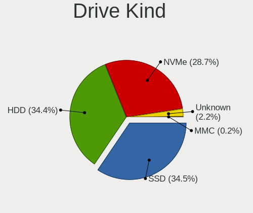
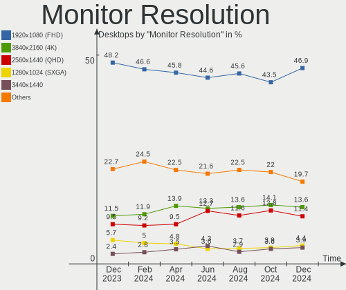
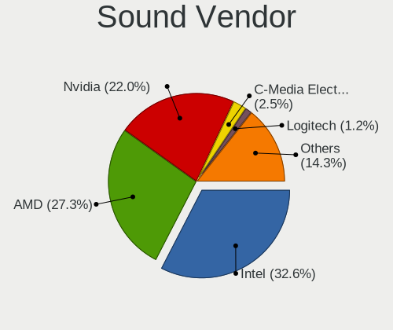
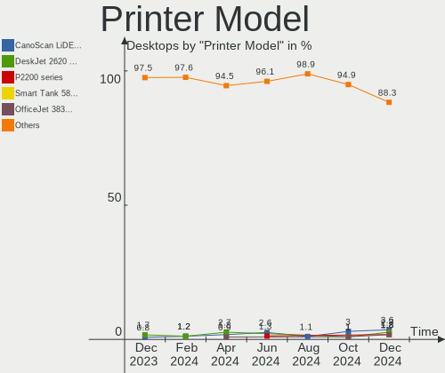

Linux - Hardware Trends (Desktops)
----------------------------------

A project to identify most popular hardware characteristics and track their change
over time based on data collected by Linux users at https://Linux-Hardware.org.

Anyone can contribute to this report by the [hw-probe](https://github.com/linuxhw/hw-probe) tool:

    sudo -E hw-probe -all -upload

This report is for one last month. Overall report since the beginning of time: [TestDays](https://github.com/linuxhw/TestDays)

Period: Jan, 2024.

Contents
--------

* [ System ](#system)
  - [ OS                       ](#os)
  - [ OS Family                ](#os-family)
  - [ Kernel                   ](#kernel)
  - [ Kernel Family            ](#kernel-family)
  - [ Kernel Major Ver.        ](#kernel-major-ver)
  - [ Arch                     ](#arch)
  - [ DE                       ](#de)
  - [ Display Server           ](#display-server)
  - [ Display Manager          ](#display-manager)
  - [ OS Lang                  ](#os-lang)
  - [ Boot Mode                ](#boot-mode)
  - [ Filesystem               ](#filesystem)
  - [ Part. scheme             ](#part-scheme)
  - [ Dual Boot with Linux/BSD ](#dual-boot-with-linuxbsd)
  - [ Dual Boot (Win)          ](#dual-boot-win)

* [ Board ](#board)
  - [ Vendor                   ](#vendor)
  - [ Model                    ](#model)
  - [ Model Family             ](#model-family)
  - [ MFG Year                 ](#mfg-year)
  - [ Form Factor              ](#form-factor)
  - [ Secure Boot              ](#secure-boot)
  - [ Coreboot                 ](#coreboot)
  - [ RAM Size                 ](#ram-size)
  - [ RAM Used                 ](#ram-used)
  - [ Total Drives             ](#total-drives)
  - [ Has CD-ROM               ](#has-cd-rom)
  - [ Has Ethernet             ](#has-ethernet)
  - [ Has WiFi                 ](#has-wifi)
  - [ Has Bluetooth            ](#has-bluetooth)

* [ Location ](#location)
  - [ Country                  ](#country)
  - [ City                     ](#city)

* [ Drives ](#drives)
  - [ Drive Vendor             ](#drive-vendor)
  - [ Drive Model              ](#drive-model)
  - [ HDD Vendor               ](#hdd-vendor)
  - [ SSD Vendor               ](#ssd-vendor)
  - [ Drive Kind               ](#drive-kind)
  - [ Drive Connector          ](#drive-connector)
  - [ Drive Size               ](#drive-size)
  - [ Space Total              ](#space-total)
  - [ Space Used               ](#space-used)
  - [ Malfunc. Drives          ](#malfunc-drives)
  - [ Malfunc. Drive Vendor    ](#malfunc-drive-vendor)
  - [ Malfunc. HDD Vendor      ](#malfunc-hdd-vendor)
  - [ Malfunc. Drive Kind      ](#malfunc-drive-kind)
  - [ Failed Drives            ](#failed-drives)
  - [ Failed Drive Vendor      ](#failed-drive-vendor)
  - [ Drive Status             ](#drive-status)

* [ Storage controller ](#storage-controller)
  - [ Storage Vendor           ](#storage-vendor)
  - [ Storage Model            ](#storage-model)
  - [ Storage Kind             ](#storage-kind)

* [ Processor ](#processor)
  - [ CPU Vendor               ](#cpu-vendor)
  - [ CPU Model                ](#cpu-model)
  - [ CPU Model Family         ](#cpu-model-family)
  - [ CPU Cores                ](#cpu-cores)
  - [ CPU Sockets              ](#cpu-sockets)
  - [ CPU Threads              ](#cpu-threads)
  - [ CPU Op-Modes             ](#cpu-op-modes)
  - [ CPU Microcode            ](#cpu-microcode)
  - [ CPU Microarch            ](#cpu-microarch)

* [ Graphics ](#graphics)
  - [ GPU Vendor               ](#gpu-vendor)
  - [ GPU Model                ](#gpu-model)
  - [ GPU Combo                ](#gpu-combo)
  - [ GPU Driver               ](#gpu-driver)
  - [ GPU Memory               ](#gpu-memory)

* [ Monitor ](#monitor)
  - [ Monitor Vendor           ](#monitor-vendor)
  - [ Monitor Model            ](#monitor-model)
  - [ Monitor Resolution       ](#monitor-resolution)
  - [ Monitor Diagonal         ](#monitor-diagonal)
  - [ Monitor Width            ](#monitor-width)
  - [ Aspect Ratio             ](#aspect-ratio)
  - [ Monitor Area             ](#monitor-area)
  - [ Pixel Density            ](#pixel-density)
  - [ Multiple Monitors        ](#multiple-monitors)

* [ Network ](#network)
  - [ Net Controller Vendor    ](#net-controller-vendor)
  - [ Net Controller Model     ](#net-controller-model)
  - [ Wireless Vendor          ](#wireless-vendor)
  - [ Wireless Model           ](#wireless-model)
  - [ Ethernet Vendor          ](#ethernet-vendor)
  - [ Ethernet Model           ](#ethernet-model)
  - [ Net Controller Kind      ](#net-controller-kind)
  - [ Used Controller          ](#used-controller)
  - [ NICs                     ](#nics)
  - [ IPv6                     ](#ipv6)

* [ Bluetooth ](#bluetooth)
  - [ Bluetooth Vendor         ](#bluetooth-vendor)
  - [ Bluetooth Model          ](#bluetooth-model)

* [ Sound ](#sound)
  - [ Sound Vendor             ](#sound-vendor)
  - [ Sound Model              ](#sound-model)

* [ Memory ](#memory)
  - [ Memory Vendor            ](#memory-vendor)
  - [ Memory Model             ](#memory-model)
  - [ Memory Kind              ](#memory-kind)
  - [ Memory Form Factor       ](#memory-form-factor)
  - [ Memory Size              ](#memory-size)
  - [ Memory Speed             ](#memory-speed)

* [ Printers & scanners ](#printers--scanners)
  - [ Printer Vendor           ](#printer-vendor)
  - [ Printer Model            ](#printer-model)
  - [ Scanner Vendor           ](#scanner-vendor)
  - [ Scanner Model            ](#scanner-model)

* [ Camera ](#camera)
  - [ Camera Vendor            ](#camera-vendor)
  - [ Camera Model             ](#camera-model)

* [ Security ](#security)
  - [ Fingerprint Vendor       ](#fingerprint-vendor)
  - [ Fingerprint Model        ](#fingerprint-model)
  - [ Chipcard Vendor          ](#chipcard-vendor)
  - [ Chipcard Model           ](#chipcard-model)

* [ Unsupported ](#unsupported)
  - [ Unsupported Devices      ](#unsupported-devices)
  - [ Unsupported Device Types ](#unsupported-device-types)

System
------

OS
--

Installed operating systems

| Name                         | Desktops | Percent |
|------------------------------|----------|---------|
| Ubuntu 22.04                 | 317      | 13.59%  |
| Fedora 39                    | 185      | 7.93%   |
| Debian 12                    | 185      | 7.93%   |
| Linux Mint 21.2              | 107      | 4.59%   |
| Arch Rolling                 | 92       | 3.94%   |
| Ubuntu 23.10                 | 91       | 3.9%    |
| Zorin 17                     | 90       | 3.86%   |
| ROSA 12.4                    | 73       | 3.13%   |
| Pop!_OS 22.04                | 73       | 3.13%   |
| Linux Mint 21.3              | 66       | 2.83%   |
| OpenMandriva 23.08           | 56       | 2.4%    |
| ArcoLinux Rolling            | 53       | 2.27%   |
| BlackPanther 18.1            | 52       | 2.23%   |
| OpenMandriva 5.0             | 51       | 2.19%   |
| Nobara 39                    | 42       | 1.8%    |
| Zorin 16                     | 41       | 1.76%   |
| Ubuntu 20.04                 | 32       | 1.37%   |
| Manjaro                      | 30       | 1.29%   |
| Kubuntu 22.04                | 29       | 1.24%   |
| openSUSE Tumbleweed-XXXXXXXX | 26       | 1.11%   |
| Kubuntu 23.10                | 25       | 1.07%   |
| EndeavourOS Rolling          | 25       | 1.07%   |
| OpenMandriva 24.01           | 24       | 1.03%   |
| KDE neon 22.04               | 23       | 0.99%   |
| Gentoo 2.14                  | 23       | 0.99%   |
| LMDE 6                       | 21       | 0.9%    |
| Debian                       | 21       | 0.9%    |
| Debian 11                    | 19       | 0.81%   |
| Ubuntu 23.04                 | 14       | 0.6%    |
| Xubuntu 22.04                | 13       | 0.56%   |
| Linux Mint 20.3              | 13       | 0.56%   |
| Kali 2023.4                  | 13       | 0.56%   |
| Fedora 38                    | 13       | 0.56%   |
| Red OS 7.3                   | 12       | 0.51%   |
| Linux Mint 21.1              | 12       | 0.51%   |
| OpenMandriva 4.3             | 11       | 0.47%   |
| ChimeraOS 44-1               | 11       | 0.47%   |
| MX 23                        | 9        | 0.39%   |
| Xero Rolling                 | 8        | 0.34%   |
| Ubuntu 18.04                 | 8        | 0.34%   |

OS Family
---------

OS without a version

| Name             | Desktops | Percent |
|------------------|----------|---------|
| Ubuntu           | 469      | 20.1%   |
| Debian           | 227      | 9.73%   |
| Linux Mint       | 217      | 9.3%    |
| Fedora           | 203      | 8.7%    |
| OpenMandriva     | 166      | 7.12%   |
| Zorin            | 131      | 5.62%   |
| ROSA             | 94       | 4.03%   |
| Arch             | 92       | 3.94%   |
| Pop!_OS          | 74       | 3.17%   |
| Kubuntu          | 63       | 2.7%    |
| BlackPanther     | 56       | 2.4%    |
| ArcoLinux        | 56       | 2.4%    |
| Nobara           | 49       | 2.1%    |
| Manjaro          | 46       | 1.97%   |
| openSUSE         | 39       | 1.67%   |
| Xubuntu          | 32       | 1.37%   |
| EndeavourOS      | 25       | 1.07%   |
| KDE neon         | 23       | 0.99%   |
| Gentoo           | 23       | 0.99%   |
| LMDE             | 22       | 0.94%   |
| NixOS            | 17       | 0.73%   |
| Kali             | 16       | 0.69%   |
| Lubuntu          | 15       | 0.64%   |
| Red OS           | 13       | 0.56%   |
| Ubuntu MATE      | 12       | 0.51%   |
| Garuda Linux     | 12       | 0.51%   |
| ChimeraOS        | 11       | 0.47%   |
| ALT Linux        | 11       | 0.47%   |
| MX               | 10       | 0.43%   |
| Xero             | 8        | 0.34%   |
| SteamOS          | 7        | 0.3%    |
| Ubuntu Unity     | 6        | 0.26%   |
| Elementary       | 6        | 0.26%   |
| Rocky Linux      | 5        | 0.21%   |
| BigLinux         | 5        | 0.21%   |
| Parrot           | 4        | 0.17%   |
| org.kde.Platform | 4        | 0.17%   |
| Void Linux       | 3        | 0.13%   |
| TUXEDO OS        | 3        | 0.13%   |
| Slackware        | 3        | 0.13%   |

Kernel
------

Version of the Linux kernel

| Version                           | Desktops | Percent |
|-----------------------------------|----------|---------|
| 6.5.0-14-generic                  | 281      | 12.04%  |
| 5.15.0-91-generic                 | 224      | 9.6%    |
| 6.2.0-39-generic                  | 154      | 6.6%    |
| 6.1.0-17-amd64                    | 84       | 3.6%    |
| 6.5.0-15-generic                  | 81       | 3.47%   |
| 6.6.2-desktop-1omv2390            | 76       | 3.26%   |
| 6.6.9-200.fc39.x86_64             | 63       | 2.7%    |
| 6.6.6-76060606-generic            | 55       | 2.36%   |
| 6.1.58-generic-1rosa2021.1-x86_64 | 49       | 2.1%    |
| 6.4.11-desktop-1omv2390           | 48       | 2.06%   |
| 6.1.0-16-amd64                    | 45       | 1.93%   |
| 6.1.0-4-amd64                     | 37       | 1.59%   |
| 5.15.0-92-generic                 | 37       | 1.59%   |
| 6.6.11-200.fc39.x86_64            | 33       | 1.41%   |
| 5.15.85-desktop-1bP               | 25       | 1.07%   |
| 6.6.13-200.fc39.x86_64            | 24       | 1.03%   |
| 6.6.10-arch1-1                    | 24       | 1.03%   |
| 6.7.0-arch3-1                     | 23       | 0.99%   |
| 5.4.0-169-generic                 | 22       | 0.94%   |
| 6.6.8-200.fc39.x86_64             | 21       | 0.9%    |
| 6.6.12-200.fc39.x86_64            | 18       | 0.77%   |
| 6.2.0-26-generic                  | 18       | 0.77%   |
| 6.6.9-arch1-1                     | 17       | 0.73%   |
| 6.1.20-generic-2rosa2021.1-x86_64 | 17       | 0.73%   |
| 6.6.8-arch1-1                     | 16       | 0.69%   |
| 6.5.6-300.fc39.x86_64             | 15       | 0.64%   |
| 5.6.14-desktop-2bP                | 15       | 0.64%   |
| 6.6.10-1-MANJARO                  | 14       | 0.6%    |
| 6.6.9-200.fsync.fc39.x86_64       | 12       | 0.51%   |
| 6.6.10-76060610-generic           | 12       | 0.51%   |
| 6.7.1-arch1-1                     | 11       | 0.47%   |
| 6.7.0-zen3-1-zen                  | 11       | 0.47%   |
| 6.7.0-204.fsync.fc39.x86_64       | 11       | 0.47%   |
| 6.6.1-arch1-1                     | 11       | 0.47%   |
| 6.5.6-chos1-chimeraos-1           | 11       | 0.47%   |
| 6.5.0-kali3-amd64                 | 11       | 0.47%   |
| 6.5.0-5-amd64                     | 11       | 0.47%   |
| 6.4.8-desktop-2omv2390            | 11       | 0.47%   |
| 5.15.0-76-generic                 | 11       | 0.47%   |
| 6.6.10-zen1-1-zen                 | 10       | 0.43%   |

Kernel Family
-------------

Linux kernel without a distro release

| Version | Desktops | Percent |
|---------|----------|---------|
| 6.5.0   | 416      | 17.83%  |
| 5.15.0  | 314      | 13.46%  |
| 6.1.0   | 201      | 8.62%   |
| 6.2.0   | 190      | 8.14%   |
| 6.6.9   | 114      | 4.89%   |
| 6.7.0   | 90       | 3.86%   |
| 6.6.8   | 80       | 3.43%   |
| 6.6.2   | 77       | 3.3%    |
| 6.6.10  | 71       | 3.04%   |
| 6.6.6   | 57       | 2.44%   |
| 6.6.11  | 57       | 2.44%   |
| 6.1.58  | 51       | 2.19%   |
| 6.4.11  | 48       | 2.06%   |
| 5.4.0   | 42       | 1.8%    |
| 6.6.13  | 39       | 1.67%   |
| 6.6.12  | 30       | 1.29%   |
| 6.7.1   | 27       | 1.16%   |
| 6.5.6   | 27       | 1.16%   |
| 5.15.85 | 25       | 1.07%   |
| 5.10.0  | 20       | 0.86%   |
| 6.6.7   | 19       | 0.81%   |
| 6.1.20  | 17       | 0.73%   |
| 5.6.14  | 15       | 0.64%   |
| 5.19.0  | 15       | 0.64%   |
| 6.6.1   | 13       | 0.56%   |
| 6.5.11  | 12       | 0.51%   |
| 6.7.2   | 11       | 0.47%   |
| 6.4.8   | 11       | 0.47%   |
| 6.1.52  | 11       | 0.47%   |
| 6.5.13  | 10       | 0.43%   |
| 4.18.16 | 10       | 0.43%   |
| 4.15.0  | 10       | 0.43%   |
| 6.2.6   | 9        | 0.39%   |
| 6.1.71  | 9        | 0.39%   |
| 6.1.67  | 9        | 0.39%   |
| 5.16.7  | 9        | 0.39%   |
| 5.14.21 | 8        | 0.34%   |
| 6.1.69  | 7        | 0.3%    |
| 5.14.0  | 7        | 0.3%    |
| 6.6.4   | 5        | 0.21%   |

Kernel Major Ver.
-----------------

Linux kernel major version

| Version | Desktops | Percent |
|---------|----------|---------|
| 6.6     | 572      | 24.52%  |
| 6.5     | 479      | 20.53%  |
| 5.15    | 355      | 15.22%  |
| 6.1     | 321      | 13.76%  |
| 6.2     | 205      | 8.79%   |
| 6.7     | 128      | 5.49%   |
| 6.4     | 73       | 3.13%   |
| 5.4     | 47       | 2.01%   |
| 5.10    | 41       | 1.76%   |
| 5.19    | 16       | 0.69%   |
| 5.6     | 15       | 0.64%   |
| 5.14    | 15       | 0.64%   |
| 4.18    | 14       | 0.6%    |
| 6.3     | 11       | 0.47%   |
| 5.16    | 11       | 0.47%   |
| 4.15    | 10       | 0.43%   |
| 6.0     | 4        | 0.17%   |
| 6.8     | 2        | 0.09%   |
| 5.3     | 2        | 0.09%   |
| 5.17    | 2        | 0.09%   |
| 5.13    | 2        | 0.09%   |
| 5.11    | 2        | 0.09%   |
| 3.10    | 2        | 0.09%   |
| 5.18    | 1        | 0.04%   |
| 4.4     | 1        | 0.04%   |
| 4.20    | 1        | 0.04%   |
| 4.19    | 1        | 0.04%   |

Arch
----

OS architecture (x86_64, i586, etc.)

| Name    | Desktops | Percent |
|---------|----------|---------|
| x86_64  | 2317     | 99.31%  |
| i686    | 13       | 0.56%   |
| riscv64 | 1        | 0.04%   |
| ppc     | 1        | 0.04%   |
| aarch64 | 1        | 0.04%   |

DE
--

Desktop Environment

| Name            | Desktops | Percent |
|-----------------|----------|---------|
| GNOME           | 933      | 39.99%  |
| KDE5            | 646      | 27.69%  |
| X-Cinnamon      | 197      | 8.44%   |
| Unknown         | 162      | 6.94%   |
| XFCE            | 159      | 6.82%   |
| MATE            | 71       | 3.04%   |
| LXQt            | 40       | 1.71%   |
| Cinnamon        | 24       | 1.03%   |
| Budgie          | 11       | 0.47%   |
| Hyprland        | 10       | 0.43%   |
| i3              | 8        | 0.34%   |
| Unity           | 6        | 0.26%   |
| Pantheon        | 6        | 0.26%   |
| LXDE            | 6        | 0.26%   |
| KDE             | 6        | 0.26%   |
| icewm           | 5        | 0.21%   |
| GNOME Flashback | 5        | 0.21%   |
| sway            | 4        | 0.17%   |
| KDE6            | 4        | 0.17%   |
| KDE4            | 4        | 0.17%   |
| GNOME Classic   | 3        | 0.13%   |
| Deepin          | 3        | 0.13%   |
| awesome         | 3        | 0.13%   |
| DWM             | 2        | 0.09%   |
| DDE             | 2        | 0.09%   |
| WindowMaker     | 1        | 0.04%   |
| wayfire         | 1        | 0.04%   |
| UKUI            | 1        | 0.04%   |
| sway:GNOME      | 1        | 0.04%   |
| qtile           | 1        | 0.04%   |
| openbox         | 1        | 0.04%   |
| none+i3         | 1        | 0.04%   |
| herbstluftwm    | 1        | 0.04%   |
| GNUstep         | 1        | 0.04%   |
| fly             | 1        | 0.04%   |
| Enlightenment   | 1        | 0.04%   |
| Endless:GNOME   | 1        | 0.04%   |
| bspwm           | 1        | 0.04%   |

Display Server
--------------

X11 or Wayland

| Name    | Desktops | Percent |
|---------|----------|---------|
| X11     | 1271     | 54.48%  |
| Wayland | 846      | 36.26%  |
| Tty     | 109      | 4.67%   |
| Unknown | 106      | 4.54%   |
| Web     | 1        | 0.04%   |

Display Manager
---------------

SDDM, LightDM, etc.

| Name    | Desktops | Percent |
|---------|----------|---------|
| Unknown | 918      | 39.35%  |
| SDDM    | 511      | 21.9%   |
| GDM3    | 478      | 20.49%  |
| LightDM | 288      | 12.34%  |
| GDM     | 121      | 5.19%   |
| KDM     | 4        | 0.17%   |
| XDM     | 3        | 0.13%   |
| SLiM    | 3        | 0.13%   |
| SLIMSKI | 2        | 0.09%   |
| GREETD  | 2        | 0.09%   |
| LY-DM   | 1        | 0.04%   |
| Ly      | 1        | 0.04%   |
| LXDM    | 1        | 0.04%   |

OS Lang
-------

Language

| Lang    | Desktops | Percent |
|---------|----------|---------|
| en_US   | 918      | 39.35%  |
| ru_RU   | 228      | 9.77%   |
| de_DE   | 206      | 8.83%   |
| fr_FR   | 144      | 6.17%   |
| en_GB   | 107      | 4.59%   |
| Unknown | 99       | 4.24%   |
| pt_BR   | 75       | 3.21%   |
| it_IT   | 64       | 2.74%   |
| C       | 55       | 2.36%   |
| en_AU   | 49       | 2.1%    |
| en_CA   | 43       | 1.84%   |
| es_ES   | 39       | 1.67%   |
| pl_PL   | 33       | 1.41%   |
| es_MX   | 22       | 0.94%   |
| zh_CN   | 18       | 0.77%   |
| nl_NL   | 14       | 0.6%    |
| tr_TR   | 13       | 0.56%   |
| en_IN   | 13       | 0.56%   |
| sv_SE   | 12       | 0.51%   |
| hu_HU   | 12       | 0.51%   |
| cs_CZ   | 11       | 0.47%   |
| en_NZ   | 10       | 0.43%   |
| es_AR   | 9        | 0.39%   |
| de_CH   | 9        | 0.39%   |
| ja_JP   | 8        | 0.34%   |
| fr_CA   | 8        | 0.34%   |
| fr_BE   | 7        | 0.3%    |
| en_IE   | 7        | 0.3%    |
| de_AT   | 7        | 0.3%    |
| pt_PT   | 5        | 0.21%   |
| en_ZA   | 5        | 0.21%   |
| da_DK   | 5        | 0.21%   |
| en_HK   | 4        | 0.17%   |
| C.UTF8  | 4        | 0.17%   |
| POSIX   | 3        | 0.13%   |
| nl_BE   | 3        | 0.13%   |
| it_CH   | 3        | 0.13%   |
| fi_FI   | 3        | 0.13%   |
| es_CR   | 3        | 0.13%   |
| es_CO   | 3        | 0.13%   |

Boot Mode
---------

EFI or BIOS

| Mode | Desktops | Percent |
|------|----------|---------|
| BIOS | 1246     | 53.41%  |
| EFI  | 1087     | 46.59%  |

Filesystem
----------

Type of filesystem

| Type     | Desktops | Percent |
|----------|----------|---------|
| Ext4     | 1366     | 58.55%  |
| Btrfs    | 384      | 16.46%  |
| Tmpfs    | 334      | 14.32%  |
| Overlay  | 171      | 7.33%   |
| Xfs      | 38       | 1.63%   |
| Zfs      | 23       | 0.99%   |
| Ext2     | 6        | 0.26%   |
| F2fs     | 5        | 0.21%   |
| Reiserfs | 2        | 0.09%   |
| Ext3     | 2        | 0.09%   |
| Unknown  | 2        | 0.09%   |

Part. scheme
------------

Scheme of partitioning

| Type    | Desktops | Percent |
|---------|----------|---------|
| GPT     | 1254     | 53.75%  |
| Unknown | 775      | 33.22%  |
| MBR     | 304      | 13.03%  |

Dual Boot with Linux/BSD
------------------------

Hosting more than one Linux/BSD

| Dual boot | Desktops | Percent |
|-----------|----------|---------|
| No        | 1904     | 81.61%  |
| Yes       | 429      | 18.39%  |

Dual Boot (Win)
---------------

Hosting Linux and Windows

| Dual boot | Desktops | Percent |
|-----------|----------|---------|
| No        | 1649     | 70.68%  |
| Yes       | 684      | 29.32%  |

Board
-----

Vendor
------

Motherboard manufacturer

| Name                                 | Desktops | Percent |
|--------------------------------------|----------|---------|
| ASUSTek Computer                     | 598      | 25.63%  |
| Gigabyte Technology                  | 371      | 15.9%   |
| MSI                                  | 302      | 12.94%  |
| ASRock                               | 206      | 8.83%   |
| Hewlett-Packard                      | 188      | 8.06%   |
| Dell                                 | 186      | 7.97%   |
| Lenovo                               | 77       | 3.3%    |
| Intel                                | 68       | 2.91%   |
| Unknown                              | 39       | 1.67%   |
| Fujitsu                              | 26       | 1.11%   |
| Acer                                 | 22       | 0.94%   |
| Biostar                              | 21       | 0.9%    |
| Foxconn                              | 20       | 0.86%   |
| Supermicro                           | 16       | 0.69%   |
| Pegatron                             | 15       | 0.64%   |
| AZW                                  | 15       | 0.64%   |
| Medion                               | 13       | 0.56%   |
| ECS                                  | 13       | 0.56%   |
| Shenzhen Meigao Electronic Equipment | 11       | 0.47%   |
| Huanan                               | 9        | 0.39%   |
| Apple                                | 8        | 0.34%   |
| MACHINIST                            | 6        | 0.26%   |
| Shuttle                              | 5        | 0.21%   |
| BESSTAR Tech                         | 5        | 0.21%   |
| GEEKOM                               | 4        | 0.17%   |
| AMI                                  | 4        | 0.17%   |
| Alienware                            | 4        | 0.17%   |
| SZMZ                                 | 3        | 0.13%   |
| OEM                                  | 3        | 0.13%   |
| Google                               | 3        | 0.13%   |
| Gateway                              | 3        | 0.13%   |
| Fujitsu Siemens                      | 3        | 0.13%   |
| TYAN Computer                        | 2        | 0.09%   |
| Sapphire                             | 2        | 0.09%   |
| Positivo                             | 2        | 0.09%   |
| Packard Bell                         | 2        | 0.09%   |
| NZXT                                 | 2        | 0.09%   |
| newplatforms                         | 2        | 0.09%   |
| Inventec                             | 2        | 0.09%   |
| Colorful Technology                  | 2        | 0.09%   |

Model
-----

Motherboard model

| Name                               | Desktops | Percent |
|------------------------------------|----------|---------|
| ASUS All Series                    | 55       | 2.36%   |
| Unknown                            | 43       | 1.84%   |
| HP ProDesk 400 G2.5 SFF            | 21       | 0.9%    |
| Dell OptiPlex 9020                 | 14       | 0.6%    |
| MSI MS-7C56                        | 13       | 0.56%   |
| ASUS P5QL-CM                       | 13       | 0.56%   |
| Dell OptiPlex 7010                 | 11       | 0.47%   |
| ASUS TUF Gaming X570-PLUS          | 11       | 0.47%   |
| ASUS PRIME A320M-K                 | 11       | 0.47%   |
| MSI MS-7C95                        | 10       | 0.43%   |
| MSI MS-7C91                        | 9        | 0.39%   |
| MSI MS-7B89                        | 9        | 0.39%   |
| Dell OptiPlex 7050                 | 9        | 0.39%   |
| ASRock B450M Pro4                  | 9        | 0.39%   |
| ASUS ROG STRIX X670E-E GAMING WIFI | 8        | 0.34%   |
| MSI MS-7B86                        | 7        | 0.3%    |
| Intel X99                          | 7        | 0.3%    |
| HP ProDesk 400 G3 SFF              | 7        | 0.3%    |
| Gigabyte B450M DS3H                | 7        | 0.3%    |
| Dell OptiPlex 7040                 | 7        | 0.3%    |
| Dell OptiPlex 3060                 | 7        | 0.3%    |
| ASUS ROG STRIX B550-F GAMING       | 7        | 0.3%    |
| MSI MS-7C37                        | 6        | 0.26%   |
| MSI MS-7996                        | 6        | 0.26%   |
| MSI MS-7817                        | 6        | 0.26%   |
| Intel Jasper Lake Client Platform  | 6        | 0.26%   |
| Intel B75                          | 6        | 0.26%   |
| HP EliteDesk 800 G2 DM 35W         | 6        | 0.26%   |
| HP Compaq Elite 8300 SFF           | 6        | 0.26%   |
| Gigabyte B550 AORUS ELITE V2       | 6        | 0.26%   |
| Dell Precision T1700               | 6        | 0.26%   |
| Dell OptiPlex 9010                 | 6        | 0.26%   |
| ASUS TUF B450M-PLUS GAMING         | 6        | 0.26%   |
| ASUS SABERTOOTH 990FX R2.0         | 6        | 0.26%   |
| ASUS PRIME X570-P                  | 6        | 0.26%   |
| ASUS PRIME B550M-A                 | 6        | 0.26%   |
| ASUS M5A97 R2.0                    | 6        | 0.26%   |
| ASUS A0000001                      | 6        | 0.26%   |
| MSI MS-7E12                        | 5        | 0.21%   |
| MSI MS-7C84                        | 5        | 0.21%   |

Model Family
------------

Motherboard model prefix

| Name                | Desktops | Percent |
|---------------------|----------|---------|
| ASUS PRIME          | 136      | 5.83%   |
| ASUS ROG            | 112      | 4.8%    |
| Dell OptiPlex       | 109      | 4.67%   |
| ASUS TUF            | 66       | 2.83%   |
| ASUS All            | 55       | 2.36%   |
| Lenovo ThinkCentre  | 54       | 2.31%   |
| HP ProDesk          | 43       | 1.84%   |
| Unknown             | 43       | 1.84%   |
| HP Compaq           | 38       | 1.63%   |
| Dell Precision      | 32       | 1.37%   |
| HP EliteDesk        | 30       | 1.29%   |
| Dell Inspiron       | 25       | 1.07%   |
| Fujitsu ESPRIMO     | 21       | 0.9%    |
| Gigabyte B550       | 19       | 0.81%   |
| Gigabyte B450M      | 18       | 0.77%   |
| Gigabyte B550M      | 14       | 0.6%    |
| ASUS SABERTOOTH     | 14       | 0.6%    |
| MSI MS-7C56         | 13       | 0.56%   |
| Gigabyte X570       | 13       | 0.56%   |
| ASUS P5QL-CM        | 13       | 0.56%   |
| Acer Aspire         | 13       | 0.56%   |
| HP Pavilion         | 12       | 0.51%   |
| Gigabyte B450       | 12       | 0.51%   |
| ASRock B450M        | 12       | 0.51%   |
| Lenovo ThinkStation | 11       | 0.47%   |
| ASRock X570         | 11       | 0.47%   |
| ASRock B450         | 11       | 0.47%   |
| MSI MS-7C95         | 10       | 0.43%   |
| Intel X99           | 10       | 0.43%   |
| ASRock B550         | 10       | 0.43%   |
| MSI MS-7C91         | 9        | 0.39%   |
| MSI MS-7B89         | 9        | 0.39%   |
| Gigabyte Z790       | 9        | 0.39%   |
| Gigabyte A520M      | 9        | 0.39%   |
| Gigabyte A320M-S2H  | 9        | 0.39%   |
| Dell Vostro         | 9        | 0.39%   |
| ASUS M5A97          | 9        | 0.39%   |
| ASUS M5A78L-M       | 8        | 0.34%   |
| Acer Veriton        | 8        | 0.34%   |
| MSI MS-7B86         | 7        | 0.3%    |

MFG Year
--------

Motherboard manufacture year

| Year    | Desktops | Percent |
|---------|----------|---------|
| 2020    | 256      | 10.97%  |
| 2018    | 213      | 9.13%   |
| 2022    | 211      | 9.04%   |
| 2021    | 160      | 6.86%   |
| 2012    | 158      | 6.77%   |
| 2013    | 154      | 6.6%    |
| 2023    | 145      | 6.22%   |
| 2014    | 144      | 6.17%   |
| 2019    | 140      | 6%      |
| 2017    | 123      | 5.27%   |
| 2015    | 119      | 5.1%    |
| 2016    | 105      | 4.5%    |
| 2010    | 102      | 4.37%   |
| 2011    | 95       | 4.07%   |
| 2009    | 78       | 3.34%   |
| 2008    | 64       | 2.74%   |
| 2007    | 40       | 1.71%   |
| 2006    | 14       | 0.6%    |
| 2005    | 4        | 0.17%   |
| Unknown | 4        | 0.17%   |
| 2004    | 2        | 0.09%   |
| 2024    | 1        | 0.04%   |
| 2003    | 1        | 0.04%   |

Form Factor
-----------

Physical design of the computer

| Name    | Desktops | Percent |
|---------|----------|---------|
| Desktop | 2333     | 100%    |

Secure Boot
-----------

Enabled or disabled

| State    | Desktops | Percent |
|----------|----------|---------|
| Disabled | 2255     | 96.66%  |
| Enabled  | 78       | 3.34%   |

Coreboot
--------

Have coreboot on board

| Used | Desktops | Percent |
|------|----------|---------|
| No   | 2327     | 99.74%  |
| Yes  | 6        | 0.26%   |

RAM Size
--------

Total RAM memory

| Size in GB      | Desktops | Percent |
|-----------------|----------|---------|
| 16.01-24.0      | 557      | 23.87%  |
| 32.01-64.0      | 506      | 21.69%  |
| 4.01-8.0        | 336      | 14.4%   |
| 8.01-16.0       | 310      | 13.29%  |
| 3.01-4.0        | 230      | 9.86%   |
| 64.01-256.0     | 205      | 8.79%   |
| 24.01-32.0      | 104      | 4.46%   |
| 1.01-2.0        | 44       | 1.89%   |
| 2.01-3.0        | 21       | 0.9%    |
| More than 256.0 | 14       | 0.6%    |
| 0.51-1.0        | 5        | 0.21%   |
| 0.01-0.5        | 1        | 0.04%   |

RAM Used
--------

Used RAM memory

| Used GB     | Desktops | Percent |
|-------------|----------|---------|
| 1.01-2.0    | 617      | 26.45%  |
| 2.01-3.0    | 528      | 22.63%  |
| 4.01-8.0    | 459      | 19.67%  |
| 3.01-4.0    | 336      | 14.4%   |
| 0.51-1.0    | 159      | 6.82%   |
| 8.01-16.0   | 146      | 6.26%   |
| 16.01-24.0  | 38       | 1.63%   |
| 0.01-0.5    | 22       | 0.94%   |
| 24.01-32.0  | 12       | 0.51%   |
| 32.01-64.0  | 8        | 0.34%   |
| 64.01-256.0 | 6        | 0.26%   |
| Unknown     | 2        | 0.09%   |

Total Drives
------------

Number of drives on board

| Drives | Desktops | Percent |
|--------|----------|---------|
| 1      | 913      | 39.13%  |
| 2      | 617      | 26.45%  |
| 3      | 393      | 16.85%  |
| 4      | 183      | 7.84%   |
| 5      | 109      | 4.67%   |
| 6      | 59       | 2.53%   |
| 7      | 19       | 0.81%   |
| 8      | 13       | 0.56%   |
| 9      | 9        | 0.39%   |
| 0      | 9        | 0.39%   |
| 11     | 4        | 0.17%   |
| 25     | 1        | 0.04%   |
| 21     | 1        | 0.04%   |
| 19     | 1        | 0.04%   |
| 14     | 1        | 0.04%   |
| 10     | 1        | 0.04%   |

Has CD-ROM
----------

Has CD-ROM on board

| Presented | Desktops | Percent |
|-----------|----------|---------|
| No        | 1424     | 61.04%  |
| Yes       | 909      | 38.96%  |

Has Ethernet
------------

Has Ethernet on board

| Presented | Desktops | Percent |
|-----------|----------|---------|
| Yes       | 2311     | 99.06%  |
| No        | 22       | 0.94%   |

Has WiFi
--------

Has WiFi module

| Presented | Desktops | Percent |
|-----------|----------|---------|
| No        | 1188     | 50.92%  |
| Yes       | 1145     | 49.08%  |

Has Bluetooth
-------------

Has Bluetooth module

| Presented | Desktops | Percent |
|-----------|----------|---------|
| No        | 1395     | 59.79%  |
| Yes       | 938      | 40.21%  |

Location
--------

Country
-------

Geographic location (country)

| Country      | Desktops | Percent |
|--------------|----------|---------|
| USA          | 486      | 20.83%  |
| Germany      | 273      | 11.7%   |
| Russia       | 261      | 11.19%  |
| France       | 159      | 6.82%   |
| Brazil       | 107      | 4.59%   |
| UK           | 90       | 3.86%   |
| Italy        | 83       | 3.56%   |
| Canada       | 75       | 3.21%   |
| Hungary      | 66       | 2.83%   |
| Poland       | 60       | 2.57%   |
| Australia    | 53       | 2.27%   |
| Spain        | 45       | 1.93%   |
| Netherlands  | 36       | 1.54%   |
| Switzerland  | 26       | 1.11%   |
| Sweden       | 25       | 1.07%   |
| Mexico       | 24       | 1.03%   |
| Turkey       | 22       | 0.94%   |
| India        | 21       | 0.9%    |
| China        | 21       | 0.9%    |
| Austria      | 21       | 0.9%    |
| Czechia      | 20       | 0.86%   |
| Belgium      | 20       | 0.86%   |
| Argentina    | 20       | 0.86%   |
| Romania      | 18       | 0.77%   |
| New Zealand  | 16       | 0.69%   |
| Finland      | 16       | 0.69%   |
| Japan        | 15       | 0.64%   |
| Greece       | 13       | 0.56%   |
| South Africa | 10       | 0.43%   |
| Malaysia     | 10       | 0.43%   |
| Denmark      | 10       | 0.43%   |
| Colombia     | 10       | 0.43%   |
| Portugal     | 9        | 0.39%   |
| Hong Kong    | 9        | 0.39%   |
| Singapore    | 8        | 0.34%   |
| Egypt        | 8        | 0.34%   |
| Bulgaria     | 8        | 0.34%   |
| Belarus      | 7        | 0.3%    |
| Vietnam      | 6        | 0.26%   |
| Serbia       | 6        | 0.26%   |

City
----

Geographic location (city)

| City           | Desktops | Percent |
|----------------|----------|---------|
| Moscow         | 47       | 2.01%   |
| Voronezh       | 41       | 1.76%   |
| Roubaix        | 26       | 1.11%   |
| Sydney         | 22       | 0.94%   |
| Budapest       | 20       | 0.86%   |
| Berlin         | 20       | 0.86%   |
| St Petersburg  | 17       | 0.73%   |
| Hamburg        | 15       | 0.64%   |
| Bagneux        | 15       | 0.64%   |
| Warsaw         | 12       | 0.51%   |
| Turin          | 11       | 0.47%   |
| Sao Paulo      | 11       | 0.47%   |
| Milan          | 11       | 0.47%   |
| Yekaterinburg  | 10       | 0.43%   |
| Rome           | 10       | 0.43%   |
| Rio de Janeiro | 9        | 0.39%   |
| Paris          | 9        | 0.39%   |
| Vienna         | 8        | 0.34%   |
| Toronto        | 8        | 0.34%   |
| Singapore      | 8        | 0.34%   |
| Seattle        | 8        | 0.34%   |
| Novosibirsk    | 8        | 0.34%   |
| Munich         | 8        | 0.34%   |
| Montreal       | 8        | 0.34%   |
| Melbourne      | 8        | 0.34%   |
| Krasnodar      | 8        | 0.34%   |
| Dresden        | 8        | 0.34%   |
| Calgary        | 8        | 0.34%   |
| Tucson         | 7        | 0.3%    |
| Stockholm      | 7        | 0.3%    |
| San Jose       | 7        | 0.3%    |
| Minneapolis    | 7        | 0.3%    |
| Kuala Lumpur   | 7        | 0.3%    |
| Denver         | 7        | 0.3%    |
| Cologne        | 7        | 0.3%    |
| Athens         | 7        | 0.3%    |
| Amsterdam      | 7        | 0.3%    |
| Richmond       | 6        | 0.26%   |
| Mexico City    | 6        | 0.26%   |
| Los Angeles    | 6        | 0.26%   |

Drives
------

Drive Vendor
------------

Hard drive vendors

| Vendor                       | Desktops | Drives | Percent |
|------------------------------|----------|--------|---------|
| WDC                          | 738      | 989    | 16.94%  |
| Samsung Electronics          | 654      | 955    | 15.01%  |
| Seagate                      | 626      | 849    | 14.37%  |
| Kingston                     | 278      | 320    | 6.38%   |
| SanDisk                      | 240      | 286    | 5.51%   |
| Toshiba                      | 200      | 234    | 4.59%   |
| Crucial                      | 190      | 223    | 4.36%   |
| Hitachi                      | 95       | 109    | 2.18%   |
| Phison Electronics           | 77       | 87     | 1.77%   |
| Micron/Crucial Technology    | 65       | 79     | 1.49%   |
| China                        | 62       | 67     | 1.42%   |
| A-DATA Technology            | 59       | 64     | 1.35%   |
| Unknown                      | 57       | 85     | 1.31%   |
| Kingston Technology Company  | 57       | 58     | 1.31%   |
| Intel                        | 56       | 59     | 1.29%   |
| PNY                          | 48       | 49     | 1.1%    |
| Intenso                      | 41       | 43     | 0.94%   |
| SK hynix                     | 39       | 42     | 0.9%    |
| HGST                         | 39       | 45     | 0.9%    |
| MAXIO Technology (Hangzhou)  | 38       | 39     | 0.87%   |
| Silicon Motion               | 37       | 38     | 0.85%   |
| Micron Technology            | 34       | 35     | 0.78%   |
| SPCC                         | 30       | 31     | 0.69%   |
| Patriot                      | 26       | 26     | 0.6%    |
| Unknown                      | 22       | 22     | 0.51%   |
| ADATA Technology             | 21       | 21     | 0.48%   |
| Realtek Semiconductor        | 20       | 20     | 0.46%   |
| GOODRAM                      | 19       | 22     | 0.44%   |
| Maxtor                       | 18       | 19     | 0.41%   |
| Apacer                       | 18       | 18     | 0.41%   |
| Transcend                    | 16       | 18     | 0.37%   |
| Team                         | 15       | 19     | 0.34%   |
| Phison                       | 15       | 19     | 0.34%   |
| Lexar                        | 15       | 15     | 0.34%   |
| XrayDisk                     | 14       | 14     | 0.32%   |
| OCZ                          | 14       | 14     | 0.32%   |
| Netac                        | 14       | 14     | 0.32%   |
| Fanxiang                     | 14       | 16     | 0.32%   |
| Shenzhen Longsys Electronics | 13       | 14     | 0.3%    |
| JMicron Technology           | 13       | 14     | 0.3%    |

Drive Model
-----------

Hard drive models

| Model                                                 | Desktops | Percent |
|-------------------------------------------------------|----------|---------|
| Samsung NVMe SSD Controller SM981/PM981/PM983 1TB     | 117      | 2.31%   |
| Samsung NVMe SSD Controller PM9A1/PM9A3/980PRO 2TB    | 66       | 1.31%   |
| Kingston SA400S37480G 480GB SSD                       | 55       | 1.09%   |
| Kingston SA400S37240G 240GB SSD                       | 54       | 1.07%   |
| Seagate ST500DM002-1BD142 500GB                       | 51       | 1.01%   |
| Seagate ST1000DM010-2EP102 1TB                        | 46       | 0.91%   |
| Micron/Crucial P2 NVMe PCIe SSD 1TB                   | 41       | 0.81%   |
| Samsung SSD 860 EVO 500GB                             | 38       | 0.75%   |
| WDC WD10EZEX-08WN4A0 1TB                              | 36       | 0.71%   |
| Samsung SSD 860 EVO 1TB                               | 35       | 0.69%   |
| Samsung SSD 850 EVO 250GB                             | 32       | 0.63%   |
| Toshiba DT01ACA100 1TB                                | 30       | 0.59%   |
| Seagate ST2000DM008-2FR102 2TB                        | 29       | 0.57%   |
| Kingston Company SNV2S1000G 1TB                       | 28       | 0.55%   |
| Phison E12 NVMe Controller 1TB                        | 26       | 0.51%   |
| Crucial CT1000MX500SSD1 1TB                           | 26       | 0.51%   |
| Seagate ST4000DM004-2CV104 4TB                        | 25       | 0.49%   |
| Samsung SSD 980 1TB                                   | 25       | 0.49%   |
| Crucial CT500MX500SSD1 500GB                          | 25       | 0.49%   |
| Samsung SSD 870 EVO 1TB                               | 24       | 0.47%   |
| Samsung SSD 850 EVO 500GB                             | 24       | 0.47%   |
| MAXIO (Hangzhou) NVMe SSD Controller MAP1202 512GB    | 24       | 0.47%   |
| Silicon Motion SM2263EN/SM2263XT SSD Controller 128GB | 23       | 0.45%   |
| Samsung NVMe SSD Controller SM961/PM961/SM963 256GB   | 23       | 0.45%   |
| Unknown                                               | 22       | 0.44%   |
| Unknown SD/MMC/MS PRO 256GB                           | 21       | 0.42%   |
| Toshiba HDWD110 1TB                                   | 21       | 0.42%   |
| Seagate ST3500418AS 500GB                             | 20       | 0.4%    |
| Seagate ST1000DM003-1ER162 1TB                        | 20       | 0.4%    |
| Seagate ST1000DM003-1CH162 1TB                        | 20       | 0.4%    |
| Samsung SSD 860 EVO 250GB                             | 20       | 0.4%    |
| Phison E16 PCIe4 NVMe Controller 2TB                  | 20       | 0.4%    |
| Crucial CT480BX500SSD1 480GB                          | 20       | 0.4%    |
| Crucial CT1000BX500SSD1 1TB                           | 19       | 0.38%   |
| Samsung SSD 870 QVO 1TB                               | 18       | 0.36%   |
| Kingston SA400S37960G 960GB SSD                       | 18       | 0.36%   |
| Kingston SA400S37120G 120GB SSD                       | 18       | 0.36%   |
| Seagate ST2000DM006-2DM164 2TB                        | 17       | 0.34%   |
| SanDisk SSD PLUS 1000GB                               | 17       | 0.34%   |
| Toshiba DT01ACA200 2TB                                | 16       | 0.32%   |

HDD Vendor
----------

Hard disk drive vendors

| Vendor              | Desktops | Drives | Percent |
|---------------------|----------|--------|---------|
| WDC                 | 646      | 855    | 36.98%  |
| Seagate             | 617      | 830    | 35.32%  |
| Toshiba             | 185      | 214    | 10.59%  |
| Hitachi             | 95       | 109    | 5.44%   |
| Samsung Electronics | 72       | 85     | 4.12%   |
| HGST                | 39       | 45     | 2.23%   |
| Unknown             | 22       | 22     | 1.26%   |
| Maxtor              | 18       | 19     | 1.03%   |
| JMicron Technology  | 12       | 13     | 0.69%   |
| Fujitsu             | 11       | 11     | 0.63%   |
| Apple               | 5        | 5      | 0.29%   |
| Intenso             | 4        | 4      | 0.23%   |
| Hewlett-Packard     | 3        | 10     | 0.17%   |
| External            | 3        | 4      | 0.17%   |
| TDAS                | 2        | 9      | 0.11%   |
| Inateck             | 2        | 2      | 0.11%   |
| FC-1307             | 2        | 2      | 0.11%   |
| Unknown (CF)        | 1        | 1      | 0.06%   |
| QEMU                | 1        | 1      | 0.06%   |
| NETAPP              | 1        | 3      | 0.06%   |
| Min Yi U            | 1        | 1      | 0.06%   |
| HPE                 | 1        | 1      | 0.06%   |
| ExcelStor           | 1        | 1      | 0.06%   |
| CSD                 | 1        | 1      | 0.06%   |
| ASMT                | 1        | 1      | 0.06%   |
| Unknown             | 1        | 1      | 0.06%   |

SSD Vendor
----------

Solid state drive vendors

| Vendor              | Desktops | Drives | Percent |
|---------------------|----------|--------|---------|
| Samsung Electronics | 346      | 418    | 22.18%  |
| Kingston            | 218      | 241    | 13.97%  |
| Crucial             | 167      | 197    | 10.71%  |
| WDC                 | 112      | 117    | 7.18%   |
| SanDisk             | 111      | 118    | 7.12%   |
| China               | 62       | 67     | 3.97%   |
| A-DATA Technology   | 47       | 50     | 3.01%   |
| PNY                 | 46       | 47     | 2.95%   |
| Intenso             | 32       | 34     | 2.05%   |
| SPCC                | 27       | 28     | 1.73%   |
| Intel               | 26       | 27     | 1.67%   |
| Patriot             | 23       | 23     | 1.47%   |
| GOODRAM             | 19       | 22     | 1.22%   |
| Apacer              | 16       | 16     | 1.03%   |
| Transcend           | 14       | 15     | 0.9%    |
| OCZ                 | 14       | 14     | 0.9%    |
| SK hynix            | 13       | 14     | 0.83%   |
| Team                | 12       | 15     | 0.77%   |
| Micron Technology   | 11       | 12     | 0.71%   |
| Netac               | 10       | 10     | 0.64%   |
| Lexar               | 10       | 10     | 0.64%   |
| Unknown             | 10       | 10     | 0.64%   |
| XrayDisk            | 9        | 9      | 0.58%   |
| Toshiba             | 9        | 12     | 0.58%   |
| KingSpec            | 9        | 9      | 0.58%   |
| Fanxiang            | 9        | 10     | 0.58%   |
| Verbatim            | 8        | 9      | 0.51%   |
| Gigabyte Technology | 8        | 8      | 0.51%   |
| Corsair             | 8        | 8      | 0.51%   |
| Hewlett-Packard     | 7        | 7      | 0.45%   |
| Plextor             | 6        | 6      | 0.38%   |
| LITEON              | 6        | 6      | 0.38%   |
| SABRENT             | 5        | 5      | 0.32%   |
| LITEONIT            | 5        | 5      | 0.32%   |
| KingFast            | 5        | 5      | 0.32%   |
| T-FORCE             | 4        | 4      | 0.26%   |
| Seagate             | 4        | 6      | 0.26%   |
| Innodisk            | 4        | 4      | 0.26%   |
| Timetec             | 3        | 3      | 0.19%   |
| Teclast             | 3        | 3      | 0.19%   |

Drive Kind
----------

HDD or SSD

| Kind    | Desktops | Drives | Percent |
|---------|----------|--------|---------|
| HDD     | 1390     | 2250   | 37.66%  |
| SSD     | 1264     | 1744   | 34.25%  |
| NVMe    | 955      | 1336   | 25.87%  |
| Unknown | 70       | 96     | 1.9%    |
| MMC     | 12       | 13     | 0.33%   |

Drive Connector
---------------

SATA, SAS, NVMe, etc.

| Type | Desktops | Drives | Percent |
|------|----------|--------|---------|
| SATA | 1973     | 3854   | 63.26%  |
| NVMe | 951      | 1325   | 30.49%  |
| SAS  | 183      | 247    | 5.87%   |
| MMC  | 12       | 13     | 0.38%   |

Drive Size
----------

Size of hard drive

| Size in TB | Desktops | Drives | Percent |
|------------|----------|--------|---------|
| 0.01-0.5   | 1354     | 1948   | 47%     |
| 0.51-1.0   | 846      | 1093   | 29.36%  |
| 1.01-2.0   | 347      | 458    | 12.04%  |
| 3.01-4.0   | 142      | 207    | 4.93%   |
| 4.01-10.0  | 91       | 138    | 3.16%   |
| 2.01-3.0   | 74       | 101    | 2.57%   |
| 10.01-20.0 | 26       | 47     | 0.9%    |
| 20.01-50.0 | 1        | 2      | 0.03%   |

Space Total
-----------

Amount of disk space available on the file system

| Size in GB     | Desktops | Percent |
|----------------|----------|---------|
| 101-250        | 426      | 18.26%  |
| 501-1000       | 400      | 17.15%  |
| 251-500        | 395      | 16.93%  |
| More than 3000 | 334      | 14.32%  |
| 1001-2000      | 279      | 11.96%  |
| Unknown        | 143      | 6.13%   |
| 2001-3000      | 121      | 5.19%   |
| 1-20           | 116      | 4.97%   |
| 51-100         | 90       | 3.86%   |
| 21-50          | 29       | 1.24%   |

Space Used
----------

Amount of used disk space

| Used GB        | Desktops | Percent |
|----------------|----------|---------|
| 1-20           | 612      | 26.23%  |
| 21-50          | 363      | 15.56%  |
| 101-250        | 278      | 11.92%  |
| 51-100         | 224      | 9.6%    |
| 501-1000       | 209      | 8.96%   |
| 251-500        | 188      | 8.06%   |
| Unknown        | 143      | 6.13%   |
| 1001-2000      | 132      | 5.66%   |
| More than 3000 | 107      | 4.59%   |
| 2001-3000      | 76       | 3.26%   |
| 0              | 1        | 0.04%   |

Malfunc. Drives
---------------

Drive models with a malfunction

| Model                                          | Desktops | Drives | Percent |
|------------------------------------------------|----------|--------|---------|
| Seagate ST500DM002-1BD142 500GB                | 12       | 12     | 3.47%   |
| WDC WD3200AAJS-00L7A0 320GB                    | 9        | 9      | 2.6%    |
| WDC WD20EFRX-68EUZN0 2TB                       | 4        | 6      | 1.16%   |
| Seagate ST1000LM024 HN-M101MBB 1TB             | 4        | 4      | 1.16%   |
| Seagate ST1000DM010-2EP102 1TB                 | 4        | 4      | 1.16%   |
| Hitachi HDS721050CLA362 500GB                  | 4        | 4      | 1.16%   |
| WDC WD5000AAKX-00ERMA0 500GB                   | 3        | 3      | 0.87%   |
| WDC WD20EARS-00MVWB0 2TB                       | 3        | 3      | 0.87%   |
| WDC WD2002FAEX-007BA0 2TB                      | 3        | 3      | 0.87%   |
| Toshiba DT01ACA100 1TB                         | 3        | 3      | 0.87%   |
| Seagate ST3500418AS 500GB                      | 3        | 3      | 0.87%   |
| Seagate ST1000DM003-9YN162 1TB                 | 3        | 3      | 0.87%   |
| Seagate ST1000DM003-1SB102 1TB                 | 3        | 3      | 0.87%   |
| Seagate ST1000DM003-1CH162 1TB                 | 3        | 3      | 0.87%   |
| SanDisk SSD PLUS 480GB                         | 3        | 3      | 0.87%   |
| SanDisk SSD PLUS 1000GB                        | 3        | 3      | 0.87%   |
| Samsung Electronics SSD 870 EVO 1TB            | 3        | 3      | 0.87%   |
| Maxtor STM3250310AS 250GB                      | 3        | 3      | 0.87%   |
| Crucial CT275MX300SSD1 275GB                   | 3        | 3      | 0.87%   |
| WDC WDS240G2G0A-00JH30 240GB SSD               | 2        | 2      | 0.58%   |
| WDC WD5000AVDS-63U7B1 500GB                    | 2        | 4      | 0.58%   |
| WDC WD5000AAKX-60U6AA0 500GB                   | 2        | 2      | 0.58%   |
| WDC WD5000AAKX-22ERMA0 500GB                   | 2        | 2      | 0.58%   |
| WDC WD5000AADS-00S9B0 500GB                    | 2        | 2      | 0.58%   |
| WDC WD40EFAX-68JH4N1 4TB                       | 2        | 5      | 0.58%   |
| WDC WD3200AAJS-56M0A0 320GB                    | 2        | 2      | 0.58%   |
| WDC WD2500AAKX-75U6AA0 250GB                   | 2        | 2      | 0.58%   |
| WDC WD2500AAJS-00L7A0 250GB                    | 2        | 2      | 0.58%   |
| WDC WD20EARX-00PASB0 2TB                       | 2        | 2      | 0.58%   |
| WDC WD1602ABYS-23B7A0 39M4507 42C0462IBM 160GB | 2        | 2      | 0.58%   |
| WDC WD10EARS-00MVWB0 1TB                       | 2        | 2      | 0.58%   |
| WDC WD10EALX-009BA0 1TB                        | 2        | 2      | 0.58%   |
| WDC WD1003FBYX-01Y7B0 1TB                      | 2        | 2      | 0.58%   |
| Toshiba HDWE150 5TB                            | 2        | 2      | 0.58%   |
| Toshiba HDWD130 3TB                            | 2        | 3      | 0.58%   |
| Toshiba DT01ACA200 2TB                         | 2        | 3      | 0.58%   |
| Seagate ST9320325AS 320GB                      | 2        | 2      | 0.58%   |
| Seagate ST500LM012 HN-M500MBB 500GB            | 2        | 3      | 0.58%   |
| Seagate ST500DM002-1BC142 500GB                | 2        | 2      | 0.58%   |
| Seagate ST380815AS 80GB                        | 2        | 2      | 0.58%   |

Malfunc. Drive Vendor
---------------------

Vendors of faulty drives

| Vendor                    | Desktops | Drives | Percent |
|---------------------------|----------|--------|---------|
| WDC                       | 99       | 118    | 30%     |
| Seagate                   | 83       | 90     | 25.15%  |
| Samsung Electronics       | 25       | 31     | 7.58%   |
| Hitachi                   | 21       | 23     | 6.36%   |
| Toshiba                   | 17       | 20     | 5.15%   |
| Kingston                  | 12       | 12     | 3.64%   |
| Crucial                   | 11       | 11     | 3.33%   |
| SanDisk                   | 8        | 8      | 2.42%   |
| Maxtor                    | 7        | 8      | 2.12%   |
| A-DATA Technology         | 6        | 6      | 1.82%   |
| Intel                     | 4        | 4      | 1.21%   |
| HGST                      | 4        | 4      | 1.21%   |
| China                     | 3        | 3      | 0.91%   |
| SK hynix                  | 2        | 2      | 0.61%   |
| Patriot                   | 2        | 2      | 0.61%   |
| OCZ                       | 2        | 2      | 0.61%   |
| Fujitsu                   | 2        | 2      | 0.61%   |
| Apple                     | 2        | 2      | 0.61%   |
| XrayDisk                  | 1        | 1      | 0.3%    |
| walram                    | 1        | 1      | 0.3%    |
| USB3.0                    | 1        | 1      | 0.3%    |
| Transcend                 | 1        | 1      | 0.3%    |
| SXMicro                   | 1        | 1      | 0.3%    |
| SPCC                      | 1        | 1      | 0.3%    |
| Silicon Motion            | 1        | 1      | 0.3%    |
| Micron/Crucial Technology | 1        | 1      | 0.3%    |
| Micron Technology         | 1        | 1      | 0.3%    |
| Lenovo                    | 1        | 1      | 0.3%    |
| Intenso                   | 1        | 1      | 0.3%    |
| Inateck                   | 1        | 1      | 0.3%    |
| GS                        | 1        | 1      | 0.3%    |
| CSD                       | 1        | 1      | 0.3%    |
| Corsair                   | 1        | 1      | 0.3%    |
| C-S12                     | 1        | 1      | 0.3%    |
| BAITITON                  | 1        | 1      | 0.3%    |
| ASMT                      | 1        | 1      | 0.3%    |
| AMD                       | 1        | 1      | 0.3%    |
| Unknown                   | 1        | 1      | 0.3%    |

Malfunc. HDD Vendor
-------------------

Vendors of faulty HDD drives

| Vendor              | Desktops | Drives | Percent |
|---------------------|----------|--------|---------|
| WDC                 | 92       | 110    | 37.86%  |
| Seagate             | 83       | 90     | 34.16%  |
| Hitachi             | 21       | 23     | 8.64%   |
| Toshiba             | 17       | 20     | 7%      |
| Samsung Electronics | 12       | 15     | 4.94%   |
| Maxtor              | 7        | 8      | 2.88%   |
| HGST                | 4        | 4      | 1.65%   |
| Fujitsu             | 2        | 2      | 0.82%   |
| Apple               | 2        | 2      | 0.82%   |
| Inateck             | 1        | 1      | 0.41%   |
| CSD                 | 1        | 1      | 0.41%   |
| Unknown             | 1        | 1      | 0.41%   |

Malfunc. Drive Kind
-------------------

Kinds of faulty drives

| Kind | Desktops | Drives | Percent |
|------|----------|--------|---------|
| HDD  | 223      | 277    | 71.47%  |
| SSD  | 77       | 78     | 24.68%  |
| NVMe | 12       | 13     | 3.85%   |

Failed Drives
-------------

Failed drive models

| Model                         | Desktops | Drives | Percent |
|-------------------------------|----------|--------|---------|
| WDC WD1500HLFS-01G6U0 150GB   | 1        | 1      | 12.5%   |
| Transcend TS120GSSD220S 120GB | 1        | 1      | 12.5%   |
| Seagate ST9160412AS 160GB     | 1        | 1      | 12.5%   |
| Seagate ST91000430AS 1TB      | 1        | 1      | 12.5%   |
| Seagate ST3500410AS 500GB     | 1        | 1      | 12.5%   |
| Seagate ST3250310AS 250GB     | 1        | 1      | 12.5%   |
| Seagate ST31500341AS 1TB      | 1        | 1      | 12.5%   |
| Hitachi HTS723232L9A360 320GB | 1        | 1      | 12.5%   |

Failed Drive Vendor
-------------------

Failed drive vendors

| Vendor    | Desktops | Drives | Percent |
|-----------|----------|--------|---------|
| Seagate   | 4        | 5      | 57.14%  |
| WDC       | 1        | 1      | 14.29%  |
| Transcend | 1        | 1      | 14.29%  |
| Hitachi   | 1        | 1      | 14.29%  |

Drive Status
------------

Number of failed and malfunc. drives

| Status   | Desktops | Drives | Percent |
|----------|----------|--------|---------|
| Detected | 1225     | 2760   | 46.45%  |
| Works    | 1106     | 2303   | 41.94%  |
| Malfunc  | 299      | 368    | 11.34%  |
| Failed   | 7        | 8      | 0.27%   |

Storage controller
------------------

Storage Vendor
--------------

Storage controller vendors

| Vendor                                  | Desktops | Percent |
|-----------------------------------------|----------|---------|
| Intel                                   | 1438     | 39.03%  |
| AMD                                     | 827      | 22.45%  |
| Samsung Electronics                     | 345      | 9.36%   |
| SanDisk                                 | 148      | 4.02%   |
| ASMedia Technology                      | 127      | 3.45%   |
| Kingston Technology Company             | 120      | 3.26%   |
| Phison Electronics                      | 106      | 2.88%   |
| Micron/Crucial Technology               | 86       | 2.33%   |
| JMicron Technology                      | 76       | 2.06%   |
| MAXIO Technology (Hangzhou)             | 54       | 1.47%   |
| Silicon Motion                          | 49       | 1.33%   |
| Marvell Technology Group                | 47       | 1.28%   |
| Nvidia                                  | 35       | 0.95%   |
| ADATA Technology                        | 31       | 0.84%   |
| SK hynix                                | 26       | 0.71%   |
| Realtek Semiconductor                   | 26       | 0.71%   |
| Micron Technology                       | 24       | 0.65%   |
| Shenzhen Longsys Electronics            | 15       | 0.41%   |
| VIA Technologies                        | 12       | 0.33%   |
| Seagate Technology                      | 9        | 0.24%   |
| Toshiba America Info Systems            | 8        | 0.22%   |
| Silicon Image                           | 8        | 0.22%   |
| Broadcom / LSI                          | 8        | 0.22%   |
| Solidigm                                | 7        | 0.19%   |
| LSI Logic / Symbios Logic               | 7        | 0.19%   |
| KIOXIA                                  | 7        | 0.19%   |
| Yangtze Memory Technologies             | 4        | 0.11%   |
| Netac Technology                        | 4        | 0.11%   |
| Hosin Global Electronics                | 4        | 0.11%   |
| INNOGRIT                                | 3        | 0.08%   |
| Hewlett-Packard                         | 3        | 0.08%   |
| Solid State Storage Technology          | 2        | 0.05%   |
| Lite-On Technology                      | 2        | 0.05%   |
| Jiangsu Xinsheng Intelligent Technology | 2        | 0.05%   |
| Integrated Technology Express           | 2        | 0.05%   |
| Zhaoxin                                 | 1        | 0.03%   |
| Union Memory (Shenzhen)                 | 1        | 0.03%   |
| ULi Electronics                         | 1        | 0.03%   |
| Transcend                               | 1        | 0.03%   |
| Swissbit                                | 1        | 0.03%   |

Storage Model
-------------

Storage controller models

| Model                                                                                   | Desktops | Percent |
|-----------------------------------------------------------------------------------------|----------|---------|
| AMD FCH SATA Controller [AHCI mode]                                                     | 354      | 8.09%   |
| Intel 8 Series/C220 Series Chipset Family 6-port SATA Controller 1 [AHCI mode]          | 198      | 4.52%   |
| AMD 500 Series Chipset SATA Controller                                                  | 179      | 4.09%   |
| Samsung NVMe SSD Controller SM981/PM981/PM983                                           | 161      | 3.68%   |
| AMD 400 Series Chipset SATA Controller                                                  | 146      | 3.34%   |
| Intel Q170/Q150/B150/H170/H110/Z170/CM236 Chipset SATA Controller [AHCI Mode]           | 130      | 2.97%   |
| ASMedia ASM1061/ASM1062 Serial ATA Controller                                           | 116      | 2.65%   |
| AMD 600 Series Chipset SATA Controller                                                  | 106      | 2.42%   |
| Samsung NVMe SSD Controller PM9A1/PM9A3/980PRO                                          | 104      | 2.38%   |
| Intel 200 Series PCH SATA controller [AHCI mode]                                        | 96       | 2.19%   |
| Intel 7 Series/C210 Series Chipset Family 6-port SATA Controller [AHCI mode]            | 88       | 2.01%   |
| Intel Alder Lake-S PCH SATA Controller [AHCI Mode]                                      | 78       | 1.78%   |
| Intel 6 Series/C200 Series Chipset Family 6 port Desktop SATA AHCI Controller           | 75       | 1.71%   |
| Intel SATA Controller [RAID mode]                                                       | 74       | 1.69%   |
| AMD SB7x0/SB8x0/SB9x0 IDE Controller                                                    | 74       | 1.69%   |
| AMD SB7x0/SB8x0/SB9x0 SATA Controller [AHCI mode]                                       | 66       | 1.51%   |
| Intel Cannon Lake PCH SATA AHCI Controller                                              | 65       | 1.49%   |
| Intel 500 Series Chipset Family SATA AHCI Controller                                    | 59       | 1.35%   |
| Intel NM10/ICH7 Family SATA Controller [IDE mode]                                       | 58       | 1.33%   |
| Micron/Crucial P2 [Nick P2] / P3 / P3 Plus NVMe PCIe SSD (DRAM-less)                    | 57       | 1.3%    |
| AMD SB7x0/SB8x0/SB9x0 SATA Controller [IDE mode]                                        | 49       | 1.12%   |
| Samsung NVMe SSD Controller 980 (DRAM-less)                                             | 48       | 1.1%    |
| AMD FCH SATA Controller D                                                               | 46       | 1.05%   |
| Intel Raptor Lake SATA AHCI Controller                                                  | 44       | 1.01%   |
| Kingston Company NV2 NVMe SSD SM2267XT (DRAM-less)                                      | 43       | 0.98%   |
| Intel 82801G (ICH7 Family) IDE Controller                                               | 42       | 0.96%   |
| Silicon Motion SM2263EN/SM2263XT (DRAM-less) NVMe SSD Controllers                       | 39       | 0.89%   |
| MAXIO (Hangzhou) NVMe SSD Controller MAP1202 (DRAM-less)                                | 38       | 0.87%   |
| Intel 6 Series/C200 Series Chipset Family Desktop SATA Controller (IDE mode, ports 4-5) | 36       | 0.82%   |
| Intel 9 Series Chipset Family SATA Controller [AHCI Mode]                               | 35       | 0.8%    |
| Intel 6 Series/C200 Series Chipset Family Desktop SATA Controller (IDE mode, ports 0-3) | 35       | 0.8%    |
| AMD 300 Series Chipset SATA Controller                                                  | 35       | 0.8%    |
| Phison E12 NVMe Controller                                                              | 34       | 0.78%   |
| JMicron JMB363 SATA/IDE Controller                                                      | 34       | 0.78%   |
| Samsung NVMe SSD Controller SM961/PM961/SM963                                           | 33       | 0.75%   |
| Intel C610/X99 series chipset 6-Port SATA Controller [AHCI mode]                        | 33       | 0.75%   |
| Intel 82801JI (ICH10 Family) 4 port SATA IDE Controller #1                              | 33       | 0.75%   |
| Sandisk WD Black SN850X NVMe SSD                                                        | 32       | 0.73%   |
| Intel 82801JI (ICH10 Family) 2 port SATA IDE Controller #2                              | 32       | 0.73%   |
| Intel Comet Lake SATA AHCI Controller                                                   | 31       | 0.71%   |

Storage Kind
------------

Kind of storage controller (IDE, SATA, NVMe, SAS, ...)

| Kind | Desktops | Percent |
|------|----------|---------|
| SATA | 1980     | 56.83%  |
| NVMe | 953      | 27.35%  |
| IDE  | 378      | 10.85%  |
| RAID | 153      | 4.39%   |
| SAS  | 18       | 0.52%   |
| SCSI | 2        | 0.06%   |

Processor
---------

CPU Vendor
----------

Processor vendors

| Vendor       | Desktops | Percent |
|--------------|----------|---------|
| Intel        | 1444     | 61.89%  |
| AMD          | 884      | 37.89%  |
| thead,c906   | 1        | 0.04%   |
| PowerBook3,5 | 1        | 0.04%   |
| iSH          | 1        | 0.04%   |
| CentaurHauls | 1        | 0.04%   |
| Unknown      | 1        | 0.04%   |

CPU Model
---------

Processor models

| Model                                  | Desktops | Percent |
|----------------------------------------|----------|---------|
| AMD Ryzen 5 3600 6-Core Processor      | 44       | 1.89%   |
| AMD Ryzen 5 5600G with Radeon Graphics | 43       | 1.84%   |
| AMD Ryzen 7 5800X 8-Core Processor     | 35       | 1.5%    |
| AMD Ryzen 5 5600X 6-Core Processor     | 33       | 1.41%   |
| AMD Ryzen 7 3700X 8-Core Processor     | 32       | 1.37%   |
| Intel Core i5-3470 CPU @ 3.20GHz       | 28       | 1.2%    |
| Intel Core i7-3770 CPU @ 3.40GHz       | 27       | 1.16%   |
| AMD Ryzen 7 5700G with Radeon Graphics | 27       | 1.16%   |
| Intel Core i7-6700 CPU @ 3.40GHz       | 22       | 0.94%   |
| Intel Core i5-6500 CPU @ 3.20GHz       | 21       | 0.9%    |
| Intel Core i5-4590 CPU @ 3.30GHz       | 20       | 0.86%   |
| AMD Ryzen 9 5950X 16-Core Processor    | 19       | 0.81%   |
| AMD Ryzen 9 5900X 12-Core Processor    | 19       | 0.81%   |
| AMD Ryzen 5 2600 Six-Core Processor    | 19       | 0.81%   |
| Intel Core i5-4460 CPU @ 3.20GHz       | 18       | 0.77%   |
| Intel Core i5-2400 CPU @ 3.10GHz       | 18       | 0.77%   |
| Intel Core i3-6100 CPU @ 3.70GHz       | 18       | 0.77%   |
| AMD Ryzen 7 7800X3D 8-Core Processor   | 18       | 0.77%   |
| Intel Core i7-6700K CPU @ 4.00GHz      | 17       | 0.73%   |
| Intel Core i7-4790 CPU @ 3.60GHz       | 17       | 0.73%   |
| AMD Ryzen 7 2700X Eight-Core Processor | 17       | 0.73%   |
| Intel Core i5-7400 CPU @ 3.00GHz       | 16       | 0.69%   |
| AMD Ryzen 5 5500                       | 16       | 0.69%   |
| Intel Pentium CPU G3260 @ 3.30GHz      | 15       | 0.64%   |
| Intel N100                             | 15       | 0.64%   |
| Intel Core i7-8700 CPU @ 3.20GHz       | 15       | 0.64%   |
| AMD Ryzen 9 7950X 16-Core Processor    | 15       | 0.64%   |
| Intel Core i5-10400 CPU @ 2.90GHz      | 14       | 0.6%    |
| Intel Core 2 Duo CPU E7400 @ 2.80GHz   | 14       | 0.6%    |
| AMD Ryzen 9 7950X3D 16-Core Processor  | 14       | 0.6%    |
| AMD Ryzen 7 5700X 8-Core Processor     | 14       | 0.6%    |
| Intel Core i7-7700 CPU @ 3.60GHz       | 13       | 0.56%   |
| Intel Core i7-4770 CPU @ 3.40GHz       | 13       | 0.56%   |
| Intel Core i5-10400F CPU @ 2.90GHz     | 13       | 0.56%   |
| Intel Core i3-4130 CPU @ 3.40GHz       | 13       | 0.56%   |
| Intel Core 2 Quad CPU Q6600 @ 2.40GHz  | 13       | 0.56%   |
| Intel Core 2 Duo CPU E8400 @ 3.00GHz   | 13       | 0.56%   |
| Intel Pentium CPU G4400 @ 3.30GHz      | 12       | 0.51%   |
| Intel Core i5-8400 CPU @ 2.80GHz       | 12       | 0.51%   |
| Intel Core i5-3570 CPU @ 3.40GHz       | 12       | 0.51%   |

CPU Model Family
----------------

Processor model prefix

| Model                   | Desktops | Percent |
|-------------------------|----------|---------|
| Intel Core i5           | 359      | 15.39%  |
| Intel Core i7           | 261      | 11.19%  |
| AMD Ryzen 5             | 255      | 10.93%  |
| AMD Ryzen 7             | 210      | 9%      |
| Other                   | 185      | 7.93%   |
| Intel Core i3           | 173      | 7.42%   |
| Intel Xeon              | 131      | 5.62%   |
| AMD Ryzen 9             | 113      | 4.84%   |
| Intel Pentium           | 73       | 3.13%   |
| Intel Celeron           | 67       | 2.87%   |
| Intel Core 2 Duo        | 59       | 2.53%   |
| AMD FX                  | 55       | 2.36%   |
| Intel Core i9           | 36       | 1.54%   |
| Intel Core 2 Quad       | 36       | 1.54%   |
| AMD Ryzen 3             | 35       | 1.5%    |
| AMD Phenom II X4        | 24       | 1.03%   |
| Intel Pentium Dual-Core | 23       | 0.99%   |
| AMD A8                  | 23       | 0.99%   |
| AMD Athlon II X2        | 22       | 0.94%   |
| Intel Atom              | 16       | 0.69%   |
| AMD Athlon 64 X2        | 14       | 0.6%    |
| AMD Athlon              | 13       | 0.56%   |
| AMD A10                 | 13       | 0.56%   |
| AMD Ryzen Threadripper  | 11       | 0.47%   |
| AMD Ryzen 5 PRO         | 10       | 0.43%   |
| AMD A4                  | 10       | 0.43%   |
| AMD Athlon II X4        | 9        | 0.39%   |
| Intel Core 2            | 8        | 0.34%   |
| AMD A6                  | 8        | 0.34%   |
| Intel Pentium Dual      | 7        | 0.3%    |
| AMD Phenom II X6        | 7        | 0.3%    |
| AMD EPYC                | 7        | 0.3%    |
| AMD Athlon X4           | 7        | 0.3%    |
| Intel Pentium 4         | 6        | 0.26%   |
| Intel Pentium Gold      | 5        | 0.21%   |
| AMD Athlon II X3        | 5        | 0.21%   |
| Intel Pentium Silver    | 4        | 0.17%   |
| AMD Ryzen 7 PRO         | 4        | 0.17%   |
| AMD Phenom II X2        | 4        | 0.17%   |
| AMD Phenom              | 3        | 0.13%   |

CPU Cores
---------

Number of processor cores

| Number  | Desktops | Percent |
|---------|----------|---------|
| 4       | 772      | 33.09%  |
| 2       | 482      | 20.66%  |
| 6       | 409      | 17.53%  |
| 8       | 317      | 13.59%  |
| 12      | 89       | 3.81%   |
| 16      | 84       | 3.6%    |
| 1       | 41       | 1.76%   |
| 10      | 38       | 1.63%   |
| 24      | 29       | 1.24%   |
| 3       | 21       | 0.9%    |
| 14      | 19       | 0.81%   |
| 18      | 6        | 0.26%   |
| 64      | 5        | 0.21%   |
| 32      | 5        | 0.21%   |
| 28      | 4        | 0.17%   |
| 20      | 4        | 0.17%   |
| Unknown | 3        | 0.13%   |
| 36      | 2        | 0.09%   |
| 40      | 1        | 0.04%   |
| 22      | 1        | 0.04%   |
| 5       | 1        | 0.04%   |

CPU Sockets
-----------

Number of sockets

| Number  | Desktops | Percent |
|---------|----------|---------|
| 1       | 2293     | 98.29%  |
| 2       | 36       | 1.54%   |
| Unknown | 3        | 0.13%   |
| 4       | 1        | 0.04%   |

CPU Threads
-----------

Threads per core (Hyper-Threading)

| Number  | Desktops | Percent |
|---------|----------|---------|
| 2       | 1490     | 63.87%  |
| 1       | 840      | 36.01%  |
| Unknown | 3        | 0.13%   |

CPU Op-Modes
------------

CPU Operation Modes (32-bit, 64-bit)

| Op mode        | Desktops | Percent |
|----------------|----------|---------|
| 32-bit, 64-bit | 2324     | 99.61%  |
| 32-bit         | 6        | 0.26%   |
| Unknown        | 3        | 0.13%   |

CPU Microcode
-------------

Microcode number

| Number     | Desktops | Percent |
|------------|----------|---------|
| Unknown    | 1283     | 54.99%  |
| 0x306c3    | 93       | 3.99%   |
| 0x08701021 | 56       | 2.4%    |
| 0x0a601206 | 45       | 1.93%   |
| 0x306a9    | 44       | 1.89%   |
| 0x1067a    | 41       | 1.76%   |
| 0x506e3    | 40       | 1.71%   |
| 0x0a50000d | 37       | 1.59%   |
| 0x206a7    | 32       | 1.37%   |
| 0x0800820d | 31       | 1.33%   |
| 0x010000c8 | 31       | 1.33%   |
| 0x0a20120a | 25       | 1.07%   |
| 0x08701030 | 23       | 0.99%   |
| 0x0a601203 | 21       | 0.9%    |
| 0x906ea    | 20       | 0.86%   |
| 0x906e9    | 20       | 0.86%   |
| 0x06000852 | 20       | 0.86%   |
| 0x0a20120e | 16       | 0.69%   |
| 0x0a201016 | 16       | 0.69%   |
| 0x08108109 | 15       | 0.64%   |
| 0x406f1    | 14       | 0.6%    |
| 0x06001119 | 14       | 0.6%    |
| 0x0a50000f | 13       | 0.56%   |
| 0x08600106 | 13       | 0.56%   |
| 0x08101016 | 13       | 0.56%   |
| 0x08001138 | 13       | 0.56%   |
| 0x6fd      | 11       | 0.47%   |
| 0x10676    | 11       | 0.47%   |
| 0xb0671    | 10       | 0.43%   |
| 0xa0655    | 10       | 0.43%   |
| 0xa0653    | 10       | 0.43%   |
| 0x906ed    | 10       | 0.43%   |
| 0x90672    | 10       | 0.43%   |
| 0x306f2    | 10       | 0.43%   |
| 0x0a20102b | 10       | 0.43%   |
| 0x0600611a | 10       | 0.43%   |
| 0x6fb      | 9        | 0.39%   |
| 0x20655    | 8        | 0.34%   |
| 0x08701013 | 8        | 0.34%   |
| 0x06003106 | 7        | 0.3%    |

CPU Microarch
-------------

Microarchitecture

| Name             | Desktops | Percent |
|------------------|----------|---------|
| Haswell          | 277      | 11.87%  |
| Zen 3            | 232      | 9.94%   |
| Unknown          | 205      | 8.79%   |
| KabyLake         | 192      | 8.23%   |
| Zen 2            | 157      | 6.73%   |
| IvyBridge        | 155      | 6.64%   |
| Skylake          | 136      | 5.83%   |
| Penryn           | 100      | 4.29%   |
| SandyBridge      | 92       | 3.94%   |
| CometLake        | 84       | 3.6%    |
| Zen+             | 83       | 3.56%   |
| Alderlake Hybrid | 81       | 3.47%   |
| K10              | 77       | 3.3%    |
| Piledriver       | 76       | 3.26%   |
| Zen              | 60       | 2.57%   |
| Core             | 48       | 2.06%   |
| Westmere         | 36       | 1.54%   |
| Nehalem          | 34       | 1.46%   |
| Broadwell        | 29       | 1.24%   |
| K8 Hammer        | 20       | 0.86%   |
| Icelake          | 20       | 0.86%   |
| Excavator        | 19       | 0.81%   |
| Goldmont plus    | 17       | 0.73%   |
| Silvermont       | 14       | 0.6%    |
| Gracemont        | 13       | 0.56%   |
| Goldmont         | 11       | 0.47%   |
| Steamroller      | 10       | 0.43%   |
| Bulldozer        | 10       | 0.43%   |
| Bonnell          | 10       | 0.43%   |
| NetBurst         | 9        | 0.39%   |
| K10 Llano        | 7        | 0.3%    |
| Tremont          | 6        | 0.26%   |
| Bobcat           | 5        | 0.21%   |
| TigerLake        | 4        | 0.17%   |
| Jaguar           | 3        | 0.13%   |
| Puma             | 1        | 0.04%   |

Graphics
--------

GPU Vendor
----------

Vendors of graphics cards

| Vendor                     | Desktops | Percent |
|----------------------------|----------|---------|
| Nvidia                     | 903      | 35.58%  |
| AMD                        | 840      | 33.1%   |
| Intel                      | 765      | 30.14%  |
| ASPEED Technology          | 19       | 0.75%   |
| Matrox Electronics Systems | 8        | 0.32%   |
| Zhaoxin                    | 1        | 0.04%   |
| VIA Technologies           | 1        | 0.04%   |
| Red Hat                    | 1        | 0.04%   |

GPU Model
---------

Graphics card models

| Model                                                                       | Desktops | Percent |
|-----------------------------------------------------------------------------|----------|---------|
| Intel Xeon E3-1200 v3/4th Gen Core Processor Integrated Graphics Controller | 124      | 4.72%   |
| AMD Ellesmere [Radeon RX 470/480/570/570X/580/580X/590]                     | 87       | 3.31%   |
| AMD Raphael                                                                 | 86       | 3.27%   |
| Intel HD Graphics 530                                                       | 72       | 2.74%   |
| Intel CoffeeLake-S GT2 [UHD Graphics 630]                                   | 66       | 2.51%   |
| AMD Cezanne [Radeon Vega Series / Radeon Vega Mobile Series]                | 60       | 2.28%   |
| Nvidia GK208B [GeForce GT 710]                                              | 54       | 2.06%   |
| Intel Xeon E3-1200 v2/3rd Gen Core processor Graphics Controller            | 53       | 2.02%   |
| Intel 2nd Generation Core Processor Family Integrated Graphics Controller   | 48       | 1.83%   |
| AMD Navi 23 [Radeon RX 6600/6600 XT/6600M]                                  | 42       | 1.6%    |
| AMD Navi 22 [Radeon RX 6700/6700 XT/6750 XT / 6800M/6850M XT]               | 40       | 1.52%   |
| AMD Navi 21 [Radeon RX 6800/6800 XT / 6900 XT]                              | 39       | 1.49%   |
| Intel HD Graphics 630                                                       | 36       | 1.37%   |
| Intel 4th Generation Core Processor Family Integrated Graphics Controller   | 32       | 1.22%   |
| Nvidia GA106 [GeForce RTX 3060 Lite Hash Rate]                              | 31       | 1.18%   |
| Nvidia GP107 [GeForce GTX 1050 Ti]                                          | 30       | 1.14%   |
| AMD Navi 10 [Radeon RX 5600 OEM/5600 XT / 5700/5700 XT]                     | 30       | 1.14%   |
| AMD Navi 31 [Radeon RX 7900 XT/7900 XTX/7900M]                              | 28       | 1.07%   |
| Nvidia GP108 [GeForce GT 1030]                                              | 27       | 1.03%   |
| Intel CometLake-S GT2 [UHD Graphics 630]                                    | 27       | 1.03%   |
| Intel AlderLake-S GT1                                                       | 27       | 1.03%   |
| Nvidia GP106 [GeForce GTX 1060 6GB]                                         | 26       | 0.99%   |
| Intel IvyBridge GT2 [HD Graphics 4000]                                      | 26       | 0.99%   |
| Intel 4 Series Chipset Integrated Graphics Controller                       | 26       | 0.99%   |
| AMD Navi 32 [Radeon RX 7700 XT / 7800 XT]                                   | 24       | 0.91%   |
| AMD Cedar [Radeon HD 5000/6000/7350/8350 Series]                            | 24       | 0.91%   |
| Nvidia GT218 [GeForce 210]                                                  | 22       | 0.84%   |
| Nvidia GP104 [GeForce GTX 1070]                                             | 22       | 0.84%   |
| Nvidia GM107 [GeForce GTX 750 Ti]                                           | 22       | 0.84%   |
| Intel Raptor Lake-S GT1 [UHD Graphics 770]                                  | 22       | 0.84%   |
| Nvidia TU116 [GeForce GTX 1660 SUPER]                                       | 21       | 0.8%    |
| Nvidia GA106 [Geforce RTX 3050]                                             | 21       | 0.8%    |
| Intel Alder Lake-N [UHD Graphics]                                           | 21       | 0.8%    |
| AMD Raven Ridge [Radeon Vega Series / Radeon Vega Mobile Series]            | 21       | 0.8%    |
| AMD Polaris 20 XL [Radeon RX 580 2048SP]                                    | 21       | 0.8%    |
| AMD Picasso/Raven 2 [Radeon Vega Series / Radeon Vega Mobile Series]        | 21       | 0.8%    |
| Nvidia GF119 [GeForce GT 610]                                               | 19       | 0.72%   |
| ASPEED Technology ASPEED Graphics Family                                    | 19       | 0.72%   |
| AMD Lexa PRO [Radeon 540/540X/550/550X / RX 540X/550/550X]                  | 19       | 0.72%   |
| Nvidia TU117 [GeForce GTX 1650]                                             | 17       | 0.65%   |

GPU Combo
---------

Combinations of graphics cards

| Name            | Desktops | Percent |
|-----------------|----------|---------|
| 1 x Nvidia      | 778      | 33.35%  |
| 1 x AMD         | 686      | 29.4%   |
| 1 x Intel       | 611      | 26.19%  |
| 2 x AMD         | 72       | 3.09%   |
| Intel + Nvidia  | 59       | 2.53%   |
| AMD + Nvidia    | 50       | 2.14%   |
| Intel + AMD     | 25       | 1.07%   |
| 1 x ASPEED      | 15       | 0.64%   |
| 2 x Nvidia      | 8        | 0.34%   |
| 1 x Matrox      | 8        | 0.34%   |
| 2 x Intel       | 7        | 0.3%    |
| Other           | 6        | 0.26%   |
| Nvidia + ASPEED | 4        | 0.17%   |
| 1 x Zhaoxin     | 1        | 0.04%   |
| 1 x VIA         | 1        | 0.04%   |
| 1 x Red Hat     | 1        | 0.04%   |
| Intel + 2 x AMD | 1        | 0.04%   |

GPU Driver
----------

Free vs proprietary

| Driver      | Desktops | Percent |
|-------------|----------|---------|
| Free        | 1652     | 70.81%  |
| Proprietary | 519      | 22.25%  |
| Unknown     | 162      | 6.94%   |

GPU Memory
----------

Total video memory

| Size in GB | Desktops | Percent |
|------------|----------|---------|
| Unknown    | 1238     | 53.06%  |
| 7.01-8.0   | 204      | 8.74%   |
| 1.01-2.0   | 198      | 8.49%   |
| 0.01-0.5   | 152      | 6.52%   |
| 0.51-1.0   | 149      | 6.39%   |
| 3.01-4.0   | 138      | 5.92%   |
| 8.01-16.0  | 136      | 5.83%   |
| 5.01-6.0   | 68       | 2.91%   |
| 16.01-24.0 | 31       | 1.33%   |
| 2.01-3.0   | 15       | 0.64%   |
| 4.01-5.0   | 4        | 0.17%   |

Monitor
-------

Monitor Vendor
--------------

Monitor vendors

| Vendor               | Desktops | Percent |
|----------------------|----------|---------|
| Samsung Electronics  | 387      | 16.1%   |
| Goldstar             | 276      | 11.48%  |
| Dell                 | 240      | 9.98%   |
| Acer                 | 170      | 7.07%   |
| Hewlett-Packard      | 158      | 6.57%   |
| Philips              | 141      | 5.87%   |
| Ancor Communications | 104      | 4.33%   |
| AOC                  | 100      | 4.16%   |
| BenQ                 | 98       | 4.08%   |
| ASUSTek Computer     | 72       | 3%      |
| Iiyama               | 54       | 2.25%   |
| ViewSonic            | 50       | 2.08%   |
| Lenovo               | 43       | 1.79%   |
| Sony                 | 32       | 1.33%   |
| LG Electronics       | 25       | 1.04%   |
| MSI                  | 24       | 1%      |
| Sceptre Tech         | 23       | 0.96%   |
| Gigabyte Technology  | 21       | 0.87%   |
| Unknown              | 17       | 0.71%   |
| Mi                   | 16       | 0.67%   |
| Unknown              | 16       | 0.67%   |
| Eizo                 | 15       | 0.62%   |
| Vizio                | 12       | 0.5%    |
| NEC Computers        | 12       | 0.5%    |
| Panasonic            | 11       | 0.46%   |
| Hitachi              | 11       | 0.46%   |
| HUAWEI               | 10       | 0.42%   |
| HannStar             | 10       | 0.42%   |
| Fujitsu Siemens      | 10       | 0.42%   |
| SGT                  | 8        | 0.33%   |
| HKC                  | 8        | 0.33%   |
| Plain Tree Systems   | 7        | 0.29%   |
| Medion               | 7        | 0.29%   |
| Vestel Elektronik    | 6        | 0.25%   |
| Unknown (XXX)        | 6        | 0.25%   |
| Sharp                | 6        | 0.25%   |
| Belinea              | 6        | 0.25%   |
| VIE                  | 5        | 0.21%   |
| Toshiba              | 5        | 0.21%   |
| SKG                  | 5        | 0.21%   |

Monitor Model
-------------

Monitor models

| Model                                                                 | Desktops | Percent |
|-----------------------------------------------------------------------|----------|---------|
| Philips 197EL PHLC08B 1366x768 410x230mm 18.5-inch                    | 39       | 1.54%   |
| Unknown                                                               | 16       | 0.63%   |
| Goldstar FULL HD GSM5B55 1920x1080 480x270mm 21.7-inch                | 15       | 0.59%   |
| Unknown LCD Monitor FFFF 2288x1287 2550x2550mm 142.0-inch             | 14       | 0.55%   |
| Goldstar ULTRAWIDE GSM59F1 2560x1080 673x284mm 28.8-inch              | 12       | 0.47%   |
| AOC 27G2G8 AOC2702 1920x1080 598x336mm 27.0-inch                      | 12       | 0.47%   |
| Samsung Electronics C27F390 SAM0D32 1920x1080 598x336mm 27.0-inch     | 10       | 0.4%    |
| Samsung Electronics C24F390 SAM0D2C 1920x1080 521x293mm 23.5-inch     | 9        | 0.36%   |
| Goldstar HDR WFHD GSM7714 2560x1080 798x334mm 34.1-inch               | 9        | 0.36%   |
| Goldstar Ultra HD GSM5B09 3840x2160 600x340mm 27.2-inch               | 8        | 0.32%   |
| Goldstar HDR 4K GSM7707 3840x2160 600x340mm 27.2-inch                 | 8        | 0.32%   |
| Ancor Communications ASUS VP228 ACI22C3 1920x1080 476x268mm 21.5-inch | 8        | 0.32%   |
| Samsung Electronics S24F350 SAM0D20 1920x1080 521x293mm 23.5-inch     | 7        | 0.28%   |
| Goldstar Ultra HD GSM5B08 3840x2160 600x340mm 27.2-inch               | 7        | 0.28%   |
| Goldstar TV SSCR2 GSMC0C8 3840x2160                                   | 7        | 0.28%   |
| Goldstar HDR 4K GSM7706 3840x2160 600x340mm 27.2-inch                 | 7        | 0.28%   |
| Ancor Communications VE247 ACI2493 1920x1080 531x299mm 24.0-inch      | 7        | 0.28%   |
| Vestel Elektronik 32FHD_LCD_TV VES3700 1920x1080 700x400mm 31.7-inch  | 6        | 0.24%   |
| Samsung Electronics SyncMaster SAM01B7 1280x1024 338x270mm 17.0-inch  | 6        | 0.24%   |
| Samsung Electronics S27F350 SAM0D22 1920x1080 598x336mm 27.0-inch     | 6        | 0.24%   |
| Samsung Electronics LF27T35 SAM707F 1920x1080 598x337mm 27.0-inch     | 6        | 0.24%   |
| Panasonic TV MEIA296 3840x2160 698x392mm 31.5-inch                    | 6        | 0.24%   |
| Goldstar ULTRAGEAR GSM7766 2560x1440 697x392mm 31.5-inch              | 6        | 0.24%   |
| Dell P2419H DELD0DA 1920x1080 527x296mm 23.8-inch                     | 6        | 0.24%   |
| BenQ GW2780 BNQ78E6 1920x1080 598x336mm 27.0-inch                     | 6        | 0.24%   |
| ASUSTek Computer VA27EHE AUS27D2 1920x1080 598x336mm 27.0-inch        | 6        | 0.24%   |
| AOC 24G2W1G4 AOC2402 1920x1080 527x296mm 23.8-inch                    | 6        | 0.24%   |
| AOC 24B1W1 AOC2401 1920x1080 527x296mm 23.8-inch                      | 6        | 0.24%   |
| Ancor Communications ASUS VS247 ACI249A 1920x1080 521x293mm 23.5-inch | 6        | 0.24%   |
| Sceptre Tech Sceptre F24 SPT09AB 1920x1080 530x290mm 23.8-inch        | 5        | 0.2%    |
| Samsung Electronics U28E590 SAM0C4D 3840x2160 607x345mm 27.5-inch     | 5        | 0.2%    |
| Samsung Electronics LF24T35 SAM707D 1920x1080 528x297mm 23.9-inch     | 5        | 0.2%    |
| Samsung Electronics LCD Monitor SAM0B30 1920x1080 885x498mm 40.0-inch | 5        | 0.2%    |
| Samsung Electronics LC49G95T SAM7053 3840x1080 1193x336mm 48.8-inch   | 5        | 0.2%    |
| SAC LED MONITOR SAC952D 1920x1080 480x270mm 21.7-inch                 | 5        | 0.2%    |
| HUAWEI ZQE-CBA HWV6A25 3440x1440 797x334mm 34.0-inch                  | 5        | 0.2%    |
| Hitachi HISENSE HEC0030 3840x2160 1872x1053mm 84.6-inch               | 5        | 0.2%    |
| Hewlett-Packard w1907 HWP26A2 1440x900 408x255mm 18.9-inch            | 5        | 0.2%    |
| Goldstar ULTRAWIDE GSM76F9 2560x1080 531x298mm 24.0-inch              | 5        | 0.2%    |
| Goldstar LG ULTRAGEAR GSM5B7F 2560x1440 600x340mm 27.2-inch           | 5        | 0.2%    |

Monitor Resolution
------------------

Monitor screen resolution

| Resolution         | Desktops | Percent |
|--------------------|----------|---------|
| 1920x1080 (FHD)    | 1062     | 45.62%  |
| 3840x2160 (4K)     | 296      | 12.71%  |
| 2560x1440 (QHD)    | 197      | 8.46%   |
| 1280x1024 (SXGA)   | 136      | 5.84%   |
| 1366x768 (WXGA)    | 118      | 5.07%   |
| 1680x1050 (WSXGA+) | 91       | 3.91%   |
| 3440x1440          | 65       | 2.79%   |
| 1440x900 (WXGA+)   | 65       | 2.79%   |
| 1600x900 (HD+)     | 49       | 2.1%    |
| 2560x1080          | 47       | 2.02%   |
| 1920x1200 (WUXGA)  | 44       | 1.89%   |
| 3840x1080          | 27       | 1.16%   |
| Unknown            | 23       | 0.99%   |
| 1360x768           | 22       | 0.95%   |
| 2288x1287          | 15       | 0.64%   |
| 1024x768 (XGA)     | 11       | 0.47%   |
| 1920x540           | 9        | 0.39%   |
| 1600x1200          | 6        | 0.26%   |
| 3840x1600          | 5        | 0.21%   |
| 2560x1600          | 5        | 0.21%   |
| 1280x720 (HD)      | 5        | 0.21%   |
| 3360x1080          | 3        | 0.13%   |
| 1400x1050          | 3        | 0.13%   |
| 5760x2160          | 2        | 0.09%   |
| 3840x1200          | 2        | 0.09%   |
| 2880x1440          | 2        | 0.09%   |
| 2560x2880          | 2        | 0.09%   |
| 1280x960           | 2        | 0.09%   |
| 6400x2160          | 1        | 0.04%   |
| 5360x1440          | 1        | 0.04%   |
| 4800x1080          | 1        | 0.04%   |
| 4480x1080          | 1        | 0.04%   |
| 3600x1080          | 1        | 0.04%   |
| 3520x1080          | 1        | 0.04%   |
| 3286x1080          | 1        | 0.04%   |
| 3200x1200          | 1        | 0.04%   |
| 3200x1080          | 1        | 0.04%   |
| 2200x1650          | 1        | 0.04%   |
| 2160x1200          | 1        | 0.04%   |
| 2048x1152          | 1        | 0.04%   |

Monitor Diagonal
----------------

Diagonal size in inches

| Inches  | Desktops | Percent |
|---------|----------|---------|
| 27      | 421      | 17.53%  |
| 24      | 312      | 12.99%  |
| 23      | 301      | 12.53%  |
| 21      | 236      | 9.83%   |
| 31      | 140      | 5.83%   |
| Unknown | 132      | 5.5%    |
| 18      | 129      | 5.37%   |
| 19      | 125      | 5.2%    |
| 34      | 90       | 3.75%   |
| 22      | 70       | 2.91%   |
| 20      | 62       | 2.58%   |
| 17      | 51       | 2.12%   |
| 84      | 42       | 1.75%   |
| 32      | 29       | 1.21%   |
| 54      | 23       | 0.96%   |
| 72      | 22       | 0.92%   |
| 40      | 22       | 0.92%   |
| 15      | 19       | 0.79%   |
| 25      | 15       | 0.62%   |
| 142     | 14       | 0.58%   |
| 48      | 14       | 0.58%   |
| 26      | 14       | 0.58%   |
| 28      | 12       | 0.5%    |
| 49      | 11       | 0.46%   |
| 42      | 9        | 0.37%   |
| 35      | 8        | 0.33%   |
| 46      | 7        | 0.29%   |
| 43      | 7        | 0.29%   |
| 37      | 7        | 0.29%   |
| 36      | 6        | 0.25%   |
| 52      | 5        | 0.21%   |
| 16      | 5        | 0.21%   |
| 60      | 4        | 0.17%   |
| 75      | 3        | 0.12%   |
| 65      | 3        | 0.12%   |
| 55      | 3        | 0.12%   |
| 44      | 3        | 0.12%   |
| 39      | 3        | 0.12%   |
| 29      | 3        | 0.12%   |
| 85      | 2        | 0.08%   |

Monitor Width
-------------

Physical width

| Width in mm    | Desktops | Percent |
|----------------|----------|---------|
| 501-600        | 956      | 41.08%  |
| 401-500        | 542      | 23.29%  |
| 601-700        | 191      | 8.21%   |
| Unknown        | 132      | 5.67%   |
| 701-800        | 121      | 5.2%    |
| 351-400        | 82       | 3.52%   |
| 1001-1500      | 79       | 3.39%   |
| 301-350        | 73       | 3.14%   |
| 1501-2000      | 71       | 3.05%   |
| 801-900        | 39       | 1.68%   |
| 901-1000       | 22       | 0.95%   |
| More than 2000 | 14       | 0.6%    |
| 201-300        | 5        | 0.21%   |

Aspect Ratio
------------

Proportional relationship between the width and the height

| Ratio   | Desktops | Percent |
|---------|----------|---------|
| 16/9    | 1557     | 70.58%  |
| 16/10   | 222      | 10.06%  |
| 5/4     | 128      | 5.8%    |
| 21/9    | 119      | 5.39%   |
| Unknown | 98       | 4.44%   |
| 4/3     | 22       | 1%      |
| 32/9    | 20       | 0.91%   |
| 1.00    | 15       | 0.68%   |
| 3/2     | 10       | 0.45%   |
| 2.00    | 5        | 0.23%   |
| 6/5     | 4        | 0.18%   |
| 3.20    | 2        | 0.09%   |
| 0.89    | 2        | 0.09%   |
| 2.65    | 1        | 0.05%   |
| 0.80    | 1        | 0.05%   |

Monitor Area
------------

Area in inch

| Area in inch | Desktops | Percent |
|----------------|----------|---------|
| 201-250        | 732      | 31.07%  |
| 301-350        | 426      | 18.08%  |
| 151-200        | 276      | 11.71%  |
| 351-500        | 273      | 11.59%  |
| 141-150        | 150      | 6.37%   |
| More than 1000 | 134      | 5.69%   |
| Unknown        | 132      | 5.6%    |
| 251-300        | 119      | 5.05%   |
| 501-1000       | 85       | 3.61%   |
| 101-110        | 19       | 0.81%   |
| 81-90          | 2        | 0.08%   |
| 131-140        | 2        | 0.08%   |
| 111-120        | 2        | 0.08%   |
| 91-100         | 2        | 0.08%   |
| 71-80          | 1        | 0.04%   |
| 121-130        | 1        | 0.04%   |

Pixel Density
-------------

Pixels per inch

| Density | Desktops | Percent |
|---------|----------|---------|
| 51-100  | 1424     | 63.29%  |
| 101-120 | 436      | 19.38%  |
| Unknown | 132      | 5.87%   |
| 121-160 | 108      | 4.8%    |
| 1-50    | 92       | 4.09%   |
| 161-240 | 58       | 2.58%   |

Multiple Monitors
-----------------

Total monitors connected

| Total | Desktops | Percent |
|-------|----------|---------|
| 1     | 1744     | 74.75%  |
| 2     | 350      | 15%     |
| 0     | 180      | 7.72%   |
| 3     | 50       | 2.14%   |
| 4     | 7        | 0.3%    |
| 6     | 1        | 0.04%   |
| 5     | 1        | 0.04%   |

Network
-------

Net Controller Vendor
---------------------

Controller vendors

| Vendor                          | Desktops | Percent |
|---------------------------------|----------|---------|
| Realtek Semiconductor           | 1537     | 45.38%  |
| Intel                           | 1026     | 30.29%  |
| Qualcomm Atheros                | 154      | 4.55%   |
| MediaTek                        | 107      | 3.16%   |
| Broadcom                        | 82       | 2.42%   |
| TP-Link                         | 74       | 2.18%   |
| Ralink Technology               | 63       | 1.86%   |
| Nvidia                          | 28       | 0.83%   |
| Ralink                          | 23       | 0.68%   |
| Aquantia                        | 23       | 0.68%   |
| Microsoft                       | 20       | 0.59%   |
| NetGear                         | 15       | 0.44%   |
| Qualcomm Atheros Communications | 14       | 0.41%   |
| Marvell Technology Group        | 14       | 0.41%   |
| ASUSTek Computer                | 14       | 0.41%   |
| D-Link                          | 12       | 0.35%   |
| Broadcom Limited                | 12       | 0.35%   |
| Qualcomm                        | 10       | 0.3%    |
| Mellanox Technologies           | 10       | 0.3%    |
| ASIX Electronics                | 10       | 0.3%    |
| Samsung Electronics             | 9        | 0.27%   |
| Linksys                         | 9        | 0.27%   |
| Edimax Technology               | 9        | 0.27%   |
| D-Link System                   | 8        | 0.24%   |
| Huawei Technologies             | 7        | 0.21%   |
| AVM                             | 7        | 0.21%   |
| VIA Technologies                | 6        | 0.18%   |
| IMC Networks                    | 6        | 0.18%   |
| DisplayLink                     | 5        | 0.15%   |
| Motorola PCS                    | 4        | 0.12%   |
| 3Com                            | 4        | 0.12%   |
| Xiaomi                          | 3        | 0.09%   |
| T & A Mobile Phones             | 3        | 0.09%   |
| QinHeng Electronics             | 3        | 0.09%   |
| Google                          | 3        | 0.09%   |
| Belkin Components               | 3        | 0.09%   |
| ADMtek                          | 3        | 0.09%   |
| ZTE WCDMA Technologies MSM      | 2        | 0.06%   |
| Sigma Designs                   | 2        | 0.06%   |
| Qualcomm Technologies           | 2        | 0.06%   |

Net Controller Model
--------------------

Controller models

| Model                                                                  | Desktops | Percent |
|------------------------------------------------------------------------|----------|---------|
| Realtek RTL8111/8168/8211/8411 PCI Express Gigabit Ethernet Controller | 1117     | 28.77%  |
| Realtek RTL8125 2.5GbE Controller                                      | 235      | 6.05%   |
| Intel Wi-Fi 6 AX200                                                    | 120      | 3.09%   |
| Intel Ethernet Controller I225-V                                       | 117      | 3.01%   |
| Intel I211 Gigabit Network Connection                                  | 109      | 2.81%   |
| Intel Wi-Fi 6E(802.11ax) AX210/AX1675* 2x2 [Typhoon Peak]              | 77       | 1.98%   |
| Intel 82579LM Gigabit Network Connection (Lewisville)                  | 73       | 1.88%   |
| Intel Ethernet Connection I217-LM                                      | 72       | 1.85%   |
| Intel Ethernet Connection (2) I219-V                                   | 64       | 1.65%   |
| MediaTek MT7922 802.11ax PCI Express Wireless Network Adapter          | 47       | 1.21%   |
| Realtek RTL810xE PCI Express Fast Ethernet controller                  | 44       | 1.13%   |
| Intel Dual Band Wireless-AC 3168NGW [Stone Peak]                       | 42       | 1.08%   |
| Realtek 802.11ac NIC                                                   | 40       | 1.03%   |
| MediaTek MT7921K (RZ608) Wi-Fi 6E 80MHz                                | 40       | 1.03%   |
| Intel Ethernet Connection (7) I219-V                                   | 36       | 0.93%   |
| Realtek RTL8821CE 802.11ac PCIe Wireless Network Adapter               | 35       | 0.9%    |
| Intel Ethernet Connection (2) I219-LM                                  | 35       | 0.9%    |
| Realtek RTL8188EUS 802.11n Wireless Network Adapter                    | 32       | 0.82%   |
| Intel Alder Lake-S PCH CNVi WiFi                                       | 32       | 0.82%   |
| Realtek RTL88x2bu [AC1200 Techkey]                                     | 29       | 0.75%   |
| Ralink MT7601U Wireless Adapter                                        | 28       | 0.72%   |
| Intel Ethernet Connection I217-V                                       | 27       | 0.7%    |
| Intel Wi-Fi 5(802.11ac) Wireless-AC 9x6x [Thunder Peak]                | 25       | 0.64%   |
| Intel 82579V Gigabit Network Connection                                | 23       | 0.59%   |
| Intel I210 Gigabit Network Connection                                  | 22       | 0.57%   |
| Intel Raptor Lake-S PCH CNVi WiFi                                      | 21       | 0.54%   |
| Intel Ethernet Connection (2) I218-V                                   | 21       | 0.54%   |
| Intel Wireless 7265                                                    | 20       | 0.52%   |
| Intel 82574L Gigabit Network Connection                                | 20       | 0.52%   |
| Realtek RTL8153 Gigabit Ethernet Adapter                               | 19       | 0.49%   |
| Intel Ethernet Controller I226-V                                       | 18       | 0.46%   |
| Intel 82567LM-3 Gigabit Network Connection                             | 17       | 0.44%   |
| Qualcomm Atheros AR9485 Wireless Network Adapter                       | 16       | 0.41%   |
| Intel Wireless 3165                                                    | 16       | 0.41%   |
| Broadcom BCM4360 802.11ac Dual Band Wireless Network Adapter           | 16       | 0.41%   |
| Qualcomm Atheros AR8151 v2.0 Gigabit Ethernet                          | 15       | 0.39%   |
| Intel Ethernet Connection (17) I219-V                                  | 15       | 0.39%   |
| Realtek RTL8192EE PCIe Wireless Network Adapter                        | 14       | 0.36%   |
| Realtek RTL-8100/8101L/8139 PCI Fast Ethernet Adapter                  | 14       | 0.36%   |
| Nvidia MCP61 Ethernet                                                  | 14       | 0.36%   |

Wireless Vendor
---------------

Wireless vendors

| Vendor                                | Desktops | Percent |
|---------------------------------------|----------|---------|
| Intel                                 | 447      | 36.49%  |
| Realtek Semiconductor                 | 274      | 22.37%  |
| MediaTek                              | 105      | 8.57%   |
| Qualcomm Atheros                      | 80       | 6.53%   |
| TP-Link                               | 73       | 5.96%   |
| Ralink Technology                     | 63       | 5.14%   |
| Broadcom                              | 37       | 3.02%   |
| Ralink                                | 23       | 1.88%   |
| Microsoft                             | 20       | 1.63%   |
| NetGear                               | 15       | 1.22%   |
| Qualcomm Atheros Communications       | 14       | 1.14%   |
| ASUSTek Computer                      | 14       | 1.14%   |
| D-Link                                | 10       | 0.82%   |
| Edimax Technology                     | 9        | 0.73%   |
| Linksys                               | 8        | 0.65%   |
| AVM                                   | 7        | 0.57%   |
| IMC Networks                          | 6        | 0.49%   |
| Broadcom Limited                      | 6        | 0.49%   |
| Belkin Components                     | 3        | 0.24%   |
| Gemtek                                | 2        | 0.16%   |
| D-Link System                         | 2        | 0.16%   |
| ZyXEL Communications                  | 1        | 0.08%   |
| Z-Com                                 | 1        | 0.08%   |
| Wilocity                              | 1        | 0.08%   |
| Tenda                                 | 1        | 0.08%   |
| Mercucys                              | 1        | 0.08%   |
| Dell                                  | 1        | 0.08%   |
| 802.11g Adapter [Linksys WUSB54GC v3] | 1        | 0.08%   |

Wireless Model
--------------

Wireless models

| Model                                                         | Desktops | Percent |
|---------------------------------------------------------------|----------|---------|
| Intel Wi-Fi 6 AX200                                           | 120      | 9.72%   |
| Intel Wi-Fi 6E(802.11ax) AX210/AX1675* 2x2 [Typhoon Peak]     | 77       | 6.23%   |
| MediaTek MT7922 802.11ax PCI Express Wireless Network Adapter | 47       | 3.81%   |
| Intel Dual Band Wireless-AC 3168NGW [Stone Peak]              | 42       | 3.4%    |
| Realtek 802.11ac NIC                                          | 40       | 3.24%   |
| MediaTek MT7921K (RZ608) Wi-Fi 6E 80MHz                       | 40       | 3.24%   |
| Realtek RTL8821CE 802.11ac PCIe Wireless Network Adapter      | 35       | 2.83%   |
| Realtek RTL8188EUS 802.11n Wireless Network Adapter           | 32       | 2.59%   |
| Intel Alder Lake-S PCH CNVi WiFi                              | 32       | 2.59%   |
| Realtek RTL88x2bu [AC1200 Techkey]                            | 29       | 2.35%   |
| Ralink MT7601U Wireless Adapter                               | 28       | 2.27%   |
| Intel Wi-Fi 5(802.11ac) Wireless-AC 9x6x [Thunder Peak]       | 25       | 2.02%   |
| Intel Raptor Lake-S PCH CNVi WiFi                             | 21       | 1.7%    |
| Intel Wireless 7265                                           | 20       | 1.62%   |
| Qualcomm Atheros AR9485 Wireless Network Adapter              | 16       | 1.3%    |
| Intel Wireless 3165                                           | 16       | 1.3%    |
| Broadcom BCM4360 802.11ac Dual Band Wireless Network Adapter  | 16       | 1.3%    |
| Realtek RTL8192EE PCIe Wireless Network Adapter               | 14       | 1.13%   |
| Microsoft Xbox Wireless Adapter for Windows                   | 14       | 1.13%   |
| Intel Wireless 7260                                           | 14       | 1.13%   |
| Ralink RT2870/RT3070 Wireless Adapter                         | 13       | 1.05%   |
| Intel Wireless 8260                                           | 13       | 1.05%   |
| Intel Tiger Lake PCH CNVi WiFi                                | 13       | 1.05%   |
| TP-Link TL-WN823N v2/v3 [Realtek RTL8192EU]                   | 12       | 0.97%   |
| Realtek RTL8852BE PCIe 802.11ax Wireless Network Controller   | 12       | 0.97%   |
| Qualcomm Atheros AR93xx Wireless Network Adapter              | 12       | 0.97%   |
| Realtek RTL8852CE PCIe 802.11ax Wireless Network Controller   | 11       | 0.89%   |
| Qualcomm Atheros QCA9565 / AR9565 Wireless Network Adapter    | 11       | 0.89%   |
| Qualcomm Atheros AR9271 802.11n                               | 11       | 0.89%   |
| TP-Link 802.11ac NIC                                          | 10       | 0.81%   |
| Intel Comet Lake PCH CNVi WiFi                                | 10       | 0.81%   |
| Realtek RTL8822BE 802.11a/b/g/n/ac WiFi adapter               | 9        | 0.73%   |
| Realtek RTL8192EU 802.11b/g/n WLAN Adapter                    | 9        | 0.73%   |
| Ralink RT5370 Wireless Adapter                                | 9        | 0.73%   |
| Intel Wireless 8265 / 8275                                    | 9        | 0.73%   |
| Intel Cannon Lake PCH CNVi WiFi                               | 9        | 0.73%   |
| TP-Link Archer T4U ver.3                                      | 8        | 0.65%   |
| TP-Link Archer T3U [Realtek RTL8812BU]                        | 8        | 0.65%   |
| TP-Link 802.11ac WLAN Adapter                                 | 8        | 0.65%   |
| Realtek RTL8822CE 802.11ac PCIe Wireless Network Adapter      | 8        | 0.65%   |

Ethernet Vendor
---------------

Ethernet vendors

| Vendor                            | Desktops | Percent |
|-----------------------------------|----------|---------|
| Realtek Semiconductor             | 1442     | 57.11%  |
| Intel                             | 787      | 31.17%  |
| Qualcomm Atheros                  | 80       | 3.17%   |
| Broadcom                          | 48       | 1.9%    |
| Nvidia                            | 28       | 1.11%   |
| Aquantia                          | 23       | 0.91%   |
| Marvell Technology Group          | 14       | 0.55%   |
| Qualcomm                          | 10       | 0.4%    |
| ASIX Electronics                  | 10       | 0.4%    |
| Samsung Electronics               | 9        | 0.36%   |
| VIA Technologies                  | 6        | 0.24%   |
| Mellanox Technologies             | 6        | 0.24%   |
| D-Link System                     | 6        | 0.24%   |
| Broadcom Limited                  | 6        | 0.24%   |
| Huawei Technologies               | 5        | 0.2%    |
| DisplayLink                       | 5        | 0.2%    |
| 3Com                              | 4        | 0.16%   |
| Xiaomi                            | 3        | 0.12%   |
| Motorola PCS                      | 3        | 0.12%   |
| Google                            | 3        | 0.12%   |
| ADMtek                            | 3        | 0.12%   |
| ZTE WCDMA Technologies MSM        | 2        | 0.08%   |
| TP-Link                           | 2        | 0.08%   |
| T & A Mobile Phones               | 2        | 0.08%   |
| QLogic                            | 2        | 0.08%   |
| JMicron Technology                | 2        | 0.08%   |
| D-Link                            | 2        | 0.08%   |
| Sundance Technology Inc / IC Plus | 1        | 0.04%   |
| Solarflare Communications         | 1        | 0.04%   |
| Silicon Integrated Systems [SiS]  | 1        | 0.04%   |
| MediaTek                          | 1        | 0.04%   |
| Linksys                           | 1        | 0.04%   |
| Lenovo                            | 1        | 0.04%   |
| ICS Advent                        | 1        | 0.04%   |
| Hewlett-Packard                   | 1        | 0.04%   |
| Davicom Semiconductor             | 1        | 0.04%   |
| Chelsio Communications            | 1        | 0.04%   |
| Apple                             | 1        | 0.04%   |
| Accton Technology                 | 1        | 0.04%   |

Ethernet Model
--------------

Ethernet models

| Model                                                                           | Desktops | Percent |
|---------------------------------------------------------------------------------|----------|---------|
| Realtek RTL8111/8168/8211/8411 PCI Express Gigabit Ethernet Controller          | 1117     | 42.76%  |
| Realtek RTL8125 2.5GbE Controller                                               | 235      | 9%      |
| Intel Ethernet Controller I225-V                                                | 117      | 4.48%   |
| Intel I211 Gigabit Network Connection                                           | 109      | 4.17%   |
| Intel 82579LM Gigabit Network Connection (Lewisville)                           | 73       | 2.79%   |
| Intel Ethernet Connection I217-LM                                               | 72       | 2.76%   |
| Intel Ethernet Connection (2) I219-V                                            | 64       | 2.45%   |
| Realtek RTL810xE PCI Express Fast Ethernet controller                           | 44       | 1.68%   |
| Intel Ethernet Connection (7) I219-V                                            | 36       | 1.38%   |
| Intel Ethernet Connection (2) I219-LM                                           | 35       | 1.34%   |
| Intel Ethernet Connection I217-V                                                | 27       | 1.03%   |
| Intel 82579V Gigabit Network Connection                                         | 23       | 0.88%   |
| Intel I210 Gigabit Network Connection                                           | 22       | 0.84%   |
| Intel Ethernet Connection (2) I218-V                                            | 21       | 0.8%    |
| Intel 82574L Gigabit Network Connection                                         | 20       | 0.77%   |
| Realtek RTL8153 Gigabit Ethernet Adapter                                        | 19       | 0.73%   |
| Intel Ethernet Controller I226-V                                                | 18       | 0.69%   |
| Intel 82567LM-3 Gigabit Network Connection                                      | 17       | 0.65%   |
| Qualcomm Atheros AR8151 v2.0 Gigabit Ethernet                                   | 15       | 0.57%   |
| Intel Ethernet Connection (17) I219-V                                           | 15       | 0.57%   |
| Realtek RTL-8100/8101L/8139 PCI Fast Ethernet Adapter                           | 14       | 0.54%   |
| Nvidia MCP61 Ethernet                                                           | 14       | 0.54%   |
| Intel I350 Gigabit Network Connection                                           | 13       | 0.5%    |
| Intel Ethernet Connection (14) I219-V                                           | 13       | 0.5%    |
| Realtek RTL8169 PCI Gigabit Ethernet Controller                                 | 12       | 0.46%   |
| Intel Ethernet Connection (5) I219-LM                                           | 12       | 0.46%   |
| Qualcomm Atheros Killer E220x Gigabit Ethernet Controller                       | 11       | 0.42%   |
| Qualcomm Atheros AR8161 Gigabit Ethernet                                        | 11       | 0.42%   |
| Aquantia AQtion AQC107 NBase-T/IEEE 802.3an Ethernet Controller [Atlantic 10G]  | 10       | 0.38%   |
| Realtek RTL8111/8168/8411 PCI Express Gigabit Ethernet Controller               | 9        | 0.34%   |
| Qualcomm Atheros QCA8171 Gigabit Ethernet                                       | 9        | 0.34%   |
| ASIX AX88179 Gigabit Ethernet                                                   | 9        | 0.34%   |
| Intel Ethernet Connection (17) I219-LM                                          | 8        | 0.31%   |
| Intel Ethernet Connection (11) I219-V                                           | 8        | 0.31%   |
| Aquantia AQtion AQC113CS NBase-T/IEEE 802.3an Ethernet Controller [Antigua 10G] | 8        | 0.31%   |
| Realtek RTL8152 Fast Ethernet Adapter                                           | 7        | 0.27%   |
| Realtek Killer E3000 2.5GbE Controller                                          | 7        | 0.27%   |
| Qualcomm Atheros Killer E2400 Gigabit Ethernet Controller                       | 7        | 0.27%   |
| Intel Ethernet Connection (7) I219-LM                                           | 7        | 0.27%   |
| Intel Ethernet Connection (2) I218-LM                                           | 7        | 0.27%   |

Net Controller Kind
-------------------

Ethernet, WiFi or modem

| Kind     | Desktops | Percent |
|----------|----------|---------|
| Ethernet | 2311     | 66.22%  |
| WiFi     | 1144     | 32.78%  |
| Modem    | 23       | 0.66%   |
| Unknown  | 12       | 0.34%   |

Used Controller
---------------

Currently used network controller

| Kind     | Desktops | Percent |
|----------|----------|---------|
| Ethernet | 1801     | 74.85%  |
| WiFi     | 605      | 25.15%  |

NICs
----

Total network controllers on board

| Total | Desktops | Percent |
|-------|----------|---------|
| 1     | 1333     | 57.14%  |
| 2     | 835      | 35.79%  |
| 3     | 116      | 4.97%   |
| 0     | 18       | 0.77%   |
| 4     | 17       | 0.73%   |
| 5     | 6        | 0.26%   |
| 8     | 4        | 0.17%   |
| 6     | 2        | 0.09%   |
| 17    | 1        | 0.04%   |
| 7     | 1        | 0.04%   |

IPv6
----

IPv6 vs IPv4

| Used | Desktops | Percent |
|------|----------|---------|
| No   | 1581     | 67.77%  |
| Yes  | 752      | 32.23%  |

Bluetooth
---------

Bluetooth Vendor
----------------

Controller vendors

| Vendor                          | Desktops | Percent |
|---------------------------------|----------|---------|
| Intel                           | 417      | 43.35%  |
| Cambridge Silicon Radio         | 170      | 17.67%  |
| Realtek Semiconductor           | 98       | 10.19%  |
| MediaTek                        | 70       | 7.28%   |
| ASUSTek Computer                | 40       | 4.16%   |
| IMC Networks                    | 31       | 3.22%   |
| TP-Link                         | 27       | 2.81%   |
| Qualcomm Atheros Communications | 22       | 2.29%   |
| Broadcom                        | 22       | 2.29%   |
| Foxconn / Hon Hai               | 18       | 1.87%   |
| Apple                           | 11       | 1.14%   |
| Integrated System Solution      | 7        | 0.73%   |
| Realtek                         | 5        | 0.52%   |
| Lite-On Technology              | 5        | 0.52%   |
| Belkin Components               | 5        | 0.52%   |
| Edimax Technology               | 4        | 0.42%   |
| Actions                         | 4        | 0.42%   |
| Ralink                          | 1        | 0.1%    |
| Nordic Semiconductor ASA        | 1        | 0.1%    |
| HTC (High Tech Computer)        | 1        | 0.1%    |
| Dynex                           | 1        | 0.1%    |
| Dell                            | 1        | 0.1%    |
| Unknown                         | 1        | 0.1%    |

Bluetooth Model
---------------

Controller models

| Model                                                 | Desktops | Percent |
|-------------------------------------------------------|----------|---------|
| Cambridge Silicon Radio Bluetooth Dongle (HCI mode)   | 170      | 17.65%  |
| Intel AX200 Bluetooth                                 | 105      | 10.9%   |
| Realtek Bluetooth Radio                               | 84       | 8.72%   |
| Intel AX210 Bluetooth                                 | 76       | 7.89%   |
| MediaTek Wireless_Device                              | 70       | 7.27%   |
| Intel Bluetooth wireless interface                    | 67       | 6.96%   |
| Intel AX201 Bluetooth                                 | 45       | 4.67%   |
| Intel Wireless-AC 3168 Bluetooth                      | 41       | 4.26%   |
| Intel Bluetooth Device                                | 38       | 3.95%   |
| TP-Link UB500 Adapter                                 | 27       | 2.8%    |
| Intel Wireless-AC 9260 Bluetooth Adapter              | 26       | 2.7%    |
| IMC Networks Bluetooth Radio                          | 20       | 2.08%   |
| Qualcomm Atheros  Bluetooth Device                    | 16       | 1.66%   |
| Intel Bluetooth 9460/9560 Jefferson Peak (JfP)        | 16       | 1.66%   |
| ASUS ASUS USB-BT500                                   | 16       | 1.66%   |
| Foxconn / Hon Hai Wireless_Device                     | 15       | 1.56%   |
| IMC Networks Wireless_Device                          | 8        | 0.83%   |
| Realtek  Bluetooth 4.2 Adapter                        | 7        | 0.73%   |
| Broadcom BCM20702A0 Bluetooth 4.0                     | 7        | 0.73%   |
| ASUS Bluetooth Radio                                  | 7        | 0.73%   |
| Realtek Bluetooth 5.3 Radio                           | 6        | 0.62%   |
| ASUS Broadcom BCM20702A0 Bluetooth                    | 6        | 0.62%   |
| Realtek Bluetooth Radio                               | 5        | 0.52%   |
| Integrated System Solution Bluetooth Device           | 5        | 0.52%   |
| Apple Bluetooth Host Controller                       | 5        | 0.52%   |
| Intel Centrino Bluetooth Wireless Transceiver         | 4        | 0.42%   |
| Edimax Bluetooth Adapter                              | 4        | 0.42%   |
| ASUS BCM20702A0                                       | 4        | 0.42%   |
| Actions general adapter                               | 4        | 0.42%   |
| Foxconn / Hon Hai Bluetooth Device                    | 3        | 0.31%   |
| Broadcom BCM92046DG-CL1ROM Bluetooth 2.1 Adapter      | 3        | 0.31%   |
| Broadcom BCM2045 Bluetooth                            | 3        | 0.31%   |
| Apple Bluetooth USB Host Controller                   | 3        | 0.31%   |
| Qualcomm Atheros Bluetooth USB Host Controller        | 2        | 0.21%   |
| Qualcomm Atheros AR9462 Bluetooth                     | 2        | 0.21%   |
| Qualcomm Atheros AR3011 Bluetooth                     | 2        | 0.21%   |
| Lite-On Bluetooth Radio                               | 2        | 0.21%   |
| Integrated System Solution KY-BT100 Bluetooth Adapter | 2        | 0.21%   |
| IMC Networks Bluetooth Device                         | 2        | 0.21%   |
| Broadcom HP Portable Bumble Bee                       | 2        | 0.21%   |

Sound
-----

Sound Vendor
------------

Sound card vendors

| Vendor                                       | Desktops | Percent |
|----------------------------------------------|----------|---------|
| Intel                                        | 1394     | 35.09%  |
| AMD                                          | 1059     | 26.65%  |
| Nvidia                                       | 865      | 21.77%  |
| C-Media Electronics                          | 96       | 2.42%   |
| ASUSTek Computer                             | 51       | 1.28%   |
| Logitech                                     | 46       | 1.16%   |
| Creative Labs                                | 30       | 0.76%   |
| JMTek                                        | 28       | 0.7%    |
| Micro Star International                     | 25       | 0.63%   |
| Texas Instruments                            | 22       | 0.55%   |
| SteelSeries ApS                              | 20       | 0.5%    |
| Generalplus Technology                       | 20       | 0.5%    |
| Kingston Technology                          | 19       | 0.48%   |
| Creative Technology                          | 17       | 0.43%   |
| Razer USA                                    | 16       | 0.4%    |
| Focusrite-Novation                           | 14       | 0.35%   |
| Tenx Technology                              | 12       | 0.3%    |
| RODE Microphones                             | 9        | 0.23%   |
| Plantronics                                  | 9        | 0.23%   |
| BEHRINGER International                      | 9        | 0.23%   |
| Zoran Co. Personal Media Division (Nogatech) | 8        | 0.2%    |
| Realtek Semiconductor                        | 8        | 0.2%    |
| Hewlett-Packard                              | 8        | 0.2%    |
| GN Netcom                                    | 8        | 0.2%    |
| Blue Microphones                             | 7        | 0.18%   |
| VIA Technologies                             | 6        | 0.15%   |
| Yamaha                                       | 5        | 0.13%   |
| Trust                                        | 5        | 0.13%   |
| Thesycon Systemsoftware & Consulting         | 5        | 0.13%   |
| Nordic Semiconductor ASA                     | 5        | 0.13%   |
| M-Audio                                      | 5        | 0.13%   |
| Sony                                         | 4        | 0.1%    |
| PreSonus Audio Electronics                   | 4        | 0.1%    |
| GYROCOM C&C                                  | 4        | 0.1%    |
| Giga-Byte Technology                         | 4        | 0.1%    |
| DSEA A/S                                     | 4        | 0.1%    |
| Corsair                                      | 4        | 0.1%    |
| Astro Gaming                                 | 4        | 0.1%    |
| Valve Software                               | 3        | 0.08%   |
| Schiit Audio                                 | 3        | 0.08%   |

Sound Model
-----------

Sound card models

| Model                                                                      | Desktops | Percent |
|----------------------------------------------------------------------------|----------|---------|
| AMD Family 17h/19h HD Audio Controller                                     | 264      | 5.52%   |
| AMD Starship/Matisse HD Audio Controller                                   | 250      | 5.23%   |
| Intel 8 Series/C220 Series Chipset High Definition Audio Controller        | 213      | 4.45%   |
| Intel Xeon E3-1200 v3/4th Gen Core Processor HD Audio Controller           | 145      | 3.03%   |
| AMD Navi 21/23 HDMI/DP Audio Controller                                    | 142      | 2.97%   |
| Intel 100 Series/C230 Series Chipset Family HD Audio Controller            | 132      | 2.76%   |
| AMD Renoir Radeon High Definition Audio Controller                         | 117      | 2.45%   |
| AMD SBx00 Azalia (Intel HDA)                                               | 112      | 2.34%   |
| Intel 7 Series/C216 Chipset Family High Definition Audio Controller        | 108      | 2.26%   |
| Intel 6 Series/C200 Series Chipset Family High Definition Audio Controller | 108      | 2.26%   |
| AMD Ellesmere HDMI Audio [Radeon RX 470/480 / 570/580/590]                 | 108      | 2.26%   |
| Intel 200 Series PCH HD Audio                                              | 104      | 2.17%   |
| AMD Rembrandt Radeon High Definition Audio Controller                      | 100      | 2.09%   |
| AMD Family 17h (Models 00h-0fh) HD Audio Controller                        | 87       | 1.82%   |
| Intel Alder Lake-S HD Audio Controller                                     | 78       | 1.63%   |
| Intel Cannon Lake PCH cAVS                                                 | 74       | 1.55%   |
| Nvidia GK208 HDMI/DP Audio Controller                                      | 73       | 1.53%   |
| AMD Navi 31 HDMI/DP Audio                                                  | 65       | 1.36%   |
| Intel NM10/ICH7 Family High Definition Audio Controller                    | 64       | 1.34%   |
| Intel 82801JI (ICH10 Family) HD Audio Controller                           | 63       | 1.32%   |
| AMD FCH Azalia Controller                                                  | 59       | 1.23%   |
| Nvidia GA106 High Definition Audio Controller                              | 57       | 1.19%   |
| Nvidia TU116 High Definition Audio Controller                              | 55       | 1.15%   |
| Nvidia GA104 High Definition Audio Controller                              | 51       | 1.07%   |
| Nvidia GP107GL High Definition Audio Controller                            | 45       | 0.94%   |
| Nvidia High Definition Audio Controller                                    | 44       | 0.92%   |
| Intel Raptor Lake High Definition Audio Controller                         | 44       | 0.92%   |
| AMD Navi 10 HDMI Audio                                                     | 42       | 0.88%   |
| Nvidia Audio device                                                        | 41       | 0.86%   |
| AMD Raven/Raven2/Fenghuang HDMI/DP Audio Controller                        | 41       | 0.86%   |
| Nvidia GP106 High Definition Audio Controller                              | 40       | 0.84%   |
| Intel 5 Series/3400 Series Chipset High Definition Audio                   | 40       | 0.84%   |
| ASUSTek Computer USB Audio                                                 | 40       | 0.84%   |
| AMD Oland/Hainan/Cape Verde/Pitcairn HDMI Audio [Radeon HD 7000 Series]    | 40       | 0.84%   |
| Nvidia GP104 High Definition Audio Controller                              | 39       | 0.82%   |
| Nvidia GM107 High Definition Audio Controller [GeForce 940MX]              | 39       | 0.82%   |
| Nvidia GA102 High Definition Audio Controller                              | 39       | 0.82%   |
| Nvidia TU106 High Definition Audio Controller                              | 37       | 0.77%   |
| Intel 9 Series Chipset Family HD Audio Controller                          | 37       | 0.77%   |
| AMD Baffin HDMI/DP Audio [Radeon RX 550 640SP / RX 560/560X]               | 37       | 0.77%   |

Memory
------

Memory Vendor
-------------

Memory module vendors

| Vendor                       | Desktops | Percent |
|------------------------------|----------|---------|
| Kingston                     | 236      | 16.43%  |
| Corsair                      | 189      | 13.16%  |
| Unknown                      | 173      | 12.05%  |
| Samsung Electronics          | 163      | 11.35%  |
| G.Skill                      | 124      | 8.64%   |
| Crucial                      | 114      | 7.94%   |
| SK hynix                     | 108      | 7.52%   |
| Micron Technology            | 68       | 4.74%   |
| A-DATA Technology            | 34       | 2.37%   |
| Unknown                      | 33       | 2.3%    |
| Team                         | 19       | 1.32%   |
| Patriot                      | 19       | 1.32%   |
| Ramaxel Technology           | 14       | 0.97%   |
| Nanya Technology             | 12       | 0.84%   |
| Kingmax                      | 12       | 0.84%   |
| Elpida                       | 9        | 0.63%   |
| Unknown (ABCD)               | 7        | 0.49%   |
| Patriot Memory (PDP Systems) | 7        | 0.49%   |
| Apacer                       | 6        | 0.42%   |
| Lexar                        | 4        | 0.28%   |
| Avant                        | 4        | 0.28%   |
| AMD                          | 4        | 0.28%   |
| Transcend                    | 3        | 0.21%   |
| PNY                          | 3        | 0.21%   |
| Atermiter                    | 3        | 0.21%   |
| Wodposit                     | 2        | 0.14%   |
| Wilk                         | 2        | 0.14%   |
| Unknown (0x1636)             | 2        | 0.14%   |
| Unknown (0x0E9D)             | 2        | 0.14%   |
| Smart                        | 2        | 0.14%   |
| OLOY                         | 2        | 0.14%   |
| KLEVV                        | 2        | 0.14%   |
| KingFast                     | 2        | 0.14%   |
| KINGBANK                     | 2        | 0.14%   |
| Hewlett-Packard              | 2        | 0.14%   |
| GOODRAM                      | 2        | 0.14%   |
| GeIL                         | 2        | 0.14%   |
| f186                         | 2        | 0.14%   |
| A Force                      | 2        | 0.14%   |
| Xi'an UniIC Semiconductors   | 1        | 0.07%   |

Memory Model
------------

Memory module models

| Model                                                          | Desktops | Percent |
|----------------------------------------------------------------|----------|---------|
| Unknown                                                        | 33       | 2.09%   |
| Unknown RAM Module 2GB DIMM DDR2 800MT/s                       | 18       | 1.14%   |
| Corsair RAM CMK16GX4M2B3200C16 8GB DIMM DDR4 3600MT/s          | 16       | 1.01%   |
| Samsung RAM M378B5173EB0-YK0 4GB DIMM DDR3 1600MT/s            | 15       | 0.95%   |
| Kingston RAM KF3200C16D4/8GX 8GB DIMM DDR4 3600MT/s            | 10       | 0.63%   |
| Corsair RAM CMK16GX4M2B3000C15 8GB DIMM DDR4 3533MT/s          | 10       | 0.63%   |
| Samsung RAM M378B5273DH0-CH9 4096MB DIMM DDR2 2133MT/s         | 9        | 0.57%   |
| Unknown RAM Module 8GB DIMM DDR3 1600MT/s                      | 8        | 0.51%   |
| Unknown RAM Module 4GB DIMM DDR3 1333MT/s                      | 8        | 0.51%   |
| Kingston RAM KHX2666C16/8G 8GB DIMM DDR4 3466MT/s              | 8        | 0.51%   |
| Kingston RAM KHX1600C10D3/8G 8GB DIMM DDR3 1648MT/s            | 8        | 0.51%   |
| G.Skill RAM F5-6000J3636F16G 16GB DIMM DDR5 6400MT/s           | 8        | 0.51%   |
| Corsair RAM CMK32GX4M2E3200C16 16GB DIMM DDR4 3534MT/s         | 8        | 0.51%   |
| Unknown RAM Module 4GB DIMM 1333MT/s                           | 7        | 0.44%   |
| Unknown RAM Module 2GB DIMM SDRAM                              | 7        | 0.44%   |
| Unknown RAM Module 1GB DIMM 667MT/s                            | 7        | 0.44%   |
| Unknown (ABCD) RAM 123456789012345678 2GB DIMM LPDDR4 2400MT/s | 7        | 0.44%   |
| SK hynix RAM HMT451U6BFR8A-PB 4GB DIMM DDR3 1600MT/s           | 7        | 0.44%   |
| Micron RAM 8JTF51264AZ-1G6E1 4GB DIMM DDR3 1600MT/s            | 7        | 0.44%   |
| G.Skill RAM F4-3200C16-16GVK 16GB DIMM DDR4 3600MT/s           | 7        | 0.44%   |
| Unknown RAM Module 2GB DIMM DDR2 667MT/s                       | 6        | 0.38%   |
| Unknown RAM Module 1GB DIMM SDRAM                              | 6        | 0.38%   |
| SK hynix RAM HMT451U6AFR8C-PB 4GB DIMM DDR3 1600MT/s           | 6        | 0.38%   |
| Kingston RAM KHX3200C16D4/16GX 16GB DIMM DDR4 3600MT/s         | 6        | 0.38%   |
| Kingston RAM KHX1600C9D3/4GX 4GB DIMM DDR3 1600MT/s            | 6        | 0.38%   |
| Kingston RAM KHX1600C10D3/4G 4096MB DIMM DDR3 1600MT/s         | 6        | 0.38%   |
| G.Skill RAM F4-3200C16-8GVKB 8GB DIMM DDR4 3866MT/s            | 6        | 0.38%   |
| G.Skill RAM F4-3000C16-8GISB 8192MB DIMM DDR4 3200MT/s         | 6        | 0.38%   |
| Corsair RAM CMK32GX4M2D3600C18 16GB DIMM DDR4 3800MT/s         | 6        | 0.38%   |
| Unknown RAM Module 2GB DIMM 1333MT/s                           | 5        | 0.32%   |
| Team RAM TEAMGROUP-UD4-3200 16GB DIMM DDR4 3733MT/s            | 5        | 0.32%   |
| SK hynix RAM HMT351U6CFR8C-PB 4GB DIMM DDR3 1800MT/s           | 5        | 0.32%   |
| Samsung RAM Module 8GB DIMM DDR4 2133MT/s                      | 5        | 0.32%   |
| Samsung RAM M378B5173DB0-CK0 4GB DIMM DDR3 1600MT/s            | 5        | 0.32%   |
| Samsung RAM M378A1K43CB2-CTD 8GB DIMM DDR4 3266MT/s            | 5        | 0.32%   |
| Ramaxel RAM RMR5030MN68F9F1600 4GB DIMM DDR3 1600MT/s          | 5        | 0.32%   |
| Kingston RAM KHX1866C10D3/4G 4GB DIMM DDR3 1923MT/s            | 5        | 0.32%   |
| Kingston RAM KF3200C16D4/16GX 16GB DIMM DDR4 3200MT/s          | 5        | 0.32%   |
| G.Skill RAM F5-6000J3040G32G 32GB DIMM DDR5 6000MT/s           | 5        | 0.32%   |
| G.Skill RAM F4-3600C16-16GVKC 16GB DIMM DDR4 3866MT/s          | 5        | 0.32%   |

Memory Kind
-----------

Memory module kinds

| Kind    | Desktops | Percent |
|---------|----------|---------|
| DDR4    | 628      | 48.2%   |
| DDR3    | 355      | 27.24%  |
| DDR5    | 105      | 8.06%   |
| Unknown | 72       | 5.53%   |
| DDR2    | 59       | 4.53%   |
| SDRAM   | 42       | 3.22%   |
| DDR     | 14       | 1.07%   |
| DRAM    | 11       | 0.84%   |
| LPDDR4  | 10       | 0.77%   |
| LPDDR5  | 4        | 0.31%   |
| EPROM   | 2        | 0.15%   |
| RAM     | 1        | 0.08%   |

Memory Form Factor
------------------

Physical design of the memory module

| Name         | Desktops | Percent |
|--------------|----------|---------|
| DIMM         | 1168     | 90.68%  |
| SODIMM       | 104      | 8.07%   |
| Row Of Chips | 7        | 0.54%   |
| RIMM         | 4        | 0.31%   |
| FB-DIMM      | 2        | 0.16%   |
| Unknown      | 2        | 0.16%   |
| Chip         | 1        | 0.08%   |

Memory Size
-----------

Memory module size

| Size  | Desktops | Percent |
|-------|----------|---------|
| 8192  | 465      | 33.24%  |
| 16384 | 315      | 22.52%  |
| 4096  | 302      | 21.59%  |
| 2048  | 145      | 10.36%  |
| 32768 | 117      | 8.36%   |
| 1024  | 41       | 2.93%   |
| 512   | 7        | 0.5%    |
| 65536 | 3        | 0.21%   |
| 49152 | 1        | 0.07%   |
| 6144  | 1        | 0.07%   |
| 3072  | 1        | 0.07%   |
| 16    | 1        | 0.07%   |

Memory Speed
------------

Memory module speed

| Speed   | Desktops | Percent |
|---------|----------|---------|
| 1600    | 230      | 16.13%  |
| 3200    | 149      | 10.45%  |
| 1333    | 116      | 8.13%   |
| 2400    | 104      | 7.29%   |
| 3600    | 98       | 6.87%   |
| 2667    | 86       | 6.03%   |
| 2133    | 77       | 5.4%    |
| 800     | 46       | 3.23%   |
| 4800    | 39       | 2.73%   |
| 6000    | 30       | 2.1%    |
| 3733    | 30       | 2.1%    |
| 667     | 30       | 2.1%    |
| Unknown | 30       | 2.1%    |
| 3800    | 25       | 1.75%   |
| 1866    | 25       | 1.75%   |
| 2666    | 22       | 1.54%   |
| 1867    | 21       | 1.47%   |
| 2933    | 16       | 1.12%   |
| 1066    | 15       | 1.05%   |
| 6400    | 14       | 0.98%   |
| 3400    | 13       | 0.91%   |
| 1800    | 13       | 0.91%   |
| 5600    | 12       | 0.84%   |
| 3866    | 11       | 0.77%   |
| 3466    | 11       | 0.77%   |
| 5200    | 10       | 0.7%    |
| 3533    | 10       | 0.7%    |
| 3000    | 10       | 0.7%    |
| 4000    | 8        | 0.56%   |
| 3666    | 8        | 0.56%   |
| 3534    | 8        | 0.56%   |
| 3066    | 8        | 0.56%   |
| 400     | 8        | 0.56%   |
| 3266    | 7        | 0.49%   |
| 1648    | 7        | 0.49%   |
| 333     | 7        | 0.49%   |
| 1334    | 6        | 0.42%   |
| 2800    | 5        | 0.35%   |
| 1067    | 5        | 0.35%   |
| 2733    | 4        | 0.28%   |

Printers & scanners
-------------------

Printer Vendor
--------------

Printer device vendors

| Vendor                | Desktops | Percent |
|-----------------------|----------|---------|
| Hewlett-Packard       | 31       | 32.63%  |
| Brother Industries    | 27       | 28.42%  |
| Canon                 | 13       | 13.68%  |
| Seiko Epson           | 6        | 6.32%   |
| QinHeng Electronics   | 5        | 5.26%   |
| Samsung Electronics   | 4        | 4.21%   |
| Zebra                 | 1        | 1.05%   |
| STMicroelectronics    | 1        | 1.05%   |
| SAT                   | 1        | 1.05%   |
| Prolific Technology   | 1        | 1.05%   |
| Pantum                | 1        | 1.05%   |
| Oki Data              | 1        | 1.05%   |
| Lexmark International | 1        | 1.05%   |
| Dymo-CoStar           | 1        | 1.05%   |
| Belkin Components     | 1        | 1.05%   |

Printer Model
-------------

Printer device models

| Model                                                                 | Desktops | Percent |
|-----------------------------------------------------------------------|----------|---------|
| QinHeng CH340S                                                        | 5        | 5.15%   |
| Canon CanoScan LiDE 300                                               | 3        | 3.09%   |
| Seiko Epson ET-4850 Series                                            | 2        | 2.06%   |
| HP HP LaserJet M14-M17                                                | 2        | 2.06%   |
| Canon LBP6030w/6018w                                                  | 2        | 2.06%   |
| Brother Printer                                                       | 2        | 2.06%   |
| Brother MFC-L2710DW series                                            | 2        | 2.06%   |
| Brother DCP-7030                                                      | 2        | 2.06%   |
| Zebra TLP2844                                                         | 1        | 1.03%   |
| STMicroelectronics LED badge -- mini LED display -- 11x44             | 1        | 1.03%   |
| Seiko Epson WF-M5299 Series                                           | 1        | 1.03%   |
| Seiko Epson ME OFFICE 620F Series/Stylus Office BX305F/BX305FW/TX320F | 1        | 1.03%   |
| Seiko Epson L3250 Series                                              | 1        | 1.03%   |
| Seiko Epson L300 Series                                               | 1        | 1.03%   |
| SAT SAT38TUSE                                                         | 1        | 1.03%   |
| Samsung ML-1660 Series                                                | 1        | 1.03%   |
| Samsung ML-1640 Series Laser Printer                                  | 1        | 1.03%   |
| Samsung M283x Series                                                  | 1        | 1.03%   |
| Samsung M2020 Series                                                  | 1        | 1.03%   |
| Prolific PL2305 Parallel Port                                         | 1        | 1.03%   |
| Pantum P2200 series                                                   | 1        | 1.03%   |
| Oki Data MC363 Multifunction Printer                                  | 1        | 1.03%   |
| Lexmark International MX310dn                                         | 1        | 1.03%   |
| HP OfficeJet Pro 9020 series                                          | 1        | 1.03%   |
| HP OfficeJet Pro 8020 series                                          | 1        | 1.03%   |
| HP OfficeJet Pro 6960                                                 | 1        | 1.03%   |
| HP OfficeJet 6950                                                     | 1        | 1.03%   |
| HP Officejet 4500 G510a-f                                             | 1        | 1.03%   |
| HP LaserJet Pro M404-M405                                             | 1        | 1.03%   |
| HP LaserJet P2055 series                                              | 1        | 1.03%   |
| HP LaserJet P1005                                                     | 1        | 1.03%   |
| HP LaserJet M203-M206                                                 | 1        | 1.03%   |
| HP LaserJet 400 M401dn                                                | 1        | 1.03%   |
| HP LaserJet 3020                                                      | 1        | 1.03%   |
| HP LaserJet 1020                                                      | 1        | 1.03%   |
| HP LaserJet 1018                                                      | 1        | 1.03%   |
| HP Ink Tank 110 series                                                | 1        | 1.03%   |
| HP HP OfficeJet Pro 8210                                              | 1        | 1.03%   |
| HP ENVY Photo 7800 series                                             | 1        | 1.03%   |
| HP ENVY Photo 6200 series                                             | 1        | 1.03%   |

Scanner Vendor
--------------

Scanner device vendors

| Vendor             | Desktops | Percent |
|--------------------|----------|---------|
| Canon              | 12       | 66.67%  |
| Seiko Epson        | 2        | 11.11%  |
| Mustek Systems     | 2        | 11.11%  |
| Ultima Electronics | 1        | 5.56%   |
| Hewlett-Packard    | 1        | 5.56%   |

Scanner Model
-------------

Scanner device models

| Model                                                                                 | Desktops | Percent |
|---------------------------------------------------------------------------------------|----------|---------|
| Canon CanoScan LiDE 210                                                               | 2        | 11.11%  |
| Canon CanoScan LiDE 110                                                               | 2        | 11.11%  |
| Ultima Artec Ultima 2000 (GT6801 based)/Lifetec LT9385/ScanMagic 1200 UB Plus Scanner | 1        | 5.56%   |
| Seiko Epson Perfection 660                                                            | 1        | 5.56%   |
| Seiko Epson GT-F650 [GT-S600/Perfection V10/V100]                                     | 1        | 5.56%   |
| Mustek Systems SNAPSCAN e22                                                           | 1        | 5.56%   |
| Mustek Systems ScanExpress 1200 UB                                                    | 1        | 5.56%   |
| HP Scanjet N6350                                                                      | 1        | 5.56%   |
| Canon CanoScan N670U/N676U/LiDE 20                                                    | 1        | 5.56%   |
| Canon CanoScan LiDE 90                                                                | 1        | 5.56%   |
| Canon CanoScan LiDE 60                                                                | 1        | 5.56%   |
| Canon CanoScan LIDE 25                                                                | 1        | 5.56%   |
| Canon CanoScan LiDE 220                                                               | 1        | 5.56%   |
| Canon CanoScan LiDE 200                                                               | 1        | 5.56%   |
| Canon CanoScan LiDE 100                                                               | 1        | 5.56%   |
| Canon CanoScan                                                                        | 1        | 5.56%   |

Camera
------

Camera Vendor
-------------

Camera device vendors

| Vendor                        | Desktops | Percent |
|-------------------------------|----------|---------|
| Logitech                      | 159      | 37.15%  |
| Microdia                      | 44       | 10.28%  |
| Microsoft                     | 25       | 5.84%   |
| Sunplus Innovation Technology | 19       | 4.44%   |
| Samsung Electronics           | 15       | 3.5%    |
| Generalplus Technology        | 11       | 2.57%   |
| KYE Systems (Mouse Systems)   | 9        | 2.1%    |
| Z-Star Microelectronics       | 8        | 1.87%   |
| MacroSilicon                  | 8        | 1.87%   |
| Sonix Technology              | 7        | 1.64%   |
| GEMBIRD                       | 7        | 1.64%   |
| Chicony Electronics           | 7        | 1.64%   |
| webcamvendor                  | 6        | 1.4%    |
| Realtek Semiconductor         | 6        | 1.4%    |
| Razer USA                     | 6        | 1.4%    |
| Creative Technology           | 6        | 1.4%    |
| Jieli Technology              | 5        | 1.17%   |
| ARC International             | 5        | 1.17%   |
| Apple                         | 5        | 1.17%   |
| SunplusIT                     | 4        | 0.93%   |
| Guillemot                     | 4        | 0.93%   |
| Valve Software                | 3        | 0.7%    |
| eMeet                         | 3        | 0.7%    |
| Elgato Systems                | 3        | 0.7%    |
| Cubeternet                    | 3        | 0.7%    |
| Trust                         | 2        | 0.47%   |
| SJ-180517-N                   | 2        | 0.47%   |
| Pixart Imaging                | 2        | 0.47%   |
| Novatek Microelectronics      | 2        | 0.47%   |
| Linux Foundation              | 2        | 0.47%   |
| Insta360                      | 2        | 0.47%   |
| Aveo Technology               | 2        | 0.47%   |
| Arkmicro Technologies         | 2        | 0.47%   |
| YGTek                         | 1        | 0.23%   |
| ValueHD                       | 1        | 0.23%   |
| USB Camera                    | 1        | 0.23%   |
| Unknown                       | 1        | 0.23%   |
| Spreadtrum Communications     | 1        | 0.23%   |
| SN0002                        | 1        | 0.23%   |
| SHENZHEN AONI ELECTRONIC      | 1        | 0.23%   |

Camera Model
------------

Camera device models

| Model                                             | Desktops | Percent |
|---------------------------------------------------|----------|---------|
| Logitech Webcam C270                              | 43       | 9.91%   |
| Microdia USB 2.0 Camera                           | 19       | 4.38%   |
| Logitech HD Pro Webcam C920                       | 19       | 4.38%   |
| Logitech C922 Pro Stream Webcam                   | 18       | 4.15%   |
| Samsung Galaxy series, misc. (MTP mode)           | 14       | 3.23%   |
| Logitech C920 PRO HD Webcam                       | 12       | 2.76%   |
| Microsoft LifeCam HD-3000                         | 11       | 2.53%   |
| Logitech BRIO Ultra HD Webcam                     | 10       | 2.3%    |
| Microdia Webcam Vitade AF                         | 9        | 2.07%   |
| Sunplus FHD Camera Microphone                     | 8        | 1.84%   |
| Logitech HD Webcam C525                           | 8        | 1.84%   |
| MacroSilicon USB3. 0 capture                      | 7        | 1.61%   |
| Sunplus Full HD webcam                            | 6        | 1.38%   |
| Microsoft LifeCam Cinema                          | 6        | 1.38%   |
| Microdia Camera                                   | 6        | 1.38%   |
| Logitech Webcam C310                              | 6        | 1.38%   |
| Generalplus GENERAL WEBCAM                        | 6        | 1.38%   |
| webcamvendor webcamproduct                        | 5        | 1.15%   |
| Razer USA Razer Kiyo Pro                          | 5        | 1.15%   |
| Logitech Webcam C930e                             | 5        | 1.15%   |
| Jieli USB PHY 2.0                                 | 5        | 1.15%   |
| Generalplus 808 Camera                            | 5        | 1.15%   |
| GEMBIRD Generic UVC 1.00 camera [AppoTech AX2311] | 5        | 1.15%   |
| ARC International Camera                          | 5        | 1.15%   |
| SunplusIT USB Camera                              | 4        | 0.92%   |
| Logitech Webcam C170                              | 4        | 0.92%   |
| Z-Star Venus USB2.0 Camera                        | 3        | 0.69%   |
| Z-Star Integrated Camera                          | 3        | 0.69%   |
| Valve Software 3D Camera                          | 3        | 0.69%   |
| Microdia Sonix USB 2.0 Camera                     | 3        | 0.69%   |
| Logitech Webcam Pro 9000                          | 3        | 0.69%   |
| Logitech HD Webcam C910                           | 3        | 0.69%   |
| Logitech HD Webcam C510                           | 3        | 0.69%   |
| Apple iPhone 5/5C/5S/6/SE/7/8/X/XR                | 3        | 0.69%   |
| Sunplus HD 720P webcam                            | 2        | 0.46%   |
| Sonix USB Camera                                  | 2        | 0.46%   |
| Sonix USB 2.0 Camera                              | 2        | 0.46%   |
| Sonix GENERAL WEBCAM                              | 2        | 0.46%   |
| SJ-180517-N 1080P Webcam                          | 2        | 0.46%   |
| Pixart Imaging GE 1.3 MP MiniCam Pro              | 2        | 0.46%   |

Security
--------

Fingerprint Vendor
------------------

Fingerprint sensor vendors

| Vendor                     | Desktops | Percent |
|----------------------------|----------|---------|
| LighTuning Technology      | 2        | 33.33%  |
| Shenzhen Goodix Technology | 1        | 16.67%  |
| DigitalPersona             | 1        | 16.67%  |
| Dell                       | 1        | 16.67%  |
| AuthenTec                  | 1        | 16.67%  |

Fingerprint Model
-----------------

Fingerprint sensor models

| Model                                          | Desktops | Percent |
|------------------------------------------------|----------|---------|
| LighTuning Fingerprint Sensor                  | 2        | 33.33%  |
| Shenzhen Goodix  Fingerprint Device            | 1        | 16.67%  |
| DigitalPersona Fingerprint Reader              | 1        | 16.67%  |
| Dell MS819 Wired Mouse With Fingerprint Reader | 1        | 16.67%  |
| AuthenTec AES2810                              | 1        | 16.67%  |

Chipcard Vendor
---------------

Chipcard module vendors

| Vendor                   | Desktops | Percent |
|--------------------------|----------|---------|
| Aktiv                    | 3        | 23.08%  |
| SCM Microsystems         | 2        | 15.38%  |
| Chicony Electronics      | 2        | 15.38%  |
| Alcor Micro              | 2        | 15.38%  |
| Reiner SCT Kartensysteme | 1        | 7.69%   |
| Gemalto (was Gemplus)    | 1        | 7.69%   |
| Cherry                   | 1        | 7.69%   |
| Advanced Card Systems    | 1        | 7.69%   |

Chipcard Model
--------------

Chipcard module models

| Model                                                                      | Desktops | Percent |
|----------------------------------------------------------------------------|----------|---------|
| Aktiv Rutoken lite                                                         | 3        | 23.08%  |
| SCM Microsystems SCR331-LC1 / SCR3310 SmartCard Reader                     | 2        | 15.38%  |
| Chicony Electronics HP Skylab USB Smartcard Keyboard                       | 2        | 15.38%  |
| Alcor Micro AU9540 Smartcard Reader                                        | 2        | 15.38%  |
| Reiner SCT Kartensysteme cyberJack RFID basis contactless smartcard reader | 1        | 7.69%   |
| Gemalto (was Gemplus) GemPC Twin SmartCard Reader                          | 1        | 7.69%   |
| Cherry KC 1000 SC Z                                                        | 1        | 7.69%   |
| Advanced Card Systems ACR122U                                              | 1        | 7.69%   |

Unsupported
-----------

Unsupported Devices
-------------------

Total unsupported devices on board

| Total | Desktops | Percent |
|-------|----------|---------|
| 0     | 1917     | 82.17%  |
| 1     | 364      | 15.6%   |
| 2     | 32       | 1.37%   |
| 4     | 11       | 0.47%   |
| 3     | 7        | 0.3%    |
| 5     | 2        | 0.09%   |

Unsupported Device Types
------------------------

Types of unsupported devices

| Type                     | Desktops | Percent |
|--------------------------|----------|---------|
| Graphics card            | 222      | 46.74%  |
| Net/wireless             | 85       | 17.89%  |
| Unassigned class         | 48       | 10.11%  |
| Communication controller | 30       | 6.32%   |
| Net/ethernet             | 17       | 3.58%   |
| Multimedia controller    | 12       | 2.53%   |
| Sound                    | 9        | 1.89%   |
| Bluetooth                | 8        | 1.68%   |
| Chipcard                 | 7        | 1.47%   |
| Storage/raid             | 6        | 1.26%   |
| Camera                   | 6        | 1.26%   |
| Network                  | 5        | 1.05%   |
| Storage/ide              | 4        | 0.84%   |
| Fingerprint reader       | 4        | 0.84%   |
| Storage/nvme             | 2        | 0.42%   |
| Firewire controller      | 2        | 0.42%   |
| Dvb card                 | 2        | 0.42%   |
| Card reader              | 2        | 0.42%   |
| Wireless                 | 1        | 0.21%   |
| Tv card                  | 1        | 0.21%   |
| Storage/ata              | 1        | 0.21%   |
| Modem                    | 1        | 0.21%   |

