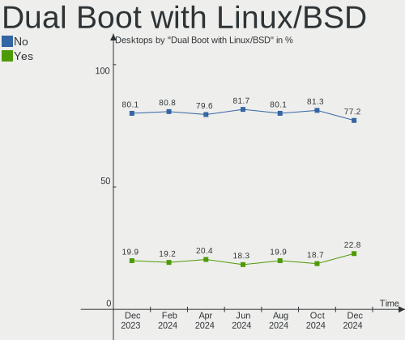
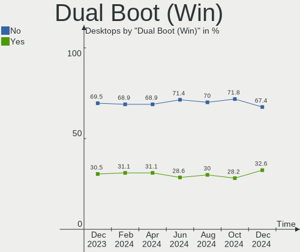
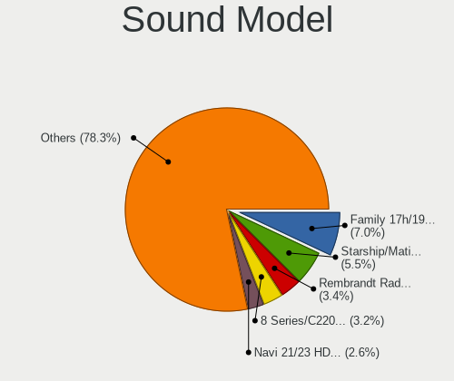
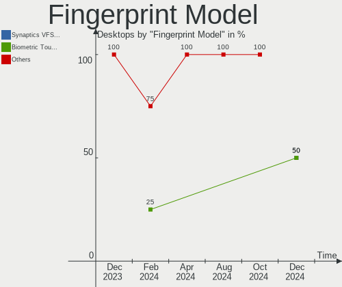
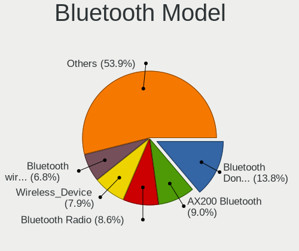

Linux Hardware Trends (Desktop)
-------------------------------

A project to identify most popular hardware characteristics and track their change
over time based on data collected by Linux users at https://Linux-Hardware.org.

Anyone can contribute to the study by uploading probes of their computers by
the [hw-probe](https://github.com/linuxhw/hw-probe) tool:

    sudo -E hw-probe -all -upload

Full-feature report is available here: https://linux-hardware.org/?view=trends&formfactor=desktop

Period: Oct, 2020.

Contents
--------

- [ OS                       ](#os)
- [ OS Family                ](#os-family)
- [ Kernel                   ](#kernel)
- [ Kernel Family            ](#kernel-family)
- [ Kernel Major Ver.        ](#kernel-major-ver)
- [ Arch                     ](#arch)
- [ DE                       ](#de)
- [ Display Server           ](#display-server)
- [ Display Manager          ](#display-manager)
- [ OS Lang                  ](#os-lang)
- [ Boot Mode                ](#boot-mode)
- [ Filesystem               ](#filesystem)
- [ Part. scheme             ](#part-scheme)
- [ Dual Boot with Linux/BSD ](#dual-boot-with-linux/bsd)
- [ Dual Boot (Win)          ](#dual-boot-win)
- [ Country                  ](#country)
- [ City                     ](#city)
- [ Vendor                   ](#vendor)
- [ Model                    ](#model)
- [ Model Family             ](#model-family)
- [ MFG Year                 ](#mfg-year)
- [ Form Factor              ](#form-factor)
- [ Secure Boot              ](#secure-boot)
- [ Coreboot                 ](#coreboot)
- [ RAM Size                 ](#ram-size)
- [ RAM Used                 ](#ram-used)
- [ Has CD-ROM               ](#has-cd-rom)
- [ Total Drives             ](#total-drives)
- [ Has Ethernet             ](#has-ethernet)
- [ Drive Vendor             ](#drive-vendor)
- [ HDD Vendor               ](#hdd-vendor)
- [ SSD Vendor               ](#ssd-vendor)
- [ Drive Model              ](#drive-model)
- [ Drive Kind               ](#drive-kind)
- [ Drive Connector          ](#drive-connector)
- [ Drive Size               ](#drive-size)
- [ Space Total              ](#space-total)
- [ Space Used               ](#space-used)
- [ Malfunc. Drives          ](#malfunc-drives)
- [ Malfunc. Drive Vendor    ](#malfunc-drive-vendor)
- [ Malfunc. HDD Vendor      ](#malfunc-hdd-vendor)
- [ Malfunc. Drive Kind      ](#malfunc-drive-kind)
- [ Failed Drives            ](#failed-drives)
- [ Failed Drive Vendor      ](#failed-drive-vendor)
- [ Drive Status             ](#drive-status)
- [ Storage Vendor           ](#storage-vendor)
- [ Storage Model            ](#storage-model)
- [ Storage Kind             ](#storage-kind)
- [ CPU Vendor               ](#cpu-vendor)
- [ CPU Model                ](#cpu-model)
- [ CPU Model Family         ](#cpu-model-family)
- [ CPU Cores                ](#cpu-cores)
- [ CPU Sockets              ](#cpu-sockets)
- [ CPU Threads              ](#cpu-threads)
- [ CPU Op-Modes             ](#cpu-op-modes)
- [ CPU Microcode            ](#cpu-microcode)
- [ CPU Microarch            ](#cpu-microarch)
- [ GPU Vendor               ](#gpu-vendor)
- [ GPU Model                ](#gpu-model)
- [ GPU Combo                ](#gpu-combo)
- [ GPU Driver               ](#gpu-driver)
- [ GPU Memory               ](#gpu-memory)
- [ Monitor Vendor           ](#monitor-vendor)
- [ Monitor Model            ](#monitor-model)
- [ Monitor Resolution       ](#monitor-resolution)
- [ Monitor Diagonal         ](#monitor-diagonal)
- [ Monitor Width            ](#monitor-width)
- [ Aspect Ratio             ](#aspect-ratio)
- [ Monitor Area             ](#monitor-area)
- [ Pixel Density            ](#pixel-density)
- [ Multiple Monitors        ](#multiple-monitors)
- [ Net Controller Vendor    ](#net-controller-vendor)
- [ Net Controller Model     ](#net-controller-model)
- [ Wireless Vendor          ](#wireless-vendor)
- [ Wireless Model           ](#wireless-model)
- [ Ethernet Vendor          ](#ethernet-vendor)
- [ Ethernet Model           ](#ethernet-model)
- [ Net Controller Kind      ](#net-controller-kind)
- [ Used Controller          ](#used-controller)
- [ NICs                     ](#nics)
- [ Memory Vendor            ](#memory-vendor)
- [ Memory Model             ](#memory-model)
- [ Memory Kind              ](#memory-kind)
- [ Memory Form Factor       ](#memory-form-factor)
- [ Memory Size              ](#memory-size)
- [ Memory Speed             ](#memory-speed)
- [ Sound Vendor             ](#sound-vendor)
- [ Sound Model              ](#sound-model)
- [ Camera Vendor            ](#camera-vendor)
- [ Camera Model             ](#camera-model)
- [ Fingerprint Vendor       ](#fingerprint-vendor)
- [ Fingerprint Model        ](#fingerprint-model)
- [ Chipcard Vendor          ](#chipcard-vendor)
- [ Chipcard Model           ](#chipcard-model)
- [ Printer Vendor           ](#printer-vendor)
- [ Printer Model            ](#printer-model)
- [ Scanner Vendor           ](#scanner-vendor)
- [ Scanner Model            ](#scanner-model)
- [ Bluetooth Vendor         ](#bluetooth-vendor)
- [ Bluetooth Model          ](#bluetooth-model)
- [ Unsupported Devices      ](#unsupported-devices)
- [ Unsupported Device Types ](#unsupported-device-types)

OS
--

Installed operating systems

| Name              | Desktops | Percent |
|-------------------|----------|---------|
| Ubuntu 20.04      | 750      | 35.24%  |
| Ubuntu 18.04      | 132      | 6.2%    |
| Pop!_OS 20.04     | 104      | 4.89%   |
| BlackPanther 18.1 | 98       | 4.61%   |
| Mint 20           | 88       | 4.14%   |
| Fedora 32         | 81       | 3.81%   |
| ROSA R11.1        | 66       | 3.1%    |
| Ubuntu 20.10      | 58       | 2.73%   |
| Arch Rolling      | 57       | 2.68%   |
| Manjaro           | 50       | 2.35%   |
| KDE neon 20.04    | 49       | 2.3%    |
| Arch              | 48       | 2.26%   |
| Debian 10         | 42       | 1.97%   |
| ROSA R11          | 35       | 1.64%   |
| Fedora 33         | 33       | 1.55%   |
| Pop!_OS 20.10     | 32       | 1.5%    |
| Mint 19.3         | 32       | 1.5%    |
| Manjaro 20.1.1    | 24       | 1.13%   |
| Zorin 15          | 23       | 1.08%   |
| ArcoLinux Rolling | 22       | 1.03%   |
| Manjaro 20.1.2    | 21       | 0.99%   |
| Ubuntu 16.04      | 20       | 0.94%   |
| Endless 3.8.7     | 15       | 0.7%    |
| Gentoo 2.7        | 14       | 0.66%   |
| Debian Testing    | 14       | 0.66%   |
| Gentoo            | 12       | 0.56%   |
| Ubuntu 19.10      | 10       | 0.47%   |
| Elementary 5.1.7  | 8        | 0.38%   |
| Debian            | 8        | 0.38%   |
| CentOS 8          | 8        | 0.38%   |
| ROSA R8.1         | 7        | 0.33%   |
| openSUSE 15.2     | 7        | 0.33%   |
| Manjaro 20.1      | 7        | 0.33%   |
| LMDE 4            | 7        | 0.33%   |
| Fedora 31         | 6        | 0.28%   |
| RED X4            | 5        | 0.23%   |
| Mint 19           | 5        | 0.23%   |
| Debian Unstable   | 5        | 0.23%   |
| ROSA 2019.05      | 4        | 0.19%   |
| Kali 2020.3       | 4        | 0.19%   |
| Garuda            | 4        | 0.19%   |
| Endless 3.8.6     | 4        | 0.19%   |
| BlackPanther 16.2 | 4        | 0.19%   |
| Zorin 12          | 3        | 0.14%   |
| ROSA R10          | 3        | 0.14%   |
| Reborn OS         | 3        | 0.14%   |
| Parrot 4.10       | 3        | 0.14%   |
| Mint 19.1         | 3        | 0.14%   |
| GNOME OS 3.38     | 3        | 0.14%   |
| Deepin 20         | 3        | 0.14%   |
| Sparky 5.12       | 2        | 0.09%   |
| ROSA R9           | 2        | 0.09%   |
| RHEL 8.2          | 2        | 0.09%   |
| openSUSE 20201011 | 2        | 0.09%   |
| Mint 18.3         | 2        | 0.09%   |
| Manjaro 20.2      | 2        | 0.09%   |
| Mageia 8          | 2        | 0.09%   |
| Mageia 7          | 2        | 0.09%   |
| EndeavourOS       | 2        | 0.09%   |
| Debian 9.13       | 2        | 0.09%   |

OS Family
---------

OS without a version

| Name         | Desktops | Percent |
|--------------|----------|---------|
| Ubuntu       | 974      | 45.77%  |
| Pop!_OS      | 136      | 6.39%   |
| Mint         | 131      | 6.16%   |
| Fedora       | 122      | 5.73%   |
| ROSA         | 118      | 5.55%   |
| Manjaro      | 106      | 4.98%   |
| Arch         | 106      | 4.98%   |
| BlackPanther | 103      | 4.84%   |
| Debian       | 72       | 3.38%   |
| KDE neon     | 49       | 2.3%    |
| Zorin        | 26       | 1.22%   |
| Gentoo       | 26       | 1.22%   |
| ArcoLinux    | 25       | 1.17%   |
| Endless      | 20       | 0.94%   |
| openSUSE     | 18       | 0.85%   |
| CentOS       | 10       | 0.47%   |
| Elementary   | 9        | 0.42%   |
| LMDE         | 7        | 0.33%   |
| Clear Linux  | 7        | 0.33%   |
| RED          | 5        | 0.23%   |
| Kali         | 5        | 0.23%   |
| Mageia       | 4        | 0.19%   |
| Garuda       | 4        | 0.19%   |
| Reborn OS    | 3        | 0.14%   |
| Parrot       | 3        | 0.14%   |
| GNOME OS     | 3        | 0.14%   |
| EndeavourOS  | 3        | 0.14%   |
| Deepin       | 3        | 0.14%   |
| Artix        | 3        | 0.14%   |
| Sparky       | 2        | 0.09%   |
| RHEL         | 2        | 0.09%   |
| NixOS        | 2        | 0.09%   |
| MX           | 2        | 0.09%   |
| Devuan       | 2        | 0.09%   |
| ALT Linux    | 2        | 0.09%   |
| WindowsFX    | 1        | 0.05%   |
| Void         | 1        | 0.05%   |
| Slackware    | 1        | 0.05%   |
| Siduction    | 1        | 0.05%   |
| Puppy        | 1        | 0.05%   |
| Pragma       | 1        | 0.05%   |
| Peppermint   | 1        | 0.05%   |
| Parabola     | 1        | 0.05%   |
| OpenMandriva | 1        | 0.05%   |
| Makulu       | 1        | 0.05%   |
| Lunar        | 1        | 0.05%   |
| Kurisu       | 1        | 0.05%   |
| ClearOS      | 1        | 0.05%   |
| Calculate    | 1        | 0.05%   |
| Alpine       | 1        | 0.05%   |

Kernel
------

Version of the Linux kernel

| Version                           | Desktops | Percent |
|-----------------------------------|----------|---------|
| 5.4.0-48-generic                  | 404      | 18.98%  |
| 5.4.0-52-generic                  | 297      | 13.96%  |
| 5.4.0-51-generic                  | 122      | 5.73%   |
| 4.18.16-desktop-1bP               | 97       | 4.56%   |
| 5.4.0-7642-generic                | 85       | 3.99%   |
| 5.4.0-42-generic                  | 71       | 3.34%   |
| 5.8.11-1-MANJARO                  | 45       | 2.11%   |
| 5.8.0-7625-generic                | 37       | 1.74%   |
| 4.15.0-118-generic                | 36       | 1.69%   |
| 5.8.14-arch1-1                    | 34       | 1.6%    |
| 5.9.1-arch1-1                     | 31       | 1.46%   |
| 4.15.0-desktop-94.1rosa-x86_64    | 31       | 1.46%   |
| 5.8.0-25-generic                  | 30       | 1.41%   |
| 4.15.0-desktop-45.1rosa-x86_64    | 28       | 1.32%   |
| 5.4.0-49-generic                  | 24       | 1.13%   |
| 5.8.16-300.fc33.x86_64            | 18       | 0.85%   |
| 5.8.13-200.fc32.x86_64            | 18       | 0.85%   |
| 5.8.15-201.fc32.x86_64            | 16       | 0.75%   |
| 5.4.0-26-generic                  | 16       | 0.75%   |
| 4.15.0-122-generic                | 16       | 0.75%   |
| 5.9.1-1-MANJARO                   | 15       | 0.7%    |
| 5.4.0-47-generic                  | 15       | 0.7%    |
| 5.8.16-2-MANJARO                  | 14       | 0.66%   |
| 5.8.12-arch1-1                    | 14       | 0.66%   |
| 5.8.12-200.fc32.x86_64            | 14       | 0.66%   |
| 5.8.0-26-generic                  | 14       | 0.66%   |
| 5.8.0-2-amd64                     | 14       | 0.66%   |
| 4.19.0-11-amd64                   | 14       | 0.66%   |
| 5.4.40-generic-1rosa-x86_64       | 13       | 0.61%   |
| 5.8.13-arch1-1                    | 11       | 0.52%   |
| 4.19.0-12-amd64                   | 11       | 0.52%   |
| 5.8.16-200.fc32.x86_64            | 10       | 0.47%   |
| 5.4.0-48-lowlatency               | 10       | 0.47%   |
| 5.9.1-zen2-1-zen                  | 8        | 0.38%   |
| 5.3.0-64-generic                  | 8        | 0.38%   |
| 5.8.15-301.fc33.x86_64            | 7        | 0.33%   |
| 5.8.0-23-generic                  | 7        | 0.33%   |
| 5.8.0-0.bpo.2-amd64               | 7        | 0.33%   |
| 4.18.0-193.19.1.el8_2.x86_64      | 7        | 0.33%   |
| 4.15.0-desktop-45.1rosa-i586      | 7        | 0.33%   |
| 4.15.0-121-generic                | 7        | 0.33%   |
| 5.9.0-050900-generic              | 6        | 0.28%   |
| 5.8.14-zen1-1-zen                 | 6        | 0.28%   |
| 5.4.67-1-MANJARO                  | 6        | 0.28%   |
| 5.4.32-generic-2rosa-x86_64       | 6        | 0.28%   |
| 5.8.14-200.fc32.x86_64            | 5        | 0.23%   |
| 5.8.11-200.fc32.x86_64            | 5        | 0.23%   |
| 5.8.0-3-amd64                     | 5        | 0.23%   |
| 5.8.0-20-generic                  | 5        | 0.23%   |
| 5.4.0-52-lowlatency               | 5        | 0.23%   |
| 4.9.155-nrj-desktop-1rosa-x86_64  | 5        | 0.23%   |
| 5.8.6-1-MANJARO                   | 4        | 0.19%   |
| 5.8.14-1-default                  | 4        | 0.19%   |
| 5.8.13-100.fc31.x86_64            | 4        | 0.19%   |
| 5.4.72-1-MANJARO                  | 4        | 0.19%   |
| 5.4.72-1-lts                      | 4        | 0.19%   |
| 5.4.60-nickel-2rosa2019.05-x86_64 | 4        | 0.19%   |
| 5.4.0-7634-generic                | 4        | 0.19%   |
| 4.15.0-desktop-94.1rosa-i586      | 4        | 0.19%   |
| 4.1.38-nrj-desktop-2rosa-x86_64   | 4        | 0.19%   |

Kernel Family
-------------

Linux kernel without a distro release

| Version | Desktops | Percent |
|---------|----------|---------|
| 5.4.0   | 1081     | 50.8%   |
| 4.15.0  | 164      | 7.71%   |
| 5.8.0   | 139      | 6.53%   |
| 4.18.16 | 97       | 4.56%   |
| 5.9.1   | 68       | 3.2%    |
| 5.8.14  | 65       | 3.05%   |
| 5.8.11  | 50       | 2.35%   |
| 5.8.13  | 49       | 2.3%    |
| 5.8.16  | 47       | 2.21%   |
| 5.8.12  | 43       | 2.02%   |
| 4.19.0  | 34       | 1.6%    |
| 5.8.15  | 25       | 1.17%   |
| 5.3.0   | 23       | 1.08%   |
| 5.9.0   | 18       | 0.85%   |
| 5.4.40  | 14       | 0.66%   |
| 4.18.0  | 11       | 0.52%   |
| 5.4.72  | 10       | 0.47%   |
| 5.6.0   | 9        | 0.42%   |
| 4.9.155 | 8        | 0.38%   |
| 5.8.10  | 7        | 0.33%   |
| 5.4.66  | 7        | 0.33%   |
| 5.4.60  | 7        | 0.33%   |
| 5.4.32  | 7        | 0.33%   |
| 5.3.18  | 7        | 0.33%   |
| 5.8.6   | 6        | 0.28%   |
| 5.7.19  | 6        | 0.28%   |
| 5.7.0   | 6        | 0.28%   |
| 5.4.67  | 6        | 0.28%   |
| 4.9.20  | 5        | 0.23%   |
| 4.4.0   | 5        | 0.23%   |
| 4.1.38  | 5        | 0.23%   |
| 5.9.2   | 4        | 0.19%   |
| 5.8.9   | 4        | 0.19%   |
| 5.7.14  | 4        | 0.19%   |
| 5.6.19  | 4        | 0.19%   |
| 5.8.7   | 3        | 0.14%   |
| 5.6.6   | 3        | 0.14%   |
| 5.5.0   | 3        | 0.14%   |
| 5.4.70  | 3        | 0.14%   |
| 5.4.68  | 3        | 0.14%   |
| 5.0.0   | 3        | 0.14%   |
| 4.9.60  | 3        | 0.14%   |
| 3.10.0  | 3        | 0.14%   |
| 5.8.8   | 2        | 0.09%   |
| 5.8.5   | 2        | 0.09%   |
| 5.8.1   | 2        | 0.09%   |
| 5.7.13  | 2        | 0.09%   |
| 5.6.15  | 2        | 0.09%   |
| 5.4.71  | 2        | 0.09%   |
| 5.4.69  | 2        | 0.09%   |
| 5.4.65  | 2        | 0.09%   |
| 5.4.64  | 2        | 0.09%   |
| 5.4.50  | 2        | 0.09%   |
| 5.4.28  | 2        | 0.09%   |
| 4.9.0   | 2        | 0.09%   |
| 4.7.0   | 2        | 0.09%   |
| 5.8.2   | 1        | 0.05%   |
| 5.8.17  | 1        | 0.05%   |
| 5.7.8   | 1        | 0.05%   |
| 5.7.7   | 1        | 0.05%   |

Kernel Major Ver.
-----------------

Linux kernel major version

| Version | Desktops | Percent |
|---------|----------|---------|
| 5.4     | 1157     | 54.37%  |
| 5.8     | 446      | 20.96%  |
| 4.15    | 164      | 7.71%   |
| 4.18    | 109      | 5.12%   |
| 5.9     | 90       | 4.23%   |
| 4.19    | 39       | 1.83%   |
| 5.3     | 30       | 1.41%   |
| 5.7     | 23       | 1.08%   |
| 5.6     | 20       | 0.94%   |
| 4.9     | 19       | 0.89%   |
| 5.5     | 5        | 0.23%   |
| 4.4     | 5        | 0.23%   |
| 4.1     | 5        | 0.23%   |
| 5.0     | 3        | 0.14%   |
| 4.7     | 3        | 0.14%   |
| 3.10    | 3        | 0.14%   |
| 5.1     | 1        | 0.05%   |
| 4.20    | 1        | 0.05%   |
| 4.14    | 1        | 0.05%   |
| 4.13    | 1        | 0.05%   |
| 4.12    | 1        | 0.05%   |
| 3.14    | 1        | 0.05%   |
| Unknown | 1        | 0.05%   |

Arch
----

OS architecture (x86_64, i586, etc.)

| Name   | Desktops | Percent |
|--------|----------|---------|
| x86_64 | 2070     | 97.27%  |
| i686   | 56       | 2.63%   |
| armv7l | 2        | 0.09%   |

DE
--

Desktop Environment

| Name             | Desktops | Percent |
|------------------|----------|---------|
| GNOME            | 1037     | 48.73%  |
| KDE5             | 253      | 11.89%  |
| XFCE             | 182      | 8.55%   |
| KDE              | 143      | 6.72%   |
| Unknown          | 105      | 4.93%   |
| MATE             | 88       | 4.14%   |
| X-Cinnamon       | 83       | 3.9%    |
| KDE4             | 81       | 3.81%   |
| Cinnamon         | 52       | 2.44%   |
| Unity            | 23       | 1.08%   |
| LXQt             | 18       | 0.85%   |
| Budgie           | 18       | 0.85%   |
| Pantheon         | 8        | 0.38%   |
| GNOME Flashback  | 8        | 0.38%   |
| Deepin           | 8        | 0.38%   |
| LXDE             | 6        | 0.28%   |
| i3               | 5        | 0.23%   |
| Openbox          | 2        | 0.09%   |
| lightdm-xsession | 2        | 0.09%   |
| ICEWM            | 2        | 0.09%   |
| awesome          | 2        | 0.09%   |
| GNOME Classic    | 1        | 0.05%   |
| DWM              | 1        | 0.05%   |

Display Server
--------------

X11 or Wayland

| Name        | Desktops | Percent |
|-------------|----------|---------|
| X11         | 1921     | 90.27%  |
| Wayland     | 108      | 5.08%   |
| Tty         | 59       | 2.77%   |
| Unknown     | 39       | 1.83%   |
| Unspecified | 1        | 0.05%   |

Display Manager
---------------

SDDM, LightDM, etc.

| Name    | Desktops | Percent |
|---------|----------|---------|
| Unknown | 1367     | 64.24%  |
| SDDM    | 257      | 12.08%  |
| GDM     | 193      | 9.07%   |
| TDM     | 177      | 8.32%   |
| KDM     | 81       | 3.81%   |
| LightDM | 39       | 1.83%   |
| GDM3    | 4        | 0.19%   |
| SLiM    | 3        | 0.14%   |
| Ly      | 3        | 0.14%   |
| LXDM    | 3        | 0.14%   |
| GREETD  | 1        | 0.05%   |

OS Lang
-------

Language

| Lang       | Desktops | Percent |
|------------|----------|---------|
| en_US      | 698      | 32.8%   |
| Unknown    | 172      | 8.08%   |
| de_DE      | 158      | 7.42%   |
| pt_BR      | 140      | 6.58%   |
| ru_RU      | 121      | 5.69%   |
| en_GB      | 115      | 5.4%    |
| fr_FR      | 67       | 3.15%   |
| it_IT      | 59       | 2.77%   |
| es_ES      | 54       | 2.54%   |
| en_CA      | 53       | 2.49%   |
| en_US.UTF8 | 45       | 2.11%   |
| en_AU      | 43       | 2.02%   |
| pl_PL      | 36       | 1.69%   |
| C          | 27       | 1.27%   |
| nl_NL      | 24       | 1.13%   |
| hu_HU      | 21       | 0.99%   |
| es_AR      | 20       | 0.94%   |
| en_IN      | 19       | 0.89%   |
| fi_FI      | 15       | 0.7%    |
| de_DE.utf8 | 12       | 0.56%   |
| cs_CZ      | 12       | 0.56%   |
| pt_PT      | 11       | 0.52%   |
| uk_UA      | 8        | 0.38%   |
| sv_SE      | 8        | 0.38%   |
| ja_JP      | 8        | 0.38%   |
| de_CH      | 8        | 0.38%   |
| C          | 8        | 0.38%   |
| ru_UA      | 7        | 0.33%   |
| ru_RU.utf8 | 7        | 0.33%   |
| nl_BE      | 7        | 0.33%   |
| de_AT      | 7        | 0.33%   |
| es_CO      | 6        | 0.28%   |
| en_GB.utf8 | 6        | 0.28%   |
| da_DK      | 6        | 0.28%   |
| tr_TR      | 5        | 0.23%   |
| pt_BR.utf8 | 5        | 0.23%   |
| fr_CA      | 5        | 0.23%   |
| es_MX      | 5        | 0.23%   |
| en_IE      | 5        | 0.23%   |
| zh_TW      | 4        | 0.19%   |
| sl_SI      | 4        | 0.19%   |
| ro_RO      | 4        | 0.19%   |
| en_ZA      | 4        | 0.19%   |
| en_IL      | 4        | 0.19%   |
| sk_SK      | 3        | 0.14%   |
| fr_FR.utf8 | 3        | 0.14%   |
| fr_BE      | 3        | 0.14%   |
| en_IE.utf8 | 3        | 0.14%   |
| en_CA.utf8 | 3        | 0.14%   |
| el_GR      | 3        | 0.14%   |
| pt_PT.utf8 | 2        | 0.09%   |
| nb_NO      | 2        | 0.09%   |
| it_IT.utf8 | 2        | 0.09%   |
| id_ID      | 2        | 0.09%   |
| fr_CH      | 2        | 0.09%   |
| fi_FI.utf8 | 2        | 0.09%   |
| en_PH      | 2        | 0.09%   |
| en_NZ      | 2        | 0.09%   |
| en_IN      | 2        | 0.09%   |
| en_DK      | 2        | 0.09%   |

Boot Mode
---------

EFI or BIOS

| Mode | Desktops | Percent |
|------|----------|---------|
| BIOS | 1359     | 63.86%  |
| EFI  | 769      | 36.14%  |

Filesystem
----------

Type of filesystem

| Type     | Desktops | Percent |
|----------|----------|---------|
| Ext4     | 1791     | 84.16%  |
| Overlay  | 132      | 6.2%    |
| Btrfs    | 113      | 5.31%   |
| Xfs      | 51       | 2.4%    |
| Zfs      | 21       | 0.99%   |
| Ext2     | 6        | 0.28%   |
| F2fs     | 4        | 0.19%   |
| Tmpfs    | 3        | 0.14%   |
| Reiserfs | 2        | 0.09%   |
| Ext3     | 2        | 0.09%   |
| Aufs     | 2        | 0.09%   |
| Jfs      | 1        | 0.05%   |

Part. scheme
------------

Scheme of partitioning

| Type    | Desktops | Percent |
|---------|----------|---------|
| Unknown | 1308     | 61.47%  |
| GPT     | 481      | 22.6%   |
| MBR     | 339      | 15.93%  |

Dual Boot with Linux/BSD
------------------------

Hosting more than one Linux/BSD

| Dual boot | Desktops | Percent |
|-----------|----------|---------|
| No        | 1758     | 82.61%  |
| Yes       | 370      | 17.39%  |

Dual Boot (Win)
---------------

Hosting Linux and Windows

| Dual boot | Desktops | Percent |
|-----------|----------|---------|
| No        | 1347     | 63.3%   |
| Yes       | 781      | 36.7%   |

Country
-------

Geographic location (country)

| Country        | Desktops | Percent |
|----------------|----------|---------|
| USA            | 392      | 18.42%  |
| Germany        | 199      | 9.35%   |
| Russia         | 183      | 8.6%    |
| Brazil         | 164      | 7.71%   |
| Hungary        | 97       | 4.56%   |
| UK             | 91       | 4.28%   |
| France         | 80       | 3.76%   |
| Italy          | 74       | 3.48%   |
| Canada         | 71       | 3.34%   |
| Spain          | 58       | 2.73%   |
| Netherlands    | 57       | 2.68%   |
| Australia      | 50       | 2.35%   |
| Poland         | 49       | 2.3%    |
| Ukraine        | 41       | 1.93%   |
| India          | 34       | 1.6%    |
| Finland        | 30       | 1.41%   |
| Argentina      | 28       | 1.32%   |
| Sweden         | 27       | 1.27%   |
| Switzerland    | 25       | 1.17%   |
| Austria        | 22       | 1.03%   |
| Portugal       | 19       | 0.89%   |
| Czech Republic | 18       | 0.85%   |
| Romania        | 17       | 0.8%    |
| Greece         | 15       | 0.7%    |
| Mexico         | 14       | 0.66%   |
| Japan          | 14       | 0.66%   |
| Belgium        | 14       | 0.66%   |
| Denmark        | 13       | 0.61%   |
| Norway         | 11       | 0.52%   |
| Israel         | 11       | 0.52%   |
| Turkey         | 10       | 0.47%   |
| Serbia         | 10       | 0.47%   |
| Ireland        | 10       | 0.47%   |
| Slovakia       | 9        | 0.42%   |
| New Zealand    | 8        | 0.38%   |
| Colombia       | 8        | 0.38%   |
| Belarus        | 8        | 0.38%   |
| Taiwan         | 7        | 0.33%   |
| Slovenia       | 7        | 0.33%   |
| Bulgaria       | 7        | 0.33%   |
| Bangladesh     | 7        | 0.33%   |
| Philippines    | 6        | 0.28%   |
| Iran           | 6        | 0.28%   |
| Indonesia      | 6        | 0.28%   |
| South Africa   | 5        | 0.23%   |
| Kazakhstan     | 5        | 0.23%   |
| Iceland        | 5        | 0.23%   |
| Egypt          | 5        | 0.23%   |
| Chile          | 5        | 0.23%   |
| Thailand       | 4        | 0.19%   |
| Malaysia       | 4        | 0.19%   |
| Vietnam        | 3        | 0.14%   |
| UAE            | 3        | 0.14%   |
| Puerto Rico    | 3        | 0.14%   |
| Peru           | 3        | 0.14%   |
| Myanmar        | 3        | 0.14%   |
| Kyrgyzstan     | 3        | 0.14%   |
| Kenya          | 3        | 0.14%   |
| Uzbekistan     | 2        | 0.09%   |
| Uruguay        | 2        | 0.09%   |

City
----

Geographic location (city)

| City              | Desktops | Percent |
|-------------------|----------|---------|
| São Paulo        | 39       | 1.83%   |
| Moscow            | 32       | 1.5%    |
| Budapest          | 32       | 1.5%    |
| St Petersburg     | 17       | 0.8%    |
| Madrid            | 15       | 0.7%    |
| Kyiv              | 14       | 0.66%   |
| Berlin            | 12       | 0.56%   |
| Athens            | 12       | 0.56%   |
| Paris             | 11       | 0.52%   |
| Zurich            | 10       | 0.47%   |
| Sydney            | 10       | 0.47%   |
| Rio de Janeiro    | 10       | 0.47%   |
| Warsaw            | 9        | 0.42%   |
| Toronto           | 9        | 0.42%   |
| Helsinki          | 9        | 0.42%   |
| Vienna            | 8        | 0.38%   |
| Kharkiv           | 8        | 0.38%   |
| Austin            | 8        | 0.38%   |
| Stuttgart         | 7        | 0.33%   |
| Prague            | 7        | 0.33%   |
| Novosibirsk       | 7        | 0.33%   |
| Frankfurt am Main | 7        | 0.33%   |
| Amsterdam         | 7        | 0.33%   |
| Tel Aviv          | 6        | 0.28%   |
| Rome              | 6        | 0.28%   |
| Phoenix           | 6        | 0.28%   |
| Miami             | 6        | 0.28%   |
| Melbourne         | 6        | 0.28%   |
| Lisbon            | 6        | 0.28%   |
| Krakow            | 6        | 0.28%   |
| Ekaterinburg      | 6        | 0.28%   |
| Dallas            | 6        | 0.28%   |
| Chicago           | 6        | 0.28%   |
| Bucharest         | 6        | 0.28%   |
| Tehran            | 5        | 0.23%   |
| Taipei            | 5        | 0.23%   |
| Seattle           | 5        | 0.23%   |
| Saint Paul        | 5        | 0.23%   |
| Ottawa            | 5        | 0.23%   |
| Milan             | 5        | 0.23%   |
| London            | 5        | 0.23%   |
| Leipzig           | 5        | 0.23%   |
| Kitchener         | 5        | 0.23%   |
| Jundiaí          | 5        | 0.23%   |
| Istanbul          | 5        | 0.23%   |
| Düsseldorf       | 5        | 0.23%   |
| Chennai           | 5        | 0.23%   |
| Buenos Aires      | 5        | 0.23%   |
| Valencia          | 4        | 0.19%   |
| Ufa               | 4        | 0.19%   |
| Sofia             | 4        | 0.19%   |
| Saratov           | 4        | 0.19%   |
| San Jose          | 4        | 0.19%   |
| Quezon City       | 4        | 0.19%   |
| Portland          | 4        | 0.19%   |
| Perth             | 4        | 0.19%   |
| Perm              | 4        | 0.19%   |
| Nuremberg         | 4        | 0.19%   |
| Nottingham        | 4        | 0.19%   |
| Nizhniy Novgorod  | 4        | 0.19%   |

Vendor
------

Motherboard manufacturer

| Name                                   | Desktops | Percent |
|----------------------------------------|----------|---------|
| ASUSTek Computer                       | 571      | 26.83%  |
| Gigabyte Technology                    | 372      | 17.48%  |
| ASRock                                 | 236      | 11.09%  |
| MSI                                    | 230      | 10.81%  |
| Dell                                   | 185      | 8.69%   |
| Hewlett-Packard                        | 144      | 6.77%   |
| Lenovo                                 | 61       | 2.87%   |
| Intel                                  | 58       | 2.73%   |
| Acer                                   | 36       | 1.69%   |
| Foxconn                                | 26       | 1.22%   |
| Unknown                                | 25       | 1.17%   |
| Pegatron                               | 22       | 1.03%   |
| Fujitsu                                | 17       | 0.8%    |
| Biostar                                | 16       | 0.75%   |
| ECS                                    | 10       | 0.47%   |
| Medion                                 | 9        | 0.42%   |
| Packard Bell                           | 8        | 0.38%   |
| Fujitsu Siemens                        | 8        | 0.38%   |
| Supermicro                             | 7        | 0.33%   |
| Positivo                               | 7        | 0.33%   |
| Apple                                  | 6        | 0.28%   |
| eMachines                              | 5        | 0.23%   |
| Alienware                              | 5        | 0.23%   |
| Shuttle                                | 4        | 0.19%   |
| Huanan                                 | 4        | 0.19%   |
| AMD                                    | 4        | 0.19%   |
| ZOTAC                                  | 3        | 0.14%   |
| ASRockRack                             | 3        | 0.14%   |
| System76                               | 2        | 0.09%   |
| Quanta                                 | 2        | 0.09%   |
| Itautec                                | 2        | 0.09%   |
| ISYNC                                  | 2        | 0.09%   |
| HARDKERNEL                             | 2        | 0.09%   |
| Gateway                                | 2        | 0.09%   |
| EVGA                                   | 2        | 0.09%   |
| Desenvolvido para Positivo Informatica | 2        | 0.09%   |
| DEPO Computers                         | 2        | 0.09%   |
| BESSTAR Tech                           | 2        | 0.09%   |
| X79                                    | 1        | 0.05%   |
| Wistron                                | 1        | 0.05%   |
| WeiBu                                  | 1        | 0.05%   |
| VS Company                             | 1        | 0.05%   |
| TYAN Computer                          | 1        | 0.05%   |
| SiS Technology                         | 1        | 0.05%   |
| Semp Toshiba                           | 1        | 0.05%   |
| PCWare                                 | 1        | 0.05%   |
| NEC Computers                          | 1        | 0.05%   |
| NCR                                    | 1        | 0.05%   |
| MouseComputer                          | 1        | 0.05%   |
| MiTAC                                  | 1        | 0.05%   |
| Megaware                               | 1        | 0.05%   |
| LORD ELECTRONICS                       | 1        | 0.05%   |
| Kraftway                               | 1        | 0.05%   |
| Koloe                                  | 1        | 0.05%   |
| Jingsha/Kllisre                        | 1        | 0.05%   |
| ITSUMI                                 | 1        | 0.05%   |
| iEi                                    | 1        | 0.05%   |
| Hampoo                                 | 1        | 0.05%   |
| Entroware                              | 1        | 0.05%   |
| ELSA                                   | 1        | 0.05%   |

Model
-----

Motherboard model

| Name                           | Desktops | Percent |
|--------------------------------|----------|---------|
| ASUS All Series                | 58       | 2.73%   |
| Unknown                        | 26       | 1.22%   |
| ASUS TUF GAMING X570-PLUS      | 16       | 0.75%   |
| Gigabyte B450M DS3H            | 14       | 0.66%   |
| Gigabyte 970A-DS3P             | 14       | 0.66%   |
| Dell OptiPlex 7010             | 13       | 0.61%   |
| ASRock B450M Pro4              | 12       | 0.56%   |
| Dell OptiPlex 755              | 11       | 0.52%   |
| HP Compaq 6005 Pro SFF PC      | 10       | 0.47%   |
| ASUS ROG STRIX B450-F GAMING   | 10       | 0.47%   |
| ASUS M5A78L-M/USB3             | 10       | 0.47%   |
| MSI MS-7C37                    | 9        | 0.42%   |
| MSI MS-7C02                    | 8        | 0.38%   |
| MSI MS-7B86                    | 8        | 0.38%   |
| MSI MS-7A38                    | 8        | 0.38%   |
| Dell OptiPlex 9020             | 8        | 0.38%   |
| ASUS PRIME X470-PRO            | 8        | 0.38%   |
| ASUS PRIME A320M-K             | 8        | 0.38%   |
| HP Compaq Elite 8300 SFF       | 7        | 0.33%   |
| Gigabyte X570 AORUS ELITE      | 7        | 0.33%   |
| Dell OptiPlex 790              | 7        | 0.33%   |
| ASUS M5A78L-M PLUS/USB3        | 7        | 0.33%   |
| ASRock FM2A75M Pro4+           | 7        | 0.33%   |
| Gigabyte H61M-S1               | 6        | 0.28%   |
| Gigabyte GA-78LMT-USB3 6.0     | 6        | 0.28%   |
| Dell OptiPlex 380              | 6        | 0.28%   |
| ASUS PRIME H310M-R R2.0        | 6        | 0.28%   |
| ASUS M5A97 R2.0                | 6        | 0.28%   |
| ASRock N68C-S UCC              | 6        | 0.28%   |
| ASRock B450 Pro4               | 6        | 0.28%   |
| ASRock 970 Pro3 R2.0           | 6        | 0.28%   |
| MSI MS-7C84                    | 5        | 0.23%   |
| MSI MS-7B98                    | 5        | 0.23%   |
| MSI MS-7B85                    | 5        | 0.23%   |
| MSI MS-7A33                    | 5        | 0.23%   |
| MSI MS-7721                    | 5        | 0.23%   |
| HP EliteDesk 800 G1 SFF        | 5        | 0.23%   |
| HP Compaq 8200 Elite SFF PC    | 5        | 0.23%   |
| Gigabyte X570 I AORUS PRO WIFI | 5        | 0.23%   |
| Gigabyte X570 AORUS PRO WIFI   | 5        | 0.23%   |
| Gigabyte B450 AORUS ELITE      | 5        | 0.23%   |
| Gigabyte B360M AORUS Gaming 3  | 5        | 0.23%   |
| Gigabyte A320M-S2H             | 5        | 0.23%   |
| Dell OptiPlex 3050             | 5        | 0.23%   |
| Dell OptiPlex 3010             | 5        | 0.23%   |
| ASUS PRIME Z370-A              | 5        | 0.23%   |
| ASUS PRIME B450-PLUS           | 5        | 0.23%   |
| ASRock B450M Steel Legend      | 5        | 0.23%   |
| ASRock A320M-HDV R4.0          | 5        | 0.23%   |
| MSI MS-7C52                    | 4        | 0.19%   |
| MSI MS-7C35                    | 4        | 0.19%   |
| MSI MS-7A34                    | 4        | 0.19%   |
| MSI MS-7850                    | 4        | 0.19%   |
| MSI MS-7817                    | 4        | 0.19%   |
| MSI MS-7798                    | 4        | 0.19%   |
| MSI MS-7758                    | 4        | 0.19%   |
| MSI MS-7693                    | 4        | 0.19%   |
| Intel H55                      | 4        | 0.19%   |
| HP ProDesk 600 G1 SFF          | 4        | 0.19%   |
| HP Compaq Pro 6300 SFF         | 4        | 0.19%   |

Model Family
------------

Motherboard model prefix

| Name                   | Desktops | Percent |
|------------------------|----------|---------|
| Dell OptiPlex          | 103      | 4.84%   |
| ASUS PRIME             | 88       | 4.14%   |
| HP Compaq              | 83       | 3.9%    |
| ASUS All               | 58       | 2.73%   |
| ASUS ROG               | 50       | 2.35%   |
| Lenovo ThinkCentre     | 41       | 1.93%   |
| ASUS TUF               | 33       | 1.55%   |
| Gigabyte X570          | 28       | 1.32%   |
| Dell Precision         | 26       | 1.22%   |
| Unknown                | 26       | 1.22%   |
| ASUS M5A78L-M          | 25       | 1.17%   |
| Acer Aspire            | 25       | 1.17%   |
| Dell Inspiron          | 21       | 0.99%   |
| Gigabyte B450M         | 18       | 0.85%   |
| ASRock B450M           | 18       | 0.85%   |
| Gigabyte 970A-DS3P     | 16       | 0.75%   |
| ASUS M5A97             | 15       | 0.7%    |
| ASRock X570            | 14       | 0.66%   |
| ASRock B450            | 13       | 0.61%   |
| HP EliteDesk           | 12       | 0.56%   |
| Gigabyte B450          | 12       | 0.56%   |
| Fujitsu ESPRIMO        | 11       | 0.52%   |
| Dell XPS               | 11       | 0.52%   |
| ASUS P8H61-M           | 11       | 0.52%   |
| ASRock 970             | 11       | 0.52%   |
| HP ProDesk             | 10       | 0.47%   |
| MSI MS-7C37            | 9        | 0.42%   |
| Gigabyte Z390          | 9        | 0.42%   |
| Gigabyte GA-78LMT-USB3 | 9        | 0.42%   |
| ASUS SABERTOOTH        | 9        | 0.42%   |
| MSI MS-7C02            | 8        | 0.38%   |
| MSI MS-7B86            | 8        | 0.38%   |
| MSI MS-7A38            | 8        | 0.38%   |
| HP Pavilion            | 8        | 0.38%   |
| ASUS P8Z77-V           | 8        | 0.38%   |
| Acer Veriton           | 8        | 0.38%   |
| ASUS STRIX             | 7        | 0.33%   |
| ASRock FM2A75M         | 7        | 0.33%   |
| ASRock A320M-HDV       | 7        | 0.33%   |
| Gigabyte X470          | 6        | 0.28%   |
| Gigabyte H61M-S1       | 6        | 0.28%   |
| Gigabyte B550          | 6        | 0.28%   |
| Dell Vostro            | 6        | 0.28%   |
| ASUS P8Z68-V           | 6        | 0.28%   |
| ASUS P5Q               | 6        | 0.28%   |
| ASUS Maximus           | 6        | 0.28%   |
| ASUS M5A99X            | 6        | 0.28%   |
| ASUS Crosshair         | 6        | 0.28%   |
| ASRock X470            | 6        | 0.28%   |
| ASRock N68C-S          | 6        | 0.28%   |
| Packard Bell imedia    | 5        | 0.23%   |
| MSI MS-7C84            | 5        | 0.23%   |
| MSI MS-7B98            | 5        | 0.23%   |
| MSI MS-7B85            | 5        | 0.23%   |
| MSI MS-7A33            | 5        | 0.23%   |
| MSI MS-7721            | 5        | 0.23%   |
| Lenovo IdeaCentre      | 5        | 0.23%   |
| Gigabyte B550M         | 5        | 0.23%   |
| Gigabyte B360M         | 5        | 0.23%   |
| Gigabyte A320M-S2H     | 5        | 0.23%   |

MFG Year
--------

Motherboard manufacture year

| Year    | Desktops | Percent |
|---------|----------|---------|
| 2020    | 294      | 13.82%  |
| 2019    | 289      | 13.58%  |
| 2018    | 209      | 9.82%   |
| 2014    | 170      | 7.99%   |
| 2013    | 156      | 7.33%   |
| 2010    | 155      | 7.28%   |
| 2012    | 149      | 7%      |
| 2011    | 139      | 6.53%   |
| 2009    | 125      | 5.87%   |
| 2015    | 103      | 4.84%   |
| 2016    | 99       | 4.65%   |
| 2017    | 81       | 3.81%   |
| 2007    | 64       | 3.01%   |
| 2008    | 63       | 2.96%   |
| 2006    | 15       | 0.7%    |
| 2005    | 13       | 0.61%   |
| 2004    | 2        | 0.09%   |
| Unknown | 2        | 0.09%   |

Form Factor
-----------

Physical design of the computer

| Name    | Desktops | Percent |
|---------|----------|---------|
| Desktop | 2128     | 100%    |

Secure Boot
-----------

Enabled or disabled

| State    | Desktops | Percent |
|----------|----------|---------|
| Disabled | 2086     | 98.03%  |
| Enabled  | 42       | 1.97%   |

Coreboot
--------

Have coreboot on board

| Used | Desktops | Percent |
|------|----------|---------|
| No   | 2128     | 100%    |

RAM Size
--------

Total RAM memory

| Size in GB      | Desktops | Percent |
|-----------------|----------|---------|
| 16.01-24.0      | 526      | 24.72%  |
| 8.01-16.0       | 444      | 20.86%  |
| 3.01-4.0        | 363      | 17.06%  |
| 4.01-8.0        | 273      | 12.83%  |
| 32.01-64.0      | 271      | 12.73%  |
| 64.01-256.0     | 87       | 4.09%   |
| 1.01-2.0        | 79       | 3.71%   |
| 24.01-32.0      | 43       | 2.02%   |
| 2.01-3.0        | 24       | 1.13%   |
| 0.01-1.0        | 15       | 0.7%    |
| More than 256.0 | 3        | 0.14%   |

RAM Used
--------

Used RAM memory

| Used GB     | Desktops | Percent |
|-------------|----------|---------|
| 1.01-2.0    | 747      | 35.1%   |
| 2.01-3.0    | 391      | 18.37%  |
| 4.01-8.0    | 305      | 14.33%  |
| 0.01-1.0    | 296      | 13.91%  |
| 3.01-4.0    | 228      | 10.71%  |
| 8.01-16.0   | 124      | 5.83%   |
| 16.01-24.0  | 25       | 1.17%   |
| 24.01-32.0  | 6        | 0.28%   |
| 32.01-64.0  | 5        | 0.23%   |
| 64.01-256.0 | 1        | 0.05%   |

Has CD-ROM
----------

Has CD-ROM on board

| Presented | Desktops | Percent |
|-----------|----------|---------|
| No        | 1076     | 50.56%  |
| Yes       | 1052     | 49.44%  |

Total Drives
------------

Number of drives on board

| Drives | Desktops | Percent |
|--------|----------|---------|
| 1      | 783      | 36.8%   |
| 2      | 651      | 30.59%  |
| 3      | 325      | 15.27%  |
| 4      | 195      | 9.16%   |
| 5      | 96       | 4.51%   |
| 6      | 29       | 1.36%   |
| 0      | 20       | 0.94%   |
| 7      | 14       | 0.66%   |
| 9      | 6        | 0.28%   |
| 8      | 4        | 0.19%   |
| 10     | 3        | 0.14%   |
| 20     | 1        | 0.05%   |
| 15     | 1        | 0.05%   |

Has Ethernet
------------

Has Ethernet on board

| Presented | Desktops | Percent |
|-----------|----------|---------|
| Yes       | 2097     | 98.54%  |
| No        | 31       | 1.46%   |

Drive Vendor
------------

Hard drive vendors

| Vendor                    | Desktops | Drives | Percent |
|---------------------------|----------|--------|---------|
| WDC                       | 818      | 1124   | 21.73%  |
| Seagate                   | 771      | 1016   | 20.48%  |
| Samsung Electronics       | 575      | 778    | 15.28%  |
| Kingston                  | 249      | 280    | 6.62%   |
| Toshiba                   | 189      | 217    | 5.02%   |
| Hitachi                   | 141      | 150    | 3.75%   |
| SanDisk                   | 133      | 148    | 3.53%   |
| Crucial                   | 124      | 137    | 3.29%   |
| A-DATA Technology         | 71       | 76     | 1.89%   |
| Intel                     | 69       | 79     | 1.83%   |
| Phison                    | 58       | 69     | 1.54%   |
| Unknown                   | 39       | 43     | 1.04%   |
| Maxtor                    | 39       | 40     | 1.04%   |
| HGST                      | 36       | 44     | 0.96%   |
| OCZ                       | 31       | 33     | 0.82%   |
| PNY                       | 26       | 28     | 0.69%   |
| Patriot                   | 26       | 26     | 0.69%   |
| China                     | 25       | 25     | 0.66%   |
| Corsair                   | 20       | 23     | 0.53%   |
| SPCC                      | 19       | 23     | 0.5%    |
| Silicon Motion            | 16       | 17     | 0.43%   |
| GOODRAM                   | 16       | 16     | 0.43%   |
| Micron/Crucial Technology | 14       | 15     | 0.37%   |
| Fujitsu                   | 13       | 13     | 0.35%   |
| Intenso                   | 12       | 12     | 0.32%   |
| Hewlett-Packard           | 12       | 12     | 0.32%   |
| SK Hynix                  | 11       | 11     | 0.29%   |
| Micron Technology         | 11       | 11     | 0.29%   |
| Transcend                 | 10       | 10     | 0.27%   |
| Team                      | 10       | 12     | 0.27%   |
| PLEXTOR                   | 10       | 10     | 0.27%   |
| KingSpec                  | 10       | 11     | 0.27%   |
| XPG                       | 8        | 9      | 0.21%   |
| Realtek Semiconductor     | 8        | 9      | 0.21%   |
| Lexar                     | 6        | 6      | 0.16%   |
| JMicron                   | 6        | 10     | 0.16%   |
| ASMT                      | 6        | 8      | 0.16%   |
| Apple                     | 6        | 6      | 0.16%   |
| Smartbuy                  | 5        | 5      | 0.13%   |
| SABRENT                   | 5        | 5      | 0.13%   |
| LITEON                    | 5        | 5      | 0.13%   |
| Kingmax                   | 5        | 5      | 0.13%   |
| Gigabyte Technology       | 5        | 5      | 0.13%   |
| Leven                     | 4        | 4      | 0.11%   |
| FOXLINE                   | 4        | 4      | 0.11%   |
| ExcelStor                 | 4        | 4      | 0.11%   |
| WD MediaMax               | 3        | 3      | 0.08%   |
| Mushkin                   | 3        | 3      | 0.08%   |
| Lite-On                   | 3        | 3      | 0.08%   |
| KingFast                  | 3        | 3      | 0.08%   |
| Apacer                    | 3        | 3      | 0.08%   |
| Zheino                    | 2        | 2      | 0.05%   |
| XrayDisk                  | 2        | 2      | 0.05%   |
| USB3.0                    | 2        | 3      | 0.05%   |
| KingDian                  | 2        | 2      | 0.05%   |
| Integral                  | 2        | 2      | 0.05%   |
| HUAWEI                    | 2        | 2      | 0.05%   |
| Hoodisk                   | 2        | 2      | 0.05%   |
| Drevo                     | 2        | 2      | 0.05%   |
| DOGFISH                   | 2        | 2      | 0.05%   |

HDD Vendor
----------

Hard disk drive vendors

| Vendor              | Desktops | Drives | Percent |
|---------------------|----------|--------|---------|
| Seagate             | 758      | 990    | 36.16%  |
| WDC                 | 755      | 1025   | 36.02%  |
| Toshiba             | 172      | 195    | 8.21%   |
| Samsung Electronics | 152      | 167    | 7.25%   |
| Hitachi             | 141      | 150    | 6.73%   |
| Maxtor              | 38       | 39     | 1.81%   |
| HGST                | 36       | 44     | 1.72%   |
| Fujitsu             | 13       | 13     | 0.62%   |
| Intenso             | 6        | 6      | 0.29%   |
| Hewlett-Packard     | 5        | 5      | 0.24%   |
| ExcelStor           | 4        | 4      | 0.19%   |
| ASMT                | 3        | 5      | 0.14%   |
| ASMT109x            | 2        | 3      | 0.1%    |
| Apple               | 2        | 2      | 0.1%    |
| WD MediaMax         | 1        | 1      | 0.05%   |
| TO Exter            | 1        | 1      | 0.05%   |
| Sabrent             | 1        | 1      | 0.05%   |
| OEM                 | 1        | 1      | 0.05%   |
| KESU                | 1        | 1      | 0.05%   |
| JMicron             | 1        | 1      | 0.05%   |
| Inateck             | 1        | 1      | 0.05%   |
| IET                 | 1        | 2      | 0.05%   |
| HGST HUS            | 1        | 1      | 0.05%   |

SSD Vendor
----------

Solid state drive vendors

| Vendor              | Desktops | Drives | Percent |
|---------------------|----------|--------|---------|
| Samsung Electronics | 331      | 403    | 25.84%  |
| Kingston            | 230      | 256    | 17.95%  |
| Crucial             | 115      | 125    | 8.98%   |
| SanDisk             | 107      | 116    | 8.35%   |
| WDC                 | 83       | 83     | 6.48%   |
| A-DATA Technology   | 58       | 61     | 4.53%   |
| Intel               | 40       | 44     | 3.12%   |
| OCZ                 | 31       | 33     | 2.42%   |
| PNY                 | 25       | 26     | 1.95%   |
| Patriot             | 25       | 25     | 1.95%   |
| China               | 25       | 25     | 1.95%   |
| SPCC                | 18       | 21     | 1.41%   |
| GOODRAM             | 16       | 16     | 1.25%   |
| Toshiba             | 14       | 15     | 1.09%   |
| Corsair             | 13       | 14     | 1.01%   |
| Transcend           | 10       | 10     | 0.78%   |
| Micron Technology   | 10       | 10     | 0.78%   |
| PLEXTOR             | 9        | 9      | 0.7%    |
| KingSpec            | 9        | 10     | 0.7%    |
| Team                | 8        | 8      | 0.62%   |
| Smartbuy            | 5        | 5      | 0.39%   |
| Lexar               | 5        | 5      | 0.39%   |
| Kingmax             | 5        | 5      | 0.39%   |
| Gigabyte Technology | 5        | 5      | 0.39%   |
| SK Hynix            | 4        | 4      | 0.31%   |
| Seagate             | 4        | 6      | 0.31%   |
| LITEON              | 4        | 4      | 0.31%   |
| Hewlett-Packard     | 4        | 4      | 0.31%   |
| FOXLINE             | 4        | 4      | 0.31%   |
| Apple               | 4        | 4      | 0.31%   |
| SABRENT             | 3        | 3      | 0.23%   |
| Mushkin             | 3        | 3      | 0.23%   |
| Leven               | 3        | 3      | 0.23%   |
| JMicron             | 3        | 3      | 0.23%   |
| Intenso             | 3        | 3      | 0.23%   |
| Apacer              | 3        | 3      | 0.23%   |
| Unknown             | 2        | 2      | 0.16%   |
| KingDian            | 2        | 2      | 0.16%   |
| Integral            | 2        | 2      | 0.16%   |
| Hoodisk             | 2        | 2      | 0.16%   |
| Dogfish             | 2        | 2      | 0.16%   |
| ASMT                | 2        | 2      | 0.16%   |
| Zheino              | 1        | 1      | 0.08%   |
| XrayDisk            | 1        | 1      | 0.08%   |
| Vaseky              | 1        | 1      | 0.08%   |
| V-GeN               | 1        | 1      | 0.08%   |
| THU                 | 1        | 1      | 0.08%   |
| TEUTONS             | 1        | 1      | 0.08%   |
| SUNEAST             | 1        | 1      | 0.08%   |
| SandForce           | 1        | 1      | 0.08%   |
| PNY USB             | 1        | 1      | 0.08%   |
| Phison              | 1        | 1      | 0.08%   |
| PALIT               | 1        | 1      | 0.08%   |
| ORICO               | 1        | 1      | 0.08%   |
| MIXZA               | 1        | 1      | 0.08%   |
| MENGMI              | 1        | 1      | 0.08%   |
| Maxtor              | 1        | 1      | 0.08%   |
| LITEONIT            | 1        | 1      | 0.08%   |
| LDLC                | 1        | 1      | 0.08%   |
| Kston               | 1        | 1      | 0.08%   |

Drive Model
-----------

Hard drive models

| Model                        | Desktops | Percent |
|------------------------------|----------|---------|
| NVMe SSD Drive 1TB           | 64       | 1.45%   |
| ST1000DM010-2EP102 1TB       | 62       | 1.41%   |
| ST500DM002-1BD142 500GB      | 57       | 1.29%   |
| SSD 860 EVO 500GB            | 54       | 1.22%   |
| NVMe SSD Drive 500GB         | 51       | 1.16%   |
| SA400S37240G 240GB SSD       | 47       | 1.07%   |
| DT01ACA100 1TB               | 44       | 1%      |
| ST2000DM008-2FR102 2TB       | 43       | 0.97%   |
| WD10EZEX-08WN4A0 1TB         | 39       | 0.88%   |
| NVMe SSD Drive 512GB         | 39       | 0.88%   |
| SV300S37A120G 120GB SSD      | 37       | 0.84%   |
| SSD 850 EVO 250GB            | 36       | 0.82%   |
| SSD 850 EVO 500GB            | 35       | 0.79%   |
| SA400S37120G 120GB SSD       | 35       | 0.79%   |
| ST1000DM003-1CH162 1TB       | 33       | 0.75%   |
| ST3500418AS 500GB            | 32       | 0.73%   |
| SA400S37480G 480GB SSD       | 31       | 0.7%    |
| ST31000528AS 1TB             | 28       | 0.63%   |
| SSD 860 EVO 1TB              | 27       | 0.61%   |
| SSD 860 QVO 1TB              | 25       | 0.57%   |
| SSD 860 EVO 250GB            | 25       | 0.57%   |
| SSD 840 EVO 250GB            | 25       | 0.57%   |
| NVMe SSD Drive 250GB         | 25       | 0.57%   |
| ST1000DM003-1ER162 1TB       | 24       | 0.54%   |
| WD20EZRZ-00Z5HB0 2TB         | 23       | 0.52%   |
| NVMe SSD Drive 256GB         | 23       | 0.52%   |
| NVMe SSD Drive 1024GB        | 22       | 0.5%    |
| Expansion 4TB                | 22       | 0.5%    |
| CT240BX500SSD1 240GB         | 22       | 0.5%    |
| HDWD110 1TB                  | 21       | 0.48%   |
| ST2000DM006-2DM164 2TB       | 19       | 0.43%   |
| ST1000DM003-1SB102 1TB       | 19       | 0.43%   |
| HD103SJ 1TB                  | 18       | 0.41%   |
| Expansion Desk 3TB           | 18       | 0.41%   |
| DT01ACA050 500GB             | 18       | 0.41%   |
| ST2000DM001-1CH164 2TB       | 17       | 0.39%   |
| WD5000AAKX-001CA0 500GB      | 16       | 0.36%   |
| WD20EARX-00PASB0 2TB         | 16       | 0.36%   |
| WD20EZRX-00D8PB0 2TB         | 15       | 0.34%   |
| WD10EZEX-00WN4A0 1TB         | 15       | 0.34%   |
| ST3500312CS 500GB            | 15       | 0.34%   |
| ST2000DM001-1ER164 2TB       | 15       | 0.34%   |
| WD10EZEX-00BN5A0 1TB         | 14       | 0.32%   |
| SV300S37A240G 240GB SSD      | 14       | 0.32%   |
| HDWD120 2TB                  | 14       | 0.32%   |
| DT01ACA200 2TB               | 14       | 0.32%   |
| CT1000MX500SSD1 1TB          | 14       | 0.32%   |
| ST31000524AS 1TB             | 13       | 0.29%   |
| ST3000DM001-1ER166 3TB       | 13       | 0.29%   |
| ST1000DM003-9YN162 1TB       | 13       | 0.29%   |
| SSD 970 EVO Plus 1TB         | 13       | 0.29%   |
| SSD 970 EVO 500GB            | 13       | 0.29%   |
| NVMe SSD Drive 2TB           | 13       | 0.29%   |
| WDS240G2G0A-00JH30 240GB SSD | 12       | 0.27%   |
| WD20EARS-00MVWB0 2TB         | 12       | 0.27%   |
| SUV400S37120G 120GB SSD      | 12       | 0.27%   |
| SSD PLUS 240GB               | 12       | 0.27%   |
| SSD 840 EVO 120GB            | 12       | 0.27%   |
| SDSSDA240G 240GB             | 12       | 0.27%   |
| HD502HJ 500GB                | 12       | 0.27%   |

Drive Kind
----------

HDD or SSD

| Kind    | Desktops | Drives | Percent |
|---------|----------|--------|---------|
| HDD     | 1628     | 2658   | 51.07%  |
| SSD     | 1081     | 1416   | 33.91%  |
| NVMe    | 398      | 513    | 12.48%  |
| Unknown | 71       | 82     | 2.23%   |
| MMC     | 10       | 12     | 0.31%   |

Drive Connector
---------------

SATA, SAS, NVMe, etc.

| Type | Desktops | Drives | Percent |
|------|----------|--------|---------|
| SATA | 2014     | 3991   | 78.67%  |
| NVMe | 398      | 513    | 15.55%  |
| SAS  | 138      | 165    | 5.39%   |
| MMC  | 10       | 12     | 0.39%   |

Drive Size
----------

Size of hard drive

| Size in TB | Desktops | Drives | Percent |
|------------|----------|--------|---------|
| 0.01-0.5   | 1535     | 2206   | 52.19%  |
| 0.51-1.0   | 804      | 1045   | 27.34%  |
| 1.01-2.0   | 320      | 405    | 10.88%  |
| 2.01-3.0   | 106      | 146    | 3.6%    |
| 3.01-4.0   | 102      | 138    | 3.47%   |
| 4.01-10.0  | 64       | 122    | 2.18%   |
| 10.01-20.0 | 10       | 12     | 0.34%   |

Space Total
-----------

Amount of disk space available on the file system

| Size in GB     | Desktops | Percent |
|----------------|----------|---------|
| 101-250        | 463      | 21.76%  |
| 251-500        | 406      | 19.08%  |
| 501-1000       | 330      | 15.51%  |
| 1001-2000      | 232      | 10.9%   |
| More than 3000 | 219      | 10.29%  |
| Unknown        | 128      | 6.02%   |
| 2001-3000      | 111      | 5.22%   |
| 51-100         | 111      | 5.22%   |
| 21-50          | 65       | 3.05%   |
| 1-20           | 63       | 2.96%   |

Space Used
----------

Amount of used disk space

| Used GB        | Desktops | Percent |
|----------------|----------|---------|
| 1-20           | 636      | 29.89%  |
| 101-250        | 281      | 13.2%   |
| 21-50          | 275      | 12.92%  |
| 51-100         | 187      | 8.79%   |
| 501-1000       | 183      | 8.6%    |
| 251-500        | 173      | 8.13%   |
| Unknown        | 128      | 6.02%   |
| 1001-2000      | 120      | 5.64%   |
| More than 3000 | 88       | 4.14%   |
| 2001-3000      | 57       | 2.68%   |

Malfunc. Drives
---------------

Drive models with a malfunction

| Model                      | Desktops | Drives | Percent |
|----------------------------|----------|--------|---------|
| ST500DM002-1BD142 500GB    | 12       | 12     | 3.92%   |
| SU630 240GB SSD            | 6        | 6      | 1.96%   |
| ST3500418AS 500GB          | 5        | 6      | 1.63%   |
| WD5000AAKX-003CA0 500GB    | 4        | 4      | 1.31%   |
| WD5000AAKX-083CA1 500GB    | 3        | 3      | 0.98%   |
| WD20EARX-00PASB0 2TB       | 3        | 3      | 0.98%   |
| WD20EARS-00MVWB0 2TB       | 3        | 3      | 0.98%   |
| WD15EARS-00MVWB0 1TB       | 3        | 3      | 0.98%   |
| SV300S37A120G 120GB SSD    | 3        | 3      | 0.98%   |
| ST3320613AS 320GB          | 3        | 3      | 0.98%   |
| ST3250318AS 250GB          | 3        | 3      | 0.98%   |
| ST3250310AS 250GB          | 3        | 3      | 0.98%   |
| ST31000528AS 1TB           | 3        | 3      | 0.98%   |
| ST1000DM003-1CH162 1TB     | 3        | 3      | 0.98%   |
| HD501LJ 500GB              | 3        | 3      | 0.98%   |
| WD5000AAKX-75U6AA0 500GB   | 2        | 2      | 0.65%   |
| WD5000AAKX-00ERMA0 500GB   | 2        | 2      | 0.65%   |
| WD5000AAKX-001CA0 500GB    | 2        | 2      | 0.65%   |
| WD30EZRX-00DC0B0 3TB       | 2        | 4      | 0.65%   |
| WD1600AAJS-75M0A0 160GB    | 2        | 2      | 0.65%   |
| SU800 256GB SSD            | 2        | 2      | 0.65%   |
| STM3250310AS 250GB         | 2        | 2      | 0.65%   |
| ST9500325AS 500GB          | 2        | 2      | 0.65%   |
| ST9320423AS 320GB          | 2        | 2      | 0.65%   |
| ST9250315AS 250GB          | 2        | 2      | 0.65%   |
| ST500LT012-9WS142 500GB    | 2        | 2      | 0.65%   |
| ST500LT012-1DG142 500GB    | 2        | 2      | 0.65%   |
| ST4000DM000-1F2168 4TB     | 2        | 2      | 0.65%   |
| ST3500412AS 500GB          | 2        | 2      | 0.65%   |
| ST3250410AS 250GB          | 2        | 2      | 0.65%   |
| ST3160812AS 160GB          | 2        | 2      | 0.65%   |
| ST2000DL003-9VT166 2TB     | 2        | 2      | 0.65%   |
| ST1000LM024 HN-M101MBB 1TB | 2        | 2      | 0.65%   |
| SSD 970 EVO 500GB          | 2        | 2      | 0.65%   |
| SSD 960 EVO 250GB          | 2        | 2      | 0.65%   |
| HDS721050CLA362 500GB      | 2        | 2      | 0.65%   |
| HDS721010CLA332 1TB        | 2        | 2      | 0.65%   |
| HD502HJ 500GB              | 2        | 2      | 0.65%   |
| HD161GJ 160GB              | 2        | 2      | 0.65%   |
| HD160JJ 160GB              | 2        | 2      | 0.65%   |
| HD103UJ 1TB                | 2        | 2      | 0.65%   |
| CT128MX100SSD1 128GB       | 2        | 2      | 0.65%   |
| WD800JD-22MSA1 80GB        | 1        | 1      | 0.33%   |
| WD7501AALS-00E3A0 752GB    | 1        | 1      | 0.33%   |
| WD7500AADS-00M2B0 752GB    | 1        | 1      | 0.33%   |
| WD740GD-00FLC0 74GB        | 1        | 1      | 0.33%   |
| WD6400AADS-00M2B0 640GB    | 1        | 1      | 0.33%   |
| WD5002ABYS-02B1B0 500GB    | 1        | 1      | 0.33%   |
| WD5000LPVX-22V0TT0 500GB   | 1        | 1      | 0.33%   |
| WD5000AVVS-63H0B1 500GB    | 1        | 1      | 0.33%   |
| WD5000AAKX-07U6AA0 500GB   | 1        | 1      | 0.33%   |
| WD5000AAKS-75V0A0 500GB    | 1        | 1      | 0.33%   |
| WD5000AAKS-60Z1A0 500GB    | 1        | 1      | 0.33%   |
| WD5000AAKS-60WWPA0 500GB   | 1        | 1      | 0.33%   |
| WD5000AAKS-41YGA1 500GB    | 1        | 1      | 0.33%   |
| WD5000AAKS-00UU3A0 500GB   | 1        | 1      | 0.33%   |
| WD5000AADS-00S9B0 500GB    | 1        | 1      | 0.33%   |
| WD5000AACS-00G8B0 500GB    | 1        | 1      | 0.33%   |
| WD40PURZ-85TTDY0 4TB       | 1        | 1      | 0.33%   |
| WD40EFRX-68WT0N0 4TB       | 1        | 1      | 0.33%   |

Malfunc. Drive Vendor
---------------------

Vendors of faulty drives

| Vendor              | Desktops | Drives | Percent |
|---------------------|----------|--------|---------|
| Seagate             | 87       | 101    | 29.9%   |
| WDC                 | 85       | 93     | 29.21%  |
| Samsung Electronics | 24       | 25     | 8.25%   |
| Hitachi             | 18       | 18     | 6.19%   |
| A-DATA Technology   | 11       | 11     | 3.78%   |
| Toshiba             | 10       | 12     | 3.44%   |
| Kingston            | 10       | 11     | 3.44%   |
| Maxtor              | 8        | 9      | 2.75%   |
| Intel               | 6        | 6      | 2.06%   |
| Corsair             | 5        | 6      | 1.72%   |
| Crucial             | 4        | 4      | 1.37%   |
| SanDisk             | 3        | 3      | 1.03%   |
| HGST                | 3        | 3      | 1.03%   |
| SPCC                | 2        | 2      | 0.69%   |
| OCZ                 | 2        | 2      | 0.69%   |
| Hewlett-Packard     | 2        | 2      | 0.69%   |
| Fujitsu             | 2        | 2      | 0.69%   |
| SK Hynix            | 1        | 1      | 0.34%   |
| PNY                 | 1        | 1      | 0.34%   |
| PLEXTOR             | 1        | 1      | 0.34%   |
| Patriot             | 1        | 1      | 0.34%   |
| LITEON              | 1        | 1      | 0.34%   |
| LDLC                | 1        | 1      | 0.34%   |
| Kingmax             | 1        | 1      | 0.34%   |
| HS-SSD-E100         | 1        | 1      | 0.34%   |
| ExcelStor           | 1        | 1      | 0.34%   |

Malfunc. HDD Vendor
-------------------

Vendors of faulty HDD drives

| Vendor              | Desktops | Drives | Percent |
|---------------------|----------|--------|---------|
| Seagate             | 86       | 98     | 37.23%  |
| WDC                 | 85       | 93     | 36.8%   |
| Samsung Electronics | 19       | 19     | 8.23%   |
| Hitachi             | 18       | 18     | 7.79%   |
| Toshiba             | 9        | 11     | 3.9%    |
| Maxtor              | 8        | 9      | 3.46%   |
| HGST                | 3        | 3      | 1.3%    |
| Fujitsu             | 2        | 2      | 0.87%   |
| ExcelStor           | 1        | 1      | 0.43%   |

Malfunc. Drive Kind
-------------------

Kinds of faulty drives

| Kind | Desktops | Drives | Percent |
|------|----------|--------|---------|
| HDD  | 213      | 254    | 77.74%  |
| SSD  | 52       | 56     | 18.98%  |
| NVMe | 9        | 9      | 3.28%   |

Failed Drives
-------------

Failed drive models

| Model                    | Desktops | Drives | Percent |
|--------------------------|----------|--------|---------|
| WD3200BEKT-60PVMT0 320GB | 1        | 1      | 14.29%  |
| WD1600BEVT-80A23T0 160GB | 1        | 1      | 14.29%  |
| VERTEX460A 480GB SSD     | 1        | 1      | 14.29%  |
| ST32000641AS 2TB         | 1        | 1      | 14.29%  |
| ST31000524AS 1TB         | 1        | 1      | 14.29%  |
| HTS545050A7E380 500GB    | 1        | 1      | 14.29%  |
| HD252HJ 250GB            | 1        | 1      | 14.29%  |

Failed Drive Vendor
-------------------

Failed drive vendors

| Vendor              | Desktops | Drives | Percent |
|---------------------|----------|--------|---------|
| WDC                 | 2        | 2      | 28.57%  |
| Seagate             | 2        | 2      | 28.57%  |
| Samsung Electronics | 1        | 1      | 14.29%  |
| OCZ                 | 1        | 1      | 14.29%  |
| HGST                | 1        | 1      | 14.29%  |

Drive Status
------------

Number of failed and malfunc. drives

| Status   | Desktops | Drives | Percent |
|----------|----------|--------|---------|
| Detected | 1356     | 2850   | 57.68%  |
| Works    | 722      | 1505   | 30.71%  |
| Malfunc  | 266      | 319    | 11.31%  |
| Failed   | 7        | 7      | 0.3%    |

Storage Vendor
--------------

Storage controller vendors

| Vendor                           | Desktops | Percent |
|----------------------------------|----------|---------|
| Intel                            | 1289     | 45.07%  |
| AMD                              | 744      | 26.01%  |
| Samsung Electronics              | 165      | 5.77%   |
| ASMedia Technology               | 113      | 3.95%   |
| Nvidia                           | 88       | 3.08%   |
| JMicron Technology               | 83       | 2.9%    |
| Marvell Technology Group         | 74       | 2.59%   |
| Phison Electronics               | 70       | 2.45%   |
| Sandisk                          | 40       | 1.4%    |
| ADATA Technology                 | 26       | 0.91%   |
| Micron/Crucial Technology        | 25       | 0.87%   |
| Silicon Motion                   | 24       | 0.84%   |
| Kingston Technology Company      | 22       | 0.77%   |
| VIA Technologies                 | 17       | 0.59%   |
| Realtek Semiconductor            | 13       | 0.45%   |
| LSI Logic / Symbios Logic        | 9        | 0.31%   |
| SK Hynix                         | 7        | 0.24%   |
| Silicon Image                    | 7        | 0.24%   |
| Toshiba America Info Systems     | 6        | 0.21%   |
| Broadcom / LSI                   | 6        | 0.21%   |
| Adaptec                          | 6        | 0.21%   |
| Seagate Technology               | 5        | 0.17%   |
| Lite-On Technology               | 5        | 0.17%   |
| Integrated Technology Express    | 5        | 0.17%   |
| Silicon Integrated Systems [SiS] | 4        | 0.14%   |
| ULi Electronics                  | 1        | 0.03%   |
| Promise Technology               | 1        | 0.03%   |
| Micron Technology                | 1        | 0.03%   |
| Lite-On IT Corp. / Plextor       | 1        | 0.03%   |
| HighPoint Technologies           | 1        | 0.03%   |
| Hewlett-Packard                  | 1        | 0.03%   |
| 3ware                            | 1        | 0.03%   |

Storage Model
-------------

Storage controller models

| Model                                                                             | Desktops | Percent |
|-----------------------------------------------------------------------------------|----------|---------|
| FCH SATA Controller [AHCI mode]                                                   | 456      | 11.92%  |
| 400 Series Chipset SATA Controller                                                | 159      | 4.16%   |
| 8 Series/C220 Series Chipset Family 6-port SATA Controller 1 [AHCI mode]          | 156      | 4.08%   |
| SB7x0/SB8x0/SB9x0 IDE Controller                                                  | 148      | 3.87%   |
| NVMe SSD Controller SM981/PM981/PM983                                             | 129      | 3.37%   |
| NM10/ICH7 Family SATA Controller [IDE mode]                                       | 121      | 3.16%   |
| SB7x0/SB8x0/SB9x0 SATA Controller [AHCI mode]                                     | 119      | 3.11%   |
| 6 Series/C200 Series Chipset Family 6 port Desktop SATA AHCI Controller           | 119      | 3.11%   |
| ASM1062 Serial ATA Controller                                                     | 107      | 2.8%    |
| 7 Series/C210 Series Chipset Family 6-port SATA Controller [AHCI mode]            | 103      | 2.69%   |
| SB7x0/SB8x0/SB9x0 SATA Controller [IDE mode]                                      | 101      | 2.64%   |
| 82801G (ICH7 Family) IDE Controller                                               | 99       | 2.59%   |
| Q170/Q150/B150/H170/H110/Z170/CM236 Chipset SATA Controller [AHCI Mode]           | 97       | 2.54%   |
| 200 Series PCH SATA controller [AHCI mode]                                        | 93       | 2.43%   |
| SATA Controller [RAID mode]                                                       | 76       | 1.99%   |
| Cannon Lake PCH SATA AHCI Controller                                              | 66       | 1.73%   |
| 6 Series/C200 Series Chipset Family Desktop SATA Controller (IDE mode, ports 4-5) | 53       | 1.39%   |
| 6 Series/C200 Series Chipset Family Desktop SATA Controller (IDE mode, ports 0-3) | 53       | 1.39%   |
| MCP61 SATA Controller                                                             | 49       | 1.28%   |
| JMB363 SATA/IDE Controller                                                        | 49       | 1.28%   |
| Non-Volatile memory controller                                                    | 46       | 1.2%    |
| MCP61 IDE                                                                         | 44       | 1.15%   |
| SATA controller                                                                   | 41       | 1.07%   |
| FCH SATA Controller D                                                             | 39       | 1.02%   |
| E12 NVMe Controller                                                               | 39       | 1.02%   |
| 300 Series Chipset SATA Controller                                                | 38       | 0.99%   |
| 82801I (ICH9 Family) 2 port SATA Controller [IDE mode]                            | 34       | 0.89%   |
| NVMe SSD Controller SM961/PM961                                                   | 32       | 0.84%   |
| 4 Series Chipset PT IDER Controller                                               | 31       | 0.81%   |
| 9 Series Chipset Family SATA Controller [AHCI Mode]                               | 29       | 0.76%   |
| 82801JI (ICH10 Family) SATA AHCI Controller                                       | 29       | 0.76%   |
| 82801JI (ICH10 Family) 4 port SATA IDE Controller #1                              | 29       | 0.76%   |
| 82801JI (ICH10 Family) 2 port SATA IDE Controller #2                              | 28       | 0.73%   |
| 5 Series/3400 Series Chipset 6 port SATA AHCI Controller                          | 28       | 0.73%   |
| 400 Series Chipset Family SATA AHCI Controller                                    | 28       | 0.73%   |
| X370 Series Chipset SATA Controller                                               | 27       | 0.71%   |
| FCH IDE Controller                                                                | 27       | 0.71%   |
| XPG SX8200 Pro PCIe Gen3x4 M.2 2280 Solid State Drive                             | 25       | 0.65%   |
| 82801JD/DO (ICH10 Family) SATA AHCI Controller                                    | 25       | 0.65%   |
| 82801IR/IO/IH (ICH9R/DO/DH) 4 port SATA Controller [IDE mode]                     | 25       | 0.65%   |
| E16 PCIe4 NVMe Controller                                                         | 23       | 0.6%    |
| 5 Series/3400 Series Chipset 4 port SATA IDE Controller                           | 22       | 0.58%   |
| 5 Series/3400 Series Chipset 2 port SATA IDE Controller                           | 21       | 0.55%   |
| P1 NVMe PCIe SSD                                                                  | 18       | 0.47%   |
| JMB368 IDE controller                                                             | 18       | 0.47%   |
| C610/X99 series chipset 6-Port SATA Controller [AHCI mode]                        | 17       | 0.44%   |
| A2000, M.2, 500GB                                                                 | 16       | 0.42%   |
| 88SE6111/6121 SATA II / PATA Controller                                           | 16       | 0.42%   |
| 82Q35 Express PT IDER Controller                                                  | 16       | 0.42%   |
| SSD 660P Series                                                                   | 14       | 0.37%   |
| SB600 IDE                                                                         | 14       | 0.37%   |
| C610/X99 series chipset sSATA Controller [AHCI mode]                              | 14       | 0.37%   |
| 88SE9172 SATA 6Gb/s Controller                                                    | 14       | 0.37%   |
| X399 Series Chipset SATA Controller                                               | 13       | 0.34%   |
| WD Black 2019/PC SN750 NVMe SSD                                                   | 13       | 0.34%   |
| SB600 Non-Raid-5 SATA                                                             | 13       | 0.34%   |
| Realtek Non-Volatile memory controller                                            | 13       | 0.34%   |
| C600/X79 series chipset 6-Port SATA AHCI Controller                               | 13       | 0.34%   |
| 7 Series/C210 Series Chipset Family 4-port SATA Controller [IDE mode]             | 13       | 0.34%   |
| 7 Series/C210 Series Chipset Family 2-port SATA Controller [IDE mode]             | 13       | 0.34%   |

Storage Kind
------------

Kind of storage controller (IDE, SATA, NVMe, SAS, ...)

| Kind | Desktops | Percent |
|------|----------|---------|
| SATA | 1624     | 56.64%  |
| IDE  | 694      | 24.21%  |
| NVMe | 400      | 13.95%  |
| RAID | 126      | 4.39%   |
| SAS  | 13       | 0.45%   |
| SCSI | 10       | 0.35%   |

CPU Vendor
----------

Processor vendors

| Vendor | Desktops | Percent |
|--------|----------|---------|
| Intel  | 1301     | 61.14%  |
| AMD    | 825      | 38.77%  |
| ARM    | 2        | 0.09%   |

CPU Model
---------

Processor models

| Model                                       | Desktops | Percent |
|---------------------------------------------|----------|---------|
| AMD Ryzen 5 3600 6-Core Processor           | 60       | 2.82%   |
| AMD Ryzen 7 3700X 8-Core Processor          | 44       | 2.07%   |
| Intel Core 2 Duo CPU E8400 @ 3.00GHz        | 37       | 1.74%   |
| Intel Core i7-3770 CPU @ 3.40GHz            | 36       | 1.69%   |
| AMD Ryzen 5 2600 Six-Core Processor         | 33       | 1.55%   |
| AMD FX-6300 Six-Core Processor              | 31       | 1.46%   |
| AMD FX-8350 Eight-Core Processor            | 28       | 1.32%   |
| Intel Core i5-2400 CPU @ 3.10GHz            | 27       | 1.27%   |
| AMD Ryzen 9 3900X 12-Core Processor         | 27       | 1.27%   |
| Intel Core i5-3470 CPU @ 3.20GHz            | 26       | 1.22%   |
| Intel Core 2 Duo CPU E7500 @ 2.93GHz        | 25       | 1.17%   |
| AMD Ryzen 5 1600 Six-Core Processor         | 25       | 1.17%   |
| Intel Core i7-2600 CPU @ 3.40GHz            | 22       | 1.03%   |
| AMD Ryzen 7 2700X Eight-Core Processor      | 22       | 1.03%   |
| AMD Ryzen 5 3400G with Radeon Vega Graphics | 22       | 1.03%   |
| Intel Core i3-2100 CPU @ 3.10GHz            | 20       | 0.94%   |
| Intel Core i7-4790K CPU @ 4.00GHz           | 19       | 0.89%   |
| Intel Core i7-8700K CPU @ 3.70GHz           | 16       | 0.75%   |
| Intel Core i7-4790 CPU @ 3.60GHz            | 16       | 0.75%   |
| Intel Core i5-4460 CPU @ 3.20GHz            | 16       | 0.75%   |
| AMD Ryzen 7 1700X Eight-Core Processor      | 16       | 0.75%   |
| Intel Core i5 CPU 650 @ 3.20GHz             | 15       | 0.7%    |
| Intel Core i3-3220 CPU @ 3.30GHz            | 15       | 0.7%    |
| Intel Core i7-6700K CPU @ 4.00GHz           | 14       | 0.66%   |
| Intel Core i5-4590 CPU @ 3.30GHz            | 14       | 0.66%   |
| Intel Core i5-3570 CPU @ 3.40GHz            | 14       | 0.66%   |
| Intel Core i3-2120 CPU @ 3.30GHz            | 14       | 0.66%   |
| Intel Core 2 Quad CPU Q6600 @ 2.40GHz       | 14       | 0.66%   |
| Intel Core i7-6700 CPU @ 3.40GHz            | 13       | 0.61%   |
| Intel Core i5-9400F CPU @ 2.90GHz           | 13       | 0.61%   |
| AMD Ryzen 5 3600X 6-Core Processor          | 13       | 0.61%   |
| AMD Ryzen 3 3200G with Radeon Vega Graphics | 13       | 0.61%   |
| AMD Ryzen 3 2200G with Radeon Vega Graphics | 13       | 0.61%   |
| Intel Core i7-7700K CPU @ 4.20GHz           | 12       | 0.56%   |
| AMD Ryzen 5 2400G with Radeon Vega Graphics | 12       | 0.56%   |
| Intel Core i5-8400 CPU @ 2.80GHz            | 11       | 0.52%   |
| Intel Core i5-7400 CPU @ 3.00GHz            | 11       | 0.52%   |
| Intel Core i5-6400 CPU @ 2.70GHz            | 11       | 0.52%   |
| Intel Core i5-2500 CPU @ 3.30GHz            | 11       | 0.52%   |
| AMD Ryzen 7 2700 Eight-Core Processor       | 11       | 0.52%   |
| AMD Ryzen 7 1700 Eight-Core Processor       | 11       | 0.52%   |
| AMD Phenom II X4 965 Processor              | 11       | 0.52%   |
| Intel Core i7-8700 CPU @ 3.20GHz            | 10       | 0.47%   |
| Intel Core i7-7700 CPU @ 3.60GHz            | 10       | 0.47%   |
| Intel Core i7-4770 CPU @ 3.40GHz            | 10       | 0.47%   |
| Intel Core i5-7500 CPU @ 3.40GHz            | 10       | 0.47%   |
| Intel Core i5-6600K CPU @ 3.50GHz           | 10       | 0.47%   |
| Intel Core i5-4570 CPU @ 3.20GHz            | 10       | 0.47%   |
| AMD Phenom II X4 955 Processor              | 10       | 0.47%   |
| AMD Athlon II X2 250 Processor              | 10       | 0.47%   |
| Intel Core i7-4770K CPU @ 3.50GHz           | 9        | 0.42%   |
| Intel Core i5-6500 CPU @ 3.20GHz            | 9        | 0.42%   |
| Intel Core i5-2500K CPU @ 3.30GHz           | 9        | 0.42%   |
| Intel Core i3 CPU 540 @ 3.07GHz             | 9        | 0.42%   |
| Intel Core 2 Duo CPU E7200 @ 2.53GHz        | 9        | 0.42%   |
| AMD Ryzen 7 3800X 8-Core Processor          | 9        | 0.42%   |
| AMD Ryzen 5 2600X Six-Core Processor        | 9        | 0.42%   |
| AMD A8-6600K APU with Radeon HD Graphics    | 9        | 0.42%   |
| Intel Pentium Dual-Core CPU E5700 @ 3.00GHz | 8        | 0.38%   |
| Intel Core i7-2600K CPU @ 3.40GHz           | 8        | 0.38%   |

CPU Model Family
----------------

Processor model prefix

| Model                   | Desktops | Percent |
|-------------------------|----------|---------|
| Intel Core i5           | 368      | 17.29%  |
| Intel Core i7           | 290      | 13.63%  |
| AMD Ryzen 5             | 191      | 8.98%   |
| Intel Core i3           | 152      | 7.14%   |
| AMD Ryzen 7             | 118      | 5.55%   |
| Intel Core 2 Duo        | 111      | 5.22%   |
| AMD FX                  | 110      | 5.17%   |
| Intel Xeon              | 89       | 4.18%   |
| Intel Celeron           | 57       | 2.68%   |
| Intel Pentium           | 49       | 2.3%    |
| Intel Core 2 Quad       | 46       | 2.16%   |
| AMD Phenom II X4        | 42       | 1.97%   |
| Intel Pentium Dual-Core | 41       | 1.93%   |
| AMD Athlon II X2        | 41       | 1.93%   |
| AMD Athlon 64 X2        | 40       | 1.88%   |
| AMD Ryzen 9             | 38       | 1.79%   |
| AMD Ryzen 3             | 38       | 1.79%   |
| AMD A8                  | 24       | 1.13%   |
| AMD A10                 | 23       | 1.08%   |
| AMD Ryzen Threadripper  | 21       | 0.99%   |
| Intel Pentium Dual      | 18       | 0.85%   |
| Intel Core 2            | 18       | 0.85%   |
| AMD Athlon II X4        | 18       | 0.85%   |
| AMD Phenom II X6        | 16       | 0.75%   |
| Intel Core i9           | 14       | 0.66%   |
| AMD A6                  | 14       | 0.66%   |
| Intel Pentium D         | 13       | 0.61%   |
| Intel Pentium 4         | 12       | 0.56%   |
| AMD Athlon              | 12       | 0.56%   |
| Intel Atom              | 11       | 0.52%   |
| AMD Athlon 64           | 10       | 0.47%   |
| AMD A4                  | 10       | 0.47%   |
| AMD Phenom              | 9        | 0.42%   |
| AMD Sempron             | 8        | 0.38%   |
| AMD Phenom II X2        | 6        | 0.28%   |
| AMD Athlon X4           | 6        | 0.28%   |
| Other                   | 5        | 0.23%   |
| Intel Pentium Gold      | 5        | 0.23%   |
| Intel Genuine           | 5        | 0.23%   |
| AMD E                   | 5        | 0.23%   |
| AMD Ryzen 7 PRO         | 4        | 0.19%   |
| AMD E2                  | 4        | 0.19%   |
| AMD E1                  | 3        | 0.14%   |
| AMD Athlon II X3        | 3        | 0.14%   |
| AMD Athlon Dual Core    | 2        | 0.09%   |
| Intel Pentium Silver    | 1        | 0.05%   |
| ARM Allwinner           | 1        | 0.05%   |
| AMD Turion II Neo       | 1        | 0.05%   |
| AMD Ryzen 5 PRO         | 1        | 0.05%   |
| AMD Phenom II X3        | 1        | 0.05%   |
| AMD GX                  | 1        | 0.05%   |
| AMD EPYC                | 1        | 0.05%   |
| AMD C-60                | 1        | 0.05%   |

CPU Cores
---------

Number of processor cores

| Number | Desktops | Percent |
|--------|----------|---------|
| 4      | 838      | 39.38%  |
| 2      | 635      | 29.84%  |
| 6      | 277      | 13.02%  |
| 8      | 170      | 7.99%   |
| 1      | 68       | 3.2%    |
| 3      | 50       | 2.35%   |
| 12     | 44       | 2.07%   |
| 16     | 17       | 0.8%    |
| 10     | 12       | 0.56%   |
| 24     | 7        | 0.33%   |
| 32     | 4        | 0.19%   |
| 64     | 2        | 0.09%   |
| 18     | 2        | 0.09%   |
| 48     | 1        | 0.05%   |
| 36     | 1        | 0.05%   |

CPU Sockets
-----------

Number of sockets

| Number | Desktops | Percent |
|--------|----------|---------|
| 1      | 2106     | 98.97%  |
| 2      | 21       | 0.99%   |
| 4      | 1        | 0.05%   |

CPU Threads
-----------

Threads per core (Hyper-Threading)

| Number | Desktops | Percent |
|--------|----------|---------|
| 2      | 1092     | 51.32%  |
| 1      | 1036     | 48.68%  |

CPU Op-Modes
------------

CPU Operation Modes (32-bit, 64-bit)

| Op mode        | Desktops | Percent |
|----------------|----------|---------|
| 32-bit, 64-bit | 2119     | 99.58%  |
| 32-bit         | 5        | 0.23%   |
| Unknown        | 4        | 0.19%   |

CPU Microcode
-------------

Microcode number

| Number     | Desktops | Percent |
|------------|----------|---------|
| Unknown    | 364      | 17.11%  |
| 0x306c3    | 162      | 7.61%   |
| 0x306a9    | 132      | 6.2%    |
| 0x206a7    | 123      | 5.78%   |
| 0x1067a    | 118      | 5.55%   |
| 0x08701021 | 97       | 4.56%   |
| 0x506e3    | 74       | 3.48%   |
| 0x06000852 | 74       | 3.48%   |
| 0x0800820d | 73       | 3.43%   |
| 0x010000c8 | 72       | 3.38%   |
| 0x906ea    | 65       | 3.05%   |
| 0x906e9    | 61       | 2.87%   |
| 0x08701013 | 44       | 2.07%   |
| 0x06001119 | 37       | 1.74%   |
| 0x6fd      | 29       | 1.36%   |
| 0x6fb      | 28       | 1.32%   |
| 0x08108109 | 28       | 1.32%   |
| 0x10676    | 27       | 1.27%   |
| 0x08001138 | 25       | 1.17%   |
| 0x20655    | 22       | 1.03%   |
| 0x106e5    | 22       | 1.03%   |
| 0x906ed    | 20       | 0.94%   |
| 0x010000db | 18       | 0.85%   |
| 0xa0655    | 17       | 0.8%    |
| 0x08001137 | 16       | 0.75%   |
| 0x6f6      | 15       | 0.7%    |
| 0x306f2    | 14       | 0.66%   |
| 0x20652    | 14       | 0.66%   |
| 0x08101016 | 14       | 0.66%   |
| 0x0600063e | 14       | 0.66%   |
| 0x906eb    | 13       | 0.61%   |
| 0x06003106 | 13       | 0.61%   |
| 0x010000dc | 13       | 0.61%   |
| 0x206d7    | 12       | 0.56%   |
| 0x106a5    | 11       | 0.52%   |
| 0x10677    | 11       | 0.52%   |
| 0x0700010f | 11       | 0.52%   |
| 0x206c2    | 9        | 0.42%   |
| 0xa0653    | 8        | 0.38%   |
| 0xf41      | 7        | 0.33%   |
| 0x6f2      | 7        | 0.33%   |
| 0x010000c7 | 7        | 0.33%   |
| 0xf65      | 6        | 0.28%   |
| 0x306e4    | 6        | 0.28%   |
| 0x0810100b | 6        | 0.28%   |
| 0x706a1    | 5        | 0.23%   |
| 0x406f1    | 5        | 0.23%   |
| 0x406c3    | 5        | 0.23%   |
| 0x30678    | 5        | 0.23%   |
| 0x106ca    | 5        | 0.23%   |
| 0x08108102 | 5        | 0.23%   |
| 0x0800820b | 5        | 0.23%   |
| 0x08001129 | 5        | 0.23%   |
| 0x01000095 | 5        | 0.23%   |
| 0xf64      | 4        | 0.19%   |
| 0xf43      | 4        | 0.19%   |
| 0x506c9    | 4        | 0.19%   |
| 0x106a4    | 4        | 0.19%   |
| 0x08301039 | 4        | 0.19%   |
| 0x0600611a | 4        | 0.19%   |

CPU Microarch
-------------

Microarchitecture

| Name          | Desktops | Percent |
|---------------|----------|---------|
| Haswell       | 214      | 10.06%  |
| KabyLake      | 202      | 9.49%   |
| Zen 2         | 189      | 8.88%   |
| Penryn        | 173      | 8.13%   |
| IvyBridge     | 162      | 7.61%   |
| SandyBridge   | 161      | 7.57%   |
| K10           | 145      | 6.81%   |
| Piledriver    | 138      | 6.48%   |
| Zen+          | 132      | 6.2%    |
| Zen           | 95       | 4.46%   |
| Skylake       | 94       | 4.42%   |
| Core          | 92       | 4.32%   |
| K8 Hammer     | 58       | 2.73%   |
| Westmere      | 52       | 2.44%   |
| Nehalem       | 45       | 2.11%   |
| CometLake     | 31       | 1.46%   |
| NetBurst      | 30       | 1.41%   |
| Steamroller   | 18       | 0.85%   |
| Silvermont    | 18       | 0.85%   |
| Bulldozer     | 16       | 0.75%   |
| Jaguar        | 12       | 0.56%   |
| Excavator     | 9        | 0.42%   |
| Bonnell       | 9        | 0.42%   |
| Goldmont plus | 8        | 0.38%   |
| Bobcat        | 7        | 0.33%   |
| Broadwell     | 6        | 0.28%   |
| Goldmont      | 4        | 0.19%   |
| K10 Llano     | 3        | 0.14%   |
| Puma          | 2        | 0.09%   |
| Unknown       | 2        | 0.09%   |
| K6            | 1        | 0.05%   |

GPU Vendor
----------

Vendors of graphics cards

| Vendor                           | Desktops | Percent |
|----------------------------------|----------|---------|
| Nvidia                           | 901      | 40.1%   |
| AMD                              | 720      | 32.04%  |
| Intel                            | 612      | 27.24%  |
| ASPEED Technology                | 4        | 0.18%   |
| VIA Technologies                 | 3        | 0.13%   |
| Matrox Electronics Systems       | 3        | 0.13%   |
| ATI Technologies                 | 3        | 0.13%   |
| Silicon Integrated Systems [SiS] | 1        | 0.04%   |

GPU Model
---------

Graphics card models

| Model                                                                 | Desktops | Percent |
|-----------------------------------------------------------------------|----------|---------|
| Ellesmere [Radeon RX 470/480/570/570X/580/580X/590]                   | 123      | 5.34%   |
| Xeon E3-1200 v3/4th Gen Core Processor Integrated Graphics Controller | 84       | 3.65%   |
| Xeon E3-1200 v2/3rd Gen Core processor Graphics Controller            | 84       | 3.65%   |
| 2nd Generation Core Processor Family Integrated Graphics Controller   | 76       | 3.3%    |
| 4 Series Chipset Integrated Graphics Controller                       | 64       | 2.78%   |
| GK208B [GeForce GT 710]                                               | 62       | 2.69%   |
| GP107 [GeForce GTX 1050 Ti]                                           | 60       | 2.61%   |
| Navi 10 [Radeon RX 5600 OEM/5600 XT / 5700/5700 XT]                   | 54       | 2.34%   |
| GP106 [GeForce GTX 1060 6GB]                                          | 51       | 2.21%   |
| GT218 [GeForce 210]                                                   | 39       | 1.69%   |
| HD Graphics 630                                                       | 32       | 1.39%   |
| HD Graphics 530                                                       | 32       | 1.39%   |
| GP108 [GeForce GT 1030]                                               | 29       | 1.26%   |
| GP104 [GeForce GTX 1080]                                              | 29       | 1.26%   |
| TU116 [GeForce GTX 1660 SUPER]                                        | 27       | 1.17%   |
| Picasso                                                               | 27       | 1.17%   |
| RS780L [Radeon 3000]                                                  | 26       | 1.13%   |
| GM204 [GeForce GTX 970]                                               | 25       | 1.09%   |
| Caicos [Radeon HD 6450/7450/8450 / R5 230 OEM]                        | 25       | 1.09%   |
| 82G33/G31 Express Integrated Graphics Controller                      | 25       | 1.09%   |
| 4th Generation Core Processor Family Integrated Graphics Controller   | 24       | 1.04%   |
| GM107 [GeForce GTX 750 Ti]                                            | 23       | 1%      |
| Core Processor Integrated Graphics Controller                         | 23       | 1%      |
| UHD Graphics 630 (Desktop)                                            | 22       | 0.96%   |
| Raven Ridge [Radeon Vega Series / Radeon Vega Mobile Series]          | 22       | 0.96%   |
| Cedar [Radeon HD 5000/6000/7350/8350 Series]                          | 22       | 0.96%   |
| TU117 [GeForce GTX 1650]                                              | 21       | 0.91%   |
| RS880 [Radeon HD 4200]                                                | 21       | 0.91%   |
| GP104 [GeForce GTX 1070]                                              | 21       | 0.91%   |
| GM206 [GeForce GTX 960]                                               | 20       | 0.87%   |
| GF119 [GeForce GT 610]                                                | 18       | 0.78%   |
| Baffin [Radeon RX 460/560D / Pro 450/455/460/555/555X/560/560X]       | 18       | 0.78%   |
| 82945G/GZ Integrated Graphics Controller                              | 18       | 0.78%   |
| Vega 10 XL/XT [Radeon RX Vega 56/64]                                  | 17       | 0.74%   |
| TU104 [GeForce RTX 2070 SUPER]                                        | 14       | 0.61%   |
| Oland PRO [Radeon R7 240/340]                                         | 14       | 0.61%   |
| Baffin [Radeon RX 550 640SP / RX 560/560X]                            | 14       | 0.61%   |
| TU116 [GeForce GTX 1650 SUPER]                                        | 13       | 0.56%   |
| Lexa PRO [Radeon 540/540X/550/550X / RX 540X/550/550X]                | 13       | 0.56%   |
| GP107 [GeForce GTX 1050]                                              | 13       | 0.56%   |
| GP106 [GeForce GTX 1060 3GB]                                          | 13       | 0.56%   |
| UHD Graphics 630 (Desktop 9 Series)                                   | 12       | 0.52%   |
| TU106 [GeForce RTX 2060 Rev. A]                                       | 12       | 0.52%   |
| UHD Graphics                                                          | 11       | 0.48%   |
| Navi 14 [Radeon RX 5500/5500M / Pro 5500M]                            | 11       | 0.48%   |
| GP102 [GeForce GTX 1080 Ti]                                           | 11       | 0.48%   |
| Cape Verde XT [Radeon HD 7770/8760 / R7 250X]                         | 11       | 0.48%   |
| 82Q35 Express Integrated Graphics Controller                          | 11       | 0.48%   |
| TU116 [GeForce GTX 1660]                                              | 10       | 0.43%   |
| RV730 PRO [Radeon HD 4650]                                            | 10       | 0.43%   |
| Richland [Radeon HD 8570D]                                            | 10       | 0.43%   |
| Hawaii PRO [Radeon R9 290/390]                                        | 10       | 0.43%   |
| GK107 [GeForce GTX 650]                                               | 10       | 0.43%   |
| GK104 [GeForce GTX 760]                                               | 10       | 0.43%   |
| GF108 [GeForce GT 630]                                                | 10       | 0.43%   |
| C61 [GeForce 7025 / nForce 630a]                                      | 10       | 0.43%   |
| TU106 [GeForce RTX 2060 SUPER]                                        | 9        | 0.39%   |
| Redwood XT [Radeon HD 5670/5690/5730]                                 | 9        | 0.39%   |
| GK208B [GeForce GT 730]                                               | 9        | 0.39%   |
| GK106 [GeForce GTX 660]                                               | 9        | 0.39%   |

GPU Combo
---------

Combinations of graphics cards

| Name                 | Desktops | Percent |
|----------------------|----------|---------|
| 1 x Nvidia           | 830      | 39%     |
| 1 x AMD              | 656      | 30.83%  |
| 1 x Intel            | 521      | 24.48%  |
| 2 x AMD              | 34       | 1.6%    |
| Intel + Nvidia       | 28       | 1.32%   |
| 2 x Nvidia           | 17       | 0.8%    |
| AMD + Nvidia         | 14       | 0.66%   |
| Intel + AMD          | 13       | 0.61%   |
| 1 x VIA              | 3        | 0.14%   |
| Nvidia + Matrox      | 3        | 0.14%   |
| 1 x ASPEED           | 3        | 0.14%   |
| Other                | 2        | 0.09%   |
| 2 x AMD + 1 x Nvidia | 1        | 0.05%   |
| 1 x SiS              | 1        | 0.05%   |
| Nvidia + ASPEED      | 1        | 0.05%   |
| AMD + 2 x Nvidia     | 1        | 0.05%   |

GPU Driver
----------

Free vs proprietary

| Driver      | Desktops | Percent |
|-------------|----------|---------|
| Free        | 1493     | 70.16%  |
| Proprietary | 565      | 26.55%  |
| Unknown     | 70       | 3.29%   |

GPU Memory
----------

Total video memory

| Size in GB | Desktops | Percent |
|------------|----------|---------|
| Unknown    | 704      | 33.08%  |
| 1.01-2.0   | 313      | 14.71%  |
| 0.51-1.0   | 280      | 13.16%  |
| 0.01-0.5   | 242      | 11.37%  |
| 3.01-4.0   | 221      | 10.39%  |
| 7.01-8.0   | 214      | 10.06%  |
| 5.01-6.0   | 100      | 4.7%    |
| 2.01-3.0   | 26       | 1.22%   |
| 8.01-16.0  | 22       | 1.03%   |
| 16.01-24.0 | 4        | 0.19%   |
| 4.01-5.0   | 2        | 0.09%   |

Monitor Vendor
--------------

Monitor vendors

| Vendor                  | Desktops | Percent |
|-------------------------|----------|---------|
| Samsung Electronics     | 384      | 17.07%  |
| Dell                    | 259      | 11.52%  |
| Goldstar                | 245      | 10.89%  |
| Acer                    | 174      | 7.74%   |
| BenQ                    | 141      | 6.27%   |
| Hewlett-Packard         | 136      | 6.05%   |
| Ancor Communications    | 119      | 5.29%   |
| AOC                     | 109      | 4.85%   |
| Philips                 | 94       | 4.18%   |
| Unknown                 | 54       | 2.4%    |
| LG Electronics          | 54       | 2.4%    |
| ViewSonic               | 50       | 2.22%   |
| Iiyama                  | 44       | 1.96%   |
| ASUSTek Computer        | 21       | 0.93%   |
| Sony                    | 19       | 0.84%   |
| Lenovo                  | 18       | 0.8%    |
| Fujitsu Siemens         | 18       | 0.8%    |
| Medion                  | 15       | 0.67%   |
| Vizio                   | 14       | 0.62%   |
| Panasonic               | 13       | 0.58%   |
| NEC Computers           | 13       | 0.58%   |
| Sceptre Tech            | 11       | 0.49%   |
| HPN                     | 11       | 0.49%   |
| Eizo                    | 9        | 0.4%    |
| Toshiba                 | 8        | 0.36%   |
| HannStar                | 8        | 0.36%   |
| MStar                   | 6        | 0.27%   |
| Idek Iiyama             | 6        | 0.27%   |
| Hitachi                 | 6        | 0.27%   |
| Belinea                 | 6        | 0.27%   |
| AUS                     | 6        | 0.27%   |
| Tech Concepts           | 5        | 0.22%   |
| Sharp                   | 5        | 0.22%   |
| Lenovo Group Limited    | 5        | 0.22%   |
| Insignia                | 5        | 0.22%   |
| FUS                     | 5        | 0.22%   |
| ___                     | 4        | 0.18%   |
| Vestel Elektronik       | 4        | 0.18%   |
| Plain Tree Systems      | 4        | 0.18%   |
| Packard Bell            | 4        | 0.18%   |
| Gateway                 | 4        | 0.18%   |
| Apple                   | 4        | 0.18%   |
| Viotek                  | 3        | 0.13%   |
| Vestel                  | 3        | 0.13%   |
| Seiki                   | 3        | 0.13%   |
| RTK                     | 3        | 0.13%   |
| MiTAC                   | 3        | 0.13%   |
| HIB                     | 3        | 0.13%   |
| Gigabyte Technology     | 3        | 0.13%   |
| Element                 | 3        | 0.13%   |
| Chi Mei Optoelectronics | 3        | 0.13%   |
| VIZ                     | 2        | 0.09%   |
| TXD                     | 2        | 0.09%   |
| TEO                     | 2        | 0.09%   |
| Sun                     | 2        | 0.09%   |
| SNC                     | 2        | 0.09%   |
| Pixio                   | 2        | 0.09%   |
| ONN                     | 2        | 0.09%   |
| NCS                     | 2        | 0.09%   |
| MSI                     | 2        | 0.09%   |

Monitor Model
-------------

Monitor models

| Model                                                | Desktops | Percent |
|------------------------------------------------------|----------|---------|
| FULL HD GSM5B55 1920x1080 480x270mm 21.7-inch        | 14       | 0.59%   |
| 1708FP DEL4023 1280x1024 338x270mm 17.0-inch         | 12       | 0.5%    |
| LG ULTRAWIDE GSM59F1 1920x1080 580x240mm 24.7-inch   | 10       | 0.42%   |
| C27F390 SAM0D32 1920x1080 600x340mm 27.2-inch        | 9        | 0.38%   |
| EW277HDR BNQ7948 1920x1080 598x336mm 27.0-inch       | 8        | 0.33%   |
| Ultra HD GSM5B09 3840x2160 600x340mm 27.2-inch       | 7        | 0.29%   |
| S24F350 SAM0D20 1920x1080 521x293mm 23.5-inch        | 7        | 0.29%   |
| PHL 223V5 PHLC0CF 1920x1080 480x270mm 21.7-inch      | 7        | 0.29%   |
| P2418D DELD0C1 2560x1440 526x296mm 23.8-inch         | 7        | 0.29%   |
| LCD Monitor SAMSUNG 1920x1080                        | 7        | 0.29%   |
| 24B1W AOC2401 1920x1080 521x293mm 23.5-inch          | 7        | 0.29%   |
| U2412M DELA07A 1920x1200 518x324mm 24.1-inch         | 6        | 0.25%   |
| LCD Monitor LG ULTRAWIDE 2560x1080                   | 6        | 0.25%   |
| IPS FULLHD GSM5AB8 1920x1080 480x270mm 21.7-inch     | 6        | 0.25%   |
| GW2270 BNQ78DB 1920x1080 476x268mm 21.5-inch         | 6        | 0.25%   |
| 24f HPN3545 1920x1080 527x296mm 23.8-inch            | 6        | 0.25%   |
| ULTRAWIDE GSM76FA 2560x1080 798x334mm 34.1-inch      | 5        | 0.21%   |
| U28E590 SAM0C4D 3840x2160 607x345mm 27.5-inch        | 5        | 0.21%   |
| SyncMaster SAM01B7 1280x1024 338x270mm 17.0-inch     | 5        | 0.21%   |
| SyncMaster SAM011E 1280x1024 338x270mm 17.0-inch     | 5        | 0.21%   |
| SB220Q ACR06AB 1920x1080 476x268mm 21.5-inch         | 5        | 0.21%   |
| LCD Monitor SyncMaster 1680x1050                     | 5        | 0.21%   |
| L1740 HWP2648 1280x1024 337x270mm 17.0-inch          | 5        | 0.21%   |
| HDR 4K GSM7707 3840x2160 600x340mm 27.2-inch         | 5        | 0.21%   |
| GL2450H BNQ78A7 1920x1080 530x300mm 24.0-inch        | 5        | 0.21%   |
| GL2450 BNQ78A5 1920x1080 531x298mm 24.0-inch         | 5        | 0.21%   |
| G610HDA BNQ7819 1366x768 344x194mm 15.5-inch         | 5        | 0.21%   |
| 2470W AOC2470 1920x1080 521x293mm 23.5-inch          | 5        | 0.21%   |
| VS248 ACI2498 1920x1080 531x299mm 24.0-inch          | 4        | 0.17%   |
| VA2419 Series VSC7B32 1920x1080 527x296mm 23.8-inch  | 4        | 0.17%   |
| U3219Q DELA124 3840x2160 697x392mm 31.5-inch         | 4        | 0.17%   |
| U2410 DELF016 1920x1080 520x320mm 24.0-inch          | 4        | 0.17%   |
| U2410 DELF015 1920x1200 520x320mm 24.0-inch          | 4        | 0.17%   |
| TV_MONITOR MST0030 1440x900 1150x650mm 52.0-inch     | 4        | 0.17%   |
| SE2719H DELF10D 1920x1080 598x336mm 27.0-inch        | 4        | 0.17%   |
| S24D300 SAM0B43 1920x1080 531x299mm 24.0-inch        | 4        | 0.17%   |
| S22E390 SAM0C18 1920x1080 480x270mm 21.7-inch        | 4        | 0.17%   |
| PHL 273V7 PHLC156 1920x1080 598x336mm 27.0-inch      | 4        | 0.17%   |
| P190S DEL405A 1280x1024 376x301mm 19.0-inch          | 4        | 0.17%   |
| LCD Monitor SyncMaster 1280x1024                     | 4        | 0.17%   |
| K242HL ACR03E3 1920x1080 531x299mm 24.0-inch         | 4        | 0.17%   |
| G276HL ACR0300 1920x1080 600x340mm 27.2-inch         | 4        | 0.17%   |
| ASUS VE278 ACI27F6 1920x1080 598x336mm 27.0-inch     | 4        | 0.17%   |
| 50UHD_LCD_TV VES3700 3840x2160 1872x1053mm 84.6-inch | 4        | 0.17%   |
| 1621Wb AOC1621 1366x768 344x194mm 15.5-inch          | 4        | 0.17%   |
| XV272U ACR06C1 2560x1440 597x336mm 27.0-inch         | 3        | 0.13%   |
| W2443 GSM571C 1920x1080 510x290mm 23.1-inch          | 3        | 0.13%   |
| VS278 ACI27A1 1920x1080 598x336mm 27.0-inch          | 3        | 0.13%   |
| VE248 ACI2494 1920x1080 531x299mm 24.0-inch          | 3        | 0.13%   |
| V173 ACR0053 1280x1024 338x270mm 17.0-inch           | 3        | 0.13%   |
| ULTRAWIDE GSM76F9 2560x1080 531x298mm 24.0-inch      | 3        | 0.13%   |
| ULTRAWIDE GSM76E4 3440x1440 800x335mm 34.1-inch      | 3        | 0.13%   |
| Ultra HD GSM5B08 3840x2160 600x340mm 27.2-inch       | 3        | 0.13%   |
| U2718Q DELA0EC 3840x2160 609x349mm 27.6-inch         | 3        | 0.13%   |
| U2515H DELD06F 2560x1440 553x311mm 25.0-inch         | 3        | 0.13%   |
| U2415 DELA0BC 1920x1080 518x324mm 24.1-inch          | 3        | 0.13%   |
| U2415 DELA0BA 1920x1080 518x324mm 24.1-inch          | 3        | 0.13%   |
| U2414H DELA0A2 1920x1080 527x296mm 23.8-inch         | 3        | 0.13%   |
| U2412M DELA07B 1920x1200 518x324mm 24.1-inch         | 3        | 0.13%   |
| TV TSB0206 1920x1080 886x498mm 40.0-inch             | 3        | 0.13%   |

Monitor Resolution
------------------

Monitor screen resolution

| Resolution         | Desktops | Percent |
|--------------------|----------|---------|
| 1920x1080 (FHD)    | 971      | 44.06%  |
| 1280x1024 (SXGA)   | 220      | 9.98%   |
| 3840x2160 (4K)     | 128      | 5.81%   |
| 2560x1440 (QHD)    | 126      | 5.72%   |
| 1680x1050 (WSXGA+) | 118      | 5.35%   |
| 1366x768 (WXGA)    | 101      | 4.58%   |
| Unknown            | 85       | 3.86%   |
| 1440x900 (WXGA+)   | 77       | 3.49%   |
| 1600x900 (HD+)     | 64       | 2.9%    |
| 1920x1200 (WUXGA)  | 58       | 2.63%   |
| 1360x768           | 38       | 1.72%   |
| 2560x1080          | 35       | 1.59%   |
| 3840x1080          | 26       | 1.18%   |
| 3440x1440          | 25       | 1.13%   |
| 1024x768 (XGA)     | 14       | 0.64%   |
| 1600x1200          | 12       | 0.54%   |
| 1280x720 (HD)      | 12       | 0.54%   |
| 1920x540           | 10       | 0.45%   |
| 4480x1440          | 7        | 0.32%   |
| 3840x1200          | 6        | 0.27%   |
| 2560x1600          | 6        | 0.27%   |
| 3600x1080          | 5        | 0.23%   |
| 3200x1080          | 5        | 0.23%   |
| 2048x1152          | 5        | 0.23%   |
| 7680x2160          | 4        | 0.18%   |
| 5760x2160          | 4        | 0.18%   |
| 4480x1080          | 4        | 0.18%   |
| 6400x2160          | 2        | 0.09%   |
| 5760x1080          | 2        | 0.09%   |
| 4000x1440          | 2        | 0.09%   |
| 1280x960           | 2        | 0.09%   |
| 7680x1440          | 1        | 0.05%   |
| 7680x1080          | 1        | 0.05%   |
| 7040x1440          | 1        | 0.05%   |
| 6400x1440          | 1        | 0.05%   |
| 5760x1200          | 1        | 0.05%   |
| 5360x1440          | 1        | 0.05%   |
| 5120x1440          | 1        | 0.05%   |
| 5040x1050          | 1        | 0.05%   |
| 3926x1440          | 1        | 0.05%   |
| 3840x1600          | 1        | 0.05%   |
| 3840x1440          | 1        | 0.05%   |
| 3840x1303          | 1        | 0.05%   |
| 3520x1080          | 1        | 0.05%   |
| 3286x1080          | 1        | 0.05%   |
| 3000x1920          | 1        | 0.05%   |
| 2880x1800          | 1        | 0.05%   |
| 2880x1440          | 1        | 0.05%   |
| 2704x1050          | 1        | 0.05%   |
| 2640x768           | 1        | 0.05%   |
| 2390x768           | 1        | 0.05%   |
| 2304x1024          | 1        | 0.05%   |
| 2288x1287          | 1        | 0.05%   |
| 1920x2160          | 1        | 0.05%   |
| 1872x1053          | 1        | 0.05%   |
| 1834x1031          | 1        | 0.05%   |
| 1440x1668          | 1        | 0.05%   |
| 1400x1050          | 1        | 0.05%   |
| 1360x765           | 1        | 0.05%   |
| 1280x800 (WXGA)    | 1        | 0.05%   |

Monitor Diagonal
----------------

Diagonal size in inches

| Inches  | Desktops | Percent |
|---------|----------|---------|
| Unknown | 348      | 15.77%  |
| 24      | 254      | 11.51%  |
| 23      | 252      | 11.42%  |
| 21      | 245      | 11.1%   |
| 27      | 242      | 10.97%  |
| 19      | 157      | 7.11%   |
| 17      | 115      | 5.21%   |
| 18      | 94       | 4.26%   |
| 22      | 77       | 3.49%   |
| 31      | 76       | 3.44%   |
| 20      | 64       | 2.9%    |
| 34      | 43       | 1.95%   |
| 15      | 42       | 1.9%    |
| 84      | 26       | 1.18%   |
| 72      | 20       | 0.91%   |
| 25      | 20       | 0.91%   |
| 40      | 13       | 0.59%   |
| 26      | 12       | 0.54%   |
| 32      | 11       | 0.5%    |
| 52      | 9        | 0.41%   |
| 54      | 8        | 0.36%   |
| 43      | 7        | 0.32%   |
| 42      | 6        | 0.27%   |
| 16      | 5        | 0.23%   |
| 12      | 5        | 0.23%   |
| 48      | 4        | 0.18%   |
| 46      | 4        | 0.18%   |
| 36      | 4        | 0.18%   |
| 33      | 4        | 0.18%   |
| 30      | 4        | 0.18%   |
| 29      | 4        | 0.18%   |
| 28      | 4        | 0.18%   |
| 74      | 3        | 0.14%   |
| 65      | 3        | 0.14%   |
| 50      | 3        | 0.14%   |
| 49      | 3        | 0.14%   |
| 47      | 2        | 0.09%   |
| 39      | 2        | 0.09%   |
| 37      | 2        | 0.09%   |
| 142     | 1        | 0.05%   |
| 64      | 1        | 0.05%   |
| 60      | 1        | 0.05%   |
| 58      | 1        | 0.05%   |
| 55      | 1        | 0.05%   |
| 44      | 1        | 0.05%   |
| 38      | 1        | 0.05%   |
| 14      | 1        | 0.05%   |
| 7       | 1        | 0.05%   |
| 3       | 1        | 0.05%   |

Monitor Width
-------------

Physical width

| Width in mm    | Desktops | Percent |
|----------------|----------|---------|
| 501-600        | 694      | 32.35%  |
| 401-500        | 534      | 24.9%   |
| Unknown        | 348      | 16.22%  |
| 301-350        | 151      | 7.04%   |
| 601-700        | 115      | 5.36%   |
| 351-400        | 112      | 5.22%   |
| 701-800        | 61       | 2.84%   |
| 1501-2000      | 49       | 2.28%   |
| 1001-1500      | 43       | 2%      |
| 801-900        | 18       | 0.84%   |
| 901-1000       | 11       | 0.51%   |
| 201-300        | 6        | 0.28%   |
| More than 2000 | 1        | 0.05%   |
| 101-200        | 1        | 0.05%   |
| 1-100          | 1        | 0.05%   |

Aspect Ratio
------------

Proportional relationship between the width and the height

| Ratio   | Desktops | Percent |
|---------|----------|---------|
| 16/9    | 1202     | 58.04%  |
| Unknown | 314      | 15.16%  |
| 16/10   | 234      | 11.3%   |
| 5/4     | 204      | 9.85%   |
| 21/9    | 46       | 2.22%   |
| 4/3     | 38       | 1.83%   |
| 3/2     | 15       | 0.72%   |
| 6/5     | 6        | 0.29%   |
| 32/9    | 5        | 0.24%   |
| 3.20    | 3        | 0.14%   |
| 1.96    | 2        | 0.1%    |
| 1.00    | 2        | 0.1%    |

Monitor Area
------------

Area in inch²

| Area in inch² | Desktops | Percent |
|----------------|----------|---------|
| 201-250        | 638      | 29.48%  |
| Unknown        | 348      | 16.08%  |
| 151-200        | 324      | 14.97%  |
| 301-350        | 250      | 11.55%  |
| 141-150        | 176      | 8.13%   |
| 351-500        | 136      | 6.28%   |
| 251-300        | 102      | 4.71%   |
| More than 1000 | 80       | 3.7%    |
| 501-1000       | 48       | 2.22%   |
| 101-110        | 34       | 1.57%   |
| 111-120        | 12       | 0.55%   |
| 131-140        | 7        | 0.32%   |
| 71-80          | 5        | 0.23%   |
| 1-40           | 2        | 0.09%   |
| 121-130        | 2        | 0.09%   |

Pixel Density
-------------

Pixels per inch

| Density       | Desktops | Percent |
|---------------|----------|---------|
| 51-100        | 1205     | 57.49%  |
| 101-120       | 369      | 17.6%   |
| Unknown       | 348      | 16.6%   |
| 1-50          | 83       | 3.96%   |
| 121-160       | 58       | 2.77%   |
| 161-240       | 31       | 1.48%   |
| More than 240 | 2        | 0.1%    |

Multiple Monitors
-----------------

Total monitors connected

| Total | Desktops | Percent |
|-------|----------|---------|
| 1     | 1661     | 78.05%  |
| 2     | 340      | 15.98%  |
| 0     | 83       | 3.9%    |
| 3     | 40       | 1.88%   |
| 4     | 4        | 0.19%   |

Net Controller Vendor
---------------------

Controller vendors

| Vendor                           | Desktops | Percent |
|----------------------------------|----------|---------|
| Realtek Semiconductor            | 1240     | 42.47%  |
| Intel                            | 784      | 26.85%  |
| Qualcomm Atheros                 | 227      | 7.77%   |
| Broadcom Inc. and subsidiaries   | 100      | 3.42%   |
| Ralink Technology                | 79       | 2.71%   |
| Nvidia                           | 72       | 2.47%   |
| TP-Link                          | 56       | 1.92%   |
| Ralink                           | 30       | 1.03%   |
| Marvell Technology Group         | 28       | 0.96%   |
| Broadcom Limited                 | 22       | 0.75%   |
| Qualcomm Atheros Communications  | 21       | 0.72%   |
| NetGear                          | 19       | 0.65%   |
| D-Link                           | 19       | 0.65%   |
| Huawei Technologies              | 17       | 0.58%   |
| Microsoft                        | 15       | 0.51%   |
| Aquantia                         | 14       | 0.48%   |
| Samsung Electronics              | 12       | 0.41%   |
| Broadcom                         | 12       | 0.41%   |
| ASUSTek Computer                 | 12       | 0.41%   |
| VIA Technologies                 | 11       | 0.38%   |
| D-Link System                    | 9        | 0.31%   |
| Belkin Components                | 9        | 0.31%   |
| MediaTek                         | 8        | 0.27%   |
| Xiaomi                           | 6        | 0.21%   |
| Motorola PCS                     | 6        | 0.21%   |
| AVM                              | 5        | 0.17%   |
| Xilinx                           | 4        | 0.14%   |
| Sitecom Europe                   | 4        | 0.14%   |
| Qualcomm                         | 4        | 0.14%   |
| Linksys                          | 4        | 0.14%   |
| IMC Networks                     | 4        | 0.14%   |
| 3Com                             | 4        | 0.14%   |
| Silicon Integrated Systems [SiS] | 3        | 0.1%    |
| Motorola                         | 3        | 0.1%    |
| Edimax Technology                | 3        | 0.1%    |
| DisplayLink                      | 3        | 0.1%    |
| ASIX Electronics                 | 3        | 0.1%    |
| Arduino SA                       | 3        | 0.1%    |
| ZTE WCDMA Technologies MSM       | 2        | 0.07%   |
| ULi Electronics                  | 2        | 0.07%   |
| OPPO Electronics                 | 2        | 0.07%   |
| Mellanox Technologies            | 2        | 0.07%   |
| JMicron Technology               | 2        | 0.07%   |
| InterBiometrics                  | 2        | 0.07%   |
| Google                           | 2        | 0.07%   |
| Davicom Semiconductor            | 2        | 0.07%   |
| Apple                            | 2        | 0.07%   |
| Accton Technology                | 2        | 0.07%   |
| ZyDAS                            | 1        | 0.03%   |
| Zoom Telephonics                 | 1        | 0.03%   |
| Wilocity                         | 1        | 0.03%   |
| U.S. Robotics                    | 1        | 0.03%   |
| Toshiba                          | 1        | 0.03%   |
| Texas Instruments                | 1        | 0.03%   |
| STMicroelectronics               | 1        | 0.03%   |
| Spreadtrum Communications        | 1        | 0.03%   |
| SEGGER                           | 1        | 0.03%   |
| Seeed Technology                 | 1        | 0.03%   |
| Realtek                          | 1        | 0.03%   |
| Philips (or NXP)                 | 1        | 0.03%   |

Net Controller Model
--------------------

Controller models

| Model                                                     | Desktops | Percent |
|-----------------------------------------------------------|----------|---------|
| RTL8111/8168/8411 PCI Express Gigabit Ethernet Controller | 1037     | 31.93%  |
| I211 Gigabit Network Connection                           | 161      | 4.96%   |
| 82579LM Gigabit Network Connection (Lewisville)           | 94       | 2.89%   |
| Ethernet Connection (2) I219-V                            | 80       | 2.46%   |
| Wi-Fi 6 AX200                                             | 75       | 2.31%   |
| RTL810xE PCI Express Fast Ethernet controller             | 49       | 1.51%   |
| MCP61 Ethernet                                            | 43       | 1.32%   |
| Ethernet Connection (7) I219-V                            | 40       | 1.23%   |
| 802.11ac NIC                                              | 39       | 1.2%    |
| 82579V Gigabit Network Connection                         | 38       | 1.17%   |
| RTL8125 2.5GbE Controller                                 | 36       | 1.11%   |
| Dual Band Wireless-AC 3168NGW [Stone Peak]                | 36       | 1.11%   |
| MT7601U Wireless Adapter                                  | 32       | 0.99%   |
| 82567LM-3 Gigabit Network Connection                      | 32       | 0.99%   |
| Ethernet Connection I217-LM                               | 31       | 0.95%   |
| Wireless-AC 9260                                          | 30       | 0.92%   |
| RTL8188EUS 802.11n Wireless Network Adapter               | 26       | 0.8%    |
| Ethernet Connection I217-V                                | 25       | 0.77%   |
| Killer E220x Gigabit Ethernet Controller                  | 23       | 0.71%   |
| RTL-8100/8101L/8139 PCI Fast Ethernet Adapter             | 22       | 0.68%   |
| NetXtreme BCM5761 Gigabit Ethernet PCIe                   | 22       | 0.68%   |
| BCM4360 802.11ac Wireless Network Adapter                 | 21       | 0.65%   |
| 82566DM-2 Gigabit Network Connection                      | 20       | 0.62%   |
| Ethernet Connection (2) I218-V                            | 19       | 0.58%   |
| AR9485 Wireless Network Adapter                           | 19       | 0.58%   |
| AR9271 802.11n                                            | 19       | 0.58%   |
| Wireless-AC 9560 [Jefferson Peak]                         | 18       | 0.55%   |
| RTL8169 PCI Gigabit Ethernet Controller                   | 17       | 0.52%   |
| RT5370 Wireless Adapter                                   | 17       | 0.52%   |
| QCA8171 Gigabit Ethernet                                  | 17       | 0.52%   |
| AR8151 v2.0 Gigabit Ethernet                              | 17       | 0.52%   |
| Ethernet Connection (2) I219-LM                           | 16       | 0.49%   |
| 88E8056 PCI-E Gigabit Ethernet Controller                 | 16       | 0.49%   |
| 82574L Gigabit Network Connection                         | 16       | 0.49%   |
| AR93xx Wireless Network Adapter                           | 15       | 0.46%   |
| TL-WN823N v2/v3 [Realtek RTL8192EU]                       | 14       | 0.43%   |
| RT2870/RT3070 Wireless Adapter                            | 14       | 0.43%   |
| I210 Gigabit Network Connection                           | 14       | 0.43%   |
| AR8161 Gigabit Ethernet                                   | 13       | 0.4%    |
| AR8121/AR8113/AR8114 Gigabit or Fast Ethernet             | 13       | 0.4%    |
| Wireless 7260                                             | 12       | 0.37%   |
| Wireless 3165                                             | 12       | 0.37%   |
| NetXtreme BCM5754 Gigabit Ethernet PCI Express            | 12       | 0.37%   |
| RTL8153 Gigabit Ethernet Adapter                          | 11       | 0.34%   |
| QCA6174 802.11ac Wireless Network Adapter                 | 11       | 0.34%   |
| AR9462 Wireless Network Adapter                           | 11       | 0.34%   |
| AQC107 NBase-T/IEEE 802.3bz Ethernet Controller [AQtion]  | 11       | 0.34%   |
| 802.11ac WLAN Adapter                                     | 11       | 0.34%   |
| Xbox 360 Wireless Adapter                                 | 10       | 0.31%   |
| RTL8821AE 802.11ac PCIe Wireless Network Adapter          | 10       | 0.31%   |
| RTL8192EU 802.11b/g/n WLAN Adapter                        | 10       | 0.31%   |
| RTL8192EE PCIe Wireless Network Adapter                   | 10       | 0.31%   |
| RTL8188CUS 802.11n WLAN Adapter                           | 10       | 0.31%   |
| NetLink BCM57780 Gigabit Ethernet PCIe                    | 10       | 0.31%   |
| Ethernet Controller I225-V                                | 10       | 0.31%   |
| Attansic L1 Gigabit Ethernet                              | 10       | 0.31%   |
| 82578DM Gigabit Network Connection                        | 10       | 0.31%   |
| 82578DC Gigabit Network Connection                        | 10       | 0.31%   |
| Wireless 7265                                             | 9        | 0.28%   |
| RTL8192CE PCIe Wireless Network Adapter                   | 9        | 0.28%   |

Wireless Vendor
---------------

Wireless vendors

| Vendor                                | Desktops | Percent |
|---------------------------------------|----------|---------|
| Intel                                 | 233      | 26.18%  |
| Realtek Semiconductor                 | 199      | 22.36%  |
| Qualcomm Atheros                      | 116      | 13.03%  |
| Ralink Technology                     | 79       | 8.88%   |
| TP-Link                               | 51       | 5.73%   |
| Broadcom Inc. and subsidiaries        | 43       | 4.83%   |
| Ralink                                | 30       | 3.37%   |
| Qualcomm Atheros Communications       | 21       | 2.36%   |
| NetGear                               | 19       | 2.13%   |
| D-Link                                | 18       | 2.02%   |
| Microsoft                             | 15       | 1.69%   |
| ASUSTek Computer                      | 12       | 1.35%   |
| Belkin Components                     | 9        | 1.01%   |
| D-Link System                         | 8        | 0.9%    |
| AVM                                   | 5        | 0.56%   |
| Sitecom Europe                        | 4        | 0.45%   |
| MediaTek                              | 4        | 0.45%   |
| Linksys                               | 4        | 0.45%   |
| IMC Networks                          | 4        | 0.45%   |
| Edimax Technology                     | 3        | 0.34%   |
| Broadcom Limited                      | 3        | 0.34%   |
| Broadcom                              | 2        | 0.22%   |
| ZyDAS                                 | 1        | 0.11%   |
| Xiaomi                                | 1        | 0.11%   |
| Wilocity                              | 1        | 0.11%   |
| Toshiba                               | 1        | 0.11%   |
| Realtek                               | 1        | 0.11%   |
| Philips (or NXP)                      | 1        | 0.11%   |
| Accton Technology                     | 1        | 0.11%   |
| 802.11g Adapter [Linksys WUSB54GC v3] | 1        | 0.11%   |

Wireless Model
--------------

Wireless models

| Model                                                                                 | Desktops | Percent |
|---------------------------------------------------------------------------------------|----------|---------|
| Wi-Fi 6 AX200                                                                         | 75       | 8.36%   |
| 802.11ac NIC                                                                          | 39       | 4.35%   |
| Dual Band Wireless-AC 3168NGW [Stone Peak]                                            | 36       | 4.01%   |
| MT7601U Wireless Adapter                                                              | 32       | 3.57%   |
| Wireless-AC 9260                                                                      | 30       | 3.34%   |
| RTL8188EUS 802.11n Wireless Network Adapter                                           | 26       | 2.9%    |
| BCM4360 802.11ac Wireless Network Adapter                                             | 21       | 2.34%   |
| AR9485 Wireless Network Adapter                                                       | 19       | 2.12%   |
| AR9271 802.11n                                                                        | 19       | 2.12%   |
| Wireless-AC 9560 [Jefferson Peak]                                                     | 18       | 2.01%   |
| RT5370 Wireless Adapter                                                               | 17       | 1.9%    |
| AR93xx Wireless Network Adapter                                                       | 15       | 1.67%   |
| TL-WN823N v2/v3 [Realtek RTL8192EU]                                                   | 14       | 1.56%   |
| RT2870/RT3070 Wireless Adapter                                                        | 14       | 1.56%   |
| Wireless 7260                                                                         | 12       | 1.34%   |
| Wireless 3165                                                                         | 12       | 1.34%   |
| QCA6174 802.11ac Wireless Network Adapter                                             | 11       | 1.23%   |
| AR9462 Wireless Network Adapter                                                       | 11       | 1.23%   |
| 802.11ac WLAN Adapter                                                                 | 11       | 1.23%   |
| Xbox 360 Wireless Adapter                                                             | 10       | 1.11%   |
| RTL8821AE 802.11ac PCIe Wireless Network Adapter                                      | 10       | 1.11%   |
| RTL8192EU 802.11b/g/n WLAN Adapter                                                    | 10       | 1.11%   |
| RTL8192EE PCIe Wireless Network Adapter                                               | 10       | 1.11%   |
| RTL8188CUS 802.11n WLAN Adapter                                                       | 10       | 1.11%   |
| Wireless 7265                                                                         | 9        | 1%      |
| RTL8192CE PCIe Wireless Network Adapter                                               | 9        | 1%      |
| AR9285 Wireless Network Adapter (PCI-Express)                                         | 9        | 1%      |
| AR9227 Wireless Network Adapter                                                       | 9        | 1%      |
| Wireless 3160                                                                         | 8        | 0.89%   |
| RTL8822BE 802.11a/b/g/n/ac WiFi adapter                                               | 8        | 0.89%   |
| RTL8821CE 802.11ac PCIe Wireless Network Adapter                                      | 8        | 0.89%   |
| RTL8812AE 802.11ac PCIe Wireless Network Adapter                                      | 8        | 0.89%   |
| RTL8192CU 802.11n WLAN Adapter                                                        | 8        | 0.89%   |
| RT3090 Wireless 802.11n 1T/1R PCIe                                                    | 8        | 0.89%   |
| QCA9565 / AR9565 Wireless Network Adapter                                             | 8        | 0.89%   |
| BCM4352 802.11ac Wireless Network Adapter                                             | 8        | 0.89%   |
| AR9287 Wireless Network Adapter (PCI-Express)                                         | 8        | 0.89%   |
| Wireless 8265 / 8275                                                                  | 7        | 0.78%   |
| RTL8188FTV 802.11b/g/n 1T1R 2.4G WLAN Adapter                                         | 7        | 0.78%   |
| AR5212/5213/2414 Wireless Network Adapter                                             | 7        | 0.78%   |
| TL-WN821N v5/v6 [RTL8192EU]                                                           | 6        | 0.67%   |
| RTL8812AU 802.11a/b/g/n/ac 2T2R DB WLAN Adapter                                       | 6        | 0.67%   |
| RTL8188EE Wireless Network Adapter                                                    | 6        | 0.67%   |
| RT2561/RT61 802.11g PCI                                                               | 6        | 0.67%   |
| QCA9377 802.11ac Wireless Network Adapter                                             | 6        | 0.67%   |
| TL-WN722N v2/v3 [Realtek RTL8188EUS]                                                  | 5        | 0.56%   |
| RTL8811AU 802.11a/b/g/n/ac WLAN Adapter                                               | 5        | 0.56%   |
| RTL-8185 IEEE 802.11a/b/g Wireless LAN Controller                                     | 5        | 0.56%   |
| MT7610U ("Archer T2U" 2.4G+5G WLAN Adapter                                            | 5        | 0.56%   |
| Centrino Wireless-N 2230                                                              | 5        | 0.56%   |
| A6210                                                                                 | 5        | 0.56%   |
| A6100 AC600 DB Wireless Adapter [Realtek RTL8811AU]                                   | 5        | 0.56%   |
| RTL8191SU 802.11n WLAN Adapter                                                        | 4        | 0.45%   |
| RT5372 Wireless Adapter                                                               | 4        | 0.45%   |
| Realtek 8812AU/8821AU 802.11ac WLAN Adapter [USB Wireless Dual-Band Adapter 2.4/5Ghz] | 4        | 0.45%   |
| F7D1101 v1 Basic Wireless Adapter [Realtek RTL8188SU]                                 | 4        | 0.45%   |
| BCM43228 802.11a/b/g/n                                                                | 4        | 0.45%   |
| Archer T9UH v1 [Realtek RTL8814AU]                                                    | 4        | 0.45%   |
| Archer T4U v2 [Realtek RTL8812AU]                                                     | 4        | 0.45%   |
| 802.11n WLAN Adapter                                                                  | 4        | 0.45%   |

Ethernet Vendor
---------------

Ethernet vendors

| Vendor                           | Desktops | Percent |
|----------------------------------|----------|---------|
| Realtek Semiconductor            | 1152     | 51.2%   |
| Intel                            | 675      | 30%     |
| Qualcomm Atheros                 | 122      | 5.42%   |
| Nvidia                           | 72       | 3.2%    |
| Broadcom Inc. and subsidiaries   | 61       | 2.71%   |
| Marvell Technology Group         | 28       | 1.24%   |
| Broadcom Limited                 | 19       | 0.84%   |
| Aquantia                         | 14       | 0.62%   |
| Huawei Technologies              | 13       | 0.58%   |
| Samsung Electronics              | 12       | 0.53%   |
| VIA Technologies                 | 11       | 0.49%   |
| Broadcom                         | 10       | 0.44%   |
| Xiaomi                           | 5        | 0.22%   |
| TP-Link                          | 5        | 0.22%   |
| Motorola PCS                     | 5        | 0.22%   |
| Qualcomm                         | 4        | 0.18%   |
| 3Com                             | 4        | 0.18%   |
| Silicon Integrated Systems [SiS] | 3        | 0.13%   |
| MediaTek                         | 3        | 0.13%   |
| DisplayLink                      | 3        | 0.13%   |
| ASIX Electronics                 | 3        | 0.13%   |
| ZTE WCDMA Technologies MSM       | 2        | 0.09%   |
| ULi Electronics                  | 2        | 0.09%   |
| OPPO Electronics                 | 2        | 0.09%   |
| Mellanox Technologies            | 2        | 0.09%   |
| JMicron Technology               | 2        | 0.09%   |
| Google                           | 2        | 0.09%   |
| Davicom Semiconductor            | 2        | 0.09%   |
| Apple                            | 2        | 0.09%   |
| Spreadtrum Communications        | 1        | 0.04%   |
| National Semiconductor           | 1        | 0.04%   |
| LG Electronics                   | 1        | 0.04%   |
| IBM                              | 1        | 0.04%   |
| HTC (High Tech Computer)         | 1        | 0.04%   |
| Hangzhou Silan Microelectronics  | 1        | 0.04%   |
| D-Link System                    | 1        | 0.04%   |
| D-Link                           | 1        | 0.04%   |
| ADMtek                           | 1        | 0.04%   |
| Accton Technology                | 1        | 0.04%   |

Ethernet Model
--------------

Ethernet models

| Model                                                     | Desktops | Percent |
|-----------------------------------------------------------|----------|---------|
| RTL8111/8168/8411 PCI Express Gigabit Ethernet Controller | 1037     | 44.72%  |
| I211 Gigabit Network Connection                           | 161      | 6.94%   |
| 82579LM Gigabit Network Connection (Lewisville)           | 94       | 4.05%   |
| Ethernet Connection (2) I219-V                            | 80       | 3.45%   |
| RTL810xE PCI Express Fast Ethernet controller             | 49       | 2.11%   |
| MCP61 Ethernet                                            | 43       | 1.85%   |
| Ethernet Connection (7) I219-V                            | 40       | 1.72%   |
| 82579V Gigabit Network Connection                         | 38       | 1.64%   |
| RTL8125 2.5GbE Controller                                 | 35       | 1.51%   |
| 82567LM-3 Gigabit Network Connection                      | 32       | 1.38%   |
| Ethernet Connection I217-LM                               | 31       | 1.34%   |
| Ethernet Connection I217-V                                | 25       | 1.08%   |
| Killer E220x Gigabit Ethernet Controller                  | 23       | 0.99%   |
| RTL-8100/8101L/8139 PCI Fast Ethernet Adapter             | 22       | 0.95%   |
| NetXtreme BCM5761 Gigabit Ethernet PCIe                   | 22       | 0.95%   |
| 82566DM-2 Gigabit Network Connection                      | 20       | 0.86%   |
| Ethernet Connection (2) I218-V                            | 19       | 0.82%   |
| RTL8169 PCI Gigabit Ethernet Controller                   | 17       | 0.73%   |
| QCA8171 Gigabit Ethernet                                  | 17       | 0.73%   |
| AR8151 v2.0 Gigabit Ethernet                              | 17       | 0.73%   |
| Ethernet Connection (2) I219-LM                           | 16       | 0.69%   |
| 88E8056 PCI-E Gigabit Ethernet Controller                 | 16       | 0.69%   |
| 82574L Gigabit Network Connection                         | 16       | 0.69%   |
| I210 Gigabit Network Connection                           | 14       | 0.6%    |
| AR8161 Gigabit Ethernet                                   | 13       | 0.56%   |
| AR8121/AR8113/AR8114 Gigabit or Fast Ethernet             | 13       | 0.56%   |
| NetXtreme BCM5754 Gigabit Ethernet PCI Express            | 12       | 0.52%   |
| RTL8153 Gigabit Ethernet Adapter                          | 11       | 0.47%   |
| AQC107 NBase-T/IEEE 802.3bz Ethernet Controller [AQtion]  | 11       | 0.47%   |
| NetLink BCM57780 Gigabit Ethernet PCIe                    | 10       | 0.43%   |
| Ethernet Controller I225-V                                | 10       | 0.43%   |
| Attansic L1 Gigabit Ethernet                              | 10       | 0.43%   |
| 82578DM Gigabit Network Connection                        | 10       | 0.43%   |
| 82578DC Gigabit Network Connection                        | 10       | 0.43%   |
| MCP77 Ethernet                                            | 9        | 0.39%   |
| VNS-L21                                                   | 8        | 0.34%   |
| Killer E2500 Gigabit Ethernet Controller                  | 8        | 0.34%   |
| Killer E2400 Gigabit Ethernet Controller                  | 8        | 0.34%   |
| Galaxy series, misc. (tethering mode)                     | 8        | 0.34%   |
| Ethernet Connection (12) I219-V                           | 8        | 0.34%   |
| AR8131 Gigabit Ethernet                                   | 8        | 0.34%   |
| NetXtreme BCM5755 Gigabit Ethernet PCI Express            | 7        | 0.3%    |
| NetLink BCM57788 Gigabit Ethernet PCIe                    | 7        | 0.3%    |
| Ethernet Connection (7) I219-LM                           | 7        | 0.3%    |
| VT6102/VT6103 [Rhine-II]                                  | 6        | 0.26%   |
| NM10/ICH7 Family LAN Controller                           | 6        | 0.26%   |
| MCP55 Ethernet                                            | 6        | 0.26%   |
| MCP51 Ethernet Controller                                 | 6        | 0.26%   |
| Ethernet Connection (5) I219-LM                           | 6        | 0.26%   |
| Ethernet Connection (11) I219-V                           | 6        | 0.26%   |
| 88E8057 PCI-E Gigabit Ethernet Controller                 | 6        | 0.26%   |
| VT6105/VT6106S [Rhine-III]                                | 5        | 0.22%   |
| moto g(7)                                                 | 5        | 0.22%   |
| 82567V-2 Gigabit Network Connection                       | 5        | 0.22%   |
| UE300 10/100/1000 LAN (ethernet mode) [Realtek RTL8153]   | 4        | 0.17%   |
| RTL8152 Fast Ethernet Adapter                             | 4        | 0.17%   |
| RTL-8110SC/8169SC Gigabit Ethernet                        | 4        | 0.17%   |
| NetLink BCM5784M Gigabit Ethernet PCIe                    | 4        | 0.17%   |
| Mi/Redmi series (RNDIS)                                   | 4        | 0.17%   |
| GT-I9070 (network tethering, USB debugging enabled)       | 4        | 0.17%   |

Net Controller Kind
-------------------

Ethernet, WiFi or modem

| Kind     | Desktops | Percent |
|----------|----------|---------|
| Ethernet | 2097     | 70.89%  |
| WiFi     | 830      | 28.06%  |
| Modem    | 22       | 0.74%   |
| Unknown  | 9        | 0.3%    |

Used Controller
---------------

Currently used network controller

| Kind     | Desktops | Percent |
|----------|----------|---------|
| Ethernet | 1823     | 75.9%   |
| WiFi     | 576      | 23.98%  |
| Unknown  | 3        | 0.12%   |

NICs
----

Total network controllers on board

| Total | Desktops | Percent |
|-------|----------|---------|
| 1     | 1464     | 68.8%   |
| 2     | 544      | 25.56%  |
| 3     | 79       | 3.71%   |
| 0     | 24       | 1.13%   |
| 4     | 10       | 0.47%   |
| 6     | 4        | 0.19%   |
| 5     | 2        | 0.09%   |
| 17    | 1        | 0.05%   |

Memory Vendor
-------------

Memory module vendors

| Vendor                       | Desktops | Percent |
|------------------------------|----------|---------|
| Unknown                      | 231      | 21.41%  |
| Kingston                     | 213      | 19.74%  |
| Corsair                      | 134      | 12.42%  |
| G.Skill                      | 91       | 8.43%   |
| Samsung Electronics          | 83       | 7.69%   |
| Crucial                      | 71       | 6.58%   |
| SK Hynix                     | 66       | 6.12%   |
| Micron Technology            | 49       | 4.54%   |
| Patriot                      | 15       | 1.39%   |
| A-DATA Technology            | 15       | 1.39%   |
| Team                         | 14       | 1.3%    |
| Nanya Technology             | 13       | 1.2%    |
| Elpida                       | 9        | 0.83%   |
| Transcend                    | 7        | 0.65%   |
| GOODRAM                      | 6        | 0.56%   |
| Golden Empire                | 4        | 0.37%   |
| Foxline                      | 4        | 0.37%   |
| Apacer                       | 4        | 0.37%   |
| Unknown (ABCD)               | 3        | 0.28%   |
| Teikon                       | 3        | 0.28%   |
| Smart                        | 3        | 0.28%   |
| Silicon Power                | 3        | 0.28%   |
| Qimonda                      | 2        | 0.19%   |
| PNY                          | 2        | 0.19%   |
| Kingmax                      | 2        | 0.19%   |
| GeIL                         | 2        | 0.19%   |
| CSX                          | 2        | 0.19%   |
| Avant                        | 2        | 0.19%   |
| AMD                          | 2        | 0.19%   |
| 48spaces                     | 2        | 0.19%   |
| Unknown (E)                  | 1        | 0.09%   |
| Unknown (7F7F7F8300000000)   | 1        | 0.09%   |
| Unknown (7F7F7F7F3B000000)   | 1        | 0.09%   |
| Unknown (0xAD44594E45540000) | 1        | 0.09%   |
| Unknown (09C8)               | 1        | 0.09%   |
| Unifosa                      | 1        | 0.09%   |
| TwinMOS                      | 1        | 0.09%   |
| TakeMS                       | 1        | 0.09%   |
| S                            | 1        | 0.09%   |
| Ramaxel Technology           | 1        | 0.09%   |
| Qumo                         | 1        | 0.09%   |
| Positivo                     | 1        | 0.09%   |
| Multilaser                   | 1        | 0.09%   |
| Magnum Tech                  | 1        | 0.09%   |
| Kllisre                      | 1        | 0.09%   |
| Klevv                        | 1        | 0.09%   |
| Kingmax Semiconductor        | 1        | 0.09%   |
| Kimtigo                      | 1        | 0.09%   |
| H                            | 1        | 0.09%   |
| Gloway                       | 1        | 0.09%   |
| Gigabyte Technology          | 1        | 0.09%   |
| EVGA                         | 1        | 0.09%   |

Memory Model
------------

Memory module models

| Model                                             | Desktops | Percent |
|---------------------------------------------------|----------|---------|
| RAM Module 4096MB DIMM DDR3 1333MT/s              | 14       | 1.19%   |
| RAM Module 2048MB DIMM DDR2 667MT/s               | 14       | 1.19%   |
| RAM CMK16GX4M2B3200C16 8192MB DIMM DDR4 3266MT/s  | 14       | 1.19%   |
| RAM Module 4096MB DIMM 1333MT/s                   | 13       | 1.1%    |
| RAM Module 2048MB DIMM DDR2 800MT/s               | 13       | 1.1%    |
| RAM Module 2048MB DIMM 800MT/s                    | 13       | 1.1%    |
| RAM Module 2048MB DIMM 1333MT/s                   | 12       | 1.02%   |
| RAM Module 8192MB DIMM DDR3 1600MT/s              | 11       | 0.93%   |
| RAM KHX2666C16/8G 8192MB DIMM DDR4 2800MT/s       | 11       | 0.93%   |
| RAM CMK16GX4M2B3000C15 8GB DIMM DDR4 3466MT/s     | 11       | 0.93%   |
| RAM Module 4096MB DIMM DDR3 1600MT/s              | 10       | 0.85%   |
| RAM Module 2048MB DIMM DDR3 1333MT/s              | 10       | 0.85%   |
| RAM KHX1600C10D3/8G 8192MB DIMM 1867MT/s          | 10       | 0.85%   |
| RAM Module 2048MB DIMM SDRAM                      | 9        | 0.76%   |
| RAM KHX1866C10D3/8G 8GB DIMM DDR3 1904MT/s        | 9        | 0.76%   |
| RAM KHX1600C10D3/4G 4096MB DIMM DDR3 1866MT/s     | 9        | 0.76%   |
| RAM 99U5584-005.A00LF 4GB DIMM DDR3 1600MT/s      | 9        | 0.76%   |
| RAM F4-3200C16-8GVKB 8192MB DIMM DDR4 3200MT/s    | 8        | 0.68%   |
| RAM CMK32GX4M2B3200C16 16GB DIMM DDR4 3400MT/s    | 7        | 0.59%   |
| RAM 99U5471-054.A00LF 8192MB DIMM DDR3 1600MT/s   | 7        | 0.59%   |
| RAM Module 8192MB DIMM DDR3 1333MT/s              | 6        | 0.51%   |
| RAM Module 4096MB DIMM 1066MT/s                   | 6        | 0.51%   |
| RAM Module 2048MB DIMM DDR 1333MT/s               | 6        | 0.51%   |
| RAM Module 1024MB DIMM DDR2 800MT/s               | 6        | 0.51%   |
| RAM Module 1024MB DIMM DDR2 667MT/s               | 6        | 0.51%   |
| RAM F4-3000C16-8GISB 8GB DIMM DDR4 3200MT/s       | 6        | 0.51%   |
| RAM Module 8192MB DIMM DDR4 2133MT/s              | 5        | 0.42%   |
| RAM Module 4096MB DIMM SDRAM                      | 5        | 0.42%   |
| RAM Module 2048MB DIMM DDR3 1600MT/s              | 5        | 0.42%   |
| RAM M471B5173QH0-YK0 4096MB SODIMM DDR3 1600MT/s  | 5        | 0.42%   |
| RAM M378B5773CH0-CH9 2048MB DIMM DDR3 1867MT/s    | 5        | 0.42%   |
| RAM M378B5673FH0-CH9 2048MB DIMM DDR3 1600MT/s    | 5        | 0.42%   |
| RAM M378A1K43CB2-CTD 8192MB DIMM DDR4 3200MT/s    | 5        | 0.42%   |
| RAM KP223C-ELD 2048MB DIMM DDR3 1333MT/s          | 5        | 0.42%   |
| RAM KHX1600C9D3/4GX 4096MB DIMM DDR3 2400MT/s     | 5        | 0.42%   |
| RAM F4-3200C16-16GVK 16384MB DIMM DDR4 3600MT/s   | 5        | 0.42%   |
| RAM CMW32GX4M2C3200C16 16384MB DIMM DDR4 3200MT/s | 5        | 0.42%   |
| RAM 8JTF51264AZ-1G6E1 4GB DIMM DDR3 1600MT/s      | 5        | 0.42%   |
| RAM Module 2GB DIMM DDR2 800MT/s                  | 4        | 0.34%   |
| RAM Module 2048MB DIMM 667MT/s                    | 4        | 0.34%   |
| RAM Module 1024MB DIMM SDRAM                      | 4        | 0.34%   |
| RAM KHX2400C15D4/4G 4096MB DIMM DDR4 2400MT/s     | 4        | 0.34%   |
| RAM KHX2133C14D4/8G 8192MB DIMM DDR4 2667MT/s     | 4        | 0.34%   |
| RAM KHX2133C14/8G 8192MB DIMM DDR4 2133MT/s       | 4        | 0.34%   |
| RAM HMT351U6CFR8C-PB 4096MB DIMM DDR3 1800MT/s    | 4        | 0.34%   |
| RAM DDR4 3000 8192MB DIMM DDR4 3066MT/s           | 4        | 0.34%   |
| RAM CMZ4GX3M1A1600C9 4096MB DIMM 1600MT/s         | 4        | 0.34%   |
| RAM CMK16GX4M2A2400C16 8GB DIMM DDR4 2933MT/s     | 4        | 0.34%   |
| RAM CMK16GX4M2A2400C14 8192MB DIMM DDR4 2800MT/s  | 4        | 0.34%   |
| RAM CMK16GX4M1D3000C16 16GB DIMM DDR4 3000MT/s    | 4        | 0.34%   |
| RAM BLS4G3D1609DS1S00. 4096MB DIMM DDR3 1600MT/s  | 4        | 0.34%   |
| RAM 3200 C16 Series 8GB DIMM DDR4 3200MT/s        | 4        | 0.34%   |
| RAM Module 8192MB DIMM DDR4 2400MT/s              | 3        | 0.25%   |
| RAM Module 4096MB DIMM DDR3 800MT/s               | 3        | 0.25%   |
| RAM Module 4096MB DIMM 400MT/s                    | 3        | 0.25%   |
| RAM Module 4096MB DIMM 1600MT/s                   | 3        | 0.25%   |
| RAM Module 2048MB DIMM DDR2                       | 3        | 0.25%   |
| RAM Module 2048MB DIMM 400MT/s                    | 3        | 0.25%   |
| RAM Module 2048MB DIMM 1066MT/s                   | 3        | 0.25%   |
| RAM Module 1024MB DIMM DDR2                       | 3        | 0.25%   |

Memory Kind
-----------

Memory module kinds

| Kind    | Desktops | Percent |
|---------|----------|---------|
| DDR4    | 394      | 40.45%  |
| DDR3    | 344      | 35.32%  |
| DDR2    | 93       | 9.55%   |
| Unknown | 87       | 8.93%   |
| SDRAM   | 39       | 4%      |
| DDR     | 14       | 1.44%   |
| LPDDR4  | 3        | 0.31%   |

Memory Form Factor
------------------

Physical design of the memory module

| Name    | Desktops | Percent |
|---------|----------|---------|
| DIMM    | 910      | 94.59%  |
| SODIMM  | 46       | 4.78%   |
| FB-DIMM | 4        | 0.42%   |
| RIMM    | 2        | 0.21%   |

Memory Size
-----------

Memory module size

| Size  | Desktops | Percent |
|-------|----------|---------|
| 8192  | 353      | 33.27%  |
| 4096  | 269      | 25.35%  |
| 2048  | 195      | 18.38%  |
| 16384 | 145      | 13.67%  |
| 1024  | 69       | 6.5%    |
| 32768 | 18       | 1.7%    |
| 512   | 9        | 0.85%   |
| 256   | 3        | 0.28%   |

Memory Speed
------------

Memory module speed

| Speed   | Desktops | Percent |
|---------|----------|---------|
| 1600    | 179      | 16.95%  |
| 1333    | 151      | 14.3%   |
| 3200    | 93       | 8.81%   |
| 2400    | 76       | 7.2%    |
| 800     | 69       | 6.53%   |
| 2133    | 63       | 5.97%   |
| 667     | 55       | 5.21%   |
| 2667    | 51       | 4.83%   |
| Unknown | 33       | 3.13%   |
| 3600    | 31       | 2.94%   |
| 3000    | 22       | 2.08%   |
| 1867    | 22       | 2.08%   |
| 1066    | 22       | 2.08%   |
| 2800    | 18       | 1.7%    |
| 2666    | 18       | 1.7%    |
| 1866    | 18       | 1.7%    |
| 3266    | 14       | 1.33%   |
| 2933    | 14       | 1.33%   |
| 400     | 12       | 1.14%   |
| 3466    | 11       | 1.04%   |
| 3400    | 8        | 0.76%   |
| 3333    | 8        | 0.76%   |
| 1067    | 8        | 0.76%   |
| 1800    | 7        | 0.66%   |
| 3066    | 6        | 0.57%   |
| 2048    | 5        | 0.47%   |
| 3733    | 4        | 0.38%   |
| 49926   | 3        | 0.28%   |
| 1334    | 3        | 0.28%   |
| 533     | 3        | 0.28%   |
| 333     | 3        | 0.28%   |
| 266     | 3        | 0.28%   |
| 3100    | 2        | 0.19%   |
| 3007    | 2        | 0.19%   |
| 2134    | 2        | 0.19%   |
| 1639    | 2        | 0.19%   |
| 4200    | 1        | 0.09%   |
| 4000    | 1        | 0.09%   |
| 3867    | 1        | 0.09%   |
| 3800    | 1        | 0.09%   |
| 3666    | 1        | 0.09%   |
| 3533    | 1        | 0.09%   |
| 3500    | 1        | 0.09%   |
| 2733    | 1        | 0.09%   |
| 2465    | 1        | 0.09%   |
| 2200    | 1        | 0.09%   |
| 2020    | 1        | 0.09%   |
| 2000    | 1        | 0.09%   |
| 1648    | 1        | 0.09%   |
| 1328    | 1        | 0.09%   |
| 133     | 1        | 0.09%   |

Sound Vendor
------------

Sound card vendors

| Vendor                               | Desktops | Percent |
|--------------------------------------|----------|---------|
| Intel                                | 1232     | 35.03%  |
| AMD                                  | 989      | 28.12%  |
| Nvidia                               | 840      | 23.88%  |
| C-Media Electronics                  | 88       | 2.5%    |
| Creative Labs                        | 51       | 1.45%   |
| Logitech                             | 29       | 0.82%   |
| VIA Technologies                     | 16       | 0.45%   |
| Texas Instruments                    | 16       | 0.45%   |
| JMTek                                | 16       | 0.45%   |
| Creative Technology                  | 16       | 0.45%   |
| Kingston Technology                  | 14       | 0.4%    |
| Corsair                              | 12       | 0.34%   |
| Generalplus Technology               | 11       | 0.31%   |
| Focusrite-Novation                   | 10       | 0.28%   |
| GN Netcom                            | 9        | 0.26%   |
| ASUSTek Computer                     | 9        | 0.26%   |
| Plantronics                          | 8        | 0.23%   |
| Razer USA                            | 7        | 0.2%    |
| Tenx Technology                      | 6        | 0.17%   |
| Realtek Semiconductor                | 6        | 0.17%   |
| M-Audio                              | 6        | 0.17%   |
| SteelSeries ApS                      | 5        | 0.14%   |
| Sony                                 | 5        | 0.14%   |
| Sennheiser Communications            | 5        | 0.14%   |
| GYROCOM C&C                          | 5        | 0.14%   |
| Yamaha                               | 4        | 0.11%   |
| Silicon Integrated Systems [SiS]     | 4        | 0.11%   |
| RODE Microphones                     | 4        | 0.11%   |
| Hewlett-Packard                      | 4        | 0.11%   |
| Giga-Byte Technology                 | 4        | 0.11%   |
| Blue Microphones                     | 4        | 0.11%   |
| AKAI Professional M.I.               | 4        | 0.11%   |
| Turtle Beach                         | 3        | 0.09%   |
| Samson Technologies                  | 3        | 0.09%   |
| Native Instruments                   | 3        | 0.09%   |
| EGO SYStems                          | 3        | 0.09%   |
| BEHRINGER International              | 3        | 0.09%   |
| ATI Technologies                     | 3        | 0.09%   |
| Asahi Kasei Microsystems             | 3        | 0.09%   |
| ULi Electronics                      | 2        | 0.06%   |
| Textech International                | 2        | 0.06%   |
| Syntek                               | 2        | 0.06%   |
| Microsoft                            | 2        | 0.06%   |
| Lenovo                               | 2        | 0.06%   |
| FiiO                                 | 2        | 0.06%   |
| ESS Technology                       | 2        | 0.06%   |
| BlackWeb                             | 2        | 0.06%   |
| Astro Gaming                         | 2        | 0.06%   |
| www.hirestech.com 2013 Rev 1.3       | 1        | 0.03%   |
| Valve Software                       | 1        | 0.03%   |
| USB MICROPHONE                       | 1        | 0.03%   |
| Unknown                              | 1        | 0.03%   |
| Thomann                              | 1        | 0.03%   |
| Thesycon Systemsoftware & Consulting | 1        | 0.03%   |
| TerraTec Electronic                  | 1        | 0.03%   |
| Sonicstar                            | 1        | 0.03%   |
| Schiit Audio                         | 1        | 0.03%   |
| SAVITECH                             | 1        | 0.03%   |
| realme                               | 1        | 0.03%   |
| PreSonus Audio Electronics           | 1        | 0.03%   |

Sound Model
-----------

Sound card models

| Model                                                                         | Desktops | Percent |
|-------------------------------------------------------------------------------|----------|---------|
| SBx00 Azalia (Intel HDA)                                                      | 231      | 5.66%   |
| Starship/Matisse HD Audio Controller                                          | 184      | 4.51%   |
| 6 Series/C200 Series Chipset Family High Definition Audio Controller          | 170      | 4.17%   |
| 8 Series/C220 Series Chipset High Definition Audio Controller                 | 164      | 4.02%   |
| Family 17h (Models 00h-0fh) HD Audio Controller                               | 158      | 3.87%   |
| NM10/ICH7 Family High Definition Audio Controller                             | 126      | 3.09%   |
| Ellesmere HDMI Audio [Radeon RX 470/480 / 570/580/590]                        | 123      | 3.01%   |
| 7 Series/C216 Chipset Family High Definition Audio Controller                 | 119      | 2.92%   |
| 200 Series PCH HD Audio                                                       | 105      | 2.57%   |
| Xeon E3-1200 v3/4th Gen Core Processor HD Audio Controller                    | 100      | 2.45%   |
| 100 Series/C230 Series Chipset Family HD Audio Controller                     | 98       | 2.4%    |
| FCH Azalia Controller                                                         | 82       | 2.01%   |
| GP107GL High Definition Audio Controller                                      | 78       | 1.91%   |
| Cannon Lake PCH cAVS                                                          | 78       | 1.91%   |
| GK208 HDMI/DP Audio Controller                                                | 76       | 1.86%   |
| Family 17h (Models 10h-1fh) HD Audio Controller                               | 69       | 1.69%   |
| Navi 10 HDMI Audio                                                            | 66       | 1.62%   |
| GP106 High Definition Audio Controller                                        | 66       | 1.62%   |
| TU116 High Definition Audio Controller                                        | 60       | 1.47%   |
| High Definition Audio Controller                                              | 60       | 1.47%   |
| 82801JI (ICH10 Family) HD Audio Controller                                    | 60       | 1.47%   |
| 5 Series/3400 Series Chipset High Definition Audio                            | 60       | 1.47%   |
| Oland/Hainan/Cape Verde/Pitcairn HDMI Audio [Radeon HD 7000 Series]           | 55       | 1.35%   |
| GP104 High Definition Audio Controller                                        | 53       | 1.3%    |
| Raven/Raven2/Fenghuang HDMI/DP Audio Controller                               | 49       | 1.2%    |
| Baffin HDMI/DP Audio [Radeon RX 550 640SP / RX 560/560X]                      | 48       | 1.18%   |
| MCP61 High Definition Audio                                                   | 46       | 1.13%   |
| 82801I (ICH9 Family) HD Audio Controller                                      | 45       | 1.1%    |
| Caicos HDMI Audio [Radeon HD 6450 / 7450/8450/8490 OEM / R5 230/235/235X OEM] | 37       | 0.91%   |
| 82801JD/DO (ICH10 Family) HD Audio Controller                                 | 36       | 0.88%   |
| TU104 HD Audio Controller                                                     | 35       | 0.86%   |
| GM204 High Definition Audio Controller                                        | 34       | 0.83%   |
| TU106 High Definition Audio Controller                                        | 30       | 0.74%   |
| Trinity HDMI Audio Controller                                                 | 29       | 0.71%   |
| GP108 High Definition Audio Controller                                        | 29       | 0.71%   |
| GM206 High Definition Audio Controller                                        | 29       | 0.71%   |
| GF119 HDMI Audio Controller                                                   | 29       | 0.71%   |
| GF108 High Definition Audio Controller                                        | 29       | 0.71%   |
| Cedar HDMI Audio [Radeon HD 5400/6300/7300 Series]                            | 29       | 0.71%   |
| 9 Series Chipset Family HD Audio Controller                                   | 29       | 0.71%   |
| GM107 High Definition Audio Controller [GeForce 940MX]                        | 27       | 0.66%   |
| RV710/730 HDMI Audio [Radeon HD 4000 series]                                  | 26       | 0.64%   |
| GK107 HDMI Audio Controller                                                   | 24       | 0.59%   |
| USB Audio Device                                                              | 23       | 0.56%   |
| Audio device                                                                  | 22       | 0.54%   |
| USB Audio                                                                     | 21       | 0.51%   |
| TU107 GeForce GTX 1650 High Definition Audio Controller                       | 21       | 0.51%   |
| C610/X99 series chipset HD Audio Controller                                   | 21       | 0.51%   |
| GK104 HDMI Audio Controller                                                   | 20       | 0.49%   |
| Kabini HDMI/DP Audio                                                          | 18       | 0.44%   |
| C600/X79 series chipset High Definition Audio Controller                      | 18       | 0.44%   |
| Vega 10 HDMI Audio [Radeon Vega 56/64]                                        | 17       | 0.42%   |
| Turks HDMI Audio [Radeon HD 6500/6600 / 6700M Series]                         | 16       | 0.39%   |
| Redwood HDMI Audio [Radeon HD 5000 Series]                                    | 16       | 0.39%   |
| GK106 HDMI Audio Controller                                                   | 16       | 0.39%   |
| RS780 HDMI Audio [Radeon 3000/3100 / HD 3200/3300]                            | 15       | 0.37%   |
| Comet Lake PCH cAVS                                                           | 15       | 0.37%   |
| CMI8788 [Oxygen HD Audio]                                                     | 15       | 0.37%   |
| Juniper HDMI Audio [Radeon HD 5700 Series]                                    | 14       | 0.34%   |
| Hawaii HDMI Audio [Radeon R9 290/290X / 390/390X]                             | 14       | 0.34%   |

Camera Vendor
-------------

Camera device vendors

| Vendor                        | Desktops | Percent |
|-------------------------------|----------|---------|
| Logitech                      | 143      | 38.24%  |
| Microsoft                     | 33       | 8.82%   |
| Microdia                      | 26       | 6.95%   |
| Z-Star Microelectronics       | 17       | 4.55%   |
| Samsung Electronics           | 16       | 4.28%   |
| Apple                         | 12       | 3.21%   |
| Chicony Electronics           | 11       | 2.94%   |
| Realtek Semiconductor         | 10       | 2.67%   |
| Huawei Technologies           | 7        | 1.87%   |
| GEMBIRD                       | 7        | 1.87%   |
| Creative Technology           | 7        | 1.87%   |
| Aveo Technology               | 7        | 1.87%   |
| Arkmicro Technologies         | 6        | 1.6%    |
| Jieli Technology              | 5        | 1.34%   |
| Cubeternet                    | 5        | 1.34%   |
| Trust                         | 4        | 1.07%   |
| Sunplus Innovation Technology | 4        | 1.07%   |
| KYE Systems (Mouse Systems)   | 4        | 1.07%   |
| Generalplus Technology        | 4        | 1.07%   |
| Linux Foundation              | 3        | 0.8%    |
| Intel                         | 3        | 0.8%    |
| IMC Networks                  | 3        | 0.8%    |
| Hewlett-Packard               | 3        | 0.8%    |
| Genesys Logic                 | 3        | 0.8%    |
| ARC International             | 3        | 0.8%    |
| Alcor Micro                   | 3        | 0.8%    |
| Tobii Technology AB           | 2        | 0.53%   |
| Razer USA                     | 2        | 0.53%   |
| Pixart Imaging                | 2        | 0.53%   |
| Philips (or NXP)              | 2        | 0.53%   |
| LG Electronics                | 2        | 0.53%   |
| WCM_USB                       | 1        | 0.27%   |
| Valve Software                | 1        | 0.27%   |
| Unknown                       | 1        | 0.27%   |
| TerraTec Electronic           | 1        | 0.27%   |
| Syntek                        | 1        | 0.27%   |
| Sunplus Technology            | 1        | 0.27%   |
| Softkinetic                   | 1        | 0.27%   |
| SJ-180517-N                   | 1        | 0.27%   |
| Silicon Motion                | 1        | 0.27%   |
| Quanta                        | 1        | 0.27%   |
| OmniVision Technologies       | 1        | 0.27%   |
| MacroSilicon                  | 1        | 0.27%   |
| MACROSIL                      | 1        | 0.27%   |
| AVerMedia Technologies        | 1        | 0.27%   |
| Acer                          | 1        | 0.27%   |

Camera Model
------------

Camera device models

| Model                                       | Desktops | Percent |
|---------------------------------------------|----------|---------|
| Webcam C270                                 | 30       | 8%      |
| HD Pro Webcam C920                          | 25       | 6.67%   |
| LifeCam HD-3000                             | 17       | 4.53%   |
| Galaxy series, misc. (MTP mode)             | 16       | 4.27%   |
| HD Webcam C525                              | 15       | 4%      |
| Webcam C310                                 | 14       | 3.73%   |
| iPhone 5/5C/5S/6/SE                         | 11       | 2.93%   |
| Camera                                      | 10       | 2.67%   |
| USB2.0 PC CAMERA                            | 9        | 2.4%    |
| Webcam Vitade AF                            | 8        | 2.13%   |
| UVC Camera                                  | 7        | 1.87%   |
| Webcam C170                                 | 6        | 1.6%    |
| Vimicro USB Camera (Altair)                 | 6        | 1.6%    |
| USB2.0 Camera                               | 6        | 1.6%    |
| QuickCam Pro 9000                           | 6        | 1.6%    |
| FULL HD 1080P Webcam                        | 6        | 1.6%    |
| Venus USB2.0 Camera                         | 5        | 1.33%   |
| USB PHY 2.0                                 | 5        | 1.33%   |
| HD Webcam C615                              | 5        | 1.33%   |
| Webcam Pro 9000                             | 4        | 1.07%   |
| USB 2.0 Camera                              | 4        | 1.07%   |
| LifeCam Cinema                              | 4        | 1.07%   |
| Integrated Camera                           | 4        | 1.07%   |
| HP High Definition 1MP Webcam               | 4        | 1.07%   |
| Webcam Carrefour                            | 3        | 0.8%    |
| Webcam C925e                                | 3        | 0.8%    |
| Webcam C210                                 | 3        | 0.8%    |
| Webcam                                      | 3        | 0.8%    |
| USB Webcam gadget                           | 3        | 0.8%    |
| USB 2.0 PC Camera                           | 3        | 0.8%    |
| Sonix USB 2.0 Camera                        | 3        | 0.8%    |
| QuickCam Pro for Notebooks                  | 3        | 0.8%    |
| LifeCam VX-2000                             | 3        | 0.8%    |
| HD Webcam C910                              | 3        | 0.8%    |
| C922 Pro Stream Webcam                      | 3        | 0.8%    |
| BRIO                                        | 3        | 0.8%    |
| A4 TECH USB2.0 PC Camera J                  | 3        | 0.8%    |
| A4 TECH HD PC Camera                        | 3        | 0.8%    |
| Webcam C930e                                | 2        | 0.53%   |
| Webcam C250                                 | 2        | 0.53%   |
| Webcam 3110                                 | 2        | 0.53%   |
| UVC camera (Bresser microscope)             | 2        | 0.53%   |
| USB Camera                                  | 2        | 0.53%   |
| Streaming Webcam                            | 2        | 0.53%   |
| RealSense Camera SR300                      | 2        | 0.53%   |
| Razer Kiyo                                  | 2        | 0.53%   |
| QuickCam E 3500                             | 2        | 0.53%   |
| Logitech Webcam C160                        | 2        | 0.53%   |
| Live! Cam Sync HD [VF0770]                  | 2        | 0.53%   |
| LifeCam HD-5000                             | 2        | 0.53%   |
| HP Webcam                                   | 2        | 0.53%   |
| HD Webcam C510                              | 2        | 0.53%   |
| GENERAL WEBCAM                              | 2        | 0.53%   |
| G2/G3 Android Phone [MTP/PTP/Download mode] | 2        | 0.53%   |
| EyeChip                                     | 2        | 0.53%   |
| B525 HD Webcam                              | 2        | 0.53%   |
| aoni Webcam                                 | 2        | 0.53%   |
| 808 Camera                                  | 2        | 0.53%   |
| Webcam SPC530NC                             | 1        | 0.27%   |
| Webcam HD 2300                              | 1        | 0.27%   |

Fingerprint Vendor
------------------

Fingerprint sensor vendors

| Vendor              | Desktops | Percent |
|---------------------|----------|---------|
| Futronic Technology | 2        | 40%     |
| Upek                | 1        | 20%     |
| Synaptics           | 1        | 20%     |
| AuthenTec           | 1        | 20%     |

Fingerprint Model
-----------------

Fingerprint sensor models

| Model                                       | Desktops | Percent |
|---------------------------------------------|----------|---------|
| FS81 Fingerprint Scanner Module             | 2        | 40%     |
| TCS1C EIM/STM32 Fingerprint sensor          | 1        | 20%     |
| Synaptics WBDI Fingerprint Reader - USB 052 | 1        | 20%     |
| AES1600                                     | 1        | 20%     |

Chipcard Vendor
---------------

Chipcard module vendors

| Vendor                | Desktops | Percent |
|-----------------------|----------|---------|
| Alcor Micro           | 8        | 40%     |
| Gemalto (was Gemplus) | 3        | 15%     |
| SCM Microsystems      | 2        | 10%     |
| OmniKey               | 2        | 10%     |
| Advanced Card Systems | 2        | 10%     |
| Clay Logic            | 1        | 5%      |
| Chicony Electronics   | 1        | 5%      |
| BIT4ID                | 1        | 5%      |

Chipcard Model
--------------

Chipcard module models

| Model                                 | Desktops | Percent |
|---------------------------------------|----------|---------|
| Watchdata W 1981                      | 4        | 20%     |
| AU9540 Smartcard Reader               | 4        | 20%     |
| GemPC Twin SmartCard Reader           | 3        | 15%     |
| ACR39U                                | 2        | 10%     |
| Smart Card Reader USB                 | 1        | 5%      |
| SCR331-LC1 / SCR3310 SmartCard Reader | 1        | 5%      |
| SCR331 SmartCard Reader               | 1        | 5%      |
| Nitrokey Pro                          | 1        | 5%      |
| miniLector EVO                        | 1        | 5%      |
| HP Skylab USB Smartcard Keyboard      | 1        | 5%      |
| CardMan 3021 / 3121                   | 1        | 5%      |

Printer Vendor
--------------

Printer device vendors

| Vendor              | Desktops | Percent |
|---------------------|----------|---------|
| Hewlett-Packard     | 55       | 41.35%  |
| Brother Industries  | 23       | 17.29%  |
| Canon               | 20       | 15.04%  |
| Samsung Electronics | 16       | 12.03%  |
| Seiko Epson         | 11       | 8.27%   |
| Xerox               | 2        | 1.5%    |
| QinHeng Electronics | 2        | 1.5%    |
| Prolific Technology | 1        | 0.75%   |
| Oki Data            | 1        | 0.75%   |
| Kyocera             | 1        | 0.75%   |
| Fuji Xerox          | 1        | 0.75%   |

Printer Model
-------------

Printer device models

| Model                                                     | Desktops | Percent |
|-----------------------------------------------------------|----------|---------|
| Printer                                                   | 5        | 3.7%    |
| DeskJet 2620 All-in-One Printer                           | 4        | 2.96%   |
| L395 Series                                               | 3        | 2.22%   |
| SCX-4200 series                                           | 2        | 1.48%   |
| SCX-4100 Scanner                                          | 2        | 1.48%   |
| MFC-J480DW                                                | 2        | 1.48%   |
| M2020 Series                                              | 2        | 1.48%   |
| LaserJet Professional P 1102w                             | 2        | 1.48%   |
| LaserJet 1020                                             | 2        | 1.48%   |
| LaserJet 1000                                             | 2        | 1.48%   |
| L365 Series                                               | 2        | 1.48%   |
| HL-L2320D series                                          | 2        | 1.48%   |
| ENVY 4520 series                                          | 2        | 1.48%   |
| Deskjet F4400 series                                      | 2        | 1.48%   |
| DeskJet F2100 Printer series                              | 2        | 1.48%   |
| DeskJet 2130 series                                       | 2        | 1.48%   |
| Deskjet 2050 J510                                         | 2        | 1.48%   |
| Composite Device                                          | 2        | 1.48%   |
| CH340S                                                    | 2        | 1.48%   |
| XP-243 245 247 Series                                     | 1        | 0.74%   |
| XP-2100 Series                                            | 1        | 0.74%   |
| USB Device                                                | 1        | 0.74%   |
| TS5100 series                                             | 1        | 0.74%   |
| TASKalfa 2201                                             | 1        | 0.74%   |
| Smart Tank 500 series                                     | 1        | 0.74%   |
| SCX-4623 Series                                           | 1        | 0.74%   |
| SCX-4300 Series                                           | 1        | 0.74%   |
| Printing Support                                          | 1        | 0.74%   |
| PL2305 Parallel Port                                      | 1        | 0.74%   |
| PIXMA MX490 Series                                        | 1        | 0.74%   |
| PIXMA MX340                                               | 1        | 0.74%   |
| PIXMA MP240                                               | 1        | 0.74%   |
| PIXMA MG5600 Series                                       | 1        | 0.74%   |
| PIXMA MG3000 series                                       | 1        | 0.74%   |
| PIXMA MG2500 Series                                       | 1        | 0.74%   |
| PIXMA iP5300 Printer                                      | 1        | 0.74%   |
| PIXMA iP4600 Printer                                      | 1        | 0.74%   |
| Phaser 6500DN                                             | 1        | 0.74%   |
| Phaser 3020                                               | 1        | 0.74%   |
| OfficeJet Pro 9020 series                                 | 1        | 0.74%   |
| OfficeJet Pro 7730 series                                 | 1        | 0.74%   |
| Officejet J4500 series                                    | 1        | 0.74%   |
| OfficeJet 5200 series                                     | 1        | 0.74%   |
| Officejet 4630 series                                     | 1        | 0.74%   |
| Officejet 2620 series                                     | 1        | 0.74%   |
| ML-216x Series Laser Printer                              | 1        | 0.74%   |
| ML-2010P Mono Laser Printer                               | 1        | 0.74%   |
| ML-1660 Series                                            | 1        | 0.74%   |
| ML-1640 Series Laser Printer                              | 1        | 0.74%   |
| MG2400 series                                             | 1        | 0.74%   |
| MFC-L2740DW                                               | 1        | 0.74%   |
| MFC-J491DW                                                | 1        | 0.74%   |
| MFC-J485DW                                                | 1        | 0.74%   |
| MFC-J450DW                                                | 1        | 0.74%   |
| MFC-9142CDN                                               | 1        | 0.74%   |
| MF4410                                                    | 1        | 0.74%   |
| MF3010                                                    | 1        | 0.74%   |
| MF230 Series UFRII LT                                     | 1        | 0.74%   |
| ME OFFICE 620F Series/Stylus Office BX305F/BX305FW/TX320F | 1        | 0.74%   |
| M267x 287x Series                                         | 1        | 0.74%   |

Scanner Vendor
--------------

Scanner device vendors

| Vendor          | Desktops | Percent |
|-----------------|----------|---------|
| Canon           | 28       | 73.68%  |
| Seiko Epson     | 5        | 13.16%  |
| Mustek Systems  | 2        | 5.26%   |
| Hewlett-Packard | 2        | 5.26%   |
| AGFA-Gevaert NV | 1        | 2.63%   |

Scanner Model
-------------

Scanner device models

| Model                                        | Desktops | Percent |
|----------------------------------------------|----------|---------|
| CanoScan LiDE 210                            | 6        | 15.79%  |
| CanoScan LiDE 110                            | 5        | 13.16%  |
| CanoScan LiDE 120                            | 4        | 10.53%  |
| GT-X770 [Perfection V500]                    | 3        | 7.89%   |
| CanoScan N670U/N676U/LiDE 20                 | 2        | 5.26%   |
| CanoScan LiDE 90                             | 2        | 5.26%   |
| CanoScan LIDE 25                             | 2        | 5.26%   |
| CanoScan LiDE 220                            | 2        | 5.26%   |
| SNAPSCAN e22                                 | 1        | 2.63%   |
| SnapScan 1212U (?)                           | 1        | 2.63%   |
| Scanjet 300                                  | 1        | 2.63%   |
| ScanExpress 1200 UB                          | 1        | 2.63%   |
| PSC 1200                                     | 1        | 2.63%   |
| GT-F520/GT-F570 [Perfection 3590 PHOTO]      | 1        | 2.63%   |
| GT-F500/GT-F550 [Perfection 2480/2580 PHOTO] | 1        | 2.63%   |
| CanoScan N1240U/LiDE 30                      | 1        | 2.63%   |
| CanoScan LiDE 50/LiDE 35/LiDE 40             | 1        | 2.63%   |
| CanoScan LiDE 200                            | 1        | 2.63%   |
| CanoScan LiDE 100                            | 1        | 2.63%   |
| CanoScan FB630U                              | 1        | 2.63%   |

Bluetooth Vendor
----------------

Controller vendors

| Vendor                          | Desktops | Percent |
|---------------------------------|----------|---------|
| Intel                           | 221      | 42.1%   |
| Cambridge Silicon Radio         | 149      | 28.38%  |
| ASUSTek Computer                | 40       | 7.62%   |
| Qualcomm Atheros Communications | 26       | 4.95%   |
| Broadcom                        | 26       | 4.95%   |
| Realtek Semiconductor           | 21       | 4%      |
| Lite-On Technology              | 6        | 1.14%   |
| Belkin Components               | 6        | 1.14%   |
| Apple                           | 6        | 1.14%   |
| Integrated System Solution      | 5        | 0.95%   |
| IMC Networks                    | 5        | 0.95%   |
| Foxconn / Hon Hai               | 2        | 0.38%   |
| Edimax Technology               | 2        | 0.38%   |
| Dynex                           | 2        | 0.38%   |
| Conwise Technology              | 2        | 0.38%   |
| Roper                           | 1        | 0.19%   |
| Primax Electronics              | 1        | 0.19%   |
| Logitech                        | 1        | 0.19%   |
| HTC (High Tech Computer)        | 1        | 0.19%   |
| Dell                            | 1        | 0.19%   |
| D-Link                          | 1        | 0.19%   |

Bluetooth Model
---------------

Controller models

| Model                                              | Desktops | Percent |
|----------------------------------------------------|----------|---------|
| Bluetooth Dongle (HCI mode)                        | 149      | 28.38%  |
| AX200 Bluetooth                                    | 76       | 14.48%  |
| Bluetooth wireless interface                       | 45       | 8.57%   |
| Bluetooth Device                                   | 44       | 8.38%   |
| Wireless-AC 3168 Bluetooth                         | 36       | 6.86%   |
| Bluetooth Radio                                    | 24       | 4.57%   |
| Bluetooth 9460/9560 Jefferson Peak (JfP)           | 22       | 4.19%   |
| BCM20702A0 Bluetooth 4.0                           | 16       | 3.05%   |
| Qualcomm Atheros Bluetooth Device                  | 14       | 2.67%   |
| Broadcom BCM20702A0 Bluetooth                      | 12       | 2.29%   |
| Bluetooth USB Host Controller                      | 10       | 1.9%    |
| Centrino Bluetooth Wireless Transceiver            | 8        | 1.52%   |
| Realtek Bluetooth 4.2 Adapter                      | 6        | 1.14%   |
| Qualcomm Bluetooth 4.1                             | 5        | 0.95%   |
| BCM20702A0                                         | 5        | 0.95%   |
| RTL8821A Bluetooth                                 | 4        | 0.76%   |
| F8T065BF Mini Bluetooth 4.0 Adapter                | 4        | 0.76%   |
| Bluetooth Adapter                                  | 4        | 0.76%   |
| QCA61x4 Bluetooth 4.0                              | 3        | 0.57%   |
| KY-BT100 Bluetooth Adapter                         | 3        | 0.57%   |
| AR3011 Bluetooth                                   | 3        | 0.57%   |
| Qualcomm Atheros QCA9377 Bluetooth                 | 2        | 0.38%   |
| HP Portable Bumble Bee                             | 2        | 0.38%   |
| EW-7611ULB 802.11b/g/n and Bluetooth 4.0 Adapter   | 2        | 0.38%   |
| CW6622                                             | 2        | 0.38%   |
| Bluetooth 4.0 Adapter [Broadcom, 1.12, BCM20702A0] | 2        | 0.38%   |
| Bluetooth 3.0 Dongle                               | 2        | 0.38%   |
| Vive Hub Bluetooth 4.1 (Broadcom BCM920703)        | 1        | 0.19%   |
| RTL8723A Bluetooth                                 | 1        | 0.19%   |
| Rocketfish RF-FLBTAD Bluetooth Adapter             | 1        | 0.19%   |
| HP Bluethunder                                     | 1        | 0.19%   |
| DBT-122 Bluetooth adapter                          | 1        | 0.19%   |
| Class 1 Bluetooth Dongle                           | 1        | 0.19%   |
| Built-in Bluetooth 2.0+EDR HCI                     | 1        | 0.19%   |
| BT Mini-Receiver (HCI mode)                        | 1        | 0.19%   |
| BT Mini-Receiver                                   | 1        | 0.19%   |
| Broadcom BCM20702 Single-Chip Bluetooth 4.0 + LE   | 1        | 0.19%   |
| Bluetooth module                                   | 1        | 0.19%   |
| Bluetooth Mini Dongle                              | 1        | 0.19%   |
| Bluetooth dongle                                   | 1        | 0.19%   |
| Bluetooth Device with trace filter                 | 1        | 0.19%   |
| BCM920702 Bluetooth 4.0 Zero Touch Dongle          | 1        | 0.19%   |
| BCM43142A0 Bluetooth                               | 1        | 0.19%   |
| BCM43142A0                                         | 1        | 0.19%   |
| BCM2045 Bluetooth                                  | 1        | 0.19%   |
| AR3012 Bluetooth 4.0                               | 1        | 0.19%   |
| Acer Bluetooth module                              | 1        | 0.19%   |

Unsupported Devices
-------------------

Total unsupported devices on board

| Total | Desktops | Percent |
|-------|----------|---------|
| 0     | 1816     | 85.34%  |
| 1     | 267      | 12.55%  |
| 2     | 39       | 1.83%   |
| 3     | 5        | 0.23%   |
| 4     | 1        | 0.05%   |

Unsupported Device Types
------------------------

Types of unsupported devices

| Type                     | Desktops | Percent |
|--------------------------|----------|---------|
| Graphics card            | 106      | 30.37%  |
| Net/wireless             | 92       | 26.36%  |
| Communication controller | 43       | 12.32%  |
| Unassigned class         | 23       | 6.59%   |
| Multimedia controller    | 13       | 3.72%   |
| Chipcard                 | 13       | 3.72%   |
| Network                  | 11       | 3.15%   |
| Card reader              | 7        | 2.01%   |
| Sound                    | 6        | 1.72%   |
| Camera                   | 5        | 1.43%   |
| Storage/raid             | 4        | 1.15%   |
| Net/ethernet             | 4        | 1.15%   |
| Fingerprint reader       | 4        | 1.15%   |
| Storage/ide              | 3        | 0.86%   |
| Modem                    | 3        | 0.86%   |
| Firewire controller      | 3        | 0.86%   |
| Dvb card                 | 3        | 0.86%   |
| Bluetooth                | 3        | 0.86%   |
| Video                    | 1        | 0.29%   |
| Storage/nvme             | 1        | 0.29%   |
| Storage/ata              | 1        | 0.29%   |

