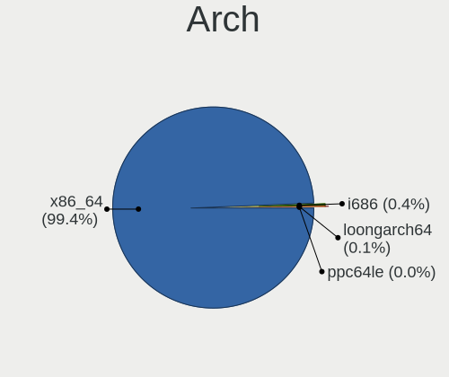
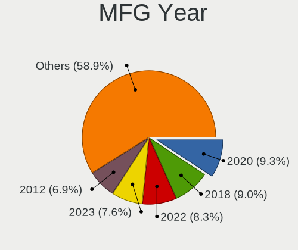
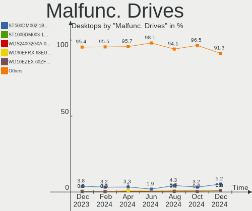
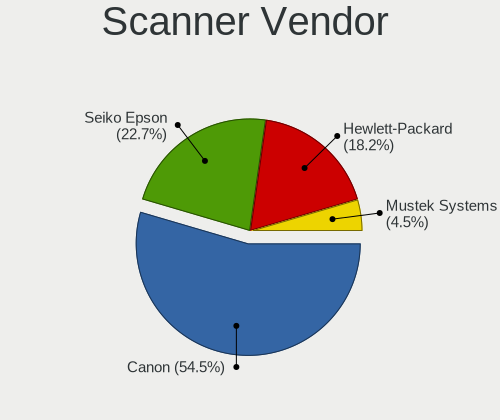

Linux - Hardware Trends (Desktops)
----------------------------------

A project to identify most popular hardware characteristics and track their change
over time based on data collected by Linux users at https://Linux-Hardware.org.

Anyone can contribute to this report by the [hw-probe](https://github.com/linuxhw/hw-probe) tool:

    sudo -E hw-probe -all -upload

This report is for one last month. Overall report since the beginning of time: [TestCoverage](https://github.com/linuxhw/TestCoverage)

Period: May, 2022.

Contents
--------

* [ System ](#system)
  - [ OS                       ](#os)
  - [ OS Family                ](#os-family)
  - [ Kernel                   ](#kernel)
  - [ Kernel Family            ](#kernel-family)
  - [ Kernel Major Ver.        ](#kernel-major-ver)
  - [ Arch                     ](#arch)
  - [ DE                       ](#de)
  - [ Display Server           ](#display-server)
  - [ Display Manager          ](#display-manager)
  - [ OS Lang                  ](#os-lang)
  - [ Boot Mode                ](#boot-mode)
  - [ Filesystem               ](#filesystem)
  - [ Part. scheme             ](#part-scheme)
  - [ Dual Boot with Linux/BSD ](#dual-boot-with-linuxbsd)
  - [ Dual Boot (Win)          ](#dual-boot-win)

* [ Board ](#board)
  - [ Vendor                   ](#vendor)
  - [ Model                    ](#model)
  - [ Model Family             ](#model-family)
  - [ MFG Year                 ](#mfg-year)
  - [ Form Factor              ](#form-factor)
  - [ Secure Boot              ](#secure-boot)
  - [ Coreboot                 ](#coreboot)
  - [ RAM Size                 ](#ram-size)
  - [ RAM Used                 ](#ram-used)
  - [ Total Drives             ](#total-drives)
  - [ Has CD-ROM               ](#has-cd-rom)
  - [ Has Ethernet             ](#has-ethernet)
  - [ Has WiFi                 ](#has-wifi)
  - [ Has Bluetooth            ](#has-bluetooth)

* [ Location ](#location)
  - [ Country                  ](#country)
  - [ City                     ](#city)

* [ Drives ](#drives)
  - [ Drive Vendor             ](#drive-vendor)
  - [ Drive Model              ](#drive-model)
  - [ HDD Vendor               ](#hdd-vendor)
  - [ SSD Vendor               ](#ssd-vendor)
  - [ Drive Kind               ](#drive-kind)
  - [ Drive Connector          ](#drive-connector)
  - [ Drive Size               ](#drive-size)
  - [ Space Total              ](#space-total)
  - [ Space Used               ](#space-used)
  - [ Malfunc. Drives          ](#malfunc-drives)
  - [ Malfunc. Drive Vendor    ](#malfunc-drive-vendor)
  - [ Malfunc. HDD Vendor      ](#malfunc-hdd-vendor)
  - [ Malfunc. Drive Kind      ](#malfunc-drive-kind)
  - [ Failed Drives            ](#failed-drives)
  - [ Failed Drive Vendor      ](#failed-drive-vendor)
  - [ Drive Status             ](#drive-status)

* [ Storage controller ](#storage-controller)
  - [ Storage Vendor           ](#storage-vendor)
  - [ Storage Model            ](#storage-model)
  - [ Storage Kind             ](#storage-kind)

* [ Processor ](#processor)
  - [ CPU Vendor               ](#cpu-vendor)
  - [ CPU Model                ](#cpu-model)
  - [ CPU Model Family         ](#cpu-model-family)
  - [ CPU Cores                ](#cpu-cores)
  - [ CPU Sockets              ](#cpu-sockets)
  - [ CPU Threads              ](#cpu-threads)
  - [ CPU Op-Modes             ](#cpu-op-modes)
  - [ CPU Microcode            ](#cpu-microcode)
  - [ CPU Microarch            ](#cpu-microarch)

* [ Graphics ](#graphics)
  - [ GPU Vendor               ](#gpu-vendor)
  - [ GPU Model                ](#gpu-model)
  - [ GPU Combo                ](#gpu-combo)
  - [ GPU Driver               ](#gpu-driver)
  - [ GPU Memory               ](#gpu-memory)

* [ Monitor ](#monitor)
  - [ Monitor Vendor           ](#monitor-vendor)
  - [ Monitor Model            ](#monitor-model)
  - [ Monitor Resolution       ](#monitor-resolution)
  - [ Monitor Diagonal         ](#monitor-diagonal)
  - [ Monitor Width            ](#monitor-width)
  - [ Aspect Ratio             ](#aspect-ratio)
  - [ Monitor Area             ](#monitor-area)
  - [ Pixel Density            ](#pixel-density)
  - [ Multiple Monitors        ](#multiple-monitors)

* [ Network ](#network)
  - [ Net Controller Vendor    ](#net-controller-vendor)
  - [ Net Controller Model     ](#net-controller-model)
  - [ Wireless Vendor          ](#wireless-vendor)
  - [ Wireless Model           ](#wireless-model)
  - [ Ethernet Vendor          ](#ethernet-vendor)
  - [ Ethernet Model           ](#ethernet-model)
  - [ Net Controller Kind      ](#net-controller-kind)
  - [ Used Controller          ](#used-controller)
  - [ NICs                     ](#nics)
  - [ IPv6                     ](#ipv6)

* [ Bluetooth ](#bluetooth)
  - [ Bluetooth Vendor         ](#bluetooth-vendor)
  - [ Bluetooth Model          ](#bluetooth-model)

* [ Sound ](#sound)
  - [ Sound Vendor             ](#sound-vendor)
  - [ Sound Model              ](#sound-model)

* [ Memory ](#memory)
  - [ Memory Vendor            ](#memory-vendor)
  - [ Memory Model             ](#memory-model)
  - [ Memory Kind              ](#memory-kind)
  - [ Memory Form Factor       ](#memory-form-factor)
  - [ Memory Size              ](#memory-size)
  - [ Memory Speed             ](#memory-speed)

* [ Printers & scanners ](#printers--scanners)
  - [ Printer Vendor           ](#printer-vendor)
  - [ Printer Model            ](#printer-model)
  - [ Scanner Vendor           ](#scanner-vendor)
  - [ Scanner Model            ](#scanner-model)

* [ Camera ](#camera)
  - [ Camera Vendor            ](#camera-vendor)
  - [ Camera Model             ](#camera-model)

* [ Security ](#security)
  - [ Fingerprint Vendor       ](#fingerprint-vendor)
  - [ Fingerprint Model        ](#fingerprint-model)
  - [ Chipcard Vendor          ](#chipcard-vendor)
  - [ Chipcard Model           ](#chipcard-model)

* [ Unsupported ](#unsupported)
  - [ Unsupported Devices      ](#unsupported-devices)
  - [ Unsupported Device Types ](#unsupported-device-types)

System
------

OS
--

Installed operating systems

| Name                         | Desktops | Percent |
|------------------------------|----------|---------|
| Ubuntu 22.04                 | 196      | 10.35%  |
| Ubuntu 20.04                 | 162      | 8.55%   |
| ROSA 12.2                    | 141      | 7.44%   |
| Linux Mint 20.3              | 133      | 7.02%   |
| Debian 11                    | 124      | 6.55%   |
| OpenMandriva 4.3             | 110      | 5.81%   |
| Pop!_OS 22.04                | 100      | 5.28%   |
| Fedora 36                    | 78       | 4.12%   |
| Zorin 16                     | 65       | 3.43%   |
| KDE neon 20.04               | 57       | 3.01%   |
| Manjaro                      | 48       | 2.53%   |
| Fedora 35                    | 44       | 2.32%   |
| Arch                         | 40       | 2.11%   |
| openSUSE Tumbleweed-XXXXXXXX | 32       | 1.69%   |
| Arch Rolling                 | 32       | 1.69%   |
| Manjaro 21.2.6               | 29       | 1.53%   |
| ArcoLinux Rolling            | 29       | 1.53%   |
| Ubuntu 21.10                 | 21       | 1.11%   |
| Kubuntu 22.04                | 19       | 1%      |
| Xubuntu 20.04                | 16       | 0.84%   |
| Ubuntu 18.04                 | 16       | 0.84%   |
| ROSA R11.1                   | 15       | 0.79%   |
| Pop!_OS 21.10                | 12       | 0.63%   |
| OpenMandriva 4.2             | 12       | 0.63%   |
| Kubuntu 20.04                | 11       | 0.58%   |
| Elementary 6.1               | 11       | 0.58%   |
| BlackPanther 18.1            | 11       | 0.58%   |
| Xubuntu 22.04                | 10       | 0.53%   |
| LMDE 5                       | 10       | 0.53%   |
| Gentoo 2.7                   | 10       | 0.53%   |
| EndeavourOS Rolling          | 10       | 0.53%   |
| openSUSE Leap-15.4           | 9        | 0.48%   |
| Kubuntu 11                   | 9        | 0.48%   |
| Gentoo 2.8                   | 9        | 0.48%   |
| Linux Mint 20.2              | 7        | 0.37%   |
| Kali 2022.2                  | 7        | 0.37%   |
| Zorin 15                     | 6        | 0.32%   |
| Ubuntu Budgie 22.04          | 6        | 0.32%   |
| ROSA 12.1                    | 6        | 0.32%   |
| Linux Mint 20.1              | 6        | 0.32%   |
| Gentoo 2.6                   | 6        | 0.32%   |
| Fedora 34                    | 6        | 0.32%   |
| Red OS 7.3.1                 | 5        | 0.26%   |
| Lubuntu 22.04                | 5        | 0.26%   |
| Linux Mint 20                | 5        | 0.26%   |
| Linux Mint 19.1              | 5        | 0.26%   |
| Endless 4.0.6                | 5        | 0.26%   |
| EndeavourOS                  | 5        | 0.26%   |
| Debian Testing               | 5        | 0.26%   |
| Ubuntu MATE 20.04            | 4        | 0.21%   |
| Ubuntu 16.04                 | 4        | 0.21%   |
| Parrot 5.0                   | 4        | 0.21%   |
| openSUSE Leap-15.3           | 4        | 0.21%   |
| Linux Mint 19.3              | 4        | 0.21%   |
| Debian Unstable              | 4        | 0.21%   |
| Void Linux Rolling           | 3        | 0.16%   |
| Ubuntu Studio 20.04          | 3        | 0.16%   |
| Ubuntu MATE 22.04            | 3        | 0.16%   |
| Ubuntu 20.10                 | 3        | 0.16%   |
| Trisquel 10.0.1              | 3        | 0.16%   |

OS Family
---------

OS without a version

| Name          | Desktops | Percent |
|---------------|----------|---------|
| Ubuntu        | 406      | 21.44%  |
| Linux Mint    | 164      | 8.66%   |
| ROSA          | 162      | 8.55%   |
| Debian        | 140      | 7.39%   |
| Fedora        | 130      | 6.86%   |
| OpenMandriva  | 123      | 6.49%   |
| Pop!_OS       | 115      | 6.07%   |
| Manjaro       | 79       | 4.17%   |
| Zorin         | 72       | 3.8%    |
| Arch          | 72       | 3.8%    |
| KDE neon      | 57       | 3.01%   |
| openSUSE      | 46       | 2.43%   |
| Kubuntu       | 42       | 2.22%   |
| Xubuntu       | 30       | 1.58%   |
| ArcoLinux     | 30       | 1.58%   |
| Gentoo        | 27       | 1.43%   |
| EndeavourOS   | 15       | 0.79%   |
| Lubuntu       | 14       | 0.74%   |
| Elementary    | 13       | 0.69%   |
| LMDE          | 11       | 0.58%   |
| Clear Linux   | 11       | 0.58%   |
| BlackPanther  | 11       | 0.58%   |
| ALT Linux     | 9        | 0.48%   |
| Ubuntu Budgie | 8        | 0.42%   |
| Kali          | 8        | 0.42%   |
| Ubuntu MATE   | 7        | 0.37%   |
| Red OS        | 6        | 0.32%   |
| Endless       | 6        | 0.32%   |
| CentOS        | 6        | 0.32%   |
| Ubuntu Studio | 4        | 0.21%   |
| SteamOS       | 4        | 0.21%   |
| Parrot        | 4        | 0.21%   |
| LinuxFX       | 4        | 0.21%   |
| Linux Lite    | 4        | 0.21%   |
| Void Linux    | 3        | 0.16%   |
| Trisquel      | 3        | 0.16%   |
| RHEL          | 3        | 0.16%   |
| Garuda Linux  | 3        | 0.16%   |
| Drauger OS    | 3        | 0.16%   |
| ClearOS       | 3        | 0.16%   |
| Xero          | 2        | 0.11%   |
| Puppy         | 2        | 0.11%   |
| NixOS         | 2        | 0.11%   |
| Mageia        | 2        | 0.11%   |
| Artix         | 2        | 0.11%   |
| Alpine        | 2        | 0.11%   |
| yiffOS        | 1        | 0.05%   |
| Sparky        | 1        | 0.05%   |
| Slackware     | 1        | 0.05%   |
| Siduction     | 1        | 0.05%   |
| Rocky Linux   | 1        | 0.05%   |
| RELS          | 1        | 0.05%   |
| RED           | 1        | 0.05%   |
| Q4OS          | 1        | 0.05%   |
| Pardus        | 1        | 0.05%   |
| Parabola      | 1        | 0.05%   |
| NFS Desktop   | 1        | 0.05%   |
| MX            | 1        | 0.05%   |
| MocaccinoOS   | 1        | 0.05%   |
| Makulu        | 1        | 0.05%   |

Kernel
------

Version of the Linux kernel

| Version                            | Desktops | Percent |
|------------------------------------|----------|---------|
| 5.10.74-generic-2rosa2021.1-x86_64 | 128      | 6.76%   |
| 5.13.0-41-generic                  | 116      | 6.12%   |
| 5.13.0-40-generic                  | 105      | 5.54%   |
| 5.16.7-desktop-1omv4003            | 101      | 5.33%   |
| 5.17.5-76051705-generic            | 89       | 4.7%    |
| 5.15.0-27-generic                  | 89       | 4.7%    |
| 5.4.0-110-generic                  | 66       | 3.48%   |
| 5.4.0-109-generic                  | 63       | 3.33%   |
| 5.15.0-30-generic                  | 63       | 3.33%   |
| 5.13.0-44-generic                  | 53       | 2.8%    |
| 5.15.0-33-generic                  | 46       | 2.43%   |
| 5.10.0-7-amd64                     | 45       | 2.38%   |
| 5.4.0-113-generic                  | 43       | 2.27%   |
| 5.10.0-14-amd64                    | 40       | 2.11%   |
| 5.17.9-arch1-1                     | 28       | 1.48%   |
| 5.17.5-arch1-1                     | 26       | 1.37%   |
| 5.17.6-300.fc36.x86_64             | 23       | 1.21%   |
| 5.17.4-1-default                   | 20       | 1.06%   |
| 5.16.19-76051619-generic           | 20       | 1.06%   |
| 5.10.0-13-amd64                    | 19       | 1%      |
| 5.17.5-300.fc36.x86_64             | 17       | 0.9%    |
| 5.15.0-25-generic                  | 15       | 0.79%   |
| 5.17.1-3-MANJARO                   | 14       | 0.74%   |
| 5.17.8-300.fc36.x86_64             | 13       | 0.69%   |
| 5.17.5-200.fc35.x86_64             | 13       | 0.69%   |
| 5.17.4-200.fc35.x86_64             | 13       | 0.69%   |
| 5.15.32-1-MANJARO                  | 13       | 0.69%   |
| 5.15.32-generic-6rosa2021.1-x86_64 | 12       | 0.63%   |
| 5.4.0-91-generic                   | 11       | 0.58%   |
| 5.17.6-1-MANJARO                   | 11       | 0.58%   |
| 5.10.14-desktop-1omv4002           | 11       | 0.58%   |
| 5.17.0-1-amd64                     | 10       | 0.53%   |
| 5.15.38-1-MANJARO                  | 10       | 0.53%   |
| 5.13.0-39-generic                  | 10       | 0.53%   |
| 5.17.7-300.fc36.x86_64             | 9        | 0.48%   |
| 5.17.5-zen1-1-zen                  | 9        | 0.48%   |
| 5.15.41-1-MANJARO                  | 9        | 0.48%   |
| 5.13.0-27-generic                  | 9        | 0.48%   |
| 5.4.83-generic-2rosa-x86_64        | 7        | 0.37%   |
| 5.18.0-arch1-1                     | 7        | 0.37%   |
| 5.16.13-desktop-1omv4003           | 7        | 0.37%   |
| 4.18.16-desktop-1bP                | 7        | 0.37%   |
| 4.15.0-176-generic                 | 7        | 0.37%   |
| 5.17.9-1-default                   | 6        | 0.32%   |
| 5.16.0-kali7-amd64                 | 6        | 0.32%   |
| 5.14.21-150400.19-default          | 6        | 0.32%   |
| 5.11.0-35-generic                  | 6        | 0.32%   |
| 5.17.9-zen1-1-zen                  | 5        | 0.26%   |
| 5.17.9-1-MANJARO                   | 5        | 0.26%   |
| 5.16.0-0.bpo.4-amd64               | 5        | 0.26%   |
| 5.15.35-1-pve                      | 5        | 0.26%   |
| 5.15.0-32-generic                  | 5        | 0.26%   |
| 5.15.0-28-generic                  | 5        | 0.26%   |
| 5.13.0-28-generic                  | 5        | 0.26%   |
| 5.6.14-desktop-2bP                 | 4        | 0.21%   |
| 5.17.9-300.fc36.x86_64             | 4        | 0.21%   |
| 5.17.7-zen1-1-zen                  | 4        | 0.21%   |
| 5.17.7-arch1-1                     | 4        | 0.21%   |
| 5.17.11-300.fc36.x86_64            | 4        | 0.21%   |
| 5.16.18-1-MANJARO                  | 4        | 0.21%   |

Kernel Family
-------------

Linux kernel without a distro release

| Version  | Desktops | Percent |
|----------|----------|---------|
| 5.13.0   | 323      | 17.05%  |
| 5.15.0   | 233      | 12.3%   |
| 5.4.0    | 211      | 11.14%  |
| 5.17.5   | 171      | 9.03%   |
| 5.10.74  | 130      | 6.86%   |
| 5.10.0   | 115      | 6.07%   |
| 5.16.7   | 101      | 5.33%   |
| 5.17.9   | 61       | 3.22%   |
| 5.17.6   | 46       | 2.43%   |
| 5.17.4   | 42       | 2.22%   |
| 5.15.32  | 34       | 1.8%    |
| 5.17.7   | 30       | 1.58%   |
| 4.15.0   | 25       | 1.32%   |
| 5.11.0   | 24       | 1.27%   |
| 5.16.19  | 21       | 1.11%   |
| 5.17.8   | 20       | 1.06%   |
| 5.17.0   | 20       | 1.06%   |
| 5.16.0   | 19       | 1%      |
| 5.18.0   | 18       | 0.95%   |
| 5.17.1   | 18       | 0.95%   |
| 5.15.38  | 15       | 0.79%   |
| 5.15.41  | 13       | 0.69%   |
| 5.17.11  | 11       | 0.58%   |
| 5.16.13  | 11       | 0.58%   |
| 5.15.35  | 11       | 0.58%   |
| 5.10.14  | 11       | 0.58%   |
| 5.8.0    | 7        | 0.37%   |
| 5.4.83   | 7        | 0.37%   |
| 5.16.18  | 7        | 0.37%   |
| 5.14.21  | 7        | 0.37%   |
| 4.18.16  | 7        | 0.37%   |
| 5.17.3   | 6        | 0.32%   |
| 5.13.19  | 6        | 0.32%   |
| 4.18.0   | 6        | 0.32%   |
| 3.10.0   | 6        | 0.32%   |
| 5.3.18   | 5        | 0.26%   |
| 5.15.37  | 5        | 0.26%   |
| 5.14.0   | 5        | 0.26%   |
| 5.6.14   | 4        | 0.21%   |
| 5.16.20  | 4        | 0.21%   |
| 5.16.11  | 4        | 0.21%   |
| 5.10.109 | 4        | 0.21%   |
| 4.19.0   | 4        | 0.21%   |
| 5.4.32   | 3        | 0.16%   |
| 5.15.43  | 3        | 0.16%   |
| 5.15.39  | 3        | 0.16%   |
| 5.14.10  | 3        | 0.16%   |
| 5.4.188  | 2        | 0.11%   |
| 5.16.15  | 2        | 0.11%   |
| 5.15.5   | 2        | 0.11%   |
| 5.15.34  | 2        | 0.11%   |
| 5.15.29  | 2        | 0.11%   |
| 5.15.19  | 2        | 0.11%   |
| 5.15.13  | 2        | 0.11%   |
| 5.15.11  | 2        | 0.11%   |
| 5.10.82  | 2        | 0.11%   |
| 5.10.111 | 2        | 0.11%   |
| 5.10.105 | 2        | 0.11%   |
| 4.4.0    | 2        | 0.11%   |
| 5.6.0    | 1        | 0.05%   |

Kernel Major Ver.
-----------------

Linux kernel major version

| Version | Desktops | Percent |
|---------|----------|---------|
| 5.17    | 425      | 22.44%  |
| 5.15    | 333      | 17.58%  |
| 5.13    | 330      | 17.42%  |
| 5.10    | 275      | 14.52%  |
| 5.4     | 226      | 11.93%  |
| 5.16    | 172      | 9.08%   |
| 5.11    | 25       | 1.32%   |
| 4.15    | 25       | 1.32%   |
| 5.18    | 18       | 0.95%   |
| 5.14    | 17       | 0.9%    |
| 4.18    | 13       | 0.69%   |
| 5.8     | 7        | 0.37%   |
| 3.10    | 6        | 0.32%   |
| 5.6     | 5        | 0.26%   |
| 5.3     | 5        | 0.26%   |
| 4.19    | 5        | 0.26%   |
| 4.9     | 3        | 0.16%   |
| 4.4     | 2        | 0.11%   |
| 5.2     | 1        | 0.05%   |
| 2.6     | 1        | 0.05%   |

Arch
----

OS architecture (x86_64, i586, etc.)

| Name    | Desktops | Percent |
|---------|----------|---------|
| x86_64  | 1874     | 98.94%  |
| i686    | 18       | 0.95%   |
| riscv64 | 1        | 0.05%   |
| ppc     | 1        | 0.05%   |

DE
--

Desktop Environment

| Name             | Desktops | Percent |
|------------------|----------|---------|
| GNOME            | 803      | 42.4%   |
| KDE5             | 495      | 26.14%  |
| X-Cinnamon       | 151      | 7.97%   |
| XFCE             | 132      | 6.97%   |
| Unknown          | 128      | 6.76%   |
| MATE             | 57       | 3.01%   |
| LXQt             | 32       | 1.69%   |
| Cinnamon         | 18       | 0.95%   |
| Pantheon         | 13       | 0.69%   |
| Budgie           | 10       | 0.53%   |
| KDE4             | 9        | 0.48%   |
| i3               | 7        | 0.37%   |
| Unity            | 6        | 0.32%   |
| qtile            | 6        | 0.32%   |
| awesome          | 4        | 0.21%   |
| LXDE             | 3        | 0.16%   |
| xmonad           | 2        | 0.11%   |
| WindowMaker      | 2        | 0.11%   |
| lightdm-xsession | 2        | 0.11%   |
| LeftWM           | 2        | 0.11%   |
| KDE              | 2        | 0.11%   |
| dwm              | 2        | 0.11%   |
| bspwm            | 2        | 0.11%   |
| sway             | 1        | 0.05%   |
| openbox          | 1        | 0.05%   |
| GNOME Classic    | 1        | 0.05%   |
| fly              | 1        | 0.05%   |
| Enlightenment    | 1        | 0.05%   |
| Deepin           | 1        | 0.05%   |

Display Server
--------------

X11 or Wayland

| Name        | Desktops | Percent |
|-------------|----------|---------|
| X11         | 1382     | 72.97%  |
| Wayland     | 378      | 19.96%  |
| Unknown     | 78       | 4.12%   |
| Tty         | 55       | 2.9%    |
| Unspecified | 1        | 0.05%   |

Display Manager
---------------

SDDM, LightDM, etc.

| Name    | Desktops | Percent |
|---------|----------|---------|
| Unknown | 704      | 37.17%  |
| SDDM    | 388      | 20.49%  |
| GDM3    | 342      | 18.06%  |
| LightDM | 237      | 12.51%  |
| GDM     | 200      | 10.56%  |
| KDM     | 9        | 0.48%   |
| XDM     | 5        | 0.26%   |
| LXDM    | 3        | 0.16%   |
| SLiM    | 2        | 0.11%   |
| Ly      | 2        | 0.11%   |
| GREETD  | 1        | 0.05%   |
| FLY-DM  | 1        | 0.05%   |

OS Lang
-------

Language

| Lang        | Desktops | Percent |
|-------------|----------|---------|
| en_US       | 730      | 38.54%  |
| ru_RU       | 265      | 13.99%  |
| de_DE       | 177      | 9.35%   |
| en_GB       | 88       | 4.65%   |
| fr_FR       | 86       | 4.54%   |
| pt_BR       | 72       | 3.8%    |
| en_AU       | 55       | 2.9%    |
| es_ES       | 43       | 2.27%   |
| Unknown     | 38       | 2.01%   |
| en_CA       | 37       | 1.95%   |
| pl_PL       | 28       | 1.48%   |
| it_IT       | 24       | 1.27%   |
| C           | 21       | 1.11%   |
| nl_NL       | 18       | 0.95%   |
| cs_CZ       | 14       | 0.74%   |
| es_MX       | 12       | 0.63%   |
| hu_HU       | 11       | 0.58%   |
| en_IN       | 11       | 0.58%   |
| ja_JP       | 9        | 0.48%   |
| de_AT       | 9        | 0.48%   |
| sv_SE       | 8        | 0.42%   |
| es_AR       | 8        | 0.42%   |
| en_IE       | 8        | 0.42%   |
| zh_CN       | 7        | 0.37%   |
| pt_PT       | 7        | 0.37%   |
| en_ZA       | 7        | 0.37%   |
| tr_TR       | 6        | 0.32%   |
| fi_FI       | 6        | 0.32%   |
| el_GR       | 6        | 0.32%   |
| es_CL       | 5        | 0.26%   |
| en_DK       | 5        | 0.26%   |
| de_CH       | 5        | 0.26%   |
| ru_UA       | 4        | 0.21%   |
| es_PE       | 4        | 0.21%   |
| sk_SK       | 3        | 0.16%   |
| nl_BE       | 3        | 0.16%   |
| es_VE       | 3        | 0.16%   |
| en_PH       | 3        | 0.16%   |
| en_NZ       | 3        | 0.16%   |
| C.UTF8      | 3        | 0.16%   |
| zh_TW       | 2        | 0.11%   |
| ko_KR       | 2        | 0.11%   |
| he_IL       | 2        | 0.11%   |
| fr_CA       | 2        | 0.11%   |
| es_EC       | 2        | 0.11%   |
| es_CR       | 2        | 0.11%   |
| en_IL       | 2        | 0.11%   |
| da_DK       | 2        | 0.11%   |
| ca_ES       | 2        | 0.11%   |
| bg_BG       | 2        | 0.11%   |
| szl_PL      | 1        | 0.05%   |
| sr_RS@latin | 1        | 0.05%   |
| sr_RS       | 1        | 0.05%   |
| sl_SI       | 1        | 0.05%   |
| ro_RO       | 1        | 0.05%   |
| POSIX       | 1        | 0.05%   |
| id_ID       | 1        | 0.05%   |
| fr_LU       | 1        | 0.05%   |
| fr_FR.UTF8  | 1        | 0.05%   |
| fr_CH       | 1        | 0.05%   |

Boot Mode
---------

EFI or BIOS

| Mode | Desktops | Percent |
|------|----------|---------|
| BIOS | 1105     | 58.34%  |
| EFI  | 789      | 41.66%  |

Filesystem
----------

Type of filesystem

| Type     | Desktops | Percent |
|----------|----------|---------|
| Ext4     | 1395     | 73.65%  |
| Btrfs    | 241      | 12.72%  |
| Overlay  | 188      | 9.93%   |
| Xfs      | 37       | 1.95%   |
| Zfs      | 16       | 0.84%   |
| F2fs     | 7        | 0.37%   |
| Ext2     | 4        | 0.21%   |
| Ext3     | 2        | 0.11%   |
| Aufs     | 2        | 0.11%   |
| Reiserfs | 1        | 0.05%   |
| Unknown  | 1        | 0.05%   |

Part. scheme
------------

Scheme of partitioning

| Type    | Desktops | Percent |
|---------|----------|---------|
| Unknown | 941      | 49.68%  |
| GPT     | 661      | 34.9%   |
| MBR     | 292      | 15.42%  |

Dual Boot with Linux/BSD
------------------------

Hosting more than one Linux/BSD

| Dual boot | Desktops | Percent |
|-----------|----------|---------|
| No        | 1527     | 80.62%  |
| Yes       | 367      | 19.38%  |

Dual Boot (Win)
---------------

Hosting Linux and Windows

| Dual boot | Desktops | Percent |
|-----------|----------|---------|
| No        | 1242     | 65.58%  |
| Yes       | 652      | 34.42%  |

Board
-----

Vendor
------

Motherboard manufacturer

| Name                       | Desktops | Percent |
|----------------------------|----------|---------|
| ASUSTek Computer           | 526      | 27.77%  |
| Gigabyte Technology        | 349      | 18.43%  |
| MSI                        | 251      | 13.25%  |
| ASRock                     | 166      | 8.76%   |
| Dell                       | 128      | 6.76%   |
| Hewlett-Packard            | 118      | 6.23%   |
| Lenovo                     | 62       | 3.27%   |
| Intel                      | 53       | 2.8%    |
| Acer                       | 33       | 1.74%   |
| Unknown                    | 23       | 1.21%   |
| ECS                        | 17       | 0.9%    |
| Pegatron                   | 16       | 0.84%   |
| Foxconn                    | 15       | 0.79%   |
| Positivo                   | 14       | 0.74%   |
| Fujitsu                    | 13       | 0.69%   |
| Shuttle                    | 8        | 0.42%   |
| Biostar                    | 8        | 0.42%   |
| Supermicro                 | 7        | 0.37%   |
| Medion                     | 7        | 0.37%   |
| Huanan                     | 6        | 0.32%   |
| Apple                      | 6        | 0.32%   |
| Packard Bell               | 4        | 0.21%   |
| BESSTAR Tech               | 4        | 0.21%   |
| Alienware                  | 4        | 0.21%   |
| Google                     | 3        | 0.16%   |
| Fujitsu Siemens            | 3        | 0.16%   |
| MouseComputer              | 2        | 0.11%   |
| MACHINIST                  | 2        | 0.11%   |
| KLLISRE                    | 2        | 0.11%   |
| EVGA                       | 2        | 0.11%   |
| Clientron                  | 2        | 0.11%   |
| ASRockRack                 | 2        | 0.11%   |
| AMI                        | 2        | 0.11%   |
| 3Logic Group               | 2        | 0.11%   |
| YANYU                      | 1        | 0.05%   |
| TSINGHUA TONGFANG COMPUTER | 1        | 0.05%   |
| T-bao                      | 1        | 0.05%   |
| SZMZ                       | 1        | 0.05%   |
| System76                   | 1        | 0.05%   |
| SIEMENS                    | 1        | 0.05%   |
| Seeed Studio               | 1        | 0.05%   |
| Ruckus Wireless            | 1        | 0.05%   |
| Purism                     | 1        | 0.05%   |
| Protectli                  | 1        | 0.05%   |
| Pepper Jobs                | 1        | 0.05%   |
| NZXT                       | 1        | 0.05%   |
| MW                         | 1        | 0.05%   |
| Mustek6376 mst6376         | 1        | 0.05%   |
| Minix                      | 1        | 0.05%   |
| Maxtone                    | 1        | 0.05%   |
| MAXSUN                     | 1        | 0.05%   |
| MAINBRD                    | 1        | 0.05%   |
| LORD ELECTRONICS           | 1        | 0.05%   |
| JINGSHA                    | 1        | 0.05%   |
| JGINYUE                    | 1        | 0.05%   |
| iRU                        | 1        | 0.05%   |
| IP3 Tech                   | 1        | 0.05%   |
| INP                        | 1        | 0.05%   |
| iEi                        | 1        | 0.05%   |
| Gateway                    | 1        | 0.05%   |

Model
-----

Motherboard model

| Name                              | Desktops | Percent |
|-----------------------------------|----------|---------|
| ASUS All Series                   | 56       | 2.96%   |
| Unknown                           | 24       | 1.27%   |
| ASRock H470M-HVS                  | 12       | 0.63%   |
| MSI MS-7C37                       | 11       | 0.58%   |
| MSI MS-7C91                       | 10       | 0.53%   |
| ASUS ROG STRIX B550-F GAMING      | 10       | 0.53%   |
| MSI MS-7C02                       | 9        | 0.48%   |
| Dell OptiPlex 790                 | 9        | 0.48%   |
| MSI MS-7B86                       | 8        | 0.42%   |
| MSI MS-7A38                       | 8        | 0.42%   |
| ASUS TUF Gaming B550-PLUS         | 8        | 0.42%   |
| MSI MS-7B79                       | 7        | 0.37%   |
| HP Compaq 8200 Elite SFF PC       | 7        | 0.37%   |
| Gigabyte B450M DS3H               | 7        | 0.37%   |
| ASUS TUF Gaming X570-PLUS         | 7        | 0.37%   |
| ASUS TUF Gaming B550M-PLUS        | 7        | 0.37%   |
| ASUS PRIME X570-P                 | 7        | 0.37%   |
| ASUS PRIME B450M-A                | 7        | 0.37%   |
| ASUS PRIME A320M-K                | 7        | 0.37%   |
| MSI MS-7C56                       | 6        | 0.32%   |
| MSI MS-7C52                       | 6        | 0.32%   |
| MSI MS-7996                       | 6        | 0.32%   |
| MSI MS-7693                       | 6        | 0.32%   |
| Gigabyte X570 AORUS MASTER        | 6        | 0.32%   |
| Gigabyte GA-78LMT-S2P             | 6        | 0.32%   |
| Dell OptiPlex 9020                | 6        | 0.32%   |
| Dell OptiPlex 7010                | 6        | 0.32%   |
| Dell OptiPlex 3020                | 6        | 0.32%   |
| ASUS S20 K29                      | 6        | 0.32%   |
| ASUS ROG STRIX X570-E GAMING      | 6        | 0.32%   |
| MSI MS-7B89                       | 5        | 0.26%   |
| HP EliteDesk 800 G1 SFF           | 5        | 0.26%   |
| Gigabyte GA-78LMT-USB3            | 5        | 0.26%   |
| Gigabyte 970A-DS3P                | 5        | 0.26%   |
| Dell OptiPlex 780                 | 5        | 0.26%   |
| ASUS SABERTOOTH 990FX R2.0        | 5        | 0.26%   |
| ASUS ROG STRIX X570-F GAMING      | 5        | 0.26%   |
| ASUS ROG STRIX B550-I GAMING      | 5        | 0.26%   |
| ASUS ROG CROSSHAIR VIII DARK HERO | 5        | 0.26%   |
| ASUS PRIME X570-PRO               | 5        | 0.26%   |
| ASUS PRIME B550M-A                | 5        | 0.26%   |
| ASUS P8Z77-V LX                   | 5        | 0.26%   |
| ASUS H110M-R                      | 5        | 0.26%   |
| ASUS 970 PRO GAMING/AURA          | 5        | 0.26%   |
| MSI MS-7D54                       | 4        | 0.21%   |
| MSI MS-7C92                       | 4        | 0.21%   |
| MSI MS-7A32                       | 4        | 0.21%   |
| MSI MS-7641                       | 4        | 0.21%   |
| Intel H61                         | 4        | 0.21%   |
| HP Z620 Workstation               | 4        | 0.21%   |
| HP Compaq 6005 Pro SFF PC         | 4        | 0.21%   |
| Gigabyte X570 I AORUS PRO WIFI    | 4        | 0.21%   |
| Gigabyte X570 GAMING X            | 4        | 0.21%   |
| Gigabyte B550 GAMING X V2         | 4        | 0.21%   |
| Gigabyte B550 AORUS PRO AC        | 4        | 0.21%   |
| Gigabyte B450 I AORUS PRO WIFI    | 4        | 0.21%   |
| Gigabyte A320M-S2H                | 4        | 0.21%   |
| Dell OptiPlex 7020                | 4        | 0.21%   |
| ASUS Z170-A                       | 4        | 0.21%   |
| ASUS TUF Gaming X570-PRO          | 4        | 0.21%   |

Model Family
------------

Motherboard model prefix

| Name                   | Desktops | Percent |
|------------------------|----------|---------|
| ASUS PRIME             | 92       | 4.86%   |
| ASUS ROG               | 80       | 4.22%   |
| Dell OptiPlex          | 77       | 4.07%   |
| ASUS All               | 56       | 2.96%   |
| ASUS TUF               | 53       | 2.8%    |
| Lenovo ThinkCentre     | 35       | 1.85%   |
| HP Compaq              | 34       | 1.8%    |
| Acer Aspire            | 26       | 1.37%   |
| Unknown                | 24       | 1.27%   |
| Gigabyte X570          | 22       | 1.16%   |
| Dell Precision         | 22       | 1.16%   |
| HP EliteDesk           | 16       | 0.84%   |
| Gigabyte B550          | 15       | 0.79%   |
| Gigabyte B450M         | 12       | 0.63%   |
| ASRock H470M-HVS       | 12       | 0.63%   |
| MSI MS-7C37            | 11       | 0.58%   |
| ASUS SABERTOOTH        | 11       | 0.58%   |
| ASRock B450            | 11       | 0.58%   |
| MSI MS-7C91            | 10       | 0.53%   |
| Gigabyte B450          | 10       | 0.53%   |
| Dell XPS               | 10       | 0.53%   |
| MSI MS-7C02            | 9        | 0.48%   |
| HP ProDesk             | 9        | 0.48%   |
| Fujitsu ESPRIMO        | 9        | 0.48%   |
| MSI MS-7B86            | 8        | 0.42%   |
| MSI MS-7A38            | 8        | 0.42%   |
| Gigabyte B550M         | 8        | 0.42%   |
| ASUS Pro               | 8        | 0.42%   |
| ASUS CROSSHAIR         | 8        | 0.42%   |
| MSI MS-7B79            | 7        | 0.37%   |
| Dell Inspiron          | 7        | 0.37%   |
| ASUS P8Z77-V           | 7        | 0.37%   |
| ASUS M5A97             | 7        | 0.37%   |
| ASUS M5A78L-M          | 7        | 0.37%   |
| ASRock X570            | 7        | 0.37%   |
| MSI MS-7C56            | 6        | 0.32%   |
| MSI MS-7C52            | 6        | 0.32%   |
| MSI MS-7996            | 6        | 0.32%   |
| MSI MS-7693            | 6        | 0.32%   |
| Gigabyte GA-78LMT-USB3 | 6        | 0.32%   |
| Gigabyte GA-78LMT-S2P  | 6        | 0.32%   |
| Gigabyte AB350-Gaming  | 6        | 0.32%   |
| ASUS S20               | 6        | 0.32%   |
| ASUS P8Z68-V           | 6        | 0.32%   |
| ASUS P8H61-M           | 6        | 0.32%   |
| ASRock X470            | 6        | 0.32%   |
| MSI MS-7B89            | 5        | 0.26%   |
| Lenovo IdeaCentre      | 5        | 0.26%   |
| HP Pavilion            | 5        | 0.26%   |
| HP OMEN                | 5        | 0.26%   |
| Gigabyte Z390          | 5        | 0.26%   |
| Gigabyte X470          | 5        | 0.26%   |
| Gigabyte B365M         | 5        | 0.26%   |
| Gigabyte A320M-S2H     | 5        | 0.26%   |
| Gigabyte 970A-DS3P     | 5        | 0.26%   |
| Dell Vostro            | 5        | 0.26%   |
| ASUS H110M-R           | 5        | 0.26%   |
| ASUS 970               | 5        | 0.26%   |
| ASRock B450M           | 5        | 0.26%   |
| ASRock AB350           | 5        | 0.26%   |

MFG Year
--------

Motherboard manufacture year

| Year    | Desktops | Percent |
|---------|----------|---------|
| 2020    | 194      | 10.24%  |
| 2018    | 178      | 9.4%    |
| 2019    | 176      | 9.29%   |
| 2012    | 172      | 9.08%   |
| 2021    | 163      | 8.61%   |
| 2013    | 125      | 6.6%    |
| 2011    | 120      | 6.34%   |
| 2014    | 118      | 6.23%   |
| 2017    | 106      | 5.6%    |
| 2010    | 104      | 5.49%   |
| 2016    | 96       | 5.07%   |
| 2015    | 92       | 4.86%   |
| 2009    | 75       | 3.96%   |
| 2008    | 69       | 3.64%   |
| 2007    | 42       | 2.22%   |
| 2022    | 33       | 1.74%   |
| 2006    | 22       | 1.16%   |
| 2005    | 6        | 0.32%   |
| Unknown | 2        | 0.11%   |
| 2004    | 1        | 0.05%   |

Form Factor
-----------

Physical design of the computer

| Name    | Desktops | Percent |
|---------|----------|---------|
| Desktop | 1894     | 100%    |

Secure Boot
-----------

Enabled or disabled

| State    | Desktops | Percent |
|----------|----------|---------|
| Disabled | 1843     | 97.31%  |
| Enabled  | 51       | 2.69%   |

Coreboot
--------

Have coreboot on board

| Used | Desktops | Percent |
|------|----------|---------|
| No   | 1890     | 99.79%  |
| Yes  | 4        | 0.21%   |

RAM Size
--------

Total RAM memory

| Size in GB      | Desktops | Percent |
|-----------------|----------|---------|
| 16.01-24.0      | 487      | 25.71%  |
| 32.01-64.0      | 363      | 19.17%  |
| 8.01-16.0       | 344      | 18.16%  |
| 4.01-8.0        | 269      | 14.2%   |
| 3.01-4.0        | 206      | 10.88%  |
| 64.01-256.0     | 107      | 5.65%   |
| 24.01-32.0      | 48       | 2.53%   |
| 1.01-2.0        | 44       | 2.32%   |
| 2.01-3.0        | 17       | 0.9%    |
| More than 256.0 | 5        | 0.26%   |
| 0.51-1.0        | 4        | 0.21%   |

RAM Used
--------

Used RAM memory

| Used GB     | Desktops | Percent |
|-------------|----------|---------|
| 1.01-2.0    | 612      | 32.31%  |
| 2.01-3.0    | 420      | 22.18%  |
| 4.01-8.0    | 307      | 16.21%  |
| 3.01-4.0    | 232      | 12.25%  |
| 0.51-1.0    | 185      | 9.77%   |
| 8.01-16.0   | 91       | 4.8%    |
| 0.01-0.5    | 17       | 0.9%    |
| 16.01-24.0  | 14       | 0.74%   |
| 32.01-64.0  | 10       | 0.53%   |
| 24.01-32.0  | 3        | 0.16%   |
| 64.01-256.0 | 2        | 0.11%   |
| Unknown     | 1        | 0.05%   |

Total Drives
------------

Number of drives on board

| Drives | Desktops | Percent |
|--------|----------|---------|
| 1      | 662      | 34.95%  |
| 2      | 554      | 29.25%  |
| 3      | 329      | 17.37%  |
| 4      | 172      | 9.08%   |
| 5      | 84       | 4.44%   |
| 6      | 36       | 1.9%    |
| 0      | 22       | 1.16%   |
| 7      | 15       | 0.79%   |
| 8      | 8        | 0.42%   |
| 10     | 5        | 0.26%   |
| 9      | 5        | 0.26%   |
| 15     | 1        | 0.05%   |
| 13     | 1        | 0.05%   |

Has CD-ROM
----------

Has CD-ROM on board

| Presented | Desktops | Percent |
|-----------|----------|---------|
| No        | 1083     | 57.18%  |
| Yes       | 811      | 42.82%  |

Has Ethernet
------------

Has Ethernet on board

| Presented | Desktops | Percent |
|-----------|----------|---------|
| Yes       | 1880     | 99.26%  |
| No        | 14       | 0.74%   |

Has WiFi
--------

Has WiFi module

| Presented | Desktops | Percent |
|-----------|----------|---------|
| No        | 1117     | 58.98%  |
| Yes       | 777      | 41.02%  |

Has Bluetooth
-------------

Has Bluetooth module

| Presented | Desktops | Percent |
|-----------|----------|---------|
| No        | 1285     | 67.85%  |
| Yes       | 609      | 32.15%  |

Location
--------

Country
-------

Geographic location (country)

| Country      | Desktops | Percent |
|--------------|----------|---------|
| USA          | 362      | 19.11%  |
| Russia       | 272      | 14.36%  |
| Germany      | 208      | 10.98%  |
| France       | 102      | 5.39%   |
| Brazil       | 93       | 4.91%   |
| UK           | 68       | 3.59%   |
| Australia    | 55       | 2.9%    |
| Canada       | 52       | 2.75%   |
| Spain        | 50       | 2.64%   |
| Poland       | 48       | 2.53%   |
| Netherlands  | 35       | 1.85%   |
| Italy        | 32       | 1.69%   |
| Hungary      | 27       | 1.43%   |
| Austria      | 24       | 1.27%   |
| Finland      | 23       | 1.21%   |
| Argentina    | 21       | 1.11%   |
| Switzerland  | 20       | 1.06%   |
| Sweden       | 19       | 1%      |
| Mexico       | 19       | 1%      |
| Norway       | 18       | 0.95%   |
| Czechia      | 18       | 0.95%   |
| Ukraine      | 16       | 0.84%   |
| Turkey       | 15       | 0.79%   |
| Japan        | 15       | 0.79%   |
| Belgium      | 15       | 0.79%   |
| India        | 14       | 0.74%   |
| Portugal     | 13       | 0.69%   |
| Greece       | 12       | 0.63%   |
| China        | 12       | 0.63%   |
| Serbia       | 10       | 0.53%   |
| Indonesia    | 10       | 0.53%   |
| Bulgaria     | 10       | 0.53%   |
| South Africa | 9        | 0.48%   |
| Romania      | 9        | 0.48%   |
| Israel       | 9        | 0.48%   |
| Ireland      | 9        | 0.48%   |
| Chile        | 9        | 0.48%   |
| Peru         | 8        | 0.42%   |
| Croatia      | 8        | 0.42%   |
| Belarus      | 8        | 0.42%   |
| Thailand     | 7        | 0.37%   |
| Slovakia     | 6        | 0.32%   |
| Saudi Arabia | 6        | 0.32%   |
| Denmark      | 6        | 0.32%   |
| Taiwan       | 5        | 0.26%   |
| Philippines  | 5        | 0.26%   |
| New Zealand  | 5        | 0.26%   |
| Estonia      | 5        | 0.26%   |
| Venezuela    | 4        | 0.21%   |
| South Korea  | 4        | 0.21%   |
| Iran         | 4        | 0.21%   |
| Ecuador      | 4        | 0.21%   |
| Slovenia     | 3        | 0.16%   |
| Lithuania    | 3        | 0.16%   |
| Latvia       | 3        | 0.16%   |
| Kazakhstan   | 3        | 0.16%   |
| Hong Kong    | 3        | 0.16%   |
| Colombia     | 3        | 0.16%   |
| Uzbekistan   | 2        | 0.11%   |
| Pakistan     | 2        | 0.11%   |

City
----

Geographic location (city)

| City              | Desktops | Percent |
|-------------------|----------|---------|
| Voronezh          | 47       | 2.48%   |
| Moscow            | 43       | 2.27%   |
| St Petersburg     | 24       | 1.27%   |
| Sao Paulo         | 19       | 1%      |
| Vienna            | 18       | 0.95%   |
| Paris             | 17       | 0.9%    |
| Berlin            | 17       | 0.9%    |
| Sydney            | 11       | 0.58%   |
| Dallas            | 11       | 0.58%   |
| Brisbane          | 11       | 0.58%   |
| Munich            | 10       | 0.53%   |
| Hamburg           | 10       | 0.53%   |
| Buenos Aires      | 10       | 0.53%   |
| Yekaterinburg     | 9        | 0.48%   |
| Perm              | 9        | 0.48%   |
| Orlando           | 8        | 0.42%   |
| Launceston        | 8        | 0.42%   |
| Budapest          | 8        | 0.42%   |
| Belgrade          | 8        | 0.42%   |
| Melbourne         | 7        | 0.37%   |
| London            | 7        | 0.37%   |
| Lima              | 7        | 0.37%   |
| Helsinki          | 7        | 0.37%   |
| Atlanta           | 7        | 0.37%   |
| Warsaw            | 6        | 0.32%   |
| Prague            | 6        | 0.32%   |
| Milan             | 6        | 0.32%   |
| Madrid            | 6        | 0.32%   |
| Istanbul          | 6        | 0.32%   |
| Dublin            | 6        | 0.32%   |
| Chicago           | 6        | 0.32%   |
| Athens            | 6        | 0.32%   |
| Zurich            | 5        | 0.26%   |
| Wroclaw           | 5        | 0.26%   |
| Toronto           | 5        | 0.26%   |
| San Jose          | 5        | 0.26%   |
| Riyadh            | 5        | 0.26%   |
| Richmond          | 5        | 0.26%   |
| Novosibirsk       | 5        | 0.26%   |
| New York          | 5        | 0.26%   |
| Minsk             | 5        | 0.26%   |
| Los Angeles       | 5        | 0.26%   |
| Krasnodar         | 5        | 0.26%   |
| Houston           | 5        | 0.26%   |
| Haßfurt          | 5        | 0.26%   |
| Frankfurt am Main | 5        | 0.26%   |
| Thessaloniki      | 4        | 0.21%   |
| Stuttgart         | 4        | 0.21%   |
| Sofia             | 4        | 0.21%   |
| Recife            | 4        | 0.21%   |
| Pyatigorsk        | 4        | 0.21%   |
| Oslo              | 4        | 0.21%   |
| Krakow            | 4        | 0.21%   |
| Jakarta           | 4        | 0.21%   |
| Gdansk            | 4        | 0.21%   |
| Denver            | 4        | 0.21%   |
| Debica            | 4        | 0.21%   |
| Corbeil-Essonnes  | 4        | 0.21%   |
| Chelyabinsk       | 4        | 0.21%   |
| Bucharest         | 4        | 0.21%   |

Drives
------

Drive Vendor
------------

Hard drive vendors

| Vendor                    | Desktops | Drives | Percent |
|---------------------------|----------|--------|---------|
| Seagate                   | 655      | 864    | 18.75%  |
| WDC                       | 643      | 895    | 18.4%   |
| Samsung Electronics       | 551      | 786    | 15.77%  |
| Kingston                  | 219      | 239    | 6.27%   |
| Toshiba                   | 194      | 225    | 5.55%   |
| Crucial                   | 182      | 206    | 5.21%   |
| SanDisk                   | 143      | 161    | 4.09%   |
| Hitachi                   | 117      | 133    | 3.35%   |
| A-DATA Technology         | 61       | 65     | 1.75%   |
| Intel                     | 53       | 55     | 1.52%   |
| Phison                    | 50       | 54     | 1.43%   |
| China                     | 36       | 43     | 1.03%   |
| Unknown                   | 31       | 43     | 0.89%   |
| HGST                      | 28       | 31     | 0.8%    |
| Silicon Motion            | 23       | 27     | 0.66%   |
| OCZ                       | 22       | 24     | 0.63%   |
| SPCC                      | 21       | 22     | 0.6%    |
| SK Hynix                  | 21       | 24     | 0.6%    |
| PNY                       | 21       | 22     | 0.6%    |
| Micron Technology         | 20       | 22     | 0.57%   |
| Patriot                   | 19       | 19     | 0.54%   |
| Netac                     | 19       | 19     | 0.54%   |
| Gigabyte Technology       | 18       | 20     | 0.52%   |
| GOODRAM                   | 16       | 17     | 0.46%   |
| XPG                       | 15       | 16     | 0.43%   |
| MAXTOR                    | 14       | 15     | 0.4%    |
| Intenso                   | 14       | 19     | 0.4%    |
| Apacer                    | 14       | 16     | 0.4%    |
| Micron/Crucial Technology | 13       | 13     | 0.37%   |
| Corsair                   | 12       | 13     | 0.34%   |
| Unknown                   | 12       | 13     | 0.34%   |
| Transcend                 | 11       | 12     | 0.31%   |
| Lexar                     | 9        | 9      | 0.26%   |
| LITEON                    | 8        | 8      | 0.23%   |
| ASMT                      | 8        | 9      | 0.23%   |
| Team                      | 7        | 8      | 0.2%    |
| PLEXTOR                   | 7        | 7      | 0.2%    |
| Hewlett-Packard           | 7        | 7      | 0.2%    |
| Smartbuy                  | 6        | 7      | 0.17%   |
| KIOXIA-EXCERIA            | 6        | 6      | 0.17%   |
| KingSpec                  | 6        | 6      | 0.17%   |
| Fujitsu                   | 6        | 6      | 0.17%   |
| DOGFISH                   | 6        | 6      | 0.17%   |
| XrayDisk                  | 5        | 7      | 0.14%   |
| Realtek Semiconductor     | 5        | 5      | 0.14%   |
| Leven                     | 5        | 5      | 0.14%   |
| walram                    | 4        | 5      | 0.11%   |
| TO Exter                  | 4        | 4      | 0.11%   |
| Pioneer                   | 4        | 4      | 0.11%   |
| SABRENT                   | 3        | 3      | 0.09%   |
| LITEONIT                  | 3        | 3      | 0.09%   |
| JMicron                   | 3        | 3      | 0.09%   |
| HS-SSD-C100               | 3        | 3      | 0.09%   |
| HGST HTS                  | 3        | 3      | 0.09%   |
| FORESEE                   | 3        | 3      | 0.09%   |
| DREVO                     | 3        | 3      | 0.09%   |
| AMD                       | 3        | 3      | 0.09%   |
| Zheino                    | 2        | 2      | 0.06%   |
| Verbatim                  | 2        | 2      | 0.06%   |
| USB3.0                    | 2        | 2      | 0.06%   |

Drive Model
-----------

Hard drive models

| Model                            | Desktops | Percent |
|----------------------------------|----------|---------|
| Seagate ST1000DM010-2EP102 1TB   | 56       | 1.37%   |
| Seagate ST500DM002-1BD142 500GB  | 52       | 1.27%   |
| Samsung SSD 850 EVO 250GB        | 49       | 1.2%    |
| Kingston SA400S37240G 240GB SSD  | 49       | 1.2%    |
| Samsung NVMe SSD Drive 1TB       | 44       | 1.08%   |
| Toshiba HDWD110 1TB              | 36       | 0.88%   |
| Seagate ST2000DM008-2FR102 2TB   | 36       | 0.88%   |
| Samsung NVMe SSD Drive 500GB     | 36       | 0.88%   |
| WDC WD10EZEX-08WN4A0 1TB         | 32       | 0.78%   |
| Samsung SSD 860 EVO 1TB          | 30       | 0.73%   |
| Crucial CT1000MX500SSD1 1TB      | 29       | 0.71%   |
| Sandisk NVMe SSD Drive 1TB       | 27       | 0.66%   |
| Toshiba DT01ACA100 1TB           | 26       | 0.64%   |
| Seagate ST1000DM003-1CH162 1TB   | 26       | 0.64%   |
| Samsung SSD 850 EVO 500GB        | 25       | 0.61%   |
| Seagate ST1000DM003-1ER162 1TB   | 24       | 0.59%   |
| Samsung SSD 860 EVO 500GB        | 24       | 0.59%   |
| Crucial CT500MX500SSD1 500GB     | 24       | 0.59%   |
| Crucial CT480BX500SSD1 480GB     | 24       | 0.59%   |
| Seagate ST4000DM004-2CV104 4TB   | 23       | 0.56%   |
| Samsung SSD 970 EVO Plus 500GB   | 23       | 0.56%   |
| Samsung SSD 970 EVO Plus 1TB     | 23       | 0.56%   |
| Kingston SV300S37A120G 120GB SSD | 22       | 0.54%   |
| Kingston SA400S37120G 120GB SSD  | 22       | 0.54%   |
| Samsung SSD 860 EVO 250GB        | 20       | 0.49%   |
| Crucial CT240BX500SSD1 240GB     | 20       | 0.49%   |
| Seagate ST2000DM001-1ER164 2TB   | 19       | 0.47%   |
| Seagate ST2000DM001-1CH164 2TB   | 19       | 0.47%   |
| WDC WD10EZEX-00BN5A0 1TB         | 18       | 0.44%   |
| Samsung NVMe SSD Drive 250GB     | 18       | 0.44%   |
| WDC WDS500G2B0A-00SM50 500GB SSD | 17       | 0.42%   |
| Seagate ST3500413AS 500GB        | 16       | 0.39%   |
| Sandisk NVMe SSD Drive 500GB     | 16       | 0.39%   |
| Samsung SSD 870 EVO 1TB          | 16       | 0.39%   |
| Toshiba DT01ACA200 2TB           | 15       | 0.37%   |
| Seagate ST31000528AS 1TB         | 15       | 0.37%   |
| Seagate ST31000524AS 1TB         | 15       | 0.37%   |
| SanDisk SSD PLUS 240GB           | 15       | 0.37%   |
| Kingston SUV400S37120G 120GB SSD | 15       | 0.37%   |
| Toshiba DT01ACA050 500GB         | 14       | 0.34%   |
| Kingston SA400S37480G 480GB SSD  | 14       | 0.34%   |
| SanDisk SDSSDA240G 240GB         | 13       | 0.32%   |
| Samsung SSD 850 EVO 1TB          | 13       | 0.32%   |
| Netac SSD 240GB                  | 13       | 0.32%   |
| Kingston NVMe SSD Drive 500GB    | 13       | 0.32%   |
| WDC WDS100T2B0A-00SM50 1TB SSD   | 12       | 0.29%   |
| WDC WD20EZRZ-00Z5HB0 2TB         | 12       | 0.29%   |
| Unknown SD/MMC/MS PRO 999GB      | 12       | 0.29%   |
| Seagate ST3500418AS 500GB        | 12       | 0.29%   |
| Seagate ST2000DM006-2DM164 2TB   | 12       | 0.29%   |
| Samsung SSD 870 EVO 500GB        | 12       | 0.29%   |
| Samsung SSD 840 EVO 120GB        | 12       | 0.29%   |
| Samsung NVMe SSD Drive 2TB       | 12       | 0.29%   |
| Unknown                          | 12       | 0.29%   |
| WDC WDS240G2G0A-00JH30 240GB SSD | 11       | 0.27%   |
| Samsung SSD 980 PRO 1TB          | 11       | 0.27%   |
| Samsung SSD 870 QVO 2TB          | 11       | 0.27%   |
| Samsung SSD 870 QVO 1TB          | 11       | 0.27%   |
| Crucial CT250MX500SSD1 250GB     | 11       | 0.27%   |
| WDC WD5000AADS-00S9B0 500GB      | 10       | 0.24%   |

HDD Vendor
----------

Hard disk drive vendors

| Vendor              | Desktops | Drives | Percent |
|---------------------|----------|--------|---------|
| Seagate             | 640      | 836    | 39%     |
| WDC                 | 549      | 746    | 33.46%  |
| Toshiba             | 171      | 196    | 10.42%  |
| Hitachi             | 117      | 133    | 7.13%   |
| Samsung Electronics | 79       | 93     | 4.81%   |
| HGST                | 28       | 31     | 1.71%   |
| Unknown             | 14       | 17     | 0.85%   |
| MAXTOR              | 12       | 13     | 0.73%   |
| ASMT                | 7        | 8      | 0.43%   |
| Fujitsu             | 5        | 5      | 0.3%    |
| SABRENT             | 3        | 3      | 0.18%   |
| pqi                 | 2        | 2      | 0.12%   |
| HGST HTS            | 2        | 2      | 0.12%   |
| Hewlett-Packard     | 2        | 2      | 0.12%   |
| Apple               | 2        | 2      | 0.12%   |
| USB3.0              | 1        | 1      | 0.06%   |
| USB 3.0             | 1        | 1      | 0.06%   |
| USB                 | 1        | 1      | 0.06%   |
| MaxDigital          | 1        | 2      | 0.06%   |
| LaCie               | 1        | 1      | 0.06%   |
| JMicron             | 1        | 1      | 0.06%   |
| Intenso             | 1        | 1      | 0.06%   |
| HPE                 | 1        | 2      | 0.06%   |

SSD Vendor
----------

Solid state drive vendors

| Vendor              | Desktops | Drives | Percent |
|---------------------|----------|--------|---------|
| Samsung Electronics | 309      | 388    | 23.86%  |
| Kingston            | 178      | 194    | 13.75%  |
| Crucial             | 162      | 185    | 12.51%  |
| WDC                 | 98       | 101    | 7.57%   |
| SanDisk             | 90       | 100    | 6.95%   |
| A-DATA Technology   | 50       | 52     | 3.86%   |
| China               | 36       | 43     | 2.78%   |
| Intel               | 30       | 31     | 2.32%   |
| PNY                 | 20       | 20     | 1.54%   |
| OCZ                 | 20       | 21     | 1.54%   |
| Toshiba             | 18       | 18     | 1.39%   |
| SPCC                | 17       | 17     | 1.31%   |
| Patriot             | 17       | 17     | 1.31%   |
| Netac               | 17       | 17     | 1.31%   |
| GOODRAM             | 15       | 16     | 1.16%   |
| Apacer              | 14       | 15     | 1.08%   |
| Micron Technology   | 13       | 14     | 1%      |
| Gigabyte Technology | 10       | 12     | 0.77%   |
| Lexar               | 9        | 9      | 0.69%   |
| Intenso             | 9        | 11     | 0.69%   |
| Unknown             | 9        | 10     | 0.69%   |
| Corsair             | 8        | 8      | 0.62%   |
| Transcend           | 7        | 8      | 0.54%   |
| Smartbuy            | 6        | 7      | 0.46%   |
| SK Hynix            | 6        | 6      | 0.46%   |
| Seagate             | 6        | 6      | 0.46%   |
| PLEXTOR             | 6        | 6      | 0.46%   |
| LITEON              | 6        | 6      | 0.46%   |
| KingSpec            | 6        | 6      | 0.46%   |
| Dogfish             | 6        | 6      | 0.46%   |
| Team                | 5        | 6      | 0.39%   |
| Leven               | 5        | 5      | 0.39%   |
| KIOXIA-EXCERIA      | 5        | 5      | 0.39%   |
| Hewlett-Packard     | 5        | 5      | 0.39%   |
| TO Exter            | 4        | 4      | 0.31%   |
| Pioneer             | 4        | 4      | 0.31%   |
| XrayDisk            | 3        | 5      | 0.23%   |
| PHISON              | 3        | 3      | 0.23%   |
| LITEONIT            | 3        | 3      | 0.23%   |
| DREVO               | 3        | 3      | 0.23%   |
| Verbatim            | 2        | 2      | 0.15%   |
| Mushkin             | 2        | 2      | 0.15%   |
| MAXTOR              | 2        | 2      | 0.15%   |
| Hoodisk             | 2        | 2      | 0.15%   |
| FORESEE             | 2        | 2      | 0.15%   |
| BAITITON            | 2        | 2      | 0.15%   |
| AMD                 | 2        | 2      | 0.15%   |
| Zheino              | 1        | 1      | 0.08%   |
| WDC WDS2            | 1        | 1      | 0.08%   |
| walram              | 1        | 1      | 0.08%   |
| ViperTeq            | 1        | 1      | 0.08%   |
| VERICO              | 1        | 1      | 0.08%   |
| USB3.0              | 1        | 1      | 0.08%   |
| TYPEC 2T            | 1        | 1      | 0.08%   |
| TMI                 | 1        | 1      | 0.08%   |
| tigo                | 1        | 1      | 0.08%   |
| THU                 | 1        | 1      | 0.08%   |
| TCSUNBOW-X5         | 1        | 1      | 0.08%   |
| T-FORCE             | 1        | 1      | 0.08%   |
| SuperMicro          | 1        | 1      | 0.08%   |

Drive Kind
----------

HDD or SSD

| Kind    | Desktops | Drives | Percent |
|---------|----------|--------|---------|
| HDD     | 1272     | 2099   | 43.06%  |
| SSD     | 1050     | 1450   | 35.55%  |
| NVMe    | 560      | 740    | 18.96%  |
| Unknown | 61       | 76     | 2.06%   |
| MMC     | 11       | 12     | 0.37%   |

Drive Connector
---------------

SATA, SAS, NVMe, etc.

| Type | Desktops | Drives | Percent |
|------|----------|--------|---------|
| SATA | 1717     | 3456   | 71.13%  |
| NVMe | 560      | 740    | 23.2%   |
| SAS  | 126      | 169    | 5.22%   |
| MMC  | 11       | 12     | 0.46%   |

Drive Size
----------

Size of hard drive

| Size in TB | Desktops | Drives | Percent |
|------------|----------|--------|---------|
| 0.01-0.5   | 1257     | 1806   | 49.01%  |
| 0.51-1.0   | 732      | 963    | 28.54%  |
| 1.01-2.0   | 311      | 390    | 12.12%  |
| 3.01-4.0   | 112      | 158    | 4.37%   |
| 4.01-10.0  | 81       | 125    | 3.16%   |
| 2.01-3.0   | 57       | 80     | 2.22%   |
| 10.01-20.0 | 15       | 27     | 0.58%   |

Space Total
-----------

Amount of disk space available on the file system

| Size in GB     | Desktops | Percent |
|----------------|----------|---------|
| 101-250        | 393      | 20.75%  |
| 251-500        | 302      | 15.95%  |
| 501-1000       | 272      | 14.36%  |
| More than 3000 | 248      | 13.09%  |
| 1001-2000      | 230      | 12.14%  |
| 1-20           | 121      | 6.39%   |
| Unknown        | 103      | 5.44%   |
| 2001-3000      | 91       | 4.8%    |
| 51-100         | 86       | 4.54%   |
| 21-50          | 48       | 2.53%   |

Space Used
----------

Amount of used disk space

| Used GB        | Desktops | Percent |
|----------------|----------|---------|
| 1-20           | 590      | 31.15%  |
| 21-50          | 259      | 13.67%  |
| 101-250        | 190      | 10.03%  |
| 51-100         | 182      | 9.61%   |
| 251-500        | 165      | 8.71%   |
| 501-1000       | 140      | 7.39%   |
| 1001-2000      | 123      | 6.49%   |
| Unknown        | 103      | 5.44%   |
| More than 3000 | 91       | 4.8%    |
| 2001-3000      | 51       | 2.69%   |

Malfunc. Drives
---------------

Drive models with a malfunction

| Model                                 | Desktops | Drives | Percent |
|---------------------------------------|----------|--------|---------|
| Seagate ST500DM002-1BD142 500GB       | 12       | 16     | 4.23%   |
| Seagate ST31000528AS 1TB              | 6        | 9      | 2.11%   |
| Seagate ST2000DM001-1CH164 2TB        | 4        | 5      | 1.41%   |
| Seagate ST1000DM003-1CH162 1TB        | 4        | 4      | 1.41%   |
| Samsung Electronics SSD 840 EVO 120GB | 4        | 4      | 1.41%   |
| WDC WD20EARS-00MVWB0 2TB              | 3        | 3      | 1.06%   |
| WDC WD10EALX-009BA0 1TB               | 3        | 3      | 1.06%   |
| Seagate ST3500413AS 500GB             | 3        | 4      | 1.06%   |
| Seagate ST3160815AS 160GB             | 3        | 3      | 1.06%   |
| Seagate ST2000DM001-9YN164 2TB        | 3        | 3      | 1.06%   |
| Seagate ST2000DL003-9VT166 2TB        | 3        | 3      | 1.06%   |
| Samsung Electronics SSD 870 EVO 1TB   | 3        | 3      | 1.06%   |
| Samsung Electronics HD502HJ 500GB     | 3        | 3      | 1.06%   |
| Samsung Electronics HD080HJ 80GB      | 3        | 3      | 1.06%   |
| WDC WDS240G2G0A-00JH30 240GB SSD      | 2        | 2      | 0.7%    |
| WDC WD5000AAKX-00ERMA0 500GB          | 2        | 2      | 0.7%    |
| WDC WD5000AAKX-001CA0 500GB           | 2        | 3      | 0.7%    |
| WDC WD2500AAJS-00YZCA0 250GB          | 2        | 2      | 0.7%    |
| WDC WD10EADS-22M2B0 1TB               | 2        | 2      | 0.7%    |
| Seagate ST9320325AS 320GB             | 2        | 2      | 0.7%    |
| Seagate ST4000VN008-2DR166 4TB        | 2        | 2      | 0.7%    |
| Seagate ST3500418AS 500GB             | 2        | 2      | 0.7%    |
| Seagate ST3320820AS 320GB             | 2        | 2      | 0.7%    |
| Seagate ST3250318AS 250GB             | 2        | 2      | 0.7%    |
| Seagate ST3250310AS 250GB             | 2        | 2      | 0.7%    |
| Seagate ST32000542AS 2TB              | 2        | 3      | 0.7%    |
| Seagate ST3160811AS 160GB             | 2        | 2      | 0.7%    |
| Seagate ST2000LM003 HN-M201RAD 2TB    | 2        | 2      | 0.7%    |
| Seagate ST1000DM003-9YN162 1TB        | 2        | 2      | 0.7%    |
| Samsung Electronics SSD 980 1TB       | 2        | 2      | 0.7%    |
| Samsung Electronics SSD 970 EVO 1TB   | 2        | 2      | 0.7%    |
| Samsung Electronics SSD 870 EVO 2TB   | 2        | 2      | 0.7%    |
| Samsung Electronics HD250HJ 250GB     | 2        | 2      | 0.7%    |
| Samsung Electronics HD103UJ 1TB       | 2        | 3      | 0.7%    |
| Kingston SV300S37A120G 120GB SSD      | 2        | 2      | 0.7%    |
| Intel SSDSC2CT120A3 120GB             | 2        | 2      | 0.7%    |
| Intel SSDSA2M160G2GC 160GB            | 2        | 2      | 0.7%    |
| Hitachi HDS728080PLAT20 82GB          | 2        | 2      | 0.7%    |
| Hitachi HDS721010CLA332 1TB           | 2        | 2      | 0.7%    |
| XPG GAMMIX S5 512GB                   | 1        | 1      | 0.35%   |
| XPG GAMMIX S41 512GB                  | 1        | 1      | 0.35%   |
| WDC WD800JD-00MSA1 80GB               | 1        | 1      | 0.35%   |
| WDC WD800BB-00FJA0 80GB               | 1        | 1      | 0.35%   |
| WDC WD7500BPVX-16JC3T3 752GB          | 1        | 1      | 0.35%   |
| WDC WD7500AAVS-00D7B1 752GB           | 1        | 1      | 0.35%   |
| WDC WD7500AARS-003BB1 752GB           | 1        | 1      | 0.35%   |
| WDC WD7500AACS-00D6B0 752GB           | 1        | 1      | 0.35%   |
| WDC WD6400AARS-00Y5B1 640GB           | 1        | 1      | 0.35%   |
| WDC WD6400AAKS-65A7B2 640GB           | 1        | 1      | 0.35%   |
| WDC WD6400AACS-00G8B1 640GB           | 1        | 1      | 0.35%   |
| WDC WD60EFRX-68MYMN1 6TB              | 1        | 1      | 0.35%   |
| WDC WD5003ABYZ-011FA0 500GB           | 1        | 1      | 0.35%   |
| WDC WD5002ABYS-01B1B0 500GB           | 1        | 1      | 0.35%   |
| WDC WD5001AALS-00L3B2 500GB           | 1        | 1      | 0.35%   |
| WDC WD5000LPVX-22V0TT0 500GB          | 1        | 1      | 0.35%   |
| WDC WD5000AZRZ-00HTKB0 500GB          | 1        | 1      | 0.35%   |
| WDC WD5000AAKX-22ERMA0 500GB          | 1        | 1      | 0.35%   |
| WDC WD5000AAKX-08U6AA0 500GB          | 1        | 1      | 0.35%   |
| WDC WD5000AAKX-08ERMA0 500GB          | 1        | 1      | 0.35%   |
| WDC WD5000AAKX-083CA1 500GB           | 1        | 1      | 0.35%   |

Malfunc. Drive Vendor
---------------------

Vendors of faulty drives

| Vendor              | Desktops | Drives | Percent |
|---------------------|----------|--------|---------|
| Seagate             | 83       | 101    | 30.29%  |
| WDC                 | 76       | 83     | 27.74%  |
| Samsung Electronics | 38       | 39     | 13.87%  |
| Hitachi             | 17       | 17     | 6.2%    |
| Toshiba             | 9        | 9      | 3.28%   |
| Kingston            | 7        | 7      | 2.55%   |
| Intel               | 6        | 7      | 2.19%   |
| Crucial             | 5        | 5      | 1.82%   |
| HGST                | 4        | 5      | 1.46%   |
| SanDisk             | 3        | 3      | 1.09%   |
| OCZ                 | 3        | 3      | 1.09%   |
| MAXTOR              | 3        | 3      | 1.09%   |
| XPG                 | 2        | 2      | 0.73%   |
| SPCC                | 2        | 2      | 0.73%   |
| A-DATA Technology   | 2        | 2      | 0.73%   |
| Unknown             | 1        | 1      | 0.36%   |
| Transcend           | 1        | 1      | 0.36%   |
| Team                | 1        | 2      | 0.36%   |
| Smartbuy            | 1        | 1      | 0.36%   |
| SK Hynix            | 1        | 1      | 0.36%   |
| Micron Technology   | 1        | 1      | 0.36%   |
| Leven               | 1        | 1      | 0.36%   |
| Kingmax             | 1        | 1      | 0.36%   |
| Intenso             | 1        | 1      | 0.36%   |
| HGST HTS            | 1        | 1      | 0.36%   |
| China               | 1        | 1      | 0.36%   |
| Apacer              | 1        | 1      | 0.36%   |
| AMD                 | 1        | 1      | 0.36%   |
| Unknown             | 1        | 1      | 0.36%   |

Malfunc. HDD Vendor
-------------------

Vendors of faulty HDD drives

| Vendor              | Desktops | Drives | Percent |
|---------------------|----------|--------|---------|
| Seagate             | 83       | 101    | 38.97%  |
| WDC                 | 74       | 81     | 34.74%  |
| Samsung Electronics | 21       | 22     | 9.86%   |
| Hitachi             | 17       | 17     | 7.98%   |
| Toshiba             | 9        | 9      | 4.23%   |
| HGST                | 4        | 5      | 1.88%   |
| MAXTOR              | 3        | 3      | 1.41%   |
| Unknown             | 1        | 1      | 0.47%   |
| HGST HTS            | 1        | 1      | 0.47%   |

Malfunc. Drive Kind
-------------------

Kinds of faulty drives

| Kind | Desktops | Drives | Percent |
|------|----------|--------|---------|
| HDD  | 198      | 240    | 76.45%  |
| SSD  | 52       | 54     | 20.08%  |
| NVMe | 9        | 9      | 3.47%   |

Failed Drives
-------------

Failed drive models

| Model                             | Desktops | Drives | Percent |
|-----------------------------------|----------|--------|---------|
| Zheino CHN-NGFFNV2280-256 256GB   | 1        | 1      | 12.5%   |
| WDC WD5000AADS-00S9B0 500GB       | 1        | 1      | 12.5%   |
| WDC WD20EARX-00PASB0 2TB          | 1        | 1      | 12.5%   |
| Toshiba MQ01ABD075 752GB          | 1        | 1      | 12.5%   |
| Seagate ST980811AS 80GB           | 1        | 1      | 12.5%   |
| Seagate ST31000520AS 1TB          | 1        | 2      | 12.5%   |
| Seagate ST2000DM001-1CH164 2TB    | 1        | 1      | 12.5%   |
| Samsung Electronics SSD 980 500GB | 1        | 2      | 12.5%   |

Failed Drive Vendor
-------------------

Failed drive vendors

| Vendor              | Desktops | Drives | Percent |
|---------------------|----------|--------|---------|
| Seagate             | 3        | 4      | 37.5%   |
| WDC                 | 2        | 2      | 25%     |
| Zheino              | 1        | 1      | 12.5%   |
| Toshiba             | 1        | 1      | 12.5%   |
| Samsung Electronics | 1        | 2      | 12.5%   |

Drive Status
------------

Number of failed and malfunc. drives

| Status   | Desktops | Drives | Percent |
|----------|----------|--------|---------|
| Detected | 1001     | 2300   | 47.51%  |
| Works    | 847      | 1764   | 40.2%   |
| Malfunc  | 251      | 303    | 11.91%  |
| Failed   | 8        | 10     | 0.38%   |

Storage controller
------------------

Storage Vendor
--------------

Storage controller vendors

| Vendor                           | Desktops | Percent |
|----------------------------------|----------|---------|
| Intel                            | 1177     | 42.54%  |
| AMD                              | 667      | 24.11%  |
| Samsung Electronics              | 250      | 9.04%   |
| ASMedia Technology               | 96       | 3.47%   |
| Sandisk                          | 94       | 3.4%    |
| JMicron Technology               | 68       | 2.46%   |
| Phison Electronics               | 65       | 2.35%   |
| Marvell Technology Group         | 50       | 1.81%   |
| Nvidia                           | 48       | 1.73%   |
| Kingston Technology Company      | 43       | 1.55%   |
| Silicon Motion                   | 37       | 1.34%   |
| Micron/Crucial Technology        | 30       | 1.08%   |
| ADATA Technology                 | 18       | 0.65%   |
| SK Hynix                         | 15       | 0.54%   |
| Realtek Semiconductor            | 14       | 0.51%   |
| VIA Technologies                 | 12       | 0.43%   |
| LSI Logic / Symbios Logic        | 11       | 0.4%    |
| Broadcom / LSI                   | 11       | 0.4%    |
| Micron Technology                | 10       | 0.36%   |
| Toshiba America Info Systems     | 8        | 0.29%   |
| Silicon Image                    | 8        | 0.29%   |
| Seagate Technology               | 8        | 0.29%   |
| KIOXIA                           | 5        | 0.18%   |
| Lite-On Technology               | 3        | 0.11%   |
| Integrated Technology Express    | 3        | 0.11%   |
| Unknown                          | 2        | 0.07%   |
| ULi Electronics                  | 2        | 0.07%   |
| Shenzhen Longsys Electronics     | 2        | 0.07%   |
| OCZ Technology Group             | 2        | 0.07%   |
| MAXIO Technology (Hangzhou)      | 2        | 0.07%   |
| Union Memory (Shenzhen)          | 1        | 0.04%   |
| Silicon Integrated Systems [SiS] | 1        | 0.04%   |
| Lite-On IT Corp. / Plextor       | 1        | 0.04%   |
| Chelsio Communications           | 1        | 0.04%   |
| Adaptec                          | 1        | 0.04%   |
| Unknown                          | 1        | 0.04%   |

Storage Model
-------------

Storage controller models

| Model                                                                                   | Desktops | Percent |
|-----------------------------------------------------------------------------------------|----------|---------|
| AMD FCH SATA Controller [AHCI mode]                                                     | 372      | 10.83%  |
| Samsung NVMe SSD Controller SM981/PM981/PM983                                           | 150      | 4.37%   |
| AMD 400 Series Chipset SATA Controller                                                  | 147      | 4.28%   |
| Intel 8 Series/C220 Series Chipset Family 6-port SATA Controller 1 [AHCI mode]          | 121      | 3.52%   |
| AMD 500 Series Chipset SATA Controller                                                  | 114      | 3.32%   |
| Intel 6 Series/C200 Series Chipset Family 6 port Desktop SATA AHCI Controller           | 111      | 3.23%   |
| Intel Q170/Q150/B150/H170/H110/Z170/CM236 Chipset SATA Controller [AHCI Mode]           | 97       | 2.82%   |
| ASMedia ASM1062 Serial ATA Controller                                                   | 90       | 2.62%   |
| Intel 200 Series PCH SATA controller [AHCI mode]                                        | 86       | 2.5%    |
| AMD SB7x0/SB8x0/SB9x0 IDE Controller                                                    | 82       | 2.39%   |
| AMD SB7x0/SB8x0/SB9x0 SATA Controller [AHCI mode]                                       | 76       | 2.21%   |
| Intel NM10/ICH7 Family SATA Controller [IDE mode]                                       | 72       | 2.1%    |
| Intel 7 Series/C210 Series Chipset Family 6-port SATA Controller [AHCI mode]            | 70       | 2.04%   |
| Intel SATA Controller [RAID mode]                                                       | 68       | 1.98%   |
| Samsung NVMe SSD Controller PM9A1/PM9A3/980PRO                                          | 54       | 1.57%   |
| AMD SB7x0/SB8x0/SB9x0 SATA Controller [IDE mode]                                        | 53       | 1.54%   |
| Intel 82801G (ICH7 Family) IDE Controller                                               | 51       | 1.48%   |
| Intel Cannon Lake PCH SATA AHCI Controller                                              | 44       | 1.28%   |
| Intel 500 Series Chipset Family SATA AHCI Controller                                    | 44       | 1.28%   |
| Intel 9 Series Chipset Family SATA Controller [AHCI Mode]                               | 43       | 1.25%   |
| Intel Alder Lake-S PCH SATA Controller [AHCI Mode]                                      | 38       | 1.11%   |
| Intel Comet Lake SATA AHCI Controller                                                   | 35       | 1.02%   |
| JMicron JMB363 SATA/IDE Controller                                                      | 33       | 0.96%   |
| Silicon Motion SM2263EN/SM2263XT SSD Controller                                         | 32       | 0.93%   |
| Samsung NVMe SSD Controller SM961/PM961/SM963                                           | 30       | 0.87%   |
| Phison E12 NVMe Controller                                                              | 30       | 0.87%   |
| Intel 6 Series/C200 Series Chipset Family Desktop SATA Controller (IDE mode, ports 4-5) | 28       | 0.82%   |
| Intel 6 Series/C200 Series Chipset Family Desktop SATA Controller (IDE mode, ports 0-3) | 28       | 0.82%   |
| Intel 82801JI (ICH10 Family) SATA AHCI Controller                                       | 27       | 0.79%   |
| AMD 300 Series Chipset SATA Controller                                                  | 27       | 0.79%   |
| AMD FCH SATA Controller D                                                               | 26       | 0.76%   |
| Samsung NVMe SSD Controller 980                                                         | 23       | 0.67%   |
| Nvidia MCP61 SATA Controller                                                            | 23       | 0.67%   |
| Kingston Company A2000 NVMe SSD                                                         | 23       | 0.67%   |
| Intel C610/X99 series chipset 6-Port SATA Controller [AHCI mode]                        | 23       | 0.67%   |
| Intel 5 Series/3400 Series Chipset 6 port SATA AHCI Controller                          | 22       | 0.64%   |
| AMD X370 Series Chipset SATA Controller                                                 | 22       | 0.64%   |
| Sandisk WD Blue SN550 NVMe SSD                                                          | 21       | 0.61%   |
| Nvidia MCP61 IDE                                                                        | 21       | 0.61%   |
| Intel C600/X79 series chipset 6-Port SATA AHCI Controller                               | 21       | 0.61%   |
| Intel 82801JI (ICH10 Family) 4 port SATA IDE Controller #1                              | 21       | 0.61%   |
| AMD FCH IDE Controller                                                                  | 21       | 0.61%   |
| Sandisk WD PC SN810 / Black SN850 NVMe SSD                                              | 20       | 0.58%   |
| Intel Volume Management Device NVMe RAID Controller                                     | 19       | 0.55%   |
| Intel 82801JI (ICH10 Family) 2 port SATA IDE Controller #2                              | 19       | 0.55%   |
| JMicron JMB368 IDE controller                                                           | 18       | 0.52%   |
| Intel C610/X99 series chipset sSATA Controller [AHCI mode]                              | 18       | 0.52%   |
| Intel 5 Series/3400 Series Chipset 2 port SATA IDE Controller                           | 18       | 0.52%   |
| Intel 82801I (ICH9 Family) 2 port SATA Controller [IDE mode]                            | 17       | 0.49%   |
| Intel 5 Series/3400 Series Chipset 4 port SATA IDE Controller                           | 17       | 0.49%   |
| Sandisk WD Black SN750 / PC SN730 NVMe SSD                                              | 16       | 0.47%   |
| Phison E16 PCIe4 NVMe Controller                                                        | 16       | 0.47%   |
| ADATA XPG SX8200 Pro PCIe Gen3x4 M.2 2280 Solid State Drive                             | 16       | 0.47%   |
| Intel SSD 660P Series                                                                   | 15       | 0.44%   |
| Intel 400 Series Chipset Family SATA AHCI Controller                                    | 15       | 0.44%   |
| Intel 4 Series Chipset PT IDER Controller                                               | 15       | 0.44%   |
| Intel C602 chipset 4-Port SATA Storage Control Unit                                     | 14       | 0.41%   |
| Sandisk WD Blue SN570 NVMe SSD                                                          | 13       | 0.38%   |
| Sandisk Non-Volatile memory controller                                                  | 13       | 0.38%   |
| Intel Celeron/Pentium Silver Processor SATA Controller                                  | 13       | 0.38%   |

Storage Kind
------------

Kind of storage controller (IDE, SATA, NVMe, SAS, ...)

| Kind | Desktops | Percent |
|------|----------|---------|
| SATA | 1567     | 57.67%  |
| NVMe | 561      | 20.65%  |
| IDE  | 431      | 15.86%  |
| RAID | 126      | 4.64%   |
| SAS  | 25       | 0.92%   |
| SCSI | 7        | 0.26%   |

Processor
---------

CPU Vendor
----------

Processor vendors

| Vendor        | Desktops | Percent |
|---------------|----------|---------|
| Intel         | 1183     | 62.46%  |
| AMD           | 709      | 37.43%  |
| sifive,u74-mc | 1        | 0.05%   |
| PowerBook6,7  | 1        | 0.05%   |

CPU Model
---------

Processor models

| Model                                       | Desktops | Percent |
|---------------------------------------------|----------|---------|
| AMD Ryzen 5 3600 6-Core Processor           | 45       | 2.38%   |
| AMD Ryzen 5 5600X 6-Core Processor          | 30       | 1.58%   |
| AMD Ryzen 7 3700X 8-Core Processor          | 26       | 1.37%   |
| AMD Ryzen 9 3900X 12-Core Processor         | 25       | 1.32%   |
| AMD Ryzen 5 2600 Six-Core Processor         | 25       | 1.32%   |
| Intel Core i5-2400 CPU @ 3.10GHz            | 23       | 1.21%   |
| AMD Ryzen 9 5900X 12-Core Processor         | 23       | 1.21%   |
| Intel Core i7-3770 CPU @ 3.40GHz            | 21       | 1.11%   |
| Intel Core i5-3470 CPU @ 3.20GHz            | 21       | 1.11%   |
| AMD Ryzen 5 5600G with Radeon Graphics      | 21       | 1.11%   |
| AMD Ryzen 5 1600 Six-Core Processor         | 21       | 1.11%   |
| AMD Ryzen 7 5800X 8-Core Processor          | 20       | 1.06%   |
| AMD Ryzen 7 5700G with Radeon Graphics      | 20       | 1.06%   |
| Intel Core i7-2600 CPU @ 3.40GHz            | 19       | 1%      |
| AMD FX-8350 Eight-Core Processor            | 19       | 1%      |
| Intel Core i7-10700 CPU @ 2.90GHz           | 18       | 0.95%   |
| AMD Ryzen 9 5950X 16-Core Processor         | 18       | 0.95%   |
| AMD Ryzen 7 2700X Eight-Core Processor      | 18       | 0.95%   |
| Intel Core 2 Duo CPU E8400 @ 3.00GHz        | 16       | 0.84%   |
| Intel Core i7-6700K CPU @ 4.00GHz           | 14       | 0.74%   |
| Intel Core i7-4790 CPU @ 3.60GHz            | 14       | 0.74%   |
| AMD Ryzen 5 3400G with Radeon Vega Graphics | 14       | 0.74%   |
| AMD FX-6300 Six-Core Processor              | 14       | 0.74%   |
| Intel Core i7-7700 CPU @ 3.60GHz            | 13       | 0.69%   |
| Intel Core i7-4790K CPU @ 4.00GHz           | 13       | 0.69%   |
| Intel Core i7-7700K CPU @ 4.20GHz           | 12       | 0.63%   |
| Intel Core i7-6700 CPU @ 3.40GHz            | 12       | 0.63%   |
| Intel Core i5-4590 CPU @ 3.30GHz            | 12       | 0.63%   |
| Intel Core i5-4460 CPU @ 3.20GHz            | 12       | 0.63%   |
| Intel Core i3-2120 CPU @ 3.30GHz            | 12       | 0.63%   |
| AMD Ryzen 3 2200G with Radeon Vega Graphics | 12       | 0.63%   |
| Intel Core i7-4770 CPU @ 3.40GHz            | 11       | 0.58%   |
| Intel Core i5-6500 CPU @ 3.20GHz            | 11       | 0.58%   |
| Intel Core i5-2500 CPU @ 3.30GHz            | 11       | 0.58%   |
| Intel Core i3-6100 CPU @ 3.70GHz            | 11       | 0.58%   |
| Intel Core 2 Quad CPU Q6600 @ 2.40GHz       | 11       | 0.58%   |
| AMD Ryzen 5 2600X Six-Core Processor        | 11       | 0.58%   |
| Intel Pentium CPU G4400 @ 3.30GHz           | 10       | 0.53%   |
| Intel Core i5-9400 CPU @ 2.90GHz            | 10       | 0.53%   |
| Intel Core 2 Quad CPU Q8200 @ 2.33GHz       | 10       | 0.53%   |
| Intel Core i7-8700K CPU @ 3.70GHz           | 9        | 0.48%   |
| Intel Core i5-4570 CPU @ 3.20GHz            | 9        | 0.48%   |
| Intel Core i5-3570K CPU @ 3.40GHz           | 9        | 0.48%   |
| Intel Core i5-10400F CPU @ 2.90GHz          | 9        | 0.48%   |
| Intel Core i3-8100 CPU @ 3.60GHz            | 9        | 0.48%   |
| Intel Core i3-7100 CPU @ 3.90GHz            | 9        | 0.48%   |
| Intel Core i3-4160 CPU @ 3.60GHz            | 9        | 0.48%   |
| Intel Core i3-3220 CPU @ 3.30GHz            | 9        | 0.48%   |
| Intel Core i3-2100 CPU @ 3.10GHz            | 9        | 0.48%   |
| Intel Celeron J4125 CPU @ 2.00GHz           | 9        | 0.48%   |
| AMD Ryzen 5 3500X 6-Core Processor          | 9        | 0.48%   |
| AMD FX-8320 Eight-Core Processor            | 9        | 0.48%   |
| Intel Core i9-9900K CPU @ 3.60GHz           | 8        | 0.42%   |
| Intel Core i7-8700 CPU @ 3.20GHz            | 8        | 0.42%   |
| Intel Core i5-7500 CPU @ 3.40GHz            | 8        | 0.42%   |
| Intel Core i5-7400 CPU @ 3.00GHz            | 8        | 0.42%   |
| Intel Core i5-4690K CPU @ 3.50GHz           | 8        | 0.42%   |
| Intel Core i3-4170 CPU @ 3.70GHz            | 8        | 0.42%   |
| Intel Core i3-4130 CPU @ 3.40GHz            | 8        | 0.42%   |
| Intel Core 2 Duo CPU E6550 @ 2.33GHz        | 8        | 0.42%   |

CPU Model Family
----------------

Processor model prefix

| Model                   | Desktops | Percent |
|-------------------------|----------|---------|
| Intel Core i5           | 298      | 15.73%  |
| Intel Core i7           | 257      | 13.57%  |
| AMD Ryzen 5             | 210      | 11.09%  |
| Intel Core i3           | 142      | 7.5%    |
| Intel Xeon              | 121      | 6.39%   |
| AMD Ryzen 7             | 120      | 6.34%   |
| AMD Ryzen 9             | 75       | 3.96%   |
| Other                   | 73       | 3.85%   |
| AMD FX                  | 61       | 3.22%   |
| Intel Pentium           | 51       | 2.69%   |
| Intel Core 2 Duo        | 49       | 2.59%   |
| Intel Core 2 Quad       | 47       | 2.48%   |
| Intel Celeron           | 43       | 2.27%   |
| AMD Ryzen 3             | 30       | 1.58%   |
| AMD Phenom II X4        | 27       | 1.43%   |
| Intel Core i9           | 24       | 1.27%   |
| AMD Athlon 64 X2        | 23       | 1.21%   |
| AMD A8                  | 20       | 1.06%   |
| Intel Pentium Dual-Core | 18       | 0.95%   |
| AMD Athlon II X2        | 16       | 0.84%   |
| Intel Core 2            | 13       | 0.69%   |
| AMD Phenom II X6        | 13       | 0.69%   |
| Intel Pentium Dual      | 12       | 0.63%   |
| Intel Atom              | 12       | 0.63%   |
| AMD A10                 | 12       | 0.63%   |
| Intel Pentium Gold      | 11       | 0.58%   |
| AMD Ryzen Threadripper  | 11       | 0.58%   |
| AMD A6                  | 11       | 0.58%   |
| AMD Athlon II X4        | 9        | 0.48%   |
| AMD A4                  | 9        | 0.48%   |
| AMD Athlon              | 8        | 0.42%   |
| Intel Pentium 4         | 6        | 0.32%   |
| AMD Phenom              | 6        | 0.32%   |
| Intel Genuine           | 5        | 0.26%   |
| AMD Phenom II X2        | 5        | 0.26%   |
| AMD Sempron             | 4        | 0.21%   |
| AMD Ryzen 7 PRO         | 4        | 0.21%   |
| AMD Ryzen 5 PRO         | 4        | 0.21%   |
| AMD E1                  | 4        | 0.21%   |
| AMD Athlon X4           | 4        | 0.21%   |
| AMD Athlon II X3        | 4        | 0.21%   |
| AMD PRO A10             | 3        | 0.16%   |
| AMD Phenom II X3        | 3        | 0.16%   |
| Intel Pentium D         | 2        | 0.11%   |
| AMD E                   | 2        | 0.11%   |
| AMD Athlon 64           | 2        | 0.11%   |
| Intel Pentium Silver    | 1        | 0.05%   |
| Intel Core 2 Extreme    | 1        | 0.05%   |
| Intel Celeron D         | 1        | 0.05%   |
| AMD Turion II Neo       | 1        | 0.05%   |
| AMD Opteron             | 1        | 0.05%   |
| AMD GX                  | 1        | 0.05%   |
| AMD E2                  | 1        | 0.05%   |
| AMD C-60                | 1        | 0.05%   |
| AMD Athlon X2           | 1        | 0.05%   |
| AMD Athlon II           | 1        | 0.05%   |

CPU Cores
---------

Number of processor cores

| Number  | Desktops | Percent |
|---------|----------|---------|
| 4       | 706      | 37.28%  |
| 2       | 428      | 22.6%   |
| 6       | 322      | 17%     |
| 8       | 215      | 11.35%  |
| 12      | 80       | 4.22%   |
| 16      | 38       | 2.01%   |
| 1       | 37       | 1.95%   |
| 3       | 27       | 1.43%   |
| 10      | 23       | 1.21%   |
| 24      | 6        | 0.32%   |
| 64      | 3        | 0.16%   |
| 20      | 3        | 0.16%   |
| 32      | 2        | 0.11%   |
| 28      | 2        | 0.11%   |
| 18      | 1        | 0.05%   |
| Unknown | 1        | 0.05%   |

CPU Sockets
-----------

Number of sockets

| Number  | Desktops | Percent |
|---------|----------|---------|
| 1       | 1859     | 98.15%  |
| 2       | 34       | 1.8%    |
| Unknown | 1        | 0.05%   |

CPU Threads
-----------

Threads per core (Hyper-Threading)

| Number  | Desktops | Percent |
|---------|----------|---------|
| 2       | 1131     | 59.71%  |
| 1       | 761      | 40.18%  |
| 8       | 1        | 0.05%   |
| Unknown | 1        | 0.05%   |

CPU Op-Modes
------------

CPU Operation Modes (32-bit, 64-bit)

| Op mode        | Desktops | Percent |
|----------------|----------|---------|
| 32-bit, 64-bit | 1884     | 99.47%  |
| 32-bit         | 6        | 0.32%   |
| Unknown        | 4        | 0.21%   |

CPU Microcode
-------------

Microcode number

| Number     | Desktops | Percent |
|------------|----------|---------|
| Unknown    | 494      | 26.08%  |
| 0x306c3    | 131      | 6.92%   |
| 0x206a7    | 96       | 5.07%   |
| 0x306a9    | 87       | 4.59%   |
| 0x08701021 | 78       | 4.12%   |
| 0x506e3    | 66       | 3.48%   |
| 0x1067a    | 56       | 2.96%   |
| 0x0800820d | 52       | 2.75%   |
| 0x906ea    | 49       | 2.59%   |
| 0x906e9    | 44       | 2.32%   |
| 0x06000852 | 36       | 1.9%    |
| 0x010000c8 | 32       | 1.69%   |
| 0xa0655    | 31       | 1.64%   |
| 0x0a201016 | 31       | 1.64%   |
| 0x0a50000c | 30       | 1.58%   |
| 0xa0653    | 25       | 1.32%   |
| 0xa0671    | 22       | 1.16%   |
| 0x90672    | 22       | 1.16%   |
| 0x06001119 | 22       | 1.16%   |
| 0x306f2    | 21       | 1.11%   |
| 0x6fb      | 18       | 0.95%   |
| 0x08108109 | 18       | 0.95%   |
| 0x206d7    | 16       | 0.84%   |
| 0x106e5    | 16       | 0.84%   |
| 0x08001138 | 16       | 0.84%   |
| 0x906ed    | 14       | 0.74%   |
| 0x106a5    | 14       | 0.74%   |
| 0x08701013 | 13       | 0.69%   |
| 0x08101016 | 13       | 0.69%   |
| 0x6fd      | 12       | 0.63%   |
| 0x906eb    | 10       | 0.53%   |
| 0x20655    | 10       | 0.53%   |
| 0x10677    | 10       | 0.53%   |
| 0x0a201009 | 10       | 0.53%   |
| 0x08600106 | 10       | 0.53%   |
| 0x406f1    | 9        | 0.48%   |
| 0x306e4    | 9        | 0.48%   |
| 0x0a201204 | 9        | 0.48%   |
| 0x06003106 | 9        | 0.48%   |
| 0x010000dc | 9        | 0.48%   |
| 0x906ec    | 8        | 0.42%   |
| 0x206c2    | 8        | 0.42%   |
| 0x10676    | 8        | 0.42%   |
| 0x08001137 | 8        | 0.42%   |
| 0x03000027 | 8        | 0.42%   |
| 0x010000db | 8        | 0.42%   |
| 0x90675    | 7        | 0.37%   |
| 0x6f6      | 7        | 0.37%   |
| 0x20652    | 7        | 0.37%   |
| 0x0a201205 | 7        | 0.37%   |
| 0x806ec    | 6        | 0.32%   |
| 0x706a8    | 6        | 0.32%   |
| 0x6f2      | 6        | 0.32%   |
| 0x0810100b | 6        | 0.32%   |
| 0x0600611a | 6        | 0.32%   |
| 0x406c4    | 5        | 0.26%   |
| 0x0700010f | 5        | 0.26%   |
| 0x010000b6 | 5        | 0.26%   |
| 0x40651    | 4        | 0.21%   |
| 0x30678    | 4        | 0.21%   |

CPU Microarch
-------------

Microarchitecture

| Name             | Desktops | Percent |
|------------------|----------|---------|
| Haswell          | 209      | 11.03%  |
| KabyLake         | 175      | 9.24%   |
| Zen 2            | 153      | 8.08%   |
| Zen 3            | 144      | 7.6%    |
| SandyBridge      | 141      | 7.44%   |
| IvyBridge        | 127      | 6.71%   |
| Zen+             | 98       | 5.17%   |
| Penryn           | 96       | 5.07%   |
| Skylake          | 90       | 4.75%   |
| K10              | 87       | 4.59%   |
| Piledriver       | 79       | 4.17%   |
| CometLake        | 72       | 3.8%    |
| Zen              | 63       | 3.33%   |
| Core             | 62       | 3.27%   |
| Nehalem          | 41       | 2.16%   |
| Westmere         | 36       | 1.9%    |
| Unknown          | 31       | 1.64%   |
| K8 Hammer        | 27       | 1.43%   |
| Alderlake Hybrid | 25       | 1.32%   |
| Broadwell        | 16       | 0.84%   |
| Silvermont       | 15       | 0.79%   |
| Icelake          | 13       | 0.69%   |
| Goldmont plus    | 13       | 0.69%   |
| Steamroller      | 12       | 0.63%   |
| Excavator        | 11       | 0.58%   |
| Jaguar           | 10       | 0.53%   |
| NetBurst         | 9        | 0.48%   |
| K10 Llano        | 9        | 0.48%   |
| Bonnell          | 9        | 0.48%   |
| Bulldozer        | 6        | 0.32%   |
| Bobcat           | 5        | 0.26%   |
| Puma             | 4        | 0.21%   |
| TigerLake        | 3        | 0.16%   |
| Goldmont         | 2        | 0.11%   |
| K6               | 1        | 0.05%   |

Graphics
--------

GPU Vendor
----------

Vendors of graphics cards

| Vendor                     | Desktops | Percent |
|----------------------------|----------|---------|
| Nvidia                     | 862      | 43.34%  |
| AMD                        | 587      | 29.51%  |
| Intel                      | 523      | 26.29%  |
| ASPEED Technology          | 9        | 0.45%   |
| Matrox Electronics Systems | 6        | 0.3%    |
| VIA Technologies           | 1        | 0.05%   |
| ATI Technologies           | 1        | 0.05%   |

GPU Model
---------

Graphics card models

| Model                                                                       | Desktops | Percent |
|-----------------------------------------------------------------------------|----------|---------|
| AMD Ellesmere [Radeon RX 470/480/570/570X/580/580X/590]                     | 79       | 3.89%   |
| Intel Xeon E3-1200 v3/4th Gen Core Processor Integrated Graphics Controller | 74       | 3.64%   |
| Intel 2nd Generation Core Processor Family Integrated Graphics Controller   | 58       | 2.86%   |
| Nvidia GP107 [GeForce GTX 1050 Ti]                                          | 54       | 2.66%   |
| Intel CoffeeLake-S GT2 [UHD Graphics 630]                                   | 46       | 2.26%   |
| Nvidia GK208B [GeForce GT 710]                                              | 39       | 1.92%   |
| Intel HD Graphics 530                                                       | 37       | 1.82%   |
| Nvidia GP106 [GeForce GTX 1060 6GB]                                         | 36       | 1.77%   |
| Intel 4 Series Chipset Integrated Graphics Controller                       | 35       | 1.72%   |
| Intel Xeon E3-1200 v2/3rd Gen Core processor Graphics Controller            | 34       | 1.67%   |
| AMD Cezanne                                                                 | 33       | 1.62%   |
| AMD Navi 10 [Radeon RX 5600 OEM/5600 XT / 5700/5700 XT]                     | 32       | 1.58%   |
| Nvidia GP108 [GeForce GT 1030]                                              | 30       | 1.48%   |
| AMD Cedar [Radeon HD 5000/6000/7350/8350 Series]                            | 29       | 1.43%   |
| Nvidia TU106 [GeForce RTX 2060 Rev. A]                                      | 26       | 1.28%   |
| Nvidia GM206 [GeForce GTX 960]                                              | 26       | 1.28%   |
| Nvidia GM107 [GeForce GTX 750 Ti]                                           | 26       | 1.28%   |
| Nvidia GP104 [GeForce GTX 1070]                                             | 25       | 1.23%   |
| Intel 4th Generation Core Processor Family Integrated Graphics Controller   | 23       | 1.13%   |
| AMD Navi 23 [Radeon RX 6600/6600 XT/6600M]                                  | 23       | 1.13%   |
| Nvidia GT218 [GeForce 210]                                                  | 22       | 1.08%   |
| Nvidia GM204 [GeForce GTX 970]                                              | 22       | 1.08%   |
| Intel HD Graphics 630                                                       | 22       | 1.08%   |
| Intel CometLake-S GT2 [UHD Graphics 630]                                    | 20       | 0.98%   |
| AMD Raven Ridge [Radeon Vega Series / Radeon Vega Mobile Series]            | 20       | 0.98%   |
| Nvidia GP104 [GeForce GTX 1080]                                             | 19       | 0.94%   |
| AMD Navi 22 [Radeon RX 6700/6700 XT/6750 XT / 6800M]                        | 18       | 0.89%   |
| Nvidia GK208B [GeForce GT 730]                                              | 17       | 0.84%   |
| AMD Picasso/Raven 2 [Radeon Vega Series / Radeon Vega Mobile Series]        | 17       | 0.84%   |
| AMD Navi 21 [Radeon RX 6800/6800 XT / 6900 XT]                              | 17       | 0.84%   |
| Nvidia TU117 [GeForce GTX 1650]                                             | 16       | 0.79%   |
| AMD Caicos [Radeon HD 6450/7450/8450 / R5 230 OEM]                          | 16       | 0.79%   |
| Nvidia GF119 [GeForce GT 610]                                               | 13       | 0.64%   |
| Nvidia GA104 [GeForce RTX 3060 Ti Lite Hash Rate]                           | 13       | 0.64%   |
| Intel IvyBridge GT2 [HD Graphics 4000]                                      | 13       | 0.64%   |
| Intel 82G33/G31 Express Integrated Graphics Controller                      | 13       | 0.64%   |
| AMD Lexa PRO [Radeon 540/540X/550/550X / RX 540X/550/550X]                  | 13       | 0.64%   |
| Nvidia TU116 [GeForce GTX 1660 SUPER]                                       | 12       | 0.59%   |
| Nvidia GP106 [GeForce GTX 1060 3GB]                                         | 12       | 0.59%   |
| Nvidia GK106 [GeForce GTX 660]                                              | 12       | 0.59%   |
| Nvidia GA106 [GeForce RTX 3060 Lite Hash Rate]                              | 12       | 0.59%   |
| Intel GeminiLake [UHD Graphics 600]                                         | 12       | 0.59%   |
| Intel Core Processor Integrated Graphics Controller                         | 12       | 0.59%   |
| Intel AlderLake-S GT1                                                       | 12       | 0.59%   |
| Nvidia TU102 [GeForce RTX 2080 Ti Rev. A]                                   | 11       | 0.54%   |
| Nvidia G96C [GeForce 9500 GT]                                               | 11       | 0.54%   |
| AMD RS780L [Radeon 3000]                                                    | 11       | 0.54%   |
| AMD Renoir                                                                  | 11       | 0.54%   |
| AMD Baffin [Radeon RX 550 640SP / RX 560/560X]                              | 11       | 0.54%   |
| Nvidia GP107 [GeForce GTX 1050]                                             | 10       | 0.49%   |
| Nvidia GF108 [GeForce GT 730]                                               | 10       | 0.49%   |
| Nvidia TU116 [GeForce GTX 1660]                                             | 9        | 0.44%   |
| Nvidia TU116 [GeForce GTX 1650 SUPER]                                       | 9        | 0.44%   |
| Nvidia GF116 [GeForce GTX 550 Ti]                                           | 9        | 0.44%   |
| ASPEED Technology ASPEED Graphics Family                                    | 9        | 0.44%   |
| AMD RS880 [Radeon HD 4200]                                                  | 9        | 0.44%   |
| AMD Navi 14 [Radeon RX 5500/5500M / Pro 5500M]                              | 9        | 0.44%   |
| Nvidia TU106 [GeForce RTX 2060 SUPER]                                       | 8        | 0.39%   |
| Nvidia TU104 [GeForce RTX 2070 SUPER]                                       | 8        | 0.39%   |
| Nvidia GF108 [GeForce GT 630]                                               | 8        | 0.39%   |

GPU Combo
---------

Combinations of graphics cards

| Name                     | Desktops | Percent |
|--------------------------|----------|---------|
| 1 x Nvidia               | 803      | 42.4%   |
| 1 x AMD                  | 535      | 28.25%  |
| 1 x Intel                | 451      | 23.81%  |
| 2 x AMD                  | 22       | 1.16%   |
| Intel + Nvidia           | 21       | 1.11%   |
| AMD + Nvidia             | 16       | 0.84%   |
| 2 x Nvidia               | 14       | 0.74%   |
| Intel + AMD              | 10       | 0.53%   |
| 1 x ASPEED               | 8        | 0.42%   |
| 1 x Matrox               | 5        | 0.26%   |
| Other                    | 2        | 0.11%   |
| 2 x Intel                | 1        | 0.05%   |
| 1 x VIA                  | 1        | 0.05%   |
| Nvidia + Matrox          | 1        | 0.05%   |
| Nvidia + ASPEED          | 1        | 0.05%   |
| Intel + 2 x AMD          | 1        | 0.05%   |
| Intel + AMD + 1 x Nvidia | 1        | 0.05%   |
| AMD + 2 x Nvidia         | 1        | 0.05%   |

GPU Driver
----------

Free vs proprietary

| Driver      | Desktops | Percent |
|-------------|----------|---------|
| Free        | 1285     | 67.85%  |
| Proprietary | 487      | 25.71%  |
| Unknown     | 122      | 6.44%   |

GPU Memory
----------

Total video memory

| Size in GB | Desktops | Percent |
|------------|----------|---------|
| Unknown    | 822      | 43.4%   |
| 1.01-2.0   | 224      | 11.83%  |
| 0.51-1.0   | 188      | 9.93%   |
| 7.01-8.0   | 174      | 9.19%   |
| 3.01-4.0   | 173      | 9.13%   |
| 0.01-0.5   | 152      | 8.03%   |
| 5.01-6.0   | 68       | 3.59%   |
| 8.01-16.0  | 65       | 3.43%   |
| 2.01-3.0   | 22       | 1.16%   |
| 16.01-24.0 | 4        | 0.21%   |
| 32.01-64.0 | 1        | 0.05%   |
| 4.01-5.0   | 1        | 0.05%   |

Monitor
-------

Monitor Vendor
--------------

Monitor vendors

| Vendor               | Desktops | Percent |
|----------------------|----------|---------|
| Samsung Electronics  | 317      | 16.36%  |
| Goldstar             | 234      | 12.07%  |
| Dell                 | 209      | 10.78%  |
| Hewlett-Packard      | 128      | 6.6%    |
| Acer                 | 120      | 6.19%   |
| AOC                  | 98       | 5.06%   |
| Ancor Communications | 94       | 4.85%   |
| BenQ                 | 93       | 4.8%    |
| Philips              | 73       | 3.77%   |
| ViewSonic            | 48       | 2.48%   |
| ASUSTek Computer     | 48       | 2.48%   |
| Iiyama               | 40       | 2.06%   |
| Lenovo               | 28       | 1.44%   |
| Sony                 | 26       | 1.34%   |
| Unknown              | 21       | 1.08%   |
| NEC Computers        | 18       | 0.93%   |
| LG Electronics       | 17       | 0.88%   |
| MSI                  | 16       | 0.83%   |
| Unknown              | 15       | 0.77%   |
| Unknown (XXX)        | 13       | 0.67%   |
| Gigabyte Technology  | 13       | 0.67%   |
| Fujitsu Siemens      | 13       | 0.67%   |
| Eizo                 | 11       | 0.57%   |
| HannStar             | 10       | 0.52%   |
| Vizio                | 9        | 0.46%   |
| Sceptre Tech         | 9        | 0.46%   |
| Plain Tree Systems   | 9        | 0.46%   |
| Medion               | 8        | 0.41%   |
| Onkyo                | 7        | 0.36%   |
| Toshiba              | 6        | 0.31%   |
| Sharp                | 6        | 0.31%   |
| Idek Iiyama          | 6        | 0.31%   |
| AUS                  | 6        | 0.31%   |
| ___                  | 5        | 0.26%   |
| Vestel Elektronik    | 5        | 0.26%   |
| Panasonic            | 5        | 0.26%   |
| Denver               | 5        | 0.26%   |
| Hitachi              | 4        | 0.21%   |
| SGT                  | 3        | 0.15%   |
| RTK                  | 3        | 0.15%   |
| Planar               | 3        | 0.15%   |
| Microstep            | 3        | 0.15%   |
| Mi                   | 3        | 0.15%   |
| Insignia             | 3        | 0.15%   |
| Huion                | 3        | 0.15%   |
| HKC                  | 3        | 0.15%   |
| Grundig              | 3        | 0.15%   |
| Gateway              | 3        | 0.15%   |
| FUS                  | 3        | 0.15%   |
| CHD                  | 3        | 0.15%   |
| Apple                | 3        | 0.15%   |
| AGO                  | 3        | 0.15%   |
| VOXICON              | 2        | 0.1%    |
| Viotek               | 2        | 0.1%    |
| UGD                  | 2        | 0.1%    |
| STD                  | 2        | 0.1%    |
| SKY                  | 2        | 0.1%    |
| Positivo             | 2        | 0.1%    |
| Pixio                | 2        | 0.1%    |
| Packard Bell         | 2        | 0.1%    |

Monitor Model
-------------

Monitor models

| Model                                                                   | Desktops | Percent |
|-------------------------------------------------------------------------|----------|---------|
| Goldstar FULL HD GSM5B55 1920x1080 480x270mm 21.7-inch                  | 19       | 0.93%   |
| Unknown                                                                 | 15       | 0.73%   |
| Samsung Electronics C24F390 SAM0D2C 1920x1080 521x293mm 23.5-inch       | 13       | 0.64%   |
| Samsung Electronics S24F350 SAM0D20 1920x1080 521x293mm 23.5-inch       | 8        | 0.39%   |
| Philips PHL 223V5 PHLC0CF 1920x1080 480x270mm 21.7-inch                 | 7        | 0.34%   |
| Goldstar LG HDR 4K GSM7707 3840x2160 600x340mm 27.2-inch                | 7        | 0.34%   |
| Goldstar IPS FULLHD GSM5AB8 1920x1080 480x270mm 21.7-inch               | 7        | 0.34%   |
| Unknown (XXX) Union TV XXX2841 1920x1080 1209x680mm 54.6-inch           | 6        | 0.29%   |
| Samsung Electronics U28E590 SAM0C4D 3840x2160 607x345mm 27.5-inch       | 6        | 0.29%   |
| Hewlett-Packard 24f HPN3545 1920x1080 527x296mm 23.8-inch               | 6        | 0.29%   |
| Goldstar HDR WFHD GSM7714 2560x1080 798x334mm 34.1-inch                 | 6        | 0.29%   |
| Fujitsu Siemens P19-2 FUS0552 1280x1024 376x301mm 19.0-inch             | 6        | 0.29%   |
| AOC 27G2G4 AOC2702 1920x1080 598x336mm 27.0-inch                        | 6        | 0.29%   |
| AOC 24B2W1G5 AOC2402 1920x1080 527x296mm 23.8-inch                      | 6        | 0.29%   |
| Ancor Communications VS248 ACI2498 1920x1080 531x299mm 24.0-inch        | 6        | 0.29%   |
| Vestel Elektronik 22W_LCD_TV VES3700 1920x540                           | 5        | 0.24%   |
| Unknown (XXX) SMART TV XXX2851 3840x2160                                | 5        | 0.24%   |
| Iiyama PLE2283H IVM562E 1920x1080 477x268mm 21.5-inch                   | 5        | 0.24%   |
| Goldstar ULTRAWIDE GSM59F1 2560x1080 673x284mm 28.8-inch                | 5        | 0.24%   |
| Goldstar 23MP55 GSM5A23 1920x1080 510x290mm 23.1-inch                   | 5        | 0.24%   |
| Dell S2716DG DELA0D1 2560x1440 598x336mm 27.0-inch                      | 5        | 0.24%   |
| ASUSTek Computer VG245 AUS24A1 1920x1080 531x299mm 24.0-inch            | 5        | 0.24%   |
| AOC 2470W AOC2470 1920x1080 521x293mm 23.5-inch                         | 5        | 0.24%   |
| Ancor Communications ASUS VP228 ACI22C3 1920x1080 476x268mm 21.5-inch   | 5        | 0.24%   |
| Samsung Electronics LC24RG50 SAM0F90 1920x1080 532x304mm 24.1-inch      | 4        | 0.2%    |
| Samsung Electronics C27F390 SAM0D32 1920x1080 598x336mm 27.0-inch       | 4        | 0.2%    |
| Philips PHL 243V7 PHLC155 1920x1080 527x296mm 23.8-inch                 | 4        | 0.2%    |
| Hewlett-Packard E243 HPN3468 1920x1080 527x296mm 23.8-inch              | 4        | 0.2%    |
| Goldstar Ultra HD GSM5B09 3840x2160 600x340mm 27.2-inch                 | 4        | 0.2%    |
| Goldstar MP59G GSM5B34 1920x1080 480x270mm 21.7-inch                    | 4        | 0.2%    |
| Dell U2412M DELA07A 1920x1200 518x324mm 24.1-inch                       | 4        | 0.2%    |
| Dell U2410 DELF015 1920x1200 518x324mm 24.1-inch                        | 4        | 0.2%    |
| Dell P2419H DELD0DA 1920x1080 527x296mm 23.8-inch                       | 4        | 0.2%    |
| BenQ GW2270 BNQ78DB 1920x1080 476x268mm 21.5-inch                       | 4        | 0.2%    |
| ASUSTek Computer VG249 AUS2421 1920x1080 527x296mm 23.8-inch            | 4        | 0.2%    |
| AOC U34G2G1 AOC3402 3440x1440 797x334mm 34.0-inch                       | 4        | 0.2%    |
| AOC 24G1WG4 AOC2401 1920x1080 521x293mm 23.5-inch                       | 4        | 0.2%    |
| Ancor Communications VE247 ACI2493 1920x1080 530x300mm 24.0-inch        | 4        | 0.2%    |
| Ancor Communications VE228 ACI22FA 1920x1080 477x268mm 21.5-inch        | 4        | 0.2%    |
| Ancor Communications PA248 ACI24B1 1920x1200 546x352mm 25.6-inch        | 4        | 0.2%    |
| Ancor Communications ASUS VS239 ACI23D2 1920x1080 509x286mm 23.0-inch   | 4        | 0.2%    |
| Ancor Communications ASUS VS228 ACI22FD 1920x1080 476x268mm 21.5-inch   | 4        | 0.2%    |
| Ancor Communications ASUS VE278 ACI27F6 1920x1080 598x336mm 27.0-inch   | 4        | 0.2%    |
| Acer K222HQL ACR040D 1920x1080 477x268mm 21.5-inch                      | 4        | 0.2%    |
| ___ LCDTV16 ___9000 1360x768                                            | 3        | 0.15%   |
| Unknown LCDTV16 9000 1360x768 1600x900mm 72.3-inch                      | 3        | 0.15%   |
| Unknown LCD Monitor SAMSUNG                                             | 3        | 0.15%   |
| SGT XY238 SGT2386 1920x1080 530x290mm 23.8-inch                         | 3        | 0.15%   |
| Samsung Electronics U28E590 SAM0C4E 3840x2160 610x350mm 27.7-inch       | 3        | 0.15%   |
| Samsung Electronics U28D590 SAM0B81 3840x2160 608x345mm 27.5-inch       | 3        | 0.15%   |
| Samsung Electronics SMBX2335 SAM0702 1920x1080 510x287mm 23.0-inch      | 3        | 0.15%   |
| Samsung Electronics SA300/SA350 SAM0788 1366x768 410x230mm 18.5-inch    | 3        | 0.15%   |
| Samsung Electronics S24F350 SAM0D21 1920x1080 521x293mm 23.5-inch       | 3        | 0.15%   |
| Samsung Electronics S22D300 SAM0B3F 1920x1080 477x268mm 21.5-inch       | 3        | 0.15%   |
| Samsung Electronics LCD Monitor SAM0F13 3840x2160 1872x1053mm 84.6-inch | 3        | 0.15%   |
| Samsung Electronics LCD Monitor SAM0B60 1920x1080 887x500mm 40.1-inch   | 3        | 0.15%   |
| Plain Tree Systems Monitor PTS06A5 1280x1024 337x270mm 17.0-inch        | 3        | 0.15%   |
| Philips PHL 242V8 PHLC219 1920x1080 527x296mm 23.8-inch                 | 3        | 0.15%   |
| Philips FTV PHL01EA 1920x1080 1440x810mm 65.0-inch                      | 3        | 0.15%   |
| MSI Optix MAG27CQ MSI1462 2560x1440 597x336mm 27.0-inch                 | 3        | 0.15%   |

Monitor Resolution
------------------

Monitor screen resolution

| Resolution         | Desktops | Percent |
|--------------------|----------|---------|
| 1920x1080 (FHD)    | 913      | 47.83%  |
| 3840x2160 (4K)     | 188      | 9.85%   |
| 2560x1440 (QHD)    | 139      | 7.28%   |
| 1280x1024 (SXGA)   | 129      | 6.76%   |
| 1680x1050 (WSXGA+) | 89       | 4.66%   |
| 1366x768 (WXGA)    | 57       | 2.99%   |
| 1440x900 (WXGA+)   | 54       | 2.83%   |
| Unknown            | 47       | 2.46%   |
| 1920x1200 (WUXGA)  | 45       | 2.36%   |
| 1600x900 (HD+)     | 45       | 2.36%   |
| 3440x1440          | 40       | 2.1%    |
| 2560x1080          | 32       | 1.68%   |
| 1360x768           | 26       | 1.36%   |
| 3840x1080          | 18       | 0.94%   |
| 1024x768 (XGA)     | 12       | 0.63%   |
| 1920x540           | 9        | 0.47%   |
| 3840x1600          | 7        | 0.37%   |
| 2560x1600          | 6        | 0.31%   |
| 1600x1200          | 6        | 0.31%   |
| 4480x1440          | 5        | 0.26%   |
| 3840x1200          | 4        | 0.21%   |
| 5760x2160          | 3        | 0.16%   |
| 3200x1080          | 3        | 0.16%   |
| 1280x720 (HD)      | 3        | 0.16%   |
| 7680x2160          | 2        | 0.1%    |
| 5760x1080          | 2        | 0.1%    |
| 4480x1080          | 2        | 0.1%    |
| 3360x1080          | 2        | 0.1%    |
| 1280x768           | 2        | 0.1%    |
| 7680x3996          | 1        | 0.05%   |
| 6720x2160          | 1        | 0.05%   |
| 6400x1440          | 1        | 0.05%   |
| 5760x1200          | 1        | 0.05%   |
| 5200x1200          | 1        | 0.05%   |
| 5120x1440          | 1        | 0.05%   |
| 4480x1600          | 1        | 0.05%   |
| 4096x1152          | 1        | 0.05%   |
| 3653x1080          | 1        | 0.05%   |
| 3360x1050          | 1        | 0.05%   |
| 3280x1080          | 1        | 0.05%   |
| 2960x1050          | 1        | 0.05%   |
| 2944x1080          | 1        | 0.05%   |
| 2464x900           | 1        | 0.05%   |
| 2384x768           | 1        | 0.05%   |
| 2048x1536          | 1        | 0.05%   |
| 2048x1152          | 1        | 0.05%   |
| 1850x1030          | 1        | 0.05%   |
| 1400x1050          | 1        | 0.05%   |

Monitor Diagonal
----------------

Diagonal size in inches

| Inches  | Desktops | Percent |
|---------|----------|---------|
| 23      | 271      | 14.14%  |
| 27      | 265      | 13.83%  |
| 24      | 247      | 12.89%  |
| 21      | 218      | 11.38%  |
| Unknown | 183      | 9.55%   |
| 19      | 101      | 5.27%   |
| 31      | 84       | 4.38%   |
| 17      | 72       | 3.76%   |
| 18      | 66       | 3.44%   |
| 22      | 62       | 3.24%   |
| 34      | 58       | 3.03%   |
| 20      | 56       | 2.92%   |
| 72      | 28       | 1.46%   |
| 84      | 27       | 1.41%   |
| 54      | 27       | 1.41%   |
| 32      | 25       | 1.3%    |
| 15      | 17       | 0.89%   |
| 25      | 15       | 0.78%   |
| 40      | 9        | 0.47%   |
| 46      | 8        | 0.42%   |
| 37      | 8        | 0.42%   |
| 29      | 7        | 0.37%   |
| 28      | 7        | 0.37%   |
| 42      | 6        | 0.31%   |
| 48      | 5        | 0.26%   |
| 26      | 5        | 0.26%   |
| 65      | 4        | 0.21%   |
| 49      | 4        | 0.21%   |
| 35      | 4        | 0.21%   |
| 43      | 3        | 0.16%   |
| 36      | 3        | 0.16%   |
| 57      | 2        | 0.1%    |
| 52      | 2        | 0.1%    |
| 30      | 2        | 0.1%    |
| 12      | 2        | 0.1%    |
| 75      | 1        | 0.05%   |
| 74      | 1        | 0.05%   |
| 69      | 1        | 0.05%   |
| 64      | 1        | 0.05%   |
| 60      | 1        | 0.05%   |
| 55      | 1        | 0.05%   |
| 47      | 1        | 0.05%   |
| 41      | 1        | 0.05%   |
| 39      | 1        | 0.05%   |
| 38      | 1        | 0.05%   |
| 16      | 1        | 0.05%   |
| 14      | 1        | 0.05%   |
| 11      | 1        | 0.05%   |

Monitor Width
-------------

Physical width

| Width in mm | Desktops | Percent |
|-------------|----------|---------|
| 501-600     | 724      | 39.11%  |
| 401-500     | 431      | 23.28%  |
| Unknown     | 183      | 9.89%   |
| 601-700     | 131      | 7.08%   |
| 701-800     | 86       | 4.65%   |
| 301-350     | 78       | 4.21%   |
| 351-400     | 67       | 3.62%   |
| 1501-2000   | 58       | 3.13%   |
| 1001-1500   | 56       | 3.03%   |
| 801-900     | 22       | 1.19%   |
| 901-1000    | 11       | 0.59%   |
| 201-300     | 4        | 0.22%   |

Aspect Ratio
------------

Proportional relationship between the width and the height

| Ratio   | Desktops | Percent |
|---------|----------|---------|
| 16/9    | 1197     | 67.21%  |
| 16/10   | 196      | 11.01%  |
| Unknown | 159      | 8.93%   |
| 5/4     | 113      | 6.34%   |
| 21/9    | 73       | 4.1%    |
| 4/3     | 27       | 1.52%   |
| 32/9    | 7        | 0.39%   |
| 3/2     | 5        | 0.28%   |
| 6/5     | 3        | 0.17%   |
| 1.96    | 1        | 0.06%   |

Monitor Area
------------

Area in inch²

| Area in inch² | Desktops | Percent |
|----------------|----------|---------|
| 201-250        | 651      | 34.61%  |
| 301-350        | 272      | 14.46%  |
| 151-200        | 217      | 11.54%  |
| Unknown        | 183      | 9.73%   |
| 351-500        | 179      | 9.52%   |
| 141-150        | 116      | 6.17%   |
| More than 1000 | 96       | 5.1%    |
| 251-300        | 88       | 4.68%   |
| 501-1000       | 49       | 2.6%    |
| 101-110        | 13       | 0.69%   |
| 131-140        | 6        | 0.32%   |
| 111-120        | 5        | 0.27%   |
| 71-80          | 2        | 0.11%   |
| 121-130        | 2        | 0.11%   |
| 51-60          | 1        | 0.05%   |
| 91-100         | 1        | 0.05%   |

Pixel Density
-------------

Pixels per inch

| Density | Desktops | Percent |
|---------|----------|---------|
| 51-100  | 1085     | 60.45%  |
| 101-120 | 341      | 19%     |
| Unknown | 183      | 10.19%  |
| 1-50    | 80       | 4.46%   |
| 121-160 | 67       | 3.73%   |
| 161-240 | 39       | 2.17%   |

Multiple Monitors
-----------------

Total monitors connected

| Total | Desktops | Percent |
|-------|----------|---------|
| 1     | 1423     | 75.13%  |
| 2     | 292      | 15.42%  |
| 0     | 140      | 7.39%   |
| 3     | 35       | 1.85%   |
| 4     | 4        | 0.21%   |

Network
-------

Net Controller Vendor
---------------------

Controller vendors

| Vendor                            | Desktops | Percent |
|-----------------------------------|----------|---------|
| Realtek Semiconductor             | 1171     | 44.64%  |
| Intel                             | 824      | 31.41%  |
| Qualcomm Atheros                  | 141      | 5.38%   |
| Broadcom                          | 74       | 2.82%   |
| Ralink Technology                 | 44       | 1.68%   |
| Nvidia                            | 44       | 1.68%   |
| TP-Link                           | 39       | 1.49%   |
| Ralink                            | 23       | 0.88%   |
| Marvell Technology Group          | 20       | 0.76%   |
| Aquantia                          | 19       | 0.72%   |
| MEDIATEK                          | 18       | 0.69%   |
| ASUSTek Computer                  | 17       | 0.65%   |
| Microsoft                         | 15       | 0.57%   |
| Samsung Electronics               | 13       | 0.5%    |
| NetGear                           | 13       | 0.5%    |
| D-Link                            | 12       | 0.46%   |
| Broadcom Limited                  | 12       | 0.46%   |
| Qualcomm Atheros Communications   | 11       | 0.42%   |
| Xiaomi                            | 9        | 0.34%   |
| D-Link System                     | 8        | 0.3%    |
| Huawei Technologies               | 7        | 0.27%   |
| Linksys                           | 5        | 0.19%   |
| Belkin Components                 | 5        | 0.19%   |
| AVM                               | 5        | 0.19%   |
| ASIX Electronics                  | 5        | 0.19%   |
| VIA Technologies                  | 4        | 0.15%   |
| Motorola PCS                      | 4        | 0.15%   |
| Edimax Technology                 | 4        | 0.15%   |
| Sundance Technology Inc / IC Plus | 3        | 0.11%   |
| Qualcomm                          | 3        | 0.11%   |
| OPPO Electronics                  | 2        | 0.08%   |
| OnePlus Technology (Shenzhen)     | 2        | 0.08%   |
| Motorola                          | 2        | 0.08%   |
| Microchip Technology              | 2        | 0.08%   |
| Mellanox Technologies             | 2        | 0.08%   |
| Lenovo                            | 2        | 0.08%   |
| JMicron Technology                | 2        | 0.08%   |
| Insyde Software                   | 2        | 0.08%   |
| Google                            | 2        | 0.08%   |
| Arduino SA                        | 2        | 0.08%   |
| Apple                             | 2        | 0.08%   |
| 3Com                              | 2        | 0.08%   |
| Wilocity                          | 1        | 0.04%   |
| Wacom                             | 1        | 0.04%   |
| vivo                              | 1        | 0.04%   |
| ULi Electronics                   | 1        | 0.04%   |
| Tenda                             | 1        | 0.04%   |
| T & A Mobile Phones               | 1        | 0.04%   |
| Solarflare Communications         | 1        | 0.04%   |
| Sitecom Europe                    | 1        | 0.04%   |
| Silicon Integrated Systems [SiS]  | 1        | 0.04%   |
| Sigma Designs                     | 1        | 0.04%   |
| Sierra Wireless                   | 1        | 0.04%   |
| Siemens                           | 1        | 0.04%   |
| Seeed Technology                  | 1        | 0.04%   |
| PLANEX                            | 1        | 0.04%   |
| Micro Star International          | 1        | 0.04%   |
| Metrologic Instruments            | 1        | 0.04%   |
| Mercucys                          | 1        | 0.04%   |
| Manta                             | 1        | 0.04%   |

Net Controller Model
--------------------

Controller models

| Model                                                             | Desktops | Percent |
|-------------------------------------------------------------------|----------|---------|
| Realtek RTL8111/8168/8411 PCI Express Gigabit Ethernet Controller | 898      | 29.97%  |
| Intel I211 Gigabit Network Connection                             | 148      | 4.94%   |
| Intel Wi-Fi 6 AX200                                               | 127      | 4.24%   |
| Realtek RTL8125 2.5GbE Controller                                 | 117      | 3.91%   |
| Intel Ethernet Connection (2) I219-V                              | 73       | 2.44%   |
| Intel 82579LM Gigabit Network Connection (Lewisville)             | 69       | 2.3%    |
| Intel Ethernet Controller I225-V                                  | 68       | 2.27%   |
| Realtek RTL810xE PCI Express Fast Ethernet controller             | 48       | 1.6%    |
| Intel Ethernet Connection I217-LM                                 | 36       | 1.2%    |
| Intel Dual Band Wireless-AC 3168NGW [Stone Peak]                  | 35       | 1.17%   |
| Intel Wi-Fi 6 AX210/AX211/AX411 160MHz                            | 32       | 1.07%   |
| Intel Ethernet Connection (2) I218-V                              | 32       | 1.07%   |
| Intel 82579V Gigabit Network Connection                           | 32       | 1.07%   |
| Realtek RTL8188EUS 802.11n Wireless Network Adapter               | 31       | 1.03%   |
| Intel Ethernet Connection (7) I219-V                              | 28       | 0.93%   |
| Intel 82574L Gigabit Network Connection                           | 27       | 0.9%    |
| Intel Ethernet Connection I217-V                                  | 22       | 0.73%   |
| Realtek 802.11ac NIC                                              | 21       | 0.7%    |
| Intel Wireless-AC 9260                                            | 21       | 0.7%    |
| Ralink MT7601U Wireless Adapter                                   | 20       | 0.67%   |
| Nvidia MCP61 Ethernet                                             | 20       | 0.67%   |
| Realtek RTL88x2bu [AC1200 Techkey]                                | 19       | 0.63%   |
| Qualcomm Atheros AR8151 v2.0 Gigabit Ethernet                     | 19       | 0.63%   |
| Intel Alder Lake-S PCH CNVi WiFi                                  | 18       | 0.6%    |
| Intel Ethernet Connection (2) I219-LM                             | 17       | 0.57%   |
| Intel 82567LM-3 Gigabit Network Connection                        | 17       | 0.57%   |
| Broadcom BCM4360 802.11ac Wireless Network Adapter                | 16       | 0.53%   |
| Realtek RTL8153 Gigabit Ethernet Adapter                          | 15       | 0.5%    |
| Qualcomm Atheros Killer E220x Gigabit Ethernet Controller         | 15       | 0.5%    |
| Intel Wireless 7265                                               | 15       | 0.5%    |
| Realtek RTL-8100/8101L/8139 PCI Fast Ethernet Adapter             | 14       | 0.47%   |
| Aquantia AQC107 NBase-T/IEEE 802.3bz Ethernet Controller [AQtion] | 14       | 0.47%   |
| Intel Cannon Lake PCH CNVi WiFi                                   | 13       | 0.43%   |
| Realtek RTL8822BE 802.11a/b/g/n/ac WiFi adapter                   | 12       | 0.4%    |
| Qualcomm Atheros AR8161 Gigabit Ethernet                          | 12       | 0.4%    |
| Intel Wireless 7260                                               | 12       | 0.4%    |
| Intel Wireless 3165                                               | 12       | 0.4%    |
| Realtek RTL8821AE 802.11ac PCIe Wireless Network Adapter          | 11       | 0.37%   |
| Intel Ethernet Connection (14) I219-V                             | 11       | 0.37%   |
| Qualcomm Atheros AR9485 Wireless Network Adapter                  | 10       | 0.33%   |
| Qualcomm Atheros AR8121/AR8113/AR8114 Gigabit or Fast Ethernet    | 10       | 0.33%   |
| Intel Comet Lake PCH CNVi WiFi                                    | 10       | 0.33%   |
| Samsung Galaxy series, misc. (tethering mode)                     | 9        | 0.3%    |
| Realtek RTL8188EE Wireless Network Adapter                        | 9        | 0.3%    |
| Intel 82578DM Gigabit Network Connection                          | 9        | 0.3%    |
| Intel 82566DM-2 Gigabit Network Connection                        | 9        | 0.3%    |
| TP-Link TL-WN722N v2/v3 [Realtek RTL8188EUS]                      | 8        | 0.27%   |
| Realtek RTL8821CE 802.11ac PCIe Wireless Network Adapter          | 8        | 0.27%   |
| Realtek RTL8169 PCI Gigabit Ethernet Controller                   | 8        | 0.27%   |
| Realtek RTL-8110SC/8169SC Gigabit Ethernet                        | 8        | 0.27%   |
| Ralink RT2870/RT3070 Wireless Adapter                             | 8        | 0.27%   |
| Qualcomm Atheros QCA6174 802.11ac Wireless Network Adapter        | 8        | 0.27%   |
| Qualcomm Atheros AR9271 802.11n                                   | 8        | 0.27%   |
| Qualcomm Atheros AR9462 Wireless Network Adapter                  | 8        | 0.27%   |
| Marvell Group 88E8056 PCI-E Gigabit Ethernet Controller           | 8        | 0.27%   |
| Intel I210 Gigabit Network Connection                             | 8        | 0.27%   |
| Intel Ethernet Connection (17) I219-V                             | 8        | 0.27%   |
| Intel 82578DC Gigabit Network Connection                          | 8        | 0.27%   |
| Broadcom NetXtreme BCM5761 Gigabit Ethernet PCIe                  | 8        | 0.27%   |
| Xiaomi Mi/Redmi series (RNDIS)                                    | 7        | 0.23%   |

Wireless Vendor
---------------

Wireless vendors

| Vendor                          | Desktops | Percent |
|---------------------------------|----------|---------|
| Intel                           | 321      | 39.19%  |
| Realtek Semiconductor           | 179      | 21.86%  |
| Qualcomm Atheros                | 60       | 7.33%   |
| Ralink Technology               | 44       | 5.37%   |
| TP-Link                         | 38       | 4.64%   |
| Broadcom                        | 33       | 4.03%   |
| Ralink                          | 23       | 2.81%   |
| ASUSTek Computer                | 16       | 1.95%   |
| Microsoft                       | 15       | 1.83%   |
| MediaTek                        | 15       | 1.83%   |
| NetGear                         | 13       | 1.59%   |
| Qualcomm Atheros Communications | 11       | 1.34%   |
| D-Link                          | 11       | 1.34%   |
| Linksys                         | 5        | 0.61%   |
| D-Link System                   | 5        | 0.61%   |
| AVM                             | 5        | 0.61%   |
| Edimax Technology               | 4        | 0.49%   |
| Belkin Components               | 4        | 0.49%   |
| Broadcom Limited                | 3        | 0.37%   |
| Wilocity                        | 1        | 0.12%   |
| Wacom                           | 1        | 0.12%   |
| VIA Technologies                | 1        | 0.12%   |
| Tenda                           | 1        | 0.12%   |
| Sitecom Europe                  | 1        | 0.12%   |
| Sierra Wireless                 | 1        | 0.12%   |
| PLANEX                          | 1        | 0.12%   |
| Micro Star International        | 1        | 0.12%   |
| Mercucys                        | 1        | 0.12%   |
| Marvell Technology Group        | 1        | 0.12%   |
| IMC Networks                    | 1        | 0.12%   |
| Gemtek                          | 1        | 0.12%   |
| Dell                            | 1        | 0.12%   |
| AboCom Systems                  | 1        | 0.12%   |

Wireless Model
--------------

Wireless models

| Model                                                                                         | Desktops | Percent |
|-----------------------------------------------------------------------------------------------|----------|---------|
| Intel Wi-Fi 6 AX200                                                                           | 127      | 15.34%  |
| Intel Dual Band Wireless-AC 3168NGW [Stone Peak]                                              | 35       | 4.23%   |
| Intel Wi-Fi 6 AX210/AX211/AX411 160MHz                                                        | 32       | 3.86%   |
| Realtek RTL8188EUS 802.11n Wireless Network Adapter                                           | 31       | 3.74%   |
| Realtek 802.11ac NIC                                                                          | 21       | 2.54%   |
| Intel Wireless-AC 9260                                                                        | 21       | 2.54%   |
| Ralink MT7601U Wireless Adapter                                                               | 20       | 2.42%   |
| Realtek RTL88x2bu [AC1200 Techkey]                                                            | 19       | 2.29%   |
| Intel Alder Lake-S PCH CNVi WiFi                                                              | 18       | 2.17%   |
| Broadcom BCM4360 802.11ac Wireless Network Adapter                                            | 16       | 1.93%   |
| Intel Wireless 7265                                                                           | 15       | 1.81%   |
| Intel Cannon Lake PCH CNVi WiFi                                                               | 13       | 1.57%   |
| Realtek RTL8822BE 802.11a/b/g/n/ac WiFi adapter                                               | 12       | 1.45%   |
| Intel Wireless 7260                                                                           | 12       | 1.45%   |
| Intel Wireless 3165                                                                           | 12       | 1.45%   |
| Realtek RTL8821AE 802.11ac PCIe Wireless Network Adapter                                      | 11       | 1.33%   |
| Qualcomm Atheros AR9485 Wireless Network Adapter                                              | 10       | 1.21%   |
| Intel Comet Lake PCH CNVi WiFi                                                                | 10       | 1.21%   |
| Realtek RTL8188EE Wireless Network Adapter                                                    | 9        | 1.09%   |
| TP-Link TL-WN722N v2/v3 [Realtek RTL8188EUS]                                                  | 8        | 0.97%   |
| Realtek RTL8821CE 802.11ac PCIe Wireless Network Adapter                                      | 8        | 0.97%   |
| Ralink RT2870/RT3070 Wireless Adapter                                                         | 8        | 0.97%   |
| Qualcomm Atheros QCA6174 802.11ac Wireless Network Adapter                                    | 8        | 0.97%   |
| Qualcomm Atheros AR9271 802.11n                                                               | 8        | 0.97%   |
| Qualcomm Atheros AR9462 Wireless Network Adapter                                              | 8        | 0.97%   |
| TP-Link 802.11ac WLAN Adapter                                                                 | 7        | 0.85%   |
| Realtek RTL8812AE 802.11ac PCIe Wireless Network Adapter                                      | 7        | 0.85%   |
| Realtek RTL8192EU 802.11b/g/n WLAN Adapter                                                    | 7        | 0.85%   |
| Realtek RTL8192CU 802.11n WLAN Adapter                                                        | 7        | 0.85%   |
| Ralink RT5370 Wireless Adapter                                                                | 7        | 0.85%   |
| MEDIATEK MT7921K (RZ608) Wi-Fi 6E 80MHz                                                       | 7        | 0.85%   |
| Realtek RTL8192EE PCIe Wireless Network Adapter                                               | 6        | 0.72%   |
| Ralink RT5390 Wireless 802.11n 1T/1R PCIe                                                     | 6        | 0.72%   |
| NetGear A6210                                                                                 | 6        | 0.72%   |
| Microsoft Xbox 360 Wireless Adapter                                                           | 6        | 0.72%   |
| Intel Tiger Lake PCH CNVi WiFi                                                                | 6        | 0.72%   |
| Broadcom BCM4352 802.11ac Wireless Network Adapter                                            | 6        | 0.72%   |
| TP-Link 802.11ac NIC                                                                          | 5        | 0.6%    |
| Realtek RTL8812AU 802.11a/b/g/n/ac 2T2R DB WLAN Adapter                                       | 5        | 0.6%    |
| Realtek RTL8188FTV 802.11b/g/n 1T1R 2.4G WLAN Adapter                                         | 5        | 0.6%    |
| Qualcomm Atheros QCA9565 / AR9565 Wireless Network Adapter                                    | 5        | 0.6%    |
| Qualcomm Atheros AR93xx Wireless Network Adapter                                              | 5        | 0.6%    |
| Microsoft XBOX ACC                                                                            | 5        | 0.6%    |
| Intel Wireless 8260                                                                           | 5        | 0.6%    |
| Intel Wireless 3160                                                                           | 5        | 0.6%    |
| TP-Link TL-WN823N v2/v3 [Realtek RTL8192EU]                                                   | 4        | 0.48%   |
| TP-Link Archer T3U [Realtek RTL8812BU]                                                        | 4        | 0.48%   |
| Realtek RTL8723BU 802.11b/g/n WLAN Adapter                                                    | 4        | 0.48%   |
| Qualcomm Atheros QCA9377 802.11ac Wireless Network Adapter                                    | 4        | 0.48%   |
| Qualcomm Atheros AR9287 Wireless Network Adapter (PCI-Express)                                | 4        | 0.48%   |
| Qualcomm Atheros AR9285 Wireless Network Adapter (PCI-Express)                                | 4        | 0.48%   |
| Microsoft Wireless XBox Controller Dongle                                                     | 4        | 0.48%   |
| MEDIATEK MT7921 802.11ax PCI Express Wireless Network Adapter                                 | 4        | 0.48%   |
| TP-Link TL-WN822N Version 4 RTL8192EU                                                         | 3        | 0.36%   |
| Realtek RTL8822CE 802.11ac PCIe Wireless Network Adapter                                      | 3        | 0.36%   |
| Realtek RTL8191SU 802.11n WLAN Adapter                                                        | 3        | 0.36%   |
| Realtek RTL8188CUS 802.11n WLAN Adapter                                                       | 3        | 0.36%   |
| Realtek Realtek 8812AU/8821AU 802.11ac WLAN Adapter [USB Wireless Dual-Band Adapter 2.4/5Ghz] | 3        | 0.36%   |
| Ralink RT5372 Wireless Adapter                                                                | 3        | 0.36%   |
| Ralink RT3060 Wireless 802.11n 1T/1R                                                          | 3        | 0.36%   |

Ethernet Vendor
---------------

Ethernet vendors

| Vendor                            | Desktops | Percent |
|-----------------------------------|----------|---------|
| Realtek Semiconductor             | 1090     | 52.81%  |
| Intel                             | 676      | 32.75%  |
| Qualcomm Atheros                  | 85       | 4.12%   |
| Broadcom                          | 45       | 2.18%   |
| Nvidia                            | 44       | 2.13%   |
| Marvell Technology Group          | 19       | 0.92%   |
| Aquantia                          | 19       | 0.92%   |
| Samsung Electronics               | 13       | 0.63%   |
| Xiaomi                            | 9        | 0.44%   |
| Broadcom Limited                  | 9        | 0.44%   |
| Huawei Technologies               | 6        | 0.29%   |
| ASIX Electronics                  | 5        | 0.24%   |
| VIA Technologies                  | 3        | 0.15%   |
| Sundance Technology Inc / IC Plus | 3        | 0.15%   |
| Qualcomm                          | 3        | 0.15%   |
| D-Link System                     | 3        | 0.15%   |
| OPPO Electronics                  | 2        | 0.1%    |
| OnePlus Technology (Shenzhen)     | 2        | 0.1%    |
| Motorola PCS                      | 2        | 0.1%    |
| Mellanox Technologies             | 2        | 0.1%    |
| MediaTek                          | 2        | 0.1%    |
| Lenovo                            | 2        | 0.1%    |
| JMicron Technology                | 2        | 0.1%    |
| Insyde Software                   | 2        | 0.1%    |
| Apple                             | 2        | 0.1%    |
| 3Com                              | 2        | 0.1%    |
| vivo                              | 1        | 0.05%   |
| ULi Electronics                   | 1        | 0.05%   |
| TP-Link                           | 1        | 0.05%   |
| T & A Mobile Phones               | 1        | 0.05%   |
| Solarflare Communications         | 1        | 0.05%   |
| Silicon Integrated Systems [SiS]  | 1        | 0.05%   |
| HTC (High Tech Computer)          | 1        | 0.05%   |
| Google                            | 1        | 0.05%   |
| DisplayLink                       | 1        | 0.05%   |
| D-Link                            | 1        | 0.05%   |
| Chelsio Communications            | 1        | 0.05%   |
| ASUSTek Computer                  | 1        | 0.05%   |

Ethernet Model
--------------

Ethernet models

| Model                                                                         | Desktops | Percent |
|-------------------------------------------------------------------------------|----------|---------|
| Realtek RTL8111/8168/8411 PCI Express Gigabit Ethernet Controller             | 898      | 41.81%  |
| Intel I211 Gigabit Network Connection                                         | 148      | 6.89%   |
| Realtek RTL8125 2.5GbE Controller                                             | 117      | 5.45%   |
| Intel Ethernet Connection (2) I219-V                                          | 73       | 3.4%    |
| Intel 82579LM Gigabit Network Connection (Lewisville)                         | 69       | 3.21%   |
| Intel Ethernet Controller I225-V                                              | 68       | 3.17%   |
| Realtek RTL810xE PCI Express Fast Ethernet controller                         | 48       | 2.23%   |
| Intel Ethernet Connection I217-LM                                             | 36       | 1.68%   |
| Intel Ethernet Connection (2) I218-V                                          | 32       | 1.49%   |
| Intel 82579V Gigabit Network Connection                                       | 32       | 1.49%   |
| Intel Ethernet Connection (7) I219-V                                          | 28       | 1.3%    |
| Intel 82574L Gigabit Network Connection                                       | 27       | 1.26%   |
| Intel Ethernet Connection I217-V                                              | 22       | 1.02%   |
| Nvidia MCP61 Ethernet                                                         | 20       | 0.93%   |
| Qualcomm Atheros AR8151 v2.0 Gigabit Ethernet                                 | 19       | 0.88%   |
| Intel Ethernet Connection (2) I219-LM                                         | 17       | 0.79%   |
| Intel 82567LM-3 Gigabit Network Connection                                    | 17       | 0.79%   |
| Realtek RTL8153 Gigabit Ethernet Adapter                                      | 15       | 0.7%    |
| Qualcomm Atheros Killer E220x Gigabit Ethernet Controller                     | 15       | 0.7%    |
| Realtek RTL-8100/8101L/8139 PCI Fast Ethernet Adapter                         | 14       | 0.65%   |
| Aquantia AQC107 NBase-T/IEEE 802.3bz Ethernet Controller [AQtion]             | 14       | 0.65%   |
| Qualcomm Atheros AR8161 Gigabit Ethernet                                      | 12       | 0.56%   |
| Intel Ethernet Connection (14) I219-V                                         | 11       | 0.51%   |
| Qualcomm Atheros AR8121/AR8113/AR8114 Gigabit or Fast Ethernet                | 10       | 0.47%   |
| Samsung Galaxy series, misc. (tethering mode)                                 | 9        | 0.42%   |
| Intel 82578DM Gigabit Network Connection                                      | 9        | 0.42%   |
| Intel 82566DM-2 Gigabit Network Connection                                    | 9        | 0.42%   |
| Realtek RTL8169 PCI Gigabit Ethernet Controller                               | 8        | 0.37%   |
| Realtek RTL-8110SC/8169SC Gigabit Ethernet                                    | 8        | 0.37%   |
| Marvell Group 88E8056 PCI-E Gigabit Ethernet Controller                       | 8        | 0.37%   |
| Intel I210 Gigabit Network Connection                                         | 8        | 0.37%   |
| Intel Ethernet Connection (17) I219-V                                         | 8        | 0.37%   |
| Intel 82578DC Gigabit Network Connection                                      | 8        | 0.37%   |
| Broadcom NetXtreme BCM5761 Gigabit Ethernet PCIe                              | 8        | 0.37%   |
| Xiaomi Mi/Redmi series (RNDIS)                                                | 7        | 0.33%   |
| Nvidia MCP77 Ethernet                                                         | 7        | 0.33%   |
| Intel I350 Gigabit Network Connection                                         | 7        | 0.33%   |
| Intel Ethernet Controller X550                                                | 7        | 0.33%   |
| Intel Ethernet Connection (11) I219-LM                                        | 7        | 0.33%   |
| Intel 82583V Gigabit Network Connection                                       | 7        | 0.33%   |
| Broadcom NetXtreme BCM5764M Gigabit Ethernet PCIe                             | 7        | 0.33%   |
| Qualcomm Atheros QCA8171 Gigabit Ethernet                                     | 6        | 0.28%   |
| Intel Ethernet Connection (7) I219-LM                                         | 6        | 0.28%   |
| Intel Ethernet Connection (2) I218-LM                                         | 6        | 0.28%   |
| Intel Ethernet Connection (11) I219-V                                         | 6        | 0.28%   |
| Samsung GT-I9070 (network tethering, USB debugging enabled)                   | 5        | 0.23%   |
| Qualcomm Atheros Attansic L1 Gigabit Ethernet                                 | 5        | 0.23%   |
| Qualcomm Atheros AR8131 Gigabit Ethernet                                      | 5        | 0.23%   |
| Intel Ethernet Connection (12) I219-V                                         | 5        | 0.23%   |
| Broadcom NetLink BCM57788 Gigabit Ethernet PCIe                               | 5        | 0.23%   |
| Realtek Killer E3000 2.5GbE Controller                                        | 4        | 0.19%   |
| Qualcomm Atheros Killer E2400 Gigabit Ethernet Controller                     | 4        | 0.19%   |
| Qualcomm Atheros AR8151 v1.0 Gigabit Ethernet                                 | 4        | 0.19%   |
| Nvidia MCP55 Ethernet                                                         | 4        | 0.19%   |
| Marvell Group 88E8053 PCI-E Gigabit Ethernet Controller                       | 4        | 0.19%   |
| Intel Ethernet Connection (5) I219-LM                                         | 4        | 0.19%   |
| Intel Ethernet Connection (14) I219-LM                                        | 4        | 0.19%   |
| Intel 82571EB/82571GB Gigabit Ethernet Controller D0/D1 (copper applications) | 4        | 0.19%   |
| Intel 82567V-2 Gigabit Network Connection                                     | 4        | 0.19%   |
| Broadcom NetXtreme BCM5755 Gigabit Ethernet PCI Express                       | 4        | 0.19%   |

Net Controller Kind
-------------------

Ethernet, WiFi or modem

| Kind     | Desktops | Percent |
|----------|----------|---------|
| Ethernet | 1879     | 70.27%  |
| WiFi     | 775      | 28.98%  |
| Modem    | 13       | 0.49%   |
| Unknown  | 7        | 0.26%   |

Used Controller
---------------

Currently used network controller

| Kind     | Desktops | Percent |
|----------|----------|---------|
| Ethernet | 1545     | 80.26%  |
| WiFi     | 378      | 19.64%  |
| Unknown  | 2        | 0.1%    |

NICs
----

Total network controllers on board

| Total | Desktops | Percent |
|-------|----------|---------|
| 1     | 1208     | 63.78%  |
| 2     | 554      | 29.25%  |
| 3     | 85       | 4.49%   |
| 4     | 21       | 1.11%   |
| 0     | 14       | 0.74%   |
| 5     | 7        | 0.37%   |
| 8     | 2        | 0.11%   |
| 6     | 2        | 0.11%   |
| 14    | 1        | 0.05%   |

IPv6
----

IPv6 vs IPv4

| Used | Desktops | Percent |
|------|----------|---------|
| No   | 1375     | 72.6%   |
| Yes  | 519      | 27.4%   |

Bluetooth
---------

Bluetooth Vendor
----------------

Controller vendors

| Vendor                          | Desktops | Percent |
|---------------------------------|----------|---------|
| Intel                           | 292      | 47.1%   |
| Cambridge Silicon Radio         | 135      | 21.77%  |
| ASUSTek Computer                | 44       | 7.1%    |
| Realtek Semiconductor           | 35       | 5.65%   |
| Broadcom                        | 29       | 4.68%   |
| Qualcomm Atheros Communications | 17       | 2.74%   |
| IMC Networks                    | 14       | 2.26%   |
| Apple                           | 9        | 1.45%   |
| MediaTek                        | 8        | 1.29%   |
| TP-Link                         | 6        | 0.97%   |
| Belkin Components               | 6        | 0.97%   |
| Edimax Technology               | 5        | 0.81%   |
| Integrated System Solution      | 4        | 0.65%   |
| Foxconn / Hon Hai               | 4        | 0.65%   |
| Lite-On Technology              | 3        | 0.48%   |
| TRENDnet                        | 1        | 0.16%   |
| Toshiba                         | 1        | 0.16%   |
| SINO WEALTH                     | 1        | 0.16%   |
| Micro Star International        | 1        | 0.16%   |
| HTC (High Tech Computer)        | 1        | 0.16%   |
| Dynex                           | 1        | 0.16%   |
| Corsair                         | 1        | 0.16%   |
| Conwise Technology              | 1        | 0.16%   |
| Unknown                         | 1        | 0.16%   |

Bluetooth Model
---------------

Controller models

| Model                                                                | Desktops | Percent |
|----------------------------------------------------------------------|----------|---------|
| Cambridge Silicon Radio Bluetooth Dongle (HCI mode)                  | 134      | 21.58%  |
| Intel AX200 Bluetooth                                                | 116      | 18.68%  |
| Intel Bluetooth wireless interface                                   | 47       | 7.57%   |
| Intel Wireless-AC 3168 Bluetooth                                     | 33       | 5.31%   |
| Intel AX210 Bluetooth                                                | 32       | 5.15%   |
| Realtek Bluetooth Radio                                              | 26       | 4.19%   |
| Intel AX201 Bluetooth                                                | 24       | 3.86%   |
| Intel Wireless-AC 9260 Bluetooth Adapter                             | 19       | 3.06%   |
| Intel Bluetooth 9460/9560 Jefferson Peak (JfP)                       | 15       | 2.42%   |
| Broadcom BCM20702A0 Bluetooth 4.0                                    | 15       | 2.42%   |
| ASUS Broadcom BCM20702A0 Bluetooth                                   | 14       | 2.25%   |
| Qualcomm Atheros  Bluetooth Device                                   | 9        | 1.45%   |
| ASUS Bluetooth Radio                                                 | 9        | 1.45%   |
| MediaTek Wireless_Device                                             | 8        | 1.29%   |
| IMC Networks Bluetooth Radio                                         | 8        | 1.29%   |
| ASUS ASUS USB-BT500                                                  | 8        | 1.29%   |
| Realtek  Bluetooth 4.2 Adapter                                       | 7        | 1.13%   |
| TP-Link UB500 Adapter                                                | 6        | 0.97%   |
| Intel Centrino Bluetooth Wireless Transceiver                        | 4        | 0.64%   |
| ASUS Qualcomm Bluetooth 4.1                                          | 4        | 0.64%   |
| ASUS BCM20702A0                                                      | 4        | 0.64%   |
| Apple Built-in Bluetooth 2.0+EDR HCI                                 | 4        | 0.64%   |
| Apple Bluetooth USB Host Controller                                  | 4        | 0.64%   |
| Qualcomm Atheros Bluetooth USB Host Controller                       | 3        | 0.48%   |
| Qualcomm Atheros AR3011 Bluetooth                                    | 3        | 0.48%   |
| Intel Bluetooth Device                                               | 3        | 0.48%   |
| Integrated System Solution Bluetooth Device                          | 3        | 0.48%   |
| IMC Networks Bluetooth Device                                        | 3        | 0.48%   |
| Edimax Bluetooth Device                                              | 3        | 0.48%   |
| Belkin Components F8T065BF Mini Bluetooth 4.0 Adapter                | 3        | 0.48%   |
| Belkin Components F8T013 Bluetooth Adapter                           | 3        | 0.48%   |
| Qualcomm Atheros QCA61x4 Bluetooth 4.0                               | 2        | 0.32%   |
| Lite-On Qualcomm Atheros QCA9377 Bluetooth                           | 2        | 0.32%   |
| IMC Networks Wireless_Device                                         | 2        | 0.32%   |
| Foxconn / Hon Hai Bluetooth Device                                   | 2        | 0.32%   |
| Edimax Wi-Fi N150 Bluetooth4.0 USB Adapter                           | 2        | 0.32%   |
| Broadcom Bluetooth Device                                            | 2        | 0.32%   |
| Broadcom Bluetooth 3.0 Dongle                                        | 2        | 0.32%   |
| Broadcom BCM92046DG-CL1ROM Bluetooth 2.1 Adapter                     | 2        | 0.32%   |
| ASUS Broadcom BCM20702 Single-Chip Bluetooth 4.0 + LE                | 2        | 0.32%   |
| ASUS Bluetooth Adapter                                               | 2        | 0.32%   |
| TRENDnet TBW-108UB USB Adapter                                       | 1        | 0.16%   |
| Toshiba Atheros AR3012 Bluetooth                                     | 1        | 0.16%   |
| SINO WEALTH RK Bluetooth Keyboar                                     | 1        | 0.16%   |
| Realtek RTL8723B Bluetooth                                           | 1        | 0.16%   |
| Realtek 802.11ac WLAN Adapter                                        | 1        | 0.16%   |
| Micro Star International Bluetooth Device                            | 1        | 0.16%   |
| Lite-On Bluetooth Device                                             | 1        | 0.16%   |
| Integrated System Solution KY-BT100 Bluetooth Adapter                | 1        | 0.16%   |
| IMC Networks Atheros AR3012 Bluetooth 4.0 Adapter                    | 1        | 0.16%   |
| HTC (High Tech Computer) Vive Hub Bluetooth 4.1 (Broadcom BCM920703) | 1        | 0.16%   |
| Foxconn / Hon Hai Wireless_Device                                    | 1        | 0.16%   |
| Foxconn / Hon Hai Bluetooth USB Host Controller                      | 1        | 0.16%   |
| Dynex Bluetooth 4.0 Adapter [Broadcom, 1.12, BCM20702A0]             | 1        | 0.16%   |
| Corsair HS70 BLUETOOTH Gaming Headset                                | 1        | 0.16%   |
| Conwise CW6622                                                       | 1        | 0.16%   |
| Cambridge Silicon Radio USB Bluetooth Device in DFU State            | 1        | 0.16%   |
| Broadcom HP Portable Bumble Bee                                      | 1        | 0.16%   |
| Broadcom HP Bluethunder                                              | 1        | 0.16%   |
| Broadcom Bluetooth dongle                                            | 1        | 0.16%   |

Sound
-----

Sound Vendor
------------

Sound card vendors

| Vendor                                       | Desktops | Percent |
|----------------------------------------------|----------|---------|
| Intel                                        | 1114     | 34.19%  |
| AMD                                          | 828      | 25.41%  |
| Nvidia                                       | 814      | 24.98%  |
| C-Media Electronics                          | 94       | 2.89%   |
| Logitech                                     | 43       | 1.32%   |
| Creative Labs                                | 33       | 1.01%   |
| Kingston Technology                          | 22       | 0.68%   |
| Texas Instruments                            | 21       | 0.64%   |
| SteelSeries ApS                              | 20       | 0.61%   |
| JMTek                                        | 20       | 0.61%   |
| Razer USA                                    | 15       | 0.46%   |
| ASUSTek Computer                             | 15       | 0.46%   |
| Micro Star International                     | 13       | 0.4%    |
| Generalplus Technology                       | 12       | 0.37%   |
| Corsair                                      | 12       | 0.37%   |
| Focusrite-Novation                           | 9        | 0.28%   |
| Sennheiser Communications                    | 8        | 0.25%   |
| GN Netcom                                    | 8        | 0.25%   |
| Creative Technology                          | 7        | 0.21%   |
| Blue Microphones                             | 7        | 0.21%   |
| BEHRINGER International                      | 7        | 0.21%   |
| Yamaha                                       | 5        | 0.15%   |
| VIA Technologies                             | 5        | 0.15%   |
| SAVITECH                                     | 5        | 0.15%   |
| RODE Microphones                             | 5        | 0.15%   |
| Giga-Byte Technology                         | 5        | 0.15%   |
| Sony                                         | 4        | 0.12%   |
| Plantronics                                  | 4        | 0.12%   |
| Microsoft                                    | 4        | 0.12%   |
| XMOS                                         | 3        | 0.09%   |
| FiiO Electronics Technology                  | 3        | 0.09%   |
| Elgato Systems                               | 3        | 0.09%   |
| DEXP BK-20                                   | 3        | 0.09%   |
| Bose                                         | 3        | 0.09%   |
| Asahi Kasei Microsystems                     | 3        | 0.09%   |
| Zoran Co. Personal Media Division (Nogatech) | 2        | 0.06%   |
| Unknown                                      | 2        | 0.06%   |
| Thesycon Systemsoftware & Consulting         | 2        | 0.06%   |
| Tenx Technology                              | 2        | 0.06%   |
| ROCCAT                                       | 2        | 0.06%   |
| Realtek Semiconductor                        | 2        | 0.06%   |
| Nordic Semiconductor ASA                     | 2        | 0.06%   |
| Native Instruments                           | 2        | 0.06%   |
| Medeli Electronics                           | 2        | 0.06%   |
| JOUNIVO JV601                                | 2        | 0.06%   |
| Hewlett-Packard                              | 2        | 0.06%   |
| Ensoniq                                      | 2        | 0.06%   |
| Edifier Technology                           | 2        | 0.06%   |
| Drop                                         | 2        | 0.06%   |
| BigBen Interactive                           | 2        | 0.06%   |
| Arturia                                      | 2        | 0.06%   |
| Alesis                                       | 2        | 0.06%   |
| ZOOM                                         | 1        | 0.03%   |
| Valve Software                               | 1        | 0.03%   |
| USB-MIC                                      | 1        | 0.03%   |
| USB PnP Sound Device                         | 1        | 0.03%   |
| ULi Electronics                              | 1        | 0.03%   |
| Turtle Beach                                 | 1        | 0.03%   |
| Trust                                        | 1        | 0.03%   |
| Tdlasunnic                                   | 1        | 0.03%   |

Sound Model
-----------

Sound card models

| Model                                                                             | Desktops | Percent |
|-----------------------------------------------------------------------------------|----------|---------|
| AMD Starship/Matisse HD Audio Controller                                          | 231      | 6.16%   |
| Intel 6 Series/C200 Series Chipset Family High Definition Audio Controller        | 139      | 3.7%    |
| Intel 8 Series/C220 Series Chipset High Definition Audio Controller               | 131      | 3.49%   |
| AMD SBx00 Azalia (Intel HDA)                                                      | 127      | 3.38%   |
| AMD Family 17h (Models 00h-0fh) HD Audio Controller                               | 108      | 2.88%   |
| Intel 100 Series/C230 Series Chipset Family HD Audio Controller                   | 101      | 2.69%   |
| AMD Family 17h/19h HD Audio Controller                                            | 101      | 2.69%   |
| Intel 200 Series PCH HD Audio                                                     | 97       | 2.58%   |
| Intel 7 Series/C216 Chipset Family High Definition Audio Controller               | 91       | 2.42%   |
| Intel Xeon E3-1200 v3/4th Gen Core Processor HD Audio Controller                  | 90       | 2.4%    |
| AMD Ellesmere HDMI Audio [Radeon RX 470/480 / 570/580/590]                        | 80       | 2.13%   |
| Nvidia GP107GL High Definition Audio Controller                                   | 73       | 1.95%   |
| Intel NM10/ICH7 Family High Definition Audio Controller                           | 73       | 1.95%   |
| AMD Navi 21/23 HDMI/DP Audio Controller                                           | 69       | 1.84%   |
| AMD FCH Azalia Controller                                                         | 61       | 1.63%   |
| Nvidia GK208 HDMI/DP Audio Controller                                             | 59       | 1.57%   |
| AMD Renoir Radeon High Definition Audio Controller                                | 57       | 1.52%   |
| Nvidia GP104 High Definition Audio Controller                                     | 53       | 1.41%   |
| Intel Cannon Lake PCH cAVS                                                        | 51       | 1.36%   |
| Intel 82801JI (ICH10 Family) HD Audio Controller                                  | 50       | 1.33%   |
| Nvidia GP106 High Definition Audio Controller                                     | 49       | 1.31%   |
| Intel 9 Series Chipset Family HD Audio Controller                                 | 44       | 1.17%   |
| AMD Navi 10 HDMI Audio                                                            | 43       | 1.15%   |
| Nvidia GM107 High Definition Audio Controller [GeForce 940MX]                     | 41       | 1.09%   |
| Nvidia TU106 High Definition Audio Controller                                     | 38       | 1.01%   |
| Intel 5 Series/3400 Series Chipset High Definition Audio                          | 38       | 1.01%   |
| Nvidia TU116 High Definition Audio Controller                                     | 37       | 0.99%   |
| Intel Comet Lake PCH cAVS                                                         | 37       | 0.99%   |
| AMD Raven/Raven2/Fenghuang HDMI/DP Audio Controller                               | 37       | 0.99%   |
| Nvidia GF108 High Definition Audio Controller                                     | 36       | 0.96%   |
| Nvidia GA104 High Definition Audio Controller                                     | 36       | 0.96%   |
| AMD Oland/Hainan/Cape Verde/Pitcairn HDMI Audio [Radeon HD 7000 Series]           | 36       | 0.96%   |
| Intel C610/X99 series chipset HD Audio Controller                                 | 35       | 0.93%   |
| Intel Alder Lake-S HD Audio Controller                                            | 35       | 0.93%   |
| Nvidia High Definition Audio Controller                                           | 34       | 0.91%   |
| Nvidia GM206 High Definition Audio Controller                                     | 32       | 0.85%   |
| AMD Baffin HDMI/DP Audio [Radeon RX 550 640SP / RX 560/560X]                      | 32       | 0.85%   |
| Nvidia GP108 High Definition Audio Controller                                     | 30       | 0.8%    |
| AMD Cedar HDMI Audio [Radeon HD 5400/6300/7300 Series]                            | 30       | 0.8%    |
| Nvidia GM204 High Definition Audio Controller                                     | 29       | 0.77%   |
| AMD Caicos HDMI Audio [Radeon HD 6450 / 7450/8450/8490 OEM / R5 230/235/235X OEM] | 28       | 0.75%   |
| Nvidia TU104 HD Audio Controller                                                  | 25       | 0.67%   |
| Intel C600/X79 series chipset High Definition Audio Controller                    | 25       | 0.67%   |
| Intel Tiger Lake-H HD Audio Controller                                            | 24       | 0.64%   |
| Nvidia GK107 HDMI Audio Controller                                                | 23       | 0.61%   |
| Nvidia GK106 HDMI Audio Controller                                                | 23       | 0.61%   |
| Nvidia GA102 High Definition Audio Controller                                     | 23       | 0.61%   |
| Nvidia GF119 HDMI Audio Controller                                                | 22       | 0.59%   |
| Nvidia GK104 HDMI Audio Controller                                                | 21       | 0.56%   |
| Intel 82801I (ICH9 Family) HD Audio Controller                                    | 21       | 0.56%   |
| Intel Audio device                                                                | 20       | 0.53%   |
| Nvidia MCP61 High Definition Audio                                                | 19       | 0.51%   |
| Nvidia Audio device                                                               | 18       | 0.48%   |
| AMD Juniper HDMI Audio [Radeon HD 5700 Series]                                    | 17       | 0.45%   |
| Nvidia TU107 GeForce GTX 1650 High Definition Audio Controller                    | 16       | 0.43%   |
| Intel Comet Lake PCH-V cAVS                                                       | 16       | 0.43%   |
| Intel 82801JD/DO (ICH10 Family) HD Audio Controller                               | 16       | 0.43%   |
| JMTek USB PnP Audio Device                                                        | 15       | 0.4%    |
| AMD Turks HDMI Audio [Radeon HD 6500/6600 / 6700M Series]                         | 15       | 0.4%    |
| AMD Kabini HDMI/DP Audio                                                          | 15       | 0.4%    |

Memory
------

Memory Vendor
-------------

Memory module vendors

| Vendor                       | Desktops | Percent |
|------------------------------|----------|---------|
| Kingston                     | 214      | 18.04%  |
| Unknown                      | 169      | 14.25%  |
| Corsair                      | 123      | 10.37%  |
| Samsung Electronics          | 107      | 9.02%   |
| Crucial                      | 105      | 8.85%   |
| G.Skill                      | 104      | 8.77%   |
| SK Hynix                     | 94       | 7.93%   |
| Micron Technology            | 42       | 3.54%   |
| Patriot                      | 26       | 2.19%   |
| Team                         | 21       | 1.77%   |
| A-DATA Technology            | 21       | 1.77%   |
| Unknown                      | 21       | 1.77%   |
| GOODRAM                      | 14       | 1.18%   |
| AMD                          | 14       | 1.18%   |
| Nanya Technology             | 12       | 1.01%   |
| Hikvision                    | 10       | 0.84%   |
| Kingmax                      | 8        | 0.67%   |
| Ramaxel Technology           | 7        | 0.59%   |
| Elpida                       | 5        | 0.42%   |
| Apacer                       | 5        | 0.42%   |
| PNY                          | 4        | 0.34%   |
| Neo Forza                    | 4        | 0.34%   |
| Unknown (ABCD)               | 3        | 0.25%   |
| Teikon                       | 3        | 0.25%   |
| Hewlett-Packard              | 3        | 0.25%   |
| GeIL                         | 3        | 0.25%   |
| Smart                        | 2        | 0.17%   |
| Silicon Power                | 2        | 0.17%   |
| PDPSystems                   | 2        | 0.17%   |
| Avant                        | 2        | 0.17%   |
| Wilk Elektronik              | 1        | 0.08%   |
| V-Color                      | 1        | 0.08%   |
| Unknown (8AD3)               | 1        | 0.08%   |
| Unknown (0x9801)             | 1        | 0.08%   |
| Unknown (0x2503)             | 1        | 0.08%   |
| Unknown (0x0CBA)             | 1        | 0.08%   |
| Unknown (0x0B7A)             | 1        | 0.08%   |
| Unknown (0x0100)             | 1        | 0.08%   |
| Unknown (09D5)               | 1        | 0.08%   |
| Unknown (094A)               | 1        | 0.08%   |
| Unifosa                      | 1        | 0.08%   |
| Transcend                    | 1        | 0.08%   |
| TakeMS                       | 1        | 0.08%   |
| Super Talent                 | 1        | 0.08%   |
| Smart Modular                | 1        | 0.08%   |
| SHARETRONIC                  | 1        | 0.08%   |
| Ramos Technology             | 1        | 0.08%   |
| Qumo                         | 1        | 0.08%   |
| Qimonda                      | 1        | 0.08%   |
| Puskill                      | 1        | 0.08%   |
| Patriot Memory (PDP Systems) | 1        | 0.08%   |
| Patriot Memory               | 1        | 0.08%   |
| OCZ                          | 1        | 0.08%   |
| Novatech                     | 1        | 0.08%   |
| MemoWise                     | 1        | 0.08%   |
| Kllisre                      | 1        | 0.08%   |
| Kingmax Semiconductor        | 1        | 0.08%   |
| Kimtigo                      | 1        | 0.08%   |
| Innodisk                     | 1        | 0.08%   |
| Hitachi                      | 1        | 0.08%   |

Memory Model
------------

Memory module models

| Model                                                          | Desktops | Percent |
|----------------------------------------------------------------|----------|---------|
| Unknown                                                        | 21       | 1.61%   |
| Unknown RAM Module 2GB DIMM 800MT/s                            | 13       | 0.99%   |
| Kingston RAM KHX3200C16D4/8GX 8192MB DIMM DDR4 3533MT/s        | 11       | 0.84%   |
| Unknown RAM Module 2GB DIMM DDR2 800MT/s                       | 10       | 0.76%   |
| Hikvision RAM HKED4161DAA1D0MA1 16GB DIMM DDR4 2667MT/s        | 10       | 0.76%   |
| Unknown RAM Module 2GB DIMM 1333MT/s                           | 9        | 0.69%   |
| Kingston RAM KHX1866C10D3/8G 8GB DIMM DDR3 1867MT/s            | 9        | 0.69%   |
| Kingston RAM KHX1600C10D3/8G 4096MB DIMM DDR3 1600MT/s         | 9        | 0.69%   |
| G.Skill RAM F4-3200C16-8GVKB 8GB DIMM DDR4 3200MT/s            | 9        | 0.69%   |
| Corsair RAM CMK16GX4M2B3200C16 8GB DIMM DDR4 3600MT/s          | 9        | 0.69%   |
| Kingston RAM KHX2666C16/8G 8GB DIMM DDR4 3466MT/s              | 8        | 0.61%   |
| Unknown RAM Module 2GB DIMM SDRAM                              | 7        | 0.54%   |
| Kingston RAM KHX3200C16D4/16GX 16GB DIMM DDR4 3600MT/s         | 7        | 0.54%   |
| Unknown RAM Module 4GB DIMM DDR3 1333MT/s                      | 6        | 0.46%   |
| Unknown RAM Module 4GB DIMM 1333MT/s                           | 6        | 0.46%   |
| Patriot RAM 3200 C16 Series 8GB DIMM DDR4 3200MT/s             | 6        | 0.46%   |
| Kingston RAM KHX2400C15/8G 8192MB DIMM DDR4 2933MT/s           | 6        | 0.46%   |
| Kingston RAM KHX1600C9D3/4GX 4096MB DIMM DDR3 2400MT/s         | 6        | 0.46%   |
| Crucial RAM BLS8G3D1609DS1S00. 8192MB DIMM DDR3 1600MT/s       | 6        | 0.46%   |
| Unknown RAM Module 8192MB DIMM 1333MT/s                        | 5        | 0.38%   |
| Unknown RAM Module 2GB DIMM DDR3 1333MT/s                      | 5        | 0.38%   |
| Unknown RAM Module 2GB DIMM 400MT/s                            | 5        | 0.38%   |
| SK Hynix RAM HMT351U6CFR8C-PB 4096MB DIMM DDR3 1800MT/s        | 5        | 0.38%   |
| Samsung RAM M378B5773DH0-CH9 2GB DIMM DDR3 1333MT/s            | 5        | 0.38%   |
| Kingston RAM KHX1600C10D3/4G 4GB DIMM DDR3 1866MT/s            | 5        | 0.38%   |
| Kingston RAM KF3200C16D4/16GX 16GB DIMM DDR4 3200MT/s          | 5        | 0.38%   |
| Corsair RAM CMK32GX4M2E3200C16 16384MB DIMM DDR4 3200MT/s      | 5        | 0.38%   |
| Corsair RAM CMK16GX4M2B3000C15 8GB DIMM DDR4 3000MT/s          | 5        | 0.38%   |
| Unknown RAM Module 8192MB DIMM DDR3 1333MT/s                   | 4        | 0.31%   |
| Unknown RAM Module 4GB DIMM DDR3 1600MT/s                      | 4        | 0.31%   |
| Unknown RAM Module 4GB DIMM 1600MT/s                           | 4        | 0.31%   |
| Unknown RAM Module 4096MB DIMM 1333MT/s                        | 4        | 0.31%   |
| Unknown RAM Module 2GB DIMM 667MT/s                            | 4        | 0.31%   |
| Unknown RAM Module 1GB DIMM SDRAM                              | 4        | 0.31%   |
| Team RAM TEAMGROUP-UD4-3200 8GB DIMM DDR4 3200MT/s             | 4        | 0.31%   |
| SK Hynix RAM HMT451U6BFR8A-PB 4GB DIMM DDR3 1600MT/s           | 4        | 0.31%   |
| SK Hynix RAM HMT351U6CFR8C-H9 4GB DIMM DDR3 1600MT/s           | 4        | 0.31%   |
| SK Hynix RAM HMT325U6CFR8C-H9 2GB DIMM DDR3 1600MT/s           | 4        | 0.31%   |
| Samsung RAM M378B5273DH0-CH9 4GB DIMM DDR3 2133MT/s            | 4        | 0.31%   |
| Samsung RAM M378B5173QH0-CK0 4GB DIMM DDR3 1866MT/s            | 4        | 0.31%   |
| Kingston RAM KHX2666C16/16G 16GB DIMM DDR4 3200MT/s            | 4        | 0.31%   |
| Kingston RAM KF3200C16D4/32GX 32GB DIMM DDR4 3200MT/s          | 4        | 0.31%   |
| G.Skill RAM F4-3200C16-8GTZR 8192MB DIMM DDR4 3200MT/s         | 4        | 0.31%   |
| G.Skill RAM F4-3200C16-16GVK 16GB DIMM DDR4 3600MT/s           | 4        | 0.31%   |
| G.Skill RAM F4-3000C16-8GISB 8GB DIMM DDR4 3200MT/s            | 4        | 0.31%   |
| Crucial RAM CT8G4DFRA266.M16FG 8GB DIMM DDR4 2666MT/s          | 4        | 0.31%   |
| Crucial RAM CT4G4DFS8213.C8FAR2 4GB DIMM DDR4 2133MT/s         | 4        | 0.31%   |
| Corsair RAM CMW16GX4M2C3200C16 8GB DIMM DDR4 3266MT/s          | 4        | 0.31%   |
| Corsair RAM CMK32GX4M2B3200C16 16GB DIMM DDR4 3400MT/s         | 4        | 0.31%   |
| AMD RAM R534G1601U1S 4GB DIMM DDR3 1600MT/s                    | 4        | 0.31%   |
| Unknown RAM Module 8GB DIMM DDR4 2667MT/s                      | 3        | 0.23%   |
| Unknown RAM Module 8GB DIMM 1333MT/s                           | 3        | 0.23%   |
| Unknown RAM Module 4GB DIMM SDRAM                              | 3        | 0.23%   |
| Unknown RAM Module 4GB DIMM 400MT/s                            | 3        | 0.23%   |
| Unknown RAM Module 2GB DIMM DDR 800MT/s                        | 3        | 0.23%   |
| Unknown RAM Module 2048MB DIMM 1333MT/s                        | 3        | 0.23%   |
| Unknown RAM Module 1GB DIMM DDR2 800MT/s                       | 3        | 0.23%   |
| Unknown (ABCD) RAM 123456789012345678 2GB DIMM LPDDR4 2400MT/s | 3        | 0.23%   |
| Team RAM TEAMGROUP-UD4-3200 16GB DIMM DDR4 3733MT/s            | 3        | 0.23%   |
| Team RAM TEAMGROUP-UD4-2400 16GB DIMM DDR4 2400MT/s            | 3        | 0.23%   |

Memory Kind
-----------

Memory module kinds

| Kind    | Desktops | Percent |
|---------|----------|---------|
| DDR4    | 531      | 50.67%  |
| DDR3    | 335      | 31.97%  |
| Unknown | 83       | 7.92%   |
| DDR2    | 50       | 4.77%   |
| SDRAM   | 36       | 3.44%   |
| DDR     | 8        | 0.76%   |
| LPDDR4  | 4        | 0.38%   |
| DRAM    | 1        | 0.1%    |

Memory Form Factor
------------------

Physical design of the memory module

| Name    | Desktops | Percent |
|---------|----------|---------|
| DIMM    | 975      | 94.2%   |
| SODIMM  | 53       | 5.12%   |
| RIMM    | 4        | 0.39%   |
| FB-DIMM | 3        | 0.29%   |

Memory Size
-----------

Memory module size

| Size  | Desktops | Percent |
|-------|----------|---------|
| 8192  | 409      | 35.63%  |
| 4096  | 278      | 24.22%  |
| 16384 | 202      | 17.6%   |
| 2048  | 153      | 13.33%  |
| 32768 | 55       | 4.79%   |
| 1024  | 45       | 3.92%   |
| 512   | 4        | 0.35%   |
| 65536 | 1        | 0.09%   |
| 256   | 1        | 0.09%   |

Memory Speed
------------

Memory module speed

| Speed   | Desktops | Percent |
|---------|----------|---------|
| 1600    | 193      | 16.84%  |
| 3200    | 146      | 12.74%  |
| 1333    | 131      | 11.43%  |
| 2133    | 81       | 7.07%   |
| 2667    | 75       | 6.54%   |
| 2400    | 75       | 6.54%   |
| 3600    | 67       | 5.85%   |
| 800     | 55       | 4.8%    |
| 3466    | 26       | 2.27%   |
| Unknown | 26       | 2.27%   |
| 3000    | 24       | 2.09%   |
| 667     | 23       | 2.01%   |
| 1866    | 22       | 1.92%   |
| 1867    | 20       | 1.75%   |
| 2933    | 19       | 1.66%   |
| 2666    | 18       | 1.57%   |
| 3533    | 11       | 0.96%   |
| 3733    | 10       | 0.87%   |
| 1066    | 10       | 0.87%   |
| 400     | 10       | 0.87%   |
| 2800    | 8        | 0.7%    |
| 1800    | 8        | 0.7%    |
| 3400    | 6        | 0.52%   |
| 1067    | 6        | 0.52%   |
| 3266    | 5        | 0.44%   |
| 2048    | 5        | 0.44%   |
| 3800    | 4        | 0.35%   |
| 3066    | 4        | 0.35%   |
| 3866    | 3        | 0.26%   |
| 3666    | 3        | 0.26%   |
| 3334    | 3        | 0.26%   |
| 3100    | 3        | 0.26%   |
| 533     | 3        | 0.26%   |
| 4800    | 2        | 0.17%   |
| 4333    | 2        | 0.17%   |
| 4000    | 2        | 0.17%   |
| 3467    | 2        | 0.17%   |
| 2733    | 2        | 0.17%   |
| 2448    | 2        | 0.17%   |
| 2200    | 2        | 0.17%   |
| 2000    | 2        | 0.17%   |
| 1639    | 2        | 0.17%   |
| 1334    | 2        | 0.17%   |
| 333     | 2        | 0.17%   |
| 65535   | 1        | 0.09%   |
| 57535   | 1        | 0.09%   |
| 49926   | 1        | 0.09%   |
| 41632   | 1        | 0.09%   |
| 8400    | 1        | 0.09%   |
| 6000    | 1        | 0.09%   |
| 5354    | 1        | 0.09%   |
| 4600    | 1        | 0.09%   |
| 4400    | 1        | 0.09%   |
| 4199    | 1        | 0.09%   |
| 4133    | 1        | 0.09%   |
| 3333    | 1        | 0.09%   |
| 3007    | 1        | 0.09%   |
| 2473    | 1        | 0.09%   |
| 2197    | 1        | 0.09%   |
| 2134    | 1        | 0.09%   |

Printers & scanners
-------------------

Printer Vendor
--------------

Printer device vendors

| Vendor                | Desktops | Percent |
|-----------------------|----------|---------|
| Hewlett-Packard       | 36       | 33.96%  |
| Brother Industries    | 16       | 15.09%  |
| Canon                 | 15       | 14.15%  |
| Samsung Electronics   | 13       | 12.26%  |
| Seiko Epson           | 8        | 7.55%   |
| Pantum                | 4        | 3.77%   |
| QinHeng Electronics   | 2        | 1.89%   |
| Prolific Technology   | 2        | 1.89%   |
| Lexmark International | 2        | 1.89%   |
| Kyocera               | 2        | 1.89%   |
| Dymo-CoStar           | 2        | 1.89%   |
| SAT                   | 1        | 0.94%   |
| Ricoh                 | 1        | 0.94%   |
| Oki Data              | 1        | 0.94%   |
| Apple                 | 1        | 0.94%   |

Printer Model
-------------

Printer device models

| Model                                                      | Desktops | Percent |
|------------------------------------------------------------|----------|---------|
| Samsung SCX-3400 Series                                    | 3        | 2.83%   |
| HP LaserJet M14-M17                                        | 3        | 2.83%   |
| Samsung M2070 Series                                       | 2        | 1.89%   |
| QinHeng CH340S                                             | 2        | 1.89%   |
| Prolific PL2305 Parallel Port                              | 2        | 1.89%   |
| Pantum P2500W series                                       | 2        | 1.89%   |
| HP LaserJet 1020                                           | 2        | 1.89%   |
| HP DeskJet 2620 All-in-One Printer                         | 2        | 1.89%   |
| Brother MFC-L8600CDW                                       | 2        | 1.89%   |
| Seiko Epson Printer                                        | 1        | 0.94%   |
| Seiko Epson L395 Series                                    | 1        | 0.94%   |
| Seiko Epson L365 Series                                    | 1        | 0.94%   |
| Seiko Epson L3110 Series                                   | 1        | 0.94%   |
| Seiko Epson L222 Series                                    | 1        | 0.94%   |
| Seiko Epson ET-4750 [WorkForce ET-4750 EcoTank All-in-One] | 1        | 0.94%   |
| Seiko Epson ET-2720 Series                                 | 1        | 0.94%   |
| Seiko Epson ET-2710 Series                                 | 1        | 0.94%   |
| SAT SAT38TUSE                                              | 1        | 0.94%   |
| Samsung SF-760 Series                                      | 1        | 0.94%   |
| Samsung SCX-4600 Series                                    | 1        | 0.94%   |
| Samsung SCX-3200 Series                                    | 1        | 0.94%   |
| Samsung ML-216x Series Laser Printer                       | 1        | 0.94%   |
| Samsung ML-2010P Mono Laser Printer                        | 1        | 0.94%   |
| Samsung ML-1660 Series                                     | 1        | 0.94%   |
| Samsung M2020 Series                                       | 1        | 0.94%   |
| Samsung Composite Device                                   | 1        | 0.94%   |
| Ricoh SP 211                                               | 1        | 0.94%   |
| Pantum P2200 series                                        | 1        | 0.94%   |
| Pantum M6500 series                                        | 1        | 0.94%   |
| Oki Data USB Device                                        | 1        | 0.94%   |
| Lexmark International B2442dw                              | 1        | 0.94%   |
| Lexmark International B2236dw                              | 1        | 0.94%   |
| Kyocera ECOSYS M5521cdw                                    | 1        | 0.94%   |
| Kyocera ECOSYS M5521cdn                                    | 1        | 0.94%   |
| HP Smart Tank 500 series                                   | 1        | 0.94%   |
| HP OfficeJet Pro 8020 series                               | 1        | 0.94%   |
| HP OfficeJet Pro 7740 series                               | 1        | 0.94%   |
| HP OfficeJet 6950                                          | 1        | 0.94%   |
| HP Officejet 6600                                          | 1        | 0.94%   |
| HP OfficeJet 5500 series                                   | 1        | 0.94%   |
| HP OfficeJet 5200 series                                   | 1        | 0.94%   |
| HP Officejet 2620 series                                   | 1        | 0.94%   |
| HP LaserJet P2035                                          | 1        | 0.94%   |
| HP LaserJet P1102                                          | 1        | 0.94%   |
| HP LaserJet P1006                                          | 1        | 0.94%   |
| HP LaserJet 200 colorMFP M276nw                            | 1        | 0.94%   |
| HP LaserJet 1200                                           | 1        | 0.94%   |
| HP LaserJet 1022                                           | 1        | 0.94%   |
| HP LaserJet 1018                                           | 1        | 0.94%   |
| HP LaserJet 1000                                           | 1        | 0.94%   |
| HP Ink Tank 310 series                                     | 1        | 0.94%   |
| HP ENVY Pro 6400 series                                    | 1        | 0.94%   |
| HP ENVY 4520 series                                        | 1        | 0.94%   |
| HP DeskJet F300 series                                     | 1        | 0.94%   |
| HP Deskjet D1500 series                                    | 1        | 0.94%   |
| HP DeskJet D1360                                           | 1        | 0.94%   |
| HP DeskJet 980c                                            | 1        | 0.94%   |
| HP DeskJet 5550                                            | 1        | 0.94%   |
| HP DeskJet 3830 series                                     | 1        | 0.94%   |
| HP Deskjet 3520 series                                     | 1        | 0.94%   |

Scanner Vendor
--------------

Scanner device vendors

| Vendor                      | Desktops | Percent |
|-----------------------------|----------|---------|
| Canon                       | 15       | 68.18%  |
| Seiko Epson                 | 2        | 9.09%   |
| Mustek Systems              | 2        | 9.09%   |
| Hewlett-Packard             | 2        | 9.09%   |
| Acer Peripherals (now BenQ) | 1        | 4.55%   |

Scanner Model
-------------

Scanner device models

| Model                                         | Desktops | Percent |
|-----------------------------------------------|----------|---------|
| Canon CanoScan LiDE 100                       | 4        | 18.18%  |
| Canon CanoScan LiDE 60                        | 2        | 9.09%   |
| Canon CanoScan LiDE 220                       | 2        | 9.09%   |
| Seiko Epson GT-X820 [Perfection V600 Photo]   | 1        | 4.55%   |
| Seiko Epson GT-8300UF [Perfection 1660 PHOTO] | 1        | 4.55%   |
| Mustek Systems ScanExpress A3 USB 1200 PRO    | 1        | 4.55%   |
| Mustek Systems ScanExpress 1200 UB            | 1        | 4.55%   |
| HP ScanJet 3970c                              | 1        | 4.55%   |
| HP ScanJet 2300c                              | 1        | 4.55%   |
| Canon CanoScan N670U/N676U/LiDE 20            | 1        | 4.55%   |
| Canon CanoScan N1240U/LiDE 30                 | 1        | 4.55%   |
| Canon CanoScan LiDE 50/LiDE 35/LiDE 40        | 1        | 4.55%   |
| Canon CanoScan LIDE 25                        | 1        | 4.55%   |
| Canon CanoScan LiDE 210                       | 1        | 4.55%   |
| Canon CanoScan LiDE 200                       | 1        | 4.55%   |
| Canon CanoScan LiDE 110                       | 1        | 4.55%   |
| Acer Peripherals (now BenQ) Benq 5000         | 1        | 4.55%   |

Camera
------

Camera Vendor
-------------

Camera device vendors

| Vendor                        | Desktops | Percent |
|-------------------------------|----------|---------|
| Logitech                      | 175      | 43.42%  |
| Microdia                      | 38       | 9.43%   |
| Microsoft                     | 26       | 6.45%   |
| Sunplus Innovation Technology | 16       | 3.97%   |
| Samsung Electronics           | 11       | 2.73%   |
| Creative Technology           | 9        | 2.23%   |
| Realtek Semiconductor         | 8        | 1.99%   |
| Generalplus Technology        | 7        | 1.74%   |
| GEMBIRD                       | 7        | 1.74%   |
| Apple                         | 7        | 1.74%   |
| Jieli Technology              | 6        | 1.49%   |
| Chicony Electronics           | 6        | 1.49%   |
| MacroSilicon                  | 5        | 1.24%   |
| Arkmicro Technologies         | 5        | 1.24%   |
| Pixart Imaging                | 4        | 0.99%   |
| Lenovo                        | 4        | 0.99%   |
| KYE Systems (Mouse Systems)   | 4        | 0.99%   |
| Hewlett-Packard               | 4        | 0.99%   |
| Aveo Technology               | 4        | 0.99%   |
| ARC International             | 4        | 0.99%   |
| WaveRider Communications      | 3        | 0.74%   |
| Unknown                       | 3        | 0.74%   |
| Sonix Technology              | 3        | 0.74%   |
| Razer USA                     | 3        | 0.74%   |
| Cubeternet                    | 3        | 0.74%   |
| Z-Star Microelectronics       | 2        | 0.5%    |
| SunplusIT                     | 2        | 0.5%    |
| Sunplus IT                    | 2        | 0.5%    |
| Ruision                       | 2        | 0.5%    |
| Nokia Mobile Phones           | 2        | 0.5%    |
| IMC Networks                  | 2        | 0.5%    |
| HD USB Camera                 | 2        | 0.5%    |
| Guillemot                     | 2        | 0.5%    |
| Google                        | 2        | 0.5%    |
| AVerMedia Technologies        | 2        | 0.5%    |
| Alcor Micro                   | 2        | 0.5%    |
| Valve Software                | 1        | 0.25%   |
| Trust                         | 1        | 0.25%   |
| Technologies                  | 1        | 0.25%   |
| Silicon Motion                | 1        | 0.25%   |
| Philips (or NXP)              | 1        | 0.25%   |
| OmniVision Technologies       | 1        | 0.25%   |
| Omnivision                    | 1        | 0.25%   |
| Mimaki Engineering            | 1        | 0.25%   |
| HD WEBCAM                     | 1        | 0.25%   |
| GenesysLogic Technology       | 1        | 0.25%   |
| Genesys Logic                 | 1        | 0.25%   |
| Asuscom Network               | 1        | 0.25%   |
| Anker                         | 1        | 0.25%   |
| Acer                          | 1        | 0.25%   |
| A4Tech                        | 1        | 0.25%   |
| 2M UVC CAMERA                 | 1        | 0.25%   |

Camera Model
------------

Camera device models

| Model                                             | Desktops | Percent |
|---------------------------------------------------|----------|---------|
| Logitech Webcam C270                              | 40       | 9.88%   |
| Logitech HD Pro Webcam C920                       | 33       | 8.15%   |
| Logitech C922 Pro Stream Webcam                   | 16       | 3.95%   |
| Samsung Galaxy A5 (MTP)                           | 11       | 2.72%   |
| Microdia USB 2.0 Camera                           | 10       | 2.47%   |
| Logitech HD Webcam C525                           | 10       | 2.47%   |
| Logitech C920 PRO HD Webcam                       | 9        | 2.22%   |
| Microsoft LifeCam HD-3000                         | 8        | 1.98%   |
| Logitech Webcam C310                              | 7        | 1.73%   |
| Logitech BRIO Ultra HD Webcam                     | 7        | 1.73%   |
| Apple iPhone 5/5C/5S/6/SE                         | 7        | 1.73%   |
| Sunplus HK 1080P K20Pro                           | 6        | 1.48%   |
| Microdia Webcam Vitade AF                         | 6        | 1.48%   |
| Logitech HD Webcam C615                           | 6        | 1.48%   |
| Jieli USB PHY 2.0                                 | 6        | 1.48%   |
| Sunplus Canyon CNS-CWC5 Webcam                    | 5        | 1.23%   |
| Microdia USB Camera                               | 5        | 1.23%   |
| Microdia Integrated Camera                        | 5        | 1.23%   |
| GEMBIRD Generic UVC 1.00 camera [AppoTech AX2311] | 5        | 1.23%   |
| Microsoft LifeCam Cinema                          | 4        | 0.99%   |
| Microdia Sonix USB 2.0 Camera                     | 4        | 0.99%   |
| MacroSilicon USB Video                            | 4        | 0.99%   |
| Logitech Webcam C110                              | 4        | 0.99%   |
| Logitech Webcam B500                              | 4        | 0.99%   |
| Logitech StreamCam                                | 4        | 0.99%   |
| Logitech HD Webcam C910                           | 4        | 0.99%   |
| Generalplus CAMERA - UVC                          | 4        | 0.99%   |
| Arkmicro USB2.0 PC CAMERA                         | 4        | 0.99%   |
| ARC International Camera                          | 4        | 0.99%   |
| WaveRider USB 2.0 Camera                          | 3        | 0.74%   |
| Realtek USB Camera                                | 3        | 0.74%   |
| Realtek Full HD webcam                            | 3        | 0.74%   |
| Microdia Camera                                   | 3        | 0.74%   |
| Logitech Webcam C930e                             | 3        | 0.74%   |
| Logitech Webcam C210                              | 3        | 0.74%   |
| Logitech HD Webcam C510                           | 3        | 0.74%   |
| Lenovo FHD Webcam                                 | 3        | 0.74%   |
| Cubeternet USB2.0 Camera                          | 3        | 0.74%   |
| Creative Live! Cam Sync 1080p                     | 3        | 0.74%   |
| Creative Live! Cam Chat HD [VF0700]               | 3        | 0.74%   |
| Chicony HP High Definition 1MP Webcam             | 3        | 0.74%   |
| Unknown HD camera                                 | 2        | 0.49%   |
| SunplusIT USB Camera                              | 2        | 0.49%   |
| Sunplus IT AUKEY PC-LM1 USB Camera                | 2        | 0.49%   |
| Sunplus SPCA2281 Web Camera                       | 2        | 0.49%   |
| Sunplus HD 720P webcam                            | 2        | 0.49%   |
| Ruision UVC Camera                                | 2        | 0.49%   |
| Realtek WEB CAMERA M9 Pro                         | 2        | 0.49%   |
| Razer USA Gaming Webcam [Kiyo]                    | 2        | 0.49%   |
| Pixart Imaging GE 1.3 MP MiniCam Pro              | 2        | 0.49%   |
| Nokia Mobile Phones Lumia 640 Phone               | 2        | 0.49%   |
| Microsoft LifeCam VX-5000                         | 2        | 0.49%   |
| Microsoft LifeCam VX-2000                         | 2        | 0.49%   |
| Microsoft LifeCam Studio                          | 2        | 0.49%   |
| Microsoft LifeCam HD-5000                         | 2        | 0.49%   |
| Logitech Webcam Pro 9000                          | 2        | 0.49%   |
| Logitech Webcam C925e                             | 2        | 0.49%   |
| Logitech Webcam C250                              | 2        | 0.49%   |
| Logitech Logitech Webcam C160                     | 2        | 0.49%   |
| Logitech Logi Webcam C920e                        | 2        | 0.49%   |

Security
--------

Fingerprint Vendor
------------------

Fingerprint sensor vendors

| Vendor                | Desktops | Percent |
|-----------------------|----------|---------|
| Elan Microelectronics | 4        | 66.67%  |
| DigitalPersona        | 1        | 16.67%  |
| Dell                  | 1        | 16.67%  |

Fingerprint Model
-----------------

Fingerprint sensor models

| Model                                          | Desktops | Percent |
|------------------------------------------------|----------|---------|
| Elan fingerprint sensor [FeinTech FPS00200]    | 4        | 66.67%  |
| DigitalPersona Fingerprint Reader              | 1        | 16.67%  |
| Dell MS819 Wired Mouse With Fingerprint Reader | 1        | 16.67%  |

Chipcard Vendor
---------------

Chipcard module vendors

| Vendor                    | Desktops | Percent |
|---------------------------|----------|---------|
| SCM Microsystems          | 6        | 28.57%  |
| Realtek Semiconductor     | 3        | 14.29%  |
| OmniKey                   | 2        | 9.52%   |
| Hewlett-Packard           | 2        | 9.52%   |
| Cherry                    | 2        | 9.52%   |
| Reiner SCT Kartensysteme  | 1        | 4.76%   |
| Gemalto (was Gemplus)     | 1        | 4.76%   |
| Alcor Micro               | 1        | 4.76%   |
| Aladdin Knowledge Systems | 1        | 4.76%   |
| Aktiv                     | 1        | 4.76%   |
| Advanced Card Systems     | 1        | 4.76%   |

Chipcard Model
--------------

Chipcard module models

| Model                                                  | Desktops | Percent |
|--------------------------------------------------------|----------|---------|
| SCM Microsystems SCR331-LC1 / SCR3310 SmartCard Reader | 4        | 19.05%  |
| Realtek Semiconductor Smart Card Reader Interface      | 3        | 14.29%  |
| Hewlett-Packard SC Keyboard - Apollo (Liteon)          | 2        | 9.52%   |
| SCM Microsystems uTrust 3512 SAM slot Token            | 1        | 4.76%   |
| SCM Microsystems SCR335 SmartCard Reader               | 1        | 4.76%   |
| Reiner SCT Kartensysteme cyberJack one                 | 1        | 4.76%   |
| OmniKey CardMan 3021 / 3121                            | 1        | 4.76%   |
| OmniKey 3x21 Smart Card Reader                         | 1        | 4.76%   |
| Gemalto (was Gemplus) GemPC Twin SmartCard Reader      | 1        | 4.76%   |
| Cherry SmartTerminal XX1X                              | 1        | 4.76%   |
| Cherry Smart Terminal XX44                             | 1        | 4.76%   |
| Alcor Micro AU9540 Smartcard Reader                    | 1        | 4.76%   |
| Aladdin Knowledge Systems Token JC                     | 1        | 4.76%   |
| Aktiv Rutoken lite                                     | 1        | 4.76%   |
| Advanced Card Systems ACR1281 1S Dual Reader           | 1        | 4.76%   |

Unsupported
-----------

Unsupported Devices
-------------------

Total unsupported devices on board

| Total | Desktops | Percent |
|-------|----------|---------|
| 0     | 1548     | 81.73%  |
| 1     | 302      | 15.95%  |
| 2     | 33       | 1.74%   |
| 3     | 8        | 0.42%   |
| 5     | 2        | 0.11%   |
| 4     | 1        | 0.05%   |

Unsupported Device Types
------------------------

Types of unsupported devices

| Type                     | Desktops | Percent |
|--------------------------|----------|---------|
| Graphics card            | 151      | 39.22%  |
| Net/wireless             | 83       | 21.56%  |
| Unassigned class         | 39       | 10.13%  |
| Communication controller | 24       | 6.23%   |
| Sound                    | 15       | 3.9%    |
| Multimedia controller    | 14       | 3.64%   |
| Chipcard                 | 14       | 3.64%   |
| Bluetooth                | 12       | 3.12%   |
| Net/ethernet             | 7        | 1.82%   |
| Fingerprint reader       | 5        | 1.3%    |
| Storage/raid             | 4        | 1.04%   |
| Storage/ide              | 4        | 1.04%   |
| Camera                   | 4        | 1.04%   |
| Network                  | 3        | 0.78%   |
| Modem                    | 2        | 0.52%   |
| Card reader              | 2        | 0.52%   |
| Storage                  | 1        | 0.26%   |
| Dvb card                 | 1        | 0.26%   |

