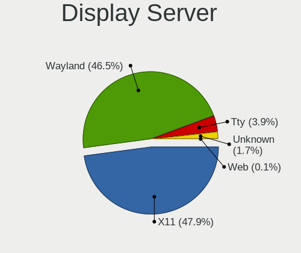
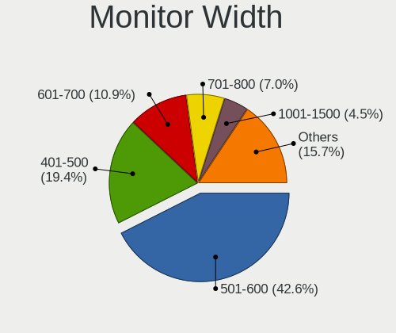
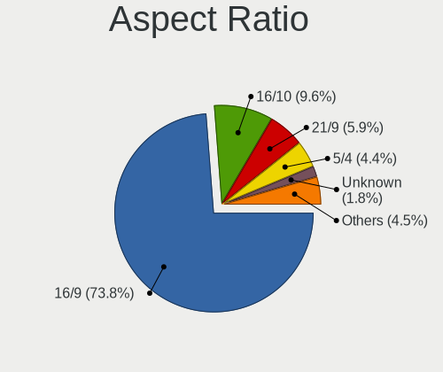
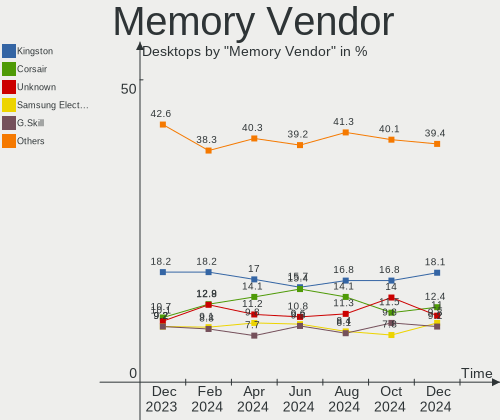

Linux - Hardware Trends (Desktops)
----------------------------------

A project to identify most popular hardware characteristics and track their change
over time based on data collected by Linux users at https://Linux-Hardware.org.

Anyone can contribute to this report by the [hw-probe](https://github.com/linuxhw/hw-probe) tool:

    sudo -E hw-probe -all -upload

This report is for one last month. Overall report since the beginning of time: [TestCoverage](https://github.com/linuxhw/TestCoverage)

Period: Nov, 2022.

Contents
--------

* [ System ](#system)
  - [ OS                       ](#os)
  - [ OS Family                ](#os-family)
  - [ Kernel                   ](#kernel)
  - [ Kernel Family            ](#kernel-family)
  - [ Kernel Major Ver.        ](#kernel-major-ver)
  - [ Arch                     ](#arch)
  - [ DE                       ](#de)
  - [ Display Server           ](#display-server)
  - [ Display Manager          ](#display-manager)
  - [ OS Lang                  ](#os-lang)
  - [ Boot Mode                ](#boot-mode)
  - [ Filesystem               ](#filesystem)
  - [ Part. scheme             ](#part-scheme)
  - [ Dual Boot with Linux/BSD ](#dual-boot-with-linuxbsd)
  - [ Dual Boot (Win)          ](#dual-boot-win)

* [ Board ](#board)
  - [ Vendor                   ](#vendor)
  - [ Model                    ](#model)
  - [ Model Family             ](#model-family)
  - [ MFG Year                 ](#mfg-year)
  - [ Form Factor              ](#form-factor)
  - [ Secure Boot              ](#secure-boot)
  - [ Coreboot                 ](#coreboot)
  - [ RAM Size                 ](#ram-size)
  - [ RAM Used                 ](#ram-used)
  - [ Total Drives             ](#total-drives)
  - [ Has CD-ROM               ](#has-cd-rom)
  - [ Has Ethernet             ](#has-ethernet)
  - [ Has WiFi                 ](#has-wifi)
  - [ Has Bluetooth            ](#has-bluetooth)

* [ Location ](#location)
  - [ Country                  ](#country)
  - [ City                     ](#city)

* [ Drives ](#drives)
  - [ Drive Vendor             ](#drive-vendor)
  - [ Drive Model              ](#drive-model)
  - [ HDD Vendor               ](#hdd-vendor)
  - [ SSD Vendor               ](#ssd-vendor)
  - [ Drive Kind               ](#drive-kind)
  - [ Drive Connector          ](#drive-connector)
  - [ Drive Size               ](#drive-size)
  - [ Space Total              ](#space-total)
  - [ Space Used               ](#space-used)
  - [ Malfunc. Drives          ](#malfunc-drives)
  - [ Malfunc. Drive Vendor    ](#malfunc-drive-vendor)
  - [ Malfunc. HDD Vendor      ](#malfunc-hdd-vendor)
  - [ Malfunc. Drive Kind      ](#malfunc-drive-kind)
  - [ Failed Drives            ](#failed-drives)
  - [ Failed Drive Vendor      ](#failed-drive-vendor)
  - [ Drive Status             ](#drive-status)

* [ Storage controller ](#storage-controller)
  - [ Storage Vendor           ](#storage-vendor)
  - [ Storage Model            ](#storage-model)
  - [ Storage Kind             ](#storage-kind)

* [ Processor ](#processor)
  - [ CPU Vendor               ](#cpu-vendor)
  - [ CPU Model                ](#cpu-model)
  - [ CPU Model Family         ](#cpu-model-family)
  - [ CPU Cores                ](#cpu-cores)
  - [ CPU Sockets              ](#cpu-sockets)
  - [ CPU Threads              ](#cpu-threads)
  - [ CPU Op-Modes             ](#cpu-op-modes)
  - [ CPU Microcode            ](#cpu-microcode)
  - [ CPU Microarch            ](#cpu-microarch)

* [ Graphics ](#graphics)
  - [ GPU Vendor               ](#gpu-vendor)
  - [ GPU Model                ](#gpu-model)
  - [ GPU Combo                ](#gpu-combo)
  - [ GPU Driver               ](#gpu-driver)
  - [ GPU Memory               ](#gpu-memory)

* [ Monitor ](#monitor)
  - [ Monitor Vendor           ](#monitor-vendor)
  - [ Monitor Model            ](#monitor-model)
  - [ Monitor Resolution       ](#monitor-resolution)
  - [ Monitor Diagonal         ](#monitor-diagonal)
  - [ Monitor Width            ](#monitor-width)
  - [ Aspect Ratio             ](#aspect-ratio)
  - [ Monitor Area             ](#monitor-area)
  - [ Pixel Density            ](#pixel-density)
  - [ Multiple Monitors        ](#multiple-monitors)

* [ Network ](#network)
  - [ Net Controller Vendor    ](#net-controller-vendor)
  - [ Net Controller Model     ](#net-controller-model)
  - [ Wireless Vendor          ](#wireless-vendor)
  - [ Wireless Model           ](#wireless-model)
  - [ Ethernet Vendor          ](#ethernet-vendor)
  - [ Ethernet Model           ](#ethernet-model)
  - [ Net Controller Kind      ](#net-controller-kind)
  - [ Used Controller          ](#used-controller)
  - [ NICs                     ](#nics)
  - [ IPv6                     ](#ipv6)

* [ Bluetooth ](#bluetooth)
  - [ Bluetooth Vendor         ](#bluetooth-vendor)
  - [ Bluetooth Model          ](#bluetooth-model)

* [ Sound ](#sound)
  - [ Sound Vendor             ](#sound-vendor)
  - [ Sound Model              ](#sound-model)

* [ Memory ](#memory)
  - [ Memory Vendor            ](#memory-vendor)
  - [ Memory Model             ](#memory-model)
  - [ Memory Kind              ](#memory-kind)
  - [ Memory Form Factor       ](#memory-form-factor)
  - [ Memory Size              ](#memory-size)
  - [ Memory Speed             ](#memory-speed)

* [ Printers & scanners ](#printers--scanners)
  - [ Printer Vendor           ](#printer-vendor)
  - [ Printer Model            ](#printer-model)
  - [ Scanner Vendor           ](#scanner-vendor)
  - [ Scanner Model            ](#scanner-model)

* [ Camera ](#camera)
  - [ Camera Vendor            ](#camera-vendor)
  - [ Camera Model             ](#camera-model)

* [ Security ](#security)
  - [ Fingerprint Vendor       ](#fingerprint-vendor)
  - [ Fingerprint Model        ](#fingerprint-model)
  - [ Chipcard Vendor          ](#chipcard-vendor)
  - [ Chipcard Model           ](#chipcard-model)

* [ Unsupported ](#unsupported)
  - [ Unsupported Devices      ](#unsupported-devices)
  - [ Unsupported Device Types ](#unsupported-device-types)

System
------

OS
--

Installed operating systems

| Name                         | Desktops | Percent |
|------------------------------|----------|---------|
| Ubuntu 22.04                 | 284      | 14.62%  |
| ROSA 12.3                    | 118      | 6.07%   |
| Debian 11                    | 102      | 5.25%   |
| OpenMandriva 4.3             | 92       | 4.73%   |
| Linux Mint 21                | 87       | 4.48%   |
| Fedora 37                    | 78       | 4.01%   |
| Fedora 36                    | 73       | 3.76%   |
| Ubuntu 20.04                 | 72       | 3.71%   |
| Arch Rolling                 | 72       | 3.71%   |
| Ubuntu 22.10                 | 71       | 3.65%   |
| Pop!_OS 22.04                | 68       | 3.5%    |
| Zorin 16                     | 55       | 2.83%   |
| Linux Mint 20.3              | 53       | 2.73%   |
| Ubuntu 16.04                 | 48       | 2.47%   |
| Ubuntu 18.04                 | 40       | 2.06%   |
| KDE neon 22.04               | 32       | 1.65%   |
| OpenMandriva 4.50            | 29       | 1.49%   |
| Manjaro                      | 29       | 1.49%   |
| ArcoLinux Rolling            | 28       | 1.44%   |
| Kubuntu 22.04                | 25       | 1.29%   |
| Manjaro 22.0.0               | 23       | 1.18%   |
| Kubuntu 22.10                | 23       | 1.18%   |
| ROSA 12.2                    | 21       | 1.08%   |
| openSUSE Tumbleweed-XXXXXXXX | 21       | 1.08%   |
| Nobara 36                    | 21       | 1.08%   |
| Xubuntu 22.04                | 19       | 0.98%   |
| Debian                       | 17       | 0.87%   |
| BlackPanther 18.1            | 16       | 0.82%   |
| Gentoo 2.9                   | 13       | 0.67%   |
| EndeavourOS Rolling          | 13       | 0.67%   |
| Xubuntu 20.04                | 11       | 0.57%   |
| SteamOS 3.4                  | 8        | 0.41%   |
| OpenMandriva 4.2             | 8        | 0.41%   |
| LMDE 5                       | 8        | 0.41%   |
| Gentoo 2.8                   | 8        | 0.41%   |
| Elementary 6.1               | 8        | 0.41%   |
| ROSA R11.1                   | 7        | 0.36%   |
| Lubuntu 22.04                | 7        | 0.36%   |
| Linux Mint 20.2              | 7        | 0.36%   |
| Fedora 35                    | 7        | 0.36%   |

OS Family
---------

OS without a version

| Name             | Desktops | Percent |
|------------------|----------|---------|
| Ubuntu           | 521      | 26.81%  |
| Linux Mint       | 160      | 8.23%   |
| Fedora           | 158      | 8.13%   |
| ROSA             | 154      | 7.93%   |
| OpenMandriva     | 138      | 7.1%    |
| Debian           | 132      | 6.79%   |
| Arch             | 72       | 3.71%   |
| Pop!_OS          | 71       | 3.65%   |
| Kubuntu          | 61       | 3.14%   |
| Zorin            | 58       | 2.99%   |
| Manjaro          | 53       | 2.73%   |
| Xubuntu          | 34       | 1.75%   |
| KDE neon         | 34       | 1.75%   |
| ArcoLinux        | 30       | 1.54%   |
| openSUSE         | 25       | 1.29%   |
| Gentoo           | 22       | 1.13%   |
| Nobara           | 21       | 1.08%   |
| BlackPanther     | 16       | 0.82%   |
| Lubuntu          | 15       | 0.77%   |
| Red OS           | 14       | 0.72%   |
| EndeavourOS      | 13       | 0.67%   |
| CentOS           | 12       | 0.62%   |
| Ubuntu MATE      | 11       | 0.57%   |
| SteamOS          | 9        | 0.46%   |
| Elementary       | 9        | 0.46%   |
| LMDE             | 8        | 0.41%   |
| Kali             | 8        | 0.41%   |
| Rocky Linux      | 6        | 0.31%   |
| Clear Linux      | 6        | 0.31%   |
| ALT Linux        | 6        | 0.31%   |
| MX               | 5        | 0.26%   |
| Ubuntu Unity     | 4        | 0.21%   |
| Ubuntu Budgie    | 4        | 0.21%   |
| Q4OS             | 3        | 0.15%   |
| Parrot           | 3        | 0.15%   |
| org.kde.Platform | 3        | 0.15%   |
| Garuda Linux     | 3        | 0.15%   |
| ClearOS          | 3        | 0.15%   |
| Ubuntu Studio    | 2        | 0.1%    |
| RHEL             | 2        | 0.1%    |

Kernel
------

Version of the Linux kernel

| Version                             | Desktops | Percent |
|-------------------------------------|----------|---------|
| 5.15.0-52-generic                   | 288      | 14.82%  |
| 5.15.0-53-generic                   | 225      | 11.58%  |
| 5.16.7-desktop-1omv4003             | 88       | 4.53%   |
| 5.19.0-23-generic                   | 85       | 4.37%   |
| 5.4.0-131-generic                   | 55       | 2.83%   |
| 5.10.0-19-amd64                     | 51       | 2.62%   |
| 4.15.0-142-generic                  | 48       | 2.47%   |
| 5.15.75-generic-1rosa2021.1-x86_64  | 43       | 2.21%   |
| 6.0.6-76060006-generic              | 34       | 1.75%   |
| 5.4.0-132-generic                   | 31       | 1.6%    |
| 5.15.77-generic-1rosa2021.1-x86_64  | 30       | 1.54%   |
| 6.0.5-200.fc36.x86_64               | 28       | 1.44%   |
| 5.10.0-7-amd64                      | 28       | 1.44%   |
| 6.0.8-300.fc37.x86_64               | 26       | 1.34%   |
| 5.10.150-generic-1rosa2021.1-x86_64 | 26       | 1.34%   |
| 6.0.9-300.fc37.x86_64               | 25       | 1.29%   |
| 6.0.8-arch1-1                       | 21       | 1.08%   |
| 5.10.74-generic-2rosa2021.1-x86_64  | 19       | 0.98%   |
| 5.19.12-desktop-2omv4090            | 18       | 0.93%   |
| 6.0.9-arch1-1                       | 16       | 0.82%   |
| 6.0.7-200.fc36.x86_64               | 13       | 0.67%   |
| 6.0.3-76060003-generic              | 13       | 0.67%   |
| 6.0.2-76060002-generic              | 13       | 0.67%   |
| 5.15.0-43-generic                   | 13       | 0.67%   |
| 6.0.7-arch1-1                       | 12       | 0.62%   |
| 6.0.6-arch1-1                       | 11       | 0.57%   |
| 5.15.0-41-generic                   | 11       | 0.57%   |
| 6.0.7-301.fc37.x86_64               | 10       | 0.51%   |
| 5.19.5-desktop-1omv4090             | 10       | 0.51%   |
| 6.0.8-zen1-1-zen                    | 9        | 0.46%   |
| 6.0.10-arch2-1                      | 9        | 0.46%   |
| 5.6.14-desktop-2bP                  | 9        | 0.46%   |
| 5.19.16-301.fc37.x86_64             | 9        | 0.46%   |
| 6.0.9-200.fc36.x86_64               | 8        | 0.41%   |
| 6.0.8-200.fc36.x86_64               | 8        | 0.41%   |
| 6.0.8-1-default                     | 8        | 0.41%   |
| 6.0.0-4-amd64                       | 8        | 0.41%   |
| 5.15.78-1-MANJARO                   | 8        | 0.41%   |
| 5.15.0-48-generic                   | 8        | 0.41%   |
| 6.0.8-1-MANJARO                     | 7        | 0.36%   |

Kernel Family
-------------

Linux kernel without a distro release

| Version  | Desktops | Percent |
|----------|----------|---------|
| 5.15.0   | 575      | 29.59%  |
| 5.4.0    | 134      | 6.9%    |
| 5.19.0   | 117      | 6.02%   |
| 6.0.8    | 96       | 4.94%   |
| 5.10.0   | 96       | 4.94%   |
| 5.16.7   | 88       | 4.53%   |
| 6.0.9    | 71       | 3.65%   |
| 6.0.6    | 70       | 3.6%    |
| 4.15.0   | 69       | 3.55%   |
| 6.0.7    | 66       | 3.4%    |
| 5.15.75  | 55       | 2.83%   |
| 5.15.77  | 38       | 1.96%   |
| 6.0.5    | 36       | 1.85%   |
| 6.0.0    | 29       | 1.49%   |
| 5.10.150 | 29       | 1.49%   |
| 6.0.2    | 25       | 1.29%   |
| 5.19.16  | 23       | 1.18%   |
| 6.0.10   | 19       | 0.98%   |
| 5.19.12  | 19       | 0.98%   |
| 5.10.74  | 19       | 0.98%   |
| 5.13.0   | 18       | 0.93%   |
| 6.0.3    | 16       | 0.82%   |
| 5.19.5   | 10       | 0.51%   |
| 5.6.14   | 9        | 0.46%   |
| 5.15.78  | 9        | 0.46%   |
| 5.15.76  | 9        | 0.46%   |
| 5.15.74  | 9        | 0.46%   |
| 6.1.0    | 8        | 0.41%   |
| 5.14.0   | 8        | 0.41%   |
| 3.10.0   | 8        | 0.41%   |
| 5.17.11  | 7        | 0.36%   |
| 5.10.14  | 7        | 0.36%   |
| 4.18.16  | 7        | 0.36%   |
| 5.18.12  | 6        | 0.31%   |
| 5.16.13  | 6        | 0.31%   |
| 5.11.0   | 6        | 0.31%   |
| 5.17.5   | 5        | 0.26%   |
| 5.15.60  | 5        | 0.26%   |
| 5.15.35  | 5        | 0.26%   |
| 4.18.0   | 5        | 0.26%   |

Kernel Major Ver.
-----------------

Linux kernel major version

| Version | Desktops | Percent |
|---------|----------|---------|
| 5.15    | 728      | 37.47%  |
| 6.0     | 428      | 22.03%  |
| 5.19    | 182      | 9.37%   |
| 5.10    | 164      | 8.44%   |
| 5.4     | 138      | 7.1%    |
| 5.16    | 97       | 4.99%   |
| 4.15    | 71       | 3.65%   |
| 5.13    | 18       | 0.93%   |
| 5.18    | 16       | 0.82%   |
| 5.17    | 16       | 0.82%   |
| 4.18    | 12       | 0.62%   |
| 5.6     | 9        | 0.46%   |
| 5.14    | 9        | 0.46%   |
| 5.11    | 9        | 0.46%   |
| 6.1     | 8        | 0.41%   |
| 3.10    | 8        | 0.41%   |
| 4.19    | 7        | 0.36%   |
| 5.8     | 4        | 0.21%   |
| 4.1     | 4        | 0.21%   |
| 5.9     | 2        | 0.1%    |
| 5.3     | 2        | 0.1%    |
| 5.0     | 2        | 0.1%    |
| 4.4     | 2        | 0.1%    |
| 5.7     | 1        | 0.05%   |
| 4.9     | 1        | 0.05%   |
| 4.17    | 1        | 0.05%   |
| 4.13    | 1        | 0.05%   |
| 4.12    | 1        | 0.05%   |
| 3.4     | 1        | 0.05%   |
| 3.13    | 1        | 0.05%   |

Arch
----

OS architecture (x86_64, i586, etc.)

| Name     | Desktops | Percent |
|----------|----------|---------|
| x86_64   | 1920     | 98.82%  |
| i686     | 17       | 0.87%   |
| ppc64    | 4        | 0.21%   |
| sh4a     | 1        | 0.05%   |
| armv5tel | 1        | 0.05%   |

DE
--

Desktop Environment

| Name                         | Desktops | Percent |
|------------------------------|----------|---------|
| GNOME                        | 796      | 40.97%  |
| KDE5                         | 482      | 24.81%  |
| Unknown                      | 180      | 9.26%   |
| X-Cinnamon                   | 144      | 7.41%   |
| XFCE                         | 132      | 6.79%   |
| MATE                         | 64       | 3.29%   |
| LXQt                         | 25       | 1.29%   |
| Cinnamon                     | 23       | 1.18%   |
| i3                           | 14       | 0.72%   |
| Pantheon                     | 10       | 0.51%   |
| KDE4                         | 9        | 0.46%   |
| LXDE                         | 7        | 0.36%   |
| KDE                          | 7        | 0.36%   |
| sway                         | 6        | 0.31%   |
| Unity                        | 5        | 0.26%   |
| GNOME Classic                | 5        | 0.26%   |
| Trinity                      | 4        | 0.21%   |
| GNOME Flashback              | 4        | 0.21%   |
| Budgie                       | 4        | 0.21%   |
| lightdm-xsession             | 3        | 0.15%   |
| Deepin                       | 3        | 0.15%   |
| Openbox                      | 2        | 0.1%    |
| chadwm                       | 2        | 0.1%    |
| awesome                      | 2        | 0.1%    |
| Yaru:ubuntu:GNOME            | 1        | 0.05%   |
| ubuntu=GNOME                 | 1        | 0.05%   |
| ubuntu                       | 1        | 0.05%   |
| qtile                        | 1        | 0.05%   |
| none+awesome                 | 1        | 0.05%   |
| i3-with-shmlog               | 1        | 0.05%   |
| Hyprland                     | 1        | 0.05%   |
| e16-session                  | 1        | 0.05%   |
| DWM                          | 1        | 0.05%   |
| ${XDG_CURRENT_DESKTOP:-sway} | 1        | 0.05%   |

Display Server
--------------

X11 or Wayland

| Name    | Desktops | Percent |
|---------|----------|---------|
| X11     | 1288     | 66.29%  |
| Wayland | 499      | 25.68%  |
| Unknown | 82       | 4.22%   |
| Tty     | 72       | 3.71%   |
| Web     | 2        | 0.1%    |

Display Manager
---------------

SDDM, LightDM, etc.

| Name    | Desktops | Percent |
|---------|----------|---------|
| Unknown | 707      | 36.39%  |
| SDDM    | 402      | 20.69%  |
| GDM3    | 392      | 20.17%  |
| LightDM | 232      | 11.94%  |
| GDM     | 188      | 9.68%   |
| KDM     | 7        | 0.36%   |
| GREETD  | 5        | 0.26%   |
| XDM     | 3        | 0.15%   |
| TDM     | 3        | 0.15%   |
| LXDM    | 3        | 0.15%   |
| Ly      | 1        | 0.05%   |

OS Lang
-------

Language

| Lang    | Desktops | Percent |
|---------|----------|---------|
| en_US   | 725      | 37.31%  |
| ru_RU   | 236      | 12.15%  |
| de_DE   | 150      | 7.72%   |
| Unknown | 115      | 5.92%   |
| fr_FR   | 91       | 4.68%   |
| en_GB   | 88       | 4.53%   |
| it_IT   | 78       | 4.01%   |
| pt_BR   | 66       | 3.4%    |
| en_CA   | 34       | 1.75%   |
| es_ES   | 33       | 1.7%    |
| en_AU   | 33       | 1.7%    |
| pl_PL   | 31       | 1.6%    |
| C       | 29       | 1.49%   |
| en_IN   | 17       | 0.87%   |
| nl_NL   | 15       | 0.77%   |
| es_AR   | 14       | 0.72%   |
| ja_JP   | 9        | 0.46%   |
| cs_CZ   | 9        | 0.46%   |
| zh_CN   | 8        | 0.41%   |
| pt_PT   | 8        | 0.41%   |
| hu_HU   | 8        | 0.41%   |
| es_MX   | 8        | 0.41%   |
| tr_TR   | 7        | 0.36%   |
| fr_CA   | 7        | 0.36%   |
| fi_FI   | 7        | 0.36%   |
| sv_SE   | 6        | 0.31%   |
| nl_BE   | 5        | 0.26%   |
| es_VE   | 5        | 0.26%   |
| en_ZA   | 5        | 0.26%   |
| en_NZ   | 5        | 0.26%   |
| en_AG   | 5        | 0.26%   |
| de_AT   | 5        | 0.26%   |
| POSIX   | 4        | 0.21%   |
| fr_BE   | 4        | 0.21%   |
| es_CO   | 4        | 0.21%   |
| el_GR   | 4        | 0.21%   |
| es_UY   | 3        | 0.15%   |
| en_PH   | 3        | 0.15%   |
| de_CH   | 3        | 0.15%   |
| C.UTF8  | 3        | 0.15%   |

Boot Mode
---------

EFI or BIOS

| Mode | Desktops | Percent |
|------|----------|---------|
| BIOS | 1095     | 56.36%  |
| EFI  | 848      | 43.64%  |

Filesystem
----------

Type of filesystem

| Type          | Desktops | Percent |
|---------------|----------|---------|
| Ext4          | 1445     | 74.37%  |
| Btrfs         | 243      | 12.51%  |
| Overlay       | 182      | 9.37%   |
| Xfs           | 32       | 1.65%   |
| Zfs           | 25       | 1.29%   |
| F2fs          | 6        | 0.31%   |
| Reiserfs      | 2        | 0.1%    |
| Ext2          | 2        | 0.1%    |
| XXXXXXX       | 1        | 0.05%   |
| Tmpfs         | 1        | 0.05%   |
| Rootfs        | 1        | 0.05%   |
| Jfs           | 1        | 0.05%   |
| Fuse.snapfuse | 1        | 0.05%   |
| Ext3          | 1        | 0.05%   |

Part. scheme
------------

Scheme of partitioning

| Type    | Desktops | Percent |
|---------|----------|---------|
| GPT     | 1049     | 53.99%  |
| Unknown | 534      | 27.48%  |
| MBR     | 360      | 18.53%  |

Dual Boot with Linux/BSD
------------------------

Hosting more than one Linux/BSD

| Dual boot | Desktops | Percent |
|-----------|----------|---------|
| No        | 1471     | 75.71%  |
| Yes       | 472      | 24.29%  |

Dual Boot (Win)
---------------

Hosting Linux and Windows

| Dual boot | Desktops | Percent |
|-----------|----------|---------|
| No        | 1259     | 64.8%   |
| Yes       | 684      | 35.2%   |

Board
-----

Vendor
------

Motherboard manufacturer

| Name                | Desktops | Percent |
|---------------------|----------|---------|
| ASUSTek Computer    | 538      | 27.69%  |
| Gigabyte Technology | 347      | 17.86%  |
| MSI                 | 249      | 12.82%  |
| ASRock              | 153      | 7.87%   |
| Dell                | 149      | 7.67%   |
| Hewlett-Packard     | 133      | 6.85%   |
| Lenovo              | 59       | 3.04%   |
| Intel               | 50       | 2.57%   |
| Acer                | 33       | 1.7%    |
| Unknown             | 31       | 1.6%    |
| Fujitsu             | 24       | 1.24%   |
| Foxconn             | 20       | 1.03%   |
| ECS                 | 17       | 0.87%   |
| Pegatron            | 16       | 0.82%   |
| Biostar             | 12       | 0.62%   |
| Medion              | 8        | 0.41%   |
| Huanan              | 7        | 0.36%   |
| Apple               | 7        | 0.36%   |
| PCWare              | 6        | 0.31%   |
| BESSTAR Tech        | 6        | 0.31%   |
| AZW                 | 6        | 0.31%   |
| Gateway             | 5        | 0.26%   |
| Supermicro          | 3        | 0.15%   |
| Shuttle             | 3        | 0.15%   |
| OEM                 | 3        | 0.15%   |
| MACHINIST           | 3        | 0.15%   |
| Fujitsu Siemens     | 3        | 0.15%   |
| Colorful Technology | 3        | 0.15%   |
| Alienware           | 3        | 0.15%   |
| Wistron             | 2        | 0.1%    |
| VS Company          | 2        | 0.1%    |
| Positivo            | 2        | 0.1%    |
| LattePanda          | 2        | 0.1%    |
| JGINYUE             | 2        | 0.1%    |
| IBM                 | 2        | 0.1%    |
| Graviton            | 2        | 0.1%    |
| AMD                 | 2        | 0.1%    |
| XDO.AI              | 1        | 0.05%   |
| TPV-INVENTA         | 1        | 0.05%   |
| T-bao               | 1        | 0.05%   |

Model
-----

Motherboard model

| Name                         | Desktops | Percent |
|------------------------------|----------|---------|
| ASUS All Series              | 46       | 2.37%   |
| ASUS ROG STRIX X299-E GAMING | 38       | 1.96%   |
| Unknown                      | 32       | 1.65%   |
| ASUS TUF Gaming X570-PLUS    | 14       | 0.72%   |
| ECS H61H2-M13                | 12       | 0.62%   |
| Dell OptiPlex 7010           | 11       | 0.57%   |
| ASUS PRIME A320M-K           | 11       | 0.57%   |
| MSI MS-7C37                  | 10       | 0.51%   |
| HP Compaq Elite 8300 SFF     | 10       | 0.51%   |
| ASUS PRIME TRX40-PRO         | 10       | 0.51%   |
| Gigabyte B450 AORUS ELITE    | 9        | 0.46%   |
| ASUS ROG STRIX B550-F GAMING | 9        | 0.46%   |
| MSI MS-7C02                  | 8        | 0.41%   |
| Gigabyte B450M DS3H          | 8        | 0.41%   |
| Gigabyte A320M-S2H           | 8        | 0.41%   |
| Dell OptiPlex 990            | 8        | 0.41%   |
| ASUS TUF X299 MARK 2         | 8        | 0.41%   |
| MSI MS-7C56                  | 7        | 0.36%   |
| MSI MS-7758                  | 7        | 0.36%   |
| Gigabyte GA-78LMT-USB3       | 7        | 0.36%   |
| Dell OptiPlex 3020           | 7        | 0.36%   |
| ASRock B450M Steel Legend    | 7        | 0.36%   |
| ASRock B450M Pro4            | 7        | 0.36%   |
| MSI MS-7C95                  | 6        | 0.31%   |
| MSI MS-7C91                  | 6        | 0.31%   |
| MSI MS-7C52                  | 6        | 0.31%   |
| MSI MS-7B89                  | 6        | 0.31%   |
| Intel H61                    | 6        | 0.31%   |
| HP Z440 Workstation          | 6        | 0.31%   |
| Gigabyte A320M-H             | 6        | 0.31%   |
| ASUS PRIME X570-PRO          | 6        | 0.31%   |
| MSI MS-7D22                  | 5        | 0.26%   |
| MSI MS-7B79                  | 5        | 0.26%   |
| MSI MS-7A38                  | 5        | 0.26%   |
| MSI MS-7817                  | 5        | 0.26%   |
| MSI MS-7693                  | 5        | 0.26%   |
| HP Compaq Pro 6300 SFF       | 5        | 0.26%   |
| HP Compaq 8200 Elite SFF PC  | 5        | 0.26%   |
| Gigabyte X299 UD4 Pro        | 5        | 0.26%   |
| Gigabyte B75M-D3H            | 5        | 0.26%   |

Model Family
------------

Motherboard model prefix

| Name                   | Desktops | Percent |
|------------------------|----------|---------|
| ASUS PRIME             | 117      | 6.02%   |
| ASUS ROG               | 102      | 5.25%   |
| Dell OptiPlex          | 89       | 4.58%   |
| ASUS All               | 46       | 2.37%   |
| ASUS TUF               | 44       | 2.26%   |
| Lenovo ThinkCentre     | 39       | 2.01%   |
| HP Compaq              | 39       | 2.01%   |
| Unknown                | 32       | 1.65%   |
| HP EliteDesk           | 24       | 1.24%   |
| Dell Precision         | 23       | 1.18%   |
| Gigabyte B450          | 19       | 0.98%   |
| HP ProDesk             | 17       | 0.87%   |
| Gigabyte X570          | 17       | 0.87%   |
| Dell Inspiron          | 17       | 0.87%   |
| ASUS M5A78L-M          | 16       | 0.82%   |
| ASRock B450M           | 16       | 0.82%   |
| Acer Aspire            | 15       | 0.77%   |
| Gigabyte B550          | 14       | 0.72%   |
| Gigabyte B450M         | 14       | 0.72%   |
| Gigabyte X299          | 12       | 0.62%   |
| ECS H61H2-M13          | 12       | 0.62%   |
| Acer Veriton           | 12       | 0.62%   |
| Fujitsu ESPRIMO        | 11       | 0.57%   |
| MSI MS-7C37            | 10       | 0.51%   |
| Gigabyte B550M         | 10       | 0.51%   |
| HP Pavilion            | 9        | 0.46%   |
| Gigabyte Z390          | 9        | 0.46%   |
| Gigabyte GA-78LMT-USB3 | 9        | 0.46%   |
| Dell XPS               | 9        | 0.46%   |
| ASUS P8H61-M           | 9        | 0.46%   |
| MSI MS-7C02            | 8        | 0.41%   |
| Gigabyte A320M-S2H     | 8        | 0.41%   |
| Gigabyte 970A-DS3P     | 8        | 0.41%   |
| ASUS M5A97             | 8        | 0.41%   |
| MSI MS-7C56            | 7        | 0.36%   |
| MSI MS-7758            | 7        | 0.36%   |
| Lenovo IdeaCentre      | 7        | 0.36%   |
| ASUS PRO               | 7        | 0.36%   |
| ASUS P8Z77-V           | 7        | 0.36%   |
| ASUS P5K               | 7        | 0.36%   |

MFG Year
--------

Motherboard manufacture year

| Year    | Desktops | Percent |
|---------|----------|---------|
| 2020    | 176      | 9.06%   |
| 2018    | 176      | 9.06%   |
| 2017    | 176      | 9.06%   |
| 2019    | 174      | 8.96%   |
| 2012    | 171      | 8.8%    |
| 2021    | 162      | 8.34%   |
| 2013    | 139      | 7.15%   |
| 2014    | 123      | 6.33%   |
| 2011    | 119      | 6.12%   |
| 2010    | 89       | 4.58%   |
| 2022    | 79       | 4.07%   |
| 2016    | 77       | 3.96%   |
| 2009    | 77       | 3.96%   |
| 2015    | 74       | 3.81%   |
| 2008    | 64       | 3.29%   |
| 2007    | 43       | 2.21%   |
| 2006    | 12       | 0.62%   |
| Unknown | 7        | 0.36%   |
| 2005    | 4        | 0.21%   |
| 2004    | 1        | 0.05%   |

Form Factor
-----------

Physical design of the computer

| Name    | Desktops | Percent |
|---------|----------|---------|
| Desktop | 1943     | 100%    |

Secure Boot
-----------

Enabled or disabled

| State    | Desktops | Percent |
|----------|----------|---------|
| Disabled | 1881     | 96.81%  |
| Enabled  | 62       | 3.19%   |

Coreboot
--------

Have coreboot on board

| Used | Desktops | Percent |
|------|----------|---------|
| No   | 1943     | 100%    |

RAM Size
--------

Total RAM memory

| Size in GB      | Desktops | Percent |
|-----------------|----------|---------|
| 16.01-24.0      | 490      | 25.22%  |
| 32.01-64.0      | 349      | 17.96%  |
| 8.01-16.0       | 325      | 16.73%  |
| 4.01-8.0        | 278      | 14.31%  |
| 3.01-4.0        | 226      | 11.63%  |
| 64.01-256.0     | 157      | 8.08%   |
| 24.01-32.0      | 41       | 2.11%   |
| 1.01-2.0        | 31       | 1.6%    |
| 2.01-3.0        | 17       | 0.87%   |
| More than 256.0 | 16       | 0.82%   |
| Unknown         | 7        | 0.36%   |
| 0.51-1.0        | 5        | 0.26%   |
| 0.01-0.5        | 1        | 0.05%   |

RAM Used
--------

Used RAM memory

| Used GB     | Desktops | Percent |
|-------------|----------|---------|
| 1.01-2.0    | 567      | 29.18%  |
| 2.01-3.0    | 429      | 22.08%  |
| 4.01-8.0    | 320      | 16.47%  |
| 3.01-4.0    | 249      | 12.82%  |
| 0.51-1.0    | 140      | 7.21%   |
| 8.01-16.0   | 119      | 6.12%   |
| 32.01-64.0  | 43       | 2.21%   |
| 0.01-0.5    | 32       | 1.65%   |
| 16.01-24.0  | 22       | 1.13%   |
| 64.01-256.0 | 9        | 0.46%   |
| Unknown     | 9        | 0.46%   |
| 24.01-32.0  | 4        | 0.21%   |

Total Drives
------------

Number of drives on board

| Drives | Desktops | Percent |
|--------|----------|---------|
| 1      | 666      | 34.28%  |
| 2      | 562      | 28.92%  |
| 3      | 336      | 17.29%  |
| 4      | 190      | 9.78%   |
| 5      | 89       | 4.58%   |
| 6      | 42       | 2.16%   |
| 7      | 23       | 1.18%   |
| 0      | 14       | 0.72%   |
| 10     | 6        | 0.31%   |
| 8      | 6        | 0.31%   |
| 12     | 3        | 0.15%   |
| 9      | 2        | 0.1%    |
| 16     | 1        | 0.05%   |
| 15     | 1        | 0.05%   |
| 14     | 1        | 0.05%   |
| 11     | 1        | 0.05%   |

Has CD-ROM
----------

Has CD-ROM on board

| Presented | Desktops | Percent |
|-----------|----------|---------|
| No        | 1161     | 59.75%  |
| Yes       | 782      | 40.25%  |

Has Ethernet
------------

Has Ethernet on board

| Presented | Desktops | Percent |
|-----------|----------|---------|
| Yes       | 1922     | 98.92%  |
| No        | 21       | 1.08%   |

Has WiFi
--------

Has WiFi module

| Presented | Desktops | Percent |
|-----------|----------|---------|
| No        | 1111     | 57.18%  |
| Yes       | 832      | 42.82%  |

Has Bluetooth
-------------

Has Bluetooth module

| Presented | Desktops | Percent |
|-----------|----------|---------|
| No        | 1298     | 66.8%   |
| Yes       | 645      | 33.2%   |

Location
--------

Country
-------

Geographic location (country)

| Country      | Desktops | Percent |
|--------------|----------|---------|
| USA          | 344      | 17.7%   |
| Russia       | 261      | 13.43%  |
| Germany      | 187      | 9.62%   |
| Italy        | 109      | 5.61%   |
| France       | 94       | 4.84%   |
| Brazil       | 92       | 4.73%   |
| UK           | 71       | 3.65%   |
| Unknown      | 67       | 3.45%   |
| Canada       | 65       | 3.35%   |
| Poland       | 49       | 2.52%   |
| Australia    | 41       | 2.11%   |
| Spain        | 36       | 1.85%   |
| Netherlands  | 30       | 1.54%   |
| Hungary      | 28       | 1.44%   |
| Greece       | 25       | 1.29%   |
| China        | 23       | 1.18%   |
| Sweden       | 22       | 1.13%   |
| Belgium      | 21       | 1.08%   |
| India        | 20       | 1.03%   |
| Argentina    | 19       | 0.98%   |
| Finland      | 18       | 0.93%   |
| Mexico       | 16       | 0.82%   |
| Czechia      | 16       | 0.82%   |
| Austria      | 16       | 0.82%   |
| Romania      | 15       | 0.77%   |
| Switzerland  | 13       | 0.67%   |
| Japan        | 13       | 0.67%   |
| Turkey       | 12       | 0.62%   |
| Portugal     | 12       | 0.62%   |
| Bulgaria     | 10       | 0.51%   |
| Indonesia    | 9        | 0.46%   |
| South Africa | 8        | 0.41%   |
| Kazakhstan   | 8        | 0.41%   |
| Israel       | 8        | 0.41%   |
| Ukraine      | 7        | 0.36%   |
| Philippines  | 7        | 0.36%   |
| New Zealand  | 7        | 0.36%   |
| Denmark      | 7        | 0.36%   |
| Colombia     | 7        | 0.36%   |
| Tunisia      | 6        | 0.31%   |

City
----

Geographic location (city)

| City              | Desktops | Percent |
|-------------------|----------|---------|
| Unknown           | 67       | 3.45%   |
| Moscow            | 42       | 2.16%   |
| Voronezh          | 33       | 1.7%    |
| St Petersburg     | 23       | 1.18%   |
| Berlin            | 18       | 0.93%   |
| Rome              | 16       | 0.82%   |
| Sao Paulo         | 10       | 0.51%   |
| Rio de Janeiro    | 10       | 0.51%   |
| Warsaw            | 9        | 0.46%   |
| Milan             | 9        | 0.46%   |
| Budapest          | 9        | 0.46%   |
| Yekaterinburg     | 8        | 0.41%   |
| Sydney            | 8        | 0.41%   |
| Stockholm         | 8        | 0.41%   |
| Melbourne         | 8        | 0.41%   |
| Helsinki          | 8        | 0.41%   |
| Athens            | 8        | 0.41%   |
| Seattle           | 7        | 0.36%   |
| Nanhao            | 7        | 0.36%   |
| Montreal          | 7        | 0.36%   |
| Amsterdam         | 7        | 0.36%   |
| Vienna            | 6        | 0.31%   |
| Toronto           | 6        | 0.31%   |
| Prague            | 6        | 0.31%   |
| Novosibirsk       | 6        | 0.31%   |
| Miami             | 6        | 0.31%   |
| Hamburg           | 6        | 0.31%   |
| Frankfurt am Main | 6        | 0.31%   |
| Brisbane          | 6        | 0.31%   |
| Auckland          | 6        | 0.31%   |
| Ufa               | 5        | 0.26%   |
| Sofia             | 5        | 0.26%   |
| Rostov-on-Don     | 5        | 0.26%   |
| Paris             | 5        | 0.26%   |
| Munich            | 5        | 0.26%   |
| Lane Cove         | 5        | 0.26%   |
| Krasnoyarsk       | 5        | 0.26%   |
| Dallas            | 5        | 0.26%   |
| Chicago           | 5        | 0.26%   |
| Springfield       | 4        | 0.21%   |

Drives
------

Drive Vendor
------------

Hard drive vendors

| Vendor                      | Desktops | Drives | Percent |
|-----------------------------|----------|--------|---------|
| Seagate                     | 680      | 922    | 18.2%   |
| WDC                         | 657      | 903    | 17.58%  |
| Samsung Electronics         | 585      | 764    | 15.65%  |
| Kingston                    | 262      | 295    | 7.01%   |
| SanDisk                     | 190      | 211    | 5.08%   |
| Toshiba                     | 183      | 211    | 4.9%    |
| Crucial                     | 158      | 182    | 4.23%   |
| Hitachi                     | 116      | 131    | 3.1%    |
| China                       | 51       | 60     | 1.36%   |
| Phison Electronics          | 49       | 63     | 1.31%   |
| A-DATA Technology           | 46       | 50     | 1.23%   |
| Intel                       | 42       | 48     | 1.12%   |
| Unknown                     | 35       | 47     | 0.94%   |
| SPCC                        | 35       | 41     | 0.94%   |
| Patriot                     | 31       | 32     | 0.83%   |
| Silicon Motion              | 30       | 31     | 0.8%    |
| PNY                         | 26       | 27     | 0.7%    |
| HGST                        | 24       | 31     | 0.64%   |
| Intenso                     | 23       | 26     | 0.62%   |
| Micron Technology           | 22       | 25     | 0.59%   |
| Maxtor                      | 22       | 24     | 0.59%   |
| SK hynix                    | 21       | 23     | 0.56%   |
| Phison                      | 18       | 19     | 0.48%   |
| Micron/Crucial Technology   | 17       | 17     | 0.45%   |
| Corsair                     | 17       | 20     | 0.45%   |
| OCZ                         | 16       | 18     | 0.43%   |
| GOODRAM                     | 16       | 18     | 0.43%   |
| ADATA Technology            | 16       | 18     | 0.43%   |
| Unknown                     | 16       | 16     | 0.43%   |
| Transcend                   | 14       | 14     | 0.37%   |
| Kingston Technology Company | 13       | 13     | 0.35%   |
| Gigabyte Technology         | 13       | 13     | 0.35%   |
| Apacer                      | 13       | 14     | 0.35%   |
| Team                        | 12       | 12     | 0.32%   |
| KingSpec                    | 12       | 12     | 0.32%   |
| Hewlett-Packard             | 11       | 12     | 0.29%   |
| XPG                         | 9        | 11     | 0.24%   |
| Lexar                       | 9        | 10     | 0.24%   |
| KIOXIA                      | 9        | 10     | 0.24%   |
| JMicron Technology          | 9        | 9      | 0.24%   |

Drive Model
-----------

Hard drive models

| Model                                                | Desktops | Percent |
|------------------------------------------------------|----------|---------|
| Samsung NVMe SSD Controller SM981/PM981/PM983 1TB    | 76       | 1.75%   |
| Kingston SA400S37240G 240GB SSD                      | 71       | 1.64%   |
| Samsung SSD 860 EVO 500GB                            | 66       | 1.52%   |
| Seagate ST6000NM0115-1YZ110 6TB                      | 55       | 1.27%   |
| Seagate ST500DM002-1BD142 500GB                      | 52       | 1.2%    |
| Seagate ST1000DM010-2EP102 1TB                       | 50       | 1.15%   |
| Kingston SA400S37480G 480GB SSD                      | 44       | 1.02%   |
| Toshiba DT01ACA100 1TB                               | 42       | 0.97%   |
| Seagate ST2000DM008-2FR102 2TB                       | 42       | 0.97%   |
| WDC WD10EZEX-08WN4A0 1TB                             | 41       | 0.95%   |
| Samsung NVMe SSD Controller PM9A1/PM9A3/980PRO 250GB | 34       | 0.79%   |
| Crucial CT1000MX500SSD1 1TB                          | 30       | 0.69%   |
| Samsung SSD 850 EVO 500GB                            | 27       | 0.62%   |
| Samsung SSD 850 EVO 250GB                            | 26       | 0.6%    |
| Samsung SSD 860 EVO 1TB                              | 25       | 0.58%   |
| Phison E12 NVMe Controller 2TB                       | 25       | 0.58%   |
| Kingston SA400S37120G 120GB SSD                      | 25       | 0.58%   |
| Seagate ST1000DM003-1ER162 1TB                       | 24       | 0.55%   |
| Crucial CT500MX500SSD1 500GB                         | 24       | 0.55%   |
| Toshiba HDWD110 1TB                                  | 23       | 0.53%   |
| Samsung SSD 860 EVO 250GB                            | 21       | 0.48%   |
| Seagate ST2000DM006-2DM164 2TB                       | 19       | 0.44%   |
| Seagate ST1000DM003-1CH162 1TB                       | 19       | 0.44%   |
| Samsung SSD 980 500GB                                | 18       | 0.42%   |
| Toshiba DT01ACA050 500GB                             | 17       | 0.39%   |
| Samsung SSD 980 1TB                                  | 17       | 0.39%   |
| Phison E16 PCIe4 NVMe Controller 1TB                 | 17       | 0.39%   |
| Seagate ST4000DM004-2CV104 4TB                       | 16       | 0.37%   |
| Samsung SSD 870 EVO 500GB                            | 16       | 0.37%   |
| Crucial CT1000BX500SSD1 1TB                          | 16       | 0.37%   |
| Unknown                                              | 16       | 0.37%   |
| WDC WD5000AAKX-60U6AA0 500GB                         | 15       | 0.35%   |
| Unknown SD/MMC/MS PRO 8GB                            | 15       | 0.35%   |
| Sandisk WD Blue SN550 NVMe SSD 1TB                   | 15       | 0.35%   |
| Samsung NVMe SSD Controller SM961/PM961/SM963 250GB  | 15       | 0.35%   |
| WDC WDS500G2B0A-00SM50 500GB SSD                     | 14       | 0.32%   |
| WDC WD30EFRX-68EUZN0 3TB                             | 14       | 0.32%   |
| Seagate ST3500418AS 500GB                            | 14       | 0.32%   |
| Samsung SSD 970 EVO Plus 1TB                         | 14       | 0.32%   |
| Samsung SSD 870 QVO 1TB                              | 14       | 0.32%   |

HDD Vendor
----------

Hard disk drive vendors

| Vendor              | Desktops | Drives | Percent |
|---------------------|----------|--------|---------|
| Seagate             | 664      | 894    | 38.85%  |
| WDC                 | 575      | 779    | 33.65%  |
| Toshiba             | 166      | 185    | 9.71%   |
| Hitachi             | 116      | 131    | 6.79%   |
| Samsung Electronics | 99       | 114    | 5.79%   |
| HGST                | 24       | 31     | 1.4%    |
| Maxtor              | 19       | 21     | 1.11%   |
| Unknown             | 16       | 17     | 0.94%   |
| ASMT                | 5        | 9      | 0.29%   |
| Intenso             | 4        | 4      | 0.23%   |
| Hewlett-Packard     | 4        | 4      | 0.23%   |
| Apple               | 3        | 3      | 0.18%   |
| WD MediaMax         | 1        | 1      | 0.06%   |
| USB3.0              | 1        | 2      | 0.06%   |
| USB                 | 1        | 1      | 0.06%   |
| StoreJet            | 1        | 1      | 0.06%   |
| LaCie               | 1        | 1      | 0.06%   |
| HPE                 | 1        | 2      | 0.06%   |
| Fujitsu             | 1        | 1      | 0.06%   |
| FNK TECH            | 1        | 1      | 0.06%   |
| External            | 1        | 1      | 0.06%   |
| ExcelStor           | 1        | 1      | 0.06%   |
| Dyconn H            | 1        | 1      | 0.06%   |
| ASMedia             | 1        | 1      | 0.06%   |
| Advantech           | 1        | 1      | 0.06%   |
| Unknown             | 1        | 1      | 0.06%   |

SSD Vendor
----------

Solid state drive vendors

| Vendor              | Desktops | Drives | Percent |
|---------------------|----------|--------|---------|
| Samsung Electronics | 316      | 372    | 23.27%  |
| Kingston            | 226      | 248    | 16.64%  |
| Crucial             | 146      | 165    | 10.75%  |
| SanDisk             | 108      | 118    | 7.95%   |
| WDC                 | 81       | 87     | 5.96%   |
| China               | 50       | 59     | 3.68%   |
| A-DATA Technology   | 37       | 41     | 2.72%   |
| SPCC                | 32       | 38     | 2.36%   |
| Patriot             | 29       | 30     | 2.14%   |
| PNY                 | 26       | 27     | 1.91%   |
| Intel               | 19       | 22     | 1.4%    |
| OCZ                 | 16       | 18     | 1.18%   |
| GOODRAM             | 16       | 18     | 1.18%   |
| Intenso             | 15       | 17     | 1.1%    |
| Toshiba             | 12       | 15     | 0.88%   |
| Micron Technology   | 11       | 12     | 0.81%   |
| KingSpec            | 11       | 11     | 0.81%   |
| Apacer              | 11       | 12     | 0.81%   |
| Transcend           | 10       | 10     | 0.74%   |
| Team                | 10       | 10     | 0.74%   |
| Gigabyte Technology | 10       | 10     | 0.74%   |
| Corsair             | 9        | 11     | 0.66%   |
| Lexar               | 7        | 8      | 0.52%   |
| Hewlett-Packard     | 7        | 8      | 0.52%   |
| LITEON              | 6        | 6      | 0.44%   |
| Unknown             | 6        | 6      | 0.44%   |
| LITEONIT            | 5        | 5      | 0.37%   |
| JMicron Technology  | 5        | 5      | 0.37%   |
| SK hynix            | 4        | 4      | 0.29%   |
| Seagate             | 4        | 5      | 0.29%   |
| Netac               | 4        | 4      | 0.29%   |
| Mushkin             | 4        | 5      | 0.29%   |
| KIOXIA-EXCERIA      | 4        | 4      | 0.29%   |
| KingDian            | 4        | 4      | 0.29%   |
| AMD                 | 4        | 4      | 0.29%   |
| Acer                | 4        | 6      | 0.29%   |
| Verbatim            | 3        | 3      | 0.22%   |
| Vaseky              | 3        | 3      | 0.22%   |
| T-FORCE             | 3        | 8      | 0.22%   |
| Maxtor              | 3        | 3      | 0.22%   |

Drive Kind
----------

HDD or SSD

| Kind    | Desktops | Drives | Percent |
|---------|----------|--------|---------|
| HDD     | 1322     | 2208   | 41.97%  |
| SSD     | 1120     | 1520   | 35.56%  |
| NVMe    | 624      | 804    | 19.81%  |
| Unknown | 73       | 85     | 2.32%   |
| MMC     | 11       | 13     | 0.35%   |

Drive Connector
---------------

SATA, SAS, NVMe, etc.

| Type | Desktops | Drives | Percent |
|------|----------|--------|---------|
| SATA | 1749     | 3605   | 68.94%  |
| NVMe | 622      | 797    | 24.52%  |
| SAS  | 155      | 215    | 6.11%   |
| MMC  | 11       | 13     | 0.43%   |

Drive Size
----------

Size of hard drive

| Size in TB | Desktops | Drives | Percent |
|------------|----------|--------|---------|
| 0.01-0.5   | 1309     | 1913   | 49.04%  |
| 0.51-1.0   | 708      | 937    | 26.53%  |
| 1.01-2.0   | 288      | 364    | 10.79%  |
| 4.01-10.0  | 141      | 209    | 5.28%   |
| 3.01-4.0   | 101      | 132    | 3.78%   |
| 2.01-3.0   | 76       | 106    | 2.85%   |
| 10.01-20.0 | 46       | 67     | 1.72%   |

Space Total
-----------

Amount of disk space available on the file system

| Size in GB     | Desktops | Percent |
|----------------|----------|---------|
| 101-250        | 384      | 19.76%  |
| 501-1000       | 296      | 15.23%  |
| 251-500        | 279      | 14.36%  |
| More than 3000 | 238      | 12.25%  |
| 1001-2000      | 206      | 10.6%   |
| Unknown        | 165      | 8.49%   |
| 1-20           | 135      | 6.95%   |
| 2001-3000      | 119      | 6.12%   |
| 51-100         | 84       | 4.32%   |
| 21-50          | 37       | 1.9%    |

Space Used
----------

Amount of used disk space

| Used GB        | Desktops | Percent |
|----------------|----------|---------|
| 1-20           | 567      | 29.18%  |
| 21-50          | 244      | 12.56%  |
| 101-250        | 208      | 10.71%  |
| 51-100         | 189      | 9.73%   |
| Unknown        | 165      | 8.49%   |
| 251-500        | 157      | 8.08%   |
| 501-1000       | 152      | 7.82%   |
| 1001-2000      | 117      | 6.02%   |
| More than 3000 | 104      | 5.35%   |
| 2001-3000      | 40       | 2.06%   |

Malfunc. Drives
---------------

Drive models with a malfunction

| Model                                                         | Desktops | Drives | Percent |
|---------------------------------------------------------------|----------|--------|---------|
| Seagate ST500DM002-1BD142 500GB                               | 9        | 12     | 2.62%   |
| Seagate ST3500418AS 500GB                                     | 6        | 6      | 1.74%   |
| Seagate ST3320418AS 320GB                                     | 5        | 5      | 1.45%   |
| Hitachi HDS721050DLE630 500GB                                 | 5        | 5      | 1.45%   |
| Seagate ST2000DM008-2FR102 2TB                                | 4        | 4      | 1.16%   |
| Seagate ST1000DM010-2EP102 1TB                                | 4        | 4      | 1.16%   |
| Samsung Electronics HD322HJ 320GB                             | 4        | 4      | 1.16%   |
| WDC WD5000AAKS-00V1A0 500GB                                   | 3        | 4      | 0.87%   |
| WDC WD20EFRX-68AX9N0 2TB                                      | 3        | 4      | 0.87%   |
| WDC WD20EARX-00PASB0 2TB                                      | 3        | 3      | 0.87%   |
| WDC WD10EZEX-22MFCA0 1TB                                      | 3        | 3      | 0.87%   |
| Seagate ST32000641AS 2TB                                      | 3        | 7      | 0.87%   |
| Seagate ST2000DX001-1CM164 2TB                                | 3        | 3      | 0.87%   |
| Seagate ST2000DM006-2DM164 2TB                                | 3        | 3      | 0.87%   |
| Seagate ST2000DM001-1CH164 2TB                                | 3        | 3      | 0.87%   |
| Samsung Electronics SP2504C 250GB                             | 3        | 3      | 0.87%   |
| Samsung Electronics NVMe SSD Controller SM981/PM981/PM983 1TB | 3        | 3      | 0.87%   |
| Samsung Electronics HD502HJ 500GB                             | 3        | 3      | 0.87%   |
| Samsung Electronics HD501LJ 500GB                             | 3        | 4      | 0.87%   |
| Kingston SA400S37480G 480GB SSD                               | 3        | 3      | 0.87%   |
| WDC WD6400AAKS-65A7B0 640GB                                   | 2        | 2      | 0.58%   |
| WDC WD5000AAKX-60U6AA0 500GB                                  | 2        | 2      | 0.58%   |
| WDC WD5000AAKX-001CA0 500GB                                   | 2        | 2      | 0.58%   |
| WDC WD20EARS-00S8B1 2TB                                       | 2        | 2      | 0.58%   |
| WDC WD1600AAJS-00B4A0 160GB                                   | 2        | 2      | 0.58%   |
| WDC WD10JPVX-60JC3T0 1TB                                      | 2        | 2      | 0.58%   |
| WDC WD10EZEX-08WN4A0 1TB                                      | 2        | 3      | 0.58%   |
| WDC WD10EZEX-00WN4A0 1TB                                      | 2        | 2      | 0.58%   |
| WDC WD10EARS-00MVWB0 1TB                                      | 2        | 2      | 0.58%   |
| WDC WD10EALX-009BA0 1TB                                       | 2        | 2      | 0.58%   |
| Toshiba DT01ACA100 1TB                                        | 2        | 2      | 0.58%   |
| Seagate ST9500325AS 500GB                                     | 2        | 2      | 0.58%   |
| Seagate ST500DM005 HD502HJ 500GB                              | 2        | 2      | 0.58%   |
| Seagate ST3750528AS 752GB                                     | 2        | 2      | 0.58%   |
| Seagate ST3500413AS 500GB                                     | 2        | 2      | 0.58%   |
| Seagate ST3250820AS 250GB                                     | 2        | 2      | 0.58%   |
| Seagate ST3250410AS 250GB                                     | 2        | 2      | 0.58%   |
| Seagate ST3250318AS 250GB                                     | 2        | 2      | 0.58%   |
| Seagate ST3200822AS 200GB                                     | 2        | 2      | 0.58%   |
| Seagate ST31000528AS 1TB                                      | 2        | 2      | 0.58%   |

Malfunc. Drive Vendor
---------------------

Vendors of faulty drives

| Vendor                | Desktops | Drives | Percent |
|-----------------------|----------|--------|---------|
| Seagate               | 98       | 117    | 30.06%  |
| WDC                   | 92       | 110    | 28.22%  |
| Samsung Electronics   | 32       | 36     | 9.82%   |
| Hitachi               | 28       | 29     | 8.59%   |
| Intel                 | 9        | 9      | 2.76%   |
| Toshiba               | 8        | 8      | 2.45%   |
| Kingston              | 8        | 8      | 2.45%   |
| Maxtor                | 7        | 7      | 2.15%   |
| Crucial               | 5        | 5      | 1.53%   |
| SPCC                  | 3        | 3      | 0.92%   |
| SanDisk               | 3        | 3      | 0.92%   |
| Micron Technology     | 2        | 2      | 0.61%   |
| Kingmax               | 2        | 2      | 0.61%   |
| Intenso               | 2        | 2      | 0.61%   |
| HGST                  | 2        | 2      | 0.61%   |
| GLOWAY                | 2        | 2      | 0.61%   |
| Corsair               | 2        | 2      | 0.61%   |
| China                 | 2        | 2      | 0.61%   |
| A-DATA Technology     | 2        | 3      | 0.61%   |
| XPG                   | 1        | 1      | 0.31%   |
| WD MediaMax           | 1        | 1      | 0.31%   |
| Transcend             | 1        | 1      | 0.31%   |
| Realtek Semiconductor | 1        | 1      | 0.31%   |
| PNY                   | 1        | 1      | 0.31%   |
| Plextor               | 1        | 1      | 0.31%   |
| Patriot               | 1        | 1      | 0.31%   |
| OCZ                   | 1        | 1      | 0.31%   |
| Neo                   | 1        | 1      | 0.31%   |
| LITEONIT              | 1        | 1      | 0.31%   |
| Leven                 | 1        | 1      | 0.31%   |
| KingSpec              | 1        | 1      | 0.31%   |
| EGON                  | 1        | 1      | 0.31%   |
| ASMT                  | 1        | 4      | 0.31%   |
| AMD                   | 1        | 1      | 0.31%   |
| AGI                   | 1        | 1      | 0.31%   |
| Unknown               | 1        | 1      | 0.31%   |

Malfunc. HDD Vendor
-------------------

Vendors of faulty HDD drives

| Vendor              | Desktops | Drives | Percent |
|---------------------|----------|--------|---------|
| Seagate             | 98       | 117    | 37.98%  |
| WDC                 | 90       | 107    | 34.88%  |
| Hitachi             | 28       | 29     | 10.85%  |
| Samsung Electronics | 22       | 26     | 8.53%   |
| Toshiba             | 8        | 8      | 3.1%    |
| Maxtor              | 7        | 7      | 2.71%   |
| HGST                | 2        | 2      | 0.78%   |
| WD MediaMax         | 1        | 1      | 0.39%   |
| ASMT                | 1        | 4      | 0.39%   |
| Unknown             | 1        | 1      | 0.39%   |

Malfunc. Drive Kind
-------------------

Kinds of faulty drives

| Kind | Desktops | Drives | Percent |
|------|----------|--------|---------|
| HDD  | 238      | 302    | 77.78%  |
| SSD  | 57       | 59     | 18.63%  |
| NVMe | 11       | 11     | 3.59%   |

Failed Drives
-------------

Failed drive models

| Model                                 | Desktops | Drives | Percent |
|---------------------------------------|----------|--------|---------|
| Seagate ST500DM002-1BD142 500GB       | 1        | 1      | 16.67%  |
| Seagate ST3250318AS 250GB             | 1        | 1      | 16.67%  |
| Samsung Electronics SSD 960 EVO 250GB | 1        | 1      | 16.67%  |
| Samsung Electronics HD253GJ 250GB     | 1        | 1      | 16.67%  |
| Hitachi HDS721050DLE630 500GB         | 1        | 1      | 16.67%  |
| Hewlett-Packard SSD S700 500GB        | 1        | 2      | 16.67%  |

Failed Drive Vendor
-------------------

Failed drive vendors

| Vendor              | Desktops | Drives | Percent |
|---------------------|----------|--------|---------|
| Seagate             | 2        | 2      | 33.33%  |
| Samsung Electronics | 2        | 2      | 33.33%  |
| Hitachi             | 1        | 1      | 16.67%  |
| Hewlett-Packard     | 1        | 2      | 16.67%  |

Drive Status
------------

Number of failed and malfunc. drives

| Status   | Desktops | Drives | Percent |
|----------|----------|--------|---------|
| Works    | 959      | 2147   | 43.26%  |
| Detected | 958      | 2104   | 43.21%  |
| Malfunc  | 294      | 372    | 13.26%  |
| Failed   | 6        | 7      | 0.27%   |

Storage controller
------------------

Storage Vendor
--------------

Storage controller vendors

| Vendor                         | Desktops | Percent |
|--------------------------------|----------|---------|
| Intel                          | 1230     | 43.28%  |
| AMD                            | 658      | 23.15%  |
| Samsung Electronics            | 245      | 8.62%   |
| SanDisk                        | 115      | 4.05%   |
| ASMedia Technology             | 98       | 3.45%   |
| Phison Electronics             | 80       | 2.81%   |
| Kingston Technology Company    | 54       | 1.9%    |
| Marvell Technology Group       | 45       | 1.58%   |
| JMicron Technology             | 42       | 1.48%   |
| Silicon Motion                 | 38       | 1.34%   |
| Nvidia                         | 35       | 1.23%   |
| Micron/Crucial Technology      | 33       | 1.16%   |
| ADATA Technology               | 29       | 1.02%   |
| SK hynix                       | 17       | 0.6%    |
| LSI Logic / Symbios Logic      | 14       | 0.49%   |
| KIOXIA                         | 13       | 0.46%   |
| Toshiba America Info Systems   | 11       | 0.39%   |
| Micron Technology              | 11       | 0.39%   |
| VIA Technologies               | 10       | 0.35%   |
| Realtek Semiconductor          | 10       | 0.35%   |
| Seagate Technology             | 8        | 0.28%   |
| Broadcom / LSI                 | 8        | 0.28%   |
| MAXIO Technology (Hangzhou)    | 6        | 0.21%   |
| Lite-On Technology             | 5        | 0.18%   |
| Adaptec                        | 4        | 0.14%   |
| Silicon Image                  | 3        | 0.11%   |
| IBM                            | 3        | 0.11%   |
| Union Memory (Shenzhen)        | 2        | 0.07%   |
| Netac Technology               | 2        | 0.07%   |
| Integrated Technology Express  | 2        | 0.07%   |
| INNOGRIT                       | 2        | 0.07%   |
| Transcend                      | 1        | 0.04%   |
| Solid State Storage Technology | 1        | 0.04%   |
| Shenzhen Longsys Electronics   | 1        | 0.04%   |
| O2 Micro                       | 1        | 0.04%   |
| Mylex                          | 1        | 0.04%   |
| HighPoint Technologies         | 1        | 0.04%   |
| Beijing Starblaze Technology   | 1        | 0.04%   |
| Apple                          | 1        | 0.04%   |
| 3ware                          | 1        | 0.04%   |

Storage Model
-------------

Storage controller models

| Model                                                                                   | Desktops | Percent |
|-----------------------------------------------------------------------------------------|----------|---------|
| AMD FCH SATA Controller [AHCI mode]                                                     | 340      | 9.87%   |
| AMD 400 Series Chipset SATA Controller                                                  | 139      | 4.04%   |
| Intel 8 Series/C220 Series Chipset Family 6-port SATA Controller 1 [AHCI mode]          | 137      | 3.98%   |
| Intel 200 Series PCH SATA controller [AHCI mode]                                        | 134      | 3.89%   |
| Samsung NVMe SSD Controller SM981/PM981/PM983                                           | 127      | 3.69%   |
| AMD 500 Series Chipset SATA Controller                                                  | 106      | 3.08%   |
| Intel Q170/Q150/B150/H170/H110/Z170/CM236 Chipset SATA Controller [AHCI Mode]           | 97       | 2.82%   |
| ASMedia ASM1062 Serial ATA Controller                                                   | 91       | 2.64%   |
| Intel 6 Series/C200 Series Chipset Family 6 port Desktop SATA AHCI Controller           | 89       | 2.58%   |
| AMD SB7x0/SB8x0/SB9x0 IDE Controller                                                    | 87       | 2.53%   |
| Intel 7 Series/C210 Series Chipset Family 6-port SATA Controller [AHCI mode]            | 80       | 2.32%   |
| AMD SB7x0/SB8x0/SB9x0 SATA Controller [AHCI mode]                                       | 68       | 1.97%   |
| Intel SATA Controller [RAID mode]                                                       | 63       | 1.83%   |
| Intel NM10/ICH7 Family SATA Controller [IDE mode]                                       | 62       | 1.8%    |
| AMD SB7x0/SB8x0/SB9x0 SATA Controller [IDE mode]                                        | 60       | 1.74%   |
| Intel 500 Series Chipset Family SATA AHCI Controller                                    | 58       | 1.68%   |
| Intel Cannon Lake PCH SATA AHCI Controller                                              | 56       | 1.63%   |
| Intel Alder Lake-S PCH SATA Controller [AHCI Mode]                                      | 54       | 1.57%   |
| Samsung NVMe SSD Controller PM9A1/PM9A3/980PRO                                          | 53       | 1.54%   |
| Samsung NVMe SSD Controller 980                                                         | 43       | 1.25%   |
| Intel 6 Series/C200 Series Chipset Family Desktop SATA Controller (IDE mode, ports 4-5) | 43       | 1.25%   |
| Intel 6 Series/C200 Series Chipset Family Desktop SATA Controller (IDE mode, ports 0-3) | 43       | 1.25%   |
| AMD FCH SATA Controller D                                                               | 42       | 1.22%   |
| Intel 82801G (ICH7 Family) IDE Controller                                               | 38       | 1.1%    |
| Phison E12 NVMe Controller                                                              | 36       | 1.05%   |
| SanDisk Non-Volatile memory controller                                                  | 30       | 0.87%   |
| Samsung NVMe SSD Controller SM961/PM961/SM963                                           | 28       | 0.81%   |
| Intel 9 Series Chipset Family SATA Controller [AHCI Mode]                               | 28       | 0.81%   |
| Intel 5 Series/3400 Series Chipset 6 port SATA AHCI Controller                          | 28       | 0.81%   |
| AMD 300 Series Chipset SATA Controller                                                  | 26       | 0.75%   |
| SanDisk WD Blue SN550 NVMe SSD                                                          | 25       | 0.73%   |
| Phison E16 PCIe4 NVMe Controller                                                        | 25       | 0.73%   |
| Kingston Company Company Non-Volatile memory controller                                 | 25       | 0.73%   |
| Intel 82801I (ICH9 Family) 2 port SATA Controller [IDE mode]                            | 24       | 0.7%    |
| Nvidia MCP61 SATA Controller                                                            | 23       | 0.67%   |
| Intel 82801JI (ICH10 Family) SATA AHCI Controller                                       | 22       | 0.64%   |
| Intel C610/X99 series chipset 6-Port SATA Controller [AHCI mode]                        | 21       | 0.61%   |
| Intel 7 Series/C210 Series Chipset Family 4-port SATA Controller [IDE mode]             | 21       | 0.61%   |
| Intel 7 Series/C210 Series Chipset Family 2-port SATA Controller [IDE mode]             | 21       | 0.61%   |
| Silicon Motion SM2263EN/SM2263XT SSD Controller                                         | 20       | 0.58%   |

Storage Kind
------------

Kind of storage controller (IDE, SATA, NVMe, SAS, ...)

| Kind | Desktops | Percent |
|------|----------|---------|
| SATA | 1613     | 57.9%   |
| NVMe | 622      | 22.33%  |
| IDE  | 399      | 14.32%  |
| RAID | 130      | 4.67%   |
| SAS  | 14       | 0.5%    |
| SCSI | 8        | 0.29%   |

Processor
---------

CPU Vendor
----------

Processor vendors

| Vendor                | Desktops | Percent |
|-----------------------|----------|---------|
| Intel                 | 1244     | 64.02%  |
| AMD                   | 693      | 35.67%  |
| CHRP IBM,8233-E8B     | 3        | 0.15%   |
| Marvell Semiconductor | 1        | 0.05%   |
| CHRP IBM,9131-52A     | 1        | 0.05%   |
| Unknown               | 1        | 0.05%   |

CPU Model
---------

Processor models

| Model                                          | Desktops | Percent |
|------------------------------------------------|----------|---------|
| Intel Core i7-7800X CPU @ 3.50GHz              | 48       | 2.47%   |
| AMD Ryzen 5 5600G with Radeon Graphics         | 35       | 1.8%    |
| AMD Ryzen 7 3700X 8-Core Processor             | 30       | 1.54%   |
| AMD Ryzen 5 5600X 6-Core Processor             | 28       | 1.44%   |
| AMD Ryzen 5 3600 6-Core Processor              | 25       | 1.29%   |
| Intel Core i5-3470 CPU @ 3.20GHz               | 24       | 1.24%   |
| AMD Ryzen 9 5900X 12-Core Processor            | 23       | 1.18%   |
| AMD Ryzen 9 5950X 16-Core Processor            | 21       | 1.08%   |
| AMD Ryzen 5 2600 Six-Core Processor            | 21       | 1.08%   |
| Intel Core i5-2400 CPU @ 3.10GHz               | 19       | 0.98%   |
| Intel Core i7-8700 CPU @ 3.20GHz               | 18       | 0.93%   |
| Intel Core i5-6500 CPU @ 3.20GHz               | 18       | 0.93%   |
| AMD Ryzen 7 5800X 8-Core Processor             | 18       | 0.93%   |
| AMD FX-6300 Six-Core Processor                 | 18       | 0.93%   |
| AMD Ryzen 9 3900X 12-Core Processor            | 17       | 0.87%   |
| Intel Pentium CPU G630 @ 2.70GHz               | 16       | 0.82%   |
| Intel Core i7-3770 CPU @ 3.40GHz               | 16       | 0.82%   |
| AMD Ryzen 7 5700G with Radeon Graphics         | 16       | 0.82%   |
| Intel Core i7-4790 CPU @ 3.60GHz               | 15       | 0.77%   |
| Intel Core i7-3770K CPU @ 3.50GHz              | 15       | 0.77%   |
| Intel Core 2 Duo CPU E8400 @ 3.00GHz           | 15       | 0.77%   |
| Intel Core i7-2600 CPU @ 3.40GHz               | 14       | 0.72%   |
| Intel Core i5-10400F CPU @ 2.90GHz             | 14       | 0.72%   |
| AMD Ryzen 5 3600X 6-Core Processor             | 14       | 0.72%   |
| Intel Core i5-4570 CPU @ 3.20GHz               | 13       | 0.67%   |
| Intel Core i5-10400 CPU @ 2.90GHz              | 13       | 0.67%   |
| AMD Ryzen Threadripper 3960X 24-Core Processor | 13       | 0.67%   |
| AMD Ryzen 3 3200G with Radeon Vega Graphics    | 13       | 0.67%   |
| Intel Core i7-4790K CPU @ 4.00GHz              | 12       | 0.62%   |
| Intel Core i5-9400F CPU @ 2.90GHz              | 12       | 0.62%   |
| Intel Core i5-7400 CPU @ 3.00GHz               | 12       | 0.62%   |
| Intel Core i5-4460 CPU @ 3.20GHz               | 12       | 0.62%   |
| Intel Celeron J4125 CPU @ 2.00GHz              | 12       | 0.62%   |
| AMD Ryzen 7 2700X Eight-Core Processor         | 12       | 0.62%   |
| AMD Ryzen 5 3400G with Radeon Vega Graphics    | 12       | 0.62%   |
| AMD Ryzen 5 1600 Six-Core Processor            | 12       | 0.62%   |
| AMD FX-8350 Eight-Core Processor               | 12       | 0.62%   |
| Intel Core i7-6700K CPU @ 4.00GHz              | 11       | 0.57%   |
| Intel Core i7-4770 CPU @ 3.40GHz               | 11       | 0.57%   |
| Intel Core i3-2120 CPU @ 3.30GHz               | 11       | 0.57%   |

CPU Model Family
----------------

Processor model prefix

| Model                   | Desktops | Percent |
|-------------------------|----------|---------|
| Intel Core i5           | 346      | 17.81%  |
| Intel Core i7           | 286      | 14.72%  |
| AMD Ryzen 5             | 196      | 10.09%  |
| Intel Core i3           | 134      | 6.9%    |
| AMD Ryzen 7             | 115      | 5.92%   |
| Intel Xeon              | 100      | 5.15%   |
| Other                   | 96       | 4.94%   |
| AMD Ryzen 9             | 85       | 4.37%   |
| AMD FX                  | 74       | 3.81%   |
| Intel Core 2 Duo        | 65       | 3.35%   |
| Intel Pentium           | 58       | 2.99%   |
| Intel Celeron           | 58       | 2.99%   |
| Intel Core 2 Quad       | 29       | 1.49%   |
| AMD Ryzen 3             | 27       | 1.39%   |
| AMD Ryzen Threadripper  | 21       | 1.08%   |
| AMD Athlon II X2        | 19       | 0.98%   |
| AMD A8                  | 18       | 0.93%   |
| Intel Pentium Dual-Core | 16       | 0.82%   |
| Intel Core i9           | 16       | 0.82%   |
| AMD Phenom II X4        | 16       | 0.82%   |
| AMD A10                 | 16       | 0.82%   |
| AMD A6                  | 14       | 0.72%   |
| Intel Atom              | 13       | 0.67%   |
| AMD Phenom II X6        | 12       | 0.62%   |
| AMD Athlon              | 11       | 0.57%   |
| Intel Pentium Dual      | 10       | 0.51%   |
| AMD Athlon II X4        | 10       | 0.51%   |
| AMD Athlon 64 X2        | 8        | 0.41%   |
| Intel Pentium Gold      | 7        | 0.36%   |
| Intel Core 2            | 6        | 0.31%   |
| AMD A4                  | 6        | 0.31%   |
| Intel Pentium D         | 5        | 0.26%   |
| AMD Ryzen 5 PRO         | 5        | 0.26%   |
| AMD Ryzen 3 PRO         | 5        | 0.26%   |
| AMD Athlon II X3        | 5        | 0.26%   |
| AMD Sempron             | 3        | 0.15%   |
| AMD Phenom II X2        | 3        | 0.15%   |
| AMD E                   | 3        | 0.15%   |
| AMD Athlon X2           | 3        | 0.15%   |
| Intel Pentium 4         | 2        | 0.1%    |

CPU Cores
---------

Number of processor cores

| Number | Desktops | Percent |
|--------|----------|---------|
| 4      | 687      | 35.36%  |
| 2      | 428      | 22.03%  |
| 6      | 390      | 20.07%  |
| 8      | 195      | 10.04%  |
| 12     | 75       | 3.86%   |
| 16     | 56       | 2.88%   |
| 1      | 36       | 1.85%   |
| 3      | 30       | 1.54%   |
| 10     | 19       | 0.98%   |
| 24     | 17       | 0.87%   |
| 32     | 4        | 0.21%   |
| 14     | 2        | 0.1%    |
| 64     | 1        | 0.05%   |
| 44     | 1        | 0.05%   |
| 20     | 1        | 0.05%   |
| 18     | 1        | 0.05%   |

CPU Sockets
-----------

Number of sockets

| Number | Desktops | Percent |
|--------|----------|---------|
| 1      | 1920     | 98.82%  |
| 2      | 23       | 1.18%   |

CPU Threads
-----------

Threads per core (Hyper-Threading)

| Number | Desktops | Percent |
|--------|----------|---------|
| 2      | 1176     | 60.52%  |
| 1      | 764      | 39.32%  |
| 4      | 3        | 0.15%   |

CPU Op-Modes
------------

CPU Operation Modes (32-bit, 64-bit)

| Op mode        | Desktops | Percent |
|----------------|----------|---------|
| 32-bit, 64-bit | 1938     | 99.74%  |
| Unknown        | 3        | 0.15%   |
| 32-bit         | 2        | 0.1%    |

CPU Microcode
-------------

Microcode number

| Number     | Desktops | Percent |
|------------|----------|---------|
| Unknown    | 557      | 28.67%  |
| 0x306c3    | 125      | 6.43%   |
| 0x306a9    | 98       | 5.04%   |
| 0x206a7    | 76       | 3.91%   |
| 0x08701021 | 68       | 3.5%    |
| 0x506e3    | 61       | 3.14%   |
| 0x1067a    | 58       | 2.99%   |
| 0x50654    | 52       | 2.68%   |
| 0x906ea    | 50       | 2.57%   |
| 0x906e9    | 38       | 1.96%   |
| 0x0800820d | 33       | 1.7%    |
| 0x0a201016 | 32       | 1.65%   |
| 0xa0653    | 30       | 1.54%   |
| 0x90672    | 28       | 1.44%   |
| 0x306f2    | 24       | 1.24%   |
| 0x6fb      | 22       | 1.13%   |
| 0xa0671    | 21       | 1.08%   |
| 0x0a50000d | 21       | 1.08%   |
| 0x0a20120a | 21       | 1.08%   |
| 0x08108109 | 21       | 1.08%   |
| 0x06000852 | 20       | 1.03%   |
| 0x010000c8 | 20       | 1.03%   |
| 0x906ed    | 19       | 0.98%   |
| 0xa0655    | 17       | 0.87%   |
| 0x0a50000c | 17       | 0.87%   |
| 0x08701013 | 15       | 0.77%   |
| 0x6fd      | 13       | 0.67%   |
| 0x106e5    | 13       | 0.67%   |
| 0x10676    | 13       | 0.67%   |
| 0x08101016 | 13       | 0.67%   |
| 0x06001119 | 13       | 0.67%   |
| 0x206d7    | 12       | 0.62%   |
| 0x08001138 | 12       | 0.62%   |
| 0x706a8    | 11       | 0.57%   |
| 0x20655    | 11       | 0.57%   |
| 0x0a601203 | 11       | 0.57%   |
| 0x06000822 | 11       | 0.57%   |
| 0x08301025 | 10       | 0.51%   |
| 0x0a201205 | 9        | 0.46%   |
| 0x0a201009 | 9        | 0.46%   |

CPU Microarch
-------------

Microarchitecture

| Name             | Desktops | Percent |
|------------------|----------|---------|
| Haswell          | 200      | 10.29%  |
| KabyLake         | 166      | 8.54%   |
| Zen 3            | 163      | 8.39%   |
| Skylake          | 151      | 7.77%   |
| IvyBridge        | 148      | 7.62%   |
| Zen 2            | 146      | 7.51%   |
| SandyBridge      | 126      | 6.48%   |
| Penryn           | 96       | 4.94%   |
| Piledriver       | 84       | 4.32%   |
| Zen+             | 81       | 4.17%   |
| K10              | 73       | 3.76%   |
| CometLake        | 72       | 3.71%   |
| Unknown          | 66       | 3.4%    |
| Zen              | 56       | 2.88%   |
| Core             | 53       | 2.73%   |
| Westmere         | 38       | 1.96%   |
| Alderlake Hybrid | 33       | 1.7%    |
| Nehalem          | 30       | 1.54%   |
| Silvermont       | 21       | 1.08%   |
| K8 Hammer        | 16       | 0.82%   |
| Icelake          | 15       | 0.77%   |
| Goldmont plus    | 15       | 0.77%   |
| Excavator        | 14       | 0.72%   |
| Bulldozer        | 13       | 0.67%   |
| Steamroller      | 11       | 0.57%   |
| NetBurst         | 9        | 0.46%   |
| K10 Llano        | 9        | 0.46%   |
| Broadwell        | 9        | 0.46%   |
| Bonnell          | 8        | 0.41%   |
| Goldmont         | 7        | 0.36%   |
| Bobcat           | 5        | 0.26%   |
| Tremont          | 4        | 0.21%   |
| Jaguar           | 3        | 0.15%   |
| TigerLake        | 1        | 0.05%   |
| Puma             | 1        | 0.05%   |

Graphics
--------

GPU Vendor
----------

Vendors of graphics cards

| Vendor                     | Desktops | Percent |
|----------------------------|----------|---------|
| Nvidia                     | 863      | 41.67%  |
| AMD                        | 613      | 29.6%   |
| Intel                      | 585      | 28.25%  |
| Matrox Electronics Systems | 5        | 0.24%   |
| ASPEED Technology          | 3        | 0.14%   |
| VIA Technologies           | 1        | 0.05%   |
| ATI Technologies           | 1        | 0.05%   |

GPU Model
---------

Graphics card models

| Model                                                                       | Desktops | Percent |
|-----------------------------------------------------------------------------|----------|---------|
| AMD Ellesmere [Radeon RX 470/480/570/570X/580/580X/590]                     | 90       | 4.25%   |
| Nvidia GK208B [GeForce GT 710]                                              | 84       | 3.97%   |
| Intel Xeon E3-1200 v3/4th Gen Core Processor Integrated Graphics Controller | 83       | 3.92%   |
| Intel 2nd Generation Core Processor Family Integrated Graphics Controller   | 61       | 2.88%   |
| Intel Xeon E3-1200 v2/3rd Gen Core processor Graphics Controller            | 57       | 2.69%   |
| Intel HD Graphics 530                                                       | 48       | 2.27%   |
| Nvidia GP107 [GeForce GTX 1050 Ti]                                          | 44       | 2.08%   |
| AMD Cezanne [Radeon Vega Series / Radeon Vega Mobile Series]                | 41       | 1.94%   |
| AMD Navi 23 [Radeon RX 6600/6600 XT/6600M]                                  | 38       | 1.8%    |
| AMD Caicos [Radeon HD 6450/7450/8450 / R5 230 OEM]                          | 38       | 1.8%    |
| Nvidia GP108 [GeForce GT 1030]                                              | 33       | 1.56%   |
| Intel CoffeeLake-S GT2 [UHD Graphics 630]                                   | 33       | 1.56%   |
| Intel 4 Series Chipset Integrated Graphics Controller                       | 33       | 1.56%   |
| Intel CometLake-S GT2 [UHD Graphics 630]                                    | 32       | 1.51%   |
| Nvidia GK208B [GeForce GT 730]                                              | 30       | 1.42%   |
| Nvidia GT218 [GeForce 210]                                                  | 29       | 1.37%   |
| AMD Picasso/Raven 2 [Radeon Vega Series / Radeon Vega Mobile Series]        | 26       | 1.23%   |
| Intel HD Graphics 630                                                       | 25       | 1.18%   |
| AMD Raven Ridge [Radeon Vega Series / Radeon Vega Mobile Series]            | 25       | 1.18%   |
| Nvidia GP104 [GeForce GTX 1070]                                             | 23       | 1.09%   |
| Nvidia GP106 [GeForce GTX 1060 6GB]                                         | 22       | 1.04%   |
| Intel 4th Generation Core Processor Family Integrated Graphics Controller   | 21       | 0.99%   |
| AMD Navi 10 [Radeon RX 5600 OEM/5600 XT / 5700/5700 XT]                     | 21       | 0.99%   |
| AMD Cedar [Radeon HD 5000/6000/7350/8350 Series]                            | 21       | 0.99%   |
| Nvidia TU117 [GeForce GTX 1650]                                             | 20       | 0.95%   |
| Nvidia GF108 [GeForce GT 630]                                               | 20       | 0.95%   |
| Intel IvyBridge GT2 [HD Graphics 4000]                                      | 20       | 0.95%   |
| AMD Navi 22 [Radeon RX 6700/6700 XT/6750 XT / 6800M]                        | 19       | 0.9%    |
| Intel AlderLake-S GT1                                                       | 17       | 0.8%    |
| Nvidia GP106 [GeForce GTX 1060 3GB]                                         | 16       | 0.76%   |
| Nvidia GF119 [GeForce GT 610]                                               | 16       | 0.76%   |
| Nvidia TU106 [GeForce RTX 2060 SUPER]                                       | 15       | 0.71%   |
| Nvidia GA104 [GeForce RTX 3060 Ti Lite Hash Rate]                           | 15       | 0.71%   |
| Intel GeminiLake [UHD Graphics 600]                                         | 15       | 0.71%   |
| Intel 82G33/G31 Express Integrated Graphics Controller                      | 15       | 0.71%   |
| Nvidia TU116 [GeForce GTX 1660 SUPER]                                       | 14       | 0.66%   |
| Nvidia TU116 [GeForce GTX 1650 SUPER]                                       | 14       | 0.66%   |
| Nvidia TU106 [GeForce RTX 2060 Rev. A]                                      | 14       | 0.66%   |
| Nvidia GP107 [GeForce GTX 1050]                                             | 14       | 0.66%   |
| Nvidia GM204 [GeForce GTX 970]                                              | 14       | 0.66%   |

GPU Combo
---------

Combinations of graphics cards

| Name                    | Desktops | Percent |
|-------------------------|----------|---------|
| 1 x Nvidia              | 774      | 39.84%  |
| 1 x AMD                 | 542      | 27.9%   |
| 1 x Intel               | 490      | 25.22%  |
| Intel + Nvidia          | 34       | 1.75%   |
| AMD + Nvidia            | 32       | 1.65%   |
| 2 x AMD                 | 27       | 1.39%   |
| 2 x Nvidia              | 14       | 0.72%   |
| Intel + AMD             | 10       | 0.51%   |
| 1 x Matrox              | 5        | 0.26%   |
| Other                   | 4        | 0.21%   |
| 2 x Intel               | 2        | 0.1%    |
| Intel + 2 x Nvidia      | 2        | 0.1%    |
| 3 x Nvidia              | 1        | 0.05%   |
| 3 x AMD                 | 1        | 0.05%   |
| 2 x Nvidia + 1 x ASPEED | 1        | 0.05%   |
| 1 x VIA                 | 1        | 0.05%   |
| Nvidia + ASPEED         | 1        | 0.05%   |
| Intel + 2 x AMD         | 1        | 0.05%   |
| 1 x ASPEED              | 1        | 0.05%   |

GPU Driver
----------

Free vs proprietary

| Driver      | Desktops | Percent |
|-------------|----------|---------|
| Free        | 1364     | 70.2%   |
| Proprietary | 436      | 22.44%  |
| Unknown     | 143      | 7.36%   |

GPU Memory
----------

Total video memory

| Size in GB | Desktops | Percent |
|------------|----------|---------|
| Unknown    | 937      | 48.22%  |
| 1.01-2.0   | 219      | 11.27%  |
| 0.51-1.0   | 206      | 10.6%   |
| 7.01-8.0   | 160      | 8.23%   |
| 3.01-4.0   | 139      | 7.15%   |
| 0.01-0.5   | 131      | 6.74%   |
| 8.01-16.0  | 58       | 2.99%   |
| 5.01-6.0   | 56       | 2.88%   |
| 2.01-3.0   | 20       | 1.03%   |
| 16.01-24.0 | 15       | 0.77%   |
| 4.01-5.0   | 2        | 0.1%    |

Monitor
-------

Monitor Vendor
--------------

Monitor vendors

| Vendor               | Desktops | Percent |
|----------------------|----------|---------|
| Samsung Electronics  | 298      | 15.61%  |
| Goldstar             | 216      | 11.31%  |
| Dell                 | 198      | 10.37%  |
| Acer                 | 162      | 8.49%   |
| Hewlett-Packard      | 125      | 6.55%   |
| BenQ                 | 95       | 4.98%   |
| AOC                  | 95       | 4.98%   |
| Philips              | 88       | 4.61%   |
| Ancor Communications | 84       | 4.4%    |
| ASUSTek Computer     | 48       | 2.51%   |
| ViewSonic            | 45       | 2.36%   |
| Iiyama               | 41       | 2.15%   |
| MSI                  | 22       | 1.15%   |
| LG Electronics       | 22       | 1.15%   |
| Sceptre Tech         | 20       | 1.05%   |
| Lenovo               | 19       | 1%      |
| Sony                 | 18       | 0.94%   |
| Eizo                 | 17       | 0.89%   |
| Toshiba              | 14       | 0.73%   |
| Unknown              | 13       | 0.68%   |
| NEC Computers        | 13       | 0.68%   |
| Fujitsu Siemens      | 12       | 0.63%   |
| Panasonic            | 11       | 0.58%   |
| Medion               | 11       | 0.58%   |
| Gigabyte Technology  | 10       | 0.52%   |
| Mi                   | 9        | 0.47%   |
| Vizio                | 8        | 0.42%   |
| Hitachi              | 8        | 0.42%   |
| HannStar             | 7        | 0.37%   |
| Unknown              | 7        | 0.37%   |
| Plain Tree Systems   | 6        | 0.31%   |
| HKC                  | 6        | 0.31%   |
| Xiaomi               | 5        | 0.26%   |
| Unknown (XXX)        | 5        | 0.26%   |
| Sharp                | 5        | 0.26%   |
| HUAWEI               | 5        | 0.26%   |
| Gateway              | 5        | 0.26%   |
| eMachines            | 5        | 0.26%   |
| Apple                | 5        | 0.26%   |
| ___                  | 4        | 0.21%   |

Monitor Model
-------------

Monitor models

| Model                                                                  | Desktops | Percent |
|------------------------------------------------------------------------|----------|---------|
| Goldstar FULL HD GSM5B55 1920x1080 480x270mm 21.7-inch                 | 17       | 0.85%   |
| Samsung Electronics C24F390 SAM0D2C 1920x1080 520x290mm 23.4-inch      | 13       | 0.65%   |
| Goldstar LG ULTRAWIDE GSM59F1 2560x1080 670x280mm 28.6-inch            | 11       | 0.55%   |
| Goldstar HDR 4K GSM7707 3840x2160 600x340mm 27.2-inch                  | 10       | 0.5%    |
| AOC 24V2W1G5 AOC2402 1920x1080 527x296mm 23.8-inch                     | 10       | 0.5%    |
| Samsung Electronics S24F350 SAM0D20 1920x1080 521x293mm 23.5-inch      | 9        | 0.45%   |
| Philips PHL 243V7 PHLC155 1920x1080 527x296mm 23.8-inch                | 8        | 0.4%    |
| Hewlett-Packard 24f HPN3545 1920x1080 527x296mm 23.8-inch              | 8        | 0.4%    |
| Unknown                                                                | 7        | 0.35%   |
| Samsung Electronics S24D330 SAM0D92 1920x1080 531x299mm 24.0-inch      | 6        | 0.3%    |
| Panasonic TV MEIA296 3840x2160 698x392mm 31.5-inch                     | 6        | 0.3%    |
| Goldstar TV SSCR2 GSMC0C8 3840x2160                                    | 6        | 0.3%    |
| Goldstar HDR WFHD GSM7714 2560x1080 798x334mm 34.1-inch                | 6        | 0.3%    |
| Dell U2412M DELA07A 1920x1200 518x324mm 24.1-inch                      | 6        | 0.3%    |
| AOC Q3279WG5B AOC3279 2560x1440 725x428mm 33.1-inch                    | 6        | 0.3%    |
| Ancor Communications ASUS VS228 ACI22FD 1920x1080 476x268mm 21.5-inch  | 6        | 0.3%    |
| Samsung Electronics C27F390 SAM0D32 1920x1080 598x336mm 27.0-inch      | 5        | 0.25%   |
| Philips PHL 276E8V PHLC18F 3840x2160 597x336mm 27.0-inch               | 5        | 0.25%   |
| Philips PHL 273V7 PHLC156 1920x1080 598x336mm 27.0-inch                | 5        | 0.25%   |
| Mi Monitor XMI3444 3440x1440 800x330mm 34.1-inch                       | 5        | 0.25%   |
| Goldstar FULL HD GSM5B54 1920x1080 480x270mm 21.7-inch                 | 5        | 0.25%   |
| BenQ GL2460 BNQ78CE 1920x1080 531x299mm 24.0-inch                      | 5        | 0.25%   |
| ASUSTek Computer VG245 AUS24A1 1920x1080 530x300mm 24.0-inch           | 5        | 0.25%   |
| AOC Q27G2G4 AOC2702 2560x1440 597x336mm 27.0-inch                      | 5        | 0.25%   |
| AOC 24P1X AOC2401 1920x1200 518x324mm 24.1-inch                        | 5        | 0.25%   |
| Acer S240HL ACR0289 1920x1080 531x299mm 24.0-inch                      | 5        | 0.25%   |
| Acer S220HQL ACR0281 1920x1080 477x268mm 21.5-inch                     | 5        | 0.25%   |
| ViewSonic VX2457 VSCB931 1920x1080 521x293mm 23.5-inch                 | 4        | 0.2%    |
| Vestel Elektronik 55UHD_LCD_TV VES3700 3840x2160 1872x1053mm 84.6-inch | 4        | 0.2%    |
| Sceptre Tech Sceptre E24 SPT099D 1920x1080 521x293mm 23.5-inch         | 4        | 0.2%    |
| Sceptre Tech E20 SPT080D 1600x900 434x236mm 19.4-inch                  | 4        | 0.2%    |
| Samsung Electronics SyncMaster SAM01B7 1280x1024 338x270mm 17.0-inch   | 4        | 0.2%    |
| Philips PHL 243V5 PHLC0D1 1920x1080 521x293mm 23.5-inch                | 4        | 0.2%    |
| Mi Monitor XMI23C3 1920x1080 527x293mm 23.7-inch                       | 4        | 0.2%    |
| Iiyama PLE2483H IVM6113 1920x1080 531x299mm 24.0-inch                  | 4        | 0.2%    |
| Goldstar W1943 GSM4BAD 1360x768 406x229mm 18.4-inch                    | 4        | 0.2%    |
| Goldstar ULTRAWIDE GSM76F9 2560x1080 531x298mm 24.0-inch               | 4        | 0.2%    |
| Goldstar LG ULTRAGEAR GSM5B7F 2560x1440 600x340mm 27.2-inch            | 4        | 0.2%    |
| Goldstar HDR 4K GSM7706 3840x2160 600x340mm 27.2-inch                  | 4        | 0.2%    |
| BenQ GW2480 BNQ78E7 1920x1080 527x296mm 23.8-inch                      | 4        | 0.2%    |

Monitor Resolution
------------------

Monitor screen resolution

| Resolution         | Desktops | Percent |
|--------------------|----------|---------|
| 1920x1080 (FHD)    | 868      | 46.72%  |
| 3840x2160 (4K)     | 169      | 9.1%    |
| 2560x1440 (QHD)    | 157      | 8.45%   |
| 1280x1024 (SXGA)   | 137      | 7.37%   |
| 1680x1050 (WSXGA+) | 78       | 4.2%    |
| 1920x1200 (WUXGA)  | 55       | 2.96%   |
| 1600x900 (HD+)     | 55       | 2.96%   |
| 1440x900 (WXGA+)   | 54       | 2.91%   |
| 1366x768 (WXGA)    | 54       | 2.91%   |
| 3440x1440          | 42       | 2.26%   |
| 2560x1080          | 39       | 2.1%    |
| Unknown            | 30       | 1.61%   |
| 1360x768           | 28       | 1.51%   |
| 3840x1080          | 16       | 0.86%   |
| 1920x540           | 14       | 0.75%   |
| 1024x768 (XGA)     | 9        | 0.48%   |
| 1600x1200          | 8        | 0.43%   |
| 3840x1600          | 6        | 0.32%   |
| 1280x720 (HD)      | 6        | 0.32%   |
| 2288x1287          | 4        | 0.22%   |
| 5760x2160          | 2        | 0.11%   |
| 4480x1440          | 2        | 0.11%   |
| 3600x1080          | 2        | 0.11%   |
| 3200x1080          | 2        | 0.11%   |
| 2880x1600          | 2        | 0.11%   |
| 2048x1152          | 2        | 0.11%   |
| 1400x1050          | 2        | 0.11%   |
| 7680x4320          | 1        | 0.05%   |
| 7280x2160          | 1        | 0.05%   |
| 6880x1440          | 1        | 0.05%   |
| 5760x1080          | 1        | 0.05%   |
| 5120x1440          | 1        | 0.05%   |
| 4093x4093          | 1        | 0.05%   |
| 3840x2560          | 1        | 0.05%   |
| 3840x1200          | 1        | 0.05%   |
| 3520x1080          | 1        | 0.05%   |
| 2944x1080          | 1        | 0.05%   |
| 2560x2880          | 1        | 0.05%   |
| 2560x1600          | 1        | 0.05%   |
| 1360x765           | 1        | 0.05%   |

Monitor Diagonal
----------------

Diagonal size in inches

| Inches  | Desktops | Percent |
|---------|----------|---------|
| 27      | 284      | 14.93%  |
| 24      | 271      | 14.25%  |
| 23      | 263      | 13.83%  |
| 21      | 201      | 10.57%  |
| Unknown | 129      | 6.78%   |
| 19      | 122      | 6.41%   |
| 31      | 85       | 4.47%   |
| 34      | 69       | 3.63%   |
| 17      | 66       | 3.47%   |
| 22      | 61       | 3.21%   |
| 18      | 60       | 3.15%   |
| 20      | 51       | 2.68%   |
| 84      | 27       | 1.42%   |
| 72      | 26       | 1.37%   |
| 32      | 25       | 1.31%   |
| 15      | 17       | 0.89%   |
| 25      | 16       | 0.84%   |
| 54      | 11       | 0.58%   |
| 26      | 11       | 0.58%   |
| 48      | 10       | 0.53%   |
| 40      | 10       | 0.53%   |
| 37      | 7        | 0.37%   |
| 42      | 6        | 0.32%   |
| 36      | 6        | 0.32%   |
| 33      | 6        | 0.32%   |
| 43      | 5        | 0.26%   |
| 35      | 5        | 0.26%   |
| 28      | 5        | 0.26%   |
| 29      | 4        | 0.21%   |
| 16      | 4        | 0.21%   |
| 142     | 3        | 0.16%   |
| 65      | 3        | 0.16%   |
| 47      | 3        | 0.16%   |
| 39      | 3        | 0.16%   |
| 75      | 2        | 0.11%   |
| 60      | 2        | 0.11%   |
| 52      | 2        | 0.11%   |
| 50      | 2        | 0.11%   |
| 49      | 2        | 0.11%   |
| 46      | 2        | 0.11%   |

Monitor Width
-------------

Physical width

| Width in mm    | Desktops | Percent |
|----------------|----------|---------|
| 501-600        | 752      | 40.89%  |
| 401-500        | 433      | 23.55%  |
| Unknown        | 129      | 7.01%   |
| 601-700        | 123      | 6.69%   |
| 701-800        | 102      | 5.55%   |
| 301-350        | 83       | 4.51%   |
| 351-400        | 71       | 3.86%   |
| 1501-2000      | 57       | 3.1%    |
| 1001-1500      | 39       | 2.12%   |
| 801-900        | 27       | 1.47%   |
| 901-1000       | 15       | 0.82%   |
| More than 2000 | 4        | 0.22%   |
| 201-300        | 4        | 0.22%   |

Aspect Ratio
------------

Proportional relationship between the width and the height

| Ratio   | Desktops | Percent |
|---------|----------|---------|
| 16/9    | 1204     | 68.68%  |
| 16/10   | 188      | 10.72%  |
| 5/4     | 125      | 7.13%   |
| Unknown | 98       | 5.59%   |
| 21/9    | 84       | 4.79%   |
| 4/3     | 24       | 1.37%   |
| 6/5     | 10       | 0.57%   |
| 32/9    | 9        | 0.51%   |
| 3/2     | 5        | 0.29%   |
| 1.00    | 4        | 0.23%   |
| 2.65    | 1        | 0.06%   |
| 0.89    | 1        | 0.06%   |

Monitor Area
------------

Area in inch

| Area in inch | Desktops | Percent |
|----------------|----------|---------|
| 201-250        | 652      | 34.83%  |
| 301-350        | 292      | 15.6%   |
| 151-200        | 230      | 12.29%  |
| 351-500        | 196      | 10.47%  |
| Unknown        | 129      | 6.89%   |
| 141-150        | 114      | 6.09%   |
| 251-300        | 92       | 4.91%   |
| More than 1000 | 88       | 4.7%    |
| 501-1000       | 51       | 2.72%   |
| 101-110        | 14       | 0.75%   |
| 131-140        | 5        | 0.27%   |
| 111-120        | 5        | 0.27%   |
| 71-80          | 3        | 0.16%   |
| 121-130        | 1        | 0.05%   |

Pixel Density
-------------

Pixels per inch

| Density | Desktops | Percent |
|---------|----------|---------|
| 51-100  | 1138     | 64.08%  |
| 101-120 | 343      | 19.31%  |
| Unknown | 129      | 7.26%   |
| 1-50    | 70       | 3.94%   |
| 121-160 | 56       | 3.15%   |
| 161-240 | 40       | 2.25%   |

Multiple Monitors
-----------------

Total monitors connected

| Total | Desktops | Percent |
|-------|----------|---------|
| 1     | 1417     | 72.93%  |
| 2     | 281      | 14.46%  |
| 0     | 206      | 10.6%   |
| 3     | 33       | 1.7%    |
| 4     | 5        | 0.26%   |
| 6     | 1        | 0.05%   |

Network
-------

Net Controller Vendor
---------------------

Controller vendors

| Vendor                            | Desktops | Percent |
|-----------------------------------|----------|---------|
| Realtek Semiconductor             | 1240     | 45.64%  |
| Intel                             | 855      | 31.47%  |
| Qualcomm Atheros                  | 129      | 4.75%   |
| Broadcom                          | 62       | 2.28%   |
| TP-Link                           | 54       | 1.99%   |
| Ralink Technology                 | 52       | 1.91%   |
| MediaTek                          | 28       | 1.03%   |
| Nvidia                            | 26       | 0.96%   |
| Ralink                            | 19       | 0.7%    |
| Marvell Technology Group          | 18       | 0.66%   |
| Broadcom Limited                  | 18       | 0.66%   |
| D-Link                            | 16       | 0.59%   |
| Microsoft                         | 14       | 0.52%   |
| NetGear                           | 13       | 0.48%   |
| ASIX Electronics                  | 13       | 0.48%   |
| Qualcomm Atheros Communications   | 12       | 0.44%   |
| Aquantia                          | 12       | 0.44%   |
| Samsung Electronics               | 11       | 0.4%    |
| Huawei Technologies               | 11       | 0.4%    |
| Xiaomi                            | 8        | 0.29%   |
| D-Link System                     | 8        | 0.29%   |
| Linksys                           | 7        | 0.26%   |
| ASUSTek Computer                  | 7        | 0.26%   |
| VIA Technologies                  | 4        | 0.15%   |
| OPPO Electronics                  | 4        | 0.15%   |
| IMC Networks                      | 4        | 0.15%   |
| Arduino SA                        | 4        | 0.15%   |
| Qualcomm                          | 3        | 0.11%   |
| Mellanox Technologies             | 3        | 0.11%   |
| IBM                               | 3        | 0.11%   |
| Edimax Technology                 | 3        | 0.11%   |
| Belkin Components                 | 3        | 0.11%   |
| AVM                               | 3        | 0.11%   |
| 3Com                              | 3        | 0.11%   |
| ZyDAS                             | 2        | 0.07%   |
| U-Blox                            | 2        | 0.07%   |
| Sundance Technology Inc / IC Plus | 2        | 0.07%   |
| Sitecom Europe                    | 2        | 0.07%   |
| QinHeng Electronics               | 2        | 0.07%   |
| LG Electronics                    | 2        | 0.07%   |

Net Controller Model
--------------------

Controller models

| Model                                                             | Desktops | Percent |
|-------------------------------------------------------------------|----------|---------|
| Realtek RTL8111/8168/8411 PCI Express Gigabit Ethernet Controller | 950      | 30.91%  |
| Intel Ethernet Connection (2) I219-V                              | 119      | 3.87%   |
| Intel I211 Gigabit Network Connection                             | 117      | 3.81%   |
| Realtek RTL8125 2.5GbE Controller                                 | 114      | 3.71%   |
| Intel Wi-Fi 6 AX200                                               | 114      | 3.71%   |
| Intel Ethernet Controller I225-V                                  | 70       | 2.28%   |
| Intel 82579LM Gigabit Network Connection (Lewisville)             | 68       | 2.21%   |
| Realtek RTL810xE PCI Express Fast Ethernet controller             | 44       | 1.43%   |
| Realtek RTL8822BE 802.11a/b/g/n/ac WiFi adapter                   | 43       | 1.4%    |
| Intel Ethernet Connection I217-LM                                 | 41       | 1.33%   |
| Intel Wi-Fi 6 AX210/AX211/AX411 160MHz                            | 37       | 1.2%    |
| Realtek 802.11ac NIC                                              | 33       | 1.07%   |
| Intel Dual Band Wireless-AC 3168NGW [Stone Peak]                  | 32       | 1.04%   |
| Intel Ethernet Connection (7) I219-V                              | 31       | 1.01%   |
| Realtek RTL8821CE 802.11ac PCIe Wireless Network Adapter          | 29       | 0.94%   |
| Intel 82579V Gigabit Network Connection                           | 27       | 0.88%   |
| Intel Ethernet Connection (2) I219-LM                             | 24       | 0.78%   |
| Ralink MT7601U Wireless Adapter                                   | 23       | 0.75%   |
| Intel Wireless-AC 9260                                            | 23       | 0.75%   |
| Intel Ethernet Connection (2) I218-V                              | 23       | 0.75%   |
| Realtek RTL8188EUS 802.11n Wireless Network Adapter               | 19       | 0.62%   |
| Intel Alder Lake-S PCH CNVi WiFi                                  | 19       | 0.62%   |
| Realtek RTL88x2bu [AC1200 Techkey]                                | 18       | 0.59%   |
| Nvidia MCP61 Ethernet                                             | 17       | 0.55%   |
| Intel Ethernet Connection (14) I219-V                             | 17       | 0.55%   |
| Intel 82567LM-3 Gigabit Network Connection                        | 16       | 0.52%   |
| Realtek RTL8153 Gigabit Ethernet Adapter                          | 15       | 0.49%   |
| Intel Ethernet Connection I217-V                                  | 14       | 0.46%   |
| Qualcomm Atheros AR8151 v2.0 Gigabit Ethernet                     | 13       | 0.42%   |
| Broadcom BCM4360 802.11ac Wireless Network Adapter                | 13       | 0.42%   |
| Realtek RTL-8100/8101L/8139 PCI Fast Ethernet Adapter             | 12       | 0.39%   |
| Marvell Group 88E8056 PCI-E Gigabit Ethernet Controller           | 12       | 0.39%   |
| Intel Ethernet Connection (7) I219-LM                             | 12       | 0.39%   |
| Intel 82574L Gigabit Network Connection                           | 12       | 0.39%   |
| Qualcomm Atheros AR9271 802.11n                                   | 11       | 0.36%   |
| MediaTek MT7921K (RZ608) Wi-Fi 6E 80MHz                           | 11       | 0.36%   |
| Intel Wireless 3165                                               | 11       | 0.36%   |
| Intel Tiger Lake PCH CNVi WiFi                                    | 11       | 0.36%   |
| Intel 82578DM Gigabit Network Connection                          | 11       | 0.36%   |
| Intel 82566DM-2 Gigabit Network Connection                        | 11       | 0.36%   |

Wireless Vendor
---------------

Wireless vendors

| Vendor                          | Desktops | Percent |
|---------------------------------|----------|---------|
| Intel                           | 304      | 34.55%  |
| Realtek Semiconductor           | 239      | 27.16%  |
| Qualcomm Atheros                | 58       | 6.59%   |
| TP-Link                         | 53       | 6.02%   |
| Ralink Technology               | 52       | 5.91%   |
| Broadcom                        | 27       | 3.07%   |
| MediaTek                        | 25       | 2.84%   |
| Ralink                          | 19       | 2.16%   |
| Microsoft                       | 14       | 1.59%   |
| NetGear                         | 13       | 1.48%   |
| D-Link                          | 13       | 1.48%   |
| Qualcomm Atheros Communications | 12       | 1.36%   |
| ASUSTek Computer                | 7        | 0.8%    |
| Linksys                         | 6        | 0.68%   |
| Broadcom Limited                | 6        | 0.68%   |
| D-Link System                   | 5        | 0.57%   |
| IMC Networks                    | 4        | 0.45%   |
| Edimax Technology               | 3        | 0.34%   |
| Belkin Components               | 3        | 0.34%   |
| AVM                             | 3        | 0.34%   |
| ZyDAS                           | 2        | 0.23%   |
| Sitecom Europe                  | 2        | 0.23%   |
| Wilocity                        | 1        | 0.11%   |
| Wacom                           | 1        | 0.11%   |
| PLANEX                          | 1        | 0.11%   |
| Philips (or NXP)                | 1        | 0.11%   |
| Ovislink                        | 1        | 0.11%   |
| Micro Star International        | 1        | 0.11%   |
| Mercucys                        | 1        | 0.11%   |
| LG Electronics                  | 1        | 0.11%   |
| Gemtek                          | 1        | 0.11%   |
| AirTies Wireless Networks       | 1        | 0.11%   |

Wireless Model
--------------

Wireless models

| Model                                                         | Desktops | Percent |
|---------------------------------------------------------------|----------|---------|
| Intel Wi-Fi 6 AX200                                           | 114      | 12.9%   |
| Realtek RTL8822BE 802.11a/b/g/n/ac WiFi adapter               | 43       | 4.86%   |
| Intel Wi-Fi 6 AX210/AX211/AX411 160MHz                        | 37       | 4.19%   |
| Realtek 802.11ac NIC                                          | 33       | 3.73%   |
| Intel Dual Band Wireless-AC 3168NGW [Stone Peak]              | 32       | 3.62%   |
| Realtek RTL8821CE 802.11ac PCIe Wireless Network Adapter      | 29       | 3.28%   |
| Ralink MT7601U Wireless Adapter                               | 23       | 2.6%    |
| Intel Wireless-AC 9260                                        | 23       | 2.6%    |
| Realtek RTL8188EUS 802.11n Wireless Network Adapter           | 19       | 2.15%   |
| Intel Alder Lake-S PCH CNVi WiFi                              | 19       | 2.15%   |
| Realtek RTL88x2bu [AC1200 Techkey]                            | 18       | 2.04%   |
| Broadcom BCM4360 802.11ac Wireless Network Adapter            | 13       | 1.47%   |
| Qualcomm Atheros AR9271 802.11n                               | 11       | 1.24%   |
| MediaTek MT7921K (RZ608) Wi-Fi 6E 80MHz                       | 11       | 1.24%   |
| Intel Wireless 3165                                           | 11       | 1.24%   |
| Intel Tiger Lake PCH CNVi WiFi                                | 11       | 1.24%   |
| TP-Link TL-WN823N v2/v3 [Realtek RTL8192EU]                   | 10       | 1.13%   |
| Realtek RTL8812AE 802.11ac PCIe Wireless Network Adapter      | 10       | 1.13%   |
| Realtek RTL8192EE PCIe Wireless Network Adapter               | 10       | 1.13%   |
| Intel Cannon Lake PCH CNVi WiFi                               | 10       | 1.13%   |
| Realtek RTL8821AE 802.11ac PCIe Wireless Network Adapter      | 9        | 1.02%   |
| Realtek RTL8192CU 802.11n WLAN Adapter                        | 9        | 1.02%   |
| Ralink RT5370 Wireless Adapter                                | 9        | 1.02%   |
| Intel Comet Lake PCH CNVi WiFi                                | 9        | 1.02%   |
| TP-Link TL-WN722N v2/v3 [Realtek RTL8188EUS]                  | 8        | 0.9%    |
| Intel Wireless 7265                                           | 8        | 0.9%    |
| TP-Link Archer T3U [Realtek RTL8812BU]                        | 7        | 0.79%   |
| Realtek RTL8188EE Wireless Network Adapter                    | 7        | 0.79%   |
| Qualcomm Atheros QCA9565 / AR9565 Wireless Network Adapter    | 7        | 0.79%   |
| Qualcomm Atheros QCA6174 802.11ac Wireless Network Adapter    | 7        | 0.79%   |
| Qualcomm Atheros AR9485 Wireless Network Adapter              | 7        | 0.79%   |
| Qualcomm Atheros AR93xx Wireless Network Adapter              | 7        | 0.79%   |
| MediaTek MT7922 802.11ax PCI Express Wireless Network Adapter | 7        | 0.79%   |
| TP-Link 802.11ac WLAN Adapter                                 | 6        | 0.68%   |
| Realtek RTL8811AU 802.11a/b/g/n/ac WLAN Adapter               | 6        | 0.68%   |
| Ralink RT2870/RT3070 Wireless Adapter                         | 6        | 0.68%   |
| Qualcomm Atheros AR9227 Wireless Network Adapter              | 6        | 0.68%   |
| Microsoft Xbox 360 Wireless Adapter                           | 6        | 0.68%   |
| TP-Link Archer T4U ver.3                                      | 5        | 0.57%   |
| TP-Link Archer T2U PLUS [RTL8821AU]                           | 5        | 0.57%   |

Ethernet Vendor
---------------

Ethernet vendors

| Vendor                            | Desktops | Percent |
|-----------------------------------|----------|---------|
| Realtek Semiconductor             | 1134     | 54.08%  |
| Intel                             | 694      | 33.09%  |
| Qualcomm Atheros                  | 78       | 3.72%   |
| Broadcom                          | 36       | 1.72%   |
| Nvidia                            | 26       | 1.24%   |
| Marvell Technology Group          | 18       | 0.86%   |
| ASIX Electronics                  | 13       | 0.62%   |
| Broadcom Limited                  | 12       | 0.57%   |
| Aquantia                          | 12       | 0.57%   |
| Samsung Electronics               | 11       | 0.52%   |
| Huawei Technologies               | 10       | 0.48%   |
| Xiaomi                            | 8        | 0.38%   |
| VIA Technologies                  | 4        | 0.19%   |
| OPPO Electronics                  | 4        | 0.19%   |
| Qualcomm                          | 3        | 0.14%   |
| Mellanox Technologies             | 3        | 0.14%   |
| MediaTek                          | 3        | 0.14%   |
| IBM                               | 3        | 0.14%   |
| D-Link System                     | 3        | 0.14%   |
| D-Link                            | 3        | 0.14%   |
| 3Com                              | 3        | 0.14%   |
| Sundance Technology Inc / IC Plus | 2        | 0.1%    |
| Google                            | 2        | 0.1%    |
| DisplayLink                       | 2        | 0.1%    |
| vivo                              | 1        | 0.05%   |
| TP-Link                           | 1        | 0.05%   |
| Tehuti Networks                   | 1        | 0.05%   |
| OnePlus Technology (Shenzhen)     | 1        | 0.05%   |
| Motorola PCS                      | 1        | 0.05%   |
| Linksys                           | 1        | 0.05%   |
| LG Electronics                    | 1        | 0.05%   |
| Databook                          | 1        | 0.05%   |
| Ceton Technologies                | 1        | 0.05%   |
| AMD                               | 1        | 0.05%   |

Ethernet Model
--------------

Ethernet models

| Model                                                             | Desktops | Percent |
|-------------------------------------------------------------------|----------|---------|
| Realtek RTL8111/8168/8411 PCI Express Gigabit Ethernet Controller | 950      | 43.88%  |
| Intel Ethernet Connection (2) I219-V                              | 119      | 5.5%    |
| Intel I211 Gigabit Network Connection                             | 117      | 5.4%    |
| Realtek RTL8125 2.5GbE Controller                                 | 114      | 5.27%   |
| Intel Ethernet Controller I225-V                                  | 70       | 3.23%   |
| Intel 82579LM Gigabit Network Connection (Lewisville)             | 68       | 3.14%   |
| Realtek RTL810xE PCI Express Fast Ethernet controller             | 44       | 2.03%   |
| Intel Ethernet Connection I217-LM                                 | 41       | 1.89%   |
| Intel Ethernet Connection (7) I219-V                              | 31       | 1.43%   |
| Intel 82579V Gigabit Network Connection                           | 27       | 1.25%   |
| Intel Ethernet Connection (2) I219-LM                             | 24       | 1.11%   |
| Intel Ethernet Connection (2) I218-V                              | 23       | 1.06%   |
| Nvidia MCP61 Ethernet                                             | 17       | 0.79%   |
| Intel Ethernet Connection (14) I219-V                             | 17       | 0.79%   |
| Intel 82567LM-3 Gigabit Network Connection                        | 16       | 0.74%   |
| Realtek RTL8153 Gigabit Ethernet Adapter                          | 15       | 0.69%   |
| Intel Ethernet Connection I217-V                                  | 14       | 0.65%   |
| Qualcomm Atheros AR8151 v2.0 Gigabit Ethernet                     | 13       | 0.6%    |
| Realtek RTL-8100/8101L/8139 PCI Fast Ethernet Adapter             | 12       | 0.55%   |
| Marvell Group 88E8056 PCI-E Gigabit Ethernet Controller           | 12       | 0.55%   |
| Intel Ethernet Connection (7) I219-LM                             | 12       | 0.55%   |
| Intel 82574L Gigabit Network Connection                           | 12       | 0.55%   |
| Intel 82578DM Gigabit Network Connection                          | 11       | 0.51%   |
| Intel 82566DM-2 Gigabit Network Connection                        | 11       | 0.51%   |
| Intel I210 Gigabit Network Connection                             | 10       | 0.46%   |
| ASIX AX88179 Gigabit Ethernet                                     | 10       | 0.46%   |
| Samsung Galaxy series, misc. (tethering mode)                     | 9        | 0.42%   |
| Realtek RTL8169 PCI Gigabit Ethernet Controller                   | 9        | 0.42%   |
| Qualcomm Atheros QCA8171 Gigabit Ethernet                         | 9        | 0.42%   |
| Qualcomm Atheros Killer E2400 Gigabit Ethernet Controller         | 9        | 0.42%   |
| Qualcomm Atheros Killer E220x Gigabit Ethernet Controller         | 9        | 0.42%   |
| Qualcomm Atheros AR8161 Gigabit Ethernet                          | 9        | 0.42%   |
| Intel Ethernet Connection (2) I218-LM                             | 9        | 0.42%   |
| Qualcomm Atheros Attansic L1 Gigabit Ethernet                     | 8        | 0.37%   |
| Qualcomm Atheros AR8121/AR8113/AR8114 Gigabit or Fast Ethernet    | 8        | 0.37%   |
| Realtek Killer E3000 2.5GbE Controller                            | 7        | 0.32%   |
| Huawei SNE-LX1                                                    | 7        | 0.32%   |
| Xiaomi Mi/Redmi series (RNDIS)                                    | 6        | 0.28%   |
| Intel Ethernet Connection (17) I219-V                             | 6        | 0.28%   |
| Intel Ethernet Connection (11) I219-LM                            | 6        | 0.28%   |

Net Controller Kind
-------------------

Ethernet, WiFi or modem

| Kind     | Desktops | Percent |
|----------|----------|---------|
| Ethernet | 1922     | 69.24%  |
| WiFi     | 831      | 29.94%  |
| Modem    | 19       | 0.68%   |
| Unknown  | 4        | 0.14%   |

Used Controller
---------------

Currently used network controller

| Kind     | Desktops | Percent |
|----------|----------|---------|
| Ethernet | 1584     | 79.4%   |
| WiFi     | 409      | 20.5%   |
| Unknown  | 2        | 0.1%    |

NICs
----

Total network controllers on board

| Total | Desktops | Percent |
|-------|----------|---------|
| 1     | 1249     | 64.28%  |
| 2     | 577      | 29.7%   |
| 3     | 86       | 4.43%   |
| 5     | 10       | 0.51%   |
| 0     | 10       | 0.51%   |
| 4     | 9        | 0.46%   |
| 7     | 1        | 0.05%   |
| 6     | 1        | 0.05%   |

IPv6
----

IPv6 vs IPv4

| Used | Desktops | Percent |
|------|----------|---------|
| No   | 1432     | 73.7%   |
| Yes  | 511      | 26.3%   |

Bluetooth
---------

Bluetooth Vendor
----------------

Controller vendors

| Vendor                          | Desktops | Percent |
|---------------------------------|----------|---------|
| Intel                           | 280      | 42.62%  |
| Cambridge Silicon Radio         | 147      | 22.37%  |
| Realtek Semiconductor           | 70       | 10.65%  |
| ASUSTek Computer                | 45       | 6.85%   |
| Broadcom                        | 26       | 3.96%   |
| Qualcomm Atheros Communications | 20       | 3.04%   |
| MediaTek                        | 13       | 1.98%   |
| TP-Link                         | 12       | 1.83%   |
| IMC Networks                    | 12       | 1.83%   |
| Apple                           | 8        | 1.22%   |
| Foxconn / Hon Hai               | 4        | 0.61%   |
| Realtek                         | 3        | 0.46%   |
| Lite-On Technology              | 3        | 0.46%   |
| Edimax Technology               | 3        | 0.46%   |
| Belkin Components               | 2        | 0.3%    |
| SINO WEALTH                     | 1        | 0.15%   |
| Motorola PCS                    | 1        | 0.15%   |
| Logitech                        | 1        | 0.15%   |
| Integrated System Solution      | 1        | 0.15%   |
| HTC (High Tech Computer)        | 1        | 0.15%   |
| Hewlett-Packard                 | 1        | 0.15%   |
| Dell                            | 1        | 0.15%   |
| Conwise Technology              | 1        | 0.15%   |
| BUFFALO                         | 1        | 0.15%   |

Bluetooth Model
---------------

Controller models

| Model                                                 | Desktops | Percent |
|-------------------------------------------------------|----------|---------|
| Cambridge Silicon Radio Bluetooth Dongle (HCI mode)   | 147      | 22.34%  |
| Intel AX200 Bluetooth                                 | 103      | 15.65%  |
| Realtek Bluetooth Radio                               | 50       | 7.6%    |
| Intel AX210 Bluetooth                                 | 36       | 5.47%   |
| Intel Wireless-AC 3168 Bluetooth                      | 33       | 5.02%   |
| Intel AX201 Bluetooth                                 | 32       | 4.86%   |
| Intel Bluetooth wireless interface                    | 31       | 4.71%   |
| Intel Wireless-AC 9260 Bluetooth Adapter              | 22       | 3.34%   |
| Realtek  Bluetooth 4.2 Adapter                        | 15       | 2.28%   |
| Intel Bluetooth 9460/9560 Jefferson Peak (JfP)        | 15       | 2.28%   |
| Broadcom BCM20702A0 Bluetooth 4.0                     | 14       | 2.13%   |
| ASUS ASUS USB-BT500                                   | 14       | 2.13%   |
| MediaTek Wireless_Device                              | 13       | 1.98%   |
| TP-Link UB500 Adapter                                 | 12       | 1.82%   |
| ASUS Bluetooth Radio                                  | 9        | 1.37%   |
| IMC Networks Bluetooth Radio                          | 8        | 1.22%   |
| ASUS Broadcom BCM20702A0 Bluetooth                    | 7        | 1.06%   |
| Qualcomm Atheros AR9462 Bluetooth                     | 5        | 0.76%   |
| Qualcomm Atheros AR3011 Bluetooth                     | 5        | 0.76%   |
| Intel Bluetooth Device                                | 5        | 0.76%   |
| ASUS Broadcom BCM20702 Single-Chip Bluetooth 4.0 + LE | 5        | 0.76%   |
| Qualcomm Atheros  Bluetooth Device                    | 4        | 0.61%   |
| Qualcomm Atheros QCA61x4 Bluetooth 4.0                | 4        | 0.61%   |
| Intel Centrino Bluetooth Wireless Transceiver         | 4        | 0.61%   |
| IMC Networks Wireless_Device                          | 4        | 0.61%   |
| Foxconn / Hon Hai Wireless_Device                     | 4        | 0.61%   |
| Apple Bluetooth USB Host Controller                   | 4        | 0.61%   |
| Realtek RTL8821A Bluetooth                            | 3        | 0.46%   |
| Realtek Bluetooth Radio                               | 3        | 0.46%   |
| Edimax Bluetooth Adapter                              | 3        | 0.46%   |
| Broadcom BCM92046DG-CL1ROM Bluetooth 2.1 Adapter      | 3        | 0.46%   |
| ASUS Bluetooth Adapter                                | 3        | 0.46%   |
| Realtek Bluetooth 5.1 Radio                           | 2        | 0.3%    |
| Qualcomm Atheros Bluetooth USB Host Controller        | 2        | 0.3%    |
| Lite-On Qualcomm Atheros QCA9377 Bluetooth            | 2        | 0.3%    |
| Broadcom HP Portable Bumble Bee                       | 2        | 0.3%    |
| Broadcom Bluetooth 3.0 Device                         | 2        | 0.3%    |
| ASUS Qualcomm Bluetooth 4.1                           | 2        | 0.3%    |
| ASUS Bluetooth Device                                 | 2        | 0.3%    |
| ASUS BCM20702A0                                       | 2        | 0.3%    |

Sound
-----

Sound Vendor
------------

Sound card vendors

| Vendor                               | Desktops | Percent |
|--------------------------------------|----------|---------|
| Intel                                | 1185     | 35.69%  |
| AMD                                  | 859      | 25.87%  |
| Nvidia                               | 826      | 24.88%  |
| C-Media Electronics                  | 58       | 1.75%   |
| Creative Labs                        | 36       | 1.08%   |
| Logitech                             | 31       | 0.93%   |
| ASUSTek Computer                     | 29       | 0.87%   |
| Kingston Technology                  | 21       | 0.63%   |
| Razer USA                            | 15       | 0.45%   |
| Micro Star International             | 13       | 0.39%   |
| JMTek                                | 13       | 0.39%   |
| SteelSeries ApS                      | 11       | 0.33%   |
| GN Netcom                            | 11       | 0.33%   |
| Creative Technology                  | 11       | 0.33%   |
| Texas Instruments                    | 9        | 0.27%   |
| Samson Technologies                  | 9        | 0.27%   |
| Focusrite-Novation                   | 9        | 0.27%   |
| Generalplus Technology               | 8        | 0.24%   |
| Corsair                              | 6        | 0.18%   |
| Tenx Technology                      | 5        | 0.15%   |
| Sennheiser Communications            | 5        | 0.15%   |
| M-Audio                              | 5        | 0.15%   |
| Giga-Byte Technology                 | 5        | 0.15%   |
| FiiO Electronics Technology          | 5        | 0.15%   |
| VIA Technologies                     | 4        | 0.12%   |
| Sony                                 | 4        | 0.12%   |
| RODE Microphones                     | 4        | 0.12%   |
| Realtek Semiconductor                | 4        | 0.12%   |
| Blue Microphones                     | 4        | 0.12%   |
| BEHRINGER International              | 4        | 0.12%   |
| Valve Software                       | 3        | 0.09%   |
| Unknown                              | 3        | 0.09%   |
| Thesycon Systemsoftware & Consulting | 3        | 0.09%   |
| Samsung Electronics                  | 3        | 0.09%   |
| KTMicro                              | 3        | 0.09%   |
| GYROCOM C&C                          | 3        | 0.09%   |
| Ensoniq                              | 3        | 0.09%   |
| Audio-Technica                       | 3        | 0.09%   |
| Astro Gaming                         | 3        | 0.09%   |
| Unknown                              | 3        | 0.09%   |

Sound Model
-----------

Sound card models

| Model                                                                             | Desktops | Percent |
|-----------------------------------------------------------------------------------|----------|---------|
| AMD Starship/Matisse HD Audio Controller                                          | 247      | 6.44%   |
| Intel 8 Series/C220 Series Chipset High Definition Audio Controller               | 143      | 3.73%   |
| Intel 200 Series PCH HD Audio                                                     | 142      | 3.7%    |
| Intel 6 Series/C200 Series Chipset Family High Definition Audio Controller        | 140      | 3.65%   |
| AMD SBx00 Azalia (Intel HDA)                                                      | 132      | 3.44%   |
| AMD Family 17h/19h HD Audio Controller                                            | 130      | 3.39%   |
| Nvidia GK208 HDMI/DP Audio Controller                                             | 122      | 3.18%   |
| Intel 7 Series/C216 Chipset Family High Definition Audio Controller               | 110      | 2.87%   |
| Intel Xeon E3-1200 v3/4th Gen Core Processor HD Audio Controller                  | 99       | 2.58%   |
| Intel 100 Series/C230 Series Chipset Family HD Audio Controller                   | 98       | 2.56%   |
| AMD Ellesmere HDMI Audio [Radeon RX 470/480 / 570/580/590]                        | 90       | 2.35%   |
| AMD Navi 21/23 HDMI/DP Audio Controller                                           | 82       | 2.14%   |
| AMD Family 17h (Models 00h-0fh) HD Audio Controller                               | 75       | 1.96%   |
| Nvidia GP107GL High Definition Audio Controller                                   | 62       | 1.62%   |
| Intel NM10/ICH7 Family High Definition Audio Controller                           | 62       | 1.62%   |
| AMD Renoir Radeon High Definition Audio Controller                                | 62       | 1.62%   |
| Intel Cannon Lake PCH cAVS                                                        | 59       | 1.54%   |
| Nvidia TU116 High Definition Audio Controller                                     | 52       | 1.36%   |
| AMD Raven/Raven2/Fenghuang HDMI/DP Audio Controller                               | 51       | 1.33%   |
| Intel Alder Lake-S HD Audio Controller                                            | 50       | 1.3%    |
| AMD FCH Azalia Controller                                                         | 47       | 1.23%   |
| AMD Caicos HDMI Audio [Radeon HD 6450 / 7450/8450/8490 OEM / R5 230/235/235X OEM] | 45       | 1.17%   |
| Intel 5 Series/3400 Series Chipset High Definition Audio                          | 44       | 1.15%   |
| Nvidia GP104 High Definition Audio Controller                                     | 41       | 1.07%   |
| Nvidia GF108 High Definition Audio Controller                                     | 41       | 1.07%   |
| Nvidia GA104 High Definition Audio Controller                                     | 41       | 1.07%   |
| Intel 82801JI (ICH10 Family) HD Audio Controller                                  | 41       | 1.07%   |
| Nvidia TU106 High Definition Audio Controller                                     | 40       | 1.04%   |
| Nvidia GP106 High Definition Audio Controller                                     | 40       | 1.04%   |
| AMD Oland/Hainan/Cape Verde/Pitcairn HDMI Audio [Radeon HD 7000 Series]           | 40       | 1.04%   |
| Nvidia High Definition Audio Controller                                           | 39       | 1.02%   |
| AMD Baffin HDMI/DP Audio [Radeon RX 550 640SP / RX 560/560X]                      | 39       | 1.02%   |
| Nvidia GA102 High Definition Audio Controller                                     | 38       | 0.99%   |
| Intel 82801I (ICH9 Family) HD Audio Controller                                    | 37       | 0.97%   |
| Intel Audio device                                                                | 36       | 0.94%   |
| Nvidia GP108 High Definition Audio Controller                                     | 32       | 0.83%   |
| AMD Navi 10 HDMI Audio                                                            | 32       | 0.83%   |
| Intel Tiger Lake-H HD Audio Controller                                            | 29       | 0.76%   |
| Intel C610/X99 series chipset HD Audio Controller                                 | 29       | 0.76%   |
| Nvidia GA106 High Definition Audio Controller                                     | 28       | 0.73%   |

Memory
------

Memory Vendor
-------------

Memory module vendors

| Vendor                       | Desktops | Percent |
|------------------------------|----------|---------|
| Kingston                     | 251      | 19.72%  |
| Corsair                      | 175      | 13.75%  |
| Unknown                      | 172      | 13.51%  |
| Samsung Electronics          | 113      | 8.88%   |
| SK hynix                     | 95       | 7.46%   |
| G.Skill                      | 82       | 6.44%   |
| Crucial                      | 80       | 6.28%   |
| Micron Technology            | 53       | 4.16%   |
| Patriot                      | 35       | 2.75%   |
| Unknown                      | 32       | 2.51%   |
| A-DATA Technology            | 23       | 1.81%   |
| Team                         | 21       | 1.65%   |
| AMD                          | 13       | 1.02%   |
| Unknown (ABCD)               | 10       | 0.79%   |
| Ramaxel Technology           | 10       | 0.79%   |
| Nanya Technology             | 10       | 0.79%   |
| Elpida                       | 9        | 0.71%   |
| Transcend                    | 6        | 0.47%   |
| PNY                          | 5        | 0.39%   |
| GOODRAM                      | 5        | 0.39%   |
| Apacer                       | 5        | 0.39%   |
| Hikvision                    | 4        | 0.31%   |
| Smart                        | 3        | 0.24%   |
| Patriot Memory (PDP Systems) | 3        | 0.24%   |
| Kllisre                      | 3        | 0.24%   |
| Wilk Elektronik              | 2        | 0.16%   |
| Timetec                      | 2        | 0.16%   |
| Strontium                    | 2        | 0.16%   |
| Silicon Power                | 2        | 0.16%   |
| Qumo                         | 2        | 0.16%   |
| Neo Forza                    | 2        | 0.16%   |
| Kingmax                      | 2        | 0.16%   |
| Juhor                        | 2        | 0.16%   |
| Goldkey                      | 2        | 0.16%   |
| Golden Empire                | 2        | 0.16%   |
| GLOWAY                       | 2        | 0.16%   |
| GeIL                         | 2        | 0.16%   |
| Exceleram                    | 2        | 0.16%   |
| Avant                        | 2        | 0.16%   |
| Atermiter                    | 2        | 0.16%   |

Memory Model
------------

Memory module models

| Model                                                        | Desktops | Percent |
|--------------------------------------------------------------|----------|---------|
| Corsair RAM Module 16GB DIMM DDR4 2133MT/s                   | 40       | 2.93%   |
| Unknown                                                      | 32       | 2.34%   |
| Unknown RAM Module 16GB DIMM DDR4 2133MT/s                   | 14       | 1.02%   |
| Kingston RAM KHX2666C16/8G 8GB DIMM DDR4 3466MT/s            | 13       | 0.95%   |
| Corsair RAM CMK16GX4M2B3200C16 8GB DIMM DDR4 3600MT/s        | 13       | 0.95%   |
| Kingston RAM KHX3200C16D4/32GX 32GB DIMM DDR4 3200MT/s       | 12       | 0.88%   |
| Unknown RAM Module 2GB DIMM DDR2 800MT/s                     | 11       | 0.8%    |
| Corsair RAM CMK16GX4M2B3000C15 8GB DIMM DDR4 3200MT/s        | 11       | 0.8%    |
| Unknown RAM Module 4GB DIMM 1333MT/s                         | 10       | 0.73%   |
| Unknown RAM Module 2GB DIMM 800MT/s                          | 10       | 0.73%   |
| Unknown (ABCD) RAM 123456789012345678 4GB DIMM DDR4 2400MT/s | 10       | 0.73%   |
| Patriot RAM PSD32G13332 2GB DIMM DDR3 1333MT/s               | 8        | 0.59%   |
| Patriot RAM 3200 C16 Series 16GB DIMM DDR4 3200MT/s          | 8        | 0.59%   |
| Kingston RAM KHX1600C9D3/4GX 4GB DIMM DDR3 2400MT/s          | 8        | 0.59%   |
| Kingston RAM KHX1600C10D3/8G 8192MB DIMM DDR3 1600MT/s       | 8        | 0.59%   |
| Kingston RAM KF3200C16D4/16GX 16GB DIMM DDR4 3200MT/s        | 8        | 0.59%   |
| Unknown RAM Module 2GB DIMM SDRAM                            | 7        | 0.51%   |
| Samsung RAM M378B5173QH0-CK0 4096MB DIMM DDR3 1600MT/s       | 7        | 0.51%   |
| G.Skill RAM F4-3200C16-16GVK 16GB DIMM DDR4 3600MT/s         | 7        | 0.51%   |
| Unknown RAM Module 4GB DIMM DDR3 1333MT/s                    | 6        | 0.44%   |
| SK hynix RAM HMT451U6AFR8C-PB 4GB DIMM DDR3 1600MT/s         | 6        | 0.44%   |
| Samsung RAM M378B5173DB0-CK0 4GB DIMM DDR3 1600MT/s          | 6        | 0.44%   |
| Kingston RAM KHX3200C16D4/8GX 8192MB DIMM DDR4 3600MT/s      | 6        | 0.44%   |
| Kingston RAM KF3200C16D4/8GX 8GB DIMM DDR4 3600MT/s          | 6        | 0.44%   |
| G.Skill RAM F4-3000C16-8GISB 8GB DIMM DDR4 3200MT/s          | 6        | 0.44%   |
| Corsair RAM CMK32GX4M2E3200C16 16GB DIMM DDR4 3200MT/s       | 6        | 0.44%   |
| Unknown RAM Module 8GB DIMM DDR3 1333MT/s                    | 5        | 0.37%   |
| Unknown RAM Module 2GB DIMM DDR2 667MT/s                     | 5        | 0.37%   |
| Unknown RAM Module 1GB DIMM DDR2 800MT/s                     | 5        | 0.37%   |
| SK hynix RAM HMT351U6CFR8C-PB 4096MB DIMM DDR3 1800MT/s      | 5        | 0.37%   |
| Micron RAM 8JTF51264AZ-1G6E1 4GB DIMM DDR3 1600MT/s          | 5        | 0.37%   |
| Kingston RAM KHX2400C15/8G 8GB DIMM DDR4 3400MT/s            | 5        | 0.37%   |
| Kingston RAM KF3200C16D4/32GX 32GB DIMM DDR4 3200MT/s        | 5        | 0.37%   |
| Kingston RAM KF2666C16D4/8G 8GB DIMM DDR4 2667MT/s           | 5        | 0.37%   |
| Corsair RAM CMK32GX4M2B3200C16 16GB DIMM DDR4 3400MT/s       | 5        | 0.37%   |
| Unknown RAM Module 4GB DIMM SDRAM                            | 4        | 0.29%   |
| Unknown RAM Module 2GB DIMM DDR 1333MT/s                     | 4        | 0.29%   |
| Unknown RAM Module 2GB DIMM 1333MT/s                         | 4        | 0.29%   |
| Unknown RAM Module 2048MB DIMM 1333MT/s                      | 4        | 0.29%   |
| Unknown RAM Module 1GB DIMM SDRAM                            | 4        | 0.29%   |

Memory Kind
-----------

Memory module kinds

| Kind    | Desktops | Percent |
|---------|----------|---------|
| DDR4    | 573      | 51.07%  |
| DDR3    | 328      | 29.23%  |
| Unknown | 69       | 6.15%   |
| DDR2    | 63       | 5.61%   |
| SDRAM   | 42       | 3.74%   |
| DDR5    | 20       | 1.78%   |
| LPDDR4  | 15       | 1.34%   |
| DDR     | 12       | 1.07%   |

Memory Form Factor
------------------

Physical design of the memory module

| Name         | Desktops | Percent |
|--------------|----------|---------|
| DIMM         | 1049     | 94.68%  |
| SODIMM       | 48       | 4.33%   |
| Row Of Chips | 4        | 0.36%   |
| FB-DIMM      | 4        | 0.36%   |
| RIMM         | 3        | 0.27%   |

Memory Size
-----------

Memory module size

| Size  | Desktops | Percent |
|-------|----------|---------|
| 8192  | 412      | 34.19%  |
| 4096  | 259      | 21.49%  |
| 16384 | 256      | 21.24%  |
| 2048  | 158      | 13.11%  |
| 32768 | 72       | 5.98%   |
| 1024  | 41       | 3.4%    |
| 512   | 4        | 0.33%   |
| 256   | 2        | 0.17%   |
| 65536 | 1        | 0.08%   |

Memory Speed
------------

Memory module speed

| Speed   | Desktops | Percent |
|---------|----------|---------|
| 1600    | 185      | 15.1%   |
| 3200    | 145      | 11.84%  |
| 1333    | 134      | 10.94%  |
| 2133    | 118      | 9.63%   |
| 3600    | 78       | 6.37%   |
| 2400    | 74       | 6.04%   |
| 2667    | 65       | 5.31%   |
| 800     | 61       | 4.98%   |
| 3466    | 30       | 2.45%   |
| 667     | 27       | 2.2%    |
| 1867    | 22       | 1.8%    |
| 3000    | 21       | 1.71%   |
| 2666    | 20       | 1.63%   |
| 1066    | 19       | 1.55%   |
| Unknown | 19       | 1.55%   |
| 1866    | 17       | 1.39%   |
| 3400    | 16       | 1.31%   |
| 2933    | 16       | 1.31%   |
| 3733    | 13       | 1.06%   |
| 4800    | 11       | 0.9%    |
| 1800    | 10       | 0.82%   |
| 3333    | 8        | 0.65%   |
| 400     | 8        | 0.65%   |
| 533     | 7        | 0.57%   |
| 5200    | 6        | 0.49%   |
| 2800    | 6        | 0.49%   |
| 2048    | 6        | 0.49%   |
| 3800    | 5        | 0.41%   |
| 1067    | 5        | 0.41%   |
| 3866    | 4        | 0.33%   |
| 3500    | 4        | 0.33%   |
| 3100    | 4        | 0.33%   |
| 1334    | 4        | 0.33%   |
| 49926   | 3        | 0.24%   |
| 4000    | 3        | 0.24%   |
| 3666    | 3        | 0.24%   |
| 3066    | 3        | 0.24%   |
| 2733    | 3        | 0.24%   |
| 2448    | 3        | 0.24%   |
| 6000    | 2        | 0.16%   |

Printers & scanners
-------------------

Printer Vendor
--------------

Printer device vendors

| Vendor                | Desktops | Percent |
|-----------------------|----------|---------|
| Hewlett-Packard       | 32       | 31.68%  |
| Brother Industries    | 23       | 22.77%  |
| Canon                 | 13       | 12.87%  |
| Samsung Electronics   | 10       | 9.9%    |
| Seiko Epson           | 7        | 6.93%   |
| Pantum                | 5        | 4.95%   |
| Prolific Technology   | 3        | 2.97%   |
| Lexmark International | 2        | 1.98%   |
| Apple                 | 2        | 1.98%   |
| Xerox                 | 1        | 0.99%   |
| Ricoh                 | 1        | 0.99%   |
| Kyocera               | 1        | 0.99%   |
| Gprinter              | 1        | 0.99%   |

Printer Model
-------------

Printer device models

| Model                                 | Desktops | Percent |
|---------------------------------------|----------|---------|
| Prolific PL2305 Parallel Port         | 3        | 2.91%   |
| Samsung M2070 Series                  | 2        | 1.94%   |
| Samsung C48x Series                   | 2        | 1.94%   |
| HP OfficeJet 3830 series              | 2        | 1.94%   |
| HP Laserjet P1505                     | 2        | 1.94%   |
| HP LaserJet P1005                     | 2        | 1.94%   |
| HP LaserJet M14-M17                   | 2        | 1.94%   |
| HP DeskJet 3630 series                | 2        | 1.94%   |
| HP DeskJet 2700 series                | 2        | 1.94%   |
| HP DeskJet 2620 All-in-One Printer    | 2        | 1.94%   |
| HP DeskJet 2130 series                | 2        | 1.94%   |
| HP Deskjet 2050 J510                  | 2        | 1.94%   |
| Canon TR4500 series                   | 2        | 1.94%   |
| Brother Printer                       | 2        | 1.94%   |
| Brother MFC-J6530DW                   | 2        | 1.94%   |
| Brother HL-L2320D series              | 2        | 1.94%   |
| Brother DCP-7055W                     | 2        | 1.94%   |
| Brother DCP-7040                      | 2        | 1.94%   |
| Apple Gamesir-G3s 2.15                | 2        | 1.94%   |
| Xerox Phaser 3140 and 3155            | 1        | 0.97%   |
| Seiko Epson XP-200 Series             | 1        | 0.97%   |
| Seiko Epson WF-3520 Series            | 1        | 0.97%   |
| Seiko Epson WF-2840 Series            | 1        | 0.97%   |
| Seiko Epson WF-2510 Series            | 1        | 0.97%   |
| Seiko Epson USB2.0 Printer (Hi-speed) | 1        | 0.97%   |
| Seiko Epson L3150 Series              | 1        | 0.97%   |
| Seiko Epson ET-2600 Series            | 1        | 0.97%   |
| Samsung ML-216x Series Laser Printer  | 1        | 0.97%   |
| Samsung ML-1640 Series Laser Printer  | 1        | 0.97%   |
| Samsung M267x 287x Series             | 1        | 0.97%   |
| Samsung Laser Printer                 | 1        | 0.97%   |
| Samsung CLP-310 Color Laser Printer   | 1        | 0.97%   |
| Samsung C1860 Series                  | 1        | 0.97%   |
| Ricoh AficioSG2100N                   | 1        | 0.97%   |
| Pantum P2200 series                   | 1        | 0.97%   |
| Pantum P2000                          | 1        | 0.97%   |
| Pantum M6500-series                   | 1        | 0.97%   |
| Pantum M6500 series                   | 1        | 0.97%   |
| Pantum BM5100ADN series               | 1        | 0.97%   |
| Lexmark International C3224dw         | 1        | 0.97%   |

Scanner Vendor
--------------

Scanner device vendors

| Vendor                      | Desktops | Percent |
|-----------------------------|----------|---------|
| Canon                       | 9        | 56.25%  |
| Seiko Epson                 | 4        | 25%     |
| Acer Peripherals (now BenQ) | 2        | 12.5%   |
| Hewlett-Packard             | 1        | 6.25%   |

Scanner Model
-------------

Scanner device models

| Model                                                    | Desktops | Percent |
|----------------------------------------------------------|----------|---------|
| Seiko Epson GT-7700U [Perfection 1240U]                  | 2        | 12.5%   |
| Canon CanoScan LiDE 210                                  | 2        | 12.5%   |
| Canon CanoScan LiDE 110                                  | 2        | 12.5%   |
| Acer Peripherals (now BenQ) S2W 3300U/4300U              | 2        | 12.5%   |
| Seiko Epson GT-F500/GT-F550 [Perfection 2480/2580 PHOTO] | 1        | 6.25%   |
| Seiko Epson GT-9800F [Perfection 3200]                   | 1        | 6.25%   |
| HP ScanJet Pro 2000 s2                                   | 1        | 6.25%   |
| Canon CanoScan N650U/N656U                               | 1        | 6.25%   |
| Canon CanoScan LiDE 90                                   | 1        | 6.25%   |
| Canon CanoScan LiDE 70                                   | 1        | 6.25%   |
| Canon CanoScan LiDE 60                                   | 1        | 6.25%   |
| Canon CanoScan LiDE 220                                  | 1        | 6.25%   |

Camera
------

Camera Vendor
-------------

Camera device vendors

| Vendor                        | Desktops | Percent |
|-------------------------------|----------|---------|
| Logitech                      | 117      | 33.24%  |
| Microdia                      | 50       | 14.2%   |
| Microsoft                     | 22       | 6.25%   |
| Apple                         | 13       | 3.69%   |
| Z-Star Microelectronics       | 12       | 3.41%   |
| Realtek Semiconductor         | 10       | 2.84%   |
| Samsung Electronics           | 9        | 2.56%   |
| Generalplus Technology        | 9        | 2.56%   |
| Cubeternet                    | 9        | 2.56%   |
| Sunplus Innovation Technology | 8        | 2.27%   |
| Chicony Electronics           | 7        | 1.99%   |
| Trust                         | 6        | 1.7%    |
| KYE Systems (Mouse Systems)   | 5        | 1.42%   |
| Hewlett-Packard               | 4        | 1.14%   |
| Alcor Micro                   | 4        | 1.14%   |
| Valve Software                | 3        | 0.85%   |
| LG Electronics                | 3        | 0.85%   |
| Jieli Technology              | 3        | 0.85%   |
| GEMBIRD                       | 3        | 0.85%   |
| Creative Technology           | 3        | 0.85%   |
| ARC International             | 3        | 0.85%   |
| 2M UVC CAMERA                 | 3        | 0.85%   |
| WCM_USB                       | 2        | 0.57%   |
| Tobii Technology AB           | 2        | 0.57%   |
| Sonix Technology              | 2        | 0.57%   |
| SJ-180517-N                   | 2        | 0.57%   |
| Razer USA                     | 2        | 0.57%   |
| MacroSilicon                  | 2        | 0.57%   |
| Linux Foundation              | 2        | 0.57%   |
| Guillemot                     | 2        | 0.57%   |
| Genesys Logic                 | 2        | 0.57%   |
| Elgato Systems                | 2        | 0.57%   |
| AVerMedia Technologies        | 2        | 0.57%   |
| Arkmicro Technologies         | 2        | 0.57%   |
| YGTek                         | 1        | 0.28%   |
| Xiaomi                        | 1        | 0.28%   |
| WaveRider Communications      | 1        | 0.28%   |
| ViewSonic                     | 1        | 0.28%   |
| Unknown                       | 1        | 0.28%   |
| SunplusIT                     | 1        | 0.28%   |

Camera Model
------------

Camera device models

| Model                                      | Desktops | Percent |
|--------------------------------------------|----------|---------|
| Logitech Webcam C270                       | 29       | 8.17%   |
| Logitech HD Pro Webcam C920                | 19       | 5.35%   |
| Microdia Webcam Vitade AF                  | 13       | 3.66%   |
| Apple iPhone 5/5C/5S/6/SE                  | 13       | 3.66%   |
| Samsung Galaxy series, misc. (MTP mode)    | 9        | 2.54%   |
| Microsoft LifeCam HD-3000                  | 9        | 2.54%   |
| Microdia Camera                            | 8        | 2.25%   |
| Logitech HD Webcam C525                    | 8        | 2.25%   |
| Microdia USB 2.0 Camera                    | 7        | 1.97%   |
| Microdia Integrated Camera                 | 7        | 1.97%   |
| Microdia Hy-HD-Camera                      | 7        | 1.97%   |
| Logitech C922 Pro Stream Webcam            | 7        | 1.97%   |
| Logitech C920 PRO HD Webcam                | 7        | 1.97%   |
| Logitech HD Webcam C615                    | 5        | 1.41%   |
| Generalplus GENERAL WEBCAM                 | 5        | 1.41%   |
| Z-Star Venus USB2.0 Camera                 | 4        | 1.13%   |
| Microdia Sonix USB 2.0 Camera              | 4        | 1.13%   |
| Logitech Webcam C925e                      | 4        | 1.13%   |
| Logitech Logi Webcam C920e                 | 4        | 1.13%   |
| Z-Star A4 TECH USB2.0 PC Camera J          | 3        | 0.85%   |
| Valve Software 3D Camera                   | 3        | 0.85%   |
| Realtek WEB CAMERA M9 Pro                  | 3        | 0.85%   |
| Logitech Webcam Pro 9000                   | 3        | 0.85%   |
| Logitech Webcam C310                       | 3        | 0.85%   |
| Logitech StreamCam                         | 3        | 0.85%   |
| Logitech HD Webcam C910                    | 3        | 0.85%   |
| KYE Systems (Mouse Systems) PC-LM1E Camera | 3        | 0.85%   |
| Jieli USB PHY 2.0                          | 3        | 0.85%   |
| Cubeternet WebCam                          | 3        | 0.85%   |
| Cubeternet GL-UPC822 UVC WebCam            | 3        | 0.85%   |
| ARC International Camera                   | 3        | 0.85%   |
| 2M UVC CAMERA NexiGo N60 FHD Webcam        | 3        | 0.85%   |
| Z-Star Vega USB 2.0 Camera.                | 2        | 0.56%   |
| WCM_USB WEB CAM                            | 2        | 0.56%   |
| Trust USB Camera                           | 2        | 0.56%   |
| Tobii AB EyeChip                           | 2        | 0.56%   |
| Sunplus Full HD webcam                     | 2        | 0.56%   |
| Sonix USB 2.0 Camera                       | 2        | 0.56%   |
| SJ-180517-N 1080P Webcam                   | 2        | 0.56%   |
| Realtek USB Camera                         | 2        | 0.56%   |

Security
--------

Fingerprint Vendor
------------------

Fingerprint sensor vendors

| Vendor                | Desktops | Percent |
|-----------------------|----------|---------|
| STMicroelectronics    | 1        | 50%     |
| Elan Microelectronics | 1        | 50%     |

Fingerprint Model
-----------------

Fingerprint sensor models

| Model                                       | Desktops | Percent |
|---------------------------------------------|----------|---------|
| STMicroelectronics Fingerprint Reader       | 1        | 50%     |
| Elan fingerprint sensor [FeinTech FPS00200] | 1        | 50%     |

Chipcard Vendor
---------------

Chipcard module vendors

| Vendor                | Desktops | Percent |
|-----------------------|----------|---------|
| SCM Microsystems      | 3        | 37.5%   |
| Realtek Semiconductor | 1        | 12.5%   |
| OmniKey               | 1        | 12.5%   |
| Alcor Micro           | 1        | 12.5%   |
| Aktiv                 | 1        | 12.5%   |
| Advanced Card Systems | 1        | 12.5%   |

Chipcard Model
--------------

Chipcard module models

| Model                                                  | Desktops | Percent |
|--------------------------------------------------------|----------|---------|
| SCM Microsystems SCR331-LC1 / SCR3310 SmartCard Reader | 2        | 25%     |
| SCM Microsystems SCR331 SmartCard Reader               | 1        | 12.5%   |
| Realtek Semiconductor Smart Card Reader Interface      | 1        | 12.5%   |
| OmniKey CardMan 1021                                   | 1        | 12.5%   |
| Alcor Micro AU9540 Smartcard Reader                    | 1        | 12.5%   |
| Aktiv Rutoken lite                                     | 1        | 12.5%   |
| Advanced Card Systems ACR39U                           | 1        | 12.5%   |

Unsupported
-----------

Unsupported Devices
-------------------

Total unsupported devices on board

| Total | Desktops | Percent |
|-------|----------|---------|
| 0     | 1582     | 81.42%  |
| 1     | 304      | 15.65%  |
| 2     | 35       | 1.8%    |
| 4     | 10       | 0.51%   |
| 3     | 6        | 0.31%   |
| 5     | 3        | 0.15%   |
| 8     | 1        | 0.05%   |
| 7     | 1        | 0.05%   |
| 6     | 1        | 0.05%   |

Unsupported Device Types
------------------------

Types of unsupported devices

| Type                     | Desktops | Percent |
|--------------------------|----------|---------|
| Graphics card            | 184      | 42.4%   |
| Net/wireless             | 94       | 21.66%  |
| Communication controller | 38       | 8.76%   |
| Unassigned class         | 30       | 6.91%   |
| Sound                    | 20       | 4.61%   |
| Net/ethernet             | 17       | 3.92%   |
| Bluetooth                | 13       | 3%      |
| Multimedia controller    | 11       | 2.53%   |
| Camera                   | 5        | 1.15%   |
| Chipcard                 | 4        | 0.92%   |
| Storage/ide              | 3        | 0.69%   |
| Network                  | 3        | 0.69%   |
| Storage/raid             | 2        | 0.46%   |
| Modem                    | 2        | 0.46%   |
| Fingerprint reader       | 2        | 0.46%   |
| Dvb card                 | 2        | 0.46%   |
| Tv card                  | 1        | 0.23%   |
| Storage/ata              | 1        | 0.23%   |
| Firewire controller      | 1        | 0.23%   |
| Card reader              | 1        | 0.23%   |

