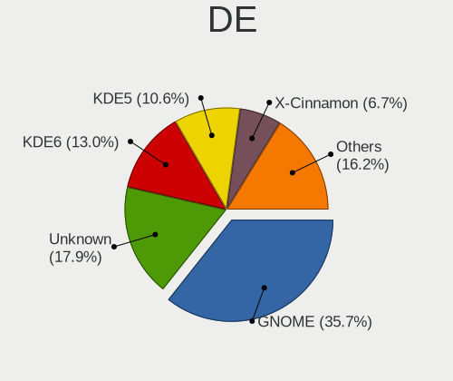
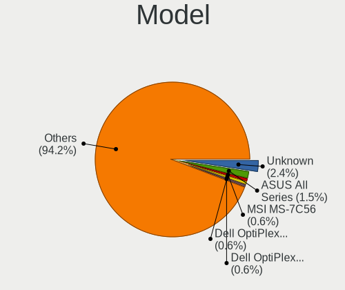
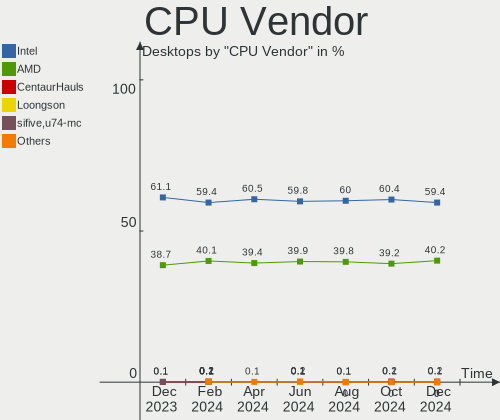
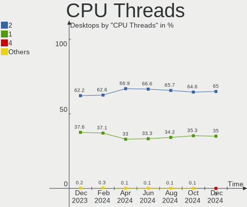
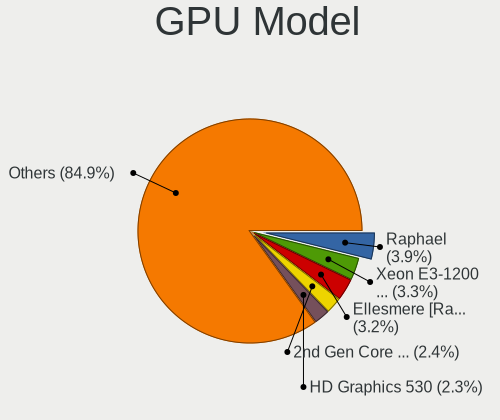
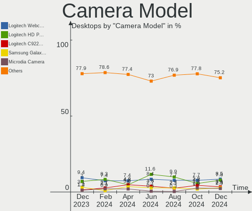

Linux Hardware Trends (Desktop)
-------------------------------

A project to identify most popular hardware characteristics and track their change
over time based on data collected by Linux users at https://Linux-Hardware.org.

Anyone can contribute to the study by uploading probes of their computers by
the [hw-probe](https://github.com/linuxhw/hw-probe) tool:

    sudo -E hw-probe -all -upload

Full-feature report is available here: https://linux-hardware.org/?view=trends&formfactor=desktop

Period: Feb, 2021.

Contents
--------

- [ OS                       ](#os)
- [ OS Family                ](#os-family)
- [ Kernel                   ](#kernel)
- [ Kernel Family            ](#kernel-family)
- [ Kernel Major Ver.        ](#kernel-major-ver)
- [ Arch                     ](#arch)
- [ DE                       ](#de)
- [ Display Server           ](#display-server)
- [ Display Manager          ](#display-manager)
- [ OS Lang                  ](#os-lang)
- [ Boot Mode                ](#boot-mode)
- [ Filesystem               ](#filesystem)
- [ Part. scheme             ](#part-scheme)
- [ Dual Boot with Linux/BSD ](#dual-boot-with-linux/bsd)
- [ Dual Boot (Win)          ](#dual-boot-win)
- [ Country                  ](#country)
- [ City                     ](#city)
- [ Vendor                   ](#vendor)
- [ Model                    ](#model)
- [ Model Family             ](#model-family)
- [ MFG Year                 ](#mfg-year)
- [ Form Factor              ](#form-factor)
- [ Secure Boot              ](#secure-boot)
- [ Coreboot                 ](#coreboot)
- [ RAM Size                 ](#ram-size)
- [ RAM Used                 ](#ram-used)
- [ Has CD-ROM               ](#has-cd-rom)
- [ Total Drives             ](#total-drives)
- [ Has Ethernet             ](#has-ethernet)
- [ Drive Vendor             ](#drive-vendor)
- [ Drive Model              ](#drive-model)
- [ HDD Vendor               ](#hdd-vendor)
- [ SSD Vendor               ](#ssd-vendor)
- [ Drive Kind               ](#drive-kind)
- [ Drive Connector          ](#drive-connector)
- [ Drive Size               ](#drive-size)
- [ Space Total              ](#space-total)
- [ Space Used               ](#space-used)
- [ Malfunc. Drives          ](#malfunc-drives)
- [ Malfunc. Drive Vendor    ](#malfunc-drive-vendor)
- [ Malfunc. HDD Vendor      ](#malfunc-hdd-vendor)
- [ Malfunc. Drive Kind      ](#malfunc-drive-kind)
- [ Failed Drives            ](#failed-drives)
- [ Failed Drive Vendor      ](#failed-drive-vendor)
- [ Drive Status             ](#drive-status)
- [ Storage Vendor           ](#storage-vendor)
- [ Storage Model            ](#storage-model)
- [ Storage Kind             ](#storage-kind)
- [ CPU Vendor               ](#cpu-vendor)
- [ CPU Model                ](#cpu-model)
- [ CPU Model Family         ](#cpu-model-family)
- [ CPU Cores                ](#cpu-cores)
- [ CPU Sockets              ](#cpu-sockets)
- [ CPU Threads              ](#cpu-threads)
- [ CPU Op-Modes             ](#cpu-op-modes)
- [ CPU Microcode            ](#cpu-microcode)
- [ CPU Microarch            ](#cpu-microarch)
- [ GPU Vendor               ](#gpu-vendor)
- [ GPU Model                ](#gpu-model)
- [ GPU Combo                ](#gpu-combo)
- [ GPU Driver               ](#gpu-driver)
- [ GPU Memory               ](#gpu-memory)
- [ Monitor Vendor           ](#monitor-vendor)
- [ Monitor Model            ](#monitor-model)
- [ Monitor Resolution       ](#monitor-resolution)
- [ Monitor Diagonal         ](#monitor-diagonal)
- [ Monitor Width            ](#monitor-width)
- [ Aspect Ratio             ](#aspect-ratio)
- [ Monitor Area             ](#monitor-area)
- [ Pixel Density            ](#pixel-density)
- [ Multiple Monitors        ](#multiple-monitors)
- [ Net Controller Vendor    ](#net-controller-vendor)
- [ Net Controller Model     ](#net-controller-model)
- [ Wireless Vendor          ](#wireless-vendor)
- [ Wireless Model           ](#wireless-model)
- [ Ethernet Vendor          ](#ethernet-vendor)
- [ Ethernet Model           ](#ethernet-model)
- [ Net Controller Kind      ](#net-controller-kind)
- [ Used Controller          ](#used-controller)
- [ NICs                     ](#nics)
- [ Memory Vendor            ](#memory-vendor)
- [ Memory Model             ](#memory-model)
- [ Memory Kind              ](#memory-kind)
- [ Memory Form Factor       ](#memory-form-factor)
- [ Memory Size              ](#memory-size)
- [ Memory Speed             ](#memory-speed)
- [ Sound Vendor             ](#sound-vendor)
- [ Sound Model              ](#sound-model)
- [ Camera Vendor            ](#camera-vendor)
- [ Camera Model             ](#camera-model)
- [ Fingerprint Vendor       ](#fingerprint-vendor)
- [ Fingerprint Model        ](#fingerprint-model)
- [ Chipcard Vendor          ](#chipcard-vendor)
- [ Chipcard Model           ](#chipcard-model)
- [ Printer Vendor           ](#printer-vendor)
- [ Printer Model            ](#printer-model)
- [ Scanner Vendor           ](#scanner-vendor)
- [ Scanner Model            ](#scanner-model)
- [ Bluetooth Vendor         ](#bluetooth-vendor)
- [ Bluetooth Model          ](#bluetooth-model)
- [ Unsupported Devices      ](#unsupported-devices)
- [ Unsupported Device Types ](#unsupported-device-types)

OS
--

Installed operating systems

| Name                | Desktops | Percent |
|---------------------|----------|---------|
| OpenMandriva 4.2    | 537      | 22.75%  |
| Ubuntu 20.04        | 510      | 21.61%  |
| Ubuntu 20.10        | 138      | 5.85%   |
| Mint 20.1           | 137      | 5.81%   |
| BlackPanther 18.1   | 89       | 3.77%   |
| Pop!_OS 20.10       | 86       | 3.64%   |
| Ubuntu 18.04        | 80       | 3.39%   |
| Fedora 33           | 80       | 3.39%   |
| ROSA R11.1          | 72       | 3.05%   |
| KDE neon 20.04      | 61       | 2.58%   |
| Manjaro             | 41       | 1.74%   |
| Manjaro 20.2.1      | 37       | 1.57%   |
| Mint 19.3           | 34       | 1.44%   |
| Debian 10           | 34       | 1.44%   |
| Arch                | 32       | 1.36%   |
| ROSA R11            | 25       | 1.06%   |
| Pop!_OS 20.04       | 23       | 0.97%   |
| Zorin 15            | 20       | 0.85%   |
| Mint 20             | 20       | 0.85%   |
| ArcoLinux Rolling   | 20       | 0.85%   |
| Arch Rolling        | 19       | 0.81%   |
| Debian Testing      | 13       | 0.55%   |
| LMDE 4              | 12       | 0.51%   |
| Fedora 32           | 12       | 0.51%   |
| Gentoo 2.7          | 9        | 0.38%   |
| Ubuntu 16.04        | 8        | 0.34%   |
| Gentoo              | 8        | 0.34%   |
| Endless 3.9.2       | 8        | 0.34%   |
| CentOS 8            | 8        | 0.34%   |
| ROSA R10            | 7        | 0.3%    |
| openSUSE Leap-15.2  | 7        | 0.3%    |
| Elementary 5.1.7    | 7        | 0.3%    |
| Kali 2020.4         | 6        | 0.25%   |
| Ubuntu              | 5        | 0.21%   |
| RED X4              | 5        | 0.21%   |
| BlackPanther 16.2   | 5        | 0.21%   |
| Ubuntu 21.04        | 4        | 0.17%   |
| ROSA R12            | 4        | 0.17%   |
| MX 19.3             | 4        | 0.17%   |
| Mint 19.2           | 4        | 0.17%   |
| Mint 19             | 4        | 0.17%   |
| Mageia 7            | 4        | 0.17%   |
| ClearOS 7           | 4        | 0.17%   |
| Zorin 12            | 3        | 0.13%   |
| Peppermint 10       | 3        | 0.13%   |
| OpenMandriva 4.1    | 3        | 0.13%   |
| Mint 19.1           | 3        | 0.13%   |
| Garuda Soaring      | 3        | 0.13%   |
| Fedora 34           | 3        | 0.13%   |
| EndeavourOS Rolling | 3        | 0.13%   |
| CentOS 7.9.2009     | 3        | 0.13%   |
| Artix               | 3        | 0.13%   |
| WindowsFX 10        | 2        | 0.08%   |
| Void                | 2        | 0.08%   |
| Ubuntu 19.04        | 2        | 0.08%   |
| Sparky 6            | 2        | 0.08%   |
| ROSA R8.1           | 2        | 0.08%   |
| RHEL 8.3            | 2        | 0.08%   |
| Reborn OS           | 2        | 0.08%   |
| Parrot 4.10         | 2        | 0.08%   |

OS Family
---------

OS without a version

| Name         | Desktops | Percent |
|--------------|----------|---------|
| Ubuntu       | 751      | 31.82%  |
| OpenMandriva | 540      | 22.88%  |
| Mint         | 205      | 8.69%   |
| ROSA         | 111      | 4.7%    |
| Pop!_OS      | 109      | 4.62%   |
| Fedora       | 98       | 4.15%   |
| BlackPanther | 94       | 3.98%   |
| Manjaro      | 78       | 3.31%   |
| KDE neon     | 61       | 2.58%   |
| Debian       | 51       | 2.16%   |
| Arch         | 51       | 2.16%   |
| Zorin        | 23       | 0.97%   |
| ArcoLinux    | 23       | 0.97%   |
| openSUSE     | 22       | 0.93%   |
| Gentoo       | 17       | 0.72%   |
| CentOS       | 13       | 0.55%   |
| LMDE         | 12       | 0.51%   |
| Endless      | 11       | 0.47%   |
| Clear Linux  | 9        | 0.38%   |
| Elementary   | 7        | 0.3%    |
| MX           | 6        | 0.25%   |
| Kali         | 6        | 0.25%   |
| ClearOS      | 6        | 0.25%   |
| RED          | 5        | 0.21%   |
| Garuda       | 5        | 0.21%   |
| Mageia       | 4        | 0.17%   |
| EndeavourOS  | 4        | 0.17%   |
| Artix        | 4        | 0.17%   |
| Void         | 3        | 0.13%   |
| Reborn OS    | 3        | 0.13%   |
| Peppermint   | 3        | 0.13%   |
| WindowsFX    | 2        | 0.08%   |
| Sparky       | 2        | 0.08%   |
| RHEL         | 2        | 0.08%   |
| Parrot       | 2        | 0.08%   |
| Oracle Linux | 2        | 0.08%   |
| Solus        | 1        | 0.04%   |
| Redcore      | 1        | 0.04%   |
| Progress     | 1        | 0.04%   |
| Peux OS      | 1        | 0.04%   |
| PCLinuxOS    | 1        | 0.04%   |
| NixOS        | 1        | 0.04%   |
| Makulu       | 1        | 0.04%   |
| Lunar        | 1        | 0.04%   |
| Hash Linux   | 1        | 0.04%   |
| Devuan       | 1        | 0.04%   |
| Deepin       | 1        | 0.04%   |
| Chrome OS    | 1        | 0.04%   |
| BunsenLabs   | 1        | 0.04%   |
| ALT Linux    | 1        | 0.04%   |
| Alpine       | 1        | 0.04%   |

Kernel
------

Version of the Linux kernel

| Version                             | Desktops | Percent |
|-------------------------------------|----------|---------|
| 5.10.14-desktop-1omv4002            | 532      | 22.54%  |
| 5.4.0-65-generic                    | 327      | 13.86%  |
| 5.8.0-43-generic                    | 217      | 9.19%   |
| 5.8.0-41-generic                    | 150      | 6.36%   |
| 5.8.0-7642-generic                  | 82       | 3.47%   |
| 4.18.16-desktop-1bP                 | 70       | 2.97%   |
| 5.4.0-66-generic                    | 67       | 2.84%   |
| 5.8.0-44-generic                    | 64       | 2.71%   |
| 4.19.0-14-amd64                     | 37       | 1.57%   |
| 4.15.0-desktop-122.124.1rosa-x86_64 | 37       | 1.57%   |
| 5.9.16-1-MANJARO                    | 34       | 1.44%   |
| 4.15.0-135-generic                  | 26       | 1.1%    |
| 5.8.0-7630-generic                  | 23       | 0.97%   |
| 5.4.0-42-generic                    | 22       | 0.93%   |
| 4.15.0-desktop-45.1rosa-x86_64      | 22       | 0.93%   |
| 5.4.0-58-generic                    | 20       | 0.85%   |
| 5.6.14-desktop-2bP                  | 19       | 0.81%   |
| 5.10.15-200.fc33.x86_64             | 18       | 0.76%   |
| 5.10.15-1-MANJARO                   | 18       | 0.76%   |
| 5.10.16-arch1-1                     | 17       | 0.72%   |
| 5.10.16-200.fc33.x86_64             | 13       | 0.55%   |
| 5.10.13-200.fc33.x86_64             | 10       | 0.42%   |
| 5.10.12-200.fc33.x86_64             | 10       | 0.42%   |
| 5.10.11-200.fc33.x86_64             | 10       | 0.42%   |
| 5.10.0-3-amd64                      | 10       | 0.42%   |
| 5.8.0-14-generic                    | 9        | 0.38%   |
| 5.4.0-65-lowlatency                 | 9        | 0.38%   |
| 5.11.0-051100-generic               | 9        | 0.38%   |
| 5.4.0-64-generic                    | 8        | 0.34%   |
| 5.4.0-62-generic                    | 8        | 0.34%   |
| 5.10.16-1-default                   | 8        | 0.34%   |
| 5.10.13-arch1-1                     | 8        | 0.34%   |
| 3.10.0-1160.15.2.el7.x86_64         | 8        | 0.34%   |
| 5.4.32-generic-2rosa-x86_64         | 7        | 0.3%    |
| 5.10.7-3-MANJARO                    | 7        | 0.3%    |
| 5.10.14-200.fc33.x86_64             | 7        | 0.3%    |
| 4.18.0-240.10.1.el8_3.x86_64        | 7        | 0.3%    |
| 4.15.0-desktop-45.1rosa-i586        | 7        | 0.3%    |
| 4.15.0-136-generic                  | 7        | 0.3%    |
| 5.3.18-lp152.63-default             | 6        | 0.25%   |
| 5.10.15-arch1-1                     | 6        | 0.25%   |
| 5.0.0-32-generic                    | 6        | 0.25%   |
| 4.9.155-nrj-desktop-1rosa-x86_64    | 6        | 0.25%   |
| 4.15.0-desktop-122.124.1rosa-i586   | 6        | 0.25%   |
| 5.8.0-40-generic                    | 5        | 0.21%   |
| 5.4.97-gentoo                       | 5        | 0.21%   |
| 5.4.83-generic-2rosa-x86_64         | 5        | 0.21%   |
| 5.11.1-arch1-1                      | 5        | 0.21%   |
| 5.10.16-100.fc32.x86_64             | 5        | 0.21%   |
| 5.10.13-desktop-1omv4002            | 5        | 0.21%   |
| 5.10.11-arch1-1                     | 5        | 0.21%   |
| 5.10.0-2-amd64                      | 5        | 0.21%   |
| 4.19.0-13-amd64                     | 5        | 0.21%   |
| 4.15.0-133-generic                  | 5        | 0.21%   |
| 5.8.0-25-generic                    | 4        | 0.17%   |
| 5.4.94-1-lts                        | 4        | 0.17%   |
| 5.11.0-1-MANJARO                    | 4        | 0.17%   |
| 5.10.13-arch1-2                     | 4        | 0.17%   |
| 4.9.60-nrj-desktop-1rosa-i586       | 4        | 0.17%   |
| 4.15.0-desktop-47.2rosa-x86_64      | 4        | 0.17%   |

Kernel Family
-------------

Linux kernel without a distro release

| Version | Desktops | Percent |
|---------|----------|---------|
| 5.8.0   | 578      | 24.49%  |
| 5.10.14 | 551      | 23.35%  |
| 5.4.0   | 490      | 20.76%  |
| 4.15.0  | 131      | 5.55%   |
| 4.18.16 | 70       | 2.97%   |
| 5.10.16 | 53       | 2.25%   |
| 5.10.15 | 48       | 2.03%   |
| 4.19.0  | 45       | 1.91%   |
| 5.10.13 | 41       | 1.74%   |
| 5.9.16  | 36       | 1.53%   |
| 5.11.0  | 29       | 1.23%   |
| 5.10.0  | 24       | 1.02%   |
| 5.10.12 | 23       | 0.97%   |
| 5.10.11 | 20       | 0.85%   |
| 5.6.14  | 19       | 0.81%   |
| 3.10.0  | 12       | 0.51%   |
| 4.18.0  | 11       | 0.47%   |
| 5.4.32  | 9        | 0.38%   |
| 5.10.17 | 9        | 0.38%   |
| 5.10.10 | 9        | 0.38%   |
| 5.0.0   | 9        | 0.38%   |
| 5.10.7  | 8        | 0.34%   |
| 5.9.0   | 7        | 0.3%    |
| 5.4.83  | 7        | 0.3%    |
| 5.3.18  | 7        | 0.3%    |
| 5.11.1  | 7        | 0.3%    |
| 4.9.60  | 7        | 0.3%    |
| 4.9.155 | 7        | 0.3%    |
| 5.4.97  | 6        | 0.25%   |
| 5.4.94  | 5        | 0.21%   |
| 5.10.18 | 5        | 0.21%   |
| 5.10.4  | 4        | 0.17%   |
| 4.4.0   | 4        | 0.17%   |
| 5.8.15  | 3        | 0.13%   |
| 5.3.0   | 3        | 0.13%   |
| 5.11.2  | 3        | 0.13%   |
| 5.10.9  | 3        | 0.13%   |
| 4.9.20  | 3        | 0.13%   |
| 5.9.12  | 2        | 0.08%   |
| 5.8.18  | 2        | 0.08%   |
| 5.7.0   | 2        | 0.08%   |
| 5.6.0   | 2        | 0.08%   |
| 5.5.19  | 2        | 0.08%   |
| 5.5.12  | 2        | 0.08%   |
| 5.4.95  | 2        | 0.08%   |
| 5.4.85  | 2        | 0.08%   |
| 5.4.80  | 2        | 0.08%   |
| 5.4.40  | 2        | 0.08%   |
| 5.4.17  | 2        | 0.08%   |
| 5.10.5  | 2        | 0.08%   |
| 5.10.2  | 2        | 0.08%   |
| 4.9.0   | 2        | 0.08%   |
| 4.13.0  | 2        | 0.08%   |
| 5.9.8   | 1        | 0.04%   |
| 5.8.9   | 1        | 0.04%   |
| 5.7.19  | 1        | 0.04%   |
| 5.7.15  | 1        | 0.04%   |
| 5.7.12  | 1        | 0.04%   |
| 5.7.1   | 1        | 0.04%   |
| 5.6.19  | 1        | 0.04%   |

Kernel Major Ver.
-----------------

Linux kernel major version

| Version | Desktops | Percent |
|---------|----------|---------|
| 5.10    | 803      | 34.03%  |
| 5.8     | 584      | 24.75%  |
| 5.4     | 535      | 22.67%  |
| 4.15    | 131      | 5.55%   |
| 4.18    | 82       | 3.47%   |
| 5.9     | 46       | 1.95%   |
| 4.19    | 45       | 1.91%   |
| 5.11    | 39       | 1.65%   |
| 5.6     | 23       | 0.97%   |
| 4.9     | 20       | 0.85%   |
| 3.10    | 12       | 0.51%   |
| 5.3     | 10       | 0.42%   |
| 5.0     | 9        | 0.38%   |
| 5.7     | 6        | 0.25%   |
| 5.5     | 5        | 0.21%   |
| 4.4     | 4        | 0.17%   |
| 4.13    | 2        | 0.08%   |
| 4.8     | 1        | 0.04%   |
| 4.7     | 1        | 0.04%   |
| 4.10    | 1        | 0.04%   |
| 3.13    | 1        | 0.04%   |

Arch
----

OS architecture (x86_64, i586, etc.)

| Name   | Desktops | Percent |
|--------|----------|---------|
| x86_64 | 2298     | 97.37%  |
| i686   | 62       | 2.63%   |

DE
--

Desktop Environment

| Name             | Desktops | Percent |
|------------------|----------|---------|
| GNOME            | 800      | 33.9%   |
| KDE5             | 761      | 32.25%  |
| X-Cinnamon       | 183      | 7.75%   |
| KDE              | 133      | 5.64%   |
| XFCE             | 126      | 5.34%   |
| Unknown          | 108      | 4.58%   |
| KDE4             | 70       | 2.97%   |
| MATE             | 63       | 2.67%   |
| Unity            | 17       | 0.72%   |
| LXQt             | 17       | 0.72%   |
| i3               | 17       | 0.72%   |
| Cinnamon         | 13       | 0.55%   |
| Budgie           | 11       | 0.47%   |
| GNOME Flashback  | 9        | 0.38%   |
| Pantheon         | 6        | 0.25%   |
| Deepin           | 6        | 0.25%   |
| LXDE             | 5        | 0.21%   |
| GNOME Classic    | 4        | 0.17%   |
| lightdm-xsession | 3        | 0.13%   |
| awesome          | 3        | 0.13%   |
| trinity          | 1        | 0.04%   |
| Peux Gnome       | 1        | 0.04%   |
| Openbox          | 1        | 0.04%   |
| DWM              | 1        | 0.04%   |
| Core             | 1        | 0.04%   |

Display Server
--------------

X11 or Wayland

| Name        | Desktops | Percent |
|-------------|----------|---------|
| X11         | 2182     | 92.46%  |
| Wayland     | 94       | 3.98%   |
| Tty         | 44       | 1.86%   |
| Unknown     | 39       | 1.65%   |
| Unspecified | 1        | 0.04%   |

Display Manager
---------------

SDDM, LightDM, etc.

| Name    | Desktops | Percent |
|---------|----------|---------|
| Unknown | 1179     | 49.96%  |
| SDDM    | 769      | 32.58%  |
| GDM     | 165      | 6.99%   |
| TDM     | 130      | 5.51%   |
| KDM     | 69       | 2.92%   |
| LightDM | 40       | 1.69%   |
| XDM     | 3        | 0.13%   |
| SLiM    | 3        | 0.13%   |
| MDM     | 1        | 0.04%   |
| LXDM    | 1        | 0.04%   |

OS Lang
-------

Language

| Lang        | Desktops | Percent |
|-------------|----------|---------|
| en_US       | 882      | 37.37%  |
| de_DE       | 228      | 9.66%   |
| ru_RU       | 176      | 7.46%   |
| Unknown     | 148      | 6.27%   |
| fr_FR       | 116      | 4.92%   |
| en_GB       | 107      | 4.53%   |
| pt_BR       | 96       | 4.07%   |
| it_IT       | 68       | 2.88%   |
| es_ES       | 61       | 2.58%   |
| pl_PL       | 56       | 2.37%   |
| en_CA       | 46       | 1.95%   |
| en_AU       | 41       | 1.74%   |
| C           | 30       | 1.27%   |
| hu_HU       | 19       | 0.81%   |
| nl_NL       | 18       | 0.76%   |
| de_AT       | 18       | 0.76%   |
| es_AR       | 16       | 0.68%   |
| cs_CZ       | 14       | 0.59%   |
| sk_SK       | 13       | 0.55%   |
| es_MX       | 13       | 0.55%   |
| en_IN       | 13       | 0.55%   |
| ru_UA       | 11       | 0.47%   |
| fi_FI       | 11       | 0.47%   |
| en_NZ       | 10       | 0.42%   |
| el_GR       | 10       | 0.42%   |
| pt_PT       | 9        | 0.38%   |
| de_CH       | 9        | 0.38%   |
| ja_JP       | 7        | 0.3%    |
| fr_BE       | 7        | 0.3%    |
| tr_TR       | 6        | 0.25%   |
| fr_CA       | 6        | 0.25%   |
| en_ZA       | 6        | 0.25%   |
| en_IL       | 6        | 0.25%   |
| sv_SE       | 5        | 0.21%   |
| ko_KR       | 5        | 0.21%   |
| es_CL       | 5        | 0.21%   |
| da_DK       | 5        | 0.21%   |
| sl_SI       | 4        | 0.17%   |
| ro_RO       | 4        | 0.17%   |
| es_CO       | 4        | 0.17%   |
| nb_NO       | 3        | 0.13%   |
| es_PE       | 3        | 0.13%   |
| en_HK       | 3        | 0.13%   |
| ca_ES       | 3        | 0.13%   |
| bg_BG       | 3        | 0.13%   |
| zh_TW       | 2        | 0.08%   |
| uk_UA       | 2        | 0.08%   |
| nl_BE       | 2        | 0.08%   |
| lv_LV       | 2        | 0.08%   |
| it_CH       | 2        | 0.08%   |
| en_IE       | 2        | 0.08%   |
| zh_CN       | 1        | 0.04%   |
| sv_FI       | 1        | 0.04%   |
| sr_RS       | 1        | 0.04%   |
| ru_RU.UTF_8 | 1        | 0.04%   |
| POSIX       | 1        | 0.04%   |
| mn_MN       | 1        | 0.04%   |
| id_ID       | 1        | 0.04%   |
| gsw_CH      | 1        | 0.04%   |
| fr_CH       | 1        | 0.04%   |

Boot Mode
---------

EFI or BIOS

| Mode | Desktops | Percent |
|------|----------|---------|
| BIOS | 1547     | 65.55%  |
| EFI  | 813      | 34.45%  |

Filesystem
----------

Type of filesystem

| Type      | Desktops | Percent |
|-----------|----------|---------|
| Ext4      | 1591     | 67.42%  |
| Overlay   | 578      | 24.49%  |
| Btrfs     | 106      | 4.49%   |
| Xfs       | 48       | 2.03%   |
| Zfs       | 10       | 0.42%   |
| Ext3      | 10       | 0.42%   |
| Ext2      | 5        | 0.21%   |
| F2fs      | 4        | 0.17%   |
| Reiserfs  | 3        | 0.13%   |
| Unknown   | 2        | 0.08%   |
| Tmpfs     | 1        | 0.04%   |
| Overlayfs | 1        | 0.04%   |
| Jfs       | 1        | 0.04%   |

Part. scheme
------------

Scheme of partitioning

| Type    | Desktops | Percent |
|---------|----------|---------|
| Unknown | 1170     | 49.58%  |
| GPT     | 671      | 28.43%  |
| MBR     | 519      | 21.99%  |

Dual Boot with Linux/BSD
------------------------

Hosting more than one Linux/BSD

| Dual boot | Desktops | Percent |
|-----------|----------|---------|
| No        | 1686     | 71.44%  |
| Yes       | 674      | 28.56%  |

Dual Boot (Win)
---------------

Hosting Linux and Windows

| Dual boot | Desktops | Percent |
|-----------|----------|---------|
| No        | 1463     | 61.99%  |
| Yes       | 897      | 38.01%  |

Country
-------

Geographic location (country)

| Country              | Desktops | Percent |
|----------------------|----------|---------|
| USA                  | 402      | 17.03%  |
| Germany              | 297      | 12.58%  |
| Russia               | 202      | 8.56%   |
| Brazil               | 133      | 5.64%   |
| France               | 123      | 5.21%   |
| Hungary              | 94       | 3.98%   |
| UK                   | 91       | 3.86%   |
| Italy                | 84       | 3.56%   |
| Poland               | 78       | 3.31%   |
| Canada               | 77       | 3.26%   |
| Spain                | 65       | 2.75%   |
| Ukraine              | 47       | 1.99%   |
| Australia            | 44       | 1.86%   |
| Netherlands          | 36       | 1.53%   |
| Switzerland          | 33       | 1.4%    |
| Greece               | 27       | 1.14%   |
| Finland              | 27       | 1.14%   |
| Austria              | 27       | 1.14%   |
| Belgium              | 25       | 1.06%   |
| Argentina            | 25       | 1.06%   |
| Slovakia             | 22       | 0.93%   |
| Mexico               | 19       | 0.81%   |
| Japan                | 18       | 0.76%   |
| India                | 18       | 0.76%   |
| Sweden               | 17       | 0.72%   |
| Romania              | 17       | 0.72%   |
| Bulgaria             | 17       | 0.72%   |
| Portugal             | 16       | 0.68%   |
| Czech Republic       | 16       | 0.68%   |
| New Zealand          | 14       | 0.59%   |
| Israel               | 13       | 0.55%   |
| South Africa         | 12       | 0.51%   |
| Denmark              | 11       | 0.47%   |
| Serbia               | 10       | 0.42%   |
| Norway               | 10       | 0.42%   |
| Turkey               | 9        | 0.38%   |
| Thailand             | 9        | 0.38%   |
| Belarus              | 9        | 0.38%   |
| Slovenia             | 8        | 0.34%   |
| Ireland              | 7        | 0.3%    |
| Indonesia            | 7        | 0.3%    |
| Hong Kong            | 7        | 0.3%    |
| China                | 7        | 0.3%    |
| Chile                | 7        | 0.3%    |
| Puerto Rico          | 6        | 0.25%   |
| Philippines          | 6        | 0.25%   |
| Lithuania            | 6        | 0.25%   |
| Korea, Republic of   | 6        | 0.25%   |
| Colombia             | 6        | 0.25%   |
| Saudi Arabia         | 5        | 0.21%   |
| Croatia              | 5        | 0.21%   |
| Peru                 | 4        | 0.17%   |
| Malaysia             | 4        | 0.17%   |
| Estonia              | 4        | 0.17%   |
| Costa Rica           | 4        | 0.17%   |
| Unknown              | 4        | 0.17%   |
| Uruguay              | 3        | 0.13%   |
| Taiwan               | 3        | 0.13%   |
| Morocco              | 3        | 0.13%   |
| Moldova, Republic of | 3        | 0.13%   |

City
----

Geographic location (city)

| City              | Desktops | Percent |
|-------------------|----------|---------|
| Moscow            | 39       | 1.65%   |
| Budapest          | 26       | 1.1%    |
| St Petersburg     | 21       | 0.89%   |
| Berlin            | 21       | 0.89%   |
| Warsaw            | 14       | 0.59%   |
| Vienna            | 14       | 0.59%   |
| Sydney            | 14       | 0.59%   |
| Helsinki          | 14       | 0.59%   |
| Frankfurt am Main | 14       | 0.59%   |
| Rio de Janeiro    | 13       | 0.55%   |
| Paris             | 12       | 0.51%   |
| Hamburg           | 12       | 0.51%   |
| Rome              | 11       | 0.47%   |
| Kyiv              | 11       | 0.47%   |
| Athens            | 11       | 0.47%   |
| São Paulo        | 10       | 0.42%   |
| Leipzig           | 10       | 0.42%   |
| Bratislava        | 10       | 0.42%   |
| Prague            | 9        | 0.38%   |
| Munich            | 9        | 0.38%   |
| Poznan            | 8        | 0.34%   |
| Minneapolis       | 8        | 0.34%   |
| Milan             | 8        | 0.34%   |
| Madrid            | 8        | 0.34%   |
| Barnaul           | 8        | 0.34%   |
| Barcelona         | 8        | 0.34%   |
| Toronto           | 7        | 0.3%    |
| Thessaloniki      | 7        | 0.3%    |
| Sofia             | 7        | 0.3%    |
| Wrocław          | 6        | 0.25%   |
| Seattle           | 6        | 0.25%   |
| Samara            | 6        | 0.25%   |
| Portland          | 6        | 0.25%   |
| London            | 6        | 0.25%   |
| Edmonton          | 6        | 0.25%   |
| Düsseldorf       | 6        | 0.25%   |
| Curitiba          | 6        | 0.25%   |
| Turin             | 5        | 0.21%   |
| Porto Alegre      | 5        | 0.21%   |
| Perth             | 5        | 0.21%   |
| Perm              | 5        | 0.21%   |
| Ottawa            | 5        | 0.21%   |
| Krakow            | 5        | 0.21%   |
| Jacksonville      | 5        | 0.21%   |
| Istanbul          | 5        | 0.21%   |
| Ekaterinburg      | 5        | 0.21%   |
| Chicago           | 5        | 0.21%   |
| Central Coast     | 5        | 0.21%   |
| Central           | 5        | 0.21%   |
| Buenos Aires      | 5        | 0.21%   |
| Auckland          | 5        | 0.21%   |
| Adelaide          | 5        | 0.21%   |
| Zurich            | 4        | 0.17%   |
| Stuttgart         | 4        | 0.17%   |
| San Jose          | 4        | 0.17%   |
| Richmond          | 4        | 0.17%   |
| Pretoria          | 4        | 0.17%   |
| Porto             | 4        | 0.17%   |
| Phoenix           | 4        | 0.17%   |
| Novosibirsk       | 4        | 0.17%   |

Vendor
------

Motherboard manufacturer

| Name                            | Desktops | Percent |
|---------------------------------|----------|---------|
| ASUSTek Computer                | 605      | 25.64%  |
| Gigabyte Technology             | 446      | 18.9%   |
| MSI                             | 291      | 12.33%  |
| ASRock                          | 231      | 9.79%   |
| Dell                            | 205      | 8.69%   |
| Hewlett-Packard                 | 133      | 5.64%   |
| Lenovo                          | 77       | 3.26%   |
| Intel                           | 61       | 2.58%   |
| Acer                            | 45       | 1.91%   |
| Biostar                         | 29       | 1.23%   |
| Pegatron                        | 26       | 1.1%    |
| Foxconn                         | 23       | 0.97%   |
| ECS                             | 23       | 0.97%   |
| Medion                          | 21       | 0.89%   |
| Unknown                         | 21       | 0.89%   |
| Fujitsu                         | 20       | 0.85%   |
| Supermicro                      | 7        | 0.3%    |
| Shuttle                         | 6        | 0.25%   |
| Packard Bell                    | 6        | 0.25%   |
| Gateway                         | 5        | 0.21%   |
| Fujitsu Siemens                 | 5        | 0.21%   |
| eMachines                       | 5        | 0.21%   |
| Apple                           | 5        | 0.21%   |
| Alienware                       | 4        | 0.17%   |
| Positivo                        | 3        | 0.13%   |
| PCWare                          | 3        | 0.13%   |
| NEC Computers                   | 3        | 0.13%   |
| Huanan                          | 3        | 0.13%   |
| AMI                             | 3        | 0.13%   |
| ZOTAC                           | 2        | 0.08%   |
| TONK                            | 2        | 0.08%   |
| PCChips                         | 2        | 0.08%   |
| JINGSHA                         | 2        | 0.08%   |
| Itautec                         | 2        | 0.08%   |
| Intel X79                       | 2        | 0.08%   |
| AZW                             | 2        | 0.08%   |
| ASRockRack                      | 2        | 0.08%   |
| AMD                             | 2        | 0.08%   |
| ABIT                            | 2        | 0.08%   |
| VIA Technologies                | 1        | 0.04%   |
| Universal Scientific Industrial | 1        | 0.04%   |
| SZMZ                            | 1        | 0.04%   |
| System76                        | 1        | 0.04%   |
| Semp Toshiba                    | 1        | 0.04%   |
| Seco                            | 1        | 0.04%   |
| Qbex                            | 1        | 0.04%   |
| Protectli                       | 1        | 0.04%   |
| Philco                          | 1        | 0.04%   |
| Minix                           | 1        | 0.04%   |
| LORD ELECTRONICS                | 1        | 0.04%   |
| LIVEFAN                         | 1        | 0.04%   |
| Lite-On                         | 1        | 0.04%   |
| Kraftway                        | 1        | 0.04%   |
| JOOYON                          | 1        | 0.04%   |
| Inventec                        | 1        | 0.04%   |
| iEi                             | 1        | 0.04%   |
| IBM                             | 1        | 0.04%   |
| HEDYCOMPUTER                    | 1        | 0.04%   |
| HARDKERNEL                      | 1        | 0.04%   |
| EVGA                            | 1        | 0.04%   |

Model
-----

Motherboard model

| Name                         | Desktops | Percent |
|------------------------------|----------|---------|
| ASUS All Series              | 45       | 1.91%   |
| Unknown                      | 22       | 0.93%   |
| ASUS TUF GAMING X570-PLUS    | 18       | 0.76%   |
| MSI MS-7A38                  | 16       | 0.68%   |
| MSI MS-7C02                  | 13       | 0.55%   |
| Dell OptiPlex 780            | 13       | 0.55%   |
| Dell OptiPlex 7010           | 13       | 0.55%   |
| MSI MS-7B86                  | 11       | 0.47%   |
| MSI MS-7721                  | 10       | 0.42%   |
| Gigabyte B450M DS3H          | 10       | 0.42%   |
| MSI MS-7C37                  | 9        | 0.38%   |
| Gigabyte G31M-ES2L           | 9        | 0.38%   |
| Dell OptiPlex 390            | 9        | 0.38%   |
| ASUS ROG STRIX B450-F GAMING | 9        | 0.38%   |
| ASUS PRIME A320M-K           | 9        | 0.38%   |
| MSI MS-7C75                  | 8        | 0.34%   |
| MSI MS-7B79                  | 8        | 0.34%   |
| MSI MS-7817                  | 8        | 0.34%   |
| Gigabyte 970A-DS3P           | 8        | 0.34%   |
| Dell OptiPlex 790            | 8        | 0.34%   |
| ASUS PRIME B450M-A           | 8        | 0.34%   |
| ASUS PRIME B350-PLUS         | 8        | 0.34%   |
| ASUS M5A78L-M/USB3           | 8        | 0.34%   |
| Gigabyte A320M-S2H           | 7        | 0.3%    |
| Dell OptiPlex 3020           | 7        | 0.3%    |
| ASUS M5A97 R2.0              | 7        | 0.3%    |
| MSI MS-7C52                  | 6        | 0.25%   |
| HP Compaq Pro 6300 SFF       | 6        | 0.25%   |
| HP Compaq Elite 8300 SFF     | 6        | 0.25%   |
| Gigabyte B450 AORUS ELITE    | 6        | 0.25%   |
| Dell OptiPlex 990            | 6        | 0.25%   |
| ASUS PRIME X470-PRO          | 6        | 0.25%   |
| ASUS P8Z77-V LX              | 6        | 0.25%   |
| ASRock G41M-VS3              | 6        | 0.25%   |
| MSI MS-7B89                  | 5        | 0.21%   |
| MSI MS-7A34                  | 5        | 0.21%   |
| MSI MS-7693                  | 5        | 0.21%   |
| HP ProLiant MicroServer      | 5        | 0.21%   |
| Gigabyte X570 AORUS PRO WIFI | 5        | 0.21%   |
| Gigabyte X570 AORUS ELITE    | 5        | 0.21%   |
| Gigabyte GA-78LMT-USB3 6.0   | 5        | 0.21%   |
| Gigabyte B75M-D3H            | 5        | 0.21%   |
| Gigabyte A320M-H             | 5        | 0.21%   |
| Dell OptiPlex 9020           | 5        | 0.21%   |
| Dell OptiPlex 7040           | 5        | 0.21%   |
| Dell OptiPlex 3040           | 5        | 0.21%   |
| Dell Inspiron 530            | 5        | 0.21%   |
| ASUS ROG STRIX X570-E GAMING | 5        | 0.21%   |
| ASUS PRIME Z390-P            | 5        | 0.21%   |
| ASUS PRIME X370-PRO          | 5        | 0.21%   |
| ASUS PRIME B450-PLUS         | 5        | 0.21%   |
| ASUS M5A78L/USB3             | 5        | 0.21%   |
| ASRock N68C-S UCC            | 5        | 0.21%   |
| ASRock B450M Pro4            | 5        | 0.21%   |
| ASRock A320M-HDV R4.0        | 5        | 0.21%   |
| MSI MS-7B22                  | 4        | 0.17%   |
| MSI MS-7996                  | 4        | 0.17%   |
| MSI MS-7821                  | 4        | 0.17%   |
| MSI MS-7267                  | 4        | 0.17%   |
| HP EliteDesk 800 G1 SFF      | 4        | 0.17%   |

Model Family
------------

Motherboard model prefix

| Name                   | Desktops | Percent |
|------------------------|----------|---------|
| Dell OptiPlex          | 120      | 5.08%   |
| ASUS PRIME             | 109      | 4.62%   |
| HP Compaq              | 53       | 2.25%   |
| ASUS ROG               | 53       | 2.25%   |
| Lenovo ThinkCentre     | 51       | 2.16%   |
| ASUS All               | 45       | 1.91%   |
| ASUS TUF               | 41       | 1.74%   |
| Acer Aspire            | 32       | 1.36%   |
| Dell Inspiron          | 27       | 1.14%   |
| Dell Precision         | 26       | 1.1%    |
| Unknown                | 22       | 0.93%   |
| Gigabyte X570          | 20       | 0.85%   |
| ASUS M5A78L-M          | 20       | 0.85%   |
| Gigabyte B450          | 17       | 0.72%   |
| MSI MS-7A38            | 16       | 0.68%   |
| Gigabyte B450M         | 16       | 0.68%   |
| ASUS P8H61-M           | 16       | 0.68%   |
| Fujitsu ESPRIMO        | 15       | 0.64%   |
| Gigabyte Z390          | 14       | 0.59%   |
| MSI MS-7C02            | 13       | 0.55%   |
| HP EliteDesk           | 13       | 0.55%   |
| ASRock X570            | 13       | 0.55%   |
| Dell Vostro            | 12       | 0.51%   |
| ASUS P8Z77-V           | 12       | 0.51%   |
| ASUS M5A97             | 12       | 0.51%   |
| MSI MS-7B86            | 11       | 0.47%   |
| Gigabyte A320M-S2H     | 11       | 0.47%   |
| ASUS SABERTOOTH        | 11       | 0.47%   |
| MSI MS-7721            | 10       | 0.42%   |
| MSI MS-7C37            | 9        | 0.38%   |
| Lenovo IdeaCentre      | 9        | 0.38%   |
| HP Pavilion            | 9        | 0.38%   |
| Gigabyte H310M         | 9        | 0.38%   |
| Gigabyte GA-78LMT-USB3 | 9        | 0.38%   |
| Gigabyte G31M-ES2L     | 9        | 0.38%   |
| Dell XPS               | 9        | 0.38%   |
| ASRock A320M-HDV       | 9        | 0.38%   |
| Acer Veriton           | 9        | 0.38%   |
| MSI MS-7C75            | 8        | 0.34%   |
| MSI MS-7B79            | 8        | 0.34%   |
| MSI MS-7817            | 8        | 0.34%   |
| HP ProLiant            | 8        | 0.34%   |
| Gigabyte 970A-DS3P     | 8        | 0.34%   |
| ASUS P5K               | 8        | 0.34%   |
| ASRock B450M           | 8        | 0.34%   |
| ASRock 970             | 8        | 0.34%   |
| HP ProDesk             | 7        | 0.3%    |
| Gigabyte AB350-Gaming  | 7        | 0.3%    |
| ASUS P8H77-V           | 7        | 0.3%    |
| ASUS P5KPL-AM          | 7        | 0.3%    |
| ASUS P5G41T-M          | 7        | 0.3%    |
| ASUS Maximus           | 7        | 0.3%    |
| MSI MS-7C52            | 6        | 0.25%   |
| Intel X99              | 6        | 0.25%   |
| Intel H55              | 6        | 0.25%   |
| ASUS P9X79             | 6        | 0.25%   |
| ASUS P8P67             | 6        | 0.25%   |
| ASUS P5Q               | 6        | 0.25%   |
| ASUS M5A78L            | 6        | 0.25%   |
| ASRock N68C-S          | 6        | 0.25%   |

MFG Year
--------

Motherboard manufacture year

| Year    | Desktops | Percent |
|---------|----------|---------|
| 2020    | 366      | 15.51%  |
| 2019    | 244      | 10.34%  |
| 2018    | 208      | 8.81%   |
| 2013    | 192      | 8.14%   |
| 2012    | 174      | 7.37%   |
| 2010    | 171      | 7.25%   |
| 2011    | 167      | 7.08%   |
| 2014    | 164      | 6.95%   |
| 2009    | 130      | 5.51%   |
| 2016    | 112      | 4.75%   |
| 2015    | 106      | 4.49%   |
| 2017    | 82       | 3.47%   |
| 2008    | 81       | 3.43%   |
| 2007    | 60       | 2.54%   |
| 2021    | 57       | 2.42%   |
| 2006    | 25       | 1.06%   |
| 2005    | 15       | 0.64%   |
| 2004    | 2        | 0.08%   |
| 2003    | 1        | 0.04%   |
| 2002    | 1        | 0.04%   |
| 2000    | 1        | 0.04%   |
| Unknown | 1        | 0.04%   |

Form Factor
-----------

Physical design of the computer

| Name    | Desktops | Percent |
|---------|----------|---------|
| Desktop | 2360     | 100%    |

Secure Boot
-----------

Enabled or disabled

| State    | Desktops | Percent |
|----------|----------|---------|
| Disabled | 2328     | 98.64%  |
| Enabled  | 32       | 1.36%   |

Coreboot
--------

Have coreboot on board

| Used | Desktops | Percent |
|------|----------|---------|
| No   | 2360     | 100%    |

RAM Size
--------

Total RAM memory

| Size in GB      | Desktops | Percent |
|-----------------|----------|---------|
| 16.01-24.0      | 534      | 22.63%  |
| 8.01-16.0       | 492      | 20.85%  |
| 3.01-4.0        | 439      | 18.6%   |
| 4.01-8.0        | 360      | 15.25%  |
| 32.01-64.0      | 283      | 11.99%  |
| 1.01-2.0        | 87       | 3.69%   |
| 64.01-256.0     | 74       | 3.14%   |
| 24.01-32.0      | 43       | 1.82%   |
| 2.01-3.0        | 38       | 1.61%   |
| 0.51-1.0        | 7        | 0.3%    |
| More than 256.0 | 2        | 0.08%   |
| 0.01-0.5        | 1        | 0.04%   |

RAM Used
--------

Used RAM memory

| Used GB     | Desktops | Percent |
|-------------|----------|---------|
| 1.01-2.0    | 1082     | 45.85%  |
| 2.01-3.0    | 431      | 18.26%  |
| 0.51-1.0    | 252      | 10.68%  |
| 4.01-8.0    | 219      | 9.28%   |
| 3.01-4.0    | 207      | 8.77%   |
| 0.01-0.5    | 78       | 3.31%   |
| 8.01-16.0   | 69       | 2.92%   |
| 16.01-24.0  | 15       | 0.64%   |
| 24.01-32.0  | 4        | 0.17%   |
| 32.01-64.0  | 1        | 0.04%   |
| 64.01-256.0 | 1        | 0.04%   |
| Unknown     | 1        | 0.04%   |

Has CD-ROM
----------

Has CD-ROM on board

| Presented | Desktops | Percent |
|-----------|----------|---------|
| Yes       | 1266     | 53.64%  |
| No        | 1094     | 46.36%  |

Total Drives
------------

Number of drives on board

| Drives | Desktops | Percent |
|--------|----------|---------|
| 1      | 954      | 40.42%  |
| 2      | 630      | 26.69%  |
| 3      | 382      | 16.19%  |
| 4      | 219      | 9.28%   |
| 5      | 78       | 3.31%   |
| 6      | 35       | 1.48%   |
| 7      | 20       | 0.85%   |
| 0      | 20       | 0.85%   |
| 8      | 10       | 0.42%   |
| 10     | 5        | 0.21%   |
| 11     | 2        | 0.08%   |
| 9      | 2        | 0.08%   |
| 18     | 1        | 0.04%   |
| 16     | 1        | 0.04%   |
| 14     | 1        | 0.04%   |

Has Ethernet
------------

Has Ethernet on board

| Presented | Desktops | Percent |
|-----------|----------|---------|
| Yes       | 2336     | 98.98%  |
| No        | 24       | 1.02%   |

Drive Vendor
------------

Hard drive vendors

| Vendor                    | Desktops | Drives | Percent |
|---------------------------|----------|--------|---------|
| WDC                       | 886      | 1249   | 21.19%  |
| Seagate                   | 818      | 1047   | 19.56%  |
| Samsung Electronics       | 591      | 790    | 14.14%  |
| Kingston                  | 252      | 283    | 6.03%   |
| Toshiba                   | 231      | 260    | 5.52%   |
| SanDisk                   | 185      | 204    | 4.42%   |
| Hitachi                   | 168      | 180    | 4.02%   |
| Crucial                   | 167      | 195    | 3.99%   |
| A-DATA Technology         | 72       | 75     | 1.72%   |
| MAXTOR                    | 57       | 63     | 1.36%   |
| Intel                     | 54       | 57     | 1.29%   |
| Unknown                   | 53       | 60     | 1.27%   |
| HGST                      | 40       | 51     | 0.96%   |
| Phison                    | 38       | 44     | 0.91%   |
| China                     | 37       | 37     | 0.88%   |
| Patriot                   | 32       | 35     | 0.77%   |
| Intenso                   | 32       | 36     | 0.77%   |
| Corsair                   | 31       | 33     | 0.74%   |
| PNY                       | 25       | 27     | 0.6%    |
| Silicon Motion            | 23       | 25     | 0.55%   |
| GOODRAM                   | 23       | 23     | 0.55%   |
| SPCC                      | 22       | 22     | 0.53%   |
| OCZ                       | 21       | 21     | 0.5%    |
| Transcend                 | 20       | 20     | 0.48%   |
| SK Hynix                  | 20       | 23     | 0.48%   |
| XPG                       | 13       | 15     | 0.31%   |
| PLEXTOR                   | 13       | 14     | 0.31%   |
| KingSpec                  | 11       | 11     | 0.26%   |
| Hewlett-Packard           | 11       | 12     | 0.26%   |
| Micron Technology         | 10       | 11     | 0.24%   |
| LITEON                    | 10       | 10     | 0.24%   |
| Gigabyte Technology       | 10       | 10     | 0.24%   |
| Apacer                    | 10       | 11     | 0.24%   |
| Team                      | 9        | 9      | 0.22%   |
| Mushkin                   | 7        | 7      | 0.17%   |
| Micron/Crucial Technology | 7        | 7      | 0.17%   |
| Realtek Semiconductor     | 6        | 6      | 0.14%   |
| JMicron                   | 6        | 6      | 0.14%   |
| WD MediaMax               | 5        | 5      | 0.12%   |
| Smartbuy                  | 5        | 5      | 0.12%   |
| KingDian                  | 5        | 5      | 0.12%   |
| Fujitsu                   | 5        | 5      | 0.12%   |
| ASMT                      | 5        | 5      | 0.12%   |
| asmedia                   | 5        | 5      | 0.12%   |
| TO Exter                  | 4        | 4      | 0.1%    |
| Lite-On                   | 4        | 4      | 0.1%    |
| KingFast                  | 4        | 4      | 0.1%    |
| Apple                     | 4        | 4      | 0.1%    |
| XrayDisk                  | 3        | 3      | 0.07%   |
| USB                       | 3        | 3      | 0.07%   |
| T-FORCE                   | 3        | 4      | 0.07%   |
| SABRENT                   | 3        | 3      | 0.07%   |
| QUMO                      | 3        | 3      | 0.07%   |
| LITEONIT                  | 3        | 3      | 0.07%   |
| Lexar                     | 3        | 3      | 0.07%   |
| KIOXIA-EXCERIA            | 3        | 3      | 0.07%   |
| HS-SSD-C100               | 3        | 3      | 0.07%   |
| DOGGO                     | 3        | 3      | 0.07%   |
| Verbatim                  | 2        | 2      | 0.05%   |
| TCSUNBOW                  | 2        | 2      | 0.05%   |

Drive Model
-----------

Hard drive models

| Model                            | Desktops | Percent |
|----------------------------------|----------|---------|
| Seagate ST500DM002-1BD142 500GB  | 70       | 1.43%   |
| Seagate ST1000DM010-2EP102 1TB   | 55       | 1.12%   |
| Kingston SA400S37240G 240GB SSD  | 51       | 1.04%   |
| Toshiba DT01ACA100 1TB           | 46       | 0.94%   |
| Samsung SSD 860 EVO 500GB        | 42       | 0.86%   |
| Kingston SA400S37120G 120GB SSD  | 40       | 0.82%   |
| WDC WD10EZEX-08WN4A0 1TB         | 39       | 0.8%    |
| Kingston SV300S37A120G 120GB SSD | 34       | 0.7%    |
| Toshiba HDWD110 1TB              | 32       | 0.65%   |
| Seagate ST1000DM003-1CH162 1TB   | 32       | 0.65%   |
| Seagate ST31000528AS 1TB         | 30       | 0.61%   |
| Seagate ST2000DM008-2FR102 2TB   | 30       | 0.61%   |
| WDC WDS240G2G0A-00JH30 240GB SSD | 28       | 0.57%   |
| Seagate ST3500418AS 500GB        | 28       | 0.57%   |
| Samsung NVMe SSD Drive 500GB     | 28       | 0.57%   |
| WDC WD10EZEX-00BN5A0 1TB         | 27       | 0.55%   |
| Samsung SSD 850 EVO 500GB        | 27       | 0.55%   |
| Samsung SSD 850 EVO 250GB        | 27       | 0.55%   |
| Toshiba DT01ACA050 500GB         | 26       | 0.53%   |
| Samsung SSD 860 EVO 250GB        | 26       | 0.53%   |
| Samsung SSD 860 EVO 1TB          | 26       | 0.53%   |
| Toshiba DT01ACA200 2TB           | 25       | 0.51%   |
| Kingston SA400S37480G 480GB SSD  | 25       | 0.51%   |
| Unknown SD/MMC/MS PRO 64GB       | 22       | 0.45%   |
| Seagate ST1000DM003-1ER162 1TB   | 22       | 0.45%   |
| Samsung SSD 840 EVO 250GB        | 22       | 0.45%   |
| Seagate ST2000DM006-2DM164 2TB   | 21       | 0.43%   |
| Crucial CT240BX500SSD1 240GB     | 21       | 0.43%   |
| SanDisk SSD PLUS 240GB           | 20       | 0.41%   |
| Samsung NVMe SSD Drive 1TB       | 20       | 0.41%   |
| Crucial CT500MX500SSD1 500GB     | 20       | 0.41%   |
| Seagate ST4000DM004-2CV104 4TB   | 19       | 0.39%   |
| Samsung HD103SJ 1TB              | 19       | 0.39%   |
| Crucial CT1000MX500SSD1 1TB      | 19       | 0.39%   |
| WDC WDS500G2B0A-00SM50 500GB SSD | 16       | 0.33%   |
| WDC WD20EZRZ-00Z5HB0 2TB         | 16       | 0.33%   |
| Seagate ST1000DM003-1SB102 1TB   | 16       | 0.33%   |
| Sandisk NVMe SSD Drive 500GB     | 16       | 0.33%   |
| Samsung SSD 970 EVO Plus 500GB   | 16       | 0.33%   |
| Samsung NVMe SSD Drive 250GB     | 16       | 0.33%   |
| WDC WD10EZEX-22MFCA0 1TB         | 15       | 0.31%   |
| Seagate ST1000DM003-9YN162 1TB   | 15       | 0.31%   |
| Samsung SSD 970 EVO Plus 1TB     | 15       | 0.31%   |
| WDC WD20EZRX-00D8PB0 2TB         | 14       | 0.29%   |
| Seagate ST2000DM001-1ER164 2TB   | 14       | 0.29%   |
| Seagate ST2000DM001-1CH164 2TB   | 14       | 0.29%   |
| Seagate Expansion 500GB          | 14       | 0.29%   |
| Samsung HD502HJ 500GB            | 14       | 0.29%   |
| Samsung HD501LJ 500GB            | 14       | 0.29%   |
| Crucial CT120BX500SSD1 120GB     | 14       | 0.29%   |
| WDC WDS240G2G0B-00EPW0 240GB SSD | 13       | 0.27%   |
| WDC WD5000AAKX-60U6AA0 500GB     | 13       | 0.27%   |
| Toshiba HDWD130 3TB              | 13       | 0.27%   |
| Toshiba DT01ACA300 3TB           | 13       | 0.27%   |
| Seagate ST3500413AS 500GB        | 13       | 0.27%   |
| Crucial CT480BX500SSD1 480GB     | 13       | 0.27%   |
| WDC WD40EFRX-68N32N0 4TB         | 12       | 0.25%   |
| WDC WD10EZEX-00WN4A0 1TB         | 12       | 0.25%   |
| WDC WD1003FZEX-00MK2A0 1TB       | 12       | 0.25%   |
| WDC WD1002FAEX-00Z3A0 1TB        | 12       | 0.25%   |

HDD Vendor
----------

Hard disk drive vendors

| Vendor              | Desktops | Drives | Percent |
|---------------------|----------|--------|---------|
| Seagate             | 806      | 1018   | 35.06%  |
| WDC                 | 800      | 1084   | 34.8%   |
| Toshiba             | 214      | 239    | 9.31%   |
| Hitachi             | 168      | 180    | 7.31%   |
| Samsung Electronics | 166      | 190    | 7.22%   |
| Maxtor              | 56       | 62     | 2.44%   |
| HGST                | 40       | 51     | 1.74%   |
| Hewlett-Packard     | 5        | 5      | 0.22%   |
| Fujitsu             | 5        | 5      | 0.22%   |
| Asmedia             | 5        | 5      | 0.22%   |
| WD MediaMax         | 4        | 4      | 0.17%   |
| TO Exter            | 4        | 4      | 0.17%   |
| Intenso             | 4        | 4      | 0.17%   |
| USB                 | 3        | 3      | 0.13%   |
| Unknown             | 3        | 4      | 0.13%   |
| Apple               | 3        | 3      | 0.13%   |
| IBM/Hitachi         | 2        | 2      | 0.09%   |
| ASMT109x            | 2        | 3      | 0.09%   |
| ASMT                | 2        | 2      | 0.09%   |
| Quantum             | 1        | 1      | 0.04%   |
| Msft                | 1        | 2      | 0.04%   |
| KESU                | 1        | 1      | 0.04%   |
| Inateck             | 1        | 1      | 0.04%   |
| ICY BOX             | 1        | 1      | 0.04%   |
| FC-1307             | 1        | 1      | 0.04%   |
| ExcelStor           | 1        | 1      | 0.04%   |

SSD Vendor
----------

Solid state drive vendors

| Vendor              | Desktops | Drives | Percent |
|---------------------|----------|--------|---------|
| Samsung Electronics | 312      | 394    | 21.38%  |
| Kingston            | 227      | 250    | 15.56%  |
| Crucial             | 151      | 176    | 10.35%  |
| SanDisk             | 142      | 156    | 9.73%   |
| WDC                 | 111      | 116    | 7.61%   |
| A-DATA Technology   | 65       | 68     | 4.46%   |
| China               | 36       | 36     | 2.47%   |
| Patriot             | 30       | 33     | 2.06%   |
| Intel               | 30       | 31     | 2.06%   |
| Intenso             | 26       | 27     | 1.78%   |
| PNY                 | 24       | 26     | 1.64%   |
| GOODRAM             | 23       | 23     | 1.58%   |
| Corsair             | 21       | 21     | 1.44%   |
| OCZ                 | 20       | 20     | 1.37%   |
| Transcend           | 19       | 19     | 1.3%    |
| SPCC                | 19       | 19     | 1.3%    |
| Toshiba             | 12       | 13     | 0.82%   |
| Unknown             | 11       | 11     | 0.75%   |
| SK Hynix            | 11       | 14     | 0.75%   |
| PLEXTOR             | 11       | 12     | 0.75%   |
| KingSpec            | 11       | 11     | 0.75%   |
| Seagate             | 9        | 9      | 0.62%   |
| LITEON              | 9        | 9      | 0.62%   |
| Apacer              | 9        | 10     | 0.62%   |
| Micron Technology   | 8        | 9      | 0.55%   |
| Team                | 7        | 7      | 0.48%   |
| Gigabyte Technology | 7        | 7      | 0.48%   |
| Mushkin             | 5        | 5      | 0.34%   |
| KingDian            | 5        | 5      | 0.34%   |
| Hewlett-Packard     | 5        | 5      | 0.34%   |
| Smartbuy            | 4        | 4      | 0.27%   |
| SABRENT             | 3        | 3      | 0.21%   |
| QUMO                | 3        | 3      | 0.21%   |
| LITEONIT            | 3        | 3      | 0.21%   |
| Lexar               | 3        | 3      | 0.21%   |
| JMicron             | 3        | 3      | 0.21%   |
| DOGGO               | 3        | 3      | 0.21%   |
| ASMT                | 3        | 3      | 0.21%   |
| XrayDisk            | 2        | 2      | 0.14%   |
| Verbatim            | 2        | 2      | 0.14%   |
| TCSUNBOW            | 2        | 2      | 0.14%   |
| T-FORCE             | 2        | 2      | 0.14%   |
| PNY USB             | 2        | 2      | 0.14%   |
| OCZ-VERTEX2         | 2        | 2      | 0.14%   |
| Leven               | 2        | 2      | 0.14%   |
| KIOXIA-EXCERIA      | 2        | 2      | 0.14%   |
| KingFast            | 2        | 2      | 0.14%   |
| Integral            | 2        | 2      | 0.14%   |
| INDMEM              | 2        | 2      | 0.14%   |
| External            | 2        | 2      | 0.14%   |
| DOGFISH             | 2        | 2      | 0.14%   |
| AMD                 | 2        | 4      | 0.14%   |
| Zheino              | 1        | 1      | 0.07%   |
| XSTAR               | 1        | 1      | 0.07%   |
| ViperTeq            | 1        | 1      | 0.07%   |
| Vaseky              | 1        | 1      | 0.07%   |
| ULTIMATE            | 1        | 1      | 0.07%   |
| Tigo                | 1        | 1      | 0.07%   |
| Super Talent        | 1        | 1      | 0.07%   |
| Platinet            | 1        | 1      | 0.07%   |

Drive Kind
----------

HDD or SSD

| Kind    | Desktops | Drives | Percent |
|---------|----------|--------|---------|
| HDD     | 1777     | 2876   | 50.77%  |
| SSD     | 1203     | 1632   | 34.37%  |
| NVMe    | 429      | 549    | 12.26%  |
| Unknown | 80       | 91     | 2.29%   |
| MMC     | 11       | 11     | 0.31%   |

Drive Connector
---------------

SATA, SAS, NVMe, etc.

| Type | Desktops | Drives | Percent |
|------|----------|--------|---------|
| SATA | 2224     | 4381   | 79.06%  |
| NVMe | 429      | 548    | 15.25%  |
| SAS  | 149      | 219    | 5.3%    |
| MMC  | 11       | 11     | 0.39%   |

Drive Size
----------

Size of hard drive

| Size in TB | Desktops | Drives | Percent |
|------------|----------|--------|---------|
| 0.01-0.5   | 1710     | 2516   | 52.83%  |
| 0.51-1.0   | 905      | 1161   | 27.96%  |
| 1.01-2.0   | 329      | 415    | 10.16%  |
| 3.01-4.0   | 129      | 186    | 3.99%   |
| 2.01-3.0   | 93       | 125    | 2.87%   |
| 4.01-10.0  | 62       | 93     | 1.92%   |
| 10.01-20.0 | 9        | 12     | 0.28%   |

Space Total
-----------

Amount of disk space available on the file system

| Size in GB     | Desktops | Percent |
|----------------|----------|---------|
| 101-250        | 477      | 20.21%  |
| 251-500        | 367      | 15.55%  |
| 1-20           | 356      | 15.08%  |
| 501-1000       | 305      | 12.92%  |
| 1001-2000      | 203      | 8.6%    |
| Unknown        | 191      | 8.09%   |
| More than 3000 | 178      | 7.54%   |
| 51-100         | 123      | 5.21%   |
| 2001-3000      | 89       | 3.77%   |
| 21-50          | 71       | 3.01%   |

Space Used
----------

Amount of used disk space

| Used GB        | Desktops | Percent |
|----------------|----------|---------|
| 1-20           | 993      | 42.08%  |
| 21-50          | 304      | 12.88%  |
| 101-250        | 199      | 8.43%   |
| Unknown        | 191      | 8.09%   |
| 251-500        | 166      | 7.03%   |
| 51-100         | 160      | 6.78%   |
| 501-1000       | 133      | 5.64%   |
| 1001-2000      | 99       | 4.19%   |
| More than 3000 | 78       | 3.31%   |
| 2001-3000      | 37       | 1.57%   |

Malfunc. Drives
---------------

Drive models with a malfunction

| Model                                 | Desktops | Drives | Percent |
|---------------------------------------|----------|--------|---------|
| Seagate ST500DM002-1BD142 500GB       | 15       | 15     | 3.35%   |
| Seagate ST3500418AS 500GB             | 10       | 11     | 2.23%   |
| Kingston SV300S37A120G 120GB SSD      | 5        | 5      | 1.12%   |
| WDC WD5000AADS-00S9B0 500GB           | 4        | 4      | 0.89%   |
| WDC WD10EARS-00Y5B1 1TB               | 4        | 5      | 0.89%   |
| Toshiba DT01ACA050 500GB              | 4        | 4      | 0.89%   |
| Seagate ST3320620AS 320GB             | 4        | 4      | 0.89%   |
| Seagate ST31000528AS 1TB              | 4        | 4      | 0.89%   |
| Seagate ST31000524AS 1TB              | 4        | 4      | 0.89%   |
| Samsung Electronics HD103SJ 1TB       | 4        | 4      | 0.89%   |
| WDC WD20EFRX-68EUZN0 2TB              | 3        | 5      | 0.67%   |
| WDC WD10EZEX-00BN5A0 1TB              | 3        | 4      | 0.67%   |
| WDC WD10EARS-22Y5B1 1TB               | 3        | 3      | 0.67%   |
| WDC WD10EADS-00M2B0 1TB               | 3        | 3      | 0.67%   |
| WDC WD1002FAEX-00Z3A0 1TB             | 3        | 3      | 0.67%   |
| WDC WD1001FALS-00J7B0 1TB             | 3        | 3      | 0.67%   |
| Seagate ST3250410AS 250GB             | 3        | 3      | 0.67%   |
| Seagate ST3160812AS 160GB             | 3        | 3      | 0.67%   |
| Seagate ST1000DM003-9YN162 1TB        | 3        | 3      | 0.67%   |
| Samsung Electronics SP2504C 250GB     | 3        | 3      | 0.67%   |
| Samsung Electronics SP2004C 200GB     | 3        | 3      | 0.67%   |
| Samsung Electronics HD501LJ 500GB     | 3        | 3      | 0.67%   |
| Samsung Electronics HD103UJ 1TB       | 3        | 3      | 0.67%   |
| Samsung Electronics HD080HJ 80GB      | 3        | 3      | 0.67%   |
| Hitachi HDS721050CLA362 500GB         | 3        | 3      | 0.67%   |
| Hitachi HDP725050GLA360 500GB         | 3        | 3      | 0.67%   |
| WDC WDS240G2G0B-00EPW0 240GB SSD      | 2        | 2      | 0.45%   |
| WDC WD5000AAKX-603CA0 500GB           | 2        | 2      | 0.45%   |
| WDC WD5000AAKX-08ERMA0 500GB          | 2        | 2      | 0.45%   |
| WDC WD5000AAKX-001CA0 500GB           | 2        | 2      | 0.45%   |
| WDC WD5000AAKS-00A7B0 500GB           | 2        | 2      | 0.45%   |
| WDC WD40EFRX-68WT0N0 4TB              | 2        | 2      | 0.45%   |
| WDC WD20PURX-64P6ZY0 2TB              | 2        | 2      | 0.45%   |
| WDC WD20EARS-00MVWB0 2TB              | 2        | 2      | 0.45%   |
| WDC WD10EZEX-08M2NA0 1TB              | 2        | 2      | 0.45%   |
| WDC WD10EARX-00N0YB0 1TB              | 2        | 2      | 0.45%   |
| WDC WD10EADS-00L5B1 1TB               | 2        | 2      | 0.45%   |
| Toshiba DT01ACA100 1TB                | 2        | 2      | 0.45%   |
| SPCC Solid State Disk 512GB           | 2        | 2      | 0.45%   |
| Seagate ST9500325AS 500GB             | 2        | 2      | 0.45%   |
| Seagate ST4000DM004-2CV104 4TB        | 2        | 2      | 0.45%   |
| Seagate ST380011A 80GB                | 2        | 2      | 0.45%   |
| Seagate ST3500630AS 500GB             | 2        | 2      | 0.45%   |
| Seagate ST3320418AS 320GB             | 2        | 2      | 0.45%   |
| Seagate ST3250310AS 250GB             | 2        | 2      | 0.45%   |
| Seagate ST31500341AS 1TB              | 2        | 2      | 0.45%   |
| Seagate ST31000333AS 1TB              | 2        | 2      | 0.45%   |
| Seagate ST250DM000-1BD141 250GB       | 2        | 2      | 0.45%   |
| Seagate ST2000DM006-2DM164 2TB        | 2        | 2      | 0.45%   |
| Seagate ST1000LM024 HN-M101MBB 1TB    | 2        | 2      | 0.45%   |
| Seagate ST1000DM003-1SB102 1TB        | 2        | 2      | 0.45%   |
| Seagate ST1000DM003-1CH162 1TB        | 2        | 2      | 0.45%   |
| Seagate ST1000DL002-9TT153 1TB        | 2        | 2      | 0.45%   |
| SanDisk SDSSDA120G 120GB              | 2        | 2      | 0.45%   |
| Samsung Electronics SSD 860 EVO 500GB | 2        | 3      | 0.45%   |
| Samsung Electronics HD250HJ 250GB     | 2        | 2      | 0.45%   |
| Samsung Electronics HD103SI 1TB       | 2        | 2      | 0.45%   |
| Maxtor 6Y160P0 164GB                  | 2        | 2      | 0.45%   |
| Maxtor 6Y080L0 82GB                   | 2        | 2      | 0.45%   |
| Kingston SHFS37A120G 120GB SSD        | 2        | 2      | 0.45%   |

Malfunc. Drive Vendor
---------------------

Vendors of faulty drives

| Vendor              | Desktops | Drives | Percent |
|---------------------|----------|--------|---------|
| WDC                 | 132      | 149    | 30.7%   |
| Seagate             | 126      | 137    | 29.3%   |
| Samsung Electronics | 42       | 44     | 9.77%   |
| Hitachi             | 30       | 31     | 6.98%   |
| Toshiba             | 18       | 18     | 4.19%   |
| Maxtor              | 17       | 18     | 3.95%   |
| Kingston            | 16       | 17     | 3.72%   |
| SanDisk             | 6        | 6      | 1.4%    |
| Crucial             | 6        | 6      | 1.4%    |
| A-DATA Technology   | 5        | 5      | 1.16%   |
| OCZ                 | 4        | 4      | 0.93%   |
| Intel               | 4        | 4      | 0.93%   |
| SPCC                | 3        | 3      | 0.7%    |
| WD MediaMax         | 2        | 2      | 0.47%   |
| SK Hynix            | 2        | 5      | 0.47%   |
| Intenso             | 2        | 2      | 0.47%   |
| HGST                | 2        | 2      | 0.47%   |
| Fujitsu             | 2        | 2      | 0.47%   |
| Corsair             | 2        | 2      | 0.47%   |
| XPG                 | 1        | 1      | 0.23%   |
| Unknown             | 1        | 1      | 0.23%   |
| Team                | 1        | 1      | 0.23%   |
| PLEXTOR             | 1        | 1      | 0.23%   |
| OCZ-VERTEX2         | 1        | 1      | 0.23%   |
| GOODRAM             | 1        | 1      | 0.23%   |
| faspeed             | 1        | 1      | 0.23%   |
| Centerm             | 1        | 1      | 0.23%   |
| Apple               | 1        | 1      | 0.23%   |

Malfunc. HDD Vendor
-------------------

Vendors of faulty HDD drives

| Vendor              | Desktops | Drives | Percent |
|---------------------|----------|--------|---------|
| WDC                 | 131      | 147    | 35.89%  |
| Seagate             | 126      | 137    | 34.52%  |
| Samsung Electronics | 36       | 37     | 9.86%   |
| Hitachi             | 30       | 31     | 8.22%   |
| Toshiba             | 18       | 18     | 4.93%   |
| Maxtor              | 17       | 18     | 4.66%   |
| WD MediaMax         | 2        | 2      | 0.55%   |
| HGST                | 2        | 2      | 0.55%   |
| Fujitsu             | 2        | 2      | 0.55%   |
| Apple               | 1        | 1      | 0.27%   |

Malfunc. Drive Kind
-------------------

Kinds of faulty drives

| Kind | Desktops | Drives | Percent |
|------|----------|--------|---------|
| HDD  | 326      | 395    | 83.16%  |
| SSD  | 63       | 68     | 16.07%  |
| NVMe | 3        | 3      | 0.77%   |

Failed Drives
-------------

Failed drive models

| Model                            | Desktops | Drives | Percent |
|----------------------------------|----------|--------|---------|
| WDC WD2500JS-22NCB1 250GB        | 1        | 1      | 20%     |
| Seagate ST3500418AS 500GB        | 1        | 1      | 20%     |
| Seagate ST3320613AS 320GB        | 1        | 1      | 20%     |
| Samsung Electronics SV2001H 20GB | 1        | 1      | 20%     |
| MAXTOR STM3500320AS 500GB        | 1        | 1      | 20%     |

Failed Drive Vendor
-------------------

Failed drive vendors

| Vendor              | Desktops | Drives | Percent |
|---------------------|----------|--------|---------|
| Seagate             | 2        | 2      | 40%     |
| WDC                 | 1        | 1      | 20%     |
| Samsung Electronics | 1        | 1      | 20%     |
| MAXTOR              | 1        | 1      | 20%     |

Drive Status
------------

Number of failed and malfunc. drives

| Status   | Desktops | Drives | Percent |
|----------|----------|--------|---------|
| Detected | 1252     | 2585   | 46.89%  |
| Works    | 1033     | 2103   | 38.69%  |
| Malfunc  | 380      | 466    | 14.23%  |
| Failed   | 5        | 5      | 0.19%   |

Storage Vendor
--------------

Storage controller vendors

| Vendor                           | Desktops | Percent |
|----------------------------------|----------|---------|
| Intel                            | 1474     | 46.93%  |
| AMD                              | 794      | 25.28%  |
| Samsung Electronics              | 171      | 5.44%   |
| ASMedia Technology               | 99       | 3.15%   |
| JMicron Technology               | 98       | 3.12%   |
| Nvidia                           | 84       | 2.67%   |
| Marvell Technology Group         | 81       | 2.58%   |
| Sandisk                          | 75       | 2.39%   |
| Phison Electronics               | 59       | 1.88%   |
| Silicon Motion                   | 31       | 0.99%   |
| Kingston Technology Company      | 29       | 0.92%   |
| Micron/Crucial Technology        | 26       | 0.83%   |
| VIA Technologies                 | 20       | 0.64%   |
| ADATA Technology                 | 16       | 0.51%   |
| LSI Logic / Symbios Logic        | 11       | 0.35%   |
| Realtek Semiconductor            | 10       | 0.32%   |
| Broadcom / LSI                   | 10       | 0.32%   |
| SK Hynix                         | 9        | 0.29%   |
| Silicon Image                    | 8        | 0.25%   |
| Lite-On Technology               | 6        | 0.19%   |
| Adaptec                          | 5        | 0.16%   |
| Toshiba America Info Systems     | 4        | 0.13%   |
| Seagate Technology               | 4        | 0.13%   |
| KIOXIA                           | 3        | 0.1%    |
| ULi Electronics                  | 2        | 0.06%   |
| Silicon Integrated Systems [SiS] | 2        | 0.06%   |
| OCZ Technology Group             | 2        | 0.06%   |
| Micron Technology                | 2        | 0.06%   |
| Lite-On IT Corp. / Plextor       | 2        | 0.06%   |
| Promise Technology               | 1        | 0.03%   |
| Integrated Technology Express    | 1        | 0.03%   |
| Advanced System Products         | 1        | 0.03%   |
| 3ware                            | 1        | 0.03%   |

Storage Model
-------------

Storage controller models

| Model                                                                                   | Desktops | Percent |
|-----------------------------------------------------------------------------------------|----------|---------|
| AMD FCH SATA Controller [AHCI mode]                                                     | 471      | 11.32%  |
| Intel 8 Series/C220 Series Chipset Family 6-port SATA Controller 1 [AHCI mode]          | 162      | 3.89%   |
| AMD 400 Series Chipset SATA Controller                                                  | 160      | 3.85%   |
| AMD SB7x0/SB8x0/SB9x0 IDE Controller                                                    | 154      | 3.7%    |
| Intel NM10/ICH7 Family SATA Controller [IDE mode]                                       | 147      | 3.53%   |
| Samsung NVMe SSD Controller SM981/PM981/PM983                                           | 127      | 3.05%   |
| Intel 6 Series/C200 Series Chipset Family 6 port Desktop SATA AHCI Controller           | 126      | 3.03%   |
| Intel 7 Series/C210 Series Chipset Family 6-port SATA Controller [AHCI mode]            | 112      | 2.69%   |
| AMD SB7x0/SB8x0/SB9x0 SATA Controller [IDE mode]                                        | 110      | 2.64%   |
| AMD SB7x0/SB8x0/SB9x0 SATA Controller [AHCI mode]                                       | 100      | 2.4%    |
| Intel 82801G (ICH7 Family) IDE Controller                                               | 99       | 2.38%   |
| Intel 200 Series PCH SATA controller [AHCI mode]                                        | 95       | 2.28%   |
| ASMedia ASM1062 Serial ATA Controller                                                   | 89       | 2.14%   |
| Intel Cannon Lake PCH SATA AHCI Controller                                              | 84       | 2.02%   |
| Intel SATA Controller [RAID mode]                                                       | 82       | 1.97%   |
| Intel Q170/Q150/B150/H170/H110/Z170/CM236 Chipset SATA Controller [AHCI Mode]           | 76       | 1.83%   |
| Intel 6 Series/C200 Series Chipset Family Desktop SATA Controller (IDE mode, ports 4-5) | 75       | 1.8%    |
| Intel 6 Series/C200 Series Chipset Family Desktop SATA Controller (IDE mode, ports 0-3) | 75       | 1.8%    |
| AMD FCH SATA Controller D                                                               | 60       | 1.44%   |
| AMD 300 Series Chipset SATA Controller                                                  | 53       | 1.27%   |
| JMicron JMB363 SATA/IDE Controller                                                      | 48       | 1.15%   |
| AMD SATA controller                                                                     | 48       | 1.15%   |
| Intel 400 Series Chipset Family SATA AHCI Controller                                    | 47       | 1.13%   |
| Nvidia MCP61 SATA Controller                                                            | 44       | 1.06%   |
| Intel 82801I (ICH9 Family) 2 port SATA Controller [IDE mode]                            | 43       | 1.03%   |
| Intel 9 Series Chipset Family SATA Controller [AHCI Mode]                               | 40       | 0.96%   |
| Intel 82801JI (ICH10 Family) 4 port SATA IDE Controller #1                              | 37       | 0.89%   |
| Intel 5 Series/3400 Series Chipset 4 port SATA IDE Controller                           | 37       | 0.89%   |
| Nvidia MCP61 IDE                                                                        | 36       | 0.87%   |
| Samsung NVMe SSD Controller SM961/PM961/SM963                                           | 35       | 0.84%   |
| Intel 82801JI (ICH10 Family) 2 port SATA IDE Controller #2                              | 35       | 0.84%   |
| Sandisk WD Blue SN550 NVMe SSD                                                          | 33       | 0.79%   |
| Intel 5 Series/3400 Series Chipset 2 port SATA IDE Controller                           | 33       | 0.79%   |
| Intel 4 Series Chipset PT IDER Controller                                               | 33       | 0.79%   |
| Intel 82801JI (ICH10 Family) SATA AHCI Controller                                       | 31       | 0.75%   |
| JMicron JMB368 IDE controller                                                           | 30       | 0.72%   |
| Intel 82801IR/IO/IH (ICH9R/DO/DH) 4 port SATA Controller [IDE mode]                     | 29       | 0.7%    |
| Intel 5 Series/3400 Series Chipset 6 port SATA AHCI Controller                          | 29       | 0.7%    |
| Phison E12 NVMe Controller                                                              | 27       | 0.65%   |
| AMD FCH IDE Controller                                                                  | 27       | 0.65%   |
| Kingston Company A2000 NVMe SSD                                                         | 23       | 0.55%   |
| Silicon Motion SM2263EN/SM2263XT SSD Controller                                         | 22       | 0.53%   |
| Marvell Group 88SE9172 SATA 6Gb/s Controller                                            | 21       | 0.5%    |
| AMD X370 Series Chipset SATA Controller                                                 | 21       | 0.5%    |
| Sandisk WD Black 2018/SN750 / PC SN720 NVMe SSD                                         | 20       | 0.48%   |
| Intel 7 Series/C210 Series Chipset Family 4-port SATA Controller [IDE mode]             | 20       | 0.48%   |
| Intel 7 Series/C210 Series Chipset Family 2-port SATA Controller [IDE mode]             | 20       | 0.48%   |
| Intel 82801JD/DO (ICH10 Family) SATA AHCI Controller                                    | 19       | 0.46%   |
| Phison E16 PCIe4 NVMe Controller                                                        | 18       | 0.43%   |
| Micron/Crucial P1 NVMe PCIe SSD                                                         | 18       | 0.43%   |
| Intel C610/X99 series chipset sSATA Controller [AHCI mode]                              | 18       | 0.43%   |
| Intel C610/X99 series chipset 6-Port SATA Controller [AHCI mode]                        | 18       | 0.43%   |
| AMD FCH SATA Controller [IDE mode]                                                      | 18       | 0.43%   |
| Intel C600/X79 series chipset 6-Port SATA AHCI Controller                               | 17       | 0.41%   |
| Sandisk WD Black SN750 / PC SN730 NVMe SSD                                              | 16       | 0.38%   |
| Intel Atom Processor E3800 Series SATA AHCI Controller                                  | 16       | 0.38%   |
| ADATA XPG SX8200 Pro PCIe Gen3x4 M.2 2280 Solid State Drive                             | 15       | 0.36%   |
| Intel 82801JD/DO (ICH10 Family) 4-port SATA IDE Controller                              | 14       | 0.34%   |
| Intel 82801JD/DO (ICH10 Family) 2-port SATA IDE Controller                              | 14       | 0.34%   |
| Intel 82801IB (ICH9) 2 port SATA Controller [IDE mode]                                  | 14       | 0.34%   |

Storage Kind
------------

Kind of storage controller (IDE, SATA, NVMe, SAS, ...)

| Kind | Desktops | Percent |
|------|----------|---------|
| SATA | 1766     | 56.46%  |
| IDE  | 767      | 24.52%  |
| NVMe | 430      | 13.75%  |
| RAID | 142      | 4.54%   |
| SAS  | 12       | 0.38%   |
| SCSI | 11       | 0.35%   |

CPU Vendor
----------

Processor vendors

| Vendor | Desktops | Percent |
|--------|----------|---------|
| Intel  | 1491     | 63.18%  |
| AMD    | 869      | 36.82%  |

CPU Model
---------

Processor models

| Model                                       | Desktops | Percent |
|---------------------------------------------|----------|---------|
| AMD Ryzen 5 3600 6-Core Processor           | 45       | 1.91%   |
| Intel Core 2 Duo CPU E8400 @ 3.00GHz        | 32       | 1.36%   |
| AMD Ryzen 7 3700X 8-Core Processor          | 30       | 1.27%   |
| AMD FX-8350 Eight-Core Processor            | 30       | 1.27%   |
| Intel Core i7-4790 CPU @ 3.60GHz            | 28       | 1.19%   |
| Intel Core i5-2400 CPU @ 3.10GHz            | 26       | 1.1%    |
| Intel Core i7-3770 CPU @ 3.40GHz            | 25       | 1.06%   |
| Intel Core i5-3470 CPU @ 3.20GHz            | 24       | 1.02%   |
| AMD Ryzen 9 3900X 12-Core Processor         | 24       | 1.02%   |
| AMD Ryzen 5 1600 Six-Core Processor         | 24       | 1.02%   |
| AMD Ryzen 7 2700X Eight-Core Processor      | 23       | 0.97%   |
| Intel Core i3-2120 CPU @ 3.30GHz            | 22       | 0.93%   |
| AMD Ryzen 5 2600 Six-Core Processor         | 22       | 0.93%   |
| AMD Ryzen 5 2400G with Radeon Vega Graphics | 20       | 0.85%   |
| Intel Core i7-2600 CPU @ 3.40GHz            | 18       | 0.76%   |
| Intel Core i3-3220 CPU @ 3.30GHz            | 18       | 0.76%   |
| Intel Core i3-2100 CPU @ 3.10GHz            | 17       | 0.72%   |
| Intel Core 2 Duo CPU E7500 @ 2.93GHz        | 17       | 0.72%   |
| AMD Ryzen 5 5600X 6-Core Processor          | 17       | 0.72%   |
| Intel Core i5-4440 CPU @ 3.10GHz            | 16       | 0.68%   |
| Intel Core i5-3570K CPU @ 3.40GHz           | 16       | 0.68%   |
| Intel Core i5 CPU 650 @ 3.20GHz             | 16       | 0.68%   |
| AMD Ryzen 3 2200G with Radeon Vega Graphics | 16       | 0.68%   |
| AMD Phenom II X4 955 Processor              | 16       | 0.68%   |
| AMD FX-6300 Six-Core Processor              | 16       | 0.68%   |
| Intel Core i5-9400 CPU @ 2.90GHz            | 15       | 0.64%   |
| Intel Core i5-4590 CPU @ 3.30GHz            | 15       | 0.64%   |
| Intel Core i5-3570 CPU @ 3.40GHz            | 15       | 0.64%   |
| AMD Ryzen 5 3600X 6-Core Processor          | 15       | 0.64%   |
| AMD Ryzen 5 3400G with Radeon Vega Graphics | 15       | 0.64%   |
| Intel Core i5-6500 CPU @ 3.20GHz            | 14       | 0.59%   |
| Intel Core i5-2500K CPU @ 3.30GHz           | 14       | 0.59%   |
| Intel Core i7-7700 CPU @ 3.60GHz            | 13       | 0.55%   |
| Intel Core i7-3770K CPU @ 3.50GHz           | 13       | 0.55%   |
| Intel Core i5-2500 CPU @ 3.30GHz            | 13       | 0.55%   |
| Intel Core i5-10400 CPU @ 2.90GHz           | 13       | 0.55%   |
| Intel Core i7-8700 CPU @ 3.20GHz            | 12       | 0.51%   |
| AMD Ryzen 7 2700 Eight-Core Processor       | 12       | 0.51%   |
| AMD Ryzen 5 2600X Six-Core Processor        | 12       | 0.51%   |
| AMD Ryzen 3 3200G with Radeon Vega Graphics | 12       | 0.51%   |
| Intel Pentium Dual-Core CPU E5700 @ 3.00GHz | 11       | 0.47%   |
| Intel Core i7-6700 CPU @ 3.40GHz            | 11       | 0.47%   |
| Intel Core i7-4770K CPU @ 3.50GHz           | 11       | 0.47%   |
| Intel Core i7-4770 CPU @ 3.40GHz            | 11       | 0.47%   |
| Intel Core i5-9600K CPU @ 3.70GHz           | 11       | 0.47%   |
| Intel Core i5-4570 CPU @ 3.20GHz            | 11       | 0.47%   |
| Intel Core i5-4460 CPU @ 3.20GHz            | 11       | 0.47%   |
| Intel Core i3-8100 CPU @ 3.60GHz            | 11       | 0.47%   |
| Intel Core 2 Quad CPU Q9550 @ 2.83GHz       | 11       | 0.47%   |
| Intel Core 2 Quad CPU Q8300 @ 2.50GHz       | 11       | 0.47%   |
| Intel Core 2 Quad CPU Q6600 @ 2.40GHz       | 11       | 0.47%   |
| AMD Ryzen 9 5900X 12-Core Processor         | 11       | 0.47%   |
| Intel Pentium Dual-Core CPU E5500 @ 2.80GHz | 10       | 0.42%   |
| Intel Core i7-8700K CPU @ 3.70GHz           | 10       | 0.42%   |
| Intel Core i7-7700K CPU @ 4.20GHz           | 10       | 0.42%   |
| Intel Core i7-2600K CPU @ 3.40GHz           | 10       | 0.42%   |
| Intel Core i5-9400F CPU @ 2.90GHz           | 10       | 0.42%   |
| Intel Core i5-8400 CPU @ 2.80GHz            | 10       | 0.42%   |
| Intel Core i5-7400 CPU @ 3.00GHz            | 10       | 0.42%   |
| Intel Core i3-7100 CPU @ 3.90GHz            | 10       | 0.42%   |

CPU Model Family
----------------

Processor model prefix

| Model                   | Desktops | Percent |
|-------------------------|----------|---------|
| Intel Core i5           | 406      | 17.2%   |
| Intel Core i7           | 284      | 12.03%  |
| AMD Ryzen 5             | 197      | 8.35%   |
| Intel Core i3           | 184      | 7.8%    |
| Intel Core 2 Duo        | 108      | 4.58%   |
| AMD Ryzen 7             | 106      | 4.49%   |
| Intel Xeon              | 102      | 4.32%   |
| AMD FX                  | 94       | 3.98%   |
| Intel Celeron           | 89       | 3.77%   |
| Intel Pentium           | 71       | 3.01%   |
| Intel Core 2 Quad       | 66       | 2.8%    |
| Intel Pentium Dual-Core | 54       | 2.29%   |
| AMD Ryzen 9             | 52       | 2.2%    |
| AMD Ryzen 3             | 48       | 2.03%   |
| AMD Phenom II X4        | 44       | 1.86%   |
| AMD Athlon 64 X2        | 35       | 1.48%   |
| AMD A8                  | 34       | 1.44%   |
| AMD Athlon II X2        | 32       | 1.36%   |
| AMD A10                 | 31       | 1.31%   |
| Intel Core i9           | 21       | 0.89%   |
| AMD Athlon              | 21       | 0.89%   |
| Intel Pentium Dual      | 20       | 0.85%   |
| Intel Atom              | 20       | 0.85%   |
| Intel Pentium 4         | 19       | 0.81%   |
| AMD A4                  | 17       | 0.72%   |
| Intel Core 2            | 15       | 0.64%   |
| AMD Phenom II X6        | 15       | 0.64%   |
| AMD Athlon II X4        | 14       | 0.59%   |
| AMD A6                  | 14       | 0.59%   |
| Intel Pentium D         | 13       | 0.55%   |
| AMD Phenom              | 12       | 0.51%   |
| AMD Athlon X4           | 11       | 0.47%   |
| AMD Ryzen Threadripper  | 9        | 0.38%   |
| AMD Athlon 64           | 9        | 0.38%   |
| Intel Pentium Gold      | 8        | 0.34%   |
| AMD Phenom II X2        | 8        | 0.34%   |
| AMD Athlon II X3        | 7        | 0.3%    |
| AMD Athlon Dual Core    | 7        | 0.3%    |
| AMD Sempron             | 6        | 0.25%   |
| AMD Ryzen 5 PRO         | 6        | 0.25%   |
| Intel Genuine           | 5        | 0.21%   |
| AMD Turion II Neo       | 5        | 0.21%   |
| AMD Ryzen 7 PRO         | 4        | 0.17%   |
| AMD Ryzen 3 PRO         | 4        | 0.17%   |
| AMD Phenom II X3        | 3        | 0.13%   |
| AMD E                   | 3        | 0.13%   |
| AMD Athlon X2           | 3        | 0.13%   |
| Intel Core 2 Extreme    | 2        | 0.08%   |
| AMD PRO A10             | 2        | 0.08%   |
| AMD Opteron             | 2        | 0.08%   |
| AMD E2                  | 2        | 0.08%   |
| AMD E1                  | 2        | 0.08%   |
| Other                   | 1        | 0.04%   |
| Intel Xeon Bronze       | 1        | 0.04%   |
| Intel Pentium Silver    | 1        | 0.04%   |
| Intel Core M            | 1        | 0.04%   |
| Intel Celeron D         | 1        | 0.04%   |
| AMD Turion 64 X2 Mobile | 1        | 0.04%   |
| AMD Ryzen Embedded      | 1        | 0.04%   |
| AMD Quad-Core Opteron   | 1        | 0.04%   |

CPU Cores
---------

Number of processor cores

| Number | Desktops | Percent |
|--------|----------|---------|
| 4      | 909      | 38.52%  |
| 2      | 752      | 31.86%  |
| 6      | 305      | 12.92%  |
| 8      | 177      | 7.5%    |
| 1      | 80       | 3.39%   |
| 12     | 46       | 1.95%   |
| 3      | 41       | 1.74%   |
| 16     | 22       | 0.93%   |
| 10     | 14       | 0.59%   |
| 24     | 8        | 0.34%   |
| 14     | 3        | 0.13%   |
| 32     | 2        | 0.08%   |
| 20     | 1        | 0.04%   |

CPU Sockets
-----------

Number of sockets

| Number | Desktops | Percent |
|--------|----------|---------|
| 1      | 2330     | 98.73%  |
| 2      | 29       | 1.23%   |
| 4      | 1        | 0.04%   |

CPU Threads
-----------

Threads per core (Hyper-Threading)

| Number | Desktops | Percent |
|--------|----------|---------|
| 2      | 1194     | 50.59%  |
| 1      | 1166     | 49.41%  |

CPU Op-Modes
------------

CPU Operation Modes (32-bit, 64-bit)

| Op mode        | Desktops | Percent |
|----------------|----------|---------|
| 32-bit, 64-bit | 2349     | 99.53%  |
| 32-bit         | 10       | 0.42%   |
| Unknown        | 1        | 0.04%   |

CPU Microcode
-------------

Microcode number

| Number     | Desktops | Percent |
|------------|----------|---------|
| Unknown    | 442      | 18.73%  |
| 0x306c3    | 177      | 7.5%    |
| 0x206a7    | 157      | 6.65%   |
| 0x1067a    | 147      | 6.23%   |
| 0x306a9    | 134      | 5.68%   |
| 0x08701021 | 90       | 3.81%   |
| 0x010000c8 | 61       | 2.58%   |
| 0x906ea    | 58       | 2.46%   |
| 0x0800820d | 55       | 2.33%   |
| 0x906e9    | 52       | 2.2%    |
| 0x506e3    | 49       | 2.08%   |
| 0x06001119 | 43       | 1.82%   |
| 0x06000852 | 41       | 1.74%   |
| 0x08001138 | 33       | 1.4%    |
| 0x0a201009 | 32       | 1.36%   |
| 0x6fb      | 31       | 1.31%   |
| 0x08108109 | 31       | 1.31%   |
| 0x906ed    | 29       | 1.23%   |
| 0x6fd      | 28       | 1.19%   |
| 0x08701013 | 28       | 1.19%   |
| 0x20655    | 27       | 1.14%   |
| 0x08101016 | 26       | 1.1%    |
| 0xa0653    | 25       | 1.06%   |
| 0xa0655    | 24       | 1.02%   |
| 0x10676    | 23       | 0.97%   |
| 0x306f2    | 22       | 0.93%   |
| 0x106e5    | 22       | 0.93%   |
| 0x06003106 | 18       | 0.76%   |
| 0x010000db | 18       | 0.76%   |
| 0x906eb    | 17       | 0.72%   |
| 0x10677    | 16       | 0.68%   |
| 0x08001137 | 16       | 0.68%   |
| 0x206d7    | 15       | 0.64%   |
| 0x106a5    | 14       | 0.59%   |
| 0x906ec    | 13       | 0.55%   |
| 0x20652    | 12       | 0.51%   |
| 0x30678    | 11       | 0.47%   |
| 0x0810100b | 11       | 0.47%   |
| 0x0600611a | 11       | 0.47%   |
| 0x0600063e | 11       | 0.47%   |
| 0x6f6      | 10       | 0.42%   |
| 0x406c4    | 10       | 0.42%   |
| 0x010000dc | 10       | 0.42%   |
| 0x106ca    | 9        | 0.38%   |
| 0xf41      | 8        | 0.34%   |
| 0x306e4    | 8        | 0.34%   |
| 0x206c2    | 8        | 0.34%   |
| 0x08600106 | 8        | 0.34%   |
| 0x0800820b | 8        | 0.34%   |
| 0x01000083 | 8        | 0.34%   |
| 0xf43      | 7        | 0.3%    |
| 0x6f2      | 7        | 0.3%    |
| 0x06000822 | 7        | 0.3%    |
| 0x806e9    | 6        | 0.25%   |
| 0x03000027 | 6        | 0.25%   |
| 0x50654    | 5        | 0.21%   |
| 0x08001129 | 5        | 0.21%   |
| 0x0700010f | 5        | 0.21%   |
| 0x010000c7 | 5        | 0.21%   |
| 0xf65      | 4        | 0.17%   |

CPU Microarch
-------------

Microarchitecture

| Name          | Desktops | Percent |
|---------------|----------|---------|
| Haswell       | 244      | 10.34%  |
| KabyLake      | 219      | 9.28%   |
| Penryn        | 210      | 8.9%    |
| SandyBridge   | 200      | 8.47%   |
| IvyBridge     | 178      | 7.54%   |
| Zen 2         | 165      | 6.99%   |
| K10           | 147      | 6.23%   |
| Piledriver    | 129      | 5.47%   |
| Zen           | 119      | 5.04%   |
| Zen+          | 118      | 5%      |
| Core          | 89       | 3.77%   |
| Skylake       | 76       | 3.22%   |
| K8 Hammer     | 60       | 2.54%   |
| CometLake     | 59       | 2.5%    |
| Westmere      | 55       | 2.33%   |
| Nehalem       | 46       | 1.95%   |
| Unknown       | 42       | 1.78%   |
| NetBurst      | 41       | 1.74%   |
| Silvermont    | 34       | 1.44%   |
| Steamroller   | 26       | 1.1%    |
| Bulldozer     | 22       | 0.93%   |
| Excavator     | 17       | 0.72%   |
| Bonnell       | 16       | 0.68%   |
| Goldmont plus | 10       | 0.42%   |
| K10 Llano     | 8        | 0.34%   |
| Jaguar        | 8        | 0.34%   |
| Broadwell     | 7        | 0.3%    |
| Bobcat        | 7        | 0.3%    |
| Goldmont      | 6        | 0.25%   |
| Puma          | 1        | 0.04%   |
| P6            | 1        | 0.04%   |

GPU Vendor
----------

Vendors of graphics cards

| Vendor                           | Desktops | Percent |
|----------------------------------|----------|---------|
| Nvidia                           | 989      | 40.11%  |
| AMD                              | 766      | 31.06%  |
| Intel                            | 691      | 28.02%  |
| ASPEED Technology                | 8        | 0.32%   |
| Matrox Electronics Systems       | 6        | 0.24%   |
| VIA Technologies                 | 4        | 0.16%   |
| Silicon Integrated Systems [SiS] | 1        | 0.04%   |
| ATI Technologies                 | 1        | 0.04%   |

GPU Model
---------

Graphics card models

| Model                                                                                    | Desktops | Percent |
|------------------------------------------------------------------------------------------|----------|---------|
| AMD Ellesmere [Radeon RX 470/480/570/570X/580/580X/590]                                  | 106      | 4.21%   |
| Intel Xeon E3-1200 v3/4th Gen Core Processor Integrated Graphics Controller              | 102      | 4.05%   |
| Intel Xeon E3-1200 v2/3rd Gen Core processor Graphics Controller                         | 87       | 3.45%   |
| Intel 2nd Generation Core Processor Family Integrated Graphics Controller                | 87       | 3.45%   |
| Intel CometLake-S GT2 [UHD Graphics 630]                                                 | 68       | 2.7%    |
| Intel 4 Series Chipset Integrated Graphics Controller                                    | 67       | 2.66%   |
| Nvidia GK208B [GeForce GT 710]                                                           | 63       | 2.5%    |
| Nvidia GT218 [GeForce 210]                                                               | 51       | 2.02%   |
| Nvidia GP107 [GeForce GTX 1050 Ti]                                                       | 47       | 1.87%   |
| AMD Raven Ridge [Radeon Vega Series / Radeon Vega Mobile Series]                         | 38       | 1.51%   |
| AMD Navi 10 [Radeon RX 5600 OEM/5600 XT / 5700/5700 XT]                                  | 37       | 1.47%   |
| Nvidia GP106 [GeForce GTX 1060 6GB]                                                      | 33       | 1.31%   |
| Nvidia GP104 [GeForce GTX 1070]                                                          | 30       | 1.19%   |
| Intel HD Graphics 530                                                                    | 30       | 1.19%   |
| AMD Picasso                                                                              | 30       | 1.19%   |
| Intel CoffeeLake-S GT2 [UHD Graphics 630]                                                | 29       | 1.15%   |
| Intel 82G33/G31 Express Integrated Graphics Controller                                   | 29       | 1.15%   |
| AMD Cedar [Radeon HD 5000/6000/7350/8350 Series]                                         | 29       | 1.15%   |
| AMD Caicos [Radeon HD 6450/7450/8450 / R5 230 OEM]                                       | 29       | 1.15%   |
| Nvidia GK208B [GeForce GT 730]                                                           | 28       | 1.11%   |
| Nvidia GP108 [GeForce GT 1030]                                                           | 26       | 1.03%   |
| Intel HD Graphics 630                                                                    | 26       | 1.03%   |
| Nvidia GF119 [GeForce GT 610]                                                            | 24       | 0.95%   |
| Intel Core Processor Integrated Graphics Controller                                      | 24       | 0.95%   |
| Nvidia GP104 [GeForce GTX 1080]                                                          | 23       | 0.91%   |
| AMD RS780L [Radeon 3000]                                                                 | 22       | 0.87%   |
| AMD Baffin [Radeon RX 550 640SP / RX 560/560X]                                           | 21       | 0.83%   |
| Nvidia TU117 [GeForce GTX 1650]                                                          | 20       | 0.79%   |
| Nvidia GM107 [GeForce GTX 750 Ti]                                                        | 20       | 0.79%   |
| Nvidia TU116 [GeForce GTX 1660]                                                          | 19       | 0.75%   |
| Nvidia GM206 [GeForce GTX 960]                                                           | 19       | 0.75%   |
| Nvidia GM204 [GeForce GTX 970]                                                           | 18       | 0.71%   |
| Nvidia GF108 [GeForce GT 630]                                                            | 18       | 0.71%   |
| Nvidia TU116 [GeForce GTX 1660 SUPER]                                                    | 17       | 0.67%   |
| Nvidia GP106 [GeForce GTX 1060 3GB]                                                      | 17       | 0.67%   |
| Intel 82945G/GZ Integrated Graphics Controller                                           | 17       | 0.67%   |
| AMD Navi 14 [Radeon RX 5500/5500M / Pro 5500M]                                           | 17       | 0.67%   |
| AMD Kaveri [Radeon R7 Graphics]                                                          | 17       | 0.67%   |
| Nvidia GF116 [GeForce GTX 550 Ti]                                                        | 16       | 0.64%   |
| Intel Atom Processor Z36xxx/Z37xxx Series Graphics & Display                             | 16       | 0.64%   |
| Intel 4th Generation Core Processor Family Integrated Graphics Controller                | 16       | 0.64%   |
| Nvidia TU116 [GeForce GTX 1650 SUPER]                                                    | 15       | 0.6%    |
| Nvidia GP107 [GeForce GTX 1050]                                                          | 15       | 0.6%    |
| Intel Atom/Celeron/Pentium Processor x5-E8000/J3xxx/N3xxx Integrated Graphics Controller | 15       | 0.6%    |
| AMD Lexa PRO [Radeon 540/540X/550/550X / RX 540X/550/550X]                               | 15       | 0.6%    |
| Nvidia GT218 [GeForce 8400 GS Rev. 3]                                                    | 14       | 0.56%   |
| AMD Baffin [Radeon RX 460/560D / Pro 450/455/460/555/555X/560/560X]                      | 14       | 0.56%   |
| Nvidia G96C [GeForce 9500 GT]                                                            | 13       | 0.52%   |
| Nvidia GK107 [GeForce GTX 650]                                                           | 12       | 0.48%   |
| AMD Turks XT [Radeon HD 6670/7670]                                                       | 12       | 0.48%   |
| AMD Turks PRO [Radeon HD 6570/7570/8550]                                                 | 11       | 0.44%   |
| AMD RS880 [Radeon HD 4200]                                                               | 11       | 0.44%   |
| AMD Oland PRO [Radeon R7 240/340]                                                        | 11       | 0.44%   |
| AMD Cape Verde XT [Radeon HD 7770/8760 / R7 250X]                                        | 11       | 0.44%   |
| Nvidia TU106 [GeForce RTX 2060 SUPER]                                                    | 10       | 0.4%    |
| Nvidia TU104 [GeForce RTX 2070 SUPER]                                                    | 10       | 0.4%    |
| Nvidia GP102 [GeForce GTX 1080 Ti]                                                       | 10       | 0.4%    |
| Nvidia GM107 [GeForce GTX 750]                                                           | 10       | 0.4%    |
| Nvidia GK104 [GeForce GTX 770]                                                           | 10       | 0.4%    |
| Nvidia GF108 [GeForce GT 430]                                                            | 10       | 0.4%    |

GPU Combo
---------

Combinations of graphics cards

| Name                     | Desktops | Percent |
|--------------------------|----------|---------|
| 1 x Nvidia               | 922      | 39.07%  |
| 1 x AMD                  | 698      | 29.58%  |
| 1 x Intel                | 614      | 26.02%  |
| 2 x AMD                  | 34       | 1.44%   |
| Intel + Nvidia           | 28       | 1.19%   |
| Intel + AMD              | 15       | 0.64%   |
| AMD + Nvidia             | 14       | 0.59%   |
| 2 x Nvidia               | 12       | 0.51%   |
| 1 x Matrox               | 6        | 0.25%   |
| 1 x ASPEED               | 6        | 0.25%   |
| 1 x VIA                  | 4        | 0.17%   |
| Nvidia + ASPEED          | 2        | 0.08%   |
| Intel + AMD + 1 x Nvidia | 2        | 0.08%   |
| Other                    | 1        | 0.04%   |
| 1 x SiS                  | 1        | 0.04%   |
| Intel + 2 x Nvidia       | 1        | 0.04%   |

GPU Driver
----------

Free vs proprietary

| Driver      | Desktops | Percent |
|-------------|----------|---------|
| Free        | 1819     | 77.08%  |
| Proprietary | 453      | 19.19%  |
| Unknown     | 88       | 3.73%   |

GPU Memory
----------

Total video memory

| Size in GB | Desktops | Percent |
|------------|----------|---------|
| Unknown    | 881      | 37.33%  |
| 1.01-2.0   | 365      | 15.47%  |
| 0.51-1.0   | 332      | 14.07%  |
| 0.01-0.5   | 267      | 11.31%  |
| 3.01-4.0   | 214      | 9.07%   |
| 7.01-8.0   | 166      | 7.03%   |
| 5.01-6.0   | 81       | 3.43%   |
| 2.01-3.0   | 30       | 1.27%   |
| 8.01-16.0  | 22       | 0.93%   |
| 16.01-24.0 | 2        | 0.08%   |

Monitor Vendor
--------------

Monitor vendors

| Vendor                  | Desktops | Percent |
|-------------------------|----------|---------|
| Samsung Electronics     | 435      | 18.14%  |
| Goldstar                | 287      | 11.97%  |
| Dell                    | 238      | 9.92%   |
| Acer                    | 171      | 7.13%   |
| Hewlett-Packard         | 168      | 7.01%   |
| AOC                     | 120      | 5%      |
| Philips                 | 117      | 4.88%   |
| BenQ                    | 103      | 4.3%    |
| Ancor Communications    | 101      | 4.21%   |
| ViewSonic               | 54       | 2.25%   |
| Iiyama                  | 48       | 2%      |
| Unknown                 | 46       | 1.92%   |
| ASUSTek Computer        | 37       | 1.54%   |
| Sony                    | 36       | 1.5%    |
| Fujitsu Siemens         | 30       | 1.25%   |
| LG Electronics          | 26       | 1.08%   |
| Lenovo                  | 25       | 1.04%   |
| Eizo                    | 23       | 0.96%   |
| NEC Computers           | 20       | 0.83%   |
| Sceptre Tech            | 13       | 0.54%   |
| Medion                  | 13       | 0.54%   |
| Vizio                   | 10       | 0.42%   |
| MStar                   | 10       | 0.42%   |
| Belinea                 | 10       | 0.42%   |
| Vestel Elektronik       | 9        | 0.38%   |
| Panasonic               | 9        | 0.38%   |
| HannStar                | 9        | 0.38%   |
| Chi Mei Optoelectronics | 8        | 0.33%   |
| AUS                     | 8        | 0.33%   |
| Toshiba                 | 7        | 0.29%   |
| Plain Tree Systems      | 7        | 0.29%   |
| MSI                     | 7        | 0.29%   |
| ___                     | 6        | 0.25%   |
| RTK                     | 6        | 0.25%   |
| Microstep               | 5        | 0.21%   |
| Insignia                | 5        | 0.21%   |
| HPN                     | 5        | 0.21%   |
| HKC                     | 5        | 0.21%   |
| Hitachi                 | 5        | 0.21%   |
| Vestel                  | 4        | 0.17%   |
| Packard Bell            | 4        | 0.17%   |
| Lenovo Group Limited    | 4        | 0.17%   |
| Gateway                 | 4        | 0.17%   |
| Compal                  | 4        | 0.17%   |
| AMO                     | 4        | 0.17%   |
| Unknown (XXX)           | 3        | 0.13%   |
| Targa Visionary         | 3        | 0.13%   |
| Sharp                   | 3        | 0.13%   |
| Sanyo                   | 3        | 0.13%   |
| KTC                     | 3        | 0.13%   |
| IBM                     | 3        | 0.13%   |
| CVT                     | 3        | 0.13%   |
| AU Optronics            | 3        | 0.13%   |
| Apple                   | 3        | 0.13%   |
| VIZ                     | 2        | 0.08%   |
| TXD                     | 2        | 0.08%   |
| SNC                     | 2        | 0.08%   |
| ONN                     | 2        | 0.08%   |
| Onkyo                   | 2        | 0.08%   |
| OEM                     | 2        | 0.08%   |

Monitor Model
-------------

Monitor models

| Model                                                                                 | Desktops | Percent |
|---------------------------------------------------------------------------------------|----------|---------|
| Samsung Electronics C24F390 SAM0D2C 1920x1080 520x290mm 23.4-inch                     | 14       | 0.56%   |
| Samsung Electronics C27F390 SAM0D32 1920x1080 600x340mm 27.2-inch                     | 12       | 0.48%   |
| Goldstar Ultra HD GSM5B09 3840x2160 600x340mm 27.2-inch                               | 12       | 0.48%   |
| Goldstar LG ULTRAWIDE GSM59F1 1920x1080 580x240mm 24.7-inch                           | 12       | 0.48%   |
| Goldstar FULL HD GSM5B55 1920x1080 480x270mm 21.7-inch                                | 12       | 0.48%   |
| Goldstar IPS FULLHD GSM5AB8 1920x1080 480x270mm 21.7-inch                             | 10       | 0.4%    |
| Vestel Elektronik 50UHD_LCD_TV VES3700 3840x2160 1872x1053mm 84.6-inch                | 9        | 0.36%   |
| Dell U2412M DELA07A 1920x1200 518x324mm 24.1-inch                                     | 9        | 0.36%   |
| Philips PHL 243V5 PHLC0D1 1920x1080 521x293mm 23.5-inch                               | 8        | 0.32%   |
| Goldstar HDR WFHD GSM7714 2560x1080 798x334mm 34.1-inch                               | 8        | 0.32%   |
| MStar TV_MONITOR MST0030 1440x900 1150x650mm 52.0-inch                                | 7        | 0.28%   |
| ASUSTek Computer VG245 AUS24A1 1920x1080 531x299mm 24.0-inch                          | 7        | 0.28%   |
| Samsung Electronics SyncMaster SAM0091 1600x1200 432x324mm 21.3-inch                  | 6        | 0.24%   |
| Samsung Electronics S24F350 SAM0D20 1920x1080 521x293mm 23.5-inch                     | 6        | 0.24%   |
| Ancor Communications ASUS VS228 ACI22FD 1920x1080 476x268mm 21.5-inch                 | 6        | 0.24%   |
| ___ Monitor ranges (GTF): 48-62Hz V, 14-68kHz H, max dotclock 150MHz ___9000 1440x900 | 5        | 0.2%    |
| Samsung Electronics C32F391 SAM0D34 1920x1080 698x393mm 31.5-inch                     | 5        | 0.2%    |
| Philips PHL 243V7 PHLC155 1920x1080 530x300mm 24.0-inch                               | 5        | 0.2%    |
| Hewlett-Packard w2207 HWP26A8 1680x1050 473x296mm 22.0-inch                           | 5        | 0.2%    |
| Hewlett-Packard w1907 HWP26A2 1440x900 408x255mm 18.9-inch                            | 5        | 0.2%    |
| Goldstar MP59G GSM5B34 1920x1080 480x270mm 21.7-inch                                  | 5        | 0.2%    |
| Goldstar IPS FULLHD GSM5AB6 1920x1080 480x270mm 21.7-inch                             | 5        | 0.2%    |
| Goldstar HD GSM5ACB 1366x768 410x230mm 18.5-inch                                      | 5        | 0.2%    |
| Goldstar 2D FHD LG TV GSM59C6 1920x1080 509x286mm 23.0-inch                           | 5        | 0.2%    |
| Dell U2515H DELD06F 2560x1440 553x311mm 25.0-inch                                     | 5        | 0.2%    |
| Dell 2209WA DELF011 1680x1050 474x296mm 22.0-inch                                     | 5        | 0.2%    |
| BenQ GL2580 BNQ78E5 1920x1080 544x303mm 24.5-inch                                     | 5        | 0.2%    |
| AOC 2460 AOC2460 1920x1080 531x299mm 24.0-inch                                        | 5        | 0.2%    |
| Ancor Communications VE248 ACI2494 1920x1080 531x299mm 24.0-inch                      | 5        | 0.2%    |
| Ancor Communications ASUS VS247 ACI249A 1920x1080 521x293mm 23.5-inch                 | 5        | 0.2%    |
| Ancor Communications ASUS PB278 ACI27A3 2560x1440 597x336mm 27.0-inch                 | 5        | 0.2%    |
| Unknown LCD Monitor SAMSUNG                                                           | 4        | 0.16%   |
| Sony TV SNYC901 1920x1080 1600x900mm 72.3-inch                                        | 4        | 0.16%   |
| Samsung Electronics U28E590 SAM0C4D 3840x2160 607x345mm 27.5-inch                     | 4        | 0.16%   |
| Samsung Electronics SyncMaster SAM011F 1280x1024 376x301mm 19.0-inch                  | 4        | 0.16%   |
| Samsung Electronics SMB1930N SAM0632 1366x768 410x230mm 18.5-inch                     | 4        | 0.16%   |
| Samsung Electronics S24D300 SAM0B43 1920x1080 531x299mm 24.0-inch                     | 4        | 0.16%   |
| Samsung Electronics C32F391 SAM0D35 1920x1080 698x393mm 31.5-inch                     | 4        | 0.16%   |
| RTK LCD Monitor RTK1D1A 1920x1080 1020x570mm 46.0-inch                                | 4        | 0.16%   |
| Hewlett-Packard 22cwa HWP3183 1920x1080 476x268mm 21.5-inch                           | 4        | 0.16%   |
| Goldstar W1942 GSM4B6F 1440x900 408x255mm 18.9-inch                                   | 4        | 0.16%   |
| Goldstar HDR 4K GSM7707 3840x2160 600x340mm 27.2-inch                                 | 4        | 0.16%   |
| Goldstar 2D HD LG TV GSM59CA 1920x1080 510x290mm 23.1-inch                            | 4        | 0.16%   |
| Goldstar 23MP55 GSM5A23 1920x1080 510x290mm 23.1-inch                                 | 4        | 0.16%   |
| Dell U2412M DELA07B 1920x1200 518x324mm 24.1-inch                                     | 4        | 0.16%   |
| ASUSTek Computer VP28U AUS28B1 3840x2160 621x341mm 27.9-inch                          | 4        | 0.16%   |
| AOC 24V2W1G5 AOC2402 1920x1080 527x296mm 23.8-inch                                    | 4        | 0.16%   |
| AOC 2343 AOC2343 1920x1080 509x286mm 23.0-inch                                        | 4        | 0.16%   |
| AOC 2270W AOC2270 1920x1080 477x268mm 21.5-inch                                       | 4        | 0.16%   |
| AOC 2236 AOC2236 1920x1080 477x268mm 21.5-inch                                        | 4        | 0.16%   |
| Ancor Communications VG248 ACI24A5 1920x1080 531x299mm 24.0-inch                      | 4        | 0.16%   |
| Ancor Communications VE247 ACI2493 1920x1080 531x299mm 24.0-inch                      | 4        | 0.16%   |
| Ancor Communications ASUS VP228 ACI22C3 1920x1080 480x270mm 21.7-inch                 | 4        | 0.16%   |
| Acer X233H ACR009A 1920x1080 510x287mm 23.0-inch                                      | 4        | 0.16%   |
| Acer H236HL ACR0318 1920x1080 509x286mm 23.0-inch                                     | 4        | 0.16%   |
| ViewSonic VA2226w-3 VSC2051 1680x1050 495x291mm 22.6-inch                             | 3        | 0.12%   |
| Unknown LCD Monitor SAMSUNG 1920x1080                                                 | 3        | 0.12%   |
| Unknown (XXX) Beyond TV XXX2851 3840x2160 1209x680mm 54.6-inch                        | 3        | 0.12%   |
| Samsung Electronics SyncMaster SAM060D 1920x1080 531x299mm 24.0-inch                  | 3        | 0.12%   |
| Samsung Electronics SyncMaster SAM0522 1600x900 443x249mm 20.0-inch                   | 3        | 0.12%   |

Monitor Resolution
------------------

Monitor screen resolution

| Resolution         | Desktops | Percent |
|--------------------|----------|---------|
| 1920x1080 (FHD)    | 1062     | 44.89%  |
| 1280x1024 (SXGA)   | 219      | 9.26%   |
| 3840x2160 (4K)     | 169      | 7.14%   |
| 1680x1050 (WSXGA+) | 162      | 6.85%   |
| 2560x1440 (QHD)    | 127      | 5.37%   |
| 1366x768 (WXGA)    | 93       | 3.93%   |
| 1440x900 (WXGA+)   | 87       | 3.68%   |
| 1920x1200 (WUXGA)  | 72       | 3.04%   |
| Unknown            | 61       | 2.58%   |
| 1600x900 (HD+)     | 60       | 2.54%   |
| 1360x768           | 48       | 2.03%   |
| 2560x1080          | 35       | 1.48%   |
| 1024x768 (XGA)     | 25       | 1.06%   |
| 3440x1440          | 23       | 0.97%   |
| 3840x1080          | 20       | 0.85%   |
| 1600x1200          | 16       | 0.68%   |
| 1920x540           | 9        | 0.38%   |
| 5760x1080          | 5        | 0.21%   |
| 3200x1080          | 5        | 0.21%   |
| 1280x960           | 5        | 0.21%   |
| 5760x2160          | 4        | 0.17%   |
| 1280x720 (HD)      | 4        | 0.17%   |
| 2560x1600          | 3        | 0.13%   |
| 2048x1152          | 3        | 0.13%   |
| 1280x768           | 3        | 0.13%   |
| 4480x1080          | 2        | 0.08%   |
| 3840x1600          | 2        | 0.08%   |
| 3840x1200          | 2        | 0.08%   |
| 3360x1080          | 2        | 0.08%   |
| 3280x1050          | 2        | 0.08%   |
| 3200x900           | 2        | 0.08%   |
| 2960x1050          | 2        | 0.08%   |
| 2720x768           | 2        | 0.08%   |
| 2288x1287          | 2        | 0.08%   |
| 1400x1050          | 2        | 0.08%   |
| 1280x800 (WXGA)    | 2        | 0.08%   |
| 7680x2160          | 1        | 0.04%   |
| 640x480            | 1        | 0.04%   |
| 6400x2160          | 1        | 0.04%   |
| 5520x1080          | 1        | 0.04%   |
| 5360x1440          | 1        | 0.04%   |
| 5120x1440          | 1        | 0.04%   |
| 4480x1440          | 1        | 0.04%   |
| 4240x1440          | 1        | 0.04%   |
| 4050x2688          | 1        | 0.04%   |
| 3600x1080          | 1        | 0.04%   |
| 3520x1080          | 1        | 0.04%   |
| 3286x1080          | 1        | 0.04%   |
| 3200x1800 (QHD+)   | 1        | 0.04%   |
| 3200x1204          | 1        | 0.04%   |
| 3200x1200          | 1        | 0.04%   |
| 3120x1050          | 1        | 0.04%   |
| 2720x1024          | 1        | 0.04%   |
| 2646x768           | 1        | 0.04%   |
| 2640x1050          | 1        | 0.04%   |
| 2560x1024          | 1        | 0.04%   |
| 2048x1536          | 1        | 0.04%   |
| 1920x1440          | 1        | 0.04%   |
| 1720x720           | 1        | 0.04%   |
| 1536x2048          | 1        | 0.04%   |

Monitor Diagonal
----------------

Diagonal size in inches

| Inches  | Desktops | Percent |
|---------|----------|---------|
| 23      | 324      | 13.61%  |
| 27      | 282      | 11.85%  |
| 24      | 276      | 11.6%   |
| 21      | 276      | 11.6%   |
| Unknown | 242      | 10.17%  |
| 19      | 182      | 7.65%   |
| 22      | 119      | 5%      |
| 17      | 109      | 4.58%   |
| 18      | 97       | 4.08%   |
| 20      | 75       | 3.15%   |
| 31      | 74       | 3.11%   |
| 34      | 47       | 1.97%   |
| 15      | 38       | 1.6%    |
| 84      | 33       | 1.39%   |
| 72      | 32       | 1.34%   |
| 32      | 24       | 1.01%   |
| 25      | 19       | 0.8%    |
| 54      | 13       | 0.55%   |
| 40      | 13       | 0.55%   |
| 28      | 11       | 0.46%   |
| 52      | 10       | 0.42%   |
| 29      | 10       | 0.42%   |
| 16      | 6        | 0.25%   |
| 49      | 5        | 0.21%   |
| 48      | 5        | 0.21%   |
| 65      | 4        | 0.17%   |
| 47      | 4        | 0.17%   |
| 46      | 4        | 0.17%   |
| 39      | 4        | 0.17%   |
| 35      | 4        | 0.17%   |
| 26      | 4        | 0.17%   |
| 13      | 4        | 0.17%   |
| 55      | 3        | 0.13%   |
| 41      | 3        | 0.13%   |
| 37      | 3        | 0.13%   |
| 33      | 3        | 0.13%   |
| 14      | 3        | 0.13%   |
| 142     | 2        | 0.08%   |
| 36      | 2        | 0.08%   |
| 12      | 2        | 0.08%   |
| 74      | 1        | 0.04%   |
| 64      | 1        | 0.04%   |
| 60      | 1        | 0.04%   |
| 59      | 1        | 0.04%   |
| 57      | 1        | 0.04%   |
| 43      | 1        | 0.04%   |
| 42      | 1        | 0.04%   |
| 38      | 1        | 0.04%   |
| 30      | 1        | 0.04%   |

Monitor Width
-------------

Physical width

| Width in mm    | Desktops | Percent |
|----------------|----------|---------|
| 501-600        | 809      | 34.77%  |
| 401-500        | 641      | 27.55%  |
| Unknown        | 242      | 10.4%   |
| 301-350        | 138      | 5.93%   |
| 601-700        | 137      | 5.89%   |
| 351-400        | 125      | 5.37%   |
| 701-800        | 75       | 3.22%   |
| 1501-2000      | 66       | 2.84%   |
| 1001-1500      | 52       | 2.23%   |
| 801-900        | 25       | 1.07%   |
| 201-300        | 10       | 0.43%   |
| 901-1000       | 5        | 0.21%   |
| More than 2000 | 2        | 0.09%   |

Aspect Ratio
------------

Proportional relationship between the width and the height

| Ratio   | Desktops | Percent |
|---------|----------|---------|
| 16/9    | 1406     | 62.3%   |
| 16/10   | 296      | 13.11%  |
| 5/4     | 204      | 9.04%   |
| Unknown | 202      | 8.95%   |
| 4/3     | 63       | 2.79%   |
| 21/9    | 57       | 2.53%   |
| 3/2     | 13       | 0.58%   |
| 32/9    | 7        | 0.31%   |
| 6/5     | 4        | 0.18%   |
| 1.00    | 2        | 0.09%   |
| 3.20    | 1        | 0.04%   |
| 1.96    | 1        | 0.04%   |
| 0.75    | 1        | 0.04%   |

Monitor Area
------------

Area in inch²

| Area in inch² | Desktops | Percent |
|----------------|----------|---------|
| 201-250        | 800      | 34.2%   |
| 151-200        | 345      | 14.75%  |
| 301-350        | 292      | 12.48%  |
| Unknown        | 242      | 10.35%  |
| 141-150        | 181      | 7.74%   |
| 351-500        | 160      | 6.84%   |
| 251-300        | 109      | 4.66%   |
| More than 1000 | 106      | 4.53%   |
| 501-1000       | 42       | 1.8%    |
| 101-110        | 28       | 1.2%    |
| 111-120        | 10       | 0.43%   |
| 131-140        | 9        | 0.38%   |
| 91-100         | 6        | 0.26%   |
| 121-130        | 5        | 0.21%   |
| 71-80          | 3        | 0.13%   |
| 81-90          | 1        | 0.04%   |

Pixel Density
-------------

Pixels per inch

| Density | Desktops | Percent |
|---------|----------|---------|
| 51-100  | 1428     | 63.07%  |
| 101-120 | 390      | 17.23%  |
| Unknown | 242      | 10.69%  |
| 1-50    | 89       | 3.93%   |
| 121-160 | 75       | 3.31%   |
| 161-240 | 40       | 1.77%   |

Multiple Monitors
-----------------

Total monitors connected

| Total | Desktops | Percent |
|-------|----------|---------|
| 1     | 1932     | 81.86%  |
| 2     | 299      | 12.67%  |
| 0     | 96       | 4.07%   |
| 3     | 30       | 1.27%   |
| 4     | 3        | 0.13%   |

Net Controller Vendor
---------------------

Controller vendors

| Vendor                                 | Desktops | Percent |
|----------------------------------------|----------|---------|
| Realtek Semiconductor                  | 1473     | 45.63%  |
| Intel                                  | 838      | 25.96%  |
| Qualcomm Atheros                       | 239      | 7.4%    |
| Broadcom Inc. and subsidiaries         | 101      | 3.13%   |
| Ralink Technology                      | 77       | 2.39%   |
| Nvidia                                 | 74       | 2.29%   |
| TP-Link                                | 52       | 1.61%   |
| Ralink                                 | 51       | 1.58%   |
| Marvell Technology Group               | 34       | 1.05%   |
| Broadcom Limited                       | 25       | 0.77%   |
| Qualcomm Atheros Communications        | 23       | 0.71%   |
| D-Link System                          | 18       | 0.56%   |
| Samsung Electronics                    | 15       | 0.46%   |
| NetGear                                | 14       | 0.43%   |
| Microsoft                              | 12       | 0.37%   |
| Huawei Technologies                    | 12       | 0.37%   |
| ASUSTek Computer                       | 12       | 0.37%   |
| Aquantia                               | 12       | 0.37%   |
| D-Link                                 | 11       | 0.34%   |
| Xiaomi                                 | 10       | 0.31%   |
| VIA Technologies                       | 10       | 0.31%   |
| Belkin Components                      | 8        | 0.25%   |
| Linksys                                | 7        | 0.22%   |
| Motorola PCS                           | 6        | 0.19%   |
| IMC Networks                           | 6        | 0.19%   |
| Edimax Technology                      | 6        | 0.19%   |
| ASIX Electronics                       | 6        | 0.19%   |
| MediaTek                               | 5        | 0.15%   |
| Broadcom                               | 5        | 0.15%   |
| 3Com                                   | 4        | 0.12%   |
| ZTE WCDMA Technologies MSM             | 3        | 0.09%   |
| OnePlus                                | 3        | 0.09%   |
| JMicron Technology                     | 3        | 0.09%   |
| AVM                                    | 3        | 0.09%   |
| Apple                                  | 3        | 0.09%   |
| Wilocity                               | 2        | 0.06%   |
| Realtek                                | 2        | 0.06%   |
| Qualcomm                               | 2        | 0.06%   |
| Microchip Technology                   | 2        | 0.06%   |
| Google                                 | 2        | 0.06%   |
| DisplayLink                            | 2        | 0.06%   |
| Compal Electronics                     | 2        | 0.06%   |
| ZyXEL Communications                   | 1        | 0.03%   |
| ZyDAS                                  | 1        | 0.03%   |
| Wacom                                  | 1        | 0.03%   |
| vivo                                   | 1        | 0.03%   |
| Toshiba                                | 1        | 0.03%   |
| Texas Instruments                      | 1        | 0.03%   |
| Sundance Technology Inc / IC Plus      | 1        | 0.03%   |
| Sony Ericsson Mobile Communications AB | 1        | 0.03%   |
| Silicon Integrated Systems [SiS]       | 1        | 0.03%   |
| Sigma Designs                          | 1        | 0.03%   |
| PLANEX                                 | 1        | 0.03%   |
| OPPO Electronics                       | 1        | 0.03%   |
| Motorola                               | 1        | 0.03%   |
| Micro Star International               | 1        | 0.03%   |
| Mellanox Technologies                  | 1        | 0.03%   |
| Lite-On Communications                 | 1        | 0.03%   |
| Linux 3.4.39 with sunxi_usb_udc        | 1        | 0.03%   |
| InterBiometrics                        | 1        | 0.03%   |

Net Controller Model
--------------------

Controller models

| Model                                                                    | Desktops | Percent |
|--------------------------------------------------------------------------|----------|---------|
| Realtek RTL8111/8168/8411 PCI Express Gigabit Ethernet Controller        | 1206     | 33.98%  |
| Intel I211 Gigabit Network Connection                                    | 121      | 3.41%   |
| Intel 82579LM Gigabit Network Connection (Lewisville)                    | 96       | 2.7%    |
| Intel Wi-Fi 6 AX200                                                      | 91       | 2.56%   |
| Intel Ethernet Connection (2) I219-V                                     | 72       | 2.03%   |
| Realtek RTL810xE PCI Express Fast Ethernet controller                    | 64       | 1.8%    |
| Intel 82579V Gigabit Network Connection                                  | 55       | 1.55%   |
| Realtek RTL8125 2.5GbE Controller                                        | 53       | 1.49%   |
| Intel Ethernet Connection (7) I219-V                                     | 46       | 1.3%    |
| Realtek RTL-8100/8101L/8139 PCI Fast Ethernet Adapter                    | 42       | 1.18%   |
| Nvidia MCP61 Ethernet                                                    | 41       | 1.16%   |
| Intel Ethernet Connection I217-LM                                        | 39       | 1.1%    |
| Intel Dual Band Wireless-AC 3168NGW [Stone Peak]                         | 37       | 1.04%   |
| Realtek RTL8188EUS 802.11n Wireless Network Adapter                      | 33       | 0.93%   |
| Intel 82567LM-3 Gigabit Network Connection                               | 33       | 0.93%   |
| Intel Ethernet Connection I217-V                                         | 31       | 0.87%   |
| Intel Wireless-AC 9260                                                   | 30       | 0.85%   |
| Ralink MT7601U Wireless Adapter                                          | 28       | 0.79%   |
| Realtek RTL88x2bu [AC1200 Techkey]                                       | 26       | 0.73%   |
| Intel Ethernet Connection (2) I218-V                                     | 26       | 0.73%   |
| Qualcomm Atheros Killer E220x Gigabit Ethernet Controller                | 23       | 0.65%   |
| Qualcomm Atheros AR8121/AR8113/AR8114 Gigabit or Fast Ethernet           | 23       | 0.65%   |
| Qualcomm Atheros AR9271 802.11n                                          | 21       | 0.59%   |
| Qualcomm Atheros AR8151 v2.0 Gigabit Ethernet                            | 21       | 0.59%   |
| Marvell Group 88E8056 PCI-E Gigabit Ethernet Controller                  | 21       | 0.59%   |
| Intel 82574L Gigabit Network Connection                                  | 21       | 0.59%   |
| Qualcomm Atheros AR8161 Gigabit Ethernet                                 | 18       | 0.51%   |
| Realtek RTL8169 PCI Gigabit Ethernet Controller                          | 17       | 0.48%   |
| Ralink RT2870/RT3070 Wireless Adapter                                    | 17       | 0.48%   |
| Intel Wireless 7260                                                      | 17       | 0.48%   |
| Intel Ethernet Controller I225-V                                         | 17       | 0.48%   |
| TP-Link TL-WN722N v2/v3 [Realtek RTL8188EUS]                             | 15       | 0.42%   |
| Realtek RTL8192CU 802.11n WLAN Adapter                                   | 15       | 0.42%   |
| Qualcomm Atheros AR9485 Wireless Network Adapter                         | 15       | 0.42%   |
| Intel Wireless-AC 9560 [Jefferson Peak]                                  | 15       | 0.42%   |
| Intel Ethernet Connection (2) I219-LM                                    | 15       | 0.42%   |
| Qualcomm Atheros AR93xx Wireless Network Adapter                         | 14       | 0.39%   |
| Qualcomm Atheros AR9287 Wireless Network Adapter (PCI-Express)           | 14       | 0.39%   |
| Broadcom Inc. and subsidiaries BCM4360 802.11ac Wireless Network Adapter | 14       | 0.39%   |
| Ralink RT5370 Wireless Adapter                                           | 13       | 0.37%   |
| Intel Wireless 3165                                                      | 13       | 0.37%   |
| Realtek RTL8821AE 802.11ac PCIe Wireless Network Adapter                 | 12       | 0.34%   |
| Realtek RTL8192EE PCIe Wireless Network Adapter                          | 12       | 0.34%   |
| Realtek RTL8188CUS 802.11n WLAN Adapter                                  | 12       | 0.34%   |
| Qualcomm Atheros AR8131 Gigabit Ethernet                                 | 12       | 0.34%   |
| Intel Wireless 8265 / 8275                                               | 12       | 0.34%   |
| Intel I210 Gigabit Network Connection                                    | 12       | 0.34%   |
| Realtek RTL8192EU 802.11b/g/n WLAN Adapter                               | 11       | 0.31%   |
| Ralink RT3090 Wireless 802.11n 1T/1R PCIe                                | 11       | 0.31%   |
| Qualcomm Atheros AR8152 v2.0 Fast Ethernet                               | 11       | 0.31%   |
| Nvidia MCP77 Ethernet                                                    | 11       | 0.31%   |
| Intel Wireless 8260                                                      | 11       | 0.31%   |
| Intel Wireless 7265                                                      | 11       | 0.31%   |
| Intel 82562V-2 10/100 Network Connection                                 | 11       | 0.31%   |
| TP-Link TL-WN823N v2/v3 [Realtek RTL8192EU]                              | 10       | 0.28%   |
| Samsung Galaxy series, misc. (tethering mode)                            | 10       | 0.28%   |
| Realtek RTL8153 Gigabit Ethernet Adapter                                 | 10       | 0.28%   |
| Intel Ethernet Connection (11) I219-V                                    | 10       | 0.28%   |
| Intel 82578DM Gigabit Network Connection                                 | 10       | 0.28%   |
| Intel 82578DC Gigabit Network Connection                                 | 10       | 0.28%   |

Wireless Vendor
---------------

Wireless vendors

| Vendor                                | Desktops | Percent |
|---------------------------------------|----------|---------|
| Intel                                 | 267      | 28.4%   |
| Realtek Semiconductor                 | 209      | 22.23%  |
| Qualcomm Atheros                      | 106      | 11.28%  |
| Ralink Technology                     | 77       | 8.19%   |
| Ralink                                | 51       | 5.43%   |
| TP-Link                               | 50       | 5.32%   |
| Broadcom Inc. and subsidiaries        | 44       | 4.68%   |
| Qualcomm Atheros Communications       | 23       | 2.45%   |
| Netgear                               | 14       | 1.49%   |
| Microsoft                             | 12       | 1.28%   |
| ASUSTek Computer                      | 12       | 1.28%   |
| D-Link                                | 11       | 1.17%   |
| D-Link System                         | 10       | 1.06%   |
| Belkin Components                     | 8        | 0.85%   |
| Linksys                               | 7        | 0.74%   |
| IMC Networks                          | 6        | 0.64%   |
| Edimax Technology                     | 6        | 0.64%   |
| Broadcom Limited                      | 4        | 0.43%   |
| AVM                                   | 3        | 0.32%   |
| Wilocity                              | 2        | 0.21%   |
| Realtek                               | 2        | 0.21%   |
| MediaTek                              | 2        | 0.21%   |
| Broadcom                              | 2        | 0.21%   |
| ZyXEL Communications                  | 1        | 0.11%   |
| ZyDAS                                 | 1        | 0.11%   |
| ZTE WCDMA Technologies MSM            | 1        | 0.11%   |
| Xiaomi                                | 1        | 0.11%   |
| Wacom                                 | 1        | 0.11%   |
| Toshiba                               | 1        | 0.11%   |
| Samsung Electronics                   | 1        | 0.11%   |
| PLANEX                                | 1        | 0.11%   |
| Micro Star International              | 1        | 0.11%   |
| CyberTAN Technology                   | 1        | 0.11%   |
| BUFFALO                               | 1        | 0.11%   |
| 802.11g Adapter [Linksys WUSB54GC v3] | 1        | 0.11%   |

Wireless Model
--------------

Wireless models

| Model                                                                    | Desktops | Percent |
|--------------------------------------------------------------------------|----------|---------|
| Intel Wi-Fi 6 AX200                                                      | 91       | 9.53%   |
| Intel Dual Band Wireless-AC 3168NGW [Stone Peak]                         | 37       | 3.87%   |
| Realtek RTL8188EUS 802.11n Wireless Network Adapter                      | 33       | 3.46%   |
| Intel Wireless-AC 9260                                                   | 30       | 3.14%   |
| Ralink MT7601U Wireless Adapter                                          | 28       | 2.93%   |
| Realtek RTL88x2bu [AC1200 Techkey]                                       | 26       | 2.72%   |
| Qualcomm Atheros AR9271 802.11n                                          | 21       | 2.2%    |
| Ralink RT2870/RT3070 Wireless Adapter                                    | 17       | 1.78%   |
| Intel Wireless 7260                                                      | 17       | 1.78%   |
| TP-Link TL-WN722N v2/v3 [Realtek RTL8188EUS]                             | 15       | 1.57%   |
| Realtek RTL8192CU 802.11n WLAN Adapter                                   | 15       | 1.57%   |
| Qualcomm Atheros AR9485 Wireless Network Adapter                         | 15       | 1.57%   |
| Intel Wireless-AC 9560 [Jefferson Peak]                                  | 15       | 1.57%   |
| Qualcomm Atheros AR93xx Wireless Network Adapter                         | 14       | 1.47%   |
| Qualcomm Atheros AR9287 Wireless Network Adapter (PCI-Express)           | 14       | 1.47%   |
| Broadcom Inc. and subsidiaries BCM4360 802.11ac Wireless Network Adapter | 14       | 1.47%   |
| Ralink RT5370 Wireless Adapter                                           | 13       | 1.36%   |
| Intel Wireless 3165                                                      | 13       | 1.36%   |
| Realtek RTL8821AE 802.11ac PCIe Wireless Network Adapter                 | 12       | 1.26%   |
| Realtek RTL8192EE PCIe Wireless Network Adapter                          | 12       | 1.26%   |
| Realtek RTL8188CUS 802.11n WLAN Adapter                                  | 12       | 1.26%   |
| Intel Wireless 8265 / 8275                                               | 12       | 1.26%   |
| Realtek RTL8192EU 802.11b/g/n WLAN Adapter                               | 11       | 1.15%   |
| Ralink RT3090 Wireless 802.11n 1T/1R PCIe                                | 11       | 1.15%   |
| Intel Wireless 8260                                                      | 11       | 1.15%   |
| Intel Wireless 7265                                                      | 11       | 1.15%   |
| TP-Link TL-WN823N v2/v3 [Realtek RTL8192EU]                              | 10       | 1.05%   |
| Realtek RTL8812AE 802.11ac PCIe Wireless Network Adapter                 | 9        | 0.94%   |
| Ralink RT2561/RT61 802.11g PCI                                           | 9        | 0.94%   |
| Qualcomm Atheros AR9462 Wireless Network Adapter                         | 9        | 0.94%   |
| Qualcomm Atheros AR9285 Wireless Network Adapter (PCI-Express)           | 9        | 0.94%   |
| Broadcom Inc. and subsidiaries BCM4352 802.11ac Wireless Network Adapter | 9        | 0.94%   |
| Realtek RTL8821CE 802.11ac PCIe Wireless Network Adapter                 | 8        | 0.84%   |
| Realtek RTL8192CE PCIe Wireless Network Adapter                          | 8        | 0.84%   |
| Realtek RTL8188EE Wireless Network Adapter                               | 8        | 0.84%   |
| Qualcomm Atheros AR9227 Wireless Network Adapter                         | 8        | 0.84%   |
| Intel Comet Lake PCH CNVi WiFi                                           | 8        | 0.84%   |
| Realtek RTL8191SU 802.11n WLAN Adapter                                   | 7        | 0.73%   |
| Realtek RTL8188FTV 802.11b/g/n 1T1R 2.4G WLAN Adapter                    | 7        | 0.73%   |
| Qualcomm Atheros QCA9565 / AR9565 Wireless Network Adapter               | 7        | 0.73%   |
| Qualcomm Atheros QCA6174 802.11ac Wireless Network Adapter               | 7        | 0.73%   |
| Qualcomm Atheros AR928X Wireless Network Adapter (PCI-Express)           | 7        | 0.73%   |
| Realtek RTL8812AU 802.11a/b/g/n/ac 2T2R DB WLAN Adapter                  | 6        | 0.63%   |
| Realtek 802.11ac NIC                                                     | 6        | 0.63%   |
| Realtek RTL8822BE 802.11a/b/g/n/ac WiFi adapter                          | 5        | 0.52%   |
| Ralink MT7610U ("Archer T2U" 2.4G+5G WLAN Adapter                        | 5        | 0.52%   |
| Ralink RT5392 PCIe Wireless Network Adapter                              | 5        | 0.52%   |
| Ralink RT2790 Wireless 802.11n 1T/2R PCIe                                | 5        | 0.52%   |
| Microsoft XBOX ACC                                                       | 5        | 0.52%   |
| Edimax EW-7811Un 802.11n Wireless Adapter [Realtek RTL8188CUS]           | 5        | 0.52%   |
| TP-Link TL-WN822N Version 4 RTL8192EU                                    | 4        | 0.42%   |
| TP-Link TL-WN821N v5/v6 [RTL8192EU]                                      | 4        | 0.42%   |
| TP-Link Archer T3U [Realtek RTL8812BU]                                   | 4        | 0.42%   |
| TP-Link 802.11ac WLAN Adapter                                            | 4        | 0.42%   |
| Realtek RTL8814AU 802.11a/b/g/n/ac Wireless Adapter                      | 4        | 0.42%   |
| Realtek RTL8188CE 802.11b/g/n WiFi Adapter                               | 4        | 0.42%   |
| Ralink RT5372 Wireless Adapter                                           | 4        | 0.42%   |
| Ralink RT5390 Wireless 802.11n 1T/1R PCIe                                | 4        | 0.42%   |
| Ralink RT2561/RT61 rev B 802.11g                                         | 4        | 0.42%   |
| Qualcomm Atheros QCA9377 802.11ac Wireless Network Adapter               | 4        | 0.42%   |

Ethernet Vendor
---------------

Ethernet vendors

| Vendor                                 | Desktops | Percent |
|----------------------------------------|----------|---------|
| Realtek Semiconductor                  | 1380     | 54.78%  |
| Intel                                  | 688      | 27.31%  |
| Qualcomm Atheros                       | 145      | 5.76%   |
| Nvidia                                 | 74       | 2.94%   |
| Broadcom Inc. and subsidiaries         | 58       | 2.3%    |
| Marvell Technology Group               | 34       | 1.35%   |
| Broadcom Limited                       | 21       | 0.83%   |
| Samsung Electronics                    | 14       | 0.56%   |
| Huawei Technologies                    | 12       | 0.48%   |
| Aquantia                               | 12       | 0.48%   |
| VIA Technologies                       | 10       | 0.4%    |
| Xiaomi                                 | 9        | 0.36%   |
| D-Link System                          | 8        | 0.32%   |
| ASIX Electronics                       | 6        | 0.24%   |
| Motorola PCS                           | 4        | 0.16%   |
| 3Com                                   | 4        | 0.16%   |
| OnePlus                                | 3        | 0.12%   |
| MediaTek                               | 3        | 0.12%   |
| JMicron Technology                     | 3        | 0.12%   |
| Broadcom                               | 3        | 0.12%   |
| Apple                                  | 3        | 0.12%   |
| TP-Link                                | 2        | 0.08%   |
| Qualcomm                               | 2        | 0.08%   |
| Google                                 | 2        | 0.08%   |
| DisplayLink                            | 2        | 0.08%   |
| ZTE WCDMA Technologies MSM             | 1        | 0.04%   |
| vivo                                   | 1        | 0.04%   |
| Sundance Technology Inc / IC Plus      | 1        | 0.04%   |
| Sony Ericsson Mobile Communications AB | 1        | 0.04%   |
| Silicon Integrated Systems [SiS]       | 1        | 0.04%   |
| OPPO Electronics                       | 1        | 0.04%   |
| Mellanox Technologies                  | 1        | 0.04%   |
| Lite-On Communications                 | 1        | 0.04%   |
| Linux 3.4.39 with sunxi_usb_udc        | 1        | 0.04%   |
| ICS Advent                             | 1        | 0.04%   |
| IBM                                    | 1        | 0.04%   |
| HMD Global                             | 1        | 0.04%   |
| Gemtek                                 | 1        | 0.04%   |
| Foxconn / Hon Hai                      | 1        | 0.04%   |
| Compal Electronics                     | 1        | 0.04%   |
| American Megatrends                    | 1        | 0.04%   |
| Accton Technology                      | 1        | 0.04%   |

Ethernet Model
--------------

Ethernet models

| Model                                                                         | Desktops | Percent |
|-------------------------------------------------------------------------------|----------|---------|
| Realtek RTL8111/8168/8411 PCI Express Gigabit Ethernet Controller             | 1206     | 46.78%  |
| Intel I211 Gigabit Network Connection                                         | 121      | 4.69%   |
| Intel 82579LM Gigabit Network Connection (Lewisville)                         | 96       | 3.72%   |
| Intel Ethernet Connection (2) I219-V                                          | 72       | 2.79%   |
| Realtek RTL810xE PCI Express Fast Ethernet controller                         | 64       | 2.48%   |
| Intel 82579V Gigabit Network Connection                                       | 55       | 2.13%   |
| Realtek RTL8125 2.5GbE Controller                                             | 53       | 2.06%   |
| Intel Ethernet Connection (7) I219-V                                          | 46       | 1.78%   |
| Realtek RTL-8100/8101L/8139 PCI Fast Ethernet Adapter                         | 42       | 1.63%   |
| Nvidia MCP61 Ethernet                                                         | 41       | 1.59%   |
| Intel Ethernet Connection I217-LM                                             | 39       | 1.51%   |
| Intel 82567LM-3 Gigabit Network Connection                                    | 33       | 1.28%   |
| Intel Ethernet Connection I217-V                                              | 31       | 1.2%    |
| Intel Ethernet Connection (2) I218-V                                          | 26       | 1.01%   |
| Qualcomm Atheros Killer E220x Gigabit Ethernet Controller                     | 23       | 0.89%   |
| Qualcomm Atheros AR8121/AR8113/AR8114 Gigabit or Fast Ethernet                | 23       | 0.89%   |
| Qualcomm Atheros AR8151 v2.0 Gigabit Ethernet                                 | 21       | 0.81%   |
| Marvell Group 88E8056 PCI-E Gigabit Ethernet Controller                       | 21       | 0.81%   |
| Intel 82574L Gigabit Network Connection                                       | 21       | 0.81%   |
| Qualcomm Atheros AR8161 Gigabit Ethernet                                      | 18       | 0.7%    |
| Realtek RTL8169 PCI Gigabit Ethernet Controller                               | 17       | 0.66%   |
| Intel Ethernet Controller I225-V                                              | 17       | 0.66%   |
| Intel Ethernet Connection (2) I219-LM                                         | 15       | 0.58%   |
| Qualcomm Atheros AR8131 Gigabit Ethernet                                      | 12       | 0.47%   |
| Intel I210 Gigabit Network Connection                                         | 12       | 0.47%   |
| Qualcomm Atheros AR8152 v2.0 Fast Ethernet                                    | 11       | 0.43%   |
| Nvidia MCP77 Ethernet                                                         | 11       | 0.43%   |
| Intel 82562V-2 10/100 Network Connection                                      | 11       | 0.43%   |
| Samsung Galaxy series, misc. (tethering mode)                                 | 10       | 0.39%   |
| Realtek RTL8153 Gigabit Ethernet Adapter                                      | 10       | 0.39%   |
| Intel Ethernet Connection (11) I219-V                                         | 10       | 0.39%   |
| Intel 82578DM Gigabit Network Connection                                      | 10       | 0.39%   |
| Intel 82578DC Gigabit Network Connection                                      | 10       | 0.39%   |
| Qualcomm Atheros QCA8171 Gigabit Ethernet                                     | 9        | 0.35%   |
| Qualcomm Atheros Attansic L1 Gigabit Ethernet                                 | 9        | 0.35%   |
| Broadcom Inc. and subsidiaries NetXtreme BCM5761 Gigabit Ethernet PCIe        | 9        | 0.35%   |
| Realtek RTL-8110SC/8169SC Gigabit Ethernet                                    | 8        | 0.31%   |
| Qualcomm Atheros Killer E2500 Gigabit Ethernet Controller                     | 8        | 0.31%   |
| Intel Ethernet Connection (7) I219-LM                                         | 8        | 0.31%   |
| Intel Ethernet Connection (12) I219-V                                         | 8        | 0.31%   |
| Intel 82566DM-2 Gigabit Network Connection                                    | 8        | 0.31%   |
| Aquantia AQC107 NBase-T/IEEE 802.3bz Ethernet Controller [AQtion]             | 8        | 0.31%   |
| Xiaomi Mi/Redmi series (RNDIS)                                                | 7        | 0.27%   |
| Intel 82567LF-3 Gigabit Network Connection                                    | 7        | 0.27%   |
| Broadcom Inc. and subsidiaries NetLink BCM57781 Gigabit Ethernet PCIe         | 7        | 0.27%   |
| VIA VT6102/VT6103 [Rhine-II]                                                  | 6        | 0.23%   |
| Qualcomm Atheros Attansic L2 Fast Ethernet                                    | 6        | 0.23%   |
| Huawei JNY-LX1                                                                | 6        | 0.23%   |
| Broadcom Limited NetXtreme BCM5755 Gigabit Ethernet PCI Express               | 6        | 0.23%   |
| Broadcom Inc. and subsidiaries NetXtreme BCM5754 Gigabit Ethernet PCI Express | 6        | 0.23%   |
| Nvidia MCP51 Ethernet Controller                                              | 5        | 0.19%   |
| Marvell Group 88E8001 Gigabit Ethernet Controller                             | 5        | 0.19%   |
| Huawei E353/E3131                                                             | 5        | 0.19%   |
| Broadcom Inc. and subsidiaries NetXtreme BCM5764M Gigabit Ethernet PCIe       | 5        | 0.19%   |
| Broadcom Inc. and subsidiaries NetXtreme BCM5751 Gigabit Ethernet PCI Express | 5        | 0.19%   |
| Broadcom Inc. and subsidiaries NetXtreme BCM5723 Gigabit Ethernet PCIe        | 5        | 0.19%   |
| Broadcom Inc. and subsidiaries NetLink BCM57780 Gigabit Ethernet PCIe         | 5        | 0.19%   |
| ASIX AX88179 Gigabit Ethernet                                                 | 5        | 0.19%   |
| VIA VT6105/VT6106S [Rhine-III]                                                | 4        | 0.16%   |
| Samsung GT-I9070 (network tethering, USB debugging enabled)                   | 4        | 0.16%   |

Net Controller Kind
-------------------

Ethernet, WiFi or modem

| Kind     | Desktops | Percent |
|----------|----------|---------|
| Ethernet | 2336     | 71.99%  |
| WiFi     | 894      | 27.55%  |
| Modem    | 11       | 0.34%   |
| Unknown  | 4        | 0.12%   |

Used Controller
---------------

Currently used network controller

| Kind     | Desktops | Percent |
|----------|----------|---------|
| Ethernet | 2049     | 77.64%  |
| WiFi     | 589      | 22.32%  |
| Unknown  | 1        | 0.04%   |

NICs
----

Total network controllers on board

| Total | Desktops | Percent |
|-------|----------|---------|
| 1     | 1634     | 69.24%  |
| 2     | 610      | 25.85%  |
| 3     | 70       | 2.97%   |
| 0     | 26       | 1.1%    |
| 4     | 13       | 0.55%   |
| 5     | 4        | 0.17%   |
| 6     | 3        | 0.13%   |

Memory Vendor
-------------

Memory module vendors

| Vendor                       | Desktops | Percent |
|------------------------------|----------|---------|
| Unknown                      | 358      | 23.07%  |
| Kingston                     | 296      | 19.07%  |
| Corsair                      | 169      | 10.89%  |
| Samsung Electronics          | 129      | 8.31%   |
| Crucial                      | 121      | 7.8%    |
| SK Hynix                     | 106      | 6.83%   |
| G.Skill                      | 102      | 6.57%   |
| Micron Technology            | 62       | 3.99%   |
| Patriot                      | 26       | 1.68%   |
| A-DATA Technology            | 22       | 1.42%   |
| Nanya Technology             | 20       | 1.29%   |
| Team                         | 14       | 0.9%    |
| Elpida                       | 12       | 0.77%   |
| Transcend                    | 9        | 0.58%   |
| GOODRAM                      | 9        | 0.58%   |
| AMD                          | 8        | 0.52%   |
| Ramaxel Technology           | 6        | 0.39%   |
| Apacer                       | 6        | 0.39%   |
| Kingmax                      | 5        | 0.32%   |
| CSX                          | 5        | 0.32%   |
| Unifosa                      | 4        | 0.26%   |
| Avant                        | 4        | 0.26%   |
| Unknown (ABCD)               | 3        | 0.19%   |
| Smart                        | 3        | 0.19%   |
| Silicon Power                | 3        | 0.19%   |
| Qumo                         | 3        | 0.19%   |
| OCZ                          | 3        | 0.19%   |
| Neo Forza                    | 3        | 0.19%   |
| atermiter                    | 3        | 0.19%   |
| Toshiba                      | 2        | 0.13%   |
| PNY                          | 2        | 0.13%   |
| Intersil                     | 2        | 0.13%   |
| Hewlett-Packard              | 2        | 0.13%   |
| Goldkey                      | 2        | 0.13%   |
| Golden Empire                | 2        | 0.13%   |
| zApacer                      | 1        | 0.06%   |
| Walton Chaintech             | 1        | 0.06%   |
| Unknown (AB)                 | 1        | 0.06%   |
| Unknown (82B5)               | 1        | 0.06%   |
| Unknown (0x7F7F7F8A00000000) | 1        | 0.06%   |
| Unknown (0x7F7F7F8300000000) | 1        | 0.06%   |
| Unknown (090D)               | 1        | 0.06%   |
| Unknown (02B5)               | 1        | 0.06%   |
| Unknown (000000000000FE02)   | 1        | 0.06%   |
| Teikon                       | 1        | 0.06%   |
| TakeMS                       | 1        | 0.06%   |
| Swissbit                     | 1        | 0.06%   |
| Smart Modular                | 1        | 0.06%   |
| RZX                          | 1        | 0.06%   |
| Qimonda                      | 1        | 0.06%   |
| ProMos                       | 1        | 0.06%   |
| Panram                       | 1        | 0.06%   |
| Mushkin                      | 1        | 0.06%   |
| MLLSE                        | 1        | 0.06%   |
| KomputerBay                  | 1        | 0.06%   |
| Kllisre                      | 1        | 0.06%   |
| Infineon                     | 1        | 0.06%   |
| Hyundai lnc                  | 1        | 0.06%   |
| Goldenmars                   | 1        | 0.06%   |
| Exceleram                    | 1        | 0.06%   |

Memory Model
------------

Memory module models

| Model                                                     | Desktops | Percent |
|-----------------------------------------------------------|----------|---------|
| Corsair RAM CMK16GX4M2B3200C16 8GB DIMM DDR4 3266MT/s     | 18       | 1.04%   |
| Unknown RAM Module 4GB DIMM DDR3 1333MT/s                 | 16       | 0.93%   |
| Corsair RAM CMK16GX4M2B3000C15 8GB DIMM DDR4 3466MT/s     | 16       | 0.93%   |
| Kingston RAM KHX1600C9D3/4GX 4GB DIMM DDR3 2400MT/s       | 15       | 0.87%   |
| Unknown RAM Module 4096MB DIMM 1333MT/s                   | 14       | 0.81%   |
| Unknown RAM Module 2GB DIMM 800MT/s                       | 14       | 0.81%   |
| Samsung RAM M378B5673FH0-CH9 2048MB DIMM DDR3 1600MT/s    | 14       | 0.81%   |
| Kingston RAM KHX1600C10D3/8G 8GB DIMM DDR3 1867MT/s       | 14       | 0.81%   |
| Unknown RAM Module 2048MB DIMM 1333MT/s                   | 11       | 0.64%   |
| Samsung RAM M378B5173QH0-CK0 4GB DIMM DDR3 1866MT/s       | 11       | 0.64%   |
| Unknown RAM Module 4GB DIMM 1333MT/s                      | 10       | 0.58%   |
| Unknown RAM Module 2048MB DIMM SDRAM                      | 10       | 0.58%   |
| Unknown RAM Module 2048MB DIMM 800MT/s                    | 10       | 0.58%   |
| Kingston RAM KHX3200C16D4/8GX 8192MB DIMM DDR4 3533MT/s   | 10       | 0.58%   |
| Unknown RAM Module 8GB DIMM DDR3 1333MT/s                 | 9        | 0.52%   |
| Unknown RAM Module 4GB DIMM 1600MT/s                      | 9        | 0.52%   |
| Unknown RAM Module 2GB DIMM 1333MT/s                      | 9        | 0.52%   |
| Micron RAM 8JTF51264AZ-1G6E1 4GB DIMM DDR3 1600MT/s       | 9        | 0.52%   |
| G.Skill RAM F4-3200C16-16GVK 16GB DIMM DDR4 3600MT/s      | 9        | 0.52%   |
| Unknown RAM Module 4096MB DIMM DDR3 1333MT/s              | 8        | 0.46%   |
| Unknown RAM Module 2GB DIMM DDR2 800MT/s                  | 8        | 0.46%   |
| SK Hynix RAM HMT351U6CFR8C-PB 4GB DIMM DDR3 1800MT/s      | 8        | 0.46%   |
| Corsair RAM CMK16GX4M2A2666C16 8GB DIMM DDR4 3200MT/s     | 8        | 0.46%   |
| Unknown RAM Module 2GB DIMM SDRAM                         | 7        | 0.41%   |
| Unknown RAM Module 2048MB DIMM DDR2 800MT/s               | 7        | 0.41%   |
| Unknown RAM Module 2048MB DIMM 400MT/s                    | 7        | 0.41%   |
| Kingston RAM KHX2666C16/8G 8192MB DIMM DDR4 3000MT/s      | 7        | 0.41%   |
| Kingston RAM KHX2400C15/8G 8192MB DIMM DDR4 2933MT/s      | 7        | 0.41%   |
| Kingston RAM KHX1600C10D3/4G 4GB DIMM DDR3 1866MT/s       | 7        | 0.41%   |
| G.Skill RAM F4-3200C16-8GVKB 8GB DIMM DDR4 3200MT/s       | 7        | 0.41%   |
| G.Skill RAM F4-3000C16-8GISB 8GB DIMM DDR4 3200MT/s       | 7        | 0.41%   |
| Unknown RAM Module 2GB DIMM 400MT/s                       | 6        | 0.35%   |
| Unknown RAM Module 2048MB DIMM DDR2 667MT/s               | 6        | 0.35%   |
| Samsung RAM M378B5673EH1-CH9 2GB DIMM DDR3 1333MT/s       | 6        | 0.35%   |
| Samsung RAM M378B5173DB0-CK0 4096MB DIMM DDR3 1600MT/s    | 6        | 0.35%   |
| Kingston RAM KHX3200C16D4/16GX 16GB DIMM DDR4 3600MT/s    | 6        | 0.35%   |
| Kingston RAM KHX1866C10D3/8G 8GB DIMM DDR3 1600MT/s       | 6        | 0.35%   |
| Kingston RAM 99U5474-028.A00LF 4GB DIMM DDR3 1333MT/s     | 6        | 0.35%   |
| Unknown RAM Module 8GB DIMM 1600MT/s                      | 5        | 0.29%   |
| Unknown RAM Module 512MB DIMM SDRAM                       | 5        | 0.29%   |
| Unknown RAM Module 4GB DIMM SDRAM                         | 5        | 0.29%   |
| Unknown RAM Module 4096MB DIMM 400MT/s                    | 5        | 0.29%   |
| Unknown RAM Module 2GB DIMM DDR 1333MT/s                  | 5        | 0.29%   |
| Unknown RAM Module 1GB DIMM SDRAM                         | 5        | 0.29%   |
| Unknown RAM Module 1024MB DIMM SDRAM                      | 5        | 0.29%   |
| Samsung RAM M378B5773DH0-CH9 2048MB DIMM DDR3 1333MT/s    | 5        | 0.29%   |
| Kingston RAM 99U5471-020.A00LF 4096MB DIMM DDR3 1600MT/s  | 5        | 0.29%   |
| Kingston RAM 9905471-001.A01LF 2GB DIMM DDR3 1600MT/s     | 5        | 0.29%   |
| Corsair RAM CMZ16GX3M2A1600C10 8GB DIMM DDR3 1600MT/s     | 5        | 0.29%   |
| Corsair RAM CMK32GX4M2B3200C16 16384MB DIMM DDR4 3400MT/s | 5        | 0.29%   |
| Corsair RAM CMK16GX4M2A2400C16 8GB DIMM DDR4 2933MT/s     | 5        | 0.29%   |
| Unknown RAM Module 4GB DIMM DDR3 1600MT/s                 | 4        | 0.23%   |
| Unknown RAM Module 4GB DIMM 667MT/s                       | 4        | 0.23%   |
| Unknown RAM Module 4096MB DIMM SDRAM                      | 4        | 0.23%   |
| Unknown RAM Module 2GB DIMM DDR3 1333MT/s                 | 4        | 0.23%   |
| Unknown RAM Module 2GB DIMM DDR2 1067MT/s                 | 4        | 0.23%   |
| Unknown RAM Module 2GB DIMM 667MT/s                       | 4        | 0.23%   |
| Unknown RAM Module 2048MB DIMM DDR3 1333MT/s              | 4        | 0.23%   |
| Unknown RAM Module 2048MB DIMM 667MT/s                    | 4        | 0.23%   |
| Unknown RAM Module 1GB DIMM 667MT/s                       | 4        | 0.23%   |

Memory Kind
-----------

Memory module kinds

| Kind    | Desktops | Percent |
|---------|----------|---------|
| DDR3    | 523      | 38.06%  |
| DDR4    | 512      | 37.26%  |
| Unknown | 152      | 11.06%  |
| DDR2    | 101      | 7.35%   |
| SDRAM   | 48       | 3.49%   |
| DDR     | 32       | 2.33%   |
| LPDDR4  | 4        | 0.29%   |
| DRAM    | 2        | 0.15%   |

Memory Form Factor
------------------

Physical design of the memory module

| Name    | Desktops | Percent |
|---------|----------|---------|
| DIMM    | 1296     | 95.36%  |
| SODIMM  | 57       | 4.19%   |
| RIMM    | 4        | 0.29%   |
| FB-DIMM | 2        | 0.15%   |

Memory Size
-----------

Memory module size

| Size  | Desktops | Percent |
|-------|----------|---------|
| 8192  | 451      | 29.89%  |
| 4096  | 440      | 29.16%  |
| 2048  | 287      | 19.02%  |
| 16384 | 177      | 11.73%  |
| 1024  | 102      | 6.76%   |
| 512   | 24       | 1.59%   |
| 32768 | 20       | 1.33%   |
| 256   | 6        | 0.4%    |
| 128   | 1        | 0.07%   |
| 64    | 1        | 0.07%   |

Memory Speed
------------

Memory module speed

| Speed   | Desktops | Percent |
|---------|----------|---------|
| 1600    | 274      | 18.18%  |
| 1333    | 258      | 17.12%  |
| 3200    | 114      | 7.56%   |
| 2400    | 108      | 7.17%   |
| 800     | 86       | 5.71%   |
| 667     | 63       | 4.18%   |
| 2667    | 59       | 3.92%   |
| 3600    | 58       | 3.85%   |
| 2133    | 58       | 3.85%   |
| Unknown | 54       | 3.58%   |
| 2666    | 31       | 2.06%   |
| 1867    | 31       | 2.06%   |
| 1866    | 28       | 1.86%   |
| 400     | 28       | 1.86%   |
| 3000    | 25       | 1.66%   |
| 2933    | 25       | 1.66%   |
| 1067    | 23       | 1.53%   |
| 3466    | 19       | 1.26%   |
| 1066    | 19       | 1.26%   |
| 3266    | 18       | 1.19%   |
| 1800    | 14       | 0.93%   |
| 533     | 12       | 0.8%    |
| 3533    | 10       | 0.66%   |
| 3400    | 7        | 0.46%   |
| 2134    | 7        | 0.46%   |
| 333     | 7        | 0.46%   |
| 2800    | 6        | 0.4%    |
| 3733    | 5        | 0.33%   |
| 2000    | 5        | 0.33%   |
| 3666    | 4        | 0.27%   |
| 3333    | 4        | 0.27%   |
| 3100    | 4        | 0.27%   |
| 2048    | 4        | 0.27%   |
| 3800    | 3        | 0.2%    |
| 2200    | 3        | 0.2%    |
| 49926   | 2        | 0.13%   |
| 3467    | 2        | 0.13%   |
| 3334    | 2        | 0.13%   |
| 2934    | 2        | 0.13%   |
| 1400    | 2        | 0.13%   |
| 1334    | 2        | 0.13%   |
| 266     | 2        | 0.13%   |
| 200     | 2        | 0.13%   |
| 55438   | 1        | 0.07%   |
| 4400    | 1        | 0.07%   |
| 4266    | 1        | 0.07%   |
| 4133    | 1        | 0.07%   |
| 3500    | 1        | 0.07%   |
| 3066    | 1        | 0.07%   |
| 3007    | 1        | 0.07%   |
| 2733    | 1        | 0.07%   |
| 2132    | 1        | 0.07%   |
| 1648    | 1        | 0.07%   |
| 1639    | 1        | 0.07%   |
| 1599    | 1        | 0.07%   |
| 1077    | 1        | 0.07%   |
| 133     | 1        | 0.07%   |
| 100     | 1        | 0.07%   |
| 66      | 1        | 0.07%   |
| 32      | 1        | 0.07%   |

Sound Vendor
------------

Sound card vendors

| Vendor                               | Desktops | Percent |
|--------------------------------------|----------|---------|
| Intel                                | 1407     | 37.16%  |
| AMD                                  | 1029     | 27.18%  |
| Nvidia                               | 910      | 24.04%  |
| C-Media Electronics                  | 88       | 2.32%   |
| Creative Labs                        | 61       | 1.61%   |
| Logitech                             | 26       | 0.69%   |
| JMTek                                | 19       | 0.5%    |
| Generalplus Technology               | 13       | 0.34%   |
| Creative Technology                  | 13       | 0.34%   |
| Kingston Technology                  | 11       | 0.29%   |
| Corsair                              | 11       | 0.29%   |
| VIA Technologies                     | 10       | 0.26%   |
| SteelSeries ApS                      | 10       | 0.26%   |
| Texas Instruments                    | 9        | 0.24%   |
| Plantronics                          | 9        | 0.24%   |
| Samson Technologies                  | 8        | 0.21%   |
| Razer USA                            | 8        | 0.21%   |
| ASUSTek Computer                     | 7        | 0.18%   |
| Focusrite-Novation                   | 6        | 0.16%   |
| BEHRINGER International              | 6        | 0.16%   |
| Yamaha                               | 5        | 0.13%   |
| GYROCOM C&C                          | 5        | 0.13%   |
| GN Netcom                            | 5        | 0.13%   |
| Dell                                 | 5        | 0.13%   |
| Tenx Technology                      | 4        | 0.11%   |
| Microsoft                            | 4        | 0.11%   |
| M-Audio                              | 4        | 0.11%   |
| ASTRO Gaming                         | 4        | 0.11%   |
| Turtle Beach                         | 3        | 0.08%   |
| Trust                                | 3        | 0.08%   |
| Syntek                               | 3        | 0.08%   |
| Sony                                 | 3        | 0.08%   |
| Sennheiser Communications            | 3        | 0.08%   |
| Samsung Electronics                  | 3        | 0.08%   |
| RODE Microphones                     | 3        | 0.08%   |
| Realtek Semiconductor                | 3        | 0.08%   |
| Hewlett-Packard                      | 3        | 0.08%   |
| Asahi Kasei Microsystems             | 3        | 0.08%   |
| Altec Lansing Technologies           | 3        | 0.08%   |
| XMOS                                 | 2        | 0.05%   |
| ULi Electronics                      | 2        | 0.05%   |
| Silicon Integrated Systems [SiS]     | 2        | 0.05%   |
| SAVITECH                             | 2        | 0.05%   |
| NAD Electronics                      | 2        | 0.05%   |
| Bose                                 | 2        | 0.05%   |
| Blue Microphones                     | 2        | 0.05%   |
| AKAI Professional M.I.               | 2        | 0.05%   |
| Z-Star Microelectronics              | 1        | 0.03%   |
| Valve Software                       | 1        | 0.03%   |
| UCQ01000                             | 1        | 0.03%   |
| Thesycon Systemsoftware & Consulting | 1        | 0.03%   |
| Tdlasunnic                           | 1        | 0.03%   |
| Sound Devices                        | 1        | 0.03%   |
| SGM                                  | 1        | 0.03%   |
| Roland                               | 1        | 0.03%   |
| ROCCAT                               | 1        | 0.03%   |
| PS Audio                             | 1        | 0.03%   |
| PreSonus Audio Electronics           | 1        | 0.03%   |
| Panasonic (Matsushita)               | 1        | 0.03%   |
| Musical Fidelity                     | 1        | 0.03%   |

Sound Model
-----------

Sound card models

| Model                                                                             | Desktops | Percent |
|-----------------------------------------------------------------------------------|----------|---------|
| AMD SBx00 Azalia (Intel HDA)                                                      | 219      | 4.98%   |
| Intel 6 Series/C200 Series Chipset Family High Definition Audio Controller        | 203      | 4.62%   |
| AMD Starship/Matisse HD Audio Controller                                          | 193      | 4.39%   |
| Intel 8 Series/C220 Series Chipset High Definition Audio Controller               | 162      | 3.68%   |
| AMD Family 17h (Models 00h-0fh) HD Audio Controller                               | 150      | 3.41%   |
| Intel NM10/ICH7 Family High Definition Audio Controller                           | 143      | 3.25%   |
| Intel 7 Series/C216 Chipset Family High Definition Audio Controller               | 136      | 3.09%   |
| Intel Xeon E3-1200 v3/4th Gen Core Processor HD Audio Controller                  | 109      | 2.48%   |
| AMD Ellesmere HDMI Audio [Radeon RX 470/480 / 570/580/590]                        | 109      | 2.48%   |
| AMD FCH Azalia Controller                                                         | 103      | 2.34%   |
| Nvidia GK208 HDMI/DP Audio Controller                                             | 99       | 2.25%   |
| Intel 200 Series PCH HD Audio                                                     | 99       | 2.25%   |
| AMD Family 17h (Models 10h-1fh) HD Audio Controller                               | 91       | 2.07%   |
| Intel Cannon Lake PCH cAVS                                                        | 89       | 2.02%   |
| Intel 100 Series/C230 Series Chipset Family HD Audio Controller                   | 78       | 1.77%   |
| Nvidia High Definition Audio Controller                                           | 77       | 1.75%   |
| AMD Oland/Hainan/Cape Verde/Pitcairn HDMI Audio [Radeon HD 7000 Series]           | 74       | 1.68%   |
| Intel 82801JI (ICH10 Family) HD Audio Controller                                  | 71       | 1.61%   |
| Intel 5 Series/3400 Series Chipset High Definition Audio                          | 67       | 1.52%   |
| AMD Raven/Raven2/Fenghuang HDMI/DP Audio Controller                               | 67       | 1.52%   |
| Nvidia GP107GL High Definition Audio Controller                                   | 63       | 1.43%   |
| Nvidia TU116 High Definition Audio Controller                                     | 62       | 1.41%   |
| Intel 82801I (ICH9 Family) HD Audio Controller                                    | 62       | 1.41%   |
| Nvidia GP104 High Definition Audio Controller                                     | 58       | 1.32%   |
| Nvidia GF108 High Definition Audio Controller                                     | 56       | 1.27%   |
| AMD Navi 10 HDMI Audio                                                            | 54       | 1.23%   |
| AMD Baffin HDMI/DP Audio [Radeon RX 550 640SP / RX 560/560X]                      | 52       | 1.18%   |
| Nvidia GP106 High Definition Audio Controller                                     | 50       | 1.14%   |
| Intel 9 Series Chipset Family HD Audio Controller                                 | 43       | 0.98%   |
| Intel 82801JD/DO (ICH10 Family) HD Audio Controller                               | 42       | 0.96%   |
| AMD Caicos HDMI Audio [Radeon HD 6450 / 7450/8450/8490 OEM / R5 230/235/235X OEM] | 41       | 0.93%   |
| Nvidia MCP61 High Definition Audio                                                | 40       | 0.91%   |
| Nvidia GF119 HDMI Audio Controller                                                | 40       | 0.91%   |
| Nvidia GM107 High Definition Audio Controller [GeForce 940MX]                     | 39       | 0.89%   |
| Nvidia GK107 HDMI Audio Controller                                                | 33       | 0.75%   |
| Nvidia GK104 HDMI Audio Controller                                                | 31       | 0.71%   |
| Intel Comet Lake PCH cAVS                                                         | 31       | 0.71%   |
| AMD Trinity HDMI Audio Controller                                                 | 30       | 0.68%   |
| Nvidia GM206 High Definition Audio Controller                                     | 29       | 0.66%   |
| Intel C610/X99 series chipset HD Audio Controller                                 | 29       | 0.66%   |
| AMD Cedar HDMI Audio [Radeon HD 5400/6300/7300 Series]                            | 29       | 0.66%   |
| Intel Audio device                                                                | 27       | 0.61%   |
| AMD Turks HDMI Audio [Radeon HD 6500/6600 / 6700M Series]                         | 27       | 0.61%   |
| Nvidia GP108 High Definition Audio Controller                                     | 26       | 0.59%   |
| Nvidia TU106 High Definition Audio Controller                                     | 24       | 0.55%   |
| C-Media Electronics CMI8788 [Oxygen HD Audio]                                     | 24       | 0.55%   |
| Intel C600/X79 series chipset High Definition Audio Controller                    | 23       | 0.52%   |
| Nvidia TU104 HD Audio Controller                                                  | 22       | 0.5%    |
| Nvidia GM204 High Definition Audio Controller                                     | 22       | 0.5%    |
| Nvidia GF116 High Definition Audio Controller                                     | 21       | 0.48%   |
| AMD RV710/730 HDMI Audio [Radeon HD 4000 series]                                  | 21       | 0.48%   |
| Nvidia TU107 GeForce GTX 1650 High Definition Audio Controller                    | 20       | 0.45%   |
| Intel Atom Processor Z36xxx/Z37xxx Series High Definition Audio Controller        | 18       | 0.41%   |
| AMD RS780 HDMI Audio [Radeon 3000/3100 / HD 3200/3300]                            | 18       | 0.41%   |
| AMD Kaveri HDMI/DP Audio Controller                                               | 17       | 0.39%   |
| AMD Kabini HDMI/DP Audio                                                          | 17       | 0.39%   |
| Creative Labs Sound Core3D [Sound Blaster Recon3D / Z-Series]                     | 16       | 0.36%   |
| Nvidia GT216 HDMI Audio Controller                                                | 15       | 0.34%   |
| Nvidia GK106 HDMI Audio Controller                                                | 15       | 0.34%   |
| Intel 82801H (ICH8 Family) HD Audio Controller                                    | 14       | 0.32%   |

Camera Vendor
-------------

Camera device vendors

| Vendor                        | Desktops | Percent |
|-------------------------------|----------|---------|
| Logitech                      | 163      | 38.44%  |
| Microdia                      | 49       | 11.56%  |
| Microsoft                     | 31       | 7.31%   |
| Z-Star Microelectronics       | 14       | 3.3%    |
| Sunplus Innovation Technology | 14       | 3.3%    |
| Samsung Electronics           | 13       | 3.07%   |
| Chicony Electronics           | 12       | 2.83%   |
| Cubeternet                    | 11       | 2.59%   |
| Generalplus Technology        | 10       | 2.36%   |
| Creative Technology           | 10       | 2.36%   |
| ARC International             | 9        | 2.12%   |
| Aveo Technology               | 7        | 1.65%   |
| Jieli Technology              | 6        | 1.42%   |
| GEMBIRD                       | 6        | 1.42%   |
| Trust                         | 5        | 1.18%   |
| Realtek Semiconductor         | 5        | 1.18%   |
| KYE Systems (Mouse Systems)   | 5        | 1.18%   |
| Arkmicro Technologies         | 4        | 0.94%   |
| Apple                         | 4        | 0.94%   |
| SHENZHEN Fullhan              | 3        | 0.71%   |
| Xiongmai                      | 2        | 0.47%   |
| MacroSilicon                  | 2        | 0.47%   |
| LG Electronics                | 2        | 0.47%   |
| Lenovo                        | 2        | 0.47%   |
| IMC Networks                  | 2        | 0.47%   |
| Huawei Technologies           | 2        | 0.47%   |
| Hewlett-Packard               | 2        | 0.47%   |
| AVerMedia Technologies        | 2        | 0.47%   |
| Asuscom Network               | 2        | 0.47%   |
| Alcor Micro                   | 2        | 0.47%   |
| A4Tech                        | 2        | 0.47%   |
| YGTek                         | 1        | 0.24%   |
| WCM_USB                       | 1        | 0.24%   |
| Valve Software                | 1        | 0.24%   |
| Unknown                       | 1        | 0.24%   |
| Teslong Camera                | 1        | 0.24%   |
| Teslong                       | 1        | 0.24%   |
| Sweex                         | 1        | 0.24%   |
| Suyin                         | 1        | 0.24%   |
| Sonix Technology              | 1        | 0.24%   |
| SN0002                        | 1        | 0.24%   |
| Ruision                       | 1        | 0.24%   |
| Razer USA                     | 1        | 0.24%   |
| Quanta                        | 1        | 0.24%   |
| Pixart Imaging                | 1        | 0.24%   |
| Philips (or NXP)              | 1        | 0.24%   |
| Linux Foundation              | 1        | 0.24%   |
| lihappe8                      | 1        | 0.24%   |
| HD WEBCAM                     | 1        | 0.24%   |
| Guillemot                     | 1        | 0.24%   |
| Google                        | 1        | 0.24%   |
| Genesys Logic                 | 1        | 0.24%   |

Camera Model
------------

Camera device models

| Model                                                 | Desktops | Percent |
|-------------------------------------------------------|----------|---------|
| Logitech Webcam C270                                  | 41       | 9.67%   |
| Logitech HD Pro Webcam C920                           | 26       | 6.13%   |
| Logitech Webcam C310                                  | 15       | 3.54%   |
| Samsung Galaxy A5 (MTP)                               | 11       | 2.59%   |
| Microdia Webcam Vitade AF                             | 10       | 2.36%   |
| Microdia Sonix USB 2.0 Camera                         | 10       | 2.36%   |
| Microdia Camera                                       | 10       | 2.36%   |
| Logitech QuickCam Pro 9000                            | 10       | 2.36%   |
| ARC International Camera                              | 9        | 2.12%   |
| Logitech Webcam C170                                  | 8        | 1.89%   |
| Logitech HD Webcam C525                               | 7        | 1.65%   |
| Logitech C922 Pro Stream Webcam                       | 7        | 1.65%   |
| Microsoft LifeCam HD-3000                             | 6        | 1.42%   |
| Microsoft LifeCam Cinema                              | 6        | 1.42%   |
| Microdia USB Camera                                   | 6        | 1.42%   |
| Jieli USB PHY 2.0                                     | 6        | 1.42%   |
| Generalplus GENERAL WEBCAM                            | 6        | 1.42%   |
| Cubeternet USB2.0 Camera                              | 6        | 1.42%   |
| Creative Live! Cam Sync HD [VF0770]                   | 6        | 1.42%   |
| Microsoft LifeCam HD-5000                             | 5        | 1.18%   |
| Microdia Integrated Camera                            | 5        | 1.18%   |
| Logitech HD Webcam C910                               | 5        | 1.18%   |
| Cubeternet GL-UPC822 UVC WebCam                       | 5        | 1.18%   |
| Aveo USB2.0 Camera                                    | 5        | 1.18%   |
| Sunplus Full HD webcam                                | 4        | 0.94%   |
| Microsoft LifeCam VX-5000                             | 4        | 0.94%   |
| Microdia USB 2.0 Camera                               | 4        | 0.94%   |
| Z-Star Venus USB2.0 Camera                            | 3        | 0.71%   |
| Z-Star Integrated Camera                              | 3        | 0.71%   |
| Sunplus FHD Camera Microphone                         | 3        | 0.71%   |
| Sunplus Aukey-PC-LM1E Camera                          | 3        | 0.71%   |
| SHENZHEN Fullhan webcam                               | 3        | 0.71%   |
| Realtek Full HD webcam                                | 3        | 0.71%   |
| Logitech Webcam C200                                  | 3        | 0.71%   |
| Logitech HD Webcam C615                               | 3        | 0.71%   |
| Logitech HD Webcam C510                               | 3        | 0.71%   |
| Generalplus 808 Camera #9 (web-cam mode)              | 3        | 0.71%   |
| GEMBIRD Generic UVC 1.00 camera [AppoTech AX2311]     | 3        | 0.71%   |
| Arkmicro USB2.0 PC CAMERA                             | 3        | 0.71%   |
| Apple iPhone 5/5C/5S/6/SE                             | 3        | 0.71%   |
| Z-Star Vimicro USB Camera (Altair)                    | 2        | 0.47%   |
| Z-Star Full HD 1080P PC Camera                        | 2        | 0.47%   |
| Xiongmai web camera                                   | 2        | 0.47%   |
| Trust USB Camera                                      | 2        | 0.47%   |
| Trust 17676 Webcam                                    | 2        | 0.47%   |
| Samsung Galaxy (PTP mode)                             | 2        | 0.47%   |
| Microsoft Microsoft LifeCam Studio                  | 2        | 0.47%   |
| Microsoft Microsoft LifeCam HD-5001                 | 2        | 0.47%   |
| Microsoft LifeCam VX-2000                             | 2        | 0.47%   |
| MacroSilicon MiraBox Capture                          | 2        | 0.47%   |
| Logitech Webcam Pro 9000                              | 2        | 0.47%   |
| Logitech Webcam C600                                  | 2        | 0.47%   |
| Logitech Webcam C250                                  | 2        | 0.47%   |
| Logitech Webcam C210                                  | 2        | 0.47%   |
| Logitech Webcam C110                                  | 2        | 0.47%   |
| Logitech QuickCam Pro 5000                            | 2        | 0.47%   |
| Logitech QuickCam E 3500                              | 2        | 0.47%   |
| Logitech BRIO                                         | 2        | 0.47%   |
| Logitech B525 HD Webcam                               | 2        | 0.47%   |
| LG LM-X420xxx/G2/G3 Android Phone (MTP/download mode) | 2        | 0.47%   |

Fingerprint Vendor
------------------

Fingerprint sensor vendors

| Vendor           | Desktops | Percent |
|------------------|----------|---------|
| Validity Sensors | 1        | 33.33%  |
| Upek             | 1        | 33.33%  |
| Synaptics        | 1        | 33.33%  |

Fingerprint Model
-----------------

Fingerprint sensor models

| Model                                                  | Desktops | Percent |
|--------------------------------------------------------|----------|---------|
| Validity Sensors VFS 5011 fingerprint sensor           | 1        | 33.33%  |
| Upek Biometric Touchchip/Touchstrip Fingerprint Sensor | 1        | 33.33%  |
| Synaptics  WBDI Fingerprint Reader - USB 052           | 1        | 33.33%  |

Chipcard Vendor
---------------

Chipcard module vendors

| Vendor                            | Desktops | Percent |
|-----------------------------------|----------|---------|
| Alcor Micro                       | 9        | 37.5%   |
| OmniKey                           | 3        | 12.5%   |
| BIT4ID                            | 3        | 12.5%   |
| Gemalto (was Gemplus)             | 2        | 8.33%   |
| Avtor                             | 2        | 8.33%   |
| VASCO Data Security International | 1        | 4.17%   |
| Reiner SCT Kartensysteme          | 1        | 4.17%   |
| Realtek Semiconductor             | 1        | 4.17%   |
| Kobil Systems                     | 1        | 4.17%   |
| Athena Smartcard Solutions        | 1        | 4.17%   |

Chipcard Model
--------------

Chipcard module models

| Model                                                           | Desktops | Percent |
|-----------------------------------------------------------------|----------|---------|
| Alcor Micro AU9540 Smartcard Reader                             | 8        | 33.33%  |
| BIT4ID miniLector EVO                                           | 3        | 12.5%   |
| OmniKey CardMan 3121                                            | 2        | 8.33%   |
| Gemalto (was Gemplus) GemPC Twin SmartCard Reader               | 2        | 8.33%   |
| Avtor SecureToken                                               | 2        | 8.33%   |
| VASCO Data Security International Digipass 905 SmartCard Reader | 1        | 4.17%   |
| Reiner SCT Kartensysteme tanJack USB                            | 1        | 4.17%   |
| Realtek Semiconductor Smart Card Reader Interface               | 1        | 4.17%   |
| OmniKey CardMan 1021                                            | 1        | 4.17%   |
| Kobil Systems Smart Token                                       | 1        | 4.17%   |
| Athena Smartcard Solutions ASEDrive V2C                         | 1        | 4.17%   |
| Alcor Micro EMV Certified Smart Card Reader                     | 1        | 4.17%   |

Printer Vendor
--------------

Printer device vendors

| Vendor                 | Desktops | Percent |
|------------------------|----------|---------|
| Hewlett-Packard        | 67       | 42.14%  |
| Canon                  | 27       | 16.98%  |
| Brother Industries     | 24       | 15.09%  |
| Samsung Electronics    | 18       | 11.32%  |
| Seiko Epson            | 11       | 6.92%   |
| Ricoh                  | 2        | 1.26%   |
| Prolific Technology    | 2        | 1.26%   |
| Zebra                  | 1        | 0.63%   |
| Xerox                  | 1        | 0.63%   |
| QinHeng Electronics    | 1        | 0.63%   |
| Pantum                 | 1        | 0.63%   |
| Oki Data               | 1        | 0.63%   |
| Lexmark International  | 1        | 0.63%   |
| Dymo-CoStar            | 1        | 0.63%   |
| Agere Systems (Lucent) | 1        | 0.63%   |

Printer Model
-------------

Printer device models

| Model                                                      | Desktops | Percent |
|------------------------------------------------------------|----------|---------|
| HP LaserJet 1320                                           | 4        | 2.52%   |
| HP LaserJet 1020                                           | 4        | 2.52%   |
| HP ENVY 4520 series                                        | 4        | 2.52%   |
| Canon TS3300 series                                        | 3        | 1.89%   |
| Canon PIXMA MX490 Series                                   | 3        | 1.89%   |
| Canon MG5700 series                                        | 3        | 1.89%   |
| Seiko Epson USB2.0 Printer (Hi-speed)                      | 2        | 1.26%   |
| Samsung M2070 Series                                       | 2        | 1.26%   |
| Samsung M2020 Series                                       | 2        | 1.26%   |
| Samsung C43x Series                                        | 2        | 1.26%   |
| Prolific PL2305 Parallel Port                              | 2        | 1.26%   |
| HP OfficeJet Pro 6960                                      | 2        | 1.26%   |
| HP Officejet 6600                                          | 2        | 1.26%   |
| HP OfficeJet 4650 series                                   | 2        | 1.26%   |
| HP LaserJet M14-M17                                        | 2        | 1.26%   |
| HP LaserJet 1012                                           | 2        | 1.26%   |
| HP DeskJet 845c                                            | 2        | 1.26%   |
| HP DeskJet 3630 series                                     | 2        | 1.26%   |
| HP DeskJet 2130 series                                     | 2        | 1.26%   |
| Canon PIXMA MX920 Series                                   | 2        | 1.26%   |
| Canon PIXMA MG3500 Series                                  | 2        | 1.26%   |
| Brother HL-5150D series                                    | 2        | 1.26%   |
| Brother HL-2140 series                                     | 2        | 1.26%   |
| Zebra ZTC GX430t                                           | 1        | 0.63%   |
| Xerox ColorQube 8580DN                                     | 1        | 0.63%   |
| Seiko Epson XP-243 245 247 Series                          | 1        | 0.63%   |
| Seiko Epson WF-2530 Series                                 | 1        | 0.63%   |
| Seiko Epson Printer                                        | 1        | 0.63%   |
| Seiko Epson ME 340 Series/Stylus NX130 Series              | 1        | 0.63%   |
| Seiko Epson M3170 Series                                   | 1        | 0.63%   |
| Seiko Epson L6170 Series                                   | 1        | 0.63%   |
| Seiko Epson L375 Series                                    | 1        | 0.63%   |
| Seiko Epson ET-4750 [WorkForce ET-4750 EcoTank All-in-One] | 1        | 0.63%   |
| Seiko Epson AL-M310DN                                      | 1        | 0.63%   |
| Samsung SCX-472x Series                                    | 1        | 0.63%   |
| Samsung SCX-4600 Series                                    | 1        | 0.63%   |
| Samsung SCX-4200 series                                    | 1        | 0.63%   |
| Samsung SCX-3400 Series                                    | 1        | 0.63%   |
| Samsung ML-216x Series Laser Printer                       | 1        | 0.63%   |
| Samsung ML-1710 Printer                                    | 1        | 0.63%   |
| Samsung ML-1670 Series                                     | 1        | 0.63%   |
| Samsung ML-1640 Series Laser Printer                       | 1        | 0.63%   |
| Samsung ML-1610 Mono Laser Printer                         | 1        | 0.63%   |
| Samsung ML-1210 Printer                                    | 1        | 0.63%   |
| Samsung M262x/M282x Xpress Series Laser Printer            | 1        | 0.63%   |
| Samsung CLX-3180 Series                                    | 1        | 0.63%   |
| Ricoh SP C260SFNw                                          | 1        | 0.63%   |
| Ricoh SP 213SFw                                            | 1        | 0.63%   |
| QinHeng CH340S                                             | 1        | 0.63%   |
| Pantum P2200 series                                        | 1        | 0.63%   |
| Oki Data USB Device                                        | 1        | 0.63%   |
| Lexmark International InkJet Color Printer                 | 1        | 0.63%   |
| HP Smart Tank Plus 550 series                              | 1        | 0.63%   |
| HP PhotoSmart 130                                          | 1        | 0.63%   |
| HP OfficeJet Pro 8210                                      | 1        | 0.63%   |
| HP OfficeJet Pro 8020 series                               | 1        | 0.63%   |
| HP OfficeJet Pro 7720 series                               | 1        | 0.63%   |
| HP OfficeJet 9010 series                                   | 1        | 0.63%   |
| HP OfficeJet 6960                                          | 1        | 0.63%   |
| HP Officejet 4500 G510g-m                                  | 1        | 0.63%   |

Scanner Vendor
--------------

Scanner device vendors

| Vendor                      | Desktops | Percent |
|-----------------------------|----------|---------|
| Canon                       | 29       | 69.05%  |
| Hewlett-Packard             | 5        | 11.9%   |
| Mustek Systems              | 3        | 7.14%   |
| Seiko Epson                 | 2        | 4.76%   |
| Plustek                     | 1        | 2.38%   |
| KYE Systems (Mouse Systems) | 1        | 2.38%   |
| AGFA-Gevaert NV             | 1        | 2.38%   |

Scanner Model
-------------

Scanner device models

| Model                                                    | Desktops | Percent |
|----------------------------------------------------------|----------|---------|
| Canon CanoScan LiDE 210                                  | 5        | 11.9%   |
| Canon CanoScan LiDE 120                                  | 5        | 11.9%   |
| Canon CanoScan LiDE 110                                  | 4        | 9.52%   |
| Canon CanoScan LIDE 25                                   | 3        | 7.14%   |
| Canon CanoScan LiDE 220                                  | 3        | 7.14%   |
| Canon CanoScan N670U/N676U/LiDE 20                       | 2        | 4.76%   |
| Canon CanoScan N650U/N656U                               | 2        | 4.76%   |
| Canon CanoScan LiDE 700F                                 | 2        | 4.76%   |
| Seiko Epson GT-X770 [Perfection V500]                    | 1        | 2.38%   |
| Seiko Epson GT-F500/GT-F550 [Perfection 2480/2580 PHOTO] | 1        | 2.38%   |
| Plustek 600DPI USB Scanner                               | 1        | 2.38%   |
| Mustek Systems ScanExpress 1200 UB                       | 1        | 2.38%   |
| Mustek Systems BearPaw 2448 TA Plus                      | 1        | 2.38%   |
| Mustek Systems BearPaw 1200 CU Plus                      | 1        | 2.38%   |
| KYE Systems (Mouse Systems) ColorPage-Vivid4             | 1        | 2.38%   |
| HP ScanJet 5300c/5370c                                   | 1        | 2.38%   |
| HP ScanJet 4300c                                         | 1        | 2.38%   |
| HP ScanJet 3800c                                         | 1        | 2.38%   |
| HP ScanJet 2300c                                         | 1        | 2.38%   |
| HP ScanJet 2200c                                         | 1        | 2.38%   |
| Canon CanoScan N1240U/LiDE 30                            | 1        | 2.38%   |
| Canon CanoScan LiDE 50/LiDE 35/LiDE 40                   | 1        | 2.38%   |
| Canon CanoScan 4400F                                     | 1        | 2.38%   |
| AGFA-Gevaert NV SnapScan e20                             | 1        | 2.38%   |

Bluetooth Vendor
----------------

Controller vendors

| Vendor                          | Desktops | Percent |
|---------------------------------|----------|---------|
| Intel                           | 249      | 42.42%  |
| Cambridge Silicon Radio         | 162      | 27.6%   |
| Broadcom                        | 41       | 6.98%   |
| ASUSTek Computer                | 31       | 5.28%   |
| Realtek Semiconductor           | 29       | 4.94%   |
| Qualcomm Atheros Communications | 27       | 4.6%    |
| IMC Networks                    | 11       | 1.87%   |
| Apple                           | 10       | 1.7%    |
| Lite-On Technology              | 6        | 1.02%   |
| Integrated System Solution      | 4        | 0.68%   |
| Dynex                           | 4        | 0.68%   |
| Belkin Components               | 3        | 0.51%   |
| HTC (High Tech Computer)        | 2        | 0.34%   |
| Roper                           | 1        | 0.17%   |
| Realtek                         | 1        | 0.17%   |
| Micro Star International        | 1        | 0.17%   |
| i.Tech Dynamic Limited          | 1        | 0.17%   |
| Fujitsu                         | 1        | 0.17%   |
| Edimax Technology               | 1        | 0.17%   |
| Creative Technology             | 1        | 0.17%   |
| Conwise Technology              | 1        | 0.17%   |

Bluetooth Model
---------------

Controller models

| Model                                                                | Desktops | Percent |
|----------------------------------------------------------------------|----------|---------|
| Cambridge Silicon Radio Bluetooth Dongle (HCI mode)                  | 162      | 27.6%   |
| Intel AX200 Bluetooth                                                | 86       | 14.65%  |
| Intel Bluetooth wireless interface                                   | 65       | 11.07%  |
| Intel Wireless-AC 3168 Bluetooth                                     | 38       | 6.47%   |
| Intel Wireless-AC 9260 Bluetooth Adapter                             | 28       | 4.77%   |
| Broadcom BCM20702A0 Bluetooth 4.0                                    | 28       | 4.77%   |
| Realtek Bluetooth Radio                                              | 20       | 3.41%   |
| Intel Bluetooth 9460/9560 Jefferson Peak (JfP)                       | 18       | 3.07%   |
| Qualcomm Atheros  Bluetooth Device                                   | 12       | 2.04%   |
| ASUS Broadcom BCM20702A0 Bluetooth                                   | 10       | 1.7%    |
| Intel Bluetooth Device                                               | 9        | 1.53%   |
| Qualcomm Atheros AR3011 Bluetooth                                    | 8        | 1.36%   |
| ASUS Bluetooth Radio                                                 | 8        | 1.36%   |
| Realtek  Bluetooth 4.2 Adapter                                       | 7        | 1.19%   |
| Apple Bluetooth USB Host Controller                                  | 6        | 1.02%   |
| Qualcomm Atheros Bluetooth USB Host Controller                       | 5        | 0.85%   |
| Lite-On Bluetooth Device                                             | 5        | 0.85%   |
| Intel Centrino Bluetooth Wireless Transceiver                        | 5        | 0.85%   |
| IMC Networks Bluetooth Radio                                         | 5        | 0.85%   |
| Dynex Bluetooth 4.0 Adapter [Broadcom, 1.12, BCM20702A0]             | 4        | 0.68%   |
| Integrated System Solution Bluetooth Device                          | 3        | 0.51%   |
| IMC Networks BCM20702A0                                              | 3        | 0.51%   |
| ASUS Bluetooth Device                                                | 3        | 0.51%   |
| ASUS Bluetooth Adapter                                               | 3        | 0.51%   |
| ASUS BCM20702A0                                                      | 3        | 0.51%   |
| Apple Bluetooth HCI                                                  | 3        | 0.51%   |
| IMC Networks Bluetooth Module                                        | 2        | 0.34%   |
| HTC (High Tech Computer) Vive Hub Bluetooth 4.1 (Broadcom BCM920703) | 2        | 0.34%   |
| Broadcom HP Bluethunder                                              | 2        | 0.34%   |
| Broadcom Bluetooth 3.0 USB Dongle                                    | 2        | 0.34%   |
| ASUS Qualcomm Bluetooth 4.1                                          | 2        | 0.34%   |
| Roper Class 1 Bluetooth Dongle                                       | 1        | 0.17%   |
| Realtek RTL8822BE Bluetooth 4.2 Adapter                              | 1        | 0.17%   |
| Realtek RTL8723B Bluetooth                                           | 1        | 0.17%   |
| Realtek Bluetooth Radio                                              | 1        | 0.17%   |
| Qualcomm Atheros QCA61x4 Bluetooth 4.0                               | 1        | 0.17%   |
| Qualcomm Atheros AR9462 Bluetooth                                    | 1        | 0.17%   |
| Micro Star International Bluetooth EDR Device                        | 1        | 0.17%   |
| Lite-On Atheros AR3012 Bluetooth                                     | 1        | 0.17%   |
| Integrated System Solution KY-BT100 Bluetooth Adapter                | 1        | 0.17%   |
| IMC Networks Bluetooth Device                                        | 1        | 0.17%   |
| i.Tech Dynamic Limited BlueCON U2                                    | 1        | 0.17%   |
| Fujitsu Bluetooth Device                                             | 1        | 0.17%   |
| Edimax Bluetooth Adapter                                             | 1        | 0.17%   |
| Creative Bluetooth Audio W2                                          | 1        | 0.17%   |
| Conwise CW6622                                                       | 1        | 0.17%   |
| Broadcom Bluetooth Controller                                        | 1        | 0.17%   |
| Broadcom Bluetooth 3.0 Device                                        | 1        | 0.17%   |
| Broadcom Bluetooth 2.1 Device                                        | 1        | 0.17%   |
| Broadcom Bluetooth 2.0+eDR dongle                                    | 1        | 0.17%   |
| Broadcom BCM92046DG-CL1ROM Bluetooth 2.1 Adapter                     | 1        | 0.17%   |
| Broadcom BCM92046DG-CL1ROM                                           | 1        | 0.17%   |
| Broadcom BCM2045 Bluetooth                                           | 1        | 0.17%   |
| Broadcom BCM2035 Bluetooth dongle                                    | 1        | 0.17%   |
| Broadcom 2045 Bluetooth 2.0 USB-UHE Device with trace filter         | 1        | 0.17%   |
| Belkin Components F8T012 Bluetooth Adapter                           | 1        | 0.17%   |
| Belkin Components Bluetooth Mini Dongle                              | 1        | 0.17%   |
| Belkin Components Bluetooth Device with trace filter                 | 1        | 0.17%   |
| ASUS Broadcom BCM20702 Single-Chip Bluetooth 4.0 + LE                | 1        | 0.17%   |
| ASUS ASUS USB-BT500                                                  | 1        | 0.17%   |

Unsupported Devices
-------------------

Total unsupported devices on board

| Total | Desktops | Percent |
|-------|----------|---------|
| 0     | 2035     | 86.23%  |
| 1     | 282      | 11.95%  |
| 2     | 30       | 1.27%   |
| 4     | 7        | 0.3%    |
| 3     | 3        | 0.13%   |
| 5     | 2        | 0.08%   |
| 6     | 1        | 0.04%   |

Unsupported Device Types
------------------------

Types of unsupported devices

| Type                     | Desktops | Percent |
|--------------------------|----------|---------|
| Graphics card            | 122      | 33.15%  |
| Net/wireless             | 86       | 23.37%  |
| Unassigned class         | 32       | 8.7%    |
| Communication controller | 26       | 7.07%   |
| Chipcard                 | 20       | 5.43%   |
| Sound                    | 18       | 4.89%   |
| Multimedia controller    | 18       | 4.89%   |
| Camera                   | 9        | 2.45%   |
| Bluetooth                | 7        | 1.9%    |
| Storage/raid             | 5        | 1.36%   |
| Card reader              | 5        | 1.36%   |
| Net/ethernet             | 3        | 0.82%   |
| Modem                    | 3        | 0.82%   |
| Fingerprint reader       | 3        | 0.82%   |
| Dvb card                 | 3        | 0.82%   |
| Storage                  | 2        | 0.54%   |
| Network                  | 2        | 0.54%   |
| Firewire controller      | 2        | 0.54%   |
| Unclassified device      | 1        | 0.27%   |
| Storage/ide              | 1        | 0.27%   |

