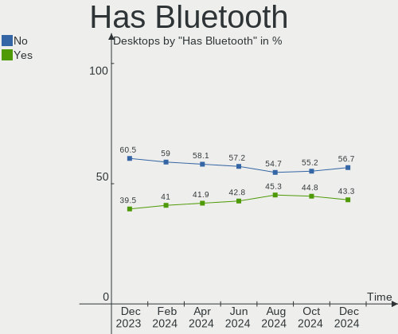
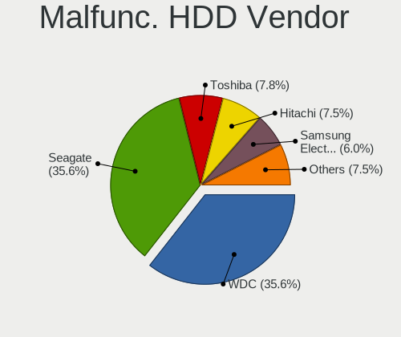
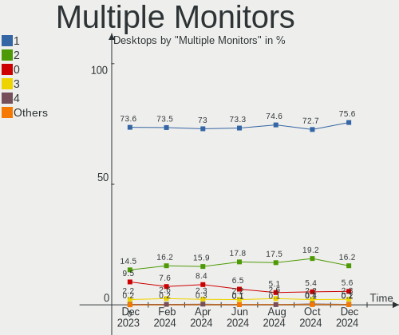
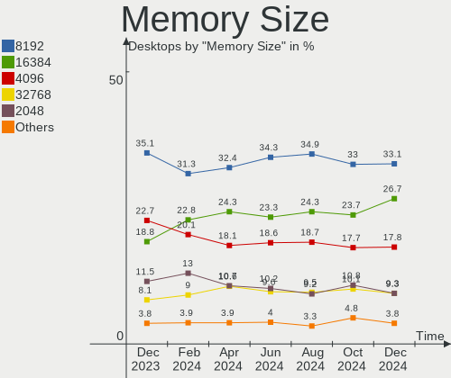

Linux Hardware Trends (Desktops)
--------------------------------

A project to identify most popular hardware characteristics and track their change
over time based on data collected by Linux users at https://Linux-Hardware.org.

Anyone can contribute to this report by the [hw-probe](https://github.com/linuxhw/hw-probe) tool:

    sudo -E hw-probe -all -upload

Full-feature report is available here: https://linux-hardware.org/?view=trends

Period: Mar, 2022.

Contents
--------

* [ System ](#system)
  - [ OS                       ](#os)
  - [ OS Family                ](#os-family)
  - [ Kernel                   ](#kernel)
  - [ Kernel Family            ](#kernel-family)
  - [ Kernel Major Ver.        ](#kernel-major-ver)
  - [ Arch                     ](#arch)
  - [ DE                       ](#de)
  - [ Display Server           ](#display-server)
  - [ Display Manager          ](#display-manager)
  - [ OS Lang                  ](#os-lang)
  - [ Boot Mode                ](#boot-mode)
  - [ Filesystem               ](#filesystem)
  - [ Part. scheme             ](#part-scheme)
  - [ Dual Boot with Linux/BSD ](#dual-boot-with-linuxbsd)
  - [ Dual Boot (Win)          ](#dual-boot-win)

* [ Board ](#board)
  - [ Vendor                   ](#vendor)
  - [ Model                    ](#model)
  - [ Model Family             ](#model-family)
  - [ MFG Year                 ](#mfg-year)
  - [ Form Factor              ](#form-factor)
  - [ Secure Boot              ](#secure-boot)
  - [ Coreboot                 ](#coreboot)
  - [ RAM Size                 ](#ram-size)
  - [ RAM Used                 ](#ram-used)
  - [ Total Drives             ](#total-drives)
  - [ Has CD-ROM               ](#has-cd-rom)
  - [ Has Ethernet             ](#has-ethernet)
  - [ Has WiFi                 ](#has-wifi)
  - [ Has Bluetooth            ](#has-bluetooth)

* [ Location ](#location)
  - [ Country                  ](#country)
  - [ City                     ](#city)

* [ Drives ](#drives)
  - [ Drive Vendor             ](#drive-vendor)
  - [ Drive Model              ](#drive-model)
  - [ HDD Vendor               ](#hdd-vendor)
  - [ SSD Vendor               ](#ssd-vendor)
  - [ Drive Kind               ](#drive-kind)
  - [ Drive Connector          ](#drive-connector)
  - [ Drive Size               ](#drive-size)
  - [ Space Total              ](#space-total)
  - [ Space Used               ](#space-used)
  - [ Malfunc. Drives          ](#malfunc-drives)
  - [ Malfunc. Drive Vendor    ](#malfunc-drive-vendor)
  - [ Malfunc. HDD Vendor      ](#malfunc-hdd-vendor)
  - [ Malfunc. Drive Kind      ](#malfunc-drive-kind)
  - [ Failed Drives            ](#failed-drives)
  - [ Failed Drive Vendor      ](#failed-drive-vendor)
  - [ Drive Status             ](#drive-status)

* [ Storage controller ](#storage-controller)
  - [ Storage Vendor           ](#storage-vendor)
  - [ Storage Model            ](#storage-model)
  - [ Storage Kind             ](#storage-kind)

* [ Processor ](#processor)
  - [ CPU Vendor               ](#cpu-vendor)
  - [ CPU Model                ](#cpu-model)
  - [ CPU Model Family         ](#cpu-model-family)
  - [ CPU Cores                ](#cpu-cores)
  - [ CPU Sockets              ](#cpu-sockets)
  - [ CPU Threads              ](#cpu-threads)
  - [ CPU Op-Modes             ](#cpu-op-modes)
  - [ CPU Microcode            ](#cpu-microcode)
  - [ CPU Microarch            ](#cpu-microarch)

* [ Graphics ](#graphics)
  - [ GPU Vendor               ](#gpu-vendor)
  - [ GPU Model                ](#gpu-model)
  - [ GPU Combo                ](#gpu-combo)
  - [ GPU Driver               ](#gpu-driver)
  - [ GPU Memory               ](#gpu-memory)

* [ Monitor ](#monitor)
  - [ Monitor Vendor           ](#monitor-vendor)
  - [ Monitor Model            ](#monitor-model)
  - [ Monitor Resolution       ](#monitor-resolution)
  - [ Monitor Diagonal         ](#monitor-diagonal)
  - [ Monitor Width            ](#monitor-width)
  - [ Aspect Ratio             ](#aspect-ratio)
  - [ Monitor Area             ](#monitor-area)
  - [ Pixel Density            ](#pixel-density)
  - [ Multiple Monitors        ](#multiple-monitors)

* [ Network ](#network)
  - [ Net Controller Vendor    ](#net-controller-vendor)
  - [ Net Controller Model     ](#net-controller-model)
  - [ Wireless Vendor          ](#wireless-vendor)
  - [ Wireless Model           ](#wireless-model)
  - [ Ethernet Vendor          ](#ethernet-vendor)
  - [ Ethernet Model           ](#ethernet-model)
  - [ Net Controller Kind      ](#net-controller-kind)
  - [ Used Controller          ](#used-controller)
  - [ NICs                     ](#nics)
  - [ IPv6                     ](#ipv6)

* [ Bluetooth ](#bluetooth)
  - [ Bluetooth Vendor         ](#bluetooth-vendor)
  - [ Bluetooth Model          ](#bluetooth-model)

* [ Sound ](#sound)
  - [ Sound Vendor             ](#sound-vendor)
  - [ Sound Model              ](#sound-model)

* [ Memory ](#memory)
  - [ Memory Vendor            ](#memory-vendor)
  - [ Memory Model             ](#memory-model)
  - [ Memory Kind              ](#memory-kind)
  - [ Memory Form Factor       ](#memory-form-factor)
  - [ Memory Size              ](#memory-size)
  - [ Memory Speed             ](#memory-speed)

* [ Printers & scanners ](#printers--scanners)
  - [ Printer Vendor           ](#printer-vendor)
  - [ Printer Model            ](#printer-model)
  - [ Scanner Vendor           ](#scanner-vendor)
  - [ Scanner Model            ](#scanner-model)

* [ Camera ](#camera)
  - [ Camera Vendor            ](#camera-vendor)
  - [ Camera Model             ](#camera-model)

* [ Security ](#security)
  - [ Fingerprint Vendor       ](#fingerprint-vendor)
  - [ Fingerprint Model        ](#fingerprint-model)
  - [ Chipcard Vendor          ](#chipcard-vendor)
  - [ Chipcard Model           ](#chipcard-model)

* [ Unsupported ](#unsupported)
  - [ Unsupported Devices      ](#unsupported-devices)
  - [ Unsupported Device Types ](#unsupported-device-types)

System
------

OS
--

Installed operating systems

| Name                 | Desktops | Percent |
|----------------------|----------|---------|
| Ubuntu 20.04         | 234      | 12.19%  |
| ROSA 12.2            | 193      | 10.05%  |
| OpenMandriva 4.3     | 174      | 9.06%   |
| Linux Mint 20.3      | 145      | 7.55%   |
| Ubuntu 21.10         | 103      | 5.36%   |
| Pop!_OS 21.10        | 100      | 5.21%   |
| Debian 11            | 96       | 5%      |
| Fedora 35            | 89       | 4.64%   |
| KDE neon 20.04       | 61       | 3.18%   |
| Zorin 16             | 49       | 2.55%   |
| Manjaro              | 40       | 2.08%   |
| Manjaro 21.2.5       | 31       | 1.61%   |
| ROSA R11.1           | 30       | 1.56%   |
| ArcoLinux Rolling    | 27       | 1.41%   |
| Arch Rolling         | 25       | 1.3%    |
| Elementary 6.1       | 23       | 1.2%    |
| ROSA 12.1            | 22       | 1.15%   |
| Linux Mint 20.2      | 22       | 1.15%   |
| BlackPanther 18.1    | 22       | 1.15%   |
| Xubuntu 20.04        | 19       | 0.99%   |
| Pop!_OS 20.04        | 18       | 0.94%   |
| Ubuntu 18.04         | 17       | 0.89%   |
| OpenMandriva 4.2     | 14       | 0.73%   |
| Arch                 | 14       | 0.73%   |
| Manjaro 21.2.4       | 12       | 0.63%   |
| Kubuntu 20.04        | 12       | 0.63%   |
| Kubuntu 21.10        | 10       | 0.52%   |
| Parrot 5.0           | 9        | 0.47%   |
| Gentoo 2.8           | 9        | 0.47%   |
| Ubuntu 22.04         | 8        | 0.42%   |
| Kali 2022.1          | 8        | 0.42%   |
| EndeavourOS Rolling  | 8        | 0.42%   |
| Debian 10            | 8        | 0.42%   |
| Xero Rolling         | 7        | 0.36%   |
| Ubuntu MATE 20.04    | 7        | 0.36%   |
| Pop!_OS 21.04        | 7        | 0.36%   |
| Linux Mint 20.1      | 7        | 0.36%   |
| Gentoo 2.7           | 7        | 0.36%   |
| Gentoo 2.6           | 7        | 0.36%   |
| Ubuntu 21.04         | 6        | 0.31%   |
| openSUSE Leap-15.3   | 6        | 0.31%   |
| Linux Mint 20        | 6        | 0.31%   |
| Fedora 36            | 6        | 0.31%   |
| Endless 4.0.3        | 6        | 0.31%   |
| CentOS 7             | 6        | 0.31%   |
| Mageia 8             | 5        | 0.26%   |
| Lubuntu 21.10        | 5        | 0.26%   |
| Lubuntu 20.04        | 5        | 0.26%   |
| Linux Mint 19.3      | 5        | 0.26%   |
| Kubuntu 11           | 5        | 0.26%   |
| Debian Testing       | 5        | 0.26%   |
| Slackware 15.0       | 4        | 0.21%   |
| ROSA 12              | 4        | 0.21%   |
| NixOS 21.11          | 4        | 0.21%   |
| MX 21                | 4        | 0.21%   |
| LMDE 4               | 4        | 0.21%   |
| Garuda Linux Soaring | 4        | 0.21%   |
| Zorin 15             | 3        | 0.16%   |
| Xubuntu 21.10        | 3        | 0.16%   |
| Xubuntu 18.04        | 3        | 0.16%   |

OS Family
---------

OS without a version

| Name              | Desktops | Percent |
|-------------------|----------|---------|
| Ubuntu            | 373      | 19.43%  |
| ROSA              | 252      | 13.13%  |
| Linux Mint        | 193      | 10.05%  |
| OpenMandriva      | 188      | 9.79%   |
| Pop!_OS           | 125      | 6.51%   |
| Debian            | 110      | 5.73%   |
| Fedora            | 100      | 5.21%   |
| Manjaro           | 84       | 4.38%   |
| KDE neon          | 61       | 3.18%   |
| Zorin             | 52       | 2.71%   |
| Arch              | 40       | 2.08%   |
| Kubuntu           | 34       | 1.77%   |
| ArcoLinux         | 28       | 1.46%   |
| Xubuntu           | 25       | 1.3%    |
| Elementary        | 25       | 1.3%    |
| openSUSE          | 23       | 1.2%    |
| Gentoo            | 23       | 1.2%    |
| BlackPanther      | 22       | 1.15%   |
| Ubuntu MATE       | 12       | 0.63%   |
| Parrot            | 12       | 0.63%   |
| Lubuntu           | 11       | 0.57%   |
| Endless           | 10       | 0.52%   |
| EndeavourOS       | 10       | 0.52%   |
| Kali              | 9        | 0.47%   |
| CentOS            | 8        | 0.42%   |
| Xero              | 7        | 0.36%   |
| NixOS             | 7        | 0.36%   |
| Garuda Linux      | 7        | 0.36%   |
| MX                | 6        | 0.31%   |
| LMDE              | 6        | 0.31%   |
| Mageia            | 5        | 0.26%   |
| Clear Linux       | 5        | 0.26%   |
| ALT Linux         | 5        | 0.26%   |
| Slackware         | 4        | 0.21%   |
| Red OS            | 4        | 0.21%   |
| RHEL              | 3        | 0.16%   |
| Linux Lite        | 3        | 0.16%   |
| Sparky            | 2        | 0.1%    |
| Reborn OS         | 2        | 0.1%    |
| Peppermint        | 2        | 0.1%    |
| ClearOS           | 2        | 0.1%    |
| Artix             | 2        | 0.1%    |
| Void Linux        | 1        | 0.05%   |
| Ultramarine Linux | 1        | 0.05%   |
| UbuntuDDE         | 1        | 0.05%   |
| Ubuntu Studio     | 1        | 0.05%   |
| Ubuntu Budgie     | 1        | 0.05%   |
| Siduction         | 1        | 0.05%   |
| Rocky Linux       | 1        | 0.05%   |
| RELS              | 1        | 0.05%   |
| Puppy             | 1        | 0.05%   |
| Pardus            | 1        | 0.05%   |
| Oracle Linux      | 1        | 0.05%   |
| Makulu            | 1        | 0.05%   |
| LinuxFX           | 1        | 0.05%   |
| HamoniKR          | 1        | 0.05%   |
| Drauger OS        | 1        | 0.05%   |
| Devuan            | 1        | 0.05%   |
| ArchLabs          | 1        | 0.05%   |
| antiX             | 1        | 0.05%   |

Kernel
------

Version of the Linux kernel

| Version                             | Desktops | Percent |
|-------------------------------------|----------|---------|
| 5.10.74-generic-2rosa2021.1-x86_64  | 207      | 10.78%  |
| 5.13.0-35-generic                   | 183      | 9.53%   |
| 5.16.7-desktop-1omv4003             | 171      | 8.91%   |
| 5.13.0-30-generic                   | 123      | 6.41%   |
| 5.13.0-37-generic                   | 97       | 5.05%   |
| 5.16.11-76051611-generic            | 94       | 4.9%    |
| 5.4.0-104-generic                   | 71       | 3.7%    |
| 5.4.0-100-generic                   | 69       | 3.59%   |
| 5.4.0-105-generic                   | 42       | 2.19%   |
| 5.10.0-7-amd64                      | 37       | 1.93%   |
| 5.15.28-1-MANJARO                   | 30       | 1.56%   |
| 5.16.16-200.fc35.x86_64             | 24       | 1.25%   |
| 5.16.12-200.fc35.x86_64             | 22       | 1.15%   |
| 5.13.0-39-generic                   | 21       | 1.09%   |
| 5.10.0-12-amd64                     | 20       | 1.04%   |
| 5.6.14-desktop-2bP                  | 16       | 0.83%   |
| 5.10.0-11-amd64                     | 16       | 0.83%   |
| 5.15.25-1-MANJARO                   | 14       | 0.73%   |
| 5.10.14-desktop-1omv4002            | 14       | 0.73%   |
| 5.4.0-91-generic                    | 13       | 0.68%   |
| 5.15.15-76051515-generic            | 12       | 0.63%   |
| 5.13.0-19-generic                   | 12       | 0.63%   |
| 5.16.16-arch1-1                     | 11       | 0.57%   |
| 5.16.14-1-MANJARO                   | 11       | 0.57%   |
| 5.10.0-13-amd64                     | 11       | 0.57%   |
| 5.16.15-201.fc35.x86_64             | 10       | 0.52%   |
| 5.16.11-200.fc35.x86_64             | 10       | 0.52%   |
| 5.16.11-1-default                   | 10       | 0.52%   |
| 5.16.12-arch1-1                     | 9        | 0.47%   |
| 5.16.11-2-MANJARO                   | 9        | 0.47%   |
| 5.4.83-generic-2rosa-x86_64         | 8        | 0.42%   |
| 5.16.16-zen1-1-zen                  | 8        | 0.42%   |
| 5.16.13-arch1-1                     | 8        | 0.42%   |
| 5.13.0-28-generic                   | 8        | 0.42%   |
| 5.11.0-35-generic                   | 8        | 0.42%   |
| 5.16.14-arch1-1                     | 7        | 0.36%   |
| 5.16.11-arch1-1                     | 7        | 0.36%   |
| 3.10.0-1160.59.1.el7.x86_64         | 7        | 0.36%   |
| 5.16.15-zen1-1-zen                  | 6        | 0.31%   |
| 5.15.23-76051523-generic            | 6        | 0.31%   |
| 5.15.11-76051511-generic            | 6        | 0.31%   |
| 5.15.0-15parrot1-amd64              | 6        | 0.31%   |
| 5.11.0-49-generic                   | 6        | 0.31%   |
| 5.11.0-27-generic                   | 6        | 0.31%   |
| 4.18.16-desktop-1bP                 | 6        | 0.31%   |
| 4.15.0-desktop-122.124.1rosa-x86_64 | 6        | 0.31%   |
| 4.15.0-171-generic                  | 6        | 0.31%   |
| 5.16.18-200.fc35.x86_64             | 5        | 0.26%   |
| 5.13.0-32-generic                   | 5        | 0.26%   |
| 5.11.0-41-generic                   | 5        | 0.26%   |
| 5.10.71-generic-1rosa2021.1-x86_64  | 5        | 0.26%   |
| 5.10.0-10-amd64                     | 5        | 0.26%   |
| 5.4.32-generic-2rosa-x86_64         | 4        | 0.21%   |
| 5.4.32-generic-2rosa-i586           | 4        | 0.21%   |
| 5.4.0-96-generic                    | 4        | 0.21%   |
| 5.16.15-arch1-1                     | 4        | 0.21%   |
| 5.16.14-zen1-1-zen                  | 4        | 0.21%   |
| 5.16.14-200.fc35.x86_64             | 4        | 0.21%   |
| 5.16.13-200.fc35.x86_64             | 4        | 0.21%   |
| 5.15.26-1-lts                       | 4        | 0.21%   |

Kernel Family
-------------

Linux kernel without a distro release

| Version  | Desktops | Percent |
|----------|----------|---------|
| 5.13.0   | 471      | 24.53%  |
| 5.4.0    | 233      | 12.14%  |
| 5.10.74  | 209      | 10.89%  |
| 5.16.7   | 172      | 8.96%   |
| 5.16.11  | 141      | 7.34%   |
| 5.10.0   | 98       | 5.1%    |
| 5.16.16  | 45       | 2.34%   |
| 5.16.12  | 45       | 2.34%   |
| 5.11.0   | 41       | 2.14%   |
| 4.15.0   | 33       | 1.72%   |
| 5.15.28  | 32       | 1.67%   |
| 5.16.14  | 31       | 1.61%   |
| 5.16.15  | 26       | 1.35%   |
| 5.15.0   | 21       | 1.09%   |
| 5.16.0   | 19       | 0.99%   |
| 5.6.14   | 16       | 0.83%   |
| 5.16.13  | 16       | 0.83%   |
| 5.17.0   | 15       | 0.78%   |
| 5.15.25  | 15       | 0.78%   |
| 5.10.14  | 14       | 0.73%   |
| 5.15.26  | 12       | 0.63%   |
| 5.15.23  | 12       | 0.63%   |
| 5.15.15  | 12       | 0.63%   |
| 5.4.83   | 11       | 0.57%   |
| 5.16.18  | 10       | 0.52%   |
| 4.19.0   | 10       | 0.52%   |
| 5.8.0    | 9        | 0.47%   |
| 5.14.0   | 9        | 0.47%   |
| 5.4.32   | 8        | 0.42%   |
| 3.10.0   | 8        | 0.42%   |
| 5.15.11  | 7        | 0.36%   |
| 5.15.10  | 7        | 0.36%   |
| 5.10.102 | 7        | 0.36%   |
| 5.3.18   | 6        | 0.31%   |
| 4.18.16  | 6        | 0.31%   |
| 4.18.0   | 6        | 0.31%   |
| 5.17.1   | 5        | 0.26%   |
| 5.10.71  | 5        | 0.26%   |
| 5.16.9   | 4        | 0.21%   |
| 5.14.10  | 4        | 0.21%   |
| 5.13.19  | 4        | 0.21%   |
| 5.10.105 | 4        | 0.21%   |
| 5.16.10  | 3        | 0.16%   |
| 5.9.16   | 2        | 0.1%    |
| 5.4.181  | 2        | 0.1%    |
| 5.16.8   | 2        | 0.1%    |
| 5.16.2   | 2        | 0.1%    |
| 5.15.7   | 2        | 0.1%    |
| 5.15.31  | 2        | 0.1%    |
| 5.15.27  | 2        | 0.1%    |
| 5.15.16  | 2        | 0.1%    |
| 5.15.13  | 2        | 0.1%    |
| 5.15.12  | 2        | 0.1%    |
| 5.13.13  | 2        | 0.1%    |
| 5.10.88  | 2        | 0.1%    |
| 5.10.35  | 2        | 0.1%    |
| 4.9.155  | 2        | 0.1%    |
| 5.6.0    | 1        | 0.05%   |
| 5.4.97   | 1        | 0.05%   |
| 5.4.58   | 1        | 0.05%   |

Kernel Major Ver.
-----------------

Linux kernel major version

| Version | Desktops | Percent |
|---------|----------|---------|
| 5.16    | 520      | 27.08%  |
| 5.13    | 478      | 24.9%   |
| 5.10    | 347      | 18.07%  |
| 5.4     | 259      | 13.49%  |
| 5.15    | 136      | 7.08%   |
| 5.11    | 41       | 2.14%   |
| 4.15    | 33       | 1.72%   |
| 5.17    | 20       | 1.04%   |
| 5.6     | 17       | 0.89%   |
| 5.14    | 14       | 0.73%   |
| 4.18    | 12       | 0.63%   |
| 4.19    | 10       | 0.52%   |
| 5.8     | 9        | 0.47%   |
| 3.10    | 8        | 0.42%   |
| 5.3     | 6        | 0.31%   |
| 4.9     | 4        | 0.21%   |
| 5.9     | 2        | 0.1%    |
| 5.12    | 1        | 0.05%   |
| 5.0     | 1        | 0.05%   |
| 4.12    | 1        | 0.05%   |
| 3.13    | 1        | 0.05%   |

Arch
----

OS architecture (x86_64, i586, etc.)

| Name   | Desktops | Percent |
|--------|----------|---------|
| x86_64 | 1891     | 98.49%  |
| i686   | 28       | 1.46%   |
| e2k    | 1        | 0.05%   |

DE
--

Desktop Environment

| Name             | Desktops | Percent |
|------------------|----------|---------|
| GNOME            | 764      | 39.79%  |
| KDE5             | 564      | 29.38%  |
| X-Cinnamon       | 149      | 7.76%   |
| XFCE             | 132      | 6.88%   |
| Unknown          | 85       | 4.43%   |
| MATE             | 58       | 3.02%   |
| LXQt             | 30       | 1.56%   |
| Pantheon         | 26       | 1.35%   |
| KDE4             | 26       | 1.35%   |
| Cinnamon         | 26       | 1.35%   |
| i3               | 7        | 0.36%   |
| KDE              | 6        | 0.31%   |
| GNOME Flashback  | 6        | 0.31%   |
| LXDE             | 5        | 0.26%   |
| Budgie           | 5        | 0.26%   |
| Unity            | 4        | 0.21%   |
| sway             | 4        | 0.21%   |
| GNOME Classic    | 4        | 0.21%   |
| xmonad           | 3        | 0.16%   |
| Deepin           | 3        | 0.16%   |
| awesome          | 2        | 0.1%    |
| qtile            | 1        | 0.05%   |
| openbox          | 1        | 0.05%   |
| lightdm-xsession | 1        | 0.05%   |
| LeftWM           | 1        | 0.05%   |
| ICEWM            | 1        | 0.05%   |
| herbstluftwm     | 1        | 0.05%   |
| FVWM             | 1        | 0.05%   |
| Enlightenment    | 1        | 0.05%   |
| dwm              | 1        | 0.05%   |
| Cutefish         | 1        | 0.05%   |
| bspwm            | 1        | 0.05%   |

Display Server
--------------

X11 or Wayland

| Name    | Desktops | Percent |
|---------|----------|---------|
| X11     | 1448     | 75.42%  |
| Wayland | 362      | 18.85%  |
| Unknown | 69       | 3.59%   |
| Tty     | 40       | 2.08%   |
| Web     | 1        | 0.05%   |

Display Manager
---------------

SDDM, LightDM, etc.

| Name    | Desktops | Percent |
|---------|----------|---------|
| Unknown | 636      | 33.13%  |
| SDDM    | 450      | 23.44%  |
| GDM     | 292      | 15.21%  |
| GDM3    | 267      | 13.91%  |
| LightDM | 245      | 12.76%  |
| KDM     | 25       | 1.3%    |
| XDM     | 1        | 0.05%   |
| TDM     | 1        | 0.05%   |
| SLiM    | 1        | 0.05%   |
| MDM     | 1        | 0.05%   |
| LXDM    | 1        | 0.05%   |

OS Lang
-------

Language

| Lang        | Desktops | Percent |
|-------------|----------|---------|
| en_US       | 671      | 34.95%  |
| ru_RU       | 335      | 17.45%  |
| de_DE       | 174      | 9.06%   |
| en_GB       | 87       | 4.53%   |
| pt_BR       | 69       | 3.59%   |
| fr_FR       | 59       | 3.07%   |
| es_ES       | 48       | 2.5%    |
| it_IT       | 44       | 2.29%   |
| en_CA       | 43       | 2.24%   |
| Unknown     | 41       | 2.14%   |
| pl_PL       | 32       | 1.67%   |
| en_AU       | 30       | 1.56%   |
| en_IN       | 28       | 1.46%   |
| C           | 21       | 1.09%   |
| nl_NL       | 18       | 0.94%   |
| es_MX       | 16       | 0.83%   |
| es_AR       | 16       | 0.83%   |
| cs_CZ       | 14       | 0.73%   |
| tr_TR       | 10       | 0.52%   |
| fr_CA       | 10       | 0.52%   |
| hu_HU       | 9        | 0.47%   |
| en_IE       | 8        | 0.42%   |
| zh_CN       | 7        | 0.36%   |
| el_GR       | 7        | 0.36%   |
| sv_SE       | 6        | 0.31%   |
| en_ZA       | 6        | 0.31%   |
| nb_NO       | 5        | 0.26%   |
| en_PH       | 5        | 0.26%   |
| de_AT       | 5        | 0.26%   |
| zh_TW       | 4        | 0.21%   |
| ru_UA       | 4        | 0.21%   |
| pt_PT       | 4        | 0.21%   |
| POSIX       | 4        | 0.21%   |
| ja_JP       | 4        | 0.21%   |
| es_VE       | 4        | 0.21%   |
| es_EC       | 4        | 0.21%   |
| en_IL       | 4        | 0.21%   |
| sk_SK       | 3        | 0.16%   |
| nl_BE       | 3        | 0.16%   |
| hr_HR       | 3        | 0.16%   |
| fr_CH       | 3        | 0.16%   |
| fr_BE       | 3        | 0.16%   |
| en_NZ       | 3        | 0.16%   |
| en_DK       | 3        | 0.16%   |
| de_CH       | 3        | 0.16%   |
| C.UTF8      | 3        | 0.16%   |
| sr_RS       | 2        | 0.1%    |
| ko_KR       | 2        | 0.1%    |
| fi_FI       | 2        | 0.1%    |
| es_SV       | 2        | 0.1%    |
| es_CO       | 2        | 0.1%    |
| es_CL       | 2        | 0.1%    |
| en_SG       | 2        | 0.1%    |
| da_DK       | 2        | 0.1%    |
| ca_ES       | 2        | 0.1%    |
| ar_SA       | 2        | 0.1%    |
| sr_RS@latin | 1        | 0.05%   |
| ro_RO       | 1        | 0.05%   |
| it_CH       | 1        | 0.05%   |
| id_ID       | 1        | 0.05%   |

Boot Mode
---------

EFI or BIOS

| Mode | Desktops | Percent |
|------|----------|---------|
| BIOS | 1105     | 57.55%  |
| EFI  | 815      | 42.45%  |

Filesystem
----------

Type of filesystem

| Type    | Desktops | Percent |
|---------|----------|---------|
| Ext4    | 1436     | 74.79%  |
| Overlay | 246      | 12.81%  |
| Btrfs   | 186      | 9.69%   |
| Xfs     | 33       | 1.72%   |
| Zfs     | 8        | 0.42%   |
| Tmpfs   | 3        | 0.16%   |
| Ext2    | 3        | 0.16%   |
| F2fs    | 2        | 0.1%    |
| Ext3    | 2        | 0.1%    |
| Aufs    | 1        | 0.05%   |

Part. scheme
------------

Scheme of partitioning

| Type    | Desktops | Percent |
|---------|----------|---------|
| Unknown | 902      | 46.98%  |
| GPT     | 707      | 36.82%  |
| MBR     | 311      | 16.2%   |

Dual Boot with Linux/BSD
------------------------

Hosting more than one Linux/BSD

| Dual boot | Desktops | Percent |
|-----------|----------|---------|
| No        | 1536     | 80%     |
| Yes       | 384      | 20%     |

Dual Boot (Win)
---------------

Hosting Linux and Windows

| Dual boot | Desktops | Percent |
|-----------|----------|---------|
| No        | 1192     | 62.08%  |
| Yes       | 728      | 37.92%  |

Board
-----

Vendor
------

Motherboard manufacturer

| Name                                  | Desktops | Percent |
|---------------------------------------|----------|---------|
| ASUSTek Computer                      | 516      | 26.88%  |
| Gigabyte Technology                   | 373      | 19.43%  |
| MSI                                   | 244      | 12.71%  |
| ASRock                                | 180      | 9.38%   |
| Dell                                  | 143      | 7.45%   |
| Hewlett-Packard                       | 118      | 6.15%   |
| Lenovo                                | 63       | 3.28%   |
| Intel                                 | 50       | 2.6%    |
| Acer                                  | 33       | 1.72%   |
| Biostar                               | 26       | 1.35%   |
| Unknown                               | 19       | 0.99%   |
| Pegatron                              | 17       | 0.89%   |
| ECS                                   | 17       | 0.89%   |
| Fujitsu                               | 13       | 0.68%   |
| Foxconn                               | 13       | 0.68%   |
| Medion                                | 7        | 0.36%   |
| Alienware                             | 6        | 0.31%   |
| Apple                                 | 5        | 0.26%   |
| Supermicro                            | 4        | 0.21%   |
| Positivo                              | 4        | 0.21%   |
| BESSTAR Tech                          | 4        | 0.21%   |
| Shuttle                               | 3        | 0.16%   |
| Google                                | 3        | 0.16%   |
| Fujitsu Siemens                       | 3        | 0.16%   |
| AQUARIUS                              | 3        | 0.16%   |
| System76                              | 2        | 0.1%    |
| Packard Bell                          | 2        | 0.1%    |
| KLLISRE                               | 2        | 0.1%    |
| Inspur                                | 2        | 0.1%    |
| EVGA                                  | 2        | 0.1%    |
| Colorful Technology                   | 2        | 0.1%    |
| AMI                                   | 2        | 0.1%    |
| ABIT                                  | 2        | 0.1%    |
| ZYREX COMPUTER SYSTEMS                | 1        | 0.05%   |
| ZOTAC                                 | 1        | 0.05%   |
| Wistron                               | 1        | 0.05%   |
| Visum                                 | 1        | 0.05%   |
| VIA Technologies                      | 1        | 0.05%   |
| TYAN Computer                         | 1        | 0.05%   |
| TPV-INVENTA                           | 1        | 0.05%   |
| SLIMBOOK                              | 1        | 0.05%   |
| SiS Technology                        | 1        | 0.05%   |
| SiComputer                            | 1        | 0.05%   |
| Samsung Electronics                   | 1        | 0.05%   |
| Q87IX-06 12/05/18 Vision Corvalent V4 | 1        | 0.05%   |
| Purism                                | 1        | 0.05%   |
| Online Labs                           | 1        | 0.05%   |
| ONDA                                  | 1        | 0.05%   |
| NU591                                 | 1        | 0.05%   |
| MouseComputer                         | 1        | 0.05%   |
| MiTAC                                 | 1        | 0.05%   |
| Minix                                 | 1        | 0.05%   |
| Megaware                              | 1        | 0.05%   |
| Maita                                 | 1        | 0.05%   |
| MACHINIST                             | 1        | 0.05%   |
| Login Informatica                     | 1        | 0.05%   |
| Le Cube 1                             | 1        | 0.05%   |
| Lanix                                 | 1        | 0.05%   |
| Koloe                                 | 1        | 0.05%   |
| JW Technology                         | 1        | 0.05%   |

Model
-----

Motherboard model

| Name                              | Desktops | Percent |
|-----------------------------------|----------|---------|
| ASUS All Series                   | 48       | 2.5%    |
| Unknown                           | 24       | 1.25%   |
| Gigabyte H410M H V3               | 15       | 0.78%   |
| ASUS TUF Gaming X570-PLUS         | 11       | 0.57%   |
| MSI MS-7C37                       | 10       | 0.52%   |
| MSI MS-7A38                       | 10       | 0.52%   |
| Dell OptiPlex 7010                | 10       | 0.52%   |
| ASUS PRIME H510M-A                | 10       | 0.52%   |
| MSI MS-7B86                       | 9        | 0.47%   |
| Gigabyte B450M DS3H               | 9        | 0.47%   |
| Gigabyte 970A-DS3P                | 9        | 0.47%   |
| ASUS ROG STRIX B550-F GAMING      | 9        | 0.47%   |
| MSI MS-7817                       | 8        | 0.42%   |
| HP Z420 Workstation               | 7        | 0.36%   |
| HP ProDesk 600 G1 SFF             | 7        | 0.36%   |
| ASUS PRIME B450M-A                | 7        | 0.36%   |
| ASUS M5A78L-M/USB3                | 7        | 0.36%   |
| MSI MS-7C02                       | 6        | 0.31%   |
| MSI MS-7A34                       | 6        | 0.31%   |
| MSI MS-7721                       | 6        | 0.31%   |
| Gigabyte B450 AORUS M             | 6        | 0.31%   |
| Gigabyte B450 AORUS ELITE         | 6        | 0.31%   |
| Dell OptiPlex 760                 | 6        | 0.31%   |
| Dell OptiPlex 7050                | 6        | 0.31%   |
| MSI MS-7C56                       | 5        | 0.26%   |
| MSI MS-7996                       | 5        | 0.26%   |
| Dell OptiPlex 9020                | 5        | 0.26%   |
| Dell OptiPlex 9010                | 5        | 0.26%   |
| ASUS TUF Gaming B550-PLUS         | 5        | 0.26%   |
| ASUS ROG STRIX B450-F GAMING      | 5        | 0.26%   |
| ASUS PRIME A320M-K                | 5        | 0.26%   |
| ASUS M5A97 R2.0                   | 5        | 0.26%   |
| ASUS M5A78L-M LX3                 | 5        | 0.26%   |
| ASRock N68C-S UCC                 | 5        | 0.26%   |
| ASRock B450M Pro4                 | 5        | 0.26%   |
| MSI MS-7C91                       | 4        | 0.21%   |
| MSI MS-7C84                       | 4        | 0.21%   |
| MSI MS-7C52                       | 4        | 0.21%   |
| MSI MS-7C35                       | 4        | 0.21%   |
| MSI MS-7B98                       | 4        | 0.21%   |
| MSI MS-7B89                       | 4        | 0.21%   |
| MSI MS-7B84                       | 4        | 0.21%   |
| MSI MS-7693                       | 4        | 0.21%   |
| Intel H61                         | 4        | 0.21%   |
| Intel DH55TC AAE70932-205         | 4        | 0.21%   |
| Gigabyte Z77-DS3H                 | 4        | 0.21%   |
| Gigabyte X570 GAMING X            | 4        | 0.21%   |
| Gigabyte X570 AORUS ELITE WIFI    | 4        | 0.21%   |
| Gigabyte X470 AORUS ULTRA GAMING  | 4        | 0.21%   |
| Gigabyte X470 AORUS GAMING 7 WIFI | 4        | 0.21%   |
| Gigabyte H510M H                  | 4        | 0.21%   |
| Gigabyte A320M-S2H                | 4        | 0.21%   |
| Dell XPS 8940                     | 4        | 0.21%   |
| Dell XPS 8700                     | 4        | 0.21%   |
| Dell OptiPlex 980                 | 4        | 0.21%   |
| Dell OptiPlex 7020                | 4        | 0.21%   |
| Dell OptiPlex 390                 | 4        | 0.21%   |
| Dell OptiPlex 3020                | 4        | 0.21%   |
| ASUS TUF Gaming X570-PRO          | 4        | 0.21%   |
| ASUS TUF B450M-PLUS GAMING        | 4        | 0.21%   |

Model Family
------------

Motherboard model prefix

| Name                   | Desktops | Percent |
|------------------------|----------|---------|
| ASUS PRIME             | 108      | 5.63%   |
| Dell OptiPlex          | 85       | 4.43%   |
| ASUS ROG               | 63       | 3.28%   |
| ASUS All               | 48       | 2.5%    |
| ASUS TUF               | 40       | 2.08%   |
| Lenovo ThinkCentre     | 36       | 1.88%   |
| HP Compaq              | 34       | 1.77%   |
| Unknown                | 24       | 1.25%   |
| Dell Precision         | 23       | 1.2%    |
| ASUS M5A78L-M          | 22       | 1.15%   |
| Gigabyte X570          | 19       | 0.99%   |
| Acer Aspire            | 19       | 0.99%   |
| Gigabyte H410M         | 17       | 0.89%   |
| Gigabyte B450M         | 16       | 0.83%   |
| Gigabyte B450          | 16       | 0.83%   |
| ASUS P8H61-M           | 16       | 0.83%   |
| HP EliteDesk           | 15       | 0.78%   |
| HP ProDesk             | 13       | 0.68%   |
| Fujitsu ESPRIMO        | 13       | 0.68%   |
| Dell XPS               | 11       | 0.57%   |
| MSI MS-7C37            | 10       | 0.52%   |
| MSI MS-7A38            | 10       | 0.52%   |
| Lenovo ThinkStation    | 10       | 0.52%   |
| Dell Inspiron          | 10       | 0.52%   |
| MSI MS-7B86            | 9        | 0.47%   |
| HP Pavilion            | 9        | 0.47%   |
| Gigabyte 970A-DS3P     | 9        | 0.47%   |
| Dell Vostro            | 9        | 0.47%   |
| ASUS SABERTOOTH        | 9        | 0.47%   |
| ASUS M5A97             | 9        | 0.47%   |
| Acer Veriton           | 9        | 0.47%   |
| MSI MS-7817            | 8        | 0.42%   |
| Intel DH55TC           | 8        | 0.42%   |
| Gigabyte X470          | 8        | 0.42%   |
| Gigabyte GA-78LMT-USB3 | 8        | 0.42%   |
| Gigabyte B550          | 8        | 0.42%   |
| ASUS P8Z77-V           | 8        | 0.42%   |
| ASRock B450M           | 8        | 0.42%   |
| ASRock B450            | 8        | 0.42%   |
| HP Z420                | 7        | 0.36%   |
| Gigabyte Z590          | 7        | 0.36%   |
| MSI MS-7C02            | 6        | 0.31%   |
| MSI MS-7A34            | 6        | 0.31%   |
| MSI MS-7721            | 6        | 0.31%   |
| Lenovo IdeaCentre      | 6        | 0.31%   |
| Gigabyte G1.Sniper     | 6        | 0.31%   |
| Gigabyte B560M         | 6        | 0.31%   |
| Gigabyte A520M         | 6        | 0.31%   |
| Gigabyte A320M-S2H     | 6        | 0.31%   |
| ASUS Maximus           | 6        | 0.31%   |
| ASRock X570            | 6        | 0.31%   |
| ASRock B550            | 6        | 0.31%   |
| MSI MS-7C56            | 5        | 0.26%   |
| MSI MS-7996            | 5        | 0.26%   |
| Intel H61              | 5        | 0.26%   |
| Gigabyte H310M         | 5        | 0.26%   |
| Gigabyte B550M         | 5        | 0.26%   |
| ASUS STRIX             | 5        | 0.26%   |
| ASUS P8B75-M           | 5        | 0.26%   |
| ASUS P5K               | 5        | 0.26%   |

MFG Year
--------

Motherboard manufacture year

| Year    | Desktops | Percent |
|---------|----------|---------|
| 2018    | 208      | 10.83%  |
| 2012    | 196      | 10.21%  |
| 2020    | 187      | 9.74%   |
| 2021    | 167      | 8.7%    |
| 2013    | 146      | 7.6%    |
| 2019    | 140      | 7.29%   |
| 2014    | 133      | 6.93%   |
| 2011    | 128      | 6.67%   |
| 2017    | 105      | 5.47%   |
| 2010    | 95       | 4.95%   |
| 2009    | 86       | 4.48%   |
| 2015    | 79       | 4.11%   |
| 2016    | 77       | 4.01%   |
| 2008    | 70       | 3.65%   |
| 2007    | 53       | 2.76%   |
| 2006    | 23       | 1.2%    |
| 2022    | 16       | 0.83%   |
| 2005    | 6        | 0.31%   |
| 2004    | 2        | 0.1%    |
| 2003    | 1        | 0.05%   |
| 2002    | 1        | 0.05%   |
| Unknown | 1        | 0.05%   |

Form Factor
-----------

Physical design of the computer

| Name    | Desktops | Percent |
|---------|----------|---------|
| Desktop | 1920     | 100%    |

Secure Boot
-----------

Enabled or disabled

| State    | Desktops | Percent |
|----------|----------|---------|
| Disabled | 1870     | 97.4%   |
| Enabled  | 50       | 2.6%    |

Coreboot
--------

Have coreboot on board

| Used | Desktops | Percent |
|------|----------|---------|
| No   | 1916     | 99.79%  |
| Yes  | 4        | 0.21%   |

RAM Size
--------

Total RAM memory

| Size in GB      | Desktops | Percent |
|-----------------|----------|---------|
| 16.01-24.0      | 510      | 26.56%  |
| 8.01-16.0       | 351      | 18.28%  |
| 3.01-4.0        | 282      | 14.69%  |
| 32.01-64.0      | 277      | 14.43%  |
| 4.01-8.0        | 273      | 14.22%  |
| 64.01-256.0     | 103      | 5.36%   |
| 1.01-2.0        | 52       | 2.71%   |
| 24.01-32.0      | 45       | 2.34%   |
| 2.01-3.0        | 22       | 1.15%   |
| More than 256.0 | 3        | 0.16%   |
| 0.51-1.0        | 2        | 0.1%    |

RAM Used
--------

Used RAM memory

| Used GB     | Desktops | Percent |
|-------------|----------|---------|
| 1.01-2.0    | 709      | 36.93%  |
| 2.01-3.0    | 380      | 19.79%  |
| 4.01-8.0    | 255      | 13.28%  |
| 3.01-4.0    | 222      | 11.56%  |
| 0.51-1.0    | 209      | 10.89%  |
| 8.01-16.0   | 74       | 3.85%   |
| 0.01-0.5    | 40       | 2.08%   |
| 16.01-24.0  | 16       | 0.83%   |
| 24.01-32.0  | 9        | 0.47%   |
| 32.01-64.0  | 4        | 0.21%   |
| 64.01-256.0 | 1        | 0.05%   |
| Unknown     | 1        | 0.05%   |

Total Drives
------------

Number of drives on board

| Drives | Desktops | Percent |
|--------|----------|---------|
| 1      | 715      | 37.24%  |
| 2      | 535      | 27.86%  |
| 3      | 347      | 18.07%  |
| 4      | 165      | 8.59%   |
| 5      | 66       | 3.44%   |
| 6      | 42       | 2.19%   |
| 7      | 17       | 0.89%   |
| 0      | 12       | 0.63%   |
| 8      | 9        | 0.47%   |
| 9      | 7        | 0.36%   |
| 11     | 2        | 0.1%    |
| 13     | 1        | 0.05%   |
| 12     | 1        | 0.05%   |
| 10     | 1        | 0.05%   |

Has CD-ROM
----------

Has CD-ROM on board

| Presented | Desktops | Percent |
|-----------|----------|---------|
| No        | 1089     | 56.72%  |
| Yes       | 831      | 43.28%  |

Has Ethernet
------------

Has Ethernet on board

| Presented | Desktops | Percent |
|-----------|----------|---------|
| Yes       | 1897     | 98.8%   |
| No        | 23       | 1.2%    |

Has WiFi
--------

Has WiFi module

| Presented | Desktops | Percent |
|-----------|----------|---------|
| No        | 1106     | 57.6%   |
| Yes       | 814      | 42.4%   |

Has Bluetooth
-------------

Has Bluetooth module

| Presented | Desktops | Percent |
|-----------|----------|---------|
| No        | 1336     | 69.58%  |
| Yes       | 584      | 30.42%  |

Location
--------

Country
-------

Geographic location (country)

| Country      | Desktops | Percent |
|--------------|----------|---------|
| Russia       | 342      | 17.81%  |
| USA          | 331      | 17.24%  |
| Germany      | 212      | 11.04%  |
| Brazil       | 89       | 4.64%   |
| France       | 72       | 3.75%   |
| Canada       | 71       | 3.7%    |
| UK           | 63       | 3.28%   |
| Italy        | 55       | 2.86%   |
| Spain        | 51       | 2.66%   |
| Poland       | 48       | 2.5%    |
| Netherlands  | 42       | 2.19%   |
| Australia    | 40       | 2.08%   |
| India        | 38       | 1.98%   |
| Hungary      | 33       | 1.72%   |
| Mexico       | 24       | 1.25%   |
| Sweden       | 22       | 1.15%   |
| Argentina    | 20       | 1.04%   |
| Czechia      | 18       | 0.94%   |
| Greece       | 16       | 0.83%   |
| Turkey       | 15       | 0.78%   |
| Switzerland  | 14       | 0.73%   |
| Norway       | 14       | 0.73%   |
| Romania      | 13       | 0.68%   |
| Indonesia    | 12       | 0.63%   |
| Belgium      | 12       | 0.63%   |
| Austria      | 12       | 0.63%   |
| Belarus      | 11       | 0.57%   |
| Ukraine      | 10       | 0.52%   |
| Philippines  | 9        | 0.47%   |
| China        | 9        | 0.47%   |
| Serbia       | 8        | 0.42%   |
| Japan        | 8        | 0.42%   |
| Finland      | 8        | 0.42%   |
| Croatia      | 8        | 0.42%   |
| Portugal     | 7        | 0.36%   |
| Ireland      | 7        | 0.36%   |
| Hong Kong    | 7        | 0.36%   |
| Bulgaria     | 7        | 0.36%   |
| Venezuela    | 6        | 0.31%   |
| Taiwan       | 6        | 0.31%   |
| South Africa | 6        | 0.31%   |
| New Zealand  | 6        | 0.31%   |
| Israel       | 6        | 0.31%   |
| Denmark      | 6        | 0.31%   |
| Colombia     | 6        | 0.31%   |
| Slovakia     | 5        | 0.26%   |
| Saudi Arabia | 5        | 0.26%   |
| Malaysia     | 5        | 0.26%   |
| Kazakhstan   | 5        | 0.26%   |
| Chile        | 5        | 0.26%   |
| Thailand     | 4        | 0.21%   |
| Egypt        | 4        | 0.21%   |
| Ecuador      | 4        | 0.21%   |
| South Korea  | 3        | 0.16%   |
| Peru         | 3        | 0.16%   |
| Iran         | 3        | 0.16%   |
| Estonia      | 3        | 0.16%   |
| Bangladesh   | 3        | 0.16%   |
| Algeria      | 3        | 0.16%   |
| Uzbekistan   | 2        | 0.1%    |

City
----

Geographic location (city)

| City           | Desktops | Percent |
|----------------|----------|---------|
| Moscow         | 57       | 2.97%   |
| Voronezh       | 39       | 2.03%   |
| St Petersburg  | 30       | 1.56%   |
| Berlin         | 19       | 0.99%   |
| Gonikoppal     | 14       | 0.73%   |
| Sydney         | 13       | 0.68%   |
| Montreal       | 13       | 0.68%   |
| Warsaw         | 10       | 0.52%   |
| Rostov-on-Don  | 10       | 0.52%   |
| Yekaterinburg  | 9        | 0.47%   |
| Paris          | 9        | 0.47%   |
| Budapest       | 9        | 0.47%   |
| Barcelona      | 9        | 0.47%   |
| Volgograd      | 8        | 0.42%   |
| Vienna         | 8        | 0.42%   |
| New York       | 8        | 0.42%   |
| Minsk          | 8        | 0.42%   |
| Milan          | 8        | 0.42%   |
| Madrid         | 8        | 0.42%   |
| Jakarta        | 8        | 0.42%   |
| Stuttgart      | 7        | 0.36%   |
| Samara         | 7        | 0.36%   |
| Prague         | 7        | 0.36%   |
| Melbourne      | 7        | 0.36%   |
| Istanbul       | 7        | 0.36%   |
| Buenos Aires   | 7        | 0.36%   |
| Brisbane       | 7        | 0.36%   |
| Vladivostok    | 6        | 0.31%   |
| Sao Paulo      | 6        | 0.31%   |
| Rome           | 6        | 0.31%   |
| Novosibirsk    | 6        | 0.31%   |
| Munich         | 6        | 0.31%   |
| Miami          | 6        | 0.31%   |
| Leipzig        | 6        | 0.31%   |
| Houston        | 6        | 0.31%   |
| Brasília      | 6        | 0.31%   |
| Amsterdam      | 6        | 0.31%   |
| Tyumen         | 5        | 0.26%   |
| Turin          | 5        | 0.26%   |
| Portland       | 5        | 0.26%   |
| Orenburg       | 5        | 0.26%   |
| Kristiansand   | 5        | 0.26%   |
| Karlsruhe      | 5        | 0.26%   |
| Hamburg        | 5        | 0.26%   |
| Córdoba       | 5        | 0.26%   |
| Cologne        | 5        | 0.26%   |
| Chicago        | 5        | 0.26%   |
| Bryansk        | 5        | 0.26%   |
| Athens         | 5        | 0.26%   |
| Zagreb         | 4        | 0.21%   |
| Wroclaw        | 4        | 0.21%   |
| Vancouver      | 4        | 0.21%   |
| Tucson         | 4        | 0.21%   |
| The Hague      | 4        | 0.21%   |
| Strasbourg     | 4        | 0.21%   |
| Stockholm      | 4        | 0.21%   |
| Spokane        | 4        | 0.21%   |
| Seattle        | 4        | 0.21%   |
| Rio de Janeiro | 4        | 0.21%   |
| Perm           | 4        | 0.21%   |

Drives
------

Drive Vendor
------------

Hard drive vendors

| Vendor                    | Desktops | Drives | Percent |
|---------------------------|----------|--------|---------|
| Seagate                   | 695      | 926    | 19.7%   |
| WDC                       | 664      | 886    | 18.82%  |
| Samsung Electronics       | 533      | 735    | 15.11%  |
| Kingston                  | 220      | 244    | 6.24%   |
| Toshiba                   | 191      | 232    | 5.41%   |
| Sandisk                   | 168      | 192    | 4.76%   |
| Crucial                   | 133      | 146    | 3.77%   |
| Hitachi                   | 105      | 118    | 2.98%   |
| A-DATA Technology         | 76       | 78     | 2.15%   |
| Intel                     | 57       | 60     | 1.62%   |
| Phison                    | 45       | 47     | 1.28%   |
| China                     | 40       | 40     | 1.13%   |
| SPCC                      | 38       | 39     | 1.08%   |
| HGST                      | 38       | 39     | 1.08%   |
| Unknown                   | 33       | 44     | 0.94%   |
| MAXTOR                    | 27       | 28     | 0.77%   |
| SK Hynix                  | 25       | 25     | 0.71%   |
| PNY                       | 23       | 28     | 0.65%   |
| Gigabyte Technology       | 21       | 22     | 0.6%    |
| Silicon Motion            | 19       | 19     | 0.54%   |
| XPG                       | 18       | 18     | 0.51%   |
| GOODRAM                   | 17       | 19     | 0.48%   |
| Corsair                   | 17       | 20     | 0.48%   |
| OCZ                       | 16       | 19     | 0.45%   |
| Micron/Crucial Technology | 15       | 16     | 0.43%   |
| Micron Technology         | 15       | 18     | 0.43%   |
| Intenso                   | 15       | 17     | 0.43%   |
| Patriot                   | 14       | 14     | 0.4%    |
| Apacer                    | 14       | 14     | 0.4%    |
| Transcend                 | 12       | 12     | 0.34%   |
| Team                      | 12       | 13     | 0.34%   |
| AMD                       | 10       | 10     | 0.28%   |
| Hewlett-Packard           | 9        | 9      | 0.26%   |
| Lexar                     | 8        | 8      | 0.23%   |
| Apple                     | 8        | 8      | 0.23%   |
| PLEXTOR                   | 7        | 9      | 0.2%    |
| SABRENT                   | 6        | 6      | 0.17%   |
| Netac                     | 6        | 6      | 0.17%   |
| LITEON                    | 6        | 6      | 0.17%   |
| JMicron                   | 6        | 6      | 0.17%   |
| Fujitsu                   | 6        | 7      | 0.17%   |
| Unknown                   | 6        | 6      | 0.17%   |
| Mushkin                   | 5        | 8      | 0.14%   |
| KingFast                  | 5        | 6      | 0.14%   |
| Realtek Semiconductor     | 4        | 4      | 0.11%   |
| ASMT                      | 4        | 5      | 0.11%   |
| WD MediaMax               | 3        | 3      | 0.09%   |
| USB3.0                    | 3        | 3      | 0.09%   |
| LITEONIT                  | 3        | 3      | 0.09%   |
| KIOXIA-EXCERIA            | 3        | 4      | 0.09%   |
| KIOXIA                    | 3        | 3      | 0.09%   |
| KingSpec                  | 3        | 4      | 0.09%   |
| Colorful                  | 3        | 3      | 0.09%   |
| Zheino                    | 2        | 2      | 0.06%   |
| XrayDisk                  | 2        | 2      | 0.06%   |
| Xinhaike                  | 2        | 2      | 0.06%   |
| Verbatim                  | 2        | 2      | 0.06%   |
| T-FORCE                   | 2        | 2      | 0.06%   |
| SSK                       | 2        | 2      | 0.06%   |
| sobetter                  | 2        | 2      | 0.06%   |

Drive Model
-----------

Hard drive models

| Model                             | Desktops | Percent |
|-----------------------------------|----------|---------|
| Seagate ST2000DM008-2FR102 2TB    | 51       | 1.24%   |
| Kingston SA400S37240G 240GB SSD   | 50       | 1.22%   |
| Seagate ST1000DM010-2EP102 1TB    | 49       | 1.19%   |
| Seagate ST500DM002-1BD142 500GB   | 45       | 1.1%    |
| WDC WD10EZEX-08WN4A0 1TB          | 34       | 0.83%   |
| Samsung SSD 860 EVO 500GB         | 34       | 0.83%   |
| Sandisk NVMe SSD Drive 1TB        | 32       | 0.78%   |
| Samsung SSD 850 EVO 250GB         | 32       | 0.78%   |
| Samsung NVMe SSD Drive 500GB      | 32       | 0.78%   |
| Kingston SA400S37120G 120GB SSD   | 32       | 0.78%   |
| Samsung SSD 860 EVO 250GB         | 31       | 0.75%   |
| Samsung NVMe SSD Drive 1TB        | 30       | 0.73%   |
| Toshiba DT01ACA100 1TB            | 28       | 0.68%   |
| Kingston SA400S37480G 480GB SSD   | 28       | 0.68%   |
| Crucial CT500MX500SSD1 500GB      | 26       | 0.63%   |
| Samsung SSD 970 EVO Plus 1TB      | 23       | 0.56%   |
| Samsung SSD 860 EVO 1TB           | 23       | 0.56%   |
| WDC WDS500G2B0A-00SM50 500GB SSD  | 21       | 0.51%   |
| Toshiba HDWD110 1TB               | 21       | 0.51%   |
| Toshiba DT01ACA050 500GB          | 21       | 0.51%   |
| Seagate ST1000DM003-1CH162 1TB    | 20       | 0.49%   |
| WDC WDS240G2G0A-00JH30 240GB SSD  | 19       | 0.46%   |
| Seagate ST3500418AS 500GB         | 19       | 0.46%   |
| Seagate ST1000DM003-1ER162 1TB    | 19       | 0.46%   |
| Seagate ST3500413AS 500GB         | 18       | 0.44%   |
| Sandisk NVMe SSD Drive 500GB      | 18       | 0.44%   |
| Samsung SSD 850 EVO 500GB         | 18       | 0.44%   |
| Seagate ST4000DM004-2CV104 4TB    | 17       | 0.41%   |
| SanDisk SSD PLUS 240GB            | 17       | 0.41%   |
| Samsung SSD 870 QVO 1TB           | 17       | 0.41%   |
| Seagate ST2000DM006-2DM164 2TB    | 16       | 0.39%   |
| Seagate ST2000DM001-1ER164 2TB    | 16       | 0.39%   |
| Samsung SSD 970 EVO Plus 500GB    | 16       | 0.39%   |
| Samsung SSD 840 EVO 120GB         | 16       | 0.39%   |
| Kingston SV300S37A120G 120GB SSD  | 16       | 0.39%   |
| Toshiba DT01ACA200 2TB            | 15       | 0.37%   |
| Crucial CT240BX500SSD1 240GB      | 15       | 0.37%   |
| Crucial CT1000MX500SSD1 1TB       | 15       | 0.37%   |
| Seagate ST2000DM001-1CH164 2TB    | 14       | 0.34%   |
| A-DATA SU750 256GB SSD            | 14       | 0.34%   |
| WDC WD20EZRZ-00Z5HB0 2TB          | 13       | 0.32%   |
| Seagate ST31000528AS 1TB          | 13       | 0.32%   |
| Seagate Expansion 320GB           | 13       | 0.32%   |
| Samsung HD502HJ 500GB             | 13       | 0.32%   |
| WDC WDS120G2G0A-00JH30 120GB SSD  | 12       | 0.29%   |
| WDC WDS100T2B0A-00SM50 1TB SSD    | 12       | 0.29%   |
| WDC WD20EFRX-68EUZN0 2TB          | 12       | 0.29%   |
| WDC WD10EZEX-00BN5A0 1TB          | 12       | 0.29%   |
| Unknown SD/MMC/MS PRO 32GB        | 12       | 0.29%   |
| Toshiba DT01ACA300 3TB            | 12       | 0.29%   |
| Seagate ST31000524AS 1TB          | 12       | 0.29%   |
| Samsung HD322HJ 320GB             | 12       | 0.29%   |
| Samsung HD103SJ 1TB               | 12       | 0.29%   |
| Crucial CT480BX500SSD1 480GB      | 12       | 0.29%   |
| A-DATA SU650 120GB SSD            | 12       | 0.29%   |
| SPCC Solid State Disk 256GB       | 11       | 0.27%   |
| SanDisk SSD PLUS 1000GB           | 11       | 0.27%   |
| SanDisk SDSSDA240G 240GB          | 11       | 0.27%   |
| Micron/Crucial NVMe SSD Drive 1TB | 11       | 0.27%   |
| Seagate ST1000DM003-1SB102 1TB    | 10       | 0.24%   |

HDD Vendor
----------

Hard disk drive vendors

| Vendor              | Desktops | Drives | Percent |
|---------------------|----------|--------|---------|
| Seagate             | 679      | 900    | 38.89%  |
| WDC                 | 564      | 732    | 32.3%   |
| Toshiba             | 172      | 205    | 9.85%   |
| Samsung Electronics | 114      | 131    | 6.53%   |
| Hitachi             | 105      | 118    | 6.01%   |
| HGST                | 38       | 39     | 2.18%   |
| MAXTOR              | 24       | 25     | 1.37%   |
| Unknown             | 13       | 13     | 0.74%   |
| SABRENT             | 6        | 6      | 0.34%   |
| Fujitsu             | 6        | 7      | 0.34%   |
| Apple               | 5        | 5      | 0.29%   |
| Hewlett-Packard     | 3        | 3      | 0.17%   |
| ASMT                | 3        | 4      | 0.17%   |
| WD MediaMax         | 1        | 1      | 0.06%   |
| USB 3.0             | 1        | 1      | 0.06%   |
| TPH01204000GB       | 1        | 1      | 0.06%   |
| sage                | 1        | 1      | 0.06%   |
| RSH-339             | 1        | 1      | 0.06%   |
| QNAP                | 1        | 6      | 0.06%   |
| MaxDigital          | 1        | 1      | 0.06%   |
| LaCie               | 1        | 1      | 0.06%   |
| KESU                | 1        | 1      | 0.06%   |
| Intenso             | 1        | 1      | 0.06%   |
| IBM/Hitachi         | 1        | 1      | 0.06%   |
| HPE                 | 1        | 1      | 0.06%   |
| ExcelStor           | 1        | 2      | 0.06%   |
| ASMedia             | 1        | 1      | 0.06%   |

SSD Vendor
----------

Solid state drive vendors

| Vendor              | Desktops | Drives | Percent |
|---------------------|----------|--------|---------|
| Samsung Electronics | 297      | 367    | 23.28%  |
| Kingston            | 185      | 205    | 14.5%   |
| WDC                 | 115      | 121    | 9.01%   |
| Crucial             | 115      | 122    | 9.01%   |
| SanDisk             | 112      | 124    | 8.78%   |
| A-DATA Technology   | 59       | 60     | 4.62%   |
| China               | 40       | 40     | 3.13%   |
| SPCC                | 32       | 33     | 2.51%   |
| Intel               | 24       | 26     | 1.88%   |
| PNY                 | 21       | 26     | 1.65%   |
| Toshiba             | 18       | 23     | 1.41%   |
| GOODRAM             | 17       | 18     | 1.33%   |
| OCZ                 | 15       | 17     | 1.18%   |
| Patriot             | 13       | 13     | 1.02%   |
| Intenso             | 13       | 15     | 1.02%   |
| Apacer              | 13       | 13     | 1.02%   |
| Team                | 12       | 13     | 0.94%   |
| Gigabyte Technology | 12       | 12     | 0.94%   |
| Corsair             | 12       | 14     | 0.94%   |
| Transcend           | 11       | 11     | 0.86%   |
| Micron Technology   | 10       | 11     | 0.78%   |
| AMD                 | 8        | 8      | 0.63%   |
| Lexar               | 7        | 7      | 0.55%   |
| Netac               | 6        | 6      | 0.47%   |
| SK Hynix            | 5        | 5      | 0.39%   |
| PLEXTOR             | 5        | 5      | 0.39%   |
| Mushkin             | 5        | 8      | 0.39%   |
| LITEON              | 5        | 5      | 0.39%   |
| JMicron             | 5        | 5      | 0.39%   |
| Seagate             | 4        | 4      | 0.31%   |
| Hewlett-Packard     | 4        | 4      | 0.31%   |
| USB3.0              | 3        | 3      | 0.24%   |
| MAXTOR              | 3        | 3      | 0.24%   |
| LITEONIT            | 3        | 3      | 0.24%   |
| KingSpec            | 3        | 4      | 0.24%   |
| KingFast            | 3        | 3      | 0.24%   |
| Colorful            | 3        | 3      | 0.24%   |
| Apple               | 3        | 3      | 0.24%   |
| Unknown             | 3        | 3      | 0.24%   |
| Xinhaike            | 2        | 2      | 0.16%   |
| Verbatim            | 2        | 2      | 0.16%   |
| KingDian            | 2        | 2      | 0.16%   |
| Hikvision           | 2        | 2      | 0.16%   |
| FOXLINE             | 2        | 2      | 0.16%   |
| CT500MX5            | 2        | 2      | 0.16%   |
| ZTC                 | 1        | 1      | 0.08%   |
| ZOTAC               | 1        | 1      | 0.08%   |
| Zheino              | 1        | 1      | 0.08%   |
| XrayDisk            | 1        | 1      | 0.08%   |
| WDC WDBA            | 1        | 1      | 0.08%   |
| Unknown             | 1        | 1      | 0.08%   |
| UMAX                | 1        | 1      | 0.08%   |
| Teutons             | 1        | 1      | 0.08%   |
| TCSUNBOW            | 1        | 1      | 0.08%   |
| T-FORCE             | 1        | 1      | 0.08%   |
| Super Talent        | 1        | 1      | 0.08%   |
| SUNEAST             | 1        | 1      | 0.08%   |
| Smartbuy            | 1        | 1      | 0.08%   |
| SMART               | 1        | 1      | 0.08%   |
| SATAFIRM            | 1        | 1      | 0.08%   |

Drive Kind
----------

HDD or SSD

| Kind    | Desktops | Drives | Percent |
|---------|----------|--------|---------|
| HDD     | 1369     | 2208   | 45.5%   |
| SSD     | 1072     | 1419   | 35.63%  |
| NVMe    | 503      | 650    | 16.72%  |
| Unknown | 57       | 71     | 1.89%   |
| MMC     | 8        | 9      | 0.27%   |

Drive Connector
---------------

SATA, SAS, NVMe, etc.

| Type | Desktops | Drives | Percent |
|------|----------|--------|---------|
| SATA | 1770     | 3514   | 73.29%  |
| NVMe | 502      | 648    | 20.79%  |
| SAS  | 135      | 186    | 5.59%   |
| MMC  | 8        | 9      | 0.33%   |

Drive Size
----------

Size of hard drive

| Size in TB | Desktops | Drives | Percent |
|------------|----------|--------|---------|
| 0.01-0.5   | 1359     | 1991   | 51.91%  |
| 0.51-1.0   | 698      | 888    | 26.66%  |
| 1.01-2.0   | 308      | 395    | 11.76%  |
| 3.01-4.0   | 120      | 156    | 4.58%   |
| 2.01-3.0   | 67       | 87     | 2.56%   |
| 4.01-10.0  | 59       | 99     | 2.25%   |
| 10.01-20.0 | 7        | 11     | 0.27%   |

Space Total
-----------

Amount of disk space available on the file system

| Size in GB     | Desktops | Percent |
|----------------|----------|---------|
| 101-250        | 392      | 20.42%  |
| 251-500        | 323      | 16.82%  |
| 501-1000       | 266      | 13.85%  |
| 1001-2000      | 220      | 11.46%  |
| More than 3000 | 217      | 11.3%   |
| 1-20           | 148      | 7.71%   |
| Unknown        | 109      | 5.68%   |
| 51-100         | 97       | 5.05%   |
| 2001-3000      | 90       | 4.69%   |
| 21-50          | 58       | 3.02%   |

Space Used
----------

Amount of used disk space

| Used GB        | Desktops | Percent |
|----------------|----------|---------|
| 1-20           | 670      | 34.9%   |
| 21-50          | 239      | 12.45%  |
| 101-250        | 222      | 11.56%  |
| 51-100         | 167      | 8.7%    |
| 251-500        | 143      | 7.45%   |
| 501-1000       | 134      | 6.98%   |
| 1001-2000      | 115      | 5.99%   |
| Unknown        | 109      | 5.68%   |
| More than 3000 | 78       | 4.06%   |
| 2001-3000      | 43       | 2.24%   |

Malfunc. Drives
---------------

Drive models with a malfunction

| Model                               | Desktops | Drives | Percent |
|-------------------------------------|----------|--------|---------|
| Seagate ST500DM002-1BD142 500GB     | 7        | 9      | 1.78%   |
| Seagate ST9500325AS 500GB           | 5        | 5      | 1.27%   |
| Seagate ST3500418AS 500GB           | 5        | 5      | 1.27%   |
| WDC WDS240G2G0A-00JH30 240GB SSD    | 4        | 4      | 1.02%   |
| Seagate ST1000DM003-1CH162 1TB      | 4        | 5      | 1.02%   |
| Kingston SA400S37120G 120GB SSD     | 4        | 6      | 1.02%   |
| WDC WD10EARS-00Y5B1 1TB             | 3        | 3      | 0.76%   |
| Toshiba DT01ACA050 500GB            | 3        | 3      | 0.76%   |
| Seagate ST3500320AS 500GB           | 3        | 3      | 0.76%   |
| Seagate ST3250310AS 250GB           | 3        | 3      | 0.76%   |
| Seagate ST3160815AS 160GB           | 3        | 3      | 0.76%   |
| Seagate ST31000528AS 1TB            | 3        | 3      | 0.76%   |
| Seagate ST2000DM001-1CH164 2TB      | 3        | 3      | 0.76%   |
| Seagate ST1000DM010-2EP102 1TB      | 3        | 3      | 0.76%   |
| SanDisk SSD PLUS 240GB              | 3        | 3      | 0.76%   |
| Samsung Electronics HD501LJ 500GB   | 3        | 4      | 0.76%   |
| Samsung Electronics HD322HJ 320GB   | 3        | 3      | 0.76%   |
| Samsung Electronics HD160JJ 160GB   | 3        | 3      | 0.76%   |
| Hitachi HDS721010CLA330 1TB         | 3        | 3      | 0.76%   |
| Hitachi HDP725050GLA360 500GB       | 3        | 3      | 0.76%   |
| Crucial CT525MX300SSD1 528GB        | 3        | 3      | 0.76%   |
| WDC WDS480G2G0A-00JH30 480GB SSD    | 2        | 2      | 0.51%   |
| WDC WD5000AAKX-60U6AA0 500GB        | 2        | 2      | 0.51%   |
| WDC WD5000AAKX-603CA0 500GB         | 2        | 2      | 0.51%   |
| WDC WD5000AAKX-22ERMA0 500GB        | 2        | 2      | 0.51%   |
| WDC WD5000AAKS-00D2B0 500GB         | 2        | 2      | 0.51%   |
| WDC WD5000AAKS-00A7B2 500GB         | 2        | 2      | 0.51%   |
| WDC WD3200AAKS-00UU3A0 320GB        | 2        | 2      | 0.51%   |
| WDC WD3200AAJS-65B4A0 320GB         | 2        | 2      | 0.51%   |
| WDC WD20EZRZ-00Z5HB0 2TB            | 2        | 2      | 0.51%   |
| WDC WD20EFRX-68EUZN0 2TB            | 2        | 4      | 0.51%   |
| WDC WD20EARS-00MVWB0 2TB            | 2        | 2      | 0.51%   |
| WDC WD10EZEX-60M2NA0 1TB            | 2        | 2      | 0.51%   |
| WDC WD10EARX-00N0YB0 1TB            | 2        | 2      | 0.51%   |
| WDC WD10EALX-009BA0 1TB             | 2        | 2      | 0.51%   |
| Toshiba MQ01ABD100 1TB              | 2        | 2      | 0.51%   |
| Toshiba HDWD110 1TB                 | 2        | 3      | 0.51%   |
| SK Hynix SC308 SATA 128GB SSD       | 2        | 2      | 0.51%   |
| Seagate ST980811AS 80GB             | 2        | 2      | 0.51%   |
| Seagate ST9320325AS 320GB           | 2        | 2      | 0.51%   |
| Seagate ST8000AS0002-1NA17Z 8TB     | 2        | 3      | 0.51%   |
| Seagate ST750LM022 HN-M750MBB 752GB | 2        | 2      | 0.51%   |
| Seagate ST380815AS 80GB             | 2        | 2      | 0.51%   |
| Seagate ST3500413AS 500GB           | 2        | 2      | 0.51%   |
| Seagate ST3320620AS 320GB           | 2        | 2      | 0.51%   |
| Seagate ST3320613AS 320GB           | 2        | 2      | 0.51%   |
| Seagate ST3320418AS 320GB           | 2        | 2      | 0.51%   |
| Seagate ST320LT012-1DG14C 320GB     | 2        | 2      | 0.51%   |
| Seagate ST3160811AS 160GB           | 2        | 2      | 0.51%   |
| Seagate ST3160318AS 160GB           | 2        | 2      | 0.51%   |
| Seagate ST31500341AS 1TB            | 2        | 2      | 0.51%   |
| Seagate ST3120813AS 120GB           | 2        | 2      | 0.51%   |
| Seagate ST3120811AS 120GB           | 2        | 2      | 0.51%   |
| Seagate ST31000333AS 1TB            | 2        | 2      | 0.51%   |
| Seagate ST2000LM003 HN-M201RAD 2TB  | 2        | 2      | 0.51%   |
| Seagate ST2000DM006-2DM164 2TB      | 2        | 2      | 0.51%   |
| Seagate ST1500DL003-9VT16L 1TB      | 2        | 2      | 0.51%   |
| Seagate ST1000LM010-9YH146 1TB      | 2        | 2      | 0.51%   |
| SanDisk SDSSDA240G 240GB            | 2        | 2      | 0.51%   |
| Samsung Electronics SP2504C 250GB   | 2        | 2      | 0.51%   |

Malfunc. Drive Vendor
---------------------

Vendors of faulty drives

| Vendor              | Desktops | Drives | Percent |
|---------------------|----------|--------|---------|
| Seagate             | 120      | 138    | 32.61%  |
| WDC                 | 97       | 112    | 26.36%  |
| Samsung Electronics | 38       | 42     | 10.33%  |
| Hitachi             | 23       | 25     | 6.25%   |
| Toshiba             | 16       | 19     | 4.35%   |
| Kingston            | 12       | 14     | 3.26%   |
| SanDisk             | 9        | 10     | 2.45%   |
| MAXTOR              | 9        | 9      | 2.45%   |
| Crucial             | 5        | 5      | 1.36%   |
| Intel               | 4        | 4      | 1.09%   |
| HGST                | 4        | 4      | 1.09%   |
| Micron Technology   | 3        | 3      | 0.82%   |
| A-DATA Technology   | 3        | 3      | 0.82%   |
| SK Hynix            | 2        | 2      | 0.54%   |
| WD MediaMax         | 1        | 1      | 0.27%   |
| Transcend           | 1        | 1      | 0.27%   |
| Team                | 1        | 1      | 0.27%   |
| SPCC                | 1        | 1      | 0.27%   |
| SATAFIRM            | 1        | 1      | 0.27%   |
| RSH-339             | 1        | 1      | 0.27%   |
| PLEXTOR             | 1        | 1      | 0.27%   |
| OCZ-VERTEX3         | 1        | 1      | 0.27%   |
| OCZ                 | 1        | 1      | 0.27%   |
| Netac               | 1        | 1      | 0.27%   |
| Mushkin             | 1        | 1      | 0.27%   |
| LITEONIT            | 1        | 1      | 0.27%   |
| Intenso             | 1        | 1      | 0.27%   |
| IBM/Hitachi         | 1        | 1      | 0.27%   |
| HPE                 | 1        | 1      | 0.27%   |
| Hewlett-Packard     | 1        | 1      | 0.27%   |
| Fujitsu             | 1        | 1      | 0.27%   |
| ExcelStor           | 1        | 2      | 0.27%   |
| Espada              | 1        | 1      | 0.27%   |
| Drevo               | 1        | 1      | 0.27%   |
| Corsair             | 1        | 1      | 0.27%   |
| Colorful            | 1        | 1      | 0.27%   |
| ASMedia             | 1        | 1      | 0.27%   |

Malfunc. HDD Vendor
-------------------

Vendors of faulty HDD drives

| Vendor              | Desktops | Drives | Percent |
|---------------------|----------|--------|---------|
| Seagate             | 120      | 138    | 39.47%  |
| WDC                 | 92       | 104    | 30.26%  |
| Samsung Electronics | 33       | 37     | 10.86%  |
| Hitachi             | 23       | 25     | 7.57%   |
| Toshiba             | 16       | 19     | 5.26%   |
| MAXTOR              | 9        | 9      | 2.96%   |
| HGST                | 4        | 4      | 1.32%   |
| WD MediaMax         | 1        | 1      | 0.33%   |
| RSH-339             | 1        | 1      | 0.33%   |
| IBM/Hitachi         | 1        | 1      | 0.33%   |
| HPE                 | 1        | 1      | 0.33%   |
| Fujitsu             | 1        | 1      | 0.33%   |
| ExcelStor           | 1        | 2      | 0.33%   |
| ASMedia             | 1        | 1      | 0.33%   |

Malfunc. Drive Kind
-------------------

Kinds of faulty drives

| Kind | Desktops | Drives | Percent |
|------|----------|--------|---------|
| HDD  | 271      | 344    | 80.42%  |
| SSD  | 63       | 67     | 18.69%  |
| NVMe | 3        | 3      | 0.89%   |

Failed Drives
-------------

Failed drive models

| Model                             | Desktops | Drives | Percent |
|-----------------------------------|----------|--------|---------|
| Apple HDD HTS541010A9E662 1TB     | 3        | 3      | 27.27%  |
| Toshiba DT01ACA100 1TB            | 1        | 1      | 9.09%   |
| Seagate ST31000528AS 1TB          | 1        | 1      | 9.09%   |
| Seagate ST250DM000-1BD141 250GB   | 1        | 1      | 9.09%   |
| Seagate ST2000DM001-1CH164 2TB    | 1        | 1      | 9.09%   |
| Samsung Electronics HD502HJ 500GB | 1        | 3      | 9.09%   |
| Samsung Electronics HD103SJ 1TB   | 1        | 1      | 9.09%   |
| Patriot Pyro SSD 120GB            | 1        | 1      | 9.09%   |
| Hitachi HDS721010DLE630 1TB       | 1        | 1      | 9.09%   |

Failed Drive Vendor
-------------------

Failed drive vendors

| Vendor              | Desktops | Drives | Percent |
|---------------------|----------|--------|---------|
| Seagate             | 3        | 3      | 27.27%  |
| Apple               | 3        | 3      | 27.27%  |
| Samsung Electronics | 2        | 4      | 18.18%  |
| Toshiba             | 1        | 1      | 9.09%   |
| Patriot             | 1        | 1      | 9.09%   |
| Hitachi             | 1        | 1      | 9.09%   |

Drive Status
------------

Number of failed and malfunc. drives

| Status   | Desktops | Drives | Percent |
|----------|----------|--------|---------|
| Detected | 951      | 2092   | 43.64%  |
| Works    | 897      | 1838   | 41.17%  |
| Malfunc  | 320      | 414    | 14.69%  |
| Failed   | 11       | 13     | 0.5%    |

Storage controller
------------------

Storage Vendor
--------------

Storage controller vendors

| Vendor                           | Desktops | Percent |
|----------------------------------|----------|---------|
| Intel                            | 1232     | 45.26%  |
| AMD                              | 630      | 23.14%  |
| Samsung Electronics              | 194      | 7.13%   |
| ASMedia Technology               | 90       | 3.31%   |
| Sandisk                          | 86       | 3.16%   |
| Phison Electronics               | 69       | 2.53%   |
| JMicron Technology               | 67       | 2.46%   |
| Marvell Technology Group         | 64       | 2.35%   |
| Nvidia                           | 55       | 2.02%   |
| Kingston Technology Company      | 39       | 1.43%   |
| Micron/Crucial Technology        | 37       | 1.36%   |
| Silicon Motion                   | 29       | 1.07%   |
| ADATA Technology                 | 27       | 0.99%   |
| SK Hynix                         | 19       | 0.7%    |
| VIA Technologies                 | 11       | 0.4%    |
| Realtek Semiconductor            | 11       | 0.4%    |
| Broadcom / LSI                   | 8        | 0.29%   |
| Seagate Technology               | 7        | 0.26%   |
| LSI Logic / Symbios Logic        | 7        | 0.26%   |
| Silicon Image                    | 6        | 0.22%   |
| Micron Technology                | 5        | 0.18%   |
| KIOXIA                           | 5        | 0.18%   |
| Toshiba America Info Systems     | 4        | 0.15%   |
| Lite-On Technology               | 4        | 0.15%   |
| Adaptec                          | 4        | 0.15%   |
| Integrated Technology Express    | 3        | 0.11%   |
| Shenzhen Longsys Electronics     | 2        | 0.07%   |
| Yangtze Memory Technologies      | 1        | 0.04%   |
| Unknown                          | 1        | 0.04%   |
| Silicon Integrated Systems [SiS] | 1        | 0.04%   |
| OCZ Technology Group             | 1        | 0.04%   |
| MCST                             | 1        | 0.04%   |
| MAXIO Technology (Hangzhou)      | 1        | 0.04%   |
| Artop Electronic                 | 1        | 0.04%   |

Storage Model
-------------

Storage controller models

| Model                                                                                   | Desktops | Percent |
|-----------------------------------------------------------------------------------------|----------|---------|
| AMD FCH SATA Controller [AHCI mode]                                                     | 333      | 9.69%   |
| AMD 400 Series Chipset SATA Controller                                                  | 149      | 4.33%   |
| Intel 8 Series/C220 Series Chipset Family 6-port SATA Controller 1 [AHCI mode]          | 138      | 4.01%   |
| Samsung NVMe SSD Controller SM981/PM981/PM983                                           | 122      | 3.55%   |
| Intel 6 Series/C200 Series Chipset Family 6 port Desktop SATA AHCI Controller           | 101      | 2.94%   |
| Intel Q170/Q150/B150/H170/H110/Z170/CM236 Chipset SATA Controller [AHCI Mode]           | 95       | 2.76%   |
| AMD SB7x0/SB8x0/SB9x0 IDE Controller                                                    | 92       | 2.68%   |
| Intel NM10/ICH7 Family SATA Controller [IDE mode]                                       | 87       | 2.53%   |
| Intel 7 Series/C210 Series Chipset Family 6-port SATA Controller [AHCI mode]            | 86       | 2.5%    |
| ASMedia ASM1062 Serial ATA Controller                                                   | 85       | 2.47%   |
| AMD 500 Series Chipset SATA Controller                                                  | 83       | 2.41%   |
| Intel 500 Series Chipset Family SATA AHCI Controller                                    | 79       | 2.3%    |
| Intel 200 Series PCH SATA controller [AHCI mode]                                        | 74       | 2.15%   |
| AMD SB7x0/SB8x0/SB9x0 SATA Controller [AHCI mode]                                       | 70       | 2.04%   |
| Intel SATA Controller [RAID mode]                                                       | 69       | 2.01%   |
| Intel 82801G (ICH7 Family) IDE Controller                                               | 65       | 1.89%   |
| AMD SB7x0/SB8x0/SB9x0 SATA Controller [IDE mode]                                        | 64       | 1.86%   |
| Intel Cannon Lake PCH SATA AHCI Controller                                              | 59       | 1.72%   |
| Intel 6 Series/C200 Series Chipset Family Desktop SATA Controller (IDE mode, ports 4-5) | 50       | 1.45%   |
| Intel 6 Series/C200 Series Chipset Family Desktop SATA Controller (IDE mode, ports 0-3) | 50       | 1.45%   |
| Phison E12 NVMe Controller                                                              | 37       | 1.08%   |
| JMicron JMB363 SATA/IDE Controller                                                      | 37       | 1.08%   |
| Nvidia MCP61 SATA Controller                                                            | 34       | 0.99%   |
| Samsung NVMe SSD Controller PM9A1/PM9A3/980PRO                                          | 31       | 0.9%    |
| Sandisk WD Blue SN550 NVMe SSD                                                          | 29       | 0.84%   |
| Nvidia MCP61 IDE                                                                        | 29       | 0.84%   |
| Intel Alder Lake-S PCH SATA Controller [AHCI Mode]                                      | 28       | 0.81%   |
| Samsung NVMe SSD Controller 980                                                         | 26       | 0.76%   |
| Intel C600/X79 series chipset 6-Port SATA AHCI Controller                               | 26       | 0.76%   |
| Intel 9 Series Chipset Family SATA Controller [AHCI Mode]                               | 26       | 0.76%   |
| AMD 300 Series Chipset SATA Controller                                                  | 26       | 0.76%   |
| AMD FCH SATA Controller D                                                               | 25       | 0.73%   |
| Silicon Motion SM2263EN/SM2263XT SSD Controller                                         | 24       | 0.7%    |
| AMD FCH IDE Controller                                                                  | 24       | 0.7%    |
| Intel 82801JI (ICH10 Family) SATA AHCI Controller                                       | 23       | 0.67%   |
| ADATA XPG SX8200 Pro PCIe Gen3x4 M.2 2280 Solid State Drive                             | 23       | 0.67%   |
| Kingston Company A2000 NVMe SSD                                                         | 22       | 0.64%   |
| Intel 82801JI (ICH10 Family) 4 port SATA IDE Controller #1                              | 22       | 0.64%   |
| Samsung NVMe SSD Controller SM961/PM961/SM963                                           | 21       | 0.61%   |
| Intel Comet Lake SATA AHCI Controller                                                   | 21       | 0.61%   |
| Intel 82801JI (ICH10 Family) 2 port SATA IDE Controller #2                              | 21       | 0.61%   |
| Intel 5 Series/3400 Series Chipset 4 port SATA IDE Controller                           | 21       | 0.61%   |
| Intel 400 Series Chipset Family SATA AHCI Controller                                    | 21       | 0.61%   |
| Intel 82801I (ICH9 Family) 2 port SATA Controller [IDE mode]                            | 19       | 0.55%   |
| Intel 5 Series/3400 Series Chipset 2 port SATA IDE Controller                           | 19       | 0.55%   |
| AMD X370 Series Chipset SATA Controller                                                 | 19       | 0.55%   |
| JMicron JMB368 IDE controller                                                           | 18       | 0.52%   |
| Intel C610/X99 series chipset sSATA Controller [AHCI mode]                              | 18       | 0.52%   |
| Intel C610/X99 series chipset 6-Port SATA Controller [AHCI mode]                        | 18       | 0.52%   |
| Intel 5 Series/3400 Series Chipset 6 port SATA AHCI Controller                          | 18       | 0.52%   |
| Sandisk WD Black 2018/SN750 / PC SN720 NVMe SSD                                         | 16       | 0.47%   |
| Marvell Group 88SE9172 SATA 6Gb/s Controller                                            | 15       | 0.44%   |
| Intel 4 Series Chipset PT IDER Controller                                               | 15       | 0.44%   |
| Micron/Crucial P2 NVMe PCIe SSD                                                         | 14       | 0.41%   |
| Intel C602 chipset 4-Port SATA Storage Control Unit                                     | 14       | 0.41%   |
| Sandisk Non-Volatile memory controller                                                  | 13       | 0.38%   |
| Phison PS5013 E13 NVMe Controller                                                       | 13       | 0.38%   |
| Phison E16 PCIe4 NVMe Controller                                                        | 13       | 0.38%   |
| Intel Volume Management Device NVMe RAID Controller                                     | 13       | 0.38%   |
| Intel 5 Series/3400 Series Chipset PT IDER Controller                                   | 13       | 0.38%   |

Storage Kind
------------

Kind of storage controller (IDE, SATA, NVMe, SAS, ...)

| Kind | Desktops | Percent |
|------|----------|---------|
| SATA | 1527     | 56.85%  |
| IDE  | 509      | 18.95%  |
| NVMe | 502      | 18.69%  |
| RAID | 117      | 4.36%   |
| SAS  | 23       | 0.86%   |
| SCSI | 8        | 0.3%    |

Processor
---------

CPU Vendor
----------

Processor vendors

| Vendor   | Desktops | Percent |
|----------|----------|---------|
| Intel    | 1240     | 64.58%  |
| AMD      | 679      | 35.36%  |
| E8C-SWTX | 1        | 0.05%   |

CPU Model
---------

Processor models

| Model                                       | Desktops | Percent |
|---------------------------------------------|----------|---------|
| AMD Ryzen 5 3600 6-Core Processor           | 42       | 2.19%   |
| Intel Core i5-3470 CPU @ 3.20GHz            | 37       | 1.93%   |
| Intel Core i5-10400 CPU @ 2.90GHz           | 34       | 1.77%   |
| AMD Ryzen 5 5600X 6-Core Processor          | 26       | 1.35%   |
| AMD Ryzen 7 3700X 8-Core Processor          | 24       | 1.25%   |
| Intel Core i7-4790 CPU @ 3.60GHz            | 22       | 1.15%   |
| AMD Ryzen 9 3900X 12-Core Processor         | 22       | 1.15%   |
| Intel Core 2 Duo CPU E8400 @ 3.00GHz        | 21       | 1.09%   |
| Intel Core i5-7400 CPU @ 3.00GHz            | 20       | 1.04%   |
| AMD FX-8350 Eight-Core Processor            | 20       | 1.04%   |
| Intel Core i7-3770 CPU @ 3.40GHz            | 19       | 0.99%   |
| AMD Ryzen 5 2600 Six-Core Processor         | 19       | 0.99%   |
| AMD Ryzen 9 5950X 16-Core Processor         | 18       | 0.94%   |
| Intel Core i5-6500 CPU @ 3.20GHz            | 17       | 0.89%   |
| AMD Ryzen 7 2700X Eight-Core Processor      | 17       | 0.89%   |
| AMD Ryzen 5 1600 Six-Core Processor         | 17       | 0.89%   |
| Intel Core i3-2120 CPU @ 3.30GHz            | 16       | 0.83%   |
| Intel Core i7-4770 CPU @ 3.40GHz            | 15       | 0.78%   |
| Intel Core i3-3220 CPU @ 3.30GHz            | 15       | 0.78%   |
| AMD Ryzen 9 5900X 12-Core Processor         | 15       | 0.78%   |
| Intel Core i7-7700K CPU @ 4.20GHz           | 14       | 0.73%   |
| Intel Core i7-7700 CPU @ 3.60GHz            | 14       | 0.73%   |
| Intel Core i5-2400 CPU @ 3.10GHz            | 14       | 0.73%   |
| AMD Ryzen 5 3600X 6-Core Processor          | 14       | 0.73%   |
| Intel Core i5-4590 CPU @ 3.30GHz            | 13       | 0.68%   |
| Intel Core i5-2500K CPU @ 3.30GHz           | 13       | 0.68%   |
| AMD Ryzen 7 5800X 8-Core Processor          | 13       | 0.68%   |
| AMD Ryzen 5 5600G with Radeon Graphics      | 13       | 0.68%   |
| AMD Ryzen 5 3400G with Radeon Vega Graphics | 13       | 0.68%   |
| AMD FX-6300 Six-Core Processor              | 13       | 0.68%   |
| Intel Core i7-6700 CPU @ 3.40GHz            | 12       | 0.63%   |
| Intel Core i7-6700K CPU @ 4.00GHz           | 11       | 0.57%   |
| Intel Core i5-2500 CPU @ 3.30GHz            | 11       | 0.57%   |
| Intel Core 2 Quad CPU Q6600 @ 2.40GHz       | 11       | 0.57%   |
| AMD Ryzen 7 5700G with Radeon Graphics      | 11       | 0.57%   |
| Intel Core i7-8700K CPU @ 3.70GHz           | 10       | 0.52%   |
| Intel Core i5-9400F CPU @ 2.90GHz           | 10       | 0.52%   |
| Intel Core i5-4460 CPU @ 3.20GHz            | 10       | 0.52%   |
| Intel Core i5-3570K CPU @ 3.40GHz           | 10       | 0.52%   |
| Intel Core i5-3570 CPU @ 3.40GHz            | 10       | 0.52%   |
| AMD Ryzen 5 2600X Six-Core Processor        | 10       | 0.52%   |
| AMD Ryzen 5 2400G with Radeon Vega Graphics | 10       | 0.52%   |
| Intel Core i9-9900K CPU @ 3.60GHz           | 9        | 0.47%   |
| Intel Core i7-8700 CPU @ 3.20GHz            | 9        | 0.47%   |
| Intel Core i7-2600 CPU @ 3.40GHz            | 9        | 0.47%   |
| Intel Core i5-8400 CPU @ 2.80GHz            | 9        | 0.47%   |
| Intel Core i5-4570 CPU @ 3.20GHz            | 9        | 0.47%   |
| Intel Core i5-10400F CPU @ 2.90GHz          | 9        | 0.47%   |
| Intel Core i3-8100 CPU @ 3.60GHz            | 9        | 0.47%   |
| Intel Core i3 CPU 530 @ 2.93GHz             | 9        | 0.47%   |
| AMD Ryzen 9 3950X 16-Core Processor         | 9        | 0.47%   |
| AMD FX-4300 Quad-Core Processor             | 9        | 0.47%   |
| Intel Pentium CPU G4400 @ 3.30GHz           | 8        | 0.42%   |
| Intel Core i7-2600K CPU @ 3.40GHz           | 8        | 0.42%   |
| Intel Core i7-10700K CPU @ 3.80GHz          | 8        | 0.42%   |
| Intel Core i5-9600K CPU @ 3.70GHz           | 8        | 0.42%   |
| Intel Core i5-4440 CPU @ 3.10GHz            | 8        | 0.42%   |
| Intel Core i3-4130 CPU @ 3.40GHz            | 8        | 0.42%   |
| Intel Core i3-3240 CPU @ 3.40GHz            | 8        | 0.42%   |
| Intel Core i3-2100 CPU @ 3.10GHz            | 8        | 0.42%   |

CPU Model Family
----------------

Processor model prefix

| Model                   | Desktops | Percent |
|-------------------------|----------|---------|
| Intel Core i5           | 360      | 18.75%  |
| Intel Core i7           | 242      | 12.6%   |
| AMD Ryzen 5             | 186      | 9.69%   |
| Intel Core i3           | 160      | 8.33%   |
| Intel Xeon              | 99       | 5.16%   |
| AMD Ryzen 7             | 97       | 5.05%   |
| AMD FX                  | 79       | 4.11%   |
| Intel Core 2 Duo        | 67       | 3.49%   |
| AMD Ryzen 9             | 66       | 3.44%   |
| Other                   | 64       | 3.33%   |
| Intel Pentium           | 60       | 3.13%   |
| Intel Celeron           | 45       | 2.34%   |
| Intel Core 2 Quad       | 37       | 1.93%   |
| AMD Ryzen 3             | 29       | 1.51%   |
| Intel Pentium Dual-Core | 28       | 1.46%   |
| AMD Athlon II X2        | 25       | 1.3%    |
| AMD Athlon 64 X2        | 24       | 1.25%   |
| AMD A8                  | 22       | 1.15%   |
| Intel Core i9           | 20       | 1.04%   |
| Intel Atom              | 19       | 0.99%   |
| AMD Phenom II X4        | 19       | 0.99%   |
| AMD A10                 | 16       | 0.83%   |
| Intel Core 2            | 15       | 0.78%   |
| Intel Pentium Dual      | 11       | 0.57%   |
| AMD Athlon II X4        | 11       | 0.57%   |
| AMD Phenom II X6        | 10       | 0.52%   |
| AMD A4                  | 10       | 0.52%   |
| AMD A6                  | 9        | 0.47%   |
| AMD Ryzen 5 PRO         | 8        | 0.42%   |
| AMD Athlon              | 8        | 0.42%   |
| AMD Ryzen Threadripper  | 7        | 0.36%   |
| AMD Phenom              | 7        | 0.36%   |
| Intel Pentium Gold      | 6        | 0.31%   |
| AMD Sempron             | 5        | 0.26%   |
| AMD Ryzen 3 PRO         | 5        | 0.26%   |
| AMD Athlon X4           | 5        | 0.26%   |
| AMD Athlon 64           | 5        | 0.26%   |
| Intel Pentium D         | 4        | 0.21%   |
| Intel Pentium 4         | 3        | 0.16%   |
| AMD E1                  | 3        | 0.16%   |
| AMD Athlon II X3        | 3        | 0.16%   |
| Intel Core 2 Extreme    | 2        | 0.1%    |
| AMD Ryzen 7 PRO         | 2        | 0.1%    |
| AMD GX                  | 2        | 0.1%    |
| AMD E2                  | 2        | 0.1%    |
| AMD E                   | 2        | 0.1%    |
| AMD Athlon XP           | 2        | 0.1%    |
| Intel Pentium Silver    | 1        | 0.05%   |
| AMD Turion II Neo       | 1        | 0.05%   |
| AMD Sempron X2          | 1        | 0.05%   |
| AMD Ryzen Embedded      | 1        | 0.05%   |
| AMD PRO A10             | 1        | 0.05%   |
| AMD Phenom II X3        | 1        | 0.05%   |
| AMD Phenom II X2        | 1        | 0.05%   |
| AMD Athlon Dual Core    | 1        | 0.05%   |
| AMD A12                 | 1        | 0.05%   |

CPU Cores
---------

Number of processor cores

| Number  | Desktops | Percent |
|---------|----------|---------|
| 4       | 725      | 37.76%  |
| 2       | 494      | 25.73%  |
| 6       | 340      | 17.71%  |
| 8       | 170      | 8.85%   |
| 12      | 60       | 3.13%   |
| 16      | 40       | 2.08%   |
| 1       | 37       | 1.93%   |
| 3       | 30       | 1.56%   |
| 10      | 10       | 0.52%   |
| 32      | 5        | 0.26%   |
| 24      | 2        | 0.1%    |
| 18      | 2        | 0.1%    |
| 14      | 2        | 0.1%    |
| 22      | 1        | 0.05%   |
| 20      | 1        | 0.05%   |
| Unknown | 1        | 0.05%   |

CPU Sockets
-----------

Number of sockets

| Number | Desktops | Percent |
|--------|----------|---------|
| 1      | 1899     | 98.91%  |
| 2      | 20       | 1.04%   |
| 4      | 1        | 0.05%   |

CPU Threads
-----------

Threads per core (Hyper-Threading)

| Number  | Desktops | Percent |
|---------|----------|---------|
| 2       | 1103     | 57.45%  |
| 1       | 816      | 42.5%   |
| Unknown | 1        | 0.05%   |

CPU Op-Modes
------------

CPU Operation Modes (32-bit, 64-bit)

| Op mode        | Desktops | Percent |
|----------------|----------|---------|
| 32-bit, 64-bit | 1914     | 99.69%  |
| 32-bit         | 5        | 0.26%   |
| Unknown        | 1        | 0.05%   |

CPU Microcode
-------------

Microcode number

| Number     | Desktops | Percent |
|------------|----------|---------|
| Unknown    | 438      | 22.81%  |
| 0x306c3    | 134      | 6.98%   |
| 0x306a9    | 102      | 5.31%   |
| 0x1067a    | 97       | 5.05%   |
| 0x206a7    | 91       | 4.74%   |
| 0x08701021 | 73       | 3.8%    |
| 0x506e3    | 63       | 3.28%   |
| 0x906e9    | 55       | 2.86%   |
| 0x0800820d | 42       | 2.19%   |
| 0x06000852 | 42       | 2.19%   |
| 0x906ea    | 41       | 2.14%   |
| 0xa0653    | 40       | 2.08%   |
| 0xa0655    | 35       | 1.82%   |
| 0x0a201016 | 27       | 1.41%   |
| 0xa0671    | 26       | 1.35%   |
| 0x010000c8 | 26       | 1.35%   |
| 0x08108109 | 24       | 1.25%   |
| 0x206d7    | 21       | 1.09%   |
| 0x08001138 | 21       | 1.09%   |
| 0x06001119 | 21       | 1.09%   |
| 0x0a50000c | 20       | 1.04%   |
| 0x90672    | 19       | 0.99%   |
| 0x08701013 | 18       | 0.94%   |
| 0x08101016 | 18       | 0.94%   |
| 0x6fd      | 17       | 0.89%   |
| 0x906eb    | 16       | 0.83%   |
| 0x0a201009 | 16       | 0.83%   |
| 0x906ed    | 15       | 0.78%   |
| 0x6fb      | 15       | 0.78%   |
| 0x306f2    | 15       | 0.78%   |
| 0x106e5    | 14       | 0.73%   |
| 0x0600063e | 13       | 0.68%   |
| 0x20652    | 12       | 0.63%   |
| 0x306e4    | 11       | 0.57%   |
| 0x20655    | 11       | 0.57%   |
| 0x10676    | 11       | 0.57%   |
| 0x6f2      | 10       | 0.52%   |
| 0x206c2    | 10       | 0.52%   |
| 0x106a5    | 10       | 0.52%   |
| 0x06003106 | 10       | 0.52%   |
| 0x010000db | 9        | 0.47%   |
| 0x906ec    | 7        | 0.36%   |
| 0x08001137 | 7        | 0.36%   |
| 0x0600611a | 7        | 0.36%   |
| 0x406c4    | 6        | 0.31%   |
| 0x30678    | 6        | 0.31%   |
| 0x10677    | 6        | 0.31%   |
| 0x0a201204 | 6        | 0.31%   |
| 0x08600106 | 6        | 0.31%   |
| 0x010000dc | 6        | 0.31%   |
| 0x00000000 | 6        | 0.31%   |
| 0x706a1    | 5        | 0.26%   |
| 0x50657    | 5        | 0.26%   |
| 0x0a201205 | 5        | 0.26%   |
| 0x0600081c | 5        | 0.26%   |
| 0x03000027 | 5        | 0.26%   |
| 0x90675    | 4        | 0.21%   |
| 0x506c9    | 4        | 0.21%   |
| 0x406f1    | 4        | 0.21%   |
| 0x40651    | 4        | 0.21%   |

CPU Microarch
-------------

Microarchitecture

| Name             | Desktops | Percent |
|------------------|----------|---------|
| Haswell          | 200      | 10.42%  |
| KabyLake         | 175      | 9.11%   |
| IvyBridge        | 156      | 8.13%   |
| Zen 2            | 148      | 7.71%   |
| SandyBridge      | 140      | 7.29%   |
| Penryn           | 123      | 6.41%   |
| Zen 3            | 96       | 5%      |
| Zen+             | 95       | 4.95%   |
| CometLake        | 94       | 4.9%    |
| Skylake          | 91       | 4.74%   |
| Piledriver       | 91       | 4.74%   |
| K10              | 81       | 4.22%   |
| Zen              | 69       | 3.59%   |
| Core             | 59       | 3.07%   |
| Westmere         | 41       | 2.14%   |
| Nehalem          | 34       | 1.77%   |
| K8 Hammer        | 32       | 1.67%   |
| Unknown          | 32       | 1.67%   |
| Silvermont       | 20       | 1.04%   |
| Bulldozer        | 17       | 0.89%   |
| Alderlake Hybrid | 17       | 0.89%   |
| Steamroller      | 15       | 0.78%   |
| Icelake          | 15       | 0.78%   |
| Broadwell        | 11       | 0.57%   |
| NetBurst         | 10       | 0.52%   |
| Excavator        | 10       | 0.52%   |
| Bonnell          | 10       | 0.52%   |
| K10 Llano        | 8        | 0.42%   |
| Jaguar           | 7        | 0.36%   |
| Goldmont plus    | 7        | 0.36%   |
| Goldmont         | 6        | 0.31%   |
| Puma             | 4        | 0.21%   |
| Bobcat           | 4        | 0.21%   |
| K6               | 2        | 0.1%    |

Graphics
--------

GPU Vendor
----------

Vendors of graphics cards

| Vendor                           | Desktops | Percent |
|----------------------------------|----------|---------|
| Nvidia                           | 868      | 42.65%  |
| Intel                            | 579      | 28.45%  |
| AMD                              | 576      | 28.3%   |
| ASPEED Technology                | 4        | 0.2%    |
| VIA Technologies                 | 2        | 0.1%    |
| Matrox Electronics Systems       | 2        | 0.1%    |
| Silicon Motion                   | 1        | 0.05%   |
| Silicon Integrated Systems [SiS] | 1        | 0.05%   |
| S3 Graphics                      | 1        | 0.05%   |
| ATI Technologies                 | 1        | 0.05%   |

GPU Model
---------

Graphics card models

| Model                                                                                    | Desktops | Percent |
|------------------------------------------------------------------------------------------|----------|---------|
| AMD Ellesmere [Radeon RX 470/480/570/570X/580/580X/590]                                  | 90       | 4.33%   |
| Intel Xeon E3-1200 v3/4th Gen Core Processor Integrated Graphics Controller              | 87       | 4.18%   |
| Intel Xeon E3-1200 v2/3rd Gen Core processor Graphics Controller                         | 60       | 2.89%   |
| Intel CometLake-S GT2 [UHD Graphics 630]                                                 | 52       | 2.5%    |
| Intel CoffeeLake-S GT2 [UHD Graphics 630]                                                | 51       | 2.45%   |
| Intel 2nd Generation Core Processor Family Integrated Graphics Controller                | 51       | 2.45%   |
| Nvidia GK208B [GeForce GT 710]                                                           | 50       | 2.41%   |
| Nvidia GP107 [GeForce GTX 1050 Ti]                                                       | 42       | 2.02%   |
| Nvidia GP106 [GeForce GTX 1060 6GB]                                                      | 37       | 1.78%   |
| Intel 4 Series Chipset Integrated Graphics Controller                                    | 36       | 1.73%   |
| Nvidia GT218 [GeForce 210]                                                               | 33       | 1.59%   |
| Intel HD Graphics 630                                                                    | 29       | 1.39%   |
| AMD Picasso/Raven 2 [Radeon Vega Series / Radeon Vega Mobile Series]                     | 28       | 1.35%   |
| Intel HD Graphics 530                                                                    | 26       | 1.25%   |
| AMD Navi 10 [Radeon RX 5600 OEM/5600 XT / 5700/5700 XT]                                  | 26       | 1.25%   |
| Nvidia GP104 [GeForce GTX 1070]                                                          | 25       | 1.2%    |
| Nvidia GM204 [GeForce GTX 970]                                                           | 25       | 1.2%    |
| Nvidia GM206 [GeForce GTX 960]                                                           | 23       | 1.11%   |
| AMD Cezanne                                                                              | 22       | 1.06%   |
| Nvidia GP108 [GeForce GT 1030]                                                           | 21       | 1.01%   |
| Nvidia GP106 [GeForce GTX 1060 3GB]                                                      | 21       | 1.01%   |
| Nvidia GK208B [GeForce GT 730]                                                           | 21       | 1.01%   |
| Intel 82G33/G31 Express Integrated Graphics Controller                                   | 20       | 0.96%   |
| Nvidia GP102 [GeForce GTX 1080 Ti]                                                       | 19       | 0.91%   |
| Intel IvyBridge GT2 [HD Graphics 4000]                                                   | 19       | 0.91%   |
| Intel 4th Generation Core Processor Family Integrated Graphics Controller                | 19       | 0.91%   |
| Nvidia GM107 [GeForce GTX 750 Ti]                                                        | 18       | 0.87%   |
| AMD Raven Ridge [Radeon Vega Series / Radeon Vega Mobile Series]                         | 18       | 0.87%   |
| AMD Lexa PRO [Radeon 540/540X/550/550X / RX 540X/550/550X]                               | 17       | 0.82%   |
| Nvidia TU116 [GeForce GTX 1660 SUPER]                                                    | 15       | 0.72%   |
| AMD Cedar [Radeon HD 5000/6000/7350/8350 Series]                                         | 15       | 0.72%   |
| AMD Caicos [Radeon HD 6450/7450/8450 / R5 230 OEM]                                       | 15       | 0.72%   |
| Nvidia TU106 [GeForce RTX 2060 Rev. A]                                                   | 14       | 0.67%   |
| Nvidia GF108 [GeForce GT 730]                                                            | 14       | 0.67%   |
| Intel AlderLake-S GT1                                                                    | 14       | 0.67%   |
| AMD RS780L [Radeon 3000]                                                                 | 14       | 0.67%   |
| AMD Oland XT [Radeon HD 8670 / R5 340X OEM / R7 250/350/350X OEM]                        | 14       | 0.67%   |
| Nvidia GP107 [GeForce GTX 1050]                                                          | 13       | 0.63%   |
| Intel Core Processor Integrated Graphics Controller                                      | 13       | 0.63%   |
| AMD Baffin [Radeon RX 460/560D / Pro 450/455/460/555/555X/560/560X]                      | 13       | 0.63%   |
| Nvidia GF108 [GeForce GT 630]                                                            | 12       | 0.58%   |
| Nvidia GA106 [GeForce RTX 3060 Lite Hash Rate]                                           | 12       | 0.58%   |
| AMD Navi 23 [Radeon RX 6600/6600 XT/6600M]                                               | 12       | 0.58%   |
| Nvidia TU104 [GeForce RTX 2070 SUPER]                                                    | 11       | 0.53%   |
| Nvidia GP104 [GeForce GTX 1080]                                                          | 11       | 0.53%   |
| Nvidia G98 [GeForce 8400 GS Rev. 2]                                                      | 11       | 0.53%   |
| AMD Renoir                                                                               | 11       | 0.53%   |
| AMD Oland [Radeon HD 8570 / R5 430 OEM / R7 240/340 / Radeon 520 OEM]                    | 11       | 0.53%   |
| Nvidia TU116 [GeForce GTX 1660 Ti]                                                       | 10       | 0.48%   |
| Intel HD Graphics 510                                                                    | 10       | 0.48%   |
| Intel Atom/Celeron/Pentium Processor x5-E8000/J3xxx/N3xxx Integrated Graphics Controller | 10       | 0.48%   |
| AMD Vega 10 XL/XT [Radeon RX Vega 56/64]                                                 | 10       | 0.48%   |
| AMD Kaveri [Radeon R7 Graphics]                                                          | 10       | 0.48%   |
| AMD Baffin [Radeon RX 550 640SP / RX 560/560X]                                           | 10       | 0.48%   |
| Nvidia TU117 [GeForce GTX 1650]                                                          | 9        | 0.43%   |
| Nvidia TU116 [GeForce GTX 1650 SUPER]                                                    | 9        | 0.43%   |
| Nvidia TU102 [GeForce RTX 2080 Ti Rev. A]                                                | 9        | 0.43%   |
| Nvidia GM206 [GeForce GTX 950]                                                           | 9        | 0.43%   |
| Nvidia GF119 [GeForce GT 610]                                                            | 9        | 0.43%   |
| Nvidia GF116 [GeForce GTX 550 Ti]                                                        | 9        | 0.43%   |

GPU Combo
---------

Combinations of graphics cards

| Name               | Desktops | Percent |
|--------------------|----------|---------|
| 1 x Nvidia         | 811      | 42.24%  |
| 1 x AMD            | 519      | 27.03%  |
| 1 x Intel          | 482      | 25.1%   |
| 2 x AMD            | 30       | 1.56%   |
| Intel + Nvidia     | 29       | 1.51%   |
| AMD + Nvidia       | 14       | 0.73%   |
| 2 x Nvidia         | 9        | 0.47%   |
| Intel + AMD        | 9        | 0.47%   |
| Other              | 2        | 0.1%    |
| 3 x AMD            | 2        | 0.1%    |
| 1 x VIA            | 2        | 0.1%    |
| 1 x Matrox         | 2        | 0.1%    |
| 1 x ASPEED         | 2        | 0.1%    |
| 6 x Nvidia         | 1        | 0.05%   |
| 1 x SiS            | 1        | 0.05%   |
| 1 x Silicon Motion | 1        | 0.05%   |
| 1 x S3 Graphics    | 1        | 0.05%   |
| Nvidia + ASPEED    | 1        | 0.05%   |
| Intel + 2 x Nvidia | 1        | 0.05%   |
| AMD + ASPEED       | 1        | 0.05%   |

GPU Driver
----------

Free vs proprietary

| Driver      | Desktops | Percent |
|-------------|----------|---------|
| Free        | 1370     | 71.35%  |
| Proprietary | 440      | 22.92%  |
| Unknown     | 110      | 5.73%   |

GPU Memory
----------

Total video memory

| Size in GB | Desktops | Percent |
|------------|----------|---------|
| Unknown    | 784      | 40.83%  |
| 1.01-2.0   | 252      | 13.13%  |
| 0.51-1.0   | 216      | 11.25%  |
| 0.01-0.5   | 172      | 8.96%   |
| 3.01-4.0   | 169      | 8.8%    |
| 7.01-8.0   | 154      | 8.02%   |
| 5.01-6.0   | 77       | 4.01%   |
| 8.01-16.0  | 58       | 3.02%   |
| 2.01-3.0   | 33       | 1.72%   |
| 16.01-24.0 | 5        | 0.26%   |

Monitor
-------

Monitor Vendor
--------------

Monitor vendors

| Vendor               | Desktops | Percent |
|----------------------|----------|---------|
| Samsung Electronics  | 351      | 17.95%  |
| Goldstar             | 211      | 10.79%  |
| Dell                 | 205      | 10.49%  |
| Acer                 | 167      | 8.54%   |
| Hewlett-Packard      | 115      | 5.88%   |
| AOC                  | 111      | 5.68%   |
| BenQ                 | 109      | 5.58%   |
| Philips              | 97       | 4.96%   |
| Ancor Communications | 97       | 4.96%   |
| Lenovo               | 32       | 1.64%   |
| Iiyama               | 32       | 1.64%   |
| ViewSonic            | 29       | 1.48%   |
| LG Electronics       | 28       | 1.43%   |
| ASUSTek Computer     | 24       | 1.23%   |
| Unknown              | 21       | 1.07%   |
| NEC Computers        | 17       | 0.87%   |
| Sony                 | 16       | 0.82%   |
| Vizio                | 14       | 0.72%   |
| Eizo                 | 14       | 0.72%   |
| Fujitsu Siemens      | 13       | 0.66%   |
| Sceptre Tech         | 12       | 0.61%   |
| Medion               | 10       | 0.51%   |
| Unknown              | 9        | 0.46%   |
| Toshiba              | 8        | 0.41%   |
| Panasonic            | 8        | 0.41%   |
| MSI                  | 8        | 0.41%   |
| CVT                  | 7        | 0.36%   |
| AUS                  | 6        | 0.31%   |
| ONN                  | 5        | 0.26%   |
| HannStar             | 5        | 0.26%   |
| Gateway              | 5        | 0.26%   |
| Onkyo                | 4        | 0.2%    |
| MStar                | 4        | 0.2%    |
| Microstep            | 4        | 0.2%    |
| Mi                   | 4        | 0.2%    |
| Gigabyte Technology  | 4        | 0.2%    |
| VIE                  | 3        | 0.15%   |
| Vestel Elektronik    | 3        | 0.15%   |
| Sceptre              | 3        | 0.15%   |
| RTK                  | 3        | 0.15%   |
| Plain Tree Systems   | 3        | 0.15%   |
| Packard Bell         | 3        | 0.15%   |
| Idek Iiyama          | 3        | 0.15%   |
| Hitachi              | 3        | 0.15%   |
| Haier                | 3        | 0.15%   |
| Grundig              | 3        | 0.15%   |
| FUS                  | 3        | 0.15%   |
| Element              | 3        | 0.15%   |
| Belinea              | 3        | 0.15%   |
| Arnos Instruments    | 3        | 0.15%   |
| ___                  | 2        | 0.1%    |
| Xiaomi               | 2        | 0.1%    |
| Wacom                | 2        | 0.1%    |
| Vita                 | 2        | 0.1%    |
| Sharp                | 2        | 0.1%    |
| Planar               | 2        | 0.1%    |
| Orion                | 2        | 0.1%    |
| Mitsubishi           | 2        | 0.1%    |
| LLL                  | 2        | 0.1%    |
| KTC                  | 2        | 0.1%    |

Monitor Model
-------------

Monitor models

| Model                                                                 | Desktops | Percent |
|-----------------------------------------------------------------------|----------|---------|
| Dell D1918H DEL2005 1366x768 410x230mm 18.5-inch                      | 14       | 0.68%   |
| Samsung Electronics C24F390 SAM0D2C 1920x1080 521x293mm 23.5-inch     | 11       | 0.53%   |
| Philips PHL 243V7 PHLC155 1920x1080 527x296mm 23.8-inch               | 10       | 0.48%   |
| Goldstar FULL HD GSM5B55 1920x1080 480x270mm 21.7-inch                | 10       | 0.48%   |
| Goldstar ULTRAWIDE GSM59F1 2560x1080 673x284mm 28.8-inch              | 9        | 0.44%   |
| AOC Q27G2WG4 AOC2702 2560x1440 597x336mm 27.0-inch                    | 9        | 0.44%   |
| Unknown                                                               | 9        | 0.44%   |
| Goldstar LG HDR 4K GSM7707 3840x2160 600x340mm 27.2-inch              | 8        | 0.39%   |
| Samsung Electronics C27F390 SAM0D32 1920x1080 598x336mm 27.0-inch     | 7        | 0.34%   |
| Goldstar Ultra HD GSM5B09 3840x2160 600x340mm 27.2-inch               | 7        | 0.34%   |
| BenQ GW2270 BNQ78DB 1920x1080 476x268mm 21.5-inch                     | 7        | 0.34%   |
| Philips PHL 273V7 PHLC156 1920x1080 598x336mm 27.0-inch               | 6        | 0.29%   |
| Philips PHL 223V5 PHLC0CF 1920x1080 477x268mm 21.5-inch               | 6        | 0.29%   |
| Goldstar IPS FULLHD GSM5AB8 1920x1080 480x270mm 21.7-inch             | 6        | 0.29%   |
| Samsung Electronics U32J59x SAM0F35 3840x2160 700x390mm 31.5-inch     | 5        | 0.24%   |
| ONN ONA18HO015 ONN0101 1920x1080 698x393mm 31.5-inch                  | 5        | 0.24%   |
| MSI Optix MAG27C MSI1462 1920x1080 598x336mm 27.0-inch                | 5        | 0.24%   |
| Goldstar ULTRAWIDE GSM76F9 2560x1080 531x298mm 24.0-inch              | 5        | 0.24%   |
| Dell U2412M DELA07A 1920x1200 518x324mm 24.1-inch                     | 5        | 0.24%   |
| Dell S2721DGF DEL41D9 2560x1440 597x336mm 27.0-inch                   | 5        | 0.24%   |
| BenQ GW2780 BNQ78E6 1920x1080 598x336mm 27.0-inch                     | 5        | 0.24%   |
| BenQ GW2765 BNQ78D6 2560x1440 597x336mm 27.0-inch                     | 5        | 0.24%   |
| BenQ GW2480 BNQ78E7 1920x1080 527x296mm 23.8-inch                     | 5        | 0.24%   |
| Vizio M322i-B1 VIZ1005 1920x1080 698x392mm 31.5-inch                  | 4        | 0.19%   |
| Samsung Electronics U28E590 SAM0C4D 3840x2160 607x345mm 27.5-inch     | 4        | 0.19%   |
| Samsung Electronics SyncMaster SAM0524 1920x1080 480x270mm 21.7-inch  | 4        | 0.19%   |
| Samsung Electronics SyncMaster SAM03D0 1440x900 410x257mm 19.1-inch   | 4        | 0.19%   |
| Samsung Electronics SyncMaster SAM036F 1440x900 428x255mm 19.6-inch   | 4        | 0.19%   |
| Samsung Electronics SyncMaster SAM0255 1680x1050 474x296mm 22.0-inch  | 4        | 0.19%   |
| Samsung Electronics SyncMaster SAM011E 1280x1024 338x270mm 17.0-inch  | 4        | 0.19%   |
| Samsung Electronics S24F350 SAM0D20 1920x1080 521x293mm 23.5-inch     | 4        | 0.19%   |
| Samsung Electronics LCD Monitor SAM0902 1920x1080 890x500mm 40.2-inch | 4        | 0.19%   |
| Samsung Electronics C27R50x SAM0F9D 1920x1080 598x336mm 27.0-inch     | 4        | 0.19%   |
| MStar Demo MST0030 1920x540 1150x650mm 52.0-inch                      | 4        | 0.19%   |
| Goldstar W1943 GSM4BAD 1360x768 406x229mm 18.4-inch                   | 4        | 0.19%   |
| Goldstar 27GL850 GSM5B7F 2560x1440 597x336mm 27.0-inch                | 4        | 0.19%   |
| Dell P2419H DELD0D9 1920x1080 530x300mm 24.0-inch                     | 4        | 0.19%   |
| Dell 2007FP DELA021 1600x1200 367x275mm 18.1-inch                     | 4        | 0.19%   |
| BenQ GL2460 BNQ78CE 1920x1080 531x299mm 24.0-inch                     | 4        | 0.19%   |
| BenQ GL2450H BNQ78A7 1920x1080 531x298mm 24.0-inch                    | 4        | 0.19%   |
| AOC 2770 AOC2770 1920x1080 598x336mm 27.0-inch                        | 4        | 0.19%   |
| AOC 24P1W1 AOC2401 1920x1080 527x296mm 23.8-inch                      | 4        | 0.19%   |
| AOC 24B2W1 AOC2402 1920x1080 527x296mm 23.8-inch                      | 4        | 0.19%   |
| AOC 2470W AOC2470 1920x1080 521x293mm 23.5-inch                       | 4        | 0.19%   |
| AOC 2276W AOC2276 1920x1080 477x268mm 21.5-inch                       | 4        | 0.19%   |
| Ancor Communications VS278 ACI27A1 1920x1080 600x340mm 27.2-inch      | 4        | 0.19%   |
| Ancor Communications ASUS VE278 ACI27F6 1920x1080 598x336mm 27.0-inch | 4        | 0.19%   |
| Acer S240HL ACR0289 1920x1080 531x299mm 24.0-inch                     | 4        | 0.19%   |
| Acer S230HL ACR0280 1920x1080 509x286mm 23.0-inch                     | 4        | 0.19%   |
| Acer G246HL ACR02FF 1920x1080 530x300mm 24.0-inch                     | 4        | 0.19%   |
| VIE LED MONITOR VIE2302 1920x1080 473x296mm 22.0-inch                 | 3        | 0.15%   |
| Vestel Elektronik 22W_LCD_TV VES3700 1920x540                         | 3        | 0.15%   |
| Unknown LCD Monitor SAMSUNG 1920x1080                                 | 3        | 0.15%   |
| Unknown LCD Monitor SAMSUNG                                           | 3        | 0.15%   |
| Sceptre Tech F27 SPT0ABF 1920x1080 409x230mm 18.5-inch                | 3        | 0.15%   |
| Samsung Electronics SyncMaster SAM036E 1280x1024 376x301mm 19.0-inch  | 3        | 0.15%   |
| Samsung Electronics SyncMaster SAM01B7 1280x1024 338x270mm 17.0-inch  | 3        | 0.15%   |
| Samsung Electronics S24E390 SAM0C1A 1920x1080 521x293mm 23.5-inch     | 3        | 0.15%   |
| Samsung Electronics S24D330 SAM0D93 1920x1080 531x299mm 24.0-inch     | 3        | 0.15%   |
| Samsung Electronics LCD Monitor SyncMaster 1680x1050                  | 3        | 0.15%   |

Monitor Resolution
------------------

Monitor screen resolution

| Resolution         | Desktops | Percent |
|--------------------|----------|---------|
| 1920x1080 (FHD)    | 860      | 44.63%  |
| 2560x1440 (QHD)    | 149      | 7.73%   |
| 3840x2160 (4K)     | 145      | 7.52%   |
| 1280x1024 (SXGA)   | 139      | 7.21%   |
| 1680x1050 (WSXGA+) | 97       | 5.03%   |
| 1366x768 (WXGA)    | 83       | 4.31%   |
| 1440x900 (WXGA+)   | 78       | 4.05%   |
| Unknown            | 60       | 3.11%   |
| 1920x1200 (WUXGA)  | 54       | 2.8%    |
| 1600x900 (HD+)     | 47       | 2.44%   |
| 2560x1080          | 33       | 1.71%   |
| 1360x768           | 33       | 1.71%   |
| 3440x1440          | 30       | 1.56%   |
| 3840x1080          | 25       | 1.3%    |
| 1600x1200          | 18       | 0.93%   |
| 1024x768 (XGA)     | 14       | 0.73%   |
| 4480x1440          | 8        | 0.42%   |
| 1920x540           | 8        | 0.42%   |
| 1280x720 (HD)      | 4        | 0.21%   |
| 5120x1440          | 3        | 0.16%   |
| 3840x1600          | 3        | 0.16%   |
| 3600x1080          | 3        | 0.16%   |
| 3200x1080          | 3        | 0.16%   |
| 5760x1080          | 2        | 0.1%    |
| 5360x1440          | 2        | 0.1%    |
| 4480x1080          | 2        | 0.1%    |
| 3520x1080          | 2        | 0.1%    |
| 3360x1050          | 2        | 0.1%    |
| 2960x1050          | 2        | 0.1%    |
| 2560x1600          | 2        | 0.1%    |
| 1152x864           | 2        | 0.1%    |
| 7680x2160          | 1        | 0.05%   |
| 6784x2160          | 1        | 0.05%   |
| 6400x2160          | 1        | 0.05%   |
| 5440x1080          | 1        | 0.05%   |
| 5120x1080          | 1        | 0.05%   |
| 3840x1200          | 1        | 0.05%   |
| 3653x1080          | 1        | 0.05%   |
| 3280x1080          | 1        | 0.05%   |
| 2944x1200          | 1        | 0.05%   |
| 2720x1024          | 1        | 0.05%   |
| 2288x1287          | 1        | 0.05%   |
| 2048x1152          | 1        | 0.05%   |
| 1920x800           | 1        | 0.05%   |
| 1280x768           | 1        | 0.05%   |

Monitor Diagonal
----------------

Diagonal size in inches

| Inches  | Desktops | Percent |
|---------|----------|---------|
| 27      | 286      | 14.81%  |
| 24      | 248      | 12.84%  |
| 23      | 223      | 11.55%  |
| 21      | 211      | 10.93%  |
| Unknown | 177      | 9.17%   |
| 19      | 136      | 7.04%   |
| 18      | 97       | 5.02%   |
| 31      | 82       | 4.25%   |
| 22      | 73       | 3.78%   |
| 17      | 66       | 3.42%   |
| 34      | 57       | 2.95%   |
| 20      | 57       | 2.95%   |
| 15      | 27       | 1.4%    |
| 84      | 19       | 0.98%   |
| 54      | 17       | 0.88%   |
| 72      | 16       | 0.83%   |
| 32      | 16       | 0.83%   |
| 25      | 12       | 0.62%   |
| 26      | 11       | 0.57%   |
| 40      | 10       | 0.52%   |
| 48      | 9        | 0.47%   |
| 39      | 7        | 0.36%   |
| 28      | 7        | 0.36%   |
| 52      | 6        | 0.31%   |
| 37      | 6        | 0.31%   |
| 49      | 5        | 0.26%   |
| 46      | 5        | 0.26%   |
| 65      | 4        | 0.21%   |
| 42      | 4        | 0.21%   |
| 16      | 4        | 0.21%   |
| 74      | 3        | 0.16%   |
| 47      | 3        | 0.16%   |
| 43      | 3        | 0.16%   |
| 33      | 3        | 0.16%   |
| 13      | 3        | 0.16%   |
| 41      | 2        | 0.1%    |
| 30      | 2        | 0.1%    |
| 29      | 2        | 0.1%    |
| 14      | 2        | 0.1%    |
| 12      | 2        | 0.1%    |
| 142     | 1        | 0.05%   |
| 75      | 1        | 0.05%   |
| 60      | 1        | 0.05%   |
| 57      | 1        | 0.05%   |
| 55      | 1        | 0.05%   |
| 44      | 1        | 0.05%   |
| 38      | 1        | 0.05%   |
| 8       | 1        | 0.05%   |

Monitor Width
-------------

Physical width

| Width in mm    | Desktops | Percent |
|----------------|----------|---------|
| 501-600        | 705      | 37.5%   |
| 401-500        | 500      | 26.6%   |
| Unknown        | 177      | 9.41%   |
| 601-700        | 122      | 6.49%   |
| 301-350        | 95       | 5.05%   |
| 701-800        | 76       | 4.04%   |
| 351-400        | 72       | 3.83%   |
| 1001-1500      | 52       | 2.77%   |
| 1501-2000      | 39       | 2.07%   |
| 801-900        | 23       | 1.22%   |
| 901-1000       | 11       | 0.59%   |
| 201-300        | 6        | 0.32%   |
| More than 2000 | 1        | 0.05%   |
| 101-200        | 1        | 0.05%   |

Aspect Ratio
------------

Proportional relationship between the width and the height

| Ratio   | Desktops | Percent |
|---------|----------|---------|
| 16/9    | 1155     | 64.27%  |
| 16/10   | 233      | 12.97%  |
| Unknown | 151      | 8.4%    |
| 5/4     | 130      | 7.23%   |
| 21/9    | 62       | 3.45%   |
| 4/3     | 39       | 2.17%   |
| 3/2     | 11       | 0.61%   |
| 32/9    | 10       | 0.56%   |
| 6/5     | 4        | 0.22%   |
| 1.96    | 1        | 0.06%   |
| 1.00    | 1        | 0.06%   |

Monitor Area
------------

Area in inch²

| Area in inch² | Desktops | Percent |
|----------------|----------|---------|
| 201-250        | 606      | 31.91%  |
| 301-350        | 292      | 15.38%  |
| 151-200        | 259      | 13.64%  |
| Unknown        | 177      | 9.32%   |
| 351-500        | 162      | 8.53%   |
| 141-150        | 142      | 7.48%   |
| 251-300        | 94       | 4.95%   |
| More than 1000 | 75       | 3.95%   |
| 501-1000       | 51       | 2.69%   |
| 101-110        | 21       | 1.11%   |
| 111-120        | 6        | 0.32%   |
| 131-140        | 5        | 0.26%   |
| 81-90          | 3        | 0.16%   |
| 91-100         | 3        | 0.16%   |
| 71-80          | 2        | 0.11%   |
| 1-40           | 1        | 0.05%   |

Pixel Density
-------------

Pixels per inch

| Density | Desktops | Percent |
|---------|----------|---------|
| 51-100  | 1165     | 63.28%  |
| 101-120 | 332      | 18.03%  |
| Unknown | 177      | 9.61%   |
| 1-50    | 75       | 4.07%   |
| 121-160 | 61       | 3.31%   |
| 161-240 | 31       | 1.68%   |

Multiple Monitors
-----------------

Total monitors connected

| Total | Desktops | Percent |
|-------|----------|---------|
| 1     | 1451     | 75.57%  |
| 2     | 309      | 16.09%  |
| 0     | 128      | 6.67%   |
| 3     | 25       | 1.3%    |
| 4     | 7        | 0.36%   |

Network
-------

Net Controller Vendor
---------------------

Controller vendors

| Vendor                                 | Desktops | Percent |
|----------------------------------------|----------|---------|
| Realtek Semiconductor                  | 1216     | 45.44%  |
| Intel                                  | 751      | 28.06%  |
| Qualcomm Atheros                       | 176      | 6.58%   |
| Broadcom                               | 76       | 2.84%   |
| TP-Link                                | 59       | 2.2%    |
| Ralink Technology                      | 52       | 1.94%   |
| Nvidia                                 | 47       | 1.76%   |
| Ralink                                 | 32       | 1.2%    |
| NetGear                                | 22       | 0.82%   |
| MediaTek                               | 21       | 0.78%   |
| Marvell Technology Group               | 18       | 0.67%   |
| Microsoft                              | 16       | 0.6%    |
| D-Link                                 | 15       | 0.56%   |
| Broadcom Limited                       | 15       | 0.56%   |
| Samsung Electronics                    | 14       | 0.52%   |
| Qualcomm Atheros Communications        | 12       | 0.45%   |
| Xiaomi                                 | 10       | 0.37%   |
| D-Link System                          | 9        | 0.34%   |
| Aquantia                               | 9        | 0.34%   |
| VIA Technologies                       | 7        | 0.26%   |
| Motorola PCS                           | 7        | 0.26%   |
| Huawei Technologies                    | 6        | 0.22%   |
| Belkin Components                      | 6        | 0.22%   |
| ASUSTek Computer                       | 6        | 0.22%   |
| Qualcomm                               | 5        | 0.19%   |
| Mercucys                               | 4        | 0.15%   |
| Linksys                                | 4        | 0.15%   |
| Edimax Technology                      | 4        | 0.15%   |
| OnePlus Technology (Shenzhen)          | 3        | 0.11%   |
| Motorola                               | 3        | 0.11%   |
| InterBiometrics                        | 3        | 0.11%   |
| Google                                 | 3        | 0.11%   |
| Gemtek                                 | 3        | 0.11%   |
| 3Com                                   | 3        | 0.11%   |
| QLogic                                 | 2        | 0.07%   |
| OPPO Electronics                       | 2        | 0.07%   |
| Manta                                  | 2        | 0.07%   |
| AVM                                    | 2        | 0.07%   |
| ASIX Electronics                       | 2        | 0.07%   |
| ZTE WCDMA Technologies MSM             | 1        | 0.04%   |
| Xilinx                                 | 1        | 0.04%   |
| Winbond Electronics                    | 1        | 0.04%   |
| Vimtron Electronics                    | 1        | 0.04%   |
| Unknown                                | 1        | 0.04%   |
| Tenda                                  | 1        | 0.04%   |
| T & A Mobile Phones                    | 1        | 0.04%   |
| Sundance Technology Inc / IC Plus      | 1        | 0.04%   |
| SparkFun                               | 1        | 0.04%   |
| Sony Ericsson Mobile Communications AB | 1        | 0.04%   |
| Silicon Integrated Systems [SiS]       | 1        | 0.04%   |
| Sigma Designs                          | 1        | 0.04%   |
| Sierra Wireless                        | 1        | 0.04%   |
| Pulse-Eight                            | 1        | 0.04%   |
| PCTel                                  | 1        | 0.04%   |
| Mellanox Technologies                  | 1        | 0.04%   |
| MCST                                   | 1        | 0.04%   |
| JMicron Technology                     | 1        | 0.04%   |
| IMC Networks                           | 1        | 0.04%   |
| ICS Advent                             | 1        | 0.04%   |
| HTC (High Tech Computer)               | 1        | 0.04%   |

Net Controller Model
--------------------

Controller models

| Model                                                             | Desktops | Percent |
|-------------------------------------------------------------------|----------|---------|
| Realtek RTL8111/8168/8411 PCI Express Gigabit Ethernet Controller | 965      | 32.07%  |
| Intel I211 Gigabit Network Connection                             | 120      | 3.99%   |
| Intel Wi-Fi 6 AX200                                               | 94       | 3.12%   |
| Realtek RTL8125 2.5GbE Controller                                 | 92       | 3.06%   |
| Intel 82579LM Gigabit Network Connection (Lewisville)             | 73       | 2.43%   |
| Intel Ethernet Connection (2) I219-V                              | 63       | 2.09%   |
| Intel Ethernet Controller I225-V                                  | 55       | 1.83%   |
| Realtek RTL810xE PCI Express Fast Ethernet controller             | 46       | 1.53%   |
| Intel Ethernet Connection I217-LM                                 | 41       | 1.36%   |
| Intel Dual Band Wireless-AC 3168NGW [Stone Peak]                  | 34       | 1.13%   |
| Intel Wireless-AC 9260                                            | 33       | 1.1%    |
| Intel Ethernet Connection (7) I219-V                              | 32       | 1.06%   |
| Intel 82579V Gigabit Network Connection                           | 32       | 1.06%   |
| Nvidia MCP61 Ethernet                                             | 28       | 0.93%   |
| Realtek 802.11ac NIC                                              | 27       | 0.9%    |
| Ralink MT7601U Wireless Adapter                                   | 24       | 0.8%    |
| Intel Ethernet Connection (2) I218-V                              | 24       | 0.8%    |
| Realtek RTL8188EUS 802.11n Wireless Network Adapter               | 22       | 0.73%   |
| Qualcomm Atheros AR9485 Wireless Network Adapter                  | 22       | 0.73%   |
| Intel Ethernet Connection I217-V                                  | 21       | 0.7%    |
| Intel Ethernet Connection (14) I219-V                             | 21       | 0.7%    |
| Broadcom BCM4360 802.11ac Wireless Network Adapter                | 21       | 0.7%    |
| Realtek RTL-8100/8101L/8139 PCI Fast Ethernet Adapter             | 19       | 0.63%   |
| Realtek RTL88x2bu [AC1200 Techkey]                                | 17       | 0.56%   |
| Intel 82567LM-3 Gigabit Network Connection                        | 17       | 0.56%   |
| Qualcomm Atheros AR8151 v2.0 Gigabit Ethernet                     | 16       | 0.53%   |
| Intel Wireless 7265                                               | 16       | 0.53%   |
| Intel Wi-Fi 6 AX210/AX211/AX411 160MHz                            | 16       | 0.53%   |
| Intel Cannon Lake PCH CNVi WiFi                                   | 15       | 0.5%    |
| Qualcomm Atheros Killer E220x Gigabit Ethernet Controller         | 14       | 0.47%   |
| Intel Ethernet Connection (2) I219-LM                             | 14       | 0.47%   |
| Intel 82574L Gigabit Network Connection                           | 14       | 0.47%   |
| Realtek RTL8812AE 802.11ac PCIe Wireless Network Adapter          | 13       | 0.43%   |
| Qualcomm Atheros Killer E2500 Gigabit Ethernet Controller         | 13       | 0.43%   |
| Intel Alder Lake-S PCH CNVi WiFi                                  | 13       | 0.43%   |
| Realtek RTL8192EE PCIe Wireless Network Adapter                   | 12       | 0.4%    |
| Qualcomm Atheros QCA8171 Gigabit Ethernet                         | 12       | 0.4%    |
| Marvell Group 88E8056 PCI-E Gigabit Ethernet Controller           | 12       | 0.4%    |
| Intel 82578DC Gigabit Network Connection                          | 12       | 0.4%    |
| Realtek RTL8821CE 802.11ac PCIe Wireless Network Adapter          | 11       | 0.37%   |
| Realtek RTL8153 Gigabit Ethernet Adapter                          | 11       | 0.37%   |
| Realtek RTL8192EU 802.11b/g/n WLAN Adapter                        | 10       | 0.33%   |
| Realtek RTL8188CUS 802.11n WLAN Adapter                           | 10       | 0.33%   |
| Qualcomm Atheros AR9271 802.11n                                   | 10       | 0.33%   |
| NetGear A6100 AC600 DB Wireless Adapter [Realtek RTL8811AU]       | 10       | 0.33%   |
| Broadcom BCM4352 802.11ac Wireless Network Adapter                | 10       | 0.33%   |
| Xiaomi Mi/Redmi series (RNDIS)                                    | 9        | 0.3%    |
| Samsung Galaxy series, misc. (tethering mode)                     | 9        | 0.3%    |
| Realtek RTL8169 PCI Gigabit Ethernet Controller                   | 9        | 0.3%    |
| Ralink RT5370 Wireless Adapter                                    | 9        | 0.3%    |
| Qualcomm Atheros AR9462 Wireless Network Adapter                  | 9        | 0.3%    |
| Qualcomm Atheros AR93xx Wireless Network Adapter                  | 9        | 0.3%    |
| Qualcomm Atheros AR9287 Wireless Network Adapter (PCI-Express)    | 9        | 0.3%    |
| Qualcomm Atheros AR8121/AR8113/AR8114 Gigabit or Fast Ethernet    | 9        | 0.3%    |
| Microsoft XBOX ACC                                                | 9        | 0.3%    |
| Intel Wireless 8260                                               | 9        | 0.3%    |
| Intel Ethernet Connection (7) I219-LM                             | 9        | 0.3%    |
| Intel Ethernet Connection (5) I219-LM                             | 9        | 0.3%    |
| Intel Ethernet Connection (2) I218-LM                             | 9        | 0.3%    |
| Intel 82566DM-2 Gigabit Network Connection                        | 9        | 0.3%    |

Wireless Vendor
---------------

Wireless vendors

| Vendor                                | Desktops | Percent |
|---------------------------------------|----------|---------|
| Intel                                 | 276      | 31.62%  |
| Realtek Semiconductor                 | 188      | 21.53%  |
| Qualcomm Atheros                      | 99       | 11.34%  |
| TP-Link                               | 59       | 6.76%   |
| Ralink Technology                     | 52       | 5.96%   |
| Broadcom                              | 41       | 4.7%    |
| Ralink                                | 32       | 3.67%   |
| NetGear                               | 22       | 2.52%   |
| Microsoft                             | 16       | 1.83%   |
| MediaTek                              | 15       | 1.72%   |
| D-Link                                | 15       | 1.72%   |
| Qualcomm Atheros Communications       | 12       | 1.37%   |
| Broadcom Limited                      | 7        | 0.8%    |
| Belkin Components                     | 6        | 0.69%   |
| ASUSTek Computer                      | 6        | 0.69%   |
| Mercucys                              | 4        | 0.46%   |
| Linksys                               | 4        | 0.46%   |
| Edimax Technology                     | 4        | 0.46%   |
| D-Link System                         | 4        | 0.46%   |
| Gemtek                                | 3        | 0.34%   |
| AVM                                   | 2        | 0.23%   |
| Tenda                                 | 1        | 0.11%   |
| Sierra Wireless                       | 1        | 0.11%   |
| IMC Networks                          | 1        | 0.11%   |
| BUFFALO                               | 1        | 0.11%   |
| Accton Technology                     | 1        | 0.11%   |
| 802.11g Adapter [Linksys WUSB54GC v3] | 1        | 0.11%   |

Wireless Model
--------------

Wireless models

| Model                                                          | Desktops | Percent |
|----------------------------------------------------------------|----------|---------|
| Intel Wi-Fi 6 AX200                                            | 94       | 10.63%  |
| Intel Dual Band Wireless-AC 3168NGW [Stone Peak]               | 34       | 3.85%   |
| Intel Wireless-AC 9260                                         | 33       | 3.73%   |
| Realtek 802.11ac NIC                                           | 27       | 3.05%   |
| Ralink MT7601U Wireless Adapter                                | 24       | 2.71%   |
| Realtek RTL8188EUS 802.11n Wireless Network Adapter            | 22       | 2.49%   |
| Qualcomm Atheros AR9485 Wireless Network Adapter               | 22       | 2.49%   |
| Broadcom BCM4360 802.11ac Wireless Network Adapter             | 21       | 2.38%   |
| Realtek RTL88x2bu [AC1200 Techkey]                             | 17       | 1.92%   |
| Intel Wireless 7265                                            | 16       | 1.81%   |
| Intel Wi-Fi 6 AX210/AX211/AX411 160MHz                         | 16       | 1.81%   |
| Intel Cannon Lake PCH CNVi WiFi                                | 15       | 1.7%    |
| Realtek RTL8812AE 802.11ac PCIe Wireless Network Adapter       | 13       | 1.47%   |
| Intel Alder Lake-S PCH CNVi WiFi                               | 13       | 1.47%   |
| Realtek RTL8192EE PCIe Wireless Network Adapter                | 12       | 1.36%   |
| Realtek RTL8821CE 802.11ac PCIe Wireless Network Adapter       | 11       | 1.24%   |
| Realtek RTL8192EU 802.11b/g/n WLAN Adapter                     | 10       | 1.13%   |
| Realtek RTL8188CUS 802.11n WLAN Adapter                        | 10       | 1.13%   |
| Qualcomm Atheros AR9271 802.11n                                | 10       | 1.13%   |
| NetGear A6100 AC600 DB Wireless Adapter [Realtek RTL8811AU]    | 10       | 1.13%   |
| Broadcom BCM4352 802.11ac Wireless Network Adapter             | 10       | 1.13%   |
| Ralink RT5370 Wireless Adapter                                 | 9        | 1.02%   |
| Qualcomm Atheros AR9462 Wireless Network Adapter               | 9        | 1.02%   |
| Qualcomm Atheros AR93xx Wireless Network Adapter               | 9        | 1.02%   |
| Qualcomm Atheros AR9287 Wireless Network Adapter (PCI-Express) | 9        | 1.02%   |
| Microsoft XBOX ACC                                             | 9        | 1.02%   |
| Intel Wireless 8260                                            | 9        | 1.02%   |
| TP-Link TL-WN722N v2/v3 [Realtek RTL8188EUS]                   | 8        | 0.9%    |
| Realtek RTL8822BE 802.11a/b/g/n/ac WiFi adapter                | 8        | 0.9%    |
| Realtek RTL8192CU 802.11n WLAN Adapter                         | 8        | 0.9%    |
| Realtek 802.11n                                                | 8        | 0.9%    |
| Intel Wireless 3165                                            | 8        | 0.9%    |
| Intel Comet Lake PCH CNVi WiFi                                 | 8        | 0.9%    |
| Ralink RT2870/RT3070 Wireless Adapter                          | 7        | 0.79%   |
| Qualcomm Atheros QCA9377 802.11ac Wireless Network Adapter     | 7        | 0.79%   |
| Qualcomm Atheros AR9227 Wireless Network Adapter               | 7        | 0.79%   |
| MEDIATEK RZ608 Wi-Fi 6E 80MHz                                  | 7        | 0.79%   |
| Intel Wireless 7260                                            | 7        | 0.79%   |
| Intel Tiger Lake PCH CNVi WiFi                                 | 7        | 0.79%   |
| TP-Link TL-WN823N v2/v3 [Realtek RTL8192EU]                    | 6        | 0.68%   |
| TP-Link TL-WN821N v5/v6 [RTL8192EU]                            | 6        | 0.68%   |
| TP-Link Archer T3U [Realtek RTL8812BU]                         | 6        | 0.68%   |
| TP-Link Archer T2U PLUS [RTL8821AU]                            | 6        | 0.68%   |
| Realtek RTL8821AE 802.11ac PCIe Wireless Network Adapter       | 6        | 0.68%   |
| Qualcomm Atheros QCA6174 802.11ac Wireless Network Adapter     | 6        | 0.68%   |
| Qualcomm Atheros AR5212/5213/2414 Wireless Network Adapter     | 6        | 0.68%   |
| TP-Link 802.11ac NIC                                           | 5        | 0.57%   |
| Realtek RTL8188CE 802.11b/g/n WiFi Adapter                     | 5        | 0.57%   |
| Ralink RT3090 Wireless 802.11n 1T/1R PCIe                      | 5        | 0.57%   |
| Qualcomm Atheros AR9285 Wireless Network Adapter (PCI-Express) | 5        | 0.57%   |
| Microsoft Xbox 360 Wireless Adapter                            | 5        | 0.57%   |
| Intel Wireless 8265 / 8275                                     | 5        | 0.57%   |
| TP-Link Archer T4U ver.3                                       | 4        | 0.45%   |
| TP-Link 802.11n NIC                                            | 4        | 0.45%   |
| Realtek RTL8814AU 802.11a/b/g/n/ac Wireless Adapter            | 4        | 0.45%   |
| Realtek RTL8723BU 802.11b/g/n WLAN Adapter                     | 4        | 0.45%   |
| Realtek RTL8723BE PCIe Wireless Network Adapter                | 4        | 0.45%   |
| Realtek RTL8192CE PCIe Wireless Network Adapter                | 4        | 0.45%   |
| Ralink MT7610U ("Archer T2U" 2.4G+5G WLAN Adapter              | 4        | 0.45%   |
| Ralink RT5390 Wireless 802.11n 1T/1R PCIe                      | 4        | 0.45%   |

Ethernet Vendor
---------------

Ethernet vendors

| Vendor                                 | Desktops | Percent |
|----------------------------------------|----------|---------|
| Realtek Semiconductor                  | 1137     | 55.82%  |
| Intel                                  | 620      | 30.44%  |
| Qualcomm Atheros                       | 85       | 4.17%   |
| Nvidia                                 | 47       | 2.31%   |
| Broadcom                               | 37       | 1.82%   |
| Marvell Technology Group               | 18       | 0.88%   |
| Samsung Electronics                    | 14       | 0.69%   |
| Xiaomi                                 | 10       | 0.49%   |
| Aquantia                               | 9        | 0.44%   |
| Broadcom Limited                       | 8        | 0.39%   |
| VIA Technologies                       | 7        | 0.34%   |
| MediaTek                               | 6        | 0.29%   |
| D-Link System                          | 5        | 0.25%   |
| Qualcomm                               | 4        | 0.2%    |
| Huawei Technologies                    | 4        | 0.2%    |
| 3Com                                   | 3        | 0.15%   |
| QLogic                                 | 2        | 0.1%    |
| OPPO Electronics                       | 2        | 0.1%    |
| Google                                 | 2        | 0.1%    |
| ASIX Electronics                       | 2        | 0.1%    |
| Xilinx                                 | 1        | 0.05%   |
| Vimtron Electronics                    | 1        | 0.05%   |
| Unknown                                | 1        | 0.05%   |
| T & A Mobile Phones                    | 1        | 0.05%   |
| Sundance Technology Inc / IC Plus      | 1        | 0.05%   |
| Sony Ericsson Mobile Communications AB | 1        | 0.05%   |
| Silicon Integrated Systems [SiS]       | 1        | 0.05%   |
| Motorola PCS                           | 1        | 0.05%   |
| Mellanox Technologies                  | 1        | 0.05%   |
| MCST                                   | 1        | 0.05%   |
| JMicron Technology                     | 1        | 0.05%   |
| ICS Advent                             | 1        | 0.05%   |
| HTC (High Tech Computer)               | 1        | 0.05%   |
| DisplayLink                            | 1        | 0.05%   |
| Apple                                  | 1        | 0.05%   |

Ethernet Model
--------------

Ethernet models

| Model                                                             | Desktops | Percent |
|-------------------------------------------------------------------|----------|---------|
| Realtek RTL8111/8168/8411 PCI Express Gigabit Ethernet Controller | 965      | 46.08%  |
| Intel I211 Gigabit Network Connection                             | 120      | 5.73%   |
| Realtek RTL8125 2.5GbE Controller                                 | 92       | 4.39%   |
| Intel 82579LM Gigabit Network Connection (Lewisville)             | 73       | 3.49%   |
| Intel Ethernet Connection (2) I219-V                              | 63       | 3.01%   |
| Intel Ethernet Controller I225-V                                  | 55       | 2.63%   |
| Realtek RTL810xE PCI Express Fast Ethernet controller             | 46       | 2.2%    |
| Intel Ethernet Connection I217-LM                                 | 41       | 1.96%   |
| Intel Ethernet Connection (7) I219-V                              | 32       | 1.53%   |
| Intel 82579V Gigabit Network Connection                           | 32       | 1.53%   |
| Nvidia MCP61 Ethernet                                             | 28       | 1.34%   |
| Intel Ethernet Connection (2) I218-V                              | 24       | 1.15%   |
| Intel Ethernet Connection I217-V                                  | 21       | 1%      |
| Intel Ethernet Connection (14) I219-V                             | 21       | 1%      |
| Realtek RTL-8100/8101L/8139 PCI Fast Ethernet Adapter             | 19       | 0.91%   |
| Intel 82567LM-3 Gigabit Network Connection                        | 17       | 0.81%   |
| Qualcomm Atheros AR8151 v2.0 Gigabit Ethernet                     | 16       | 0.76%   |
| Qualcomm Atheros Killer E220x Gigabit Ethernet Controller         | 14       | 0.67%   |
| Intel Ethernet Connection (2) I219-LM                             | 14       | 0.67%   |
| Intel 82574L Gigabit Network Connection                           | 14       | 0.67%   |
| Qualcomm Atheros Killer E2500 Gigabit Ethernet Controller         | 13       | 0.62%   |
| Qualcomm Atheros QCA8171 Gigabit Ethernet                         | 12       | 0.57%   |
| Marvell Group 88E8056 PCI-E Gigabit Ethernet Controller           | 12       | 0.57%   |
| Intel 82578DC Gigabit Network Connection                          | 12       | 0.57%   |
| Realtek RTL8153 Gigabit Ethernet Adapter                          | 11       | 0.53%   |
| Xiaomi Mi/Redmi series (RNDIS)                                    | 9        | 0.43%   |
| Samsung Galaxy series, misc. (tethering mode)                     | 9        | 0.43%   |
| Realtek RTL8169 PCI Gigabit Ethernet Controller                   | 9        | 0.43%   |
| Qualcomm Atheros AR8121/AR8113/AR8114 Gigabit or Fast Ethernet    | 9        | 0.43%   |
| Intel Ethernet Connection (7) I219-LM                             | 9        | 0.43%   |
| Intel Ethernet Connection (5) I219-LM                             | 9        | 0.43%   |
| Intel Ethernet Connection (2) I218-LM                             | 9        | 0.43%   |
| Intel 82566DM-2 Gigabit Network Connection                        | 9        | 0.43%   |
| Intel I210 Gigabit Network Connection                             | 8        | 0.38%   |
| Intel 82578DM Gigabit Network Connection                          | 7        | 0.33%   |
| Realtek Killer E2600 Gigabit Ethernet Controller                  | 6        | 0.29%   |
| Samsung GT-I9070 (network tethering, USB debugging enabled)       | 5        | 0.24%   |
| Realtek RTL-8110SC/8169SC Gigabit Ethernet                        | 5        | 0.24%   |
| Qualcomm Atheros AR8161 Gigabit Ethernet                          | 5        | 0.24%   |
| Nvidia MCP51 Ethernet Controller                                  | 5        | 0.24%   |
| Intel Ethernet Connection (11) I219-V                             | 5        | 0.24%   |
| Intel 82583V Gigabit Network Connection                           | 5        | 0.24%   |
| Intel 82567V-2 Gigabit Network Connection                         | 5        | 0.24%   |
| Intel 82566DM Gigabit Network Connection                          | 5        | 0.24%   |
| Broadcom NetXtreme BCM5764M Gigabit Ethernet PCIe                 | 5        | 0.24%   |
| Broadcom NetXtreme BCM5761 Gigabit Ethernet PCIe                  | 5        | 0.24%   |
| Broadcom NetLink BCM57780 Gigabit Ethernet PCIe                   | 5        | 0.24%   |
| VIA VT6102/VT6103 [Rhine-II]                                      | 4        | 0.19%   |
| Qualcomm Atheros AR8152 v2.0 Fast Ethernet                        | 4        | 0.19%   |
| MediaTek U FEEL                                                   | 4        | 0.19%   |
| Intel I350 Gigabit Network Connection                             | 4        | 0.19%   |
| Intel 82576 Gigabit Network Connection                            | 4        | 0.19%   |
| Broadcom NetXtreme BCM5754 Gigabit Ethernet PCI Express           | 4        | 0.19%   |
| Aquantia AQC107 NBase-T/IEEE 802.3bz Ethernet Controller [AQtion] | 4        | 0.19%   |
| VIA VT6105/VT6106S [Rhine-III]                                    | 3        | 0.14%   |
| Qualcomm Redmi Note 7                                             | 3        | 0.14%   |
| Qualcomm Atheros Killer E2400 Gigabit Ethernet Controller         | 3        | 0.14%   |
| Qualcomm Atheros Attansic L2 Fast Ethernet                        | 3        | 0.14%   |
| Qualcomm Atheros Attansic L1 Gigabit Ethernet                     | 3        | 0.14%   |
| Nvidia MCP79 Ethernet                                             | 3        | 0.14%   |

Net Controller Kind
-------------------

Ethernet, WiFi or modem

| Kind     | Desktops | Percent |
|----------|----------|---------|
| Ethernet | 1896     | 69.17%  |
| WiFi     | 814      | 29.7%   |
| Modem    | 17       | 0.62%   |
| Unknown  | 14       | 0.51%   |

Used Controller
---------------

Currently used network controller

| Kind     | Desktops | Percent |
|----------|----------|---------|
| Ethernet | 1601     | 76.93%  |
| WiFi     | 477      | 22.92%  |
| Unknown  | 3        | 0.14%   |

NICs
----

Total network controllers on board

| Total | Desktops | Percent |
|-------|----------|---------|
| 1     | 1254     | 65.31%  |
| 2     | 563      | 29.32%  |
| 3     | 72       | 3.75%   |
| 0     | 19       | 0.99%   |
| 4     | 6        | 0.31%   |
| 5     | 3        | 0.16%   |
| 6     | 2        | 0.1%    |
| 7     | 1        | 0.05%   |

IPv6
----

IPv6 vs IPv4

| Used | Desktops | Percent |
|------|----------|---------|
| No   | 1434     | 74.69%  |
| Yes  | 486      | 25.31%  |

Bluetooth
---------

Bluetooth Vendor
----------------

Controller vendors

| Vendor                          | Desktops | Percent |
|---------------------------------|----------|---------|
| Intel                           | 246      | 41.21%  |
| Cambridge Silicon Radio         | 162      | 27.14%  |
| Realtek Semiconductor           | 45       | 7.54%   |
| ASUSTek Computer                | 39       | 6.53%   |
| Broadcom                        | 32       | 5.36%   |
| Qualcomm Atheros Communications | 22       | 3.69%   |
| Apple                           | 11       | 1.84%   |
| IMC Networks                    | 9        | 1.51%   |
| MediaTek                        | 7        | 1.17%   |
| TP-Link                         | 5        | 0.84%   |
| Foxconn / Hon Hai               | 3        | 0.5%    |
| Lite-On Technology              | 2        | 0.34%   |
| Dynex                           | 2        | 0.34%   |
| Dell                            | 2        | 0.34%   |
| Belkin Components               | 2        | 0.34%   |
| Roper                           | 1        | 0.17%   |
| Ralink                          | 1        | 0.17%   |
| Qcom                            | 1        | 0.17%   |
| Micro Star International        | 1        | 0.17%   |
| Logitech                        | 1        | 0.17%   |
| Integrated System Solution      | 1        | 0.17%   |
| Hewlett-Packard                 | 1        | 0.17%   |
| Unknown                         | 1        | 0.17%   |

Bluetooth Model
---------------

Controller models

| Model                                                 | Desktops | Percent |
|-------------------------------------------------------|----------|---------|
| Cambridge Silicon Radio Bluetooth Dongle (HCI mode)   | 162      | 27.05%  |
| Intel AX200 Bluetooth                                 | 86       | 14.36%  |
| Intel Bluetooth wireless interface                    | 39       | 6.51%   |
| Realtek Bluetooth Radio                               | 35       | 5.84%   |
| Intel Wireless-AC 3168 Bluetooth                      | 33       | 5.51%   |
| Intel Bluetooth Device                                | 33       | 5.51%   |
| Intel AX201 Bluetooth                                 | 21       | 3.51%   |
| Intel AX210 Bluetooth                                 | 17       | 2.84%   |
| Intel Bluetooth 9460/9560 Jefferson Peak (JfP)        | 16       | 2.67%   |
| Broadcom BCM20702A0 Bluetooth 4.0                     | 14       | 2.34%   |
| ASUS Broadcom BCM20702A0 Bluetooth                    | 12       | 2%      |
| Qualcomm Atheros  Bluetooth Device                    | 10       | 1.67%   |
| ASUS ASUS USB-BT500                                   | 9        | 1.5%    |
| Apple Bluetooth USB Host Controller                   | 9        | 1.5%    |
| Realtek  Bluetooth 4.2 Adapter                        | 7        | 1.17%   |
| MediaTek Wireless_Device                              | 7        | 1.17%   |
| ASUS Bluetooth Radio                                  | 6        | 1%      |
| TP-Link UB500 Adapter                                 | 5        | 0.83%   |
| Qualcomm Atheros Bluetooth USB Host Controller        | 5        | 0.83%   |
| IMC Networks Bluetooth Radio                          | 5        | 0.83%   |
| ASUS Qualcomm Bluetooth 4.1                           | 4        | 0.67%   |
| Qualcomm Atheros AR3011 Bluetooth                     | 3        | 0.5%    |
| Intel Centrino Bluetooth Wireless Transceiver         | 3        | 0.5%    |
| IMC Networks Bluetooth Device                         | 3        | 0.5%    |
| Foxconn / Hon Hai Bluetooth Device                    | 3        | 0.5%    |
| ASUS Bluetooth Adapter                                | 3        | 0.5%    |
| ASUS BCM20702A0                                       | 3        | 0.5%    |
| Realtek RTL8821A Bluetooth                            | 2        | 0.33%   |
| Qualcomm Atheros AR3012 Bluetooth 4.0                 | 2        | 0.33%   |
| Lite-On Bluetooth Device                              | 2        | 0.33%   |
| Dynex BCM20702A0                                      | 2        | 0.33%   |
| Broadcom Bluetooth Controller                         | 2        | 0.33%   |
| Broadcom BCM92046DG-CL1ROM Bluetooth 2.1 Adapter      | 2        | 0.33%   |
| Broadcom BCM43142A0 Bluetooth 4.0                     | 2        | 0.33%   |
| Belkin Components F8T065BF Mini Bluetooth 4.0 Adapter | 2        | 0.33%   |
| ASUS Broadcom BCM20702 Single-Chip Bluetooth 4.0 + LE | 2        | 0.33%   |
| Roper Class 1 Bluetooth Dongle                        | 1        | 0.17%   |
| Realtek RTL8822BE Bluetooth 4.2 Adapter               | 1        | 0.17%   |
| Ralink RT3290 Bluetooth                               | 1        | 0.17%   |
| Qualcomm Atheros QCA61x4 Bluetooth 4.0                | 1        | 0.17%   |
| Qualcomm Atheros AR9462 Bluetooth                     | 1        | 0.17%   |
| Qcom Bluetooth USB                                    | 1        | 0.17%   |
| Micro Star International Bluetooth Device             | 1        | 0.17%   |
| Logitech BT Mini-Receiver (HCI mode)                  | 1        | 0.17%   |
| Integrated System Solution Bluetooth Device           | 1        | 0.17%   |
| IMC Networks BCM20702A0                               | 1        | 0.17%   |
| HP Bluetooth Adapter                                  | 1        | 0.17%   |
| Dell BT Mini-Receiver                                 | 1        | 0.17%   |
| Dell Broadcom BCM20702A0 Bluetooth                    | 1        | 0.17%   |
| Broadcom USB-500                                      | 1        | 0.17%   |
| Broadcom HP Portable Bumble Bee                       | 1        | 0.17%   |
| Broadcom Bluetooth Device                             | 1        | 0.17%   |
| Broadcom Bluetooth 3.0 Dongle                         | 1        | 0.17%   |
| Broadcom Bluetooth 3.0 Device                         | 1        | 0.17%   |
| Broadcom BCM920702 Bluetooth 4.0 Zero Touch Dongle    | 1        | 0.17%   |
| Broadcom BCM20702A0 Bluetooth                         | 1        | 0.17%   |
| Broadcom BCM20702A0                                   | 1        | 0.17%   |
| Broadcom BCM2070 Bluetooth Device                     | 1        | 0.17%   |
| Broadcom BCM2070 Bluetooth 3.0 + HS                   | 1        | 0.17%   |
| Broadcom BCM2045 Bluetooth                            | 1        | 0.17%   |

Sound
-----

Sound Vendor
------------

Sound card vendors

| Vendor                                       | Desktops | Percent |
|----------------------------------------------|----------|---------|
| Intel                                        | 1175     | 35.93%  |
| AMD                                          | 817      | 24.98%  |
| Nvidia                                       | 814      | 24.89%  |
| C-Media Electronics                          | 89       | 2.72%   |
| Creative Labs                                | 35       | 1.07%   |
| Logitech                                     | 32       | 0.98%   |
| Kingston Technology                          | 19       | 0.58%   |
| Texas Instruments                            | 18       | 0.55%   |
| JMTek                                        | 17       | 0.52%   |
| VIA Technologies                             | 12       | 0.37%   |
| Focusrite-Novation                           | 12       | 0.37%   |
| SteelSeries ApS                              | 11       | 0.34%   |
| Corsair                                      | 11       | 0.34%   |
| Samson Technologies                          | 9        | 0.28%   |
| GN Netcom                                    | 9        | 0.28%   |
| Creative Technology                          | 9        | 0.28%   |
| Sennheiser Communications                    | 8        | 0.24%   |
| Razer USA                                    | 8        | 0.24%   |
| Generalplus Technology                       | 8        | 0.24%   |
| Sony                                         | 7        | 0.21%   |
| Plantronics                                  | 6        | 0.18%   |
| Micro Star International                     | 6        | 0.18%   |
| ASUSTek Computer                             | 6        | 0.18%   |
| Realtek Semiconductor                        | 5        | 0.15%   |
| GYROCOM C&C                                  | 5        | 0.15%   |
| Giga-Byte Technology                         | 5        | 0.15%   |
| Blue Microphones                             | 5        | 0.15%   |
| Thesycon Systemsoftware & Consulting         | 4        | 0.12%   |
| RODE Microphones                             | 4        | 0.12%   |
| ROCCAT                                       | 4        | 0.12%   |
| Medeli Electronics                           | 4        | 0.12%   |
| Astro Gaming                                 | 4        | 0.12%   |
| Yamaha                                       | 3        | 0.09%   |
| XMOS                                         | 3        | 0.09%   |
| Tenx Technology                              | 3        | 0.09%   |
| FiiO Electronics Technology                  | 3        | 0.09%   |
| Dell                                         | 3        | 0.09%   |
| DCMT Technology                              | 3        | 0.09%   |
| USB-MIC                                      | 2        | 0.06%   |
| Unknown                                      | 2        | 0.06%   |
| Trust                                        | 2        | 0.06%   |
| TerraTec Electronic                          | 2        | 0.06%   |
| Schiit Audio                                 | 2        | 0.06%   |
| Philips (or NXP)                             | 2        | 0.06%   |
| Native Instruments                           | 2        | 0.06%   |
| Elgato Systems                               | 2        | 0.06%   |
| DigiTech                                     | 2        | 0.06%   |
| Cooler Master                                | 2        | 0.06%   |
| Comtrue                                      | 2        | 0.06%   |
| Cambridge Silicon Radio                      | 2        | 0.06%   |
| BEHRINGER International                      | 2        | 0.06%   |
| Audio-Technica                               | 2        | 0.06%   |
| Asahi Kasei Microsystems                     | 2        | 0.06%   |
| AlfaPlus Semiconductor                       | 2        | 0.06%   |
| A4Tech                                       | 2        | 0.06%   |
| Zoran Co. Personal Media Division (Nogatech) | 1        | 0.03%   |
| Xilinx                                       | 1        | 0.03%   |
| Valve Software                               | 1        | 0.03%   |
| TOWA Electronics                             | 1        | 0.03%   |
| SM900T Microphone                            | 1        | 0.03%   |

Sound Model
-----------

Sound card models

| Model                                                                             | Desktops | Percent |
|-----------------------------------------------------------------------------------|----------|---------|
| AMD Starship/Matisse HD Audio Controller                                          | 207      | 5.49%   |
| Intel 8 Series/C220 Series Chipset High Definition Audio Controller               | 147      | 3.9%    |
| Intel 6 Series/C200 Series Chipset Family High Definition Audio Controller        | 147      | 3.9%    |
| AMD SBx00 Azalia (Intel HDA)                                                      | 143      | 3.79%   |
| Intel 7 Series/C216 Chipset Family High Definition Audio Controller               | 108      | 2.86%   |
| AMD Family 17h (Models 00h-0fh) HD Audio Controller                               | 101      | 2.68%   |
| Intel Xeon E3-1200 v3/4th Gen Core Processor HD Audio Controller                  | 98       | 2.6%    |
| Intel 100 Series/C230 Series Chipset Family HD Audio Controller                   | 97       | 2.57%   |
| AMD Family 17h/19h HD Audio Controller                                            | 93       | 2.47%   |
| AMD Ellesmere HDMI Audio [Radeon RX 470/480 / 570/580/590]                        | 90       | 2.39%   |
| Intel NM10/ICH7 Family High Definition Audio Controller                           | 87       | 2.31%   |
| Intel 200 Series PCH HD Audio                                                     | 87       | 2.31%   |
| Nvidia GK208 HDMI/DP Audio Controller                                             | 79       | 2.09%   |
| AMD FCH Azalia Controller                                                         | 66       | 1.75%   |
| Intel Cannon Lake PCH cAVS                                                        | 64       | 1.7%    |
| Nvidia GP107GL High Definition Audio Controller                                   | 61       | 1.62%   |
| AMD Oland/Hainan/Cape Verde/Pitcairn HDMI Audio [Radeon HD 7000 Series]           | 61       | 1.62%   |
| Nvidia GP106 High Definition Audio Controller                                     | 60       | 1.59%   |
| Intel Audio device                                                                | 53       | 1.41%   |
| Intel 82801JI (ICH10 Family) HD Audio Controller                                  | 47       | 1.25%   |
| Nvidia High Definition Audio Controller                                           | 46       | 1.22%   |
| Intel 5 Series/3400 Series Chipset High Definition Audio                          | 46       | 1.22%   |
| AMD Raven/Raven2/Fenghuang HDMI/DP Audio Controller                               | 46       | 1.22%   |
| AMD Baffin HDMI/DP Audio [Radeon RX 550 640SP / RX 560/560X]                      | 44       | 1.17%   |
| Nvidia TU116 High Definition Audio Controller                                     | 43       | 1.14%   |
| Nvidia GF108 High Definition Audio Controller                                     | 40       | 1.06%   |
| Nvidia GP104 High Definition Audio Controller                                     | 36       | 0.95%   |
| AMD Renoir Radeon High Definition Audio Controller                                | 35       | 0.93%   |
| Nvidia GM206 High Definition Audio Controller                                     | 34       | 0.9%    |
| Nvidia GM204 High Definition Audio Controller                                     | 33       | 0.87%   |
| Nvidia GM107 High Definition Audio Controller [GeForce 940MX]                     | 33       | 0.87%   |
| Intel C600/X79 series chipset High Definition Audio Controller                    | 33       | 0.87%   |
| AMD Navi 10 HDMI Audio                                                            | 33       | 0.87%   |
| Nvidia MCP61 High Definition Audio                                                | 32       | 0.85%   |
| Nvidia TU106 High Definition Audio Controller                                     | 31       | 0.82%   |
| Intel Tiger Lake-H HD Audio Controller                                            | 31       | 0.82%   |
| AMD Navi 21/23 HDMI/DP Audio Controller                                           | 31       | 0.82%   |
| Nvidia TU104 HD Audio Controller                                                  | 30       | 0.8%    |
| Intel 82801I (ICH9 Family) HD Audio Controller                                    | 30       | 0.8%    |
| Intel Alder Lake-S HD Audio Controller                                            | 28       | 0.74%   |
| Intel C610/X99 series chipset HD Audio Controller                                 | 27       | 0.72%   |
| Intel 9 Series Chipset Family HD Audio Controller                                 | 26       | 0.69%   |
| Nvidia GK107 HDMI Audio Controller                                                | 25       | 0.66%   |
| AMD Caicos HDMI Audio [Radeon HD 6450 / 7450/8450/8490 OEM / R5 230/235/235X OEM] | 23       | 0.61%   |
| Nvidia GK104 HDMI Audio Controller                                                | 22       | 0.58%   |
| Intel Comet Lake PCH-V cAVS                                                       | 22       | 0.58%   |
| Nvidia GP108 High Definition Audio Controller                                     | 21       | 0.56%   |
| Intel Comet Lake PCH cAVS                                                         | 21       | 0.56%   |
| Nvidia GF119 HDMI Audio Controller                                                | 20       | 0.53%   |
| Nvidia GA104 High Definition Audio Controller                                     | 20       | 0.53%   |
| Nvidia GA102 High Definition Audio Controller                                     | 20       | 0.53%   |
| Nvidia Audio device                                                               | 20       | 0.53%   |
| Nvidia GP102 HDMI Audio Controller                                                | 19       | 0.5%    |
| Intel 82801JD/DO (ICH10 Family) HD Audio Controller                               | 19       | 0.5%    |
| AMD Turks HDMI Audio [Radeon HD 6500/6600 / 6700M Series]                         | 19       | 0.5%    |
| Nvidia GK106 HDMI Audio Controller                                                | 17       | 0.45%   |
| AMD Kabini HDMI/DP Audio                                                          | 17       | 0.45%   |
| AMD Cedar HDMI Audio [Radeon HD 5400/6300/7300 Series]                            | 17       | 0.45%   |
| C-Media Electronics KLIM Mantis Audio 7.1                                         | 16       | 0.42%   |
| C-Media Electronics CMI8738/CMI8768 PCI Audio                                     | 15       | 0.4%    |

Memory
------

Memory Vendor
-------------

Memory module vendors

| Vendor                       | Desktops | Percent |
|------------------------------|----------|---------|
| Unknown                      | 216      | 17.13%  |
| Kingston                     | 215      | 17.05%  |
| Corsair                      | 143      | 11.34%  |
| Crucial                      | 119      | 9.44%   |
| G.Skill                      | 104      | 8.25%   |
| Samsung Electronics          | 102      | 8.09%   |
| SK Hynix                     | 87       | 6.9%    |
| Micron Technology            | 57       | 4.52%   |
| A-DATA Technology            | 25       | 1.98%   |
| Patriot                      | 20       | 1.59%   |
| Unknown                      | 16       | 1.27%   |
| Nanya Technology             | 13       | 1.03%   |
| Ramaxel Technology           | 12       | 0.95%   |
| AMD                          | 12       | 0.95%   |
| GOODRAM                      | 11       | 0.87%   |
| Team                         | 10       | 0.79%   |
| Transcend                    | 7        | 0.56%   |
| Smart                        | 5        | 0.4%    |
| Kingmax                      | 5        | 0.4%    |
| Apacer                       | 5        | 0.4%    |
| Patriot Memory (PDP Systems) | 4        | 0.32%   |
| Goldkey                      | 4        | 0.32%   |
| GeIL                         | 4        | 0.32%   |
| Elpida                       | 4        | 0.32%   |
| Avant                        | 4        | 0.32%   |
| Unknown (ABCD)               | 3        | 0.24%   |
| TIMETEC                      | 3        | 0.24%   |
| Silicon Power                | 3        | 0.24%   |
| Qimonda                      | 3        | 0.24%   |
| Hewlett-Packard              | 3        | 0.24%   |
| Wilk Elektronik              | 2        | 0.16%   |
| V-Color                      | 2        | 0.16%   |
| Teikon                       | 2        | 0.16%   |
| Super Talent                 | 2        | 0.16%   |
| Ramos Technology             | 2        | 0.16%   |
| PNY                          | 2        | 0.16%   |
| OM Nanotech                  | 2        | 0.16%   |
| Mushkin                      | 2        | 0.16%   |
| Kllisre                      | 2        | 0.16%   |
| Wilk                         | 1        | 0.08%   |
| V-GeN                        | 1        | 0.08%   |
| Unknown (AB)                 | 1        | 0.08%   |
| Unknown (0x7F7FB5FFFFFFFFFF) | 1        | 0.08%   |
| Unknown (0x4000000000000000) | 1        | 0.08%   |
| Unknown (07FB)               | 1        | 0.08%   |
| Unifosa                      | 1        | 0.08%   |
| TOP MEDIA                    | 1        | 0.08%   |
| Thermaltake                  | 1        | 0.08%   |
| Sesame                       | 1        | 0.08%   |
| Qumo                         | 1        | 0.08%   |
| Patriot Memory               | 1        | 0.08%   |
| OCZ                          | 1        | 0.08%   |
| Novatech                     | 1        | 0.08%   |
| Neo Forza                    | 1        | 0.08%   |
| Multilaser                   | 1        | 0.08%   |
| Mitsubishi                   | 1        | 0.08%   |
| Magnum Tech                  | 1        | 0.08%   |
| H                            | 1        | 0.08%   |
| Golden Empire                | 1        | 0.08%   |
| Foxline                      | 1        | 0.08%   |

Memory Model
------------

Memory module models

| Model                                                     | Desktops | Percent |
|-----------------------------------------------------------|----------|---------|
| Corsair RAM CMK16GX4M2B3200C16 8192MB DIMM DDR4 3600MT/s  | 17       | 1.22%   |
| Unknown RAM Module 2GB DIMM SDRAM                         | 16       | 1.15%   |
| Unknown                                                   | 16       | 1.15%   |
| Unknown RAM Module 2GB DIMM DDR2 800MT/s                  | 12       | 0.86%   |
| Unknown RAM Module 2GB DIMM 1333MT/s                      | 12       | 0.86%   |
| Micron RAM Module 8GB DIMM DDR4 2666MT/s                  | 12       | 0.86%   |
| Unknown RAM Module 2GB DIMM 800MT/s                       | 11       | 0.79%   |
| G.Skill RAM F4-3200C16-8GVKB 8GB DIMM DDR4 3200MT/s       | 11       | 0.79%   |
| Unknown RAM Module 4GB DIMM 1333MT/s                      | 9        | 0.65%   |
| Corsair RAM CMK16GX4M2B3000C15 8GB DIMM DDR4 3000MT/s     | 9        | 0.65%   |
| Unknown RAM Module 2GB DIMM DDR2 667MT/s                  | 8        | 0.57%   |
| Kingston RAM KHX3200C16D4/8GX 8GB DIMM DDR4 3533MT/s      | 8        | 0.57%   |
| Crucial RAM CT8G4DFRA32A.M4FE 8GB DIMM DDR4 3200MT/s      | 8        | 0.57%   |
| Unknown RAM Module 2GB DIMM DDR3 1333MT/s                 | 7        | 0.5%    |
| Kingston RAM KHX2666C16/8G 8GB DIMM DDR4 3200MT/s         | 7        | 0.5%    |
| Corsair RAM CMK32GX4M2B3200C16 16384MB DIMM DDR4 3400MT/s | 7        | 0.5%    |
| Unknown RAM Module 4GB DIMM SDRAM                         | 6        | 0.43%   |
| Unknown RAM Module 4GB DIMM DDR3 1600MT/s                 | 6        | 0.43%   |
| Unknown RAM Module 4096MB DIMM 1333MT/s                   | 6        | 0.43%   |
| Unknown RAM Module 2048MB DIMM 800MT/s                    | 6        | 0.43%   |
| Unknown RAM Module 1GB DIMM DDR2 667MT/s                  | 6        | 0.43%   |
| Samsung RAM M378B5273CH0-CH9 4096MB DIMM DDR3 1867MT/s    | 6        | 0.43%   |
| Kingston RAM KHX3200C16D4/16GX 16384MB DIMM DDR4 3600MT/s | 6        | 0.43%   |
| Kingston RAM KHX1600C9D3/4GX 4GB DIMM DDR3 2400MT/s       | 6        | 0.43%   |
| G.Skill RAM F4-3000C16-8GISB 8GB DIMM DDR4 3200MT/s       | 6        | 0.43%   |
| Corsair RAM CMW16GX4M2C3200C16 8GB DIMM DDR4 3266MT/s     | 6        | 0.43%   |
| Unknown RAM Module 8GB DIMM 1333MT/s                      | 5        | 0.36%   |
| Unknown RAM Module 4GB DIMM DDR3 1333MT/s                 | 5        | 0.36%   |
| Unknown RAM Module 2048MB DIMM 400MT/s                    | 5        | 0.36%   |
| SK Hynix RAM HMT351U6CFR8C-PB 4096MB DIMM DDR3 1800MT/s   | 5        | 0.36%   |
| Samsung RAM M378B5273DH0-CH9 4GB DIMM DDR3 2133MT/s       | 5        | 0.36%   |
| Samsung RAM M378B5173DB0-CK0 4GB DIMM DDR3 1600MT/s       | 5        | 0.36%   |
| Kingston RAM KHX2400C15/8G 8GB DIMM DDR4 2933MT/s         | 5        | 0.36%   |
| Kingston RAM KHX1866C10D3/8G 8192MB DIMM DDR3 1867MT/s    | 5        | 0.36%   |
| Kingston RAM KHX1600C10D3/8G 8GB DIMM DDR3 1867MT/s       | 5        | 0.36%   |
| Kingston RAM 99U5471-054.A00LF 8GB DIMM DDR3 1600MT/s     | 5        | 0.36%   |
| G.Skill RAM F4-3200C16-16GVK 16GB DIMM DDR4 3600MT/s      | 5        | 0.36%   |
| Corsair RAM CMK8GX4M1A2400C14 8GB DIMM DDR4 2667MT/s      | 5        | 0.36%   |
| A-DATA RAM DDR4 3200 8GB DIMM DDR4 3200MT/s               | 5        | 0.36%   |
| Unknown RAM Module 8GB DIMM DDR3 1600MT/s                 | 4        | 0.29%   |
| Unknown RAM Module 8GB DIMM DDR3 1333MT/s                 | 4        | 0.29%   |
| Unknown RAM Module 2GB DIMM DDR2                          | 4        | 0.29%   |
| Unknown RAM Module 2GB DIMM 667MT/s                       | 4        | 0.29%   |
| Unknown RAM Module 2048MB DIMM DDR2 800MT/s               | 4        | 0.29%   |
| Team RAM TEAMGROUP-UD4-3200 8GB DIMM DDR4 3200MT/s        | 4        | 0.29%   |
| SK Hynix RAM HMT451U6AFR8C-PB 4GB DIMM DDR3 1600MT/s      | 4        | 0.29%   |
| Samsung RAM M378B5673FH0-CH9 2GB DIMM DDR3 1600MT/s       | 4        | 0.29%   |
| Samsung RAM M378B5173QH0-CK0 4GB DIMM DDR3 1866MT/s       | 4        | 0.29%   |
| Micron RAM 16JTF51264AZ-1G4M1 4GB DIMM DDR3 1333MT/s      | 4        | 0.29%   |
| Kingston RAM KF3200C16D4/16GX 16384MB DIMM DDR4 3200MT/s  | 4        | 0.29%   |
| G.Skill RAM F4-3600C16-16GTZNC 16384MB DIMM DDR4 3600MT/s | 4        | 0.29%   |
| G.Skill RAM F4-3200C16-8GIS 8192MB DIMM DDR4 3200MT/s     | 4        | 0.29%   |
| Corsair RAM CMK16GX4M2A2666C16 8GB DIMM DDR4 3200MT/s     | 4        | 0.29%   |
| Unknown RAM Module 4GB DIMM 400MT/s                       | 3        | 0.22%   |
| Unknown RAM Module 4GB DIMM 1600MT/s                      | 3        | 0.22%   |
| Unknown RAM Module 2GB DIMM DDR2 333MT/s                  | 3        | 0.22%   |
| Unknown RAM Module 2GB DIMM 1066MT/s                      | 3        | 0.22%   |
| Unknown RAM Module 2048MB DIMM DDR2 667MT/s               | 3        | 0.22%   |
| Unknown RAM Module 2048MB DIMM 1333MT/s                   | 3        | 0.22%   |
| Unknown RAM Module 1GB DIMM DDR2 800MT/s                  | 3        | 0.22%   |

Memory Kind
-----------

Memory module kinds

| Kind    | Desktops | Percent |
|---------|----------|---------|
| DDR4    | 514      | 46.98%  |
| DDR3    | 357      | 32.63%  |
| Unknown | 98       | 8.96%   |
| DDR2    | 70       | 6.4%    |
| SDRAM   | 39       | 3.56%   |
| DDR     | 9        | 0.82%   |
| LPDDR4  | 7        | 0.64%   |

Memory Form Factor
------------------

Physical design of the memory module

| Name    | Desktops | Percent |
|---------|----------|---------|
| DIMM    | 1039     | 95.58%  |
| SODIMM  | 43       | 3.96%   |
| RIMM    | 3        | 0.28%   |
| FB-DIMM | 1        | 0.09%   |
| Unknown | 1        | 0.09%   |

Memory Size
-----------

Memory module size

| Size  | Desktops | Percent |
|-------|----------|---------|
| 8192  | 436      | 36.06%  |
| 4096  | 291      | 24.07%  |
| 2048  | 212      | 17.54%  |
| 16384 | 157      | 12.99%  |
| 1024  | 54       | 4.47%   |
| 32768 | 49       | 4.05%   |
| 512   | 7        | 0.58%   |
| 256   | 1        | 0.08%   |
| 32    | 1        | 0.08%   |
| 16    | 1        | 0.08%   |

Memory Speed
------------

Memory module speed

| Speed   | Desktops | Percent |
|---------|----------|---------|
| 1600    | 219      | 17.94%  |
| 1333    | 157      | 12.86%  |
| 3200    | 135      | 11.06%  |
| 3600    | 74       | 6.06%   |
| 2400    | 74       | 6.06%   |
| 2667    | 66       | 5.41%   |
| 800     | 60       | 4.91%   |
| 2133    | 47       | 3.85%   |
| 2666    | 41       | 3.36%   |
| 667     | 40       | 3.28%   |
| Unknown | 34       | 2.78%   |
| 3000    | 23       | 1.88%   |
| 3466    | 21       | 1.72%   |
| 1867    | 19       | 1.56%   |
| 1866    | 17       | 1.39%   |
| 1066    | 17       | 1.39%   |
| 3400    | 15       | 1.23%   |
| 2933    | 14       | 1.15%   |
| 1800    | 11       | 0.9%    |
| 400     | 11       | 0.9%    |
| 533     | 9        | 0.74%   |
| 3533    | 8        | 0.66%   |
| 3266    | 7        | 0.57%   |
| 1067    | 7        | 0.57%   |
| 3800    | 6        | 0.49%   |
| 3733    | 6        | 0.49%   |
| 333     | 6        | 0.49%   |
| 3334    | 5        | 0.41%   |
| 2800    | 5        | 0.41%   |
| 1400    | 5        | 0.41%   |
| 4000    | 4        | 0.33%   |
| 1639    | 4        | 0.33%   |
| 4800    | 3        | 0.25%   |
| 3333    | 3        | 0.25%   |
| 2200    | 3        | 0.25%   |
| 3666    | 2        | 0.16%   |
| 3500    | 2        | 0.16%   |
| 3151    | 2        | 0.16%   |
| 3134    | 2        | 0.16%   |
| 3100    | 2        | 0.16%   |
| 3066    | 2        | 0.16%   |
| 2465    | 2        | 0.16%   |
| 2176    | 2        | 0.16%   |
| 2048    | 2        | 0.16%   |
| 2000    | 2        | 0.16%   |
| 266     | 2        | 0.16%   |
| 52217   | 1        | 0.08%   |
| 5600    | 1        | 0.08%   |
| 4333    | 1        | 0.08%   |
| 4266    | 1        | 0.08%   |
| 4133    | 1        | 0.08%   |
| 3866    | 1        | 0.08%   |
| 3534    | 1        | 0.08%   |
| 3467    | 1        | 0.08%   |
| 3067    | 1        | 0.08%   |
| 3020    | 1        | 0.08%   |
| 3007    | 1        | 0.08%   |
| 2934    | 1        | 0.08%   |
| 2747    | 1        | 0.08%   |
| 2733    | 1        | 0.08%   |

Printers & scanners
-------------------

Printer Vendor
--------------

Printer device vendors

| Vendor                 | Desktops | Percent |
|------------------------|----------|---------|
| Hewlett-Packard        | 36       | 38.3%   |
| Brother Industries     | 16       | 17.02%  |
| Canon                  | 13       | 13.83%  |
| Samsung Electronics    | 10       | 10.64%  |
| Seiko Epson            | 6        | 6.38%   |
| Prolific Technology    | 3        | 3.19%   |
| Dymo-CoStar            | 3        | 3.19%   |
| Pantum                 | 2        | 2.13%   |
| QinHeng Electronics    | 1        | 1.06%   |
| Panasonic (Matsushita) | 1        | 1.06%   |
| NXP Semiconductors     | 1        | 1.06%   |
| Lexmark International  | 1        | 1.06%   |
| Kyocera                | 1        | 1.06%   |

Printer Model
-------------

Printer device models

| Model                                                 | Desktops | Percent |
|-------------------------------------------------------|----------|---------|
| Samsung M2070 Series                                  | 3        | 3.19%   |
| Prolific PL2305 Parallel Port                         | 3        | 3.19%   |
| HP LaserJet M14-M17                                   | 3        | 3.19%   |
| HP LaserJet 1018                                      | 3        | 3.19%   |
| HP LaserJet Professional P1102w                       | 2        | 2.13%   |
| HP LaserJet 1020                                      | 2        | 2.13%   |
| HP DeskJet 2620 All-in-One Printer                    | 2        | 2.13%   |
| Canon PIXMA MX920 Series                              | 2        | 2.13%   |
| Canon Pixma iP4500 Printer                            | 2        | 2.13%   |
| Seiko Epson XP-7100 Series                            | 1        | 1.06%   |
| Seiko Epson WF-2510 Series                            | 1        | 1.06%   |
| Seiko Epson ME 320/330 Series [Stylus SX125]          | 1        | 1.06%   |
| Seiko Epson L395 Series                               | 1        | 1.06%   |
| Seiko Epson L3110 Series                              | 1        | 1.06%   |
| Seiko Epson ET-2720 Series                            | 1        | 1.06%   |
| Samsung SCX-3400 Series                               | 1        | 1.06%   |
| Samsung SCX-3200 Series                               | 1        | 1.06%   |
| Samsung ML-216x Series Laser Printer                  | 1        | 1.06%   |
| Samsung ML-1210 Printer                               | 1        | 1.06%   |
| Samsung M267x 287x Series                             | 1        | 1.06%   |
| Samsung M2020 Series                                  | 1        | 1.06%   |
| Samsung C48x Series Color Laser Multifunction Printer | 1        | 1.06%   |
| QinHeng CH340S                                        | 1        | 1.06%   |
| Pantum P2200 series                                   | 1        | 1.06%   |
| Pantum M6500W series                                  | 1        | 1.06%   |
| Panasonic (Matsushita) KX-MB1500CX                    | 1        | 1.06%   |
| NXP Semiconductors Printer-80                         | 1        | 1.06%   |
| Lexmark International X364dn                          | 1        | 1.06%   |
| Kyocera ECOSYS M5521cdw                               | 1        | 1.06%   |
| HP PhotoSmart 7350                                    | 1        | 1.06%   |
| HP OfficeJet Pro 8020 series                          | 1        | 1.06%   |
| HP OfficeJet Pro 7730 series                          | 1        | 1.06%   |
| HP OfficeJet 5200 series                              | 1        | 1.06%   |
| HP Officejet 4500 G510a-f                             | 1        | 1.06%   |
| HP LaserJet M101-M106                                 | 1        | 1.06%   |
| HP LaserJet 1200                                      | 1        | 1.06%   |
| HP LaserJet 1012                                      | 1        | 1.06%   |
| HP LaserJet 1010                                      | 1        | 1.06%   |
| HP ENVY Photo 7800 series                             | 1        | 1.06%   |
| HP ENVY Photo 6200 series                             | 1        | 1.06%   |
| HP ENVY 4500 series                                   | 1        | 1.06%   |
| HP DeskJet F4200 series                               | 1        | 1.06%   |
| HP DeskJet F4100 Printer series                       | 1        | 1.06%   |
| HP DeskJet F300 series                                | 1        | 1.06%   |
| HP DeskJet F2492 All-in-One                           | 1        | 1.06%   |
| HP Deskjet D1500 series                               | 1        | 1.06%   |
| HP DeskJet 840c                                       | 1        | 1.06%   |
| HP DeskJet 5150c                                      | 1        | 1.06%   |
| HP DeskJet 4530 series                                | 1        | 1.06%   |
| HP DeskJet 3700 series                                | 1        | 1.06%   |
| HP DeskJet 2700 series                                | 1        | 1.06%   |
| HP DeskJet 2130 series                                | 1        | 1.06%   |
| HP Deskjet 1050 J410                                  | 1        | 1.06%   |
| Dymo-CoStar LabelWriter 450                           | 1        | 1.06%   |
| Dymo-CoStar LabelWriter 400 Turbo                     | 1        | 1.06%   |
| Dymo-CoStar DYMO LabelWriter 450 Turbo                | 1        | 1.06%   |
| Canon TS5100 series                                   | 1        | 1.06%   |
| Canon PIXMA MP495                                     | 1        | 1.06%   |
| Canon PIXMA MG2500 Series                             | 1        | 1.06%   |
| Canon MF4410                                          | 1        | 1.06%   |

Scanner Vendor
--------------

Scanner device vendors

| Vendor          | Desktops | Percent |
|-----------------|----------|---------|
| Canon           | 17       | 65.38%  |
| Seiko Epson     | 4        | 15.38%  |
| Hewlett-Packard | 3        | 11.54%  |
| Mustek Systems  | 1        | 3.85%   |
| AGFA-Gevaert NV | 1        | 3.85%   |

Scanner Model
-------------

Scanner device models

| Model                                                    | Desktops | Percent |
|----------------------------------------------------------|----------|---------|
| Canon CanoScan LiDE 110                                  | 4        | 15.38%  |
| Canon CanoScan LIDE 25                                   | 3        | 11.54%  |
| Canon CanoScan N670U/N676U/LiDE 20                       | 2        | 7.69%   |
| Canon CanoScan LiDE 210                                  | 2        | 7.69%   |
| Seiko Epson GT-X770 [Perfection V500]                    | 1        | 3.85%   |
| Seiko Epson GT-F520/GT-F570 [Perfection 3590 PHOTO]      | 1        | 3.85%   |
| Seiko Epson GT-F500/GT-F550 [Perfection 2480/2580 PHOTO] | 1        | 3.85%   |
| Seiko Epson GT-9800F [Perfection 3200]                   | 1        | 3.85%   |
| Mustek Systems BearPaw 1200 CU Plus                      | 1        | 3.85%   |
| HP ScanJet 5470c/5490c                                   | 1        | 3.85%   |
| HP ScanJet 3770                                          | 1        | 3.85%   |
| HP ScanJet 3500c                                         | 1        | 3.85%   |
| Canon CanoScan N1240U/LiDE 30                            | 1        | 3.85%   |
| Canon CanoScan LiDE 90                                   | 1        | 3.85%   |
| Canon CanoScan LiDE 220                                  | 1        | 3.85%   |
| Canon CanoScan LiDE 200                                  | 1        | 3.85%   |
| Canon CanoScan LiDE 120                                  | 1        | 3.85%   |
| Canon CanoScan LiDE 100                                  | 1        | 3.85%   |
| AGFA-Gevaert NV SnapScan 1212U (?)                       | 1        | 3.85%   |

Camera
------

Camera Vendor
-------------

Camera device vendors

| Vendor                        | Desktops | Percent |
|-------------------------------|----------|---------|
| Logitech                      | 148      | 39.36%  |
| Microdia                      | 30       | 7.98%   |
| Sunplus Innovation Technology | 21       | 5.59%   |
| Microsoft                     | 16       | 4.26%   |
| Samsung Electronics           | 14       | 3.72%   |
| Generalplus Technology        | 14       | 3.72%   |
| Z-Star Microelectronics       | 12       | 3.19%   |
| Apple                         | 12       | 3.19%   |
| MacroSilicon                  | 7        | 1.86%   |
| KYE Systems (Mouse Systems)   | 7        | 1.86%   |
| Creative Technology           | 7        | 1.86%   |
| ARC International             | 7        | 1.86%   |
| Chicony Electronics           | 5        | 1.33%   |
| Arkmicro Technologies         | 5        | 1.33%   |
| Razer USA                     | 4        | 1.06%   |
| Jieli Technology              | 4        | 1.06%   |
| Hewlett-Packard               | 4        | 1.06%   |
| Xiongmai                      | 3        | 0.8%    |
| Trust                         | 3        | 0.8%    |
| Syntek                        | 3        | 0.8%    |
| OmniVision Technologies       | 3        | 0.8%    |
| Genesys Logic                 | 3        | 0.8%    |
| GEMBIRD                       | 3        | 0.8%    |
| Cubeternet                    | 3        | 0.8%    |
| Alcor Micro                   | 3        | 0.8%    |
| Sony                          | 2        | 0.53%   |
| Sonix Technology              | 2        | 0.53%   |
| Pixart Imaging                | 2        | 0.53%   |
| Novatek Microelectronics      | 2        | 0.53%   |
| AVerMedia Technologies        | 2        | 0.53%   |
| ANYKA                         | 2        | 0.53%   |
| WCM_USB                       | 1        | 0.27%   |
| WaveRider Communications      | 1        | 0.27%   |
| Valve Software                | 1        | 0.27%   |
| Unknown                       | 1        | 0.27%   |
| Tobii AB                      | 1        | 0.27%   |
| Teslong Camera                | 1        | 0.27%   |
| Suyin                         | 1        | 0.27%   |
| Sunplus IT                    | 1        | 0.27%   |
| SJ-180517-N                   | 1        | 0.27%   |
| Silicon Motion                | 1        | 0.27%   |
| Quanta                        | 1        | 0.27%   |
| Philips (or NXP)              | 1        | 0.27%   |
| Novatel Wireless              | 1        | 0.27%   |
| Linux Foundation              | 1        | 0.27%   |
| Lenovo                        | 1        | 0.27%   |
| IMC Networks                  | 1        | 0.27%   |
| Huawei Technologies           | 1        | 0.27%   |
| HHT                           | 1        | 0.27%   |
| HD 2MP WEBCAM                 | 1        | 0.27%   |
| Guillemot                     | 1        | 0.27%   |
| EC2U200                       | 1        | 0.27%   |
| Aveo Technology               | 1        | 0.27%   |
| A4Tech                        | 1        | 0.27%   |

Camera Model
------------

Camera device models

| Model                                     | Desktops | Percent |
|-------------------------------------------|----------|---------|
| Logitech Webcam C270                      | 40       | 10.55%  |
| Logitech HD Pro Webcam C920               | 23       | 6.07%   |
| Samsung Galaxy series, misc. (MTP mode)   | 14       | 3.69%   |
| Logitech C922 Pro Stream Webcam           | 14       | 3.69%   |
| Apple iPhone 5/5C/5S/6/SE                 | 12       | 3.17%   |
| Microdia Webcam Vitade AF                 | 9        | 2.37%   |
| Logitech HD Webcam C615                   | 9        | 2.37%   |
| Generalplus GENERAL WEBCAM                | 9        | 2.37%   |
| Sunplus FULL HD webcam                    | 7        | 1.85%   |
| Microsoft LifeCam HD-3000                 | 7        | 1.85%   |
| MacroSilicon MiraBox Capture              | 7        | 1.85%   |
| Logitech BRIO                             | 7        | 1.85%   |
| Microdia Camera                           | 6        | 1.58%   |
| Creative Live! Cam Sync HD [VF0770]       | 6        | 1.58%   |
| ARC International Camera                  | 6        | 1.58%   |
| Z-Star Venus USB2.0 Camera                | 5        | 1.32%   |
| Microdia Integrated_Webcam_FHD            | 5        | 1.32%   |
| Logitech Webcam C925e                     | 5        | 1.32%   |
| Logitech Webcam C170                      | 5        | 1.32%   |
| Arkmicro USB2.0 PC CAMERA                 | 5        | 1.32%   |
| Sunplus USB 2.0 Camera                    | 4        | 1.06%   |
| Sunplus Integrated_Webcam_HD              | 4        | 1.06%   |
| Microdia USB 2.0 Camera                   | 4        | 1.06%   |
| Logitech Webcam Pro 9000                  | 4        | 1.06%   |
| Logitech Webcam C930e                     | 4        | 1.06%   |
| Logitech HD Webcam C525                   | 4        | 1.06%   |
| Jieli USB PHY 2.0                         | 4        | 1.06%   |
| Z-Star Vimicro USB2.0 Camera              | 3        | 0.79%   |
| Z-Star A4 TECH USB2.0 PC Camera J         | 3        | 0.79%   |
| Xiongmai web camera                       | 3        | 0.79%   |
| Razer USA Gaming Webcam [Kiyo]            | 3        | 0.79%   |
| Logitech Webcam C120                      | 3        | 0.79%   |
| Logitech StreamCam                        | 3        | 0.79%   |
| Logitech HD Webcam C910                   | 3        | 0.79%   |
| HP Webcam HD 2300                         | 3        | 0.79%   |
| Generalplus WEB CAM                       | 3        | 0.79%   |
| Chicony HP High Definition 1MP Webcam     | 3        | 0.79%   |
| Trust Full HD Webcam                      | 2        | 0.53%   |
| Sunplus HD 720P webcam                    | 2        | 0.53%   |
| Sony CEVCECM                              | 2        | 0.53%   |
| Novatek HP High Definition 2MP Webcam     | 2        | 0.53%   |
| Microsoft LifeCam VX-2000                 | 2        | 0.53%   |
| Microsoft LifeCam Cinema                  | 2        | 0.53%   |
| Microdia Hy-HD-Camera                     | 2        | 0.53%   |
| Logitech Webcam C310                      | 2        | 0.53%   |
| Logitech Webcam C200                      | 2        | 0.53%   |
| Logitech Webcam C110                      | 2        | 0.53%   |
| Logitech QuickCam E 3500                  | 2        | 0.53%   |
| Logitech QuickCam Communicate MP/S5500    | 2        | 0.53%   |
| Logitech Logi Webcam C920e                | 2        | 0.53%   |
| Logitech C505e HD Webcam                  | 2        | 0.53%   |
| KYE Systems (Mouse Systems) FaceCam 1000X | 2        | 0.53%   |
| Genesys Logic Camera                      | 2        | 0.53%   |
| Generalplus 808 Camera #9 (web-cam mode)  | 2        | 0.53%   |
| GEMBIRD USB2.0 PC CAMERA                  | 2        | 0.53%   |
| Alcor Micro USB 2.0 PC Camera             | 2        | 0.53%   |
| Z-Star Vega USB 2.0 Camera.               | 1        | 0.26%   |
| WCM_USB WEB CAM                           | 1        | 0.26%   |
| WaveRider USB Live camera                 | 1        | 0.26%   |
| Valve Software 3D Camera                  | 1        | 0.26%   |

Security
--------

Fingerprint Vendor
------------------

Fingerprint sensor vendors

| Vendor                | Desktops | Percent |
|-----------------------|----------|---------|
| Elan Microelectronics | 2        | 66.67%  |
| Synaptics             | 1        | 33.33%  |

Fingerprint Model
-----------------

Fingerprint sensor models

| Model                                        | Desktops | Percent |
|----------------------------------------------|----------|---------|
| Elan ELAN:Fingerprint                        | 2        | 66.67%  |
| Synaptics  WBDI Fingerprint Reader - USB 052 | 1        | 33.33%  |

Chipcard Vendor
---------------

Chipcard module vendors

| Vendor                | Desktops | Percent |
|-----------------------|----------|---------|
| Yubico.com            | 1        | 16.67%  |
| SCM Microsystems      | 1        | 16.67%  |
| OmniKey               | 1        | 16.67%  |
| Gemalto (was Gemplus) | 1        | 16.67%  |
| Alcor Micro           | 1        | 16.67%  |
| Advanced Card Systems | 1        | 16.67%  |

Chipcard Model
--------------

Chipcard module models

| Model                                             | Desktops | Percent |
|---------------------------------------------------|----------|---------|
| Yubico.com Yubikey 4/5 U2F+CCID                   | 1        | 16.67%  |
| SCM Microsystems CLOUD 2700 F Smart Card Reader   | 1        | 16.67%  |
| OmniKey 3x21 Smart Card Reader                    | 1        | 16.67%  |
| Gemalto (was Gemplus) GemPC Twin SmartCard Reader | 1        | 16.67%  |
| Alcor Micro AU9540 Smartcard Reader               | 1        | 16.67%  |
| Advanced Card Systems ACR39U                      | 1        | 16.67%  |

Unsupported
-----------

Unsupported Devices
-------------------

Total unsupported devices on board

| Total | Desktops | Percent |
|-------|----------|---------|
| 0     | 1607     | 83.7%   |
| 1     | 277      | 14.43%  |
| 2     | 24       | 1.25%   |
| 3     | 7        | 0.36%   |
| 4     | 3        | 0.16%   |
| 5     | 2        | 0.1%    |

Unsupported Device Types
------------------------

Types of unsupported devices

| Type                     | Desktops | Percent |
|--------------------------|----------|---------|
| Graphics card            | 139      | 39.71%  |
| Net/wireless             | 98       | 28%     |
| Unassigned class         | 31       | 8.86%   |
| Communication controller | 16       | 4.57%   |
| Bluetooth                | 11       | 3.14%   |
| Sound                    | 10       | 2.86%   |
| Multimedia controller    | 9        | 2.57%   |
| Net/ethernet             | 6        | 1.71%   |
| Camera                   | 6        | 1.71%   |
| Storage/raid             | 5        | 1.43%   |
| Chipcard                 | 4        | 1.14%   |
| Wireless                 | 3        | 0.86%   |
| Modem                    | 3        | 0.86%   |
| Fingerprint reader       | 3        | 0.86%   |
| Network                  | 2        | 0.57%   |
| Video                    | 1        | 0.29%   |
| Tv card                  | 1        | 0.29%   |
| Storage/ide              | 1        | 0.29%   |
| Storage/ata              | 1        | 0.29%   |

