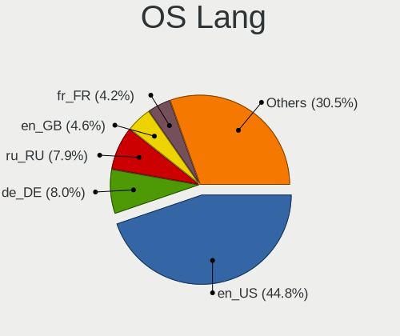
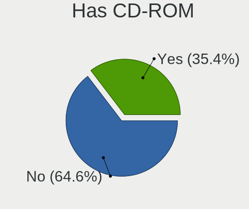
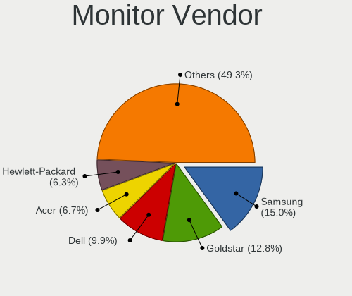
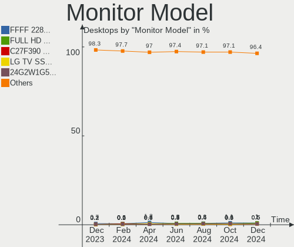

Linux Hardware Trends (Desktop)
-------------------------------

A project to identify most popular hardware characteristics and track their change
over time based on data collected by Linux users at https://Linux-Hardware.org.

Anyone can contribute to the study by uploading probes of their computers by
the [hw-probe](https://github.com/linuxhw/hw-probe) tool:

    sudo -E hw-probe -all -upload

Full-feature report is available here: https://linux-hardware.org/?view=trends&formfactor=desktop

Period: Jan, 2021.

Contents
--------

- [ OS                       ](#os)
- [ OS Family                ](#os-family)
- [ Kernel                   ](#kernel)
- [ Kernel Family            ](#kernel-family)
- [ Kernel Major Ver.        ](#kernel-major-ver)
- [ Arch                     ](#arch)
- [ DE                       ](#de)
- [ Display Server           ](#display-server)
- [ Display Manager          ](#display-manager)
- [ OS Lang                  ](#os-lang)
- [ Boot Mode                ](#boot-mode)
- [ Filesystem               ](#filesystem)
- [ Part. scheme             ](#part-scheme)
- [ Dual Boot with Linux/BSD ](#dual-boot-with-linux/bsd)
- [ Dual Boot (Win)          ](#dual-boot-win)
- [ Country                  ](#country)
- [ City                     ](#city)
- [ Vendor                   ](#vendor)
- [ Model                    ](#model)
- [ Model Family             ](#model-family)
- [ MFG Year                 ](#mfg-year)
- [ Form Factor              ](#form-factor)
- [ Secure Boot              ](#secure-boot)
- [ Coreboot                 ](#coreboot)
- [ RAM Size                 ](#ram-size)
- [ RAM Used                 ](#ram-used)
- [ Has CD-ROM               ](#has-cd-rom)
- [ Total Drives             ](#total-drives)
- [ Has Ethernet             ](#has-ethernet)
- [ Drive Vendor             ](#drive-vendor)
- [ Drive Model              ](#drive-model)
- [ HDD Vendor               ](#hdd-vendor)
- [ SSD Vendor               ](#ssd-vendor)
- [ Drive Kind               ](#drive-kind)
- [ Drive Connector          ](#drive-connector)
- [ Drive Size               ](#drive-size)
- [ Space Total              ](#space-total)
- [ Space Used               ](#space-used)
- [ Malfunc. Drives          ](#malfunc-drives)
- [ Malfunc. Drive Vendor    ](#malfunc-drive-vendor)
- [ Malfunc. HDD Vendor      ](#malfunc-hdd-vendor)
- [ Malfunc. Drive Kind      ](#malfunc-drive-kind)
- [ Failed Drives            ](#failed-drives)
- [ Failed Drive Vendor      ](#failed-drive-vendor)
- [ Drive Status             ](#drive-status)
- [ Storage Vendor           ](#storage-vendor)
- [ Storage Model            ](#storage-model)
- [ Storage Kind             ](#storage-kind)
- [ CPU Vendor               ](#cpu-vendor)
- [ CPU Model                ](#cpu-model)
- [ CPU Model Family         ](#cpu-model-family)
- [ CPU Cores                ](#cpu-cores)
- [ CPU Sockets              ](#cpu-sockets)
- [ CPU Threads              ](#cpu-threads)
- [ CPU Op-Modes             ](#cpu-op-modes)
- [ CPU Microcode            ](#cpu-microcode)
- [ CPU Microarch            ](#cpu-microarch)
- [ GPU Vendor               ](#gpu-vendor)
- [ GPU Model                ](#gpu-model)
- [ GPU Combo                ](#gpu-combo)
- [ GPU Driver               ](#gpu-driver)
- [ GPU Memory               ](#gpu-memory)
- [ Monitor Vendor           ](#monitor-vendor)
- [ Monitor Model            ](#monitor-model)
- [ Monitor Resolution       ](#monitor-resolution)
- [ Monitor Diagonal         ](#monitor-diagonal)
- [ Monitor Width            ](#monitor-width)
- [ Aspect Ratio             ](#aspect-ratio)
- [ Monitor Area             ](#monitor-area)
- [ Pixel Density            ](#pixel-density)
- [ Multiple Monitors        ](#multiple-monitors)
- [ Net Controller Vendor    ](#net-controller-vendor)
- [ Net Controller Model     ](#net-controller-model)
- [ Wireless Vendor          ](#wireless-vendor)
- [ Wireless Model           ](#wireless-model)
- [ Ethernet Vendor          ](#ethernet-vendor)
- [ Ethernet Model           ](#ethernet-model)
- [ Net Controller Kind      ](#net-controller-kind)
- [ Used Controller          ](#used-controller)
- [ NICs                     ](#nics)
- [ Memory Vendor            ](#memory-vendor)
- [ Memory Model             ](#memory-model)
- [ Memory Kind              ](#memory-kind)
- [ Memory Form Factor       ](#memory-form-factor)
- [ Memory Size              ](#memory-size)
- [ Memory Speed             ](#memory-speed)
- [ Sound Vendor             ](#sound-vendor)
- [ Sound Model              ](#sound-model)
- [ Camera Vendor            ](#camera-vendor)
- [ Camera Model             ](#camera-model)
- [ Fingerprint Vendor       ](#fingerprint-vendor)
- [ Fingerprint Model        ](#fingerprint-model)
- [ Chipcard Vendor          ](#chipcard-vendor)
- [ Chipcard Model           ](#chipcard-model)
- [ Printer Vendor           ](#printer-vendor)
- [ Printer Model            ](#printer-model)
- [ Scanner Vendor           ](#scanner-vendor)
- [ Scanner Model            ](#scanner-model)
- [ Bluetooth Vendor         ](#bluetooth-vendor)
- [ Bluetooth Model          ](#bluetooth-model)
- [ Unsupported Devices      ](#unsupported-devices)
- [ Unsupported Device Types ](#unsupported-device-types)

OS
--

Installed operating systems

| Name               | Desktops | Percent |
|--------------------|----------|---------|
| Ubuntu 20.04       | 648      | 29.27%  |
| Ubuntu 20.10       | 155      | 7%      |
| Pop!_OS 20.10      | 116      | 5.24%   |
| BlackPanther 18.1  | 108      | 4.88%   |
| Ubuntu 18.04       | 105      | 4.74%   |
| Mint 20.1          | 105      | 4.74%   |
| Mint 20            | 102      | 4.61%   |
| Fedora 33          | 95       | 4.29%   |
| ROSA R11.1         | 65       | 2.94%   |
| KDE neon 20.04     | 63       | 2.85%   |
| Manjaro 20.2.1     | 41       | 1.85%   |
| Arch               | 39       | 1.76%   |
| Mint 19.3          | 37       | 1.67%   |
| Debian 10          | 36       | 1.63%   |
| Manjaro            | 35       | 1.58%   |
| ROSA R11           | 31       | 1.4%    |
| Arch Rolling       | 29       | 1.31%   |
| Pop!_OS 20.04      | 28       | 1.26%   |
| Zorin 15           | 27       | 1.22%   |
| ArcoLinux Rolling  | 26       | 1.17%   |
| Ubuntu 16.04       | 19       | 0.86%   |
| Gentoo             | 15       | 0.68%   |
| Endless 3.9.1      | 15       | 0.68%   |
| Manjaro 20.2       | 14       | 0.63%   |
| Gentoo 2.7         | 13       | 0.59%   |
| Fedora 32          | 12       | 0.54%   |
| Debian Testing     | 10       | 0.45%   |
| Reborn OS          | 9        | 0.41%   |
| Ubuntu 21.04       | 7        | 0.32%   |
| Mint 19.1          | 7        | 0.32%   |
| LMDE 4             | 7        | 0.32%   |
| CentOS 8           | 7        | 0.32%   |
| Mint 19            | 6        | 0.27%   |
| Elementary 5.1.7   | 6        | 0.27%   |
| ROSA R10           | 5        | 0.23%   |
| RHEL 7.5           | 5        | 0.23%   |
| openSUSE Leap-15.2 | 5        | 0.23%   |
| Garuda Soaring     | 5        | 0.23%   |
| Artix Rolling      | 5        | 0.23%   |
| Ubuntu             | 4        | 0.18%   |
| Solus 4.1          | 4        | 0.18%   |
| ROSA R12           | 4        | 0.18%   |
| RHEL 8.3           | 4        | 0.18%   |
| Peppermint 10      | 4        | 0.18%   |
| OpenMandriva 4.2   | 4        | 0.18%   |
| MX 19.3            | 4        | 0.18%   |
| Garuda             | 4        | 0.18%   |
| Debian Unstable    | 4        | 0.18%   |
| Debian             | 4        | 0.18%   |
| BlackPanther 16.2  | 4        | 0.18%   |
| Artix              | 4        | 0.18%   |
| ALT Linux 9.1      | 4        | 0.18%   |
| WindowsFX 10       | 3        | 0.14%   |
| RED X4             | 3        | 0.14%   |
| Parrot 4.10        | 3        | 0.14%   |
| Kali 2020.4        | 3        | 0.14%   |
| Zorin 12           | 2        | 0.09%   |
| Void Rolling       | 2        | 0.09%   |
| Ubuntu 19.10       | 2        | 0.09%   |
| Ubuntu 19.04       | 2        | 0.09%   |

OS Family
---------

OS without a version

| Name         | Desktops | Percent |
|--------------|----------|---------|
| Ubuntu       | 944      | 42.64%  |
| Mint         | 259      | 11.7%   |
| Pop!_OS      | 144      | 6.5%    |
| BlackPanther | 113      | 5.1%    |
| Fedora       | 110      | 4.97%   |
| ROSA         | 106      | 4.79%   |
| Manjaro      | 91       | 4.11%   |
| Arch         | 69       | 3.12%   |
| KDE neon     | 65       | 2.94%   |
| Debian       | 59       | 2.66%   |
| Zorin        | 29       | 1.31%   |
| ArcoLinux    | 29       | 1.31%   |
| Gentoo       | 28       | 1.26%   |
| openSUSE     | 21       | 0.95%   |
| Endless      | 19       | 0.86%   |
| RHEL         | 10       | 0.45%   |
| CentOS       | 10       | 0.45%   |
| Reborn OS    | 9        | 0.41%   |
| Garuda       | 9        | 0.41%   |
| Clear Linux  | 9        | 0.41%   |
| Artix        | 9        | 0.41%   |
| LMDE         | 7        | 0.32%   |
| Elementary   | 7        | 0.32%   |
| OpenMandriva | 5        | 0.23%   |
| MX           | 5        | 0.23%   |
| ALT Linux    | 5        | 0.23%   |
| Solus        | 4        | 0.18%   |
| Peppermint   | 4        | 0.18%   |
| WindowsFX    | 3        | 0.14%   |
| RED          | 3        | 0.14%   |
| Parrot       | 3        | 0.14%   |
| Kali         | 3        | 0.14%   |
| Devuan       | 3        | 0.14%   |
| Deepin       | 3        | 0.14%   |
| Void         | 2        | 0.09%   |
| Oracle Linux | 2        | 0.09%   |
| Mageia       | 2        | 0.09%   |
| EndeavourOS  | 2        | 0.09%   |
| Slackware    | 1        | 0.05%   |
| RELS         | 1        | 0.05%   |
| Redcore      | 1        | 0.05%   |
| Pearl        | 1        | 0.05%   |
| PCLinuxOS    | 1        | 0.05%   |
| Pardus       | 1        | 0.05%   |
| Hash Linux   | 1        | 0.05%   |
| Drauger OS   | 1        | 0.05%   |
| Chrome OS    | 1        | 0.05%   |

Kernel
------

Version of the Linux kernel

| Version                             | Desktops | Percent |
|-------------------------------------|----------|---------|
| 5.4.0-58-generic                    | 170      | 7.68%   |
| 5.8.0-7630-generic                  | 138      | 6.23%   |
| 5.4.0-60-generic                    | 112      | 5.06%   |
| 5.8.0-36-generic                    | 111      | 5.01%   |
| 5.8.0-38-generic                    | 109      | 4.92%   |
| 4.18.16-desktop-1bP                 | 102      | 4.61%   |
| 5.4.0-59-generic                    | 96       | 4.34%   |
| 5.4.0-62-generic                    | 94       | 4.25%   |
| 5.8.0-40-generic                    | 87       | 3.93%   |
| 5.4.0-64-generic                    | 83       | 3.75%   |
| 5.8.0-41-generic                    | 50       | 2.26%   |
| 5.9.16-200.fc33.x86_64              | 47       | 2.12%   |
| 5.4.0-65-generic                    | 44       | 1.99%   |
| 5.4.0-42-generic                    | 39       | 1.76%   |
| 5.8.0-34-generic                    | 38       | 1.72%   |
| 5.9.16-1-MANJARO                    | 33       | 1.49%   |
| 5.8.0-33-generic                    | 30       | 1.36%   |
| 4.15.0-desktop-122.124.1rosa-x86_64 | 30       | 1.36%   |
| 4.19.0-13-amd64                     | 29       | 1.31%   |
| 5.10.2-2-MANJARO                    | 20       | 0.9%    |
| 4.15.0-desktop-45.1rosa-x86_64      | 19       | 0.86%   |
| 5.8.0-14-generic                    | 18       | 0.81%   |
| 4.15.0-128-generic                  | 17       | 0.77%   |
| 5.4.0-52-generic                    | 15       | 0.68%   |
| 5.10.7-3-MANJARO                    | 13       | 0.59%   |
| 5.10.3-arch1-1                      | 13       | 0.59%   |
| 5.4.83-generic-2rosa-x86_64         | 12       | 0.54%   |
| 5.10.9-201.fc33.x86_64              | 11       | 0.5%    |
| 5.10.7-arch1-1                      | 11       | 0.5%    |
| 5.10.6-arch1-1                      | 11       | 0.5%    |
| 5.10.4-arch2-1                      | 11       | 0.5%    |
| 4.15.0-132-generic                  | 10       | 0.45%   |
| 5.4.0-26-generic                    | 9        | 0.41%   |
| 5.10.9-arch1-1                      | 9        | 0.41%   |
| 4.15.0-desktop-45.1rosa-i586        | 9        | 0.41%   |
| 5.8.0-25-generic                    | 8        | 0.36%   |
| 5.10.0-1-amd64                      | 8        | 0.36%   |
| 5.9.14-arch1-1                      | 7        | 0.32%   |
| 5.4.0-54-generic                    | 7        | 0.32%   |
| 5.10.7-200.fc33.x86_64              | 7        | 0.32%   |
| 5.10.7-1-default                    | 7        | 0.32%   |
| 5.10.10-200.fc33.x86_64             | 7        | 0.32%   |
| 4.15.0-130-generic                  | 7        | 0.32%   |
| 5.6.14-desktop-2bP                  | 6        | 0.27%   |
| 5.4.85-1-MANJARO                    | 6        | 0.27%   |
| 5.4.32-generic-2rosa-x86_64         | 6        | 0.27%   |
| 5.10.6-200.fc33.x86_64              | 6        | 0.27%   |
| 4.15.0-135-generic                  | 6        | 0.27%   |
| 5.9.0-0.bpo.2-amd64                 | 5        | 0.23%   |
| 5.8.15-301.fc33.x86_64              | 5        | 0.23%   |
| 5.4.0-64-lowlatency                 | 5        | 0.23%   |
| 5.4.0-48-generic                    | 5        | 0.23%   |
| 5.10.5-arch1-1                      | 5        | 0.23%   |
| 5.0.0-32-generic                    | 5        | 0.23%   |
| 4.9.155-nrj-desktop-1rosa-x86_64    | 5        | 0.23%   |
| 5.9.16-100.fc32.x86_64              | 4        | 0.18%   |
| 5.9.11-3-MANJARO                    | 4        | 0.18%   |
| 5.8.0-38-lowlatency                 | 4        | 0.18%   |
| 5.4.86-1-lts                        | 4        | 0.18%   |
| 5.4.0-56-generic                    | 4        | 0.18%   |

Kernel Family
-------------

Linux kernel without a distro release

| Version | Desktops | Percent |
|---------|----------|---------|
| 5.4.0   | 720      | 32.52%  |
| 5.8.0   | 612      | 27.64%  |
| 4.15.0  | 135      | 6.1%    |
| 4.18.16 | 102      | 4.61%   |
| 5.9.16  | 90       | 4.07%   |
| 5.10.7  | 56       | 2.53%   |
| 5.10.4  | 37       | 1.67%   |
| 4.19.0  | 35       | 1.58%   |
| 5.10.6  | 29       | 1.31%   |
| 5.10.9  | 24       | 1.08%   |
| 5.10.2  | 22       | 0.99%   |
| 5.10.0  | 21       | 0.95%   |
| 5.10.3  | 20       | 0.9%    |
| 5.10.5  | 18       | 0.81%   |
| 5.10.10 | 18       | 0.81%   |
| 5.9.0   | 16       | 0.72%   |
| 4.18.0  | 16       | 0.72%   |
| 5.9.14  | 14       | 0.63%   |
| 5.4.83  | 14       | 0.63%   |
| 5.10.8  | 14       | 0.63%   |
| 5.3.0   | 12       | 0.54%   |
| 5.0.0   | 10       | 0.45%   |
| 4.4.0   | 10       | 0.45%   |
| 3.10.0  | 9        | 0.41%   |
| 5.9.11  | 7        | 0.32%   |
| 5.4.85  | 7        | 0.32%   |
| 5.4.80  | 7        | 0.32%   |
| 4.9.155 | 7        | 0.32%   |
| 5.6.14  | 6        | 0.27%   |
| 5.4.32  | 6        | 0.27%   |
| 5.3.18  | 6        | 0.27%   |
| 4.9.60  | 6        | 0.27%   |
| 4.9.0   | 6        | 0.27%   |
| 5.9.12  | 5        | 0.23%   |
| 5.8.15  | 5        | 0.23%   |
| 5.10.11 | 5        | 0.23%   |
| 4.9.20  | 5        | 0.23%   |
| 5.9.15  | 4        | 0.18%   |
| 5.4.89  | 4        | 0.18%   |
| 5.4.86  | 4        | 0.18%   |
| 5.9.8   | 3        | 0.14%   |
| 5.9.1   | 3        | 0.14%   |
| 5.6.0   | 3        | 0.14%   |
| 5.4.92  | 3        | 0.14%   |
| 5.4.70  | 3        | 0.14%   |
| 5.9.13  | 2        | 0.09%   |
| 5.8.18  | 2        | 0.09%   |
| 5.7.19  | 2        | 0.09%   |
| 5.7.1   | 2        | 0.09%   |
| 5.6.6   | 2        | 0.09%   |
| 5.5.19  | 2        | 0.09%   |
| 5.5.0   | 2        | 0.09%   |
| 5.4.90  | 2        | 0.09%   |
| 5.4.88  | 2        | 0.09%   |
| 5.4.78  | 2        | 0.09%   |
| 5.4.53  | 2        | 0.09%   |
| 5.10.1  | 2        | 0.09%   |
| 4.7.0   | 2        | 0.09%   |
| 4.10.0  | 2        | 0.09%   |
| 5.8.2   | 1        | 0.05%   |

Kernel Major Ver.
-----------------

Linux kernel major version

| Version | Desktops | Percent |
|---------|----------|---------|
| 5.4     | 787      | 35.55%  |
| 5.8     | 622      | 28.09%  |
| 5.10    | 266      | 12.01%  |
| 5.9     | 144      | 6.5%    |
| 4.15    | 135      | 6.1%    |
| 4.18    | 118      | 5.33%   |
| 4.19    | 39       | 1.76%   |
| 4.9     | 25       | 1.13%   |
| 5.3     | 20       | 0.9%    |
| 5.6     | 11       | 0.5%    |
| 5.0     | 11       | 0.5%    |
| 4.4     | 11       | 0.5%    |
| 3.10    | 9        | 0.41%   |
| 5.7     | 5        | 0.23%   |
| 5.5     | 5        | 0.23%   |
| 4.7     | 2        | 0.09%   |
| 4.10    | 2        | 0.09%   |
| 5.11    | 1        | 0.05%   |
| 4.11    | 1        | 0.05%   |

Arch
----

OS architecture (x86_64, i586, etc.)

| Name   | Desktops | Percent |
|--------|----------|---------|
| x86_64 | 2142     | 96.75%  |
| i686   | 72       | 3.25%   |

DE
--

Desktop Environment

| Name            | Desktops | Percent |
|-----------------|----------|---------|
| GNOME           | 1024     | 46.25%  |
| KDE5            | 247      | 11.16%  |
| X-Cinnamon      | 206      | 9.3%    |
| XFCE            | 193      | 8.72%   |
| KDE             | 156      | 7.05%   |
| Unknown         | 121      | 5.47%   |
| MATE            | 71       | 3.21%   |
| KDE4            | 66       | 2.98%   |
| Cinnamon        | 23       | 1.04%   |
| Unity           | 18       | 0.81%   |
| LXQt            | 15       | 0.68%   |
| LXDE            | 14       | 0.63%   |
| i3              | 9        | 0.41%   |
| Pantheon        | 7        | 0.32%   |
| Deepin          | 7        | 0.32%   |
| Budgie          | 7        | 0.32%   |
| GNOME Classic   | 6        | 0.27%   |
| GNOME Flashback | 5        | 0.23%   |
| bspwm           | 4        | 0.18%   |
| dwm             | 3        | 0.14%   |
| awesome         | 3        | 0.14%   |
| XSession        | 1        | 0.05%   |
| Xpra            | 1        | 0.05%   |
| xmonad          | 1        | 0.05%   |
| sway            | 1        | 0.05%   |
| qtile           | 1        | 0.05%   |
| Openbox         | 1        | 0.05%   |
| Lumina          | 1        | 0.05%   |
| i3-with-shmlog  | 1        | 0.05%   |
| enlightenment   | 1        | 0.05%   |

Display Server
--------------

X11 or Wayland

| Name        | Desktops | Percent |
|-------------|----------|---------|
| X11         | 2003     | 90.47%  |
| Wayland     | 111      | 5.01%   |
| Unknown     | 61       | 2.76%   |
| Tty         | 37       | 1.67%   |
| Web         | 1        | 0.05%   |
| Unspecified | 1        | 0.05%   |

Display Manager
---------------

SDDM, LightDM, etc.

| Name    | Desktops | Percent |
|---------|----------|---------|
| Unknown | 1489     | 67.25%  |
| SDDM    | 256      | 11.56%  |
| GDM     | 178      | 8.04%   |
| TDM     | 169      | 7.63%   |
| KDM     | 67       | 3.03%   |
| LightDM | 44       | 1.99%   |
| XDM     | 3        | 0.14%   |
| SLiM    | 3        | 0.14%   |
| NODM    | 1        | 0.05%   |
| MDM     | 1        | 0.05%   |
| Ly      | 1        | 0.05%   |
| LXDM    | 1        | 0.05%   |
| GDM3    | 1        | 0.05%   |

OS Lang
-------

Language

| Lang        | Desktops | Percent |
|-------------|----------|---------|
| en_US       | 727      | 32.84%  |
| de_DE       | 227      | 10.25%  |
| Unknown     | 179      | 8.08%   |
| ru_RU       | 143      | 6.46%   |
| fr_FR       | 120      | 5.42%   |
| en_GB       | 120      | 5.42%   |
| pt_BR       | 100      | 4.52%   |
| en_CA       | 68       | 3.07%   |
| it_IT       | 65       | 2.94%   |
| es_ES       | 55       | 2.48%   |
| pl_PL       | 44       | 1.99%   |
| en_AU       | 40       | 1.81%   |
| C           | 34       | 1.54%   |
| nl_NL       | 26       | 1.17%   |
| en_IN       | 21       | 0.95%   |
| cs_CZ       | 17       | 0.77%   |
| ja_JP       | 13       | 0.59%   |
| hu_HU       | 12       | 0.54%   |
| sk_SK       | 11       | 0.5%    |
| es_AR       | 11       | 0.5%    |
| pt_PT       | 10       | 0.45%   |
| es_MX       | 10       | 0.45%   |
| en_ZA       | 10       | 0.45%   |
| de_AT       | 10       | 0.45%   |
| zh_CN       | 8        | 0.36%   |
| sv_SE       | 8        | 0.36%   |
| ru_UA       | 8        | 0.36%   |
| tr_TR       | 7        | 0.32%   |
| fr_CA       | 7        | 0.32%   |
| el_GR       | 7        | 0.32%   |
| de_CH       | 7        | 0.32%   |
| uk_UA       | 6        | 0.27%   |
| es_CL       | 5        | 0.23%   |
| en_PH       | 5        | 0.23%   |
| bg_BG       | 5        | 0.23%   |
| sl_SI       | 4        | 0.18%   |
| nl_BE       | 4        | 0.18%   |
| fr_BE       | 4        | 0.18%   |
| fi_FI       | 4        | 0.18%   |
| zh_TW       | 3        | 0.14%   |
| ro_RO       | 3        | 0.14%   |
| POSIX       | 3        | 0.14%   |
| hr_HR       | 3        | 0.14%   |
| he_IL       | 3        | 0.14%   |
| es_VE       | 3        | 0.14%   |
| en_NZ       | 3        | 0.14%   |
| en_IE       | 3        | 0.14%   |
| nb_NO       | 2        | 0.09%   |
| ko_KR       | 2        | 0.09%   |
| es_CO       | 2        | 0.09%   |
| ca_ES       | 2        | 0.09%   |
| th_TH       | 1        | 0.05%   |
| sv_FI       | 1        | 0.05%   |
| ru_RU.UTF_8 | 1        | 0.05%   |
| lv_LV       | 1        | 0.05%   |
| it_CH       | 1        | 0.05%   |
| gl_ES       | 1        | 0.05%   |
| fr_CH       | 1        | 0.05%   |
| fa_IR       | 1        | 0.05%   |
| es_UY       | 1        | 0.05%   |

Boot Mode
---------

EFI or BIOS

| Mode | Desktops | Percent |
|------|----------|---------|
| BIOS | 1471     | 66.44%  |
| EFI  | 743      | 33.56%  |

Filesystem
----------

Type of filesystem

| Type    | Desktops | Percent |
|---------|----------|---------|
| Ext4    | 1853     | 83.69%  |
| Btrfs   | 145      | 6.55%   |
| Overlay | 135      | 6.1%    |
| Xfs     | 46       | 2.08%   |
| Zfs     | 17       | 0.77%   |
| Ext2    | 7        | 0.32%   |
| Tmpfs   | 3        | 0.14%   |
| Unknown | 3        | 0.14%   |
| Aufs    | 2        | 0.09%   |
| Jfs     | 1        | 0.05%   |
| F2fs    | 1        | 0.05%   |
| Ext3    | 1        | 0.05%   |

Part. scheme
------------

Scheme of partitioning

| Type    | Desktops | Percent |
|---------|----------|---------|
| Unknown | 1438     | 64.95%  |
| GPT     | 458      | 20.69%  |
| MBR     | 318      | 14.36%  |

Dual Boot with Linux/BSD
------------------------

Hosting more than one Linux/BSD

| Dual boot | Desktops | Percent |
|-----------|----------|---------|
| No        | 1802     | 81.39%  |
| Yes       | 412      | 18.61%  |

Dual Boot (Win)
---------------

Hosting Linux and Windows

| Dual boot | Desktops | Percent |
|-----------|----------|---------|
| No        | 1461     | 65.99%  |
| Yes       | 753      | 34.01%  |

Country
-------

Geographic location (country)

| Country            | Desktops | Percent |
|--------------------|----------|---------|
| USA                | 397      | 17.93%  |
| Germany            | 283      | 12.78%  |
| Russia             | 182      | 8.22%   |
| France             | 123      | 5.56%   |
| Brazil             | 116      | 5.24%   |
| UK                 | 100      | 4.52%   |
| Hungary            | 99       | 4.47%   |
| Canada             | 92       | 4.16%   |
| Italy              | 83       | 3.75%   |
| Spain              | 61       | 2.76%   |
| Netherlands        | 48       | 2.17%   |
| Poland             | 43       | 1.94%   |
| Ukraine            | 42       | 1.9%    |
| Australia          | 40       | 1.81%   |
| India              | 28       | 1.26%   |
| Belgium            | 25       | 1.13%   |
| Switzerland        | 24       | 1.08%   |
| Austria            | 24       | 1.08%   |
| Sweden             | 22       | 0.99%   |
| Slovakia           | 22       | 0.99%   |
| Czech Republic     | 21       | 0.95%   |
| Greece             | 19       | 0.86%   |
| Argentina          | 19       | 0.86%   |
| Mexico             | 18       | 0.81%   |
| Japan              | 16       | 0.72%   |
| South Africa       | 15       | 0.68%   |
| Romania            | 15       | 0.68%   |
| Finland            | 13       | 0.59%   |
| Bulgaria           | 13       | 0.59%   |
| Philippines        | 12       | 0.54%   |
| Turkey             | 11       | 0.5%    |
| Portugal           | 11       | 0.5%    |
| Israel             | 10       | 0.45%   |
| China              | 10       | 0.45%   |
| Croatia            | 9        | 0.41%   |
| Taiwan             | 7        | 0.32%   |
| Norway             | 7        | 0.32%   |
| Colombia           | 7        | 0.32%   |
| Chile              | 7        | 0.32%   |
| Slovenia           | 6        | 0.27%   |
| Malaysia           | 5        | 0.23%   |
| Lithuania          | 5        | 0.23%   |
| Korea, Republic of | 5        | 0.23%   |
| Ireland            | 5        | 0.23%   |
| Denmark            | 5        | 0.23%   |
| Vietnam            | 4        | 0.18%   |
| Thailand           | 4        | 0.18%   |
| New Zealand        | 4        | 0.18%   |
| Latvia             | 4        | 0.18%   |
| Indonesia          | 4        | 0.18%   |
| Hong Kong          | 4        | 0.18%   |
| Belarus            | 4        | 0.18%   |
| Venezuela          | 3        | 0.14%   |
| Uruguay            | 3        | 0.14%   |
| Singapore          | 3        | 0.14%   |
| Serbia             | 3        | 0.14%   |
| Kazakhstan         | 3        | 0.14%   |
| Iceland            | 3        | 0.14%   |
| Egypt              | 3        | 0.14%   |
| Bangladesh         | 3        | 0.14%   |

City
----

Geographic location (city)

| City              | Desktops | Percent |
|-------------------|----------|---------|
| Moscow            | 35       | 1.58%   |
| Budapest          | 34       | 1.54%   |
| Berlin            | 27       | 1.22%   |
| Paris             | 21       | 0.95%   |
| Munich            | 14       | 0.63%   |
| Bratislava        | 14       | 0.63%   |
| São Paulo        | 13       | 0.59%   |
| Montreal          | 13       | 0.59%   |
| Kyiv              | 13       | 0.59%   |
| Vienna            | 12       | 0.54%   |
| St Petersburg     | 10       | 0.45%   |
| Rome              | 10       | 0.45%   |
| Madrid            | 10       | 0.45%   |
| Hamburg           | 10       | 0.45%   |
| Frankfurt am Main | 10       | 0.45%   |
| Athens            | 10       | 0.45%   |
| Toronto           | 9        | 0.41%   |
| Wrocław          | 8        | 0.36%   |
| Prague            | 8        | 0.36%   |
| Johannesburg      | 8        | 0.36%   |
| Debrecen          | 8        | 0.36%   |
| Zagreb            | 7        | 0.32%   |
| Wolfersheim       | 7        | 0.32%   |
| Sydney            | 7        | 0.32%   |
| Stuttgart         | 7        | 0.32%   |
| Seattle           | 7        | 0.32%   |
| Milan             | 7        | 0.32%   |
| Lutsk             | 7        | 0.32%   |
| Krasnodar         | 7        | 0.32%   |
| Helsinki          | 7        | 0.32%   |
| Ekaterinburg      | 7        | 0.32%   |
| Chicago           | 7        | 0.32%   |
| Buenos Aires      | 7        | 0.32%   |
| Bengaluru         | 7        | 0.32%   |
| Voronezh          | 6        | 0.27%   |
| Vancouver         | 6        | 0.27%   |
| Tel Aviv          | 6        | 0.27%   |
| Rio de Janeiro    | 6        | 0.27%   |
| New York          | 6        | 0.27%   |
| London            | 6        | 0.27%   |
| Calgary           | 6        | 0.27%   |
| Thessaloniki      | 5        | 0.23%   |
| Taipei            | 5        | 0.23%   |
| Phoenix           | 5        | 0.23%   |
| Novosibirsk       | 5        | 0.23%   |
| Istanbul          | 5        | 0.23%   |
| Denver            | 5        | 0.23%   |
| Curitiba          | 5        | 0.23%   |
| Brasília         | 5        | 0.23%   |
| Belo Horizonte    | 5        | 0.23%   |
| Amsterdam         | 5        | 0.23%   |
| Yaroslavl         | 4        | 0.18%   |
| Warsaw            | 4        | 0.18%   |
| Volgograd         | 4        | 0.18%   |
| Valencia          | 4        | 0.18%   |
| Stockholm         | 4        | 0.18%   |
| St Louis          | 4        | 0.18%   |
| Rostov-on-Don     | 4        | 0.18%   |
| Perth             | 4        | 0.18%   |
| Perm              | 4        | 0.18%   |

Vendor
------

Motherboard manufacturer

| Name                   | Desktops | Percent |
|------------------------|----------|---------|
| ASUSTek Computer       | 597      | 26.96%  |
| Gigabyte Technology    | 405      | 18.29%  |
| MSI                    | 262      | 11.83%  |
| ASRock                 | 208      | 9.39%   |
| Dell                   | 183      | 8.27%   |
| Hewlett-Packard        | 147      | 6.64%   |
| Lenovo                 | 82       | 3.7%    |
| Intel                  | 54       | 2.44%   |
| Acer                   | 36       | 1.63%   |
| Fujitsu                | 25       | 1.13%   |
| Unknown                | 24       | 1.08%   |
| Pegatron               | 18       | 0.81%   |
| Foxconn                | 17       | 0.77%   |
| Biostar                | 17       | 0.77%   |
| Medion                 | 16       | 0.72%   |
| ECS                    | 15       | 0.68%   |
| Fujitsu Siemens        | 7        | 0.32%   |
| Positivo               | 6        | 0.27%   |
| Packard Bell           | 6        | 0.27%   |
| Apple                  | 6        | 0.27%   |
| Supermicro             | 5        | 0.23%   |
| Shuttle                | 5        | 0.23%   |
| PCWare                 | 5        | 0.23%   |
| Huanan                 | 5        | 0.23%   |
| IBM                    | 4        | 0.18%   |
| eMachines              | 4        | 0.18%   |
| Inventec               | 3        | 0.14%   |
| Google                 | 3        | 0.14%   |
| Alienware              | 3        | 0.14%   |
| TYAN Computer          | 2        | 0.09%   |
| HARDKERNEL             | 2        | 0.09%   |
| Gateway                | 2        | 0.09%   |
| EVGA                   | 2        | 0.09%   |
| ASL                    | 2        | 0.09%   |
| AOpen                  | 2        | 0.09%   |
| AMI                    | 2        | 0.09%   |
| VS Company             | 1        | 0.05%   |
| Vorke                  | 1        | 0.05%   |
| ViewSonic Crop.        | 1        | 0.05%   |
| Varian Medical Systems | 1        | 0.05%   |
| T-bao                  | 1        | 0.05%   |
| SYWZ                   | 1        | 0.05%   |
| System76               | 1        | 0.05%   |
| SiYW                   | 1        | 0.05%   |
| Semp Toshiba           | 1        | 0.05%   |
| SeeedStudio            | 1        | 0.05%   |
| Samsung Electronics    | 1        | 0.05%   |
| QTQD                   | 1        | 0.05%   |
| Qbex                   | 1        | 0.05%   |
| PROLINE                | 1        | 0.05%   |
| Philco                 | 1        | 0.05%   |
| PCChips                | 1        | 0.05%   |
| NEXCOM                 | 1        | 0.05%   |
| NEC Computers          | 1        | 0.05%   |
| NCR                    | 1        | 0.05%   |
| MiTAC                  | 1        | 0.05%   |
| Minix                  | 1        | 0.05%   |
| MEGA                   | 1        | 0.05%   |
| Login Informatica      | 1        | 0.05%   |
| Lex                    | 1        | 0.05%   |

Model
-----

Motherboard model

| Name                               | Desktops | Percent |
|------------------------------------|----------|---------|
| ASUS All Series                    | 59       | 2.66%   |
| Unknown                            | 24       | 1.08%   |
| Gigabyte B450M DS3H                | 17       | 0.77%   |
| ASUS TUF GAMING X570-PLUS          | 15       | 0.68%   |
| MSI MS-7C02                        | 12       | 0.54%   |
| Dell OptiPlex 7010                 | 12       | 0.54%   |
| Gigabyte 970A-DS3P                 | 11       | 0.5%    |
| Dell OptiPlex 780                  | 10       | 0.45%   |
| ASUS ROG STRIX B450-F GAMING       | 10       | 0.45%   |
| MSI MS-7C37                        | 9        | 0.41%   |
| MSI MS-7B79                        | 9        | 0.41%   |
| ASUS PRIME B450M-A                 | 9        | 0.41%   |
| ASRock B450M Pro4                  | 9        | 0.41%   |
| MSI MS-7693                        | 8        | 0.36%   |
| Dell OptiPlex 9020                 | 8        | 0.36%   |
| ASUS ROG STRIX B550-F GAMING       | 8        | 0.36%   |
| MSI MS-7A38                        | 7        | 0.32%   |
| HP Compaq Elite 8300 SFF           | 7        | 0.32%   |
| Gigabyte G41M-Combo                | 7        | 0.32%   |
| Dell PowerEdge FC630               | 7        | 0.32%   |
| Dell OptiPlex 790                  | 7        | 0.32%   |
| ASUS PRIME A320M-K                 | 7        | 0.32%   |
| Intel B75                          | 6        | 0.27%   |
| Gigabyte X570 AORUS ELITE          | 6        | 0.27%   |
| Gigabyte GA-78LMT-USB3 6.0         | 6        | 0.27%   |
| Gigabyte G31M-ES2L                 | 6        | 0.27%   |
| Dell Inspiron 580                  | 6        | 0.27%   |
| ASUS TUF B450-PLUS GAMING          | 6        | 0.27%   |
| ASUS PRIME X470-PRO                | 6        | 0.27%   |
| ASUS M5A97 R2.0                    | 6        | 0.27%   |
| ASUS M5A78L-M/USB3                 | 6        | 0.27%   |
| MSI MS-7C94                        | 5        | 0.23%   |
| MSI MS-7C84                        | 5        | 0.23%   |
| MSI MS-7B86                        | 5        | 0.23%   |
| MSI MS-7A36                        | 5        | 0.23%   |
| MSI MS-7816                        | 5        | 0.23%   |
| MSI MS-7758                        | 5        | 0.23%   |
| Gigabyte X470 AORUS ULTRA GAMING   | 5        | 0.23%   |
| Gigabyte B450M S2H                 | 5        | 0.23%   |
| Gigabyte A320M-S2H                 | 5        | 0.23%   |
| Dell Precision WorkStation T3400   | 5        | 0.23%   |
| Dell OptiPlex 990                  | 5        | 0.23%   |
| Dell OptiPlex 390                  | 5        | 0.23%   |
| Dell OptiPlex 3020                 | 5        | 0.23%   |
| ASUS P8Z77-V LX                    | 5        | 0.23%   |
| ASUS P5KPL-AM EPU                  | 5        | 0.23%   |
| ASUS M5A99FX PRO R2.0              | 5        | 0.23%   |
| ASUS Crosshair IV Formula          | 5        | 0.23%   |
| ASRock AB350M Pro4                 | 5        | 0.23%   |
| MSI MS-7C91                        | 4        | 0.18%   |
| MSI MS-7C56                        | 4        | 0.18%   |
| MSI MS-7B93                        | 4        | 0.18%   |
| MSI MS-7B89                        | 4        | 0.18%   |
| MSI MS-7A32                        | 4        | 0.18%   |
| MSI MS-7721                        | 4        | 0.18%   |
| MSI MS-7025                        | 4        | 0.18%   |
| Lenovo ThinkCentre M800 10FW0004US | 4        | 0.18%   |
| HP Z420 Workstation                | 4        | 0.18%   |
| HP Z400 Workstation                | 4        | 0.18%   |
| HP Pavilion Desktop PC 570-p0xx    | 4        | 0.18%   |

Model Family
------------

Motherboard model prefix

| Name                   | Desktops | Percent |
|------------------------|----------|---------|
| Dell OptiPlex          | 92       | 4.16%   |
| ASUS PRIME             | 85       | 3.84%   |
| ASUS ROG               | 62       | 2.8%    |
| ASUS All               | 59       | 2.66%   |
| Lenovo ThinkCentre     | 55       | 2.48%   |
| HP Compaq              | 54       | 2.44%   |
| ASUS TUF               | 54       | 2.44%   |
| Dell Inspiron          | 31       | 1.4%    |
| Gigabyte X570          | 26       | 1.17%   |
| Dell Precision         | 26       | 1.17%   |
| Gigabyte B450M         | 25       | 1.13%   |
| Acer Aspire            | 24       | 1.08%   |
| Unknown                | 24       | 1.08%   |
| Fujitsu ESPRIMO        | 17       | 0.77%   |
| ASUS M5A78L-M          | 17       | 0.77%   |
| ASUS M5A97             | 15       | 0.68%   |
| HP ProDesk             | 14       | 0.63%   |
| ASUS P8Z77-V           | 14       | 0.63%   |
| ASRock B450M           | 13       | 0.59%   |
| MSI MS-7C02            | 12       | 0.54%   |
| Gigabyte B450          | 12       | 0.54%   |
| ASUS P8H61-M           | 12       | 0.54%   |
| Gigabyte GA-78LMT-USB3 | 11       | 0.5%    |
| Gigabyte 970A-DS3P     | 11       | 0.5%    |
| Dell PowerEdge         | 11       | 0.5%    |
| ASRock X570            | 11       | 0.5%    |
| HP EliteDesk           | 10       | 0.45%   |
| ASUS Crosshair         | 10       | 0.45%   |
| MSI MS-7C37            | 9        | 0.41%   |
| MSI MS-7B79            | 9        | 0.41%   |
| Lenovo ThinkStation    | 9        | 0.41%   |
| ASRock B450            | 9        | 0.41%   |
| MSI MS-7693            | 8        | 0.36%   |
| HP ProLiant            | 8        | 0.36%   |
| HP Pavilion            | 8        | 0.36%   |
| Gigabyte A320M-S2H     | 8        | 0.36%   |
| ASUS P5KPL-AM          | 8        | 0.36%   |
| Acer Veriton           | 8        | 0.36%   |
| MSI MS-7A38            | 7        | 0.32%   |
| Gigabyte G41M-Combo    | 7        | 0.32%   |
| Dell XPS               | 7        | 0.32%   |
| ASUS SABERTOOTH        | 7        | 0.32%   |
| ASUS P7H55-M           | 7        | 0.32%   |
| ASUS M5A99X            | 7        | 0.32%   |
| Intel B75              | 6        | 0.27%   |
| Gigabyte Z370          | 6        | 0.27%   |
| Gigabyte G31M-ES2L     | 6        | 0.27%   |
| Gigabyte B550M         | 6        | 0.27%   |
| Gigabyte B550          | 6        | 0.27%   |
| Dell Vostro            | 6        | 0.27%   |
| ASUS P8H67-M           | 6        | 0.27%   |
| ASRock X470            | 6        | 0.27%   |
| ASRock 970             | 6        | 0.27%   |
| MSI MS-7C94            | 5        | 0.23%   |
| MSI MS-7C84            | 5        | 0.23%   |
| MSI MS-7B86            | 5        | 0.23%   |
| MSI MS-7A36            | 5        | 0.23%   |
| MSI MS-7816            | 5        | 0.23%   |
| MSI MS-7758            | 5        | 0.23%   |
| Gigabyte Z390          | 5        | 0.23%   |

MFG Year
--------

Motherboard manufacture year

| Year    | Desktops | Percent |
|---------|----------|---------|
| 2020    | 364      | 16.44%  |
| 2019    | 249      | 11.25%  |
| 2018    | 207      | 9.35%   |
| 2013    | 180      | 8.13%   |
| 2014    | 164      | 7.41%   |
| 2012    | 157      | 7.09%   |
| 2010    | 152      | 6.87%   |
| 2011    | 138      | 6.23%   |
| 2015    | 124      | 5.6%    |
| 2016    | 113      | 5.1%    |
| 2009    | 104      | 4.7%    |
| 2008    | 77       | 3.48%   |
| 2017    | 69       | 3.12%   |
| 2007    | 67       | 3.03%   |
| 2006    | 15       | 0.68%   |
| 2021    | 12       | 0.54%   |
| 2005    | 11       | 0.5%    |
| Unknown | 6        | 0.27%   |
| 2004    | 4        | 0.18%   |
| 2003    | 1        | 0.05%   |

Form Factor
-----------

Physical design of the computer

| Name    | Desktops | Percent |
|---------|----------|---------|
| Desktop | 2214     | 100%    |

Secure Boot
-----------

Enabled or disabled

| State    | Desktops | Percent |
|----------|----------|---------|
| Disabled | 2171     | 98.06%  |
| Enabled  | 43       | 1.94%   |

Coreboot
--------

Have coreboot on board

| Used | Desktops | Percent |
|------|----------|---------|
| No   | 2210     | 99.82%  |
| Yes  | 4        | 0.18%   |

RAM Size
--------

Total RAM memory

| Size in GB      | Desktops | Percent |
|-----------------|----------|---------|
| 16.01-24.0      | 544      | 24.57%  |
| 8.01-16.0       | 467      | 21.09%  |
| 3.01-4.0        | 351      | 15.85%  |
| 4.01-8.0        | 317      | 14.32%  |
| 32.01-64.0      | 285      | 12.87%  |
| 64.01-256.0     | 87       | 3.93%   |
| 1.01-2.0        | 74       | 3.34%   |
| 2.01-3.0        | 40       | 1.81%   |
| 24.01-32.0      | 34       | 1.54%   |
| 0.51-1.0        | 8        | 0.36%   |
| More than 256.0 | 7        | 0.32%   |

RAM Used
--------

Used RAM memory

| Used GB    | Desktops | Percent |
|------------|----------|---------|
| 1.01-2.0   | 793      | 35.82%  |
| 2.01-3.0   | 461      | 20.82%  |
| 4.01-8.0   | 315      | 14.23%  |
| 3.01-4.0   | 236      | 10.66%  |
| 0.51-1.0   | 186      | 8.4%    |
| 8.01-16.0  | 101      | 4.56%   |
| 0.01-0.5   | 101      | 4.56%   |
| 16.01-24.0 | 12       | 0.54%   |
| 32.01-64.0 | 6        | 0.27%   |
| 24.01-32.0 | 3        | 0.14%   |

Has CD-ROM
----------

Has CD-ROM on board

| Presented | Desktops | Percent |
|-----------|----------|---------|
| Yes       | 1107     | 50%     |
| No        | 1107     | 50%     |

Total Drives
------------

Number of drives on board

| Drives | Desktops | Percent |
|--------|----------|---------|
| 1      | 778      | 35.14%  |
| 2      | 689      | 31.12%  |
| 3      | 387      | 17.48%  |
| 4      | 187      | 8.45%   |
| 5      | 86       | 3.88%   |
| 6      | 42       | 1.9%    |
| 7      | 19       | 0.86%   |
| 0      | 10       | 0.45%   |
| 8      | 6        | 0.27%   |
| 9      | 4        | 0.18%   |
| 12     | 3        | 0.14%   |
| 11     | 2        | 0.09%   |
| 13     | 1        | 0.05%   |

Has Ethernet
------------

Has Ethernet on board

| Presented | Desktops | Percent |
|-----------|----------|---------|
| Yes       | 2182     | 98.55%  |
| No        | 32       | 1.45%   |

Drive Vendor
------------

Hard drive vendors

| Vendor                    | Desktops | Drives | Percent |
|---------------------------|----------|--------|---------|
| WDC                       | 852      | 1138   | 21.1%   |
| Seagate                   | 802      | 1075   | 19.87%  |
| Samsung Electronics       | 582      | 792    | 14.42%  |
| Kingston                  | 276      | 305    | 6.84%   |
| Toshiba                   | 198      | 225    | 4.9%    |
| Crucial                   | 155      | 176    | 3.84%   |
| Hitachi                   | 152      | 161    | 3.77%   |
| Sandisk                   | 150      | 165    | 3.72%   |
| A-DATA Technology         | 77       | 83     | 1.91%   |
| Intel                     | 71       | 74     | 1.76%   |
| Phison                    | 53       | 63     | 1.31%   |
| Unknown                   | 51       | 54     | 1.26%   |
| Maxtor                    | 43       | 49     | 1.07%   |
| HGST                      | 37       | 48     | 0.92%   |
| China                     | 33       | 34     | 0.82%   |
| SPCC                      | 27       | 29     | 0.67%   |
| PNY                       | 24       | 27     | 0.59%   |
| Silicon Motion            | 23       | 23     | 0.57%   |
| OCZ                       | 23       | 23     | 0.57%   |
| Corsair                   | 22       | 23     | 0.54%   |
| Patriot                   | 19       | 20     | 0.47%   |
| Intenso                   | 19       | 20     | 0.47%   |
| Transcend                 | 18       | 19     | 0.45%   |
| Hewlett-Packard           | 16       | 21     | 0.4%    |
| Apacer                    | 15       | 15     | 0.37%   |
| XPG                       | 14       | 15     | 0.35%   |
| Micron/Crucial Technology | 13       | 14     | 0.32%   |
| JMicron                   | 13       | 14     | 0.32%   |
| Fujitsu                   | 12       | 12     | 0.3%    |
| ASMT                      | 12       | 15     | 0.3%    |
| Team                      | 11       | 11     | 0.27%   |
| Micron Technology         | 11       | 11     | 0.27%   |
| GOODRAM                   | 11       | 12     | 0.27%   |
| SK Hynix                  | 10       | 16     | 0.25%   |
| PLEXTOR                   | 9        | 10     | 0.22%   |
| KingSpec                  | 9        | 10     | 0.22%   |
| Mushkin                   | 8        | 9      | 0.2%    |
| Gigabyte Technology       | 8        | 8      | 0.2%    |
| Realtek Semiconductor     | 7        | 7      | 0.17%   |
| Kingmax                   | 7        | 7      | 0.17%   |
| WD MediaMax               | 5        | 5      | 0.12%   |
| SABRENT                   | 5        | 5      | 0.12%   |
| LITEONIT                  | 5        | 5      | 0.12%   |
| Lexar                     | 5        | 5      | 0.12%   |
| AMD                       | 5        | 6      | 0.12%   |
| KIOXIA-EXCERIA            | 4        | 4      | 0.1%    |
| External                  | 4        | 4      | 0.1%    |
| Dell                      | 4        | 8      | 0.1%    |
| LITEON                    | 3        | 3      | 0.07%   |
| INNOVATION IT             | 3        | 3      | 0.07%   |
| Apple                     | 3        | 3      | 0.07%   |
| USB3.0                    | 2        | 2      | 0.05%   |
| USB                       | 2        | 2      | 0.05%   |
| TCSUNBOW                  | 2        | 2      | 0.05%   |
| MyDigitalSSD              | 2        | 2      | 0.05%   |
| Msft                      | 2        | 3      | 0.05%   |
| MATSHITA                  | 2        | 2      | 0.05%   |
| Lite-On                   | 2        | 2      | 0.05%   |
| KingFast                  | 2        | 2      | 0.05%   |
| HGST HTS                  | 2        | 2      | 0.05%   |

Drive Model
-----------

Hard drive models

| Model                              | Desktops | Percent |
|------------------------------------|----------|---------|
| Seagate ST500DM002-1BD142 500GB    | 63       | 1.35%   |
| Samsung SSD 850 EVO 250GB          | 58       | 1.24%   |
| Kingston SA400S37120G 120GB SSD    | 56       | 1.2%    |
| Seagate ST1000DM010-2EP102 1TB     | 52       | 1.11%   |
| Kingston SA400S37240G 240GB SSD    | 50       | 1.07%   |
| Samsung SSD 860 EVO 500GB          | 45       | 0.96%   |
| WDC WD10EZEX-08WN4A0 1TB           | 42       | 0.9%    |
| Seagate ST2000DM008-2FR102 2TB     | 40       | 0.85%   |
| Samsung NVMe SSD Drive 500GB       | 40       | 0.85%   |
| Toshiba DT01ACA100 1TB             | 38       | 0.81%   |
| Samsung SSD 860 EVO 1TB            | 36       | 0.77%   |
| Seagate ST3500418AS 500GB          | 35       | 0.75%   |
| Seagate ST1000DM003-1CH162 1TB     | 33       | 0.71%   |
| Samsung SSD 850 EVO 500GB          | 33       | 0.71%   |
| Kingston SV300S37A120G 120GB SSD   | 33       | 0.71%   |
| Kingston SA400S37480G 480GB SSD    | 32       | 0.68%   |
| Samsung SSD 860 EVO 250GB          | 30       | 0.64%   |
| Seagate ST1000DM003-1ER162 1TB     | 28       | 0.6%    |
| Seagate ST2000DM006-2DM164 2TB     | 27       | 0.58%   |
| Seagate ST2000DM001-1ER164 2TB     | 27       | 0.58%   |
| WDC WD20EZRZ-00Z5HB0 2TB           | 26       | 0.56%   |
| Crucial CT500MX500SSD1 500GB       | 26       | 0.56%   |
| Toshiba HDWD110 1TB                | 25       | 0.53%   |
| WDC WD10EZEX-00BN5A0 1TB           | 24       | 0.51%   |
| Toshiba DT01ACA200 2TB             | 24       | 0.51%   |
| Seagate ST4000DM004-2CV104 4TB     | 24       | 0.51%   |
| WDC WDS500G2B0A-00SM50 500GB SSD   | 23       | 0.49%   |
| Samsung NVMe SSD Drive 1TB         | 23       | 0.49%   |
| Samsung NVMe SSD Drive 250GB       | 20       | 0.43%   |
| Unknown SD/MMC/MS PRO 32GB         | 18       | 0.38%   |
| Samsung SSD 840 EVO 250GB          | 18       | 0.38%   |
| Samsung SSD 840 EVO 120GB          | 18       | 0.38%   |
| Samsung HD103SJ 1TB                | 18       | 0.38%   |
| Crucial CT240BX500SSD1 240GB       | 18       | 0.38%   |
| Sandisk NVMe SSD Drive 500GB       | 17       | 0.36%   |
| WDC WD20EZRX-00D8PB0 2TB           | 16       | 0.34%   |
| WDC WD20EARX-00PASB0 2TB           | 16       | 0.34%   |
| Seagate Expansion Desk 8TB         | 16       | 0.34%   |
| Seagate Expansion 1TB              | 15       | 0.32%   |
| Samsung SSD 970 EVO Plus 500GB     | 15       | 0.32%   |
| WDC WDS240G2G0A-00JH30 240GB SSD   | 14       | 0.3%    |
| WDC WD30EFRX-68EUZN0 3TB           | 14       | 0.3%    |
| WDC WD20EARS-00MVWB0 2TB           | 14       | 0.3%    |
| Toshiba DT01ACA050 500GB           | 14       | 0.3%    |
| Seagate ST1000DM003-9YN162 1TB     | 14       | 0.3%    |
| Samsung SSD 970 EVO 1TB            | 14       | 0.3%    |
| Crucial CT480BX500SSD1 480GB       | 14       | 0.3%    |
| A-DATA SU630 240GB SSD             | 14       | 0.3%    |
| WDC WD10EARS-00Y5B1 1TB            | 13       | 0.28%   |
| Seagate ST3500413AS 500GB          | 13       | 0.28%   |
| Seagate ST31000524AS 1TB           | 13       | 0.28%   |
| Seagate ST2000DM001-1CH164 2TB     | 13       | 0.28%   |
| Seagate ST1000LM024 HN-M101MBB 1TB | 13       | 0.28%   |
| Samsung HD103SI 1TB                | 13       | 0.28%   |
| Crucial CT250MX500SSD1 250GB       | 13       | 0.28%   |
| Crucial CT1000MX500SSD1 1TB        | 13       | 0.28%   |
| WDC WD5000AADS-00S9B0 500GB        | 12       | 0.26%   |
| WDC WD10EZEX-00RKKA0 1TB           | 12       | 0.26%   |
| Seagate ST31000528AS 1TB           | 12       | 0.26%   |
| Hitachi HDS721010CLA332 1TB        | 12       | 0.26%   |

HDD Vendor
----------

Hard disk drive vendors

| Vendor              | Desktops | Drives | Percent |
|---------------------|----------|--------|---------|
| Seagate             | 787      | 1055   | 36.42%  |
| WDC                 | 770      | 1012   | 35.63%  |
| Toshiba             | 179      | 203    | 8.28%   |
| Hitachi             | 152      | 161    | 7.03%   |
| Samsung Electronics | 141      | 172    | 6.52%   |
| Maxtor              | 41       | 47     | 1.9%    |
| HGST                | 37       | 48     | 1.71%   |
| Fujitsu             | 12       | 12     | 0.56%   |
| Hewlett-Packard     | 9        | 12     | 0.42%   |
| ASMT                | 9        | 10     | 0.42%   |
| WD MediaMax         | 4        | 4      | 0.19%   |
| Dell                | 4        | 8      | 0.19%   |
| USB3.0              | 2        | 2      | 0.09%   |
| Msft                | 2        | 3      | 0.09%   |
| Asmedia             | 2        | 2      | 0.09%   |
| Apple               | 2        | 2      | 0.09%   |
| VBOX                | 1        | 1      | 0.05%   |
| Unknown             | 1        | 1      | 0.05%   |
| TO Exter            | 1        | 1      | 0.05%   |
| Maxone              | 1        | 1      | 0.05%   |
| HGST HTS            | 1        | 1      | 0.05%   |
| H/W                 | 1        | 1      | 0.05%   |
| Config              | 1        | 1      | 0.05%   |
| ASMT109x            | 1        | 1      | 0.05%   |

SSD Vendor
----------

Solid state drive vendors

| Vendor              | Desktops | Drives | Percent |
|---------------------|----------|--------|---------|
| Samsung Electronics | 343      | 419    | 24%     |
| Kingston            | 246      | 268    | 17.21%  |
| Crucial             | 146      | 167    | 10.22%  |
| SanDisk             | 119      | 125    | 8.33%   |
| WDC                 | 99       | 104    | 6.93%   |
| A-DATA Technology   | 71       | 76     | 4.97%   |
| Intel               | 39       | 41     | 2.73%   |
| China               | 33       | 34     | 2.31%   |
| SPCC                | 24       | 25     | 1.68%   |
| OCZ                 | 23       | 23     | 1.61%   |
| PNY                 | 22       | 25     | 1.54%   |
| Patriot             | 19       | 20     | 1.33%   |
| Transcend           | 16       | 17     | 1.12%   |
| Toshiba             | 15       | 15     | 1.05%   |
| Apacer              | 15       | 15     | 1.05%   |
| Intenso             | 13       | 14     | 0.91%   |
| Corsair             | 12       | 12     | 0.84%   |
| Team                | 10       | 10     | 0.7%    |
| GOODRAM             | 10       | 11     | 0.7%    |
| KingSpec            | 9        | 10     | 0.63%   |
| JMicron             | 9        | 9      | 0.63%   |
| PLEXTOR             | 8        | 9      | 0.56%   |
| Unknown             | 7        | 7      | 0.49%   |
| Mushkin             | 7        | 8      | 0.49%   |
| Kingmax             | 7        | 7      | 0.49%   |
| Hewlett-Packard     | 7        | 9      | 0.49%   |
| SK Hynix            | 6        | 12     | 0.42%   |
| Seagate             | 6        | 8      | 0.42%   |
| Micron Technology   | 6        | 6      | 0.42%   |
| Gigabyte Technology | 6        | 6      | 0.42%   |
| SABRENT             | 5        | 5      | 0.35%   |
| LITEONIT            | 5        | 5      | 0.35%   |
| Lexar               | 5        | 5      | 0.35%   |
| LITEON              | 3        | 3      | 0.21%   |
| INNOVATION IT       | 3        | 3      | 0.21%   |
| AMD                 | 3        | 3      | 0.21%   |
| MyDigitalSSD        | 2        | 2      | 0.14%   |
| Maxtor              | 2        | 2      | 0.14%   |
| KIOXIA-EXCERIA      | 2        | 2      | 0.14%   |
| FORESEE             | 2        | 2      | 0.14%   |
| External            | 2        | 2      | 0.14%   |
| Dogfish             | 2        | 2      | 0.14%   |
| ZOTAC               | 1        | 1      | 0.07%   |
| WDC WDS2            | 1        | 1      | 0.07%   |
| WDC WDS             | 1        | 1      | 0.07%   |
| ViperTeq            | 1        | 1      | 0.07%   |
| Verbatim            | 1        | 1      | 0.07%   |
| Vaseky              | 1        | 1      | 0.07%   |
| V7                  | 1        | 1      | 0.07%   |
| USB30               | 1        | 1      | 0.07%   |
| ULTIMATE            | 1        | 1      | 0.07%   |
| TCSUNBOW            | 1        | 1      | 0.07%   |
| SUNEAST             | 1        | 1      | 0.07%   |
| SBe                 | 1        | 1      | 0.07%   |
| QUMO                | 1        | 1      | 0.07%   |
| OWC                 | 1        | 1      | 0.07%   |
| OCZ-VERTEX2         | 1        | 1      | 0.07%   |
| OCZ-VERTEX          | 1        | 1      | 0.07%   |
| NGFF                | 1        | 1      | 0.07%   |
| Netac               | 1        | 1      | 0.07%   |

Drive Kind
----------

HDD or SSD

| Kind    | Desktops | Drives | Percent |
|---------|----------|--------|---------|
| HDD     | 1662     | 2761   | 49.38%  |
| SSD     | 1185     | 1588   | 35.2%   |
| NVMe    | 421      | 530    | 12.51%  |
| Unknown | 87       | 98     | 2.58%   |
| MMC     | 11       | 12     | 0.33%   |

Drive Connector
---------------

SATA, SAS, NVMe, etc.

| Type | Desktops | Drives | Percent |
|------|----------|--------|---------|
| SATA | 2092     | 4243   | 77.65%  |
| NVMe | 421      | 530    | 15.63%  |
| SAS  | 170      | 204    | 6.31%   |
| MMC  | 11       | 12     | 0.41%   |

Drive Size
----------

Size of hard drive

| Size in TB | Desktops | Drives | Percent |
|------------|----------|--------|---------|
| 0.01-0.5   | 1611     | 2402   | 51.98%  |
| 0.51-1.0   | 854      | 1073   | 27.56%  |
| 1.01-2.0   | 364      | 509    | 11.75%  |
| 3.01-4.0   | 109      | 140    | 3.52%   |
| 2.01-3.0   | 79       | 104    | 2.55%   |
| 4.01-10.0  | 71       | 102    | 2.29%   |
| 10.01-20.0 | 6        | 10     | 0.19%   |
| 20.01-50.0 | 4        | 8      | 0.13%   |
| 0          | 1        | 1      | 0.03%   |

Space Total
-----------

Amount of disk space available on the file system

| Size in GB     | Desktops | Percent |
|----------------|----------|---------|
| 101-250        | 522      | 23.58%  |
| 251-500        | 365      | 16.49%  |
| 501-1000       | 344      | 15.54%  |
| 1001-2000      | 256      | 11.56%  |
| More than 3000 | 213      | 9.62%   |
| Unknown        | 145      | 6.55%   |
| 2001-3000      | 128      | 5.78%   |
| 51-100         | 122      | 5.51%   |
| 1-20           | 68       | 3.07%   |
| 21-50          | 51       | 2.3%    |

Space Used
----------

Amount of used disk space

| Used GB        | Desktops | Percent |
|----------------|----------|---------|
| 1-20           | 680      | 30.71%  |
| 21-50          | 296      | 13.37%  |
| 101-250        | 258      | 11.65%  |
| 51-100         | 211      | 9.53%   |
| 501-1000       | 190      | 8.58%   |
| 251-500        | 177      | 7.99%   |
| Unknown        | 145      | 6.55%   |
| 1001-2000      | 136      | 6.14%   |
| More than 3000 | 69       | 3.12%   |
| 2001-3000      | 52       | 2.35%   |

Malfunc. Drives
---------------

Drive models with a malfunction

| Model                                 | Desktops | Drives | Percent |
|---------------------------------------|----------|--------|---------|
| Seagate ST500DM002-1BD142 500GB       | 10       | 11     | 3.48%   |
| Seagate ST3500418AS 500GB             | 6        | 7      | 2.09%   |
| WDC WD10EZEX-00RKKA0 1TB              | 4        | 4      | 1.39%   |
| Kingston SV300S37A120G 120GB SSD      | 4        | 4      | 1.39%   |
| WDC WD5000AAKS-00V1A0 500GB           | 3        | 3      | 1.05%   |
| WDC WD3200AAJS-22B4A0 320GB           | 3        | 3      | 1.05%   |
| Seagate ST380811AS 80GB               | 3        | 3      | 1.05%   |
| Seagate ST3320613AS 320GB             | 3        | 3      | 1.05%   |
| Seagate ST3160815AS 160GB             | 3        | 3      | 1.05%   |
| Seagate ST2000DM006-2DM164 2TB        | 3        | 3      | 1.05%   |
| Samsung Electronics HD161HJ 160GB     | 3        | 3      | 1.05%   |
| WDC WD5002ABYS-01B1B0 500GB           | 2        | 2      | 0.7%    |
| WDC WD5000AVDS-63U7B1 500GB           | 2        | 2      | 0.7%    |
| WDC WD5000AAKX-08U6AA0 500GB          | 2        | 2      | 0.7%    |
| WDC WD5000AAKX-07U6AA0 500GB          | 2        | 2      | 0.7%    |
| WDC WD5000AAKX-00ERMA0 500GB          | 2        | 2      | 0.7%    |
| WDC WD5000AADS-00S9B0 500GB           | 2        | 2      | 0.7%    |
| WDC WD20EARS-00MVWB0 2TB              | 2        | 2      | 0.7%    |
| WDC WD15EARS-00MVWB0 1TB              | 2        | 2      | 0.7%    |
| WDC WD10EZEX-08WN4A0 1TB              | 2        | 2      | 0.7%    |
| WDC WD10EADS-65M2B1 1TB               | 2        | 2      | 0.7%    |
| Toshiba DT01ACA100 1TB                | 2        | 2      | 0.7%    |
| Toshiba DT01ACA050 500GB              | 2        | 2      | 0.7%    |
| SPCC Solid State Disk 240GB           | 2        | 2      | 0.7%    |
| Seagate ST9500325AS 500GB             | 2        | 2      | 0.7%    |
| Seagate ST500LM021-1KJ152 500GB       | 2        | 2      | 0.7%    |
| Seagate ST500LM012 HN-M500MBB 500GB   | 2        | 2      | 0.7%    |
| Seagate ST500DM002-1BC142 500GB       | 2        | 2      | 0.7%    |
| Seagate ST380815AS 80GB               | 2        | 2      | 0.7%    |
| Seagate ST3250410AS 250GB             | 2        | 2      | 0.7%    |
| Seagate ST3160813AS 160GB             | 2        | 2      | 0.7%    |
| Seagate ST31000524AS 1TB              | 2        | 2      | 0.7%    |
| Seagate ST3000DM001-9YN166 3TB        | 2        | 2      | 0.7%    |
| Seagate ST1000DX001-1NS162 1TB        | 2        | 2      | 0.7%    |
| Seagate ST1000DM003-1CH162 1TB        | 2        | 2      | 0.7%    |
| Samsung Electronics SSD 960 EVO 250GB | 2        | 3      | 0.7%    |
| Samsung Electronics HD103UJ 1TB       | 2        | 2      | 0.7%    |
| Samsung Electronics HD103SI 1TB       | 2        | 2      | 0.7%    |
| MAXTOR STM3250310AS 250GB             | 2        | 2      | 0.7%    |
| Maxtor 6Y080L0 82GB                   | 2        | 2      | 0.7%    |
| Kingston SHFS37A120G 120GB SSD        | 2        | 2      | 0.7%    |
| Kingston SA400S37120G 120GB SSD       | 2        | 2      | 0.7%    |
| Intel SSDPEKKW256G7 256GB             | 2        | 2      | 0.7%    |
| Hitachi HTS543232A7A384 320GB         | 2        | 2      | 0.7%    |
| Hitachi HDS721616PLA380 160GB         | 2        | 2      | 0.7%    |
| Hitachi HDS721050CLA362 500GB         | 2        | 2      | 0.7%    |
| WDC WDS240G2G0A-00JH30 240GB SSD      | 1        | 1      | 0.35%   |
| WDC WDS120G2G0B-00EPW0 120GB SSD      | 1        | 1      | 0.35%   |
| WDC WDS120G2G0A-00JH30 120GB SSD      | 1        | 1      | 0.35%   |
| WDC WD800BB-00JHC0 80GB               | 1        | 1      | 0.35%   |
| WDC WD800BB-00FRA0 80GB               | 1        | 1      | 0.35%   |
| WDC WD800AAJS-75M0A0 80GB             | 1        | 1      | 0.35%   |
| WDC WD800AAJS-00PSA0 80GB             | 1        | 1      | 0.35%   |
| WDC WD7500AARS-00Y5B1 752GB           | 1        | 1      | 0.35%   |
| WDC WD6401AALS-00E3A0 640GB           | 1        | 1      | 0.35%   |
| WDC WD6400BEVT-22A0RT0 640GB          | 1        | 1      | 0.35%   |
| WDC WD6400AAKS-22A7B2 640GB           | 1        | 1      | 0.35%   |
| WDC WD6400AAKS-22A7B0 640GB           | 1        | 1      | 0.35%   |
| WDC WD60EFRX-68L0BN1 6TB              | 1        | 1      | 0.35%   |
| WDC WD6002FRYZ-01WD5B0 6TB            | 1        | 1      | 0.35%   |

Malfunc. Drive Vendor
---------------------

Vendors of faulty drives

| Vendor              | Desktops | Drives | Percent |
|---------------------|----------|--------|---------|
| WDC                 | 85       | 94     | 31.02%  |
| Seagate             | 83       | 91     | 30.29%  |
| Samsung Electronics | 22       | 24     | 8.03%   |
| Hitachi             | 19       | 19     | 6.93%   |
| Kingston            | 13       | 13     | 4.74%   |
| Maxtor              | 10       | 11     | 3.65%   |
| Toshiba             | 9        | 9      | 3.28%   |
| A-DATA Technology   | 5        | 5      | 1.82%   |
| Intel               | 4        | 4      | 1.46%   |
| HGST                | 3        | 3      | 1.09%   |
| SPCC                | 2        | 2      | 0.73%   |
| SK Hynix            | 2        | 2      | 0.73%   |
| PLEXTOR             | 2        | 2      | 0.73%   |
| OCZ                 | 2        | 2      | 0.73%   |
| Kingmax             | 2        | 2      | 0.73%   |
| Corsair             | 2        | 2      | 0.73%   |
| WD MediaMax         | 1        | 1      | 0.36%   |
| Transcend           | 1        | 1      | 0.36%   |
| Mushkin             | 1        | 1      | 0.36%   |
| KingSpec            | 1        | 1      | 0.36%   |
| Intenso             | 1        | 1      | 0.36%   |
| Hewlett-Packard     | 1        | 1      | 0.36%   |
| Fujitsu             | 1        | 1      | 0.36%   |
| Crucial             | 1        | 1      | 0.36%   |
| ASMT                | 1        | 2      | 0.36%   |

Malfunc. HDD Vendor
-------------------

Vendors of faulty HDD drives

| Vendor              | Desktops | Drives | Percent |
|---------------------|----------|--------|---------|
| Seagate             | 83       | 91     | 36.56%  |
| WDC                 | 82       | 91     | 36.12%  |
| Hitachi             | 19       | 19     | 8.37%   |
| Samsung Electronics | 18       | 19     | 7.93%   |
| Maxtor              | 10       | 11     | 4.41%   |
| Toshiba             | 8        | 8      | 3.52%   |
| HGST                | 3        | 3      | 1.32%   |
| WD MediaMax         | 1        | 1      | 0.44%   |
| Hewlett-Packard     | 1        | 1      | 0.44%   |
| Fujitsu             | 1        | 1      | 0.44%   |
| ASMT                | 1        | 2      | 0.44%   |

Malfunc. Drive Kind
-------------------

Kinds of faulty drives

| Kind | Desktops | Drives | Percent |
|------|----------|--------|---------|
| HDD  | 201      | 247    | 81.71%  |
| SSD  | 38       | 40     | 15.45%  |
| NVMe | 7        | 8      | 2.85%   |

Failed Drives
-------------

Failed drive models

| Model                           | Desktops | Drives | Percent |
|---------------------------------|----------|--------|---------|
| Seagate ST3500418AS 500GB       | 1        | 1      | 16.67%  |
| Seagate ST3320613AS 320GB       | 1        | 1      | 16.67%  |
| Seagate ST3250620AS 250GB       | 1        | 1      | 16.67%  |
| Seagate ST32000644NS 2TB        | 1        | 1      | 16.67%  |
| Samsung Electronics HD103SJ 1TB | 1        | 1      | 16.67%  |
| Hitachi HDS721010DLE630 1TB     | 1        | 1      | 16.67%  |

Failed Drive Vendor
-------------------

Failed drive vendors

| Vendor              | Desktops | Drives | Percent |
|---------------------|----------|--------|---------|
| Seagate             | 4        | 4      | 66.67%  |
| Samsung Electronics | 1        | 1      | 16.67%  |
| Hitachi             | 1        | 1      | 16.67%  |

Drive Status
------------

Number of failed and malfunc. drives

| Status   | Desktops | Drives | Percent |
|----------|----------|--------|---------|
| Detected | 1483     | 3229   | 61.41%  |
| Works    | 689      | 1459   | 28.53%  |
| Malfunc  | 237      | 295    | 9.81%   |
| Failed   | 6        | 6      | 0.25%   |

Storage Vendor
--------------

Storage controller vendors

| Vendor                           | Desktops | Percent |
|----------------------------------|----------|---------|
| Intel                            | 1388     | 46.41%  |
| AMD                              | 738      | 24.67%  |
| Samsung Electronics              | 167      | 5.58%   |
| ASMedia Technology               | 115      | 3.84%   |
| JMicron Technology               | 88       | 2.94%   |
| Nvidia                           | 82       | 2.74%   |
| Marvell Technology Group         | 71       | 2.37%   |
| Phison Electronics               | 67       | 2.24%   |
| Sandisk                          | 56       | 1.87%   |
| Kingston Technology Company      | 35       | 1.17%   |
| Silicon Motion                   | 30       | 1%      |
| ADATA Technology                 | 22       | 0.74%   |
| Micron/Crucial Technology        | 21       | 0.7%    |
| VIA Technologies                 | 19       | 0.64%   |
| Broadcom / LSI                   | 18       | 0.6%    |
| LSI Logic / Symbios Logic        | 14       | 0.47%   |
| Realtek Semiconductor            | 8        | 0.27%   |
| Toshiba America Info Systems     | 7        | 0.23%   |
| Silicon Image                    | 7        | 0.23%   |
| Micron Technology                | 5        | 0.17%   |
| SK Hynix                         | 4        | 0.13%   |
| Silicon Integrated Systems [SiS] | 4        | 0.13%   |
| Lite-On Technology               | 3        | 0.1%    |
| KIOXIA                           | 3        | 0.1%    |
| Hewlett-Packard                  | 3        | 0.1%    |
| Adaptec                          | 3        | 0.1%    |
| ULi Electronics                  | 2        | 0.07%   |
| Integrated Technology Express    | 2        | 0.07%   |
| Union Memory (Shenzhen)          | 1        | 0.03%   |
| Solid State Storage Technology   | 1        | 0.03%   |
| Shenzhen Longsys Electronics     | 1        | 0.03%   |
| Seagate Technology               | 1        | 0.03%   |
| Lite-On IT Corp. / Plextor       | 1        | 0.03%   |
| HighPoint Technologies           | 1        | 0.03%   |
| Biwin Storage Technology         | 1        | 0.03%   |
| Beijing Starblaze Technology     | 1        | 0.03%   |
| Advanced System Products         | 1        | 0.03%   |

Storage Model
-------------

Storage controller models

| Model                                                                                   | Desktops | Percent |
|-----------------------------------------------------------------------------------------|----------|---------|
| AMD FCH SATA Controller [AHCI mode]                                                     | 427      | 10.87%  |
| AMD 400 Series Chipset SATA Controller                                                  | 171      | 4.35%   |
| Intel 8 Series/C220 Series Chipset Family 6-port SATA Controller 1 [AHCI mode]          | 165      | 4.2%    |
| Intel NM10/ICH7 Family SATA Controller [IDE mode]                                       | 129      | 3.28%   |
| AMD SB7x0/SB8x0/SB9x0 IDE Controller                                                    | 122      | 3.11%   |
| Samsung NVMe SSD Controller SM981/PM981/PM983                                           | 116      | 2.95%   |
| Intel 7 Series/C210 Series Chipset Family 6-port SATA Controller [AHCI mode]            | 112      | 2.85%   |
| Intel 200 Series PCH SATA controller [AHCI mode]                                        | 112      | 2.85%   |
| Intel 6 Series/C200 Series Chipset Family 6 port Desktop SATA AHCI Controller           | 111      | 2.83%   |
| ASMedia ASM1062 Serial ATA Controller                                                   | 110      | 2.8%    |
| AMD SB7x0/SB8x0/SB9x0 SATA Controller [AHCI mode]                                       | 108      | 2.75%   |
| Intel Q170/Q150/B150/H170/H110/Z170/CM236 Chipset SATA Controller [AHCI Mode]           | 101      | 2.57%   |
| Intel 82801G (ICH7 Family) IDE Controller                                               | 95       | 2.42%   |
| AMD SB7x0/SB8x0/SB9x0 SATA Controller [IDE mode]                                        | 83       | 2.11%   |
| Intel SATA Controller [RAID mode]                                                       | 68       | 1.73%   |
| AMD SATA controller                                                                     | 64       | 1.63%   |
| Intel Cannon Lake PCH SATA AHCI Controller                                              | 51       | 1.3%    |
| Intel 6 Series/C200 Series Chipset Family Desktop SATA Controller (IDE mode, ports 4-5) | 51       | 1.3%    |
| Intel 6 Series/C200 Series Chipset Family Desktop SATA Controller (IDE mode, ports 0-3) | 50       | 1.27%   |
| Nvidia MCP61 SATA Controller                                                            | 43       | 1.09%   |
| JMicron JMB363 SATA/IDE Controller                                                      | 43       | 1.09%   |
| Intel 400 Series Chipset Family SATA AHCI Controller                                    | 38       | 0.97%   |
| Nvidia MCP61 IDE                                                                        | 37       | 0.94%   |
| Intel 82801I (ICH9 Family) 2 port SATA Controller [IDE mode]                            | 37       | 0.94%   |
| Samsung NVMe SSD Controller SM961/PM961/SM963                                           | 34       | 0.87%   |
| Phison E12 NVMe Controller                                                              | 34       | 0.87%   |
| AMD FCH SATA Controller D                                                               | 34       | 0.87%   |
| Intel 9 Series Chipset Family SATA Controller [AHCI Mode]                               | 32       | 0.81%   |
| Intel 4 Series Chipset PT IDER Controller                                               | 32       | 0.81%   |
| JMicron JMB368 IDE controller                                                           | 31       | 0.79%   |
| Intel 82801JI (ICH10 Family) 2 port SATA IDE Controller #2                              | 31       | 0.79%   |
| AMD 300 Series Chipset SATA Controller                                                  | 30       | 0.76%   |
| Intel 82801JI (ICH10 Family) 4 port SATA IDE Controller #1                              | 29       | 0.74%   |
| Kingston Company A2000 NVMe SSD                                                         | 28       | 0.71%   |
| Intel 82801JI (ICH10 Family) SATA AHCI Controller                                       | 28       | 0.71%   |
| Intel 82801IR/IO/IH (ICH9R/DO/DH) 4 port SATA Controller [IDE mode]                     | 28       | 0.71%   |
| Intel 5 Series/3400 Series Chipset 4 port SATA IDE Controller                           | 28       | 0.71%   |
| Intel 5 Series/3400 Series Chipset 6 port SATA AHCI Controller                          | 27       | 0.69%   |
| Phison E16 PCIe4 NVMe Controller                                                        | 26       | 0.66%   |
| Intel 82801JD/DO (ICH10 Family) SATA AHCI Controller                                    | 26       | 0.66%   |
| AMD FCH IDE Controller                                                                  | 26       | 0.66%   |
| Intel C610/X99 series chipset 6-Port SATA Controller [AHCI mode]                        | 25       | 0.64%   |
| Intel C610/X99 series chipset sSATA Controller [AHCI mode]                              | 24       | 0.61%   |
| Silicon Motion SM2263EN/SM2263XT SSD Controller                                         | 22       | 0.56%   |
| Intel 5 Series/3400 Series Chipset 2 port SATA IDE Controller                           | 22       | 0.56%   |
| AMD X370 Series Chipset SATA Controller                                                 | 21       | 0.53%   |
| Intel C600/X79 series chipset 6-Port SATA AHCI Controller                               | 20       | 0.51%   |
| ADATA XPG SX8200 Pro PCIe Gen3x4 M.2 2280 Solid State Drive                             | 20       | 0.51%   |
| Sandisk WD Black 2018 / PC SN720 NVMe SSD                                               | 18       | 0.46%   |
| Intel 82801IR/IO/IH (ICH9R/DO/DH) 6 port SATA Controller [AHCI mode]                    | 18       | 0.46%   |
| Marvell Group 88SE9172 SATA 6Gb/s Controller                                            | 17       | 0.43%   |
| Sandisk WD Blue SN550 NVMe SSD                                                          | 16       | 0.41%   |
| Intel SSD 660P Series                                                                   | 16       | 0.41%   |
| Intel Atom Processor E3800 Series SATA AHCI Controller                                  | 16       | 0.41%   |
| Marvell Group 88SE6111/6121 SATA II / PATA Controller                                   | 14       | 0.36%   |
| Intel 7 Series/C210 Series Chipset Family 4-port SATA Controller [IDE mode]             | 14       | 0.36%   |
| Intel 7 Series/C210 Series Chipset Family 2-port SATA Controller [IDE mode]             | 14       | 0.36%   |
| Micron/Crucial P1 NVMe PCIe SSD                                                         | 13       | 0.33%   |
| Samsung Electronics Non-Volatile memory controller                                      | 12       | 0.31%   |
| Intel Celeron/Pentium Silver Processor SATA Controller                                  | 12       | 0.31%   |

Storage Kind
------------

Kind of storage controller (IDE, SATA, NVMe, SAS, ...)

| Kind | Desktops | Percent |
|------|----------|---------|
| SATA | 1698     | 56.98%  |
| IDE  | 692      | 23.22%  |
| NVMe | 421      | 14.13%  |
| RAID | 136      | 4.56%   |
| SAS  | 21       | 0.7%    |
| SCSI | 12       | 0.4%    |

CPU Vendor
----------

Processor vendors

| Vendor       | Desktops | Percent |
|--------------|----------|---------|
| Intel        | 1398     | 63.14%  |
| AMD          | 815      | 36.81%  |
| CentaurHauls | 1        | 0.05%   |

CPU Model
---------

Processor models

| Model                                       | Desktops | Percent |
|---------------------------------------------|----------|---------|
| AMD Ryzen 5 3600 6-Core Processor           | 49       | 2.21%   |
| AMD Ryzen 7 3700X 8-Core Processor          | 47       | 2.12%   |
| Intel Core 2 Duo CPU E8400 @ 3.00GHz        | 30       | 1.36%   |
| AMD Ryzen 9 3900X 12-Core Processor         | 29       | 1.31%   |
| AMD Ryzen 5 2600 Six-Core Processor         | 28       | 1.26%   |
| Intel Core i5-3470 CPU @ 3.20GHz            | 27       | 1.22%   |
| AMD Ryzen 7 2700X Eight-Core Processor      | 25       | 1.13%   |
| AMD FX-8350 Eight-Core Processor            | 25       | 1.13%   |
| AMD FX-6300 Six-Core Processor              | 25       | 1.13%   |
| Intel Core i5-4570 CPU @ 3.20GHz            | 24       | 1.08%   |
| Intel Core i7-3770 CPU @ 3.40GHz            | 23       | 1.04%   |
| AMD Ryzen 5 3400G with Radeon Vega Graphics | 22       | 0.99%   |
| Intel Core i3-2120 CPU @ 3.30GHz            | 20       | 0.9%    |
| Intel Core i7-6700 CPU @ 3.40GHz            | 18       | 0.81%   |
| Intel Core i7-4790 CPU @ 3.60GHz            | 18       | 0.81%   |
| Intel Core i5-2400 CPU @ 3.10GHz            | 18       | 0.81%   |
| Intel Core 2 Quad CPU Q6600 @ 2.40GHz       | 18       | 0.81%   |
| Intel Core i5-3570 CPU @ 3.40GHz            | 17       | 0.77%   |
| Intel Core i5-4590 CPU @ 3.30GHz            | 16       | 0.72%   |
| Intel Core i3-2100 CPU @ 3.10GHz            | 16       | 0.72%   |
| Intel Core i7-2600 CPU @ 3.40GHz            | 15       | 0.68%   |
| Intel Core i5-6500 CPU @ 3.20GHz            | 15       | 0.68%   |
| Intel Core i5-4460 CPU @ 3.20GHz            | 15       | 0.68%   |
| Intel Core 2 Duo CPU E7500 @ 2.93GHz        | 15       | 0.68%   |
| AMD Ryzen 5 1600 Six-Core Processor         | 15       | 0.68%   |
| Intel Core i7-8700K CPU @ 3.70GHz           | 14       | 0.63%   |
| Intel Core i7-6700K CPU @ 4.00GHz           | 14       | 0.63%   |
| Intel Core i5-4440 CPU @ 3.10GHz            | 13       | 0.59%   |
| Intel Core i3-3220 CPU @ 3.30GHz            | 13       | 0.59%   |
| AMD Ryzen 5 2600X Six-Core Processor        | 13       | 0.59%   |
| Intel Core i7-8700 CPU @ 3.20GHz            | 12       | 0.54%   |
| Intel Core i5-8400 CPU @ 2.80GHz            | 12       | 0.54%   |
| Intel Core i3-8100 CPU @ 3.60GHz            | 12       | 0.54%   |
| AMD Ryzen 7 3800X 8-Core Processor          | 12       | 0.54%   |
| AMD Ryzen 5 3600X 6-Core Processor          | 12       | 0.54%   |
| AMD FX-8320 Eight-Core Processor            | 12       | 0.54%   |
| AMD Athlon II X2 250 Processor              | 12       | 0.54%   |
| Intel Pentium Dual-Core CPU E5300 @ 2.60GHz | 11       | 0.5%    |
| Intel Pentium 4 CPU 3.00GHz                 | 11       | 0.5%    |
| Intel Core i7-7700K CPU @ 4.20GHz           | 11       | 0.5%    |
| Intel Core i7-7700 CPU @ 3.60GHz            | 11       | 0.5%    |
| Intel Core i7-4770K CPU @ 3.50GHz           | 11       | 0.5%    |
| Intel Core i7-4770 CPU @ 3.40GHz            | 11       | 0.5%    |
| Intel Core i3-4130 CPU @ 3.40GHz            | 11       | 0.5%    |
| Intel Core i3-3240 CPU @ 3.40GHz            | 11       | 0.5%    |
| Intel Core 2 Duo CPU E8500 @ 3.16GHz        | 11       | 0.5%    |
| Intel Celeron CPU J1900 @ 1.99GHz           | 11       | 0.5%    |
| AMD Ryzen 7 2700 Eight-Core Processor       | 11       | 0.5%    |
| AMD Ryzen 7 1700X Eight-Core Processor      | 11       | 0.5%    |
| AMD Ryzen 7 1700 Eight-Core Processor       | 11       | 0.5%    |
| AMD Ryzen 5 2400G with Radeon Vega Graphics | 11       | 0.5%    |
| AMD Ryzen 3 3200G with Radeon Vega Graphics | 11       | 0.5%    |
| Intel Pentium Dual-Core CPU E5200 @ 2.50GHz | 10       | 0.45%   |
| Intel Core i5-9400F CPU @ 2.90GHz           | 10       | 0.45%   |
| Intel Core i5-3330 CPU @ 3.00GHz            | 10       | 0.45%   |
| Intel Core i3-7100 CPU @ 3.90GHz            | 10       | 0.45%   |
| AMD Ryzen 9 3950X 16-Core Processor         | 10       | 0.45%   |
| AMD Ryzen 5 5600X 6-Core Processor          | 10       | 0.45%   |
| AMD Ryzen 3 2200G with Radeon Vega Graphics | 10       | 0.45%   |
| AMD Phenom II X4 965 Processor              | 10       | 0.45%   |

CPU Model Family
----------------

Processor model prefix

| Model                   | Desktops | Percent |
|-------------------------|----------|---------|
| Intel Core i5           | 371      | 16.76%  |
| Intel Core i7           | 274      | 12.38%  |
| Intel Core i3           | 181      | 8.18%   |
| AMD Ryzen 5             | 181      | 8.18%   |
| AMD Ryzen 7             | 125      | 5.65%   |
| Intel Xeon              | 123      | 5.56%   |
| AMD FX                  | 107      | 4.83%   |
| Intel Core 2 Duo        | 94       | 4.25%   |
| Intel Core 2 Quad       | 66       | 2.98%   |
| Intel Celeron           | 66       | 2.98%   |
| Intel Pentium           | 58       | 2.62%   |
| AMD Ryzen 9             | 56       | 2.53%   |
| Intel Pentium Dual-Core | 55       | 2.48%   |
| AMD Phenom II X4        | 37       | 1.67%   |
| AMD Athlon 64 X2        | 36       | 1.63%   |
| AMD Ryzen 3             | 34       | 1.54%   |
| AMD Athlon II X2        | 30       | 1.36%   |
| Intel Core 2            | 28       | 1.26%   |
| AMD A8                  | 26       | 1.17%   |
| Intel Pentium 4         | 23       | 1.04%   |
| AMD A10                 | 21       | 0.95%   |
| Intel Core i9           | 17       | 0.77%   |
| AMD Ryzen Threadripper  | 17       | 0.77%   |
| AMD Athlon              | 16       | 0.72%   |
| AMD Phenom II X6        | 13       | 0.59%   |
| AMD A4                  | 13       | 0.59%   |
| Intel Atom              | 11       | 0.5%    |
| AMD A6                  | 11       | 0.5%    |
| Intel Pentium Dual      | 10       | 0.45%   |
| AMD Athlon II X4        | 10       | 0.45%   |
| AMD Athlon 64           | 9        | 0.41%   |
| AMD Sempron             | 8        | 0.36%   |
| AMD Ryzen 5 PRO         | 8        | 0.36%   |
| AMD Athlon X4           | 8        | 0.36%   |
| Intel Pentium D         | 7        | 0.32%   |
| AMD Phenom II X2        | 6        | 0.27%   |
| AMD Phenom              | 6        | 0.27%   |
| Other                   | 5        | 0.23%   |
| Intel Genuine           | 5        | 0.23%   |
| AMD E1                  | 5        | 0.23%   |
| Intel Pentium Gold      | 4        | 0.18%   |
| Intel Pentium Silver    | 3        | 0.14%   |
| AMD Ryzen 7 PRO         | 3        | 0.14%   |
| AMD G                   | 3        | 0.14%   |
| AMD Athlon II X3        | 3        | 0.14%   |
| Intel Core 2 Extreme    | 2        | 0.09%   |
| AMD Turion II Neo       | 2        | 0.09%   |
| AMD E                   | 2        | 0.09%   |
| AMD Athlon Dual Core    | 2        | 0.09%   |
| AMD A12                 | 2        | 0.09%   |
| CentaurHauls VIA C7     | 1        | 0.05%   |
| AMD Six-Core Opteron    | 1        | 0.05%   |
| AMD Ryzen 3 PRO         | 1        | 0.05%   |
| AMD Quad-Core Opteron   | 1        | 0.05%   |
| AMD PRO A10             | 1        | 0.05%   |
| AMD Phenom II X3        | 1        | 0.05%   |
| AMD GX                  | 1        | 0.05%   |
| AMD E2                  | 1        | 0.05%   |
| AMD C-60                | 1        | 0.05%   |
| AMD Athlon XP           | 1        | 0.05%   |

CPU Cores
---------

Number of processor cores

| Number | Desktops | Percent |
|--------|----------|---------|
| 4      | 884      | 39.93%  |
| 2      | 645      | 29.13%  |
| 6      | 282      | 12.74%  |
| 8      | 185      | 8.36%   |
| 1      | 73       | 3.3%    |
| 12     | 56       | 2.53%   |
| 3      | 38       | 1.72%   |
| 16     | 26       | 1.17%   |
| 10     | 11       | 0.5%    |
| 24     | 6        | 0.27%   |
| 32     | 3        | 0.14%   |
| 64     | 1        | 0.05%   |
| 28     | 1        | 0.05%   |
| 20     | 1        | 0.05%   |
| 14     | 1        | 0.05%   |
| 5      | 1        | 0.05%   |

CPU Sockets
-----------

Number of sockets

| Number | Desktops | Percent |
|--------|----------|---------|
| 1      | 2180     | 98.46%  |
| 2      | 32       | 1.45%   |
| 4      | 2        | 0.09%   |

CPU Threads
-----------

Threads per core (Hyper-Threading)

| Number | Desktops | Percent |
|--------|----------|---------|
| 2      | 1145     | 51.72%  |
| 1      | 1069     | 48.28%  |

CPU Op-Modes
------------

CPU Operation Modes (32-bit, 64-bit)

| Op mode        | Desktops | Percent |
|----------------|----------|---------|
| 32-bit, 64-bit | 2202     | 99.46%  |
| 32-bit         | 12       | 0.54%   |

CPU Microcode
-------------

Microcode number

| Number     | Desktops | Percent |
|------------|----------|---------|
| Unknown    | 516      | 23.31%  |
| 0x306c3    | 170      | 7.68%   |
| 0x1067a    | 127      | 5.74%   |
| 0x306a9    | 126      | 5.69%   |
| 0x206a7    | 118      | 5.33%   |
| 0x08701021 | 92       | 4.16%   |
| 0x506e3    | 73       | 3.3%    |
| 0x0800820d | 61       | 2.76%   |
| 0x06000852 | 60       | 2.71%   |
| 0x906ea    | 54       | 2.44%   |
| 0x010000c8 | 50       | 2.26%   |
| 0x906e9    | 47       | 2.12%   |
| 0x06001119 | 35       | 1.58%   |
| 0x08701013 | 31       | 1.4%    |
| 0x08108109 | 30       | 1.36%   |
| 0x10676    | 29       | 1.31%   |
| 0x6fb      | 28       | 1.26%   |
| 0x106e5    | 23       | 1.04%   |
| 0x08001138 | 21       | 0.95%   |
| 0x306f2    | 20       | 0.9%    |
| 0x0a201009 | 20       | 0.9%    |
| 0x906ed    | 19       | 0.86%   |
| 0x106a5    | 19       | 0.86%   |
| 0x20655    | 18       | 0.81%   |
| 0x0600063e | 18       | 0.81%   |
| 0xa0655    | 17       | 0.77%   |
| 0x906eb    | 17       | 0.77%   |
| 0xa0653    | 15       | 0.68%   |
| 0x6fd      | 15       | 0.68%   |
| 0x010000db | 15       | 0.68%   |
| 0x6f6      | 14       | 0.63%   |
| 0x6f2      | 14       | 0.63%   |
| 0x206d7    | 13       | 0.59%   |
| 0x010000dc | 13       | 0.59%   |
| 0x206c2    | 11       | 0.5%    |
| 0x0700010f | 11       | 0.5%    |
| 0x08101016 | 10       | 0.45%   |
| 0x0600611a | 10       | 0.45%   |
| 0x10677    | 9        | 0.41%   |
| 0x0810100b | 9        | 0.41%   |
| 0x706a1    | 8        | 0.36%   |
| 0x306e4    | 8        | 0.36%   |
| 0x20652    | 8        | 0.36%   |
| 0x06003106 | 8        | 0.36%   |
| 0x30678    | 7        | 0.32%   |
| 0x30673    | 7        | 0.32%   |
| 0x0800820b | 7        | 0.32%   |
| 0x08001137 | 7        | 0.32%   |
| 0xf43      | 6        | 0.27%   |
| 0xf41      | 6        | 0.27%   |
| 0x08600106 | 6        | 0.27%   |
| 0x506c9    | 5        | 0.23%   |
| 0x50654    | 5        | 0.23%   |
| 0x406f1    | 5        | 0.23%   |
| 0x01000083 | 5        | 0.23%   |
| 0xf65      | 4        | 0.18%   |
| 0xf29      | 4        | 0.18%   |
| 0x906ec    | 4        | 0.18%   |
| 0x05000119 | 4        | 0.18%   |
| 0x03000027 | 4        | 0.18%   |

CPU Microarch
-------------

Microarchitecture

| Name          | Desktops | Percent |
|---------------|----------|---------|
| Haswell       | 249      | 11.25%  |
| Penryn        | 195      | 8.81%   |
| Zen 2         | 194      | 8.76%   |
| KabyLake      | 189      | 8.54%   |
| IvyBridge     | 168      | 7.59%   |
| SandyBridge   | 164      | 7.41%   |
| Zen+          | 129      | 5.83%   |
| Piledriver    | 129      | 5.83%   |
| K10           | 118      | 5.33%   |
| Skylake       | 102      | 4.61%   |
| Core          | 93       | 4.2%    |
| Zen           | 80       | 3.61%   |
| K8 Hammer     | 55       | 2.48%   |
| Nehalem       | 51       | 2.3%    |
| Westmere      | 47       | 2.12%   |
| CometLake     | 45       | 2.03%   |
| NetBurst      | 32       | 1.45%   |
| Unknown       | 30       | 1.36%   |
| Silvermont    | 24       | 1.08%   |
| Bulldozer     | 22       | 0.99%   |
| Steamroller   | 15       | 0.68%   |
| Excavator     | 14       | 0.63%   |
| Jaguar        | 13       | 0.59%   |
| Goldmont plus | 12       | 0.54%   |
| Broadwell     | 12       | 0.54%   |
| Goldmont      | 8        | 0.36%   |
| Bonnell       | 7        | 0.32%   |
| Bobcat        | 7        | 0.32%   |
| K10 Llano     | 6        | 0.27%   |
| Puma          | 3        | 0.14%   |
| K6            | 1        | 0.05%   |

GPU Vendor
----------

Vendors of graphics cards

| Vendor                                       | Desktops | Percent |
|----------------------------------------------|----------|---------|
| Nvidia                                       | 970      | 41.72%  |
| AMD                                          | 708      | 30.45%  |
| Intel                                        | 621      | 26.71%  |
| Matrox Electronics Systems                   | 12       | 0.52%   |
| ASPEED Technology                            | 4        | 0.17%   |
| Silicon Integrated Systems [SiS]             | 3        | 0.13%   |
| VMware                                       | 2        | 0.09%   |
| VIA Technologies                             | 2        | 0.09%   |
| XGI Technology (eXtreme Graphics Innovation) | 1        | 0.04%   |
| Red Hat                                      | 1        | 0.04%   |
| ATI Technologies                             | 1        | 0.04%   |

GPU Model
---------

Graphics card models

| Model                                                                       | Desktops | Percent |
|-----------------------------------------------------------------------------|----------|---------|
| AMD Ellesmere [Radeon RX 470/480/570/570X/580/580X/590]                     | 114      | 4.78%   |
| Intel Xeon E3-1200 v3/4th Gen Core Processor Integrated Graphics Controller | 109      | 4.57%   |
| Intel Xeon E3-1200 v2/3rd Gen Core processor Graphics Controller            | 71       | 2.98%   |
| Intel 2nd Generation Core Processor Family Integrated Graphics Controller   | 65       | 2.73%   |
| Intel 4 Series Chipset Integrated Graphics Controller                       | 62       | 2.6%    |
| Nvidia GP107 [GeForce GTX 1050 Ti]                                          | 61       | 2.56%   |
| Nvidia GK208B [GeForce GT 710]                                              | 61       | 2.56%   |
| Nvidia GP106 [GeForce GTX 1060 6GB]                                         | 44       | 1.84%   |
| AMD Navi 10 [Radeon RX 5600 OEM/5600 XT / 5700/5700 XT]                     | 44       | 1.84%   |
| Intel HD Graphics 530                                                       | 43       | 1.8%    |
| Nvidia GT218 [GeForce 210]                                                  | 37       | 1.55%   |
| Nvidia GP108 [GeForce GT 1030]                                              | 35       | 1.47%   |
| AMD Cedar [Radeon HD 5000/6000/7350/8350 Series]                            | 32       | 1.34%   |
| AMD Picasso                                                                 | 31       | 1.3%    |
| Nvidia GP104 [GeForce GTX 1070]                                             | 30       | 1.26%   |
| Nvidia GP106 [GeForce GTX 1060 3GB]                                         | 28       | 1.17%   |
| Intel 82G33/G31 Express Integrated Graphics Controller                      | 27       | 1.13%   |
| Nvidia TU117 [GeForce GTX 1650]                                             | 24       | 1.01%   |
| Nvidia GM206 [GeForce GTX 960]                                              | 24       | 1.01%   |
| Nvidia GM107 [GeForce GTX 750 Ti]                                           | 23       | 0.96%   |
| Intel CometLake-S GT2 [UHD Graphics 630]                                    | 23       | 0.96%   |
| Nvidia TU116 [GeForce GTX 1660 SUPER]                                       | 22       | 0.92%   |
| Intel HD Graphics 630                                                       | 22       | 0.92%   |
| Nvidia GP102 [GeForce GTX 1080 Ti]                                          | 20       | 0.84%   |
| AMD Raven Ridge [Radeon Vega Series / Radeon Vega Mobile Series]            | 20       | 0.84%   |
| Intel UHD Graphics 630 (Desktop)                                            | 18       | 0.75%   |
| Intel Core Processor Integrated Graphics Controller                         | 18       | 0.75%   |
| Nvidia GM204 [GeForce GTX 970]                                              | 17       | 0.71%   |
| Nvidia GF119 [GeForce GT 610]                                               | 16       | 0.67%   |
| Intel Atom Processor Z36xxx/Z37xxx Series Graphics & Display                | 16       | 0.67%   |
| Intel 4th Generation Core Processor Family Integrated Graphics Controller   | 16       | 0.67%   |
| AMD Lexa PRO [Radeon 540/540X/550/550X / RX 540X/550/550X]                  | 16       | 0.67%   |
| AMD Caicos [Radeon HD 6450/7450/8450 / R5 230 OEM]                          | 16       | 0.67%   |
| AMD Baffin [Radeon RX 460/560D / Pro 450/455/460/555/555X/560/560X]         | 16       | 0.67%   |
| Nvidia TU104 [GeForce RTX 2070 SUPER]                                       | 15       | 0.63%   |
| AMD Vega 10 XL/XT [Radeon RX Vega 56/64]                                    | 15       | 0.63%   |
| AMD RV710 [Radeon HD 4350/4550]                                             | 15       | 0.63%   |
| AMD RS780L [Radeon 3000]                                                    | 15       | 0.63%   |
| Nvidia GP107 [GeForce GTX 1050]                                             | 14       | 0.59%   |
| Nvidia GK208B [GeForce GT 730]                                              | 14       | 0.59%   |
| Intel 82945G/GZ Integrated Graphics Controller                              | 14       | 0.59%   |
| AMD Turks XT [Radeon HD 6670/7670]                                          | 14       | 0.59%   |
| AMD Oland PRO [Radeon R7 240/340]                                           | 14       | 0.59%   |
| Nvidia G96C [GeForce 9500 GT]                                               | 13       | 0.55%   |
| Intel UHD Graphics 630 (Desktop 9 Series)                                   | 13       | 0.55%   |
| AMD Navi 14 [Radeon RX 5500/5500M / Pro 5500M]                              | 13       | 0.55%   |
| Nvidia TU106 [GeForce RTX 2060 Rev. A]                                      | 12       | 0.5%    |
| Nvidia GP104 [GeForce GTX 1080]                                             | 12       | 0.5%    |
| Nvidia GF119 [GeForce GT 520]                                               | 12       | 0.5%    |
| Nvidia G94 [GeForce 9600 GT]                                                | 12       | 0.5%    |
| Intel UHD Graphics 605                                                      | 12       | 0.5%    |
| Nvidia TU116 [GeForce GTX 1660 Ti]                                          | 11       | 0.46%   |
| Nvidia GT218 [GeForce 8400 GS Rev. 3]                                       | 11       | 0.46%   |
| Nvidia GK107 [GeForce GTX 650]                                              | 11       | 0.46%   |
| Nvidia GF108 [GeForce GT 430]                                               | 11       | 0.46%   |
| AMD Turks PRO [Radeon HD 6570/7570/8550]                                    | 11       | 0.46%   |
| AMD Cape Verde XT [Radeon HD 7770/8760 / R7 250X]                           | 11       | 0.46%   |
| AMD Baffin [Radeon RX 550 640SP / RX 560/560X]                              | 11       | 0.46%   |
| Nvidia GM204 [GeForce GTX 980]                                              | 10       | 0.42%   |
| Nvidia GM200 [GeForce GTX 980 Ti]                                           | 10       | 0.42%   |

GPU Combo
---------

Combinations of graphics cards

| Name                     | Desktops | Percent |
|--------------------------|----------|---------|
| 1 x Nvidia               | 896      | 40.47%  |
| 1 x AMD                  | 630      | 28.46%  |
| 1 x Intel                | 541      | 24.44%  |
| 2 x AMD                  | 38       | 1.72%   |
| Intel + Nvidia           | 28       | 1.26%   |
| AMD + Nvidia             | 17       | 0.77%   |
| Intel + AMD              | 16       | 0.72%   |
| 2 x Nvidia               | 15       | 0.68%   |
| 1 x Matrox               | 12       | 0.54%   |
| 1 x ASPEED               | 4        | 0.18%   |
| 1 x SiS                  | 3        | 0.14%   |
| Other                    | 2        | 0.09%   |
| 1 x VMware               | 2        | 0.09%   |
| 1 x VIA                  | 2        | 0.09%   |
| 3 x Nvidia               | 1        | 0.05%   |
| 2 x AMD + 1 x Nvidia     | 1        | 0.05%   |
| 1 x XGI                  | 1        | 0.05%   |
| 1 x Red Hat              | 1        | 0.05%   |
| Intel + 2 x Nvidia       | 1        | 0.05%   |
| Intel + 2 x AMD          | 1        | 0.05%   |
| Intel + AMD + 1 x Nvidia | 1        | 0.05%   |
| AMD + 2 x Nvidia         | 1        | 0.05%   |

GPU Driver
----------

Free vs proprietary

| Driver      | Desktops | Percent |
|-------------|----------|---------|
| Free        | 1560     | 70.46%  |
| Proprietary | 566      | 25.56%  |
| Unknown     | 88       | 3.97%   |

GPU Memory
----------

Total video memory

| Size in GB | Desktops | Percent |
|------------|----------|---------|
| Unknown    | 914      | 41.28%  |
| 1.01-2.0   | 295      | 13.32%  |
| 0.51-1.0   | 277      | 12.51%  |
| 0.01-0.5   | 245      | 11.07%  |
| 3.01-4.0   | 164      | 7.41%   |
| 7.01-8.0   | 150      | 6.78%   |
| 5.01-6.0   | 95       | 4.29%   |
| 2.01-3.0   | 38       | 1.72%   |
| 8.01-16.0  | 31       | 1.4%    |
| 16.01-24.0 | 4        | 0.18%   |
| 4.01-5.0   | 1        | 0.05%   |

Monitor Vendor
--------------

Monitor vendors

| Vendor                  | Desktops | Percent |
|-------------------------|----------|---------|
| Samsung Electronics     | 384      | 16.59%  |
| Dell                    | 264      | 11.4%   |
| Goldstar                | 242      | 10.45%  |
| Acer                    | 186      | 8.03%   |
| Hewlett-Packard         | 147      | 6.35%   |
| BenQ                    | 123      | 5.31%   |
| Ancor Communications    | 123      | 5.31%   |
| Philips                 | 116      | 5.01%   |
| AOC                     | 104      | 4.49%   |
| Iiyama                  | 49       | 2.12%   |
| ViewSonic               | 46       | 1.99%   |
| LG Electronics          | 41       | 1.77%   |
| Sony                    | 39       | 1.68%   |
| Unknown                 | 38       | 1.64%   |
| ASUSTek Computer        | 32       | 1.38%   |
| Eizo                    | 28       | 1.21%   |
| Lenovo                  | 25       | 1.08%   |
| Fujitsu Siemens         | 20       | 0.86%   |
| NEC Computers           | 19       | 0.82%   |
| HannStar                | 18       | 0.78%   |
| Medion                  | 16       | 0.69%   |
| Vizio                   | 11       | 0.48%   |
| MSI                     | 10       | 0.43%   |
| Sceptre Tech            | 8        | 0.35%   |
| Toshiba                 | 7        | 0.3%    |
| Panasonic               | 7        | 0.3%    |
| Hitachi                 | 7        | 0.3%    |
| Chi Mei Optoelectronics | 7        | 0.3%    |
| Belinea                 | 7        | 0.3%    |
| Microstep               | 6        | 0.26%   |
| Idek Iiyama             | 6        | 0.26%   |
| Vestel Elektronik       | 5        | 0.22%   |
| MStar                   | 5        | 0.22%   |
| IBM                     | 5        | 0.22%   |
| Packard Bell            | 4        | 0.17%   |
| Gateway                 | 4        | 0.17%   |
| FUS                     | 4        | 0.17%   |
| CVT                     | 4        | 0.17%   |
| Compaq Computer         | 4        | 0.17%   |
| CHR                     | 4        | 0.17%   |
| Apple                   | 4        | 0.17%   |
| ___                     | 3        | 0.13%   |
| Viotek                  | 3        | 0.13%   |
| STD                     | 3        | 0.13%   |
| SNC                     | 3        | 0.13%   |
| Pioneer                 | 3        | 0.13%   |
| Hyundai ImageQuest      | 3        | 0.13%   |
| AUS                     | 3        | 0.13%   |
| UGD                     | 2        | 0.09%   |
| Targa                   | 2        | 0.09%   |
| Seiki                   | 2        | 0.09%   |
| Sanyo                   | 2        | 0.09%   |
| SAC                     | 2        | 0.09%   |
| RTK                     | 2        | 0.09%   |
| RKU                     | 2        | 0.09%   |
| ONN                     | 2        | 0.09%   |
| OEM                     | 2        | 0.09%   |
| Nixeus                  | 2        | 0.09%   |
| MiTAC                   | 2        | 0.09%   |
| KTC                     | 2        | 0.09%   |

Monitor Model
-------------

Monitor models

| Model                                                                  | Desktops | Percent |
|------------------------------------------------------------------------|----------|---------|
| Goldstar LG ULTRAWIDE GSM59F1 1920x1080 580x240mm 24.7-inch            | 11       | 0.45%   |
| Ancor Communications ASUS VS247 ACI249A 1920x1080 521x293mm 23.5-inch  | 11       | 0.45%   |
| Philips PHL 243V5 PHLC0D1 1920x1080 521x293mm 23.5-inch                | 9        | 0.37%   |
| Samsung Electronics U28E590 SAM0C4D 3840x2160 607x345mm 27.5-inch      | 8        | 0.33%   |
| Goldstar FULL HD GSM5B55 1920x1080 480x270mm 21.7-inch                 | 8        | 0.33%   |
| Samsung Electronics C27F390 SAM0D32 1920x1080 600x340mm 27.2-inch      | 7        | 0.29%   |
| Goldstar HD GSM5ACB 1366x768 410x230mm 18.5-inch                       | 7        | 0.29%   |
| Dell P2411H DELA06D 1920x1080 531x299mm 24.0-inch                      | 7        | 0.29%   |
| Dell IDRAC DEL0001 1280x1024                                           | 7        | 0.29%   |
| AOC 24B1W AOC2401 1920x1080 521x293mm 23.5-inch                        | 7        | 0.29%   |
| Samsung Electronics SyncMaster SAM0091 1600x1200 432x324mm 21.3-inch   | 6        | 0.25%   |
| Samsung Electronics C24F390 SAM0D2C 1920x1080 520x290mm 23.4-inch      | 6        | 0.25%   |
| Iiyama PLE2483H IVM6113 1920x1080 531x299mm 24.0-inch                  | 6        | 0.25%   |
| Goldstar IPS FULLHD GSM5AB8 1920x1080 480x270mm 21.7-inch              | 6        | 0.25%   |
| Dell U2515H DELD06F 2560x1440 553x311mm 25.0-inch                      | 6        | 0.25%   |
| Dell U2412M DELA07B 1920x1200 518x324mm 24.1-inch                      | 6        | 0.25%   |
| Ancor Communications ASUS PB278 ACI27A3 2560x1440 597x336mm 27.0-inch  | 6        | 0.25%   |
| Vestel Elektronik 50UHD_LCD_TV VES3700 3840x2160 1872x1053mm 84.6-inch | 5        | 0.2%    |
| Samsung Electronics S24D330 SAM0D92 1920x1080 531x299mm 24.0-inch      | 5        | 0.2%    |
| Samsung Electronics S22F350 SAM0D1A 1920x1080 480x270mm 21.7-inch      | 5        | 0.2%    |
| Samsung Electronics C32F391 SAM0D34 1920x1080 698x393mm 31.5-inch      | 5        | 0.2%    |
| Philips PHL 243V7 PHLC155 1920x1080 530x300mm 24.0-inch                | 5        | 0.2%    |
| MStar TV_MONITOR MST0030 1440x900 1150x650mm 52.0-inch                 | 5        | 0.2%    |
| MSI Optix MAG27CQ MSI1462 2560x1440 597x336mm 27.0-inch                | 5        | 0.2%    |
| Goldstar Ultra HD GSM5B09 3840x2160 600x340mm 27.2-inch                | 5        | 0.2%    |
| Goldstar 2D FHD LG TV GSM59C6 1920x1080 509x286mm 23.0-inch            | 5        | 0.2%    |
| BenQ GW2270 BNQ78DB 1920x1080 476x268mm 21.5-inch                      | 5        | 0.2%    |
| BenQ G2420HD BNQ7840 1920x1080 530x300mm 24.0-inch                     | 5        | 0.2%    |
| AOC 1950w AOC1950 1366x768 410x230mm 18.5-inch                         | 5        | 0.2%    |
| Ancor Communications VE247 ACI2493 1920x1080 531x299mm 24.0-inch       | 5        | 0.2%    |
| Ancor Communications ASUS VE278 ACI27F6 1920x1080 598x336mm 27.0-inch  | 5        | 0.2%    |
| Samsung Electronics SyncMaster SAM0364 1360x768 344x194mm 15.5-inch    | 4        | 0.16%   |
| Samsung Electronics LCD Monitor SyncMaster 1920x1080                   | 4        | 0.16%   |
| Philips PHL 246E9Q PHLC17C 1920x1080 527x296mm 23.8-inch               | 4        | 0.16%   |
| Hewlett-Packard VH240a HPN3499 1920x1080 527x296mm 23.8-inch           | 4        | 0.16%   |
| Goldstar W1943 GSM4BAD 1024x768 410x230mm 18.5-inch                    | 4        | 0.16%   |
| Goldstar Ultra HD GSM5B08 3840x2160 600x340mm 27.2-inch                | 4        | 0.16%   |
| Goldstar IPS FULLHD GSM5AB6 1920x1080 480x270mm 21.7-inch              | 4        | 0.16%   |
| Goldstar HDR WFHD GSM7714 2560x1080 798x334mm 34.1-inch                | 4        | 0.16%   |
| Goldstar 2D HD LG TV GSM59CA 1920x1080 510x290mm 23.1-inch             | 4        | 0.16%   |
| Dell U2412M DELA07A 1920x1200 518x324mm 24.1-inch                      | 4        | 0.16%   |
| Dell E2414H DEL4091 1920x1080 530x300mm 24.0-inch                      | 4        | 0.16%   |
| BenQ GW2780 BNQ78E6 1920x1080 598x336mm 27.0-inch                      | 4        | 0.16%   |
| BenQ GL2460 BNQ78CE 1920x1080 531x299mm 24.0-inch                      | 4        | 0.16%   |
| BenQ GL2450H BNQ78A7 1920x1080 530x300mm 24.0-inch                     | 4        | 0.16%   |
| ASUSTek Computer VG245 AUS24A1 1920x1080 531x299mm 24.0-inch           | 4        | 0.16%   |
| AOC Q3279WG5B AOC3279 2560x1440 725x428mm 33.1-inch                    | 4        | 0.16%   |
| AOC 27G2G4 AOC2702 1920x1080 598x336mm 27.0-inch                       | 4        | 0.16%   |
| AOC 2460 AOC2460 1920x1080 531x299mm 24.0-inch                         | 4        | 0.16%   |
| Ancor Communications VX238 ACI23C1 1920x1080 510x290mm 23.1-inch       | 4        | 0.16%   |
| Ancor Communications ASUS VS228 ACI22FD 1920x1080 476x268mm 21.5-inch  | 4        | 0.16%   |
| Acer V246HL ACR032E 1920x1080 531x299mm 24.0-inch                      | 4        | 0.16%   |
| Acer SB220Q ACR06AB 1920x1080 476x268mm 21.5-inch                      | 4        | 0.16%   |
| ___ LCDTV16 ___0101 1600x1200 1600x900mm 72.3-inch                     | 3        | 0.12%   |
| Vizio VO370M VIZ0050 1920x1080 820x460mm 37.0-inch                     | 3        | 0.12%   |
| Unknown LCD Monitor SAMSUNG                                            | 3        | 0.12%   |
| Sony TV SNYE903 1920x1080 1600x900mm 72.3-inch                         | 3        | 0.12%   |
| Sony TV SNYC901 1920x1080 1600x900mm 72.3-inch                         | 3        | 0.12%   |
| Sceptre Tech E22 SPT08D5 1920x1080 521x293mm 23.5-inch                 | 3        | 0.12%   |
| Samsung Electronics SyncMaster SAM0522 1600x900 443x249mm 20.0-inch    | 3        | 0.12%   |

Monitor Resolution
------------------

Monitor screen resolution

| Resolution         | Desktops | Percent |
|--------------------|----------|---------|
| 1920x1080 (FHD)    | 1030     | 45.33%  |
| 1280x1024 (SXGA)   | 231      | 10.17%  |
| 1680x1050 (WSXGA+) | 153      | 6.73%   |
| 3840x2160 (4K)     | 135      | 5.94%   |
| 2560x1440 (QHD)    | 122      | 5.37%   |
| 1366x768 (WXGA)    | 84       | 3.7%    |
| 1600x900 (HD+)     | 77       | 3.39%   |
| 1440x900 (WXGA+)   | 67       | 2.95%   |
| Unknown            | 65       | 2.86%   |
| 1920x1200 (WUXGA)  | 57       | 2.51%   |
| 1360x768           | 45       | 1.98%   |
| 3440x1440          | 31       | 1.36%   |
| 2560x1080          | 31       | 1.36%   |
| 3840x1080          | 28       | 1.23%   |
| 1600x1200          | 22       | 0.97%   |
| 1024x768 (XGA)     | 17       | 0.75%   |
| 1920x540           | 9        | 0.4%    |
| 1280x720 (HD)      | 8        | 0.35%   |
| 3840x1200          | 4        | 0.18%   |
| 3600x1080          | 4        | 0.18%   |
| 3200x1080          | 4        | 0.18%   |
| 2560x1600          | 4        | 0.18%   |
| 2048x1152          | 4        | 0.18%   |
| 5760x2160          | 3        | 0.13%   |
| 5760x1080          | 3        | 0.13%   |
| 4480x1440          | 3        | 0.13%   |
| 3840x1600          | 3        | 0.13%   |
| 1280x960           | 3        | 0.13%   |
| 7680x2160          | 2        | 0.09%   |
| 2160x1200          | 2        | 0.09%   |
| 1400x1050          | 2        | 0.09%   |
| 8320x2160          | 1        | 0.04%   |
| 8160x4627          | 1        | 0.04%   |
| 6400x2160          | 1        | 0.04%   |
| 6400x1440          | 1        | 0.04%   |
| 5520x1080          | 1        | 0.04%   |
| 5200x2160          | 1        | 0.04%   |
| 5120x1440          | 1        | 0.04%   |
| 4880x1848          | 1        | 0.04%   |
| 4096x1152          | 1        | 0.04%   |
| 4000x1440          | 1        | 0.04%   |
| 3968x1280          | 1        | 0.04%   |
| 3640x1920          | 1        | 0.04%   |
| 3520x1080          | 1        | 0.04%   |
| 3286x1080          | 1        | 0.04%   |
| 3280x2048          | 1        | 0.04%   |
| 2640x1024          | 1        | 0.04%   |
| 2560x2520          | 1        | 0.04%   |
| 2560x1024          | 1        | 0.04%   |
| 1920x1440          | 1        | 0.04%   |

Monitor Diagonal
----------------

Diagonal size in inches

| Inches  | Desktops | Percent |
|---------|----------|---------|
| 23      | 302      | 13.19%  |
| 24      | 281      | 12.27%  |
| Unknown | 263      | 11.48%  |
| 27      | 257      | 11.22%  |
| 21      | 231      | 10.09%  |
| 19      | 163      | 7.12%   |
| 22      | 107      | 4.67%   |
| 20      | 99       | 4.32%   |
| 18      | 99       | 4.32%   |
| 17      | 96       | 4.19%   |
| 31      | 69       | 3.01%   |
| 34      | 55       | 2.4%    |
| 15      | 41       | 1.79%   |
| 72      | 37       | 1.62%   |
| 84      | 28       | 1.22%   |
| 32      | 27       | 1.18%   |
| 25      | 19       | 0.83%   |
| 40      | 9        | 0.39%   |
| 26      | 9        | 0.39%   |
| 54      | 8        | 0.35%   |
| 46      | 8        | 0.35%   |
| 52      | 7        | 0.31%   |
| 33      | 7        | 0.31%   |
| 48      | 6        | 0.26%   |
| 49      | 5        | 0.22%   |
| 42      | 5        | 0.22%   |
| 39      | 5        | 0.22%   |
| 36      | 5        | 0.22%   |
| 28      | 5        | 0.22%   |
| 41      | 4        | 0.17%   |
| 37      | 4        | 0.17%   |
| 14      | 4        | 0.17%   |
| 65      | 3        | 0.13%   |
| 55      | 3        | 0.13%   |
| 38      | 3        | 0.13%   |
| 29      | 3        | 0.13%   |
| 16      | 3        | 0.13%   |
| 74      | 1        | 0.04%   |
| 57      | 1        | 0.04%   |
| 47      | 1        | 0.04%   |
| 44      | 1        | 0.04%   |
| 35      | 1        | 0.04%   |
| 30      | 1        | 0.04%   |
| 13      | 1        | 0.04%   |
| 12      | 1        | 0.04%   |
| 11      | 1        | 0.04%   |
| 8       | 1        | 0.04%   |

Monitor Width
-------------

Physical width

| Width in mm | Desktops | Percent |
|-------------|----------|---------|
| 501-600     | 782      | 35.24%  |
| 401-500     | 573      | 25.82%  |
| Unknown     | 263      | 11.85%  |
| 301-350     | 136      | 6.13%   |
| 351-400     | 120      | 5.41%   |
| 601-700     | 106      | 4.78%   |
| 701-800     | 93       | 4.19%   |
| 1501-2000   | 66       | 2.97%   |
| 1001-1500   | 41       | 1.85%   |
| 801-900     | 23       | 1.04%   |
| 901-1000    | 10       | 0.45%   |
| 201-300     | 5        | 0.23%   |
| 101-200     | 1        | 0.05%   |

Aspect Ratio
------------

Proportional relationship between the width and the height

| Ratio   | Desktops | Percent |
|---------|----------|---------|
| 16/9    | 1294     | 60.3%   |
| 16/10   | 269      | 12.53%  |
| Unknown | 224      | 10.44%  |
| 5/4     | 202      | 9.41%   |
| 21/9    | 62       | 2.89%   |
| 4/3     | 55       | 2.56%   |
| 32/9    | 13       | 0.61%   |
| 3/2     | 13       | 0.61%   |
| 6/5     | 10       | 0.47%   |
| 2.00    | 1        | 0.05%   |
| 1.98    | 1        | 0.05%   |
| 1.96    | 1        | 0.05%   |
| 1.00    | 1        | 0.05%   |

Monitor Area
------------

Area in inch²

| Area in inch² | Desktops | Percent |
|----------------|----------|---------|
| 201-250        | 741      | 32.85%  |
| 151-200        | 355      | 15.74%  |
| 301-350        | 264      | 11.7%   |
| Unknown        | 263      | 11.66%  |
| 141-150        | 166      | 7.36%   |
| 351-500        | 157      | 6.96%   |
| 251-300        | 108      | 4.79%   |
| More than 1000 | 88       | 3.9%    |
| 501-1000       | 57       | 2.53%   |
| 101-110        | 32       | 1.42%   |
| 111-120        | 10       | 0.44%   |
| 131-140        | 8        | 0.35%   |
| 81-90          | 2        | 0.09%   |
| 91-100         | 2        | 0.09%   |
| 71-80          | 1        | 0.04%   |
| 51-60          | 1        | 0.04%   |
| 1-40           | 1        | 0.04%   |

Pixel Density
-------------

Pixels per inch

| Density       | Desktops | Percent |
|---------------|----------|---------|
| 51-100        | 1344     | 62.42%  |
| 101-120       | 357      | 16.58%  |
| Unknown       | 263      | 12.22%  |
| 1-50          | 90       | 4.18%   |
| 121-160       | 71       | 3.3%    |
| 161-240       | 27       | 1.25%   |
| More than 240 | 1        | 0.05%   |

Multiple Monitors
-----------------

Total monitors connected

| Total | Desktops | Percent |
|-------|----------|---------|
| 1     | 1741     | 78.64%  |
| 2     | 332      | 15%     |
| 0     | 96       | 4.34%   |
| 3     | 38       | 1.72%   |
| 4     | 7        | 0.32%   |

Net Controller Vendor
---------------------

Controller vendors

| Vendor                                 | Desktops | Percent |
|----------------------------------------|----------|---------|
| Realtek Semiconductor                  | 1342     | 43.6%   |
| Intel                                  | 823      | 26.74%  |
| Qualcomm Atheros                       | 231      | 7.5%    |
| Broadcom Inc. and subsidiaries         | 112      | 3.64%   |
| Ralink Technology                      | 91       | 2.96%   |
| Nvidia                                 | 64       | 2.08%   |
| TP-Link                                | 54       | 1.75%   |
| Ralink                                 | 32       | 1.04%   |
| Marvell Technology Group               | 30       | 0.97%   |
| Broadcom Limited                       | 25       | 0.81%   |
| Qualcomm Atheros Communications        | 17       | 0.55%   |
| D-Link                                 | 17       | 0.55%   |
| D-Link System                          | 16       | 0.52%   |
| Aquantia                               | 15       | 0.49%   |
| Microsoft                              | 14       | 0.45%   |
| Samsung Electronics                    | 12       | 0.39%   |
| NetGear                                | 12       | 0.39%   |
| Huawei Technologies                    | 12       | 0.39%   |
| Linksys                                | 11       | 0.36%   |
| Xiaomi                                 | 9        | 0.29%   |
| VIA Technologies                       | 9        | 0.29%   |
| IMC Networks                           | 8        | 0.26%   |
| ASUSTek Computer                       | 8        | 0.26%   |
| MediaTek                               | 7        | 0.23%   |
| Edimax Technology                      | 6        | 0.19%   |
| ASIX Electronics                       | 6        | 0.19%   |
| ZyDAS                                  | 5        | 0.16%   |
| Texas Instruments                      | 4        | 0.13%   |
| Sitecom Europe                         | 4        | 0.13%   |
| Silicon Integrated Systems [SiS]       | 4        | 0.13%   |
| Gemtek                                 | 4        | 0.13%   |
| LG Electronics                         | 3        | 0.1%    |
| DisplayLink                            | 3        | 0.1%    |
| Broadcom                               | 3        | 0.1%    |
| Belkin Components                      | 3        | 0.1%    |
| Apple                                  | 3        | 0.1%    |
| Vimtron Electronics                    | 2        | 0.06%   |
| Sundance Technology Inc / IC Plus      | 2        | 0.06%   |
| Qualcomm                               | 2        | 0.06%   |
| Microchip Technology                   | 2        | 0.06%   |
| Mellanox Technologies                  | 2        | 0.06%   |
| HMD Global                             | 2        | 0.06%   |
| Foxconn / Hon Hai                      | 2        | 0.06%   |
| Dell                                   | 2        | 0.06%   |
| AVM                                    | 2        | 0.06%   |
| Arduino SA                             | 2        | 0.06%   |
| Accton Technology                      | 2        | 0.06%   |
| 802.11g Adapter [Linksys WUSB54GC v3]  | 2        | 0.06%   |
| 3Com                                   | 2        | 0.06%   |
| ZyXEL Communications                   | 1        | 0.03%   |
| ZTE WCDMA Technologies MSM             | 1        | 0.03%   |
| Wilocity                               | 1        | 0.03%   |
| Wacom                                  | 1        | 0.03%   |
| ULi Electronics                        | 1        | 0.03%   |
| TRENDnet                               | 1        | 0.03%   |
| Thales Norway A/S                      | 1        | 0.03%   |
| STMicroelectronics                     | 1        | 0.03%   |
| Sony Ericsson Mobile Communications AB | 1        | 0.03%   |
| Sigma Designs                          | 1        | 0.03%   |
| Seeed Technology                       | 1        | 0.03%   |

Net Controller Model
--------------------

Controller models

| Model                                                                         | Desktops | Percent |
|-------------------------------------------------------------------------------|----------|---------|
| Realtek RTL8111/8168/8411 PCI Express Gigabit Ethernet Controller             | 1099     | 32.25%  |
| Intel I211 Gigabit Network Connection                                         | 140      | 4.11%   |
| Intel Wi-Fi 6 AX200                                                           | 113      | 3.32%   |
| Intel Ethernet Connection (2) I219-V                                          | 91       | 2.67%   |
| Intel 82579LM Gigabit Network Connection (Lewisville)                         | 76       | 2.23%   |
| Realtek RTL8125 2.5GbE Controller                                             | 54       | 1.58%   |
| Intel Ethernet Connection I217-LM                                             | 47       | 1.38%   |
| Intel 82567LM-3 Gigabit Network Connection                                    | 42       | 1.23%   |
| Ralink MT7601U Wireless Adapter                                               | 41       | 1.2%    |
| Realtek RTL810xE PCI Express Fast Ethernet controller                         | 39       | 1.14%   |
| Intel Dual Band Wireless-AC 3168NGW [Stone Peak]                              | 39       | 1.14%   |
| Nvidia MCP61 Ethernet                                                         | 35       | 1.03%   |
| Intel 82579V Gigabit Network Connection                                       | 34       | 1%      |
| Intel Ethernet Connection (2) I218-V                                          | 30       | 0.88%   |
| Realtek RTL88x2bu [AC1200 Techkey]                                            | 28       | 0.82%   |
| Intel Ethernet Connection I217-V                                              | 28       | 0.82%   |
| Intel Ethernet Connection (7) I219-V                                          | 28       | 0.82%   |
| Realtek RTL-8100/8101L/8139 PCI Fast Ethernet Adapter                         | 25       | 0.73%   |
| Intel Ethernet Connection (2) I219-LM                                         | 24       | 0.7%    |
| Realtek RTL8188EUS 802.11n Wireless Network Adapter                           | 23       | 0.67%   |
| Realtek RTL8169 PCI Gigabit Ethernet Controller                               | 23       | 0.67%   |
| Broadcom Inc. and subsidiaries BCM4360 802.11ac Wireless Network Adapter      | 23       | 0.67%   |
| Qualcomm Atheros AR9287 Wireless Network Adapter (PCI-Express)                | 21       | 0.62%   |
| Qualcomm Atheros Killer E220x Gigabit Ethernet Controller                     | 20       | 0.59%   |
| Qualcomm Atheros AR8151 v2.0 Gigabit Ethernet                                 | 20       | 0.59%   |
| Qualcomm Atheros AR9485 Wireless Network Adapter                              | 18       | 0.53%   |
| Qualcomm Atheros AR8121/AR8113/AR8114 Gigabit or Fast Ethernet                | 18       | 0.53%   |
| Intel Ethernet Controller I225-V                                              | 18       | 0.53%   |
| Ralink RT5370 Wireless Adapter                                                | 17       | 0.5%    |
| Qualcomm Atheros AR9271 802.11n                                               | 17       | 0.5%    |
| Marvell Group 88E8056 PCI-E Gigabit Ethernet Controller                       | 17       | 0.5%    |
| Intel Wireless-AC 9260                                                        | 17       | 0.5%    |
| Ralink RT2870/RT3070 Wireless Adapter                                         | 16       | 0.47%   |
| Intel 82574L Gigabit Network Connection                                       | 16       | 0.47%   |
| Intel 82566DM-2 Gigabit Network Connection                                    | 16       | 0.47%   |
| Realtek 802.11ac NIC                                                          | 15       | 0.44%   |
| Realtek RTL8192CU 802.11n WLAN Adapter                                        | 14       | 0.41%   |
| Intel Wireless 7260                                                           | 14       | 0.41%   |
| Realtek RTL8153 Gigabit Ethernet Adapter                                      | 13       | 0.38%   |
| Intel I210 Gigabit Network Connection                                         | 13       | 0.38%   |
| Realtek RTL8821AE 802.11ac PCIe Wireless Network Adapter                      | 12       | 0.35%   |
| Realtek RTL8192CE PCIe Wireless Network Adapter                               | 12       | 0.35%   |
| Intel Comet Lake PCH CNVi WiFi                                                | 12       | 0.35%   |
| Broadcom Inc. and subsidiaries NetXtreme BCM5754 Gigabit Ethernet PCI Express | 12       | 0.35%   |
| Aquantia AQC107 NBase-T/IEEE 802.3bz Ethernet Controller [AQtion]             | 12       | 0.35%   |
| Realtek RTL8822BE 802.11a/b/g/n/ac WiFi adapter                               | 11       | 0.32%   |
| Intel Wireless 8260                                                           | 11       | 0.32%   |
| TP-Link TL-WN821N Version 5 RTL8192EU                                         | 10       | 0.29%   |
| TP-Link TL WN823N RTL8192EU                                                   | 10       | 0.29%   |
| Realtek 802.11n                                                               | 10       | 0.29%   |
| Qualcomm Atheros QCA6174 802.11ac Wireless Network Adapter                    | 10       | 0.29%   |
| Qualcomm Atheros AR9462 Wireless Network Adapter                              | 10       | 0.29%   |
| Qualcomm Atheros AR9227 Wireless Network Adapter                              | 10       | 0.29%   |
| Qualcomm Atheros AR8161 Gigabit Ethernet                                      | 10       | 0.29%   |
| Intel Wireless 3165                                                           | 10       | 0.29%   |
| Intel 82578DM Gigabit Network Connection                                      | 10       | 0.29%   |
| Realtek RTL8821CE 802.11ac PCIe Wireless Network Adapter                      | 9        | 0.26%   |
| Realtek RTL8192EE PCIe Wireless Network Adapter                               | 9        | 0.26%   |
| Qualcomm Atheros Killer E2400 Gigabit Ethernet Controller                     | 9        | 0.26%   |
| Qualcomm Atheros AR93xx Wireless Network Adapter                              | 9        | 0.26%   |

Wireless Vendor
---------------

Wireless vendors

| Vendor                                | Desktops | Percent |
|---------------------------------------|----------|---------|
| Intel                                 | 250      | 26.43%  |
| Realtek Semiconductor                 | 217      | 22.94%  |
| Qualcomm Atheros                      | 119      | 12.58%  |
| Ralink Technology                     | 91       | 9.62%   |
| TP-Link                               | 54       | 5.71%   |
| Broadcom Inc. and subsidiaries        | 41       | 4.33%   |
| Ralink                                | 32       | 3.38%   |
| Qualcomm Atheros Communications       | 17       | 1.8%    |
| D-Link                                | 17       | 1.8%    |
| NetGear                               | 12       | 1.27%   |
| Microsoft                             | 12       | 1.27%   |
| Linksys                               | 10       | 1.06%   |
| IMC Networks                          | 8        | 0.85%   |
| ASUSTek Computer                      | 8        | 0.85%   |
| D-Link System                         | 7        | 0.74%   |
| Edimax Technology                     | 6        | 0.63%   |
| Broadcom Limited                      | 6        | 0.63%   |
| ZyDAS                                 | 5        | 0.53%   |
| Sitecom Europe                        | 4        | 0.42%   |
| Gemtek                                | 4        | 0.42%   |
| Marvell Technology Group              | 3        | 0.32%   |
| Belkin Components                     | 3        | 0.32%   |
| Texas Instruments                     | 2        | 0.21%   |
| AVM                                   | 2        | 0.21%   |
| Accton Technology                     | 2        | 0.21%   |
| 802.11g Adapter [Linksys WUSB54GC v3] | 2        | 0.21%   |
| ZyXEL Communications                  | 1        | 0.11%   |
| Xiaomi                                | 1        | 0.11%   |
| Wilocity                              | 1        | 0.11%   |
| Wacom                                 | 1        | 0.11%   |
| TRENDnet                              | 1        | 0.11%   |
| Thales Norway A/S                     | 1        | 0.11%   |
| Realtek                               | 1        | 0.11%   |
| Philips (or NXP)                      | 1        | 0.11%   |
| NEC Computers                         | 1        | 0.11%   |
| Micro Star International              | 1        | 0.11%   |
| MediaTek                              | 1        | 0.11%   |
| Encore Electronics                    | 1        | 0.11%   |

Wireless Model
--------------

Wireless models

| Model                                                                         | Desktops | Percent |
|-------------------------------------------------------------------------------|----------|---------|
| Intel Wi-Fi 6 AX200                                                           | 113      | 11.81%  |
| Ralink MT7601U Wireless Adapter                                               | 41       | 4.28%   |
| Intel Dual Band Wireless-AC 3168NGW [Stone Peak]                              | 39       | 4.08%   |
| Realtek RTL88x2bu [AC1200 Techkey]                                            | 28       | 2.93%   |
| Realtek RTL8188EUS 802.11n Wireless Network Adapter                           | 23       | 2.4%    |
| Broadcom Inc. and subsidiaries BCM4360 802.11ac Wireless Network Adapter      | 23       | 2.4%    |
| Qualcomm Atheros AR9287 Wireless Network Adapter (PCI-Express)                | 21       | 2.19%   |
| Qualcomm Atheros AR9485 Wireless Network Adapter                              | 18       | 1.88%   |
| Ralink RT5370 Wireless Adapter                                                | 17       | 1.78%   |
| Qualcomm Atheros AR9271 802.11n                                               | 17       | 1.78%   |
| Intel Wireless-AC 9260                                                        | 17       | 1.78%   |
| Ralink RT2870/RT3070 Wireless Adapter                                         | 16       | 1.67%   |
| Realtek 802.11ac NIC                                                          | 15       | 1.57%   |
| Realtek RTL8192CU 802.11n WLAN Adapter                                        | 14       | 1.46%   |
| Intel Wireless 7260                                                           | 14       | 1.46%   |
| Realtek RTL8821AE 802.11ac PCIe Wireless Network Adapter                      | 12       | 1.25%   |
| Realtek RTL8192CE PCIe Wireless Network Adapter                               | 12       | 1.25%   |
| Intel Comet Lake PCH CNVi WiFi                                                | 12       | 1.25%   |
| Realtek RTL8822BE 802.11a/b/g/n/ac WiFi adapter                               | 11       | 1.15%   |
| Intel Wireless 8260                                                           | 11       | 1.15%   |
| TP-Link TL-WN821N Version 5 RTL8192EU                                         | 10       | 1.04%   |
| TP-Link TL WN823N RTL8192EU                                                   | 10       | 1.04%   |
| Realtek 802.11n                                                               | 10       | 1.04%   |
| Qualcomm Atheros QCA6174 802.11ac Wireless Network Adapter                    | 10       | 1.04%   |
| Qualcomm Atheros AR9462 Wireless Network Adapter                              | 10       | 1.04%   |
| Qualcomm Atheros AR9227 Wireless Network Adapter                              | 10       | 1.04%   |
| Intel Wireless 3165                                                           | 10       | 1.04%   |
| Realtek RTL8821CE 802.11ac PCIe Wireless Network Adapter                      | 9        | 0.94%   |
| Realtek RTL8192EE PCIe Wireless Network Adapter                               | 9        | 0.94%   |
| Qualcomm Atheros AR93xx Wireless Network Adapter                              | 9        | 0.94%   |
| Realtek RTL8188CUS 802.11n WLAN Adapter                                       | 8        | 0.84%   |
| Qualcomm Atheros QCA9565 / AR9565 Wireless Network Adapter                    | 8        | 0.84%   |
| Intel Wireless-AC 9560 [Jefferson Peak]                                       | 8        | 0.84%   |
| TP-Link TL-WN722N v2                                                          | 7        | 0.73%   |
| TP-Link AC600 wireless Realtek RTL8811AU [Archer T2U Nano]                    | 7        | 0.73%   |
| Realtek RTL8192EU 802.11b/g/n WLAN Adapter                                    | 7        | 0.73%   |
| Realtek RTL8188EE Wireless Network Adapter                                    | 7        | 0.73%   |
| Realtek RTL8187 Wireless Adapter                                              | 7        | 0.73%   |
| Microsoft Xbox 360 Wireless Adapter                                           | 7        | 0.73%   |
| Realtek RTL8812AE 802.11ac PCIe Wireless Network Adapter                      | 6        | 0.63%   |
| Realtek RTL8811AU 802.11a/b/g/n/ac WLAN Adapter                               | 6        | 0.63%   |
| Realtek RTL-8185 IEEE 802.11a/b/g Wireless LAN Controller                     | 6        | 0.63%   |
| Qualcomm Atheros AR5212/5213/2414 Wireless Network Adapter                    | 6        | 0.63%   |
| Intel Wireless 7265                                                           | 6        | 0.63%   |
| ZyDAS ZD1211B 802.11g                                                         | 5        | 0.52%   |
| TP-Link Archer T2U PLUS [RTL8821AU]                                           | 5        | 0.52%   |
| Realtek RTL8812AU 802.11a/b/g/n/ac 2T2R DB WLAN Adapter                       | 5        | 0.52%   |
| Ralink RT5372 Wireless Adapter                                                | 5        | 0.52%   |
| Ralink RT3090 Wireless 802.11n 1T/1R PCIe                                     | 5        | 0.52%   |
| Ralink RT2561/RT61 802.11g PCI                                                | 5        | 0.52%   |
| Intel Wireless 8265 / 8275                                                    | 5        | 0.52%   |
| IMC Networks Mediao 802.11n WLAN [Realtek RTL8191SU]                          | 5        | 0.52%   |
| Broadcom Inc. and subsidiaries BCM43228 802.11a/b/g/n                         | 5        | 0.52%   |
| Qualcomm Atheros QCA9377 802.11ac Wireless Network Adapter                    | 4        | 0.42%   |
| Qualcomm Atheros AR928X Wireless Network Adapter (PCI-Express)                | 4        | 0.42%   |
| Qualcomm Atheros AR9285 Wireless Network Adapter (PCI-Express)                | 4        | 0.42%   |
| Qualcomm Atheros AR2413/AR2414 Wireless Network Adapter [AR5005G(S) 802.11bg] | 4        | 0.42%   |
| NetGear A6210                                                                 | 4        | 0.42%   |
| Gemtek WUBR-177G [Ralink RT2571W]                                             | 4        | 0.42%   |
| TP-Link Archer T4U ver.3                                                      | 3        | 0.31%   |

Ethernet Vendor
---------------

Ethernet vendors

| Vendor                                 | Desktops | Percent |
|----------------------------------------|----------|---------|
| Realtek Semiconductor                  | 1243     | 52.74%  |
| Intel                                  | 695      | 29.49%  |
| Qualcomm Atheros                       | 118      | 5.01%   |
| Broadcom Inc. and subsidiaries         | 73       | 3.1%    |
| Nvidia                                 | 64       | 2.72%   |
| Marvell Technology Group               | 27       | 1.15%   |
| Broadcom Limited                       | 19       | 0.81%   |
| Aquantia                               | 15       | 0.64%   |
| Samsung Electronics                    | 12       | 0.51%   |
| Huawei Technologies                    | 10       | 0.42%   |
| VIA Technologies                       | 9        | 0.38%   |
| D-Link System                          | 9        | 0.38%   |
| Xiaomi                                 | 8        | 0.34%   |
| MediaTek                               | 6        | 0.25%   |
| ASIX Electronics                       | 6        | 0.25%   |
| Silicon Integrated Systems [SiS]       | 4        | 0.17%   |
| LG Electronics                         | 3        | 0.13%   |
| DisplayLink                            | 3        | 0.13%   |
| Broadcom                               | 3        | 0.13%   |
| Apple                                  | 3        | 0.13%   |
| Vimtron Electronics                    | 2        | 0.08%   |
| Sundance Technology Inc / IC Plus      | 2        | 0.08%   |
| Qualcomm                               | 2        | 0.08%   |
| Microsoft                              | 2        | 0.08%   |
| Mellanox Technologies                  | 2        | 0.08%   |
| HMD Global                             | 2        | 0.08%   |
| 3Com                                   | 2        | 0.08%   |
| ZTE WCDMA Technologies MSM             | 1        | 0.04%   |
| ULi Electronics                        | 1        | 0.04%   |
| Sony Ericsson Mobile Communications AB | 1        | 0.04%   |
| Linksys                                | 1        | 0.04%   |
| Lenovo                                 | 1        | 0.04%   |
| JMicron Technology                     | 1        | 0.04%   |
| ICS Advent                             | 1        | 0.04%   |
| Google                                 | 1        | 0.04%   |
| Foxconn / Hon Hai                      | 1        | 0.04%   |
| Emulex                                 | 1        | 0.04%   |
| Elecom                                 | 1        | 0.04%   |
| American Megatrends                    | 1        | 0.04%   |
| ADMtek                                 | 1        | 0.04%   |

Ethernet Model
--------------

Ethernet models

| Model                                                                          | Desktops | Percent |
|--------------------------------------------------------------------------------|----------|---------|
| Realtek RTL8111/8168/8411 PCI Express Gigabit Ethernet Controller              | 1099     | 45.36%  |
| Intel I211 Gigabit Network Connection                                          | 140      | 5.78%   |
| Intel Ethernet Connection (2) I219-V                                           | 91       | 3.76%   |
| Intel 82579LM Gigabit Network Connection (Lewisville)                          | 76       | 3.14%   |
| Realtek RTL8125 2.5GbE Controller                                              | 52       | 2.15%   |
| Intel Ethernet Connection I217-LM                                              | 47       | 1.94%   |
| Intel 82567LM-3 Gigabit Network Connection                                     | 42       | 1.73%   |
| Realtek RTL810xE PCI Express Fast Ethernet controller                          | 39       | 1.61%   |
| Nvidia MCP61 Ethernet                                                          | 35       | 1.44%   |
| Intel 82579V Gigabit Network Connection                                        | 34       | 1.4%    |
| Intel Ethernet Connection (2) I218-V                                           | 30       | 1.24%   |
| Intel Ethernet Connection I217-V                                               | 28       | 1.16%   |
| Intel Ethernet Connection (7) I219-V                                           | 28       | 1.16%   |
| Realtek RTL-8100/8101L/8139 PCI Fast Ethernet Adapter                          | 25       | 1.03%   |
| Intel Ethernet Connection (2) I219-LM                                          | 24       | 0.99%   |
| Realtek RTL8169 PCI Gigabit Ethernet Controller                                | 23       | 0.95%   |
| Qualcomm Atheros Killer E220x Gigabit Ethernet Controller                      | 20       | 0.83%   |
| Qualcomm Atheros AR8151 v2.0 Gigabit Ethernet                                  | 20       | 0.83%   |
| Qualcomm Atheros AR8121/AR8113/AR8114 Gigabit or Fast Ethernet                 | 18       | 0.74%   |
| Intel Ethernet Controller I225-V                                               | 18       | 0.74%   |
| Marvell Group 88E8056 PCI-E Gigabit Ethernet Controller                        | 17       | 0.7%    |
| Intel 82574L Gigabit Network Connection                                        | 16       | 0.66%   |
| Intel 82566DM-2 Gigabit Network Connection                                     | 16       | 0.66%   |
| Realtek RTL8153 Gigabit Ethernet Adapter                                       | 13       | 0.54%   |
| Intel I210 Gigabit Network Connection                                          | 13       | 0.54%   |
| Broadcom Inc. and subsidiaries NetXtreme BCM5754 Gigabit Ethernet PCI Express  | 12       | 0.5%    |
| Aquantia AQC107 NBase-T/IEEE 802.3bz Ethernet Controller [AQtion]              | 12       | 0.5%    |
| Qualcomm Atheros AR8161 Gigabit Ethernet                                       | 10       | 0.41%   |
| Intel 82578DM Gigabit Network Connection                                       | 10       | 0.41%   |
| Qualcomm Atheros Killer E2400 Gigabit Ethernet Controller                      | 9        | 0.37%   |
| Qualcomm Atheros AR8131 Gigabit Ethernet                                       | 9        | 0.37%   |
| Nvidia MCP55 Ethernet                                                          | 9        | 0.37%   |
| Broadcom Inc. and subsidiaries NetXtreme BCM5764M Gigabit Ethernet PCIe        | 9        | 0.37%   |
| Samsung Galaxy series, misc. (tethering mode)                                  | 8        | 0.33%   |
| Intel Ethernet Connection (11) I219-V                                          | 8        | 0.33%   |
| D-Link System DGE-528T Gigabit Ethernet Adapter                                | 8        | 0.33%   |
| Xiaomi Mi/Redmi series (RNDIS)                                                 | 7        | 0.29%   |
| VIA VT6102/VT6103 [Rhine-II]                                                   | 7        | 0.29%   |
| Realtek RTL-8110SC/8169SC Gigabit Ethernet                                     | 7        | 0.29%   |
| Qualcomm Atheros QCA8171 Gigabit Ethernet                                      | 7        | 0.29%   |
| Qualcomm Atheros Killer E2500 Gigabit Ethernet Controller                      | 7        | 0.29%   |
| Huawei SNE-LX1                                                                 | 7        | 0.29%   |
| Broadcom Limited NetXtreme BCM5761 Gigabit Ethernet PCIe                       | 7        | 0.29%   |
| Broadcom Inc. and subsidiaries NetXtreme BCM5761 Gigabit Ethernet PCIe         | 7        | 0.29%   |
| Broadcom Inc. and subsidiaries NetLink BCM57788 Gigabit Ethernet PCIe          | 7        | 0.29%   |
| Qualcomm Atheros AR8152 v2.0 Fast Ethernet                                     | 6        | 0.25%   |
| Nvidia MCP51 Ethernet Controller                                               | 6        | 0.25%   |
| Intel NM10/ICH7 Family LAN Controller                                          | 6        | 0.25%   |
| Broadcom Inc. and subsidiaries NetXtreme II BCM57810 10 Gigabit Ethernet       | 6        | 0.25%   |
| Broadcom Inc. and subsidiaries NetLink BCM57780 Gigabit Ethernet PCIe          | 6        | 0.25%   |
| MediaTek MEIZU_M5                                                              | 5        | 0.21%   |
| Marvell Group Yukon Optima 88E8059 [PCIe Gigabit Ethernet Controller with AVB] | 5        | 0.21%   |
| Intel Ethernet Connection (2) I218-LM                                          | 5        | 0.21%   |
| Intel 82578DC Gigabit Network Connection                                       | 5        | 0.21%   |
| Intel 82573E Gigabit Ethernet Controller (Copper)                              | 5        | 0.21%   |
| Intel 82571EB/82571GB Gigabit Ethernet Controller D0/D1 (copper applications)  | 5        | 0.21%   |
| Intel 82566DC-2 Gigabit Network Connection                                     | 5        | 0.21%   |
| Intel 82562V-2 10/100 Network Connection                                       | 5        | 0.21%   |
| ASIX AX88179 Gigabit Ethernet                                                  | 5        | 0.21%   |
| Samsung GT-I9070 (network tethering, USB debugging enabled)                    | 4        | 0.17%   |

Net Controller Kind
-------------------

Ethernet, WiFi or modem

| Kind     | Desktops | Percent |
|----------|----------|---------|
| Ethernet | 2181     | 70.38%  |
| WiFi     | 891      | 28.75%  |
| Modem    | 18       | 0.58%   |
| Unknown  | 9        | 0.29%   |

Used Controller
---------------

Currently used network controller

| Kind     | Desktops | Percent |
|----------|----------|---------|
| Ethernet | 1893     | 74.79%  |
| WiFi     | 637      | 25.17%  |
| Unknown  | 1        | 0.04%   |

NICs
----

Total network controllers on board

| Total | Desktops | Percent |
|-------|----------|---------|
| 1     | 1508     | 68.11%  |
| 2     | 583      | 26.33%  |
| 3     | 78       | 3.52%   |
| 0     | 24       | 1.08%   |
| 4     | 11       | 0.5%    |
| 5     | 5        | 0.23%   |
| 6     | 4        | 0.18%   |
| 8     | 1        | 0.05%   |

Memory Vendor
-------------

Memory module vendors

| Vendor                     | Desktops | Percent |
|----------------------------|----------|---------|
| Unknown                    | 223      | 21.04%  |
| Kingston                   | 180      | 16.98%  |
| Corsair                    | 137      | 12.92%  |
| G.Skill                    | 102      | 9.62%   |
| Samsung Electronics        | 90       | 8.49%   |
| Crucial                    | 79       | 7.45%   |
| SK Hynix                   | 66       | 6.23%   |
| Micron Technology          | 38       | 3.58%   |
| A-DATA Technology          | 23       | 2.17%   |
| Patriot                    | 17       | 1.6%    |
| Transcend                  | 12       | 1.13%   |
| Team                       | 8        | 0.75%   |
| Nanya Technology           | 8        | 0.75%   |
| Elpida                     | 8        | 0.75%   |
| AMD                        | 8        | 0.75%   |
| Ramaxel Technology         | 5        | 0.47%   |
| Unknown (ABCD)             | 4        | 0.38%   |
| OCZ                        | 4        | 0.38%   |
| Apacer                     | 4        | 0.38%   |
| Silicon Power              | 3        | 0.28%   |
| GeIL                       | 3        | 0.28%   |
| CSX                        | 3        | 0.28%   |
| Unknown (7F7F7F8300000000) | 2        | 0.19%   |
| Smart                      | 2        | 0.19%   |
| Qimonda                    | 2        | 0.19%   |
| PNY                        | 2        | 0.19%   |
| H                          | 2        | 0.19%   |
| GOODRAM                    | 2        | 0.19%   |
| Avant                      | 2        | 0.19%   |
| Unknown (07FB)             | 1        | 0.09%   |
| Unknown (00C2)             | 1        | 0.09%   |
| Unifosa                    | 1        | 0.09%   |
| TOP MEDIA                  | 1        | 0.09%   |
| Reboto                     | 1        | 0.09%   |
| Ramos Technology           | 1        | 0.09%   |
| Qumo                       | 1        | 0.09%   |
| Princeton                  | 1        | 0.09%   |
| Multilaser                 | 1        | 0.09%   |
| Klevv                      | 1        | 0.09%   |
| Kingmax Semiconductor      | 1        | 0.09%   |
| Kingmax                    | 1        | 0.09%   |
| Hewlett-Packard            | 1        | 0.09%   |
| Goldkey                    | 1        | 0.09%   |
| Gloway                     | 1        | 0.09%   |
| Exceleram                  | 1        | 0.09%   |
| atermiter                  | 1        | 0.09%   |
| ASint Technology           | 1        | 0.09%   |
| Aeneon                     | 1        | 0.09%   |
| A Force                    | 1        | 0.09%   |
| 0194000080CE               | 1        | 0.09%   |

Memory Model
------------

Memory module models

| Model                                                        | Desktops | Percent |
|--------------------------------------------------------------|----------|---------|
| Corsair RAM CMK16GX4M2B3200C16 8GB DIMM DDR4 3266MT/s        | 15       | 1.29%   |
| Unknown RAM Module 2048MB DIMM 800MT/s                       | 11       | 0.94%   |
| Kingston RAM KHX1600C9D3/4GX 4GB DIMM DDR3 2400MT/s          | 11       | 0.94%   |
| Unknown RAM Module 2048MB DIMM DDR2 800MT/s                  | 10       | 0.86%   |
| Kingston RAM KHX2666C16/8G 8192MB DIMM DDR4 2800MT/s         | 9        | 0.77%   |
| Unknown RAM Module 4GB DIMM 1333MT/s                         | 8        | 0.69%   |
| Unknown RAM Module 2048MB DIMM SDRAM                         | 8        | 0.69%   |
| G.Skill RAM F4-3200C16-16GVK 16384MB DIMM DDR4 3600MT/s      | 8        | 0.69%   |
| G.Skill RAM F4-3000C16-8GISB 8GB DIMM DDR4 3200MT/s          | 8        | 0.69%   |
| Corsair RAM CMW32GX4M2C3200C16 16GB DIMM DDR4 3200MT/s       | 8        | 0.69%   |
| Corsair RAM CMK16GX4M2B3000C15 8192MB DIMM DDR4 3466MT/s     | 8        | 0.69%   |
| Unknown RAM Module 1024MB DIMM 667MT/s                       | 7        | 0.6%    |
| Kingston RAM KHX1600C10D3/4G 4096MB DIMM DDR3 1866MT/s       | 7        | 0.6%    |
| Crucial RAM BLS8G3D1609DS1S00. 8GB DIMM DDR3 1600MT/s        | 7        | 0.6%    |
| Corsair RAM CMZ8GX3M2A1600C9 4096MB DIMM DDR3 1600MT/s       | 7        | 0.6%    |
| Corsair RAM CMK32GX4M2B3200C16 16GB DIMM DDR4 3400MT/s       | 7        | 0.6%    |
| Unknown RAM Module 4096MB DIMM 1333MT/s                      | 6        | 0.51%   |
| Unknown RAM Module 2048MB DIMM 1333MT/s                      | 6        | 0.51%   |
| Kingston RAM KHX3200C16D4/8GX 8192MB DIMM DDR4 3533MT/s      | 6        | 0.51%   |
| G.Skill RAM F4-3600C16-16GTZNC 16GB DIMM DDR4 3600MT/s       | 6        | 0.51%   |
| Unknown RAM Module 4096MB DIMM DDR3 1333MT/s                 | 5        | 0.43%   |
| Unknown RAM Module 2GB DIMM 800MT/s                          | 5        | 0.43%   |
| Unknown RAM Module 2048MB DIMM DDR3 1333MT/s                 | 5        | 0.43%   |
| Unknown RAM Module 2048MB DIMM DDR 1333MT/s                  | 5        | 0.43%   |
| Unknown RAM Module 2048MB DIMM 667MT/s                       | 5        | 0.43%   |
| Unknown RAM Module 1024MB DIMM SDRAM                         | 5        | 0.43%   |
| Unknown RAM Module 1024MB DIMM 800MT/s                       | 5        | 0.43%   |
| Samsung RAM M378B5673FH0-CH9 2GB DIMM DDR3 1600MT/s          | 5        | 0.43%   |
| Kingston RAM KHX3200C16D4/16GX 16GB DIMM DDR4 3400MT/s       | 5        | 0.43%   |
| Kingston RAM KHX2400C15/8G 8192MB DIMM DDR4 2933MT/s         | 5        | 0.43%   |
| G.Skill RAM F4-3200C16-8GTZR 8192MB DIMM DDR4 3200MT/s       | 5        | 0.43%   |
| Corsair RAM CMZ16GX3M2A1600C10 8GB DIMM DDR3 1600MT/s        | 5        | 0.43%   |
| Unknown RAM Module 4096MB DIMM DDR3 1600MT/s                 | 4        | 0.34%   |
| Unknown RAM Module 2GB DIMM DDR2 800MT/s                     | 4        | 0.34%   |
| Unknown RAM Module 2GB DIMM 1333MT/s                         | 4        | 0.34%   |
| Unknown RAM Module 1024MB DIMM DDR2 800MT/s                  | 4        | 0.34%   |
| Unknown (ABCD) RAM 123456789012345678 2GB DIMM DDR3 2400MT/s | 4        | 0.34%   |
| Transcend RAM JM1333KLN-4G 4096MB DIMM DDR3 1333MT/s         | 4        | 0.34%   |
| SK Hynix RAM HMA41GU6AFR8N-TF 8192MB DIMM DDR4 2465MT/s      | 4        | 0.34%   |
| Samsung RAM M378B5773DH0-CH9 2048MB DIMM DDR3 1333MT/s       | 4        | 0.34%   |
| Samsung RAM M378B5173QH0-CK0 4096MB DIMM DDR3 1866MT/s       | 4        | 0.34%   |
| Samsung RAM M378B5173DB0-CK0 4096MB DIMM DDR3 1600MT/s       | 4        | 0.34%   |
| Kingston RAM KHX2666C16/16G 16384MB DIMM DDR4 3200MT/s       | 4        | 0.34%   |
| Kingston RAM KHX2133C14/8G 8192MB DIMM DDR4 2133MT/s         | 4        | 0.34%   |
| Kingston RAM 99U5584-005.A00LF 4096MB DIMM DDR3 1600MT/s     | 4        | 0.34%   |
| G.Skill RAM F4-3600C16-16GVKC 16384MB DIMM DDR4 3600MT/s     | 4        | 0.34%   |
| G.Skill RAM F4-3200C16-8GVKB 8GB DIMM DDR4 3200MT/s          | 4        | 0.34%   |
| G.Skill RAM F4-3200C16-8GVGB 8GB DIMM DDR4 3200MT/s          | 4        | 0.34%   |
| G.Skill RAM F4-3200C16-8GIS 8192MB DIMM DDR4 3200MT/s        | 4        | 0.34%   |
| A-DATA RAM DDR4 3000 8192MB DIMM DDR4 3200MT/s               | 4        | 0.34%   |
| Unknown RAM Module 4GB DIMM DDR3 1333MT/s                    | 3        | 0.26%   |
| Unknown RAM Module 4096MB DIMM 400MT/s                       | 3        | 0.26%   |
| Unknown RAM Module 2048MB DIMM DDR2                          | 3        | 0.26%   |
| Unknown RAM Module 2048MB DIMM DDR 800MT/s                   | 3        | 0.26%   |
| Unknown RAM Module 2048MB DIMM 400MT/s                       | 3        | 0.26%   |
| Unknown RAM Module 1024MB DIMM                               | 3        | 0.26%   |
| SK Hynix RAM HYMP125U64CP8-S6 2048MB DIMM DDR2 49926MT/s     | 3        | 0.26%   |
| SK Hynix RAM HMT351U6CFR8C-PB 4096MB DIMM DDR3 1800MT/s      | 3        | 0.26%   |
| Samsung RAM M378B5273DH0-CH9 4096MB DIMM DDR3 2133MT/s       | 3        | 0.26%   |
| Samsung RAM M378A1K43CB2-CTD 8GB DIMM DDR4 3200MT/s          | 3        | 0.26%   |

Memory Kind
-----------

Memory module kinds

| Kind    | Desktops | Percent |
|---------|----------|---------|
| DDR4    | 395      | 42.2%   |
| DDR3    | 323      | 34.51%  |
| Unknown | 83       | 8.87%   |
| DDR2    | 70       | 7.48%   |
| SDRAM   | 39       | 4.17%   |
| DDR     | 20       | 2.14%   |
| LPDDR4  | 4        | 0.43%   |
| DRAM    | 2        | 0.21%   |

Memory Form Factor
------------------

Physical design of the memory module

| Name    | Desktops | Percent |
|---------|----------|---------|
| DIMM    | 887      | 95.38%  |
| SODIMM  | 39       | 4.19%   |
| RIMM    | 2        | 0.22%   |
| FB-DIMM | 2        | 0.22%   |

Memory Size
-----------

Memory module size

| Size  | Desktops | Percent |
|-------|----------|---------|
| 8192  | 335      | 32.88%  |
| 4096  | 260      | 25.52%  |
| 2048  | 173      | 16.98%  |
| 16384 | 144      | 14.13%  |
| 1024  | 70       | 6.87%   |
| 32768 | 22       | 2.16%   |
| 512   | 12       | 1.18%   |
| 256   | 3        | 0.29%   |

Memory Speed
------------

Memory module speed

| Speed   | Desktops | Percent |
|---------|----------|---------|
| 1600    | 170      | 16.59%  |
| 1333    | 142      | 13.85%  |
| 3200    | 87       | 8.49%   |
| 2400    | 87       | 8.49%   |
| 800     | 74       | 7.22%   |
| 2133    | 58       | 5.66%   |
| 3600    | 55       | 5.37%   |
| 667     | 44       | 4.29%   |
| 2667    | 38       | 3.71%   |
| Unknown | 35       | 3.41%   |
| 1866    | 22       | 2.15%   |
| 2666    | 17       | 1.66%   |
| 3266    | 15       | 1.46%   |
| 400     | 15       | 1.46%   |
| 2933    | 14       | 1.37%   |
| 2800    | 14       | 1.37%   |
| 3400    | 13       | 1.27%   |
| 1066    | 13       | 1.27%   |
| 3000    | 11       | 1.07%   |
| 1067    | 11       | 1.07%   |
| 533     | 9        | 0.88%   |
| 3466    | 8        | 0.78%   |
| 1800    | 7        | 0.68%   |
| 3533    | 6        | 0.59%   |
| 1867    | 6        | 0.59%   |
| 2134    | 5        | 0.49%   |
| 3333    | 4        | 0.39%   |
| 2465    | 4        | 0.39%   |
| 1639    | 4        | 0.39%   |
| 333     | 4        | 0.39%   |
| 49926   | 3        | 0.29%   |
| 3100    | 3        | 0.29%   |
| 1400    | 3        | 0.29%   |
| 4333    | 2        | 0.2%    |
| 4000    | 2        | 0.2%    |
| 3800    | 2        | 0.2%    |
| 3666    | 2        | 0.2%    |
| 3066    | 2        | 0.2%    |
| 1334    | 2        | 0.2%    |
| 266     | 2        | 0.2%    |
| 65535   | 1        | 0.1%    |
| 4400    | 1        | 0.1%    |
| 4266    | 1        | 0.1%    |
| 3866    | 1        | 0.1%    |
| 3733    | 1        | 0.1%    |
| 3500    | 1        | 0.1%    |
| 2733    | 1        | 0.1%    |
| 2048    | 1        | 0.1%    |
| 1648    | 1        | 0.1%    |
| 1360    | 1        | 0.1%    |

Sound Vendor
------------

Sound card vendors

| Vendor                                          | Desktops | Percent |
|-------------------------------------------------|----------|---------|
| Intel                                           | 1311     | 35.82%  |
| AMD                                             | 983      | 26.86%  |
| Nvidia                                          | 885      | 24.18%  |
| C-Media Electronics                             | 104      | 2.84%   |
| Creative Labs                                   | 52       | 1.42%   |
| Logitech                                        | 36       | 0.98%   |
| Texas Instruments                               | 21       | 0.57%   |
| JMTek                                           | 18       | 0.49%   |
| GYROCOM C&C                                     | 12       | 0.33%   |
| Focusrite-Novation                              | 12       | 0.33%   |
| Creative Technology                             | 12       | 0.33%   |
| VIA Technologies                                | 11       | 0.3%    |
| SteelSeries ApS                                 | 9        | 0.25%   |
| Sennheiser Communications                       | 9        | 0.25%   |
| Plantronics                                     | 9        | 0.25%   |
| Kingston Technology                             | 9        | 0.25%   |
| GN Netcom                                       | 9        | 0.25%   |
| Corsair                                         | 9        | 0.25%   |
| Razer USA                                       | 8        | 0.22%   |
| Generalplus Technology                          | 8        | 0.22%   |
| BEHRINGER International                         | 8        | 0.22%   |
| ASUSTek Computer                                | 8        | 0.22%   |
| Realtek Semiconductor                           | 6        | 0.16%   |
| Tenx Technology                                 | 4        | 0.11%   |
| Sony                                            | 4        | 0.11%   |
| Silicon Integrated Systems [SiS]                | 4        | 0.11%   |
| Samson Technologies                             | 4        | 0.11%   |
| Cambridge Silicon Radio                         | 4        | 0.11%   |
| AKAI Professional M.I.                          | 4        | 0.11%   |
| Yamaha                                          | 3        | 0.08%   |
| Unknown                                         | 3        | 0.08%   |
| M-Audio                                         | 3        | 0.08%   |
| Giga-Byte Technology                            | 3        | 0.08%   |
| Ensoniq                                         | 3        | 0.08%   |
| Dell                                            | 3        | 0.08%   |
| Blue Microphones                                | 3        | 0.08%   |
| XMOS                                            | 2        | 0.05%   |
| Valve Software                                  | 2        | 0.05%   |
| ULi Electronics                                 | 2        | 0.05%   |
| Turtle Beach                                    | 2        | 0.05%   |
| TEAC                                            | 2        | 0.05%   |
| SAVITECH                                        | 2        | 0.05%   |
| Roland                                          | 2        | 0.05%   |
| ROCCAT                                          | 2        | 0.05%   |
| Microsoft                                       | 2        | 0.05%   |
| Micro Star International                        | 2        | 0.05%   |
| Licensed by Sony Computer Entertainment America | 2        | 0.05%   |
| Lenovo                                          | 2        | 0.05%   |
| AudioQuest                                      | 2        | 0.05%   |
| Audio-Technica                                  | 2        | 0.05%   |
| Asahi Kasei Microsystems                        | 2        | 0.05%   |
| USB MICROPHONE                                  | 1        | 0.03%   |
| Thesycon Systemsoftware & Consulting            | 1        | 0.03%   |
| Solid State Logic                               | 1        | 0.03%   |
| Shure                                           | 1        | 0.03%   |
| Shenzhen Riitek Technology                      | 1        | 0.03%   |
| RODE Microphones                                | 1        | 0.03%   |
| QinHeng Electronics                             | 1        | 0.03%   |
| Onkyo                                           | 1        | 0.03%   |
| Native Instruments                              | 1        | 0.03%   |

Sound Model
-----------

Sound card models

| Model                                                                             | Desktops | Percent |
|-----------------------------------------------------------------------------------|----------|---------|
| AMD Starship/Matisse HD Audio Controller                                          | 210      | 4.96%   |
| AMD SBx00 Azalia (Intel HDA)                                                      | 201      | 4.74%   |
| Intel 8 Series/C220 Series Chipset High Definition Audio Controller               | 174      | 4.11%   |
| Intel 6 Series/C200 Series Chipset Family High Definition Audio Controller        | 160      | 3.78%   |
| AMD Family 17h (Models 00h-0fh) HD Audio Controller                               | 142      | 3.35%   |
| Intel NM10/ICH7 Family High Definition Audio Controller                           | 131      | 3.09%   |
| Intel 7 Series/C216 Chipset Family High Definition Audio Controller               | 130      | 3.07%   |
| AMD Ellesmere HDMI Audio [Radeon RX 470/480 / 570/580/590]                        | 118      | 2.78%   |
| Intel 200 Series PCH HD Audio                                                     | 117      | 2.76%   |
| Intel Xeon E3-1200 v3/4th Gen Core Processor HD Audio Controller                  | 116      | 2.74%   |
| Intel 100 Series/C230 Series Chipset Family HD Audio Controller                   | 102      | 2.41%   |
| Nvidia GK208 HDMI/DP Audio Controller                                             | 85       | 2.01%   |
| AMD FCH Azalia Controller                                                         | 82       | 1.93%   |
| Nvidia GP107GL High Definition Audio Controller                                   | 77       | 1.82%   |
| AMD Family 17h (Models 10h-1fh) HD Audio Controller                               | 71       | 1.68%   |
| Nvidia GP106 High Definition Audio Controller                                     | 70       | 1.65%   |
| AMD Oland/Hainan/Cape Verde/Pitcairn HDMI Audio [Radeon HD 7000 Series]           | 67       | 1.58%   |
| Intel 82801JI (ICH10 Family) HD Audio Controller                                  | 63       | 1.49%   |
| Intel 82801I (ICH9 Family) HD Audio Controller                                    | 60       | 1.42%   |
| Intel 5 Series/3400 Series Chipset High Definition Audio                          | 59       | 1.39%   |
| AMD Navi 10 HDMI Audio                                                            | 57       | 1.34%   |
| Nvidia High Definition Audio Controller                                           | 53       | 1.25%   |
| Nvidia TU116 High Definition Audio Controller                                     | 52       | 1.23%   |
| Intel Cannon Lake PCH cAVS                                                        | 52       | 1.23%   |
| AMD Raven/Raven2/Fenghuang HDMI/DP Audio Controller                               | 51       | 1.2%    |
| Nvidia GP104 High Definition Audio Controller                                     | 48       | 1.13%   |
| AMD Baffin HDMI/DP Audio [Radeon RX 550 640SP / RX 560/560X]                      | 46       | 1.09%   |
| Intel 82801JD/DO (ICH10 Family) HD Audio Controller                               | 45       | 1.06%   |
| Nvidia GF108 High Definition Audio Controller                                     | 43       | 1.01%   |
| Nvidia MCP61 High Definition Audio                                                | 42       | 0.99%   |
| Intel 9 Series Chipset Family HD Audio Controller                                 | 37       | 0.87%   |
| Nvidia GP108 High Definition Audio Controller                                     | 35       | 0.83%   |
| Nvidia GM107 High Definition Audio Controller [GeForce 940MX]                     | 35       | 0.83%   |
| AMD Cedar HDMI Audio [Radeon HD 5400/6300/7300 Series]                            | 34       | 0.8%    |
| Nvidia GF119 HDMI Audio Controller                                                | 33       | 0.78%   |
| Nvidia GM206 High Definition Audio Controller                                     | 32       | 0.76%   |
| AMD Caicos HDMI Audio [Radeon HD 6450 / 7450/8450/8490 OEM / R5 230/235/235X OEM] | 32       | 0.76%   |
| Nvidia GK107 HDMI Audio Controller                                                | 30       | 0.71%   |
| AMD Turks HDMI Audio [Radeon HD 6500/6600 / 6700M Series]                         | 29       | 0.68%   |
| Nvidia GM204 High Definition Audio Controller                                     | 28       | 0.66%   |
| AMD Trinity HDMI Audio Controller                                                 | 28       | 0.66%   |
| Intel C610/X99 series chipset HD Audio Controller                                 | 27       | 0.64%   |
| Nvidia TU104 HD Audio Controller                                                  | 25       | 0.59%   |
| Intel C600/X79 series chipset High Definition Audio Controller                    | 25       | 0.59%   |
| Nvidia TU106 High Definition Audio Controller                                     | 24       | 0.57%   |
| AMD RV710/730 HDMI Audio [Radeon HD 4000 series]                                  | 24       | 0.57%   |
| Nvidia TU107 GeForce GTX 1650 High Definition Audio Controller                    | 23       | 0.54%   |
| Intel Comet Lake PCH cAVS                                                         | 21       | 0.5%    |
| Intel Audio device                                                                | 21       | 0.5%    |
| Nvidia GP102 HDMI Audio Controller                                                | 20       | 0.47%   |
| AMD Kabini HDMI/DP Audio                                                          | 20       | 0.47%   |
| Nvidia GK106 HDMI Audio Controller                                                | 19       | 0.45%   |
| C-Media Electronics Audio Adapter (Unitek Y-247A)                                 | 19       | 0.45%   |
| Nvidia GF116 High Definition Audio Controller                                     | 17       | 0.4%    |
| Intel Atom Processor Z36xxx/Z37xxx Series High Definition Audio Controller        | 16       | 0.38%   |
| C-Media Electronics CMI8788 [Oxygen HD Audio]                                     | 16       | 0.38%   |
| AMD Vega 10 HDMI Audio [Radeon Vega 56/64]                                        | 15       | 0.35%   |
| AMD Tahiti HDMI Audio [Radeon HD 7870 XT / 7950/7970]                             | 15       | 0.35%   |
| Nvidia GT216 HDMI Audio Controller                                                | 14       | 0.33%   |
| Nvidia GK104 HDMI Audio Controller                                                | 14       | 0.33%   |

Camera Vendor
-------------

Camera device vendors

| Vendor                                            | Desktops | Percent |
|---------------------------------------------------|----------|---------|
| Logitech                                          | 151      | 36.92%  |
| Microdia                                          | 33       | 8.07%   |
| Microsoft                                         | 31       | 7.58%   |
| Sunplus Innovation Technology                     | 17       | 4.16%   |
| Samsung Electronics                               | 15       | 3.67%   |
| Realtek Semiconductor                             | 13       | 3.18%   |
| Z-Star Microelectronics                           | 10       | 2.44%   |
| Generalplus Technology                            | 10       | 2.44%   |
| Creative Technology                               | 10       | 2.44%   |
| Chicony Electronics                               | 10       | 2.44%   |
| KYE Systems (Mouse Systems)                       | 9        | 2.2%    |
| Aveo Technology                                   | 8        | 1.96%   |
| ARC International                                 | 7        | 1.71%   |
| Apple                                             | 7        | 1.71%   |
| GEMBIRD                                           | 6        | 1.47%   |
| MACROSILICON                                      | 5        | 1.22%   |
| Cubeternet                                        | 5        | 1.22%   |
| Arkmicro Technologies                             | 5        | 1.22%   |
| HD 2MP WEBCAM                                     | 4        | 0.98%   |
| Alcor Micro                                       | 4        | 0.98%   |
| Razer USA                                         | 3        | 0.73%   |
| LG Electronics                                    | 3        | 0.73%   |
| Jieli Technology                                  | 3        | 0.73%   |
| Huawei Technologies                               | 3        | 0.73%   |
| Hewlett-Packard                                   | 3        | 0.73%   |
| A4Tech                                            | 3        | 0.73%   |
| WaveRider Communications                          | 2        | 0.49%   |
| Valve Software                                    | 2        | 0.49%   |
| Unknown                                           | 2        | 0.49%   |
| Sonix Technology                                  | 2        | 0.49%   |
| IMC Networks                                      | 2        | 0.49%   |
| Genesys Logic                                     | 2        | 0.49%   |
| AVerMedia Technologies                            | 2        | 0.49%   |
| YSD-2053--200409                                  | 1        | 0.24%   |
| USB3.0 HD Audio Capture                           | 1        | 0.24%   |
| Trust                                             | 1        | 0.24%   |
| Syntek                                            | 1        | 0.24%   |
| STMicroelectronics Imaging Division (VLSI Vision) | 1        | 0.24%   |
| Quanta                                            | 1        | 0.24%   |
| Pixart Imaging                                    | 1        | 0.24%   |
| Philips (or NXP)                                  | 1        | 0.24%   |
| Linux Foundation                                  | 1        | 0.24%   |
| lihappe8                                          | 1        | 0.24%   |
| Jeilin Technology                                 | 1        | 0.24%   |
| Intel                                             | 1        | 0.24%   |
| HTC (High Tech Computer)                          | 1        | 0.24%   |
| Guillemot                                         | 1        | 0.24%   |
| GenesysLogic Technology                           | 1        | 0.24%   |
| eMPIA Technology                                  | 1        | 0.24%   |
| Asuscom Network                                   | 1        | 0.24%   |

Camera Model
------------

Camera device models

| Model                                    | Desktops | Percent |
|------------------------------------------|----------|---------|
| Logitech Webcam C270                     | 45       | 10.95%  |
| Samsung Galaxy series, misc. (MTP mode)  | 15       | 3.65%   |
| Logitech HD Pro Webcam C920              | 15       | 3.65%   |
| Microdia Webcam Vitade AF                | 11       | 2.68%   |
| Logitech Webcam C310                     | 11       | 2.68%   |
| Microsoft LifeCam HD-3000                | 9        | 2.19%   |
| Realtek FULL HD 1080P Webcam             | 8        | 1.95%   |
| Microdia Camera                          | 7        | 1.7%    |
| Logitech HD Webcam C615                  | 7        | 1.7%    |
| Logitech HD Webcam C525                  | 7        | 1.7%    |
| Logitech C922 Pro Stream Webcam          | 7        | 1.7%    |
| Generalplus 808 Camera #9 (web-cam mode) | 7        | 1.7%    |
| ARC International Camera                 | 7        | 1.7%    |
| Logitech Webcam C170                     | 6        | 1.46%   |
| Apple iPhone 5/5C/5S/6/SE                | 6        | 1.46%   |
| Microsoft LifeCam HD-5000                | 5        | 1.22%   |
| Microsoft LifeCam Cinema                 | 5        | 1.22%   |
| Microdia Sonix USB 2.0 Camera            | 5        | 1.22%   |
| MACROSILICON USB Video                   | 5        | 1.22%   |
| Logitech QuickCam Pro 9000               | 5        | 1.22%   |
| Arkmicro USB2.0 PC CAMERA                | 5        | 1.22%   |
| Z-Star Venus USB2.0 Camera               | 4        | 0.97%   |
| Logitech Webcam C930e                    | 4        | 0.97%   |
| Logitech Webcam C200                     | 4        | 0.97%   |
| HD 2MP WEBCAM HD 2MP WEBCAM              | 4        | 0.97%   |
| GEMBIRD USB2.0 PC CAMERA                 | 4        | 0.97%   |
| Creative VF0610 Live! Cam Socialize HD   | 4        | 0.97%   |
| Sunplus Full HD webcam                   | 3        | 0.73%   |
| Sunplus Aukey-PC-LM1E Camera             | 3        | 0.73%   |
| Razer USA Gaming Webcam [Kiyo]           | 3        | 0.73%   |
| Logitech Webcam Pro 9000                 | 3        | 0.73%   |
| Logitech Webcam C300                     | 3        | 0.73%   |
| Logitech QuickCam E 3500                 | 3        | 0.73%   |
| Jieli USB PHY 2.0                        | 3        | 0.73%   |
| Huawei UVC Camera                        | 3        | 0.73%   |
| Aveo Camera                              | 3        | 0.73%   |
| Alcor Micro USB 2.0 PC Camera            | 3        | 0.73%   |
| A4Tech USB Live camera                   | 3        | 0.73%   |
| Z-Star Full HD 1080P PC Camera           | 2        | 0.49%   |
| WaveRider USB Live camera                | 2        | 0.49%   |
| Valve Software 3D Camera                 | 2        | 0.49%   |
| Sunplus SPCA2281 Web Camera              | 2        | 0.49%   |
| Sunplus Lihappe8 Webcam L0485A2SP        | 2        | 0.49%   |
| Sunplus FHD Camera Microphone            | 2        | 0.49%   |
| Sonix USB 2.0 Camera                     | 2        | 0.49%   |
| Microsoft LifeCam VX-800                 | 2        | 0.49%   |
| Microsoft LifeCam VX-700                 | 2        | 0.49%   |
| Microsoft LifeCam VX-5000                | 2        | 0.49%   |
| Microsoft LifeCam VX-2000                | 2        | 0.49%   |
| Microsoft LifeCam Studio                 | 2        | 0.49%   |
| Microdia USB 2.0 Camera                  | 2        | 0.49%   |
| Microdia Laptop_Integrated_Webcam_FHD    | 2        | 0.49%   |
| Microdia HD USB Camera                   | 2        | 0.49%   |
| Logitech Webcam C925e                    | 2        | 0.49%   |
| Logitech Webcam C110                     | 2        | 0.49%   |
| Logitech QuickCam Orbit/Sphere AF        | 2        | 0.49%   |
| Logitech QuickCam Communicate MP/S5500   | 2        | 0.49%   |
| Logitech QuickCam Communicate Deluxe     | 2        | 0.49%   |
| Logitech Portable Webcam C905            | 2        | 0.49%   |
| Logitech Logitech Webcam C160            | 2        | 0.49%   |

Fingerprint Vendor
------------------

Fingerprint sensor vendors

| Vendor    | Desktops | Percent |
|-----------|----------|---------|
| AuthenTec | 1        | 100%    |

Fingerprint Model
-----------------

Fingerprint sensor models

| Model             | Desktops | Percent |
|-------------------|----------|---------|
| AuthenTec AES2810 | 1        | 100%    |

Chipcard Vendor
---------------

Chipcard module vendors

| Vendor                            | Desktops | Percent |
|-----------------------------------|----------|---------|
| Alcor Micro                       | 4        | 21.05%  |
| VASCO Data Security International | 2        | 10.53%  |
| Gemalto (was Gemplus)             | 2        | 10.53%  |
| Fujitsu Siemens Computers         | 2        | 10.53%  |
| BIT4ID                            | 2        | 10.53%  |
| Advanced Card Systems             | 2        | 10.53%  |
| SCM Microsystems                  | 1        | 5.26%   |
| OmniKey                           | 1        | 5.26%   |
| Lenovo                            | 1        | 5.26%   |
| Aladdin Knowledge Systems         | 1        | 5.26%   |
| Aktiv                             | 1        | 5.26%   |

Chipcard Model
--------------

Chipcard module models

| Model                                                           | Desktops | Percent |
|-----------------------------------------------------------------|----------|---------|
| Alcor Micro AU9540 Smartcard Reader                             | 3        | 15.79%  |
| BIT4ID miniLector EVO                                           | 2        | 10.53%  |
| Advanced Card Systems ACR38 SmartCard Reader                    | 2        | 10.53%  |
| VASCO Data Security International Digipass 905 SmartCard Reader | 1        | 5.26%   |
| VASCO Data Security International DIGIPASS 870                  | 1        | 5.26%   |
| SCM Microsystems SCR331 SmartCard Reader                        | 1        | 5.26%   |
| OmniKey 3x21 Smart Card Reader                                  | 1        | 5.26%   |
| Lenovo Smartcard Keyboard                                       | 1        | 5.26%   |
| Gemalto (was Gemplus) GemPC433-Swap                             | 1        | 5.26%   |
| Gemalto (was Gemplus) GemPC Twin SmartCard Reader               | 1        | 5.26%   |
| Fujitsu Siemens Computers Smartcard Reader D323                 | 1        | 5.26%   |
| Fujitsu Siemens Computers Keyboard KB SCR                       | 1        | 5.26%   |
| Alcor Micro Watchdata W 1981                                    | 1        | 5.26%   |
| Aladdin Knowledge Systems Token JC                              | 1        | 5.26%   |
| Aktiv Rutoken lite                                              | 1        | 5.26%   |

Printer Vendor
--------------

Printer device vendors

| Vendor                 | Desktops | Percent |
|------------------------|----------|---------|
| Hewlett-Packard        | 56       | 38.36%  |
| Canon                  | 30       | 20.55%  |
| Brother Industries     | 21       | 14.38%  |
| Samsung Electronics    | 17       | 11.64%  |
| Seiko Epson            | 11       | 7.53%   |
| Dymo-CoStar            | 3        | 2.05%   |
| Zebra                  | 1        | 0.68%   |
| Xerox                  | 1        | 0.68%   |
| QinHeng Electronics    | 1        | 0.68%   |
| Pantum                 | 1        | 0.68%   |
| Panasonic (Matsushita) | 1        | 0.68%   |
| Kyocera                | 1        | 0.68%   |
| Custom Engineering SPA | 1        | 0.68%   |
| Agere Systems (Lucent) | 1        | 0.68%   |

Printer Model
-------------

Printer device models

| Model                                                                 | Desktops | Percent |
|-----------------------------------------------------------------------|----------|---------|
| HP DeskJet 2620 All-in-One Printer                                    | 6        | 4.11%   |
| Canon PIXMA MG2500 Series                                             | 4        | 2.74%   |
| Samsung SCX-4200 series                                               | 3        | 2.05%   |
| Samsung M2020 Series                                                  | 3        | 2.05%   |
| HP LaserJet 1320                                                      | 3        | 2.05%   |
| Canon iP7200 series                                                   | 3        | 2.05%   |
| Seiko Epson L120 Series                                               | 2        | 1.37%   |
| Samsung ML-216x Series Laser Printer                                  | 2        | 1.37%   |
| HP OfficeJet Pro 8020 series                                          | 2        | 1.37%   |
| HP Officejet 6600                                                     | 2        | 1.37%   |
| HP LaserJet 1020                                                      | 2        | 1.37%   |
| HP ENVY Photo 7100 series                                             | 2        | 1.37%   |
| HP ENVY 5540 series                                                   | 2        | 1.37%   |
| HP DeskJet 3700 series                                                | 2        | 1.37%   |
| HP DeskJet 2130 series                                                | 2        | 1.37%   |
| Canon TS3300 series                                                   | 2        | 1.37%   |
| Canon MG5700 series                                                   | 2        | 1.37%   |
| Canon LiDE 300                                                        | 2        | 1.37%   |
| Brother Printer                                                       | 2        | 1.37%   |
| Brother HL-1210W series                                               | 2        | 1.37%   |
| Zebra LP2844 Printer                                                  | 1        | 0.68%   |
| Xerox Phaser 8400N                                                    | 1        | 0.68%   |
| Seiko Epson XP-15000 Series                                           | 1        | 0.68%   |
| Seiko Epson WF-3520 Series                                            | 1        | 0.68%   |
| Seiko Epson WF-2510 Series                                            | 1        | 0.68%   |
| Seiko Epson ME OFFICE 620F Series/Stylus Office BX305F/BX305FW/TX320F | 1        | 0.68%   |
| Seiko Epson LQ-310                                                    | 1        | 0.68%   |
| Seiko Epson L100 Series                                               | 1        | 0.68%   |
| Seiko Epson ET-4750 [WorkForce ET-4750 EcoTank All-in-One]            | 1        | 0.68%   |
| Seiko Epson ET-3750 Series                                            | 1        | 0.68%   |
| Seiko Epson ET-2720 Series                                            | 1        | 0.68%   |
| Samsung SCX-3400 Series                                               | 1        | 0.68%   |
| Samsung SCX-3200 Series                                               | 1        | 0.68%   |
| Samsung ML-1865W Series                                               | 1        | 0.68%   |
| Samsung ML-1660 Series                                                | 1        | 0.68%   |
| Samsung ML-1640 Series Laser Printer                                  | 1        | 0.68%   |
| Samsung M2070 Series                                                  | 1        | 0.68%   |
| Samsung Color Laser Printer                                           | 1        | 0.68%   |
| Samsung C48x Series Color Laser Multifunction Printer                 | 1        | 0.68%   |
| Samsung C43x Series                                                   | 1        | 0.68%   |
| QinHeng CH340S                                                        | 1        | 0.68%   |
| Pantum P2200 series                                                   | 1        | 0.68%   |
| Panasonic (Matsushita) KX-MB1500RU                                    | 1        | 0.68%   |
| Kyocera FS-1100                                                       | 1        | 0.68%   |
| HP PSC 1500 series                                                    | 1        | 0.68%   |
| HP Printing Support                                                   | 1        | 0.68%   |
| HP PhotoSmart 7150                                                    | 1        | 0.68%   |
| HP OfficeJet 9010 series                                              | 1        | 0.68%   |
| HP OfficeJet 6950                                                     | 1        | 0.68%   |
| HP OfficeJet 4650 series                                              | 1        | 0.68%   |
| HP Officejet 4630 series                                              | 1        | 0.68%   |
| HP Officejet 4500 G510g-m                                             | 1        | 0.68%   |
| HP OfficeJet 3830 series                                              | 1        | 0.68%   |
| HP LaserJet Professional P1566                                        | 1        | 0.68%   |
| HP LaserJet Professional P 1102w                                      | 1        | 0.68%   |
| HP LaserJet Pro M148-M149                                             | 1        | 0.68%   |
| HP LaserJet P1102                                                     | 1        | 0.68%   |
| HP LaserJet P1005                                                     | 1        | 0.68%   |
| HP LaserJet 200 colorMFP M276n                                        | 1        | 0.68%   |
| HP LaserJet 1300                                                      | 1        | 0.68%   |

Scanner Vendor
--------------

Scanner device vendors

| Vendor             | Desktops | Percent |
|--------------------|----------|---------|
| Canon              | 20       | 64.52%  |
| Seiko Epson        | 5        | 16.13%  |
| Hewlett-Packard    | 4        | 12.9%   |
| Ultima Electronics | 1        | 3.23%   |
| AGFA-Gevaert NV    | 1        | 3.23%   |

Scanner Model
-------------

Scanner device models

| Model                                                                                 | Desktops | Percent |
|---------------------------------------------------------------------------------------|----------|---------|
| Canon CanoScan LiDE 110                                                               | 4        | 12.9%   |
| Canon CanoScan N1240U/LiDE 30                                                         | 3        | 9.68%   |
| Canon CanoScan LiDE 220                                                               | 3        | 9.68%   |
| Seiko Epson GT-F730 [GT-S630/Perfection V33/V330 Photo]                               | 2        | 6.45%   |
| Canon CanoScan LIDE 25                                                                | 2        | 6.45%   |
| Canon CanoScan LiDE 210                                                               | 2        | 6.45%   |
| Ultima Artec Ultima 2000 (GT6801 based)/Lifetec LT9385/ScanMagic 1200 UB Plus Scanner | 1        | 3.23%   |
| Seiko Epson GT-X770 [Perfection V500]                                                 | 1        | 3.23%   |
| Seiko Epson GT-F720 [GT-S620/Perfection V30/V300 Photo]                               | 1        | 3.23%   |
| Seiko Epson GT-7400U [Perfection 1270]                                                | 1        | 3.23%   |
| HP ScanJet 4570c                                                                      | 1        | 3.23%   |
| HP ScanJet 4370                                                                       | 1        | 3.23%   |
| HP ScanJet 3670                                                                       | 1        | 3.23%   |
| HP Scanjet 200                                                                        | 1        | 3.23%   |
| Canon CanoScan N670U/N676U/LiDE 20                                                    | 1        | 3.23%   |
| Canon CanoScan N650U/N656U                                                            | 1        | 3.23%   |
| Canon CanoScan LiDE 200                                                               | 1        | 3.23%   |
| Canon CanoScan LiDE 120                                                               | 1        | 3.23%   |
| Canon CanoScan 9000F Mark II                                                          | 1        | 3.23%   |
| Canon CanoScan 4200F                                                                  | 1        | 3.23%   |
| AGFA-Gevaert NV SnapScan e26                                                          | 1        | 3.23%   |

Bluetooth Vendor
----------------

Controller vendors

| Vendor                          | Desktops | Percent |
|---------------------------------|----------|---------|
| Intel                           | 230      | 39.05%  |
| Cambridge Silicon Radio         | 161      | 27.33%  |
| Broadcom                        | 43       | 7.3%    |
| ASUSTek Computer                | 41       | 6.96%   |
| Realtek Semiconductor           | 32       | 5.43%   |
| Qualcomm Atheros Communications | 29       | 4.92%   |
| IMC Networks                    | 13       | 2.21%   |
| Apple                           | 8        | 1.36%   |
| Dynex                           | 4        | 0.68%   |
| Ralink                          | 3        | 0.51%   |
| Micro Star International        | 3        | 0.51%   |
| Logitech                        | 3        | 0.51%   |
| Lite-On Technology              | 3        | 0.51%   |
| HTC (High Tech Computer)        | 3        | 0.51%   |
| Belkin Components               | 3        | 0.51%   |
| Integrated System Solution      | 2        | 0.34%   |
| Roper                           | 1        | 0.17%   |
| Marvell Semiconductor           | 1        | 0.17%   |
| Hewlett-Packard                 | 1        | 0.17%   |
| Fujitsu                         | 1        | 0.17%   |
| Dell                            | 1        | 0.17%   |
| D-Link System                   | 1        | 0.17%   |
| Creative Technology             | 1        | 0.17%   |
| Corsair                         | 1        | 0.17%   |

Bluetooth Model
---------------

Controller models

| Model                                                                | Desktops | Percent |
|----------------------------------------------------------------------|----------|---------|
| Cambridge Silicon Radio Bluetooth Dongle (HCI mode)                  | 161      | 27.33%  |
| Intel AX200 Bluetooth                                                | 103      | 17.49%  |
| Intel Bluetooth wireless interface                                   | 45       | 7.64%   |
| Intel Wireless-AC 3168 Bluetooth                                     | 39       | 6.62%   |
| Broadcom BCM20702A0 Bluetooth 4.0                                    | 28       | 4.75%   |
| Realtek Bluetooth Radio                                              | 24       | 4.07%   |
| Intel Wireless-AC 9260 Bluetooth Adapter                             | 17       | 2.89%   |
| Intel Bluetooth Device                                               | 15       | 2.55%   |
| ASUS Broadcom BCM20702A0 Bluetooth                                   | 13       | 2.21%   |
| Qualcomm Atheros  Bluetooth Device                                   | 12       | 2.04%   |
| Intel Bluetooth 9460/9560 Jefferson Peak (JfP)                       | 11       | 1.87%   |
| ASUS Bluetooth Radio                                                 | 10       | 1.7%    |
| Qualcomm Atheros AR3011 Bluetooth                                    | 8        | 1.36%   |
| IMC Networks Bluetooth Radio                                         | 8        | 1.36%   |
| Realtek  Bluetooth 4.2 Adapter                                       | 7        | 1.19%   |
| ASUS BCM20702A0                                                      | 6        | 1.02%   |
| Qualcomm Atheros AR9462 Bluetooth                                    | 4        | 0.68%   |
| Dynex Bluetooth 4.0 Adapter [Broadcom, 1.12, BCM20702A0]             | 4        | 0.68%   |
| ASUS Broadcom BCM20702 Single-Chip Bluetooth 4.0 + LE                | 4        | 0.68%   |
| Apple Bluetooth USB Host Controller                                  | 4        | 0.68%   |
| Ralink RT3290 Bluetooth                                              | 3        | 0.51%   |
| Qualcomm Atheros Bluetooth USB Host Controller                       | 3        | 0.51%   |
| Logitech BT Mini-Receiver (HCI mode)                                 | 3        | 0.51%   |
| Lite-On Bluetooth Device                                             | 3        | 0.51%   |
| IMC Networks Bluetooth Device                                        | 3        | 0.51%   |
| HTC (High Tech Computer) Vive Hub Bluetooth 4.1 (Broadcom BCM920703) | 3        | 0.51%   |
| Broadcom BCM2045 Bluetooth                                           | 3        | 0.51%   |
| Belkin Components F8T065BF Mini Bluetooth 4.0 Adapter                | 3        | 0.51%   |
| ASUS Qualcomm Bluetooth 4.1                                          | 3        | 0.51%   |
| Qualcomm Atheros QCA61x4 Bluetooth 4.0                               | 2        | 0.34%   |
| Micro Star International MS-6970 BToes Bluetooth adapter             | 2        | 0.34%   |
| Integrated System Solution KY-BT100 Bluetooth Adapter                | 2        | 0.34%   |
| IMC Networks Bluetooth Module                                        | 2        | 0.34%   |
| Broadcom Bluetooth 3.0 Device                                        | 2        | 0.34%   |
| Broadcom BCM92046DG-CL1ROM Bluetooth 2.1 Adapter                     | 2        | 0.34%   |
| ASUS Bluetooth Device                                                | 2        | 0.34%   |
| Apple Built-in Bluetooth 2.0+EDR HCI                                 | 2        | 0.34%   |
| Roper Class 1 Bluetooth Dongle                                       | 1        | 0.17%   |
| Realtek RTL8723B Bluetooth                                           | 1        | 0.17%   |
| Micro Star International Bluetooth EDR Device                        | 1        | 0.17%   |
| Marvell Bluetooth and Wireless LAN Composite Device                  | 1        | 0.17%   |
| HP Bluetooth 2.0 Interface [Broadcom BCM2045]                        | 1        | 0.17%   |
| Fujitsu Bluetooth Device                                             | 1        | 0.17%   |
| Dell Broadcom BCM20702A0 Bluetooth                                   | 1        | 0.17%   |
| D-Link System DBT-122 Bluetooth                                      | 1        | 0.17%   |
| Creative Bluetooth Audio W2                                          | 1        | 0.17%   |
| Corsair HS70 BLUETOOTH Gaming Headset                                | 1        | 0.17%   |
| Broadcom HP Portable Bumble Bee                                      | 1        | 0.17%   |
| Broadcom HP Bluetooth Module                                         | 1        | 0.17%   |
| Broadcom Bluetooth dongle                                            | 1        | 0.17%   |
| Broadcom Bluetooth Controller                                        | 1        | 0.17%   |
| Broadcom BCM92046DG-CL1ROM Bluetooth 2.1 UHE Dongle                  | 1        | 0.17%   |
| Broadcom BCM92045B3 ROM                                              | 1        | 0.17%   |
| Broadcom BCM43142A0 Bluetooth 4.0                                    | 1        | 0.17%   |
| Broadcom BCM2035 Bluetooth dongle                                    | 1        | 0.17%   |
| ASUS Bluetooth Adapter                                               | 1        | 0.17%   |
| ASUS ASUS USB-BT500                                                  | 1        | 0.17%   |
| ASUS 2045 Bluetooth 2.0 Device with trace filter                     | 1        | 0.17%   |
| Apple Bluetooth Host Controller                                      | 1        | 0.17%   |
| Apple Bluetooth HCI                                                  | 1        | 0.17%   |

Unsupported Devices
-------------------

Total unsupported devices on board

| Total | Desktops | Percent |
|-------|----------|---------|
| 0     | 1882     | 85%     |
| 1     | 269      | 12.15%  |
| 2     | 42       | 1.9%    |
| 3     | 7        | 0.32%   |
| 6     | 6        | 0.27%   |
| 4     | 6        | 0.27%   |
| 5     | 2        | 0.09%   |

Unsupported Device Types
------------------------

Types of unsupported devices

| Type                     | Desktops | Percent |
|--------------------------|----------|---------|
| Graphics card            | 121      | 29.66%  |
| Net/wireless             | 97       | 23.77%  |
| Communication controller | 42       | 10.29%  |
| Unassigned class         | 38       | 9.31%   |
| Sound                    | 30       | 7.35%   |
| Multimedia controller    | 15       | 3.68%   |
| Camera                   | 14       | 3.43%   |
| Bluetooth                | 13       | 3.19%   |
| Chipcard                 | 12       | 2.94%   |
| Network                  | 6        | 1.47%   |
| Storage/ide              | 5        | 1.23%   |
| Net/ethernet             | 5        | 1.23%   |
| Storage/raid             | 4        | 0.98%   |
| Tv card                  | 1        | 0.25%   |
| Modem                    | 1        | 0.25%   |
| Firewire controller      | 1        | 0.25%   |
| Fingerprint reader       | 1        | 0.25%   |
| Dvb card                 | 1        | 0.25%   |
| Card reader              | 1        | 0.25%   |

