Arch - Hardware Trends
----------------------

A project to identify most popular hardware characteristics and track their change
over time based on data collected by Linux users at https://Linux-Hardware.org.

Anyone can contribute to this report by the [hw-probe](https://github.com/linuxhw/hw-probe) tool:

    sudo -E hw-probe -all -upload

This is a report for all computer types. See also reports for [desktops](/Dist/Arch/Desktop/README.md) and [notebooks](/Dist/Arch/Notebook/README.md).

This report is for one last month. Overall report since the beginning of time: [TestDays](https://github.com/linuxhw/TestDays)

Period: Dec, 2025.

Contents
--------

* [ System ](#system)
  - [ OS                       ](#os)
  - [ OS Family                ](#os-family)
  - [ Kernel                   ](#kernel)
  - [ Kernel Family            ](#kernel-family)
  - [ Kernel Major Ver.        ](#kernel-major-ver)
  - [ Arch                     ](#arch)
  - [ DE                       ](#de)
  - [ Display Server           ](#display-server)
  - [ Display Manager          ](#display-manager)
  - [ OS Lang                  ](#os-lang)
  - [ Boot Mode                ](#boot-mode)
  - [ Filesystem               ](#filesystem)
  - [ Part. scheme             ](#part-scheme)
  - [ Dual Boot with Linux/BSD ](#dual-boot-with-linuxbsd)
  - [ Dual Boot (Win)          ](#dual-boot-win)

* [ Board ](#board)
  - [ Vendor                   ](#vendor)
  - [ Model                    ](#model)
  - [ Model Family             ](#model-family)
  - [ MFG Year                 ](#mfg-year)
  - [ Form Factor              ](#form-factor)
  - [ Secure Boot              ](#secure-boot)
  - [ Coreboot                 ](#coreboot)
  - [ RAM Size                 ](#ram-size)
  - [ RAM Used                 ](#ram-used)
  - [ Total Drives             ](#total-drives)
  - [ Has CD-ROM               ](#has-cd-rom)
  - [ Has Ethernet             ](#has-ethernet)
  - [ Has WiFi                 ](#has-wifi)
  - [ Has Bluetooth            ](#has-bluetooth)

* [ Location ](#location)
  - [ Country                  ](#country)
  - [ City                     ](#city)

* [ Drives ](#drives)
  - [ Drive Vendor             ](#drive-vendor)
  - [ Drive Model              ](#drive-model)
  - [ HDD Vendor               ](#hdd-vendor)
  - [ SSD Vendor               ](#ssd-vendor)
  - [ Drive Kind               ](#drive-kind)
  - [ Drive Connector          ](#drive-connector)
  - [ Drive Size               ](#drive-size)
  - [ Space Total              ](#space-total)
  - [ Space Used               ](#space-used)
  - [ Malfunc. Drives          ](#malfunc-drives)
  - [ Malfunc. Drive Vendor    ](#malfunc-drive-vendor)
  - [ Malfunc. HDD Vendor      ](#malfunc-hdd-vendor)
  - [ Malfunc. Drive Kind      ](#malfunc-drive-kind)
  - [ Failed Drives            ](#failed-drives)
  - [ Failed Drive Vendor      ](#failed-drive-vendor)
  - [ Drive Status             ](#drive-status)

* [ Storage controller ](#storage-controller)
  - [ Storage Vendor           ](#storage-vendor)
  - [ Storage Model            ](#storage-model)
  - [ Storage Kind             ](#storage-kind)

* [ Processor ](#processor)
  - [ CPU Vendor               ](#cpu-vendor)
  - [ CPU Model                ](#cpu-model)
  - [ CPU Model Family         ](#cpu-model-family)
  - [ CPU Cores                ](#cpu-cores)
  - [ CPU Sockets              ](#cpu-sockets)
  - [ CPU Threads              ](#cpu-threads)
  - [ CPU Op-Modes             ](#cpu-op-modes)
  - [ CPU Microcode            ](#cpu-microcode)
  - [ CPU Microarch            ](#cpu-microarch)

* [ Graphics ](#graphics)
  - [ GPU Vendor               ](#gpu-vendor)
  - [ GPU Model                ](#gpu-model)
  - [ GPU Combo                ](#gpu-combo)
  - [ GPU Driver               ](#gpu-driver)
  - [ GPU Memory               ](#gpu-memory)

* [ Monitor ](#monitor)
  - [ Monitor Vendor           ](#monitor-vendor)
  - [ Monitor Model            ](#monitor-model)
  - [ Monitor Resolution       ](#monitor-resolution)
  - [ Monitor Diagonal         ](#monitor-diagonal)
  - [ Monitor Width            ](#monitor-width)
  - [ Aspect Ratio             ](#aspect-ratio)
  - [ Monitor Area             ](#monitor-area)
  - [ Pixel Density            ](#pixel-density)
  - [ Multiple Monitors        ](#multiple-monitors)

* [ Network ](#network)
  - [ Net Controller Vendor    ](#net-controller-vendor)
  - [ Net Controller Model     ](#net-controller-model)
  - [ Wireless Vendor          ](#wireless-vendor)
  - [ Wireless Model           ](#wireless-model)
  - [ Ethernet Vendor          ](#ethernet-vendor)
  - [ Ethernet Model           ](#ethernet-model)
  - [ Net Controller Kind      ](#net-controller-kind)
  - [ Used Controller          ](#used-controller)
  - [ NICs                     ](#nics)
  - [ IPv6                     ](#ipv6)

* [ Bluetooth ](#bluetooth)
  - [ Bluetooth Vendor         ](#bluetooth-vendor)
  - [ Bluetooth Model          ](#bluetooth-model)

* [ Sound ](#sound)
  - [ Sound Vendor             ](#sound-vendor)
  - [ Sound Model              ](#sound-model)

* [ Memory ](#memory)
  - [ Memory Vendor            ](#memory-vendor)
  - [ Memory Model             ](#memory-model)
  - [ Memory Kind              ](#memory-kind)
  - [ Memory Form Factor       ](#memory-form-factor)
  - [ Memory Size              ](#memory-size)
  - [ Memory Speed             ](#memory-speed)

* [ Printers & scanners ](#printers--scanners)
  - [ Printer Vendor           ](#printer-vendor)
  - [ Printer Model            ](#printer-model)
  - [ Scanner Vendor           ](#scanner-vendor)
  - [ Scanner Model            ](#scanner-model)

* [ Camera ](#camera)
  - [ Camera Vendor            ](#camera-vendor)
  - [ Camera Model             ](#camera-model)

* [ Security ](#security)
  - [ Fingerprint Vendor       ](#fingerprint-vendor)
  - [ Fingerprint Model        ](#fingerprint-model)
  - [ Chipcard Vendor          ](#chipcard-vendor)
  - [ Chipcard Model           ](#chipcard-model)

* [ Unsupported ](#unsupported)
  - [ Unsupported Devices      ](#unsupported-devices)
  - [ Unsupported Device Types ](#unsupported-device-types)

System
------

OS
--

Installed operating systems

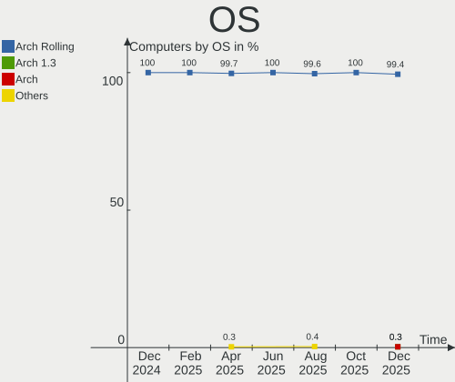

| Name         | Computers | Percent |
|--------------|-----------|---------|
| Arch Rolling | 356       | 99.44%  |
| Arch 1.3     | 1         | 0.28%   |
| Arch         | 1         | 0.28%   |

OS Family
---------

OS without a version

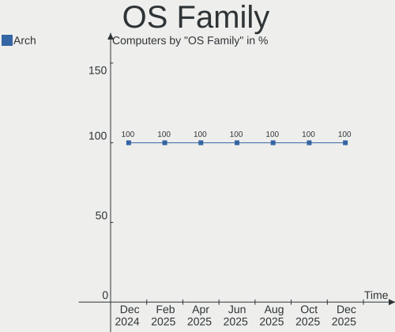

| Name | Computers | Percent |
|------|-----------|---------|
| Arch | 358       | 100%    |

Kernel
------

Version of the Linux kernel

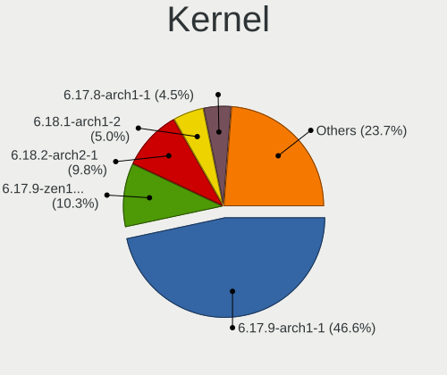

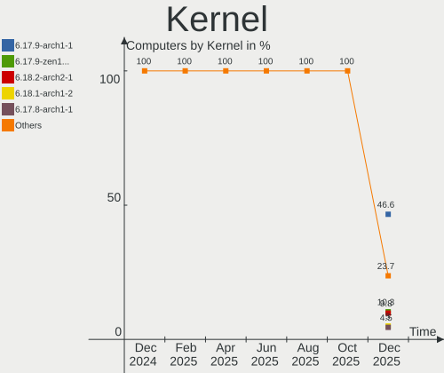

| Version                    | Computers | Percent |
|----------------------------|-----------|---------|
| 6.17.9-arch1-1             | 167       | 46.65%  |
| 6.17.9-zen1-1-zen          | 37        | 10.34%  |
| 6.18.2-arch2-1             | 35        | 9.78%   |
| 6.18.1-arch1-2             | 18        | 5.03%   |
| 6.17.8-arch1-1             | 16        | 4.47%   |
| 6.18.2-zen2-1-zen          | 12        | 3.35%   |
| 6.12.61-1-lts              | 7         | 1.96%   |
| 6.18.0-arch1-1             | 4         | 1.12%   |
| 6.12.63-1-lts              | 4         | 1.12%   |
| 6.12.59-1-lts              | 3         | 0.84%   |
| 6.18.1-arch1-2.1-g14       | 2         | 0.56%   |
| 6.18.0-273-tkg-eevdf       | 2         | 0.56%   |
| 6.18.0-2-cachyos           | 2         | 0.56%   |
| 6.18.0-1-cachyos           | 2         | 0.56%   |
| 6.17.9-2-cachyos           | 2         | 0.56%   |
| 6.17.7-zen1-1-zen          | 2         | 0.56%   |
| 6.17.1-arch1-1             | 2         | 0.56%   |
| 6.12.62-1-lts              | 2         | 0.56%   |
| 6.12.60-1-lts              | 2         | 0.56%   |
| 6.18.2-zen2-1.1-zen        | 1         | 0.28%   |
| 6.18.1-zen1-2-zen          | 1         | 0.28%   |
| 6.18.1-2-cachyos           | 1         | 0.28%   |
| 6.18.1-1-cachyos           | 1         | 0.28%   |
| 6.18.0-zen1-1-zen          | 1         | 0.28%   |
| 6.18.0-3-cachyos           | 1         | 0.28%   |
| 6.18.0-1-mainline          | 1         | 0.28%   |
| 6.18.0-1-cachyos-bore-lto  | 1         | 0.28%   |
| 6.17.9-xenon-ga521330584a8 | 1         | 0.28%   |
| 6.17.9-arch1-1.3-g14       | 1         | 0.28%   |
| 6.17.9-arch1-1.1           | 1         | 0.28%   |
| 6.17.9-1-cachyos-bore      | 1         | 0.28%   |
| 6.17.9-1-cachyos           | 1         | 0.28%   |
| 6.17.8-zen1-1-zen          | 1         | 0.28%   |
| 6.17.8-1-cachyos           | 1         | 0.28%   |
| 6.17.7-arch1-1             | 1         | 0.28%   |
| 6.17.6-arch1-1             | 1         | 0.28%   |
| 6.17.6-1-cachyos           | 1         | 0.28%   |
| 6.17.5-zen1-1-zen          | 1         | 0.28%   |
| 6.17.5-zen-xanmod1-1       | 1         | 0.28%   |
| 6.17.4-arch2-1             | 1         | 0.28%   |

Kernel Family
-------------

Linux kernel without a distro release

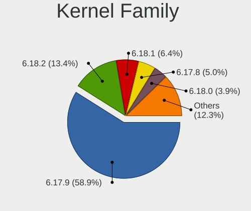

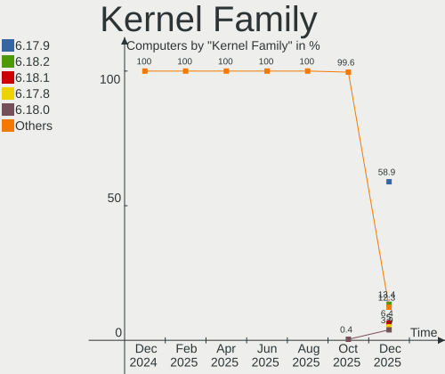

| Version  | Computers | Percent |
|----------|-----------|---------|
| 6.17.9   | 211       | 58.94%  |
| 6.18.2   | 48        | 13.41%  |
| 6.18.1   | 23        | 6.42%   |
| 6.17.8   | 18        | 5.03%   |
| 6.18.0   | 14        | 3.91%   |
| 6.12.61  | 8         | 2.23%   |
| 6.12.63  | 6         | 1.68%   |
| 6.17.7   | 3         | 0.84%   |
| 6.12.59  | 3         | 0.84%   |
| 6.17.6   | 2         | 0.56%   |
| 6.17.5   | 2         | 0.56%   |
| 6.17.11  | 2         | 0.56%   |
| 6.17.10  | 2         | 0.56%   |
| 6.17.1   | 2         | 0.56%   |
| 6.15.2   | 2         | 0.56%   |
| 6.14.2   | 2         | 0.56%   |
| 6.12.62  | 2         | 0.56%   |
| 6.12.60  | 2         | 0.56%   |
| 6.17.4   | 1         | 0.28%   |
| 6.17.2   | 1         | 0.28%   |
| 6.15.8   | 1         | 0.28%   |
| 6.12.57  | 1         | 0.28%   |
| 6.12.1   | 1         | 0.28%   |
| 4.19.325 | 1         | 0.28%   |

Kernel Major Ver.
-----------------

Linux kernel major version

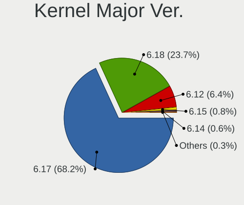

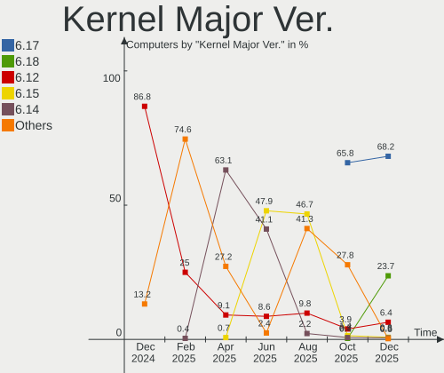

| Version | Computers | Percent |
|---------|-----------|---------|
| 6.17    | 244       | 68.16%  |
| 6.18    | 85        | 23.74%  |
| 6.12    | 23        | 6.42%   |
| 6.15    | 3         | 0.84%   |
| 6.14    | 2         | 0.56%   |
| 4.19    | 1         | 0.28%   |

Arch
----

OS architecture (x86_64, i586, etc.)

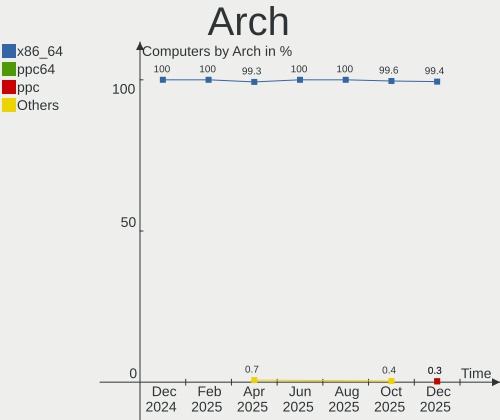

| Name   | Computers | Percent |
|--------|-----------|---------|
| x86_64 | 356       | 99.44%  |
| ppc64  | 1         | 0.28%   |
| ppc    | 1         | 0.28%   |

DE
--

Desktop Environment

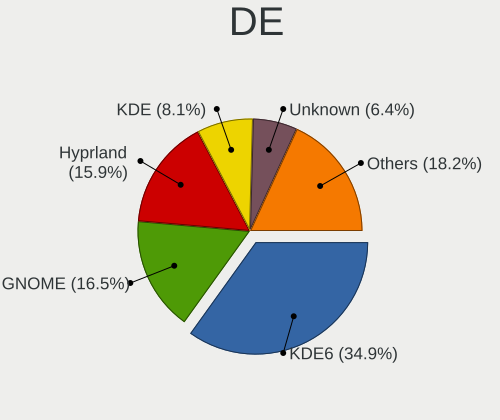

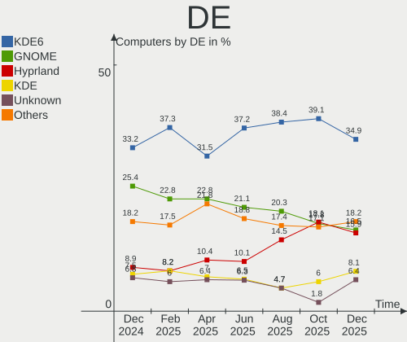

| Name                  | Computers | Percent |
|-----------------------|-----------|---------|
| KDE6                  | 125       | 34.92%  |
| GNOME                 | 59        | 16.48%  |
| Hyprland              | 57        | 15.92%  |
| KDE                   | 29        | 8.1%    |
| Unknown               | 23        | 6.42%   |
| XFCE                  | 15        | 4.19%   |
| niri                  | 14        | 3.91%   |
| i3                    | 13        | 3.63%   |
| sway                  | 6         | 1.68%   |
| sway:wlroots          | 3         | 0.84%   |
| COSMIC                | 3         | 0.84%   |
| MATE                  | 2         | 0.56%   |
| Deepin                | 2         | 0.56%   |
| X-Cinnamon            | 1         | 0.28%   |
| sway:wlroots:sway-run | 1         | 0.28%   |
| LeftWM                | 1         | 0.28%   |
| GNOME Classic         | 1         | 0.28%   |
| Cinnamon              | 1         | 0.28%   |
| Budgie                | 1         | 0.28%   |
| bspwm                 | 1         | 0.28%   |

Display Server
--------------

X11 or Wayland

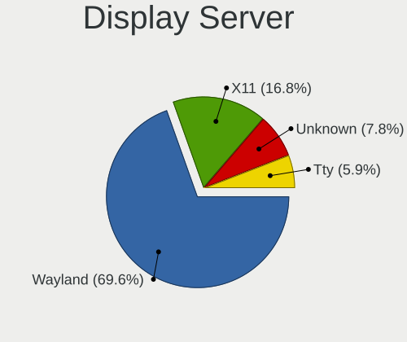

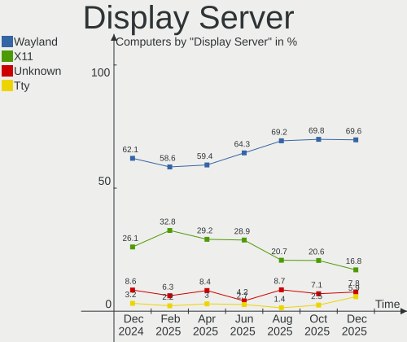

| Name    | Computers | Percent |
|---------|-----------|---------|
| Wayland | 249       | 69.55%  |
| X11     | 60        | 16.76%  |
| Unknown | 28        | 7.82%   |
| Tty     | 21        | 5.87%   |

Display Manager
---------------

SDDM, LightDM, etc.

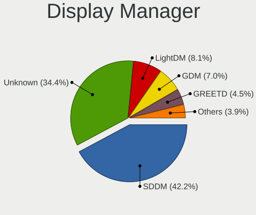

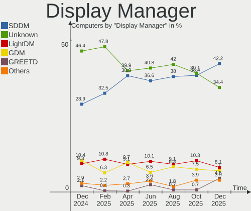

| Name        | Computers | Percent |
|-------------|-----------|---------|
| SDDM        | 151       | 42.18%  |
| Unknown     | 123       | 34.36%  |
| LightDM     | 29        | 8.1%    |
| GDM         | 25        | 6.98%   |
| GREETD      | 16        | 4.47%   |
| LY-DM       | 11        | 3.07%   |
| Ly          | 2         | 0.56%   |
| PLASMALOGIN | 1         | 0.28%   |

OS Lang
-------

Language

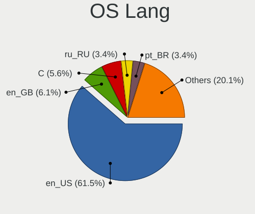

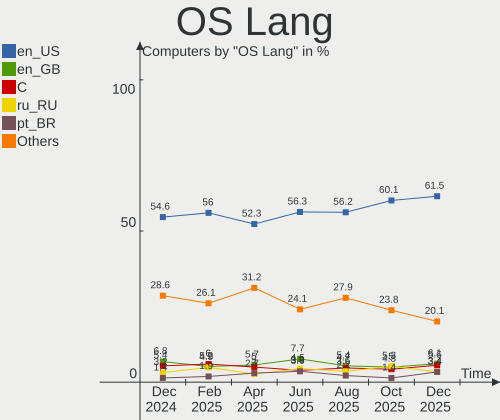

| Lang        | Computers | Percent |
|-------------|-----------|---------|
| en_US       | 220       | 61.45%  |
| en_GB       | 22        | 6.15%   |
| C           | 20        | 5.59%   |
| ru_RU       | 12        | 3.35%   |
| pt_BR       | 12        | 3.35%   |
| de_DE       | 12        | 3.35%   |
| it_IT       | 6         | 1.68%   |
| pl_PL       | 5         | 1.4%    |
| en_CA       | 4         | 1.12%   |
| Unknown     | 4         | 1.12%   |
| zh_CN       | 3         | 0.84%   |
| fr_FR       | 3         | 0.84%   |
| en_AU       | 3         | 0.84%   |
| uk_UA       | 2         | 0.56%   |
| tr_TR       | 2         | 0.56%   |
| hu_HU       | 2         | 0.56%   |
| es_MX       | 2         | 0.56%   |
| es_ES       | 2         | 0.56%   |
| es_CL       | 2         | 0.56%   |
| en_ZA       | 2         | 0.56%   |
| en_DK       | 2         | 0.56%   |
| sk_SK       | 1         | 0.28%   |
| pt_PT       | 1         | 0.28%   |
| pt_BR.UFT-8 | 1         | 0.28%   |
| nb_NO       | 1         | 0.28%   |
| ko_KR       | 1         | 0.28%   |
| fi_FI.UTF8  | 1         | 0.28%   |
| es_VE       | 1         | 0.28%   |
| es_AR       | 1         | 0.28%   |
| en_US.UTF8  | 1         | 0.28%   |
| en_NZ       | 1         | 0.28%   |
| en_IN       | 1         | 0.28%   |
| en_IE       | 1         | 0.28%   |
| enUS        | 1         | 0.28%   |
| el_GR       | 1         | 0.28%   |
| de_CH       | 1         | 0.28%   |
| de_AT       | 1         | 0.28%   |

Boot Mode
---------

EFI or BIOS

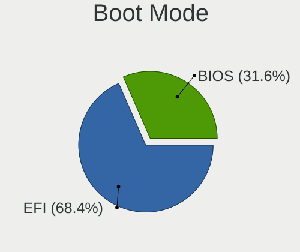

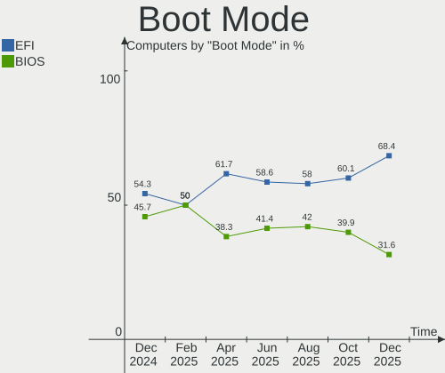

| Mode | Computers | Percent |
|------|-----------|---------|
| EFI  | 245       | 68.44%  |
| BIOS | 113       | 31.56%  |

Filesystem
----------

Type of filesystem

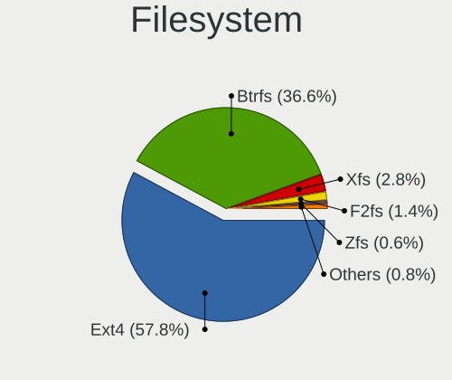

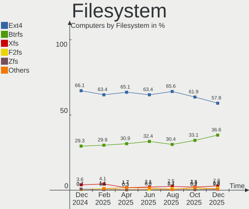

| Type    | Computers | Percent |
|---------|-----------|---------|
| Ext4    | 207       | 57.82%  |
| Btrfs   | 131       | 36.59%  |
| Xfs     | 10        | 2.79%   |
| F2fs    | 5         | 1.4%    |
| Zfs     | 2         | 0.56%   |
| Overlay | 2         | 0.56%   |
| Tmpfs   | 1         | 0.28%   |

Part. scheme
------------

Scheme of partitioning

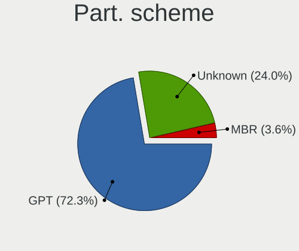

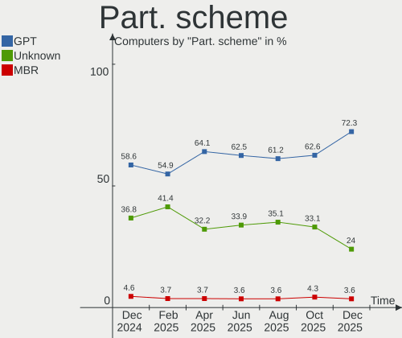

| Type    | Computers | Percent |
|---------|-----------|---------|
| GPT     | 259       | 72.35%  |
| Unknown | 86        | 24.02%  |
| MBR     | 13        | 3.63%   |

Dual Boot with Linux/BSD
------------------------

Hosting more than one Linux/BSD

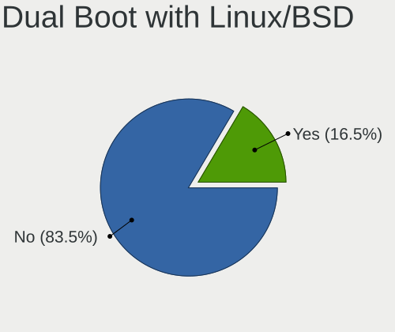

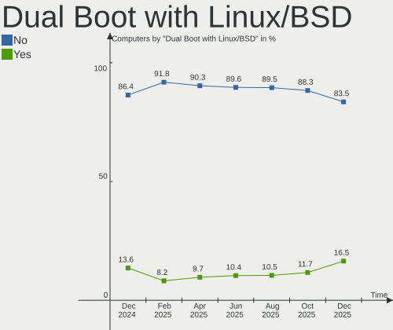

| Dual boot | Computers | Percent |
|-----------|-----------|---------|
| No        | 299       | 83.52%  |
| Yes       | 59        | 16.48%  |

Dual Boot (Win)
---------------

Hosting Linux and Windows

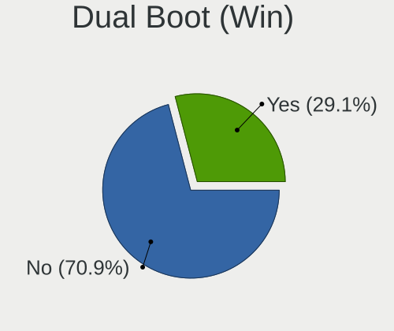

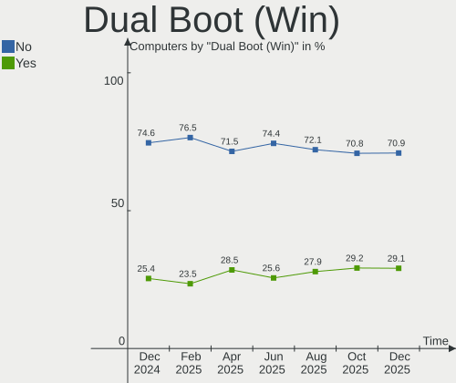

| Dual boot | Computers | Percent |
|-----------|-----------|---------|
| No        | 254       | 70.95%  |
| Yes       | 104       | 29.05%  |

Board
-----

Vendor
------

Motherboard manufacturer

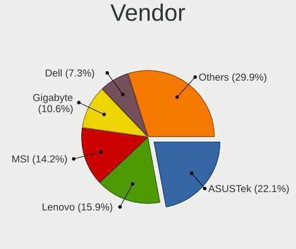

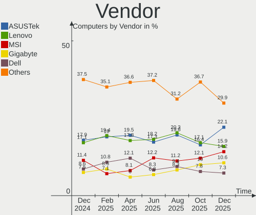

| Name                                 | Computers | Percent |
|--------------------------------------|-----------|---------|
| ASUSTek Computer                     | 79        | 22.07%  |
| Lenovo                               | 57        | 15.92%  |
| MSI                                  | 51        | 14.25%  |
| Gigabyte Technology                  | 38        | 10.61%  |
| Dell                                 | 26        | 7.26%   |
| Hewlett-Packard                      | 25        | 6.98%   |
| ASRock                               | 18        | 5.03%   |
| Acer                                 | 17        | 4.75%   |
| Framework                            | 6         | 1.68%   |
| HUAWEI                               | 4         | 1.12%   |
| HONOR                                | 3         | 0.84%   |
| Apple                                | 3         | 0.84%   |
| Unknown                              | 3         | 0.84%   |
| Supermicro                           | 2         | 0.56%   |
| Samsung Electronics                  | 2         | 0.56%   |
| MACHINIST                            | 2         | 0.56%   |
| XIAOMI                               | 1         | 0.28%   |
| Wortmann AG                          | 1         | 0.28%   |
| WeiBu                                | 1         | 0.28%   |
| Toshiba                              | 1         | 0.28%   |
| Shenzhen Meigao Electronic Equipment | 1         | 0.28%   |
| Packard Bell                         | 1         | 0.28%   |
| Medion                               | 1         | 0.28%   |
| JGINYUE                              | 1         | 0.28%   |
| Intel                                | 1         | 0.28%   |
| IBM                                  | 1         | 0.28%   |
| Huanan                               | 1         | 0.28%   |
| Google                               | 1         | 0.28%   |
| GHIA                                 | 1         | 0.28%   |
| Gateway                              | 1         | 0.28%   |
| ECS                                  | 1         | 0.28%   |
| Chuwi                                | 1         | 0.28%   |
| AZW                                  | 1         | 0.28%   |
| Avell                                | 1         | 0.28%   |
| ARDOR GAMING                         | 1         | 0.28%   |
| AMD                                  | 1         | 0.28%   |
| Alienware                            | 1         | 0.28%   |
| Acidanthera                          | 1         | 0.28%   |

Model
-----

Motherboard model

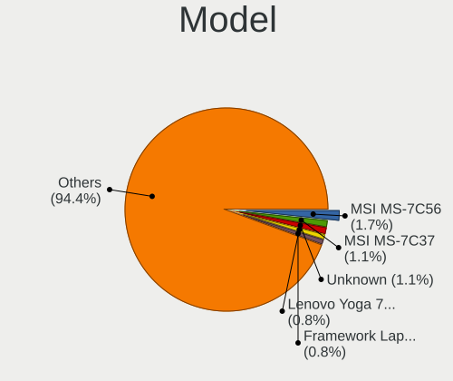

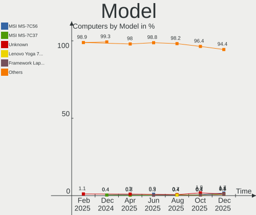

| Name                                                  | Computers | Percent |
|-------------------------------------------------------|-----------|---------|
| MSI MS-7C56                                           | 6         | 1.68%   |
| MSI MS-7C37                                           | 4         | 1.12%   |
| Unknown                                               | 4         | 1.12%   |
| Lenovo Yoga 7 2-in-1 14AKP10 83JR                     | 3         | 0.84%   |
| Framework Laptop 13 (AMD Ryzen 7040Series)            | 3         | 0.84%   |
| ASUS All Series                                       | 3         | 0.84%   |
| MSI MS-7E51                                           | 2         | 0.56%   |
| MSI MS-7E26                                           | 2         | 0.56%   |
| MSI MS-7D91                                           | 2         | 0.56%   |
| MSI MS-7C95                                           | 2         | 0.56%   |
| MSI MS-7C91                                           | 2         | 0.56%   |
| MSI MS-7C84                                           | 2         | 0.56%   |
| MSI MS-7821                                           | 2         | 0.56%   |
| MSI GF63 Thin 11UC                                    | 2         | 0.56%   |
| Lenovo IdeaPad Slim 3 14AHP10 83K9                    | 2         | 0.56%   |
| Gigabyte Z790 UD AX                                   | 2         | 0.56%   |
| Gigabyte X870E AORUS ELITE WIFI7                      | 2         | 0.56%   |
| Gigabyte B850M GAMING X WIFI6E                        | 2         | 0.56%   |
| Gigabyte B650M AORUS ELITE AX ICE                     | 2         | 0.56%   |
| Framework Laptop 16 (AMD Ryzen 7040 Series)           | 2         | 0.56%   |
| Dell Latitude 7420                                    | 2         | 0.56%   |
| ASUS TUF Gaming X570-PLUS                             | 2         | 0.56%   |
| ASUS TUF Gaming B850-PLUS WIFI                        | 2         | 0.56%   |
| ASUS ROG STRIX B550-F GAMING                          | 2         | 0.56%   |
| ASUS ROG CROSSHAIR X870E HERO                         | 2         | 0.56%   |
| ASUS PRIME X570-P                                     | 2         | 0.56%   |
| ASRock B650M-HDV/M.2                                  | 2         | 0.56%   |
| ASRock A320M-HDV R4.0                                 | 2         | 0.56%   |
| XIAOMI REDMI Book Pro 16 2025                         | 1         | 0.28%   |
| Wortmann AG TERRA_PAD_1061                            | 1         | 0.28%   |
| WeiBu ADL-N                                           | 1         | 0.28%   |
| Toshiba Satellite C50-A-1HF                           | 1         | 0.28%   |
| Supermicro TW-9800-101/HW                             | 1         | 0.28%   |
| Supermicro Super Server                               | 1         | 0.28%   |
| Shenzhen Meigao Electronic Equipment EliteMini Series | 1         | 0.28%   |
| Samsung 750XDA                                        | 1         | 0.28%   |
| Samsung 530XBB                                        | 1         | 0.28%   |
| Packard Bell ENNS44HR                                 | 1         | 0.28%   |
| MSI MS-7E56                                           | 1         | 0.28%   |
| MSI MS-7E34                                           | 1         | 0.28%   |

Model Family
------------

Motherboard model prefix

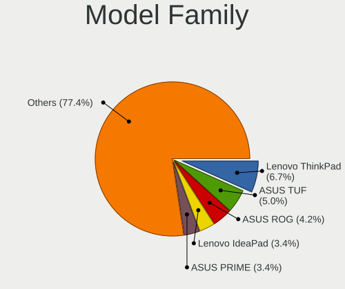

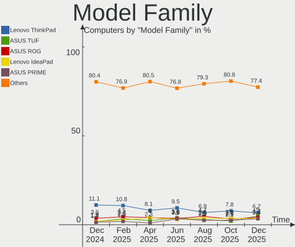

| Name             | Computers | Percent |
|------------------|-----------|---------|
| Lenovo ThinkPad  | 24        | 6.7%    |
| ASUS TUF         | 18        | 5.03%   |
| ASUS ROG         | 15        | 4.19%   |
| Lenovo IdeaPad   | 12        | 3.35%   |
| ASUS PRIME       | 12        | 3.35%   |
| Dell Latitude    | 9         | 2.51%   |
| ASUS VivoBook    | 9         | 2.51%   |
| Lenovo Legion    | 8         | 2.23%   |
| ASUS ASUS        | 8         | 2.23%   |
| Acer Aspire      | 7         | 1.96%   |
| MSI MS-7C56      | 6         | 1.68%   |
| Framework Laptop | 6         | 1.68%   |
| Lenovo Yoga      | 5         | 1.4%    |
| HP ProBook       | 5         | 1.4%    |
| Gigabyte B550    | 5         | 1.4%    |
| Dell Inspiron    | 5         | 1.4%    |
| MSI MS-7C37      | 4         | 1.12%   |
| Gigabyte X870E   | 4         | 1.12%   |
| Gigabyte B450    | 4         | 1.12%   |
| Dell Vostro      | 4         | 1.12%   |
| Dell Precision   | 4         | 1.12%   |
| Acer Nitro       | 4         | 1.12%   |
| Unknown          | 4         | 1.12%   |
| HP Victus        | 3         | 0.84%   |
| HP Spectre       | 3         | 0.84%   |
| HP Laptop        | 3         | 0.84%   |
| HP EliteBook     | 3         | 0.84%   |
| Gigabyte X570    | 3         | 0.84%   |
| ASUS ProArt      | 3         | 0.84%   |
| ASUS All         | 3         | 0.84%   |
| Acer Swift       | 3         | 0.84%   |
| Acer Predator    | 3         | 0.84%   |
| MSI MS-7E51      | 2         | 0.56%   |
| MSI MS-7E26      | 2         | 0.56%   |
| MSI MS-7D91      | 2         | 0.56%   |
| MSI MS-7C95      | 2         | 0.56%   |
| MSI MS-7C91      | 2         | 0.56%   |
| MSI MS-7C84      | 2         | 0.56%   |
| MSI MS-7821      | 2         | 0.56%   |
| MSI Modern       | 2         | 0.56%   |

MFG Year
--------

Motherboard manufacture year

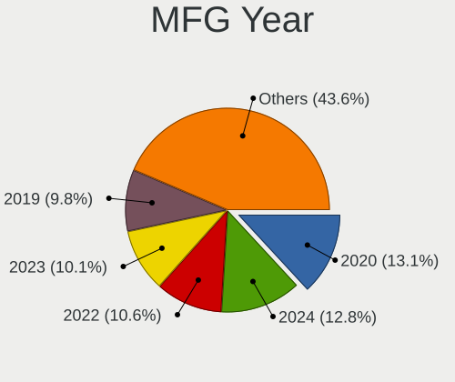

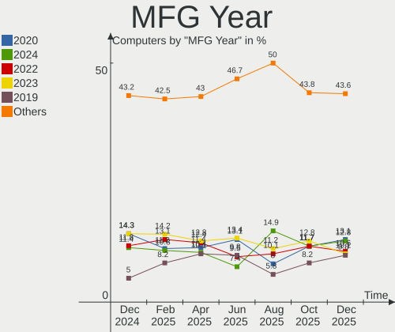

| Year    | Computers | Percent |
|---------|-----------|---------|
| 2020    | 47        | 13.13%  |
| 2024    | 46        | 12.85%  |
| 2022    | 38        | 10.61%  |
| 2023    | 36        | 10.06%  |
| 2019    | 35        | 9.78%   |
| 2021    | 31        | 8.66%   |
| 2025    | 30        | 8.38%   |
| 2018    | 17        | 4.75%   |
| 2017    | 16        | 4.47%   |
| 2013    | 11        | 3.07%   |
| 2015    | 10        | 2.79%   |
| 2012    | 10        | 2.79%   |
| 2011    | 8         | 2.23%   |
| 2016    | 7         | 1.96%   |
| 2014    | 7         | 1.96%   |
| Unknown | 3         | 0.84%   |
| 2009    | 2         | 0.56%   |
| 2006    | 2         | 0.56%   |
| 2008    | 1         | 0.28%   |
| 2007    | 1         | 0.28%   |

Form Factor
-----------

Physical design of the computer

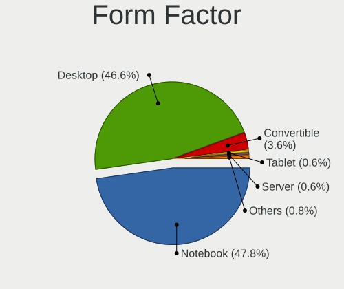

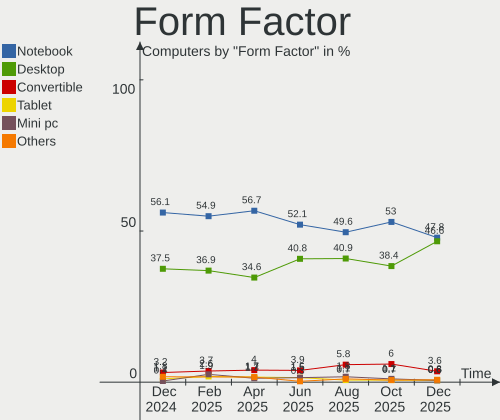

| Name        | Computers | Percent |
|-------------|-----------|---------|
| Notebook    | 171       | 47.77%  |
| Desktop     | 167       | 46.65%  |
| Convertible | 13        | 3.63%   |
| Tablet      | 2         | 0.56%   |
| Mini pc     | 2         | 0.56%   |
| Server      | 2         | 0.56%   |
| Other       | 1         | 0.28%   |

Secure Boot
-----------

Enabled or disabled

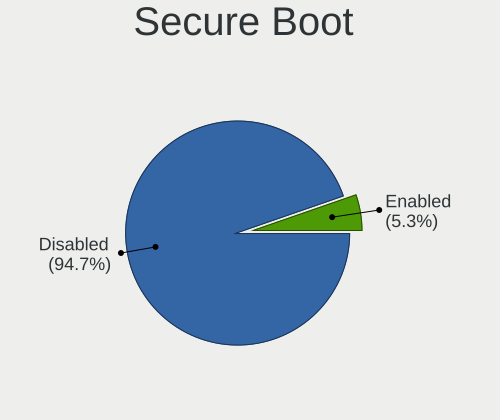

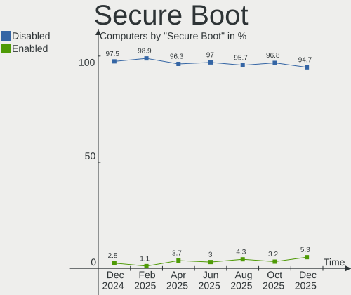

| State    | Computers | Percent |
|----------|-----------|---------|
| Disabled | 339       | 94.69%  |
| Enabled  | 19        | 5.31%   |

Coreboot
--------

Have coreboot on board

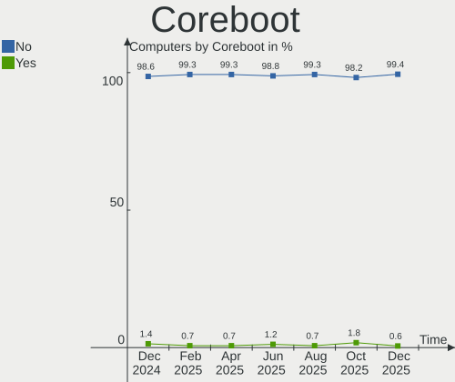

| Used | Computers | Percent |
|------|-----------|---------|
| No   | 356       | 99.44%  |
| Yes  | 2         | 0.56%   |

RAM Size
--------

Total RAM memory

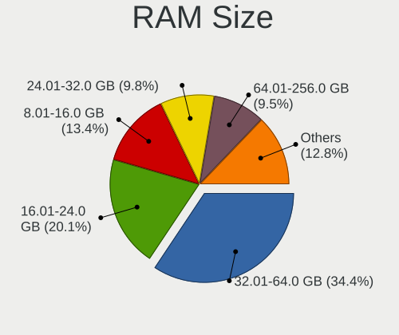

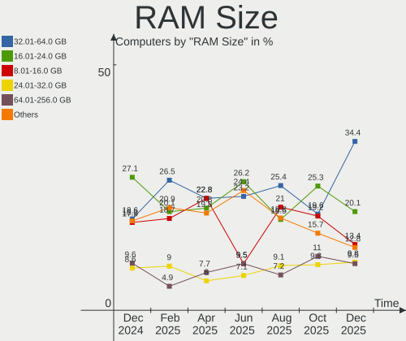

| Size in GB  | Computers | Percent |
|-------------|-----------|---------|
| 32.01-64.0  | 123       | 34.36%  |
| 16.01-24.0  | 72        | 20.11%  |
| 8.01-16.0   | 48        | 13.41%  |
| 24.01-32.0  | 35        | 9.78%   |
| 64.01-256.0 | 34        | 9.5%    |
| 4.01-8.0    | 31        | 8.66%   |
| 3.01-4.0    | 9         | 2.51%   |
| 1.01-2.0    | 2         | 0.56%   |
| 0.51-1.0    | 2         | 0.56%   |
| 0.01-0.5    | 2         | 0.56%   |

RAM Used
--------

Used RAM memory

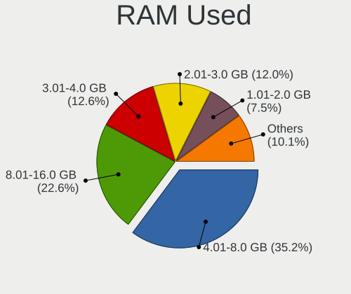

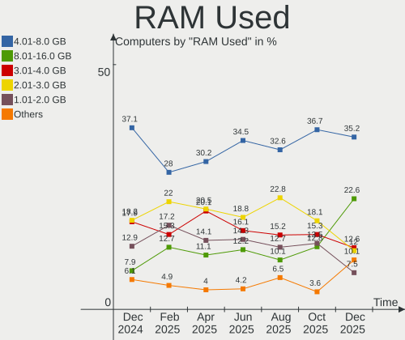

| Used GB     | Computers | Percent |
|-------------|-----------|---------|
| 4.01-8.0    | 126       | 35.2%   |
| 8.01-16.0   | 81        | 22.63%  |
| 3.01-4.0    | 45        | 12.57%  |
| 2.01-3.0    | 43        | 12.01%  |
| 1.01-2.0    | 27        | 7.54%   |
| 16.01-24.0  | 17        | 4.75%   |
| 32.01-64.0  | 5         | 1.4%    |
| 24.01-32.0  | 5         | 1.4%    |
| 0.51-1.0    | 4         | 1.12%   |
| 0.01-0.5    | 3         | 0.84%   |
| 64.01-256.0 | 1         | 0.28%   |
| 0           | 1         | 0.28%   |

Total Drives
------------

Number of drives on board

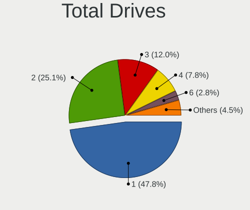

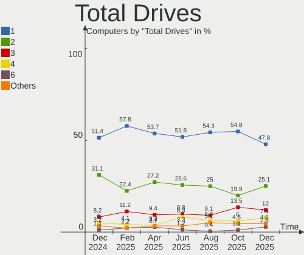

| Drives | Computers | Percent |
|--------|-----------|---------|
| 1      | 171       | 47.77%  |
| 2      | 90        | 25.14%  |
| 3      | 43        | 12.01%  |
| 4      | 28        | 7.82%   |
| 6      | 10        | 2.79%   |
| 5      | 9         | 2.51%   |
| 7      | 3         | 0.84%   |
| 12     | 2         | 0.56%   |
| 8      | 1         | 0.28%   |
| 0      | 1         | 0.28%   |

Has CD-ROM
----------

Has CD-ROM on board

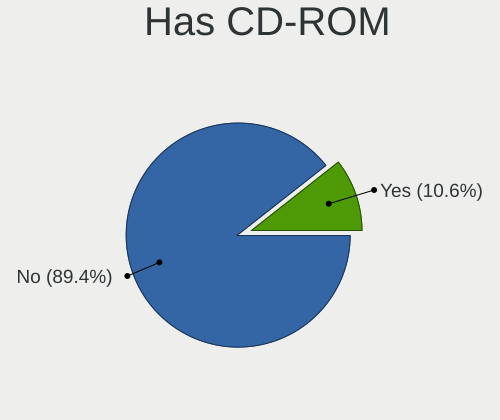

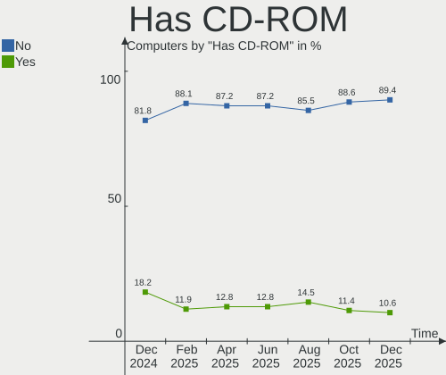

| Presented | Computers | Percent |
|-----------|-----------|---------|
| No        | 320       | 89.39%  |
| Yes       | 38        | 10.61%  |

Has Ethernet
------------

Has Ethernet on board

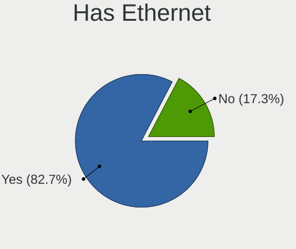

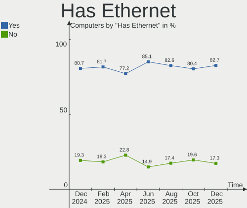

| Presented | Computers | Percent |
|-----------|-----------|---------|
| Yes       | 296       | 82.68%  |
| No        | 62        | 17.32%  |

Has WiFi
--------

Has WiFi module

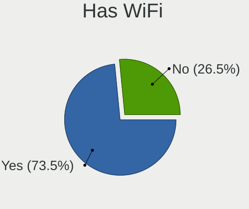

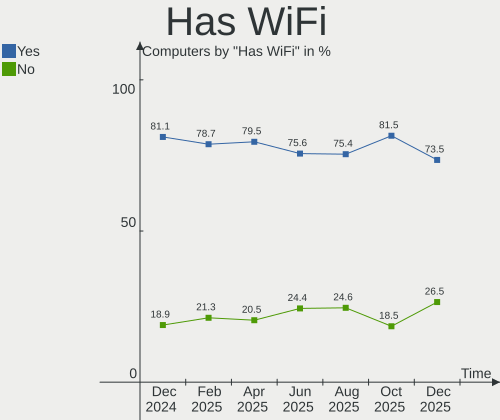

| Presented | Computers | Percent |
|-----------|-----------|---------|
| Yes       | 263       | 73.46%  |
| No        | 95        | 26.54%  |

Has Bluetooth
-------------

Has Bluetooth module

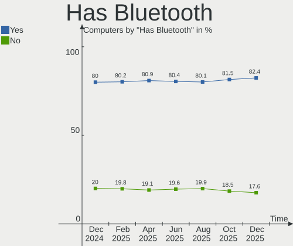

| Presented | Computers | Percent |
|-----------|-----------|---------|
| Yes       | 295       | 82.4%   |
| No        | 63        | 17.6%   |

Location
--------

Country
-------

Geographic location (country)

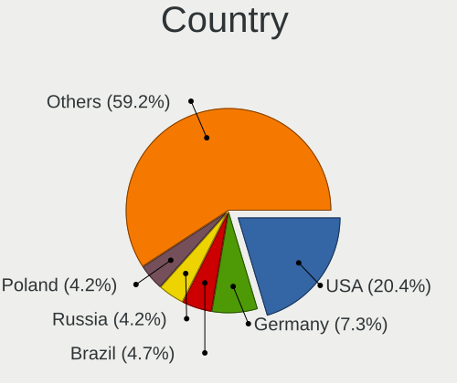

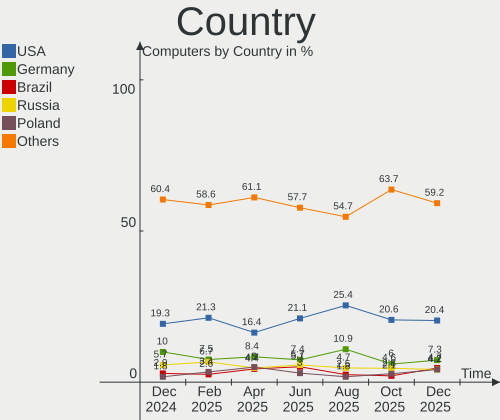

| Country         | Computers | Percent |
|-----------------|-----------|---------|
| USA             | 73        | 20.39%  |
| Germany         | 26        | 7.26%   |
| Brazil          | 17        | 4.75%   |
| Russia          | 15        | 4.19%   |
| Poland          | 15        | 4.19%   |
| Canada          | 15        | 4.19%   |
| UK              | 14        | 3.91%   |
| Italy           | 13        | 3.63%   |
| Netherlands     | 12        | 3.35%   |
| France          | 11        | 3.07%   |
| India           | 8         | 2.23%   |
| Turkey          | 7         | 1.96%   |
| Romania         | 6         | 1.68%   |
| Greece          | 6         | 1.68%   |
| Finland         | 6         | 1.68%   |
| Australia       | 6         | 1.68%   |
| The Netherlands | 5         | 1.4%    |
| Hungary         | 5         | 1.4%    |
| Austria         | 5         | 1.4%    |
| Switzerland     | 4         | 1.12%   |
| Sweden          | 4         | 1.12%   |
| Spain           | 4         | 1.12%   |
| Philippines     | 4         | 1.12%   |
| Norway          | 4         | 1.12%   |
| Mexico          | 4         | 1.12%   |
| China           | 4         | 1.12%   |
| Chile           | 4         | 1.12%   |
| Bulgaria        | 4         | 1.12%   |
| South Korea     | 3         | 0.84%   |
| Slovakia        | 3         | 0.84%   |
| Indonesia       | 3         | 0.84%   |
| Czechia         | 3         | 0.84%   |
| Argentina       | 3         | 0.84%   |
| Vietnam         | 2         | 0.56%   |
| South Africa    | 2         | 0.56%   |
| Serbia          | 2         | 0.56%   |
| Portugal        | 2         | 0.56%   |
| Iran            | 2         | 0.56%   |
| Belgium         | 2         | 0.56%   |
| Bangladesh      | 2         | 0.56%   |

City
----

Geographic location (city)

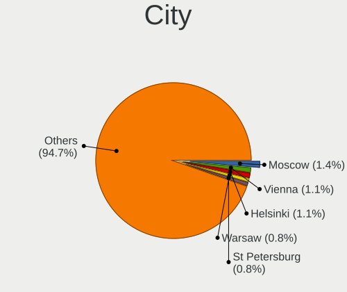

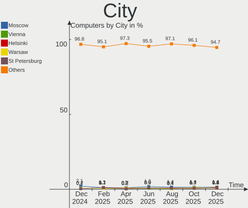

| City              | Computers | Percent |
|-------------------|-----------|---------|
| Moscow            | 5         | 1.4%    |
| Vienna            | 4         | 1.12%   |
| Helsinki          | 4         | 1.12%   |
| Warsaw            | 3         | 0.84%   |
| St Petersburg     | 3         | 0.84%   |
| Rio de Janeiro    | 3         | 0.84%   |
| Sao Paulo         | 2         | 0.56%   |
| San Diego         | 2         | 0.56%   |
| New York          | 2         | 0.56%   |
| Melbourne         | 2         | 0.56%   |
| Langley           | 2         | 0.56%   |
| Lancaster         | 2         | 0.56%   |
| Jersey City       | 2         | 0.56%   |
| Istanbul          | 2         | 0.56%   |
| Huizen            | 2         | 0.56%   |
| Hilversum         | 2         | 0.56%   |
| Gervais           | 2         | 0.56%   |
| Gdansk            | 2         | 0.56%   |
| Gävle            | 2         | 0.56%   |
| Frankfurt am Main | 2         | 0.56%   |
| Düsseldorf       | 2         | 0.56%   |
| Dhaka             | 2         | 0.56%   |
| Chennai           | 2         | 0.56%   |
| Bydgoszcz         | 2         | 0.56%   |
| Brno              | 2         | 0.56%   |
| Breda             | 2         | 0.56%   |
| Belgrade          | 2         | 0.56%   |
| Amsterdam         | 2         | 0.56%   |
| Alexandroupoli    | 2         | 0.56%   |
| Adelaide          | 2         | 0.56%   |
| Đakovo           | 1         | 0.28%   |
| Zwolle            | 1         | 0.28%   |
| Zurich            | 1         | 0.28%   |
| Yoshkar-Ola       | 1         | 0.28%   |
| York              | 1         | 0.28%   |
| Yongin-si         | 1         | 0.28%   |
| Yeongdeungpo-gu   | 1         | 0.28%   |
| Yakutsk           | 1         | 0.28%   |
| Xochimilco        | 1         | 0.28%   |
| Woudrichem        | 1         | 0.28%   |

Drives
------

Drive Vendor
------------

Hard drive vendors

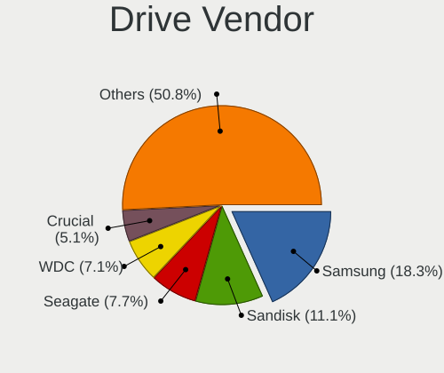

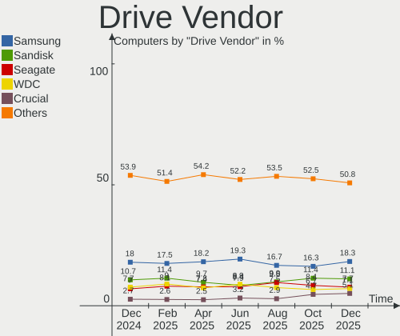

| Vendor                       | Computers | Drives | Percent |
|------------------------------|-----------|--------|---------|
| Samsung Electronics          | 114       | 168    | 18.27%  |
| Sandisk                      | 69        | 78     | 11.06%  |
| Seagate                      | 48        | 63     | 7.69%   |
| WDC                          | 44        | 64     | 7.05%   |
| Crucial                      | 32        | 38     | 5.13%   |
| Micron Technology            | 27        | 30     | 4.33%   |
| Kingston                     | 26        | 28     | 4.17%   |
| Kingston Technology Company  | 25        | 27     | 4.01%   |
| Micron/Crucial Technology    | 24        | 27     | 3.85%   |
| Toshiba                      | 18        | 22     | 2.88%   |
| SK hynix                     | 18        | 19     | 2.88%   |
| Intel                        | 16        | 17     | 2.56%   |
| Unknown                      | 14        | 15     | 2.24%   |
| MAXIO Technology (Hangzhou)  | 13        | 14     | 2.08%   |
| Hitachi                      | 11        | 12     | 1.76%   |
| Phison Electronics           | 10        | 10     | 1.6%    |
| KIOXIA                       | 10        | 11     | 1.6%    |
| Shenzhen Longsys Electronics | 8         | 9      | 1.28%   |
| Silicon Motion               | 7         | 7      | 1.12%   |
| ADATA Technology             | 7         | 9      | 1.12%   |
| HGST                         | 6         | 6      | 0.96%   |
| A-DATA Technology            | 6         | 6      | 0.96%   |
| SPCC                         | 4         | 4      | 0.64%   |
| Intenso                      | 4         | 4      | 0.64%   |
| Yangtze Memory Technologies  | 3         | 3      | 0.48%   |
| Solidigm                     | 3         | 3      | 0.48%   |
| PNY                          | 3         | 3      | 0.48%   |
| China                        | 3         | 3      | 0.48%   |
| XrayDisk                     | 2         | 2      | 0.32%   |
| Transcend                    | 2         | 2      | 0.32%   |
| Seagate Technology           | 2         | 2      | 0.32%   |
| Realtek Semiconductor        | 2         | 2      | 0.32%   |
| Plextor                      | 2         | 2      | 0.32%   |
| OCZ                          | 2         | 2      | 0.32%   |
| LITEON                       | 2         | 2      | 0.32%   |
| INNOGRIT                     | 2         | 3      | 0.32%   |
| Hosin Global Electronics     | 2         | 2      | 0.32%   |
| Apple                        | 2         | 2      | 0.32%   |
| WALRAM                       | 1         | 1      | 0.16%   |
| Verbatim                     | 1         | 1      | 0.16%   |

Drive Model
-----------

Hard drive models

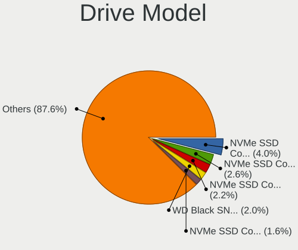

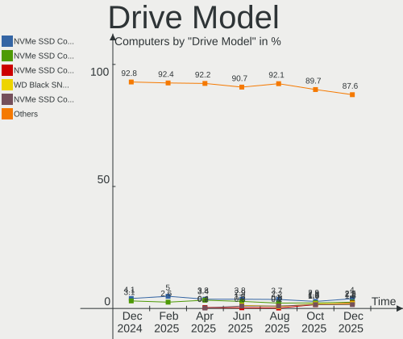

| Model                                                                           | Computers | Percent |
|---------------------------------------------------------------------------------|-----------|---------|
| Samsung NVMe SSD Controller SM981/PM981/PM983 1TB                               | 28        | 4.04%   |
| Samsung NVMe SSD Controller PM9A1/PM9A3/980PRO 1TB                              | 18        | 2.6%    |
| Samsung NVMe SSD Controller S4LV008[Pascal] 4TB                                 | 15        | 2.16%   |
| Sandisk WD Black SN770 / PC SN740 256GB / PC SN560 (DRAM-less) NVMe SSD         | 14        | 2.02%   |
| Samsung NVMe SSD Controller PM9C1a (DRAM-less) 1TB                              | 11        | 1.59%   |
| Samsung NVMe SSD Controller 980 (DRAM-less) 256GB                               | 8         | 1.15%   |
| Micron 2400 NVMe SSD (DRAM-less) 512GB                                          | 8         | 1.15%   |
| Kingston SA400S37480G 480GB SSD                                                 | 8         | 1.15%   |
| Samsung SSD 850 EVO 500GB                                                       | 7         | 1.01%   |
| Kingston SA400S37240G 240GB SSD                                                 | 7         | 1.01%   |
| SK hynix Platinum P41/PC801 NVMe Solid State Drive 1TB                          | 6         | 0.87%   |
| Seagate ST2000DM008-2FR102 2TB                                                  | 6         | 0.87%   |
| Sandisk WD PC SN5000S M.2 2280 NVMe SSD (DRAM-less) 1TB                         | 6         | 0.87%   |
| Crucial CT500MX500SSD1 500GB                                                    | 6         | 0.87%   |
| Crucial CT1000MX500SSD1 1TB                                                     | 6         | 0.87%   |
| Unknown MMC Card  64GB                                                          | 5         | 0.72%   |
| Seagate ST1000DM010-2EP102 1TB                                                  | 5         | 0.72%   |
| Samsung NVMe SSD Controller PM9B1 (DRAM-less) 512GB                             | 5         | 0.72%   |
| Micron/Crucial P310 NVMe PCIe SSD (DRAM-less) 500GB                             | 5         | 0.72%   |
| Intel SSD 670p Series [Keystone Harbor] 1TB                                     | 5         | 0.72%   |
| Silicon Motion SM2263EN/SM2263XT SSD Controller 512GB                           | 4         | 0.58%   |
| Sandisk Ultra 3D / WD PC SN530, IX SN530, Blue SN550 NVMe SSD (DRAM-less) 256GB | 4         | 0.58%   |
| Sandisk Extreme Pro / WD Black SN750 / PC SN730 / Red SN700 NVMe SSD 500GB      | 4         | 0.58%   |
| Samsung SSD 990 PRO 2TB                                                         | 4         | 0.58%   |
| Micron/Crucial P2 [Nick P2] / P3 / P3 Plus NVMe PCIe SSD (DRAM-less) 2TB        | 4         | 0.58%   |
| MAXIO (Hangzhou) NVMe SSD Controller MAP1202 (DRAM-less) 512GB                  | 4         | 0.58%   |
| Kingston Company NV2 NVMe SSD [SM2267XT] (DRAM-less) 1TB                        | 4         | 0.58%   |
| Kingston Company KC3000/FURY Renegade NVMe SSD [E18] 2TB                        | 4         | 0.58%   |
| Crucial CT1000BX500SSD1 1TB                                                     | 4         | 0.58%   |
| WDC WD10EZEX-08WN4A0 1TB                                                        | 3         | 0.43%   |
| Toshiba MQ01ABD100 1TB                                                          | 3         | 0.43%   |
| Shenzhen Longsys Lexar NM790 NVME SSD (DRAM-less) 1TB                           | 3         | 0.43%   |
| Seagate ST500DM002-1BD142 500GB                                                 | 3         | 0.43%   |
| Seagate ST2000DM008-2UB102 2TB                                                  | 3         | 0.43%   |
| Seagate ST1000DM003-1CH162 1TB                                                  | 3         | 0.43%   |
| Sandisk WD Blue SN550 NVMe SSD 1024GB                                           | 3         | 0.43%   |
| Sandisk WD Black SN750 / PC SN730 NVMe SSD 500GB                                | 3         | 0.43%   |
| Samsung SSD 870 QVO 1TB                                                         | 3         | 0.43%   |
| Samsung SSD 870 EVO 2TB                                                         | 3         | 0.43%   |
| Samsung SSD 860 EVO 500GB                                                       | 3         | 0.43%   |

HDD Vendor
----------

Hard disk drive vendors

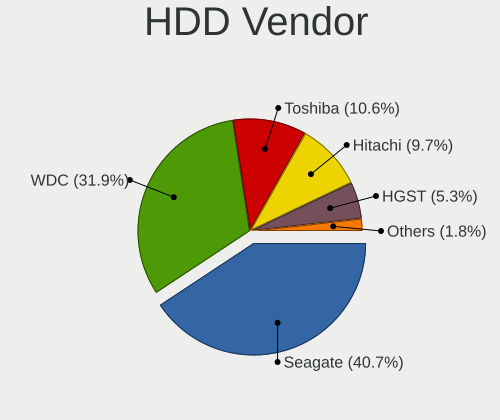

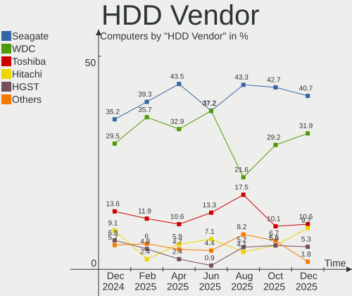

| Vendor  | Computers | Drives | Percent |
|---------|-----------|--------|---------|
| Seagate | 46        | 59     | 40.71%  |
| WDC     | 36        | 52     | 31.86%  |
| Toshiba | 12        | 16     | 10.62%  |
| Hitachi | 11        | 12     | 9.73%   |
| HGST    | 6         | 6      | 5.31%   |
| Unknown | 1         | 1      | 0.88%   |
| Fujitsu | 1         | 1      | 0.88%   |

SSD Vendor
----------

Solid state drive vendors

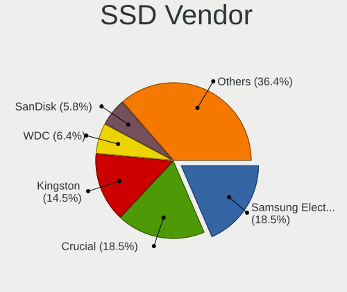

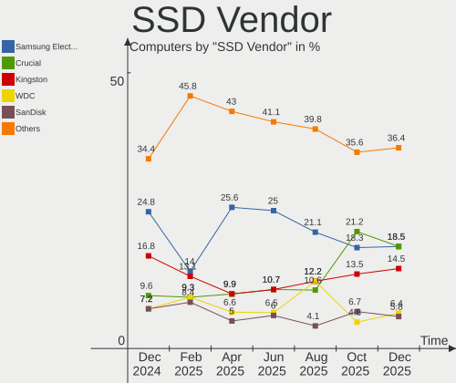

| Vendor              | Computers | Drives | Percent |
|---------------------|-----------|--------|---------|
| Samsung Electronics | 32        | 50     | 18.5%   |
| Crucial             | 32        | 38     | 18.5%   |
| Kingston            | 25        | 25     | 14.45%  |
| WDC                 | 11        | 12     | 6.36%   |
| SanDisk             | 10        | 14     | 5.78%   |
| A-DATA Technology   | 5         | 5      | 2.89%   |
| SPCC                | 4         | 4      | 2.31%   |
| Intenso             | 4         | 4      | 2.31%   |
| Intel               | 4         | 4      | 2.31%   |
| PNY                 | 3         | 3      | 1.73%   |
| China               | 3         | 3      | 1.73%   |
| Transcend           | 2         | 2      | 1.16%   |
| Toshiba             | 2         | 2      | 1.16%   |
| Seagate             | 2         | 2      | 1.16%   |
| Plextor             | 2         | 2      | 1.16%   |
| OCZ                 | 2         | 2      | 1.16%   |
| Micron Technology   | 2         | 2      | 1.16%   |
| LITEON              | 2         | 2      | 1.16%   |
| XrayDisk            | 1         | 1      | 0.58%   |
| WALRAM              | 1         | 1      | 0.58%   |
| Verbatim            | 1         | 1      | 0.58%   |
| Timetec             | 1         | 1      | 0.58%   |
| Team                | 1         | 1      | 0.58%   |
| T-FORCE             | 1         | 1      | 0.58%   |
| SK hynix            | 1         | 1      | 0.58%   |
| SATADOM-SH          | 1         | 1      | 0.58%   |
| SABRENT             | 1         | 1      | 0.58%   |
| Netac               | 1         | 1      | 0.58%   |
| Mushkin             | 1         | 1      | 0.58%   |
| LITEONIT            | 1         | 1      | 0.58%   |
| Lexar               | 1         | 1      | 0.58%   |
| KingDian            | 1         | 1      | 0.58%   |
| HS-SSD-E100N        | 1         | 1      | 0.58%   |
| HS-SSD-C100         | 1         | 1      | 0.58%   |
| GOODRAM             | 1         | 1      | 0.58%   |
| Go-Infinity         | 1         | 1      | 0.58%   |
| Emtec               | 1         | 1      | 0.58%   |
| EDILOCA             | 1         | 1      | 0.58%   |
| EAGET               | 1         | 1      | 0.58%   |
| Corsair             | 1         | 1      | 0.58%   |

Drive Kind
----------

HDD or SSD

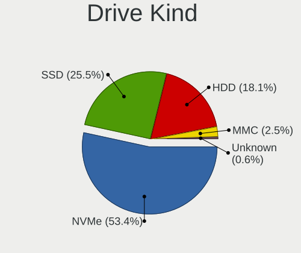

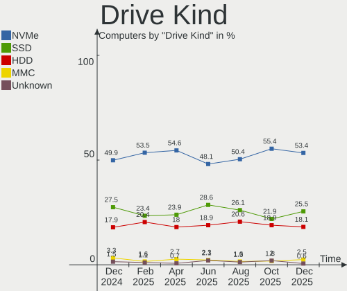

| Kind    | Computers | Drives | Percent |
|---------|-----------|--------|---------|
| NVMe    | 283       | 387    | 53.4%   |
| SSD     | 135       | 202    | 25.47%  |
| HDD     | 96        | 147    | 18.11%  |
| MMC     | 13        | 14     | 2.45%   |
| Unknown | 3         | 3      | 0.57%   |

Drive Connector
---------------

SATA, SAS, NVMe, etc.

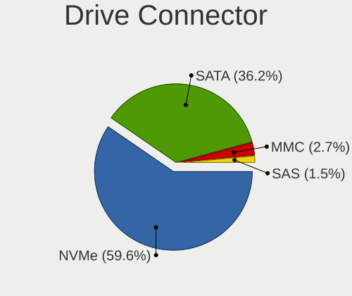

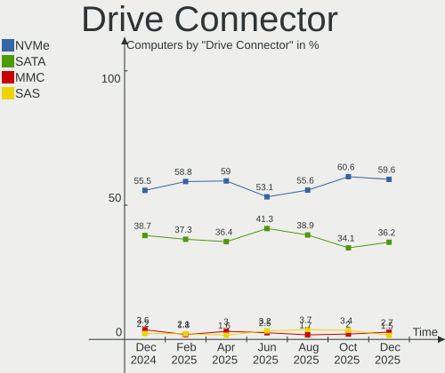

| Type | Computers | Drives | Percent |
|------|-----------|--------|---------|
| NVMe | 283       | 387    | 59.58%  |
| SATA | 172       | 342    | 36.21%  |
| MMC  | 13        | 14     | 2.74%   |
| SAS  | 7         | 10     | 1.47%   |

Drive Size
----------

Size of hard drive

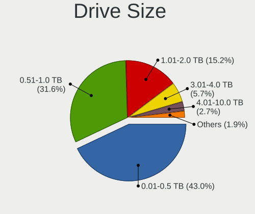

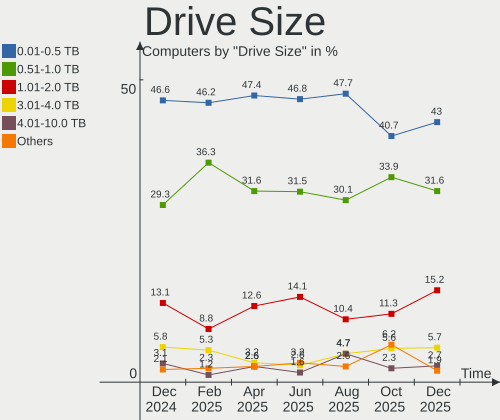

| Size in TB | Computers | Drives | Percent |
|------------|-----------|--------|---------|
| 0.01-0.5   | 113       | 144    | 42.97%  |
| 0.51-1.0   | 83        | 109    | 31.56%  |
| 1.01-2.0   | 40        | 46     | 15.21%  |
| 3.01-4.0   | 15        | 31     | 5.7%    |
| 4.01-10.0  | 7         | 10     | 2.66%   |
| 2.01-3.0   | 3         | 5      | 1.14%   |
| 10.01-20.0 | 2         | 4      | 0.76%   |

Space Total
-----------

Amount of disk space available on the file system

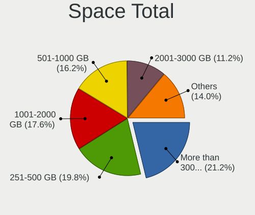

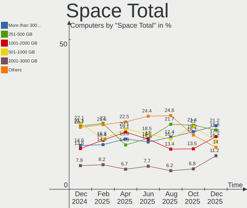

| Size in GB     | Computers | Percent |
|----------------|-----------|---------|
| More than 3000 | 76        | 21.23%  |
| 251-500        | 71        | 19.83%  |
| 1001-2000      | 63        | 17.6%   |
| 501-1000       | 58        | 16.2%   |
| 2001-3000      | 40        | 11.17%  |
| 101-250        | 33        | 9.22%   |
| 1-20           | 6         | 1.68%   |
| 21-50          | 4         | 1.12%   |
| Unknown        | 4         | 1.12%   |
| 51-100         | 3         | 0.84%   |

Space Used
----------

Amount of used disk space

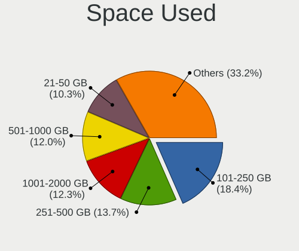

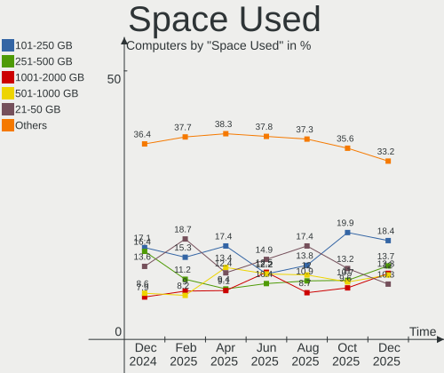

| Used GB        | Computers | Percent |
|----------------|-----------|---------|
| 101-250        | 66        | 18.44%  |
| 251-500        | 49        | 13.69%  |
| 1001-2000      | 44        | 12.29%  |
| 501-1000       | 43        | 12.01%  |
| 21-50          | 37        | 10.34%  |
| More than 3000 | 34        | 9.5%    |
| 1-20           | 33        | 9.22%   |
| 51-100         | 28        | 7.82%   |
| 2001-3000      | 20        | 5.59%   |
| Unknown        | 4         | 1.12%   |

Malfunc. Drives
---------------

Drive models with a malfunction

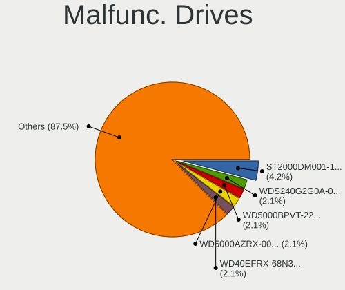

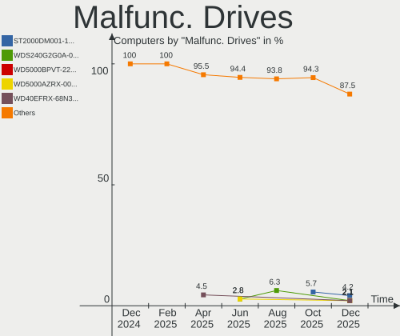

| Model                                                            | Computers | Drives | Percent |
|------------------------------------------------------------------|-----------|--------|---------|
| Seagate ST2000DM001-1ER164 2TB                                   | 2         | 3      | 4.17%   |
| WDC WDS240G2G0A-00JH30 240GB SSD                                 | 1         | 1      | 2.08%   |
| WDC WD5000BPVT-22HXZT3 500GB                                     | 1         | 1      | 2.08%   |
| WDC WD5000AZRX-00A8LB0 500GB                                     | 1         | 1      | 2.08%   |
| WDC WD40EFRX-68N32N0 4TB                                         | 1         | 1      | 2.08%   |
| WDC WD3003FZEX-00Z4SA0 3TB                                       | 1         | 1      | 2.08%   |
| WDC WD20EARS-00MVWB0 2TB                                         | 1         | 1      | 2.08%   |
| WDC WD2003FZEX-00Z4SA0 2TB                                       | 1         | 1      | 2.08%   |
| WDC WD10JPVT-60A1YT0 1TB                                         | 1         | 1      | 2.08%   |
| WDC WD10EZEX-60M2NA0 1TB                                         | 1         | 1      | 2.08%   |
| WDC WD10EZEX-08WN4A0 1TB                                         | 1         | 1      | 2.08%   |
| WDC WD10EADS-00L5B1 1TB                                          | 1         | 1      | 2.08%   |
| WDC WD1002FBYS-02A6B0 1TB                                        | 1         | 1      | 2.08%   |
| Toshiba HDWD130 3TB                                              | 1         | 1      | 2.08%   |
| Seagate ST500LT012-9WS142 500GB                                  | 1         | 1      | 2.08%   |
| Seagate ST500DM009-2F110A 500GB                                  | 1         | 1      | 2.08%   |
| Seagate ST500DM002-1BD142 500GB                                  | 1         | 1      | 2.08%   |
| Seagate ST4000VN008-2DR166 4TB                                   | 1         | 1      | 2.08%   |
| Seagate ST4000DX001-1CE168 4TB                                   | 1         | 1      | 2.08%   |
| Seagate ST4000DM000-1F2168 4TB                                   | 1         | 1      | 2.08%   |
| Seagate ST3500418AS 500GB                                        | 1         | 1      | 2.08%   |
| Seagate ST320LM001 HN-M320MBB 320GB                              | 1         | 1      | 2.08%   |
| Seagate ST3160212SCE 160GB                                       | 1         | 1      | 2.08%   |
| Seagate ST3000DM001-1ER166 3TB                                   | 1         | 1      | 2.08%   |
| Seagate ST240HM000-1G5152 240GB SSD                              | 1         | 1      | 2.08%   |
| Seagate ST1000DM010-2EP102 1TB                                   | 1         | 2      | 2.08%   |
| SanDisk SDSSDXPS960G 960GB                                       | 1         | 2      | 2.08%   |
| Samsung Electronics NVMe SSD Controller SM981/PM981/PM983 1TB    | 1         | 1      | 2.08%   |
| Samsung Electronics NVMe SSD Controller SM961/PM961/SM963 1024GB | 1         | 1      | 2.08%   |
| Samsung Electronics NVMe SSD Controller 980 (DRAM-less) 256GB    | 1         | 1      | 2.08%   |
| OCZ AGILITY3 64GB SSD                                            | 1         | 1      | 2.08%   |
| Mushkin MKNSSDTR1TB-3D                                           | 1         | 1      | 2.08%   |
| LITEON LCH-256V2S 256GB SSD                                      | 1         | 1      | 2.08%   |
| LITEON CV8-8E128-HP 128GB SSD                                    | 1         | 1      | 2.08%   |
| KIOXIA KBG40ZNS256G NVMe 256GB                                   | 1         | 1      | 2.08%   |
| Kingston SA400S37240G 240GB SSD                                  | 1         | 1      | 2.08%   |
| Intel SSDSCKKW240H6 240GB                                        | 1         | 1      | 2.08%   |
| Intel SSDSC2KW256G8 256GB                                        | 1         | 1      | 2.08%   |
| Hitachi HTS723225L9A360 250GB                                    | 1         | 1      | 2.08%   |
| Hitachi HTS542512K9SA00 120GB                                    | 1         | 1      | 2.08%   |

Malfunc. Drive Vendor
---------------------

Vendors of faulty drives

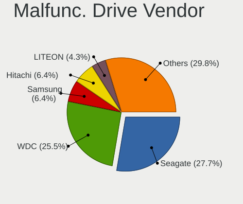

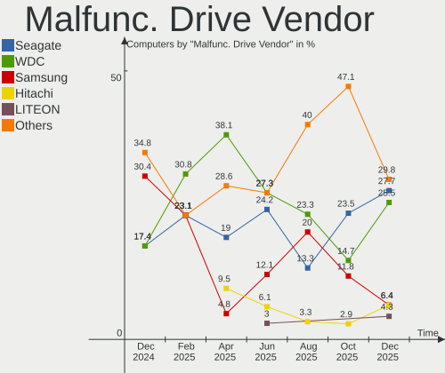

| Vendor              | Computers | Drives | Percent |
|---------------------|-----------|--------|---------|
| Seagate             | 13        | 16     | 27.66%  |
| WDC                 | 12        | 12     | 25.53%  |
| Samsung Electronics | 3         | 3      | 6.38%   |
| Hitachi             | 3         | 3      | 6.38%   |
| LITEON              | 2         | 2      | 4.26%   |
| Intel               | 2         | 2      | 4.26%   |
| HGST                | 2         | 2      | 4.26%   |
| A-DATA Technology   | 2         | 2      | 4.26%   |
| Toshiba             | 1         | 1      | 2.13%   |
| SanDisk             | 1         | 2      | 2.13%   |
| OCZ                 | 1         | 1      | 2.13%   |
| Mushkin             | 1         | 1      | 2.13%   |
| KIOXIA              | 1         | 1      | 2.13%   |
| Kingston            | 1         | 1      | 2.13%   |
| Fujitsu             | 1         | 1      | 2.13%   |
| Crucial             | 1         | 1      | 2.13%   |

Malfunc. HDD Vendor
-------------------

Vendors of faulty HDD drives

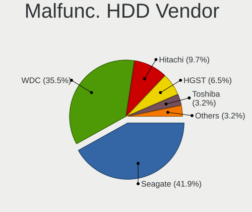

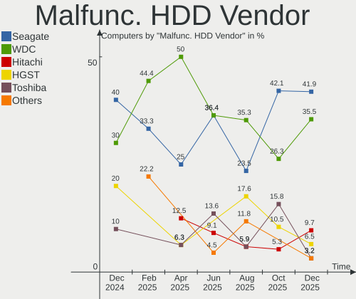

| Vendor  | Computers | Drives | Percent |
|---------|-----------|--------|---------|
| Seagate | 13        | 15     | 41.94%  |
| WDC     | 11        | 11     | 35.48%  |
| Hitachi | 3         | 3      | 9.68%   |
| HGST    | 2         | 2      | 6.45%   |
| Toshiba | 1         | 1      | 3.23%   |
| Fujitsu | 1         | 1      | 3.23%   |

Malfunc. Drive Kind
-------------------

Kinds of faulty drives

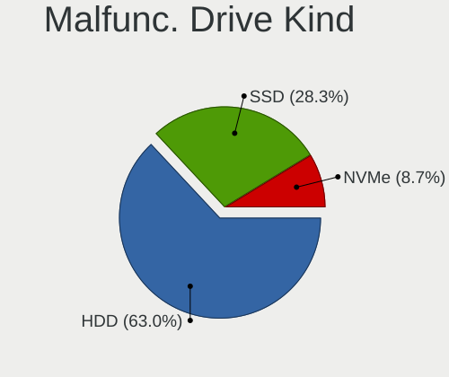

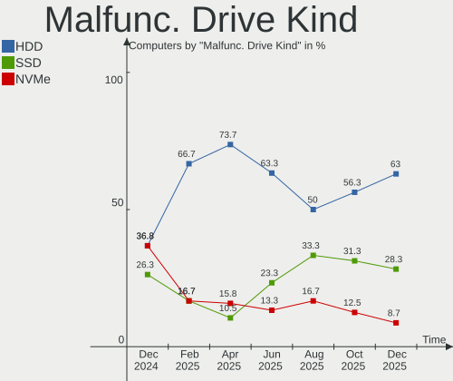

| Kind | Computers | Drives | Percent |
|------|-----------|--------|---------|
| HDD  | 29        | 33     | 63.04%  |
| SSD  | 13        | 14     | 28.26%  |
| NVMe | 4         | 4      | 8.7%    |

Failed Drives
-------------

Failed drive models

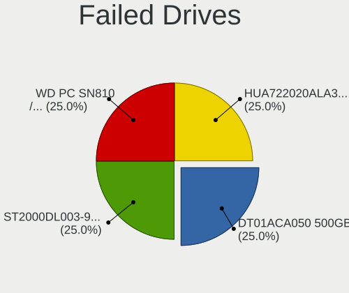

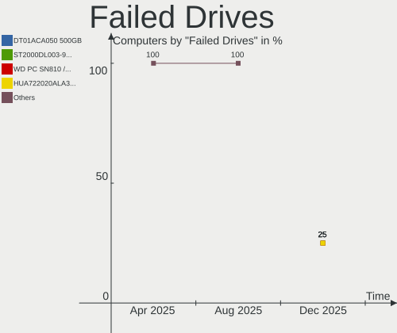

| Model                                            | Computers | Drives | Percent |
|--------------------------------------------------|-----------|--------|---------|
| Toshiba DT01ACA050 500GB                         | 1         | 1      | 25%     |
| Seagate ST2000DL003-9VT166 2TB                   | 1         | 1      | 25%     |
| Sandisk WD PC SN810 / Black SN850 NVMe SSD 500GB | 1         | 1      | 25%     |
| Hitachi HUA722020ALA330 2TB                      | 1         | 1      | 25%     |

Failed Drive Vendor
-------------------

Failed drive vendors

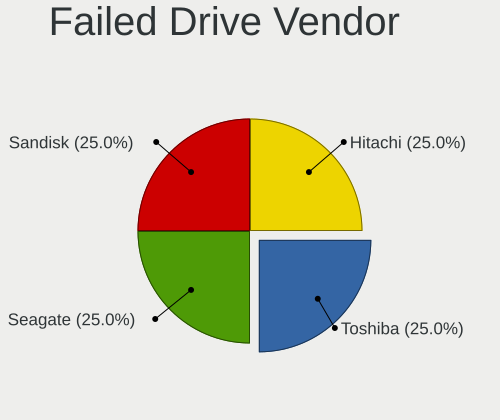

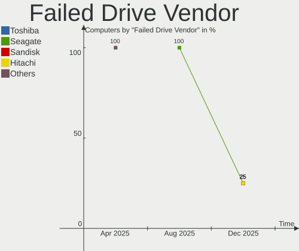

| Vendor  | Computers | Drives | Percent |
|---------|-----------|--------|---------|
| Toshiba | 1         | 1      | 25%     |
| Seagate | 1         | 1      | 25%     |
| Sandisk | 1         | 1      | 25%     |
| Hitachi | 1         | 1      | 25%     |

Drive Status
------------

Number of failed and malfunc. drives

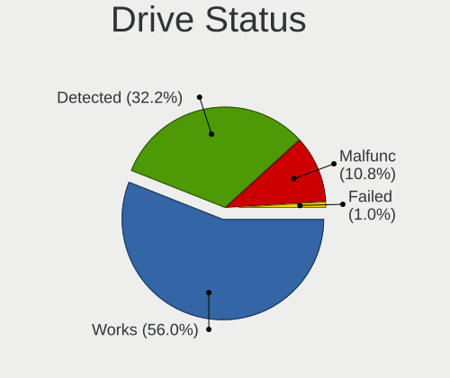

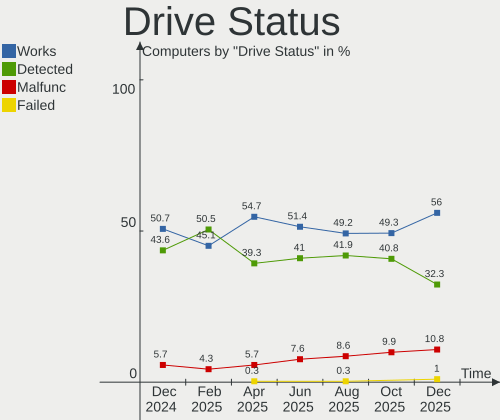

| Status   | Computers | Drives | Percent |
|----------|-----------|--------|---------|
| Works    | 224       | 462    | 56%     |
| Detected | 129       | 236    | 32.25%  |
| Malfunc  | 43        | 51     | 10.75%  |
| Failed   | 4         | 4      | 1%      |

Storage controller
------------------

Storage Vendor
--------------

Storage controller vendors

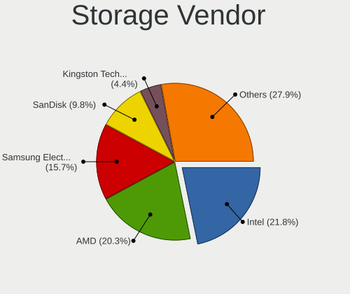

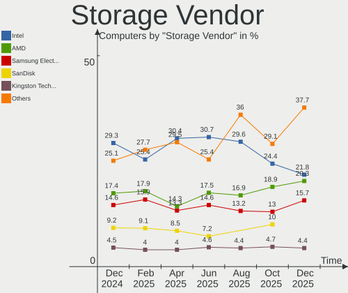

| Vendor                                  | Computers | Percent |
|-----------------------------------------|-----------|---------|
| Intel                                   | 133       | 21.8%   |
| AMD                                     | 124       | 20.33%  |
| Samsung Electronics                     | 96        | 15.74%  |
| SanDisk                                 | 60        | 9.84%   |
| Kingston Technology Company             | 27        | 4.43%   |
| Micron Technology                       | 25        | 4.1%    |
| Micron/Crucial Technology               | 24        | 3.93%   |
| SK hynix                                | 17        | 2.79%   |
| ASMedia Technology                      | 17        | 2.79%   |
| MAXIO Technology (Hangzhou)             | 13        | 2.13%   |
| Phison Electronics                      | 11        | 1.8%    |
| KIOXIA                                  | 10        | 1.64%   |
| Shenzhen Longsys Electronics            | 9         | 1.48%   |
| ADATA Technology                        | 8         | 1.31%   |
| Silicon Motion                          | 7         | 1.15%   |
| Toshiba America Info Systems            | 5         | 0.82%   |
| Yangtze Memory Technologies             | 3         | 0.49%   |
| Solidigm                                | 3         | 0.49%   |
| Seagate Technology                      | 3         | 0.49%   |
| Hosin Global Electronics                | 3         | 0.49%   |
| Shenzhen Unionmemory Information System | 2         | 0.33%   |
| Realtek Semiconductor                   | 2         | 0.33%   |
| INNOGRIT                                | 2         | 0.33%   |
| Microsoft                               | 1         | 0.16%   |
| Marvell Technology Group                | 1         | 0.16%   |
| LSI Logic / Symbios Logic               | 1         | 0.16%   |
| JMicron Technology                      | 1         | 0.16%   |
| Corsair Memory                          | 1         | 0.16%   |
| Apple                                   | 1         | 0.16%   |

Storage Model
-------------

Storage controller models

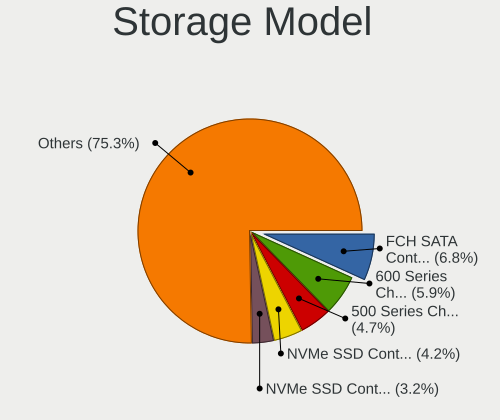

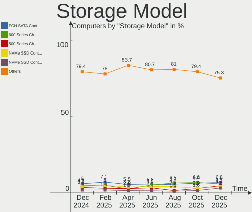

| Model                                                                          | Computers | Percent |
|--------------------------------------------------------------------------------|-----------|---------|
| AMD FCH SATA Controller [AHCI mode]                                            | 45        | 6.79%   |
| AMD 600 Series Chipset SATA Controller                                         | 39        | 5.88%   |
| AMD 500 Series Chipset SATA Controller                                         | 31        | 4.68%   |
| Samsung NVMe SSD Controller SM981/PM981/PM983                                  | 28        | 4.22%   |
| Samsung NVMe SSD Controller S4LV008[Pascal]                                    | 21        | 3.17%   |
| Samsung NVMe SSD Controller PM9A1/PM9A3/980PRO                                 | 18        | 2.71%   |
| SanDisk WD SN560/SN740/SN770/SN5000 NVMe SSD                                   | 16        | 2.41%   |
| Intel Volume Management Device NVMe RAID Controller                            | 16        | 2.41%   |
| Samsung NVMe SSD Controller PM9C1a (DRAM-less)                                 | 15        | 2.26%   |
| ASMedia ASM1061/ASM1062 Serial ATA Controller                                  | 14        | 2.11%   |
| Samsung NVMe SSD Controller 980 (DRAM-less)                                    | 11        | 1.66%   |
| AMD 400 Series Chipset SATA Controller                                         | 11        | 1.66%   |
| Micron 2400 NVMe SSD (DRAM-less)                                               | 9         | 1.36%   |
| Intel Raptor Lake SATA AHCI Controller                                         | 9         | 1.36%   |
| Intel 7 Series Chipset Family 6-port SATA Controller [AHCI mode]               | 9         | 1.36%   |
| Sandisk WD PC SN5000S M.2 2280 NVMe SSD (DRAM-less)                            | 8         | 1.21%   |
| Intel Alder Lake-S PCH SATA Controller [AHCI Mode]                             | 8         | 1.21%   |
| Intel 8 Series/C220 Series Chipset Family 6-port SATA Controller 1 [AHCI mode] | 8         | 1.21%   |
| SK hynix Platinum P41/PC801 NVMe Solid State Drive                             | 7         | 1.06%   |
| SanDisk Ultra 3D / WD PC SN530, IX SN530, Blue SN550 NVMe SSD (DRAM-less)      | 7         | 1.06%   |
| SanDisk Extreme Pro / WD Black SN750 / PC SN730 / Red SN700 NVMe SSD           | 7         | 1.06%   |
| Micron/Crucial P2 [Nick P2] / P3 / P3 Plus NVMe PCIe SSD (DRAM-less)           | 7         | 1.06%   |
| MAXIO (Hangzhou) NVMe SSD Controller MAP1202 (DRAM-less)                       | 7         | 1.06%   |
| Intel 6 Series/C200 Series Chipset Family 6 port Mobile SATA AHCI Controller   | 7         | 1.06%   |
| Micron/Crucial P310 NVMe PCIe SSD (DRAM-less)                                  | 6         | 0.9%    |
| Intel Sunrise Point-LP SATA Controller [AHCI mode]                             | 6         | 0.9%    |
| Intel Cannon Lake Mobile PCH SATA AHCI Controller                              | 6         | 0.9%    |
| Intel 82801 Mobile SATA Controller [RAID mode]                                 | 6         | 0.9%    |
| Silicon Motion SM2263EN/SM2263XT (DRAM-less) NVMe SSD Controllers              | 5         | 0.75%   |
| Samsung NVMe SSD Controller PM9B1 (DRAM-less)                                  | 5         | 0.75%   |
| Micron 2550 NVMe SSD (DRAM-less)                                               | 5         | 0.75%   |
| Kingston Company KC3000/FURY Renegade NVMe SSD [E18]                           | 5         | 0.75%   |
| Intel SSD 670p Series [Keystone Harbor]                                        | 5         | 0.75%   |
| Intel RST Volume Management Device Controller                                  | 5         | 0.75%   |
| Intel Cannon Lake PCH SATA AHCI Controller                                     | 5         | 0.75%   |
| Intel 200 Series PCH SATA controller [AHCI mode]                               | 5         | 0.75%   |
| AMD A320 Chipset SATA Controller [AHCI mode]                                   | 5         | 0.75%   |
| Phison E18 PCIe4 NVMe Controller                                               | 4         | 0.6%    |
| MAXIO (Hangzhou) NVMe SSD Controller MAP1602 (DRAM-less)                       | 4         | 0.6%    |
| KIOXIA NVMe SSD Controller BG4 (DRAM-less)                                     | 4         | 0.6%    |

Storage Kind
------------

Kind of storage controller (IDE, SATA, NVMe, SAS, ...)

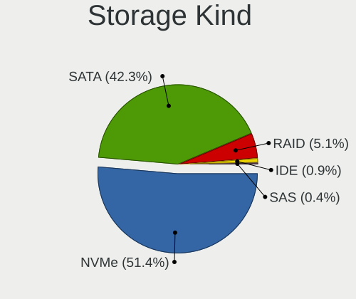

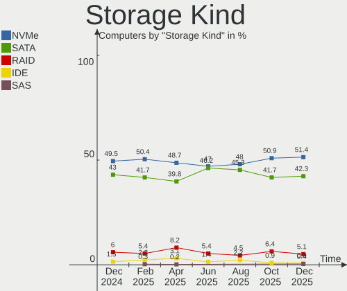

| Kind | Computers | Percent |
|------|-----------|---------|
| NVMe | 283       | 51.36%  |
| SATA | 233       | 42.29%  |
| RAID | 28        | 5.08%   |
| IDE  | 5         | 0.91%   |
| SAS  | 2         | 0.36%   |

Processor
---------

CPU Vendor
----------

Processor vendors

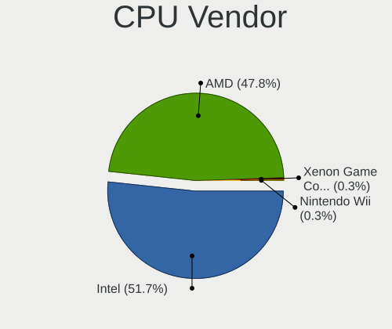

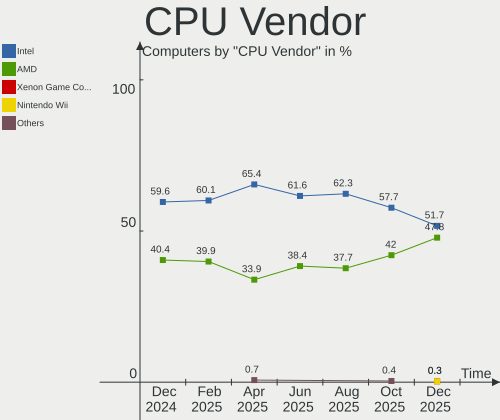

| Vendor             | Computers | Percent |
|--------------------|-----------|---------|
| Intel              | 185       | 51.68%  |
| AMD                | 171       | 47.77%  |
| Xenon Game Console | 1         | 0.28%   |
| Nintendo Wii       | 1         | 0.28%   |

CPU Model
---------

Processor models

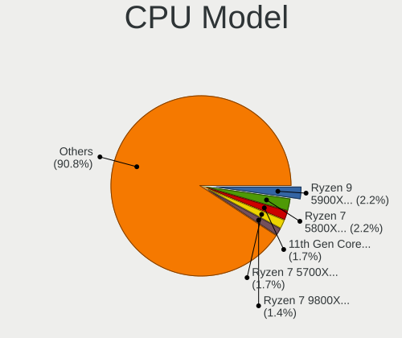

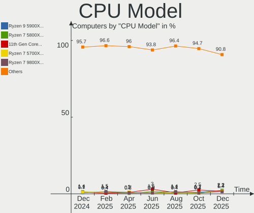

| Model                                     | Computers | Percent |
|-------------------------------------------|-----------|---------|
| AMD Ryzen 9 5900X 12-Core Processor       | 8         | 2.23%   |
| AMD Ryzen 7 5800X 8-Core Processor        | 8         | 2.23%   |
| Intel 11th Gen Core i5-1135G7 @ 2.40GHz   | 6         | 1.68%   |
| AMD Ryzen 7 5700X 8-Core Processor        | 6         | 1.68%   |
| AMD Ryzen 7 9800X3D 8-Core Processor      | 5         | 1.4%    |
| AMD Ryzen 7 7700X 8-Core Processor        | 5         | 1.4%    |
| AMD Ryzen 5 5600X 6-Core Processor        | 5         | 1.4%    |
| Intel Core Ultra 7 155H                   | 4         | 1.12%   |
| Intel 12th Gen Core i7-12700H             | 4         | 1.12%   |
| AMD Ryzen 9 7900X 12-Core Processor       | 4         | 1.12%   |
| AMD Ryzen 7 9700X 8-Core Processor        | 4         | 1.12%   |
| AMD Ryzen 7 5800X3D 8-Core Processor      | 4         | 1.12%   |
| AMD Ryzen 5 5600G with Radeon Graphics    | 4         | 1.12%   |
| AMD Ryzen 5 5600 6-Core Processor         | 4         | 1.12%   |
| AMD Ryzen 5 3600 6-Core Processor         | 4         | 1.12%   |
| Intel Core Ultra 5 225H                   | 3         | 0.84%   |
| Intel Core i5-8265U CPU @ 1.60GHz         | 3         | 0.84%   |
| Intel 13th Gen Core i7-13700K             | 3         | 0.84%   |
| Intel 12th Gen Core i7-12700K             | 3         | 0.84%   |
| Intel 12th Gen Core i5-12400              | 3         | 0.84%   |
| Intel 11th Gen Core i5-11400H @ 2.70GHz   | 3         | 0.84%   |
| AMD Ryzen 9 9950X3D 16-Core Processor     | 3         | 0.84%   |
| AMD Ryzen 9 9950X 16-Core Processor       | 3         | 0.84%   |
| AMD Ryzen 9 3900X 12-Core Processor       | 3         | 0.84%   |
| AMD Ryzen 7 7730U with Radeon Graphics    | 3         | 0.84%   |
| AMD Ryzen 7 260 w/ Radeon 780M Graphics   | 3         | 0.84%   |
| AMD Ryzen 5 7640U w/ Radeon 760M Graphics | 3         | 0.84%   |
| AMD Ryzen 5 5600H with Radeon Graphics    | 3         | 0.84%   |
| Intel N150                                | 2         | 0.56%   |
| Intel Core Ultra 7 258V                   | 2         | 0.56%   |
| Intel Core i9-14900HX                     | 2         | 0.56%   |
| Intel Core i9-10900K CPU @ 3.70GHz        | 2         | 0.56%   |
| Intel Core i7-9700K CPU @ 3.60GHz         | 2         | 0.56%   |
| Intel Core i7-6700HQ CPU @ 2.60GHz        | 2         | 0.56%   |
| Intel Core i7-4770K CPU @ 3.50GHz         | 2         | 0.56%   |
| Intel Core i7-3770 CPU @ 3.40GHz          | 2         | 0.56%   |
| Intel Core i7-10750H CPU @ 2.60GHz        | 2         | 0.56%   |
| Intel Core i7-10510U CPU @ 1.80GHz        | 2         | 0.56%   |
| Intel Core i5-8250U CPU @ 1.60GHz         | 2         | 0.56%   |
| Intel Core i5-7300U CPU @ 2.60GHz         | 2         | 0.56%   |

CPU Model Family
----------------

Processor model prefix

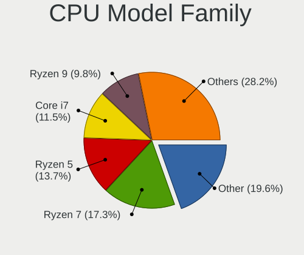

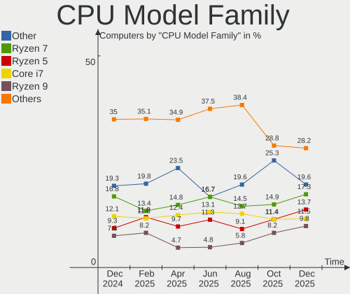

| Model                  | Computers | Percent |
|------------------------|-----------|---------|
| Other                  | 70        | 19.55%  |
| AMD Ryzen 7            | 62        | 17.32%  |
| AMD Ryzen 5            | 49        | 13.69%  |
| Intel Core i7          | 41        | 11.45%  |
| AMD Ryzen 9            | 35        | 9.78%   |
| Intel Core i5          | 31        | 8.66%   |
| Intel Core             | 18        | 5.03%   |
| Intel Core i3          | 11        | 3.07%   |
| Intel Xeon             | 7         | 1.96%   |
| Intel Core i9          | 6         | 1.68%   |
| Intel Celeron          | 6         | 1.68%   |
| AMD Ryzen 3            | 4         | 1.12%   |
| Intel Atom             | 3         | 0.84%   |
| Intel Core 2 Duo       | 2         | 0.56%   |
| AMD Ryzen Threadripper | 2         | 0.56%   |
| Intel Pentium Silver   | 1         | 0.28%   |
| Intel Pentium 4        | 1         | 0.28%   |
| AMD Turion 64 Mobile   | 1         | 0.28%   |
| AMD Ryzen 7 PRO        | 1         | 0.28%   |
| AMD Ryzen 3 PRO        | 1         | 0.28%   |
| AMD GX                 | 1         | 0.28%   |
| AMD FX                 | 1         | 0.28%   |
| AMD E2                 | 1         | 0.28%   |
| AMD Athlon             | 1         | 0.28%   |
| AMD A6                 | 1         | 0.28%   |
| AMD A12                | 1         | 0.28%   |

CPU Cores
---------

Number of processor cores

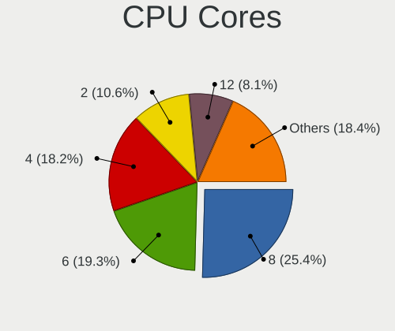

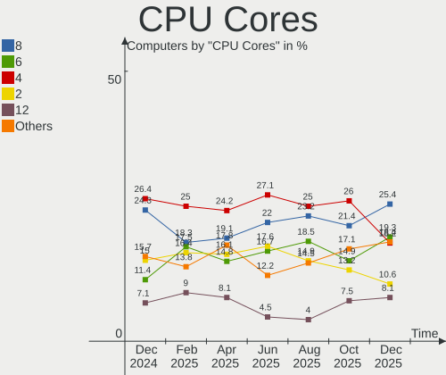

| Number | Computers | Percent |
|--------|-----------|---------|
| 8      | 91        | 25.42%  |
| 6      | 69        | 19.27%  |
| 4      | 65        | 18.16%  |
| 2      | 38        | 10.61%  |
| 12     | 29        | 8.1%    |
| 16     | 26        | 7.26%   |
| 10     | 15        | 4.19%   |
| 14     | 11        | 3.07%   |
| 24     | 5         | 1.4%    |
| 20     | 3         | 0.84%   |
| 1      | 3         | 0.84%   |
| 32     | 1         | 0.28%   |
| 18     | 1         | 0.28%   |
| 3      | 1         | 0.28%   |

CPU Sockets
-----------

Number of sockets

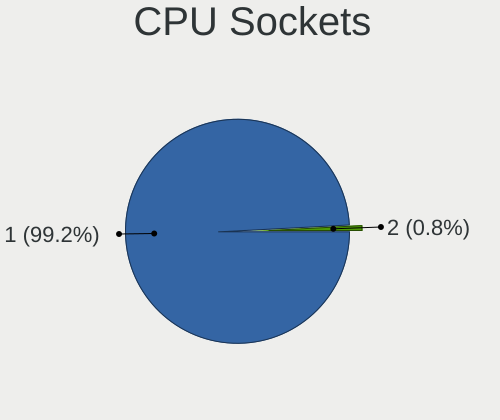

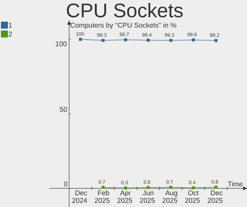

| Number | Computers | Percent |
|--------|-----------|---------|
| 1      | 355       | 99.16%  |
| 2      | 3         | 0.84%   |

CPU Threads
-----------

Threads per core (Hyper-Threading)

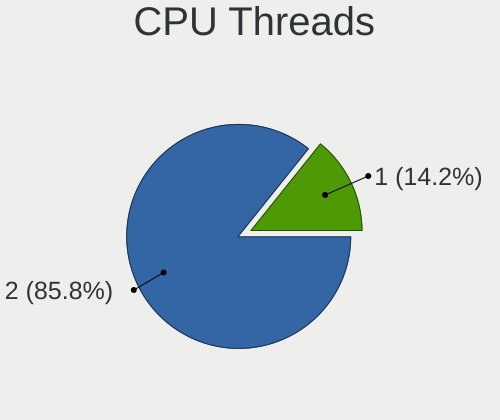

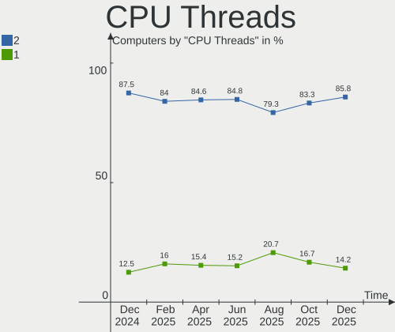

| Number | Computers | Percent |
|--------|-----------|---------|
| 2      | 307       | 85.75%  |
| 1      | 51        | 14.25%  |

CPU Op-Modes
------------

CPU Operation Modes (32-bit, 64-bit)

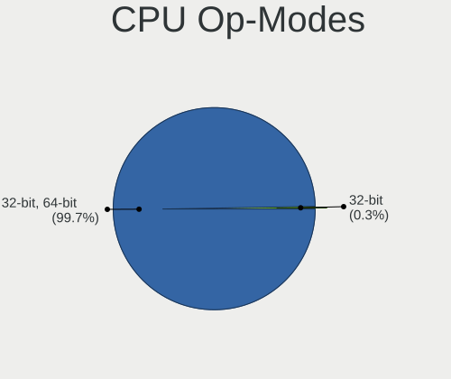

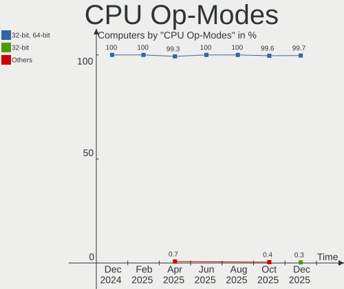

| Op mode        | Computers | Percent |
|----------------|-----------|---------|
| 32-bit, 64-bit | 357       | 99.72%  |
| 32-bit         | 1         | 0.28%   |

CPU Microcode
-------------

Microcode number

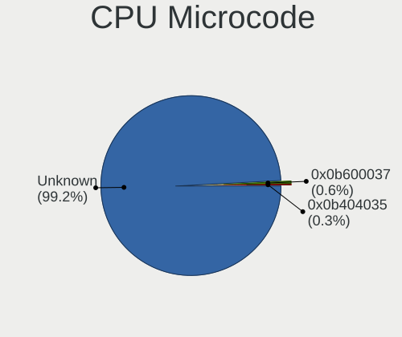

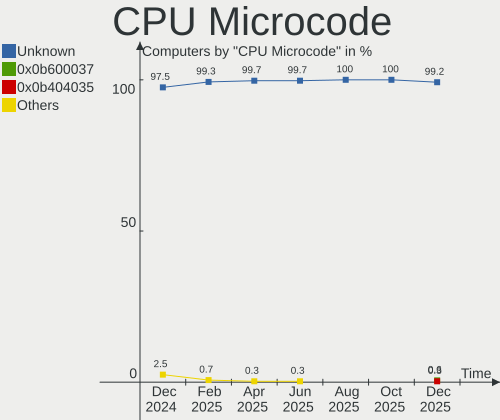

| Number     | Computers | Percent |
|------------|-----------|---------|
| Unknown    | 355       | 99.16%  |
| 0x0b600037 | 2         | 0.56%   |
| 0x0b404035 | 1         | 0.28%   |

CPU Microarch
-------------

Microarchitecture

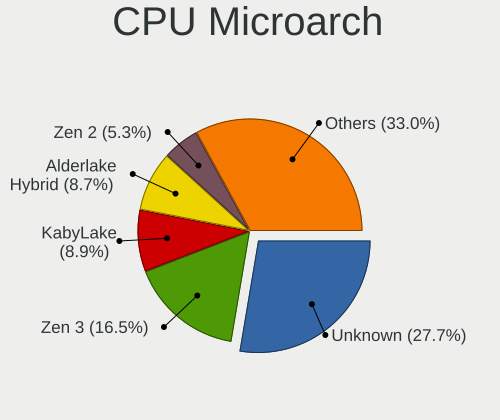

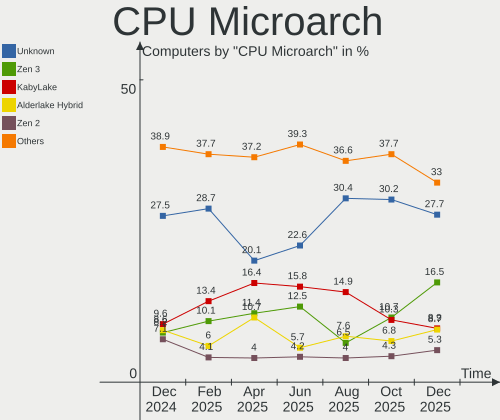

| Name               | Computers | Percent |
|--------------------|-----------|---------|
| Unknown            | 99        | 27.65%  |
| Zen 3              | 59        | 16.48%  |
| KabyLake           | 32        | 8.94%   |
| Alderlake Hybrid   | 31        | 8.66%   |
| Zen 2              | 19        | 5.31%   |
| Haswell            | 16        | 4.47%   |
| IvyBridge          | 14        | 3.91%   |
| TigerLake          | 12        | 3.35%   |
| Zen+               | 10        | 2.79%   |
| IceLake            | 9         | 2.51%   |
| Skylake            | 8         | 2.23%   |
| SandyBridge        | 8         | 2.23%   |
| Lunarlake Hybrid   | 6         | 1.68%   |
| CometLake          | 6         | 1.68%   |
| Silvermont         | 5         | 1.4%    |
| Meteorlake Hybrid  | 4         | 1.12%   |
| Goldmont plus      | 3         | 0.84%   |
| Puma               | 2         | 0.56%   |
| Penryn             | 2         | 0.56%   |
| Gracemont          | 2         | 0.56%   |
| Excavator          | 2         | 0.56%   |
| Broadwell          | 2         | 0.56%   |
| ArrowLake-H Hybrid | 2         | 0.56%   |
| Zen                | 1         | 0.28%   |
| Piledriver         | 1         | 0.28%   |
| NetBurst           | 1         | 0.28%   |
| Nehalem            | 1         | 0.28%   |
| K8 Hammer          | 1         | 0.28%   |

Graphics
--------

GPU Vendor
----------

Vendors of graphics cards

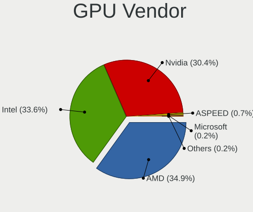

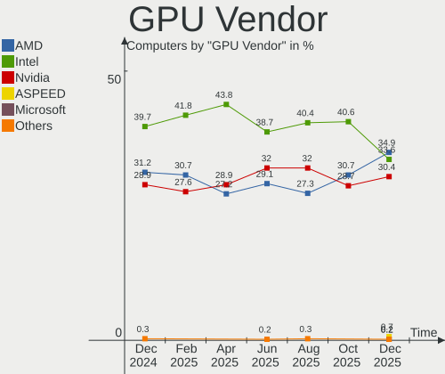

| Vendor                     | Computers | Percent |
|----------------------------|-----------|---------|
| AMD                        | 154       | 34.92%  |
| Intel                      | 148       | 33.56%  |
| Nvidia                     | 134       | 30.39%  |
| ASPEED Technology          | 3         | 0.68%   |
| Microsoft                  | 1         | 0.23%   |
| Matrox Electronics Systems | 1         | 0.23%   |

GPU Model
---------

Graphics card models

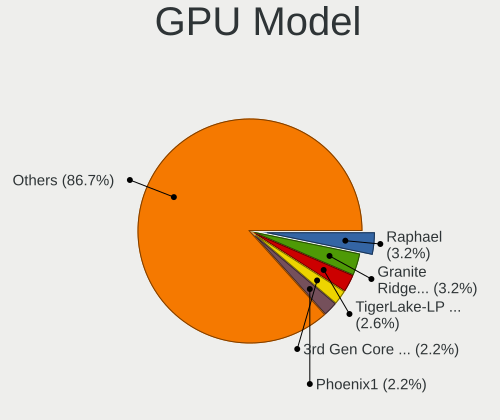

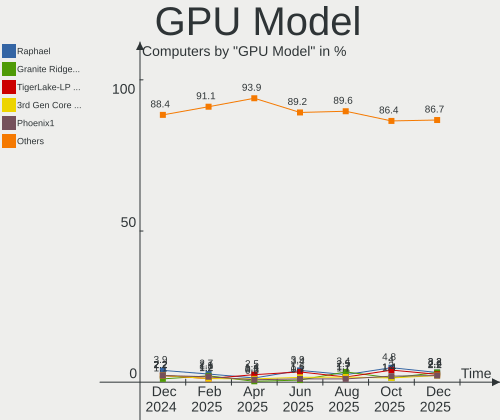

| Model                                                                     | Computers | Percent |
|---------------------------------------------------------------------------|-----------|---------|
| AMD Raphael                                                               | 15        | 3.23%   |
| AMD Granite Ridge [Radeon Graphics]                                       | 15        | 3.23%   |
| Intel TigerLake-LP GT2 [Iris Xe Graphics]                                 | 12        | 2.58%   |
| Intel 3rd Gen Core processor Graphics Controller                          | 10        | 2.15%   |
| AMD Phoenix1                                                              | 10        | 2.15%   |
| AMD Navi 10 [Radeon RX 5600 OEM/5600 XT / 5700/5700 XT]                   | 10        | 2.15%   |
| AMD Navi 33 [Radeon RX 7600/7600 XT/7600M XT/7600S/7700S / PRO W7600]     | 9         | 1.94%   |
| AMD Navi 31 [Radeon RX 7900 XT/7900 XTX/7900 GRE/7900M]                   | 9         | 1.94%   |
| AMD HawkPoint1                                                            | 9         | 1.94%   |
| Intel Raptor Lake-P [Iris Xe Graphics]                                    | 8         | 1.72%   |
| AMD Navi 48 [Radeon RX 9070/9070 XT/9070 GRE]                             | 8         | 1.72%   |
| AMD Navi 21 [Radeon RX 6800/6800 XT / 6900 XT]                            | 8         | 1.72%   |
| Intel Alder Lake-P GT2 [Iris Xe Graphics]                                 | 7         | 1.51%   |
| AMD Cezanne [Radeon Vega Series / Radeon Vega Mobile Series]              | 7         | 1.51%   |
| Nvidia AD107 [GeForce RTX 4060]                                           | 6         | 1.29%   |
| Intel CoffeeLake-H GT2 [UHD Graphics 630]                                 | 6         | 1.29%   |
| Intel 2nd Generation Core Processor Family Integrated Graphics Controller | 6         | 1.29%   |
| AMD Navi 22 [Radeon RX 6700/6700 XT/6750 XT / 6800M/6850M XT]             | 6         | 1.29%   |
| Nvidia GB206M [GeForce RTX 5060 Max-Q / Mobile]                           | 5         | 1.08%   |
| Nvidia GA107M [GeForce RTX 3050 Mobile]                                   | 5         | 1.08%   |
| Nvidia GA106M [GeForce RTX 3060 Mobile / Max-Q]                           | 5         | 1.08%   |
| Nvidia AD106M [GeForce RTX 4070 Max-Q / Mobile]                           | 5         | 1.08%   |
| Intel WhiskeyLake-U GT2 [UHD Graphics 620]                                | 5         | 1.08%   |
| Intel Meteor Lake-P [Intel Arc Graphics]                                  | 5         | 1.08%   |
| Intel Kaby Lake-U GT2 [HD Graphics 620]                                   | 5         | 1.08%   |
| Intel Arrow Lake-P [Arc Pro 130T/140T]                                    | 5         | 1.08%   |
| AMD Strix [Radeon 880M / 890M]                                            | 5         | 1.08%   |
| AMD Picasso/Raven 2 [Radeon Vega Series / Radeon Vega Mobile Series]      | 5         | 1.08%   |
| AMD Navi 44 [Radeon RX 9060 XT]                                           | 5         | 1.08%   |
| AMD Navi 23 [Radeon RX 6600/6600 XT/6600M]                                | 5         | 1.08%   |
| AMD Ellesmere [Radeon RX 470/480/570/570X/580/580X/590]                   | 5         | 1.08%   |
| AMD Barcelo                                                               | 5         | 1.08%   |
| Nvidia GB203 [GeForce RTX 5080]                                           | 4         | 0.86%   |
| Nvidia GA106 [GeForce RTX 3060 Lite Hash Rate]                            | 4         | 0.86%   |
| Nvidia GA102 [GeForce RTX 3090]                                           | 4         | 0.86%   |
| Nvidia GA102 [GeForce RTX 3080]                                           | 4         | 0.86%   |
| Nvidia GA102 [GeForce RTX 3080 Lite Hash Rate]                            | 4         | 0.86%   |
| Intel Raptor Lake-S GT1 [UHD Graphics 770]                                | 4         | 0.86%   |
| Intel Lunar Lake [Intel Arc Graphics 130V / 140V]                         | 4         | 0.86%   |
| Intel Haswell-ULT Integrated Graphics Controller                          | 4         | 0.86%   |

GPU Combo
---------

Combinations of graphics cards

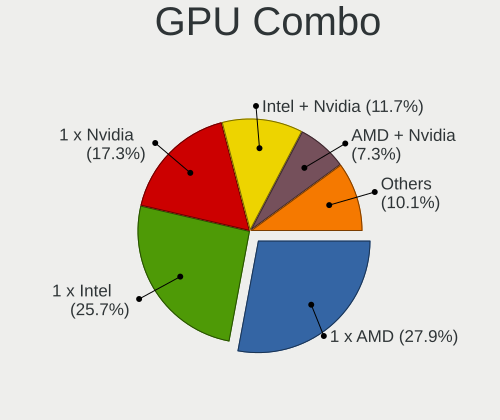

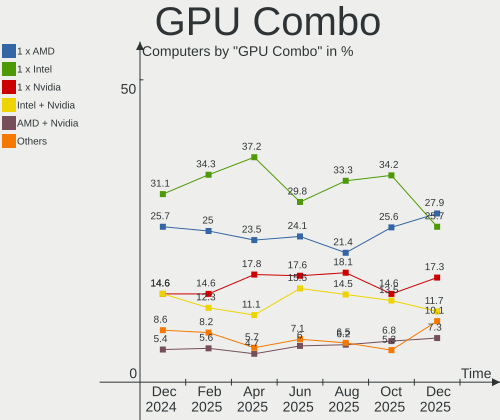

| Name                     | Computers | Percent |
|--------------------------|-----------|---------|
| 1 x AMD                  | 100       | 27.93%  |
| 1 x Intel                | 92        | 25.7%   |
| 1 x Nvidia               | 62        | 17.32%  |
| Intel + Nvidia           | 42        | 11.73%  |
| AMD + Nvidia             | 26        | 7.26%   |
| 2 x AMD                  | 20        | 5.59%   |
| Intel + AMD              | 5         | 1.4%    |
| 2 x Intel                | 2         | 0.56%   |
| Other                    | 1         | 0.28%   |
| 2 x Nvidia               | 1         | 0.28%   |
| 2 x AMD + 1 x Nvidia     | 1         | 0.28%   |
| Nvidia + ASPEED          | 1         | 0.28%   |
| 1 x Microsoft            | 1         | 0.28%   |
| 1 x Matrox               | 1         | 0.28%   |
| Intel + AMD + 1 x Nvidia | 1         | 0.28%   |
| 1 x ASPEED               | 1         | 0.28%   |
| AMD + ASPEED             | 1         | 0.28%   |

GPU Driver
----------

Free vs proprietary

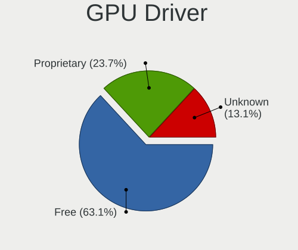

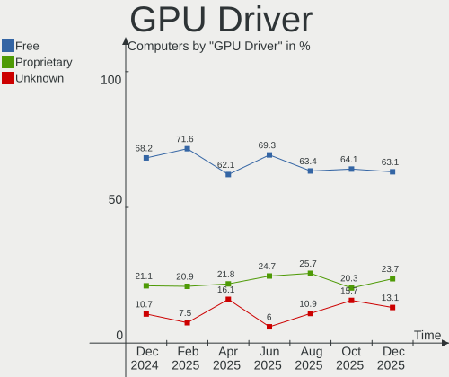

| Driver      | Computers | Percent |
|-------------|-----------|---------|
| Free        | 226       | 63.13%  |
| Proprietary | 85        | 23.74%  |
| Unknown     | 47        | 13.13%  |

GPU Memory
----------

Total video memory

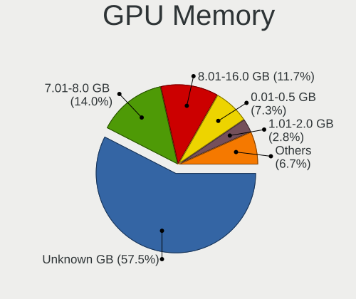

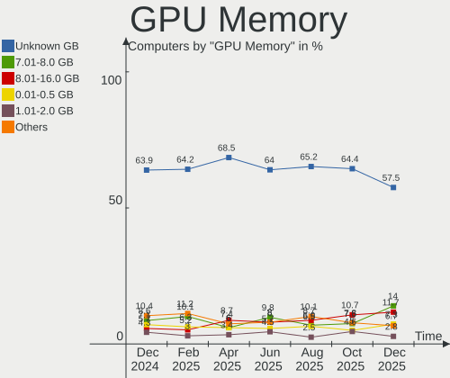

| Size in GB | Computers | Percent |
|------------|-----------|---------|
| Unknown    | 206       | 57.54%  |
| 7.01-8.0   | 50        | 13.97%  |
| 8.01-16.0  | 42        | 11.73%  |
| 0.01-0.5   | 26        | 7.26%   |
| 1.01-2.0   | 10        | 2.79%   |
| 3.01-4.0   | 8         | 2.23%   |
| 16.01-24.0 | 8         | 2.23%   |
| 5.01-6.0   | 7         | 1.96%   |
| 0.51-1.0   | 1         | 0.28%   |

Monitor
-------

Monitor Vendor
--------------

Monitor vendors

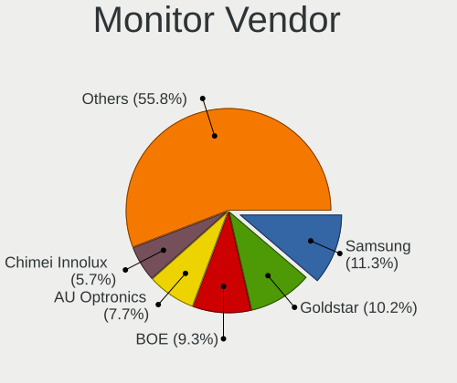

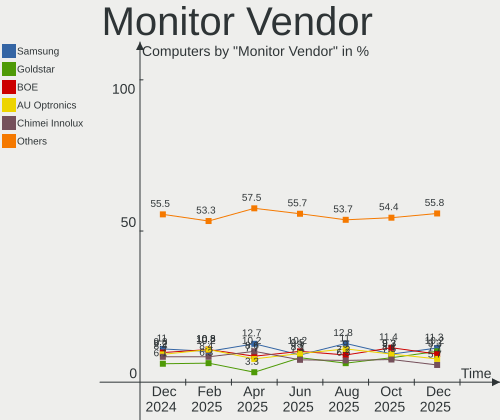

| Vendor                  | Computers | Percent |
|-------------------------|-----------|---------|
| Samsung Electronics     | 51        | 11.26%  |
| Goldstar                | 46        | 10.15%  |
| BOE                     | 42        | 9.27%   |
| AU Optronics            | 35        | 7.73%   |
| Chimei Innolux          | 26        | 5.74%   |
| Dell                    | 24        | 5.3%    |
| Acer                    | 23        | 5.08%   |
| AOC                     | 22        | 4.86%   |
| LG Display              | 19        | 4.19%   |
| Lenovo                  | 17        | 3.75%   |
| BenQ                    | 13        | 2.87%   |
| ASUSTek Computer        | 13        | 2.87%   |
| MSI                     | 11        | 2.43%   |
| Ancor Communications    | 11        | 2.43%   |
| Philips                 | 9         | 1.99%   |
| Hewlett-Packard         | 6         | 1.32%   |
| Gigabyte Technology     | 5         | 1.1%    |
| ViewSonic               | 4         | 0.88%   |
| Chi Mei Optoelectronics | 4         | 0.88%   |
| Toshiba                 | 3         | 0.66%   |
| TMA                     | 3         | 0.66%   |
| Sharp                   | 3         | 0.66%   |
| PANDA                   | 3         | 0.66%   |
| Iiyama                  | 3         | 0.66%   |
| HKC                     | 3         | 0.66%   |
| CSW                     | 3         | 0.66%   |
| CSOT                    | 3         | 0.66%   |
| Wacom                   | 2         | 0.44%   |
| Unknown                 | 2         | 0.44%   |
| TMX                     | 2         | 0.44%   |
| Sony                    | 2         | 0.44%   |
| SAC                     | 2         | 0.44%   |
| Denver                  | 2         | 0.44%   |
| CHO                     | 2         | 0.44%   |
| Apple                   | 2         | 0.44%   |
| VXN                     | 1         | 0.22%   |
| Vizio                   | 1         | 0.22%   |
| Viotek                  | 1         | 0.22%   |
| Valve                   | 1         | 0.22%   |
| Unknown (XXX)           | 1         | 0.22%   |

Monitor Model
-------------

Monitor models

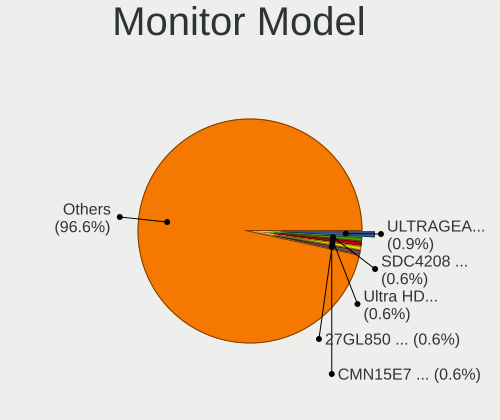

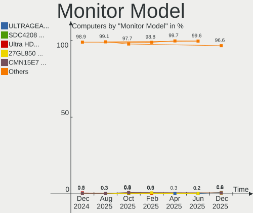

| Model                                                                    | Computers | Percent |
|--------------------------------------------------------------------------|-----------|---------|
| Goldstar ULTRAGEAR GSM5BD3 2560x1440 697x392mm 31.5-inch                 | 4         | 0.85%   |
| Samsung Electronics LCD Monitor SDC4208 1920x1200 302x189mm 14.0-inch    | 3         | 0.64%   |
| Goldstar Ultra HD GSM5B09 3840x2160 600x340mm 27.2-inch                  | 3         | 0.64%   |
| Goldstar 27GL850 GSM5B7F 2560x1440 597x336mm 27.0-inch                   | 3         | 0.64%   |
| Chimei Innolux LCD Monitor CMN15E7 1920x1080 344x193mm 15.5-inch         | 3         | 0.64%   |
| AOC Q27G4 AOCB403 2560x1440 597x336mm 27.0-inch                          | 3         | 0.64%   |
| AOC 24G2W1G3 AOC2402 1920x1080 527x296mm 23.8-inch                       | 3         | 0.64%   |
| Unknown LCD Monitor FFFF 2288x1287 2550x2550mm 142.0-inch                | 2         | 0.43%   |
| Samsung Electronics LCD Monitor SDC41A0 1920x1200 302x189mm 14.0-inch    | 2         | 0.43%   |
| Samsung Electronics ATNA53JB01-0  SDC4206                                | 2         | 0.43%   |
| Lenovo LCD Monitor LEN40B2 1920x1080 344x193mm 15.5-inch                 | 2         | 0.43%   |
| Goldstar ULTRAGEAR GSM5BD2 2560x1440 697x392mm 31.5-inch                 | 2         | 0.43%   |
| Goldstar FULL HD GSM5B55 1920x1080 480x270mm 21.7-inch                   | 2         | 0.43%   |
| Dell S2721DGF DEL41D9 2560x1440 597x336mm 27.0-inch                      | 2         | 0.43%   |
| Dell P3223DE DEL4294 2560x1440 698x393mm 31.5-inch                       | 2         | 0.43%   |
| Chimei Innolux LCD Monitor CMN14E5 1920x1080 309x173mm 13.9-inch         | 2         | 0.43%   |
| Chi Mei Optoelectronics LCD Monitor CMO15A1 1366x768 344x193mm 15.5-inch | 2         | 0.43%   |
| BOE NE135A1M-NY1 BOE0CB4 2880x1920 285x190mm 13.5-inch                   | 2         | 0.43%   |
| BOE LCD Monitor BOE0BCA 2256x1504 285x190mm 13.5-inch                    | 2         | 0.43%   |
| BOE LCD Monitor BOE0BC9 2560x1600 345x215mm 16.0-inch                    | 2         | 0.43%   |
| BOE LCD Monitor BOE0819 1920x1080 344x194mm 15.5-inch                    | 2         | 0.43%   |
| AU Optronics LCD Monitor AUOD0ED 1920x1080 344x193mm 15.5-inch           | 2         | 0.43%   |
| AU Optronics LCD Monitor AUOAF90 1920x1080 344x193mm 15.5-inch           | 2         | 0.43%   |
| AOC AG273QS3R4 AOC2730 2560x1440 597x336mm 27.0-inch                     | 2         | 0.43%   |
| AOC 27G2G4 AOC2702 1920x1080 598x336mm 27.0-inch                         | 2         | 0.43%   |
| AOC 27G1G4 AOC2701 1920x1080 598x336mm 27.0-inch                         | 2         | 0.43%   |
| Wacom One 13 WAC1070 1920x1080 294x166mm 13.3-inch                       | 1         | 0.21%   |
| Wacom Cintiq 16 WAC1071 1920x1080 344x193mm 15.5-inch                    | 1         | 0.21%   |
| VXN VisN236HUZ15 VXN1421                                                 | 1         | 0.21%   |
| Vizio VFD40M-0809 VIZ0109 1920x1080 890x490mm 40.0-inch                  | 1         | 0.21%   |
| Viotek GN34CW VTK3400 3440x1440 795x334mm 33.9-inch                      | 1         | 0.21%   |
| ViewSonic XG2431 VSC3B3B 1920x1080 527x296mm 23.8-inch                   | 1         | 0.21%   |
| ViewSonic VX2758-C-MH VSC35DD 1920x1080 597x336mm 27.0-inch              | 1         | 0.21%   |
| ViewSonic VX2758-2K-PRO VSC1F3F 2560x1440 600x330mm 27.0-inch            | 1         | 0.21%   |
| ViewSonic E771-4 VSC5941 1280x1024 300x225mm 14.8-inch                   | 1         | 0.21%   |
| Valve Index HMD VLV91A8                                                  | 1         | 0.21%   |
| Unknown (XXX) Beyond TV XXX2851 3840x2160 1209x680mm 54.6-inch           | 1         | 0.21%   |
| Toshiba TV TSB0200 1920x1080 410x230mm 18.5-inch                         | 1         | 0.21%   |
| Toshiba ScreenXpert TSB8888 1080x2160                                    | 1         | 0.21%   |
| Toshiba 43UHD_LCD_TV TSB3700 3840x2160 940x540mm 42.7-inch               | 1         | 0.21%   |

Monitor Resolution
------------------

Monitor screen resolution

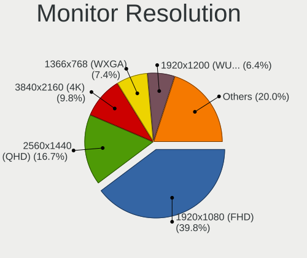

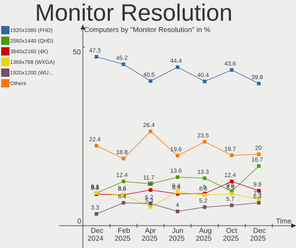

| Resolution         | Computers | Percent |
|--------------------|-----------|---------|
| 1920x1080 (FHD)    | 167       | 39.76%  |
| 2560x1440 (QHD)    | 70        | 16.67%  |
| 3840x2160 (4K)     | 41        | 9.76%   |
| 1366x768 (WXGA)    | 31        | 7.38%   |
| 1920x1200 (WUXGA)  | 27        | 6.43%   |
| 3440x1440          | 13        | 3.1%    |
| 2560x1600          | 12        | 2.86%   |
| Unknown            | 8         | 1.9%    |
| 2560x1080          | 7         | 1.67%   |
| 1680x1050 (WSXGA+) | 6         | 1.43%   |
| 2880x1800          | 5         | 1.19%   |
| 1280x1024 (SXGA)   | 4         | 0.95%   |
| 3072x1920          | 3         | 0.71%   |
| 1600x900 (HD+)     | 3         | 0.71%   |
| 3840x2400          | 2         | 0.48%   |
| 3840x1080          | 2         | 0.48%   |
| 2880x1920          | 2         | 0.48%   |
| 2288x1287          | 2         | 0.48%   |
| 2256x1504          | 2         | 0.48%   |
| 1440x900 (WXGA+)   | 2         | 0.48%   |
| 6400x1440          | 1         | 0.24%   |
| 3840x1600          | 1         | 0.24%   |
| 3000x2000          | 1         | 0.24%   |
| 2520x1680          | 1         | 0.24%   |
| 2240x1400          | 1         | 0.24%   |
| 2160x1440          | 1         | 0.24%   |
| 2048x1152          | 1         | 0.24%   |
| 1360x768           | 1         | 0.24%   |
| 1280x960           | 1         | 0.24%   |
| 1280x800 (WXGA)    | 1         | 0.24%   |
| 1024x768 (XGA)     | 1         | 0.24%   |

Monitor Diagonal
----------------

Diagonal size in inches

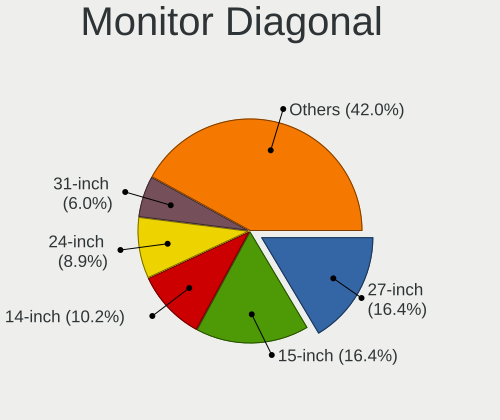

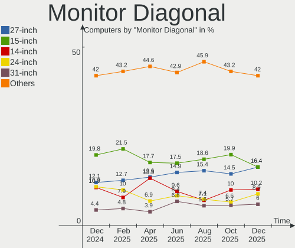

| Inches  | Computers | Percent |
|---------|-----------|---------|
| 27      | 74        | 16.44%  |
| 15      | 74        | 16.44%  |
| 14      | 46        | 10.22%  |
| 24      | 40        | 8.89%   |
| 31      | 27        | 6%      |
| 23      | 26        | 5.78%   |
| 16      | 26        | 5.78%   |
| 13      | 23        | 5.11%   |
| 21      | 22        | 4.89%   |
| 34      | 19        | 4.22%   |
| Unknown | 10        | 2.22%   |
| 17      | 7         | 1.56%   |
| 84      | 6         | 1.33%   |
| 32      | 5         | 1.11%   |
| 26      | 4         | 0.89%   |
| 22      | 4         | 0.89%   |
| 20      | 4         | 0.89%   |
| 18      | 4         | 0.89%   |
| 40      | 3         | 0.67%   |
| 12      | 3         | 0.67%   |
| 142     | 2         | 0.44%   |
| 63      | 2         | 0.44%   |
| 42      | 2         | 0.44%   |
| 37      | 2         | 0.44%   |
| 19      | 2         | 0.44%   |
| 11      | 2         | 0.44%   |
| 86      | 1         | 0.22%   |
| 70      | 1         | 0.22%   |
| 65      | 1         | 0.22%   |
| 57      | 1         | 0.22%   |
| 55      | 1         | 0.22%   |
| 54      | 1         | 0.22%   |
| 48      | 1         | 0.22%   |
| 46      | 1         | 0.22%   |
| 43      | 1         | 0.22%   |
| 35      | 1         | 0.22%   |
| 29      | 1         | 0.22%   |

Monitor Width
-------------

Physical width

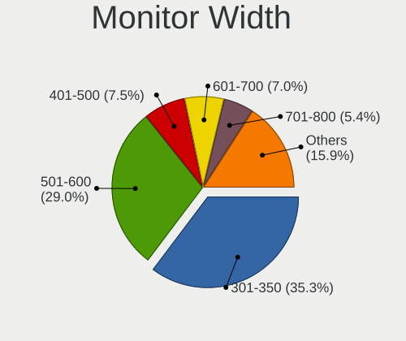

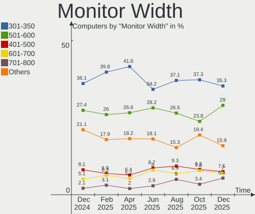

| Width in mm    | Computers | Percent |
|----------------|-----------|---------|
| 301-350        | 151       | 35.28%  |
| 501-600        | 124       | 28.97%  |
| 401-500        | 32        | 7.48%   |
| 601-700        | 30        | 7.01%   |
| 701-800        | 23        | 5.37%   |
| 201-300        | 20        | 4.67%   |
| 351-400        | 11        | 2.57%   |
| Unknown        | 10        | 2.34%   |
| 1001-1500      | 9         | 2.1%    |
| 801-900        | 7         | 1.64%   |
| 1501-2000      | 7         | 1.64%   |
| More than 2000 | 2         | 0.47%   |
| 901-1000       | 2         | 0.47%   |

Aspect Ratio
------------

Proportional relationship between the width and the height

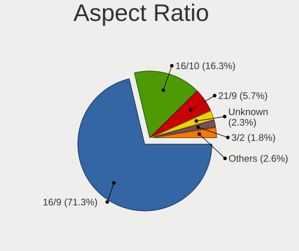

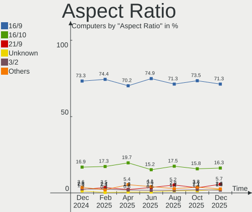

| Ratio   | Computers | Percent |
|---------|-----------|---------|
| 16/9    | 276       | 71.32%  |
| 16/10   | 63        | 16.28%  |
| 21/9    | 22        | 5.68%   |
| Unknown | 9         | 2.33%   |
| 3/2     | 7         | 1.81%   |
| 5/4     | 3         | 0.78%   |
| 4/3     | 2         | 0.52%   |
| 32/9    | 2         | 0.52%   |
| 1.00    | 2         | 0.52%   |
| 0.56    | 1         | 0.26%   |

Monitor Area
------------

Area in inch²

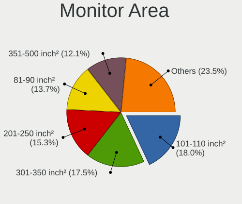

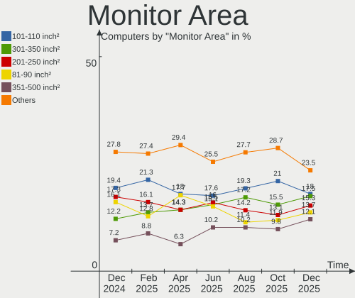

| Area in inch² | Computers | Percent |
|----------------|-----------|---------|
| 101-110        | 79        | 18%     |
| 301-350        | 77        | 17.54%  |
| 201-250        | 67        | 15.26%  |
| 81-90          | 60        | 13.67%  |
| 351-500        | 53        | 12.07%  |
| 111-120        | 22        | 5.01%   |
| More than 1000 | 14        | 3.19%   |
| 151-200        | 13        | 2.96%   |
| 251-300        | 12        | 2.73%   |
| Unknown        | 10        | 2.28%   |
| 501-1000       | 9         | 2.05%   |
| 141-150        | 6         | 1.37%   |
| 71-80          | 5         | 1.14%   |
| 121-130        | 5         | 1.14%   |
| 61-70          | 3         | 0.68%   |
| 51-60          | 2         | 0.46%   |
| 91-100         | 2         | 0.46%   |

Pixel Density
-------------

Pixels per inch

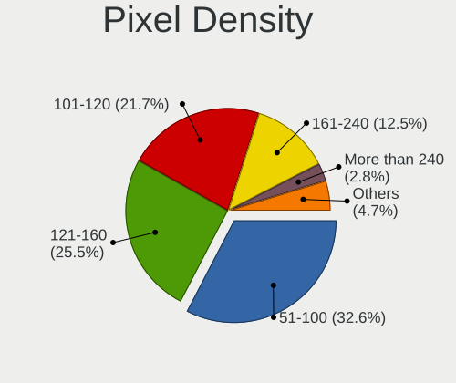

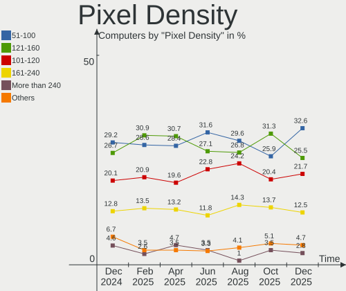

| Density       | Computers | Percent |
|---------------|-----------|---------|
| 51-100        | 138       | 32.62%  |
| 121-160       | 108       | 25.53%  |
| 101-120       | 92        | 21.75%  |
| 161-240       | 53        | 12.53%  |
| More than 240 | 12        | 2.84%   |
| 1-50          | 10        | 2.36%   |
| Unknown       | 10        | 2.36%   |

Multiple Monitors
-----------------

Total monitors connected

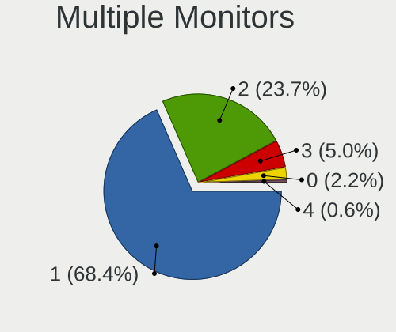

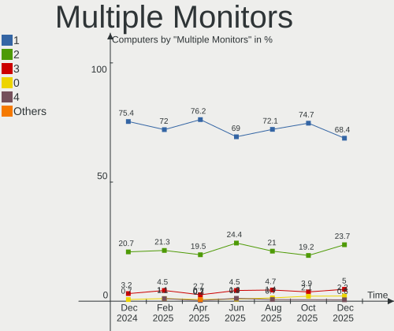

| Total | Computers | Percent |
|-------|-----------|---------|
| 1     | 245       | 68.44%  |
| 2     | 85        | 23.74%  |
| 3     | 18        | 5.03%   |
| 0     | 8         | 2.23%   |
| 4     | 2         | 0.56%   |

Network
-------

Net Controller Vendor
---------------------

Controller vendors

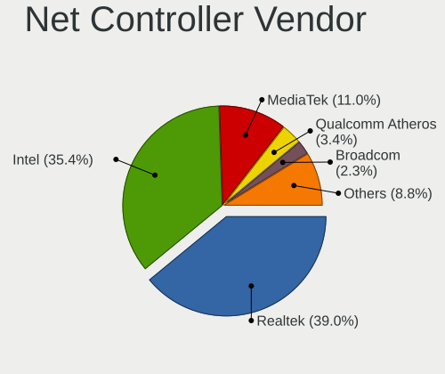

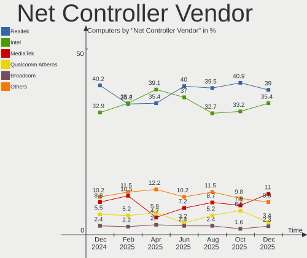

| Vendor                          | Computers | Percent |
|---------------------------------|-----------|---------|
| Realtek Semiconductor           | 205       | 39.05%  |
| Intel                           | 186       | 35.43%  |
| MediaTek                        | 58        | 11.05%  |
| Qualcomm Atheros                | 18        | 3.43%   |
| Broadcom                        | 12        | 2.29%   |
| Qualcomm Technologies           | 6         | 1.14%   |
| ASIX Electronics                | 6         | 1.14%   |
| Microsoft                       | 4         | 0.76%   |
| Aquantia                        | 4         | 0.76%   |
| Qualcomm                        | 3         | 0.57%   |
| Sierra Wireless                 | 2         | 0.38%   |
| Samsung Electronics             | 2         | 0.38%   |
| QinHeng Electronics             | 2         | 0.38%   |
| NetGear                         | 2         | 0.38%   |
| Lenovo                          | 2         | 0.38%   |
| Broadcom Limited                | 2         | 0.38%   |
| Xiaomi                          | 1         | 0.19%   |
| Shenzhen Goodix Technology      | 1         | 0.19%   |
| Realtek                         | 1         | 0.19%   |
| Ralink Technology               | 1         | 0.19%   |
| Qualcomm Atheros Communications | 1         | 0.19%   |
| Motorcomm Microelectronics.     | 1         | 0.19%   |
| Mercucys                        | 1         | 0.19%   |
| DisplayLink                     | 1         | 0.19%   |
| D-Link System                   | 1         | 0.19%   |
| ASUSTek Computer                | 1         | 0.19%   |
| Apple                           | 1         | 0.19%   |

Net Controller Model
--------------------

Controller models

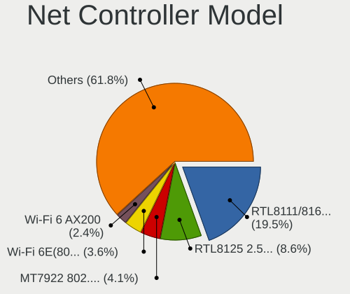

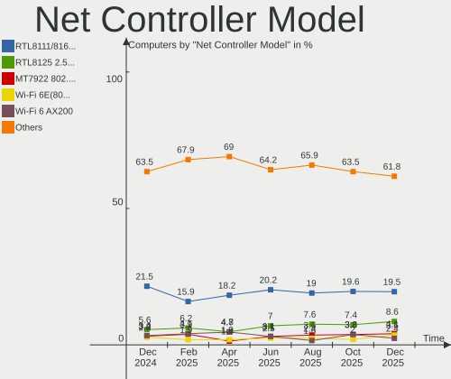

| Model                                                                           | Computers | Percent |
|---------------------------------------------------------------------------------|-----------|---------|
| Realtek RTL8111/8168/8211/8411 PCI Express Gigabit Ethernet Controller          | 123       | 19.49%  |
| Realtek RTL8125 2.5GbE Controller                                               | 54        | 8.56%   |
| MediaTek MT7922 802.11ax PCI Express Wireless Network Adapter                   | 26        | 4.12%   |
| Intel Wi-Fi 6E(802.11ax) AX210/AX1675* 2x2 [Typhoon Peak]                       | 23        | 3.65%   |
| Intel Wi-Fi 6 AX200                                                             | 15        | 2.38%   |
| Intel Ethernet Controller I225-V                                                | 13        | 2.06%   |
| Realtek RTL8153 Gigabit Ethernet Adapter                                        | 11        | 1.74%   |
| Intel I211 Gigabit Network Connection                                           | 11        | 1.74%   |
| MediaTek MT7925 802.11be 160MHz 2x2 PCIe Wireless Network Adapter [Filogic 360] | 10        | 1.58%   |
| Intel Alder Lake-P PCH CNVi WiFi                                                | 10        | 1.58%   |
| Intel Wi-Fi 6 AX201                                                             | 9         | 1.43%   |
| Intel 82579LM Gigabit Network Connection (Lewisville)                           | 9         | 1.43%   |
| Realtek RTL8852CE PCIe 802.11ax Wireless Network Controller                     | 8         | 1.27%   |
| Intel Wireless 8265 / 8275                                                      | 8         | 1.27%   |
| Intel 700 Series Chipset CNVi WiFi                                              | 8         | 1.27%   |
| Realtek RTL8821CE 802.11ac PCIe Wireless Network Adapter                        | 7         | 1.11%   |
| MediaTek MT7921 802.11ax PCIe Wireless Network Adapter [Filogic 330]            | 7         | 1.11%   |
| Intel Wireless 8260                                                             | 7         | 1.11%   |
| Intel Ethernet Controller I226-V                                                | 7         | 1.11%   |
| Realtek RTL8126 5GbE Controller                                                 | 6         | 0.95%   |
| Qualcomm WCN785x Wi-Fi 7(802.11be) 320MHz 2x2 [FastConnect 7800]                | 6         | 0.95%   |
| MediaTek MT7902 802.11ax PCIe Wireless Network Adapter [Filogic 310]            | 6         | 0.95%   |
| Intel Raptor Lake PCH CNVi WiFi                                                 | 6         | 0.95%   |
| Intel Ethernet Connection (2) I219-V                                            | 6         | 0.95%   |
| ASIX AX88179 Gigabit Ethernet                                                   | 6         | 0.95%   |
| Realtek RTL8922AE 802.11be PCIe Wireless Network Adapter                        | 5         | 0.79%   |
| Intel Wireless 7260                                                             | 5         | 0.79%   |
| Intel Meteor Lake PCH CNVi WiFi                                                 | 5         | 0.79%   |
| Intel Comet Lake PCH CNVi WiFi                                                  | 5         | 0.79%   |
| Intel Cannon Lake PCH CNVi WiFi                                                 | 5         | 0.79%   |
| Intel Arrow Lake CNVi WiFi                                                      | 5         | 0.79%   |
| Realtek USB 10/100/1G/2.5 LAN                                                   | 4         | 0.63%   |
| Realtek RTL8852BE PCIe 802.11ax Wireless Network Controller                     | 4         | 0.63%   |
| Realtek RTL8851BE PCIe 802.11ax Wireless Network Controller                     | 4         | 0.63%   |
| Realtek Killer E2600 GbE Controller                                             | 4         | 0.63%   |
| Qualcomm Atheros QCA6174 802.11ac Wireless Network Adapter                      | 4         | 0.63%   |
| Qualcomm Atheros AR9485 Wireless Network Adapter                                | 4         | 0.63%   |
| Intel Wireless 7265                                                             | 4         | 0.63%   |
| Intel Wi-Fi 5(802.11ac) Wireless-AC 9x6x [Thunder Peak]                         | 4         | 0.63%   |
| Intel I210 Gigabit Network Connection                                           | 4         | 0.63%   |

Wireless Vendor
---------------

Wireless vendors

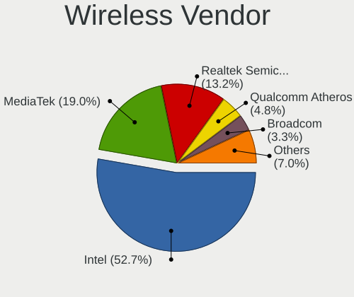

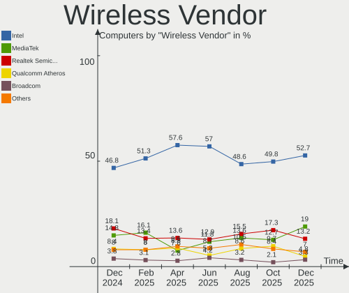

| Vendor                          | Computers | Percent |
|---------------------------------|-----------|---------|
| Intel                           | 144       | 52.75%  |
| MediaTek                        | 52        | 19.05%  |
| Realtek Semiconductor           | 36        | 13.19%  |
| Qualcomm Atheros                | 13        | 4.76%   |
| Broadcom                        | 9         | 3.3%    |
| Qualcomm Technologies           | 3         | 1.1%    |
| Microsoft                       | 3         | 1.1%    |
| Sierra Wireless                 | 2         | 0.73%   |
| Qualcomm                        | 2         | 0.73%   |
| NetGear                         | 2         | 0.73%   |
| Realtek                         | 1         | 0.37%   |
| Ralink Technology               | 1         | 0.37%   |
| Qualcomm Atheros Communications | 1         | 0.37%   |
| Mercucys                        | 1         | 0.37%   |
| D-Link System                   | 1         | 0.37%   |
| Broadcom Limited                | 1         | 0.37%   |
| ASUSTek Computer                | 1         | 0.37%   |

Wireless Model
--------------

Wireless models

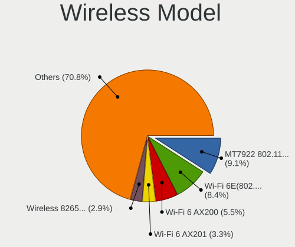

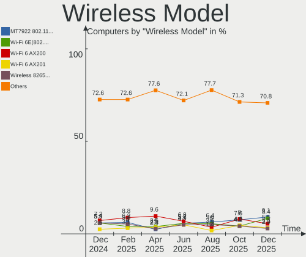

| Model                                                                           | Computers | Percent |
|---------------------------------------------------------------------------------|-----------|---------|
| MediaTek MT7922 802.11ax PCI Express Wireless Network Adapter                   | 25        | 9.12%   |
| Intel Wi-Fi 6E(802.11ax) AX210/AX1675* 2x2 [Typhoon Peak]                       | 23        | 8.39%   |
| Intel Wi-Fi 6 AX200                                                             | 15        | 5.47%   |
| Intel Wi-Fi 6 AX201                                                             | 9         | 3.28%   |
| Intel Wireless 8265 / 8275                                                      | 8         | 2.92%   |
| Intel 700 Series Chipset CNVi WiFi                                              | 8         | 2.92%   |
| Realtek RTL8821CE 802.11ac PCIe Wireless Network Adapter                        | 7         | 2.55%   |
| MediaTek MT7925 802.11be 160MHz 2x2 PCIe Wireless Network Adapter [Filogic 360] | 7         | 2.55%   |
| MediaTek MT7921 802.11ax PCIe Wireless Network Adapter [Filogic 330]            | 7         | 2.55%   |
| Intel Wireless 8260                                                             | 7         | 2.55%   |
| Intel Alder Lake-P PCH CNVi WiFi                                                | 7         | 2.55%   |
| Realtek RTL8852CE PCIe 802.11ax Wireless Network Controller                     | 6         | 2.19%   |
| MediaTek MT7902 802.11ax PCIe Wireless Network Adapter [Filogic 310]            | 6         | 2.19%   |
| Intel Raptor Lake PCH CNVi WiFi                                                 | 6         | 2.19%   |
| Intel Wireless 7260                                                             | 5         | 1.82%   |
| Intel Meteor Lake PCH CNVi WiFi                                                 | 5         | 1.82%   |
| Intel Comet Lake PCH CNVi WiFi                                                  | 5         | 1.82%   |
| Intel Cannon Lake PCH CNVi WiFi                                                 | 5         | 1.82%   |
| Realtek RTL8852BE PCIe 802.11ax Wireless Network Controller                     | 4         | 1.46%   |
| Realtek RTL8851BE PCIe 802.11ax Wireless Network Controller                     | 4         | 1.46%   |
| Qualcomm Atheros QCA6174 802.11ac Wireless Network Adapter                      | 4         | 1.46%   |
| Qualcomm Atheros AR9485 Wireless Network Adapter                                | 4         | 1.46%   |
| Intel Wireless 7265                                                             | 4         | 1.46%   |
| Intel Wi-Fi 5(802.11ac) Wireless-AC 9x6x [Thunder Peak]                         | 4         | 1.46%   |
| Intel Dual Band Wireless-AC 3168NGW [Stone Peak]                                | 4         | 1.46%   |
| Intel Centrino Advanced-N 6205 [Taylor Peak]                                    | 4         | 1.46%   |
| Intel Alder Lake-S PCH CNVi WiFi                                                | 4         | 1.46%   |
| Realtek RTL8922AE 802.11be PCIe Wireless Network Adapter                        | 3         | 1.09%   |
| Qualcomm WCN785x Wi-Fi 7(802.11be) 320MHz 2x2 [FastConnect 7800]                | 3         | 1.09%   |
| MediaTek Wi-Fi 6 MT7920 Wireless Network Adapter                                | 3         | 1.09%   |
| Intel Tiger Lake PCH CNVi WiFi                                                  | 3         | 1.09%   |
| Intel Centrino Ultimate-N 6300                                                  | 3         | 1.09%   |
| Broadcom BCM43142 802.11b/g/n                                                   | 3         | 1.09%   |
| Realtek RTL8852AE 802.11ax PCIe Wireless Network Adapter                        | 2         | 0.73%   |
| Realtek RTL8822CE 802.11ac PCIe Wireless Network Adapter                        | 2         | 0.73%   |
| Realtek RTL8723BE PCIe Wireless Network Adapter                                 | 2         | 0.73%   |
| Qualcomm QCNFA765 Wireless Network Adapter                                      | 2         | 0.73%   |
| Qualcomm Atheros QCA9377 802.11ac Wireless Network Adapter                      | 2         | 0.73%   |
| Microsoft Xbox Wireless Adapter for Windows                                     | 2         | 0.73%   |
| MediaTek MT7927 802.11be 320MHz 2x2 PCIe Wireless Network Adapter [Filogic 380] | 2         | 0.73%   |

Ethernet Vendor
---------------

Ethernet vendors

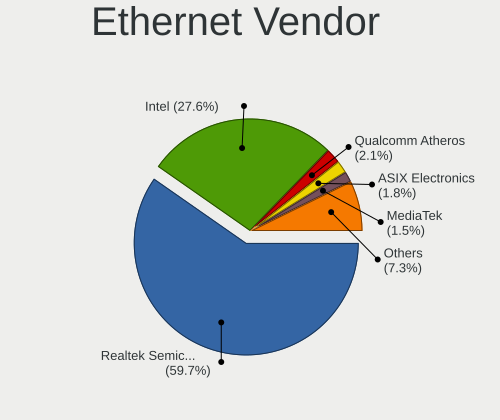

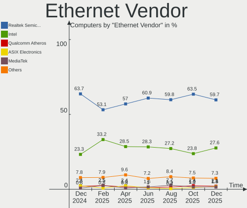

| Vendor                      | Computers | Percent |
|-----------------------------|-----------|---------|
| Realtek Semiconductor       | 197       | 59.7%   |
| Intel                       | 91        | 27.58%  |
| Qualcomm Atheros            | 7         | 2.12%   |
| ASIX Electronics            | 6         | 1.82%   |
| MediaTek                    | 5         | 1.52%   |
| Broadcom                    | 5         | 1.52%   |
| Aquantia                    | 4         | 1.21%   |
| Qualcomm Technologies       | 3         | 0.91%   |
| Samsung Electronics         | 2         | 0.61%   |
| QinHeng Electronics         | 2         | 0.61%   |
| Xiaomi                      | 1         | 0.3%    |
| Qualcomm                    | 1         | 0.3%    |
| Motorcomm Microelectronics. | 1         | 0.3%    |
| Microsoft                   | 1         | 0.3%    |
| Lenovo                      | 1         | 0.3%    |
| DisplayLink                 | 1         | 0.3%    |
| Broadcom Limited            | 1         | 0.3%    |
| Apple                       | 1         | 0.3%    |

Ethernet Model
--------------

Ethernet models

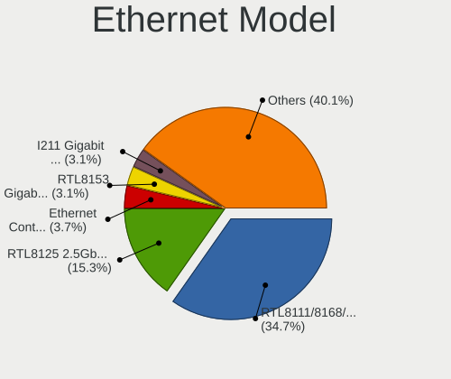

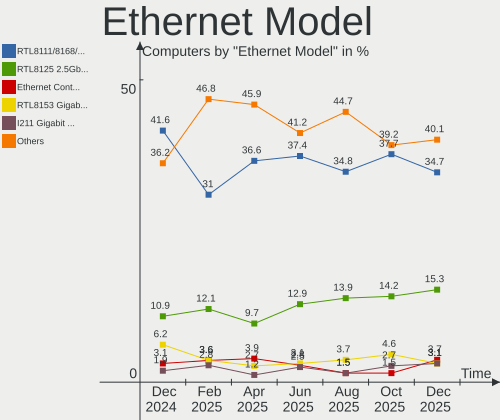

| Model                                                                           | Computers | Percent |
|---------------------------------------------------------------------------------|-----------|---------|
| Realtek RTL8111/8168/8211/8411 PCI Express Gigabit Ethernet Controller          | 123       | 34.75%  |
| Realtek RTL8125 2.5GbE Controller                                               | 54        | 15.25%  |
| Intel Ethernet Controller I225-V                                                | 13        | 3.67%   |
| Realtek RTL8153 Gigabit Ethernet Adapter                                        | 11        | 3.11%   |
| Intel I211 Gigabit Network Connection                                           | 11        | 3.11%   |
| Intel 82579LM Gigabit Network Connection (Lewisville)                           | 9         | 2.54%   |
| Intel Ethernet Controller I226-V                                                | 7         | 1.98%   |
| Realtek RTL8126 5GbE Controller                                                 | 6         | 1.69%   |
| Intel Ethernet Connection (2) I219-V                                            | 6         | 1.69%   |
| ASIX AX88179 Gigabit Ethernet                                                   | 6         | 1.69%   |
| Realtek USB 10/100/1G/2.5 LAN                                                   | 4         | 1.13%   |
| Realtek Killer E2600 GbE Controller                                             | 4         | 1.13%   |
| Intel I210 Gigabit Network Connection                                           | 4         | 1.13%   |
| Intel Ethernet Connection (4) I219-LM                                           | 4         | 1.13%   |
| Intel Arrow Lake CNVi WiFi                                                      | 4         | 1.13%   |
| Realtek RTL810xE PCI Express Fast Ethernet controller                           | 3         | 0.85%   |
| Qualcomm WCN785x Wi-Fi 7(802.11be) 320MHz 2x2 [FastConnect 7800]                | 3         | 0.85%   |
| MediaTek MT7925 802.11be 160MHz 2x2 PCIe Wireless Network Adapter [Filogic 360] | 3         | 0.85%   |
| Intel Ethernet Connection (7) I219-V                                            | 3         | 0.85%   |
| Intel Alder Lake-P PCH CNVi WiFi                                                | 3         | 0.85%   |
| Aquantia AQtion AQC113CS NBase-T/IEEE 802.3an Ethernet Controller [Antigua 10G] | 3         | 0.85%   |
| Realtek RTL8922AE 802.11be PCIe Wireless Network Adapter                        | 2         | 0.56%   |
| Realtek RTL8852CE PCIe 802.11ax Wireless Network Controller                     | 2         | 0.56%   |
| Realtek Killer E5000 5GbE Controller                                            | 2         | 0.56%   |
| Qualcomm Atheros Killer E2500 Gigabit Ethernet Controller                       | 2         | 0.56%   |
| Qualcomm Atheros Killer E220x Gigabit Ethernet Controller                       | 2         | 0.56%   |
| QinHeng USB 10/100 LAN                                                          | 2         | 0.56%   |
| Intel Ethernet Controller X550                                                  | 2         | 0.56%   |
| Intel Ethernet Connection I218-LM                                               | 2         | 0.56%   |
| Intel Ethernet Connection (7) I219-LM                                           | 2         | 0.56%   |
| Intel Ethernet Connection (24) I219-V                                           | 2         | 0.56%   |
| Intel Ethernet Connection (2) I218-LM                                           | 2         | 0.56%   |
| Intel Ethernet Connection (18) I219-LM                                          | 2         | 0.56%   |
| Intel Ethernet Connection (13) I219-V                                           | 2         | 0.56%   |
| Intel BE201 320MHz                                                              | 2         | 0.56%   |
| Intel 82599ES 10-Gigabit SFI/SFP+ Network Connection                            | 2         | 0.56%   |
| Broadcom NetLink BCM57785 Gigabit Ethernet PCIe                                 | 2         | 0.56%   |
| Xiaomi Mi/Redmi series (RNDIS)                                                  | 1         | 0.28%   |
| Samsung GT-I9070 (network tethering, USB debugging enabled)                     | 1         | 0.28%   |
| Samsung Galaxy series, misc. (tethering mode)                                   | 1         | 0.28%   |

Net Controller Kind
-------------------

Ethernet, WiFi or modem

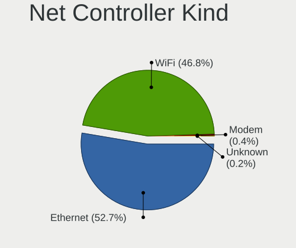

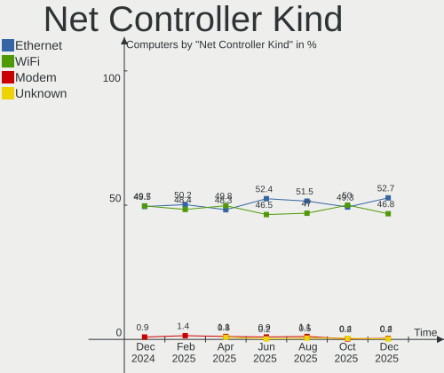

| Kind     | Computers | Percent |
|----------|-----------|---------|
| Ethernet | 296       | 52.67%  |
| WiFi     | 263       | 46.8%   |
| Modem    | 2         | 0.36%   |
| Unknown  | 1         | 0.18%   |

Used Controller
---------------

Currently used network controller

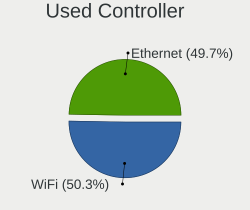

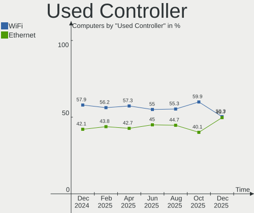

| Kind     | Computers | Percent |
|----------|-----------|---------|
| WiFi     | 186       | 50.27%  |
| Ethernet | 184       | 49.73%  |

NICs
----

Total network controllers on board

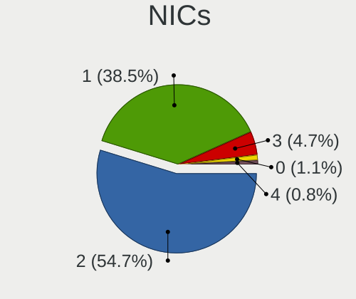

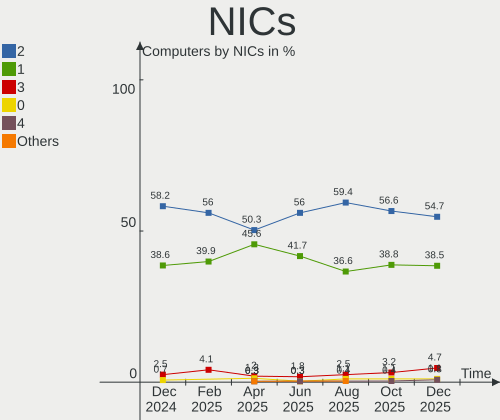

| Total | Computers | Percent |
|-------|-----------|---------|
| 2     | 196       | 54.75%  |
| 1     | 138       | 38.55%  |
| 3     | 17        | 4.75%   |
| 0     | 4         | 1.12%   |
| 4     | 3         | 0.84%   |

IPv6
----

IPv6 vs IPv4

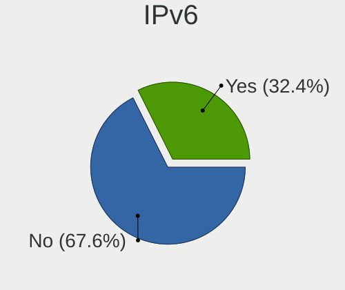

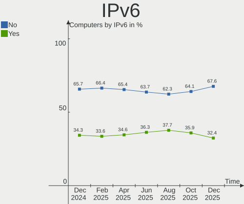

| Used | Computers | Percent |
|------|-----------|---------|
| No   | 242       | 67.6%   |
| Yes  | 116       | 32.4%   |

Bluetooth
---------

Bluetooth Vendor
----------------

Controller vendors

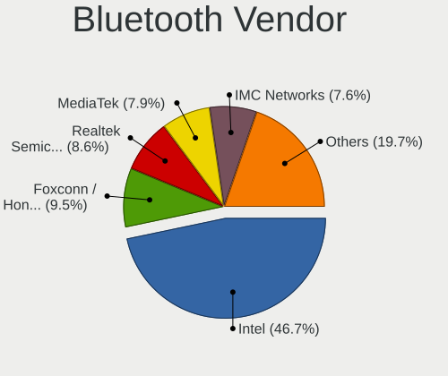

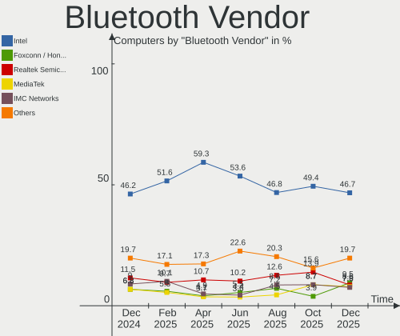

| Vendor                          | Computers | Percent |
|---------------------------------|-----------|---------|
| Intel                           | 142       | 46.71%  |
| Foxconn / Hon Hai               | 29        | 9.54%   |
| Realtek Semiconductor           | 26        | 8.55%   |
| MediaTek                        | 24        | 7.89%   |
| IMC Networks                    | 23        | 7.57%   |
| Cambridge Silicon Radio         | 13        | 4.28%   |
| TP-Link                         | 12        | 3.95%   |
| Qualcomm Atheros Communications | 7         | 2.3%    |
| Broadcom                        | 6         | 1.97%   |
| ASUSTek Computer                | 5         | 1.64%   |
| Lite-On Technology              | 3         | 0.99%   |
| Hewlett-Packard                 | 3         | 0.99%   |
| Realtek                         | 2         | 0.66%   |
| Apple                           | 2         | 0.66%   |
| Toshiba                         | 1         | 0.33%   |
| Nintendo                        | 1         | 0.33%   |
| Integrated System Solution      | 1         | 0.33%   |
| Foxconn International           | 1         | 0.33%   |
| Dell                            | 1         | 0.33%   |
| Chicony Electronics             | 1         | 0.33%   |
| Actions                         | 1         | 0.33%   |

Bluetooth Model
---------------

Controller models

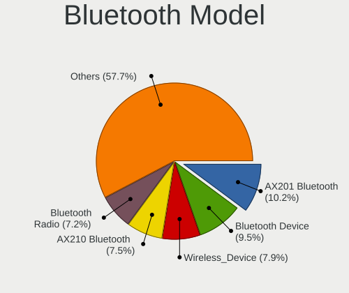

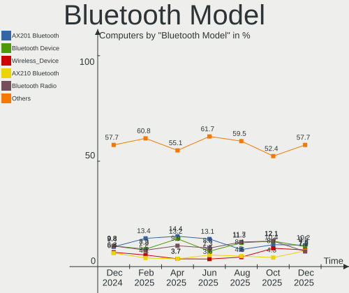

| Model                                                           | Computers | Percent |
|-----------------------------------------------------------------|-----------|---------|
| Intel AX201 Bluetooth                                           | 31        | 10.16%  |
| Intel Bluetooth Device                                          | 29        | 9.51%   |
| MediaTek Wireless_Device                                        | 24        | 7.87%   |
| Intel AX210 Bluetooth                                           | 23        | 7.54%   |
| Realtek Bluetooth Radio                                         | 22        | 7.21%   |
| Intel Bluetooth wireless interface                              | 22        | 7.21%   |
| Foxconn / Hon Hai Wireless_Device                               | 16        | 5.25%   |
| Intel AX200 Bluetooth                                           | 15        | 4.92%   |
| IMC Networks Wireless_Device                                    | 14        | 4.59%   |
| Cambridge Silicon Radio Bluetooth Dongle (HCI mode)             | 13        | 4.26%   |
| TP-Link TP-T@- UB500 Adapter                                    | 12        | 3.93%   |
| Intel Bluetooth 9460/9560 Jefferson Peak (JfP)                  | 11        | 3.61%   |
| IMC Networks Bluetooth Radio                                    | 9         | 2.95%   |
| Foxconn / Hon Hai Bluetooth Device                              | 7         | 2.3%    |
| Qualcomm Atheros  Bluetooth Device                              | 4         | 1.31%   |
| Intel Wireless-AC 9260 Bluetooth Adapter                        | 4         | 1.31%   |
| Intel Wireless-AC 3168 Bluetooth                                | 4         | 1.31%   |
| Foxconn / Hon Hai MediaTek Bluetooth Adapter                    | 4         | 1.31%   |
| ASUS ASUS USB-BT500                                             | 4         | 1.31%   |
| Realtek  Bluetooth 4.2 Adapter                                  | 3         | 0.98%   |
| HP Broadcom 2070 Bluetooth Combo                                | 3         | 0.98%   |
| Realtek Bluetooth Radio                                         | 2         | 0.66%   |
| Intel Centrino Bluetooth Wireless Transceiver                   | 2         | 0.66%   |
| Intel Bluetooth                                                 | 2         | 0.66%   |
| Foxconn / Hon Hai Bluetooth Radio                               | 2         | 0.66%   |
| Broadcom BCM20702A0 Bluetooth 4.0                               | 2         | 0.66%   |
| Apple Bluetooth Host Controller                                 | 2         | 0.66%   |
| Toshiba Bluetooth Device                                        | 1         | 0.33%   |
| Realtek RTL8822BE Bluetooth 4.2 Adapter                         | 1         | 0.33%   |
| Qualcomm Atheros QCA61x4 Bluetooth 4.0                          | 1         | 0.33%   |
| Qualcomm Atheros Bluetooth USB Host Controller                  | 1         | 0.33%   |
| Qualcomm Atheros Bluetooth                                      | 1         | 0.33%   |
| Nintendo Broadcom BCM2045A Bluetooth Radio [Nintendo Wii/Wii U] | 1         | 0.33%   |
| Lite-On Wireless_Device                                         | 1         | 0.33%   |
| Lite-On Qualcomm Atheros QCA9377 Bluetooth                      | 1         | 0.33%   |
| Lite-On Broadcom BCM43142A0 Bluetooth Device                    | 1         | 0.33%   |
| Integrated System Solution Bluetooth Device                     | 1         | 0.33%   |
| Foxconn International BCM43142A0 Bluetooth module               | 1         | 0.33%   |
| Dell BCM20702A0 Bluetooth Module                                | 1         | 0.33%   |
| Chicony Bluetooth (RTL8723BE)                                   | 1         | 0.33%   |

Sound
-----

Sound Vendor
------------

Sound card vendors

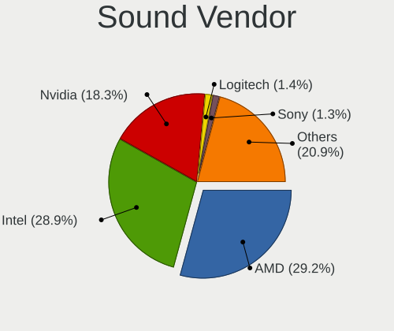

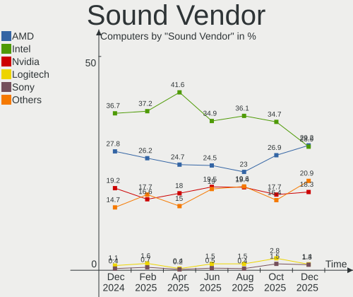

| Vendor                               | Computers | Percent |
|--------------------------------------|-----------|---------|
| AMD                                  | 185       | 29.23%  |
| Intel                                | 183       | 28.91%  |
| Nvidia                               | 116       | 18.33%  |
| Logitech                             | 9         | 1.42%   |
| Sony                                 | 8         | 1.26%   |
| Micro Star International             | 8         | 1.26%   |
| C-Media Electronics                  | 8         | 1.26%   |
| ASUSTek Computer                     | 8         | 1.26%   |
| Kingston Technology                  | 6         | 0.95%   |
| Blue Microphones                     | 6         | 0.95%   |
| SteelSeries ApS                      | 5         | 0.79%   |
| Hewlett-Packard                      | 5         | 0.79%   |
| Focusrite-Novation                   | 5         | 0.79%   |
| Audio-Technica                       | 5         | 0.79%   |
| Realtek Semiconductor                | 4         | 0.63%   |
| Razer USA                            | 4         | 0.63%   |
| KTMICRO                              | 4         | 0.63%   |
| JMTek                                | 4         | 0.63%   |
| Yamaha                               | 3         | 0.47%   |
| Samson Technologies                  | 3         | 0.47%   |
| DSEA A/S                             | 3         | 0.47%   |
| Thesycon Systemsoftware & Consulting | 2         | 0.32%   |
| SAVITECH                             | 2         | 0.32%   |
| GN Netcom                            | 2         | 0.32%   |
| Generalplus Technology               | 2         | 0.32%   |
| FiiO Electronics Technology          | 2         | 0.32%   |
| Dell                                 | 2         | 0.32%   |
| Creative Technology                  | 2         | 0.32%   |
| Unknown                              | 2         | 0.32%   |
| XMOS                                 | 1         | 0.16%   |
| VIA Technologies                     | 1         | 0.16%   |
| Valve Software                       | 1         | 0.16%   |
| Texas Instruments                    | 1         | 0.16%   |
| SM900T Microphone                    | 1         | 0.16%   |
| ShenZhen Maono Technology            | 1         | 0.16%   |
| Sennheiser                           | 1         | 0.16%   |
| Schiit Audio                         | 1         | 0.16%   |
| RODE Microphones                     | 1         | 0.16%   |
| Ploopy                               | 1         | 0.16%   |
| Plantronics                          | 1         | 0.16%   |

Sound Model
-----------

Sound card models

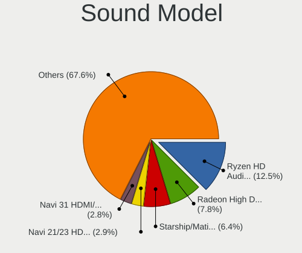

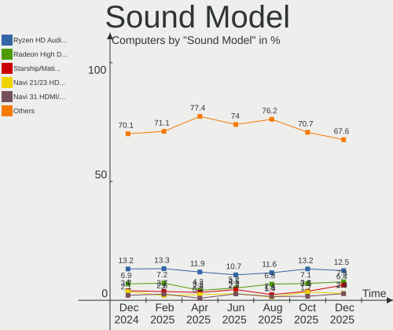

| Model                                                                      | Computers | Percent |
|----------------------------------------------------------------------------|-----------|---------|
| AMD Ryzen HD Audio Controller                                              | 99        | 12.5%   |
| AMD Radeon High Definition Audio Controller                                | 62        | 7.83%   |
| AMD Starship/Matisse HD Audio Controller                                   | 51        | 6.44%   |
| AMD Navi 21/23 HDMI/DP Audio Controller                                    | 23        | 2.9%    |
| AMD Navi 31 HDMI/DP Audio                                                  | 22        | 2.78%   |
| AMD Renoir/Cezanne HDMI/DP Audio Controller                                | 21        | 2.65%   |
| Nvidia GA102 High Definition Audio Controller                              | 14        | 1.77%   |
| Intel 7 Series/C216 Chipset Family High Definition Audio Controller        | 13        | 1.64%   |
| AMD Navi 48 HDMI/DP Audio Controller                                       | 13        | 1.64%   |
| Intel Tiger Lake-LP Smart Sound Technology Audio Controller                | 12        | 1.52%   |
| Intel Raptor Lake High Definition Audio Controller                         | 12        | 1.52%   |
| Intel Cannon Lake PCH cAVS                                                 | 12        | 1.52%   |
| Intel Alder Lake PCH-P High Definition Audio Controller                    | 12        | 1.52%   |
| Nvidia GA106 High Definition Audio Controller                              | 11        | 1.39%   |
| Nvidia GA104 High Definition Audio Controller                              | 11        | 1.39%   |
| Intel Sunrise Point-LP HD Audio                                            | 11        | 1.39%   |
| Intel Raptor Lake-P/U/H cAVS                                               | 11        | 1.39%   |
| AMD Navi 10 HDMI Audio                                                     | 11        | 1.39%   |
| Nvidia AD107 High Definition Audio Controller                              | 10        | 1.26%   |
| Intel 8 Series/C220 Series Chipset High Definition Audio Controller        | 10        | 1.26%   |
| Intel Alder Lake-S HD Audio Controller                                     | 9         | 1.14%   |
| Nvidia GP107GL High Definition Audio Controller                            | 8         | 1.01%   |
| Nvidia GB203 High Definition Audio Controller                              | 8         | 1.01%   |
| Micro Star International USB Audio                                         | 8         | 1.01%   |
| Intel 6 Series/C200 Series Chipset Family High Definition Audio Controller | 8         | 1.01%   |
| ASUSTek Computer USB Audio                                                 | 7         | 0.88%   |
| Nvidia TU116 High Definition Audio Controller                              | 6         | 0.76%   |
| Nvidia GB206 High Definition Audio Controller                              | 6         | 0.76%   |
| Nvidia AD106M High Definition Audio Controller                             | 6         | 0.76%   |
| Blue Microphones Yeti Stereo Microphone                                    | 6         | 0.76%   |
| AMD Ellesmere HDMI Audio [Radeon RX 470/480 / 570/580/590]                 | 6         | 0.76%   |
| Sony DualShock 4 [CUH-ZCT2x]                                               | 5         | 0.63%   |
| Nvidia GP104 High Definition Audio Controller                              | 5         | 0.63%   |
| Intel Tiger Lake-H HD Audio Controller                                     | 5         | 0.63%   |
| Intel Meteor Lake-P HD Audio Controller                                    | 5         | 0.63%   |
| Intel Comet Lake PCH cAVS                                                  | 5         | 0.63%   |
| Intel Cannon Point-LP High Definition Audio Controller                     | 5         | 0.63%   |
| Intel Arrow Lake cAVS                                                      | 5         | 0.63%   |
| Intel 200 Series PCH HD Audio                                              | 5         | 0.63%   |
| Nvidia GA107 High Definition Audio Controller                              | 4         | 0.51%   |

Memory
------

Memory Vendor
-------------

Memory module vendors

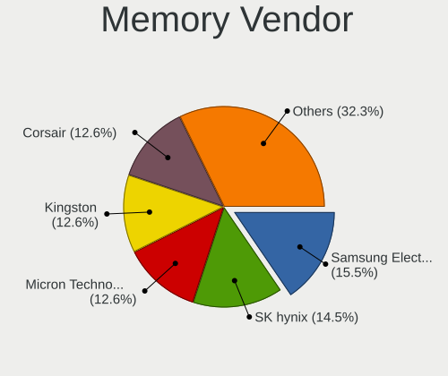

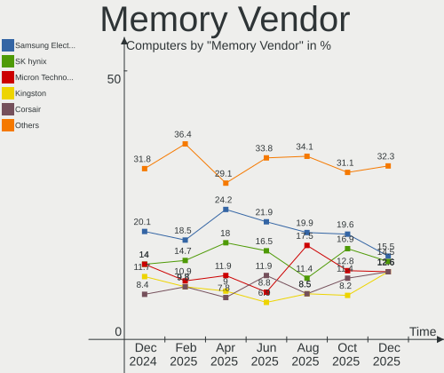

| Vendor                             | Computers | Percent |
|------------------------------------|-----------|---------|
| Samsung Electronics                | 48        | 15.48%  |
| SK hynix                           | 45        | 14.52%  |
| Micron Technology                  | 39        | 12.58%  |
| Kingston                           | 39        | 12.58%  |
| Corsair                            | 39        | 12.58%  |
| G.Skill                            | 24        | 7.74%   |
| Unknown                            | 17        | 5.48%   |
| Crucial                            | 14        | 4.52%   |
| Unknown                            | 8         | 2.58%   |
| A-DATA Technology                  | 8         | 2.58%   |
| Ramaxel Technology                 | 5         | 1.61%   |
| TeamGroup                          | 2         | 0.65%   |
| Team                               | 2         | 0.65%   |
| PNY                                | 2         | 0.65%   |
| Patriot                            | 2         | 0.65%   |
| Wilk                               | 1         | 0.32%   |
| Unknown (0x0B5E)                   | 1         | 0.32%   |
| Timetec                            | 1         | 0.32%   |
| Smart                              | 1         | 0.32%   |
| Silicon Power                      | 1         | 0.32%   |
| Patriot Memory (PDP Systems)       | 1         | 0.32%   |
| Nanya Technology                   | 1         | 0.32%   |
| Kllisre                            | 1         | 0.32%   |
| Kimtigo Semiconductor (HK) Limited | 1         | 0.32%   |
| Juhor                              | 1         | 0.32%   |
| Gowe                               | 1         | 0.32%   |
| GOODRAM                            | 1         | 0.32%   |
| Elpida                             | 1         | 0.32%   |
| ASint Technology                   | 1         | 0.32%   |
| Apacer                             | 1         | 0.32%   |
| ACPI Digital                       | 1         | 0.32%   |

Memory Model
------------

Memory module models

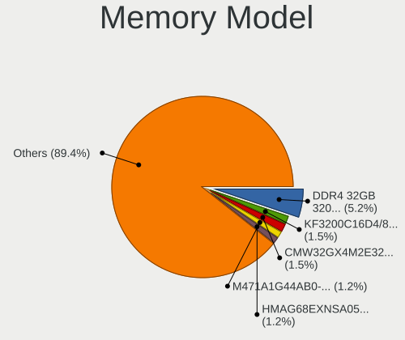

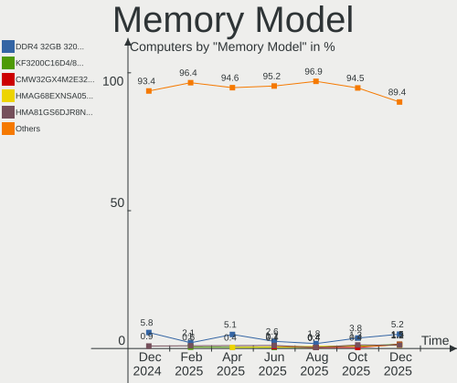

| Model                                                         | Computers | Percent |
|---------------------------------------------------------------|-----------|---------|
| Unknown                                                       | 17        | 5.17%   |
| Kingston RAM KF3200C16D4/8GX 8GiB DIMM DDR4 3600MT/s          | 5         | 1.52%   |
| Corsair RAM CMW32GX4M2E3200C16 16GB DIMM DDR4 3200MT/s        | 5         | 1.52%   |
| SK hynix RAM HMAG68EXNSA051N 8GB SODIMM DDR4 3200MT/s         | 4         | 1.22%   |
| SK hynix RAM HMA81GS6DJR8N-XN 8GB SODIMM DDR4 3200MT/s        | 4         | 1.22%   |
| Samsung RAM M471A1G44AB0-CWE 8GiB SODIMM DDR4 3200MT/s        | 4         | 1.22%   |
| SK hynix RAM HMCG78AGBSA095N 16GB SODIMM DDR5 5600MT/s        | 3         | 0.91%   |
| Micron RAM 4ATF1G64HZ-3G2E1 8GB SODIMM DDR4 3200MT/s          | 3         | 0.91%   |
| Kingston RAM KF3200C16D4/32GX 32GB DIMM DDR4 3933MT/s         | 3         | 0.91%   |
| Corsair RAM CMW16GX4M2C3200C16 8GB DIMM DDR4 3733MT/s         | 3         | 0.91%   |
| Corsair RAM CMK32GX4M2E3200C16 16GB DIMM DDR4 3600MT/s        | 3         | 0.91%   |
| SK hynix RAM HMCG88AGBSA095N 32GB SODIMM DDR5 5600MT/s        | 2         | 0.61%   |
| SK hynix RAM HMCG66MEBSA095N 8GiB SODIMM DDR5 4800MT/s        | 2         | 0.61%   |
| Samsung RAM M471B5173DB0-YK0 4GB SODIMM DDR3 1600MT/s         | 2         | 0.61%   |
| Samsung RAM M471A1K43EB1-CWE 8GB SODIMM DDR4 3200MT/s         | 2         | 0.61%   |
| Samsung RAM M471A1K43BB1-CRC 8GB SODIMM DDR4 2667MT/s         | 2         | 0.61%   |
| Samsung RAM M471A1G44BB0-CWE 8GB SODIMM DDR4 3200MT/s         | 2         | 0.61%   |
| Samsung RAM M471A1G44AB0-CWE 8GB Row Of Chips DDR4 3200MT/s   | 2         | 0.61%   |
| Samsung RAM M425R2GA3EB0-CWMOL 16GB SODIMM DDR5 5600MT/s      | 2         | 0.61%   |
| Samsung RAM K3KL8L80DM-MGCU 4GiB Row Of Chips LPDDR5 7500MT/s | 2         | 0.61%   |
| Ramaxel RAM RMT3170EB68E9W1600 4GB SODIMM DDR3 1600MT/s       | 2         | 0.61%   |
| Micron RAM MTC4C10163S1SC56BD1 8GB SODIMM DDR5 5600MT/s       | 2         | 0.61%   |
| Micron RAM Module 4GB Row Of Chips LPDDR5 8533MT/s            | 2         | 0.61%   |
| Micron RAM 8ATF1G64HZ-3G2R1 8GB SODIMM DDR4 3200MT/s          | 2         | 0.61%   |
| Micron RAM 4ATF1G64HZ-3G2F1 8GB SODIMM DDR4 3200MT/s          | 2         | 0.61%   |
| Kingston RAM KF560C36-16 16GB DIMM DDR5 6000MT/s              | 2         | 0.61%   |
| Kingston RAM KF560C30-32 32GB DIMM DDR5 6000MT/s              | 2         | 0.61%   |
| Kingston RAM KF3200C16D4/16GX 16GB DIMM DDR4 3733MT/s         | 2         | 0.61%   |
| G.Skill RAM F5-6000J3636F16G 16GB DIMM DDR5 6400MT/s          | 2         | 0.61%   |
| G.Skill RAM F4-3200C16-16GVK 16GB DIMM DDR4 3600MT/s          | 2         | 0.61%   |
| Corsair RAM CMK32GX5M2B5600C36 16GB DIMM DDR5 5800MT/s        | 2         | 0.61%   |
| Corsair RAM CMK32GX4M2A2666C16 16GB DIMM DDR4 2667MT/s        | 2         | 0.61%   |
| Corsair RAM CMK16GX4M2B3200C16 8GB DIMM DDR4 3600MT/s         | 2         | 0.61%   |
| Wilk RAM IRX2666D464L16S/8G 8GB DIMM DDR4 2933MT/s            | 1         | 0.3%    |
| Unknown RAM Module 8GB SODIMM DDR3 1333MT/s                   | 1         | 0.3%    |
| Unknown RAM Module 8GB DIMM DDR4 3200MT/s                     | 1         | 0.3%    |
| Unknown RAM Module 8GB DIMM DDR3 1333MT/s                     | 1         | 0.3%    |
| Unknown RAM Module 512MB SODIMM DDR2                          | 1         | 0.3%    |
| Unknown RAM Module 2GB SODIMM DDR3 1333MT/s                   | 1         | 0.3%    |
| Unknown RAM Module 2GB Row Of Chips LPDDR4 4267MT/s           | 1         | 0.3%    |

Memory Kind
-----------

Memory module kinds

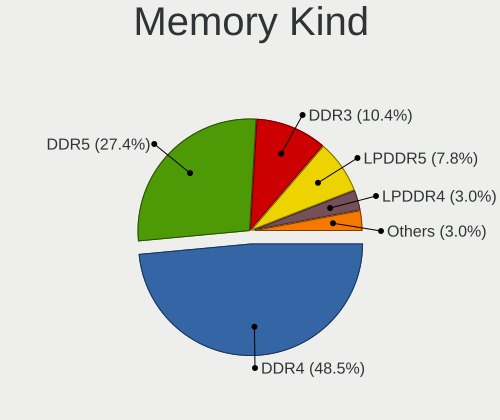

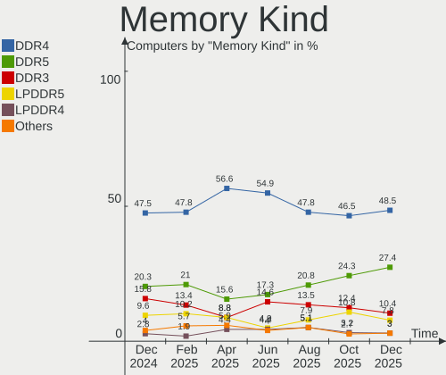

| Kind    | Computers | Percent |
|---------|-----------|---------|
| DDR4    | 131       | 48.52%  |
| DDR5    | 74        | 27.41%  |
| DDR3    | 28        | 10.37%  |
| LPDDR5  | 21        | 7.78%   |
| LPDDR4  | 8         | 2.96%   |
| LPDDR3  | 4         | 1.48%   |
| SDRAM   | 1         | 0.37%   |
| DDR2    | 1         | 0.37%   |
| DDR     | 1         | 0.37%   |
| Unknown | 1         | 0.37%   |

Memory Form Factor
------------------

Physical design of the memory module

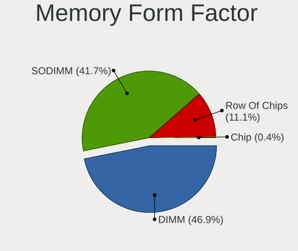

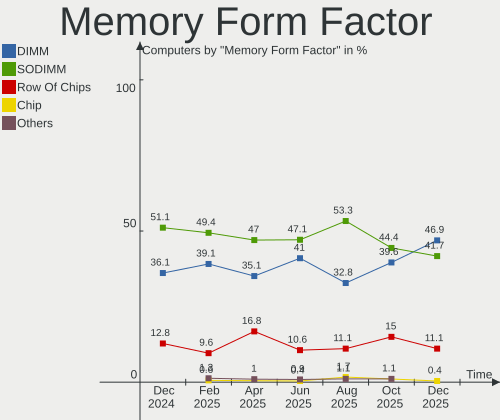

| Name         | Computers | Percent |
|--------------|-----------|---------|
| DIMM         | 127       | 46.86%  |
| SODIMM       | 113       | 41.7%   |
| Row Of Chips | 30        | 11.07%  |
| Chip         | 1         | 0.37%   |

Memory Size
-----------

Memory module size

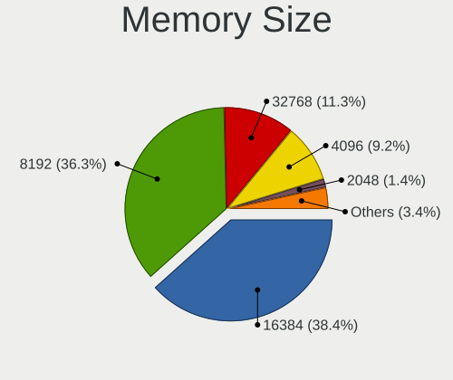

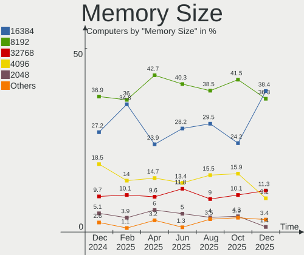

| Size  | Computers | Percent |
|-------|-----------|---------|
| 16384 | 112       | 38.36%  |
| 8192  | 106       | 36.3%   |
| 32768 | 33        | 11.3%   |
| 4096  | 27        | 9.25%   |
| 2048  | 4         | 1.37%   |
| 49152 | 2         | 0.68%   |
| 24576 | 2         | 0.68%   |
| 12288 | 2         | 0.68%   |
| 65536 | 1         | 0.34%   |
| 3072  | 1         | 0.34%   |
| 1024  | 1         | 0.34%   |
| 512   | 1         | 0.34%   |

Memory Speed
------------

Memory module speed

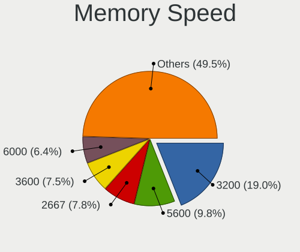

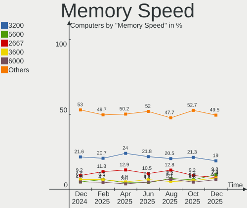

| Speed | Computers | Percent |
|-------|-----------|---------|
| 3200  | 56        | 18.98%  |
| 5600  | 29        | 9.83%   |
| 2667  | 23        | 7.8%    |
| 3600  | 22        | 7.46%   |
| 6000  | 19        | 6.44%   |
| 1600  | 16        | 5.42%   |
| 4800  | 12        | 4.07%   |
| 2133  | 11        | 3.73%   |
| 7500  | 10        | 3.39%   |
| 3733  | 9         | 3.05%   |
| 2400  | 9         | 3.05%   |
| 3800  | 8         | 2.71%   |
| 8533  | 7         | 2.37%   |
| 1333  | 7         | 2.37%   |
| 4267  | 6         | 2.03%   |
| 6400  | 5         | 1.69%   |
| 5200  | 4         | 1.36%   |
| 3933  | 3         | 1.02%   |
| 3666  | 3         | 1.02%   |
| 1334  | 3         | 1.02%   |
| 7467  | 2         | 0.68%   |
| 6200  | 2         | 0.68%   |
| 5800  | 2         | 0.68%   |
| 4266  | 2         | 0.68%   |
| 3866  | 2         | 0.68%   |
| 3400  | 2         | 0.68%   |
| 3266  | 2         | 0.68%   |
| 3100  | 2         | 0.68%   |
| 2933  | 2         | 0.68%   |
| 800   | 2         | 0.68%   |
| 12800 | 1         | 0.34%   |
| 8000  | 1         | 0.34%   |
| 7000  | 1         | 0.34%   |
| 4333  | 1         | 0.34%   |
| 4199  | 1         | 0.34%   |
| 3533  | 1         | 0.34%   |
| 3333  | 1         | 0.34%   |
| 3066  | 1         | 0.34%   |
| 3007  | 1         | 0.34%   |
| 2800  | 1         | 0.34%   |

Printers & scanners
-------------------

Printer Vendor
--------------

Printer device vendors

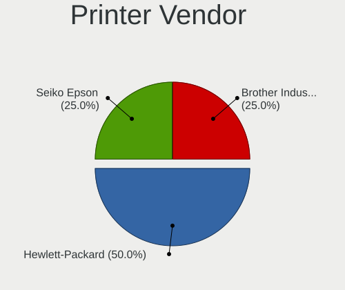

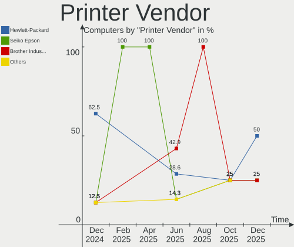

| Vendor             | Computers | Percent |
|--------------------|-----------|---------|
| Hewlett-Packard    | 2         | 50%     |
| Seiko Epson        | 1         | 25%     |
| Brother Industries | 1         | 25%     |

Printer Model
-------------

Printer device models

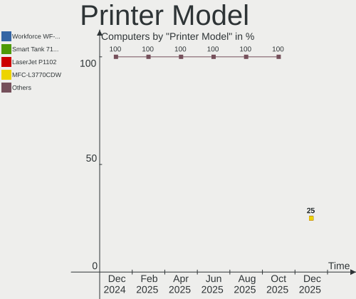

| Model                                     | Computers | Percent |
|-------------------------------------------|-----------|---------|
| Seiko Epson Workforce WF-7820/7840 Series | 1         | 25%     |
| HP Smart Tank 710-720 series              | 1         | 25%     |
| HP LaserJet P1102                         | 1         | 25%     |
| Brother MFC-L3770CDW                      | 1         | 25%     |

Scanner Vendor
--------------

Scanner device vendors

Zero info for selected period =(

Scanner Model
-------------

Scanner device models

Zero info for selected period =(

Camera
------

Camera Vendor
-------------

Camera device vendors

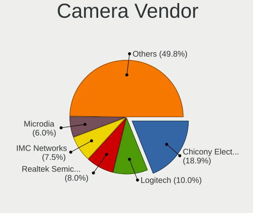

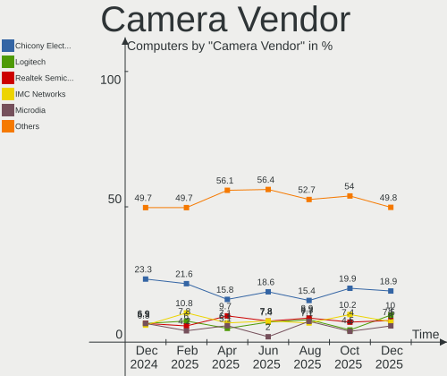

| Vendor                                 | Computers | Percent |
|----------------------------------------|-----------|---------|
| Chicony Electronics                    | 38        | 18.91%  |
| Logitech                               | 20        | 9.95%   |
| Realtek Semiconductor                  | 16        | 7.96%   |
| IMC Networks                           | 15        | 7.46%   |
| Microdia                               | 12        | 5.97%   |
| Luxvisions Innotech Limited            | 12        | 5.97%   |
| Syntek                                 | 11        | 5.47%   |
| Quanta                                 | 9         | 4.48%   |
| Cheng Uei Precision Industry (Foxlink) | 9         | 4.48%   |
| Bison Electronics                      | 9         | 4.48%   |
| Shinetech                              | 7         | 3.48%   |
| Sunplus Innovation Technology          | 6         | 2.99%   |
| Sonix Technology                       | 3         | 1.49%   |
| Apple                                  | 3         | 1.49%   |
| SunplusIT                              | 2         | 1%      |
| ShineOptics                            | 2         | 1%      |
| Remo Tech                              | 2         | 1%      |
| Lite-On Technology                     | 2         | 1%      |
| Framework                              | 2         | 1%      |
| BillionPixels                          | 2         | 1%      |
| webcamvendor                           | 1         | 0.5%    |
| Web Camera                             | 1         | 0.5%    |
| Valve Software                         | 1         | 0.5%    |
| USB3.0 HD Audio Capture                | 1         | 0.5%    |
| Sunwingroup                            | 1         | 0.5%    |
| Shine-optics                           | 1         | 0.5%    |
| Razer USA                              | 1         | 0.5%    |
| Primax Electronics                     | 1         | 0.5%    |
| Nikon                                  | 1         | 0.5%    |
| Microsoft                              | 1         | 0.5%    |
| LG Electronics                         | 1         | 0.5%    |
| kingcome                               | 1         | 0.5%    |
| Google                                 | 1         | 0.5%    |
| eMeet                                  | 1         | 0.5%    |
| Elgato Systems                         | 1         | 0.5%    |
| Creative Technology                    | 1         | 0.5%    |
| Anker Innovations Limited              | 1         | 0.5%    |
| Alcor Micro                            | 1         | 0.5%    |
| Unknown                                | 1         | 0.5%    |

Camera Model
------------

Camera device models

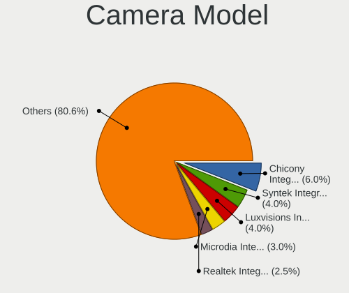

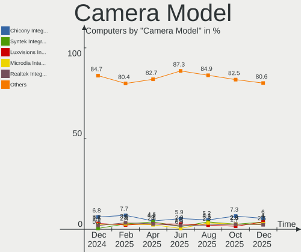

| Model                                                                      | Computers | Percent |
|----------------------------------------------------------------------------|-----------|---------|
| Chicony Integrated Camera                                                  | 12        | 5.97%   |
| Syntek Integrated Camera                                                   | 8         | 3.98%   |
| Luxvisions Innotech Limited Integrated Camera                              | 8         | 3.98%   |
| Microdia Integrated_Webcam_HD                                              | 6         | 2.99%   |
| Realtek Integrated_Webcam_HD                                               | 5         | 2.49%   |
| IMC Networks USB2.0 HD UVC WebCam                                          | 5         | 2.49%   |
| Shinetech ASUS FHD webcam                                                  | 4         | 1.99%   |
| Logitech C922 Pro Stream Webcam                                            | 4         | 1.99%   |
| IMC Networks Integrated Camera                                             | 4         | 1.99%   |
| Sunplus Full HD webcam                                                     | 3         | 1.49%   |
| Shinetech USB2.0 FHD UVC WebCam                                            | 3         | 1.49%   |
| Realtek Integrated_Webcam_FHD                                              | 3         | 1.49%   |
| Logitech Webcam C270                                                       | 3         | 1.49%   |
| Chicony HD WebCam                                                          | 3         | 1.49%   |
| Bison Integrated Camera                                                    | 3         | 1.49%   |
| Syntek Lenovo EasyCamera                                                   | 2         | 1%      |
| ShineOptics HD Camera                                                      | 2         | 1%      |
| Realtek Bluetooth Radio                                                    | 2         | 1%      |
| Quanta HP Wide Vision HD Camera                                            | 2         | 1%      |
| Quanta HD Webcam                                                           | 2         | 1%      |
| Quanta HD User Facing                                                      | 2         | 1%      |
| Microdia Integrated_Webcam_FHD                                             | 2         | 1%      |
| Logitech StreamCam                                                         | 2         | 1%      |
| Logitech HD Webcam C615                                                    | 2         | 1%      |
| Logitech HD Pro Webcam C920                                                | 2         | 1%      |
| Logitech C920 PRO HD Webcam                                                | 2         | 1%      |
| Logitech BRIO Ultra HD Webcam                                              | 2         | 1%      |
| IMC Networks USB2.0 VGA UVC WebCam                                         | 2         | 1%      |
| IMC Networks HD Camera                                                     | 2         | 1%      |
| Framework Laptop Webcam Module (2nd Gen)                                   | 2         | 1%      |
| Chicony Lenovo Integrated Camera (0.3MP)                                   | 2         | 1%      |
| Chicony Lenovo EasyCamera                                                  | 2         | 1%      |
| Chicony Integrated Camera [ThinkPad]                                       | 2         | 1%      |
| Chicony Integrated Camera (1280x720@30)                                    | 2         | 1%      |
| Chicony ACER HD User Facing                                                | 2         | 1%      |
| Chicony ACER FHD User Facing                                               | 2         | 1%      |
| Cheng Uei Precision Industry (Foxlink) Webcam                              | 2         | 1%      |
| Cheng Uei Precision Industry (Foxlink) HP Wide Vision HD Integrated Webcam | 2         | 1%      |
| Cheng Uei Precision Industry (Foxlink) HP Wide Vision HD Camera            | 2         | 1%      |
| Bison Lenovo EasyCamera                                                    | 2         | 1%      |

Security
--------

Fingerprint Vendor
------------------

Fingerprint sensor vendors

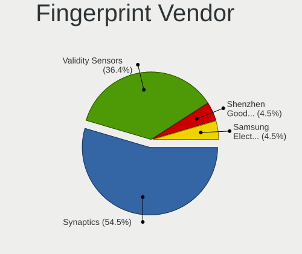

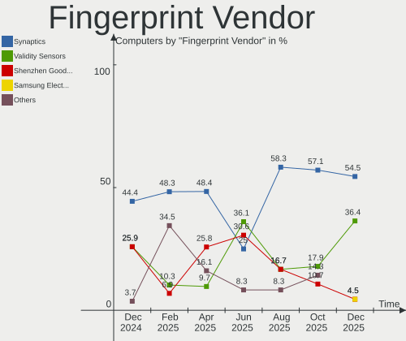

| Vendor                     | Computers | Percent |
|----------------------------|-----------|---------|
| Synaptics                  | 12        | 54.55%  |
| Validity Sensors           | 8         | 36.36%  |
| Shenzhen Goodix Technology | 1         | 4.55%   |
| Samsung Electronics        | 1         | 4.55%   |

Fingerprint Model
-----------------

Fingerprint sensor models

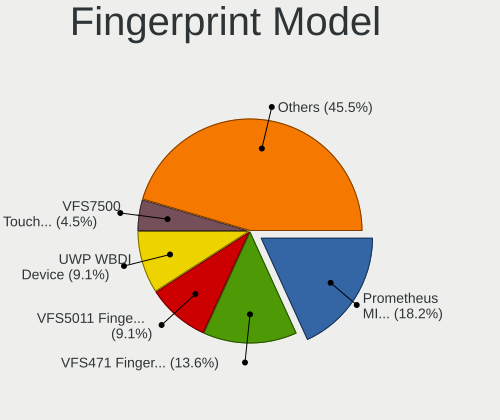

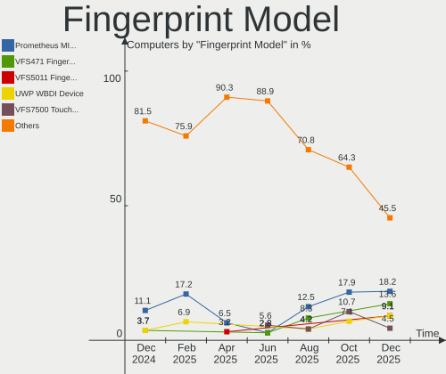

| Model                                                    | Computers | Percent |
|----------------------------------------------------------|-----------|---------|
| Synaptics Prometheus MIS Touch Fingerprint Reader        | 4         | 18.18%  |
| Validity Sensors VFS471 Fingerprint Reader               | 3         | 13.64%  |
| Validity Sensors VFS5011 Fingerprint Reader              | 2         | 9.09%   |
| Synaptics UWP WBDI Device                                | 2         | 9.09%   |
| Validity Sensors VFS7500 Touch Fingerprint Sensor        | 1         | 4.55%   |
| Validity Sensors VFS495 Fingerprint Reader               | 1         | 4.55%   |
| Validity Sensors Synaptics WBDI                          | 1         | 4.55%   |
| Synaptics UWP WBDI                                       | 1         | 4.55%   |
| Synaptics Prometheus Fingerprint Reader                  | 1         | 4.55%   |
| Synaptics Metallica MOH Touch Fingerprint Reader         | 1         | 4.55%   |
| Synaptics FS7604 Touch Fingerprint Sensor with PurePrint | 1         | 4.55%   |
| Synaptics Fingerprint scanner                            | 1         | 4.55%   |
| Synaptics Fingerprint reader [HP G6]                     | 1         | 4.55%   |
| Shenzhen Goodix  Fingerprint Device                      | 1         | 4.55%   |
| Samsung Fingerprint Device                               | 1         | 4.55%   |

Chipcard Vendor
---------------

Chipcard module vendors

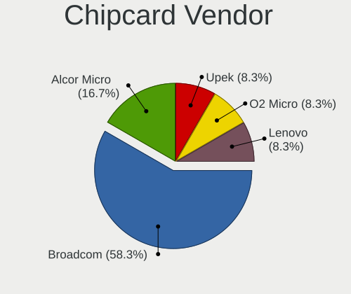

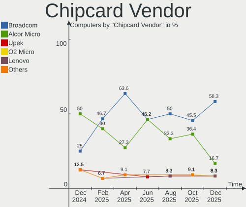

| Vendor      | Computers | Percent |
|-------------|-----------|---------|
| Broadcom    | 7         | 58.33%  |
| Alcor Micro | 2         | 16.67%  |
| Upek        | 1         | 8.33%   |
| O2 Micro    | 1         | 8.33%   |
| Lenovo      | 1         | 8.33%   |

Chipcard Model
--------------

Chipcard module models

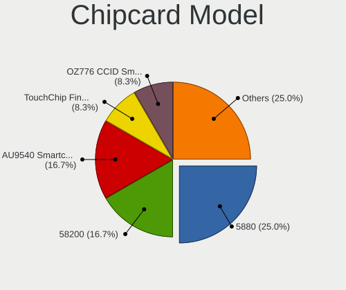

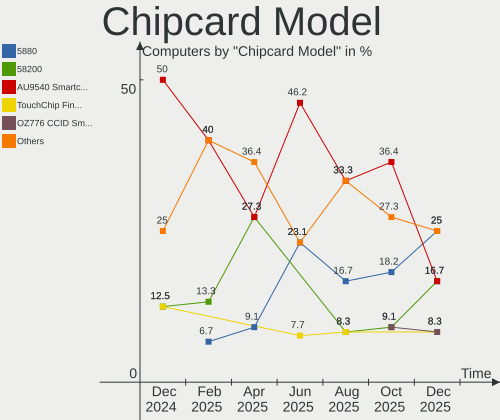

| Model                                                                        | Computers | Percent |
|------------------------------------------------------------------------------|-----------|---------|
| Broadcom 5880                                                                | 3         | 25%     |
| Broadcom 58200                                                               | 2         | 16.67%  |
| Alcor Micro AU9540 Smartcard Reader                                          | 2         | 16.67%  |
| Upek TouchChip Fingerprint Coprocessor (WBF advanced mode)                   | 1         | 8.33%   |
| O2 Micro OZ776 CCID Smartcard Reader                                         | 1         | 8.33%   |
| Lenovo Integrated Smart Card Reader                                          | 1         | 8.33%   |
| Broadcom BCM5880 Secure Applications Processor with fingerprint swipe sensor | 1         | 8.33%   |
| Broadcom BCM58200 ControlVault 3 (FingerPrint sensor + Contacted SmartCard)  | 1         | 8.33%   |

Unsupported
-----------

Unsupported Devices
-------------------

Total unsupported devices on board

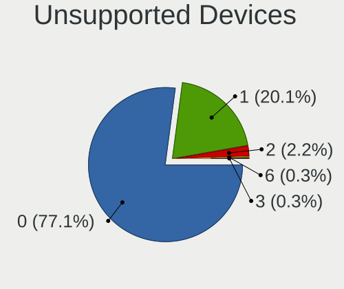

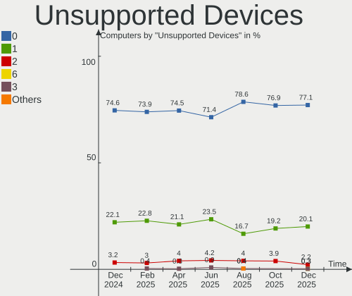

| Total | Computers | Percent |
|-------|-----------|---------|
| 0     | 276       | 77.09%  |
| 1     | 72        | 20.11%  |
| 2     | 8         | 2.23%   |
| 6     | 1         | 0.28%   |
| 3     | 1         | 0.28%   |

Unsupported Device Types
------------------------

Types of unsupported devices

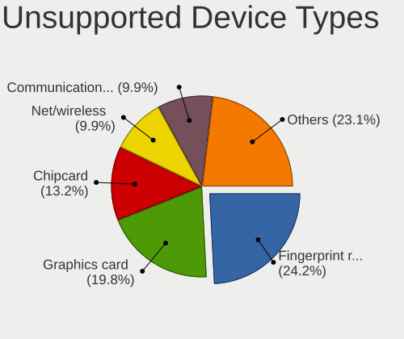

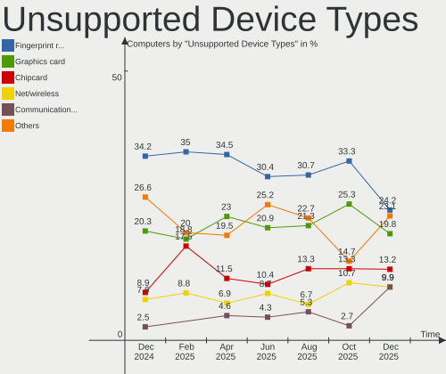

| Type                     | Computers | Percent |
|--------------------------|-----------|---------|
| Fingerprint reader       | 22        | 24.18%  |
| Graphics card            | 18        | 19.78%  |
| Chipcard                 | 12        | 13.19%  |
| Net/wireless             | 9         | 9.89%   |
| Communication controller | 9         | 9.89%   |
| Unassigned class         | 5         | 5.49%   |
| Sound                    | 4         | 4.4%    |
| Multimedia controller    | 4         | 4.4%    |
| Camera                   | 3         | 3.3%    |
| Network                  | 1         | 1.1%    |
| Modem                    | 1         | 1.1%    |
| Flash memory             | 1         | 1.1%    |
| Card reader              | 1         | 1.1%    |
| Bluetooth                | 1         | 1.1%    |

