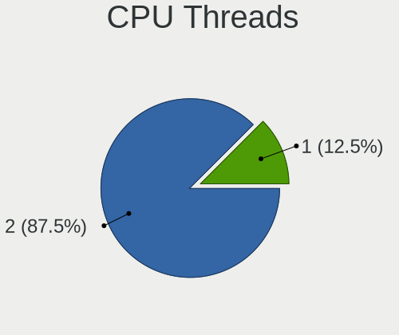
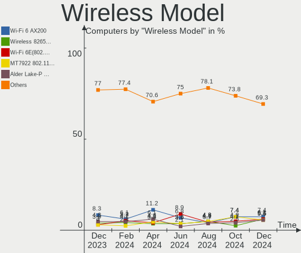

Arch Hardware Trends
--------------------

A project to identify most popular hardware characteristics and track their change
over time based on data collected by Arch users at https://Linux-Hardware.org.

Anyone can contribute to the study by uploading probes of their computers by
the [hw-probe](https://github.com/linuxhw/hw-probe) tool:

    sudo -E hw-probe -all -upload

This is a report for all computer types. See also reports for [desktops](/Dist/Arch/Desktop/README.md) and [notebooks](/Dist/Arch/Notebook/README.md).

Full-feature report is available here: https://linux-hardware.org/?view=trends

Period: Sep, 2020.

Contents
--------

- [ OS                       ](#os)
- [ OS Family                ](#os-family)
- [ Kernel                   ](#kernel)
- [ Kernel Family            ](#kernel-family)
- [ Kernel Major Ver.        ](#kernel-major-ver)
- [ Arch                     ](#arch)
- [ DE                       ](#de)
- [ Display Server           ](#display-server)
- [ Display Manager          ](#display-manager)
- [ OS Lang                  ](#os-lang)
- [ Boot Mode                ](#boot-mode)
- [ Filesystem               ](#filesystem)
- [ Part. scheme             ](#part-scheme)
- [ Dual Boot with Linux/BSD ](#dual-boot-with-linux/bsd)
- [ Dual Boot (Win)          ](#dual-boot-win)
- [ Country                  ](#country)
- [ City                     ](#city)
- [ Vendor                   ](#vendor)
- [ Model                    ](#model)
- [ Model Family             ](#model-family)
- [ MFG Year                 ](#mfg-year)
- [ Form Factor              ](#form-factor)
- [ Secure Boot              ](#secure-boot)
- [ Coreboot                 ](#coreboot)
- [ RAM Size                 ](#ram-size)
- [ RAM Used                 ](#ram-used)
- [ Has CD-ROM               ](#has-cd-rom)
- [ Total Drives             ](#total-drives)
- [ Has Ethernet             ](#has-ethernet)
- [ Drive Vendor             ](#drive-vendor)
- [ HDD Vendor               ](#hdd-vendor)
- [ SSD Vendor               ](#ssd-vendor)
- [ Drive Model              ](#drive-model)
- [ Drive Kind               ](#drive-kind)
- [ Drive Connector          ](#drive-connector)
- [ Drive Size               ](#drive-size)
- [ Space Total              ](#space-total)
- [ Space Used               ](#space-used)
- [ Malfunc. Drives          ](#malfunc-drives)
- [ Malfunc. Drive Vendor    ](#malfunc-drive-vendor)
- [ Malfunc. HDD Vendor      ](#malfunc-hdd-vendor)
- [ Malfunc. Drive Kind      ](#malfunc-drive-kind)
- [ Failed Drives            ](#failed-drives)
- [ Failed Drive Vendor      ](#failed-drive-vendor)
- [ Drive Status             ](#drive-status)
- [ Storage Vendor           ](#storage-vendor)
- [ Storage Model            ](#storage-model)
- [ Storage Kind             ](#storage-kind)
- [ CPU Vendor               ](#cpu-vendor)
- [ CPU Model                ](#cpu-model)
- [ CPU Model Family         ](#cpu-model-family)
- [ CPU Cores                ](#cpu-cores)
- [ CPU Sockets              ](#cpu-sockets)
- [ CPU Threads              ](#cpu-threads)
- [ CPU Op-Modes             ](#cpu-op-modes)
- [ CPU Microcode            ](#cpu-microcode)
- [ CPU Microarch            ](#cpu-microarch)
- [ GPU Vendor               ](#gpu-vendor)
- [ GPU Model                ](#gpu-model)
- [ GPU Combo                ](#gpu-combo)
- [ GPU Driver               ](#gpu-driver)
- [ GPU Memory               ](#gpu-memory)
- [ Monitor Vendor           ](#monitor-vendor)
- [ Monitor Model            ](#monitor-model)
- [ Monitor Resolution       ](#monitor-resolution)
- [ Monitor Diagonal         ](#monitor-diagonal)
- [ Monitor Width            ](#monitor-width)
- [ Aspect Ratio             ](#aspect-ratio)
- [ Monitor Area             ](#monitor-area)
- [ Pixel Density            ](#pixel-density)
- [ Multiple Monitors        ](#multiple-monitors)
- [ Net Controller Vendor    ](#net-controller-vendor)
- [ Net Controller Model     ](#net-controller-model)
- [ Wireless Vendor          ](#wireless-vendor)
- [ Wireless Model           ](#wireless-model)
- [ Ethernet Vendor          ](#ethernet-vendor)
- [ Ethernet Model           ](#ethernet-model)
- [ Net Controller Kind      ](#net-controller-kind)
- [ Used Controller          ](#used-controller)
- [ NICs                     ](#nics)
- [ Memory Vendor            ](#memory-vendor)
- [ Memory Model             ](#memory-model)
- [ Memory Kind              ](#memory-kind)
- [ Memory Form Factor       ](#memory-form-factor)
- [ Memory Size              ](#memory-size)
- [ Memory Speed             ](#memory-speed)
- [ Sound Vendor             ](#sound-vendor)
- [ Sound Model              ](#sound-model)
- [ Camera Vendor            ](#camera-vendor)
- [ Camera Model             ](#camera-model)
- [ Fingerprint Vendor       ](#fingerprint-vendor)
- [ Fingerprint Model        ](#fingerprint-model)
- [ Chipcard Vendor          ](#chipcard-vendor)
- [ Chipcard Model           ](#chipcard-model)
- [ Printer Vendor           ](#printer-vendor)
- [ Printer Model            ](#printer-model)
- [ Scanner Vendor           ](#scanner-vendor)
- [ Scanner Model            ](#scanner-model)
- [ Bluetooth Vendor         ](#bluetooth-vendor)
- [ Bluetooth Model          ](#bluetooth-model)
- [ Unsupported Devices      ](#unsupported-devices)
- [ Unsupported Device Types ](#unsupported-device-types)

OS
--

Installed operating systems

| Name         | Computers | Percent |
|--------------|-----------|---------|
| Arch Rolling | 214       | 57.37%  |
| Arch         | 159       | 42.63%  |

OS Family
---------

OS without a version

| Name | Computers | Percent |
|------|-----------|---------|
| Arch | 373       | 100%    |

Kernel
------

Version of the Linux kernel

| Version                | Computers | Percent |
|------------------------|-----------|---------|
| 5.8.5-arch1-1          | 62        | 16.62%  |
| 5.8.10-arch1-1         | 47        | 12.6%   |
| 5.8.7-arch1-1          | 27        | 7.24%   |
| 5.8.8-arch1-1          | 25        | 6.7%    |
| 5.8.12-arch1-1         | 23        | 6.17%   |
| 5.8.9-arch2-1          | 13        | 3.49%   |
| 5.8.5-zen1-1-zen       | 13        | 3.49%   |
| 5.8.12-zen1-1-zen      | 13        | 3.49%   |
| 5.8.11-arch1-1         | 13        | 3.49%   |
| 5.4.61-1-lts           | 13        | 3.49%   |
| 5.8.11-zen1-1-zen      | 8         | 2.14%   |
| 5.8.10-zen1-1-zen      | 7         | 1.88%   |
| 5.7.12-arch1-1         | 6         | 1.61%   |
| 5.8.3-arch1-1          | 5         | 1.34%   |
| 5.4.66-1-lts           | 5         | 1.34%   |
| 5.8.6-arch1-1          | 4         | 1.07%   |
| 5.8.5-8-tkg-pds        | 4         | 1.07%   |
| 5.8.1-arch1-1          | 4         | 1.07%   |
| 5.4.68-1-lts           | 4         | 1.07%   |
| 5.4.64-1-lts           | 4         | 1.07%   |
| 5.8.8-zen1-1-zen       | 3         | 0.8%    |
| 5.8.6-zen1-1-zen       | 3         | 0.8%    |
| 5.8.11-18-tkg-pds      | 3         | 0.8%    |
| 5.9.0-rc6-1-mainline   | 2         | 0.54%   |
| 5.8.9-zen2-1-zen       | 2         | 0.54%   |
| 5.8.7-zen1-1-zen       | 2         | 0.54%   |
| 5.8.12-20-tkg-pds      | 2         | 0.54%   |
| 5.8.12-20-tkg-cfs      | 2         | 0.54%   |
| 5.8.11-988.native      | 2         | 0.54%   |
| 5.8.10-17-tkg-bmq      | 2         | 0.54%   |
| 5.8.0-1-tkg-pds        | 2         | 0.54%   |
| 5.7.19-1-ck-zen        | 2         | 0.54%   |
| 5.7.10-arch1-1         | 2         | 0.54%   |
| 5.4.67-1-lts           | 2         | 0.54%   |
| 5.4.65-1-lts           | 2         | 0.54%   |
| 5.9.0-rc5-1-mainline   | 1         | 0.27%   |
| 5.8.9.a-1-hardened     | 1         | 0.27%   |
| 5.8.9-zen2-1-zencjk    | 1         | 0.27%   |
| 5.8.9-zen1-1-zen-vfio  | 1         | 0.27%   |
| 5.8.9-xanmod1-1        | 1         | 0.27%   |
| 5.8.9-16-tkg-pds       | 1         | 0.27%   |
| 5.8.8-xanmod1-1        | 1         | 0.27%   |
| 5.8.8-AMD              | 1         | 0.27%   |
| 5.8.7.a-1-hardened     | 1         | 0.27%   |
| 5.8.6-xanmod1-1        | 1         | 0.27%   |
| 5.8.5-zen1-1-vmi       | 1         | 0.27%   |
| 5.8.5-xanmod1-1-xanmod | 1         | 0.27%   |
| 5.8.5-8-tkg-bmq        | 1         | 0.27%   |
| 5.8.4-7-tkg-pds        | 1         | 0.27%   |
| 5.8.3-6-tkg-pds        | 1         | 0.27%   |
| 5.8.3-6-tkg-bmq        | 1         | 0.27%   |
| 5.8.12.a-1-hardened    | 1         | 0.27%   |
| 5.8.12-xanmod1-1       | 1         | 0.27%   |
| 5.8.12-20-tkg-upds     | 1         | 0.27%   |
| 5.8.11-19-tkg-upds     | 1         | 0.27%   |
| 5.8.11-18-tkg-upds     | 1         | 0.27%   |
| 5.8.10-xanmod1-2       | 1         | 0.27%   |
| 5.8.10-arch1-1-iain    | 1         | 0.27%   |
| 5.8.10-arch1-1-g14     | 1         | 0.27%   |
| 5.8.10-17-tkg-upds     | 1         | 0.27%   |

Kernel Family
-------------

Linux kernel without a distro release

| Version  | Computers | Percent |
|----------|-----------|---------|
| 5.8.5    | 82        | 21.98%  |
| 5.8.10   | 60        | 16.09%  |
| 5.8.12   | 43        | 11.53%  |
| 5.8.8    | 30        | 8.04%   |
| 5.8.7    | 30        | 8.04%   |
| 5.8.11   | 28        | 7.51%   |
| 5.8.9    | 20        | 5.36%   |
| 5.4.61   | 14        | 3.75%   |
| 5.8.6    | 8         | 2.14%   |
| 5.8.3    | 7         | 1.88%   |
| 5.8.1    | 6         | 1.61%   |
| 5.7.12   | 6         | 1.61%   |
| 5.4.66   | 5         | 1.34%   |
| 5.4.68   | 4         | 1.07%   |
| 5.4.64   | 4         | 1.07%   |
| 5.9.0    | 3         | 0.8%    |
| 5.7.19   | 3         | 0.8%    |
| 5.8.0    | 2         | 0.54%   |
| 5.7.10   | 2         | 0.54%   |
| 5.4.67   | 2         | 0.54%   |
| 5.4.65   | 2         | 0.54%   |
| 5.8.4    | 1         | 0.27%   |
| 5.7.5    | 1         | 0.27%   |
| 5.6.17   | 1         | 0.27%   |
| 5.6.10   | 1         | 0.27%   |
| 5.6.0    | 1         | 0.27%   |
| 5.5.7    | 1         | 0.27%   |
| 5.4.62   | 1         | 0.27%   |
| 5.4.58   | 1         | 0.27%   |
| 5.4.55   | 1         | 0.27%   |
| 5.4.54   | 1         | 0.27%   |
| 5.4.47   | 1         | 0.27%   |
| 4.19.146 | 1         | 0.27%   |

Kernel Major Ver.
-----------------

Linux kernel major version

| Version | Computers | Percent |
|---------|-----------|---------|
| 5.8     | 317       | 84.99%  |
| 5.4     | 36        | 9.65%   |
| 5.7     | 12        | 3.22%   |
| 5.9     | 3         | 0.8%    |
| 5.6     | 3         | 0.8%    |
| 5.5     | 1         | 0.27%   |
| 4.19    | 1         | 0.27%   |

Arch
----

OS architecture (x86_64, i586, etc.)

| Name   | Computers | Percent |
|--------|-----------|---------|
| x86_64 | 373       | 100%    |

DE
--

Desktop Environment

| Name            | Computers | Percent |
|-----------------|-----------|---------|
| GNOME           | 114       | 30.56%  |
| KDE5            | 97        | 26.01%  |
| Unknown         | 33        | 8.85%   |
| XFCE            | 31        | 8.31%   |
| KDE             | 31        | 8.31%   |
| i3              | 16        | 4.29%   |
| Cinnamon        | 10        | 2.68%   |
| MATE            | 9         | 2.41%   |
| Budgie          | 7         | 1.88%   |
| LXQt            | 6         | 1.61%   |
| Deepin          | 6         | 1.61%   |
| sway            | 3         | 0.8%    |
| LXDE            | 3         | 0.8%    |
| GNOME Flashback | 2         | 0.54%   |
| bspwm           | 2         | 0.54%   |
| Unity           | 1         | 0.27%   |
| GNOME Classic   | 1         | 0.27%   |
| default         | 1         | 0.27%   |

Display Server
--------------

X11 or Wayland

| Name    | Computers | Percent |
|---------|-----------|---------|
| X11     | 252       | 67.56%  |
| Tty     | 58        | 15.55%  |
| Wayland | 56        | 15.01%  |
| Unknown | 7         | 1.88%   |

Display Manager
---------------

SDDM, LightDM, etc.

| Name    | Computers | Percent |
|---------|-----------|---------|
| Unknown | 133       | 35.66%  |
| SDDM    | 98        | 26.27%  |
| TDM     | 60        | 16.09%  |
| GDM     | 59        | 15.82%  |
| LightDM | 12        | 3.22%   |
| XDM     | 6         | 1.61%   |
| SLiM    | 2         | 0.54%   |
| LXDM    | 2         | 0.54%   |
| Ly      | 1         | 0.27%   |

OS Lang
-------

Language

| Lang        | Computers | Percent |
|-------------|-----------|---------|
| en_US       | 201       | 53.89%  |
| en_GB       | 29        | 7.77%   |
| C           | 17        | 4.56%   |
| de_DE       | 15        | 4.02%   |
| en_US.utf8  | 11        | 2.95%   |
| en_CA       | 11        | 2.95%   |
| pt_BR       | 10        | 2.68%   |
| Unknown     | 8         | 2.14%   |
| pl_PL       | 7         | 1.88%   |
| fr_FR       | 5         | 1.34%   |
| en_IE       | 5         | 1.34%   |
| ru_RU       | 4         | 1.07%   |
| es_ES       | 4         | 1.07%   |
| en_IN       | 3         | 0.8%    |
| zh_TW       | 2         | 0.54%   |
| zh_CN       | 2         | 0.54%   |
| nl_NL       | 2         | 0.54%   |
| lv_LV       | 2         | 0.54%   |
| ja_JP       | 2         | 0.54%   |
| it_IT       | 2         | 0.54%   |
| es_CO       | 2         | 0.54%   |
| es_CL       | 2         | 0.54%   |
| en_SG       | 2         | 0.54%   |
| en_AU       | 2         | 0.54%   |
| de_AT       | 2         | 0.54%   |
| cs_CZ       | 2         | 0.54%   |
| tr_TR       | 1         | 0.27%   |
| szl_PL      | 1         | 0.27%   |
| sv_SE       | 1         | 0.27%   |
| pl_PL.utf8  | 1         | 0.27%   |
| ko_KR.utf8  | 1         | 0.27%   |
| hu_HU       | 1         | 0.27%   |
| fr_FR.utf8  | 1         | 0.27%   |
| es_VE       | 1         | 0.27%   |
| es_PE       | 1         | 0.27%   |
| es_MX       | 1         | 0.27%   |
| es_AR       | 1         | 0.27%   |
| en_XX@POSIX | 1         | 0.27%   |
| en_US      | 1         | 0.27%   |
| en_NZ       | 1         | 0.27%   |
| en_GB.utf8  | 1         | 0.27%   |
| en_DK       | 1         | 0.27%   |
| en_DE       | 1         | 0.27%   |
| de_AT.utf8  | 1         | 0.27%   |
| ca_ES       | 1         | 0.27%   |

Boot Mode
---------

EFI or BIOS

| Mode | Computers | Percent |
|------|-----------|---------|
| EFI  | 282       | 75.6%   |
| BIOS | 91        | 24.4%   |

Filesystem
----------

Type of filesystem

| Type    | Computers | Percent |
|---------|-----------|---------|
| Ext4    | 297       | 79.62%  |
| Btrfs   | 48        | 12.87%  |
| F2fs    | 13        | 3.49%   |
| Xfs     | 7         | 1.88%   |
| Zfs     | 3         | 0.8%    |
| Overlay | 3         | 0.8%    |
| Unknown | 2         | 0.54%   |

Part. scheme
------------

Scheme of partitioning

| Type    | Computers | Percent |
|---------|-----------|---------|
| GPT     | 285       | 76.41%  |
| Unknown | 64        | 17.16%  |
| MBR     | 24        | 6.43%   |

Dual Boot with Linux/BSD
------------------------

Hosting more than one Linux/BSD

| Dual boot | Computers | Percent |
|-----------|-----------|---------|
| No        | 320       | 85.79%  |
| Yes       | 53        | 14.21%  |

Dual Boot (Win)
---------------

Hosting Linux and Windows

| Dual boot | Computers | Percent |
|-----------|-----------|---------|
| No        | 232       | 62.2%   |
| Yes       | 141       | 37.8%   |

Country
-------

Geographic location (country)

| Country            | Computers | Percent |
|--------------------|-----------|---------|
| USA                | 94        | 25.2%   |
| Germany            | 33        | 8.85%   |
| Brazil             | 21        | 5.63%   |
| UK                 | 17        | 4.56%   |
| Russia             | 16        | 4.29%   |
| France             | 14        | 3.75%   |
| Canada             | 13        | 3.49%   |
| Poland             | 12        | 3.22%   |
| India              | 11        | 2.95%   |
| Italy              | 10        | 2.68%   |
| Sweden             | 9         | 2.41%   |
| Spain              | 8         | 2.14%   |
| Netherlands        | 8         | 2.14%   |
| Finland            | 7         | 1.88%   |
| Austria            | 7         | 1.88%   |
| Switzerland        | 6         | 1.61%   |
| Belgium            | 5         | 1.34%   |
| Indonesia          | 4         | 1.07%   |
| Hungary            | 4         | 1.07%   |
| Greece             | 4         | 1.07%   |
| Denmark            | 4         | 1.07%   |
| Australia          | 4         | 1.07%   |
| Turkey             | 3         | 0.8%    |
| Serbia             | 3         | 0.8%    |
| Israel             | 3         | 0.8%    |
| Estonia            | 3         | 0.8%    |
| Czech Republic     | 3         | 0.8%    |
| Chile              | 3         | 0.8%    |
| Venezuela          | 2         | 0.54%   |
| Ukraine            | 2         | 0.54%   |
| Taiwan             | 2         | 0.54%   |
| Portugal           | 2         | 0.54%   |
| Norway             | 2         | 0.54%   |
| New Zealand        | 2         | 0.54%   |
| Myanmar            | 2         | 0.54%   |
| Mexico             | 2         | 0.54%   |
| Malaysia           | 2         | 0.54%   |
| Latvia             | 2         | 0.54%   |
| Dominican Republic | 2         | 0.54%   |
| Colombia           | 2         | 0.54%   |
| China              | 2         | 0.54%   |
| Argentina          | 2         | 0.54%   |
| Slovenia           | 1         | 0.27%   |
| Slovakia           | 1         | 0.27%   |
| Singapore          | 1         | 0.27%   |
| Saudi Arabia       | 1         | 0.27%   |
| Philippines        | 1         | 0.27%   |
| Peru               | 1         | 0.27%   |
| Paraguay           | 1         | 0.27%   |
| Lithuania          | 1         | 0.27%   |
| Korea, Republic of | 1         | 0.27%   |
| Japan              | 1         | 0.27%   |
| Ireland            | 1         | 0.27%   |
| Iran               | 1         | 0.27%   |
| Iceland            | 1         | 0.27%   |
| Hong Kong          | 1         | 0.27%   |
| Bolivia            | 1         | 0.27%   |
| Bangladesh         | 1         | 0.27%   |

City
----

Geographic location (city)

| City              | Computers | Percent |
|-------------------|-----------|---------|
| São Paulo        | 7         | 1.88%   |
| Moscow            | 7         | 1.88%   |
| Hamburg           | 4         | 1.07%   |
| Copenhagen        | 4         | 1.07%   |
| Zurich            | 3         | 0.8%    |
| Walce             | 3         | 0.8%    |
| Vienna            | 3         | 0.8%    |
| Tel Aviv          | 3         | 0.8%    |
| Tallinn           | 3         | 0.8%    |
| Salt Lake City    | 3         | 0.8%    |
| Rybnik            | 3         | 0.8%    |
| Montreal          | 3         | 0.8%    |
| Madrid            | 3         | 0.8%    |
| Budapest          | 3         | 0.8%    |
| Berlin            | 3         | 0.8%    |
| Yangon            | 2         | 0.54%   |
| Utrecht           | 2         | 0.54%   |
| Uppsala           | 2         | 0.54%   |
| Traralgon         | 2         | 0.54%   |
| Toronto           | 2         | 0.54%   |
| Thrissur          | 2         | 0.54%   |
| Thessaloniki      | 2         | 0.54%   |
| St Petersburg     | 2         | 0.54%   |
| Santiago          | 2         | 0.54%   |
| San Jose          | 2         | 0.54%   |
| San Diego         | 2         | 0.54%   |
| Roseville         | 2         | 0.54%   |
| Riga              | 2         | 0.54%   |
| Philadelphia      | 2         | 0.54%   |
| Paris             | 2         | 0.54%   |
| Mumbai            | 2         | 0.54%   |
| Madera            | 2         | 0.54%   |
| Lviv              | 2         | 0.54%   |
| Lund              | 2         | 0.54%   |
| London            | 2         | 0.54%   |
| Little Rock       | 2         | 0.54%   |
| Krakow            | 2         | 0.54%   |
| Karlsruhe         | 2         | 0.54%   |
| Jakarta           | 2         | 0.54%   |
| Helsinki          | 2         | 0.54%   |
| Hamme             | 2         | 0.54%   |
| Frankfurt am Main | 2         | 0.54%   |
| Essen             | 2         | 0.54%   |
| Dallas            | 2         | 0.54%   |
| Curitiba          | 2         | 0.54%   |
| Columbus          | 2         | 0.54%   |
| Clinton Township  | 2         | 0.54%   |
| Chicago           | 2         | 0.54%   |
| Cambridge         | 2         | 0.54%   |
| Amsterdam         | 2         | 0.54%   |
| Aachen            | 2         | 0.54%   |
| Ålesund          | 1         | 0.27%   |
| Zarzal            | 1         | 0.27%   |
| Zagoryanskiy      | 1         | 0.27%   |
| Ypres             | 1         | 0.27%   |
| Youngstown        | 1         | 0.27%   |
| Wuppertal         | 1         | 0.27%   |
| Windsor           | 1         | 0.27%   |
| Westminster       | 1         | 0.27%   |
| Western Springs   | 1         | 0.27%   |

Vendor
------

Motherboard manufacturer

| Name                | Computers | Percent |
|---------------------|-----------|---------|
| ASUSTek Computer    | 90        | 24.13%  |
| Lenovo              | 67        | 17.96%  |
| MSI                 | 46        | 12.33%  |
| Gigabyte Technology | 39        | 10.46%  |
| Dell                | 33        | 8.85%   |
| ASRock              | 31        | 8.31%   |
| Hewlett-Packard     | 24        | 6.43%   |
| Acer                | 13        | 3.49%   |
| Intel               | 8         | 2.14%   |
| Apple               | 5         | 1.34%   |
| HUAWEI              | 4         | 1.07%   |
| Notebook            | 3         | 0.8%    |
| Toshiba             | 2         | 0.54%   |
| Unknown             | 2         | 0.54%   |
| TUXEDO              | 1         | 0.27%   |
| Samsung Electronics | 1         | 0.27%   |
| Pegatron            | 1         | 0.27%   |
| Monster Notebook    | 1         | 0.27%   |
| ECS                 | 1         | 0.27%   |
| Biostar             | 1         | 0.27%   |

Model
-----

Motherboard model

| Name                              | Computers | Percent |
|-----------------------------------|-----------|---------|
| ASUS PRIME X470-PRO               | 6         | 1.61%   |
| ASUS All Series                   | 6         | 1.61%   |
| ASUS TUF GAMING X570-PLUS         | 5         | 1.34%   |
| MSI MS-7C02                       | 4         | 1.07%   |
| MSI MS-7B89                       | 4         | 1.07%   |
| Gigabyte B450M DS3H               | 4         | 1.07%   |
| ASUS ROG CROSSHAIR VII HERO       | 4         | 1.07%   |
| Unknown                           | 4         | 1.07%   |
| MSI MS-7B86                       | 3         | 0.8%    |
| MSI MS-7A34                       | 3         | 0.8%    |
| MSI MS-7972                       | 3         | 0.8%    |
| Gigabyte X570 AORUS ELITE         | 3         | 0.8%    |
| Dell XPS 13 9370                  | 3         | 0.8%    |
| ASUS ROG STRIX X470-F GAMING      | 3         | 0.8%    |
| ASUS ROG STRIX B450-F GAMING      | 3         | 0.8%    |
| ASUS PRIME B450M-A                | 3         | 0.8%    |
| MSI MS-7B98                       | 2         | 0.54%   |
| MSI MS-7A38                       | 2         | 0.54%   |
| MSI MS-7817                       | 2         | 0.54%   |
| Intel NUC8i7BEH                   | 2         | 0.54%   |
| Intel NUC7PJYH                    | 2         | 0.54%   |
| HP OMEN Laptop 15-en0xxx          | 2         | 0.54%   |
| HP EliteBook 830 G6               | 2         | 0.54%   |
| Gigabyte X470 AORUS ULTRA GAMING  | 2         | 0.54%   |
| Gigabyte 970A-DS3P                | 2         | 0.54%   |
| Dell XPS 15 7590                  | 2         | 0.54%   |
| ASUS ZenBook UX431DA_UM431DA      | 2         | 0.54%   |
| ASUS TUF B450M-PLUS GAMING        | 2         | 0.54%   |
| ASUS ROG STRIX X570-E GAMING      | 2         | 0.54%   |
| ASUS PRIME X570-P                 | 2         | 0.54%   |
| ASUS PRIME X370-PRO               | 2         | 0.54%   |
| ASRock X570 Taichi                | 2         | 0.54%   |
| ASRock X470 Taichi                | 2         | 0.54%   |
| TUXEDO Book BA1510                | 1         | 0.27%   |
| Toshiba Satellite T135D           | 1         | 0.27%   |
| Toshiba Satellite C650            | 1         | 0.27%   |
| Samsung Electronics 530U4E/540U4E | 1         | 0.27%   |
| Pegatron p6-2133w                 | 1         | 0.27%   |
| Notebook W350STQ/W370ST           | 1         | 0.27%   |
| Notebook N8xEJEK                  | 1         | 0.27%   |
| Notebook N85_N87,HJ,HJ1,HK1       | 1         | 0.27%   |
| MSI MS-B09012                     | 1         | 0.27%   |
| MSI MS-7C84                       | 1         | 0.27%   |
| MSI MS-7C60                       | 1         | 0.27%   |
| MSI MS-7C35                       | 1         | 0.27%   |
| MSI MS-7B87                       | 1         | 0.27%   |
| MSI MS-7B85                       | 1         | 0.27%   |
| MSI MS-7B79                       | 1         | 0.27%   |
| MSI MS-7B58                       | 1         | 0.27%   |
| MSI MS-7A70                       | 1         | 0.27%   |
| MSI MS-7A68                       | 1         | 0.27%   |
| MSI MS-7A63                       | 1         | 0.27%   |
| MSI MS-7A40                       | 1         | 0.27%   |
| MSI MS-7A39                       | 1         | 0.27%   |
| MSI MS-7971                       | 1         | 0.27%   |
| MSI MS-7922                       | 1         | 0.27%   |
| MSI MS-7918                       | 1         | 0.27%   |
| MSI MS-7885                       | 1         | 0.27%   |
| MSI MS-7821                       | 1         | 0.27%   |
| MSI MS-7721                       | 1         | 0.27%   |

Model Family
------------

Motherboard model prefix

| Name                       | Computers | Percent |
|----------------------------|-----------|---------|
| Lenovo ThinkPad            | 41        | 10.99%  |
| ASUS PRIME                 | 20        | 5.36%   |
| ASUS ROG                   | 19        | 5.09%   |
| Dell Inspiron              | 14        | 3.75%   |
| Lenovo IdeaPad             | 12        | 3.22%   |
| ASUS TUF                   | 11        | 2.95%   |
| Dell XPS                   | 10        | 2.68%   |
| Acer Aspire                | 9         | 2.41%   |
| HP EliteBook               | 6         | 1.61%   |
| ASUS All                   | 6         | 1.61%   |
| ASRock X570                | 6         | 1.61%   |
| HP Pavilion                | 5         | 1.34%   |
| ASRock X470                | 5         | 1.34%   |
| MSI MS-7C02                | 4         | 1.07%   |
| MSI MS-7B89                | 4         | 1.07%   |
| Gigabyte X570              | 4         | 1.07%   |
| Gigabyte B450M             | 4         | 1.07%   |
| Dell Latitude              | 4         | 1.07%   |
| ASUS ZenBook               | 4         | 1.07%   |
| Unknown                    | 4         | 1.07%   |
| MSI MS-7B86                | 3         | 0.8%    |
| MSI MS-7A34                | 3         | 0.8%    |
| MSI MS-7972                | 3         | 0.8%    |
| Lenovo Yoga                | 3         | 0.8%    |
| Lenovo Legion              | 3         | 0.8%    |
| HP OMEN                    | 3         | 0.8%    |
| ASUS Maximus               | 3         | 0.8%    |
| Toshiba Satellite          | 2         | 0.54%   |
| MSI MS-7B98                | 2         | 0.54%   |
| MSI MS-7A38                | 2         | 0.54%   |
| MSI MS-7817                | 2         | 0.54%   |
| Lenovo Flex                | 2         | 0.54%   |
| Intel NUC8i7BEH            | 2         | 0.54%   |
| Intel NUC7PJYH             | 2         | 0.54%   |
| Gigabyte Z370              | 2         | 0.54%   |
| Gigabyte X470              | 2         | 0.54%   |
| Gigabyte B450              | 2         | 0.54%   |
| Gigabyte 970A-DS3P         | 2         | 0.54%   |
| Dell Precision             | 2         | 0.54%   |
| Dell OptiPlex              | 2         | 0.54%   |
| ASRock Z170                | 2         | 0.54%   |
| ASRock X370                | 2         | 0.54%   |
| ASRock B450M               | 2         | 0.54%   |
| ASRock B450                | 2         | 0.54%   |
| Acer TravelMate            | 2         | 0.54%   |
| TUXEDO Book                | 1         | 0.27%   |
| Samsung Electronics 530U4E | 1         | 0.27%   |
| Pegatron p6-2133w          | 1         | 0.27%   |
| Notebook W350STQ           | 1         | 0.27%   |
| Notebook N8xEJEK           | 1         | 0.27%   |
| Notebook N85               | 1         | 0.27%   |
| MSI MS-B09012              | 1         | 0.27%   |
| MSI MS-7C84                | 1         | 0.27%   |
| MSI MS-7C60                | 1         | 0.27%   |
| MSI MS-7C35                | 1         | 0.27%   |
| MSI MS-7B87                | 1         | 0.27%   |
| MSI MS-7B85                | 1         | 0.27%   |
| MSI MS-7B79                | 1         | 0.27%   |
| MSI MS-7B58                | 1         | 0.27%   |
| MSI MS-7A70                | 1         | 0.27%   |

MFG Year
--------

Motherboard manufacture year

| Year | Computers | Percent |
|------|-----------|---------|
| 2019 | 105       | 28.15%  |
| 2020 | 104       | 27.88%  |
| 2018 | 54        | 14.48%  |
| 2013 | 24        | 6.43%   |
| 2017 | 17        | 4.56%   |
| 2016 | 17        | 4.56%   |
| 2015 | 13        | 3.49%   |
| 2012 | 13        | 3.49%   |
| 2011 | 10        | 2.68%   |
| 2014 | 9         | 2.41%   |
| 2010 | 2         | 0.54%   |
| 2009 | 2         | 0.54%   |
| 2008 | 2         | 0.54%   |
| 2006 | 1         | 0.27%   |

Form Factor
-----------

Physical design of the computer

| Name        | Computers | Percent |
|-------------|-----------|---------|
| Desktop     | 197       | 52.82%  |
| Notebook    | 158       | 42.36%  |
| Convertible | 9         | 2.41%   |
| Mini pc     | 6         | 1.61%   |
| All in one  | 2         | 0.54%   |
| Tablet      | 1         | 0.27%   |

Secure Boot
-----------

Enabled or disabled

| State    | Computers | Percent |
|----------|-----------|---------|
| Disabled | 370       | 99.2%   |
| Enabled  | 3         | 0.8%    |

Coreboot
--------

Have coreboot on board

| Used | Computers | Percent |
|------|-----------|---------|
| No   | 373       | 100%    |

RAM Size
--------

Total RAM memory

| Size in GB  | Computers | Percent |
|-------------|-----------|---------|
| 16.01-24.0  | 129       | 34.58%  |
| 32.01-64.0  | 73        | 19.57%  |
| 8.01-16.0   | 68        | 18.23%  |
| 4.01-8.0    | 54        | 14.48%  |
| 3.01-4.0    | 25        | 6.7%    |
| 64.01-256.0 | 11        | 2.95%   |
| 24.01-32.0  | 8         | 2.14%   |
| 1.01-2.0    | 4         | 1.07%   |
| 2.01-3.0    | 1         | 0.27%   |

RAM Used
--------

Used RAM memory

| Used GB    | Computers | Percent |
|------------|-----------|---------|
| 4.01-8.0   | 118       | 31.64%  |
| 2.01-3.0   | 64        | 17.16%  |
| 1.01-2.0   | 62        | 16.62%  |
| 3.01-4.0   | 49        | 13.14%  |
| 8.01-16.0  | 42        | 11.26%  |
| 0.01-1.0   | 19        | 5.09%   |
| 16.01-24.0 | 12        | 3.22%   |
| 24.01-32.0 | 5         | 1.34%   |
| 32.01-64.0 | 2         | 0.54%   |

Has CD-ROM
----------

Has CD-ROM on board

| Presented | Computers | Percent |
|-----------|-----------|---------|
| No        | 289       | 77.48%  |
| Yes       | 84        | 22.52%  |

Total Drives
------------

Number of drives on board

| Drives | Computers | Percent |
|--------|-----------|---------|
| 1      | 159       | 42.63%  |
| 2      | 101       | 27.08%  |
| 3      | 53        | 14.21%  |
| 4      | 23        | 6.17%   |
| 5      | 19        | 5.09%   |
| 6      | 10        | 2.68%   |
| 7      | 5         | 1.34%   |
| 8      | 2         | 0.54%   |
| 0      | 1         | 0.27%   |

Has Ethernet
------------

Has Ethernet on board

| Presented | Computers | Percent |
|-----------|-----------|---------|
| Yes       | 335       | 89.81%  |
| No        | 38        | 10.19%  |

Drive Vendor
------------

Hard drive vendors

| Vendor                | Computers | Drives  | Percent |
|-----------------------|-----------|---------|---------|
| Samsung Electronics   | 150       | 194     | 21.99%  |
| WDC                   | 116       | 151     | 17.01%  |
| Seagate               | 102       | 134     | 14.96%  |
| Kingston              | 48        | 54      | 7.04%   |
| Sandisk               | 37        | 42      | 5.43%   |
| Toshiba               | 35        | 40      | 5.13%   |
| Crucial               | 31        | 34      | 4.55%   |
| Intel                 | 18        | 18      | 2.64%   |
| Phison                | 13        | 16      | 1.91%   |
| HGST                  | 12        | 17      | 1.76%   |
| A-DATA Technology     | 12        | 14      | 1.76%   |
| Unknown               | 11        | 12      | 1.61%   |
| SK Hynix              | 10        | 10      | 1.47%   |
| Hitachi               | 9         | 10      | 1.32%   |
| Micron Technology     | 6         | 6       | 0.88%   |
| Transcend             | 5         | 5       | 0.73%   |
| Corsair               | 5         | 6       | 0.73%   |
| Apple                 | 5         | 5       | 0.73%   |
| SPCC                  | 4         | 4       | 0.59%   |
| Silicon Motion        | 4         | 4       | 0.59%   |
| OCZ                   | 4         | 5       | 0.59%   |
| LITEON                | 4         | 4       | 0.59%   |
| XPG                   | 3         | 3       | 0.44%   |
| PNY                   | 3         | 3       | 0.44%   |
| HL-DT-ST              | 3         | Unknown | 0.44%   |
| PLEXTOR               | 2         | 2       | 0.29%   |
| Phison Electronics    | 2         | 2       | 0.29%   |
| Hewlett-Packard       | 2         | 2       | 0.29%   |
| Fujitsu               | 2         | 2       | 0.29%   |
| China                 | 2         | 2       | 0.29%   |
| WD MediaMax           | 1         | 1       | 0.15%   |
| USB3.0                | 1         | 2       | 0.15%   |
| Team                  | 1         | 1       | 0.15%   |
| TCSUNBOW              | 1         | 1       | 0.15%   |
| SABRENT               | 1         | 1       | 0.15%   |
| Realtek Semiconductor | 1         | 1       | 0.15%   |
| Patriot               | 1         | 1       | 0.15%   |
| Netac                 | 1         | 1       | 0.15%   |
| Lite-On               | 1         | 1       | 0.15%   |
| LIO-ORG               | 1         | 2       | 0.15%   |
| Lenovo                | 1         | 1       | 0.15%   |
| KIOXIA                | 1         | 1       | 0.15%   |
| Kingrich              | 1         | 1       | 0.15%   |
| Intenso               | 1         | 1       | 0.15%   |
| HS-SSD-C100           | 1         | 1       | 0.15%   |
| Hikvision             | 1         | 1       | 0.15%   |
| GLOWAY                | 1         | 1       | 0.15%   |
| Gigabyte Technology   | 1         | 1       | 0.15%   |
| GeIL                  | 1         | 1       | 0.15%   |
| External              | 1         | 1       | 0.15%   |
| BRAVEEAGLE            | 1         | 1       | 0.15%   |
| ASMedia               | 1         | 1       | 0.15%   |

HDD Vendor
----------

Hard disk drive vendors

| Vendor              | Computers | Drives | Percent |
|---------------------|-----------|--------|---------|
| Seagate             | 100       | 130    | 41.49%  |
| WDC                 | 85        | 107    | 35.27%  |
| Toshiba             | 24        | 29     | 9.96%   |
| HGST                | 12        | 17     | 4.98%   |
| Hitachi             | 9         | 10     | 3.73%   |
| Samsung Electronics | 7         | 9      | 2.9%    |
| Apple               | 2         | 2      | 0.83%   |
| Hewlett-Packard     | 1         | 1      | 0.41%   |
| Fujitsu             | 1         | 1      | 0.41%   |

SSD Vendor
----------

Solid state drive vendors

| Vendor              | Computers | Drives | Percent |
|---------------------|-----------|--------|---------|
| Samsung Electronics | 82        | 97     | 30.71%  |
| Kingston            | 40        | 46     | 14.98%  |
| SanDisk             | 30        | 34     | 11.24%  |
| Crucial             | 29        | 32     | 10.86%  |
| WDC                 | 25        | 25     | 9.36%   |
| A-DATA Technology   | 9         | 11     | 3.37%   |
| Toshiba             | 5         | 5      | 1.87%   |
| Micron Technology   | 5         | 5      | 1.87%   |
| Transcend           | 4         | 4      | 1.5%    |
| SPCC                | 4         | 4      | 1.5%    |
| OCZ                 | 4         | 5      | 1.5%    |
| SK Hynix            | 3         | 3      | 1.12%   |
| LITEON              | 3         | 3      | 1.12%   |
| PNY                 | 2         | 2      | 0.75%   |
| Intel               | 2         | 2      | 0.75%   |
| China               | 2         | 2      | 0.75%   |
| Apple               | 2         | 2      | 0.75%   |
| Unknown             | 1         | 1      | 0.37%   |
| Team                | 1         | 1      | 0.37%   |
| TCSUNBOW            | 1         | 1      | 0.37%   |
| SABRENT             | 1         | 1      | 0.37%   |
| PLEXTOR             | 1         | 1      | 0.37%   |
| Patriot             | 1         | 1      | 0.37%   |
| LIO-ORG             | 1         | 2      | 0.37%   |
| Kingrich            | 1         | 1      | 0.37%   |
| Intenso             | 1         | 1      | 0.37%   |
| GLOWAY              | 1         | 1      | 0.37%   |
| Gigabyte Technology | 1         | 1      | 0.37%   |
| GeIL                | 1         | 1      | 0.37%   |
| Fujitsu             | 1         | 1      | 0.37%   |
| Corsair             | 1         | 1      | 0.37%   |
| BRAVEEAGLE          | 1         | 1      | 0.37%   |
| ASMedia             | 1         | 1      | 0.37%   |

Drive Model
-----------

Hard drive models

| Model                            | Computers | Percent |
|----------------------------------|-----------|---------|
| NVMe SSD Drive 512GB             | 17        | 2.19%   |
| SSD 860 EVO 500GB                | 15        | 1.93%   |
| SSD 860 EVO 1TB                  | 13        | 1.67%   |
| NVMe SSD Drive 500GB             | 12        | 1.54%   |
| NVMe SSD Drive 1TB               | 12        | 1.54%   |
| SA400S37240G 240GB SSD           | 9         | 1.16%   |
| NVMe SSD Drive 256GB             | 9         | 1.16%   |
| SSD 970 EVO 500GB                | 8         | 1.03%   |
| WD20EZRZ-00Z5HB0 2TB             | 7         | 0.9%    |
| WD10EZEX-08WN4A0 1TB             | 7         | 0.9%    |
| ST2000DM006-2DM164 2TB           | 7         | 0.9%    |
| ST1000DM010-2EP102 1TB           | 7         | 0.9%    |
| SSD 960 EVO 250GB                | 7         | 0.9%    |
| SSD 860 EVO 250GB                | 7         | 0.9%    |
| SSD 850 EVO 500GB                | 7         | 0.9%    |
| ST1000LM048-2E7172 1TB           | 6         | 0.77%   |
| SSD 850 EVO 1TB                  | 6         | 0.77%   |
| CT1000MX500SSD1 1TB              | 6         | 0.77%   |
| ST4000DM004-2CV104 4TB           | 5         | 0.64%   |
| ST2000DM008-2FR102 2TB           | 5         | 0.64%   |
| SSD 970 EVO Plus 500GB           | 5         | 0.64%   |
| SSD 970 EVO Plus 1TB             | 5         | 0.64%   |
| SSD 970 EVO 250GB                | 5         | 0.64%   |
| SSD 860 QVO 1TB                  | 5         | 0.64%   |
| SSD 850 PRO 256GB                | 5         | 0.64%   |
| SA400S37120G 120GB SSD           | 5         | 0.64%   |
| NVMe SSD Drive 2TB               | 5         | 0.64%   |
| HTS721010A9E630 1TB              | 5         | 0.64%   |
| Expansion 1TB                    | 5         | 0.64%   |
| DT01ACA100 1TB                   | 5         | 0.64%   |
| WDS500G2B0A-00SM50 500GB SSD     | 4         | 0.51%   |
| WD20EARX-00PASB0 2TB             | 4         | 0.51%   |
| SV300S37A120G 120GB SSD          | 4         | 0.51%   |
| ST2000DM001-1CH164 2TB           | 4         | 0.51%   |
| ST1000DM003-1CH162 1TB           | 4         | 0.51%   |
| SSDPEKNW020T8 2TB                | 4         | 0.51%   |
| SSD 850 EVO 250GB                | 4         | 0.51%   |
| HDWD130 3TB                      | 4         | 0.51%   |
| CT500MX500SSD1 500GB             | 4         | 0.51%   |
| WDS120G2G0A-00JH30 120GB SSD     | 3         | 0.39%   |
| WDS100T2B0C-00PXH0 1TB           | 3         | 0.39%   |
| WDS100T2B0B-00YS70 1TB SSD       | 3         | 0.39%   |
| WD20EZRX-00DC0B0 2TB             | 3         | 0.39%   |
| WD10EZEX-00BN5A0 1TB             | 3         | 0.39%   |
| Ultra II 240GB SSD               | 3         | 0.39%   |
| SUV400S37240G 240GB SSD          | 3         | 0.39%   |
| ST500DM002-1BD142 500GB          | 3         | 0.39%   |
| ST4000VN008-2DR166 4TB           | 3         | 0.39%   |
| ST2000LX001-1RG174 2TB           | 3         | 0.39%   |
| ST1000LM024 HN-M101MBB 1TB       | 3         | 0.39%   |
| ST1000DM003-9YN162 1TB           | 3         | 0.39%   |
| ST1000DM003-1ER162 1TB           | 3         | 0.39%   |
| SSDPEKNW010T8 1TB                | 3         | 0.39%   |
| SSD PLUS 240GB                   | 3         | 0.39%   |
| SSD 970 PRO 512GB                | 3         | 0.39%   |
| SSD 860 PRO 256GB                | 3         | 0.39%   |
| SSD 860 EVO M.2 500GB            | 3         | 0.39%   |
| SSD 850 EVO 120GB                | 3         | 0.39%   |
| SH103S3120G 120GB SSD            | 3         | 0.39%   |
| PC SN730 SDBPNTY-512G-1101 512GB | 3         | 0.39%   |

Drive Kind
----------

HDD or SSD

| Kind    | Computers | Drives | Percent |
|---------|-----------|--------|---------|
| SSD     | 218       | 299    | 36.39%  |
| HDD     | 195       | 306    | 32.55%  |
| NVMe    | 164       | 199    | 27.38%  |
| MMC     | 11        | 12     | 1.84%   |
| Unknown | 11        | 9      | 1.84%   |

Drive Connector
---------------

SATA, SAS, NVMe, etc.

| Type | Computers | Drives | Percent |
|------|-----------|--------|---------|
| SATA | 290       | 587    | 59.06%  |
| NVMe | 164       | 199    | 33.4%   |
| SAS  | 26        | 27     | 5.3%    |
| MMC  | 11        | 12     | 2.24%   |

Drive Size
----------

Size of hard drive

| Size in TB | Computers | Drives | Percent |
|------------|-----------|--------|---------|
| 0.01-0.5   | 254       | 373    | 42.91%  |
| 0.51-1.0   | 214       | 283    | 36.15%  |
| 1.01-2.0   | 70        | 96     | 11.82%  |
| 4.01-10.0  | 21        | 33     | 3.55%   |
| 2.01-3.0   | 17        | 21     | 2.87%   |
| 3.01-4.0   | 16        | 19     | 2.7%    |

Space Total
-----------

Amount of disk space available on the file system

| Size in GB     | Computers | Percent |
|----------------|-----------|---------|
| 501-1000       | 72        | 19.3%   |
| 251-500        | 68        | 18.23%  |
| 101-250        | 66        | 17.69%  |
| 1001-2000      | 58        | 15.55%  |
| More than 3000 | 52        | 13.94%  |
| 2001-3000      | 27        | 7.24%   |
| 1-20           | 10        | 2.68%   |
| Unknown        | 9         | 2.41%   |
| 51-100         | 7         | 1.88%   |
| 21-50          | 4         | 1.07%   |

Space Used
----------

Amount of used disk space

| Used GB        | Computers | Percent |
|----------------|-----------|---------|
| 251-500        | 61        | 16.35%  |
| 101-250        | 59        | 15.82%  |
| 1-20           | 50        | 13.4%   |
| 501-1000       | 49        | 13.14%  |
| 51-100         | 41        | 10.99%  |
| 1001-2000      | 32        | 8.58%   |
| 21-50          | 27        | 7.24%   |
| 2001-3000      | 23        | 6.17%   |
| More than 3000 | 22        | 5.9%    |
| Unknown        | 9         | 2.41%   |

Malfunc. Drives
---------------

Drive models with a malfunction

| Model                     | Computers | Drives | Percent |
|---------------------------|-----------|--------|---------|
| WD20EZRZ-00Z5HB0 2TB      | 2         | 2      | 3.77%   |
| SU800NS38 512GB SSD       | 2         | 2      | 3.77%   |
| ST500DM002-1BD142 500GB   | 2         | 2      | 3.77%   |
| SSD 960 EVO 250GB         | 2         | 2      | 3.77%   |
| WD60EFRX-68L0BN1 6TB      | 1         | 6      | 1.89%   |
| WD40EZRX-00SPEB0 4TB      | 1         | 1      | 1.89%   |
| WD3200BEVT-00A0RT0 320GB  | 1         | 1      | 1.89%   |
| WD20EZRX-00DC0B0 2TB      | 1         | 2      | 1.89%   |
| WD20EARX-00PASB0 2TB      | 1         | 1      | 1.89%   |
| WD20EARS-00MVWB0 2TB      | 1         | 1      | 1.89%   |
| WD15EARS-00MVWB0 1TB      | 1         | 1      | 1.89%   |
| WD10JPVX-22JC3T0 1TB      | 1         | 1      | 1.89%   |
| WD10EZEX-08WN4A0 1TB      | 1         | 1      | 1.89%   |
| WD10EURX-73FH1Y0 1TB      | 1         | 1      | 1.89%   |
| WD10EURX-63C57Y0 1TB      | 1         | 1      | 1.89%   |
| WD1000DHTZ-04N21V0 1TB    | 1         | 1      | 1.89%   |
| VERTEX4 256GB SSD         | 1         | 1      | 1.89%   |
| Ultra II 240GB SSD        | 1         | 1      | 1.89%   |
| SVP200S37A120G 120GB SSD  | 1         | 1      | 1.89%   |
| ST9750422AS 752GB         | 1         | 1      | 1.89%   |
| ST500LM000-SSHD-8GB       | 1         | 1      | 1.89%   |
| ST3500418AS 500GB         | 1         | 1      | 1.89%   |
| ST3500410AS 500GB         | 1         | 1      | 1.89%   |
| ST3320613AS 320GB         | 1         | 1      | 1.89%   |
| ST3320418AS 320GB         | 1         | 1      | 1.89%   |
| ST1000LM048-2E7172 1TB    | 1         | 1      | 1.89%   |
| ST1000LM014-1EJ164 1TB    | 1         | 1      | 1.89%   |
| ST1000DM003-9YN162 1TB    | 1         | 1      | 1.89%   |
| SSDPEKKW512G7 512GB       | 1         | 1      | 1.89%   |
| SSD2SC240GC2DH16T-T 240GB | 1         | 1      | 1.89%   |
| SSD 960 PRO 512GB         | 1         | 1      | 1.89%   |
| Solid State Disk 512GB    | 1         | 1      | 1.89%   |
| SHPM2280P2 240G SSD       | 1         | 1      | 1.89%   |
| PX-1TM8SeG 1TB            | 1         | 1      | 1.89%   |
| P200 1TB SSD              | 1         | 1      | 1.89%   |
| Neutron GTX SSD 240GB     | 1         | 1      | 1.89%   |
| MZVLW256HEHP-000H1 256GB  | 1         | 1      | 1.89%   |
| MQ01ABF050 500GB          | 1         | 1      | 1.89%   |
| MK6476GSX 640GB           | 1         | 1      | 1.89%   |
| MK5075GSX 500GB           | 1         | 1      | 1.89%   |
| MK2552GSX 250GB           | 1         | 1      | 1.89%   |
| K9 128GB SATA3 SSD        | 1         | 1      | 1.89%   |
| HTS541680J9SA00 80GB      | 1         | 1      | 1.89%   |
| HTS541010A9E680 1TB       | 1         | 1      | 1.89%   |
| HD103UJ 1TB               | 1         | 1      | 1.89%   |
| HD103SJ 1TB               | 1         | 2      | 1.89%   |
| DT01ABA200 2TB            | 1         | 1      | 1.89%   |
| CT960M500SSD1 960GB       | 1         | 1      | 1.89%   |
| CT120M500SSD1 120GB       | 1         | 2      | 1.89%   |

Malfunc. Drive Vendor
---------------------

Vendors of faulty drives

| Vendor              | Computers | Drives | Percent |
|---------------------|-----------|--------|---------|
| WDC                 | 13        | 20     | 25.49%  |
| Seagate             | 11        | 11     | 21.57%  |
| Samsung Electronics | 6         | 7      | 11.76%  |
| Toshiba             | 4         | 5      | 7.84%   |
| Kingston            | 2         | 2      | 3.92%   |
| Crucial             | 2         | 3      | 3.92%   |
| A-DATA Technology   | 2         | 2      | 3.92%   |
| SPCC                | 1         | 1      | 1.96%   |
| SanDisk             | 1         | 1      | 1.96%   |
| PNY                 | 1         | 1      | 1.96%   |
| PLEXTOR             | 1         | 1      | 1.96%   |
| Patriot             | 1         | 1      | 1.96%   |
| OCZ                 | 1         | 1      | 1.96%   |
| Kingrich            | 1         | 1      | 1.96%   |
| Intel               | 1         | 1      | 1.96%   |
| Hitachi             | 1         | 1      | 1.96%   |
| HGST                | 1         | 1      | 1.96%   |
| Corsair             | 1         | 1      | 1.96%   |

Malfunc. HDD Vendor
-------------------

Vendors of faulty HDD drives

| Vendor              | Computers | Drives | Percent |
|---------------------|-----------|--------|---------|
| WDC                 | 13        | 20     | 40.63%  |
| Seagate             | 11        | 11     | 34.38%  |
| Toshiba             | 4         | 5      | 12.5%   |
| Samsung Electronics | 2         | 3      | 6.25%   |
| Hitachi             | 1         | 1      | 3.13%   |
| HGST                | 1         | 1      | 3.13%   |

Malfunc. Drive Kind
-------------------

Kinds of faulty drives

| Kind | Computers | Drives | Percent |
|------|-----------|--------|---------|
| HDD  | 32        | 41     | 62.75%  |
| SSD  | 13        | 14     | 25.49%  |
| NVMe | 6         | 6      | 11.76%  |

Failed Drives
-------------

Failed drive models

| Model              | Computers | Drives | Percent |
|--------------------|-----------|--------|---------|
| TS128GMTE850 128GB | 1         | 1      | 100%    |

Failed Drive Vendor
-------------------

Failed drive vendors

| Vendor    | Computers | Drives | Percent |
|-----------|-----------|--------|---------|
| Transcend | 1         | 1      | 100%    |

Drive Status
------------

Number of failed and malfunc. drives

| Status   | Computers | Drives | Percent |
|----------|-----------|--------|---------|
| Works    | 227       | 470    | 52.06%  |
| Detected | 161       | 293    | 36.93%  |
| Malfunc  | 47        | 61     | 10.78%  |
| Failed   | 1         | 1      | 0.23%   |

Storage Vendor
--------------

Storage controller vendors

| Vendor                       | Computers | Percent |
|------------------------------|-----------|---------|
| Intel                        | 196       | 37.4%   |
| AMD                          | 146       | 27.86%  |
| Samsung Electronics          | 80        | 15.27%  |
| Sandisk                      | 23        | 4.39%   |
| Phison Electronics           | 20        | 3.82%   |
| ASMedia Technology           | 11        | 2.1%    |
| Kingston Technology Company  | 9         | 1.72%   |
| Silicon Motion               | 7         | 1.34%   |
| SK Hynix                     | 6         | 1.15%   |
| Toshiba America Info Systems | 5         | 0.95%   |
| ADATA Technology             | 4         | 0.76%   |
| Marvell Technology Group     | 3         | 0.57%   |
| Lite-On Technology           | 3         | 0.57%   |
| Micron/Crucial Technology    | 2         | 0.38%   |
| KIOXIA                       | 2         | 0.38%   |
| Seagate Technology           | 1         | 0.19%   |
| Realtek Semiconductor        | 1         | 0.19%   |
| OCZ Technology Group         | 1         | 0.19%   |
| Micron Technology            | 1         | 0.19%   |
| Lenovo                       | 1         | 0.19%   |
| Apple                        | 1         | 0.19%   |
| Adaptec                      | 1         | 0.19%   |

Storage Model
-------------

Storage controller models

| Model                                                                    | Computers | Percent |
|--------------------------------------------------------------------------|-----------|---------|
| FCH SATA Controller [AHCI mode]                                          | 133       | 21.45%  |
| NVMe SSD Controller SM981/PM981/PM983                                    | 60        | 9.68%   |
| 400 Series Chipset SATA Controller                                       | 59        | 9.52%   |
| Non-Volatile memory controller                                           | 28        | 4.52%   |
| 8 Series/C220 Series Chipset Family 6-port SATA Controller 1 [AHCI mode] | 18        | 2.9%    |
| Sunrise Point-LP SATA Controller [AHCI mode]                             | 17        | 2.74%   |
| NVMe SSD Controller SM961/PM961                                          | 16        | 2.58%   |
| 7 Series Chipset Family 6-port SATA Controller [AHCI mode]               | 16        | 2.58%   |
| Q170/Q150/B150/H170/H110/Z170/CM236 Chipset SATA Controller [AHCI Mode]  | 15        | 2.42%   |
| 200 Series PCH SATA controller [AHCI mode]                               | 14        | 2.26%   |
| SSD 660P Series                                                          | 13        | 2.1%    |
| E12 NVMe Controller                                                      | 13        | 2.1%    |
| ASM1062 Serial ATA Controller                                            | 11        | 1.77%   |
| 82801 Mobile SATA Controller [RAID mode]                                 | 9         | 1.45%   |
| 8 Series SATA Controller 1 [AHCI mode]                                   | 8         | 1.29%   |
| 300 Series Chipset SATA Controller                                       | 8         | 1.29%   |
| Wildcat Point-LP SATA Controller [AHCI Mode]                             | 7         | 1.13%   |
| Cannon Lake PCH SATA AHCI Controller                                     | 7         | 1.13%   |
| 9 Series Chipset Family SATA Controller [AHCI Mode]                      | 7         | 1.13%   |
| X370 Series Chipset SATA Controller                                      | 6         | 0.97%   |
| SM2262/SM2262EN SSD Controller                                           | 6         | 0.97%   |
| SATA Controller [RAID mode]                                              | 6         | 0.97%   |
| HM170/QM170 Chipset SATA Controller [AHCI Mode]                          | 6         | 0.97%   |
| E16 PCIe4 NVMe Controller                                                | 6         | 0.97%   |
| Cannon Point-LP SATA Controller [AHCI Mode]                              | 6         | 0.97%   |
| Cannon Lake Mobile PCH SATA AHCI Controller                              | 6         | 0.97%   |
| 6 Series/C200 Series Chipset Family 6 port Desktop SATA AHCI Controller  | 6         | 0.97%   |
| WD Black 2018/PC SN720 NVMe SSD                                          | 5         | 0.81%   |
| SB7x0/SB8x0/SB9x0 SATA Controller [AHCI mode]                            | 5         | 0.81%   |
| SB7x0/SB8x0/SB9x0 IDE Controller                                         | 5         | 0.81%   |
| 5 Series/3400 Series Chipset 4 port SATA AHCI Controller                 | 5         | 0.81%   |
| XPG SX8200 Pro PCIe Gen3x4 M.2 2280 Solid State Drive                    | 4         | 0.65%   |
| SB7x0/SB8x0/SB9x0 SATA Controller [IDE mode]                             | 4         | 0.65%   |
| SATA controller                                                          | 4         | 0.65%   |
| FCH SATA Controller D                                                    | 4         | 0.65%   |
| C610/X99 series chipset 6-Port SATA Controller [AHCI mode]               | 4         | 0.65%   |
| 82801G (ICH7 Family) IDE Controller                                      | 4         | 0.65%   |
| WD Black 2018/PC SN520 NVMe SSD                                          | 3         | 0.48%   |
| Toshiba America Info Non-Volatile memory controller                      | 3         | 0.48%   |
| NM10/ICH7 Family SATA Controller [IDE mode]                              | 3         | 0.48%   |
| BC501 NVMe Solid State Drive 512GB                                       | 3         | 0.48%   |
| A2000, M.2, 500GB                                                        | 3         | 0.48%   |
| 7 Series/C210 Series Chipset Family 6-port SATA Controller [AHCI mode]   | 3         | 0.48%   |
| 7 Series/C210 Series Chipset Family 4-port SATA Controller [IDE mode]    | 3         | 0.48%   |
| 7 Series/C210 Series Chipset Family 2-port SATA Controller [IDE mode]    | 3         | 0.48%   |
| P1 NVMe PCIe SSD                                                         | 2         | 0.32%   |
| NVMe SSD Controller SM951/PM951                                          | 2         | 0.32%   |
| Electronics SATA controller                                              | 2         | 0.32%   |
| Electronics Non-Volatile memory controller                               | 2         | 0.32%   |
| Comet Lake SATA AHCI Controller                                          | 2         | 0.32%   |
| 82801IBM/IEM (ICH9M/ICH9M-E) 2 port SATA Controller [IDE mode]           | 2         | 0.32%   |
| XG4 NVMe SSD Controller                                                  | 1         | 0.16%   |
| X399 Series Chipset SATA Controller                                      | 1         | 0.16%   |
| WD Black NVMe SSD                                                        | 1         | 0.16%   |
| Technology Company Non-Volatile memory controller                        | 1         | 0.16%   |
| SSD Pro 7600p/760p/E 6100p Series                                        | 1         | 0.16%   |
| SSD 600P Series                                                          | 1         | 0.16%   |
| Realtek Non-Volatile memory controller                                   | 1         | 0.16%   |
| Optane SSD 900P Series                                                   | 1         | 0.16%   |
| OCZ SCSI storage controller                                              | 1         | 0.16%   |

Storage Kind
------------

Kind of storage controller (IDE, SATA, NVMe, SAS, ...)

| Kind | Computers | Percent |
|------|-----------|---------|
| SATA | 306       | 60.59%  |
| NVMe | 164       | 32.48%  |
| IDE  | 17        | 3.37%   |
| RAID | 16        | 3.17%   |
| SAS  | 1         | 0.2%    |
| SCSI | 1         | 0.2%    |

CPU Vendor
----------

Processor vendors

| Vendor | Computers | Percent |
|--------|-----------|---------|
| Intel  | 217       | 58.18%  |
| AMD    | 156       | 41.82%  |

CPU Model
---------

Processor models

| Model                                         | Computers | Percent |
|-----------------------------------------------|-----------|---------|
| AMD Ryzen 7 3700X 8-Core Processor            | 18        | 4.83%   |
| AMD Ryzen 5 3600 6-Core Processor             | 13        | 3.49%   |
| AMD Ryzen 7 2700X Eight-Core Processor        | 11        | 2.95%   |
| AMD Ryzen 5 2600 Six-Core Processor           | 8         | 2.14%   |
| Intel Core i7-8550U CPU @ 1.80GHz             | 7         | 1.88%   |
| Intel Core i5-8250U CPU @ 1.60GHz             | 7         | 1.88%   |
| AMD Ryzen 7 3800X 8-Core Processor            | 7         | 1.88%   |
| AMD Ryzen 5 2600X Six-Core Processor          | 7         | 1.88%   |
| Intel Core i5-3320M CPU @ 2.60GHz             | 6         | 1.61%   |
| AMD Ryzen 5 3500U with Radeon Vega Mobile Gfx | 6         | 1.61%   |
| Intel Core i7-8565U CPU @ 1.80GHz             | 5         | 1.34%   |
| Intel Core i5-8265U CPU @ 1.60GHz             | 5         | 1.34%   |
| AMD Ryzen 9 3900X 12-Core Processor           | 5         | 1.34%   |
| AMD Ryzen 7 4800H with Radeon Graphics        | 5         | 1.34%   |
| AMD Ryzen 5 1600 Six-Core Processor           | 5         | 1.34%   |
| Intel Core i7-7700K CPU @ 4.20GHz             | 4         | 1.07%   |
| Intel Core i7-7700HQ CPU @ 2.80GHz            | 4         | 1.07%   |
| Intel Core i7-7500U CPU @ 2.70GHz             | 4         | 1.07%   |
| Intel Core i7-6700K CPU @ 4.00GHz             | 4         | 1.07%   |
| Intel Core i7-4790K CPU @ 4.00GHz             | 4         | 1.07%   |
| Intel Core i5-7200U CPU @ 2.50GHz             | 4         | 1.07%   |
| AMD Ryzen 7 1700 Eight-Core Processor         | 4         | 1.07%   |
| AMD Ryzen 5 3600X 6-Core Processor            | 4         | 1.07%   |
| Intel Core i7-9750H CPU @ 2.60GHz             | 3         | 0.8%    |
| Intel Core i5-8400 CPU @ 2.80GHz              | 3         | 0.8%    |
| Intel Core i5-7400 CPU @ 3.00GHz              | 3         | 0.8%    |
| Intel Core i5-6500 CPU @ 3.20GHz              | 3         | 0.8%    |
| Intel Core i5-4670 CPU @ 3.40GHz              | 3         | 0.8%    |
| Intel Core i5-3570K CPU @ 3.40GHz             | 3         | 0.8%    |
| Intel Core i3-4010U CPU @ 1.70GHz             | 3         | 0.8%    |
| AMD Ryzen 7 3700U with Radeon Vega Mobile Gfx | 3         | 0.8%    |
| AMD Ryzen 5 1600X Six-Core Processor          | 3         | 0.8%    |
| AMD FX-6300 Six-Core Processor                | 3         | 0.8%    |
| Intel Pentium Silver J5005 CPU @ 1.50GHz      | 2         | 0.54%   |
| Intel Core i9-9900K CPU @ 3.60GHz             | 2         | 0.54%   |
| Intel Core i7-8850H CPU @ 2.60GHz             | 2         | 0.54%   |
| Intel Core i7-8750H CPU @ 2.20GHz             | 2         | 0.54%   |
| Intel Core i7-8700K CPU @ 3.70GHz             | 2         | 0.54%   |
| Intel Core i7-8559U CPU @ 2.70GHz             | 2         | 0.54%   |
| Intel Core i7-6700HQ CPU @ 2.60GHz            | 2         | 0.54%   |
| Intel Core i7-6500U CPU @ 2.50GHz             | 2         | 0.54%   |
| Intel Core i7-5820K CPU @ 3.30GHz             | 2         | 0.54%   |
| Intel Core i7-4700MQ CPU @ 2.40GHz            | 2         | 0.54%   |
| Intel Core i7-4600U CPU @ 2.10GHz             | 2         | 0.54%   |
| Intel Core i7-3610QM CPU @ 2.30GHz            | 2         | 0.54%   |
| Intel Core i7-2600K CPU @ 3.40GHz             | 2         | 0.54%   |
| Intel Core i7-10510U CPU @ 1.80GHz            | 2         | 0.54%   |
| Intel Core i5-8300H CPU @ 2.30GHz             | 2         | 0.54%   |
| Intel Core i5-7600K CPU @ 3.80GHz             | 2         | 0.54%   |
| Intel Core i5-7300HQ CPU @ 2.50GHz            | 2         | 0.54%   |
| Intel Core i5-6400 CPU @ 2.70GHz              | 2         | 0.54%   |
| Intel Core i5-5200U CPU @ 2.20GHz             | 2         | 0.54%   |
| Intel Core i5-3337U CPU @ 1.80GHz             | 2         | 0.54%   |
| Intel Core i5-3230M CPU @ 2.60GHz             | 2         | 0.54%   |
| Intel Core i5-1035G1 CPU @ 1.00GHz            | 2         | 0.54%   |
| Intel Core i5 CPU M 520 @ 2.40GHz             | 2         | 0.54%   |
| Intel Core i3-8100 CPU @ 3.60GHz              | 2         | 0.54%   |
| Intel Core i3-5005U CPU @ 2.00GHz             | 2         | 0.54%   |
| Intel Core i3-2120 CPU @ 3.30GHz              | 2         | 0.54%   |
| Intel Core i3 CPU M 350 @ 2.27GHz             | 2         | 0.54%   |

CPU Model Family
----------------

Processor model prefix

| Model                  | Computers | Percent |
|------------------------|-----------|---------|
| Intel Core i7          | 88        | 23.59%  |
| Intel Core i5          | 83        | 22.25%  |
| AMD Ryzen 7            | 60        | 16.09%  |
| AMD Ryzen 5            | 54        | 14.48%  |
| Intel Core i3          | 17        | 4.56%   |
| AMD Ryzen 9            | 10        | 2.68%   |
| AMD FX                 | 8         | 2.14%   |
| Intel Xeon             | 7         | 1.88%   |
| Intel Pentium          | 5         | 1.34%   |
| Intel Core 2 Duo       | 5         | 1.34%   |
| AMD Ryzen 3            | 5         | 1.34%   |
| AMD Ryzen Threadripper | 4         | 1.07%   |
| AMD A8                 | 3         | 0.8%    |
| Intel Pentium Silver   | 2         | 0.54%   |
| Intel Core i9          | 2         | 0.54%   |
| Intel Core 2           | 2         | 0.54%   |
| Intel Celeron          | 2         | 0.54%   |
| Intel Atom             | 2         | 0.54%   |
| AMD Ryzen 7 PRO        | 2         | 0.54%   |
| AMD A6                 | 2         | 0.54%   |
| AMD A10                | 2         | 0.54%   |
| Intel Pentium 4        | 1         | 0.27%   |
| Intel Core m3          | 1         | 0.27%   |
| AMD Turion Neo X2      | 1         | 0.27%   |
| AMD Sempron            | 1         | 0.27%   |
| AMD E1                 | 1         | 0.27%   |
| AMD Athlon             | 1         | 0.27%   |
| AMD A4                 | 1         | 0.27%   |
| AMD A12                | 1         | 0.27%   |

CPU Cores
---------

Number of processor cores

| Number | Computers | Percent |
|--------|-----------|---------|
| 4      | 148       | 39.68%  |
| 2      | 80        | 21.45%  |
| 8      | 63        | 16.89%  |
| 6      | 63        | 16.89%  |
| 12     | 7         | 1.88%   |
| 16     | 3         | 0.8%    |
| 3      | 3         | 0.8%    |
| 1      | 3         | 0.8%    |
| 32     | 2         | 0.54%   |
| 24     | 1         | 0.27%   |

CPU Sockets
-----------

Number of sockets

| Number | Computers | Percent |
|--------|-----------|---------|
| 1      | 372       | 99.73%  |
| 2      | 1         | 0.27%   |

CPU Threads
-----------

Threads per core (Hyper-Threading)

| Number | Computers | Percent |
|--------|-----------|---------|
| 2      | 300       | 80.43%  |
| 1      | 73        | 19.57%  |

CPU Op-Modes
------------

CPU Operation Modes (32-bit, 64-bit)

| Op mode        | Computers | Percent |
|----------------|-----------|---------|
| 32-bit, 64-bit | 373       | 100%    |

CPU Microcode
-------------

Microcode number

| Number     | Computers | Percent |
|------------|-----------|---------|
| Unknown    | 59        | 15.82%  |
| 0x08701021 | 28        | 7.51%   |
| 0x08701013 | 21        | 5.63%   |
| 0x0800820d | 21        | 5.63%   |
| 0x306a9    | 20        | 5.36%   |
| 0x306c3    | 18        | 4.83%   |
| 0x506e3    | 17        | 4.56%   |
| 0x906e9    | 15        | 4.02%   |
| 0x906ea    | 14        | 3.75%   |
| 0x806ea    | 13        | 3.49%   |
| 0x806e9    | 10        | 2.68%   |
| 0x08001138 | 10        | 2.68%   |
| 0x206a7    | 8         | 2.14%   |
| 0x40651    | 7         | 1.88%   |
| 0x306d4    | 7         | 1.88%   |
| 0x08108109 | 7         | 1.88%   |
| 0x08600104 | 6         | 1.61%   |
| 0x08108102 | 6         | 1.61%   |
| 0x06000852 | 6         | 1.61%   |
| 0x406e3    | 5         | 1.34%   |
| 0x20655    | 5         | 1.34%   |
| 0x1067a    | 5         | 1.34%   |
| 0x806ec    | 4         | 1.07%   |
| 0x806eb    | 4         | 1.07%   |
| 0x08001129 | 4         | 1.07%   |
| 0x06003106 | 4         | 1.07%   |
| 0x306f2    | 3         | 0.8%    |
| 0x08600103 | 3         | 0.8%    |
| 0x0810100b | 3         | 0.8%    |
| 0x906ec    | 2         | 0.54%   |
| 0x906eb    | 2         | 0.54%   |
| 0x706e5    | 2         | 0.54%   |
| 0x30678    | 2         | 0.54%   |
| 0x08301025 | 2         | 0.54%   |
| 0x0800820b | 2         | 0.54%   |
| 0x08008206 | 2         | 0.54%   |
| 0x03000027 | 2         | 0.54%   |
| 0xf43      | 1         | 0.27%   |
| 0xa0652    | 1         | 0.27%   |
| 0x906ed    | 1         | 0.27%   |
| 0x706a1    | 1         | 0.27%   |
| 0x6f6      | 1         | 0.27%   |
| 0x506c9    | 1         | 0.27%   |
| 0x406c4    | 1         | 0.27%   |
| 0x40671    | 1         | 0.27%   |
| 0x40661    | 1         | 0.27%   |
| 0x206d6    | 1         | 0.27%   |
| 0x20652    | 1         | 0.27%   |
| 0x106e5    | 1         | 0.27%   |
| 0x10676    | 1         | 0.27%   |
| 0x08701012 | 1         | 0.27%   |
| 0x08600106 | 1         | 0.27%   |
| 0x08301039 | 1         | 0.27%   |
| 0x08101016 | 1         | 0.27%   |
| 0x08101013 | 1         | 0.27%   |
| 0x08001137 | 1         | 0.27%   |
| 0x0700010b | 1         | 0.27%   |
| 0x0600611a | 1         | 0.27%   |
| 0x06006118 | 1         | 0.27%   |
| 0x06000629 | 1         | 0.27%   |

CPU Microarch
-------------

Microarchitecture

| Name          | Computers | Percent |
|---------------|-----------|---------|
| Skylake       | 76        | 20.38%  |
| Zen 2         | 67        | 17.96%  |
| Zen+          | 45        | 12.06%  |
| Haswell       | 37        | 9.92%   |
| KabyLake      | 36        | 9.65%   |
| Zen           | 23        | 6.17%   |
| IvyBridge     | 23        | 6.17%   |
| SandyBridge   | 11        | 2.95%   |
| Broadwell     | 9         | 2.41%   |
| Piledriver    | 7         | 1.88%   |
| Westmere      | 6         | 1.61%   |
| Penryn        | 5         | 1.34%   |
| Steamroller   | 4         | 1.07%   |
| Silvermont    | 3         | 0.8%    |
| Core          | 3         | 0.8%    |
| K10 Llano     | 2         | 0.54%   |
| Jaguar        | 2         | 0.54%   |
| Icelake       | 2         | 0.54%   |
| Goldmont plus | 2         | 0.54%   |
| Excavator     | 2         | 0.54%   |
| Puma          | 1         | 0.27%   |
| NetBurst      | 1         | 0.27%   |
| Nehalem       | 1         | 0.27%   |
| K8 Hammer     | 1         | 0.27%   |
| K10           | 1         | 0.27%   |
| Goldmont      | 1         | 0.27%   |
| CometLake     | 1         | 0.27%   |
| Bulldozer     | 1         | 0.27%   |

GPU Vendor
----------

Vendors of graphics cards

| Vendor | Computers | Percent |
|--------|-----------|---------|
| Nvidia | 154       | 34.92%  |
| Intel  | 150       | 34.01%  |
| AMD    | 137       | 31.07%  |

GPU Model
---------

Graphics card models

| Model                                                                             | Computers | Percent |
|-----------------------------------------------------------------------------------|-----------|---------|
| Ellesmere [Radeon RX 470/480/570/570X/580/580X/590]                               | 30        | 6.7%    |
| Navi 10 [Radeon RX 5600 OEM/5600 XT / 5700/5700 XT]                               | 27        | 6.03%   |
| 3rd Gen Core processor Graphics Controller                                        | 16        | 3.57%   |
| UHD Graphics 620                                                                  | 15        | 3.35%   |
| Picasso                                                                           | 15        | 3.35%   |
| UHD Graphics 620 (Whiskey Lake)                                                   | 12        | 2.68%   |
| GP104 [GeForce GTX 1070]                                                          | 11        | 2.46%   |
| HD Graphics 620                                                                   | 10        | 2.23%   |
| GP106 [GeForce GTX 1060 6GB]                                                      | 10        | 2.23%   |
| GP102 [GeForce GTX 1080 Ti]                                                       | 10        | 2.23%   |
| UHD Graphics 630 (Mobile)                                                         | 9         | 2.01%   |
| Renoir                                                                            | 9         | 2.01%   |
| GP104 [GeForce GTX 1080]                                                          | 9         | 2.01%   |
| 4th Gen Core Processor Integrated Graphics Controller                             | 9         | 2.01%   |
| Vega 10 XL/XT [Radeon RX Vega 56/64]                                              | 8         | 1.79%   |
| HD Graphics 630                                                                   | 8         | 1.79%   |
| HD Graphics 530                                                                   | 8         | 1.79%   |
| Haswell-ULT Integrated Graphics Controller                                        | 8         | 1.79%   |
| GM204 [GeForce GTX 970]                                                           | 8         | 1.79%   |
| HD Graphics 5500                                                                  | 7         | 1.56%   |
| TU104 [GeForce RTX 2070 SUPER]                                                    | 5         | 1.12%   |
| Skylake GT2 [HD Graphics 520]                                                     | 5         | 1.12%   |
| Raven Ridge [Radeon Vega Series / Radeon Vega Mobile Series]                      | 5         | 1.12%   |
| GM108M [GeForce 940MX]                                                            | 5         | 1.12%   |
| 2nd Generation Core Processor Family Integrated Graphics Controller               | 5         | 1.12%   |
| UHD Graphics                                                                      | 4         | 0.89%   |
| TU106 [GeForce RTX 2060 Rev. A]                                                   | 4         | 0.89%   |
| Sun XT [Radeon HD 8670A/8670M/8690M / R5 M330 / M430 / Radeon 520 Mobile]         | 4         | 0.89%   |
| Mobile 4 Series Chipset Integrated Graphics Controller                            | 4         | 0.89%   |
| GP107M [GeForce GTX 1050 Ti Mobile]                                               | 4         | 0.89%   |
| GP107 [GeForce GTX 1050 Ti]                                                       | 4         | 0.89%   |
| GP106 [GeForce GTX 1060 3GB]                                                      | 4         | 0.89%   |
| Core Processor Integrated Graphics Controller                                     | 4         | 0.89%   |
| Baffin [Radeon RX 550 640SP / RX 560/560X]                                        | 4         | 0.89%   |
| Baffin [Radeon RX 460/560D / Pro 450/455/460/555/555X/560/560X]                   | 4         | 0.89%   |
| Xeon E3-1200 v3/4th Gen Core Processor Integrated Graphics Controller             | 3         | 0.67%   |
| UHD Graphics 630 (Desktop)                                                        | 3         | 0.67%   |
| TU117M [GeForce GTX 1650 Ti Mobile]                                               | 3         | 0.67%   |
| TU117M [GeForce GTX 1650 Mobile / Max-Q]                                          | 3         | 0.67%   |
| TU116 [GeForce GTX 1660]                                                          | 3         | 0.67%   |
| Navi 14 [Radeon RX 5500/5500M / Pro 5500M]                                        | 3         | 0.67%   |
| GP108M [GeForce MX150]                                                            | 3         | 0.67%   |
| GP107M [GeForce GTX 1050 Mobile]                                                  | 3         | 0.67%   |
| GM206 [GeForce GTX 960]                                                           | 3         | 0.67%   |
| GK106 [GeForce GTX 660]                                                           | 3         | 0.67%   |
| Wani [Radeon R5/R6/R7 Graphics]                                                   | 2         | 0.45%   |
| Vega 20 [Radeon VII]                                                              | 2         | 0.45%   |
| UHD Graphics 605                                                                  | 2         | 0.45%   |
| TU116M [GeForce GTX 1660 Ti Mobile]                                               | 2         | 0.45%   |
| TU116 [GeForce GTX 1650 SUPER]                                                    | 2         | 0.45%   |
| TU106M [GeForce RTX 2060 Mobile]                                                  | 2         | 0.45%   |
| TU106M [GeForce RTX 2060 Max-Q]                                                   | 2         | 0.45%   |
| TU104 [GeForce RTX 2080 SUPER]                                                    | 2         | 0.45%   |
| TU104 [GeForce RTX 2080 Rev. A]                                                   | 2         | 0.45%   |
| TU102 [GeForce RTX 2080 Ti Rev. A]                                                | 2         | 0.45%   |
| Topaz XT [Radeon R7 M260/M265 / M340/M360 / M440/M445 / 530/535 / 620/625 Mobile] | 2         | 0.45%   |
| Tobago PRO [Radeon R7 360 / R9 360 OEM]                                           | 2         | 0.45%   |
| Jet PRO [Radeon R5 M230 / R7 M260DX / Radeon 520 Mobile]                          | 2         | 0.45%   |
| Iris Plus Graphics G1 (Ice Lake)                                                  | 2         | 0.45%   |
| Iris Plus Graphics 655                                                            | 2         | 0.45%   |

GPU Combo
---------

Combinations of graphics cards

| Name           | Computers | Percent |
|----------------|-----------|---------|
| 1 x AMD        | 115       | 30.83%  |
| 1 x Nvidia     | 100       | 26.81%  |
| 1 x Intel      | 90        | 24.13%  |
| Intel + Nvidia | 44        | 11.8%   |
| Intel + AMD    | 10        | 2.68%   |
| AMD + Nvidia   | 8         | 2.14%   |
| 2 x AMD        | 4         | 1.07%   |
| 2 x Nvidia     | 2         | 0.54%   |

GPU Driver
----------

Free vs proprietary

| Driver      | Computers | Percent |
|-------------|-----------|---------|
| Free        | 255       | 68.36%  |
| Proprietary | 117       | 31.37%  |
| Unknown     | 1         | 0.27%   |

GPU Memory
----------

Total video memory

| Size in GB | Computers | Percent |
|------------|-----------|---------|
| Unknown    | 142       | 38.07%  |
| 7.01-8.0   | 72        | 19.3%   |
| 3.01-4.0   | 43        | 11.53%  |
| 1.01-2.0   | 40        | 10.72%  |
| 5.01-6.0   | 24        | 6.43%   |
| 8.01-16.0  | 15        | 4.02%   |
| 0.01-0.5   | 15        | 4.02%   |
| 0.51-1.0   | 14        | 3.75%   |
| 2.01-3.0   | 7         | 1.88%   |
| 4.01-5.0   | 1         | 0.27%   |

Monitor Vendor
--------------

Monitor vendors

| Vendor               | Computers | Percent |
|----------------------|-----------|---------|
| LG Display           | 45        | 9.24%   |
| AU Optronics         | 44        | 9.03%   |
| Dell                 | 42        | 8.62%   |
| Samsung Electronics  | 38        | 7.8%    |
| Goldstar             | 38        | 7.8%    |
| Acer                 | 32        | 6.57%   |
| AOC                  | 30        | 6.16%   |
| BenQ                 | 27        | 5.54%   |
| BOE                  | 23        | 4.72%   |
| Ancor Communications | 22        | 4.52%   |
| Chimei Innolux       | 20        | 4.11%   |
| ViewSonic            | 14        | 2.87%   |
| Philips              | 12        | 2.46%   |
| Hewlett-Packard      | 12        | 2.46%   |
| Sharp                | 8         | 1.64%   |
| Iiyama               | 7         | 1.44%   |
| Lenovo               | 6         | 1.23%   |
| PANDA                | 5         | 1.03%   |
| Apple                | 5         | 1.03%   |
| MSI                  | 4         | 0.82%   |
| ASUSTek Computer     | 4         | 0.82%   |
| Sony                 | 3         | 0.62%   |
| Sceptre Tech         | 3         | 0.62%   |
| VLV                  | 2         | 0.41%   |
| Vizio                | 2         | 0.41%   |
| Viotek               | 2         | 0.41%   |
| Toshiba              | 2         | 0.41%   |
| Panasonic            | 2         | 0.41%   |
| HannStar             | 2         | 0.41%   |
| ___                  | 1         | 0.21%   |
| Xiaomi               | 1         | 0.21%   |
| WAM                  | 1         | 0.21%   |
| Vestel Elektronik    | 1         | 0.21%   |
| Unknown (ABC)        | 1         | 0.21%   |
| Unknown              | 1         | 0.21%   |
| TCL                  | 1         | 0.21%   |
| Sun                  | 1         | 0.21%   |
| SKY                  | 1         | 0.21%   |
| SAC                  | 1         | 0.21%   |
| Princeton            | 1         | 0.21%   |
| Positivo             | 1         | 0.21%   |
| NCS                  | 1         | 0.21%   |
| Mitac                | 1         | 0.21%   |
| Marantz              | 1         | 0.21%   |
| LG Philips           | 1         | 0.21%   |
| LG Electronics       | 1         | 0.21%   |
| Kogan                | 1         | 0.21%   |
| JDI                  | 1         | 0.21%   |
| IBM                  | 1         | 0.21%   |
| Huion                | 1         | 0.21%   |
| HKC                  | 1         | 0.21%   |
| Hitachi              | 1         | 0.21%   |
| Gigabyte Technology  | 1         | 0.21%   |
| Fujitsu Siemens      | 1         | 0.21%   |
| FST                  | 1         | 0.21%   |
| Denver               | 1         | 0.21%   |
| DENON                | 1         | 0.21%   |
| CVT                  | 1         | 0.21%   |
| CPT                  | 1         | 0.21%   |
| BOE Technology Group | 1         | 0.21%   |

Monitor Model
-------------

Monitor models

| Model                                              | Computers | Percent |
|----------------------------------------------------|-----------|---------|
| 27GL850 GSM5B7F 2560x1440 597x336mm 27.0-inch      | 6         | 1.18%   |
| FULL HD GSM5B55 1920x1080 480x270mm 21.7-inch      | 5         | 0.98%   |
| LCD Monitor AUO38ED 1920x1080 340x190mm 15.3-inch  | 4         | 0.79%   |
| 24B1W AOC2401 1920x1080 521x293mm 23.5-inch        | 4         | 0.79%   |
| U34G2G4R3 AOC3402 3440x1440 797x334mm 34.0-inch    | 3         | 0.59%   |
| U2412M DELA07B 1920x1200 518x324mm 24.1-inch       | 3         | 0.59%   |
| LCD Monitor AUO26EC 1366x768 344x193mm 15.5-inch   | 3         | 0.59%   |
| LCD Monitor AUO21ED 1920x1080 344x194mm 15.5-inch  | 3         | 0.59%   |
| GW2765 BNQ78D6 1920x1080 600x340mm 27.2-inch       | 3         | 0.59%   |
| 24V2W1G5 AOC2402 1920x1080 527x296mm 23.8-inch     | 3         | 0.59%   |
| 2460G5 AOC246A 1920x1080 531x299mm 24.0-inch       | 3         | 0.59%   |
| XL2420T BNQ7F04 1920x1080 521x293mm 23.5-inch      | 2         | 0.39%   |
| VX2457 VSCB931 1920x1080 520x290mm 23.4-inch       | 2         | 0.39%   |
| VS24A ACI24D1 1920x1200 518x324mm 24.1-inch        | 2         | 0.39%   |
| VG248 ACI24A4 1920x1080 530x300mm 24.0-inch        | 2         | 0.39%   |
| VE228 ACI22FA 1920x1080 477x268mm 21.5-inch        | 2         | 0.39%   |
| Ultra HD GSM5B09 3840x2160 600x340mm 27.2-inch     | 2         | 0.39%   |
| Ultra HD GSM5B08 3840x2160 600x340mm 27.2-inch     | 2         | 0.39%   |
| U32H85x SAM0E3C 3840x2160 697x392mm 31.5-inch      | 2         | 0.39%   |
| U2515H DELD06F 2560x1440 553x311mm 25.0-inch       | 2         | 0.39%   |
| U2414H DELA0A4 1920x1080 530x300mm 24.0-inch       | 2         | 0.39%   |
| U2412M DELA07A 1920x1200 518x324mm 24.1-inch       | 2         | 0.39%   |
| S24F350 SAM0D20 1920x1080 521x293mm 23.5-inch      | 2         | 0.39%   |
| S24E650 SAM0CB7 1920x1080 521x293mm 23.5-inch      | 2         | 0.39%   |
| S24E391 SAM0C12 1920x1080 521x293mm 23.5-inch      | 2         | 0.39%   |
| ROG PG279Q ACI27EC 2560x1440 598x336mm 27.0-inch   | 2         | 0.39%   |
| Q3279WG5B AOC3279 2560x1440 725x428mm 33.1-inch    | 2         | 0.39%   |
| PHL 273V5 PHLC0D2 1920x1080 600x340mm 27.2-inch    | 2         | 0.39%   |
| P2418D DELD0C1 2560x1440 526x296mm 23.8-inch       | 2         | 0.39%   |
| LG ULTRAWIDE GSM59F1 1920x1080 580x240mm 24.7-inch | 2         | 0.39%   |
| LCD Monitor SHP14BA 1920x1080 344x194mm 15.5-inch  | 2         | 0.39%   |
| LCD Monitor SHP1484 1920x1080 294x165mm 13.3-inch  | 2         | 0.39%   |
| LCD Monitor NCP0035 1920x1080 309x174mm 14.0-inch  | 2         | 0.39%   |
| LCD Monitor LGD04F0 2560x1440 310x174mm 14.0-inch  | 2         | 0.39%   |
| LCD Monitor LGD0468 1366x768 340x190mm 15.3-inch   | 2         | 0.39%   |
| LCD Monitor LGD044F 1920x1080 350x190mm 15.7-inch  | 2         | 0.39%   |
| LCD Monitor LGD033A 1366x768 340x190mm 15.3-inch   | 2         | 0.39%   |
| LCD Monitor LGD0259 1920x1080 350x190mm 15.7-inch  | 2         | 0.39%   |
| LCD Monitor CMN15E8 1920x1080 344x193mm 15.5-inch  | 2         | 0.39%   |
| LCD Monitor CMN15E3 1920x1080 344x193mm 15.5-inch  | 2         | 0.39%   |
| LCD Monitor CMN14D4 1920x1080 309x173mm 13.9-inch  | 2         | 0.39%   |
| LCD Monitor BOE06A9 1920x1080 344x193mm 15.5-inch  | 2         | 0.39%   |
| LCD Monitor AUO40EC 1366x768 340x190mm 15.3-inch   | 2         | 0.39%   |
| LCD Monitor AUO133D 1920x1080 309x173mm 13.9-inch  | 2         | 0.39%   |
| IPS FULLHD GSM5AB8 1920x1080 480x270mm 21.7-inch   | 2         | 0.39%   |
| IPS FULLHD GSM5AB6 1920x1080 480x270mm 21.7-inch   | 2         | 0.39%   |
| Index HMD VLV91A8                                  | 2         | 0.39%   |
| HDR 4K GSM7706 3840x2160 600x340mm 27.2-inch       | 2         | 0.39%   |
| GW2760 BNQ78C6 1920x1080 598x336mm 27.0-inch       | 2         | 0.39%   |
| GW2283 BNQ78E9 1920x1080 480x270mm 21.7-inch       | 2         | 0.39%   |
| GL2450H BNQ78A7 1920x1080 530x300mm 24.0-inch      | 2         | 0.39%   |
| GL2250H BNQ78A1 1920x1080 477x268mm 21.5-inch      | 2         | 0.39%   |
| E228WFP DELD015 1680x1050 473x296mm 22.0-inch      | 2         | 0.39%   |
| C24FG7x SAM0E43 1920x1080 532x304mm 24.1-inch      | 2         | 0.39%   |
| C24F390 SAM0D2C 1920x1080 520x290mm 23.4-inch      | 2         | 0.39%   |
| BenQG2222HDL BNQ785A 1920x1080 478x269mm 21.6-inch | 2         | 0.39%   |
| ASUS VN247 ACI24C3 1920x1080 520x290mm 23.4-inch   | 2         | 0.39%   |
| ASUS VC239 ACI23C4 1920x1080 510x290mm 23.1-inch   | 2         | 0.39%   |
| ASUS MG279 ACI27A7 2560x1440 597x336mm 27.0-inch   | 2         | 0.39%   |
| 2460 AOC0001 1920x1080 531x299mm 24.0-inch         | 2         | 0.39%   |

Monitor Resolution
------------------

Monitor screen resolution

| Resolution         | Computers | Percent |
|--------------------|-----------|---------|
| 1920x1080 (FHD)    | 240       | 54.3%   |
| 2560x1440 (QHD)    | 47        | 10.63%  |
| 1366x768 (WXGA)    | 46        | 10.41%  |
| 3840x2160 (4K)     | 22        | 4.98%   |
| 1920x1200 (WUXGA)  | 14        | 3.17%   |
| 3440x1440          | 10        | 2.26%   |
| 1680x1050 (WSXGA+) | 9         | 2.04%   |
| 1600x900 (HD+)     | 9         | 2.04%   |
| 1360x768           | 8         | 1.81%   |
| 2560x1080          | 6         | 1.36%   |
| 1440x900 (WXGA+)   | 5         | 1.13%   |
| 1280x1024 (SXGA)   | 5         | 1.13%   |
| Unknown            | 3         | 0.68%   |
| 2880x1800          | 2         | 0.45%   |
| 2560x1600          | 2         | 0.45%   |
| 1920x540           | 2         | 0.45%   |
| 1280x800 (WXGA)    | 2         | 0.45%   |
| 1280x720 (HD)      | 2         | 0.45%   |
| 5520x1080          | 1         | 0.23%   |
| 3840x2400          | 1         | 0.23%   |
| 3360x1080          | 1         | 0.23%   |
| 3000x2000          | 1         | 0.23%   |
| 2880x1440          | 1         | 0.23%   |
| 2048x1152          | 1         | 0.23%   |
| 1280x768           | 1         | 0.23%   |
| 1024x768 (XGA)     | 1         | 0.23%   |

Monitor Diagonal
----------------

Diagonal size in inches

| Inches  | Computers | Percent |
|---------|-----------|---------|
| 15      | 88        | 18.33%  |
| 27      | 58        | 12.08%  |
| 23      | 58        | 12.08%  |
| 24      | 50        | 10.42%  |
| 21      | 48        | 10%     |
| 14      | 33        | 6.88%   |
| 13      | 31        | 6.46%   |
| Unknown | 18        | 3.75%   |
| 31      | 14        | 2.92%   |
| 34      | 11        | 2.29%   |
| 19      | 9         | 1.88%   |
| 12      | 8         | 1.67%   |
| 22      | 7         | 1.46%   |
| 17      | 7         | 1.46%   |
| 18      | 6         | 1.25%   |
| 33      | 4         | 0.83%   |
| 32      | 4         | 0.83%   |
| 20      | 4         | 0.83%   |
| 29      | 3         | 0.63%   |
| 26      | 3         | 0.63%   |
| 25      | 3         | 0.63%   |
| 72      | 2         | 0.42%   |
| 11      | 2         | 0.42%   |
| 84      | 1         | 0.21%   |
| 65      | 1         | 0.21%   |
| 54      | 1         | 0.21%   |
| 46      | 1         | 0.21%   |
| 43      | 1         | 0.21%   |
| 40      | 1         | 0.21%   |
| 37      | 1         | 0.21%   |
| 16      | 1         | 0.21%   |
| 10      | 1         | 0.21%   |

Monitor Width
-------------

Physical width

| Width in mm | Computers | Percent |
|-------------|-----------|---------|
| 501-600     | 148       | 32.67%  |
| 301-350     | 138       | 30.46%  |
| 401-500     | 66        | 14.57%  |
| 201-300     | 28        | 6.18%   |
| 701-800     | 19        | 4.19%   |
| 601-700     | 19        | 4.19%   |
| Unknown     | 18        | 3.97%   |
| 351-400     | 8         | 1.77%   |
| 1501-2000   | 3         | 0.66%   |
| 1001-1500   | 3         | 0.66%   |
| 801-900     | 2         | 0.44%   |
| 901-1000    | 1         | 0.22%   |

Aspect Ratio
------------

Proportional relationship between the width and the height

| Ratio   | Computers | Percent |
|---------|-----------|---------|
| 16/9    | 314       | 79.49%  |
| 16/10   | 41        | 10.38%  |
| 21/9    | 14        | 3.54%   |
| Unknown | 12        | 3.04%   |
| 5/4     | 6         | 1.52%   |
| 4/3     | 2         | 0.51%   |
| 32/9    | 2         | 0.51%   |
| 3/2     | 2         | 0.51%   |
| 2.00    | 1         | 0.25%   |
| 0.57    | 1         | 0.25%   |

Monitor Area
------------

Area in inch²

| Area in inch² | Computers | Percent |
|----------------|-----------|---------|
| 201-250        | 107       | 22.57%  |
| 101-110        | 86        | 18.14%  |
| 301-350        | 62        | 13.08%  |
| 81-90          | 49        | 10.34%  |
| 151-200        | 42        | 8.86%   |
| 351-500        | 33        | 6.96%   |
| 251-300        | 27        | 5.7%    |
| Unknown        | 18        | 3.8%    |
| 71-80          | 16        | 3.38%   |
| 61-70          | 7         | 1.48%   |
| 141-150        | 7         | 1.48%   |
| More than 1000 | 5         | 1.05%   |
| 501-1000       | 5         | 1.05%   |
| 121-130        | 3         | 0.63%   |
| 91-100         | 3         | 0.63%   |
| 51-60          | 2         | 0.42%   |
| 41-50          | 1         | 0.21%   |
| 131-140        | 1         | 0.21%   |

Pixel Density
-------------

Pixels per inch

| Density       | Computers | Percent |
|---------------|-----------|---------|
| 51-100        | 150       | 33.48%  |
| 101-120       | 129       | 28.79%  |
| 121-160       | 107       | 23.88%  |
| 161-240       | 29        | 6.47%   |
| Unknown       | 18        | 4.02%   |
| 1-50          | 9         | 2.01%   |
| More than 240 | 6         | 1.34%   |

Multiple Monitors
-----------------

Total monitors connected

| Total | Computers | Percent |
|-------|-----------|---------|
| 1     | 239       | 64.08%  |
| 2     | 100       | 26.81%  |
| 3     | 26        | 6.97%   |
| 0     | 6         | 1.61%   |
| 4     | 2         | 0.54%   |

Net Controller Vendor
---------------------

Controller vendors

| Vendor                            | Computers | Percent |
|-----------------------------------|-----------|---------|
| Intel                             | 218       | 39.78%  |
| Realtek Semiconductor             | 196       | 35.77%  |
| Qualcomm Atheros                  | 58        | 10.58%  |
| Broadcom Inc. and subsidiaries    | 12        | 2.19%   |
| Microsoft                         | 9         | 1.64%   |
| Ralink Technology                 | 5         | 0.91%   |
| Aquantia                          | 5         | 0.91%   |
| TP-Link                           | 4         | 0.73%   |
| NetGear                           | 4         | 0.73%   |
| Ericsson Business Mobile Networks | 4         | 0.73%   |
| DisplayLink                       | 4         | 0.73%   |
| Lenovo                            | 3         | 0.55%   |
| Broadcom Limited                  | 3         | 0.55%   |
| Sierra Wireless                   | 2         | 0.36%   |
| Microchip Technology              | 2         | 0.36%   |
| Linksys                           | 2         | 0.36%   |
| D-Link                            | 2         | 0.36%   |
| ASIX Electronics                  | 2         | 0.36%   |
| Arduino SA                        | 2         | 0.36%   |
| VIA Technologies                  | 1         | 0.18%   |
| Texas Instruments                 | 1         | 0.18%   |
| Samsung Electronics               | 1         | 0.18%   |
| Marvell Technology Group          | 1         | 0.18%   |
| JMicron Technology                | 1         | 0.18%   |
| Input Club                        | 1         | 0.18%   |
| Hewlett-Packard                   | 1         | 0.18%   |
| Edimax Technology                 | 1         | 0.18%   |
| Dell                              | 1         | 0.18%   |
| AVM                               | 1         | 0.18%   |
| Apple                             | 1         | 0.18%   |

Net Controller Model
--------------------

Controller models

| Model                                                           | Computers | Percent |
|-----------------------------------------------------------------|-----------|---------|
| RTL8111/8168/8411 PCI Express Gigabit Ethernet Controller       | 147       | 22.55%  |
| I211 Gigabit Network Connection                                 | 55        | 8.44%   |
| Wi-Fi 6 AX200                                                   | 32        | 4.91%   |
| Wireless 8265 / 8275                                            | 19        | 2.91%   |
| Ethernet Connection (2) I219-V                                  | 15        | 2.3%    |
| RTL8153 Gigabit Ethernet Adapter                                | 14        | 2.15%   |
| RTL810xE PCI Express Fast Ethernet controller                   | 14        | 2.15%   |
| 82579LM Gigabit Network Connection (Lewisville)                 | 13        | 1.99%   |
| Dual Band Wireless-AC 3168NGW [Stone Peak]                      | 12        | 1.84%   |
| Wireless-AC 9260                                                | 10        | 1.53%   |
| Wireless 8260                                                   | 10        | 1.53%   |
| RTL8822BE 802.11a/b/g/n/ac WiFi adapter                         | 10        | 1.53%   |
| Cannon Point-LP CNVi [Wireless-AC]                              | 10        | 1.53%   |
| QCA9377 802.11ac Wireless Network Adapter                       | 9         | 1.38%   |
| Wireless 3165                                                   | 8         | 1.23%   |
| QCA6174 802.11ac Wireless Network Adapter                       | 8         | 1.23%   |
| Centrino Advanced-N 6205 [Taylor Peak]                          | 8         | 1.23%   |
| AR9485 Wireless Network Adapter                                 | 8         | 1.23%   |
| Wireless 7265                                                   | 7         | 1.07%   |
| RTL8125 2.5GbE Controller                                       | 7         | 1.07%   |
| Ethernet Connection (6) I219-V                                  | 7         | 1.07%   |
| RTL8723BE PCIe Wireless Network Adapter                         | 6         | 0.92%   |
| Ethernet Connection (7) I219-V                                  | 6         | 0.92%   |
| AR9285 Wireless Network Adapter (PCI-Express)                   | 6         | 0.92%   |
| Wireless-AC 9560 [Jefferson Peak]                               | 5         | 0.77%   |
| Wireless 7260                                                   | 5         | 0.77%   |
| RTL8192EE PCIe Wireless Network Adapter                         | 5         | 0.77%   |
| QCA9565 / AR9565 Wireless Network Adapter                       | 5         | 0.77%   |
| Killer E220x Gigabit Ethernet Controller                        | 5         | 0.77%   |
| Ethernet Connection I217-LM                                     | 5         | 0.77%   |
| Ethernet Connection (2) I219-LM                                 | 5         | 0.77%   |
| Xbox 360 Wireless Adapter                                       | 4         | 0.61%   |
| Wireless XBox Controller Dongle                                 | 4         | 0.61%   |
| RTL8822CE 802.11ac PCIe Wireless Network Adapter                | 4         | 0.61%   |
| Ethernet Connection (7) I219-LM                                 | 4         | 0.61%   |
| Ethernet Connection (4) I219-V                                  | 4         | 0.61%   |
| Ethernet Connection (2) I218-V                                  | 4         | 0.61%   |
| AR93xx Wireless Network Adapter                                 | 4         | 0.61%   |
| AQC107 NBase-T/IEEE 802.3bz Ethernet Controller [AQtion]        | 4         | 0.61%   |
| Wireless 3160                                                   | 3         | 0.46%   |
| RT5372 Wireless Adapter                                         | 3         | 0.46%   |
| Killer E2500 Gigabit Ethernet Controller                        | 3         | 0.46%   |
| Ethernet Connection (6) I219-LM                                 | 3         | 0.46%   |
| Comet Lake PCH-LP CNVi WiFi                                     | 3         | 0.46%   |
| BCM4360 802.11ac Wireless Network Adapter                       | 3         | 0.46%   |
| AR9462 Wireless Network Adapter                                 | 3         | 0.46%   |
| 82567LM Gigabit Network Connection                              | 3         | 0.46%   |
| WUSB6300 802.11a/b/g/n/ac Wireless Adapter [Realtek RTL8812AU]  | 2         | 0.31%   |
| USB-C Dock Ethernet                                             | 2         | 0.31%   |
| Uno R3 (CDC ACM)                                                | 2         | 0.31%   |
| RTL8821CE 802.11ac PCIe Wireless Network Adapter                | 2         | 0.31%   |
| RTL8188EUS 802.11n Wireless Network Adapter                     | 2         | 0.31%   |
| PRO/Wireless 5100 AGN [Shiloh] Network Connection               | 2         | 0.31%   |
| Network controller                                              | 2         | 0.31%   |
| N5321 gw                                                        | 2         | 0.31%   |
| Killer Wi-Fi 6 AX1650i 160MHz Wireless Network Adapter (201NGW) | 2         | 0.31%   |
| Killer E2400 Gigabit Ethernet Controller                        | 2         | 0.31%   |
| Ethernet Connection I218-LM                                     | 2         | 0.31%   |
| Ethernet Connection (3) I218-LM                                 | 2         | 0.31%   |
| Dell Universal Dock D6000                                       | 2         | 0.31%   |

Wireless Vendor
---------------

Wireless vendors

| Vendor                            | Computers | Percent |
|-----------------------------------|-----------|---------|
| Intel                             | 148       | 54.41%  |
| Qualcomm Atheros                  | 43        | 15.81%  |
| Realtek Semiconductor             | 36        | 13.24%  |
| Broadcom Inc. and subsidiaries    | 10        | 3.68%   |
| Microsoft                         | 9         | 3.31%   |
| Ralink Technology                 | 5         | 1.84%   |
| NetGear                           | 4         | 1.47%   |
| TP-Link                           | 3         | 1.1%    |
| Sierra Wireless                   | 2         | 0.74%   |
| Linksys                           | 2         | 0.74%   |
| Ericsson Business Mobile Networks | 2         | 0.74%   |
| D-Link                            | 2         | 0.74%   |
| Broadcom Limited                  | 2         | 0.74%   |
| Hewlett-Packard                   | 1         | 0.37%   |
| Edimax Technology                 | 1         | 0.37%   |
| Dell                              | 1         | 0.37%   |
| AVM                               | 1         | 0.37%   |

Wireless Model
--------------

Wireless models

| Model                                                                                                         | Computers | Percent |
|---------------------------------------------------------------------------------------------------------------|-----------|---------|
| Wi-Fi 6 AX200                                                                                                 | 32        | 11.68%  |
| Wireless 8265 / 8275                                                                                          | 19        | 6.93%   |
| Dual Band Wireless-AC 3168NGW [Stone Peak]                                                                    | 12        | 4.38%   |
| Wireless-AC 9260                                                                                              | 10        | 3.65%   |
| Wireless 8260                                                                                                 | 10        | 3.65%   |
| RTL8822BE 802.11a/b/g/n/ac WiFi adapter                                                                       | 10        | 3.65%   |
| Cannon Point-LP CNVi [Wireless-AC]                                                                            | 10        | 3.65%   |
| QCA9377 802.11ac Wireless Network Adapter                                                                     | 9         | 3.28%   |
| Wireless 3165                                                                                                 | 8         | 2.92%   |
| QCA6174 802.11ac Wireless Network Adapter                                                                     | 8         | 2.92%   |
| Centrino Advanced-N 6205 [Taylor Peak]                                                                        | 8         | 2.92%   |
| AR9485 Wireless Network Adapter                                                                               | 8         | 2.92%   |
| Wireless 7265                                                                                                 | 7         | 2.55%   |
| RTL8723BE PCIe Wireless Network Adapter                                                                       | 6         | 2.19%   |
| AR9285 Wireless Network Adapter (PCI-Express)                                                                 | 6         | 2.19%   |
| Wireless-AC 9560 [Jefferson Peak]                                                                             | 5         | 1.82%   |
| Wireless 7260                                                                                                 | 5         | 1.82%   |
| RTL8192EE PCIe Wireless Network Adapter                                                                       | 5         | 1.82%   |
| QCA9565 / AR9565 Wireless Network Adapter                                                                     | 5         | 1.82%   |
| Xbox 360 Wireless Adapter                                                                                     | 4         | 1.46%   |
| Wireless XBox Controller Dongle                                                                               | 4         | 1.46%   |
| RTL8822CE 802.11ac PCIe Wireless Network Adapter                                                              | 4         | 1.46%   |
| AR93xx Wireless Network Adapter                                                                               | 4         | 1.46%   |
| Wireless 3160                                                                                                 | 3         | 1.09%   |
| RT5372 Wireless Adapter                                                                                       | 3         | 1.09%   |
| Comet Lake PCH-LP CNVi WiFi                                                                                   | 3         | 1.09%   |
| BCM4360 802.11ac Wireless Network Adapter                                                                     | 3         | 1.09%   |
| AR9462 Wireless Network Adapter                                                                               | 3         | 1.09%   |
| WUSB6300 802.11a/b/g/n/ac Wireless Adapter [Realtek RTL8812AU]                                                | 2         | 0.73%   |
| RTL8821CE 802.11ac PCIe Wireless Network Adapter                                                              | 2         | 0.73%   |
| RTL8188EUS 802.11n Wireless Network Adapter                                                                   | 2         | 0.73%   |
| PRO/Wireless 5100 AGN [Shiloh] Network Connection                                                             | 2         | 0.73%   |
| Network controller                                                                                            | 2         | 0.73%   |
| N5321 gw                                                                                                      | 2         | 0.73%   |
| Killer Wi-Fi 6 AX1650i 160MHz Wireless Network Adapter (201NGW)                                               | 2         | 0.73%   |
| Centrino Wireless-N 2200                                                                                      | 2         | 0.73%   |
| Centrino Ultimate-N 6300                                                                                      | 2         | 0.73%   |
| BCM43602 802.11ac Wireless LAN SoC                                                                            | 2         | 0.73%   |
| AR9287 Wireless Network Adapter (PCI-Express)                                                                 | 2         | 0.73%   |
| AC 1550i Wireless                                                                                             | 2         | 0.73%   |
| A6210                                                                                                         | 2         | 0.73%   |
| XBOX ACC                                                                                                      | 1         | 0.36%   |
| WLAN controller                                                                                               | 1         | 0.36%   |
| Wireless 5808 Mobile Broadband (Sierra Wireless Mini PCIE, 4G UMTS,HSDPA,HSPA+,LTE,1xRTT,EVDO Rev A,GSM,GPRS) | 1         | 0.36%   |
| WiFi Link 5100                                                                                                | 1         | 0.36%   |
| TL-WN821N Version 5 RTL8192EU                                                                                 | 1         | 0.36%   |
| RTL8821AE 802.11ac PCIe Wireless Network Adapter                                                              | 1         | 0.36%   |
| RTL8812AU Archer T4U 802.11ac                                                                                 | 1         | 0.36%   |
| RTL8812AE 802.11ac PCIe Wireless Network Adapter                                                              | 1         | 0.36%   |
| RTL8723AE PCIe Wireless Network Adapter                                                                       | 1         | 0.36%   |
| RTL8192CU 802.11n WLAN Adapter                                                                                | 1         | 0.36%   |
| RTL8191SEvB Wireless LAN Controller                                                                           | 1         | 0.36%   |
| RTL8190 802.11n PCI Wireless Network Adapter                                                                  | 1         | 0.36%   |
| RTL8188EE Wireless Network Adapter                                                                            | 1         | 0.36%   |
| RT5370 Wireless Adapter                                                                                       | 1         | 0.36%   |
| PRO/Wireless 3945ABG [Golan] Network Connection                                                               | 1         | 0.36%   |
| MT7601U Wireless Adapter                                                                                      | 1         | 0.36%   |
| lt4111 LTE/EV-DO/HSPA+ Gobi 4G Module                                                                         | 1         | 0.36%   |
| FRITZ!WLAN AC 860                                                                                             | 1         | 0.36%   |
| EW-7811Un 802.11n Wireless Adapter [Realtek RTL8188CUS]                                                       | 1         | 0.36%   |

Ethernet Vendor
---------------

Ethernet vendors

| Vendor                         | Computers | Percent |
|--------------------------------|-----------|---------|
| Realtek Semiconductor          | 178       | 49.31%  |
| Intel                          | 138       | 38.23%  |
| Qualcomm Atheros               | 20        | 5.54%   |
| Aquantia                       | 5         | 1.39%   |
| DisplayLink                    | 4         | 1.11%   |
| Broadcom Inc. and subsidiaries | 4         | 1.11%   |
| Lenovo                         | 3         | 0.83%   |
| ASIX Electronics               | 2         | 0.55%   |
| VIA Technologies               | 1         | 0.28%   |
| TP-Link                        | 1         | 0.28%   |
| Samsung Electronics            | 1         | 0.28%   |
| Marvell Technology Group       | 1         | 0.28%   |
| JMicron Technology             | 1         | 0.28%   |
| Broadcom Limited               | 1         | 0.28%   |
| Apple                          | 1         | 0.28%   |

Ethernet Model
--------------

Ethernet models

| Model                                                                   | Computers | Percent |
|-------------------------------------------------------------------------|-----------|---------|
| RTL8111/8168/8411 PCI Express Gigabit Ethernet Controller               | 147       | 39.73%  |
| I211 Gigabit Network Connection                                         | 55        | 14.86%  |
| Ethernet Connection (2) I219-V                                          | 15        | 4.05%   |
| RTL8153 Gigabit Ethernet Adapter                                        | 14        | 3.78%   |
| RTL810xE PCI Express Fast Ethernet controller                           | 14        | 3.78%   |
| 82579LM Gigabit Network Connection (Lewisville)                         | 13        | 3.51%   |
| RTL8125 2.5GbE Controller                                               | 7         | 1.89%   |
| Ethernet Connection (6) I219-V                                          | 7         | 1.89%   |
| Ethernet Connection (7) I219-V                                          | 6         | 1.62%   |
| Killer E220x Gigabit Ethernet Controller                                | 5         | 1.35%   |
| Ethernet Connection I217-LM                                             | 5         | 1.35%   |
| Ethernet Connection (2) I219-LM                                         | 5         | 1.35%   |
| Ethernet Connection (7) I219-LM                                         | 4         | 1.08%   |
| Ethernet Connection (4) I219-V                                          | 4         | 1.08%   |
| Ethernet Connection (2) I218-V                                          | 4         | 1.08%   |
| AQC107 NBase-T/IEEE 802.3bz Ethernet Controller [AQtion]                | 4         | 1.08%   |
| Killer E2500 Gigabit Ethernet Controller                                | 3         | 0.81%   |
| Ethernet Connection (6) I219-LM                                         | 3         | 0.81%   |
| 82567LM Gigabit Network Connection                                      | 3         | 0.81%   |
| USB-C Dock Ethernet                                                     | 2         | 0.54%   |
| Killer E2400 Gigabit Ethernet Controller                                | 2         | 0.54%   |
| Ethernet Connection I218-LM                                             | 2         | 0.54%   |
| Ethernet Connection (3) I218-LM                                         | 2         | 0.54%   |
| Dell Universal Dock D6000                                               | 2         | 0.54%   |
| AX88179 Gigabit Ethernet                                                | 2         | 0.54%   |
| AR8161 Gigabit Ethernet                                                 | 2         | 0.54%   |
| AR8151 v2.0 Gigabit Ethernet                                            | 2         | 0.54%   |
| AR8131 Gigabit Ethernet                                                 | 2         | 0.54%   |
| 82579V Gigabit Network Connection                                       | 2         | 0.54%   |
| 82577LM Gigabit Network Connection                                      | 2         | 0.54%   |
| VT6105/VT6106S [Rhine-III]                                              | 1         | 0.27%   |
| UE300 10/100/1000 LAN (ethernet mode) [Realtek RTL8153]                 | 1         | 0.27%   |
| ThinkPad USB 3.0 Dock                                                   | 1         | 0.27%   |
| ThinkPad TBT3 LAN                                                       | 1         | 0.27%   |
| RTL8152 Fast Ethernet Adapter                                           | 1         | 0.27%   |
| RTL-8100/8101L/8139 PCI Fast Ethernet Adapter                           | 1         | 0.27%   |
| QCA8171 Gigabit Ethernet                                                | 1         | 0.27%   |
| NetXtreme BCM57766 Gigabit Ethernet PCIe                                | 1         | 0.27%   |
| NetXtreme BCM5764M Gigabit Ethernet PCIe                                | 1         | 0.27%   |
| NetXtreme BCM5752M Gigabit Ethernet PCI Express                         | 1         | 0.27%   |
| NetXtreme BCM5751 Gigabit Ethernet PCI Express                          | 1         | 0.27%   |
| NetLink BCM57780 Gigabit Ethernet PCIe                                  | 1         | 0.27%   |
| JMC250 PCI Express Gigabit Ethernet Controller                          | 1         | 0.27%   |
| iPad 4/Mini1                                                            | 1         | 0.27%   |
| Galaxy series, misc. (tethering mode)                                   | 1         | 0.27%   |
| Ethernet Connection I219-LM                                             | 1         | 0.27%   |
| Ethernet Connection I217-V                                              | 1         | 0.27%   |
| Ethernet Connection (5) I219-V                                          | 1         | 0.27%   |
| Ethernet Connection (4) I219-LM                                         | 1         | 0.27%   |
| Ethernet Connection (3) I218-V                                          | 1         | 0.27%   |
| Ethernet Connection (12) I219-V                                         | 1         | 0.27%   |
| Dell D1000 USB3.0 Dock                                                  | 1         | 0.27%   |
| AR8162 Fast Ethernet                                                    | 1         | 0.27%   |
| AR8152 v1.1 Fast Ethernet                                               | 1         | 0.27%   |
| AR8132 Fast Ethernet                                                    | 1         | 0.27%   |
| AQC111 NBase-T/IEEE 802.3bz Ethernet Controller [AQtion]                | 1         | 0.27%   |
| 88E8040 PCI-E Fast Ethernet Controller                                  | 1         | 0.27%   |
| 82574L Gigabit Network Connection                                       | 1         | 0.27%   |
| 82572EI Gigabit Ethernet Controller (Copper)                            | 1         | 0.27%   |
| 82571EB/82571GB Gigabit Ethernet Controller D0/D1 (copper applications) | 1         | 0.27%   |

Net Controller Kind
-------------------

Ethernet, WiFi or modem

| Kind     | Computers | Percent |
|----------|-----------|---------|
| Ethernet | 335       | 55.65%  |
| WiFi     | 259       | 43.02%  |
| Modem    | 8         | 1.33%   |

Used Controller
---------------

Currently used network controller

| Kind     | Computers | Percent |
|----------|-----------|---------|
| Ethernet | 242       | 56.28%  |
| WiFi     | 188       | 43.72%  |

NICs
----

Total network controllers on board

| Total | Computers | Percent |
|-------|-----------|---------|
| 2     | 194       | 52.01%  |
| 1     | 165       | 44.24%  |
| 3     | 10        | 2.68%   |
| 0     | 3         | 0.8%    |
| 4     | 1         | 0.27%   |

Memory Vendor
-------------

Memory module vendors

| Vendor                 | Computers | Percent |
|------------------------|-----------|---------|
| Corsair                | 60        | 17.05%  |
| Samsung Electronics    | 48        | 13.64%  |
| SK Hynix               | 45        | 12.78%  |
| Kingston               | 45        | 12.78%  |
| Crucial                | 40        | 11.36%  |
| G.Skill                | 38        | 10.8%   |
| Micron Technology      | 27        | 7.67%   |
| Unknown                | 15        | 4.26%   |
| Ramaxel Technology     | 11        | 3.13%   |
| Patriot                | 3         | 0.85%   |
| A-DATA Technology      | 3         | 0.85%   |
| Team                   | 2         | 0.57%   |
| GOODRAM                | 2         | 0.57%   |
| G Skill                | 2         | 0.57%   |
| Elpida                 | 2         | 0.57%   |
| V-GEN                  | 1         | 0.28%   |
| Unknown (8A45)         | 1         | 0.28%   |
| Unknown (0000CE020000) | 1         | 0.28%   |
| Transcend              | 1         | 0.28%   |
| Spectek                | 1         | 0.28%   |
| PNY                    | 1         | 0.28%   |
| Neo Forza              | 1         | 0.28%   |
| Goldkey                | 1         | 0.28%   |
| 2C1600000000           | 1         | 0.28%   |

Memory Model
------------

Memory module models

| Model                                                      | Computers | Percent |
|------------------------------------------------------------|-----------|---------|
| RAM CMK16GX4M2B3000C15 8192MB DIMM DDR4 3466MT/s           | 8         | 2.16%   |
| RAM KHX2400C15/8G 8192MB DIMM DDR4 2933MT/s                | 7         | 1.89%   |
| RAM CMK16GX4M2B3200C16 8192MB DIMM DDR4 3266MT/s           | 7         | 1.89%   |
| RAM M471A5244CB0-CTD 4096MB SODIMM DDR4 2667MT/s           | 5         | 1.35%   |
| RAM HMA81GS6AFR8N-UH 8192MB SODIMM DDR4 2667MT/s           | 5         | 1.35%   |
| RAM F4-3200C16-8GVKB 8192MB DIMM DDR4 3200MT/s             | 5         | 1.35%   |
| RAM F4-3200C14-8GFX 8192MB DIMM DDR4 3733MT/s              | 5         | 1.35%   |
| RAM HMA81GS6JJR8N-VK 8192MB SODIMM DDR4 2667MT/s           | 4         | 1.08%   |
| RAM MT52L1G32D4PG-093 8192MB Row Of Chips LPDDR3 2133MT/s  | 3         | 0.81%   |
| RAM Module 8192MB DIMM DDR3 1600MT/s                       | 3         | 0.81%   |
| RAM Module 8192MB DIMM DDR3 1333MT/s                       | 3         | 0.81%   |
| RAM M471B1G73QH0-YK0 8192MB SODIMM DDR3 1600MT/s           | 3         | 0.81%   |
| RAM M471A1G44AB0-CWE 8192MB SODIMM DDR4 3200MT/s           | 3         | 0.81%   |
| RAM KHX3200C16D4/8GX 8192MB DIMM DDR4 3333MT/s             | 3         | 0.81%   |
| RAM HMT41GS6BFR8A-PB 8192MB SODIMM DDR3 1600MT/s           | 3         | 0.81%   |
| RAM HMT351S6CFR8C-PB 4GB SODIMM DDR3 1600MT/s              | 3         | 0.81%   |
| RAM HMA82GS6CJR8N-VK 16384MB SODIMM DDR4 2667MT/s          | 3         | 0.81%   |
| RAM HMA81GS6CJR8N-VK 8192MB SODIMM DDR4 2667MT/s           | 3         | 0.81%   |
| RAM HMA41GS6AFR8N-TF 8192MB SODIMM DDR4 2133MT/s           | 3         | 0.81%   |
| RAM F4-3200C16-16GVK 16GB DIMM DDR4 3600MT/s               | 3         | 0.81%   |
| RAM F4-3000C16-8GISB 8192MB DIMM DDR4 3200MT/s             | 3         | 0.81%   |
| RAM CMK32GX4M4B3200C16 8192MB DIMM DDR4 3600MT/s           | 3         | 0.81%   |
| RAM BLS16G4D30AESC.M16FE 16384MB DIMM DDR4 3800MT/s        | 3         | 0.81%   |
| RAM 4ATF51264HZ-2G6E1 4096MB SODIMM DDR4 2667MT/s          | 3         | 0.81%   |
| RAM 4ATF51264HZ-2G3B1 4096MB SODIMM DDR4 2400MT/s          | 3         | 0.81%   |
| RAM RMSA3320MJ78HAF-3200 8192MB SODIMM DDR4 3200MT/s       | 2         | 0.54%   |
| RAM Module 8192MB SODIMM DDR4 3200MT/s                     | 2         | 0.54%   |
| RAM Module 8192MB SODIMM DDR4 2667MT/s                     | 2         | 0.54%   |
| RAM Module 2048MB DIMM DDR3 1333MT/s                       | 2         | 0.54%   |
| RAM Module 16384MB SODIMM DDR4 2667MT/s                    | 2         | 0.54%   |
| RAM M471B5273CH0-CH9 4096MB SODIMM DDR3 1334MT/s           | 2         | 0.54%   |
| RAM M471B5173QH0-YK0 4096MB SODIMM DDR3 1600MT/s           | 2         | 0.54%   |
| RAM M471B1G73DB0-YK0 8192MB SODIMM DDR3 1600MT/s           | 2         | 0.54%   |
| RAM M471A4G43MB1-CTD 32GB SODIMM DDR4 2667MT/s             | 2         | 0.54%   |
| RAM M471A1K43DB1-CTD 8192MB SODIMM DDR4 2667MT/s           | 2         | 0.54%   |
| RAM M471A1K43CB1-CRC 8192MB SODIMM DDR4 2667MT/s           | 2         | 0.54%   |
| RAM M471A1K43BB1-CTD 8GB SODIMM DDR4 2667MT/s              | 2         | 0.54%   |
| RAM KHX3200C16D4/32GX 32GB DIMM DDR4 3200MT/s              | 2         | 0.54%   |
| RAM KHX2400C15D4/4G 4096MB DIMM DDR4 2400MT/s              | 2         | 0.54%   |
| RAM KHX2133C14D4/8G 8192MB DIMM DDR4 2667MT/s              | 2         | 0.54%   |
| RAM KHX1600C9S3L/8G 8192MB SODIMM DDR3 1600MT/s            | 2         | 0.54%   |
| RAM KHX1600C9D3/4GX 4096MB DIMM DDR3 2400MT/s              | 2         | 0.54%   |
| RAM KHX1600C10D3/8G 4096MB DIMM DDR3 1867MT/s              | 2         | 0.54%   |
| RAM HMA451S6AFR8N-TF 4096MB SODIMM DDR4 2133MT/s           | 2         | 0.54%   |
| RAM H9CCNNNCLGALAR-NVD 8192MB Row Of Chips LPDDR3 2133MT/s | 2         | 0.54%   |
| RAM F4-2666C15-8GVR 8192MB DIMM DDR4 2800MT/s              | 2         | 0.54%   |
| RAM CT102464BF160B.C16 8192MB SODIMM DDR3 1600MT/s         | 2         | 0.54%   |
| RAM CT102464BA160B.C16 8192MB DIMM DDR3 1600MT/s           | 2         | 0.54%   |
| RAM CMZ8GX3M2A1600C9 4096MB DIMM DDR3 1600MT/s             | 2         | 0.54%   |
| RAM CMW32GX4M2C3200C16 16384MB DIMM DDR4 3200MT/s          | 2         | 0.54%   |
| RAM CMV8GX4M1A2400C16 8192MB DIMM DDR4 2400MT/s            | 2         | 0.54%   |
| RAM CMV8GX3M1A1333C9 8192MB DIMM DDR3 1333MT/s             | 2         | 0.54%   |
| RAM CMSX16GX4M2A2400C16 8192MB SODIMM DDR4 2400MT/s        | 2         | 0.54%   |
| RAM BLS8G4D30AESBK.M8FE 8192MB DIMM DDR4 3600MT/s          | 2         | 0.54%   |
| RAM BLS8G4D240FSBK.8FD 8192MB DIMM DDR4 2400MT/s           | 2         | 0.54%   |
| RAM 4ATF1G64HZ-3G2E1 8192MB Row Of Chips DDR4 3200MT/s     | 2         | 0.54%   |
| RAM 16KTF51264HZ-1G6M1 4096MB SODIMM DDR3 1600MT/s         | 2         | 0.54%   |
| RAM VS2GB1333D4 2048MB DIMM DDR3 1333MT/s                  | 1         | 0.27%   |
| RAM TS1GSH64V1H 8192MB SODIMM DDR4 2133MT/s                | 1         | 0.27%   |
| RAM TEAMGROUP-UD4-4133 8192MB DIMM DDR4 3734MT/s           | 1         | 0.27%   |

Memory Kind
-----------

Memory module kinds

| Kind    | Computers | Percent |
|---------|-----------|---------|
| DDR4    | 214       | 70.39%  |
| DDR3    | 71        | 23.36%  |
| LPDDR3  | 10        | 3.29%   |
| Unknown | 4         | 1.32%   |
| DDR2    | 2         | 0.66%   |
| DDR     | 2         | 0.66%   |
| LPDDR4  | 1         | 0.33%   |

Memory Form Factor
------------------

Physical design of the memory module

| Name         | Computers | Percent |
|--------------|-----------|---------|
| DIMM         | 173       | 56.54%  |
| SODIMM       | 119       | 38.89%  |
| Row Of Chips | 14        | 4.58%   |

Memory Size
-----------

Memory module size

| Size  | Computers | Percent |
|-------|-----------|---------|
| 8192  | 182       | 55.83%  |
| 4096  | 63        | 19.33%  |
| 16384 | 42        | 12.88%  |
| 2048  | 14        | 4.29%   |
| 8000  | 8         | 2.45%   |
| 32000 | 6         | 1.84%   |
| 16000 | 6         | 1.84%   |
| 4000  | 3         | 0.92%   |
| 1024  | 2         | 0.61%   |

Memory Speed
------------

Memory module speed

| Speed   | Computers | Percent |
|---------|-----------|---------|
| 2133    | 72        | 21.95%  |
| 2400    | 63        | 19.21%  |
| 1600    | 44        | 13.41%  |
| 3200    | 38        | 11.59%  |
| 2667    | 33        | 10.06%  |
| 1333    | 23        | 7.01%   |
| 3600    | 8         | 2.44%   |
| 3000    | 6         | 1.83%   |
| 2666    | 5         | 1.52%   |
| 1067    | 4         | 1.22%   |
| 1066    | 4         | 1.22%   |
| 800     | 4         | 1.22%   |
| 667     | 4         | 1.22%   |
| 3800    | 3         | 0.91%   |
| 2800    | 3         | 0.91%   |
| 1866    | 3         | 0.91%   |
| 3533    | 2         | 0.61%   |
| 1867    | 2         | 0.61%   |
| 4267    | 1         | 0.3%    |
| 4133    | 1         | 0.3%    |
| 3400    | 1         | 0.3%    |
| 2999    | 1         | 0.3%    |
| 1334    | 1         | 0.3%    |
| 333     | 1         | 0.3%    |
| Unknown | 1         | 0.3%    |

Sound Vendor
------------

Sound card vendors

| Vendor                               | Computers | Percent |
|--------------------------------------|-----------|---------|
| Intel                                | 212       | 33.39%  |
| AMD                                  | 170       | 26.77%  |
| Nvidia                               | 122       | 19.21%  |
| C-Media Electronics                  | 25        | 3.94%   |
| Kingston Technology                  | 13        | 2.05%   |
| Logitech                             | 9         | 1.42%   |
| SteelSeries ApS                      | 6         | 0.94%   |
| JMTek                                | 6         | 0.94%   |
| Realtek Semiconductor                | 5         | 0.79%   |
| Creative Labs                        | 5         | 0.79%   |
| Corsair                              | 5         | 0.79%   |
| Valve Software                       | 4         | 0.63%   |
| Texas Instruments                    | 4         | 0.63%   |
| Focusrite-Novation                   | 4         | 0.63%   |
| Blue Microphones                     | 4         | 0.63%   |
| Razer USA                            | 3         | 0.47%   |
| Lenovo                               | 3         | 0.47%   |
| Schiit Audio                         | 2         | 0.31%   |
| RODE Microphones                     | 2         | 0.31%   |
| GYROCOM C&C                          | 2         | 0.31%   |
| Creative Technology                  | 2         | 0.31%   |
| Cambridge Silicon Radio              | 2         | 0.31%   |
| ZOOM                                 | 1         | 0.16%   |
| XMOS                                 | 1         | 0.16%   |
| VIA Technologies                     | 1         | 0.16%   |
| Turtle Beach                         | 1         | 0.16%   |
| Thesycon Systemsoftware & Consulting | 1         | 0.16%   |
| Sony                                 | 1         | 0.16%   |
| Quanta                               | 1         | 0.16%   |
| PS Audio                             | 1         | 0.16%   |
| Plugable                             | 1         | 0.16%   |
| Plantronics                          | 1         | 0.16%   |
| Nektar                               | 1         | 0.16%   |
| NAD Electronics                      | 1         | 0.16%   |
| Microsoft                            | 1         | 0.16%   |
| Micro Star International             | 1         | 0.16%   |
| M-Audio                              | 1         | 0.16%   |
| GuangZhou FiiO Electronics           | 1         | 0.16%   |
| GN Netcom                            | 1         | 0.16%   |
| Giga-Byte Technology                 | 1         | 0.16%   |
| Cooler Master                        | 1         | 0.16%   |
| Cambridge Audio                      | 1         | 0.16%   |
| BEHRINGER International              | 1         | 0.16%   |
| Audio-Technica                       | 1         | 0.16%   |
| ASUSTek Computer                     | 1         | 0.16%   |
| Apple                                | 1         | 0.16%   |
| Antlion Audio                        | 1         | 0.16%   |

Sound Model
-----------

Sound card models

| Model                                                                | Computers | Percent |
|----------------------------------------------------------------------|-----------|---------|
| Starship/Matisse HD Audio Controller                                 | 52        | 6.74%   |
| Family 17h (Models 00h-0fh) HD Audio Controller                      | 44        | 5.7%    |
| Family 17h (Models 10h-1fh) HD Audio Controller                      | 33        | 4.27%   |
| Sunrise Point-LP HD Audio                                            | 32        | 4.15%   |
| Navi 10 HDMI Audio                                                   | 31        | 4.02%   |
| Ellesmere HDMI Audio [Radeon RX 470/480 / 570/580/590]               | 30        | 3.89%   |
| 7 Series/C216 Chipset Family High Definition Audio Controller        | 23        | 2.98%   |
| GP104 High Definition Audio Controller                               | 22        | 2.85%   |
| Raven/Raven2/Fenghuang HDMI/DP Audio Controller                      | 20        | 2.59%   |
| Cannon Lake PCH cAVS                                                 | 20        | 2.59%   |
| 100 Series/C230 Series Chipset Family HD Audio Controller            | 20        | 2.59%   |
| 8 Series/C220 Series Chipset High Definition Audio Controller        | 19        | 2.46%   |
| GP106 High Definition Audio Controller                               | 16        | 2.07%   |
| 200 Series PCH HD Audio                                              | 15        | 1.94%   |
| Cannon Point-LP High Definition Audio Controller                     | 14        | 1.81%   |
| Xeon E3-1200 v3/4th Gen Core Processor HD Audio Controller           | 11        | 1.42%   |
| GP107GL High Definition Audio Controller                             | 11        | 1.42%   |
| GM204 High Definition Audio Controller                               | 11        | 1.42%   |
| HyperX 7.1 Audio                                                     | 10        | 1.3%    |
| GP102 HDMI Audio Controller                                          | 10        | 1.3%    |
| FCH Azalia Controller                                                | 10        | 1.3%    |
| TU116 High Definition Audio Controller                               | 9         | 1.17%   |
| TU104 HD Audio Controller                                            | 9         | 1.17%   |
| SBx00 Azalia (Intel HDA)                                             | 9         | 1.17%   |
| Broadwell-U Audio Controller                                         | 9         | 1.17%   |
| Blue Snowball                                                        | 9         | 1.17%   |
| 6 Series/C200 Series Chipset Family High Definition Audio Controller | 9         | 1.17%   |
| Wildcat Point-LP High Definition Audio Controller                    | 8         | 1.04%   |
| Vega 10 HDMI Audio [Radeon Vega 56/64]                               | 8         | 1.04%   |
| USB Audio                                                            | 8         | 1.04%   |
| TU106 High Definition Audio Controller                               | 8         | 1.04%   |
| Haswell-ULT HD Audio Controller                                      | 8         | 1.04%   |
| 8 Series HD Audio Controller                                         | 8         | 1.04%   |
| Baffin HDMI/DP Audio [Radeon RX 550 640SP / RX 560/560X]             | 7         | 0.91%   |
| 5 Series/3400 Series Chipset High Definition Audio                   | 7         | 0.91%   |
| Renoir Radeon High Definition Audio Controller                       | 6         | 0.78%   |
| CM238 HD Audio Controller                                            | 6         | 0.78%   |
| 9 Series Chipset Family HD Audio Controller                          | 6         | 0.78%   |
| Oland/Hainan/Cape Verde/Pitcairn HDMI Audio [Radeon HD 7000 Series]  | 5         | 0.65%   |
| [G533 Wireless Headset Dongle]                                       | 4         | 0.52%   |
| Yeti Stereo Microphone                                               | 4         | 0.52%   |
| Valve VR Radio & HMD Mic                                             | 4         | 0.52%   |
| USB Audio Device                                                     | 4         | 0.52%   |
| TU107 GeForce GTX 1650 High Definition Audio Controller              | 4         | 0.52%   |
| Kabini HDMI/DP Audio                                                 | 4         | 0.52%   |
| GK106 HDMI Audio Controller                                          | 4         | 0.52%   |
| C610/X99 series chipset HD Audio Controller                          | 4         | 0.52%   |
| 82801I (ICH9 Family) HD Audio Controller                             | 4         | 0.52%   |
| VOID PRO Wireless Gaming Headset                                     | 3         | 0.39%   |
| NM10/ICH7 Family High Definition Audio Controller                    | 3         | 0.39%   |
| GM206 High Definition Audio Controller                               | 3         | 0.39%   |
| GF108 High Definition Audio Controller                               | 3         | 0.39%   |
| Comet Lake PCH-LP cAVS                                               | 3         | 0.39%   |
| CM108 Audio Controller                                               | 3         | 0.39%   |
| Cedar HDMI Audio [Radeon HD 5400/6300/7300 Series]                   | 3         | 0.39%   |
| Audio Adapter (Unitek Y-247A)                                        | 3         | 0.39%   |
| Vega 20 HDMI Audio [Radeon VII]                                      | 2         | 0.26%   |
| USB PnP Audio Device(EEPROM)                                         | 2         | 0.26%   |
| USB PnP Audio Device                                                 | 2         | 0.26%   |
| TU102 High Definition Audio Controller                               | 2         | 0.26%   |

Camera Vendor
-------------

Camera device vendors

| Vendor                                 | Computers | Percent |
|----------------------------------------|-----------|---------|
| Chicony Electronics                    | 44        | 22%     |
| Logitech                               | 24        | 12%     |
| IMC Networks                           | 21        | 10.5%   |
| Acer                                   | 17        | 8.5%    |
| Realtek Semiconductor                  | 15        | 7.5%    |
| Sunplus Innovation Technology          | 12        | 6%      |
| Microdia                               | 8         | 4%      |
| Syntek                                 | 7         | 3.5%    |
| Quanta                                 | 6         | 3%      |
| Microsoft                              | 5         | 2.5%    |
| Cheng Uei Precision Industry (Foxlink) | 5         | 2.5%    |
| Valve Software                         | 4         | 2%      |
| Apple                                  | 4         | 2%      |
| Samsung Electronics                    | 3         | 1.5%    |
| Z-Star Microelectronics                | 2         | 1%      |
| Ricoh                                  | 2         | 1%      |
| Luxvisions Innotech Limited            | 2         | 1%      |
| Lite-On Technology                     | 2         | 1%      |
| Huawei Technologies                    | 2         | 1%      |
| Cubeternet                             | 2         | 1%      |
| Alcor Micro                            | 2         | 1%      |
| Suyin                                  | 1         | 0.5%    |
| Silicon Motion                         | 1         | 0.5%    |
| OmniVision Technologies                | 1         | 0.5%    |
| Nokia Mobile Phones                    | 1         | 0.5%    |
| MacroSilicon                           | 1         | 0.5%    |
| LG Electronics                         | 1         | 0.5%    |
| Lenovo                                 | 1         | 0.5%    |
| KYE Systems (Mouse Systems)            | 1         | 0.5%    |
| Intel                                  | 1         | 0.5%    |
| Importek                               | 1         | 0.5%    |
| ALi                                    | 1         | 0.5%    |

Camera Model
------------

Camera device models

| Model                            | Computers | Percent |
|----------------------------------|-----------|---------|
| Integrated Camera                | 42        | 20.79%  |
| Integrated_Webcam_HD             | 17        | 8.42%   |
| HD Pro Webcam C920               | 13        | 6.44%   |
| HD WebCam                        | 10        | 4.95%   |
| Lenovo EasyCamera                | 8         | 3.96%   |
| HP HD Camera                     | 6         | 2.97%   |
| USB2.0 HD UVC WebCam             | 5         | 2.48%   |
| Integrated Webcam                | 5         | 2.48%   |
| HP Wide Vision HD Camera         | 4         | 1.98%   |
| EasyCamera                       | 4         | 1.98%   |
| 3D Camera                        | 4         | 1.98%   |
| HP TrueVision HD Camera          | 3         | 1.49%   |
| HP Truevision HD                 | 3         | 1.49%   |
| Galaxy series, misc. (MTP mode)  | 3         | 1.49%   |
| Webcam C310                      | 2         | 0.99%   |
| Webcam C270                      | 2         | 0.99%   |
| VGA WebCam                       | 2         | 0.99%   |
| VGA UVC WebCam                   | 2         | 0.99%   |
| UVC Camera                       | 2         | 0.99%   |
| USB2.0 VGA UVC WebCam            | 2         | 0.99%   |
| USB2.0 HD IR UVC WebCam          | 2         | 0.99%   |
| USB2.0 Camera                    | 2         | 0.99%   |
| ov9734_azurewave_camera          | 2         | 0.99%   |
| Laptop_Integrated_Webcam_HD      | 2         | 0.99%   |
| iPhone5/5C/5S/6                  | 2         | 0.99%   |
| Integrated Webcam HD             | 2         | 0.99%   |
| HD Camera                        | 2         | 0.99%   |
| Xbox NUI Camera                  | 1         | 0.5%    |
| WebCam SC-10HDP12631N            | 1         | 0.5%    |
| Webcam C925e                     | 1         | 0.5%    |
| WebCam                           | 1         | 0.5%    |
| Video Camera                     | 1         | 0.5%    |
| Venus USB2.0 Camera              | 1         | 0.5%    |
| USB2.0 UVC HD Webcam             | 1         | 0.5%    |
| USB Video                        | 1         | 0.5%    |
| USB Camera                       | 1         | 0.5%    |
| USB 2.0 HD1080P PC Camera        | 1         | 0.5%    |
| USB 2.0 Camera                   | 1         | 0.5%    |
| TOSHIBA Web Camera               | 1         | 0.5%    |
| thinkpad t430s camera            | 1         | 0.5%    |
| RealSense Camera SR300           | 1         | 0.5%    |
| QuickCam Vision Pro              | 1         | 0.5%    |
| QuickCam Pro for Notebooks       | 1         | 0.5%    |
| QuickCam Pro 9000                | 1         | 0.5%    |
| OV2640 Webcam                    | 1         | 0.5%    |
| NoData                           | 1         | 0.5%    |
| Microsoft LifeCam HD-5001      | 1         | 0.5%    |
| Lumia 640 Phone                  | 1         | 0.5%    |
| Live Streaming USB Device        | 1         | 0.5%    |
| LifeCam VX-700                   | 1         | 0.5%    |
| LifeCam HD-3000                  | 1         | 0.5%    |
| Lenovo Integrated Webcam         | 1         | 0.5%    |
| Lenovo Integrated Camera (0.3MP) | 1         | 0.5%    |
| Laptop_Integrated_Webcam_3M      | 1         | 0.5%    |
| Integrated Webcam_HD             | 1         | 0.5%    |
| Integrated Webcam [R5U877]       | 1         | 0.5%    |
| Integrated IR Camera             | 1         | 0.5%    |
| Integrated Camera [ThinkPad]     | 1         | 0.5%    |
| HP Webcam-101                    | 1         | 0.5%    |
| HP HD Webcam [Fixed]             | 1         | 0.5%    |

Fingerprint Vendor
------------------

Fingerprint sensor vendors

| Vendor                     | Computers | Percent |
|----------------------------|-----------|---------|
| Synaptics                  | 20        | 44.44%  |
| Validity Sensors           | 9         | 20%     |
| Shenzhen Goodix Technology | 5         | 11.11%  |
| Upek                       | 3         | 6.67%   |
| STMicroelectronics         | 2         | 4.44%   |
| LighTuning Technology      | 2         | 4.44%   |
| Elan Microelectronics      | 2         | 4.44%   |
| AuthenTec                  | 2         | 4.44%   |

Fingerprint Model
-----------------

Fingerprint sensor models

| Model                                                     | Computers | Percent |
|-----------------------------------------------------------|-----------|---------|
| Synaptics WBDI                                            | 5         | 11.11%  |
| Metallica MIS Touch Fingerprint Reader                    | 5         | 11.11%  |
| Prometheus MIS Touch Fingerprint Reader                   | 4         | 8.89%   |
| Goodix Fingerprint Device                                 | 4         | 8.89%   |
| VFS 5011 fingerprint sensor                               | 3         | 6.67%   |
| Fingerprint Reader                                        | 3         | 6.67%   |
| Biometric Touchchip/Touchstrip Fingerprint Sensor         | 3         | 6.67%   |
| Unknown                                                   | 3         | 6.67%   |
| Synaptics VFS7552 Touch Fingerprint Sensor with PurePrint | 2         | 4.44%   |
| Metallica MOH Touch Fingerprint Reader                    | 2         | 4.44%   |
| ELAN:Fingerprint                                          | 2         | 4.44%   |
| EgisTec_ES603                                             | 2         | 4.44%   |
| AES2810                                                   | 2         | 4.44%   |
| VFS7552 Touch Fingerprint Sensor                          | 1         | 2.22%   |
| VFS7500 Touch Fingerprint Sensor                          | 1         | 2.22%   |
| VFS5011 Fingerprint Reader                                | 1         | 2.22%   |
| VFS491                                                    | 1         | 2.22%   |
| Synaptics WBDI Fingerprint Reader - USB 052               | 1         | 2.22%   |

Chipcard Vendor
---------------

Chipcard module vendors

| Vendor      | Computers | Percent |
|-------------|-----------|---------|
| Broadcom    | 5         | 35.71%  |
| Alcor Micro | 4         | 28.57%  |
| Upek        | 3         | 21.43%  |
| Lenovo      | 1         | 7.14%   |
| Clay Logic  | 1         | 7.14%   |

Chipcard Model
--------------

Chipcard module models

| Model                                                               | Computers | Percent |
|---------------------------------------------------------------------|-----------|---------|
| AU9540 Smartcard Reader                                             | 4         | 28.57%  |
| TouchChip Fingerprint Coprocessor (WBF advanced mode)               | 3         | 21.43%  |
| BCM5880 Secure Applications Processor with fingerprint swipe sensor | 3         | 21.43%  |
| 5880                                                                | 2         | 14.29%  |
| Nitrokey Pro                                                        | 1         | 7.14%   |
| Integrated Smart Card Reader                                        | 1         | 7.14%   |

Printer Vendor
--------------

Printer device vendors

| Vendor              | Computers | Percent |
|---------------------|-----------|---------|
| Samsung Electronics | 1         | 50%     |
| Hewlett-Packard     | 1         | 50%     |

Printer Model
-------------

Printer device models

| Model                    | Computers | Percent |
|--------------------------|-----------|---------|
| SCX-4200 series          | 1         | 50%     |
| Deskjet 3050 J610 series | 1         | 50%     |

Scanner Vendor
--------------

Scanner device vendors

Zero info for selected period =(

Scanner Model
-------------

Scanner device models

Zero info for selected period =(

Bluetooth Vendor
----------------

Controller vendors

| Vendor                          | Computers | Percent |
|---------------------------------|-----------|---------|
| Intel                           | 124       | 54.39%  |
| Cambridge Silicon Radio         | 27        | 11.84%  |
| Realtek Semiconductor           | 16        | 7.02%   |
| Qualcomm Atheros Communications | 12        | 5.26%   |
| Broadcom                        | 12        | 5.26%   |
| ASUSTek Computer                | 9         | 3.95%   |
| Lite-On Technology              | 5         | 2.19%   |
| IMC Networks                    | 5         | 2.19%   |
| Foxconn / Hon Hai               | 5         | 2.19%   |
| Apple                           | 5         | 2.19%   |
| HTC (High Tech Computer)        | 3         | 1.32%   |
| Realtek                         | 2         | 0.88%   |
| Dell                            | 2         | 0.88%   |
| Hewlett-Packard                 | 1         | 0.44%   |

Bluetooth Model
---------------

Controller models

| Model                                      | Computers | Percent |
|--------------------------------------------|-----------|---------|
| Bluetooth Device                           | 123       | 53.71%  |
| Bluetooth Dongle (HCI mode)                | 27        | 11.79%  |
| Bluetooth Radio                            | 23        | 10.04%  |
| Wireless-AC 3168 Bluetooth                 | 11        | 4.8%    |
| Qualcomm Atheros Bluetooth Device          | 9         | 3.93%   |
| BCM20702 Bluetooth 4.0 [ThinkPad]          | 5         | 2.18%   |
| Broadcom BCM20702A0 Bluetooth              | 4         | 1.75%   |
| BCM20702A0 Bluetooth 4.0                   | 4         | 1.75%   |
| AR3012 Bluetooth 4.0                       | 4         | 1.75%   |
| Bluetooth USB Host Controller              | 3         | 1.31%   |
| Bluetooth Host Controller                  | 3         | 1.31%   |
| BCM920703 Bluetooth 4.1                    | 3         | 1.31%   |
| Qualcomm Bluetooth 4.1                     | 2         | 0.87%   |
| Wireless 355 Bluetooth                     | 1         | 0.44%   |
| RT Bluetooth Radio                         | 1         | 0.44%   |
| HP Portable SoftSailing                    | 1         | 0.44%   |
| DW375 Bluetooth Module                     | 1         | 0.44%   |
| Broadcom BCM20702 Bluetooth                | 1         | 0.44%   |
| Bluetooth 2.0 Interface [Broadcom BCM2045] | 1         | 0.44%   |
| BCM43142 Bluetooth 4.0                     | 1         | 0.44%   |
| BCM2045B (BDC-2.1) [Bluetooth Controller]  | 1         | 0.44%   |

Unsupported Devices
-------------------

Total unsupported devices on board

| Total | Computers | Percent |
|-------|-----------|---------|
| 0     | 291       | 78.02%  |
| 1     | 68        | 18.23%  |
| 2     | 14        | 3.75%   |

Unsupported Device Types
------------------------

Types of unsupported devices

| Type                     | Computers | Percent |
|--------------------------|-----------|---------|
| Fingerprint reader       | 44        | 45.83%  |
| Graphics card            | 13        | 13.54%  |
| Chipcard                 | 12        | 12.5%   |
| Net/wireless             | 9         | 9.38%   |
| Unassigned class         | 5         | 5.21%   |
| Multimedia controller    | 4         | 4.17%   |
| Camera                   | 3         | 3.13%   |
| Bluetooth                | 3         | 3.13%   |
| Sound                    | 1         | 1.04%   |
| Net/ethernet             | 1         | 1.04%   |
| Communication controller | 1         | 1.04%   |

