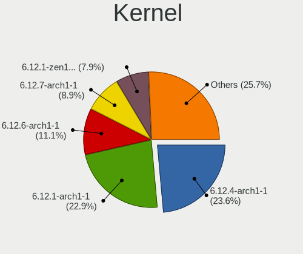
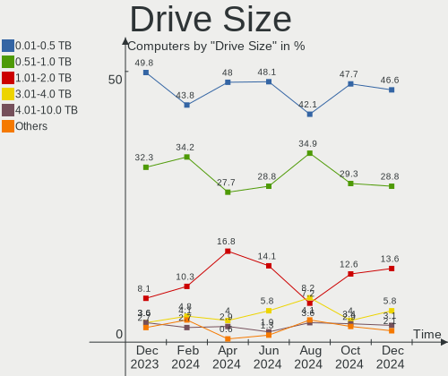
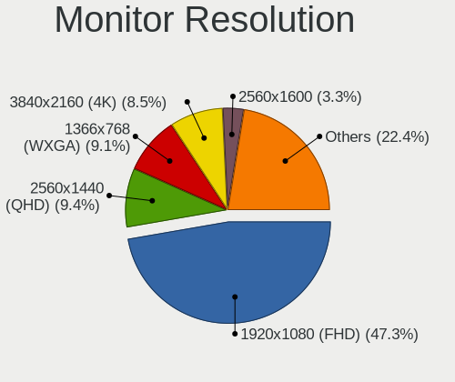

Arch Hardware Trends
--------------------

A project to identify most popular hardware characteristics and track their change
over time based on data collected by Arch users at https://Linux-Hardware.org.

Anyone can contribute to this report by the [hw-probe](https://github.com/linuxhw/hw-probe) tool:

    sudo -E hw-probe -all -upload

This is a report for all computer types. See also reports for [desktops](/Dist/Arch/Desktop/README.md) and [notebooks](/Dist/Arch/Notebook/README.md).

Full-feature report is available here: https://linux-hardware.org/?view=trends

Period: Nov, 2021.

Contents
--------

* [ System ](#system)
  - [ OS                       ](#os)
  - [ OS Family                ](#os-family)
  - [ Kernel                   ](#kernel)
  - [ Kernel Family            ](#kernel-family)
  - [ Kernel Major Ver.        ](#kernel-major-ver)
  - [ Arch                     ](#arch)
  - [ DE                       ](#de)
  - [ Display Server           ](#display-server)
  - [ Display Manager          ](#display-manager)
  - [ OS Lang                  ](#os-lang)
  - [ Boot Mode                ](#boot-mode)
  - [ Filesystem               ](#filesystem)
  - [ Part. scheme             ](#part-scheme)
  - [ Dual Boot with Linux/BSD ](#dual-boot-with-linuxbsd)
  - [ Dual Boot (Win)          ](#dual-boot-win)

* [ Board ](#board)
  - [ Vendor                   ](#vendor)
  - [ Model                    ](#model)
  - [ Model Family             ](#model-family)
  - [ MFG Year                 ](#mfg-year)
  - [ Form Factor              ](#form-factor)
  - [ Secure Boot              ](#secure-boot)
  - [ Coreboot                 ](#coreboot)
  - [ RAM Size                 ](#ram-size)
  - [ RAM Used                 ](#ram-used)
  - [ Total Drives             ](#total-drives)
  - [ Has CD-ROM               ](#has-cd-rom)
  - [ Has Ethernet             ](#has-ethernet)
  - [ Has WiFi                 ](#has-wifi)
  - [ Has Bluetooth            ](#has-bluetooth)

* [ Location ](#location)
  - [ Country                  ](#country)
  - [ City                     ](#city)

* [ Drives ](#drives)
  - [ Drive Vendor             ](#drive-vendor)
  - [ Drive Model              ](#drive-model)
  - [ HDD Vendor               ](#hdd-vendor)
  - [ SSD Vendor               ](#ssd-vendor)
  - [ Drive Kind               ](#drive-kind)
  - [ Drive Connector          ](#drive-connector)
  - [ Drive Size               ](#drive-size)
  - [ Space Total              ](#space-total)
  - [ Space Used               ](#space-used)
  - [ Malfunc. Drives          ](#malfunc-drives)
  - [ Malfunc. Drive Vendor    ](#malfunc-drive-vendor)
  - [ Malfunc. HDD Vendor      ](#malfunc-hdd-vendor)
  - [ Malfunc. Drive Kind      ](#malfunc-drive-kind)
  - [ Failed Drives            ](#failed-drives)
  - [ Failed Drive Vendor      ](#failed-drive-vendor)
  - [ Drive Status             ](#drive-status)

* [ Storage controller ](#storage-controller)
  - [ Storage Vendor           ](#storage-vendor)
  - [ Storage Model            ](#storage-model)
  - [ Storage Kind             ](#storage-kind)

* [ Processor ](#processor)
  - [ CPU Vendor               ](#cpu-vendor)
  - [ CPU Model                ](#cpu-model)
  - [ CPU Model Family         ](#cpu-model-family)
  - [ CPU Cores                ](#cpu-cores)
  - [ CPU Sockets              ](#cpu-sockets)
  - [ CPU Threads              ](#cpu-threads)
  - [ CPU Op-Modes             ](#cpu-op-modes)
  - [ CPU Microcode            ](#cpu-microcode)
  - [ CPU Microarch            ](#cpu-microarch)

* [ Graphics ](#graphics)
  - [ GPU Vendor               ](#gpu-vendor)
  - [ GPU Model                ](#gpu-model)
  - [ GPU Combo                ](#gpu-combo)
  - [ GPU Driver               ](#gpu-driver)
  - [ GPU Memory               ](#gpu-memory)

* [ Monitor ](#monitor)
  - [ Monitor Vendor           ](#monitor-vendor)
  - [ Monitor Model            ](#monitor-model)
  - [ Monitor Resolution       ](#monitor-resolution)
  - [ Monitor Diagonal         ](#monitor-diagonal)
  - [ Monitor Width            ](#monitor-width)
  - [ Aspect Ratio             ](#aspect-ratio)
  - [ Monitor Area             ](#monitor-area)
  - [ Pixel Density            ](#pixel-density)
  - [ Multiple Monitors        ](#multiple-monitors)

* [ Network ](#network)
  - [ Net Controller Vendor    ](#net-controller-vendor)
  - [ Net Controller Model     ](#net-controller-model)
  - [ Wireless Vendor          ](#wireless-vendor)
  - [ Wireless Model           ](#wireless-model)
  - [ Ethernet Vendor          ](#ethernet-vendor)
  - [ Ethernet Model           ](#ethernet-model)
  - [ Net Controller Kind      ](#net-controller-kind)
  - [ Used Controller          ](#used-controller)
  - [ NICs                     ](#nics)
  - [ IPv6                     ](#ipv6)

* [ Bluetooth ](#bluetooth)
  - [ Bluetooth Vendor         ](#bluetooth-vendor)
  - [ Bluetooth Model          ](#bluetooth-model)

* [ Sound ](#sound)
  - [ Sound Vendor             ](#sound-vendor)
  - [ Sound Model              ](#sound-model)

* [ Memory ](#memory)
  - [ Memory Vendor            ](#memory-vendor)
  - [ Memory Model             ](#memory-model)
  - [ Memory Kind              ](#memory-kind)
  - [ Memory Form Factor       ](#memory-form-factor)
  - [ Memory Size              ](#memory-size)
  - [ Memory Speed             ](#memory-speed)

* [ Printers & scanners ](#printers--scanners)
  - [ Printer Vendor           ](#printer-vendor)
  - [ Printer Model            ](#printer-model)
  - [ Scanner Vendor           ](#scanner-vendor)
  - [ Scanner Model            ](#scanner-model)

* [ Camera ](#camera)
  - [ Camera Vendor            ](#camera-vendor)
  - [ Camera Model             ](#camera-model)

* [ Security ](#security)
  - [ Fingerprint Vendor       ](#fingerprint-vendor)
  - [ Fingerprint Model        ](#fingerprint-model)
  - [ Chipcard Vendor          ](#chipcard-vendor)
  - [ Chipcard Model           ](#chipcard-model)

* [ Unsupported ](#unsupported)
  - [ Unsupported Devices      ](#unsupported-devices)
  - [ Unsupported Device Types ](#unsupported-device-types)

System
------

OS
--

Installed operating systems

| Name         | Computers | Percent |
|--------------|-----------|---------|
| Arch Rolling | 80        | 52.63%  |
| Arch         | 72        | 47.37%  |

OS Family
---------

OS without a version

| Name | Computers | Percent |
|------|-----------|---------|
| Arch | 152       | 100%    |

Kernel
------

Version of the Linux kernel

| Version                        | Computers | Percent |
|--------------------------------|-----------|---------|
| 5.15.2-arch1-1                 | 21        | 13.82%  |
| 5.14.16-arch1-1                | 21        | 13.82%  |
| 5.15.4-arch1-1                 | 19        | 12.5%   |
| 5.15.3-arch1-1                 | 9         | 5.92%   |
| 5.14.15-arch1-1                | 9         | 5.92%   |
| 5.15.2-zen1-1-zen              | 7         | 4.61%   |
| 5.15.5-arch1-1                 | 6         | 3.95%   |
| 5.15.4-zen1-1-zen              | 6         | 3.95%   |
| 5.14.14-arch1-1                | 6         | 3.95%   |
| 5.14.16-zen1-1-zen             | 3         | 1.97%   |
| 5.14.15-zen1-1-zen             | 3         | 1.97%   |
| 5.15.4-arch1-1-51504-01        | 2         | 1.32%   |
| 5.14.14-zen1-1-zen             | 2         | 1.32%   |
| 5.14.12-arch1-1                | 2         | 1.32%   |
| 5.13.12-arch1-1                | 2         | 1.32%   |
| 5.9.12-arch1-1                 | 1         | 0.66%   |
| 5.6.4-arch1-1                  | 1         | 0.66%   |
| 5.6.10-arch1-1                 | 1         | 0.66%   |
| 5.4.160-RAVEN                  | 1         | 0.66%   |
| 5.15.5-zen1-1-zen              | 1         | 0.66%   |
| 5.15.4-xanmod1-1               | 1         | 0.66%   |
| 5.15.3-rc1-xanpre0+clang-rog-2 | 1         | 0.66%   |
| 5.15.2-220-tkg-cfs             | 1         | 0.66%   |
| 5.15.1-jg                      | 1         | 0.66%   |
| 5.15.1-arch1-2                 | 1         | 0.66%   |
| 5.15.0-zen1-1-zen              | 1         | 0.66%   |
| 5.15.0-arch1-1                 | 1         | 0.66%   |
| 5.15.0-AMD-znver2              | 1         | 0.66%   |
| 5.15.0-214-tkg-cacule-llvm     | 1         | 0.66%   |
| 5.15.0-1-mainline              | 1         | 0.66%   |
| 5.14.8-arch1-1                 | 1         | 0.66%   |
| 5.14.18-xanmod1-1              | 1         | 0.66%   |
| 5.14.18-hardened1-1-hardened   | 1         | 0.66%   |
| 5.14.17-216-tkg-cfs            | 1         | 0.66%   |
| 5.14.15-xanmod1-cacule-1       | 1         | 0.66%   |
| 5.14.15-arch1-g14-1            | 1         | 0.66%   |
| 5.14.14-hardened1-1-hardened   | 1         | 0.66%   |
| 5.13.7-arch1-1                 | 1         | 0.66%   |
| 5.13.13-zen1-1-zen             | 1         | 0.66%   |
| 5.13.13-arch1-1                | 1         | 0.66%   |
| 5.12.1-arch1-1                 | 1         | 0.66%   |
| 5.11.0-rc5-1-mainline          | 1         | 0.66%   |
| 5.10.81-1-lts                  | 1         | 0.66%   |
| 5.10.80-1-lts                  | 1         | 0.66%   |
| 5.10.79-1-lts                  | 1         | 0.66%   |
| 5.10.78-1-lts                  | 1         | 0.66%   |
| 5.10.77-214-tkg-cfs            | 1         | 0.66%   |
| 5.10.76-1-lts                  | 1         | 0.66%   |
| 5.10.75-1-lts                  | 1         | 0.66%   |

Kernel Family
-------------

Linux kernel without a distro release

| Version | Computers | Percent |
|---------|-----------|---------|
| 5.15.2  | 29        | 19.08%  |
| 5.15.4  | 28        | 18.42%  |
| 5.14.16 | 24        | 15.79%  |
| 5.14.15 | 14        | 9.21%   |
| 5.15.3  | 10        | 6.58%   |
| 5.14.14 | 9         | 5.92%   |
| 5.15.5  | 7         | 4.61%   |
| 5.15.0  | 5         | 3.29%   |
| 5.15.1  | 2         | 1.32%   |
| 5.14.18 | 2         | 1.32%   |
| 5.14.12 | 2         | 1.32%   |
| 5.13.13 | 2         | 1.32%   |
| 5.13.12 | 2         | 1.32%   |
| 5.9.12  | 1         | 0.66%   |
| 5.6.4   | 1         | 0.66%   |
| 5.6.10  | 1         | 0.66%   |
| 5.4.160 | 1         | 0.66%   |
| 5.14.8  | 1         | 0.66%   |
| 5.14.17 | 1         | 0.66%   |
| 5.13.7  | 1         | 0.66%   |
| 5.12.1  | 1         | 0.66%   |
| 5.11.0  | 1         | 0.66%   |
| 5.10.81 | 1         | 0.66%   |
| 5.10.80 | 1         | 0.66%   |
| 5.10.79 | 1         | 0.66%   |
| 5.10.78 | 1         | 0.66%   |
| 5.10.77 | 1         | 0.66%   |
| 5.10.76 | 1         | 0.66%   |
| 5.10.75 | 1         | 0.66%   |

Kernel Major Ver.
-----------------

Linux kernel major version

| Version | Computers | Percent |
|---------|-----------|---------|
| 5.15    | 81        | 53.29%  |
| 5.14    | 53        | 34.87%  |
| 5.10    | 7         | 4.61%   |
| 5.13    | 5         | 3.29%   |
| 5.6     | 2         | 1.32%   |
| 5.9     | 1         | 0.66%   |
| 5.4     | 1         | 0.66%   |
| 5.12    | 1         | 0.66%   |
| 5.11    | 1         | 0.66%   |

Arch
----

OS architecture (x86_64, i586, etc.)

| Name   | Computers | Percent |
|--------|-----------|---------|
| x86_64 | 152       | 100%    |

DE
--

Desktop Environment

| Name       | Computers | Percent |
|------------|-----------|---------|
| KDE5       | 50        | 32.89%  |
| GNOME      | 35        | 23.03%  |
| Unknown    | 21        | 13.82%  |
| XFCE       | 13        | 8.55%   |
| i3         | 12        | 7.89%   |
| LXQt       | 3         | 1.97%   |
| Cinnamon   | 3         | 1.97%   |
| sway       | 2         | 1.32%   |
| qtile      | 2         | 1.32%   |
| Deepin     | 2         | 1.32%   |
| xmonad     | 1         | 0.66%   |
| X-Cinnamon | 1         | 0.66%   |
| Wayfire    | 1         | 0.66%   |
| Unity      | 1         | 0.66%   |
| openbox    | 1         | 0.66%   |
| MATE       | 1         | 0.66%   |
| KDE        | 1         | 0.66%   |
| dusk       | 1         | 0.66%   |
| Budgie     | 1         | 0.66%   |

Display Server
--------------

X11 or Wayland

| Name    | Computers | Percent |
|---------|-----------|---------|
| X11     | 97        | 63.82%  |
| Wayland | 29        | 19.08%  |
| Tty     | 18        | 11.84%  |
| Unknown | 8         | 5.26%   |

Display Manager
---------------

SDDM, LightDM, etc.

| Name    | Computers | Percent |
|---------|-----------|---------|
| Unknown | 54        | 35.53%  |
| SDDM    | 41        | 26.97%  |
| LightDM | 33        | 21.71%  |
| GDM     | 23        | 15.13%  |
| LXDM    | 1         | 0.66%   |

OS Lang
-------

Language

| Lang    | Computers | Percent |
|---------|-----------|---------|
| en_US   | 87        | 57.24%  |
| ru_RU   | 8         | 5.26%   |
| de_DE   | 8         | 5.26%   |
| en_GB   | 7         | 4.61%   |
| C       | 7         | 4.61%   |
| fr_FR   | 5         | 3.29%   |
| Unknown | 4         | 2.63%   |
| it_IT   | 3         | 1.97%   |
| en_AU   | 3         | 1.97%   |
| es_ES   | 2         | 1.32%   |
| en_IN   | 2         | 1.32%   |
| de_AT   | 2         | 1.32%   |
| zh_CN   | 1         | 0.66%   |
| ru_UA   | 1         | 0.66%   |
| pt_BR   | 1         | 0.66%   |
| pl_PL   | 1         | 0.66%   |
| nl_NL   | 1         | 0.66%   |
| nl_BE   | 1         | 0.66%   |
| ko_KR   | 1         | 0.66%   |
| fr_BE   | 1         | 0.66%   |
| en_SE   | 1         | 0.66%   |
| en_IL   | 1         | 0.66%   |
| en_IE   | 1         | 0.66%   |
| en_DK   | 1         | 0.66%   |
| en_CA   | 1         | 0.66%   |
| .en_US  | 1         | 0.66%   |

Boot Mode
---------

EFI or BIOS

| Mode | Computers | Percent |
|------|-----------|---------|
| EFI  | 107       | 70.39%  |
| BIOS | 45        | 29.61%  |

Filesystem
----------

Type of filesystem

| Type  | Computers | Percent |
|-------|-----------|---------|
| Ext4  | 102       | 67.11%  |
| Btrfs | 43        | 28.29%  |
| Xfs   | 3         | 1.97%   |
| Zfs   | 2         | 1.32%   |
| XXXXX | 1         | 0.66%   |
| F2fs  | 1         | 0.66%   |

Part. scheme
------------

Scheme of partitioning

| Type    | Computers | Percent |
|---------|-----------|---------|
| GPT     | 120       | 78.95%  |
| Unknown | 27        | 17.76%  |
| MBR     | 5         | 3.29%   |

Dual Boot with Linux/BSD
------------------------

Hosting more than one Linux/BSD

| Dual boot | Computers | Percent |
|-----------|-----------|---------|
| No        | 130       | 85.53%  |
| Yes       | 22        | 14.47%  |

Dual Boot (Win)
---------------

Hosting Linux and Windows

| Dual boot | Computers | Percent |
|-----------|-----------|---------|
| No        | 100       | 65.79%  |
| Yes       | 52        | 34.21%  |

Board
-----

Vendor
------

Motherboard manufacturer

| Name                 | Computers | Percent |
|----------------------|-----------|---------|
| ASUSTek Computer     | 36        | 23.68%  |
| Dell                 | 23        | 15.13%  |
| Hewlett-Packard      | 22        | 14.47%  |
| Lenovo               | 18        | 11.84%  |
| ASRock               | 11        | 7.24%   |
| MSI                  | 10        | 6.58%   |
| Gigabyte Technology  | 7         | 4.61%   |
| Acer                 | 5         | 3.29%   |
| Notebook             | 3         | 1.97%   |
| LG Electronics       | 2         | 1.32%   |
| Framework            | 2         | 1.32%   |
| TUXEDO               | 1         | 0.66%   |
| Schenker             | 1         | 0.66%   |
| Razer                | 1         | 0.66%   |
| Protectli            | 1         | 0.66%   |
| Pegatron             | 1         | 0.66%   |
| Medion               | 1         | 0.66%   |
| Intel Client Systems | 1         | 0.66%   |
| Hyperbook            | 1         | 0.66%   |
| HUAWEI               | 1         | 0.66%   |
| Google               | 1         | 0.66%   |
| Fujitsu              | 1         | 0.66%   |
| Chuwi                | 1         | 0.66%   |
| Alienware            | 1         | 0.66%   |

Model
-----

Motherboard model

| Name                                   | Computers | Percent |
|----------------------------------------|-----------|---------|
| ASUS All Series                        | 4         | 2.63%   |
| MSI MS-7C37                            | 3         | 1.97%   |
| MSI MS-7C84                            | 2         | 1.32%   |
| Framework Laptop                       | 2         | 1.32%   |
| Dell XPS 13 9310                       | 2         | 1.32%   |
| Dell Inspiron 5515                     | 2         | 1.32%   |
| Dell G5 5505                           | 2         | 1.32%   |
| ASUS M5A97                             | 2         | 1.32%   |
| ASRock Z87 Extreme4                    | 2         | 1.32%   |
| TUXEDO InfinityBook S 15 Gen6          | 1         | 0.66%   |
| Schenker VIA 15 Pro                    | 1         | 0.66%   |
| Razer Blade 14 - RZ09-0370             | 1         | 0.66%   |
| Protectli FW6                          | 1         | 0.66%   |
| Notebook P870DM                        | 1         | 0.66%   |
| Notebook NP50DE_DB                     | 1         | 0.66%   |
| Notebook NHx0DB,DE                     | 1         | 0.66%   |
| MSI MS-7C95                            | 1         | 0.66%   |
| MSI MS-7B98                            | 1         | 0.66%   |
| MSI MS-7B79                            | 1         | 0.66%   |
| MSI MS-7A37                            | 1         | 0.66%   |
| MSI MS-7978                            | 1         | 0.66%   |
| Medion MS-7748                         | 1         | 0.66%   |
| LG 17UD70P-PX76K                       | 1         | 0.66%   |
| LG 16Z90P-G.AA75A                      | 1         | 0.66%   |
| Lenovo Yoga 720-15IKB 80X7             | 1         | 0.66%   |
| Lenovo Yoga 530-14ARR 81H9             | 1         | 0.66%   |
| Lenovo Yoga 14sACH 2021 82MS           | 1         | 0.66%   |
| Lenovo ThinkPad T530 24341G0           | 1         | 0.66%   |
| Lenovo ThinkPad T470s W10DG 20JS0015US | 1         | 0.66%   |
| Lenovo ThinkPad T14 Gen 2i 20W0S02V00  | 1         | 0.66%   |
| Lenovo ThinkPad T14 Gen 2i 20W0S02000  | 1         | 0.66%   |
| Lenovo ThinkPad T14 Gen 2i 20W0CTO1WW  | 1         | 0.66%   |
| Lenovo ThinkPad T14 Gen 1 20S0000SRT   | 1         | 0.66%   |
| Lenovo ThinkPad L520 5016NY9           | 1         | 0.66%   |
| Lenovo ThinkBook 15 G2 ITL 20VE        | 1         | 0.66%   |
| Lenovo Legion R9000P2021H 82JQ         | 1         | 0.66%   |
| Lenovo IdeaPad S340-14API 81NB         | 1         | 0.66%   |
| Lenovo IdeaPad 5 15IIL05 81YK          | 1         | 0.66%   |
| Lenovo IdeaPad 320S-14IKB 80X4         | 1         | 0.66%   |
| Lenovo IdeaPad 3 15ADA05 81W1          | 1         | 0.66%   |
| Lenovo IdeaPad 130-14IKB 81H6          | 1         | 0.66%   |
| Lenovo IdeaPad 100-15IBD 80QQ          | 1         | 0.66%   |
| Intel Client Systems LAPBC710          | 1         | 0.66%   |
| Hyperbook Z15 Zen                      | 1         | 0.66%   |
| HUAWEI BOHB-WAX9                       | 1         | 0.66%   |
| HP Z4 G4 Workstation                   | 1         | 0.66%   |
| HP Z210 Workstation                    | 1         | 0.66%   |
| HP Victus by Laptop 16-e0xxx           | 1         | 0.66%   |
| HP Spectre x360 Convertible 15-ch0xx   | 1         | 0.66%   |
| HP Spectre x360 Convertible 13-aw0xxx  | 1         | 0.66%   |
| HP ProDesk 400 G4 MT                   | 1         | 0.66%   |
| HP Pavilion Laptop 15z-eh000           | 1         | 0.66%   |
| HP Pavilion Laptop 14-ce3xxx           | 1         | 0.66%   |
| HP Pavilion Gaming Desktop TG01-2xxx   | 1         | 0.66%   |
| HP Pavilion g6                         | 1         | 0.66%   |
| HP Pavilion 15                         | 1         | 0.66%   |
| HP OMEN Laptop 15-en0xxx               | 1         | 0.66%   |
| HP ENVY x360 Convertible 13-ay0xxx     | 1         | 0.66%   |
| HP EliteBook 8570w                     | 1         | 0.66%   |
| HP EliteBook 855 G7 Notebook PC        | 1         | 0.66%   |

Model Family
------------

Motherboard model prefix

| Name                          | Computers | Percent |
|-------------------------------|-----------|---------|
| Dell Inspiron                 | 8         | 5.26%   |
| Lenovo ThinkPad               | 7         | 4.61%   |
| Lenovo IdeaPad                | 6         | 3.95%   |
| HP Pavilion                   | 5         | 3.29%   |
| HP EliteBook                  | 5         | 3.29%   |
| ASUS ROG                      | 5         | 3.29%   |
| Dell XPS                      | 4         | 2.63%   |
| ASUS PRIME                    | 4         | 2.63%   |
| ASUS All                      | 4         | 2.63%   |
| MSI MS-7C37                   | 3         | 1.97%   |
| Lenovo Yoga                   | 3         | 1.97%   |
| Dell Vostro                   | 3         | 1.97%   |
| Dell G5                       | 3         | 1.97%   |
| ASUS TUF                      | 3         | 1.97%   |
| ASUS M5A97                    | 3         | 1.97%   |
| MSI MS-7C84                   | 2         | 1.32%   |
| HP Spectre                    | 2         | 1.32%   |
| HP Compaq                     | 2         | 1.32%   |
| HP 250                        | 2         | 1.32%   |
| Framework Laptop              | 2         | 1.32%   |
| Dell OptiPlex                 | 2         | 1.32%   |
| ASRock Z87                    | 2         | 1.32%   |
| ASRock X570                   | 2         | 1.32%   |
| Acer Swift                    | 2         | 1.32%   |
| Acer Aspire                   | 2         | 1.32%   |
| TUXEDO InfinityBook           | 1         | 0.66%   |
| Schenker VIA                  | 1         | 0.66%   |
| Razer Blade                   | 1         | 0.66%   |
| Protectli FW6                 | 1         | 0.66%   |
| Notebook P870DM               | 1         | 0.66%   |
| Notebook NP50DE               | 1         | 0.66%   |
| Notebook NHx0DB               | 1         | 0.66%   |
| MSI MS-7C95                   | 1         | 0.66%   |
| MSI MS-7B98                   | 1         | 0.66%   |
| MSI MS-7B79                   | 1         | 0.66%   |
| MSI MS-7A37                   | 1         | 0.66%   |
| MSI MS-7978                   | 1         | 0.66%   |
| Medion MS-7748                | 1         | 0.66%   |
| LG 17UD70P-PX76K              | 1         | 0.66%   |
| LG 16Z90P-G.AA75A             | 1         | 0.66%   |
| Lenovo ThinkBook              | 1         | 0.66%   |
| Lenovo Legion                 | 1         | 0.66%   |
| Intel Client Systems LAPBC710 | 1         | 0.66%   |
| Hyperbook Z15                 | 1         | 0.66%   |
| HUAWEI BOHB-WAX9              | 1         | 0.66%   |
| HP Z4                         | 1         | 0.66%   |
| HP Z210                       | 1         | 0.66%   |
| HP Victus                     | 1         | 0.66%   |
| HP ProDesk                    | 1         | 0.66%   |
| HP OMEN                       | 1         | 0.66%   |
| HP ENVY                       | 1         | 0.66%   |
| Google Morphius               | 1         | 0.66%   |
| Gigabyte Z87X-UD3H            | 1         | 0.66%   |
| Gigabyte Z370P                | 1         | 0.66%   |
| Gigabyte Z370                 | 1         | 0.66%   |
| Gigabyte P67A-UD3-B3          | 1         | 0.66%   |
| Gigabyte B550M                | 1         | 0.66%   |
| Gigabyte AX370-Gaming         | 1         | 0.66%   |
| Gigabyte 970A-DS3P            | 1         | 0.66%   |
| Fujitsu D3071-S1              | 1         | 0.66%   |

MFG Year
--------

Motherboard manufacture year

| Year | Computers | Percent |
|------|-----------|---------|
| 2021 | 60        | 39.47%  |
| 2020 | 24        | 15.79%  |
| 2019 | 16        | 10.53%  |
| 2018 | 15        | 9.87%   |
| 2016 | 11        | 7.24%   |
| 2011 | 6         | 3.95%   |
| 2014 | 5         | 3.29%   |
| 2012 | 4         | 2.63%   |
| 2017 | 3         | 1.97%   |
| 2015 | 2         | 1.32%   |
| 2013 | 2         | 1.32%   |
| 2010 | 2         | 1.32%   |
| 2009 | 2         | 1.32%   |

Form Factor
-----------

Physical design of the computer

| Name        | Computers | Percent |
|-------------|-----------|---------|
| Notebook    | 83        | 54.61%  |
| Desktop     | 63        | 41.45%  |
| Convertible | 6         | 3.95%   |

Secure Boot
-----------

Enabled or disabled

| State    | Computers | Percent |
|----------|-----------|---------|
| Disabled | 151       | 99.34%  |
| Enabled  | 1         | 0.66%   |

Coreboot
--------

Have coreboot on board

| Used | Computers | Percent |
|------|-----------|---------|
| No   | 151       | 99.34%  |
| Yes  | 1         | 0.66%   |

RAM Size
--------

Total RAM memory

| Size in GB  | Computers | Percent |
|-------------|-----------|---------|
| 16.01-24.0  | 45        | 29.61%  |
| 8.01-16.0   | 30        | 19.74%  |
| 32.01-64.0  | 29        | 19.08%  |
| 4.01-8.0    | 23        | 15.13%  |
| 3.01-4.0    | 10        | 6.58%   |
| 64.01-256.0 | 9         | 5.92%   |
| 24.01-32.0  | 4         | 2.63%   |
| 2.01-3.0    | 1         | 0.66%   |
| 1.01-2.0    | 1         | 0.66%   |

RAM Used
--------

Used RAM memory

| Used GB     | Computers | Percent |
|-------------|-----------|---------|
| 2.01-3.0    | 39        | 25.66%  |
| 4.01-8.0    | 38        | 25%     |
| 1.01-2.0    | 30        | 19.74%  |
| 8.01-16.0   | 17        | 11.18%  |
| 3.01-4.0    | 15        | 9.87%   |
| 0.51-1.0    | 5         | 3.29%   |
| 16.01-24.0  | 3         | 1.97%   |
| 0.01-0.5    | 3         | 1.97%   |
| 24.01-32.0  | 1         | 0.66%   |
| 64.01-256.0 | 1         | 0.66%   |

Total Drives
------------

Number of drives on board

| Drives | Computers | Percent |
|--------|-----------|---------|
| 1      | 77        | 50.66%  |
| 2      | 35        | 23.03%  |
| 3      | 18        | 11.84%  |
| 5      | 6         | 3.95%   |
| 4      | 6         | 3.95%   |
| 7      | 4         | 2.63%   |
| 6      | 4         | 2.63%   |
| 22     | 1         | 0.66%   |
| 12     | 1         | 0.66%   |

Has CD-ROM
----------

Has CD-ROM on board

| Presented | Computers | Percent |
|-----------|-----------|---------|
| No        | 123       | 80.92%  |
| Yes       | 29        | 19.08%  |

Has Ethernet
------------

Has Ethernet on board

| Presented | Computers | Percent |
|-----------|-----------|---------|
| Yes       | 124       | 81.58%  |
| No        | 28        | 18.42%  |

Has WiFi
--------

Has WiFi module

| Presented | Computers | Percent |
|-----------|-----------|---------|
| Yes       | 119       | 78.29%  |
| No        | 33        | 21.71%  |

Has Bluetooth
-------------

Has Bluetooth module

| Presented | Computers | Percent |
|-----------|-----------|---------|
| Yes       | 122       | 80.26%  |
| No        | 30        | 19.74%  |

Location
--------

Country
-------

Geographic location (country)

| Country     | Computers | Percent |
|-------------|-----------|---------|
| USA         | 30        | 19.74%  |
| Germany     | 15        | 9.87%   |
| Russia      | 12        | 7.89%   |
| India       | 8         | 5.26%   |
| France      | 8         | 5.26%   |
| Netherlands | 7         | 4.61%   |
| Italy       | 6         | 3.95%   |
| Spain       | 5         | 3.29%   |
| Poland      | 5         | 3.29%   |
| Austria     | 4         | 2.63%   |
| UK          | 3         | 1.97%   |
| Qatar       | 3         | 1.97%   |
| Norway      | 3         | 1.97%   |
| Mexico      | 3         | 1.97%   |
| Iran        | 3         | 1.97%   |
| Finland     | 3         | 1.97%   |
| Australia   | 3         | 1.97%   |
| Thailand    | 2         | 1.32%   |
| Switzerland | 2         | 1.32%   |
| South Korea | 2         | 1.32%   |
| Romania     | 2         | 1.32%   |
| Indonesia   | 2         | 1.32%   |
| Hungary     | 2         | 1.32%   |
| Estonia     | 2         | 1.32%   |
| Cyprus      | 2         | 1.32%   |
| Colombia    | 2         | 1.32%   |
| China       | 2         | 1.32%   |
| Belgium     | 2         | 1.32%   |
| Ukraine     | 1         | 0.66%   |
| Sri Lanka   | 1         | 0.66%   |
| Slovakia    | 1         | 0.66%   |
| Lithuania   | 1         | 0.66%   |
| Israel      | 1         | 0.66%   |
| Croatia     | 1         | 0.66%   |
| Canada      | 1         | 0.66%   |
| Brazil      | 1         | 0.66%   |
| Belarus     | 1         | 0.66%   |

City
----

Geographic location (city)

| City           | Computers | Percent |
|----------------|-----------|---------|
| Moscow         | 5         | 3.29%   |
| Vienna         | 3         | 1.97%   |
| Paris          | 3         | 1.97%   |
| Doha           | 3         | 1.97%   |
| Zurich         | 2         | 1.32%   |
| Warsaw         | 2         | 1.32%   |
| Seattle        | 2         | 1.32%   |
| Perm           | 2         | 1.32%   |
| Nyiregyhaza    | 2         | 1.32%   |
| Nicosia        | 2         | 1.32%   |
| Melbourne      | 2         | 1.32%   |
| Mannheim       | 2         | 1.32%   |
| Helsinki       | 2         | 1.32%   |
| Chicago        | 2         | 1.32%   |
| Chelyabinsk    | 2         | 1.32%   |
| Berlin         | 2         | 1.32%   |
| Zapopan        | 1         | 0.66%   |
| Yuba City      | 1         | 0.66%   |
| Wetteren       | 1         | 0.66%   |
| West Covina    | 1         | 0.66%   |
| Vilyeyka       | 1         | 0.66%   |
| Vilnius        | 1         | 0.66%   |
| Vancouver      | 1         | 0.66%   |
| Valladolid     | 1         | 0.66%   |
| Valencia       | 1         | 0.66%   |
| The Hague      | 1         | 0.66%   |
| Tel Aviv       | 1         | 0.66%   |
| Tehran         | 1         | 0.66%   |
| Tartu          | 1         | 0.66%   |
| Tangerang      | 1         | 0.66%   |
| Tallinn        | 1         | 0.66%   |
| Seoul          | 1         | 0.66%   |
| Sankt Augustin | 1         | 0.66%   |
| Sanandij       | 1         | 0.66%   |
| Salvador       | 1         | 0.66%   |
| Salem          | 1         | 0.66%   |
| Rotterdam      | 1         | 0.66%   |
| Rostov-on-Don  | 1         | 0.66%   |
| Rome           | 1         | 0.66%   |
| Rayong         | 1         | 0.66%   |
| Ramsey         | 1         | 0.66%   |
| Pune           | 1         | 0.66%   |
| Plauen         | 1         | 0.66%   |
| Phoenix        | 1         | 0.66%   |
| Pattaya        | 1         | 0.66%   |
| Panchkula      | 1         | 0.66%   |
| Pachuca        | 1         | 0.66%   |
| Oudenaarde     | 1         | 0.66%   |
| Oslo           | 1         | 0.66%   |
| Opelousas      | 1         | 0.66%   |
| Oldenzaal      | 1         | 0.66%   |
| Oak Harbor     | 1         | 0.66%   |
| Nijmegen       | 1         | 0.66%   |
| Mysore         | 1         | 0.66%   |
| Munich         | 1         | 0.66%   |
| Muhos          | 1         | 0.66%   |
| Mosby          | 1         | 0.66%   |
| Modena         | 1         | 0.66%   |
| Minden         | 1         | 0.66%   |
| Milan          | 1         | 0.66%   |

Drives
------

Drive Vendor
------------

Hard drive vendors

| Vendor                      | Computers | Drives | Percent |
|-----------------------------|-----------|--------|---------|
| Samsung Electronics         | 54        | 70     | 20.3%   |
| WDC                         | 38        | 60     | 14.29%  |
| Seagate                     | 33        | 45     | 12.41%  |
| Toshiba                     | 22        | 27     | 8.27%   |
| Sandisk                     | 18        | 23     | 6.77%   |
| Crucial                     | 17        | 19     | 6.39%   |
| SK Hynix                    | 14        | 15     | 5.26%   |
| Kingston                    | 9         | 9      | 3.38%   |
| Intel                       | 7         | 10     | 2.63%   |
| A-DATA Technology           | 6         | 8      | 2.26%   |
| Unknown                     | 5         | 5      | 1.88%   |
| HGST                        | 4         | 5      | 1.5%    |
| Phison                      | 3         | 3      | 1.13%   |
| Micron/Crucial Technology   | 3         | 3      | 1.13%   |
| Micron Technology           | 3         | 3      | 1.13%   |
| KIOXIA                      | 3         | 3      | 1.13%   |
| Transcend                   | 2         | 2      | 0.75%   |
| SPCC                        | 2         | 3      | 0.75%   |
| OCZ                         | 2         | 2      | 0.75%   |
| Yangtze Memory Technologies | 1         | 1      | 0.38%   |
| XPG                         | 1         | 1      | 0.38%   |
| UMIS                        | 1         | 1      | 0.38%   |
| Team                        | 1         | 3      | 0.38%   |
| Silicon Motion              | 1         | 1      | 0.38%   |
| SABRENT                     | 1         | 1      | 0.38%   |
| Realtek Semiconductor       | 1         | 1      | 0.38%   |
| Realtek                     | 1         | 1      | 0.38%   |
| PNY                         | 1         | 1      | 0.38%   |
| PLEXTOR                     | 1         | 1      | 0.38%   |
| Patriot                     | 1         | 1      | 0.38%   |
| Palit                       | 1         | 1      | 0.38%   |
| Marvell                     | 1         | 1      | 0.38%   |
| LITEON                      | 1         | 1      | 0.38%   |
| LIO-ORG                     | 1         | 1      | 0.38%   |
| Lexar                       | 1         | 1      | 0.38%   |
| LDLC                        | 1         | 1      | 0.38%   |
| Hoodisk                     | 1         | 1      | 0.38%   |
| Hitachi                     | 1         | 1      | 0.38%   |
| GOODRAM                     | 1         | 1      | 0.38%   |
| Corsair                     | 1         | 1      | 0.38%   |

Drive Model
-----------

Hard drive models

| Model                                  | Computers | Percent |
|----------------------------------------|-----------|---------|
| Sandisk NVMe SSD Drive 256GB           | 5         | 1.64%   |
| Samsung SSD 970 EVO Plus 1TB           | 5         | 1.64%   |
| Samsung SSD 860 EVO 1TB                | 5         | 1.64%   |
| Seagate ST1000LM035-1RK172 1TB         | 4         | 1.32%   |
| Sandisk NVMe SSD Drive 1TB             | 4         | 1.32%   |
| Samsung SSD 860 QVO 1TB                | 4         | 1.32%   |
| WDC WDS100T1X0E-00AFY0 1TB             | 3         | 0.99%   |
| Toshiba HDWD240 4TB                    | 3         | 0.99%   |
| Toshiba DT01ACA300 3TB                 | 3         | 0.99%   |
| Toshiba DT01ACA200 2TB                 | 3         | 0.99%   |
| Seagate ST31000524AS 1TB               | 3         | 0.99%   |
| Samsung NVMe SSD Drive 1TB             | 3         | 0.99%   |
| Kingston SA400S37240G 240GB SSD        | 3         | 0.99%   |
| Crucial CT500MX500SSD1 500GB           | 3         | 0.99%   |
| WDC WDS500G2B0C-00PXH0 500GB           | 2         | 0.66%   |
| WDC WD10EZEX-22MFCA0 1TB               | 2         | 0.66%   |
| WDC PC SN730 SDBQNTY-512G-1001 512GB   | 2         | 0.66%   |
| Toshiba MQ01ABD100 1TB                 | 2         | 0.66%   |
| Toshiba MK3261GSYN 320GB               | 2         | 0.66%   |
| SK Hynix SKHynix_HFS512GDE9X081N 512GB | 2         | 0.66%   |
| Seagate ST4000DM004-2CV104 4TB         | 2         | 0.66%   |
| Seagate ST4000DM000-1F2168 4TB         | 2         | 0.66%   |
| Seagate ST2000DM008-2FR102 2TB         | 2         | 0.66%   |
| Sandisk NVMe SSD Drive 512GB           | 2         | 0.66%   |
| Samsung SSD 980 1TB                    | 2         | 0.66%   |
| Samsung SSD 970 EVO Plus 500GB         | 2         | 0.66%   |
| Samsung SSD 860 EVO 250GB              | 2         | 0.66%   |
| Samsung SSD 840 EVO 120GB              | 2         | 0.66%   |
| Samsung SM963 2.5" NVMe PCIe SSD 250GB | 2         | 0.66%   |
| Samsung MZVLB512HBJQ-000L2 512GB       | 2         | 0.66%   |
| Samsung MZVLB512HBJQ-000H1 512GB       | 2         | 0.66%   |
| Phison NVMe SSD Drive 512GB            | 2         | 0.66%   |
| Micron/Crucial NVMe SSD Drive 1TB      | 2         | 0.66%   |
| Intel HBRPEKNX0202AHO 32GB             | 2         | 0.66%   |
| Intel HBRPEKNX0202AH 512GB             | 2         | 0.66%   |
| HGST HTS541010A9E680 1TB               | 2         | 0.66%   |
| Crucial CT240BX500SSD1 240GB           | 2         | 0.66%   |
| A-DATA SX8200PNP 512GB                 | 2         | 0.66%   |
| A-DATA SU650 120GB SSD                 | 2         | 0.66%   |
| Yangtze Memory NVMe SSD Drive 256GB    | 1         | 0.33%   |
| XPG GAMMIX S70 1TB                     | 1         | 0.33%   |
| WDC WDS400T3X0C-00SJG0 4TB             | 1         | 0.33%   |
| WDC WDS250G2B0A-00SM50 250GB SSD       | 1         | 0.33%   |
| WDC WDS120G2G0A-00JH30 120GB SSD       | 1         | 0.33%   |
| WDC WDS100T2B0A-00SM50 1TB SSD         | 1         | 0.33%   |
| WDC WD80EMAZ-00WJTA0 8TB               | 1         | 0.33%   |
| WDC WD80EFAX-68LHPN0 8TB               | 1         | 0.33%   |
| WDC WD60EZRZ-00GZ5B1 6TB               | 1         | 0.33%   |
| WDC WD60EZAZ-00SF3B0 6TB               | 1         | 0.33%   |
| WDC WD5000LPCX-21VHAT0 500GB           | 1         | 0.33%   |
| WDC WD5000AAKX-08U6AA0 500GB           | 1         | 0.33%   |
| WDC WD5000AAKS-00UU3A0 500GB           | 1         | 0.33%   |
| WDC WD5000AADS-00S9B0 500GB            | 1         | 0.33%   |
| WDC WD4000FYYZ-01UL1B2 4TB             | 1         | 0.33%   |
| WDC WD3200BEVT-60ZCT1 320GB            | 1         | 0.33%   |
| WDC WD3200AVVS-56L2B0 320GB            | 1         | 0.33%   |
| WDC WD3200AAKS-75L9A0 320GB            | 1         | 0.33%   |
| WDC WD30EFRX-68EUZN0 3TB               | 1         | 0.33%   |
| WDC WD2500AAKX-75U6AA0 250GB           | 1         | 0.33%   |
| WDC WD20EZRZ-00Z5HB0 2TB               | 1         | 0.33%   |

HDD Vendor
----------

Hard disk drive vendors

| Vendor  | Computers | Drives | Percent |
|---------|-----------|--------|---------|
| Seagate | 32        | 43     | 37.65%  |
| WDC     | 28        | 41     | 32.94%  |
| Toshiba | 18        | 23     | 21.18%  |
| HGST    | 4         | 5      | 4.71%   |
| Unknown | 1         | 1      | 1.18%   |
| LIO-ORG | 1         | 1      | 1.18%   |
| Hitachi | 1         | 1      | 1.18%   |

SSD Vendor
----------

Solid state drive vendors

| Vendor              | Computers | Drives | Percent |
|---------------------|-----------|--------|---------|
| Samsung Electronics | 23        | 28     | 31.08%  |
| Crucial             | 15        | 17     | 20.27%  |
| Kingston            | 7         | 7      | 9.46%   |
| SanDisk             | 6         | 11     | 8.11%   |
| A-DATA Technology   | 4         | 6      | 5.41%   |
| Intel               | 3         | 4      | 4.05%   |
| WDC                 | 2         | 5      | 2.7%    |
| Transcend           | 2         | 2      | 2.7%    |
| OCZ                 | 2         | 2      | 2.7%    |
| SPCC                | 1         | 1      | 1.35%   |
| SK Hynix            | 1         | 1      | 1.35%   |
| PNY                 | 1         | 1      | 1.35%   |
| Patriot             | 1         | 1      | 1.35%   |
| Palit               | 1         | 1      | 1.35%   |
| Micron Technology   | 1         | 1      | 1.35%   |
| LITEON              | 1         | 1      | 1.35%   |
| Lexar               | 1         | 1      | 1.35%   |
| Hoodisk             | 1         | 1      | 1.35%   |
| GOODRAM             | 1         | 1      | 1.35%   |

Drive Kind
----------

HDD or SSD

| Kind    | Computers | Drives | Percent |
|---------|-----------|--------|---------|
| NVMe    | 95        | 124    | 41.85%  |
| HDD     | 65        | 115    | 28.63%  |
| SSD     | 61        | 92     | 26.87%  |
| MMC     | 4         | 4      | 1.76%   |
| Unknown | 2         | 3      | 0.88%   |

Drive Connector
---------------

SATA, SAS, NVMe, etc.

| Type | Computers | Drives | Percent |
|------|-----------|--------|---------|
| NVMe | 95        | 122    | 48.97%  |
| SATA | 88        | 204    | 45.36%  |
| SAS  | 7         | 8      | 3.61%   |
| MMC  | 4         | 4      | 2.06%   |

Drive Size
----------

Size of hard drive

| Size in TB | Computers | Drives | Percent |
|------------|-----------|--------|---------|
| 0.01-0.5   | 57        | 83     | 39.04%  |
| 0.51-1.0   | 41        | 57     | 28.08%  |
| 1.01-2.0   | 25        | 30     | 17.12%  |
| 3.01-4.0   | 10        | 16     | 6.85%   |
| 4.01-10.0  | 8         | 15     | 5.48%   |
| 2.01-3.0   | 4         | 4      | 2.74%   |
| 10.01-20.0 | 1         | 2      | 0.68%   |

Space Total
-----------

Amount of disk space available on the file system

| Size in GB     | Computers | Percent |
|----------------|-----------|---------|
| 251-500        | 32        | 21.05%  |
| 101-250        | 30        | 19.74%  |
| More than 3000 | 27        | 17.76%  |
| 501-1000       | 25        | 16.45%  |
| 1001-2000      | 23        | 15.13%  |
| 2001-3000      | 6         | 3.95%   |
| 21-50          | 3         | 1.97%   |
| 51-100         | 3         | 1.97%   |
| Unknown        | 2         | 1.32%   |
| 1-20           | 1         | 0.66%   |

Space Used
----------

Amount of used disk space

| Used GB        | Computers | Percent |
|----------------|-----------|---------|
| 101-250        | 28        | 18.42%  |
| 51-100         | 28        | 18.42%  |
| 251-500        | 18        | 11.84%  |
| 501-1000       | 18        | 11.84%  |
| 1-20           | 16        | 10.53%  |
| 1001-2000      | 15        | 9.87%   |
| 21-50          | 13        | 8.55%   |
| More than 3000 | 9         | 5.92%   |
| 2001-3000      | 5         | 3.29%   |
| Unknown        | 2         | 1.32%   |

Malfunc. Drives
---------------

Drive models with a malfunction

| Model                                        | Computers | Drives | Percent |
|----------------------------------------------|-----------|--------|---------|
| Toshiba MK3261GSYN 320GB                     | 2         | 2      | 11.11%  |
| Seagate ST1000LM035-1RK172 1TB               | 2         | 2      | 11.11%  |
| WDC WD5000AAKS-00UU3A0 500GB                 | 1         | 1      | 5.56%   |
| WDC WD1003FZEX-00MK2A0 1TB                   | 1         | 1      | 5.56%   |
| Toshiba MQ01ABD100 1TB                       | 1         | 1      | 5.56%   |
| Toshiba HDWD110 1TB                          | 1         | 1      | 5.56%   |
| Seagate ST3750528AS 752GB                    | 1         | 1      | 5.56%   |
| Seagate ST3250823AS 250GB                    | 1         | 1      | 5.56%   |
| Seagate ST3160813AS 160GB                    | 1         | 1      | 5.56%   |
| Seagate ST31000524AS 1TB                     | 1         | 1      | 5.56%   |
| Seagate ST1000DM010-2EP102 1TB               | 1         | 1      | 5.56%   |
| Samsung Electronics MZVLW256HEHP-000L7 256GB | 1         | 1      | 5.56%   |
| PLEXTOR PX-1TM8SeG 1TB                       | 1         | 1      | 5.56%   |
| Micron Technology 2200S NVMe 1024GB          | 1         | 1      | 5.56%   |
| Intel SSDSC2BW240A4 240GB                    | 1         | 1      | 5.56%   |
| HGST HTS541010A9E680 1TB                     | 1         | 1      | 5.56%   |

Malfunc. Drive Vendor
---------------------

Vendors of faulty drives

| Vendor              | Computers | Drives | Percent |
|---------------------|-----------|--------|---------|
| Seagate             | 7         | 7      | 41.18%  |
| Toshiba             | 3         | 4      | 17.65%  |
| WDC                 | 2         | 2      | 11.76%  |
| Samsung Electronics | 1         | 1      | 5.88%   |
| PLEXTOR             | 1         | 1      | 5.88%   |
| Micron Technology   | 1         | 1      | 5.88%   |
| Intel               | 1         | 1      | 5.88%   |
| HGST                | 1         | 1      | 5.88%   |

Malfunc. HDD Vendor
-------------------

Vendors of faulty HDD drives

| Vendor  | Computers | Drives | Percent |
|---------|-----------|--------|---------|
| Seagate | 7         | 7      | 53.85%  |
| Toshiba | 3         | 4      | 23.08%  |
| WDC     | 2         | 2      | 15.38%  |
| HGST    | 1         | 1      | 7.69%   |

Malfunc. Drive Kind
-------------------

Kinds of faulty drives

| Kind | Computers | Drives | Percent |
|------|-----------|--------|---------|
| HDD  | 13        | 14     | 76.47%  |
| NVMe | 3         | 3      | 17.65%  |
| SSD  | 1         | 1      | 5.88%   |

Failed Drives
-------------

Failed drive models

| Model                      | Computers | Drives | Percent |
|----------------------------|-----------|--------|---------|
| WDC WD4000FYYZ-01UL1B2 4TB | 1         | 1      | 100%    |

Failed Drive Vendor
-------------------

Failed drive vendors

| Vendor | Computers | Drives | Percent |
|--------|-----------|--------|---------|
| WDC    | 1         | 1      | 100%    |

Drive Status
------------

Number of failed and malfunc. drives

| Status   | Computers | Drives | Percent |
|----------|-----------|--------|---------|
| Works    | 95        | 202    | 54.29%  |
| Detected | 62        | 117    | 35.43%  |
| Malfunc  | 17        | 18     | 9.71%   |
| Failed   | 1         | 1      | 0.57%   |

Storage controller
------------------

Storage Vendor
--------------

Storage controller vendors

| Vendor                       | Computers | Percent |
|------------------------------|-----------|---------|
| Intel                        | 73        | 30.54%  |
| AMD                          | 46        | 19.25%  |
| Samsung Electronics          | 35        | 14.64%  |
| Sandisk                      | 24        | 10.04%  |
| SK Hynix                     | 13        | 5.44%   |
| ASMedia Technology           | 9         | 3.77%   |
| Phison Electronics           | 7         | 2.93%   |
| Micron/Crucial Technology    | 5         | 2.09%   |
| Marvell Technology Group     | 5         | 2.09%   |
| Toshiba America Info Systems | 4         | 1.67%   |
| KIOXIA                       | 3         | 1.26%   |
| Micron Technology            | 2         | 0.84%   |
| Kingston Technology Company  | 2         | 0.84%   |
| ADATA Technology             | 2         | 0.84%   |
| Yangtze Memory Technologies  | 1         | 0.42%   |
| Unknown                      | 1         | 0.42%   |
| Union Memory (Shenzhen)      | 1         | 0.42%   |
| Silicon Motion               | 1         | 0.42%   |
| Realtek Semiconductor        | 1         | 0.42%   |
| Nvidia                       | 1         | 0.42%   |
| Lite-On Technology           | 1         | 0.42%   |
| JMicron Technology           | 1         | 0.42%   |
| Adaptec                      | 1         | 0.42%   |

Storage Model
-------------

Storage controller models

| Model                                                                                   | Computers | Percent |
|-----------------------------------------------------------------------------------------|-----------|---------|
| AMD FCH SATA Controller [AHCI mode]                                                     | 34        | 13.08%  |
| Samsung NVMe SSD Controller SM981/PM981/PM983                                           | 23        | 8.85%   |
| SK Hynix Gold P31 SSD                                                                   | 9         | 3.46%   |
| ASMedia ASM1062 Serial ATA Controller                                                   | 8         | 3.08%   |
| Sandisk WD Blue SN550 NVMe SSD                                                          | 7         | 2.69%   |
| Sandisk Non-Volatile memory controller                                                  | 7         | 2.69%   |
| Intel Sunrise Point-LP SATA Controller [AHCI mode]                                      | 6         | 2.31%   |
| AMD Starship/Matisse Chipset SATA Controller [AHCI mode]                                | 6         | 2.31%   |
| Sandisk WD Black SN750 / PC SN730 NVMe SSD                                              | 5         | 1.92%   |
| Samsung NVMe SSD Controller PM9A1/PM9A3/980PRO                                          | 5         | 1.92%   |
| Intel Cannon Lake Mobile PCH SATA AHCI Controller                                       | 5         | 1.92%   |
| Intel 82801 Mobile SATA Controller [RAID mode]                                          | 5         | 1.92%   |
| Intel 8 Series SATA Controller 1 [AHCI mode]                                            | 5         | 1.92%   |
| Intel 200 Series PCH SATA controller [AHCI mode]                                        | 5         | 1.92%   |
| AMD SB7x0/SB8x0/SB9x0 SATA Controller [AHCI mode]                                       | 5         | 1.92%   |
| AMD 400 Series Chipset SATA Controller                                                  | 5         | 1.92%   |
| Sandisk WD PC SN810 / Black SN850 NVMe SSD                                              | 4         | 1.54%   |
| Samsung NVMe SSD Controller 980                                                         | 4         | 1.54%   |
| Phison E12 NVMe Controller                                                              | 4         | 1.54%   |
| Intel Q170/Q150/B150/H170/H110/Z170/CM236 Chipset SATA Controller [AHCI Mode]           | 4         | 1.54%   |
| Intel 8 Series/C220 Series Chipset Family 6-port SATA Controller 1 [AHCI mode]          | 4         | 1.54%   |
| Intel 7 Series Chipset Family 6-port SATA Controller [AHCI mode]                        | 4         | 1.54%   |
| Samsung NVMe SSD Controller SM961/PM961/SM963                                           | 3         | 1.15%   |
| KIOXIA Non-Volatile memory controller                                                   | 3         | 1.15%   |
| Intel SATA Controller [RAID mode]                                                       | 3         | 1.15%   |
| Intel 6 Series/C200 Series Chipset Family Desktop SATA Controller (IDE mode, ports 4-5) | 3         | 1.15%   |
| Intel 6 Series/C200 Series Chipset Family Desktop SATA Controller (IDE mode, ports 0-3) | 3         | 1.15%   |
| Intel 400 Series Chipset Family SATA AHCI Controller                                    | 3         | 1.15%   |
| Toshiba America Info Systems BG3 NVMe SSD Controller                                    | 2         | 0.77%   |
| SK Hynix BC511                                                                          | 2         | 0.77%   |
| Phison E16 PCIe4 NVMe Controller                                                        | 2         | 0.77%   |
| Micron/Crucial P1 NVMe PCIe SSD                                                         | 2         | 0.77%   |
| Micron/Crucial NVMe Controller                                                          | 2         | 0.77%   |
| Micron Non-Volatile memory controller                                                   | 2         | 0.77%   |
| Intel Volume Management Device NVMe RAID Controller                                     | 2         | 0.77%   |
| Intel Tiger Lake-LP SATA Controller [AHCI mode]                                         | 2         | 0.77%   |
| Intel Non-Volatile memory controller                                                    | 2         | 0.77%   |
| AMD X370 Series Chipset SATA Controller                                                 | 2         | 0.77%   |
| ADATA XPG SX8200 Pro PCIe Gen3x4 M.2 2280 Solid State Drive                             | 2         | 0.77%   |
| Yangtze Memory Non-Volatile memory controller                                           | 1         | 0.38%   |
| Unknown Non-Volatile memory controller                                                  | 1         | 0.38%   |
| Union Memory (Shenzhen) Non-Volatile memory controller                                  | 1         | 0.38%   |
| Toshiba America Info Systems XG6 NVMe SSD Controller                                    | 1         | 0.38%   |
| Toshiba America Info Systems Toshiba America Info Non-Volatile memory controller        | 1         | 0.38%   |
| SK Hynix Non-Volatile memory controller                                                 | 1         | 0.38%   |
| SK Hynix BC501 NVMe Solid State Drive                                                   | 1         | 0.38%   |
| Silicon Motion SM2262/SM2262EN SSD Controller                                           | 1         | 0.38%   |
| Sandisk WD Black 2018/SN750 / PC SN720 NVMe SSD                                         | 1         | 0.38%   |
| Sandisk PC SN520 NVMe SSD                                                               | 1         | 0.38%   |
| Samsung NVMe SSD Controller SM951/PM951                                                 | 1         | 0.38%   |
| Realtek Realtek Non-Volatile memory controller                                          | 1         | 0.38%   |
| Phison PS5013 E13 NVMe Controller                                                       | 1         | 0.38%   |
| Nvidia MCP61 SATA Controller                                                            | 1         | 0.38%   |
| Micron/Crucial Non-Volatile memory controller                                           | 1         | 0.38%   |
| Marvell Group Marvell Non-Volatile memory controller                                    | 1         | 0.38%   |
| Marvell Group 88SE9230 PCIe 2.0 x2 4-port SATA 6 Gb/s RAID Controller                   | 1         | 0.38%   |
| Marvell Group 88SE9215 PCIe 2.0 x1 4-port SATA 6 Gb/s Controller                        | 1         | 0.38%   |
| Marvell Group 88SE9172 SATA 6Gb/s Controller                                            | 1         | 0.38%   |
| Marvell Group 88SE9128 PCIe SATA 6 Gb/s RAID controller with HyperDuo                   | 1         | 0.38%   |
| Lite-On Non-Volatile memory controller                                                  | 1         | 0.38%   |

Storage Kind
------------

Kind of storage controller (IDE, SATA, NVMe, SAS, ...)

| Kind | Computers | Percent |
|------|-----------|---------|
| SATA | 104       | 47.71%  |
| NVMe | 94        | 43.12%  |
| RAID | 12        | 5.5%    |
| IDE  | 8         | 3.67%   |

Processor
---------

CPU Vendor
----------

Processor vendors

| Vendor | Computers | Percent |
|--------|-----------|---------|
| Intel  | 92        | 60.53%  |
| AMD    | 60        | 39.47%  |

CPU Model
---------

Processor models

| Model                                    | Computers | Percent |
|------------------------------------------|-----------|---------|
| Intel 11th Gen Core i7-1165G7 @ 2.80GHz  | 7         | 4.61%   |
| Intel 11th Gen Core i7-1185G7 @ 3.00GHz  | 5         | 3.29%   |
| AMD Ryzen 7 5800H with Radeon Graphics   | 4         | 2.63%   |
| AMD Ryzen 7 3700X 8-Core Processor       | 4         | 2.63%   |
| Intel Core i7-8750H CPU @ 2.20GHz        | 3         | 1.97%   |
| Intel Core i7-6700K CPU @ 4.00GHz        | 3         | 1.97%   |
| Intel Core i7-10750H CPU @ 2.60GHz       | 3         | 1.97%   |
| Intel Core i5-7200U CPU @ 2.50GHz        | 3         | 1.97%   |
| AMD Ryzen 9 5900X 12-Core Processor      | 3         | 1.97%   |
| AMD Ryzen 7 5700U with Radeon Graphics   | 3         | 1.97%   |
| AMD Ryzen 7 3800X 8-Core Processor       | 3         | 1.97%   |
| AMD Ryzen 5 5600X 6-Core Processor       | 3         | 1.97%   |
| AMD Ryzen 5 3600 6-Core Processor        | 3         | 1.97%   |
| AMD Ryzen 5 2600X Six-Core Processor     | 3         | 1.97%   |
| Intel Core i7-8550U CPU @ 1.80GHz        | 2         | 1.32%   |
| Intel Core i7-4500U CPU @ 1.80GHz        | 2         | 1.32%   |
| Intel Core i7-1065G7 CPU @ 1.30GHz       | 2         | 1.32%   |
| Intel Core i5-2400 CPU @ 3.10GHz         | 2         | 1.32%   |
| Intel 11th Gen Core i7-11800H @ 2.30GHz  | 2         | 1.32%   |
| AMD Ryzen 9 4900H with Radeon Graphics   | 2         | 1.32%   |
| AMD Ryzen 7 5800X 8-Core Processor       | 2         | 1.32%   |
| AMD Ryzen 7 4800H with Radeon Graphics   | 2         | 1.32%   |
| AMD Ryzen 5 4500U with Radeon Graphics   | 2         | 1.32%   |
| AMD FX-8350 Eight-Core Processor         | 2         | 1.32%   |
| Intel Xeon W-2123 CPU @ 3.60GHz          | 1         | 0.66%   |
| Intel Xeon CPU E5-2698 v4 @ 2.20GHz      | 1         | 0.66%   |
| Intel Xeon CPU E3-1231 v3 @ 3.40GHz      | 1         | 0.66%   |
| Intel Pentium Silver N5030 CPU @ 1.10GHz | 1         | 0.66%   |
| Intel Pentium CPU N3710 @ 1.60GHz        | 1         | 0.66%   |
| Intel Pentium CPU G3220 @ 3.00GHz        | 1         | 0.66%   |
| Intel Pentium CPU 2117U @ 1.80GHz        | 1         | 0.66%   |
| Intel Core i9-9980HK CPU @ 2.40GHz       | 1         | 0.66%   |
| Intel Core i7-9750H CPU @ 2.60GHz        | 1         | 0.66%   |
| Intel Core i7-8700K CPU @ 3.70GHz        | 1         | 0.66%   |
| Intel Core i7-8565U CPU @ 1.80GHz        | 1         | 0.66%   |
| Intel Core i7-7700K CPU @ 4.20GHz        | 1         | 0.66%   |
| Intel Core i7-7700HQ CPU @ 2.80GHz       | 1         | 0.66%   |
| Intel Core i7-7500U CPU @ 2.70GHz        | 1         | 0.66%   |
| Intel Core i7-6900K CPU @ 3.20GHz        | 1         | 0.66%   |
| Intel Core i7-4770K CPU @ 3.50GHz        | 1         | 0.66%   |
| Intel Core i7-4770 CPU @ 3.40GHz         | 1         | 0.66%   |
| Intel Core i7-4600U CPU @ 2.10GHz        | 1         | 0.66%   |
| Intel Core i7-3770K CPU @ 3.50GHz        | 1         | 0.66%   |
| Intel Core i7-3770 CPU @ 3.40GHz         | 1         | 0.66%   |
| Intel Core i7-3740QM CPU @ 2.70GHz       | 1         | 0.66%   |
| Intel Core i7-2600 CPU @ 3.40GHz         | 1         | 0.66%   |
| Intel Core i7-10510U CPU @ 1.80GHz       | 1         | 0.66%   |
| Intel Core i7 CPU 860 @ 2.80GHz          | 1         | 0.66%   |
| Intel Core i5-9400F CPU @ 2.90GHz        | 1         | 0.66%   |
| Intel Core i5-8400 CPU @ 2.80GHz         | 1         | 0.66%   |
| Intel Core i5-8365U CPU @ 1.60GHz        | 1         | 0.66%   |
| Intel Core i5-8350U CPU @ 1.70GHz        | 1         | 0.66%   |
| Intel Core i5-8265U CPU @ 1.60GHz        | 1         | 0.66%   |
| Intel Core i5-8259U CPU @ 2.30GHz        | 1         | 0.66%   |
| Intel Core i5-8250U CPU @ 1.60GHz        | 1         | 0.66%   |
| Intel Core i5-7500 CPU @ 3.40GHz         | 1         | 0.66%   |
| Intel Core i5-7300HQ CPU @ 2.50GHz       | 1         | 0.66%   |
| Intel Core i5-6500 CPU @ 3.20GHz         | 1         | 0.66%   |
| Intel Core i5-6300U CPU @ 2.40GHz        | 1         | 0.66%   |
| Intel Core i5-5200U CPU @ 2.20GHz        | 1         | 0.66%   |

CPU Model Family
----------------

Processor model prefix

| Model                  | Computers | Percent |
|------------------------|-----------|---------|
| Intel Core i7          | 31        | 20.39%  |
| Intel Core i5          | 27        | 17.76%  |
| AMD Ryzen 7            | 24        | 15.79%  |
| Other                  | 17        | 11.18%  |
| AMD Ryzen 5            | 16        | 10.53%  |
| AMD Ryzen 9            | 8         | 5.26%   |
| Intel Core i3          | 5         | 3.29%   |
| AMD FX                 | 4         | 2.63%   |
| Intel Xeon             | 3         | 1.97%   |
| Intel Pentium          | 3         | 1.97%   |
| AMD Ryzen Threadripper | 2         | 1.32%   |
| Intel Pentium Silver   | 1         | 0.66%   |
| Intel Core i9          | 1         | 0.66%   |
| Intel Core 2 Quad      | 1         | 0.66%   |
| Intel Core 2 Duo       | 1         | 0.66%   |
| Intel Celeron          | 1         | 0.66%   |
| Intel Atom             | 1         | 0.66%   |
| AMD Ryzen 7 PRO        | 1         | 0.66%   |
| AMD Ryzen 3            | 1         | 0.66%   |
| AMD Athlon II X4       | 1         | 0.66%   |
| AMD Athlon 64 X2       | 1         | 0.66%   |
| AMD Athlon             | 1         | 0.66%   |
| AMD A8                 | 1         | 0.66%   |

CPU Cores
---------

Number of processor cores

| Number | Computers | Percent |
|--------|-----------|---------|
| 4      | 66        | 43.42%  |
| 8      | 31        | 20.39%  |
| 2      | 25        | 16.45%  |
| 6      | 23        | 15.13%  |
| 12     | 3         | 1.97%   |
| 64     | 1         | 0.66%   |
| 40     | 1         | 0.66%   |
| 24     | 1         | 0.66%   |
| 3      | 1         | 0.66%   |

CPU Sockets
-----------

Number of sockets

| Number | Computers | Percent |
|--------|-----------|---------|
| 1      | 151       | 99.34%  |
| 2      | 1         | 0.66%   |

CPU Threads
-----------

Threads per core (Hyper-Threading)

| Number | Computers | Percent |
|--------|-----------|---------|
| 2      | 125       | 82.24%  |
| 1      | 27        | 17.76%  |

CPU Op-Modes
------------

CPU Operation Modes (32-bit, 64-bit)

| Op mode        | Computers | Percent |
|----------------|-----------|---------|
| 32-bit, 64-bit | 152       | 100%    |

CPU Microcode
-------------

Microcode number

| Number     | Computers | Percent |
|------------|-----------|---------|
| Unknown    | 44        | 28.95%  |
| 0x806c1    | 12        | 7.89%   |
| 0x906ea    | 6         | 3.95%   |
| 0x206a7    | 6         | 3.95%   |
| 0x306c3    | 5         | 3.29%   |
| 0x0a50000c | 5         | 3.29%   |
| 0x08701021 | 5         | 3.29%   |
| 0x806ea    | 4         | 2.63%   |
| 0x806e9    | 4         | 2.63%   |
| 0x706e5    | 4         | 2.63%   |
| 0x806ec    | 3         | 1.97%   |
| 0x0a201016 | 3         | 1.97%   |
| 0x08600104 | 3         | 1.97%   |
| 0x0800820d | 3         | 1.97%   |
| 0xa0652    | 2         | 1.32%   |
| 0x906e9    | 2         | 1.32%   |
| 0x506e3    | 2         | 1.32%   |
| 0x40651    | 2         | 1.32%   |
| 0x306a9    | 2         | 1.32%   |
| 0x0a50000b | 2         | 1.32%   |
| 0x0a201009 | 2         | 1.32%   |
| 0x08301039 | 2         | 1.32%   |
| 0x08108109 | 2         | 1.32%   |
| 0x08108102 | 2         | 1.32%   |
| 0x906ed    | 1         | 0.66%   |
| 0x806eb    | 1         | 0.66%   |
| 0x806d1    | 1         | 0.66%   |
| 0x806c2    | 1         | 0.66%   |
| 0x706a8    | 1         | 0.66%   |
| 0x50654    | 1         | 0.66%   |
| 0x406f1    | 1         | 0.66%   |
| 0x406e3    | 1         | 0.66%   |
| 0x406c4    | 1         | 0.66%   |
| 0x306d4    | 1         | 0.66%   |
| 0x30673    | 1         | 0.66%   |
| 0x106e5    | 1         | 0.66%   |
| 0x1067a    | 1         | 0.66%   |
| 0x08608102 | 1         | 0.66%   |
| 0x08600106 | 1         | 0.66%   |
| 0x08600103 | 1         | 0.66%   |
| 0x08600102 | 1         | 0.66%   |
| 0x08200103 | 1         | 0.66%   |
| 0x0810100b | 1         | 0.66%   |
| 0x08101007 | 1         | 0.66%   |
| 0x08001138 | 1         | 0.66%   |
| 0x06000852 | 1         | 0.66%   |
| 0x06000822 | 1         | 0.66%   |
| 0x0600081c | 1         | 0.66%   |
| 0x03000027 | 1         | 0.66%   |

CPU Microarch
-------------

Microarchitecture

| Name          | Computers | Percent |
|---------------|-----------|---------|
| KabyLake      | 28        | 18.42%  |
| Zen 2         | 22        | 14.47%  |
| Zen 3         | 15        | 9.87%   |
| TigerLake     | 15        | 9.87%   |
| Haswell       | 11        | 7.24%   |
| Zen+          | 9         | 5.92%   |
| Skylake       | 6         | 3.95%   |
| SandyBridge   | 6         | 3.95%   |
| IvyBridge     | 6         | 3.95%   |
| IceLake       | 5         | 3.29%   |
| Zen           | 4         | 2.63%   |
| Piledriver    | 4         | 2.63%   |
| Unknown       | 4         | 2.63%   |
| CometLake     | 3         | 1.97%   |
| Broadwell     | 3         | 1.97%   |
| Silvermont    | 2         | 1.32%   |
| Penryn        | 2         | 1.32%   |
| Nehalem       | 2         | 1.32%   |
| K8 Hammer     | 1         | 0.66%   |
| K10 Llano     | 1         | 0.66%   |
| K10           | 1         | 0.66%   |
| Goldmont plus | 1         | 0.66%   |
| Bonnell       | 1         | 0.66%   |

Graphics
--------

GPU Vendor
----------

Vendors of graphics cards

| Vendor            | Computers | Percent |
|-------------------|-----------|---------|
| Intel             | 71        | 36.98%  |
| Nvidia            | 67        | 34.9%   |
| AMD               | 53        | 27.6%   |
| ASPEED Technology | 1         | 0.52%   |

GPU Model
---------

Graphics card models

| Model                                                                       | Computers | Percent |
|-----------------------------------------------------------------------------|-----------|---------|
| Intel TigerLake-LP GT2 [Iris Xe Graphics]                                   | 14        | 7.14%   |
| AMD Renoir                                                                  | 10        | 5.1%    |
| AMD Cezanne                                                                 | 7         | 3.57%   |
| AMD Picasso/Raven 2 [Radeon Vega Series / Radeon Vega Mobile Series]        | 6         | 3.06%   |
| AMD Navi 10 [Radeon RX 5600 OEM/5600 XT / 5700/5700 XT]                     | 6         | 3.06%   |
| Intel HD Graphics 620                                                       | 5         | 2.55%   |
| Intel Haswell-ULT Integrated Graphics Controller                            | 5         | 2.55%   |
| Intel CoffeeLake-H GT2 [UHD Graphics 630]                                   | 5         | 2.55%   |
| Nvidia TU117M [GeForce GTX 1650 Ti Mobile]                                  | 4         | 2.04%   |
| Nvidia GP106 [GeForce GTX 1060 6GB]                                         | 4         | 2.04%   |
| Nvidia GA104M [GeForce RTX 3070 Mobile / Max-Q]                             | 4         | 2.04%   |
| Intel UHD Graphics 620                                                      | 4         | 2.04%   |
| Intel HD Graphics 630                                                       | 4         | 2.04%   |
| AMD Ellesmere [Radeon RX 470/480/570/570X/580/580X/590]                     | 4         | 2.04%   |
| Nvidia GP107M [GeForce GTX 1050 Mobile]                                     | 3         | 1.53%   |
| Nvidia GK208B [GeForce GT 730]                                              | 3         | 1.53%   |
| Intel WhiskeyLake-U GT2 [UHD Graphics 620]                                  | 3         | 1.53%   |
| Intel CometLake-H GT2 [UHD Graphics]                                        | 3         | 1.53%   |
| Intel 3rd Gen Core processor Graphics Controller                            | 3         | 1.53%   |
| AMD Vega 10 XL/XT [Radeon RX Vega 56/64]                                    | 3         | 1.53%   |
| AMD Lucienne                                                                | 3         | 1.53%   |
| Nvidia TU116 [GeForce GTX 1660 SUPER]                                       | 2         | 1.02%   |
| Nvidia GP107M [GeForce GTX 1050 Ti Mobile]                                  | 2         | 1.02%   |
| Nvidia GM206 [GeForce GTX 960]                                              | 2         | 1.02%   |
| Nvidia GM108M [GeForce 920MX]                                               | 2         | 1.02%   |
| Nvidia GM107 [GeForce GTX 750 Ti]                                           | 2         | 1.02%   |
| Nvidia GK107 [GeForce GT 640]                                               | 2         | 1.02%   |
| Nvidia GF117M [GeForce 610M/710M/810M/820M / GT 620M/625M/630M/720M]        | 2         | 1.02%   |
| Nvidia GA106M [GeForce RTX 3060 Mobile / Max-Q]                             | 2         | 1.02%   |
| Nvidia GA102 [GeForce RTX 3090]                                             | 2         | 1.02%   |
| Intel Xeon E3-1200 v3/4th Gen Core Processor Integrated Graphics Controller | 2         | 1.02%   |
| Intel TigerLake-H GT1 [UHD Graphics]                                        | 2         | 1.02%   |
| Intel Iris Plus Graphics G7                                                 | 2         | 1.02%   |
| Intel CometLake-U GT2 [UHD Graphics]                                        | 2         | 1.02%   |
| Intel CoffeeLake-S GT2 [UHD Graphics 630]                                   | 2         | 1.02%   |
| Intel 2nd Generation Core Processor Family Integrated Graphics Controller   | 2         | 1.02%   |
| AMD Raven Ridge [Radeon Vega Series / Radeon Vega Mobile Series]            | 2         | 1.02%   |
| AMD Baffin [Radeon RX 460/560D / Pro 450/455/460/555/555X/560/560X]         | 2         | 1.02%   |
| Nvidia TU117M [GeForce GTX 1650 Mobile / Max-Q]                             | 1         | 0.51%   |
| Nvidia TU117M                                                               | 1         | 0.51%   |
| Nvidia TU117GL [T600]                                                       | 1         | 0.51%   |
| Nvidia TU117 [GeForce GTX 1650]                                             | 1         | 0.51%   |
| Nvidia TU116M [GeForce GTX 1660 Ti Mobile]                                  | 1         | 0.51%   |
| Nvidia TU116 [GeForce GTX 1650 SUPER]                                       | 1         | 0.51%   |
| Nvidia TU106M [GeForce RTX 2060 Mobile]                                     | 1         | 0.51%   |
| Nvidia TU106M [GeForce RTX 2060 Max-Q]                                      | 1         | 0.51%   |
| Nvidia TU106 [GeForce RTX 2060 Rev. A]                                      | 1         | 0.51%   |
| Nvidia TU104GL [Quadro RTX 4000]                                            | 1         | 0.51%   |
| Nvidia TU104 [GeForce RTX 2070 SUPER]                                       | 1         | 0.51%   |
| Nvidia GT218 [GeForce 310]                                                  | 1         | 0.51%   |
| Nvidia GP108M [GeForce MX150]                                               | 1         | 0.51%   |
| Nvidia GP107 [GeForce GTX 1050 Ti]                                          | 1         | 0.51%   |
| Nvidia GP104 [GeForce GTX 1080]                                             | 1         | 0.51%   |
| Nvidia GP104 [GeForce GTX 1070]                                             | 1         | 0.51%   |
| Nvidia GP102 [GeForce GTX 1080 Ti]                                          | 1         | 0.51%   |
| Nvidia GM204M [GeForce GTX 980M]                                            | 1         | 0.51%   |
| Nvidia GM200GL [Quadro M6000]                                               | 1         | 0.51%   |
| Nvidia GM108M [GeForce 930MX]                                               | 1         | 0.51%   |
| Nvidia GM107GL [Quadro K1200]                                               | 1         | 0.51%   |
| Nvidia GK208M [GeForce GT 740M]                                             | 1         | 0.51%   |

GPU Combo
---------

Combinations of graphics cards

| Name           | Computers | Percent |
|----------------|-----------|---------|
| 1 x Intel      | 44        | 28.95%  |
| 1 x AMD        | 34        | 22.37%  |
| 1 x Nvidia     | 33        | 21.71%  |
| Intel + Nvidia | 21        | 13.82%  |
| AMD + Nvidia   | 12        | 7.89%   |
| 2 x AMD        | 3         | 1.97%   |
| Intel + AMD    | 3         | 1.97%   |
| 2 x Nvidia     | 1         | 0.66%   |
| AMD + ASPEED   | 1         | 0.66%   |

GPU Driver
----------

Free vs proprietary

| Driver      | Computers | Percent |
|-------------|-----------|---------|
| Free        | 98        | 64.47%  |
| Proprietary | 50        | 32.89%  |
| Unknown     | 4         | 2.63%   |

GPU Memory
----------

Total video memory

| Size in GB | Computers | Percent |
|------------|-----------|---------|
| Unknown    | 79        | 51.97%  |
| 7.01-8.0   | 16        | 10.53%  |
| 0.01-0.5   | 14        | 9.21%   |
| 3.01-4.0   | 13        | 8.55%   |
| 1.01-2.0   | 13        | 8.55%   |
| 5.01-6.0   | 9         | 5.92%   |
| 0.51-1.0   | 4         | 2.63%   |
| 8.01-16.0  | 3         | 1.97%   |
| 16.01-24.0 | 1         | 0.66%   |

Monitor
-------

Monitor Vendor
--------------

Monitor vendors

| Vendor               | Computers | Percent |
|----------------------|-----------|---------|
| BOE                  | 22        | 12.09%  |
| Samsung Electronics  | 21        | 11.54%  |
| Dell                 | 17        | 9.34%   |
| AU Optronics         | 17        | 9.34%   |
| LG Display           | 14        | 7.69%   |
| Chimei Innolux       | 13        | 7.14%   |
| Acer                 | 9         | 4.95%   |
| Goldstar             | 7         | 3.85%   |
| BenQ                 | 7         | 3.85%   |
| AOC                  | 7         | 3.85%   |
| PANDA                | 5         | 2.75%   |
| Philips              | 4         | 2.2%    |
| Lenovo               | 4         | 2.2%    |
| CSO                  | 4         | 2.2%    |
| Ancor Communications | 4         | 2.2%    |
| ViewSonic            | 3         | 1.65%   |
| Sony                 | 3         | 1.65%   |
| Sharp                | 3         | 1.65%   |
| Hewlett-Packard      | 3         | 1.65%   |
| Eizo                 | 3         | 1.65%   |
| ASUSTek Computer     | 2         | 1.1%    |
| Toshiba              | 1         | 0.55%   |
| Packard Bell         | 1         | 0.55%   |
| Medion               | 1         | 0.55%   |
| InfoVision           | 1         | 0.55%   |
| Iiyama               | 1         | 0.55%   |
| HVR                  | 1         | 0.55%   |
| Gigabyte Technology  | 1         | 0.55%   |
| Gateway              | 1         | 0.55%   |
| DPL                  | 1         | 0.55%   |
| Belinea              | 1         | 0.55%   |

Monitor Model
-------------

Monitor models

| Model                                                                 | Computers | Percent |
|-----------------------------------------------------------------------|-----------|---------|
| AU Optronics LCD Monitor AUO403D 1920x1080 309x173mm 13.9-inch        | 3         | 1.55%   |
| Samsung Electronics SyncMaster SAM03E1 1440x900 410x257mm 19.1-inch   | 2         | 1.04%   |
| Philips PHL 243V7 PHLC155 1920x1080 530x300mm 24.0-inch               | 2         | 1.04%   |
| PANDA LCD Monitor NCP004D 1920x1080 344x194mm 15.5-inch               | 2         | 1.04%   |
| Lenovo LEN L27q-10 LEN65CE 2560x1440 597x336mm 27.0-inch              | 2         | 1.04%   |
| Goldstar HDR 4K GSM7706 3840x2160 600x340mm 27.2-inch                 | 2         | 1.04%   |
| Chimei Innolux LCD Monitor CMN152E 1920x1080 344x193mm 15.5-inch      | 2         | 1.04%   |
| BOE LCD Monitor BOE095F 2256x1504 285x190mm 13.5-inch                 | 2         | 1.04%   |
| AU Optronics LCD Monitor AUO46EC 1366x768 344x193mm 15.5-inch         | 2         | 1.04%   |
| AU Optronics LCD Monitor AUO38ED 1920x1080 340x190mm 15.3-inch        | 2         | 1.04%   |
| ViewSonic VX2363 Series VSC6B2F 1920x1080 509x286mm 23.0-inch         | 1         | 0.52%   |
| ViewSonic VX2270 SERIES VSCE02C 1920x1080 476x267mm 21.5-inch         | 1         | 0.52%   |
| ViewSonic VG2227WM VSCF422 1920x1080 480x270mm 21.7-inch              | 1         | 0.52%   |
| Toshiba TV TSB1206 1360x768                                           | 1         | 0.52%   |
| Sony TV SNYDB01 1920x1080 1600x900mm 72.3-inch                        | 1         | 0.52%   |
| Sony LCD Monitor TV  *30 3840x2160                                    | 1         | 0.52%   |
| Sony LCD Monitor TV  *00 3840x2160                                    | 1         | 0.52%   |
| Sharp LQ140M1JW49 SHP1523 1920x1080 309x174mm 14.0-inch               | 1         | 0.52%   |
| Sharp LCD Monitor SHP14F9 1920x1200 288x180mm 13.4-inch               | 1         | 0.52%   |
| Sharp LCD Monitor SHP14CC 3840x2400 288x180mm 13.4-inch               | 1         | 0.52%   |
| Samsung Electronics U32J59x SAM0F33 3840x2160 697x392mm 31.5-inch     | 1         | 0.52%   |
| Samsung Electronics SyncMaster SAM0302 1680x1050 459x296mm 21.5-inch  | 1         | 0.52%   |
| Samsung Electronics S27D590C SAM0BEA 1920x1080 598x336mm 27.0-inch    | 1         | 0.52%   |
| Samsung Electronics S27B350 SAM08DC 1920x1080 598x336mm 27.0-inch     | 1         | 0.52%   |
| Samsung Electronics S24C300 SAM0A2A 1920x1080 521x293mm 23.5-inch     | 1         | 0.52%   |
| Samsung Electronics LS32A80 SAM7186 3840x2160 698x393mm 31.5-inch     | 1         | 0.52%   |
| Samsung Electronics LCD Monitor U32J59x 7680x2160                     | 1         | 0.52%   |
| Samsung Electronics LCD Monitor SEC4D42 1280x800 303x190mm 14.1-inch  | 1         | 0.52%   |
| Samsung Electronics LCD Monitor SEC315A 1366x768 344x194mm 15.5-inch  | 1         | 0.52%   |
| Samsung Electronics LCD Monitor SEC3152 1366x768 344x194mm 15.5-inch  | 1         | 0.52%   |
| Samsung Electronics LCD Monitor SDC4C46 3840x2160 344x194mm 15.5-inch | 1         | 0.52%   |
| Samsung Electronics LCD Monitor SDC484E 1600x900 309x174mm 14.0-inch  | 1         | 0.52%   |
| Samsung Electronics LCD Monitor SDC4651 1366x768 344x194mm 15.5-inch  | 1         | 0.52%   |
| Samsung Electronics LCD Monitor SDC414F 3456x2160 288x180mm 13.4-inch | 1         | 0.52%   |
| Samsung Electronics LCD Monitor SDC414D 1366x768 309x174mm 14.0-inch  | 1         | 0.52%   |
| Samsung Electronics LCD Monitor SAM0FEE 3840x2160 950x540mm 43.0-inch | 1         | 0.52%   |
| Samsung Electronics LCD Monitor SAM0B30 1920x1080 890x500mm 40.2-inch | 1         | 0.52%   |
| Samsung Electronics LCD Monitor SAM07C0 1920x1080 700x390mm 31.5-inch | 1         | 0.52%   |
| Samsung Electronics C49RG9x SAM0F99 3840x1080 1193x336mm 48.8-inch    | 1         | 0.52%   |
| Samsung Electronics C27FG7x SAM0E41 1920x1080 598x337mm 27.0-inch     | 1         | 0.52%   |
| Samsung Electronics C27F390 SAM0D33 1920x1080 598x336mm 27.0-inch     | 1         | 0.52%   |
| Samsung Electronics C27F390 SAM0D32 1920x1080 600x340mm 27.2-inch     | 1         | 0.52%   |
| Samsung Electronics C24F390 SAM0D2C 1920x1080 520x290mm 23.4-inch     | 1         | 0.52%   |
| Philips PHL 246E9Q PHLC17C 1920x1080 527x296mm 23.8-inch              | 1         | 0.52%   |
| Philips LCD Monitor 241E 1920x1080                                    | 1         | 0.52%   |
| PANDA LCD Monitor NCP0050 1920x1080 309x174mm 14.0-inch               | 1         | 0.52%   |
| PANDA LCD Monitor NCP0040 1920x1080 344x194mm 15.5-inch               | 1         | 0.52%   |
| PANDA LCD Monitor NCP0036 1920x1080 344x194mm 15.5-inch               | 1         | 0.52%   |
| Packard Bell LCD Monitor PKB01B2 1920x1080 480x270mm 21.7-inch        | 1         | 0.52%   |
| Medion MD 20889 MED3688 1920x1080 509x286mm 23.0-inch                 | 1         | 0.52%   |
| LG Display LCD Monitor LGD06E0 1920x1080 344x194mm 15.5-inch          | 1         | 0.52%   |
| LG Display LCD Monitor LGD069C 1920x1080 309x174mm 14.0-inch          | 1         | 0.52%   |
| LG Display LCD Monitor LGD0694 2560x1600 344x215mm 16.0-inch          | 1         | 0.52%   |
| LG Display LCD Monitor LGD0683 1920x1080 344x194mm 15.5-inch          | 1         | 0.52%   |
| LG Display LCD Monitor LGD065A 1920x1080 344x194mm 15.5-inch          | 1         | 0.52%   |
| LG Display LCD Monitor LGD0637 1920x1080 344x194mm 15.5-inch          | 1         | 0.52%   |
| LG Display LCD Monitor LGD0612 1920x1080 344x194mm 15.5-inch          | 1         | 0.52%   |
| LG Display LCD Monitor LGD05F8 2560x1600 366x229mm 17.0-inch          | 1         | 0.52%   |
| LG Display LCD Monitor LGD05E4 1920x1080 344x194mm 15.5-inch          | 1         | 0.52%   |
| LG Display LCD Monitor LGD05D8 1920x1080 344x194mm 15.5-inch          | 1         | 0.52%   |

Monitor Resolution
------------------

Monitor screen resolution

| Resolution         | Computers | Percent |
|--------------------|-----------|---------|
| 1920x1080 (FHD)    | 89        | 52.66%  |
| 3840x2160 (4K)     | 15        | 8.88%   |
| 2560x1440 (QHD)    | 13        | 7.69%   |
| 1366x768 (WXGA)    | 12        | 7.1%    |
| 1680x1050 (WSXGA+) | 5         | 2.96%   |
| 1920x1200 (WUXGA)  | 4         | 2.37%   |
| 1280x1024 (SXGA)   | 4         | 2.37%   |
| 2560x1600          | 3         | 1.78%   |
| 2560x1080          | 3         | 1.78%   |
| 3840x1080          | 2         | 1.18%   |
| 3456x2160          | 2         | 1.18%   |
| 2256x1504          | 2         | 1.18%   |
| 1600x900 (HD+)     | 2         | 1.18%   |
| 1440x900 (WXGA+)   | 2         | 1.18%   |
| Unknown            | 2         | 1.18%   |
| 7680x2160          | 1         | 0.59%   |
| 3840x2400          | 1         | 0.59%   |
| 3840x1600          | 1         | 0.59%   |
| 3440x1440          | 1         | 0.59%   |
| 3360x1050          | 1         | 0.59%   |
| 2880x1800          | 1         | 0.59%   |
| 2160x1200          | 1         | 0.59%   |
| 1360x768           | 1         | 0.59%   |
| 1280x800 (WXGA)    | 1         | 0.59%   |

Monitor Diagonal
----------------

Diagonal size in inches

| Inches  | Computers | Percent |
|---------|-----------|---------|
| 15      | 51        | 28.02%  |
| 27      | 20        | 10.99%  |
| 24      | 19        | 10.44%  |
| 14      | 17        | 9.34%   |
| 13      | 12        | 6.59%   |
| 21      | 11        | 6.04%   |
| 23      | 9         | 4.95%   |
| Unknown | 9         | 4.95%   |
| 31      | 6         | 3.3%    |
| 19      | 5         | 2.75%   |
| 17      | 5         | 2.75%   |
| 22      | 3         | 1.65%   |
| 16      | 3         | 1.65%   |
| 40      | 2         | 1.1%    |
| 34      | 2         | 1.1%    |
| 84      | 1         | 0.55%   |
| 72      | 1         | 0.55%   |
| 48      | 1         | 0.55%   |
| 39      | 1         | 0.55%   |
| 37      | 1         | 0.55%   |
| 28      | 1         | 0.55%   |
| 25      | 1         | 0.55%   |
| 20      | 1         | 0.55%   |

Monitor Width
-------------

Physical width

| Width in mm | Computers | Percent |
|-------------|-----------|---------|
| 301-350     | 74        | 42.29%  |
| 501-600     | 42        | 24%     |
| 401-500     | 17        | 9.71%   |
| 201-300     | 9         | 5.14%   |
| Unknown     | 9         | 5.14%   |
| 351-400     | 8         | 4.57%   |
| 601-700     | 7         | 4%      |
| 801-900     | 3         | 1.71%   |
| 701-800     | 2         | 1.14%   |
| 1501-2000   | 2         | 1.14%   |
| 1001-1500   | 1         | 0.57%   |
| 901-1000    | 1         | 0.57%   |

Aspect Ratio
------------

Proportional relationship between the width and the height

| Ratio   | Computers | Percent |
|---------|-----------|---------|
| 16/9    | 121       | 76.1%   |
| 16/10   | 18        | 11.32%  |
| Unknown | 7         | 4.4%    |
| 21/9    | 5         | 3.14%   |
| 5/4     | 4         | 2.52%   |
| 3/2     | 3         | 1.89%   |
| 32/9    | 1         | 0.63%   |

Monitor Area
------------

Area in inch

| Area in inch | Computers | Percent |
|----------------|-----------|---------|
| 101-110        | 52        | 29.21%  |
| 201-250        | 31        | 17.42%  |
| 81-90          | 22        | 12.36%  |
| 301-350        | 20        | 11.24%  |
| Unknown        | 9         | 5.06%   |
| 351-500        | 8         | 4.49%   |
| 151-200        | 8         | 4.49%   |
| 71-80          | 7         | 3.93%   |
| 251-300        | 7         | 3.93%   |
| 501-1000       | 5         | 2.81%   |
| 121-130        | 4         | 2.25%   |
| More than 1000 | 2         | 1.12%   |
| 111-120        | 2         | 1.12%   |
| 141-150        | 1         | 0.56%   |

Pixel Density
-------------

Pixels per inch

| Density       | Computers | Percent |
|---------------|-----------|---------|
| 121-160       | 56        | 32.75%  |
| 51-100        | 50        | 29.24%  |
| 101-120       | 32        | 18.71%  |
| 161-240       | 14        | 8.19%   |
| More than 240 | 9         | 5.26%   |
| Unknown       | 9         | 5.26%   |
| 1-50          | 1         | 0.58%   |

Multiple Monitors
-----------------

Total monitors connected

| Total | Computers | Percent |
|-------|-----------|---------|
| 1     | 119       | 78.29%  |
| 2     | 18        | 11.84%  |
| 3     | 12        | 7.89%   |
| 0     | 3         | 1.97%   |

Network
-------

Net Controller Vendor
---------------------

Controller vendors

| Vendor                   | Computers | Percent |
|--------------------------|-----------|---------|
| Intel                    | 99        | 44.39%  |
| Realtek Semiconductor    | 89        | 39.91%  |
| Qualcomm Atheros         | 14        | 6.28%   |
| TP-Link                  | 2         | 0.9%    |
| Ralink Technology        | 2         | 0.9%    |
| ASIX Electronics         | 2         | 0.9%    |
| Xiaomi                   | 1         | 0.45%   |
| Ralink                   | 1         | 0.45%   |
| Qualcomm                 | 1         | 0.45%   |
| Nvidia                   | 1         | 0.45%   |
| NetGear                  | 1         | 0.45%   |
| Microsoft                | 1         | 0.45%   |
| Microchip Technology     | 1         | 0.45%   |
| Micro Star International | 1         | 0.45%   |
| MEDIATEK                 | 1         | 0.45%   |
| IMC Networks             | 1         | 0.45%   |
| Hewlett-Packard          | 1         | 0.45%   |
| D-Link System            | 1         | 0.45%   |
| Broadcom                 | 1         | 0.45%   |
| Aquantia                 | 1         | 0.45%   |
| Unknown                  | 1         | 0.45%   |

Net Controller Model
--------------------

Controller models

| Model                                                                      | Computers | Percent |
|----------------------------------------------------------------------------|-----------|---------|
| Realtek RTL8111/8168/8411 PCI Express Gigabit Ethernet Controller          | 63        | 24.05%  |
| Intel Wi-Fi 6 AX200                                                        | 32        | 12.21%  |
| Realtek RTL810xE PCI Express Fast Ethernet controller                      | 8         | 3.05%   |
| Intel Wi-Fi 6 AX201                                                        | 8         | 3.05%   |
| Intel I211 Gigabit Network Connection                                      | 8         | 3.05%   |
| Realtek RTL8153 Gigabit Ethernet Adapter                                   | 6         | 2.29%   |
| Realtek RTL8125 2.5GbE Controller                                          | 6         | 2.29%   |
| Intel Wi-Fi 6 AX210/AX211/AX411 160MHz                                     | 6         | 2.29%   |
| Qualcomm Atheros QCA6174 802.11ac Wireless Network Adapter                 | 5         | 1.91%   |
| Intel Dual Band Wireless-AC 3168NGW [Stone Peak]                           | 5         | 1.91%   |
| Intel 82579LM Gigabit Network Connection (Lewisville)                      | 5         | 1.91%   |
| Qualcomm Atheros QCA9377 802.11ac Wireless Network Adapter                 | 4         | 1.53%   |
| Intel Ice Lake-LP PCH CNVi WiFi                                            | 4         | 1.53%   |
| Intel I210 Gigabit Network Connection                                      | 4         | 1.53%   |
| Intel Cannon Lake PCH CNVi WiFi                                            | 4         | 1.53%   |
| Realtek RTL8723BE PCIe Wireless Network Adapter                            | 3         | 1.15%   |
| Realtek 802.11ac NIC                                                       | 3         | 1.15%   |
| Intel Wireless 8265 / 8275                                                 | 3         | 1.15%   |
| Intel Wireless 8260                                                        | 3         | 1.15%   |
| Intel Wireless 3165                                                        | 3         | 1.15%   |
| Intel Ethernet Connection (2) I219-V                                       | 3         | 1.15%   |
| Intel Ethernet Connection (13) I219-V                                      | 3         | 1.15%   |
| Realtek RTL8852AE 802.11ax PCIe Wireless Network Adapter                   | 2         | 0.76%   |
| Realtek RTL8822CE 802.11ac PCIe Wireless Network Adapter                   | 2         | 0.76%   |
| Realtek RTL8821CE 802.11ac PCIe Wireless Network Adapter                   | 2         | 0.76%   |
| Realtek RTL8188EUS 802.11n Wireless Network Adapter                        | 2         | 0.76%   |
| Qualcomm Atheros QCA9565 / AR9565 Wireless Network Adapter                 | 2         | 0.76%   |
| Qualcomm Atheros Killer E2400 Gigabit Ethernet Controller                  | 2         | 0.76%   |
| Intel Wireless 7260                                                        | 2         | 0.76%   |
| Intel Tiger Lake PCH CNVi WiFi                                             | 2         | 0.76%   |
| Intel Ethernet Controller I225-V                                           | 2         | 0.76%   |
| Intel Ethernet Connection I217-V                                           | 2         | 0.76%   |
| Intel Ethernet Connection (2) I218-V                                       | 2         | 0.76%   |
| Intel Comet Lake PCH-LP CNVi WiFi                                          | 2         | 0.76%   |
| Intel Centrino Advanced-N 6205 [Taylor Peak]                               | 2         | 0.76%   |
| ASIX AX88179 Gigabit Ethernet                                              | 2         | 0.76%   |
| Xiaomi Mi/Redmi series (RNDIS)                                             | 1         | 0.38%   |
| TP-Link UE300 10/100/1000 LAN (ethernet mode) [Realtek RTL8153]            | 1         | 0.38%   |
| TP-Link Archer T3U [Realtek RTL8812BU]                                     | 1         | 0.38%   |
| Realtek USB 10/100/1G/2.5G LAN                                             | 1         | 0.38%   |
| Realtek RTL88x2bu [AC1200 Techkey]                                         | 1         | 0.38%   |
| Realtek RTL8822BE 802.11a/b/g/n/ac WiFi adapter                            | 1         | 0.38%   |
| Realtek RTL8812AE 802.11ac PCIe Wireless Network Adapter                   | 1         | 0.38%   |
| Realtek RTL8192CE PCIe Wireless Network Adapter                            | 1         | 0.38%   |
| Realtek RTL8188CE 802.11b/g/n WiFi Adapter                                 | 1         | 0.38%   |
| Realtek RTL8152 Fast Ethernet Adapter                                      | 1         | 0.38%   |
| Realtek Killer E2600 Gigabit Ethernet Controller                           | 1         | 0.38%   |
| Ralink RT5372 Wireless Adapter                                             | 1         | 0.38%   |
| Ralink MT7601U Wireless Adapter                                            | 1         | 0.38%   |
| Ralink RT3290 Wireless 802.11n 1T/1R PCIe                                  | 1         | 0.38%   |
| Qualcomm QCA6390 Wireless Network Adapter [AX500-DBS (2x2)]                | 1         | 0.38%   |
| Qualcomm Atheros AR9485 Wireless Network Adapter                           | 1         | 0.38%   |
| Qualcomm Atheros AR928X Wireless Network Adapter (PCI-Express)             | 1         | 0.38%   |
| Nvidia MCP61 Ethernet                                                      | 1         | 0.38%   |
| NetGear LB1120-100NAS                                                      | 1         | 0.38%   |
| Microsoft Xbox 360 Wireless Adapter                                        | 1         | 0.38%   |
| Microchip HTC Hub Controller                                               | 1         | 0.38%   |
| Micro Star International MS-3871 802.11bgn Wireless Module [Ralink RT8070] | 1         | 0.38%   |
| MEDIATEK Network controller                                                | 1         | 0.38%   |
| Intel Wireless-AC 9260                                                     | 1         | 0.38%   |

Wireless Vendor
---------------

Wireless vendors

| Vendor                   | Computers | Percent |
|--------------------------|-----------|---------|
| Intel                    | 80        | 65.57%  |
| Realtek Semiconductor    | 17        | 13.93%  |
| Qualcomm Atheros         | 13        | 10.66%  |
| Ralink Technology        | 2         | 1.64%   |
| TP-Link                  | 1         | 0.82%   |
| Ralink                   | 1         | 0.82%   |
| Qualcomm                 | 1         | 0.82%   |
| Microsoft                | 1         | 0.82%   |
| Micro Star International | 1         | 0.82%   |
| MEDIATEK                 | 1         | 0.82%   |
| IMC Networks             | 1         | 0.82%   |
| Hewlett-Packard          | 1         | 0.82%   |
| D-Link System            | 1         | 0.82%   |
| Broadcom                 | 1         | 0.82%   |

Wireless Model
--------------

Wireless models

| Model                                                                      | Computers | Percent |
|----------------------------------------------------------------------------|-----------|---------|
| Intel Wi-Fi 6 AX200                                                        | 32        | 25.81%  |
| Intel Wi-Fi 6 AX201                                                        | 8         | 6.45%   |
| Intel Wi-Fi 6 AX210/AX211/AX411 160MHz                                     | 6         | 4.84%   |
| Qualcomm Atheros QCA6174 802.11ac Wireless Network Adapter                 | 5         | 4.03%   |
| Intel Dual Band Wireless-AC 3168NGW [Stone Peak]                           | 5         | 4.03%   |
| Qualcomm Atheros QCA9377 802.11ac Wireless Network Adapter                 | 4         | 3.23%   |
| Intel Ice Lake-LP PCH CNVi WiFi                                            | 4         | 3.23%   |
| Intel Cannon Lake PCH CNVi WiFi                                            | 4         | 3.23%   |
| Realtek RTL8723BE PCIe Wireless Network Adapter                            | 3         | 2.42%   |
| Realtek 802.11ac NIC                                                       | 3         | 2.42%   |
| Intel Wireless 8265 / 8275                                                 | 3         | 2.42%   |
| Intel Wireless 8260                                                        | 3         | 2.42%   |
| Intel Wireless 3165                                                        | 3         | 2.42%   |
| Realtek RTL8852AE 802.11ax PCIe Wireless Network Adapter                   | 2         | 1.61%   |
| Realtek RTL8822CE 802.11ac PCIe Wireless Network Adapter                   | 2         | 1.61%   |
| Realtek RTL8821CE 802.11ac PCIe Wireless Network Adapter                   | 2         | 1.61%   |
| Realtek RTL8188EUS 802.11n Wireless Network Adapter                        | 2         | 1.61%   |
| Qualcomm Atheros QCA9565 / AR9565 Wireless Network Adapter                 | 2         | 1.61%   |
| Intel Wireless 7260                                                        | 2         | 1.61%   |
| Intel Tiger Lake PCH CNVi WiFi                                             | 2         | 1.61%   |
| Intel Comet Lake PCH-LP CNVi WiFi                                          | 2         | 1.61%   |
| Intel Centrino Advanced-N 6205 [Taylor Peak]                               | 2         | 1.61%   |
| TP-Link Archer T3U [Realtek RTL8812BU]                                     | 1         | 0.81%   |
| Realtek RTL88x2bu [AC1200 Techkey]                                         | 1         | 0.81%   |
| Realtek RTL8822BE 802.11a/b/g/n/ac WiFi adapter                            | 1         | 0.81%   |
| Realtek RTL8812AE 802.11ac PCIe Wireless Network Adapter                   | 1         | 0.81%   |
| Realtek RTL8192CE PCIe Wireless Network Adapter                            | 1         | 0.81%   |
| Realtek RTL8188CE 802.11b/g/n WiFi Adapter                                 | 1         | 0.81%   |
| Ralink RT5372 Wireless Adapter                                             | 1         | 0.81%   |
| Ralink MT7601U Wireless Adapter                                            | 1         | 0.81%   |
| Ralink RT3290 Wireless 802.11n 1T/1R PCIe                                  | 1         | 0.81%   |
| Qualcomm QCA6390 Wireless Network Adapter [AX500-DBS (2x2)]                | 1         | 0.81%   |
| Qualcomm Atheros AR9485 Wireless Network Adapter                           | 1         | 0.81%   |
| Qualcomm Atheros AR928X Wireless Network Adapter (PCI-Express)             | 1         | 0.81%   |
| Microsoft Xbox 360 Wireless Adapter                                        | 1         | 0.81%   |
| Micro Star International MS-3871 802.11bgn Wireless Module [Ralink RT8070] | 1         | 0.81%   |
| MEDIATEK Network controller                                                | 1         | 0.81%   |
| Intel Wireless-AC 9260                                                     | 1         | 0.81%   |
| Intel Dual Band Wireless-AC 3165 Plus Bluetooth                            | 1         | 0.81%   |
| Intel Comet Lake PCH CNVi WiFi                                             | 1         | 0.81%   |
| Intel Cannon Point-LP CNVi [Wireless-AC]                                   | 1         | 0.81%   |
| IMC Networks Mediao 802.11n WLAN [Realtek RTL8191SU]                       | 1         | 0.81%   |
| HP lt4112 Gobi 4G Module Network Device                                    | 1         | 0.81%   |
| D-Link System WUA-1340                                                     | 1         | 0.81%   |
| Broadcom BCM4312 802.11b/g LP-PHY                                          | 1         | 0.81%   |

Ethernet Vendor
---------------

Ethernet vendors

| Vendor                | Computers | Percent |
|-----------------------|-----------|---------|
| Realtek Semiconductor | 84        | 63.16%  |
| Intel                 | 40        | 30.08%  |
| Qualcomm Atheros      | 2         | 1.5%    |
| ASIX Electronics      | 2         | 1.5%    |
| Xiaomi                | 1         | 0.75%   |
| TP-Link               | 1         | 0.75%   |
| Nvidia                | 1         | 0.75%   |
| NetGear               | 1         | 0.75%   |
| Aquantia              | 1         | 0.75%   |

Ethernet Model
--------------

Ethernet models

| Model                                                             | Computers | Percent |
|-------------------------------------------------------------------|-----------|---------|
| Realtek RTL8111/8168/8411 PCI Express Gigabit Ethernet Controller | 63        | 46.32%  |
| Realtek RTL810xE PCI Express Fast Ethernet controller             | 8         | 5.88%   |
| Intel I211 Gigabit Network Connection                             | 8         | 5.88%   |
| Realtek RTL8153 Gigabit Ethernet Adapter                          | 6         | 4.41%   |
| Realtek RTL8125 2.5GbE Controller                                 | 6         | 4.41%   |
| Intel 82579LM Gigabit Network Connection (Lewisville)             | 5         | 3.68%   |
| Intel I210 Gigabit Network Connection                             | 4         | 2.94%   |
| Intel Ethernet Connection (2) I219-V                              | 3         | 2.21%   |
| Intel Ethernet Connection (13) I219-V                             | 3         | 2.21%   |
| Qualcomm Atheros Killer E2400 Gigabit Ethernet Controller         | 2         | 1.47%   |
| Intel Ethernet Controller I225-V                                  | 2         | 1.47%   |
| Intel Ethernet Connection I217-V                                  | 2         | 1.47%   |
| Intel Ethernet Connection (2) I218-V                              | 2         | 1.47%   |
| ASIX AX88179 Gigabit Ethernet                                     | 2         | 1.47%   |
| Xiaomi Mi/Redmi series (RNDIS)                                    | 1         | 0.74%   |
| TP-Link UE300 10/100/1000 LAN (ethernet mode) [Realtek RTL8153]   | 1         | 0.74%   |
| Realtek USB 10/100/1G/2.5G LAN                                    | 1         | 0.74%   |
| Realtek RTL8152 Fast Ethernet Adapter                             | 1         | 0.74%   |
| Realtek Killer E2600 Gigabit Ethernet Controller                  | 1         | 0.74%   |
| Nvidia MCP61 Ethernet                                             | 1         | 0.74%   |
| NetGear LB1120-100NAS                                             | 1         | 0.74%   |
| Intel Ethernet Connection I219-LM                                 | 1         | 0.74%   |
| Intel Ethernet Connection I218-LM                                 | 1         | 0.74%   |
| Intel Ethernet Connection (7) I219-LM                             | 1         | 0.74%   |
| Intel Ethernet Connection (6) I219-LM                             | 1         | 0.74%   |
| Intel Ethernet Connection (4) I219-LM                             | 1         | 0.74%   |
| Intel Ethernet Connection (2) I219-LM                             | 1         | 0.74%   |
| Intel Ethernet Connection (10) I219-V                             | 1         | 0.74%   |
| Intel 82599ES 10-Gigabit SFI/SFP+ Network Connection              | 1         | 0.74%   |
| Intel 82583V Gigabit Network Connection                           | 1         | 0.74%   |
| Intel 82578DM Gigabit Network Connection                          | 1         | 0.74%   |
| Intel 82576 Gigabit Network Connection                            | 1         | 0.74%   |
| Intel 82567LM-3 Gigabit Network Connection                        | 1         | 0.74%   |
| Aquantia AQC107 NBase-T/IEEE 802.3bz Ethernet Controller [AQtion] | 1         | 0.74%   |

Net Controller Kind
-------------------

Ethernet, WiFi or modem

| Kind     | Computers | Percent |
|----------|-----------|---------|
| Ethernet | 124       | 50.61%  |
| WiFi     | 119       | 48.57%  |
| Modem    | 1         | 0.41%   |
| Unknown  | 1         | 0.41%   |

Used Controller
---------------

Currently used network controller

| Kind     | Computers | Percent |
|----------|-----------|---------|
| WiFi     | 103       | 55.38%  |
| Ethernet | 83        | 44.62%  |

NICs
----

Total network controllers on board

| Total | Computers | Percent |
|-------|-----------|---------|
| 2     | 81        | 53.29%  |
| 1     | 66        | 43.42%  |
| 3     | 3         | 1.97%   |
| 6     | 1         | 0.66%   |
| 0     | 1         | 0.66%   |

IPv6
----

IPv6 vs IPv4

| Used | Computers | Percent |
|------|-----------|---------|
| No   | 118       | 77.63%  |
| Yes  | 34        | 22.37%  |

Bluetooth
---------

Bluetooth Vendor
----------------

Controller vendors

| Vendor                          | Computers | Percent |
|---------------------------------|-----------|---------|
| Intel                           | 77        | 62.1%   |
| Cambridge Silicon Radio         | 14        | 11.29%  |
| Realtek Semiconductor           | 12        | 9.68%   |
| Qualcomm Atheros Communications | 6         | 4.84%   |
| IMC Networks                    | 4         | 3.23%   |
| Lite-On Technology              | 3         | 2.42%   |
| Broadcom                        | 3         | 2.42%   |
| Ralink                          | 1         | 0.81%   |
| Micro Star International        | 1         | 0.81%   |
| HTC (High Tech Computer)        | 1         | 0.81%   |
| Hewlett-Packard                 | 1         | 0.81%   |
| ASUSTek Computer                | 1         | 0.81%   |

Bluetooth Model
---------------

Controller models

| Model                                                                | Computers | Percent |
|----------------------------------------------------------------------|-----------|---------|
| Intel AX200 Bluetooth                                                | 32        | 25.81%  |
| Intel Bluetooth Device                                               | 14        | 11.29%  |
| Cambridge Silicon Radio Bluetooth Dongle (HCI mode)                  | 14        | 11.29%  |
| Intel Bluetooth wireless interface                                   | 11        | 8.87%   |
| Realtek Bluetooth Radio                                              | 10        | 8.06%   |
| Intel Bluetooth 9460/9560 Jefferson Peak (JfP)                       | 8         | 6.45%   |
| Intel AX210 Bluetooth                                                | 6         | 4.84%   |
| Intel Wireless-AC 3168 Bluetooth                                     | 5         | 4.03%   |
| Qualcomm Atheros  Bluetooth Device                                   | 4         | 3.23%   |
| Qualcomm Atheros QCA61x4 Bluetooth 4.0                               | 2         | 1.61%   |
| Lite-On Bluetooth Device                                             | 2         | 1.61%   |
| IMC Networks Bluetooth Device                                        | 2         | 1.61%   |
| Realtek RTL8822BE Bluetooth 4.2 Adapter                              | 1         | 0.81%   |
| Realtek RTL8723B Bluetooth                                           | 1         | 0.81%   |
| Ralink RT3290 Bluetooth                                              | 1         | 0.81%   |
| Micro Star International Bluetooth Device                            | 1         | 0.81%   |
| Lite-On Qualcomm Atheros QCA9377 Bluetooth                           | 1         | 0.81%   |
| Intel Wireless-AC 9260 Bluetooth Adapter                             | 1         | 0.81%   |
| IMC Networks Wireless_Device                                         | 1         | 0.81%   |
| IMC Networks Atheros AR3012 Bluetooth 4.0 Adapter                    | 1         | 0.81%   |
| HTC (High Tech Computer) Vive Hub Bluetooth 4.1 (Broadcom BCM920703) | 1         | 0.81%   |
| HP Bluetooth 2.0 Interface [Broadcom BCM2045]                        | 1         | 0.81%   |
| Broadcom HP Portable SoftSailing                                     | 1         | 0.81%   |
| Broadcom BCM20702A0 Bluetooth 4.0                                    | 1         | 0.81%   |
| Broadcom BCM2045B (BDC-2.1)                                          | 1         | 0.81%   |
| ASUS Qualcomm Bluetooth 4.1                                          | 1         | 0.81%   |

Sound
-----

Sound Vendor
------------

Sound card vendors

| Vendor                | Computers | Percent |
|-----------------------|-----------|---------|
| Intel                 | 90        | 35.86%  |
| AMD                   | 68        | 27.09%  |
| Nvidia                | 53        | 21.12%  |
| C-Media Electronics   | 5         | 1.99%   |
| Texas Instruments     | 4         | 1.59%   |
| Logitech              | 3         | 1.2%    |
| Kingston Technology   | 3         | 1.2%    |
| Creative Labs         | 3         | 1.2%    |
| Realtek Semiconductor | 2         | 0.8%    |
| Creative Technology   | 2         | 0.8%    |
| Corsair               | 2         | 0.8%    |
| Yamaha                | 1         | 0.4%    |
| XMOS                  | 1         | 0.4%    |
| Unknown               | 1         | 0.4%    |
| Trust                 | 1         | 0.4%    |
| SteelSeries ApS       | 1         | 0.4%    |
| Sony                  | 1         | 0.4%    |
| Samson Technologies   | 1         | 0.4%    |
| Razer USA             | 1         | 0.4%    |
| Other World Computing | 1         | 0.4%    |
| JMTek                 | 1         | 0.4%    |
| Google                | 1         | 0.4%    |
| Focusrite-Novation    | 1         | 0.4%    |
| Blue Microphones      | 1         | 0.4%    |
| AudioQuest            | 1         | 0.4%    |
| Audient               | 1         | 0.4%    |
| ASUSTek Computer      | 1         | 0.4%    |

Sound Model
-----------

Sound card models

| Model                                                                      | Computers | Percent |
|----------------------------------------------------------------------------|-----------|---------|
| AMD Family 17h (Models 10h-1fh) HD Audio Controller                        | 27        | 9.09%   |
| AMD Starship/Matisse HD Audio Controller                                   | 19        | 6.4%    |
| Intel Tiger Lake-LP Smart Sound Technology Audio Controller                | 15        | 5.05%   |
| AMD Renoir Radeon High Definition Audio Controller                         | 15        | 5.05%   |
| Intel Sunrise Point-LP HD Audio                                            | 9         | 3.03%   |
| AMD Raven/Raven2/Fenghuang HDMI/DP Audio Controller                        | 8         | 2.69%   |
| AMD Navi 10 HDMI Audio                                                     | 7         | 2.36%   |
| Nvidia GA104 High Definition Audio Controller                              | 6         | 2.02%   |
| Intel Cannon Lake PCH cAVS                                                 | 6         | 2.02%   |
| Intel 7 Series/C216 Chipset Family High Definition Audio Controller        | 6         | 2.02%   |
| Intel 6 Series/C200 Series Chipset Family High Definition Audio Controller | 6         | 2.02%   |
| Intel 200 Series PCH HD Audio                                              | 6         | 2.02%   |
| Nvidia TU107 GeForce GTX 1650 High Definition Audio Controller             | 5         | 1.68%   |
| Nvidia GK208 HDMI/DP Audio Controller                                      | 5         | 1.68%   |
| Intel Haswell-ULT HD Audio Controller                                      | 5         | 1.68%   |
| Intel 8 Series/C220 Series Chipset High Definition Audio Controller        | 5         | 1.68%   |
| Intel 8 Series HD Audio Controller                                         | 5         | 1.68%   |
| AMD Family 17h (Models 00h-0fh) HD Audio Controller                        | 5         | 1.68%   |
| Nvidia TU116 High Definition Audio Controller                              | 4         | 1.35%   |
| Nvidia GP106 High Definition Audio Controller                              | 4         | 1.35%   |
| Nvidia Audio device                                                        | 4         | 1.35%   |
| Intel Ice Lake-LP Smart Sound Technology Audio Controller                  | 4         | 1.35%   |
| Intel Cannon Point-LP High Definition Audio Controller                     | 4         | 1.35%   |
| Intel 100 Series/C230 Series Chipset Family HD Audio Controller            | 4         | 1.35%   |
| AMD SBx00 Azalia (Intel HDA)                                               | 4         | 1.35%   |
| AMD Ellesmere HDMI Audio [Radeon RX 470/480 / 570/580/590]                 | 4         | 1.35%   |
| Nvidia TU106 High Definition Audio Controller                              | 3         | 1.01%   |
| Nvidia GP107GL High Definition Audio Controller                            | 3         | 1.01%   |
| Nvidia GM107 High Definition Audio Controller [GeForce 940MX]              | 3         | 1.01%   |
| Nvidia GK107 HDMI Audio Controller                                         | 3         | 1.01%   |
| Intel Comet Lake PCH cAVS                                                  | 3         | 1.01%   |
| AMD Vega 10 HDMI Audio [Radeon Vega 56/64]                                 | 3         | 1.01%   |
| Texas Instruments PCM2912A Audio Codec                                     | 2         | 0.67%   |
| Realtek Semiconductor USB Audio                                            | 2         | 0.67%   |
| Nvidia TU104 HD Audio Controller                                           | 2         | 0.67%   |
| Nvidia GP104 High Definition Audio Controller                              | 2         | 0.67%   |
| Nvidia GM206 High Definition Audio Controller                              | 2         | 0.67%   |
| Nvidia GA102 High Definition Audio Controller                              | 2         | 0.67%   |
| Intel Tiger Lake-H HD Audio Controller                                     | 2         | 0.67%   |
| Intel Comet Lake PCH-LP cAVS                                               | 2         | 0.67%   |
| Intel CM238 HD Audio Controller                                            | 2         | 0.67%   |
| Intel C610/X99 series chipset HD Audio Controller                          | 2         | 0.67%   |
| Intel 5 Series/3400 Series Chipset High Definition Audio                   | 2         | 0.67%   |
| Creative Labs Sound Core3D [Sound Blaster Recon3D / Z-Series]              | 2         | 0.67%   |
| C-Media Electronics XIBERIA                                                | 2         | 0.67%   |
| C-Media Electronics CMI8788 [Oxygen HD Audio]                              | 2         | 0.67%   |
| AMD Oland/Hainan/Cape Verde/Pitcairn HDMI Audio [Radeon HD 7000 Series]    | 2         | 0.67%   |
| AMD Navi 21 HDMI Audio [Radeon RX 6800/6800 XT / 6900 XT]                  | 2         | 0.67%   |
| AMD Baffin HDMI/DP Audio [Radeon RX 550 640SP / RX 560/560X]               | 2         | 0.67%   |
| Yamaha Steinberg UR22mkII                                                  | 1         | 0.34%   |
| XMOS X1S USB DAC                                                           | 1         | 0.34%   |
| Unknown USB Audio                                                          | 1         | 0.34%   |
| Trust GXT 232 Microphone                                                   | 1         | 0.34%   |
| Texas Instruments PCM2902 Audio Codec                                      | 1         | 0.34%   |
| Texas Instruments PCM2900 Audio Codec                                      | 1         | 0.34%   |
| SteelSeries ApS SteelSeries Arctis 7                                       | 1         | 0.34%   |
| Sony Wireless Controller                                                   | 1         | 0.34%   |
| Samson Technologies GoMic compact condenser mic                            | 1         | 0.34%   |
| Razer USA RC30-026902, Gaming Headset [Nari Essential, Wireless, Receiver] | 1         | 0.34%   |
| Other World Computing OWC Thunderbolt 3 Audio Device                       | 1         | 0.34%   |

Memory
------

Memory Vendor
-------------

Memory module vendors

| Vendor              | Computers | Percent |
|---------------------|-----------|---------|
| Samsung Electronics | 33        | 22.45%  |
| Kingston            | 24        | 16.33%  |
| SK Hynix            | 21        | 14.29%  |
| Micron Technology   | 16        | 10.88%  |
| Crucial             | 14        | 9.52%   |
| G.Skill             | 12        | 8.16%   |
| Unknown             | 11        | 7.48%   |
| Corsair             | 11        | 7.48%   |
| Patriot             | 2         | 1.36%   |
| Ramaxel Technology  | 1         | 0.68%   |
| Elpida              | 1         | 0.68%   |
| Unknown             | 1         | 0.68%   |

Memory Model
------------

Memory module models

| Model                                                            | Computers | Percent |
|------------------------------------------------------------------|-----------|---------|
| Samsung RAM M471A5244CB0-CTD 4GB SODIMM DDR4 3266MT/s            | 4         | 2.55%   |
| Samsung RAM M471A1K43DB1-CWE 8GB SODIMM DDR4 3200MT/s            | 4         | 2.55%   |
| SK Hynix RAM HMAA1GS6CJR6N-XN 8GB SODIMM DDR4 3200MT/s           | 3         | 1.91%   |
| SK Hynix RAM HMA81GS6AFR8N-UH 8192MB SODIMM DDR4 2667MT/s        | 3         | 1.91%   |
| SK Hynix RAM HCNNNCPMMLXR-NEE 2GB Row Of Chips LPDDR4 4267MT/s   | 2         | 1.27%   |
| Samsung RAM M471A5244BB0-CRC 4GB SODIMM DDR4 2667MT/s            | 2         | 1.27%   |
| Samsung RAM M471A2G44AM0-CWE 16GB SODIMM DDR4 3200MT/s           | 2         | 1.27%   |
| Samsung RAM M471A1G44AB0-CWE 8192MB SODIMM DDR4 3200MT/s         | 2         | 1.27%   |
| Samsung RAM M471A1G44AB0-CWE 8192MB Row Of Chips DDR4 3200MT/s   | 2         | 1.27%   |
| Micron RAM 8ATF2G64HZ-3G2E2 16GB SODIMM DDR4 3200MT/s            | 2         | 1.27%   |
| Kingston RAM KHX3200C16D4/8GX 8GB DIMM DDR4 3533MT/s             | 2         | 1.27%   |
| Crucial RAM CT32G4SFD832A.C16FE 32GB SODIMM DDR4 3200MT/s        | 2         | 1.27%   |
| Corsair RAM CMK32GX4M2D3600C18 16GB DIMM DDR4 3600MT/s           | 2         | 1.27%   |
| Corsair RAM CMK16GX4M2B3000C15 8GB DIMM DDR4 3466MT/s            | 2         | 1.27%   |
| Unknown RAM Module 8GB Row Of Chips LPDDR4 4267MT/s              | 1         | 0.64%   |
| Unknown RAM Module 8GB DIMM DDR3 1333MT/s                        | 1         | 0.64%   |
| Unknown RAM Module 4GB Row Of Chips LPDDR4 4267MT/s              | 1         | 0.64%   |
| Unknown RAM Module 4GB DIMM DDR3 1600MT/s                        | 1         | 0.64%   |
| Unknown RAM Module 4GB DIMM DDR3 1333MT/s                        | 1         | 0.64%   |
| Unknown RAM Module 4GB DIMM 1333MT/s                             | 1         | 0.64%   |
| Unknown RAM Module 4096MB DIMM DDR 1333MT/s                      | 1         | 0.64%   |
| Unknown RAM Module 2GB SODIMM DDR2 667MT/s                       | 1         | 0.64%   |
| Unknown RAM Module 2GB Row Of Chips LPDDR4 4267MT/s              | 1         | 0.64%   |
| Unknown RAM Module 2GB DIMM DDR2 800MT/s                         | 1         | 0.64%   |
| Unknown RAM Module 1GB SODIMM DDR2 667MT/s                       | 1         | 0.64%   |
| Unknown RAM 1600 CL9 Seri 4GB DIMM DDR3 800MT/s                  | 1         | 0.64%   |
| SK Hynix RAM HMT451S6AFR8A-PB 4096MB SODIMM DDR3 1600MT/s        | 1         | 0.64%   |
| SK Hynix RAM HMT125U6TFR8C-H9 2048MB DIMM DDR3 1333MT/s          | 1         | 0.64%   |
| SK Hynix RAM HMAB2GS6AMR6N-XN 16GB SODIMM DDR4 3200MT/s          | 1         | 0.64%   |
| SK Hynix RAM HMAA4GS6CJR8N-XN 32GB SODIMM DDR4 3200MT/s          | 1         | 0.64%   |
| SK Hynix RAM HMA851S6JJR6N-VK 4GB SODIMM DDR4 2667MT/s           | 1         | 0.64%   |
| SK Hynix RAM HMA851S6CJR6N-XN 4GB SODIMM DDR4 3200MT/s           | 1         | 0.64%   |
| SK Hynix RAM HMA851S6CJR6N-XN 4GB Row Of Chips DDR4 3200MT/s     | 1         | 0.64%   |
| SK Hynix RAM HMA851S6CJR6N-VK 4096MB SODIMM DDR4 2667MT/s        | 1         | 0.64%   |
| SK Hynix RAM HMA82GS6CJR8N-XN 16GB SODIMM DDR4 3200MT/s          | 1         | 0.64%   |
| SK Hynix RAM HMA81GS6JJR8N-VK 8GB SODIMM DDR4 2667MT/s           | 1         | 0.64%   |
| SK Hynix RAM HMA81GS6CJR8N-VK 8192MB SODIMM DDR4 2667MT/s        | 1         | 0.64%   |
| SK Hynix RAM HMA42GR7MFR4N-TF 16GB DIMM DDR4 2133MT/s            | 1         | 0.64%   |
| SK Hynix RAM H9HCNNNCPMALHR-NEE 8GB Row Of Chips LPDDR4 4267MT/s | 1         | 0.64%   |
| Samsung RAM Module 8GB SODIMM DDR4 3200MT/s                      | 1         | 0.64%   |
| Samsung RAM Module 8GB SODIMM DDR4 2667MT/s                      | 1         | 0.64%   |
| Samsung RAM Module 8GB DIMM DDR4 2133MT/s                        | 1         | 0.64%   |
| Samsung RAM Module 4GB SODIMM DDR4 2667MT/s                      | 1         | 0.64%   |
| Samsung RAM Module 4GB SODIMM DDR3 1600MT/s                      | 1         | 0.64%   |
| Samsung RAM Module 2GB SODIMM LPDDR4 2400MT/s                    | 1         | 0.64%   |
| Samsung RAM M471B5173EB0-YK0 4096MB SODIMM DDR3 1600MT/s         | 1         | 0.64%   |
| Samsung RAM M471B1G73EB0-YK0 8GB SODIMM DDR3 1600MT/s            | 1         | 0.64%   |
| Samsung RAM M471B1G73DB0-YK0 8GB SODIMM DDR3 1600MT/s            | 1         | 0.64%   |
| Samsung RAM M471A4G43AB1-CWE 32GB SODIMM DDR4 3200MT/s           | 1         | 0.64%   |
| Samsung RAM M471A2K43DB1-CWE 16GB SODIMM DDR4 3200MT/s           | 1         | 0.64%   |
| Samsung RAM M471A1K43EB1-CWE 8192MB SODIMM DDR4 3200MT/s         | 1         | 0.64%   |
| Samsung RAM M471A1K43CB1-CWE 8GB SODIMM DDR4 3200MT/s            | 1         | 0.64%   |
| Samsung RAM M471A1K43CB1-CTD 8192MB SODIMM DDR4 2667MT/s         | 1         | 0.64%   |
| Samsung RAM M471A1K43CB1-CRC 8GB SODIMM DDR4 2667MT/s            | 1         | 0.64%   |
| Samsung RAM M471A1K43BB1-CRC 8GB SODIMM DDR4 2667MT/s            | 1         | 0.64%   |
| Samsung RAM M471A1K43BB0-CPB 8GB SODIMM DDR4 2133MT/s            | 1         | 0.64%   |
| Samsung RAM M393A2K40CB2-CVF 16GB DIMM DDR4 2933MT/s             | 1         | 0.64%   |
| Samsung RAM M393A2G40DB0-CPB 16GB DIMM DDR4 2133MT/s             | 1         | 0.64%   |
| Ramaxel RAM RMSA3310MJ86H9F-3200 4GB Row Of Chips DDR4 3200MT/s  | 1         | 0.64%   |
| Patriot RAM PSD34G13332 ...... 4096MB DIMM DDR3 1333MT/s         | 1         | 0.64%   |

Memory Kind
-----------

Memory module kinds

| Kind    | Computers | Percent |
|---------|-----------|---------|
| DDR4    | 89        | 70.63%  |
| DDR3    | 25        | 19.84%  |
| LPDDR4  | 8         | 6.35%   |
| DDR2    | 2         | 1.59%   |
| DDR     | 1         | 0.79%   |
| Unknown | 1         | 0.79%   |

Memory Form Factor
------------------

Physical design of the memory module

| Name         | Computers | Percent |
|--------------|-----------|---------|
| SODIMM       | 66        | 51.97%  |
| DIMM         | 48        | 37.8%   |
| Row Of Chips | 13        | 10.24%  |

Memory Size
-----------

Memory module size

| Size  | Computers | Percent |
|-------|-----------|---------|
| 8192  | 62        | 46.62%  |
| 4096  | 29        | 21.8%   |
| 16384 | 24        | 18.05%  |
| 2048  | 9         | 6.77%   |
| 32768 | 8         | 6.02%   |
| 1024  | 1         | 0.75%   |

Memory Speed
------------

Memory module speed

| Speed | Computers | Percent |
|-------|-----------|---------|
| 3200  | 42        | 30.88%  |
| 2667  | 20        | 14.71%  |
| 1600  | 14        | 10.29%  |
| 1333  | 10        | 7.35%   |
| 3600  | 8         | 5.88%   |
| 2400  | 8         | 5.88%   |
| 4267  | 7         | 5.15%   |
| 2133  | 7         | 5.15%   |
| 3266  | 4         | 2.94%   |
| 3533  | 2         | 1.47%   |
| 3466  | 2         | 1.47%   |
| 3000  | 2         | 1.47%   |
| 2933  | 2         | 1.47%   |
| 800   | 2         | 1.47%   |
| 3800  | 1         | 0.74%   |
| 3733  | 1         | 0.74%   |
| 3400  | 1         | 0.74%   |
| 1400  | 1         | 0.74%   |
| 1334  | 1         | 0.74%   |
| 667   | 1         | 0.74%   |

Printers & scanners
-------------------

Printer Vendor
--------------

Printer device vendors

| Vendor              | Computers | Percent |
|---------------------|-----------|---------|
| Prolific Technology | 1         | 50%     |
| Canon               | 1         | 50%     |

Printer Model
-------------

Printer device models

| Model                         | Computers | Percent |
|-------------------------------|-----------|---------|
| Prolific PL2305 Parallel Port | 1         | 50%     |
| Canon PIXMA MX320 series      | 1         | 50%     |

Scanner Vendor
--------------

Scanner device vendors

Zero info for selected period =(

Scanner Model
-------------

Scanner device models

Zero info for selected period =(

Camera
------

Camera Vendor
-------------

Camera device vendors

| Vendor                                 | Computers | Percent |
|----------------------------------------|-----------|---------|
| Chicony Electronics                    | 23        | 26.14%  |
| Microdia                               | 11        | 12.5%   |
| Realtek Semiconductor                  | 9         | 10.23%  |
| Logitech                               | 9         | 10.23%  |
| IMC Networks                           | 9         | 10.23%  |
| Quanta                                 | 5         | 5.68%   |
| Acer                                   | 5         | 5.68%   |
| Cheng Uei Precision Industry (Foxlink) | 4         | 4.55%   |
| Syntek                                 | 3         | 3.41%   |
| Sunplus Innovation Technology          | 3         | 3.41%   |
| Z-Star Microelectronics                | 1         | 1.14%   |
| Sonix Technology                       | 1         | 1.14%   |
| Samsung Electronics                    | 1         | 1.14%   |
| Microsoft                              | 1         | 1.14%   |
| Luxvisions Innotech Limited            | 1         | 1.14%   |
| Lite-On Technology                     | 1         | 1.14%   |
| Guillemot                              | 1         | 1.14%   |

Camera Model
------------

Camera device models

| Model                                                            | Computers | Percent |
|------------------------------------------------------------------|-----------|---------|
| Microdia Integrated_Webcam_HD                                    | 8         | 8.99%   |
| IMC Networks Integrated Camera                                   | 4         | 4.49%   |
| Chicony HD WebCam                                                | 4         | 4.49%   |
| Acer Integrated Camera                                           | 4         | 4.49%   |
| Realtek Integrated_Webcam_HD                                     | 3         | 3.37%   |
| Chicony USB2.0 HD UVC WebCam                                     | 3         | 3.37%   |
| Chicony USB2.0 Camera                                            | 3         | 3.37%   |
| Chicony Integrated Camera                                        | 3         | 3.37%   |
| Sunplus Integrated_Webcam_HD                                     | 2         | 2.25%   |
| Realtek Integrated Webcam                                        | 2         | 2.25%   |
| Quanta HD User Facing                                            | 2         | 2.25%   |
| Microdia Webcam Vitade AF                                        | 2         | 2.25%   |
| Logitech HD Pro Webcam C920                                      | 2         | 2.25%   |
| IMC Networks USB2.0 VGA UVC WebCam                               | 2         | 2.25%   |
| Chicony HP Webcam                                                | 2         | 2.25%   |
| Chicony HP HD Camera                                             | 2         | 2.25%   |
| Z-Star A4 TECH USB2.0 PC Camera E                                | 1         | 1.12%   |
| Syntek USB Camera Device                                         | 1         | 1.12%   |
| Syntek Integrated Camera                                         | 1         | 1.12%   |
| Syntek EasyCamera                                                | 1         | 1.12%   |
| Sunplus USB2.0 Camera                                            | 1         | 1.12%   |
| Sunplus FULL HD webcam                                           | 1         | 1.12%   |
| Sonix USB2.0 HD UVC WebCam                                       | 1         | 1.12%   |
| Samsung Galaxy A5 (MTP)                                          | 1         | 1.12%   |
| Realtek LG Camera                                                | 1         | 1.12%   |
| Realtek Laptop Camera                                            | 1         | 1.12%   |
| Realtek HP Truevision HD                                         | 1         | 1.12%   |
| Realtek HP "Truevision HD" laptop camera                         | 1         | 1.12%   |
| Quanta HP Wide Vision HD Camera                                  | 1         | 1.12%   |
| Quanta HP HD Camera                                              | 1         | 1.12%   |
| Quanta HD Camera                                                 | 1         | 1.12%   |
| Microsoft LifeCam HD-3000                                        | 1         | 1.12%   |
| Microdia Integrated Webcam                                       | 1         | 1.12%   |
| Luxvisions Innotech Limited HP Wide Vision HD Camera             | 1         | 1.12%   |
| Logitech Webcam C310                                             | 1         | 1.12%   |
| Logitech Webcam C270                                             | 1         | 1.12%   |
| Logitech StreamCam                                               | 1         | 1.12%   |
| Logitech QuickCam E 3500                                         | 1         | 1.12%   |
| Logitech HD Webcam C615                                          | 1         | 1.12%   |
| Logitech BRIO Ultra HD Webcam                                    | 1         | 1.12%   |
| Logitech B525 HD Webcam                                          | 1         | 1.12%   |
| Lite-On HP Wide Vision HD Camera                                 | 1         | 1.12%   |
| IMC Networks USB2.0 UVC HD Webcam                                | 1         | 1.12%   |
| IMC Networks USB2.0 HD UVC WebCam                                | 1         | 1.12%   |
| IMC Networks EasyCamera                                          | 1         | 1.12%   |
| Guillemot Hercules HD Sunset                                     | 1         | 1.12%   |
| Chicony LG HD WebCam                                             | 1         | 1.12%   |
| Chicony Lenovo EasyCamera                                        | 1         | 1.12%   |
| Chicony Integrated Camera [ThinkPad]                             | 1         | 1.12%   |
| Chicony HD User Facing                                           | 1         | 1.12%   |
| Chicony EasyCamera 5M                                            | 1         | 1.12%   |
| Chicony EasyCamera                                               | 1         | 1.12%   |
| Cheng Uei Precision Industry (Foxlink) Integrated Camera         | 1         | 1.12%   |
| Cheng Uei Precision Industry (Foxlink) HP Wide Vision HD Camera  | 1         | 1.12%   |
| Cheng Uei Precision Industry (Foxlink) HP Wide Vision FHD Camera | 1         | 1.12%   |
| Cheng Uei Precision Industry (Foxlink) HP HD Webcam              | 1         | 1.12%   |
| Acer BisonCam, NB Pro                                            | 1         | 1.12%   |

Security
--------

Fingerprint Vendor
------------------

Fingerprint sensor vendors

| Vendor                     | Computers | Percent |
|----------------------------|-----------|---------|
| Synaptics                  | 10        | 47.62%  |
| Shenzhen Goodix Technology | 6         | 28.57%  |
| Validity Sensors           | 3         | 14.29%  |
| LighTuning Technology      | 2         | 9.52%   |

Fingerprint Model
-----------------

Fingerprint sensor models

| Model                                                                      | Computers | Percent |
|----------------------------------------------------------------------------|-----------|---------|
| Synaptics Prometheus MIS Touch Fingerprint Reader                          | 4         | 19.05%  |
| Shenzhen Goodix  FingerPrint Device                                        | 3         | 14.29%  |
| Shenzhen Goodix FingerPrint                                                | 3         | 14.29%  |
| Synaptics  WBDI                                                            | 2         | 9.52%   |
| Unknown                                                                    | 2         | 9.52%   |
| Validity Sensors VFS495 Fingerprint Reader                                 | 1         | 4.76%   |
| Validity Sensors VFS491                                                    | 1         | 4.76%   |
| Validity Sensors Synaptics VFS7552 Touch Fingerprint Sensor with PurePrint | 1         | 4.76%   |
| Synaptics  VFS7552 Touch Fingerprint Sensor with PurePrint                 | 1         | 4.76%   |
| Synaptics  FS7604 Touch Fingerprint Sensor with PurePrint                  | 1         | 4.76%   |
| LighTuning ES603 Swipe Fingerprint Sensor                                  | 1         | 4.76%   |
| LighTuning EgisTec Touch Fingerprint Sensor                                | 1         | 4.76%   |

Chipcard Vendor
---------------

Chipcard module vendors

| Vendor      | Computers | Percent |
|-------------|-----------|---------|
| Alcor Micro | 3         | 60%     |
| Broadcom    | 2         | 40%     |

Chipcard Model
--------------

Chipcard module models

| Model                               | Computers | Percent |
|-------------------------------------|-----------|---------|
| Alcor Micro AU9540 Smartcard Reader | 3         | 60%     |
| Broadcom 58200                      | 2         | 40%     |

Unsupported
-----------

Unsupported Devices
-------------------

Total unsupported devices on board

| Total | Computers | Percent |
|-------|-----------|---------|
| 0     | 110       | 72.37%  |
| 1     | 34        | 22.37%  |
| 3     | 4         | 2.63%   |
| 2     | 3         | 1.97%   |
| 4     | 1         | 0.66%   |

Unsupported Device Types
------------------------

Types of unsupported devices

| Type                     | Computers | Percent |
|--------------------------|-----------|---------|
| Fingerprint reader       | 20        | 37.74%  |
| Graphics card            | 9         | 16.98%  |
| Camera                   | 6         | 11.32%  |
| Chipcard                 | 5         | 9.43%   |
| Net/wireless             | 4         | 7.55%   |
| Multimedia controller    | 3         | 5.66%   |
| Unassigned class         | 2         | 3.77%   |
| Bluetooth                | 2         | 3.77%   |
| Network                  | 1         | 1.89%   |
| Communication controller | 1         | 1.89%   |

