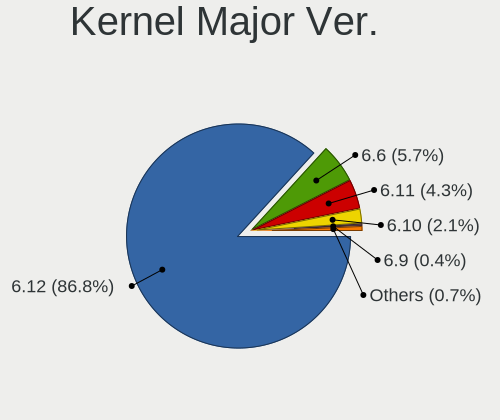
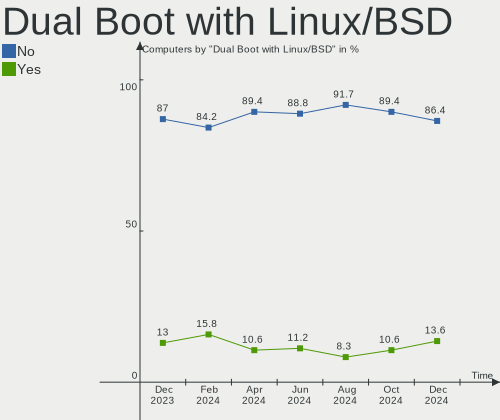
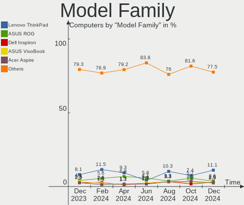
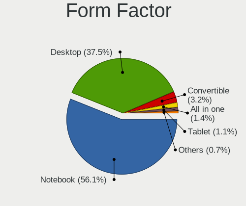
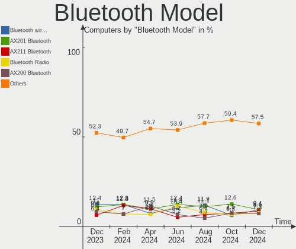

Arch - Hardware Trends
----------------------

A project to identify most popular hardware characteristics and track their change
over time based on data collected by Linux users at https://Linux-Hardware.org.

Anyone can contribute to this report by the [hw-probe](https://github.com/linuxhw/hw-probe) tool:

    sudo -E hw-probe -all -upload

This is a report for all computer types. See also reports for [desktops](/Dist/Arch/Desktop/README.md) and [notebooks](/Dist/Arch/Notebook/README.md).

This report is for one last month. Overall report since the beginning of time: [TestCoverage](https://github.com/linuxhw/TestCoverage)

Period: Jun, 2022.

Contents
--------

* [ System ](#system)
  - [ OS                       ](#os)
  - [ OS Family                ](#os-family)
  - [ Kernel                   ](#kernel)
  - [ Kernel Family            ](#kernel-family)
  - [ Kernel Major Ver.        ](#kernel-major-ver)
  - [ Arch                     ](#arch)
  - [ DE                       ](#de)
  - [ Display Server           ](#display-server)
  - [ Display Manager          ](#display-manager)
  - [ OS Lang                  ](#os-lang)
  - [ Boot Mode                ](#boot-mode)
  - [ Filesystem               ](#filesystem)
  - [ Part. scheme             ](#part-scheme)
  - [ Dual Boot with Linux/BSD ](#dual-boot-with-linuxbsd)
  - [ Dual Boot (Win)          ](#dual-boot-win)

* [ Board ](#board)
  - [ Vendor                   ](#vendor)
  - [ Model                    ](#model)
  - [ Model Family             ](#model-family)
  - [ MFG Year                 ](#mfg-year)
  - [ Form Factor              ](#form-factor)
  - [ Secure Boot              ](#secure-boot)
  - [ Coreboot                 ](#coreboot)
  - [ RAM Size                 ](#ram-size)
  - [ RAM Used                 ](#ram-used)
  - [ Total Drives             ](#total-drives)
  - [ Has CD-ROM               ](#has-cd-rom)
  - [ Has Ethernet             ](#has-ethernet)
  - [ Has WiFi                 ](#has-wifi)
  - [ Has Bluetooth            ](#has-bluetooth)

* [ Location ](#location)
  - [ Country                  ](#country)
  - [ City                     ](#city)

* [ Drives ](#drives)
  - [ Drive Vendor             ](#drive-vendor)
  - [ Drive Model              ](#drive-model)
  - [ HDD Vendor               ](#hdd-vendor)
  - [ SSD Vendor               ](#ssd-vendor)
  - [ Drive Kind               ](#drive-kind)
  - [ Drive Connector          ](#drive-connector)
  - [ Drive Size               ](#drive-size)
  - [ Space Total              ](#space-total)
  - [ Space Used               ](#space-used)
  - [ Malfunc. Drives          ](#malfunc-drives)
  - [ Malfunc. Drive Vendor    ](#malfunc-drive-vendor)
  - [ Malfunc. HDD Vendor      ](#malfunc-hdd-vendor)
  - [ Malfunc. Drive Kind      ](#malfunc-drive-kind)
  - [ Failed Drives            ](#failed-drives)
  - [ Failed Drive Vendor      ](#failed-drive-vendor)
  - [ Drive Status             ](#drive-status)

* [ Storage controller ](#storage-controller)
  - [ Storage Vendor           ](#storage-vendor)
  - [ Storage Model            ](#storage-model)
  - [ Storage Kind             ](#storage-kind)

* [ Processor ](#processor)
  - [ CPU Vendor               ](#cpu-vendor)
  - [ CPU Model                ](#cpu-model)
  - [ CPU Model Family         ](#cpu-model-family)
  - [ CPU Cores                ](#cpu-cores)
  - [ CPU Sockets              ](#cpu-sockets)
  - [ CPU Threads              ](#cpu-threads)
  - [ CPU Op-Modes             ](#cpu-op-modes)
  - [ CPU Microcode            ](#cpu-microcode)
  - [ CPU Microarch            ](#cpu-microarch)

* [ Graphics ](#graphics)
  - [ GPU Vendor               ](#gpu-vendor)
  - [ GPU Model                ](#gpu-model)
  - [ GPU Combo                ](#gpu-combo)
  - [ GPU Driver               ](#gpu-driver)
  - [ GPU Memory               ](#gpu-memory)

* [ Monitor ](#monitor)
  - [ Monitor Vendor           ](#monitor-vendor)
  - [ Monitor Model            ](#monitor-model)
  - [ Monitor Resolution       ](#monitor-resolution)
  - [ Monitor Diagonal         ](#monitor-diagonal)
  - [ Monitor Width            ](#monitor-width)
  - [ Aspect Ratio             ](#aspect-ratio)
  - [ Monitor Area             ](#monitor-area)
  - [ Pixel Density            ](#pixel-density)
  - [ Multiple Monitors        ](#multiple-monitors)

* [ Network ](#network)
  - [ Net Controller Vendor    ](#net-controller-vendor)
  - [ Net Controller Model     ](#net-controller-model)
  - [ Wireless Vendor          ](#wireless-vendor)
  - [ Wireless Model           ](#wireless-model)
  - [ Ethernet Vendor          ](#ethernet-vendor)
  - [ Ethernet Model           ](#ethernet-model)
  - [ Net Controller Kind      ](#net-controller-kind)
  - [ Used Controller          ](#used-controller)
  - [ NICs                     ](#nics)
  - [ IPv6                     ](#ipv6)

* [ Bluetooth ](#bluetooth)
  - [ Bluetooth Vendor         ](#bluetooth-vendor)
  - [ Bluetooth Model          ](#bluetooth-model)

* [ Sound ](#sound)
  - [ Sound Vendor             ](#sound-vendor)
  - [ Sound Model              ](#sound-model)

* [ Memory ](#memory)
  - [ Memory Vendor            ](#memory-vendor)
  - [ Memory Model             ](#memory-model)
  - [ Memory Kind              ](#memory-kind)
  - [ Memory Form Factor       ](#memory-form-factor)
  - [ Memory Size              ](#memory-size)
  - [ Memory Speed             ](#memory-speed)

* [ Printers & scanners ](#printers--scanners)
  - [ Printer Vendor           ](#printer-vendor)
  - [ Printer Model            ](#printer-model)
  - [ Scanner Vendor           ](#scanner-vendor)
  - [ Scanner Model            ](#scanner-model)

* [ Camera ](#camera)
  - [ Camera Vendor            ](#camera-vendor)
  - [ Camera Model             ](#camera-model)

* [ Security ](#security)
  - [ Fingerprint Vendor       ](#fingerprint-vendor)
  - [ Fingerprint Model        ](#fingerprint-model)
  - [ Chipcard Vendor          ](#chipcard-vendor)
  - [ Chipcard Model           ](#chipcard-model)

* [ Unsupported ](#unsupported)
  - [ Unsupported Devices      ](#unsupported-devices)
  - [ Unsupported Device Types ](#unsupported-device-types)

System
------

OS
--

Installed operating systems

| Name         | Computers | Percent |
|--------------|-----------|---------|
| Arch         | 117       | 63.93%  |
| Arch Rolling | 66        | 36.07%  |

OS Family
---------

OS without a version

| Name | Computers | Percent |
|------|-----------|---------|
| Arch | 183       | 100%    |

Kernel
------

Version of the Linux kernel

| Version                      | Computers | Percent |
|------------------------------|-----------|---------|
| 5.18.1-arch1-1               | 30        | 16.39%  |
| 5.18.5-arch1-1               | 27        | 14.75%  |
| 5.18.3-arch1-1               | 21        | 11.48%  |
| 5.18.6-arch1-1               | 15        | 8.2%    |
| 5.18.2-arch1-1               | 15        | 8.2%    |
| 5.18.7-arch1-1               | 10        | 5.46%   |
| 5.18.3-zen1-1-zen            | 9         | 4.92%   |
| 5.17.9-arch1-1               | 7         | 3.83%   |
| 5.18.1-zen1-1-zen            | 5         | 2.73%   |
| 5.15.48-1-lts                | 5         | 2.73%   |
| 5.15.46-1-lts                | 5         | 2.73%   |
| 5.18.5-zen1-1-zen            | 4         | 2.19%   |
| 5.15.44-1-lts                | 3         | 1.64%   |
| 5.18.7-zen1-1-zen            | 2         | 1.09%   |
| 5.18.6-zen1-1.1-zen          | 2         | 1.09%   |
| 5.18.3-261-tkg-bmq           | 2         | 1.09%   |
| 5.15.43-1-lts                | 2         | 1.09%   |
| 5.18.7-1-ck                  | 1         | 0.55%   |
| 5.18.5-AMD-znver2            | 1         | 0.55%   |
| 5.18.4-xanmod1-1-native_amd  | 1         | 0.55%   |
| 5.18.3-arch1-1-t2            | 1         | 0.55%   |
| 5.18.2-1-blueperil           | 1         | 0.55%   |
| 5.18.1-AMD-ThinkPad          | 1         | 0.55%   |
| 5.17.9-zen1-1-zen            | 1         | 0.55%   |
| 5.17.9-arch1-1-surface       | 1         | 0.55%   |
| 5.17.8-zen1-1-zen            | 1         | 0.55%   |
| 5.17.7-arch1-1               | 1         | 0.55%   |
| 5.17.5-zen1-1-zen            | 1         | 0.55%   |
| 5.17.5-arch1-1               | 1         | 0.55%   |
| 5.17.4-arch1-1-vfio          | 1         | 0.55%   |
| 5.17.15-hardened1-1-hardened | 1         | 0.55%   |
| 5.17.13-lqx1-1-lqx           | 1         | 0.55%   |
| 5.17.12-xanmod1-1            | 1         | 0.55%   |
| 5.16.11-xanmod0-rog-1        | 1         | 0.55%   |
| 5.15.49-1-lts                | 1         | 0.55%   |
| 5.15.41-1-lts                | 1         | 0.55%   |

Kernel Family
-------------

Linux kernel without a distro release

| Version | Computers | Percent |
|---------|-----------|---------|
| 5.18.1  | 36        | 19.67%  |
| 5.18.3  | 33        | 18.03%  |
| 5.18.5  | 32        | 17.49%  |
| 5.18.6  | 17        | 9.29%   |
| 5.18.2  | 16        | 8.74%   |
| 5.18.7  | 13        | 7.1%    |
| 5.17.9  | 9         | 4.92%   |
| 5.15.48 | 5         | 2.73%   |
| 5.15.46 | 5         | 2.73%   |
| 5.15.44 | 3         | 1.64%   |
| 5.17.5  | 2         | 1.09%   |
| 5.15.43 | 2         | 1.09%   |
| 5.18.4  | 1         | 0.55%   |
| 5.17.8  | 1         | 0.55%   |
| 5.17.7  | 1         | 0.55%   |
| 5.17.4  | 1         | 0.55%   |
| 5.17.15 | 1         | 0.55%   |
| 5.17.13 | 1         | 0.55%   |
| 5.17.12 | 1         | 0.55%   |
| 5.16.11 | 1         | 0.55%   |
| 5.15.49 | 1         | 0.55%   |
| 5.15.41 | 1         | 0.55%   |

Kernel Major Ver.
-----------------

Linux kernel major version

| Version | Computers | Percent |
|---------|-----------|---------|
| 5.18    | 148       | 80.87%  |
| 5.17    | 17        | 9.29%   |
| 5.15    | 17        | 9.29%   |
| 5.16    | 1         | 0.55%   |

Arch
----

OS architecture (x86_64, i586, etc.)

| Name   | Computers | Percent |
|--------|-----------|---------|
| x86_64 | 183       | 100%    |

DE
--

Desktop Environment

| Name           | Computers | Percent |
|----------------|-----------|---------|
| GNOME          | 62        | 33.88%  |
| KDE5           | 59        | 32.24%  |
| Unknown        | 20        | 10.93%  |
| sway           | 10        | 5.46%   |
| XFCE           | 9         | 4.92%   |
| i3             | 8         | 4.37%   |
| X-Cinnamon     | 4         | 2.19%   |
| bspwm          | 3         | 1.64%   |
| MATE           | 2         | 1.09%   |
| river          | 1         | 0.55%   |
| LXQt           | 1         | 0.55%   |
| i3-with-shmlog | 1         | 0.55%   |
| hyprland       | 1         | 0.55%   |
| Cinnamon       | 1         | 0.55%   |
| Budgie         | 1         | 0.55%   |

Display Server
--------------

X11 or Wayland

| Name    | Computers | Percent |
|---------|-----------|---------|
| X11     | 102       | 55.74%  |
| Wayland | 53        | 28.96%  |
| Unknown | 15        | 8.2%    |
| Tty     | 13        | 7.1%    |

Display Manager
---------------

SDDM, LightDM, etc.

| Name    | Computers | Percent |
|---------|-----------|---------|
| Unknown | 90        | 49.18%  |
| SDDM    | 40        | 21.86%  |
| LightDM | 25        | 13.66%  |
| GDM     | 21        | 11.48%  |
| Ly      | 4         | 2.19%   |
| GREETD  | 2         | 1.09%   |
| LXDM    | 1         | 0.55%   |

OS Lang
-------

Language

| Lang     | Computers | Percent |
|----------|-----------|---------|
| en_US    | 109       | 59.56%  |
| pt_BR    | 9         | 4.92%   |
| Unknown  | 8         | 4.37%   |
| fr_FR    | 7         | 3.83%   |
| en_GB    | 7         | 3.83%   |
| C        | 7         | 3.83%   |
| it_IT    | 6         | 3.28%   |
| de_DE    | 6         | 3.28%   |
| es_ES    | 4         | 2.19%   |
| ru_RU    | 3         | 1.64%   |
| zh_CN    | 2         | 1.09%   |
| en_AU    | 2         | 1.09%   |
| de_AT    | 2         | 1.09%   |
| pl_PL    | 1         | 0.55%   |
| fr_BE    | 1         | 0.55%   |
| es_AR    | 1         | 0.55%   |
| en_UTF-8 | 1         | 0.55%   |
| en_SE    | 1         | 0.55%   |
| en_IN    | 1         | 0.55%   |
| en_IL    | 1         | 0.55%   |
| en_DK    | 1         | 0.55%   |
| en_CH    | 1         | 0.55%   |
| en_CA    | 1         | 0.55%   |
| en-US    | 1         | 0.55%   |

Boot Mode
---------

EFI or BIOS

| Mode | Computers | Percent |
|------|-----------|---------|
| EFI  | 106       | 57.92%  |
| BIOS | 77        | 42.08%  |

Filesystem
----------

Type of filesystem

| Type    | Computers | Percent |
|---------|-----------|---------|
| Ext4    | 120       | 65.57%  |
| Btrfs   | 54        | 29.51%  |
| Xfs     | 4         | 2.19%   |
| Zfs     | 2         | 1.09%   |
| F2fs    | 2         | 1.09%   |
| Unknown | 1         | 0.55%   |

Part. scheme
------------

Scheme of partitioning

| Type    | Computers | Percent |
|---------|-----------|---------|
| GPT     | 114       | 62.3%   |
| Unknown | 61        | 33.33%  |
| MBR     | 8         | 4.37%   |

Dual Boot with Linux/BSD
------------------------

Hosting more than one Linux/BSD

| Dual boot | Computers | Percent |
|-----------|-----------|---------|
| No        | 163       | 89.07%  |
| Yes       | 20        | 10.93%  |

Dual Boot (Win)
---------------

Hosting Linux and Windows

| Dual boot | Computers | Percent |
|-----------|-----------|---------|
| No        | 134       | 73.22%  |
| Yes       | 49        | 26.78%  |

Board
-----

Vendor
------

Motherboard manufacturer

| Name                        | Computers | Percent |
|-----------------------------|-----------|---------|
| ASUSTek Computer            | 38        | 20.77%  |
| Lenovo                      | 35        | 19.13%  |
| Hewlett-Packard             | 19        | 10.38%  |
| Dell                        | 19        | 10.38%  |
| Gigabyte Technology         | 10        | 5.46%   |
| Acer                        | 10        | 5.46%   |
| ASRock                      | 9         | 4.92%   |
| MSI                         | 8         | 4.37%   |
| HUAWEI                      | 4         | 2.19%   |
| Apple                       | 4         | 2.19%   |
| Samsung Electronics         | 3         | 1.64%   |
| TUXEDO                      | 2         | 1.09%   |
| Microsoft                   | 2         | 1.09%   |
| Huanan                      | 2         | 1.09%   |
| Fujitsu                     | 2         | 1.09%   |
| Toshiba                     | 1         | 0.55%   |
| Timi                        | 1         | 0.55%   |
| Shenzhen Wangang Technology | 1         | 0.55%   |
| Razer                       | 1         | 0.55%   |
| Philco                      | 1         | 0.55%   |
| OEM                         | 1         | 0.55%   |
| LG Electronics              | 1         | 0.55%   |
| Infinix                     | 1         | 0.55%   |
| HONOR                       | 1         | 0.55%   |
| GPU Company                 | 1         | 0.55%   |
| Google                      | 1         | 0.55%   |
| Framework                   | 1         | 0.55%   |
| Chuwi                       | 1         | 0.55%   |
| BESSTAR Tech                | 1         | 0.55%   |
| Avell High Performance      | 1         | 0.55%   |
| Alienware                   | 1         | 0.55%   |

Model
-----

Motherboard model

| Name                                   | Computers | Percent |
|----------------------------------------|-----------|---------|
| MSI Bravo 15 B5DD                      | 2         | 1.09%   |
| Dell OptiPlex 7010                     | 2         | 1.09%   |
| Acer Swift SF314-511                   | 2         | 1.09%   |
| TUXEDO InfinityBook S 15 Gen6          | 1         | 0.55%   |
| TUXEDO Book_XA1510                     | 1         | 0.55%   |
| Toshiba Satellite Click 10 LX5W-C-108  | 1         | 0.55%   |
| Timi TM1701                            | 1         | 0.55%   |
| Shenzhen Wangang AERO 2 Pro            | 1         | 0.55%   |
| Samsung 740U5M                         | 1         | 0.55%   |
| Samsung 670Z5E                         | 1         | 0.55%   |
| Samsung 550XBE/350XBE                  | 1         | 0.55%   |
| Razer Blade                            | 1         | 0.55%   |
| Philco OEM                             | 1         | 0.55%   |
| OEM G41 775 ICH7 8712                  | 1         | 0.55%   |
| MSI MS-7C56                            | 1         | 0.55%   |
| MSI MS-7C37                            | 1         | 0.55%   |
| MSI MS-7B85                            | 1         | 0.55%   |
| MSI MS-7A31                            | 1         | 0.55%   |
| MSI MS-7A20                            | 1         | 0.55%   |
| MSI GP66 Leopard 11UG                  | 1         | 0.55%   |
| Microsoft Surface Pro 3                | 1         | 0.55%   |
| Microsoft Surface Laptop 3             | 1         | 0.55%   |
| LG 15Z95N-G.AAC6U1                     | 1         | 0.55%   |
| Lenovo Yoga 710-15IKB 80V5             | 1         | 0.55%   |
| Lenovo Y520-15IKBN 80WK                | 1         | 0.55%   |
| Lenovo ThinkPad X270 W10DG 20K5S1AP1W  | 1         | 0.55%   |
| Lenovo ThinkPad X230 2325TXV           | 1         | 0.55%   |
| Lenovo ThinkPad X220 4291IR6           | 1         | 0.55%   |
| Lenovo ThinkPad X200T 7449G6G          | 1         | 0.55%   |
| Lenovo ThinkPad X200s 74663RG          | 1         | 0.55%   |
| Lenovo ThinkPad X1 Extreme 20MF000DUS  | 1         | 0.55%   |
| Lenovo ThinkPad T580 20LAS6XC00        | 1         | 0.55%   |
| Lenovo ThinkPad T495 20NJ0007US        | 1         | 0.55%   |
| Lenovo ThinkPad T460p 20FW0005AU       | 1         | 0.55%   |
| Lenovo ThinkPad T14s Gen 1 20UH001ART  | 1         | 0.55%   |
| Lenovo ThinkPad P50 20EQS5M100         | 1         | 0.55%   |
| Lenovo ThinkPad P50 20EQS31G00         | 1         | 0.55%   |
| Lenovo ThinkPad P15 Gen 1 20ST0039GE   | 1         | 0.55%   |
| Lenovo ThinkPad P14s Gen 2a 21A00000FR | 1         | 0.55%   |
| Lenovo ThinkPad L15 Gen 2a 20X7CTO1WW  | 1         | 0.55%   |
| Lenovo ThinkPad E490 20N8002APB        | 1         | 0.55%   |
| Lenovo ThinkPad E14 Gen 2 20T6002VRI   | 1         | 0.55%   |
| Lenovo ThinkCentre M93p 10A7000LIX     | 1         | 0.55%   |
| Lenovo ThinkCentre M83 10AGS03F00      | 1         | 0.55%   |
| Lenovo ThinkBook 15 G2 ITL 20VE        | 1         | 0.55%   |
| Lenovo ThinkBook 14p Gen 2 20YN        | 1         | 0.55%   |
| Lenovo ThinkBook 14 G4+ ARA 21D0       | 1         | 0.55%   |
| Lenovo ThinkBook 13s G2 ITL 20V9       | 1         | 0.55%   |
| Lenovo MIIX 3-830 80JB                 | 1         | 0.55%   |
| Lenovo Legion Y740-15IRHg 81UH         | 1         | 0.55%   |
| Lenovo Legion 5 Pro 16ACH6H 82JQ       | 1         | 0.55%   |
| Lenovo Legion 5 15ARH05H 82B1          | 1         | 0.55%   |
| Lenovo IdeaPadFlex 5 14ALC05 82HU      | 1         | 0.55%   |
| Lenovo IdeaPad S145-15IWL 81S9         | 1         | 0.55%   |
| Lenovo IdeaPad 3 15ALC6 82KU           | 1         | 0.55%   |
| Lenovo IdeaPad 110-14IBR 80T6          | 1         | 0.55%   |
| Lenovo IdeaPad 100-14IBY 80MH          | 1         | 0.55%   |
| Infinix INBOOK X2                      | 1         | 0.55%   |
| HUAWEI KPR-WX9                         | 1         | 0.55%   |
| HUAWEI KLVL-WXXW                       | 1         | 0.55%   |

Model Family
------------

Motherboard model prefix

| Name                  | Computers | Percent |
|-----------------------|-----------|---------|
| Lenovo ThinkPad       | 17        | 9.29%   |
| ASUS PRIME            | 11        | 6.01%   |
| ASUS ROG              | 9         | 4.92%   |
| HP EliteBook          | 6         | 3.28%   |
| Dell Latitude         | 6         | 3.28%   |
| HP Pavilion           | 5         | 2.73%   |
| ASUS TUF              | 5         | 2.73%   |
| Lenovo ThinkBook      | 4         | 2.19%   |
| Lenovo IdeaPad        | 4         | 2.19%   |
| Lenovo Legion         | 3         | 1.64%   |
| HP ENVY               | 3         | 1.64%   |
| Dell OptiPlex         | 3         | 1.64%   |
| Dell Inspiron         | 3         | 1.64%   |
| Acer Nitro            | 3         | 1.64%   |
| Acer Aspire           | 3         | 1.64%   |
| MSI Bravo             | 2         | 1.09%   |
| Microsoft Surface     | 2         | 1.09%   |
| Lenovo ThinkCentre    | 2         | 1.09%   |
| HP Laptop             | 2         | 1.09%   |
| Fujitsu LIFEBOOK      | 2         | 1.09%   |
| Dell XPS              | 2         | 1.09%   |
| Dell Vostro           | 2         | 1.09%   |
| Dell Precision        | 2         | 1.09%   |
| ASUS ASUS             | 2         | 1.09%   |
| ASRock X570           | 2         | 1.09%   |
| ASRock X370           | 2         | 1.09%   |
| Acer Swift            | 2         | 1.09%   |
| TUXEDO InfinityBook   | 1         | 0.55%   |
| TUXEDO Book           | 1         | 0.55%   |
| Toshiba Satellite     | 1         | 0.55%   |
| Timi TM1701           | 1         | 0.55%   |
| Shenzhen Wangang AERO | 1         | 0.55%   |
| Samsung 740U5M        | 1         | 0.55%   |
| Samsung 670Z5E        | 1         | 0.55%   |
| Samsung 550XBE        | 1         | 0.55%   |
| Razer Blade           | 1         | 0.55%   |
| Philco OEM            | 1         | 0.55%   |
| OEM G41               | 1         | 0.55%   |
| MSI MS-7C56           | 1         | 0.55%   |
| MSI MS-7C37           | 1         | 0.55%   |
| MSI MS-7B85           | 1         | 0.55%   |
| MSI MS-7A31           | 1         | 0.55%   |
| MSI MS-7A20           | 1         | 0.55%   |
| MSI GP66              | 1         | 0.55%   |
| LG 15Z95N-G.AAC6U1    | 1         | 0.55%   |
| Lenovo Yoga           | 1         | 0.55%   |
| Lenovo Y520-15IKBN    | 1         | 0.55%   |
| Lenovo MIIX           | 1         | 0.55%   |
| Lenovo IdeaPadFlex    | 1         | 0.55%   |
| Infinix INBOOK        | 1         | 0.55%   |
| HUAWEI KPR-WX9        | 1         | 0.55%   |
| HUAWEI KLVL-WXXW      | 1         | 0.55%   |
| HUAWEI HVY-WXX9       | 1         | 0.55%   |
| HUAWEI CREM-WXX9      | 1         | 0.55%   |
| Huanan X79-ZD3        | 1         | 0.55%   |
| Huanan X79-8D         | 1         | 0.55%   |
| HONOR HYM-WXX         | 1         | 0.55%   |
| HP Spectre            | 1         | 0.55%   |
| HP ProBook            | 1         | 0.55%   |
| HP 870-115ng          | 1         | 0.55%   |

MFG Year
--------

Motherboard manufacture year

| Year | Computers | Percent |
|------|-----------|---------|
| 2020 | 36        | 19.67%  |
| 2021 | 34        | 18.58%  |
| 2018 | 18        | 9.84%   |
| 2019 | 17        | 9.29%   |
| 2017 | 16        | 8.74%   |
| 2016 | 11        | 6.01%   |
| 2013 | 9         | 4.92%   |
| 2022 | 8         | 4.37%   |
| 2015 | 8         | 4.37%   |
| 2014 | 7         | 3.83%   |
| 2008 | 5         | 2.73%   |
| 2012 | 4         | 2.19%   |
| 2011 | 4         | 2.19%   |
| 2009 | 4         | 2.19%   |
| 2010 | 2         | 1.09%   |

Form Factor
-----------

Physical design of the computer

| Name        | Computers | Percent |
|-------------|-----------|---------|
| Notebook    | 109       | 59.56%  |
| Desktop     | 59        | 32.24%  |
| Convertible | 8         | 4.37%   |
| Tablet      | 3         | 1.64%   |
| Mini pc     | 2         | 1.09%   |
| All in one  | 2         | 1.09%   |

Secure Boot
-----------

Enabled or disabled

| State    | Computers | Percent |
|----------|-----------|---------|
| Disabled | 181       | 98.91%  |
| Enabled  | 2         | 1.09%   |

Coreboot
--------

Have coreboot on board

| Used | Computers | Percent |
|------|-----------|---------|
| No   | 182       | 99.45%  |
| Yes  | 1         | 0.55%   |

RAM Size
--------

Total RAM memory

| Size in GB  | Computers | Percent |
|-------------|-----------|---------|
| 16.01-24.0  | 43        | 23.5%   |
| 32.01-64.0  | 40        | 21.86%  |
| 8.01-16.0   | 37        | 20.22%  |
| 4.01-8.0    | 33        | 18.03%  |
| 3.01-4.0    | 13        | 7.1%    |
| 64.01-256.0 | 10        | 5.46%   |
| 24.01-32.0  | 6         | 3.28%   |
| 1.01-2.0    | 1         | 0.55%   |

RAM Used
--------

Used RAM memory

| Used GB    | Computers | Percent |
|------------|-----------|---------|
| 4.01-8.0   | 45        | 24.59%  |
| 3.01-4.0   | 39        | 21.31%  |
| 2.01-3.0   | 33        | 18.03%  |
| 1.01-2.0   | 31        | 16.94%  |
| 8.01-16.0  | 24        | 13.11%  |
| 16.01-24.0 | 4         | 2.19%   |
| 24.01-32.0 | 3         | 1.64%   |
| 0.51-1.0   | 3         | 1.64%   |
| 32.01-64.0 | 1         | 0.55%   |

Total Drives
------------

Number of drives on board

| Drives | Computers | Percent |
|--------|-----------|---------|
| 1      | 106       | 57.92%  |
| 2      | 45        | 24.59%  |
| 3      | 16        | 8.74%   |
| 4      | 6         | 3.28%   |
| 5      | 4         | 2.19%   |
| 7      | 3         | 1.64%   |
| 9      | 1         | 0.55%   |
| 8      | 1         | 0.55%   |
| 6      | 1         | 0.55%   |

Has CD-ROM
----------

Has CD-ROM on board

| Presented | Computers | Percent |
|-----------|-----------|---------|
| No        | 162       | 88.52%  |
| Yes       | 21        | 11.48%  |

Has Ethernet
------------

Has Ethernet on board

| Presented | Computers | Percent |
|-----------|-----------|---------|
| Yes       | 149       | 81.42%  |
| No        | 34        | 18.58%  |

Has WiFi
--------

Has WiFi module

| Presented | Computers | Percent |
|-----------|-----------|---------|
| Yes       | 148       | 80.87%  |
| No        | 35        | 19.13%  |

Has Bluetooth
-------------

Has Bluetooth module

| Presented | Computers | Percent |
|-----------|-----------|---------|
| Yes       | 145       | 79.23%  |
| No        | 38        | 20.77%  |

Location
--------

Country
-------

Geographic location (country)

| Country     | Computers | Percent |
|-------------|-----------|---------|
| USA         | 32        | 17.49%  |
| France      | 15        | 8.2%    |
| Germany     | 12        | 6.56%   |
| Brazil      | 12        | 6.56%   |
| Russia      | 9         | 4.92%   |
| Italy       | 9         | 4.92%   |
| India       | 9         | 4.92%   |
| UK          | 7         | 3.83%   |
| Poland      | 7         | 3.83%   |
| Australia   | 6         | 3.28%   |
| Canada      | 5         | 2.73%   |
| Austria     | 5         | 2.73%   |
| Spain       | 4         | 2.19%   |
| China       | 4         | 2.19%   |
| Argentina   | 4         | 2.19%   |
| Romania     | 3         | 1.64%   |
| New Zealand | 3         | 1.64%   |
| Japan       | 3         | 1.64%   |
| Chile       | 3         | 1.64%   |
| Vietnam     | 2         | 1.09%   |
| Thailand    | 2         | 1.09%   |
| Sweden      | 2         | 1.09%   |
| Netherlands | 2         | 1.09%   |
| Moldova     | 2         | 1.09%   |
| Israel      | 2         | 1.09%   |
| Ireland     | 2         | 1.09%   |
| Greece      | 2         | 1.09%   |
| Taiwan      | 1         | 0.55%   |
| Switzerland | 1         | 0.55%   |
| South Korea | 1         | 0.55%   |
| Peru        | 1         | 0.55%   |
| Panama      | 1         | 0.55%   |
| Nepal       | 1         | 0.55%   |
| Mexico      | 1         | 0.55%   |
| Hungary     | 1         | 0.55%   |
| Hong Kong   | 1         | 0.55%   |
| Finland     | 1         | 0.55%   |
| Denmark     | 1         | 0.55%   |
| Czechia     | 1         | 0.55%   |
| Colombia    | 1         | 0.55%   |
| Belgium     | 1         | 0.55%   |
| Armenia     | 1         | 0.55%   |

City
----

Geographic location (city)

| City               | Computers | Percent |
|--------------------|-----------|---------|
| St Petersburg      | 4         | 2.19%   |
| Berlin             | 4         | 2.19%   |
| Vienna             | 3         | 1.64%   |
| Sesto San Giovanni | 3         | 1.64%   |
| Seattle            | 3         | 1.64%   |
| Paris              | 3         | 1.64%   |
| Yekaterinburg      | 2         | 1.09%   |
| Wellington         | 2         | 1.09%   |
| Warsaw             | 2         | 1.09%   |
| Tourcoing          | 2         | 1.09%   |
| Tel Aviv           | 2         | 1.09%   |
| Sao Paulo          | 2         | 1.09%   |
| Santiago           | 2         | 1.09%   |
| Rome               | 2         | 1.09%   |
| Moscow             | 2         | 1.09%   |
| Montes Claros      | 2         | 1.09%   |
| Melbourne          | 2         | 1.09%   |
| Madrid             | 2         | 1.09%   |
| Krakow             | 2         | 1.09%   |
| Diespeck           | 2         | 1.09%   |
| Chisinau           | 2         | 1.09%   |
| Atlanta            | 2         | 1.09%   |
| Zapopan            | 1         | 0.55%   |
| Yokohama           | 1         | 0.55%   |
| Yerevan            | 1         | 0.55%   |
| Yerba Buena        | 1         | 0.55%   |
| Xicheng District   | 1         | 0.55%   |
| Wroclaw            | 1         | 0.55%   |
| Wettringen         | 1         | 0.55%   |
| Wernigerode        | 1         | 0.55%   |
| Wasmes             | 1         | 0.55%   |
| Villa Bosch        | 1         | 0.55%   |
| Vigo               | 1         | 0.55%   |
| Victoria           | 1         | 0.55%   |
| Varennes           | 1         | 0.55%   |
| Valencia           | 1         | 0.55%   |
| Uberlândia        | 1         | 0.55%   |
| Trivandrum         | 1         | 0.55%   |
| Traun              | 1         | 0.55%   |
| Tortuguitas        | 1         | 0.55%   |
| Tooele             | 1         | 0.55%   |
| Toms River         | 1         | 0.55%   |
| Thornhill          | 1         | 0.55%   |
| Thessaloniki       | 1         | 0.55%   |
| Teghra             | 1         | 0.55%   |
| Taoyuan District   | 1         | 0.55%   |
| Szarwark           | 1         | 0.55%   |
| Sydney             | 1         | 0.55%   |
| Sovata             | 1         | 0.55%   |
| Shenzhen           | 1         | 0.55%   |
| Setagaya-ku        | 1         | 0.55%   |
| Scottsdale         | 1         | 0.55%   |
| Sattahip           | 1         | 0.55%   |
| Sartrouville       | 1         | 0.55%   |
| Sao Cristovao      | 1         | 0.55%   |
| Santos             | 1         | 0.55%   |
| San Jose           | 1         | 0.55%   |
| Saluzzo            | 1         | 0.55%   |
| Saint-Lambert      | 1         | 0.55%   |
| Saint Joseph       | 1         | 0.55%   |

Drives
------

Drive Vendor
------------

Hard drive vendors

| Vendor                      | Computers | Drives | Percent |
|-----------------------------|-----------|--------|---------|
| Samsung Electronics         | 58        | 76     | 21.09%  |
| WDC                         | 38        | 55     | 13.82%  |
| Seagate                     | 27        | 34     | 9.82%   |
| SanDisk                     | 17        | 18     | 6.18%   |
| Toshiba                     | 16        | 16     | 5.82%   |
| Crucial                     | 15        | 17     | 5.45%   |
| Kingston                    | 13        | 13     | 4.73%   |
| SK hynix                    | 12        | 12     | 4.36%   |
| Unknown                     | 6         | 6      | 2.18%   |
| Micron Technology           | 6         | 6      | 2.18%   |
| HGST                        | 5         | 5      | 1.82%   |
| Gigabyte Technology         | 5         | 5      | 1.82%   |
| Intel                       | 4         | 4      | 1.45%   |
| China                       | 4         | 4      | 1.45%   |
| A-DATA Technology           | 4         | 4      | 1.45%   |
| Silicon Motion              | 3         | 3      | 1.09%   |
| Phison                      | 3         | 3      | 1.09%   |
| KIOXIA                      | 3         | 3      | 1.09%   |
| Corsair                     | 3         | 3      | 1.09%   |
| UMIS                        | 2         | 2      | 0.73%   |
| SPCC                        | 2         | 2      | 0.73%   |
| SABRENT                     | 2         | 2      | 0.73%   |
| Netac                       | 2         | 2      | 0.73%   |
| Hitachi                     | 2         | 2      | 0.73%   |
| Apple                       | 2         | 2      | 0.73%   |
| XPG                         | 1         | 2      | 0.36%   |
| W800S                       | 1         | 1      | 0.36%   |
| Timetec                     | 1         | 1      | 0.36%   |
| Smart                       | 1         | 2      | 0.36%   |
| Patriot                     | 1         | 1      | 0.36%   |
| OCZ                         | 1         | 1      | 0.36%   |
| MMY                         | 1         | 1      | 0.36%   |
| Micron/Crucial Technology   | 1         | 1      | 0.36%   |
| Maxtor                      | 1         | 1      | 0.36%   |
| MAXIO Technology (Hangzhou) | 1         | 1      | 0.36%   |
| Lite-On                     | 1         | 1      | 0.36%   |
| LDLC                        | 1         | 1      | 0.36%   |
| KIOXIA-EXCERIA              | 1         | 1      | 0.36%   |
| Jz                          | 1         | 1      | 0.36%   |
| Intenso                     | 1         | 1      | 0.36%   |
| Goodram                     | 1         | 1      | 0.36%   |
| External                    | 1         | 1      | 0.36%   |
| EMTEC                       | 1         | 1      | 0.36%   |
| EDGE                        | 1         | 1      | 0.36%   |
| AEGO                        | 1         | 1      | 0.36%   |
| ADATA Technology            | 1         | 1      | 0.36%   |

Drive Model
-----------

Hard drive models

| Model                                  | Computers | Percent |
|----------------------------------------|-----------|---------|
| Samsung NVMe SSD Drive 512GB           | 6         | 1.97%   |
| SK hynix NVMe SSD Drive 512GB          | 5         | 1.64%   |
| Samsung SSD 970 EVO Plus 2TB           | 5         | 1.64%   |
| Toshiba MQ01ABD100 1TB                 | 4         | 1.31%   |
| SanDisk NVMe SSD Drive 512GB           | 4         | 1.31%   |
| Samsung SSD 970 EVO Plus 1TB           | 4         | 1.31%   |
| Samsung SSD 860 EVO 250GB              | 4         | 1.31%   |
| WDC WDS500G3X0C-00SJG0 500GB           | 3         | 0.98%   |
| WDC WD40EFRX-68N32N0 4TB               | 3         | 0.98%   |
| Toshiba NVMe SSD Drive 512GB           | 3         | 0.98%   |
| Seagate ST2000DM006-2DM164 2TB         | 3         | 0.98%   |
| Samsung SSD 980 1TB                    | 3         | 0.98%   |
| Samsung SM963 2.5" NVMe PCIe SSD 500GB | 3         | 0.98%   |
| Kingston OM8PCP3512F-AI1 512GB         | 3         | 0.98%   |
| Crucial CT240BX500SSD1 240GB           | 3         | 0.98%   |
| Crucial CT1000MX500SSD1 1TB            | 3         | 0.98%   |
| WDC WDS500G2B0B-00YS70 500GB SSD       | 2         | 0.66%   |
| WDC WDS100T2B0C-00PXH0 1TB             | 2         | 0.66%   |
| WDC WD30EFRX-68EUZN0 3TB               | 2         | 0.66%   |
| WDC WD20EZRZ-00Z5HB0 2TB               | 2         | 0.66%   |
| WDC PC SN730 SDBQNTY-512G-1001 512GB   | 2         | 0.66%   |
| Toshiba MQ04ABF100 1TB                 | 2         | 0.66%   |
| Seagate ST8000DM004-2CX188 8TB         | 2         | 0.66%   |
| Seagate ST500DM002-1BD142 500GB        | 2         | 0.66%   |
| Seagate ST2000DM001-1ER164 2TB         | 2         | 0.66%   |
| Seagate ST1000DM010-2EP102 1TB         | 2         | 0.66%   |
| SanDisk SDSSDH3 500G                   | 2         | 0.66%   |
| SanDisk NVMe SSD Drive 1TB             | 2         | 0.66%   |
| Samsung SSD 970 EVO Plus 500GB         | 2         | 0.66%   |
| Samsung SSD 970 EVO 1TB                | 2         | 0.66%   |
| Samsung SSD 860 EVO 1TB                | 2         | 0.66%   |
| Samsung SSD 850 PRO 512GB              | 2         | 0.66%   |
| Samsung SSD 850 EVO 500GB              | 2         | 0.66%   |
| Samsung NVMe SSD Drive 2TB             | 2         | 0.66%   |
| SABRENT Disk 1TB                       | 2         | 0.66%   |
| Micron 2210_MTFDHBA512QFD 512GB        | 2         | 0.66%   |
| Kingston SA400S37120G 120GB SSD        | 2         | 0.66%   |
| Gigabyte GP-GSM2NE3512GNTD 512GB       | 2         | 0.66%   |
| Crucial CT500MX500SSD1 500GB           | 2         | 0.66%   |
| Crucial CT250BX100SSD1 250GB           | 2         | 0.66%   |
| Crucial CT1000P1SSD8 1TB               | 2         | 0.66%   |
| XPG NVMe SSD Drive 256GB               | 1         | 0.33%   |
| XPG NVMe SSD Drive 1024GB              | 1         | 0.33%   |
| WDC WDS500G2B0A-00SM50 500GB SSD       | 1         | 0.33%   |
| WDC WDS250G2B0B-00YS70 250GB SSD       | 1         | 0.33%   |
| WDC WDS250G2B0A-00SM50 250GB SSD       | 1         | 0.33%   |
| WDC WDS240G2G0B-00EPW0 240GB SSD       | 1         | 0.33%   |
| WDC WDS200T2B0A-00SM50 2TB SSD         | 1         | 0.33%   |
| WDC WDS200T1X0E-00AFY0 2TB             | 1         | 0.33%   |
| WDC WDS120G2G0A-00JH30 120GB SSD       | 1         | 0.33%   |
| WDC WDS100T2G0A-00JH30 1TB SSD         | 1         | 0.33%   |
| WDC WDS100T2B0C 1TB                    | 1         | 0.33%   |
| WDC WD8004FRYZ-01VAEB0 8TB             | 1         | 0.33%   |
| WDC WD6400AAKS-65A7B2 640GB            | 1         | 0.33%   |
| WDC WD62PURZ-85B3AY0 6TB               | 1         | 0.33%   |
| WDC WD60EZAZ-00SF3B0 6TB               | 1         | 0.33%   |
| WDC WD60EFAX-68JH4N1 6TB               | 1         | 0.33%   |
| WDC WD5000LPVX-75V0TT0 500GB           | 1         | 0.33%   |
| WDC WD5000LPVX-22V0TT0 500GB           | 1         | 0.33%   |
| WDC WD5000LPCX-24VHAT0 500GB           | 1         | 0.33%   |

HDD Vendor
----------

Hard disk drive vendors

| Vendor              | Computers | Drives | Percent |
|---------------------|-----------|--------|---------|
| Seagate             | 26        | 33     | 36.11%  |
| WDC                 | 24        | 34     | 33.33%  |
| Toshiba             | 11        | 11     | 15.28%  |
| HGST                | 5         | 5      | 6.94%   |
| Hitachi             | 2         | 2      | 2.78%   |
| Unknown             | 1         | 1      | 1.39%   |
| Samsung Electronics | 1         | 1      | 1.39%   |
| Maxtor              | 1         | 1      | 1.39%   |
| Apple               | 1         | 1      | 1.39%   |

SSD Vendor
----------

Solid state drive vendors

| Vendor              | Computers | Drives | Percent |
|---------------------|-----------|--------|---------|
| Samsung Electronics | 22        | 26     | 26.19%  |
| Crucial             | 13        | 14     | 15.48%  |
| WDC                 | 8         | 9      | 9.52%   |
| SanDisk             | 7         | 7      | 8.33%   |
| Kingston            | 5         | 5      | 5.95%   |
| China               | 4         | 4      | 4.76%   |
| A-DATA Technology   | 4         | 4      | 4.76%   |
| Toshiba             | 1         | 1      | 1.19%   |
| Timetec             | 1         | 1      | 1.19%   |
| SPCC                | 1         | 1      | 1.19%   |
| Smart               | 1         | 2      | 1.19%   |
| SK hynix            | 1         | 1      | 1.19%   |
| Seagate             | 1         | 1      | 1.19%   |
| Patriot             | 1         | 1      | 1.19%   |
| OCZ                 | 1         | 1      | 1.19%   |
| Netac               | 1         | 1      | 1.19%   |
| MMY                 | 1         | 1      | 1.19%   |
| LDLC                | 1         | 1      | 1.19%   |
| KIOXIA-EXCERIA      | 1         | 1      | 1.19%   |
| Jz                  | 1         | 1      | 1.19%   |
| Intenso             | 1         | 1      | 1.19%   |
| Intel               | 1         | 1      | 1.19%   |
| Goodram             | 1         | 1      | 1.19%   |
| Gigabyte Technology | 1         | 1      | 1.19%   |
| EMTEC               | 1         | 1      | 1.19%   |
| EDGE                | 1         | 1      | 1.19%   |
| Corsair             | 1         | 1      | 1.19%   |
| AEGO                | 1         | 1      | 1.19%   |

Drive Kind
----------

HDD or SSD

| Kind    | Computers | Drives | Percent |
|---------|-----------|--------|---------|
| NVMe    | 113       | 136    | 44.31%  |
| SSD     | 76        | 91     | 29.8%   |
| HDD     | 60        | 89     | 23.53%  |
| MMC     | 5         | 5      | 1.96%   |
| Unknown | 1         | 1      | 0.39%   |

Drive Connector
---------------

SATA, SAS, NVMe, etc.

| Type | Computers | Drives | Percent |
|------|-----------|--------|---------|
| NVMe | 111       | 133    | 48.9%   |
| SATA | 101       | 173    | 44.49%  |
| SAS  | 10        | 11     | 4.41%   |
| MMC  | 5         | 5      | 2.2%    |

Drive Size
----------

Size of hard drive

| Size in TB | Computers | Drives | Percent |
|------------|-----------|--------|---------|
| 0.01-0.5   | 64        | 79     | 45.07%  |
| 0.51-1.0   | 43        | 51     | 30.28%  |
| 1.01-2.0   | 16        | 19     | 11.27%  |
| 4.01-10.0  | 9         | 17     | 6.34%   |
| 3.01-4.0   | 7         | 9      | 4.93%   |
| 2.01-3.0   | 3         | 5      | 2.11%   |

Space Total
-----------

Amount of disk space available on the file system

| Size in GB     | Computers | Percent |
|----------------|-----------|---------|
| 251-500        | 42        | 22.95%  |
| 501-1000       | 32        | 17.49%  |
| 101-250        | 31        | 16.94%  |
| 1001-2000      | 29        | 15.85%  |
| More than 3000 | 22        | 12.02%  |
| 2001-3000      | 11        | 6.01%   |
| Unknown        | 6         | 3.28%   |
| 1-20           | 4         | 2.19%   |
| 21-50          | 3         | 1.64%   |
| 51-100         | 3         | 1.64%   |

Space Used
----------

Amount of used disk space

| Used GB        | Computers | Percent |
|----------------|-----------|---------|
| 1-20           | 31        | 16.94%  |
| 101-250        | 29        | 15.85%  |
| 251-500        | 27        | 14.75%  |
| 21-50          | 24        | 13.11%  |
| 501-1000       | 24        | 13.11%  |
| 51-100         | 23        | 12.57%  |
| More than 3000 | 8         | 4.37%   |
| 1001-2000      | 7         | 3.83%   |
| Unknown        | 6         | 3.28%   |
| 2001-3000      | 4         | 2.19%   |

Malfunc. Drives
---------------

Drive models with a malfunction

| Model                                            | Computers | Drives | Percent |
|--------------------------------------------------|-----------|--------|---------|
| Seagate ST500DM002-1BD142 500GB                  | 2         | 2      | 14.29%  |
| WDC WD5000LPCX-24VHAT0 500GB                     | 1         | 1      | 7.14%   |
| Seagate ST2000DM001-1ER164 2TB                   | 1         | 1      | 7.14%   |
| Seagate ST1000LM024 HN-M101MBB 1TB               | 1         | 1      | 7.14%   |
| Samsung Electronics SSD 850 EVO 1TB              | 1         | 1      | 7.14%   |
| Samsung Electronics MZVLW256HEHP-000L2 256GB     | 1         | 1      | 7.14%   |
| Samsung Electronics MZ7PA128HMCD-010H1 128GB SSD | 1         | 1      | 7.14%   |
| OCZ VERTEX4 256GB SSD                            | 1         | 1      | 7.14%   |
| Hitachi HTS541010A9E680 1TB                      | 1         | 1      | 7.14%   |
| HGST HTS725050A7E630 500GB                       | 1         | 1      | 7.14%   |
| HGST HTS721010A9E630 1TB                         | 1         | 1      | 7.14%   |
| Gigabyte Technology GP-GM30512G-G 512GB          | 1         | 1      | 7.14%   |
| China SSD 240GB                                  | 1         | 1      | 7.14%   |

Malfunc. Drive Vendor
---------------------

Vendors of faulty drives

| Vendor              | Computers | Drives | Percent |
|---------------------|-----------|--------|---------|
| Seagate             | 4         | 4      | 28.57%  |
| Samsung Electronics | 3         | 3      | 21.43%  |
| HGST                | 2         | 2      | 14.29%  |
| WDC                 | 1         | 1      | 7.14%   |
| OCZ                 | 1         | 1      | 7.14%   |
| Hitachi             | 1         | 1      | 7.14%   |
| Gigabyte Technology | 1         | 1      | 7.14%   |
| China               | 1         | 1      | 7.14%   |

Malfunc. HDD Vendor
-------------------

Vendors of faulty HDD drives

| Vendor  | Computers | Drives | Percent |
|---------|-----------|--------|---------|
| Seagate | 4         | 4      | 50%     |
| HGST    | 2         | 2      | 25%     |
| WDC     | 1         | 1      | 12.5%   |
| Hitachi | 1         | 1      | 12.5%   |

Malfunc. Drive Kind
-------------------

Kinds of faulty drives

| Kind | Computers | Drives | Percent |
|------|-----------|--------|---------|
| HDD  | 8         | 8      | 57.14%  |
| SSD  | 4         | 4      | 28.57%  |
| NVMe | 2         | 2      | 14.29%  |

Failed Drives
-------------

Failed drive models

Zero info for selected period =(

Failed Drive Vendor
-------------------

Failed drive vendors

Zero info for selected period =(

Drive Status
------------

Number of failed and malfunc. drives

| Status   | Computers | Drives | Percent |
|----------|-----------|--------|---------|
| Works    | 89        | 155    | 46.6%   |
| Detected | 88        | 153    | 46.07%  |
| Malfunc  | 14        | 14     | 7.33%   |

Storage controller
------------------

Storage Vendor
--------------

Storage controller vendors

| Vendor                       | Computers | Percent |
|------------------------------|-----------|---------|
| Intel                        | 88        | 33.33%  |
| AMD                          | 48        | 18.18%  |
| Samsung Electronics          | 43        | 16.29%  |
| SanDisk                      | 21        | 7.95%   |
| SK hynix                     | 11        | 4.17%   |
| Phison Electronics           | 9         | 3.41%   |
| Kingston Technology Company  | 8         | 3.03%   |
| Micron Technology            | 6         | 2.27%   |
| Toshiba America Info Systems | 5         | 1.89%   |
| Silicon Motion               | 4         | 1.52%   |
| ASMedia Technology           | 4         | 1.52%   |
| Union Memory (Shenzhen)      | 2         | 0.76%   |
| Micron/Crucial Technology    | 2         | 0.76%   |
| Marvell Technology Group     | 2         | 0.76%   |
| Broadcom / LSI               | 2         | 0.76%   |
| ADATA Technology             | 2         | 0.76%   |
| Realtek Semiconductor        | 1         | 0.38%   |
| Nvidia                       | 1         | 0.38%   |
| MAXIO Technology (Hangzhou)  | 1         | 0.38%   |
| Lite-On Technology           | 1         | 0.38%   |
| KIOXIA                       | 1         | 0.38%   |
| Apple                        | 1         | 0.38%   |
| Adaptec                      | 1         | 0.38%   |

Storage Model
-------------

Storage controller models

| Model                                                                          | Computers | Percent |
|--------------------------------------------------------------------------------|-----------|---------|
| AMD FCH SATA Controller [AHCI mode]                                            | 32        | 10.96%  |
| Samsung NVMe SSD Controller SM981/PM981/PM983                                  | 23        | 7.88%   |
| AMD 400 Series Chipset SATA Controller                                         | 11        | 3.77%   |
| Intel Sunrise Point-LP SATA Controller [AHCI mode]                             | 9         | 3.08%   |
| AMD 500 Series Chipset SATA Controller                                         | 9         | 3.08%   |
| Samsung NVMe SSD Controller 980                                                | 8         | 2.74%   |
| Samsung NVMe SSD Controller PM9A1/PM9A3/980PRO                                 | 7         | 2.4%    |
| Intel 8 Series/C220 Series Chipset Family 6-port SATA Controller 1 [AHCI mode] | 7         | 2.4%    |
| Intel 7 Series Chipset Family 6-port SATA Controller [AHCI mode]               | 7         | 2.4%    |
| SK hynix Gold P31 SSD                                                          | 6         | 2.05%   |
| SanDisk WD Black SN750 / PC SN730 NVMe SSD                                     | 6         | 2.05%   |
| SanDisk Non-Volatile memory controller                                         | 6         | 2.05%   |
| Samsung NVMe SSD Controller SM961/PM961/SM963                                  | 6         | 2.05%   |
| Micron Non-Volatile memory controller                                          | 6         | 2.05%   |
| Intel Volume Management Device NVMe RAID Controller                            | 6         | 2.05%   |
| Intel Q170/Q150/B150/H170/H110/Z170/CM236 Chipset SATA Controller [AHCI Mode]  | 6         | 2.05%   |
| SanDisk WD Blue SN550 NVMe SSD                                                 | 5         | 1.71%   |
| Intel 82801 Mobile SATA Controller [RAID mode]                                 | 5         | 1.71%   |
| AMD X370 Series Chipset SATA Controller                                        | 5         | 1.71%   |
| Toshiba America Info Systems XG6 NVMe SSD Controller                           | 4         | 1.37%   |
| Intel HM170/QM170 Chipset SATA Controller [AHCI Mode]                          | 4         | 1.37%   |
| ASMedia ASM1062 Serial ATA Controller                                          | 4         | 1.37%   |
| Silicon Motion SM2263EN/SM2263XT SSD Controller                                | 3         | 1.03%   |
| SanDisk WD PC SN810 / Black SN850 NVMe SSD                                     | 3         | 1.03%   |
| Phison PS5013 E13 NVMe Controller                                              | 3         | 1.03%   |
| Phison E16 PCIe4 NVMe Controller                                               | 3         | 1.03%   |
| Phison E12 NVMe Controller                                                     | 3         | 1.03%   |
| Kingston Company Company Non-Volatile memory controller                        | 3         | 1.03%   |
| Intel Wildcat Point-LP SATA Controller [AHCI Mode]                             | 3         | 1.03%   |
| Intel Cannon Lake PCH SATA AHCI Controller                                     | 3         | 1.03%   |
| Intel 82801IBM/IEM (ICH9M/ICH9M-E) 4 port SATA Controller [AHCI mode]          | 3         | 1.03%   |
| Intel 8 Series SATA Controller 1 [AHCI mode]                                   | 3         | 1.03%   |
| Intel 6 Series/C200 Series Chipset Family 6 port Mobile SATA AHCI Controller   | 3         | 1.03%   |
| Intel 400 Series Chipset Family SATA AHCI Controller                           | 3         | 1.03%   |
| SK hynix Non-Volatile memory controller                                        | 2         | 0.68%   |
| SK hynix BC501 NVMe Solid State Drive                                          | 2         | 0.68%   |
| SanDisk WD Black 2018/SN750 / PC SN720 NVMe SSD                                | 2         | 0.68%   |
| Samsung NVMe SSD Controller SM951/PM951                                        | 2         | 0.68%   |
| Micron/Crucial NVMe Controller                                                 | 2         | 0.68%   |
| Kingston Company KC2000 NVMe SSD                                               | 2         | 0.68%   |
| Kingston Company A2000 NVMe SSD                                                | 2         | 0.68%   |
| Intel Tiger Lake-LP SATA Controller [AHCI mode]                                | 2         | 0.68%   |
| Intel Jasper Lake SATA AHCI Controller                                         | 2         | 0.68%   |
| Intel Cannon Point-LP SATA Controller [AHCI Mode]                              | 2         | 0.68%   |
| Intel C600/X79 series chipset 6-Port SATA AHCI Controller                      | 2         | 0.68%   |
| Intel 82801JI (ICH10 Family) 4 port SATA IDE Controller #1                     | 2         | 0.68%   |
| Intel 82801JI (ICH10 Family) 2 port SATA IDE Controller #2                     | 2         | 0.68%   |
| Intel 82801HM/HEM (ICH8M/ICH8M-E) SATA Controller [AHCI mode]                  | 2         | 0.68%   |
| Intel 82801HM/HEM (ICH8M/ICH8M-E) IDE Controller                               | 2         | 0.68%   |
| Intel 7 Series/C210 Series Chipset Family 6-port SATA Controller [AHCI mode]   | 2         | 0.68%   |
| AMD SB7x0/SB8x0/SB9x0 SATA Controller [AHCI mode]                              | 2         | 0.68%   |
| Union Memory (Shenzhen) Non-Volatile memory controller                         | 1         | 0.34%   |
| Union Memory (Shenzhen) AM630 PCIe 4.0 x4 NVMe SSD Controller                  | 1         | 0.34%   |
| Toshiba America Info Systems XG4 NVMe SSD Controller                           | 1         | 0.34%   |
| SK hynix BC511                                                                 | 1         | 0.34%   |
| Silicon Motion Non-Volatile memory controller                                  | 1         | 0.34%   |
| SanDisk WD Blue SN500 / PC SN520 NVMe SSD                                      | 1         | 0.34%   |
| Realtek RTS5763DL NVMe SSD Controller                                          | 1         | 0.34%   |
| Nvidia MCP89 SATA Controller (AHCI mode)                                       | 1         | 0.34%   |
| MAXIO (Hangzhou) NVMe SSD Controller MAP1001                                   | 1         | 0.34%   |

Storage Kind
------------

Kind of storage controller (IDE, SATA, NVMe, SAS, ...)

| Kind | Computers | Percent |
|------|-----------|---------|
| SATA | 119       | 47.04%  |
| NVMe | 111       | 43.87%  |
| RAID | 15        | 5.93%   |
| IDE  | 7         | 2.77%   |
| SCSI | 1         | 0.4%    |

Processor
---------

CPU Vendor
----------

Processor vendors

| Vendor | Computers | Percent |
|--------|-----------|---------|
| Intel  | 112       | 61.2%   |
| AMD    | 71        | 38.8%   |

CPU Model
---------

Processor models

| Model                                       | Computers | Percent |
|---------------------------------------------|-----------|---------|
| AMD Ryzen 7 5800H with Radeon Graphics      | 6         | 3.28%   |
| Intel 11th Gen Core i7-1165G7 @ 2.80GHz     | 5         | 2.73%   |
| Intel Core i7-7700HQ CPU @ 2.80GHz          | 4         | 2.19%   |
| Intel 11th Gen Core i5-1135G7 @ 2.40GHz     | 4         | 2.19%   |
| AMD Ryzen 5 5600X 6-Core Processor          | 4         | 2.19%   |
| Intel Core i7-9750H CPU @ 2.60GHz           | 3         | 1.64%   |
| Intel Core i7-10750H CPU @ 2.60GHz          | 3         | 1.64%   |
| Intel Core i5-8350U CPU @ 1.70GHz           | 3         | 1.64%   |
| AMD Ryzen 9 5950X 16-Core Processor         | 3         | 1.64%   |
| AMD Ryzen 7 5800X 8-Core Processor          | 3         | 1.64%   |
| AMD Ryzen 5 5600H with Radeon Graphics      | 3         | 1.64%   |
| AMD Ryzen 5 5500U with Radeon Graphics      | 3         | 1.64%   |
| Intel Xeon CPU E3-1505M v5 @ 2.80GHz        | 2         | 1.09%   |
| Intel Core i7-8565U CPU @ 1.80GHz           | 2         | 1.09%   |
| Intel Core i7-8550U CPU @ 1.80GHz           | 2         | 1.09%   |
| Intel Core i5-5300U CPU @ 2.30GHz           | 2         | 1.09%   |
| Intel Core i5-3320M CPU @ 2.60GHz           | 2         | 1.09%   |
| Intel Core i5-1035G1 CPU @ 1.00GHz          | 2         | 1.09%   |
| Intel Core 2 Duo CPU P8600 @ 2.40GHz        | 2         | 1.09%   |
| Intel Core 2 Duo CPU L9400 @ 1.86GHz        | 2         | 1.09%   |
| Intel 11th Gen Core i7-1185G7 @ 3.00GHz     | 2         | 1.09%   |
| AMD Ryzen 9 5900X 12-Core Processor         | 2         | 1.09%   |
| AMD Ryzen 9 5900HX with Radeon Graphics     | 2         | 1.09%   |
| AMD Ryzen 9 3900X 12-Core Processor         | 2         | 1.09%   |
| AMD Ryzen 7 PRO 5850U with Radeon Graphics  | 2         | 1.09%   |
| AMD Ryzen 7 6800H with Radeon Graphics      | 2         | 1.09%   |
| AMD Ryzen 7 5700G with Radeon Graphics      | 2         | 1.09%   |
| AMD Ryzen 7 4800H with Radeon Graphics      | 2         | 1.09%   |
| AMD Ryzen 7 3700X 8-Core Processor          | 2         | 1.09%   |
| AMD Ryzen 7 1700 Eight-Core Processor       | 2         | 1.09%   |
| AMD Ryzen 5 3600X 6-Core Processor          | 2         | 1.09%   |
| AMD Ryzen 5 2600 Six-Core Processor         | 2         | 1.09%   |
| Intel Xeon CPU E5-2695 v2 @ 2.40GHz         | 1         | 0.55%   |
| Intel Xeon CPU E5-1650 0 @ 3.20GHz          | 1         | 0.55%   |
| Intel Xeon CPU E3-1545M v5 @ 2.90GHz        | 1         | 0.55%   |
| Intel Pentium Dual-Core CPU E5700 @ 3.00GHz | 1         | 0.55%   |
| Intel Pentium Dual-Core CPU E5500 @ 2.80GHz | 1         | 0.55%   |
| Intel Pentium CPU N3540 @ 2.16GHz           | 1         | 0.55%   |
| Intel Pentium CPU G3260 @ 3.30GHz           | 1         | 0.55%   |
| Intel Pentium CPU G3220 @ 3.00GHz           | 1         | 0.55%   |
| Intel Core M-5Y10c CPU @ 0.80GHz            | 1         | 0.55%   |
| Intel Core i9-10980HK CPU @ 2.40GHz         | 1         | 0.55%   |
| Intel Core i9-10885H CPU @ 2.40GHz          | 1         | 0.55%   |
| Intel Core i7-9700K CPU @ 3.60GHz           | 1         | 0.55%   |
| Intel Core i7-8850H CPU @ 2.60GHz           | 1         | 0.55%   |
| Intel Core i7-8700 CPU @ 3.20GHz            | 1         | 0.55%   |
| Intel Core i7-7700K CPU @ 4.20GHz           | 1         | 0.55%   |
| Intel Core i7-7600U CPU @ 2.80GHz           | 1         | 0.55%   |
| Intel Core i7-7500U CPU @ 2.70GHz           | 1         | 0.55%   |
| Intel Core i7-6850K CPU @ 3.60GHz           | 1         | 0.55%   |
| Intel Core i7-6700 CPU @ 3.40GHz            | 1         | 0.55%   |
| Intel Core i7-6500U CPU @ 2.50GHz           | 1         | 0.55%   |
| Intel Core i7-5820K CPU @ 3.30GHz           | 1         | 0.55%   |
| Intel Core i7-4770K CPU @ 3.50GHz           | 1         | 0.55%   |
| Intel Core i7-4770 CPU @ 3.40GHz            | 1         | 0.55%   |
| Intel Core i7-4720HQ CPU @ 2.60GHz          | 1         | 0.55%   |
| Intel Core i7-4710HQ CPU @ 2.50GHz          | 1         | 0.55%   |
| Intel Core i7-3630QM CPU @ 2.40GHz          | 1         | 0.55%   |
| Intel Core i7-2620M CPU @ 2.70GHz           | 1         | 0.55%   |
| Intel Core i7-10850H CPU @ 2.70GHz          | 1         | 0.55%   |

CPU Model Family
----------------

Processor model prefix

| Model                   | Computers | Percent |
|-------------------------|-----------|---------|
| Intel Core i7           | 33        | 18.03%  |
| Intel Core i5           | 32        | 17.49%  |
| AMD Ryzen 7             | 26        | 14.21%  |
| AMD Ryzen 5             | 25        | 13.66%  |
| Other                   | 14        | 7.65%   |
| AMD Ryzen 9             | 12        | 6.56%   |
| Intel Core i3           | 6         | 3.28%   |
| Intel Core 2 Duo        | 6         | 3.28%   |
| Intel Xeon              | 5         | 2.73%   |
| Intel Celeron           | 5         | 2.73%   |
| AMD Ryzen 7 PRO         | 4         | 2.19%   |
| Intel Pentium           | 3         | 1.64%   |
| Intel Atom              | 3         | 1.64%   |
| Intel Pentium Dual-Core | 2         | 1.09%   |
| Intel Core i9           | 2         | 1.09%   |
| Intel Core M            | 1         | 0.55%   |
| AMD Ryzen 3             | 1         | 0.55%   |
| AMD Phenom II X4        | 1         | 0.55%   |
| AMD FX                  | 1         | 0.55%   |
| AMD Athlon X2           | 1         | 0.55%   |

CPU Cores
---------

Number of processor cores

| Number | Computers | Percent |
|--------|-----------|---------|
| 4      | 61        | 33.33%  |
| 6      | 38        | 20.77%  |
| 2      | 38        | 20.77%  |
| 8      | 35        | 19.13%  |
| 16     | 4         | 2.19%   |
| 12     | 4         | 2.19%   |
| 24     | 1         | 0.55%   |
| 3      | 1         | 0.55%   |
| 1      | 1         | 0.55%   |

CPU Sockets
-----------

Number of sockets

| Number | Computers | Percent |
|--------|-----------|---------|
| 1      | 182       | 99.45%  |
| 2      | 1         | 0.55%   |

CPU Threads
-----------

Threads per core (Hyper-Threading)

| Number | Computers | Percent |
|--------|-----------|---------|
| 2      | 150       | 81.97%  |
| 1      | 33        | 18.03%  |

CPU Op-Modes
------------

CPU Operation Modes (32-bit, 64-bit)

| Op mode        | Computers | Percent |
|----------------|-----------|---------|
| 32-bit, 64-bit | 183       | 100%    |

CPU Microcode
-------------

Microcode number

| Number     | Computers | Percent |
|------------|-----------|---------|
| Unknown    | 70        | 38.25%  |
| 0x0a50000c | 13        | 7.1%    |
| 0x806c1    | 12        | 6.56%   |
| 0x306a9    | 6         | 3.28%   |
| 0x906e9    | 5         | 2.73%   |
| 0x306c3    | 5         | 2.73%   |
| 0x0a201016 | 5         | 2.73%   |
| 0x406e3    | 4         | 2.19%   |
| 0x08701021 | 4         | 2.19%   |
| 0x08600106 | 4         | 2.19%   |
| 0xa0652    | 3         | 1.64%   |
| 0x906ea    | 3         | 1.64%   |
| 0x906c0    | 2         | 1.09%   |
| 0x806ec    | 2         | 1.09%   |
| 0x806ea    | 2         | 1.09%   |
| 0x806e9    | 2         | 1.09%   |
| 0x306d4    | 2         | 1.09%   |
| 0x206a7    | 2         | 1.09%   |
| 0x1067a    | 2         | 1.09%   |
| 0x0a201204 | 2         | 1.09%   |
| 0x08608103 | 2         | 1.09%   |
| 0x08608102 | 2         | 1.09%   |
| 0x08600103 | 2         | 1.09%   |
| 0x08108102 | 2         | 1.09%   |
| 0x0800820d | 2         | 1.09%   |
| 0x08001138 | 2         | 1.09%   |
| 0x906ec    | 1         | 0.55%   |
| 0x806eb    | 1         | 0.55%   |
| 0x406f1    | 1         | 0.55%   |
| 0x406c4    | 1         | 0.55%   |
| 0x406c3    | 1         | 0.55%   |
| 0x40651    | 1         | 0.55%   |
| 0x306f2    | 1         | 0.55%   |
| 0x306e4    | 1         | 0.55%   |
| 0x30678    | 1         | 0.55%   |
| 0x206d7    | 1         | 0.55%   |
| 0x10676    | 1         | 0.55%   |
| 0x0a50000b | 1         | 0.55%   |
| 0x0a404101 | 1         | 0.55%   |
| 0x0a201205 | 1         | 0.55%   |
| 0x0a201009 | 1         | 0.55%   |
| 0x08701013 | 1         | 0.55%   |
| 0x08600104 | 1         | 0.55%   |
| 0x08108109 | 1         | 0.55%   |
| 0x08001137 | 1         | 0.55%   |
| 0x08001105 | 1         | 0.55%   |
| 0x010000b6 | 1         | 0.55%   |

CPU Microarch
-------------

Microarchitecture

| Name        | Computers | Percent |
|-------------|-----------|---------|
| Zen 3       | 31        | 16.94%  |
| KabyLake    | 28        | 15.3%   |
| Zen 2       | 16        | 8.74%   |
| TigerLake   | 13        | 7.1%    |
| Haswell     | 12        | 6.56%   |
| IvyBridge   | 11        | 6.01%   |
| Skylake     | 10        | 5.46%   |
| Zen+        | 8         | 4.37%   |
| Penryn      | 8         | 4.37%   |
| CometLake   | 8         | 4.37%   |
| Unknown     | 8         | 4.37%   |
| Zen         | 6         | 3.28%   |
| Silvermont  | 6         | 3.28%   |
| SandyBridge | 4         | 2.19%   |
| Broadwell   | 4         | 2.19%   |
| IceLake     | 3         | 1.64%   |
| Tremont     | 2         | 1.09%   |
| Westmere    | 1         | 0.55%   |
| Piledriver  | 1         | 0.55%   |
| Nehalem     | 1         | 0.55%   |
| K8 Hammer   | 1         | 0.55%   |
| K10         | 1         | 0.55%   |

Graphics
--------

GPU Vendor
----------

Vendors of graphics cards

| Vendor | Computers | Percent |
|--------|-----------|---------|
| Intel  | 89        | 39.91%  |
| Nvidia | 74        | 33.18%  |
| AMD    | 60        | 26.91%  |

GPU Model
---------

Graphics card models

| Model                                                                                    | Computers | Percent |
|------------------------------------------------------------------------------------------|-----------|---------|
| AMD Cezanne                                                                              | 17        | 7.46%   |
| Intel TigerLake-LP GT2 [Iris Xe Graphics]                                                | 13        | 5.7%    |
| Intel CometLake-H GT2 [UHD Graphics]                                                     | 7         | 3.07%   |
| Intel 3rd Gen Core processor Graphics Controller                                         | 7         | 3.07%   |
| AMD Renoir                                                                               | 7         | 3.07%   |
| Intel UHD Graphics 620                                                                   | 6         | 2.63%   |
| AMD Ellesmere [Radeon RX 470/480/570/570X/580/580X/590]                                  | 6         | 2.63%   |
| Nvidia GK208B [GeForce GT 710]                                                           | 5         | 2.19%   |
| AMD Picasso/Raven 2 [Radeon Vega Series / Radeon Vega Mobile Series]                     | 5         | 2.19%   |
| Nvidia GP106 [GeForce GTX 1060 6GB]                                                      | 4         | 1.75%   |
| Nvidia GA104M [GeForce RTX 3070 Mobile / Max-Q]                                          | 4         | 1.75%   |
| Intel Xeon E3-1200 v3/4th Gen Core Processor Integrated Graphics Controller              | 4         | 1.75%   |
| Intel Skylake GT2 [HD Graphics 520]                                                      | 4         | 1.75%   |
| Intel HD Graphics 630                                                                    | 4         | 1.75%   |
| Intel HD Graphics 620                                                                    | 4         | 1.75%   |
| AMD Navi 14 [Radeon RX 5500/5500M / Pro 5500M]                                           | 4         | 1.75%   |
| AMD Lucienne                                                                             | 4         | 1.75%   |
| Nvidia GM108M [GeForce 940MX]                                                            | 3         | 1.32%   |
| Nvidia GA104M [GeForce RTX 3080 Mobile / Max-Q 8GB/16GB]                                 | 3         | 1.32%   |
| Nvidia GA104 [GeForce RTX 3060 Ti Lite Hash Rate]                                        | 3         | 1.32%   |
| Intel WhiskeyLake-U GT2 [UHD Graphics 620]                                               | 3         | 1.32%   |
| Intel Mobile 4 Series Chipset Integrated Graphics Controller                             | 3         | 1.32%   |
| Intel Haswell-ULT Integrated Graphics Controller                                         | 3         | 1.32%   |
| Intel CoffeeLake-H GT2 [UHD Graphics 630]                                                | 3         | 1.32%   |
| Intel Atom/Celeron/Pentium Processor x5-E8000/J3xxx/N3xxx Integrated Graphics Controller | 3         | 1.32%   |
| Intel Atom Processor Z36xxx/Z37xxx Series Graphics & Display                             | 3         | 1.32%   |
| Intel 2nd Generation Core Processor Family Integrated Graphics Controller                | 3         | 1.32%   |
| AMD Rembrandt [Radeon 680M]                                                              | 3         | 1.32%   |
| Nvidia TU117M [GeForce GTX 1650 Ti Mobile]                                               | 2         | 0.88%   |
| Nvidia TU117M                                                                            | 2         | 0.88%   |
| Nvidia TU117 [GeForce GTX 1650]                                                          | 2         | 0.88%   |
| Nvidia TU116M [GeForce GTX 1660 Ti Mobile]                                               | 2         | 0.88%   |
| Nvidia GP107M [GeForce GTX 1050 Ti Mobile]                                               | 2         | 0.88%   |
| Nvidia GP104 [GeForce GTX 1080]                                                          | 2         | 0.88%   |
| Nvidia GM204 [GeForce GTX 970]                                                           | 2         | 0.88%   |
| Nvidia GM108M [GeForce MX110]                                                            | 2         | 0.88%   |
| Nvidia GM107GLM [Quadro M2000M]                                                          | 2         | 0.88%   |
| Nvidia GK208B [GeForce GT 730]                                                           | 2         | 0.88%   |
| Nvidia GA107M [GeForce RTX 3050 Ti Mobile]                                               | 2         | 0.88%   |
| Nvidia GA104 [GeForce RTX 3070]                                                          | 2         | 0.88%   |
| Intel JasperLake [UHD Graphics]                                                          | 2         | 0.88%   |
| Intel Iris Plus Graphics G1 (Ice Lake)                                                   | 2         | 0.88%   |
| Intel HD Graphics P530                                                                   | 2         | 0.88%   |
| Intel HD Graphics 5500                                                                   | 2         | 0.88%   |
| Intel 4th Gen Core Processor Integrated Graphics Controller                              | 2         | 0.88%   |
| Intel 4 Series Chipset Integrated Graphics Controller                                    | 2         | 0.88%   |
| AMD Navi 23 [Radeon RX 6600/6600 XT/6600M]                                               | 2         | 0.88%   |
| AMD Navi 21 [Radeon RX 6800/6800 XT / 6900 XT]                                           | 2         | 0.88%   |
| AMD Navi 10 [Radeon RX 5600 OEM/5600 XT / 5700/5700 XT]                                  | 2         | 0.88%   |
| Nvidia TU117M [GeForce GTX 1650 Mobile / Max-Q]                                          | 1         | 0.44%   |
| Nvidia TU117GLM [Quadro T1000 Mobile]                                                    | 1         | 0.44%   |
| Nvidia TU116 [GeForce GTX 1660 SUPER]                                                    | 1         | 0.44%   |
| Nvidia TU106M [GeForce RTX 2070 Mobile / Max-Q Refresh]                                  | 1         | 0.44%   |
| Nvidia TU106GLM [Quadro RTX 3000 Mobile / Max-Q]                                         | 1         | 0.44%   |
| Nvidia TU106BM [GeForce RTX 2070 Mobile / Max-Q]                                         | 1         | 0.44%   |
| Nvidia TU106 [GeForce RTX 2070 Rev. A]                                                   | 1         | 0.44%   |
| Nvidia TU104 [GeForce RTX 2070 SUPER]                                                    | 1         | 0.44%   |
| Nvidia TU102 [GeForce RTX 2080 Ti]                                                       | 1         | 0.44%   |
| Nvidia MCP89 [GeForce 320M]                                                              | 1         | 0.44%   |
| Nvidia GP108M [GeForce MX150]                                                            | 1         | 0.44%   |

GPU Combo
---------

Combinations of graphics cards

| Name           | Computers | Percent |
|----------------|-----------|---------|
| 1 x Intel      | 60        | 32.79%  |
| 1 x AMD        | 42        | 22.95%  |
| 1 x Nvidia     | 34        | 18.58%  |
| Intel + Nvidia | 26        | 14.21%  |
| AMD + Nvidia   | 12        | 6.56%   |
| 2 x AMD        | 4         | 2.19%   |
| 2 x Nvidia     | 2         | 1.09%   |
| Intel + AMD    | 2         | 1.09%   |
| 2 x Intel      | 1         | 0.55%   |

GPU Driver
----------

Free vs proprietary

| Driver      | Computers | Percent |
|-------------|-----------|---------|
| Free        | 129       | 70.49%  |
| Proprietary | 52        | 28.42%  |
| Unknown     | 2         | 1.09%   |

GPU Memory
----------

Total video memory

| Size in GB | Computers | Percent |
|------------|-----------|---------|
| Unknown    | 104       | 56.83%  |
| 7.01-8.0   | 19        | 10.38%  |
| 0.01-0.5   | 18        | 9.84%   |
| 1.01-2.0   | 13        | 7.1%    |
| 3.01-4.0   | 12        | 6.56%   |
| 5.01-6.0   | 8         | 4.37%   |
| 8.01-16.0  | 5         | 2.73%   |
| 0.51-1.0   | 3         | 1.64%   |
| 16.01-24.0 | 1         | 0.55%   |

Monitor
-------

Monitor Vendor
--------------

Monitor vendors

| Vendor               | Computers | Percent |
|----------------------|-----------|---------|
| AU Optronics         | 26        | 10.83%  |
| BOE                  | 24        | 10%     |
| Samsung Electronics  | 22        | 9.17%   |
| Chimei Innolux       | 22        | 9.17%   |
| LG Display           | 18        | 7.5%    |
| Dell                 | 16        | 6.67%   |
| Goldstar             | 12        | 5%      |
| Philips              | 9         | 3.75%   |
| Sharp                | 7         | 2.92%   |
| Acer                 | 7         | 2.92%   |
| AOC                  | 6         | 2.5%    |
| ASUSTek Computer     | 5         | 2.08%   |
| PANDA                | 4         | 1.67%   |
| Lenovo               | 4         | 1.67%   |
| Hewlett-Packard      | 4         | 1.67%   |
| BenQ                 | 4         | 1.67%   |
| ViewSonic            | 3         | 1.25%   |
| CSO                  | 3         | 1.25%   |
| Apple                | 3         | 1.25%   |
| Ancor Communications | 3         | 1.25%   |
| Valve                | 2         | 0.83%   |
| Panasonic            | 2         | 0.83%   |
| NEC Computers        | 2         | 0.83%   |
| MSI                  | 2         | 0.83%   |
| LG Electronics       | 2         | 0.83%   |
| InfoVision           | 2         | 0.83%   |
| Iiyama               | 2         | 0.83%   |
| Fujitsu Siemens      | 2         | 0.83%   |
| Vizio                | 1         | 0.42%   |
| Unknown (ACE)        | 1         | 0.42%   |
| Unknown              | 1         | 0.42%   |
| UGD                  | 1         | 0.42%   |
| Tech Concepts        | 1         | 0.42%   |
| Sony                 | 1         | 0.42%   |
| SGT                  | 1         | 0.42%   |
| SAC                  | 1         | 0.42%   |
| Pixio                | 1         | 0.42%   |
| Onkyo                | 1         | 0.42%   |
| LRX                  | 1         | 0.42%   |
| KLX                  | 1         | 0.42%   |
| HPN                  | 1         | 0.42%   |
| HJC                  | 1         | 0.42%   |
| HannStar             | 1         | 0.42%   |
| Gigabyte Technology  | 1         | 0.42%   |
| CPT                  | 1         | 0.42%   |
| BOE Technology Group | 1         | 0.42%   |
| AUS                  | 1         | 0.42%   |
| AOpen                | 1         | 0.42%   |
| ADI                  | 1         | 0.42%   |
| Unknown              | 1         | 0.42%   |

Monitor Model
-------------

Monitor models

| Model                                                                   | Computers | Percent |
|-------------------------------------------------------------------------|-----------|---------|
| PANDA LCD Monitor NCP004D 1920x1080 344x194mm 15.5-inch                 | 3         | 1.21%   |
| Valve Index HMD VLV91A8                                                 | 2         | 0.81%   |
| LG Display LCD Monitor LGD05F6 1920x1080 309x174mm 14.0-inch            | 2         | 0.81%   |
| Goldstar LG TV SSCR2 GSMC0C8 3840x2160                                  | 2         | 0.81%   |
| Dell S3221QS DELD105 3840x2160 697x392mm 31.5-inch                      | 2         | 0.81%   |
| Chimei Innolux LCD Monitor CMN15E7 1920x1080 344x193mm 15.5-inch        | 2         | 0.81%   |
| Chimei Innolux LCD Monitor CMN15C4 1920x1080 344x193mm 15.5-inch        | 2         | 0.81%   |
| Chimei Innolux LCD Monitor CMN1540 2560x1440 344x193mm 15.5-inch        | 2         | 0.81%   |
| Chimei Innolux LCD Monitor CMN14D4 1920x1080 309x173mm 13.9-inch        | 2         | 0.81%   |
| BOE LCD Monitor BOE0878 1920x1080 355x200mm 16.0-inch                   | 2         | 0.81%   |
| BOE LCD Monitor BOE0747 1920x1080 344x194mm 15.5-inch                   | 2         | 0.81%   |
| Vizio M3D470KD VIZ0078 1920x1080 1039x584mm 46.9-inch                   | 1         | 0.4%    |
| ViewSonic VX3276-QHD VSCE635 2560x1440 698x393mm 31.5-inch              | 1         | 0.4%    |
| ViewSonic VX2263 Series VSC692F 1920x1080 476x268mm 21.5-inch           | 1         | 0.4%    |
| ViewSonic VG2719-2K VSC1935 2560x1440 597x336mm 27.0-inch               | 1         | 0.4%    |
| Unknown LCD Monitor CSO 2560x1600                                       | 1         | 0.4%    |
| Unknown (ACE) E1973WA ACE1960 1366x768 430x240mm 19.4-inch              | 1         | 0.4%    |
| UGD LCD Monitor UGD1503 1920x1080 340x190mm 15.3-inch                   | 1         | 0.4%    |
| Tech Concepts LCD Monitor 32S331 7680x2160                              | 1         | 0.4%    |
| Sony TV SNYE903 1920x1080                                               | 1         | 0.4%    |
| Sharp LQ156M1JW03 SHP155D 1920x1080 344x194mm 15.5-inch                 | 1         | 0.4%    |
| Sharp LQ150P1JX51 SHP14B4 2496x1664 317x211mm 15.0-inch                 | 1         | 0.4%    |
| Sharp LQ134N1JW55 SHP1558 1920x1200 288x180mm 13.4-inch                 | 1         | 0.4%    |
| Sharp LQ133M1JW28 SHP1483 1920x1080 294x165mm 13.3-inch                 | 1         | 0.4%    |
| Sharp LCD Monitor SHP14D0 3840x2400 336x210mm 15.6-inch                 | 1         | 0.4%    |
| Sharp LCD Monitor SHP143B 3840x2160 346x194mm 15.6-inch                 | 1         | 0.4%    |
| Sharp LCD Monitor SHP141F 1920x1080 294x165mm 13.3-inch                 | 1         | 0.4%    |
| SGT Monitor SGT2380 1920x1080 527x296mm 23.8-inch                       | 1         | 0.4%    |
| Samsung Electronics U32R59x SAM0F94 3840x2160 697x392mm 31.5-inch       | 1         | 0.4%    |
| Samsung Electronics U28E590 SAM0C4E 3840x2160 608x345mm 27.5-inch       | 1         | 0.4%    |
| Samsung Electronics U28E590 SAM0C4D 3840x2160 607x345mm 27.5-inch       | 1         | 0.4%    |
| Samsung Electronics T24B350 SAM093E 1920x1080 531x299mm 24.0-inch       | 1         | 0.4%    |
| Samsung Electronics SyncMaster SAM044C 1680x1050 474x296mm 22.0-inch    | 1         | 0.4%    |
| Samsung Electronics SMB2440 SAM06AF 1920x1080 531x299mm 24.0-inch       | 1         | 0.4%    |
| Samsung Electronics SMB2240W SAM0699 1680x1050 459x296mm 21.5-inch      | 1         | 0.4%    |
| Samsung Electronics SMB1940W SAM0695 1440x900 408x255mm 18.9-inch       | 1         | 0.4%    |
| Samsung Electronics S34J55x SAM0F70 3440x1440 797x333mm 34.0-inch       | 1         | 0.4%    |
| Samsung Electronics S27H85x SAM0E0F 2560x1440 600x340mm 27.2-inch       | 1         | 0.4%    |
| Samsung Electronics S24D330 SAM0D92 1920x1080 531x299mm 24.0-inch       | 1         | 0.4%    |
| Samsung Electronics S22B350 SAM08D4 1920x1080 477x268mm 21.5-inch       | 1         | 0.4%    |
| Samsung Electronics LCD Monitor SEC5441 1366x768 344x194mm 15.5-inch    | 1         | 0.4%    |
| Samsung Electronics LCD Monitor SEC3542 2160x1440 254x169mm 12.0-inch   | 1         | 0.4%    |
| Samsung Electronics LCD Monitor SDC4161 1920x1080 344x194mm 15.5-inch   | 1         | 0.4%    |
| Samsung Electronics LCD Monitor SDC414F 3456x2160 288x180mm 13.4-inch   | 1         | 0.4%    |
| Samsung Electronics LCD Monitor SAM0C44 3840x2160 1872x1053mm 84.6-inch | 1         | 0.4%    |
| Samsung Electronics LCD Monitor SAM08FC 1366x768 700x390mm 31.5-inch    | 1         | 0.4%    |
| Samsung Electronics LCD Monitor S27E450 4480x1440                       | 1         | 0.4%    |
| Samsung Electronics LCD Monitor S24F350 5760x1080                       | 1         | 0.4%    |
| Samsung Electronics LCD Monitor S24F350                                 | 1         | 0.4%    |
| Samsung Electronics LC24RG50 SAM0F90 1920x1080 532x304mm 24.1-inch      | 1         | 0.4%    |
| Samsung Electronics C24F390 SAM0D2C 1920x1080 521x293mm 23.5-inch       | 1         | 0.4%    |
| SAC DP_FREESYNC SAC2700 2560x1440 597x336mm 27.0-inch                   | 1         | 0.4%    |
| Pixio U29I WAM2900 2560x1080 690x260mm 29.0-inch                        | 1         | 0.4%    |
| Philips PHL 288E2 PHLC231 3840x2160 621x341mm 27.9-inch                 | 1         | 0.4%    |
| Philips PHL 272B8Q PHL0918 2560x1440 597x336mm 27.0-inch                | 1         | 0.4%    |
| Philips PHL 243V5 PHLC0D1 1920x1080 521x293mm 23.5-inch                 | 1         | 0.4%    |
| Philips PHL 233V5 PHLC0D0 1920x1080 509x286mm 23.0-inch                 | 1         | 0.4%    |
| Philips PHL 223V5 PHLC0CF 1920x1080 477x268mm 21.5-inch                 | 1         | 0.4%    |
| Philips PHL 193V5 PHLC0CD 1366x768 410x230mm 18.5-inch                  | 1         | 0.4%    |
| Philips 236V4 PHLC0B3 1920x1080 510x287mm 23.0-inch                     | 1         | 0.4%    |

Monitor Resolution
------------------

Monitor screen resolution

| Resolution         | Computers | Percent |
|--------------------|-----------|---------|
| 1920x1080 (FHD)    | 97        | 42.36%  |
| 1366x768 (WXGA)    | 25        | 10.92%  |
| 2560x1440 (QHD)    | 22        | 9.61%   |
| 3840x2160 (4K)     | 21        | 9.17%   |
| Unknown            | 9         | 3.93%   |
| 1920x1200 (WUXGA)  | 8         | 3.49%   |
| 3440x1440          | 5         | 2.18%   |
| 1600x900 (HD+)     | 5         | 2.18%   |
| 2560x1080          | 4         | 1.75%   |
| 1680x1050 (WSXGA+) | 4         | 1.75%   |
| 2160x1440          | 3         | 1.31%   |
| 1280x800 (WXGA)    | 3         | 1.31%   |
| 1280x1024 (SXGA)   | 3         | 1.31%   |
| 4480x1440          | 2         | 0.87%   |
| 3840x1080          | 2         | 0.87%   |
| 2560x1600          | 2         | 0.87%   |
| 1440x900 (WXGA+)   | 2         | 0.87%   |
| 7680x2160          | 1         | 0.44%   |
| 5760x1080          | 1         | 0.44%   |
| 5120x1440          | 1         | 0.44%   |
| 3840x2400          | 1         | 0.44%   |
| 3840x1600          | 1         | 0.44%   |
| 3456x2160          | 1         | 0.44%   |
| 3072x1920          | 1         | 0.44%   |
| 2880x1800          | 1         | 0.44%   |
| 2520x1680          | 1         | 0.44%   |
| 2496x1664          | 1         | 0.44%   |
| 2256x1504          | 1         | 0.44%   |
| 2240x1400          | 1         | 0.44%   |

Monitor Diagonal
----------------

Diagonal size in inches

| Inches  | Computers | Percent |
|---------|-----------|---------|
| 15      | 55        | 23.61%  |
| 27      | 27        | 11.59%  |
| 13      | 27        | 11.59%  |
| 24      | 21        | 9.01%   |
| 14      | 20        | 8.58%   |
| Unknown | 14        | 6.01%   |
| 23      | 9         | 3.86%   |
| 31      | 8         | 3.43%   |
| 21      | 8         | 3.43%   |
| 34      | 7         | 3%      |
| 17      | 6         | 2.58%   |
| 12      | 6         | 2.58%   |
| 16      | 5         | 2.15%   |
| 72      | 3         | 1.29%   |
| 19      | 3         | 1.29%   |
| 18      | 3         | 1.29%   |
| 84      | 2         | 0.86%   |
| 22      | 2         | 0.86%   |
| 20      | 2         | 0.86%   |
| 46      | 1         | 0.43%   |
| 37      | 1         | 0.43%   |
| 29      | 1         | 0.43%   |
| 26      | 1         | 0.43%   |
| 11      | 1         | 0.43%   |

Monitor Width
-------------

Physical width

| Width in mm | Computers | Percent |
|-------------|-----------|---------|
| 301-350     | 90        | 39.65%  |
| 501-600     | 48        | 21.15%  |
| 201-300     | 22        | 9.69%   |
| 401-500     | 17        | 7.49%   |
| 601-700     | 14        | 6.17%   |
| Unknown     | 14        | 6.17%   |
| 351-400     | 8         | 3.52%   |
| 701-800     | 7         | 3.08%   |
| 1501-2000   | 5         | 2.2%    |
| 801-900     | 1         | 0.44%   |
| 1001-1500   | 1         | 0.44%   |

Aspect Ratio
------------

Proportional relationship between the width and the height

| Ratio   | Computers | Percent |
|---------|-----------|---------|
| 16/9    | 147       | 73.13%  |
| 16/10   | 21        | 10.45%  |
| Unknown | 14        | 6.97%   |
| 21/9    | 8         | 3.98%   |
| 3/2     | 6         | 2.99%   |
| 5/4     | 3         | 1.49%   |
| 4/3     | 1         | 0.5%    |
| 2.65    | 1         | 0.5%    |

Monitor Area
------------

Area in inch²

| Area in inch² | Computers | Percent |
|----------------|-----------|---------|
| 101-110        | 55        | 23.81%  |
| 81-90          | 36        | 15.58%  |
| 201-250        | 29        | 12.55%  |
| 301-350        | 28        | 12.12%  |
| 351-500        | 15        | 6.49%   |
| Unknown        | 14        | 6.06%   |
| 71-80          | 11        | 4.76%   |
| 251-300        | 9         | 3.9%    |
| 151-200        | 7         | 3.03%   |
| 61-70          | 6         | 2.6%    |
| More than 1000 | 5         | 2.16%   |
| 141-150        | 4         | 1.73%   |
| 121-130        | 4         | 1.73%   |
| 111-120        | 3         | 1.3%    |
| 501-1000       | 2         | 0.87%   |
| 91-100         | 2         | 0.87%   |
| 51-60          | 1         | 0.43%   |

Pixel Density
-------------

Pixels per inch

| Density       | Computers | Percent |
|---------------|-----------|---------|
| 121-160       | 71        | 32.13%  |
| 51-100        | 53        | 23.98%  |
| 101-120       | 46        | 20.81%  |
| 161-240       | 26        | 11.76%  |
| Unknown       | 14        | 6.33%   |
| More than 240 | 8         | 3.62%   |
| 1-50          | 3         | 1.36%   |

Multiple Monitors
-----------------

Total monitors connected

| Total | Computers | Percent |
|-------|-----------|---------|
| 1     | 125       | 68.31%  |
| 2     | 42        | 22.95%  |
| 3     | 14        | 7.65%   |
| 0     | 2         | 1.09%   |

Network
-------

Net Controller Vendor
---------------------

Controller vendors

| Vendor                            | Computers | Percent |
|-----------------------------------|-----------|---------|
| Intel                             | 113       | 42.32%  |
| Realtek Semiconductor             | 95        | 35.58%  |
| Qualcomm Atheros                  | 14        | 5.24%   |
| MediaTek                          | 10        | 3.75%   |
| Broadcom                          | 6         | 2.25%   |
| Marvell Technology Group          | 4         | 1.5%    |
| TP-Link                           | 3         | 1.12%   |
| Microsoft                         | 3         | 1.12%   |
| Lenovo                            | 3         | 1.12%   |
| Samsung Electronics               | 2         | 0.75%   |
| Qualcomm                          | 2         | 0.75%   |
| Broadcom Limited                  | 2         | 0.75%   |
| Apple                             | 2         | 0.75%   |
| Xiaomi                            | 1         | 0.37%   |
| JMicron Technology                | 1         | 0.37%   |
| Hewlett-Packard                   | 1         | 0.37%   |
| Ericsson Business Mobile Networks | 1         | 0.37%   |
| Dell                              | 1         | 0.37%   |
| D-Link                            | 1         | 0.37%   |
| Cypress Semiconductor             | 1         | 0.37%   |
| ASIX Electronics                  | 1         | 0.37%   |

Net Controller Model
--------------------

Controller models

| Model                                                             | Computers | Percent |
|-------------------------------------------------------------------|-----------|---------|
| Realtek RTL8111/8168/8411 PCI Express Gigabit Ethernet Controller | 67        | 21.2%   |
| Intel Wi-Fi 6 AX200                                               | 22        | 6.96%   |
| Intel I211 Gigabit Network Connection                             | 13        | 4.11%   |
| Intel Wi-Fi 6 AX201                                               | 9         | 2.85%   |
| MediaTek MT7921 802.11ax PCI Express Wireless Network Adapter     | 8         | 2.53%   |
| Intel Wireless 8265 / 8275                                        | 8         | 2.53%   |
| Intel Wireless 8260                                               | 7         | 2.22%   |
| Intel 82579LM Gigabit Network Connection (Lewisville)             | 7         | 2.22%   |
| Realtek RTL8125 2.5GbE Controller                                 | 6         | 1.9%    |
| Realtek RTL810xE PCI Express Fast Ethernet controller             | 6         | 1.9%    |
| Intel Wi-Fi 6 AX210/AX211/AX411 160MHz                            | 6         | 1.9%    |
| Intel Comet Lake PCH CNVi WiFi                                    | 6         | 1.9%    |
| Realtek RTL8822CE 802.11ac PCIe Wireless Network Adapter          | 5         | 1.58%   |
| Intel Wireless 7265                                               | 5         | 1.58%   |
| Intel Wireless-AC 9260                                            | 4         | 1.27%   |
| Intel Wireless 3165                                               | 4         | 1.27%   |
| Intel Ethernet Connection (4) I219-LM                             | 4         | 1.27%   |
| Intel Cannon Lake PCH CNVi WiFi                                   | 4         | 1.27%   |
| Realtek RTL8852AE 802.11ax PCIe Wireless Network Adapter          | 3         | 0.95%   |
| Realtek RTL8153 Gigabit Ethernet Adapter                          | 3         | 0.95%   |
| Qualcomm Atheros QCA9565 / AR9565 Wireless Network Adapter        | 3         | 0.95%   |
| Qualcomm Atheros QCA6174 802.11ac Wireless Network Adapter        | 3         | 0.95%   |
| Intel Ethernet Connection I217-LM                                 | 3         | 0.95%   |
| Intel Ethernet Connection (7) I219-V                              | 3         | 0.95%   |
| Intel Ethernet Connection (2) I219-LM                             | 3         | 0.95%   |
| Intel Dual Band Wireless-AC 3168NGW [Stone Peak]                  | 3         | 0.95%   |
| TP-Link UE300 10/100/1000 LAN (ethernet mode) [Realtek RTL8153]   | 2         | 0.63%   |
| Realtek RTL8821CE 802.11ac PCIe Wireless Network Adapter          | 2         | 0.63%   |
| Realtek RTL8723BE PCIe Wireless Network Adapter                   | 2         | 0.63%   |
| Realtek RTL8188CE 802.11b/g/n WiFi Adapter                        | 2         | 0.63%   |
| Realtek Killer E2600 Gigabit Ethernet Controller                  | 2         | 0.63%   |
| Microsoft Xbox 360 Wireless Adapter                               | 2         | 0.63%   |
| Microsoft Wireless XBox Controller Dongle                         | 2         | 0.63%   |
| MediaTek MT7921K (RZ608) Wi-Fi 6E 80MHz                           | 2         | 0.63%   |
| Lenovo USB-C Dock Ethernet                                        | 2         | 0.63%   |
| Intel Wireless 7260                                               | 2         | 0.63%   |
| Intel Ice Lake-LP PCH CNVi WiFi                                   | 2         | 0.63%   |
| Intel Ethernet Controller I225-V                                  | 2         | 0.63%   |
| Intel Ethernet Connection (3) I218-LM                             | 2         | 0.63%   |
| Intel Ethernet Connection (2) I218-V                              | 2         | 0.63%   |
| Intel Ethernet Connection (11) I219-LM                            | 2         | 0.63%   |
| Intel Centrino Ultimate-N 6300                                    | 2         | 0.63%   |
| Intel 82567LM Gigabit Network Connection                          | 2         | 0.63%   |
| Xiaomi Mi/Redmi series (RNDIS + ADB)                              | 1         | 0.32%   |
| TP-Link 802.11ac NIC                                              | 1         | 0.32%   |
| Samsung GT-I9070 (network tethering, USB debugging enabled)       | 1         | 0.32%   |
| Samsung Galaxy series, misc. (tethering mode)                     | 1         | 0.32%   |
| Realtek RTL8822BE 802.11a/b/g/n/ac WiFi adapter                   | 1         | 0.32%   |
| Realtek RTL8821AE 802.11ac PCIe Wireless Network Adapter          | 1         | 0.32%   |
| Realtek RTL8811AU 802.11a/b/g/n/ac WLAN Adapter                   | 1         | 0.32%   |
| Realtek RTL8723DE Wireless Network Adapter                        | 1         | 0.32%   |
| Realtek RTL8192EE PCIe Wireless Network Adapter                   | 1         | 0.32%   |
| Realtek RTL8191SEvB Wireless LAN Controller                       | 1         | 0.32%   |
| Realtek RTL8188FTV 802.11b/g/n 1T1R 2.4G WLAN Adapter             | 1         | 0.32%   |
| Realtek Realtek Network controller                                | 1         | 0.32%   |
| Realtek Realtek Ethernet controller                               | 1         | 0.32%   |
| Qualcomm QCNFA765 Wireless Network Adapter                        | 1         | 0.32%   |
| Qualcomm QCA6390 Wireless Network Adapter                         | 1         | 0.32%   |
| Qualcomm Atheros QCA9377 802.11ac Wireless Network Adapter        | 1         | 0.32%   |
| Qualcomm Atheros Killer E2500 Gigabit Ethernet Controller         | 1         | 0.32%   |

Wireless Vendor
---------------

Wireless vendors

| Vendor                   | Computers | Percent |
|--------------------------|-----------|---------|
| Intel                    | 92        | 61.33%  |
| Realtek Semiconductor    | 22        | 14.67%  |
| Qualcomm Atheros         | 12        | 8%      |
| MediaTek                 | 10        | 6.67%   |
| Broadcom                 | 5         | 3.33%   |
| Microsoft                | 3         | 2%      |
| Qualcomm                 | 2         | 1.33%   |
| TP-Link                  | 1         | 0.67%   |
| Marvell Technology Group | 1         | 0.67%   |
| Dell                     | 1         | 0.67%   |
| D-Link                   | 1         | 0.67%   |

Wireless Model
--------------

Wireless models

| Model                                                          | Computers | Percent |
|----------------------------------------------------------------|-----------|---------|
| Intel Wi-Fi 6 AX200                                            | 22        | 14.47%  |
| Intel Wi-Fi 6 AX201                                            | 9         | 5.92%   |
| MediaTek MT7921 802.11ax PCI Express Wireless Network Adapter  | 8         | 5.26%   |
| Intel Wireless 8265 / 8275                                     | 8         | 5.26%   |
| Intel Wireless 8260                                            | 7         | 4.61%   |
| Intel Wi-Fi 6 AX210/AX211/AX411 160MHz                         | 6         | 3.95%   |
| Intel Comet Lake PCH CNVi WiFi                                 | 6         | 3.95%   |
| Realtek RTL8822CE 802.11ac PCIe Wireless Network Adapter       | 5         | 3.29%   |
| Intel Wireless 7265                                            | 5         | 3.29%   |
| Intel Wireless-AC 9260                                         | 4         | 2.63%   |
| Intel Wireless 3165                                            | 4         | 2.63%   |
| Intel Cannon Lake PCH CNVi WiFi                                | 4         | 2.63%   |
| Realtek RTL8852AE 802.11ax PCIe Wireless Network Adapter       | 3         | 1.97%   |
| Qualcomm Atheros QCA9565 / AR9565 Wireless Network Adapter     | 3         | 1.97%   |
| Qualcomm Atheros QCA6174 802.11ac Wireless Network Adapter     | 3         | 1.97%   |
| Intel Dual Band Wireless-AC 3168NGW [Stone Peak]               | 3         | 1.97%   |
| Realtek RTL8821CE 802.11ac PCIe Wireless Network Adapter       | 2         | 1.32%   |
| Realtek RTL8723BE PCIe Wireless Network Adapter                | 2         | 1.32%   |
| Realtek RTL8188CE 802.11b/g/n WiFi Adapter                     | 2         | 1.32%   |
| Microsoft Xbox 360 Wireless Adapter                            | 2         | 1.32%   |
| Microsoft Wireless XBox Controller Dongle                      | 2         | 1.32%   |
| MediaTek MT7921K (RZ608) Wi-Fi 6E 80MHz                        | 2         | 1.32%   |
| Intel Wireless 7260                                            | 2         | 1.32%   |
| Intel Ice Lake-LP PCH CNVi WiFi                                | 2         | 1.32%   |
| Intel Centrino Ultimate-N 6300                                 | 2         | 1.32%   |
| TP-Link 802.11ac NIC                                           | 1         | 0.66%   |
| Realtek RTL8822BE 802.11a/b/g/n/ac WiFi adapter                | 1         | 0.66%   |
| Realtek RTL8821AE 802.11ac PCIe Wireless Network Adapter       | 1         | 0.66%   |
| Realtek RTL8811AU 802.11a/b/g/n/ac WLAN Adapter                | 1         | 0.66%   |
| Realtek RTL8723DE Wireless Network Adapter                     | 1         | 0.66%   |
| Realtek RTL8192EE PCIe Wireless Network Adapter                | 1         | 0.66%   |
| Realtek RTL8191SEvB Wireless LAN Controller                    | 1         | 0.66%   |
| Realtek RTL8188FTV 802.11b/g/n 1T1R 2.4G WLAN Adapter          | 1         | 0.66%   |
| Realtek Realtek Network controller                             | 1         | 0.66%   |
| Qualcomm QCNFA765 Wireless Network Adapter                     | 1         | 0.66%   |
| Qualcomm QCA6390 Wireless Network Adapter                      | 1         | 0.66%   |
| Qualcomm Atheros QCA9377 802.11ac Wireless Network Adapter     | 1         | 0.66%   |
| Qualcomm Atheros AR9485 Wireless Network Adapter               | 1         | 0.66%   |
| Qualcomm Atheros AR9462 Wireless Network Adapter               | 1         | 0.66%   |
| Qualcomm Atheros AR93xx Wireless Network Adapter               | 1         | 0.66%   |
| Qualcomm Atheros AR928X Wireless Network Adapter (PCI-Express) | 1         | 0.66%   |
| Qualcomm Atheros AR5212/5213/2414 Wireless Network Adapter     | 1         | 0.66%   |
| Marvell Group 88W8897 [AVASTAR] 802.11ac Wireless              | 1         | 0.66%   |
| Intel Ultimate N WiFi Link 5300                                | 1         | 0.66%   |
| Intel PRO/Wireless 5100 AGN [Shiloh] Network Connection        | 1         | 0.66%   |
| Intel PRO/Wireless 4965 AG or AGN [Kedron] Network Connection  | 1         | 0.66%   |
| Intel Dual Band Wireless-AC 3165 Plus Bluetooth                | 1         | 0.66%   |
| Intel Comet Lake PCH-LP CNVi WiFi                              | 1         | 0.66%   |
| Intel Centrino Wireless-N 2230                                 | 1         | 0.66%   |
| Intel Centrino Wireless-N 1030 [Rainbow Peak]                  | 1         | 0.66%   |
| Intel Centrino Advanced-N 6235                                 | 1         | 0.66%   |
| Intel Centrino Advanced-N 6205 [Taylor Peak]                   | 1         | 0.66%   |
| Dell Wireless 5809e Gobi™ 4G LTE Mobile Broadband Card    | 1         | 0.66%   |
| D-Link 802.11ac NIC                                            | 1         | 0.66%   |
| Broadcom BCM4364 802.11ac Wireless Network Adapter             | 1         | 0.66%   |
| Broadcom BCM43602 802.11ac Wireless LAN SoC                    | 1         | 0.66%   |
| Broadcom BCM43224 802.11a/b/g/n                                | 1         | 0.66%   |
| Broadcom BCM4321 802.11a/b/g/n                                 | 1         | 0.66%   |
| Broadcom BCM43142 802.11b/g/n                                  | 1         | 0.66%   |

Ethernet Vendor
---------------

Ethernet vendors

| Vendor                   | Computers | Percent |
|--------------------------|-----------|---------|
| Realtek Semiconductor    | 85        | 52.47%  |
| Intel                    | 53        | 32.72%  |
| Qualcomm Atheros         | 3         | 1.85%   |
| Marvell Technology Group | 3         | 1.85%   |
| Lenovo                   | 3         | 1.85%   |
| Broadcom                 | 3         | 1.85%   |
| TP-Link                  | 2         | 1.23%   |
| Samsung Electronics      | 2         | 1.23%   |
| Broadcom Limited         | 2         | 1.23%   |
| Apple                    | 2         | 1.23%   |
| Xiaomi                   | 1         | 0.62%   |
| JMicron Technology       | 1         | 0.62%   |
| Cypress Semiconductor    | 1         | 0.62%   |
| ASIX Electronics         | 1         | 0.62%   |

Ethernet Model
--------------

Ethernet models

| Model                                                             | Computers | Percent |
|-------------------------------------------------------------------|-----------|---------|
| Realtek RTL8111/8168/8411 PCI Express Gigabit Ethernet Controller | 67        | 41.36%  |
| Intel I211 Gigabit Network Connection                             | 13        | 8.02%   |
| Intel 82579LM Gigabit Network Connection (Lewisville)             | 7         | 4.32%   |
| Realtek RTL8125 2.5GbE Controller                                 | 6         | 3.7%    |
| Realtek RTL810xE PCI Express Fast Ethernet controller             | 6         | 3.7%    |
| Intel Ethernet Connection (4) I219-LM                             | 4         | 2.47%   |
| Realtek RTL8153 Gigabit Ethernet Adapter                          | 3         | 1.85%   |
| Intel Ethernet Connection I217-LM                                 | 3         | 1.85%   |
| Intel Ethernet Connection (7) I219-V                              | 3         | 1.85%   |
| Intel Ethernet Connection (2) I219-LM                             | 3         | 1.85%   |
| TP-Link UE300 10/100/1000 LAN (ethernet mode) [Realtek RTL8153]   | 2         | 1.23%   |
| Realtek Killer E2600 Gigabit Ethernet Controller                  | 2         | 1.23%   |
| Lenovo USB-C Dock Ethernet                                        | 2         | 1.23%   |
| Intel Ethernet Controller I225-V                                  | 2         | 1.23%   |
| Intel Ethernet Connection (3) I218-LM                             | 2         | 1.23%   |
| Intel Ethernet Connection (2) I218-V                              | 2         | 1.23%   |
| Intel Ethernet Connection (11) I219-LM                            | 2         | 1.23%   |
| Intel 82567LM Gigabit Network Connection                          | 2         | 1.23%   |
| Xiaomi Mi/Redmi series (RNDIS + ADB)                              | 1         | 0.62%   |
| Samsung GT-I9070 (network tethering, USB debugging enabled)       | 1         | 0.62%   |
| Samsung Galaxy series, misc. (tethering mode)                     | 1         | 0.62%   |
| Realtek Realtek Ethernet controller                               | 1         | 0.62%   |
| Qualcomm Atheros Killer E2500 Gigabit Ethernet Controller         | 1         | 0.62%   |
| Qualcomm Atheros AR8151 v2.0 Gigabit Ethernet                     | 1         | 0.62%   |
| Qualcomm Atheros AR8131 Gigabit Ethernet                          | 1         | 0.62%   |
| Marvell Group 88E8058 PCI-E Gigabit Ethernet Controller           | 1         | 0.62%   |
| Marvell Group 88E8056 PCI-E Gigabit Ethernet Controller           | 1         | 0.62%   |
| Marvell Group 88E8040 PCI-E Fast Ethernet Controller              | 1         | 0.62%   |
| Lenovo ThinkPad Lan                                               | 1         | 0.62%   |
| JMicron JMC250 PCI Express Gigabit Ethernet Controller            | 1         | 0.62%   |
| Intel Ethernet controller                                         | 1         | 0.62%   |
| Intel Ethernet Connection I219-V                                  | 1         | 0.62%   |
| Intel Ethernet Connection I219-LM                                 | 1         | 0.62%   |
| Intel Ethernet Connection (7) I219-LM                             | 1         | 0.62%   |
| Intel Ethernet Connection (5) I219-LM                             | 1         | 0.62%   |
| Intel Ethernet Connection (4) I219-V                              | 1         | 0.62%   |
| Intel Ethernet Connection (2) I219-V                              | 1         | 0.62%   |
| Intel Ethernet Connection (14) I219-V                             | 1         | 0.62%   |
| Intel Ethernet Connection (13) I219-LM                            | 1         | 0.62%   |
| Intel 82567V-2 Gigabit Network Connection                         | 1         | 0.62%   |
| Cypress K38231_03                                                 | 1         | 0.62%   |
| Broadcom NetXtreme BCM57786 Gigabit Ethernet PCIe                 | 1         | 0.62%   |
| Broadcom NetXtreme BCM57766 Gigabit Ethernet PCIe                 | 1         | 0.62%   |
| Broadcom NetXtreme BCM57765 Gigabit Ethernet PCIe                 | 1         | 0.62%   |
| Broadcom Limited NetLink BCM5906M Fast Ethernet PCI Express       | 1         | 0.62%   |
| Broadcom Limited NetLink BCM57780 Gigabit Ethernet PCIe           | 1         | 0.62%   |
| ASIX AX88179 Gigabit Ethernet                                     | 1         | 0.62%   |
| Apple iPad 4/Mini1                                                | 1         | 0.62%   |
| Apple iBridge                                                     | 1         | 0.62%   |

Net Controller Kind
-------------------

Ethernet, WiFi or modem

| Kind     | Computers | Percent |
|----------|-----------|---------|
| Ethernet | 149       | 50%     |
| WiFi     | 147       | 49.33%  |
| Modem    | 2         | 0.67%   |

Used Controller
---------------

Currently used network controller

| Kind     | Computers | Percent |
|----------|-----------|---------|
| WiFi     | 112       | 58.64%  |
| Ethernet | 79        | 41.36%  |

NICs
----

Total network controllers on board

| Total | Computers | Percent |
|-------|-----------|---------|
| 2     | 108       | 59.02%  |
| 1     | 68        | 37.16%  |
| 3     | 4         | 2.19%   |
| 0     | 3         | 1.64%   |

IPv6
----

IPv6 vs IPv4

| Used | Computers | Percent |
|------|-----------|---------|
| No   | 126       | 68.85%  |
| Yes  | 57        | 31.15%  |

Bluetooth
---------

Bluetooth Vendor
----------------

Controller vendors

| Vendor                          | Computers | Percent |
|---------------------------------|-----------|---------|
| Intel                           | 82        | 56.55%  |
| Realtek Semiconductor           | 14        | 9.66%   |
| Cambridge Silicon Radio         | 9         | 6.21%   |
| IMC Networks                    | 8         | 5.52%   |
| Broadcom                        | 8         | 5.52%   |
| Qualcomm Atheros Communications | 5         | 3.45%   |
| Foxconn / Hon Hai               | 5         | 3.45%   |
| Apple                           | 3         | 2.07%   |
| MediaTek                        | 2         | 1.38%   |
| TP-Link                         | 1         | 0.69%   |
| Realtek                         | 1         | 0.69%   |
| Marvell Semiconductor           | 1         | 0.69%   |
| Lite-On Technology              | 1         | 0.69%   |
| Hewlett-Packard                 | 1         | 0.69%   |
| Edimax Technology               | 1         | 0.69%   |
| Dell                            | 1         | 0.69%   |
| Chicony Electronics             | 1         | 0.69%   |
| ASUSTek Computer                | 1         | 0.69%   |

Bluetooth Model
---------------

Controller models

| Model                                                   | Computers | Percent |
|---------------------------------------------------------|-----------|---------|
| Intel Bluetooth wireless interface                      | 25        | 17.12%  |
| Intel AX200 Bluetooth                                   | 21        | 14.38%  |
| Intel Bluetooth Device                                  | 14        | 9.59%   |
| Realtek Bluetooth Radio                                 | 11        | 7.53%   |
| Cambridge Silicon Radio Bluetooth Dongle (HCI mode)     | 9         | 6.16%   |
| Intel Bluetooth 9460/9560 Jefferson Peak (JfP)          | 7         | 4.79%   |
| Intel AX210 Bluetooth                                   | 6         | 4.11%   |
| IMC Networks Wireless_Device                            | 6         | 4.11%   |
| Intel Wireless-AC 9260 Bluetooth Adapter                | 4         | 2.74%   |
| Intel Wireless-AC 3168 Bluetooth                        | 3         | 2.05%   |
| Realtek  Bluetooth 4.2 Adapter                          | 2         | 1.37%   |
| Qualcomm Atheros  Bluetooth Device                      | 2         | 1.37%   |
| Qualcomm Atheros QCA61x4 Bluetooth 4.0                  | 2         | 1.37%   |
| MediaTek Wireless_Device                                | 2         | 1.37%   |
| Intel Centrino Bluetooth Wireless Transceiver           | 2         | 1.37%   |
| Foxconn / Hon Hai Wireless_Device                       | 2         | 1.37%   |
| Foxconn / Hon Hai Bluetooth Device                      | 2         | 1.37%   |
| Broadcom HP Portable SoftSailing                        | 2         | 1.37%   |
| Broadcom BCM20702A0 Bluetooth 4.0                       | 2         | 1.37%   |
| TP-Link UB500 Adapter                                   | 1         | 0.68%   |
| Realtek RTL8821A Bluetooth                              | 1         | 0.68%   |
| Realtek Bluetooth Radio                                 | 1         | 0.68%   |
| Qualcomm Atheros AR9462 Bluetooth                       | 1         | 0.68%   |
| Marvell Bluetooth and Wireless LAN Composite Device     | 1         | 0.68%   |
| Lite-On Atheros AR3012 Bluetooth                        | 1         | 0.68%   |
| Intel Centrino Advanced-N 6230 Bluetooth adapter        | 1         | 0.68%   |
| IMC Networks Bluetooth Radio                            | 1         | 0.68%   |
| IMC Networks Bluetooth Device                           | 1         | 0.68%   |
| HP Broadcom 2070 Bluetooth Combo                        | 1         | 0.68%   |
| Foxconn / Hon Hai Acer Bluetooth module                 | 1         | 0.68%   |
| Edimax EW-7611ULB 802.11b/g/n and Bluetooth 4.0 Adapter | 1         | 0.68%   |
| Dell Wireless 355 Bluetooth                             | 1         | 0.68%   |
| Chicony Bluetooth (RTL8723BE)                           | 1         | 0.68%   |
| Broadcom BCM43142 Bluetooth 4.0                         | 1         | 0.68%   |
| Broadcom BCM20702 Bluetooth 4.0 [ThinkPad]              | 1         | 0.68%   |
| Broadcom BCM2045B (BDC-2.1) [Bluetooth Controller]      | 1         | 0.68%   |
| Broadcom BCM2045B (BDC-2.1)                             | 1         | 0.68%   |
| ASUS ASUS USB-BT500                                     | 1         | 0.68%   |
| Apple Bluetooth USB Host Controller                     | 1         | 0.68%   |
| Apple Bluetooth Host Controller                         | 1         | 0.68%   |
| Apple Bluetooth HCI                                     | 1         | 0.68%   |

Sound
-----

Sound Vendor
------------

Sound card vendors

| Vendor                               | Computers | Percent |
|--------------------------------------|-----------|---------|
| Intel                                | 106       | 34.64%  |
| AMD                                  | 80        | 26.14%  |
| Nvidia                               | 60        | 19.61%  |
| C-Media Electronics                  | 6         | 1.96%   |
| Logitech                             | 5         | 1.63%   |
| SteelSeries ApS                      | 3         | 0.98%   |
| Samson Technologies                  | 3         | 0.98%   |
| Realtek Semiconductor                | 3         | 0.98%   |
| Lenovo                               | 3         | 0.98%   |
| JMTek                                | 3         | 0.98%   |
| GN Netcom                            | 3         | 0.98%   |
| XMOS                                 | 2         | 0.65%   |
| Razer USA                            | 2         | 0.65%   |
| Mackie Designs                       | 2         | 0.65%   |
| Generalplus Technology               | 2         | 0.65%   |
| FiiO Electronics Technology          | 2         | 0.65%   |
| Corsair                              | 2         | 0.65%   |
| Audio-Technica                       | 2         | 0.65%   |
| Valve Software                       | 1         | 0.33%   |
| Unknown                              | 1         | 0.33%   |
| Thesycon Systemsoftware & Consulting | 1         | 0.33%   |
| Texas Instruments                    | 1         | 0.33%   |
| SAVITECH                             | 1         | 0.33%   |
| PreSonus Audio Electronics           | 1         | 0.33%   |
| Plantronics                          | 1         | 0.33%   |
| OLKB                                 | 1         | 0.33%   |
| Medeli Electronics                   | 1         | 0.33%   |
| LG Electronics                       | 1         | 0.33%   |
| KORG                                 | 1         | 0.33%   |
| Guillemot                            | 1         | 0.33%   |
| Focusrite-Novation                   | 1         | 0.33%   |
| BY EDIFIER                           | 1         | 0.33%   |
| Arturia                              | 1         | 0.33%   |
| Apple                                | 1         | 0.33%   |
| AKAI Professional M.I.               | 1         | 0.33%   |

Sound Model
-----------

Sound card models

| Model                                                                      | Computers | Percent |
|----------------------------------------------------------------------------|-----------|---------|
| AMD Family 17h/19h HD Audio Controller                                     | 35        | 9.67%   |
| AMD Renoir Radeon High Definition Audio Controller                         | 27        | 7.46%   |
| AMD Starship/Matisse HD Audio Controller                                   | 21        | 5.8%    |
| Nvidia GA104 High Definition Audio Controller                              | 14        | 3.87%   |
| Intel Sunrise Point-LP HD Audio                                            | 14        | 3.87%   |
| Intel Tiger Lake-LP Smart Sound Technology Audio Controller                | 13        | 3.59%   |
| Intel 7 Series/C216 Chipset Family High Definition Audio Controller        | 10        | 2.76%   |
| AMD Family 17h (Models 00h-0fh) HD Audio Controller                        | 9         | 2.49%   |
| Nvidia TU107 GeForce GTX 1650 High Definition Audio Controller             | 7         | 1.93%   |
| Intel Comet Lake PCH cAVS                                                  | 7         | 1.93%   |
| Nvidia GP106 High Definition Audio Controller                              | 6         | 1.66%   |
| Nvidia GK208 HDMI/DP Audio Controller                                      | 6         | 1.66%   |
| Intel Xeon E3-1200 v3/4th Gen Core Processor HD Audio Controller           | 6         | 1.66%   |
| Intel Cannon Lake PCH cAVS                                                 | 6         | 1.66%   |
| Intel 8 Series/C220 Series Chipset High Definition Audio Controller        | 6         | 1.66%   |
| Intel 100 Series/C230 Series Chipset Family HD Audio Controller            | 6         | 1.66%   |
| AMD Navi 10 HDMI Audio                                                     | 6         | 1.66%   |
| AMD Ellesmere HDMI Audio [Radeon RX 470/480 / 570/580/590]                 | 6         | 1.66%   |
| Intel CM238 HD Audio Controller                                            | 5         | 1.38%   |
| AMD Navi 21/23 HDMI/DP Audio Controller                                    | 5         | 1.38%   |
| Nvidia TU106 High Definition Audio Controller                              | 4         | 1.1%    |
| AMD Raven/Raven2/Fenghuang HDMI/DP Audio Controller                        | 4         | 1.1%    |
| Nvidia TU116 High Definition Audio Controller                              | 3         | 0.83%   |
| Nvidia GP104 High Definition Audio Controller                              | 3         | 0.83%   |
| Nvidia GM107 High Definition Audio Controller [GeForce 940MX]              | 3         | 0.83%   |
| Lenovo ThinkPad USB-C Dock Gen2 USB Audio                                  | 3         | 0.83%   |
| JMTek USB PnP Audio Device                                                 | 3         | 0.83%   |
| Intel Ice Lake-LP Smart Sound Technology Audio Controller                  | 3         | 0.83%   |
| Intel Haswell-ULT HD Audio Controller                                      | 3         | 0.83%   |
| Intel Cannon Point-LP High Definition Audio Controller                     | 3         | 0.83%   |
| Intel Broadwell-U Audio Controller                                         | 3         | 0.83%   |
| Intel 82801I (ICH9 Family) HD Audio Controller                             | 3         | 0.83%   |
| Intel 8 Series HD Audio Controller                                         | 3         | 0.83%   |
| Intel 6 Series/C200 Series Chipset Family High Definition Audio Controller | 3         | 0.83%   |
| GN Netcom Jabra Link 370                                                   | 3         | 0.83%   |
| C-Media Electronics USB Audio Device                                       | 3         | 0.83%   |
| AMD SBx00 Azalia (Intel HDA)                                               | 3         | 0.83%   |
| XMOS JDS Labs Atom DAC                                                     | 2         | 0.55%   |
| Nvidia GP107GL High Definition Audio Controller                            | 2         | 0.55%   |
| Nvidia GM204 High Definition Audio Controller                              | 2         | 0.55%   |
| Nvidia GA102 High Definition Audio Controller                              | 2         | 0.55%   |
| Nvidia Audio device                                                        | 2         | 0.55%   |
| Mackie Designs Onyx Producer 2-2                                           | 2         | 0.55%   |
| Logitech Yeti X                                                            | 2         | 0.55%   |
| Intel Wildcat Point-LP High Definition Audio Controller                    | 2         | 0.55%   |
| Intel Jasper Lake HD Audio                                                 | 2         | 0.55%   |
| Intel C610/X99 series chipset HD Audio Controller                          | 2         | 0.55%   |
| Intel C600/X79 series chipset High Definition Audio Controller             | 2         | 0.55%   |
| Intel Atom Processor Z36xxx/Z37xxx Series High Definition Audio Controller | 2         | 0.55%   |
| Intel 82801JI (ICH10 Family) HD Audio Controller                           | 2         | 0.55%   |
| Intel 82801H (ICH8 Family) HD Audio Controller                             | 2         | 0.55%   |
| Intel 200 Series PCH HD Audio                                              | 2         | 0.55%   |
| Generalplus Technology IMYB 7.1 Channel                                    | 2         | 0.55%   |
| FiiO Electronics Technology K3                                             | 2         | 0.55%   |
| Audio-Technica AT2020USB+                                                  | 2         | 0.55%   |
| AMD Rembrandt Radeon High Definition Audio Controller                      | 2         | 0.55%   |
| Valve Software Valve VR Radio & HMD Mic                                    | 1         | 0.28%   |
| Unknown USB MIDI Interface                                                 | 1         | 0.28%   |
| Thesycon Systemsoftware & Consulting E30                                   | 1         | 0.28%   |
| Texas Instruments PCM2912A Audio Codec                                     | 1         | 0.28%   |

Memory
------

Memory Vendor
-------------

Memory module vendors

| Vendor              | Computers | Percent |
|---------------------|-----------|---------|
| SK hynix            | 30        | 20.27%  |
| Samsung Electronics | 29        | 19.59%  |
| Micron Technology   | 19        | 12.84%  |
| Kingston            | 16        | 10.81%  |
| Corsair             | 14        | 9.46%   |
| Crucial             | 10        | 6.76%   |
| G.Skill             | 8         | 5.41%   |
| Unknown             | 7         | 4.73%   |
| A-DATA Technology   | 5         | 3.38%   |
| Smart               | 2         | 1.35%   |
| Ramaxel Technology  | 2         | 1.35%   |
| Goodram             | 2         | 1.35%   |
| Wilk Elektronik     | 1         | 0.68%   |
| Smart Brazil        | 1         | 0.68%   |
| Goldkey             | 1         | 0.68%   |
| Unknown             | 1         | 0.68%   |

Memory Model
------------

Memory module models

| Model                                                           | Computers | Percent |
|-----------------------------------------------------------------|-----------|---------|
| Samsung RAM M471A1G44AB0-CWE 8192MB SODIMM DDR4 3200MT/s        | 4         | 2.52%   |
| SK hynix RAM HMA81GS6AFR8N-UH 8GB SODIMM DDR4 2667MT/s          | 3         | 1.89%   |
| Samsung RAM M471A1K43DB1-CWE 8GB SODIMM DDR4 3200MT/s           | 3         | 1.89%   |
| Corsair RAM CMK16GX4M2B3200C16 8GB DIMM DDR4 3600MT/s           | 3         | 1.89%   |
| Unknown RAM Module 2GB DIMM 1333MT/s                            | 2         | 1.26%   |
| SK hynix RAM HMT351S6CFR8C-PB 4GB SODIMM DDR3 1600MT/s          | 2         | 1.26%   |
| SK hynix RAM HMAB2GS6AMR6N-XN 16GB Row Of Chips DDR4 3200MT/s   | 2         | 1.26%   |
| SK hynix RAM HMAA1GS6CJR6N-XN 8GB Row Of Chips DDR4 3200MT/s    | 2         | 1.26%   |
| SK hynix RAM HCNNNCPMBLHR-NEE 2GB Row Of Chips LPDDR4 4267MT/s  | 2         | 1.26%   |
| Samsung RAM UBE3D4AA-MGCR 2GB Row Of Chips LPDDR4 4267MT/s      | 2         | 1.26%   |
| Samsung RAM M471B5173QH0-YK0 4GB SODIMM DDR3 1600MT/s           | 2         | 1.26%   |
| Samsung RAM M471B5173DB0-YK0 4GB SODIMM DDR3 1600MT/s           | 2         | 1.26%   |
| Samsung RAM M471B1G73DB0-YK0 8GB SODIMM DDR3 1600MT/s           | 2         | 1.26%   |
| Samsung RAM M471A2G43AB2-CWE 16GB SODIMM DDR4 3200MT/s          | 2         | 1.26%   |
| Samsung RAM M471A1K43CB1-CRC 8192MB SODIMM DDR4 2667MT/s        | 2         | 1.26%   |
| Corsair RAM CMK16GX4M2B3000C15 8192MB DIMM DDR4 3000MT/s        | 2         | 1.26%   |
| A-DATA RAM AM1U16BC4P2-B19H 4096MB SODIMM DDR3 1600MT/s         | 2         | 1.26%   |
| Wilk Elektronik RAM IRP3600D4V64L18/16G 16GB DIMM DDR4 3600MT/s | 1         | 0.63%   |
| Unknown RAM Module 8GB DIMM DDR3 1600MT/s                       | 1         | 0.63%   |
| Unknown RAM Module 4GB SODIMM DDR3 1600MT/s                     | 1         | 0.63%   |
| Unknown RAM Module 4GB SODIMM DDR3 1333MT/s                     | 1         | 0.63%   |
| Unknown RAM Module 4GB Row Of Chips LPDDR4 4267MT/s             | 1         | 0.63%   |
| Unknown RAM Module 2GB SODIMM DDR3 1333MT/s                     | 1         | 0.63%   |
| Smart RAM SMS4WEC8C1K0446FCG 8GB SODIMM DDR4 3200MT/s           | 1         | 0.63%   |
| Smart RAM SH564128FH8N6TNSQG 4GB DIMM DDR3                      | 1         | 0.63%   |
| Smart Brazil RAM SMS4TDC3C0K0446SCG 4GB SODIMM DDR4 2667MT/s    | 1         | 0.63%   |
| SK hynix RAM Module 16GB SODIMM DDR4 3200MT/s                   | 1         | 0.63%   |
| SK hynix RAM HMT84GL7AMR4C 32GB DIMM DDR3 1866MT/s              | 1         | 0.63%   |
| SK hynix RAM HMT451U6AFR8C-PB 4GB DIMM DDR3 1600MT/s            | 1         | 0.63%   |
| SK hynix RAM HMT451S6BFR8A-PB 4096MB SODIMM DDR3 1600MT/s       | 1         | 0.63%   |
| SK hynix RAM HMT425S6AFR6R-PB 2GB Chip DDR3 1600MT/s            | 1         | 0.63%   |
| SK hynix RAM HMT41GS6BFR8A-PB 8GB SODIMM DDR3 1600MT/s          | 1         | 0.63%   |
| SK hynix RAM HMT351U6BFR8C-H9 4GB DIMM DDR3 1333MT/s            | 1         | 0.63%   |
| SK hynix RAM HMT351S6CFR8C-H9 4GB SODIMM DDR3 1333MT/s          | 1         | 0.63%   |
| SK hynix RAM HMT351S6BFR8C-H9 4GB SODIMM DDR3 1333MT/s          | 1         | 0.63%   |
| SK hynix RAM HMP351S6AFR8C-S6 4GB SODIMM DDR 800MT/s            | 1         | 0.63%   |
| SK hynix RAM HMAA1GS6CJR6N-XN 8192MB Row Of Chips DDR4 3200MT/s | 1         | 0.63%   |
| SK hynix RAM HMA851S6DJR6N-XN 4GB Row Of Chips DDR4 3200MT/s    | 1         | 0.63%   |
| SK hynix RAM HMA851S6AFR6N-UH 4GB SODIMM DDR4 2667MT/s          | 1         | 0.63%   |
| SK hynix RAM HMA82GS6DJR8N-XN 16GB SODIMM DDR4 3200MT/s         | 1         | 0.63%   |
| SK hynix RAM HMA81GS6DJR8N-XN 8GB SODIMM DDR4 3200MT/s          | 1         | 0.63%   |
| SK hynix RAM HMA81GS6CJR8N-VK 8GB SODIMM DDR4 2667MT/s          | 1         | 0.63%   |
| SK hynix RAM HMA451S6AFR8N-TF 4GB SODIMM DDR4 2133MT/s          | 1         | 0.63%   |
| SK hynix RAM HCNNNCPMMLXR-NEE 2GB Row Of Chips LPDDR4 4267MT/s  | 1         | 0.63%   |
| SK hynix RAM H5ANAG6NCJR-XN 8GB SODIMM DDR4 3200MT/s            | 1         | 0.63%   |
| Samsung RAM M471B5273DH0-CH9 4GB SODIMM DDR3 1334MT/s           | 1         | 0.63%   |
| Samsung RAM M471B5273CH0-CH9 4GB SODIMM DDR3 1334MT/s           | 1         | 0.63%   |
| Samsung RAM M471B5173EB0-YK0 4GB SODIMM DDR3 1600MT/s           | 1         | 0.63%   |
| Samsung RAM M471B1G73EB0-YK0 8GB SODIMM DDR3 1600MT/s           | 1         | 0.63%   |
| Samsung RAM M471A5244BB0-CRC 8GB SODIMM DDR4 2667MT/s           | 1         | 0.63%   |
| Samsung RAM M471A5143EB0-CPB 4GB SODIMM DDR4 2133MT/s           | 1         | 0.63%   |
| Samsung RAM M471A4G43AB1-CWE 32GB SODIMM DDR4 3200MT/s          | 1         | 0.63%   |
| Samsung RAM M471A3243BB0-CP50 8GB SODIMM DDR4 3200MT/s          | 1         | 0.63%   |
| Samsung RAM M471A2K43DB1-CWE 16GB SODIMM DDR4 3200MT/s          | 1         | 0.63%   |
| Samsung RAM M471A2K43BB1-CPB 16GB SODIMM DDR4 2133MT/s          | 1         | 0.63%   |
| Samsung RAM M471A1K43EB1-CWE 8GB SODIMM DDR4 3200MT/s           | 1         | 0.63%   |
| Samsung RAM M471A1K43DB1-CTD 8GB SODIMM DDR4 2667MT/s           | 1         | 0.63%   |
| Samsung RAM M471A1K43CB1-CTD 8GB SODIMM DDR4 2667MT/s           | 1         | 0.63%   |
| Samsung RAM M471A1K43BB0-CPB 8192MB SODIMM DDR4 2133MT/s        | 1         | 0.63%   |
| Samsung RAM M471A1G43DB0-CPB 8GB SODIMM DDR4 2400MT/s           | 1         | 0.63%   |

Memory Kind
-----------

Memory module kinds

| Kind    | Computers | Percent |
|---------|-----------|---------|
| DDR4    | 83        | 66.4%   |
| DDR3    | 26        | 20.8%   |
| LPDDR4  | 9         | 7.2%    |
| Unknown | 4         | 3.2%    |
| SDRAM   | 2         | 1.6%    |
| DDR2    | 1         | 0.8%    |

Memory Form Factor
------------------

Physical design of the memory module

| Name         | Computers | Percent |
|--------------|-----------|---------|
| SODIMM       | 65        | 52%     |
| DIMM         | 40        | 32%     |
| Row Of Chips | 19        | 15.2%   |
| Chip         | 1         | 0.8%    |

Memory Size
-----------

Memory module size

| Size  | Computers | Percent |
|-------|-----------|---------|
| 8192  | 62        | 46.97%  |
| 4096  | 32        | 24.24%  |
| 16384 | 24        | 18.18%  |
| 32768 | 8         | 6.06%   |
| 2048  | 6         | 4.55%   |

Memory Speed
------------

Memory module speed

| Speed | Computers | Percent |
|-------|-----------|---------|
| 3200  | 40        | 29.2%   |
| 1600  | 19        | 13.87%  |
| 2667  | 18        | 13.14%  |
| 3600  | 11        | 8.03%   |
| 2400  | 7         | 5.11%   |
| 4267  | 6         | 4.38%   |
| 2133  | 6         | 4.38%   |
| 1333  | 6         | 4.38%   |
| 1866  | 4         | 2.92%   |
| 3466  | 3         | 2.19%   |
| 6400  | 2         | 1.46%   |
| 3000  | 2         | 1.46%   |
| 3733  | 1         | 0.73%   |
| 3533  | 1         | 0.73%   |
| 3400  | 1         | 0.73%   |
| 3266  | 1         | 0.73%   |
| 2933  | 1         | 0.73%   |
| 2800  | 1         | 0.73%   |
| 2200  | 1         | 0.73%   |
| 2048  | 1         | 0.73%   |
| 1867  | 1         | 0.73%   |
| 1776  | 1         | 0.73%   |
| 1334  | 1         | 0.73%   |
| 800   | 1         | 0.73%   |
| 667   | 1         | 0.73%   |

Printers & scanners
-------------------

Printer Vendor
--------------

Printer device vendors

| Vendor              | Computers | Percent |
|---------------------|-----------|---------|
| Prolific Technology | 1         | 50%     |
| Hewlett-Packard     | 1         | 50%     |

Printer Model
-------------

Printer device models

| Model                         | Computers | Percent |
|-------------------------------|-----------|---------|
| Prolific PL2305 Parallel Port | 1         | 50%     |
| HP LaserJet 1018              | 1         | 50%     |

Scanner Vendor
--------------

Scanner device vendors

| Vendor | Computers | Percent |
|--------|-----------|---------|
| Canon  | 1         | 100%    |

Scanner Model
-------------

Scanner device models

| Model                      | Computers | Percent |
|----------------------------|-----------|---------|
| Canon CanoScan N650U/N656U | 1         | 100%    |

Camera
------

Camera Vendor
-------------

Camera device vendors

| Vendor                                 | Computers | Percent |
|----------------------------------------|-----------|---------|
| Chicony Electronics                    | 29        | 21.32%  |
| Microdia                               | 14        | 10.29%  |
| IMC Networks                           | 10        | 7.35%   |
| Logitech                               | 9         | 6.62%   |
| Acer                                   | 9         | 6.62%   |
| Sunplus Innovation Technology          | 7         | 5.15%   |
| Quanta                                 | 7         | 5.15%   |
| Realtek Semiconductor                  | 6         | 4.41%   |
| Microsoft                              | 4         | 2.94%   |
| Cheng Uei Precision Industry (Foxlink) | 4         | 2.94%   |
| Apple                                  | 4         | 2.94%   |
| Samsung Electronics                    | 3         | 2.21%   |
| Luxvisions Innotech Limited            | 3         | 2.21%   |
| Syntek                                 | 2         | 1.47%   |
| Suyin                                  | 2         | 1.47%   |
| Silicon Motion                         | 2         | 1.47%   |
| Lite-On Technology                     | 2         | 1.47%   |
| LG Electronics                         | 2         | 1.47%   |
| Lenovo                                 | 2         | 1.47%   |
| ARC International                      | 2         | 1.47%   |
| Z-Star Microelectronics                | 1         | 0.74%   |
| WaveRider Communications               | 1         | 0.74%   |
| Valve Software                         | 1         | 0.74%   |
| Unknown                                | 1         | 0.74%   |
| SunplusIT                              | 1         | 0.74%   |
| Sonix Technology                       | 1         | 0.74%   |
| OmniVision Technologies                | 1         | 0.74%   |
| MacroSilicon                           | 1         | 0.74%   |
| Hewlett-Packard                        | 1         | 0.74%   |
| Generalplus Technology                 | 1         | 0.74%   |
| Alpha Imaging Technology               | 1         | 0.74%   |
| Alcor Micro                            | 1         | 0.74%   |
| Unknown                                | 1         | 0.74%   |

Camera Model
------------

Camera device models

| Model                                   | Computers | Percent |
|-----------------------------------------|-----------|---------|
| Chicony Integrated Camera               | 10        | 7.14%   |
| Microdia Integrated_Webcam_HD           | 6         | 4.29%   |
| Acer Integrated Camera                  | 5         | 3.57%   |
| Samsung Galaxy series, misc. (MTP mode) | 3         | 2.14%   |
| Logitech HD Pro Webcam C920             | 3         | 2.14%   |
| IMC Networks USB2.0 HD UVC WebCam       | 3         | 2.14%   |
| Sunplus FHD Camera Microphone           | 2         | 1.43%   |
| Quanta HD User Facing                   | 2         | 1.43%   |
| Microdia USB 2.0 Camera                 | 2         | 1.43%   |
| Logitech C920 PRO HD Webcam             | 2         | 1.43%   |
| Lenovo Integrated Webcam                | 2         | 1.43%   |
| IMC Networks USB2.0 UVC HD Webcam       | 2         | 1.43%   |
| IMC Networks Integrated Camera          | 2         | 1.43%   |
| IMC Networks HD Camera                  | 2         | 1.43%   |
| Chicony USB2.0 Camera                   | 2         | 1.43%   |
| Chicony Integrated IR Camera            | 2         | 1.43%   |
| Chicony Integrated Camera (1280x720@30) | 2         | 1.43%   |
| Chicony HD User Facing                  | 2         | 1.43%   |
| Chicony FJ Camera                       | 2         | 1.43%   |
| Chicony EasyCamera                      | 2         | 1.43%   |
| Apple FaceTime HD Camera (Built-in)     | 2         | 1.43%   |
| Acer HD Webcam                          | 2         | 1.43%   |
| Z-Star A4 TECH USB2.0 PC Camera J       | 1         | 0.71%   |
| WaveRider USB 2.0 Camera                | 1         | 0.71%   |
| Valve Software 3D Camera                | 1         | 0.71%   |
| Unknown ATIV VGA CAMERA                 | 1         | 0.71%   |
| Syntek Lenovo EasyCamera                | 1         | 0.71%   |
| Syntek Integrated Camera                | 1         | 0.71%   |
| Suyin HD WebCam                         | 1         | 0.71%   |
| Suyin Acer/Lenovo Webcam [CN0316]       | 1         | 0.71%   |
| SunplusIT HD Camera                     | 1         | 0.71%   |
| Sunplus USB Camera                      | 1         | 0.71%   |
| Sunplus Laptop Integrated Webcam HD     | 1         | 0.71%   |
| Sunplus Integrated_Webcam_HD            | 1         | 0.71%   |
| Sunplus Integrated Webcam               | 1         | 0.71%   |
| Sunplus HP HD Webcam [Fixed]            | 1         | 0.71%   |
| Sonix USB2.0 HD UVC WebCam              | 1         | 0.71%   |
| Silicon Motion WebCam SC-10HDP12631N    | 1         | 0.71%   |
| Silicon Motion Web Camera               | 1         | 0.71%   |
| Realtek USB2.0 camera                   | 1         | 0.71%   |
| Realtek USB Camera                      | 1         | 0.71%   |
| Realtek Laptop Camera                   | 1         | 0.71%   |
| Realtek Integrated_Webcam_HD            | 1         | 0.71%   |
| Realtek Integrated_Webcam_FHD           | 1         | 0.71%   |
| Realtek FULL HD 1080P Webcam            | 1         | 0.71%   |
| Quanta HP TrueVision HD Camera          | 1         | 0.71%   |
| Quanta HP True Vision HD Camera         | 1         | 0.71%   |
| Quanta HP HD Camera                     | 1         | 0.71%   |
| Quanta hm1091_techfront                 | 1         | 0.71%   |
| Quanta HD Webcam                        | 1         | 0.71%   |
| OmniVision OV2640 Webcam                | 1         | 0.71%   |
| Microsoft Surface Camera Front          | 1         | 0.71%   |
| Microsoft LifeCam Rear                  | 1         | 0.71%   |
| Microsoft LifeCam HD-5000               | 1         | 0.71%   |
| Microsoft LifeCam HD-3000               | 1         | 0.71%   |
| Microsoft LifeCam Front                 | 1         | 0.71%   |
| Microdia Webcam Vitade AF               | 1         | 0.71%   |
| Microdia Laptop_Integrated_Webcam_HD    | 1         | 0.71%   |
| Microdia JOYACCESS JA-Webcam            | 1         | 0.71%   |
| Microdia Integrated_Webcam_FHD          | 1         | 0.71%   |

Security
--------

Fingerprint Vendor
------------------

Fingerprint sensor vendors

| Vendor                     | Computers | Percent |
|----------------------------|-----------|---------|
| Synaptics                  | 12        | 32.43%  |
| Validity Sensors           | 10        | 27.03%  |
| Shenzhen Goodix Technology | 8         | 21.62%  |
| Elan Microelectronics      | 3         | 8.11%   |
| AuthenTec                  | 2         | 5.41%   |
| Upek                       | 1         | 2.7%    |
| STMicroelectronics         | 1         | 2.7%    |

Fingerprint Model
-----------------

Fingerprint sensor models

| Model                                                                      | Computers | Percent |
|----------------------------------------------------------------------------|-----------|---------|
| Shenzhen Goodix  Fingerprint Device                                        | 5         | 13.51%  |
| Unknown                                                                    | 5         | 13.51%  |
| Validity Sensors VFS7500 Touch Fingerprint Sensor                          | 3         | 8.11%   |
| Synaptics Prometheus MIS Touch Fingerprint Reader                          | 3         | 8.11%   |
| Synaptics Metallica MIS Touch Fingerprint Reader                           | 3         | 8.11%   |
| Validity Sensors VFS495 Fingerprint Reader                                 | 2         | 5.41%   |
| Shenzhen Goodix Fingerprint Reader                                         | 2         | 5.41%   |
| Elan ELAN:Fingerprint                                                      | 2         | 5.41%   |
| AuthenTec AES2810                                                          | 2         | 5.41%   |
| Validity Sensors VFS491                                                    | 1         | 2.7%    |
| Validity Sensors Synaptics WBDI                                            | 1         | 2.7%    |
| Validity Sensors Synaptics VFS7552 Touch Fingerprint Sensor with PurePrint | 1         | 2.7%    |
| Validity Sensors Swipe Fingerprint Sensor                                  | 1         | 2.7%    |
| Validity Sensors Fingerprint scanner                                       | 1         | 2.7%    |
| Upek Biometric Touchchip/Touchstrip Fingerprint Sensor                     | 1         | 2.7%    |
| Synaptics Metallica MOH Touch Fingerprint Reader                           | 1         | 2.7%    |
| STMicroelectronics Fingerprint Reader                                      | 1         | 2.7%    |
| Shenzhen Goodix FingerPrint                                                | 1         | 2.7%    |
| Elan ELAN:ARM-M4                                                           | 1         | 2.7%    |

Chipcard Vendor
---------------

Chipcard module vendors

| Vendor      | Computers | Percent |
|-------------|-----------|---------|
| Alcor Micro | 7         | 53.85%  |
| Broadcom    | 6         | 46.15%  |

Chipcard Model
--------------

Chipcard module models

| Model                                                                        | Computers | Percent |
|------------------------------------------------------------------------------|-----------|---------|
| Alcor Micro AU9540 Smartcard Reader                                          | 7         | 53.85%  |
| Broadcom BCM5880 Secure Applications Processor with fingerprint swipe sensor | 2         | 15.38%  |
| Broadcom 5880                                                                | 2         | 15.38%  |
| Broadcom 58200                                                               | 2         | 15.38%  |

Unsupported
-----------

Unsupported Devices
-------------------

Total unsupported devices on board

| Total | Computers | Percent |
|-------|-----------|---------|
| 0     | 115       | 62.84%  |
| 1     | 51        | 27.87%  |
| 2     | 16        | 8.74%   |
| 3     | 1         | 0.55%   |

Unsupported Device Types
------------------------

Types of unsupported devices

| Type                  | Computers | Percent |
|-----------------------|-----------|---------|
| Fingerprint reader    | 37        | 43.02%  |
| Graphics card         | 15        | 17.44%  |
| Chipcard              | 11        | 12.79%  |
| Multimedia controller | 7         | 8.14%   |
| Camera                | 6         | 6.98%   |
| Unassigned class      | 3         | 3.49%   |
| Net/wireless          | 3         | 3.49%   |
| Sound                 | 1         | 1.16%   |
| Network               | 1         | 1.16%   |
| Card reader           | 1         | 1.16%   |
| Bluetooth             | 1         | 1.16%   |

