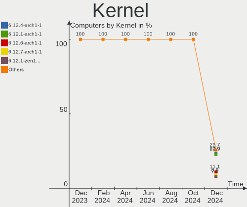
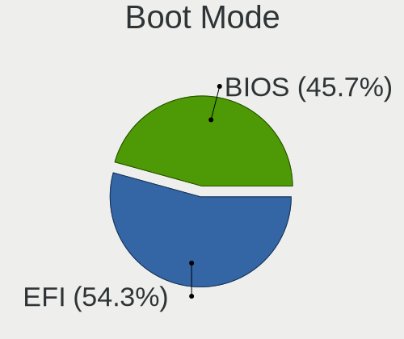
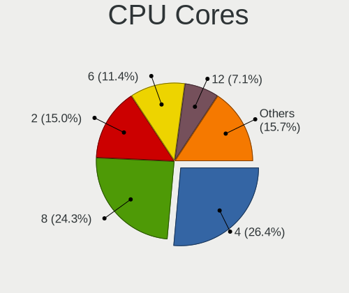

Arch Hardware Trends
--------------------

A project to identify most popular hardware characteristics and track their change
over time based on data collected by Arch users at https://Linux-Hardware.org.

Anyone can contribute to the study by uploading probes of their computers by
the [hw-probe](https://github.com/linuxhw/hw-probe) tool:

    sudo -E hw-probe -all -upload

This is a report for all computer types. See also reports for [desktops](/Dist/Arch/Desktop/README.md) and [notebooks](/Dist/Arch/Notebook/README.md).

Full-feature report is available here: https://linux-hardware.org/?view=trends

Period: Nov, 2020.

Contents
--------

- [ OS                       ](#os)
- [ OS Family                ](#os-family)
- [ Kernel                   ](#kernel)
- [ Kernel Family            ](#kernel-family)
- [ Kernel Major Ver.        ](#kernel-major-ver)
- [ Arch                     ](#arch)
- [ DE                       ](#de)
- [ Display Server           ](#display-server)
- [ Display Manager          ](#display-manager)
- [ OS Lang                  ](#os-lang)
- [ Boot Mode                ](#boot-mode)
- [ Filesystem               ](#filesystem)
- [ Part. scheme             ](#part-scheme)
- [ Dual Boot with Linux/BSD ](#dual-boot-with-linux/bsd)
- [ Dual Boot (Win)          ](#dual-boot-win)
- [ Country                  ](#country)
- [ City                     ](#city)
- [ Vendor                   ](#vendor)
- [ Model                    ](#model)
- [ Model Family             ](#model-family)
- [ MFG Year                 ](#mfg-year)
- [ Form Factor              ](#form-factor)
- [ Secure Boot              ](#secure-boot)
- [ Coreboot                 ](#coreboot)
- [ RAM Size                 ](#ram-size)
- [ RAM Used                 ](#ram-used)
- [ Has CD-ROM               ](#has-cd-rom)
- [ Total Drives             ](#total-drives)
- [ Has Ethernet             ](#has-ethernet)
- [ Drive Vendor             ](#drive-vendor)
- [ Drive Model              ](#drive-model)
- [ HDD Vendor               ](#hdd-vendor)
- [ SSD Vendor               ](#ssd-vendor)
- [ Drive Kind               ](#drive-kind)
- [ Drive Connector          ](#drive-connector)
- [ Drive Size               ](#drive-size)
- [ Space Total              ](#space-total)
- [ Space Used               ](#space-used)
- [ Malfunc. Drives          ](#malfunc-drives)
- [ Malfunc. Drive Vendor    ](#malfunc-drive-vendor)
- [ Malfunc. HDD Vendor      ](#malfunc-hdd-vendor)
- [ Malfunc. Drive Kind      ](#malfunc-drive-kind)
- [ Failed Drives            ](#failed-drives)
- [ Failed Drive Vendor      ](#failed-drive-vendor)
- [ Drive Status             ](#drive-status)
- [ Storage Vendor           ](#storage-vendor)
- [ Storage Model            ](#storage-model)
- [ Storage Kind             ](#storage-kind)
- [ CPU Vendor               ](#cpu-vendor)
- [ CPU Model                ](#cpu-model)
- [ CPU Model Family         ](#cpu-model-family)
- [ CPU Cores                ](#cpu-cores)
- [ CPU Sockets              ](#cpu-sockets)
- [ CPU Threads              ](#cpu-threads)
- [ CPU Op-Modes             ](#cpu-op-modes)
- [ CPU Microcode            ](#cpu-microcode)
- [ CPU Microarch            ](#cpu-microarch)
- [ GPU Vendor               ](#gpu-vendor)
- [ GPU Model                ](#gpu-model)
- [ GPU Combo                ](#gpu-combo)
- [ GPU Driver               ](#gpu-driver)
- [ GPU Memory               ](#gpu-memory)
- [ Monitor Vendor           ](#monitor-vendor)
- [ Monitor Model            ](#monitor-model)
- [ Monitor Resolution       ](#monitor-resolution)
- [ Monitor Diagonal         ](#monitor-diagonal)
- [ Monitor Width            ](#monitor-width)
- [ Aspect Ratio             ](#aspect-ratio)
- [ Monitor Area             ](#monitor-area)
- [ Pixel Density            ](#pixel-density)
- [ Multiple Monitors        ](#multiple-monitors)
- [ Net Controller Vendor    ](#net-controller-vendor)
- [ Net Controller Model     ](#net-controller-model)
- [ Wireless Vendor          ](#wireless-vendor)
- [ Wireless Model           ](#wireless-model)
- [ Ethernet Vendor          ](#ethernet-vendor)
- [ Ethernet Model           ](#ethernet-model)
- [ Net Controller Kind      ](#net-controller-kind)
- [ Used Controller          ](#used-controller)
- [ NICs                     ](#nics)
- [ Memory Vendor            ](#memory-vendor)
- [ Memory Model             ](#memory-model)
- [ Memory Kind              ](#memory-kind)
- [ Memory Form Factor       ](#memory-form-factor)
- [ Memory Size              ](#memory-size)
- [ Memory Speed             ](#memory-speed)
- [ Sound Vendor             ](#sound-vendor)
- [ Sound Model              ](#sound-model)
- [ Camera Vendor            ](#camera-vendor)
- [ Camera Model             ](#camera-model)
- [ Fingerprint Vendor       ](#fingerprint-vendor)
- [ Fingerprint Model        ](#fingerprint-model)
- [ Chipcard Vendor          ](#chipcard-vendor)
- [ Chipcard Model           ](#chipcard-model)
- [ Printer Vendor           ](#printer-vendor)
- [ Printer Model            ](#printer-model)
- [ Scanner Vendor           ](#scanner-vendor)
- [ Scanner Model            ](#scanner-model)
- [ Bluetooth Vendor         ](#bluetooth-vendor)
- [ Bluetooth Model          ](#bluetooth-model)
- [ Unsupported Devices      ](#unsupported-devices)
- [ Unsupported Device Types ](#unsupported-device-types)

OS
--

Installed operating systems

| Name         | Computers | Percent |
|--------------|-----------|---------|
| Arch         | 131       | 69.68%  |
| Arch Rolling | 56        | 29.79%  |
| Arch 2.7     | 1         | 0.53%   |

OS Family
---------

OS without a version

| Name | Computers | Percent |
|------|-----------|---------|
| Arch | 188       | 100%    |

Kernel
------

Version of the Linux kernel

| Version                                                  | Computers | Percent |
|----------------------------------------------------------|-----------|---------|
| 5.9.8-arch1-1                                            | 26        | 13.83%  |
| 5.9.10-arch1-1                                           | 22        | 11.7%   |
| 5.9.9-arch1-1                                            | 18        | 9.57%   |
| 5.9.3-arch1-1                                            | 18        | 9.57%   |
| 5.9.6-arch1-1                                            | 17        | 9.04%   |
| 5.9.4-arch1-1                                            | 12        | 6.38%   |
| 5.9.2-arch1-1                                            | 9         | 4.79%   |
| 5.9.9-zen1-1-zen                                         | 7         | 3.72%   |
| 5.4.77-1-lts                                             | 7         | 3.72%   |
| 5.9.1-arch1-1                                            | 5         | 2.66%   |
| 5.4.74-1-lts                                             | 5         | 2.66%   |
| 5.4.73-1-lts                                             | 4         | 2.13%   |
| 5.9.6-zen1-1-zen                                         | 3         | 1.6%    |
| 5.9.9.a-1-hardened                                       | 2         | 1.06%   |
| 5.9.8-zen1-1-zen                                         | 2         | 1.06%   |
| 5.9.4-zen1-1-zen                                         | 2         | 1.06%   |
| 5.8.14-arch1-1                                           | 2         | 1.06%   |
| 5.4.79-1-lts                                             | 2         | 1.06%   |
| 5.9.9                                                    | 1         | 0.53%   |
| 5.9.8.a-1-hardened-ax3                                   | 1         | 0.53%   |
| 5.9.8.a-1-hardened                                       | 1         | 0.53%   |
| 5.9.8-95-tkg-pds                                         | 1         | 0.53%   |
| 5.9.8-1-ck-haswell                                       | 1         | 0.53%   |
| 5.9.6-xanmod1-1                                          | 1         | 0.53%   |
| 5.9.6-1-ck-zen2                                          | 1         | 0.53%   |
| 5.9.5-95-tkg-bmq                                         | 1         | 0.53%   |
| 5.9.3-zen1-1-zen                                         | 1         | 0.53%   |
| 5.9.3-1-clear                                            | 1         | 0.53%   |
| 5.9.11-zen2-1-zen                                        | 1         | 0.53%   |
| 5.9.10.ll50-1-lingruby                                   | 1         | 0.53%   |
| 5.9.10.a-1-hardened                                      | 1         | 0.53%   |
| 5.9.0-rc5-1-amd-staging-drm-next-git-00658-g868226ff2aeb | 1         | 0.53%   |
| 5.8.14.a-1-hardened                                      | 1         | 0.53%   |
| 5.8.13-arch1-1                                           | 1         | 0.53%   |
| 5.8.12-gentoo                                            | 1         | 0.53%   |
| 5.8.12-arch1-1                                           | 1         | 0.53%   |
| 5.8.11-19-tkg-bmq                                        | 1         | 0.53%   |
| 5.8.10-arch1-1                                           | 1         | 0.53%   |
| 5.4.78-1-lts                                             | 1         | 0.53%   |
| 5.4.75-1-lts                                             | 1         | 0.53%   |
| 5.4.72-microsoft-standard-WSL2                           | 1         | 0.53%   |
| 5.4.72-1-lts                                             | 1         | 0.53%   |
| 5.3.9_1                                                  | 1         | 0.53%   |

Kernel Family
-------------

Linux kernel without a distro release

| Version | Computers | Percent |
|---------|-----------|---------|
| 5.9.8   | 32        | 17.02%  |
| 5.9.9   | 28        | 14.89%  |
| 5.9.10  | 24        | 12.77%  |
| 5.9.6   | 22        | 11.7%   |
| 5.9.3   | 20        | 10.64%  |
| 5.9.4   | 14        | 7.45%   |
| 5.9.2   | 9         | 4.79%   |
| 5.4.77  | 7         | 3.72%   |
| 5.9.1   | 5         | 2.66%   |
| 5.4.74  | 5         | 2.66%   |
| 5.4.73  | 4         | 2.13%   |
| 5.8.14  | 3         | 1.6%    |
| 5.8.12  | 2         | 1.06%   |
| 5.4.79  | 2         | 1.06%   |
| 5.4.72  | 2         | 1.06%   |
| 5.9.5   | 1         | 0.53%   |
| 5.9.11  | 1         | 0.53%   |
| 5.9.0   | 1         | 0.53%   |
| 5.8.13  | 1         | 0.53%   |
| 5.8.11  | 1         | 0.53%   |
| 5.8.10  | 1         | 0.53%   |
| 5.4.78  | 1         | 0.53%   |
| 5.4.75  | 1         | 0.53%   |
| 5.3.9   | 1         | 0.53%   |

Kernel Major Ver.
-----------------

Linux kernel major version

| Version | Computers | Percent |
|---------|-----------|---------|
| 5.9     | 157       | 83.51%  |
| 5.4     | 22        | 11.7%   |
| 5.8     | 8         | 4.26%   |
| 5.3     | 1         | 0.53%   |

Arch
----

OS architecture (x86_64, i586, etc.)

| Name   | Computers | Percent |
|--------|-----------|---------|
| x86_64 | 188       | 100%    |

DE
--

Desktop Environment

| Name            | Computers | Percent |
|-----------------|-----------|---------|
| GNOME           | 84        | 44.68%  |
| KDE5            | 35        | 18.62%  |
| KDE             | 24        | 12.77%  |
| XFCE            | 22        | 11.7%   |
| Unknown         | 7         | 3.72%   |
| i3              | 3         | 1.6%    |
| Deepin          | 3         | 1.6%    |
| Budgie          | 2         | 1.06%   |
| X-Cinnamon      | 1         | 0.53%   |
| Unity           | 1         | 0.53%   |
| sway            | 1         | 0.53%   |
| openbox         | 1         | 0.53%   |
| MATE            | 1         | 0.53%   |
| LXQt            | 1         | 0.53%   |
| GNOME Flashback | 1         | 0.53%   |
| DWM             | 1         | 0.53%   |

Display Server
--------------

X11 or Wayland

| Name    | Computers | Percent |
|---------|-----------|---------|
| X11     | 119       | 63.3%   |
| Wayland | 52        | 27.66%  |
| Tty     | 15        | 7.98%   |
| Unknown | 2         | 1.06%   |

Display Manager
---------------

SDDM, LightDM, etc.

| Name    | Computers | Percent |
|---------|-----------|---------|
| Unknown | 108       | 57.45%  |
| SDDM    | 30        | 15.96%  |
| GDM     | 22        | 11.7%   |
| TDM     | 21        | 11.17%  |
| LightDM | 3         | 1.6%    |
| XDM     | 2         | 1.06%   |
| SLiM    | 1         | 0.53%   |
| LXDM    | 1         | 0.53%   |

OS Lang
-------

Language

| Lang       | Computers | Percent |
|------------|-----------|---------|
| en_US      | 84        | 44.68%  |
| de_DE      | 14        | 7.45%   |
| it_IT      | 10        | 5.32%   |
| en_GB      | 9         | 4.79%   |
| C          | 8         | 4.26%   |
| ru_RU      | 6         | 3.19%   |
| pt_BR      | 6         | 3.19%   |
| pl_PL      | 5         | 2.66%   |
| en_US.utf8 | 4         | 2.13%   |
| en_IN      | 4         | 2.13%   |
| fr_FR      | 3         | 1.6%    |
| zh_CN      | 2         | 1.06%   |
| es_ES      | 2         | 1.06%   |
| en_US      | 2         | 1.06%   |
| en_SG      | 2         | 1.06%   |
| en_CA.utf8 | 2         | 1.06%   |
| en_CA      | 2         | 1.06%   |
| Unknown    | 2         | 1.06%   |
| tr_TR      | 1         | 0.53%   |
| sv_SE.utf8 | 1         | 0.53%   |
| sl_SI      | 1         | 0.53%   |
| pt_PT      | 1         | 0.53%   |
| pl_PL.utf8 | 1         | 0.53%   |
| nl_NL      | 1         | 0.53%   |
| lv_LV      | 1         | 0.53%   |
| fr_FR.utf8 | 1         | 0.53%   |
| fr_CH      | 1         | 0.53%   |
| fr_BE      | 1         | 0.53%   |
| es_GT      | 1         | 0.53%   |
| es_CL      | 1         | 0.53%   |
| es_AR      | 1         | 0.53%   |
| en_NL      | 1         | 0.53%   |
| en_GB.utf8 | 1         | 0.53%   |
| en_AU      | 1         | 0.53%   |
| em_US      | 1         | 0.53%   |
| de_CH      | 1         | 0.53%   |
| cv_RU      | 1         | 0.53%   |
| cs_CZ      | 1         | 0.53%   |
| ca_ES      | 1         | 0.53%   |

Boot Mode
---------

EFI or BIOS

| Mode | Computers | Percent |
|------|-----------|---------|
| EFI  | 116       | 61.7%   |
| BIOS | 72        | 38.3%   |

Filesystem
----------

Type of filesystem

| Type    | Computers | Percent |
|---------|-----------|---------|
| Ext4    | 154       | 81.91%  |
| Btrfs   | 20        | 10.64%  |
| Xfs     | 10        | 5.32%   |
| Zfs     | 1         | 0.53%   |
| Overlay | 1         | 0.53%   |
| F2fs    | 1         | 0.53%   |
| Unknown | 1         | 0.53%   |

Part. scheme
------------

Scheme of partitioning

| Type    | Computers | Percent |
|---------|-----------|---------|
| GPT     | 92        | 48.94%  |
| Unknown | 80        | 42.55%  |
| MBR     | 16        | 8.51%   |

Dual Boot with Linux/BSD
------------------------

Hosting more than one Linux/BSD

| Dual boot | Computers | Percent |
|-----------|-----------|---------|
| No        | 169       | 89.89%  |
| Yes       | 19        | 10.11%  |

Dual Boot (Win)
---------------

Hosting Linux and Windows

| Dual boot | Computers | Percent |
|-----------|-----------|---------|
| No        | 138       | 73.4%   |
| Yes       | 50        | 26.6%   |

Country
-------

Geographic location (country)

| Country                     | Computers | Percent |
|-----------------------------|-----------|---------|
| USA                         | 36        | 19.15%  |
| Germany                     | 25        | 13.3%   |
| Italy                       | 14        | 7.45%   |
| Russia                      | 12        | 6.38%   |
| Brazil                      | 10        | 5.32%   |
| Poland                      | 7         | 3.72%   |
| India                       | 6         | 3.19%   |
| France                      | 6         | 3.19%   |
| Canada                      | 6         | 3.19%   |
| UK                          | 5         | 2.66%   |
| Spain                       | 5         | 2.66%   |
| Switzerland                 | 4         | 2.13%   |
| Netherlands                 | 4         | 2.13%   |
| Norway                      | 3         | 1.6%    |
| Guatemala                   | 3         | 1.6%    |
| Turkey                      | 2         | 1.06%   |
| Mexico                      | 2         | 1.06%   |
| Indonesia                   | 2         | 1.06%   |
| Greece                      | 2         | 1.06%   |
| Finland                     | 2         | 1.06%   |
| China                       | 2         | 1.06%   |
| Chile                       | 2         | 1.06%   |
| Belarus                     | 2         | 1.06%   |
| Austria                     | 2         | 1.06%   |
| UAE                         | 1         | 0.53%   |
| Thailand                    | 1         | 0.53%   |
| Taiwan                      | 1         | 0.53%   |
| Sweden                      | 1         | 0.53%   |
| Slovenia                    | 1         | 0.53%   |
| Slovakia                    | 1         | 0.53%   |
| Singapore                   | 1         | 0.53%   |
| Serbia                      | 1         | 0.53%   |
| Portugal                    | 1         | 0.53%   |
| Paraguay                    | 1         | 0.53%   |
| New Zealand                 | 1         | 0.53%   |
| Latvia                      | 1         | 0.53%   |
| Jordan                      | 1         | 0.53%   |
| Israel                      | 1         | 0.53%   |
| Iran                        | 1         | 0.53%   |
| Hong Kong                   | 1         | 0.53%   |
| Hashemite Kingdom of Jordan | 1         | 0.53%   |
| Denmark                     | 1         | 0.53%   |
| Czech Republic              | 1         | 0.53%   |
| Croatia                     | 1         | 0.53%   |
| Cote D'Ivoire               | 1         | 0.53%   |
| Belgium                     | 1         | 0.53%   |
| Bahrain                     | 1         | 0.53%   |
| Argentina                   | 1         | 0.53%   |

City
----

Geographic location (city)

| City                   | Computers | Percent |
|------------------------|-----------|---------|
| Moscow                 | 6         | 3.19%   |
| St Petersburg          | 3         | 1.6%    |
| Paducah                | 3         | 1.6%    |
| Houston                | 3         | 1.6%    |
| Guatemala City         | 3         | 1.6%    |
| Zurich                 | 2         | 1.06%   |
| Toulouse               | 2         | 1.06%   |
| Rome                   | 2         | 1.06%   |
| Plano                  | 2         | 1.06%   |
| Oslo                   | 2         | 1.06%   |
| Mönchengladbach       | 2         | 1.06%   |
| Munich                 | 2         | 1.06%   |
| Los Angeles            | 2         | 1.06%   |
| Krakow                 | 2         | 1.06%   |
| Jakarta                | 2         | 1.06%   |
| Indianapolis           | 2         | 1.06%   |
| Helsinki               | 2         | 1.06%   |
| Hamburg                | 2         | 1.06%   |
| Curitiba               | 2         | 1.06%   |
| Bordighera             | 2         | 1.06%   |
| Atlanta                | 2         | 1.06%   |
| Athens                 | 2         | 1.06%   |
| Amman                  | 2         | 1.06%   |
| Örebro                | 1         | 0.53%   |
| Zwolle                 | 1         | 0.53%   |
| Zohor                  | 1         | 0.53%   |
| Wuppertal              | 1         | 0.53%   |
| Weyerbusch             | 1         | 0.53%   |
| Wellington             | 1         | 0.53%   |
| Warsaw                 | 1         | 0.53%   |
| Vienna                 | 1         | 0.53%   |
| Verona                 | 1         | 0.53%   |
| Trausnitz              | 1         | 0.53%   |
| Trabzon                | 1         | 0.53%   |
| Torre del Greco        | 1         | 0.53%   |
| Thrissur               | 1         | 0.53%   |
| Taranto                | 1         | 0.53%   |
| São Paulo             | 1         | 0.53%   |
| Szydlowiec             | 1         | 0.53%   |
| Surat                  | 1         | 0.53%   |
| Stuttgart              | 1         | 0.53%   |
| Stuhr                  | 1         | 0.53%   |
| St Louis               | 1         | 0.53%   |
| Songshan               | 1         | 0.53%   |
| Singapore              | 1         | 0.53%   |
| Siemianowice Śląskie | 1         | 0.53%   |
| Sharjah                | 1         | 0.53%   |
| Shanghai               | 1         | 0.53%   |
| Schenna                | 1         | 0.53%   |
| Schellerten            | 1         | 0.53%   |
| Santiago               | 1         | 0.53%   |
| Sanandij               | 1         | 0.53%   |
| San Ramon              | 1         | 0.53%   |
| San Jose               | 1         | 0.53%   |
| San Diego              | 1         | 0.53%   |
| Saint-Jean-d'Illac     | 1         | 0.53%   |
| Rzeszów               | 1         | 0.53%   |
| Rio de Janeiro         | 1         | 0.53%   |
| Rinteln                | 1         | 0.53%   |
| Riga                   | 1         | 0.53%   |

Vendor
------

Motherboard manufacturer

| Name                | Computers | Percent |
|---------------------|-----------|---------|
| Lenovo              | 45        | 23.94%  |
| ASUSTek Computer    | 36        | 19.15%  |
| Gigabyte Technology | 21        | 11.17%  |
| Dell                | 20        | 10.64%  |
| Hewlett-Packard     | 17        | 9.04%   |
| Acer                | 9         | 4.79%   |
| MSI                 | 8         | 4.26%   |
| ASRock              | 6         | 3.19%   |
| Unknown             | 5         | 2.66%   |
| Samsung Electronics | 3         | 1.6%    |
| Toshiba             | 2         | 1.06%   |
| Notebook            | 2         | 1.06%   |
| HUAWEI              | 2         | 1.06%   |
| ZOTAC               | 1         | 0.53%   |
| TUXEDO              | 1         | 0.53%   |
| Sony                | 1         | 0.53%   |
| Razer               | 1         | 0.53%   |
| Pegatron            | 1         | 0.53%   |
| PCWare              | 1         | 0.53%   |
| Intel               | 1         | 0.53%   |
| Google              | 1         | 0.53%   |
| Eluktronics         | 1         | 0.53%   |
| Colorful Technology | 1         | 0.53%   |
| Chuwi               | 1         | 0.53%   |
| Acidanthera         | 1         | 0.53%   |

Model
-----

Motherboard model

| Name                                                  | Computers | Percent |
|-------------------------------------------------------|-----------|---------|
| Unknown                                               | 6         | 3.19%   |
| Lenovo Legion 5 15ARH05 82B5                          | 2         | 1.06%   |
| Gigabyte B450M DS3H                                   | 2         | 1.06%   |
| Gigabyte B450 AORUS PRO WIFI                          | 2         | 1.06%   |
| ASUS TUF GAMING X570-PLUS                             | 2         | 1.06%   |
| ZOTAC ZBOX-ID18                                       | 1         | 0.53%   |
| TUXEDO InfinityBook Pro 15 v4                         | 1         | 0.53%   |
| Toshiba Satellite Pro C655                            | 1         | 0.53%   |
| Toshiba Satellite L500                                | 1         | 0.53%   |
| Sony VJF155B0121B                                     | 1         | 0.53%   |
| Samsung N150/N210/N220                                | 1         | 0.53%   |
| Samsung 550XCJ/550XCR                                 | 1         | 0.53%   |
| Samsung 350V5C/351V5C/3540VC/3440VC                   | 1         | 0.53%   |
| Razer Blade 15 Studio Edition (Early 2020) - RZ09-033 | 1         | 0.53%   |
| Pegatron p7-1030                                      | 1         | 0.53%   |
| PCWare IPMH110G-DDR3                                  | 1         | 0.53%   |
| Notebook P64_HJ,HK1                                   | 1         | 0.53%   |
| Notebook NH5xAx                                       | 1         | 0.53%   |
| MSI PE70 6QE                                          | 1         | 0.53%   |
| MSI NY518AA-ABM p6200la                               | 1         | 0.53%   |
| MSI MS-7C95                                           | 1         | 0.53%   |
| MSI MS-7C37                                           | 1         | 0.53%   |
| MSI MS-7B89                                           | 1         | 0.53%   |
| MSI MS-7A38                                           | 1         | 0.53%   |
| MSI MS-7924                                           | 1         | 0.53%   |
| MSI Bravo 15 A4DDR                                    | 1         | 0.53%   |
| Lenovo Yoga C740-14IML 81TC                           | 1         | 0.53%   |
| Lenovo Y520-15IKBN 80WK                               | 1         | 0.53%   |
| Lenovo ThinkPad Yoga 14 20FY0002US                    | 1         | 0.53%   |
| Lenovo ThinkPad X1 Yoga Gen 5 20UBCTO1WW              | 1         | 0.53%   |
| Lenovo ThinkPad X1 Carbon 7th 20QD003CRT              | 1         | 0.53%   |
| Lenovo ThinkPad X1 Carbon 6th 20KH002RUS              | 1         | 0.53%   |
| Lenovo ThinkPad X1 Carbon 6th 20KG0022US              | 1         | 0.53%   |
| Lenovo ThinkPad X1 Carbon 5th 20HQS03P00              | 1         | 0.53%   |
| Lenovo ThinkPad X1 Carbon 3rd 20BSCTO1WW              | 1         | 0.53%   |
| Lenovo ThinkPad T61 7663BL3                           | 1         | 0.53%   |
| Lenovo ThinkPad T580 20L9CTO1WW                       | 1         | 0.53%   |
| Lenovo ThinkPad T530 2429AE1                          | 1         | 0.53%   |
| Lenovo ThinkPad T530 24296HG                          | 1         | 0.53%   |
| Lenovo ThinkPad T495 20NJ0008US                       | 1         | 0.53%   |
| Lenovo ThinkPad T480s 20L8S7PP06                      | 1         | 0.53%   |
| Lenovo ThinkPad T480s 20L8S7KH00                      | 1         | 0.53%   |
| Lenovo ThinkPad T480s 20L8S2SD00                      | 1         | 0.53%   |
| Lenovo ThinkPad T470s 20HGS33N00                      | 1         | 0.53%   |
| Lenovo ThinkPad T460p 20FWCTO1WW                      | 1         | 0.53%   |
| Lenovo ThinkPad T460p 20FW0044AU                      | 1         | 0.53%   |
| Lenovo ThinkPad T440p 20AWS0VK00                      | 1         | 0.53%   |
| Lenovo ThinkPad T430s 23571A3                         | 1         | 0.53%   |
| Lenovo ThinkPad T420 4236MD4                          | 1         | 0.53%   |
| Lenovo ThinkPad T420 4178C9U                          | 1         | 0.53%   |
| Lenovo ThinkPad T410s 2904CGU                         | 1         | 0.53%   |
| Lenovo ThinkPad T400 6474AH5                          | 1         | 0.53%   |
| Lenovo ThinkPad P53 20QNCTO1WW                        | 1         | 0.53%   |
| Lenovo ThinkPad P14s Gen 1 20S4CTO1WW                 | 1         | 0.53%   |
| Lenovo ThinkPad L380 Yoga 20M8S01400                  | 1         | 0.53%   |
| Lenovo ThinkPad L380 20M5CTO1WW                       | 1         | 0.53%   |
| Lenovo ThinkPad L14 Gen 1 20U50001GE                  | 1         | 0.53%   |
| Lenovo ThinkPad E570 20H5CTO1WW                       | 1         | 0.53%   |
| Lenovo ThinkPad E15 Gen 2 20T8000TIX                  | 1         | 0.53%   |
| Lenovo ThinkPad E14 Gen 2 20T6000SIX                  | 1         | 0.53%   |

Model Family
------------

Motherboard model prefix

| Name                  | Computers | Percent |
|-----------------------|-----------|---------|
| Lenovo ThinkPad       | 32        | 17.02%  |
| Dell Inspiron         | 8         | 4.26%   |
| Unknown               | 6         | 3.19%   |
| Lenovo IdeaPad        | 5         | 2.66%   |
| Dell XPS              | 5         | 2.66%   |
| Acer Aspire           | 5         | 2.66%   |
| Lenovo Legion         | 4         | 2.13%   |
| HP EliteBook          | 4         | 2.13%   |
| ASUS VivoBook         | 4         | 2.13%   |
| ASUS PRIME            | 4         | 2.13%   |
| HP ENVY               | 3         | 1.6%    |
| Dell Latitude         | 3         | 1.6%    |
| ASUS TUF              | 3         | 1.6%    |
| ASUS STRIX            | 3         | 1.6%    |
| ASUS ROG              | 3         | 1.6%    |
| Toshiba Satellite     | 2         | 1.06%   |
| HP Spectre            | 2         | 1.06%   |
| HP Laptop             | 2         | 1.06%   |
| Gigabyte B450M        | 2         | 1.06%   |
| Gigabyte B450         | 2         | 1.06%   |
| Dell Precision        | 2         | 1.06%   |
| Dell OptiPlex         | 2         | 1.06%   |
| Acer Nitro            | 2         | 1.06%   |
| ZOTAC ZBOX-ID18       | 1         | 0.53%   |
| TUXEDO InfinityBook   | 1         | 0.53%   |
| Sony VJF155B0121B     | 1         | 0.53%   |
| Samsung N150          | 1         | 0.53%   |
| Samsung 550XCJ        | 1         | 0.53%   |
| Samsung 350V5C        | 1         | 0.53%   |
| Razer Blade           | 1         | 0.53%   |
| Pegatron p7-1030      | 1         | 0.53%   |
| PCWare IPMH110G-DDR3  | 1         | 0.53%   |
| Notebook P64          | 1         | 0.53%   |
| Notebook NH5xAx       | 1         | 0.53%   |
| MSI PE70              | 1         | 0.53%   |
| MSI NY518AA-ABM       | 1         | 0.53%   |
| MSI MS-7C95           | 1         | 0.53%   |
| MSI MS-7C37           | 1         | 0.53%   |
| MSI MS-7B89           | 1         | 0.53%   |
| MSI MS-7A38           | 1         | 0.53%   |
| MSI MS-7924           | 1         | 0.53%   |
| MSI Bravo             | 1         | 0.53%   |
| Lenovo Yoga           | 1         | 0.53%   |
| Lenovo Y520-15IKBN    | 1         | 0.53%   |
| Lenovo ThinkCentre    | 1         | 0.53%   |
| Intel X79             | 1         | 0.53%   |
| HUAWEI MACHC-WAX9     | 1         | 0.53%   |
| HUAWEI BOHK-WAX9X     | 1         | 0.53%   |
| HP Stream             | 1         | 0.53%   |
| HP ProBook            | 1         | 0.53%   |
| HP Pavilion           | 1         | 0.53%   |
| HP Notebook           | 1         | 0.53%   |
| HP Compaq             | 1         | 0.53%   |
| HP 420                | 1         | 0.53%   |
| Google Celes          | 1         | 0.53%   |
| Gigabyte Z97X-UD5H    | 1         | 0.53%   |
| Gigabyte Z97P-D3      | 1         | 0.53%   |
| Gigabyte Z87X-UD3H    | 1         | 0.53%   |
| Gigabyte Z170X-Gaming | 1         | 0.53%   |
| Gigabyte Z170-HD3P    | 1         | 0.53%   |

MFG Year
--------

Motherboard manufacture year

| Year    | Computers | Percent |
|---------|-----------|---------|
| 2020    | 50        | 26.6%   |
| 2019    | 42        | 22.34%  |
| 2018    | 35        | 18.62%  |
| 2017    | 11        | 5.85%   |
| 2011    | 10        | 5.32%   |
| 2015    | 8         | 4.26%   |
| 2013    | 8         | 4.26%   |
| 2010    | 8         | 4.26%   |
| 2014    | 5         | 2.66%   |
| 2012    | 5         | 2.66%   |
| 2016    | 4         | 2.13%   |
| 2009    | 1         | 0.53%   |
| Unknown | 1         | 0.53%   |

Form Factor
-----------

Physical design of the computer

| Name        | Computers | Percent |
|-------------|-----------|---------|
| Notebook    | 108       | 57.45%  |
| Desktop     | 65        | 34.57%  |
| Convertible | 11        | 5.85%   |
| All in one  | 2         | 1.06%   |
| Tablet      | 1         | 0.53%   |
| Mini pc     | 1         | 0.53%   |

Secure Boot
-----------

Enabled or disabled

| State    | Computers | Percent |
|----------|-----------|---------|
| Disabled | 186       | 98.94%  |
| Enabled  | 2         | 1.06%   |

Coreboot
--------

Have coreboot on board

| Used | Computers | Percent |
|------|-----------|---------|
| No   | 187       | 99.47%  |
| Yes  | 1         | 0.53%   |

RAM Size
--------

Total RAM memory

| Size in GB  | Computers | Percent |
|-------------|-----------|---------|
| 16.01-24.0  | 57        | 30.32%  |
| 4.01-8.0    | 39        | 20.74%  |
| 8.01-16.0   | 28        | 14.89%  |
| 32.01-64.0  | 26        | 13.83%  |
| 3.01-4.0    | 19        | 10.11%  |
| 24.01-32.0  | 7         | 3.72%   |
| 64.01-256.0 | 6         | 3.19%   |
| 1.01-2.0    | 4         | 2.13%   |
| 2.01-3.0    | 1         | 0.53%   |
| 0.01-1.0    | 1         | 0.53%   |

RAM Used
--------

Used RAM memory

| Used GB    | Computers | Percent |
|------------|-----------|---------|
| 1.01-2.0   | 58        | 30.85%  |
| 4.01-8.0   | 43        | 22.87%  |
| 2.01-3.0   | 35        | 18.62%  |
| 3.01-4.0   | 27        | 14.36%  |
| 8.01-16.0  | 12        | 6.38%   |
| 0.01-1.0   | 10        | 5.32%   |
| 16.01-24.0 | 2         | 1.06%   |
| 24.01-32.0 | 1         | 0.53%   |

Has CD-ROM
----------

Has CD-ROM on board

| Presented | Computers | Percent |
|-----------|-----------|---------|
| No        | 152       | 80.85%  |
| Yes       | 36        | 19.15%  |

Total Drives
------------

Number of drives on board

| Drives | Computers | Percent |
|--------|-----------|---------|
| 1      | 100       | 53.19%  |
| 2      | 48        | 25.53%  |
| 3      | 21        | 11.17%  |
| 4      | 8         | 4.26%   |
| 5      | 7         | 3.72%   |
| 9      | 2         | 1.06%   |
| 7      | 1         | 0.53%   |
| 6      | 1         | 0.53%   |

Has Ethernet
------------

Has Ethernet on board

| Presented | Computers | Percent |
|-----------|-----------|---------|
| Yes       | 155       | 82.45%  |
| No        | 33        | 17.55%  |

Drive Vendor
------------

Hard drive vendors

| Vendor                    | Computers | Drives | Percent |
|---------------------------|-----------|--------|---------|
| Samsung Electronics       | 70        | 85     | 23.18%  |
| WDC                       | 42        | 51     | 13.91%  |
| Seagate                   | 40        | 45     | 13.25%  |
| SanDisk                   | 22        | 28     | 7.28%   |
| Toshiba                   | 18        | 21     | 5.96%   |
| Kingston                  | 14        | 16     | 4.64%   |
| Intel                     | 11        | 12     | 3.64%   |
| Crucial                   | 11        | 14     | 3.64%   |
| Hitachi                   | 10        | 10     | 3.31%   |
| Unknown                   | 8         | 9      | 2.65%   |
| SK Hynix                  | 7         | 7      | 2.32%   |
| Micron Technology         | 6         | 6      | 1.99%   |
| A-DATA Technology         | 5         | 5      | 1.66%   |
| Phison                    | 4         | 4      | 1.32%   |
| HGST                      | 4         | 5      | 1.32%   |
| Silicon Motion            | 2         | 3      | 0.66%   |
| Patriot                   | 2         | 2      | 0.66%   |
| OCZ                       | 2         | 2      | 0.66%   |
| Micron/Crucial Technology | 2         | 3      | 0.66%   |
| LITEONIT                  | 2         | 2      | 0.66%   |
| Corsair                   | 2         | 2      | 0.66%   |
| Yangtze Memory            | 1         | 1      | 0.33%   |
| XPG                       | 1         | 1      | 0.33%   |
| Transcend                 | 1         | 1      | 0.33%   |
| Team                      | 1         | 1      | 0.33%   |
| TCSUNBOW                  | 1         | 1      | 0.33%   |
| PNY                       | 1         | 1      | 0.33%   |
| PLEXTOR                   | 1         | 1      | 0.33%   |
| Mushkin                   | 1         | 1      | 0.33%   |
| Msft                      | 1         | 3      | 0.33%   |
| Lenovo                    | 1         | 1      | 0.33%   |
| KingSpec                  | 1         | 1      | 0.33%   |
| JMicron                   | 1         | 1      | 0.33%   |
| JAMESDONKEY               | 1         | 1      | 0.33%   |
| FORESEE                   | 1         | 1      | 0.33%   |
| Dell                      | 1         | 1      | 0.33%   |
| China                     | 1         | 1      | 0.33%   |
| Apple                     | 1         | 1      | 0.33%   |
| ADATA Technology          | 1         | 1      | 0.33%   |

Drive Model
-----------

Hard drive models

| Model                                  | Computers | Percent |
|----------------------------------------|-----------|---------|
| Samsung NVMe SSD Drive 512GB           | 10        | 2.97%   |
| Seagate ST1000LM024 HN-M101MBB 1TB     | 6         | 1.78%   |
| Samsung NVMe SSD Drive 1024GB          | 5         | 1.48%   |
| Seagate ST1000LM035-1RK172 1TB         | 4         | 1.19%   |
| SanDisk SDSSDA240G 240GB               | 4         | 1.19%   |
| Samsung SSD 860 EVO 500GB              | 4         | 1.19%   |
| Samsung SSD 850 EVO 1TB                | 4         | 1.19%   |
| Kingston SA400S37240G 240GB SSD        | 4         | 1.19%   |
| WDC WD10SPZX-21Z10T0 1TB               | 3         | 0.89%   |
| WDC WD10EZEX-08WN4A0 1TB               | 3         | 0.89%   |
| Toshiba MQ04ABF100 1TB                 | 3         | 0.89%   |
| Seagate ST2000LM015-2E8174 2TB         | 3         | 0.89%   |
| Sandisk NVMe SSD Drive 512GB           | 3         | 0.89%   |
| Samsung SSD 970 EVO 1TB                | 3         | 0.89%   |
| Samsung SSD 850 EVO 250GB              | 3         | 0.89%   |
| Intel NVMe SSD Drive 1024GB            | 3         | 0.89%   |
| Crucial CT500MX500SSD1 500GB           | 3         | 0.89%   |
| WDC WDS250G2B0A-00SM50 250GB SSD       | 2         | 0.59%   |
| WDC PC SN730 SDBPNTY-512G-1101 512GB   | 2         | 0.59%   |
| Toshiba NVMe SSD Drive 256GB           | 2         | 0.59%   |
| Toshiba MQ01ABD100 1TB                 | 2         | 0.59%   |
| Seagate ST500LT012-1DG142 500GB        | 2         | 0.59%   |
| Seagate ST4000DM004-2CV104 4TB         | 2         | 0.59%   |
| Seagate ST2000LX001-1RG174 2TB         | 2         | 0.59%   |
| Seagate ST2000LM007-1R8174 2TB         | 2         | 0.59%   |
| Seagate ST2000DM006-2DM164 2TB         | 2         | 0.59%   |
| Seagate ST1000DL002-9TT153 1TB         | 2         | 0.59%   |
| SanDisk SSD PLUS 240GB                 | 2         | 0.59%   |
| Samsung SSD 970 EVO Plus 500GB         | 2         | 0.59%   |
| Samsung SSD 960 EVO 250GB              | 2         | 0.59%   |
| Samsung SSD 860 QVO 1TB                | 2         | 0.59%   |
| Samsung SSD 860 EVO 250GB              | 2         | 0.59%   |
| Samsung SSD 850 PRO 256GB              | 2         | 0.59%   |
| Samsung SSD 850 PRO 1TB                | 2         | 0.59%   |
| Samsung SSD 850 EVO 500GB              | 2         | 0.59%   |
| Samsung NVMe SSD Drive 500GB           | 2         | 0.59%   |
| Samsung NVMe SSD Drive 1TB             | 2         | 0.59%   |
| Samsung MZVLB1T0HBLR-000L2 1TB         | 2         | 0.59%   |
| Samsung HD103SJ 1TB                    | 2         | 0.59%   |
| Micron/Crucial NVMe SSD Drive 1TB      | 2         | 0.59%   |
| Micron NVMe SSD Drive 512GB            | 2         | 0.59%   |
| Kingston SA2000M8500G 500GB            | 2         | 0.59%   |
| Kingston SA2000M8250G 250GB            | 2         | 0.59%   |
| Intel NVMe SSD Drive 512GB             | 2         | 0.59%   |
| Hitachi HUA723020ALA641 2TB            | 2         | 0.59%   |
| Hitachi HDS721010CLA332 1TB            | 2         | 0.59%   |
| Crucial M4-CT128M4SSD2 128GB           | 2         | 0.59%   |
| Yangtze Memory ZHITAI PC005 Active 1TB | 1         | 0.3%    |
| XPG NVMe SSD Drive 512GB               | 1         | 0.3%    |
| WDC WDS500G3X0C-00SJG0 500GB           | 1         | 0.3%    |
| WDC WDS500G2X0C-00L350 500GB           | 1         | 0.3%    |
| WDC WDS500G2B0B-00YS70 500GB SSD       | 1         | 0.3%    |
| WDC WDS500G2B0A-00SM50 500GB SSD       | 1         | 0.3%    |
| WDC WDS500G1B0B-00AS40 500GB SSD       | 1         | 0.3%    |
| WDC WDS256G1X0C-00ENX0 256GB           | 1         | 0.3%    |
| WDC WDS250G1B0B-00AS40 250GB SSD       | 1         | 0.3%    |
| WDC WDS200T2B0A-00SM50 2TB SSD         | 1         | 0.3%    |
| WDC WDS120G2G0B-00EPW0 120GB SSD       | 1         | 0.3%    |
| WDC WDS100T2X0C-00L350 1TB             | 1         | 0.3%    |
| WDC WD6400AAKS-00A7B0 640GB            | 1         | 0.3%    |

HDD Vendor
----------

Hard disk drive vendors

| Vendor              | Computers | Drives | Percent |
|---------------------|-----------|--------|---------|
| Seagate             | 40        | 45     | 38.83%  |
| WDC                 | 29        | 35     | 28.16%  |
| Toshiba             | 14        | 17     | 13.59%  |
| Hitachi             | 10        | 10     | 9.71%   |
| Samsung Electronics | 4         | 4      | 3.88%   |
| HGST                | 4         | 5      | 3.88%   |
| Msft                | 1         | 3      | 0.97%   |
| Apple               | 1         | 1      | 0.97%   |

SSD Vendor
----------

Solid state drive vendors

| Vendor              | Computers | Drives | Percent |
|---------------------|-----------|--------|---------|
| Samsung Electronics | 31        | 35     | 31.96%  |
| SanDisk             | 13        | 18     | 13.4%   |
| Crucial             | 10        | 12     | 10.31%  |
| Kingston            | 9         | 10     | 9.28%   |
| WDC                 | 7         | 8      | 7.22%   |
| SK Hynix            | 3         | 3      | 3.09%   |
| A-DATA Technology   | 3         | 3      | 3.09%   |
| Patriot             | 2         | 2      | 2.06%   |
| OCZ                 | 2         | 2      | 2.06%   |
| Micron Technology   | 2         | 2      | 2.06%   |
| LITEONIT            | 2         | 2      | 2.06%   |
| Intel               | 2         | 2      | 2.06%   |
| Transcend           | 1         | 1      | 1.03%   |
| Toshiba             | 1         | 1      | 1.03%   |
| Team                | 1         | 1      | 1.03%   |
| TCSUNBOW            | 1         | 1      | 1.03%   |
| PNY                 | 1         | 1      | 1.03%   |
| Mushkin             | 1         | 1      | 1.03%   |
| KingSpec            | 1         | 1      | 1.03%   |
| FORESEE             | 1         | 1      | 1.03%   |
| Dell                | 1         | 1      | 1.03%   |
| Corsair             | 1         | 1      | 1.03%   |
| China               | 1         | 1      | 1.03%   |

Drive Kind
----------

HDD or SSD

| Kind    | Computers | Drives | Percent |
|---------|-----------|--------|---------|
| NVMe    | 89        | 111    | 33.21%  |
| HDD     | 87        | 120    | 32.46%  |
| SSD     | 82        | 110    | 30.6%   |
| MMC     | 9         | 10     | 3.36%   |
| Unknown | 1         | 1      | 0.37%   |

Drive Connector
---------------

SATA, SAS, NVMe, etc.

| Type | Computers | Drives | Percent |
|------|-----------|--------|---------|
| SATA | 129       | 225    | 55.6%   |
| NVMe | 89        | 110    | 38.36%  |
| MMC  | 9         | 10     | 3.88%   |
| SAS  | 5         | 7      | 2.16%   |

Drive Size
----------

Size of hard drive

| Size in TB | Computers | Drives | Percent |
|------------|-----------|--------|---------|
| 0.01-0.5   | 87        | 113    | 48.33%  |
| 0.51-1.0   | 59        | 78     | 32.78%  |
| 1.01-2.0   | 24        | 26     | 13.33%  |
| 3.01-4.0   | 4         | 5      | 2.22%   |
| 4.01-10.0  | 4         | 5      | 2.22%   |
| 2.01-3.0   | 2         | 3      | 1.11%   |

Space Total
-----------

Amount of disk space available on the file system

| Size in GB     | Computers | Percent |
|----------------|-----------|---------|
| 251-500        | 56        | 29.79%  |
| 101-250        | 46        | 24.47%  |
| 501-1000       | 37        | 19.68%  |
| 1001-2000      | 15        | 7.98%   |
| More than 3000 | 11        | 5.85%   |
| 51-100         | 8         | 4.26%   |
| 21-50          | 6         | 3.19%   |
| 2001-3000      | 4         | 2.13%   |
| Unknown        | 4         | 2.13%   |
| 1-20           | 1         | 0.53%   |

Space Used
----------

Amount of used disk space

| Used GB        | Computers | Percent |
|----------------|-----------|---------|
| 1-20           | 43        | 22.87%  |
| 101-250        | 37        | 19.68%  |
| 51-100         | 30        | 15.96%  |
| 21-50          | 26        | 13.83%  |
| 251-500        | 23        | 12.23%  |
| 501-1000       | 14        | 7.45%   |
| 2001-3000      | 5         | 2.66%   |
| More than 3000 | 4         | 2.13%   |
| Unknown        | 4         | 2.13%   |
| 1001-2000      | 2         | 1.06%   |

Malfunc. Drives
---------------

Drive models with a malfunction

| Model                                 | Computers | Drives | Percent |
|---------------------------------------|-----------|--------|---------|
| WDC WD5000AAKX-75U6AA0 500GB          | 1         | 1      | 7.14%   |
| WDC WD5000AAKX-22ERMA0 500GB          | 1         | 1      | 7.14%   |
| WDC WD2500BEVT-22A23T0 250GB          | 1         | 1      | 7.14%   |
| Transcend TS8GHSD630 8GB SSD          | 1         | 1      | 7.14%   |
| Toshiba MQ01ABD100 1TB                | 1         | 4      | 7.14%   |
| Seagate ST3320418AS 320GB             | 1         | 1      | 7.14%   |
| Seagate ST2000LM015-2E8174 2TB        | 1         | 1      | 7.14%   |
| Seagate ST2000DM001-1ER164 2TB        | 1         | 1      | 7.14%   |
| Seagate ST1000LM035-1RK172 1TB        | 1         | 1      | 7.14%   |
| Samsung Electronics SSD 960 EVO 250GB | 1         | 1      | 7.14%   |
| PLEXTOR PX-1TM8SeG 1TB                | 1         | 1      | 7.14%   |
| OCZ VERTEX4 256GB SSD                 | 1         | 1      | 7.14%   |
| Hitachi HTS545025B9A300 250GB         | 1         | 1      | 7.14%   |
| Hitachi HTS543225L9A300 250GB         | 1         | 1      | 7.14%   |

Malfunc. Drive Vendor
---------------------

Vendors of faulty drives

| Vendor              | Computers | Drives | Percent |
|---------------------|-----------|--------|---------|
| Seagate             | 4         | 4      | 28.57%  |
| WDC                 | 3         | 3      | 21.43%  |
| Hitachi             | 2         | 2      | 14.29%  |
| Transcend           | 1         | 1      | 7.14%   |
| Toshiba             | 1         | 4      | 7.14%   |
| Samsung Electronics | 1         | 1      | 7.14%   |
| PLEXTOR             | 1         | 1      | 7.14%   |
| OCZ                 | 1         | 1      | 7.14%   |

Malfunc. HDD Vendor
-------------------

Vendors of faulty HDD drives

| Vendor  | Computers | Drives | Percent |
|---------|-----------|--------|---------|
| Seagate | 4         | 4      | 40%     |
| WDC     | 3         | 3      | 30%     |
| Hitachi | 2         | 2      | 20%     |
| Toshiba | 1         | 4      | 10%     |

Malfunc. Drive Kind
-------------------

Kinds of faulty drives

| Kind | Computers | Drives | Percent |
|------|-----------|--------|---------|
| HDD  | 10        | 13     | 71.43%  |
| NVMe | 2         | 2      | 14.29%  |
| SSD  | 2         | 2      | 14.29%  |

Failed Drives
-------------

Failed drive models

Zero info for selected period =(

Failed Drive Vendor
-------------------

Failed drive vendors

Zero info for selected period =(

Drive Status
------------

Number of failed and malfunc. drives

| Status   | Computers | Drives | Percent |
|----------|-----------|--------|---------|
| Detected | 112       | 206    | 56.57%  |
| Works    | 72        | 129    | 36.36%  |
| Malfunc  | 14        | 17     | 7.07%   |

Storage Vendor
--------------

Storage controller vendors

| Vendor                       | Computers | Percent |
|------------------------------|-----------|---------|
| Intel                        | 116       | 45.31%  |
| AMD                          | 42        | 16.41%  |
| Samsung Electronics          | 41        | 16.02%  |
| Sandisk                      | 14        | 5.47%   |
| Kingston Technology Company  | 6         | 2.34%   |
| Phison Electronics           | 5         | 1.95%   |
| SK Hynix                     | 4         | 1.56%   |
| Micron Technology            | 4         | 1.56%   |
| ASMedia Technology           | 4         | 1.56%   |
| Toshiba America Info Systems | 3         | 1.17%   |
| ADATA Technology             | 3         | 1.17%   |
| Silicon Motion               | 2         | 0.78%   |
| Micron/Crucial Technology    | 2         | 0.78%   |
| Marvell Technology Group     | 2         | 0.78%   |
| Yangtze Memory Technologies  | 1         | 0.39%   |
| VIA Technologies             | 1         | 0.39%   |
| Red Hat                      | 1         | 0.39%   |
| Realtek Semiconductor        | 1         | 0.39%   |
| Lite-On Technology           | 1         | 0.39%   |
| Lenovo                       | 1         | 0.39%   |
| JMicron Technology           | 1         | 0.39%   |
| Adaptec                      | 1         | 0.39%   |

Storage Model
-------------

Storage controller models

| Model                                                                            | Computers | Percent |
|----------------------------------------------------------------------------------|-----------|---------|
| AMD FCH SATA Controller [AHCI mode]                                              | 34        | 11.85%  |
| Samsung Electronics NVMe SSD Controller SM981/PM981/PM983                        | 33        | 11.5%   |
| Intel HM170/QM170 Chipset SATA Controller [AHCI Mode]                            | 10        | 3.48%   |
| Intel Sunrise Point-LP SATA Controller [AHCI mode]                               | 9         | 3.14%   |
| AMD 400 Series Chipset SATA Controller                                           | 9         | 3.14%   |
| Intel 8 Series/C220 Series Chipset Family 6-port SATA Controller 1 [AHCI mode]   | 8         | 2.79%   |
| Samsung Electronics NVMe SSD Controller SM961/PM961                              | 7         | 2.44%   |
| Intel 82801 Mobile SATA Controller [RAID mode]                                   | 7         | 2.44%   |
| Intel 6 Series/C200 Series Chipset Family 6 port Mobile SATA AHCI Controller     | 7         | 2.44%   |
| Intel Q170/Q150/B150/H170/H110/Z170/CM236 Chipset SATA Controller [AHCI Mode]    | 6         | 2.09%   |
| Intel 7 Series Chipset Family 6-port SATA Controller [AHCI mode]                 | 6         | 2.09%   |
| Sandisk WD Black 2019/PC SN750 NVMe SSD                                          | 5         | 1.74%   |
| Sandisk WD Black 2018 / PC SN720 NVMe SSD                                        | 5         | 1.74%   |
| Intel Cannon Point-LP SATA Controller [AHCI Mode]                                | 5         | 1.74%   |
| Intel Cannon Lake Mobile PCH SATA AHCI Controller                                | 5         | 1.74%   |
| Intel 82801IBM/IEM (ICH9M/ICH9M-E) 4 port SATA Controller [AHCI mode]            | 5         | 1.74%   |
| Intel 8 Series SATA Controller 1 [AHCI mode]                                     | 5         | 1.74%   |
| Intel 6 Series/C200 Series Chipset Family 6 port Desktop SATA AHCI Controller    | 5         | 1.74%   |
| AMD SB7x0/SB8x0/SB9x0 IDE Controller                                             | 5         | 1.74%   |
| Phison Electronics E12 NVMe Controller                                           | 4         | 1.39%   |
| Micron Technology Non-Volatile memory controller                                 | 4         | 1.39%   |
| Kingston Technology Company A2000 NVMe SSD                                       | 4         | 1.39%   |
| Intel SSD 660P Series                                                            | 4         | 1.39%   |
| Intel 200 Series PCH SATA controller [AHCI mode]                                 | 4         | 1.39%   |
| ASMedia Technology ASM1062 Serial ATA Controller                                 | 4         | 1.39%   |
| AMD SB7x0/SB8x0/SB9x0 SATA Controller [IDE mode]                                 | 4         | 1.39%   |
| Samsung Electronics NVMe SSD Controller SM951/PM951                              | 3         | 1.05%   |
| Intel SATA Controller [RAID mode]                                                | 3         | 1.05%   |
| Intel NM10/ICH7 Family SATA Controller [IDE mode]                                | 3         | 1.05%   |
| Intel 5 Series/3400 Series Chipset 6 port SATA AHCI Controller                   | 3         | 1.05%   |
| Intel 400 Series Chipset Family SATA AHCI Controller                             | 3         | 1.05%   |
| AMD X399 Series Chipset SATA Controller                                          | 3         | 1.05%   |
| AMD SB7x0/SB8x0/SB9x0 SATA Controller [AHCI mode]                                | 3         | 1.05%   |
| Toshiba America Info Systems BG3 NVMe SSD Controller                             | 2         | 0.7%    |
| SK Hynix Non-Volatile memory controller                                          | 2         | 0.7%    |
| SK Hynix BC501 NVMe Solid State Drive 512GB                                      | 2         | 0.7%    |
| Silicon Motion SM2262/SM2262EN SSD Controller                                    | 2         | 0.7%    |
| Sandisk Non-Volatile memory controller                                           | 2         | 0.7%    |
| Micron/Crucial Technology P1 NVMe PCIe SSD                                       | 2         | 0.7%    |
| Kingston Technology Company Non-Volatile memory controller                       | 2         | 0.7%    |
| Intel Wildcat Point-LP SATA Controller [AHCI Mode]                               | 2         | 0.7%    |
| Intel SSD Pro 7600p/760p/E 6100p Series                                          | 2         | 0.7%    |
| Intel SSD 600P Series                                                            | 2         | 0.7%    |
| Intel Comet Lake SATA AHCI Controller                                            | 2         | 0.7%    |
| Intel Cannon Lake PCH SATA AHCI Controller                                       | 2         | 0.7%    |
| Intel 9 Series Chipset Family SATA Controller [AHCI Mode]                        | 2         | 0.7%    |
| Intel 7 Series/C210 Series Chipset Family 6-port SATA Controller [AHCI mode]     | 2         | 0.7%    |
| AMD X370 Series Chipset SATA Controller                                          | 2         | 0.7%    |
| ADATA Technology XPG SX8200 Pro PCIe Gen3x4 M.2 2280 Solid State Drive           | 2         | 0.7%    |
| Yangtze Memory Technologies Non-Volatile memory controller                       | 1         | 0.35%   |
| VIA Technologies VT6415 PATA IDE Host Controller                                 | 1         | 0.35%   |
| Toshiba America Info Systems Toshiba America Info Non-Volatile memory controller | 1         | 0.35%   |
| Sandisk WD Blue SN550 NVMe SSD                                                   | 1         | 0.35%   |
| Sandisk WD Black NVMe SSD                                                        | 1         | 0.35%   |
| Sandisk PC SN520 NVMe SSD                                                        | 1         | 0.35%   |
| Samsung Electronics Electronics Non-Volatile memory controller                   | 1         | 0.35%   |
| Red Hat Virtio filesystem                                                        | 1         | 0.35%   |
| Realtek Semiconductor Realtek Non-Volatile memory controller                     | 1         | 0.35%   |
| Phison Electronics E16 PCIe4 NVMe Controller                                     | 1         | 0.35%   |
| Marvell Technology Group 88SE9172 SATA 6Gb/s Controller                          | 1         | 0.35%   |

Storage Kind
------------

Kind of storage controller (IDE, SATA, NVMe, SAS, ...)

| Kind | Computers | Percent |
|------|-----------|---------|
| SATA | 139       | 55.82%  |
| NVMe | 89        | 35.74%  |
| RAID | 10        | 4.02%   |
| IDE  | 10        | 4.02%   |
| SCSI | 1         | 0.4%    |

CPU Vendor
----------

Processor vendors

| Vendor | Computers | Percent |
|--------|-----------|---------|
| Intel  | 138       | 73.4%   |
| AMD    | 50        | 26.6%   |

CPU Model
---------

Processor models

| Model                                           | Computers | Percent |
|-------------------------------------------------|-----------|---------|
| Intel Core i7-8550U CPU @ 1.80GHz               | 6         | 3.19%   |
| Intel Core i5-8250U CPU @ 1.60GHz               | 6         | 3.19%   |
| Intel Core i7-8565U CPU @ 1.80GHz               | 5         | 2.66%   |
| Intel Core i7-10510U CPU @ 1.80GHz              | 4         | 2.13%   |
| Intel Core i3-4005U CPU @ 1.70GHz               | 4         | 2.13%   |
| AMD Ryzen 5 4500U with Radeon Graphics          | 4         | 2.13%   |
| Intel Core i7-7500U CPU @ 2.70GHz               | 3         | 1.6%    |
| Intel Core i7-6700K CPU @ 4.00GHz               | 3         | 1.6%    |
| Intel Core i7-6700 CPU @ 3.40GHz                | 3         | 1.6%    |
| Intel Core i5-7300HQ CPU @ 2.50GHz              | 3         | 1.6%    |
| Intel Core i5-2400 CPU @ 3.10GHz                | 3         | 1.6%    |
| AMD Ryzen 7 4800H with Radeon Graphics          | 3         | 1.6%    |
| Intel Core i7-9750H CPU @ 2.60GHz               | 2         | 1.06%   |
| Intel Core i7-8750H CPU @ 2.20GHz               | 2         | 1.06%   |
| Intel Core i7-8650U CPU @ 1.90GHz               | 2         | 1.06%   |
| Intel Core i7-7700HQ CPU @ 2.80GHz              | 2         | 1.06%   |
| Intel Core i7-7600U CPU @ 2.80GHz               | 2         | 1.06%   |
| Intel Core i7-6700HQ CPU @ 2.60GHz              | 2         | 1.06%   |
| Intel Core i7-10875H CPU @ 2.30GHz              | 2         | 1.06%   |
| Intel Core i5-9300H CPU @ 2.40GHz               | 2         | 1.06%   |
| Intel Core i5-8265U CPU @ 1.60GHz               | 2         | 1.06%   |
| Intel Core i5-2540M CPU @ 2.60GHz               | 2         | 1.06%   |
| Intel Core i5 CPU M 520 @ 2.40GHz               | 2         | 1.06%   |
| AMD Ryzen Threadripper 1950X 16-Core Processor  | 2         | 1.06%   |
| AMD Ryzen 7 PRO 3700U w/ Radeon Vega Mobile Gfx | 2         | 1.06%   |
| AMD Ryzen 7 4700U with Radeon Graphics          | 2         | 1.06%   |
| AMD Ryzen 7 3700U with Radeon Vega Mobile Gfx   | 2         | 1.06%   |
| AMD Ryzen 7 2700X Eight-Core Processor          | 2         | 1.06%   |
| AMD Ryzen 7 2700 Eight-Core Processor           | 2         | 1.06%   |
| AMD Ryzen 5 3600X 6-Core Processor              | 2         | 1.06%   |
| AMD Ryzen 5 3600 6-Core Processor               | 2         | 1.06%   |
| AMD Ryzen 5 2600X Six-Core Processor            | 2         | 1.06%   |
| AMD Ryzen 5 1600 Six-Core Processor             | 2         | 1.06%   |
| AMD Phenom II X4 965 Processor                  | 2         | 1.06%   |
| AMD FX-8350 Eight-Core Processor                | 2         | 1.06%   |
| Intel Xeon E-2176M CPU @ 2.70GHz                | 1         | 0.53%   |
| Intel Xeon CPU E5-2620 0 @ 2.00GHz              | 1         | 0.53%   |
| Intel Xeon CPU E5-1650 0 @ 3.20GHz              | 1         | 0.53%   |
| Intel Pentium Dual-Core CPU T4500 @ 2.30GHz     | 1         | 0.53%   |
| Intel Pentium Dual-Core CPU E6500 @ 2.93GHz     | 1         | 0.53%   |
| Intel Pentium CPU P6100 @ 2.00GHz               | 1         | 0.53%   |
| Intel Pentium CPU N4200 @ 1.10GHz               | 1         | 0.53%   |
| Intel Pentium CPU G630 @ 2.70GHz                | 1         | 0.53%   |
| Intel Pentium CPU G4400 @ 3.30GHz               | 1         | 0.53%   |
| Intel Pentium CPU G3250 @ 3.20GHz               | 1         | 0.53%   |
| Intel Pentium CPU 5405U @ 2.30GHz               | 1         | 0.53%   |
| Intel Core i9-9900KS CPU @ 4.00GHz              | 1         | 0.53%   |
| Intel Core i9-9900K CPU @ 3.60GHz               | 1         | 0.53%   |
| Intel Core i7-8705G CPU @ 3.10GHz               | 1         | 0.53%   |
| Intel Core i7-7700K CPU @ 4.20GHz               | 1         | 0.53%   |
| Intel Core i7-6820HQ CPU @ 2.70GHz              | 1         | 0.53%   |
| Intel Core i7-6770HQ CPU @ 2.60GHz              | 1         | 0.53%   |
| Intel Core i7-6500U CPU @ 2.50GHz               | 1         | 0.53%   |
| Intel Core i7-5820K CPU @ 3.30GHz               | 1         | 0.53%   |
| Intel Core i7-5600U CPU @ 2.60GHz               | 1         | 0.53%   |
| Intel Core i7-4790K CPU @ 4.00GHz               | 1         | 0.53%   |
| Intel Core i7-4771 CPU @ 3.50GHz                | 1         | 0.53%   |
| Intel Core i7-4770 CPU @ 3.40GHz                | 1         | 0.53%   |
| Intel Core i7-4712HQ CPU @ 2.30GHz              | 1         | 0.53%   |
| Intel Core i7-4700MQ CPU @ 2.40GHz              | 1         | 0.53%   |

CPU Model Family
----------------

Processor model prefix

| Model                   | Computers | Percent |
|-------------------------|-----------|---------|
| Intel Core i7           | 62        | 32.98%  |
| Intel Core i5           | 37        | 19.68%  |
| AMD Ryzen 5             | 19        | 10.11%  |
| AMD Ryzen 7             | 12        | 6.38%   |
| Intel Core i3           | 11        | 5.85%   |
| Intel Pentium           | 6         | 3.19%   |
| Intel Core 2 Duo        | 5         | 2.66%   |
| Intel Celeron           | 5         | 2.66%   |
| AMD Ryzen Threadripper  | 4         | 2.13%   |
| AMD Phenom II X4        | 4         | 2.13%   |
| Intel Xeon              | 3         | 1.6%    |
| AMD Ryzen 7 PRO         | 3         | 1.6%    |
| AMD FX                  | 3         | 1.6%    |
| Other                   | 2         | 1.06%   |
| Intel Pentium Dual-Core | 2         | 1.06%   |
| Intel Core i9           | 2         | 1.06%   |
| Intel Celeron Dual-Core | 2         | 1.06%   |
| Intel Atom              | 2         | 1.06%   |
| AMD A6                  | 2         | 1.06%   |
| AMD Ryzen 9             | 1         | 0.53%   |
| AMD Ryzen 3             | 1         | 0.53%   |

CPU Cores
---------

Number of processor cores

| Number | Computers | Percent |
|--------|-----------|---------|
| 4      | 88        | 46.81%  |
| 2      | 52        | 27.66%  |
| 6      | 26        | 13.83%  |
| 8      | 16        | 8.51%   |
| 16     | 3         | 1.6%    |
| 24     | 1         | 0.53%   |
| 12     | 1         | 0.53%   |
| 1      | 1         | 0.53%   |

CPU Sockets
-----------

Number of sockets

| Number | Computers | Percent |
|--------|-----------|---------|
| 1      | 188       | 100%    |

CPU Threads
-----------

Threads per core (Hyper-Threading)

| Number | Computers | Percent |
|--------|-----------|---------|
| 2      | 137       | 72.87%  |
| 1      | 51        | 27.13%  |

CPU Op-Modes
------------

CPU Operation Modes (32-bit, 64-bit)

| Op mode        | Computers | Percent |
|----------------|-----------|---------|
| 32-bit, 64-bit | 187       | 99.47%  |
| Unknown        | 1         | 0.53%   |

CPU Microcode
-------------

Microcode number

| Number     | Computers | Percent |
|------------|-----------|---------|
| Unknown    | 32        | 17.02%  |
| 0x206a7    | 11        | 5.85%   |
| 0x806ea    | 8         | 4.26%   |
| 0x506e3    | 8         | 4.26%   |
| 0x306c3    | 8         | 4.26%   |
| 0x306a9    | 8         | 4.26%   |
| 0x906ea    | 7         | 3.72%   |
| 0x906e9    | 7         | 3.72%   |
| 0x806ec    | 6         | 3.19%   |
| 0x806e9    | 6         | 3.19%   |
| 0x08600103 | 5         | 2.66%   |
| 0x0800820d | 5         | 2.66%   |
| 0xa0652    | 4         | 2.13%   |
| 0x40651    | 4         | 2.13%   |
| 0x1067a    | 4         | 2.13%   |
| 0x08701021 | 4         | 2.13%   |
| 0x806eb    | 3         | 1.6%    |
| 0x20655    | 3         | 1.6%    |
| 0x08108109 | 3         | 1.6%    |
| 0x08108102 | 3         | 1.6%    |
| 0x506c9    | 2         | 1.06%   |
| 0x406e3    | 2         | 1.06%   |
| 0x306d4    | 2         | 1.06%   |
| 0x206d7    | 2         | 1.06%   |
| 0x10676    | 2         | 1.06%   |
| 0x08701013 | 2         | 1.06%   |
| 0x08600106 | 2         | 1.06%   |
| 0x08600102 | 2         | 1.06%   |
| 0x0800820b | 2         | 1.06%   |
| 0x08001138 | 2         | 1.06%   |
| 0x08001137 | 2         | 1.06%   |
| 0x06006705 | 2         | 1.06%   |
| 0x010000c8 | 2         | 1.06%   |
| 0xa0660    | 1         | 0.53%   |
| 0xa0655    | 1         | 0.53%   |
| 0x906ed    | 1         | 0.53%   |
| 0x906ec    | 1         | 0.53%   |
| 0x806c1    | 1         | 0.53%   |
| 0x706a1    | 1         | 0.53%   |
| 0x6fb      | 1         | 0.53%   |
| 0x406c4    | 1         | 0.53%   |
| 0x30678    | 1         | 0.53%   |
| 0x20652    | 1         | 0.53%   |
| 0x106e5    | 1         | 0.53%   |
| 0x106ca    | 1         | 0.53%   |
| 0x08600104 | 1         | 0.53%   |
| 0x08301025 | 1         | 0.53%   |
| 0x08101016 | 1         | 0.53%   |
| 0x0810100b | 1         | 0.53%   |
| 0x08008206 | 1         | 0.53%   |
| 0x08001129 | 1         | 0.53%   |
| 0x06006704 | 1         | 0.53%   |
| 0x06000852 | 1         | 0.53%   |
| 0x06000803 | 1         | 0.53%   |
| 0x010000dc | 1         | 0.53%   |
| 0x010000b6 | 1         | 0.53%   |

CPU Microarch
-------------

Microarchitecture

| Name          | Computers | Percent |
|---------------|-----------|---------|
| KabyLake      | 54        | 28.72%  |
| Zen 2         | 18        | 9.57%   |
| Haswell       | 16        | 8.51%   |
| Skylake       | 15        | 7.98%   |
| Zen+          | 14        | 7.45%   |
| SandyBridge   | 14        | 7.45%   |
| IvyBridge     | 9         | 4.79%   |
| Zen           | 8         | 4.26%   |
| Penryn        | 8         | 4.26%   |
| CometLake     | 6         | 3.19%   |
| Westmere      | 4         | 2.13%   |
| K10           | 4         | 2.13%   |
| Piledriver    | 3         | 1.6%    |
| Excavator     | 3         | 1.6%    |
| Silvermont    | 2         | 1.06%   |
| Goldmont      | 2         | 1.06%   |
| Broadwell     | 2         | 1.06%   |
| TigerLake     | 1         | 0.53%   |
| Nehalem       | 1         | 0.53%   |
| IceLake       | 1         | 0.53%   |
| Goldmont plus | 1         | 0.53%   |
| Core          | 1         | 0.53%   |
| Bonnell       | 1         | 0.53%   |

GPU Vendor
----------

Vendors of graphics cards

| Vendor    | Computers | Percent |
|-----------|-----------|---------|
| Intel     | 108       | 46.15%  |
| Nvidia    | 72        | 30.77%  |
| AMD       | 53        | 22.65%  |
| Microsoft | 1         | 0.43%   |

GPU Model
---------

Graphics card models

| Model                                                                       | Computers | Percent |
|-----------------------------------------------------------------------------|-----------|---------|
| Intel UHD Graphics 620                                                      | 14        | 5.91%   |
| Intel UHD Graphics                                                          | 10        | 4.22%   |
| AMD Renoir                                                                  | 10        | 4.22%   |
| Intel HD Graphics 630                                                       | 8         | 3.38%   |
| Intel 2nd Generation Core Processor Family Integrated Graphics Controller   | 8         | 3.38%   |
| Intel UHD Graphics 620 (Whiskey Lake)                                       | 7         | 2.95%   |
| Intel UHD Graphics 630 (Mobile)                                             | 6         | 2.53%   |
| Intel HD Graphics 620                                                       | 6         | 2.53%   |
| Intel 3rd Gen Core processor Graphics Controller                            | 6         | 2.53%   |
| AMD Picasso                                                                 | 6         | 2.53%   |
| AMD Ellesmere [Radeon RX 470/480/570/570X/580/580X/590]                     | 6         | 2.53%   |
| Nvidia GP107M [GeForce GTX 1050 Mobile]                                     | 5         | 2.11%   |
| Intel Mobile 4 Series Chipset Integrated Graphics Controller                | 5         | 2.11%   |
| Intel HD Graphics 530                                                       | 5         | 2.11%   |
| Intel Haswell-ULT Integrated Graphics Controller                            | 5         | 2.11%   |
| Nvidia TU117M [GeForce GTX 1650 Ti Mobile]                                  | 3         | 1.27%   |
| Nvidia TU117M [GeForce GTX 1650 Mobile / Max-Q]                             | 3         | 1.27%   |
| Nvidia GP107M [GeForce GTX 1050 Ti Mobile]                                  | 3         | 1.27%   |
| Nvidia GP104 [GeForce GTX 1080]                                             | 3         | 1.27%   |
| Intel Core Processor Integrated Graphics Controller                         | 3         | 1.27%   |
| Intel 4th Gen Core Processor Integrated Graphics Controller                 | 3         | 1.27%   |
| AMD Stoney [Radeon R2/R3/R4/R5 Graphics]                                    | 3         | 1.27%   |
| AMD Navi 14 [Radeon RX 5500/5500M / Pro 5500M]                              | 3         | 1.27%   |
| AMD Navi 10 [Radeon RX 5600 OEM/5600 XT / 5700/5700 XT]                     | 3         | 1.27%   |
| Nvidia TU116M [GeForce GTX 1660 Ti Mobile]                                  | 2         | 0.84%   |
| Nvidia TU106 [GeForce RTX 2060 Rev. A]                                      | 2         | 0.84%   |
| Nvidia TU104GLM [Quadro RTX 5000 Mobile / Max-Q]                            | 2         | 0.84%   |
| Nvidia TU102 [GeForce RTX 2080 Ti Rev. A]                                   | 2         | 0.84%   |
| Nvidia GP108M [GeForce MX150]                                               | 2         | 0.84%   |
| Nvidia GP107 [GeForce GTX 1050 Ti]                                          | 2         | 0.84%   |
| Nvidia GP102 [GeForce GTX 1080 Ti]                                          | 2         | 0.84%   |
| Nvidia GM206 [GeForce GTX 960]                                              | 2         | 0.84%   |
| Nvidia GM204 [GeForce GTX 970]                                              | 2         | 0.84%   |
| Nvidia GM108M [GeForce MX130]                                               | 2         | 0.84%   |
| Nvidia GM108M [GeForce 940MX]                                               | 2         | 0.84%   |
| Intel Xeon E3-1200 v3/4th Gen Core Processor Integrated Graphics Controller | 2         | 0.84%   |
| Intel Skylake GT2 [HD Graphics 520]                                         | 2         | 0.84%   |
| Intel HD Graphics 5500                                                      | 2         | 0.84%   |
| Intel 4 Series Chipset Integrated Graphics Controller                       | 2         | 0.84%   |
| AMD Vega 20 [Radeon VII]                                                    | 2         | 0.84%   |
| AMD Vega 10 XL/XT [Radeon RX Vega 56/64]                                    | 2         | 0.84%   |
| AMD Raven Ridge [Radeon Vega Series / Radeon Vega Mobile Series]            | 2         | 0.84%   |
| AMD Oland PRO [Radeon R7 240/340]                                           | 2         | 0.84%   |
| AMD Lexa PRO [Radeon 540/540X/550/550X / RX 540X/550/550X]                  | 2         | 0.84%   |
| Nvidia TU117GLM [Quadro T2000 Mobile / Max-Q]                               | 1         | 0.42%   |
| Nvidia TU117 [GeForce GTX 1650]                                             | 1         | 0.42%   |
| Nvidia TU116 [GeForce GTX 1660 Ti]                                          | 1         | 0.42%   |
| Nvidia TU116 [GeForce GTX 1650 SUPER]                                       | 1         | 0.42%   |
| Nvidia TU106M [GeForce RTX 2070 Mobile / Max-Q Refresh]                     | 1         | 0.42%   |
| Nvidia TU104 [GeForce RTX 2070 SUPER]                                       | 1         | 0.42%   |
| Nvidia GT218M [NVS 3100M]                                                   | 1         | 0.42%   |
| Nvidia GT218 [GeForce 210]                                                  | 1         | 0.42%   |
| Nvidia GP108M [GeForce MX330]                                               | 1         | 0.42%   |
| Nvidia GP108M [GeForce MX230]                                               | 1         | 0.42%   |
| Nvidia GP108GLM [Quadro P520]                                               | 1         | 0.42%   |
| Nvidia GP108BM [GeForce MX250]                                              | 1         | 0.42%   |
| Nvidia GM200GL [Quadro M6000]                                               | 1         | 0.42%   |
| Nvidia GM108M [GeForce MX110]                                               | 1         | 0.42%   |
| Nvidia GM108M [GeForce 940M]                                                | 1         | 0.42%   |
| Nvidia GM108M [GeForce 930MX]                                               | 1         | 0.42%   |

GPU Combo
---------

Combinations of graphics cards

| Name           | Computers | Percent |
|----------------|-----------|---------|
| 1 x Intel      | 65        | 34.57%  |
| 1 x AMD        | 41        | 21.81%  |
| Intel + Nvidia | 35        | 18.62%  |
| 1 x Nvidia     | 33        | 17.55%  |
| Intel + AMD    | 6         | 3.19%   |
| AMD + Nvidia   | 4         | 2.13%   |
| 2 x AMD        | 2         | 1.06%   |
| 2 x Intel      | 1         | 0.53%   |
| 1 x Microsoft  | 1         | 0.53%   |

GPU Driver
----------

Free vs proprietary

| Driver      | Computers | Percent |
|-------------|-----------|---------|
| Free        | 139       | 73.94%  |
| Proprietary | 48        | 25.53%  |
| Unknown     | 1         | 0.53%   |

GPU Memory
----------

Total video memory

| Size in GB | Computers | Percent |
|------------|-----------|---------|
| Unknown    | 104       | 55.32%  |
| 3.01-4.0   | 17        | 9.04%   |
| 7.01-8.0   | 16        | 8.51%   |
| 1.01-2.0   | 16        | 8.51%   |
| 0.01-0.5   | 15        | 7.98%   |
| 0.51-1.0   | 8         | 4.26%   |
| 8.01-16.0  | 6         | 3.19%   |
| 5.01-6.0   | 4         | 2.13%   |
| 2.01-3.0   | 2         | 1.06%   |

Monitor Vendor
--------------

Monitor vendors

| Vendor                  | Computers | Percent |
|-------------------------|-----------|---------|
| AU Optronics            | 32        | 13.62%  |
| BOE                     | 28        | 11.91%  |
| Samsung Electronics     | 21        | 8.94%   |
| Dell                    | 14        | 5.96%   |
| LG Display              | 13        | 5.53%   |
| Chimei Innolux          | 13        | 5.53%   |
| Goldstar                | 11        | 4.68%   |
| Lenovo                  | 10        | 4.26%   |
| Ancor Communications    | 10        | 4.26%   |
| Acer                    | 10        | 4.26%   |
| Sharp                   | 7         | 2.98%   |
| Hewlett-Packard         | 6         | 2.55%   |
| BenQ                    | 6         | 2.55%   |
| Iiyama                  | 5         | 2.13%   |
| AOC                     | 4         | 1.7%    |
| ViewSonic               | 3         | 1.28%   |
| Sony                    | 3         | 1.28%   |
| PANDA                   | 3         | 1.28%   |
| Unknown                 | 2         | 0.85%   |
| Philips                 | 2         | 0.85%   |
| NEC Computers           | 2         | 0.85%   |
| MSI                     | 2         | 0.85%   |
| InnoLux Display         | 2         | 0.85%   |
| InfoVision              | 2         | 0.85%   |
| CPT                     | 2         | 0.85%   |
| Chi Mei Optoelectronics | 2         | 0.85%   |
| ___                     | 1         | 0.43%   |
| Xiaomi                  | 1         | 0.43%   |
| WST                     | 1         | 0.43%   |
| Viotek                  | 1         | 0.43%   |
| SKY                     | 1         | 0.43%   |
| Sceptre                 | 1         | 0.43%   |
| Positivo                | 1         | 0.43%   |
| MStar                   | 1         | 0.43%   |
| Lenovo Group Limited    | 1         | 0.43%   |
| KDC                     | 1         | 0.43%   |
| JRY                     | 1         | 0.43%   |
| JDI                     | 1         | 0.43%   |
| Idek Iiyama             | 1         | 0.43%   |
| HVR                     | 1         | 0.43%   |
| HannStar                | 1         | 0.43%   |
| Gateway                 | 1         | 0.43%   |
| Fujitsu Siemens         | 1         | 0.43%   |
| Eizo                    | 1         | 0.43%   |
| CSO                     | 1         | 0.43%   |
| ASUSTek Computer        | 1         | 0.43%   |

Monitor Model
-------------

Monitor models

| Model                                                                                 | Computers | Percent |
|---------------------------------------------------------------------------------------|-----------|---------|
| AU Optronics LCD Monitor AUO403D 1920x1080 309x173mm 13.9-inch                        | 3         | 1.21%   |
| AU Optronics LCD Monitor AUO139D 1920x1080 381x214mm 17.2-inch                        | 3         | 1.21%   |
| Samsung Electronics LCD Monitor SDC364D 1920x1080 309x174mm 14.0-inch                 | 2         | 0.81%   |
| Samsung Electronics C49RG9x SAM0F9C 3840x1080 1190x340mm 48.7-inch                    | 2         | 0.81%   |
| Lenovo LCD Monitor LEN40B2 1920x1080 344x193mm 15.5-inch                              | 2         | 0.81%   |
| Lenovo LCD Monitor LEN4036 1440x900 304x190mm 14.1-inch                               | 2         | 0.81%   |
| Goldstar IPS FULLHD GSM5AB8 1920x1080 480x270mm 21.7-inch                             | 2         | 0.81%   |
| Chimei Innolux LCD Monitor CMN1735 1920x1080 382x215mm 17.3-inch                      | 2         | 0.81%   |
| BOE LCD Monitor BOE07F6 1920x1080 309x174mm 14.0-inch                                 | 2         | 0.81%   |
| BenQ GW2780 BNQ78E6 1920x1080 598x336mm 27.0-inch                                     | 2         | 0.81%   |
| AU Optronics LCD Monitor AUOD1ED 1920x1080 340x190mm 15.3-inch                        | 2         | 0.81%   |
| AU Optronics LCD Monitor AUO21ED 1920x1080 344x194mm 15.5-inch                        | 2         | 0.81%   |
| Ancor Communications LCD Monitor ASUS PB287Q 3840x2160                                | 2         | 0.81%   |
| ___ Monitor ranges (GTF): 48-62Hz V, 14-68kHz H, max dotclock 150MHz ___9000 1440x900 | 1         | 0.4%    |
| Xiaomi Mi TV XMD009A 2880x1800 480x270mm 21.7-inch                                    | 1         | 0.4%    |
| WST LCD Monitor WST4416 2160x1440 254x169mm 12.0-inch                                 | 1         | 0.4%    |
| Viotek FI24D VTK0238 2560x1440 530x290mm 23.8-inch                                    | 1         | 0.4%    |
| ViewSonic VX2758-Series VSCA738 2560x1440 598x336mm 27.0-inch                         | 1         | 0.4%    |
| ViewSonic VP2365WB VSC7123 1920x1080 509x286mm 23.0-inch                              | 1         | 0.4%    |
| ViewSonic VG2719-2K VSC1935 2560x1440 597x336mm 27.0-inch                             | 1         | 0.4%    |
| Unknown LCDTV16 9000 1360x768 1600x900mm 72.3-inch                                    | 1         | 0.4%    |
| Unknown LCD Monitor SAMSUNG                                                           | 1         | 0.4%    |
| Sony TV SNYAC03 1360x768 1600x900mm 72.3-inch                                         | 1         | 0.4%    |
| Sony TV SNYA301 1920x1080 1600x900mm 72.3-inch                                        | 1         | 0.4%    |
| Sony TV SNY8200 1920x1080 560x420mm 27.6-inch                                         | 1         | 0.4%    |
| Sony TV SNY00C4 1360x768 1010x570mm 45.7-inch                                         | 1         | 0.4%    |
| SKY TV-monitor SKY0001 1920x1080 697x392mm 31.5-inch                                  | 1         | 0.4%    |
| Sharp LQ156M1JW01 SHP14C3 1920x1080 344x194mm 15.5-inch                               | 1         | 0.4%    |
| Sharp LQ133M1JW08 SHP1425 1920x1080 294x165mm 13.3-inch                               | 1         | 0.4%    |
| Sharp LCD Monitor SHP14D0 3840x2400 336x210mm 15.6-inch                               | 1         | 0.4%    |
| Sharp LCD Monitor SHP14BA 1920x1080 344x194mm 15.5-inch                               | 1         | 0.4%    |
| Sharp LCD Monitor SHP14AD 3840x2160 294x165mm 13.3-inch                               | 1         | 0.4%    |
| Sharp LCD Monitor SHP148B 3840x2160 294x165mm 13.3-inch                               | 1         | 0.4%    |
| Sharp LCD Monitor SHP1431 3840x2160 350x190mm 15.7-inch                               | 1         | 0.4%    |
| Sceptre LCD Monitor C24 1920x1080                                                     | 1         | 0.4%    |
| Samsung Electronics U32J59x SAM0F35 3840x2160 697x392mm 31.5-inch                     | 1         | 0.4%    |
| Samsung Electronics U32J59x SAM0F33 3840x2160 697x392mm 31.5-inch                     | 1         | 0.4%    |
| Samsung Electronics U28D590 SAM0B80 3840x2160 607x345mm 27.5-inch                     | 1         | 0.4%    |
| Samsung Electronics SyncMaster SAM0626 1920x1080                                      | 1         | 0.4%    |
| Samsung Electronics S27F350 SAM0D22 1920x1080 598x336mm 27.0-inch                     | 1         | 0.4%    |
| Samsung Electronics S27B350 SAM08DC 1920x1080 598x336mm 27.0-inch                     | 1         | 0.4%    |
| Samsung Electronics S24F350 SAM0D21 1680x1050 520x290mm 23.4-inch                     | 1         | 0.4%    |
| Samsung Electronics LCD Monitor SEC5741 1280x800 261x163mm 12.1-inch                  | 1         | 0.4%    |
| Samsung Electronics LCD Monitor SEC5541 1366x768 344x193mm 15.5-inch                  | 1         | 0.4%    |
| Samsung Electronics LCD Monitor SEC5145 1280x800 331x207mm 15.4-inch                  | 1         | 0.4%    |
| Samsung Electronics LCD Monitor SDC4E51 1366x768 340x190mm 15.3-inch                  | 1         | 0.4%    |
| Samsung Electronics LCD Monitor SDC374A 3200x1800 293x165mm 13.2-inch                 | 1         | 0.4%    |
| Samsung Electronics LCD Monitor SAM0FFB 3840x2160 1420x800mm 64.2-inch                | 1         | 0.4%    |
| Samsung Electronics LCD Monitor SAM0FBE 3840x2160 950x540mm 43.0-inch                 | 1         | 0.4%    |
| Samsung Electronics LCD Monitor SAM0B30 1920x1080 890x500mm 40.2-inch                 | 1         | 0.4%    |
| Samsung Electronics Color LCD SDCA029 2160x1440 252x168mm 11.9-inch                   | 1         | 0.4%    |
| Samsung Electronics C27F390 SAM0D32 1920x1080 600x340mm 27.2-inch                     | 1         | 0.4%    |
| Samsung Electronics C24FG7x SAM0E44 1920x1080 530x300mm 24.0-inch                     | 1         | 0.4%    |
| Samsung Electronics C24F390 SAM0D2C 1920x1080 520x290mm 23.4-inch                     | 1         | 0.4%    |
| Positivo SMILE563 NON1503 1360x768 344x194mm 15.5-inch                                | 1         | 0.4%    |
| Philips PHL 246E9Q PHLC17C 1920x1080 527x296mm 23.8-inch                              | 1         | 0.4%    |
| Philips LCD Monitor PHL 243V5 1920x1080                                               | 1         | 0.4%    |
| PANDA LCD Monitor NCP004B 1920x1080 344x194mm 15.5-inch                               | 1         | 0.4%    |
| PANDA LCD Monitor NCP0035 1920x1080 309x174mm 14.0-inch                               | 1         | 0.4%    |
| PANDA LCD Monitor NCP002D 1920x1080 344x194mm 15.5-inch                               | 1         | 0.4%    |

Monitor Resolution
------------------

Monitor screen resolution

| Resolution         | Computers | Percent |
|--------------------|-----------|---------|
| 1920x1080 (FHD)    | 106       | 47.75%  |
| 1366x768 (WXGA)    | 23        | 10.36%  |
| 3840x2160 (4K)     | 22        | 9.91%   |
| 2560x1440 (QHD)    | 17        | 7.66%   |
| 1680x1050 (WSXGA+) | 7         | 3.15%   |
| 1440x900 (WXGA+)   | 7         | 3.15%   |
| 1600x900 (HD+)     | 6         | 2.7%    |
| 1280x1024 (SXGA)   | 5         | 2.25%   |
| 1920x1200 (WUXGA)  | 4         | 1.8%    |
| 1360x768           | 4         | 1.8%    |
| 3440x1440          | 3         | 1.35%   |
| 3840x1080          | 2         | 0.9%    |
| 2560x1080          | 2         | 0.9%    |
| 1280x800 (WXGA)    | 2         | 0.9%    |
| Unknown            | 2         | 0.9%    |
| 7680x2160          | 1         | 0.45%   |
| 5760x2160          | 1         | 0.45%   |
| 3840x2400          | 1         | 0.45%   |
| 3840x1600          | 1         | 0.45%   |
| 3200x1800 (QHD+)   | 1         | 0.45%   |
| 3000x2000          | 1         | 0.45%   |
| 2880x1800          | 1         | 0.45%   |
| 2160x1440          | 1         | 0.45%   |
| 2160x1200          | 1         | 0.45%   |
| 1024x600           | 1         | 0.45%   |

Monitor Diagonal
----------------

Diagonal size in inches

| Inches  | Computers | Percent |
|---------|-----------|---------|
| 15      | 58        | 24.27%  |
| 14      | 31        | 12.97%  |
| 27      | 24        | 10.04%  |
| 24      | 21        | 8.79%   |
| 13      | 18        | 7.53%   |
| 23      | 13        | 5.44%   |
| Unknown | 12        | 5.02%   |
| 17      | 10        | 4.18%   |
| 21      | 9         | 3.77%   |
| 22      | 6         | 2.51%   |
| 34      | 5         | 2.09%   |
| 19      | 4         | 1.67%   |
| 72      | 3         | 1.26%   |
| 31      | 3         | 1.26%   |
| 11      | 3         | 1.26%   |
| 48      | 2         | 0.84%   |
| 40      | 2         | 0.84%   |
| 25      | 2         | 0.84%   |
| 20      | 2         | 0.84%   |
| 18      | 2         | 0.84%   |
| 12      | 2         | 0.84%   |
| 64      | 1         | 0.42%   |
| 52      | 1         | 0.42%   |
| 45      | 1         | 0.42%   |
| 43      | 1         | 0.42%   |
| 37      | 1         | 0.42%   |
| 32      | 1         | 0.42%   |
| 10      | 1         | 0.42%   |

Monitor Width
-------------

Physical width

| Width in mm | Computers | Percent |
|-------------|-----------|---------|
| 301-350     | 99        | 42.67%  |
| 501-600     | 51        | 21.98%  |
| 401-500     | 18        | 7.76%   |
| 201-300     | 17        | 7.33%   |
| Unknown     | 12        | 5.17%   |
| 351-400     | 10        | 4.31%   |
| 601-700     | 7         | 3.02%   |
| 701-800     | 6         | 2.59%   |
| 1001-1500   | 5         | 2.16%   |
| 801-900     | 3         | 1.29%   |
| 1501-2000   | 3         | 1.29%   |
| 901-1000    | 1         | 0.43%   |

Aspect Ratio
------------

Proportional relationship between the width and the height

| Ratio   | Computers | Percent |
|---------|-----------|---------|
| 16/9    | 156       | 76.47%  |
| 16/10   | 22        | 10.78%  |
| Unknown | 9         | 4.41%   |
| 5/4     | 6         | 2.94%   |
| 21/9    | 6         | 2.94%   |
| 3/2     | 3         | 1.47%   |
| 32/9    | 2         | 0.98%   |

Monitor Area
------------

Area in inch²

| Area in inch² | Computers | Percent |
|----------------|-----------|---------|
| 101-110        | 57        | 24.46%  |
| 81-90          | 39        | 16.74%  |
| 201-250        | 33        | 14.16%  |
| 301-350        | 24        | 10.3%   |
| Unknown        | 12        | 5.15%   |
| 251-300        | 11        | 4.72%   |
| 71-80          | 10        | 4.29%   |
| 351-500        | 9         | 3.86%   |
| 151-200        | 8         | 3.43%   |
| 121-130        | 7         | 3%      |
| 501-1000       | 7         | 3%      |
| More than 1000 | 5         | 2.15%   |
| 141-150        | 4         | 1.72%   |
| 51-60          | 3         | 1.29%   |
| 61-70          | 2         | 0.86%   |
| 41-50          | 1         | 0.43%   |
| 91-100         | 1         | 0.43%   |

Pixel Density
-------------

Pixels per inch

| Density       | Computers | Percent |
|---------------|-----------|---------|
| 121-160       | 78        | 34.98%  |
| 51-100        | 57        | 25.56%  |
| 101-120       | 44        | 19.73%  |
| More than 240 | 13        | 5.83%   |
| 161-240       | 13        | 5.83%   |
| Unknown       | 12        | 5.38%   |
| 1-50          | 6         | 2.69%   |

Multiple Monitors
-----------------

Total monitors connected

| Total | Computers | Percent |
|-------|-----------|---------|
| 1     | 130       | 69.15%  |
| 2     | 41        | 21.81%  |
| 3     | 11        | 5.85%   |
| 0     | 6         | 3.19%   |

Net Controller Vendor
---------------------

Controller vendors

| Vendor                            | Computers | Percent |
|-----------------------------------|-----------|---------|
| Intel                             | 115       | 40.78%  |
| Realtek Semiconductor             | 90        | 31.91%  |
| Qualcomm Atheros                  | 26        | 9.22%   |
| Broadcom Inc. and subsidiaries    | 9         | 3.19%   |
| Lenovo                            | 5         | 1.77%   |
| Broadcom Limited                  | 4         | 1.42%   |
| Ralink Technology                 | 3         | 1.06%   |
| Aquantia                          | 3         | 1.06%   |
| TP-Link                           | 2         | 0.71%   |
| Sierra Wireless                   | 2         | 0.71%   |
| Ralink                            | 2         | 0.71%   |
| Microchip Technology              | 2         | 0.71%   |
| Ericsson Business Mobile Networks | 2         | 0.71%   |
| DisplayLink                       | 2         | 0.71%   |
| Samsung Electronics               | 1         | 0.35%   |
| Qualcomm Atheros Communications   | 1         | 0.35%   |
| NetGear                           | 1         | 0.35%   |
| Microsoft                         | 1         | 0.35%   |
| Marvell Technology Group          | 1         | 0.35%   |
| Linksys                           | 1         | 0.35%   |
| Hisense                           | 1         | 0.35%   |
| Hewlett-Packard                   | 1         | 0.35%   |
| D-Link System                     | 1         | 0.35%   |
| D-Link                            | 1         | 0.35%   |
| Bluegiga Technologies             | 1         | 0.35%   |
| AVM                               | 1         | 0.35%   |
| ASUSTek Computer                  | 1         | 0.35%   |
| Apple                             | 1         | 0.35%   |
| AboCom Systems                    | 1         | 0.35%   |

Net Controller Model
--------------------

Controller models

| Model                                                                     | Computers | Percent |
|---------------------------------------------------------------------------|-----------|---------|
| Realtek RTL8111/8168/8411 PCI Express Gigabit Ethernet Controller         | 69        | 20.18%  |
| Intel Wireless 8265 / 8275                                                | 20        | 5.85%   |
| Intel Wi-Fi 6 AX200                                                       | 17        | 4.97%   |
| Intel I211 Gigabit Network Connection                                     | 13        | 3.8%    |
| Realtek RTL810xE PCI Express Fast Ethernet controller                     | 10        | 2.92%   |
| Intel 82579LM Gigabit Network Connection (Lewisville)                     | 10        | 2.92%   |
| Intel Wireless 7265                                                       | 8         | 2.34%   |
| Intel Ethernet Connection (4) I219-V                                      | 7         | 2.05%   |
| Qualcomm Atheros QCA6174 802.11ac Wireless Network Adapter                | 6         | 1.75%   |
| Realtek RTL8821CE 802.11ac PCIe Wireless Network Adapter                  | 5         | 1.46%   |
| Qualcomm Atheros QCA9565 / AR9565 Wireless Network Adapter                | 5         | 1.46%   |
| Intel Wireless-AC 9560 [Jefferson Peak]                                   | 5         | 1.46%   |
| Intel Ethernet Connection (2) I219-V                                      | 5         | 1.46%   |
| Intel Ethernet Connection (2) I219-LM                                     | 5         | 1.46%   |
| Intel Dual Band Wireless-AC 3168NGW [Stone Peak]                          | 5         | 1.46%   |
| Intel Comet Lake PCH-LP CNVi WiFi                                         | 5         | 1.46%   |
| Intel Wireless-AC 9260                                                    | 4         | 1.17%   |
| Intel Wireless 8260                                                       | 4         | 1.17%   |
| Intel Wireless 3165                                                       | 4         | 1.17%   |
| Intel Ethernet Connection (7) I219-V                                      | 4         | 1.17%   |
| Intel Comet Lake PCH CNVi WiFi                                            | 4         | 1.17%   |
| Intel Centrino Advanced-N 6205 [Taylor Peak]                              | 4         | 1.17%   |
| Realtek RTL8822BE 802.11a/b/g/n/ac WiFi adapter                           | 3         | 0.88%   |
| Realtek RTL8153 Gigabit Ethernet Adapter                                  | 3         | 0.88%   |
| Qualcomm Atheros QCA9377 802.11ac Wireless Network Adapter                | 3         | 0.88%   |
| Qualcomm Atheros AR9285 Wireless Network Adapter (PCI-Express)            | 3         | 0.88%   |
| Intel Ethernet Connection (4) I219-LM                                     | 3         | 0.88%   |
| Intel 82577LM Gigabit Network Connection                                  | 3         | 0.88%   |
| Realtek RTL8822CE 802.11ac PCIe Wireless Network Adapter                  | 2         | 0.58%   |
| Realtek RTL8192CE PCIe Wireless Network Adapter                           | 2         | 0.58%   |
| Ralink RT5370 Wireless Adapter                                            | 2         | 0.58%   |
| Qualcomm Atheros Killer E220x Gigabit Ethernet Controller                 | 2         | 0.58%   |
| Qualcomm Atheros AR9485 Wireless Network Adapter                          | 2         | 0.58%   |
| Qualcomm Atheros AR93xx Wireless Network Adapter                          | 2         | 0.58%   |
| Lenovo USB-C Dock Ethernet                                                | 2         | 0.58%   |
| Lenovo ThinkPad Dock Ethernet [Realtek RTL8153B]                          | 2         | 0.58%   |
| Intel PRO/Wireless 5100 AGN [Shiloh] Network Connection                   | 2         | 0.58%   |
| Intel Ethernet Connection (10) I219-V                                     | 2         | 0.58%   |
| Intel Centrino Ultimate-N 6300                                            | 2         | 0.58%   |
| Intel Cannon Point-LP CNVi [Wireless-AC]                                  | 2         | 0.58%   |
| Intel 82579V Gigabit Network Connection                                   | 2         | 0.58%   |
| Ericsson Business Mobile Networks H5321 gw Mobile Broadband Module        | 2         | 0.58%   |
| Broadcom Inc. and subsidiaries BCM4360 802.11ac Wireless Network Adapter  | 2         | 0.58%   |
| Broadcom Inc. and subsidiaries BCM43142 802.11b/g/n                       | 2         | 0.58%   |
| Broadcom Inc. and subsidiaries BCM4313 802.11bgn Wireless Network Adapter | 2         | 0.58%   |
| Aquantia AQC107 NBase-T/IEEE 802.3bz Ethernet Controller [AQtion]         | 2         | 0.58%   |
| TP-Link TL-WN722N v2/v3 [Realtek RTL8188EUS]                              | 1         | 0.29%   |
| TP-Link 802.11ac WLAN Adapter                                             | 1         | 0.29%   |
| Sierra Wireless EM7455 Qualcomm Snapdragon X7 LTE-A                       | 1         | 0.29%   |
| Sierra Wireless EM7345 4G LTE                                             | 1         | 0.29%   |
| Samsung Galaxy series, misc. (tethering mode)                             | 1         | 0.29%   |
| Realtek RTL88x2bu [AC1200 Techkey]                                        | 1         | 0.29%   |
| Realtek RTL8821AE 802.11ac PCIe Wireless Network Adapter                  | 1         | 0.29%   |
| Realtek RTL8812AE 802.11ac PCIe Wireless Network Adapter                  | 1         | 0.29%   |
| Realtek RTL8723BU 802.11b/g/n WLAN Adapter                                | 1         | 0.29%   |
| Realtek RTL8191SEvB Wireless LAN Controller                               | 1         | 0.29%   |
| Realtek RTL8188CUS 802.11n WLAN Adapter                                   | 1         | 0.29%   |
| Realtek RTL8188CE 802.11b/g/n WiFi Adapter                                | 1         | 0.29%   |
| Realtek RTL-8100/8101L/8139 PCI Fast Ethernet Adapter                     | 1         | 0.29%   |
| Ralink MT7601U Wireless Adapter                                           | 1         | 0.29%   |

Wireless Vendor
---------------

Wireless vendors

| Vendor                          | Computers | Percent |
|---------------------------------|-----------|---------|
| Intel                           | 93        | 58.13%  |
| Qualcomm Atheros                | 21        | 13.13%  |
| Realtek Semiconductor           | 19        | 11.88%  |
| Broadcom Inc. and subsidiaries  | 8         | 5%      |
| Ralink Technology               | 3         | 1.88%   |
| TP-Link                         | 2         | 1.25%   |
| Sierra Wireless                 | 2         | 1.25%   |
| Ralink                          | 2         | 1.25%   |
| Broadcom Limited                | 2         | 1.25%   |
| Qualcomm Atheros Communications | 1         | 0.63%   |
| NetGear                         | 1         | 0.63%   |
| Linksys                         | 1         | 0.63%   |
| D-Link System                   | 1         | 0.63%   |
| D-Link                          | 1         | 0.63%   |
| AVM                             | 1         | 0.63%   |
| ASUSTek Computer                | 1         | 0.63%   |
| AboCom Systems                  | 1         | 0.63%   |

Wireless Model
--------------

Wireless models

| Model                                                                                       | Computers | Percent |
|---------------------------------------------------------------------------------------------|-----------|---------|
| Intel Wireless 8265 / 8275                                                                  | 20        | 12.5%   |
| Intel Wi-Fi 6 AX200                                                                         | 17        | 10.63%  |
| Intel Wireless 7265                                                                         | 8         | 5%      |
| Qualcomm Atheros QCA6174 802.11ac Wireless Network Adapter                                  | 6         | 3.75%   |
| Realtek RTL8821CE 802.11ac PCIe Wireless Network Adapter                                    | 5         | 3.13%   |
| Qualcomm Atheros QCA9565 / AR9565 Wireless Network Adapter                                  | 5         | 3.13%   |
| Intel Wireless-AC 9560 [Jefferson Peak]                                                     | 5         | 3.13%   |
| Intel Dual Band Wireless-AC 3168NGW [Stone Peak]                                            | 5         | 3.13%   |
| Intel Comet Lake PCH-LP CNVi WiFi                                                           | 5         | 3.13%   |
| Intel Wireless-AC 9260                                                                      | 4         | 2.5%    |
| Intel Wireless 8260                                                                         | 4         | 2.5%    |
| Intel Wireless 3165                                                                         | 4         | 2.5%    |
| Intel Comet Lake PCH CNVi WiFi                                                              | 4         | 2.5%    |
| Intel Centrino Advanced-N 6205 [Taylor Peak]                                                | 4         | 2.5%    |
| Realtek RTL8822BE 802.11a/b/g/n/ac WiFi adapter                                             | 3         | 1.88%   |
| Qualcomm Atheros QCA9377 802.11ac Wireless Network Adapter                                  | 3         | 1.88%   |
| Qualcomm Atheros AR9285 Wireless Network Adapter (PCI-Express)                              | 3         | 1.88%   |
| Realtek RTL8822CE 802.11ac PCIe Wireless Network Adapter                                    | 2         | 1.25%   |
| Realtek RTL8192CE PCIe Wireless Network Adapter                                             | 2         | 1.25%   |
| Ralink RT5370 Wireless Adapter                                                              | 2         | 1.25%   |
| Qualcomm Atheros AR9485 Wireless Network Adapter                                            | 2         | 1.25%   |
| Qualcomm Atheros AR93xx Wireless Network Adapter                                            | 2         | 1.25%   |
| Intel PRO/Wireless 5100 AGN [Shiloh] Network Connection                                     | 2         | 1.25%   |
| Intel Centrino Ultimate-N 6300                                                              | 2         | 1.25%   |
| Intel Cannon Point-LP CNVi [Wireless-AC]                                                    | 2         | 1.25%   |
| Broadcom Inc. and subsidiaries BCM4360 802.11ac Wireless Network Adapter                    | 2         | 1.25%   |
| Broadcom Inc. and subsidiaries BCM43142 802.11b/g/n                                         | 2         | 1.25%   |
| Broadcom Inc. and subsidiaries BCM4313 802.11bgn Wireless Network Adapter                   | 2         | 1.25%   |
| TP-Link TL-WN722N v2/v3 [Realtek RTL8188EUS]                                                | 1         | 0.63%   |
| TP-Link 802.11ac WLAN Adapter                                                               | 1         | 0.63%   |
| Sierra Wireless EM7455 Qualcomm Snapdragon X7 LTE-A                                         | 1         | 0.63%   |
| Sierra Wireless EM7345 4G LTE                                                               | 1         | 0.63%   |
| Realtek RTL88x2bu [AC1200 Techkey]                                                          | 1         | 0.63%   |
| Realtek RTL8821AE 802.11ac PCIe Wireless Network Adapter                                    | 1         | 0.63%   |
| Realtek RTL8812AE 802.11ac PCIe Wireless Network Adapter                                    | 1         | 0.63%   |
| Realtek RTL8723BU 802.11b/g/n WLAN Adapter                                                  | 1         | 0.63%   |
| Realtek RTL8191SEvB Wireless LAN Controller                                                 | 1         | 0.63%   |
| Realtek RTL8188CUS 802.11n WLAN Adapter                                                     | 1         | 0.63%   |
| Realtek RTL8188CE 802.11b/g/n WiFi Adapter                                                  | 1         | 0.63%   |
| Ralink MT7601U Wireless Adapter                                                             | 1         | 0.63%   |
| Ralink RT5390 Wireless 802.11n 1T/1R PCIe                                                   | 1         | 0.63%   |
| Ralink RT2800 802.11n PCI                                                                   | 1         | 0.63%   |
| Qualcomm Atheros TP-Link TL-WN821N v3 / TL-WN822N v2 802.11n [Atheros AR7010+AR9287]        | 1         | 0.63%   |
| NetGear A6210                                                                               | 1         | 0.63%   |
| Linksys WUSB6300 802.11a/b/g/n/ac Wireless Adapter [Realtek RTL8812AU]                      | 1         | 0.63%   |
| Intel Wireless 7260                                                                         | 1         | 0.63%   |
| Intel Wireless 3160                                                                         | 1         | 0.63%   |
| Intel Wi-Fi 6 AX201                                                                         | 1         | 0.63%   |
| Intel PRO/Wireless 4965 AG or AGN [Kedron] Network Connection                               | 1         | 0.63%   |
| Intel Killer Wi-Fi 6 AX1650i 160MHz Wireless Network Adapter (201NGW)                       | 1         | 0.63%   |
| Intel Dual Band Wireless-AC 3165 Plus Bluetooth                                             | 1         | 0.63%   |
| Intel Centrino Advanced-N 6235                                                              | 1         | 0.63%   |
| D-Link System DWA-160 802.11abgn Xtreme N Dual Band Adapter(rev.A2) [Atheros AR9170+AR9104] | 1         | 0.63%   |
| D-Link DWA-140 RangeBooster N Adapter(rev.B3) [Ralink RT5372]                               | 1         | 0.63%   |
| Broadcom Limited BCM4352 802.11ac Wireless Network Adapter                                  | 1         | 0.63%   |
| Broadcom Limited BCM4312 802.11b/g LP-PHY                                                   | 1         | 0.63%   |
| Broadcom Inc. and subsidiaries BCM43228 802.11a/b/g/n                                       | 1         | 0.63%   |
| Broadcom Inc. and subsidiaries BCM4312 802.11b/g LP-PHY                                     | 1         | 0.63%   |
| AVM FRITZ WLAN N v2 [RT5572/rt2870.bin]                                                     | 1         | 0.63%   |
| ASUS 802.11n NIC                                                                            | 1         | 0.63%   |

Ethernet Vendor
---------------

Ethernet vendors

| Vendor                         | Computers | Percent |
|--------------------------------|-----------|---------|
| Realtek Semiconductor          | 82        | 47.95%  |
| Intel                          | 64        | 37.43%  |
| Qualcomm Atheros               | 7         | 4.09%   |
| Lenovo                         | 5         | 2.92%   |
| Aquantia                       | 3         | 1.75%   |
| DisplayLink                    | 2         | 1.17%   |
| Broadcom Limited               | 2         | 1.17%   |
| Samsung Electronics            | 1         | 0.58%   |
| Microsoft                      | 1         | 0.58%   |
| Marvell Technology Group       | 1         | 0.58%   |
| Hisense                        | 1         | 0.58%   |
| Broadcom Inc. and subsidiaries | 1         | 0.58%   |
| Apple                          | 1         | 0.58%   |

Ethernet Model
--------------

Ethernet models

| Model                                                                           | Computers | Percent |
|---------------------------------------------------------------------------------|-----------|---------|
| Realtek RTL8111/8168/8411 PCI Express Gigabit Ethernet Controller               | 69        | 39.2%   |
| Intel I211 Gigabit Network Connection                                           | 13        | 7.39%   |
| Realtek RTL810xE PCI Express Fast Ethernet controller                           | 10        | 5.68%   |
| Intel 82579LM Gigabit Network Connection (Lewisville)                           | 10        | 5.68%   |
| Intel Ethernet Connection (4) I219-V                                            | 7         | 3.98%   |
| Intel Ethernet Connection (2) I219-V                                            | 5         | 2.84%   |
| Intel Ethernet Connection (2) I219-LM                                           | 5         | 2.84%   |
| Intel Ethernet Connection (7) I219-V                                            | 4         | 2.27%   |
| Realtek RTL8153 Gigabit Ethernet Adapter                                        | 3         | 1.7%    |
| Intel Ethernet Connection (4) I219-LM                                           | 3         | 1.7%    |
| Intel 82577LM Gigabit Network Connection                                        | 3         | 1.7%    |
| Qualcomm Atheros Killer E220x Gigabit Ethernet Controller                       | 2         | 1.14%   |
| Lenovo USB-C Dock Ethernet                                                      | 2         | 1.14%   |
| Lenovo ThinkPad Dock Ethernet [Realtek RTL8153B]                                | 2         | 1.14%   |
| Intel Ethernet Connection (10) I219-V                                           | 2         | 1.14%   |
| Intel 82579V Gigabit Network Connection                                         | 2         | 1.14%   |
| Aquantia AQC107 NBase-T/IEEE 802.3bz Ethernet Controller [AQtion]               | 2         | 1.14%   |
| Samsung Galaxy series, misc. (tethering mode)                                   | 1         | 0.57%   |
| Realtek RTL-8100/8101L/8139 PCI Fast Ethernet Adapter                           | 1         | 0.57%   |
| Qualcomm Atheros AR8161 Gigabit Ethernet                                        | 1         | 0.57%   |
| Qualcomm Atheros AR8152 v2.0 Fast Ethernet                                      | 1         | 0.57%   |
| Qualcomm Atheros AR8152 v1.1 Fast Ethernet                                      | 1         | 0.57%   |
| Qualcomm Atheros AR8151 v2.0 Gigabit Ethernet                                   | 1         | 0.57%   |
| Qualcomm Atheros AR8132 Fast Ethernet                                           | 1         | 0.57%   |
| Microsoft RTL8153 GigE [Surface Ethernet Adapter]                               | 1         | 0.57%   |
| Marvell Group 88E8040 PCI-E Fast Ethernet Controller                            | 1         | 0.57%   |
| Lenovo ThinkPad Lan                                                             | 1         | 0.57%   |
| Intel I350 Gigabit Network Connection                                           | 1         | 0.57%   |
| Intel I210 Gigabit Network Connection                                           | 1         | 0.57%   |
| Intel Ethernet Controller 10-Gigabit X540-AT2                                   | 1         | 0.57%   |
| Intel Ethernet Connection I219-V                                                | 1         | 0.57%   |
| Intel Ethernet Connection I217-LM                                               | 1         | 0.57%   |
| Intel Ethernet Connection (7) I219-LM                                           | 1         | 0.57%   |
| Intel Ethernet Connection (6) I219-V                                            | 1         | 0.57%   |
| Intel Ethernet Connection (3) I218-LM                                           | 1         | 0.57%   |
| Intel Ethernet Connection (11) I219-V                                           | 1         | 0.57%   |
| Intel Ethernet Connection (11) I219-LM                                          | 1         | 0.57%   |
| Intel 82599ES 10-Gigabit SFI/SFP+ Network Connection                            | 1         | 0.57%   |
| Intel 82574L Gigabit Network Connection                                         | 1         | 0.57%   |
| Intel 82567LM Gigabit Network Connection                                        | 1         | 0.57%   |
| Intel 82566MM Gigabit Network Connection                                        | 1         | 0.57%   |
| Hisense Infinity E30                                                            | 1         | 0.57%   |
| DisplayLink USB3.0 Dual Video Dock                                              | 1         | 0.57%   |
| DisplayLink ThinkPad USB 3.0 Dock                                               | 1         | 0.57%   |
| Broadcom Limited NetLink BCM5787M Gigabit Ethernet PCI Express                  | 1         | 0.57%   |
| Broadcom Limited NetLink BCM57780 Gigabit Ethernet PCIe                         | 1         | 0.57%   |
| Broadcom Inc. and subsidiaries NetXtreme BCM5756ME Gigabit Ethernet PCI Express | 1         | 0.57%   |
| Aquantia AQC111 NBase-T/IEEE 802.3bz Ethernet Controller [AQtion]               | 1         | 0.57%   |
| Apple iPad 4/Mini1                                                              | 1         | 0.57%   |

Net Controller Kind
-------------------

Ethernet, WiFi or modem

| Kind     | Computers | Percent |
|----------|-----------|---------|
| Ethernet | 155       | 49.52%  |
| WiFi     | 152       | 48.56%  |
| Modem    | 6         | 1.92%   |

Used Controller
---------------

Currently used network controller

| Kind     | Computers | Percent |
|----------|-----------|---------|
| WiFi     | 137       | 54.37%  |
| Ethernet | 114       | 45.24%  |
| Modem    | 1         | 0.4%    |

NICs
----

Total network controllers on board

| Total | Computers | Percent |
|-------|-----------|---------|
| 2     | 105       | 55.85%  |
| 1     | 71        | 37.77%  |
| 3     | 5         | 2.66%   |
| 0     | 4         | 2.13%   |
| 4     | 3         | 1.6%    |

Memory Vendor
-------------

Memory module vendors

| Vendor              | Computers | Percent |
|---------------------|-----------|---------|
| Samsung Electronics | 30        | 23.62%  |
| SK Hynix            | 21        | 16.54%  |
| Kingston            | 19        | 14.96%  |
| Crucial             | 13        | 10.24%  |
| Corsair             | 10        | 7.87%   |
| G.Skill             | 9         | 7.09%   |
| Micron Technology   | 6         | 4.72%   |
| Unknown             | 5         | 3.94%   |
| A-DATA Technology   | 3         | 2.36%   |
| Ramaxel Technology  | 2         | 1.57%   |
| Nanya Technology    | 2         | 1.57%   |
| Unknown (ABCD)      | 1         | 0.79%   |
| Team                | 1         | 0.79%   |
| PNY                 | 1         | 0.79%   |
| Patriot             | 1         | 0.79%   |
| Klevv               | 1         | 0.79%   |
| Elpida              | 1         | 0.79%   |
| 48spaces            | 1         | 0.79%   |

Memory Model
------------

Memory module models

| Model                                                             | Computers | Percent |
|-------------------------------------------------------------------|-----------|---------|
| Samsung RAM M471A1K43CB1-CRC 8GB SODIMM DDR4 2667MT/s             | 4         | 2.9%    |
| SK Hynix RAM HMA81GS6AFR8N-UH 8192MB SODIMM DDR4 2667MT/s         | 3         | 2.17%   |
| Samsung RAM M471A5244CB0-CTD 4GB SODIMM DDR4 2667MT/s             | 3         | 2.17%   |
| SK Hynix RAM Module 8GB Row Of Chips LPDDR3 2133MT/s              | 2         | 1.45%   |
| SK Hynix RAM HMA82GS6AFR8N-UH 16GB SODIMM DDR4 2400MT/s           | 2         | 1.45%   |
| Samsung RAM M471A1K43DB1-CWE 8192MB SODIMM DDR4 3200MT/s          | 2         | 1.45%   |
| Samsung RAM M471A1K43DB1-CTD 8192MB SODIMM DDR4 2667MT/s          | 2         | 1.45%   |
| Samsung RAM M471A1G44AB0-CWE 8GB SODIMM DDR4 3200MT/s             | 2         | 1.45%   |
| Kingston RAM KHX2400C15/8G 8GB DIMM DDR4 2933MT/s                 | 2         | 1.45%   |
| Kingston RAM ACR16D3LFS1KBG/2G 2GB SODIMM DDR3 1600MT/s           | 2         | 1.45%   |
| Kingston RAM 99U5471-054.A00LF 8GB DIMM DDR3 1600MT/s             | 2         | 1.45%   |
| Crucial RAM BLS16G4S240FSD.16FBD 16GB SODIMM DDR4 2400MT/s        | 2         | 1.45%   |
| Corsair RAM CMK16GX4M2B3200C16 8192MB DIMM DDR4 3266MT/s          | 2         | 1.45%   |
| Unknown RAM Module 8192MB DIMM DDR3 1333MT/s                      | 1         | 0.72%   |
| Unknown RAM Module 4GB DIMM 1333MT/s                              | 1         | 0.72%   |
| Unknown RAM Module 4096MB DIMM 400MT/s                            | 1         | 0.72%   |
| Unknown RAM Module 1024MB SODIMM DDR3 1066MT/s                    | 1         | 0.72%   |
| Unknown RAM 4000 C19 Series 8192MB DIMM DDR4 4000MT/s             | 1         | 0.72%   |
| Unknown (ABCD) RAM 123456789012345678 1536MB SODIMM DDR3 2400MT/s | 1         | 0.72%   |
| Team RAM TEAMGROUP-UD4-3000 8GB DIMM DDR4 3000MT/s                | 1         | 0.72%   |
| SK Hynix RAM HMT451S6BFR8A-PB 4GB SODIMM DDR3 1600MT/s            | 1         | 0.72%   |
| SK Hynix RAM HMT325U6BFR8C-H9 2048MB DIMM DDR3 1333MT/s           | 1         | 0.72%   |
| SK Hynix RAM HMT325S6CFR8C-H9 2GB SODIMM DDR3 1334MT/s            | 1         | 0.72%   |
| SK Hynix RAM HMT325S6BFR8C-H9 2GB SODIMM DDR3 1333MT/s            | 1         | 0.72%   |
| SK Hynix RAM HMT125S6TFR8C-H9 2GB SODIMM DDR3 1334MT/s            | 1         | 0.72%   |
| SK Hynix RAM HMAA51S6AMR6N-UH 8GB SODIMM DDR4 2400MT/s            | 1         | 0.72%   |
| SK Hynix RAM HMAA1GS6CMR6N-VK 8192MB SODIMM DDR4 2667MT/s         | 1         | 0.72%   |
| SK Hynix RAM HMA851S6JJR6N-VK 4096MB SODIMM DDR4 2667MT/s         | 1         | 0.72%   |
| SK Hynix RAM HMA851S6CJR6N-XN 4GB SODIMM DDR4 3200MT/s            | 1         | 0.72%   |
| SK Hynix RAM HMA851S6CJR6N-VK 4GB Row Of Chips DDR4 2667MT/s      | 1         | 0.72%   |
| SK Hynix RAM HMA851S6AFR6N-UH 4GB SODIMM DDR4 2667MT/s            | 1         | 0.72%   |
| SK Hynix RAM HMA82GS6DJR8N-XN 16384MB SODIMM DDR4 3200MT/s        | 1         | 0.72%   |
| SK Hynix RAM HMA81GS6JJR8N-VK 8GB SODIMM DDR4 2667MT/s            | 1         | 0.72%   |
| SK Hynix RAM HMA81GS6AFR8N-UH 8GB SODIMM DDR4 2400MT/s            | 1         | 0.72%   |
| SK Hynix RAM HMA41GS6AFR8N-TF 8192MB SODIMM DDR4 2133MT/s         | 1         | 0.72%   |
| SK Hynix RAM H9CCNNNCLGALAR-NVD 8GB Row Of Chips LPDDR3 2133MT/s  | 1         | 0.72%   |
| Samsung RAM Module 8GB SODIMM DDR4 2667MT/s                       | 1         | 0.72%   |
| Samsung RAM M474A2K43BB1-CTD 16GB SODIMM DDR4 2667MT/s            | 1         | 0.72%   |
| Samsung RAM M471B5674EB0-YMA 2GB Row Of Chips DDR3 1600MT/s       | 1         | 0.72%   |
| Samsung RAM M471B5674-M0-YK0 4GB Chip DDR3 1600MT/s               | 1         | 0.72%   |
| Samsung RAM M471B5273DH0-CK0 4096MB SODIMM DDR3 1600MT/s          | 1         | 0.72%   |
| Samsung RAM M471B5273CH0-CH9 4GB SODIMM DDR3 1334MT/s             | 1         | 0.72%   |
| Samsung RAM M471B5173EB0-YK0 4096MB SODIMM DDR3 1600MT/s          | 1         | 0.72%   |
| Samsung RAM M471B1G73EB0-YK0 8192MB SODIMM DDR3 1600MT/s          | 1         | 0.72%   |
| Samsung RAM M471B1G73EB0-YK0 8192MB Chip DDR3 1600MT/s            | 1         | 0.72%   |
| Samsung RAM M471A5244CB0-CRC 4GB SODIMM DDR4 2667MT/s             | 1         | 0.72%   |
| Samsung RAM M471A4G43MB1-CTD 32GB SODIMM DDR4 2667MT/s            | 1         | 0.72%   |
| Samsung RAM M471A2K43CB1-CTD 16GB SODIMM DDR4 2667MT/s            | 1         | 0.72%   |
| Samsung RAM M471A1K43BB1-CTD 8GB Row Of Chips DDR4 2667MT/s       | 1         | 0.72%   |
| Samsung RAM M471A1K43BB1-CRC 8192MB SODIMM DDR4 2667MT/s          | 1         | 0.72%   |
| Samsung RAM M471A1G44AB0-CWE 8GB Row Of Chips DDR4 3200MT/s       | 1         | 0.72%   |
| Samsung RAM M4 70T5663QZ3-CE6 2GB SODIMM DDR2 667MT/s             | 1         | 0.72%   |
| Samsung RAM M3 78T5663QZ3-CF7 2GB DIMM DDR2 1639MT/s              | 1         | 0.72%   |
| Samsung RAM K4E8E324EB-EGCF 2GB SODIMM LPDDR3 1867MT/s            | 1         | 0.72%   |
| Ramaxel RAM RMSA3320MJ78HAF-3200 8GB SODIMM DDR4 3200MT/s         | 1         | 0.72%   |
| Ramaxel RAM RMN1150MJ48D7F-800 1GB SODIMM DDR2 975MT/s            | 1         | 0.72%   |
| PNY RAM 8GBU1X08JGGG39-12-K 8GB SODIMM DDR4 2400MT/s              | 1         | 0.72%   |
| Patriot RAM PSD34G13332S 4GB SODIMM DDR3 1334MT/s                 | 1         | 0.72%   |
| Nanya RAM NT2GT64U8HD0BN-AD 2GB SODIMM DDR2 975MT/s               | 1         | 0.72%   |
| Nanya RAM M2F4G64CB8HG5N-CG 4GB DIMM DDR3 1600MT/s                | 1         | 0.72%   |

Memory Kind
-----------

Memory module kinds

| Kind    | Computers | Percent |
|---------|-----------|---------|
| DDR4    | 63        | 57.27%  |
| DDR3    | 34        | 30.91%  |
| LPDDR3  | 6         | 5.45%   |
| SDRAM   | 2         | 1.82%   |
| LPDDR4  | 2         | 1.82%   |
| Unknown | 2         | 1.82%   |
| DDR2    | 1         | 0.91%   |

Memory Form Factor
------------------

Physical design of the memory module

| Name         | Computers | Percent |
|--------------|-----------|---------|
| SODIMM       | 61        | 55.45%  |
| DIMM         | 36        | 32.73%  |
| Row Of Chips | 10        | 9.09%   |
| Chip         | 3         | 2.73%   |

Memory Size
-----------

Memory module size

| Size  | Computers | Percent |
|-------|-----------|---------|
| 8192  | 56        | 47.46%  |
| 4096  | 26        | 22.03%  |
| 2048  | 15        | 12.71%  |
| 16384 | 14        | 11.86%  |
| 32768 | 5         | 4.24%   |
| 1024  | 2         | 1.69%   |

Memory Speed
------------

Memory module speed

| Speed | Computers | Percent |
|-------|-----------|---------|
| 2667  | 25        | 21.55%  |
| 1600  | 18        | 15.52%  |
| 3200  | 16        | 13.79%  |
| 2400  | 12        | 10.34%  |
| 2133  | 9         | 7.76%   |
| 1333  | 7         | 6.03%   |
| 1334  | 4         | 3.45%   |
| 1867  | 3         | 2.59%   |
| 3600  | 2         | 1.72%   |
| 3266  | 2         | 1.72%   |
| 3000  | 2         | 1.72%   |
| 2933  | 2         | 1.72%   |
| 1866  | 2         | 1.72%   |
| 667   | 2         | 1.72%   |
| 4000  | 1         | 0.86%   |
| 2800  | 1         | 0.86%   |
| 2048  | 1         | 0.86%   |
| 1639  | 1         | 0.86%   |
| 1400  | 1         | 0.86%   |
| 1067  | 1         | 0.86%   |
| 1066  | 1         | 0.86%   |
| 975   | 1         | 0.86%   |
| 800   | 1         | 0.86%   |
| 400   | 1         | 0.86%   |

Sound Vendor
------------

Sound card vendors

| Vendor                                          | Computers | Percent |
|-------------------------------------------------|-----------|---------|
| Intel                                           | 133       | 47.84%  |
| AMD                                             | 58        | 20.86%  |
| Nvidia                                          | 44        | 15.83%  |
| C-Media Electronics                             | 5         | 1.8%    |
| Realtek Semiconductor                           | 4         | 1.44%   |
| Lenovo                                          | 4         | 1.44%   |
| Logitech                                        | 3         | 1.08%   |
| Texas Instruments                               | 2         | 0.72%   |
| Focusrite-Novation                              | 2         | 0.72%   |
| Dell                                            | 2         | 0.72%   |
| Creative Technology                             | 2         | 0.72%   |
| Corsair                                         | 2         | 0.72%   |
| Trust                                           | 1         | 0.36%   |
| SteelSeries ApS                                 | 1         | 0.36%   |
| Samson Technologies                             | 1         | 0.36%   |
| Razer USA                                       | 1         | 0.36%   |
| Native Instruments                              | 1         | 0.36%   |
| NAD                                             | 1         | 0.36%   |
| Mark of the Unicorn                             | 1         | 0.36%   |
| Licensed by Sony Computer Entertainment America | 1         | 0.36%   |
| JMTek                                           | 1         | 0.36%   |
| GN Netcom                                       | 1         | 0.36%   |
| Giga-Byte Technology                            | 1         | 0.36%   |
| Earth Computer Technologies                     | 1         | 0.36%   |
| Creative Labs                                   | 1         | 0.36%   |
| CalDigit                                        | 1         | 0.36%   |
| Blue Microphones                                | 1         | 0.36%   |
| BEHRINGER International                         | 1         | 0.36%   |
| Apple                                           | 1         | 0.36%   |

Sound Model
-----------

Sound card models

| Model                                                                      | Computers | Percent |
|----------------------------------------------------------------------------|-----------|---------|
| Intel Sunrise Point-LP HD Audio                                            | 24        | 7.36%   |
| AMD Family 17h (Models 10h-1fh) HD Audio Controller                        | 20        | 6.13%   |
| Intel 6 Series/C200 Series Chipset Family High Definition Audio Controller | 13        | 3.99%   |
| AMD Family 17h (Models 00h-0fh) HD Audio Controller                        | 12        | 3.68%   |
| Intel 100 Series/C230 Series Chipset Family HD Audio Controller            | 11        | 3.37%   |
| Intel Cannon Lake PCH cAVS                                                 | 10        | 3.07%   |
| Intel Cannon Point-LP High Definition Audio Controller                     | 8         | 2.45%   |
| Intel 8 Series/C220 Series Chipset High Definition Audio Controller        | 8         | 2.45%   |
| Intel 7 Series/C216 Chipset Family High Definition Audio Controller        | 8         | 2.45%   |
| AMD Renoir Radeon High Definition Audio Controller                         | 8         | 2.45%   |
| AMD SBx00 Azalia (Intel HDA)                                               | 7         | 2.15%   |
| AMD Raven/Raven2/Fenghuang HDMI/DP Audio Controller                        | 7         | 2.15%   |
| Nvidia TU107 GeForce GTX 1650 High Definition Audio Controller             | 6         | 1.84%   |
| Intel Comet Lake PCH-LP cAVS                                               | 6         | 1.84%   |
| Intel CM238 HD Audio Controller                                            | 6         | 1.84%   |
| AMD Starship/Matisse HD Audio Controller                                   | 6         | 1.84%   |
| AMD Navi 10 HDMI Audio                                                     | 6         | 1.84%   |
| AMD Ellesmere HDMI Audio [Radeon RX 470/480 / 570/580/590]                 | 6         | 1.84%   |
| Nvidia GP107GL High Definition Audio Controller                            | 5         | 1.53%   |
| Intel Xeon E3-1200 v3/4th Gen Core Processor HD Audio Controller           | 5         | 1.53%   |
| Intel Haswell-ULT HD Audio Controller                                      | 5         | 1.53%   |
| Intel Comet Lake PCH cAVS                                                  | 5         | 1.53%   |
| Intel 8 Series HD Audio Controller                                         | 5         | 1.53%   |
| Intel 5 Series/3400 Series Chipset High Definition Audio                   | 5         | 1.53%   |
| Realtek Semiconductor USB Audio                                            | 4         | 1.23%   |
| Intel NM10/ICH7 Family High Definition Audio Controller                    | 4         | 1.23%   |
| Intel 82801I (ICH9 Family) HD Audio Controller                             | 4         | 1.23%   |
| Intel 200 Series PCH HD Audio                                              | 4         | 1.23%   |
| Nvidia TU116 High Definition Audio Controller                              | 3         | 0.92%   |
| Nvidia TU106 High Definition Audio Controller                              | 3         | 0.92%   |
| Nvidia TU104 HD Audio Controller                                           | 3         | 0.92%   |
| Nvidia GP104 High Definition Audio Controller                              | 3         | 0.92%   |
| AMD High Definition Audio Controller                                       | 3         | 0.92%   |
| AMD Family 15h (Models 60h-6fh) Audio Controller                           | 3         | 0.92%   |
| Nvidia TU102 High Definition Audio Controller                              | 2         | 0.61%   |
| Nvidia High Definition Audio Controller                                    | 2         | 0.61%   |
| Nvidia GP102 HDMI Audio Controller                                         | 2         | 0.61%   |
| Nvidia GM206 High Definition Audio Controller                              | 2         | 0.61%   |
| Nvidia GM204 High Definition Audio Controller                              | 2         | 0.61%   |
| Nvidia GK208 HDMI/DP Audio Controller                                      | 2         | 0.61%   |
| Nvidia GF116 High Definition Audio Controller                              | 2         | 0.61%   |
| Logitech G933 Wireless Headset Dongle                                      | 2         | 0.61%   |
| Lenovo ThinkPad USB-C Dock Gen2 USB Audio                                  | 2         | 0.61%   |
| Lenovo ThinkPad Dock Audio                                                 | 2         | 0.61%   |
| Intel Wildcat Point-LP High Definition Audio Controller                    | 2         | 0.61%   |
| Intel Celeron N3350/Pentium N4200/Atom E3900 Series Audio Cluster          | 2         | 0.61%   |
| Intel Broadwell-U Audio Controller                                         | 2         | 0.61%   |
| Intel 9 Series Chipset Family HD Audio Controller                          | 2         | 0.61%   |
| Dell AC511 Sound Bar                                                       | 2         | 0.61%   |
| Corsair VOID PRO Wireless Gaming Headset                                   | 2         | 0.61%   |
| C-Media Electronics CMI8788 [Oxygen HD Audio]                              | 2         | 0.61%   |
| C-Media Electronics Audio Adapter (Unitek Y-247A)                          | 2         | 0.61%   |
| AMD Vega 20 HDMI Audio [Radeon VII]                                        | 2         | 0.61%   |
| AMD Vega 10 HDMI Audio [Radeon Vega 56/64]                                 | 2         | 0.61%   |
| AMD Oland/Hainan/Cape Verde/Pitcairn HDMI Audio [Radeon HD 7000 Series]    | 2         | 0.61%   |
| AMD Hawaii HDMI Audio [Radeon R9 290/290X / 390/390X]                      | 2         | 0.61%   |
| AMD Baffin HDMI/DP Audio [Radeon RX 550 640SP / RX 560/560X]               | 2         | 0.61%   |
| Trust GXT 211 Microphone                                                   | 1         | 0.31%   |
| Texas Instruments PCM2904 Audio Codec                                      | 1         | 0.31%   |
| Texas Instruments PCM2902 Audio Codec                                      | 1         | 0.31%   |

Camera Vendor
-------------

Camera device vendors

| Vendor                                 | Computers | Percent |
|----------------------------------------|-----------|---------|
| Chicony Electronics                    | 28        | 21.88%  |
| IMC Networks                           | 21        | 16.41%  |
| Logitech                               | 11        | 8.59%   |
| Realtek Semiconductor                  | 10        | 7.81%   |
| Acer                                   | 9         | 7.03%   |
| Microdia                               | 8         | 6.25%   |
| Cheng Uei Precision Industry (Foxlink) | 7         | 5.47%   |
| Quanta                                 | 6         | 4.69%   |
| Lite-On Technology                     | 5         | 3.91%   |
| Sunplus Innovation Technology          | 4         | 3.13%   |
| Silicon Motion                         | 3         | 2.34%   |
| Z-Star Microelectronics                | 2         | 1.56%   |
| Suyin                                  | 2         | 1.56%   |
| Lenovo                                 | 2         | 1.56%   |
| Importek                               | 2         | 1.56%   |
| Apple                                  | 2         | 1.56%   |
| Syntek                                 | 1         | 0.78%   |
| Samsung Electronics                    | 1         | 0.78%   |
| Microsoft                              | 1         | 0.78%   |
| LG Electronics                         | 1         | 0.78%   |
| Huawei Technologies                    | 1         | 0.78%   |
| Generalplus Technology                 | 1         | 0.78%   |

Camera Model
------------

Camera device models

| Model                                               | Computers | Percent |
|-----------------------------------------------------|-----------|---------|
| Chicony Integrated Camera                           | 13        | 9.85%   |
| IMC Networks Integrated Camera                      | 8         | 6.06%   |
| Realtek Integrated_Webcam_HD                        | 6         | 4.55%   |
| Logitech HD Pro Webcam C920                         | 5         | 3.79%   |
| IMC Networks USB2.0 HD UVC WebCam                   | 5         | 3.79%   |
| Microdia Integrated_Webcam_HD                       | 4         | 3.03%   |
| Acer Integrated Camera                              | 4         | 3.03%   |
| IMC Networks USB2.0 VGA UVC WebCam                  | 3         | 2.27%   |
| Chicony Integrated IR Camera                        | 3         | 2.27%   |
| Chicony HD WebCam                                   | 3         | 2.27%   |
| Quanta VGA WebCam                                   | 2         | 1.52%   |
| Quanta HD Webcam                                    | 2         | 1.52%   |
| Lite-On Integrated Camera                           | 2         | 1.52%   |
| Lite-On HP HD Camera                                | 2         | 1.52%   |
| Importek Laptop Integrated Webcam                   | 2         | 1.52%   |
| Chicony USB2.0 Camera                               | 2         | 1.52%   |
| Chicony HP Wide Vision HD Camera                    | 2         | 1.52%   |
| Chicony EasyCamera                                  | 2         | 1.52%   |
| Apple iPhone 5/5C/5S/6/SE                           | 2         | 1.52%   |
| Acer SunplusIT Integrated Camera                    | 2         | 1.52%   |
| Z-Star Webcam                                       | 1         | 0.76%   |
| Z-Star Venus USB2.0 Camera                          | 1         | 0.76%   |
| Syntek Integrated Camera                            | 1         | 0.76%   |
| Suyin UVC 0.3M Webcam                               | 1         | 0.76%   |
| Suyin Asus Integrated Webcam                        | 1         | 0.76%   |
| Sunplus Integrated Webcam                           | 1         | 0.76%   |
| Sunplus HD WebCam                                   | 1         | 0.76%   |
| Sunplus HD 720P webcam                              | 1         | 0.76%   |
| Sunplus AUSDOM FHD Camera                           | 1         | 0.76%   |
| Silicon Motion WebCam SC-03FFL11939N                | 1         | 0.76%   |
| Silicon Motion Web Camera                           | 1         | 0.76%   |
| Silicon Motion 300k Pixel Camera                    | 1         | 0.76%   |
| Samsung Galaxy A5 (MTP)                             | 1         | 0.76%   |
| Realtek USB2.0 HD UVC WebCam                        | 1         | 0.76%   |
| Realtek USB Camera                                  | 1         | 0.76%   |
| Realtek Integrated Webcam_HD                        | 1         | 0.76%   |
| Realtek HP Wide Vision FHD Camera                   | 1         | 0.76%   |
| Quanta HP Wide Vision FHD Camera                    | 1         | 0.76%   |
| Quanta HP TrueVision HD Camera                      | 1         | 0.76%   |
| Microsoft Microsoft LifeCam HD-6000 for Notebooks | 1         | 0.76%   |
| Microdia Webcam Vitade AF                           | 1         | 0.76%   |
| Microdia USB 2.0 Camera                             | 1         | 0.76%   |
| Microdia Sonix 1.3 MP Laptop Integrated Webcam      | 1         | 0.76%   |
| Microdia Laptop_Integrated_Webcam_0.3M              | 1         | 0.76%   |
| Logitech Webcam C270                                | 1         | 0.76%   |
| Logitech StreamCam                                  | 1         | 0.76%   |
| Logitech QuickCam Pro for Notebooks                 | 1         | 0.76%   |
| Logitech HD Webcam C615                             | 1         | 0.76%   |
| Logitech HD Webcam B910                             | 1         | 0.76%   |
| Logitech C922 Pro Stream Webcam                     | 1         | 0.76%   |
| Lite-On HP Webcam                                   | 1         | 0.76%   |
| LG Optimus (Various Models) MTP Mode                | 1         | 0.76%   |
| Lenovo Integrated Webcam [R5U877]                   | 1         | 0.76%   |
| Lenovo 500 RGB Camera                               | 1         | 0.76%   |
| IMC Networks VGA UVC WebCam                         | 1         | 0.76%   |
| IMC Networks UVC VGA Webcam                         | 1         | 0.76%   |
| IMC Networks SunplusIT Integrated Camera            | 1         | 0.76%   |
| IMC Networks ov9734_azurewave_camera                | 1         | 0.76%   |
| IMC Networks Integrated Webcam                      | 1         | 0.76%   |
| Huawei HiCamera                                     | 1         | 0.76%   |

Fingerprint Vendor
------------------

Fingerprint sensor vendors

| Vendor                     | Computers | Percent |
|----------------------------|-----------|---------|
| Synaptics                  | 13        | 43.33%  |
| Validity Sensors           | 8         | 26.67%  |
| Shenzhen Goodix Technology | 4         | 13.33%  |
| Elan Microelectronics      | 2         | 6.67%   |
| Upek                       | 1         | 3.33%   |
| STMicroelectronics         | 1         | 3.33%   |
| AuthenTec                  | 1         | 3.33%   |

Fingerprint Model
-----------------

Fingerprint sensor models

| Model                                                       | Computers | Percent |
|-------------------------------------------------------------|-----------|---------|
| Synaptics Prometheus MIS Touch Fingerprint Reader           | 4         | 13.33%  |
| Synaptics Metallica MIS Touch Fingerprint Reader            | 4         | 13.33%  |
| Unknown                                                     | 4         | 13.33%  |
| Shenzhen Goodix  FingerPrint Device                         | 3         | 10%     |
| Validity Sensors VFS7500 Touch Fingerprint Sensor           | 2         | 6.67%   |
| Validity Sensors VFS 5011 fingerprint sensor                | 2         | 6.67%   |
| Validity Sensors Synaptics WBDI                             | 2         | 6.67%   |
| Elan ELAN:Fingerprint                                       | 2         | 6.67%   |
| Validity Sensors VFS5011 Fingerprint Reader                 | 1         | 3.33%   |
| Validity Sensors Synaptics VFS7552 Touch Fingerprint Sensor | 1         | 3.33%   |
| Upek Biometric Touchchip/Touchstrip Fingerprint Sensor      | 1         | 3.33%   |
| Synaptics  VFS7552 Touch Fingerprint Sensor with PurePrint  | 1         | 3.33%   |
| STMicroelectronics Fingerprint Reader                       | 1         | 3.33%   |
| Shenzhen Goodix Fingerprint Reader                          | 1         | 3.33%   |
| AuthenTec AES2810                                           | 1         | 3.33%   |

Chipcard Vendor
---------------

Chipcard module vendors

| Vendor           | Computers | Percent |
|------------------|-----------|---------|
| Alcor Micro      | 6         | 50%     |
| Broadcom         | 3         | 25%     |
| Upek             | 1         | 8.33%   |
| SCM Microsystems | 1         | 8.33%   |
| Lenovo           | 1         | 8.33%   |

Chipcard Model
--------------

Chipcard module models

| Model                                                                        | Computers | Percent |
|------------------------------------------------------------------------------|-----------|---------|
| Alcor Micro AU9540 Smartcard Reader                                          | 6         | 50%     |
| Upek TouchChip Fingerprint Coprocessor (WBF advanced mode)                   | 1         | 8.33%   |
| SCM Microsystems SCR3500 C Contact Reader                                    | 1         | 8.33%   |
| Lenovo Integrated Smart Card Reader                                          | 1         | 8.33%   |
| Broadcom BCM5880 Secure Applications Processor with fingerprint swipe sensor | 1         | 8.33%   |
| Broadcom 5880                                                                | 1         | 8.33%   |
| Broadcom 58200                                                               | 1         | 8.33%   |

Printer Vendor
--------------

Printer device vendors

| Vendor             | Computers | Percent |
|--------------------|-----------|---------|
| Hewlett-Packard    | 2         | 66.67%  |
| Brother Industries | 1         | 33.33%  |

Printer Model
-------------

Printer device models

| Model                       | Computers | Percent |
|-----------------------------|-----------|---------|
| HP LaserJet 1022            | 1         | 33.33%  |
| HP Deskjet 3050 J610 series | 1         | 33.33%  |
| Brother HL-5370DW series    | 1         | 33.33%  |

Scanner Vendor
--------------

Scanner device vendors

Zero info for selected period =(

Scanner Model
-------------

Scanner device models

Zero info for selected period =(

Bluetooth Vendor
----------------

Controller vendors

| Vendor                          | Computers | Percent |
|---------------------------------|-----------|---------|
| Intel                           | 78        | 63.93%  |
| Qualcomm Atheros Communications | 7         | 5.74%   |
| Broadcom                        | 7         | 5.74%   |
| IMC Networks                    | 6         | 4.92%   |
| Realtek Semiconductor           | 5         | 4.1%    |
| Cambridge Silicon Radio         | 5         | 4.1%    |
| Lite-On Technology              | 3         | 2.46%   |
| Foxconn / Hon Hai               | 3         | 2.46%   |
| ASUSTek Computer                | 3         | 2.46%   |
| Realtek                         | 1         | 0.82%   |
| Integrated System Solution      | 1         | 0.82%   |
| HTC (High Tech Computer)        | 1         | 0.82%   |
| Dell                            | 1         | 0.82%   |
| Apple                           | 1         | 0.82%   |

Bluetooth Model
---------------

Controller models

| Model                                                                | Computers | Percent |
|----------------------------------------------------------------------|-----------|---------|
| Intel Bluetooth wireless interface                                   | 34        | 27.87%  |
| Intel AX200 Bluetooth                                                | 16        | 13.11%  |
| Intel Bluetooth Device                                               | 9         | 7.38%   |
| Intel Bluetooth 9460/9560 Jefferson Peak (JfP)                       | 9         | 7.38%   |
| Qualcomm Atheros  Bluetooth Device                                   | 5         | 4.1%    |
| Intel Wireless-AC 3168 Bluetooth                                     | 5         | 4.1%    |
| Cambridge Silicon Radio Bluetooth Dongle (HCI mode)                  | 5         | 4.1%    |
| Intel Wireless-AC 9260 Bluetooth Adapter                             | 4         | 3.28%   |
| IMC Networks Bluetooth Radio                                         | 3         | 2.46%   |
| Realtek  Bluetooth 4.2 Adapter                                       | 2         | 1.64%   |
| Realtek Bluetooth Radio                                              | 2         | 1.64%   |
| Lite-On Bluetooth Device                                             | 2         | 1.64%   |
| IMC Networks Bluetooth Device                                        | 2         | 1.64%   |
| Foxconn / Hon Hai Bluetooth Device                                   | 2         | 1.64%   |
| ASUS Broadcom BCM20702A0 Bluetooth                                   | 2         | 1.64%   |
| Realtek RTL8821A Bluetooth                                           | 1         | 0.82%   |
| Realtek Bluetooth Radio                                              | 1         | 0.82%   |
| Qualcomm Atheros AR9462 Bluetooth                                    | 1         | 0.82%   |
| Qualcomm Atheros AR3012 Bluetooth 4.0                                | 1         | 0.82%   |
| Lite-On Atheros AR3012 Bluetooth                                     | 1         | 0.82%   |
| Intel Centrino Bluetooth Wireless Transceiver                        | 1         | 0.82%   |
| Integrated System Solution KY-BT100 Bluetooth Adapter                | 1         | 0.82%   |
| IMC Networks Atheros AR3012 Bluetooth 4.0 Adapter                    | 1         | 0.82%   |
| HTC (High Tech Computer) Vive Hub Bluetooth 4.1 (Broadcom BCM920703) | 1         | 0.82%   |
| Foxconn / Hon Hai BCM20702A0                                         | 1         | 0.82%   |
| Dell Wireless 365 Bluetooth                                          | 1         | 0.82%   |
| Broadcom Bluetooth 2.1 Device                                        | 1         | 0.82%   |
| Broadcom BCM43142A0 Bluetooth 4.0                                    | 1         | 0.82%   |
| Broadcom BCM43142 Bluetooth 4.0                                      | 1         | 0.82%   |
| Broadcom BCM20702A0 Bluetooth 4.0                                    | 1         | 0.82%   |
| Broadcom BCM20702A0 Bluetooth                                        | 1         | 0.82%   |
| Broadcom BCM2045B (BDC-2.1) [Bluetooth Controller]                   | 1         | 0.82%   |
| Broadcom BCM2045B (BDC-2) [Bluetooth Controller]                     | 1         | 0.82%   |
| ASUS Qualcomm Bluetooth 4.1                                          | 1         | 0.82%   |
| Apple Bluetooth USB Host Controller                                  | 1         | 0.82%   |

Unsupported Devices
-------------------

Total unsupported devices on board

| Total | Computers | Percent |
|-------|-----------|---------|
| 0     | 132       | 70.21%  |
| 1     | 44        | 23.4%   |
| 2     | 7         | 3.72%   |
| 3     | 4         | 2.13%   |
| 6     | 1         | 0.53%   |

Unsupported Device Types
------------------------

Types of unsupported devices

| Type                     | Computers | Percent |
|--------------------------|-----------|---------|
| Fingerprint reader       | 29        | 38.16%  |
| Graphics card            | 13        | 17.11%  |
| Chipcard                 | 9         | 11.84%  |
| Net/wireless             | 8         | 10.53%  |
| Multimedia controller    | 5         | 6.58%   |
| Communication controller | 3         | 3.95%   |
| Camera                   | 3         | 3.95%   |
| Net/ethernet             | 2         | 2.63%   |
| Storage/raid             | 1         | 1.32%   |
| Sound                    | 1         | 1.32%   |
| Dvb card                 | 1         | 1.32%   |
| Card reader              | 1         | 1.32%   |

