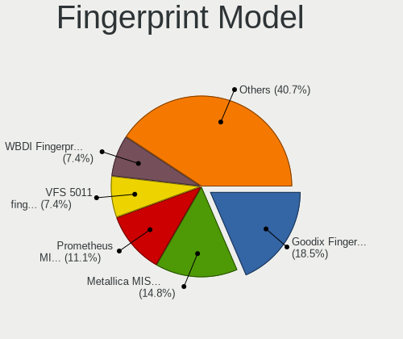

Arch Hardware Trends
--------------------

A project to identify most popular hardware characteristics and track their change
over time based on data collected by Arch users at https://Linux-Hardware.org.

Anyone can contribute to the study by uploading probes of their computers by
the [hw-probe](https://github.com/linuxhw/hw-probe) tool:

    sudo -E hw-probe -all -upload

This is a report for all computer types. See also reports for [desktops](/Dist/Arch/Desktop/README.md) and [notebooks](/Dist/Arch/Notebook/README.md).

Full-feature report is available here: https://linux-hardware.org/?view=trends

Period: Feb, 2021.

Contents
--------

- [ OS                       ](#os)
- [ OS Family                ](#os-family)
- [ Kernel                   ](#kernel)
- [ Kernel Family            ](#kernel-family)
- [ Kernel Major Ver.        ](#kernel-major-ver)
- [ Arch                     ](#arch)
- [ DE                       ](#de)
- [ Display Server           ](#display-server)
- [ Display Manager          ](#display-manager)
- [ OS Lang                  ](#os-lang)
- [ Boot Mode                ](#boot-mode)
- [ Filesystem               ](#filesystem)
- [ Part. scheme             ](#part-scheme)
- [ Dual Boot with Linux/BSD ](#dual-boot-with-linux/bsd)
- [ Dual Boot (Win)          ](#dual-boot-win)
- [ Country                  ](#country)
- [ City                     ](#city)
- [ Vendor                   ](#vendor)
- [ Model                    ](#model)
- [ Model Family             ](#model-family)
- [ MFG Year                 ](#mfg-year)
- [ Form Factor              ](#form-factor)
- [ Secure Boot              ](#secure-boot)
- [ Coreboot                 ](#coreboot)
- [ RAM Size                 ](#ram-size)
- [ RAM Used                 ](#ram-used)
- [ Has CD-ROM               ](#has-cd-rom)
- [ Total Drives             ](#total-drives)
- [ Has Ethernet             ](#has-ethernet)
- [ Drive Vendor             ](#drive-vendor)
- [ Drive Model              ](#drive-model)
- [ HDD Vendor               ](#hdd-vendor)
- [ SSD Vendor               ](#ssd-vendor)
- [ Drive Kind               ](#drive-kind)
- [ Drive Connector          ](#drive-connector)
- [ Drive Size               ](#drive-size)
- [ Space Total              ](#space-total)
- [ Space Used               ](#space-used)
- [ Malfunc. Drives          ](#malfunc-drives)
- [ Malfunc. Drive Vendor    ](#malfunc-drive-vendor)
- [ Malfunc. HDD Vendor      ](#malfunc-hdd-vendor)
- [ Malfunc. Drive Kind      ](#malfunc-drive-kind)
- [ Failed Drives            ](#failed-drives)
- [ Failed Drive Vendor      ](#failed-drive-vendor)
- [ Drive Status             ](#drive-status)
- [ Storage Vendor           ](#storage-vendor)
- [ Storage Model            ](#storage-model)
- [ Storage Kind             ](#storage-kind)
- [ CPU Vendor               ](#cpu-vendor)
- [ CPU Model                ](#cpu-model)
- [ CPU Model Family         ](#cpu-model-family)
- [ CPU Cores                ](#cpu-cores)
- [ CPU Sockets              ](#cpu-sockets)
- [ CPU Threads              ](#cpu-threads)
- [ CPU Op-Modes             ](#cpu-op-modes)
- [ CPU Microcode            ](#cpu-microcode)
- [ CPU Microarch            ](#cpu-microarch)
- [ GPU Vendor               ](#gpu-vendor)
- [ GPU Model                ](#gpu-model)
- [ GPU Combo                ](#gpu-combo)
- [ GPU Driver               ](#gpu-driver)
- [ GPU Memory               ](#gpu-memory)
- [ Monitor Vendor           ](#monitor-vendor)
- [ Monitor Model            ](#monitor-model)
- [ Monitor Resolution       ](#monitor-resolution)
- [ Monitor Diagonal         ](#monitor-diagonal)
- [ Monitor Width            ](#monitor-width)
- [ Aspect Ratio             ](#aspect-ratio)
- [ Monitor Area             ](#monitor-area)
- [ Pixel Density            ](#pixel-density)
- [ Multiple Monitors        ](#multiple-monitors)
- [ Net Controller Vendor    ](#net-controller-vendor)
- [ Net Controller Model     ](#net-controller-model)
- [ Wireless Vendor          ](#wireless-vendor)
- [ Wireless Model           ](#wireless-model)
- [ Ethernet Vendor          ](#ethernet-vendor)
- [ Ethernet Model           ](#ethernet-model)
- [ Net Controller Kind      ](#net-controller-kind)
- [ Used Controller          ](#used-controller)
- [ NICs                     ](#nics)
- [ Memory Vendor            ](#memory-vendor)
- [ Memory Model             ](#memory-model)
- [ Memory Kind              ](#memory-kind)
- [ Memory Form Factor       ](#memory-form-factor)
- [ Memory Size              ](#memory-size)
- [ Memory Speed             ](#memory-speed)
- [ Sound Vendor             ](#sound-vendor)
- [ Sound Model              ](#sound-model)
- [ Camera Vendor            ](#camera-vendor)
- [ Camera Model             ](#camera-model)
- [ Fingerprint Vendor       ](#fingerprint-vendor)
- [ Fingerprint Model        ](#fingerprint-model)
- [ Chipcard Vendor          ](#chipcard-vendor)
- [ Chipcard Model           ](#chipcard-model)
- [ Printer Vendor           ](#printer-vendor)
- [ Printer Model            ](#printer-model)
- [ Scanner Vendor           ](#scanner-vendor)
- [ Scanner Model            ](#scanner-model)
- [ Bluetooth Vendor         ](#bluetooth-vendor)
- [ Bluetooth Model          ](#bluetooth-model)
- [ Unsupported Devices      ](#unsupported-devices)
- [ Unsupported Device Types ](#unsupported-device-types)

OS
--

Installed operating systems

| Name         | Computers | Percent |
|--------------|-----------|---------|
| Arch         | 86        | 65.15%  |
| Arch Rolling | 46        | 34.85%  |

OS Family
---------

OS without a version

| Name | Computers | Percent |
|------|-----------|---------|
| Arch | 132       | 100%    |

Kernel
------

Version of the Linux kernel

| Version                                | Computers | Percent |
|----------------------------------------|-----------|---------|
| 5.10.16-arch1-1                        | 27        | 20.45%  |
| 5.10.11-arch1-1                        | 11        | 8.33%   |
| 5.11.1-arch1-1                         | 10        | 7.58%   |
| 5.10.15-arch1-1                        | 8         | 6.06%   |
| 5.10.14-arch1-1                        | 6         | 4.55%   |
| 5.10.13-arch1-2                        | 6         | 4.55%   |
| 5.10.13-arch1-1                        | 6         | 4.55%   |
| 5.11.1-zen1-1-zen                      | 5         | 3.79%   |
| 5.10.17-1-lts                          | 5         | 3.79%   |
| 5.4.94-1-lts                           | 3         | 2.27%   |
| 5.10.16-2-lts                          | 3         | 2.27%   |
| 5.11.2-arch1-1                         | 2         | 1.52%   |
| 5.11.0-1-mainline                      | 2         | 1.52%   |
| 5.10.16-zen1-1-zen                     | 2         | 1.52%   |
| 5.10.14-119-tkg-bmq                    | 2         | 1.52%   |
| 5.10.11-zen2-1-zen                     | 2         | 1.52%   |
| 5.9.3-zen1-1-zen                       | 1         | 0.76%   |
| 5.9.14-arch1-1                         | 1         | 0.76%   |
| 5.9.12-xanmod1-cachy-1                 | 1         | 0.76%   |
| 5.8.9-arch2-1                          | 1         | 0.76%   |
| 5.4.98-1-lts                           | 1         | 0.76%   |
| 5.4.97-1-lts                           | 1         | 0.76%   |
| 5.4.95-1-lts                           | 1         | 0.76%   |
| 5.4.89-1-lts                           | 1         | 0.76%   |
| 5.11.0.ll9-1-lingruby                  | 1         | 0.76%   |
| 5.11.0-zen2-2-zen                      | 1         | 0.76%   |
| 5.11.0-rc6-1-mainline                  | 1         | 0.76%   |
| 5.11.0-rc2-next-20201223-microsoft-cbl | 1         | 0.76%   |
| 5.11.0-arch2-1                         | 1         | 0.76%   |
| 5.11.0-arch1-1                         | 1         | 0.76%   |
| 5.11.0-AMD-znver2                      | 1         | 0.76%   |
| 5.11.0-122-tkg-bmq                     | 1         | 0.76%   |
| 5.10.9-arch1-1-custom                  | 1         | 0.76%   |
| 5.10.9-arch1-1                         | 1         | 0.76%   |
| 5.10.8-rt24-1-rt                       | 1         | 0.76%   |
| 5.10.8-arch1-1                         | 1         | 0.76%   |
| 5.10.18-1-lts                          | 1         | 0.76%   |
| 5.10.16-rt30-1-rt                      | 1         | 0.76%   |
| 5.10.16-1-lts                          | 1         | 0.76%   |
| 5.10.16-1-clear                        | 1         | 0.76%   |
| 5.10.14-zen1-1-zen                     | 1         | 0.76%   |
| 5.10.14-xanmod1-cacule-1-cacule        | 1         | 0.76%   |
| 5.10.13-zen1-2-zen                     | 1         | 0.76%   |
| 5.10.13-zen1-1-zen                     | 1         | 0.76%   |
| 5.10.12-hardened1-1-hardened           | 1         | 0.76%   |
| 5.10.12-116-tkg-pds                    | 1         | 0.76%   |
| 5.10.10-arch1-1-surface                | 1         | 0.76%   |
| 5.10.10-arch1-1                        | 1         | 0.76%   |

Kernel Family
-------------

Linux kernel without a distro release

| Version | Computers | Percent |
|---------|-----------|---------|
| 5.10.16 | 35        | 26.52%  |
| 5.11.1  | 15        | 11.36%  |
| 5.10.13 | 14        | 10.61%  |
| 5.10.11 | 13        | 9.85%   |
| 5.11.0  | 10        | 7.58%   |
| 5.10.14 | 10        | 7.58%   |
| 5.10.15 | 8         | 6.06%   |
| 5.10.17 | 5         | 3.79%   |
| 5.4.94  | 3         | 2.27%   |
| 5.11.2  | 2         | 1.52%   |
| 5.10.9  | 2         | 1.52%   |
| 5.10.8  | 2         | 1.52%   |
| 5.10.12 | 2         | 1.52%   |
| 5.10.10 | 2         | 1.52%   |
| 5.9.3   | 1         | 0.76%   |
| 5.9.14  | 1         | 0.76%   |
| 5.9.12  | 1         | 0.76%   |
| 5.8.9   | 1         | 0.76%   |
| 5.4.98  | 1         | 0.76%   |
| 5.4.97  | 1         | 0.76%   |
| 5.4.95  | 1         | 0.76%   |
| 5.4.89  | 1         | 0.76%   |
| 5.10.18 | 1         | 0.76%   |

Kernel Major Ver.
-----------------

Linux kernel major version

| Version | Computers | Percent |
|---------|-----------|---------|
| 5.10    | 94        | 71.21%  |
| 5.11    | 27        | 20.45%  |
| 5.4     | 7         | 5.3%    |
| 5.9     | 3         | 2.27%   |
| 5.8     | 1         | 0.76%   |

Arch
----

OS architecture (x86_64, i586, etc.)

| Name   | Computers | Percent |
|--------|-----------|---------|
| x86_64 | 132       | 100%    |

DE
--

Desktop Environment

| Name       | Computers | Percent |
|------------|-----------|---------|
| GNOME      | 44        | 33.33%  |
| KDE5       | 20        | 15.15%  |
| KDE        | 20        | 15.15%  |
| XFCE       | 12        | 9.09%   |
| i3         | 11        | 8.33%   |
| Unknown    | 8         | 6.06%   |
| X-Cinnamon | 3         | 2.27%   |
| LXDE       | 3         | 2.27%   |
| Cinnamon   | 3         | 2.27%   |
| Deepin     | 2         | 1.52%   |
| Unity      | 1         | 0.76%   |
| sway       | 1         | 0.76%   |
| MATE       | 1         | 0.76%   |
| LXQt       | 1         | 0.76%   |
| DWM        | 1         | 0.76%   |
| Budgie     | 1         | 0.76%   |

Display Server
--------------

X11 or Wayland

| Name    | Computers | Percent |
|---------|-----------|---------|
| X11     | 88        | 66.67%  |
| Wayland | 24        | 18.18%  |
| Tty     | 12        | 9.09%   |
| Unknown | 8         | 6.06%   |

Display Manager
---------------

SDDM, LightDM, etc.

| Name    | Computers | Percent |
|---------|-----------|---------|
| Unknown | 57        | 43.18%  |
| SDDM    | 25        | 18.94%  |
| TDM     | 21        | 15.91%  |
| GDM     | 20        | 15.15%  |
| LightDM | 3         | 2.27%   |
| XDM     | 2         | 1.52%   |
| SLiM    | 2         | 1.52%   |
| Ly      | 1         | 0.76%   |
| LXDM    | 1         | 0.76%   |

OS Lang
-------

Language

| Lang    | Computers | Percent |
|---------|-----------|---------|
| en_US   | 60        | 45.45%  |
| ru_RU   | 11        | 8.33%   |
| en_GB   | 8         | 6.06%   |
| de_DE   | 8         | 6.06%   |
| C       | 5         | 3.79%   |
| pl_PL   | 4         | 3.03%   |
| Unknown | 4         | 3.03%   |
| pt_BR   | 3         | 2.27%   |
| fr_FR   | 3         | 2.27%   |
| zh_CN   | 2         | 1.52%   |
| it_IT   | 2         | 1.52%   |
| es_MX   | 2         | 1.52%   |
| es_ES   | 2         | 1.52%   |
| en_AU   | 2         | 1.52%   |
| de_AT   | 2         | 1.52%   |
| ca_ES   | 2         | 1.52%   |
| uk_UA   | 1         | 0.76%   |
| ru_UA   | 1         | 0.76%   |
| lv_LV   | 1         | 0.76%   |
| hu_HU   | 1         | 0.76%   |
| fr_BE   | 1         | 0.76%   |
| es_GT   | 1         | 0.76%   |
| es_CL   | 1         | 0.76%   |
| es_AR   | 1         | 0.76%   |
| en_IN   | 1         | 0.76%   |
| en_CA   | 1         | 0.76%   |
| el_GR   | 1         | 0.76%   |
| cs_CZ   | 1         | 0.76%   |

Boot Mode
---------

EFI or BIOS

| Mode | Computers | Percent |
|------|-----------|---------|
| EFI  | 70        | 53.03%  |
| BIOS | 62        | 46.97%  |

Filesystem
----------

Type of filesystem

| Type  | Computers | Percent |
|-------|-----------|---------|
| Ext4  | 102       | 77.27%  |
| Btrfs | 16        | 12.12%  |
| Xfs   | 9         | 6.82%   |
| F2fs  | 3         | 2.27%   |
| Zfs   | 2         | 1.52%   |

Part. scheme
------------

Scheme of partitioning

| Type    | Computers | Percent |
|---------|-----------|---------|
| GPT     | 80        | 60.61%  |
| Unknown | 45        | 34.09%  |
| MBR     | 7         | 5.3%    |

Dual Boot with Linux/BSD
------------------------

Hosting more than one Linux/BSD

| Dual boot | Computers | Percent |
|-----------|-----------|---------|
| No        | 118       | 89.39%  |
| Yes       | 14        | 10.61%  |

Dual Boot (Win)
---------------

Hosting Linux and Windows

| Dual boot | Computers | Percent |
|-----------|-----------|---------|
| No        | 88        | 66.67%  |
| Yes       | 44        | 33.33%  |

Country
-------

Geographic location (country)

| Country                   | Computers | Percent |
|---------------------------|-----------|---------|
| USA                       | 18        | 13.64%  |
| Russia                    | 15        | 11.36%  |
| Ukraine                   | 10        | 7.58%   |
| Germany                   | 9         | 6.82%   |
| UK                        | 8         | 6.06%   |
| Spain                     | 6         | 4.55%   |
| Italy                     | 6         | 4.55%   |
| Austria                   | 5         | 3.79%   |
| Poland                    | 4         | 3.03%   |
| France                    | 4         | 3.03%   |
| Brazil                    | 4         | 3.03%   |
| Switzerland               | 3         | 2.27%   |
| Mexico                    | 3         | 2.27%   |
| Japan                     | 3         | 2.27%   |
| Hungary                   | 3         | 2.27%   |
| Czech Republic            | 3         | 2.27%   |
| Canada                    | 3         | 2.27%   |
| Romania                   | 2         | 1.52%   |
| Netherlands               | 2         | 1.52%   |
| Indonesia                 | 2         | 1.52%   |
| Australia                 | 2         | 1.52%   |
| Argentina                 | 2         | 1.52%   |
| Zimbabwe                  | 1         | 0.76%   |
| Vietnam                   | 1         | 0.76%   |
| Uruguay                   | 1         | 0.76%   |
| Turkey                    | 1         | 0.76%   |
| Qatar                     | 1         | 0.76%   |
| Malaysia                  | 1         | 0.76%   |
| Macedonia                 | 1         | 0.76%   |
| Latvia                    | 1         | 0.76%   |
| Iran, Islamic Republic of | 1         | 0.76%   |
| Iran                      | 1         | 0.76%   |
| Guatemala                 | 1         | 0.76%   |
| Greece                    | 1         | 0.76%   |
| China                     | 1         | 0.76%   |
| Chile                     | 1         | 0.76%   |
| Bulgaria                  | 1         | 0.76%   |

City
----

Geographic location (city)

| City                   | Computers | Percent |
|------------------------|-----------|---------|
| Moscow                 | 7         | 5.3%    |
| Vienna                 | 3         | 2.27%   |
| Phoenix                | 3         | 2.27%   |
| Ternopil               | 2         | 1.52%   |
| Sydney                 | 2         | 1.52%   |
| St Petersburg          | 2         | 1.52%   |
| Seengen                | 2         | 1.52%   |
| Prague                 | 2         | 1.52%   |
| Nagoya                 | 2         | 1.52%   |
| Lviv                   | 2         | 1.52%   |
| Kyiv                   | 2         | 1.52%   |
| Kharkiv                | 2         | 1.52%   |
| Grenoble               | 2         | 1.52%   |
| Berlin                 | 2         | 1.52%   |
| Łódź                | 1         | 0.76%   |
| Zwingenberg            | 1         | 0.76%   |
| Yate                   | 1         | 0.76%   |
| Workington             | 1         | 0.76%   |
| Wilmington             | 1         | 0.76%   |
| Victoria               | 1         | 0.76%   |
| Vaszar                 | 1         | 0.76%   |
| Vancouver              | 1         | 0.76%   |
| Valdemoro              | 1         | 0.76%   |
| Tortona                | 1         | 0.76%   |
| Torre del Greco        | 1         | 0.76%   |
| Toronto                | 1         | 0.76%   |
| Tokyo                  | 1         | 0.76%   |
| The Hague              | 1         | 0.76%   |
| Tehran                 | 1         | 0.76%   |
| Tatahuicapan           | 1         | 0.76%   |
| Tan An                 | 1         | 0.76%   |
| São Luís             | 1         | 0.76%   |
| Szydlowiec             | 1         | 0.76%   |
| Surgut                 | 1         | 0.76%   |
| Stuttgart              | 1         | 0.76%   |
| Stoke-on-Trent         | 1         | 0.76%   |
| Skopje                 | 1         | 0.76%   |
| Sindanglaya            | 1         | 0.76%   |
| Serpukhov              | 1         | 0.76%   |
| Santiago               | 1         | 0.76%   |
| Sant Cugat del Vallès | 1         | 0.76%   |
| San Ramon              | 1         | 0.76%   |
| San Rafael             | 1         | 0.76%   |
| San Juan               | 1         | 0.76%   |
| Rudgwick               | 1         | 0.76%   |
| Rome                   | 1         | 0.76%   |
| Riga                   | 1         | 0.76%   |
| Richmond               | 1         | 0.76%   |
| Puchong Batu Dua Belas | 1         | 0.76%   |
| Plovdiv                | 1         | 0.76%   |
| Pipera                 | 1         | 0.76%   |
| Perm                   | 1         | 0.76%   |
| Paris                  | 1         | 0.76%   |
| Palmas                 | 1         | 0.76%   |
| Notzingen              | 1         | 0.76%   |
| Nizhniy Novgorod       | 1         | 0.76%   |
| Nagymaros              | 1         | 0.76%   |
| Most                   | 1         | 0.76%   |
| Montevideo             | 1         | 0.76%   |
| Milan                  | 1         | 0.76%   |

Vendor
------

Motherboard manufacturer

| Name                | Computers | Percent |
|---------------------|-----------|---------|
| ASUSTek Computer    | 26        | 19.7%   |
| Hewlett-Packard     | 21        | 15.91%  |
| Lenovo              | 17        | 12.88%  |
| Gigabyte Technology | 15        | 11.36%  |
| MSI                 | 12        | 9.09%   |
| Dell                | 9         | 6.82%   |
| Acer                | 8         | 6.06%   |
| ASRock              | 6         | 4.55%   |
| Apple               | 4         | 3.03%   |
| Timi                | 2         | 1.52%   |
| Microsoft           | 2         | 1.52%   |
| Intel               | 2         | 1.52%   |
| Samsung Electronics | 1         | 0.76%   |
| Pegatron            | 1         | 0.76%   |
| OEM                 | 1         | 0.76%   |
| Notebook            | 1         | 0.76%   |
| MIFcom              | 1         | 0.76%   |
| Biostar             | 1         | 0.76%   |
| Acidanthera         | 1         | 0.76%   |
| Unknown             | 1         | 0.76%   |

Model
-----

Motherboard model

| Name                                     | Computers | Percent |
|------------------------------------------|-----------|---------|
| MSI MS-7721                              | 2         | 1.52%   |
| Lenovo IdeaPad 5 14ARE05 81YM            | 2         | 1.52%   |
| Gigabyte X570 AORUS PRO WIFI             | 2         | 1.52%   |
| Dell Precision M6600                     | 2         | 1.52%   |
| ASUS TUF GAMING X570-PLUS                | 2         | 1.52%   |
| ASUS ROG STRIX B450-F GAMING             | 2         | 1.52%   |
| Unknown                                  | 2         | 1.52%   |
| Timi TM1701                              | 1         | 0.76%   |
| Timi RedmiBook 14 II                     | 1         | 0.76%   |
| Samsung RV415/RV515                      | 1         | 0.76%   |
| Pegatron p6-2026                         | 1         | 0.76%   |
| Notebook W350STQ/W370ST                  | 1         | 0.76%   |
| MSI MS-7C95                              | 1         | 0.76%   |
| MSI MS-7C91                              | 1         | 0.76%   |
| MSI MS-7C84                              | 1         | 0.76%   |
| MSI MS-7C02                              | 1         | 0.76%   |
| MSI MS-7B89                              | 1         | 0.76%   |
| MSI MS-7B85                              | 1         | 0.76%   |
| MSI MS-7B79                              | 1         | 0.76%   |
| MSI MS-7A34                              | 1         | 0.76%   |
| MSI MS-7A33                              | 1         | 0.76%   |
| MSI MS-7885                              | 1         | 0.76%   |
| MIFcom W35xSS_370SS                      | 1         | 0.76%   |
| Microsoft Surface Pro 4                  | 1         | 0.76%   |
| Microsoft Surface Pro 2                  | 1         | 0.76%   |
| Lenovo ThinkPad X1 Carbon 6th 20KH002RUS | 1         | 0.76%   |
| Lenovo ThinkPad X1 Carbon 3rd 20BSCTO1WW | 1         | 0.76%   |
| Lenovo ThinkPad T470s W10DG 20JTS04Y00   | 1         | 0.76%   |
| Lenovo ThinkPad T14 Gen 1 20S0CTO1WW     | 1         | 0.76%   |
| Lenovo ThinkPad S5-S540 20B3CTO1WW       | 1         | 0.76%   |
| Lenovo ThinkPad L460 20FVS14T00          | 1         | 0.76%   |
| Lenovo ThinkPad E570 20H5CTO1WW          | 1         | 0.76%   |
| Lenovo ThinkPad E14 Gen 2 20T6000SIX     | 1         | 0.76%   |
| Lenovo ThinkCentre M82 3306D1U           | 1         | 0.76%   |
| Lenovo IdeaPad Y510P 20217               | 1         | 0.76%   |
| Lenovo IdeaPad S145-15API 81UT           | 1         | 0.76%   |
| Lenovo IdeaPad L340-15API 81LW           | 1         | 0.76%   |
| Lenovo IdeaPad C340-14API 81N6           | 1         | 0.76%   |
| Lenovo IdeaPad 5 15ARE05 81YQ            | 1         | 0.76%   |
| Lenovo IdeaPad 320S-13IKB 81AK           | 1         | 0.76%   |
| Intel NUC5i5RYB H40999-505               | 1         | 0.76%   |
| Intel Intel powered classmate PC         | 1         | 0.76%   |
| HP Spectre XT Ultrabook PC               | 1         | 0.76%   |
| HP Spectre x360 Convertlble 13-ao002ur   | 1         | 0.76%   |
| HP Spectre x360 Convertible 14-ea0xxx    | 1         | 0.76%   |
| HP ProLiant DL360 G6                     | 1         | 0.76%   |
| HP ProBook 455 G1                        | 1         | 0.76%   |
| HP ProBook 4320s                         | 1         | 0.76%   |
| HP Pavilion g6                           | 1         | 0.76%   |
| HP OMEN by HP Laptop 15-dc1xxx           | 1         | 0.76%   |
| HP OMEN by HP Laptop                     | 1         | 0.76%   |
| HP Notebook                              | 1         | 0.76%   |
| HP Laptop 15s-eq0xxx                     | 1         | 0.76%   |
| HP Laptop 15q-ds0xxx                     | 1         | 0.76%   |
| HP ENVY x360 Convertible 15-ee0xxx       | 1         | 0.76%   |
| HP ENVY Laptop 13-ad1xx                  | 1         | 0.76%   |
| HP EliteBook x360 1030 G2                | 1         | 0.76%   |
| HP EliteBook 855 G7 Notebook PC          | 1         | 0.76%   |
| HP EliteBook 8470p                       | 1         | 0.76%   |
| HP EliteBook 840 G6                      | 1         | 0.76%   |

Model Family
------------

Motherboard model prefix

| Name                 | Computers | Percent |
|----------------------|-----------|---------|
| Lenovo ThinkPad      | 8         | 6.06%   |
| Lenovo IdeaPad       | 8         | 6.06%   |
| HP EliteBook         | 5         | 3.79%   |
| ASUS ROG             | 5         | 3.79%   |
| Gigabyte X570        | 4         | 3.03%   |
| ASUS TUF             | 4         | 3.03%   |
| HP Spectre           | 3         | 2.27%   |
| Dell Inspiron        | 3         | 2.27%   |
| ASUS PRIME           | 3         | 2.27%   |
| Acer Aspire          | 3         | 2.27%   |
| MSI MS-7721          | 2         | 1.52%   |
| Microsoft Surface    | 2         | 1.52%   |
| HP ProBook           | 2         | 1.52%   |
| HP OMEN              | 2         | 1.52%   |
| HP Laptop            | 2         | 1.52%   |
| HP ENVY              | 2         | 1.52%   |
| HP Compaq            | 2         | 1.52%   |
| Dell XPS             | 2         | 1.52%   |
| Dell Precision       | 2         | 1.52%   |
| ASUS VivoBook        | 2         | 1.52%   |
| Acer Swift           | 2         | 1.52%   |
| Acer Nitro           | 2         | 1.52%   |
| Unknown              | 2         | 1.52%   |
| Timi TM1701          | 1         | 0.76%   |
| Timi RedmiBook       | 1         | 0.76%   |
| Samsung RV415        | 1         | 0.76%   |
| Pegatron p6-2026     | 1         | 0.76%   |
| Notebook W350STQ     | 1         | 0.76%   |
| MSI MS-7C95          | 1         | 0.76%   |
| MSI MS-7C91          | 1         | 0.76%   |
| MSI MS-7C84          | 1         | 0.76%   |
| MSI MS-7C02          | 1         | 0.76%   |
| MSI MS-7B89          | 1         | 0.76%   |
| MSI MS-7B85          | 1         | 0.76%   |
| MSI MS-7B79          | 1         | 0.76%   |
| MSI MS-7A34          | 1         | 0.76%   |
| MSI MS-7A33          | 1         | 0.76%   |
| MSI MS-7885          | 1         | 0.76%   |
| MIFcom W35xSS        | 1         | 0.76%   |
| Lenovo ThinkCentre   | 1         | 0.76%   |
| Intel NUC5i5RYB      | 1         | 0.76%   |
| Intel Intel          | 1         | 0.76%   |
| HP ProLiant          | 1         | 0.76%   |
| HP Pavilion          | 1         | 0.76%   |
| HP Notebook          | 1         | 0.76%   |
| Gigabyte Z87X-UD3H   | 1         | 0.76%   |
| Gigabyte Z490        | 1         | 0.76%   |
| Gigabyte Z390        | 1         | 0.76%   |
| Gigabyte Z370        | 1         | 0.76%   |
| Gigabyte X470        | 1         | 0.76%   |
| Gigabyte P35-DS3L    | 1         | 0.76%   |
| Gigabyte H81M-S2PV   | 1         | 0.76%   |
| Gigabyte H81M-HD3    | 1         | 0.76%   |
| Gigabyte H110M-S2PH  | 1         | 0.76%   |
| Gigabyte B550I       | 1         | 0.76%   |
| Gigabyte AB350M-DS3H | 1         | 0.76%   |
| Dell Vostro          | 1         | 0.76%   |
| Dell Latitude        | 1         | 0.76%   |
| Biostar Hi-Fi        | 1         | 0.76%   |
| ASUS ZenBook         | 1         | 0.76%   |

MFG Year
--------

Motherboard manufacture year

| Year    | Computers | Percent |
|---------|-----------|---------|
| 2020    | 50        | 37.88%  |
| 2019    | 24        | 18.18%  |
| 2018    | 13        | 9.85%   |
| 2013    | 7         | 5.3%    |
| 2021    | 6         | 4.55%   |
| 2017    | 6         | 4.55%   |
| 2015    | 6         | 4.55%   |
| 2014    | 5         | 3.79%   |
| 2016    | 3         | 2.27%   |
| 2012    | 3         | 2.27%   |
| 2008    | 3         | 2.27%   |
| 2011    | 2         | 1.52%   |
| 2009    | 2         | 1.52%   |
| 2010    | 1         | 0.76%   |
| Unknown | 1         | 0.76%   |

Form Factor
-----------

Physical design of the computer

| Name        | Computers | Percent |
|-------------|-----------|---------|
| Notebook    | 69        | 52.27%  |
| Desktop     | 51        | 38.64%  |
| Convertible | 5         | 3.79%   |
| All in one  | 3         | 2.27%   |
| Tablet      | 2         | 1.52%   |
| Mini pc     | 1         | 0.76%   |
| Server      | 1         | 0.76%   |

Secure Boot
-----------

Enabled or disabled

| State    | Computers | Percent |
|----------|-----------|---------|
| Disabled | 132       | 100%    |

Coreboot
--------

Have coreboot on board

| Used | Computers | Percent |
|------|-----------|---------|
| No   | 132       | 100%    |

RAM Size
--------

Total RAM memory

| Size in GB  | Computers | Percent |
|-------------|-----------|---------|
| 16.01-24.0  | 45        | 34.09%  |
| 8.01-16.0   | 27        | 20.45%  |
| 4.01-8.0    | 24        | 18.18%  |
| 32.01-64.0  | 20        | 15.15%  |
| 3.01-4.0    | 9         | 6.82%   |
| 64.01-256.0 | 3         | 2.27%   |
| 24.01-32.0  | 2         | 1.52%   |
| 1.01-2.0    | 2         | 1.52%   |

RAM Used
--------

Used RAM memory

| Used GB    | Computers | Percent |
|------------|-----------|---------|
| 1.01-2.0   | 38        | 28.79%  |
| 2.01-3.0   | 32        | 24.24%  |
| 4.01-8.0   | 25        | 18.94%  |
| 3.01-4.0   | 17        | 12.88%  |
| 8.01-16.0  | 10        | 7.58%   |
| 16.01-24.0 | 5         | 3.79%   |
| 0.51-1.0   | 3         | 2.27%   |
| 24.01-32.0 | 1         | 0.76%   |
| 0.01-0.5   | 1         | 0.76%   |

Has CD-ROM
----------

Has CD-ROM on board

| Presented | Computers | Percent |
|-----------|-----------|---------|
| No        | 95        | 71.97%  |
| Yes       | 37        | 28.03%  |

Total Drives
------------

Number of drives on board

| Drives | Computers | Percent |
|--------|-----------|---------|
| 1      | 63        | 47.73%  |
| 2      | 39        | 29.55%  |
| 3      | 13        | 9.85%   |
| 4      | 7         | 5.3%    |
| 5      | 4         | 3.03%   |
| 7      | 2         | 1.52%   |
| 6      | 2         | 1.52%   |
| 10     | 1         | 0.76%   |
| 8      | 1         | 0.76%   |

Has Ethernet
------------

Has Ethernet on board

| Presented | Computers | Percent |
|-----------|-----------|---------|
| Yes       | 113       | 85.61%  |
| No        | 19        | 14.39%  |

Drive Vendor
------------

Hard drive vendors

| Vendor              | Computers | Drives | Percent |
|---------------------|-----------|--------|---------|
| Samsung Electronics | 51        | 63     | 22.97%  |
| WDC                 | 42        | 57     | 18.92%  |
| Seagate             | 19        | 27     | 8.56%   |
| Toshiba             | 15        | 15     | 6.76%   |
| Sandisk             | 15        | 22     | 6.76%   |
| Crucial             | 8         | 9      | 3.6%    |
| Kingston            | 7         | 7      | 3.15%   |
| A-DATA Technology   | 7         | 7      | 3.15%   |
| Phison              | 6         | 8      | 2.7%    |
| Hitachi             | 6         | 6      | 2.7%    |
| HGST                | 5         | 5      | 2.25%   |
| SK Hynix            | 4         | 4      | 1.8%    |
| OCZ                 | 4         | 4      | 1.8%    |
| Micron Technology   | 4         | 4      | 1.8%    |
| Intel               | 4         | 4      | 1.8%    |
| China               | 3         | 3      | 1.35%   |
| XPG                 | 2         | 3      | 0.9%    |
| Unknown             | 2         | 2      | 0.9%    |
| SPCC                | 2         | 2      | 0.9%    |
| PLEXTOR             | 2         | 2      | 0.9%    |
| KIOXIA              | 2         | 2      | 0.9%    |
| Apple               | 2         | 3      | 0.9%    |
| XSTAR               | 1         | 1      | 0.45%   |
| SAMSWEET            | 1         | 1      | 0.45%   |
| PNY                 | 1         | 1      | 0.45%   |
| Patriot             | 1         | 1      | 0.45%   |
| Msft                | 1         | 2      | 0.45%   |
| LuminouTek          | 1         | 1      | 0.45%   |
| Kingrich            | 1         | 1      | 0.45%   |
| Hewlett-Packard     | 1         | 1      | 0.45%   |
| GOODRAM             | 1         | 1      | 0.45%   |
| ASMT                | 1         | 1      | 0.45%   |

Drive Model
-----------

Hard drive models

| Model                               | Computers | Percent |
|-------------------------------------|-----------|---------|
| Samsung NVMe SSD Drive 512GB        | 7         | 2.76%   |
| Samsung SSD 850 EVO 500GB           | 5         | 1.97%   |
| WDC WD10EZEX-08WN4A0 1TB            | 4         | 1.57%   |
| Samsung SSD 860 EVO 500GB           | 4         | 1.57%   |
| Samsung SSD 970 EVO Plus 500GB      | 3         | 1.18%   |
| Samsung NVMe SSD Drive 1TB          | 3         | 1.18%   |
| Crucial CT1000MX500SSD1 1TB         | 3         | 1.18%   |
| WDC WDS240G2G0A-00JH30 240GB SSD    | 2         | 0.79%   |
| WDC WD6400AAKS-22A7B2 640GB         | 2         | 0.79%   |
| WDC WD20EZRX-00DC0B0 2TB            | 2         | 0.79%   |
| Toshiba MQ04ABF100 1TB              | 2         | 0.79%   |
| Toshiba HDWD130 3TB                 | 2         | 0.79%   |
| Toshiba HDWD110 1TB                 | 2         | 0.79%   |
| Seagate ST4000DM000-1F2168 4TB      | 2         | 0.79%   |
| Seagate ST1000LM035-1RK172 1TB      | 2         | 0.79%   |
| SanDisk SD9SN8W256G1002 256GB SSD   | 2         | 0.79%   |
| Sandisk NVMe SSD Drive 512GB        | 2         | 0.79%   |
| Sandisk NVMe SSD Drive 1TB          | 2         | 0.79%   |
| Samsung SSD 970 EVO Plus 1TB        | 2         | 0.79%   |
| Samsung SSD 970 EVO 500GB           | 2         | 0.79%   |
| Samsung SSD 860 QVO 2TB             | 2         | 0.79%   |
| Samsung SSD 860 QVO 1TB             | 2         | 0.79%   |
| Samsung SSD 860 EVO 250GB           | 2         | 0.79%   |
| Samsung SSD 860 EVO 1TB             | 2         | 0.79%   |
| Samsung NVMe SSD Drive 500GB        | 2         | 0.79%   |
| Samsung NVMe SSD Drive 256GB        | 2         | 0.79%   |
| Samsung HD154UI 1TB                 | 2         | 0.79%   |
| Phison Sabrent 1TB                  | 2         | 0.79%   |
| Micron 1100_MTFDDAV256TBN 256GB SSD | 2         | 0.79%   |
| Kingston SA400S37240G 240GB SSD     | 2         | 0.79%   |
| XSTAR SSD 120GB                     | 1         | 0.39%   |
| XPG NVMe SSD Drive 512GB            | 1         | 0.39%   |
| XPG NVMe SSD Drive 2TB              | 1         | 0.39%   |
| XPG NVMe SSD Drive 1024GB           | 1         | 0.39%   |
| WDC WDS500G2B0C-00PXH0 500GB        | 1         | 0.39%   |
| WDC WDS500G2B0B-00YS70 500GB SSD    | 1         | 0.39%   |
| WDC WDS500G2B0A-00SM50 500GB SSD    | 1         | 0.39%   |
| WDC WDS250G2B0C-00PXH0 250GB        | 1         | 0.39%   |
| WDC WDS250G1B0B-00AS40 250GB SSD    | 1         | 0.39%   |
| WDC WDS100T2B0C-00PXH0 1TB          | 1         | 0.39%   |
| WDC WDS100T2B0A 1TB SSD             | 1         | 0.39%   |
| WDC WD800BEVS-22VAT0 80GB           | 1         | 0.39%   |
| WDC WD7500BPKX-00HPJT0 752GB        | 1         | 0.39%   |
| WDC WD7500BPKT-75PK4T0 752GB        | 1         | 0.39%   |
| WDC WD5000LPVT-24G33T1 500GB        | 1         | 0.39%   |
| WDC WD5000LPLX-60ZNTT1 500GB        | 1         | 0.39%   |
| WDC WD5000BEVT-11ZAT0 500GB         | 1         | 0.39%   |
| WDC WD5000AVVS-63M8B0 500GB         | 1         | 0.39%   |
| WDC WD5000AAKX-22ERMA0 500GB        | 1         | 0.39%   |
| WDC WD5000AAKS-00A7B0 500GB         | 1         | 0.39%   |
| WDC WD4001FFSX-68JNUN0 4TB          | 1         | 0.39%   |
| WDC WD40 EFRX-68N32N0 4TB           | 1         | 0.39%   |
| WDC WD3200BPVT-00JJ5T0 320GB        | 1         | 0.39%   |
| WDC WD30EZRZ-00Z5HB0 3TB            | 1         | 0.39%   |
| WDC WD20EARS-60MVWB0 2TB            | 1         | 0.39%   |
| WDC WD20EARS-00J2GB0 2TB            | 1         | 0.39%   |
| WDC WD2003FYPS-27W9B0 2TB           | 1         | 0.39%   |
| WDC WD140EDFZ-11A0VA0 14TB          | 1         | 0.39%   |
| WDC WD121KRYZ-01W0RB0 12TB          | 1         | 0.39%   |
| WDC WD10SPZX-80Z10T1 1TB            | 1         | 0.39%   |

HDD Vendor
----------

Hard disk drive vendors

| Vendor              | Computers | Drives | Percent |
|---------------------|-----------|--------|---------|
| WDC                 | 33        | 44     | 40.24%  |
| Seagate             | 19        | 27     | 23.17%  |
| Toshiba             | 11        | 11     | 13.41%  |
| Samsung Electronics | 6         | 6      | 7.32%   |
| Hitachi             | 6         | 6      | 7.32%   |
| HGST                | 5         | 5      | 6.1%    |
| Msft                | 1         | 2      | 1.22%   |
| Apple               | 1         | 1      | 1.22%   |

SSD Vendor
----------

Solid state drive vendors

| Vendor              | Computers | Drives | Percent |
|---------------------|-----------|--------|---------|
| Samsung Electronics | 24        | 28     | 28.92%  |
| SanDisk             | 7         | 13     | 8.43%   |
| Kingston            | 7         | 7      | 8.43%   |
| Crucial             | 7         | 8      | 8.43%   |
| WDC                 | 6         | 6      | 7.23%   |
| A-DATA Technology   | 6         | 6      | 7.23%   |
| OCZ                 | 4         | 4      | 4.82%   |
| Micron Technology   | 3         | 3      | 3.61%   |
| China               | 3         | 3      | 3.61%   |
| SPCC                | 2         | 2      | 2.41%   |
| XSTAR               | 1         | 1      | 1.2%    |
| Toshiba             | 1         | 1      | 1.2%    |
| SK Hynix            | 1         | 1      | 1.2%    |
| SAMSWEET            | 1         | 1      | 1.2%    |
| PNY                 | 1         | 1      | 1.2%    |
| PLEXTOR             | 1         | 1      | 1.2%    |
| Patriot             | 1         | 1      | 1.2%    |
| LuminouTek          | 1         | 1      | 1.2%    |
| Kingrich            | 1         | 1      | 1.2%    |
| Intel               | 1         | 1      | 1.2%    |
| Hewlett-Packard     | 1         | 1      | 1.2%    |
| GOODRAM             | 1         | 1      | 1.2%    |
| ASMT                | 1         | 1      | 1.2%    |
| Apple               | 1         | 1      | 1.2%    |

Drive Kind
----------

HDD or SSD

| Kind | Computers | Drives | Percent |
|------|-----------|--------|---------|
| SSD  | 66        | 94     | 33.85%  |
| HDD  | 66        | 102    | 33.85%  |
| NVMe | 61        | 72     | 31.28%  |
| MMC  | 2         | 2      | 1.03%   |

Drive Connector
---------------

SATA, SAS, NVMe, etc.

| Type | Computers | Drives | Percent |
|------|-----------|--------|---------|
| SATA | 97        | 189    | 59.15%  |
| NVMe | 61        | 72     | 37.2%   |
| SAS  | 4         | 7      | 2.44%   |
| MMC  | 2         | 2      | 1.22%   |

Drive Size
----------

Size of hard drive

| Size in TB | Computers | Drives | Percent |
|------------|-----------|--------|---------|
| 0.01-0.5   | 69        | 90     | 47.92%  |
| 0.51-1.0   | 50        | 69     | 34.72%  |
| 1.01-2.0   | 13        | 19     | 9.03%   |
| 3.01-4.0   | 5         | 8      | 3.47%   |
| 2.01-3.0   | 4         | 4      | 2.78%   |
| 10.01-20.0 | 2         | 5      | 1.39%   |
| 4.01-10.0  | 1         | 1      | 0.69%   |

Space Total
-----------

Amount of disk space available on the file system

| Size in GB     | Computers | Percent |
|----------------|-----------|---------|
| 501-1000       | 34        | 25.76%  |
| 101-250        | 32        | 24.24%  |
| 251-500        | 27        | 20.45%  |
| 1001-2000      | 15        | 11.36%  |
| 2001-3000      | 7         | 5.3%    |
| More than 3000 | 6         | 4.55%   |
| 51-100         | 6         | 4.55%   |
| 1-20           | 2         | 1.52%   |
| Unknown        | 2         | 1.52%   |
| 21-50          | 1         | 0.76%   |

Space Used
----------

Amount of used disk space

| Used GB        | Computers | Percent |
|----------------|-----------|---------|
| 1-20           | 29        | 21.97%  |
| 251-500        | 26        | 19.7%   |
| 101-250        | 19        | 14.39%  |
| 21-50          | 17        | 12.88%  |
| 51-100         | 14        | 10.61%  |
| 501-1000       | 11        | 8.33%   |
| 1001-2000      | 9         | 6.82%   |
| 2001-3000      | 4         | 3.03%   |
| Unknown        | 2         | 1.52%   |
| More than 3000 | 1         | 0.76%   |

Malfunc. Drives
---------------

Drive models with a malfunction

| Model                                               | Computers | Drives | Percent |
|-----------------------------------------------------|-----------|--------|---------|
| WDC WD5000BEVT-11ZAT0 500GB                         | 1         | 1      | 6.67%   |
| WDC WD5000AAKX-22ERMA0 500GB                        | 1         | 1      | 6.67%   |
| WDC WD5000AAKS-00A7B0 500GB                         | 1         | 1      | 6.67%   |
| WDC WD10JUCT-63J6SY0 1TB                            | 1         | 1      | 6.67%   |
| WDC WD10JPVX-60JC3T1 1TB                            | 1         | 1      | 6.67%   |
| WDC WD1001FALS-403AA0 1TB                           | 1         | 1      | 6.67%   |
| Toshiba MQ01ACF050 500GB                            | 1         | 1      | 6.67%   |
| SPCC Solid State Disk 512GB                         | 1         | 1      | 6.67%   |
| Seagate ST4000DM004-2CV104 4TB                      | 1         | 1      | 6.67%   |
| Seagate ST1000LM014-1EJ164 1TB                      | 1         | 1      | 6.67%   |
| OCZ AGILITY3 120GB SSD                              | 1         | 1      | 6.67%   |
| Micron Technology MTFDDAK256MAY-1AH12ABHA 256GB SSD | 1         | 1      | 6.67%   |
| Intel SSDPEKKW512G7 512GB                           | 1         | 1      | 6.67%   |
| HGST HTS545050A7E680 500GB                          | 1         | 1      | 6.67%   |
| A-DATA Technology SU800NS38 512GB SSD               | 1         | 1      | 6.67%   |

Malfunc. Drive Vendor
---------------------

Vendors of faulty drives

| Vendor            | Computers | Drives | Percent |
|-------------------|-----------|--------|---------|
| WDC               | 6         | 6      | 40%     |
| Seagate           | 2         | 2      | 13.33%  |
| Toshiba           | 1         | 1      | 6.67%   |
| SPCC              | 1         | 1      | 6.67%   |
| OCZ               | 1         | 1      | 6.67%   |
| Micron Technology | 1         | 1      | 6.67%   |
| Intel             | 1         | 1      | 6.67%   |
| HGST              | 1         | 1      | 6.67%   |
| A-DATA Technology | 1         | 1      | 6.67%   |

Malfunc. HDD Vendor
-------------------

Vendors of faulty HDD drives

| Vendor  | Computers | Drives | Percent |
|---------|-----------|--------|---------|
| WDC     | 6         | 6      | 60%     |
| Seagate | 2         | 2      | 20%     |
| Toshiba | 1         | 1      | 10%     |
| HGST    | 1         | 1      | 10%     |

Malfunc. Drive Kind
-------------------

Kinds of faulty drives

| Kind | Computers | Drives | Percent |
|------|-----------|--------|---------|
| HDD  | 9         | 10     | 64.29%  |
| SSD  | 4         | 4      | 28.57%  |
| NVMe | 1         | 1      | 7.14%   |

Failed Drives
-------------

Failed drive models

Zero info for selected period =(

Failed Drive Vendor
-------------------

Failed drive vendors

Zero info for selected period =(

Drive Status
------------

Number of failed and malfunc. drives

| Status   | Computers | Drives | Percent |
|----------|-----------|--------|---------|
| Detected | 67        | 141    | 47.18%  |
| Works    | 61        | 114    | 42.96%  |
| Malfunc  | 14        | 15     | 9.86%   |

Storage Vendor
--------------

Storage controller vendors

| Vendor                           | Computers | Percent |
|----------------------------------|-----------|---------|
| Intel                            | 67        | 36.02%  |
| AMD                              | 45        | 24.19%  |
| Samsung Electronics              | 28        | 15.05%  |
| Sandisk                          | 14        | 7.53%   |
| Phison Electronics               | 6         | 3.23%   |
| ASMedia Technology               | 6         | 3.23%   |
| Toshiba America Info Systems     | 3         | 1.61%   |
| SK Hynix                         | 3         | 1.61%   |
| ADATA Technology                 | 3         | 1.61%   |
| KIOXIA                           | 2         | 1.08%   |
| Silicon Integrated Systems [SiS] | 1         | 0.54%   |
| Red Hat                          | 1         | 0.54%   |
| Promise Technology               | 1         | 0.54%   |
| Micron/Crucial Technology        | 1         | 0.54%   |
| Micron Technology                | 1         | 0.54%   |
| Marvell Technology Group         | 1         | 0.54%   |
| Lite-On Technology               | 1         | 0.54%   |
| Hewlett-Packard                  | 1         | 0.54%   |
| Apple                            | 1         | 0.54%   |

Storage Model
-------------

Storage controller models

| Model                                                                            | Computers | Percent |
|----------------------------------------------------------------------------------|-----------|---------|
| AMD FCH SATA Controller [AHCI mode]                                              | 32        | 15.69%  |
| Samsung NVMe SSD Controller SM981/PM981/PM983                                    | 20        | 9.8%    |
| AMD 400 Series Chipset SATA Controller                                           | 10        | 4.9%    |
| Intel 8 Series/C220 Series Chipset Family 6-port SATA Controller 1 [AHCI mode]   | 8         | 3.92%   |
| Intel Sunrise Point-LP SATA Controller [AHCI mode]                               | 7         | 3.43%   |
| Intel 82801 Mobile SATA Controller [RAID mode]                                   | 7         | 3.43%   |
| Intel 7 Series Chipset Family 6-port SATA Controller [AHCI mode]                 | 6         | 2.94%   |
| ASMedia ASM1062 Serial ATA Controller                                            | 6         | 2.94%   |
| AMD SATA controller                                                              | 6         | 2.94%   |
| Samsung NVMe SSD Controller SM961/PM961/SM963                                    | 5         | 2.45%   |
| Phison E12 NVMe Controller                                                       | 5         | 2.45%   |
| Sandisk WD Blue SN550 NVMe SSD                                                   | 4         | 1.96%   |
| Sandisk WD Black SN750 / PC SN730 NVMe SSD                                       | 4         | 1.96%   |
| Samsung Electronics Non-Volatile memory controller                               | 4         | 1.96%   |
| Intel 8 Series SATA Controller 1 [AHCI mode]                                     | 4         | 1.96%   |
| Intel 200 Series PCH SATA controller [AHCI mode]                                 | 4         | 1.96%   |
| ADATA XPG SX8200 Pro PCIe Gen3x4 M.2 2280 Solid State Drive                      | 3         | 1.47%   |
| Sandisk WD Blue SN500 / PC SN520 NVMe SSD                                        | 2         | 0.98%   |
| Samsung Electronics SATA controller                                              | 2         | 0.98%   |
| KIOXIA Non-Volatile memory controller                                            | 2         | 0.98%   |
| Intel Wildcat Point-LP SATA Controller [AHCI Mode]                               | 2         | 0.98%   |
| Intel SSD 600P Series                                                            | 2         | 0.98%   |
| Intel Q170/Q150/B150/H170/H110/Z170/CM236 Chipset SATA Controller [AHCI Mode]    | 2         | 0.98%   |
| Intel HM170/QM170 Chipset SATA Controller [AHCI Mode]                            | 2         | 0.98%   |
| Intel Cannon Lake PCH SATA AHCI Controller                                       | 2         | 0.98%   |
| Intel 7 Series/C210 Series Chipset Family 6-port SATA Controller [AHCI mode]     | 2         | 0.98%   |
| Intel 6 Series/C200 Series Chipset Family 6 port Mobile SATA AHCI Controller     | 2         | 0.98%   |
| Intel 6 Series/C200 Series Chipset Family 6 port Desktop SATA AHCI Controller    | 2         | 0.98%   |
| AMD X370 Series Chipset SATA Controller                                          | 2         | 0.98%   |
| AMD SB7x0/SB8x0/SB9x0 SATA Controller [AHCI mode]                                | 2         | 0.98%   |
| Toshiba America Info Systems XG6 NVMe SSD Controller                             | 1         | 0.49%   |
| Toshiba America Info Systems XG4 NVMe SSD Controller                             | 1         | 0.49%   |
| Toshiba America Info Systems Toshiba America Info Non-Volatile memory controller | 1         | 0.49%   |
| SK Hynix PC401 NVMe Solid State Drive 256GB                                      | 1         | 0.49%   |
| SK Hynix Non-Volatile memory controller                                          | 1         | 0.49%   |
| SK Hynix BC501 NVMe Solid State Drive 512GB                                      | 1         | 0.49%   |
| Silicon Integrated Systems [SiS] AHCI IDE Controller (0106)                      | 1         | 0.49%   |
| Silicon Integrated Systems [SiS] 5513 IDE Controller                             | 1         | 0.49%   |
| Sandisk WD Black SN850                                                           | 1         | 0.49%   |
| Sandisk WD Black 2018/SN750 / PC SN720 NVMe SSD                                  | 1         | 0.49%   |
| Sandisk PC SN520 NVMe SSD                                                        | 1         | 0.49%   |
| Sandisk Non-Volatile memory controller                                           | 1         | 0.49%   |
| Red Hat Virtio filesystem                                                        | 1         | 0.49%   |
| Promise PDC42819 [FastTrak TX2650/TX4650]                                        | 1         | 0.49%   |
| Phison PS5013 E13 NVMe Controller                                                | 1         | 0.49%   |
| Phison NVMe Storage Controller                                                   | 1         | 0.49%   |
| Micron/Crucial Non-Volatile memory controller                                    | 1         | 0.49%   |
| Micron Non-Volatile memory controller                                            | 1         | 0.49%   |
| Marvell Group 88SE9172 SATA 6Gb/s Controller                                     | 1         | 0.49%   |
| Lite-On M8Pe Series NVMe SSD                                                     | 1         | 0.49%   |
| Intel Volume Management Device NVMe RAID Controller                              | 1         | 0.49%   |
| Intel SSD 660P Series                                                            | 1         | 0.49%   |
| Intel SATA Controller [RAID mode]                                                | 1         | 0.49%   |
| Intel Celeron/Pentium Silver Processor SATA Controller                           | 1         | 0.49%   |
| Intel Cannon Point-LP SATA Controller [AHCI Mode]                                | 1         | 0.49%   |
| Intel Cannon Lake Mobile PCH SATA AHCI Controller                                | 1         | 0.49%   |
| Intel C610/X99 series chipset sSATA Controller [AHCI mode]                       | 1         | 0.49%   |
| Intel C610/X99 series chipset 6-Port SATA Controller [AHCI mode]                 | 1         | 0.49%   |
| Intel Atom/Celeron/Pentium Processor x5-E8000/J3xxx/N3xxx Series SATA Controller | 1         | 0.49%   |
| Intel Atom Processor E3800 Series SATA AHCI Controller                           | 1         | 0.49%   |

Storage Kind
------------

Kind of storage controller (IDE, SATA, NVMe, SAS, ...)

| Kind | Computers | Percent |
|------|-----------|---------|
| SATA | 101       | 56.74%  |
| NVMe | 62        | 34.83%  |
| RAID | 11        | 6.18%   |
| IDE  | 3         | 1.69%   |
| SCSI | 1         | 0.56%   |

CPU Vendor
----------

Processor vendors

| Vendor | Computers | Percent |
|--------|-----------|---------|
| Intel  | 79        | 59.85%  |
| AMD    | 53        | 40.15%  |

CPU Model
---------

Processor models

| Model                                         | Computers | Percent |
|-----------------------------------------------|-----------|---------|
| Intel Core i7-8550U CPU @ 1.80GHz             | 4         | 3.03%   |
| AMD Ryzen 7 3700X 8-Core Processor            | 4         | 3.03%   |
| Intel Core i7-9750H CPU @ 2.60GHz             | 3         | 2.27%   |
| AMD Ryzen 5 5600X 6-Core Processor            | 3         | 2.27%   |
| AMD Ryzen 5 4500U with Radeon Graphics        | 3         | 2.27%   |
| AMD Ryzen 5 3600 6-Core Processor             | 3         | 2.27%   |
| AMD Ryzen 5 3500U with Radeon Vega Mobile Gfx | 3         | 2.27%   |
| AMD Ryzen 5 2600X Six-Core Processor          | 3         | 2.27%   |
| AMD Athlon 3000G with Radeon Vega Graphics    | 3         | 2.27%   |
| Intel Core i7-7700HQ CPU @ 2.80GHz            | 2         | 1.52%   |
| Intel Core i7-7500U CPU @ 2.70GHz             | 2         | 1.52%   |
| Intel Core i7-4700MQ CPU @ 2.40GHz            | 2         | 1.52%   |
| Intel Core i5-6300U CPU @ 2.40GHz             | 2         | 1.52%   |
| Intel 11th Gen Core i7-1165G7 @ 2.80GHz       | 2         | 1.52%   |
| AMD Ryzen 9 3950X 16-Core Processor           | 2         | 1.52%   |
| AMD Ryzen 7 4800U with Radeon Graphics        | 2         | 1.52%   |
| AMD Ryzen 7 4700U with Radeon Graphics        | 2         | 1.52%   |
| AMD Ryzen 7 3700U with Radeon Vega Mobile Gfx | 2         | 1.52%   |
| AMD Ryzen 5 3600X 6-Core Processor            | 2         | 1.52%   |
| AMD Ryzen 3 4300U with Radeon Graphics        | 2         | 1.52%   |
| Intel Xeon CPU E5620 @ 2.40GHz                | 1         | 0.76%   |
| Intel Xeon CPU E5450 @ 3.00GHz                | 1         | 0.76%   |
| Intel Xeon CPU E5-2697 v3 @ 2.60GHz           | 1         | 0.76%   |
| Intel Pentium CPU N3710 @ 1.60GHz             | 1         | 0.76%   |
| Intel Pentium CPU G3250 @ 3.20GHz             | 1         | 0.76%   |
| Intel Core i9-10850K CPU @ 3.60GHz            | 1         | 0.76%   |
| Intel Core i7-9700K CPU @ 3.60GHz             | 1         | 0.76%   |
| Intel Core i7-8850H CPU @ 2.60GHz             | 1         | 0.76%   |
| Intel Core i7-8750H CPU @ 2.20GHz             | 1         | 0.76%   |
| Intel Core i7-8650U CPU @ 1.90GHz             | 1         | 0.76%   |
| Intel Core i7-8565U CPU @ 1.80GHz             | 1         | 0.76%   |
| Intel Core i7-8086K CPU @ 4.00GHz             | 1         | 0.76%   |
| Intel Core i7-7700K CPU @ 4.20GHz             | 1         | 0.76%   |
| Intel Core i7-7700 CPU @ 3.60GHz              | 1         | 0.76%   |
| Intel Core i7-7600U CPU @ 2.80GHz             | 1         | 0.76%   |
| Intel Core i7-6500U CPU @ 2.50GHz             | 1         | 0.76%   |
| Intel Core i7-5600U CPU @ 2.60GHz             | 1         | 0.76%   |
| Intel Core i7-4770K CPU @ 3.50GHz             | 1         | 0.76%   |
| Intel Core i7-4770 CPU @ 3.40GHz              | 1         | 0.76%   |
| Intel Core i7-4710MQ CPU @ 2.50GHz            | 1         | 0.76%   |
| Intel Core i7-3770K CPU @ 3.50GHz             | 1         | 0.76%   |
| Intel Core i7-3610QM CPU @ 2.30GHz            | 1         | 0.76%   |
| Intel Core i7-3520M CPU @ 2.90GHz             | 1         | 0.76%   |
| Intel Core i7-2920XM CPU @ 2.50GHz            | 1         | 0.76%   |
| Intel Core i7-2820QM CPU @ 2.30GHz            | 1         | 0.76%   |
| Intel Core i7-2670QM CPU @ 2.20GHz            | 1         | 0.76%   |
| Intel Core i7-2600S CPU @ 2.80GHz             | 1         | 0.76%   |
| Intel Core i7-10875H CPU @ 2.30GHz            | 1         | 0.76%   |
| Intel Core i7-10750H CPU @ 2.60GHz            | 1         | 0.76%   |
| Intel Core i7-10610U CPU @ 1.80GHz            | 1         | 0.76%   |
| Intel Core i5-8600K CPU @ 3.60GHz             | 1         | 0.76%   |
| Intel Core i5-8400 CPU @ 2.80GHz              | 1         | 0.76%   |
| Intel Core i5-8250U CPU @ 1.60GHz             | 1         | 0.76%   |
| Intel Core i5-7500 CPU @ 3.40GHz              | 1         | 0.76%   |
| Intel Core i5-6500 CPU @ 3.20GHz              | 1         | 0.76%   |
| Intel Core i5-5250U CPU @ 1.60GHz             | 1         | 0.76%   |
| Intel Core i5-5200U CPU @ 2.20GHz             | 1         | 0.76%   |
| Intel Core i5-4690 CPU @ 3.50GHz              | 1         | 0.76%   |
| Intel Core i5-4590 CPU @ 3.30GHz              | 1         | 0.76%   |
| Intel Core i5-4310U CPU @ 2.00GHz             | 1         | 0.76%   |

CPU Model Family
----------------

Processor model prefix

| Model             | Computers | Percent |
|-------------------|-----------|---------|
| Intel Core i7     | 37        | 28.03%  |
| AMD Ryzen 5       | 21        | 15.91%  |
| Intel Core i5     | 20        | 15.15%  |
| AMD Ryzen 7       | 14        | 10.61%  |
| Intel Core i3     | 8         | 6.06%   |
| AMD Ryzen 9       | 5         | 3.79%   |
| Intel Xeon        | 3         | 2.27%   |
| Intel Celeron     | 3         | 2.27%   |
| AMD Athlon        | 3         | 2.27%   |
| AMD A8            | 3         | 2.27%   |
| Other             | 2         | 1.52%   |
| Intel Pentium     | 2         | 1.52%   |
| Intel Core 2 Duo  | 2         | 1.52%   |
| AMD Ryzen 3       | 2         | 1.52%   |
| Intel Core i9     | 1         | 0.76%   |
| Intel Core 2 Quad | 1         | 0.76%   |
| AMD Ryzen 7 PRO   | 1         | 0.76%   |
| AMD FX            | 1         | 0.76%   |
| AMD E1            | 1         | 0.76%   |
| AMD E             | 1         | 0.76%   |
| AMD A10           | 1         | 0.76%   |

CPU Cores
---------

Number of processor cores

| Number | Computers | Percent |
|--------|-----------|---------|
| 4      | 45        | 34.09%  |
| 2      | 39        | 29.55%  |
| 6      | 26        | 19.7%   |
| 8      | 14        | 10.61%  |
| 16     | 3         | 2.27%   |
| 12     | 2         | 1.52%   |
| 14     | 1         | 0.76%   |
| 10     | 1         | 0.76%   |
| 1      | 1         | 0.76%   |

CPU Sockets
-----------

Number of sockets

| Number | Computers | Percent |
|--------|-----------|---------|
| 1      | 131       | 99.24%  |
| 2      | 1         | 0.76%   |

CPU Threads
-----------

Threads per core (Hyper-Threading)

| Number | Computers | Percent |
|--------|-----------|---------|
| 2      | 106       | 80.3%   |
| 1      | 26        | 19.7%   |

CPU Op-Modes
------------

CPU Operation Modes (32-bit, 64-bit)

| Op mode        | Computers | Percent |
|----------------|-----------|---------|
| 32-bit, 64-bit | 132       | 100%    |

CPU Microcode
-------------

Microcode number

| Number     | Computers | Percent |
|------------|-----------|---------|
| Unknown    | 56        | 42.42%  |
| 0x08701021 | 8         | 6.06%   |
| 0x906e9    | 4         | 3.03%   |
| 0x306a9    | 4         | 3.03%   |
| 0x206a7    | 4         | 3.03%   |
| 0x0a201009 | 4         | 3.03%   |
| 0x08108109 | 4         | 3.03%   |
| 0x906ea    | 3         | 2.27%   |
| 0x806ea    | 3         | 2.27%   |
| 0x406e3    | 3         | 2.27%   |
| 0x40651    | 3         | 2.27%   |
| 0x306c3    | 3         | 2.27%   |
| 0x08600106 | 3         | 2.27%   |
| 0x08108102 | 3         | 2.27%   |
| 0x806c1    | 2         | 1.52%   |
| 0x306d4    | 2         | 1.52%   |
| 0x0810100b | 2         | 1.52%   |
| 0x0800820d | 2         | 1.52%   |
| 0xa0655    | 1         | 0.76%   |
| 0xa0652    | 1         | 0.76%   |
| 0x906ed    | 1         | 0.76%   |
| 0x806ec    | 1         | 0.76%   |
| 0x806eb    | 1         | 0.76%   |
| 0x806e9    | 1         | 0.76%   |
| 0x6fb      | 1         | 0.76%   |
| 0x306f2    | 1         | 0.76%   |
| 0x206c2    | 1         | 0.76%   |
| 0x20655    | 1         | 0.76%   |
| 0x1067a    | 1         | 0.76%   |
| 0x10661    | 1         | 0.76%   |
| 0x08701013 | 1         | 0.76%   |
| 0x08600104 | 1         | 0.76%   |
| 0x08600103 | 1         | 0.76%   |
| 0x08001137 | 1         | 0.76%   |
| 0x08001105 | 1         | 0.76%   |
| 0x0700010b | 1         | 0.76%   |
| 0x06001119 | 1         | 0.76%   |

CPU Microarch
-------------

Microarchitecture

| Name          | Computers | Percent |
|---------------|-----------|---------|
| KabyLake      | 29        | 21.97%  |
| Zen 2         | 23        | 17.42%  |
| Zen+          | 14        | 10.61%  |
| Haswell       | 14        | 10.61%  |
| SandyBridge   | 7         | 5.3%    |
| IvyBridge     | 7         | 5.3%    |
| Unknown       | 5         | 3.79%   |
| Zen           | 4         | 3.03%   |
| Skylake       | 4         | 3.03%   |
| Piledriver    | 4         | 3.03%   |
| Penryn        | 3         | 2.27%   |
| CometLake     | 3         | 2.27%   |
| Broadwell     | 3         | 2.27%   |
| Westmere      | 2         | 1.52%   |
| TigerLake     | 2         | 1.52%   |
| Silvermont    | 2         | 1.52%   |
| Core          | 2         | 1.52%   |
| Steamroller   | 1         | 0.76%   |
| Jaguar        | 1         | 0.76%   |
| Goldmont plus | 1         | 0.76%   |
| Bobcat        | 1         | 0.76%   |

GPU Vendor
----------

Vendors of graphics cards

| Vendor                           | Computers | Percent |
|----------------------------------|-----------|---------|
| Intel                            | 59        | 35.54%  |
| Nvidia                           | 53        | 31.93%  |
| AMD                              | 52        | 31.33%  |
| Silicon Integrated Systems [SiS] | 1         | 0.6%    |
| Microsoft                        | 1         | 0.6%    |

GPU Model
---------

Graphics card models

| Model                                                                         | Computers | Percent |
|-------------------------------------------------------------------------------|-----------|---------|
| AMD Renoir                                                                    | 9         | 5.33%   |
| AMD Picasso                                                                   | 9         | 5.33%   |
| Intel UHD Graphics 620                                                        | 7         | 4.14%   |
| AMD Ellesmere [Radeon RX 470/480/570/570X/580/580X/590]                       | 6         | 3.55%   |
| Nvidia GP107M [GeForce GTX 1050 Mobile]                                       | 5         | 2.96%   |
| Intel HD Graphics 620                                                         | 5         | 2.96%   |
| Intel Haswell-ULT Integrated Graphics Controller                              | 5         | 2.96%   |
| Intel 3rd Gen Core processor Graphics Controller                              | 5         | 2.96%   |
| Intel 2nd Generation Core Processor Family Integrated Graphics Controller     | 5         | 2.96%   |
| Intel CoffeeLake-H GT2 [UHD Graphics 630]                                     | 4         | 2.37%   |
| AMD Sun XT [Radeon HD 8670A/8670M/8690M / R5 M330 / M430 / Radeon 520 Mobile] | 4         | 2.37%   |
| AMD Navi 10 [Radeon RX 5600 OEM/5600 XT / 5700/5700 XT]                       | 4         | 2.37%   |
| Nvidia TU116M [GeForce GTX 1660 Ti Mobile]                                    | 3         | 1.78%   |
| Nvidia TU116 [GeForce GTX 1660 SUPER]                                         | 3         | 1.78%   |
| Nvidia GP106 [GeForce GTX 1060 6GB]                                           | 3         | 1.78%   |
| Nvidia GP104 [GeForce GTX 1080]                                               | 3         | 1.78%   |
| Intel Skylake GT2 [HD Graphics 520]                                           | 3         | 1.78%   |
| Intel HD Graphics 630                                                         | 3         | 1.78%   |
| Intel 4th Gen Core Processor Integrated Graphics Controller                   | 3         | 1.78%   |
| AMD Navi 14 [Radeon RX 5500/5500M / Pro 5500M]                                | 3         | 1.78%   |
| Nvidia GP108M [GeForce MX150]                                                 | 2         | 1.18%   |
| Nvidia GP107 [GeForce GTX 1050 Ti]                                            | 2         | 1.18%   |
| Nvidia GF108M [GeForce GT 620M/630M/635M/640M LE]                             | 2         | 1.18%   |
| Intel Xeon E3-1200 v3/4th Gen Core Processor Integrated Graphics Controller   | 2         | 1.18%   |
| Intel WhiskeyLake-U GT2 [UHD Graphics 620]                                    | 2         | 1.18%   |
| Intel TigerLake GT2 [Iris Xe Graphics]                                        | 2         | 1.18%   |
| Intel HD Graphics 5500                                                        | 2         | 1.18%   |
| Intel CometLake-H GT2 [UHD Graphics]                                          | 2         | 1.18%   |
| AMD Raven Ridge [Radeon Vega Series / Radeon Vega Mobile Series]              | 2         | 1.18%   |
| AMD Baffin [Radeon RX 460/560D / Pro 450/455/460/555/555X/560/560X]           | 2         | 1.18%   |
| Silicon Integrated Systems [SiS] 771/671 PCIE VGA Display Adapter             | 1         | 0.59%   |
| Nvidia TU117M [GeForce GTX 1650 Mobile / Max-Q]                               | 1         | 0.59%   |
| Nvidia TU117 [GeForce GTX 1650]                                               | 1         | 0.59%   |
| Nvidia TU116 [GeForce GTX 1660]                                               | 1         | 0.59%   |
| Nvidia TU106M [GeForce RTX 2060 Max-Q]                                        | 1         | 0.59%   |
| Nvidia TU104 [GeForce RTX 2080 Rev. A]                                        | 1         | 0.59%   |
| Nvidia TU104 [GeForce RTX 2070 SUPER]                                         | 1         | 0.59%   |
| Nvidia TU102 [GeForce RTX 2080 Ti Rev. A]                                     | 1         | 0.59%   |
| Nvidia GP108M [GeForce MX330]                                                 | 1         | 0.59%   |
| Nvidia GP108 [GeForce GT 1030]                                                | 1         | 0.59%   |
| Nvidia GP107M [GeForce GTX 1050 Ti Mobile]                                    | 1         | 0.59%   |
| Nvidia GP107M [GeForce GTX 1050 3 GB Max-Q]                                   | 1         | 0.59%   |
| Nvidia GP104 [GeForce GTX 1070]                                               | 1         | 0.59%   |
| Nvidia GP102 [GeForce GTX 1080 Ti]                                            | 1         | 0.59%   |
| Nvidia GM206 [GeForce GTX 960]                                                | 1         | 0.59%   |
| Nvidia GM200GL [Quadro M6000]                                                 | 1         | 0.59%   |
| Nvidia GM107M [GeForce GTX 950M]                                              | 1         | 0.59%   |
| Nvidia GM107M [GeForce GTX 860M]                                              | 1         | 0.59%   |
| Nvidia GK208B [GeForce GT 710]                                                | 1         | 0.59%   |
| Nvidia GK107M [GeForce GT 755M]                                               | 1         | 0.59%   |
| Nvidia GK107 [GeForce GTX 650]                                                | 1         | 0.59%   |
| Nvidia GK106M [GeForce GTX 765M]                                              | 1         | 0.59%   |
| Nvidia GK104 [GeForce GTX 670]                                                | 1         | 0.59%   |
| Nvidia GF119 [GeForce GT 610]                                                 | 1         | 0.59%   |
| Nvidia GF104GLM [Quadro 3000M]                                                | 1         | 0.59%   |
| Nvidia GA104 [GeForce RTX 3070]                                               | 1         | 0.59%   |
| Nvidia GA102 [GeForce RTX 3080]                                               | 1         | 0.59%   |
| Nvidia G98M [GeForce 9300M GS]                                                | 1         | 0.59%   |
| Nvidia G96C [GeForce 9400 GT]                                                 | 1         | 0.59%   |
| Nvidia G84GLM [Quadro FX 1600M]                                               | 1         | 0.59%   |

GPU Combo
---------

Combinations of graphics cards

| Name           | Computers | Percent |
|----------------|-----------|---------|
| 1 x AMD        | 40        | 30.3%   |
| 1 x Nvidia     | 28        | 21.21%  |
| 1 x Intel      | 28        | 21.21%  |
| Intel + Nvidia | 22        | 16.67%  |
| Intel + AMD    | 6         | 4.55%   |
| 2 x AMD        | 3         | 2.27%   |
| AMD + Nvidia   | 3         | 2.27%   |
| 1 x SiS        | 1         | 0.76%   |
| 1 x Microsoft  | 1         | 0.76%   |

GPU Driver
----------

Free vs proprietary

| Driver      | Computers | Percent |
|-------------|-----------|---------|
| Free        | 91        | 68.94%  |
| Proprietary | 38        | 28.79%  |
| Unknown     | 3         | 2.27%   |

GPU Memory
----------

Total video memory

| Size in GB | Computers | Percent |
|------------|-----------|---------|
| Unknown    | 70        | 53.03%  |
| 1.01-2.0   | 14        | 10.61%  |
| 3.01-4.0   | 12        | 9.09%   |
| 7.01-8.0   | 11        | 8.33%   |
| 0.01-0.5   | 8         | 6.06%   |
| 5.01-6.0   | 7         | 5.3%    |
| 0.51-1.0   | 6         | 4.55%   |
| 8.01-16.0  | 4         | 3.03%   |

Monitor Vendor
--------------

Monitor vendors

| Vendor                  | Computers | Percent |
|-------------------------|-----------|---------|
| Samsung Electronics     | 21        | 13.13%  |
| LG Display              | 19        | 11.88%  |
| AU Optronics            | 16        | 10%     |
| Goldstar                | 11        | 6.88%   |
| Dell                    | 10        | 6.25%   |
| BOE                     | 10        | 6.25%   |
| AOC                     | 8         | 5%      |
| Chimei Innolux          | 7         | 4.38%   |
| BenQ                    | 6         | 3.75%   |
| Hewlett-Packard         | 4         | 2.5%    |
| Apple                   | 4         | 2.5%    |
| Sony                    | 3         | 1.88%   |
| PANDA                   | 3         | 1.88%   |
| Chi Mei Optoelectronics | 3         | 1.88%   |
| Ancor Communications    | 3         | 1.88%   |
| Acer                    | 3         | 1.88%   |
| ViewSonic               | 2         | 1.25%   |
| Sharp                   | 2         | 1.25%   |
| Philips                 | 2         | 1.25%   |
| NEC Computers           | 2         | 1.25%   |
| Lenovo                  | 2         | 1.25%   |
| InfoVision              | 2         | 1.25%   |
| Eizo                    | 2         | 1.25%   |
| WST                     | 1         | 0.63%   |
| Unknown (XXX)           | 1         | 0.63%   |
| Sanyo                   | 1         | 0.63%   |
| Mi                      | 1         | 0.63%   |
| LG Philips              | 1         | 0.63%   |
| LG Electronics          | 1         | 0.63%   |
| Lenovo Group Limited    | 1         | 0.63%   |
| KTC                     | 1         | 0.63%   |
| Iiyama                  | 1         | 0.63%   |
| HYO                     | 1         | 0.63%   |
| HYC                     | 1         | 0.63%   |
| Hitachi                 | 1         | 0.63%   |
| HannStar                | 1         | 0.63%   |
| AUS                     | 1         | 0.63%   |
| ASUSTek Computer        | 1         | 0.63%   |

Monitor Model
-------------

Monitor models

| Model                                                                   | Computers | Percent |
|-------------------------------------------------------------------------|-----------|---------|
| Dell U2715H DELD065 2560x1440 597x336mm 27.0-inch                       | 2         | 1.22%   |
| AU Optronics LCD Monitor AUO61ED 1920x1080 340x190mm 15.3-inch          | 2         | 1.22%   |
| AU Optronics LCD Monitor AUO403D 1920x1080 309x173mm 13.9-inch          | 2         | 1.22%   |
| WST L9VB4 WST0388 1440x900 410x256mm 19.0-inch                          | 1         | 0.61%   |
| ViewSonic VX2758-Series VSCA738 2560x1440 598x336mm 27.0-inch           | 1         | 0.61%   |
| ViewSonic VX1935wm VSC2A1E 1440x900 408x255mm 18.9-inch                 | 1         | 0.61%   |
| Unknown (XXX) Beyond TV XXX2851 3840x2160 1209x680mm 54.6-inch          | 1         | 0.61%   |
| Sony TV SNYA301 1920x1080 1600x900mm 72.3-inch                          | 1         | 0.61%   |
| Sony TV SNY5501 1024x768 1600x900mm 72.3-inch                           | 1         | 0.61%   |
| Sony TV SNY1A02 1920x1080 1600x900mm 72.3-inch                          | 1         | 0.61%   |
| Sharp LCD Monitor SHP14F8 3840x2400 288x180mm 13.4-inch                 | 1         | 0.61%   |
| Sharp LCD Monitor SHP14D6 3840x2400 366x229mm 17.0-inch                 | 1         | 0.61%   |
| Sanyo LCD SAN0A12 1920x540                                              | 1         | 0.61%   |
| Samsung Electronics SyncMaster SAM03EE 1680x1050                        | 1         | 0.61%   |
| Samsung Electronics SyncMaster SAM027F 1680x1050 474x296mm 22.0-inch    | 1         | 0.61%   |
| Samsung Electronics S24E450 SAM0C82 1920x1080 530x300mm 24.0-inch       | 1         | 0.61%   |
| Samsung Electronics S24E391 SAM0C12 1920x1080 521x293mm 23.5-inch       | 1         | 0.61%   |
| Samsung Electronics S24D590 SAM0B47 1920x1080 520x290mm 23.4-inch       | 1         | 0.61%   |
| Samsung Electronics S24C300 SAM0A2A 1920x1080 521x293mm 23.5-inch       | 1         | 0.61%   |
| Samsung Electronics S23B350 SAM08D6 1920x1080 510x287mm 23.0-inch       | 1         | 0.61%   |
| Samsung Electronics S22F350 SAM0D1A 1920x1080 480x270mm 21.7-inch       | 1         | 0.61%   |
| Samsung Electronics LCD Monitor SEC324A 1366x768 344x194mm 15.5-inch    | 1         | 0.61%   |
| Samsung Electronics LCD Monitor SEC3242 1920x1080 230x130mm 10.4-inch   | 1         | 0.61%   |
| Samsung Electronics LCD Monitor SEC315A 1366x768 344x194mm 15.5-inch    | 1         | 0.61%   |
| Samsung Electronics LCD Monitor SDC5441 1366x768 340x190mm 15.3-inch    | 1         | 0.61%   |
| Samsung Electronics LCD Monitor SDC4148 3000x2000 285x190mm 13.5-inch   | 1         | 0.61%   |
| Samsung Electronics LCD Monitor SDC3853 2736x1824 260x173mm 12.3-inch   | 1         | 0.61%   |
| Samsung Electronics LCD Monitor SDC364D 1920x1080 309x174mm 14.0-inch   | 1         | 0.61%   |
| Samsung Electronics LCD Monitor SAM0F9F 3840x2160 1872x1053mm 84.6-inch | 1         | 0.61%   |
| Samsung Electronics LCD Monitor SAM0DFA 3840x2160 890x500mm 40.2-inch   | 1         | 0.61%   |
| Samsung Electronics LCD Monitor SAM0C39 1920x1080 1050x590mm 47.4-inch  | 1         | 0.61%   |
| Samsung Electronics LC49G95T SAM7053 3840x1080 1193x336mm 48.8-inch     | 1         | 0.61%   |
| Samsung Electronics C32JG5x SAM0F53 2560x1440 697x392mm 31.5-inch       | 1         | 0.61%   |
| Samsung Electronics C32HG7x SAM0E14 2560x1440 700x390mm 31.5-inch       | 1         | 0.61%   |
| Samsung Electronics C27F390 SAM0D32 1920x1080 600x340mm 27.2-inch       | 1         | 0.61%   |
| Philips PHL 275E1 PHLC20C 2560x1440 597x336mm 27.0-inch                 | 1         | 0.61%   |
| Philips LCD Monitor 220CW 1680x1050                                     | 1         | 0.61%   |
| PANDA LCD Monitor NCP004D 1920x1080 344x194mm 15.5-inch                 | 1         | 0.61%   |
| PANDA LCD Monitor NCP0036 1920x1080 344x194mm 15.5-inch                 | 1         | 0.61%   |
| PANDA LCD Monitor NCP0035 1920x1080 309x174mm 14.0-inch                 | 1         | 0.61%   |
| NEC Computers LCD2470WVX NEC6718 1920x1200 518x324mm 24.1-inch          | 1         | 0.61%   |
| NEC Computers 90GX2 NEC6692 1280x1024 376x301mm 19.0-inch               | 1         | 0.61%   |
| Mi Monitor XMI3444 3440x1440 797x334mm 34.0-inch                        | 1         | 0.61%   |
| LG Philips LCD Monitor LPL4101 1680x1050 370x230mm 17.2-inch            | 1         | 0.61%   |
| LG Electronics LCD Monitor 38GL950G 3840x1600                           | 1         | 0.61%   |
| LG Display LCD Monitor LGD065A 1920x1080 344x194mm 15.5-inch            | 1         | 0.61%   |
| LG Display LCD Monitor LGD064C 1920x1080 344x194mm 15.5-inch            | 1         | 0.61%   |
| LG Display LCD Monitor LGD061A 1920x1080 344x194mm 15.5-inch            | 1         | 0.61%   |
| LG Display LCD Monitor LGD05F6 1920x1080 309x174mm 14.0-inch            | 1         | 0.61%   |
| LG Display LCD Monitor LGD05D8 1920x1080 344x194mm 15.5-inch            | 1         | 0.61%   |
| LG Display LCD Monitor LGD0597 1920x1080 294x165mm 13.3-inch            | 1         | 0.61%   |
| LG Display LCD Monitor LGD0590 1920x1080 344x194mm 15.5-inch            | 1         | 0.61%   |
| LG Display LCD Monitor LGD0588 3840x2160 293x165mm 13.2-inch            | 1         | 0.61%   |
| LG Display LCD Monitor LGD0563 1920x1080 344x194mm 15.5-inch            | 1         | 0.61%   |
| LG Display LCD Monitor LGD0532 1920x1080 344x194mm 15.5-inch            | 1         | 0.61%   |
| LG Display LCD Monitor LGD0521 1920x1080 309x174mm 14.0-inch            | 1         | 0.61%   |
| LG Display LCD Monitor LGD04F0 2560x1440 310x174mm 14.0-inch            | 1         | 0.61%   |
| LG Display LCD Monitor LGD04E8 1920x1080 382x215mm 17.3-inch            | 1         | 0.61%   |
| LG Display LCD Monitor LGD03EE 1366x768 277x156mm 12.5-inch             | 1         | 0.61%   |
| LG Display LCD Monitor LGD03D9 1366x768 350x190mm 15.7-inch             | 1         | 0.61%   |

Monitor Resolution
------------------

Monitor screen resolution

| Resolution         | Computers | Percent |
|--------------------|-----------|---------|
| 1920x1080 (FHD)    | 73        | 48.67%  |
| 2560x1440 (QHD)    | 18        | 12%     |
| 1366x768 (WXGA)    | 17        | 11.33%  |
| 3840x2160 (4K)     | 12        | 8%      |
| 1680x1050 (WSXGA+) | 6         | 4%      |
| 1600x900 (HD+)     | 3         | 2%      |
| 1440x900 (WXGA+)   | 3         | 2%      |
| 3840x2400          | 2         | 1.33%   |
| 1920x1200 (WUXGA)  | 2         | 1.33%   |
| 1280x1024 (SXGA)   | 2         | 1.33%   |
| 4240x1440          | 1         | 0.67%   |
| 3840x1600          | 1         | 0.67%   |
| 3840x1080          | 1         | 0.67%   |
| 3440x1440          | 1         | 0.67%   |
| 3000x2000          | 1         | 0.67%   |
| 2880x1800          | 1         | 0.67%   |
| 2736x1824          | 1         | 0.67%   |
| 2560x1080          | 1         | 0.67%   |
| 1920x540           | 1         | 0.67%   |
| 1280x800 (WXGA)    | 1         | 0.67%   |
| 1280x768           | 1         | 0.67%   |
| Unknown            | 1         | 0.67%   |

Monitor Diagonal
----------------

Diagonal size in inches

| Inches  | Computers | Percent |
|---------|-----------|---------|
| 15      | 35        | 22.15%  |
| 27      | 20        | 12.66%  |
| 24      | 14        | 8.86%   |
| 14      | 14        | 8.86%   |
| 13      | 11        | 6.96%   |
| Unknown | 9         | 5.7%    |
| 23      | 8         | 5.06%   |
| 17      | 8         | 5.06%   |
| 21      | 7         | 4.43%   |
| 31      | 4         | 2.53%   |
| 84      | 3         | 1.9%    |
| 22      | 3         | 1.9%    |
| 19      | 3         | 1.9%    |
| 18      | 3         | 1.9%    |
| 72      | 2         | 1.27%   |
| 34      | 2         | 1.27%   |
| 25      | 2         | 1.27%   |
| 12      | 2         | 1.27%   |
| 10      | 2         | 1.27%   |
| 59      | 1         | 0.63%   |
| 54      | 1         | 0.63%   |
| 48      | 1         | 0.63%   |
| 47      | 1         | 0.63%   |
| 44      | 1         | 0.63%   |
| 20      | 1         | 0.63%   |

Monitor Width
-------------

Physical width

| Width in mm | Computers | Percent |
|-------------|-----------|---------|
| 301-350     | 54        | 35.06%  |
| 501-600     | 39        | 25.32%  |
| 401-500     | 14        | 9.09%   |
| 201-300     | 11        | 7.14%   |
| 351-400     | 9         | 5.84%   |
| Unknown     | 9         | 5.84%   |
| 601-700     | 6         | 3.9%    |
| 1501-2000   | 5         | 3.25%   |
| 1001-1500   | 4         | 2.6%    |
| 701-800     | 2         | 1.3%    |
| 901-1000    | 1         | 0.65%   |

Aspect Ratio
------------

Proportional relationship between the width and the height

| Ratio   | Computers | Percent |
|---------|-----------|---------|
| 16/9    | 107       | 78.1%   |
| 16/10   | 13        | 9.49%   |
| Unknown | 7         | 5.11%   |
| 5/4     | 3         | 2.19%   |
| 32/9    | 2         | 1.46%   |
| 3/2     | 2         | 1.46%   |
| 21/9    | 2         | 1.46%   |
| 4/3     | 1         | 0.73%   |

Monitor Area
------------

Area in inch²

| Area in inch² | Computers | Percent |
|----------------|-----------|---------|
| 101-110        | 35        | 22.29%  |
| 201-250        | 26        | 16.56%  |
| 81-90          | 20        | 12.74%  |
| 301-350        | 20        | 12.74%  |
| Unknown        | 9         | 5.73%   |
| More than 1000 | 7         | 4.46%   |
| 351-500        | 6         | 3.82%   |
| 251-300        | 6         | 3.82%   |
| 151-200        | 6         | 3.82%   |
| 71-80          | 5         | 3.18%   |
| 121-130        | 5         | 3.18%   |
| 141-150        | 3         | 1.91%   |
| 501-1000       | 3         | 1.91%   |
| 61-70          | 2         | 1.27%   |
| 41-50          | 2         | 1.27%   |
| 131-140        | 2         | 1.27%   |

Pixel Density
-------------

Pixels per inch

| Density       | Computers | Percent |
|---------------|-----------|---------|
| 121-160       | 44        | 29.53%  |
| 51-100        | 42        | 28.19%  |
| 101-120       | 33        | 22.15%  |
| 161-240       | 11        | 7.38%   |
| Unknown       | 9         | 6.04%   |
| More than 240 | 5         | 3.36%   |
| 1-50          | 5         | 3.36%   |

Multiple Monitors
-----------------

Total monitors connected

| Total | Computers | Percent |
|-------|-----------|---------|
| 1     | 96        | 72.73%  |
| 2     | 25        | 18.94%  |
| 3     | 6         | 4.55%   |
| 0     | 5         | 3.79%   |

Net Controller Vendor
---------------------

Controller vendors

| Vendor                           | Computers | Percent |
|----------------------------------|-----------|---------|
| Intel                            | 73        | 37.44%  |
| Realtek Semiconductor            | 72        | 36.92%  |
| Qualcomm Atheros                 | 17        | 8.72%   |
| Broadcom Inc. and subsidiaries   | 8         | 4.1%    |
| Ralink                           | 3         | 1.54%   |
| Microsoft                        | 3         | 1.54%   |
| DisplayLink                      | 3         | 1.54%   |
| TP-Link                          | 2         | 1.03%   |
| D-Link                           | 2         | 1.03%   |
| Xiaomi                           | 1         | 0.51%   |
| Silicon Integrated Systems [SiS] | 1         | 0.51%   |
| Sierra Wireless                  | 1         | 0.51%   |
| Qualcomm Atheros Communications  | 1         | 0.51%   |
| NetGear                          | 1         | 0.51%   |
| Microchip Technology             | 1         | 0.51%   |
| Marvell Technology Group         | 1         | 0.51%   |
| Linksys                          | 1         | 0.51%   |
| Lenovo                           | 1         | 0.51%   |
| Huawei Technologies              | 1         | 0.51%   |
| Broadcom Limited                 | 1         | 0.51%   |
| Aquantia                         | 1         | 0.51%   |

Net Controller Model
--------------------

Controller models

| Model                                                                    | Computers | Percent |
|--------------------------------------------------------------------------|-----------|---------|
| Realtek RTL8111/8168/8411 PCI Express Gigabit Ethernet Controller        | 49        | 21.21%  |
| Intel Wi-Fi 6 AX200                                                      | 15        | 6.49%   |
| Intel I211 Gigabit Network Connection                                    | 11        | 4.76%   |
| Intel Wireless 8265 / 8275                                               | 7         | 3.03%   |
| Realtek RTL8153 Gigabit Ethernet Adapter                                 | 5         | 2.16%   |
| Realtek RTL810xE PCI Express Fast Ethernet controller                    | 5         | 2.16%   |
| Qualcomm Atheros QCA9377 802.11ac Wireless Network Adapter               | 5         | 2.16%   |
| Intel Wireless-AC 9560 [Jefferson Peak]                                  | 5         | 2.16%   |
| Intel Wireless 7265                                                      | 5         | 2.16%   |
| Intel Ethernet Connection (2) I219-V                                     | 5         | 2.16%   |
| Realtek RTL8125 2.5GbE Controller                                        | 4         | 1.73%   |
| Intel 82579LM Gigabit Network Connection (Lewisville)                    | 4         | 1.73%   |
| Realtek RTL8822CE 802.11ac PCIe Wireless Network Adapter                 | 3         | 1.3%    |
| Qualcomm Atheros AR9462 Wireless Network Adapter                         | 3         | 1.3%    |
| Intel Wireless 7260                                                      | 3         | 1.3%    |
| Intel Centrino Ultimate-N 6300                                           | 3         | 1.3%    |
| Broadcom Inc. and subsidiaries BCM4360 802.11ac Wireless Network Adapter | 3         | 1.3%    |
| Realtek RTL8821CE 802.11ac PCIe Wireless Network Adapter                 | 2         | 0.87%   |
| Realtek RTL8812AU 802.11a/b/g/n/ac 2T2R DB WLAN Adapter                  | 2         | 0.87%   |
| Realtek RTL8723BE PCIe Wireless Network Adapter                          | 2         | 0.87%   |
| Realtek RTL-8100/8101L/8139 PCI Fast Ethernet Adapter                    | 2         | 0.87%   |
| Qualcomm Atheros QCA6174 802.11ac Wireless Network Adapter               | 2         | 0.87%   |
| Qualcomm Atheros AR9485 Wireless Network Adapter                         | 2         | 0.87%   |
| Microsoft XBOX ACC                                                       | 2         | 0.87%   |
| Intel Wireless 8260                                                      | 2         | 0.87%   |
| Intel Wi-Fi 6 AX201                                                      | 2         | 0.87%   |
| Intel Ethernet Controller I225-V                                         | 2         | 0.87%   |
| Intel Ethernet Connection I218-LM                                        | 2         | 0.87%   |
| Intel Ethernet Connection (7) I219-V                                     | 2         | 0.87%   |
| Intel Comet Lake PCH CNVi WiFi                                           | 2         | 0.87%   |
| DisplayLink Dell Universal Dock D6000                                    | 2         | 0.87%   |
| Broadcom Inc. and subsidiaries NetXtreme BCM57765 Gigabit Ethernet PCIe  | 2         | 0.87%   |
| Xiaomi Mi/Redmi series (RNDIS)                                           | 1         | 0.43%   |
| TP-Link UE300 10/100/1000 LAN (ethernet mode) [Realtek RTL8153]          | 1         | 0.43%   |
| TP-Link TL-WN722N v2/v3 [Realtek RTL8188EUS]                             | 1         | 0.43%   |
| Silicon Integrated Systems [SiS] 191 Gigabit Ethernet Adapter            | 1         | 0.43%   |
| Sierra Wireless EM7345 4G LTE                                            | 1         | 0.43%   |
| Realtek RTL8822BE 802.11a/b/g/n/ac WiFi adapter                          | 1         | 0.43%   |
| Realtek RTL8814AU 802.11a/b/g/n/ac Wireless Adapter                      | 1         | 0.43%   |
| Realtek RTL8812AE 802.11ac PCIe Wireless Network Adapter                 | 1         | 0.43%   |
| Realtek RTL8723DE Wireless Network Adapter                               | 1         | 0.43%   |
| Realtek RTL8723AE PCIe Wireless Network Adapter                          | 1         | 0.43%   |
| Realtek RTL8188EUS 802.11n Wireless Network Adapter                      | 1         | 0.43%   |
| Realtek RTL8187B Wireless 802.11g 54Mbps Network Adapter                 | 1         | 0.43%   |
| Realtek RTL8169 PCI Gigabit Ethernet Controller                          | 1         | 0.43%   |
| Realtek Killer E2600 Gigabit Ethernet Controller                         | 1         | 0.43%   |
| Realtek 802.11ac NIC                                                     | 1         | 0.43%   |
| Ralink RT5392 PCIe Wireless Network Adapter                              | 1         | 0.43%   |
| Ralink RT3290 Wireless 802.11n 1T/1R PCIe                                | 1         | 0.43%   |
| Ralink RT3090 Wireless 802.11n 1T/1R PCIe                                | 1         | 0.43%   |
| Qualcomm Atheros QCA9565 / AR9565 Wireless Network Adapter               | 1         | 0.43%   |
| Qualcomm Atheros QCA8171 Gigabit Ethernet                                | 1         | 0.43%   |
| Qualcomm Atheros Killer E2500 Gigabit Ethernet Controller                | 1         | 0.43%   |
| Qualcomm Atheros AR9271 802.11n                                          | 1         | 0.43%   |
| Qualcomm Atheros AR93xx Wireless Network Adapter                         | 1         | 0.43%   |
| Qualcomm Atheros AR8161 Gigabit Ethernet                                 | 1         | 0.43%   |
| Qualcomm Atheros AR8121/AR8113/AR8114 Gigabit or Fast Ethernet           | 1         | 0.43%   |
| NetGear WNA1100 Wireless-N 150 [Atheros AR9271]                          | 1         | 0.43%   |
| Microsoft Xbox 360 Wireless Adapter                                      | 1         | 0.43%   |
| Microchip MCP2200 USB Serial Port Emulator                               | 1         | 0.43%   |

Wireless Vendor
---------------

Wireless vendors

| Vendor                          | Computers | Percent |
|---------------------------------|-----------|---------|
| Intel                           | 55        | 52.88%  |
| Realtek Semiconductor           | 15        | 14.42%  |
| Qualcomm Atheros                | 14        | 13.46%  |
| Broadcom Inc. and subsidiaries  | 6         | 5.77%   |
| Ralink                          | 3         | 2.88%   |
| Microsoft                       | 3         | 2.88%   |
| TP-Link                         | 1         | 0.96%   |
| Sierra Wireless                 | 1         | 0.96%   |
| Qualcomm Atheros Communications | 1         | 0.96%   |
| NetGear                         | 1         | 0.96%   |
| Marvell Technology Group        | 1         | 0.96%   |
| Linksys                         | 1         | 0.96%   |
| D-Link                          | 1         | 0.96%   |
| Broadcom Limited                | 1         | 0.96%   |

Wireless Model
--------------

Wireless models

| Model                                                                     | Computers | Percent |
|---------------------------------------------------------------------------|-----------|---------|
| Intel Wi-Fi 6 AX200                                                       | 15        | 14.02%  |
| Intel Wireless 8265 / 8275                                                | 7         | 6.54%   |
| Qualcomm Atheros QCA9377 802.11ac Wireless Network Adapter                | 5         | 4.67%   |
| Intel Wireless-AC 9560 [Jefferson Peak]                                   | 5         | 4.67%   |
| Intel Wireless 7265                                                       | 5         | 4.67%   |
| Realtek RTL8822CE 802.11ac PCIe Wireless Network Adapter                  | 3         | 2.8%    |
| Qualcomm Atheros AR9462 Wireless Network Adapter                          | 3         | 2.8%    |
| Intel Wireless 7260                                                       | 3         | 2.8%    |
| Intel Centrino Ultimate-N 6300                                            | 3         | 2.8%    |
| Broadcom Inc. and subsidiaries BCM4360 802.11ac Wireless Network Adapter  | 3         | 2.8%    |
| Realtek RTL8821CE 802.11ac PCIe Wireless Network Adapter                  | 2         | 1.87%   |
| Realtek RTL8812AU 802.11a/b/g/n/ac 2T2R DB WLAN Adapter                   | 2         | 1.87%   |
| Realtek RTL8723BE PCIe Wireless Network Adapter                           | 2         | 1.87%   |
| Qualcomm Atheros QCA6174 802.11ac Wireless Network Adapter                | 2         | 1.87%   |
| Qualcomm Atheros AR9485 Wireless Network Adapter                          | 2         | 1.87%   |
| Microsoft XBOX ACC                                                        | 2         | 1.87%   |
| Intel Wireless 8260                                                       | 2         | 1.87%   |
| Intel Wi-Fi 6 AX201                                                       | 2         | 1.87%   |
| Intel Comet Lake PCH CNVi WiFi                                            | 2         | 1.87%   |
| TP-Link TL-WN722N v2/v3 [Realtek RTL8188EUS]                              | 1         | 0.93%   |
| Sierra Wireless EM7345 4G LTE                                             | 1         | 0.93%   |
| Realtek RTL8822BE 802.11a/b/g/n/ac WiFi adapter                           | 1         | 0.93%   |
| Realtek RTL8814AU 802.11a/b/g/n/ac Wireless Adapter                       | 1         | 0.93%   |
| Realtek RTL8812AE 802.11ac PCIe Wireless Network Adapter                  | 1         | 0.93%   |
| Realtek RTL8723DE Wireless Network Adapter                                | 1         | 0.93%   |
| Realtek RTL8723AE PCIe Wireless Network Adapter                           | 1         | 0.93%   |
| Realtek RTL8188EUS 802.11n Wireless Network Adapter                       | 1         | 0.93%   |
| Realtek RTL8187B Wireless 802.11g 54Mbps Network Adapter                  | 1         | 0.93%   |
| Realtek 802.11ac NIC                                                      | 1         | 0.93%   |
| Ralink RT5392 PCIe Wireless Network Adapter                               | 1         | 0.93%   |
| Ralink RT3290 Wireless 802.11n 1T/1R PCIe                                 | 1         | 0.93%   |
| Ralink RT3090 Wireless 802.11n 1T/1R PCIe                                 | 1         | 0.93%   |
| Qualcomm Atheros QCA9565 / AR9565 Wireless Network Adapter                | 1         | 0.93%   |
| Qualcomm Atheros AR9271 802.11n                                           | 1         | 0.93%   |
| Qualcomm Atheros AR93xx Wireless Network Adapter                          | 1         | 0.93%   |
| NetGear WNA1100 Wireless-N 150 [Atheros AR9271]                           | 1         | 0.93%   |
| Microsoft Xbox 360 Wireless Adapter                                       | 1         | 0.93%   |
| Marvell Group 88W8897 [AVASTAR] 802.11ac Wireless                         | 1         | 0.93%   |
| Linksys WUSB6100M 802.11a/b/g/n/ac Wireless Adapter                       | 1         | 0.93%   |
| Intel WLAN controller                                                     | 1         | 0.93%   |
| Intel Wireless-AC 9260                                                    | 1         | 0.93%   |
| Intel Wireless 3165                                                       | 1         | 0.93%   |
| Intel Wireless 3160                                                       | 1         | 0.93%   |
| Intel WiFi Link 5100                                                      | 1         | 0.93%   |
| Intel PRO/Wireless 4965 AG or AGN [Kedron] Network Connection             | 1         | 0.93%   |
| Intel Dual Band Wireless-AC 3168NGW [Stone Peak]                          | 1         | 0.93%   |
| Intel Comet Lake PCH-LP CNVi WiFi                                         | 1         | 0.93%   |
| Intel Centrino Wireless-N 2230                                            | 1         | 0.93%   |
| Intel Centrino Advanced-N 6235                                            | 1         | 0.93%   |
| Intel Cannon Point-LP CNVi [Wireless-AC]                                  | 1         | 0.93%   |
| Intel AC 1550i Wireless                                                   | 1         | 0.93%   |
| D-Link DWA-171                                                            | 1         | 0.93%   |
| Broadcom Limited BCM4352 802.11ac Wireless Network Adapter                | 1         | 0.93%   |
| Broadcom Inc. and subsidiaries BCM4364 802.11ac Wireless Network Adapter  | 1         | 0.93%   |
| Broadcom Inc. and subsidiaries BCM4331 802.11a/b/g/n                      | 1         | 0.93%   |
| Broadcom Inc. and subsidiaries BCM4313 802.11bgn Wireless Network Adapter | 1         | 0.93%   |

Ethernet Vendor
---------------

Ethernet vendors

| Vendor                           | Computers | Percent |
|----------------------------------|-----------|---------|
| Realtek Semiconductor            | 65        | 54.17%  |
| Intel                            | 37        | 30.83%  |
| Qualcomm Atheros                 | 4         | 3.33%   |
| Broadcom Inc. and subsidiaries   | 4         | 3.33%   |
| DisplayLink                      | 3         | 2.5%    |
| Xiaomi                           | 1         | 0.83%   |
| TP-Link                          | 1         | 0.83%   |
| Silicon Integrated Systems [SiS] | 1         | 0.83%   |
| Lenovo                           | 1         | 0.83%   |
| Huawei Technologies              | 1         | 0.83%   |
| D-Link                           | 1         | 0.83%   |
| Aquantia                         | 1         | 0.83%   |

Ethernet Model
--------------

Ethernet models

| Model                                                                   | Computers | Percent |
|-------------------------------------------------------------------------|-----------|---------|
| Realtek RTL8111/8168/8411 PCI Express Gigabit Ethernet Controller       | 49        | 39.84%  |
| Intel I211 Gigabit Network Connection                                   | 11        | 8.94%   |
| Realtek RTL8153 Gigabit Ethernet Adapter                                | 5         | 4.07%   |
| Realtek RTL810xE PCI Express Fast Ethernet controller                   | 5         | 4.07%   |
| Intel Ethernet Connection (2) I219-V                                    | 5         | 4.07%   |
| Realtek RTL8125 2.5GbE Controller                                       | 4         | 3.25%   |
| Intel 82579LM Gigabit Network Connection (Lewisville)                   | 4         | 3.25%   |
| Realtek RTL-8100/8101L/8139 PCI Fast Ethernet Adapter                   | 2         | 1.63%   |
| Intel Ethernet Controller I225-V                                        | 2         | 1.63%   |
| Intel Ethernet Connection I218-LM                                       | 2         | 1.63%   |
| Intel Ethernet Connection (7) I219-V                                    | 2         | 1.63%   |
| DisplayLink Dell Universal Dock D6000                                   | 2         | 1.63%   |
| Broadcom Inc. and subsidiaries NetXtreme BCM57765 Gigabit Ethernet PCIe | 2         | 1.63%   |
| Xiaomi Mi/Redmi series (RNDIS)                                          | 1         | 0.81%   |
| TP-Link UE300 10/100/1000 LAN (ethernet mode) [Realtek RTL8153]         | 1         | 0.81%   |
| Silicon Integrated Systems [SiS] 191 Gigabit Ethernet Adapter           | 1         | 0.81%   |
| Realtek RTL8169 PCI Gigabit Ethernet Controller                         | 1         | 0.81%   |
| Realtek Killer E2600 Gigabit Ethernet Controller                        | 1         | 0.81%   |
| Qualcomm Atheros QCA8171 Gigabit Ethernet                               | 1         | 0.81%   |
| Qualcomm Atheros Killer E2500 Gigabit Ethernet Controller               | 1         | 0.81%   |
| Qualcomm Atheros AR8161 Gigabit Ethernet                                | 1         | 0.81%   |
| Qualcomm Atheros AR8121/AR8113/AR8114 Gigabit or Fast Ethernet          | 1         | 0.81%   |
| Lenovo RTL8153 Gigabit Ethernet [ThinkPad OneLink Pro Dock]             | 1         | 0.81%   |
| Intel Ethernet Connection I219-V                                        | 1         | 0.81%   |
| Intel Ethernet Connection I219-LM                                       | 1         | 0.81%   |
| Intel Ethernet Connection I217-V                                        | 1         | 0.81%   |
| Intel Ethernet Connection (6) I219-LM                                   | 1         | 0.81%   |
| Intel Ethernet Connection (4) I219-LM                                   | 1         | 0.81%   |
| Intel Ethernet Connection (3) I218-V                                    | 1         | 0.81%   |
| Intel Ethernet Connection (3) I218-LM                                   | 1         | 0.81%   |
| Intel Ethernet Connection (2) I218-V                                    | 1         | 0.81%   |
| Intel Ethernet Connection (10) I219-LM                                  | 1         | 0.81%   |
| Intel 82599ES 10-Gigabit SFI/SFP+ Network Connection                    | 1         | 0.81%   |
| Intel 82579V Gigabit Network Connection                                 | 1         | 0.81%   |
| Intel 82566MM Gigabit Network Connection                                | 1         | 0.81%   |
| Huawei E353/E3131                                                       | 1         | 0.81%   |
| DisplayLink USB-C Hybrid UHD Video Dock                                 | 1         | 0.81%   |
| D-Link DUB-1312 Gigabit Ethernet Adapter                                | 1         | 0.81%   |
| Broadcom Inc. and subsidiaries NetXtreme II BCM5709 Gigabit Ethernet    | 1         | 0.81%   |
| Broadcom Inc. and subsidiaries NetXtreme BCM57766 Gigabit Ethernet PCIe | 1         | 0.81%   |
| Aquantia Sabrent 2.5G Network Adapter                                   | 1         | 0.81%   |

Net Controller Kind
-------------------

Ethernet, WiFi or modem

| Kind     | Computers | Percent |
|----------|-----------|---------|
| Ethernet | 113       | 54.07%  |
| WiFi     | 95        | 45.45%  |
| Modem    | 1         | 0.48%   |

Used Controller
---------------

Currently used network controller

| Kind     | Computers | Percent |
|----------|-----------|---------|
| Ethernet | 84        | 50.3%   |
| WiFi     | 83        | 49.7%   |

NICs
----

Total network controllers on board

| Total | Computers | Percent |
|-------|-----------|---------|
| 2     | 68        | 51.52%  |
| 1     | 57        | 43.18%  |
| 0     | 4         | 3.03%   |
| 3     | 3         | 2.27%   |

Memory Vendor
-------------

Memory module vendors

| Vendor              | Computers | Percent |
|---------------------|-----------|---------|
| Samsung Electronics | 22        | 20.95%  |
| SK Hynix            | 20        | 19.05%  |
| Kingston            | 14        | 13.33%  |
| Corsair             | 14        | 13.33%  |
| Micron Technology   | 8         | 7.62%   |
| Crucial             | 8         | 7.62%   |
| Unknown             | 5         | 4.76%   |
| G.Skill             | 5         | 4.76%   |
| Nanya Technology    | 2         | 1.9%    |
| Elpida              | 2         | 1.9%    |
| Team                | 1         | 0.95%   |
| Silicon Power       | 1         | 0.95%   |
| Patriot             | 1         | 0.95%   |
| AMD                 | 1         | 0.95%   |
| A-DATA Technology   | 1         | 0.95%   |

Memory Model
------------

Memory module models

| Model                                                             | Computers | Percent |
|-------------------------------------------------------------------|-----------|---------|
| Samsung RAM M471B1G73DB0-YK0 8GB SODIMM DDR3 1600MT/s             | 3         | 2.7%    |
| SK Hynix RAM HMAA1GS6CMR6N-VK 8GB SODIMM DDR4 2667MT/s            | 2         | 1.8%    |
| SK Hynix RAM HMA82GS6CJR8N-VK 16GB SODIMM DDR4 2667MT/s           | 2         | 1.8%    |
| SK Hynix RAM HMA81GS6AFR8N-UH 8GB SODIMM DDR4 2667MT/s            | 2         | 1.8%    |
| Samsung RAM M471A1K43DB1-CTD 8GB SODIMM DDR4 2667MT/s             | 2         | 1.8%    |
| Samsung RAM M471A1G44AB0-CWE 8192MB SODIMM DDR4 3200MT/s          | 2         | 1.8%    |
| Micron RAM 8ATF1G64HZ-2G6E1 8GB SODIMM DDR4 2667MT/s              | 2         | 1.8%    |
| Unknown RAM Module 4GB Row Of Chips LPDDR4 4267MT/s               | 1         | 0.9%    |
| Unknown RAM Module 4GB DIMM DDR3 1333MT/s                         | 1         | 0.9%    |
| Unknown RAM Module 2GB DIMM DDR 800MT/s                           | 1         | 0.9%    |
| Unknown RAM Module 2GB DIMM DDR 667MT/s                           | 1         | 0.9%    |
| Unknown RAM Module 2GB DIMM 800MT/s                               | 1         | 0.9%    |
| Unknown RAM 16GF2X08QFHH36-135-K 16384MB DIMM DDR4 2133MT/s       | 1         | 0.9%    |
| Team RAM TEAMGROUP-UD4-3200 16384MB DIMM DDR4 3200MT/s            | 1         | 0.9%    |
| SK Hynix RAM Module 4GB SODIMM DDR3 1333MT/s                      | 1         | 0.9%    |
| SK Hynix RAM Module 4GB Row Of Chips LPDDR3 1867MT/s              | 1         | 0.9%    |
| SK Hynix RAM Module 2GB DIMM DDR3 1333MT/s                        | 1         | 0.9%    |
| SK Hynix RAM HYMP125S64CP8-Y5 2GB SODIMM DDR2 667MT/s             | 1         | 0.9%    |
| SK Hynix RAM HMT425S6MFR6A-PB 2048MB SODIMM DDR3 1600MT/s         | 1         | 0.9%    |
| SK Hynix RAM HMT351U6CFR8C-PB 4GB DIMM DDR3 1800MT/s              | 1         | 0.9%    |
| SK Hynix RAM HMT351S6CFR8C-PB 4096MB SODIMM DDR3 1600MT/s         | 1         | 0.9%    |
| SK Hynix RAM HMT351S6BFR8C-H9 4GB SODIMM DDR3 1333MT/s            | 1         | 0.9%    |
| SK Hynix RAM HMT325S6BFR8C-PB 2GB SODIMM DDR3 1600MT/s            | 1         | 0.9%    |
| SK Hynix RAM HMA851S6CJR6N-VK 4GB SODIMM DDR4 2667MT/s            | 1         | 0.9%    |
| SK Hynix RAM HMA851S6CJR6N-UH 4GB SODIMM DDR4 2400MT/s            | 1         | 0.9%    |
| SK Hynix RAM HMA81GS6DJR8N-XN 8GB SODIMM DDR4 3200MT/s            | 1         | 0.9%    |
| SK Hynix RAM HMA81GS6CJR8N-VK 8192MB SODIMM DDR4 2667MT/s         | 1         | 0.9%    |
| SK Hynix RAM HMA81GS6AFR8N-UH 8192MB SODIMM DDR4 2400MT/s         | 1         | 0.9%    |
| Silicon Power RAM SP008GLSTU160N02 8GB SODIMM DDR3 1600MT/s       | 1         | 0.9%    |
| Samsung RAM Module 8GB SODIMM DDR4 2133MT/s                       | 1         | 0.9%    |
| Samsung RAM Module 2GB DIMM DDR3 1333MT/s                         | 1         | 0.9%    |
| Samsung RAM M471B5674-M0-YK0 4GB Chip DDR3 1600MT/s               | 1         | 0.9%    |
| Samsung RAM M471B5173QH0-YK0 4096MB SODIMM DDR3 1600MT/s          | 1         | 0.9%    |
| Samsung RAM M471B5173EB0-YK0 4096MB SODIMM DDR3 1600MT/s          | 1         | 0.9%    |
| Samsung RAM M471B5173DB0-YK0 4GB SODIMM DDR3 1600MT/s             | 1         | 0.9%    |
| Samsung RAM M471B1G73BH0-YK0 8GB SODIMM DDR3 1600MT/s             | 1         | 0.9%    |
| Samsung RAM M471A5244CB0-CTD 4GB SODIMM DDR4 2667MT/s             | 1         | 0.9%    |
| Samsung RAM M471A5244CB0-CRC 4GB SODIMM DDR4 2667MT/s             | 1         | 0.9%    |
| Samsung RAM M471A5244BB0-CRC 4GB SODIMM DDR4 2400MT/s             | 1         | 0.9%    |
| Samsung RAM M471A4G43MB1-CTD 32GB SODIMM DDR4 2667MT/s            | 1         | 0.9%    |
| Samsung RAM M471A2K43CB1-CRC 16384MB SODIMM DDR4 2667MT/s         | 1         | 0.9%    |
| Samsung RAM M471A2G44AM0-CWE 16GB SODIMM DDR4 3200MT/s            | 1         | 0.9%    |
| Samsung RAM M471A1K43CB1-CRC 8192MB SODIMM DDR4 2667MT/s          | 1         | 0.9%    |
| Samsung RAM M471A1K43BB1-CRC 8192MB SODIMM DDR4 2667MT/s          | 1         | 0.9%    |
| Samsung RAM M471A1G44AB0-CWE 8GB Row Of Chips DDR4 3200MT/s       | 1         | 0.9%    |
| Samsung RAM M471A1G44AB0-CTD 8GB SODIMM DDR4 2667MT/s             | 1         | 0.9%    |
| Samsung RAM K4EBE304EB-EGCF 8192MB Row Of Chips LPDDR3 1867MT/s   | 1         | 0.9%    |
| Patriot RAM 3600 C18 Series 16384MB DIMM DDR4 3600MT/s            | 1         | 0.9%    |
| Nanya RAM NT4GC64B8HG0NS-DI 4GB SODIMM DDR3 1600MT/s              | 1         | 0.9%    |
| Nanya RAM NT2GC64B8HC0NS-CG 2GB SODIMM DDR3 1334MT/s              | 1         | 0.9%    |
| Micron RAM MT53E1G32D4NQ-046:E 8GB Row Of Chips LPDDR4 4267MT/s   | 1         | 0.9%    |
| Micron RAM MT52L512M32D2PF-10 4096MB Row Of Chips LPDDR3 1867MT/s | 1         | 0.9%    |
| Micron RAM 8KTF51264HZ-1G6P1 4096MB SODIMM DDR3 1600MT/s          | 1         | 0.9%    |
| Micron RAM 8KTF51264HZ-1G6E1 4096MB SODIMM DDR3 1600MT/s          | 1         | 0.9%    |
| Micron RAM 4ATF51264HZ-2G6E! 4GB SODIMM DDR4 2400MT/s             | 1         | 0.9%    |
| Micron RAM 4ATF51264HZ-2G3B1 4GB SODIMM DDR4 2400MT/s             | 1         | 0.9%    |
| Micron RAM 4ATF1G64HZ-3G2E1 8192MB SODIMM DDR4 3200MT/s           | 1         | 0.9%    |
| Kingston RAM Module 8GB SODIMM DDR3 1600MT/s                      | 1         | 0.9%    |
| Kingston RAM Module 4096MB DIMM DDR3 1400MT/s                     | 1         | 0.9%    |
| Kingston RAM Module 16384MB SODIMM DDR4 2400MT/s                  | 1         | 0.9%    |

Memory Kind
-----------

Memory module kinds

| Kind    | Computers | Percent |
|---------|-----------|---------|
| DDR4    | 57        | 63.33%  |
| DDR3    | 25        | 27.78%  |
| LPDDR3  | 3         | 3.33%   |
| LPDDR4  | 2         | 2.22%   |
| DDR2    | 1         | 1.11%   |
| DDR     | 1         | 1.11%   |
| Unknown | 1         | 1.11%   |

Memory Form Factor
------------------

Physical design of the memory module

| Name         | Computers | Percent |
|--------------|-----------|---------|
| SODIMM       | 48        | 53.33%  |
| DIMM         | 35        | 38.89%  |
| Row Of Chips | 6         | 6.67%   |
| Chip         | 1         | 1.11%   |

Memory Size
-----------

Memory module size

| Size  | Computers | Percent |
|-------|-----------|---------|
| 8192  | 47        | 48.45%  |
| 4096  | 24        | 24.74%  |
| 16384 | 16        | 16.49%  |
| 2048  | 7         | 7.22%   |
| 32768 | 3         | 3.09%   |

Memory Speed
------------

Memory module speed

| Speed | Computers | Percent |
|-------|-----------|---------|
| 2667  | 23        | 23.23%  |
| 1600  | 16        | 16.16%  |
| 3200  | 13        | 13.13%  |
| 2400  | 9         | 9.09%   |
| 3600  | 6         | 6.06%   |
| 2133  | 4         | 4.04%   |
| 1867  | 4         | 4.04%   |
| 1333  | 4         | 4.04%   |
| 3000  | 3         | 3.03%   |
| 4267  | 2         | 2.02%   |
| 800   | 2         | 2.02%   |
| 667   | 2         | 2.02%   |
| 3533  | 1         | 1.01%   |
| 3466  | 1         | 1.01%   |
| 3400  | 1         | 1.01%   |
| 3333  | 1         | 1.01%   |
| 3266  | 1         | 1.01%   |
| 3100  | 1         | 1.01%   |
| 2666  | 1         | 1.01%   |
| 1800  | 1         | 1.01%   |
| 1400  | 1         | 1.01%   |
| 1334  | 1         | 1.01%   |
| 1200  | 1         | 1.01%   |

Sound Vendor
------------

Sound card vendors

| Vendor                           | Computers | Percent |
|----------------------------------|-----------|---------|
| Intel                            | 74        | 35.41%  |
| AMD                              | 62        | 29.67%  |
| Nvidia                           | 38        | 18.18%  |
| SteelSeries ApS                  | 5         | 2.39%   |
| C-Media Electronics              | 3         | 1.44%   |
| Texas Instruments                | 2         | 0.96%   |
| Samson Technologies              | 2         | 0.96%   |
| Focusrite-Novation               | 2         | 0.96%   |
| Astro Gaming                     | 2         | 0.96%   |
| Yamaha                           | 1         | 0.48%   |
| Turtle Beach                     | 1         | 0.48%   |
| Silicon Integrated Systems [SiS] | 1         | 0.48%   |
| Realtek Semiconductor            | 1         | 0.48%   |
| Plantronics                      | 1         | 0.48%   |
| Moog Music                       | 1         | 0.48%   |
| M-Audio                          | 1         | 0.48%   |
| Logitech                         | 1         | 0.48%   |
| Lenovo                           | 1         | 0.48%   |
| KORG                             | 1         | 0.48%   |
| Hewlett-Packard                  | 1         | 0.48%   |
| FiiO Electronics Technology      | 1         | 0.48%   |
| Dell                             | 1         | 0.48%   |
| Creative Labs                    | 1         | 0.48%   |
| Blue Microphones                 | 1         | 0.48%   |
| BEHRINGER International          | 1         | 0.48%   |
| AudioQuest                       | 1         | 0.48%   |
| Arturia                          | 1         | 0.48%   |
| Apple                            | 1         | 0.48%   |

Sound Model
-----------

Sound card models

| Model                                                                      | Computers | Percent |
|----------------------------------------------------------------------------|-----------|---------|
| AMD Family 17h (Models 10h-1fh) HD Audio Controller                        | 20        | 7.81%   |
| AMD Starship/Matisse HD Audio Controller                                   | 17        | 6.64%   |
| Intel Sunrise Point-LP HD Audio                                            | 15        | 5.86%   |
| AMD Renoir Radeon High Definition Audio Controller                         | 9         | 3.52%   |
| AMD Raven/Raven2/Fenghuang HDMI/DP Audio Controller                        | 9         | 3.52%   |
| Intel 7 Series/C216 Chipset Family High Definition Audio Controller        | 8         | 3.13%   |
| Nvidia TU116 High Definition Audio Controller                              | 7         | 2.73%   |
| Intel 8 Series/C220 Series Chipset High Definition Audio Controller        | 7         | 2.73%   |
| AMD Navi 10 HDMI Audio                                                     | 7         | 2.73%   |
| AMD Family 17h (Models 00h-0fh) HD Audio Controller                        | 7         | 2.73%   |
| Intel 6 Series/C200 Series Chipset Family High Definition Audio Controller | 6         | 2.34%   |
| AMD Ellesmere HDMI Audio [Radeon RX 470/480 / 570/580/590]                 | 6         | 2.34%   |
| Intel Xeon E3-1200 v3/4th Gen Core Processor HD Audio Controller           | 5         | 1.95%   |
| Intel Haswell-ULT HD Audio Controller                                      | 5         | 1.95%   |
| Intel Cannon Lake PCH cAVS                                                 | 5         | 1.95%   |
| Intel 8 Series HD Audio Controller                                         | 5         | 1.95%   |
| AMD FCH Azalia Controller                                                  | 5         | 1.95%   |
| Nvidia GP107GL High Definition Audio Controller                            | 4         | 1.56%   |
| Nvidia GP104 High Definition Audio Controller                              | 4         | 1.56%   |
| Intel 200 Series PCH HD Audio                                              | 4         | 1.56%   |
| Nvidia GP106 High Definition Audio Controller                              | 3         | 1.17%   |
| Intel Wildcat Point-LP High Definition Audio Controller                    | 3         | 1.17%   |
| Intel Comet Lake PCH cAVS                                                  | 3         | 1.17%   |
| Intel Broadwell-U Audio Controller                                         | 3         | 1.17%   |
| SteelSeries ApS Arctis Pro Wireless                                        | 2         | 0.78%   |
| Samson Technologies Meteor condenser microphone                            | 2         | 0.78%   |
| Nvidia TU107 GeForce GTX 1650 High Definition Audio Controller             | 2         | 0.78%   |
| Nvidia TU104 HD Audio Controller                                           | 2         | 0.78%   |
| Nvidia GK107 HDMI Audio Controller                                         | 2         | 0.78%   |
| Nvidia GF108 High Definition Audio Controller                              | 2         | 0.78%   |
| Intel Tiger Lake-LP Smart Sound Technology Audio Controller                | 2         | 0.78%   |
| Intel CM238 HD Audio Controller                                            | 2         | 0.78%   |
| Intel Cannon Point-LP High Definition Audio Controller                     | 2         | 0.78%   |
| Intel 82801I (ICH9 Family) HD Audio Controller                             | 2         | 0.78%   |
| Intel 100 Series/C230 Series Chipset Family HD Audio Controller            | 2         | 0.78%   |
| C-Media Electronics USB Advanced Audio Device                              | 2         | 0.78%   |
| AMD Turks HDMI Audio [Radeon HD 6500/6600 / 6700M Series]                  | 2         | 0.78%   |
| AMD Trinity HDMI Audio Controller                                          | 2         | 0.78%   |
| AMD SBx00 Azalia (Intel HDA)                                               | 2         | 0.78%   |
| AMD Oland/Hainan/Cape Verde/Pitcairn HDMI Audio [Radeon HD 7000 Series]    | 2         | 0.78%   |
| Yamaha MG-XU                                                               | 1         | 0.39%   |
| Turtle Beach Recon 60P                                                     | 1         | 0.39%   |
| Texas Instruments PCM2912A Audio Codec                                     | 1         | 0.39%   |
| Texas Instruments PCM2900 Audio Codec                                      | 1         | 0.39%   |
| SteelSeries ApS SteelSeries SC2 USB Headset                                | 1         | 0.39%   |
| SteelSeries ApS SteelSeries Arctis 7                                       | 1         | 0.39%   |
| SteelSeries ApS Arctis 7 wireless adapter                                  | 1         | 0.39%   |
| Silicon Integrated Systems [SiS] Azalia Audio Controller                   | 1         | 0.39%   |
| Realtek Semiconductor USB Audio                                            | 1         | 0.39%   |
| Plantronics Poly Blackwire 3325 Series                                     | 1         | 0.39%   |
| Nvidia TU106 High Definition Audio Controller                              | 1         | 0.39%   |
| Nvidia TU102 High Definition Audio Controller                              | 1         | 0.39%   |
| Nvidia GP108 High Definition Audio Controller                              | 1         | 0.39%   |
| Nvidia GP102 HDMI Audio Controller                                         | 1         | 0.39%   |
| Nvidia GM206 High Definition Audio Controller                              | 1         | 0.39%   |
| Nvidia GM200 High Definition Audio                                         | 1         | 0.39%   |
| Nvidia GK208 HDMI/DP Audio Controller                                      | 1         | 0.39%   |
| Nvidia GK104 HDMI Audio Controller                                         | 1         | 0.39%   |
| Nvidia GF119 HDMI Audio Controller                                         | 1         | 0.39%   |
| Nvidia GF104 High Definition Audio Controller                              | 1         | 0.39%   |

Camera Vendor
-------------

Camera device vendors

| Vendor                                 | Computers | Percent |
|----------------------------------------|-----------|---------|
| Chicony Electronics                    | 19        | 22.09%  |
| Logitech                               | 11        | 12.79%  |
| IMC Networks                           | 10        | 11.63%  |
| Quanta                                 | 7         | 8.14%   |
| Acer                                   | 6         | 6.98%   |
| Realtek Semiconductor                  | 5         | 5.81%   |
| Suyin                                  | 4         | 4.65%   |
| Microdia                               | 4         | 4.65%   |
| Sunplus Innovation Technology          | 3         | 3.49%   |
| Cheng Uei Precision Industry (Foxlink) | 3         | 3.49%   |
| Apple                                  | 3         | 3.49%   |
| Syntek                                 | 2         | 2.33%   |
| Lite-On Technology                     | 2         | 2.33%   |
| Silicon Motion                         | 1         | 1.16%   |
| Samsung Electronics                    | 1         | 1.16%   |
| Razer USA                              | 1         | 1.16%   |
| Primax Electronics                     | 1         | 1.16%   |
| Microsoft                              | 1         | 1.16%   |
| Creative Technology                    | 1         | 1.16%   |
| ARC International                      | 1         | 1.16%   |

Camera Model
------------

Camera device models

| Model                                                        | Computers | Percent |
|--------------------------------------------------------------|-----------|---------|
| Chicony Integrated Camera                                    | 7         | 7.87%   |
| Logitech Webcam C270                                         | 4         | 4.49%   |
| IMC Networks USB2.0 HD UVC WebCam                            | 4         | 4.49%   |
| Acer Integrated Camera                                       | 4         | 4.49%   |
| IMC Networks USB2.0 VGA UVC WebCam                           | 3         | 3.37%   |
| Chicony HD User Facing                                       | 3         | 3.37%   |
| Realtek Integrated_Webcam_HD                                 | 2         | 2.25%   |
| Microdia Integrated Webcam                                   | 2         | 2.25%   |
| Logitech Webcam C310                                         | 2         | 2.25%   |
| IMC Networks Integrated Camera                               | 2         | 2.25%   |
| Chicony HP Wide Vision HD Camera                             | 2         | 2.25%   |
| Chicony HP HD Camera                                         | 2         | 2.25%   |
| Chicony HD WebCam                                            | 2         | 2.25%   |
| Apple FaceTime HD Camera (Built-in)                          | 2         | 2.25%   |
| Syntek Lenovo EasyCamera                                     | 1         | 1.12%   |
| Syntek Integrated Camera                                     | 1         | 1.12%   |
| Suyin UVC HD Webcam                                          | 1         | 1.12%   |
| Suyin USB2.0 UVC 1.3M WebCam                                 | 1         | 1.12%   |
| Suyin Integrated_Webcam_HD                                   | 1         | 1.12%   |
| Suyin HP TrueVision FHD RGB-IR                               | 1         | 1.12%   |
| Sunplus Laptop Integrated Webcam FHD                         | 1         | 1.12%   |
| Sunplus HP Truevision HD                                     | 1         | 1.12%   |
| Sunplus FHD Camera Microphone                                | 1         | 1.12%   |
| Silicon Motion WebCam SCB-0385N                              | 1         | 1.12%   |
| Samsung Galaxy A5 (MTP)                                      | 1         | 1.12%   |
| Realtek USB2.0 HD UVC WebCam                                 | 1         | 1.12%   |
| Realtek Integrated Webcam                                    | 1         | 1.12%   |
| Realtek HP Truevision HD                                     | 1         | 1.12%   |
| Razer USA Gaming Webcam [Kiyo]                               | 1         | 1.12%   |
| Quanta VGA WebCam                                            | 1         | 1.12%   |
| Quanta RGB-IR Camera                                         | 1         | 1.12%   |
| Quanta HP Wide Vision HD Camera                              | 1         | 1.12%   |
| Quanta HP TrueVision HD Camera                               | 1         | 1.12%   |
| Quanta HP True Vision HD Camera                              | 1         | 1.12%   |
| Quanta HD Webcam                                             | 1         | 1.12%   |
| Quanta HD User Facing                                        | 1         | 1.12%   |
| Primax Villem                                                | 1         | 1.12%   |
| Microsoft Rear LifeCam                                       | 1         | 1.12%   |
| Microsoft Front LifeCam                                      | 1         | 1.12%   |
| Microdia Integrated_Webcam_HD                                | 1         | 1.12%   |
| Microdia Camera                                              | 1         | 1.12%   |
| Logitech Webcam C930e                                        | 1         | 1.12%   |
| Logitech Webcam C600                                         | 1         | 1.12%   |
| Logitech QuickCam Pro 9000                                   | 1         | 1.12%   |
| Logitech HD Pro Webcam C920                                  | 1         | 1.12%   |
| Logitech B525 HD Webcam                                      | 1         | 1.12%   |
| Lite-On HP TrueVision HD Camera                              | 1         | 1.12%   |
| Lite-On HP HD Camera                                         | 1         | 1.12%   |
| IMC Networks 2M Integrated Webcam                            | 1         | 1.12%   |
| Creative Live! Cam Sync HD [VF0770]                          | 1         | 1.12%   |
| Chicony USB 2.0 Camera                                       | 1         | 1.12%   |
| Chicony Integrated IR Camera                                 | 1         | 1.12%   |
| Chicony HP IR Camera                                         | 1         | 1.12%   |
| Chicony HP HD Webcam [Fixed]                                 | 1         | 1.12%   |
| Chicony HP HD Webcam                                         | 1         | 1.12%   |
| Cheng Uei Precision Industry (Foxlink) XiaoMi USB 2.0 Webcam | 1         | 1.12%   |
| Cheng Uei Precision Industry (Foxlink) HP Wide Vision HD     | 1         | 1.12%   |
| Cheng Uei Precision Industry (Foxlink) HP HD Webcam          | 1         | 1.12%   |
| ARC International Camera                                     | 1         | 1.12%   |
| Apple FaceTime HD Camera                                     | 1         | 1.12%   |

Fingerprint Vendor
------------------

Fingerprint sensor vendors

| Vendor                     | Computers | Percent |
|----------------------------|-----------|---------|
| Validity Sensors           | 8         | 40%     |
| Synaptics                  | 3         | 15%     |
| Elan Microelectronics      | 3         | 15%     |
| Shenzhen Goodix Technology | 2         | 10%     |
| AuthenTec                  | 2         | 10%     |
| Upek                       | 1         | 5%      |
| LighTuning Technology      | 1         | 5%      |

Fingerprint Model
-----------------

Fingerprint sensor models

| Model                                                       | Computers | Percent |
|-------------------------------------------------------------|-----------|---------|
| Validity Sensors VFS5011 Fingerprint Reader                 | 4         | 20%     |
| Elan ELAN:Fingerprint                                       | 3         | 15%     |
| Validity Sensors VFS491                                     | 1         | 5%      |
| Validity Sensors VFS 5011 fingerprint sensor                | 1         | 5%      |
| Validity Sensors Synaptics WBDI                             | 1         | 5%      |
| Validity Sensors Synaptics VFS7552 Touch Fingerprint Sensor | 1         | 5%      |
| Upek Biometric Touchchip/Touchstrip Fingerprint Sensor      | 1         | 5%      |
| Synaptics  VFS7552 Touch Fingerprint Sensor with PurePrint  | 1         | 5%      |
| Synaptics Prometheus MIS Touch Fingerprint Reader           | 1         | 5%      |
| Shenzhen Goodix  FingerPrint Device                         | 1         | 5%      |
| Shenzhen Goodix FingerPrint                                 | 1         | 5%      |
| LighTuning EgisTec Touch Fingerprint Sensor                 | 1         | 5%      |
| AuthenTec AES2501 Fingerprint Sensor                        | 1         | 5%      |
| AuthenTec AES1600                                           | 1         | 5%      |
| Unknown                                                     | 1         | 5%      |

Chipcard Vendor
---------------

Chipcard module vendors

| Vendor      | Computers | Percent |
|-------------|-----------|---------|
| Broadcom    | 2         | 66.67%  |
| Alcor Micro | 1         | 33.33%  |

Chipcard Model
--------------

Chipcard module models

| Model                                          | Computers | Percent |
|------------------------------------------------|-----------|---------|
| Broadcom BCM5880 Secure Applications Processor | 2         | 66.67%  |
| Alcor Micro AU9540 Smartcard Reader            | 1         | 33.33%  |

Printer Vendor
--------------

Printer device vendors

| Vendor          | Computers | Percent |
|-----------------|-----------|---------|
| Hewlett-Packard | 2         | 100%    |

Printer Model
-------------

Printer device models

| Model            | Computers | Percent |
|------------------|-----------|---------|
| HP LaserJet 1320 | 1         | 50%     |
| HP LaserJet 1012 | 1         | 50%     |

Scanner Vendor
--------------

Scanner device vendors

| Vendor | Computers | Percent |
|--------|-----------|---------|
| Canon  | 1         | 100%    |

Scanner Model
-------------

Scanner device models

| Model                   | Computers | Percent |
|-------------------------|-----------|---------|
| Canon CanoScan LiDE 110 | 1         | 100%    |

Bluetooth Vendor
----------------

Controller vendors

| Vendor                          | Computers | Percent |
|---------------------------------|-----------|---------|
| Intel                           | 46        | 48.42%  |
| Realtek Semiconductor           | 8         | 8.42%   |
| Cambridge Silicon Radio         | 6         | 6.32%   |
| Qualcomm Atheros Communications | 5         | 5.26%   |
| Broadcom                        | 5         | 5.26%   |
| Lite-On Technology              | 4         | 4.21%   |
| Apple                           | 4         | 4.21%   |
| IMC Networks                    | 3         | 3.16%   |
| ASUSTek Computer                | 3         | 3.16%   |
| Marvell Semiconductor           | 2         | 2.11%   |
| Foxconn / Hon Hai               | 2         | 2.11%   |
| Unknown                         | 1         | 1.05%   |
| Roper                           | 1         | 1.05%   |
| Realtek                         | 1         | 1.05%   |
| Ralink Technology               | 1         | 1.05%   |
| Ralink                          | 1         | 1.05%   |
| HTC (High Tech Computer)        | 1         | 1.05%   |
| Fujitsu                         | 1         | 1.05%   |

Bluetooth Model
---------------

Controller models

| Model                                                                | Computers | Percent |
|----------------------------------------------------------------------|-----------|---------|
| Intel Bluetooth wireless interface                                   | 16        | 16.67%  |
| Intel AX200 Bluetooth                                                | 15        | 15.63%  |
| Intel Bluetooth 9460/9560 Jefferson Peak (JfP)                       | 7         | 7.29%   |
| Cambridge Silicon Radio Bluetooth Dongle (HCI mode)                  | 6         | 6.25%   |
| Intel Bluetooth Device                                               | 5         | 5.21%   |
| Realtek Bluetooth Radio                                              | 4         | 4.17%   |
| Qualcomm Atheros  Bluetooth Device                                   | 4         | 4.17%   |
| Broadcom BCM20702A0 Bluetooth 4.0                                    | 3         | 3.13%   |
| Apple Bluetooth USB Host Controller                                  | 3         | 3.13%   |
| Realtek  Bluetooth 4.2 Adapter                                       | 2         | 2.08%   |
| Lite-On Bluetooth Device                                             | 2         | 2.08%   |
| Intel Centrino Bluetooth Wireless Transceiver                        | 2         | 2.08%   |
| IMC Networks Bluetooth Radio                                         | 2         | 2.08%   |
| Unknown Bluetooth Device                                             | 1         | 1.04%   |
| Roper Class 1 Bluetooth Dongle                                       | 1         | 1.04%   |
| Realtek RTL8723B Bluetooth                                           | 1         | 1.04%   |
| Realtek RTL8723A Bluetooth                                           | 1         | 1.04%   |
| Realtek Bluetooth Radio                                              | 1         | 1.04%   |
| Ralink Motorola BC4 Bluetooth 3.0+HS Adapter                         | 1         | 1.04%   |
| Ralink RT3290 Bluetooth                                              | 1         | 1.04%   |
| Qualcomm Atheros AR3012 Bluetooth 4.0                                | 1         | 1.04%   |
| Marvell Bluetooth and Wireless LAN Composite Device                  | 1         | 1.04%   |
| Marvell Bluetooth and Wireless LAN Composite                         | 1         | 1.04%   |
| Lite-On Qualcomm Atheros QCA9377 Bluetooth                           | 1         | 1.04%   |
| Lite-On Atheros AR3012 Bluetooth                                     | 1         | 1.04%   |
| Intel Wireless-AC 9260 Bluetooth Adapter                             | 1         | 1.04%   |
| Intel Wireless-AC 3168 Bluetooth                                     | 1         | 1.04%   |
| IMC Networks Atheros AR3012 Bluetooth 4.0 Adapter                    | 1         | 1.04%   |
| HTC (High Tech Computer) Vive Hub Bluetooth 4.1 (Broadcom BCM920703) | 1         | 1.04%   |
| Fujitsu Bluetooth Device                                             | 1         | 1.04%   |
| Foxconn / Hon Hai Bluetooth USB Host Controller                      | 1         | 1.04%   |
| Foxconn / Hon Hai BCM20702A0                                         | 1         | 1.04%   |
| Broadcom HP Portable SoftSailing                                     | 1         | 1.04%   |
| Broadcom BCM2070 Bluetooth Device                                    | 1         | 1.04%   |
| ASUS BT-253 Bluetooth Adapter                                        | 1         | 1.04%   |
| ASUS Broadcom BCM20702A0 Bluetooth                                   | 1         | 1.04%   |
| ASUS Bluetooth Device                                                | 1         | 1.04%   |
| Apple Built-in Bluetooth 2.0+EDR HCI                                 | 1         | 1.04%   |

Unsupported Devices
-------------------

Total unsupported devices on board

| Total | Computers | Percent |
|-------|-----------|---------|
| 0     | 96        | 72.73%  |
| 1     | 27        | 20.45%  |
| 2     | 7         | 5.3%    |
| 3     | 2         | 1.52%   |

Unsupported Device Types
------------------------

Types of unsupported devices

| Type                     | Computers | Percent |
|--------------------------|-----------|---------|
| Fingerprint reader       | 18        | 39.13%  |
| Graphics card            | 10        | 21.74%  |
| Multimedia controller    | 5         | 10.87%  |
| Storage                  | 2         | 4.35%   |
| Net/wireless             | 2         | 4.35%   |
| Chipcard                 | 2         | 4.35%   |
| Unassigned class         | 1         | 2.17%   |
| Sound                    | 1         | 2.17%   |
| Dvb card                 | 1         | 2.17%   |
| Communication controller | 1         | 2.17%   |
| Card reader              | 1         | 2.17%   |
| Camera                   | 1         | 2.17%   |
| Bluetooth                | 1         | 2.17%   |

