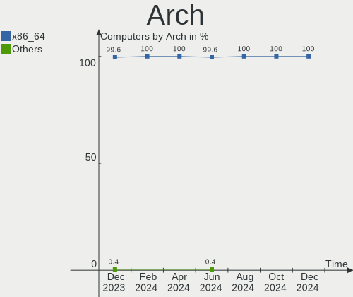
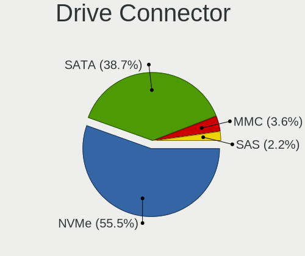
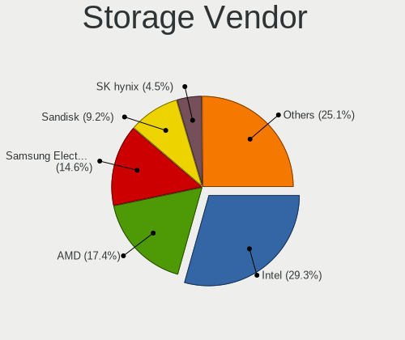

Arch - Hardware Trends
----------------------

A project to identify most popular hardware characteristics and track their change
over time based on data collected by Linux users at https://Linux-Hardware.org.

Anyone can contribute to this report by the [hw-probe](https://github.com/linuxhw/hw-probe) tool:

    sudo -E hw-probe -all -upload

This is a report for all computer types. See also reports for [desktops](/Dist/Arch/Desktop/README.md) and [notebooks](/Dist/Arch/Notebook/README.md).

This report is for one last month. Overall report since the beginning of time: [TestDays](https://github.com/linuxhw/TestDays)

Period: Apr, 2023.

Contents
--------

* [ System ](#system)
  - [ OS                       ](#os)
  - [ OS Family                ](#os-family)
  - [ Kernel                   ](#kernel)
  - [ Kernel Family            ](#kernel-family)
  - [ Kernel Major Ver.        ](#kernel-major-ver)
  - [ Arch                     ](#arch)
  - [ DE                       ](#de)
  - [ Display Server           ](#display-server)
  - [ Display Manager          ](#display-manager)
  - [ OS Lang                  ](#os-lang)
  - [ Boot Mode                ](#boot-mode)
  - [ Filesystem               ](#filesystem)
  - [ Part. scheme             ](#part-scheme)
  - [ Dual Boot with Linux/BSD ](#dual-boot-with-linuxbsd)
  - [ Dual Boot (Win)          ](#dual-boot-win)

* [ Board ](#board)
  - [ Vendor                   ](#vendor)
  - [ Model                    ](#model)
  - [ Model Family             ](#model-family)
  - [ MFG Year                 ](#mfg-year)
  - [ Form Factor              ](#form-factor)
  - [ Secure Boot              ](#secure-boot)
  - [ Coreboot                 ](#coreboot)
  - [ RAM Size                 ](#ram-size)
  - [ RAM Used                 ](#ram-used)
  - [ Total Drives             ](#total-drives)
  - [ Has CD-ROM               ](#has-cd-rom)
  - [ Has Ethernet             ](#has-ethernet)
  - [ Has WiFi                 ](#has-wifi)
  - [ Has Bluetooth            ](#has-bluetooth)

* [ Location ](#location)
  - [ Country                  ](#country)
  - [ City                     ](#city)

* [ Drives ](#drives)
  - [ Drive Vendor             ](#drive-vendor)
  - [ Drive Model              ](#drive-model)
  - [ HDD Vendor               ](#hdd-vendor)
  - [ SSD Vendor               ](#ssd-vendor)
  - [ Drive Kind               ](#drive-kind)
  - [ Drive Connector          ](#drive-connector)
  - [ Drive Size               ](#drive-size)
  - [ Space Total              ](#space-total)
  - [ Space Used               ](#space-used)
  - [ Malfunc. Drives          ](#malfunc-drives)
  - [ Malfunc. Drive Vendor    ](#malfunc-drive-vendor)
  - [ Malfunc. HDD Vendor      ](#malfunc-hdd-vendor)
  - [ Malfunc. Drive Kind      ](#malfunc-drive-kind)
  - [ Failed Drives            ](#failed-drives)
  - [ Failed Drive Vendor      ](#failed-drive-vendor)
  - [ Drive Status             ](#drive-status)

* [ Storage controller ](#storage-controller)
  - [ Storage Vendor           ](#storage-vendor)
  - [ Storage Model            ](#storage-model)
  - [ Storage Kind             ](#storage-kind)

* [ Processor ](#processor)
  - [ CPU Vendor               ](#cpu-vendor)
  - [ CPU Model                ](#cpu-model)
  - [ CPU Model Family         ](#cpu-model-family)
  - [ CPU Cores                ](#cpu-cores)
  - [ CPU Sockets              ](#cpu-sockets)
  - [ CPU Threads              ](#cpu-threads)
  - [ CPU Op-Modes             ](#cpu-op-modes)
  - [ CPU Microcode            ](#cpu-microcode)
  - [ CPU Microarch            ](#cpu-microarch)

* [ Graphics ](#graphics)
  - [ GPU Vendor               ](#gpu-vendor)
  - [ GPU Model                ](#gpu-model)
  - [ GPU Combo                ](#gpu-combo)
  - [ GPU Driver               ](#gpu-driver)
  - [ GPU Memory               ](#gpu-memory)

* [ Monitor ](#monitor)
  - [ Monitor Vendor           ](#monitor-vendor)
  - [ Monitor Model            ](#monitor-model)
  - [ Monitor Resolution       ](#monitor-resolution)
  - [ Monitor Diagonal         ](#monitor-diagonal)
  - [ Monitor Width            ](#monitor-width)
  - [ Aspect Ratio             ](#aspect-ratio)
  - [ Monitor Area             ](#monitor-area)
  - [ Pixel Density            ](#pixel-density)
  - [ Multiple Monitors        ](#multiple-monitors)

* [ Network ](#network)
  - [ Net Controller Vendor    ](#net-controller-vendor)
  - [ Net Controller Model     ](#net-controller-model)
  - [ Wireless Vendor          ](#wireless-vendor)
  - [ Wireless Model           ](#wireless-model)
  - [ Ethernet Vendor          ](#ethernet-vendor)
  - [ Ethernet Model           ](#ethernet-model)
  - [ Net Controller Kind      ](#net-controller-kind)
  - [ Used Controller          ](#used-controller)
  - [ NICs                     ](#nics)
  - [ IPv6                     ](#ipv6)

* [ Bluetooth ](#bluetooth)
  - [ Bluetooth Vendor         ](#bluetooth-vendor)
  - [ Bluetooth Model          ](#bluetooth-model)

* [ Sound ](#sound)
  - [ Sound Vendor             ](#sound-vendor)
  - [ Sound Model              ](#sound-model)

* [ Memory ](#memory)
  - [ Memory Vendor            ](#memory-vendor)
  - [ Memory Model             ](#memory-model)
  - [ Memory Kind              ](#memory-kind)
  - [ Memory Form Factor       ](#memory-form-factor)
  - [ Memory Size              ](#memory-size)
  - [ Memory Speed             ](#memory-speed)

* [ Printers & scanners ](#printers--scanners)
  - [ Printer Vendor           ](#printer-vendor)
  - [ Printer Model            ](#printer-model)
  - [ Scanner Vendor           ](#scanner-vendor)
  - [ Scanner Model            ](#scanner-model)

* [ Camera ](#camera)
  - [ Camera Vendor            ](#camera-vendor)
  - [ Camera Model             ](#camera-model)

* [ Security ](#security)
  - [ Fingerprint Vendor       ](#fingerprint-vendor)
  - [ Fingerprint Model        ](#fingerprint-model)
  - [ Chipcard Vendor          ](#chipcard-vendor)
  - [ Chipcard Model           ](#chipcard-model)

* [ Unsupported ](#unsupported)
  - [ Unsupported Devices      ](#unsupported-devices)
  - [ Unsupported Device Types ](#unsupported-device-types)

System
------

OS
--

Installed operating systems

| Name         | Computers | Percent |
|--------------|-----------|---------|
| Arch Rolling | 177       | 100%    |

OS Family
---------

OS without a version

| Name | Computers | Percent |
|------|-----------|---------|
| Arch | 177       | 100%    |

Kernel
------

Version of the Linux kernel

| Version                    | Computers | Percent |
|----------------------------|-----------|---------|
| 6.2.10-arch1-1             | 37        | 20.9%   |
| 6.2.12-arch1-1             | 25        | 14.12%  |
| 6.2.11-arch1-1             | 25        | 14.12%  |
| 6.2.9-arch1-1              | 21        | 11.86%  |
| 6.2.8-arch1-1              | 15        | 8.47%   |
| 6.2.10-zen1-1-zen          | 9         | 5.08%   |
| 6.2.12-zen1-1-zen          | 6         | 3.39%   |
| 6.2.9-zen1-1-zen           | 4         | 2.26%   |
| 6.2.13-arch1-1             | 4         | 2.26%   |
| 6.1.25-1-lts               | 3         | 1.69%   |
| 6.2.8-zen1-1-zen           | 2         | 1.13%   |
| 6.2.7-arch1-1              | 2         | 1.13%   |
| 6.2.13-zen-1-zen           | 2         | 1.13%   |
| 6.2.11-zen1-1-zen          | 2         | 1.13%   |
| 6.1.26-1-lts               | 2         | 1.13%   |
| 6.1.23-1-lts               | 2         | 1.13%   |
| 6.3.0-273-tkg-pds-llvm     | 1         | 0.56%   |
| 6.2.9-273-tkg-pds          | 1         | 0.56%   |
| 6.2.9-273-tkg-cfs          | 1         | 0.56%   |
| 6.2.8-zen1-1.1-zen         | 1         | 0.56%   |
| 6.2.6-arch1-1_ryzen5       | 1         | 0.56%   |
| 6.2.6-arch1-1              | 1         | 0.56%   |
| 6.2.2-arch1-1              | 1         | 0.56%   |
| 6.2.10-zen2-xanmod1-1      | 1         | 0.56%   |
| 6.2.10-arch1-1-surface     | 1         | 0.56%   |
| 6.2.1-arch1-1              | 1         | 0.56%   |
| 6.1.8-arch1-1              | 1         | 0.56%   |
| 6.1.26-x64v1-xanmod1-1-lts | 1         | 0.56%   |
| 6.1.24-1-lts               | 1         | 0.56%   |
| 6.1.22-1-lts               | 1         | 0.56%   |
| 6.1.12-arch1-1             | 1         | 0.56%   |
| 6.1.1-arch1-1              | 1         | 0.56%   |

Kernel Family
-------------

Linux kernel without a distro release

| Version | Computers | Percent |
|---------|-----------|---------|
| 6.2.10  | 48        | 27.12%  |
| 6.2.12  | 31        | 17.51%  |
| 6.2.9   | 27        | 15.25%  |
| 6.2.11  | 27        | 15.25%  |
| 6.2.8   | 18        | 10.17%  |
| 6.2.13  | 6         | 3.39%   |
| 6.1.26  | 3         | 1.69%   |
| 6.1.25  | 3         | 1.69%   |
| 6.2.7   | 2         | 1.13%   |
| 6.2.6   | 2         | 1.13%   |
| 6.1.23  | 2         | 1.13%   |
| 6.3.0   | 1         | 0.56%   |
| 6.2.2   | 1         | 0.56%   |
| 6.2.1   | 1         | 0.56%   |
| 6.1.8   | 1         | 0.56%   |
| 6.1.24  | 1         | 0.56%   |
| 6.1.22  | 1         | 0.56%   |
| 6.1.12  | 1         | 0.56%   |
| 6.1.1   | 1         | 0.56%   |

Kernel Major Ver.
-----------------

Linux kernel major version

| Version | Computers | Percent |
|---------|-----------|---------|
| 6.2     | 163       | 92.09%  |
| 6.1     | 13        | 7.34%   |
| 6.3     | 1         | 0.56%   |

Arch
----

OS architecture (x86_64, i586, etc.)

| Name   | Computers | Percent |
|--------|-----------|---------|
| x86_64 | 177       | 100%    |

DE
--

Desktop Environment

| Name       | Computers | Percent |
|------------|-----------|---------|
| KDE5       | 80        | 45.2%   |
| GNOME      | 50        | 28.25%  |
| Unknown    | 12        | 6.78%   |
| XFCE       | 8         | 4.52%   |
| Hyprland   | 7         | 3.95%   |
| i3         | 5         | 2.82%   |
| bspwm      | 5         | 2.82%   |
| sway       | 4         | 2.26%   |
| X-Cinnamon | 3         | 1.69%   |
| LXDE       | 1         | 0.56%   |
| KDE        | 1         | 0.56%   |
| Deepin     | 1         | 0.56%   |

Display Server
--------------

X11 or Wayland

| Name    | Computers | Percent |
|---------|-----------|---------|
| X11     | 89        | 50.28%  |
| Wayland | 64        | 36.16%  |
| Tty     | 14        | 7.91%   |
| Unknown | 10        | 5.65%   |

Display Manager
---------------

SDDM, LightDM, etc.

| Name    | Computers | Percent |
|---------|-----------|---------|
| Unknown | 66        | 37.29%  |
| SDDM    | 60        | 33.9%   |
| GDM     | 27        | 15.25%  |
| LightDM | 18        | 10.17%  |
| Ly      | 3         | 1.69%   |
| SLiM    | 1         | 0.56%   |
| LXDM    | 1         | 0.56%   |
| EMPTTY  | 1         | 0.56%   |

OS Lang
-------

Language

| Lang       | Computers | Percent |
|------------|-----------|---------|
| en_US      | 98        | 55.37%  |
| C          | 21        | 11.86%  |
| ru_RU      | 7         | 3.95%   |
| it_IT      | 7         | 3.95%   |
| en_GB      | 6         | 3.39%   |
| de_DE      | 6         | 3.39%   |
| Unknown    | 5         | 2.82%   |
| pt_BR      | 3         | 1.69%   |
| fr_FR      | 3         | 1.69%   |
| en_CA      | 3         | 1.69%   |
| zh_CN      | 2         | 1.13%   |
| sk_SK      | 1         | 0.56%   |
| sc_IT      | 1         | 0.56%   |
| ro_RO      | 1         | 0.56%   |
| pt_PT      | 1         | 0.56%   |
| nl_NL      | 1         | 0.56%   |
| nb_NO      | 1         | 0.56%   |
| es_UY.UTF8 | 1         | 0.56%   |
| es_ES      | 1         | 0.56%   |
| en_IN      | 1         | 0.56%   |
| en_IL      | 1         | 0.56%   |
| en_AU      | 1         | 0.56%   |
| en_AG      | 1         | 0.56%   |
| en-AU      | 1         | 0.56%   |
| de_CH      | 1         | 0.56%   |
| de_AT      | 1         | 0.56%   |
| cs_CZ      | 1         | 0.56%   |

Boot Mode
---------

EFI or BIOS

| Mode | Computers | Percent |
|------|-----------|---------|
| EFI  | 116       | 65.54%  |
| BIOS | 61        | 34.46%  |

Filesystem
----------

Type of filesystem

| Type    | Computers | Percent |
|---------|-----------|---------|
| Ext4    | 117       | 66.1%   |
| Btrfs   | 48        | 27.12%  |
| Xfs     | 5         | 2.82%   |
| Overlay | 3         | 1.69%   |
| F2fs    | 3         | 1.69%   |
| Zfs     | 1         | 0.56%   |

Part. scheme
------------

Scheme of partitioning

| Type    | Computers | Percent |
|---------|-----------|---------|
| GPT     | 123       | 69.49%  |
| Unknown | 43        | 24.29%  |
| MBR     | 11        | 6.21%   |

Dual Boot with Linux/BSD
------------------------

Hosting more than one Linux/BSD

| Dual boot | Computers | Percent |
|-----------|-----------|---------|
| No        | 150       | 84.75%  |
| Yes       | 27        | 15.25%  |

Dual Boot (Win)
---------------

Hosting Linux and Windows

| Dual boot | Computers | Percent |
|-----------|-----------|---------|
| No        | 132       | 74.58%  |
| Yes       | 45        | 25.42%  |

Board
-----

Vendor
------

Motherboard manufacturer

| Name                   | Computers | Percent |
|------------------------|-----------|---------|
| Lenovo                 | 33        | 18.64%  |
| ASUSTek Computer       | 31        | 17.51%  |
| Hewlett-Packard        | 25        | 14.12%  |
| MSI                    | 13        | 7.34%   |
| Dell                   | 13        | 7.34%   |
| ASRock                 | 11        | 6.21%   |
| Gigabyte Technology    | 10        | 5.65%   |
| Acer                   | 6         | 3.39%   |
| Timi                   | 4         | 2.26%   |
| Notebook               | 3         | 1.69%   |
| Intel                  | 3         | 1.69%   |
| Apple                  | 3         | 1.69%   |
| Google                 | 2         | 1.13%   |
| Fujitsu                | 2         | 1.13%   |
| Avell High Performance | 2         | 1.13%   |
| Acidanthera            | 2         | 1.13%   |
| Valve                  | 1         | 0.56%   |
| Toxic                  | 1         | 0.56%   |
| Toshiba                | 1         | 0.56%   |
| System76               | 1         | 0.56%   |
| Sony                   | 1         | 0.56%   |
| Schenker               | 1         | 0.56%   |
| Prestigio              | 1         | 0.56%   |
| Microsoft              | 1         | 0.56%   |
| HUAWEI                 | 1         | 0.56%   |
| Framework              | 1         | 0.56%   |
| eMachines              | 1         | 0.56%   |
| Biostar                | 1         | 0.56%   |
| AZW                    | 1         | 0.56%   |
| Alienware              | 1         | 0.56%   |

Model
-----

Motherboard model

| Name                                        | Computers | Percent |
|---------------------------------------------|-----------|---------|
| Timi Redmi Book Pro 15 2022                 | 2         | 1.13%   |
| MSI MS-7C02                                 | 2         | 1.13%   |
| HP Laptop 15s-eq3xxx                        | 2         | 1.13%   |
| ASUS ROG STRIX X570-E GAMING                | 2         | 1.13%   |
| ASUS ROG Strix G513QY_G513QY                | 2         | 1.13%   |
| ASUS ROG STRIX B550-F GAMING                | 2         | 1.13%   |
| ASRock B450M Pro4                           | 2         | 1.13%   |
| Valve Jupiter                               | 1         | 0.56%   |
| Toxic GM5MPHY                               | 1         | 0.56%   |
| Toshiba Satellite S50-B                     | 1         | 0.56%   |
| Timi RedmiBook Pro 15                       | 1         | 0.56%   |
| Timi RedmiBook Pro 14S                      | 1         | 0.56%   |
| System76 Pangolin                           | 1         | 0.56%   |
| Sony SVE11113FXW                            | 1         | 0.56%   |
| Schenker S405                               | 1         | 0.56%   |
| Prestigio PSB133S01ZFH                      | 1         | 0.56%   |
| Notebook NH5x_NH7x_HHx_HJx_HKx              | 1         | 0.56%   |
| Notebook N85_N87HCHNHZ                      | 1         | 0.56%   |
| Notebook N15_N17RD1                         | 1         | 0.56%   |
| MSI VENGEANCE 5180                          | 1         | 0.56%   |
| MSI Stealth 14Studio A13VF                  | 1         | 0.56%   |
| MSI Prestige 14 A12UC                       | 1         | 0.56%   |
| MSI MS-7D75                                 | 1         | 0.56%   |
| MSI MS-7B86                                 | 1         | 0.56%   |
| MSI MS-7B38                                 | 1         | 0.56%   |
| MSI MS-7A70                                 | 1         | 0.56%   |
| MSI MS-7996                                 | 1         | 0.56%   |
| MSI MS-7519                                 | 1         | 0.56%   |
| MSI GF75 Thin 9SC                           | 1         | 0.56%   |
| MSI Bravo 15 B5DD                           | 1         | 0.56%   |
| Microsoft Surface Laptop Go                 | 1         | 0.56%   |
| Lenovo V15-ADA 82C7                         | 1         | 0.56%   |
| Lenovo ThinkPad Z13 Gen 1 21D2000KUS        | 1         | 0.56%   |
| Lenovo ThinkPad X250 20CMCTO1WW             | 1         | 0.56%   |
| Lenovo ThinkPad X1 Yoga Gen 7 21CDCTO1WW    | 1         | 0.56%   |
| Lenovo ThinkPad X1 Yoga Gen 5 20UB0033RT    | 1         | 0.56%   |
| Lenovo ThinkPad X1 Carbon Gen 10 21CBS1GL00 | 1         | 0.56%   |
| Lenovo ThinkPad X1 Carbon 6th 20KH002KUS    | 1         | 0.56%   |
| Lenovo ThinkPad X1 Carbon 5th 20HR000FUS    | 1         | 0.56%   |
| Lenovo ThinkPad X1 Carbon 5th 20HQS1MX00    | 1         | 0.56%   |

Model Family
------------

Motherboard model prefix

| Name                   | Computers | Percent |
|------------------------|-----------|---------|
| Lenovo ThinkPad        | 22        | 12.43%  |
| ASUS ROG               | 11        | 6.21%   |
| HP Laptop              | 7         | 3.95%   |
| Lenovo IdeaPad         | 5         | 2.82%   |
| HP Pavilion            | 5         | 2.82%   |
| Dell Latitude          | 5         | 2.82%   |
| ASUS PRIME             | 5         | 2.82%   |
| HP ENVY                | 3         | 1.69%   |
| Gigabyte X570          | 3         | 1.69%   |
| Dell XPS               | 3         | 1.69%   |
| ASUS VivoBook          | 3         | 1.69%   |
| ASUS TUF               | 3         | 1.69%   |
| Acer Aspire            | 3         | 1.69%   |
| Timi RedmiBook         | 2         | 1.13%   |
| Timi Redmi             | 2         | 1.13%   |
| MSI MS-7C02            | 2         | 1.13%   |
| Lenovo Legion          | 2         | 1.13%   |
| HP ProBook             | 2         | 1.13%   |
| Fujitsu LIFEBOOK       | 2         | 1.13%   |
| Dell Inspiron          | 2         | 1.13%   |
| ASUS ASUS              | 2         | 1.13%   |
| ASRock B550            | 2         | 1.13%   |
| ASRock B450M           | 2         | 1.13%   |
| Valve Jupiter          | 1         | 0.56%   |
| Toxic GM5MPHY          | 1         | 0.56%   |
| Toshiba Satellite      | 1         | 0.56%   |
| System76 Pangolin      | 1         | 0.56%   |
| Sony SVE11113FXW       | 1         | 0.56%   |
| Schenker S405          | 1         | 0.56%   |
| Prestigio PSB133S01ZFH | 1         | 0.56%   |
| Notebook NH5x          | 1         | 0.56%   |
| Notebook N85           | 1         | 0.56%   |
| Notebook N15           | 1         | 0.56%   |
| MSI VENGEANCE          | 1         | 0.56%   |
| MSI Stealth            | 1         | 0.56%   |
| MSI Prestige           | 1         | 0.56%   |
| MSI MS-7D75            | 1         | 0.56%   |
| MSI MS-7B86            | 1         | 0.56%   |
| MSI MS-7B38            | 1         | 0.56%   |
| MSI MS-7A70            | 1         | 0.56%   |

MFG Year
--------

Motherboard manufacture year

| Year | Computers | Percent |
|------|-----------|---------|
| 2022 | 32        | 18.08%  |
| 2021 | 27        | 15.25%  |
| 2018 | 25        | 14.12%  |
| 2020 | 21        | 11.86%  |
| 2019 | 18        | 10.17%  |
| 2017 | 13        | 7.34%   |
| 2016 | 7         | 3.95%   |
| 2012 | 6         | 3.39%   |
| 2014 | 5         | 2.82%   |
| 2013 | 5         | 2.82%   |
| 2009 | 5         | 2.82%   |
| 2023 | 4         | 2.26%   |
| 2015 | 4         | 2.26%   |
| 2011 | 2         | 1.13%   |
| 2008 | 2         | 1.13%   |
| 2010 | 1         | 0.56%   |

Form Factor
-----------

Physical design of the computer

| Name        | Computers | Percent |
|-------------|-----------|---------|
| Notebook    | 103       | 58.19%  |
| Desktop     | 56        | 31.64%  |
| Convertible | 8         | 4.52%   |
| Tablet      | 5         | 2.82%   |
| Mini pc     | 2         | 1.13%   |
| All in one  | 2         | 1.13%   |
| Server      | 1         | 0.56%   |

Secure Boot
-----------

Enabled or disabled

| State    | Computers | Percent |
|----------|-----------|---------|
| Disabled | 171       | 96.61%  |
| Enabled  | 6         | 3.39%   |

Coreboot
--------

Have coreboot on board

| Used | Computers | Percent |
|------|-----------|---------|
| No   | 174       | 98.31%  |
| Yes  | 3         | 1.69%   |

RAM Size
--------

Total RAM memory

| Size in GB  | Computers | Percent |
|-------------|-----------|---------|
| 16.01-24.0  | 50        | 28.25%  |
| 32.01-64.0  | 38        | 21.47%  |
| 4.01-8.0    | 33        | 18.64%  |
| 8.01-16.0   | 31        | 17.51%  |
| 3.01-4.0    | 12        | 6.78%   |
| 64.01-256.0 | 6         | 3.39%   |
| 24.01-32.0  | 4         | 2.26%   |
| 1.01-2.0    | 2         | 1.13%   |
| 2.01-3.0    | 1         | 0.56%   |

RAM Used
--------

Used RAM memory

| Used GB    | Computers | Percent |
|------------|-----------|---------|
| 4.01-8.0   | 55        | 31.07%  |
| 2.01-3.0   | 38        | 21.47%  |
| 3.01-4.0   | 30        | 16.95%  |
| 1.01-2.0   | 29        | 16.38%  |
| 8.01-16.0  | 19        | 10.73%  |
| 0.51-1.0   | 3         | 1.69%   |
| 0.01-0.5   | 2         | 1.13%   |
| 16.01-24.0 | 1         | 0.56%   |

Total Drives
------------

Number of drives on board

| Drives | Computers | Percent |
|--------|-----------|---------|
| 1      | 97        | 54.8%   |
| 2      | 43        | 24.29%  |
| 3      | 21        | 11.86%  |
| 4      | 8         | 4.52%   |
| 7      | 2         | 1.13%   |
| 5      | 2         | 1.13%   |
| 0      | 2         | 1.13%   |
| 19     | 1         | 0.56%   |
| 6      | 1         | 0.56%   |

Has CD-ROM
----------

Has CD-ROM on board

| Presented | Computers | Percent |
|-----------|-----------|---------|
| No        | 152       | 85.88%  |
| Yes       | 25        | 14.12%  |

Has Ethernet
------------

Has Ethernet on board

| Presented | Computers | Percent |
|-----------|-----------|---------|
| Yes       | 139       | 78.53%  |
| No        | 38        | 21.47%  |

Has WiFi
--------

Has WiFi module

| Presented | Computers | Percent |
|-----------|-----------|---------|
| Yes       | 148       | 83.62%  |
| No        | 29        | 16.38%  |

Has Bluetooth
-------------

Has Bluetooth module

| Presented | Computers | Percent |
|-----------|-----------|---------|
| Yes       | 140       | 79.1%   |
| No        | 37        | 20.9%   |

Location
--------

Country
-------

Geographic location (country)

| Country     | Computers | Percent |
|-------------|-----------|---------|
| USA         | 27        | 15.25%  |
| Russia      | 16        | 9.04%   |
| Germany     | 16        | 9.04%   |
| Italy       | 14        | 7.91%   |
| Brazil      | 10        | 5.65%   |
| Canada      | 9         | 5.08%   |
| France      | 7         | 3.95%   |
| UK          | 6         | 3.39%   |
| Spain       | 6         | 3.39%   |
| Austria     | 5         | 2.82%   |
| Australia   | 5         | 2.82%   |
| Poland      | 4         | 2.26%   |
| Turkey      | 3         | 1.69%   |
| Slovakia    | 3         | 1.69%   |
| Portugal    | 3         | 1.69%   |
| Norway      | 3         | 1.69%   |
| Netherlands | 3         | 1.69%   |
| Ukraine     | 2         | 1.13%   |
| Romania     | 2         | 1.13%   |
| Kyrgyzstan  | 2         | 1.13%   |
| Israel      | 2         | 1.13%   |
| Indonesia   | 2         | 1.13%   |
| India       | 2         | 1.13%   |
| Czechia     | 2         | 1.13%   |
| China       | 2         | 1.13%   |
| Bulgaria    | 2         | 1.13%   |
| Vietnam     | 1         | 0.56%   |
| Uruguay     | 1         | 0.56%   |
| Thailand    | 1         | 0.56%   |
| Switzerland | 1         | 0.56%   |
| Sweden      | 1         | 0.56%   |
| Slovenia    | 1         | 0.56%   |
| Puerto Rico | 1         | 0.56%   |
| New Zealand | 1         | 0.56%   |
| Morocco     | 1         | 0.56%   |
| Moldova     | 1         | 0.56%   |
| Japan       | 1         | 0.56%   |
| Hungary     | 1         | 0.56%   |
| Greece      | 1         | 0.56%   |
| Finland     | 1         | 0.56%   |

City
----

Geographic location (city)

| City                       | Computers | Percent |
|----------------------------|-----------|---------|
| Moscow                     | 7         | 3.95%   |
| St Petersburg              | 5         | 2.82%   |
| Vienna                     | 4         | 2.26%   |
| Melbourne                  | 4         | 2.26%   |
| Milan                      | 3         | 1.69%   |
| Istanbul                   | 3         | 1.69%   |
| Tel Aviv                   | 2         | 1.13%   |
| Sao Paulo                  | 2         | 1.13%   |
| Paris                      | 2         | 1.13%   |
| New York                   | 2         | 1.13%   |
| Mississauga                | 2         | 1.13%   |
| Ludwigshafen am Rhein      | 2         | 1.13%   |
| Johnson City               | 2         | 1.13%   |
| Hickory                    | 2         | 1.13%   |
| Edmonton                   | 2         | 1.13%   |
| Bratislava                 | 2         | 1.13%   |
| Bishkek                    | 2         | 1.13%   |
| Woodbridge                 | 1         | 0.56%   |
| Wolverhampton              | 1         | 0.56%   |
| Wolkersdorf im Weinviertel | 1         | 0.56%   |
| Winnipeg                   | 1         | 0.56%   |
| Wadowice                   | 1         | 0.56%   |
| Villa Ballester            | 1         | 0.56%   |
| Vila Verde                 | 1         | 0.56%   |
| Vila Nova de Gaia          | 1         | 0.56%   |
| Verona                     | 1         | 0.56%   |
| Valencia                   | 1         | 0.56%   |
| Ufa                        | 1         | 0.56%   |
| Uelzen                     | 1         | 0.56%   |
| Uberlândia                | 1         | 0.56%   |
| Trento                     | 1         | 0.56%   |
| Toulouse                   | 1         | 0.56%   |
| Torre Boldone              | 1         | 0.56%   |
| Tokyo                      | 1         | 0.56%   |
| Tistedal                   | 1         | 0.56%   |
| Teresina                   | 1         | 0.56%   |
| Suceava                    | 1         | 0.56%   |
| Stuttgart                  | 1         | 0.56%   |
| Storm Lake                 | 1         | 0.56%   |
| Stará Ľubovňa           | 1         | 0.56%   |

Drives
------

Drive Vendor
------------

Hard drive vendors

| Vendor                       | Computers | Drives | Percent |
|------------------------------|-----------|--------|---------|
| Samsung Electronics          | 62        | 75     | 21.99%  |
| WDC                          | 27        | 32     | 9.57%   |
| Seagate                      | 23        | 37     | 8.16%   |
| Sandisk                      | 23        | 27     | 8.16%   |
| Unknown                      | 15        | 15     | 5.32%   |
| Crucial                      | 14        | 15     | 4.96%   |
| Toshiba                      | 12        | 15     | 4.26%   |
| Intel                        | 10        | 10     | 3.55%   |
| Kingston                     | 9         | 11     | 3.19%   |
| Micron Technology            | 8         | 8      | 2.84%   |
| Phison Electronics           | 7         | 7      | 2.48%   |
| SK hynix                     | 6         | 6      | 2.13%   |
| Micron/Crucial Technology    | 6         | 6      | 2.13%   |
| Kingston Technology Company  | 5         | 5      | 1.77%   |
| HGST                         | 5         | 5      | 1.77%   |
| KIOXIA                       | 4         | 4      | 1.42%   |
| Hitachi                      | 3         | 3      | 1.06%   |
| China                        | 3         | 3      | 1.06%   |
| A-DATA Technology            | 3         | 4      | 1.06%   |
| Shenzhen Longsys Electronics | 2         | 2      | 0.71%   |
| PNY                          | 2         | 2      | 0.71%   |
| Plextor                      | 2         | 2      | 0.71%   |
| Maxtor                       | 2         | 2      | 0.71%   |
| MAXIO Technology (Hangzhou)  | 2         | 2      | 0.71%   |
| GOODRAM                      | 2         | 2      | 0.71%   |
| Corsair                      | 2         | 2      | 0.71%   |
| Apple                        | 2         | 3      | 0.71%   |
| Yangtze Memory Technologies  | 1         | 1      | 0.35%   |
| XrayDisk                     | 1         | 1      | 0.35%   |
| Transcend                    | 1         | 1      | 0.35%   |
| T-FORCE                      | 1         | 2      | 0.35%   |
| SSK                          | 1         | 1      | 0.35%   |
| Seagate Technology           | 1         | 1      | 0.35%   |
| SABRENT                      | 1         | 1      | 0.35%   |
| Patriot                      | 1         | 1      | 0.35%   |
| OWC                          | 1         | 1      | 0.35%   |
| OCZ                          | 1         | 1      | 0.35%   |
| MATSHITA                     | 1         | 1      | 0.35%   |
| Lexar                        | 1         | 2      | 0.35%   |
| KingSpec                     | 1         | 1      | 0.35%   |

Drive Model
-----------

Hard drive models

| Model                                                  | Computers | Percent |
|--------------------------------------------------------|-----------|---------|
| Samsung NVMe SSD Controller SM981/PM981/PM983 1TB      | 20        | 6.47%   |
| Samsung NVMe SSD Controller PM9A1/PM9A3/980PRO 2TB     | 10        | 3.24%   |
| Unknown MMC Card  32GB                                 | 7         | 2.27%   |
| Micron/Crucial P2 NVMe PCIe SSD 1TB                    | 5         | 1.62%   |
| Crucial CT500MX500SSD1 500GB                           | 5         | 1.62%   |
| Sandisk WD Blue SN550 NVMe SSD 1024GB                  | 4         | 1.29%   |
| Samsung SSD 980 1TB                                    | 4         | 1.29%   |
| Unknown MMC Card  64GB                                 | 3         | 0.97%   |
| Seagate ST2000DM008-2FR102 2TB                         | 3         | 0.97%   |
| Seagate ST1000DM010-2EP102 1TB                         | 3         | 0.97%   |
| Samsung SSD 860 EVO 1TB                                | 3         | 0.97%   |
| Samsung SSD 850 EVO 500GB                              | 3         | 0.97%   |
| Phison E12 NVMe Controller 512GB                       | 3         | 0.97%   |
| Kingston SA400S37240G 240GB SSD                        | 3         | 0.97%   |
| WDC WD20EZRX-00DC0B0 2TB                               | 2         | 0.65%   |
| WDC WD10SPZX-60Z10T0 1TB                               | 2         | 0.65%   |
| WDC WD1003FZEX-00MK2A0 1TB                             | 2         | 0.65%   |
| Unknown SD/MMC/MS PRO 249GB                            | 2         | 0.65%   |
| Unknown MMC Card  128GB                                | 2         | 0.65%   |
| Toshiba HDWD110 1TB                                    | 2         | 0.65%   |
| Toshiba DT01ACA200 2TB                                 | 2         | 0.65%   |
| SK hynix HFM512GD3JX013N 512GB                         | 2         | 0.65%   |
| Shenzhen Longsys SM2263EN/SM2263XT-based OEM SSD 512GB | 2         | 0.65%   |
| Seagate ST1000LX015-1U7172 1TB                         | 2         | 0.65%   |
| Seagate ST1000LM035-1RK172 970GB                       | 2         | 0.65%   |
| Seagate Expansion Desk 8TB                             | 2         | 0.65%   |
| Sandisk WD_BLACK SN850X 1000GB                         | 2         | 0.65%   |
| Sandisk WD_BLACK SN770 1TB                             | 2         | 0.65%   |
| Sandisk WD Black SN750 / PC SN730 NVMe SSD 512GB       | 2         | 0.65%   |
| Samsung SSD 840 PRO Series 256GB                       | 2         | 0.65%   |
| Samsung MZALQ512HALU-000L2 512GB                       | 2         | 0.65%   |
| Micron MTFDKBA512TFK-1BC1AABHA 512GB                   | 2         | 0.65%   |
| MAXIO (Hangzhou) NVMe SSD Controller MAP1202 1TB       | 2         | 0.65%   |
| KIOXIA KBG50ZNV512G 512GB                              | 2         | 0.65%   |
| KIOXIA KBG40ZNS512G NVMe 512GB                         | 2         | 0.65%   |
| Kingston Company OM3PDP3 NVMe SSD 512GB                | 2         | 0.65%   |
| Kingston SFYRS1000G 1TB                                | 2         | 0.65%   |
| Intel SSDPEKNU512GZ 512GB                              | 2         | 0.65%   |
| Intel SSD 660P Series 512GB                            | 2         | 0.65%   |
| Crucial CT525MX300SSD1 528GB                           | 2         | 0.65%   |

HDD Vendor
----------

Hard disk drive vendors

| Vendor              | Computers | Drives | Percent |
|---------------------|-----------|--------|---------|
| WDC                 | 23        | 27     | 31.08%  |
| Seagate             | 23        | 37     | 31.08%  |
| Toshiba             | 10        | 13     | 13.51%  |
| HGST                | 5         | 5      | 6.76%   |
| Samsung Electronics | 4         | 4      | 5.41%   |
| Hitachi             | 3         | 3      | 4.05%   |
| Unknown             | 2         | 2      | 2.7%    |
| Maxtor              | 2         | 2      | 2.7%    |
| Generic-            | 1         | 1      | 1.35%   |
| ASMT                | 1         | 1      | 1.35%   |

SSD Vendor
----------

Solid state drive vendors

| Vendor              | Computers | Drives | Percent |
|---------------------|-----------|--------|---------|
| Samsung Electronics | 19        | 21     | 25.33%  |
| Crucial             | 14        | 15     | 18.67%  |
| WDC                 | 5         | 5      | 6.67%   |
| SanDisk             | 5         | 6      | 6.67%   |
| Kingston            | 5         | 5      | 6.67%   |
| China               | 3         | 3      | 4%      |
| PNY                 | 2         | 2      | 2.67%   |
| Plextor             | 2         | 2      | 2.67%   |
| Micron Technology   | 2         | 2      | 2.67%   |
| Intel               | 2         | 2      | 2.67%   |
| GOODRAM             | 2         | 2      | 2.67%   |
| XrayDisk            | 1         | 1      | 1.33%   |
| Transcend           | 1         | 1      | 1.33%   |
| T-FORCE             | 1         | 1      | 1.33%   |
| Patriot             | 1         | 1      | 1.33%   |
| OWC                 | 1         | 1      | 1.33%   |
| OCZ                 | 1         | 1      | 1.33%   |
| Lexar               | 1         | 2      | 1.33%   |
| KingSpec            | 1         | 1      | 1.33%   |
| Intenso             | 1         | 1      | 1.33%   |
| INNOVATION IT       | 1         | 1      | 1.33%   |
| Gigabyte Technology | 1         | 1      | 1.33%   |
| Corsair             | 1         | 1      | 1.33%   |
| BIWIN               | 1         | 1      | 1.33%   |
| Apple               | 1         | 1      | 1.33%   |

Drive Kind
----------

HDD or SSD

| Kind    | Computers | Drives | Percent |
|---------|-----------|--------|---------|
| NVMe    | 117       | 137    | 45.7%   |
| SSD     | 65        | 80     | 25.39%  |
| HDD     | 58        | 95     | 22.66%  |
| MMC     | 13        | 13     | 5.08%   |
| Unknown | 3         | 3      | 1.17%   |

Drive Connector
---------------

SATA, SAS, NVMe, etc.

| Type | Computers | Drives | Percent |
|------|-----------|--------|---------|
| NVMe | 117       | 135    | 50.87%  |
| SATA | 92        | 170    | 40%     |
| MMC  | 13        | 13     | 5.65%   |
| SAS  | 8         | 10     | 3.48%   |

Drive Size
----------

Size of hard drive

| Size in TB | Computers | Drives | Percent |
|------------|-----------|--------|---------|
| 0.01-0.5   | 63        | 92     | 47.37%  |
| 0.51-1.0   | 44        | 52     | 33.08%  |
| 1.01-2.0   | 14        | 16     | 10.53%  |
| 3.01-4.0   | 6         | 7      | 4.51%   |
| 4.01-10.0  | 6         | 8      | 4.51%   |

Space Total
-----------

Amount of disk space available on the file system

| Size in GB     | Computers | Percent |
|----------------|-----------|---------|
| 251-500        | 41        | 23.16%  |
| 501-1000       | 38        | 21.47%  |
| 101-250        | 28        | 15.82%  |
| More than 3000 | 22        | 12.43%  |
| 1001-2000      | 22        | 12.43%  |
| 2001-3000      | 8         | 4.52%   |
| 51-100         | 6         | 3.39%   |
| Unknown        | 6         | 3.39%   |
| 21-50          | 4         | 2.26%   |
| 1-20           | 2         | 1.13%   |

Space Used
----------

Amount of used disk space

| Used GB        | Computers | Percent |
|----------------|-----------|---------|
| 1-20           | 36        | 20.34%  |
| 101-250        | 31        | 17.51%  |
| 21-50          | 29        | 16.38%  |
| 251-500        | 22        | 12.43%  |
| 501-1000       | 20        | 11.3%   |
| 51-100         | 14        | 7.91%   |
| 1001-2000      | 12        | 6.78%   |
| Unknown        | 6         | 3.39%   |
| More than 3000 | 5         | 2.82%   |
| 2001-3000      | 2         | 1.13%   |

Malfunc. Drives
---------------

Drive models with a malfunction

| Model                                                          | Computers | Drives | Percent |
|----------------------------------------------------------------|-----------|--------|---------|
| Seagate ST1000LX015-1U7172 1TB                                 | 2         | 3      | 7.69%   |
| Crucial CT525MX300SSD1 528GB                                   | 2         | 2      | 7.69%   |
| XrayDisk SSD 128GB                                             | 1         | 1      | 3.85%   |
| WDC WD6400BEVT-22A0RT0 640GB                                   | 1         | 1      | 3.85%   |
| WDC WD40EFRX-68WT0N0 4TB                                       | 1         | 2      | 3.85%   |
| WDC WD20EFRX-68AX9N0 2TB                                       | 1         | 1      | 3.85%   |
| WDC WD1002FAEX-00Z3A0 1TB                                      | 1         | 1      | 3.85%   |
| Toshiba HDWD120 2TB                                            | 1         | 1      | 3.85%   |
| Toshiba DT01ACA200 2TB                                         | 1         | 1      | 3.85%   |
| Seagate ST500LT012-1DG142 500GB                                | 1         | 2      | 3.85%   |
| Seagate ST500LM021-1KJ152 500GB                                | 1         | 4      | 3.85%   |
| Seagate ST3320820AS 320GB                                      | 1         | 1      | 3.85%   |
| Seagate ST1000LM035-1RK172 970GB                               | 1         | 1      | 3.85%   |
| Seagate ST1000LM024 HN-M101MBB 1TB                             | 1         | 1      | 3.85%   |
| SanDisk SSD PLUS 480GB                                         | 1         | 1      | 3.85%   |
| Samsung Electronics NVMe SSD Controller PM9A1/PM9A3/980PRO 2TB | 1         | 1      | 3.85%   |
| Micron Technology 1100_MTFDDAV512TBN 512GB SSD                 | 1         | 1      | 3.85%   |
| Maxtor STM3320820AS 320GB                                      | 1         | 1      | 3.85%   |
| Maxtor STM3250310AS 250GB                                      | 1         | 1      | 3.85%   |
| Kingston SKC400S371T 1TB SSD                                   | 1         | 1      | 3.85%   |
| Hitachi HTS547564A9E384 640GB                                  | 1         | 1      | 3.85%   |
| HGST HTS721010A9E630 1TB                                       | 1         | 1      | 3.85%   |
| HGST HTS541010B7E610 1TB                                       | 1         | 1      | 3.85%   |
| ASMT ASM1156-PM 1TB                                            | 1         | 1      | 3.85%   |

Malfunc. Drive Vendor
---------------------

Vendors of faulty drives

| Vendor              | Computers | Drives | Percent |
|---------------------|-----------|--------|---------|
| Seagate             | 5         | 12     | 20.83%  |
| WDC                 | 4         | 5      | 16.67%  |
| Toshiba             | 2         | 2      | 8.33%   |
| Maxtor              | 2         | 2      | 8.33%   |
| HGST                | 2         | 2      | 8.33%   |
| Crucial             | 2         | 2      | 8.33%   |
| XrayDisk            | 1         | 1      | 4.17%   |
| SanDisk             | 1         | 1      | 4.17%   |
| Samsung Electronics | 1         | 1      | 4.17%   |
| Micron Technology   | 1         | 1      | 4.17%   |
| Kingston            | 1         | 1      | 4.17%   |
| Hitachi             | 1         | 1      | 4.17%   |
| ASMT                | 1         | 1      | 4.17%   |

Malfunc. HDD Vendor
-------------------

Vendors of faulty HDD drives

| Vendor  | Computers | Drives | Percent |
|---------|-----------|--------|---------|
| Seagate | 5         | 12     | 29.41%  |
| WDC     | 4         | 5      | 23.53%  |
| Toshiba | 2         | 2      | 11.76%  |
| Maxtor  | 2         | 2      | 11.76%  |
| HGST    | 2         | 2      | 11.76%  |
| Hitachi | 1         | 1      | 5.88%   |
| ASMT    | 1         | 1      | 5.88%   |

Malfunc. Drive Kind
-------------------

Kinds of faulty drives

| Kind | Computers | Drives | Percent |
|------|-----------|--------|---------|
| HDD  | 16        | 25     | 69.57%  |
| SSD  | 6         | 6      | 26.09%  |
| NVMe | 1         | 1      | 4.35%   |

Failed Drives
-------------

Failed drive models

Zero info for selected period =(

Failed Drive Vendor
-------------------

Failed drive vendors

Zero info for selected period =(

Drive Status
------------

Number of failed and malfunc. drives

| Status   | Computers | Drives | Percent |
|----------|-----------|--------|---------|
| Works    | 108       | 173    | 52.68%  |
| Detected | 77        | 123    | 37.56%  |
| Malfunc  | 20        | 32     | 9.76%   |

Storage controller
------------------

Storage Vendor
--------------

Storage controller vendors

| Vendor                       | Computers | Percent |
|------------------------------|-----------|---------|
| Intel                        | 83        | 32.05%  |
| Samsung Electronics          | 47        | 18.15%  |
| AMD                          | 46        | 17.76%  |
| Sandisk                      | 18        | 6.95%   |
| Kingston Technology Company  | 9         | 3.47%   |
| Phison Electronics           | 8         | 3.09%   |
| SK hynix                     | 6         | 2.32%   |
| Micron/Crucial Technology    | 6         | 2.32%   |
| Micron Technology            | 6         | 2.32%   |
| ASMedia Technology           | 6         | 2.32%   |
| KIOXIA                       | 4         | 1.54%   |
| ADATA Technology             | 4         | 1.54%   |
| JMicron Technology           | 3         | 1.16%   |
| Toshiba America Info Systems | 2         | 0.77%   |
| Shenzhen Longsys Electronics | 2         | 0.77%   |
| MAXIO Technology (Hangzhou)  | 2         | 0.77%   |
| Yangtze Memory Technologies  | 1         | 0.39%   |
| VIA Technologies             | 1         | 0.39%   |
| Seagate Technology           | 1         | 0.39%   |
| Nvidia                       | 1         | 0.39%   |
| Marvell Technology Group     | 1         | 0.39%   |
| Broadcom / LSI               | 1         | 0.39%   |
| Apple                        | 1         | 0.39%   |

Storage Model
-------------

Storage controller models

| Model                                                            | Computers | Percent |
|------------------------------------------------------------------|-----------|---------|
| AMD FCH SATA Controller [AHCI mode]                              | 38        | 13.38%  |
| Samsung NVMe SSD Controller SM981/PM981/PM983                    | 20        | 7.04%   |
| Samsung NVMe SSD Controller 980                                  | 13        | 4.58%   |
| Samsung NVMe SSD Controller PM9A1/PM9A3/980PRO                   | 10        | 3.52%   |
| AMD 400 Series Chipset SATA Controller                           | 10        | 3.52%   |
| Intel Volume Management Device NVMe RAID Controller              | 9         | 3.17%   |
| Micron NVMe Storage Controller                                   | 6         | 2.11%   |
| Intel Wildcat Point-LP SATA Controller [AHCI Mode]               | 6         | 2.11%   |
| Intel 82801 Mobile SATA Controller [RAID mode]                   | 6         | 2.11%   |
| Micron/Crucial P2 NVMe PCIe SSD                                  | 5         | 1.76%   |
| Kingston Company Company Non-Volatile memory controller          | 5         | 1.76%   |
| Intel Cannon Point-LP SATA Controller [AHCI Mode]                | 5         | 1.76%   |
| ASMedia ASM1062 Serial ATA Controller                            | 5         | 1.76%   |
| AMD 500 Series Chipset SATA Controller                           | 5         | 1.76%   |
| SanDisk WD Blue SN550 NVMe SSD                                   | 4         | 1.41%   |
| SanDisk WD Black SN770 NVMe SSD                                  | 4         | 1.41%   |
| Phison E12 NVMe Controller                                       | 4         | 1.41%   |
| Intel Sunrise Point-LP SATA Controller [AHCI mode]               | 4         | 1.41%   |
| Intel Non-Volatile memory controller                             | 4         | 1.41%   |
| Intel Cannon Lake PCH SATA AHCI Controller                       | 4         | 1.41%   |
| Intel 500 Series Chipset Family SATA AHCI Controller             | 4         | 1.41%   |
| SK hynix Gold P31/PC711 NVMe Solid State Drive                   | 3         | 1.06%   |
| Sandisk Western Digital WD Black SN850X NVMe SSD                 | 3         | 1.06%   |
| JMicron JMB368 IDE controller                                    | 3         | 1.06%   |
| Intel HM170/QM170 Chipset SATA Controller [AHCI Mode]            | 3         | 1.06%   |
| Intel Cannon Lake Mobile PCH SATA AHCI Controller                | 3         | 1.06%   |
| Intel 8 Series SATA Controller 1 [AHCI mode]                     | 3         | 1.06%   |
| Intel 7 Series Chipset Family 6-port SATA Controller [AHCI mode] | 3         | 1.06%   |
| Intel 200 Series PCH SATA controller [AHCI mode]                 | 3         | 1.06%   |
| AMD FCH SATA Controller D                                        | 3         | 1.06%   |
| ADATA IM2P33F8ABR1 NVMe SSD                                      | 3         | 1.06%   |
| SK hynix Platinum P41 NVMe Solid State Drive 2TB                 | 2         | 0.7%    |
| Shenzhen Longsys SM2263EN/SM2263XT-based OEM SSD                 | 2         | 0.7%    |
| SanDisk WD Black SN750 / PC SN730 NVMe SSD                       | 2         | 0.7%    |
| SanDisk Non-Volatile memory controller                           | 2         | 0.7%    |
| Samsung NVMe SSD Controller PM9B1                                | 2         | 0.7%    |
| MAXIO (Hangzhou) NVMe SSD Controller MAP1202                     | 2         | 0.7%    |
| KIOXIA NVMe SSD Controller BG4                                   | 2         | 0.7%    |
| KIOXIA Non-Volatile memory controller                            | 2         | 0.7%    |
| Kingston Company OM3PDP3 NVMe SSD                                | 2         | 0.7%    |

Storage Kind
------------

Kind of storage controller (IDE, SATA, NVMe, SAS, ...)

| Kind | Computers | Percent |
|------|-----------|---------|
| NVMe | 117       | 47.18%  |
| SATA | 106       | 42.74%  |
| RAID | 18        | 7.26%   |
| IDE  | 7         | 2.82%   |

Processor
---------

CPU Vendor
----------

Processor vendors

| Vendor | Computers | Percent |
|--------|-----------|---------|
| Intel  | 117       | 66.1%   |
| AMD    | 60        | 33.9%   |

CPU Model
---------

Processor models

| Model                                       | Computers | Percent |
|---------------------------------------------|-----------|---------|
| Intel 12th Gen Core i7-1260P                | 4         | 2.26%   |
| AMD Ryzen 5 3600 6-Core Processor           | 4         | 2.26%   |
| Intel Core i5-8265U CPU @ 1.60GHz           | 3         | 1.69%   |
| Intel Core i5-8250U CPU @ 1.60GHz           | 3         | 1.69%   |
| Intel Core i5-5200U CPU @ 2.20GHz           | 3         | 1.69%   |
| Intel 12th Gen Core i7-12700H               | 3         | 1.69%   |
| Intel 11th Gen Core i7-1165G7 @ 2.80GHz     | 3         | 1.69%   |
| AMD Ryzen 9 5950X 16-Core Processor         | 3         | 1.69%   |
| AMD Ryzen 7 5800X 8-Core Processor          | 3         | 1.69%   |
| AMD Ryzen 7 5700U with Radeon Graphics      | 3         | 1.69%   |
| AMD Ryzen 5 5625U with Radeon Graphics      | 3         | 1.69%   |
| Intel Core i7-8750H CPU @ 2.20GHz           | 2         | 1.13%   |
| Intel Core i7-8700 CPU @ 3.20GHz            | 2         | 1.13%   |
| Intel Core i7-8650U CPU @ 1.90GHz           | 2         | 1.13%   |
| Intel Core i7-7700HQ CPU @ 2.80GHz          | 2         | 1.13%   |
| Intel Core i7-7600U CPU @ 2.80GHz           | 2         | 1.13%   |
| Intel Core i7-4600U CPU @ 2.10GHz           | 2         | 1.13%   |
| Intel Core i5-8300H CPU @ 2.30GHz           | 2         | 1.13%   |
| Intel Core i5-7400 CPU @ 3.00GHz            | 2         | 1.13%   |
| Intel Core i5-10400F CPU @ 2.90GHz          | 2         | 1.13%   |
| Intel Core i5-1035G1 CPU @ 1.00GHz          | 2         | 1.13%   |
| Intel Core i5-10210U CPU @ 1.60GHz          | 2         | 1.13%   |
| Intel Celeron CPU N3350 @ 1.10GHz           | 2         | 1.13%   |
| Intel 12th Gen Core i7-12650H               | 2         | 1.13%   |
| Intel 11th Gen Core i7-1185G7 @ 3.00GHz     | 2         | 1.13%   |
| Intel 11th Gen Core i5-11400H @ 2.70GHz     | 2         | 1.13%   |
| Intel 11th Gen Core i5-1135G7 @ 2.40GHz     | 2         | 1.13%   |
| AMD Ryzen 9 5980HX with Radeon Graphics     | 2         | 1.13%   |
| AMD Ryzen 9 3900X 12-Core Processor         | 2         | 1.13%   |
| AMD Ryzen 7 5825U with Radeon Graphics      | 2         | 1.13%   |
| AMD Ryzen 7 5700G with Radeon Graphics      | 2         | 1.13%   |
| AMD Ryzen 5 2600 Six-Core Processor         | 2         | 1.13%   |
| AMD Ryzen 3 1300X Quad-Core Processor       | 2         | 1.13%   |
| Intel Xeon CPU E5-2689 0 @ 2.60GHz          | 1         | 0.56%   |
| Intel Xeon CPU E5-2630 v3 @ 2.40GHz         | 1         | 0.56%   |
| Intel Pentium Dual-Core CPU E5500 @ 2.80GHz | 1         | 0.56%   |
| Intel Pentium CPU N3710 @ 1.60GHz           | 1         | 0.56%   |
| Intel N95                                   | 1         | 0.56%   |
| Intel Genuine CPU 0000 @ 2.60GHz            | 1         | 0.56%   |
| Intel Core i9-9900KF CPU @ 3.60GHz          | 1         | 0.56%   |

CPU Model Family
----------------

Processor model prefix

| Model                   | Computers | Percent |
|-------------------------|-----------|---------|
| Intel Core i5           | 35        | 19.77%  |
| Other                   | 32        | 18.08%  |
| Intel Core i7           | 29        | 16.38%  |
| AMD Ryzen 7             | 20        | 11.3%   |
| AMD Ryzen 5             | 20        | 11.3%   |
| AMD Ryzen 9             | 11        | 6.21%   |
| Intel Core i3           | 6         | 3.39%   |
| Intel Celeron           | 5         | 2.82%   |
| Intel Atom              | 3         | 1.69%   |
| AMD Ryzen 3             | 3         | 1.69%   |
| Intel Xeon              | 2         | 1.13%   |
| Intel Core 2 Quad       | 2         | 1.13%   |
| Intel Pentium Dual-Core | 1         | 0.56%   |
| Intel Pentium           | 1         | 0.56%   |
| Intel Genuine           | 1         | 0.56%   |
| Intel Core i9           | 1         | 0.56%   |
| Intel Core 2 Duo        | 1         | 0.56%   |
| AMD Ryzen 5 PRO         | 1         | 0.56%   |
| AMD FX                  | 1         | 0.56%   |
| AMD E2                  | 1         | 0.56%   |
| AMD A8                  | 1         | 0.56%   |

CPU Cores
---------

Number of processor cores

| Number | Computers | Percent |
|--------|-----------|---------|
| 4      | 59        | 33.33%  |
| 2      | 35        | 19.77%  |
| 6      | 30        | 16.95%  |
| 8      | 28        | 15.82%  |
| 12     | 9         | 5.08%   |
| 16     | 6         | 3.39%   |
| 14     | 5         | 2.82%   |
| 10     | 5         | 2.82%   |

CPU Sockets
-----------

Number of sockets

| Number | Computers | Percent |
|--------|-----------|---------|
| 1      | 175       | 98.87%  |
| 2      | 2         | 1.13%   |

CPU Threads
-----------

Threads per core (Hyper-Threading)

| Number | Computers | Percent |
|--------|-----------|---------|
| 2      | 150       | 84.75%  |
| 1      | 27        | 15.25%  |

CPU Op-Modes
------------

CPU Operation Modes (32-bit, 64-bit)

| Op mode        | Computers | Percent |
|----------------|-----------|---------|
| 32-bit, 64-bit | 177       | 100%    |

CPU Microcode
-------------

Microcode number

| Number     | Computers | Percent |
|------------|-----------|---------|
| Unknown    | 127       | 71.75%  |
| 0x08701021 | 7         | 3.95%   |
| 0x0a50000c | 6         | 3.39%   |
| 0x0a601203 | 3         | 1.69%   |
| 0x0a50000d | 3         | 1.69%   |
| 0x08108109 | 3         | 1.69%   |
| 0x0800820d | 3         | 1.69%   |
| 0x0a404102 | 2         | 1.13%   |
| 0x0a201016 | 2         | 1.13%   |
| 0x08608102 | 2         | 1.13%   |
| 0x906ea    | 1         | 0.56%   |
| 0x906e9    | 1         | 0.56%   |
| 0x906a3    | 1         | 0.56%   |
| 0x806c1    | 1         | 0.56%   |
| 0x406c3    | 1         | 0.56%   |
| 0x306a9    | 1         | 0.56%   |
| 0x106c2    | 1         | 0.56%   |
| 0x0a20120a | 1         | 0.56%   |
| 0x0a201204 | 1         | 0.56%   |
| 0x0a201025 | 1         | 0.56%   |
| 0x08900201 | 1         | 0.56%   |
| 0x08701013 | 1         | 0.56%   |
| 0x08608103 | 1         | 0.56%   |
| 0x08600106 | 1         | 0.56%   |
| 0x08600104 | 1         | 0.56%   |
| 0x08200103 | 1         | 0.56%   |
| 0x08001138 | 1         | 0.56%   |
| 0x08001137 | 1         | 0.56%   |
| 0x06000852 | 1         | 0.56%   |

CPU Microarch
-------------

Microarchitecture

| Name             | Computers | Percent |
|------------------|-----------|---------|
| KabyLake         | 38        | 21.47%  |
| Zen 3            | 23        | 12.99%  |
| Unknown          | 16        | 9.04%   |
| Alderlake Hybrid | 13        | 7.34%   |
| Zen 2            | 11        | 6.21%   |
| TigerLake        | 10        | 5.65%   |
| Zen+             | 8         | 4.52%   |
| Haswell          | 8         | 4.52%   |
| Skylake          | 7         | 3.95%   |
| Broadwell        | 6         | 3.39%   |
| SandyBridge      | 5         | 2.82%   |
| Zen              | 4         | 2.26%   |
| Penryn           | 4         | 2.26%   |
| IvyBridge        | 4         | 2.26%   |
| IceLake          | 4         | 2.26%   |
| CometLake        | 4         | 2.26%   |
| Silvermont       | 3         | 1.69%   |
| Goldmont         | 2         | 1.13%   |
| Westmere         | 1         | 0.56%   |
| Puma             | 1         | 0.56%   |
| Piledriver       | 1         | 0.56%   |
| Gracemont        | 1         | 0.56%   |
| Goldmont plus    | 1         | 0.56%   |
| Bonnell          | 1         | 0.56%   |
| Bobcat           | 1         | 0.56%   |

Graphics
--------

GPU Vendor
----------

Vendors of graphics cards

| Vendor | Computers | Percent |
|--------|-----------|---------|
| Intel  | 101       | 46.98%  |
| Nvidia | 65        | 30.23%  |
| AMD    | 49        | 22.79%  |

GPU Model
---------

Graphics card models

| Model                                                                                    | Computers | Percent |
|------------------------------------------------------------------------------------------|-----------|---------|
| Intel TigerLake-LP GT2 [Iris Xe Graphics]                                                | 10        | 4.5%    |
| Intel Alder Lake-P Integrated Graphics Controller                                        | 9         | 4.05%   |
| AMD Cezanne [Radeon Vega Series / Radeon Vega Mobile Series]                             | 8         | 3.6%    |
| Intel UHD Graphics 620                                                                   | 7         | 3.15%   |
| Intel HD Graphics 5500                                                                   | 6         | 2.7%    |
| Intel CometLake-U GT2 [UHD Graphics]                                                     | 5         | 2.25%   |
| AMD Barcelo                                                                              | 5         | 2.25%   |
| Intel WhiskeyLake-U GT2 [UHD Graphics 620]                                               | 4         | 1.8%    |
| Intel HD Graphics 620                                                                    | 4         | 1.8%    |
| Intel HD Graphics 530                                                                    | 4         | 1.8%    |
| Intel Haswell-ULT Integrated Graphics Controller                                         | 4         | 1.8%    |
| Intel CoffeeLake-H GT2 [UHD Graphics 630]                                                | 4         | 1.8%    |
| AMD Picasso/Raven 2 [Radeon Vega Series / Radeon Vega Mobile Series]                     | 4         | 1.8%    |
| AMD Navi 22 [Radeon RX 6700/6700 XT/6750 XT / 6800M/6850M XT]                            | 4         | 1.8%    |
| AMD Lucienne                                                                             | 4         | 1.8%    |
| AMD Ellesmere [Radeon RX 470/480/570/570X/580/580X/590]                                  | 4         | 1.8%    |
| Nvidia TU117M [GeForce GTX 1650 Mobile / Max-Q]                                          | 3         | 1.35%   |
| Nvidia GP107 [GeForce GTX 1050 Ti]                                                       | 3         | 1.35%   |
| Nvidia GA107M [GeForce RTX 3050 Mobile]                                                  | 3         | 1.35%   |
| Intel TigerLake-H GT1 [UHD Graphics]                                                     | 3         | 1.35%   |
| Intel CoffeeLake-S GT2 [UHD Graphics 630]                                                | 3         | 1.35%   |
| Intel Alder Lake-P GT1 [UHD Graphics]                                                    | 3         | 1.35%   |
| Intel 3rd Gen Core processor Graphics Controller                                         | 3         | 1.35%   |
| AMD Raphael                                                                              | 3         | 1.35%   |
| AMD Navi 23 [Radeon RX 6600/6600 XT/6600M]                                               | 3         | 1.35%   |
| AMD Navi 14 [Radeon RX 5500/5500M / Pro 5500M]                                           | 3         | 1.35%   |
| Nvidia TU117M [GeForce MX450]                                                            | 2         | 0.9%    |
| Nvidia TU117 [GeForce GTX 1650]                                                          | 2         | 0.9%    |
| Nvidia GP108M [GeForce MX230]                                                            | 2         | 0.9%    |
| Nvidia GP107M [GeForce GTX 1050 Mobile]                                                  | 2         | 0.9%    |
| Nvidia GP107GLM [Quadro P2000 Mobile]                                                    | 2         | 0.9%    |
| Nvidia GA107M [GeForce RTX 2050]                                                         | 2         | 0.9%    |
| Nvidia GA107GLM [RTX A1000 Laptop GPU]                                                   | 2         | 0.9%    |
| Nvidia GA106 [GeForce RTX 3060 Lite Hash Rate]                                           | 2         | 0.9%    |
| Intel Skylake GT2 [HD Graphics 520]                                                      | 2         | 0.9%    |
| Intel Iris Plus Graphics G1 (Ice Lake)                                                   | 2         | 0.9%    |
| Intel HD Graphics 630                                                                    | 2         | 0.9%    |
| Intel HD Graphics 500                                                                    | 2         | 0.9%    |
| Intel CometLake-H GT2 [UHD Graphics]                                                     | 2         | 0.9%    |
| Intel Atom/Celeron/Pentium Processor x5-E8000/J3xxx/N3xxx Integrated Graphics Controller | 2         | 0.9%    |

GPU Combo
---------

Combinations of graphics cards

| Name           | Computers | Percent |
|----------------|-----------|---------|
| 1 x Intel      | 66        | 37.29%  |
| 1 x AMD        | 36        | 20.34%  |
| 1 x Nvidia     | 31        | 17.51%  |
| Intel + Nvidia | 30        | 16.95%  |
| 2 x AMD        | 7         | 3.95%   |
| AMD + Nvidia   | 4         | 2.26%   |
| Intel + AMD    | 2         | 1.13%   |
| 2 x Intel      | 1         | 0.56%   |

GPU Driver
----------

Free vs proprietary

| Driver      | Computers | Percent |
|-------------|-----------|---------|
| Free        | 130       | 73.45%  |
| Proprietary | 45        | 25.42%  |
| Unknown     | 2         | 1.13%   |

GPU Memory
----------

Total video memory

| Size in GB | Computers | Percent |
|------------|-----------|---------|
| Unknown    | 113       | 63.84%  |
| 7.01-8.0   | 14        | 7.91%   |
| 0.01-0.5   | 12        | 6.78%   |
| 3.01-4.0   | 10        | 5.65%   |
| 1.01-2.0   | 10        | 5.65%   |
| 8.01-16.0  | 9         | 5.08%   |
| 0.51-1.0   | 5         | 2.82%   |
| 5.01-6.0   | 4         | 2.26%   |

Monitor
-------

Monitor Vendor
--------------

Monitor vendors

| Vendor               | Computers | Percent |
|----------------------|-----------|---------|
| AU Optronics         | 31        | 15.58%  |
| BOE                  | 22        | 11.06%  |
| LG Display           | 21        | 10.55%  |
| Chimei Innolux       | 20        | 10.05%  |
| Samsung Electronics  | 13        | 6.53%   |
| Goldstar             | 12        | 6.03%   |
| BenQ                 | 10        | 5.03%   |
| AOC                  | 7         | 3.52%   |
| Dell                 | 6         | 3.02%   |
| Sharp                | 5         | 2.51%   |
| Lenovo               | 5         | 2.51%   |
| Acer                 | 5         | 2.51%   |
| ViewSonic            | 4         | 2.01%   |
| TMX                  | 3         | 1.51%   |
| LG Electronics       | 3         | 1.51%   |
| Iiyama               | 3         | 1.51%   |
| Hewlett-Packard      | 3         | 1.51%   |
| Eizo                 | 3         | 1.51%   |
| Apple                | 3         | 1.51%   |
| Philips              | 2         | 1.01%   |
| PANDA                | 2         | 1.01%   |
| Valve                | 1         | 0.5%    |
| Unknown              | 1         | 0.5%    |
| Sceptre              | 1         | 0.5%    |
| Pixio                | 1         | 0.5%    |
| Microstep            | 1         | 0.5%    |
| LGD                  | 1         | 0.5%    |
| Lenovo Group Limited | 1         | 0.5%    |
| Konka                | 1         | 0.5%    |
| InfoVision           | 1         | 0.5%    |
| Hisense              | 1         | 0.5%    |
| Denver               | 1         | 0.5%    |
| CRM                  | 1         | 0.5%    |
| BOE Technology Group | 1         | 0.5%    |
| ASUSTek Computer     | 1         | 0.5%    |
| ADI                  | 1         | 0.5%    |
| Unknown              | 1         | 0.5%    |

Monitor Model
-------------

Monitor models

| Model                                                                   | Computers | Percent |
|-------------------------------------------------------------------------|-----------|---------|
| TMX TL156MDMP11-0 TMX1560 3200x2000 336x210mm 15.6-inch                 | 3         | 1.47%   |
| LG Display LCD Monitor LGD058B 2560x1440 309x174mm 14.0-inch            | 2         | 0.98%   |
| Chimei Innolux LCD Monitor CMN1540 2560x1440 344x193mm 15.5-inch        | 2         | 0.98%   |
| Chimei Innolux LCD Monitor CMN1538 1920x1080 344x193mm 15.5-inch        | 2         | 0.98%   |
| BOE LCD Monitor BOE090F 1920x1080 344x194mm 15.5-inch                   | 2         | 0.98%   |
| AU Optronics LCD Monitor AUO61ED 1920x1080 344x193mm 15.5-inch          | 2         | 0.98%   |
| AU Optronics LCD Monitor AUO429D 1920x1080 382x215mm 17.3-inch          | 2         | 0.98%   |
| ViewSonic XG2705 VSC0E39 1920x1080 598x336mm 27.0-inch                  | 1         | 0.49%   |
| ViewSonic VA2248 SERIES VSC0E28 1920x1080 477x268mm 21.5-inch           | 1         | 0.49%   |
| ViewSonic VA2212 Series VSCBD2B 1920x1080 477x268mm 21.5-inch           | 1         | 0.49%   |
| ViewSonic LCD Monitor VA2448 SERIES 3840x1080                           | 1         | 0.49%   |
| Valve ANX7530 U VLV3001 800x1280 100x150mm 7.1-inch                     | 1         | 0.49%   |
| Unknown LCDTV16 9000 1360x768 1600x900mm 72.3-inch                      | 1         | 0.49%   |
| Sharp LQ173M1JW04 SHP14E1 1920x1080 382x215mm 17.3-inch                 | 1         | 0.49%   |
| Sharp LCD Monitor SHP1515 1920x1200 336x210mm 15.6-inch                 | 1         | 0.49%   |
| Sharp LCD Monitor SHP14F9 1920x1200 288x180mm 13.4-inch                 | 1         | 0.49%   |
| Sharp LCD Monitor SHP14E0 1920x1280 259x173mm 12.3-inch                 | 1         | 0.49%   |
| Sharp LCD Monitor SHP141B 1920x1080 294x165mm 13.3-inch                 | 1         | 0.49%   |
| Sceptre LCD Monitor P30 5120x1080                                       | 1         | 0.49%   |
| Samsung Electronics T24B530 SAM0947 1920x1080 531x299mm 24.0-inch       | 1         | 0.49%   |
| Samsung Electronics SMS24A450 SAM083A 1920x1200 518x324mm 24.1-inch     | 1         | 0.49%   |
| Samsung Electronics Odyssey G50A SAM7180 2560x1440 597x336mm 27.0-inch  | 1         | 0.49%   |
| Samsung Electronics LS28AG700N SAM7177 3840x2160 632x360mm 28.6-inch    | 1         | 0.49%   |
| Samsung Electronics LCD Monitor SME2320                                 | 1         | 0.49%   |
| Samsung Electronics LCD Monitor SEC3252 1600x900 344x194mm 15.5-inch    | 1         | 0.49%   |
| Samsung Electronics LCD Monitor SDC415D 3840x2400 344x215mm 16.0-inch   | 1         | 0.49%   |
| Samsung Electronics LCD Monitor SAM0E83 3840x2160 1872x1053mm 84.6-inch | 1         | 0.49%   |
| Samsung Electronics LCD Monitor SAM0D42 3840x2160 890x500mm 40.2-inch   | 1         | 0.49%   |
| Samsung Electronics LCD Monitor SAM032E 1920x540                        | 1         | 0.49%   |
| Samsung Electronics LCD Monitor S22D300                                 | 1         | 0.49%   |
| Samsung Electronics LC32G7xT SAM7058 2560x1440 698x393mm 31.5-inch      | 1         | 0.49%   |
| Samsung Electronics C24F390 SAM0D2C 1920x1080 521x293mm 23.5-inch       | 1         | 0.49%   |
| Pixio ICB MN32U1 ICB7D04 3840x2160 708x398mm 32.0-inch                  | 1         | 0.49%   |
| Philips 27M1N3200V PHLC279 1920x1080 598x336mm 27.0-inch                | 1         | 0.49%   |
| Philips 170S4 PHL0818 1280x1024 338x270mm 17.0-inch                     | 1         | 0.49%   |
| PANDA LCD Monitor NCP006A 2560x1600 302x189mm 14.0-inch                 | 1         | 0.49%   |
| PANDA LCD Monitor NCP004D 1920x1080 344x194mm 15.5-inch                 | 1         | 0.49%   |
| Microstep LCD Monitor MSI G242 3840x1080                                | 1         | 0.49%   |
| LGD LCD Monitor 1920x1080                                               | 1         | 0.49%   |
| LG Electronics LCD Monitor LG ULTRAWIDE 5120x1080                       | 1         | 0.49%   |

Monitor Resolution
------------------

Monitor screen resolution

| Resolution         | Computers | Percent |
|--------------------|-----------|---------|
| 1920x1080 (FHD)    | 89        | 46.35%  |
| 2560x1440 (QHD)    | 18        | 9.38%   |
| 1366x768 (WXGA)    | 17        | 8.85%   |
| 3840x2160 (4K)     | 16        | 8.33%   |
| 1920x1200 (WUXGA)  | 11        | 5.73%   |
| 2560x1600          | 7         | 3.65%   |
| Unknown            | 5         | 2.6%    |
| 3840x1080          | 3         | 1.56%   |
| 3200x2000          | 3         | 1.56%   |
| 1280x1024 (SXGA)   | 3         | 1.56%   |
| 3840x2400          | 2         | 1.04%   |
| 2736x1824          | 2         | 1.04%   |
| 2560x1080          | 2         | 1.04%   |
| 1600x900 (HD+)     | 2         | 1.04%   |
| 800x1280           | 1         | 0.52%   |
| 5760x2160          | 1         | 0.52%   |
| 5120x1080          | 1         | 0.52%   |
| 4480x1440          | 1         | 0.52%   |
| 3840x1600          | 1         | 0.52%   |
| 2880x1800          | 1         | 0.52%   |
| 2256x1504          | 1         | 0.52%   |
| 1920x540           | 1         | 0.52%   |
| 1920x2160          | 1         | 0.52%   |
| 1920x1280          | 1         | 0.52%   |
| 1680x1050 (WSXGA+) | 1         | 0.52%   |
| 1360x768           | 1         | 0.52%   |

Monitor Diagonal
----------------

Diagonal size in inches

| Inches  | Computers | Percent |
|---------|-----------|---------|
| 15      | 47        | 23.98%  |
| 13      | 26        | 13.27%  |
| 27      | 18        | 9.18%   |
| 14      | 17        | 8.67%   |
| 24      | 14        | 7.14%   |
| Unknown | 14        | 7.14%   |
| 21      | 11        | 5.61%   |
| 23      | 7         | 3.57%   |
| 31      | 6         | 3.06%   |
| 17      | 6         | 3.06%   |
| 16      | 5         | 2.55%   |
| 11      | 5         | 2.55%   |
| 12      | 4         | 2.04%   |
| 84      | 2         | 1.02%   |
| 32      | 2         | 1.02%   |
| 72      | 1         | 0.51%   |
| 52      | 1         | 0.51%   |
| 37      | 1         | 0.51%   |
| 35      | 1         | 0.51%   |
| 34      | 1         | 0.51%   |
| 33      | 1         | 0.51%   |
| 28      | 1         | 0.51%   |
| 22      | 1         | 0.51%   |
| 19      | 1         | 0.51%   |
| 18      | 1         | 0.51%   |
| 10      | 1         | 0.51%   |
| 7       | 1         | 0.51%   |

Monitor Width
-------------

Physical width

| Width in mm | Computers | Percent |
|-------------|-----------|---------|
| 301-350     | 85        | 44.04%  |
| 501-600     | 34        | 17.62%  |
| 201-300     | 22        | 11.4%   |
| Unknown     | 14        | 7.25%   |
| 401-500     | 13        | 6.74%   |
| 601-700     | 9         | 4.66%   |
| 351-400     | 5         | 2.59%   |
| 701-800     | 4         | 2.07%   |
| 1501-2000   | 3         | 1.55%   |
| 801-900     | 2         | 1.04%   |
| 1001-1500   | 1         | 0.52%   |
| 1-100       | 1         | 0.52%   |

Aspect Ratio
------------

Proportional relationship between the width and the height

| Ratio   | Computers | Percent |
|---------|-----------|---------|
| 16/9    | 125       | 71.02%  |
| 16/10   | 27        | 15.34%  |
| Unknown | 12        | 6.82%   |
| 3/2     | 4         | 2.27%   |
| 5/4     | 3         | 1.7%    |
| 21/9    | 3         | 1.7%    |
| 32/9    | 1         | 0.57%   |
| 0.67    | 1         | 0.57%   |

Monitor Area
------------

Area in inch²

| Area in inch² | Computers | Percent |
|----------------|-----------|---------|
| 101-110        | 46        | 23.59%  |
| 81-90          | 33        | 16.92%  |
| 201-250        | 27        | 13.85%  |
| 301-350        | 18        | 9.23%   |
| Unknown        | 14        | 7.18%   |
| 351-500        | 13        | 6.67%   |
| 71-80          | 11        | 5.64%   |
| 111-120        | 6         | 3.08%   |
| 51-60          | 5         | 2.56%   |
| More than 1000 | 4         | 2.05%   |
| 251-300        | 4         | 2.05%   |
| 121-130        | 4         | 2.05%   |
| 61-70          | 3         | 1.54%   |
| 141-150        | 3         | 1.54%   |
| 151-200        | 2         | 1.03%   |
| 41-50          | 1         | 0.51%   |
| 1-40           | 1         | 0.51%   |

Pixel Density
-------------

Pixels per inch

| Density       | Computers | Percent |
|---------------|-----------|---------|
| 121-160       | 69        | 35.75%  |
| 51-100        | 41        | 21.24%  |
| 161-240       | 30        | 15.54%  |
| 101-120       | 30        | 15.54%  |
| Unknown       | 14        | 7.25%   |
| More than 240 | 7         | 3.63%   |
| 1-50          | 2         | 1.04%   |

Multiple Monitors
-----------------

Total monitors connected

| Total | Computers | Percent |
|-------|-----------|---------|
| 1     | 140       | 79.1%   |
| 2     | 33        | 18.64%  |
| 0     | 3         | 1.69%   |
| 3     | 1         | 0.56%   |

Network
-------

Net Controller Vendor
---------------------

Controller vendors

| Vendor                                 | Computers | Percent |
|----------------------------------------|-----------|---------|
| Intel                                  | 99        | 38.82%  |
| Realtek Semiconductor                  | 93        | 36.47%  |
| MediaTek                               | 14        | 5.49%   |
| Qualcomm Atheros                       | 12        | 4.71%   |
| Broadcom                               | 8         | 3.14%   |
| TP-Link                                | 4         | 1.57%   |
| ASIX Electronics                       | 3         | 1.18%   |
| Xiaomi                                 | 2         | 0.78%   |
| Samsung Electronics                    | 2         | 0.78%   |
| Ralink Technology                      | 2         | 0.78%   |
| OPPO Electronics                       | 2         | 0.78%   |
| Broadcom Limited                       | 2         | 0.78%   |
| Sony Ericsson Mobile Communications AB | 1         | 0.39%   |
| Sierra Wireless                        | 1         | 0.39%   |
| Ralink                                 | 1         | 0.39%   |
| Qualcomm Atheros Communications        | 1         | 0.39%   |
| Qualcomm                               | 1         | 0.39%   |
| QinHeng Electronics                    | 1         | 0.39%   |
| Lenovo                                 | 1         | 0.39%   |
| Holtek Semiconductor                   | 1         | 0.39%   |
| Google                                 | 1         | 0.39%   |
| DisplayLink                            | 1         | 0.39%   |
| Dell                                   | 1         | 0.39%   |
| Aquantia                               | 1         | 0.39%   |

Net Controller Model
--------------------

Controller models

| Model                                                             | Computers | Percent |
|-------------------------------------------------------------------|-----------|---------|
| Realtek RTL8111/8168/8411 PCI Express Gigabit Ethernet Controller | 62        | 19.94%  |
| Intel Alder Lake-P PCH CNVi WiFi                                  | 13        | 4.18%   |
| Realtek RTL8125 2.5GbE Controller                                 | 9         | 2.89%   |
| Intel Wi-Fi 6 AX200                                               | 9         | 2.89%   |
| Realtek RTL8153 Gigabit Ethernet Adapter                          | 8         | 2.57%   |
| MediaTek MT7921 802.11ax PCI Express Wireless Network Adapter     | 8         | 2.57%   |
| Intel Wireless 8265 / 8275                                        | 8         | 2.57%   |
| Intel Wi-Fi 6 AX201                                               | 8         | 2.57%   |
| Intel I211 Gigabit Network Connection                             | 8         | 2.57%   |
| Realtek RTL8822CE 802.11ac PCIe Wireless Network Adapter          | 7         | 2.25%   |
| Realtek RTL810xE PCI Express Fast Ethernet controller             | 6         | 1.93%   |
| Intel Cannon Lake PCH CNVi WiFi                                   | 6         | 1.93%   |
| Realtek RTL8821CE 802.11ac PCIe Wireless Network Adapter          | 5         | 1.61%   |
| Intel Wi-Fi 6 AX210/AX211/AX411 160MHz                            | 5         | 1.61%   |
| Intel Ethernet Connection (4) I219-LM                             | 5         | 1.61%   |
| Intel Comet Lake PCH-LP CNVi WiFi                                 | 5         | 1.61%   |
| Intel Wireless 8260                                               | 4         | 1.29%   |
| Intel Wireless 7265                                               | 4         | 1.29%   |
| Intel Ethernet Controller I225-V                                  | 4         | 1.29%   |
| Intel Dual Band Wireless-AC 3168NGW [Stone Peak]                  | 4         | 1.29%   |
| Realtek RTL8852BE PCIe 802.11ax Wireless Network Controller       | 3         | 0.96%   |
| Realtek RTL8152 Fast Ethernet Adapter                             | 3         | 0.96%   |
| Qualcomm Atheros AR8151 v2.0 Gigabit Ethernet                     | 3         | 0.96%   |
| MediaTek MT7922 802.11ax PCI Express Wireless Network Adapter     | 3         | 0.96%   |
| Intel Wireless 7260                                               | 3         | 0.96%   |
| Intel Ethernet Connection (7) I219-V                              | 3         | 0.96%   |
| Intel Ethernet Connection (3) I218-LM                             | 3         | 0.96%   |
| Intel Cannon Point-LP CNVi [Wireless-AC]                          | 3         | 0.96%   |
| Samsung Galaxy series, misc. (tethering mode)                     | 2         | 0.64%   |
| Realtek RTL8723DE Wireless Network Adapter                        | 2         | 0.64%   |
| Qualcomm Atheros QCA9377 802.11ac Wireless Network Adapter        | 2         | 0.64%   |
| Qualcomm Atheros QCA6174 802.11ac Wireless Network Adapter        | 2         | 0.64%   |
| Qualcomm Atheros AR9485 Wireless Network Adapter                  | 2         | 0.64%   |
| OPPO KALAMA-MTP_CID:0437_SN:AEEEF597                              | 2         | 0.64%   |
| MediaTek MT7921K (RZ608) Wi-Fi 6E 80MHz                           | 2         | 0.64%   |
| Intel Wireless-AC 9260                                            | 2         | 0.64%   |
| Intel Wireless 3165                                               | 2         | 0.64%   |
| Intel Ethernet Connection I219-LM                                 | 2         | 0.64%   |
| Intel Ethernet Connection I218-LM                                 | 2         | 0.64%   |
| Intel Ethernet Connection (7) I219-LM                             | 2         | 0.64%   |

Wireless Vendor
---------------

Wireless vendors

| Vendor                          | Computers | Percent |
|---------------------------------|-----------|---------|
| Intel                           | 87        | 56.49%  |
| Realtek Semiconductor           | 26        | 16.88%  |
| MediaTek                        | 14        | 9.09%   |
| Qualcomm Atheros                | 9         | 5.84%   |
| Broadcom                        | 6         | 3.9%    |
| TP-Link                         | 3         | 1.95%   |
| Ralink Technology               | 2         | 1.3%    |
| Broadcom Limited                | 2         | 1.3%    |
| Sierra Wireless                 | 1         | 0.65%   |
| Ralink                          | 1         | 0.65%   |
| Qualcomm Atheros Communications | 1         | 0.65%   |
| Qualcomm                        | 1         | 0.65%   |
| Dell                            | 1         | 0.65%   |

Wireless Model
--------------

Wireless models

| Model                                                         | Computers | Percent |
|---------------------------------------------------------------|-----------|---------|
| Intel Alder Lake-P PCH CNVi WiFi                              | 13        | 8.44%   |
| Intel Wi-Fi 6 AX200                                           | 9         | 5.84%   |
| MediaTek MT7921 802.11ax PCI Express Wireless Network Adapter | 8         | 5.19%   |
| Intel Wireless 8265 / 8275                                    | 8         | 5.19%   |
| Intel Wi-Fi 6 AX201                                           | 8         | 5.19%   |
| Realtek RTL8822CE 802.11ac PCIe Wireless Network Adapter      | 7         | 4.55%   |
| Intel Cannon Lake PCH CNVi WiFi                               | 6         | 3.9%    |
| Realtek RTL8821CE 802.11ac PCIe Wireless Network Adapter      | 5         | 3.25%   |
| Intel Wi-Fi 6 AX210/AX211/AX411 160MHz                        | 5         | 3.25%   |
| Intel Comet Lake PCH-LP CNVi WiFi                             | 5         | 3.25%   |
| Intel Wireless 8260                                           | 4         | 2.6%    |
| Intel Wireless 7265                                           | 4         | 2.6%    |
| Intel Dual Band Wireless-AC 3168NGW [Stone Peak]              | 4         | 2.6%    |
| Realtek RTL8852BE PCIe 802.11ax Wireless Network Controller   | 3         | 1.95%   |
| MediaTek MT7922 802.11ax PCI Express Wireless Network Adapter | 3         | 1.95%   |
| Intel Wireless 7260                                           | 3         | 1.95%   |
| Intel Cannon Point-LP CNVi [Wireless-AC]                      | 3         | 1.95%   |
| Realtek RTL8723DE Wireless Network Adapter                    | 2         | 1.3%    |
| Qualcomm Atheros QCA9377 802.11ac Wireless Network Adapter    | 2         | 1.3%    |
| Qualcomm Atheros QCA6174 802.11ac Wireless Network Adapter    | 2         | 1.3%    |
| Qualcomm Atheros AR9485 Wireless Network Adapter              | 2         | 1.3%    |
| MediaTek MT7921K (RZ608) Wi-Fi 6E 80MHz                       | 2         | 1.3%    |
| Intel Wireless-AC 9260                                        | 2         | 1.3%    |
| Intel Wireless 3165                                           | 2         | 1.3%    |
| Intel Comet Lake PCH CNVi WiFi                                | 2         | 1.3%    |
| Intel Centrino Wireless-N 1000 [Condor Peak]                  | 2         | 1.3%    |
| Broadcom Limited BCM4360 802.11ac Wireless Network Adapter    | 2         | 1.3%    |
| Broadcom BCM43142 802.11b/g/n                                 | 2         | 1.3%    |
| TP-Link TL-WN823N v2/v3 [Realtek RTL8192EU]                   | 1         | 0.65%   |
| TP-Link TL-WN722N v2/v3 [Realtek RTL8188EUS]                  | 1         | 0.65%   |
| TP-Link Archer T3U [Realtek RTL8812BU]                        | 1         | 0.65%   |
| Sierra Wireless EM7305 Modem                                  | 1         | 0.65%   |
| Realtek RTL88x2bu [AC1200 Techkey]                            | 1         | 0.65%   |
| Realtek RTL8852AE 802.11ax PCIe Wireless Network Adapter      | 1         | 0.65%   |
| Realtek RTL8822BE 802.11a/b/g/n/ac WiFi adapter               | 1         | 0.65%   |
| Realtek RTL8814AU 802.11a/b/g/n/ac Wireless Adapter           | 1         | 0.65%   |
| Realtek RTL8812AU 802.11a/b/g/n/ac 2T2R DB WLAN Adapter       | 1         | 0.65%   |
| Realtek RTL8723BU 802.11b/g/n WLAN Adapter                    | 1         | 0.65%   |
| Realtek RTL8192EE PCIe Wireless Network Adapter               | 1         | 0.65%   |
| Realtek RTL8188FTV 802.11b/g/n 1T1R 2.4G WLAN Adapter         | 1         | 0.65%   |

Ethernet Vendor
---------------

Ethernet vendors

| Vendor                                 | Computers | Percent |
|----------------------------------------|-----------|---------|
| Realtek Semiconductor                  | 85        | 56.29%  |
| Intel                                  | 44        | 29.14%  |
| Qualcomm Atheros                       | 4         | 2.65%   |
| Broadcom                               | 3         | 1.99%   |
| ASIX Electronics                       | 3         | 1.99%   |
| Xiaomi                                 | 2         | 1.32%   |
| Samsung Electronics                    | 2         | 1.32%   |
| OPPO Electronics                       | 2         | 1.32%   |
| TP-Link                                | 1         | 0.66%   |
| Sony Ericsson Mobile Communications AB | 1         | 0.66%   |
| Lenovo                                 | 1         | 0.66%   |
| Google                                 | 1         | 0.66%   |
| DisplayLink                            | 1         | 0.66%   |
| Aquantia                               | 1         | 0.66%   |

Ethernet Model
--------------

Ethernet models

| Model                                                             | Computers | Percent |
|-------------------------------------------------------------------|-----------|---------|
| Realtek RTL8111/8168/8411 PCI Express Gigabit Ethernet Controller | 62        | 40%     |
| Realtek RTL8125 2.5GbE Controller                                 | 9         | 5.81%   |
| Realtek RTL8153 Gigabit Ethernet Adapter                          | 8         | 5.16%   |
| Intel I211 Gigabit Network Connection                             | 8         | 5.16%   |
| Realtek RTL810xE PCI Express Fast Ethernet controller             | 6         | 3.87%   |
| Intel Ethernet Connection (4) I219-LM                             | 5         | 3.23%   |
| Intel Ethernet Controller I225-V                                  | 4         | 2.58%   |
| Realtek RTL8152 Fast Ethernet Adapter                             | 3         | 1.94%   |
| Qualcomm Atheros AR8151 v2.0 Gigabit Ethernet                     | 3         | 1.94%   |
| Intel Ethernet Connection (7) I219-V                              | 3         | 1.94%   |
| Intel Ethernet Connection (3) I218-LM                             | 3         | 1.94%   |
| Samsung Galaxy series, misc. (tethering mode)                     | 2         | 1.29%   |
| OPPO KALAMA-MTP_CID:0437_SN:AEEEF597                              | 2         | 1.29%   |
| Intel Ethernet Connection I219-LM                                 | 2         | 1.29%   |
| Intel Ethernet Connection I218-LM                                 | 2         | 1.29%   |
| Intel Ethernet Connection (7) I219-LM                             | 2         | 1.29%   |
| Intel Ethernet Connection (2) I219-V                              | 2         | 1.29%   |
| Intel Ethernet Connection (10) I219-V                             | 2         | 1.29%   |
| ASIX AX88179 Gigabit Ethernet                                     | 2         | 1.29%   |
| Xiaomi Mi/Redmi series (RNDIS)                                    | 1         | 0.65%   |
| Xiaomi Mi/Redmi series (RNDIS + ADB)                              | 1         | 0.65%   |
| TP-Link UE300 10/100/1000 LAN (ethernet mode) [Realtek RTL8153]   | 1         | 0.65%   |
| Sony Ericsson Mobile AB XQ-CC54                                   | 1         | 0.65%   |
| Realtek PCIe GbE Family Controller                                | 1         | 0.65%   |
| Qualcomm Atheros Killer E2500 Gigabit Ethernet Controller         | 1         | 0.65%   |
| Lenovo ThinkPad TBT 3 Dock                                        | 1         | 0.65%   |
| Intel I350 Gigabit Network Connection                             | 1         | 0.65%   |
| Intel Ethernet Connection I217-V                                  | 1         | 0.65%   |
| Intel Ethernet Connection I217-LM                                 | 1         | 0.65%   |
| Intel Ethernet Connection (5) I219-LM                             | 1         | 0.65%   |
| Intel Ethernet Connection (2) I219-LM                             | 1         | 0.65%   |
| Intel Ethernet Connection (16) I219-V                             | 1         | 0.65%   |
| Intel Ethernet Connection (13) I219-V                             | 1         | 0.65%   |
| Intel Ethernet Connection (10) I219-LM                            | 1         | 0.65%   |
| Intel 82579V Gigabit Network Connection                           | 1         | 0.65%   |
| Intel 82579LM Gigabit Network Connection (Lewisville)             | 1         | 0.65%   |
| Intel 82567V-2 Gigabit Network Connection                         | 1         | 0.65%   |
| Google Nexus/Pixel Device (tether+ debug)                         | 1         | 0.65%   |
| DisplayLink USB3.0 Dual Video Dock                                | 1         | 0.65%   |
| Broadcom NetXtreme BCM57766 Gigabit Ethernet PCIe                 | 1         | 0.65%   |

Net Controller Kind
-------------------

Ethernet, WiFi or modem

| Kind     | Computers | Percent |
|----------|-----------|---------|
| WiFi     | 148       | 51.39%  |
| Ethernet | 138       | 47.92%  |
| Modem    | 1         | 0.35%   |
| Unknown  | 1         | 0.35%   |

Used Controller
---------------

Currently used network controller

| Kind     | Computers | Percent |
|----------|-----------|---------|
| WiFi     | 116       | 63.39%  |
| Ethernet | 67        | 36.61%  |

NICs
----

Total network controllers on board

| Total | Computers | Percent |
|-------|-----------|---------|
| 2     | 87        | 49.15%  |
| 1     | 80        | 45.2%   |
| 3     | 5         | 2.82%   |
| 0     | 4         | 2.26%   |
| 10    | 1         | 0.56%   |

IPv6
----

IPv6 vs IPv4

| Used | Computers | Percent |
|------|-----------|---------|
| No   | 133       | 75.14%  |
| Yes  | 44        | 24.86%  |

Bluetooth
---------

Bluetooth Vendor
----------------

Controller vendors

| Vendor                          | Computers | Percent |
|---------------------------------|-----------|---------|
| Intel                           | 80        | 56.34%  |
| Realtek Semiconductor           | 18        | 12.68%  |
| IMC Networks                    | 13        | 9.15%   |
| Cambridge Silicon Radio         | 5         | 3.52%   |
| MediaTek                        | 3         | 2.11%   |
| Lite-On Technology              | 3         | 2.11%   |
| Foxconn / Hon Hai               | 3         | 2.11%   |
| Broadcom                        | 3         | 2.11%   |
| Apple                           | 3         | 2.11%   |
| TP-Link                         | 2         | 1.41%   |
| Qualcomm Atheros Communications | 2         | 1.41%   |
| ASUSTek Computer                | 2         | 1.41%   |
| USI                             | 1         | 0.7%    |
| Ralink                          | 1         | 0.7%    |
| Opticis                         | 1         | 0.7%    |
| Dynex                           | 1         | 0.7%    |
| Dell                            | 1         | 0.7%    |

Bluetooth Model
---------------

Controller models

| Model                                                    | Computers | Percent |
|----------------------------------------------------------|-----------|---------|
| Intel Bluetooth wireless interface                       | 20        | 14.08%  |
| Intel AX201 Bluetooth                                    | 20        | 14.08%  |
| Realtek Bluetooth Radio                                  | 12        | 8.45%   |
| Intel Bluetooth Device                                   | 11        | 7.75%   |
| Intel Bluetooth 9460/9560 Jefferson Peak (JfP)           | 11        | 7.75%   |
| Intel AX200 Bluetooth                                    | 9         | 6.34%   |
| IMC Networks Wireless_Device                             | 7         | 4.93%   |
| IMC Networks Bluetooth Radio                             | 5         | 3.52%   |
| Cambridge Silicon Radio Bluetooth Dongle (HCI mode)      | 5         | 3.52%   |
| Realtek  Bluetooth 4.2 Adapter                           | 4         | 2.82%   |
| Intel Wireless-AC 3168 Bluetooth                         | 4         | 2.82%   |
| Intel AX210 Bluetooth                                    | 4         | 2.82%   |
| MediaTek Wireless_Device                                 | 3         | 2.11%   |
| Apple Bluetooth Host Controller                          | 3         | 2.11%   |
| TP-Link UB500 Adapter                                    | 2         | 1.41%   |
| Qualcomm Atheros  Bluetooth Device                       | 2         | 1.41%   |
| Lite-On Wireless_Device                                  | 2         | 1.41%   |
| Foxconn / Hon Hai Bluetooth Device                       | 2         | 1.41%   |
| Broadcom BCM43142A0 Bluetooth 4.0                        | 2         | 1.41%   |
| USI Bluetooth Device                                     | 1         | 0.7%    |
| Realtek RTL8822BE Bluetooth 4.2 Adapter                  | 1         | 0.7%    |
| Realtek Bluetooth 5.1 Radio                              | 1         | 0.7%    |
| Ralink RT3290 Bluetooth                                  | 1         | 0.7%    |
| Opticis Bluetooth Radio                                  | 1         | 0.7%    |
| Lite-On Bluetooth Device                                 | 1         | 0.7%    |
| Intel Wireless-AC 9260 Bluetooth Adapter                 | 1         | 0.7%    |
| IMC Networks Bluetooth Device                            | 1         | 0.7%    |
| Foxconn / Hon Hai Wireless_Device                        | 1         | 0.7%    |
| Dynex Bluetooth 4.0 Adapter [Broadcom, 1.12, BCM20702A0] | 1         | 0.7%    |
| Dell DW375 Bluetooth Module                              | 1         | 0.7%    |
| Broadcom HP Portable Valentine                           | 1         | 0.7%    |
| ASUS Broadcom BCM20702A0 Bluetooth                       | 1         | 0.7%    |
| ASUS ASUS USB-BT500                                      | 1         | 0.7%    |

Sound
-----

Sound Vendor
------------

Sound card vendors

| Vendor                      | Computers | Percent |
|-----------------------------|-----------|---------|
| Intel                       | 113       | 40.36%  |
| AMD                         | 63        | 22.5%   |
| Nvidia                      | 53        | 18.93%  |
| C-Media Electronics         | 9         | 3.21%   |
| JMTek                       | 4         | 1.43%   |
| Texas Instruments           | 3         | 1.07%   |
| Realtek Semiconductor       | 3         | 1.07%   |
| Yamaha                      | 2         | 0.71%   |
| Trust                       | 2         | 0.71%   |
| SteelSeries ApS             | 2         | 0.71%   |
| Razer USA                   | 2         | 0.71%   |
| Logitech                    | 2         | 0.71%   |
| Lenovo                      | 2         | 0.71%   |
| Kingston Technology         | 2         | 0.71%   |
| Hewlett-Packard             | 2         | 0.71%   |
| USB MICROPHONE              | 1         | 0.36%   |
| Micro Star International    | 1         | 0.36%   |
| M-Audio                     | 1         | 0.36%   |
| GN Netcom                   | 1         | 0.36%   |
| Giga-Byte Technology        | 1         | 0.36%   |
| Generalplus Technology      | 1         | 0.36%   |
| G-Tek Electronics Group     | 1         | 0.36%   |
| Focusrite-Novation          | 1         | 0.36%   |
| FiiO Electronics Technology | 1         | 0.36%   |
| EDFIER                      | 1         | 0.36%   |
| CMTECK                      | 1         | 0.36%   |
| Blue Microphones            | 1         | 0.36%   |
| ASUSTek Computer            | 1         | 0.36%   |
| Astro Gaming                | 1         | 0.36%   |
| Antlion Audio               | 1         | 0.36%   |
| Unknown                     | 1         | 0.36%   |

Sound Model
-----------

Sound card models

| Model                                                                      | Computers | Percent |
|----------------------------------------------------------------------------|-----------|---------|
| AMD Family 17h/19h HD Audio Controller                                     | 32        | 9.41%   |
| AMD Renoir Radeon High Definition Audio Controller                         | 20        | 5.88%   |
| AMD Starship/Matisse HD Audio Controller                                   | 17        | 5%      |
| Intel Sunrise Point-LP HD Audio                                            | 14        | 4.12%   |
| Intel Alder Lake PCH-P High Definition Audio Controller                    | 14        | 4.12%   |
| Intel Tiger Lake-LP Smart Sound Technology Audio Controller                | 10        | 2.94%   |
| Intel Cannon Lake PCH cAVS                                                 | 9         | 2.65%   |
| AMD Navi 21/23 HDMI/DP Audio Controller                                    | 9         | 2.65%   |
| Nvidia GP107GL High Definition Audio Controller                            | 7         | 2.06%   |
| Intel Wildcat Point-LP High Definition Audio Controller                    | 6         | 1.76%   |
| Intel Broadwell-U Audio Controller                                         | 6         | 1.76%   |
| AMD Rembrandt Radeon High Definition Audio Controller                      | 6         | 1.76%   |
| AMD Family 17h (Models 00h-0fh) HD Audio Controller                        | 6         | 1.76%   |
| Nvidia Audio device                                                        | 5         | 1.47%   |
| Intel Comet Lake PCH-LP cAVS                                               | 5         | 1.47%   |
| Intel Cannon Point-LP High Definition Audio Controller                     | 5         | 1.47%   |
| Intel 7 Series/C216 Chipset Family High Definition Audio Controller        | 5         | 1.47%   |
| AMD Navi 10 HDMI Audio                                                     | 5         | 1.47%   |
| Nvidia TU107 GeForce GTX 1650 High Definition Audio Controller             | 4         | 1.18%   |
| Nvidia TU104 HD Audio Controller                                           | 4         | 1.18%   |
| Nvidia GA106 High Definition Audio Controller                              | 4         | 1.18%   |
| Nvidia GA104 High Definition Audio Controller                              | 4         | 1.18%   |
| Intel Haswell-ULT HD Audio Controller                                      | 4         | 1.18%   |
| Intel 8 Series HD Audio Controller                                         | 4         | 1.18%   |
| Intel 200 Series PCH HD Audio                                              | 4         | 1.18%   |
| Intel 100 Series/C230 Series Chipset Family HD Audio Controller            | 4         | 1.18%   |
| AMD Raven/Raven2/Fenghuang HDMI/DP Audio Controller                        | 4         | 1.18%   |
| AMD Ellesmere HDMI Audio [Radeon RX 470/480 / 570/580/590]                 | 4         | 1.18%   |
| Realtek Semiconductor USB Audio                                            | 3         | 0.88%   |
| Nvidia GP104 High Definition Audio Controller                              | 3         | 0.88%   |
| Nvidia GM107 High Definition Audio Controller [GeForce 940MX]              | 3         | 0.88%   |
| Nvidia GF108 High Definition Audio Controller                              | 3         | 0.88%   |
| JMTek USB PnP Audio Device                                                 | 3         | 0.88%   |
| Intel Tiger Lake-H HD Audio Controller                                     | 3         | 0.88%   |
| Intel CM238 HD Audio Controller                                            | 3         | 0.88%   |
| Intel 6 Series/C200 Series Chipset Family High Definition Audio Controller | 3         | 0.88%   |
| Texas Instruments PCM2902 Audio Codec                                      | 2         | 0.59%   |
| Nvidia TU106 High Definition Audio Controller                              | 2         | 0.59%   |
| Nvidia GP106 High Definition Audio Controller                              | 2         | 0.59%   |
| Nvidia GA102 High Definition Audio Controller                              | 2         | 0.59%   |

Memory
------

Memory Vendor
-------------

Memory module vendors

| Vendor              | Computers | Percent |
|---------------------|-----------|---------|
| Samsung Electronics | 34        | 20.61%  |
| SK hynix            | 28        | 16.97%  |
| Micron Technology   | 21        | 12.73%  |
| Kingston            | 15        | 9.09%   |
| Corsair             | 15        | 9.09%   |
| Crucial             | 14        | 8.48%   |
| Unknown             | 8         | 4.85%   |
| A-DATA Technology   | 5         | 3.03%   |
| G.Skill             | 4         | 2.42%   |
| GOODRAM             | 3         | 1.82%   |
| Unknown             | 3         | 1.82%   |
| Ramaxel Technology  | 2         | 1.21%   |
| Patriot             | 2         | 1.21%   |
| Unknown (ABCD)      | 1         | 0.61%   |
| Unifosa             | 1         | 0.61%   |
| Team                | 1         | 0.61%   |
| Smart               | 1         | 0.61%   |
| PNY                 | 1         | 0.61%   |
| Nanya Technology    | 1         | 0.61%   |
| fef5                | 1         | 0.61%   |
| Elpida              | 1         | 0.61%   |
| CSX                 | 1         | 0.61%   |
| Avant               | 1         | 0.61%   |
| 4ea5                | 1         | 0.61%   |

Memory Model
------------

Memory module models

| Model                                                            | Computers | Percent |
|------------------------------------------------------------------|-----------|---------|
| SK hynix RAM HMAA1GS6CJR6N-XN 8GB SODIMM DDR4 3200MT/s           | 4         | 2.33%   |
| Unknown                                                          | 3         | 1.74%   |
| Unknown RAM Module 2GB DIMM SDRAM                                | 2         | 1.16%   |
| SK hynix RAM HMT351S6CFR8C-PB 4GB SODIMM DDR3 1600MT/s           | 2         | 1.16%   |
| SK hynix RAM HMA81GS6DJR8N-XN 8GB SODIMM DDR4 3200MT/s           | 2         | 1.16%   |
| SK hynix RAM HMA81GS6AFR8N-UH 8GB SODIMM DDR4 2667MT/s           | 2         | 1.16%   |
| SK hynix RAM H9JCNNNFA5MLYR-N6E 4096MB Row Of Chips 6400MT/s     | 2         | 1.16%   |
| Samsung RAM M471B1G73DB0-YK0 8GB SODIMM DDR3 1600MT/s            | 2         | 1.16%   |
| Samsung RAM M471A5244CB0-CWE 4GB SODIMM DDR4 3200MT/s            | 2         | 1.16%   |
| Samsung RAM M471A5244CB0-CTD 4GB SODIMM DDR4 3266MT/s            | 2         | 1.16%   |
| Samsung RAM M471A1K43DB1-CTD 8GB SODIMM DDR4 2667MT/s            | 2         | 1.16%   |
| Samsung RAM M471A1K43CB1-CRC 8GB SODIMM DDR4 2667MT/s            | 2         | 1.16%   |
| Samsung RAM M471A1G44AB0-CWE 8GB SODIMM DDR4 3200MT/s            | 2         | 1.16%   |
| Micron RAM 16KTF1G64HZ-1G6N1 8GB SODIMM DDR3 1600MT/s            | 2         | 1.16%   |
| Unknown RAM Module 8GB Row Of Chips LPDDR4 4267MT/s              | 1         | 0.58%   |
| Unknown RAM Module 2GB SODIMM DDR3 1600MT/s                      | 1         | 0.58%   |
| Unknown RAM Module 2GB Row Of Chips LPDDR4 4267MT/s              | 1         | 0.58%   |
| Unknown RAM Module 2GB DIMM DDR3 1333MT/s                        | 1         | 0.58%   |
| Unknown RAM Module 2GB DIMM DDR 1333MT/s                         | 1         | 0.58%   |
| Unknown RAM Module 2GB Chip DDR3 1066MT/s                        | 1         | 0.58%   |
| Unknown (ABCD) RAM 123456789012345678 3GB SODIMM LPDDR4 2400MT/s | 1         | 0.58%   |
| Unifosa RAM GU342G0ALEPR692C6F 2GB DIMM DDR2 800MT/s             | 1         | 0.58%   |
| Team RAM TEAMGROUP-SD4-3200 16GB SODIMM DDR4 3200MT/s            | 1         | 0.58%   |
| Smart RAM SH564568FH8N0QHSCR 2GB DIMM DDR3 1333MT/s              | 1         | 0.58%   |
| SK hynix RAM Module 4GB SODIMM DDR3 1600MT/s                     | 1         | 0.58%   |
| SK hynix RAM Module 16GB SODIMM DDR4 3200MT/s                    | 1         | 0.58%   |
| SK hynix RAM Module 16GB SODIMM DDR4 2667MT/s                    | 1         | 0.58%   |
| SK hynix RAM HMT425S6AFR6A-PB 2GB SODIMM DDR3 3200MT/s           | 1         | 0.58%   |
| SK hynix RAM HMT41GU6BFR8C-PB 8GB DIMM DDR3 1600MT/s             | 1         | 0.58%   |
| SK hynix RAM HMT351S6BFR8C-H9 4GB SODIMM DDR3 1334MT/s           | 1         | 0.58%   |
| SK hynix RAM HMP125U6EFR8C-S6 2GB DIMM DDR2 800MT/s              | 1         | 0.58%   |
| SK hynix RAM HMCG78MEBSA092N 16GB SODIMM DDR5 4800MT/s           | 1         | 0.58%   |
| SK hynix RAM HMCG78AGBSA095N 16GB SODIMM DDR5 5600MT/s           | 1         | 0.58%   |
| SK hynix RAM HMAA4GU6AJR8N-XN 32GB DIMM DDR4 3200MT/s            | 1         | 0.58%   |
| SK hynix RAM HMAA2GS6AJR8N-XN 16GB SODIMM DDR4 3200MT/s          | 1         | 0.58%   |
| SK hynix RAM HMA81GS6CJR8N-VK 8GB SODIMM DDR4 2667MT/s           | 1         | 0.58%   |
| SK hynix RAM HCNNNCPMMLXR-NEE 2GB Row Of Chips LPDDR4 4267MT/s   | 1         | 0.58%   |
| SK hynix RAM H9JCNNNFA5MLYR-N6E 8GB SODIMM LPDDR5 6400MT/s       | 1         | 0.58%   |
| SK hynix RAM H9HCNNNCPMMLXR-NEE 2GB Row Of Chips LPDDR4 4267MT/s | 1         | 0.58%   |
| SK hynix RAM GKE800SO102408-2400 8GB SODIMM DDR4 2400MT/s        | 1         | 0.58%   |

Memory Kind
-----------

Memory module kinds

| Kind    | Computers | Percent |
|---------|-----------|---------|
| DDR4    | 79        | 58.52%  |
| DDR3    | 21        | 15.56%  |
| LPDDR4  | 12        | 8.89%   |
| LPDDR5  | 7         | 5.19%   |
| DDR5    | 7         | 5.19%   |
| LPDDR3  | 4         | 2.96%   |
| SDRAM   | 2         | 1.48%   |
| DDR2    | 1         | 0.74%   |
| DDR     | 1         | 0.74%   |
| Unknown | 1         | 0.74%   |

Memory Form Factor
------------------

Physical design of the memory module

| Name         | Computers | Percent |
|--------------|-----------|---------|
| SODIMM       | 73        | 53.68%  |
| DIMM         | 41        | 30.15%  |
| Row Of Chips | 19        | 13.97%  |
| Unknown      | 2         | 1.47%   |
| Chip         | 1         | 0.74%   |

Memory Size
-----------

Memory module size

| Size  | Computers | Percent |
|-------|-----------|---------|
| 8192  | 70        | 46.05%  |
| 16384 | 33        | 21.71%  |
| 4096  | 29        | 19.08%  |
| 2048  | 12        | 7.89%   |
| 32768 | 6         | 3.95%   |
| 1024  | 2         | 1.32%   |

Memory Speed
------------

Memory module speed

| Speed   | Computers | Percent |
|---------|-----------|---------|
| 3200    | 34        | 22.97%  |
| 2667    | 24        | 16.22%  |
| 1600    | 16        | 10.81%  |
| 2400    | 13        | 8.78%   |
| 4267    | 8         | 5.41%   |
| 6400    | 6         | 4.05%   |
| 3600    | 6         | 4.05%   |
| 2133    | 6         | 4.05%   |
| 4800    | 4         | 2.7%    |
| 1333    | 4         | 2.7%    |
| 4266    | 2         | 1.35%   |
| 3400    | 2         | 1.35%   |
| 3266    | 2         | 1.35%   |
| 1867    | 2         | 1.35%   |
| Unknown | 2         | 1.35%   |
| 8400    | 1         | 0.68%   |
| 6000    | 1         | 0.68%   |
| 5600    | 1         | 0.68%   |
| 5200    | 1         | 0.68%   |
| 3866    | 1         | 0.68%   |
| 3800    | 1         | 0.68%   |
| 3733    | 1         | 0.68%   |
| 3666    | 1         | 0.68%   |
| 3534    | 1         | 0.68%   |
| 3466    | 1         | 0.68%   |
| 3280    | 1         | 0.68%   |
| 3000    | 1         | 0.68%   |
| 2933    | 1         | 0.68%   |
| 2666    | 1         | 0.68%   |
| 1334    | 1         | 0.68%   |
| 1066    | 1         | 0.68%   |
| 800     | 1         | 0.68%   |

Printers & scanners
-------------------

Printer Vendor
--------------

Printer device vendors

| Vendor              | Computers | Percent |
|---------------------|-----------|---------|
| Prolific Technology | 1         | 50%     |
| Dell                | 1         | 50%     |

Printer Model
-------------

Printer device models

| Model                         | Computers | Percent |
|-------------------------------|-----------|---------|
| Prolific PL2305 Parallel Port | 1         | 50%     |
| Dell 1110 Laser Printer       | 1         | 50%     |

Scanner Vendor
--------------

Scanner device vendors

Zero info for selected period =(

Scanner Model
-------------

Scanner device models

Zero info for selected period =(

Camera
------

Camera Vendor
-------------

Camera device vendors

| Vendor                                 | Computers | Percent |
|----------------------------------------|-----------|---------|
| Chicony Electronics                    | 27        | 24.77%  |
| IMC Networks                           | 13        | 11.93%  |
| Bison Electronics                      | 12        | 11.01%  |
| Logitech                               | 10        | 9.17%   |
| Microdia                               | 7         | 6.42%   |
| Quanta                                 | 6         | 5.5%    |
| Luxvisions Innotech Limited            | 5         | 4.59%   |
| Syntek                                 | 4         | 3.67%   |
| Sunplus Innovation Technology          | 4         | 3.67%   |
| Cheng Uei Precision Industry (Foxlink) | 4         | 3.67%   |
| Realtek Semiconductor                  | 3         | 2.75%   |
| SunplusIT                              | 2         | 1.83%   |
| Lenovo                                 | 2         | 1.83%   |
| Apple                                  | 2         | 1.83%   |
| Alcor Micro                            | 2         | 1.83%   |
| Acer                                   | 2         | 1.83%   |
| Ricoh                                  | 1         | 0.92%   |
| Microsoft                              | 1         | 0.92%   |
| Huawei Technologies                    | 1         | 0.92%   |
| Hopewin Electronic Material            | 1         | 0.92%   |

Camera Model
------------

Camera device models

| Model                                                           | Computers | Percent |
|-----------------------------------------------------------------|-----------|---------|
| Chicony Integrated Camera                                       | 7         | 6.25%   |
| IMC Networks USB2.0 HD UVC WebCam                               | 5         | 4.46%   |
| Syntek Integrated Camera                                        | 4         | 3.57%   |
| Microdia Integrated_Webcam_HD                                   | 4         | 3.57%   |
| Chicony HD WebCam                                               | 4         | 3.57%   |
| IMC Networks Integrated Camera                                  | 3         | 2.68%   |
| Chicony HP TrueVision HD Camera                                 | 3         | 2.68%   |
| Bison Integrated Camera                                         | 3         | 2.68%   |
| SunplusIT XiaoMi USB 2.0 Webcam                                 | 2         | 1.79%   |
| Sunplus XiaoMi USB 2.0 Webcam                                   | 2         | 1.79%   |
| Quanta HP TrueVision HD Camera                                  | 2         | 1.79%   |
| Quanta HP HD Camera                                             | 2         | 1.79%   |
| Luxvisions Innotech Limited Integrated RGB Camera               | 2         | 1.79%   |
| Luxvisions Innotech Limited HP Wide Vision HD Camera            | 2         | 1.79%   |
| Logitech HD Webcam C615                                         | 2         | 1.79%   |
| Lenovo 500 RGB Camera                                           | 2         | 1.79%   |
| IMC Networks USB2.0 VGA UVC WebCam                              | 2         | 1.79%   |
| Chicony USB 2.0 Camera                                          | 2         | 1.79%   |
| Chicony Integrated Camera (1280x720@30)                         | 2         | 1.79%   |
| Chicony HP Truevision HD                                        | 2         | 1.79%   |
| Chicony HP HD Camera                                            | 2         | 1.79%   |
| Chicony HD User Facing                                          | 2         | 1.79%   |
| Cheng Uei Precision Industry (Foxlink) HP True Vision HD Camera | 2         | 1.79%   |
| Bison SunplusIT Integrated Camera                               | 2         | 1.79%   |
| Bison HD Webcam                                                 | 2         | 1.79%   |
| Bison HD Camera                                                 | 2         | 1.79%   |
| Sunplus HD WebCam                                               | 1         | 0.89%   |
| Sunplus FHD Camera Microphone                                   | 1         | 0.89%   |
| Ricoh Laptop_Integrated_Webcam_3M                               | 1         | 0.89%   |
| Realtek Integrated_Webcam_HD                                    | 1         | 0.89%   |
| Realtek Integrated_Webcam_8M                                    | 1         | 0.89%   |
| Realtek Integrated_Webcam_5M                                    | 1         | 0.89%   |
| Realtek Integrated Webcam                                       | 1         | 0.89%   |
| Realtek FJ Camera                                               | 1         | 0.89%   |
| Quanta HP Wide Vision HD Camera                                 | 1         | 0.89%   |
| Quanta HD Camera                                                | 1         | 0.89%   |
| Microsoft LifeCam VX-5000                                       | 1         | 0.89%   |
| Microdia USB2.0 Camera                                          | 1         | 0.89%   |
| Microdia Integrated_Webcam_FHD                                  | 1         | 0.89%   |
| Microdia Integrated Webcam                                      | 1         | 0.89%   |

Security
--------

Fingerprint Vendor
------------------

Fingerprint sensor vendors

| Vendor                     | Computers | Percent |
|----------------------------|-----------|---------|
| Validity Sensors           | 8         | 36.36%  |
| Synaptics                  | 7         | 31.82%  |
| Elan Microelectronics      | 5         | 22.73%  |
| Shenzhen Goodix Technology | 1         | 4.55%   |
| LighTuning Technology      | 1         | 4.55%   |

Fingerprint Model
-----------------

Fingerprint sensor models

| Model                                                                      | Computers | Percent |
|----------------------------------------------------------------------------|-----------|---------|
| Validity Sensors Synaptics WBDI                                            | 4         | 18.18%  |
| Elan ELAN:ARM-M4                                                           | 4         | 18.18%  |
| Synaptics Metallica MIS Touch Fingerprint Reader                           | 3         | 13.64%  |
| Validity Sensors Synaptics VFS7552 Touch Fingerprint Sensor with PurePrint | 2         | 9.09%   |
| Synaptics Prometheus MIS Touch Fingerprint Reader                          | 2         | 9.09%   |
| Validity Sensors VFS495 Fingerprint Reader                                 | 1         | 4.55%   |
| Validity Sensors Fingerprint scanner                                       | 1         | 4.55%   |
| Synaptics WBDI Fingerprint Reader USB 086                                  | 1         | 4.55%   |
| Synaptics  VFS7552 Touch Fingerprint Sensor with PurePrint                 | 1         | 4.55%   |
| Shenzhen Goodix FingerPrint                                                | 1         | 4.55%   |
| LighTuning ES603 Swipe Fingerprint Sensor                                  | 1         | 4.55%   |
| Elan ELAN:Fingerprint                                                      | 1         | 4.55%   |

Chipcard Vendor
---------------

Chipcard module vendors

| Vendor   | Computers | Percent |
|----------|-----------|---------|
| Broadcom | 3         | 42.86%  |
| O2 Micro | 2         | 28.57%  |
| Upek     | 1         | 14.29%  |
| Lenovo   | 1         | 14.29%  |

Chipcard Model
--------------

Chipcard module models

| Model                                                                        | Computers | Percent |
|------------------------------------------------------------------------------|-----------|---------|
| O2 Micro OZ776 CCID Smartcard Reader                                         | 2         | 28.57%  |
| Broadcom 58200                                                               | 2         | 28.57%  |
| Upek TouchChip Fingerprint Coprocessor (WBF advanced mode)                   | 1         | 14.29%  |
| Lenovo Integrated Smart Card Reader                                          | 1         | 14.29%  |
| Broadcom BCM5880 Secure Applications Processor with fingerprint swipe sensor | 1         | 14.29%  |

Unsupported
-----------

Unsupported Devices
-------------------

Total unsupported devices on board

| Total | Computers | Percent |
|-------|-----------|---------|
| 0     | 133       | 75.14%  |
| 1     | 39        | 22.03%  |
| 2     | 3         | 1.69%   |
| 3     | 2         | 1.13%   |

Unsupported Device Types
------------------------

Types of unsupported devices

| Type                     | Computers | Percent |
|--------------------------|-----------|---------|
| Fingerprint reader       | 19        | 38.78%  |
| Graphics card            | 8         | 16.33%  |
| Multimedia controller    | 7         | 14.29%  |
| Chipcard                 | 6         | 12.24%  |
| Communication controller | 2         | 4.08%   |
| Camera                   | 2         | 4.08%   |
| Unassigned class         | 1         | 2.04%   |
| Net/wireless             | 1         | 2.04%   |
| Net/ethernet             | 1         | 2.04%   |
| Card reader              | 1         | 2.04%   |
| Bluetooth                | 1         | 2.04%   |

