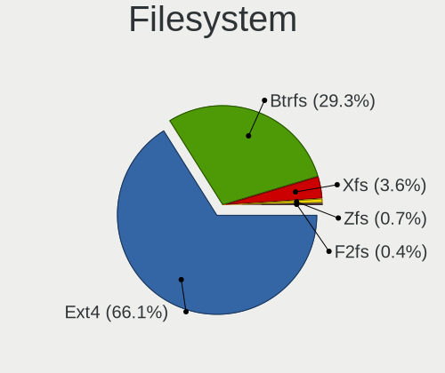
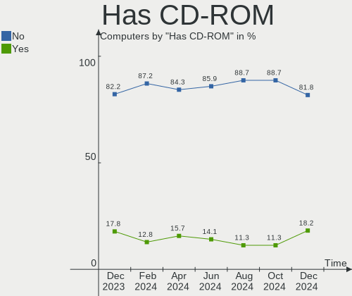
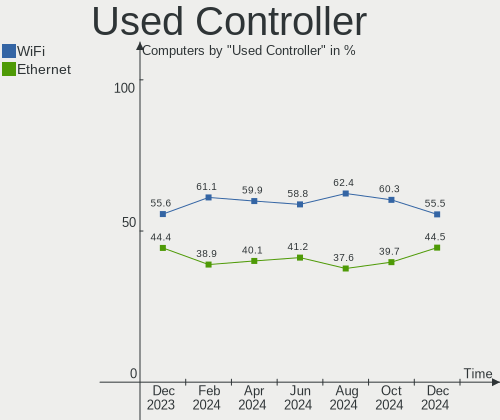

Arch - Hardware Trends
----------------------

A project to identify most popular hardware characteristics and track their change
over time based on data collected by Linux users at https://Linux-Hardware.org.

Anyone can contribute to this report by the [hw-probe](https://github.com/linuxhw/hw-probe) tool:

    sudo -E hw-probe -all -upload

This is a report for all computer types. See also reports for [desktops](/Dist/Arch/Desktop/README.md) and [notebooks](/Dist/Arch/Notebook/README.md).

This report is for one last month. Overall report since the beginning of time: [TestCoverage](https://github.com/linuxhw/TestCoverage)

Period: Sep, 2022.

Contents
--------

* [ System ](#system)
  - [ OS                       ](#os)
  - [ OS Family                ](#os-family)
  - [ Kernel                   ](#kernel)
  - [ Kernel Family            ](#kernel-family)
  - [ Kernel Major Ver.        ](#kernel-major-ver)
  - [ Arch                     ](#arch)
  - [ DE                       ](#de)
  - [ Display Server           ](#display-server)
  - [ Display Manager          ](#display-manager)
  - [ OS Lang                  ](#os-lang)
  - [ Boot Mode                ](#boot-mode)
  - [ Filesystem               ](#filesystem)
  - [ Part. scheme             ](#part-scheme)
  - [ Dual Boot with Linux/BSD ](#dual-boot-with-linuxbsd)
  - [ Dual Boot (Win)          ](#dual-boot-win)

* [ Board ](#board)
  - [ Vendor                   ](#vendor)
  - [ Model                    ](#model)
  - [ Model Family             ](#model-family)
  - [ MFG Year                 ](#mfg-year)
  - [ Form Factor              ](#form-factor)
  - [ Secure Boot              ](#secure-boot)
  - [ Coreboot                 ](#coreboot)
  - [ RAM Size                 ](#ram-size)
  - [ RAM Used                 ](#ram-used)
  - [ Total Drives             ](#total-drives)
  - [ Has CD-ROM               ](#has-cd-rom)
  - [ Has Ethernet             ](#has-ethernet)
  - [ Has WiFi                 ](#has-wifi)
  - [ Has Bluetooth            ](#has-bluetooth)

* [ Location ](#location)
  - [ Country                  ](#country)
  - [ City                     ](#city)

* [ Drives ](#drives)
  - [ Drive Vendor             ](#drive-vendor)
  - [ Drive Model              ](#drive-model)
  - [ HDD Vendor               ](#hdd-vendor)
  - [ SSD Vendor               ](#ssd-vendor)
  - [ Drive Kind               ](#drive-kind)
  - [ Drive Connector          ](#drive-connector)
  - [ Drive Size               ](#drive-size)
  - [ Space Total              ](#space-total)
  - [ Space Used               ](#space-used)
  - [ Malfunc. Drives          ](#malfunc-drives)
  - [ Malfunc. Drive Vendor    ](#malfunc-drive-vendor)
  - [ Malfunc. HDD Vendor      ](#malfunc-hdd-vendor)
  - [ Malfunc. Drive Kind      ](#malfunc-drive-kind)
  - [ Failed Drives            ](#failed-drives)
  - [ Failed Drive Vendor      ](#failed-drive-vendor)
  - [ Drive Status             ](#drive-status)

* [ Storage controller ](#storage-controller)
  - [ Storage Vendor           ](#storage-vendor)
  - [ Storage Model            ](#storage-model)
  - [ Storage Kind             ](#storage-kind)

* [ Processor ](#processor)
  - [ CPU Vendor               ](#cpu-vendor)
  - [ CPU Model                ](#cpu-model)
  - [ CPU Model Family         ](#cpu-model-family)
  - [ CPU Cores                ](#cpu-cores)
  - [ CPU Sockets              ](#cpu-sockets)
  - [ CPU Threads              ](#cpu-threads)
  - [ CPU Op-Modes             ](#cpu-op-modes)
  - [ CPU Microcode            ](#cpu-microcode)
  - [ CPU Microarch            ](#cpu-microarch)

* [ Graphics ](#graphics)
  - [ GPU Vendor               ](#gpu-vendor)
  - [ GPU Model                ](#gpu-model)
  - [ GPU Combo                ](#gpu-combo)
  - [ GPU Driver               ](#gpu-driver)
  - [ GPU Memory               ](#gpu-memory)

* [ Monitor ](#monitor)
  - [ Monitor Vendor           ](#monitor-vendor)
  - [ Monitor Model            ](#monitor-model)
  - [ Monitor Resolution       ](#monitor-resolution)
  - [ Monitor Diagonal         ](#monitor-diagonal)
  - [ Monitor Width            ](#monitor-width)
  - [ Aspect Ratio             ](#aspect-ratio)
  - [ Monitor Area             ](#monitor-area)
  - [ Pixel Density            ](#pixel-density)
  - [ Multiple Monitors        ](#multiple-monitors)

* [ Network ](#network)
  - [ Net Controller Vendor    ](#net-controller-vendor)
  - [ Net Controller Model     ](#net-controller-model)
  - [ Wireless Vendor          ](#wireless-vendor)
  - [ Wireless Model           ](#wireless-model)
  - [ Ethernet Vendor          ](#ethernet-vendor)
  - [ Ethernet Model           ](#ethernet-model)
  - [ Net Controller Kind      ](#net-controller-kind)
  - [ Used Controller          ](#used-controller)
  - [ NICs                     ](#nics)
  - [ IPv6                     ](#ipv6)

* [ Bluetooth ](#bluetooth)
  - [ Bluetooth Vendor         ](#bluetooth-vendor)
  - [ Bluetooth Model          ](#bluetooth-model)

* [ Sound ](#sound)
  - [ Sound Vendor             ](#sound-vendor)
  - [ Sound Model              ](#sound-model)

* [ Memory ](#memory)
  - [ Memory Vendor            ](#memory-vendor)
  - [ Memory Model             ](#memory-model)
  - [ Memory Kind              ](#memory-kind)
  - [ Memory Form Factor       ](#memory-form-factor)
  - [ Memory Size              ](#memory-size)
  - [ Memory Speed             ](#memory-speed)

* [ Printers & scanners ](#printers--scanners)
  - [ Printer Vendor           ](#printer-vendor)
  - [ Printer Model            ](#printer-model)
  - [ Scanner Vendor           ](#scanner-vendor)
  - [ Scanner Model            ](#scanner-model)

* [ Camera ](#camera)
  - [ Camera Vendor            ](#camera-vendor)
  - [ Camera Model             ](#camera-model)

* [ Security ](#security)
  - [ Fingerprint Vendor       ](#fingerprint-vendor)
  - [ Fingerprint Model        ](#fingerprint-model)
  - [ Chipcard Vendor          ](#chipcard-vendor)
  - [ Chipcard Model           ](#chipcard-model)

* [ Unsupported ](#unsupported)
  - [ Unsupported Devices      ](#unsupported-devices)
  - [ Unsupported Device Types ](#unsupported-device-types)

System
------

OS
--

Installed operating systems

| Name         | Computers | Percent |
|--------------|-----------|---------|
| Arch         | 136       | 63.26%  |
| Arch Rolling | 79        | 36.74%  |

OS Family
---------

OS without a version

| Name | Computers | Percent |
|------|-----------|---------|
| Arch | 215       | 100%    |

Kernel
------

Version of the Linux kernel

| Version                      | Computers | Percent |
|------------------------------|-----------|---------|
| 5.19.7-arch1-1               | 30        | 13.95%  |
| 5.19.9-arch1-1               | 25        | 11.63%  |
| 5.19.6-arch1-1               | 23        | 10.7%   |
| 5.19.11-arch1-1              | 17        | 7.91%   |
| 5.19.10-arch1-1              | 14        | 6.51%   |
| 5.19.8-arch1-1               | 10        | 4.65%   |
| 5.19.5-arch1-1               | 10        | 4.65%   |
| 5.19.7-zen2-1-zen            | 7         | 3.26%   |
| 5.19.6-zen1-1-zen            | 7         | 3.26%   |
| 5.15.67-1-lts                | 7         | 3.26%   |
| 5.19.9-zen1-1-zen            | 6         | 2.79%   |
| 5.19.4-arch1-1               | 6         | 2.79%   |
| 5.15.64-1-lts                | 5         | 2.33%   |
| 5.15.63-1-lts                | 4         | 1.86%   |
| 5.19.2-arch1-1               | 3         | 1.4%    |
| 5.15.71-1-lts                | 3         | 1.4%    |
| 5.15.68-1-lts                | 3         | 1.4%    |
| 5.15.65-1-lts                | 3         | 1.4%    |
| 5.19.5-zen1-1-zen            | 2         | 0.93%   |
| 5.19.4-zen1-1-zen            | 2         | 0.93%   |
| 5.19.3-arch1-1               | 2         | 0.93%   |
| 5.19.10-zen1-1-zen           | 2         | 0.93%   |
| 5.19.1-arch2-1               | 2         | 0.93%   |
| 5.15.69-1-lts                | 2         | 0.93%   |
| 6.0.0-rc6-269-tkg-cfs-llvm   | 1         | 0.47%   |
| 6.0.0-rc6-1-mainline         | 1         | 0.47%   |
| 6.0.0-rc6                    | 1         | 0.47%   |
| 5.19.8-zen1-1-zen            | 1         | 0.47%   |
| 5.19.8-xanmod1-1-native_amd  | 1         | 0.47%   |
| 5.19.8-hardened2-1-hardened  | 1         | 0.47%   |
| 5.19.7-269-tkg-pds           | 1         | 0.47%   |
| 5.19.7-1-clear               | 1         | 0.47%   |
| 5.19.6-arch1-1-custom        | 1         | 0.47%   |
| 5.19.4-arch1-g14-1           | 1         | 0.47%   |
| 5.19.11-zen1-1-zen           | 1         | 0.47%   |
| 5.19.11-xanmod1-1-zen2       | 1         | 0.47%   |
| 5.19.11-hardened1-1-hardened | 1         | 0.47%   |
| 5.19.10-269-tkg-pds          | 1         | 0.47%   |
| 5.18.5-arch1-1               | 1         | 0.47%   |
| 5.18.10-arch1-1              | 1         | 0.47%   |

Kernel Family
-------------

Linux kernel without a distro release

| Version | Computers | Percent |
|---------|-----------|---------|
| 5.19.7  | 39        | 18.14%  |
| 5.19.9  | 31        | 14.42%  |
| 5.19.6  | 31        | 14.42%  |
| 5.19.11 | 20        | 9.3%    |
| 5.19.10 | 17        | 7.91%   |
| 5.19.8  | 13        | 6.05%   |
| 5.19.5  | 12        | 5.58%   |
| 5.19.4  | 9         | 4.19%   |
| 5.15.67 | 7         | 3.26%   |
| 5.15.64 | 5         | 2.33%   |
| 5.15.63 | 4         | 1.86%   |
| 6.0.0   | 3         | 1.4%    |
| 5.19.2  | 3         | 1.4%    |
| 5.15.71 | 3         | 1.4%    |
| 5.15.68 | 3         | 1.4%    |
| 5.15.65 | 3         | 1.4%    |
| 5.19.3  | 2         | 0.93%   |
| 5.19.1  | 2         | 0.93%   |
| 5.15.69 | 2         | 0.93%   |
| 5.18.5  | 1         | 0.47%   |
| 5.18.10 | 1         | 0.47%   |
| 5.17.0  | 1         | 0.47%   |
| 5.16.9  | 1         | 0.47%   |
| 5.15.70 | 1         | 0.47%   |
| 5.15.7  | 1         | 0.47%   |

Kernel Major Ver.
-----------------

Linux kernel major version

| Version | Computers | Percent |
|---------|-----------|---------|
| 5.19    | 179       | 83.26%  |
| 5.15    | 29        | 13.49%  |
| 6.0     | 3         | 1.4%    |
| 5.18    | 2         | 0.93%   |
| 5.17    | 1         | 0.47%   |
| 5.16    | 1         | 0.47%   |

Arch
----

OS architecture (x86_64, i586, etc.)

| Name   | Computers | Percent |
|--------|-----------|---------|
| x86_64 | 215       | 100%    |

DE
--

Desktop Environment

| Name            | Computers | Percent |
|-----------------|-----------|---------|
| GNOME           | 91        | 42.33%  |
| KDE5            | 65        | 30.23%  |
| Unknown         | 15        | 6.98%   |
| i3              | 12        | 5.58%   |
| XFCE            | 9         | 4.19%   |
| sway            | 6         | 2.79%   |
| MATE            | 2         | 0.93%   |
| LXDE            | 2         | 0.93%   |
| Deepin          | 2         | 0.93%   |
| Cinnamon        | 2         | 0.93%   |
| bspwm           | 2         | 0.93%   |
| qtile           | 1         | 0.47%   |
| openbox         | 1         | 0.47%   |
| LXQt            | 1         | 0.47%   |
| LeftWM          | 1         | 0.47%   |
| jwm             | 1         | 0.47%   |
| Hyprland        | 1         | 0.47%   |
| GNOME Flashback | 1         | 0.47%   |

Display Server
--------------

X11 or Wayland

| Name    | Computers | Percent |
|---------|-----------|---------|
| X11     | 111       | 51.63%  |
| Wayland | 79        | 36.74%  |
| Tty     | 15        | 6.98%   |
| Unknown | 10        | 4.65%   |

Display Manager
---------------

SDDM, LightDM, etc.

| Name    | Computers | Percent |
|---------|-----------|---------|
| Unknown | 94        | 43.72%  |
| SDDM    | 44        | 20.47%  |
| GDM     | 36        | 16.74%  |
| LightDM | 34        | 15.81%  |
| Ly      | 3         | 1.4%    |
| LXDM    | 2         | 0.93%   |
| XINIT   | 1         | 0.47%   |
| GREETD  | 1         | 0.47%   |

OS Lang
-------

Language

| Lang    | Computers | Percent |
|---------|-----------|---------|
| en_US   | 110       | 51.16%  |
| it_IT   | 17        | 7.91%   |
| en_GB   | 16        | 7.44%   |
| C       | 16        | 7.44%   |
| fr_FR   | 10        | 4.65%   |
| pt_BR   | 8         | 3.72%   |
| de_DE   | 7         | 3.26%   |
| es_ES   | 5         | 2.33%   |
| Unknown | 5         | 2.33%   |
| zh_CN   | 3         | 1.4%    |
| ru_RU   | 3         | 1.4%    |
| en_CA   | 3         | 1.4%    |
| es_MX   | 2         | 0.93%   |
| en_AU   | 2         | 0.93%   |
| en_AG   | 2         | 0.93%   |
| pl_PL   | 1         | 0.47%   |
| ms_MY   | 1         | 0.47%   |
| ko_KR   | 1         | 0.47%   |
| es_CO   | 1         | 0.47%   |
| en_IN   | 1         | 0.47%   |
| bg_BG   | 1         | 0.47%   |

Boot Mode
---------

EFI or BIOS

| Mode | Computers | Percent |
|------|-----------|---------|
| EFI  | 125       | 58.14%  |
| BIOS | 90        | 41.86%  |

Filesystem
----------

Type of filesystem

| Type    | Computers | Percent |
|---------|-----------|---------|
| Ext4    | 139       | 64.65%  |
| Btrfs   | 69        | 32.09%  |
| F2fs    | 3         | 1.4%    |
| Xfs     | 2         | 0.93%   |
| Zfs     | 1         | 0.47%   |
| Unknown | 1         | 0.47%   |

Part. scheme
------------

Scheme of partitioning

| Type    | Computers | Percent |
|---------|-----------|---------|
| GPT     | 137       | 63.72%  |
| Unknown | 70        | 32.56%  |
| MBR     | 8         | 3.72%   |

Dual Boot with Linux/BSD
------------------------

Hosting more than one Linux/BSD

| Dual boot | Computers | Percent |
|-----------|-----------|---------|
| No        | 189       | 87.91%  |
| Yes       | 26        | 12.09%  |

Dual Boot (Win)
---------------

Hosting Linux and Windows

| Dual boot | Computers | Percent |
|-----------|-----------|---------|
| No        | 151       | 70.23%  |
| Yes       | 64        | 29.77%  |

Board
-----

Vendor
------

Motherboard manufacturer

| Name                | Computers | Percent |
|---------------------|-----------|---------|
| Lenovo              | 43        | 20%     |
| ASUSTek Computer    | 40        | 18.6%   |
| Dell                | 23        | 10.7%   |
| Gigabyte Technology | 20        | 9.3%    |
| Hewlett-Packard     | 18        | 8.37%   |
| MSI                 | 16        | 7.44%   |
| Acer                | 11        | 5.12%   |
| ASRock              | 7         | 3.26%   |
| Intel               | 5         | 2.33%   |
| Samsung Electronics | 4         | 1.86%   |
| HUAWEI              | 3         | 1.4%    |
| TUXEDO              | 2         | 0.93%   |
| Toshiba             | 2         | 0.93%   |
| Google              | 2         | 0.93%   |
| Apple               | 2         | 0.93%   |
| ZOTAC               | 1         | 0.47%   |
| Valve               | 1         | 0.47%   |
| Timi                | 1         | 0.47%   |
| Supermicro          | 1         | 0.47%   |
| Purism              | 1         | 0.47%   |
| PCWare              | 1         | 0.47%   |
| Microsoft           | 1         | 0.47%   |
| Medion              | 1         | 0.47%   |
| MECHREVO            | 1         | 0.47%   |
| LG Electronics      | 1         | 0.47%   |
| Huanan              | 1         | 0.47%   |
| Gateway             | 1         | 0.47%   |
| Fujitsu             | 1         | 0.47%   |
| Framework           | 1         | 0.47%   |
| Foxconn             | 1         | 0.47%   |
| Chuwi               | 1         | 0.47%   |
| Biostar             | 1         | 0.47%   |

Model
-----

Motherboard model

| Name                                           | Computers | Percent |
|------------------------------------------------|-----------|---------|
| MSI MS-7C91                                    | 3         | 1.4%    |
| TUXEDO Book_XA1510                             | 2         | 0.93%   |
| MSI MS-7C56                                    | 2         | 0.93%   |
| MSI MS-7C37                                    | 2         | 0.93%   |
| Dell Inspiron 5570                             | 2         | 0.93%   |
| ASUS ROG Strix G512LV_G512LV                   | 2         | 0.93%   |
| Acer Swift SF314-41                            | 2         | 0.93%   |
| ZOTAC ZBOX-EN72080V/EN72070V/EN52060V/EN51660T | 1         | 0.47%   |
| Valve Jupiter                                  | 1         | 0.47%   |
| Toshiba Satellite U845W                        | 1         | 0.47%   |
| Toshiba Satellite C55D-B                       | 1         | 0.47%   |
| Timi TM1604                                    | 1         | 0.47%   |
| Supermicro X9DRi-LN4+/X9DR3-LN4+               | 1         | 0.47%   |
| Samsung 950XED                                 | 1         | 0.47%   |
| Samsung 950XDB/951XDB/950XDY                   | 1         | 0.47%   |
| Samsung 950QDB                                 | 1         | 0.47%   |
| Samsung 750XED                                 | 1         | 0.47%   |
| Purism Librem 14                               | 1         | 0.47%   |
| PCWare IPMH110G                                | 1         | 0.47%   |
| MSI MS-7D09                                    | 1         | 0.47%   |
| MSI MS-7C96                                    | 1         | 0.47%   |
| MSI MS-7C52                                    | 1         | 0.47%   |
| MSI MS-7C02                                    | 1         | 0.47%   |
| MSI MS-7B79                                    | 1         | 0.47%   |
| MSI MS-7A38                                    | 1         | 0.47%   |
| MSI MS-7885                                    | 1         | 0.47%   |
| MSI GS65 Stealth 9SE                           | 1         | 0.47%   |
| MSI Alpha 15 B5EEK                             | 1         | 0.47%   |
| Microsoft Surface Laptop Go                    | 1         | 0.47%   |
| Medion S4216                                   | 1         | 0.47%   |
| MECHREVO Code01 Ver2.0                         | 1         | 0.47%   |
| LG 17Z90P-G.AA86D                              | 1         | 0.47%   |
| Lenovo Yoga Slim 7 Pro 14ACH5 82MS             | 1         | 0.47%   |
| Lenovo Yoga C640-13IML 81UE                    | 1         | 0.47%   |
| Lenovo Yoga 720-15IKB                          | 1         | 0.47%   |
| Lenovo Y520-15IKBN 80WK                        | 1         | 0.47%   |
| Lenovo V15-ADA 82C7                            | 1         | 0.47%   |
| Lenovo ThinkPad Z16 Gen 1 21D40016PB           | 1         | 0.47%   |
| Lenovo ThinkPad X230 23252QG                   | 1         | 0.47%   |
| Lenovo ThinkPad X1 Extreme 2nd 20QVCTO1WW      | 1         | 0.47%   |

Model Family
------------

Motherboard model prefix

| Name                  | Computers | Percent |
|-----------------------|-----------|---------|
| Lenovo ThinkPad       | 19        | 8.84%   |
| ASUS PRIME            | 13        | 6.05%   |
| Lenovo IdeaPad        | 10        | 4.65%   |
| ASUS ROG              | 8         | 3.72%   |
| Dell XPS              | 7         | 3.26%   |
| Acer Aspire           | 7         | 3.26%   |
| ASUS TUF              | 6         | 2.79%   |
| Lenovo Legion         | 4         | 1.86%   |
| Dell Latitude         | 4         | 1.86%   |
| Dell Inspiron         | 4         | 1.86%   |
| Acer Swift            | 4         | 1.86%   |
| MSI MS-7C91           | 3         | 1.4%    |
| Lenovo Yoga           | 3         | 1.4%    |
| HP ENVY               | 3         | 1.4%    |
| HP EliteBook          | 3         | 1.4%    |
| Dell OptiPlex         | 3         | 1.4%    |
| ASUS VivoBook         | 3         | 1.4%    |
| TUXEDO Book           | 2         | 0.93%   |
| Toshiba Satellite     | 2         | 0.93%   |
| MSI MS-7C56           | 2         | 0.93%   |
| MSI MS-7C37           | 2         | 0.93%   |
| HP Spectre            | 2         | 0.93%   |
| HP Pavilion           | 2         | 0.93%   |
| HP Laptop             | 2         | 0.93%   |
| Gigabyte X570         | 2         | 0.93%   |
| Gigabyte B660M        | 2         | 0.93%   |
| Gigabyte B450M        | 2         | 0.93%   |
| Dell Vostro           | 2         | 0.93%   |
| Dell Precision        | 2         | 0.93%   |
| ASUS ASUS             | 2         | 0.93%   |
| ZOTAC ZBOX-EN72080V   | 1         | 0.47%   |
| Valve Jupiter         | 1         | 0.47%   |
| Timi TM1604           | 1         | 0.47%   |
| Supermicro X9DRi-LN4+ | 1         | 0.47%   |
| Samsung 950XED        | 1         | 0.47%   |
| Samsung 950XDB        | 1         | 0.47%   |
| Samsung 950QDB        | 1         | 0.47%   |
| Samsung 750XED        | 1         | 0.47%   |
| Purism Librem         | 1         | 0.47%   |
| PCWare IPMH110G       | 1         | 0.47%   |

MFG Year
--------

Motherboard manufacture year

| Year | Computers | Percent |
|------|-----------|---------|
| 2021 | 46        | 21.4%   |
| 2020 | 38        | 17.67%  |
| 2019 | 33        | 15.35%  |
| 2018 | 25        | 11.63%  |
| 2022 | 19        | 8.84%   |
| 2017 | 15        | 6.98%   |
| 2013 | 9         | 4.19%   |
| 2015 | 8         | 3.72%   |
| 2012 | 6         | 2.79%   |
| 2016 | 4         | 1.86%   |
| 2011 | 4         | 1.86%   |
| 2014 | 3         | 1.4%    |
| 2010 | 2         | 0.93%   |
| 2009 | 2         | 0.93%   |
| 2007 | 1         | 0.47%   |

Form Factor
-----------

Physical design of the computer

| Name        | Computers | Percent |
|-------------|-----------|---------|
| Notebook    | 109       | 50.7%   |
| Desktop     | 85        | 39.53%  |
| Convertible | 13        | 6.05%   |
| Mini pc     | 5         | 2.33%   |
| Tablet      | 2         | 0.93%   |
| Server      | 1         | 0.47%   |

Secure Boot
-----------

Enabled or disabled

| State    | Computers | Percent |
|----------|-----------|---------|
| Disabled | 213       | 99.07%  |
| Enabled  | 2         | 0.93%   |

Coreboot
--------

Have coreboot on board

| Used | Computers | Percent |
|------|-----------|---------|
| No   | 212       | 98.6%   |
| Yes  | 3         | 1.4%    |

RAM Size
--------

Total RAM memory

| Size in GB  | Computers | Percent |
|-------------|-----------|---------|
| 16.01-24.0  | 58        | 26.98%  |
| 8.01-16.0   | 47        | 21.86%  |
| 32.01-64.0  | 45        | 20.93%  |
| 4.01-8.0    | 37        | 17.21%  |
| 3.01-4.0    | 12        | 5.58%   |
| 64.01-256.0 | 8         | 3.72%   |
| 24.01-32.0  | 7         | 3.26%   |
| 2.01-3.0    | 1         | 0.47%   |

RAM Used
--------

Used RAM memory

| Used GB    | Computers | Percent |
|------------|-----------|---------|
| 4.01-8.0   | 53        | 24.65%  |
| 2.01-3.0   | 51        | 23.72%  |
| 3.01-4.0   | 40        | 18.6%   |
| 1.01-2.0   | 34        | 15.81%  |
| 8.01-16.0  | 25        | 11.63%  |
| 0.51-1.0   | 5         | 2.33%   |
| 24.01-32.0 | 3         | 1.4%    |
| 16.01-24.0 | 3         | 1.4%    |
| 0.01-0.5   | 1         | 0.47%   |

Total Drives
------------

Number of drives on board

| Drives | Computers | Percent |
|--------|-----------|---------|
| 1      | 108       | 50.23%  |
| 2      | 63        | 29.3%   |
| 4      | 17        | 7.91%   |
| 3      | 17        | 7.91%   |
| 6      | 3         | 1.4%    |
| 5      | 3         | 1.4%    |
| 9      | 2         | 0.93%   |
| 7      | 1         | 0.47%   |
| 0      | 1         | 0.47%   |

Has CD-ROM
----------

Has CD-ROM on board

| Presented | Computers | Percent |
|-----------|-----------|---------|
| No        | 186       | 86.51%  |
| Yes       | 29        | 13.49%  |

Has Ethernet
------------

Has Ethernet on board

| Presented | Computers | Percent |
|-----------|-----------|---------|
| Yes       | 168       | 78.14%  |
| No        | 47        | 21.86%  |

Has WiFi
--------

Has WiFi module

| Presented | Computers | Percent |
|-----------|-----------|---------|
| Yes       | 172       | 80%     |
| No        | 43        | 20%     |

Has Bluetooth
-------------

Has Bluetooth module

| Presented | Computers | Percent |
|-----------|-----------|---------|
| Yes       | 167       | 77.67%  |
| No        | 48        | 22.33%  |

Location
--------

Country
-------

Geographic location (country)

| Country          | Computers | Percent |
|------------------|-----------|---------|
| USA              | 37        | 17.21%  |
| Italy            | 25        | 11.63%  |
| France           | 16        | 7.44%   |
| UK               | 15        | 6.98%   |
| Germany          | 13        | 6.05%   |
| Brazil           | 12        | 5.58%   |
| Russia           | 8         | 3.72%   |
| Austria          | 7         | 3.26%   |
| Spain            | 6         | 2.79%   |
| India            | 6         | 2.79%   |
| Canada           | 6         | 2.79%   |
| Australia        | 6         | 2.79%   |
| Poland           | 4         | 1.86%   |
| Czechia          | 4         | 1.86%   |
| China            | 4         | 1.86%   |
| Romania          | 3         | 1.4%    |
| Serbia           | 2         | 0.93%   |
| Netherlands      | 2         | 0.93%   |
| Mexico           | 2         | 0.93%   |
| Indonesia        | 2         | 0.93%   |
| Hong Kong        | 2         | 0.93%   |
| Greece           | 2         | 0.93%   |
| Argentina        | 2         | 0.93%   |
| Vietnam          | 1         | 0.47%   |
| Turkey           | 1         | 0.47%   |
| Switzerland      | 1         | 0.47%   |
| Sweden           | 1         | 0.47%   |
| South Korea      | 1         | 0.47%   |
| Slovenia         | 1         | 0.47%   |
| Portugal         | 1         | 0.47%   |
| Pakistan         | 1         | 0.47%   |
| Norway           | 1         | 0.47%   |
| North Macedonia  | 1         | 0.47%   |
| Morocco          | 1         | 0.47%   |
| Moldova          | 1         | 0.47%   |
| Malaysia         | 1         | 0.47%   |
| Lithuania        | 1         | 0.47%   |
| Latvia           | 1         | 0.47%   |
| Japan            | 1         | 0.47%   |
| French Polynesia | 1         | 0.47%   |

City
----

Geographic location (city)

| City          | Computers | Percent |
|---------------|-----------|---------|
| Paris         | 6         | 2.79%   |
| Milan         | 5         | 2.33%   |
| Vienna        | 4         | 1.86%   |
| Turin         | 4         | 1.86%   |
| Sydney        | 3         | 1.4%    |
| Prague        | 3         | 1.4%    |
| Los Angeles   | 3         | 1.4%    |
| Warsaw        | 2         | 0.93%   |
| Twickenham    | 2         | 0.93%   |
| St Petersburg | 2         | 0.93%   |
| Sao Jose      | 2         | 0.93%   |
| Moscow        | 2         | 0.93%   |
| Montreal      | 2         | 0.93%   |
| Kansas City   | 2         | 0.93%   |
| Jakarta       | 2         | 0.93%   |
| Iasi          | 2         | 0.93%   |
| Hamburg       | 2         | 0.93%   |
| Chicago       | 2         | 0.93%   |
| Cedar Knolls  | 2         | 0.93%   |
| Campinas      | 2         | 0.93%   |
| Belgrade      | 2         | 0.93%   |
| Aurora        | 2         | 0.93%   |
| Unknown       | 2         | 0.93%   |
| Zurich        | 1         | 0.47%   |
| Zielona Góra | 1         | 0.47%   |
| Zagreb        | 1         | 0.47%   |
| Yerevan       | 1         | 0.47%   |
| Wroclaw       | 1         | 0.47%   |
| Wichita       | 1         | 0.47%   |
| Weaverham     | 1         | 0.47%   |
| Voronezh      | 1         | 0.47%   |
| Vilnius       | 1         | 0.47%   |
| Villejuif     | 1         | 0.47%   |
| Vigo          | 1         | 0.47%   |
| Verona        | 1         | 0.47%   |
| Vaterstetten  | 1         | 0.47%   |
| Utica         | 1         | 0.47%   |
| Uberlândia   | 1         | 0.47%   |
| Toulon        | 1         | 0.47%   |
| Thessaloniki  | 1         | 0.47%   |

Drives
------

Drive Vendor
------------

Hard drive vendors

| Vendor                       | Computers | Drives | Percent |
|------------------------------|-----------|--------|---------|
| Samsung Electronics          | 76        | 103    | 22.03%  |
| WDC                          | 37        | 47     | 10.72%  |
| Sandisk                      | 37        | 44     | 10.72%  |
| Seagate                      | 32        | 44     | 9.28%   |
| Kingston                     | 27        | 29     | 7.83%   |
| Toshiba                      | 19        | 23     | 5.51%   |
| Intel                        | 14        | 15     | 4.06%   |
| Crucial                      | 14        | 17     | 4.06%   |
| SK hynix                     | 11        | 11     | 3.19%   |
| Micron Technology            | 8         | 8      | 2.32%   |
| Unknown                      | 7         | 8      | 2.03%   |
| Silicon Motion               | 7         | 7      | 2.03%   |
| Phison Electronics           | 6         | 7      | 1.74%   |
| Hitachi                      | 6         | 8      | 1.74%   |
| KIOXIA                       | 5         | 5      | 1.45%   |
| China                        | 5         | 5      | 1.45%   |
| Micron/Crucial Technology    | 4         | 4      | 1.16%   |
| ADATA Technology             | 4         | 4      | 1.16%   |
| PNY                          | 2         | 2      | 0.58%   |
| Patriot                      | 2         | 2      | 0.58%   |
| OCZ                          | 2         | 2      | 0.58%   |
| Kingston Technology Company  | 2         | 2      | 0.58%   |
| Yangtze Memory Technologies  | 1         | 1      | 0.29%   |
| USB30                        | 1         | 1      | 0.29%   |
| USB                          | 1         | 1      | 0.29%   |
| Transcend                    | 1         | 1      | 0.29%   |
| TO Exter                     | 1         | 1      | 0.29%   |
| Team                         | 1         | 1      | 0.29%   |
| SPCC                         | 1         | 1      | 0.29%   |
| Shenzhen Longsys Electronics | 1         | 1      | 0.29%   |
| Netac                        | 1         | 1      | 0.29%   |
| LITEONIT                     | 1         | 1      | 0.29%   |
| KLEVV                        | 1         | 1      | 0.29%   |
| KingDian                     | 1         | 1      | 0.29%   |
| JMicron Technology           | 1         | 1      | 0.29%   |
| Intenso                      | 1         | 1      | 0.29%   |
| Inateck                      | 1         | 1      | 0.29%   |
| HGST                         | 1         | 1      | 0.29%   |
| ASMT                         | 1         | 1      | 0.29%   |
| Apple                        | 1         | 2      | 0.29%   |

Drive Model
-----------

Hard drive models

| Model                                                             | Computers | Percent |
|-------------------------------------------------------------------|-----------|---------|
| Samsung NVMe SSD Controller SM981/PM981/PM983 256GB               | 21        | 5.34%   |
| Samsung NVMe SSD Controller PM9A1/PM9A3/980PRO 1024GB             | 11        | 2.8%    |
| Sandisk WD Black SN750 / PC SN730 NVMe SSD 1024GB                 | 10        | 2.54%   |
| Intel SSD 660P Series 512GB                                       | 7         | 1.78%   |
| Crucial CT240BX500SSD1 240GB                                      | 6         | 1.53%   |
| Seagate ST1000LM035-1RK172 1TB                                    | 5         | 1.27%   |
| Kingston SA400S37240G 240GB SSD                                   | 5         | 1.27%   |
| Unknown MMC Card  64GB                                            | 4         | 1.02%   |
| Toshiba HDWD110 1TB                                               | 4         | 1.02%   |
| Silicon Motion SM2263EN/SM2263XT SSD Controller 1024GB            | 4         | 1.02%   |
| Seagate ST2000DM006-2DM164 2TB                                    | 4         | 1.02%   |
| Seagate ST1000LM024 HN-M101MBB 1TB                                | 4         | 1.02%   |
| Sandisk WD Blue SN550 NVMe SSD 1024GB                             | 4         | 1.02%   |
| SanDisk NVMe SSD Drive 1TB                                        | 4         | 1.02%   |
| Samsung NVMe SSD Drive 256GB                                      | 4         | 1.02%   |
| Kingston SA400S37480G 480GB SSD                                   | 4         | 1.02%   |
| WDC WDS500G2B0B-00YS70 500GB SSD                                  | 3         | 0.76%   |
| WDC WD10EZEX-00WN4A0 1TB                                          | 3         | 0.76%   |
| SK hynix BC501 NVMe Solid State Drive 512GB                       | 3         | 0.76%   |
| Seagate ST4000DM004-2CV104 4TB                                    | 3         | 0.76%   |
| Seagate ST2000DM008-2FR102 2TB                                    | 3         | 0.76%   |
| Sandisk WD Blue SN500 / PC SN520 NVMe SSD 256GB                   | 3         | 0.76%   |
| Samsung SSD 870 EVO 1TB                                           | 3         | 0.76%   |
| Samsung SSD 860 EVO 1TB                                           | 3         | 0.76%   |
| Samsung SSD 850 EVO 500GB                                         | 3         | 0.76%   |
| Samsung SSD 850 EVO 250GB                                         | 3         | 0.76%   |
| Samsung NVMe SSD Drive 512GB                                      | 3         | 0.76%   |
| Samsung NVMe SSD Controller SM961/PM961/SM963 256GB               | 3         | 0.76%   |
| Phison E12 NVMe Controller 1024GB                                 | 3         | 0.76%   |
| Kingston SV300S37A240G 240GB SSD                                  | 3         | 0.76%   |
| Kingston SNVS500G 500GB                                           | 3         | 0.76%   |
| Intel SSDPEKNU512GZ 512GB                                         | 3         | 0.76%   |
| Crucial CT1000MX500SSD1 1TB                                       | 3         | 0.76%   |
| ADATA XPG SX8200 Pro PCIe Gen3x4 M.2 2280 Solid State Drive 512GB | 3         | 0.76%   |
| WDC WD40EFZX-68AWUN0 4TB                                          | 2         | 0.51%   |
| WDC WD10EADX-22TDHB0 1TB                                          | 2         | 0.51%   |
| Toshiba MQ01ABD100 1TB                                            | 2         | 0.51%   |
| Toshiba DT01ACA300 3TB                                            | 2         | 0.51%   |
| Toshiba DT01ACA200 2TB                                            | 2         | 0.51%   |
| Toshiba DT01ACA100 1TB                                            | 2         | 0.51%   |

HDD Vendor
----------

Hard disk drive vendors

| Vendor  | Computers | Drives | Percent |
|---------|-----------|--------|---------|
| Seagate | 31        | 43     | 36.47%  |
| WDC     | 29        | 38     | 34.12%  |
| Toshiba | 14        | 16     | 16.47%  |
| Hitachi | 6         | 8      | 7.06%   |
| USB     | 1         | 1      | 1.18%   |
| Unknown | 1         | 1      | 1.18%   |
| HGST    | 1         | 1      | 1.18%   |
| ASMT    | 1         | 1      | 1.18%   |
| Apple   | 1         | 1      | 1.18%   |

SSD Vendor
----------

Solid state drive vendors

| Vendor              | Computers | Drives | Percent |
|---------------------|-----------|--------|---------|
| Samsung Electronics | 29        | 36     | 29.29%  |
| Kingston            | 16        | 17     | 16.16%  |
| Crucial             | 13        | 16     | 13.13%  |
| WDC                 | 8         | 8      | 8.08%   |
| SanDisk             | 8         | 8      | 8.08%   |
| China               | 5         | 5      | 5.05%   |
| PNY                 | 2         | 2      | 2.02%   |
| Patriot             | 2         | 2      | 2.02%   |
| OCZ                 | 2         | 2      | 2.02%   |
| USB30               | 1         | 1      | 1.01%   |
| Transcend           | 1         | 1      | 1.01%   |
| Toshiba             | 1         | 3      | 1.01%   |
| TO Exter            | 1         | 1      | 1.01%   |
| Team                | 1         | 1      | 1.01%   |
| SPCC                | 1         | 1      | 1.01%   |
| Seagate             | 1         | 1      | 1.01%   |
| Netac               | 1         | 1      | 1.01%   |
| Micron Technology   | 1         | 1      | 1.01%   |
| LITEONIT            | 1         | 1      | 1.01%   |
| KLEVV               | 1         | 1      | 1.01%   |
| KingDian            | 1         | 1      | 1.01%   |
| Intenso             | 1         | 1      | 1.01%   |
| Apple               | 1         | 1      | 1.01%   |

Drive Kind
----------

HDD or SSD

| Kind    | Computers | Drives | Percent |
|---------|-----------|--------|---------|
| NVMe    | 148       | 184    | 47.59%  |
| SSD     | 78        | 112    | 25.08%  |
| HDD     | 76        | 110    | 24.44%  |
| MMC     | 7         | 8      | 2.25%   |
| Unknown | 2         | 2      | 0.64%   |

Drive Connector
---------------

SATA, SAS, NVMe, etc.

| Type | Computers | Drives | Percent |
|------|-----------|--------|---------|
| NVMe | 148       | 183    | 52.67%  |
| SATA | 114       | 212    | 40.57%  |
| SAS  | 12        | 13     | 4.27%   |
| MMC  | 7         | 8      | 2.49%   |

Drive Size
----------

Size of hard drive

| Size in TB | Computers | Drives | Percent |
|------------|-----------|--------|---------|
| 0.01-0.5   | 70        | 99     | 41.67%  |
| 0.51-1.0   | 55        | 64     | 32.74%  |
| 1.01-2.0   | 22        | 26     | 13.1%   |
| 2.01-3.0   | 8         | 9      | 4.76%   |
| 3.01-4.0   | 7         | 13     | 4.17%   |
| 4.01-10.0  | 6         | 11     | 3.57%   |

Space Total
-----------

Amount of disk space available on the file system

| Size in GB     | Computers | Percent |
|----------------|-----------|---------|
| 101-250        | 44        | 20.47%  |
| 251-500        | 41        | 19.07%  |
| 501-1000       | 41        | 19.07%  |
| 1001-2000      | 30        | 13.95%  |
| More than 3000 | 28        | 13.02%  |
| 2001-3000      | 14        | 6.51%   |
| 51-100         | 9         | 4.19%   |
| Unknown        | 5         | 2.33%   |
| 21-50          | 2         | 0.93%   |
| 1-20           | 1         | 0.47%   |

Space Used
----------

Amount of used disk space

| Used GB        | Computers | Percent |
|----------------|-----------|---------|
| 1-20           | 39        | 18.14%  |
| 251-500        | 33        | 15.35%  |
| 101-250        | 28        | 13.02%  |
| 51-100         | 28        | 13.02%  |
| 21-50          | 26        | 12.09%  |
| 501-1000       | 23        | 10.7%   |
| 1001-2000      | 18        | 8.37%   |
| More than 3000 | 10        | 4.65%   |
| 2001-3000      | 5         | 2.33%   |
| Unknown        | 5         | 2.33%   |

Malfunc. Drives
---------------

Drive models with a malfunction

| Model                                 | Computers | Drives | Percent |
|---------------------------------------|-----------|--------|---------|
| WDC WD5000AAKX-00PWEA0 500GB          | 1         | 1      | 6.25%   |
| WDC WD20EZRX-00D8PB0 2TB              | 1         | 1      | 6.25%   |
| WDC WD10SPZX-75Z10T1 1TB              | 1         | 1      | 6.25%   |
| WDC WD10EZEX-00MFCA0 1TB              | 1         | 1      | 6.25%   |
| WDC WD10EURX-63FH1Y0 1TB              | 1         | 1      | 6.25%   |
| Transcend TS1TSSD230S 1TB             | 1         | 1      | 6.25%   |
| Seagate ST500DM002-1BD142 500GB       | 1         | 1      | 6.25%   |
| Seagate ST2000LM007-1R8174 2TB        | 1         | 1      | 6.25%   |
| Seagate ST2000DM006-2DM164 2TB        | 1         | 1      | 6.25%   |
| Seagate ST2000DM001-9YN164 2TB        | 1         | 1      | 6.25%   |
| Seagate ST1000LM035-1RK172 1TB        | 1         | 1      | 6.25%   |
| Seagate ST1000LM024 HN-M101MBB 1TB    | 1         | 1      | 6.25%   |
| Samsung Electronics SSD 840 EVO 120GB | 1         | 1      | 6.25%   |
| Kingston SKC400S371T 1TB SSD          | 1         | 1      | 6.25%   |
| Kingston SA400S37240G 240GB SSD       | 1         | 1      | 6.25%   |
| Hitachi HDS721050CLA362 500GB         | 1         | 1      | 6.25%   |

Malfunc. Drive Vendor
---------------------

Vendors of faulty drives

| Vendor              | Computers | Drives | Percent |
|---------------------|-----------|--------|---------|
| Seagate             | 6         | 6      | 37.5%   |
| WDC                 | 5         | 5      | 31.25%  |
| Kingston            | 2         | 2      | 12.5%   |
| Transcend           | 1         | 1      | 6.25%   |
| Samsung Electronics | 1         | 1      | 6.25%   |
| Hitachi             | 1         | 1      | 6.25%   |

Malfunc. HDD Vendor
-------------------

Vendors of faulty HDD drives

| Vendor  | Computers | Drives | Percent |
|---------|-----------|--------|---------|
| Seagate | 6         | 6      | 50%     |
| WDC     | 5         | 5      | 41.67%  |
| Hitachi | 1         | 1      | 8.33%   |

Malfunc. Drive Kind
-------------------

Kinds of faulty drives

| Kind | Computers | Drives | Percent |
|------|-----------|--------|---------|
| HDD  | 12        | 12     | 75%     |
| SSD  | 4         | 4      | 25%     |

Failed Drives
-------------

Failed drive models

Zero info for selected period =(

Failed Drive Vendor
-------------------

Failed drive vendors

Zero info for selected period =(

Drive Status
------------

Number of failed and malfunc. drives

| Status   | Computers | Drives | Percent |
|----------|-----------|--------|---------|
| Works    | 113       | 203    | 48.29%  |
| Detected | 106       | 197    | 45.3%   |
| Malfunc  | 15        | 16     | 6.41%   |

Storage controller
------------------

Storage Vendor
--------------

Storage controller vendors

| Vendor                       | Computers | Percent |
|------------------------------|-----------|---------|
| Intel                        | 100       | 31.65%  |
| AMD                          | 60        | 18.99%  |
| Samsung Electronics          | 55        | 17.41%  |
| SanDisk                      | 28        | 8.86%   |
| Kingston Technology Company  | 13        | 4.11%   |
| SK hynix                     | 11        | 3.48%   |
| Silicon Motion               | 7         | 2.22%   |
| Micron Technology            | 7         | 2.22%   |
| Phison Electronics           | 6         | 1.9%    |
| Micron/Crucial Technology    | 5         | 1.58%   |
| KIOXIA                       | 5         | 1.58%   |
| Toshiba America Info Systems | 4         | 1.27%   |
| ASMedia Technology           | 4         | 1.27%   |
| ADATA Technology             | 4         | 1.27%   |
| Marvell Technology Group     | 2         | 0.63%   |
| Yangtze Memory Technologies  | 1         | 0.32%   |
| Shenzhen Longsys Electronics | 1         | 0.32%   |
| Nvidia                       | 1         | 0.32%   |
| LSI Logic / Symbios Logic    | 1         | 0.32%   |
| Adaptec                      | 1         | 0.32%   |

Storage Model
-------------

Storage controller models

| Model                                                                          | Computers | Percent |
|--------------------------------------------------------------------------------|-----------|---------|
| AMD FCH SATA Controller [AHCI mode]                                            | 44        | 12.29%  |
| Samsung NVMe SSD Controller SM981/PM981/PM983                                  | 27        | 7.54%   |
| AMD 400 Series Chipset SATA Controller                                         | 15        | 4.19%   |
| Samsung NVMe SSD Controller 980                                                | 13        | 3.63%   |
| AMD 500 Series Chipset SATA Controller                                         | 12        | 3.35%   |
| SanDisk WD Black SN750 / PC SN730 NVMe SSD                                     | 11        | 3.07%   |
| Samsung NVMe SSD Controller PM9A1/PM9A3/980PRO                                 | 11        | 3.07%   |
| Intel Sunrise Point-LP SATA Controller [AHCI mode]                             | 9         | 2.51%   |
| Intel 500 Series Chipset Family SATA AHCI Controller                           | 9         | 2.51%   |
| Intel 200 Series PCH SATA controller [AHCI mode]                               | 8         | 2.23%   |
| Micron Non-Volatile memory controller                                          | 7         | 1.96%   |
| Kingston Company Company Non-Volatile memory controller                        | 7         | 1.96%   |
| Intel SSD 660P Series                                                          | 7         | 1.96%   |
| Intel 82801 Mobile SATA Controller [RAID mode]                                 | 7         | 1.96%   |
| SK hynix Gold P31 SSD                                                          | 6         | 1.68%   |
| Intel Alder Lake-S PCH SATA Controller [AHCI Mode]                             | 6         | 1.68%   |
| SanDisk WD Blue SN550 NVMe SSD                                                 | 5         | 1.4%    |
| Intel Volume Management Device NVMe RAID Controller                            | 5         | 1.4%    |
| Intel Non-Volatile memory controller                                           | 5         | 1.4%    |
| Silicon Motion SM2263EN/SM2263XT SSD Controller                                | 4         | 1.12%   |
| SanDisk Non-Volatile memory controller                                         | 4         | 1.12%   |
| Samsung NVMe SSD Controller SM961/PM961/SM963                                  | 4         | 1.12%   |
| KIOXIA NVMe SSD Controller BG4                                                 | 4         | 1.12%   |
| Intel Celeron/Pentium Silver Processor SATA Controller                         | 4         | 1.12%   |
| Intel Cannon Lake Mobile PCH SATA AHCI Controller                              | 4         | 1.12%   |
| Intel 8 Series/C220 Series Chipset Family 6-port SATA Controller 1 [AHCI mode] | 4         | 1.12%   |
| Intel 7 Series Chipset Family 6-port SATA Controller [AHCI mode]               | 4         | 1.12%   |
| ASMedia ASM1062 Serial ATA Controller                                          | 4         | 1.12%   |
| SK hynix BC501 NVMe Solid State Drive                                          | 3         | 0.84%   |
| SanDisk WD Blue SN570 NVMe SSD                                                 | 3         | 0.84%   |
| SanDisk WD Blue SN500 / PC SN520 NVMe SSD                                      | 3         | 0.84%   |
| SanDisk WD Black 2018/SN750 / PC SN720 NVMe SSD                                | 3         | 0.84%   |
| Samsung NVMe SSD Controller SM951/PM951                                        | 3         | 0.84%   |
| Phison E12 NVMe Controller                                                     | 3         | 0.84%   |
| Intel Wildcat Point-LP SATA Controller [AHCI Mode]                             | 3         | 0.84%   |
| Intel HM170/QM170 Chipset SATA Controller [AHCI Mode]                          | 3         | 0.84%   |
| AMD SB7x0/SB8x0/SB9x0 SATA Controller [AHCI mode]                              | 3         | 0.84%   |
| ADATA XPG SX8200 Pro PCIe Gen3x4 M.2 2280 Solid State Drive                    | 3         | 0.84%   |
| Toshiba America Info Systems XG6 NVMe SSD Controller                           | 2         | 0.56%   |
| Toshiba America Info Systems BG3 NVMe SSD Controller                           | 2         | 0.56%   |

Storage Kind
------------

Kind of storage controller (IDE, SATA, NVMe, SAS, ...)

| Kind | Computers | Percent |
|------|-----------|---------|
| NVMe | 147       | 47.42%  |
| SATA | 141       | 45.48%  |
| RAID | 15        | 4.84%   |
| IDE  | 5         | 1.61%   |
| SAS  | 2         | 0.65%   |

Processor
---------

CPU Vendor
----------

Processor vendors

| Vendor | Computers | Percent |
|--------|-----------|---------|
| Intel  | 131       | 60.93%  |
| AMD    | 84        | 39.07%  |

CPU Model
---------

Processor models

| Model                                         | Computers | Percent |
|-----------------------------------------------|-----------|---------|
| Intel 11th Gen Core i7-1165G7 @ 2.80GHz       | 7         | 3.26%   |
| AMD Ryzen 5 3500U with Radeon Vega Mobile Gfx | 6         | 2.79%   |
| AMD Ryzen 5 3600 6-Core Processor             | 5         | 2.33%   |
| AMD Ryzen 7 PRO 5850U with Radeon Graphics    | 4         | 1.86%   |
| AMD Ryzen 7 3700X 8-Core Processor            | 4         | 1.86%   |
| AMD Ryzen 5 2600 Six-Core Processor           | 4         | 1.86%   |
| Intel Core i7-9750H CPU @ 2.60GHz             | 3         | 1.4%    |
| Intel Core i7-1065G7 CPU @ 1.30GHz            | 3         | 1.4%    |
| Intel Core i5-8250U CPU @ 1.60GHz             | 3         | 1.4%    |
| Intel Core i5-7300HQ CPU @ 2.50GHz            | 3         | 1.4%    |
| Intel Core i5-10210U CPU @ 1.60GHz            | 3         | 1.4%    |
| AMD Ryzen 9 5900X 12-Core Processor           | 3         | 1.4%    |
| AMD Ryzen 7 5800X 8-Core Processor            | 3         | 1.4%    |
| AMD Ryzen 7 5800H with Radeon Graphics        | 3         | 1.4%    |
| AMD Ryzen 5 5600H with Radeon Graphics        | 3         | 1.4%    |
| AMD Ryzen 5 5600G with Radeon Graphics        | 3         | 1.4%    |
| Intel Core i7-8750H CPU @ 2.20GHz             | 2         | 0.93%   |
| Intel Core i7-8650U CPU @ 1.90GHz             | 2         | 0.93%   |
| Intel Core i7-8565U CPU @ 1.80GHz             | 2         | 0.93%   |
| Intel Core i5-8300H CPU @ 2.30GHz             | 2         | 0.93%   |
| Intel Core i5-7400 CPU @ 3.00GHz              | 2         | 0.93%   |
| Intel Core i5-7200U CPU @ 2.50GHz             | 2         | 0.93%   |
| Intel Core i5-4460 CPU @ 3.20GHz              | 2         | 0.93%   |
| Intel Core i5-3320M CPU @ 2.60GHz             | 2         | 0.93%   |
| Intel Core i5-1035G1 CPU @ 1.00GHz            | 2         | 0.93%   |
| Intel Core i3-8100 CPU @ 3.60GHz              | 2         | 0.93%   |
| Intel 12th Gen Core i7-1260P                  | 2         | 0.93%   |
| Intel 12th Gen Core i5-12600K                 | 2         | 0.93%   |
| Intel 11th Gen Core i7-1185G7 @ 3.00GHz       | 2         | 0.93%   |
| Intel 11th Gen Core i7-11800H @ 2.30GHz       | 2         | 0.93%   |
| Intel 11th Gen Core i5-1135G7 @ 2.40GHz       | 2         | 0.93%   |
| AMD Ryzen 7 5700U with Radeon Graphics        | 2         | 0.93%   |
| AMD Ryzen 7 5700G with Radeon Graphics        | 2         | 0.93%   |
| AMD Ryzen 7 4700U with Radeon Graphics        | 2         | 0.93%   |
| AMD Ryzen 7 2700X Eight-Core Processor        | 2         | 0.93%   |
| AMD Ryzen 7 2700 Eight-Core Processor         | 2         | 0.93%   |
| AMD Ryzen 5 5600X 6-Core Processor            | 2         | 0.93%   |
| AMD Ryzen 5 5500U with Radeon Graphics        | 2         | 0.93%   |
| AMD Ryzen 5 4500U with Radeon Graphics        | 2         | 0.93%   |
| AMD Ryzen 5 2600X Six-Core Processor          | 2         | 0.93%   |

CPU Model Family
----------------

Processor model prefix

| Model                   | Computers | Percent |
|-------------------------|-----------|---------|
| Intel Core i5           | 39        | 18.14%  |
| Other                   | 36        | 16.74%  |
| AMD Ryzen 5             | 32        | 14.88%  |
| Intel Core i7           | 27        | 12.56%  |
| AMD Ryzen 7             | 22        | 10.23%  |
| Intel Core i3           | 11        | 5.12%   |
| Intel Celeron           | 10        | 4.65%   |
| AMD Ryzen 9             | 10        | 4.65%   |
| AMD Ryzen 7 PRO         | 7         | 3.26%   |
| Intel Xeon              | 3         | 1.4%    |
| AMD Ryzen 3             | 3         | 1.4%    |
| Intel Core i9           | 2         | 0.93%   |
| AMD FX                  | 2         | 0.93%   |
| AMD A8                  | 2         | 0.93%   |
| Intel Pentium Dual-Core | 1         | 0.47%   |
| Intel Core M            | 1         | 0.47%   |
| Intel Core 2 Quad       | 1         | 0.47%   |
| Intel Core 2 Duo        | 1         | 0.47%   |
| Intel Atom              | 1         | 0.47%   |
| AMD Ryzen 5 PRO         | 1         | 0.47%   |
| AMD PRO A10             | 1         | 0.47%   |
| AMD Athlon II X2        | 1         | 0.47%   |
| AMD Athlon              | 1         | 0.47%   |

CPU Cores
---------

Number of processor cores

| Number | Computers | Percent |
|--------|-----------|---------|
| 4      | 76        | 35.35%  |
| 6      | 42        | 19.53%  |
| 8      | 41        | 19.07%  |
| 2      | 36        | 16.74%  |
| 12     | 9         | 4.19%   |
| 10     | 5         | 2.33%   |
| 16     | 3         | 1.4%    |
| 14     | 2         | 0.93%   |
| 24     | 1         | 0.47%   |

CPU Sockets
-----------

Number of sockets

| Number | Computers | Percent |
|--------|-----------|---------|
| 1      | 214       | 99.53%  |
| 2      | 1         | 0.47%   |

CPU Threads
-----------

Threads per core (Hyper-Threading)

| Number | Computers | Percent |
|--------|-----------|---------|
| 2      | 180       | 83.72%  |
| 1      | 35        | 16.28%  |

CPU Op-Modes
------------

CPU Operation Modes (32-bit, 64-bit)

| Op mode        | Computers | Percent |
|----------------|-----------|---------|
| 32-bit, 64-bit | 215       | 100%    |

CPU Microcode
-------------

Microcode number

| Number     | Computers | Percent |
|------------|-----------|---------|
| Unknown    | 94        | 43.72%  |
| 0x08701021 | 8         | 3.72%   |
| 0x906ea    | 7         | 3.26%   |
| 0x806ec    | 6         | 2.79%   |
| 0x906e9    | 5         | 2.33%   |
| 0x806ea    | 5         | 2.33%   |
| 0x0a50000c | 5         | 2.33%   |
| 0x0a201016 | 5         | 2.33%   |
| 0x806d1    | 4         | 1.86%   |
| 0x806c1    | 4         | 1.86%   |
| 0x0800820d | 4         | 1.86%   |
| 0xa0671    | 3         | 1.4%    |
| 0x906a3    | 3         | 1.4%    |
| 0x706e5    | 3         | 1.4%    |
| 0x306a9    | 3         | 1.4%    |
| 0x08108109 | 3         | 1.4%    |
| 0xa0653    | 2         | 0.93%   |
| 0xa0652    | 2         | 0.93%   |
| 0x906c0    | 2         | 0.93%   |
| 0x90675    | 2         | 0.93%   |
| 0x706a8    | 2         | 0.93%   |
| 0x306d4    | 2         | 0.93%   |
| 0x306c3    | 2         | 0.93%   |
| 0x0a50000d | 2         | 0.93%   |
| 0x0a50000b | 2         | 0.93%   |
| 0x0a404102 | 2         | 0.93%   |
| 0x0a20120a | 2         | 0.93%   |
| 0x08701013 | 2         | 0.93%   |
| 0x08608102 | 2         | 0.93%   |
| 0x08600104 | 2         | 0.93%   |
| 0x08108102 | 2         | 0.93%   |
| 0xa0660    | 1         | 0.47%   |
| 0xa0655    | 1         | 0.47%   |
| 0x906ed    | 1         | 0.47%   |
| 0x906ec    | 1         | 0.47%   |
| 0x906eb    | 1         | 0.47%   |
| 0x90672    | 1         | 0.47%   |
| 0x706a1    | 1         | 0.47%   |
| 0x506c9    | 1         | 0.47%   |
| 0x406e3    | 1         | 0.47%   |

CPU Microarch
-------------

Microarchitecture

| Name             | Computers | Percent |
|------------------|-----------|---------|
| KabyLake         | 40        | 18.6%   |
| Zen 3            | 26        | 12.09%  |
| Zen 2            | 20        | 9.3%    |
| Zen+             | 19        | 8.84%   |
| Unknown          | 19        | 8.84%   |
| TigerLake        | 13        | 6.05%   |
| Icelake          | 12        | 5.58%   |
| Haswell          | 9         | 4.19%   |
| IvyBridge        | 8         | 3.72%   |
| CometLake        | 8         | 3.72%   |
| Alderlake Hybrid | 6         | 2.79%   |
| Skylake          | 5         | 2.33%   |
| SandyBridge      | 5         | 2.33%   |
| Goldmont plus    | 4         | 1.86%   |
| Zen              | 3         | 1.4%    |
| Piledriver       | 3         | 1.4%    |
| Penryn           | 3         | 1.4%    |
| Broadwell        | 3         | 1.4%    |
| Goldmont         | 2         | 0.93%   |
| Westmere         | 1         | 0.47%   |
| Tremont          | 1         | 0.47%   |
| Puma             | 1         | 0.47%   |
| Nehalem          | 1         | 0.47%   |
| K10              | 1         | 0.47%   |
| Excavator        | 1         | 0.47%   |
| Bonnell          | 1         | 0.47%   |

Graphics
--------

GPU Vendor
----------

Vendors of graphics cards

| Vendor | Computers | Percent |
|--------|-----------|---------|
| Intel  | 104       | 40.47%  |
| Nvidia | 82        | 31.91%  |
| AMD    | 71        | 27.63%  |

GPU Model
---------

Graphics card models

| Model                                                                       | Computers | Percent |
|-----------------------------------------------------------------------------|-----------|---------|
| Intel TigerLake-LP GT2 [Iris Xe Graphics]                                   | 13        | 4.98%   |
| AMD Cezanne                                                                 | 13        | 4.98%   |
| AMD Picasso/Raven 2 [Radeon Vega Series / Radeon Vega Mobile Series]        | 10        | 3.83%   |
| AMD Ellesmere [Radeon RX 470/480/570/570X/580/580X/590]                     | 9         | 3.45%   |
| Intel UHD Graphics 620                                                      | 8         | 3.07%   |
| Intel CoffeeLake-H GT2 [UHD Graphics 630]                                   | 7         | 2.68%   |
| AMD Renoir                                                                  | 7         | 2.68%   |
| Intel 3rd Gen Core processor Graphics Controller                            | 6         | 2.3%    |
| AMD Navi 23 [Radeon RX 6600/6600 XT/6600M]                                  | 6         | 2.3%    |
| Nvidia GP107 [GeForce GTX 1050 Ti]                                          | 5         | 1.92%   |
| Nvidia GA102 [GeForce RTX 3080 Ti]                                          | 5         | 1.92%   |
| Intel TigerLake-H GT1 [UHD Graphics]                                        | 5         | 1.92%   |
| Intel HD Graphics 630                                                       | 5         | 1.92%   |
| AMD Lucienne                                                                | 5         | 1.92%   |
| Nvidia TU117M [GeForce GTX 1650 Mobile / Max-Q]                             | 4         | 1.53%   |
| Nvidia TU106M [GeForce RTX 2060 Mobile]                                     | 4         | 1.53%   |
| Nvidia GA106M [GeForce RTX 3060 Mobile / Max-Q]                             | 4         | 1.53%   |
| Intel WhiskeyLake-U GT2 [UHD Graphics 620]                                  | 4         | 1.53%   |
| Intel GeminiLake [UHD Graphics 600]                                         | 4         | 1.53%   |
| Intel CometLake-U GT2 [UHD Graphics]                                        | 4         | 1.53%   |
| Intel Alder Lake-P Integrated Graphics Controller                           | 4         | 1.53%   |
| Intel 2nd Generation Core Processor Family Integrated Graphics Controller   | 4         | 1.53%   |
| AMD Rembrandt [Radeon 680M]                                                 | 4         | 1.53%   |
| Nvidia TU116 [GeForce GTX 1660 SUPER]                                       | 3         | 1.15%   |
| Nvidia TU104 [GeForce RTX 2070 SUPER]                                       | 3         | 1.15%   |
| Nvidia GP107M [GeForce GTX 1050 Mobile]                                     | 3         | 1.15%   |
| Nvidia GA107M [GeForce RTX 3050 Ti Mobile]                                  | 3         | 1.15%   |
| Intel Skylake GT2 [HD Graphics 520]                                         | 3         | 1.15%   |
| Intel Iris Plus Graphics G7                                                 | 3         | 1.15%   |
| Intel CometLake-H GT2 [UHD Graphics]                                        | 3         | 1.15%   |
| AMD Navi 22 [Radeon RX 6700/6700 XT/6750 XT / 6800M]                        | 3         | 1.15%   |
| AMD Navi 21 [Radeon RX 6800/6800 XT / 6900 XT]                              | 3         | 1.15%   |
| AMD Navi 10 [Radeon RX 5600 OEM/5600 XT / 5700/5700 XT]                     | 3         | 1.15%   |
| Nvidia GP107M [GeForce GTX 1050 Ti Mobile]                                  | 2         | 0.77%   |
| Nvidia GP106 [GeForce GTX 1060 6GB]                                         | 2         | 0.77%   |
| Nvidia GP102 [GeForce GTX 1080 Ti]                                          | 2         | 0.77%   |
| Nvidia GM204 [GeForce GTX 970]                                              | 2         | 0.77%   |
| Nvidia GM108M [GeForce MX110]                                               | 2         | 0.77%   |
| Nvidia GA107M [GeForce RTX 3050 Mobile]                                     | 2         | 0.77%   |
| Intel Xeon E3-1200 v3/4th Gen Core Processor Integrated Graphics Controller | 2         | 0.77%   |

GPU Combo
---------

Combinations of graphics cards

| Name           | Computers | Percent |
|----------------|-----------|---------|
| 1 x Intel      | 69        | 32.09%  |
| 1 x AMD        | 57        | 26.51%  |
| 1 x Nvidia     | 44        | 20.47%  |
| Intel + Nvidia | 30        | 13.95%  |
| AMD + Nvidia   | 8         | 3.72%   |
| 2 x AMD        | 4         | 1.86%   |
| Intel + AMD    | 2         | 0.93%   |
| Other          | 1         | 0.47%   |

GPU Driver
----------

Free vs proprietary

| Driver      | Computers | Percent |
|-------------|-----------|---------|
| Free        | 153       | 71.16%  |
| Proprietary | 61        | 28.37%  |
| Unknown     | 1         | 0.47%   |

GPU Memory
----------

Total video memory

| Size in GB | Computers | Percent |
|------------|-----------|---------|
| Unknown    | 131       | 60.93%  |
| 7.01-8.0   | 23        | 10.7%   |
| 3.01-4.0   | 16        | 7.44%   |
| 8.01-16.0  | 13        | 6.05%   |
| 1.01-2.0   | 12        | 5.58%   |
| 0.01-0.5   | 9         | 4.19%   |
| 5.01-6.0   | 6         | 2.79%   |
| 0.51-1.0   | 5         | 2.33%   |

Monitor
-------

Monitor Vendor
--------------

Monitor vendors

| Vendor               | Computers | Percent |
|----------------------|-----------|---------|
| Samsung Electronics  | 32        | 12.12%  |
| BOE                  | 32        | 12.12%  |
| AU Optronics         | 27        | 10.23%  |
| Chimei Innolux       | 22        | 8.33%   |
| Goldstar             | 18        | 6.82%   |
| AOC                  | 18        | 6.82%   |
| Dell                 | 17        | 6.44%   |
| LG Display           | 12        | 4.55%   |
| Sharp                | 10        | 3.79%   |
| Philips              | 10        | 3.79%   |
| Acer                 | 7         | 2.65%   |
| BenQ                 | 5         | 1.89%   |
| Ancor Communications | 5         | 1.89%   |
| InfoVision           | 4         | 1.52%   |
| Hewlett-Packard      | 4         | 1.52%   |
| PANDA                | 3         | 1.14%   |
| NEC Computers        | 3         | 1.14%   |
| LG Electronics       | 3         | 1.14%   |
| ASUSTek Computer     | 3         | 1.14%   |
| ___                  | 2         | 0.76%   |
| Sony                 | 2         | 0.76%   |
| Lenovo               | 2         | 0.76%   |
| Vestel Elektronik    | 1         | 0.38%   |
| Unknown              | 1         | 0.38%   |
| TMX                  | 1         | 0.38%   |
| SZS                  | 1         | 0.38%   |
| SGT                  | 1         | 0.38%   |
| Sceptre Tech         | 1         | 0.38%   |
| RTK                  | 1         | 0.38%   |
| QBell                | 1         | 0.38%   |
| MSI                  | 1         | 0.38%   |
| IPS                  | 1         | 0.38%   |
| Insignia             | 1         | 0.38%   |
| Iiyama               | 1         | 0.38%   |
| HUAWEI               | 1         | 0.38%   |
| HSO                  | 1         | 0.38%   |
| HPN                  | 1         | 0.38%   |
| Gigabyte Technology  | 1         | 0.38%   |
| Fujitsu Siemens      | 1         | 0.38%   |
| Eizo                 | 1         | 0.38%   |

Monitor Model
-------------

Monitor models

| Model                                                                 | Computers | Percent |
|-----------------------------------------------------------------------|-----------|---------|
| Goldstar FULL HD GSM5B55 1920x1080 480x270mm 21.7-inch                | 6         | 2.16%   |
| Samsung Electronics U28E590 SAM0C4D 3840x2160 607x345mm 27.5-inch     | 3         | 1.08%   |
| Samsung Electronics S24F350 SAM0D20 1920x1080 521x293mm 23.5-inch     | 3         | 1.08%   |
| Samsung Electronics LCD Monitor SDC4159 1920x1080 344x194mm 15.5-inch | 3         | 1.08%   |
| Chimei Innolux LCD Monitor CMN14D4 1920x1080 309x173mm 13.9-inch      | 3         | 1.08%   |
| AU Optronics LCD Monitor AUO61ED 1920x1080 344x194mm 15.5-inch        | 3         | 1.08%   |
| AOC 24B2W1G5 AOC2402 1920x1080 527x296mm 23.8-inch                    | 3         | 1.08%   |
| ___ TV ___9000 1360x768                                               | 2         | 0.72%   |
| Philips PHL 245E1 PHLC20B 2560x1440 527x296mm 23.8-inch               | 2         | 0.72%   |
| Goldstar 2D HD TV GSM59CA 1366x768 509x286mm 23.0-inch                | 2         | 0.72%   |
| Dell SE2717H/HX DELD0A1 1920x1080 598x336mm 27.0-inch                 | 2         | 0.72%   |
| Chimei Innolux LCD Monitor CMN1520 1920x1080 344x193mm 15.5-inch      | 2         | 0.72%   |
| BOE LCD Monitor BOE09DE 1920x1080 309x174mm 14.0-inch                 | 2         | 0.72%   |
| BOE LCD Monitor BOE08E8 1920x1080 344x194mm 15.5-inch                 | 2         | 0.72%   |
| BOE LCD Monitor BOE06FB 1920x1080 344x194mm 15.5-inch                 | 2         | 0.72%   |
| AU Optronics LCD Monitor AUO38ED 1920x1080 344x193mm 15.5-inch        | 2         | 0.72%   |
| AOC Q32G1WG4 AOC3201 2560x1440 697x393mm 31.5-inch                    | 2         | 0.72%   |
| AOC 2369M AOC2369 1920x1080 509x286mm 23.0-inch                       | 2         | 0.72%   |
| Vestel Elektronik 24W_LCD_TV VES3700 1920x1080 706x398mm 31.9-inch    | 1         | 0.36%   |
| Unknown LCDTV16 9000 1360x768 1600x900mm 72.3-inch                    | 1         | 0.36%   |
| TMX TL142GDXP10-0 TMX1420 2520x1680 300x200mm 14.2-inch               | 1         | 0.36%   |
| SZS MR1242 SZS1242 1920x1080 530x300mm 24.0-inch                      | 1         | 0.36%   |
| Sony TV *00 SNY3F05 3840x2160 1660x934mm 75.0-inch                    | 1         | 0.36%   |
| Sony LCD Monitor TV  *00 3840x2160                                    | 1         | 0.36%   |
| Sharp LQ156M1JW25 SHP152C 1920x1080 344x194mm 15.5-inch               | 1         | 0.36%   |
| Sharp LQ156M1JW03 SHP14C5 1920x1080 344x194mm 15.5-inch               | 1         | 0.36%   |
| Sharp LQ133M1JW48A SHP1531 1920x1080 294x165mm 13.3-inch              | 1         | 0.36%   |
| Sharp LCD Monitor SHP14F9 1920x1200 288x180mm 13.4-inch               | 1         | 0.36%   |
| Sharp LCD Monitor SHP14F8 3840x2400 288x180mm 13.4-inch               | 1         | 0.36%   |
| Sharp LCD Monitor SHP14D0 3840x2400 336x210mm 15.6-inch               | 1         | 0.36%   |
| Sharp LCD Monitor SHP14AF 1920x1200 288x180mm 13.4-inch               | 1         | 0.36%   |
| Sharp LCD Monitor SHP14AE 1920x1080 294x165mm 13.3-inch               | 1         | 0.36%   |
| Sharp LCD Monitor SHP149A 1920x1080 344x194mm 15.5-inch               | 1         | 0.36%   |
| Sharp LCD Monitor SHP141F 1920x1080 294x165mm 13.3-inch               | 1         | 0.36%   |
| SGT Sculptor SGT0168 1920x1080 345x194mm 15.6-inch                    | 1         | 0.36%   |
| Sceptre Tech Sceptre F24 SPT09AB 1920x1080 521x293mm 23.5-inch        | 1         | 0.36%   |
| Samsung Electronics U28E590 SAM0C4E 3840x2160 610x350mm 27.7-inch     | 1         | 0.36%   |
| Samsung Electronics U28E590 SAM0C4C 3840x2160 608x345mm 27.5-inch     | 1         | 0.36%   |
| Samsung Electronics T27B750 SAM0962 1920x1080 598x336mm 27.0-inch     | 1         | 0.36%   |
| Samsung Electronics SMB2240W SAM0699 1680x1050 459x296mm 21.5-inch    | 1         | 0.36%   |

Monitor Resolution
------------------

Monitor screen resolution

| Resolution         | Computers | Percent |
|--------------------|-----------|---------|
| 1920x1080 (FHD)    | 132       | 53.01%  |
| 3840x2160 (4K)     | 28        | 11.24%  |
| 1366x768 (WXGA)    | 22        | 8.84%   |
| 2560x1440 (QHD)    | 17        | 6.83%   |
| 1920x1200 (WUXGA)  | 8         | 3.21%   |
| 1680x1050 (WSXGA+) | 6         | 2.41%   |
| 1600x900 (HD+)     | 4         | 1.61%   |
| 3440x1440          | 3         | 1.2%    |
| 1440x900 (WXGA+)   | 3         | 1.2%    |
| Unknown            | 3         | 1.2%    |
| 3840x2400          | 2         | 0.8%    |
| 2560x1600          | 2         | 0.8%    |
| 2560x1080          | 2         | 0.8%    |
| 1280x1024 (SXGA)   | 2         | 0.8%    |
| 8320x1440          | 1         | 0.4%    |
| 800x1280           | 1         | 0.4%    |
| 6400x2160          | 1         | 0.4%    |
| 3840x1200          | 1         | 0.4%    |
| 3840x1080          | 1         | 0.4%    |
| 3072x1920          | 1         | 0.4%    |
| 2880x1800          | 1         | 0.4%    |
| 2736x1824          | 1         | 0.4%    |
| 2520x1680          | 1         | 0.4%    |
| 2256x1504          | 1         | 0.4%    |
| 2240x1400          | 1         | 0.4%    |
| 2160x1440          | 1         | 0.4%    |
| 1792x768           | 1         | 0.4%    |
| 1360x768           | 1         | 0.4%    |
| 1280x800 (WXGA)    | 1         | 0.4%    |

Monitor Diagonal
----------------

Diagonal size in inches

| Inches  | Computers | Percent |
|---------|-----------|---------|
| 15      | 63        | 23.6%   |
| 27      | 33        | 12.36%  |
| 13      | 29        | 10.86%  |
| 24      | 24        | 8.99%   |
| 23      | 24        | 8.99%   |
| 14      | 22        | 8.24%   |
| 21      | 14        | 5.24%   |
| Unknown | 12        | 4.49%   |
| 31      | 6         | 2.25%   |
| 18      | 6         | 2.25%   |
| 17      | 5         | 1.87%   |
| 34      | 4         | 1.5%    |
| 12      | 4         | 1.5%    |
| 22      | 3         | 1.12%   |
| 16      | 3         | 1.12%   |
| 28      | 2         | 0.75%   |
| 20      | 2         | 0.75%   |
| 84      | 1         | 0.37%   |
| 75      | 1         | 0.37%   |
| 72      | 1         | 0.37%   |
| 65      | 1         | 0.37%   |
| 60      | 1         | 0.37%   |
| 48      | 1         | 0.37%   |
| 46      | 1         | 0.37%   |
| 32      | 1         | 0.37%   |
| 26      | 1         | 0.37%   |
| 19      | 1         | 0.37%   |
| 11      | 1         | 0.37%   |

Monitor Width
-------------

Physical width

| Width in mm | Computers | Percent |
|-------------|-----------|---------|
| 301-350     | 98        | 38.74%  |
| 501-600     | 64        | 25.3%   |
| 401-500     | 26        | 10.28%  |
| 201-300     | 23        | 9.09%   |
| 601-700     | 13        | 5.14%   |
| Unknown     | 12        | 4.74%   |
| 701-800     | 5         | 1.98%   |
| 351-400     | 5         | 1.98%   |
| 1001-1500   | 4         | 1.58%   |
| 1501-2000   | 3         | 1.19%   |

Aspect Ratio
------------

Proportional relationship between the width and the height

| Ratio   | Computers | Percent |
|---------|-----------|---------|
| 16/9    | 185       | 79.4%   |
| 16/10   | 25        | 10.73%  |
| Unknown | 9         | 3.86%   |
| 21/9    | 5         | 2.15%   |
| 3/2     | 4         | 1.72%   |
| 5/4     | 2         | 0.86%   |
| 4/3     | 1         | 0.43%   |
| 32/9    | 1         | 0.43%   |
| 0.62    | 1         | 0.43%   |

Monitor Area
------------

Area in inch²

| Area in inch² | Computers | Percent |
|----------------|-----------|---------|
| 101-110        | 64        | 24.43%  |
| 201-250        | 54        | 20.61%  |
| 81-90          | 34        | 12.98%  |
| 301-350        | 33        | 12.6%   |
| 71-80          | 17        | 6.49%   |
| 351-500        | 13        | 4.96%   |
| Unknown        | 12        | 4.58%   |
| 141-150        | 8         | 3.05%   |
| 251-300        | 7         | 2.67%   |
| More than 1000 | 5         | 1.91%   |
| 151-200        | 3         | 1.15%   |
| 121-130        | 3         | 1.15%   |
| 61-70          | 2         | 0.76%   |
| 111-120        | 2         | 0.76%   |
| 501-1000       | 2         | 0.76%   |
| 91-100         | 2         | 0.76%   |
| 51-60          | 1         | 0.38%   |

Pixel Density
-------------

Pixels per inch

| Density       | Computers | Percent |
|---------------|-----------|---------|
| 121-160       | 87        | 35.22%  |
| 51-100        | 71        | 28.74%  |
| 101-120       | 37        | 14.98%  |
| 161-240       | 28        | 11.34%  |
| Unknown       | 12        | 4.86%   |
| More than 240 | 8         | 3.24%   |
| 1-50          | 4         | 1.62%   |

Multiple Monitors
-----------------

Total monitors connected

| Total | Computers | Percent |
|-------|-----------|---------|
| 1     | 158       | 73.49%  |
| 2     | 45        | 20.93%  |
| 3     | 9         | 4.19%   |
| 0     | 2         | 0.93%   |
| 4     | 1         | 0.47%   |

Network
-------

Net Controller Vendor
---------------------

Controller vendors

| Vendor                            | Computers | Percent |
|-----------------------------------|-----------|---------|
| Realtek Semiconductor             | 125       | 39.81%  |
| Intel                             | 125       | 39.81%  |
| Qualcomm Atheros                  | 21        | 6.69%   |
| MediaTek                          | 8         | 2.55%   |
| Broadcom                          | 7         | 2.23%   |
| TP-Link                           | 5         | 1.59%   |
| Microsoft                         | 4         | 1.27%   |
| Ralink Technology                 | 3         | 0.96%   |
| Qualcomm                          | 2         | 0.64%   |
| Google                            | 2         | 0.64%   |
| Broadcom Limited                  | 2         | 0.64%   |
| Xiaomi                            | 1         | 0.32%   |
| Sierra Wireless                   | 1         | 0.32%   |
| Samsung Electronics               | 1         | 0.32%   |
| Ralink                            | 1         | 0.32%   |
| Qualcomm Atheros Communications   | 1         | 0.32%   |
| Nvidia                            | 1         | 0.32%   |
| Mellanox Technologies             | 1         | 0.32%   |
| Marvell Technology Group          | 1         | 0.32%   |
| Ericsson Business Mobile Networks | 1         | 0.32%   |
| DisplayLink                       | 1         | 0.32%   |

Net Controller Model
--------------------

Controller models

| Model                                                             | Computers | Percent |
|-------------------------------------------------------------------|-----------|---------|
| Realtek RTL8111/8168/8411 PCI Express Gigabit Ethernet Controller | 85        | 23.04%  |
| Intel Wi-Fi 6 AX200                                               | 23        | 6.23%   |
| Realtek RTL8125 2.5GbE Controller                                 | 12        | 3.25%   |
| Intel I211 Gigabit Network Connection                             | 10        | 2.71%   |
| Realtek RTL8822CE 802.11ac PCIe Wireless Network Adapter          | 9         | 2.44%   |
| Intel Wi-Fi 6 AX201                                               | 9         | 2.44%   |
| Realtek RTL8153 Gigabit Ethernet Adapter                          | 8         | 2.17%   |
| Realtek RTL810xE PCI Express Fast Ethernet controller             | 8         | 2.17%   |
| Intel Dual Band Wireless-AC 3168NGW [Stone Peak]                  | 8         | 2.17%   |
| Intel Wi-Fi 6 AX210/AX211/AX411 160MHz                            | 7         | 1.9%    |
| Qualcomm Atheros QCA6174 802.11ac Wireless Network Adapter        | 6         | 1.63%   |
| Intel Alder Lake-P PCH CNVi WiFi                                  | 6         | 1.63%   |
| Realtek RTL8852AE 802.11ax PCIe Wireless Network Adapter          | 5         | 1.36%   |
| MediaTek MT7921 802.11ax PCI Express Wireless Network Adapter     | 5         | 1.36%   |
| Intel Wireless 7265                                               | 5         | 1.36%   |
| Intel Ethernet Controller I225-V                                  | 5         | 1.36%   |
| Realtek RTL8822BE 802.11a/b/g/n/ac WiFi adapter                   | 4         | 1.08%   |
| Realtek 802.11ac NIC                                              | 4         | 1.08%   |
| Qualcomm Atheros QCA9377 802.11ac Wireless Network Adapter        | 4         | 1.08%   |
| Intel Wireless-AC 9260                                            | 4         | 1.08%   |
| Intel Wireless 8265 / 8275                                        | 4         | 1.08%   |
| Intel Tiger Lake PCH CNVi WiFi                                    | 4         | 1.08%   |
| Intel Ice Lake-LP PCH CNVi WiFi                                   | 4         | 1.08%   |
| Intel Ethernet Connection (4) I219-LM                             | 4         | 1.08%   |
| Intel Cannon Lake PCH CNVi WiFi                                   | 4         | 1.08%   |
| Intel 82579LM Gigabit Network Connection (Lewisville)             | 4         | 1.08%   |
| Qualcomm Atheros QCA9565 / AR9565 Wireless Network Adapter        | 3         | 0.81%   |
| MediaTek MT7921K (RZ608) Wi-Fi 6E 80MHz                           | 3         | 0.81%   |
| Intel Wireless 7260                                               | 3         | 0.81%   |
| Intel Ethernet Connection (7) I219-V                              | 3         | 0.81%   |
| Intel Ethernet Connection (2) I219-V                              | 3         | 0.81%   |
| Intel Ethernet Connection (14) I219-V                             | 3         | 0.81%   |
| Intel Comet Lake PCH CNVi WiFi                                    | 3         | 0.81%   |
| Intel Centrino Advanced-N 6205 [Taylor Peak]                      | 3         | 0.81%   |
| Intel Alder Lake-S PCH CNVi WiFi                                  | 3         | 0.81%   |
| Realtek RTL8821CE 802.11ac PCIe Wireless Network Adapter          | 2         | 0.54%   |
| Realtek RTL8192EE PCIe Wireless Network Adapter                   | 2         | 0.54%   |
| Realtek Killer E2600 Gigabit Ethernet Controller                  | 2         | 0.54%   |
| Qualcomm QCNFA765 Wireless Network Adapter                        | 2         | 0.54%   |
| Qualcomm Atheros AR9462 Wireless Network Adapter                  | 2         | 0.54%   |

Wireless Vendor
---------------

Wireless vendors

| Vendor                            | Computers | Percent |
|-----------------------------------|-----------|---------|
| Intel                             | 103       | 56.91%  |
| Realtek Semiconductor             | 29        | 16.02%  |
| Qualcomm Atheros                  | 17        | 9.39%   |
| MediaTek                          | 8         | 4.42%   |
| TP-Link                           | 5         | 2.76%   |
| Microsoft                         | 4         | 2.21%   |
| Broadcom                          | 4         | 2.21%   |
| Ralink Technology                 | 3         | 1.66%   |
| Qualcomm                          | 2         | 1.1%    |
| Broadcom Limited                  | 2         | 1.1%    |
| Sierra Wireless                   | 1         | 0.55%   |
| Ralink                            | 1         | 0.55%   |
| Qualcomm Atheros Communications   | 1         | 0.55%   |
| Ericsson Business Mobile Networks | 1         | 0.55%   |

Wireless Model
--------------

Wireless models

| Model                                                         | Computers | Percent |
|---------------------------------------------------------------|-----------|---------|
| Intel Wi-Fi 6 AX200                                           | 23        | 12.64%  |
| Realtek RTL8822CE 802.11ac PCIe Wireless Network Adapter      | 9         | 4.95%   |
| Intel Wi-Fi 6 AX201                                           | 9         | 4.95%   |
| Intel Dual Band Wireless-AC 3168NGW [Stone Peak]              | 8         | 4.4%    |
| Intel Wi-Fi 6 AX210/AX211/AX411 160MHz                        | 7         | 3.85%   |
| Qualcomm Atheros QCA6174 802.11ac Wireless Network Adapter    | 6         | 3.3%    |
| Intel Alder Lake-P PCH CNVi WiFi                              | 6         | 3.3%    |
| Realtek RTL8852AE 802.11ax PCIe Wireless Network Adapter      | 5         | 2.75%   |
| MediaTek MT7921 802.11ax PCI Express Wireless Network Adapter | 5         | 2.75%   |
| Intel Wireless 7265                                           | 5         | 2.75%   |
| Realtek RTL8822BE 802.11a/b/g/n/ac WiFi adapter               | 4         | 2.2%    |
| Realtek 802.11ac NIC                                          | 4         | 2.2%    |
| Qualcomm Atheros QCA9377 802.11ac Wireless Network Adapter    | 4         | 2.2%    |
| Intel Wireless-AC 9260                                        | 4         | 2.2%    |
| Intel Wireless 8265 / 8275                                    | 4         | 2.2%    |
| Intel Tiger Lake PCH CNVi WiFi                                | 4         | 2.2%    |
| Intel Ice Lake-LP PCH CNVi WiFi                               | 4         | 2.2%    |
| Intel Cannon Lake PCH CNVi WiFi                               | 4         | 2.2%    |
| Qualcomm Atheros QCA9565 / AR9565 Wireless Network Adapter    | 3         | 1.65%   |
| MediaTek MT7921K (RZ608) Wi-Fi 6E 80MHz                       | 3         | 1.65%   |
| Intel Wireless 7260                                           | 3         | 1.65%   |
| Intel Comet Lake PCH CNVi WiFi                                | 3         | 1.65%   |
| Intel Centrino Advanced-N 6205 [Taylor Peak]                  | 3         | 1.65%   |
| Intel Alder Lake-S PCH CNVi WiFi                              | 3         | 1.65%   |
| Realtek RTL8821CE 802.11ac PCIe Wireless Network Adapter      | 2         | 1.1%    |
| Realtek RTL8192EE PCIe Wireless Network Adapter               | 2         | 1.1%    |
| Qualcomm QCNFA765 Wireless Network Adapter                    | 2         | 1.1%    |
| Qualcomm Atheros AR9462 Wireless Network Adapter              | 2         | 1.1%    |
| Microsoft XBOX ACC                                            | 2         | 1.1%    |
| Intel Wireless 3165                                           | 2         | 1.1%    |
| Intel Dual Band Wireless-AC 3165 Plus Bluetooth               | 2         | 1.1%    |
| Intel Centrino Wireless-N 2230                                | 2         | 1.1%    |
| Intel Cannon Point-LP CNVi [Wireless-AC]                      | 2         | 1.1%    |
| TP-Link TL-WN823N v2/v3 [Realtek RTL8192EU]                   | 1         | 0.55%   |
| TP-Link TL-WN822N Version 4 RTL8192EU                         | 1         | 0.55%   |
| TP-Link TL-WN722N v2/v3 [Realtek RTL8188EUS]                  | 1         | 0.55%   |
| TP-Link AC600 wireless Realtek RTL8811AU [Archer T2U Nano]    | 1         | 0.55%   |
| TP-Link 802.11ac NIC                                          | 1         | 0.55%   |
| Sierra Wireless EM7421                                        | 1         | 0.55%   |
| Realtek RTL8821AE 802.11ac PCIe Wireless Network Adapter      | 1         | 0.55%   |

Ethernet Vendor
---------------

Ethernet vendors

| Vendor                   | Computers | Percent |
|--------------------------|-----------|---------|
| Realtek Semiconductor    | 112       | 62.57%  |
| Intel                    | 51        | 28.49%  |
| Qualcomm Atheros         | 5         | 2.79%   |
| Broadcom                 | 3         | 1.68%   |
| Google                   | 2         | 1.12%   |
| Xiaomi                   | 1         | 0.56%   |
| Samsung Electronics      | 1         | 0.56%   |
| Nvidia                   | 1         | 0.56%   |
| Mellanox Technologies    | 1         | 0.56%   |
| Marvell Technology Group | 1         | 0.56%   |
| DisplayLink              | 1         | 0.56%   |

Ethernet Model
--------------

Ethernet models

| Model                                                             | Computers | Percent |
|-------------------------------------------------------------------|-----------|---------|
| Realtek RTL8111/8168/8411 PCI Express Gigabit Ethernet Controller | 85        | 45.45%  |
| Realtek RTL8125 2.5GbE Controller                                 | 12        | 6.42%   |
| Intel I211 Gigabit Network Connection                             | 10        | 5.35%   |
| Realtek RTL8153 Gigabit Ethernet Adapter                          | 8         | 4.28%   |
| Realtek RTL810xE PCI Express Fast Ethernet controller             | 8         | 4.28%   |
| Intel Ethernet Controller I225-V                                  | 5         | 2.67%   |
| Intel Ethernet Connection (4) I219-LM                             | 4         | 2.14%   |
| Intel 82579LM Gigabit Network Connection (Lewisville)             | 4         | 2.14%   |
| Intel Ethernet Connection (7) I219-V                              | 3         | 1.6%    |
| Intel Ethernet Connection (2) I219-V                              | 3         | 1.6%    |
| Intel Ethernet Connection (14) I219-V                             | 3         | 1.6%    |
| Realtek Killer E2600 Gigabit Ethernet Controller                  | 2         | 1.07%   |
| Qualcomm Atheros AR8152 v2.0 Fast Ethernet                        | 2         | 1.07%   |
| Intel Ethernet Connection (6) I219-V                              | 2         | 1.07%   |
| Intel Ethernet Connection (10) I219-V                             | 2         | 1.07%   |
| Intel 82579V Gigabit Network Connection                           | 2         | 1.07%   |
| Xiaomi Mi/Redmi series (RNDIS)                                    | 1         | 0.53%   |
| Samsung Galaxy series, misc. (tethering mode)                     | 1         | 0.53%   |
| Realtek USB 10/100/1G/2.5G LAN                                    | 1         | 0.53%   |
| Realtek RTL-8110SC/8169SC Gigabit Ethernet                        | 1         | 0.53%   |
| Realtek Killer E3000 2.5GbE Controller                            | 1         | 0.53%   |
| Qualcomm Atheros QCA8171 Gigabit Ethernet                         | 1         | 0.53%   |
| Qualcomm Atheros Killer E2500 Gigabit Ethernet Controller         | 1         | 0.53%   |
| Qualcomm Atheros Killer E220x Gigabit Ethernet Controller         | 1         | 0.53%   |
| Nvidia MCP79 Ethernet                                             | 1         | 0.53%   |
| Mellanox MT27500 Family [ConnectX-3]                              | 1         | 0.53%   |
| Marvell Group 88E8056 PCI-E Gigabit Ethernet Controller           | 1         | 0.53%   |
| Intel I350 Gigabit Network Connection                             | 1         | 0.53%   |
| Intel Ethernet Connection I219-LM                                 | 1         | 0.53%   |
| Intel Ethernet Connection I218-LM                                 | 1         | 0.53%   |
| Intel Ethernet Connection I217-LM                                 | 1         | 0.53%   |
| Intel Ethernet Connection (5) I219-LM                             | 1         | 0.53%   |
| Intel Ethernet Connection (2) I218-V                              | 1         | 0.53%   |
| Intel Ethernet Connection (17) I219-LM                            | 1         | 0.53%   |
| Intel Ethernet Connection (16) I219-V                             | 1         | 0.53%   |
| Intel Ethernet Connection (16) I219-LM                            | 1         | 0.53%   |
| Intel Ethernet Connection (14) I219-LM                            | 1         | 0.53%   |
| Intel Ethernet Connection (13) I219-LM                            | 1         | 0.53%   |
| Intel 82599ES 10-Gigabit SFI/SFP+ Network Connection              | 1         | 0.53%   |
| Intel 82574L Gigabit Network Connection                           | 1         | 0.53%   |

Net Controller Kind
-------------------

Ethernet, WiFi or modem

| Kind     | Computers | Percent |
|----------|-----------|---------|
| WiFi     | 172       | 50.59%  |
| Ethernet | 168       | 49.41%  |

Used Controller
---------------

Currently used network controller

| Kind     | Computers | Percent |
|----------|-----------|---------|
| WiFi     | 133       | 59.38%  |
| Ethernet | 91        | 40.63%  |

NICs
----

Total network controllers on board

| Total | Computers | Percent |
|-------|-----------|---------|
| 2     | 104       | 48.37%  |
| 1     | 100       | 46.51%  |
| 3     | 10        | 4.65%   |
| 4     | 1         | 0.47%   |

IPv6
----

IPv6 vs IPv4

| Used | Computers | Percent |
|------|-----------|---------|
| No   | 158       | 73.49%  |
| Yes  | 57        | 26.51%  |

Bluetooth
---------

Bluetooth Vendor
----------------

Controller vendors

| Vendor                          | Computers | Percent |
|---------------------------------|-----------|---------|
| Intel                           | 98        | 58.68%  |
| Realtek Semiconductor           | 17        | 10.18%  |
| Lite-On Technology              | 8         | 4.79%   |
| Cambridge Silicon Radio         | 8         | 4.79%   |
| Qualcomm Atheros Communications | 7         | 4.19%   |
| IMC Networks                    | 7         | 4.19%   |
| MediaTek                        | 3         | 1.8%    |
| Foxconn / Hon Hai               | 3         | 1.8%    |
| Broadcom                        | 3         | 1.8%    |
| ASUSTek Computer                | 3         | 1.8%    |
| USI                             | 2         | 1.2%    |
| TP-Link                         | 2         | 1.2%    |
| Apple                           | 2         | 1.2%    |
| Toshiba                         | 1         | 0.6%    |
| Realtek                         | 1         | 0.6%    |
| Integrated System Solution      | 1         | 0.6%    |
| Dell                            | 1         | 0.6%    |

Bluetooth Model
---------------

Controller models

| Model                                                 | Computers | Percent |
|-------------------------------------------------------|-----------|---------|
| Intel AX200 Bluetooth                                 | 24        | 14.37%  |
| Intel AX201 Bluetooth                                 | 23        | 13.77%  |
| Intel Bluetooth wireless interface                    | 16        | 9.58%   |
| Realtek Bluetooth Radio                               | 15        | 8.98%   |
| Intel Bluetooth 9460/9560 Jefferson Peak (JfP)        | 9         | 5.39%   |
| Cambridge Silicon Radio Bluetooth Dongle (HCI mode)   | 8         | 4.79%   |
| Intel Wireless-AC 3168 Bluetooth                      | 7         | 4.19%   |
| Intel AX210 Bluetooth                                 | 7         | 4.19%   |
| Intel Bluetooth Device                                | 6         | 3.59%   |
| Qualcomm Atheros  Bluetooth Device                    | 4         | 2.4%    |
| Lite-On Bluetooth Device                              | 4         | 2.4%    |
| Intel Wireless-AC 9260 Bluetooth Adapter              | 4         | 2.4%    |
| Qualcomm Atheros QCA61x4 Bluetooth 4.0                | 3         | 1.8%    |
| MediaTek Wireless_Device                              | 3         | 1.8%    |
| IMC Networks Bluetooth Radio                          | 3         | 1.8%    |
| Foxconn / Hon Hai Wireless_Device                     | 3         | 1.8%    |
| USI Bluetooth Device                                  | 2         | 1.2%    |
| TP-Link UB500 Adapter                                 | 2         | 1.2%    |
| Intel Centrino Bluetooth Wireless Transceiver         | 2         | 1.2%    |
| IMC Networks Bluetooth Device                         | 2         | 1.2%    |
| Broadcom BCM20702 Bluetooth 4.0 [ThinkPad]            | 2         | 1.2%    |
| Apple Bluetooth Host Controller                       | 2         | 1.2%    |
| Toshiba BCM43142A0                                    | 1         | 0.6%    |
| Realtek RTL8822BE Bluetooth 4.2 Adapter               | 1         | 0.6%    |
| Realtek  Bluetooth 4.2 Adapter                        | 1         | 0.6%    |
| Realtek Bluetooth Radio                               | 1         | 0.6%    |
| Lite-On Wireless_Device                               | 1         | 0.6%    |
| Lite-On Qualcomm Atheros QCA9377 Bluetooth            | 1         | 0.6%    |
| Lite-On Atheros Bluetooth                             | 1         | 0.6%    |
| Lite-On Atheros AR3012 Bluetooth                      | 1         | 0.6%    |
| Integrated System Solution KY-BT100 Bluetooth Adapter | 1         | 0.6%    |
| IMC Networks Wireless_Device                          | 1         | 0.6%    |
| IMC Networks 802.11ac WLAN Adapter                    | 1         | 0.6%    |
| Dell DW375 Bluetooth Module                           | 1         | 0.6%    |
| Broadcom BCM20702A0 Bluetooth                         | 1         | 0.6%    |
| ASUS Broadcom BCM20702A0 Bluetooth                    | 1         | 0.6%    |
| ASUS Bluetooth Radio                                  | 1         | 0.6%    |
| ASUS ASUS USB-BT500                                   | 1         | 0.6%    |

Sound
-----

Sound Vendor
------------

Sound card vendors

| Vendor                      | Computers | Percent |
|-----------------------------|-----------|---------|
| Intel                       | 129       | 38.86%  |
| AMD                         | 90        | 27.11%  |
| Nvidia                      | 67        | 20.18%  |
| C-Media Electronics         | 6         | 1.81%   |
| Kingston Technology         | 4         | 1.2%    |
| ASUSTek Computer            | 4         | 1.2%    |
| SAVITECH                    | 3         | 0.9%    |
| Focusrite-Novation          | 3         | 0.9%    |
| Realtek Semiconductor       | 2         | 0.6%    |
| Razer USA                   | 2         | 0.6%    |
| Logitech                    | 2         | 0.6%    |
| Creative Technology         | 2         | 0.6%    |
| XMOS                        | 1         | 0.3%    |
| SteelSeries ApS             | 1         | 0.3%    |
| Samson Technologies         | 1         | 0.3%    |
| Plantronics                 | 1         | 0.3%    |
| Medeli Electronics          | 1         | 0.3%    |
| Mackie Designs              | 1         | 0.3%    |
| Lenovo                      | 1         | 0.3%    |
| JMTek                       | 1         | 0.3%    |
| JBL                         | 1         | 0.3%    |
| Generalplus Technology      | 1         | 0.3%    |
| FiiO Electronics Technology | 1         | 0.3%    |
| DSEA A/S                    | 1         | 0.3%    |
| Creative Labs               | 1         | 0.3%    |
| Corsair                     | 1         | 0.3%    |
| Cambridge Audio             | 1         | 0.3%    |
| BEHRINGER International     | 1         | 0.3%    |
| Barco Display Systems       | 1         | 0.3%    |
| Apple                       | 1         | 0.3%    |

Sound Model
-----------

Sound card models

| Model                                                                      | Computers | Percent |
|----------------------------------------------------------------------------|-----------|---------|
| AMD Family 17h/19h HD Audio Controller                                     | 42        | 10.45%  |
| AMD Renoir Radeon High Definition Audio Controller                         | 25        | 6.22%   |
| AMD Starship/Matisse HD Audio Controller                                   | 21        | 5.22%   |
| AMD Navi 21/23 HDMI/DP Audio Controller                                    | 15        | 3.73%   |
| Intel Tiger Lake-LP Smart Sound Technology Audio Controller                | 13        | 3.23%   |
| Intel Sunrise Point-LP HD Audio                                            | 13        | 3.23%   |
| AMD Family 17h (Models 00h-0fh) HD Audio Controller                        | 11        | 2.74%   |
| Intel Cannon Lake PCH cAVS                                                 | 10        | 2.49%   |
| Intel Tiger Lake-H HD Audio Controller                                     | 9         | 2.24%   |
| AMD Raven/Raven2/Fenghuang HDMI/DP Audio Controller                        | 9         | 2.24%   |
| AMD Ellesmere HDMI Audio [Radeon RX 470/480 / 570/580/590]                 | 9         | 2.24%   |
| Intel 200 Series PCH HD Audio                                              | 8         | 1.99%   |
| Nvidia GA106 High Definition Audio Controller                              | 7         | 1.74%   |
| Nvidia TU106 High Definition Audio Controller                              | 6         | 1.49%   |
| Nvidia GP107GL High Definition Audio Controller                            | 6         | 1.49%   |
| Intel Alder Lake-S HD Audio Controller                                     | 6         | 1.49%   |
| Intel Alder Lake PCH-P High Definition Audio Controller                    | 6         | 1.49%   |
| Intel 7 Series/C216 Chipset Family High Definition Audio Controller        | 6         | 1.49%   |
| Intel 6 Series/C200 Series Chipset Family High Definition Audio Controller | 6         | 1.49%   |
| Nvidia TU116 High Definition Audio Controller                              | 5         | 1.24%   |
| Nvidia TU107 GeForce GTX 1650 High Definition Audio Controller             | 5         | 1.24%   |
| Nvidia TU104 HD Audio Controller                                           | 5         | 1.24%   |
| Nvidia GA102 High Definition Audio Controller                              | 5         | 1.24%   |
| Intel Ice Lake-LP Smart Sound Technology Audio Controller                  | 5         | 1.24%   |
| Intel Comet Lake PCH-LP cAVS                                               | 5         | 1.24%   |
| Intel Cannon Point-LP High Definition Audio Controller                     | 5         | 1.24%   |
| AMD Rembrandt Radeon High Definition Audio Controller                      | 5         | 1.24%   |
| Nvidia Audio device                                                        | 4         | 1%      |
| Intel Celeron/Pentium Silver Processor High Definition Audio               | 4         | 1%      |
| Intel 8 Series/C220 Series Chipset High Definition Audio Controller        | 4         | 1%      |
| AMD Navi 10 HDMI Audio                                                     | 4         | 1%      |
| Nvidia GP106 High Definition Audio Controller                              | 3         | 0.75%   |
| Nvidia GM107 High Definition Audio Controller [GeForce 940MX]              | 3         | 0.75%   |
| Nvidia GA104 High Definition Audio Controller                              | 3         | 0.75%   |
| Intel Xeon E3-1200 v3/4th Gen Core Processor HD Audio Controller           | 3         | 0.75%   |
| Intel Comet Lake PCH cAVS                                                  | 3         | 0.75%   |
| Intel CM238 HD Audio Controller                                            | 3         | 0.75%   |
| Intel Broadwell-U Audio Controller                                         | 3         | 0.75%   |
| Intel Audio device                                                         | 3         | 0.75%   |
| Focusrite-Novation Scarlett Solo (3rd Gen.)                                | 3         | 0.75%   |

Memory
------

Memory Vendor
-------------

Memory module vendors

| Vendor              | Computers | Percent |
|---------------------|-----------|---------|
| Samsung Electronics | 35        | 20.47%  |
| SK hynix            | 32        | 18.71%  |
| Corsair             | 28        | 16.37%  |
| Kingston            | 16        | 9.36%   |
| Crucial             | 16        | 9.36%   |
| Micron Technology   | 12        | 7.02%   |
| G.Skill             | 8         | 4.68%   |
| Unknown             | 7         | 4.09%   |
| Ramaxel Technology  | 4         | 2.34%   |
| Unknown             | 2         | 1.17%   |
| V-GeN               | 1         | 0.58%   |
| Unknown (ABCD)      | 1         | 0.58%   |
| Transcend           | 1         | 0.58%   |
| Team                | 1         | 0.58%   |
| Smart Brazil        | 1         | 0.58%   |
| Juhor               | 1         | 0.58%   |
| Goldkey             | 1         | 0.58%   |
| Elpida              | 1         | 0.58%   |
| Chun Well           | 1         | 0.58%   |
| Avant               | 1         | 0.58%   |
| A-DATA Technology   | 1         | 0.58%   |

Memory Model
------------

Memory module models

| Model                                                            | Computers | Percent |
|------------------------------------------------------------------|-----------|---------|
| SK hynix RAM HMA851S6CJR6N-VK 4GB SODIMM DDR4 2667MT/s           | 4         | 2.23%   |
| Samsung RAM UBE3D4AA-MGCR 2GB Row Of Chips LPDDR4 4267MT/s       | 3         | 1.68%   |
| Samsung RAM M471A5244CB0-CTD 4GB SODIMM DDR4 3266MT/s            | 3         | 1.68%   |
| Samsung RAM M471A1G44AB0-CWE 8GB SODIMM DDR4 3200MT/s            | 3         | 1.68%   |
| Corsair RAM CMK16GX4M2B3000C15 8GB DIMM DDR4 3200MT/s            | 3         | 1.68%   |
| SK hynix RAM HMAA2GS6CJR8N-XN 16GB SODIMM DDR4 3200MT/s          | 2         | 1.12%   |
| SK hynix RAM HMA81GS6DJR8N-XN 8GB SODIMM DDR4 3200MT/s           | 2         | 1.12%   |
| SK hynix RAM HMA81GS6AFR8N-UH 8192MB SODIMM DDR4 2667MT/s        | 2         | 1.12%   |
| SK hynix RAM H9HCNNNCPMMLXR-NEE 8GB SODIMM LPDDR4 4266MT/s       | 2         | 1.12%   |
| Samsung RAM M471A1G44BB0-CWE 8GB SODIMM DDR4 3200MT/s            | 2         | 1.12%   |
| Micron RAM 8ATF1G64HZ-3G2J1 8GB SODIMM DDR4 3200MT/s             | 2         | 1.12%   |
| Kingston RAM KF3200C16D4/8GX 8GB DIMM DDR4 3600MT/s              | 2         | 1.12%   |
| G.Skill RAM F4-3000C16-8GTZR 8GB DIMM DDR4 3200MT/s              | 2         | 1.12%   |
| Crucial RAM CT8G4DFS824A.C8FDD1 8GB DIMM DDR4 3200MT/s           | 2         | 1.12%   |
| Crucial RAM CT16G4SFRA32A.M16FRS 16GB SODIMM DDR4 3200MT/s       | 2         | 1.12%   |
| Corsair RAM CMK16GX4M2B3200C16 8GB DIMM DDR4 3600MT/s            | 2         | 1.12%   |
| Unknown                                                          | 2         | 1.12%   |
| V-GeN RAM D4H8GS26A8 8GB SODIMM DDR4 2667MT/s                    | 1         | 0.56%   |
| Unknown RAM Module 8GB SODIMM DDR4 2400MT/s                      | 1         | 0.56%   |
| Unknown RAM Module 8GB DIMM DDR4 3200MT/s                        | 1         | 0.56%   |
| Unknown RAM Module 4GB Row Of Chips LPDDR4 4267MT/s              | 1         | 0.56%   |
| Unknown RAM Module 4GB DIMM SDRAM                                | 1         | 0.56%   |
| Unknown RAM Module 2GB Row Of Chips LPDDR4 4267MT/s              | 1         | 0.56%   |
| Unknown RAM Module 16GB SODIMM DDR4 2400MT/s                     | 1         | 0.56%   |
| Unknown RAM D4 8G 8GB DIMM DDR4 2666MT/s                         | 1         | 0.56%   |
| Unknown (ABCD) RAM 123456789012345678 1GB SODIMM LPDDR4 2400MT/s | 1         | 0.56%   |
| Transcend RAM JM3200HSE-16G 16384MB SODIMM DDR4 3200MT/s         | 1         | 0.56%   |
| Team RAM TEAMGROUP-UD4-3200 8GB DIMM DDR4 3733MT/s               | 1         | 0.56%   |
| Smart Brazil RAM SMS4TDC3C0K0446SCG 4GB SODIMM DDR4 2667MT/s     | 1         | 0.56%   |
| SK hynix RAM Module 4GB SODIMM DDR3 1067MT/s                     | 1         | 0.56%   |
| SK hynix RAM HMT425S6AFR6R-PB 2GB Chip DDR3 1600MT/s             | 1         | 0.56%   |
| SK hynix RAM HMT41GU6BFR8C-PB 8GB DIMM DDR3 1600MT/s             | 1         | 0.56%   |
| SK hynix RAM HMT41GS6BFR8A-PB 8GB SODIMM DDR3 1600MT/s           | 1         | 0.56%   |
| SK hynix RAM HMT351S6CFR8C-H9 4096MB SODIMM DDR3 1333MT/s        | 1         | 0.56%   |
| SK hynix RAM HMT351S6BFR8C-H9 4GB SODIMM DDR3 1333MT/s           | 1         | 0.56%   |
| SK hynix RAM HMCG78MEBSA092N 16GB SODIMM DDR5 4800MT/s           | 1         | 0.56%   |
| SK hynix RAM HMAA1GS6CMR6N-VK 8192MB SODIMM DDR4 2667MT/s        | 1         | 0.56%   |
| SK hynix RAM HMAA1GS6CJR6N-XN 8GB SODIMM DDR4 3200MT/s           | 1         | 0.56%   |
| SK hynix RAM HMAA1GS6CJR6N-XN 8GB Row Of Chips DDR4 3200MT/s     | 1         | 0.56%   |
| SK hynix RAM HMA851S6JJR6N-VK 4GB SODIMM DDR4 2667MT/s           | 1         | 0.56%   |

Memory Kind
-----------

Memory module kinds

| Kind   | Computers | Percent |
|--------|-----------|---------|
| DDR4   | 105       | 71.43%  |
| DDR3   | 17        | 11.56%  |
| LPDDR4 | 15        | 10.2%   |
| LPDDR5 | 5         | 3.4%    |
| DDR5   | 3         | 2.04%   |
| SDRAM  | 1         | 0.68%   |
| LPDDR3 | 1         | 0.68%   |

Memory Form Factor
------------------

Physical design of the memory module

| Name         | Computers | Percent |
|--------------|-----------|---------|
| SODIMM       | 77        | 52.03%  |
| DIMM         | 54        | 36.49%  |
| Row Of Chips | 14        | 9.46%   |
| Chip         | 2         | 1.35%   |
| Unknown      | 1         | 0.68%   |

Memory Size
-----------

Memory module size

| Size  | Computers | Percent |
|-------|-----------|---------|
| 8192  | 82        | 51.57%  |
| 16384 | 34        | 21.38%  |
| 4096  | 29        | 18.24%  |
| 32768 | 6         | 3.77%   |
| 2048  | 6         | 3.77%   |
| 1024  | 2         | 1.26%   |

Memory Speed
------------

Memory module speed

| Speed   | Computers | Percent |
|---------|-----------|---------|
| 3200    | 37        | 23.42%  |
| 2667    | 28        | 17.72%  |
| 2400    | 19        | 12.03%  |
| 3600    | 14        | 8.86%   |
| 1600    | 10        | 6.33%   |
| 4267    | 8         | 5.06%   |
| 6400    | 4         | 2.53%   |
| 4266    | 4         | 2.53%   |
| 3266    | 4         | 2.53%   |
| 1333    | 4         | 2.53%   |
| 4800    | 3         | 1.9%    |
| 3466    | 3         | 1.9%    |
| 2133    | 3         | 1.9%    |
| 3400    | 2         | 1.27%   |
| 2933    | 2         | 1.27%   |
| 3733    | 1         | 0.63%   |
| 3666    | 1         | 0.63%   |
| 3500    | 1         | 0.63%   |
| 3333    | 1         | 0.63%   |
| 3000    | 1         | 0.63%   |
| 2802    | 1         | 0.63%   |
| 2666    | 1         | 0.63%   |
| 2200    | 1         | 0.63%   |
| 1867    | 1         | 0.63%   |
| 1334    | 1         | 0.63%   |
| 1067    | 1         | 0.63%   |
| 1066    | 1         | 0.63%   |
| Unknown | 1         | 0.63%   |

Printers & scanners
-------------------

Printer Vendor
--------------

Printer device vendors

| Vendor              | Computers | Percent |
|---------------------|-----------|---------|
| Samsung Electronics | 1         | 100%    |

Printer Model
-------------

Printer device models

| Model                                | Computers | Percent |
|--------------------------------------|-----------|---------|
| Samsung ML-216x Series Laser Printer | 1         | 100%    |

Scanner Vendor
--------------

Scanner device vendors

| Vendor | Computers | Percent |
|--------|-----------|---------|
| Canon  | 3         | 100%    |

Scanner Model
-------------

Scanner device models

| Model                      | Computers | Percent |
|----------------------------|-----------|---------|
| Canon CanoScan N650U/N656U | 1         | 33.33%  |
| Canon CanoScan LIDE 25     | 1         | 33.33%  |
| Canon CanoScan LiDE 200    | 1         | 33.33%  |

Camera
------

Camera Vendor
-------------

Camera device vendors

| Vendor                                 | Computers | Percent |
|----------------------------------------|-----------|---------|
| Chicony Electronics                    | 27        | 18.49%  |
| IMC Networks                           | 16        | 10.96%  |
| Logitech                               | 15        | 10.27%  |
| Microdia                               | 12        | 8.22%   |
| Acer                                   | 10        | 6.85%   |
| Quanta                                 | 9         | 6.16%   |
| Realtek Semiconductor                  | 8         | 5.48%   |
| Syntek                                 | 6         | 4.11%   |
| Sunplus Innovation Technology          | 5         | 3.42%   |
| Luxvisions Innotech Limited            | 4         | 2.74%   |
| Cheng Uei Precision Industry (Foxlink) | 4         | 2.74%   |
| Samsung Electronics                    | 3         | 2.05%   |
| Lite-On Technology                     | 3         | 2.05%   |
| Z-Star Microelectronics                | 2         | 1.37%   |
| Unknown                                | 2         | 1.37%   |
| Suyin                                  | 2         | 1.37%   |
| SunplusIT                              | 2         | 1.37%   |
| Razer USA                              | 2         | 1.37%   |
| Lenovo                                 | 2         | 1.37%   |
| Apple                                  | 2         | 1.37%   |
| Sonix Technology                       | 1         | 0.68%   |
| Microsoft                              | 1         | 0.68%   |
| Magic Control Technology               | 1         | 0.68%   |
| MacroSilicon                           | 1         | 0.68%   |
| LG Electronics                         | 1         | 0.68%   |
| KYE Systems (Mouse Systems)            | 1         | 0.68%   |
| Google                                 | 1         | 0.68%   |
| Generalplus Technology                 | 1         | 0.68%   |
| ARC International                      | 1         | 0.68%   |
| Alpha Imaging Technology               | 1         | 0.68%   |

Camera Model
------------

Camera device models

| Model                                                       | Computers | Percent |
|-------------------------------------------------------------|-----------|---------|
| Microdia Integrated_Webcam_HD                               | 9         | 6.08%   |
| Chicony Integrated Camera                                   | 9         | 6.08%   |
| IMC Networks Integrated Camera                              | 7         | 4.73%   |
| Syntek Integrated Camera                                    | 5         | 3.38%   |
| Logitech Webcam C270                                        | 4         | 2.7%    |
| IMC Networks USB2.0 HD UVC WebCam                           | 4         | 2.7%    |
| Samsung Galaxy A5 (MTP)                                     | 3         | 2.03%   |
| Realtek Integrated_Webcam_HD                                | 3         | 2.03%   |
| Quanta HD User Facing                                       | 3         | 2.03%   |
| Logitech HD Pro Webcam C920                                 | 3         | 2.03%   |
| Chicony HP TrueVision HD Camera                             | 3         | 2.03%   |
| Chicony HD WebCam                                           | 3         | 2.03%   |
| Unknown 720p HD Camera                                      | 2         | 1.35%   |
| Sunplus Integrated_Webcam_HD                                | 2         | 1.35%   |
| Sunplus Aukey-PC-LM1E Camera                                | 2         | 1.35%   |
| Quanta VGA WebCam                                           | 2         | 1.35%   |
| Microdia CameraA                                            | 2         | 1.35%   |
| Luxvisions Innotech Limited Integrated Camera               | 2         | 1.35%   |
| Logitech C922 Pro Stream Webcam                             | 2         | 1.35%   |
| Logitech BRIO Ultra HD Webcam                               | 2         | 1.35%   |
| IMC Networks USB2.0 VGA UVC WebCam                          | 2         | 1.35%   |
| Chicony USB2.0 Camera                                       | 2         | 1.35%   |
| Chicony thinkpad t430s camera                               | 2         | 1.35%   |
| Chicony Integrated Camera (1280x720@30)                     | 2         | 1.35%   |
| Chicony HP Wide Vision HD Camera                            | 2         | 1.35%   |
| Acer SunplusIT Integrated Camera                            | 2         | 1.35%   |
| Acer Integrated RGB Camera                                  | 2         | 1.35%   |
| Acer Integrated Camera                                      | 2         | 1.35%   |
| Acer EasyCamera                                             | 2         | 1.35%   |
| Z-Star Vega USB 2.0 Camera                                  | 1         | 0.68%   |
| Z-Star A4 TECH HD PC Camera                                 | 1         | 0.68%   |
| Syntek EasyCamera                                           | 1         | 0.68%   |
| Suyin WebCam                                                | 1         | 0.68%   |
| Suyin 1.3M WebCam (notebook emachines E730, Acer sub-brand) | 1         | 0.68%   |
| SunplusIT 720p HD Camera                                    | 1         | 0.68%   |
| SunplusIT 1080p FHD Camera                                  | 1         | 0.68%   |
| Sunplus HD 720P webcam                                      | 1         | 0.68%   |
| Sonix USB2.0 HD UVC WebCam                                  | 1         | 0.68%   |
| Realtek USB2.0 HD UVC WebCam                                | 1         | 0.68%   |
| Realtek Integrated_Webcam_FHD                               | 1         | 0.68%   |

Security
--------

Fingerprint Vendor
------------------

Fingerprint sensor vendors

| Vendor                             | Computers | Percent |
|------------------------------------|-----------|---------|
| Synaptics                          | 13        | 48.15%  |
| Shenzhen Goodix Technology         | 9         | 33.33%  |
| LighTuning Technology              | 2         | 7.41%   |
| Validity Sensors                   | 1         | 3.7%    |
| Realtek USB2.0 Finger Print Bridge | 1         | 3.7%    |
| Elan Microelectronics              | 1         | 3.7%    |

Fingerprint Model
-----------------

Fingerprint sensor models

| Model                                                                      | Computers | Percent |
|----------------------------------------------------------------------------|-----------|---------|
| Shenzhen Goodix  Fingerprint Device                                        | 7         | 25.93%  |
| Unknown                                                                    | 5         | 18.52%  |
| Synaptics Prometheus MIS Touch Fingerprint Reader                          | 4         | 14.81%  |
| LighTuning EgisTec Touch Fingerprint Sensor                                | 2         | 7.41%   |
| Validity Sensors Synaptics VFS7552 Touch Fingerprint Sensor with PurePrint | 1         | 3.7%    |
| Synaptics  WBDI Fingerprint Reader - USB 052                               | 1         | 3.7%    |
| Synaptics  WBDI                                                            | 1         | 3.7%    |
| Synaptics Metallica MOH Touch Fingerprint Reader                           | 1         | 3.7%    |
| Synaptics Metallica MIS Touch Fingerprint Reader                           | 1         | 3.7%    |
| Shenzhen Goodix Fingerprint Reader                                         | 1         | 3.7%    |
| Shenzhen Goodix FingerPrint                                                | 1         | 3.7%    |
| Realtek USB2.0 Finger Print Bridge FocalTech Fingerprint Device            | 1         | 3.7%    |
| Elan ELAN:Fingerprint                                                      | 1         | 3.7%    |

Chipcard Vendor
---------------

Chipcard module vendors

| Vendor      | Computers | Percent |
|-------------|-----------|---------|
| Alcor Micro | 10        | 62.5%   |
| Broadcom    | 4         | 25%     |
| Lenovo      | 1         | 6.25%   |
| Clay Logic  | 1         | 6.25%   |

Chipcard Model
--------------

Chipcard module models

| Model                                                                        | Computers | Percent |
|------------------------------------------------------------------------------|-----------|---------|
| Alcor Micro AU9540 Smartcard Reader                                          | 9         | 56.25%  |
| Lenovo Integrated Smart Card Reader                                          | 1         | 6.25%   |
| Clay Logic CanoKey Pigeon                                                    | 1         | 6.25%   |
| Broadcom BCM5880 Secure Applications Processor with fingerprint swipe sensor | 1         | 6.25%   |
| Broadcom BCM5880 Secure Applications Processor                               | 1         | 6.25%   |
| Broadcom 5880                                                                | 1         | 6.25%   |
| Broadcom 58200                                                               | 1         | 6.25%   |
| Alcor Micro Watchdata W 1981                                                 | 1         | 6.25%   |

Unsupported
-----------

Unsupported Devices
-------------------

Total unsupported devices on board

| Total | Computers | Percent |
|-------|-----------|---------|
| 0     | 147       | 68.37%  |
| 1     | 57        | 26.51%  |
| 2     | 9         | 4.19%   |
| 4     | 1         | 0.47%   |
| 3     | 1         | 0.47%   |

Unsupported Device Types
------------------------

Types of unsupported devices

| Type                     | Computers | Percent |
|--------------------------|-----------|---------|
| Fingerprint reader       | 26        | 31.71%  |
| Graphics card            | 13        | 15.85%  |
| Chipcard                 | 12        | 14.63%  |
| Multimedia controller    | 10        | 12.2%   |
| Net/wireless             | 9         | 10.98%  |
| Camera                   | 4         | 4.88%   |
| Unassigned class         | 2         | 2.44%   |
| Communication controller | 2         | 2.44%   |
| Storage                  | 1         | 1.22%   |
| Network                  | 1         | 1.22%   |
| Dvb card                 | 1         | 1.22%   |
| Card reader              | 1         | 1.22%   |

