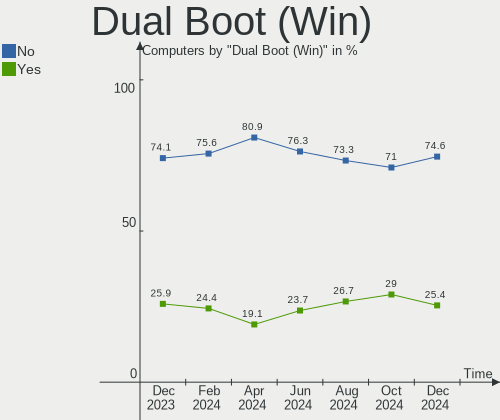
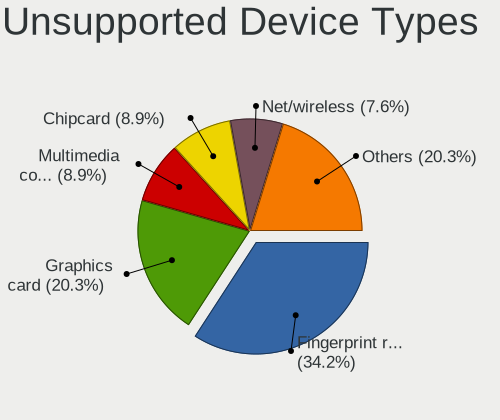

Arch - Hardware Trends
----------------------

A project to identify most popular hardware characteristics and track their change
over time based on data collected by Linux users at https://Linux-Hardware.org.

Anyone can contribute to this report by the [hw-probe](https://github.com/linuxhw/hw-probe) tool:

    sudo -E hw-probe -all -upload

This is a report for all computer types. See also reports for [desktops](/Dist/Arch/Desktop/README.md) and [notebooks](/Dist/Arch/Notebook/README.md).

This report is for one last month. Overall report since the beginning of time: [TestCoverage](https://github.com/linuxhw/TestCoverage)

Period: Nov, 2022.

Contents
--------

* [ System ](#system)
  - [ OS                       ](#os)
  - [ OS Family                ](#os-family)
  - [ Kernel                   ](#kernel)
  - [ Kernel Family            ](#kernel-family)
  - [ Kernel Major Ver.        ](#kernel-major-ver)
  - [ Arch                     ](#arch)
  - [ DE                       ](#de)
  - [ Display Server           ](#display-server)
  - [ Display Manager          ](#display-manager)
  - [ OS Lang                  ](#os-lang)
  - [ Boot Mode                ](#boot-mode)
  - [ Filesystem               ](#filesystem)
  - [ Part. scheme             ](#part-scheme)
  - [ Dual Boot with Linux/BSD ](#dual-boot-with-linuxbsd)
  - [ Dual Boot (Win)          ](#dual-boot-win)

* [ Board ](#board)
  - [ Vendor                   ](#vendor)
  - [ Model                    ](#model)
  - [ Model Family             ](#model-family)
  - [ MFG Year                 ](#mfg-year)
  - [ Form Factor              ](#form-factor)
  - [ Secure Boot              ](#secure-boot)
  - [ Coreboot                 ](#coreboot)
  - [ RAM Size                 ](#ram-size)
  - [ RAM Used                 ](#ram-used)
  - [ Total Drives             ](#total-drives)
  - [ Has CD-ROM               ](#has-cd-rom)
  - [ Has Ethernet             ](#has-ethernet)
  - [ Has WiFi                 ](#has-wifi)
  - [ Has Bluetooth            ](#has-bluetooth)

* [ Location ](#location)
  - [ Country                  ](#country)
  - [ City                     ](#city)

* [ Drives ](#drives)
  - [ Drive Vendor             ](#drive-vendor)
  - [ Drive Model              ](#drive-model)
  - [ HDD Vendor               ](#hdd-vendor)
  - [ SSD Vendor               ](#ssd-vendor)
  - [ Drive Kind               ](#drive-kind)
  - [ Drive Connector          ](#drive-connector)
  - [ Drive Size               ](#drive-size)
  - [ Space Total              ](#space-total)
  - [ Space Used               ](#space-used)
  - [ Malfunc. Drives          ](#malfunc-drives)
  - [ Malfunc. Drive Vendor    ](#malfunc-drive-vendor)
  - [ Malfunc. HDD Vendor      ](#malfunc-hdd-vendor)
  - [ Malfunc. Drive Kind      ](#malfunc-drive-kind)
  - [ Failed Drives            ](#failed-drives)
  - [ Failed Drive Vendor      ](#failed-drive-vendor)
  - [ Drive Status             ](#drive-status)

* [ Storage controller ](#storage-controller)
  - [ Storage Vendor           ](#storage-vendor)
  - [ Storage Model            ](#storage-model)
  - [ Storage Kind             ](#storage-kind)

* [ Processor ](#processor)
  - [ CPU Vendor               ](#cpu-vendor)
  - [ CPU Model                ](#cpu-model)
  - [ CPU Model Family         ](#cpu-model-family)
  - [ CPU Cores                ](#cpu-cores)
  - [ CPU Sockets              ](#cpu-sockets)
  - [ CPU Threads              ](#cpu-threads)
  - [ CPU Op-Modes             ](#cpu-op-modes)
  - [ CPU Microcode            ](#cpu-microcode)
  - [ CPU Microarch            ](#cpu-microarch)

* [ Graphics ](#graphics)
  - [ GPU Vendor               ](#gpu-vendor)
  - [ GPU Model                ](#gpu-model)
  - [ GPU Combo                ](#gpu-combo)
  - [ GPU Driver               ](#gpu-driver)
  - [ GPU Memory               ](#gpu-memory)

* [ Monitor ](#monitor)
  - [ Monitor Vendor           ](#monitor-vendor)
  - [ Monitor Model            ](#monitor-model)
  - [ Monitor Resolution       ](#monitor-resolution)
  - [ Monitor Diagonal         ](#monitor-diagonal)
  - [ Monitor Width            ](#monitor-width)
  - [ Aspect Ratio             ](#aspect-ratio)
  - [ Monitor Area             ](#monitor-area)
  - [ Pixel Density            ](#pixel-density)
  - [ Multiple Monitors        ](#multiple-monitors)

* [ Network ](#network)
  - [ Net Controller Vendor    ](#net-controller-vendor)
  - [ Net Controller Model     ](#net-controller-model)
  - [ Wireless Vendor          ](#wireless-vendor)
  - [ Wireless Model           ](#wireless-model)
  - [ Ethernet Vendor          ](#ethernet-vendor)
  - [ Ethernet Model           ](#ethernet-model)
  - [ Net Controller Kind      ](#net-controller-kind)
  - [ Used Controller          ](#used-controller)
  - [ NICs                     ](#nics)
  - [ IPv6                     ](#ipv6)

* [ Bluetooth ](#bluetooth)
  - [ Bluetooth Vendor         ](#bluetooth-vendor)
  - [ Bluetooth Model          ](#bluetooth-model)

* [ Sound ](#sound)
  - [ Sound Vendor             ](#sound-vendor)
  - [ Sound Model              ](#sound-model)

* [ Memory ](#memory)
  - [ Memory Vendor            ](#memory-vendor)
  - [ Memory Model             ](#memory-model)
  - [ Memory Kind              ](#memory-kind)
  - [ Memory Form Factor       ](#memory-form-factor)
  - [ Memory Size              ](#memory-size)
  - [ Memory Speed             ](#memory-speed)

* [ Printers & scanners ](#printers--scanners)
  - [ Printer Vendor           ](#printer-vendor)
  - [ Printer Model            ](#printer-model)
  - [ Scanner Vendor           ](#scanner-vendor)
  - [ Scanner Model            ](#scanner-model)

* [ Camera ](#camera)
  - [ Camera Vendor            ](#camera-vendor)
  - [ Camera Model             ](#camera-model)

* [ Security ](#security)
  - [ Fingerprint Vendor       ](#fingerprint-vendor)
  - [ Fingerprint Model        ](#fingerprint-model)
  - [ Chipcard Vendor          ](#chipcard-vendor)
  - [ Chipcard Model           ](#chipcard-model)

* [ Unsupported ](#unsupported)
  - [ Unsupported Devices      ](#unsupported-devices)
  - [ Unsupported Device Types ](#unsupported-device-types)

System
------

OS
--

Installed operating systems

| Name         | Computers | Percent |
|--------------|-----------|---------|
| Arch Rolling | 192       | 100%    |

OS Family
---------

OS without a version

| Name | Computers | Percent |
|------|-----------|---------|
| Arch | 192       | 100%    |

Kernel
------

Version of the Linux kernel

| Version                    | Computers | Percent |
|----------------------------|-----------|---------|
| 6.0.9-arch1-1              | 30        | 15.63%  |
| 6.0.7-arch1-1              | 30        | 15.63%  |
| 6.0.8-arch1-1              | 29        | 15.1%   |
| 6.0.6-arch1-1              | 21        | 10.94%  |
| 6.0.10-arch2-1             | 13        | 6.77%   |
| 6.0.8-zen1-1-zen           | 12        | 6.25%   |
| 6.0.2-arch1-1              | 7         | 3.65%   |
| 6.0.9-zen1-1-zen           | 6         | 3.13%   |
| 6.0.7-zen1-1-zen           | 5         | 2.6%    |
| 6.0.6-zen1-1-zen           | 5         | 2.6%    |
| 5.15.79-1-lts              | 4         | 2.08%   |
| 5.15.78-1-lts              | 4         | 2.08%   |
| 5.15.77-1-lts              | 4         | 2.08%   |
| 5.15.76-1-lts              | 3         | 1.56%   |
| 6.0.10-zen2-1-zen          | 2         | 1.04%   |
| 6.0.9-zen1-1.1-zen         | 1         | 0.52%   |
| 6.0.9-native_amd-xanmod1-1 | 1         | 0.52%   |
| 6.0.9-1-ck                 | 1         | 0.52%   |
| 6.0.7-zen3-xanmod1-1-zen3  | 1         | 0.52%   |
| 6.0.6                      | 1         | 0.52%   |
| 6.0.5-arch1-1-15khz        | 1         | 0.52%   |
| 6.0.5-arch1-1              | 1         | 0.52%   |
| 6.0.3-arch1-1-surface      | 1         | 0.52%   |
| 6.0.2-x64v2-xanmod1-1      | 1         | 0.52%   |
| 6.0.10-1-cachyos           | 1         | 0.52%   |
| 5.19.8-arch1-1             | 1         | 0.52%   |
| 5.19.5-arch1-1             | 1         | 0.52%   |
| 5.19.17-lqx2-1-lqx         | 1         | 0.52%   |
| 5.19.13-arch1-1            | 1         | 0.52%   |
| 5.15.80-1-lts              | 1         | 0.52%   |
| 5.15.77-271-tkg-pds-llvm   | 1         | 0.52%   |
| 5.15.75-1-lts              | 1         | 0.52%   |

Kernel Family
-------------

Linux kernel without a distro release

| Version | Computers | Percent |
|---------|-----------|---------|
| 6.0.8   | 41        | 21.35%  |
| 6.0.9   | 39        | 20.31%  |
| 6.0.7   | 36        | 18.75%  |
| 6.0.6   | 27        | 14.06%  |
| 6.0.10  | 16        | 8.33%   |
| 6.0.2   | 8         | 4.17%   |
| 5.15.77 | 5         | 2.6%    |
| 5.15.79 | 4         | 2.08%   |
| 5.15.78 | 4         | 2.08%   |
| 5.15.76 | 3         | 1.56%   |
| 6.0.5   | 2         | 1.04%   |
| 6.0.3   | 1         | 0.52%   |
| 5.19.8  | 1         | 0.52%   |
| 5.19.5  | 1         | 0.52%   |
| 5.19.17 | 1         | 0.52%   |
| 5.19.13 | 1         | 0.52%   |
| 5.15.80 | 1         | 0.52%   |
| 5.15.75 | 1         | 0.52%   |

Kernel Major Ver.
-----------------

Linux kernel major version

| Version | Computers | Percent |
|---------|-----------|---------|
| 6.0     | 170       | 88.54%  |
| 5.15    | 18        | 9.38%   |
| 5.19    | 4         | 2.08%   |

Arch
----

OS architecture (x86_64, i586, etc.)

| Name   | Computers | Percent |
|--------|-----------|---------|
| x86_64 | 192       | 100%    |

DE
--

Desktop Environment

| Name          | Computers | Percent |
|---------------|-----------|---------|
| KDE5          | 60        | 31.25%  |
| GNOME         | 53        | 27.6%   |
| i3            | 16        | 8.33%   |
| XFCE          | 14        | 7.29%   |
| sway          | 11        | 5.73%   |
| Unknown       | 10        | 5.21%   |
| X-Cinnamon    | 4         | 2.08%   |
| LXDE          | 4         | 2.08%   |
| Hyprland      | 4         | 2.08%   |
| Cinnamon      | 3         | 1.56%   |
| awesome       | 3         | 1.56%   |
| MATE          | 2         | 1.04%   |
| KDE           | 2         | 1.04%   |
| Unity         | 1         | 0.52%   |
| Openbox       | 1         | 0.52%   |
| GNOME Classic | 1         | 0.52%   |
| DWM           | 1         | 0.52%   |
| Deepin        | 1         | 0.52%   |
| Budgie        | 1         | 0.52%   |

Display Server
--------------

X11 or Wayland

| Name    | Computers | Percent |
|---------|-----------|---------|
| X11     | 110       | 57.29%  |
| Wayland | 52        | 27.08%  |
| Tty     | 17        | 8.85%   |
| Unknown | 13        | 6.77%   |

Display Manager
---------------

SDDM, LightDM, etc.

| Name    | Computers | Percent |
|---------|-----------|---------|
| Unknown | 73        | 38.02%  |
| SDDM    | 50        | 26.04%  |
| LightDM | 33        | 17.19%  |
| GDM     | 21        | 10.94%  |
| GREETD  | 6         | 3.13%   |
| Ly      | 4         | 2.08%   |
| LXDM    | 3         | 1.56%   |
| XDM     | 1         | 0.52%   |
| EMPTTY  | 1         | 0.52%   |

OS Lang
-------

Language

| Lang        | Computers | Percent |
|-------------|-----------|---------|
| en_US       | 90        | 46.88%  |
| it_IT       | 19        | 9.9%    |
| C           | 9         | 4.69%   |
| ru_RU       | 7         | 3.65%   |
| en_GB       | 7         | 3.65%   |
| zh_CN       | 6         | 3.13%   |
| Unknown     | 6         | 3.13%   |
| pt_BR       | 5         | 2.6%    |
| ja_JP       | 5         | 2.6%    |
| de_DE       | 5         | 2.6%    |
| en_DK       | 4         | 2.08%   |
| pl_PL       | 3         | 1.56%   |
| es_ES       | 3         | 1.56%   |
| en_AU       | 3         | 1.56%   |
| fr_FR       | 2         | 1.04%   |
| en_IN       | 2         | 1.04%   |
| pt_BRutf8   | 1         | 0.52%   |
| it_ITutf8   | 1         | 0.52%   |
| it_CH       | 1         | 0.52%   |
| hu_HU       | 1         | 0.52%   |
| he_IL       | 1         | 0.52%   |
| es_PE       | 1         | 0.52%   |
| es_MX       | 1         | 0.52%   |
| en_ZA       | 1         | 0.52%   |
| en_US,UTF-8 | 1         | 0.52%   |
| en_IE       | 1         | 0.52%   |
| en_HK       | 1         | 0.52%   |
| en_CA       | 1         | 0.52%   |
| en_AT       | 1         | 0.52%   |
| en_AG       | 1         | 0.52%   |
| de_AT       | 1         | 0.52%   |
| cs_CZ       | 1         | 0.52%   |

Boot Mode
---------

EFI or BIOS

| Mode | Computers | Percent |
|------|-----------|---------|
| EFI  | 119       | 61.98%  |
| BIOS | 73        | 38.02%  |

Filesystem
----------

Type of filesystem

| Type  | Computers | Percent |
|-------|-----------|---------|
| Ext4  | 126       | 65.63%  |
| Btrfs | 56        | 29.17%  |
| Xfs   | 5         | 2.6%    |
| Zfs   | 4         | 2.08%   |
| F2fs  | 1         | 0.52%   |

Part. scheme
------------

Scheme of partitioning

| Type    | Computers | Percent |
|---------|-----------|---------|
| GPT     | 129       | 67.19%  |
| Unknown | 51        | 26.56%  |
| MBR     | 12        | 6.25%   |

Dual Boot with Linux/BSD
------------------------

Hosting more than one Linux/BSD

| Dual boot | Computers | Percent |
|-----------|-----------|---------|
| No        | 165       | 85.94%  |
| Yes       | 27        | 14.06%  |

Dual Boot (Win)
---------------

Hosting Linux and Windows

| Dual boot | Computers | Percent |
|-----------|-----------|---------|
| No        | 138       | 71.88%  |
| Yes       | 54        | 28.13%  |

Board
-----

Vendor
------

Motherboard manufacturer

| Name                   | Computers | Percent |
|------------------------|-----------|---------|
| ASUSTek Computer       | 43        | 22.4%   |
| Lenovo                 | 36        | 18.75%  |
| Hewlett-Packard        | 21        | 10.94%  |
| MSI                    | 19        | 9.9%    |
| Dell                   | 17        | 8.85%   |
| Gigabyte Technology    | 14        | 7.29%   |
| ASRock                 | 7         | 3.65%   |
| Acer                   | 5         | 2.6%    |
| Timi                   | 1         | 0.52%   |
| Teclast                | 1         | 0.52%   |
| Sony                   | 1         | 0.52%   |
| Samsung Electronics    | 1         | 0.52%   |
| Positivo Bahia - VAIO  | 1         | 0.52%   |
| PCWare                 | 1         | 0.52%   |
| Panasonic              | 1         | 0.52%   |
| Packard Bell           | 1         | 0.52%   |
| OKI Brasil             | 1         | 0.52%   |
| Notebook               | 1         | 0.52%   |
| Microsoft              | 1         | 0.52%   |
| MECER                  | 1         | 0.52%   |
| Komplett               | 1         | 0.52%   |
| Intel                  | 1         | 0.52%   |
| IBM                    | 1         | 0.52%   |
| HUAWEI                 | 1         | 0.52%   |
| HONOR                  | 1         | 0.52%   |
| GPD                    | 1         | 0.52%   |
| Google                 | 1         | 0.52%   |
| Gateway                | 1         | 0.52%   |
| Fujitsu                | 1         | 0.52%   |
| Foxconn                | 1         | 0.52%   |
| EVGA                   | 1         | 0.52%   |
| DERE                   | 1         | 0.52%   |
| COLORFUL               | 1         | 0.52%   |
| Clevo                  | 1         | 0.52%   |
| Avell High Performance | 1         | 0.52%   |
| Apple                  | 1         | 0.52%   |
| Alienware              | 1         | 0.52%   |
| Unknown                | 1         | 0.52%   |

Model
-----

Motherboard model

| Name                                  | Computers | Percent |
|---------------------------------------|-----------|---------|
| MSI MS-7B86                           | 2         | 1.04%   |
| Lenovo ThinkBook 15 G2 ITL 20VE       | 2         | 1.04%   |
| HP ProBook 6570b                      | 2         | 1.04%   |
| HP EliteBook 850 G8 Notebook PC       | 2         | 1.04%   |
| ASUS ZenBook UX425UG_Q408UG           | 2         | 1.04%   |
| Timi TM1613                           | 1         | 0.52%   |
| Teclast F6 Pro                        | 1         | 0.52%   |
| Sony VPCEA45FG                        | 1         | 0.52%   |
| Samsung 730QAA                        | 1         | 0.52%   |
| Positivo Bahia - VAIO S14SL03         | 1         | 0.52%   |
| PCWare IPMH110G                       | 1         | 0.52%   |
| Panasonic CF-R9KWCTDR                 | 1         | 0.52%   |
| Packard Bell EasyNote LJ65            | 1         | 0.52%   |
| OKI Brasil Infoway ST-4280            | 1         | 0.52%   |
| Notebook P65xHP                       | 1         | 0.52%   |
| MSI MS-7D25                           | 1         | 0.52%   |
| MSI MS-7D09                           | 1         | 0.52%   |
| MSI MS-7C94                           | 1         | 0.52%   |
| MSI MS-7C56                           | 1         | 0.52%   |
| MSI MS-7C37                           | 1         | 0.52%   |
| MSI MS-7B79                           | 1         | 0.52%   |
| MSI MS-7A15                           | 1         | 0.52%   |
| MSI MS-7641                           | 1         | 0.52%   |
| MSI Modern 15 A5M                     | 1         | 0.52%   |
| MSI Modern 14 B5M                     | 1         | 0.52%   |
| MSI Modern 14 B10MW                   | 1         | 0.52%   |
| MSI GV62 8RC                          | 1         | 0.52%   |
| MSI GL63 8RD                          | 1         | 0.52%   |
| MSI GF75 Thin 9SC                     | 1         | 0.52%   |
| MSI ESPRIMO P1510                     | 1         | 0.52%   |
| MSI Bravo 15 A4DDR                    | 1         | 0.52%   |
| MSI Alpha 17 B5EEK                    | 1         | 0.52%   |
| Microsoft Surface Book 2              | 1         | 0.52%   |
| MECER YA13Q20-DP_PRO                  | 1         | 0.52%   |
| Lenovo Yoga Slim 7 ProX 14ARH7 82TL   | 1         | 0.52%   |
| Lenovo Yoga C640-13IML 81UE           | 1         | 0.52%   |
| Lenovo Yoga 720-13IKB 80X6            | 1         | 0.52%   |
| Lenovo XiaoXinPro 14ACH 2021 82MS     | 1         | 0.52%   |
| Lenovo ThinkPad X220 Tablet 4299EE8   | 1         | 0.52%   |
| Lenovo ThinkPad X1 Extreme 20MF000BUS | 1         | 0.52%   |

Model Family
------------

Motherboard model prefix

| Name                          | Computers | Percent |
|-------------------------------|-----------|---------|
| Lenovo ThinkPad               | 18        | 9.38%   |
| Lenovo IdeaPad                | 7         | 3.65%   |
| Dell XPS                      | 7         | 3.65%   |
| ASUS PRIME                    | 7         | 3.65%   |
| HP Pavilion                   | 5         | 2.6%    |
| ASUS ZenBook                  | 5         | 2.6%    |
| ASUS TUF                      | 5         | 2.6%    |
| Dell Latitude                 | 4         | 2.08%   |
| ASUS ROG                      | 4         | 2.08%   |
| MSI Modern                    | 3         | 1.56%   |
| Lenovo Yoga                   | 3         | 1.56%   |
| Lenovo ThinkBook              | 3         | 1.56%   |
| Lenovo Legion                 | 3         | 1.56%   |
| HP ProBook                    | 3         | 1.56%   |
| HP Laptop                     | 3         | 1.56%   |
| HP EliteBook                  | 3         | 1.56%   |
| Dell Inspiron                 | 3         | 1.56%   |
| MSI MS-7B86                   | 2         | 1.04%   |
| HP EliteDesk                  | 2         | 1.04%   |
| Gigabyte X570                 | 2         | 1.04%   |
| Gigabyte B550                 | 2         | 1.04%   |
| Gigabyte B450M                | 2         | 1.04%   |
| Dell OptiPlex                 | 2         | 1.04%   |
| ASUS P8P67                    | 2         | 1.04%   |
| ASUS ASUS                     | 2         | 1.04%   |
| Timi TM1613                   | 1         | 0.52%   |
| Teclast F6                    | 1         | 0.52%   |
| Sony VPCEA45FG                | 1         | 0.52%   |
| Samsung 730QAA                | 1         | 0.52%   |
| Positivo Bahia - VAIO S14SL03 | 1         | 0.52%   |
| PCWare IPMH110G               | 1         | 0.52%   |
| Panasonic CF-R9KWCTDR         | 1         | 0.52%   |
| Packard Bell EasyNote         | 1         | 0.52%   |
| OKI Brasil Infoway            | 1         | 0.52%   |
| Notebook P65xHP               | 1         | 0.52%   |
| MSI MS-7D25                   | 1         | 0.52%   |
| MSI MS-7D09                   | 1         | 0.52%   |
| MSI MS-7C94                   | 1         | 0.52%   |
| MSI MS-7C56                   | 1         | 0.52%   |
| MSI MS-7C37                   | 1         | 0.52%   |

MFG Year
--------

Motherboard manufacture year

| Year | Computers | Percent |
|------|-----------|---------|
| 2021 | 36        | 18.75%  |
| 2020 | 30        | 15.63%  |
| 2019 | 25        | 13.02%  |
| 2022 | 22        | 11.46%  |
| 2018 | 21        | 10.94%  |
| 2016 | 13        | 6.77%   |
| 2017 | 8         | 4.17%   |
| 2010 | 7         | 3.65%   |
| 2015 | 5         | 2.6%    |
| 2014 | 5         | 2.6%    |
| 2013 | 5         | 2.6%    |
| 2012 | 5         | 2.6%    |
| 2011 | 5         | 2.6%    |
| 2009 | 2         | 1.04%   |
| 2008 | 2         | 1.04%   |
| 2006 | 1         | 0.52%   |

Form Factor
-----------

Physical design of the computer

| Name        | Computers | Percent |
|-------------|-----------|---------|
| Notebook    | 113       | 58.85%  |
| Desktop     | 72        | 37.5%   |
| Convertible | 5         | 2.6%    |
| Tablet      | 1         | 0.52%   |
| Mini pc     | 1         | 0.52%   |

Secure Boot
-----------

Enabled or disabled

| State    | Computers | Percent |
|----------|-----------|---------|
| Disabled | 189       | 98.44%  |
| Enabled  | 3         | 1.56%   |

Coreboot
--------

Have coreboot on board

| Used | Computers | Percent |
|------|-----------|---------|
| No   | 191       | 99.48%  |
| Yes  | 1         | 0.52%   |

RAM Size
--------

Total RAM memory

| Size in GB  | Computers | Percent |
|-------------|-----------|---------|
| 16.01-24.0  | 44        | 22.92%  |
| 4.01-8.0    | 41        | 21.35%  |
| 8.01-16.0   | 38        | 19.79%  |
| 32.01-64.0  | 36        | 18.75%  |
| 3.01-4.0    | 16        | 8.33%   |
| 64.01-256.0 | 10        | 5.21%   |
| 24.01-32.0  | 7         | 3.65%   |

RAM Used
--------

Used RAM memory

| Used GB    | Computers | Percent |
|------------|-----------|---------|
| 4.01-8.0   | 54        | 28.13%  |
| 2.01-3.0   | 45        | 23.44%  |
| 1.01-2.0   | 37        | 19.27%  |
| 3.01-4.0   | 33        | 17.19%  |
| 8.01-16.0  | 17        | 8.85%   |
| 0.51-1.0   | 2         | 1.04%   |
| 0.01-0.5   | 2         | 1.04%   |
| 32.01-64.0 | 1         | 0.52%   |
| 16.01-24.0 | 1         | 0.52%   |

Total Drives
------------

Number of drives on board

| Drives | Computers | Percent |
|--------|-----------|---------|
| 1      | 102       | 53.13%  |
| 2      | 54        | 28.13%  |
| 3      | 18        | 9.38%   |
| 4      | 12        | 6.25%   |
| 6      | 2         | 1.04%   |
| 5      | 2         | 1.04%   |
| 9      | 1         | 0.52%   |
| 8      | 1         | 0.52%   |

Has CD-ROM
----------

Has CD-ROM on board

| Presented | Computers | Percent |
|-----------|-----------|---------|
| No        | 158       | 82.29%  |
| Yes       | 34        | 17.71%  |

Has Ethernet
------------

Has Ethernet on board

| Presented | Computers | Percent |
|-----------|-----------|---------|
| Yes       | 145       | 75.52%  |
| No        | 47        | 24.48%  |

Has WiFi
--------

Has WiFi module

| Presented | Computers | Percent |
|-----------|-----------|---------|
| Yes       | 158       | 82.29%  |
| No        | 34        | 17.71%  |

Has Bluetooth
-------------

Has Bluetooth module

| Presented | Computers | Percent |
|-----------|-----------|---------|
| Yes       | 147       | 76.56%  |
| No        | 45        | 23.44%  |

Location
--------

Country
-------

Geographic location (country)

| Country      | Computers | Percent |
|--------------|-----------|---------|
| USA          | 33        | 17.19%  |
| Italy        | 30        | 15.63%  |
| Russia       | 15        | 7.81%   |
| Germany      | 13        | 6.77%   |
| Brazil       | 9         | 4.69%   |
| Poland       | 8         | 4.17%   |
| India        | 7         | 3.65%   |
| China        | 7         | 3.65%   |
| Canada       | 7         | 3.65%   |
| Japan        | 5         | 2.6%    |
| Denmark      | 5         | 2.6%    |
| Australia    | 4         | 2.08%   |
| UK           | 3         | 1.56%   |
| Spain        | 3         | 1.56%   |
| Indonesia    | 3         | 1.56%   |
| France       | 3         | 1.56%   |
| Finland      | 3         | 1.56%   |
| Austria      | 3         | 1.56%   |
| Portugal     | 2         | 1.04%   |
| Peru         | 2         | 1.04%   |
| New Zealand  | 2         | 1.04%   |
| Netherlands  | 2         | 1.04%   |
| Czechia      | 2         | 1.04%   |
| Argentina    | 2         | 1.04%   |
| Vietnam      | 1         | 0.52%   |
| Turkey       | 1         | 0.52%   |
| Switzerland  | 1         | 0.52%   |
| South Africa | 1         | 0.52%   |
| Romania      | 1         | 0.52%   |
| Qatar        | 1         | 0.52%   |
| Philippines  | 1         | 0.52%   |
| Pakistan     | 1         | 0.52%   |
| Norway       | 1         | 0.52%   |
| Mexico       | 1         | 0.52%   |
| Lithuania    | 1         | 0.52%   |
| Kosovo       | 1         | 0.52%   |
| Kazakhstan   | 1         | 0.52%   |
| Israel       | 1         | 0.52%   |
| Hungary      | 1         | 0.52%   |
| Cyprus       | 1         | 0.52%   |

City
----

Geographic location (city)

| City           | Computers | Percent |
|----------------|-----------|---------|
| Moscow         | 5         | 2.6%    |
| Milan          | 5         | 2.6%    |
| St Petersburg  | 4         | 2.08%   |
| Kongens Lyngby | 4         | 2.08%   |
| Valencia       | 3         | 1.56%   |
| Warsaw         | 2         | 1.04%   |
| Turin          | 2         | 1.04%   |
| Sydney         | 2         | 1.04%   |
| Surabaya       | 2         | 1.04%   |
| Seattle        | 2         | 1.04%   |
| Santo André   | 2         | 1.04%   |
| Saitama        | 2         | 1.04%   |
| Rome           | 2         | 1.04%   |
| Rocklin        | 2         | 1.04%   |
| Rio de Janeiro | 2         | 1.04%   |
| Pordenone      | 2         | 1.04%   |
| Phoenix        | 2         | 1.04%   |
| Paris          | 2         | 1.04%   |
| Ormelle        | 2         | 1.04%   |
| Nanjing        | 2         | 1.04%   |
| Moers          | 2         | 1.04%   |
| Lodz           | 2         | 1.04%   |
| Lima           | 2         | 1.04%   |
| Jinrongjie     | 2         | 1.04%   |
| Dolgoprudnyy   | 2         | 1.04%   |
| Chicago        | 2         | 1.04%   |
| Auckland       | 2         | 1.04%   |
| Zielona Góra  | 1         | 0.52%   |
| Yamanashi      | 1         | 0.52%   |
| Witham         | 1         | 0.52%   |
| Wirral         | 1         | 0.52%   |
| Waterloo       | 1         | 0.52%   |
| Washington     | 1         | 0.52%   |
| Warwick        | 1         | 0.52%   |
| Vilnius        | 1         | 0.52%   |
| Vienna         | 1         | 0.52%   |
| Venice         | 1         | 0.52%   |
| Turku          | 1         | 0.52%   |
| Tulsa          | 1         | 0.52%   |
| Troy           | 1         | 0.52%   |

Drives
------

Drive Vendor
------------

Hard drive vendors

| Vendor                      | Computers | Drives | Percent |
|-----------------------------|-----------|--------|---------|
| Samsung Electronics         | 71        | 85     | 22.98%  |
| SanDisk                     | 37        | 39     | 11.97%  |
| WDC                         | 35        | 43     | 11.33%  |
| Seagate                     | 33        | 40     | 10.68%  |
| Toshiba                     | 13        | 16     | 4.21%   |
| Kingston                    | 11        | 11     | 3.56%   |
| Micron Technology           | 9         | 9      | 2.91%   |
| SK hynix                    | 8         | 10     | 2.59%   |
| Unknown                     | 7         | 7      | 2.27%   |
| Phison Electronics          | 7         | 8      | 2.27%   |
| Intel                       | 7         | 7      | 2.27%   |
| Crucial                     | 7         | 8      | 2.27%   |
| Hitachi                     | 6         | 8      | 1.94%   |
| Micron/Crucial Technology   | 4         | 4      | 1.29%   |
| Kingston Technology Company | 4         | 4      | 1.29%   |
| A-DATA Technology           | 4         | 4      | 1.29%   |
| HGST                        | 3         | 3      | 0.97%   |
| Unknown                     | 3         | 3      | 0.97%   |
| Transcend                   | 2         | 2      | 0.65%   |
| SPCC                        | 2         | 2      | 0.65%   |
| Realtek Semiconductor       | 2         | 2      | 0.65%   |
| LITEONIT                    | 2         | 2      | 0.65%   |
| LITEON                      | 2         | 2      | 0.65%   |
| JMicron Technology          | 2         | 2      | 0.65%   |
| China                       | 2         | 2      | 0.65%   |
| ADATA Technology            | 2         | 2      | 0.65%   |
| Yangtze Memory Technologies | 1         | 1      | 0.32%   |
| Union Memory (Shenzhen)     | 1         | 1      | 0.32%   |
| StoreJet                    | 1         | 1      | 0.32%   |
| Solid State Storage         | 1         | 1      | 0.32%   |
| Silicon Motion              | 1         | 1      | 0.32%   |
| Seagate Technology          | 1         | 1      | 0.32%   |
| PNY                         | 1         | 1      | 0.32%   |
| Phison                      | 1         | 1      | 0.32%   |
| OCZ                         | 1         | 2      | 0.32%   |
| Netac                       | 1         | 1      | 0.32%   |
| MAXIO Technology (Hangzhou) | 1         | 1      | 0.32%   |
| Lite-On Technology          | 1         | 1      | 0.32%   |
| LaCie                       | 1         | 1      | 0.32%   |
| KIOXIA-EXCERIA              | 1         | 1      | 0.32%   |

Drive Model
-----------

Hard drive models

| Model                                                             | Computers | Percent |
|-------------------------------------------------------------------|-----------|---------|
| Samsung NVMe SSD Controller SM981/PM981/PM983 1TB                 | 27        | 8.16%   |
| Samsung NVMe SSD Controller PM9A1/PM9A3/980PRO 250GB              | 11        | 3.32%   |
| Sandisk WD Black SN750 / PC SN730 NVMe SSD 1024GB                 | 10        | 3.02%   |
| Sandisk WD Blue SN550 NVMe SSD 1TB                                | 5         | 1.51%   |
| Samsung SSD 860 EVO 1TB                                           | 5         | 1.51%   |
| Seagate ST2000DM008-2FR102 2TB                                    | 4         | 1.21%   |
| Phison E12 NVMe Controller 2TB                                    | 4         | 1.21%   |
| Unknown MMC Card  64GB                                            | 3         | 0.91%   |
| Seagate ST2000DM006-2DM164 2TB                                    | 3         | 0.91%   |
| Seagate ST1000LM048-2E7172 1TB                                    | 3         | 0.91%   |
| Samsung SSD 980 500GB                                             | 3         | 0.91%   |
| Samsung NVMe SSD Controller SM961/PM961/SM963 250GB               | 3         | 0.91%   |
| Samsung MZALQ512HBLU-00BL2 512GB                                  | 3         | 0.91%   |
| Intel SSD 660P Series 512GB                                       | 3         | 0.91%   |
| Unknown                                                           | 3         | 0.91%   |
| WDC WDS500G2B0A-00SM50 500GB SSD                                  | 2         | 0.6%    |
| WDC WDS240G2G0A-00JH30 240GB SSD                                  | 2         | 0.6%    |
| WDC WD10EZEX-08WN4A0 1TB                                          | 2         | 0.6%    |
| Unknown MMC Card  128GB                                           | 2         | 0.6%    |
| Toshiba DT01ACA100 1TB                                            | 2         | 0.6%    |
| Sandisk WD Blue SN570 1TB                                         | 2         | 0.6%    |
| SanDisk SSD PLUS 240GB                                            | 2         | 0.6%    |
| SanDisk SSD PLUS 1000GB                                           | 2         | 0.6%    |
| Samsung SSD 980 1TB                                               | 2         | 0.6%    |
| Samsung SSD 860 EVO 500GB                                         | 2         | 0.6%    |
| Samsung SSD 850 EVO 500GB                                         | 2         | 0.6%    |
| Samsung MZVLQ256HAJD-00000 256GB                                  | 2         | 0.6%    |
| Realtek RTS5763DL NVMe SSD Controller 1024GB                      | 2         | 0.6%    |
| Phison E16 PCIe4 NVMe Controller 1TB                              | 2         | 0.6%    |
| Kingston Company OM3PDP3 NVMe SSD 256GB                           | 2         | 0.6%    |
| Kingston SA400S37480G 480GB SSD                                   | 2         | 0.6%    |
| Kingston OM8PCP3512F-AI1 512GB                                    | 2         | 0.6%    |
| HGST HTS721010A9E630 1TB                                          | 2         | 0.6%    |
| Crucial CT1000BX500SSD1 1TB                                       | 2         | 0.6%    |
| ADATA XPG SX8200 Pro PCIe Gen3x4 M.2 2280 Solid State Drive 512GB | 2         | 0.6%    |
| Yangtze Memory ZHITAI TiPlus5000 1TB                              | 1         | 0.3%    |
| WDC WUH721818ALE6L4 18TB                                          | 1         | 0.3%    |
| WDC WDS250G2B0B-00YS70 250GB SSD                                  | 1         | 0.3%    |
| WDC WDS200T2B0A-00SM50 2TB SSD                                    | 1         | 0.3%    |
| WDC WDS120G2G0A-00JH30 120GB SSD                                  | 1         | 0.3%    |

HDD Vendor
----------

Hard disk drive vendors

| Vendor   | Computers | Drives | Percent |
|----------|-----------|--------|---------|
| Seagate  | 32        | 38     | 37.21%  |
| WDC      | 31        | 36     | 36.05%  |
| Toshiba  | 9         | 10     | 10.47%  |
| Hitachi  | 6         | 8      | 6.98%   |
| HGST     | 3         | 3      | 3.49%   |
| StoreJet | 1         | 1      | 1.16%   |
| LaCie    | 1         | 1      | 1.16%   |
| HGST HTS | 1         | 1      | 1.16%   |
| ASMT     | 1         | 1      | 1.16%   |
| ACASIS   | 1         | 1      | 1.16%   |

SSD Vendor
----------

Solid state drive vendors

| Vendor              | Computers | Drives | Percent |
|---------------------|-----------|--------|---------|
| Samsung Electronics | 20        | 21     | 25.97%  |
| SanDisk             | 13        | 13     | 16.88%  |
| Crucial             | 7         | 8      | 9.09%   |
| WDC                 | 6         | 7      | 7.79%   |
| Kingston            | 5         | 5      | 6.49%   |
| Transcend           | 2         | 2      | 2.6%    |
| SPCC                | 2         | 2      | 2.6%    |
| LITEONIT            | 2         | 2      | 2.6%    |
| LITEON              | 2         | 2      | 2.6%    |
| Intel               | 2         | 2      | 2.6%    |
| China               | 2         | 2      | 2.6%    |
| A-DATA Technology   | 2         | 2      | 2.6%    |
| Unknown             | 2         | 2      | 2.6%    |
| Toshiba             | 1         | 3      | 1.3%    |
| PNY                 | 1         | 1      | 1.3%    |
| OCZ                 | 1         | 2      | 1.3%    |
| KIOXIA-EXCERIA      | 1         | 1      | 1.3%    |
| JMicron Technology  | 1         | 1      | 1.3%    |
| Intenso             | 1         | 1      | 1.3%    |
| GLOWAY              | 1         | 1      | 1.3%    |
| Fujitsu             | 1         | 1      | 1.3%    |
| Corsair             | 1         | 1      | 1.3%    |
| AGI                 | 1         | 1      | 1.3%    |

Drive Kind
----------

HDD or SSD

| Kind    | Computers | Drives | Percent |
|---------|-----------|--------|---------|
| NVMe    | 125       | 156    | 45.29%  |
| HDD     | 73        | 100    | 26.45%  |
| SSD     | 67        | 83     | 24.28%  |
| MMC     | 7         | 7      | 2.54%   |
| Unknown | 4         | 4      | 1.45%   |

Drive Connector
---------------

SATA, SAS, NVMe, etc.

| Type | Computers | Drives | Percent |
|------|-----------|--------|---------|
| NVMe | 125       | 155    | 51.02%  |
| SATA | 103       | 172    | 42.04%  |
| SAS  | 10        | 16     | 4.08%   |
| MMC  | 7         | 7      | 2.86%   |

Drive Size
----------

Size of hard drive

| Size in TB | Computers | Drives | Percent |
|------------|-----------|--------|---------|
| 0.01-0.5   | 63        | 79     | 42%     |
| 0.51-1.0   | 54        | 62     | 36%     |
| 1.01-2.0   | 19        | 24     | 12.67%  |
| 4.01-10.0  | 6         | 8      | 4%      |
| 2.01-3.0   | 4         | 5      | 2.67%   |
| 3.01-4.0   | 3         | 3      | 2%      |
| 10.01-20.0 | 1         | 2      | 0.67%   |

Space Total
-----------

Amount of disk space available on the file system

| Size in GB     | Computers | Percent |
|----------------|-----------|---------|
| 251-500        | 46        | 23.96%  |
| 101-250        | 34        | 17.71%  |
| 501-1000       | 29        | 15.1%   |
| 1001-2000      | 28        | 14.58%  |
| 2001-3000      | 24        | 12.5%   |
| More than 3000 | 17        | 8.85%   |
| Unknown        | 6         | 3.13%   |
| 51-100         | 5         | 2.6%    |
| 1-20           | 3         | 1.56%   |

Space Used
----------

Amount of used disk space

| Used GB        | Computers | Percent |
|----------------|-----------|---------|
| 101-250        | 32        | 16.67%  |
| 251-500        | 31        | 16.15%  |
| 1-20           | 31        | 16.15%  |
| 501-1000       | 24        | 12.5%   |
| 51-100         | 24        | 12.5%   |
| 21-50          | 23        | 11.98%  |
| More than 3000 | 8         | 4.17%   |
| 1001-2000      | 7         | 3.65%   |
| 2001-3000      | 6         | 3.13%   |
| Unknown        | 6         | 3.13%   |

Malfunc. Drives
---------------

Drive models with a malfunction

| Model                                                         | Computers | Drives | Percent |
|---------------------------------------------------------------|-----------|--------|---------|
| Seagate ST2000DM008-2FR102 2TB                                | 2         | 2      | 11.76%  |
| WDC WD10EZEX-08WN4A0 1TB                                      | 1         | 1      | 5.88%   |
| WDC WD10EAVS-00D7B0 1TB                                       | 1         | 1      | 5.88%   |
| Transcend TS1TSSD230S 1024GB                                  | 1         | 1      | 5.88%   |
| Toshiba DT01ACA100 1TB                                        | 1         | 1      | 5.88%   |
| Seagate ST3320620AS 320GB                                     | 1         | 1      | 5.88%   |
| Seagate ST2000DM001-1CH164 2TB                                | 1         | 1      | 5.88%   |
| Seagate ST1000DM003-1ER162 1TB                                | 1         | 1      | 5.88%   |
| Samsung Electronics SSD 980 1TB                               | 1         | 1      | 5.88%   |
| Samsung Electronics NVMe SSD Controller SM981/PM981/PM983 1TB | 1         | 1      | 5.88%   |
| Realtek Semiconductor RTS5763DL NVMe SSD Controller 1024GB    | 1         | 1      | 5.88%   |
| Micron Technology MTFDHBA1T0TDV-1AZ15ABFA 1TB                 | 1         | 1      | 5.88%   |
| Intel SSDSCKKW240H6 240GB                                     | 1         | 1      | 5.88%   |
| Hitachi HDT721010SLA360 1TB                                   | 1         | 1      | 5.88%   |
| GLOWAY FER120GS3-S7 120GB SSD                                 | 1         | 1      | 5.88%   |
| A-DATA Technology SU650 480GB SSD                             | 1         | 1      | 5.88%   |

Malfunc. Drive Vendor
---------------------

Vendors of faulty drives

| Vendor                | Computers | Drives | Percent |
|-----------------------|-----------|--------|---------|
| Seagate               | 5         | 5      | 29.41%  |
| WDC                   | 2         | 2      | 11.76%  |
| Samsung Electronics   | 2         | 2      | 11.76%  |
| Transcend             | 1         | 1      | 5.88%   |
| Toshiba               | 1         | 1      | 5.88%   |
| Realtek Semiconductor | 1         | 1      | 5.88%   |
| Micron Technology     | 1         | 1      | 5.88%   |
| Intel                 | 1         | 1      | 5.88%   |
| Hitachi               | 1         | 1      | 5.88%   |
| GLOWAY                | 1         | 1      | 5.88%   |
| A-DATA Technology     | 1         | 1      | 5.88%   |

Malfunc. HDD Vendor
-------------------

Vendors of faulty HDD drives

| Vendor  | Computers | Drives | Percent |
|---------|-----------|--------|---------|
| Seagate | 5         | 5      | 55.56%  |
| WDC     | 2         | 2      | 22.22%  |
| Toshiba | 1         | 1      | 11.11%  |
| Hitachi | 1         | 1      | 11.11%  |

Malfunc. Drive Kind
-------------------

Kinds of faulty drives

| Kind | Computers | Drives | Percent |
|------|-----------|--------|---------|
| HDD  | 9         | 9      | 52.94%  |
| NVMe | 4         | 4      | 23.53%  |
| SSD  | 4         | 4      | 23.53%  |

Failed Drives
-------------

Failed drive models

Zero info for selected period =(

Failed Drive Vendor
-------------------

Failed drive vendors

Zero info for selected period =(

Drive Status
------------

Number of failed and malfunc. drives

| Status   | Computers | Drives | Percent |
|----------|-----------|--------|---------|
| Works    | 114       | 195    | 54.29%  |
| Detected | 80        | 138    | 38.1%   |
| Malfunc  | 16        | 17     | 7.62%   |

Storage controller
------------------

Storage Vendor
--------------

Storage controller vendors

| Vendor                         | Computers | Percent |
|--------------------------------|-----------|---------|
| Intel                          | 94        | 31.97%  |
| Samsung Electronics            | 57        | 19.39%  |
| AMD                            | 50        | 17.01%  |
| SanDisk                        | 25        | 8.5%    |
| Kingston Technology Company    | 10        | 3.4%    |
| Micron Technology              | 9         | 3.06%   |
| SK hynix                       | 8         | 2.72%   |
| Phison Electronics             | 8         | 2.72%   |
| Micron/Crucial Technology      | 4         | 1.36%   |
| ADATA Technology               | 4         | 1.36%   |
| Toshiba America Info Systems   | 3         | 1.02%   |
| Marvell Technology Group       | 3         | 1.02%   |
| ASMedia Technology             | 3         | 1.02%   |
| Realtek Semiconductor          | 2         | 0.68%   |
| JMicron Technology             | 2         | 0.68%   |
| Yangtze Memory Technologies    | 1         | 0.34%   |
| Union Memory (Shenzhen)        | 1         | 0.34%   |
| Solid State Storage Technology | 1         | 0.34%   |
| Silicon Motion                 | 1         | 0.34%   |
| Seagate Technology             | 1         | 0.34%   |
| Netac Technology               | 1         | 0.34%   |
| MAXIO Technology (Hangzhou)    | 1         | 0.34%   |
| Lite-On Technology             | 1         | 0.34%   |
| KIOXIA                         | 1         | 0.34%   |
| Broadcom / LSI                 | 1         | 0.34%   |
| Biwin Storage Technology       | 1         | 0.34%   |
| Adaptec                        | 1         | 0.34%   |

Storage Model
-------------

Storage controller models

| Model                                                                         | Computers | Percent |
|-------------------------------------------------------------------------------|-----------|---------|
| Samsung NVMe SSD Controller SM981/PM981/PM983                                 | 28        | 9.06%   |
| AMD FCH SATA Controller [AHCI mode]                                           | 27        | 8.74%   |
| Samsung NVMe SSD Controller 980                                               | 13        | 4.21%   |
| Samsung NVMe SSD Controller PM9A1/PM9A3/980PRO                                | 12        | 3.88%   |
| SanDisk WD Black SN750 / PC SN730 NVMe SSD                                    | 10        | 3.24%   |
| Intel Volume Management Device NVMe RAID Controller                           | 10        | 3.24%   |
| AMD 400 Series Chipset SATA Controller                                        | 10        | 3.24%   |
| Micron Non-Volatile memory controller                                         | 9         | 2.91%   |
| AMD 500 Series Chipset SATA Controller                                        | 9         | 2.91%   |
| Intel Sunrise Point-LP SATA Controller [AHCI mode]                            | 8         | 2.59%   |
| Intel Cannon Lake Mobile PCH SATA AHCI Controller                             | 8         | 2.59%   |
| Kingston Company Company Non-Volatile memory controller                       | 7         | 2.27%   |
| Intel 82801 Mobile SATA Controller [RAID mode]                                | 7         | 2.27%   |
| SanDisk Non-Volatile memory controller                                        | 6         | 1.94%   |
| Intel Q170/Q150/B150/H170/H110/Z170/CM236 Chipset SATA Controller [AHCI Mode] | 6         | 1.94%   |
| SanDisk WD Blue SN550 NVMe SSD                                                | 5         | 1.62%   |
| Intel 500 Series Chipset Family SATA AHCI Controller                          | 5         | 1.62%   |
| SK hynix Gold P31/PC711 NVMe Solid State Drive                                | 4         | 1.29%   |
| Phison E12 NVMe Controller                                                    | 4         | 1.29%   |
| Intel Tiger Lake-LP SATA Controller                                           | 4         | 1.29%   |
| Intel Alder Lake-S PCH SATA Controller [AHCI Mode]                            | 4         | 1.29%   |
| Intel 6 Series/C200 Series Chipset Family 6 port Desktop SATA AHCI Controller | 4         | 1.29%   |
| AMD 300 Series Chipset SATA Controller                                        | 4         | 1.29%   |
| Samsung NVMe SSD Controller SM961/PM961/SM963                                 | 3         | 0.97%   |
| Intel SSD 660P Series                                                         | 3         | 0.97%   |
| Intel HM170/QM170 Chipset SATA Controller [AHCI Mode]                         | 3         | 0.97%   |
| Intel Cannon Lake PCH SATA AHCI Controller                                    | 3         | 0.97%   |
| Intel 6 Series/C200 Series Chipset Family 6 port Mobile SATA AHCI Controller  | 3         | 0.97%   |
| Intel 5 Series/3400 Series Chipset 6 port SATA AHCI Controller                | 3         | 0.97%   |
| Intel 200 Series PCH SATA controller [AHCI mode]                              | 3         | 0.97%   |
| ASMedia ASM1062 Serial ATA Controller                                         | 3         | 0.97%   |
| SanDisk WD Blue SN570 NVMe SSD                                                | 2         | 0.65%   |
| Realtek RTS5763DL NVMe SSD Controller                                         | 2         | 0.65%   |
| Phison E16 PCIe4 NVMe Controller                                              | 2         | 0.65%   |
| Micron/Crucial P5 Plus NVMe PCIe SSD                                          | 2         | 0.65%   |
| Kingston Company OM3PDP3 NVMe SSD                                             | 2         | 0.65%   |
| JMicron JMB362 SATA Controller                                                | 2         | 0.65%   |
| Intel SATA Controller [RAID mode]                                             | 2         | 0.65%   |
| Intel Non-Volatile memory controller                                          | 2         | 0.65%   |
| Intel Comet Lake SATA AHCI Controller                                         | 2         | 0.65%   |

Storage Kind
------------

Kind of storage controller (IDE, SATA, NVMe, SAS, ...)

| Kind | Computers | Percent |
|------|-----------|---------|
| NVMe | 125       | 45.79%  |
| SATA | 123       | 45.05%  |
| RAID | 22        | 8.06%   |
| IDE  | 3         | 1.1%    |

Processor
---------

CPU Vendor
----------

Processor vendors

| Vendor | Computers | Percent |
|--------|-----------|---------|
| Intel  | 120       | 62.5%   |
| AMD    | 72        | 37.5%   |

CPU Model
---------

Processor models

| Model                                      | Computers | Percent |
|--------------------------------------------|-----------|---------|
| Intel 11th Gen Core i5-1135G7 @ 2.40GHz    | 5         | 2.6%    |
| AMD Ryzen 7 5700U with Radeon Graphics     | 5         | 2.6%    |
| Intel Core i7-8750H CPU @ 2.20GHz          | 4         | 2.08%   |
| AMD Ryzen 7 5800H with Radeon Graphics     | 4         | 2.08%   |
| AMD Ryzen 5 5600X 6-Core Processor         | 4         | 2.08%   |
| Intel Core i5-8300H CPU @ 2.30GHz          | 3         | 1.56%   |
| Intel Core i5-8250U CPU @ 1.60GHz          | 3         | 1.56%   |
| Intel Core i5-7400 CPU @ 3.00GHz           | 3         | 1.56%   |
| Intel Core i5-7200U CPU @ 2.50GHz          | 3         | 1.56%   |
| Intel 11th Gen Core i7-1185G7 @ 3.00GHz    | 3         | 1.56%   |
| Intel 11th Gen Core i7-1165G7 @ 2.80GHz    | 3         | 1.56%   |
| AMD Ryzen 9 3900X 12-Core Processor        | 3         | 1.56%   |
| AMD Ryzen 7 5800X 8-Core Processor         | 3         | 1.56%   |
| AMD Ryzen 7 3700X 8-Core Processor         | 3         | 1.56%   |
| AMD Ryzen 5 5500U with Radeon Graphics     | 3         | 1.56%   |
| Intel Core i7-9750H CPU @ 2.60GHz          | 2         | 1.04%   |
| Intel Core i7-8700 CPU @ 3.20GHz           | 2         | 1.04%   |
| Intel Core i7-7700HQ CPU @ 2.80GHz         | 2         | 1.04%   |
| Intel Core i7-6700HQ CPU @ 2.60GHz         | 2         | 1.04%   |
| Intel Core i7-2600K CPU @ 3.40GHz          | 2         | 1.04%   |
| Intel Core i5-6200U CPU @ 2.30GHz          | 2         | 1.04%   |
| Intel Core i5-4310U CPU @ 2.00GHz          | 2         | 1.04%   |
| Intel Core i5-10400F CPU @ 2.90GHz         | 2         | 1.04%   |
| Intel Core i5-10210U CPU @ 1.60GHz         | 2         | 1.04%   |
| Intel 12th Gen Core i7-12700H              | 2         | 1.04%   |
| Intel 12th Gen Core i5-12500H              | 2         | 1.04%   |
| Intel 11th Gen Core i7-11800H @ 2.30GHz    | 2         | 1.04%   |
| Intel 11th Gen Core i3-1115G4 @ 3.00GHz    | 2         | 1.04%   |
| AMD Ryzen 9 7950X 16-Core Processor        | 2         | 1.04%   |
| AMD Ryzen 9 5950X 16-Core Processor        | 2         | 1.04%   |
| AMD Ryzen 9 5900X 12-Core Processor        | 2         | 1.04%   |
| AMD Ryzen 7 PRO 6850U with Radeon Graphics | 2         | 1.04%   |
| AMD Ryzen 7 5825U with Radeon Graphics     | 2         | 1.04%   |
| AMD Ryzen 7 5700X 8-Core Processor         | 2         | 1.04%   |
| AMD Ryzen 7 3800X 8-Core Processor         | 2         | 1.04%   |
| AMD Ryzen 5 5600H with Radeon Graphics     | 2         | 1.04%   |
| AMD Ryzen 5 4600H with Radeon Graphics     | 2         | 1.04%   |
| AMD Ryzen 5 3600 6-Core Processor          | 2         | 1.04%   |
| Intel Xeon CPU E5-2667 v2 @ 3.30GHz        | 1         | 0.52%   |
| Intel Xeon CPU 3.00GHz                     | 1         | 0.52%   |

CPU Model Family
----------------

Processor model prefix

| Model                          | Computers | Percent |
|--------------------------------|-----------|---------|
| Intel Core i5                  | 38        | 19.79%  |
| Other                          | 31        | 16.15%  |
| Intel Core i7                  | 28        | 14.58%  |
| AMD Ryzen 7                    | 28        | 14.58%  |
| AMD Ryzen 5                    | 19        | 9.9%    |
| AMD Ryzen 9                    | 10        | 5.21%   |
| Intel Core i3                  | 6         | 3.13%   |
| Intel Pentium                  | 4         | 2.08%   |
| AMD Ryzen 7 PRO                | 4         | 2.08%   |
| Intel Celeron                  | 3         | 1.56%   |
| Intel Xeon                     | 2         | 1.04%   |
| Intel Core 2 Duo               | 2         | 1.04%   |
| AMD A8                         | 2         | 1.04%   |
| AMD A10                        | 2         | 1.04%   |
| Intel Pentium Silver           | 1         | 0.52%   |
| Intel Pentium Dual-Core        | 1         | 0.52%   |
| Intel Core m5                  | 1         | 0.52%   |
| Intel Core m3                  | 1         | 0.52%   |
| Intel Core i9                  | 1         | 0.52%   |
| Intel Core 2 Quad              | 1         | 0.52%   |
| AMD Turion X2 Dual-Core Mobile | 1         | 0.52%   |
| AMD Ryzen Threadripper         | 1         | 0.52%   |
| AMD Ryzen 5 PRO                | 1         | 0.52%   |
| AMD Ryzen 3 PRO                | 1         | 0.52%   |
| AMD Ryzen 3                    | 1         | 0.52%   |
| AMD C-50                       | 1         | 0.52%   |
| AMD Athlon II X4               | 1         | 0.52%   |

CPU Cores
---------

Number of processor cores

| Number | Computers | Percent |
|--------|-----------|---------|
| 4      | 63        | 32.81%  |
| 2      | 39        | 20.31%  |
| 8      | 37        | 19.27%  |
| 6      | 34        | 17.71%  |
| 12     | 9         | 4.69%   |
| 16     | 6         | 3.13%   |
| 14     | 2         | 1.04%   |
| 32     | 1         | 0.52%   |
| 10     | 1         | 0.52%   |

CPU Sockets
-----------

Number of sockets

| Number | Computers | Percent |
|--------|-----------|---------|
| 1      | 191       | 99.48%  |
| 2      | 1         | 0.52%   |

CPU Threads
-----------

Threads per core (Hyper-Threading)

| Number | Computers | Percent |
|--------|-----------|---------|
| 2      | 164       | 85.42%  |
| 1      | 28        | 14.58%  |

CPU Op-Modes
------------

CPU Operation Modes (32-bit, 64-bit)

| Op mode        | Computers | Percent |
|----------------|-----------|---------|
| 32-bit, 64-bit | 192       | 100%    |

CPU Microcode
-------------

Microcode number

| Number     | Computers | Percent |
|------------|-----------|---------|
| Unknown    | 80        | 41.67%  |
| 0x806c1    | 8         | 4.17%   |
| 0x0a50000c | 8         | 4.17%   |
| 0x906ea    | 7         | 3.65%   |
| 0x0a201016 | 6         | 3.13%   |
| 0x08701021 | 6         | 3.13%   |
| 0x08608103 | 5         | 2.6%    |
| 0x906e9    | 4         | 2.08%   |
| 0x306a9    | 4         | 2.08%   |
| 0x806ea    | 3         | 1.56%   |
| 0x406e3    | 3         | 1.56%   |
| 0x906c0    | 2         | 1.04%   |
| 0x906a3    | 2         | 1.04%   |
| 0x806eb    | 2         | 1.04%   |
| 0x806e9    | 2         | 1.04%   |
| 0x40651    | 2         | 1.04%   |
| 0x206a7    | 2         | 1.04%   |
| 0x106e5    | 2         | 1.04%   |
| 0x1067a    | 2         | 1.04%   |
| 0x0a404102 | 2         | 1.04%   |
| 0x0a20120a | 2         | 1.04%   |
| 0x0a201205 | 2         | 1.04%   |
| 0x0a201009 | 2         | 1.04%   |
| 0x08108109 | 2         | 1.04%   |
| 0xb0671    | 1         | 0.52%   |
| 0xa0671    | 1         | 0.52%   |
| 0xa0660    | 1         | 0.52%   |
| 0xa0653    | 1         | 0.52%   |
| 0xa0652    | 1         | 0.52%   |
| 0x90672    | 1         | 0.52%   |
| 0x806ec    | 1         | 0.52%   |
| 0x806d1    | 1         | 0.52%   |
| 0x706e5    | 1         | 0.52%   |
| 0x506e3    | 1         | 0.52%   |
| 0x406c4    | 1         | 0.52%   |
| 0x40661    | 1         | 0.52%   |
| 0x306e4    | 1         | 0.52%   |
| 0x306d4    | 1         | 0.52%   |
| 0x20655    | 1         | 0.52%   |
| 0x20652    | 1         | 0.52%   |

CPU Microarch
-------------

Microarchitecture

| Name             | Computers | Percent |
|------------------|-----------|---------|
| KabyLake         | 39        | 20.31%  |
| Zen 3            | 27        | 14.06%  |
| Unknown          | 23        | 11.98%  |
| Zen 2            | 16        | 8.33%   |
| TigerLake        | 16        | 8.33%   |
| Skylake          | 8         | 4.17%   |
| Zen+             | 6         | 3.13%   |
| SandyBridge      | 6         | 3.13%   |
| IvyBridge        | 6         | 3.13%   |
| Haswell          | 6         | 3.13%   |
| Icelake          | 5         | 2.6%    |
| CometLake        | 5         | 2.6%    |
| Penryn           | 4         | 2.08%   |
| Alderlake Hybrid | 4         | 2.08%   |
| Westmere         | 3         | 1.56%   |
| Zen              | 2         | 1.04%   |
| Tremont          | 2         | 1.04%   |
| Silvermont       | 2         | 1.04%   |
| Nehalem          | 2         | 1.04%   |
| Steamroller      | 1         | 0.52%   |
| Puma             | 1         | 0.52%   |
| Piledriver       | 1         | 0.52%   |
| NetBurst         | 1         | 0.52%   |
| K8 & K10 hybrid  | 1         | 0.52%   |
| K10              | 1         | 0.52%   |
| Goldmont plus    | 1         | 0.52%   |
| Excavator        | 1         | 0.52%   |
| Broadwell        | 1         | 0.52%   |
| Bobcat           | 1         | 0.52%   |

Graphics
--------

GPU Vendor
----------

Vendors of graphics cards

| Vendor | Computers | Percent |
|--------|-----------|---------|
| Intel  | 94        | 39.66%  |
| Nvidia | 74        | 31.22%  |
| AMD    | 69        | 29.11%  |

GPU Model
---------

Graphics card models

| Model                                                                                    | Computers | Percent |
|------------------------------------------------------------------------------------------|-----------|---------|
| Intel TigerLake-LP GT2 [Iris Xe Graphics]                                                | 13        | 5.42%   |
| AMD Cezanne [Radeon Vega Series / Radeon Vega Mobile Series]                             | 12        | 5%      |
| Intel CoffeeLake-H GT2 [UHD Graphics 630]                                                | 8         | 3.33%   |
| AMD Lucienne                                                                             | 8         | 3.33%   |
| AMD Ellesmere [Radeon RX 470/480/570/570X/580/580X/590]                                  | 7         | 2.92%   |
| Intel UHD Graphics 620                                                                   | 6         | 2.5%    |
| Intel Alder Lake-P Integrated Graphics Controller                                        | 6         | 2.5%    |
| Intel HD Graphics 620                                                                    | 4         | 1.67%   |
| Intel HD Graphics 530                                                                    | 4         | 1.67%   |
| Intel CometLake-U GT2 [UHD Graphics]                                                     | 4         | 1.67%   |
| Intel 2nd Generation Core Processor Family Integrated Graphics Controller                | 4         | 1.67%   |
| AMD Renoir                                                                               | 4         | 1.67%   |
| AMD Rembrandt [Radeon 680M]                                                              | 4         | 1.67%   |
| AMD Picasso/Raven 2 [Radeon Vega Series / Radeon Vega Mobile Series]                     | 4         | 1.67%   |
| Nvidia GP107M [GeForce GTX 1050 Ti Mobile]                                               | 3         | 1.25%   |
| Nvidia GM204 [GeForce GTX 970]                                                           | 3         | 1.25%   |
| Nvidia GA106M [GeForce RTX 3060 Mobile / Max-Q]                                          | 3         | 1.25%   |
| Intel Tiger Lake-LP GT2 [UHD Graphics G4]                                                | 3         | 1.25%   |
| Intel Skylake GT2 [HD Graphics 520]                                                      | 3         | 1.25%   |
| Intel HD Graphics 630                                                                    | 3         | 1.25%   |
| Intel Haswell-ULT Integrated Graphics Controller                                         | 3         | 1.25%   |
| AMD Navi 23 [Radeon RX 6600/6600 XT/6600M]                                               | 3         | 1.25%   |
| AMD Navi 10 [Radeon RX 5600 OEM/5600 XT / 5700/5700 XT]                                  | 3         | 1.25%   |
| Nvidia TU117M [GeForce MX450]                                                            | 2         | 0.83%   |
| Nvidia TU117M                                                                            | 2         | 0.83%   |
| Nvidia TU117 [GeForce GTX 1650]                                                          | 2         | 0.83%   |
| Nvidia GP107M [GeForce GTX 1050 Mobile]                                                  | 2         | 0.83%   |
| Nvidia GP106M [GeForce GTX 1060 Mobile]                                                  | 2         | 0.83%   |
| Nvidia GK208B [GeForce GT 710]                                                           | 2         | 0.83%   |
| Nvidia GA107M [GeForce RTX 3050 Mobile]                                                  | 2         | 0.83%   |
| Nvidia GA104M [GeForce RTX 3070 Mobile / Max-Q]                                          | 2         | 0.83%   |
| Intel WhiskeyLake-U GT2 [UHD Graphics 620]                                               | 2         | 0.83%   |
| Intel TigerLake-H GT1 [UHD Graphics]                                                     | 2         | 0.83%   |
| Intel JasperLake [UHD Graphics]                                                          | 2         | 0.83%   |
| Intel Iris Plus Graphics G1 (Ice Lake)                                                   | 2         | 0.83%   |
| Intel Core Processor Integrated Graphics Controller                                      | 2         | 0.83%   |
| Intel CoffeeLake-S GT2 [UHD Graphics 630]                                                | 2         | 0.83%   |
| Intel Atom/Celeron/Pentium Processor x5-E8000/J3xxx/N3xxx Integrated Graphics Controller | 2         | 0.83%   |
| Intel 3rd Gen Core processor Graphics Controller                                         | 2         | 0.83%   |
| AMD RV710/M92 [Mobility Radeon HD 4530/4570/545v]                                        | 2         | 0.83%   |

GPU Combo
---------

Combinations of graphics cards

| Name           | Computers | Percent |
|----------------|-----------|---------|
| 1 x Intel      | 61        | 31.77%  |
| 1 x AMD        | 51        | 26.56%  |
| 1 x Nvidia     | 31        | 16.15%  |
| Intel + Nvidia | 29        | 15.1%   |
| AMD + Nvidia   | 13        | 6.77%   |
| 2 x AMD        | 3         | 1.56%   |
| Intel + AMD    | 2         | 1.04%   |
| Other          | 1         | 0.52%   |
| 2 x Nvidia     | 1         | 0.52%   |

GPU Driver
----------

Free vs proprietary

| Driver      | Computers | Percent |
|-------------|-----------|---------|
| Free        | 138       | 71.88%  |
| Proprietary | 54        | 28.13%  |

GPU Memory
----------

Total video memory

| Size in GB | Computers | Percent |
|------------|-----------|---------|
| Unknown    | 116       | 60.42%  |
| 7.01-8.0   | 16        | 8.33%   |
| 0.01-0.5   | 15        | 7.81%   |
| 3.01-4.0   | 13        | 6.77%   |
| 1.01-2.0   | 11        | 5.73%   |
| 8.01-16.0  | 8         | 4.17%   |
| 0.51-1.0   | 6         | 3.13%   |
| 5.01-6.0   | 3         | 1.56%   |
| 2.01-3.0   | 2         | 1.04%   |
| 16.01-24.0 | 2         | 1.04%   |

Monitor
-------

Monitor Vendor
--------------

Monitor vendors

| Vendor               | Computers | Percent |
|----------------------|-----------|---------|
| BOE                  | 29        | 12.55%  |
| Samsung Electronics  | 25        | 10.82%  |
| AU Optronics         | 23        | 9.96%   |
| Goldstar             | 21        | 9.09%   |
| Chimei Innolux       | 20        | 8.66%   |
| LG Display           | 15        | 6.49%   |
| Dell                 | 12        | 5.19%   |
| Sharp                | 9         | 3.9%    |
| PANDA                | 8         | 3.46%   |
| Hewlett-Packard      | 8         | 3.46%   |
| Acer                 | 7         | 3.03%   |
| ViewSonic            | 6         | 2.6%    |
| BenQ                 | 6         | 2.6%    |
| LG Electronics       | 5         | 2.16%   |
| Sony                 | 4         | 1.73%   |
| CSO                  | 4         | 1.73%   |
| Ancor Communications | 4         | 1.73%   |
| MSI                  | 3         | 1.3%    |
| AOC                  | 3         | 1.3%    |
| NEC Computers        | 2         | 0.87%   |
| Lenovo               | 2         | 0.87%   |
| Fujitsu Siemens      | 2         | 0.87%   |
| ASUSTek Computer     | 2         | 0.87%   |
| VIE                  | 1         | 0.43%   |
| Sceptre Tech         | 1         | 0.43%   |
| RTK                  | 1         | 0.43%   |
| RIS                  | 1         | 0.43%   |
| Panasonic            | 1         | 0.43%   |
| Mi                   | 1         | 0.43%   |
| LOS                  | 1         | 0.43%   |
| LNV                  | 1         | 0.43%   |
| ITE                  | 1         | 0.43%   |
| Gigabyte Technology  | 1         | 0.43%   |
| Apple                | 1         | 0.43%   |

Monitor Model
-------------

Monitor models

| Model                                                             | Computers | Percent |
|-------------------------------------------------------------------|-----------|---------|
| Samsung Electronics S24F350 SAM0D20 1920x1080 521x293mm 23.5-inch | 3         | 1.23%   |
| PANDA LCD Monitor NCP0035 1920x1080 344x194mm 15.5-inch           | 3         | 1.23%   |
| AU Optronics LCD Monitor AUO403D 1920x1080 309x173mm 13.9-inch    | 3         | 1.23%   |
| Sharp LCD Monitor SHP14F9 1920x1200 288x180mm 13.4-inch           | 2         | 0.82%   |
| LG Display LCD Monitor LGD060F 1920x1080 309x174mm 14.0-inch      | 2         | 0.82%   |
| Hewlett-Packard 24f HPN3545 1920x1080 527x296mm 23.8-inch         | 2         | 0.82%   |
| Goldstar HDR WFHD GSM7714 2560x1080 798x334mm 34.1-inch           | 2         | 0.82%   |
| Goldstar HDR 4K GSM7707 3840x2160 600x340mm 27.2-inch             | 2         | 0.82%   |
| CSO LCD Monitor CSO160E 2560x1600 344x215mm 16.0-inch             | 2         | 0.82%   |
| Chimei Innolux LCD Monitor CMN15F5 1920x1080 344x193mm 15.5-inch  | 2         | 0.82%   |
| Chimei Innolux LCD Monitor CMN15D6 1920x1080 344x193mm 15.5-inch  | 2         | 0.82%   |
| Chimei Innolux LCD Monitor CMN15AB 1366x768 344x194mm 15.5-inch   | 2         | 0.82%   |
| Chimei Innolux LCD Monitor CMN1521 1920x1080 344x193mm 15.5-inch  | 2         | 0.82%   |
| Chimei Innolux LCD Monitor CMN1493 1366x768 309x173mm 13.9-inch   | 2         | 0.82%   |
| Chimei Innolux LCD Monitor CMN1490 1366x768 309x173mm 13.9-inch   | 2         | 0.82%   |
| BOE LCD Monitor BOE09D8 1920x1080 344x194mm 15.5-inch             | 2         | 0.82%   |
| BOE LCD Monitor BOE08E2 1920x1080 344x194mm 15.5-inch             | 2         | 0.82%   |
| Ancor Communications VS278 ACI27A1 1920x1080 598x336mm 27.0-inch  | 2         | 0.82%   |
| ViewSonic VX3276-QHD VSCE635 2560x1440 698x393mm 31.5-inch        | 1         | 0.41%   |
| ViewSonic VX3211-2K VSCF634 2560x1440 700x390mm 31.5-inch         | 1         | 0.41%   |
| ViewSonic VX2768-2KP VSC0A3B 2560x1440 597x336mm 27.0-inch        | 1         | 0.41%   |
| ViewSonic VX2739 Series VSC3F24 1920x1080 598x336mm 27.0-inch     | 1         | 0.41%   |
| ViewSonic VX2252 Series VSCDC2E 1920x1080 477x268mm 21.5-inch     | 1         | 0.41%   |
| ViewSonic VX2240w VSC6B20 1680x1050 495x291mm 22.6-inch           | 1         | 0.41%   |
| ViewSonic M108C HCD0108 1920x1080 380x210mm 17.1-inch             | 1         | 0.41%   |
| ViewSonic LCD Monitor VSCBB31 1920x1080 530x300mm 24.0-inch       | 1         | 0.41%   |
| VIE A2256 VIE2150 1920x1080 368x207mm 16.6-inch                   | 1         | 0.41%   |
| Sony TV SNYEE01 1920x1080                                         | 1         | 0.41%   |
| Sony TV *00 SNY7E04 3840x2160 1218x685mm 55.0-inch                | 1         | 0.41%   |
| Sony LCD Monitor SNY05FA 1366x768 340x190mm 15.3-inch             | 1         | 0.41%   |
| Sony JDI_8.9_LCD MS_0003 2560x1600 192x120mm 8.9-inch             | 1         | 0.41%   |
| Sharp LQ156M1JW26 SHP1532 1920x1080 344x194mm 15.5-inch           | 1         | 0.41%   |
| Sharp LQ156M1JW24 SHP1534 1920x1080 344x194mm 15.5-inch           | 1         | 0.41%   |
| Sharp LCD Monitor SHP14CB 1920x1200 288x180mm 13.4-inch           | 1         | 0.41%   |
| Sharp LCD Monitor SHP149A 1920x1080 344x194mm 15.5-inch           | 1         | 0.41%   |
| Sharp LCD Monitor SHP1449 1920x1080 294x165mm 13.3-inch           | 1         | 0.41%   |
| Sharp LCD Monitor SHP1447 1920x1080 294x165mm 13.3-inch           | 1         | 0.41%   |
| Sharp LCD Monitor SHP143E 3840x2160 346x194mm 15.6-inch           | 1         | 0.41%   |
| Sceptre Tech E20 SPT080D 1600x900 434x236mm 19.4-inch             | 1         | 0.41%   |
| Samsung Electronics SyncMaster SAM05CD 1920x1080                  | 1         | 0.41%   |

Monitor Resolution
------------------

Monitor screen resolution

| Resolution         | Computers | Percent |
|--------------------|-----------|---------|
| 1920x1080 (FHD)    | 109       | 50.23%  |
| 1366x768 (WXGA)    | 22        | 10.14%  |
| 2560x1440 (QHD)    | 17        | 7.83%   |
| 3840x2160 (4K)     | 13        | 5.99%   |
| 2560x1600          | 8         | 3.69%   |
| 1920x1200 (WUXGA)  | 8         | 3.69%   |
| 3440x1440          | 6         | 2.76%   |
| 1600x900 (HD+)     | 5         | 2.3%    |
| 1280x1024 (SXGA)   | 4         | 1.84%   |
| Unknown            | 4         | 1.84%   |
| 2880x1800          | 3         | 1.38%   |
| 2560x1080          | 3         | 1.38%   |
| 2240x1400          | 2         | 0.92%   |
| 1680x1050 (WSXGA+) | 2         | 0.92%   |
| 1440x900 (WXGA+)   | 2         | 0.92%   |
| 7680x4320          | 1         | 0.46%   |
| 5120x1440          | 1         | 0.46%   |
| 3840x1080          | 1         | 0.46%   |
| 3240x2160          | 1         | 0.46%   |
| 3072x1920          | 1         | 0.46%   |
| 2880x1620          | 1         | 0.46%   |
| 2880x1600          | 1         | 0.46%   |
| 2160x1350          | 1         | 0.46%   |
| 1920x1280          | 1         | 0.46%   |

Monitor Diagonal
----------------

Diagonal size in inches

| Inches  | Computers | Percent |
|---------|-----------|---------|
| 15      | 56        | 24.56%  |
| 27      | 27        | 11.84%  |
| 13      | 25        | 10.96%  |
| 14      | 22        | 9.65%   |
| 24      | 15        | 6.58%   |
| 23      | 12        | 5.26%   |
| 21      | 9         | 3.95%   |
| Unknown | 9         | 3.95%   |
| 34      | 8         | 3.51%   |
| 19      | 7         | 3.07%   |
| 17      | 7         | 3.07%   |
| 31      | 6         | 2.63%   |
| 16      | 6         | 2.63%   |
| 22      | 3         | 1.32%   |
| 18      | 3         | 1.32%   |
| 72      | 2         | 0.88%   |
| 12      | 2         | 0.88%   |
| 129     | 1         | 0.44%   |
| 84      | 1         | 0.44%   |
| 55      | 1         | 0.44%   |
| 54      | 1         | 0.44%   |
| 48      | 1         | 0.44%   |
| 46      | 1         | 0.44%   |
| 29      | 1         | 0.44%   |
| 26      | 1         | 0.44%   |
| 11      | 1         | 0.44%   |

Monitor Width
-------------

Physical width

| Width in mm    | Computers | Percent |
|----------------|-----------|---------|
| 301-350        | 92        | 41.44%  |
| 501-600        | 50        | 22.52%  |
| 201-300        | 21        | 9.46%   |
| 401-500        | 18        | 8.11%   |
| 351-400        | 10        | 4.5%    |
| Unknown        | 9         | 4.05%   |
| 701-800        | 7         | 3.15%   |
| 601-700        | 7         | 3.15%   |
| 1001-1500      | 4         | 1.8%    |
| 1501-2000      | 2         | 0.9%    |
| More than 2000 | 1         | 0.45%   |
| 801-900        | 1         | 0.45%   |

Aspect Ratio
------------

Proportional relationship between the width and the height

| Ratio   | Computers | Percent |
|---------|-----------|---------|
| 16/9    | 151       | 75.5%   |
| 16/10   | 25        | 12.5%   |
| 21/9    | 9         | 4.5%    |
| Unknown | 7         | 3.5%    |
| 5/4     | 5         | 2.5%    |
| 3/2     | 2         | 1%      |
| 4/3     | 1         | 0.5%    |

Monitor Area
------------

Area in inch²

| Area in inch² | Computers | Percent |
|----------------|-----------|---------|
| 101-110        | 55        | 24.34%  |
| 201-250        | 32        | 14.16%  |
| 81-90          | 30        | 13.27%  |
| 301-350        | 29        | 12.83%  |
| 71-80          | 16        | 7.08%   |
| 351-500        | 14        | 6.19%   |
| 151-200        | 10        | 4.42%   |
| Unknown        | 9         | 3.98%   |
| More than 1000 | 6         | 2.65%   |
| 121-130        | 6         | 2.65%   |
| 111-120        | 6         | 2.65%   |
| 141-150        | 4         | 1.77%   |
| 251-300        | 3         | 1.33%   |
| 61-70          | 2         | 0.88%   |
| 91-100         | 2         | 0.88%   |
| 51-60          | 1         | 0.44%   |
| 501-1000       | 1         | 0.44%   |

Pixel Density
-------------

Pixels per inch

| Density       | Computers | Percent |
|---------------|-----------|---------|
| 121-160       | 65        | 29.68%  |
| 51-100        | 60        | 27.4%   |
| 101-120       | 39        | 17.81%  |
| 161-240       | 35        | 15.98%  |
| Unknown       | 9         | 4.11%   |
| 1-50          | 6         | 2.74%   |
| More than 240 | 5         | 2.28%   |

Multiple Monitors
-----------------

Total monitors connected

| Total | Computers | Percent |
|-------|-----------|---------|
| 1     | 145       | 75.52%  |
| 2     | 37        | 19.27%  |
| 3     | 8         | 4.17%   |
| 6     | 1         | 0.52%   |
| 0     | 1         | 0.52%   |

Network
-------

Net Controller Vendor
---------------------

Controller vendors

| Vendor                            | Computers | Percent |
|-----------------------------------|-----------|---------|
| Intel                             | 105       | 37.77%  |
| Realtek Semiconductor             | 99        | 35.61%  |
| Qualcomm Atheros                  | 20        | 7.19%   |
| MediaTek                          | 16        | 5.76%   |
| Broadcom                          | 8         | 2.88%   |
| TP-Link                           | 7         | 2.52%   |
| Marvell Technology Group          | 4         | 1.44%   |
| Ralink Technology                 | 2         | 0.72%   |
| Qualcomm                          | 2         | 0.72%   |
| Xiaomi                            | 1         | 0.36%   |
| Samsung Electronics               | 1         | 0.36%   |
| Ralink                            | 1         | 0.36%   |
| Quectel Wireless Solutions        | 1         | 0.36%   |
| Qualcomm Atheros Communications   | 1         | 0.36%   |
| QinHeng Electronics               | 1         | 0.36%   |
| Microsoft                         | 1         | 0.36%   |
| Linksys                           | 1         | 0.36%   |
| IMC Networks                      | 1         | 0.36%   |
| Hewlett-Packard                   | 1         | 0.36%   |
| Ericsson Business Mobile Networks | 1         | 0.36%   |
| DisplayLink                       | 1         | 0.36%   |
| Broadcom Limited                  | 1         | 0.36%   |
| Arduino SA                        | 1         | 0.36%   |
| Aquantia                          | 1         | 0.36%   |

Net Controller Model
--------------------

Controller models

| Model                                                             | Computers | Percent |
|-------------------------------------------------------------------|-----------|---------|
| Realtek RTL8111/8168/8411 PCI Express Gigabit Ethernet Controller | 74        | 22.77%  |
| Intel Wi-Fi 6 AX200                                               | 15        | 4.62%   |
| Intel Wi-Fi 6 AX201                                               | 14        | 4.31%   |
| MediaTek MT7921 802.11ax PCI Express Wireless Network Adapter     | 9         | 2.77%   |
| Realtek RTL8153 Gigabit Ethernet Adapter                          | 8         | 2.46%   |
| Qualcomm Atheros QCA6174 802.11ac Wireless Network Adapter        | 8         | 2.46%   |
| Intel I211 Gigabit Network Connection                             | 8         | 2.46%   |
| Realtek RTL8125 2.5GbE Controller                                 | 7         | 2.15%   |
| Intel Wi-Fi 6 AX210/AX211/AX411 160MHz                            | 7         | 2.15%   |
| Realtek RTL8822CE 802.11ac PCIe Wireless Network Adapter          | 6         | 1.85%   |
| Realtek RTL8821CE 802.11ac PCIe Wireless Network Adapter          | 6         | 1.85%   |
| Intel Cannon Lake PCH CNVi WiFi                                   | 6         | 1.85%   |
| Intel Alder Lake-P PCH CNVi WiFi                                  | 6         | 1.85%   |
| Intel Wireless 8260                                               | 5         | 1.54%   |
| Intel Ethernet Controller I225-V                                  | 5         | 1.54%   |
| Intel Comet Lake PCH-LP CNVi WiFi                                 | 5         | 1.54%   |
| Intel 82579V Gigabit Network Connection                           | 5         | 1.54%   |
| Qualcomm Atheros QCA9565 / AR9565 Wireless Network Adapter        | 4         | 1.23%   |
| Qualcomm Atheros AR9285 Wireless Network Adapter (PCI-Express)    | 4         | 1.23%   |
| MediaTek MT7921K (RZ608) Wi-Fi 6E 80MHz                           | 4         | 1.23%   |
| Intel Wireless 7260                                               | 4         | 1.23%   |
| Realtek RTL810xE PCI Express Fast Ethernet controller             | 3         | 0.92%   |
| MediaTek MT7922 802.11ax PCI Express Wireless Network Adapter     | 3         | 0.92%   |
| Intel Wireless-AC 9260                                            | 3         | 0.92%   |
| Intel Wireless 8265 / 8275                                        | 3         | 0.92%   |
| Intel Wireless 3165                                               | 3         | 0.92%   |
| Intel Ethernet Connection (7) I219-V                              | 3         | 0.92%   |
| Intel Alder Lake-S PCH CNVi WiFi                                  | 3         | 0.92%   |
| TP-Link 802.11ac NIC                                              | 2         | 0.62%   |
| Realtek RTL8852AE 802.11ax PCIe Wireless Network Adapter          | 2         | 0.62%   |
| Realtek Realtek Network controller                                | 2         | 0.62%   |
| Ralink MT7601U Wireless Adapter                                   | 2         | 0.62%   |
| Qualcomm QCNFA765 Wireless Network Adapter                        | 2         | 0.62%   |
| Qualcomm Atheros QCA8171 Gigabit Ethernet                         | 2         | 0.62%   |
| Qualcomm Atheros Killer E2500 Gigabit Ethernet Controller         | 2         | 0.62%   |
| Marvell Group 88E8056 PCI-E Gigabit Ethernet Controller           | 2         | 0.62%   |
| Intel Ice Lake-LP PCH CNVi WiFi                                   | 2         | 0.62%   |
| Intel Ethernet Connection I218-LM                                 | 2         | 0.62%   |
| Intel Ethernet Connection (4) I219-LM                             | 2         | 0.62%   |
| Intel Centrino Advanced-N 6205 [Taylor Peak]                      | 2         | 0.62%   |

Wireless Vendor
---------------

Wireless vendors

| Vendor                          | Computers | Percent |
|---------------------------------|-----------|---------|
| Intel                           | 86        | 52.44%  |
| Realtek Semiconductor           | 21        | 12.8%   |
| Qualcomm Atheros                | 17        | 10.37%  |
| MediaTek                        | 16        | 9.76%   |
| TP-Link                         | 6         | 3.66%   |
| Broadcom                        | 6         | 3.66%   |
| Ralink Technology               | 2         | 1.22%   |
| Qualcomm                        | 2         | 1.22%   |
| Ralink                          | 1         | 0.61%   |
| Quectel Wireless Solutions      | 1         | 0.61%   |
| Qualcomm Atheros Communications | 1         | 0.61%   |
| Microsoft                       | 1         | 0.61%   |
| Marvell Technology Group        | 1         | 0.61%   |
| Linksys                         | 1         | 0.61%   |
| IMC Networks                    | 1         | 0.61%   |
| Hewlett-Packard                 | 1         | 0.61%   |

Wireless Model
--------------

Wireless models

| Model                                                          | Computers | Percent |
|----------------------------------------------------------------|-----------|---------|
| Intel Wi-Fi 6 AX200                                            | 15        | 9.15%   |
| Intel Wi-Fi 6 AX201                                            | 14        | 8.54%   |
| MediaTek MT7921 802.11ax PCI Express Wireless Network Adapter  | 9         | 5.49%   |
| Qualcomm Atheros QCA6174 802.11ac Wireless Network Adapter     | 8         | 4.88%   |
| Intel Wi-Fi 6 AX210/AX211/AX411 160MHz                         | 7         | 4.27%   |
| Realtek RTL8822CE 802.11ac PCIe Wireless Network Adapter       | 6         | 3.66%   |
| Realtek RTL8821CE 802.11ac PCIe Wireless Network Adapter       | 6         | 3.66%   |
| Intel Cannon Lake PCH CNVi WiFi                                | 6         | 3.66%   |
| Intel Alder Lake-P PCH CNVi WiFi                               | 6         | 3.66%   |
| Intel Wireless 8260                                            | 5         | 3.05%   |
| Intel Comet Lake PCH-LP CNVi WiFi                              | 5         | 3.05%   |
| Qualcomm Atheros QCA9565 / AR9565 Wireless Network Adapter     | 4         | 2.44%   |
| Qualcomm Atheros AR9285 Wireless Network Adapter (PCI-Express) | 4         | 2.44%   |
| MediaTek MT7921K (RZ608) Wi-Fi 6E 80MHz                        | 4         | 2.44%   |
| Intel Wireless 7260                                            | 4         | 2.44%   |
| MediaTek MT7922 802.11ax PCI Express Wireless Network Adapter  | 3         | 1.83%   |
| Intel Wireless-AC 9260                                         | 3         | 1.83%   |
| Intel Wireless 8265 / 8275                                     | 3         | 1.83%   |
| Intel Wireless 3165                                            | 3         | 1.83%   |
| Intel Alder Lake-S PCH CNVi WiFi                               | 3         | 1.83%   |
| TP-Link 802.11ac NIC                                           | 2         | 1.22%   |
| Realtek RTL8852AE 802.11ax PCIe Wireless Network Adapter       | 2         | 1.22%   |
| Realtek Realtek Network controller                             | 2         | 1.22%   |
| Ralink MT7601U Wireless Adapter                                | 2         | 1.22%   |
| Qualcomm QCNFA765 Wireless Network Adapter                     | 2         | 1.22%   |
| Intel Ice Lake-LP PCH CNVi WiFi                                | 2         | 1.22%   |
| Intel Centrino Advanced-N 6205 [Taylor Peak]                   | 2         | 1.22%   |
| Broadcom BCM43602 802.11ac Wireless LAN SoC                    | 2         | 1.22%   |
| Broadcom BCM43228 802.11a/b/g/n                                | 2         | 1.22%   |
| TP-Link TL-WN823N v2/v3 [Realtek RTL8192EU]                    | 1         | 0.61%   |
| TP-Link Archer T4U ver.3                                       | 1         | 0.61%   |
| TP-Link Archer T2U PLUS [RTL8821AU]                            | 1         | 0.61%   |
| TP-Link 802.11ac WLAN Adapter                                  | 1         | 0.61%   |
| Realtek RTL8821AE 802.11ac PCIe Wireless Network Adapter       | 1         | 0.61%   |
| Realtek RTL8812AE 802.11ac PCIe Wireless Network Adapter       | 1         | 0.61%   |
| Realtek RTL8723BU 802.11b/g/n WLAN Adapter                     | 1         | 0.61%   |
| Realtek RTL8723BE PCIe Wireless Network Adapter                | 1         | 0.61%   |
| Realtek RTL8187 Wireless Adapter                               | 1         | 0.61%   |
| Ralink RT3090 Wireless 802.11n 1T/1R PCIe                      | 1         | 0.61%   |
| Quectel Wireless Solutions Quectel EM05-CE                     | 1         | 0.61%   |

Ethernet Vendor
---------------

Ethernet vendors

| Vendor                   | Computers | Percent |
|--------------------------|-----------|---------|
| Realtek Semiconductor    | 91        | 59.48%  |
| Intel                    | 43        | 28.1%   |
| Qualcomm Atheros         | 8         | 5.23%   |
| Marvell Technology Group | 3         | 1.96%   |
| Broadcom                 | 2         | 1.31%   |
| Xiaomi                   | 1         | 0.65%   |
| TP-Link                  | 1         | 0.65%   |
| Samsung Electronics      | 1         | 0.65%   |
| DisplayLink              | 1         | 0.65%   |
| Broadcom Limited         | 1         | 0.65%   |
| Aquantia                 | 1         | 0.65%   |

Ethernet Model
--------------

Ethernet models

| Model                                                                          | Computers | Percent |
|--------------------------------------------------------------------------------|-----------|---------|
| Realtek RTL8111/8168/8411 PCI Express Gigabit Ethernet Controller              | 74        | 46.84%  |
| Realtek RTL8153 Gigabit Ethernet Adapter                                       | 8         | 5.06%   |
| Intel I211 Gigabit Network Connection                                          | 8         | 5.06%   |
| Realtek RTL8125 2.5GbE Controller                                              | 7         | 4.43%   |
| Intel Ethernet Controller I225-V                                               | 5         | 3.16%   |
| Intel 82579V Gigabit Network Connection                                        | 5         | 3.16%   |
| Realtek RTL810xE PCI Express Fast Ethernet controller                          | 3         | 1.9%    |
| Intel Ethernet Connection (7) I219-V                                           | 3         | 1.9%    |
| Qualcomm Atheros QCA8171 Gigabit Ethernet                                      | 2         | 1.27%   |
| Qualcomm Atheros Killer E2500 Gigabit Ethernet Controller                      | 2         | 1.27%   |
| Marvell Group 88E8056 PCI-E Gigabit Ethernet Controller                        | 2         | 1.27%   |
| Intel Ethernet Connection I218-LM                                              | 2         | 1.27%   |
| Intel Ethernet Connection (4) I219-LM                                          | 2         | 1.27%   |
| Intel 82579LM Gigabit Network Connection (Lewisville)                          | 2         | 1.27%   |
| Xiaomi Mi/Redmi series (RNDIS)                                                 | 1         | 0.63%   |
| TP-Link UE300 10/100/1000 LAN (ethernet mode) [Realtek RTL8153]                | 1         | 0.63%   |
| Samsung GT-I9070 (network tethering, USB debugging enabled)                    | 1         | 0.63%   |
| Realtek RTL-8110SC/8169SC Gigabit Ethernet                                     | 1         | 0.63%   |
| Realtek Killer E3000 2.5GbE Controller                                         | 1         | 0.63%   |
| Realtek Killer E2600 Gigabit Ethernet Controller                               | 1         | 0.63%   |
| Qualcomm Atheros AR8152 v2.0 Fast Ethernet                                     | 1         | 0.63%   |
| Qualcomm Atheros AR8151 v2.0 Gigabit Ethernet                                  | 1         | 0.63%   |
| Qualcomm Atheros AR8131 Gigabit Ethernet                                       | 1         | 0.63%   |
| Qualcomm Atheros AR8121/AR8113/AR8114 Gigabit or Fast Ethernet                 | 1         | 0.63%   |
| Marvell Group Yukon Optima 88E8059 [PCIe Gigabit Ethernet Controller with AVB] | 1         | 0.63%   |
| Marvell Group 88E8001 Gigabit Ethernet Controller                              | 1         | 0.63%   |
| Intel Ethernet Connection I217-LM                                              | 1         | 0.63%   |
| Intel Ethernet Connection (7) I219-LM                                          | 1         | 0.63%   |
| Intel Ethernet Connection (6) I219-V                                           | 1         | 0.63%   |
| Intel Ethernet Connection (5) I219-V                                           | 1         | 0.63%   |
| Intel Ethernet Connection (2) I219-V                                           | 1         | 0.63%   |
| Intel Ethernet Connection (2) I219-LM                                          | 1         | 0.63%   |
| Intel Ethernet Connection (16) I219-V                                          | 1         | 0.63%   |
| Intel Ethernet Connection (14) I219-V                                          | 1         | 0.63%   |
| Intel Ethernet Connection (14) I219-LM                                         | 1         | 0.63%   |
| Intel Ethernet Connection (13) I219-V                                          | 1         | 0.63%   |
| Intel Ethernet Connection (13) I219-LM                                         | 1         | 0.63%   |
| Intel Ethernet Connection (12) I219-V                                          | 1         | 0.63%   |
| Intel Ethernet Connection (10) I219-V                                          | 1         | 0.63%   |
| Intel 82577LM Gigabit Network Connection                                       | 1         | 0.63%   |

Net Controller Kind
-------------------

Ethernet, WiFi or modem

| Kind     | Computers | Percent |
|----------|-----------|---------|
| WiFi     | 158       | 51.63%  |
| Ethernet | 145       | 47.39%  |
| Modem    | 3         | 0.98%   |

Used Controller
---------------

Currently used network controller

| Kind     | Computers | Percent |
|----------|-----------|---------|
| WiFi     | 128       | 62.75%  |
| Ethernet | 76        | 37.25%  |

NICs
----

Total network controllers on board

| Total | Computers | Percent |
|-------|-----------|---------|
| 2     | 100       | 52.08%  |
| 1     | 86        | 44.79%  |
| 3     | 3         | 1.56%   |
| 0     | 2         | 1.04%   |
| 5     | 1         | 0.52%   |

IPv6
----

IPv6 vs IPv4

| Used | Computers | Percent |
|------|-----------|---------|
| No   | 144       | 75%     |
| Yes  | 48        | 25%     |

Bluetooth
---------

Bluetooth Vendor
----------------

Controller vendors

| Vendor                          | Computers | Percent |
|---------------------------------|-----------|---------|
| Intel                           | 79        | 52.32%  |
| Realtek Semiconductor           | 18        | 11.92%  |
| Foxconn / Hon Hai               | 12        | 7.95%   |
| Qualcomm Atheros Communications | 9         | 5.96%   |
| IMC Networks                    | 6         | 3.97%   |
| ASUSTek Computer                | 5         | 3.31%   |
| TP-Link                         | 4         | 2.65%   |
| MediaTek                        | 4         | 2.65%   |
| Broadcom                        | 4         | 2.65%   |
| Cambridge Silicon Radio         | 3         | 1.99%   |
| USI                             | 1         | 0.66%   |
| Realtek                         | 1         | 0.66%   |
| Marvell Semiconductor           | 1         | 0.66%   |
| Lite-On Technology              | 1         | 0.66%   |
| Hewlett-Packard                 | 1         | 0.66%   |
| Edimax Technology               | 1         | 0.66%   |
| Apple                           | 1         | 0.66%   |

Bluetooth Model
---------------

Controller models

| Model                                                                               | Computers | Percent |
|-------------------------------------------------------------------------------------|-----------|---------|
| Intel AX201 Bluetooth                                                               | 20        | 13.16%  |
| Intel Bluetooth wireless interface                                                  | 16        | 10.53%  |
| Intel AX200 Bluetooth                                                               | 15        | 9.87%   |
| Realtek Bluetooth Radio                                                             | 13        | 8.55%   |
| Intel Bluetooth 9460/9560 Jefferson Peak (JfP)                                      | 10        | 6.58%   |
| Foxconn / Hon Hai Wireless_Device                                                   | 10        | 6.58%   |
| Intel Bluetooth Device                                                              | 7         | 4.61%   |
| Intel AX210 Bluetooth                                                               | 7         | 4.61%   |
| TP-Link UB500 Adapter                                                               | 4         | 2.63%   |
| Realtek  Bluetooth 4.2 Adapter                                                      | 4         | 2.63%   |
| Qualcomm Atheros  Bluetooth Device                                                  | 4         | 2.63%   |
| Qualcomm Atheros QCA61x4 Bluetooth 4.0                                              | 4         | 2.63%   |
| MediaTek Wireless_Device                                                            | 4         | 2.63%   |
| Intel Wireless-AC 9260 Bluetooth Adapter                                            | 3         | 1.97%   |
| IMC Networks Bluetooth Device                                                       | 3         | 1.97%   |
| Cambridge Silicon Radio Bluetooth Dongle (HCI mode)                                 | 3         | 1.97%   |
| Intel Wireless-AC 3168 Bluetooth                                                    | 2         | 1.32%   |
| IMC Networks Bluetooth Radio                                                        | 2         | 1.32%   |
| Broadcom HP Portable SoftSailing                                                    | 2         | 1.32%   |
| ASUS Broadcom BCM20702A0 Bluetooth                                                  | 2         | 1.32%   |
| ASUS Bluetooth Adapter                                                              | 2         | 1.32%   |
| USI Bluetooth Device                                                                | 1         | 0.66%   |
| Realtek Bluetooth 5.1 Radio                                                         | 1         | 0.66%   |
| Realtek Bluetooth Radio                                                             | 1         | 0.66%   |
| Qualcomm Atheros AR3011 Bluetooth                                                   | 1         | 0.66%   |
| Marvell Bluetooth and Wireless LAN Composite                                        | 1         | 0.66%   |
| Lite-On Wireless_Device                                                             | 1         | 0.66%   |
| IMC Networks Wireless_Device                                                        | 1         | 0.66%   |
| HP Broadcom 2070 Bluetooth Combo                                                    | 1         | 0.66%   |
| Foxconn / Hon Hai Foxconn T77H114 BCM2070 [Single-Chip Bluetooth 2.1 + EDR Adapter] | 1         | 0.66%   |
| Foxconn / Hon Hai Bluetooth Device                                                  | 1         | 0.66%   |
| Edimax Bluetooth Adapter                                                            | 1         | 0.66%   |
| Broadcom BCM92046DG-CL1ROM Bluetooth 2.1 Adapter                                    | 1         | 0.66%   |
| Broadcom BCM20703A1 Bluetooth 4.1 + LE                                              | 1         | 0.66%   |
| ASUS ASUS USB-BT500                                                                 | 1         | 0.66%   |
| Apple Bluetooth Host Controller                                                     | 1         | 0.66%   |

Sound
-----

Sound Vendor
------------

Sound card vendors

| Vendor                                       | Computers | Percent |
|----------------------------------------------|-----------|---------|
| Intel                                        | 115       | 38.98%  |
| AMD                                          | 82        | 27.8%   |
| Nvidia                                       | 57        | 19.32%  |
| C-Media Electronics                          | 5         | 1.69%   |
| Texas Instruments                            | 2         | 0.68%   |
| M-Audio                                      | 2         | 0.68%   |
| Focusrite-Novation                           | 2         | 0.68%   |
| FiiO Electronics Technology                  | 2         | 0.68%   |
| BEHRINGER International                      | 2         | 0.68%   |
| Audio-Technica                               | 2         | 0.68%   |
| Zoran Co. Personal Media Division (Nogatech) | 1         | 0.34%   |
| XMOS                                         | 1         | 0.34%   |
| Valve Software                               | 1         | 0.34%   |
| Unknown                                      | 1         | 0.34%   |
| Sony                                         | 1         | 0.34%   |
| Samsung Electronics                          | 1         | 0.34%   |
| Samson Technologies                          | 1         | 0.34%   |
| Roland                                       | 1         | 0.34%   |
| Realtek Semiconductor                        | 1         | 0.34%   |
| Mackie Designs                               | 1         | 0.34%   |
| Logitech                                     | 1         | 0.34%   |
| Kingston Technology                          | 1         | 0.34%   |
| JMTek                                        | 1         | 0.34%   |
| Hewlett-Packard                              | 1         | 0.34%   |
| Generalplus Technology                       | 1         | 0.34%   |
| Ensoniq                                      | 1         | 0.34%   |
| Creative Technology                          | 1         | 0.34%   |
| Creative Labs                                | 1         | 0.34%   |
| Conexant Systems                             | 1         | 0.34%   |
| Blue Microphones                             | 1         | 0.34%   |
| ASUSTek Computer                             | 1         | 0.34%   |
| Astro Gaming                                 | 1         | 0.34%   |
| Antlion Audio                                | 1         | 0.34%   |
| Unknown                                      | 1         | 0.34%   |

Sound Model
-----------

Sound card models

| Model                                                                             | Computers | Percent |
|-----------------------------------------------------------------------------------|-----------|---------|
| AMD Family 17h/19h HD Audio Controller                                            | 37        | 10.36%  |
| AMD Starship/Matisse HD Audio Controller                                          | 25        | 7%      |
| AMD Renoir Radeon High Definition Audio Controller                                | 24        | 6.72%   |
| Intel Tiger Lake-LP Smart Sound Technology Audio Controller                       | 16        | 4.48%   |
| Intel Sunrise Point-LP HD Audio                                                   | 15        | 4.2%    |
| Intel Cannon Lake PCH cAVS                                                        | 12        | 3.36%   |
| Intel 6 Series/C200 Series Chipset Family High Definition Audio Controller        | 9         | 2.52%   |
| Intel 100 Series/C230 Series Chipset Family HD Audio Controller                   | 8         | 2.24%   |
| Nvidia GA104 High Definition Audio Controller                                     | 7         | 1.96%   |
| AMD Navi 21/23 HDMI/DP Audio Controller                                           | 7         | 1.96%   |
| AMD Ellesmere HDMI Audio [Radeon RX 470/480 / 570/580/590]                        | 7         | 1.96%   |
| Nvidia TU107 GeForce GTX 1650 High Definition Audio Controller                    | 6         | 1.68%   |
| Nvidia GA102 High Definition Audio Controller                                     | 6         | 1.68%   |
| Intel Alder Lake PCH-P High Definition Audio Controller                           | 6         | 1.68%   |
| Intel Tiger Lake-H HD Audio Controller                                            | 5         | 1.4%    |
| Intel Comet Lake PCH-LP cAVS                                                      | 5         | 1.4%    |
| AMD Rembrandt Radeon High Definition Audio Controller                             | 5         | 1.4%    |
| Nvidia GP107GL High Definition Audio Controller                                   | 4         | 1.12%   |
| Nvidia GA106 High Definition Audio Controller                                     | 4         | 1.12%   |
| Intel 5 Series/3400 Series Chipset High Definition Audio                          | 4         | 1.12%   |
| AMD Raven/Raven2/Fenghuang HDMI/DP Audio Controller                               | 4         | 1.12%   |
| AMD Navi 10 HDMI Audio                                                            | 4         | 1.12%   |
| Nvidia TU104 HD Audio Controller                                                  | 3         | 0.84%   |
| Nvidia GP106 High Definition Audio Controller                                     | 3         | 0.84%   |
| Nvidia GP104 High Definition Audio Controller                                     | 3         | 0.84%   |
| Nvidia GM204 High Definition Audio Controller                                     | 3         | 0.84%   |
| Nvidia GK208 HDMI/DP Audio Controller                                             | 3         | 0.84%   |
| Intel Ice Lake-LP Smart Sound Technology Audio Controller                         | 3         | 0.84%   |
| Intel Haswell-ULT HD Audio Controller                                             | 3         | 0.84%   |
| Intel 8 Series/C220 Series Chipset High Definition Audio Controller               | 3         | 0.84%   |
| Intel 8 Series HD Audio Controller                                                | 3         | 0.84%   |
| Intel 200 Series PCH HD Audio                                                     | 3         | 0.84%   |
| AMD SBx00 Azalia (Intel HDA)                                                      | 3         | 0.84%   |
| AMD FCH Azalia Controller                                                         | 3         | 0.84%   |
| AMD Family 17h (Models 00h-0fh) HD Audio Controller                               | 3         | 0.84%   |
| AMD Caicos HDMI Audio [Radeon HD 6450 / 7450/8450/8490 OEM / R5 230/235/235X OEM] | 3         | 0.84%   |
| Texas Instruments PCM2902 Audio Codec                                             | 2         | 0.56%   |
| Nvidia TU116 High Definition Audio Controller                                     | 2         | 0.56%   |
| Nvidia TU106 High Definition Audio Controller                                     | 2         | 0.56%   |
| Nvidia GM107 High Definition Audio Controller [GeForce 940MX]                     | 2         | 0.56%   |

Memory
------

Memory Vendor
-------------

Memory module vendors

| Vendor              | Computers | Percent |
|---------------------|-----------|---------|
| Samsung Electronics | 35        | 21.74%  |
| SK hynix            | 27        | 16.77%  |
| Micron Technology   | 23        | 14.29%  |
| Kingston            | 20        | 12.42%  |
| Crucial             | 14        | 8.7%    |
| G.Skill             | 10        | 6.21%   |
| Unknown             | 9         | 5.59%   |
| Corsair             | 9         | 5.59%   |
| Team                | 3         | 1.86%   |
| Unknown             | 3         | 1.86%   |
| Wilk Elektronik     | 2         | 1.24%   |
| Transcend           | 2         | 1.24%   |
| Wilk                | 1         | 0.62%   |
| Ramaxel Technology  | 1         | 0.62%   |
| Elpida              | 1         | 0.62%   |
| AMD                 | 1         | 0.62%   |

Memory Model
------------

Memory module models

| Model                                                           | Computers | Percent |
|-----------------------------------------------------------------|-----------|---------|
| Samsung RAM M471B5173EB0-YK0 4GB SODIMM DDR3 1600MT/s           | 3         | 1.76%   |
| Samsung RAM M471A1K43EB1-CWE 8GB SODIMM DDR4 3200MT/s           | 3         | 1.76%   |
| Samsung RAM M471A1G44AB0-CWE 8GB SODIMM DDR4 3200MT/s           | 3         | 1.76%   |
| Unknown                                                         | 3         | 1.76%   |
| Wilk Elektronik RAM IRP3600D4V64L18/16G 16GB DIMM DDR4 3600MT/s | 2         | 1.18%   |
| SK hynix RAM Module 16GB SODIMM DDR4 3200MT/s                   | 2         | 1.18%   |
| SK hynix RAM HMA81GS6AFR8N-UH 8GB SODIMM DDR4 2667MT/s          | 2         | 1.18%   |
| SK hynix RAM HMA451S6AFR8N-TF 4GB SODIMM DDR4 2133MT/s          | 2         | 1.18%   |
| SK hynix RAM H9HCNNNCPMMLXR-NEE 8GB SODIMM LPDDR4 4266MT/s      | 2         | 1.18%   |
| Samsung RAM M471B5173DB0-YK0 4096MB SODIMM DDR3 1600MT/s        | 2         | 1.18%   |
| Samsung RAM M471A5244CB0-CWE 4GB Row Of Chips DDR4 3200MT/s     | 2         | 1.18%   |
| Samsung RAM M471A5244CB0-CWE 4096MB SODIMM DDR4 3200MT/s        | 2         | 1.18%   |
| Samsung RAM M471A1G44BB0-CWE 8GB SODIMM DDR4 3200MT/s           | 2         | 1.18%   |
| Micron RAM MT62F2G32D8DR-031 WT 8GB SODIMM LPDDR5 6400MT/s      | 2         | 1.18%   |
| Micron RAM 16ATF2G64HZ-2G6E1 16GB SODIMM DDR4 2667MT/s          | 2         | 1.18%   |
| Kingston RAM MSI26D4S9S8ME-8 8GB SODIMM DDR4 2667MT/s           | 2         | 1.18%   |
| Kingston RAM KHX3200C16D4/8GX 8192MB DIMM DDR4 3600MT/s         | 2         | 1.18%   |
| G.Skill RAM F4-3600C16-16GTZNC 16384MB DIMM DDR4 3600MT/s       | 2         | 1.18%   |
| Crucial RAM CT16G4DFRA32A.C8FE 16384MB DIMM DDR4 3200MT/s       | 2         | 1.18%   |
| Corsair RAM CMK16GX4M2B3000C15 8GB DIMM DDR4 3200MT/s           | 2         | 1.18%   |
| Wilk RAM IRX2666D464L16S/8G 8GB DIMM DDR4 2133MT/s              | 1         | 0.59%   |
| Unknown RAM Module 8GB DIMM DDR3 1600MT/s                       | 1         | 0.59%   |
| Unknown RAM Module 8GB DIMM DDR3 1333MT/s                       | 1         | 0.59%   |
| Unknown RAM Module 8GB DIMM DDR 1333MT/s                        | 1         | 0.59%   |
| Unknown RAM Module 4GB SODIMM DDR3 800MT/s                      | 1         | 0.59%   |
| Unknown RAM Module 4GB SODIMM DDR3 1600MT/s                     | 1         | 0.59%   |
| Unknown RAM Module 2GB SODIMM DDR3 1600MT/s                     | 1         | 0.59%   |
| Unknown RAM Module 2GB Row Of Chips LPDDR4 4267MT/s             | 1         | 0.59%   |
| Unknown RAM Module 2GB DIMM DDR 800MT/s                         | 1         | 0.59%   |
| Unknown RAM Module 1GB DIMM DDR 400MT/s                         | 1         | 0.59%   |
| Transcend RAM JM3200HSB-16G 16GB SODIMM DDR4 3200MT/s           | 1         | 0.59%   |
| Transcend RAM JM3200HLE-32G 32GB DIMM DDR4 3200MT/s             | 1         | 0.59%   |
| Team RAM TEAMGROUP-UD4-3600 16GB DIMM DDR4 3600MT/s             | 1         | 0.59%   |
| Team RAM TEAMGROUP-UD4-3200 16GB DIMM DDR4 3733MT/s             | 1         | 0.59%   |
| Team RAM TEAMGROUP-SD4-2666 8GB SODIMM DDR4 2667MT/s            | 1         | 0.59%   |
| SK hynix RAM Module 8GB SODIMM DDR3 1600MT/s                    | 1         | 0.59%   |
| SK hynix RAM Module 4GB SODIMM LPDDR3 1867MT/s                  | 1         | 0.59%   |
| SK hynix RAM Module 4GB SODIMM DDR3 1600MT/s                    | 1         | 0.59%   |
| SK hynix RAM Module 16GB DIMM DDR4 3200MT/s                     | 1         | 0.59%   |
| SK hynix RAM HYMP512R72BP4-E3 1GB DIMM DDR 400MT/s              | 1         | 0.59%   |

Memory Kind
-----------

Memory module kinds

| Kind    | Computers | Percent |
|---------|-----------|---------|
| DDR4    | 91        | 66.42%  |
| DDR3    | 22        | 16.06%  |
| LPDDR4  | 7         | 5.11%   |
| LPDDR3  | 6         | 4.38%   |
| LPDDR5  | 3         | 2.19%   |
| DDR5    | 3         | 2.19%   |
| DDR     | 3         | 2.19%   |
| SDRAM   | 1         | 0.73%   |
| Unknown | 1         | 0.73%   |

Memory Form Factor
------------------

Physical design of the memory module

| Name         | Computers | Percent |
|--------------|-----------|---------|
| SODIMM       | 74        | 53.62%  |
| DIMM         | 47        | 34.06%  |
| Row Of Chips | 17        | 12.32%  |

Memory Size
-----------

Memory module size

| Size  | Computers | Percent |
|-------|-----------|---------|
| 8192  | 65        | 44.83%  |
| 16384 | 34        | 23.45%  |
| 4096  | 29        | 20%     |
| 32768 | 8         | 5.52%   |
| 2048  | 7         | 4.83%   |
| 1024  | 2         | 1.38%   |

Memory Speed
------------

Memory module speed

| Speed | Computers | Percent |
|-------|-----------|---------|
| 3200  | 44        | 29.53%  |
| 2667  | 16        | 10.74%  |
| 1600  | 14        | 9.4%    |
| 3600  | 13        | 8.72%   |
| 2400  | 12        | 8.05%   |
| 2133  | 7         | 4.7%    |
| 1333  | 6         | 4.03%   |
| 6400  | 4         | 2.68%   |
| 4267  | 4         | 2.68%   |
| 1867  | 4         | 2.68%   |
| 4266  | 3         | 2.01%   |
| 3466  | 3         | 2.01%   |
| 4800  | 2         | 1.34%   |
| 3733  | 2         | 1.34%   |
| 2933  | 2         | 1.34%   |
| 2800  | 2         | 1.34%   |
| 1334  | 2         | 1.34%   |
| 800   | 2         | 1.34%   |
| 8400  | 1         | 0.67%   |
| 3400  | 1         | 0.67%   |
| 3266  | 1         | 0.67%   |
| 3000  | 1         | 0.67%   |
| 1866  | 1         | 0.67%   |
| 1066  | 1         | 0.67%   |
| 400   | 1         | 0.67%   |

Printers & scanners
-------------------

Printer Vendor
--------------

Printer device vendors

| Vendor              | Computers | Percent |
|---------------------|-----------|---------|
| Samsung Electronics | 1         | 33.33%  |
| Prolific Technology | 1         | 33.33%  |
| Canon               | 1         | 33.33%  |

Printer Model
-------------

Printer device models

| Model                         | Computers | Percent |
|-------------------------------|-----------|---------|
| Samsung M267x 287x Series     | 1         | 33.33%  |
| Prolific PL2305 Parallel Port | 1         | 33.33%  |
| Canon PIXMA MX490 Series      | 1         | 33.33%  |

Scanner Vendor
--------------

Scanner device vendors

Zero info for selected period =(

Scanner Model
-------------

Scanner device models

Zero info for selected period =(

Camera
------

Camera Vendor
-------------

Camera device vendors

| Vendor                                 | Computers | Percent |
|----------------------------------------|-----------|---------|
| Chicony Electronics                    | 30        | 24%     |
| IMC Networks                           | 18        | 14.4%   |
| Microdia                               | 16        | 12.8%   |
| Acer                                   | 10        | 8%      |
| Realtek Semiconductor                  | 7         | 5.6%    |
| Luxvisions Innotech Limited            | 7         | 5.6%    |
| Logitech                               | 7         | 5.6%    |
| Quanta                                 | 6         | 4.8%    |
| Cheng Uei Precision Industry (Foxlink) | 4         | 3.2%    |
| Sunplus Innovation Technology          | 3         | 2.4%    |
| Trust                                  | 2         | 1.6%    |
| Syntek                                 | 2         | 1.6%    |
| KYE Systems (Mouse Systems)            | 2         | 1.6%    |
| Z-Star Microelectronics                | 1         | 0.8%    |
| Valve Software                         | 1         | 0.8%    |
| USB Camera                             | 1         | 0.8%    |
| Suyin                                  | 1         | 0.8%    |
| Sonix Technology                       | 1         | 0.8%    |
| Silicon Motion                         | 1         | 0.8%    |
| Samsung Electronics                    | 1         | 0.8%    |
| Lite-On Technology                     | 1         | 0.8%    |
| Jieli Technology                       | 1         | 0.8%    |
| ALi                                    | 1         | 0.8%    |
| Alcor Micro                            | 1         | 0.8%    |

Camera Model
------------

Camera device models

| Model                                                                      | Computers | Percent |
|----------------------------------------------------------------------------|-----------|---------|
| Chicony Integrated Camera                                                  | 11        | 8.73%   |
| IMC Networks USB2.0 HD UVC WebCam                                          | 9         | 7.14%   |
| Microdia Integrated_Webcam_HD                                              | 7         | 5.56%   |
| IMC Networks Integrated Camera                                             | 4         | 3.17%   |
| Acer HD Webcam                                                             | 4         | 3.17%   |
| Realtek USB Camera                                                         | 3         | 2.38%   |
| Logitech Webcam C270                                                       | 3         | 2.38%   |
| Chicony Integrated HP HD Webcam                                            | 3         | 2.38%   |
| Trust USB Camera                                                           | 2         | 1.59%   |
| Syntek Integrated Camera                                                   | 2         | 1.59%   |
| Realtek Integrated_Webcam_HD                                               | 2         | 1.59%   |
| Quanta HP Wide Vision HD Camera                                            | 2         | 1.59%   |
| Quanta HD User Facing                                                      | 2         | 1.59%   |
| Microdia Webcam Vitade AF                                                  | 2         | 1.59%   |
| Microdia USB 2.0 Camera                                                    | 2         | 1.59%   |
| Luxvisions Innotech Limited Integrated RGB Camera                          | 2         | 1.59%   |
| Luxvisions Innotech Limited HP TrueVision HD Camera                        | 2         | 1.59%   |
| Luxvisions Innotech Limited HP HD Camera                                   | 2         | 1.59%   |
| Logitech HD Pro Webcam C920                                                | 2         | 1.59%   |
| Chicony USB2.0 VGA UVC WebCam                                              | 2         | 1.59%   |
| Chicony ThinkPad T490 Webcam                                               | 2         | 1.59%   |
| Cheng Uei Precision Industry (Foxlink) HP Wide Vision HD Integrated Webcam | 2         | 1.59%   |
| Acer Integrated RGB Camera                                                 | 2         | 1.59%   |
| Acer Integrated Camera                                                     | 2         | 1.59%   |
| Z-Star Venus USB2.0 Camera                                                 | 1         | 0.79%   |
| Valve Software 3D Camera                                                   | 1         | 0.79%   |
| USB Camera USB Camera                                                      | 1         | 0.79%   |
| Suyin USB 2.0 Camera                                                       | 1         | 0.79%   |
| Sunplus MYPIN HD Capture                                                   | 1         | 0.79%   |
| Sunplus Integrated_Webcam_HD                                               | 1         | 0.79%   |
| Sunplus Integrated_Webcam_FHD                                              | 1         | 0.79%   |
| Sonix USB 2.0 Camera                                                       | 1         | 0.79%   |
| Silicon Motion Web Camera                                                  | 1         | 0.79%   |
| Samsung Galaxy series, misc. (MTP mode)                                    | 1         | 0.79%   |
| Realtek USB2.0 VGA UVC WebCam                                              | 1         | 0.79%   |
| Realtek HD 720P Webcam                                                     | 1         | 0.79%   |
| Quanta HP TrueVision HD Camera                                             | 1         | 0.79%   |
| Quanta HP True Vision 5MP Camera                                           | 1         | 0.79%   |
| Microdia Sonix USB 2.0 Camera                                              | 1         | 0.79%   |
| Microdia Integrated Webcam HD                                              | 1         | 0.79%   |

Security
--------

Fingerprint Vendor
------------------

Fingerprint sensor vendors

| Vendor                             | Computers | Percent |
|------------------------------------|-----------|---------|
| Synaptics                          | 11        | 39.29%  |
| Shenzhen Goodix Technology         | 8         | 28.57%  |
| Validity Sensors                   | 4         | 14.29%  |
| Upek                               | 1         | 3.57%   |
| Samsung Electronics                | 1         | 3.57%   |
| Realtek USB2.0 Finger Print Bridge | 1         | 3.57%   |
| Focal-systems.Corp                 | 1         | 3.57%   |
| Elan Microelectronics              | 1         | 3.57%   |

Fingerprint Model
-----------------

Fingerprint sensor models

| Model                                                           | Computers | Percent |
|-----------------------------------------------------------------|-----------|---------|
| Shenzhen Goodix  FingerPrint Device                             | 6         | 21.43%  |
| Synaptics Prometheus MIS Touch Fingerprint Reader               | 3         | 10.71%  |
| Synaptics Metallica MIS Touch Fingerprint Reader                | 3         | 10.71%  |
| Unknown                                                         | 3         | 10.71%  |
| Validity Sensors VFS491                                         | 2         | 7.14%   |
| Shenzhen Goodix FingerPrint                                     | 2         | 7.14%   |
| Validity Sensors VFS495 Fingerprint Reader                      | 1         | 3.57%   |
| Validity Sensors VFS471 Fingerprint Reader                      | 1         | 3.57%   |
| Upek Biometric Touchchip/Touchstrip Fingerprint Sensor          | 1         | 3.57%   |
| Synaptics WBDI Device                                           | 1         | 3.57%   |
| Synaptics  WBDI                                                 | 1         | 3.57%   |
| Samsung Fingerprint Device                                      | 1         | 3.57%   |
| Realtek USB2.0 Finger Print Bridge FocalTech Fingerprint Device | 1         | 3.57%   |
| Focal-systems.Corp FT9201Fingerprint.                           | 1         | 3.57%   |
| Elan ELAN:ARM-M4                                                | 1         | 3.57%   |

Chipcard Vendor
---------------

Chipcard module vendors

| Vendor      | Computers | Percent |
|-------------|-----------|---------|
| Alcor Micro | 4         | 66.67%  |
| Broadcom    | 2         | 33.33%  |

Chipcard Model
--------------

Chipcard module models

| Model                                                                        | Computers | Percent |
|------------------------------------------------------------------------------|-----------|---------|
| Alcor Micro AU9540 Smartcard Reader                                          | 4         | 66.67%  |
| Broadcom BCM5880 Secure Applications Processor with fingerprint swipe sensor | 1         | 16.67%  |
| Broadcom 5880                                                                | 1         | 16.67%  |

Unsupported
-----------

Unsupported Devices
-------------------

Total unsupported devices on board

| Total | Computers | Percent |
|-------|-----------|---------|
| 0     | 135       | 70.31%  |
| 1     | 48        | 25%     |
| 2     | 7         | 3.65%   |
| 4     | 1         | 0.52%   |
| 3     | 1         | 0.52%   |

Unsupported Device Types
------------------------

Types of unsupported devices

| Type                  | Computers | Percent |
|-----------------------|-----------|---------|
| Fingerprint reader    | 26        | 39.39%  |
| Graphics card         | 14        | 21.21%  |
| Net/wireless          | 6         | 9.09%   |
| Multimedia controller | 5         | 7.58%   |
| Chipcard              | 4         | 6.06%   |
| Bluetooth             | 4         | 6.06%   |
| Sound                 | 3         | 4.55%   |
| Network               | 2         | 3.03%   |
| Camera                | 2         | 3.03%   |

