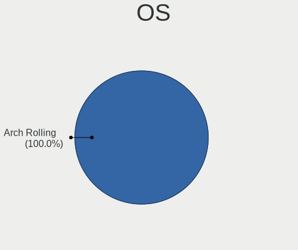
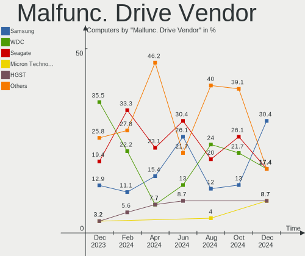
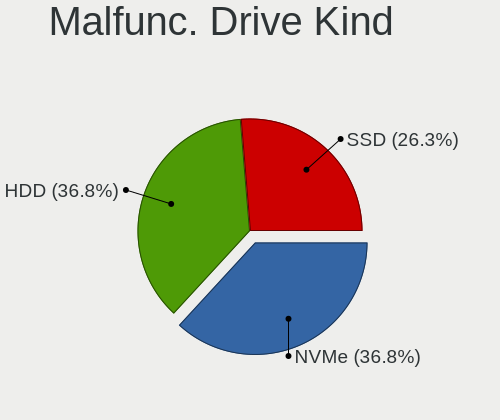

Arch Hardware Trends
--------------------

A project to identify most popular hardware characteristics and track their change
over time based on data collected by Arch users at https://Linux-Hardware.org.

Anyone can contribute to this report by the [hw-probe](https://github.com/linuxhw/hw-probe) tool:

    sudo -E hw-probe -all -upload

This is a report for all computer types. See also reports for [desktops](/Dist/Arch/Desktop/README.md) and [notebooks](/Dist/Arch/Notebook/README.md).

Full-feature report is available here: https://linux-hardware.org/?view=trends

Period: Oct, 2021.

Contents
--------

* [ System ](#system)
  - [ OS                       ](#os)
  - [ OS Family                ](#os-family)
  - [ Kernel                   ](#kernel)
  - [ Kernel Family            ](#kernel-family)
  - [ Kernel Major Ver.        ](#kernel-major-ver)
  - [ Arch                     ](#arch)
  - [ DE                       ](#de)
  - [ Display Server           ](#display-server)
  - [ Display Manager          ](#display-manager)
  - [ OS Lang                  ](#os-lang)
  - [ Boot Mode                ](#boot-mode)
  - [ Filesystem               ](#filesystem)
  - [ Part. scheme             ](#part-scheme)
  - [ Dual Boot with Linux/BSD ](#dual-boot-with-linuxbsd)
  - [ Dual Boot (Win)          ](#dual-boot-win)

* [ Board ](#board)
  - [ Vendor                   ](#vendor)
  - [ Model                    ](#model)
  - [ Model Family             ](#model-family)
  - [ MFG Year                 ](#mfg-year)
  - [ Form Factor              ](#form-factor)
  - [ Secure Boot              ](#secure-boot)
  - [ Coreboot                 ](#coreboot)
  - [ RAM Size                 ](#ram-size)
  - [ RAM Used                 ](#ram-used)
  - [ Total Drives             ](#total-drives)
  - [ Has CD-ROM               ](#has-cd-rom)
  - [ Has Ethernet             ](#has-ethernet)
  - [ Has WiFi                 ](#has-wifi)
  - [ Has Bluetooth            ](#has-bluetooth)

* [ Location ](#location)
  - [ Country                  ](#country)
  - [ City                     ](#city)

* [ Drives ](#drives)
  - [ Drive Vendor             ](#drive-vendor)
  - [ Drive Model              ](#drive-model)
  - [ HDD Vendor               ](#hdd-vendor)
  - [ SSD Vendor               ](#ssd-vendor)
  - [ Drive Kind               ](#drive-kind)
  - [ Drive Connector          ](#drive-connector)
  - [ Drive Size               ](#drive-size)
  - [ Space Total              ](#space-total)
  - [ Space Used               ](#space-used)
  - [ Malfunc. Drives          ](#malfunc-drives)
  - [ Malfunc. Drive Vendor    ](#malfunc-drive-vendor)
  - [ Malfunc. HDD Vendor      ](#malfunc-hdd-vendor)
  - [ Malfunc. Drive Kind      ](#malfunc-drive-kind)
  - [ Failed Drives            ](#failed-drives)
  - [ Failed Drive Vendor      ](#failed-drive-vendor)
  - [ Drive Status             ](#drive-status)

* [ Storage controller ](#storage-controller)
  - [ Storage Vendor           ](#storage-vendor)
  - [ Storage Model            ](#storage-model)
  - [ Storage Kind             ](#storage-kind)

* [ Processor ](#processor)
  - [ CPU Vendor               ](#cpu-vendor)
  - [ CPU Model                ](#cpu-model)
  - [ CPU Model Family         ](#cpu-model-family)
  - [ CPU Cores                ](#cpu-cores)
  - [ CPU Sockets              ](#cpu-sockets)
  - [ CPU Threads              ](#cpu-threads)
  - [ CPU Op-Modes             ](#cpu-op-modes)
  - [ CPU Microcode            ](#cpu-microcode)
  - [ CPU Microarch            ](#cpu-microarch)

* [ Graphics ](#graphics)
  - [ GPU Vendor               ](#gpu-vendor)
  - [ GPU Model                ](#gpu-model)
  - [ GPU Combo                ](#gpu-combo)
  - [ GPU Driver               ](#gpu-driver)
  - [ GPU Memory               ](#gpu-memory)

* [ Monitor ](#monitor)
  - [ Monitor Vendor           ](#monitor-vendor)
  - [ Monitor Model            ](#monitor-model)
  - [ Monitor Resolution       ](#monitor-resolution)
  - [ Monitor Diagonal         ](#monitor-diagonal)
  - [ Monitor Width            ](#monitor-width)
  - [ Aspect Ratio             ](#aspect-ratio)
  - [ Monitor Area             ](#monitor-area)
  - [ Pixel Density            ](#pixel-density)
  - [ Multiple Monitors        ](#multiple-monitors)

* [ Network ](#network)
  - [ Net Controller Vendor    ](#net-controller-vendor)
  - [ Net Controller Model     ](#net-controller-model)
  - [ Wireless Vendor          ](#wireless-vendor)
  - [ Wireless Model           ](#wireless-model)
  - [ Ethernet Vendor          ](#ethernet-vendor)
  - [ Ethernet Model           ](#ethernet-model)
  - [ Net Controller Kind      ](#net-controller-kind)
  - [ Used Controller          ](#used-controller)
  - [ NICs                     ](#nics)
  - [ IPv6                     ](#ipv6)

* [ Bluetooth ](#bluetooth)
  - [ Bluetooth Vendor         ](#bluetooth-vendor)
  - [ Bluetooth Model          ](#bluetooth-model)

* [ Sound ](#sound)
  - [ Sound Vendor             ](#sound-vendor)
  - [ Sound Model              ](#sound-model)

* [ Memory ](#memory)
  - [ Memory Vendor            ](#memory-vendor)
  - [ Memory Model             ](#memory-model)
  - [ Memory Kind              ](#memory-kind)
  - [ Memory Form Factor       ](#memory-form-factor)
  - [ Memory Size              ](#memory-size)
  - [ Memory Speed             ](#memory-speed)

* [ Printers & scanners ](#printers--scanners)
  - [ Printer Vendor           ](#printer-vendor)
  - [ Printer Model            ](#printer-model)
  - [ Scanner Vendor           ](#scanner-vendor)
  - [ Scanner Model            ](#scanner-model)

* [ Camera ](#camera)
  - [ Camera Vendor            ](#camera-vendor)
  - [ Camera Model             ](#camera-model)

* [ Security ](#security)
  - [ Fingerprint Vendor       ](#fingerprint-vendor)
  - [ Fingerprint Model        ](#fingerprint-model)
  - [ Chipcard Vendor          ](#chipcard-vendor)
  - [ Chipcard Model           ](#chipcard-model)

* [ Unsupported ](#unsupported)
  - [ Unsupported Devices      ](#unsupported-devices)
  - [ Unsupported Device Types ](#unsupported-device-types)

System
------

OS
--

Installed operating systems

| Name         | Computers | Percent |
|--------------|-----------|---------|
| Arch         | 78        | 60.94%  |
| Arch Rolling | 50        | 39.06%  |

OS Family
---------

OS without a version

| Name | Computers | Percent |
|------|-----------|---------|
| Arch | 128       | 100%    |

Kernel
------

Version of the Linux kernel

| Version                    | Computers | Percent |
|----------------------------|-----------|---------|
| 5.14.14-arch1-1            | 27        | 21.09%  |
| 5.14.8-arch1-1             | 20        | 15.63%  |
| 5.14.12-arch1-1            | 15        | 11.72%  |
| 5.14.9-arch2-1             | 10        | 7.81%   |
| 5.14.11-arch1-1            | 10        | 7.81%   |
| 5.14.8-zen1-1-zen          | 7         | 5.47%   |
| 5.14.9-zen2-1-zen          | 6         | 4.69%   |
| 5.10.75-1-lts              | 5         | 3.91%   |
| 5.14.14-zen1-1-zen         | 3         | 2.34%   |
| 5.10.72-1-lts              | 3         | 2.34%   |
| 5.14.13-arch1-1            | 2         | 1.56%   |
| 5.14.12-zen1-1-zen         | 2         | 1.56%   |
| 5.14.10-arch1-1            | 2         | 1.56%   |
| 5.15.0-rc4-1-mainline      | 1         | 0.78%   |
| 5.14.8-203-tkg-cacule-llvm | 1         | 0.78%   |
| 5.14.7-arch1-1             | 1         | 0.78%   |
| 5.14.6-arch1-1-surface     | 1         | 0.78%   |
| 5.14.6-arch1-1             | 1         | 0.78%   |
| 5.14.6-1-cacule            | 1         | 0.78%   |
| 5.14.5-arch1-1             | 1         | 0.78%   |
| 5.14.2-arch1-2             | 1         | 0.78%   |
| 5.14.14-gentoo-x86_64      | 1         | 0.78%   |
| 5.14.11-zen1-1-zen         | 1         | 0.78%   |
| 5.14.10-zen1-1-zen         | 1         | 0.78%   |
| 5.13.13-arch1-1            | 1         | 0.78%   |
| 5.13.12-arch1-1            | 1         | 0.78%   |
| 5.10.71-1-lts              | 1         | 0.78%   |
| 5.10.10-arch1-1            | 1         | 0.78%   |
| 5.10.1                     | 1         | 0.78%   |

Kernel Family
-------------

Linux kernel without a distro release

| Version | Computers | Percent |
|---------|-----------|---------|
| 5.14.14 | 31        | 24.22%  |
| 5.14.8  | 28        | 21.88%  |
| 5.14.12 | 17        | 13.28%  |
| 5.14.9  | 16        | 12.5%   |
| 5.14.11 | 11        | 8.59%   |
| 5.10.75 | 5         | 3.91%   |
| 5.14.6  | 3         | 2.34%   |
| 5.14.10 | 3         | 2.34%   |
| 5.10.72 | 3         | 2.34%   |
| 5.14.13 | 2         | 1.56%   |
| 5.15.0  | 1         | 0.78%   |
| 5.14.7  | 1         | 0.78%   |
| 5.14.5  | 1         | 0.78%   |
| 5.14.2  | 1         | 0.78%   |
| 5.13.13 | 1         | 0.78%   |
| 5.13.12 | 1         | 0.78%   |
| 5.10.71 | 1         | 0.78%   |
| 5.10.10 | 1         | 0.78%   |
| 5.10.1  | 1         | 0.78%   |

Kernel Major Ver.
-----------------

Linux kernel major version

| Version | Computers | Percent |
|---------|-----------|---------|
| 5.14    | 114       | 89.06%  |
| 5.10    | 11        | 8.59%   |
| 5.13    | 2         | 1.56%   |
| 5.15    | 1         | 0.78%   |

Arch
----

OS architecture (x86_64, i586, etc.)

| Name   | Computers | Percent |
|--------|-----------|---------|
| x86_64 | 128       | 100%    |

DE
--

Desktop Environment

| Name       | Computers | Percent |
|------------|-----------|---------|
| KDE5       | 49        | 38.28%  |
| GNOME      | 26        | 20.31%  |
| Unknown    | 17        | 13.28%  |
| XFCE       | 11        | 8.59%   |
| X-Cinnamon | 6         | 4.69%   |
| i3         | 6         | 4.69%   |
| xmonad     | 2         | 1.56%   |
| openbox    | 2         | 1.56%   |
| MATE       | 2         | 1.56%   |
| Cinnamon   | 2         | 1.56%   |
| sway       | 1         | 0.78%   |
| KDE        | 1         | 0.78%   |
| dwm        | 1         | 0.78%   |
| Budgie     | 1         | 0.78%   |
| bspwm      | 1         | 0.78%   |

Display Server
--------------

X11 or Wayland

| Name    | Computers | Percent |
|---------|-----------|---------|
| X11     | 81        | 63.28%  |
| Wayland | 20        | 15.63%  |
| Tty     | 15        | 11.72%  |
| Unknown | 12        | 9.38%   |

Display Manager
---------------

SDDM, LightDM, etc.

| Name    | Computers | Percent |
|---------|-----------|---------|
| Unknown | 48        | 37.5%   |
| SDDM    | 38        | 29.69%  |
| LightDM | 23        | 17.97%  |
| GDM     | 17        | 13.28%  |
| SLiM    | 1         | 0.78%   |
| LXDM    | 1         | 0.78%   |

OS Lang
-------

Language

| Lang        | Computers | Percent |
|-------------|-----------|---------|
| en_US       | 76        | 59.38%  |
| ru_RU       | 8         | 6.25%   |
| en_GB       | 7         | 5.47%   |
| fr_FR       | 5         | 3.91%   |
| en_IN       | 5         | 3.91%   |
| pt_BR       | 4         | 3.13%   |
| it_IT       | 3         | 2.34%   |
| Unknown     | 3         | 2.34%   |
| es_ES       | 2         | 1.56%   |
| de_DE       | 2         | 1.56%   |
| de_AT       | 2         | 1.56%   |
| C           | 2         | 1.56%   |
| zh_CN       | 1         | 0.78%   |
| unm_US      | 1         | 0.78%   |
| tr_TR       | 1         | 0.78%   |
| fi_FI       | 1         | 0.78%   |
| es_CO       | 1         | 0.78%   |
| en_SG       | 1         | 0.78%   |
| en_CA       | 1         | 0.78%   |
| en_AU       | 1         | 0.78%   |
| en-US-UTF-8 | 1         | 0.78%   |

Boot Mode
---------

EFI or BIOS

| Mode | Computers | Percent |
|------|-----------|---------|
| EFI  | 79        | 61.72%  |
| BIOS | 49        | 38.28%  |

Filesystem
----------

Type of filesystem

| Type    | Computers | Percent |
|---------|-----------|---------|
| Ext4    | 92        | 71.88%  |
| Btrfs   | 29        | 22.66%  |
| Xfs     | 3         | 2.34%   |
| Overlay | 2         | 1.56%   |
| F2fs    | 2         | 1.56%   |

Part. scheme
------------

Scheme of partitioning

| Type    | Computers | Percent |
|---------|-----------|---------|
| GPT     | 82        | 64.06%  |
| Unknown | 32        | 25%     |
| MBR     | 14        | 10.94%  |

Dual Boot with Linux/BSD
------------------------

Hosting more than one Linux/BSD

| Dual boot | Computers | Percent |
|-----------|-----------|---------|
| No        | 119       | 92.97%  |
| Yes       | 9         | 7.03%   |

Dual Boot (Win)
---------------

Hosting Linux and Windows

| Dual boot | Computers | Percent |
|-----------|-----------|---------|
| No        | 89        | 69.53%  |
| Yes       | 39        | 30.47%  |

Board
-----

Vendor
------

Motherboard manufacturer

| Name                | Computers | Percent |
|---------------------|-----------|---------|
| Lenovo              | 27        | 21.09%  |
| ASUSTek Computer    | 15        | 11.72%  |
| Hewlett-Packard     | 14        | 10.94%  |
| Gigabyte Technology | 14        | 10.94%  |
| Dell                | 14        | 10.94%  |
| Acer                | 9         | 7.03%   |
| MSI                 | 8         | 6.25%   |
| ASRock              | 8         | 6.25%   |
| Samsung Electronics | 2         | 1.56%   |
| TUXEDO              | 1         | 0.78%   |
| Toshiba             | 1         | 0.78%   |
| Pegatron            | 1         | 0.78%   |
| Notebook            | 1         | 0.78%   |
| Microsoft           | 1         | 0.78%   |
| Medion              | 1         | 0.78%   |
| Intel               | 1         | 0.78%   |
| Hyperbook           | 1         | 0.78%   |
| HUAWEI              | 1         | 0.78%   |
| Huanan              | 1         | 0.78%   |
| Google              | 1         | 0.78%   |
| Framework           | 1         | 0.78%   |
| ECS                 | 1         | 0.78%   |
| Biostar             | 1         | 0.78%   |
| AYADEVICE           | 1         | 0.78%   |
| Apple               | 1         | 0.78%   |
| Unknown             | 1         | 0.78%   |

Model
-----

Motherboard model

| Name                                       | Computers | Percent |
|--------------------------------------------|-----------|---------|
| MSI MS-7B86                                | 2         | 1.56%   |
| HP ENVY x360 Convertible 15-cp0xxx         | 2         | 1.56%   |
| Dell XPS 15 9500                           | 2         | 1.56%   |
| Dell G3 3500                               | 2         | 1.56%   |
| TUXEDO InfinityBook S 15 Gen6              | 1         | 0.78%   |
| Toshiba dynabook Satellite T772/W6TG       | 1         | 0.78%   |
| Samsung 950QDB                             | 1         | 0.78%   |
| Samsung 900X3C/900X3D/900X3E/900X4C/900X4D | 1         | 0.78%   |
| Pegatron FQ618AA-A2L a6734f                | 1         | 0.78%   |
| Notebook NP50DE_DB                         | 1         | 0.78%   |
| MSI MS-7C08                                | 1         | 0.78%   |
| MSI MS-7B18                                | 1         | 0.78%   |
| MSI MS-7A38                                | 1         | 0.78%   |
| MSI GP66 Leopard 11UG                      | 1         | 0.78%   |
| MSI GL73 8RD                               | 1         | 0.78%   |
| MSI GL65 9SEK                              | 1         | 0.78%   |
| Microsoft Surface Book 2                   | 1         | 0.78%   |
| Medion E3223                               | 1         | 0.78%   |
| Lenovo Yoga 310-11IAP 80U2                 | 1         | 0.78%   |
| Lenovo ThinkPad X395 20NL0007US            | 1         | 0.78%   |
| Lenovo ThinkPad X270 W10DG 20K5S35P00      | 1         | 0.78%   |
| Lenovo ThinkPad X230 2324FV6               | 1         | 0.78%   |
| Lenovo ThinkPad X230 23203BU               | 1         | 0.78%   |
| Lenovo ThinkPad X220 Tablet 4298A11        | 1         | 0.78%   |
| Lenovo ThinkPad X1 Carbon Gen 9 20XW003KUS | 1         | 0.78%   |
| Lenovo ThinkPad X1 Carbon 3rd 20BTS0A41U   | 1         | 0.78%   |
| Lenovo ThinkPad T490 20N2000KRT            | 1         | 0.78%   |
| Lenovo ThinkPad T490 20N20009PB            | 1         | 0.78%   |
| Lenovo ThinkPad T450s 20BWS2KM00           | 1         | 0.78%   |
| Lenovo ThinkPad T440s 20AQS00900           | 1         | 0.78%   |
| Lenovo ThinkPad T420 4236VHV               | 1         | 0.78%   |
| Lenovo ThinkPad T15 Gen 2i 20W4008LGE      | 1         | 0.78%   |
| Lenovo ThinkPad P14s Gen 1 20S4004LGE      | 1         | 0.78%   |
| Lenovo ThinkPad E595 20NF0002BM            | 1         | 0.78%   |
| Lenovo ThinkPad E585 20KVCTO1WW            | 1         | 0.78%   |
| Lenovo ThinkPad E480 20KN0069RT            | 1         | 0.78%   |
| Lenovo ThinkCentre M91p 4512A12            | 1         | 0.78%   |
| Lenovo ThinkCentre M910t-N080 10N9CTO1WW   | 1         | 0.78%   |
| Lenovo ThinkCentre M73 10B1A0KNIG          | 1         | 0.78%   |
| Lenovo ThinkBook 15 G2 ITL 20VE            | 1         | 0.78%   |
| Lenovo Legion 5 Pro 16ACH6H 82JQ           | 1         | 0.78%   |
| Lenovo IdeaPad S145-15IWL 81S9             | 1         | 0.78%   |
| Lenovo IdeaPad L340-15API 81LW             | 1         | 0.78%   |
| Lenovo IdeaPad Gaming 3 15IMH05 82CG       | 1         | 0.78%   |
| Lenovo IdeaPad Gaming 3 15ARH05 82EY       | 1         | 0.78%   |
| Intel H81                                  | 1         | 0.78%   |
| Hyperbook Z15 Zen                          | 1         | 0.78%   |
| HUAWEI KLVL-WXX9                           | 1         | 0.78%   |
| Huanan X79-8D VAA31                        | 1         | 0.78%   |
| HP ZHAN 66 Pro 15 G3                       | 1         | 0.78%   |
| HP Z440 Workstation                        | 1         | 0.78%   |
| HP ProBook 445 G7 Notebook PC              | 1         | 0.78%   |
| HP Pavilion x360 Convertible 14-cd0xxx     | 1         | 0.78%   |
| HP Pavilion Gaming Desktop TG01-2xxx       | 1         | 0.78%   |
| HP Pavilion Desktop TP01-1xxx              | 1         | 0.78%   |
| HP Laptop 15s-eq2xxx                       | 1         | 0.78%   |
| HP Laptop 15-bw0xx                         | 1         | 0.78%   |
| HP EliteBook 840 G6                        | 1         | 0.78%   |
| HP EliteBook 830 G5                        | 1         | 0.78%   |
| HP 255 G7 Notebook PC                      | 1         | 0.78%   |

Model Family
------------

Motherboard model prefix

| Name                   | Computers | Percent |
|------------------------|-----------|---------|
| Lenovo ThinkPad        | 17        | 13.28%  |
| Lenovo IdeaPad         | 4         | 3.13%   |
| Gigabyte X570          | 4         | 3.13%   |
| Dell XPS               | 4         | 3.13%   |
| Dell Latitude          | 4         | 3.13%   |
| ASUS TUF               | 4         | 3.13%   |
| ASUS ROG               | 4         | 3.13%   |
| Lenovo ThinkCentre     | 3         | 2.34%   |
| HP Pavilion            | 3         | 2.34%   |
| Dell G3                | 3         | 2.34%   |
| Acer Nitro             | 3         | 2.34%   |
| MSI MS-7B86            | 2         | 1.56%   |
| HP Laptop              | 2         | 1.56%   |
| HP ENVY                | 2         | 1.56%   |
| HP EliteBook           | 2         | 1.56%   |
| Acer Aspire            | 2         | 1.56%   |
| TUXEDO InfinityBook    | 1         | 0.78%   |
| Toshiba dynabook       | 1         | 0.78%   |
| Samsung 950QDB         | 1         | 0.78%   |
| Samsung 900X3C         | 1         | 0.78%   |
| Pegatron FQ618AA-A2L   | 1         | 0.78%   |
| Notebook NP50DE        | 1         | 0.78%   |
| MSI MS-7C08            | 1         | 0.78%   |
| MSI MS-7B18            | 1         | 0.78%   |
| MSI MS-7A38            | 1         | 0.78%   |
| MSI GP66               | 1         | 0.78%   |
| MSI GL73               | 1         | 0.78%   |
| MSI GL65               | 1         | 0.78%   |
| Microsoft Surface      | 1         | 0.78%   |
| Medion E3223           | 1         | 0.78%   |
| Lenovo Yoga            | 1         | 0.78%   |
| Lenovo ThinkBook       | 1         | 0.78%   |
| Lenovo Legion          | 1         | 0.78%   |
| Intel H81              | 1         | 0.78%   |
| Hyperbook Z15          | 1         | 0.78%   |
| HUAWEI KLVL-WXX9       | 1         | 0.78%   |
| Huanan X79-8D          | 1         | 0.78%   |
| HP ZHAN                | 1         | 0.78%   |
| HP Z440                | 1         | 0.78%   |
| HP ProBook             | 1         | 0.78%   |
| HP 255                 | 1         | 0.78%   |
| HP 15                  | 1         | 0.78%   |
| Google Delbin          | 1         | 0.78%   |
| Gigabyte X470          | 1         | 0.78%   |
| Gigabyte P31-ES3G      | 1         | 0.78%   |
| Gigabyte H61M-D2H-USB3 | 1         | 0.78%   |
| Gigabyte H57M-USB3     | 1         | 0.78%   |
| Gigabyte H370M-D3H     | 1         | 0.78%   |
| Gigabyte F2A88XM-D3H   | 1         | 0.78%   |
| Gigabyte B550M         | 1         | 0.78%   |
| Gigabyte B550          | 1         | 0.78%   |
| Gigabyte B450M         | 1         | 0.78%   |
| Gigabyte A520          | 1         | 0.78%   |
| Framework Laptop       | 1         | 0.78%   |
| ECS G41T-R3            | 1         | 0.78%   |
| Dell OptiPlex          | 1         | 0.78%   |
| Dell Inspiron          | 1         | 0.78%   |
| Dell G5                | 1         | 0.78%   |
| Biostar A770L3         | 1         | 0.78%   |
| AYADEVICE AYA          | 1         | 0.78%   |

MFG Year
--------

Motherboard manufacture year

| Year | Computers | Percent |
|------|-----------|---------|
| 2021 | 38        | 29.69%  |
| 2020 | 30        | 23.44%  |
| 2019 | 18        | 14.06%  |
| 2018 | 12        | 9.38%   |
| 2017 | 5         | 3.91%   |
| 2012 | 5         | 3.91%   |
| 2016 | 4         | 3.13%   |
| 2011 | 4         | 3.13%   |
| 2010 | 3         | 2.34%   |
| 2015 | 2         | 1.56%   |
| 2014 | 2         | 1.56%   |
| 2013 | 2         | 1.56%   |
| 2009 | 2         | 1.56%   |
| 2008 | 1         | 0.78%   |

Form Factor
-----------

Physical design of the computer

| Name        | Computers | Percent |
|-------------|-----------|---------|
| Notebook    | 68        | 53.13%  |
| Desktop     | 51        | 39.84%  |
| Convertible | 7         | 5.47%   |
| Tablet      | 2         | 1.56%   |

Secure Boot
-----------

Enabled or disabled

| State    | Computers | Percent |
|----------|-----------|---------|
| Disabled | 127       | 99.22%  |
| Enabled  | 1         | 0.78%   |

Coreboot
--------

Have coreboot on board

| Used | Computers | Percent |
|------|-----------|---------|
| No   | 126       | 98.44%  |
| Yes  | 2         | 1.56%   |

RAM Size
--------

Total RAM memory

| Size in GB  | Computers | Percent |
|-------------|-----------|---------|
| 16.01-24.0  | 41        | 32.03%  |
| 4.01-8.0    | 30        | 23.44%  |
| 8.01-16.0   | 22        | 17.19%  |
| 32.01-64.0  | 18        | 14.06%  |
| 3.01-4.0    | 8         | 6.25%   |
| 64.01-256.0 | 4         | 3.13%   |
| 24.01-32.0  | 3         | 2.34%   |
| 1.01-2.0    | 2         | 1.56%   |

RAM Used
--------

Used RAM memory

| Used GB    | Computers | Percent |
|------------|-----------|---------|
| 2.01-3.0   | 43        | 33.59%  |
| 4.01-8.0   | 28        | 21.88%  |
| 1.01-2.0   | 23        | 17.97%  |
| 3.01-4.0   | 18        | 14.06%  |
| 8.01-16.0  | 7         | 5.47%   |
| 16.01-24.0 | 3         | 2.34%   |
| 0.51-1.0   | 3         | 2.34%   |
| 0.01-0.5   | 2         | 1.56%   |
| 32.01-64.0 | 1         | 0.78%   |

Total Drives
------------

Number of drives on board

| Drives | Computers | Percent |
|--------|-----------|---------|
| 1      | 73        | 57.03%  |
| 2      | 28        | 21.88%  |
| 3      | 13        | 10.16%  |
| 5      | 6         | 4.69%   |
| 9      | 2         | 1.56%   |
| 6      | 2         | 1.56%   |
| 4      | 2         | 1.56%   |
| 8      | 1         | 0.78%   |
| 0      | 1         | 0.78%   |

Has CD-ROM
----------

Has CD-ROM on board

| Presented | Computers | Percent |
|-----------|-----------|---------|
| No        | 109       | 85.16%  |
| Yes       | 19        | 14.84%  |

Has Ethernet
------------

Has Ethernet on board

| Presented | Computers | Percent |
|-----------|-----------|---------|
| Yes       | 111       | 86.72%  |
| No        | 17        | 13.28%  |

Has WiFi
--------

Has WiFi module

| Presented | Computers | Percent |
|-----------|-----------|---------|
| Yes       | 104       | 81.25%  |
| No        | 24        | 18.75%  |

Has Bluetooth
-------------

Has Bluetooth module

| Presented | Computers | Percent |
|-----------|-----------|---------|
| Yes       | 95        | 74.22%  |
| No        | 33        | 25.78%  |

Location
--------

Country
-------

Geographic location (country)

| Country      | Computers | Percent |
|--------------|-----------|---------|
| USA          | 25        | 19.53%  |
| Russia       | 12        | 9.38%   |
| Germany      | 9         | 7.03%   |
| France       | 9         | 7.03%   |
| India        | 8         | 6.25%   |
| UK           | 7         | 5.47%   |
| China        | 7         | 5.47%   |
| Brazil       | 7         | 5.47%   |
| Ukraine      | 4         | 3.13%   |
| Poland       | 4         | 3.13%   |
| Spain        | 3         | 2.34%   |
| Italy        | 3         | 2.34%   |
| Austria      | 3         | 2.34%   |
| Japan        | 2         | 1.56%   |
| Iran         | 2         | 1.56%   |
| Finland      | 2         | 1.56%   |
| Australia    | 2         | 1.56%   |
| Turkey       | 1         | 0.78%   |
| Thailand     | 1         | 0.78%   |
| Taiwan       | 1         | 0.78%   |
| Switzerland  | 1         | 0.78%   |
| South Africa | 1         | 0.78%   |
| Puerto Rico  | 1         | 0.78%   |
| Philippines  | 1         | 0.78%   |
| Pakistan     | 1         | 0.78%   |
| Netherlands  | 1         | 0.78%   |
| Mexico       | 1         | 0.78%   |
| Malaysia     | 1         | 0.78%   |
| Greece       | 1         | 0.78%   |
| Estonia      | 1         | 0.78%   |
| Cyprus       | 1         | 0.78%   |
| Colombia     | 1         | 0.78%   |
| Canada       | 1         | 0.78%   |
| Belarus      | 1         | 0.78%   |
| Argentina    | 1         | 0.78%   |
| Algeria      | 1         | 0.78%   |

City
----

Geographic location (city)

| City                | Computers | Percent |
|---------------------|-----------|---------|
| St Petersburg       | 5         | 3.91%   |
| Paris               | 3         | 2.34%   |
| Xining              | 2         | 1.56%   |
| Vienna              | 2         | 1.56%   |
| Valencia            | 2         | 1.56%   |
| Vadodara            | 2         | 1.56%   |
| Tokyo               | 2         | 1.56%   |
| Seattle             | 2         | 1.56%   |
| Plymouth            | 2         | 1.56%   |
| Neyveli             | 2         | 1.56%   |
| Moscow              | 2         | 1.56%   |
| Guangzhou           | 2         | 1.56%   |
| Beijing             | 2         | 1.56%   |
| Zvenigorod          | 1         | 0.78%   |
| Wroclaw             | 1         | 0.78%   |
| Wola Czolnowska     | 1         | 0.78%   |
| Warsaw              | 1         | 0.78%   |
| Voronezh            | 1         | 0.78%   |
| Visakhapatnam       | 1         | 0.78%   |
| Villejust           | 1         | 0.78%   |
| Uyemskiy            | 1         | 0.78%   |
| Ulm                 | 1         | 0.78%   |
| Uberl??ndia         | 1         | 0.78%   |
| Troy                | 1         | 0.78%   |
| Trivandrum          | 1         | 0.78%   |
| Tehran              | 1         | 0.78%   |
| Tallinn             | 1         | 0.78%   |
| Taichung            | 1         | 0.78%   |
| Stevenage           | 1         | 0.78%   |
| Snohomish           | 1         | 0.78%   |
| Shahrak-e K?«l?«r?« | 1         | 0.78%   |
| Schenectady         | 1         | 0.78%   |
| San Juan            | 1         | 0.78%   |
| San Gil             | 1         | 0.78%   |
| Salo                | 1         | 0.78%   |
| Rivne               | 1         | 0.78%   |
| Reutlingen          | 1         | 0.78%   |
| Regensburg          | 1         | 0.78%   |
| Rayong              | 1         | 0.78%   |
| Rawalpindi          | 1         | 0.78%   |
| Pesaro              | 1         | 0.78%   |
| Perm                | 1         | 0.78%   |
| Oulu                | 1         | 0.78%   |
| Orlando             | 1         | 0.78%   |
| Oftringen           | 1         | 0.78%   |
| Novocherkassk       | 1         | 0.78%   |
| Northampton         | 1         | 0.78%   |
| Nicosia             | 1         | 0.78%   |
| New York            | 1         | 0.78%   |
| Natural Bridge      | 1         | 0.78%   |
| Narberth            | 1         | 0.78%   |
| Nantes              | 1         | 0.78%   |
| Minsk               | 1         | 0.78%   |
| Milan               | 1         | 0.78%   |
| Maring??            | 1         | 0.78%   |
| Manajao             | 1         | 0.78%   |
| Madrid              | 1         | 0.78%   |
| Luhansk             | 1         | 0.78%   |
| Ludwigsburg         | 1         | 0.78%   |
| Lublin              | 1         | 0.78%   |

Drives
------

Drive Vendor
------------

Hard drive vendors

| Vendor                | Computers | Drives | Percent |
|-----------------------|-----------|--------|---------|
| WDC                   | 39        | 46     | 19.12%  |
| Seagate               | 32        | 37     | 15.69%  |
| Samsung Electronics   | 31        | 40     | 15.2%   |
| SK Hynix              | 14        | 15     | 6.86%   |
| Crucial               | 13        | 18     | 6.37%   |
| Toshiba               | 9         | 9      | 4.41%   |
| Kingston              | 9         | 9      | 4.41%   |
| Sandisk               | 8         | 8      | 3.92%   |
| Intel                 | 6         | 7      | 2.94%   |
| A-DATA Technology     | 6         | 6      | 2.94%   |
| Hewlett-Packard       | 4         | 4      | 1.96%   |
| Unknown               | 3         | 3      | 1.47%   |
| XPG                   | 2         | 2      | 0.98%   |
| Silicon Motion        | 2         | 2      | 0.98%   |
| Realtek Semiconductor | 2         | 3      | 0.98%   |
| Phison                | 2         | 2      | 0.98%   |
| OCZ                   | 2         | 2      | 0.98%   |
| Micron Technology     | 2         | 2      | 0.98%   |
| KIOXIA                | 2         | 2      | 0.98%   |
| HGST                  | 2         | 2      | 0.98%   |
| Team                  | 1         | 1      | 0.49%   |
| SSSTC                 | 1         | 1      | 0.49%   |
| OWC                   | 1         | 2      | 0.49%   |
| LITEONIT              | 1         | 1      | 0.49%   |
| Lite-On               | 1         | 1      | 0.49%   |
| INNOVATION IT         | 1         | 1      | 0.49%   |
| Hitachi               | 1         | 1      | 0.49%   |
| H/W                   | 1         | 1      | 0.49%   |
| goreche               | 1         | 1      | 0.49%   |
| CORSAIR               | 1         | 1      | 0.49%   |
| China                 | 1         | 1      | 0.49%   |
| BAITITON              | 1         | 1      | 0.49%   |
| ADATA Technology      | 1         | 1      | 0.49%   |
| Unknown               | 1         | 1      | 0.49%   |

Drive Model
-----------

Hard drive models

| Model                                  | Computers | Percent |
|----------------------------------------|-----------|---------|
| Crucial CT500MX500SSD1 500GB           | 4         | 1.78%   |
| Seagate ST1000LM035-1RK172 1TB         | 3         | 1.33%   |
| Seagate ST1000LM024 HN-M101MBB 1TB     | 3         | 1.33%   |
| Sandisk NVMe SSD Drive 512GB           | 3         | 1.33%   |
| Samsung SSD 860 EVO 1TB                | 3         | 1.33%   |
| Samsung SM963 2.5" NVMe PCIe SSD 250GB | 3         | 1.33%   |
| WDC WDS200T2G0A-00JH30 2TB SSD         | 2         | 0.89%   |
| WDC WD10SPZX-24Z10 1TB                 | 2         | 0.89%   |
| WDC WD10JPCX-24UE4T0 1TB               | 2         | 0.89%   |
| WDC WD10EZEX-00WN4A0 1TB               | 2         | 0.89%   |
| WDC PC SN520 SDAPNUW-256G-1006 256GB   | 2         | 0.89%   |
| SK Hynix NVMe SSD Drive 256GB          | 2         | 0.89%   |
| SK Hynix NVMe SSD Drive 128GB          | 2         | 0.89%   |
| Seagate ST2000DM006-2DM164 2TB         | 2         | 0.89%   |
| Seagate ST2000DM001-1ER164 2TB         | 2         | 0.89%   |
| Seagate ST1000LM049-2GH172 1TB         | 2         | 0.89%   |
| Seagate ST1000LM048-2E7172 1TB         | 2         | 0.89%   |
| Seagate Expansion 1TB                  | 2         | 0.89%   |
| Samsung SSD 980 PRO 2TB                | 2         | 0.89%   |
| Samsung SSD 980 1TB                    | 2         | 0.89%   |
| Samsung SSD 840 PRO Series 256GB       | 2         | 0.89%   |
| Samsung NVMe SSD Drive 500GB           | 2         | 0.89%   |
| Samsung NVMe SSD Drive 1TB             | 2         | 0.89%   |
| Realtek NVMe SSD Drive 512GB           | 2         | 0.89%   |
| OCZ VERTEX4 256GB SSD                  | 2         | 0.89%   |
| Intel NVMe SSD Drive 512GB             | 2         | 0.89%   |
| HP SSD EX900 1TB                       | 2         | 0.89%   |
| Crucial CT500P1SSD8 500GB              | 2         | 0.89%   |
| Crucial CT240BX500SSD1 240GB           | 2         | 0.89%   |
| Crucial CT1000MX500SSD1 1TB            | 2         | 0.89%   |
| A-DATA SU630 240GB SSD                 | 2         | 0.89%   |
| XPG NVMe SSD Drive 512GB               | 1         | 0.44%   |
| XPG NVMe SSD Drive 1024GB              | 1         | 0.44%   |
| WDC WDS500G3X0C-00SJG0 500GB           | 1         | 0.44%   |
| WDC WDS500G2B0A-00SM50 500GB SSD       | 1         | 0.44%   |
| WDC WDS480G2G0A-00JH30 480GB SSD       | 1         | 0.44%   |
| WDC WDS240G2G0A-00JH30 240GB SSD       | 1         | 0.44%   |
| WDC WDS120G1G0A-00SS50 120GB SSD       | 1         | 0.44%   |
| WDC WDS100T3XHC-00SJG0 1TB             | 1         | 0.44%   |
| WDC WDS100T3X0C-00SJG0 1TB             | 1         | 0.44%   |
| WDC WDS100T2B0C-00PXH0 1TB             | 1         | 0.44%   |
| WDC WD60EZAZ-00SF3B0 6TB               | 1         | 0.44%   |
| WDC WD5003ABYZ-011FA0 500GB            | 1         | 0.44%   |
| WDC WD5000AAKX-001CA0 500GB            | 1         | 0.44%   |
| WDC WD40EFRX-68N32N0 4TB               | 1         | 0.44%   |
| WDC WD2500YS-18SHB2 250GB              | 1         | 0.44%   |
| WDC WD2500AAJS-40VWA1 250GB            | 1         | 0.44%   |
| WDC WD20EZAZ-00GGJB0 2TB               | 1         | 0.44%   |
| WDC WD20EARS-00MVWB0 2TB               | 1         | 0.44%   |
| WDC WD20EARS-00M                       | 1         | 0.44%   |
| WDC WD2002FAEX-007BA0 2TB              | 1         | 0.44%   |
| WDC WD1600BEVT-22ZCT0 160GB            | 1         | 0.44%   |
| WDC WD10SPZX-21Z10T0 1TB               | 1         | 0.44%   |
| WDC WD10SPZX-08Z10 1TB                 | 1         | 0.44%   |
| WDC WD10JPVX-60JC3T1 1TB               | 1         | 0.44%   |
| WDC WD10EZRX-00L4HB0 1TB               | 1         | 0.44%   |
| WDC WD10EZEX-75WN4A0 1TB               | 1         | 0.44%   |
| WDC WD10EZEX-08WN4A0 1TB               | 1         | 0.44%   |
| WDC WD10EZEX-00RKKA0 1TB               | 1         | 0.44%   |
| WDC WD10EZEX-00BN5A0 1TB               | 1         | 0.44%   |

HDD Vendor
----------

Hard disk drive vendors

| Vendor              | Computers | Drives | Percent |
|---------------------|-----------|--------|---------|
| Seagate             | 31        | 35     | 48.44%  |
| WDC                 | 22        | 27     | 34.38%  |
| Toshiba             | 5         | 5      | 7.81%   |
| Samsung Electronics | 2         | 2      | 3.13%   |
| HGST                | 2         | 2      | 3.13%   |
| Hitachi             | 1         | 1      | 1.56%   |
| H/W                 | 1         | 1      | 1.56%   |

SSD Vendor
----------

Solid state drive vendors

| Vendor              | Computers | Drives | Percent |
|---------------------|-----------|--------|---------|
| Samsung Electronics | 16        | 17     | 25.81%  |
| Crucial             | 11        | 14     | 17.74%  |
| WDC                 | 6         | 7      | 9.68%   |
| Kingston            | 5         | 5      | 8.06%   |
| SanDisk             | 4         | 4      | 6.45%   |
| A-DATA Technology   | 3         | 3      | 4.84%   |
| SK Hynix            | 2         | 2      | 3.23%   |
| OCZ                 | 2         | 2      | 3.23%   |
| Hewlett-Packard     | 2         | 2      | 3.23%   |
| Toshiba             | 1         | 1      | 1.61%   |
| Seagate             | 1         | 1      | 1.61%   |
| Phison              | 1         | 1      | 1.61%   |
| OWC                 | 1         | 2      | 1.61%   |
| Micron Technology   | 1         | 1      | 1.61%   |
| LITEONIT            | 1         | 1      | 1.61%   |
| INNOVATION IT       | 1         | 1      | 1.61%   |
| CORSAIR             | 1         | 1      | 1.61%   |
| China               | 1         | 1      | 1.61%   |
| BAITITON            | 1         | 1      | 1.61%   |
| Unknown             | 1         | 1      | 1.61%   |

Drive Kind
----------

HDD or SSD

| Kind    | Computers | Drives | Percent |
|---------|-----------|--------|---------|
| NVMe    | 74        | 88     | 39.78%  |
| HDD     | 54        | 73     | 29.03%  |
| SSD     | 53        | 68     | 28.49%  |
| Unknown | 3         | 3      | 1.61%   |
| MMC     | 2         | 2      | 1.08%   |

Drive Connector
---------------

SATA, SAS, NVMe, etc.

| Type | Computers | Drives | Percent |
|------|-----------|--------|---------|
| SATA | 83        | 137    | 50%     |
| NVMe | 74        | 88     | 44.58%  |
| SAS  | 7         | 7      | 4.22%   |
| MMC  | 2         | 2      | 1.2%    |

Drive Size
----------

Size of hard drive

| Size in TB | Computers | Drives | Percent |
|------------|-----------|--------|---------|
| 0.01-0.5   | 48        | 59     | 41.38%  |
| 0.51-1.0   | 44        | 50     | 37.93%  |
| 1.01-2.0   | 17        | 23     | 14.66%  |
| 3.01-4.0   | 3         | 4      | 2.59%   |
| 10.01-20.0 | 2         | 3      | 1.72%   |
| 4.01-10.0  | 2         | 2      | 1.72%   |

Space Total
-----------

Amount of disk space available on the file system

| Size in GB     | Computers | Percent |
|----------------|-----------|---------|
| 101-250        | 30        | 23.44%  |
| 1001-2000      | 26        | 20.31%  |
| 501-1000       | 25        | 19.53%  |
| 251-500        | 23        | 17.97%  |
| More than 3000 | 9         | 7.03%   |
| 2001-3000      | 7         | 5.47%   |
| Unknown        | 4         | 3.13%   |
| 1-20           | 2         | 1.56%   |
| 21-50          | 1         | 0.78%   |
| 51-100         | 1         | 0.78%   |

Space Used
----------

Amount of used disk space

| Used GB        | Computers | Percent |
|----------------|-----------|---------|
| 101-250        | 29        | 22.66%  |
| 21-50          | 26        | 20.31%  |
| 1-20           | 18        | 14.06%  |
| 501-1000       | 15        | 11.72%  |
| 51-100         | 12        | 9.38%   |
| 251-500        | 11        | 8.59%   |
| 1001-2000      | 9         | 7.03%   |
| Unknown        | 4         | 3.13%   |
| More than 3000 | 3         | 2.34%   |
| 2001-3000      | 1         | 0.78%   |

Malfunc. Drives
---------------

Drive models with a malfunction

| Model                                          | Computers | Drives | Percent |
|------------------------------------------------|-----------|--------|---------|
| Seagate ST1000LM024 HN-M101MBB 1TB             | 2         | 2      | 10%     |
| OCZ VERTEX4 256GB SSD                          | 2         | 2      | 10%     |
| Hewlett-Packard SSD EX900 1TB                  | 2         | 2      | 10%     |
| WDC WD5003ABYZ-011FA0 500GB                    | 1         | 1      | 5%      |
| WDC WD5000AAKX-001CA0 500GB                    | 1         | 1      | 5%      |
| WDC WD10EZEX-00WN4A0 1TB                       | 1         | 1      | 5%      |
| Seagate ST500DM002-1BD142 500GB                | 1         | 1      | 5%      |
| Seagate ST2000DL001-9VT156 2TB                 | 1         | 1      | 5%      |
| Seagate ST1000LX015-1U7172-SSHD 1TB            | 1         | 1      | 5%      |
| Seagate ST1000LX015-1U7172 1TB                 | 1         | 1      | 5%      |
| Seagate ST1000LM035-1RK172 1TB                 | 1         | 1      | 5%      |
| SanDisk SSD PLUS 1000GB                        | 1         | 1      | 5%      |
| Samsung Electronics HD502HI 500GB              | 1         | 1      | 5%      |
| Kingston SNS4151S316G 16GB SSD                 | 1         | 1      | 5%      |
| INNOVATION IT IT 512GB                         | 1         | 1      | 5%      |
| Hitachi HUA721010KLA330 44X2459 42C0424IBM 1TB | 1         | 1      | 5%      |
| BAITITON BT58SSD09S 240GB                      | 1         | 1      | 5%      |

Malfunc. Drive Vendor
---------------------

Vendors of faulty drives

| Vendor              | Computers | Drives | Percent |
|---------------------|-----------|--------|---------|
| Seagate             | 7         | 7      | 35%     |
| WDC                 | 3         | 3      | 15%     |
| OCZ                 | 2         | 2      | 10%     |
| Hewlett-Packard     | 2         | 2      | 10%     |
| SanDisk             | 1         | 1      | 5%      |
| Samsung Electronics | 1         | 1      | 5%      |
| Kingston            | 1         | 1      | 5%      |
| INNOVATION IT       | 1         | 1      | 5%      |
| Hitachi             | 1         | 1      | 5%      |
| BAITITON            | 1         | 1      | 5%      |

Malfunc. HDD Vendor
-------------------

Vendors of faulty HDD drives

| Vendor              | Computers | Drives | Percent |
|---------------------|-----------|--------|---------|
| Seagate             | 7         | 7      | 58.33%  |
| WDC                 | 3         | 3      | 25%     |
| Samsung Electronics | 1         | 1      | 8.33%   |
| Hitachi             | 1         | 1      | 8.33%   |

Malfunc. Drive Kind
-------------------

Kinds of faulty drives

| Kind | Computers | Drives | Percent |
|------|-----------|--------|---------|
| HDD  | 11        | 12     | 57.89%  |
| SSD  | 6         | 6      | 31.58%  |
| NVMe | 2         | 2      | 10.53%  |

Failed Drives
-------------

Failed drive models

Zero info for selected period =(

Failed Drive Vendor
-------------------

Failed drive vendors

Zero info for selected period =(

Drive Status
------------

Number of failed and malfunc. drives

| Status   | Computers | Drives | Percent |
|----------|-----------|--------|---------|
| Works    | 78        | 117    | 54.93%  |
| Detected | 47        | 97     | 33.1%   |
| Malfunc  | 17        | 20     | 11.97%  |

Storage controller
------------------

Storage Vendor
--------------

Storage controller vendors

| Vendor                         | Computers | Percent |
|--------------------------------|-----------|---------|
| Intel                          | 65        | 35.33%  |
| AMD                            | 41        | 22.28%  |
| Sandisk                        | 16        | 8.7%    |
| Samsung Electronics            | 16        | 8.7%    |
| SK Hynix                       | 12        | 6.52%   |
| Silicon Motion                 | 4         | 2.17%   |
| Micron/Crucial Technology      | 4         | 2.17%   |
| Kingston Technology Company    | 4         | 2.17%   |
| ADATA Technology               | 4         | 2.17%   |
| Toshiba America Info Systems   | 3         | 1.63%   |
| Realtek Semiconductor          | 3         | 1.63%   |
| KIOXIA                         | 2         | 1.09%   |
| JMicron Technology             | 2         | 1.09%   |
| Adaptec                        | 2         | 1.09%   |
| Solid State Storage Technology | 1         | 0.54%   |
| Phison Electronics             | 1         | 0.54%   |
| Micron Technology              | 1         | 0.54%   |
| Marvell Technology Group       | 1         | 0.54%   |
| Lite-On Technology             | 1         | 0.54%   |
| ASMedia Technology             | 1         | 0.54%   |

Storage Model
-------------

Storage controller models

| Model                                                                            | Computers | Percent |
|----------------------------------------------------------------------------------|-----------|---------|
| AMD FCH SATA Controller [AHCI mode]                                              | 30        | 14.85%  |
| Samsung NVMe SSD Controller SM981/PM981/PM983                                    | 9         | 4.46%   |
| AMD 400 Series Chipset SATA Controller                                           | 9         | 4.46%   |
| Sandisk WD Black SN750 / PC SN730 NVMe SSD                                       | 7         | 3.47%   |
| AMD Starship/Matisse Chipset SATA Controller [AHCI mode]                         | 6         | 2.97%   |
| SK Hynix Gold P31 SSD                                                            | 5         | 2.48%   |
| Intel 7 Series Chipset Family 6-port SATA Controller [AHCI mode]                 | 5         | 2.48%   |
| SK Hynix BC501 NVMe Solid State Drive                                            | 4         | 1.98%   |
| Sandisk WD Blue SN550 NVMe SSD                                                   | 4         | 1.98%   |
| Samsung NVMe SSD Controller 980                                                  | 4         | 1.98%   |
| Intel SATA Controller [RAID mode]                                                | 4         | 1.98%   |
| Intel Cannon Lake PCH SATA AHCI Controller                                       | 4         | 1.98%   |
| Silicon Motion SM2263EN/SM2263XT SSD Controller                                  | 3         | 1.49%   |
| Micron/Crucial P1 NVMe PCIe SSD                                                  | 3         | 1.49%   |
| Intel Wildcat Point-LP SATA Controller [AHCI Mode]                               | 3         | 1.49%   |
| Intel Sunrise Point-LP SATA Controller [AHCI mode]                               | 3         | 1.49%   |
| Intel NM10/ICH7 Family SATA Controller [IDE mode]                                | 3         | 1.49%   |
| Intel 82801 Mobile SATA Controller [RAID mode]                                   | 3         | 1.49%   |
| Intel 8 Series SATA Controller 1 [AHCI mode]                                     | 3         | 1.49%   |
| Intel 6 Series/C200 Series Chipset Family 6 port Mobile SATA AHCI Controller     | 3         | 1.49%   |
| Intel 400 Series Chipset Family SATA AHCI Controller                             | 3         | 1.49%   |
| Intel 200 Series PCH SATA controller [AHCI mode]                                 | 3         | 1.49%   |
| ADATA XPG SX8200 Pro PCIe Gen3x4 M.2 2280 Solid State Drive                      | 3         | 1.49%   |
| Sandisk WD Blue SN500 / PC SN520 NVMe SSD                                        | 2         | 0.99%   |
| Sandisk WD Black 2018/SN750 / PC SN720 NVMe SSD                                  | 2         | 0.99%   |
| Samsung NVMe SSD Controller SM961/PM961/SM963                                    | 2         | 0.99%   |
| Samsung NVMe SSD Controller PM9A1/PM9A3/980PRO                                   | 2         | 0.99%   |
| Realtek Realtek Non-Volatile memory controller                                   | 2         | 0.99%   |
| KIOXIA Non-Volatile memory controller                                            | 2         | 0.99%   |
| Intel SSD 660P Series                                                            | 2         | 0.99%   |
| Intel Comet Lake PCH-H RAID                                                      | 2         | 0.99%   |
| Intel Cannon Point-LP SATA Controller [AHCI Mode]                                | 2         | 0.99%   |
| Intel Cannon Lake Mobile PCH SATA AHCI Controller                                | 2         | 0.99%   |
| Intel 82801G (ICH7 Family) IDE Controller                                        | 2         | 0.99%   |
| Intel 8 Series/C220 Series Chipset Family 6-port SATA Controller 1 [AHCI mode]   | 2         | 0.99%   |
| AMD 300 Series Chipset SATA Controller                                           | 2         | 0.99%   |
| Adaptec AAC-RAID                                                                 | 2         | 0.99%   |
| Toshiba America Info Systems XG6 NVMe SSD Controller                             | 1         | 0.5%    |
| Toshiba America Info Systems Toshiba America Info Non-Volatile memory controller | 1         | 0.5%    |
| Toshiba America Info Systems BG3 NVMe SSD Controller                             | 1         | 0.5%    |
| Solid State Storage Non-Volatile memory controller                               | 1         | 0.5%    |
| SK Hynix PC401 NVMe Solid State Drive 256GB                                      | 1         | 0.5%    |
| SK Hynix Non-Volatile memory controller                                          | 1         | 0.5%    |
| SK Hynix BC511                                                                   | 1         | 0.5%    |
| Silicon Motion SM2262/SM2262EN SSD Controller                                    | 1         | 0.5%    |
| Sandisk Non-Volatile memory controller                                           | 1         | 0.5%    |
| Realtek RTS5763DL NVMe SSD Controller                                            | 1         | 0.5%    |
| Phison E12 NVMe Controller                                                       | 1         | 0.5%    |
| Micron/Crucial P2 NVMe PCIe SSD                                                  | 1         | 0.5%    |
| Micron Non-Volatile memory controller                                            | 1         | 0.5%    |
| Marvell Group 88SE9230 PCIe 2.0 x2 4-port SATA 6 Gb/s RAID Controller            | 1         | 0.5%    |
| Marvell Group 88SE9182 PCIe 2.0 x2 2-port SATA 6 Gb/s Controller                 | 1         | 0.5%    |
| Lite-On Non-Volatile memory controller                                           | 1         | 0.5%    |
| Kingston Company U-SNS8154P3 NVMe SSD                                            | 1         | 0.5%    |
| Kingston Company Company Non-Volatile memory controller                          | 1         | 0.5%    |
| Kingston Company OM3PDP3 NVMe SSD                                                | 1         | 0.5%    |
| Kingston Company A2000 NVMe SSD                                                  | 1         | 0.5%    |
| JMicron JMB363 SATA/IDE Controller                                               | 1         | 0.5%    |
| JMicron JMB361 AHCI/IDE                                                          | 1         | 0.5%    |
| Intel Volume Management Device NVMe RAID Controller                              | 1         | 0.5%    |

Storage Kind
------------

Kind of storage controller (IDE, SATA, NVMe, SAS, ...)

| Kind | Computers | Percent |
|------|-----------|---------|
| SATA | 88        | 48.09%  |
| NVMe | 74        | 40.44%  |
| RAID | 13        | 7.1%    |
| IDE  | 8         | 4.37%   |

Processor
---------

CPU Vendor
----------

Processor vendors

| Vendor | Computers | Percent |
|--------|-----------|---------|
| Intel  | 81        | 63.28%  |
| AMD    | 47        | 36.72%  |

CPU Model
---------

Processor models

| Model                                         | Computers | Percent |
|-----------------------------------------------|-----------|---------|
| AMD Ryzen 9 3900X 12-Core Processor           | 4         | 3.13%   |
| Intel Core i7-8565U CPU @ 1.80GHz             | 3         | 2.34%   |
| Intel Core i7-10750H CPU @ 2.60GHz            | 3         | 2.34%   |
| Intel Core i5-10300H CPU @ 2.50GHz            | 3         | 2.34%   |
| Intel 11th Gen Core i7-1165G7 @ 2.80GHz       | 3         | 2.34%   |
| Intel 11th Gen Core i5-1135G7 @ 2.40GHz       | 3         | 2.34%   |
| AMD Ryzen 7 4800H with Radeon Graphics        | 3         | 2.34%   |
| AMD Ryzen 7 3700X 8-Core Processor            | 3         | 2.34%   |
| AMD Ryzen 5 4500U with Radeon Graphics        | 3         | 2.34%   |
| AMD Ryzen 5 3600 6-Core Processor             | 3         | 2.34%   |
| Intel Core i7-8750H CPU @ 2.20GHz             | 2         | 1.56%   |
| Intel Core i7-5600U CPU @ 2.60GHz             | 2         | 1.56%   |
| Intel Core i7-10510U CPU @ 1.80GHz            | 2         | 1.56%   |
| Intel Core i5-8300H CPU @ 2.30GHz             | 2         | 1.56%   |
| Intel Core i5-8265U CPU @ 1.60GHz             | 2         | 1.56%   |
| Intel Core i5-8250U CPU @ 1.60GHz             | 2         | 1.56%   |
| Intel Core i5-3320M CPU @ 2.60GHz             | 2         | 1.56%   |
| Intel Core i5-2520M CPU @ 2.50GHz             | 2         | 1.56%   |
| Intel 11th Gen Core i7-1185G7 @ 3.00GHz       | 2         | 1.56%   |
| AMD Ryzen 7 5800H with Radeon Graphics        | 2         | 1.56%   |
| AMD Ryzen 7 2700U with Radeon Vega Mobile Gfx | 2         | 1.56%   |
| AMD Ryzen 5 5600X 6-Core Processor            | 2         | 1.56%   |
| Intel Xeon CPU X5690 @ 3.47GHz                | 1         | 0.78%   |
| Intel Xeon CPU X3450 @ 2.67GHz                | 1         | 0.78%   |
| Intel Xeon CPU E5-2695 v2 @ 2.40GHz           | 1         | 0.78%   |
| Intel Xeon CPU E5-1650 v3 @ 3.50GHz           | 1         | 0.78%   |
| Intel Pentium Silver N5030 CPU @ 1.10GHz      | 1         | 0.78%   |
| Intel Pentium Dual-Core CPU T4200 @ 2.00GHz   | 1         | 0.78%   |
| Intel Pentium CPU N4200 @ 1.10GHz             | 1         | 0.78%   |
| Intel Pentium CPU G860 @ 3.00GHz              | 1         | 0.78%   |
| Intel Core i9-9900K CPU @ 3.60GHz             | 1         | 0.78%   |
| Intel Core i9-10900KF CPU @ 3.70GHz           | 1         | 0.78%   |
| Intel Core i9-10885H CPU @ 2.40GHz            | 1         | 0.78%   |
| Intel Core i7-9750H CPU @ 2.60GHz             | 1         | 0.78%   |
| Intel Core i7-8700K CPU @ 3.70GHz             | 1         | 0.78%   |
| Intel Core i7-8700 CPU @ 3.20GHz              | 1         | 0.78%   |
| Intel Core i7-8665U CPU @ 1.90GHz             | 1         | 0.78%   |
| Intel Core i7-8650U CPU @ 1.90GHz             | 1         | 0.78%   |
| Intel Core i7-7700 CPU @ 3.60GHz              | 1         | 0.78%   |
| Intel Core i7-4790K CPU @ 4.00GHz             | 1         | 0.78%   |
| Intel Core i7-4510U CPU @ 2.00GHz             | 1         | 0.78%   |
| Intel Core i7-3630QM CPU @ 2.40GHz            | 1         | 0.78%   |
| Intel Core i7-3610QM CPU @ 2.30GHz            | 1         | 0.78%   |
| Intel Core i7-2670QM CPU @ 2.20GHz            | 1         | 0.78%   |
| Intel Core i7-10700 CPU @ 2.90GHz             | 1         | 0.78%   |
| Intel Core i7-1065G7 CPU @ 1.30GHz            | 1         | 0.78%   |
| Intel Core i5-9600K CPU @ 3.70GHz             | 1         | 0.78%   |
| Intel Core i5-9400F CPU @ 2.90GHz             | 1         | 0.78%   |
| Intel Core i5-8400 CPU @ 2.80GHz              | 1         | 0.78%   |
| Intel Core i5-8350U CPU @ 1.70GHz             | 1         | 0.78%   |
| Intel Core i5-7600K CPU @ 3.80GHz             | 1         | 0.78%   |
| Intel Core i5-7600 CPU @ 3.50GHz              | 1         | 0.78%   |
| Intel Core i5-6440HQ CPU @ 2.60GHz            | 1         | 0.78%   |
| Intel Core i5-6300U CPU @ 2.40GHz             | 1         | 0.78%   |
| Intel Core i5-5300U CPU @ 2.30GHz             | 1         | 0.78%   |
| Intel Core i5-4440 CPU @ 3.10GHz              | 1         | 0.78%   |
| Intel Core i5-4200U CPU @ 1.60GHz             | 1         | 0.78%   |
| Intel Core i5-3337U CPU @ 1.80GHz             | 1         | 0.78%   |
| Intel Core i5-2400 CPU @ 3.10GHz              | 1         | 0.78%   |
| Intel Core i5 CPU M 460 @ 2.53GHz             | 1         | 0.78%   |

CPU Model Family
----------------

Processor model prefix

| Model                   | Computers | Percent |
|-------------------------|-----------|---------|
| Intel Core i5           | 27        | 21.09%  |
| Intel Core i7           | 25        | 19.53%  |
| AMD Ryzen 7             | 17        | 13.28%  |
| AMD Ryzen 5             | 14        | 10.94%  |
| Other                   | 10        | 7.81%   |
| AMD Ryzen 9             | 6         | 4.69%   |
| Intel Xeon              | 4         | 3.13%   |
| Intel Core i9           | 3         | 2.34%   |
| Intel Core 2 Quad       | 3         | 2.34%   |
| AMD Ryzen 3             | 3         | 2.34%   |
| Intel Pentium           | 2         | 1.56%   |
| Intel Core i3           | 2         | 1.56%   |
| Intel Celeron           | 2         | 1.56%   |
| AMD A10                 | 2         | 1.56%   |
| Intel Pentium Silver    | 1         | 0.78%   |
| Intel Pentium Dual-Core | 1         | 0.78%   |
| Intel Core 2 Duo        | 1         | 0.78%   |
| AMD Ryzen 7 PRO         | 1         | 0.78%   |
| AMD Ryzen 5 PRO         | 1         | 0.78%   |
| AMD Phenom II X6        | 1         | 0.78%   |
| AMD Athlon II X2        | 1         | 0.78%   |
| AMD A6                  | 1         | 0.78%   |

CPU Cores
---------

Number of processor cores

| Number | Computers | Percent |
|--------|-----------|---------|
| 4      | 50        | 39.06%  |
| 6      | 27        | 21.09%  |
| 2      | 25        | 19.53%  |
| 8      | 17        | 13.28%  |
| 12     | 5         | 3.91%   |
| 16     | 2         | 1.56%   |
| 24     | 1         | 0.78%   |
| 10     | 1         | 0.78%   |

CPU Sockets
-----------

Number of sockets

| Number | Computers | Percent |
|--------|-----------|---------|
| 1      | 126       | 98.44%  |
| 2      | 2         | 1.56%   |

CPU Threads
-----------

Threads per core (Hyper-Threading)

| Number | Computers | Percent |
|--------|-----------|---------|
| 2      | 102       | 79.69%  |
| 1      | 26        | 20.31%  |

CPU Op-Modes
------------

CPU Operation Modes (32-bit, 64-bit)

| Op mode        | Computers | Percent |
|----------------|-----------|---------|
| 32-bit, 64-bit | 128       | 100%    |

CPU Microcode
-------------

Microcode number

| Number     | Computers | Percent |
|------------|-----------|---------|
| Unknown    | 40        | 31.25%  |
| 0x806c1    | 8         | 6.25%   |
| 0x906ea    | 6         | 4.69%   |
| 0x806ec    | 4         | 3.13%   |
| 0x806ea    | 4         | 3.13%   |
| 0x306a9    | 4         | 3.13%   |
| 0x1067a    | 4         | 3.13%   |
| 0x08701021 | 4         | 3.13%   |
| 0xa0652    | 3         | 2.34%   |
| 0x306c3    | 3         | 2.34%   |
| 0x206a7    | 3         | 2.34%   |
| 0x08600104 | 3         | 2.34%   |
| 0x08108102 | 3         | 2.34%   |
| 0xa0655    | 2         | 1.56%   |
| 0x40651    | 2         | 1.56%   |
| 0x306d4    | 2         | 1.56%   |
| 0x0a50000c | 2         | 1.56%   |
| 0x0a201016 | 2         | 1.56%   |
| 0x08701013 | 2         | 1.56%   |
| 0x08600106 | 2         | 1.56%   |
| 0x0800820d | 2         | 1.56%   |
| 0x906ed    | 1         | 0.78%   |
| 0x906e9    | 1         | 0.78%   |
| 0x806eb    | 1         | 0.78%   |
| 0x806d1    | 1         | 0.78%   |
| 0x706e5    | 1         | 0.78%   |
| 0x506e3    | 1         | 0.78%   |
| 0x406e3    | 1         | 0.78%   |
| 0x306e4    | 1         | 0.78%   |
| 0x206c2    | 1         | 0.78%   |
| 0x20655    | 1         | 0.78%   |
| 0x106e5    | 1         | 0.78%   |
| 0x0a50000b | 1         | 0.78%   |
| 0x08701012 | 1         | 0.78%   |
| 0x08608103 | 1         | 0.78%   |
| 0x08600103 | 1         | 0.78%   |
| 0x08101016 | 1         | 0.78%   |
| 0x0810100b | 1         | 0.78%   |
| 0x08001137 | 1         | 0.78%   |
| 0x08001136 | 1         | 0.78%   |
| 0x06006705 | 1         | 0.78%   |
| 0x06006118 | 1         | 0.78%   |
| 0x010000c8 | 1         | 0.78%   |
| 0x010000bf | 1         | 0.78%   |

CPU Microarch
-------------

Microarchitecture

| Name          | Computers | Percent |
|---------------|-----------|---------|
| KabyLake      | 27        | 21.09%  |
| Zen 2         | 20        | 15.63%  |
| Zen+          | 9         | 7.03%   |
| TigerLake     | 9         | 7.03%   |
| CometLake     | 9         | 7.03%   |
| Zen 3         | 7         | 5.47%   |
| Haswell       | 7         | 5.47%   |
| IvyBridge     | 6         | 4.69%   |
| Zen           | 5         | 3.91%   |
| SandyBridge   | 5         | 3.91%   |
| Penryn        | 5         | 3.91%   |
| Broadwell     | 3         | 2.34%   |
| Westmere      | 2         | 1.56%   |
| Skylake       | 2         | 1.56%   |
| K10           | 2         | 1.56%   |
| Excavator     | 2         | 1.56%   |
| Unknown       | 2         | 1.56%   |
| Steamroller   | 1         | 0.78%   |
| Silvermont    | 1         | 0.78%   |
| Nehalem       | 1         | 0.78%   |
| IceLake       | 1         | 0.78%   |
| Goldmont plus | 1         | 0.78%   |
| Goldmont      | 1         | 0.78%   |

Graphics
--------

GPU Vendor
----------

Vendors of graphics cards

| Vendor | Computers | Percent |
|--------|-----------|---------|
| Intel  | 66        | 40%     |
| Nvidia | 56        | 33.94%  |
| AMD    | 43        | 26.06%  |

GPU Model
---------

Graphics card models

| Model                                                                                 | Computers | Percent |
|---------------------------------------------------------------------------------------|-----------|---------|
| Intel TigerLake-LP GT2 [Iris Xe Graphics]                                             | 8         | 4.76%   |
| AMD Renoir                                                                            | 8         | 4.76%   |
| Intel CometLake-H GT2 [UHD Graphics]                                                  | 7         | 4.17%   |
| Intel WhiskeyLake-U GT2 [UHD Graphics 620]                                            | 6         | 3.57%   |
| AMD Ellesmere [Radeon RX 470/480/570/570X/580/580X/590]                               | 6         | 3.57%   |
| Intel UHD Graphics 620                                                                | 5         | 2.98%   |
| Intel CoffeeLake-H GT2 [UHD Graphics 630]                                             | 5         | 2.98%   |
| Intel 3rd Gen Core processor Graphics Controller                                      | 5         | 2.98%   |
| Intel 2nd Generation Core Processor Family Integrated Graphics Controller             | 5         | 2.98%   |
| Nvidia TU117M                                                                         | 4         | 2.38%   |
| Nvidia GP107 [GeForce GTX 1050 Ti]                                                    | 4         | 2.38%   |
| AMD Picasso                                                                           | 4         | 2.38%   |
| AMD Cezanne                                                                           | 4         | 2.38%   |
| Nvidia TU117M [GeForce GTX 1650 Ti Mobile]                                            | 3         | 1.79%   |
| Nvidia TU106M [GeForce RTX 2060 Mobile]                                               | 3         | 1.79%   |
| Nvidia GF108M [GeForce GT 620M/630M/635M/640M LE]                                     | 3         | 1.79%   |
| Intel HD Graphics 5500                                                                | 3         | 1.79%   |
| Intel Haswell-ULT Integrated Graphics Controller                                      | 3         | 1.79%   |
| Intel CometLake-S GT2 [UHD Graphics 630]                                              | 3         | 1.79%   |
| AMD Raven Ridge [Radeon Vega Series / Radeon Vega Mobile Series]                      | 3         | 1.79%   |
| Nvidia TU117M [GeForce GTX 1650 Mobile / Max-Q]                                       | 2         | 1.19%   |
| Nvidia TU116 [GeForce GTX 1660 SUPER]                                                 | 2         | 1.19%   |
| Nvidia TU104 [GeForce RTX 2070 SUPER]                                                 | 2         | 1.19%   |
| Nvidia GP107M [GeForce GTX 1050 Ti Mobile]                                            | 2         | 1.19%   |
| Nvidia GP107GL [Quadro P400]                                                          | 2         | 1.19%   |
| Nvidia GP104 [GeForce GTX 1070]                                                       | 2         | 1.19%   |
| Nvidia GA104M [GeForce RTX 3070 Mobile / Max-Q]                                       | 2         | 1.19%   |
| Intel CometLake-U GT2 [UHD Graphics]                                                  | 2         | 1.19%   |
| AMD Topaz XT [Radeon R7 M260/M265 / M340/M360 / M440/M445 / 530/535 / 620/625 Mobile] | 2         | 1.19%   |
| AMD Navi 22 [Radeon RX 6700/6700 XT / 6800M]                                          | 2         | 1.19%   |
| AMD Cedar [Radeon HD 5000/6000/7350/8350 Series]                                      | 2         | 1.19%   |
| Nvidia TU117M [GeForce MX450]                                                         | 1         | 0.6%    |
| Nvidia TU116M [GeForce GTX 1650 Ti Mobile]                                            | 1         | 0.6%    |
| Nvidia TU116 [GeForce GTX 1660 Ti]                                                    | 1         | 0.6%    |
| Nvidia TU116 [GeForce GTX 1650 SUPER]                                                 | 1         | 0.6%    |
| Nvidia TU106 [GeForce RTX 2070]                                                       | 1         | 0.6%    |
| Nvidia TU104 [GeForce RTX 2080 SUPER]                                                 | 1         | 0.6%    |
| Nvidia TU102 [GeForce RTX 2080 Ti Rev. A]                                             | 1         | 0.6%    |
| Nvidia GT218 [GeForce 8400 GS Rev. 3]                                                 | 1         | 0.6%    |
| Nvidia GT218 [GeForce 210]                                                            | 1         | 0.6%    |
| Nvidia GP108M [GeForce MX250]                                                         | 1         | 0.6%    |
| Nvidia GP108M [GeForce MX150]                                                         | 1         | 0.6%    |
| Nvidia GP108GLM [Quadro P520]                                                         | 1         | 0.6%    |
| Nvidia GP107M [GeForce GTX 1050 Mobile]                                               | 1         | 0.6%    |
| Nvidia GP107M [GeForce GTX 1050 3 GB Max-Q]                                           | 1         | 0.6%    |
| Nvidia GP106M [GeForce GTX 1060 Mobile]                                               | 1         | 0.6%    |
| Nvidia GP106 [GeForce GTX 1060 3GB]                                                   | 1         | 0.6%    |
| Nvidia GP104 [GeForce GTX 1080]                                                       | 1         | 0.6%    |
| Nvidia GP102 [GeForce GTX 1080 Ti]                                                    | 1         | 0.6%    |
| Nvidia GM206 [GeForce GTX 960]                                                        | 1         | 0.6%    |
| Nvidia GM108M [GeForce MX110]                                                         | 1         | 0.6%    |
| Nvidia GM108M [GeForce 940M]                                                          | 1         | 0.6%    |
| Nvidia GK208B [GeForce GT 730]                                                        | 1         | 0.6%    |
| Nvidia GK107 [GeForce GTX 650]                                                        | 1         | 0.6%    |
| Nvidia GF117M [GeForce 610M/710M/810M/820M / GT 620M/625M/630M/720M]                  | 1         | 0.6%    |
| Nvidia GA106M [GeForce RTX 3060 Mobile / Max-Q]                                       | 1         | 0.6%    |
| Intel Xeon E3-1200 v3/4th Gen Core Processor Integrated Graphics Controller           | 1         | 0.6%    |
| Intel TigerLake-H GT1 [UHD Graphics]                                                  | 1         | 0.6%    |
| Intel Tiger Lake UHD Graphics                                                         | 1         | 0.6%    |
| Intel Skylake GT2 [HD Graphics 520]                                                   | 1         | 0.6%    |

GPU Combo
---------

Combinations of graphics cards

| Name           | Computers | Percent |
|----------------|-----------|---------|
| 1 x Intel      | 37        | 28.91%  |
| 1 x AMD        | 30        | 23.44%  |
| Intel + Nvidia | 25        | 19.53%  |
| 1 x Nvidia     | 22        | 17.19%  |
| AMD + Nvidia   | 9         | 7.03%   |
| 2 x AMD        | 3         | 2.34%   |
| Other          | 1         | 0.78%   |
| Intel + AMD    | 1         | 0.78%   |

GPU Driver
----------

Free vs proprietary

| Driver      | Computers | Percent |
|-------------|-----------|---------|
| Free        | 89        | 69.53%  |
| Proprietary | 37        | 28.91%  |
| Unknown     | 2         | 1.56%   |

GPU Memory
----------

Total video memory

| Size in GB | Computers | Percent |
|------------|-----------|---------|
| Unknown    | 71        | 55.47%  |
| 1.01-2.0   | 13        | 10.16%  |
| 0.01-0.5   | 12        | 9.38%   |
| 3.01-4.0   | 11        | 8.59%   |
| 7.01-8.0   | 6         | 4.69%   |
| 0.51-1.0   | 6         | 4.69%   |
| 5.01-6.0   | 4         | 3.13%   |
| 8.01-16.0  | 3         | 2.34%   |
| 2.01-3.0   | 2         | 1.56%   |

Monitor
-------

Monitor Vendor
--------------

Monitor vendors

| Vendor               | Computers | Percent |
|----------------------|-----------|---------|
| AU Optronics         | 19        | 11.45%  |
| LG Display           | 17        | 10.24%  |
| Samsung Electronics  | 14        | 8.43%   |
| BOE                  | 14        | 8.43%   |
| Chimei Innolux       | 12        | 7.23%   |
| Dell                 | 11        | 6.63%   |
| Goldstar             | 10        | 6.02%   |
| Hewlett-Packard      | 8         | 4.82%   |
| Acer                 | 8         | 4.82%   |
| BenQ                 | 7         | 4.22%   |
| AOC                  | 6         | 3.61%   |
| Sharp                | 4         | 2.41%   |
| Philips              | 4         | 2.41%   |
| PANDA                | 4         | 2.41%   |
| Lenovo               | 4         | 2.41%   |
| Ancor Communications | 3         | 1.81%   |
| Unknown              | 2         | 1.2%    |
| ZLX                  | 1         | 0.6%    |
| ViewSonic            | 1         | 0.6%    |
| UGD                  | 1         | 0.6%    |
| Sceptre Tech         | 1         | 0.6%    |
| PTW                  | 1         | 0.6%    |
| PRI                  | 1         | 0.6%    |
| PAT                  | 1         | 0.6%    |
| MSI                  | 1         | 0.6%    |
| LG Electronics       | 1         | 0.6%    |
| IPS                  | 1         | 0.6%    |
| Iiyama               | 1         | 0.6%    |
| Huion                | 1         | 0.6%    |
| Gigabyte Technology  | 1         | 0.6%    |
| Fujitsu Siemens      | 1         | 0.6%    |
| Eizo                 | 1         | 0.6%    |
| Denver               | 1         | 0.6%    |
| CSO                  | 1         | 0.6%    |
| AUS                  | 1         | 0.6%    |
| Unknown              | 1         | 0.6%    |

Monitor Model
-------------

Monitor models

| Model                                                                 | Computers | Percent |
|-----------------------------------------------------------------------|-----------|---------|
| Samsung Electronics S24D390 SAM0B65 1920x1080 520x290mm 23.4-inch     | 2         | 1.17%   |
| LG Display LCD Monitor LGD05F2 1920x1080 344x194mm 15.5-inch          | 2         | 1.17%   |
| Goldstar FULL HD GSM5B55 1920x1080 480x270mm 21.7-inch                | 2         | 1.17%   |
| Goldstar 27GL850 GSM5B7F 2560x1440 597x336mm 27.0-inch                | 2         | 1.17%   |
| Dell U2518D DEL413A 2560x1440 553x311mm 25.0-inch                     | 2         | 1.17%   |
| Chimei Innolux LCD Monitor CMN15E7 1920x1080 344x193mm 15.5-inch      | 2         | 1.17%   |
| Chimei Innolux LCD Monitor CMN14D4 1920x1080 309x173mm 13.9-inch      | 2         | 1.17%   |
| AU Optronics LCD Monitor AUO38ED 1920x1080 340x190mm 15.3-inch        | 2         | 1.17%   |
| AOC 24V2W1G5 AOC2402 1920x1080 527x296mm 23.8-inch                    | 2         | 1.17%   |
| AOC 2470W AOC2470 1920x1080 521x293mm 23.5-inch                       | 2         | 1.17%   |
| ZLX LCD Monitor ZLX0301 1920x1080 280x160mm 12.7-inch                 | 1         | 0.58%   |
| ViewSonic VG2719-2K VSC1935 2560x1440 597x336mm 27.0-inch             | 1         | 0.58%   |
| Unknown LCD Monitor SAMSUNG 1920x1080                                 | 1         | 0.58%   |
| Unknown LCD Monitor Dell AW3418DW 3440x1440                           | 1         | 0.58%   |
| UGD HDMI UGD1003 800x1280                                             | 1         | 0.58%   |
| Sharp LQ156M1JW03 SHP155D 1920x1080 344x194mm 15.5-inch               | 1         | 0.58%   |
| Sharp LCD Monitor SHP14D1 1920x1200 336x210mm 15.6-inch               | 1         | 0.58%   |
| Sharp LCD Monitor SHP14D0 3840x2400 336x210mm 15.6-inch               | 1         | 0.58%   |
| Sharp LCD Monitor SHP14AF 1920x1200 288x180mm 13.4-inch               | 1         | 0.58%   |
| Sceptre Tech Sceptre Q32 SPT0CC6 2560x1440 708x398mm 32.0-inch        | 1         | 0.58%   |
| Sceptre Tech C32 SPT0CB3 1920x1080 544x303mm 24.5-inch                | 1         | 0.58%   |
| Samsung Electronics SyncMaster SAM027F 1680x1050 474x296mm 22.0-inch  | 1         | 0.58%   |
| Samsung Electronics SMB2330HD SAM070F 1920x1080 510x290mm 23.1-inch   | 1         | 0.58%   |
| Samsung Electronics SMB2330H SAM064A 1920x1080 509x286mm 23.0-inch    | 1         | 0.58%   |
| Samsung Electronics SM2333T SAM0737 1920x1080 510x290mm 23.1-inch     | 1         | 0.58%   |
| Samsung Electronics SA300/SA350 SAM078D 1600x900 443x249mm 20.0-inch  | 1         | 0.58%   |
| Samsung Electronics S34J55x SAM0F70 3440x1440 797x333mm 34.0-inch     | 1         | 0.58%   |
| Samsung Electronics S22B150 SAM08A3 1920x1080 477x268mm 21.5-inch     | 1         | 0.58%   |
| Samsung Electronics LCD Monitor SEC504B 1600x900 382x215mm 17.3-inch  | 1         | 0.58%   |
| Samsung Electronics LCD Monitor SEC304C 1920x1080 353x198mm 15.9-inch | 1         | 0.58%   |
| Samsung Electronics LCD Monitor SDC4159 1920x1080 344x194mm 15.5-inch | 1         | 0.58%   |
| Samsung Electronics LC27T55 SAM701E 1920x1080 609x349mm 27.6-inch     | 1         | 0.58%   |
| Samsung Electronics C27F398 SAM0D45 1920x1080 600x340mm 27.2-inch     | 1         | 0.58%   |
| Samsung Electronics C27F398 SAM0D44 1920x1080 598x336mm 27.0-inch     | 1         | 0.58%   |
| PTW 22GM55L PTW0866 1920x1080 477x268mm 21.5-inch                     | 1         | 0.58%   |
| PRI BBY LCD TV PRI0032 1360x768 530x398mm 26.1-inch                   | 1         | 0.58%   |
| Philips PHL 276E9Q PHLC17B 1920x1080 598x336mm 27.0-inch              | 1         | 0.58%   |
| Philips PHL 272B7QPJ PHL0900 2560x1440 597x336mm 27.0-inch            | 1         | 0.58%   |
| Philips PHL 243V7 PHLC155 1920x1080 530x300mm 24.0-inch               | 1         | 0.58%   |
| Philips LCD Monitor 241E 1920x1080                                    | 1         | 0.58%   |
| PAT LCD MONITOR PAT2002 1280x1024 338x270mm 17.0-inch                 | 1         | 0.58%   |
| PANDA LM133LF5L01 NCP0020 1920x1080 294x165mm 13.3-inch               | 1         | 0.58%   |
| PANDA LCD Monitor NCP0050 1920x1080 309x174mm 14.0-inch               | 1         | 0.58%   |
| PANDA LCD Monitor NCP004D 1920x1080 344x194mm 15.5-inch               | 1         | 0.58%   |
| PANDA LCD Monitor NCP0046 1920x1080 344x194mm 15.5-inch               | 1         | 0.58%   |
| MSI G241 MSI3BA4 1920x1080 527x296mm 23.8-inch                        | 1         | 0.58%   |
| LG Electronics LCD Monitor 27GL850 4480x1440                          | 1         | 0.58%   |
| LG Display LCD Monitor LGD065A 1920x1080 344x194mm 15.5-inch          | 1         | 0.58%   |
| LG Display LCD Monitor LGD0618 1920x1080 344x194mm 15.5-inch          | 1         | 0.58%   |
| LG Display LCD Monitor LGD0612 1920x1080 344x194mm 15.5-inch          | 1         | 0.58%   |
| LG Display LCD Monitor LGD060F 1920x1080 309x174mm 14.0-inch          | 1         | 0.58%   |
| LG Display LCD Monitor LGD0608 1920x1080 309x174mm 14.0-inch          | 1         | 0.58%   |
| LG Display LCD Monitor LGD05E5 1920x1080 344x194mm 15.5-inch          | 1         | 0.58%   |
| LG Display LCD Monitor LGD056E 1920x1080 344x194mm 15.5-inch          | 1         | 0.58%   |
| LG Display LCD Monitor LGD0554 3240x2160 317x211mm 15.0-inch          | 1         | 0.58%   |
| LG Display LCD Monitor LGD046D 1920x1080 309x174mm 14.0-inch          | 1         | 0.58%   |
| LG Display LCD Monitor LGD045C 1366x768 350x190mm 15.7-inch           | 1         | 0.58%   |
| LG Display LCD Monitor LGD0419 2560x1440 310x174mm 14.0-inch          | 1         | 0.58%   |
| LG Display LCD Monitor LGD039F 1366x768 345x194mm 15.6-inch           | 1         | 0.58%   |
| LG Display LCD Monitor LGD038E 1366x768 340x190mm 15.3-inch           | 1         | 0.58%   |

Monitor Resolution
------------------

Monitor screen resolution

| Resolution         | Computers | Percent |
|--------------------|-----------|---------|
| 1920x1080 (FHD)    | 86        | 59.72%  |
| 1366x768 (WXGA)    | 12        | 8.33%   |
| 2560x1440 (QHD)    | 10        | 6.94%   |
| 3840x2160 (4K)     | 6         | 4.17%   |
| 1920x1200 (WUXGA)  | 5         | 3.47%   |
| 1680x1050 (WSXGA+) | 5         | 3.47%   |
| 1600x900 (HD+)     | 4         | 2.78%   |
| 3440x1440          | 3         | 2.08%   |
| 1280x1024 (SXGA)   | 2         | 1.39%   |
| 800x1280           | 1         | 0.69%   |
| 6400x1440          | 1         | 0.69%   |
| 4480x1440          | 1         | 0.69%   |
| 3840x2400          | 1         | 0.69%   |
| 3240x2160          | 1         | 0.69%   |
| 2560x1600          | 1         | 0.69%   |
| 2560x1080          | 1         | 0.69%   |
| 2256x1504          | 1         | 0.69%   |
| 2160x1440          | 1         | 0.69%   |
| 1360x768           | 1         | 0.69%   |
| Unknown            | 1         | 0.69%   |

Monitor Diagonal
----------------

Diagonal size in inches

| Inches  | Computers | Percent |
|---------|-----------|---------|
| 15      | 42        | 25.93%  |
| 27      | 16        | 9.88%   |
| 23      | 16        | 9.88%   |
| 13      | 15        | 9.26%   |
| 24      | 13        | 8.02%   |
| 21      | 10        | 6.17%   |
| 14      | 9         | 5.56%   |
| Unknown | 8         | 4.94%   |
| 22      | 6         | 3.7%    |
| 25      | 4         | 2.47%   |
| 17      | 4         | 2.47%   |
| 12      | 4         | 2.47%   |
| 34      | 3         | 1.85%   |
| 31      | 2         | 1.23%   |
| 20      | 2         | 1.23%   |
| 19      | 2         | 1.23%   |
| 11      | 2         | 1.23%   |
| 32      | 1         | 0.62%   |
| 26      | 1         | 0.62%   |
| 18      | 1         | 0.62%   |
| 16      | 1         | 0.62%   |

Monitor Width
-------------

Physical width

| Width in mm | Computers | Percent |
|-------------|-----------|---------|
| 301-350     | 59        | 37.58%  |
| 501-600     | 45        | 28.66%  |
| 401-500     | 18        | 11.46%  |
| 201-300     | 14        | 8.92%   |
| Unknown     | 8         | 5.1%    |
| 351-400     | 5         | 3.18%   |
| 701-800     | 4         | 2.55%   |
| 601-700     | 4         | 2.55%   |

Aspect Ratio
------------

Proportional relationship between the width and the height

| Ratio   | Computers | Percent |
|---------|-----------|---------|
| 16/9    | 106       | 78.52%  |
| 16/10   | 12        | 8.89%   |
| Unknown | 7         | 5.19%   |
| 3/2     | 3         | 2.22%   |
| 21/9    | 3         | 2.22%   |
| 5/4     | 2         | 1.48%   |
| 4/3     | 1         | 0.74%   |
| 0.62    | 1         | 0.74%   |

Monitor Area
------------

Area in inch²

| Area in inch² | Computers | Percent |
|----------------|-----------|---------|
| 101-110        | 41        | 26.11%  |
| 201-250        | 38        | 24.2%   |
| 81-90          | 18        | 11.46%  |
| 301-350        | 17        | 10.83%  |
| Unknown        | 8         | 5.1%    |
| 151-200        | 7         | 4.46%   |
| 71-80          | 6         | 3.82%   |
| 351-500        | 5         | 3.18%   |
| 61-70          | 4         | 2.55%   |
| 251-300        | 4         | 2.55%   |
| 121-130        | 3         | 1.91%   |
| 51-60          | 2         | 1.27%   |
| 141-150        | 2         | 1.27%   |
| 111-120        | 1         | 0.64%   |
| 91-100         | 1         | 0.64%   |

Pixel Density
-------------

Pixels per inch

| Density       | Computers | Percent |
|---------------|-----------|---------|
| 121-160       | 55        | 35.95%  |
| 51-100        | 48        | 31.37%  |
| 101-120       | 25        | 16.34%  |
| 161-240       | 15        | 9.8%    |
| Unknown       | 8         | 5.23%   |
| More than 240 | 2         | 1.31%   |

Multiple Monitors
-----------------

Total monitors connected

| Total | Computers | Percent |
|-------|-----------|---------|
| 1     | 85        | 66.41%  |
| 2     | 34        | 26.56%  |
| 3     | 7         | 5.47%   |
| 0     | 2         | 1.56%   |

Network
-------

Net Controller Vendor
---------------------

Controller vendors

| Vendor                            | Computers | Percent |
|-----------------------------------|-----------|---------|
| Realtek Semiconductor             | 76        | 39.18%  |
| Intel                             | 73        | 37.63%  |
| Qualcomm Atheros                  | 19        | 9.79%   |
| MEDIATEK                          | 3         | 1.55%   |
| Xiaomi                            | 2         | 1.03%   |
| TP-Link                           | 2         | 1.03%   |
| DisplayLink                       | 2         | 1.03%   |
| Broadcom                          | 2         | 1.03%   |
| Sierra Wireless                   | 1         | 0.52%   |
| Samsung Electronics               | 1         | 0.52%   |
| Ralink                            | 1         | 0.52%   |
| Qualcomm                          | 1         | 0.52%   |
| Oculus VR                         | 1         | 0.52%   |
| NetGear                           | 1         | 0.52%   |
| Microsoft                         | 1         | 0.52%   |
| Mercucys                          | 1         | 0.52%   |
| Marvell Technology Group          | 1         | 0.52%   |
| Lenovo                            | 1         | 0.52%   |
| JMicron Technology                | 1         | 0.52%   |
| Fibocom                           | 1         | 0.52%   |
| Ericsson Business Mobile Networks | 1         | 0.52%   |
| D-Link                            | 1         | 0.52%   |
| ASIX Electronics                  | 1         | 0.52%   |

Net Controller Model
--------------------

Controller models

| Model                                                             | Computers | Percent |
|-------------------------------------------------------------------|-----------|---------|
| Realtek RTL8111/8168/8411 PCI Express Gigabit Ethernet Controller | 53        | 22.46%  |
| Intel Wi-Fi 6 AX200                                               | 18        | 7.63%   |
| Intel I211 Gigabit Network Connection                             | 9         | 3.81%   |
| Realtek RTL8125 2.5GbE Controller                                 | 6         | 2.54%   |
| Qualcomm Atheros QCA9377 802.11ac Wireless Network Adapter        | 6         | 2.54%   |
| Realtek RTL8821CE 802.11ac PCIe Wireless Network Adapter          | 5         | 2.12%   |
| Realtek RTL810xE PCI Express Fast Ethernet controller             | 5         | 2.12%   |
| Intel Wi-Fi 6 AX210/AX211/AX411 160MHz                            | 5         | 2.12%   |
| Intel Wi-Fi 6 AX201                                               | 5         | 2.12%   |
| Intel Cannon Lake PCH CNVi WiFi                                   | 5         | 2.12%   |
| Intel 82579LM Gigabit Network Connection (Lewisville)             | 5         | 2.12%   |
| Realtek RTL8822BE 802.11a/b/g/n/ac WiFi adapter                   | 4         | 1.69%   |
| Realtek RTL8153 Gigabit Ethernet Adapter                          | 4         | 1.69%   |
| Intel Ethernet Connection (2) I219-V                              | 4         | 1.69%   |
| Qualcomm Atheros AR9462 Wireless Network Adapter                  | 3         | 1.27%   |
| MEDIATEK Network controller                                       | 3         | 1.27%   |
| Intel Wireless 8260                                               | 3         | 1.27%   |
| Intel Wireless 7265                                               | 3         | 1.27%   |
| Intel Ethernet Connection (7) I219-V                              | 3         | 1.27%   |
| Intel Ethernet Connection (3) I218-LM                             | 3         | 1.27%   |
| Intel Comet Lake PCH CNVi WiFi                                    | 3         | 1.27%   |
| Intel Centrino Advanced-N 6205 [Taylor Peak]                      | 3         | 1.27%   |
| Intel Cannon Point-LP CNVi [Wireless-AC]                          | 3         | 1.27%   |
| Realtek RTL8822CE 802.11ac PCIe Wireless Network Adapter          | 2         | 0.85%   |
| Realtek Killer E2600 Gigabit Ethernet Controller                  | 2         | 0.85%   |
| Qualcomm Atheros QCA6174 802.11ac Wireless Network Adapter        | 2         | 0.85%   |
| Qualcomm Atheros AR9485 Wireless Network Adapter                  | 2         | 0.85%   |
| Intel Wireless-AC 9260                                            | 2         | 0.85%   |
| Intel Ethernet Connection (6) I219-V                              | 2         | 0.85%   |
| Intel Ethernet Connection (2) I219-LM                             | 2         | 0.85%   |
| Intel Dual Band Wireless-AC 3168NGW [Stone Peak]                  | 2         | 0.85%   |
| Intel Dual Band Wireless-AC 3165 Plus Bluetooth                   | 2         | 0.85%   |
| Intel Comet Lake PCH-LP CNVi WiFi                                 | 2         | 0.85%   |
| Xiaomi Mi/Redmi series (RNDIS)                                    | 1         | 0.42%   |
| Xiaomi Mi/Redmi series (RNDIS + ADB)                              | 1         | 0.42%   |
| TP-Link TL-WN821N v5/v6 [RTL8192EU]                               | 1         | 0.42%   |
| TP-Link Archer T4U ver.3                                          | 1         | 0.42%   |
| Sierra Wireless EM7345 4G LTE                                     | 1         | 0.42%   |
| Samsung GT-I9070 (network tethering, USB debugging enabled)       | 1         | 0.42%   |
| Realtek RTL8821AE 802.11ac PCIe Wireless Network Adapter          | 1         | 0.42%   |
| Realtek RTL8723DE Wireless Network Adapter                        | 1         | 0.42%   |
| Realtek RTL8188FTV 802.11b/g/n 1T1R 2.4G WLAN Adapter             | 1         | 0.42%   |
| Realtek RTL-8100/8101L/8139 PCI Fast Ethernet Adapter             | 1         | 0.42%   |
| Ralink RT3290 Wireless 802.11n 1T/1R PCIe                         | 1         | 0.42%   |
| Qualcomm QCA6390 Wireless Network Adapter [AX500-DBS (2x2)]       | 1         | 0.42%   |
| Qualcomm Atheros QCA9565 / AR9565 Wireless Network Adapter        | 1         | 0.42%   |
| Qualcomm Atheros QCA8171 Gigabit Ethernet                         | 1         | 0.42%   |
| Qualcomm Atheros Killer E2400 Gigabit Ethernet Controller         | 1         | 0.42%   |
| Qualcomm Atheros AR928X Wireless Network Adapter (PCI-Express)    | 1         | 0.42%   |
| Qualcomm Atheros AR9285 Wireless Network Adapter (PCI-Express)    | 1         | 0.42%   |
| Qualcomm Atheros AR8161 Gigabit Ethernet                          | 1         | 0.42%   |
| Qualcomm Atheros AR8151 v2.0 Gigabit Ethernet                     | 1         | 0.42%   |
| Qualcomm Atheros AR8131 Gigabit Ethernet                          | 1         | 0.42%   |
| Oculus VR Rift S                                                  | 1         | 0.42%   |
| NetGear A6210                                                     | 1         | 0.42%   |
| Microsoft RTL8153 GigE [Surface Ethernet Adapter]                 | 1         | 0.42%   |
| Mercucys 802.11n NIC                                              | 1         | 0.42%   |
| Marvell Group 88W8897 [AVASTAR] 802.11ac Wireless                 | 1         | 0.42%   |
| Lenovo USB-C Dock Ethernet                                        | 1         | 0.42%   |
| JMicron JMC260 PCI Express Fast Ethernet Controller               | 1         | 0.42%   |

Wireless Vendor
---------------

Wireless vendors

| Vendor                   | Computers | Percent |
|--------------------------|-----------|---------|
| Intel                    | 63        | 58.88%  |
| Qualcomm Atheros         | 16        | 14.95%  |
| Realtek Semiconductor    | 14        | 13.08%  |
| MEDIATEK                 | 3         | 2.8%    |
| TP-Link                  | 2         | 1.87%   |
| Sierra Wireless          | 1         | 0.93%   |
| Ralink                   | 1         | 0.93%   |
| Qualcomm                 | 1         | 0.93%   |
| NetGear                  | 1         | 0.93%   |
| Mercucys                 | 1         | 0.93%   |
| Marvell Technology Group | 1         | 0.93%   |
| Fibocom                  | 1         | 0.93%   |
| D-Link                   | 1         | 0.93%   |
| Broadcom                 | 1         | 0.93%   |

Wireless Model
--------------

Wireless models

| Model                                                                        | Computers | Percent |
|------------------------------------------------------------------------------|-----------|---------|
| Intel Wi-Fi 6 AX200                                                          | 18        | 16.82%  |
| Qualcomm Atheros QCA9377 802.11ac Wireless Network Adapter                   | 6         | 5.61%   |
| Realtek RTL8821CE 802.11ac PCIe Wireless Network Adapter                     | 5         | 4.67%   |
| Intel Wi-Fi 6 AX210/AX211/AX411 160MHz                                       | 5         | 4.67%   |
| Intel Wi-Fi 6 AX201                                                          | 5         | 4.67%   |
| Intel Cannon Lake PCH CNVi WiFi                                              | 5         | 4.67%   |
| Realtek RTL8822BE 802.11a/b/g/n/ac WiFi adapter                              | 4         | 3.74%   |
| Qualcomm Atheros AR9462 Wireless Network Adapter                             | 3         | 2.8%    |
| MEDIATEK Network controller                                                  | 3         | 2.8%    |
| Intel Wireless 8260                                                          | 3         | 2.8%    |
| Intel Wireless 7265                                                          | 3         | 2.8%    |
| Intel Comet Lake PCH CNVi WiFi                                               | 3         | 2.8%    |
| Intel Centrino Advanced-N 6205 [Taylor Peak]                                 | 3         | 2.8%    |
| Intel Cannon Point-LP CNVi [Wireless-AC]                                     | 3         | 2.8%    |
| Realtek RTL8822CE 802.11ac PCIe Wireless Network Adapter                     | 2         | 1.87%   |
| Qualcomm Atheros QCA6174 802.11ac Wireless Network Adapter                   | 2         | 1.87%   |
| Qualcomm Atheros AR9485 Wireless Network Adapter                             | 2         | 1.87%   |
| Intel Wireless-AC 9260                                                       | 2         | 1.87%   |
| Intel Dual Band Wireless-AC 3168NGW [Stone Peak]                             | 2         | 1.87%   |
| Intel Dual Band Wireless-AC 3165 Plus Bluetooth                              | 2         | 1.87%   |
| Intel Comet Lake PCH-LP CNVi WiFi                                            | 2         | 1.87%   |
| TP-Link TL-WN821N v5/v6 [RTL8192EU]                                          | 1         | 0.93%   |
| TP-Link Archer T4U ver.3                                                     | 1         | 0.93%   |
| Sierra Wireless EM7345 4G LTE                                                | 1         | 0.93%   |
| Realtek RTL8821AE 802.11ac PCIe Wireless Network Adapter                     | 1         | 0.93%   |
| Realtek RTL8723DE Wireless Network Adapter                                   | 1         | 0.93%   |
| Realtek RTL8188FTV 802.11b/g/n 1T1R 2.4G WLAN Adapter                        | 1         | 0.93%   |
| Ralink RT3290 Wireless 802.11n 1T/1R PCIe                                    | 1         | 0.93%   |
| Qualcomm QCA6390 Wireless Network Adapter [AX500-DBS (2x2)]                  | 1         | 0.93%   |
| Qualcomm Atheros QCA9565 / AR9565 Wireless Network Adapter                   | 1         | 0.93%   |
| Qualcomm Atheros AR928X Wireless Network Adapter (PCI-Express)               | 1         | 0.93%   |
| Qualcomm Atheros AR9285 Wireless Network Adapter (PCI-Express)               | 1         | 0.93%   |
| NetGear A6210                                                                | 1         | 0.93%   |
| Mercucys 802.11n NIC                                                         | 1         | 0.93%   |
| Marvell Group 88W8897 [AVASTAR] 802.11ac Wireless                            | 1         | 0.93%   |
| Intel Wireless 8265 / 8275                                                   | 1         | 0.93%   |
| Intel Wireless 7260                                                          | 1         | 0.93%   |
| Intel Wireless 3160                                                          | 1         | 0.93%   |
| Intel Ice Lake-LP PCH CNVi WiFi                                              | 1         | 0.93%   |
| Intel Gemini Lake PCH CNVi WiFi                                              | 1         | 0.93%   |
| Intel Centrino Advanced-N 6235                                               | 1         | 0.93%   |
| Intel Centrino Advanced-N + WiMAX 6250 [Kilmer Peak]                         | 1         | 0.93%   |
| Fibocom L830-EB-00 LTE WWAN Modem                                            | 1         | 0.93%   |
| D-Link DWA-160 802.11abgn Xtreme N Dual Band Adapter(rev.B2) [Ralink RT5572] | 1         | 0.93%   |
| Broadcom BCM4322 802.11a/b/g/n Wireless LAN Controller                       | 1         | 0.93%   |

Ethernet Vendor
---------------

Ethernet vendors

| Vendor                | Computers | Percent |
|-----------------------|-----------|---------|
| Realtek Semiconductor | 70        | 56.91%  |
| Intel                 | 38        | 30.89%  |
| Qualcomm Atheros      | 5         | 4.07%   |
| Xiaomi                | 2         | 1.63%   |
| DisplayLink           | 2         | 1.63%   |
| Samsung Electronics   | 1         | 0.81%   |
| Microsoft             | 1         | 0.81%   |
| Lenovo                | 1         | 0.81%   |
| JMicron Technology    | 1         | 0.81%   |
| Broadcom              | 1         | 0.81%   |
| ASIX Electronics      | 1         | 0.81%   |

Ethernet Model
--------------

Ethernet models

| Model                                                                         | Computers | Percent |
|-------------------------------------------------------------------------------|-----------|---------|
| Realtek RTL8111/8168/8411 PCI Express Gigabit Ethernet Controller             | 53        | 41.73%  |
| Intel I211 Gigabit Network Connection                                         | 9         | 7.09%   |
| Realtek RTL8125 2.5GbE Controller                                             | 6         | 4.72%   |
| Realtek RTL810xE PCI Express Fast Ethernet controller                         | 5         | 3.94%   |
| Intel 82579LM Gigabit Network Connection (Lewisville)                         | 5         | 3.94%   |
| Realtek RTL8153 Gigabit Ethernet Adapter                                      | 4         | 3.15%   |
| Intel Ethernet Connection (2) I219-V                                          | 4         | 3.15%   |
| Intel Ethernet Connection (7) I219-V                                          | 3         | 2.36%   |
| Intel Ethernet Connection (3) I218-LM                                         | 3         | 2.36%   |
| Realtek Killer E2600 Gigabit Ethernet Controller                              | 2         | 1.57%   |
| Intel Ethernet Connection (6) I219-V                                          | 2         | 1.57%   |
| Intel Ethernet Connection (2) I219-LM                                         | 2         | 1.57%   |
| Xiaomi Mi/Redmi series (RNDIS)                                                | 1         | 0.79%   |
| Xiaomi Mi/Redmi series (RNDIS + ADB)                                          | 1         | 0.79%   |
| Samsung GT-I9070 (network tethering, USB debugging enabled)                   | 1         | 0.79%   |
| Realtek RTL-8100/8101L/8139 PCI Fast Ethernet Adapter                         | 1         | 0.79%   |
| Qualcomm Atheros QCA8171 Gigabit Ethernet                                     | 1         | 0.79%   |
| Qualcomm Atheros Killer E2400 Gigabit Ethernet Controller                     | 1         | 0.79%   |
| Qualcomm Atheros AR8161 Gigabit Ethernet                                      | 1         | 0.79%   |
| Qualcomm Atheros AR8151 v2.0 Gigabit Ethernet                                 | 1         | 0.79%   |
| Qualcomm Atheros AR8131 Gigabit Ethernet                                      | 1         | 0.79%   |
| Microsoft RTL8153 GigE [Surface Ethernet Adapter]                             | 1         | 0.79%   |
| Lenovo USB-C Dock Ethernet                                                    | 1         | 0.79%   |
| JMicron JMC260 PCI Express Fast Ethernet Controller                           | 1         | 0.79%   |
| Intel I210 Gigabit Network Connection                                         | 1         | 0.79%   |
| Intel Ethernet Connection I219-LM                                             | 1         | 0.79%   |
| Intel Ethernet Connection I218-V                                              | 1         | 0.79%   |
| Intel Ethernet Connection (7) I219-LM                                         | 1         | 0.79%   |
| Intel Ethernet Connection (6) I219-LM                                         | 1         | 0.79%   |
| Intel Ethernet Connection (4) I219-LM                                         | 1         | 0.79%   |
| Intel Ethernet Connection (2) I218-LM                                         | 1         | 0.79%   |
| Intel Ethernet Connection (14) I219-V                                         | 1         | 0.79%   |
| Intel Ethernet Connection (13) I219-V                                         | 1         | 0.79%   |
| Intel Ethernet Connection (10) I219-V                                         | 1         | 0.79%   |
| Intel Centrino Advanced-N + WiMAX 6250                                        | 1         | 0.79%   |
| Intel 82574L Gigabit Network Connection                                       | 1         | 0.79%   |
| Intel 82571EB/82571GB Gigabit Ethernet Controller D0/D1 (copper applications) | 1         | 0.79%   |
| DisplayLink Plugable UD-3900                                                  | 1         | 0.79%   |
| DisplayLink Dell Universal Dock D6000                                         | 1         | 0.79%   |
| Broadcom NetLink BCM57780 Gigabit Ethernet PCIe                               | 1         | 0.79%   |
| ASIX AX88179 Gigabit Ethernet                                                 | 1         | 0.79%   |

Net Controller Kind
-------------------

Ethernet, WiFi or modem

| Kind     | Computers | Percent |
|----------|-----------|---------|
| Ethernet | 111       | 51.15%  |
| WiFi     | 104       | 47.93%  |
| Modem    | 2         | 0.92%   |

Used Controller
---------------

Currently used network controller

| Kind     | Computers | Percent |
|----------|-----------|---------|
| WiFi     | 93        | 57.41%  |
| Ethernet | 69        | 42.59%  |

NICs
----

Total network controllers on board

| Total | Computers | Percent |
|-------|-----------|---------|
| 2     | 72        | 56.25%  |
| 1     | 48        | 37.5%   |
| 3     | 6         | 4.69%   |
| 4     | 1         | 0.78%   |
| 0     | 1         | 0.78%   |

IPv6
----

IPv6 vs IPv4

| Used | Computers | Percent |
|------|-----------|---------|
| No   | 93        | 72.66%  |
| Yes  | 35        | 27.34%  |

Bluetooth
---------

Bluetooth Vendor
----------------

Controller vendors

| Vendor                          | Computers | Percent |
|---------------------------------|-----------|---------|
| Intel                           | 55        | 57.29%  |
| Realtek Semiconductor           | 13        | 13.54%  |
| Qualcomm Atheros Communications | 6         | 6.25%   |
| Cambridge Silicon Radio         | 5         | 5.21%   |
| Broadcom                        | 5         | 5.21%   |
| Lite-On Technology              | 4         | 4.17%   |
| Foxconn / Hon Hai               | 3         | 3.13%   |
| IMC Networks                    | 2         | 2.08%   |
| Realtek                         | 1         | 1.04%   |
| Ralink                          | 1         | 1.04%   |
| Apple                           | 1         | 1.04%   |

Bluetooth Model
---------------

Controller models

| Model                                               | Computers | Percent |
|-----------------------------------------------------|-----------|---------|
| Intel AX200 Bluetooth                               | 17        | 17.71%  |
| Intel AX201 Bluetooth                               | 10        | 10.42%  |
| Intel Bluetooth 9460/9560 Jefferson Peak (JfP)      | 9         | 9.38%   |
| Realtek  Bluetooth 4.2 Adapter                      | 6         | 6.25%   |
| Intel Bluetooth wireless interface                  | 6         | 6.25%   |
| Realtek Bluetooth Radio                             | 5         | 5.21%   |
| Qualcomm Atheros  Bluetooth Device                  | 5         | 5.21%   |
| Intel AX210 Bluetooth                               | 5         | 5.21%   |
| Cambridge Silicon Radio Bluetooth Dongle (HCI mode) | 5         | 5.21%   |
| Intel Bluetooth Device                              | 4         | 4.17%   |
| Lite-On Bluetooth Device                            | 3         | 3.13%   |
| Intel Wireless-AC 9260 Bluetooth Adapter            | 2         | 2.08%   |
| Intel Wireless-AC 3168 Bluetooth                    | 2         | 2.08%   |
| Foxconn / Hon Hai Bluetooth Device                  | 2         | 2.08%   |
| Broadcom BCM20702A0 Bluetooth 4.0                   | 2         | 2.08%   |
| Realtek RTL8822BE Bluetooth 4.2 Adapter             | 1         | 1.04%   |
| Realtek RTL8821A Bluetooth                          | 1         | 1.04%   |
| Realtek Bluetooth Radio                             | 1         | 1.04%   |
| Ralink RT3290 Bluetooth                             | 1         | 1.04%   |
| Qualcomm Atheros AR3012 Bluetooth 4.0               | 1         | 1.04%   |
| Lite-On Wireless_Device                             | 1         | 1.04%   |
| IMC Networks Wireless_Device                        | 1         | 1.04%   |
| IMC Networks Atheros AR3012 Bluetooth 4.0 Adapter   | 1         | 1.04%   |
| Foxconn / Hon Hai Wireless_Device                   | 1         | 1.04%   |
| Broadcom BCM92045B3 ROM                             | 1         | 1.04%   |
| Broadcom BCM20702 Bluetooth 4.0 [ThinkPad]          | 1         | 1.04%   |
| Broadcom BCM2045B (BDC-2.1)                         | 1         | 1.04%   |
| Apple Built-in Bluetooth 2.0+EDR HCI                | 1         | 1.04%   |

Sound
-----

Sound Vendor
------------

Sound card vendors

| Vendor                    | Computers | Percent |
|---------------------------|-----------|---------|
| Intel                     | 80        | 38.65%  |
| AMD                       | 52        | 25.12%  |
| Nvidia                    | 43        | 20.77%  |
| Realtek Semiconductor     | 3         | 1.45%   |
| Kingston Technology       | 3         | 1.45%   |
| Thomann                   | 2         | 0.97%   |
| Texas Instruments         | 2         | 0.97%   |
| Logitech                  | 2         | 0.97%   |
| GYROCOM C&C               | 2         | 0.97%   |
| C-Media Electronics       | 2         | 0.97%   |
| SteelSeries ApS           | 1         | 0.48%   |
| Sennheiser Communications | 1         | 0.48%   |
| Samson Technologies       | 1         | 0.48%   |
| NAD Electronics           | 1         | 0.48%   |
| Microsoft                 | 1         | 0.48%   |
| MAG Technology            | 1         | 0.48%   |
| Lenovo                    | 1         | 0.48%   |
| JMTek                     | 1         | 0.48%   |
| GN Netcom                 | 1         | 0.48%   |
| Focusrite-Novation        | 1         | 0.48%   |
| FIFINE Microphones        | 1         | 0.48%   |
| Elgato Systems            | 1         | 0.48%   |
| DCMT Technology           | 1         | 0.48%   |
| Corsair                   | 1         | 0.48%   |
| Arturia                   | 1         | 0.48%   |
| Antlion Audio             | 1         | 0.48%   |

Sound Model
-----------

Sound card models

| Model                                                                      | Computers | Percent |
|----------------------------------------------------------------------------|-----------|---------|
| AMD Family 17h (Models 10h-1fh) HD Audio Controller                        | 21        | 8.57%   |
| AMD Starship/Matisse HD Audio Controller                                   | 14        | 5.71%   |
| Nvidia GP107GL High Definition Audio Controller                            | 9         | 3.67%   |
| Intel Tiger Lake-LP Smart Sound Technology Audio Controller                | 9         | 3.67%   |
| Intel Cannon Lake PCH cAVS                                                 | 9         | 3.67%   |
| AMD Renoir Radeon High Definition Audio Controller                         | 9         | 3.67%   |
| Intel Comet Lake PCH cAVS                                                  | 8         | 3.27%   |
| AMD Raven/Raven2/Fenghuang HDMI/DP Audio Controller                        | 7         | 2.86%   |
| Intel Sunrise Point-LP HD Audio                                            | 6         | 2.45%   |
| Intel Cannon Point-LP High Definition Audio Controller                     | 6         | 2.45%   |
| AMD Family 17h (Models 00h-0fh) HD Audio Controller                        | 6         | 2.45%   |
| AMD Ellesmere HDMI Audio [Radeon RX 470/480 / 570/580/590]                 | 6         | 2.45%   |
| Nvidia TU116 High Definition Audio Controller                              | 5         | 2.04%   |
| Nvidia TU107 GeForce GTX 1650 High Definition Audio Controller             | 5         | 2.04%   |
| Intel 7 Series/C216 Chipset Family High Definition Audio Controller        | 5         | 2.04%   |
| Intel 6 Series/C200 Series Chipset Family High Definition Audio Controller | 5         | 2.04%   |
| Nvidia TU106 High Definition Audio Controller                              | 4         | 1.63%   |
| Intel 200 Series PCH HD Audio                                              | 4         | 1.63%   |
| Nvidia TU104 HD Audio Controller                                           | 3         | 1.22%   |
| Nvidia GP104 High Definition Audio Controller                              | 3         | 1.22%   |
| Nvidia GF108 High Definition Audio Controller                              | 3         | 1.22%   |
| Intel Wildcat Point-LP High Definition Audio Controller                    | 3         | 1.22%   |
| Intel NM10/ICH7 Family High Definition Audio Controller                    | 3         | 1.22%   |
| Intel Haswell-ULT HD Audio Controller                                      | 3         | 1.22%   |
| Intel Broadwell-U Audio Controller                                         | 3         | 1.22%   |
| Intel 8 Series HD Audio Controller                                         | 3         | 1.22%   |
| AMD Navi 21 HDMI Audio [Radeon RX 6800/6800 XT / 6900 XT]                  | 3         | 1.22%   |
| Thomann SC450USB                                                           | 2         | 0.82%   |
| Texas Instruments PCM2902 Audio Codec                                      | 2         | 0.82%   |
| Nvidia High Definition Audio Controller                                    | 2         | 0.82%   |
| Nvidia GA104 High Definition Audio Controller                              | 2         | 0.82%   |
| Kingston Technology HyperX 7.1 Audio                                       | 2         | 0.82%   |
| Intel Xeon E3-1200 v3/4th Gen Core Processor HD Audio Controller           | 2         | 0.82%   |
| Intel Comet Lake PCH-LP cAVS                                               | 2         | 0.82%   |
| Intel 82801I (ICH9 Family) HD Audio Controller                             | 2         | 0.82%   |
| Intel 8 Series/C220 Series Chipset High Definition Audio Controller        | 2         | 0.82%   |
| Intel 100 Series/C230 Series Chipset Family HD Audio Controller            | 2         | 0.82%   |
| GYROCOM C&C Fiio E10                                                       | 2         | 0.82%   |
| AMD SBx00 Azalia (Intel HDA)                                               | 2         | 0.82%   |
| AMD Family 15h (Models 60h-6fh) Audio Controller                           | 2         | 0.82%   |
| AMD Cedar HDMI Audio [Radeon HD 5400/6300/7300 Series]                     | 2         | 0.82%   |
| SteelSeries ApS Arctis Pro Wireless                                        | 1         | 0.41%   |
| Sennheiser Communications Sennheiser GSA 70                                | 1         | 0.41%   |
| Samson Technologies GoMic compact condenser mic                            | 1         | 0.41%   |
| Realtek Semiconductor USB-C to 3.5mm-Headphone Adapter                     | 1         | 0.41%   |
| Realtek Semiconductor USB Audio                                            | 1         | 0.41%   |
| Realtek Semiconductor Realtek Audio USB                                    | 1         | 0.41%   |
| Nvidia TU102 High Definition Audio Controller                              | 1         | 0.41%   |
| Nvidia GP106 High Definition Audio Controller                              | 1         | 0.41%   |
| Nvidia GP102 HDMI Audio Controller                                         | 1         | 0.41%   |
| Nvidia GM206 High Definition Audio Controller                              | 1         | 0.41%   |
| Nvidia GK208 HDMI/DP Audio Controller                                      | 1         | 0.41%   |
| Nvidia GK107 HDMI Audio Controller                                         | 1         | 0.41%   |
| Nvidia Audio device                                                        | 1         | 0.41%   |
| NAD Electronics USB Audio                                                  | 1         | 0.41%   |
| Microsoft LifeChat LX-3000 Headset                                         | 1         | 0.41%   |
| MAG Technology ARC AMP DAC                                                 | 1         | 0.41%   |
| Logitech [G533 Wireless Headset Dongle]                                    | 1         | 0.41%   |
| Logitech PRO X Wireless Gaming Headset                                     | 1         | 0.41%   |
| Lenovo ThinkPad USB-C Dock Gen2 USB Audio                                  | 1         | 0.41%   |

Memory
------

Memory Vendor
-------------

Memory module vendors

| Vendor              | Computers | Percent |
|---------------------|-----------|---------|
| SK Hynix            | 25        | 20.83%  |
| Samsung Electronics | 22        | 18.33%  |
| Kingston            | 14        | 11.67%  |
| Micron Technology   | 12        | 10%     |
| Corsair             | 11        | 9.17%   |
| Unknown             | 9         | 7.5%    |
| Crucial             | 7         | 5.83%   |
| A-DATA Technology   | 6         | 5%      |
| G.Skill             | 5         | 4.17%   |
| Elpida              | 2         | 1.67%   |
| Unknown (ABCD)      | 1         | 0.83%   |
| Teikon              | 1         | 0.83%   |
| Team                | 1         | 0.83%   |
| Smart Brazil        | 1         | 0.83%   |
| Patriot             | 1         | 0.83%   |
| Klevv               | 1         | 0.83%   |
| Unknown             | 1         | 0.83%   |

Memory Model
------------

Memory module models

| Model                                                             | Computers | Percent |
|-------------------------------------------------------------------|-----------|---------|
| SK Hynix RAM HMT451S6AFR8A-PB 4GB SODIMM DDR3 1600MT/s            | 2         | 1.56%   |
| SK Hynix RAM HMA82GS6CJR8N-VK 16GB SODIMM DDR4 2667MT/s           | 2         | 1.56%   |
| SK Hynix RAM HMA81GS6DJR8N-XN 8GB SODIMM DDR4 3200MT/s            | 2         | 1.56%   |
| Samsung RAM M471B5273CH0-CK0 4GB SODIMM DDR3 1600MT/s             | 2         | 1.56%   |
| Samsung RAM M471A5244CB0-CTD 4GB SODIMM DDR4 3266MT/s             | 2         | 1.56%   |
| Samsung RAM M471A2K43DB1-CWE 16GB SODIMM DDR4 3200MT/s            | 2         | 1.56%   |
| Samsung RAM M471A1K43CB1-CRC 8GB SODIMM DDR4 2667MT/s             | 2         | 1.56%   |
| Samsung RAM M471A1K43BB1-CTD 8192MB SODIMM DDR4 2667MT/s          | 2         | 1.56%   |
| Micron RAM 8ATF1G64HZ-3G2J1 8GB SODIMM DDR4 3200MT/s              | 2         | 1.56%   |
| Micron RAM 4ATF1G64HZ-3G2E2 8GB SODIMM DDR4 3200MT/s              | 2         | 1.56%   |
| G.Skill RAM F4-3600C16-16GVKC 16GB DIMM DDR4 3866MT/s             | 2         | 1.56%   |
| Corsair RAM CMK16GX4M2B3000C15 8GB DIMM DDR4 3466MT/s             | 2         | 1.56%   |
| Unknown SODIMM 1GB SODIMM 800MT/s                                 | 1         | 0.78%   |
| Unknown RAM Module 4GB DIMM 1066MT/s                              | 1         | 0.78%   |
| Unknown RAM Module 4096MB DIMM SDRAM                              | 1         | 0.78%   |
| Unknown RAM Module 4096MB DIMM DDR3 1333MT/s                      | 1         | 0.78%   |
| Unknown RAM Module 4096MB DIMM DDR2                               | 1         | 0.78%   |
| Unknown RAM Module 2GB SODIMM DDR3 1600MT/s                       | 1         | 0.78%   |
| Unknown RAM Module 2GB DIMM 800MT/s                               | 1         | 0.78%   |
| Unknown RAM Module 2GB DIMM 533MT/s                               | 1         | 0.78%   |
| Unknown RAM Module 2GB DIMM 1333MT/s                              | 1         | 0.78%   |
| Unknown RAM Module 2048MB DIMM SDRAM                              | 1         | 0.78%   |
| Unknown (ABCD) RAM 123456789012345678 2048MB SODIMM DDR3 2400MT/s | 1         | 0.78%   |
| Teikon RAM TMA81GS6CJR8N-VKSC 8GB SODIMM DDR4 2667MT/s            | 1         | 0.78%   |
| Team RAM TEAMGROUP-UD4-3200 16384MB DIMM DDR4 3200MT/s            | 1         | 0.78%   |
| Smart Brazil RAM SMS4WEC8C1K0446FCG 8192MB SODIMM DDR4 2933MT/s   | 1         | 0.78%   |
| SK Hynix RAM Module 8GB SODIMM DDR4 3200MT/s                      | 1         | 0.78%   |
| SK Hynix RAM Module 8GB SODIMM DDR4 2667MT/s                      | 1         | 0.78%   |
| SK Hynix RAM Module 16GB SODIMM DDR4 2667MT/s                     | 1         | 0.78%   |
| SK Hynix RAM HMT84GL7AMR4C 32GB DIMM DDR3 1866MT/s                | 1         | 0.78%   |
| SK Hynix RAM HMT425S6AFR6A-PB 2GB SODIMM DDR3 1600MT/s            | 1         | 0.78%   |
| SK Hynix RAM HMT41GS6BFR8A-PB 8192MB SODIMM DDR3 1600MT/s         | 1         | 0.78%   |
| SK Hynix RAM HMT351S6EFR8C-PB 4096MB SODIMM DDR3 1600MT/s         | 1         | 0.78%   |
| SK Hynix RAM HMT325U6BFR8C-H9 2GB DIMM 1333MT/s                   | 1         | 0.78%   |
| SK Hynix RAM HMT125U6TFR8C-H9 2048MB DIMM DDR3 1333MT/s           | 1         | 0.78%   |
| SK Hynix RAM HMAA1GS6CMR6N-XN 8GB Row Of Chips DDR4 3200MT/s      | 1         | 0.78%   |
| SK Hynix RAM HMA851S6AFR6N-UH 4GB SODIMM DDR4 2400MT/s            | 1         | 0.78%   |
| SK Hynix RAM HMA82GS6DJR8N-XN 16GB SODIMM DDR4 3200MT/s           | 1         | 0.78%   |
| SK Hynix RAM HMA81GS6JJR8N-VK 8192MB SODIMM DDR4 2667MT/s         | 1         | 0.78%   |
| SK Hynix RAM HMA81GS6AFR8N-UH 8GB SODIMM DDR4 2667MT/s            | 1         | 0.78%   |
| SK Hynix RAM HMA81GS6AFR8N-UH 8GB SODIMM DDR4 2400MT/s            | 1         | 0.78%   |
| SK Hynix RAM HCNNNCPMMLXR-NEE 2048MB Row Of Chips LPDDR4 4267MT/s | 1         | 0.78%   |
| SK Hynix RAM H9HCNNNCPMALHRNEEE.. 8GB SODIMM LPDDR4 4266MT/s      | 1         | 0.78%   |
| SK Hynix RAM H9HCNNNCPMALHR-NEE 8GB SODIMM LPDDR4 4266MT/s        | 1         | 0.78%   |
| SK Hynix RAM H9HCNNNBKMMLXR-NEE 1GB LPDDR4 3733MT/s               | 1         | 0.78%   |
| SK Hynix RAM H9CCNNNCLGALAR-NUD 8GB Row Of Chips LPDDR3 1867MT/s  | 1         | 0.78%   |
| Samsung RAM UBE3D4AA-MGCR 2GB Row Of Chips LPDDR4 4267MT/s        | 1         | 0.78%   |
| Samsung RAM M471B5674-M0-YK0 4GB Chip DDR3 1600MT/s               | 1         | 0.78%   |
| Samsung RAM M471B5173DB0-YK0 4GB SODIMM DDR3 1600MT/s             | 1         | 0.78%   |
| Samsung RAM M471A5244BB0-CRC 4096MB SODIMM DDR4 2667MT/s          | 1         | 0.78%   |
| Samsung RAM M471A2G44AM0-CWE 16GB SODIMM DDR4 3200MT/s            | 1         | 0.78%   |
| Samsung RAM M471A1K43DB1-CWE 8GB SODIMM DDR4 3200MT/s             | 1         | 0.78%   |
| Samsung RAM M471A1K43DB1-CTD 8192MB SODIMM DDR4 2667MT/s          | 1         | 0.78%   |
| Samsung RAM M471A1K43CB1-CTD 8GB SODIMM DDR4 2667MT/s             | 1         | 0.78%   |
| Samsung RAM M471A1K43BB0-CPB 8192MB SODIMM DDR4 2133MT/s          | 1         | 0.78%   |
| Samsung RAM M471A1G44AB0-CTD 8GB Row Of Chips DDR4 2667MT/s       | 1         | 0.78%   |
| Samsung RAM M378B5773QB0-CK0 2048MB DIMM DDR3 1600MT/s            | 1         | 0.78%   |
| Samsung RAM K4E6E304EC-EGCG 4GB Row Of Chips LPDDR3 2133MT/s      | 1         | 0.78%   |
| Samsung RAM K4B8G1646B-MYK0 4GB SODIMM DDR3 1600MT/s              | 1         | 0.78%   |
| Samsung RAM K4B8G1646B-MYK0 4GB Chip DDR3 1600MT/s                | 1         | 0.78%   |

Memory Kind
-----------

Memory module kinds

| Kind    | Computers | Percent |
|---------|-----------|---------|
| DDR4    | 65        | 63.73%  |
| DDR3    | 20        | 19.61%  |
| LPDDR4  | 8         | 7.84%   |
| Unknown | 5         | 4.9%    |
| LPDDR3  | 2         | 1.96%   |
| SDRAM   | 1         | 0.98%   |
| DDR2    | 1         | 0.98%   |

Memory Form Factor
------------------

Physical design of the memory module

| Name         | Computers | Percent |
|--------------|-----------|---------|
| SODIMM       | 54        | 52.94%  |
| DIMM         | 37        | 36.27%  |
| Row Of Chips | 8         | 7.84%   |
| Chip         | 2         | 1.96%   |
| Unknown      | 1         | 0.98%   |

Memory Size
-----------

Memory module size

| Size  | Computers | Percent |
|-------|-----------|---------|
| 8192  | 50        | 45.87%  |
| 16384 | 21        | 19.27%  |
| 4096  | 20        | 18.35%  |
| 2048  | 10        | 9.17%   |
| 32768 | 5         | 4.59%   |
| 1024  | 3         | 2.75%   |

Memory Speed
------------

Memory module speed

| Speed   | Computers | Percent |
|---------|-----------|---------|
| 3200    | 19        | 17.12%  |
| 2667    | 19        | 17.12%  |
| 1600    | 13        | 11.71%  |
| 2400    | 11        | 9.91%   |
| 3600    | 5         | 4.5%    |
| 1333    | 5         | 4.5%    |
| 4267    | 4         | 3.6%    |
| 2933    | 4         | 3.6%    |
| 2133    | 4         | 3.6%    |
| 3000    | 3         | 2.7%    |
| 4266    | 2         | 1.8%    |
| 3866    | 2         | 1.8%    |
| 3466    | 2         | 1.8%    |
| 3266    | 2         | 1.8%    |
| 1866    | 2         | 1.8%    |
| 1066    | 2         | 1.8%    |
| 800     | 2         | 1.8%    |
| Unknown | 2         | 1.8%    |
| 3800    | 1         | 0.9%    |
| 3733    | 1         | 0.9%    |
| 3533    | 1         | 0.9%    |
| 3400    | 1         | 0.9%    |
| 2800    | 1         | 0.9%    |
| 1867    | 1         | 0.9%    |
| 1334    | 1         | 0.9%    |
| 533     | 1         | 0.9%    |

Printers & scanners
-------------------

Printer Vendor
--------------

Printer device vendors

| Vendor              | Computers | Percent |
|---------------------|-----------|---------|
| Prolific Technology | 1         | 50%     |
| Brother Industries  | 1         | 50%     |

Printer Model
-------------

Printer device models

| Model                         | Computers | Percent |
|-------------------------------|-----------|---------|
| Prolific PL2305 Parallel Port | 1         | 50%     |
| Brother HL-5370DW series      | 1         | 50%     |

Scanner Vendor
--------------

Scanner device vendors

Zero info for selected period =(

Scanner Model
-------------

Scanner device models

Zero info for selected period =(

Camera
------

Camera Vendor
-------------

Camera device vendors

| Vendor                                 | Computers | Percent |
|----------------------------------------|-----------|---------|
| Chicony Electronics                    | 17        | 19.77%  |
| Quanta                                 | 9         | 10.47%  |
| Acer                                   | 8         | 9.3%    |
| Sunplus Innovation Technology          | 6         | 6.98%   |
| Logitech                               | 6         | 6.98%   |
| Realtek Semiconductor                  | 5         | 5.81%   |
| Microdia                               | 5         | 5.81%   |
| Lite-On Technology                     | 4         | 4.65%   |
| IMC Networks                           | 4         | 4.65%   |
| Cheng Uei Precision Industry (Foxlink) | 3         | 3.49%   |
| Syntek                                 | 2         | 2.33%   |
| SHENZHEN EMEET TECHNOLOGY              | 2         | 2.33%   |
| Unknown                                | 1         | 1.16%   |
| Suyin                                  | 1         | 1.16%   |
| Sonix Technology                       | 1         | 1.16%   |
| Silicon Motion                         | 1         | 1.16%   |
| Microsoft                              | 1         | 1.16%   |
| MacroSilicon                           | 1         | 1.16%   |
| Luxvisions Innotech Limited            | 1         | 1.16%   |
| Lenovo                                 | 1         | 1.16%   |
| KYE Systems (Mouse Systems)            | 1         | 1.16%   |
| Jieli Technology                       | 1         | 1.16%   |
| Importek                               | 1         | 1.16%   |
| Creative Technology                    | 1         | 1.16%   |
| ARC International                      | 1         | 1.16%   |
| ALi                                    | 1         | 1.16%   |
| Alcor Micro                            | 1         | 1.16%   |

Camera Model
------------

Camera device models

| Model                                                                      | Computers | Percent |
|----------------------------------------------------------------------------|-----------|---------|
| Chicony Integrated Camera                                                  | 6         | 6.98%   |
| Quanta HD User Facing                                                      | 5         | 5.81%   |
| Microdia Integrated_Webcam_HD                                              | 5         | 5.81%   |
| Lite-On Integrated Camera                                                  | 3         | 3.49%   |
| IMC Networks Integrated Camera                                             | 3         | 3.49%   |
| Acer Integrated Camera                                                     | 3         | 3.49%   |
| Syntek Integrated Camera                                                   | 2         | 2.33%   |
| Sunplus Integrated_Webcam_HD                                               | 2         | 2.33%   |
| SHENZHEN EMEET TECHNOLOGY HD Webcam eMeet C960                             | 2         | 2.33%   |
| Realtek Integrated_Webcam_HD                                               | 2         | 2.33%   |
| Logitech Webcam C310                                                       | 2         | 2.33%   |
| Chicony USB2.0 Camera                                                      | 2         | 2.33%   |
| Chicony Integrated Camera (1280x720@30)                                    | 2         | 2.33%   |
| Chicony HD Webcam                                                          | 2         | 2.33%   |
| Cheng Uei Precision Industry (Foxlink) HP Wide Vision HD Integrated Webcam | 2         | 2.33%   |
| Acer SunplusIT Integrated Camera                                           | 2         | 2.33%   |
| Acer HD Webcam                                                             | 2         | 2.33%   |
| Unknown 720p HD Camera                                                     | 1         | 1.16%   |
| Suyin Acer/HP Integrated Webcam [CN0314]                                   | 1         | 1.16%   |
| Sunplus Integrated_Webcam_FHD                                              | 1         | 1.16%   |
| Sunplus HD WebCam                                                          | 1         | 1.16%   |
| Sunplus Full HD webcam                                                     | 1         | 1.16%   |
| Sunplus Asus Webcam                                                        | 1         | 1.16%   |
| Sonix USB2.0 HD UVC WebCam                                                 | 1         | 1.16%   |
| Silicon Motion Webcam SC-13HDL11624N [Namuga Co., Ltd.]                    | 1         | 1.16%   |
| Realtek USB Camera                                                         | 1         | 1.16%   |
| Realtek Laptop Camera                                                      | 1         | 1.16%   |
| Realtek HP Webcam                                                          | 1         | 1.16%   |
| Quanta USB2.0 HD UVC WebCam                                                | 1         | 1.16%   |
| Quanta HP Wide Vision HD Camera                                            | 1         | 1.16%   |
| Quanta HP HD Camera                                                        | 1         | 1.16%   |
| Quanta HD Webcam                                                           | 1         | 1.16%   |
| Microsoft LifeCam VX-2000                                                  | 1         | 1.16%   |
| MacroSilicon USB Video                                                     | 1         | 1.16%   |
| Luxvisions Innotech Limited HP TrueVision HD Camera                        | 1         | 1.16%   |
| Logitech Webcam C270                                                       | 1         | 1.16%   |
| Logitech Webcam C110                                                       | 1         | 1.16%   |
| Logitech StreamCam                                                         | 1         | 1.16%   |
| Logitech HD Pro Webcam C920                                                | 1         | 1.16%   |
| Lite-On HP Wide Vision FHD Camera                                          | 1         | 1.16%   |
| Lenovo 500 RGB Camera                                                      | 1         | 1.16%   |
| KYE Systems (Mouse Systems) PC-LM1E Camera                                 | 1         | 1.16%   |
| Jieli USB PHY 2.0                                                          | 1         | 1.16%   |
| Importek TOSHIBA Web Camera - HD                                           | 1         | 1.16%   |
| IMC Networks 2M Integrated Webcam                                          | 1         | 1.16%   |
| Creative Live! Cam Sync HD [VF0770]                                        | 1         | 1.16%   |
| Chicony Lenovo Integrated Camera (0.3MP)                                   | 1         | 1.16%   |
| Chicony Lenovo Integrated Camera                                           | 1         | 1.16%   |
| Chicony HP Wide Vision FHD Camera                                          | 1         | 1.16%   |
| Chicony HP Webcam                                                          | 1         | 1.16%   |
| Chicony HP HD Camera                                                       | 1         | 1.16%   |
| Cheng Uei Precision Industry (Foxlink) HP Webcam                           | 1         | 1.16%   |
| ARC International Camera                                                   | 1         | 1.16%   |
| ALi Gateway Webcam                                                         | 1         | 1.16%   |
| Alcor Micro USB 2.0 Camera                                                 | 1         | 1.16%   |
| Acer EasyCamera                                                            | 1         | 1.16%   |

Security
--------

Fingerprint Vendor
------------------

Fingerprint sensor vendors

| Vendor                     | Computers | Percent |
|----------------------------|-----------|---------|
| Synaptics                  | 6         | 50%     |
| Validity Sensors           | 3         | 25%     |
| Shenzhen Goodix Technology | 2         | 16.67%  |
| Upek                       | 1         | 8.33%   |

Fingerprint Model
-----------------

Fingerprint sensor models

| Model                                                                      | Computers | Percent |
|----------------------------------------------------------------------------|-----------|---------|
| Synaptics Prometheus MIS Touch Fingerprint Reader                          | 4         | 33.33%  |
| Validity Sensors VFS 5011 fingerprint sensor                               | 2         | 16.67%  |
| Shenzhen Goodix FingerPrint                                                | 2         | 16.67%  |
| Validity Sensors Synaptics VFS7552 Touch Fingerprint Sensor with PurePrint | 1         | 8.33%   |
| Upek Biometric Touchchip/Touchstrip Fingerprint Sensor                     | 1         | 8.33%   |
| Synaptics  FS7604 Touch Fingerprint Sensor with PurePrint                  | 1         | 8.33%   |
| Synaptics Metallica MOH Touch Fingerprint Reader                           | 1         | 8.33%   |

Chipcard Vendor
---------------

Chipcard module vendors

| Vendor      | Computers | Percent |
|-------------|-----------|---------|
| Broadcom    | 3         | 42.86%  |
| Alcor Micro | 3         | 42.86%  |
| Upek        | 1         | 14.29%  |

Chipcard Model
--------------

Chipcard module models

| Model                                                                        | Computers | Percent |
|------------------------------------------------------------------------------|-----------|---------|
| Alcor Micro AU9540 Smartcard Reader                                          | 3         | 42.86%  |
| Upek TouchChip Fingerprint Coprocessor (WBF advanced mode)                   | 1         | 14.29%  |
| Broadcom BCM5880 Secure Applications Processor with fingerprint swipe sensor | 1         | 14.29%  |
| Broadcom 5880                                                                | 1         | 14.29%  |
| Broadcom 58200                                                               | 1         | 14.29%  |

Unsupported
-----------

Unsupported Devices
-------------------

Total unsupported devices on board

| Total | Computers | Percent |
|-------|-----------|---------|
| 0     | 91        | 71.09%  |
| 1     | 26        | 20.31%  |
| 2     | 8         | 6.25%   |
| 3     | 3         | 2.34%   |

Unsupported Device Types
------------------------

Types of unsupported devices

| Type                     | Computers | Percent |
|--------------------------|-----------|---------|
| Fingerprint reader       | 12        | 24.49%  |
| Graphics card            | 10        | 20.41%  |
| Chipcard                 | 7         | 14.29%  |
| Camera                   | 5         | 10.2%   |
| Multimedia controller    | 3         | 6.12%   |
| Network                  | 2         | 4.08%   |
| Communication controller | 2         | 4.08%   |
| Card reader              | 2         | 4.08%   |
| Bluetooth                | 2         | 4.08%   |
| Unassigned class         | 1         | 2.04%   |
| Storage/ide              | 1         | 2.04%   |
| Net/wireless             | 1         | 2.04%   |
| Net/ethernet             | 1         | 2.04%   |

