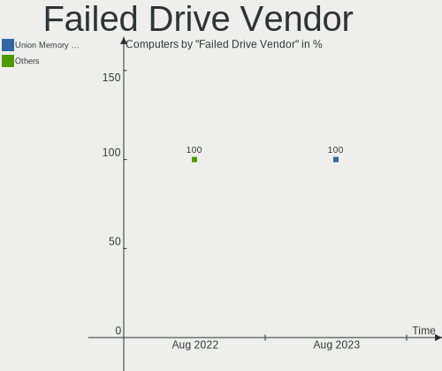
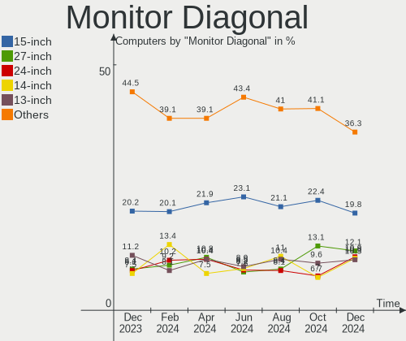
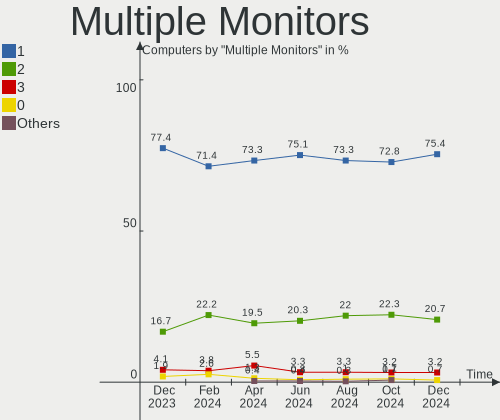
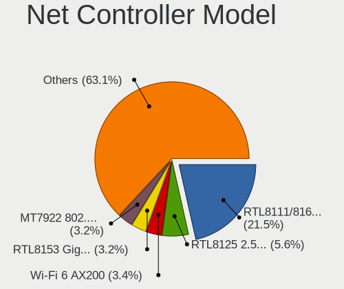
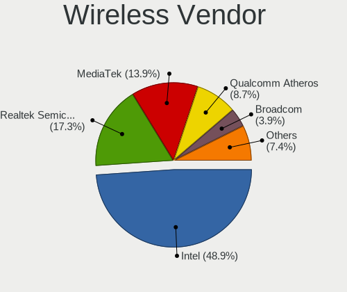
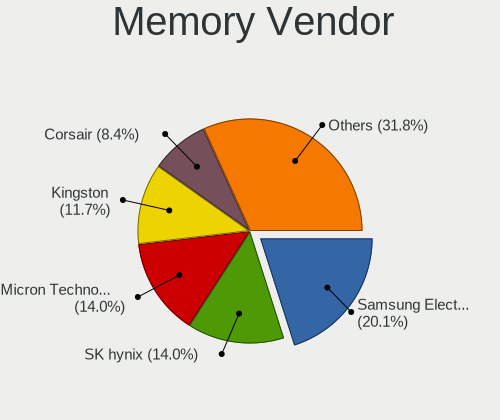
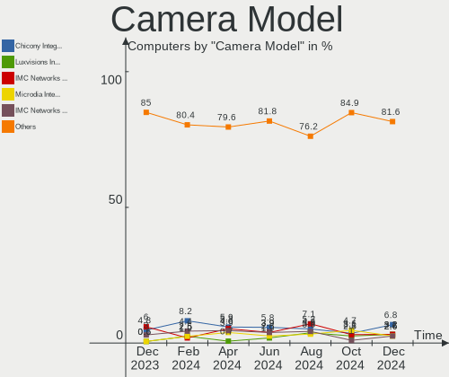

Arch Hardware Trends
--------------------

A project to identify most popular hardware characteristics and track their change
over time based on data collected by Arch users at https://Linux-Hardware.org.

Anyone can contribute to this report by the [hw-probe](https://github.com/linuxhw/hw-probe) tool:

    sudo -E hw-probe -all -upload

This is a report for all computer types. See also reports for [desktops](/Dist/Arch/Desktop/README.md) and [notebooks](/Dist/Arch/Notebook/README.md).

Full-feature report is available here: https://linux-hardware.org/?view=trends

Period: Aug, 2021.

Contents
--------

* [ System ](#system)
  - [ OS                       ](#os)
  - [ OS Family                ](#os-family)
  - [ Kernel                   ](#kernel)
  - [ Kernel Family            ](#kernel-family)
  - [ Kernel Major Ver.        ](#kernel-major-ver)
  - [ Arch                     ](#arch)
  - [ DE                       ](#de)
  - [ Display Server           ](#display-server)
  - [ Display Manager          ](#display-manager)
  - [ OS Lang                  ](#os-lang)
  - [ Boot Mode                ](#boot-mode)
  - [ Filesystem               ](#filesystem)
  - [ Part. scheme             ](#part-scheme)
  - [ Dual Boot with Linux/BSD ](#dual-boot-with-linuxbsd)
  - [ Dual Boot (Win)          ](#dual-boot-win)

* [ Board ](#board)
  - [ Vendor                   ](#vendor)
  - [ Model                    ](#model)
  - [ Model Family             ](#model-family)
  - [ MFG Year                 ](#mfg-year)
  - [ Form Factor              ](#form-factor)
  - [ Secure Boot              ](#secure-boot)
  - [ Coreboot                 ](#coreboot)
  - [ RAM Size                 ](#ram-size)
  - [ RAM Used                 ](#ram-used)
  - [ Total Drives             ](#total-drives)
  - [ Has CD-ROM               ](#has-cd-rom)
  - [ Has Ethernet             ](#has-ethernet)
  - [ Has WiFi                 ](#has-wifi)
  - [ Has Bluetooth            ](#has-bluetooth)

* [ Location ](#location)
  - [ Country                  ](#country)
  - [ City                     ](#city)

* [ Drives ](#drives)
  - [ Drive Vendor             ](#drive-vendor)
  - [ Drive Model              ](#drive-model)
  - [ HDD Vendor               ](#hdd-vendor)
  - [ SSD Vendor               ](#ssd-vendor)
  - [ Drive Kind               ](#drive-kind)
  - [ Drive Connector          ](#drive-connector)
  - [ Drive Size               ](#drive-size)
  - [ Space Total              ](#space-total)
  - [ Space Used               ](#space-used)
  - [ Malfunc. Drives          ](#malfunc-drives)
  - [ Malfunc. Drive Vendor    ](#malfunc-drive-vendor)
  - [ Malfunc. HDD Vendor      ](#malfunc-hdd-vendor)
  - [ Malfunc. Drive Kind      ](#malfunc-drive-kind)
  - [ Failed Drives            ](#failed-drives)
  - [ Failed Drive Vendor      ](#failed-drive-vendor)
  - [ Drive Status             ](#drive-status)

* [ Storage controller ](#storage-controller)
  - [ Storage Vendor           ](#storage-vendor)
  - [ Storage Model            ](#storage-model)
  - [ Storage Kind             ](#storage-kind)

* [ Processor ](#processor)
  - [ CPU Vendor               ](#cpu-vendor)
  - [ CPU Model                ](#cpu-model)
  - [ CPU Model Family         ](#cpu-model-family)
  - [ CPU Cores                ](#cpu-cores)
  - [ CPU Sockets              ](#cpu-sockets)
  - [ CPU Threads              ](#cpu-threads)
  - [ CPU Op-Modes             ](#cpu-op-modes)
  - [ CPU Microcode            ](#cpu-microcode)
  - [ CPU Microarch            ](#cpu-microarch)

* [ Graphics ](#graphics)
  - [ GPU Vendor               ](#gpu-vendor)
  - [ GPU Model                ](#gpu-model)
  - [ GPU Combo                ](#gpu-combo)
  - [ GPU Driver               ](#gpu-driver)
  - [ GPU Memory               ](#gpu-memory)

* [ Monitor ](#monitor)
  - [ Monitor Vendor           ](#monitor-vendor)
  - [ Monitor Model            ](#monitor-model)
  - [ Monitor Resolution       ](#monitor-resolution)
  - [ Monitor Diagonal         ](#monitor-diagonal)
  - [ Monitor Width            ](#monitor-width)
  - [ Aspect Ratio             ](#aspect-ratio)
  - [ Monitor Area             ](#monitor-area)
  - [ Pixel Density            ](#pixel-density)
  - [ Multiple Monitors        ](#multiple-monitors)

* [ Network ](#network)
  - [ Net Controller Vendor    ](#net-controller-vendor)
  - [ Net Controller Model     ](#net-controller-model)
  - [ Wireless Vendor          ](#wireless-vendor)
  - [ Wireless Model           ](#wireless-model)
  - [ Ethernet Vendor          ](#ethernet-vendor)
  - [ Ethernet Model           ](#ethernet-model)
  - [ Net Controller Kind      ](#net-controller-kind)
  - [ Used Controller          ](#used-controller)
  - [ NICs                     ](#nics)
  - [ IPv6                     ](#ipv6)

* [ Bluetooth ](#bluetooth)
  - [ Bluetooth Vendor         ](#bluetooth-vendor)
  - [ Bluetooth Model          ](#bluetooth-model)

* [ Sound ](#sound)
  - [ Sound Vendor             ](#sound-vendor)
  - [ Sound Model              ](#sound-model)

* [ Memory ](#memory)
  - [ Memory Vendor            ](#memory-vendor)
  - [ Memory Model             ](#memory-model)
  - [ Memory Kind              ](#memory-kind)
  - [ Memory Form Factor       ](#memory-form-factor)
  - [ Memory Size              ](#memory-size)
  - [ Memory Speed             ](#memory-speed)

* [ Printers & scanners ](#printers--scanners)
  - [ Printer Vendor           ](#printer-vendor)
  - [ Printer Model            ](#printer-model)
  - [ Scanner Vendor           ](#scanner-vendor)
  - [ Scanner Model            ](#scanner-model)

* [ Camera ](#camera)
  - [ Camera Vendor            ](#camera-vendor)
  - [ Camera Model             ](#camera-model)

* [ Security ](#security)
  - [ Fingerprint Vendor       ](#fingerprint-vendor)
  - [ Fingerprint Model        ](#fingerprint-model)
  - [ Chipcard Vendor          ](#chipcard-vendor)
  - [ Chipcard Model           ](#chipcard-model)

* [ Unsupported ](#unsupported)
  - [ Unsupported Devices      ](#unsupported-devices)
  - [ Unsupported Device Types ](#unsupported-device-types)

System
------

OS
--

Installed operating systems

| Name         | Computers | Percent |
|--------------|-----------|---------|
| Arch         | 83        | 53.55%  |
| Arch Rolling | 72        | 46.45%  |

OS Family
---------

OS without a version

| Name | Computers | Percent |
|------|-----------|---------|
| Arch | 155       | 100%    |

Kernel
------

Version of the Linux kernel

| Version                      | Computers | Percent |
|------------------------------|-----------|---------|
| 5.13.10-arch1-1              | 24        | 15.48%  |
| 5.13.12-arch1-1              | 23        | 14.84%  |
| 5.13.9-arch1-1               | 16        | 10.32%  |
| 5.13.7-arch1-1               | 13        | 8.39%   |
| 5.13.8-arch1-1               | 12        | 7.74%   |
| 5.13.13-arch1-1              | 11        | 7.1%    |
| 5.13.7-zen1-1-zen            | 5         | 3.23%   |
| 5.13.6-arch1-1               | 5         | 3.23%   |
| 5.13.12-zen1-1-zen           | 5         | 3.23%   |
| 5.13.9-zen1-1-zen            | 4         | 2.58%   |
| 5.13.10-zen1-1-zen           | 3         | 1.94%   |
| 5.10.60-1-lts                | 3         | 1.94%   |
| 5.10.56-1-lts                | 3         | 1.94%   |
| 5.13.8-zen1-1-zen            | 2         | 1.29%   |
| 5.13.5-arch1-1               | 2         | 1.29%   |
| 5.13.13-zen1-1-zen           | 2         | 1.29%   |
| 5.12.15-arch1-1              | 2         | 1.29%   |
| 5.10.54-1-lts                | 2         | 1.29%   |
| 5.2.20-1-ck-kx               | 1         | 0.65%   |
| 5.13.7-arch1-1-surface       | 1         | 0.65%   |
| 5.13.7-186-tkg-bmq           | 1         | 0.65%   |
| 5.13.6-amd-zen2              | 1         | 0.65%   |
| 5.13.5-zen1-1-zen            | 1         | 0.65%   |
| 5.13.4-arch1-1-custom        | 1         | 0.65%   |
| 5.13.4-arch1-1               | 1         | 0.65%   |
| 5.13.13-hardened1-1-hardened | 1         | 0.65%   |
| 5.13.13-arch1-1-51400p-01    | 1         | 0.65%   |
| 5.13.13-arch1-1-51313-02     | 1         | 0.65%   |
| 5.12.6-zen1-1-zen            | 1         | 0.65%   |
| 5.12.19-191-tkg-muqss        | 1         | 0.65%   |
| 5.12.19-190-tkg-muqss        | 1         | 0.65%   |
| 5.12.18-1-ck-skylake         | 1         | 0.65%   |
| 5.12.18-1-ck-generic-v2      | 1         | 0.65%   |
| 5.12.18-1-ck                 | 1         | 0.65%   |
| 5.12.14-arch1-1              | 1         | 0.65%   |
| 5.10.55-1-lts                | 1         | 0.65%   |

Kernel Family
-------------

Linux kernel without a distro release

| Version | Computers | Percent |
|---------|-----------|---------|
| 5.13.12 | 28        | 18.06%  |
| 5.13.10 | 27        | 17.42%  |
| 5.13.9  | 20        | 12.9%   |
| 5.13.7  | 20        | 12.9%   |
| 5.13.13 | 16        | 10.32%  |
| 5.13.8  | 14        | 9.03%   |
| 5.13.6  | 6         | 3.87%   |
| 5.13.5  | 3         | 1.94%   |
| 5.12.18 | 3         | 1.94%   |
| 5.10.60 | 3         | 1.94%   |
| 5.10.56 | 3         | 1.94%   |
| 5.13.4  | 2         | 1.29%   |
| 5.12.19 | 2         | 1.29%   |
| 5.12.15 | 2         | 1.29%   |
| 5.10.54 | 2         | 1.29%   |
| 5.2.20  | 1         | 0.65%   |
| 5.12.6  | 1         | 0.65%   |
| 5.12.14 | 1         | 0.65%   |
| 5.10.55 | 1         | 0.65%   |

Kernel Major Ver.
-----------------

Linux kernel major version

| Version | Computers | Percent |
|---------|-----------|---------|
| 5.13    | 136       | 87.74%  |
| 5.12    | 9         | 5.81%   |
| 5.10    | 9         | 5.81%   |
| 5.2     | 1         | 0.65%   |

Arch
----

OS architecture (x86_64, i586, etc.)

| Name   | Computers | Percent |
|--------|-----------|---------|
| x86_64 | 155       | 100%    |

DE
--

Desktop Environment

| Name       | Computers | Percent |
|------------|-----------|---------|
| GNOME      | 55        | 35.48%  |
| KDE5       | 37        | 23.87%  |
| Unknown    | 14        | 9.03%   |
| XFCE       | 12        | 7.74%   |
| KDE        | 10        | 6.45%   |
| i3         | 9         | 5.81%   |
| X-Cinnamon | 4         | 2.58%   |
| MATE       | 4         | 2.58%   |
| Budgie     | 3         | 1.94%   |
| sway       | 2         | 1.29%   |
| openbox    | 2         | 1.29%   |
| LXQt       | 1         | 0.65%   |
| jwm        | 1         | 0.65%   |
| Deepin     | 1         | 0.65%   |

Display Server
--------------

X11 or Wayland

| Name    | Computers | Percent |
|---------|-----------|---------|
| X11     | 93        | 60%     |
| Wayland | 30        | 19.35%  |
| Tty     | 18        | 11.61%  |
| Unknown | 14        | 9.03%   |

Display Manager
---------------

SDDM, LightDM, etc.

| Name    | Computers | Percent |
|---------|-----------|---------|
| Unknown | 51        | 32.9%   |
| SDDM    | 41        | 26.45%  |
| GDM     | 39        | 25.16%  |
| LightDM | 10        | 6.45%   |
| TDM     | 8         | 5.16%   |
| LXDM    | 4         | 2.58%   |
| XDM     | 1         | 0.65%   |
| SLiM    | 1         | 0.65%   |

OS Lang
-------

Language

| Lang       | Computers | Percent |
|------------|-----------|---------|
| en_US      | 85        | 54.84%  |
| en_GB      | 11        | 7.1%    |
| de_DE      | 6         | 3.87%   |
| C          | 6         | 3.87%   |
| es_ES      | 5         | 3.23%   |
| zh_CN      | 4         | 2.58%   |
| ru_RU      | 4         | 2.58%   |
| Unknown    | 4         | 2.58%   |
| it_IT      | 3         | 1.94%   |
| en_AU      | 3         | 1.94%   |
| en_IN      | 2         | 1.29%   |
| en_DK      | 2         | 1.29%   |
| en_CA      | 2         | 1.29%   |
| unm_US     | 1         | 0.65%   |
| tr_TR      | 1         | 0.65%   |
| sv_SE      | 1         | 0.65%   |
| sp_SP      | 1         | 0.65%   |
| ru_UA      | 1         | 0.65%   |
| pt_BR.UTF8 | 1         | 0.65%   |
| pt_BR      | 1         | 0.65%   |
| pl_PL      | 1         | 0.65%   |
| nl_NL      | 1         | 0.65%   |
| is_IS      | 1         | 0.65%   |
| hu_HU      | 1         | 0.65%   |
| fr_FR      | 1         | 0.65%   |
| fi_FI      | 1         | 0.65%   |
| es_MX.UTF8 | 1         | 0.65%   |
| es_ES.UTF8 | 1         | 0.65%   |
| es_CL      | 1         | 0.65%   |
| en_ZA      | 1         | 0.65%   |
| en_SG      | 1         | 0.65%   |

Boot Mode
---------

EFI or BIOS

| Mode | Computers | Percent |
|------|-----------|---------|
| EFI  | 98        | 63.23%  |
| BIOS | 57        | 36.77%  |

Filesystem
----------

Type of filesystem

| Type  | Computers | Percent |
|-------|-----------|---------|
| Ext4  | 113       | 72.9%   |
| Btrfs | 39        | 25.16%  |
| Zfs   | 1         | 0.65%   |
| Xfs   | 1         | 0.65%   |
| F2fs  | 1         | 0.65%   |

Part. scheme
------------

Scheme of partitioning

| Type    | Computers | Percent |
|---------|-----------|---------|
| GPT     | 114       | 73.55%  |
| Unknown | 30        | 19.35%  |
| MBR     | 11        | 7.1%    |

Dual Boot with Linux/BSD
------------------------

Hosting more than one Linux/BSD

| Dual boot | Computers | Percent |
|-----------|-----------|---------|
| No        | 139       | 89.68%  |
| Yes       | 16        | 10.32%  |

Dual Boot (Win)
---------------

Hosting Linux and Windows

| Dual boot | Computers | Percent |
|-----------|-----------|---------|
| No        | 97        | 62.58%  |
| Yes       | 58        | 37.42%  |

Board
-----

Vendor
------

Motherboard manufacturer

| Name                | Computers | Percent |
|---------------------|-----------|---------|
| Lenovo              | 32        | 20.65%  |
| Dell                | 21        | 13.55%  |
| Hewlett-Packard     | 19        | 12.26%  |
| ASUSTek Computer    | 19        | 12.26%  |
| Gigabyte Technology | 16        | 10.32%  |
| MSI                 | 15        | 9.68%   |
| Acer                | 10        | 6.45%   |
| ASRock              | 5         | 3.23%   |
| Intel               | 2         | 1.29%   |
| HUAWEI              | 2         | 1.29%   |
| Apple               | 2         | 1.29%   |
| ZOTAC               | 1         | 0.65%   |
| TUXEDO              | 1         | 0.65%   |
| Toshiba             | 1         | 0.65%   |
| Teclast             | 1         | 0.65%   |
| Sony                | 1         | 0.65%   |
| Samsung Electronics | 1         | 0.65%   |
| PC Specialist       | 1         | 0.65%   |
| Notebook            | 1         | 0.65%   |
| MouseComputer       | 1         | 0.65%   |
| Microsoft           | 1         | 0.65%   |
| GPD                 | 1         | 0.65%   |
| Eluktronics         | 1         | 0.65%   |

Model
-----

Motherboard model

| Name                                     | Computers | Percent |
|------------------------------------------|-----------|---------|
| ASUS All Series                          | 4         | 2.58%   |
| MSI MS-7C91                              | 2         | 1.29%   |
| Lenovo Yoga 9 14ITL5 82BG                | 2         | 1.29%   |
| HP Pavilion Gaming Laptop 15-ec1xxx      | 2         | 1.29%   |
| Gigabyte B550I AORUS PRO AX              | 2         | 1.29%   |
| Dell XPS 15 7590                         | 2         | 1.29%   |
| ZOTAC ZBOX-ECM73070C/53060C              | 1         | 0.65%   |
| TUXEDO InfinityBook Pro 14 Gen6          | 1         | 0.65%   |
| Toshiba Satellite L55-C                  | 1         | 0.65%   |
| Teclast X6 Pro                           | 1         | 0.65%   |
| Sony SVE1113M1EW                         | 1         | 0.65%   |
| Samsung 550XDA                           | 1         | 0.65%   |
| PC Specialist Standard                   | 1         | 0.65%   |
| Notebook N85_N87,HJ,HJ1,HK1              | 1         | 0.65%   |
| MSI MS-7C84                              | 1         | 0.65%   |
| MSI MS-7C35                              | 1         | 0.65%   |
| MSI MS-7B48                              | 1         | 0.65%   |
| MSI MS-7B17                              | 1         | 0.65%   |
| MSI MS-7A37                              | 1         | 0.65%   |
| MSI MS-7A34                              | 1         | 0.65%   |
| MSI MS-7851                              | 1         | 0.65%   |
| MSI Modern 14 B4MW                       | 1         | 0.65%   |
| MSI GP62 7RD                             | 1         | 0.65%   |
| MSI GL65 9SEK                            | 1         | 0.65%   |
| MSI GL63 8SE                             | 1         | 0.65%   |
| MSI GE66 Raider 10SFS                    | 1         | 0.65%   |
| MSI Bravo 17 A4DDK                       | 1         | 0.65%   |
| MouseComputer BC-MB1485UD11A-191         | 1         | 0.65%   |
| Microsoft Surface Pro 6                  | 1         | 0.65%   |
| Lenovo Yoga 530-14ARR 81H9               | 1         | 0.65%   |
| Lenovo V155-15API 81V5                   | 1         | 0.65%   |
| Lenovo ThinkStation P330 30CY006WGE      | 1         | 0.65%   |
| Lenovo ThinkPad X395 20NL0005US          | 1         | 0.65%   |
| Lenovo ThinkPad X230 Tablet 3438DS7      | 1         | 0.65%   |
| Lenovo ThinkPad X140e 20BL000BUS         | 1         | 0.65%   |
| Lenovo ThinkPad X1 Carbon 7th 20QD001TUS | 1         | 0.65%   |
| Lenovo ThinkPad T570 20JXS1S900          | 1         | 0.65%   |
| Lenovo ThinkPad T510 4314DEU             | 1         | 0.65%   |
| Lenovo ThinkPad T480s 20L8S3DK1L         | 1         | 0.65%   |
| Lenovo ThinkPad T480s 20L7CTO1WW         | 1         | 0.65%   |
| Lenovo ThinkPad T460p 20FW0005AU         | 1         | 0.65%   |
| Lenovo ThinkPad T440p 2000CT0            | 1         | 0.65%   |
| Lenovo ThinkPad T440 20B60061MD          | 1         | 0.65%   |
| Lenovo ThinkPad T14 Gen 2i 20W0004MSP    | 1         | 0.65%   |
| Lenovo ThinkPad P14s Gen 1 20Y1CTO1WW    | 1         | 0.65%   |
| Lenovo ThinkPad L390 20NR001LGE          | 1         | 0.65%   |
| Lenovo ThinkPad L380 Yoga 20M8S01400     | 1         | 0.65%   |
| Lenovo ThinkPad E14 Gen 2 20T6S00D00     | 1         | 0.65%   |
| Lenovo ThinkCentre M715q 10VG000JUS      | 1         | 0.65%   |
| Lenovo ThinkBook 14 G3 ACL 21A2          | 1         | 0.65%   |
| Lenovo Legion Y540-15IRH-PG0 81SY        | 1         | 0.65%   |
| Lenovo IdeaPad Y510P 20217               | 1         | 0.65%   |
| Lenovo IdeaPad Gaming 3 15ARH05 82EY     | 1         | 0.65%   |
| Lenovo IdeaPad Flex 5 14ARE05 81X2       | 1         | 0.65%   |
| Lenovo IdeaPad 5 14ARE05 81YM            | 1         | 0.65%   |
| Lenovo IdeaPad 330S-15ARR 81FB           | 1         | 0.65%   |
| Lenovo IdeaPad 320S-14IKB 80X4           | 1         | 0.65%   |
| Lenovo IdeaPad 110-15ISK 80UD            | 1         | 0.65%   |
| Lenovo G400s VILG1                       | 1         | 0.65%   |
| Intel SandyBridge Platform               | 1         | 0.65%   |

Model Family
------------

Motherboard model prefix

| Name                             | Computers | Percent |
|----------------------------------|-----------|---------|
| Lenovo ThinkPad                  | 16        | 10.32%  |
| Acer Aspire                      | 9         | 5.81%   |
| HP EliteBook                     | 8         | 5.16%   |
| Lenovo IdeaPad                   | 7         | 4.52%   |
| Dell Inspiron                    | 6         | 3.87%   |
| Dell Latitude                    | 5         | 3.23%   |
| HP Pavilion                      | 4         | 2.58%   |
| Dell XPS                         | 4         | 2.58%   |
| ASUS TUF                         | 4         | 2.58%   |
| ASUS All                         | 4         | 2.58%   |
| Lenovo Yoga                      | 3         | 1.94%   |
| ASUS PRIME                       | 3         | 1.94%   |
| MSI MS-7C91                      | 2         | 1.29%   |
| HP Laptop                        | 2         | 1.29%   |
| Gigabyte X570                    | 2         | 1.29%   |
| Gigabyte B550I                   | 2         | 1.29%   |
| Gigabyte B450M                   | 2         | 1.29%   |
| Dell Precision                   | 2         | 1.29%   |
| ZOTAC ZBOX-ECM73070C             | 1         | 0.65%   |
| TUXEDO InfinityBook              | 1         | 0.65%   |
| Toshiba Satellite                | 1         | 0.65%   |
| Teclast X6                       | 1         | 0.65%   |
| Sony SVE1113M1EW                 | 1         | 0.65%   |
| Samsung 550XDA                   | 1         | 0.65%   |
| PC Specialist Standard           | 1         | 0.65%   |
| Notebook N85                     | 1         | 0.65%   |
| MSI MS-7C84                      | 1         | 0.65%   |
| MSI MS-7C35                      | 1         | 0.65%   |
| MSI MS-7B48                      | 1         | 0.65%   |
| MSI MS-7B17                      | 1         | 0.65%   |
| MSI MS-7A37                      | 1         | 0.65%   |
| MSI MS-7A34                      | 1         | 0.65%   |
| MSI MS-7851                      | 1         | 0.65%   |
| MSI Modern                       | 1         | 0.65%   |
| MSI GP62                         | 1         | 0.65%   |
| MSI GL65                         | 1         | 0.65%   |
| MSI GL63                         | 1         | 0.65%   |
| MSI GE66                         | 1         | 0.65%   |
| MSI Bravo                        | 1         | 0.65%   |
| MouseComputer BC-MB1485UD11A-191 | 1         | 0.65%   |
| Microsoft Surface                | 1         | 0.65%   |
| Lenovo V155-15API                | 1         | 0.65%   |
| Lenovo ThinkStation              | 1         | 0.65%   |
| Lenovo ThinkCentre               | 1         | 0.65%   |
| Lenovo ThinkBook                 | 1         | 0.65%   |
| Lenovo Legion                    | 1         | 0.65%   |
| Lenovo G400s                     | 1         | 0.65%   |
| Intel SandyBridge                | 1         | 0.65%   |
| Intel NUC7i3BNH                  | 1         | 0.65%   |
| HUAWEI NBLL-WXX9                 | 1         | 0.65%   |
| HUAWEI NBLK-WAX9X                | 1         | 0.65%   |
| HP Z210                          | 1         | 0.65%   |
| HP ProLiant                      | 1         | 0.65%   |
| HP ProDesk                       | 1         | 0.65%   |
| HP ProBook                       | 1         | 0.65%   |
| HP Notebook                      | 1         | 0.65%   |
| GPD G1618-03                     | 1         | 0.65%   |
| Gigabyte X470                    | 1         | 0.65%   |
| Gigabyte M57SLI-S4               | 1         | 0.65%   |
| Gigabyte H97M-D3H                | 1         | 0.65%   |

MFG Year
--------

Motherboard manufacture year

| Year | Computers | Percent |
|------|-----------|---------|
| 2020 | 41        | 26.45%  |
| 2021 | 39        | 25.16%  |
| 2019 | 26        | 16.77%  |
| 2018 | 11        | 7.1%    |
| 2017 | 6         | 3.87%   |
| 2015 | 6         | 3.87%   |
| 2013 | 6         | 3.87%   |
| 2016 | 5         | 3.23%   |
| 2014 | 5         | 3.23%   |
| 2012 | 3         | 1.94%   |
| 2010 | 3         | 1.94%   |
| 2011 | 2         | 1.29%   |
| 2008 | 2         | 1.29%   |

Form Factor
-----------

Physical design of the computer

| Name        | Computers | Percent |
|-------------|-----------|---------|
| Notebook    | 93        | 60%     |
| Desktop     | 49        | 31.61%  |
| Convertible | 8         | 5.16%   |
| Mini pc     | 3         | 1.94%   |
| Tablet      | 2         | 1.29%   |

Secure Boot
-----------

Enabled or disabled

| State    | Computers | Percent |
|----------|-----------|---------|
| Disabled | 152       | 98.06%  |
| Enabled  | 3         | 1.94%   |

Coreboot
--------

Have coreboot on board

| Used | Computers | Percent |
|------|-----------|---------|
| No   | 155       | 100%    |

RAM Size
--------

Total RAM memory

| Size in GB  | Computers | Percent |
|-------------|-----------|---------|
| 16.01-24.0  | 44        | 28.39%  |
| 4.01-8.0    | 31        | 20%     |
| 8.01-16.0   | 26        | 16.77%  |
| 32.01-64.0  | 25        | 16.13%  |
| 3.01-4.0    | 13        | 8.39%   |
| 64.01-256.0 | 10        | 6.45%   |
| 24.01-32.0  | 4         | 2.58%   |
| 1.01-2.0    | 2         | 1.29%   |

RAM Used
--------

Used RAM memory

| Used GB    | Computers | Percent |
|------------|-----------|---------|
| 4.01-8.0   | 38        | 24.52%  |
| 2.01-3.0   | 35        | 22.58%  |
| 1.01-2.0   | 34        | 21.94%  |
| 3.01-4.0   | 24        | 15.48%  |
| 8.01-16.0  | 10        | 6.45%   |
| 0.51-1.0   | 10        | 6.45%   |
| 32.01-64.0 | 1         | 0.65%   |
| 24.01-32.0 | 1         | 0.65%   |
| 16.01-24.0 | 1         | 0.65%   |
| 0.01-0.5   | 1         | 0.65%   |

Total Drives
------------

Number of drives on board

| Drives | Computers | Percent |
|--------|-----------|---------|
| 1      | 76        | 49.03%  |
| 2      | 46        | 29.68%  |
| 3      | 16        | 10.32%  |
| 5      | 7         | 4.52%   |
| 4      | 7         | 4.52%   |
| 7      | 2         | 1.29%   |
| 6      | 1         | 0.65%   |

Has CD-ROM
----------

Has CD-ROM on board

| Presented | Computers | Percent |
|-----------|-----------|---------|
| No        | 117       | 75.48%  |
| Yes       | 38        | 24.52%  |

Has Ethernet
------------

Has Ethernet on board

| Presented | Computers | Percent |
|-----------|-----------|---------|
| Yes       | 127       | 81.94%  |
| No        | 28        | 18.06%  |

Has WiFi
--------

Has WiFi module

| Presented | Computers | Percent |
|-----------|-----------|---------|
| Yes       | 128       | 82.58%  |
| No        | 27        | 17.42%  |

Has Bluetooth
-------------

Has Bluetooth module

| Presented | Computers | Percent |
|-----------|-----------|---------|
| Yes       | 122       | 78.71%  |
| No        | 33        | 21.29%  |

Location
--------

Country
-------

Geographic location (country)

| Country         | Computers | Percent |
|-----------------|-----------|---------|
| USA             | 34        | 21.94%  |
| Germany         | 13        | 8.39%   |
| Australia       | 9         | 5.81%   |
| Spain           | 8         | 5.16%   |
| Russia          | 8         | 5.16%   |
| India           | 7         | 4.52%   |
| France          | 6         | 3.87%   |
| Brazil          | 6         | 3.87%   |
| UK              | 5         | 3.23%   |
| Sweden          | 5         | 3.23%   |
| Netherlands     | 4         | 2.58%   |
| Canada          | 4         | 2.58%   |
| Ukraine         | 3         | 1.94%   |
| Indonesia       | 3         | 1.94%   |
| Finland         | 3         | 1.94%   |
| Chile           | 3         | 1.94%   |
| Turkey          | 2         | 1.29%   |
| Qatar           | 2         | 1.29%   |
| Japan           | 2         | 1.29%   |
| Italy           | 2         | 1.29%   |
| Hungary         | 2         | 1.29%   |
| China           | 2         | 1.29%   |
| Uzbekistan      | 1         | 0.65%   |
| South Africa    | 1         | 0.65%   |
| Singapore       | 1         | 0.65%   |
| Romania         | 1         | 0.65%   |
| Poland          | 1         | 0.65%   |
| Pakistan        | 1         | 0.65%   |
| Norway          | 1         | 0.65%   |
| North Macedonia | 1         | 0.65%   |
| New Zealand     | 1         | 0.65%   |
| Mexico          | 1         | 0.65%   |
| Malaysia        | 1         | 0.65%   |
| Latvia          | 1         | 0.65%   |
| Kosovo          | 1         | 0.65%   |
| Iran            | 1         | 0.65%   |
| Guatemala       | 1         | 0.65%   |
| Estonia         | 1         | 0.65%   |
| Denmark         | 1         | 0.65%   |
| Bulgaria        | 1         | 0.65%   |
| Belarus         | 1         | 0.65%   |
| Austria         | 1         | 0.65%   |
| Armenia         | 1         | 0.65%   |
| Argentina       | 1         | 0.65%   |

City
----

Geographic location (city)

| City                   | Computers | Percent |
|------------------------|-----------|---------|
| Ormiston               | 5         | 3.23%   |
| Valencia               | 4         | 2.58%   |
| Munich                 | 3         | 1.94%   |
| Moscow                 | 3         | 1.94%   |
| Zaragoza               | 2         | 1.29%   |
| St Petersburg          | 2         | 1.29%   |
| Seattle                | 2         | 1.29%   |
| Makassar               | 2         | 1.29%   |
| Kilsyth                | 2         | 1.29%   |
| Istanbul               | 2         | 1.29%   |
| Guangzhou              | 2         | 1.29%   |
| Eker?¶                 | 2         | 1.29%   |
| Doha                   | 2         | 1.29%   |
| Amsterdam              | 2         | 1.29%   |
| Zhukovskiy             | 1         | 0.65%   |
| Yerevan                | 1         | 0.65%   |
| Witten                 | 1         | 0.65%   |
| Weymouth               | 1         | 0.65%   |
| West Valley City       | 1         | 0.65%   |
| Wellington             | 1         | 0.65%   |
| Washington             | 1         | 0.65%   |
| Warsaw                 | 1         | 0.65%   |
| Villanueva de la Torre | 1         | 0.65%   |
| Villa Regina           | 1         | 0.65%   |
| Vancouver              | 1         | 0.65%   |
| Tuusula                | 1         | 0.65%   |
| Troy                   | 1         | 0.65%   |
| Trois-Rivi??res        | 1         | 0.65%   |
| Tokyo                  | 1         | 0.65%   |
| Thrissur               | 1         | 0.65%   |
| Tehran                 | 1         | 0.65%   |
| Tashkent               | 1         | 0.65%   |
| Tangerang              | 1         | 0.65%   |
| Tallinn                | 1         | 0.65%   |
| Sz?©kesfeh?©rv??r      | 1         | 0.65%   |
| Sistov                 | 1         | 0.65%   |
| Singapore              | 1         | 0.65%   |
| Segny                  | 1         | 0.65%   |
| Sarasota               | 1         | 0.65%   |
| Sao Joaquim da Barra   | 1         | 0.65%   |
| Santiago               | 1         | 0.65%   |
| San Luis Potos?­ City  | 1         | 0.65%   |
| San Jose               | 1         | 0.65%   |
| San Fernando           | 1         | 0.65%   |
| San Antonio            | 1         | 0.65%   |
| Salzgitter             | 1         | 0.65%   |
| Salinas                | 1         | 0.65%   |
| Rimpar                 | 1         | 0.65%   |
| Riga                   | 1         | 0.65%   |
| Richmond Hill          | 1         | 0.65%   |
| Richmond               | 1         | 0.65%   |
| Rennes                 | 1         | 0.65%   |
| Reading                | 1         | 0.65%   |
| Pune                   | 1         | 0.65%   |
| Pristina               | 1         | 0.65%   |
| Porto Alegre           | 1         | 0.65%   |
| Ploie??ti              | 1         | 0.65%   |
| Plasencia              | 1         | 0.65%   |
| Pirassununga           | 1         | 0.65%   |
| Pilisvorosvar          | 1         | 0.65%   |

Drives
------

Drive Vendor
------------

Hard drive vendors

| Vendor              | Computers | Drives | Percent |
|---------------------|-----------|--------|---------|
| Samsung Electronics | 62        | 79     | 24.03%  |
| WDC                 | 35        | 44     | 13.57%  |
| Seagate             | 29        | 38     | 11.24%  |
| Toshiba             | 20        | 22     | 7.75%   |
| Kingston            | 13        | 15     | 5.04%   |
| Sandisk             | 12        | 14     | 4.65%   |
| Crucial             | 11        | 12     | 4.26%   |
| Unknown             | 9         | 10     | 3.49%   |
| SK Hynix            | 6         | 6      | 2.33%   |
| Intel               | 6         | 7      | 2.33%   |
| HGST                | 5         | 5      | 1.94%   |
| A-DATA Technology   | 5         | 7      | 1.94%   |
| Phison              | 4         | 4      | 1.55%   |
| Hitachi             | 4         | 4      | 1.55%   |
| Silicon Motion      | 3         | 3      | 1.16%   |
| PNY                 | 3         | 3      | 1.16%   |
| Patriot             | 3         | 3      | 1.16%   |
| KIOXIA              | 3         | 3      | 1.16%   |
| Hewlett-Packard     | 3         | 3      | 1.16%   |
| Micron Technology   | 2         | 2      | 0.78%   |
| LITEON              | 2         | 2      | 0.78%   |
| Lexar               | 2         | 2      | 0.78%   |
| Apple               | 2         | 2      | 0.78%   |
| Transcend           | 1         | 1      | 0.39%   |
| Teclast             | 1         | 1      | 0.39%   |
| StoreJet            | 1         | 1      | 0.39%   |
| SPCC                | 1         | 1      | 0.39%   |
| Solid State Storage | 1         | 1      | 0.39%   |
| OCZ                 | 1         | 1      | 0.39%   |
| MyDigitalSSD        | 1         | 1      | 0.39%   |
| Micron 1            | 1         | 1      | 0.39%   |
| Lenovo              | 1         | 1      | 0.39%   |
| HS-SSD-C100         | 1         | 1      | 0.39%   |
| Gigabyte Technology | 1         | 1      | 0.39%   |
| Fujitsu             | 1         | 1      | 0.39%   |
| CT1000BX            | 1         | 1      | 0.39%   |
| Apacer              | 1         | 1      | 0.39%   |

Drive Model
-----------

Hard drive models

| Model                              | Computers | Percent |
|------------------------------------|-----------|---------|
| Samsung SSD 860 EVO 1TB            | 8         | 2.78%   |
| Samsung SSD 970 EVO Plus 500GB     | 6         | 2.08%   |
| Sandisk NVMe SSD Drive 1TB         | 4         | 1.39%   |
| Crucial CT1000MX500SSD1 1TB        | 4         | 1.39%   |
| Toshiba NVMe SSD Drive 256GB       | 3         | 1.04%   |
| Toshiba DT01ACA100 1TB             | 3         | 1.04%   |
| Samsung SSD 860 EVO 500GB          | 3         | 1.04%   |
| Samsung SSD 860 EVO 250GB          | 3         | 1.04%   |
| Samsung NVMe SSD Drive 1TB         | 3         | 1.04%   |
| WDC WD40EFRX-68N32N0 4TB           | 2         | 0.69%   |
| Toshiba MQ01ABD100 1TB             | 2         | 0.69%   |
| Seagate ST2000DX002-2DV164 2TB     | 2         | 0.69%   |
| Seagate ST1000LM024 HN-M101MBB 1TB | 2         | 0.69%   |
| Seagate Expansion 2TB              | 2         | 0.69%   |
| Samsung SSD 980 1TB                | 2         | 0.69%   |
| Samsung SSD 850 EVO 500GB          | 2         | 0.69%   |
| Samsung SSD 850 EVO 250GB          | 2         | 0.69%   |
| Samsung SSD 840 PRO Series 512GB   | 2         | 0.69%   |
| Samsung NVMe SSD Drive 256GB       | 2         | 0.69%   |
| Samsung MZVLB512HBJQ-000L7 512GB   | 2         | 0.69%   |
| Samsung MZVLB256HAHQ-000L7 256GB   | 2         | 0.69%   |
| Samsung MZVLB1T0HBLR-00000 1TB     | 2         | 0.69%   |
| PNY CS900 120GB SSD                | 2         | 0.69%   |
| Phison Sabrent 2TB                 | 2         | 0.69%   |
| KIOXIA NVMe SSD Drive 512GB        | 2         | 0.69%   |
| Kingston SA400S37240G 240GB SSD    | 2         | 0.69%   |
| Kingston SA2000M81000G 1TB         | 2         | 0.69%   |
| HGST HTS721010A9E630 1TB           | 2         | 0.69%   |
| HP SSD EX920 1TB                   | 2         | 0.69%   |
| Crucial CT480BX500SSD1 480GB       | 2         | 0.69%   |
| WDC WDS500G2X0C-00L350 500GB       | 1         | 0.35%   |
| WDC WDS500G2B0C-00PXH0 500GB       | 1         | 0.35%   |
| WDC WDS500G2B0A-00SM50 500GB SSD   | 1         | 0.35%   |
| WDC WDS240G2G0A-00JH30 240GB SSD   | 1         | 0.35%   |
| WDC WDS100T2X0C-00L350 1TB         | 1         | 0.35%   |
| WDC WDS100T2B0B-00YS70 1TB SSD     | 1         | 0.35%   |
| WDC WDS100T2B0A-00SM50 1TB SSD     | 1         | 0.35%   |
| WDC WDS100T1X0E-00AFY0 1TB         | 1         | 0.35%   |
| WDC WDBRPG0010BNC-WRSN 1TB         | 1         | 0.35%   |
| WDC WD80EFAX-68KNBN0 8TB           | 1         | 0.35%   |
| WDC WD6001FZWX-00A2VA0 6TB         | 1         | 0.35%   |
| WDC WD5000AAKX-08U6AA0 500GB       | 1         | 0.35%   |
| WDC WD40EZRZ-00GXCB0 4TB           | 1         | 0.35%   |
| WDC WD40EFRX-68WT0N0 4TB           | 1         | 0.35%   |
| WDC WD3200LPVT-22G33T0 320GB       | 1         | 0.35%   |
| WDC WD30EFRX-68AX9N0 3TB           | 1         | 0.35%   |
| WDC WD30EFAX-68JH4N0 3TB           | 1         | 0.35%   |
| WDC WD20SPZX-08UA7 2TB             | 1         | 0.35%   |
| WDC WD20EFRX-68EUZN0 2TB           | 1         | 0.35%   |
| WDC WD20EFRX-68AX9N0 2TB           | 1         | 0.35%   |
| WDC WD20 EZRZ-00Z5HB0 2TB          | 1         | 0.35%   |
| WDC WD1600AAJS-62B4A0 160GB        | 1         | 0.35%   |
| WDC WD10SPZX-35Z10T0 1TB           | 1         | 0.35%   |
| WDC WD10SPZX-21Z10T0 1TB           | 1         | 0.35%   |
| WDC WD10JPVX-22JC3T0 1TB           | 1         | 0.35%   |
| WDC WD10JPCX-24UE4T0 1TB           | 1         | 0.35%   |
| WDC WD10EZEX-08Y20A0 1TB           | 1         | 0.35%   |
| WDC WD10EZEX-08M2NA0 1TB           | 1         | 0.35%   |
| WDC WD10EARX-22N0YB0 1TB           | 1         | 0.35%   |
| WDC WD easystore 240GB             | 1         | 0.35%   |

HDD Vendor
----------

Hard disk drive vendors

| Vendor              | Computers | Drives | Percent |
|---------------------|-----------|--------|---------|
| Seagate             | 29        | 38     | 40.85%  |
| WDC                 | 19        | 25     | 26.76%  |
| Toshiba             | 13        | 13     | 18.31%  |
| HGST                | 5         | 5      | 7.04%   |
| Hitachi             | 4         | 4      | 5.63%   |
| Samsung Electronics | 1         | 1      | 1.41%   |

SSD Vendor
----------

Solid state drive vendors

| Vendor              | Computers | Drives | Percent |
|---------------------|-----------|--------|---------|
| Samsung Electronics | 30        | 37     | 32.97%  |
| Crucial             | 10        | 11     | 10.99%  |
| Kingston            | 9         | 9      | 9.89%   |
| SanDisk             | 6         | 6      | 6.59%   |
| WDC                 | 5         | 6      | 5.49%   |
| PNY                 | 3         | 3      | 3.3%    |
| Patriot             | 3         | 3      | 3.3%    |
| Intel               | 3         | 3      | 3.3%    |
| LITEON              | 2         | 2      | 2.2%    |
| Lexar               | 2         | 2      | 2.2%    |
| A-DATA Technology   | 2         | 2      | 2.2%    |
| Transcend           | 1         | 1      | 1.1%    |
| Toshiba             | 1         | 3      | 1.1%    |
| Teclast             | 1         | 1      | 1.1%    |
| StoreJet            | 1         | 1      | 1.1%    |
| SPCC                | 1         | 1      | 1.1%    |
| OCZ                 | 1         | 1      | 1.1%    |
| MyDigitalSSD        | 1         | 1      | 1.1%    |
| Micron Technology   | 1         | 1      | 1.1%    |
| Micron 1            | 1         | 1      | 1.1%    |
| HS-SSD-C100         | 1         | 1      | 1.1%    |
| Hewlett-Packard     | 1         | 1      | 1.1%    |
| Gigabyte Technology | 1         | 1      | 1.1%    |
| Fujitsu             | 1         | 1      | 1.1%    |
| CT1000BX            | 1         | 1      | 1.1%    |
| Apple               | 1         | 1      | 1.1%    |
| Apacer              | 1         | 1      | 1.1%    |

Drive Kind
----------

HDD or SSD

| Kind    | Computers | Drives | Percent |
|---------|-----------|--------|---------|
| NVMe    | 85        | 108    | 38.64%  |
| SSD     | 70        | 102    | 31.82%  |
| HDD     | 58        | 86     | 26.36%  |
| MMC     | 6         | 7      | 2.73%   |
| Unknown | 1         | 1      | 0.45%   |

Drive Connector
---------------

SATA, SAS, NVMe, etc.

| Type | Computers | Drives | Percent |
|------|-----------|--------|---------|
| SATA | 100       | 179    | 50.25%  |
| NVMe | 85        | 108    | 42.71%  |
| SAS  | 8         | 10     | 4.02%   |
| MMC  | 6         | 7      | 3.02%   |

Drive Size
----------

Size of hard drive

| Size in TB | Computers | Drives | Percent |
|------------|-----------|--------|---------|
| 0.01-0.5   | 69        | 96     | 47.92%  |
| 0.51-1.0   | 44        | 52     | 30.56%  |
| 1.01-2.0   | 13        | 16     | 9.03%   |
| 3.01-4.0   | 9         | 14     | 6.25%   |
| 4.01-10.0  | 5         | 6      | 3.47%   |
| 2.01-3.0   | 4         | 4      | 2.78%   |

Space Total
-----------

Amount of disk space available on the file system

| Size in GB     | Computers | Percent |
|----------------|-----------|---------|
| 101-250        | 44        | 28.39%  |
| 251-500        | 34        | 21.94%  |
| 501-1000       | 23        | 14.84%  |
| 1001-2000      | 18        | 11.61%  |
| More than 3000 | 16        | 10.32%  |
| 2001-3000      | 9         | 5.81%   |
| 51-100         | 5         | 3.23%   |
| 1-20           | 3         | 1.94%   |
| 21-50          | 2         | 1.29%   |
| Unknown        | 1         | 0.65%   |

Space Used
----------

Amount of used disk space

| Used GB        | Computers | Percent |
|----------------|-----------|---------|
| 101-250        | 29        | 18.71%  |
| 1-20           | 25        | 16.13%  |
| 51-100         | 24        | 15.48%  |
| 251-500        | 23        | 14.84%  |
| 21-50          | 21        | 13.55%  |
| 501-1000       | 11        | 7.1%    |
| 1001-2000      | 10        | 6.45%   |
| More than 3000 | 8         | 5.16%   |
| 2001-3000      | 3         | 1.94%   |
| Unknown        | 1         | 0.65%   |

Malfunc. Drives
---------------

Drive models with a malfunction

| Model                                 | Computers | Drives | Percent |
|---------------------------------------|-----------|--------|---------|
| Transcend TS1TSSD230S 1TB             | 1         | 1      | 6.25%   |
| Toshiba MK2576GSX 250GB               | 1         | 1      | 6.25%   |
| Seagate ST3500413AS 500GB             | 1         | 1      | 6.25%   |
| Seagate ST31000340NS EIT 1TB          | 1         | 2      | 6.25%   |
| Seagate ST1000LX015-1U7172 1TB        | 1         | 1      | 6.25%   |
| Seagate ST1000LM049-2GH172 1TB        | 1         | 1      | 6.25%   |
| Samsung Electronics SSD 840 EVO 500GB | 1         | 1      | 6.25%   |
| Samsung Electronics SP2504C 250GB     | 1         | 1      | 6.25%   |
| OCZ INTREPID 3700 240GB SSD           | 1         | 1      | 6.25%   |
| Kingston SV300S37A240G 240GB SSD      | 1         | 1      | 6.25%   |
| Kingston SHPM2280P2H 480G SSD         | 1         | 1      | 6.25%   |
| Intel SSDSC2BF240A4L 240GB            | 1         | 1      | 6.25%   |
| Hitachi HTS723232A7A364 320GB         | 1         | 1      | 6.25%   |
| HGST HTS725050A7E630 500GB            | 1         | 1      | 6.25%   |
| HGST HTS721010A9E630 1TB              | 1         | 1      | 6.25%   |
| HGST HTS545050A7E680 500GB            | 1         | 1      | 6.25%   |

Malfunc. Drive Vendor
---------------------

Vendors of faulty drives

| Vendor              | Computers | Drives | Percent |
|---------------------|-----------|--------|---------|
| Seagate             | 4         | 5      | 25%     |
| HGST                | 3         | 3      | 18.75%  |
| Samsung Electronics | 2         | 2      | 12.5%   |
| Kingston            | 2         | 2      | 12.5%   |
| Transcend           | 1         | 1      | 6.25%   |
| Toshiba             | 1         | 1      | 6.25%   |
| OCZ                 | 1         | 1      | 6.25%   |
| Intel               | 1         | 1      | 6.25%   |
| Hitachi             | 1         | 1      | 6.25%   |

Malfunc. HDD Vendor
-------------------

Vendors of faulty HDD drives

| Vendor              | Computers | Drives | Percent |
|---------------------|-----------|--------|---------|
| Seagate             | 4         | 5      | 40%     |
| HGST                | 3         | 3      | 30%     |
| Toshiba             | 1         | 1      | 10%     |
| Samsung Electronics | 1         | 1      | 10%     |
| Hitachi             | 1         | 1      | 10%     |

Malfunc. Drive Kind
-------------------

Kinds of faulty drives

| Kind | Computers | Drives | Percent |
|------|-----------|--------|---------|
| HDD  | 9         | 11     | 60%     |
| SSD  | 6         | 6      | 40%     |

Failed Drives
-------------

Failed drive models

| Model                            | Computers | Drives | Percent |
|----------------------------------|-----------|--------|---------|
| Kingston SV300S37A120G 120GB SSD | 1         | 1      | 100%    |

Failed Drive Vendor
-------------------

Failed drive vendors

| Vendor   | Computers | Drives | Percent |
|----------|-----------|--------|---------|
| Kingston | 1         | 1      | 100%    |

Drive Status
------------

Number of failed and malfunc. drives

| Status   | Computers | Drives | Percent |
|----------|-----------|--------|---------|
| Works    | 93        | 172    | 51.67%  |
| Detected | 72        | 114    | 40%     |
| Malfunc  | 14        | 17     | 7.78%   |
| Failed   | 1         | 1      | 0.56%   |

Storage controller
------------------

Storage Vendor
--------------

Storage controller vendors

| Vendor                         | Computers | Percent |
|--------------------------------|-----------|---------|
| Intel                          | 85        | 37.61%  |
| AMD                            | 43        | 19.03%  |
| Samsung Electronics            | 35        | 15.49%  |
| Sandisk                        | 16        | 7.08%   |
| SK Hynix                       | 6         | 2.65%   |
| Kingston Technology Company    | 6         | 2.65%   |
| Toshiba America Info Systems   | 5         | 2.21%   |
| Silicon Motion                 | 5         | 2.21%   |
| Phison Electronics             | 4         | 1.77%   |
| KIOXIA                         | 3         | 1.33%   |
| Hewlett-Packard                | 3         | 1.33%   |
| Realtek Semiconductor          | 2         | 0.88%   |
| Solid State Storage Technology | 1         | 0.44%   |
| Nvidia                         | 1         | 0.44%   |
| Micron/Crucial Technology      | 1         | 0.44%   |
| Micron Technology              | 1         | 0.44%   |
| Marvell Technology Group       | 1         | 0.44%   |
| LSI Logic / Symbios Logic      | 1         | 0.44%   |
| Lenovo                         | 1         | 0.44%   |
| JMicron Technology             | 1         | 0.44%   |
| Biwin Storage Technology       | 1         | 0.44%   |
| ASMedia Technology             | 1         | 0.44%   |
| Apple                          | 1         | 0.44%   |
| ADATA Technology               | 1         | 0.44%   |
| Adaptec                        | 1         | 0.44%   |

Storage Model
-------------

Storage controller models

| Model                                                                          | Computers | Percent |
|--------------------------------------------------------------------------------|-----------|---------|
| AMD FCH SATA Controller [AHCI mode]                                            | 36        | 14.69%  |
| Samsung NVMe SSD Controller SM981/PM981/PM983                                  | 23        | 9.39%   |
| Intel Sunrise Point-LP SATA Controller [AHCI mode]                             | 8         | 3.27%   |
| AMD Starship/Matisse Chipset SATA Controller [AHCI mode]                       | 7         | 2.86%   |
| AMD 400 Series Chipset SATA Controller                                         | 7         | 2.86%   |
| Samsung NVMe Controller                                                        | 6         | 2.45%   |
| Intel Cannon Lake Mobile PCH SATA AHCI Controller                              | 6         | 2.45%   |
| Intel 7 Series Chipset Family 6-port SATA Controller [AHCI mode]               | 6         | 2.45%   |
| Sandisk WD Black SN750 / PC SN730 NVMe SSD                                     | 5         | 2.04%   |
| Intel HM170/QM170 Chipset SATA Controller [AHCI Mode]                          | 5         | 2.04%   |
| Intel Cannon Point-LP SATA Controller [AHCI Mode]                              | 5         | 2.04%   |
| Intel Cannon Lake PCH SATA AHCI Controller                                     | 5         | 2.04%   |
| Intel 9 Series Chipset Family SATA Controller [AHCI Mode]                      | 5         | 2.04%   |
| Intel 82801 Mobile SATA Controller [RAID mode]                                 | 5         | 2.04%   |
| Intel 8 Series/C220 Series Chipset Family 6-port SATA Controller 1 [AHCI mode] | 5         | 2.04%   |
| SK Hynix Non-Volatile memory controller                                        | 4         | 1.63%   |
| Samsung NVMe SSD Controller PM9A1/PM9A3/980PRO                                 | 4         | 1.63%   |
| Silicon Motion SM2262/SM2262EN SSD Controller                                  | 3         | 1.22%   |
| Sandisk WD Black SN850                                                         | 3         | 1.22%   |
| Samsung NVMe SSD Controller SM961/PM961/SM963                                  | 3         | 1.22%   |
| Phison E12 NVMe Controller                                                     | 3         | 1.22%   |
| KIOXIA Non-Volatile memory controller                                          | 3         | 1.22%   |
| Kingston Company A2000 NVMe SSD                                                | 3         | 1.22%   |
| Intel 8 Series SATA Controller 1 [AHCI mode]                                   | 3         | 1.22%   |
| Intel 6 Series/C200 Series Chipset Family 6 port Desktop SATA AHCI Controller  | 3         | 1.22%   |
| Intel 5 Series/3400 Series Chipset 6 port SATA AHCI Controller                 | 3         | 1.22%   |
| AMD X370 Series Chipset SATA Controller                                        | 3         | 1.22%   |
| Toshiba America Info Systems XG6 NVMe SSD Controller                           | 2         | 0.82%   |
| Toshiba America Info Systems BG3 NVMe SSD Controller                           | 2         | 0.82%   |
| Silicon Motion SM2263EN/SM2263XT SSD Controller                                | 2         | 0.82%   |
| Sandisk WD Blue SN550 NVMe SSD                                                 | 2         | 0.82%   |
| Sandisk WD Blue SN500 / PC SN520 NVMe SSD                                      | 2         | 0.82%   |
| Sandisk PC SN520 NVMe SSD                                                      | 2         | 0.82%   |
| Realtek RTS5763DL NVMe SSD Controller                                          | 2         | 0.82%   |
| Intel Wildcat Point-LP SATA Controller [AHCI Mode]                             | 2         | 0.82%   |
| Intel SSD 660P Series                                                          | 2         | 0.82%   |
| Intel SATA Controller [RAID mode]                                              | 2         | 0.82%   |
| Intel 82801IBM/IEM (ICH9M/ICH9M-E) 4 port SATA Controller [AHCI mode]          | 2         | 0.82%   |
| Intel 6 Series/C200 Series Chipset Family 6 port Mobile SATA AHCI Controller   | 2         | 0.82%   |
| Intel 500 Series Chipset Family SATA AHCI Controller                           | 2         | 0.82%   |
| Intel 200 Series PCH SATA controller [AHCI mode]                               | 2         | 0.82%   |
| HP Smart Array Gen9 Controllers                                                | 2         | 0.82%   |
| AMD 300 Series Chipset SATA Controller                                         | 2         | 0.82%   |
| Toshiba America Info Systems NVMe Controller                                   | 1         | 0.41%   |
| Solid State Storage Non-Volatile memory controller                             | 1         | 0.41%   |
| SK Hynix NVMe SSD Controller                                                   | 1         | 0.41%   |
| SK Hynix BC501 NVMe Solid State Drive                                          | 1         | 0.41%   |
| Sandisk WD Black 2018/SN750 / PC SN720 NVMe SSD                                | 1         | 0.41%   |
| Sandisk Non-Volatile memory controller                                         | 1         | 0.41%   |
| Samsung NVMe SSD Controller SM951/PM951                                        | 1         | 0.41%   |
| Phison E16 PCIe4 NVMe Controller                                               | 1         | 0.41%   |
| Nvidia MCP55 SATA Controller                                                   | 1         | 0.41%   |
| Nvidia MCP55 IDE                                                               | 1         | 0.41%   |
| Micron/Crucial P2 NVMe PCIe SSD                                                | 1         | 0.41%   |
| Micron 9200 MAX NVMe SSD                                                       | 1         | 0.41%   |
| Marvell Group 88SE9128 PCIe SATA 6 Gb/s RAID controller with HyperDuo          | 1         | 0.41%   |
| LSI Logic / Symbios Logic MegaRAID SAS 2108 [Liberator]                        | 1         | 0.41%   |
| Lenovo Non-Volatile memory controller                                          | 1         | 0.41%   |
| Kingston Company U-SNS8154P3 NVMe SSD                                          | 1         | 0.41%   |
| Kingston Company Company Non-Volatile memory controller                        | 1         | 0.41%   |

Storage Kind
------------

Kind of storage controller (IDE, SATA, NVMe, SAS, ...)

| Kind | Computers | Percent |
|------|-----------|---------|
| SATA | 116       | 53.7%   |
| NVMe | 84        | 38.89%  |
| RAID | 10        | 4.63%   |
| IDE  | 3         | 1.39%   |
| SAS  | 2         | 0.93%   |
| SCSI | 1         | 0.46%   |

Processor
---------

CPU Vendor
----------

Processor vendors

| Vendor | Computers | Percent |
|--------|-----------|---------|
| Intel  | 104       | 67.1%   |
| AMD    | 51        | 32.9%   |

CPU Model
---------

Processor models

| Model                                         | Computers | Percent |
|-----------------------------------------------|-----------|---------|
| Intel Core i7-9750H CPU @ 2.60GHz             | 4         | 2.58%   |
| Intel Core i5-8265U CPU @ 1.60GHz             | 4         | 2.58%   |
| Intel 11th Gen Core i7-1165G7 @ 2.80GHz       | 4         | 2.58%   |
| AMD Ryzen 9 5900X 12-Core Processor           | 4         | 2.58%   |
| AMD Ryzen 5 4500U with Radeon Graphics        | 4         | 2.58%   |
| Intel Core i7-7700HQ CPU @ 2.80GHz            | 3         | 1.94%   |
| Intel Core i5-6200U CPU @ 2.30GHz             | 3         | 1.94%   |
| AMD Ryzen 5 4600H with Radeon Graphics        | 3         | 1.94%   |
| Intel Core i9-9900K CPU @ 3.60GHz             | 2         | 1.29%   |
| Intel Core i7-8750H CPU @ 2.20GHz             | 2         | 1.29%   |
| Intel Core i7-8700 CPU @ 3.20GHz              | 2         | 1.29%   |
| Intel Core i7-8565U CPU @ 1.80GHz             | 2         | 1.29%   |
| Intel Core i7-8550U CPU @ 1.80GHz             | 2         | 1.29%   |
| Intel Core i7-4790 CPU @ 3.60GHz              | 2         | 1.29%   |
| Intel Core i5-8365U CPU @ 1.60GHz             | 2         | 1.29%   |
| Intel Core i5-8350U CPU @ 1.70GHz             | 2         | 1.29%   |
| Intel Core i5-4210U CPU @ 1.70GHz             | 2         | 1.29%   |
| Intel Core i5-3320M CPU @ 2.60GHz             | 2         | 1.29%   |
| Intel Core i5 CPU M 560 @ 2.67GHz             | 2         | 1.29%   |
| Intel Core i3-7100U CPU @ 2.40GHz             | 2         | 1.29%   |
| Intel 11th Gen Core i7-1185G7 @ 3.00GHz       | 2         | 1.29%   |
| AMD Ryzen 9 5950X 16-Core Processor           | 2         | 1.29%   |
| AMD Ryzen 7 5800X 8-Core Processor            | 2         | 1.29%   |
| AMD Ryzen 7 4800H with Radeon Graphics        | 2         | 1.29%   |
| AMD Ryzen 7 4700U with Radeon Graphics        | 2         | 1.29%   |
| AMD Ryzen 7 2700X Eight-Core Processor        | 2         | 1.29%   |
| AMD Ryzen 5 3600 6-Core Processor             | 2         | 1.29%   |
| AMD Ryzen 5 3500U with Radeon Vega Mobile Gfx | 2         | 1.29%   |
| AMD Ryzen 5 2400G with Radeon Vega Graphics   | 2         | 1.29%   |
| Intel Xeon W-11955M CPU @ 2.60GHz             | 1         | 0.65%   |
| Intel Xeon CPU X5650 @ 2.67GHz                | 1         | 0.65%   |
| Intel Xeon CPU E31260L @ 2.40GHz              | 1         | 0.65%   |
| Intel Xeon CPU E31230 @ 3.20GHz               | 1         | 0.65%   |
| Intel Pentium CPU N4200 @ 1.10GHz             | 1         | 0.65%   |
| Intel Pentium CPU N3710 @ 1.60GHz             | 1         | 0.65%   |
| Intel Core m3-7Y30 CPU @ 1.00GHz              | 1         | 0.65%   |
| Intel Core i9-9980HK CPU @ 2.40GHz            | 1         | 0.65%   |
| Intel Core i7-9700K CPU @ 3.60GHz             | 1         | 0.65%   |
| Intel Core i7-8850H CPU @ 2.60GHz             | 1         | 0.65%   |
| Intel Core i7-8650U CPU @ 1.90GHz             | 1         | 0.65%   |
| Intel Core i7-6900K CPU @ 3.20GHz             | 1         | 0.65%   |
| Intel Core i7-6700HQ CPU @ 2.60GHz            | 1         | 0.65%   |
| Intel Core i7-6600U CPU @ 2.60GHz             | 1         | 0.65%   |
| Intel Core i7-5500U CPU @ 2.40GHz             | 1         | 0.65%   |
| Intel Core i7-4790K CPU @ 4.00GHz             | 1         | 0.65%   |
| Intel Core i7-4720HQ CPU @ 2.60GHz            | 1         | 0.65%   |
| Intel Core i7-4700MQ CPU @ 2.40GHz            | 1         | 0.65%   |
| Intel Core i7-4600U CPU @ 2.10GHz             | 1         | 0.65%   |
| Intel Core i7-2677M CPU @ 1.80GHz             | 1         | 0.65%   |
| Intel Core i7-2630QM CPU @ 2.00GHz            | 1         | 0.65%   |
| Intel Core i7-2600K CPU @ 3.40GHz             | 1         | 0.65%   |
| Intel Core i7-2600 CPU @ 3.40GHz              | 1         | 0.65%   |
| Intel Core i7-10875H CPU @ 2.30GHz            | 1         | 0.65%   |
| Intel Core i7-10750H CPU @ 2.60GHz            | 1         | 0.65%   |
| Intel Core i7 CPU M 620 @ 2.67GHz             | 1         | 0.65%   |
| Intel Core i5-9600K CPU @ 3.70GHz             | 1         | 0.65%   |
| Intel Core i5-8400 CPU @ 2.80GHz              | 1         | 0.65%   |
| Intel Core i5-8250U CPU @ 1.60GHz             | 1         | 0.65%   |
| Intel Core i5-7200U CPU @ 2.50GHz             | 1         | 0.65%   |
| Intel Core i5-6500 CPU @ 3.20GHz              | 1         | 0.65%   |

CPU Model Family
----------------

Processor model prefix

| Model            | Computers | Percent |
|------------------|-----------|---------|
| Intel Core i7    | 35        | 22.58%  |
| Intel Core i5    | 34        | 21.94%  |
| AMD Ryzen 5      | 20        | 12.9%   |
| AMD Ryzen 7      | 14        | 9.03%   |
| Other            | 10        | 6.45%   |
| Intel Core i3    | 8         | 5.16%   |
| AMD Ryzen 9      | 7         | 4.52%   |
| Intel Xeon       | 4         | 2.58%   |
| Intel Core i9    | 3         | 1.94%   |
| Intel Core 2 Duo | 3         | 1.94%   |
| Intel Celeron    | 3         | 1.94%   |
| Intel Pentium    | 2         | 1.29%   |
| AMD Ryzen 7 PRO  | 2         | 1.29%   |
| AMD A8           | 2         | 1.29%   |
| Intel Core m3    | 1         | 0.65%   |
| Intel Atom       | 1         | 0.65%   |
| AMD Ryzen 5 PRO  | 1         | 0.65%   |
| AMD Ryzen 3      | 1         | 0.65%   |
| AMD E2           | 1         | 0.65%   |
| AMD Athlon 64 X2 | 1         | 0.65%   |
| AMD Athlon       | 1         | 0.65%   |
| AMD A4           | 1         | 0.65%   |

CPU Cores
---------

Number of processor cores

| Number | Computers | Percent |
|--------|-----------|---------|
| 4      | 60        | 38.71%  |
| 2      | 39        | 25.16%  |
| 6      | 28        | 18.06%  |
| 8      | 21        | 13.55%  |
| 12     | 4         | 2.58%   |
| 16     | 3         | 1.94%   |

CPU Sockets
-----------

Number of sockets

| Number | Computers | Percent |
|--------|-----------|---------|
| 1      | 155       | 100%    |

CPU Threads
-----------

Threads per core (Hyper-Threading)

| Number | Computers | Percent |
|--------|-----------|---------|
| 2      | 124       | 80%     |
| 1      | 31        | 20%     |

CPU Op-Modes
------------

CPU Operation Modes (32-bit, 64-bit)

| Op mode        | Computers | Percent |
|----------------|-----------|---------|
| 32-bit, 64-bit | 155       | 100%    |

CPU Microcode
-------------

Microcode number

| Number     | Computers | Percent |
|------------|-----------|---------|
| Unknown    | 44        | 28.39%  |
| 0x906ea    | 8         | 5.16%   |
| 0x806ec    | 7         | 4.52%   |
| 0x806ea    | 6         | 3.87%   |
| 0x806c1    | 6         | 3.87%   |
| 0x206a7    | 5         | 3.23%   |
| 0x08701021 | 5         | 3.23%   |
| 0x08600104 | 5         | 3.23%   |
| 0x306c3    | 4         | 2.58%   |
| 0x0a201009 | 4         | 2.58%   |
| 0x08108109 | 4         | 2.58%   |
| 0x906e9    | 3         | 1.94%   |
| 0x20655    | 3         | 1.94%   |
| 0x0a201016 | 3         | 1.94%   |
| 0x08600106 | 3         | 1.94%   |
| 0x08600103 | 3         | 1.94%   |
| 0x0810100b | 3         | 1.94%   |
| 0x906ed    | 2         | 1.29%   |
| 0x806eb    | 2         | 1.29%   |
| 0x806e9    | 2         | 1.29%   |
| 0x806d1    | 2         | 1.29%   |
| 0x506c9    | 2         | 1.29%   |
| 0x406e3    | 2         | 1.29%   |
| 0x40651    | 2         | 1.29%   |
| 0x306d4    | 2         | 1.29%   |
| 0x306a9    | 2         | 1.29%   |
| 0x10676    | 2         | 1.29%   |
| 0x08108102 | 2         | 1.29%   |
| 0x0800820d | 2         | 1.29%   |
| 0x08001138 | 2         | 1.29%   |
| 0xa0653    | 1         | 0.65%   |
| 0xa0652    | 1         | 0.65%   |
| 0x706e5    | 1         | 0.65%   |
| 0x6fd      | 1         | 0.65%   |
| 0x506e3    | 1         | 0.65%   |
| 0x406f1    | 1         | 0.65%   |
| 0x406c4    | 1         | 0.65%   |
| 0x08608103 | 1         | 0.65%   |
| 0x08101016 | 1         | 0.65%   |
| 0x08101013 | 1         | 0.65%   |
| 0x08001129 | 1         | 0.65%   |
| 0x07030106 | 1         | 0.65%   |
| 0x07030104 | 1         | 0.65%   |

CPU Microarch
-------------

Microarchitecture

| Name        | Computers | Percent |
|-------------|-----------|---------|
| KabyLake    | 39        | 25.16%  |
| Zen 2       | 18        | 11.61%  |
| Haswell     | 14        | 9.03%   |
| Zen+        | 9         | 5.81%   |
| Zen 3       | 9         | 5.81%   |
| Zen         | 9         | 5.81%   |
| SandyBridge | 9         | 5.81%   |
| TigerLake   | 8         | 5.16%   |
| Skylake     | 8         | 5.16%   |
| IvyBridge   | 5         | 3.23%   |
| Westmere    | 4         | 2.58%   |
| CometLake   | 3         | 1.94%   |
| Broadwell   | 3         | 1.94%   |
| Unknown     | 3         | 1.94%   |
| Silvermont  | 2         | 1.29%   |
| Puma        | 2         | 1.29%   |
| Penryn      | 2         | 1.29%   |
| IceLake     | 2         | 1.29%   |
| Goldmont    | 2         | 1.29%   |
| K8 Hammer   | 1         | 0.65%   |
| Jaguar      | 1         | 0.65%   |
| Core        | 1         | 0.65%   |
| Bobcat      | 1         | 0.65%   |

Graphics
--------

GPU Vendor
----------

Vendors of graphics cards

| Vendor                     | Computers | Percent |
|----------------------------|-----------|---------|
| Intel                      | 83        | 43.68%  |
| Nvidia                     | 57        | 30%     |
| AMD                        | 49        | 25.79%  |
| Matrox Electronics Systems | 1         | 0.53%   |

GPU Model
---------

Graphics card models

| Model                                                                       | Computers | Percent |
|-----------------------------------------------------------------------------|-----------|---------|
| AMD Renoir                                                                  | 12        | 6.22%   |
| Intel WhiskeyLake-U GT2 [UHD Graphics 620]                                  | 9         | 4.66%   |
| Intel UHD Graphics 620                                                      | 7         | 3.63%   |
| Intel TigerLake-LP GT2 [Iris Xe Graphics]                                   | 7         | 3.63%   |
| Intel CoffeeLake-H GT2 [UHD Graphics 630]                                   | 7         | 3.63%   |
| Nvidia TU117M [GeForce GTX 1650 Mobile / Max-Q]                             | 5         | 2.59%   |
| Intel Skylake GT2 [HD Graphics 520]                                         | 5         | 2.59%   |
| Intel 3rd Gen Core processor Graphics Controller                            | 5         | 2.59%   |
| Intel 2nd Generation Core Processor Family Integrated Graphics Controller   | 5         | 2.59%   |
| AMD Picasso                                                                 | 5         | 2.59%   |
| Intel Xeon E3-1200 v3/4th Gen Core Processor Integrated Graphics Controller | 4         | 2.07%   |
| Intel Haswell-ULT Integrated Graphics Controller                            | 4         | 2.07%   |
| AMD Raven Ridge [Radeon Vega Series / Radeon Vega Mobile Series]            | 4         | 2.07%   |
| AMD Ellesmere [Radeon RX 470/480/570/570X/580/580X/590]                     | 4         | 2.07%   |
| Nvidia GP107 [GeForce GTX 1050 Ti]                                          | 3         | 1.55%   |
| Nvidia GP106 [GeForce GTX 1060 6GB]                                         | 3         | 1.55%   |
| Intel HD Graphics 630                                                       | 3         | 1.55%   |
| Intel HD Graphics 620                                                       | 3         | 1.55%   |
| Intel 4th Gen Core Processor Integrated Graphics Controller                 | 3         | 1.55%   |
| AMD Vega 10 XL/XT [Radeon RX Vega 56/64]                                    | 3         | 1.55%   |
| AMD Navi 21 [Radeon RX 6800/6800 XT / 6900 XT]                              | 3         | 1.55%   |
| AMD Navi 10 [Radeon RX 5600 OEM/5600 XT / 5700/5700 XT]                     | 3         | 1.55%   |
| Nvidia TU117M [GeForce GTX 1650 Ti Mobile]                                  | 2         | 1.04%   |
| Nvidia TU117M                                                               | 2         | 1.04%   |
| Nvidia TU106M [GeForce RTX 2060 Mobile]                                     | 2         | 1.04%   |
| Nvidia TU104 [GeForce RTX 2080 Rev. A]                                      | 2         | 1.04%   |
| Nvidia GT218M [NVS 3100M]                                                   | 2         | 1.04%   |
| Nvidia GP108 [GeForce GT 1030]                                              | 2         | 1.04%   |
| Nvidia GP107M [GeForce GTX 1050 Mobile]                                     | 2         | 1.04%   |
| Nvidia GM108M [GeForce 940M]                                                | 2         | 1.04%   |
| Intel HD Graphics 5500                                                      | 2         | 1.04%   |
| Intel HD Graphics 530                                                       | 2         | 1.04%   |
| Intel CometLake-H GT2 [UHD Graphics]                                        | 2         | 1.04%   |
| Intel CoffeeLake-S GT2 [UHD Graphics 630]                                   | 2         | 1.04%   |
| AMD Mullins [Radeon R4/R5 Graphics]                                         | 2         | 1.04%   |
| Nvidia TU116 [GeForce GTX 1660 Ti]                                          | 1         | 0.52%   |
| Nvidia TU116 [GeForce GTX 1660 SUPER]                                       | 1         | 0.52%   |
| Nvidia TU104M [GeForce RTX 2070 SUPER Mobile / Max-Q]                       | 1         | 0.52%   |
| Nvidia TU104 [GeForce RTX 2070 SUPER]                                       | 1         | 0.52%   |
| Nvidia GP108M [GeForce MX230]                                               | 1         | 0.52%   |
| Nvidia GP107M [GeForce MX350]                                               | 1         | 0.52%   |
| Nvidia GP107M [GeForce GTX 1050 Ti Mobile]                                  | 1         | 0.52%   |
| Nvidia GP106GL [Quadro P2000]                                               | 1         | 0.52%   |
| Nvidia GP104 [GeForce GTX 1080]                                             | 1         | 0.52%   |
| Nvidia GM206GL [Quadro M2000]                                               | 1         | 0.52%   |
| Nvidia GM204 [GeForce GTX 970]                                              | 1         | 0.52%   |
| Nvidia GM108M [GeForce MX110]                                               | 1         | 0.52%   |
| Nvidia GM108M [GeForce 920MX]                                               | 1         | 0.52%   |
| Nvidia GM108M [GeForce 840M]                                                | 1         | 0.52%   |
| Nvidia GM107M [GeForce GTX 960M]                                            | 1         | 0.52%   |
| Nvidia GM107M [GeForce GTX 950M]                                            | 1         | 0.52%   |
| Nvidia GM107 [GeForce GTX 750 Ti]                                           | 1         | 0.52%   |
| Nvidia GK208B [GeForce GT 710]                                              | 1         | 0.52%   |
| Nvidia GK107M [GeForce GT 755M]                                             | 1         | 0.52%   |
| Nvidia GF117M [GeForce 610M/710M/810M/820M / GT 620M/625M/630M/720M]        | 1         | 0.52%   |
| Nvidia GF108M [GeForce GT 550M]                                             | 1         | 0.52%   |
| Nvidia GF108GL [Quadro 600]                                                 | 1         | 0.52%   |
| Nvidia GA106M [GeForce RTX 3060 Mobile / Max-Q]                             | 1         | 0.52%   |
| Nvidia GA106 [GeForce RTX 3060 Lite Hash Rate]                              | 1         | 0.52%   |
| Nvidia GA104GLM [RTX A4000 Mobile]                                          | 1         | 0.52%   |

GPU Combo
---------

Combinations of graphics cards

| Name           | Computers | Percent |
|----------------|-----------|---------|
| 1 x Intel      | 53        | 34.19%  |
| 1 x AMD        | 39        | 25.16%  |
| Intel + Nvidia | 27        | 17.42%  |
| 1 x Nvidia     | 26        | 16.77%  |
| AMD + Nvidia   | 4         | 2.58%   |
| Intel + AMD    | 3         | 1.94%   |
| 2 x AMD        | 2         | 1.29%   |
| 1 x Matrox     | 1         | 0.65%   |

GPU Driver
----------

Free vs proprietary

| Driver      | Computers | Percent |
|-------------|-----------|---------|
| Free        | 115       | 74.19%  |
| Proprietary | 38        | 24.52%  |
| Unknown     | 2         | 1.29%   |

GPU Memory
----------

Total video memory

| Size in GB | Computers | Percent |
|------------|-----------|---------|
| Unknown    | 80        | 51.61%  |
| 0.01-0.5   | 14        | 9.03%   |
| 7.01-8.0   | 13        | 8.39%   |
| 3.01-4.0   | 13        | 8.39%   |
| 1.01-2.0   | 12        | 7.74%   |
| 0.51-1.0   | 10        | 6.45%   |
| 5.01-6.0   | 6         | 3.87%   |
| 8.01-16.0  | 5         | 3.23%   |
| 4.01-5.0   | 1         | 0.65%   |
| 16.01-24.0 | 1         | 0.65%   |

Monitor
-------

Monitor Vendor
--------------

Monitor vendors

| Vendor               | Computers | Percent |
|----------------------|-----------|---------|
| AU Optronics         | 34        | 18.78%  |
| Chimei Innolux       | 19        | 10.5%   |
| LG Display           | 18        | 9.94%   |
| BOE                  | 13        | 7.18%   |
| Samsung Electronics  | 11        | 6.08%   |
| Dell                 | 9         | 4.97%   |
| Goldstar             | 8         | 4.42%   |
| BenQ                 | 7         | 3.87%   |
| Ancor Communications | 7         | 3.87%   |
| Acer                 | 7         | 3.87%   |
| Sharp                | 6         | 3.31%   |
| AOC                  | 5         | 2.76%   |
| Hewlett-Packard      | 4         | 2.21%   |
| ASUSTek Computer     | 4         | 2.21%   |
| MSI                  | 3         | 1.66%   |
| Lenovo               | 3         | 1.66%   |
| Sony                 | 2         | 1.1%    |
| Philips              | 2         | 1.1%    |
| NEC Computers        | 2         | 1.1%    |
| LG Electronics       | 2         | 1.1%    |
| Apple                | 2         | 1.1%    |
| ViewSonic            | 1         | 0.55%   |
| Unknown              | 1         | 0.55%   |
| Planar               | 1         | 0.55%   |
| PANDA                | 1         | 0.55%   |
| Packard Bell         | 1         | 0.55%   |
| KTC                  | 1         | 0.55%   |
| InfoVision           | 1         | 0.55%   |
| Gigabyte Technology  | 1         | 0.55%   |
| GDH                  | 1         | 0.55%   |
| Fujitsu Siemens      | 1         | 0.55%   |
| DZX                  | 1         | 0.55%   |
| DPL                  | 1         | 0.55%   |
| CSO                  | 1         | 0.55%   |

Monitor Model
-------------

Monitor models

| Model                                                                 | Computers | Percent |
|-----------------------------------------------------------------------|-----------|---------|
| AU Optronics LCD Monitor AUO38ED 1920x1080 340x190mm 15.3-inch        | 4         | 2.11%   |
| LG Display LCD Monitor LGD065A 1920x1080 344x194mm 15.5-inch          | 2         | 1.05%   |
| Goldstar HDR 4K GSM7707 3840x2160 600x340mm 27.2-inch                 | 2         | 1.05%   |
| Chimei Innolux LCD Monitor CMN15E7 1920x1080 344x193mm 15.5-inch      | 2         | 1.05%   |
| AU Optronics LCD Monitor AUO61ED 1920x1080 340x190mm 15.3-inch        | 2         | 1.05%   |
| AU Optronics LCD Monitor AUO403D 1920x1080 309x173mm 13.9-inch        | 2         | 1.05%   |
| AU Optronics LCD Monitor AUO258C 1920x1080 309x174mm 14.0-inch        | 2         | 1.05%   |
| ViewSonic VA2248 SERIES VSC0E28 1920x1080 477x268mm 21.5-inch         | 1         | 0.53%   |
| Unknown LCD Monitor Digital Projection Limited HDMI                   | 1         | 0.53%   |
| Unknown LCD Monitor Digital Projection Limited DVI 5120x1440          | 1         | 0.53%   |
| Sony TV *02 SNYC403 1920x1080 1218x685mm 55.0-inch                    | 1         | 0.53%   |
| Sony TV *00 SNY7C04 3840x2160 1218x685mm 55.0-inch                    | 1         | 0.53%   |
| Sharp LQ156M1JW03 SHP14C5 1920x1080 344x194mm 15.5-inch               | 1         | 0.53%   |
| Sharp LQ156M1JW01 SHP14C3 1920x1080 344x194mm 15.5-inch               | 1         | 0.53%   |
| Sharp LCD Monitor SHP14D0 3840x2400 336x210mm 15.6-inch               | 1         | 0.53%   |
| Sharp LCD Monitor SHP14BA 1920x1080 344x194mm 15.5-inch               | 1         | 0.53%   |
| Sharp LCD Monitor SHP14B9 3840x2160 344x194mm 15.5-inch               | 1         | 0.53%   |
| Sharp LCD Monitor SHP1453 1920x1080 346x194mm 15.6-inch               | 1         | 0.53%   |
| Samsung Electronics U32H85x SAM0E3C 3840x2160 697x392mm 31.5-inch     | 1         | 0.53%   |
| Samsung Electronics S24D340 SAM0BBB 1920x1080 531x299mm 24.0-inch     | 1         | 0.53%   |
| Samsung Electronics S22C450 SAM09C7 1680x1050 473x291mm 21.9-inch     | 1         | 0.53%   |
| Samsung Electronics S22C301 SAM0B9F 1920x1080 477x268mm 21.5-inch     | 1         | 0.53%   |
| Samsung Electronics LS28AG700N SAM7177 3840x2160 632x360mm 28.6-inch  | 1         | 0.53%   |
| Samsung Electronics LCD Monitor SEC5441 1366x768 344x194mm 15.5-inch  | 1         | 0.53%   |
| Samsung Electronics LCD Monitor SEC4C47 1680x1050 367x229mm 17.0-inch | 1         | 0.53%   |
| Samsung Electronics LCD Monitor SDC4C51 1366x768 344x194mm 15.5-inch  | 1         | 0.53%   |
| Samsung Electronics LCD Monitor SDC4141 1366x768 340x190mm 15.3-inch  | 1         | 0.53%   |
| Samsung Electronics LCD Monitor SAM0B7C 1920x1080 886x498mm 40.0-inch | 1         | 0.53%   |
| Samsung Electronics CF791 SAM0DC4 3440x1440 797x333mm 34.0-inch       | 1         | 0.53%   |
| Planar PLL2210W PLN2210 1920x1080 476x268mm 21.5-inch                 | 1         | 0.53%   |
| Philips PHL 277E6 PHLC0E6 1920x1080 598x336mm 27.0-inch               | 1         | 0.53%   |
| Philips LCD Monitor PHL 243V5 3840x1080                               | 1         | 0.53%   |
| Philips LCD Monitor PHL 243V5                                         | 1         | 0.53%   |
| PANDA LCD Monitor NCP0040 1920x1080 344x194mm 15.5-inch               | 1         | 0.53%   |
| Packard Bell PKB VIS220WS PKB5064 1680x1050 460x290mm 21.4-inch       | 1         | 0.53%   |
| NEC Computers LCD1970NXp NEC668E 1280x1024 376x301mm 19.0-inch        | 1         | 0.53%   |
| NEC Computers LCD1770NX NEC6665 1280x1024 338x270mm 17.0-inch         | 1         | 0.53%   |
| MSI Optix AG32C MSI1462 1920x1080 700x390mm 31.5-inch                 | 1         | 0.53%   |
| MSI MAG274QRF-QD MSI3CA8 2560x1440 600x340mm 27.2-inch                | 1         | 0.53%   |
| MSI G271 MSI3CB5 1920x1080 600x340mm 27.2-inch                        | 1         | 0.53%   |
| LG Electronics LCD Monitor LG Ultra HD 5760x2160                      | 1         | 0.53%   |
| LG Electronics LCD Monitor LG HDR 4K 5760x2160                        | 1         | 0.53%   |
| LG Electronics LCD Monitor 32inch LG FHD                              | 1         | 0.53%   |
| LG Display LCD Monitor LGD069C 1920x1080 309x174mm 14.0-inch          | 1         | 0.53%   |
| LG Display LCD Monitor LGD065E 2560x1600 366x229mm 17.0-inch          | 1         | 0.53%   |
| LG Display LCD Monitor LGD0608 1920x1080 309x174mm 14.0-inch          | 1         | 0.53%   |
| LG Display LCD Monitor LGD05F0 1920x1080 309x174mm 14.0-inch          | 1         | 0.53%   |
| LG Display LCD Monitor LGD05E5 1920x1080 344x194mm 15.5-inch          | 1         | 0.53%   |
| LG Display LCD Monitor LGD05B3 1920x1080 294x165mm 13.3-inch          | 1         | 0.53%   |
| LG Display LCD Monitor LGD058B 2560x1440 309x174mm 14.0-inch          | 1         | 0.53%   |
| LG Display LCD Monitor LGD0555 2736x1824 260x173mm 12.3-inch          | 1         | 0.53%   |
| LG Display LCD Monitor LGD053B 1920x1080 294x165mm 13.3-inch          | 1         | 0.53%   |
| LG Display LCD Monitor LGD046E 1920x1080 380x210mm 17.1-inch          | 1         | 0.53%   |
| LG Display LCD Monitor LGD03DC 1366x768 277x156mm 12.5-inch           | 1         | 0.53%   |
| LG Display LCD Monitor LGD03B3 1366x768 309x174mm 14.0-inch           | 1         | 0.53%   |
| LG Display LCD Monitor LGD033A 1366x768 340x190mm 15.3-inch           | 1         | 0.53%   |
| LG Display LCD Monitor LGD0306 1600x900 310x174mm 14.0-inch           | 1         | 0.53%   |
| LG Display LCD Monitor LGD02D8 1366x768 277x156mm 12.5-inch           | 1         | 0.53%   |
| LG Display LCD Monitor LGD0208 1600x900 310x174mm 14.0-inch           | 1         | 0.53%   |
| Lenovo P24h-10 LEN61AE 2560x1440 527x296mm 23.8-inch                  | 1         | 0.53%   |

Monitor Resolution
------------------

Monitor screen resolution

| Resolution         | Computers | Percent |
|--------------------|-----------|---------|
| 1920x1080 (FHD)    | 89        | 50.86%  |
| 1366x768 (WXGA)    | 20        | 11.43%  |
| 3840x2160 (4K)     | 13        | 7.43%   |
| 2560x1440 (QHD)    | 13        | 7.43%   |
| 1680x1050 (WSXGA+) | 7         | 4%      |
| 1280x1024 (SXGA)   | 6         | 3.43%   |
| 1600x900 (HD+)     | 5         | 2.86%   |
| Unknown            | 4         | 2.29%   |
| 1440x900 (WXGA+)   | 3         | 1.71%   |
| 5760x2160          | 2         | 1.14%   |
| 3440x1440          | 2         | 1.14%   |
| 2880x1800          | 2         | 1.14%   |
| 1920x1200 (WUXGA)  | 2         | 1.14%   |
| 5120x1440          | 1         | 0.57%   |
| 3840x2400          | 1         | 0.57%   |
| 3840x1080          | 1         | 0.57%   |
| 2880x1920          | 1         | 0.57%   |
| 2736x1824          | 1         | 0.57%   |
| 2560x1600          | 1         | 0.57%   |
| 2560x1080          | 1         | 0.57%   |

Monitor Diagonal
----------------

Diagonal size in inches

| Inches  | Computers | Percent |
|---------|-----------|---------|
| 15      | 46        | 25.56%  |
| 14      | 22        | 12.22%  |
| 27      | 19        | 10.56%  |
| 13      | 17        | 9.44%   |
| 24      | 13        | 7.22%   |
| 21      | 11        | 6.11%   |
| 17      | 7         | 3.89%   |
| Unknown | 7         | 3.89%   |
| 19      | 6         | 3.33%   |
| 12      | 5         | 2.78%   |
| 11      | 5         | 2.78%   |
| 34      | 3         | 1.67%   |
| 31      | 3         | 1.67%   |
| 23      | 3         | 1.67%   |
| 32      | 2         | 1.11%   |
| 20      | 2         | 1.11%   |
| 18      | 2         | 1.11%   |
| 72      | 1         | 0.56%   |
| 65      | 1         | 0.56%   |
| 55      | 1         | 0.56%   |
| 40      | 1         | 0.56%   |
| 28      | 1         | 0.56%   |
| 25      | 1         | 0.56%   |
| 22      | 1         | 0.56%   |

Monitor Width
-------------

Physical width

| Width in mm | Computers | Percent |
|-------------|-----------|---------|
| 301-350     | 79        | 44.63%  |
| 501-600     | 33        | 18.64%  |
| 401-500     | 16        | 9.04%   |
| 201-300     | 16        | 9.04%   |
| 351-400     | 12        | 6.78%   |
| Unknown     | 7         | 3.95%   |
| 701-800     | 5         | 2.82%   |
| 601-700     | 5         | 2.82%   |
| 1001-1500   | 2         | 1.13%   |
| 801-900     | 1         | 0.56%   |
| 1501-2000   | 1         | 0.56%   |

Aspect Ratio
------------

Proportional relationship between the width and the height

| Ratio   | Computers | Percent |
|---------|-----------|---------|
| 16/9    | 128       | 79.5%   |
| 16/10   | 16        | 9.94%   |
| Unknown | 7         | 4.35%   |
| 5/4     | 6         | 3.73%   |
| 21/9    | 3         | 1.86%   |
| 3/2     | 1         | 0.62%   |

Monitor Area
------------

Area in inch²

| Area in inch² | Computers | Percent |
|----------------|-----------|---------|
| 101-110        | 46        | 25.7%   |
| 81-90          | 33        | 18.44%  |
| 201-250        | 22        | 12.29%  |
| 301-350        | 19        | 10.61%  |
| 151-200        | 11        | 6.15%   |
| 351-500        | 9         | 5.03%   |
| 71-80          | 7         | 3.91%   |
| Unknown        | 7         | 3.91%   |
| 51-60          | 5         | 2.79%   |
| 121-130        | 5         | 2.79%   |
| 61-70          | 4         | 2.23%   |
| 251-300        | 4         | 2.23%   |
| More than 1000 | 3         | 1.68%   |
| 141-150        | 2         | 1.12%   |
| 131-140        | 1         | 0.56%   |
| 501-1000       | 1         | 0.56%   |

Pixel Density
-------------

Pixels per inch

| Density       | Computers | Percent |
|---------------|-----------|---------|
| 121-160       | 81        | 46.55%  |
| 51-100        | 40        | 22.99%  |
| 101-120       | 27        | 15.52%  |
| 161-240       | 14        | 8.05%   |
| Unknown       | 7         | 4.02%   |
| More than 240 | 4         | 2.3%    |
| 1-50          | 1         | 0.57%   |

Multiple Monitors
-----------------

Total monitors connected

| Total | Computers | Percent |
|-------|-----------|---------|
| 1     | 118       | 76.13%  |
| 2     | 29        | 18.71%  |
| 0     | 4         | 2.58%   |
| 3     | 3         | 1.94%   |
| 5     | 1         | 0.65%   |

Network
-------

Net Controller Vendor
---------------------

Controller vendors

| Vendor                          | Computers | Percent |
|---------------------------------|-----------|---------|
| Intel                           | 97        | 41.28%  |
| Realtek Semiconductor           | 83        | 35.32%  |
| Qualcomm Atheros                | 18        | 7.66%   |
| Broadcom                        | 15        | 6.38%   |
| Ralink Technology               | 4         | 1.7%    |
| TP-Link                         | 3         | 1.28%   |
| Mellanox Technologies           | 2         | 0.85%   |
| MediaTek                        | 2         | 0.85%   |
| Marvell Technology Group        | 2         | 0.85%   |
| Qualcomm Atheros Communications | 1         | 0.43%   |
| OPPO                            | 1         | 0.43%   |
| Nvidia                          | 1         | 0.43%   |
| Lenovo                          | 1         | 0.43%   |
| IMC Networks                    | 1         | 0.43%   |
| Hewlett-Packard                 | 1         | 0.43%   |
| DisplayLink                     | 1         | 0.43%   |
| D-Link                          | 1         | 0.43%   |
| ASUSTek Computer                | 1         | 0.43%   |

Net Controller Model
--------------------

Controller models

| Model                                                                                | Computers | Percent |
|--------------------------------------------------------------------------------------|-----------|---------|
| Realtek RTL8111/8168/8411 PCI Express Gigabit Ethernet Controller                    | 58        | 20.86%  |
| Intel Wi-Fi 6 AX200                                                                  | 22        | 7.91%   |
| Realtek RTL8125 2.5GbE Controller                                                    | 8         | 2.88%   |
| Realtek RTL810xE PCI Express Fast Ethernet controller                                | 7         | 2.52%   |
| Intel Wireless 8265 / 8275                                                           | 7         | 2.52%   |
| Intel Cannon Lake PCH CNVi WiFi                                                      | 7         | 2.52%   |
| Realtek RTL8822CE 802.11ac PCIe Wireless Network Adapter                             | 6         | 2.16%   |
| Intel Wi-Fi 6 AX201                                                                  | 6         | 2.16%   |
| Intel 82579LM Gigabit Network Connection (Lewisville)                                | 6         | 2.16%   |
| Qualcomm Atheros QCA9377 802.11ac Wireless Network Adapter                           | 5         | 1.8%    |
| Intel Wi-Fi 6 AX210/AX211/AX411 160MHz                                               | 5         | 1.8%    |
| Intel Cannon Point-LP CNVi [Wireless-AC]                                             | 5         | 1.8%    |
| Intel Wireless 7260                                                                  | 4         | 1.44%   |
| Intel I211 Gigabit Network Connection                                                | 4         | 1.44%   |
| Broadcom BCM43142 802.11b/g/n                                                        | 4         | 1.44%   |
| Realtek RTL8822BE 802.11a/b/g/n/ac WiFi adapter                                      | 3         | 1.08%   |
| Realtek RTL8821CE 802.11ac PCIe Wireless Network Adapter                             | 3         | 1.08%   |
| Qualcomm Atheros QCA9565 / AR9565 Wireless Network Adapter                           | 3         | 1.08%   |
| Qualcomm Atheros QCA6174 802.11ac Wireless Network Adapter                           | 3         | 1.08%   |
| Intel Wireless-AC 9260                                                               | 3         | 1.08%   |
| Intel Wireless 8260                                                                  | 3         | 1.08%   |
| Intel Ethernet Connection (4) I219-V                                                 | 3         | 1.08%   |
| Intel Ethernet Connection (2) I218-V                                                 | 3         | 1.08%   |
| Intel 82577LM Gigabit Network Connection                                             | 3         | 1.08%   |
| Realtek USB 10/100/1G/2.5G LAN                                                       | 2         | 0.72%   |
| Realtek RTL8153 Gigabit Ethernet Adapter                                             | 2         | 0.72%   |
| Realtek 802.11ac NIC                                                                 | 2         | 0.72%   |
| Qualcomm Atheros Killer E2500 Gigabit Ethernet Controller                            | 2         | 0.72%   |
| Qualcomm Atheros AR9485 Wireless Network Adapter                                     | 2         | 0.72%   |
| Mellanox MT27500 Family [ConnectX-3]                                                 | 2         | 0.72%   |
| Marvell Group 88W8897 [AVASTAR] 802.11ac Wireless                                    | 2         | 0.72%   |
| Intel Wireless 7265                                                                  | 2         | 0.72%   |
| Intel Ethernet Controller I225-V                                                     | 2         | 0.72%   |
| Intel Ethernet Connection I217-LM                                                    | 2         | 0.72%   |
| Intel Ethernet Connection (7) I219-V                                                 | 2         | 0.72%   |
| Intel Ethernet Connection (7) I219-LM                                                | 2         | 0.72%   |
| Intel Ethernet Connection (6) I219-V                                                 | 2         | 0.72%   |
| Intel Ethernet Connection (6) I219-LM                                                | 2         | 0.72%   |
| Intel Ethernet Connection (4) I219-LM                                                | 2         | 0.72%   |
| Intel Dual Band Wireless-AC 3168NGW [Stone Peak]                                     | 2         | 0.72%   |
| Intel Comet Lake PCH CNVi WiFi                                                       | 2         | 0.72%   |
| Intel Centrino Wireless-N 2230                                                       | 2         | 0.72%   |
| Intel Centrino Ultimate-N 6300                                                       | 2         | 0.72%   |
| Broadcom BCM4352 802.11ac Wireless Network Adapter                                   | 2         | 0.72%   |
| TP-Link USB 10/100/1000 LAN                                                          | 1         | 0.36%   |
| TP-Link TL-WN823N v2/v3 [Realtek RTL8192EU]                                          | 1         | 0.36%   |
| TP-Link Archer T1U 802.11a/n/ac Wireless Adapter [MediaTek MT7610U]                  | 1         | 0.36%   |
| Realtek RTL88x2bu [AC1200 Techkey]                                                   | 1         | 0.36%   |
| Realtek RTL8188FTV 802.11b/g/n 1T1R 2.4G WLAN Adapter                                | 1         | 0.36%   |
| Realtek RTL8152 Fast Ethernet Adapter                                                | 1         | 0.36%   |
| Realtek Killer E3000 2.5GbE Controller                                               | 1         | 0.36%   |
| Ralink RT5370 Wireless Adapter                                                       | 1         | 0.36%   |
| Ralink RT3572 Wireless Adapter                                                       | 1         | 0.36%   |
| Ralink RT2870/RT3070 Wireless Adapter                                                | 1         | 0.36%   |
| Ralink MT7601U Wireless Adapter                                                      | 1         | 0.36%   |
| Qualcomm Atheros QCA8172 Fast Ethernet                                               | 1         | 0.36%   |
| Qualcomm Atheros QCA8171 Gigabit Ethernet                                            | 1         | 0.36%   |
| Qualcomm Atheros Killer E2400 Gigabit Ethernet Controller                            | 1         | 0.36%   |
| Qualcomm Atheros TP-Link TL-WN821N v3 / TL-WN822N v2 802.11n [Atheros AR7010+AR9287] | 1         | 0.36%   |
| OPPO Find X2 Pro                                                                     | 1         | 0.36%   |

Wireless Vendor
---------------

Wireless vendors

| Vendor                          | Computers | Percent |
|---------------------------------|-----------|---------|
| Intel                           | 81        | 61.36%  |
| Realtek Semiconductor           | 14        | 10.61%  |
| Qualcomm Atheros                | 13        | 9.85%   |
| Broadcom                        | 11        | 8.33%   |
| Ralink Technology               | 4         | 3.03%   |
| TP-Link                         | 2         | 1.52%   |
| Marvell Technology Group        | 2         | 1.52%   |
| Qualcomm Atheros Communications | 1         | 0.76%   |
| MediaTek                        | 1         | 0.76%   |
| IMC Networks                    | 1         | 0.76%   |
| D-Link                          | 1         | 0.76%   |
| ASUSTek Computer                | 1         | 0.76%   |

Wireless Model
--------------

Wireless models

| Model                                                                                | Computers | Percent |
|--------------------------------------------------------------------------------------|-----------|---------|
| Intel Wi-Fi 6 AX200                                                                  | 22        | 16.67%  |
| Intel Wireless 8265 / 8275                                                           | 7         | 5.3%    |
| Intel Cannon Lake PCH CNVi WiFi                                                      | 7         | 5.3%    |
| Intel Wi-Fi 6 AX201                                                                  | 6         | 4.55%   |
| Qualcomm Atheros QCA9377 802.11ac Wireless Network Adapter                           | 5         | 3.79%   |
| Intel Wi-Fi 6 AX210/AX211/AX411 160MHz                                               | 5         | 3.79%   |
| Intel Cannon Point-LP CNVi [Wireless-AC]                                             | 5         | 3.79%   |
| Realtek RTL8822CE 802.11ac PCIe Wireless Network Adapter                             | 4         | 3.03%   |
| Intel Wireless 7260                                                                  | 4         | 3.03%   |
| Broadcom BCM43142 802.11b/g/n                                                        | 4         | 3.03%   |
| Realtek RTL8822BE 802.11a/b/g/n/ac WiFi adapter                                      | 3         | 2.27%   |
| Realtek RTL8821CE 802.11ac PCIe Wireless Network Adapter                             | 3         | 2.27%   |
| Qualcomm Atheros QCA9565 / AR9565 Wireless Network Adapter                           | 3         | 2.27%   |
| Qualcomm Atheros QCA6174 802.11ac Wireless Network Adapter                           | 3         | 2.27%   |
| Intel Wireless-AC 9260                                                               | 3         | 2.27%   |
| Intel Wireless 8260                                                                  | 3         | 2.27%   |
| Realtek 802.11ac NIC                                                                 | 2         | 1.52%   |
| Qualcomm Atheros AR9485 Wireless Network Adapter                                     | 2         | 1.52%   |
| Marvell Group 88W8897 [AVASTAR] 802.11ac Wireless                                    | 2         | 1.52%   |
| Intel Wireless 7265                                                                  | 2         | 1.52%   |
| Intel Dual Band Wireless-AC 3168NGW [Stone Peak]                                     | 2         | 1.52%   |
| Intel Comet Lake PCH CNVi WiFi                                                       | 2         | 1.52%   |
| Intel Centrino Wireless-N 2230                                                       | 2         | 1.52%   |
| Intel Centrino Ultimate-N 6300                                                       | 2         | 1.52%   |
| Broadcom BCM4352 802.11ac Wireless Network Adapter                                   | 2         | 1.52%   |
| TP-Link TL-WN823N v2/v3 [Realtek RTL8192EU]                                          | 1         | 0.76%   |
| TP-Link Archer T1U 802.11a/n/ac Wireless Adapter [MediaTek MT7610U]                  | 1         | 0.76%   |
| Realtek RTL88x2bu [AC1200 Techkey]                                                   | 1         | 0.76%   |
| Realtek RTL8188FTV 802.11b/g/n 1T1R 2.4G WLAN Adapter                                | 1         | 0.76%   |
| Ralink RT5370 Wireless Adapter                                                       | 1         | 0.76%   |
| Ralink RT3572 Wireless Adapter                                                       | 1         | 0.76%   |
| Ralink RT2870/RT3070 Wireless Adapter                                                | 1         | 0.76%   |
| Ralink MT7601U Wireless Adapter                                                      | 1         | 0.76%   |
| Qualcomm Atheros TP-Link TL-WN821N v3 / TL-WN822N v2 802.11n [Atheros AR7010+AR9287] | 1         | 0.76%   |
| MediaTek WiFi                                                                        | 1         | 0.76%   |
| Intel Wireless 3165                                                                  | 1         | 0.76%   |
| Intel Wireless 3160                                                                  | 1         | 0.76%   |
| Intel WiFi Link 5100                                                                 | 1         | 0.76%   |
| Intel Ultimate N WiFi Link 5300                                                      | 1         | 0.76%   |
| Intel Dual Band Wireless-AC 3165 Plus Bluetooth                                      | 1         | 0.76%   |
| Intel Comet Lake PCH-LP CNVi WiFi                                                    | 1         | 0.76%   |
| Intel Centrino Advanced-N 6205 [Taylor Peak]                                         | 1         | 0.76%   |
| Intel Centrino Advanced-N 6200                                                       | 1         | 0.76%   |
| Intel Centrino Advanced-N + WiMAX 6250 [Kilmer Peak]                                 | 1         | 0.76%   |
| IMC Networks AW-NU137 802.11bgn Wireless Module [Atheros AR9271]                     | 1         | 0.76%   |
| D-Link 802.11ac NIC                                                                  | 1         | 0.76%   |
| Broadcom BCM4364 802.11ac Wireless Network Adapter                                   | 1         | 0.76%   |
| Broadcom BCM4360 802.11ac Wireless Network Adapter                                   | 1         | 0.76%   |
| Broadcom BCM43228 802.11a/b/g/n                                                      | 1         | 0.76%   |
| Broadcom BCM43224 802.11a/b/g/n                                                      | 1         | 0.76%   |
| Broadcom BCM4312 802.11b/g LP-PHY                                                    | 1         | 0.76%   |
| ASUS 802.11ac NIC                                                                    | 1         | 0.76%   |

Ethernet Vendor
---------------

Ethernet vendors

| Vendor                | Computers | Percent |
|-----------------------|-----------|---------|
| Realtek Semiconductor | 74        | 54.01%  |
| Intel                 | 45        | 32.85%  |
| Qualcomm Atheros      | 5         | 3.65%   |
| Broadcom              | 4         | 2.92%   |
| Mellanox Technologies | 2         | 1.46%   |
| TP-Link               | 1         | 0.73%   |
| OPPO                  | 1         | 0.73%   |
| Nvidia                | 1         | 0.73%   |
| MediaTek              | 1         | 0.73%   |
| Lenovo                | 1         | 0.73%   |
| Hewlett-Packard       | 1         | 0.73%   |
| DisplayLink           | 1         | 0.73%   |

Ethernet Model
--------------

Ethernet models

| Model                                                             | Computers | Percent |
|-------------------------------------------------------------------|-----------|---------|
| Realtek RTL8111/8168/8411 PCI Express Gigabit Ethernet Controller | 58        | 39.73%  |
| Realtek RTL8125 2.5GbE Controller                                 | 8         | 5.48%   |
| Realtek RTL810xE PCI Express Fast Ethernet controller             | 7         | 4.79%   |
| Intel 82579LM Gigabit Network Connection (Lewisville)             | 6         | 4.11%   |
| Intel I211 Gigabit Network Connection                             | 4         | 2.74%   |
| Intel Ethernet Connection (4) I219-V                              | 3         | 2.05%   |
| Intel Ethernet Connection (2) I218-V                              | 3         | 2.05%   |
| Intel 82577LM Gigabit Network Connection                          | 3         | 2.05%   |
| Realtek USB 10/100/1G/2.5G LAN                                    | 2         | 1.37%   |
| Realtek RTL8822CE 802.11ac PCIe Wireless Network Adapter          | 2         | 1.37%   |
| Realtek RTL8153 Gigabit Ethernet Adapter                          | 2         | 1.37%   |
| Qualcomm Atheros Killer E2500 Gigabit Ethernet Controller         | 2         | 1.37%   |
| Mellanox MT27500 Family [ConnectX-3]                              | 2         | 1.37%   |
| Intel Ethernet Controller I225-V                                  | 2         | 1.37%   |
| Intel Ethernet Connection I217-LM                                 | 2         | 1.37%   |
| Intel Ethernet Connection (7) I219-V                              | 2         | 1.37%   |
| Intel Ethernet Connection (7) I219-LM                             | 2         | 1.37%   |
| Intel Ethernet Connection (6) I219-V                              | 2         | 1.37%   |
| Intel Ethernet Connection (6) I219-LM                             | 2         | 1.37%   |
| Intel Ethernet Connection (4) I219-LM                             | 2         | 1.37%   |
| TP-Link USB 10/100/1000 LAN                                       | 1         | 0.68%   |
| Realtek RTL8152 Fast Ethernet Adapter                             | 1         | 0.68%   |
| Realtek Killer E3000 2.5GbE Controller                            | 1         | 0.68%   |
| Qualcomm Atheros QCA8172 Fast Ethernet                            | 1         | 0.68%   |
| Qualcomm Atheros QCA8171 Gigabit Ethernet                         | 1         | 0.68%   |
| Qualcomm Atheros Killer E2400 Gigabit Ethernet Controller         | 1         | 0.68%   |
| OPPO Find X2 Pro                                                  | 1         | 0.68%   |
| Nvidia MCP55 Ethernet                                             | 1         | 0.68%   |
| MediaTek Armor X5                                                 | 1         | 0.68%   |
| Lenovo ThinkPad Lan                                               | 1         | 0.68%   |
| Intel WiMAX Connection 2400m                                      | 1         | 0.68%   |
| Intel MODEM + 2 CDC-ACM + 3 CDC-NCM + SS                          | 1         | 0.68%   |
| Intel Ethernet controller                                         | 1         | 0.68%   |
| Intel Ethernet Connection I219-V                                  | 1         | 0.68%   |
| Intel Ethernet Connection I219-LM                                 | 1         | 0.68%   |
| Intel Ethernet Connection I218-V                                  | 1         | 0.68%   |
| Intel Ethernet Connection I218-LM                                 | 1         | 0.68%   |
| Intel Ethernet Connection (2) I219-V                              | 1         | 0.68%   |
| Intel Ethernet Connection (2) I219-LM                             | 1         | 0.68%   |
| Intel Ethernet Connection (14) I219-LM                            | 1         | 0.68%   |
| Intel Ethernet Connection (13) I219-V                             | 1         | 0.68%   |
| Intel 82579V Gigabit Network Connection                           | 1         | 0.68%   |
| Intel 82574L Gigabit Network Connection                           | 1         | 0.68%   |
| Intel 82567LM Gigabit Network Connection                          | 1         | 0.68%   |
| HP lt4120 Snapdragon X5 LTE                                       | 1         | 0.68%   |
| DisplayLink Dell Universal Dock D6000                             | 1         | 0.68%   |
| Broadcom NetXtreme BCM57786 Gigabit Ethernet PCIe                 | 1         | 0.68%   |
| Broadcom NetXtreme BCM5761 Gigabit Ethernet PCIe                  | 1         | 0.68%   |
| Broadcom NetXtreme BCM5720 Gigabit Ethernet PCIe                  | 1         | 0.68%   |
| Broadcom NetLink BCM5784M Gigabit Ethernet PCIe                   | 1         | 0.68%   |

Net Controller Kind
-------------------

Ethernet, WiFi or modem

| Kind     | Computers | Percent |
|----------|-----------|---------|
| WiFi     | 128       | 50.2%   |
| Ethernet | 127       | 49.8%   |

Used Controller
---------------

Currently used network controller

| Kind     | Computers | Percent |
|----------|-----------|---------|
| WiFi     | 109       | 59.24%  |
| Ethernet | 75        | 40.76%  |

NICs
----

Total network controllers on board

| Total | Computers | Percent |
|-------|-----------|---------|
| 2     | 87        | 56.13%  |
| 1     | 61        | 39.35%  |
| 3     | 5         | 3.23%   |
| 4     | 1         | 0.65%   |
| 0     | 1         | 0.65%   |

IPv6
----

IPv6 vs IPv4

| Used | Computers | Percent |
|------|-----------|---------|
| No   | 120       | 77.42%  |
| Yes  | 35        | 22.58%  |

Bluetooth
---------

Bluetooth Vendor
----------------

Controller vendors

| Vendor                          | Computers | Percent |
|---------------------------------|-----------|---------|
| Intel                           | 70        | 56.91%  |
| Cambridge Silicon Radio         | 11        | 8.94%   |
| Realtek Semiconductor           | 10        | 8.13%   |
| Lite-On Technology              | 6         | 4.88%   |
| Broadcom                        | 6         | 4.88%   |
| Qualcomm Atheros Communications | 4         | 3.25%   |
| IMC Networks                    | 3         | 2.44%   |
| Marvell Semiconductor           | 2         | 1.63%   |
| Hewlett-Packard                 | 2         | 1.63%   |
| Foxconn / Hon Hai               | 2         | 1.63%   |
| Dell                            | 2         | 1.63%   |
| ASUSTek Computer                | 2         | 1.63%   |
| Toshiba                         | 1         | 0.81%   |
| Realtek                         | 1         | 0.81%   |
| Apple                           | 1         | 0.81%   |

Bluetooth Model
---------------

Controller models

| Model                                               | Computers | Percent |
|-----------------------------------------------------|-----------|---------|
| Intel AX200 Bluetooth                               | 21        | 17.07%  |
| Intel Bluetooth wireless interface                  | 18        | 14.63%  |
| Intel Bluetooth Device                              | 15        | 12.2%   |
| Intel Bluetooth 9460/9560 Jefferson Peak (JfP)      | 12        | 9.76%   |
| Cambridge Silicon Radio Bluetooth Dongle (HCI mode) | 11        | 8.94%   |
| Realtek Bluetooth Radio                             | 7         | 5.69%   |
| Qualcomm Atheros  Bluetooth Device                  | 4         | 3.25%   |
| Realtek  Bluetooth 4.2 Adapter                      | 2         | 1.63%   |
| Lite-On Qualcomm Atheros QCA9377 Bluetooth          | 2         | 1.63%   |
| Lite-On Bluetooth Device                            | 2         | 1.63%   |
| Intel Wireless-AC 3168 Bluetooth                    | 2         | 1.63%   |
| Intel Centrino Bluetooth Wireless Transceiver       | 2         | 1.63%   |
| IMC Networks Bluetooth Radio                        | 2         | 1.63%   |
| Broadcom BCM43142A0 Bluetooth 4.0                   | 2         | 1.63%   |
| Toshiba BCM43142A0                                  | 1         | 0.81%   |
| Realtek RTL8822BE Bluetooth 4.2 Adapter             | 1         | 0.81%   |
| Realtek Bluetooth Radio                             | 1         | 0.81%   |
| Marvell Bluetooth and Wireless LAN Composite Device | 1         | 0.81%   |
| Marvell Bluetooth and Wireless LAN Composite        | 1         | 0.81%   |
| Lite-On BCM43142A0                                  | 1         | 0.81%   |
| Lite-On Atheros Bluetooth                           | 1         | 0.81%   |
| IMC Networks Bluetooth Device                       | 1         | 0.81%   |
| HP Broadcom 2070 Bluetooth Combo                    | 1         | 0.81%   |
| HP Bluetooth 2.0 Interface [Broadcom BCM2045]       | 1         | 0.81%   |
| Foxconn / Hon Hai Bluetooth USB Host Controller     | 1         | 0.81%   |
| Foxconn / Hon Hai Bluetooth Device                  | 1         | 0.81%   |
| Dell Wireless 360 Bluetooth                         | 1         | 0.81%   |
| Dell BCM20702A0 Bluetooth Module                    | 1         | 0.81%   |
| Broadcom HP Portable SoftSailing                    | 1         | 0.81%   |
| Broadcom BCM20702A0 Bluetooth 4.0                   | 1         | 0.81%   |
| Broadcom BCM20702 Bluetooth 4.0 [ThinkPad]          | 1         | 0.81%   |
| Broadcom BCM2045B (BDC-2.1)                         | 1         | 0.81%   |
| ASUS Bluetooth Device                               | 1         | 0.81%   |
| ASUS BCM20702A0                                     | 1         | 0.81%   |
| Apple Built-in Bluetooth 2.0+EDR HCI                | 1         | 0.81%   |

Sound
-----

Sound Vendor
------------

Sound card vendors

| Vendor                                        | Computers | Percent |
|-----------------------------------------------|-----------|---------|
| Intel                                         | 98        | 43.17%  |
| AMD                                           | 55        | 24.23%  |
| Nvidia                                        | 39        | 17.18%  |
| C-Media Electronics                           | 5         | 2.2%    |
| Focusrite-Novation                            | 4         | 1.76%   |
| Plantronics                                   | 3         | 1.32%   |
| Logitech                                      | 3         | 1.32%   |
| Realtek Semiconductor                         | 2         | 0.88%   |
| Kingston Technology                           | 2         | 0.88%   |
| Apple                                         | 2         | 0.88%   |
| Texas Instruments                             | 1         | 0.44%   |
| SteelSeries ApS                               | 1         | 0.44%   |
| Sony                                          | 1         | 0.44%   |
| Sennheiser Communications                     | 1         | 0.44%   |
| Razer USA                                     | 1         | 0.44%   |
| JMTek                                         | 1         | 0.44%   |
| GYROCOM C&C                                   | 1         | 0.44%   |
| Giga-Byte Technology                          | 1         | 0.44%   |
| Creative Technology                           | 1         | 0.44%   |
| Creative Labs                                 | 1         | 0.44%   |
| Cirrus Logic                                  | 1         | 0.44%   |
| Cambridge Silicon Radio                       | 1         | 0.44%   |
| Beijing Chushifengmang Technology Development | 1         | 0.44%   |
| AlfaPlus Semiconductor                        | 1         | 0.44%   |

Sound Model
-----------

Sound card models

| Model                                                                      | Computers | Percent |
|----------------------------------------------------------------------------|-----------|---------|
| AMD Family 17h (Models 10h-1fh) HD Audio Controller                        | 23        | 8.3%    |
| Intel Sunrise Point-LP HD Audio                                            | 16        | 5.78%   |
| AMD Starship/Matisse HD Audio Controller                                   | 15        | 5.42%   |
| Intel Cannon Lake PCH cAVS                                                 | 11        | 3.97%   |
| Intel Cannon Point-LP High Definition Audio Controller                     | 9         | 3.25%   |
| AMD Renoir Radeon High Definition Audio Controller                         | 9         | 3.25%   |
| AMD Raven/Raven2/Fenghuang HDMI/DP Audio Controller                        | 9         | 3.25%   |
| Intel Tiger Lake-LP Smart Sound Technology Audio Controller                | 8         | 2.89%   |
| Intel Xeon E3-1200 v3/4th Gen Core Processor HD Audio Controller           | 7         | 2.53%   |
| Intel 7 Series/C216 Chipset Family High Definition Audio Controller        | 6         | 2.17%   |
| Intel 6 Series/C200 Series Chipset Family High Definition Audio Controller | 6         | 2.17%   |
| AMD Family 17h (Models 00h-0fh) HD Audio Controller                        | 6         | 2.17%   |
| Nvidia TU107 GeForce GTX 1650 High Definition Audio Controller             | 5         | 1.81%   |
| Nvidia GP107GL High Definition Audio Controller                            | 5         | 1.81%   |
| Intel 9 Series Chipset Family HD Audio Controller                          | 5         | 1.81%   |
| Intel 8 Series/C220 Series Chipset High Definition Audio Controller        | 5         | 1.81%   |
| Nvidia TU104 HD Audio Controller                                           | 4         | 1.44%   |
| Nvidia GP106 High Definition Audio Controller                              | 4         | 1.44%   |
| Intel Haswell-ULT HD Audio Controller                                      | 4         | 1.44%   |
| Intel 8 Series HD Audio Controller                                         | 4         | 1.44%   |
| AMD Navi 21 HDMI Audio [Radeon RX 6800/6800 XT / 6900 XT]                  | 4         | 1.44%   |
| AMD Navi 10 HDMI Audio                                                     | 4         | 1.44%   |
| AMD FCH Azalia Controller                                                  | 4         | 1.44%   |
| AMD Ellesmere HDMI Audio [Radeon RX 470/480 / 570/580/590]                 | 4         | 1.44%   |
| Intel Tiger Lake-H HD Audio Controller                                     | 3         | 1.08%   |
| Intel Comet Lake PCH cAVS                                                  | 3         | 1.08%   |
| Intel CM238 HD Audio Controller                                            | 3         | 1.08%   |
| Intel 5 Series/3400 Series Chipset High Definition Audio                   | 3         | 1.08%   |
| Intel 100 Series/C230 Series Chipset Family HD Audio Controller            | 3         | 1.08%   |
| AMD Vega 10 HDMI Audio [Radeon Vega 56/64]                                 | 3         | 1.08%   |
| AMD Kabini HDMI/DP Audio                                                   | 3         | 1.08%   |
| Nvidia TU116 High Definition Audio Controller                              | 2         | 0.72%   |
| Nvidia High Definition Audio Controller                                    | 2         | 0.72%   |
| Nvidia GP108 High Definition Audio Controller                              | 2         | 0.72%   |
| Nvidia GF108 High Definition Audio Controller                              | 2         | 0.72%   |
| Nvidia GA104 High Definition Audio Controller                              | 2         | 0.72%   |
| Nvidia GA102 High Definition Audio Controller                              | 2         | 0.72%   |
| Nvidia Audio device                                                        | 2         | 0.72%   |
| Intel Wildcat Point-LP High Definition Audio Controller                    | 2         | 0.72%   |
| Intel Celeron N3350/Pentium N4200/Atom E3900 Series Audio Cluster          | 2         | 0.72%   |
| Intel Broadwell-U Audio Controller                                         | 2         | 0.72%   |
| Intel 82801I (ICH9 Family) HD Audio Controller                             | 2         | 0.72%   |
| Intel 200 Series PCH HD Audio                                              | 2         | 0.72%   |
| Focusrite-Novation Scarlett Solo USB                                       | 2         | 0.72%   |
| Focusrite-Novation Focusrite Scarlett 2i2 2nd Gen                          | 2         | 0.72%   |
| C-Media Electronics TONOR TC-777 Audio Device                              | 2         | 0.72%   |
| Texas Instruments PCM2704C stereo audio DAC                                | 1         | 0.36%   |
| SteelSeries ApS SteelSeries Arctis 5                                       | 1         | 0.36%   |
| Sony DualShock 4 [CUH-ZCT2x]                                               | 1         | 0.36%   |
| Sennheiser Communications Sennheiser SC 660 ANC USB                        | 1         | 0.36%   |
| Realtek Semiconductor USB Audio                                            | 1         | 0.36%   |
| Realtek Semiconductor Realtek USB2.0 Audio                                 | 1         | 0.36%   |
| Razer USA Razer USB Audio Controller                                       | 1         | 0.36%   |
| Plantronics Poly Blackwire 3320 Series                                     | 1         | 0.36%   |
| Plantronics BT600                                                          | 1         | 0.36%   |
| Plantronics Blackwire C220 M                                               | 1         | 0.36%   |
| Nvidia TU106 High Definition Audio Controller                              | 1         | 0.36%   |
| Nvidia GP104 High Definition Audio Controller                              | 1         | 0.36%   |
| Nvidia GM206 High Definition Audio Controller                              | 1         | 0.36%   |
| Nvidia GM204 High Definition Audio Controller                              | 1         | 0.36%   |

Memory
------

Memory Vendor
-------------

Memory module vendors

| Vendor              | Computers | Percent |
|---------------------|-----------|---------|
| Samsung Electronics | 32        | 20.92%  |
| SK Hynix            | 28        | 18.3%   |
| Kingston            | 23        | 15.03%  |
| Crucial             | 23        | 15.03%  |
| Micron Technology   | 14        | 9.15%   |
| Corsair             | 14        | 9.15%   |
| Unknown             | 5         | 3.27%   |
| G.Skill             | 4         | 2.61%   |
| Elpida              | 4         | 2.61%   |
| TIMETEC             | 1         | 0.65%   |
| Ramaxel Technology  | 1         | 0.65%   |
| PNY                 | 1         | 0.65%   |
| MLLSE               | 1         | 0.65%   |
| Kingmax             | 1         | 0.65%   |
| A-DATA Technology   | 1         | 0.65%   |

Memory Model
------------

Memory module models

| Model                                                        | Computers | Percent |
|--------------------------------------------------------------|-----------|---------|
| Samsung RAM M471A5244CB0-CTD 4096MB SODIMM DDR4 2667MT/s     | 4         | 2.4%    |
| Samsung RAM M471A1K43DB1-CWE 8GB SODIMM DDR4 3200MT/s        | 3         | 1.8%    |
| Corsair RAM CMK16GX4M2B3200C16 8GB DIMM DDR4 3600MT/s        | 3         | 1.8%    |
| Unknown RAM Module 8GB DIMM DDR3 1333MT/s                    | 2         | 1.2%    |
| SK Hynix RAM HMT451S6BFR8A-PB 4096MB SODIMM DDR3 1600MT/s    | 2         | 1.2%    |
| SK Hynix RAM HMT351S6CFR8C-PB 4GB SODIMM DDR3 1600MT/s       | 2         | 1.2%    |
| SK Hynix RAM HMA851S6CJR6N-VK 4GB Row Of Chips DDR4 2667MT/s | 2         | 1.2%    |
| SK Hynix RAM HMA82GS6CJR8N-VK 16GB SODIMM DDR4 2667MT/s      | 2         | 1.2%    |
| SK Hynix RAM HMA81GS6AFR8N-UH 8GB SODIMM DDR4 2667MT/s       | 2         | 1.2%    |
| Samsung RAM Module 16GB SODIMM DDR4 2667MT/s                 | 2         | 1.2%    |
| Samsung RAM M471A5244CB0-CWE 4GB SODIMM DDR4 3200MT/s        | 2         | 1.2%    |
| Samsung RAM M471A2K43CB1-CRC 16GB SODIMM DDR4 2667MT/s       | 2         | 1.2%    |
| Samsung RAM M471A1G44AB0-CWE 8GB SODIMM DDR4 3200MT/s        | 2         | 1.2%    |
| Kingston RAM 9905744-006.A00G 16GB SODIMM DDR4 2667MT/s      | 2         | 1.2%    |
| Crucial RAM CT16G4SFD8266.M16FE 16GB SODIMM DDR4 2667MT/s    | 2         | 1.2%    |
| Corsair RAM CMK16GX4M2B3000C15 8GB DIMM DDR4 3466MT/s        | 2         | 1.2%    |
| Unknown RAM Module 8GB SODIMM DDR3 1600MT/s                  | 1         | 0.6%    |
| Unknown RAM Module 8192MB SODIMM DDR3 1600MT/s               | 1         | 0.6%    |
| Unknown RAM Module 4GB SODIMM DDR4 2667MT/s                  | 1         | 0.6%    |
| Unknown RAM Module 4GB DIMM DDR3 1333MT/s                    | 1         | 0.6%    |
| Unknown RAM Module 1GB DIMM 800MT/s                          | 1         | 0.6%    |
| TIMETEC RAM SD4-2666 16GB SODIMM DDR4 2667MT/s               | 1         | 0.6%    |
| SK Hynix RAM Module 4GB SODIMM DDR4 2133MT/s                 | 1         | 0.6%    |
| SK Hynix RAM Module 4GB Row Of Chips LPDDR3 2133MT/s         | 1         | 0.6%    |
| SK Hynix RAM Module 2GB SODIMM DDR3 1600MT/s                 | 1         | 0.6%    |
| SK Hynix RAM Module 16GB SODIMM DDR4 3200MT/s                | 1         | 0.6%    |
| SK Hynix RAM HYMP125S64CP8-S6 2048MB SODIMM DDR 975MT/s      | 1         | 0.6%    |
| SK Hynix RAM HMT451S6AFR8A-PB 4GB SODIMM DDR3 1600MT/s       | 1         | 0.6%    |
| SK Hynix RAM HMT351S6BFR8C-H9 4096MB SODIMM DDR3 1333MT/s    | 1         | 0.6%    |
| SK Hynix RAM HMT325S6BFR8C-G7 2GB SODIMM DDR3 1067MT/s       | 1         | 0.6%    |
| SK Hynix RAM HMT31GR7CFR4C-PB 8GB DIMM DDR3 1600MT/s         | 1         | 0.6%    |
| SK Hynix RAM HMAB2GS6AMR6N-XN 16GB SODIMM DDR4 3200MT/s      | 1         | 0.6%    |
| SK Hynix RAM HMAA4GS6AJR8N-XN 32GB SODIMM DDR4 3200MT/s      | 1         | 0.6%    |
| SK Hynix RAM HMAA1GS6CMR6N-XN 8GB Row Of Chips DDR4 3200MT/s | 1         | 0.6%    |
| SK Hynix RAM HMAA1GS6CJR6N-XN 8GB SODIMM DDR4 3200MT/s       | 1         | 0.6%    |
| SK Hynix RAM HMA851S6JJR6N-VK 4GB SODIMM DDR4 2667MT/s       | 1         | 0.6%    |
| SK Hynix RAM HMA851S6CJR6N-XN 4GB SODIMM DDR4 3200MT/s       | 1         | 0.6%    |
| SK Hynix RAM HMA851S6CJR6N-VK 4GB SODIMM DDR4 2400MT/s       | 1         | 0.6%    |
| SK Hynix RAM HMA851S6CJR6N-VK 4096MB SODIMM DDR4 2667MT/s    | 1         | 0.6%    |
| SK Hynix RAM HMA82GS6JJR8N-VK 16384MB SODIMM DDR4 2667MT/s   | 1         | 0.6%    |
| SK Hynix RAM HMA81GS6DJR8N-VK 8GB SODIMM DDR4 2667MT/s       | 1         | 0.6%    |
| Samsung RAM Module 4GB SODIMM DDR4 2133MT/s                  | 1         | 0.6%    |
| Samsung RAM Module 4GB Row Of Chips LPDDR3 1867MT/s          | 1         | 0.6%    |
| Samsung RAM M471B5273EB0-CK0 4GB SODIMM DDR3 4199MT/s        | 1         | 0.6%    |
| Samsung RAM M471B5273CH0-CH9 4096MB SODIMM DDR3 1334MT/s     | 1         | 0.6%    |
| Samsung RAM M471B5173QH0-YK0 4GB SODIMM DDR3 1600MT/s        | 1         | 0.6%    |
| Samsung RAM M471B5173EB0-YK0 4096MB SODIMM DDR3 1600MT/s     | 1         | 0.6%    |
| Samsung RAM M471A2K43DB1-CWE 16GB SODIMM DDR4 3200MT/s       | 1         | 0.6%    |
| Samsung RAM M471A2K43CB1-CTD 16384MB SODIMM DDR4 2667MT/s    | 1         | 0.6%    |
| Samsung RAM M471A2K43BB1-CRC 16GB SODIMM DDR4 2400MT/s       | 1         | 0.6%    |
| Samsung RAM M471A2K43BB1-CPB 16GB SODIMM DDR4 2133MT/s       | 1         | 0.6%    |
| Samsung RAM M471A2G44AM0-CWE 16384MB SODIMM DDR4 3200MT/s    | 1         | 0.6%    |
| Samsung RAM M471A1K43CB1-CTD 8192MB SODIMM DDR4 2667MT/s     | 1         | 0.6%    |
| Samsung RAM M471A1K43CB1-CRC 8192MB SODIMM DDR4 2667MT/s     | 1         | 0.6%    |
| Samsung RAM M471A1K43BB1-CRC 8192MB SODIMM DDR4 2667MT/s     | 1         | 0.6%    |
| Samsung RAM M4 70T5663EH3-CF7 2GB SODIMM DDR2 2048MT/s       | 1         | 0.6%    |
| Samsung RAM M391B5673FH0-CH9 2GB SODIMM DDR3 1067MT/s        | 1         | 0.6%    |
| Samsung RAM M378B5273DH0-CH9 4GB DIMM DDR3 2133MT/s          | 1         | 0.6%    |
| Samsung RAM M378A4G43AB2-CWE 32GB DIMM DDR4 3200MT/s         | 1         | 0.6%    |
| Samsung RAM M378A4G43AB2-CVF 32GB DIMM DDR4 2933MT/s         | 1         | 0.6%    |

Memory Kind
-----------

Memory module kinds

| Kind    | Computers | Percent |
|---------|-----------|---------|
| DDR4    | 91        | 69.47%  |
| DDR3    | 29        | 22.14%  |
| LPDDR3  | 4         | 3.05%   |
| SDRAM   | 3         | 2.29%   |
| DDR2    | 2         | 1.53%   |
| LPDDR4  | 1         | 0.76%   |
| Unknown | 1         | 0.76%   |

Memory Form Factor
------------------

Physical design of the memory module

| Name         | Computers | Percent |
|--------------|-----------|---------|
| SODIMM       | 82        | 64.06%  |
| DIMM         | 37        | 28.91%  |
| Row Of Chips | 9         | 7.03%   |

Memory Size
-----------

Memory module size

| Size  | Computers | Percent |
|-------|-----------|---------|
| 8192  | 55        | 38.73%  |
| 4096  | 39        | 27.46%  |
| 16384 | 32        | 22.54%  |
| 2048  | 8         | 5.63%   |
| 32768 | 7         | 4.93%   |
| 1024  | 1         | 0.7%    |

Memory Speed
------------

Memory module speed

| Speed | Computers | Percent |
|-------|-----------|---------|
| 2667  | 36        | 24.83%  |
| 3200  | 28        | 19.31%  |
| 1600  | 22        | 15.17%  |
| 2400  | 9         | 6.21%   |
| 2133  | 9         | 6.21%   |
| 1333  | 7         | 4.83%   |
| 3600  | 5         | 3.45%   |
| 3466  | 3         | 2.07%   |
| 2933  | 3         | 2.07%   |
| 1067  | 3         | 2.07%   |
| 2666  | 2         | 1.38%   |
| 2048  | 2         | 1.38%   |
| 1867  | 2         | 1.38%   |
| 1334  | 2         | 1.38%   |
| 975   | 2         | 1.38%   |
| 4267  | 1         | 0.69%   |
| 4199  | 1         | 0.69%   |
| 4000  | 1         | 0.69%   |
| 3800  | 1         | 0.69%   |
| 3733  | 1         | 0.69%   |
| 3266  | 1         | 0.69%   |
| 3000  | 1         | 0.69%   |
| 2800  | 1         | 0.69%   |
| 2733  | 1         | 0.69%   |
| 800   | 1         | 0.69%   |

Printers & scanners
-------------------

Printer Vendor
--------------

Printer device vendors

| Vendor              | Computers | Percent |
|---------------------|-----------|---------|
| Samsung Electronics | 1         | 33.33%  |
| Hewlett-Packard     | 1         | 33.33%  |
| Brother Industries  | 1         | 33.33%  |

Printer Model
-------------

Printer device models

| Model                              | Computers | Percent |
|------------------------------------|-----------|---------|
| Samsung ML-1610 Mono Laser Printer | 1         | 33.33%  |
| HP DeskJet 2600 series             | 1         | 33.33%  |
| Brother HL-2240D series            | 1         | 33.33%  |

Scanner Vendor
--------------

Scanner device vendors

Zero info for selected period =(

Scanner Model
-------------

Scanner device models

Zero info for selected period =(

Camera
------

Camera Vendor
-------------

Camera device vendors

| Vendor                                 | Computers | Percent |
|----------------------------------------|-----------|---------|
| Chicony Electronics                    | 25        | 24.27%  |
| Microdia                               | 10        | 9.71%   |
| IMC Networks                           | 10        | 9.71%   |
| Acer                                   | 10        | 9.71%   |
| Quanta                                 | 6         | 5.83%   |
| Logitech                               | 6         | 5.83%   |
| Lite-On Technology                     | 6         | 5.83%   |
| Syntek                                 | 5         | 4.85%   |
| Realtek Semiconductor                  | 5         | 4.85%   |
| Cheng Uei Precision Industry (Foxlink) | 5         | 4.85%   |
| Sunplus Innovation Technology          | 4         | 3.88%   |
| Microsoft                              | 2         | 1.94%   |
| Luxvisions Innotech Limited            | 2         | 1.94%   |
| Suyin                                  | 1         | 0.97%   |
| Samsung Electronics                    | 1         | 0.97%   |
| Lenovo                                 | 1         | 0.97%   |
| Huawei Technologies                    | 1         | 0.97%   |
| Google                                 | 1         | 0.97%   |
| Generalplus Technology                 | 1         | 0.97%   |
| Apple                                  | 1         | 0.97%   |

Camera Model
------------

Camera device models

| Model                                                                      | Computers | Percent |
|----------------------------------------------------------------------------|-----------|---------|
| Chicony Integrated Camera                                                  | 8         | 7.62%   |
| Microdia Integrated_Webcam_HD                                              | 7         | 6.67%   |
| Chicony HD Webcam                                                          | 7         | 6.67%   |
| Lite-On Integrated Camera                                                  | 5         | 4.76%   |
| IMC Networks Integrated Camera                                             | 5         | 4.76%   |
| Acer Integrated Camera                                                     | 5         | 4.76%   |
| Quanta HP HD Camera                                                        | 3         | 2.86%   |
| Acer HD Webcam                                                             | 3         | 2.86%   |
| Syntek Lenovo EasyCamera                                                   | 2         | 1.9%    |
| Syntek Integrated Camera                                                   | 2         | 1.9%    |
| Sunplus Integrated_Webcam_HD                                               | 2         | 1.9%    |
| Realtek USB Camera                                                         | 2         | 1.9%    |
| Realtek Integrated_Webcam_HD                                               | 2         | 1.9%    |
| Luxvisions Innotech Limited HP TrueVision HD Camera                        | 2         | 1.9%    |
| IMC Networks USB2.0 VGA UVC WebCam                                         | 2         | 1.9%    |
| IMC Networks ov9734_azurewave_camera                                       | 2         | 1.9%    |
| Chicony Integrated IR Camera                                               | 2         | 1.9%    |
| Cheng Uei Precision Industry (Foxlink) HP HD Camera                        | 2         | 1.9%    |
| Syntek USB Video Device                                                    | 1         | 0.95%   |
| Suyin HP Truevision HD                                                     | 1         | 0.95%   |
| Sunplus Laptop Integrated WebCam HD                                        | 1         | 0.95%   |
| Sunplus HD WebCam                                                          | 1         | 0.95%   |
| Samsung Galaxy series, misc. (MTP mode)                                    | 1         | 0.95%   |
| Realtek Integrated Webcam                                                  | 1         | 0.95%   |
| Quanta USB webcam                                                          | 1         | 0.95%   |
| Quanta HP TrueVision HD Camera                                             | 1         | 0.95%   |
| Quanta HD User Facing                                                      | 1         | 0.95%   |
| Microsoft LifeCam VX-2000                                                  | 1         | 0.95%   |
| Microsoft LifeCam Cinema                                                   | 1         | 0.95%   |
| Microdia Laptop_Integrated_Webcam_E4HD                                     | 1         | 0.95%   |
| Microdia Laptop_Integrated_Webcam_2M                                       | 1         | 0.95%   |
| Microdia Integrated Webcam                                                 | 1         | 0.95%   |
| Logitech StreamCam                                                         | 1         | 0.95%   |
| Logitech HD Webcam C615                                                    | 1         | 0.95%   |
| Logitech HD Webcam C525                                                    | 1         | 0.95%   |
| Logitech HD Pro Webcam C920                                                | 1         | 0.95%   |
| Logitech C922 Pro Stream Webcam                                            | 1         | 0.95%   |
| Logitech BRIO 4K Stream Edition                                            | 1         | 0.95%   |
| Lite-On HP Wide Vision HD Camera                                           | 1         | 0.95%   |
| Lenovo Integrated Webcam [R5U877]                                          | 1         | 0.95%   |
| IMC Networks EasyCamera                                                    | 1         | 0.95%   |
| Huawei HiCamera                                                            | 1         | 0.95%   |
| Google Nexus Device (debug)                                                | 1         | 0.95%   |
| Generalplus GENERAL WEBCAM                                                 | 1         | 0.95%   |
| Chicony USB2.0 VGA UVC WebCam                                              | 1         | 0.95%   |
| Chicony USB2.0 HD UVC WebCam                                               | 1         | 0.95%   |
| Chicony USB 2.0 Camera                                                     | 1         | 0.95%   |
| Chicony Integrated Camera (1280x720@30)                                    | 1         | 0.95%   |
| Chicony HP Webcam [2 MP Macro]                                             | 1         | 0.95%   |
| Chicony HP HD Webcam [Fixed]                                               | 1         | 0.95%   |
| Chicony HP HD Camera                                                       | 1         | 0.95%   |
| Chicony HD WebCam (Acer)                                                   | 1         | 0.95%   |
| Chicony HD User Facing                                                     | 1         | 0.95%   |
| Chicony EasyCamera                                                         | 1         | 0.95%   |
| Cheng Uei Precision Industry (Foxlink) VGA Camera                          | 1         | 0.95%   |
| Cheng Uei Precision Industry (Foxlink) HP Wide Vision HD Integrated Webcam | 1         | 0.95%   |
| Cheng Uei Precision Industry (Foxlink) HP TrueVision HD Camera             | 1         | 0.95%   |
| Apple iPhone 5/5C/5S/6/SE                                                  | 1         | 0.95%   |
| Acer USB2.0 Camera                                                         | 1         | 0.95%   |
| Acer BisonCam, NB Pro                                                      | 1         | 0.95%   |

Security
--------

Fingerprint Vendor
------------------

Fingerprint sensor vendors

| Vendor                     | Computers | Percent |
|----------------------------|-----------|---------|
| Synaptics                  | 10        | 47.62%  |
| Validity Sensors           | 5         | 23.81%  |
| Shenzhen Goodix Technology | 4         | 19.05%  |
| LighTuning Technology      | 1         | 4.76%   |
| AuthenTec                  | 1         | 4.76%   |

Fingerprint Model
-----------------

Fingerprint sensor models

| Model                                                      | Computers | Percent |
|------------------------------------------------------------|-----------|---------|
| Synaptics Prometheus MIS Touch Fingerprint Reader          | 4         | 19.05%  |
| Synaptics Metallica MIS Touch Fingerprint Reader           | 2         | 9.52%   |
| Shenzhen Goodix  Fingerprint Device                        | 2         | 9.52%   |
| Validity Sensors VFS7500 Touch Fingerprint Sensor          | 1         | 4.76%   |
| Validity Sensors VFS495 Fingerprint Reader                 | 1         | 4.76%   |
| Validity Sensors VFS491                                    | 1         | 4.76%   |
| Validity Sensors VFS451 Fingerprint Reader                 | 1         | 4.76%   |
| Validity Sensors VFS 5011 fingerprint sensor               | 1         | 4.76%   |
| Synaptics  WBDI                                            | 1         | 4.76%   |
| Synaptics  VFS7552 Touch Fingerprint Sensor with PurePrint | 1         | 4.76%   |
| Synaptics Metallica MOH Touch Fingerprint Reader           | 1         | 4.76%   |
| Shenzhen Goodix Fingerprint Reader                         | 1         | 4.76%   |
| Shenzhen Goodix FingerPrint                                | 1         | 4.76%   |
| LighTuning ES603 Swipe Fingerprint Sensor                  | 1         | 4.76%   |
| AuthenTec AES2810                                          | 1         | 4.76%   |
| Unknown                                                    | 1         | 4.76%   |

Chipcard Vendor
---------------

Chipcard module vendors

| Vendor                    | Computers | Percent |
|---------------------------|-----------|---------|
| Broadcom                  | 4         | 50%     |
| Alcor Micro               | 2         | 25%     |
| Upek                      | 1         | 12.5%   |
| Fujitsu Siemens Computers | 1         | 12.5%   |

Chipcard Model
--------------

Chipcard module models

| Model                                                                        | Computers | Percent |
|------------------------------------------------------------------------------|-----------|---------|
| Broadcom 58200                                                               | 2         | 25%     |
| Alcor Micro AU9540 Smartcard Reader                                          | 2         | 25%     |
| Upek TouchChip Fingerprint Coprocessor (WBF advanced mode)                   | 1         | 12.5%   |
| Fujitsu Siemens Computers Keyboard KB100 SCR eSIG                            | 1         | 12.5%   |
| Broadcom BCM5880 Secure Applications Processor with fingerprint swipe sensor | 1         | 12.5%   |
| Broadcom BCM5880 Secure Applications Processor                               | 1         | 12.5%   |

Unsupported
-----------

Unsupported Devices
-------------------

Total unsupported devices on board

| Total | Computers | Percent |
|-------|-----------|---------|
| 0     | 109       | 70.32%  |
| 1     | 39        | 25.16%  |
| 2     | 4         | 2.58%   |
| 3     | 3         | 1.94%   |

Unsupported Device Types
------------------------

Types of unsupported devices

| Type                     | Computers | Percent |
|--------------------------|-----------|---------|
| Fingerprint reader       | 21        | 37.5%   |
| Net/wireless             | 8         | 14.29%  |
| Graphics card            | 8         | 14.29%  |
| Chipcard                 | 7         | 12.5%   |
| Camera                   | 4         | 7.14%   |
| Wireless                 | 1         | 1.79%   |
| Unassigned class         | 1         | 1.79%   |
| Tv card                  | 1         | 1.79%   |
| Storage                  | 1         | 1.79%   |
| Sound                    | 1         | 1.79%   |
| Net/ethernet             | 1         | 1.79%   |
| Communication controller | 1         | 1.79%   |
| Bluetooth                | 1         | 1.79%   |

