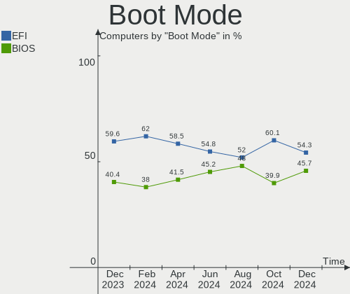
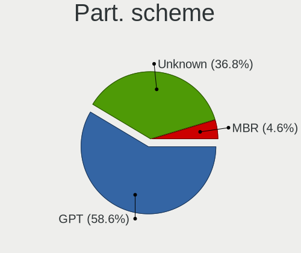
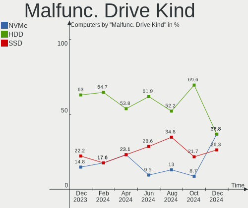
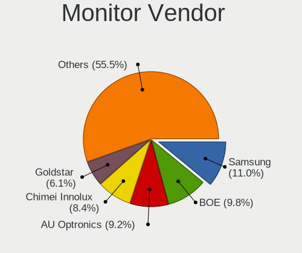
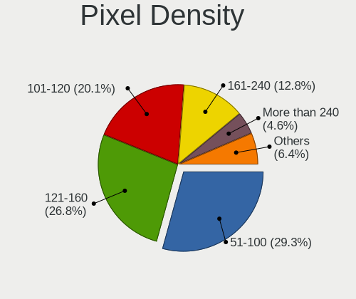
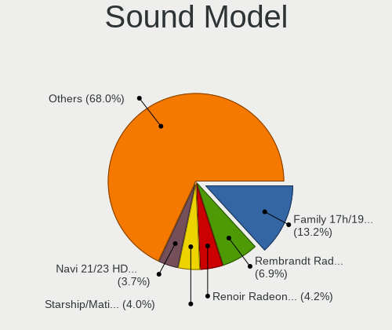
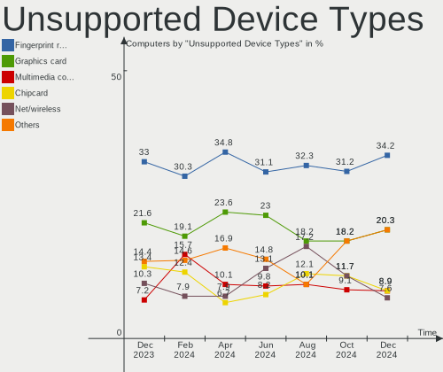

Arch - Hardware Trends
----------------------

A project to identify most popular hardware characteristics and track their change
over time based on data collected by Linux users at https://Linux-Hardware.org.

Anyone can contribute to this report by the [hw-probe](https://github.com/linuxhw/hw-probe) tool:

    sudo -E hw-probe -all -upload

This is a report for all computer types. See also reports for [desktops](/Dist/Arch/Desktop/README.md) and [notebooks](/Dist/Arch/Notebook/README.md).

This report is for one last month. Overall report since the beginning of time: [TestDays](https://github.com/linuxhw/TestDays)

Period: Jun, 2023.

Contents
--------

* [ System ](#system)
  - [ OS                       ](#os)
  - [ OS Family                ](#os-family)
  - [ Kernel                   ](#kernel)
  - [ Kernel Family            ](#kernel-family)
  - [ Kernel Major Ver.        ](#kernel-major-ver)
  - [ Arch                     ](#arch)
  - [ DE                       ](#de)
  - [ Display Server           ](#display-server)
  - [ Display Manager          ](#display-manager)
  - [ OS Lang                  ](#os-lang)
  - [ Boot Mode                ](#boot-mode)
  - [ Filesystem               ](#filesystem)
  - [ Part. scheme             ](#part-scheme)
  - [ Dual Boot with Linux/BSD ](#dual-boot-with-linuxbsd)
  - [ Dual Boot (Win)          ](#dual-boot-win)

* [ Board ](#board)
  - [ Vendor                   ](#vendor)
  - [ Model                    ](#model)
  - [ Model Family             ](#model-family)
  - [ MFG Year                 ](#mfg-year)
  - [ Form Factor              ](#form-factor)
  - [ Secure Boot              ](#secure-boot)
  - [ Coreboot                 ](#coreboot)
  - [ RAM Size                 ](#ram-size)
  - [ RAM Used                 ](#ram-used)
  - [ Total Drives             ](#total-drives)
  - [ Has CD-ROM               ](#has-cd-rom)
  - [ Has Ethernet             ](#has-ethernet)
  - [ Has WiFi                 ](#has-wifi)
  - [ Has Bluetooth            ](#has-bluetooth)

* [ Location ](#location)
  - [ Country                  ](#country)
  - [ City                     ](#city)

* [ Drives ](#drives)
  - [ Drive Vendor             ](#drive-vendor)
  - [ Drive Model              ](#drive-model)
  - [ HDD Vendor               ](#hdd-vendor)
  - [ SSD Vendor               ](#ssd-vendor)
  - [ Drive Kind               ](#drive-kind)
  - [ Drive Connector          ](#drive-connector)
  - [ Drive Size               ](#drive-size)
  - [ Space Total              ](#space-total)
  - [ Space Used               ](#space-used)
  - [ Malfunc. Drives          ](#malfunc-drives)
  - [ Malfunc. Drive Vendor    ](#malfunc-drive-vendor)
  - [ Malfunc. HDD Vendor      ](#malfunc-hdd-vendor)
  - [ Malfunc. Drive Kind      ](#malfunc-drive-kind)
  - [ Failed Drives            ](#failed-drives)
  - [ Failed Drive Vendor      ](#failed-drive-vendor)
  - [ Drive Status             ](#drive-status)

* [ Storage controller ](#storage-controller)
  - [ Storage Vendor           ](#storage-vendor)
  - [ Storage Model            ](#storage-model)
  - [ Storage Kind             ](#storage-kind)

* [ Processor ](#processor)
  - [ CPU Vendor               ](#cpu-vendor)
  - [ CPU Model                ](#cpu-model)
  - [ CPU Model Family         ](#cpu-model-family)
  - [ CPU Cores                ](#cpu-cores)
  - [ CPU Sockets              ](#cpu-sockets)
  - [ CPU Threads              ](#cpu-threads)
  - [ CPU Op-Modes             ](#cpu-op-modes)
  - [ CPU Microcode            ](#cpu-microcode)
  - [ CPU Microarch            ](#cpu-microarch)

* [ Graphics ](#graphics)
  - [ GPU Vendor               ](#gpu-vendor)
  - [ GPU Model                ](#gpu-model)
  - [ GPU Combo                ](#gpu-combo)
  - [ GPU Driver               ](#gpu-driver)
  - [ GPU Memory               ](#gpu-memory)

* [ Monitor ](#monitor)
  - [ Monitor Vendor           ](#monitor-vendor)
  - [ Monitor Model            ](#monitor-model)
  - [ Monitor Resolution       ](#monitor-resolution)
  - [ Monitor Diagonal         ](#monitor-diagonal)
  - [ Monitor Width            ](#monitor-width)
  - [ Aspect Ratio             ](#aspect-ratio)
  - [ Monitor Area             ](#monitor-area)
  - [ Pixel Density            ](#pixel-density)
  - [ Multiple Monitors        ](#multiple-monitors)

* [ Network ](#network)
  - [ Net Controller Vendor    ](#net-controller-vendor)
  - [ Net Controller Model     ](#net-controller-model)
  - [ Wireless Vendor          ](#wireless-vendor)
  - [ Wireless Model           ](#wireless-model)
  - [ Ethernet Vendor          ](#ethernet-vendor)
  - [ Ethernet Model           ](#ethernet-model)
  - [ Net Controller Kind      ](#net-controller-kind)
  - [ Used Controller          ](#used-controller)
  - [ NICs                     ](#nics)
  - [ IPv6                     ](#ipv6)

* [ Bluetooth ](#bluetooth)
  - [ Bluetooth Vendor         ](#bluetooth-vendor)
  - [ Bluetooth Model          ](#bluetooth-model)

* [ Sound ](#sound)
  - [ Sound Vendor             ](#sound-vendor)
  - [ Sound Model              ](#sound-model)

* [ Memory ](#memory)
  - [ Memory Vendor            ](#memory-vendor)
  - [ Memory Model             ](#memory-model)
  - [ Memory Kind              ](#memory-kind)
  - [ Memory Form Factor       ](#memory-form-factor)
  - [ Memory Size              ](#memory-size)
  - [ Memory Speed             ](#memory-speed)

* [ Printers & scanners ](#printers--scanners)
  - [ Printer Vendor           ](#printer-vendor)
  - [ Printer Model            ](#printer-model)
  - [ Scanner Vendor           ](#scanner-vendor)
  - [ Scanner Model            ](#scanner-model)

* [ Camera ](#camera)
  - [ Camera Vendor            ](#camera-vendor)
  - [ Camera Model             ](#camera-model)

* [ Security ](#security)
  - [ Fingerprint Vendor       ](#fingerprint-vendor)
  - [ Fingerprint Model        ](#fingerprint-model)
  - [ Chipcard Vendor          ](#chipcard-vendor)
  - [ Chipcard Model           ](#chipcard-model)

* [ Unsupported ](#unsupported)
  - [ Unsupported Devices      ](#unsupported-devices)
  - [ Unsupported Device Types ](#unsupported-device-types)

System
------

OS
--

Installed operating systems

| Name         | Computers | Percent |
|--------------|-----------|---------|
| Arch Rolling | 214       | 100%    |

OS Family
---------

OS without a version

| Name | Computers | Percent |
|------|-----------|---------|
| Arch | 214       | 100%    |

Kernel
------

Version of the Linux kernel

| Version                       | Computers | Percent |
|-------------------------------|-----------|---------|
| 6.3.5-arch1-1                 | 30        | 14.02%  |
| 6.3.6-arch1-1                 | 27        | 12.62%  |
| 6.3.8-arch1-1                 | 26        | 12.15%  |
| 6.3.9-arch1-1                 | 25        | 11.68%  |
| 6.3.7-arch1-1                 | 19        | 8.88%   |
| 6.3.9-zen1-1-zen              | 10        | 4.67%   |
| 6.3.7-zen1-1-zen              | 8         | 3.74%   |
| 6.3.5-zen1-1-zen              | 8         | 3.74%   |
| 6.3.6-zen1-1-zen              | 7         | 3.27%   |
| 6.3.8-zen1-1-zen              | 6         | 2.8%    |
| 6.3.2-arch1-1                 | 5         | 2.34%   |
| 6.1.34-1-lts                  | 5         | 2.34%   |
| 6.1.31-1-lts                  | 5         | 2.34%   |
| 6.1.35-1-lts                  | 3         | 1.4%    |
| 6.1.33-1-lts                  | 3         | 1.4%    |
| 6.3.5-zen2-1-zen              | 2         | 0.93%   |
| 6.4.0-rc7-273-tkg-cfs-llvm    | 1         | 0.47%   |
| 6.4.0-rc7-1-mainline-r7-5875u | 1         | 0.47%   |
| 6.3.8-arch1-1-g14             | 1         | 0.47%   |
| 6.3.7-zen4-xanmod1-1          | 1         | 0.47%   |
| 6.3.5-x64v1-xanmod1-1         | 1         | 0.47%   |
| 6.3.5-arch1-1-lily            | 1         | 0.47%   |
| 6.3.5-arch1-1-g14             | 1         | 0.47%   |
| 6.3.5-273-tkg-bmq             | 1         | 0.47%   |
| 6.3.4-zen1-1-zen              | 1         | 0.47%   |
| 6.3.4-arch1-1                 | 1         | 0.47%   |
| 6.3.3-x64v1-xanmod1-1         | 1         | 0.47%   |
| 6.3.1-zen2-1-zen              | 1         | 0.47%   |
| 6.3.1-arch2-1                 | 1         | 0.47%   |
| 6.3.0.11.realtime1-1-rt       | 1         | 0.47%   |
| 6.3.0-pf5                     | 1         | 0.47%   |
| 6.2.2-arch1-1                 | 1         | 0.47%   |
| 6.2.13-arch1-1                | 1         | 0.47%   |
| 6.1.8-arch1-1                 | 1         | 0.47%   |
| 6.1.35-1-cachyos-lts          | 1         | 0.47%   |
| 6.1.31-hardened1-1-hardened   | 1         | 0.47%   |
| 6.1.30-1-lts                  | 1         | 0.47%   |
| 6.1.26-1-lts                  | 1         | 0.47%   |
| 5.17.8-zen1-1-zen             | 1         | 0.47%   |
| 5.15.79-1-lts                 | 1         | 0.47%   |

Kernel Family
-------------

Linux kernel without a distro release

| Version  | Computers | Percent |
|----------|-----------|---------|
| 6.3.5    | 44        | 20.56%  |
| 6.3.9    | 35        | 16.36%  |
| 6.3.6    | 34        | 15.89%  |
| 6.3.8    | 33        | 15.42%  |
| 6.3.7    | 28        | 13.08%  |
| 6.1.31   | 6         | 2.8%    |
| 6.3.2    | 5         | 2.34%   |
| 6.1.34   | 5         | 2.34%   |
| 6.1.35   | 4         | 1.87%   |
| 6.1.33   | 3         | 1.4%    |
| 6.4.0    | 2         | 0.93%   |
| 6.3.4    | 2         | 0.93%   |
| 6.3.1    | 2         | 0.93%   |
| 6.3.3    | 1         | 0.47%   |
| 6.3.0.11 | 1         | 0.47%   |
| 6.3.0    | 1         | 0.47%   |
| 6.2.2    | 1         | 0.47%   |
| 6.2.13   | 1         | 0.47%   |
| 6.1.8    | 1         | 0.47%   |
| 6.1.30   | 1         | 0.47%   |
| 6.1.26   | 1         | 0.47%   |
| 5.17.8   | 1         | 0.47%   |
| 5.15.79  | 1         | 0.47%   |
| 5.12.3   | 1         | 0.47%   |

Kernel Major Ver.
-----------------

Linux kernel major version

| Version | Computers | Percent |
|---------|-----------|---------|
| 6.3     | 185       | 86.45%  |
| 6.1     | 21        | 9.81%   |
| 6.4     | 2         | 0.93%   |
| 6.2     | 2         | 0.93%   |
| 6.3.0   | 1         | 0.47%   |
| 5.17    | 1         | 0.47%   |
| 5.15    | 1         | 0.47%   |
| 5.12    | 1         | 0.47%   |

Arch
----

OS architecture (x86_64, i586, etc.)

| Name   | Computers | Percent |
|--------|-----------|---------|
| x86_64 | 214       | 100%    |

DE
--

Desktop Environment

| Name          | Computers | Percent |
|---------------|-----------|---------|
| KDE5          | 85        | 39.72%  |
| GNOME         | 68        | 31.78%  |
| XFCE          | 14        | 6.54%   |
| i3            | 13        | 6.07%   |
| Unknown       | 13        | 6.07%   |
| Hyprland      | 5         | 2.34%   |
| sway          | 4         | 1.87%   |
| X-Cinnamon    | 3         | 1.4%    |
| KDE           | 3         | 1.4%    |
| Wayfire       | 1         | 0.47%   |
| MATE          | 1         | 0.47%   |
| LeftWM        | 1         | 0.47%   |
| GNOME Classic | 1         | 0.47%   |
| dwm           | 1         | 0.47%   |
| chadwm        | 1         | 0.47%   |

Display Server
--------------

X11 or Wayland

| Name    | Computers | Percent |
|---------|-----------|---------|
| X11     | 103       | 48.13%  |
| Wayland | 82        | 38.32%  |
| Tty     | 17        | 7.94%   |
| Unknown | 12        | 5.61%   |

Display Manager
---------------

SDDM, LightDM, etc.

| Name    | Computers | Percent |
|---------|-----------|---------|
| Unknown | 86        | 40.19%  |
| SDDM    | 60        | 28.04%  |
| LightDM | 35        | 16.36%  |
| GDM     | 28        | 13.08%  |
| LY-DM   | 1         | 0.47%   |
| Ly      | 1         | 0.47%   |
| LXDM    | 1         | 0.47%   |
| GREETD  | 1         | 0.47%   |
| EMPTTY  | 1         | 0.47%   |

OS Lang
-------

Language

| Lang        | Computers | Percent |
|-------------|-----------|---------|
| en_US       | 109       | 50.93%  |
| C           | 17        | 7.94%   |
| pt_BR       | 10        | 4.67%   |
| en_GB       | 10        | 4.67%   |
| zh_CN       | 9         | 4.21%   |
| de_DE       | 8         | 3.74%   |
| fr_FR       | 6         | 2.8%    |
| es_ES       | 6         | 2.8%    |
| Unknown     | 6         | 2.8%    |
| it_IT       | 4         | 1.87%   |
| ru_RU       | 3         | 1.4%    |
| en_CA       | 3         | 1.4%    |
| zh_TW       | 2         | 0.93%   |
| tr_TR       | 2         | 0.93%   |
| pt_PT       | 2         | 0.93%   |
| es_MX       | 2         | 0.93%   |
| en_IN       | 2         | 0.93%   |
| sv_SE       | 1         | 0.47%   |
| pt_BR~      | 1         | 0.47%   |
| pl_PL       | 1         | 0.47%   |
| it_IT@euro  | 1         | 0.47%   |
| fr_FR@euro  | 1         | 0.47%   |
| es_PE       | 1         | 0.47%   |
| es_GT       | 1         | 0.47%   |
| es_CO.UTF8  | 1         | 0.47%   |
| en_US.utf-8 | 1         | 0.47%   |
| en_SG       | 1         | 0.47%   |
| en_DK       | 1         | 0.47%   |
| en_AU       | 1         | 0.47%   |
| da_DK       | 1         | 0.47%   |

Boot Mode
---------

EFI or BIOS

| Mode | Computers | Percent |
|------|-----------|---------|
| EFI  | 139       | 64.95%  |
| BIOS | 75        | 35.05%  |

Filesystem
----------

Type of filesystem

| Type    | Computers | Percent |
|---------|-----------|---------|
| Ext4    | 144       | 67.29%  |
| Btrfs   | 58        | 27.1%   |
| Xfs     | 3         | 1.4%    |
| Tmpfs   | 3         | 1.4%    |
| Overlay | 2         | 0.93%   |
| Unknown | 2         | 0.93%   |
| Zfs     | 1         | 0.47%   |
| F2fs    | 1         | 0.47%   |

Part. scheme
------------

Scheme of partitioning

| Type    | Computers | Percent |
|---------|-----------|---------|
| GPT     | 150       | 70.09%  |
| Unknown | 58        | 27.1%   |
| MBR     | 6         | 2.8%    |

Dual Boot with Linux/BSD
------------------------

Hosting more than one Linux/BSD

| Dual boot | Computers | Percent |
|-----------|-----------|---------|
| No        | 184       | 85.98%  |
| Yes       | 30        | 14.02%  |

Dual Boot (Win)
---------------

Hosting Linux and Windows

| Dual boot | Computers | Percent |
|-----------|-----------|---------|
| No        | 148       | 69.16%  |
| Yes       | 66        | 30.84%  |

Board
-----

Vendor
------

Motherboard manufacturer

| Name                | Computers | Percent |
|---------------------|-----------|---------|
| ASUSTek Computer    | 43        | 20.09%  |
| Lenovo              | 40        | 18.69%  |
| Hewlett-Packard     | 23        | 10.75%  |
| Dell                | 19        | 8.88%   |
| MSI                 | 18        | 8.41%   |
| Gigabyte Technology | 16        | 7.48%   |
| Acer                | 13        | 6.07%   |
| ASRock              | 6         | 2.8%    |
| Samsung Electronics | 4         | 1.87%   |
| Apple               | 4         | 1.87%   |
| HUAWEI              | 3         | 1.4%    |
| Microsoft           | 2         | 0.93%   |
| Fujitsu             | 2         | 0.93%   |
| Unknown             | 2         | 0.93%   |
| TUXEDO              | 1         | 0.47%   |
| Timi                | 1         | 0.47%   |
| Schenker            | 1         | 0.47%   |
| Pegatron            | 1         | 0.47%   |
| Notebook            | 1         | 0.47%   |
| NEC Computers       | 1         | 0.47%   |
| Medion              | 1         | 0.47%   |
| MECHREVO            | 1         | 0.47%   |
| IP3 Technology      | 1         | 0.47%   |
| Intel               | 1         | 0.47%   |
| Huanan              | 1         | 0.47%   |
| HONOR               | 1         | 0.47%   |
| HASEE Computer      | 1         | 0.47%   |
| GPU Company         | 1         | 0.47%   |
| Google              | 1         | 0.47%   |
| Cube                | 1         | 0.47%   |
| COLORFUL            | 1         | 0.47%   |
| Chuwi               | 1         | 0.47%   |
| Casper              | 1         | 0.47%   |

Model
-----

Motherboard model

| Name                                  | Computers | Percent |
|---------------------------------------|-----------|---------|
| Acer Swift SF314-43                   | 3         | 1.4%    |
| MSI MS-7E06                           | 2         | 0.93%   |
| MSI MS-7C56                           | 2         | 0.93%   |
| MSI MS-7B89                           | 2         | 0.93%   |
| Lenovo IdeaPad S145-15IWL 81S9        | 2         | 0.93%   |
| Lenovo IdeaPad 330-15IGM 81D1         | 2         | 0.93%   |
| HP Pavilion Gaming Laptop 15-ec2xxx   | 2         | 0.93%   |
| ASUS ROG CROSSHAIR VIII DARK HERO     | 2         | 0.93%   |
| ASUS All Series                       | 2         | 0.93%   |
| Unknown                               | 2         | 0.93%   |
| TUXEDO Polaris AMD Gen2 (REN)         | 1         | 0.47%   |
| Timi Redmi Book Pro 15 2022           | 1         | 0.47%   |
| Schenker XMG FUSION 15 (XFU15M22)     | 1         | 0.47%   |
| Samsung 950XCJ/951XCJ/950XCR          | 1         | 0.47%   |
| Samsung 930QCG                        | 1         | 0.47%   |
| Samsung 750XDA                        | 1         | 0.47%   |
| Samsung 300E4C/300E5C/300E7C          | 1         | 0.47%   |
| Pegatron 320-1030                     | 1         | 0.47%   |
| Notebook PCX0DX                       | 1         | 0.47%   |
| NEC Computers PC-LM550LS6R            | 1         | 0.47%   |
| MSI MSIS336 MS-S336                   | 1         | 0.47%   |
| MSI MS-7D09                           | 1         | 0.47%   |
| MSI MS-7C95                           | 1         | 0.47%   |
| MSI MS-7C79                           | 1         | 0.47%   |
| MSI MS-7C37                           | 1         | 0.47%   |
| MSI MS-7C02                           | 1         | 0.47%   |
| MSI MS-7B79                           | 1         | 0.47%   |
| MSI MS-7A70                           | 1         | 0.47%   |
| MSI MS-7821                           | 1         | 0.47%   |
| MSI Katana GF66 11UG                  | 1         | 0.47%   |
| MSI GS63 7RD                          | 1         | 0.47%   |
| MSI Crosshair 15 C12VF                | 1         | 0.47%   |
| Microsoft Surface Laptop 4            | 1         | 0.47%   |
| Microsoft Surface Laptop              | 1         | 0.47%   |
| Medion E2291                          | 1         | 0.47%   |
| MECHREVO Jiaolong16K Series GM6BG5Q   | 1         | 0.47%   |
| Lenovo Yoga Slim 7 Carbon 14ACN6 82L0 | 1         | 0.47%   |
| Lenovo Yoga 500-14ISK 80R5            | 1         | 0.47%   |
| Lenovo Yoga 14sITL 2021 82G2          | 1         | 0.47%   |
| Lenovo XiaoXinPro 14ITL 2021 82GH     | 1         | 0.47%   |

Model Family
------------

Motherboard model prefix

| Name                | Computers | Percent |
|---------------------|-----------|---------|
| Lenovo ThinkPad     | 20        | 9.35%   |
| ASUS ROG            | 9         | 4.21%   |
| ASUS TUF            | 8         | 3.74%   |
| Dell Inspiron       | 6         | 2.8%    |
| ASUS PRIME          | 6         | 2.8%    |
| Lenovo Legion       | 5         | 2.34%   |
| Lenovo IdeaPad      | 5         | 2.34%   |
| HP Pavilion         | 5         | 2.34%   |
| HP EliteBook        | 5         | 2.34%   |
| ASUS ASUS           | 5         | 2.34%   |
| Acer Aspire         | 5         | 2.34%   |
| HP OMEN             | 4         | 1.87%   |
| Dell XPS            | 4         | 1.87%   |
| Dell Latitude       | 4         | 1.87%   |
| ASUS VivoBook       | 4         | 1.87%   |
| Acer Swift          | 4         | 1.87%   |
| Lenovo Yoga         | 3         | 1.4%    |
| Acer Nitro          | 3         | 1.4%    |
| MSI MS-7E06         | 2         | 0.93%   |
| MSI MS-7C56         | 2         | 0.93%   |
| MSI MS-7B89         | 2         | 0.93%   |
| Microsoft Surface   | 2         | 0.93%   |
| Lenovo ThinkStation | 2         | 0.93%   |
| Lenovo ThinkBook    | 2         | 0.93%   |
| HP Laptop           | 2         | 0.93%   |
| Gigabyte B550       | 2         | 0.93%   |
| Gigabyte AERO       | 2         | 0.93%   |
| Dell Precision      | 2         | 0.93%   |
| ASUS Zenbook        | 2         | 0.93%   |
| ASUS All            | 2         | 0.93%   |
| Unknown             | 2         | 0.93%   |
| TUXEDO Polaris      | 1         | 0.47%   |
| Timi Redmi          | 1         | 0.47%   |
| Schenker XMG        | 1         | 0.47%   |
| Samsung 950XCJ      | 1         | 0.47%   |
| Samsung 930QCG      | 1         | 0.47%   |
| Samsung 750XDA      | 1         | 0.47%   |
| Samsung 300E4C      | 1         | 0.47%   |
| Pegatron 320-1030   | 1         | 0.47%   |
| Notebook PCX0DX     | 1         | 0.47%   |

MFG Year
--------

Motherboard manufacture year

| Year | Computers | Percent |
|------|-----------|---------|
| 2021 | 40        | 18.69%  |
| 2020 | 31        | 14.49%  |
| 2022 | 28        | 13.08%  |
| 2019 | 23        | 10.75%  |
| 2023 | 13        | 6.07%   |
| 2018 | 11        | 5.14%   |
| 2015 | 11        | 5.14%   |
| 2017 | 10        | 4.67%   |
| 2016 | 10        | 4.67%   |
| 2013 | 10        | 4.67%   |
| 2012 | 9         | 4.21%   |
| 2011 | 7         | 3.27%   |
| 2014 | 6         | 2.8%    |
| 2010 | 3         | 1.4%    |
| 2008 | 2         | 0.93%   |

Form Factor
-----------

Physical design of the computer

| Name        | Computers | Percent |
|-------------|-----------|---------|
| Notebook    | 127       | 59.35%  |
| Desktop     | 70        | 32.71%  |
| Convertible | 10        | 4.67%   |
| Mini pc     | 3         | 1.4%    |
| Tablet      | 2         | 0.93%   |
| All in one  | 1         | 0.47%   |
| Server      | 1         | 0.47%   |

Secure Boot
-----------

Enabled or disabled

| State    | Computers | Percent |
|----------|-----------|---------|
| Disabled | 208       | 97.2%   |
| Enabled  | 6         | 2.8%    |

Coreboot
--------

Have coreboot on board

| Used | Computers | Percent |
|------|-----------|---------|
| No   | 213       | 99.53%  |
| Yes  | 1         | 0.47%   |

RAM Size
--------

Total RAM memory

| Size in GB  | Computers | Percent |
|-------------|-----------|---------|
| 16.01-24.0  | 65        | 30.37%  |
| 8.01-16.0   | 44        | 20.56%  |
| 32.01-64.0  | 40        | 18.69%  |
| 4.01-8.0    | 33        | 15.42%  |
| 64.01-256.0 | 14        | 6.54%   |
| 3.01-4.0    | 11        | 5.14%   |
| 24.01-32.0  | 6         | 2.8%    |
| 2.01-3.0    | 1         | 0.47%   |

RAM Used
--------

Used RAM memory

| Used GB    | Computers | Percent |
|------------|-----------|---------|
| 4.01-8.0   | 63        | 29.44%  |
| 3.01-4.0   | 50        | 23.36%  |
| 2.01-3.0   | 40        | 18.69%  |
| 1.01-2.0   | 27        | 12.62%  |
| 8.01-16.0  | 26        | 12.15%  |
| 16.01-24.0 | 3         | 1.4%    |
| 24.01-32.0 | 2         | 0.93%   |
| 0.51-1.0   | 2         | 0.93%   |
| 32.01-64.0 | 1         | 0.47%   |

Total Drives
------------

Number of drives on board

| Drives | Computers | Percent |
|--------|-----------|---------|
| 1      | 114       | 53.27%  |
| 2      | 59        | 27.57%  |
| 3      | 22        | 10.28%  |
| 4      | 11        | 5.14%   |
| 5      | 4         | 1.87%   |
| 6      | 3         | 1.4%    |
| 7      | 1         | 0.47%   |

Has CD-ROM
----------

Has CD-ROM on board

| Presented | Computers | Percent |
|-----------|-----------|---------|
| No        | 186       | 86.92%  |
| Yes       | 28        | 13.08%  |

Has Ethernet
------------

Has Ethernet on board

| Presented | Computers | Percent |
|-----------|-----------|---------|
| Yes       | 166       | 77.57%  |
| No        | 48        | 22.43%  |

Has WiFi
--------

Has WiFi module

| Presented | Computers | Percent |
|-----------|-----------|---------|
| Yes       | 173       | 80.84%  |
| No        | 41        | 19.16%  |

Has Bluetooth
-------------

Has Bluetooth module

| Presented | Computers | Percent |
|-----------|-----------|---------|
| Yes       | 174       | 81.31%  |
| No        | 40        | 18.69%  |

Location
--------

Country
-------

Geographic location (country)

| Country     | Computers | Percent |
|-------------|-----------|---------|
| USA         | 32        | 14.95%  |
| Germany     | 26        | 12.15%  |
| Brazil      | 14        | 6.54%   |
| France      | 11        | 5.14%   |
| Spain       | 8         | 3.74%   |
| China       | 8         | 3.74%   |
| Italy       | 7         | 3.27%   |
| Canada      | 7         | 3.27%   |
| Turkey      | 6         | 2.8%    |
| Poland      | 6         | 2.8%    |
| Russia      | 5         | 2.34%   |
| UK          | 4         | 1.87%   |
| Taiwan      | 4         | 1.87%   |
| Portugal    | 4         | 1.87%   |
| Peru        | 4         | 1.87%   |
| Sweden      | 3         | 1.4%    |
| Mexico      | 3         | 1.4%    |
| Lithuania   | 3         | 1.4%    |
| India       | 3         | 1.4%    |
| Egypt       | 3         | 1.4%    |
| Denmark     | 3         | 1.4%    |
| Colombia    | 3         | 1.4%    |
| Vietnam     | 2         | 0.93%   |
| Thailand    | 2         | 0.93%   |
| Switzerland | 2         | 0.93%   |
| South Korea | 2         | 0.93%   |
| Slovenia    | 2         | 0.93%   |
| Singapore   | 2         | 0.93%   |
| Romania     | 2         | 0.93%   |
| Qatar       | 2         | 0.93%   |
| Netherlands | 2         | 0.93%   |
| Malaysia    | 2         | 0.93%   |
| Iran        | 2         | 0.93%   |
| Indonesia   | 2         | 0.93%   |
| Hungary     | 2         | 0.93%   |
| Hong Kong   | 2         | 0.93%   |
| Australia   | 2         | 0.93%   |
| Uruguay     | 1         | 0.47%   |
| Serbia      | 1         | 0.47%   |
| Norway      | 1         | 0.47%   |

City
----

Geographic location (city)

| City              | Computers | Percent |
|-------------------|-----------|---------|
| Lima              | 4         | 1.87%   |
| Warsaw            | 3         | 1.4%    |
| Istanbul          | 3         | 1.4%    |
| Singapore         | 2         | 0.93%   |
| Nuremberg         | 2         | 0.93%   |
| Munich            | 2         | 0.93%   |
| Montreal          | 2         | 0.93%   |
| Kaunas            | 2         | 0.93%   |
| Ipoh              | 2         | 0.93%   |
| Grand Rapids      | 2         | 0.93%   |
| Essen             | 2         | 0.93%   |
| Düsseldorf       | 2         | 0.93%   |
| Doha              | 2         | 0.93%   |
| Dallas            | 2         | 0.93%   |
| Curitiba          | 2         | 0.93%   |
| Central           | 2         | 0.93%   |
| Budapest          | 2         | 0.93%   |
| Bogotá           | 2         | 0.93%   |
| Zhongli District  | 1         | 0.47%   |
| Zhengzhou         | 1         | 0.47%   |
| Zaragoza          | 1         | 0.47%   |
| Zamora            | 1         | 0.47%   |
| Zagreb            | 1         | 0.47%   |
| York              | 1         | 0.47%   |
| Yecla             | 1         | 0.47%   |
| Yangmei District  | 1         | 0.47%   |
| Wilmington        | 1         | 0.47%   |
| West Lebanon      | 1         | 0.47%   |
| Weifang           | 1         | 0.47%   |
| Waverly           | 1         | 0.47%   |
| Waterloo          | 1         | 0.47%   |
| Voluntari         | 1         | 0.47%   |
| Vitória          | 1         | 0.47%   |
| Vilnius           | 1         | 0.47%   |
| Vila Nova de Gaia | 1         | 0.47%   |
| Vancouver         | 1         | 0.47%   |
| Uruapan           | 1         | 0.47%   |
| Uberlândia       | 1         | 0.47%   |
| Tver              | 1         | 0.47%   |
| Trzin             | 1         | 0.47%   |

Drives
------

Drive Vendor
------------

Hard drive vendors

| Vendor                      | Computers | Drives | Percent |
|-----------------------------|-----------|--------|---------|
| Samsung Electronics         | 62        | 71     | 17.87%  |
| WDC                         | 35        | 41     | 10.09%  |
| Sandisk                     | 35        | 37     | 10.09%  |
| Seagate                     | 29        | 38     | 8.36%   |
| SK hynix                    | 19        | 19     | 5.48%   |
| Kingston                    | 17        | 18     | 4.9%    |
| Crucial                     | 15        | 17     | 4.32%   |
| Toshiba                     | 12        | 12     | 3.46%   |
| Micron Technology           | 10        | 10     | 2.88%   |
| Intel                       | 10        | 10     | 2.88%   |
| Kingston Technology Company | 7         | 7      | 2.02%   |
| Micron/Crucial Technology   | 6         | 7      | 1.73%   |
| Unknown                     | 5         | 7      | 1.44%   |
| JMicron Technology          | 5         | 5      | 1.44%   |
| Yangtze Memory Technologies | 4         | 4      | 1.15%   |
| Phison Electronics          | 4         | 6      | 1.15%   |
| Netac                       | 4         | 4      | 1.15%   |
| MAXIO Technology (Hangzhou) | 4         | 4      | 1.15%   |
| KIOXIA                      | 4         | 4      | 1.15%   |
| HGST                        | 4         | 5      | 1.15%   |
| A-DATA Technology           | 4         | 4      | 1.15%   |
| Team                        | 3         | 4      | 0.86%   |
| Silicon Motion              | 3         | 3      | 0.86%   |
| Realtek Semiconductor       | 3         | 3      | 0.86%   |
| PNY                         | 3         | 3      | 0.86%   |
| Hitachi                     | 3         | 4      | 0.86%   |
| China                       | 3         | 3      | 0.86%   |
| Apple                       | 3         | 3      | 0.86%   |
| OCZ                         | 2         | 2      | 0.58%   |
| XrayDisk                    | 1         | 1      | 0.29%   |
| XPG                         | 1         | 1      | 0.29%   |
| Wibtek                      | 1         | 1      | 0.29%   |
| WALRAM                      | 1         | 1      | 0.29%   |
| VUCCAN                      | 1         | 1      | 0.29%   |
| V7                          | 1         | 1      | 0.29%   |
| Unknown (690)               | 1         | 1      | 0.29%   |
| Transcend                   | 1         | 1      | 0.29%   |
| TO Exter                    | 1         | 1      | 0.29%   |
| SSK                         | 1         | 1      | 0.29%   |
| SPCC                        | 1         | 1      | 0.29%   |

Drive Model
-----------

Hard drive models

| Model                                                 | Computers | Percent |
|-------------------------------------------------------|-----------|---------|
| Samsung NVMe SSD Controller SM981/PM981/PM983 250GB   | 22        | 5.93%   |
| Samsung NVMe SSD Controller PM9A1/PM9A3/980PRO 2TB    | 12        | 3.23%   |
| Sandisk WD Black SN750 / PC SN730 NVMe SSD 500GB      | 7         | 1.89%   |
| Seagate ST2000DM008-2FR102 2TB                        | 5         | 1.35%   |
| Crucial CT500MX500SSD1 500GB                          | 5         | 1.35%   |
| Sandisk WD Blue SN550 NVMe SSD 1TB                    | 4         | 1.08%   |
| Samsung SSD 980 500GB                                 | 4         | 1.08%   |
| Kingston SA400S37240G 240GB SSD                       | 4         | 1.08%   |
| JMicron Generic 240GB                                 | 4         | 1.08%   |
| Intel SSDPEKNU512GZ 512GB                             | 4         | 1.08%   |
| Seagate ST1000DM010-2EP102 1TB                        | 3         | 0.81%   |
| Sandisk WD Black 2018/SN750 / PC SN720 NVMe SSD 500GB | 3         | 0.81%   |
| Samsung SSD 980 1TB                                   | 3         | 0.81%   |
| Samsung NVMe SSD Controller SM961/PM961/SM963 256GB   | 3         | 0.81%   |
| Micron/Crucial P2 NVMe PCIe SSD 4TB                   | 3         | 0.81%   |
| WDC WD10EZEX-00WN4A0 1TB                              | 2         | 0.54%   |
| WDC WD10EFRX-68FYTN0 1TB                              | 2         | 0.54%   |
| Unknown MMC Card  32GB                                | 2         | 0.54%   |
| Toshiba XG6 NVMe SSD Controller 2TB                   | 2         | 0.54%   |
| Toshiba BG3 NVMe SSD Controller 512GB                 | 2         | 0.54%   |
| SK hynix SKHynix_HFS512GDE9X081N 512GB                | 2         | 0.54%   |
| SK hynix PC801 NVMe 1TB                               | 2         | 0.54%   |
| SK hynix BC501 NVMe Solid State Drive 512GB           | 2         | 0.54%   |
| Silicon Motion SM2263EN/SM2263XT SSD Controller 256GB | 2         | 0.54%   |
| Seagate ST9500325AS 500GB                             | 2         | 0.54%   |
| Seagate ST2000LM015-2E8174 2TB                        | 2         | 0.54%   |
| Seagate BUP Portable 4TB                              | 2         | 0.54%   |
| Sandisk WD Blue SN570 1TB                             | 2         | 0.54%   |
| Sandisk PC SN530 NVMe WDC 256GB                       | 2         | 0.54%   |
| Samsung SSD 860 EVO 1TB                               | 2         | 0.54%   |
| Samsung SSD 850 EVO 250GB                             | 2         | 0.54%   |
| Samsung NVMe SSD Controller SM951/PM951 256GB         | 2         | 0.54%   |
| Samsung MZVLQ512HBLU-00B00 512GB                      | 2         | 0.54%   |
| Realtek RTS5763DL NVMe SSD Controller 512GB           | 2         | 0.54%   |
| Phison E12 NVMe Controller 1TB                        | 2         | 0.54%   |
| Micron 1100_MTFDDAV256TBN 256GB SSD                   | 2         | 0.54%   |
| MAXIO (Hangzhou) NVMe SSD Controller MAP1202 512GB    | 2         | 0.54%   |
| Kingston Company SNV2S1000G 1TB                       | 2         | 0.54%   |
| Kingston SNVS500G 500GB                               | 2         | 0.54%   |
| Intel SSD 660P Series 512GB                           | 2         | 0.54%   |

HDD Vendor
----------

Hard disk drive vendors

| Vendor              | Computers | Drives | Percent |
|---------------------|-----------|--------|---------|
| WDC                 | 33        | 38     | 41.25%  |
| Seagate             | 29        | 38     | 36.25%  |
| Toshiba             | 7         | 7      | 8.75%   |
| HGST                | 4         | 5      | 5%      |
| Hitachi             | 3         | 4      | 3.75%   |
| SSK                 | 1         | 1      | 1.25%   |
| Samsung Electronics | 1         | 1      | 1.25%   |
| SAGE                | 1         | 1      | 1.25%   |
| Apple               | 1         | 1      | 1.25%   |

SSD Vendor
----------

Solid state drive vendors

| Vendor              | Computers | Drives | Percent |
|---------------------|-----------|--------|---------|
| Samsung Electronics | 17        | 17     | 18.09%  |
| Crucial             | 15        | 17     | 15.96%  |
| Kingston            | 11        | 12     | 11.7%   |
| SanDisk             | 8         | 9      | 8.51%   |
| WDC                 | 3         | 3      | 3.19%   |
| Team                | 3         | 4      | 3.19%   |
| PNY                 | 3         | 3      | 3.19%   |
| Micron Technology   | 3         | 3      | 3.19%   |
| China               | 3         | 3      | 3.19%   |
| A-DATA Technology   | 3         | 3      | 3.19%   |
| OCZ                 | 2         | 2      | 2.13%   |
| Netac               | 2         | 2      | 2.13%   |
| XrayDisk            | 1         | 1      | 1.06%   |
| V7                  | 1         | 1      | 1.06%   |
| Unknown (690)       | 1         | 1      | 1.06%   |
| Transcend           | 1         | 1      | 1.06%   |
| Toshiba             | 1         | 1      | 1.06%   |
| TO Exter            | 1         | 1      | 1.06%   |
| SPCC                | 1         | 1      | 1.06%   |
| SK hynix            | 1         | 1      | 1.06%   |
| Phison              | 1         | 1      | 1.06%   |
| Patriot             | 1         | 1      | 1.06%   |
| Lexar               | 1         | 1      | 1.06%   |
| Kingchuxing         | 1         | 1      | 1.06%   |
| Intenso             | 1         | 1      | 1.06%   |
| Intel               | 1         | 1      | 1.06%   |
| Hikvision           | 1         | 1      | 1.06%   |
| GOODRAM             | 1         | 1      | 1.06%   |
| Gigabyte Technology | 1         | 1      | 1.06%   |
| FORESEE             | 1         | 1      | 1.06%   |
| Emtec               | 1         | 1      | 1.06%   |
| Apple               | 1         | 1      | 1.06%   |
| Acer                | 1         | 1      | 1.06%   |

Drive Kind
----------

HDD or SSD

| Kind    | Computers | Drives | Percent |
|---------|-----------|--------|---------|
| NVMe    | 144       | 178    | 47.06%  |
| SSD     | 83        | 99     | 27.12%  |
| HDD     | 69        | 96     | 22.55%  |
| Unknown | 7         | 8      | 2.29%   |
| MMC     | 3         | 3      | 0.98%   |

Drive Connector
---------------

SATA, SAS, NVMe, etc.

| Type | Computers | Drives | Percent |
|------|-----------|--------|---------|
| NVMe | 141       | 173    | 51.46%  |
| SATA | 115       | 191    | 41.97%  |
| SAS  | 15        | 17     | 5.47%   |
| MMC  | 3         | 3      | 1.09%   |

Drive Size
----------

Size of hard drive

| Size in TB | Computers | Drives | Percent |
|------------|-----------|--------|---------|
| 0.01-0.5   | 68        | 84     | 43.04%  |
| 0.51-1.0   | 50        | 60     | 31.65%  |
| 1.01-2.0   | 23        | 32     | 14.56%  |
| 3.01-4.0   | 7         | 7      | 4.43%   |
| 4.01-10.0  | 4         | 4      | 2.53%   |
| 2.01-3.0   | 3         | 4      | 1.9%    |
| 10.01-20.0 | 3         | 4      | 1.9%    |

Space Total
-----------

Amount of disk space available on the file system

| Size in GB     | Computers | Percent |
|----------------|-----------|---------|
| 251-500        | 54        | 25.23%  |
| 501-1000       | 40        | 18.69%  |
| 101-250        | 35        | 16.36%  |
| More than 3000 | 30        | 14.02%  |
| 1001-2000      | 24        | 11.21%  |
| 2001-3000      | 12        | 5.61%   |
| 51-100         | 11        | 5.14%   |
| Unknown        | 5         | 2.34%   |
| 21-50          | 2         | 0.93%   |
| 1-20           | 1         | 0.47%   |

Space Used
----------

Amount of used disk space

| Used GB        | Computers | Percent |
|----------------|-----------|---------|
| 1-20           | 38        | 17.76%  |
| 251-500        | 34        | 15.89%  |
| 101-250        | 31        | 14.49%  |
| 21-50          | 30        | 14.02%  |
| 51-100         | 25        | 11.68%  |
| 1001-2000      | 22        | 10.28%  |
| 501-1000       | 15        | 7.01%   |
| More than 3000 | 11        | 5.14%   |
| Unknown        | 5         | 2.34%   |
| 2001-3000      | 3         | 1.4%    |

Malfunc. Drives
---------------

Drive models with a malfunction

| Model                                                          | Computers | Drives | Percent |
|----------------------------------------------------------------|-----------|--------|---------|
| WDC WD5000AAKX-75U6AA0 500GB                                   | 1         | 1      | 4%      |
| WDC WD20EFRX-68EUZN0 2TB                                       | 1         | 2      | 4%      |
| WDC WD10SPCX-24HWST1 1TB                                       | 1         | 1      | 4%      |
| WDC WD10EZEX-00WN4A0 1TB                                       | 1         | 1      | 4%      |
| WDC WD10EARS-00Y5B1 1TB                                        | 1         | 1      | 4%      |
| WDC WD10EALX-759BA1 1TB                                        | 1         | 1      | 4%      |
| WDC WD10 JPVX-75JC3T0 1TB                                      | 1         | 1      | 4%      |
| Toshiba MK6034GSX 64GB                                         | 1         | 1      | 4%      |
| SK hynix SC308 SATA 256GB SSD                                  | 1         | 1      | 4%      |
| Silicon Motion SM2263EN/SM2263XT SSD Controller 256GB          | 1         | 1      | 4%      |
| Seagate ST4000DM005-2DP166 4TB                                 | 1         | 1      | 4%      |
| Seagate ST3320311CS 320GB                                      | 1         | 1      | 4%      |
| Seagate ST2000DM008-2FR102 2TB                                 | 1         | 1      | 4%      |
| Seagate ST2000DM006-2DM164 2TB                                 | 1         | 1      | 4%      |
| Seagate ST2000DM001-1CH164 2TB                                 | 1         | 1      | 4%      |
| Seagate ST1000DM010-2EP102 1TB                                 | 1         | 1      | 4%      |
| Samsung Electronics SSD 980 500GB                              | 1         | 1      | 4%      |
| Samsung Electronics NVMe SSD Controller PM9A1/PM9A3/980PRO 2TB | 1         | 1      | 4%      |
| Samsung Electronics MZNLH128HBHQ-000H1 128GB SSD               | 1         | 1      | 4%      |
| Samsung Electronics MZ7TD128HAFV-000L1 128GB SSD               | 1         | 1      | 4%      |
| Micron Technology 1100_MTFDDAV256TBN 256GB SSD                 | 1         | 1      | 4%      |
| Kingston SKC400S371T 1TB SSD                                   | 1         | 1      | 4%      |
| Hitachi HUS724030ALE641 3TB                                    | 1         | 2      | 4%      |
| Crucial CT525MX300SSD1 528GB                                   | 1         | 1      | 4%      |
| Apple HDD HTS545050A7E362 500GB                                | 1         | 1      | 4%      |

Malfunc. Drive Vendor
---------------------

Vendors of faulty drives

| Vendor              | Computers | Drives | Percent |
|---------------------|-----------|--------|---------|
| WDC                 | 7         | 8      | 28%     |
| Seagate             | 6         | 6      | 24%     |
| Samsung Electronics | 4         | 4      | 16%     |
| Toshiba             | 1         | 1      | 4%      |
| SK hynix            | 1         | 1      | 4%      |
| Silicon Motion      | 1         | 1      | 4%      |
| Micron Technology   | 1         | 1      | 4%      |
| Kingston            | 1         | 1      | 4%      |
| Hitachi             | 1         | 2      | 4%      |
| Crucial             | 1         | 1      | 4%      |
| Apple               | 1         | 1      | 4%      |

Malfunc. HDD Vendor
-------------------

Vendors of faulty HDD drives

| Vendor  | Computers | Drives | Percent |
|---------|-----------|--------|---------|
| WDC     | 7         | 8      | 43.75%  |
| Seagate | 6         | 6      | 37.5%   |
| Toshiba | 1         | 1      | 6.25%   |
| Hitachi | 1         | 2      | 6.25%   |
| Apple   | 1         | 1      | 6.25%   |

Malfunc. Drive Kind
-------------------

Kinds of faulty drives

| Kind | Computers | Drives | Percent |
|------|-----------|--------|---------|
| HDD  | 16        | 18     | 64%     |
| SSD  | 6         | 6      | 24%     |
| NVMe | 3         | 3      | 12%     |

Failed Drives
-------------

Failed drive models

Zero info for selected period =(

Failed Drive Vendor
-------------------

Failed drive vendors

Zero info for selected period =(

Drive Status
------------

Number of failed and malfunc. drives

| Status   | Computers | Drives | Percent |
|----------|-----------|--------|---------|
| Works    | 115       | 180    | 48.12%  |
| Detected | 102       | 177    | 42.68%  |
| Malfunc  | 22        | 27     | 9.21%   |

Storage controller
------------------

Storage Vendor
--------------

Storage controller vendors

| Vendor                         | Computers | Percent |
|--------------------------------|-----------|---------|
| Intel                          | 110       | 33.95%  |
| AMD                            | 51        | 15.74%  |
| Samsung Electronics            | 48        | 14.81%  |
| SanDisk                        | 27        | 8.33%   |
| SK hynix                       | 18        | 5.56%   |
| Kingston Technology Company    | 12        | 3.7%    |
| Micron Technology              | 7         | 2.16%   |
| Micron/Crucial Technology      | 6         | 1.85%   |
| ASMedia Technology             | 5         | 1.54%   |
| Yangtze Memory Technologies    | 4         | 1.23%   |
| Toshiba America Info Systems   | 4         | 1.23%   |
| Phison Electronics             | 4         | 1.23%   |
| MAXIO Technology (Hangzhou)    | 4         | 1.23%   |
| Marvell Technology Group       | 4         | 1.23%   |
| KIOXIA                         | 4         | 1.23%   |
| Silicon Motion                 | 3         | 0.93%   |
| Realtek Semiconductor          | 3         | 0.93%   |
| Netac Technology               | 2         | 0.62%   |
| ADATA Technology               | 2         | 0.62%   |
| Solid State Storage Technology | 1         | 0.31%   |
| Nvidia                         | 1         | 0.31%   |
| Nextorage                      | 1         | 0.31%   |
| Lite-On Technology             | 1         | 0.31%   |
| INNOGRIT                       | 1         | 0.31%   |
| Apple                          | 1         | 0.31%   |

Storage Model
-------------

Storage controller models

| Model                                                                          | Computers | Percent |
|--------------------------------------------------------------------------------|-----------|---------|
| AMD FCH SATA Controller [AHCI mode]                                            | 37        | 10.51%  |
| Samsung NVMe SSD Controller SM981/PM981/PM983                                  | 22        | 6.25%   |
| Samsung NVMe SSD Controller PM9A1/PM9A3/980PRO                                 | 13        | 3.69%   |
| Intel Volume Management Device NVMe RAID Controller                            | 12        | 3.41%   |
| Samsung NVMe SSD Controller 980                                                | 11        | 3.13%   |
| Intel 8 Series/C220 Series Chipset Family 6-port SATA Controller 1 [AHCI mode] | 10        | 2.84%   |
| AMD 500 Series Chipset SATA Controller                                         | 10        | 2.84%   |
| SK hynix Gold P31/BC711/PC711 NVMe Solid State Drive                           | 9         | 2.56%   |
| Intel Sunrise Point-LP SATA Controller [AHCI mode]                             | 8         | 2.27%   |
| AMD 400 Series Chipset SATA Controller                                         | 8         | 2.27%   |
| SanDisk WD Black SN750 / PC SN730 NVMe SSD                                     | 7         | 1.99%   |
| Kingston Company Company Non-Volatile memory controller                        | 6         | 1.7%    |
| SanDisk WD Blue SN550 NVMe SSD                                                 | 5         | 1.42%   |
| Intel Non-Volatile memory controller                                           | 5         | 1.42%   |
| Intel HM170/QM170 Chipset SATA Controller [AHCI Mode]                          | 5         | 1.42%   |
| Intel 7 Series Chipset Family 6-port SATA Controller [AHCI mode]               | 5         | 1.42%   |
| ASMedia ASM1062 Serial ATA Controller                                          | 5         | 1.42%   |
| SK hynix Platinum P41/PC801 NVMe Solid State Drive                             | 4         | 1.14%   |
| Intel Volume Management Device NVMe RAID Controller Intel Corporation          | 4         | 1.14%   |
| Intel Celeron/Pentium Silver Processor SATA Controller                         | 4         | 1.14%   |
| Intel 82801 Mobile SATA Controller [RAID mode]                                 | 4         | 1.14%   |
| Intel 8 Series SATA Controller 1 [AHCI mode]                                   | 4         | 1.14%   |
| Intel 6 Series/C200 Series Chipset Family 6 port Mobile SATA AHCI Controller   | 4         | 1.14%   |
| Yangtze Memory Non-Volatile memory controller                                  | 3         | 0.85%   |
| SanDisk WD Black 2018/SN750 / PC SN720 NVMe SSD                                | 3         | 0.85%   |
| SanDisk PC SN530 NVMe SSD (DRAM-less)                                          | 3         | 0.85%   |
| SanDisk Non-Volatile memory controller                                         | 3         | 0.85%   |
| Samsung NVMe SSD Controller SM961/PM961/SM963                                  | 3         | 0.85%   |
| Micron/Crucial P2 NVMe PCIe SSD                                                | 3         | 0.85%   |
| Micron NVMe Storage Controller                                                 | 3         | 0.85%   |
| Kingston Company NVMe Controller                                               | 3         | 0.85%   |
| Intel Tiger Lake-LP SATA Controller                                            | 3         | 0.85%   |
| Intel Tiger Lake SATA AHCI Controller                                          | 3         | 0.85%   |
| Intel SATA Controller [RAID mode]                                              | 3         | 0.85%   |
| Intel Q170/Q150/B150/H170/H110/Z170/CM236 Chipset SATA Controller [AHCI Mode]  | 3         | 0.85%   |
| Intel Cannon Point-LP SATA Controller [AHCI Mode]                              | 3         | 0.85%   |
| Intel Cannon Lake Mobile PCH SATA AHCI Controller                              | 3         | 0.85%   |
| Intel Alder Lake-S PCH SATA Controller [AHCI Mode]                             | 3         | 0.85%   |
| Intel 700 Series Chipset Family SATA AHCI Controller                           | 3         | 0.85%   |
| Intel 7 Series/C210 Series Chipset Family 6-port SATA Controller [AHCI mode]   | 3         | 0.85%   |

Storage Kind
------------

Kind of storage controller (IDE, SATA, NVMe, SAS, ...)

| Kind | Computers | Percent |
|------|-----------|---------|
| NVMe | 141       | 46.08%  |
| SATA | 137       | 44.77%  |
| RAID | 23        | 7.52%   |
| IDE  | 5         | 1.63%   |

Processor
---------

CPU Vendor
----------

Processor vendors

| Vendor | Computers | Percent |
|--------|-----------|---------|
| Intel  | 140       | 65.42%  |
| AMD    | 74        | 34.58%  |

CPU Model
---------

Processor models

| Model                                      | Computers | Percent |
|--------------------------------------------|-----------|---------|
| Intel 11th Gen Core i5-1135G7 @ 2.40GHz    | 7         | 3.27%   |
| AMD Ryzen 7 5800H with Radeon Graphics     | 5         | 2.34%   |
| Intel Core i7-4790 CPU @ 3.60GHz           | 4         | 1.87%   |
| Intel 11th Gen Core i7-11800H @ 2.30GHz    | 4         | 1.87%   |
| AMD Ryzen 5 5500U with Radeon Graphics     | 4         | 1.87%   |
| Intel Core i7-8565U CPU @ 1.80GHz          | 3         | 1.4%    |
| Intel Core i7-6700HQ CPU @ 2.60GHz         | 3         | 1.4%    |
| Intel 13th Gen Core i9-13900H              | 3         | 1.4%    |
| Intel 11th Gen Core i7-1185G7 @ 3.00GHz    | 3         | 1.4%    |
| AMD Ryzen 9 5950X 16-Core Processor        | 3         | 1.4%    |
| AMD Ryzen 7 6800H with Radeon Graphics     | 3         | 1.4%    |
| AMD Ryzen 5 PRO 5650U with Radeon Graphics | 3         | 1.4%    |
| AMD Ryzen 5 5600X 6-Core Processor         | 3         | 1.4%    |
| AMD Ryzen 5 5600H with Radeon Graphics     | 3         | 1.4%    |
| Intel Core i7-9750H CPU @ 2.60GHz          | 2         | 0.93%   |
| Intel Core i7-8750H CPU @ 2.20GHz          | 2         | 0.93%   |
| Intel Core i7-8550U CPU @ 1.80GHz          | 2         | 0.93%   |
| Intel Core i7-7700HQ CPU @ 2.80GHz         | 2         | 0.93%   |
| Intel Core i7-7500U CPU @ 2.70GHz          | 2         | 0.93%   |
| Intel Core i7-6500U CPU @ 2.50GHz          | 2         | 0.93%   |
| Intel Core i7-10510U CPU @ 1.80GHz         | 2         | 0.93%   |
| Intel Core i5-6200U CPU @ 2.30GHz          | 2         | 0.93%   |
| Intel Core i5-4670 CPU @ 3.40GHz           | 2         | 0.93%   |
| Intel Core i5-3337U CPU @ 1.80GHz          | 2         | 0.93%   |
| Intel Core i5-3320M CPU @ 2.60GHz          | 2         | 0.93%   |
| Intel Core i5-2520M CPU @ 2.50GHz          | 2         | 0.93%   |
| Intel Core i5-10300H CPU @ 2.50GHz         | 2         | 0.93%   |
| Intel 13th Gen Core i7-13700H              | 2         | 0.93%   |
| Intel 12th Gen Core i7-12700K              | 2         | 0.93%   |
| Intel 12th Gen Core i5-12500H              | 2         | 0.93%   |
| Intel 11th Gen Core i7-11370H @ 3.30GHz    | 2         | 0.93%   |
| Intel 11th Gen Core i5-11400H @ 2.70GHz    | 2         | 0.93%   |
| Intel 11th Gen Core i3-1115G4 @ 3.00GHz    | 2         | 0.93%   |
| AMD Ryzen 9 7950X 16-Core Processor        | 2         | 0.93%   |
| AMD Ryzen 9 3900X 12-Core Processor        | 2         | 0.93%   |
| AMD Ryzen 7 5800X 8-Core Processor         | 2         | 0.93%   |
| AMD Ryzen 7 5700U with Radeon Graphics     | 2         | 0.93%   |
| AMD Ryzen 7 5700G with Radeon Graphics     | 2         | 0.93%   |
| AMD Ryzen 5 5600 6-Core Processor          | 2         | 0.93%   |
| AMD Ryzen 5 3600 6-Core Processor          | 2         | 0.93%   |

CPU Model Family
----------------

Processor model prefix

| Model                   | Computers | Percent |
|-------------------------|-----------|---------|
| Other                   | 44        | 20.56%  |
| Intel Core i7           | 39        | 18.22%  |
| Intel Core i5           | 33        | 15.42%  |
| AMD Ryzen 7             | 23        | 10.75%  |
| AMD Ryzen 5             | 23        | 10.75%  |
| AMD Ryzen 9             | 12        | 5.61%   |
| Intel Core i3           | 8         | 3.74%   |
| Intel Celeron           | 5         | 2.34%   |
| Intel Xeon              | 4         | 1.87%   |
| AMD Ryzen 5 PRO         | 4         | 1.87%   |
| AMD Ryzen 7 PRO         | 3         | 1.4%    |
| Intel Core i9           | 2         | 0.93%   |
| Intel Core 2 Duo        | 2         | 0.93%   |
| AMD Ryzen 3             | 2         | 0.93%   |
| AMD Athlon              | 2         | 0.93%   |
| Intel Pentium Silver    | 1         | 0.47%   |
| Intel Pentium Dual-Core | 1         | 0.47%   |
| Intel Pentium           | 1         | 0.47%   |
| Intel Core m3           | 1         | 0.47%   |
| AMD GX                  | 1         | 0.47%   |
| AMD FX                  | 1         | 0.47%   |
| AMD A6                  | 1         | 0.47%   |
| AMD A4                  | 1         | 0.47%   |

CPU Cores
---------

Number of processor cores

| Number | Computers | Percent |
|--------|-----------|---------|
| 4      | 69        | 32.24%  |
| 2      | 42        | 19.63%  |
| 8      | 35        | 16.36%  |
| 6      | 34        | 15.89%  |
| 12     | 14        | 6.54%   |
| 16     | 7         | 3.27%   |
| 14     | 7         | 3.27%   |
| 10     | 3         | 1.4%    |
| 24     | 1         | 0.47%   |
| 22     | 1         | 0.47%   |
| 3      | 1         | 0.47%   |

CPU Sockets
-----------

Number of sockets

| Number | Computers | Percent |
|--------|-----------|---------|
| 1      | 214       | 100%    |

CPU Threads
-----------

Threads per core (Hyper-Threading)

| Number | Computers | Percent |
|--------|-----------|---------|
| 2      | 184       | 85.98%  |
| 1      | 30        | 14.02%  |

CPU Op-Modes
------------

CPU Operation Modes (32-bit, 64-bit)

| Op mode        | Computers | Percent |
|----------------|-----------|---------|
| 32-bit, 64-bit | 214       | 100%    |

CPU Microcode
-------------

Microcode number

| Number     | Computers | Percent |
|------------|-----------|---------|
| Unknown    | 157       | 73.36%  |
| 0x0a50000c | 8         | 3.74%   |
| 0x0a404102 | 4         | 1.87%   |
| 0x0a20120a | 4         | 1.87%   |
| 0x0a201016 | 4         | 1.87%   |
| 0x0a601203 | 3         | 1.4%    |
| 0x0a50000d | 3         | 1.4%    |
| 0x08701021 | 3         | 1.4%    |
| 0x0800820d | 3         | 1.4%    |
| 0x806c1    | 2         | 0.93%   |
| 0x08608103 | 2         | 0.93%   |
| 0x08608102 | 2         | 0.93%   |
| 0x08600106 | 2         | 0.93%   |
| 0x08108109 | 2         | 0.93%   |
| 0x08108102 | 2         | 0.93%   |
| 0x08001138 | 2         | 0.93%   |
| 0xb06a2    | 1         | 0.47%   |
| 0x806ec    | 1         | 0.47%   |
| 0x706e5    | 1         | 0.47%   |
| 0x40651    | 1         | 0.47%   |
| 0x306a9    | 1         | 0.47%   |
| 0x0a50000b | 1         | 0.47%   |
| 0x0a404101 | 1         | 0.47%   |
| 0x08701013 | 1         | 0.47%   |
| 0x08608104 | 1         | 0.47%   |
| 0x0700010f | 1         | 0.47%   |
| 0x06006705 | 1         | 0.47%   |

CPU Microarch
-------------

Microarchitecture

| Name             | Computers | Percent |
|------------------|-----------|---------|
| Zen 3            | 31        | 14.49%  |
| KabyLake         | 26        | 12.15%  |
| Unknown          | 20        | 9.35%   |
| Haswell          | 17        | 7.94%   |
| Alderlake Hybrid | 17        | 7.94%   |
| TigerLake        | 16        | 7.48%   |
| Skylake          | 12        | 5.61%   |
| Zen+             | 11        | 5.14%   |
| Zen 2            | 9         | 4.21%   |
| CometLake        | 9         | 4.21%   |
| SandyBridge      | 8         | 3.74%   |
| IvyBridge        | 8         | 3.74%   |
| Icelake          | 8         | 3.74%   |
| Goldmont plus    | 4         | 1.87%   |
| Broadwell        | 4         | 1.87%   |
| Zen              | 2         | 0.93%   |
| Silvermont       | 2         | 0.93%   |
| Penryn           | 2         | 0.93%   |
| Westmere         | 1         | 0.47%   |
| Puma             | 1         | 0.47%   |
| Nehalem          | 1         | 0.47%   |
| K10 Llano        | 1         | 0.47%   |
| Jaguar           | 1         | 0.47%   |
| Excavator        | 1         | 0.47%   |
| Core             | 1         | 0.47%   |
| Bulldozer        | 1         | 0.47%   |

Graphics
--------

GPU Vendor
----------

Vendors of graphics cards

| Vendor            | Computers | Percent |
|-------------------|-----------|---------|
| Intel             | 113       | 40.94%  |
| Nvidia            | 95        | 34.42%  |
| AMD               | 67        | 24.28%  |
| ASPEED Technology | 1         | 0.36%   |

GPU Model
---------

Graphics card models

| Model                                                                       | Computers | Percent |
|-----------------------------------------------------------------------------|-----------|---------|
| Intel TigerLake-LP GT2 [Iris Xe Graphics]                                   | 14        | 4.96%   |
| AMD Cezanne [Radeon Vega Series / Radeon Vega Mobile Series]                | 14        | 4.96%   |
| AMD Picasso/Raven 2 [Radeon Vega Series / Radeon Vega Mobile Series]        | 8         | 2.84%   |
| AMD Rembrandt [Radeon 680M]                                                 | 7         | 2.48%   |
| Nvidia GP107 [GeForce GTX 1050 Ti]                                          | 6         | 2.13%   |
| Intel WhiskeyLake-U GT2 [UHD Graphics 620]                                  | 6         | 2.13%   |
| Intel TigerLake-H GT1 [UHD Graphics]                                        | 6         | 2.13%   |
| Intel Raptor Lake-P [Iris Xe Graphics]                                      | 6         | 2.13%   |
| Intel CoffeeLake-H GT2 [UHD Graphics 630]                                   | 6         | 2.13%   |
| Intel Alder Lake-P Integrated Graphics Controller                           | 6         | 2.13%   |
| AMD Lucienne                                                                | 6         | 2.13%   |
| Nvidia GA107M [GeForce RTX 3050 Ti Mobile]                                  | 5         | 1.77%   |
| Nvidia GA106M [GeForce RTX 3060 Mobile / Max-Q]                             | 5         | 1.77%   |
| Nvidia GA106 [GeForce RTX 3060 Lite Hash Rate]                              | 5         | 1.77%   |
| Intel Xeon E3-1200 v3/4th Gen Core Processor Integrated Graphics Controller | 5         | 1.77%   |
| Intel Skylake GT2 [HD Graphics 520]                                         | 5         | 1.77%   |
| Intel Haswell-ULT Integrated Graphics Controller                            | 5         | 1.77%   |
| Intel 3rd Gen Core processor Graphics Controller                            | 5         | 1.77%   |
| Intel 2nd Generation Core Processor Family Integrated Graphics Controller   | 5         | 1.77%   |
| Nvidia TU117M                                                               | 4         | 1.42%   |
| Nvidia GP104 [GeForce GTX 1070]                                             | 4         | 1.42%   |
| Nvidia GA104M [GeForce RTX 3070 Mobile / Max-Q]                             | 4         | 1.42%   |
| AMD Navi 23 [Radeon RX 6600/6600 XT/6600M]                                  | 4         | 1.42%   |
| Nvidia GP108M [GeForce MX250]                                               | 3         | 1.06%   |
| Nvidia GM107M [GeForce GTX 960M]                                            | 3         | 1.06%   |
| Nvidia GA107M [GeForce RTX 3050 Mobile]                                     | 3         | 1.06%   |
| Nvidia AD107M [GeForce RTX 4060 Max-Q / Mobile]                             | 3         | 1.06%   |
| Intel HD Graphics 630                                                       | 3         | 1.06%   |
| Intel HD Graphics 620                                                       | 3         | 1.06%   |
| Intel HD Graphics 530                                                       | 3         | 1.06%   |
| Intel GeminiLake [UHD Graphics 600]                                         | 3         | 1.06%   |
| Intel CometLake-U GT2 [UHD Graphics]                                        | 3         | 1.06%   |
| Intel CometLake-H GT2 [UHD Graphics]                                        | 3         | 1.06%   |
| AMD Navi 23 [Radeon RX 6650 XT / 6700S / 6800S]                             | 3         | 1.06%   |
| AMD Ellesmere [Radeon RX 470/480/570/570X/580/580X/590]                     | 3         | 1.06%   |
| AMD Barcelo                                                                 | 3         | 1.06%   |
| Nvidia TU117M [GeForce MX450]                                               | 2         | 0.71%   |
| Nvidia TU117M [GeForce GTX 1650 Mobile / Max-Q]                             | 2         | 0.71%   |
| Nvidia TU116 [GeForce GTX 1660 SUPER]                                       | 2         | 0.71%   |
| Nvidia GP107M [GeForce GTX 1050 Mobile]                                     | 2         | 0.71%   |

GPU Combo
---------

Combinations of graphics cards

| Name           | Computers | Percent |
|----------------|-----------|---------|
| 1 x Intel      | 66        | 30.84%  |
| 1 x AMD        | 43        | 20.09%  |
| Intel + Nvidia | 42        | 19.63%  |
| 1 x Nvidia     | 35        | 16.36%  |
| AMD + Nvidia   | 16        | 7.48%   |
| Intel + AMD    | 4         | 1.87%   |
| 2 x AMD        | 3         | 1.4%    |
| 2 x Nvidia     | 2         | 0.93%   |
| Other          | 1         | 0.47%   |
| 2 x Intel      | 1         | 0.47%   |
| AMD + ASPEED   | 1         | 0.47%   |

GPU Driver
----------

Free vs proprietary

| Driver      | Computers | Percent |
|-------------|-----------|---------|
| Free        | 137       | 64.02%  |
| Proprietary | 74        | 34.58%  |
| Unknown     | 3         | 1.4%    |

GPU Memory
----------

Total video memory

| Size in GB | Computers | Percent |
|------------|-----------|---------|
| Unknown    | 138       | 64.49%  |
| 0.01-0.5   | 18        | 8.41%   |
| 3.01-4.0   | 13        | 6.07%   |
| 7.01-8.0   | 12        | 5.61%   |
| 1.01-2.0   | 10        | 4.67%   |
| 8.01-16.0  | 10        | 4.67%   |
| 5.01-6.0   | 8         | 3.74%   |
| 0.51-1.0   | 3         | 1.4%    |
| 2.01-3.0   | 1         | 0.47%   |
| 16.01-24.0 | 1         | 0.47%   |

Monitor
-------

Monitor Vendor
--------------

Monitor vendors

| Vendor               | Computers | Percent |
|----------------------|-----------|---------|
| Samsung Electronics  | 33        | 12.41%  |
| AU Optronics         | 29        | 10.9%   |
| BOE                  | 28        | 10.53%  |
| Chimei Innolux       | 25        | 9.4%    |
| LG Display           | 16        | 6.02%   |
| Goldstar             | 14        | 5.26%   |
| Dell                 | 14        | 5.26%   |
| Hewlett-Packard      | 13        | 4.89%   |
| AOC                  | 13        | 4.89%   |
| PANDA                | 10        | 3.76%   |
| Sharp                | 7         | 2.63%   |
| BenQ                 | 7         | 2.63%   |
| Lenovo               | 4         | 1.5%    |
| InfoVision           | 4         | 1.5%    |
| CSO                  | 4         | 1.5%    |
| Acer                 | 4         | 1.5%    |
| TMX                  | 3         | 1.13%   |
| HUAWEI               | 3         | 1.13%   |
| Apple                | 3         | 1.13%   |
| Ancor Communications | 3         | 1.13%   |
| ViewSonic            | 2         | 0.75%   |
| Mi                   | 2         | 0.75%   |
| HKC                  | 2         | 0.75%   |
| ASUSTek Computer     | 2         | 0.75%   |
| Unknown              | 2         | 0.75%   |
| ___                  | 1         | 0.38%   |
| Yamaha               | 1         | 0.38%   |
| Wacom                | 1         | 0.38%   |
| Unknown              | 1         | 0.38%   |
| Sony                 | 1         | 0.38%   |
| Sceptre Tech         | 1         | 0.38%   |
| SAC                  | 1         | 0.38%   |
| Philips              | 1         | 0.38%   |
| Panasonic            | 1         | 0.38%   |
| MStar                | 1         | 0.38%   |
| Hitachi              | 1         | 0.38%   |
| Gigabyte Technology  | 1         | 0.38%   |
| FUS                  | 1         | 0.38%   |
| Estecom              | 1         | 0.38%   |
| Envision             | 1         | 0.38%   |

Monitor Model
-------------

Monitor models

| Model                                                                | Computers | Percent |
|----------------------------------------------------------------------|-----------|---------|
| PANDA LCD Monitor NCP004D 1920x1080 344x194mm 15.5-inch              | 4         | 1.45%   |
| Chimei Innolux LCD Monitor CMN14D6 1366x768 309x173mm 13.9-inch      | 3         | 1.09%   |
| Chimei Innolux LCD Monitor CMN14D4 1920x1080 309x173mm 13.9-inch     | 3         | 1.09%   |
| Samsung Electronics SMB1930N SAM0632 1366x768 410x230mm 18.5-inch    | 2         | 0.72%   |
| LG Display LCD Monitor LGD046F 1920x1080 350x190mm 15.7-inch         | 2         | 0.72%   |
| Lenovo P24h-10 LEN61AE 2560x1440 530x300mm 24.0-inch                 | 2         | 0.72%   |
| Goldstar LG IPS FULLHD GSM5AB8 1920x1080 480x270mm 21.7-inch         | 2         | 0.72%   |
| Dell P2414H DELA09A 1920x1080 530x300mm 24.0-inch                    | 2         | 0.72%   |
| Chimei Innolux LCD Monitor CMN15E7 1920x1080 344x193mm 15.5-inch     | 2         | 0.72%   |
| Chimei Innolux LCD Monitor CMN15E6 1366x768 344x193mm 15.5-inch      | 2         | 0.72%   |
| Chimei Innolux LCD Monitor CMN14C0 1920x1080 308x173mm 13.9-inch     | 2         | 0.72%   |
| BOE LCD Monitor BOE0872 1920x1080 344x194mm 15.5-inch                | 2         | 0.72%   |
| AU Optronics LCD Monitor AUOAF90 1920x1080 344x193mm 15.5-inch       | 2         | 0.72%   |
| AU Optronics LCD Monitor AUO683D 1920x1080 309x174mm 14.0-inch       | 2         | 0.72%   |
| AOC LCD Monitor 27G2G4                                               | 2         | 0.72%   |
| Unknown                                                              | 2         | 0.72%   |
| ___ LCDTV16 ___9000 1360x768                                         | 1         | 0.36%   |
| Yamaha RX-V473 YMH3171 1920x540                                      | 1         | 0.36%   |
| Wacom One 13 WAC1070 1920x1080 294x166mm 13.3-inch                   | 1         | 0.36%   |
| ViewSonic VX2478-4K-HD VSC7338 3840x2160 522x294mm 23.6-inch         | 1         | 0.36%   |
| ViewSonic LCD Monitor VA2732-FHD                                     | 1         | 0.36%   |
| Unknown LCDTV16 9000 1360x768 1600x900mm 72.3-inch                   | 1         | 0.36%   |
| TMX TL156MDMP11-0 TMX1560 3200x2000 336x210mm 15.6-inch              | 1         | 0.36%   |
| TMX TL142GVXP12-0 TMX2007 2520x1680 300x200mm 14.2-inch              | 1         | 0.36%   |
| TMX TL140BDXP02-0 TMX1400 2560x1440 310x174mm 14.0-inch              | 1         | 0.36%   |
| Sony TV SNY4B03 1920x1080 1063x598mm 48.0-inch                       | 1         | 0.36%   |
| Sharp LQ156M1JW26 SHP1532 1920x1080 344x194mm 15.5-inch              | 1         | 0.36%   |
| Sharp LQ150P1JX51 SHP14B4 2496x1664 317x211mm 15.0-inch              | 1         | 0.36%   |
| Sharp LCD Monitor SHP1551 3840x2400 288x180mm 13.4-inch              | 1         | 0.36%   |
| Sharp LCD Monitor SHP1517 3840x2400 366x229mm 17.0-inch              | 1         | 0.36%   |
| Sharp LCD Monitor SHP14F9 1920x1200 288x180mm 13.4-inch              | 1         | 0.36%   |
| Sharp LCD Monitor SHP144A 3200x1800 294x165mm 13.3-inch              | 1         | 0.36%   |
| Sharp HDMI SHP0FFC 1920x1080 640x360mm 28.9-inch                     | 1         | 0.36%   |
| Sceptre Tech T32 SPT0CB3 1920x1080 544x303mm 24.5-inch               | 1         | 0.36%   |
| Sceptre Tech Sceptre Q32 SPT0CC6 2560x1440 708x398mm 32.0-inch       | 1         | 0.36%   |
| Samsung Electronics SyncMaster SAM037B 1680x1050 474x296mm 22.0-inch | 1         | 0.36%   |
| Samsung Electronics SMB2430H SAM064E 1920x1080                       | 1         | 0.36%   |
| Samsung Electronics SMB1630N SAM0630 1366x768 344x194mm 15.5-inch    | 1         | 0.36%   |
| Samsung Electronics S24R35xFZ SAM71A8 1920x1080 527x296mm 23.8-inch  | 1         | 0.36%   |
| Samsung Electronics S24F350 SAM0D20 1920x1080 521x293mm 23.5-inch    | 1         | 0.36%   |

Monitor Resolution
------------------

Monitor screen resolution

| Resolution         | Computers | Percent |
|--------------------|-----------|---------|
| 1920x1080 (FHD)    | 122       | 48.22%  |
| 1366x768 (WXGA)    | 26        | 10.28%  |
| 3840x2160 (4K)     | 20        | 7.91%   |
| 2560x1440 (QHD)    | 16        | 6.32%   |
| Unknown            | 9         | 3.56%   |
| 2560x1600          | 8         | 3.16%   |
| 1920x1200 (WUXGA)  | 8         | 3.16%   |
| 1680x1050 (WSXGA+) | 5         | 1.98%   |
| 2880x1800          | 4         | 1.58%   |
| 3840x1080          | 3         | 1.19%   |
| 3440x1440          | 3         | 1.19%   |
| 1600x900 (HD+)     | 3         | 1.19%   |
| 1360x768           | 3         | 1.19%   |
| 5760x1080          | 2         | 0.79%   |
| 3840x2400          | 2         | 0.79%   |
| 3840x1200          | 2         | 0.79%   |
| 2560x1080          | 2         | 0.79%   |
| 1440x900 (WXGA+)   | 2         | 0.79%   |
| 1280x800 (WXGA)    | 2         | 0.79%   |
| 7280x2160          | 1         | 0.4%    |
| 6400x2160          | 1         | 0.4%    |
| 5560x2160          | 1         | 0.4%    |
| 3840x2560          | 1         | 0.4%    |
| 3840x1600          | 1         | 0.4%    |
| 3200x2000          | 1         | 0.4%    |
| 3200x1800 (QHD+)   | 1         | 0.4%    |
| 2520x1680          | 1         | 0.4%    |
| 2496x1664          | 1         | 0.4%    |
| 2240x1400          | 1         | 0.4%    |
| 1920x540           | 1         | 0.4%    |

Monitor Diagonal
----------------

Diagonal size in inches

| Inches  | Computers | Percent |
|---------|-----------|---------|
| 15      | 62        | 23.48%  |
| 14      | 29        | 10.98%  |
| 13      | 24        | 9.09%   |
| 27      | 19        | 7.2%    |
| 23      | 17        | 6.44%   |
| Unknown | 16        | 6.06%   |
| 24      | 15        | 5.68%   |
| 21      | 13        | 4.92%   |
| 17      | 12        | 4.55%   |
| 16      | 8         | 3.03%   |
| 31      | 6         | 2.27%   |
| 22      | 5         | 1.89%   |
| 18      | 5         | 1.89%   |
| 34      | 4         | 1.52%   |
| 28      | 3         | 1.14%   |
| 84      | 2         | 0.76%   |
| 48      | 2         | 0.76%   |
| 43      | 2         | 0.76%   |
| 32      | 2         | 0.76%   |
| 20      | 2         | 0.76%   |
| 12      | 2         | 0.76%   |
| 11      | 2         | 0.76%   |
| 72      | 1         | 0.38%   |
| 57      | 1         | 0.38%   |
| 54      | 1         | 0.38%   |
| 52      | 1         | 0.38%   |
| 50      | 1         | 0.38%   |
| 40      | 1         | 0.38%   |
| 38      | 1         | 0.38%   |
| 37      | 1         | 0.38%   |
| 35      | 1         | 0.38%   |
| 33      | 1         | 0.38%   |
| 29      | 1         | 0.38%   |
| 19      | 1         | 0.38%   |

Monitor Width
-------------

Physical width

| Width in mm | Computers | Percent |
|-------------|-----------|---------|
| 301-350     | 108       | 41.7%   |
| 501-600     | 46        | 17.76%  |
| 401-500     | 23        | 8.88%   |
| 351-400     | 16        | 6.18%   |
| 201-300     | 16        | 6.18%   |
| Unknown     | 16        | 6.18%   |
| 601-700     | 12        | 4.63%   |
| 701-800     | 7         | 2.7%    |
| 1001-1500   | 7         | 2.7%    |
| 801-900     | 4         | 1.54%   |
| 1501-2000   | 3         | 1.16%   |
| 901-1000    | 1         | 0.39%   |

Aspect Ratio
------------

Proportional relationship between the width and the height

| Ratio   | Computers | Percent |
|---------|-----------|---------|
| 16/9    | 167       | 73.57%  |
| 16/10   | 34        | 14.98%  |
| Unknown | 13        | 5.73%   |
| 21/9    | 7         | 3.08%   |
| 3/2     | 3         | 1.32%   |
| 32/9    | 2         | 0.88%   |
| 3.20    | 1         | 0.44%   |

Monitor Area
------------

Area in inch²

| Area in inch² | Computers | Percent |
|----------------|-----------|---------|
| 101-110        | 63        | 24.51%  |
| 81-90          | 42        | 16.34%  |
| 201-250        | 39        | 15.18%  |
| 301-350        | 20        | 7.78%   |
| 351-500        | 16        | 6.23%   |
| Unknown        | 16        | 6.23%   |
| 121-130        | 11        | 4.28%   |
| 71-80          | 10        | 3.89%   |
| More than 1000 | 8         | 3.11%   |
| 111-120        | 7         | 2.72%   |
| 501-1000       | 6         | 2.33%   |
| 151-200        | 5         | 1.95%   |
| 141-150        | 5         | 1.95%   |
| 251-300        | 3         | 1.17%   |
| 61-70          | 2         | 0.78%   |
| 51-60          | 2         | 0.78%   |
| 131-140        | 1         | 0.39%   |
| 91-100         | 1         | 0.39%   |

Pixel Density
-------------

Pixels per inch

| Density       | Computers | Percent |
|---------------|-----------|---------|
| 121-160       | 82        | 32.54%  |
| 51-100        | 57        | 22.62%  |
| 101-120       | 49        | 19.44%  |
| 161-240       | 27        | 10.71%  |
| Unknown       | 16        | 6.35%   |
| More than 240 | 14        | 5.56%   |
| 1-50          | 7         | 2.78%   |

Multiple Monitors
-----------------

Total monitors connected

| Total | Computers | Percent |
|-------|-----------|---------|
| 1     | 154       | 71.96%  |
| 2     | 47        | 21.96%  |
| 3     | 10        | 4.67%   |
| 0     | 3         | 1.4%    |

Network
-------

Net Controller Vendor
---------------------

Controller vendors

| Vendor                            | Computers | Percent |
|-----------------------------------|-----------|---------|
| Intel                             | 121       | 38.05%  |
| Realtek Semiconductor             | 120       | 37.74%  |
| MediaTek                          | 24        | 7.55%   |
| Qualcomm Atheros                  | 15        | 4.72%   |
| Broadcom                          | 7         | 2.2%    |
| TP-Link                           | 5         | 1.57%   |
| Ralink Technology                 | 3         | 0.94%   |
| Qualcomm                          | 3         | 0.94%   |
| Microsoft                         | 3         | 0.94%   |
| ASIX Electronics                  | 3         | 0.94%   |
| Xiaomi                            | 1         | 0.31%   |
| U-Blox                            | 1         | 0.31%   |
| QinHeng Electronics               | 1         | 0.31%   |
| OPPO Electronics                  | 1         | 0.31%   |
| Motorola PCS                      | 1         | 0.31%   |
| Marvell Technology Group          | 1         | 0.31%   |
| Lenovo                            | 1         | 0.31%   |
| Google                            | 1         | 0.31%   |
| Ericsson Business Mobile Networks | 1         | 0.31%   |
| D-Link System                     | 1         | 0.31%   |
| D-Link                            | 1         | 0.31%   |
| Broadcom Limited                  | 1         | 0.31%   |
| ASUSTek Computer                  | 1         | 0.31%   |
| American Megatrends               | 1         | 0.31%   |

Net Controller Model
--------------------

Controller models

| Model                                                             | Computers | Percent |
|-------------------------------------------------------------------|-----------|---------|
| Realtek RTL8111/8168/8411 PCI Express Gigabit Ethernet Controller | 87        | 24.1%   |
| Intel Wi-Fi 6 AX200                                               | 18        | 4.99%   |
| Intel Wi-Fi 6 AX201                                               | 15        | 4.16%   |
| Realtek RTL8125 2.5GbE Controller                                 | 13        | 3.6%    |
| MediaTek MT7921 802.11ax PCI Express Wireless Network Adapter     | 13        | 3.6%    |
| Intel Alder Lake-P PCH CNVi WiFi                                  | 8         | 2.22%   |
| Realtek RTL810xE PCI Express Fast Ethernet controller             | 6         | 1.66%   |
| Qualcomm Atheros QCA9377 802.11ac Wireless Network Adapter        | 6         | 1.66%   |
| MediaTek MT7922 802.11ax PCI Express Wireless Network Adapter     | 6         | 1.66%   |
| Intel Wireless 8265 / 8275                                        | 6         | 1.66%   |
| Intel Ethernet Controller I225-V                                  | 6         | 1.66%   |
| Realtek RTL8852AE 802.11ax PCIe Wireless Network Adapter          | 5         | 1.39%   |
| Intel Wireless 7265                                               | 5         | 1.39%   |
| Intel Tiger Lake PCH CNVi WiFi                                    | 5         | 1.39%   |
| Intel I211 Gigabit Network Connection                             | 5         | 1.39%   |
| Intel Ethernet Connection I217-LM                                 | 5         | 1.39%   |
| Intel Alder Lake-U CNVi: Wireless-AC                              | 5         | 1.39%   |
| Intel 82579LM Gigabit Network Connection (Lewisville)             | 5         | 1.39%   |
| Realtek RTL8153 Gigabit Ethernet Adapter                          | 4         | 1.11%   |
| MediaTek MT7921K (RZ608) Wi-Fi 6E 80MHz                           | 4         | 1.11%   |
| Intel Wireless 8260                                               | 4         | 1.11%   |
| Intel 700 Series Chipset Family Wi-Fi                             | 4         | 1.11%   |
| TP-Link TL-WN823N v2/v3 [Realtek RTL8192EU]                       | 3         | 0.83%   |
| Realtek RTL8822CE 802.11ac PCIe Wireless Network Adapter          | 3         | 0.83%   |
| Realtek RTL8821CE 802.11ac PCIe Wireless Network Adapter          | 3         | 0.83%   |
| Realtek 802.11ac NIC                                              | 3         | 0.83%   |
| Intel Wireless 7260                                               | 3         | 0.83%   |
| Intel Comet Lake PCH-LP CNVi WiFi                                 | 3         | 0.83%   |
| Intel Comet Lake PCH CNVi WiFi                                    | 3         | 0.83%   |
| Intel Centrino Advanced-N 6205 [Taylor Peak]                      | 3         | 0.83%   |
| Intel Cannon Point-LP CNVi [Wireless-AC]                          | 3         | 0.83%   |
| ASIX AX88179 Gigabit Ethernet                                     | 3         | 0.83%   |
| Realtek RTL8723BE PCIe Wireless Network Adapter                   | 2         | 0.55%   |
| Realtek Killer E2600 Gigabit Ethernet Controller                  | 2         | 0.55%   |
| Ralink MT7610U ("Archer T2U" 2.4G+5G WLAN Adapter                 | 2         | 0.55%   |
| Qualcomm QCNFA765 Wireless Network Adapter                        | 2         | 0.55%   |
| Qualcomm Atheros QCA9565 / AR9565 Wireless Network Adapter        | 2         | 0.55%   |
| Qualcomm Atheros Killer E220x Gigabit Ethernet Controller         | 2         | 0.55%   |
| Qualcomm Atheros AR9485 Wireless Network Adapter                  | 2         | 0.55%   |
| Microsoft Xbox 360 Wireless Adapter                               | 2         | 0.55%   |

Wireless Vendor
---------------

Wireless vendors

| Vendor                   | Computers | Percent |
|--------------------------|-----------|---------|
| Intel                    | 100       | 54.64%  |
| MediaTek                 | 24        | 13.11%  |
| Realtek Semiconductor    | 23        | 12.57%  |
| Qualcomm Atheros         | 12        | 6.56%   |
| Broadcom                 | 7         | 3.83%   |
| TP-Link                  | 5         | 2.73%   |
| Ralink Technology        | 3         | 1.64%   |
| Qualcomm                 | 2         | 1.09%   |
| Microsoft                | 2         | 1.09%   |
| Marvell Technology Group | 1         | 0.55%   |
| D-Link System            | 1         | 0.55%   |
| D-Link                   | 1         | 0.55%   |
| Broadcom Limited         | 1         | 0.55%   |
| ASUSTek Computer         | 1         | 0.55%   |

Wireless Model
--------------

Wireless models

| Model                                                         | Computers | Percent |
|---------------------------------------------------------------|-----------|---------|
| Intel Wi-Fi 6 AX200                                           | 18        | 9.84%   |
| Intel Wi-Fi 6 AX201                                           | 15        | 8.2%    |
| MediaTek MT7921 802.11ax PCI Express Wireless Network Adapter | 13        | 7.1%    |
| Intel Alder Lake-P PCH CNVi WiFi                              | 8         | 4.37%   |
| Qualcomm Atheros QCA9377 802.11ac Wireless Network Adapter    | 6         | 3.28%   |
| MediaTek MT7922 802.11ax PCI Express Wireless Network Adapter | 6         | 3.28%   |
| Intel Wireless 8265 / 8275                                    | 6         | 3.28%   |
| Realtek RTL8852AE 802.11ax PCIe Wireless Network Adapter      | 5         | 2.73%   |
| Intel Wireless 7265                                           | 5         | 2.73%   |
| Intel Tiger Lake PCH CNVi WiFi                                | 5         | 2.73%   |
| Intel Alder Lake-U CNVi: Wireless-AC                          | 5         | 2.73%   |
| MediaTek MT7921K (RZ608) Wi-Fi 6E 80MHz                       | 4         | 2.19%   |
| Intel Wireless 8260                                           | 4         | 2.19%   |
| Intel 700 Series Chipset Family Wi-Fi                         | 4         | 2.19%   |
| TP-Link TL-WN823N v2/v3 [Realtek RTL8192EU]                   | 3         | 1.64%   |
| Realtek RTL8822CE 802.11ac PCIe Wireless Network Adapter      | 3         | 1.64%   |
| Realtek RTL8821CE 802.11ac PCIe Wireless Network Adapter      | 3         | 1.64%   |
| Realtek 802.11ac NIC                                          | 3         | 1.64%   |
| Intel Wireless 7260                                           | 3         | 1.64%   |
| Intel Comet Lake PCH-LP CNVi WiFi                             | 3         | 1.64%   |
| Intel Comet Lake PCH CNVi WiFi                                | 3         | 1.64%   |
| Intel Centrino Advanced-N 6205 [Taylor Peak]                  | 3         | 1.64%   |
| Intel Cannon Point-LP CNVi [Wireless-AC]                      | 3         | 1.64%   |
| Realtek RTL8723BE PCIe Wireless Network Adapter               | 2         | 1.09%   |
| Ralink MT7610U ("Archer T2U" 2.4G+5G WLAN Adapter             | 2         | 1.09%   |
| Qualcomm QCNFA765 Wireless Network Adapter                    | 2         | 1.09%   |
| Qualcomm Atheros QCA9565 / AR9565 Wireless Network Adapter    | 2         | 1.09%   |
| Qualcomm Atheros AR9485 Wireless Network Adapter              | 2         | 1.09%   |
| Microsoft Xbox 360 Wireless Adapter                           | 2         | 1.09%   |
| Intel Wireless-AC 9260                                        | 2         | 1.09%   |
| Intel Wireless 3165                                           | 2         | 1.09%   |
| Intel Ice Lake-LP PCH CNVi WiFi                               | 2         | 1.09%   |
| Intel Dual Band Wireless-AC 3165 Plus Bluetooth               | 2         | 1.09%   |
| Intel Cannon Lake PCH CNVi WiFi                               | 2         | 1.09%   |
| TP-Link Archer T3U [Realtek RTL8812BU]                        | 1         | 0.55%   |
| TP-Link Archer T2U PLUS [RTL8821AU]                           | 1         | 0.55%   |
| Realtek RTL8852BE PCIe 802.11ax Wireless Network Controller   | 1         | 0.55%   |
| Realtek RTL8852AE WiFi 6 802.11ax PCIe Adapter                | 1         | 0.55%   |
| Realtek RTL8814AU 802.11a/b/g/n/ac Wireless Adapter           | 1         | 0.55%   |
| Realtek RTL8812AU 802.11a/b/g/n/ac 2T2R DB WLAN Adapter       | 1         | 0.55%   |

Ethernet Vendor
---------------

Ethernet vendors

| Vendor                | Computers | Percent |
|-----------------------|-----------|---------|
| Realtek Semiconductor | 112       | 65.12%  |
| Intel                 | 43        | 25%     |
| Broadcom              | 4         | 2.33%   |
| Qualcomm Atheros      | 3         | 1.74%   |
| ASIX Electronics      | 3         | 1.74%   |
| Xiaomi                | 1         | 0.58%   |
| Qualcomm              | 1         | 0.58%   |
| OPPO Electronics      | 1         | 0.58%   |
| Microsoft             | 1         | 0.58%   |
| Lenovo                | 1         | 0.58%   |
| Google                | 1         | 0.58%   |
| American Megatrends   | 1         | 0.58%   |

Ethernet Model
--------------

Ethernet models

| Model                                                             | Computers | Percent |
|-------------------------------------------------------------------|-----------|---------|
| Realtek RTL8111/8168/8411 PCI Express Gigabit Ethernet Controller | 87        | 50%     |
| Realtek RTL8125 2.5GbE Controller                                 | 13        | 7.47%   |
| Realtek RTL810xE PCI Express Fast Ethernet controller             | 6         | 3.45%   |
| Intel Ethernet Controller I225-V                                  | 6         | 3.45%   |
| Intel I211 Gigabit Network Connection                             | 5         | 2.87%   |
| Intel Ethernet Connection I217-LM                                 | 5         | 2.87%   |
| Intel 82579LM Gigabit Network Connection (Lewisville)             | 5         | 2.87%   |
| Realtek RTL8153 Gigabit Ethernet Adapter                          | 4         | 2.3%    |
| ASIX AX88179 Gigabit Ethernet                                     | 3         | 1.72%   |
| Realtek Killer E2600 Gigabit Ethernet Controller                  | 2         | 1.15%   |
| Qualcomm Atheros Killer E220x Gigabit Ethernet Controller         | 2         | 1.15%   |
| Intel Ethernet Connection I219-V                                  | 2         | 1.15%   |
| Intel Ethernet Connection I218-LM                                 | 2         | 1.15%   |
| Intel Ethernet Connection I217-V                                  | 2         | 1.15%   |
| Intel Ethernet Connection (6) I219-LM                             | 2         | 1.15%   |
| Intel Ethernet Connection (2) I219-V                              | 2         | 1.15%   |
| Broadcom NetXtreme BCM57766 Gigabit Ethernet PCIe                 | 2         | 1.15%   |
| Xiaomi Mi/Redmi series (RNDIS)                                    | 1         | 0.57%   |
| Realtek PCIe GbE Family Controller                                | 1         | 0.57%   |
| Qualcomm Atheros Killer E2500 Gigabit Ethernet Controller         | 1         | 0.57%   |
| Qualcomm Android                                                  | 1         | 0.57%   |
| OPPO realme GT Neo2 5G                                            | 1         | 0.57%   |
| Microsoft RTL8153B GigE [Surface Ethernet Adapter]                | 1         | 0.57%   |
| Lenovo Powered Hub                                                | 1         | 0.57%   |
| Intel Ethernet Controller X710 for 10GBASE-T                      | 1         | 0.57%   |
| Intel Ethernet Controller I226-V                                  | 1         | 0.57%   |
| Intel Ethernet Controller I219-LM                                 | 1         | 0.57%   |
| Intel Ethernet Connection (7) I219-V                              | 1         | 0.57%   |
| Intel Ethernet Connection (5) I219-LM                             | 1         | 0.57%   |
| Intel Ethernet Connection (4) I219-V                              | 1         | 0.57%   |
| Intel Ethernet Connection (3) I218-LM                             | 1         | 0.57%   |
| Intel Ethernet Connection (2) I219-LM                             | 1         | 0.57%   |
| Intel Ethernet Connection (2) I218-V                              | 1         | 0.57%   |
| Intel Ethernet Connection (14) I219-V                             | 1         | 0.57%   |
| Intel Ethernet Connection (13) I219-V                             | 1         | 0.57%   |
| Intel 82579V Gigabit Network Connection                           | 1         | 0.57%   |
| Intel 82578DC Gigabit Network Connection                          | 1         | 0.57%   |
| Google Pixel 7 Pro                                                | 1         | 0.57%   |
| Broadcom NetXtreme BCM5764M Gigabit Ethernet PCIe                 | 1         | 0.57%   |
| Broadcom NetLink BCM5906M Fast Ethernet PCI Express               | 1         | 0.57%   |

Net Controller Kind
-------------------

Ethernet, WiFi or modem

| Kind     | Computers | Percent |
|----------|-----------|---------|
| WiFi     | 173       | 50.73%  |
| Ethernet | 164       | 48.09%  |
| Modem    | 3         | 0.88%   |
| Unknown  | 1         | 0.29%   |

Used Controller
---------------

Currently used network controller

| Kind     | Computers | Percent |
|----------|-----------|---------|
| WiFi     | 136       | 61.54%  |
| Ethernet | 85        | 38.46%  |

NICs
----

Total network controllers on board

| Total | Computers | Percent |
|-------|-----------|---------|
| 1     | 105       | 49.07%  |
| 2     | 103       | 48.13%  |
| 3     | 6         | 2.8%    |

IPv6
----

IPv6 vs IPv4

| Used | Computers | Percent |
|------|-----------|---------|
| No   | 130       | 60.75%  |
| Yes  | 84        | 39.25%  |

Bluetooth
---------

Bluetooth Vendor
----------------

Controller vendors

| Vendor                          | Computers | Percent |
|---------------------------------|-----------|---------|
| Intel                           | 95        | 53.98%  |
| Realtek Semiconductor           | 17        | 9.66%   |
| IMC Networks                    | 10        | 5.68%   |
| Foxconn / Hon Hai               | 9         | 5.11%   |
| Cambridge Silicon Radio         | 9         | 5.11%   |
| Qualcomm Atheros Communications | 7         | 3.98%   |
| Lite-On Technology              | 6         | 3.41%   |
| MediaTek                        | 5         | 2.84%   |
| Broadcom                        | 5         | 2.84%   |
| Apple                           | 4         | 2.27%   |
| ASUSTek Computer                | 2         | 1.14%   |
| USI                             | 1         | 0.57%   |
| TP-Link                         | 1         | 0.57%   |
| Realtek                         | 1         | 0.57%   |
| Opticis                         | 1         | 0.57%   |
| Marvell Semiconductor           | 1         | 0.57%   |
| HTC (High Tech Computer)        | 1         | 0.57%   |
| Actions                         | 1         | 0.57%   |

Bluetooth Model
---------------

Controller models

| Model                                                                | Computers | Percent |
|----------------------------------------------------------------------|-----------|---------|
| Intel AX201 Bluetooth                                                | 30        | 17.05%  |
| Intel Bluetooth wireless interface                                   | 23        | 13.07%  |
| Intel AX200 Bluetooth                                                | 18        | 10.23%  |
| Realtek Bluetooth Radio                                              | 16        | 9.09%   |
| Intel Bluetooth Device                                               | 11        | 6.25%   |
| Intel Bluetooth 9460/9560 Jefferson Peak (JfP)                       | 10        | 5.68%   |
| Cambridge Silicon Radio Bluetooth Dongle (HCI mode)                  | 9         | 5.11%   |
| IMC Networks Wireless_Device                                         | 8         | 4.55%   |
| MediaTek Wireless_Device                                             | 5         | 2.84%   |
| Foxconn / Hon Hai MediaTek Bluetooth Adapter                         | 4         | 2.27%   |
| Qualcomm Atheros  Bluetooth Device                                   | 3         | 1.7%    |
| Lite-On Wireless_Device                                              | 3         | 1.7%    |
| Lite-On Qualcomm Atheros QCA9377 Bluetooth                           | 3         | 1.7%    |
| Foxconn / Hon Hai Wireless_Device                                    | 3         | 1.7%    |
| Broadcom BCM20702 Bluetooth 4.0 [ThinkPad]                           | 3         | 1.7%    |
| Qualcomm Atheros AR9462 Bluetooth                                    | 2         | 1.14%   |
| Apple Bluetooth USB Host Controller                                  | 2         | 1.14%   |
| Apple Bluetooth Host Controller                                      | 2         | 1.14%   |
| USI Bluetooth Device                                                 | 1         | 0.57%   |
| TP-Link UB500 Adapter                                                | 1         | 0.57%   |
| Realtek  Bluetooth 4.2 Adapter                                       | 1         | 0.57%   |
| Realtek Bluetooth Radio                                              | 1         | 0.57%   |
| Qualcomm Atheros QCA61x4 Bluetooth 4.0                               | 1         | 0.57%   |
| Qualcomm Atheros AR3012 Bluetooth 4.0                                | 1         | 0.57%   |
| Opticis Bluetooth Radio                                              | 1         | 0.57%   |
| Marvell Bluetooth and Wireless LAN Composite                         | 1         | 0.57%   |
| Intel Wireless-AC 9260 Bluetooth Adapter                             | 1         | 0.57%   |
| Intel Centrino Advanced-N 6230 Bluetooth adapter                     | 1         | 0.57%   |
| Intel AX210 Bluetooth                                                | 1         | 0.57%   |
| IMC Networks Bluetooth Radio                                         | 1         | 0.57%   |
| IMC Networks Bluetooth Device                                        | 1         | 0.57%   |
| HTC (High Tech Computer) Vive Hub Bluetooth 4.1 (Broadcom BCM920703) | 1         | 0.57%   |
| Foxconn / Hon Hai Bluetooth Device                                   | 1         | 0.57%   |
| Foxconn / Hon Hai BCM20702A0                                         | 1         | 0.57%   |
| Broadcom BCM20702A0 Bluetooth 4.0                                    | 1         | 0.57%   |
| Broadcom BCM2045A0                                                   | 1         | 0.57%   |
| ASUS Broadcom BCM20702A0 Bluetooth                                   | 1         | 0.57%   |
| ASUS Broadcom BCM20702 Single-Chip Bluetooth 4.0 + LE                | 1         | 0.57%   |
| Actions general adapter                                              | 1         | 0.57%   |

Sound
-----

Sound Vendor
------------

Sound card vendors

| Vendor                   | Computers | Percent |
|--------------------------|-----------|---------|
| Intel                    | 141       | 41.47%  |
| AMD                      | 77        | 22.65%  |
| Nvidia                   | 74        | 21.76%  |
| C-Media Electronics      | 4         | 1.18%   |
| Texas Instruments        | 3         | 0.88%   |
| Razer USA                | 3         | 0.88%   |
| Logitech                 | 3         | 0.88%   |
| JMTek                    | 2         | 0.59%   |
| Goldvish                 | 2         | 0.59%   |
| Focusrite-Novation       | 2         | 0.59%   |
| Apple                    | 2         | 0.59%   |
| XMOS                     | 1         | 0.29%   |
| VIA Technologies         | 1         | 0.29%   |
| Schiit Audio             | 1         | 0.29%   |
| Samson Technologies      | 1         | 0.29%   |
| RODE Microphones         | 1         | 0.29%   |
| QinHeng Electronics      | 1         | 0.29%   |
| Plantronics              | 1         | 0.29%   |
| Microsoft                | 1         | 0.29%   |
| Kingston Technology      | 1         | 0.29%   |
| Huawei Technologies      | 1         | 0.29%   |
| HTC (High Tech Computer) | 1         | 0.29%   |
| Hewlett-Packard          | 1         | 0.29%   |
| GN Netcom                | 1         | 0.29%   |
| Giga-Byte Technology     | 1         | 0.29%   |
| Generalplus Technology   | 1         | 0.29%   |
| Fifine Microphones       | 1         | 0.29%   |
| EDFIER                   | 1         | 0.29%   |
| DCMT Technology          | 1         | 0.29%   |
| Creative Technology      | 1         | 0.29%   |
| Creative Labs            | 1         | 0.29%   |
| Conexant Systems         | 1         | 0.29%   |
| Cambridge Silicon Radio  | 1         | 0.29%   |
| BEHRINGER International  | 1         | 0.29%   |
| Audio-Technica           | 1         | 0.29%   |
| ASUSTek Computer         | 1         | 0.29%   |
| Asahi Kasei Microsystems | 1         | 0.29%   |
| Unknown                  | 1         | 0.29%   |

Sound Model
-----------

Sound card models

| Model                                                                      | Computers | Percent |
|----------------------------------------------------------------------------|-----------|---------|
| AMD Family 17h/19h HD Audio Controller                                     | 44        | 10.84%  |
| AMD Renoir Radeon High Definition Audio Controller                         | 21        | 5.17%   |
| AMD Starship/Matisse HD Audio Controller                                   | 17        | 4.19%   |
| Intel Tiger Lake-LP Smart Sound Technology Audio Controller                | 16        | 3.94%   |
| Nvidia Audio device                                                        | 14        | 3.45%   |
| Intel Sunrise Point-LP HD Audio                                            | 12        | 2.96%   |
| AMD Navi 21/23 HDMI/DP Audio Controller                                    | 12        | 2.96%   |
| Nvidia GA106 High Definition Audio Controller                              | 10        | 2.46%   |
| Intel 8 Series/C220 Series Chipset High Definition Audio Controller        | 10        | 2.46%   |
| Intel 7 Series/C216 Chipset Family High Definition Audio Controller        | 9         | 2.22%   |
| Nvidia GP107GL High Definition Audio Controller                            | 8         | 1.97%   |
| Intel Cannon Point-LP High Definition Audio Controller                     | 7         | 1.72%   |
| Intel Alder Lake PCH-P High Definition Audio Controller                    | 7         | 1.72%   |
| AMD Raven/Raven2/Fenghuang HDMI/DP Audio Controller                        | 7         | 1.72%   |
| Nvidia TU116 High Definition Audio Controller                              | 6         | 1.48%   |
| Nvidia TU107 GeForce GTX 1650 High Definition Audio Controller             | 6         | 1.48%   |
| Nvidia GA104 High Definition Audio Controller                              | 6         | 1.48%   |
| Intel Tiger Lake-H HD Audio Controller                                     | 6         | 1.48%   |
| Intel Cannon Lake PCH cAVS                                                 | 6         | 1.48%   |
| Intel Alder Lake-U cAVS (Audio, Voice, Speech)                             | 6         | 1.48%   |
| Intel 6 Series/C200 Series Chipset Family High Definition Audio Controller | 6         | 1.48%   |
| AMD Rembrandt Radeon High Definition Audio Controller                      | 6         | 1.48%   |
| Intel Xeon E3-1200 v3/4th Gen Core Processor HD Audio Controller           | 5         | 1.23%   |
| Intel Haswell-ULT HD Audio Controller                                      | 5         | 1.23%   |
| Intel 8 Series HD Audio Controller                                         | 5         | 1.23%   |
| Intel 100 Series/C230 Series Chipset Family HD Audio Controller            | 5         | 1.23%   |
| AMD Family 17h (Models 00h-0fh) HD Audio Controller                        | 5         | 1.23%   |
| Nvidia GP104 High Definition Audio Controller                              | 4         | 0.99%   |
| Intel Comet Lake PCH cAVS                                                  | 4         | 0.99%   |
| Intel Celeron/Pentium Silver Processor High Definition Audio               | 4         | 0.99%   |
| Intel 700 Series Chipset Family Precise Touch and Stylus Port #1           | 4         | 0.99%   |
| Texas Instruments PCM2902 Audio Codec                                      | 3         | 0.74%   |
| Nvidia TU106 High Definition Audio Controller                              | 3         | 0.74%   |
| Nvidia GP106 High Definition Audio Controller                              | 3         | 0.74%   |
| Nvidia GK208 HDMI/DP Audio Controller                                      | 3         | 0.74%   |
| Intel Wildcat Point-LP High Definition Audio Controller                    | 3         | 0.74%   |
| Intel Smart Sound Technology (SST) Audio Controller                        | 3         | 0.74%   |
| Intel DG2 Audio Controller                                                 | 3         | 0.74%   |
| Intel Comet Lake PCH-LP cAVS                                               | 3         | 0.74%   |
| Intel CM238 HD Audio Controller                                            | 3         | 0.74%   |

Memory
------

Memory Vendor
-------------

Memory module vendors

| Vendor              | Computers | Percent |
|---------------------|-----------|---------|
| Samsung Electronics | 42        | 23.08%  |
| SK hynix            | 29        | 15.93%  |
| Micron Technology   | 19        | 10.44%  |
| Kingston            | 18        | 9.89%   |
| Crucial             | 15        | 8.24%   |
| Corsair             | 11        | 6.04%   |
| G.Skill             | 9         | 4.95%   |
| Team                | 5         | 2.75%   |
| A-DATA Technology   | 5         | 2.75%   |
| Unknown             | 4         | 2.2%    |
| Ramaxel Technology  | 3         | 1.65%   |
| Unknown             | 3         | 1.65%   |
| V-Color             | 2         | 1.1%    |
| Unknown (08AE)      | 2         | 1.1%    |
| Patriot             | 2         | 1.1%    |
| Nanya Technology    | 2         | 1.1%    |
| Unknown (ABCD)      | 1         | 0.55%   |
| Unknown (458A)      | 1         | 0.55%   |
| Unknown (0x0B92)    | 1         | 0.55%   |
| Unknown (08C8)      | 1         | 0.55%   |
| Teikon              | 1         | 0.55%   |
| Hikvision           | 1         | 0.55%   |
| GOODRAM             | 1         | 0.55%   |
| Elpida              | 1         | 0.55%   |
| Atermiter           | 1         | 0.55%   |
| AMD                 | 1         | 0.55%   |
| A Force             | 1         | 0.55%   |

Memory Model
------------

Memory module models

| Model                                                            | Computers | Percent |
|------------------------------------------------------------------|-----------|---------|
| Samsung RAM M471A1K43EB1-CWE 8GB SODIMM DDR4 3200MT/s            | 5         | 2.63%   |
| SK hynix RAM HMA81GS6DJR8N-XN 8GB SODIMM DDR4 3200MT/s           | 3         | 1.58%   |
| Unknown                                                          | 3         | 1.58%   |
| Team RAM TEAMGROUP-SD4-3200 32GB SODIMM DDR4 3200MT/s            | 2         | 1.05%   |
| SK hynix RAM Module 16GB SODIMM DDR4 3200MT/s                    | 2         | 1.05%   |
| SK hynix RAM HMT41GS6AFR8A-PB 8192MB SODIMM DDR3 1600MT/s        | 2         | 1.05%   |
| SK hynix RAM HMCG78MEBSA095N 16GB SODIMM DDR5 4800MT/s           | 2         | 1.05%   |
| SK hynix RAM HMA82GS6DJR8N-VK 16GB SODIMM DDR4 2667MT/s          | 2         | 1.05%   |
| SK hynix RAM H9HCNNNCPMMLXR-NEE 8GB SODIMM LPDDR4 4266MT/s       | 2         | 1.05%   |
| Samsung RAM U6E3S4AA-MGCR 1GB Row Of Chips LPDDR4 4267MT/s       | 2         | 1.05%   |
| Samsung RAM M471A5244CB0-CTD 4GB SODIMM DDR4 3266MT/s            | 2         | 1.05%   |
| Samsung RAM M471A2K43DB1-CWE 16GB SODIMM DDR4 3200MT/s           | 2         | 1.05%   |
| Samsung RAM M471A1K43DB1-CTD 8GB SODIMM DDR4 2667MT/s            | 2         | 1.05%   |
| Samsung RAM M425R2GA3BB0-CQKOL 16GB SODIMM DDR5 4800MT/s         | 2         | 1.05%   |
| Samsung RAM M425R1GB4BB0-CQKOL 8GB SODIMM DDR5 4800MT/s          | 2         | 1.05%   |
| Micron RAM 53E1G32D2NP-046 2GB Row Of Chips LPDDR4 4267MT/s      | 2         | 1.05%   |
| Micron RAM 4ATF1G64HZ-3G2F1 8GB SODIMM DDR4 3200MT/s             | 2         | 1.05%   |
| Corsair RAM CMK16GX4M2B3000C15 8GB DIMM DDR4 3533MT/s            | 2         | 1.05%   |
| V-Color RAM TN416G26D819-SB 16GB SODIMM DDR4 2667MT/s            | 1         | 0.53%   |
| V-Color RAM TD48G26S819-VC 8GB DIMM DDR4 2667MT/s                | 1         | 0.53%   |
| Unknown RAM Module 8GB SODIMM DDR4 2667MT/s                      | 1         | 0.53%   |
| Unknown RAM Module 2GB Row Of Chips LPDDR4 4267MT/s              | 1         | 0.53%   |
| Unknown RAM Module 2GB DIMM SDRAM                                | 1         | 0.53%   |
| Unknown RAM Module 2GB DIMM 1333MT/s                             | 1         | 0.53%   |
| Unknown (ABCD) RAM 123456789012345678 3GB SODIMM LPDDR4 2400MT/s | 1         | 0.53%   |
| Unknown (458A) RAM Module 8GB SODIMM DDR4 2133MT/s               | 1         | 0.53%   |
| Unknown (0x0B92) RAM Module 16GB DIMM DDR4 3200MT/s              | 1         | 0.53%   |
| Unknown (08C8) RAM Module 16GB SODIMM DDR4 2400MT/s              | 1         | 0.53%   |
| Unknown (08AE) RAM Module 4GB SODIMM DDR3 1600MT/s               | 1         | 0.53%   |
| Unknown (08AE) RAM Module 4GB SODIMM DDR3 1333MT/s               | 1         | 0.53%   |
| Teikon RAM TMA81GS6AFR8N-UHSC 8GB SODIMM DDR4 2400MT/s           | 1         | 0.53%   |
| Team RAM TEAMGROUP-UD4-3000 8GB DIMM DDR4 3200MT/s               | 1         | 0.53%   |
| Team RAM TEAMGROUP-UD4-2400 4GB DIMM DDR4 2400MT/s               | 1         | 0.53%   |
| Team RAM TEAMGROUP-SD4-2666 16GB SODIMM DDR4 2667MT/s            | 1         | 0.53%   |
| SK hynix RAM Module 4GB SODIMM DDR3 1600MT/s                     | 1         | 0.53%   |
| SK hynix RAM Module 16GB SODIMM DDR4 2667MT/s                    | 1         | 0.53%   |
| SK hynix RAM HMT451S6AFR8A-PB 4GB SODIMM DDR3 1600MT/s           | 1         | 0.53%   |
| SK hynix RAM HMT41GS6BFR8A-PB 8GB SODIMM DDR3 1600MT/s           | 1         | 0.53%   |
| SK hynix RAM HMT351U6EFR8C-PB 4GB DIMM DDR3 1800MT/s             | 1         | 0.53%   |
| SK hynix RAM HMCG88MEBSA092N 32GB SODIMM DDR5 4800MT/s           | 1         | 0.53%   |

Memory Kind
-----------

Memory module kinds

| Kind    | Computers | Percent |
|---------|-----------|---------|
| DDR4    | 90        | 57.69%  |
| DDR3    | 25        | 16.03%  |
| DDR5    | 15        | 9.62%   |
| LPDDR4  | 12        | 7.69%   |
| LPDDR5  | 7         | 4.49%   |
| LPDDR3  | 5         | 3.21%   |
| SDRAM   | 1         | 0.64%   |
| Unknown | 1         | 0.64%   |

Memory Form Factor
------------------

Physical design of the memory module

| Name         | Computers | Percent |
|--------------|-----------|---------|
| SODIMM       | 87        | 55.41%  |
| DIMM         | 48        | 30.57%  |
| Row Of Chips | 18        | 11.46%  |
| Chip         | 2         | 1.27%   |
| Unknown      | 2         | 1.27%   |

Memory Size
-----------

Memory module size

| Size  | Computers | Percent |
|-------|-----------|---------|
| 8192  | 74        | 44.05%  |
| 16384 | 43        | 25.6%   |
| 4096  | 30        | 17.86%  |
| 32768 | 14        | 8.33%   |
| 2048  | 7         | 4.17%   |

Memory Speed
------------

Memory module speed

| Speed   | Computers | Percent |
|---------|-----------|---------|
| 3200    | 35        | 21.08%  |
| 2667    | 23        | 13.86%  |
| 1600    | 17        | 10.24%  |
| 4800    | 13        | 7.83%   |
| 2400    | 12        | 7.23%   |
| 6400    | 8         | 4.82%   |
| 4267    | 8         | 4.82%   |
| 3600    | 8         | 4.82%   |
| 1867    | 7         | 4.22%   |
| 2133    | 4         | 2.41%   |
| 4266    | 3         | 1.81%   |
| 3266    | 3         | 1.81%   |
| 1333    | 3         | 1.81%   |
| 3800    | 2         | 1.2%    |
| 3666    | 2         | 1.2%    |
| 3533    | 2         | 1.2%    |
| 2933    | 2         | 1.2%    |
| 1866    | 2         | 1.2%    |
| 1334    | 2         | 1.2%    |
| 5800    | 1         | 0.6%    |
| 4133    | 1         | 0.6%    |
| 3733    | 1         | 0.6%    |
| 3400    | 1         | 0.6%    |
| 3333    | 1         | 0.6%    |
| 2666    | 1         | 0.6%    |
| 2465    | 1         | 0.6%    |
| 1800    | 1         | 0.6%    |
| 800     | 1         | 0.6%    |
| Unknown | 1         | 0.6%    |

Printers & scanners
-------------------

Printer Vendor
--------------

Printer device vendors

| Vendor             | Computers | Percent |
|--------------------|-----------|---------|
| Philips (or NXP)   | 1         | 33.33%  |
| Hewlett-Packard    | 1         | 33.33%  |
| Brother Industries | 1         | 33.33%  |

Printer Model
-------------

Printer device models

| Model                                 | Computers | Percent |
|---------------------------------------|-----------|---------|
| Philips (or NXP) Gprinter USB Printer | 1         | 33.33%  |
| HP PSC-1315/PSC-1317                  | 1         | 33.33%  |
| Brother HL-L2320D series              | 1         | 33.33%  |

Scanner Vendor
--------------

Scanner device vendors

Zero info for selected period =(

Scanner Model
-------------

Scanner device models

Zero info for selected period =(

Camera
------

Camera Vendor
-------------

Camera device vendors

| Vendor                                 | Computers | Percent |
|----------------------------------------|-----------|---------|
| Chicony Electronics                    | 32        | 20.13%  |
| Logitech                               | 15        | 9.43%   |
| IMC Networks                           | 14        | 8.81%   |
| Microdia                               | 13        | 8.18%   |
| Quanta                                 | 10        | 6.29%   |
| Luxvisions Innotech Limited            | 7         | 4.4%    |
| Acer                                   | 7         | 4.4%    |
| Sunplus Innovation Technology          | 6         | 3.77%   |
| Sonix Technology                       | 6         | 3.77%   |
| Realtek Semiconductor                  | 6         | 3.77%   |
| Bison Electronics                      | 5         | 3.14%   |
| Cheng Uei Precision Industry (Foxlink) | 4         | 2.52%   |
| Suyin                                  | 3         | 1.89%   |
| Lite-On Technology                     | 3         | 1.89%   |
| Apple                                  | 3         | 1.89%   |
| SunplusIT                              | 2         | 1.26%   |
| Shenzhen Kingcome Optoelectronic       | 2         | 1.26%   |
| Microsoft                              | 2         | 1.26%   |
| Creative Technology                    | 2         | 1.26%   |
| Z-Star Microelectronics                | 1         | 0.63%   |
| Unknown                                | 1         | 0.63%   |
| Tobii Technology AB                    | 1         | 0.63%   |
| Syntek                                 | 1         | 0.63%   |
| Silicon Motion                         | 1         | 0.63%   |
| ShineTech                              | 1         | 0.63%   |
| ShineOptics                            | 1         | 0.63%   |
| Shine-optics                           | 1         | 0.63%   |
| Pixart Imaging                         | 1         | 0.63%   |
| Oculus VR                              | 1         | 0.63%   |
| MacroSilicon                           | 1         | 0.63%   |
| Lenovo                                 | 1         | 0.63%   |
| kingcome                               | 1         | 0.63%   |
| HTC (High Tech Computer)               | 1         | 0.63%   |
| Allwinner Technology                   | 1         | 0.63%   |
| Alcor Micro                            | 1         | 0.63%   |
| 2M UVC CAMERA                          | 1         | 0.63%   |

Camera Model
------------

Camera device models

| Model                                                | Computers | Percent |
|------------------------------------------------------|-----------|---------|
| Microdia Integrated_Webcam_HD                        | 6         | 3.75%   |
| Chicony Integrated Camera                            | 6         | 3.75%   |
| Chicony HD User Facing                               | 6         | 3.75%   |
| IMC Networks USB2.0 HD UVC WebCam                    | 5         | 3.13%   |
| IMC Networks Integrated Camera                       | 5         | 3.13%   |
| Sonix USB2.0 HD UVC WebCam                           | 4         | 2.5%    |
| Logitech HD Pro Webcam C920                          | 4         | 2.5%    |
| Realtek Integrated_Webcam_HD                         | 3         | 1.88%   |
| Logitech Webcam C930e                                | 3         | 1.88%   |
| Acer Integrated Camera                               | 3         | 1.88%   |
| Sonix USB2.0 FHD UVC WebCam                          | 2         | 1.25%   |
| Shenzhen Kingcome Optoelectronic 720p HD Camera      | 2         | 1.25%   |
| Quanta VGA WebCam                                    | 2         | 1.25%   |
| Quanta HP Wide Vision HD Camera                      | 2         | 1.25%   |
| Luxvisions Innotech Limited HP Wide Vision HD Camera | 2         | 1.25%   |
| Luxvisions Innotech Limited HP TrueVision HD Camera  | 2         | 1.25%   |
| Logitech Webcam C270                                 | 2         | 1.25%   |
| Lite-On Integrated Camera                            | 2         | 1.25%   |
| Chicony USB2.0 Camera                                | 2         | 1.25%   |
| Chicony ThinkPad T490 Webcam                         | 2         | 1.25%   |
| Chicony Integrated IR Camera                         | 2         | 1.25%   |
| Chicony Integrated Camera (1280x720@30)              | 2         | 1.25%   |
| Cheng Uei Precision Industry (Foxlink) HP HD Camera  | 2         | 1.25%   |
| Acer HD Webcam                                       | 2         | 1.25%   |
| Z-Star Vimicro USB Camera (Phosphor)                 | 1         | 0.63%   |
| Unknown HD camera                                    | 1         | 0.63%   |
| Tobii AB EyeChip                                     | 1         | 0.63%   |
| Syntek Integrated Camera                             | 1         | 0.63%   |
| Suyin Laptop_Integrated_Webcam_HD                    | 1         | 0.63%   |
| Suyin HP TrueVision HD Integrated Webcam             | 1         | 0.63%   |
| Suyin HP TrueVision FHD RGB-IR                       | 1         | 0.63%   |
| SunplusIT XiaoMi USB 2.0 Webcam                      | 1         | 0.63%   |
| SunplusIT 720p HD Camera                             | 1         | 0.63%   |
| Sunplus Laptop_Integrated_Webcam_HD                  | 1         | 0.63%   |
| Sunplus Integrated_Webcam_HD                         | 1         | 0.63%   |
| Sunplus Hy HD Camera                                 | 1         | 0.63%   |
| Sunplus HD WebCam                                    | 1         | 0.63%   |
| Sunplus Full HD webcam                               | 1         | 0.63%   |
| Sunplus FHD Camera Microphone                        | 1         | 0.63%   |
| Silicon Motion Lenovo EasyCamera                     | 1         | 0.63%   |

Security
--------

Fingerprint Vendor
------------------

Fingerprint sensor vendors

| Vendor                             | Computers | Percent |
|------------------------------------|-----------|---------|
| Synaptics                          | 9         | 33.33%  |
| Shenzhen Goodix Technology         | 7         | 25.93%  |
| Validity Sensors                   | 6         | 22.22%  |
| Samsung Electronics                | 2         | 7.41%   |
| Upek                               | 1         | 3.7%    |
| Realtek USB2.0 Finger Print Bridge | 1         | 3.7%    |
| HOLTEK                             | 1         | 3.7%    |

Fingerprint Model
-----------------

Fingerprint sensor models

| Model                                                           | Computers | Percent |
|-----------------------------------------------------------------|-----------|---------|
| Synaptics Prometheus MIS Touch Fingerprint Reader               | 6         | 22.22%  |
| Validity Sensors VFS495 Fingerprint Reader                      | 5         | 18.52%  |
| Shenzhen Goodix  Fingerprint Device                             | 4         | 14.81%  |
| Shenzhen Goodix Fingerprint Reader                              | 2         | 7.41%   |
| Samsung Fingerprint Sensor Device - 730B                        | 2         | 7.41%   |
| Validity Sensors Fingerprint scanner                            | 1         | 3.7%    |
| Upek Biometric Touchchip/Touchstrip Fingerprint Sensor          | 1         | 3.7%    |
| Synaptics UWP WBDI                                              | 1         | 3.7%    |
| Synaptics Metallica MOH Touch Fingerprint Reader                | 1         | 3.7%    |
| Synaptics FS7604 Touch Fingerprint Sensor with PurePrint        | 1         | 3.7%    |
| Shenzhen Goodix FingerPrint                                     | 1         | 3.7%    |
| Realtek USB2.0 Finger Print Bridge FocalTech Fingerprint Device | 1         | 3.7%    |
| HOLTEK FocalTech Fingerprint Device                             | 1         | 3.7%    |

Chipcard Vendor
---------------

Chipcard module vendors

| Vendor           | Computers | Percent |
|------------------|-----------|---------|
| Upek             | 3         | 30%     |
| Broadcom         | 2         | 20%     |
| Alcor Micro      | 2         | 20%     |
| Yubico.com       | 1         | 10%     |
| SCM Microsystems | 1         | 10%     |
| C3PO             | 1         | 10%     |

Chipcard Model
--------------

Chipcard module models

| Model                                                                        | Computers | Percent |
|------------------------------------------------------------------------------|-----------|---------|
| Upek TouchChip Fingerprint Coprocessor (WBF advanced mode)                   | 3         | 30%     |
| Alcor Micro AU9540 Smartcard Reader                                          | 2         | 20%     |
| Yubico.com Yubikey 4/5 U2F+CCID                                              | 1         | 10%     |
| SCM Microsystems SCR3340 - ExpressCard54 Smart Card Reader                   | 1         | 10%     |
| C3PO LTC31v2                                                                 | 1         | 10%     |
| Broadcom BCM5880 Secure Applications Processor with fingerprint swipe sensor | 1         | 10%     |
| Broadcom 5880                                                                | 1         | 10%     |

Unsupported
-----------

Unsupported Devices
-------------------

Total unsupported devices on board

| Total | Computers | Percent |
|-------|-----------|---------|
| 0     | 153       | 71.5%   |
| 1     | 53        | 24.77%  |
| 2     | 7         | 3.27%   |
| 6     | 1         | 0.47%   |

Unsupported Device Types
------------------------

Types of unsupported devices

| Type                  | Computers | Percent |
|-----------------------|-----------|---------|
| Fingerprint reader    | 26        | 38.81%  |
| Graphics card         | 16        | 23.88%  |
| Chipcard              | 7         | 10.45%  |
| Multimedia controller | 5         | 7.46%   |
| Net/wireless          | 3         | 4.48%   |
| Unassigned class      | 2         | 2.99%   |
| Sound                 | 2         | 2.99%   |
| Camera                | 2         | 2.99%   |
| Network               | 1         | 1.49%   |
| Modem                 | 1         | 1.49%   |
| Dvb card              | 1         | 1.49%   |
| Bluetooth             | 1         | 1.49%   |

