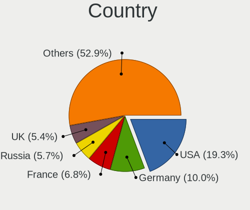
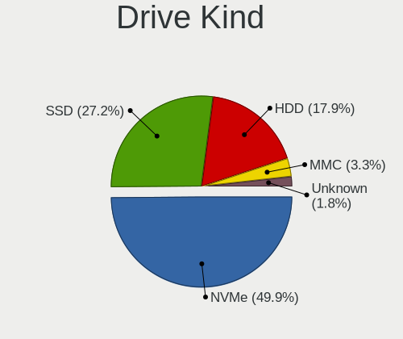

Arch Hardware Trends
--------------------

A project to identify most popular hardware characteristics and track their change
over time based on data collected by Arch users at https://Linux-Hardware.org.

Anyone can contribute to the study by uploading probes of their computers by
the [hw-probe](https://github.com/linuxhw/hw-probe) tool:

    sudo hw-probe -all -upload

This is a report for all computer types. See also reports for [desktops](/Dist/Arch/Desktop/README.md) and [notebooks](/Dist/Arch/Notebook/README.md).

Full-feature report is available here: https://linux-hardware.org/?view=trends

Period: Jan, 2020.

Contents
--------

- [ OS                       ](#os)
- [ OS Family                ](#os-family)
- [ Kernel                   ](#kernel)
- [ Kernel Family            ](#kernel-family)
- [ Kernel Major Ver.        ](#kernel-major-ver)
- [ Arch                     ](#arch)
- [ DE                       ](#de)
- [ Display Server           ](#display-server)
- [ OS Lang                  ](#os-lang)
- [ Boot Mode                ](#boot-mode)
- [ Filesystem               ](#filesystem)
- [ Dual Boot with Linux     ](#dual-boot-with-linux)
- [ Dual Boot (Win)          ](#dual-boot-win)
- [ Country                  ](#country)
- [ City                     ](#city)
- [ Vendor                   ](#vendor)
- [ Model                    ](#model)
- [ Model Family             ](#model-family)
- [ MFG Year                 ](#mfg-year)
- [ Form Factor              ](#form-factor)
- [ Secure Boot              ](#secure-boot)
- [ Coreboot                 ](#coreboot)
- [ RAM Size                 ](#ram-size)
- [ RAM Used                 ](#ram-used)
- [ Drive Vendor             ](#drive-vendor)
- [ Drive Model              ](#drive-model)
- [ Drive Kind               ](#drive-kind)
- [ Drive Connector          ](#drive-connector)
- [ Drive Size               ](#drive-size)
- [ Space Total              ](#space-total)
- [ Space Used               ](#space-used)
- [ Malfunc. Drives          ](#malfunc-drives)
- [ Malfunc. Drive Vendor    ](#malfunc-drive-vendor)
- [ Malfunc. Drive Kind      ](#malfunc-drive-kind)
- [ Failed Drives            ](#failed-drives)
- [ Failed Drive Vendor      ](#failed-drive-vendor)
- [ Drive Status             ](#drive-status)
- [ Storage Vendor           ](#storage-vendor)
- [ Storage Model            ](#storage-model)
- [ Storage Kind             ](#storage-kind)
- [ CPU Vendor               ](#cpu-vendor)
- [ CPU Model                ](#cpu-model)
- [ CPU Model Family         ](#cpu-model-family)
- [ CPU Cores                ](#cpu-cores)
- [ CPU Sockets              ](#cpu-sockets)
- [ CPU Threads              ](#cpu-threads)
- [ CPU Op-Modes             ](#cpu-op-modes)
- [ CPU Microarch            ](#cpu-microarch)
- [ CPU Microcode            ](#cpu-microcode)
- [ GPU Vendor               ](#gpu-vendor)
- [ GPU Model                ](#gpu-model)
- [ GPU Combo                ](#gpu-combo)
- [ GPU Driver               ](#gpu-driver)
- [ GPU Memory               ](#gpu-memory)
- [ Monitor Vendor           ](#monitor-vendor)
- [ Monitor Model            ](#monitor-model)
- [ Monitor Resolution       ](#monitor-resolution)
- [ Monitor Diagonal         ](#monitor-diagonal)
- [ Monitor Width            ](#monitor-width)
- [ Aspect Ratio             ](#aspect-ratio)
- [ Monitor Area             ](#monitor-area)
- [ Pixel Density            ](#pixel-density)
- [ Multiple Monitors        ](#multiple-monitors)
- [ Net Controller Vendor    ](#net-controller-vendor)
- [ Net Controller Model     ](#net-controller-model)
- [ Net Controller Kind      ](#net-controller-kind)
- [ Used Controller          ](#used-controller)
- [ NICs                     ](#nics)
- [ Unsupported Devices      ](#unsupported-devices)
- [ Unsupported Device Types ](#unsupported-device-types)

OS
--

Installed operating systems

| Name         | Computers | Percent |
|--------------|-----------|---------|
| Arch         | 77        | 60.16%  |
| Arch Rolling | 51        | 39.84%  |

OS Family
---------

OS without a version

| Name | Computers | Percent |
|------|-----------|---------|
| Arch | 128       | 100%    |

Kernel
------

Version of the Linux kernel

| Version                                                  | Computers | Percent |
|----------------------------------------------------------|-----------|---------|
| 5.4.13-arch1-1                                           | 25        | 19.53%  |
| 5.4.14-arch1-1                                           | 19        | 14.84%  |
| 5.4.8-arch1-1                                            | 11        | 8.59%   |
| 5.4.7-arch1-1                                            | 9         | 7.03%   |
| 5.4.15-arch1-1                                           | 9         | 7.03%   |
| 5.4.12-arch1-1                                           | 6         | 4.69%   |
| 5.4.13-zen1-1-zen                                        | 5         | 3.91%   |
| 5.4.11-arch1-1                                           | 5         | 3.91%   |
| 5.4.10-arch1-1                                           | 5         | 3.91%   |
| 5.4.12-zen1-1-zen                                        | 3         | 2.34%   |
| 4.19.97-1-lts                                            | 3         | 2.34%   |
| 4.19.92-1-lts                                            | 3         | 2.34%   |
| 5.4.6-arch3-1                                            | 2         | 1.56%   |
| 5.4.2-arch1-1                                            | 2         | 1.56%   |
| 5.4.8-zen1-1-zen                                         | 1         | 0.78%   |
| 5.4.8-1-ck-core2                                         | 1         | 0.78%   |
| 5.4.7-zen1-1-zen                                         | 1         | 0.78%   |
| 5.4.6-RAVEN                                              | 1         | 0.78%   |
| 5.4.3-arch1-1                                            | 1         | 0.78%   |
| 5.4.15-zen1-1-zen                                        | 1         | 0.78%   |
| 5.4.14-zen1-1-zen                                        | 1         | 0.78%   |
| 5.4.13.a-1-hardened                                      | 1         | 0.78%   |
| 5.4.13                                                   | 1         | 0.78%   |
| 5.4.12-xanmod7-1-xanmod                                  | 1         | 0.78%   |
| 5.4.0-rc7-1-amd-staging-drm-next-git-01902-g38419046943f | 1         | 0.78%   |
| 5.3.8-arch1-1                                            | 1         | 0.78%   |
| 5.3.13-arch1-1-vfio                                      | 1         | 0.78%   |
| 5.2.9-1-ck                                               | 1         | 0.78%   |
| 5.2.5-arch1-1-ARCH                                       | 1         | 0.78%   |
| 5.1.16-arch1-1-ARCH                                      | 1         | 0.78%   |
| 5.1.11-arch1-1-ARCH                                      | 1         | 0.78%   |
| 4.19.99-1-lts                                            | 1         | 0.78%   |
| 4.19.98-1-lts                                            | 1         | 0.78%   |
| 4.19.93-1-lts                                            | 1         | 0.78%   |
| 4.19.91-1-lts                                            | 1         | 0.78%   |

Kernel Family
-------------

Linux kernel without a distro release

| Version | Computers | Percent |
|---------|-----------|---------|
| 5.4.13  | 32        | 25%     |
| 5.4.14  | 20        | 15.63%  |
| 5.4.8   | 13        | 10.16%  |
| 5.4.7   | 10        | 7.81%   |
| 5.4.15  | 10        | 7.81%   |
| 5.4.12  | 10        | 7.81%   |
| 5.4.11  | 5         | 3.91%   |
| 5.4.10  | 5         | 3.91%   |
| 5.4.6   | 3         | 2.34%   |
| 4.19.97 | 3         | 2.34%   |
| 4.19.92 | 3         | 2.34%   |
| 5.4.2   | 2         | 1.56%   |
| 5.4.3   | 1         | 0.78%   |
| 5.4.0   | 1         | 0.78%   |
| 5.3.8   | 1         | 0.78%   |
| 5.3.13  | 1         | 0.78%   |
| 5.2.9   | 1         | 0.78%   |
| 5.2.5   | 1         | 0.78%   |
| 5.1.16  | 1         | 0.78%   |
| 5.1.11  | 1         | 0.78%   |
| 4.19.99 | 1         | 0.78%   |
| 4.19.98 | 1         | 0.78%   |
| 4.19.93 | 1         | 0.78%   |
| 4.19.91 | 1         | 0.78%   |

Kernel Major Ver.
-----------------

Linux kernel major version

| Version | Computers | Percent |
|---------|-----------|---------|
| 5.4     | 112       | 87.5%   |
| 4.19    | 10        | 7.81%   |
| 5.3     | 2         | 1.56%   |
| 5.2     | 2         | 1.56%   |
| 5.1     | 2         | 1.56%   |

Arch
----

OS architecture (x86_64, i586, etc.)

| Name   | Computers | Percent |
|--------|-----------|---------|
| x86_64 | 128       | 100%    |

DE
--

Desktop Environment

| Name            | Computers | Percent |
|-----------------|-----------|---------|
| GNOME           | 45        | 35.16%  |
| Unknown         | 34        | 26.56%  |
| KDE5            | 15        | 11.72%  |
| XFCE            | 8         | 6.25%   |
| Openbox         | 5         | 3.91%   |
| MATE            | 5         | 3.91%   |
| KDE             | 4         | 3.13%   |
| Budgie          | 3         | 2.34%   |
| LXQt            | 2         | 1.56%   |
| i3              | 2         | 1.56%   |
| LXDE            | 1         | 0.78%   |
| GNUstep         | 1         | 0.78%   |
| GNOME Flashback | 1         | 0.78%   |
| Enlightenment   | 1         | 0.78%   |
| Cinnamon        | 1         | 0.78%   |

Display Server
--------------

X11 or Wayland

| Name    | Computers | Percent |
|---------|-----------|---------|
| X11     | 91        | 71.09%  |
| Wayland | 24        | 18.75%  |
| Unknown | 12        | 9.38%   |
| Tty     | 1         | 0.78%   |

OS Lang
-------

Language

| Lang       | Computers | Percent |
|------------|-----------|---------|
| en_US      | 45        | 35.16%  |
| Unknown    | 45        | 35.16%  |
| en_GB      | 7         | 5.47%   |
| de_DE      | 5         | 3.91%   |
| pt_BR      | 3         | 2.34%   |
| pl_PL      | 2         | 1.56%   |
| nl_NL      | 2         | 1.56%   |
| it_IT      | 2         | 1.56%   |
| fr_FR      | 2         | 1.56%   |
| en_IN      | 2         | 1.56%   |
| en_IE      | 2         | 1.56%   |
| en_AU      | 2         | 1.56%   |
| cs_CZ      | 2         | 1.56%   |
| uk_UA      | 1         | 0.78%   |
| pt_PT      | 1         | 0.78%   |
| mni_IN     | 1         | 0.78%   |
| es_US      | 1         | 0.78%   |
| en_ZA      | 1         | 0.78%   |
| en_US.utf8 | 1         | 0.78%   |
| C          | 1         | 0.78%   |

Boot Mode
---------

EFI or BIOS

| Mode | Computers | Percent |
|------|-----------|---------|
| EFI  | 97        | 75.78%  |
| BIOS | 31        | 24.22%  |

Filesystem
----------

Type of filesystem

| Type    | Computers | Percent |
|---------|-----------|---------|
| Ext4    | 105       | 82.03%  |
| Btrfs   | 16        | 12.5%   |
| Xfs     | 3         | 2.34%   |
| F2fs    | 3         | 2.34%   |
| Unknown | 1         | 0.78%   |

Dual Boot with Linux
--------------------

Hosting more than one Linux

| Dual boot | Computers | Percent |
|-----------|-----------|---------|
| No        | 106       | 82.81%  |
| Yes       | 22        | 17.19%  |

Dual Boot (Win)
---------------

Hosting Linux and Windows

| Dual boot | Computers | Percent |
|-----------|-----------|---------|
| No        | 88        | 68.75%  |
| Yes       | 40        | 31.25%  |

Country
-------

Geographic location (country)

| Country        | Computers | Percent |
|----------------|-----------|---------|
| USA            | 20        | 15.63%  |
| Germany        | 16        | 12.5%   |
| Netherlands    | 9         | 7.03%   |
| UK             | 7         | 5.47%   |
| Poland         | 7         | 5.47%   |
| Czech Republic | 7         | 5.47%   |
| Russia         | 6         | 4.69%   |
| France         | 6         | 4.69%   |
| Brazil         | 5         | 3.91%   |
| Italy          | 4         | 3.13%   |
| Austria        | 4         | 3.13%   |
| Spain          | 3         | 2.34%   |
| India          | 3         | 2.34%   |
| Canada         | 3         | 2.34%   |
| Australia      | 3         | 2.34%   |
| Vietnam        | 2         | 1.56%   |
| Switzerland    | 2         | 1.56%   |
| Romania        | 2         | 1.56%   |
| Hungary        | 2         | 1.56%   |
| Finland        | 2         | 1.56%   |
| Belarus        | 2         | 1.56%   |
| Bangladesh     | 2         | 1.56%   |
| Ukraine        | 1         | 0.78%   |
| UAE            | 1         | 0.78%   |
| Sweden         | 1         | 0.78%   |
| Sudan          | 1         | 0.78%   |
| South Africa   | 1         | 0.78%   |
| New Zealand    | 1         | 0.78%   |
| Lithuania      | 1         | 0.78%   |
| Japan          | 1         | 0.78%   |
| Israel         | 1         | 0.78%   |
| Iran           | 1         | 0.78%   |
| Belgium        | 1         | 0.78%   |

City
----

Geographic location (city)

| City                   | Computers | Percent |
|------------------------|-----------|---------|
| Prague                 | 6         | 4.69%   |
| Paris                  | 3         | 2.34%   |
| Yekaterinburg          | 2         | 1.56%   |
| Vienna                 | 2         | 1.56%   |
| Vaals                  | 2         | 1.56%   |
| Poznan                 | 2         | 1.56%   |
| Moscow                 | 2         | 1.56%   |
| Minsk                  | 2         | 1.56%   |
| Mesa                   | 2         | 1.56%   |
| Enschede               | 2         | 1.56%   |
| Dhaka                  | 2         | 1.56%   |
| Chennai                | 2         | 1.56%   |
| Berlin                 | 2         | 1.56%   |
| Amsterdam              | 2         | 1.56%   |
| Zurich                 | 1         | 0.78%   |
| Zug                    | 1         | 0.78%   |
| Wuppertal              | 1         | 0.78%   |
| Whitestone             | 1         | 0.78%   |
| Welver                 | 1         | 0.78%   |
| Warsaw                 | 1         | 0.78%   |
| Villingen-Schwenningen | 1         | 0.78%   |
| Villeurbanne           | 1         | 0.78%   |
| Utrecht                | 1         | 0.78%   |
| Uman'                  | 1         | 0.78%   |
| Tuttlingen             | 1         | 0.78%   |
| Turin                  | 1         | 0.78%   |
| Toulon                 | 1         | 0.78%   |
| Torrelavega            | 1         | 0.78%   |
| Sydney                 | 1         | 0.78%   |
| Sulz im Wienerwald     | 1         | 0.78%   |
| Stuttgart              | 1         | 0.78%   |
| Stockport              | 1         | 0.78%   |
| Steubenville           | 1         | 0.78%   |
| St Louis               | 1         | 0.78%   |
| St Albans              | 1         | 0.78%   |
| Son                    | 1         | 0.78%   |
| Skövde                | 1         | 0.78%   |
| Sao Jose               | 1         | 0.78%   |
| Saint-Jacques          | 1         | 0.78%   |
| Royal Oak              | 1         | 0.78%   |
| Rock Hill              | 1         | 0.78%   |
| Rancho Mirage          | 1         | 0.78%   |
| Ramat Gan              | 1         | 0.78%   |
| Rakszawa               | 1         | 0.78%   |
| Québec                | 1         | 0.78%   |
| Perm                   | 1         | 0.78%   |
| Orlando                | 1         | 0.78%   |
| Odorheiu Secuiesc      | 1         | 0.78%   |
| Nottingham             | 1         | 0.78%   |
| Natal                  | 1         | 0.78%   |
| Nagpur                 | 1         | 0.78%   |
| Mundesley              | 1         | 0.78%   |
| Mostoles               | 1         | 0.78%   |
| Montreal               | 1         | 0.78%   |
| Milan                  | 1         | 0.78%   |
| Melbourne              | 1         | 0.78%   |
| Mashhad                | 1         | 0.78%   |
| Marseille              | 1         | 0.78%   |
| London                 | 1         | 0.78%   |
| Lippstadt              | 1         | 0.78%   |

Vendor
------

Motherboard manufacturer

| Name                   | Computers | Percent |
|------------------------|-----------|---------|
| Lenovo                 | 25        | 19.53%  |
| ASUSTek Computer       | 23        | 17.97%  |
| MSI                    | 15        | 11.72%  |
| Dell                   | 13        | 10.16%  |
| ASRock                 | 10        | 7.81%   |
| Hewlett-Packard        | 9         | 7.03%   |
| Gigabyte Technology    | 8         | 6.25%   |
| Acer                   | 8         | 6.25%   |
| Samsung Electronics    | 2         | 1.56%   |
| Intel                  | 2         | 1.56%   |
| Alienware              | 2         | 1.56%   |
| ZOTAC                  | 1         | 0.78%   |
| Supermicro             | 1         | 0.78%   |
| Razer                  | 1         | 0.78%   |
| PCWare                 | 1         | 0.78%   |
| PC Specialist          | 1         | 0.78%   |
| Notebook               | 1         | 0.78%   |
| Medion                 | 1         | 0.78%   |
| Gateway                | 1         | 0.78%   |
| Fujitsu                | 1         | 0.78%   |
| Avell High Performance | 1         | 0.78%   |
| Apple                  | 1         | 0.78%   |

Model
-----

Motherboard model

| Name                                            | Computers | Percent |
|-------------------------------------------------|-----------|---------|
| MSI MS-7A34                                     | 3         | 2.34%   |
| MSI MS-7C02                                     | 2         | 1.56%   |
| Lenovo IdeaPad S540-15IWL GTX 81SW              | 2         | 1.56%   |
| Dell Latitude E5470                             | 2         | 1.56%   |
| ASUS ROG STRIX B450-F GAMING                    | 2         | 1.56%   |
| ASRock X370 Gaming K4                           | 2         | 1.56%   |
| ZOTAC ZBOX-CI323NANO                            | 1         | 0.78%   |
| Supermicro X9SRL-F                              | 1         | 0.78%   |
| Samsung Electronics 530XBB                      | 1         | 0.78%   |
| Samsung Electronics 350V5C/351V5C/3540VC/3440VC | 1         | 0.78%   |
| Razer Blade Stealth                             | 1         | 0.78%   |
| PCWare IPMH81G1                                 | 1         | 0.78%   |
| PC Specialist Recoil III                        | 1         | 0.78%   |
| Notebook P65xSE-A                               | 1         | 0.78%   |
| MSI MS-7C37                                     | 1         | 0.78%   |
| MSI MS-7B89                                     | 1         | 0.78%   |
| MSI MS-7B84                                     | 1         | 0.78%   |
| MSI MS-7B45                                     | 1         | 0.78%   |
| MSI MS-7A40                                     | 1         | 0.78%   |
| MSI MS-7A38                                     | 1         | 0.78%   |
| MSI MS-7A37                                     | 1         | 0.78%   |
| MSI MS-7885                                     | 1         | 0.78%   |
| MSI MS-7850                                     | 1         | 0.78%   |
| MSI GS65 Stealth 9SD                            | 1         | 0.78%   |
| Medion Akoya E6239                              | 1         | 0.78%   |
| Lenovo Yoga C740-15IML 81TD                     | 1         | 0.78%   |
| Lenovo Yoga 730-15IKB 81CU                      | 1         | 0.78%   |
| Lenovo V110-14IAP 80TF                          | 1         | 0.78%   |
| Lenovo ThinkStation P310 30AT000LUS             | 1         | 0.78%   |
| Lenovo ThinkPad X395 20NLCTO1WW                 | 1         | 0.78%   |
| Lenovo ThinkPad X250 20CLS5KN00                 | 1         | 0.78%   |
| Lenovo ThinkPad X250 20CLS2A10L                 | 1         | 0.78%   |
| Lenovo ThinkPad X1 Carbon 7th 20R1S04100        | 1         | 0.78%   |
| Lenovo ThinkPad W540 20BHS03M00                 | 1         | 0.78%   |
| Lenovo ThinkPad W520 42844KG                    | 1         | 0.78%   |
| Lenovo ThinkPad T530 24297TG                    | 1         | 0.78%   |
| Lenovo ThinkPad T490 20N2000BRT                 | 1         | 0.78%   |
| Lenovo ThinkPad T480s 20L7CTO1WW                | 1         | 0.78%   |
| Lenovo ThinkPad T480 20L6S64C00                 | 1         | 0.78%   |
| Lenovo ThinkPad T460 20FMS1A200                 | 1         | 0.78%   |
| Lenovo ThinkPad T450s 20BXCTO1WW                | 1         | 0.78%   |
| Lenovo ThinkPad T440s 20ARS0J600                | 1         | 0.78%   |
| Lenovo ThinkPad T420 4180RQ8                    | 1         | 0.78%   |
| Lenovo ThinkPad P53 20QNCTO1WW                  | 1         | 0.78%   |
| Lenovo ThinkPad L380 20M6S22500                 | 1         | 0.78%   |
| Lenovo ThinkPad A485 20MWS08L00                 | 1         | 0.78%   |
| Lenovo ThinkPad A485 20MVS06F00                 | 1         | 0.78%   |
| Lenovo Legion Y740-15IRHg 81UH                  | 1         | 0.78%   |
| Intel DH67CF AAG10215-208                       | 1         | 0.78%   |
| Intel DH61WW AAG23116-303                       | 1         | 0.78%   |
| HP Z230 SFF Workstation                         | 1         | 0.78%   |
| HP Spectre x360 Convertible 15-ch0xx            | 1         | 0.78%   |
| HP ProDesk 400 G2 MINI                          | 1         | 0.78%   |
| HP ENVY m6                                      | 1         | 0.78%   |
| HP ENVY 14 Sleekbook                            | 1         | 0.78%   |
| HP EliteBook x360 1030 G2                       | 1         | 0.78%   |
| HP EliteBook 840 G6                             | 1         | 0.78%   |
| HP EliteBook 830 G5                             | 1         | 0.78%   |
| HP 250 G4                                       | 1         | 0.78%   |
| Gigabyte Z87-HD3                                | 1         | 0.78%   |

Model Family
------------

Motherboard model prefix

| Name                         | Computers | Percent |
|------------------------------|-----------|---------|
| Lenovo ThinkPad              | 18        | 14.06%  |
| ASUS ROG                     | 6         | 4.69%   |
| Dell Latitude                | 5         | 3.91%   |
| Acer Aspire                  | 4         | 3.13%   |
| MSI MS-7A34                  | 3         | 2.34%   |
| HP EliteBook                 | 3         | 2.34%   |
| Dell XPS                     | 3         | 2.34%   |
| ASUS PRIME                   | 3         | 2.34%   |
| ASRock X370                  | 3         | 2.34%   |
| MSI MS-7C02                  | 2         | 1.56%   |
| Lenovo Yoga                  | 2         | 1.56%   |
| Lenovo IdeaPad               | 2         | 1.56%   |
| HP ENVY                      | 2         | 1.56%   |
| Dell Precision               | 2         | 1.56%   |
| Dell Inspiron                | 2         | 1.56%   |
| ASUS VivoBook                | 2         | 1.56%   |
| Acer Predator                | 2         | 1.56%   |
| ZOTAC ZBOX-CI323NANO         | 1         | 0.78%   |
| Supermicro X9SRL-F           | 1         | 0.78%   |
| Samsung Electronics 530XBB   | 1         | 0.78%   |
| Samsung Electronics 350V5C   | 1         | 0.78%   |
| Razer Blade                  | 1         | 0.78%   |
| PCWare IPMH81G1              | 1         | 0.78%   |
| PC Specialist Recoil         | 1         | 0.78%   |
| Notebook P65xSE-A            | 1         | 0.78%   |
| MSI MS-7C37                  | 1         | 0.78%   |
| MSI MS-7B89                  | 1         | 0.78%   |
| MSI MS-7B84                  | 1         | 0.78%   |
| MSI MS-7B45                  | 1         | 0.78%   |
| MSI MS-7A40                  | 1         | 0.78%   |
| MSI MS-7A38                  | 1         | 0.78%   |
| MSI MS-7A37                  | 1         | 0.78%   |
| MSI MS-7885                  | 1         | 0.78%   |
| MSI MS-7850                  | 1         | 0.78%   |
| MSI GS65                     | 1         | 0.78%   |
| Medion Akoya                 | 1         | 0.78%   |
| Lenovo V110-14IAP            | 1         | 0.78%   |
| Lenovo ThinkStation          | 1         | 0.78%   |
| Lenovo Legion                | 1         | 0.78%   |
| Intel DH67CF                 | 1         | 0.78%   |
| Intel DH61WW                 | 1         | 0.78%   |
| HP Z230                      | 1         | 0.78%   |
| HP Spectre                   | 1         | 0.78%   |
| HP ProDesk                   | 1         | 0.78%   |
| HP 250                       | 1         | 0.78%   |
| Gigabyte Z87-HD3             | 1         | 0.78%   |
| Gigabyte Z68A-D3-B3          | 1         | 0.78%   |
| Gigabyte Z390                | 1         | 0.78%   |
| Gigabyte MZGLKCP-00          | 1         | 0.78%   |
| Gigabyte H97-D3H             | 1         | 0.78%   |
| Gigabyte G31M-S2L            | 1         | 0.78%   |
| Gigabyte B360M               | 1         | 0.78%   |
| Gigabyte AX370-Gaming        | 1         | 0.78%   |
| Gateway SX2370               | 1         | 0.78%   |
| Fujitsu LIFEBOOK             | 1         | 0.78%   |
| Dell OptiPlex                | 1         | 0.78%   |
| Avell High Performance Avell | 1         | 0.78%   |
| ASUS ZenBook                 | 1         | 0.78%   |
| ASUS TUF                     | 1         | 0.78%   |
| ASUS S551LN                  | 1         | 0.78%   |

MFG Year
--------

Motherboard manufacture year

| Year | Computers | Percent |
|------|-----------|---------|
| 2019 | 61        | 47.66%  |
| 2018 | 24        | 18.75%  |
| 2016 | 8         | 6.25%   |
| 2015 | 8         | 6.25%   |
| 2014 | 7         | 5.47%   |
| 2017 | 5         | 3.91%   |
| 2013 | 5         | 3.91%   |
| 2012 | 4         | 3.13%   |
| 2011 | 4         | 3.13%   |
| 2010 | 1         | 0.78%   |
| 2009 | 1         | 0.78%   |

Form Factor
-----------

Physical design of the computer

| Name        | Computers | Percent |
|-------------|-----------|---------|
| Desktop     | 60        | 46.88%  |
| Notebook    | 59        | 46.09%  |
| Convertible | 5         | 3.91%   |
| Tablet      | 1         | 0.78%   |
| Mini pc     | 1         | 0.78%   |
| All in one  | 1         | 0.78%   |
| Server      | 1         | 0.78%   |

Secure Boot
-----------

Enabled or disabled

| State    | Computers | Percent |
|----------|-----------|---------|
| Disabled | 127       | 99.22%  |
| Enabled  | 1         | 0.78%   |

Coreboot
--------

Have coreboot on board

| Used | Computers | Percent |
|------|-----------|---------|
| No   | 128       | 100%    |

RAM Size
--------

Total RAM memory

| Size in GB  | Computers | Percent |
|-------------|-----------|---------|
| 16.01-24.0  | 46        | 35.94%  |
| 8.01-16.0   | 27        | 21.09%  |
| 4.01-8.0    | 19        | 14.84%  |
| 32.01-64.0  | 18        | 14.06%  |
| 3.01-4.0    | 11        | 8.59%   |
| 24.01-32.0  | 3         | 2.34%   |
| 64.01-256.0 | 3         | 2.34%   |
| 2.01-3.0    | 1         | 0.78%   |

RAM Used
--------

Used RAM memory

| Used GB    | Computers | Percent |
|------------|-----------|---------|
| 2.01-3.0   | 39        | 30.47%  |
| 1.01-2.0   | 29        | 22.66%  |
| 4.01-8.0   | 26        | 20.31%  |
| 3.01-4.0   | 22        | 17.19%  |
| 8.01-16.0  | 8         | 6.25%   |
| 0.01-1.0   | 2         | 1.56%   |
| 32.01-64.0 | 1         | 0.78%   |
| 16.01-24.0 | 1         | 0.78%   |

Drive Vendor
------------

Hard drive vendors

| Vendor              | Computers | Drives | Percent |
|---------------------|-----------|--------|---------|
| Samsung Electronics | 45        | 63     | 21.84%  |
| WDC                 | 37        | 45     | 17.96%  |
| Seagate             | 26        | 34     | 12.62%  |
| SanDisk             | 14        | 14     | 6.8%    |
| Crucial             | 14        | 16     | 6.8%    |
| Toshiba             | 13        | 15     | 6.31%   |
| Kingston            | 12        | 12     | 5.83%   |
| Intel               | 9         | 10     | 4.37%   |
| Transcend           | 4         | 4      | 1.94%   |
| Hitachi             | 4         | 5      | 1.94%   |
| HGST                | 3         | 3      | 1.46%   |
| Unknown             | 2         | 2      | 0.97%   |
| SK Hynix            | 2         | 2      | 0.97%   |
| PLEXTOR             | 2         | 2      | 0.97%   |
| Micron Technology   | 2         | 2      | 0.97%   |
| Corsair             | 2         | 2      | 0.97%   |
| USB30               | 1         | 3      | 0.49%   |
| SPCC                | 1         | 1      | 0.49%   |
| PNY                 | 1         | 1      | 0.49%   |
| PM981a N            | 1         | 1      | 0.49%   |
| Phison              | 1         | 1      | 0.49%   |
| LITEON              | 1         | 1      | 0.49%   |
| Lexar               | 1         | 1      | 0.49%   |
| LDLC                | 1         | 1      | 0.49%   |
| Hewlett-Packard     | 1         | 1      | 0.49%   |
| GOODRAM             | 1         | 1      | 0.49%   |
| China               | 1         | 1      | 0.49%   |
| ASUSTOR             | 1         | 1      | 0.49%   |
| Apple               | 1         | 1      | 0.49%   |
| AMD                 | 1         | 1      | 0.49%   |
| A-DATA Technology   | 1         | 2      | 0.49%   |

Drive Model
-----------

Hard drive models

| Model                        | Computers | Percent |
|------------------------------|-----------|---------|
| SSD 850 EVO 500GB            | 5         | 2.17%   |
| SSD 860 EVO 500GB            | 4         | 1.74%   |
| ST4000DM000-1F2168 4TB       | 3         | 1.3%    |
| SSD 970 EVO Plus 500GB       | 3         | 1.3%    |
| SSD 840 EVO 250GB            | 3         | 1.3%    |
| SDSSDA240G 240GB             | 3         | 1.3%    |
| SA400S37240G 240GB SSD       | 3         | 1.3%    |
| CT500MX500SSD1 500GB         | 3         | 1.3%    |
| CT480BX500SSD1 480GB         | 3         | 1.3%    |
| WDS240G2G0A-00JH30 240GB SSD | 2         | 0.87%   |
| WD5000LPVX-22V0TT0 500GB     | 2         | 0.87%   |
| WD40EZRZ-00GXCB0 4TB         | 2         | 0.87%   |
| WD30EFRX-68EUZN0 3TB         | 2         | 0.87%   |
| WD10SPZX-24Z10 1TB           | 2         | 0.87%   |
| WD10EADS-00M2B0 1TB          | 2         | 0.87%   |
| SUV500480G 480GB SSD         | 2         | 0.87%   |
| ST31000528AS 1TB             | 2         | 0.87%   |
| ST2000DX002-2DV164 2TB       | 2         | 0.87%   |
| ST2000DM006-2DM164 2TB       | 2         | 0.87%   |
| SSDPEKKF256G8L 256GB         | 2         | 0.87%   |
| SSD 970 EVO 500GB            | 2         | 0.87%   |
| SSD 860 EVO 250GB            | 2         | 0.87%   |
| SSD 860 EVO 1TB              | 2         | 0.87%   |
| SSD 850 PRO 256GB            | 2         | 0.87%   |
| SSD 850 EVO 250GB            | 2         | 0.87%   |
| SSD 850 EVO 1TB              | 2         | 0.87%   |
| SSD 840 Series 250GB         | 2         | 0.87%   |
| SDSSDP128G 128GB             | 2         | 0.87%   |
| SA400S37120G 120GB SSD       | 2         | 0.87%   |
| MZ7LN256HCHP-000L7 256GB SSD | 2         | 0.87%   |
| HDWD110 1TB                  | 2         | 0.87%   |
| DT01ABA200 2TB               | 2         | 0.87%   |
| CT1000MX500SSD1 1TB          | 2         | 0.87%   |
| X600 M.2 2280 SATA 128GB SSD | 1         | 0.43%   |
| WDS500G1B0B-00AS40 500GB SSD | 1         | 0.43%   |
| WDS240G2G0B-00EPW0 240GB SSD | 1         | 0.43%   |
| WDS100T2B0B-00YS70 1TB SSD   | 1         | 0.43%   |
| WDBNCE5000PNC 500GB SSD      | 1         | 0.43%   |
| WD7500BPVT-55HXZT4 752GB     | 1         | 0.43%   |
| WD5000LPLX-66ZNTT0 500GB     | 1         | 0.43%   |
| WD5000LPCX-24VHAT0 500GB     | 1         | 0.43%   |
| WD30EFRX-68N32N0 3TB         | 1         | 0.43%   |
| WD2500JS-22NCB1 250GB        | 1         | 0.43%   |
| WD2500JD-00HBC0 250GB        | 1         | 0.43%   |
| WD20SPZX-11UA7T0 2TB         | 1         | 0.43%   |
| WD20NPVT-00Z2TT0 2TB         | 1         | 0.43%   |
| WD20EZRZ-00Z5HB0 2TB         | 1         | 0.43%   |
| WD20EURX-63T0FY0 2TB         | 1         | 0.43%   |
| WD20EFRX-68EUZN0 2TB         | 1         | 0.43%   |
| WD2003FZEX-00SRLA0 2TB       | 1         | 0.43%   |
| WD10JPVX-80JC3T0 1TB         | 1         | 0.43%   |
| WD10EZRX-00A8LB0 1TB         | 1         | 0.43%   |
| WD10EZEX-08WN4A0 1TB         | 1         | 0.43%   |
| WD10EARS-00Z5B1 1TB          | 1         | 0.43%   |
| WD10EARS-00Y5B1 1TB          | 1         | 0.43%   |
| WD10EALS-002BA0 1TB          | 1         | 0.43%   |
| WD10EADX-22TDHB0 1TB         | 1         | 0.43%   |
| WD100EMAZ-00WJTA0 10TB       | 1         | 0.43%   |
| WD1005FBYZ-01YCBB1 1TB       | 1         | 0.43%   |
| WD1003FZEX-00K3CA0 1TB       | 1         | 0.43%   |

Drive Kind
----------

HDD or SSD

| Kind    | Computers | Drives | Percent |
|---------|-----------|--------|---------|
| SSD     | 79        | 111    | 43.89%  |
| HDD     | 62        | 93     | 34.44%  |
| NVMe    | 33        | 37     | 18.33%  |
| Unknown | 4         | 6      | 2.22%   |
| MMC     | 2         | 2      | 1.11%   |

Drive Connector
---------------

SATA, SAS, NVMe, etc.

| Type | Computers | Drives | Percent |
|------|-----------|--------|---------|
| SATA | 98        | 203    | 71.01%  |
| NVMe | 33        | 37     | 23.91%  |
| SAS  | 5         | 7      | 3.62%   |
| MMC  | 2         | 2      | 1.45%   |

Drive Size
----------

Size of hard drive

| Size in TB | Computers | Drives | Percent |
|------------|-----------|--------|---------|
| 0.01-0.5   | 90        | 137    | 50.28%  |
| 0.51-1.0   | 53        | 68     | 29.61%  |
| 1.01-2.0   | 23        | 30     | 12.85%  |
| 2.01-3.0   | 6         | 7      | 3.35%   |
| 3.01-4.0   | 5         | 5      | 2.79%   |
| 4.01-10.0  | 2         | 2      | 1.12%   |

Space Total
-----------

Amount of disk space available on the file system

| Size in GB     | Computers | Percent |
|----------------|-----------|---------|
| 251-500        | 27        | 21.09%  |
| 501-1000       | 26        | 20.31%  |
| 101-250        | 24        | 18.75%  |
| More than 3000 | 16        | 12.5%   |
| 1001-2000      | 16        | 12.5%   |
| 2001-3000      | 8         | 6.25%   |
| 51-100         | 8         | 6.25%   |
| Unknown        | 3         | 2.34%   |

Space Used
----------

Amount of used disk space

| Used GB        | Computers | Percent |
|----------------|-----------|---------|
| 101-250        | 30        | 23.44%  |
| 251-500        | 18        | 14.06%  |
| 1-20           | 16        | 12.5%   |
| 501-1000       | 15        | 11.72%  |
| 21-50          | 14        | 10.94%  |
| 1001-2000      | 12        | 9.38%   |
| 51-100         | 12        | 9.38%   |
| More than 3000 | 6         | 4.69%   |
| Unknown        | 3         | 2.34%   |
| 2001-3000      | 2         | 1.56%   |

Malfunc. Drives
---------------

Drive models with a malfunction

| Model                     | Computers | Drives | Percent |
|---------------------------|-----------|--------|---------|
| WD30EFRX-68EUZN0 3TB      | 1         | 1      | 5%      |
| WD20EZRZ-00Z5HB0 2TB      | 1         | 1      | 5%      |
| WD10EARS-00Z5B1 1TB       | 1         | 1      | 5%      |
| WD10EADS-00M2B0 1TB       | 1         | 1      | 5%      |
| WD1003FZEX-00K3CA0 1TB    | 1         | 1      | 5%      |
| ST8000DM004-2CX188 8TB    | 1         | 1      | 5%      |
| ST3250620AS 250GB         | 1         | 1      | 5%      |
| ST31500341AS 1TB          | 1         | 1      | 5%      |
| SSD 960 PRO 512GB         | 1         | 1      | 5%      |
| SSD 960 EVO 500GB         | 1         | 1      | 5%      |
| SSD 840 Series 250GB      | 1         | 1      | 5%      |
| SSD 840 EVO 250GB         | 1         | 1      | 5%      |
| SP1614C 160GB             | 1         | 1      | 5%      |
| SD7UB3Q256G1001 256GB SSD | 1         | 1      | 5%      |
| MQ02ABD100H 1TB           | 1         | 1      | 5%      |
| HTS541010A7E630 1TB       | 1         | 1      | 5%      |
| HDS725050KLA360 500GB     | 1         | 1      | 5%      |
| HDS723020BLA642 2TB       | 1         | 2      | 5%      |
| HD501LJ 500GB             | 1         | 1      | 5%      |
| GB0250EAFYK 250GB         | 1         | 1      | 5%      |

Malfunc. Drive Vendor
---------------------

Vendors of faulty drives

| Vendor              | Computers | Drives | Percent |
|---------------------|-----------|--------|---------|
| Samsung Electronics | 6         | 6      | 31.58%  |
| WDC                 | 4         | 5      | 21.05%  |
| Seagate             | 3         | 3      | 15.79%  |
| Hitachi             | 2         | 3      | 10.53%  |
| Toshiba             | 1         | 1      | 5.26%   |
| SanDisk             | 1         | 1      | 5.26%   |
| HGST                | 1         | 1      | 5.26%   |
| Hewlett-Packard     | 1         | 1      | 5.26%   |

Malfunc. Drive Kind
-------------------

Kinds of faulty drives

| Kind | Computers | Drives | Percent |
|------|-----------|--------|---------|
| HDD  | 12        | 16     | 70.59%  |
| SSD  | 3         | 3      | 17.65%  |
| NVMe | 2         | 2      | 11.76%  |

Failed Drives
-------------

Failed drive models

Zero info for selected period =(

Failed Drive Vendor
-------------------

Failed drive vendors

Zero info for selected period =(

Drive Status
------------

Number of failed and malfunc. drives

| Status   | Computers | Drives | Percent |
|----------|-----------|--------|---------|
| Works    | 69        | 142    | 52.27%  |
| Detected | 48        | 86     | 36.36%  |
| Malfunc  | 15        | 21     | 11.36%  |

Storage Vendor
--------------

Storage controller vendors

| Vendor                       | Computers | Percent |
|------------------------------|-----------|---------|
| Intel                        | 82        | 47.95%  |
| AMD                          | 36        | 21.05%  |
| Samsung Electronics          | 25        | 14.62%  |
| Phison Electronics           | 6         | 3.51%   |
| Toshiba America Info Systems | 5         | 2.92%   |
| Sandisk                      | 4         | 2.34%   |
| SK Hynix                     | 3         | 1.75%   |
| ASMedia Technology           | 3         | 1.75%   |
| Union Memory (Shenzhen)      | 2         | 1.17%   |
| Silicon Motion               | 1         | 0.58%   |
| Micron/Crucial Technology    | 1         | 0.58%   |
| Marvell Technology Group     | 1         | 0.58%   |
| Lite-On Technology           | 1         | 0.58%   |
| JMicron Technology           | 1         | 0.58%   |

Storage Model
-------------

Storage controller models

| Model                                                                             | Computers | Percent |
|-----------------------------------------------------------------------------------|-----------|---------|
| FCH SATA Controller [AHCI mode]                                                   | 33        | 15.71%  |
| NVMe SSD Controller SM981/PM981/PM983                                             | 21        | 10%     |
| 400 Series Chipset SATA Controller                                                | 12        | 5.71%   |
| SSD Pro 7600p/760p/E 6100p Series                                                 | 7         | 3.33%   |
| X370 Series Chipset SATA Controller                                               | 6         | 2.86%   |
| Non-Volatile memory controller                                                    | 6         | 2.86%   |
| Cannon Lake Mobile PCH SATA AHCI Controller                                       | 6         | 2.86%   |
| 8 Series/C220 Series Chipset Family 6-port SATA Controller 1 [AHCI mode]          | 6         | 2.86%   |
| 300 Series Chipset SATA Controller                                                | 6         | 2.86%   |
| Sunrise Point-LP SATA Controller [AHCI mode]                                      | 5         | 2.38%   |
| E12 NVMe Controller                                                               | 5         | 2.38%   |
| Wildcat Point-LP SATA Controller [AHCI Mode]                                      | 4         | 1.9%    |
| Q170/Q150/B150/H170/H110/Z170/CM236 Chipset SATA Controller [AHCI Mode]           | 4         | 1.9%    |
| NVMe SSD Controller SM961/PM961                                                   | 4         | 1.9%    |
| Cannon Point-LP SATA Controller [AHCI Mode]                                       | 4         | 1.9%    |
| Cannon Lake PCH SATA AHCI Controller                                              | 4         | 1.9%    |
| 82801 Mobile SATA Controller [RAID mode]                                          | 4         | 1.9%    |
| 8 Series SATA Controller 1 [AHCI mode]                                            | 4         | 1.9%    |
| 200 Series PCH SATA controller [AHCI mode]                                        | 4         | 1.9%    |
| XG4 NVMe SSD Controller                                                           | 3         | 1.43%   |
| SB7x0/SB8x0/SB9x0 SATA Controller [IDE mode]                                      | 3         | 1.43%   |
| SB7x0/SB8x0/SB9x0 IDE Controller                                                  | 3         | 1.43%   |
| C610/X99 series chipset 6-Port SATA Controller [AHCI mode]                        | 3         | 1.43%   |
| ASM1062 Serial ATA Controller                                                     | 3         | 1.43%   |
| 9 Series Chipset Family SATA Controller [AHCI Mode]                               | 3         | 1.43%   |
| 6 Series/C200 Series Chipset Family 6 port Mobile SATA AHCI Controller            | 3         | 1.43%   |
| 6 Series/C200 Series Chipset Family 6 port Desktop SATA AHCI Controller           | 3         | 1.43%   |
| WD Black 2018/PC SN720 NVMe SSD                                                   | 2         | 0.95%   |
| Toshiba America Info Non-Volatile memory controller                               | 2         | 0.95%   |
| SATA Controller [RAID mode]                                                       | 2         | 0.95%   |
| SATA controller                                                                   | 2         | 0.95%   |
| HM170/QM170 Chipset SATA Controller [AHCI Mode]                                   | 2         | 0.95%   |
| C610/X99 series chipset sSATA Controller [AHCI mode]                              | 2         | 0.95%   |
| Atom/Celeron/Pentium Processor x5-E8000/J3xxx/N3xxx Series SATA Controller        | 2         | 0.95%   |
| 7 Series/C210 Series Chipset Family 6-port SATA Controller [AHCI mode]            | 2         | 0.95%   |
| 7 Series Chipset Family 6-port SATA Controller [AHCI mode]                        | 2         | 0.95%   |
| X399 Series Chipset SATA Controller                                               | 1         | 0.48%   |
| WD Black 2018/PC SN520 NVMe SSD                                                   | 1         | 0.48%   |
| SSD 660P Series                                                                   | 1         | 0.48%   |
| SC300 512GB M.2 2280 SATA Solid State Drive                                       | 1         | 0.48%   |
| P1 NVMe PCIe SSD                                                                  | 1         | 0.48%   |
| NVMe SSD Optane Series Controller                                                 | 1         | 0.48%   |
| NVMe SSD Controller SM951/PM951                                                   | 1         | 0.48%   |
| NM10/ICH7 Family SATA Controller [IDE mode]                                       | 1         | 0.48%   |
| M8Pe Series NVMe SSD                                                              | 1         | 0.48%   |
| JMB363 SATA/IDE Controller                                                        | 1         | 0.48%   |
| FCH SATA Controller D                                                             | 1         | 0.48%   |
| E7 NVMe Controller                                                                | 1         | 0.48%   |
| Comet Lake SATA AHCI Controller                                                   | 1         | 0.48%   |
| Celeron N3350/Pentium N4200/Atom E3900 Series SATA AHCI Controller                | 1         | 0.48%   |
| C602 chipset 4-Port SATA Storage Control Unit                                     | 1         | 0.48%   |
| C600/X79 series chipset 6-Port SATA AHCI Controller                               | 1         | 0.48%   |
| Atom Processor E3800 Series SATA AHCI Controller                                  | 1         | 0.48%   |
| 92xx SATA 6G Controller                                                           | 1         | 0.48%   |
| 6 Series/C200 Series Chipset Family Desktop SATA Controller (IDE mode, ports 4-5) | 1         | 0.48%   |
| 6 Series/C200 Series Chipset Family Desktop SATA Controller (IDE mode, ports 0-3) | 1         | 0.48%   |
| 5 Series/3400 Series Chipset PT IDER Controller                                   | 1         | 0.48%   |
| 5 Series/3400 Series Chipset 6 port SATA AHCI Controller                          | 1         | 0.48%   |
| 5 Series/3400 Series Chipset 4 port SATA AHCI Controller                          | 1         | 0.48%   |

Storage Kind
------------

Kind of storage controller (IDE, SATA, NVMe, SAS, ...)

| Kind | Computers | Percent |
|------|-----------|---------|
| SATA | 105       | 60.69%  |
| NVMe | 54        | 31.21%  |
| IDE  | 7         | 4.05%   |
| RAID | 6         | 3.47%   |
| SAS  | 1         | 0.58%   |

CPU Vendor
----------

Processor vendors

| Vendor | Computers | Percent |
|--------|-----------|---------|
| Intel  | 91        | 71.09%  |
| AMD    | 37        | 28.91%  |

CPU Model
---------

Processor models

| Model                                           | Computers | Percent |
|-------------------------------------------------|-----------|---------|
| Intel Core i7-9750H CPU @ 2.60GHz               | 5         | 3.91%   |
| Intel Core i7-8565U CPU @ 1.80GHz               | 5         | 3.91%   |
| AMD Ryzen 7 2700X Eight-Core Processor          | 5         | 3.91%   |
| Intel Core i7-8750H CPU @ 2.20GHz               | 3         | 2.34%   |
| Intel Core i5-8250U CPU @ 1.60GHz               | 3         | 2.34%   |
| AMD Ryzen 7 1700X Eight-Core Processor          | 3         | 2.34%   |
| AMD Ryzen 7 1700 Eight-Core Processor           | 3         | 2.34%   |
| AMD Ryzen 5 2600X Six-Core Processor            | 3         | 2.34%   |
| Intel Core i7-8550U CPU @ 1.80GHz               | 2         | 1.56%   |
| Intel Core i7-7500U CPU @ 2.70GHz               | 2         | 1.56%   |
| Intel Core i7-5820K CPU @ 3.30GHz               | 2         | 1.56%   |
| Intel Core i7-5600U CPU @ 2.60GHz               | 2         | 1.56%   |
| Intel Core i7-2670QM CPU @ 2.20GHz              | 2         | 1.56%   |
| Intel Core i5-9600K CPU @ 3.70GHz               | 2         | 1.56%   |
| Intel Core i5-8265U CPU @ 1.60GHz               | 2         | 1.56%   |
| Intel Core i5-6300U CPU @ 2.40GHz               | 2         | 1.56%   |
| Intel Core i5-6200U CPU @ 2.30GHz               | 2         | 1.56%   |
| Intel Core i5-4460 CPU @ 3.20GHz                | 2         | 1.56%   |
| Intel Core i5-2520M CPU @ 2.50GHz               | 2         | 1.56%   |
| Intel Celeron N4000 CPU @ 1.10GHz               | 2         | 1.56%   |
| AMD Ryzen 5 PRO 2500U w/ Radeon Vega Mobile Gfx | 2         | 1.56%   |
| AMD Ryzen 5 2400G with Radeon Vega Graphics     | 2         | 1.56%   |
| AMD Ryzen 5 1600 Six-Core Processor             | 2         | 1.56%   |
| AMD Ryzen 3 1200 Quad-Core Processor            | 2         | 1.56%   |
| Intel Xeon W-2123 CPU @ 3.60GHz                 | 1         | 0.78%   |
| Intel Xeon CPU E5-1620 0 @ 3.60GHz              | 1         | 0.78%   |
| Intel Xeon CPU E3-1265L v4 @ 2.30GHz            | 1         | 0.78%   |
| Intel Xeon CPU E3-1230 v3 @ 3.30GHz             | 1         | 0.78%   |
| Intel Processor 5Y10a CPU @ 0.80GHz             | 1         | 0.78%   |
| Intel Pentium Dual-Core CPU E5200 @ 2.50GHz     | 1         | 0.78%   |
| Intel Pentium CPU N3530 @ 2.16GHz               | 1         | 0.78%   |
| Intel Pentium CPU G870 @ 3.10GHz                | 1         | 0.78%   |
| Intel Core i9-9900K CPU @ 3.60GHz               | 1         | 0.78%   |
| Intel Core i7-8705G CPU @ 3.10GHz               | 1         | 0.78%   |
| Intel Core i7-8700K CPU @ 3.70GHz               | 1         | 0.78%   |
| Intel Core i7-7700K CPU @ 4.20GHz               | 1         | 0.78%   |
| Intel Core i7-7700 CPU @ 3.60GHz                | 1         | 0.78%   |
| Intel Core i7-7600U CPU @ 2.80GHz               | 1         | 0.78%   |
| Intel Core i7-6800K CPU @ 3.40GHz               | 1         | 0.78%   |
| Intel Core i7-6700 CPU @ 3.40GHz                | 1         | 0.78%   |
| Intel Core i7-5700HQ CPU @ 2.70GHz              | 1         | 0.78%   |
| Intel Core i7-4770K CPU @ 3.50GHz               | 1         | 0.78%   |
| Intel Core i7-4710HQ CPU @ 2.50GHz              | 1         | 0.78%   |
| Intel Core i7-4700MQ CPU @ 2.40GHz              | 1         | 0.78%   |
| Intel Core i7-4510U CPU @ 2.00GHz               | 1         | 0.78%   |
| Intel Core i7-4500U CPU @ 1.80GHz               | 1         | 0.78%   |
| Intel Core i7-3770K CPU @ 3.50GHz               | 1         | 0.78%   |
| Intel Core i7-3610QM CPU @ 2.30GHz              | 1         | 0.78%   |
| Intel Core i7-2600K CPU @ 3.40GHz               | 1         | 0.78%   |
| Intel Core i7-10710U CPU @ 1.10GHz              | 1         | 0.78%   |
| Intel Core i7-10510U CPU @ 1.80GHz              | 1         | 0.78%   |
| Intel Core i7 CPU 870 @ 2.93GHz                 | 1         | 0.78%   |
| Intel Core i5-9400F CPU @ 2.90GHz               | 1         | 0.78%   |
| Intel Core i5-8365U CPU @ 1.60GHz               | 1         | 0.78%   |
| Intel Core i5-7300U CPU @ 2.60GHz               | 1         | 0.78%   |
| Intel Core i5-7300HQ CPU @ 2.50GHz              | 1         | 0.78%   |
| Intel Core i5-6500T CPU @ 2.50GHz               | 1         | 0.78%   |
| Intel Core i5-6440HQ CPU @ 2.60GHz              | 1         | 0.78%   |
| Intel Core i5-6300HQ CPU @ 2.30GHz              | 1         | 0.78%   |
| Intel Core i5-5300U CPU @ 2.30GHz               | 1         | 0.78%   |

CPU Model Family
----------------

Processor model prefix

| Model                   | Computers | Percent |
|-------------------------|-----------|---------|
| Intel Core i7           | 42        | 32.81%  |
| Intel Core i5           | 34        | 26.56%  |
| AMD Ryzen 7             | 13        | 10.16%  |
| AMD Ryzen 5             | 10        | 7.81%   |
| Intel Celeron           | 5         | 3.91%   |
| Intel Xeon              | 4         | 3.13%   |
| AMD Ryzen 3             | 4         | 3.13%   |
| AMD Ryzen 5 PRO         | 3         | 2.34%   |
| Intel Pentium           | 2         | 1.56%   |
| Other                   | 1         | 0.78%   |
| Intel Pentium Dual-Core | 1         | 0.78%   |
| Intel Core i9           | 1         | 0.78%   |
| Intel Core i3           | 1         | 0.78%   |
| AMD Ryzen Threadripper  | 1         | 0.78%   |
| AMD Phenom II X4        | 1         | 0.78%   |
| AMD FX                  | 1         | 0.78%   |
| AMD Athlon II X4        | 1         | 0.78%   |
| AMD Athlon              | 1         | 0.78%   |
| AMD A6                  | 1         | 0.78%   |
| AMD A10                 | 1         | 0.78%   |

CPU Cores
---------

Number of processor cores

| Number | Computers | Percent |
|--------|-----------|---------|
| 4      | 56        | 43.75%  |
| 2      | 33        | 25.78%  |
| 6      | 24        | 18.75%  |
| 8      | 14        | 10.94%  |
| 16     | 1         | 0.78%   |

CPU Sockets
-----------

Number of sockets

| Number | Computers | Percent |
|--------|-----------|---------|
| 1      | 128       | 100%    |

CPU Threads
-----------

Threads per core (Hyper-Threading)

| Number | Computers | Percent |
|--------|-----------|---------|
| 2      | 101       | 78.91%  |
| 1      | 27        | 21.09%  |

CPU Op-Modes
------------

CPU Operation Modes (32-bit, 64-bit)

| Op mode        | Computers | Percent |
|----------------|-----------|---------|
| 32-bit, 64-bit | 126       | 98.44%  |
| Unknown        | 2         | 1.56%   |

CPU Microarch
-------------

Microarchitecture

| Name          | Computers | Percent |
|---------------|-----------|---------|
| Skylake       | 29        | 22.66%  |
| Zen           | 16        | 12.5%   |
| KabyLake      | 15        | 11.72%  |
| Haswell       | 15        | 11.72%  |
| Zen+          | 14        | 10.94%  |
| SandyBridge   | 9         | 7.03%   |
| Broadwell     | 7         | 5.47%   |
| IvyBridge     | 5         | 3.91%   |
| Silvermont    | 3         | 2.34%   |
| Zen 2         | 2         | 1.56%   |
| Nehalem       | 2         | 1.56%   |
| K10           | 2         | 1.56%   |
| Goldmont plus | 2         | 1.56%   |
| Westmere      | 1         | 0.78%   |
| Steamroller   | 1         | 0.78%   |
| Piledriver    | 1         | 0.78%   |
| K10 Llano     | 1         | 0.78%   |
| Goldmont      | 1         | 0.78%   |
| Core          | 1         | 0.78%   |
| CometLake     | 1         | 0.78%   |

CPU Microcode
-------------

Microcode number

| Number     | Computers | Percent |
|------------|-----------|---------|
| Unknown    | 18        | 14.06%  |
| 0x0800820d | 10        | 7.81%   |
| 0x906ea    | 8         | 6.25%   |
| 0x806ec    | 8         | 6.25%   |
| 0x306c3    | 7         | 5.47%   |
| 0x206a7    | 7         | 5.47%   |
| 0x08001138 | 6         | 4.69%   |
| 0x306a9    | 5         | 3.91%   |
| 0x806e9    | 4         | 3.13%   |
| 0x506e3    | 4         | 3.13%   |
| 0x40651    | 4         | 3.13%   |
| 0x306d4    | 4         | 3.13%   |
| 0x08001137 | 4         | 3.13%   |
| 0x906ec    | 3         | 2.34%   |
| 0x806ea    | 3         | 2.34%   |
| 0x406e3    | 3         | 2.34%   |
| 0x08108102 | 3         | 2.34%   |
| 0x906e9    | 2         | 1.56%   |
| 0x306f2    | 2         | 1.56%   |
| 0x106e5    | 2         | 1.56%   |
| 0x08701013 | 2         | 1.56%   |
| 0x08101016 | 2         | 1.56%   |
| 0x0810100b | 2         | 1.56%   |
| 0xa0660    | 1         | 0.78%   |
| 0x806eb    | 1         | 0.78%   |
| 0x706a1    | 1         | 0.78%   |
| 0x506c9    | 1         | 0.78%   |
| 0x50654    | 1         | 0.78%   |
| 0x406c3    | 1         | 0.78%   |
| 0x20655    | 1         | 0.78%   |
| 0x10676    | 1         | 0.78%   |
| 0x0800820b | 1         | 0.78%   |
| 0x08001126 | 1         | 0.78%   |
| 0x06003106 | 1         | 0.78%   |
| 0x06000822 | 1         | 0.78%   |
| 0x03000014 | 1         | 0.78%   |
| 0x010000c8 | 1         | 0.78%   |
| 0x010000b6 | 1         | 0.78%   |

GPU Vendor
----------

Vendors of graphics cards

| Vendor                     | Computers | Percent |
|----------------------------|-----------|---------|
| Intel                      | 66        | 42.86%  |
| Nvidia                     | 45        | 29.22%  |
| AMD                        | 42        | 27.27%  |
| Matrox Electronics Systems | 1         | 0.65%   |

GPU Model
---------

Graphics card models

| Model                                                                              | Computers | Percent |
|------------------------------------------------------------------------------------|-----------|---------|
| Ellesmere [Radeon RX 470/480/570/570X/580/580X/590]                                | 15        | 9.55%   |
| UHD Graphics 620 (Whiskey Lake)                                                    | 8         | 5.1%    |
| UHD Graphics 630 (Mobile)                                                          | 7         | 4.46%   |
| UHD Graphics 620                                                                   | 5         | 3.18%   |
| Haswell-ULT Integrated Graphics Controller                                         | 5         | 3.18%   |
| Skylake GT2 [HD Graphics 520]                                                      | 4         | 2.55%   |
| Raven Ridge [Radeon Vega Series / Radeon Vega Mobile Series]                       | 4         | 2.55%   |
| HD Graphics 620                                                                    | 4         | 2.55%   |
| HD Graphics 530                                                                    | 4         | 2.55%   |
| GP104 [GeForce GTX 1070]                                                           | 4         | 2.55%   |
| GP102 [GeForce GTX 1080 Ti]                                                        | 4         | 2.55%   |
| 2nd Generation Core Processor Family Integrated Graphics Controller                | 4         | 2.55%   |
| Picasso                                                                            | 3         | 1.91%   |
| HD Graphics 630                                                                    | 3         | 1.91%   |
| HD Graphics 5500                                                                   | 3         | 1.91%   |
| GP106 [GeForce GTX 1060 6GB]                                                       | 3         | 1.91%   |
| Curacao PRO [Radeon R7 370 / R9 270/370 OEM]                                       | 3         | 1.91%   |
| 4th Gen Core Processor Integrated Graphics Controller                              | 3         | 1.91%   |
| 3rd Gen Core processor Graphics Controller                                         | 3         | 1.91%   |
| Vega 10 XL/XT [Radeon RX Vega 56/64]                                               | 2         | 1.27%   |
| UHD Graphics 605                                                                   | 2         | 1.27%   |
| UHD Graphics                                                                       | 2         | 1.27%   |
| GP104 [GeForce GTX 1080]                                                           | 2         | 1.27%   |
| GM108M [GeForce 840M]                                                              | 2         | 1.27%   |
| GK104 [GeForce GTX 770]                                                            | 2         | 1.27%   |
| Baffin [Radeon RX 550 640SP / RX 560/560X]                                         | 2         | 1.27%   |
| Atom/Celeron/Pentium Processor x5-E8000/J3xxx/N3xxx Integrated Graphics Controller | 2         | 1.27%   |
| Xeon E3-1200 v3/4th Gen Core Processor Integrated Graphics Controller              | 1         | 0.64%   |
| UHD Graphics 630 (Desktop 9 Series)                                                | 1         | 0.64%   |
| TU117M [GeForce GTX 1650 Mobile / Max-Q]                                           | 1         | 0.64%   |
| TU117GLM [Quadro T1000 Mobile]                                                     | 1         | 0.64%   |
| TU117 [GeForce GTX 1650]                                                           | 1         | 0.64%   |
| TU116M [GeForce GTX 1660 Ti Mobile]                                                | 1         | 0.64%   |
| TU106M [GeForce RTX 2070 Mobile]                                                   | 1         | 0.64%   |
| TU106 [GeForce RTX 2060 Rev. A]                                                    | 1         | 0.64%   |
| TU104BM [GeForce RTX 2080 Mobile]                                                  | 1         | 0.64%   |
| TU104 [GeForce RTX 2080 Rev. A]                                                    | 1         | 0.64%   |
| Tonga PRO [Radeon R9 285/380]                                                      | 1         | 0.64%   |
| Thames [Radeon HD 7500M/7600M Series]                                              | 1         | 0.64%   |
| Sumo [Radeon HD 6530D]                                                             | 1         | 0.64%   |
| Robson CE [Radeon HD 6370M/7370M]                                                  | 1         | 0.64%   |
| Polaris 22 XL [Radeon RX Vega M GL]                                                | 1         | 0.64%   |
| Oland PRO [Radeon R7 240/340]                                                      | 1         | 0.64%   |
| Navi 10 [Radeon RX 5600 OEM/5600 XT / 5700/5700 XT]                                | 1         | 0.64%   |
| MGA G200eW WPCM450                                                                 | 1         | 0.64%   |
| Lexa XT [Radeon PRO WX 3200]                                                       | 1         | 0.64%   |
| Lexa PRO [Radeon 540/540X/550/550X / RX 540X/550/550X]                             | 1         | 0.64%   |
| Kaveri [Radeon R7 Graphics]                                                        | 1         | 0.64%   |
| Juniper XT [Radeon HD 6770]                                                        | 1         | 0.64%   |
| Iris Pro Graphics P6300                                                            | 1         | 0.64%   |
| HD Graphics 5600                                                                   | 1         | 0.64%   |
| HD Graphics 5300                                                                   | 1         | 0.64%   |
| HD Graphics 500                                                                    | 1         | 0.64%   |
| GP108M [GeForce MX250]                                                             | 1         | 0.64%   |
| GP107M [GeForce GTX 1050 Ti Mobile]                                                | 1         | 0.64%   |
| GP107M [GeForce GTX 1050 Mobile]                                                   | 1         | 0.64%   |
| GP107 [GeForce GTX 1050]                                                           | 1         | 0.64%   |
| GP106M [GeForce GTX 1060 Mobile]                                                   | 1         | 0.64%   |
| GP106 [GeForce GTX 1060 3GB]                                                       | 1         | 0.64%   |
| GM206 [GeForce GTX 960]                                                            | 1         | 0.64%   |

GPU Combo
---------

Combinations of graphics cards

| Name                     | Computers | Percent |
|--------------------------|-----------|---------|
| 1 x Intel                | 42        | 32.81%  |
| 1 x AMD                  | 35        | 27.34%  |
| 1 x Nvidia               | 25        | 19.53%  |
| Intel + Nvidia           | 16        | 12.5%   |
| Intel + AMD              | 5         | 3.91%   |
| 2 x Nvidia               | 2         | 1.56%   |
| 1 x Matrox               | 1         | 0.78%   |
| Intel + AMD + 1 x Nvidia | 1         | 0.78%   |
| AMD + Nvidia             | 1         | 0.78%   |

GPU Driver
----------

Free vs proprietary

| Driver      | Computers | Percent |
|-------------|-----------|---------|
| Free        | 101       | 78.91%  |
| Proprietary | 27        | 21.09%  |

GPU Memory
----------

Total video memory

| Size in GB | Computers | Percent |
|------------|-----------|---------|
| Unknown    | 62        | 48.44%  |
| 1.01-2.0   | 21        | 16.41%  |
| 7.01-8.0   | 18        | 14.06%  |
| 0.51-1.0   | 7         | 5.47%   |
| 5.01-6.0   | 5         | 3.91%   |
| 3.01-4.0   | 5         | 3.91%   |
| 8.01-16.0  | 4         | 3.13%   |
| 0.01-0.5   | 4         | 3.13%   |
| 2.01-3.0   | 2         | 1.56%   |

Monitor Vendor
--------------

Monitor vendors

| Vendor                  | Computers | Percent |
|-------------------------|-----------|---------|
| Dell                    | 20        | 12.74%  |
| AU Optronics            | 18        | 11.46%  |
| LG Display              | 17        | 10.83%  |
| BOE                     | 13        | 8.28%   |
| Samsung Electronics     | 11        | 7.01%   |
| Goldstar                | 10        | 6.37%   |
| Hewlett-Packard         | 9         | 5.73%   |
| BenQ                    | 7         | 4.46%   |
| AOC                     | 7         | 4.46%   |
| Chimei Innolux          | 6         | 3.82%   |
| Ancor Communications    | 6         | 3.82%   |
| Acer                    | 6         | 3.82%   |
| Sharp                   | 5         | 3.18%   |
| Philips                 | 4         | 2.55%   |
| Chi Mei Optoelectronics | 2         | 1.27%   |
| YTH                     | 1         | 0.64%   |
| WST                     | 1         | 0.64%   |
| Unknown                 | 1         | 0.64%   |
| Toshiba                 | 1         | 0.64%   |
| PANDA                   | 1         | 0.64%   |
| MSI                     | 1         | 0.64%   |
| Medion Akoya            | 1         | 0.64%   |
| Lenovo                  | 1         | 0.64%   |
| KGN                     | 1         | 0.64%   |
| Insignia                | 1         | 0.64%   |
| Iiyama                  | 1         | 0.64%   |
| HYO                     | 1         | 0.64%   |
| HannStar Display        | 1         | 0.64%   |
| Fujitsu Siemens         | 1         | 0.64%   |
| ASUSTek Computer        | 1         | 0.64%   |
| Apple                   | 1         | 0.64%   |

Monitor Model
-------------

Monitor models

| Model                                              | Computers | Percent |
|----------------------------------------------------|-----------|---------|
| U2412M DELA07B 1920x1200 518x324mm 24.1-inch       | 3         | 1.84%   |
| SE2717H/HX DELD0A1 1920x1080 600x340mm 27.2-inch   | 2         | 1.23%   |
| LCD Monitor LGD046F 1920x1080 344x194mm 15.5-inch  | 2         | 1.23%   |
| LCD Monitor CMN15E8 1920x1080 344x193mm 15.5-inch  | 2         | 1.23%   |
| LCD Monitor AUO303E 1600x900 309x174mm 14.0-inch   | 2         | 1.23%   |
| LA2405 HWP284C 1920x1200 518x324mm 24.1-inch       | 2         | 1.23%   |
| ZR2440w HWP2954 1920x1080 518x324mm 24.1-inch      | 1         | 0.61%   |
| ZOWIE XL LCD BNQ7F3F 1920x1080 530x300mm 24.0-inch | 1         | 0.61%   |
| YTH133PC YTH1330 1920x1080 297x165mm 13.4-inch     | 1         | 0.61%   |
| XL2420Z BNQ7F2F 1920x1080 530x300mm 24.0-inch      | 1         | 0.61%   |
| XL2420T BNQ7F04 1920x1080 521x293mm 23.5-inch      | 1         | 0.61%   |
| VH240a HPN3499 1920x1080 527x296mm 23.8-inch       | 1         | 0.61%   |
| VG248 ACI24A4 1920x1080 530x300mm 24.0-inch        | 1         | 0.61%   |
| VG245 AUS24A1 1920x1080 531x299mm 24.0-inch        | 1         | 0.61%   |
| ULTRAWIDE GSM76FA 2560x1080 798x334mm 34.1-inch    | 1         | 0.61%   |
| ULTRAWIDE GSM5AFB 2560x1080 798x334mm 34.1-inch    | 1         | 0.61%   |
| U2719DC DEL419C 2560x1440 597x336mm 27.0-inch      | 1         | 0.61%   |
| U2718Q DELA0EC 3840x2160 609x349mm 27.6-inch       | 1         | 0.61%   |
| U2717D DEL40EB 2560x1440 597x336mm 27.0-inch       | 1         | 0.61%   |
| U2717D DEL40EA 2560x1440 600x340mm 27.2-inch       | 1         | 0.61%   |
| U2518D DEL413A 2560x1440 553x311mm 25.0-inch       | 1         | 0.61%   |
| U2515H DELD070 2560x1440 553x311mm 25.0-inch       | 1         | 0.61%   |
| U2515H DELD06E 1920x1080 550x310mm 24.9-inch       | 1         | 0.61%   |
| U2414H DELA0A4 1920x1080 530x300mm 24.0-inch       | 1         | 0.61%   |
| U2412M DELA07A 1920x1200 518x324mm 24.1-inch       | 1         | 0.61%   |
| U2410 DELF017 1920x1200 518x324mm 24.1-inch        | 1         | 0.61%   |
| U2212HM DELD047 1920x1080 475x267mm 21.5-inch      | 1         | 0.61%   |
| TV TSB0105 1920x1080 708x398mm 32.0-inch           | 1         | 0.61%   |
| SyncMaster SAM0373 1680x1050 459x296mm 21.5-inch   | 1         | 0.61%   |
| SyncMaster SAM027F 1680x1050 474x296mm 22.0-inch   | 1         | 0.61%   |
| SMBX2440 SAM068B 1920x1080 530x300mm 24.0-inch     | 1         | 0.61%   |
| SE2417HG DELD08D 1920x1080 521x293mm 23.5-inch     | 1         | 0.61%   |
| SA300/SA350 SAM078E 1680x1050 480x270mm 21.7-inch  | 1         | 0.61%   |
| SA230 ACR057E 1920x1080 509x286mm 23.0-inch        | 1         | 0.61%   |
| S27F350 SAM0D22 1920x1080 598x336mm 27.0-inch      | 1         | 0.61%   |
| S27D390 SAM0B67 1920x1080 600x340mm 27.2-inch      | 1         | 0.61%   |
| S22B300 SAM08AC 1680x1050 480x270mm 21.7-inch      | 1         | 0.61%   |
| R240HY ACR046F 1920x1080 530x300mm 24.0-inch       | 1         | 0.61%   |
| Q3279WG5B AOC3279 2560x1440 730x430mm 33.4-inch    | 1         | 0.61%   |
| PL2730H IVM663A 1920x1080 598x336mm 27.0-inch      | 1         | 0.61%   |
| PHL BDM4350 PHL08FA 3840x2160 950x540mm 43.0-inch  | 1         | 0.61%   |
| PHL 275E1 PHLC20C 2560x1440 597x336mm 27.0-inch    | 1         | 0.61%   |
| PHL 245E1 PHLC20B 2560x1440 527x296mm 23.8-inch    | 1         | 0.61%   |
| PD2700U BNQ802E 3840x2160 600x340mm 27.2-inch      | 1         | 0.61%   |
| PB248 ACI24A3 1920x1200 518x324mm 24.1-inch        | 1         | 0.61%   |
| MP59G GSM5B33 1920x1080 480x270mm 21.7-inch        | 1         | 0.61%   |
| MD20581 MEC7201 1920x1080 597x336mm 27.0-inch      | 1         | 0.61%   |
| MAG271CQR MSI3FA7 2560x1440 597x336mm 27.0-inch    | 1         | 0.61%   |
| M2280A GSM57EC 1920x1080 476x268mm 21.5-inch       | 1         | 0.61%   |
| LQ156M1JW03 SHP14C5 1920x1080 344x194mm 15.5-inch  | 1         | 0.61%   |
| LQ125T1JW02 SHP142F 2560x1440 277x155mm 12.5-inch  | 1         | 0.61%   |
| LP2475w HWP26F8 1920x1200 546x352mm 25.6-inch      | 1         | 0.61%   |
| LG ULTRAWIDE GSM59F1 1920x1080 580x240mm 24.7-inch | 1         | 0.61%   |
| LCD Monitor WST3316 2160x1440 254x169mm 12.0-inch  | 1         | 0.61%   |
| LCD Monitor VX248 1920x1080                        | 1         | 0.61%   |
| LCD Monitor SHP148D 3840x2160 344x194mm 15.5-inch  | 1         | 0.61%   |
| LCD Monitor SHP1485 1920x1080 294x165mm 13.3-inch  | 1         | 0.61%   |
| LCD Monitor SHP144A 3200x1800 294x165mm 13.3-inch  | 1         | 0.61%   |
| LCD Monitor SDC4C51 1366x768 344x194mm 15.5-inch   | 1         | 0.61%   |
| LCD Monitor SDC4141 1366x768 340x190mm 15.3-inch   | 1         | 0.61%   |

Monitor Resolution
------------------

Monitor screen resolution

| Resolution         | Computers | Percent |
|--------------------|-----------|---------|
| 1920x1080 (FHD)    | 79        | 55.63%  |
| 2560x1440 (QHD)    | 18        | 12.68%  |
| 1366x768 (WXGA)    | 12        | 8.45%   |
| 1920x1200 (WUXGA)  | 8         | 5.63%   |
| 3840x2160 (4K)     | 6         | 4.23%   |
| 1600x900 (HD+)     | 6         | 4.23%   |
| 2560x1080          | 3         | 2.11%   |
| 1680x1050 (WSXGA+) | 2         | 1.41%   |
| 7680x2160          | 1         | 0.7%    |
| 3840x1080          | 1         | 0.7%    |
| 3200x1800 (QHD+)   | 1         | 0.7%    |
| 2160x1440          | 1         | 0.7%    |
| 1360x768           | 1         | 0.7%    |
| 1280x800 (WXGA)    | 1         | 0.7%    |
| 1280x1024 (SXGA)   | 1         | 0.7%    |
| Unknown            | 1         | 0.7%    |

Monitor Diagonal
----------------

Diagonal size in inches

| Inches  | Computers | Percent |
|---------|-----------|---------|
| 15      | 32        | 20.65%  |
| 27      | 19        | 12.26%  |
| 24      | 19        | 12.26%  |
| 13      | 16        | 10.32%  |
| 23      | 14        | 9.03%   |
| 21      | 14        | 9.03%   |
| 14      | 11        | 7.1%    |
| 12      | 5         | 3.23%   |
| Unknown | 5         | 3.23%   |
| 17      | 4         | 2.58%   |
| 25      | 3         | 1.94%   |
| 34      | 2         | 1.29%   |
| 18      | 2         | 1.29%   |
| 48      | 1         | 0.65%   |
| 43      | 1         | 0.65%   |
| 40      | 1         | 0.65%   |
| 33      | 1         | 0.65%   |
| 32      | 1         | 0.65%   |
| 31      | 1         | 0.65%   |
| 29      | 1         | 0.65%   |
| 22      | 1         | 0.65%   |
| 20      | 1         | 0.65%   |

Monitor Width
-------------

Physical width

| Width in mm | Computers | Percent |
|-------------|-----------|---------|
| 501-600     | 49        | 32.89%  |
| 301-350     | 49        | 32.89%  |
| 401-500     | 18        | 12.08%  |
| 201-300     | 15        | 10.07%  |
| Unknown     | 5         | 3.36%   |
| 701-800     | 4         | 2.68%   |
| 601-700     | 3         | 2.01%   |
| 351-400     | 3         | 2.01%   |
| 801-900     | 1         | 0.67%   |
| 1001-1500   | 1         | 0.67%   |
| 901-1000    | 1         | 0.67%   |

Aspect Ratio
------------

Proportional relationship between the width and the height

| Ratio   | Computers | Percent |
|---------|-----------|---------|
| 16/9    | 108       | 81.82%  |
| 16/10   | 12        | 9.09%   |
| Unknown | 5         | 3.79%   |
| 21/9    | 3         | 2.27%   |
| 3/2     | 2         | 1.52%   |
| 5/4     | 1         | 0.76%   |
| 32/9    | 1         | 0.76%   |

Monitor Area
------------

Area in inch²

| Area in inch² | Computers | Percent |
|----------------|-----------|---------|
| 101-110        | 31        | 20.26%  |
| 201-250        | 28        | 18.3%   |
| 301-350        | 20        | 13.07%  |
| 81-90          | 17        | 11.11%  |
| 251-300        | 14        | 9.15%   |
| 71-80          | 10        | 6.54%   |
| 151-200        | 8         | 5.23%   |
| 61-70          | 5         | 3.27%   |
| 351-500        | 5         | 3.27%   |
| Unknown        | 5         | 3.27%   |
| 141-150        | 3         | 1.96%   |
| 121-130        | 3         | 1.96%   |
| 501-1000       | 3         | 1.96%   |
| 91-100         | 1         | 0.65%   |

Pixel Density
-------------

Pixels per inch

| Density       | Computers | Percent |
|---------------|-----------|---------|
| 51-100        | 47        | 31.54%  |
| 121-160       | 41        | 27.52%  |
| 101-120       | 38        | 25.5%   |
| 161-240       | 13        | 8.72%   |
| More than 240 | 5         | 3.36%   |
| Unknown       | 5         | 3.36%   |

Multiple Monitors
-----------------

Total monitors connected

| Total | Computers | Percent |
|-------|-----------|---------|
| 1     | 93        | 72.66%  |
| 2     | 28        | 21.88%  |
| 3     | 4         | 3.13%   |
| 0     | 2         | 1.56%   |
| 4     | 1         | 0.78%   |

Net Controller Vendor
---------------------

Controller vendors

| Vendor                         | Computers | Percent |
|--------------------------------|-----------|---------|
| Intel                          | 31        | 73.81%  |
| Realtek Semiconductor          | 3         | 7.14%   |
| TP-Link                        | 1         | 2.38%   |
| Samsung Electronics            | 1         | 2.38%   |
| Qualcomm                       | 1         | 2.38%   |
| Prusa Research (prusa3d.com)   | 1         | 2.38%   |
| Hewlett-Packard                | 1         | 2.38%   |
| Cypress Semiconductor          | 1         | 2.38%   |
| Broadcom Inc. and subsidiaries | 1         | 2.38%   |
| ASIX Electronics               | 1         | 2.38%   |

Net Controller Model
--------------------

Controller models

| Model                                               | Computers | Percent |
|-----------------------------------------------------|-----------|---------|
| I211 Gigabit Network Connection                     | 13        | 28.26%  |
| Wi-Fi 6 AX200                                       | 6         | 13.04%  |
| 82579LM Gigabit Network Connection (Lewisville)     | 5         | 10.87%  |
| RTL8153 Gigabit Ethernet Adapter                    | 3         | 6.52%   |
| Centrino Advanced-N 6205 [Taylor Peak]              | 3         | 6.52%   |
| 82574L Gigabit Network Connection                   | 3         | 6.52%   |
| 82579V Gigabit Network Connection                   | 2         | 4.35%   |
| USB-C PD Docking                                    | 1         | 2.17%   |
| RTL8153 TP-Link UE300 USB 10/100/1000 LAN           | 1         | 2.17%   |
| Original Prusa i3 MK2                               | 1         | 2.17%   |
| Network controller                                  | 1         | 2.17%   |
| I210 Gigabit Network Connection                     | 1         | 2.17%   |
| hs3114 HSPA+ Mobile Broadband Device                | 1         | 2.17%   |
| GT-I9070 (network tethering, USB debugging enabled) | 1         | 2.17%   |
| DEXP Ixion X LTE 4.5"                               | 1         | 2.17%   |
| Centrino Ultimate-N 6300                            | 1         | 2.17%   |
| AX88179 Gigabit Ethernet                            | 1         | 2.17%   |
| 82578DM Gigabit Network Connection                  | 1         | 2.17%   |

Net Controller Kind
-------------------

Ethernet, WiFi or modem

| Kind     | Computers | Percent |
|----------|-----------|---------|
| Ethernet | 33        | 71.74%  |
| WiFi     | 11        | 23.91%  |
| Modem    | 1         | 2.17%   |
| Unknown  | 1         | 2.17%   |

Used Controller
---------------

Currently used network controller

| Kind     | Computers | Percent |
|----------|-----------|---------|
| Ethernet | 20        | 66.67%  |
| WiFi     | 10        | 33.33%  |

NICs
----

Total network controllers on board

| Total | Computers | Percent |
|-------|-----------|---------|
| 2     | 62        | 48.44%  |
| 1     | 59        | 46.09%  |
| 3     | 7         | 5.47%   |

Unsupported Devices
-------------------

Total unsupported devices on board

| Total | Computers | Percent |
|-------|-----------|---------|
| 0     | 81        | 63.28%  |
| 1     | 40        | 31.25%  |
| 2     | 5         | 3.91%   |
| 3     | 2         | 1.56%   |

Unsupported Device Types
------------------------

Types of unsupported devices

| Type                     | Computers | Percent |
|--------------------------|-----------|---------|
| Fingerprint reader       | 23        | 41.07%  |
| Graphics card            | 9         | 16.07%  |
| Chipcard                 | 8         | 14.29%  |
| Camera                   | 5         | 8.93%   |
| Unassigned class         | 3         | 5.36%   |
| Network                  | 2         | 3.57%   |
| Multimedia controller    | 2         | 3.57%   |
| Storage                  | 1         | 1.79%   |
| Sound                    | 1         | 1.79%   |
| Net/wireless             | 1         | 1.79%   |
| Communication controller | 1         | 1.79%   |

