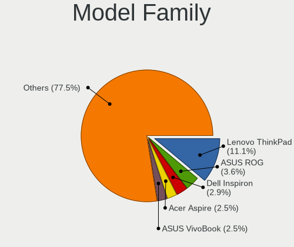
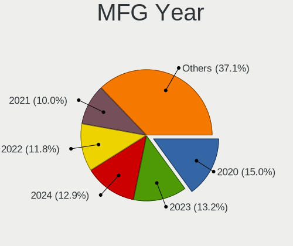
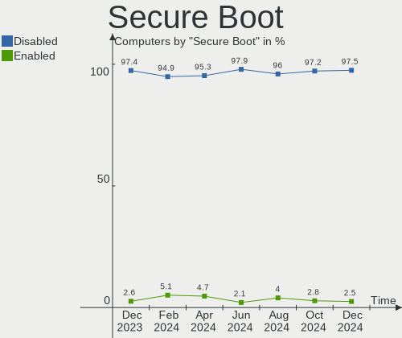
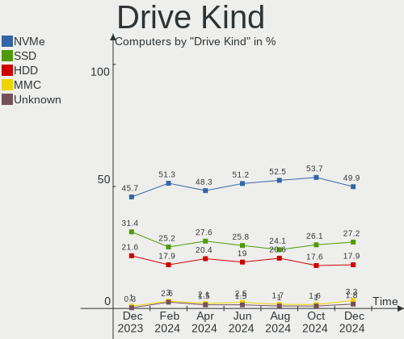
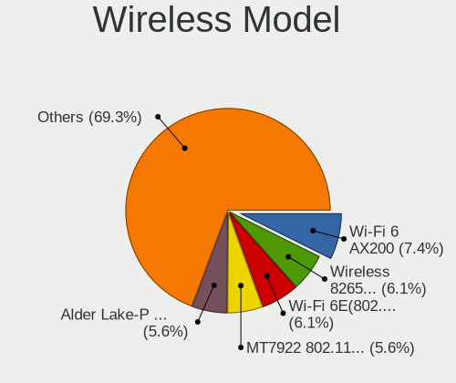
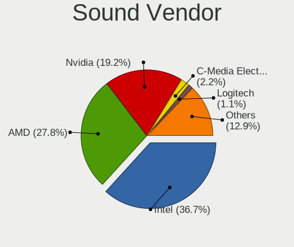
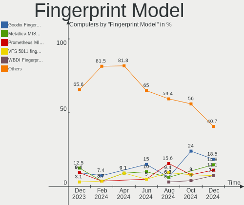

Arch - Hardware Trends
----------------------

A project to identify most popular hardware characteristics and track their change
over time based on data collected by Linux users at https://Linux-Hardware.org.

Anyone can contribute to this report by the [hw-probe](https://github.com/linuxhw/hw-probe) tool:

    sudo -E hw-probe -all -upload

This is a report for all computer types. See also reports for [desktops](/Dist/Arch/Desktop/README.md) and [notebooks](/Dist/Arch/Notebook/README.md).

This report is for one last month. Overall report since the beginning of time: [TestCoverage](https://github.com/linuxhw/TestCoverage)

Period: Oct, 2022.

Contents
--------

* [ System ](#system)
  - [ OS                       ](#os)
  - [ OS Family                ](#os-family)
  - [ Kernel                   ](#kernel)
  - [ Kernel Family            ](#kernel-family)
  - [ Kernel Major Ver.        ](#kernel-major-ver)
  - [ Arch                     ](#arch)
  - [ DE                       ](#de)
  - [ Display Server           ](#display-server)
  - [ Display Manager          ](#display-manager)
  - [ OS Lang                  ](#os-lang)
  - [ Boot Mode                ](#boot-mode)
  - [ Filesystem               ](#filesystem)
  - [ Part. scheme             ](#part-scheme)
  - [ Dual Boot with Linux/BSD ](#dual-boot-with-linuxbsd)
  - [ Dual Boot (Win)          ](#dual-boot-win)

* [ Board ](#board)
  - [ Vendor                   ](#vendor)
  - [ Model                    ](#model)
  - [ Model Family             ](#model-family)
  - [ MFG Year                 ](#mfg-year)
  - [ Form Factor              ](#form-factor)
  - [ Secure Boot              ](#secure-boot)
  - [ Coreboot                 ](#coreboot)
  - [ RAM Size                 ](#ram-size)
  - [ RAM Used                 ](#ram-used)
  - [ Total Drives             ](#total-drives)
  - [ Has CD-ROM               ](#has-cd-rom)
  - [ Has Ethernet             ](#has-ethernet)
  - [ Has WiFi                 ](#has-wifi)
  - [ Has Bluetooth            ](#has-bluetooth)

* [ Location ](#location)
  - [ Country                  ](#country)
  - [ City                     ](#city)

* [ Drives ](#drives)
  - [ Drive Vendor             ](#drive-vendor)
  - [ Drive Model              ](#drive-model)
  - [ HDD Vendor               ](#hdd-vendor)
  - [ SSD Vendor               ](#ssd-vendor)
  - [ Drive Kind               ](#drive-kind)
  - [ Drive Connector          ](#drive-connector)
  - [ Drive Size               ](#drive-size)
  - [ Space Total              ](#space-total)
  - [ Space Used               ](#space-used)
  - [ Malfunc. Drives          ](#malfunc-drives)
  - [ Malfunc. Drive Vendor    ](#malfunc-drive-vendor)
  - [ Malfunc. HDD Vendor      ](#malfunc-hdd-vendor)
  - [ Malfunc. Drive Kind      ](#malfunc-drive-kind)
  - [ Failed Drives            ](#failed-drives)
  - [ Failed Drive Vendor      ](#failed-drive-vendor)
  - [ Drive Status             ](#drive-status)

* [ Storage controller ](#storage-controller)
  - [ Storage Vendor           ](#storage-vendor)
  - [ Storage Model            ](#storage-model)
  - [ Storage Kind             ](#storage-kind)

* [ Processor ](#processor)
  - [ CPU Vendor               ](#cpu-vendor)
  - [ CPU Model                ](#cpu-model)
  - [ CPU Model Family         ](#cpu-model-family)
  - [ CPU Cores                ](#cpu-cores)
  - [ CPU Sockets              ](#cpu-sockets)
  - [ CPU Threads              ](#cpu-threads)
  - [ CPU Op-Modes             ](#cpu-op-modes)
  - [ CPU Microcode            ](#cpu-microcode)
  - [ CPU Microarch            ](#cpu-microarch)

* [ Graphics ](#graphics)
  - [ GPU Vendor               ](#gpu-vendor)
  - [ GPU Model                ](#gpu-model)
  - [ GPU Combo                ](#gpu-combo)
  - [ GPU Driver               ](#gpu-driver)
  - [ GPU Memory               ](#gpu-memory)

* [ Monitor ](#monitor)
  - [ Monitor Vendor           ](#monitor-vendor)
  - [ Monitor Model            ](#monitor-model)
  - [ Monitor Resolution       ](#monitor-resolution)
  - [ Monitor Diagonal         ](#monitor-diagonal)
  - [ Monitor Width            ](#monitor-width)
  - [ Aspect Ratio             ](#aspect-ratio)
  - [ Monitor Area             ](#monitor-area)
  - [ Pixel Density            ](#pixel-density)
  - [ Multiple Monitors        ](#multiple-monitors)

* [ Network ](#network)
  - [ Net Controller Vendor    ](#net-controller-vendor)
  - [ Net Controller Model     ](#net-controller-model)
  - [ Wireless Vendor          ](#wireless-vendor)
  - [ Wireless Model           ](#wireless-model)
  - [ Ethernet Vendor          ](#ethernet-vendor)
  - [ Ethernet Model           ](#ethernet-model)
  - [ Net Controller Kind      ](#net-controller-kind)
  - [ Used Controller          ](#used-controller)
  - [ NICs                     ](#nics)
  - [ IPv6                     ](#ipv6)

* [ Bluetooth ](#bluetooth)
  - [ Bluetooth Vendor         ](#bluetooth-vendor)
  - [ Bluetooth Model          ](#bluetooth-model)

* [ Sound ](#sound)
  - [ Sound Vendor             ](#sound-vendor)
  - [ Sound Model              ](#sound-model)

* [ Memory ](#memory)
  - [ Memory Vendor            ](#memory-vendor)
  - [ Memory Model             ](#memory-model)
  - [ Memory Kind              ](#memory-kind)
  - [ Memory Form Factor       ](#memory-form-factor)
  - [ Memory Size              ](#memory-size)
  - [ Memory Speed             ](#memory-speed)

* [ Printers & scanners ](#printers--scanners)
  - [ Printer Vendor           ](#printer-vendor)
  - [ Printer Model            ](#printer-model)
  - [ Scanner Vendor           ](#scanner-vendor)
  - [ Scanner Model            ](#scanner-model)

* [ Camera ](#camera)
  - [ Camera Vendor            ](#camera-vendor)
  - [ Camera Model             ](#camera-model)

* [ Security ](#security)
  - [ Fingerprint Vendor       ](#fingerprint-vendor)
  - [ Fingerprint Model        ](#fingerprint-model)
  - [ Chipcard Vendor          ](#chipcard-vendor)
  - [ Chipcard Model           ](#chipcard-model)

* [ Unsupported ](#unsupported)
  - [ Unsupported Devices      ](#unsupported-devices)
  - [ Unsupported Device Types ](#unsupported-device-types)

System
------

OS
--

Installed operating systems

| Name         | Computers | Percent |
|--------------|-----------|---------|
| Arch Rolling | 232       | 100%    |

OS Family
---------

OS without a version

| Name | Computers | Percent |
|------|-----------|---------|
| Arch | 232       | 100%    |

Kernel
------

Version of the Linux kernel

| Version                            | Computers | Percent |
|------------------------------------|-----------|---------|
| 6.0.2-arch1-1                      | 64        | 27.59%  |
| 5.19.13-arch1-1                    | 28        | 12.07%  |
| 5.19.12-arch1-1                    | 20        | 8.62%   |
| 6.0.2-zen1-1-zen                   | 16        | 6.9%    |
| 6.0.1-arch2-1                      | 15        | 6.47%   |
| 6.0.5-arch1-1                      | 12        | 5.17%   |
| 5.15.74-1-lts                      | 10        | 4.31%   |
| 5.19.13-zen1-1-zen                 | 6         | 2.59%   |
| 5.19.11-arch1-1                    | 4         | 1.72%   |
| 5.15.75-1-lts                      | 4         | 1.72%   |
| 5.15.72-1-lts                      | 4         | 1.72%   |
| 6.0.6-arch1-1                      | 3         | 1.29%   |
| 6.0.1-arch1-1                      | 3         | 1.29%   |
| 5.19.14-hardened1-1-hardened       | 3         | 1.29%   |
| 5.18.12-arch1-1                    | 3         | 1.29%   |
| 5.15.71-1-lts                      | 3         | 1.29%   |
| 6.0.1-zen2-1-zen                   | 2         | 0.86%   |
| 5.19.9-zen1-1-zen                  | 2         | 0.86%   |
| 5.19.12-zen1-1-zen                 | 2         | 0.86%   |
| 5.19.10-arch1-1                    | 2         | 0.86%   |
| 5.15.73-3-lts                      | 2         | 0.86%   |
| 6.1.0-rc1-next-20221021-1-next-git | 1         | 0.43%   |
| 6.1.0-rc1-1-mainline               | 1         | 0.43%   |
| 6.0.3-arch3-1                      | 1         | 0.43%   |
| 6.0.2-zen1-1.1-zen                 | 1         | 0.43%   |
| 6.0.2-2-MANJARO                    | 1         | 0.43%   |
| 6.0.1-zen1-1-zen                   | 1         | 0.43%   |
| 6.0.1-x64v3-xanmod1-1-v3           | 1         | 0.43%   |
| 6.0.1-arch2-1-surface              | 1         | 0.43%   |
| 6.0.1-270-tkg-pds                  | 1         | 0.43%   |
| 6.0.0-arch1-1                      | 1         | 0.43%   |
| 5.19.8-arch1-1                     | 1         | 0.43%   |
| 5.19.4-arch1-1                     | 1         | 0.43%   |
| 5.19.2-arch1-1                     | 1         | 0.43%   |
| 5.19.16-lqx2-1-lqx                 | 1         | 0.43%   |
| 5.19.13-arch1-g14-3                | 1         | 0.43%   |
| 5.19.12-1-clear                    | 1         | 0.43%   |
| 5.19.10-269-tkg-pds                | 1         | 0.43%   |
| 5.18.6-arch1-1                     | 1         | 0.43%   |
| 5.18.16-arch1-1                    | 1         | 0.43%   |

Kernel Family
-------------

Linux kernel without a distro release

| Version | Computers | Percent |
|---------|-----------|---------|
| 6.0.2   | 82        | 35.34%  |
| 5.19.13 | 35        | 15.09%  |
| 6.0.1   | 24        | 10.34%  |
| 5.19.12 | 23        | 9.91%   |
| 6.0.5   | 12        | 5.17%   |
| 5.15.74 | 10        | 4.31%   |
| 5.15.72 | 5         | 2.16%   |
| 5.19.11 | 4         | 1.72%   |
| 5.15.75 | 4         | 1.72%   |
| 6.0.6   | 3         | 1.29%   |
| 5.19.14 | 3         | 1.29%   |
| 5.19.10 | 3         | 1.29%   |
| 5.18.12 | 3         | 1.29%   |
| 5.15.71 | 3         | 1.29%   |
| 6.1.0   | 2         | 0.86%   |
| 5.19.9  | 2         | 0.86%   |
| 5.15.73 | 2         | 0.86%   |
| 6.0.3   | 1         | 0.43%   |
| 6.0.0   | 1         | 0.43%   |
| 5.19.8  | 1         | 0.43%   |
| 5.19.4  | 1         | 0.43%   |
| 5.19.2  | 1         | 0.43%   |
| 5.19.16 | 1         | 0.43%   |
| 5.18.6  | 1         | 0.43%   |
| 5.18.16 | 1         | 0.43%   |
| 5.18.14 | 1         | 0.43%   |
| 5.17.9  | 1         | 0.43%   |
| 5.15.68 | 1         | 0.43%   |
| 5.15.64 | 1         | 0.43%   |

Kernel Major Ver.
-----------------

Linux kernel major version

| Version | Computers | Percent |
|---------|-----------|---------|
| 6.0     | 123       | 53.02%  |
| 5.19    | 74        | 31.9%   |
| 5.15    | 26        | 11.21%  |
| 5.18    | 6         | 2.59%   |
| 6.1     | 2         | 0.86%   |
| 5.17    | 1         | 0.43%   |

Arch
----

OS architecture (x86_64, i586, etc.)

| Name   | Computers | Percent |
|--------|-----------|---------|
| x86_64 | 232       | 100%    |

DE
--

Desktop Environment

| Name           | Computers | Percent |
|----------------|-----------|---------|
| KDE5           | 82        | 35.34%  |
| GNOME          | 82        | 35.34%  |
| Unknown        | 21        | 9.05%   |
| XFCE           | 7         | 3.02%   |
| i3             | 7         | 3.02%   |
| sway           | 6         | 2.59%   |
| Hyprland       | 6         | 2.59%   |
| Deepin         | 4         | 1.72%   |
| qtile          | 3         | 1.29%   |
| LXQt           | 2         | 0.86%   |
| awesome        | 2         | 0.86%   |
| X-Cinnamon     | 1         | 0.43%   |
| Unity          | 1         | 0.43%   |
| MATE           | 1         | 0.43%   |
| LXDE           | 1         | 0.43%   |
| KDE            | 1         | 0.43%   |
| instantwm      | 1         | 0.43%   |
| i3-with-shmlog | 1         | 0.43%   |
| dwm            | 1         | 0.43%   |
| Cinnamon       | 1         | 0.43%   |
| Budgie         | 1         | 0.43%   |

Display Server
--------------

X11 or Wayland

| Name    | Computers | Percent |
|---------|-----------|---------|
| X11     | 123       | 53.02%  |
| Wayland | 81        | 34.91%  |
| Tty     | 17        | 7.33%   |
| Unknown | 11        | 4.74%   |

Display Manager
---------------

SDDM, LightDM, etc.

| Name    | Computers | Percent |
|---------|-----------|---------|
| Unknown | 96        | 41.38%  |
| SDDM    | 64        | 27.59%  |
| GDM     | 34        | 14.66%  |
| LightDM | 31        | 13.36%  |
| Ly      | 5         | 2.16%   |
| LXDM    | 1         | 0.43%   |
| EMPTTY  | 1         | 0.43%   |

OS Lang
-------

Language

| Lang        | Computers | Percent |
|-------------|-----------|---------|
| en_US       | 103       | 44.4%   |
| it_IT       | 44        | 18.97%  |
| C           | 18        | 7.76%   |
| en_GB       | 13        | 5.6%    |
| Unknown     | 8         | 3.45%   |
| pt_BR       | 5         | 2.16%   |
| en_IN       | 5         | 2.16%   |
| de_DE       | 5         | 2.16%   |
| ru_RU       | 4         | 1.72%   |
| fr_FR       | 4         | 1.72%   |
| pl_PL       | 3         | 1.29%   |
| zh_CN       | 2         | 0.86%   |
| en_IE       | 2         | 0.86%   |
| en_AU       | 2         | 0.86%   |
| sv_SE       | 1         | 0.43%   |
| pt_PT       | 1         | 0.43%   |
| mt_MT       | 1         | 0.43%   |
| fr_FR.utf-8 | 1         | 0.43%   |
| fr_CA       | 1         | 0.43%   |
| es_UY       | 1         | 0.43%   |
| es_PE       | 1         | 0.43%   |
| es_ES       | 1         | 0.43%   |
| es_CO       | 1         | 0.43%   |
| es_CL       | 1         | 0.43%   |
| en_ZA       | 1         | 0.43%   |
| en_CA       | 1         | 0.43%   |
| de_CH       | 1         | 0.43%   |
| Default     | 1         | 0.43%   |

Boot Mode
---------

EFI or BIOS

| Mode | Computers | Percent |
|------|-----------|---------|
| EFI  | 134       | 57.76%  |
| BIOS | 98        | 42.24%  |

Filesystem
----------

Type of filesystem

| Type  | Computers | Percent |
|-------|-----------|---------|
| Ext4  | 154       | 66.38%  |
| Btrfs | 70        | 30.17%  |
| Xfs   | 5         | 2.16%   |
| F2fs  | 3         | 1.29%   |

Part. scheme
------------

Scheme of partitioning

| Type    | Computers | Percent |
|---------|-----------|---------|
| GPT     | 150       | 64.66%  |
| Unknown | 65        | 28.02%  |
| MBR     | 17        | 7.33%   |

Dual Boot with Linux/BSD
------------------------

Hosting more than one Linux/BSD

| Dual boot | Computers | Percent |
|-----------|-----------|---------|
| No        | 200       | 86.21%  |
| Yes       | 32        | 13.79%  |

Dual Boot (Win)
---------------

Hosting Linux and Windows

| Dual boot | Computers | Percent |
|-----------|-----------|---------|
| No        | 154       | 66.38%  |
| Yes       | 78        | 33.62%  |

Board
-----

Vendor
------

Motherboard manufacturer

| Name                   | Computers | Percent |
|------------------------|-----------|---------|
| Lenovo                 | 47        | 20.26%  |
| ASUSTek Computer       | 41        | 17.67%  |
| Hewlett-Packard        | 31        | 13.36%  |
| Dell                   | 21        | 9.05%   |
| MSI                    | 20        | 8.62%   |
| Gigabyte Technology    | 18        | 7.76%   |
| Acer                   | 12        | 5.17%   |
| ASRock                 | 7         | 3.02%   |
| Apple                  | 5         | 2.16%   |
| Intel                  | 4         | 1.72%   |
| Timi                   | 3         | 1.29%   |
| Fujitsu                | 3         | 1.29%   |
| Avell High Performance | 3         | 1.29%   |
| Samsung Electronics    | 2         | 0.86%   |
| Microsoft              | 2         | 0.86%   |
| Unknown                | 2         | 0.86%   |
| UNOWHY                 | 1         | 0.43%   |
| Toshiba                | 1         | 0.43%   |
| PCWare                 | 1         | 0.43%   |
| MOTILE                 | 1         | 0.43%   |
| MECHREVO               | 1         | 0.43%   |
| MACHINIST              | 1         | 0.43%   |
| HUAWEI                 | 1         | 0.43%   |
| Google                 | 1         | 0.43%   |
| Framework              | 1         | 0.43%   |
| AMI                    | 1         | 0.43%   |
| Alienware              | 1         | 0.43%   |

Model
-----

Motherboard model

| Name                         | Computers | Percent |
|------------------------------|-----------|---------|
| MSI MS-7C56                  | 3         | 1.29%   |
| HP 255 G8 Notebook PC        | 3         | 1.29%   |
| HP 250 G8 Notebook PC        | 3         | 1.29%   |
| Avell High Performance B.ON  | 3         | 1.29%   |
| ASUS PRIME B550M-A           | 3         | 1.29%   |
| Acer Aspire A515-45          | 3         | 1.29%   |
| MSI MS-7C02                  | 2         | 0.86%   |
| MSI MS-7B79                  | 2         | 0.86%   |
| Gigabyte X570 AORUS ELITE    | 2         | 0.86%   |
| Gigabyte B550 AORUS ELITE    | 2         | 0.86%   |
| Gigabyte B450 AORUS ELITE    | 2         | 0.86%   |
| ASUS ROG Strix G513QY_G513QY | 2         | 0.86%   |
| ASUS PRIME X370-PRO          | 2         | 0.86%   |
| Apple MacBookAir7,2          | 2         | 0.86%   |
| Unknown                      | 2         | 0.86%   |
| UNOWHY Y13G012S4EI           | 1         | 0.43%   |
| Toshiba PORTEGE Z10t-A       | 1         | 0.43%   |
| Timi Xiaomi Book Pro 14 2022 | 1         | 0.43%   |
| Timi Mi Laptop Pro 15        | 1         | 0.43%   |
| Timi A7S                     | 1         | 0.43%   |
| Samsung 950XDB/951XDB/950XDY | 1         | 0.43%   |
| Samsung 270E5J/2570EJ        | 1         | 0.43%   |
| PCWare IPMH110G              | 1         | 0.43%   |
| MSI Prestige 14 A10SC        | 1         | 0.43%   |
| MSI MS-7C95                  | 1         | 0.43%   |
| MSI MS-7C94                  | 1         | 0.43%   |
| MSI MS-7C80                  | 1         | 0.43%   |
| MSI MS-7C79                  | 1         | 0.43%   |
| MSI MS-7C37                  | 1         | 0.43%   |
| MSI MS-7B89                  | 1         | 0.43%   |
| MSI MS-7B86                  | 1         | 0.43%   |
| MSI MS-7A71                  | 1         | 0.43%   |
| MSI MS-7A32                  | 1         | 0.43%   |
| MSI MS-7976                  | 1         | 0.43%   |
| MSI MS-7758                  | 1         | 0.43%   |
| MSI Modern 15 A5M            | 1         | 0.43%   |
| MOTILE M141                  | 1         | 0.43%   |
| Microsoft Surface Laptop 4   | 1         | 0.43%   |
| Microsoft Surface Go 3       | 1         | 0.43%   |
| MECHREVO Code01 Ver2.0       | 1         | 0.43%   |

Model Family
------------

Motherboard model prefix

| Name                        | Computers | Percent |
|-----------------------------|-----------|---------|
| Lenovo ThinkPad             | 25        | 10.78%  |
| ASUS PRIME                  | 12        | 5.17%   |
| ASUS ROG                    | 10        | 4.31%   |
| Acer Aspire                 | 10        | 4.31%   |
| HP Pavilion                 | 7         | 3.02%   |
| Lenovo IdeaPad              | 6         | 2.59%   |
| Dell Latitude               | 6         | 2.59%   |
| ASUS TUF                    | 6         | 2.59%   |
| Lenovo ThinkBook            | 5         | 2.16%   |
| Dell Inspiron               | 5         | 2.16%   |
| HP EliteBook                | 4         | 1.72%   |
| Dell Precision              | 4         | 1.72%   |
| MSI MS-7C56                 | 3         | 1.29%   |
| Lenovo Yoga                 | 3         | 1.29%   |
| HP ProBook                  | 3         | 1.29%   |
| HP 255                      | 3         | 1.29%   |
| HP 250                      | 3         | 1.29%   |
| Gigabyte B550               | 3         | 1.29%   |
| Dell XPS                    | 3         | 1.29%   |
| Avell High Performance B.ON | 3         | 1.29%   |
| MSI MS-7C02                 | 2         | 0.86%   |
| MSI MS-7B79                 | 2         | 0.86%   |
| Microsoft Surface           | 2         | 0.86%   |
| Lenovo ThinkStation         | 2         | 0.86%   |
| Lenovo IdeaPadFlex          | 2         | 0.86%   |
| HP ENVY                     | 2         | 0.86%   |
| Gigabyte X570               | 2         | 0.86%   |
| Gigabyte B450M              | 2         | 0.86%   |
| Gigabyte B450               | 2         | 0.86%   |
| Fujitsu LIFEBOOK            | 2         | 0.86%   |
| Dell Vostro                 | 2         | 0.86%   |
| ASUS ZenBook                | 2         | 0.86%   |
| ASUS VivoBook               | 2         | 0.86%   |
| Apple MacBookAir7           | 2         | 0.86%   |
| Unknown                     | 2         | 0.86%   |
| UNOWHY Y13G012S4EI          | 1         | 0.43%   |
| Toshiba PORTEGE             | 1         | 0.43%   |
| Timi Xiaomi                 | 1         | 0.43%   |
| Timi Mi                     | 1         | 0.43%   |
| Timi A7S                    | 1         | 0.43%   |

MFG Year
--------

Motherboard manufacture year

| Year | Computers | Percent |
|------|-----------|---------|
| 2020 | 52        | 22.41%  |
| 2021 | 33        | 14.22%  |
| 2018 | 27        | 11.64%  |
| 2019 | 24        | 10.34%  |
| 2022 | 21        | 9.05%   |
| 2016 | 12        | 5.17%   |
| 2015 | 12        | 5.17%   |
| 2017 | 10        | 4.31%   |
| 2012 | 9         | 3.88%   |
| 2014 | 8         | 3.45%   |
| 2013 | 6         | 2.59%   |
| 2010 | 6         | 2.59%   |
| 2011 | 5         | 2.16%   |
| 2008 | 4         | 1.72%   |
| 2009 | 2         | 0.86%   |
| 2007 | 1         | 0.43%   |

Form Factor
-----------

Physical design of the computer

| Name        | Computers | Percent |
|-------------|-----------|---------|
| Notebook    | 134       | 57.76%  |
| Desktop     | 86        | 37.07%  |
| Convertible | 8         | 3.45%   |
| Tablet      | 3         | 1.29%   |
| All in one  | 1         | 0.43%   |

Secure Boot
-----------

Enabled or disabled

| State    | Computers | Percent |
|----------|-----------|---------|
| Disabled | 223       | 96.12%  |
| Enabled  | 9         | 3.88%   |

Coreboot
--------

Have coreboot on board

| Used | Computers | Percent |
|------|-----------|---------|
| No   | 231       | 99.57%  |
| Yes  | 1         | 0.43%   |

RAM Size
--------

Total RAM memory

| Size in GB  | Computers | Percent |
|-------------|-----------|---------|
| 16.01-24.0  | 65        | 28.02%  |
| 8.01-16.0   | 52        | 22.41%  |
| 4.01-8.0    | 47        | 20.26%  |
| 32.01-64.0  | 43        | 18.53%  |
| 3.01-4.0    | 13        | 5.6%    |
| 24.01-32.0  | 6         | 2.59%   |
| 64.01-256.0 | 5         | 2.16%   |
| 1.01-2.0    | 1         | 0.43%   |

RAM Used
--------

Used RAM memory

| Used GB   | Computers | Percent |
|-----------|-----------|---------|
| 4.01-8.0  | 62        | 26.72%  |
| 3.01-4.0  | 49        | 21.12%  |
| 1.01-2.0  | 43        | 18.53%  |
| 2.01-3.0  | 42        | 18.1%   |
| 8.01-16.0 | 30        | 12.93%  |
| 0.51-1.0  | 6         | 2.59%   |

Total Drives
------------

Number of drives on board

| Drives | Computers | Percent |
|--------|-----------|---------|
| 1      | 128       | 55.17%  |
| 2      | 57        | 24.57%  |
| 3      | 23        | 9.91%   |
| 4      | 13        | 5.6%    |
| 5      | 5         | 2.16%   |
| 6      | 4         | 1.72%   |
| 7      | 2         | 0.86%   |

Has CD-ROM
----------

Has CD-ROM on board

| Presented | Computers | Percent |
|-----------|-----------|---------|
| No        | 193       | 83.19%  |
| Yes       | 39        | 16.81%  |

Has Ethernet
------------

Has Ethernet on board

| Presented | Computers | Percent |
|-----------|-----------|---------|
| Yes       | 190       | 81.9%   |
| No        | 42        | 18.1%   |

Has WiFi
--------

Has WiFi module

| Presented | Computers | Percent |
|-----------|-----------|---------|
| Yes       | 184       | 79.31%  |
| No        | 48        | 20.69%  |

Has Bluetooth
-------------

Has Bluetooth module

| Presented | Computers | Percent |
|-----------|-----------|---------|
| Yes       | 176       | 75.86%  |
| No        | 56        | 24.14%  |

Location
--------

Country
-------

Geographic location (country)

| Country      | Computers | Percent |
|--------------|-----------|---------|
| Italy        | 60        | 25.86%  |
| USA          | 42        | 18.1%   |
| Germany      | 15        | 6.47%   |
| Brazil       | 12        | 5.17%   |
| Poland       | 11        | 4.74%   |
| India        | 7         | 3.02%   |
| France       | 7         | 3.02%   |
| UK           | 6         | 2.59%   |
| Russia       | 6         | 2.59%   |
| Canada       | 4         | 1.72%   |
| Turkey       | 3         | 1.29%   |
| Sweden       | 3         | 1.29%   |
| Spain        | 3         | 1.29%   |
| Norway       | 3         | 1.29%   |
| Netherlands  | 3         | 1.29%   |
| Hong Kong    | 3         | 1.29%   |
| Denmark      | 3         | 1.29%   |
| Czechia      | 3         | 1.29%   |
| Australia    | 3         | 1.29%   |
| Ireland      | 2         | 0.86%   |
| Indonesia    | 2         | 0.86%   |
| Hungary      | 2         | 0.86%   |
| Egypt        | 2         | 0.86%   |
| Croatia      | 2         | 0.86%   |
| China        | 2         | 0.86%   |
| Argentina    | 2         | 0.86%   |
| Vietnam      | 1         | 0.43%   |
| Uruguay      | 1         | 0.43%   |
| Tunisia      | 1         | 0.43%   |
| Taiwan       | 1         | 0.43%   |
| Switzerland  | 1         | 0.43%   |
| South Africa | 1         | 0.43%   |
| Singapore    | 1         | 0.43%   |
| Romania      | 1         | 0.43%   |
| Portugal     | 1         | 0.43%   |
| Philippines  | 1         | 0.43%   |
| Peru         | 1         | 0.43%   |
| Montenegro   | 1         | 0.43%   |
| Malta        | 1         | 0.43%   |
| Lebanon      | 1         | 0.43%   |

City
----

Geographic location (city)

| City          | Computers | Percent |
|---------------|-----------|---------|
| Milan         | 14        | 6.03%   |
| Turin         | 4         | 1.72%   |
| Seattle       | 4         | 1.72%   |
| Los Angeles   | 4         | 1.72%   |
| Rome          | 3         | 1.29%   |
| Prague        | 3         | 1.29%   |
| Berlin        | 3         | 1.29%   |
| Warsaw        | 2         | 0.86%   |
| Szeged        | 2         | 0.86%   |
| Sao Paulo     | 2         | 0.86%   |
| San Jose      | 2         | 0.86%   |
| Phoenix       | 2         | 0.86%   |
| Paris         | 2         | 0.86%   |
| Padova        | 2         | 0.86%   |
| New York      | 2         | 0.86%   |
| Moscow        | 2         | 0.86%   |
| Krakow        | 2         | 0.86%   |
| Istanbul      | 2         | 0.86%   |
| Hong Kong     | 2         | 0.86%   |
| Catanzaro     | 2         | 0.86%   |
| Brescia       | 2         | 0.86%   |
| Bothell       | 2         | 0.86%   |
| Zoetermeer    | 1         | 0.43%   |
| Zhengzhou     | 1         | 0.43%   |
| Zevio         | 1         | 0.43%   |
| Zahle         | 1         | 0.43%   |
| Zagreb        | 1         | 0.43%   |
| Zagazig       | 1         | 0.43%   |
| Zabrze        | 1         | 0.43%   |
| Wroclaw       | 1         | 0.43%   |
| Woustviller   | 1         | 0.43%   |
| Voorhout      | 1         | 0.43%   |
| Vigodarzere   | 1         | 0.43%   |
| Vicopisano    | 1         | 0.43%   |
| Vestland      | 1         | 0.43%   |
| Velika Gorica | 1         | 0.43%   |
| Valencia      | 1         | 0.43%   |
| Utica         | 1         | 0.43%   |
| Turku         | 1         | 0.43%   |
| Trivandrum    | 1         | 0.43%   |

Drives
------

Drive Vendor
------------

Hard drive vendors

| Vendor                      | Computers | Drives | Percent |
|-----------------------------|-----------|--------|---------|
| Samsung Electronics         | 90        | 103    | 23.38%  |
| WDC                         | 44        | 55     | 11.43%  |
| Seagate                     | 38        | 42     | 9.87%   |
| Sandisk                     | 32        | 35     | 8.31%   |
| Crucial                     | 19        | 24     | 4.94%   |
| Kingston                    | 14        | 17     | 3.64%   |
| Toshiba                     | 12        | 12     | 3.12%   |
| Micron Technology           | 12        | 12     | 3.12%   |
| Intel                       | 12        | 14     | 3.12%   |
| SK hynix                    | 10        | 10     | 2.6%    |
| Phison Electronics          | 9         | 9      | 2.34%   |
| Micron/Crucial Technology   | 9         | 9      | 2.34%   |
| Hitachi                     | 9         | 10     | 2.34%   |
| Unknown                     | 8         | 8      | 2.08%   |
| KIOXIA                      | 7         | 7      | 1.82%   |
| ADATA Technology            | 6         | 7      | 1.56%   |
| Silicon Motion              | 5         | 5      | 1.3%    |
| Apple                       | 5         | 5      | 1.3%    |
| A-DATA Technology           | 5         | 5      | 1.3%    |
| Kingston Technology Company | 4         | 4      | 1.04%   |
| HGST                        | 4         | 4      | 1.04%   |
| Realtek Semiconductor       | 2         | 2      | 0.52%   |
| PNY                         | 2         | 3      | 0.52%   |
| OCZ                         | 2         | 2      | 0.52%   |
| LITEON                      | 2         | 2      | 0.52%   |
| HGST HTS                    | 2         | 2      | 0.52%   |
| Yangtze Memory Technologies | 1         | 1      | 0.26%   |
| Yangtze Memory              | 1         | 1      | 0.26%   |
| Transcend                   | 1         | 1      | 0.26%   |
| TO Exter                    | 1         | 1      | 0.26%   |
| Team                        | 1         | 1      | 0.26%   |
| SSSTC                       | 1         | 1      | 0.26%   |
| SPCC                        | 1         | 1      | 0.26%   |
| Plextor                     | 1         | 1      | 0.26%   |
| Phison                      | 1         | 1      | 0.26%   |
| Patriot                     | 1         | 1      | 0.26%   |
| MAXIO Technology (Hangzhou) | 1         | 1      | 0.26%   |
| LITEONIT                    | 1         | 1      | 0.26%   |
| LIO-ORG                     | 1         | 1      | 0.26%   |
| LaCie                       | 1         | 1      | 0.26%   |

Drive Model
-----------

Hard drive models

| Model                                                           | Computers | Percent |
|-----------------------------------------------------------------|-----------|---------|
| Samsung NVMe SSD Controller SM981/PM981/PM983 500GB             | 18        | 4.34%   |
| Samsung NVMe SSD Controller PM9A1/PM9A3/980PRO 250GB            | 11        | 2.65%   |
| Samsung SSD 860 EVO 500GB                                       | 8         | 1.93%   |
| Sandisk WD Blue SN550 NVMe SSD 1TB                              | 6         | 1.45%   |
| Samsung NVMe SSD Controller SM961/PM961/SM963 250GB             | 6         | 1.45%   |
| Crucial CT500MX500SSD1 500GB                                    | 6         | 1.45%   |
| ADATA XPG SX8200 Pro PCIe Gen3x4 M.2 2280 Solid State Drive 1TB | 6         | 1.45%   |
| Seagate ST2000DM008-2FR102 2TB                                  | 5         | 1.2%    |
| Sandisk WD Black SN750 / PC SN730 NVMe SSD 1TB                  | 5         | 1.2%    |
| Samsung SSD 980 1TB                                             | 5         | 1.2%    |
| Kingston SA400S37240G 240GB SSD                                 | 5         | 1.2%    |
| Unknown MMC Card  64GB                                          | 4         | 0.96%   |
| Seagate ST1000LM035-1RK172 1TB                                  | 4         | 0.96%   |
| Sandisk WD Blue SN500 / PC SN520 NVMe SSD 512GB                 | 4         | 0.96%   |
| Samsung SSD 860 EVO 250GB                                       | 4         | 0.96%   |
| Samsung SSD 850 EVO 250GB                                       | 4         | 0.96%   |
| Phison E12 NVMe Controller 2TB                                  | 4         | 0.96%   |
| Intel SSD 660P Series 1024GB                                    | 4         | 0.96%   |
| WDC WD10EZEX-08WN4A0 1TB                                        | 3         | 0.72%   |
| Samsung SSD 980 500GB                                           | 3         | 0.72%   |
| Samsung SSD 860 EVO 1TB                                         | 3         | 0.72%   |
| Samsung SSD 850 EVO 500GB                                       | 3         | 0.72%   |
| Phison PS5013 E13 NVMe Controller 256GB                         | 3         | 0.72%   |
| Micron/Crucial P1 NVMe PCIe SSD 1TB                             | 3         | 0.72%   |
| Micron 2210_MTFDHBA512QFD 512GB                                 | 3         | 0.72%   |
| Kingston Company A2000 NVMe SSD 1TB                             | 3         | 0.72%   |
| Crucial CT240BX500SSD1 240GB                                    | 3         | 0.72%   |
| Crucial CT1000MX500SSD1 1TB                                     | 3         | 0.72%   |
| A-DATA IM2P33F8A-512GD 512GB                                    | 3         | 0.72%   |
| WDC WDS250G2B0A-00SM50 250GB SSD                                | 2         | 0.48%   |
| WDC WD10EZEX-22MFCA0 1TB                                        | 2         | 0.48%   |
| WDC WD10EZEX-21WN4A0 1TB                                        | 2         | 0.48%   |
| Unknown SD/MMC/MS PRO 1TB                                       | 2         | 0.48%   |
| Toshiba DT01ACA200 2TB                                          | 2         | 0.48%   |
| SK hynix BC511 256GB                                            | 2         | 0.48%   |
| Silicon Motion SM2263EN/SM2263XT SSD Controller 256GB           | 2         | 0.48%   |
| Silicon Motion SM2262/SM2262EN SSD Controller 1024GB            | 2         | 0.48%   |
| Seagate ST3500418AS 500GB                                       | 2         | 0.48%   |
| Seagate ST1000LM048-2E7172 1TB                                  | 2         | 0.48%   |
| Seagate ST1000DM010-2EP102 1TB                                  | 2         | 0.48%   |

HDD Vendor
----------

Hard disk drive vendors

| Vendor              | Computers | Drives | Percent |
|---------------------|-----------|--------|---------|
| Seagate             | 37        | 41     | 34.58%  |
| WDC                 | 36        | 46     | 33.64%  |
| Hitachi             | 9         | 10     | 8.41%   |
| Toshiba             | 7         | 7      | 6.54%   |
| Samsung Electronics | 7         | 7      | 6.54%   |
| HGST                | 4         | 4      | 3.74%   |
| Unknown             | 2         | 2      | 1.87%   |
| HGST HTS            | 2         | 2      | 1.87%   |
| LIO-ORG             | 1         | 1      | 0.93%   |
| Fujitsu             | 1         | 1      | 0.93%   |
| Apple               | 1         | 1      | 0.93%   |

SSD Vendor
----------

Solid state drive vendors

| Vendor              | Computers | Drives | Percent |
|---------------------|-----------|--------|---------|
| Samsung Electronics | 35        | 37     | 31.53%  |
| Crucial             | 18        | 23     | 16.22%  |
| Kingston            | 13        | 16     | 11.71%  |
| WDC                 | 9         | 9      | 8.11%   |
| SanDisk             | 7         | 7      | 6.31%   |
| Apple               | 4         | 4      | 3.6%    |
| PNY                 | 2         | 3      | 1.8%    |
| OCZ                 | 2         | 2      | 1.8%    |
| LITEON              | 2         | 2      | 1.8%    |
| Intel               | 2         | 3      | 1.8%    |
| A-DATA Technology   | 2         | 2      | 1.8%    |
| Transcend           | 1         | 1      | 0.9%    |
| Toshiba             | 1         | 1      | 0.9%    |
| TO Exter            | 1         | 1      | 0.9%    |
| Team                | 1         | 1      | 0.9%    |
| SSSTC               | 1         | 1      | 0.9%    |
| SPCC                | 1         | 1      | 0.9%    |
| Plextor             | 1         | 1      | 0.9%    |
| Patriot             | 1         | 1      | 0.9%    |
| Micron Technology   | 1         | 1      | 0.9%    |
| LITEONIT            | 1         | 1      | 0.9%    |
| KingSpec            | 1         | 1      | 0.9%    |
| KimMiDi             | 1         | 1      | 0.9%    |
| Intenso             | 1         | 1      | 0.9%    |
| HS-SSD-C100         | 1         | 1      | 0.9%    |
| BAITITON            | 1         | 1      | 0.9%    |

Drive Kind
----------

HDD or SSD

| Kind    | Computers | Drives | Percent |
|---------|-----------|--------|---------|
| NVMe    | 147       | 177    | 44.68%  |
| SSD     | 95        | 123    | 28.88%  |
| HDD     | 80        | 122    | 24.32%  |
| MMC     | 6         | 6      | 1.82%   |
| Unknown | 1         | 1      | 0.3%    |

Drive Connector
---------------

SATA, SAS, NVMe, etc.

| Type | Computers | Drives | Percent |
|------|-----------|--------|---------|
| NVMe | 147       | 177    | 50.69%  |
| SATA | 129       | 238    | 44.48%  |
| SAS  | 8         | 8      | 2.76%   |
| MMC  | 6         | 6      | 2.07%   |

Drive Size
----------

Size of hard drive

| Size in TB | Computers | Drives | Percent |
|------------|-----------|--------|---------|
| 0.01-0.5   | 93        | 127    | 49.21%  |
| 0.51-1.0   | 59        | 71     | 31.22%  |
| 1.01-2.0   | 29        | 36     | 15.34%  |
| 3.01-4.0   | 3         | 4      | 1.59%   |
| 4.01-10.0  | 3         | 5      | 1.59%   |
| 2.01-3.0   | 2         | 2      | 1.06%   |

Space Total
-----------

Amount of disk space available on the file system

| Size in GB     | Computers | Percent |
|----------------|-----------|---------|
| 101-250        | 47        | 20.26%  |
| 251-500        | 46        | 19.83%  |
| 501-1000       | 40        | 17.24%  |
| 1001-2000      | 33        | 14.22%  |
| More than 3000 | 30        | 12.93%  |
| 2001-3000      | 18        | 7.76%   |
| 51-100         | 6         | 2.59%   |
| 21-50          | 5         | 2.16%   |
| Unknown        | 5         | 2.16%   |
| 1-20           | 2         | 0.86%   |

Space Used
----------

Amount of used disk space

| Used GB        | Computers | Percent |
|----------------|-----------|---------|
| 101-250        | 51        | 21.98%  |
| 1-20           | 37        | 15.95%  |
| 21-50          | 35        | 15.09%  |
| 251-500        | 27        | 11.64%  |
| 51-100         | 25        | 10.78%  |
| 501-1000       | 23        | 9.91%   |
| 1001-2000      | 14        | 6.03%   |
| More than 3000 | 10        | 4.31%   |
| 2001-3000      | 5         | 2.16%   |
| Unknown        | 5         | 2.16%   |

Malfunc. Drives
---------------

Drive models with a malfunction

| Model                                 | Computers | Drives | Percent |
|---------------------------------------|-----------|--------|---------|
| Seagate ST2000DM008-2FR102 2TB        | 2         | 2      | 7.14%   |
| WDC WD5000LPVX-00V0TT0 500GB          | 1         | 1      | 3.57%   |
| WDC WD5000BPVT-16HXZT1 500GB          | 1         | 1      | 3.57%   |
| WDC WD40EFRX-68WT0N0 4TB              | 1         | 1      | 3.57%   |
| WDC WD2500AAKS-00B3A0 250GB           | 1         | 1      | 3.57%   |
| WDC WD20EARX-008FB0 2TB               | 1         | 1      | 3.57%   |
| WDC WD10EZEX-08M2NA0 1TB              | 1         | 1      | 3.57%   |
| WDC WD10EAVS-00D7B0 1TB               | 1         | 1      | 3.57%   |
| Toshiba BG3 NVMe SSD Controller 128GB | 1         | 1      | 3.57%   |
| Seagate ST980811AS 80GB               | 1         | 1      | 3.57%   |
| Seagate ST2000DM001-1CH164 2TB        | 1         | 1      | 3.57%   |
| Seagate ST1000LM035-1RK172 1TB        | 1         | 1      | 3.57%   |
| Seagate ST1000LM024 HN-M101MBB 1TB    | 1         | 1      | 3.57%   |
| Seagate ST1000DM003-9YN162 1TB        | 1         | 1      | 3.57%   |
| SanDisk SSD PLUS 240 GB               | 1         | 1      | 3.57%   |
| Samsung Electronics SSD 980 500GB     | 1         | 1      | 3.57%   |
| Samsung Electronics SSD 870 EVO 500GB | 1         | 1      | 3.57%   |
| PNY SSD2SC120GB1DA16T-T               | 1         | 1      | 3.57%   |
| Kingston SA400S37240G 240GB SSD       | 1         | 1      | 3.57%   |
| Intel SSDSC2CT240A4 240GB             | 1         | 1      | 3.57%   |
| Intel SSDSC2BW480A4 480GB             | 1         | 2      | 3.57%   |
| Hitachi HDS728080PLA380 82GB          | 1         | 1      | 3.57%   |
| Hitachi HDS721064CLA332 640GB         | 1         | 1      | 3.57%   |
| HGST HTS721010A9E630 1TB              | 1         | 1      | 3.57%   |
| Crucial CT525MX300SSD1 528GB          | 1         | 1      | 3.57%   |
| Crucial CT120BX500SSD1 120GB          | 1         | 1      | 3.57%   |
| BAITITON BT58SSD09S 240GB             | 1         | 1      | 3.57%   |

Malfunc. Drive Vendor
---------------------

Vendors of faulty drives

| Vendor              | Computers | Drives | Percent |
|---------------------|-----------|--------|---------|
| Seagate             | 7         | 7      | 25.93%  |
| WDC                 | 6         | 7      | 22.22%  |
| Samsung Electronics | 2         | 2      | 7.41%   |
| Intel               | 2         | 3      | 7.41%   |
| Hitachi             | 2         | 2      | 7.41%   |
| Crucial             | 2         | 2      | 7.41%   |
| Toshiba             | 1         | 1      | 3.7%    |
| SanDisk             | 1         | 1      | 3.7%    |
| PNY                 | 1         | 1      | 3.7%    |
| Kingston            | 1         | 1      | 3.7%    |
| HGST                | 1         | 1      | 3.7%    |
| BAITITON            | 1         | 1      | 3.7%    |

Malfunc. HDD Vendor
-------------------

Vendors of faulty HDD drives

| Vendor  | Computers | Drives | Percent |
|---------|-----------|--------|---------|
| Seagate | 7         | 7      | 43.75%  |
| WDC     | 6         | 7      | 37.5%   |
| Hitachi | 2         | 2      | 12.5%   |
| HGST    | 1         | 1      | 6.25%   |

Malfunc. Drive Kind
-------------------

Kinds of faulty drives

| Kind | Computers | Drives | Percent |
|------|-----------|--------|---------|
| HDD  | 14        | 17     | 56%     |
| SSD  | 9         | 10     | 36%     |
| NVMe | 2         | 2      | 8%      |

Failed Drives
-------------

Failed drive models

Zero info for selected period =(

Failed Drive Vendor
-------------------

Failed drive vendors

Zero info for selected period =(

Drive Status
------------

Number of failed and malfunc. drives

| Status   | Computers | Drives | Percent |
|----------|-----------|--------|---------|
| Works    | 135       | 238    | 52.33%  |
| Detected | 100       | 162    | 38.76%  |
| Malfunc  | 23        | 29     | 8.91%   |

Storage controller
------------------

Storage Vendor
--------------

Storage controller vendors

| Vendor                       | Computers | Percent |
|------------------------------|-----------|---------|
| Intel                        | 108       | 31.86%  |
| AMD                          | 67        | 19.76%  |
| Samsung Electronics          | 55        | 16.22%  |
| SanDisk                      | 25        | 7.37%   |
| Phison Electronics           | 11        | 3.24%   |
| Micron Technology            | 11        | 3.24%   |
| SK hynix                     | 10        | 2.95%   |
| Micron/Crucial Technology    | 10        | 2.95%   |
| ADATA Technology             | 9         | 2.65%   |
| KIOXIA                       | 7         | 2.06%   |
| Silicon Motion               | 5         | 1.47%   |
| Kingston Technology Company  | 5         | 1.47%   |
| Toshiba America Info Systems | 4         | 1.18%   |
| ASMedia Technology           | 3         | 0.88%   |
| Yangtze Memory Technologies  | 2         | 0.59%   |
| Realtek Semiconductor        | 2         | 0.59%   |
| JMicron Technology           | 2         | 0.59%   |
| Seagate Technology           | 1         | 0.29%   |
| MAXIO Technology (Hangzhou)  | 1         | 0.29%   |
| LSI Logic / Symbios Logic    | 1         | 0.29%   |

Storage Model
-------------

Storage controller models

| Model                                                                          | Computers | Percent |
|--------------------------------------------------------------------------------|-----------|---------|
| AMD FCH SATA Controller [AHCI mode]                                            | 43        | 11.41%  |
| Samsung NVMe SSD Controller SM981/PM981/PM983                                  | 20        | 5.31%   |
| Samsung NVMe SSD Controller 980                                                | 18        | 4.77%   |
| AMD 500 Series Chipset SATA Controller                                         | 17        | 4.51%   |
| AMD 400 Series Chipset SATA Controller                                         | 13        | 3.45%   |
| Samsung NVMe SSD Controller PM9A1/PM9A3/980PRO                                 | 11        | 2.92%   |
| Micron Non-Volatile memory controller                                          | 11        | 2.92%   |
| Intel Volume Management Device NVMe RAID Controller                            | 11        | 2.92%   |
| Intel 82801 Mobile SATA Controller [RAID mode]                                 | 9         | 2.39%   |
| Intel Sunrise Point-LP SATA Controller [AHCI mode]                             | 7         | 1.86%   |
| SanDisk WD Blue SN550 NVMe SSD                                                 | 6         | 1.59%   |
| SanDisk Non-Volatile memory controller                                         | 6         | 1.59%   |
| Samsung NVMe SSD Controller SM961/PM961/SM963                                  | 6         | 1.59%   |
| Phison E12 NVMe Controller                                                     | 6         | 1.59%   |
| Intel Cannon Lake Mobile PCH SATA AHCI Controller                              | 6         | 1.59%   |
| Intel 8 Series/C220 Series Chipset Family 6-port SATA Controller 1 [AHCI mode] | 6         | 1.59%   |
| ADATA XPG SX8200 Pro PCIe Gen3x4 M.2 2280 Solid State Drive                    | 6         | 1.59%   |
| SanDisk WD Black SN750 / PC SN730 NVMe SSD                                     | 5         | 1.33%   |
| KIOXIA NVMe SSD Controller BG4                                                 | 5         | 1.33%   |
| Intel Q170/Q150/B150/H170/H110/Z170/CM236 Chipset SATA Controller [AHCI Mode]  | 5         | 1.33%   |
| Intel 82801JI (ICH10 Family) SATA AHCI Controller                              | 5         | 1.33%   |
| SK hynix Gold P31 SSD                                                          | 4         | 1.06%   |
| SanDisk WD Blue SN500 / PC SN520 NVMe SSD                                      | 4         | 1.06%   |
| Micron/Crucial Non-Volatile memory controller                                  | 4         | 1.06%   |
| Intel Tiger Lake-LP SATA Controller                                            | 4         | 1.06%   |
| Intel SSD 660P Series                                                          | 4         | 1.06%   |
| Intel HM170/QM170 Chipset SATA Controller [AHCI Mode]                          | 4         | 1.06%   |
| Intel 7 Series Chipset Family 6-port SATA Controller [AHCI mode]               | 4         | 1.06%   |
| AMD X370 Series Chipset SATA Controller                                        | 4         | 1.06%   |
| Silicon Motion SM2263EN/SM2263XT SSD Controller                                | 3         | 0.8%    |
| Phison PS5013 E13 NVMe Controller                                              | 3         | 0.8%    |
| Micron/Crucial P1 NVMe PCIe SSD                                                | 3         | 0.8%    |
| Kingston Company A2000 NVMe SSD                                                | 3         | 0.8%    |
| Intel Non-Volatile memory controller                                           | 3         | 0.8%    |
| Intel Ice Lake-LP SATA Controller [AHCI mode]                                  | 3         | 0.8%    |
| Intel Comet Lake SATA AHCI Controller                                          | 3         | 0.8%    |
| Intel Cannon Point-LP SATA Controller [AHCI Mode]                              | 3         | 0.8%    |
| Intel Cannon Lake PCH SATA AHCI Controller                                     | 3         | 0.8%    |
| Intel 8 Series SATA Controller 1 [AHCI mode]                                   | 3         | 0.8%    |
| Intel 6 Series/C200 Series Chipset Family 6 port Mobile SATA AHCI Controller   | 3         | 0.8%    |

Storage Kind
------------

Kind of storage controller (IDE, SATA, NVMe, SAS, ...)

| Kind | Computers | Percent |
|------|-----------|---------|
| SATA | 153       | 46.08%  |
| NVMe | 147       | 44.28%  |
| RAID | 23        | 6.93%   |
| IDE  | 7         | 2.11%   |
| SAS  | 2         | 0.6%    |

Processor
---------

CPU Vendor
----------

Processor vendors

| Vendor | Computers | Percent |
|--------|-----------|---------|
| Intel  | 136       | 58.62%  |
| AMD    | 96        | 41.38%  |

CPU Model
---------

Processor models

| Model                                         | Computers | Percent |
|-----------------------------------------------|-----------|---------|
| AMD Ryzen 7 5800X 8-Core Processor            | 9         | 3.88%   |
| Intel 11th Gen Core i7-1165G7 @ 2.80GHz       | 7         | 3.02%   |
| AMD Ryzen 7 5700U with Radeon Graphics        | 6         | 2.59%   |
| Intel 11th Gen Core i5-1135G7 @ 2.40GHz       | 5         | 2.16%   |
| AMD Ryzen 5 5600X 6-Core Processor            | 5         | 2.16%   |
| AMD Ryzen 5 5600G with Radeon Graphics        | 5         | 2.16%   |
| AMD Ryzen 7 4700U with Radeon Graphics        | 4         | 1.72%   |
| AMD Ryzen 7 3700X 8-Core Processor            | 4         | 1.72%   |
| AMD Ryzen 5 5500U with Radeon Graphics        | 4         | 1.72%   |
| Intel Core i7-8750H CPU @ 2.20GHz             | 3         | 1.29%   |
| Intel Core i7-8550U CPU @ 1.80GHz             | 3         | 1.29%   |
| Intel Core i5-8250U CPU @ 1.60GHz             | 3         | 1.29%   |
| Intel Core i5-6200U CPU @ 2.30GHz             | 3         | 1.29%   |
| Intel 12th Gen Core i7-12700H                 | 3         | 1.29%   |
| Intel 12th Gen Core i7-1260P                  | 3         | 1.29%   |
| AMD Ryzen 5 5600U with Radeon Graphics        | 3         | 1.29%   |
| AMD Ryzen 5 2600 Six-Core Processor           | 3         | 1.29%   |
| Intel Pentium Silver N5030 CPU @ 1.10GHz      | 2         | 0.86%   |
| Intel Core i9-10850K CPU @ 3.60GHz            | 2         | 0.86%   |
| Intel Core i7-8650U CPU @ 1.90GHz             | 2         | 0.86%   |
| Intel Core i7-8565U CPU @ 1.80GHz             | 2         | 0.86%   |
| Intel Core i7-7700 CPU @ 3.60GHz              | 2         | 0.86%   |
| Intel Core i7-6700HQ CPU @ 2.60GHz            | 2         | 0.86%   |
| Intel Core i7-3770 CPU @ 3.40GHz              | 2         | 0.86%   |
| Intel Core i7-1065G7 CPU @ 1.30GHz            | 2         | 0.86%   |
| Intel Core i7 CPU 920 @ 2.67GHz               | 2         | 0.86%   |
| Intel Core i7 CPU 860 @ 2.80GHz               | 2         | 0.86%   |
| Intel Core i5-9400F CPU @ 2.90GHz             | 2         | 0.86%   |
| Intel Core i5-8300H CPU @ 2.30GHz             | 2         | 0.86%   |
| Intel Core i5-8265U CPU @ 1.60GHz             | 2         | 0.86%   |
| Intel Core i5-5250U CPU @ 1.60GHz             | 2         | 0.86%   |
| Intel Core i5-1035G1 CPU @ 1.00GHz            | 2         | 0.86%   |
| Intel 11th Gen Core i3-1115G4 @ 3.00GHz       | 2         | 0.86%   |
| AMD Ryzen 7 PRO 5850U with Radeon Graphics    | 2         | 0.86%   |
| AMD Ryzen 7 6800H with Radeon Graphics        | 2         | 0.86%   |
| AMD Ryzen 7 5800H with Radeon Graphics        | 2         | 0.86%   |
| AMD Ryzen 7 4800H with Radeon Graphics        | 2         | 0.86%   |
| AMD Ryzen 5 3600 6-Core Processor             | 2         | 0.86%   |
| AMD Ryzen 5 3500U with Radeon Vega Mobile Gfx | 2         | 0.86%   |
| AMD Ryzen 5 2600X Six-Core Processor          | 2         | 0.86%   |

CPU Model Family
----------------

Processor model prefix

| Model                | Computers | Percent |
|----------------------|-----------|---------|
| Intel Core i7        | 44        | 18.97%  |
| AMD Ryzen 7          | 37        | 15.95%  |
| Intel Core i5        | 36        | 15.52%  |
| AMD Ryzen 5          | 34        | 14.66%  |
| Other                | 28        | 12.07%  |
| AMD Ryzen 9          | 10        | 4.31%   |
| Intel Core i3        | 9         | 3.88%   |
| Intel Xeon           | 6         | 2.59%   |
| Intel Core 2 Duo     | 4         | 1.72%   |
| AMD Ryzen 7 PRO      | 4         | 1.72%   |
| AMD Ryzen 5 PRO      | 3         | 1.29%   |
| AMD Ryzen 3          | 3         | 1.29%   |
| Intel Pentium Silver | 2         | 0.86%   |
| Intel Pentium        | 2         | 0.86%   |
| Intel Core i9        | 2         | 0.86%   |
| Intel Celeron        | 2         | 0.86%   |
| Intel Pentium D      | 1         | 0.43%   |
| Intel Atom           | 1         | 0.43%   |
| AMD FX               | 1         | 0.43%   |
| AMD E2               | 1         | 0.43%   |
| AMD A8               | 1         | 0.43%   |
| AMD A4               | 1         | 0.43%   |

CPU Cores
---------

Number of processor cores

| Number | Computers | Percent |
|--------|-----------|---------|
| 4      | 80        | 34.48%  |
| 8      | 48        | 20.69%  |
| 6      | 43        | 18.53%  |
| 2      | 41        | 17.67%  |
| 12     | 7         | 3.02%   |
| 10     | 5         | 2.16%   |
| 14     | 4         | 1.72%   |
| 16     | 3         | 1.29%   |
| 1      | 1         | 0.43%   |

CPU Sockets
-----------

Number of sockets

| Number | Computers | Percent |
|--------|-----------|---------|
| 1      | 231       | 99.57%  |
| 2      | 1         | 0.43%   |

CPU Threads
-----------

Threads per core (Hyper-Threading)

| Number | Computers | Percent |
|--------|-----------|---------|
| 2      | 201       | 86.64%  |
| 1      | 31        | 13.36%  |

CPU Op-Modes
------------

CPU Operation Modes (32-bit, 64-bit)

| Op mode        | Computers | Percent |
|----------------|-----------|---------|
| 32-bit, 64-bit | 232       | 100%    |

CPU Microcode
-------------

Microcode number

| Number     | Computers | Percent |
|------------|-----------|---------|
| Unknown    | 81        | 34.91%  |
| 0x0a50000c | 13        | 5.6%    |
| 0x806c1    | 12        | 5.17%   |
| 0x906ea    | 7         | 3.02%   |
| 0x0a201016 | 7         | 3.02%   |
| 0x08701021 | 7         | 3.02%   |
| 0x08608103 | 7         | 3.02%   |
| 0x306c3    | 5         | 2.16%   |
| 0x0800820d | 5         | 2.16%   |
| 0x906e9    | 4         | 1.72%   |
| 0x806ec    | 4         | 1.72%   |
| 0x806ea    | 4         | 1.72%   |
| 0x0a404102 | 4         | 1.72%   |
| 0x906a3    | 3         | 1.29%   |
| 0x706e5    | 3         | 1.29%   |
| 0x506e3    | 3         | 1.29%   |
| 0x406e3    | 3         | 1.29%   |
| 0x306a9    | 3         | 1.29%   |
| 0x206a7    | 3         | 1.29%   |
| 0x0a201009 | 3         | 1.29%   |
| 0x08608102 | 3         | 1.29%   |
| 0x08108109 | 3         | 1.29%   |
| 0x806e9    | 2         | 0.86%   |
| 0x206c2    | 2         | 0.86%   |
| 0x20655    | 2         | 0.86%   |
| 0x0a601201 | 2         | 0.86%   |
| 0x0a50000d | 2         | 0.86%   |
| 0x0a404101 | 2         | 0.86%   |
| 0x0a20120a | 2         | 0.86%   |
| 0x08600104 | 2         | 0.86%   |
| 0x08600103 | 2         | 0.86%   |
| 0x08108102 | 2         | 0.86%   |
| 0xa0660    | 1         | 0.43%   |
| 0xa0655    | 1         | 0.43%   |
| 0xa0653    | 1         | 0.43%   |
| 0x906ed    | 1         | 0.43%   |
| 0x906a4    | 1         | 0.43%   |
| 0x806eb    | 1         | 0.43%   |
| 0x6fb      | 1         | 0.43%   |
| 0x406f1    | 1         | 0.43%   |

CPU Microarch
-------------

Microarchitecture

| Name             | Computers | Percent |
|------------------|-----------|---------|
| KabyLake         | 35        | 15.09%  |
| Zen 3            | 32        | 13.79%  |
| Unknown          | 27        | 11.64%  |
| Zen 2            | 21        | 9.05%   |
| TigerLake        | 16        | 6.9%    |
| Zen+             | 14        | 6.03%   |
| Haswell          | 14        | 6.03%   |
| Skylake          | 12        | 5.17%   |
| IvyBridge        | 8         | 3.45%   |
| Zen              | 6         | 2.59%   |
| Westmere         | 6         | 2.59%   |
| CometLake        | 6         | 2.59%   |
| SandyBridge      | 5         | 2.16%   |
| Nehalem          | 4         | 1.72%   |
| IceLake          | 4         | 1.72%   |
| Broadwell        | 4         | 1.72%   |
| Penryn           | 3         | 1.29%   |
| Goldmont plus    | 3         | 1.29%   |
| Alderlake Hybrid | 3         | 1.29%   |
| Silvermont       | 2         | 0.86%   |
| Piledriver       | 2         | 0.86%   |
| Steamroller      | 1         | 0.43%   |
| NetBurst         | 1         | 0.43%   |
| Goldmont         | 1         | 0.43%   |
| Core             | 1         | 0.43%   |
| Bobcat           | 1         | 0.43%   |

Graphics
--------

GPU Vendor
----------

Vendors of graphics cards

| Vendor | Computers | Percent |
|--------|-----------|---------|
| Intel  | 105       | 38.32%  |
| AMD    | 88        | 32.12%  |
| Nvidia | 81        | 29.56%  |

GPU Model
---------

Graphics card models

| Model                                                                       | Computers | Percent |
|-----------------------------------------------------------------------------|-----------|---------|
| AMD Cezanne                                                                 | 15        | 5.36%   |
| Intel TigerLake-LP GT2 [Iris Xe Graphics]                                   | 13        | 4.64%   |
| AMD Lucienne                                                                | 11        | 3.93%   |
| Intel UHD Graphics 620                                                      | 9         | 3.21%   |
| AMD Renoir                                                                  | 9         | 3.21%   |
| AMD Picasso/Raven 2 [Radeon Vega Series / Radeon Vega Mobile Series]        | 9         | 3.21%   |
| AMD Navi 10 [Radeon RX 5600 OEM/5600 XT / 5700/5700 XT]                     | 8         | 2.86%   |
| Intel Alder Lake-P Integrated Graphics Controller                           | 7         | 2.5%    |
| Intel Skylake GT2 [HD Graphics 520]                                         | 6         | 2.14%   |
| Intel CoffeeLake-H GT2 [UHD Graphics 630]                                   | 6         | 2.14%   |
| AMD Rembrandt [Radeon 680M]                                                 | 6         | 2.14%   |
| Nvidia GP106 [GeForce GTX 1060 6GB]                                         | 5         | 1.79%   |
| Intel HD Graphics 630                                                       | 5         | 1.79%   |
| Intel 3rd Gen Core processor Graphics Controller                            | 5         | 1.79%   |
| Intel 2nd Generation Core Processor Family Integrated Graphics Controller   | 5         | 1.79%   |
| AMD Navi 22 [Radeon RX 6700/6700 XT/6750 XT / 6800M]                        | 5         | 1.79%   |
| Nvidia GP107M [GeForce GTX 1050 Mobile]                                     | 4         | 1.43%   |
| Nvidia GP107 [GeForce GTX 1050 Ti]                                          | 4         | 1.43%   |
| Nvidia GP104 [GeForce GTX 1070]                                             | 4         | 1.43%   |
| Nvidia GA104 [GeForce RTX 3070]                                             | 4         | 1.43%   |
| Intel WhiskeyLake-U GT2 [UHD Graphics 620]                                  | 4         | 1.43%   |
| AMD Ellesmere [Radeon RX 470/480/570/570X/580/580X/590]                     | 4         | 1.43%   |
| Nvidia TU117M [GeForce GTX 1650 Mobile / Max-Q]                             | 3         | 1.07%   |
| Nvidia GP108 [GeForce GT 1030]                                              | 3         | 1.07%   |
| Intel Tiger Lake UHD Graphics                                               | 3         | 1.07%   |
| Intel HD Graphics 530                                                       | 3         | 1.07%   |
| Intel Core Processor Integrated Graphics Controller                         | 3         | 1.07%   |
| Intel 4th Gen Core Processor Integrated Graphics Controller                 | 3         | 1.07%   |
| AMD Navi 23 [Radeon RX 6600/6600 XT/6600M]                                  | 3         | 1.07%   |
| Nvidia TU116 [GeForce GTX 1660 SUPER]                                       | 2         | 0.71%   |
| Nvidia TU104 [GeForce RTX 2070 SUPER]                                       | 2         | 0.71%   |
| Nvidia GP107M [GeForce GTX 1050 Ti Mobile]                                  | 2         | 0.71%   |
| Nvidia GP104 [GeForce GTX 1080]                                             | 2         | 0.71%   |
| Nvidia GM204 [GeForce GTX 970]                                              | 2         | 0.71%   |
| Nvidia GM108M [GeForce MX130]                                               | 2         | 0.71%   |
| Nvidia GK208B [GeForce GT 710]                                              | 2         | 0.71%   |
| Nvidia GA107M [GeForce RTX 3050 Ti Mobile]                                  | 2         | 0.71%   |
| Nvidia GA106M [GeForce RTX 3060 Mobile / Max-Q]                             | 2         | 0.71%   |
| Intel Xeon E3-1200 v3/4th Gen Core Processor Integrated Graphics Controller | 2         | 0.71%   |
| Intel Iris Plus Graphics G7                                                 | 2         | 0.71%   |

GPU Combo
---------

Combinations of graphics cards

| Name           | Computers | Percent |
|----------------|-----------|---------|
| 1 x AMD        | 70        | 30.17%  |
| 1 x Intel      | 69        | 29.74%  |
| 1 x Nvidia     | 45        | 19.4%   |
| Intel + Nvidia | 29        | 12.5%   |
| 2 x AMD        | 6         | 2.59%   |
| AMD + Nvidia   | 6         | 2.59%   |
| Intel + AMD    | 5         | 2.16%   |
| Other          | 1         | 0.43%   |
| 2 x Nvidia     | 1         | 0.43%   |

GPU Driver
----------

Free vs proprietary

| Driver      | Computers | Percent |
|-------------|-----------|---------|
| Free        | 171       | 73.71%  |
| Proprietary | 60        | 25.86%  |
| Unknown     | 1         | 0.43%   |

GPU Memory
----------

Total video memory

| Size in GB | Computers | Percent |
|------------|-----------|---------|
| Unknown    | 124       | 53.45%  |
| 0.01-0.5   | 23        | 9.91%   |
| 7.01-8.0   | 21        | 9.05%   |
| 1.01-2.0   | 18        | 7.76%   |
| 3.01-4.0   | 15        | 6.47%   |
| 5.01-6.0   | 12        | 5.17%   |
| 8.01-16.0  | 8         | 3.45%   |
| 0.51-1.0   | 8         | 3.45%   |
| 2.01-3.0   | 3         | 1.29%   |

Monitor
-------

Monitor Vendor
--------------

Monitor vendors

| Vendor               | Computers | Percent |
|----------------------|-----------|---------|
| Samsung Electronics  | 47        | 15.93%  |
| BOE                  | 40        | 13.56%  |
| Chimei Innolux       | 23        | 7.8%    |
| Goldstar             | 22        | 7.46%   |
| AU Optronics         | 21        | 7.12%   |
| LG Display           | 19        | 6.44%   |
| Dell                 | 19        | 6.44%   |
| Acer                 | 11        | 3.73%   |
| Hewlett-Packard      | 9         | 3.05%   |
| Sharp                | 8         | 2.71%   |
| Lenovo               | 5         | 1.69%   |
| Iiyama               | 5         | 1.69%   |
| BenQ                 | 5         | 1.69%   |
| Apple                | 5         | 1.69%   |
| AOC                  | 5         | 1.69%   |
| Ancor Communications | 5         | 1.69%   |
| PANDA                | 4         | 1.36%   |
| MSI                  | 4         | 1.36%   |
| ViewSonic            | 3         | 1.02%   |
| Philips              | 3         | 1.02%   |
| TMX                  | 2         | 0.68%   |
| RTK                  | 2         | 0.68%   |
| CSO                  | 2         | 0.68%   |
| ___                  | 1         | 0.34%   |
| Unknown              | 1         | 0.34%   |
| UGD                  | 1         | 0.34%   |
| SKG                  | 1         | 0.34%   |
| Plain Tree Systems   | 1         | 0.34%   |
| Pixio                | 1         | 0.34%   |
| Panasonic            | 1         | 0.34%   |
| OPD                  | 1         | 0.34%   |
| NEC Computers        | 1         | 0.34%   |
| Medion               | 1         | 0.34%   |
| LG Philips           | 1         | 0.34%   |
| JDZ                  | 1         | 0.34%   |
| IPS                  | 1         | 0.34%   |
| Insignia             | 1         | 0.34%   |
| InfoVision           | 1         | 0.34%   |
| HUAWEI               | 1         | 0.34%   |
| HSO                  | 1         | 0.34%   |

Monitor Model
-------------

Monitor models

| Model                                                             | Computers | Percent |
|-------------------------------------------------------------------|-----------|---------|
| Chimei Innolux LCD Monitor CMN14C9 1920x1080 309x173mm 13.9-inch  | 3         | 0.99%   |
| BOE LCD Monitor BOE08F5 1920x1080 344x194mm 15.5-inch             | 3         | 0.99%   |
| AU Optronics LCD Monitor AUO61ED 1920x1080 344x194mm 15.5-inch    | 3         | 0.99%   |
| AU Optronics LCD Monitor AUO21ED 1920x1080 344x193mm 15.5-inch    | 3         | 0.99%   |
| Samsung Electronics U28E590 SAM0C4E 3840x2160 608x345mm 27.5-inch | 2         | 0.66%   |
| Samsung Electronics S24D330 SAM0D92 1920x1080 531x299mm 24.0-inch | 2         | 0.66%   |
| Samsung Electronics C27F591 SAM0D37 1920x1080 598x336mm 27.0-inch | 2         | 0.66%   |
| Samsung Electronics C27F591 SAM0D36 1920x1080 600x340mm 27.2-inch | 2         | 0.66%   |
| Samsung Electronics C24F390 SAM0D2C 1920x1080 520x290mm 23.4-inch | 2         | 0.66%   |
| PANDA LCD Monitor NCP002D 1920x1080 344x194mm 15.5-inch           | 2         | 0.66%   |
| LG Display LCD Monitor LGD0563 1920x1080 344x194mm 15.5-inch      | 2         | 0.66%   |
| LG Display LCD Monitor LGD02DC 1366x768 344x194mm 15.5-inch       | 2         | 0.66%   |
| Iiyama PL2470H IVM615C 1920x1080 530x300mm 24.0-inch              | 2         | 0.66%   |
| Goldstar LG HDR 4K GSM7707 3840x2160 600x340mm 27.2-inch          | 2         | 0.66%   |
| Goldstar HDR 4K GSM7706 3840x2160 600x340mm 27.2-inch             | 2         | 0.66%   |
| Dell U2715H DELD066 2560x1440 600x340mm 27.2-inch                 | 2         | 0.66%   |
| Dell U2412M DELA07B 1920x1200 518x324mm 24.1-inch                 | 2         | 0.66%   |
| Chimei Innolux LCD Monitor CMN15E7 1920x1080 344x193mm 15.5-inch  | 2         | 0.66%   |
| Chimei Innolux LCD Monitor CMN15BF 1366x768 344x193mm 15.5-inch   | 2         | 0.66%   |
| Chimei Innolux LCD Monitor CMN14D5 1920x1080 309x173mm 13.9-inch  | 2         | 0.66%   |
| AU Optronics LCD Monitor AUO2E8D 1920x1080 344x194mm 15.5-inch    | 2         | 0.66%   |
| ___ LCD TV ___9000 1360x768                                       | 1         | 0.33%   |
| ViewSonic VX2467-MHD VSCA33B 1920x1080 527x296mm 23.8-inch        | 1         | 0.33%   |
| ViewSonic VA2431 Series VSCD824 1920x1080 521x293mm 23.5-inch     | 1         | 0.33%   |
| ViewSonic VA2212 Series VSCBD2B 1920x1080 477x268mm 21.5-inch     | 1         | 0.33%   |
| Unknown LCD TV 9000 1360x768 1600x900mm 72.3-inch                 | 1         | 0.33%   |
| UGD LCD Monitor UGD1503 1920x1080 340x190mm 15.3-inch             | 1         | 0.33%   |
| TMX TL140BDXP01-0 TMX1400 2560x1440 310x174mm 14.0-inch           | 1         | 0.33%   |
| TMX TL140ADXP01 TMX1481 2560x1600 301x188mm 14.0-inch             | 1         | 0.33%   |
| SKG M27P20P SKG2712 3840x2160 600x330mm 27.0-inch                 | 1         | 0.33%   |
| Sharp LQ156M1JW25 SHP152C 1920x1080 344x194mm 15.5-inch           | 1         | 0.33%   |
| Sharp LQ156M1JW01 SHP14C3 1920x1080 344x194mm 15.5-inch           | 1         | 0.33%   |
| Sharp LQ135P1JX51 SHP14B3 2256x1504 285x190mm 13.5-inch           | 1         | 0.33%   |
| Sharp LQ134N1JW54 SHP154F 1920x1200 288x180mm 13.4-inch           | 1         | 0.33%   |
| Sharp LCD Monitor SHP14CB 1920x1200 288x180mm 13.4-inch           | 1         | 0.33%   |
| Sharp LCD Monitor SHP149A 1920x1080 344x194mm 15.5-inch           | 1         | 0.33%   |
| Sharp LCD Monitor SHP148B 3840x2160 294x165mm 13.3-inch           | 1         | 0.33%   |
| Sharp LCD Monitor SHP143B 3840x2160 346x194mm 15.6-inch           | 1         | 0.33%   |
| Samsung Electronics U28E590 SAM0C4D 3840x2160 607x345mm 27.5-inch | 1         | 0.33%   |
| Samsung Electronics U28E590 SAM0C4C 3840x2160 608x345mm 27.5-inch | 1         | 0.33%   |

Monitor Resolution
------------------

Monitor screen resolution

| Resolution         | Computers | Percent |
|--------------------|-----------|---------|
| 1920x1080 (FHD)    | 141       | 53.21%  |
| 2560x1440 (QHD)    | 22        | 8.3%    |
| 3840x2160 (4K)     | 20        | 7.55%   |
| 1366x768 (WXGA)    | 19        | 7.17%   |
| 1920x1200 (WUXGA)  | 12        | 4.53%   |
| 1440x900 (WXGA+)   | 9         | 3.4%    |
| 2880x1800          | 5         | 1.89%   |
| 2560x1600          | 5         | 1.89%   |
| 2560x1080          | 4         | 1.51%   |
| 1280x1024 (SXGA)   | 4         | 1.51%   |
| 3440x1440          | 3         | 1.13%   |
| 3840x1080          | 2         | 0.75%   |
| 2256x1504          | 2         | 0.75%   |
| 1680x1050 (WSXGA+) | 2         | 0.75%   |
| 1600x900 (HD+)     | 2         | 0.75%   |
| 1360x768           | 2         | 0.75%   |
| 1280x800 (WXGA)    | 2         | 0.75%   |
| Unknown            | 2         | 0.75%   |
| 5760x1080          | 1         | 0.38%   |
| 3840x2400          | 1         | 0.38%   |
| 3200x1800 (QHD+)   | 1         | 0.38%   |
| 2240x1400          | 1         | 0.38%   |
| 2160x1440          | 1         | 0.38%   |
| 1920x540           | 1         | 0.38%   |
| 1920x1280          | 1         | 0.38%   |

Monitor Diagonal
----------------

Diagonal size in inches

| Inches  | Computers | Percent |
|---------|-----------|---------|
| 15      | 71        | 24.65%  |
| 27      | 43        | 14.93%  |
| 13      | 31        | 10.76%  |
| 14      | 27        | 9.38%   |
| 24      | 23        | 7.99%   |
| 23      | 22        | 7.64%   |
| 21      | 14        | 4.86%   |
| Unknown | 9         | 3.13%   |
| 34      | 7         | 2.43%   |
| 31      | 7         | 2.43%   |
| 17      | 6         | 2.08%   |
| 16      | 6         | 2.08%   |
| 18      | 5         | 1.74%   |
| 72      | 2         | 0.69%   |
| 29      | 2         | 0.69%   |
| 19      | 2         | 0.69%   |
| 12      | 2         | 0.69%   |
| 11      | 2         | 0.69%   |
| 84      | 1         | 0.35%   |
| 48      | 1         | 0.35%   |
| 46      | 1         | 0.35%   |
| 43      | 1         | 0.35%   |
| 28      | 1         | 0.35%   |
| 22      | 1         | 0.35%   |
| 10      | 1         | 0.35%   |

Monitor Width
-------------

Physical width

| Width in mm | Computers | Percent |
|-------------|-----------|---------|
| 301-350     | 118       | 41.99%  |
| 501-600     | 74        | 26.33%  |
| 401-500     | 21        | 7.47%   |
| 201-300     | 21        | 7.47%   |
| 601-700     | 17        | 6.05%   |
| Unknown     | 9         | 3.2%    |
| 351-400     | 8         | 2.85%   |
| 701-800     | 7         | 2.49%   |
| 1501-2000   | 3         | 1.07%   |
| 1001-1500   | 2         | 0.71%   |
| 901-1000    | 1         | 0.36%   |

Aspect Ratio
------------

Proportional relationship between the width and the height

| Ratio   | Computers | Percent |
|---------|-----------|---------|
| 16/9    | 183       | 75.62%  |
| 16/10   | 36        | 14.88%  |
| 21/9    | 6         | 2.48%   |
| 3/2     | 5         | 2.07%   |
| Unknown | 5         | 2.07%   |
| 5/4     | 3         | 1.24%   |
| 32/9    | 2         | 0.83%   |
| 4/3     | 1         | 0.41%   |
| 2.65    | 1         | 0.41%   |

Monitor Area
------------

Area in inch

| Area in inch | Computers | Percent |
|----------------|-----------|---------|
| 101-110        | 72        | 25.17%  |
| 201-250        | 48        | 16.78%  |
| 81-90          | 46        | 16.08%  |
| 301-350        | 43        | 15.03%  |
| 351-500        | 15        | 5.24%   |
| 71-80          | 13        | 4.55%   |
| Unknown        | 9         | 3.15%   |
| 151-200        | 8         | 2.8%    |
| 251-300        | 7         | 2.45%   |
| 141-150        | 4         | 1.4%    |
| 111-120        | 4         | 1.4%    |
| 501-1000       | 4         | 1.4%    |
| More than 1000 | 3         | 1.05%   |
| 51-60          | 3         | 1.05%   |
| 131-140        | 2         | 0.7%    |
| 121-130        | 2         | 0.7%    |
| 91-100         | 2         | 0.7%    |
| 61-70          | 1         | 0.35%   |

Pixel Density
-------------

Pixels per inch

| Density       | Computers | Percent |
|---------------|-----------|---------|
| 121-160       | 99        | 35.87%  |
| 51-100        | 81        | 29.35%  |
| 101-120       | 43        | 15.58%  |
| 161-240       | 35        | 12.68%  |
| Unknown       | 9         | 3.26%   |
| More than 240 | 6         | 2.17%   |
| 1-50          | 3         | 1.09%   |

Multiple Monitors
-----------------

Total monitors connected

| Total | Computers | Percent |
|-------|-----------|---------|
| 1     | 166       | 71.55%  |
| 2     | 56        | 24.14%  |
| 3     | 8         | 3.45%   |
| 4     | 1         | 0.43%   |
| 0     | 1         | 0.43%   |

Network
-------

Net Controller Vendor
---------------------

Controller vendors

| Vendor                          | Computers | Percent |
|---------------------------------|-----------|---------|
| Realtek Semiconductor           | 142       | 41.52%  |
| Intel                           | 123       | 35.96%  |
| Qualcomm Atheros                | 18        | 5.26%   |
| MediaTek                        | 13        | 3.8%    |
| Broadcom                        | 8         | 2.34%   |
| Broadcom Limited                | 7         | 2.05%   |
| Microsoft                       | 4         | 1.17%   |
| ASIX Electronics                | 4         | 1.17%   |
| TP-Link                         | 2         | 0.58%   |
| Sierra Wireless                 | 2         | 0.58%   |
| Qualcomm                        | 2         | 0.58%   |
| Motorola PCS                    | 2         | 0.58%   |
| Google                          | 2         | 0.58%   |
| Dell                            | 2         | 0.58%   |
| Xiaomi                          | 1         | 0.29%   |
| STMicroelectronics              | 1         | 0.29%   |
| Samsung Electronics             | 1         | 0.29%   |
| Ralink Technology               | 1         | 0.29%   |
| Ralink                          | 1         | 0.29%   |
| Qualcomm Atheros Communications | 1         | 0.29%   |
| Mellanox Technologies           | 1         | 0.29%   |
| Marvell Technology Group        | 1         | 0.29%   |
| Lenovo                          | 1         | 0.29%   |
| DisplayLink                     | 1         | 0.29%   |
| Cypress Semiconductor           | 1         | 0.29%   |

Net Controller Model
--------------------

Controller models

| Model                                                             | Computers | Percent |
|-------------------------------------------------------------------|-----------|---------|
| Realtek RTL8111/8168/8411 PCI Express Gigabit Ethernet Controller | 101       | 25.12%  |
| Intel Wi-Fi 6 AX200                                               | 22        | 5.47%   |
| Realtek RTL8822CE 802.11ac PCIe Wireless Network Adapter          | 11        | 2.74%   |
| Realtek RTL8153 Gigabit Ethernet Adapter                          | 10        | 2.49%   |
| Realtek RTL8125 2.5GbE Controller                                 | 10        | 2.49%   |
| Intel Wi-Fi 6 AX201                                               | 10        | 2.49%   |
| Intel I211 Gigabit Network Connection                             | 10        | 2.49%   |
| Intel Wi-Fi 6 AX210/AX211/AX411 160MHz                            | 9         | 2.24%   |
| MediaTek MT7921 802.11ax PCI Express Wireless Network Adapter     | 8         | 1.99%   |
| Intel Wireless 8265 / 8275                                        | 8         | 1.99%   |
| Realtek RTL8852AE 802.11ax PCIe Wireless Network Adapter          | 7         | 1.74%   |
| Intel Alder Lake-P PCH CNVi WiFi                                  | 7         | 1.74%   |
| Realtek RTL8821CE 802.11ac PCIe Wireless Network Adapter          | 6         | 1.49%   |
| Realtek RTL810xE PCI Express Fast Ethernet controller             | 6         | 1.49%   |
| Intel Dual Band Wireless-AC 3168NGW [Stone Peak]                  | 6         | 1.49%   |
| Qualcomm Atheros QCA9377 802.11ac Wireless Network Adapter        | 5         | 1.24%   |
| Intel Ethernet Controller I225-V                                  | 5         | 1.24%   |
| Intel Ethernet Connection (4) I219-LM                             | 5         | 1.24%   |
| Intel Cannon Lake PCH CNVi WiFi                                   | 5         | 1.24%   |
| Intel 82579LM Gigabit Network Connection (Lewisville)             | 5         | 1.24%   |
| Qualcomm Atheros QCA9565 / AR9565 Wireless Network Adapter        | 4         | 1%      |
| Intel Wireless 7265                                               | 4         | 1%      |
| Intel Ethernet Connection I217-LM                                 | 4         | 1%      |
| ASIX AX88179 Gigabit Ethernet                                     | 4         | 1%      |
| Realtek RTL8822BE 802.11a/b/g/n/ac WiFi adapter                   | 3         | 0.75%   |
| Qualcomm Atheros QCA6174 802.11ac Wireless Network Adapter        | 3         | 0.75%   |
| Intel Wireless 8260                                               | 3         | 0.75%   |
| Intel Wireless 7260                                               | 3         | 0.75%   |
| Intel Wireless 3165                                               | 3         | 0.75%   |
| Intel Ethernet Connection I217-V                                  | 3         | 0.75%   |
| Intel Comet Lake PCH-LP CNVi WiFi                                 | 3         | 0.75%   |
| Intel Centrino Ultimate-N 6300                                    | 3         | 0.75%   |
| Intel Centrino Advanced-N 6200                                    | 3         | 0.75%   |
| Intel 82577LM Gigabit Network Connection                          | 3         | 0.75%   |
| Realtek RTL8188EUS 802.11n Wireless Network Adapter               | 2         | 0.5%    |
| Realtek Realtek Network controller                                | 2         | 0.5%    |
| Realtek Killer E2600 Gigabit Ethernet Controller                  | 2         | 0.5%    |
| Qualcomm QCNFA765 Wireless Network Adapter                        | 2         | 0.5%    |
| Qualcomm Atheros Killer E2400 Gigabit Ethernet Controller         | 2         | 0.5%    |
| Qualcomm Atheros AR9285 Wireless Network Adapter (PCI-Express)    | 2         | 0.5%    |

Wireless Vendor
---------------

Wireless vendors

| Vendor                          | Computers | Percent |
|---------------------------------|-----------|---------|
| Intel                           | 101       | 53.72%  |
| Realtek Semiconductor           | 35        | 18.62%  |
| Qualcomm Atheros                | 16        | 8.51%   |
| MediaTek                        | 13        | 6.91%   |
| Broadcom                        | 6         | 3.19%   |
| Broadcom Limited                | 5         | 2.66%   |
| Microsoft                       | 3         | 1.6%    |
| Sierra Wireless                 | 2         | 1.06%   |
| Qualcomm                        | 2         | 1.06%   |
| TP-Link                         | 1         | 0.53%   |
| Ralink Technology               | 1         | 0.53%   |
| Ralink                          | 1         | 0.53%   |
| Qualcomm Atheros Communications | 1         | 0.53%   |
| Dell                            | 1         | 0.53%   |

Wireless Model
--------------

Wireless models

| Model                                                          | Computers | Percent |
|----------------------------------------------------------------|-----------|---------|
| Intel Wi-Fi 6 AX200                                            | 22        | 11.7%   |
| Realtek RTL8822CE 802.11ac PCIe Wireless Network Adapter       | 11        | 5.85%   |
| Intel Wi-Fi 6 AX201                                            | 10        | 5.32%   |
| Intel Wi-Fi 6 AX210/AX211/AX411 160MHz                         | 9         | 4.79%   |
| MediaTek MT7921 802.11ax PCI Express Wireless Network Adapter  | 8         | 4.26%   |
| Intel Wireless 8265 / 8275                                     | 8         | 4.26%   |
| Realtek RTL8852AE 802.11ax PCIe Wireless Network Adapter       | 7         | 3.72%   |
| Intel Alder Lake-P PCH CNVi WiFi                               | 7         | 3.72%   |
| Realtek RTL8821CE 802.11ac PCIe Wireless Network Adapter       | 6         | 3.19%   |
| Intel Dual Band Wireless-AC 3168NGW [Stone Peak]               | 6         | 3.19%   |
| Qualcomm Atheros QCA9377 802.11ac Wireless Network Adapter     | 5         | 2.66%   |
| Intel Cannon Lake PCH CNVi WiFi                                | 5         | 2.66%   |
| Qualcomm Atheros QCA9565 / AR9565 Wireless Network Adapter     | 4         | 2.13%   |
| Intel Wireless 7265                                            | 4         | 2.13%   |
| Realtek RTL8822BE 802.11a/b/g/n/ac WiFi adapter                | 3         | 1.6%    |
| Qualcomm Atheros QCA6174 802.11ac Wireless Network Adapter     | 3         | 1.6%    |
| Intel Wireless 8260                                            | 3         | 1.6%    |
| Intel Wireless 7260                                            | 3         | 1.6%    |
| Intel Wireless 3165                                            | 3         | 1.6%    |
| Intel Comet Lake PCH-LP CNVi WiFi                              | 3         | 1.6%    |
| Intel Centrino Ultimate-N 6300                                 | 3         | 1.6%    |
| Intel Centrino Advanced-N 6200                                 | 3         | 1.6%    |
| Realtek RTL8188EUS 802.11n Wireless Network Adapter            | 2         | 1.06%   |
| Qualcomm QCNFA765 Wireless Network Adapter                     | 2         | 1.06%   |
| Qualcomm Atheros AR9285 Wireless Network Adapter (PCI-Express) | 2         | 1.06%   |
| Microsoft Xbox 360 Wireless Adapter                            | 2         | 1.06%   |
| MediaTek MT7922 802.11ax PCI Express Wireless Network Adapter  | 2         | 1.06%   |
| MediaTek MT7921K (RZ608) Wi-Fi 6E 80MHz                        | 2         | 1.06%   |
| Intel Tiger Lake PCH CNVi WiFi                                 | 2         | 1.06%   |
| Intel Ice Lake-LP PCH CNVi WiFi                                | 2         | 1.06%   |
| Intel Cannon Point-LP CNVi [Wireless-AC]                       | 2         | 1.06%   |
| Broadcom Limited BCM4360 802.11ac Wireless Network Adapter     | 2         | 1.06%   |
| Broadcom BCM4360 802.11ac Wireless Network Adapter             | 2         | 1.06%   |
| TP-Link TL-WN823N v2/v3 [Realtek RTL8192EU]                    | 1         | 0.53%   |
| Sierra Wireless EM7455 Qualcomm Snapdragon X7 LTE-A            | 1         | 0.53%   |
| Sierra Wireless EM7305                                         | 1         | 0.53%   |
| Realtek RTL88x2bu [AC1200 Techkey]                             | 1         | 0.53%   |
| Realtek RTL8812AE 802.11ac PCIe Wireless Network Adapter       | 1         | 0.53%   |
| Realtek RTL8188CUS 802.11n WLAN Adapter                        | 1         | 0.53%   |
| Realtek RTL8188CE 802.11b/g/n WiFi Adapter                     | 1         | 0.53%   |

Ethernet Vendor
---------------

Ethernet vendors

| Vendor                   | Computers | Percent |
|--------------------------|-----------|---------|
| Realtek Semiconductor    | 127       | 61.65%  |
| Intel                    | 55        | 26.7%   |
| ASIX Electronics         | 4         | 1.94%   |
| Qualcomm Atheros         | 3         | 1.46%   |
| Broadcom                 | 3         | 1.46%   |
| Motorola PCS             | 2         | 0.97%   |
| Google                   | 2         | 0.97%   |
| Broadcom Limited         | 2         | 0.97%   |
| Xiaomi                   | 1         | 0.49%   |
| TP-Link                  | 1         | 0.49%   |
| Samsung Electronics      | 1         | 0.49%   |
| Mellanox Technologies    | 1         | 0.49%   |
| Marvell Technology Group | 1         | 0.49%   |
| Lenovo                   | 1         | 0.49%   |
| DisplayLink              | 1         | 0.49%   |
| Cypress Semiconductor    | 1         | 0.49%   |

Ethernet Model
--------------

Ethernet models

| Model                                                             | Computers | Percent |
|-------------------------------------------------------------------|-----------|---------|
| Realtek RTL8111/8168/8411 PCI Express Gigabit Ethernet Controller | 101       | 48.1%   |
| Realtek RTL8153 Gigabit Ethernet Adapter                          | 10        | 4.76%   |
| Realtek RTL8125 2.5GbE Controller                                 | 10        | 4.76%   |
| Intel I211 Gigabit Network Connection                             | 10        | 4.76%   |
| Realtek RTL810xE PCI Express Fast Ethernet controller             | 6         | 2.86%   |
| Intel Ethernet Controller I225-V                                  | 5         | 2.38%   |
| Intel Ethernet Connection (4) I219-LM                             | 5         | 2.38%   |
| Intel 82579LM Gigabit Network Connection (Lewisville)             | 5         | 2.38%   |
| Intel Ethernet Connection I217-LM                                 | 4         | 1.9%    |
| ASIX AX88179 Gigabit Ethernet                                     | 4         | 1.9%    |
| Intel Ethernet Connection I217-V                                  | 3         | 1.43%   |
| Intel 82577LM Gigabit Network Connection                          | 3         | 1.43%   |
| Realtek Killer E2600 Gigabit Ethernet Controller                  | 2         | 0.95%   |
| Qualcomm Atheros Killer E2400 Gigabit Ethernet Controller         | 2         | 0.95%   |
| Motorola PCS moto g(6) plus                                       | 2         | 0.95%   |
| Intel Ethernet Connection I218-LM                                 | 2         | 0.95%   |
| Intel Ethernet Connection (4) I219-V                              | 2         | 0.95%   |
| Intel Ethernet Connection (2) I219-LM                             | 2         | 0.95%   |
| Intel Ethernet Connection (16) I219-V                             | 2         | 0.95%   |
| Intel 82567LM Gigabit Network Connection                          | 2         | 0.95%   |
| Xiaomi Mi/Redmi series (RNDIS)                                    | 1         | 0.48%   |
| TP-Link UE300 10/100/1000 LAN (ethernet mode) [Realtek RTL8153]   | 1         | 0.48%   |
| Samsung Galaxy series, misc. (tethering mode)                     | 1         | 0.48%   |
| Realtek RTL8152 Fast Ethernet Adapter                             | 1         | 0.48%   |
| Qualcomm Atheros AR8151 v2.0 Gigabit Ethernet                     | 1         | 0.48%   |
| Mellanox MT27500 Family [ConnectX-3]                              | 1         | 0.48%   |
| Marvell Group 88E8056 PCI-E Gigabit Ethernet Controller           | 1         | 0.48%   |
| Lenovo USB-C to LAN                                               | 1         | 0.48%   |
| Intel I210 Gigabit Network Connection                             | 1         | 0.48%   |
| Intel Ethernet Connection I219-V                                  | 1         | 0.48%   |
| Intel Ethernet Connection I219-LM                                 | 1         | 0.48%   |
| Intel Ethernet Connection (7) I219-V                              | 1         | 0.48%   |
| Intel Ethernet Connection (3) I218-LM                             | 1         | 0.48%   |
| Intel Ethernet Connection (2) I219-V                              | 1         | 0.48%   |
| Intel Ethernet Connection (2) I218-V                              | 1         | 0.48%   |
| Intel Ethernet Connection (11) I219-V                             | 1         | 0.48%   |
| Intel Ethernet Connection (10) I219-V                             | 1         | 0.48%   |
| Intel 82578DC Gigabit Network Connection                          | 1         | 0.48%   |
| Intel 82573L Gigabit Ethernet Controller                          | 1         | 0.48%   |
| Google Pixel 6 Pro                                                | 1         | 0.48%   |

Net Controller Kind
-------------------

Ethernet, WiFi or modem

| Kind     | Computers | Percent |
|----------|-----------|---------|
| Ethernet | 190       | 50.26%  |
| WiFi     | 184       | 48.68%  |
| Modem    | 2         | 0.53%   |
| Unknown  | 2         | 0.53%   |

Used Controller
---------------

Currently used network controller

| Kind     | Computers | Percent |
|----------|-----------|---------|
| WiFi     | 139       | 56.05%  |
| Ethernet | 109       | 43.95%  |

NICs
----

Total network controllers on board

| Total | Computers | Percent |
|-------|-----------|---------|
| 2     | 126       | 54.31%  |
| 1     | 101       | 43.53%  |
| 3     | 3         | 1.29%   |
| 0     | 2         | 0.86%   |

IPv6
----

IPv6 vs IPv4

| Used | Computers | Percent |
|------|-----------|---------|
| No   | 175       | 75.43%  |
| Yes  | 57        | 24.57%  |

Bluetooth
---------

Bluetooth Vendor
----------------

Controller vendors

| Vendor                          | Computers | Percent |
|---------------------------------|-----------|---------|
| Intel                           | 90        | 50.85%  |
| Realtek Semiconductor           | 26        | 14.69%  |
| Cambridge Silicon Radio         | 12        | 6.78%   |
| Qualcomm Atheros Communications | 8         | 4.52%   |
| IMC Networks                    | 8         | 4.52%   |
| Lite-On Technology              | 5         | 2.82%   |
| Apple                           | 5         | 2.82%   |
| Foxconn / Hon Hai               | 4         | 2.26%   |
| Dell                            | 4         | 2.26%   |
| MediaTek                        | 3         | 1.69%   |
| ASUSTek Computer                | 3         | 1.69%   |
| USI                             | 2         | 1.13%   |
| Broadcom                        | 2         | 1.13%   |
| TP-Link                         | 1         | 0.56%   |
| Realtek                         | 1         | 0.56%   |
| Opticis                         | 1         | 0.56%   |
| Dynex                           | 1         | 0.56%   |
| Askey Computer                  | 1         | 0.56%   |

Bluetooth Model
---------------

Controller models

| Model                                                    | Computers | Percent |
|----------------------------------------------------------|-----------|---------|
| Realtek Bluetooth Radio                                  | 22        | 12.43%  |
| Intel AX200 Bluetooth                                    | 22        | 12.43%  |
| Intel Bluetooth wireless interface                       | 20        | 11.3%   |
| Intel AX201 Bluetooth                                    | 14        | 7.91%   |
| Cambridge Silicon Radio Bluetooth Dongle (HCI mode)      | 12        | 6.78%   |
| Intel Bluetooth 9460/9560 Jefferson Peak (JfP)           | 10        | 5.65%   |
| Intel AX210 Bluetooth                                    | 9         | 5.08%   |
| Intel Bluetooth Device                                   | 7         | 3.95%   |
| Intel Wireless-AC 3168 Bluetooth                         | 6         | 3.39%   |
| IMC Networks Wireless_Device                             | 5         | 2.82%   |
| Qualcomm Atheros  Bluetooth Device                       | 4         | 2.26%   |
| Realtek  Bluetooth 4.2 Adapter                           | 3         | 1.69%   |
| MediaTek Wireless_Device                                 | 3         | 1.69%   |
| IMC Networks Bluetooth Radio                             | 3         | 1.69%   |
| Foxconn / Hon Hai Wireless_Device                        | 3         | 1.69%   |
| Apple Bluetooth USB Host Controller                      | 3         | 1.69%   |
| USI Bluetooth Device                                     | 2         | 1.13%   |
| Qualcomm Atheros QCA61x4 Bluetooth 4.0                   | 2         | 1.13%   |
| Lite-On Wireless_Device                                  | 2         | 1.13%   |
| Dell BCM20702A0 Bluetooth Module                         | 2         | 1.13%   |
| ASUS ASUS USB-BT500                                      | 2         | 1.13%   |
| Apple Bluetooth Host Controller                          | 2         | 1.13%   |
| TP-Link TPuLink UB500 Adapter                            | 1         | 0.56%   |
| Realtek RTL8822BE Bluetooth 4.2 Adapter                  | 1         | 0.56%   |
| Realtek Bluetooth Radio                                  | 1         | 0.56%   |
| Qualcomm Atheros AR9462 Bluetooth                        | 1         | 0.56%   |
| Qualcomm Atheros AR3012 Bluetooth 4.0                    | 1         | 0.56%   |
| Opticis Bluetooth Radio                                  | 1         | 0.56%   |
| Lite-On Qualcomm Atheros QCA9377 Bluetooth               | 1         | 0.56%   |
| Lite-On Bluetooth Device                                 | 1         | 0.56%   |
| Lite-On Atheros AR3012 Bluetooth                         | 1         | 0.56%   |
| Intel Wireless-AC 9260 Bluetooth Adapter                 | 1         | 0.56%   |
| Intel Centrino Bluetooth Wireless Transceiver            | 1         | 0.56%   |
| Foxconn / Hon Hai Bluetooth Device                       | 1         | 0.56%   |
| Dynex Bluetooth 4.0 Adapter [Broadcom, 1.12, BCM20702A0] | 1         | 0.56%   |
| Dell DW375 Bluetooth Module                              | 1         | 0.56%   |
| Dell Broadcom BCM20702A0 Bluetooth                       | 1         | 0.56%   |
| Broadcom HP Portable Bumble Bee                          | 1         | 0.56%   |
| Broadcom BCM2070 Bluetooth 2.1 + EDR                     | 1         | 0.56%   |
| ASUS Broadcom BCM20702A0 Bluetooth                       | 1         | 0.56%   |

Sound
-----

Sound Vendor
------------

Sound card vendors

| Vendor                      | Computers | Percent |
|-----------------------------|-----------|---------|
| Intel                       | 135       | 38.35%  |
| AMD                         | 105       | 29.83%  |
| Nvidia                      | 62        | 17.61%  |
| Kingston Technology         | 7         | 1.99%   |
| C-Media Electronics         | 7         | 1.99%   |
| Razer USA                   | 5         | 1.42%   |
| Logitech                    | 5         | 1.42%   |
| Texas Instruments           | 4         | 1.14%   |
| JMTek                       | 3         | 0.85%   |
| Focusrite-Novation          | 3         | 0.85%   |
| Yamaha                      | 1         | 0.28%   |
| XMOS                        | 1         | 0.28%   |
| Trust                       | 1         | 0.28%   |
| SteelSeries ApS             | 1         | 0.28%   |
| Samson Technologies         | 1         | 0.28%   |
| ROCCAT                      | 1         | 0.28%   |
| M-Audio                     | 1         | 0.28%   |
| LG Electronics              | 1         | 0.28%   |
| Generalplus Technology      | 1         | 0.28%   |
| FiiO Electronics Technology | 1         | 0.28%   |
| DSEA A/S                    | 1         | 0.28%   |
| Creative Technology         | 1         | 0.28%   |
| Creative Labs               | 1         | 0.28%   |
| Comtrue                     | 1         | 0.28%   |
| Club Mac                    | 1         | 0.28%   |
| Cambridge Silicon Radio     | 1         | 0.28%   |

Sound Model
-----------

Sound card models

| Model                                                                      | Computers | Percent |
|----------------------------------------------------------------------------|-----------|---------|
| AMD Family 17h/19h HD Audio Controller                                     | 54        | 12.13%  |
| AMD Renoir Radeon High Definition Audio Controller                         | 34        | 7.64%   |
| AMD Starship/Matisse HD Audio Controller                                   | 28        | 6.29%   |
| Intel Sunrise Point-LP HD Audio                                            | 18        | 4.04%   |
| Intel Tiger Lake-LP Smart Sound Technology Audio Controller                | 16        | 3.6%    |
| Intel Cannon Lake PCH cAVS                                                 | 10        | 2.25%   |
| Intel 8 Series/C220 Series Chipset High Definition Audio Controller        | 10        | 2.25%   |
| AMD Navi 21/23 HDMI/DP Audio Controller                                    | 10        | 2.25%   |
| AMD Family 17h (Models 00h-0fh) HD Audio Controller                        | 10        | 2.25%   |
| Nvidia GP107GL High Definition Audio Controller                            | 9         | 2.02%   |
| Nvidia GA104 High Definition Audio Controller                              | 9         | 2.02%   |
| AMD Raven/Raven2/Fenghuang HDMI/DP Audio Controller                        | 9         | 2.02%   |
| AMD Navi 10 HDMI Audio                                                     | 9         | 2.02%   |
| Intel Alder Lake PCH-P High Definition Audio Controller                    | 8         | 1.8%    |
| Intel 100 Series/C230 Series Chipset Family HD Audio Controller            | 8         | 1.8%    |
| AMD Rembrandt Radeon High Definition Audio Controller                      | 8         | 1.8%    |
| Nvidia GP104 High Definition Audio Controller                              | 7         | 1.57%   |
| Intel 7 Series/C216 Chipset Family High Definition Audio Controller        | 7         | 1.57%   |
| Intel 5 Series/3400 Series Chipset High Definition Audio                   | 6         | 1.35%   |
| Nvidia GP106 High Definition Audio Controller                              | 5         | 1.12%   |
| Intel Xeon E3-1200 v3/4th Gen Core Processor HD Audio Controller           | 5         | 1.12%   |
| Intel 82801JI (ICH10 Family) HD Audio Controller                           | 5         | 1.12%   |
| Intel 6 Series/C200 Series Chipset Family High Definition Audio Controller | 5         | 1.12%   |
| C-Media Electronics Blue Snowball                                          | 5         | 1.12%   |
| Nvidia TU116 High Definition Audio Controller                              | 4         | 0.9%    |
| Intel Ice Lake-LP Smart Sound Technology Audio Controller                  | 4         | 0.9%    |
| Intel Cannon Point-LP High Definition Audio Controller                     | 4         | 0.9%    |
| AMD Ellesmere HDMI Audio [Radeon RX 470/480 / 570/580/590]                 | 4         | 0.9%    |
| Nvidia TU104 HD Audio Controller                                           | 3         | 0.67%   |
| Nvidia GP108 High Definition Audio Controller                              | 3         | 0.67%   |
| Kingston Technology HyperX 7.1 Audio                                       | 3         | 0.67%   |
| Intel Wildcat Point-LP High Definition Audio Controller                    | 3         | 0.67%   |
| Intel Haswell-ULT HD Audio Controller                                      | 3         | 0.67%   |
| Intel Comet Lake PCH-LP cAVS                                               | 3         | 0.67%   |
| Intel Comet Lake PCH cAVS                                                  | 3         | 0.67%   |
| Intel Celeron/Pentium Silver Processor High Definition Audio               | 3         | 0.67%   |
| Intel Broadwell-U Audio Controller                                         | 3         | 0.67%   |
| Intel 82801I (ICH9 Family) HD Audio Controller                             | 3         | 0.67%   |
| Intel 8 Series HD Audio Controller                                         | 3         | 0.67%   |
| Intel 200 Series PCH HD Audio                                              | 3         | 0.67%   |

Memory
------

Memory Vendor
-------------

Memory module vendors

| Vendor              | Computers | Percent |
|---------------------|-----------|---------|
| Samsung Electronics | 45        | 22.5%   |
| SK hynix            | 37        | 18.5%   |
| Kingston            | 25        | 12.5%   |
| Crucial             | 21        | 10.5%   |
| Micron Technology   | 19        | 9.5%    |
| Corsair             | 18        | 9%      |
| G.Skill             | 11        | 5.5%    |
| Unknown             | 7         | 3.5%    |
| Ramaxel Technology  | 3         | 1.5%    |
| A-DATA Technology   | 3         | 1.5%    |
| Team                | 2         | 1%      |
| Nanya Technology    | 2         | 1%      |
| Wilk Elektronik     | 1         | 0.5%    |
| Transcend           | 1         | 0.5%    |
| Qimonda             | 1         | 0.5%    |
| PKI/Kingston        | 1         | 0.5%    |
| Patriot             | 1         | 0.5%    |
| GOODRAM             | 1         | 0.5%    |
| AMD                 | 1         | 0.5%    |

Memory Model
------------

Memory module models

| Model                                                            | Computers | Percent |
|------------------------------------------------------------------|-----------|---------|
| Samsung RAM M471A1G44AB0-CWE 8GB SODIMM DDR4 3200MT/s            | 5         | 2.43%   |
| Samsung RAM M471A5244CB0-CWE 4GB SODIMM DDR4 3200MT/s            | 4         | 1.94%   |
| Samsung RAM M471B1G73DB0-YK0 8GB SODIMM DDR3 1600MT/s            | 3         | 1.46%   |
| Samsung RAM M471A5244CB0-CTD 4GB SODIMM DDR4 3266MT/s            | 3         | 1.46%   |
| Kingston RAM KHX3200C16D4/8GX 8GB DIMM DDR4 3600MT/s             | 3         | 1.46%   |
| Corsair RAM CMK16GX4M2D3600C18 8GB DIMM DDR4 3600MT/s            | 3         | 1.46%   |
| Unknown RAM Module 2GB DIMM 1066MT/s                             | 2         | 0.97%   |
| SK hynix RAM HMA851S6CJR6N-VK 4GB SODIMM DDR4 2667MT/s           | 2         | 0.97%   |
| SK hynix RAM HMA81GS6JJR8N-VK 8GB SODIMM DDR4 2667MT/s           | 2         | 0.97%   |
| SK hynix RAM HMA81GS6DJR8N-XN 8GB SODIMM DDR4 3200MT/s           | 2         | 0.97%   |
| SK hynix RAM HMA81GS6AFR8N-UH 8GB SODIMM DDR4 2667MT/s           | 2         | 0.97%   |
| SK hynix RAM H9HCNNNCPMMLXR-NEE 8GB SODIMM LPDDR4 4266MT/s       | 2         | 0.97%   |
| Samsung RAM M471A5244CB0-CWE 4GB Row Of Chips DDR4 3200MT/s      | 2         | 0.97%   |
| Samsung RAM M471A1K43EB1-CWE 8GB SODIMM DDR4 3200MT/s            | 2         | 0.97%   |
| Samsung RAM M471A1K43DB1-CWE 8GB SODIMM DDR4 3200MT/s            | 2         | 0.97%   |
| Samsung RAM M471A1K43CB1-CTD 8GB SODIMM DDR4 2667MT/s            | 2         | 0.97%   |
| Samsung RAM M471A1K43BB1-CRC 8GB SODIMM DDR4 2667MT/s            | 2         | 0.97%   |
| Samsung RAM M471A1G44AB0-CTD 8GB SODIMM DDR4 2667MT/s            | 2         | 0.97%   |
| Micron RAM MT62F2G32D8DR-031 WT 8GB SODIMM LPDDR5 6400MT/s       | 2         | 0.97%   |
| Micron RAM MT62F2G32D8DR-031 WT 8GB Row Of Chips LPDDR5 6400MT/s | 2         | 0.97%   |
| Micron RAM 53E1G32D4NQ-046 2GB Row Of Chips LPDDR4 4267MT/s      | 2         | 0.97%   |
| Crucial RAM CT8G4SFRA32A.C8FR 8GB SODIMM DDR4 3200MT/s           | 2         | 0.97%   |
| Crucial RAM BL8G36C16U4B.M8FE1 8GB DIMM DDR4 3733MT/s            | 2         | 0.97%   |
| Corsair RAM CMK32GX4M2D3600C18 16GB DIMM DDR4 3600MT/s           | 2         | 0.97%   |
| Corsair RAM CMK16GX4M2Z3600C18 8GB DIMM DDR4 3600MT/s            | 2         | 0.97%   |
| Corsair RAM CMK16GX4M2A2666C16 8GB DIMM DDR4 3400MT/s            | 2         | 0.97%   |
| Wilk Elektronik RAM IRP3600D4V64L18/16G 16GB DIMM DDR4 3600MT/s  | 1         | 0.49%   |
| Unknown RAM Module 8GB SODIMM DDR3 1600MT/s                      | 1         | 0.49%   |
| Unknown RAM Module 4GB SODIMM DDR3 1333MT/s                      | 1         | 0.49%   |
| Unknown RAM Module 4GB DIMM SDRAM                                | 1         | 0.49%   |
| Unknown RAM Module 4GB DIMM 800MT/s                              | 1         | 0.49%   |
| Unknown RAM Module 4GB Chip DDR4 2133MT/s                        | 1         | 0.49%   |
| Transcend RAM JM1333KSN-2G 2GB SODIMM DDR3 1333MT/s              | 1         | 0.49%   |
| Team RAM TEAMGROUP-UD4-3200 8GB DIMM DDR4 3800MT/s               | 1         | 0.49%   |
| Team RAM TEAMGROUP-SD4-3200 16GB SODIMM DDR4 3200MT/s            | 1         | 0.49%   |
| SK hynix RAM Module 8GB SODIMM DDR4 2400MT/s                     | 1         | 0.49%   |
| SK hynix RAM Module 4GB DIMM DDR3 1066MT/s                       | 1         | 0.49%   |
| SK hynix RAM Module 2GB DDR3 1600MT/s                            | 1         | 0.49%   |
| SK hynix RAM Module 16GB SODIMM DDR4 3200MT/s                    | 1         | 0.49%   |
| SK hynix RAM HYMP125S64CP8-Y5 2GB SODIMM DDR2 667MT/s            | 1         | 0.49%   |

Memory Kind
-----------

Memory module kinds

| Kind    | Computers | Percent |
|---------|-----------|---------|
| DDR4    | 112       | 66.27%  |
| DDR3    | 25        | 14.79%  |
| LPDDR4  | 10        | 5.92%   |
| LPDDR5  | 8         | 4.73%   |
| DDR5    | 4         | 2.37%   |
| DDR2    | 3         | 1.78%   |
| Unknown | 3         | 1.78%   |
| SDRAM   | 2         | 1.18%   |
| LPDDR3  | 2         | 1.18%   |

Memory Form Factor
------------------

Physical design of the memory module

| Name         | Computers | Percent |
|--------------|-----------|---------|
| SODIMM       | 86        | 50.59%  |
| DIMM         | 60        | 35.29%  |
| Row Of Chips | 20        | 11.76%  |
| Chip         | 2         | 1.18%   |
| RIMM         | 1         | 0.59%   |
| Unknown      | 1         | 0.59%   |

Memory Size
-----------

Memory module size

| Size  | Computers | Percent |
|-------|-----------|---------|
| 8192  | 100       | 55.56%  |
| 4096  | 36        | 20%     |
| 16384 | 28        | 15.56%  |
| 2048  | 11        | 6.11%   |
| 32768 | 5         | 2.78%   |

Memory Speed
------------

Memory module speed

| Speed   | Computers | Percent |
|---------|-----------|---------|
| 3200    | 42        | 22.34%  |
| 2667    | 29        | 15.43%  |
| 2400    | 18        | 9.57%   |
| 3600    | 16        | 8.51%   |
| 1600    | 15        | 7.98%   |
| 6400    | 8         | 4.26%   |
| 2133    | 7         | 3.72%   |
| 4267    | 6         | 3.19%   |
| 1333    | 5         | 2.66%   |
| 4800    | 3         | 1.6%    |
| 4266    | 3         | 1.6%    |
| 3400    | 3         | 1.6%    |
| 3266    | 3         | 1.6%    |
| 3000    | 3         | 1.6%    |
| 1066    | 3         | 1.6%    |
| 800     | 3         | 1.6%    |
| 3866    | 2         | 1.06%   |
| 3800    | 2         | 1.06%   |
| 3733    | 2         | 1.06%   |
| 3666    | 2         | 1.06%   |
| 1334    | 2         | 1.06%   |
| 5200    | 1         | 0.53%   |
| 4199    | 1         | 0.53%   |
| 4133    | 1         | 0.53%   |
| 3466    | 1         | 0.53%   |
| 3066    | 1         | 0.53%   |
| 2933    | 1         | 0.53%   |
| 1867    | 1         | 0.53%   |
| 1866    | 1         | 0.53%   |
| 1067    | 1         | 0.53%   |
| 667     | 1         | 0.53%   |
| Unknown | 1         | 0.53%   |

Printers & scanners
-------------------

Printer Vendor
--------------

Printer device vendors

| Vendor          | Computers | Percent |
|-----------------|-----------|---------|
| Hewlett-Packard | 2         | 100%    |

Printer Model
-------------

Printer device models

| Model                     | Computers | Percent |
|---------------------------|-----------|---------|
| HP Ink Tank 310 series    | 1         | 50%     |
| HP ENVY Photo 6200 series | 1         | 50%     |

Scanner Vendor
--------------

Scanner device vendors

| Vendor      | Computers | Percent |
|-------------|-----------|---------|
| Seiko Epson | 1         | 100%    |

Scanner Model
-------------

Scanner device models

| Model                                 | Computers | Percent |
|---------------------------------------|-----------|---------|
| Seiko Epson GT-F700 [Perfection V350] | 1         | 100%    |

Camera
------

Camera Vendor
-------------

Camera device vendors

| Vendor                                 | Computers | Percent |
|----------------------------------------|-----------|---------|
| Chicony Electronics                    | 23        | 14.65%  |
| IMC Networks                           | 20        | 12.74%  |
| Logitech                               | 14        | 8.92%   |
| Acer                                   | 14        | 8.92%   |
| Quanta                                 | 11        | 7.01%   |
| Microdia                               | 10        | 6.37%   |
| Luxvisions Innotech Limited            | 10        | 6.37%   |
| Realtek Semiconductor                  | 9         | 5.73%   |
| Sunplus Innovation Technology          | 7         | 4.46%   |
| Syntek                                 | 6         | 3.82%   |
| Lite-On Technology                     | 5         | 3.18%   |
| Cheng Uei Precision Industry (Foxlink) | 4         | 2.55%   |
| Lenovo                                 | 3         | 1.91%   |
| Samsung Electronics                    | 2         | 1.27%   |
| ARC International                      | 2         | 1.27%   |
| Apple                                  | 2         | 1.27%   |
| Alcor Micro                            | 2         | 1.27%   |
| YSD-2053--200409                       | 1         | 0.64%   |
| Unknown                                | 1         | 0.64%   |
| Suyin                                  | 1         | 0.64%   |
| Philips (or NXP)                       | 1         | 0.64%   |
| Oculus VR                              | 1         | 0.64%   |
| Microsoft                              | 1         | 0.64%   |
| MacroSilicon                           | 1         | 0.64%   |
| LG Electronics                         | 1         | 0.64%   |
| Importek                               | 1         | 0.64%   |
| Google                                 | 1         | 0.64%   |
| Generalplus Technology                 | 1         | 0.64%   |
| Creative Technology                    | 1         | 0.64%   |
| AVerMedia Technologies                 | 1         | 0.64%   |

Camera Model
------------

Camera device models

| Model                                               | Computers | Percent |
|-----------------------------------------------------|-----------|---------|
| IMC Networks Integrated Camera                      | 8         | 5.03%   |
| IMC Networks USB2.0 HD UVC WebCam                   | 7         | 4.4%    |
| Syntek Integrated Camera                            | 6         | 3.77%   |
| Luxvisions Innotech Limited HP TrueVision HD Camera | 6         | 3.77%   |
| Acer Integrated Camera                              | 6         | 3.77%   |
| Chicony Integrated Camera                           | 5         | 3.14%   |
| Realtek Integrated_Webcam_HD                        | 4         | 2.52%   |
| Quanta HP Wide Vision HD Camera                     | 4         | 2.52%   |
| Logitech Webcam C270                                | 4         | 2.52%   |
| Sunplus Integrated_Webcam_HD                        | 3         | 1.89%   |
| Quanta HD User Facing                               | 3         | 1.89%   |
| Microdia Integrated_Webcam_HD                       | 3         | 1.89%   |
| Microdia Integrated Webcam                          | 3         | 1.89%   |
| Logitech C922 Pro Stream Webcam                     | 3         | 1.89%   |
| Chicony HD Webcam                                   | 3         | 1.89%   |
| Acer SunplusIT Integrated Camera                    | 3         | 1.89%   |
| Samsung Galaxy series, misc. (MTP mode)             | 2         | 1.26%   |
| Microdia Laptop_Integrated_Webcam_HD                | 2         | 1.26%   |
| Lite-On Integrated Camera                           | 2         | 1.26%   |
| Lite-On HP HD Camera                                | 2         | 1.26%   |
| IMC Networks UVC VGA Webcam                         | 2         | 1.26%   |
| Chicony HP Wide Vision HD Camera                    | 2         | 1.26%   |
| Chicony HD User Facing                              | 2         | 1.26%   |
| ARC International Camera                            | 2         | 1.26%   |
| Apple FaceTime HD Camera (Built-in)                 | 2         | 1.26%   |
| Acer Integrated RGB Camera                          | 2         | 1.26%   |
| YSD-2053--200409 YSD-586                            | 1         | 0.63%   |
| Unknown 720p HD Camera                              | 1         | 0.63%   |
| Suyin HP webcam [dv6-1190en]                        | 1         | 0.63%   |
| Sunplus XiaoMi WebCam                               | 1         | 0.63%   |
| Sunplus Laptop_Integrated_Webcam_FHD                | 1         | 0.63%   |
| Sunplus Laptop Integrated WebCam HD                 | 1         | 0.63%   |
| Sunplus HD 720P webcam                              | 1         | 0.63%   |
| Realtek USB2.0 HD UVC WebCam                        | 1         | 0.63%   |
| Realtek USB Camera                                  | 1         | 0.63%   |
| Realtek MTD camera                                  | 1         | 0.63%   |
| Realtek Integrated Webcam                           | 1         | 0.63%   |
| Realtek Acer 640 x 480 laptop camera                | 1         | 0.63%   |
| Quanta USB2.0 HD UVC WebCam                         | 1         | 0.63%   |
| Quanta HP HD Camera                                 | 1         | 0.63%   |

Security
--------

Fingerprint Vendor
------------------

Fingerprint sensor vendors

| Vendor                     | Computers | Percent |
|----------------------------|-----------|---------|
| Synaptics                  | 12        | 31.58%  |
| Shenzhen Goodix Technology | 10        | 26.32%  |
| Elan Microelectronics      | 7         | 18.42%  |
| Validity Sensors           | 6         | 15.79%  |
| Upek                       | 2         | 5.26%   |
| AuthenTec                  | 1         | 2.63%   |

Fingerprint Model
-----------------

Fingerprint sensor models

| Model                                                                      | Computers | Percent |
|----------------------------------------------------------------------------|-----------|---------|
| Shenzhen Goodix  FingerPrint Device                                        | 6         | 15.79%  |
| Synaptics Prometheus MIS Touch Fingerprint Reader                          | 5         | 13.16%  |
| Elan ELAN:ARM-M4                                                           | 4         | 10.53%  |
| Unknown                                                                    | 4         | 10.53%  |
| Shenzhen Goodix Fingerprint Reader                                         | 3         | 7.89%   |
| Validity Sensors VFS 5011 fingerprint sensor                               | 2         | 5.26%   |
| Upek Biometric Touchchip/Touchstrip Fingerprint Sensor                     | 2         | 5.26%   |
| Synaptics Metallica MIS Touch Fingerprint Reader                           | 2         | 5.26%   |
| Elan ELAN:Fingerprint                                                      | 2         | 5.26%   |
| Validity Sensors VFS7500 Touch Fingerprint Sensor                          | 1         | 2.63%   |
| Validity Sensors VFS495 Fingerprint Reader                                 | 1         | 2.63%   |
| Validity Sensors VFS301 Fingerprint Reader                                 | 1         | 2.63%   |
| Validity Sensors Synaptics VFS7552 Touch Fingerprint Sensor with PurePrint | 1         | 2.63%   |
| Synaptics  WBDI                                                            | 1         | 2.63%   |
| Shenzhen Goodix FingerPrint                                                | 1         | 2.63%   |
| Elan fingerprint sensor [FeinTech FPS00200]                                | 1         | 2.63%   |
| AuthenTec AES2810                                                          | 1         | 2.63%   |

Chipcard Vendor
---------------

Chipcard module vendors

| Vendor                | Computers | Percent |
|-----------------------|-----------|---------|
| Alcor Micro           | 9         | 52.94%  |
| Broadcom              | 6         | 35.29%  |
| Chicony Electronics   | 1         | 5.88%   |
| Advanced Card Systems | 1         | 5.88%   |

Chipcard Model
--------------

Chipcard module models

| Model                                                                        | Computers | Percent |
|------------------------------------------------------------------------------|-----------|---------|
| Alcor Micro AU9540 Smartcard Reader                                          | 9         | 52.94%  |
| Broadcom BCM5880 Secure Applications Processor with fingerprint swipe sensor | 3         | 17.65%  |
| Broadcom BCM5880 Secure Applications Processor                               | 2         | 11.76%  |
| Chicony Electronics HP Skylab USB Smartcard Keyboard                         | 1         | 5.88%   |
| Broadcom 5880                                                                | 1         | 5.88%   |
| Advanced Card Systems ACR1252 Dual Reader                                    | 1         | 5.88%   |

Unsupported
-----------

Unsupported Devices
-------------------

Total unsupported devices on board

| Total | Computers | Percent |
|-------|-----------|---------|
| 0     | 152       | 65.52%  |
| 1     | 67        | 28.88%  |
| 2     | 10        | 4.31%   |
| 3     | 3         | 1.29%   |

Unsupported Device Types
------------------------

Types of unsupported devices

| Type                     | Computers | Percent |
|--------------------------|-----------|---------|
| Fingerprint reader       | 38        | 40%     |
| Graphics card            | 15        | 15.79%  |
| Chipcard                 | 14        | 14.74%  |
| Multimedia controller    | 10        | 10.53%  |
| Camera                   | 6         | 6.32%   |
| Unassigned class         | 3         | 3.16%   |
| Net/wireless             | 3         | 3.16%   |
| Net/ethernet             | 2         | 2.11%   |
| Storage                  | 1         | 1.05%   |
| Network                  | 1         | 1.05%   |
| Communication controller | 1         | 1.05%   |
| Bluetooth                | 1         | 1.05%   |

