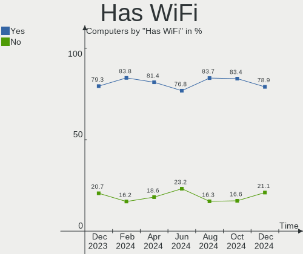
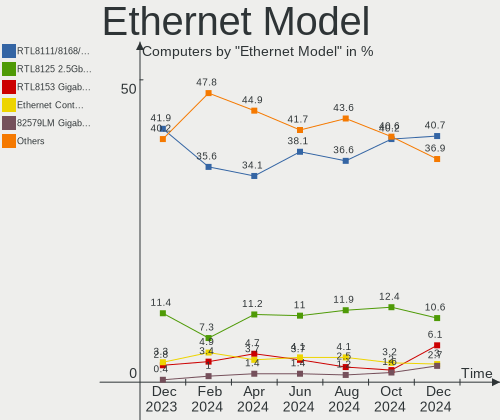
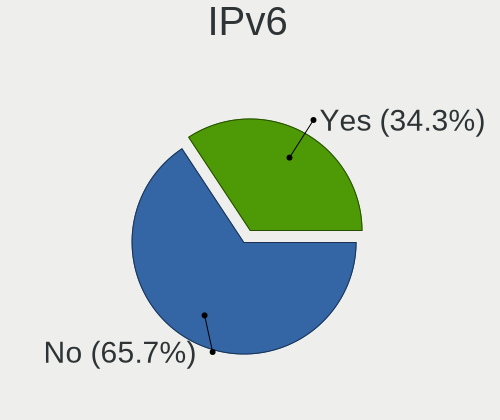
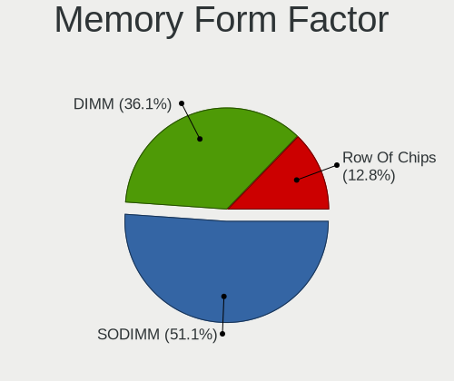
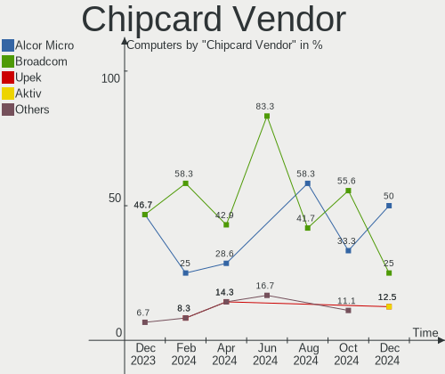

Arch - Hardware Trends
----------------------

A project to identify most popular hardware characteristics and track their change
over time based on data collected by Linux users at https://Linux-Hardware.org.

Anyone can contribute to this report by the [hw-probe](https://github.com/linuxhw/hw-probe) tool:

    sudo -E hw-probe -all -upload

This is a report for all computer types. See also reports for [desktops](/Dist/Arch/Desktop/README.md) and [notebooks](/Dist/Arch/Notebook/README.md).

This report is for one last month. Overall report since the beginning of time: [TestDays](https://github.com/linuxhw/TestDays)

Period: Jan, 2024.

Contents
--------

* [ System ](#system)
  - [ OS                       ](#os)
  - [ OS Family                ](#os-family)
  - [ Kernel                   ](#kernel)
  - [ Kernel Family            ](#kernel-family)
  - [ Kernel Major Ver.        ](#kernel-major-ver)
  - [ Arch                     ](#arch)
  - [ DE                       ](#de)
  - [ Display Server           ](#display-server)
  - [ Display Manager          ](#display-manager)
  - [ OS Lang                  ](#os-lang)
  - [ Boot Mode                ](#boot-mode)
  - [ Filesystem               ](#filesystem)
  - [ Part. scheme             ](#part-scheme)
  - [ Dual Boot with Linux/BSD ](#dual-boot-with-linuxbsd)
  - [ Dual Boot (Win)          ](#dual-boot-win)

* [ Board ](#board)
  - [ Vendor                   ](#vendor)
  - [ Model                    ](#model)
  - [ Model Family             ](#model-family)
  - [ MFG Year                 ](#mfg-year)
  - [ Form Factor              ](#form-factor)
  - [ Secure Boot              ](#secure-boot)
  - [ Coreboot                 ](#coreboot)
  - [ RAM Size                 ](#ram-size)
  - [ RAM Used                 ](#ram-used)
  - [ Total Drives             ](#total-drives)
  - [ Has CD-ROM               ](#has-cd-rom)
  - [ Has Ethernet             ](#has-ethernet)
  - [ Has WiFi                 ](#has-wifi)
  - [ Has Bluetooth            ](#has-bluetooth)

* [ Location ](#location)
  - [ Country                  ](#country)
  - [ City                     ](#city)

* [ Drives ](#drives)
  - [ Drive Vendor             ](#drive-vendor)
  - [ Drive Model              ](#drive-model)
  - [ HDD Vendor               ](#hdd-vendor)
  - [ SSD Vendor               ](#ssd-vendor)
  - [ Drive Kind               ](#drive-kind)
  - [ Drive Connector          ](#drive-connector)
  - [ Drive Size               ](#drive-size)
  - [ Space Total              ](#space-total)
  - [ Space Used               ](#space-used)
  - [ Malfunc. Drives          ](#malfunc-drives)
  - [ Malfunc. Drive Vendor    ](#malfunc-drive-vendor)
  - [ Malfunc. HDD Vendor      ](#malfunc-hdd-vendor)
  - [ Malfunc. Drive Kind      ](#malfunc-drive-kind)
  - [ Failed Drives            ](#failed-drives)
  - [ Failed Drive Vendor      ](#failed-drive-vendor)
  - [ Drive Status             ](#drive-status)

* [ Storage controller ](#storage-controller)
  - [ Storage Vendor           ](#storage-vendor)
  - [ Storage Model            ](#storage-model)
  - [ Storage Kind             ](#storage-kind)

* [ Processor ](#processor)
  - [ CPU Vendor               ](#cpu-vendor)
  - [ CPU Model                ](#cpu-model)
  - [ CPU Model Family         ](#cpu-model-family)
  - [ CPU Cores                ](#cpu-cores)
  - [ CPU Sockets              ](#cpu-sockets)
  - [ CPU Threads              ](#cpu-threads)
  - [ CPU Op-Modes             ](#cpu-op-modes)
  - [ CPU Microcode            ](#cpu-microcode)
  - [ CPU Microarch            ](#cpu-microarch)

* [ Graphics ](#graphics)
  - [ GPU Vendor               ](#gpu-vendor)
  - [ GPU Model                ](#gpu-model)
  - [ GPU Combo                ](#gpu-combo)
  - [ GPU Driver               ](#gpu-driver)
  - [ GPU Memory               ](#gpu-memory)

* [ Monitor ](#monitor)
  - [ Monitor Vendor           ](#monitor-vendor)
  - [ Monitor Model            ](#monitor-model)
  - [ Monitor Resolution       ](#monitor-resolution)
  - [ Monitor Diagonal         ](#monitor-diagonal)
  - [ Monitor Width            ](#monitor-width)
  - [ Aspect Ratio             ](#aspect-ratio)
  - [ Monitor Area             ](#monitor-area)
  - [ Pixel Density            ](#pixel-density)
  - [ Multiple Monitors        ](#multiple-monitors)

* [ Network ](#network)
  - [ Net Controller Vendor    ](#net-controller-vendor)
  - [ Net Controller Model     ](#net-controller-model)
  - [ Wireless Vendor          ](#wireless-vendor)
  - [ Wireless Model           ](#wireless-model)
  - [ Ethernet Vendor          ](#ethernet-vendor)
  - [ Ethernet Model           ](#ethernet-model)
  - [ Net Controller Kind      ](#net-controller-kind)
  - [ Used Controller          ](#used-controller)
  - [ NICs                     ](#nics)
  - [ IPv6                     ](#ipv6)

* [ Bluetooth ](#bluetooth)
  - [ Bluetooth Vendor         ](#bluetooth-vendor)
  - [ Bluetooth Model          ](#bluetooth-model)

* [ Sound ](#sound)
  - [ Sound Vendor             ](#sound-vendor)
  - [ Sound Model              ](#sound-model)

* [ Memory ](#memory)
  - [ Memory Vendor            ](#memory-vendor)
  - [ Memory Model             ](#memory-model)
  - [ Memory Kind              ](#memory-kind)
  - [ Memory Form Factor       ](#memory-form-factor)
  - [ Memory Size              ](#memory-size)
  - [ Memory Speed             ](#memory-speed)

* [ Printers & scanners ](#printers--scanners)
  - [ Printer Vendor           ](#printer-vendor)
  - [ Printer Model            ](#printer-model)
  - [ Scanner Vendor           ](#scanner-vendor)
  - [ Scanner Model            ](#scanner-model)

* [ Camera ](#camera)
  - [ Camera Vendor            ](#camera-vendor)
  - [ Camera Model             ](#camera-model)

* [ Security ](#security)
  - [ Fingerprint Vendor       ](#fingerprint-vendor)
  - [ Fingerprint Model        ](#fingerprint-model)
  - [ Chipcard Vendor          ](#chipcard-vendor)
  - [ Chipcard Model           ](#chipcard-model)

* [ Unsupported ](#unsupported)
  - [ Unsupported Devices      ](#unsupported-devices)
  - [ Unsupported Device Types ](#unsupported-device-types)

System
------

OS
--

Installed operating systems

| Name         | Computers | Percent |
|--------------|-----------|---------|
| Arch Rolling | 242       | 100%    |

OS Family
---------

OS without a version

| Name | Computers | Percent |
|------|-----------|---------|
| Arch | 242       | 100%    |

Kernel
------

Version of the Linux kernel

| Version                                | Computers | Percent |
|----------------------------------------|-----------|---------|
| 6.7.0-arch3-1                          | 34        | 14.05%  |
| 6.6.10-arch1-1                         | 34        | 14.05%  |
| 6.6.9-arch1-1                          | 24        | 9.92%   |
| 6.6.8-arch1-1                          | 23        | 9.5%    |
| 6.7.1-arch1-1                          | 21        | 8.68%   |
| 6.7.2-arch1-1                          | 16        | 6.61%   |
| 6.6.10-zen1-1-zen                      | 14        | 5.79%   |
| 6.7.0-zen3-1-zen                       | 13        | 5.37%   |
| 6.6.7-arch1-1                          | 5         | 2.07%   |
| 6.6.9-zen1-1-zen                       | 4         | 1.65%   |
| 6.7.1-zen1-1-zen                       | 3         | 1.24%   |
| 6.6.8-zen1-1-zen                       | 3         | 1.24%   |
| 6.6.14-1-lts                           | 3         | 1.24%   |
| 6.6.11-1-lts                           | 3         | 1.24%   |
| 6.1.69-1-lts                           | 3         | 1.24%   |
| 6.7.0-zen3-1.1-zen                     | 2         | 0.83%   |
| 6.6.9-lqx1-1-lqx                       | 2         | 0.83%   |
| 6.6.12-1-lts                           | 2         | 0.83%   |
| 6.6.1-arch1-1                          | 2         | 0.83%   |
| 6.1.71-1-lts                           | 2         | 0.83%   |
| 6.7.2-zen1-1-zen                       | 1         | 0.41%   |
| 6.7.2-x64v3-xanmod1                    | 1         | 0.41%   |
| 6.7.1-arch1-Adashima-T2-1-t2           | 1         | 0.41%   |
| 6.7.1-2-cachyos                        | 1         | 0.41%   |
| 6.7.0-arch3-1-g14                      | 1         | 0.41%   |
| 6.7.0-4-cachyos                        | 1         | 0.41%   |
| 6.7.0-3-cachyos                        | 1         | 0.41%   |
| 6.7.0-273-tkg-eevdf-llvm               | 1         | 0.41%   |
| 6.6.9-arch1-YuruYuri-T2-1-t2           | 1         | 0.41%   |
| 6.6.9-arch1-1-drm-amd-issue-2991-patch | 1         | 0.41%   |
| 6.6.9-1-cachyos-bore                   | 1         | 0.41%   |
| 6.6.9-1-cachyos                        | 1         | 0.41%   |
| 6.6.8-zen1                             | 1         | 0.41%   |
| 6.6.8-x64v3-xanmod1                    | 1         | 0.41%   |
| 6.6.8-AMD                              | 1         | 0.41%   |
| 6.6.8-273-tkg-eevdf                    | 1         | 0.41%   |
| 6.6.7-arch1-1.1                        | 1         | 0.41%   |
| 6.6.6-arch1-1-g14                      | 1         | 0.41%   |
| 6.6.6-1-cachyos                        | 1         | 0.41%   |
| 6.6.3-arch1-1                          | 1         | 0.41%   |

Kernel Family
-------------

Linux kernel without a distro release

| Version | Computers | Percent |
|---------|-----------|---------|
| 6.7.0   | 53        | 21.9%   |
| 6.6.10  | 50        | 20.66%  |
| 6.6.9   | 34        | 14.05%  |
| 6.6.8   | 30        | 12.4%   |
| 6.7.1   | 26        | 10.74%  |
| 6.7.2   | 18        | 7.44%   |
| 6.6.7   | 6         | 2.48%   |
| 6.6.11  | 5         | 2.07%   |
| 6.6.14  | 4         | 1.65%   |
| 6.1.69  | 3         | 1.24%   |
| 6.6.6   | 2         | 0.83%   |
| 6.6.12  | 2         | 0.83%   |
| 6.6.1   | 2         | 0.83%   |
| 6.1.71  | 2         | 0.83%   |
| 6.6.3   | 1         | 0.41%   |
| 6.6.13  | 1         | 0.41%   |
| 6.5.8   | 1         | 0.41%   |
| 6.1.70  | 1         | 0.41%   |
| 5.18.12 | 1         | 0.41%   |

Kernel Major Ver.
-----------------

Linux kernel major version

| Version | Computers | Percent |
|---------|-----------|---------|
| 6.6     | 137       | 56.61%  |
| 6.7     | 97        | 40.08%  |
| 6.1     | 6         | 2.48%   |
| 6.5     | 1         | 0.41%   |
| 5.18    | 1         | 0.41%   |

Arch
----

OS architecture (x86_64, i586, etc.)

| Name   | Computers | Percent |
|--------|-----------|---------|
| x86_64 | 242       | 100%    |

DE
--

Desktop Environment

| Name            | Computers | Percent |
|-----------------|-----------|---------|
| KDE5            | 110       | 45.45%  |
| GNOME           | 53        | 21.9%   |
| i3              | 18        | 7.44%   |
| Hyprland        | 17        | 7.02%   |
| XFCE            | 12        | 4.96%   |
| Unknown         | 11        | 4.55%   |
| X-Cinnamon      | 5         | 2.07%   |
| LXQt            | 3         | 1.24%   |
| awesome         | 3         | 1.24%   |
| Sway            | 2         | 0.83%   |
| xinitrc         | 1         | 0.41%   |
| KDE6            | 1         | 0.41%   |
| ICEWM           | 1         | 0.41%   |
| GNOME Flashback | 1         | 0.41%   |
| dwm             | 1         | 0.41%   |
| Cinnamon        | 1         | 0.41%   |
| Budgie          | 1         | 0.41%   |
| bspwm           | 1         | 0.41%   |

Display Server
--------------

X11 or Wayland

| Name    | Computers | Percent |
|---------|-----------|---------|
| X11     | 115       | 47.52%  |
| Wayland | 99        | 40.91%  |
| Tty     | 16        | 6.61%   |
| Unknown | 12        | 4.96%   |

Display Manager
---------------

SDDM, LightDM, etc.

| Name    | Computers | Percent |
|---------|-----------|---------|
| Unknown | 97        | 40.08%  |
| SDDM    | 85        | 35.12%  |
| LightDM | 33        | 13.64%  |
| GDM     | 21        | 8.68%   |
| LY-DM   | 3         | 1.24%   |
| XDM     | 1         | 0.41%   |
| Ly      | 1         | 0.41%   |
| GREETD  | 1         | 0.41%   |

OS Lang
-------

Language

| Lang    | Computers | Percent |
|---------|-----------|---------|
| en_US   | 138       | 57.02%  |
| C       | 17        | 7.02%   |
| it_IT   | 11        | 4.55%   |
| ru_RU   | 10        | 4.13%   |
| en_GB   | 8         | 3.31%   |
| pt_BR   | 6         | 2.48%   |
| de_DE   | 6         | 2.48%   |
| pl_PL   | 5         | 2.07%   |
| Unknown | 5         | 2.07%   |
| zh_CN   | 4         | 1.65%   |
| en_AU   | 4         | 1.65%   |
| fr_FR   | 3         | 1.24%   |
| es_ES   | 3         | 1.24%   |
| en_IE   | 3         | 1.24%   |
| tr_TR   | 2         | 0.83%   |
| es_CL   | 2         | 0.83%   |
| es_AR   | 2         | 0.83%   |
| en_IN   | 2         | 0.83%   |
| en_CA   | 2         | 0.83%   |
| us      | 1         | 0.41%   |
| ru      | 1         | 0.41%   |
| pt_PT   | 1         | 0.41%   |
| es_UY   | 1         | 0.41%   |
| es_SV   | 1         | 0.41%   |
| es      | 1         | 0.41%   |
| en_DK   | 1         | 0.41%   |
| en_AG   | 1         | 0.41%   |
| cs_CZ   | 1         | 0.41%   |

Boot Mode
---------

EFI or BIOS

| Mode | Computers | Percent |
|------|-----------|---------|
| EFI  | 153       | 63.22%  |
| BIOS | 89        | 36.78%  |

Filesystem
----------

Type of filesystem

| Type    | Computers | Percent |
|---------|-----------|---------|
| Ext4    | 157       | 64.88%  |
| Btrfs   | 74        | 30.58%  |
| Xfs     | 5         | 2.07%   |
| Tmpfs   | 2         | 0.83%   |
| Overlay | 2         | 0.83%   |
| Zfs     | 1         | 0.41%   |
| Unknown | 1         | 0.41%   |

Part. scheme
------------

Scheme of partitioning

| Type    | Computers | Percent |
|---------|-----------|---------|
| GPT     | 162       | 66.94%  |
| Unknown | 75        | 30.99%  |
| MBR     | 5         | 2.07%   |

Dual Boot with Linux/BSD
------------------------

Hosting more than one Linux/BSD

| Dual boot | Computers | Percent |
|-----------|-----------|---------|
| No        | 213       | 88.02%  |
| Yes       | 29        | 11.98%  |

Dual Boot (Win)
---------------

Hosting Linux and Windows

| Dual boot | Computers | Percent |
|-----------|-----------|---------|
| No        | 184       | 76.03%  |
| Yes       | 58        | 23.97%  |

Board
-----

Vendor
------

Motherboard manufacturer

| Name                                 | Computers | Percent |
|--------------------------------------|-----------|---------|
| ASUSTek Computer                     | 51        | 21.07%  |
| Lenovo                               | 43        | 17.77%  |
| Hewlett-Packard                      | 25        | 10.33%  |
| Dell                                 | 24        | 9.92%   |
| MSI                                  | 20        | 8.26%   |
| Gigabyte Technology                  | 16        | 6.61%   |
| ASRock                               | 9         | 3.72%   |
| Acer                                 | 9         | 3.72%   |
| Apple                                | 7         | 2.89%   |
| Intel                                | 4         | 1.65%   |
| HUAWEI                               | 3         | 1.24%   |
| Google                               | 2         | 0.83%   |
| Fujitsu                              | 2         | 0.83%   |
| AZW                                  | 2         | 0.83%   |
| AMI                                  | 2         | 0.83%   |
| Unknown                              | 2         | 0.83%   |
| ZOTAC                                | 1         | 0.41%   |
| TUXEDO                               | 1         | 0.41%   |
| Toshiba                              | 1         | 0.41%   |
| Timi                                 | 1         | 0.41%   |
| Teclast                              | 1         | 0.41%   |
| Sony                                 | 1         | 0.41%   |
| Shenzhen Meigao Electronic Equipment | 1         | 0.41%   |
| PIPO                                 | 1         | 0.41%   |
| Philco                               | 1         | 0.41%   |
| Olidata                              | 1         | 0.41%   |
| NZXT                                 | 1         | 0.41%   |
| Microsoft                            | 1         | 0.41%   |
| Medion                               | 1         | 0.41%   |
| MECHREVO                             | 1         | 0.41%   |
| LG Electronics                       | 1         | 0.41%   |
| Framework                            | 1         | 0.41%   |
| Dynabook                             | 1         | 0.41%   |
| Dream Machines                       | 1         | 0.41%   |
| Avell High Performance               | 1         | 0.41%   |
| Alienware                            | 1         | 0.41%   |
| Acidanthera                          | 1         | 0.41%   |

Model
-----

Motherboard model

| Name                                       | Computers | Percent |
|--------------------------------------------|-----------|---------|
| MSI MS-7E26                                | 2         | 0.83%   |
| MSI MS-7B86                                | 2         | 0.83%   |
| Lenovo ThinkPad T16 Gen 2 21K7CTO1WW       | 2         | 0.83%   |
| Lenovo ThinkPad L14 Gen 4 21H5CTO1WW       | 2         | 0.83%   |
| Gigabyte B550M DS3H                        | 2         | 0.83%   |
| Gigabyte B550 AORUS ELITE V2               | 2         | 0.83%   |
| Dell XPS 15 9530                           | 2         | 0.83%   |
| Dell Latitude 7420                         | 2         | 0.83%   |
| ASUS Zenbook UX3402ZA_UX3402ZA             | 2         | 0.83%   |
| ASUS TUF Gaming X570-PLUS                  | 2         | 0.83%   |
| ASUS ROG STRIX X670E-F GAMING WIFI         | 2         | 0.83%   |
| ASUS PRIME X470-PRO                        | 2         | 0.83%   |
| ASUS Maximus VIII HERO                     | 2         | 0.83%   |
| Unknown                                    | 2         | 0.83%   |
| ZOTAC ZBOX-ECM73070C/53060C                | 1         | 0.41%   |
| TUXEDO InfinityBook Pro Gen7 (MK1)         | 1         | 0.41%   |
| Toshiba Satellite Pro NB10-A-125           | 1         | 0.41%   |
| Timi Mi NoteBook Ultra                     | 1         | 0.41%   |
| Teclast F15Plus 2                          | 1         | 0.41%   |
| Sony SVF1521Q1EW                           | 1         | 0.41%   |
| Shenzhen Meigao Electronic Equipment HX99G | 1         | 0.41%   |
| PIPO W10                                   | 1         | 0.41%   |
| Philco 14M2                                | 1         | 0.41%   |
| Olidata SL1510 MD61444                     | 1         | 0.41%   |
| NZXT N7 B650E                              | 1         | 0.41%   |
| MSI Prestige 14Evo B13M                    | 1         | 0.41%   |
| MSI MS-7E25                                | 1         | 0.41%   |
| MSI MS-7E12                                | 1         | 0.41%   |
| MSI MS-7D52                                | 1         | 0.41%   |
| MSI MS-7C95                                | 1         | 0.41%   |
| MSI MS-7C91                                | 1         | 0.41%   |
| MSI MS-7C56                                | 1         | 0.41%   |
| MSI MS-7B98                                | 1         | 0.41%   |
| MSI MS-7B89                                | 1         | 0.41%   |
| MSI MS-7B79                                | 1         | 0.41%   |
| MSI MS-7A70                                | 1         | 0.41%   |
| MSI MS-7A32                                | 1         | 0.41%   |
| MSI MS-7592                                | 1         | 0.41%   |
| MSI Katana GF66 12UG                       | 1         | 0.41%   |
| MSI GL63 9SD                               | 1         | 0.41%   |

Model Family
------------

Motherboard model prefix

| Name                                       | Computers | Percent |
|--------------------------------------------|-----------|---------|
| Lenovo ThinkPad                            | 25        | 10.33%  |
| ASUS ROG                                   | 12        | 4.96%   |
| Dell Inspiron                              | 8         | 3.31%   |
| ASUS TUF                                   | 8         | 3.31%   |
| ASUS PRIME                                 | 8         | 3.31%   |
| Lenovo IdeaPad                             | 7         | 2.89%   |
| Dell Latitude                              | 7         | 2.89%   |
| ASUS VivoBook                              | 7         | 2.89%   |
| Acer Aspire                                | 5         | 2.07%   |
| Gigabyte B550M                             | 4         | 1.65%   |
| Dell XPS                                   | 4         | 1.65%   |
| ASUS Zenbook                               | 4         | 1.65%   |
| ASUS ASUS                                  | 4         | 1.65%   |
| HP ZBook                                   | 3         | 1.24%   |
| HP Victus                                  | 3         | 1.24%   |
| HP Pavilion                                | 3         | 1.24%   |
| HP OMEN                                    | 3         | 1.24%   |
| HP EliteBook                               | 3         | 1.24%   |
| Acer Nitro                                 | 3         | 1.24%   |
| MSI MS-7E26                                | 2         | 0.83%   |
| MSI MS-7B86                                | 2         | 0.83%   |
| MSI GL63                                   | 2         | 0.83%   |
| Lenovo Yoga                                | 2         | 0.83%   |
| Lenovo Legion                              | 2         | 0.83%   |
| HP Laptop                                  | 2         | 0.83%   |
| HP ENVY                                    | 2         | 0.83%   |
| HP EliteDesk                               | 2         | 0.83%   |
| Gigabyte B550                              | 2         | 0.83%   |
| Gigabyte B450M                             | 2         | 0.83%   |
| Dell Precision                             | 2         | 0.83%   |
| ASUS Maximus                               | 2         | 0.83%   |
| Apple MacBookPro15                         | 2         | 0.83%   |
| Unknown                                    | 2         | 0.83%   |
| ZOTAC ZBOX-ECM73070C                       | 1         | 0.41%   |
| TUXEDO InfinityBook                        | 1         | 0.41%   |
| Toshiba Satellite                          | 1         | 0.41%   |
| Timi Mi                                    | 1         | 0.41%   |
| Teclast F15Plus                            | 1         | 0.41%   |
| Sony SVF1521Q1EW                           | 1         | 0.41%   |
| Shenzhen Meigao Electronic Equipment HX99G | 1         | 0.41%   |

MFG Year
--------

Motherboard manufacture year

| Year | Computers | Percent |
|------|-----------|---------|
| 2023 | 39        | 16.12%  |
| 2020 | 36        | 14.88%  |
| 2022 | 31        | 12.81%  |
| 2021 | 31        | 12.81%  |
| 2018 | 30        | 12.4%   |
| 2019 | 17        | 7.02%   |
| 2017 | 15        | 6.2%    |
| 2016 | 10        | 4.13%   |
| 2013 | 8         | 3.31%   |
| 2014 | 6         | 2.48%   |
| 2012 | 6         | 2.48%   |
| 2011 | 3         | 1.24%   |
| 2007 | 3         | 1.24%   |
| 2015 | 2         | 0.83%   |
| 2010 | 2         | 0.83%   |
| 2008 | 2         | 0.83%   |
| 2009 | 1         | 0.41%   |

Form Factor
-----------

Physical design of the computer

| Name        | Computers | Percent |
|-------------|-----------|---------|
| Notebook    | 138       | 57.02%  |
| Desktop     | 92        | 38.02%  |
| Mini pc     | 5         | 2.07%   |
| Convertible | 4         | 1.65%   |
| Tablet      | 3         | 1.24%   |

Secure Boot
-----------

Enabled or disabled

| State    | Computers | Percent |
|----------|-----------|---------|
| Disabled | 234       | 96.69%  |
| Enabled  | 8         | 3.31%   |

Coreboot
--------

Have coreboot on board

| Used | Computers | Percent |
|------|-----------|---------|
| No   | 240       | 99.17%  |
| Yes  | 2         | 0.83%   |

RAM Size
--------

Total RAM memory

| Size in GB  | Computers | Percent |
|-------------|-----------|---------|
| 16.01-24.0  | 63        | 26.03%  |
| 32.01-64.0  | 51        | 21.07%  |
| 4.01-8.0    | 50        | 20.66%  |
| 8.01-16.0   | 28        | 11.57%  |
| 64.01-256.0 | 25        | 10.33%  |
| 24.01-32.0  | 13        | 5.37%   |
| 3.01-4.0    | 9         | 3.72%   |
| 1.01-2.0    | 3         | 1.24%   |

RAM Used
--------

Used RAM memory

| Used GB    | Computers | Percent |
|------------|-----------|---------|
| 4.01-8.0   | 72        | 29.75%  |
| 2.01-3.0   | 50        | 20.66%  |
| 3.01-4.0   | 42        | 17.36%  |
| 8.01-16.0  | 36        | 14.88%  |
| 1.01-2.0   | 30        | 12.4%   |
| 0.51-1.0   | 5         | 2.07%   |
| 24.01-32.0 | 3         | 1.24%   |
| 16.01-24.0 | 2         | 0.83%   |
| 32.01-64.0 | 1         | 0.41%   |
| 0.01-0.5   | 1         | 0.41%   |

Total Drives
------------

Number of drives on board

| Drives | Computers | Percent |
|--------|-----------|---------|
| 1      | 136       | 56.2%   |
| 2      | 52        | 21.49%  |
| 3      | 30        | 12.4%   |
| 4      | 16        | 6.61%   |
| 5      | 4         | 1.65%   |
| 6      | 2         | 0.83%   |
| 9      | 1         | 0.41%   |
| 7      | 1         | 0.41%   |

Has CD-ROM
----------

Has CD-ROM on board

| Presented | Computers | Percent |
|-----------|-----------|---------|
| No        | 210       | 86.78%  |
| Yes       | 32        | 13.22%  |

Has Ethernet
------------

Has Ethernet on board

| Presented | Computers | Percent |
|-----------|-----------|---------|
| Yes       | 196       | 80.99%  |
| No        | 46        | 19.01%  |

Has WiFi
--------

Has WiFi module

| Presented | Computers | Percent |
|-----------|-----------|---------|
| Yes       | 208       | 85.95%  |
| No        | 34        | 14.05%  |

Has Bluetooth
-------------

Has Bluetooth module

| Presented | Computers | Percent |
|-----------|-----------|---------|
| Yes       | 190       | 78.51%  |
| No        | 52        | 21.49%  |

Location
--------

Country
-------

Geographic location (country)

| Country     | Computers | Percent |
|-------------|-----------|---------|
| USA         | 51        | 21.07%  |
| Germany     | 16        | 6.61%   |
| Italy       | 15        | 6.2%    |
| Poland      | 14        | 5.79%   |
| Russia      | 11        | 4.55%   |
| India       | 11        | 4.55%   |
| France      | 10        | 4.13%   |
| Brazil      | 9         | 3.72%   |
| UK          | 8         | 3.31%   |
| Netherlands | 6         | 2.48%   |
| Canada      | 6         | 2.48%   |
| Australia   | 6         | 2.48%   |
| Turkey      | 5         | 2.07%   |
| Hong Kong   | 4         | 1.65%   |
| Czechia     | 4         | 1.65%   |
| Vietnam     | 3         | 1.24%   |
| Sweden      | 3         | 1.24%   |
| Portugal    | 3         | 1.24%   |
| Belgium     | 3         | 1.24%   |
| Argentina   | 3         | 1.24%   |
| Switzerland | 2         | 0.83%   |
| Spain       | 2         | 0.83%   |
| Romania     | 2         | 0.83%   |
| Norway      | 2         | 0.83%   |
| New Zealand | 2         | 0.83%   |
| Moldova     | 2         | 0.83%   |
| Lithuania   | 2         | 0.83%   |
| Japan       | 2         | 0.83%   |
| Israel      | 2         | 0.83%   |
| Indonesia   | 2         | 0.83%   |
| Egypt       | 2         | 0.83%   |
| Chile       | 2         | 0.83%   |
| Bulgaria    | 2         | 0.83%   |
| Austria     | 2         | 0.83%   |
| Uruguay     | 1         | 0.41%   |
| UAE         | 1         | 0.41%   |
| Türkiye    | 1         | 0.41%   |
| Thailand    | 1         | 0.41%   |
| Singapore   | 1         | 0.41%   |
| Philippines | 1         | 0.41%   |

City
----

Geographic location (city)

| City              | Computers | Percent |
|-------------------|-----------|---------|
| Gdansk            | 5         | 2.07%   |
| Melbourne         | 4         | 1.65%   |
| Munich            | 3         | 1.24%   |
| Krakow            | 3         | 1.24%   |
| Kolkata           | 3         | 1.24%   |
| Knoxville         | 3         | 1.24%   |
| Warsaw            | 2         | 0.83%   |
| Sofia             | 2         | 0.83%   |
| Sapezal           | 2         | 0.83%   |
| Santander         | 2         | 0.83%   |
| Rome              | 2         | 0.83%   |
| Raleigh           | 2         | 0.83%   |
| Prague            | 2         | 0.83%   |
| Paris             | 2         | 0.83%   |
| Los Angeles       | 2         | 0.83%   |
| London            | 2         | 0.83%   |
| Kochi             | 2         | 0.83%   |
| Kharino           | 2         | 0.83%   |
| Istanbul          | 2         | 0.83%   |
| Ho Chi Minh City  | 2         | 0.83%   |
| Fremont           | 2         | 0.83%   |
| Flushing          | 2         | 0.83%   |
| Fayetteville      | 2         | 0.83%   |
| Calgary           | 2         | 0.83%   |
| Bengaluru         | 2         | 0.83%   |
| Bedford           | 2         | 0.83%   |
| Amsterdam         | 2         | 0.83%   |
| Zurich            | 1         | 0.41%   |
| Zlín             | 1         | 0.41%   |
| Zielonki          | 1         | 0.41%   |
| Zama              | 1         | 0.41%   |
| Yverdon-les-Bains | 1         | 0.41%   |
| Yekaterinburg     | 1         | 0.41%   |
| Wroclaw           | 1         | 0.41%   |
| Wooster           | 1         | 0.41%   |
| Wilrijk           | 1         | 0.41%   |
| Wilhelmshaven     | 1         | 0.41%   |
| Wieruszow         | 1         | 0.41%   |
| West Lebanon      | 1         | 0.41%   |
| Wellingborough    | 1         | 0.41%   |

Drives
------

Drive Vendor
------------

Hard drive vendors

| Vendor                       | Computers | Drives | Percent |
|------------------------------|-----------|--------|---------|
| Samsung Electronics          | 74        | 90     | 19.02%  |
| WDC                          | 42        | 56     | 10.8%   |
| SanDisk                      | 38        | 43     | 9.77%   |
| Seagate                      | 35        | 40     | 9%      |
| SK hynix                     | 19        | 19     | 4.88%   |
| Unknown                      | 18        | 21     | 4.63%   |
| Micron Technology            | 16        | 16     | 4.11%   |
| Kingston                     | 16        | 18     | 4.11%   |
| Intel                        | 15        | 17     | 3.86%   |
| Toshiba                      | 11        | 11     | 2.83%   |
| Phison Electronics           | 11        | 11     | 2.83%   |
| Micron/Crucial Technology    | 9         | 10     | 2.31%   |
| Crucial                      | 9         | 10     | 2.31%   |
| KIOXIA                       | 6         | 6      | 1.54%   |
| Hitachi                      | 6         | 6      | 1.54%   |
| Shenzhen Longsys Electronics | 5         | 6      | 1.29%   |
| MAXIO Technology (Hangzhou)  | 5         | 5      | 1.29%   |
| HGST                         | 5         | 5      | 1.29%   |
| Silicon Motion               | 4         | 4      | 1.03%   |
| Realtek Semiconductor        | 4         | 4      | 1.03%   |
| Apple                        | 4         | 4      | 1.03%   |
| Phison                       | 3         | 4      | 0.77%   |
| Kingston Technology Company  | 3         | 3      | 0.77%   |
| ADATA Technology             | 3         | 3      | 0.77%   |
| A-DATA Technology            | 3         | 3      | 0.77%   |
| PNY                          | 2         | 2      | 0.51%   |
| Kimtigo                      | 2         | 2      | 0.51%   |
| Intenso                      | 2         | 2      | 0.51%   |
| China                        | 2         | 2      | 0.51%   |
| Yangtze Memory Technologies  | 1         | 1      | 0.26%   |
| Verbatim                     | 1         | 1      | 0.26%   |
| Union Memory                 | 1         | 1      | 0.26%   |
| Transcend                    | 1         | 1      | 0.26%   |
| Team                         | 1         | 2      | 0.26%   |
| SSK                          | 1         | 2      | 0.26%   |
| Solid State Storage          | 1         | 1      | 0.26%   |
| SABRENT                      | 1         | 1      | 0.26%   |
| Qmicro                       | 1         | 1      | 0.26%   |
| Plextor                      | 1         | 1      | 0.26%   |
| OCZ                          | 1         | 1      | 0.26%   |

Drive Model
-----------

Hard drive models

| Model                                               | Computers | Percent |
|-----------------------------------------------------|-----------|---------|
| Samsung NVMe SSD Controller SM981/PM981/PM983 1TB   | 22        | 5.13%   |
| Samsung NVMe SSD Controller PM9A1/PM9A3/980PRO 2TB  | 20        | 4.66%   |
| Sandisk WD Black SN750 / PC SN730 NVMe SSD 512GB    | 8         | 1.86%   |
| Unknown MMC Card  64GB                              | 6         | 1.4%    |
| Samsung NVMe SSD Controller SM961/PM961/SM963 256GB | 6         | 1.4%    |
| Micron/Crucial P2 NVMe PCIe SSD 1TB                 | 6         | 1.4%    |
| MAXIO (Hangzhou) NVMe SSD Controller MAP1202 512GB  | 5         | 1.17%   |
| Seagate ST2000DM008-2FR102 2TB                      | 4         | 0.93%   |
| Seagate ST1000LM035-1RK172 1TB                      | 4         | 0.93%   |
| Seagate ST1000DM010-2EP102 1TB                      | 4         | 0.93%   |
| Phison PS5013 E13 NVMe Controller 256GB             | 4         | 0.93%   |
| Phison E12 NVMe Controller 1TB                      | 4         | 0.93%   |
| Intel SSDPEKNU512GZ 512GB                           | 4         | 0.93%   |
| Crucial CT1000BX500SSD1 1TB                         | 4         | 0.93%   |
| Unknown MMC Card  128GB                             | 3         | 0.7%    |
| Sandisk WD_BLACK SN850X 2000GB                      | 3         | 0.7%    |
| Sandisk WD_BLACK SN850X 1000GB                      | 3         | 0.7%    |
| Sandisk WD Blue SN570 1TB                           | 3         | 0.7%    |
| Samsung SSD 980 500GB                               | 3         | 0.7%    |
| Samsung SSD 850 EVO 500GB                           | 3         | 0.7%    |
| Micron 2450_MTFDKBA512TFK 512GB                     | 3         | 0.7%    |
| Kingston SA400S37480G 480GB SSD                     | 3         | 0.7%    |
| Kingston SA400S37240G 240GB SSD                     | 3         | 0.7%    |
| Intel SSD 660P Series 1024GB                        | 3         | 0.7%    |
| Crucial CT480BX500SSD1 480GB                        | 3         | 0.7%    |
| Apple ANS2 NVMe Controller 256GB                    | 3         | 0.7%    |
| WDC WDS120G2G0A-00JH30 120GB SSD                    | 2         | 0.47%   |
| WDC WD5000LPVX-22V0TT0 500GB                        | 2         | 0.47%   |
| WDC WD40EZAZ-00SF3B0 4TB                            | 2         | 0.47%   |
| WDC WD20EZAZ-00GGJB0 2TB                            | 2         | 0.47%   |
| WDC WD20EARX-00PASB0 2TB                            | 2         | 0.47%   |
| WDC WD10EZEX-00BN5A0 1TB                            | 2         | 0.47%   |
| Unknown SD/MMC/MS PRO 256GB                         | 2         | 0.47%   |
| Unknown NVMe SSD Drive 2TB                          | 2         | 0.47%   |
| Unknown MMC Card  32GB                              | 2         | 0.47%   |
| Toshiba XG6 NVMe SSD Controller 256GB               | 2         | 0.47%   |
| Toshiba MQ01ABF050 500GB                            | 2         | 0.47%   |
| Toshiba BG3 NVMe SSD Controller 256GB               | 2         | 0.47%   |
| SK hynix SKHynix_HFS512GDE9X081N 512GB              | 2         | 0.47%   |
| SK hynix SC311 SATA 512GB SSD                       | 2         | 0.47%   |

HDD Vendor
----------

Hard disk drive vendors

| Vendor              | Computers | Drives | Percent |
|---------------------|-----------|--------|---------|
| WDC                 | 37        | 51     | 39.36%  |
| Seagate             | 35        | 40     | 37.23%  |
| Toshiba             | 6         | 6      | 6.38%   |
| Hitachi             | 6         | 6      | 6.38%   |
| HGST                | 5         | 5      | 5.32%   |
| Unknown             | 2         | 2      | 2.13%   |
| Samsung Electronics | 2         | 2      | 2.13%   |
| SSK                 | 1         | 2      | 1.06%   |

SSD Vendor
----------

Solid state drive vendors

| Vendor              | Computers | Drives | Percent |
|---------------------|-----------|--------|---------|
| Samsung Electronics | 22        | 22     | 24.72%  |
| Kingston            | 12        | 12     | 13.48%  |
| SanDisk             | 9         | 10     | 10.11%  |
| Crucial             | 9         | 10     | 10.11%  |
| WDC                 | 5         | 5      | 5.62%   |
| SK hynix            | 5         | 5      | 5.62%   |
| Micron Technology   | 4         | 4      | 4.49%   |
| Intel               | 3         | 3      | 3.37%   |
| PNY                 | 2         | 2      | 2.25%   |
| Kimtigo             | 2         | 2      | 2.25%   |
| Intenso             | 2         | 2      | 2.25%   |
| China               | 2         | 2      | 2.25%   |
| A-DATA Technology   | 2         | 2      | 2.25%   |
| Verbatim            | 1         | 1      | 1.12%   |
| Transcend           | 1         | 1      | 1.12%   |
| Team                | 1         | 2      | 1.12%   |
| SABRENT             | 1         | 1      | 1.12%   |
| Qmicro              | 1         | 1      | 1.12%   |
| Plextor             | 1         | 1      | 1.12%   |
| OCZ                 | 1         | 1      | 1.12%   |
| GOODRAM             | 1         | 1      | 1.12%   |
| Fanxiang            | 1         | 1      | 1.12%   |
| Apple               | 1         | 1      | 1.12%   |

Drive Kind
----------

HDD or SSD

| Kind    | Computers | Drives | Percent |
|---------|-----------|--------|---------|
| NVMe    | 185       | 222    | 53.01%  |
| SSD     | 77        | 92     | 22.06%  |
| HDD     | 75        | 114    | 21.49%  |
| MMC     | 10        | 12     | 2.87%   |
| Unknown | 2         | 2      | 0.57%   |

Drive Connector
---------------

SATA, SAS, NVMe, etc.

| Type | Computers | Drives | Percent |
|------|-----------|--------|---------|
| NVMe | 185       | 221    | 58.73%  |
| SATA | 110       | 197    | 34.92%  |
| SAS  | 10        | 12     | 3.17%   |
| MMC  | 10        | 12     | 3.17%   |

Drive Size
----------

Size of hard drive

| Size in TB | Computers | Drives | Percent |
|------------|-----------|--------|---------|
| 0.01-0.5   | 69        | 92     | 41.32%  |
| 0.51-1.0   | 51        | 57     | 30.54%  |
| 1.01-2.0   | 23        | 29     | 13.77%  |
| 3.01-4.0   | 11        | 14     | 6.59%   |
| 4.01-10.0  | 8         | 9      | 4.79%   |
| 2.01-3.0   | 3         | 3      | 1.8%    |
| 10.01-20.0 | 2         | 2      | 1.2%    |

Space Total
-----------

Amount of disk space available on the file system

| Size in GB     | Computers | Percent |
|----------------|-----------|---------|
| 251-500        | 51        | 21.07%  |
| More than 3000 | 47        | 19.42%  |
| 501-1000       | 42        | 17.36%  |
| 101-250        | 39        | 16.12%  |
| 1001-2000      | 33        | 13.64%  |
| 2001-3000      | 15        | 6.2%    |
| 51-100         | 6         | 2.48%   |
| 21-50          | 4         | 1.65%   |
| Unknown        | 4         | 1.65%   |
| 1-20           | 1         | 0.41%   |

Space Used
----------

Amount of used disk space

| Used GB        | Computers | Percent |
|----------------|-----------|---------|
| 1-20           | 43        | 17.77%  |
| 101-250        | 42        | 17.36%  |
| 21-50          | 36        | 14.88%  |
| 251-500        | 31        | 12.81%  |
| 501-1000       | 24        | 9.92%   |
| 51-100         | 21        | 8.68%   |
| 1001-2000      | 17        | 7.02%   |
| 2001-3000      | 14        | 5.79%   |
| More than 3000 | 10        | 4.13%   |
| Unknown        | 4         | 1.65%   |

Malfunc. Drives
---------------

Drive models with a malfunction

| Model                               | Computers | Drives | Percent |
|-------------------------------------|-----------|--------|---------|
| Seagate ST2000DM008-2FR102 2TB      | 2         | 2      | 8%      |
| SanDisk SSD PLUS 480GB              | 2         | 2      | 8%      |
| WDC WDS120G2G0A-00JH30 120GB SSD    | 1         | 1      | 4%      |
| WDC WD7500BPVT-60HXZT3 752GB        | 1         | 1      | 4%      |
| WDC WD60EDAZ-11U78B0 6TB            | 1         | 1      | 4%      |
| WDC WD5003ABYX-50WERA1 500GB        | 1         | 1      | 4%      |
| WDC WD5000LPLX-08ZNTT0 500GB        | 1         | 1      | 4%      |
| WDC WD3200AAJS-56M0A0 320GB         | 1         | 1      | 4%      |
| WDC WD2500AAKX-75U6AA0 250GB        | 1         | 1      | 4%      |
| WDC WD20SPZX-75UA7T0 2TB            | 1         | 1      | 4%      |
| WDC WD20EFRX-68EUZN0 2TB            | 1         | 2      | 4%      |
| WDC WD2002FAEX-007BA0 2TB           | 1         | 1      | 4%      |
| WDC WD10SPZX-75Z10T2 1TB            | 1         | 1      | 4%      |
| WDC WD1002FAEX-00Z3A0 1TB           | 1         | 1      | 4%      |
| Toshiba HDWE150 5TB                 | 1         | 1      | 4%      |
| Seagate ST500LT012-9WS142 500GB     | 1         | 1      | 4%      |
| Seagate ST2000LM015-2E8174 2TB      | 1         | 1      | 4%      |
| Seagate ST2000LM003 HN-M201RAD 2TB  | 1         | 1      | 4%      |
| Seagate ST1000DM010-2EP102 1TB      | 1         | 1      | 4%      |
| Seagate ST1000DM003-9YN162 1TB      | 1         | 1      | 4%      |
| Seagate ST1000DM003-1SB102 1TB      | 1         | 1      | 4%      |
| Samsung Electronics SSD 850 EVO 1TB | 1         | 1      | 4%      |
| HGST HTS721010A9E630 1TB            | 1         | 1      | 4%      |

Malfunc. Drive Vendor
---------------------

Vendors of faulty drives

| Vendor              | Computers | Drives | Percent |
|---------------------|-----------|--------|---------|
| WDC                 | 12        | 13     | 48%     |
| Seagate             | 8         | 8      | 32%     |
| SanDisk             | 2         | 2      | 8%      |
| Toshiba             | 1         | 1      | 4%      |
| Samsung Electronics | 1         | 1      | 4%      |
| HGST                | 1         | 1      | 4%      |

Malfunc. HDD Vendor
-------------------

Vendors of faulty HDD drives

| Vendor  | Computers | Drives | Percent |
|---------|-----------|--------|---------|
| WDC     | 11        | 12     | 52.38%  |
| Seagate | 8         | 8      | 38.1%   |
| Toshiba | 1         | 1      | 4.76%   |
| HGST    | 1         | 1      | 4.76%   |

Malfunc. Drive Kind
-------------------

Kinds of faulty drives

| Kind | Computers | Drives | Percent |
|------|-----------|--------|---------|
| HDD  | 19        | 22     | 82.61%  |
| SSD  | 4         | 4      | 17.39%  |

Failed Drives
-------------

Failed drive models

Zero info for selected period =(

Failed Drive Vendor
-------------------

Failed drive vendors

Zero info for selected period =(

Drive Status
------------

Number of failed and malfunc. drives

| Status   | Computers | Drives | Percent |
|----------|-----------|--------|---------|
| Works    | 132       | 211    | 48.35%  |
| Detected | 118       | 205    | 43.22%  |
| Malfunc  | 23        | 26     | 8.42%   |

Storage controller
------------------

Storage Vendor
--------------

Storage controller vendors

| Vendor                                  | Computers | Percent |
|-----------------------------------------|-----------|---------|
| Intel                                   | 108       | 28.2%   |
| AMD                                     | 70        | 18.28%  |
| Samsung Electronics                     | 62        | 16.19%  |
| SanDisk                                 | 30        | 7.83%   |
| SK hynix                                | 14        | 3.66%   |
| Phison Electronics                      | 14        | 3.66%   |
| Micron Technology                       | 12        | 3.13%   |
| Micron/Crucial Technology               | 9         | 2.35%   |
| Kingston Technology Company             | 8         | 2.09%   |
| KIOXIA                                  | 6         | 1.57%   |
| ASMedia Technology                      | 6         | 1.57%   |
| Toshiba America Info Systems            | 5         | 1.31%   |
| Shenzhen Longsys Electronics            | 5         | 1.31%   |
| MAXIO Technology (Hangzhou)             | 5         | 1.31%   |
| Solidigm                                | 4         | 1.04%   |
| Silicon Motion                          | 4         | 1.04%   |
| Realtek Semiconductor                   | 4         | 1.04%   |
| ADATA Technology                        | 4         | 1.04%   |
| Apple                                   | 3         | 0.78%   |
| Yangtze Memory Technologies             | 1         | 0.26%   |
| Union Memory (Shenzhen)                 | 1         | 0.26%   |
| Solid State Storage Technology          | 1         | 0.26%   |
| Nvidia                                  | 1         | 0.26%   |
| Marvell Technology Group                | 1         | 0.26%   |
| Lenovo                                  | 1         | 0.26%   |
| JMicron Technology                      | 1         | 0.26%   |
| Jiangsu Xinsheng Intelligent Technology | 1         | 0.26%   |
| Broadcom / LSI                          | 1         | 0.26%   |
| Biwin Storage Technology                | 1         | 0.26%   |

Storage Model
-------------

Storage controller models

| Model                                                                         | Computers | Percent |
|-------------------------------------------------------------------------------|-----------|---------|
| AMD FCH SATA Controller [AHCI mode]                                           | 30        | 7.16%   |
| Samsung NVMe SSD Controller SM981/PM981/PM983                                 | 22        | 5.25%   |
| Samsung NVMe SSD Controller PM9A1/PM9A3/980PRO                                | 20        | 4.77%   |
| AMD 500 Series Chipset SATA Controller                                        | 17        | 4.06%   |
| AMD 400 Series Chipset SATA Controller                                        | 17        | 4.06%   |
| AMD 600 Series Chipset SATA Controller                                        | 15        | 3.58%   |
| Intel Volume Management Device NVMe RAID Controller                           | 13        | 3.1%    |
| Intel Sunrise Point-LP SATA Controller [AHCI mode]                            | 10        | 2.39%   |
| SK hynix Gold P31/BC711/PC711 NVMe Solid State Drive                          | 8         | 1.91%   |
| Samsung NVMe SSD Controller 980 (DRAM-less)                                   | 8         | 1.91%   |
| Intel Volume Management Device NVMe RAID Controller Intel Corporation         | 8         | 1.91%   |
| Sandisk WD Black SN850X NVMe SSD                                              | 7         | 1.67%   |
| SanDisk Extreme Pro / WD Black SN750 / PC SN730 / Red SN700 NVMe SSD          | 7         | 1.67%   |
| Intel 7 Series Chipset Family 6-port SATA Controller [AHCI mode]              | 7         | 1.67%   |
| Samsung NVMe SSD Controller SM961/PM961/SM963                                 | 6         | 1.43%   |
| Micron/Crucial P2 [Nick P2] / P3 / P3 Plus NVMe PCIe SSD (DRAM-less)          | 6         | 1.43%   |
| Micron 2450 NVMe SSD [HendrixV] (DRAM-less)                                   | 6         | 1.43%   |
| ASMedia ASM1061/ASM1062 Serial ATA Controller                                 | 6         | 1.43%   |
| Samsung NVMe SSD Controller S4LV008[Pascal]                                   | 5         | 1.19%   |
| Phison E12 NVMe Controller                                                    | 5         | 1.19%   |
| MAXIO (Hangzhou) NVMe SSD Controller MAP1202 (DRAM-less)                      | 5         | 1.19%   |
| Intel Raptor Lake SATA AHCI Controller                                        | 5         | 1.19%   |
| Shenzhen Longsys Lexar NM790 NVME SSD (DRAM-less)                             | 4         | 0.95%   |
| Sandisk WD PC SN740 NVMe SSD 512GB (DRAM-less)                                | 4         | 0.95%   |
| SanDisk WD Black SN770 / PC SN740 256GB / PC SN560 (DRAM-less) NVMe SSD       | 4         | 0.95%   |
| Phison PS5013-E13 PCIe3 NVMe Controller (DRAM-less)                           | 4         | 0.95%   |
| Intel SSD 670p Series [Keystone Harbor]                                       | 4         | 0.95%   |
| Intel Q170/Q150/B150/H170/H110/Z170/CM236 Chipset SATA Controller [AHCI Mode] | 4         | 0.95%   |
| Intel Cannon Lake PCH SATA AHCI Controller                                    | 4         | 0.95%   |
| Intel Cannon Lake Mobile PCH SATA AHCI Controller                             | 4         | 0.95%   |
| Intel Alder Lake-P SATA AHCI Controller                                       | 4         | 0.95%   |
| Intel 82801 Mobile SATA Controller [RAID mode]                                | 4         | 0.95%   |
| Intel 200 Series PCH SATA controller [AHCI mode]                              | 4         | 0.95%   |
| Solidigm P44 Pro NVMe SSD [Hollywood Beach]                                   | 3         | 0.72%   |
| SanDisk Ultra 3D / WD Blue SN570 NVMe SSD (DRAM-less)                         | 3         | 0.72%   |
| Samsung NVMe SSD Controller PM9B1 (DRAM-less)                                 | 3         | 0.72%   |
| KIOXIA NVMe SSD Controller BG4 (DRAM-less)                                    | 3         | 0.72%   |
| Intel Tiger Lake-LP SATA Controller                                           | 3         | 0.72%   |
| Intel SSD 660P Series                                                         | 3         | 0.72%   |
| Intel Celeron/Pentium Silver Processor SATA Controller                        | 3         | 0.72%   |

Storage Kind
------------

Kind of storage controller (IDE, SATA, NVMe, SAS, ...)

| Kind | Computers | Percent |
|------|-----------|---------|
| NVMe | 184       | 50.27%  |
| SATA | 147       | 40.16%  |
| RAID | 26        | 7.1%    |
| IDE  | 8         | 2.19%   |
| SAS  | 1         | 0.27%   |

Processor
---------

CPU Vendor
----------

Processor vendors

| Vendor | Computers | Percent |
|--------|-----------|---------|
| Intel  | 146       | 60.33%  |
| AMD    | 96        | 39.67%  |

CPU Model
---------

Processor models

| Model                                         | Computers | Percent |
|-----------------------------------------------|-----------|---------|
| Intel Core i5-8350U CPU @ 1.70GHz             | 6         | 2.48%   |
| Intel Core i7-8550U CPU @ 1.80GHz             | 5         | 2.07%   |
| AMD Ryzen 7 5800X 8-Core Processor            | 5         | 2.07%   |
| Intel 11th Gen Core i7-11800H @ 2.30GHz       | 4         | 1.65%   |
| AMD Ryzen 9 7950X3D 16-Core Processor         | 4         | 1.65%   |
| AMD Ryzen 5 5500U with Radeon Graphics        | 4         | 1.65%   |
| Intel Core i5-6300U CPU @ 2.40GHz             | 3         | 1.24%   |
| Intel Core i5-3337U CPU @ 1.80GHz             | 3         | 1.24%   |
| Intel Core i5-10400 CPU @ 2.90GHz             | 3         | 1.24%   |
| Intel 13th Gen Core i9-13900H                 | 3         | 1.24%   |
| Intel 12th Gen Core i7-1260P                  | 3         | 1.24%   |
| Intel 11th Gen Core i7-1185G7 @ 3.00GHz       | 3         | 1.24%   |
| Intel 11th Gen Core i7-1165G7 @ 2.80GHz       | 3         | 1.24%   |
| Intel 11th Gen Core i5-1135G7 @ 2.40GHz       | 3         | 1.24%   |
| AMD Ryzen 9 7900X 12-Core Processor           | 3         | 1.24%   |
| AMD Ryzen 9 5900X 12-Core Processor           | 3         | 1.24%   |
| AMD Ryzen 7 7800X3D 8-Core Processor          | 3         | 1.24%   |
| AMD Ryzen 7 7700X 8-Core Processor            | 3         | 1.24%   |
| AMD Ryzen 7 5700G with Radeon Graphics        | 3         | 1.24%   |
| AMD Ryzen 5 5600X 6-Core Processor            | 3         | 1.24%   |
| AMD Ryzen 5 5600G with Radeon Graphics        | 3         | 1.24%   |
| AMD Ryzen 5 3600 6-Core Processor             | 3         | 1.24%   |
| AMD Ryzen 5 3500U with Radeon Vega Mobile Gfx | 3         | 1.24%   |
| Intel Core i9-9900K CPU @ 3.60GHz             | 2         | 0.83%   |
| Intel Core i7-9750H CPU @ 2.60GHz             | 2         | 0.83%   |
| Intel Core i7-8650U CPU @ 1.90GHz             | 2         | 0.83%   |
| Intel Core i7-7700HQ CPU @ 2.80GHz            | 2         | 0.83%   |
| Intel Core i7-6700K CPU @ 4.00GHz             | 2         | 0.83%   |
| Intel Core i7-4770 CPU @ 3.40GHz              | 2         | 0.83%   |
| Intel Core i5-8265U CPU @ 1.60GHz             | 2         | 0.83%   |
| Intel Core i5-8250U CPU @ 1.60GHz             | 2         | 0.83%   |
| Intel Celeron N4120 CPU @ 1.10GHz             | 2         | 0.83%   |
| Intel Celeron CPU N2830 @ 2.16GHz             | 2         | 0.83%   |
| Intel 13th Gen Core i9-13900KF                | 2         | 0.83%   |
| Intel 13th Gen Core i7-13700H                 | 2         | 0.83%   |
| Intel 13th Gen Core i5-1335U                  | 2         | 0.83%   |
| Intel 12th Gen Core i7-12700H                 | 2         | 0.83%   |
| Intel 12th Gen Core i7-12650H                 | 2         | 0.83%   |
| Intel 12th Gen Core i5-12500H                 | 2         | 0.83%   |
| Intel 12th Gen Core i5-12450H                 | 2         | 0.83%   |

CPU Model Family
----------------

Processor model prefix

| Model                   | Computers | Percent |
|-------------------------|-----------|---------|
| Other                   | 52        | 21.49%  |
| Intel Core i5           | 38        | 15.7%   |
| AMD Ryzen 7             | 34        | 14.05%  |
| AMD Ryzen 5             | 33        | 13.64%  |
| Intel Core i7           | 28        | 11.57%  |
| AMD Ryzen 9             | 16        | 6.61%   |
| Intel Celeron           | 10        | 4.13%   |
| Intel Core i3           | 5         | 2.07%   |
| AMD Ryzen 5 PRO         | 5         | 2.07%   |
| Intel Xeon              | 3         | 1.24%   |
| Intel Core i9           | 3         | 1.24%   |
| AMD Ryzen 7 PRO         | 3         | 1.24%   |
| Intel Pentium           | 2         | 0.83%   |
| Intel Core 2 Duo        | 2         | 0.83%   |
| Intel Pentium Dual-Core | 1         | 0.41%   |
| Intel Core 2 Quad       | 1         | 0.41%   |
| Intel Atom              | 1         | 0.41%   |
| AMD Ryzen 3             | 1         | 0.41%   |
| AMD FX                  | 1         | 0.41%   |
| AMD E1                  | 1         | 0.41%   |
| AMD Athlon              | 1         | 0.41%   |
| AMD A6                  | 1         | 0.41%   |

CPU Cores
---------

Number of processor cores

| Number | Computers | Percent |
|--------|-----------|---------|
| 4      | 68        | 28.1%   |
| 8      | 52        | 21.49%  |
| 6      | 40        | 16.53%  |
| 2      | 37        | 15.29%  |
| 12     | 15        | 6.2%    |
| 14     | 9         | 3.72%   |
| 10     | 8         | 3.31%   |
| 16     | 7         | 2.89%   |
| 24     | 5         | 2.07%   |
| 1      | 1         | 0.41%   |

CPU Sockets
-----------

Number of sockets

| Number | Computers | Percent |
|--------|-----------|---------|
| 1      | 241       | 99.59%  |
| 2      | 1         | 0.41%   |

CPU Threads
-----------

Threads per core (Hyper-Threading)

| Number | Computers | Percent |
|--------|-----------|---------|
| 2      | 214       | 88.43%  |
| 1      | 28        | 11.57%  |

CPU Op-Modes
------------

CPU Operation Modes (32-bit, 64-bit)

| Op mode        | Computers | Percent |
|----------------|-----------|---------|
| 32-bit, 64-bit | 242       | 100%    |

CPU Microcode
-------------

Microcode number

| Number     | Computers | Percent |
|------------|-----------|---------|
| Unknown    | 198       | 81.82%  |
| 0x0a50000d | 6         | 2.48%   |
| 0x0a601206 | 3         | 1.24%   |
| 0x0a601203 | 3         | 1.24%   |
| 0x0a20120a | 3         | 1.24%   |
| 0x08701021 | 3         | 1.24%   |
| 0x08108109 | 3         | 1.24%   |
| 0x0a704103 | 2         | 0.83%   |
| 0x0a50000f | 2         | 0.83%   |
| 0x0a50000c | 2         | 0.83%   |
| 0x08701030 | 2         | 0.83%   |
| 0x08608103 | 2         | 0.83%   |
| 0x08600104 | 2         | 0.83%   |
| 0x906a3    | 1         | 0.41%   |
| 0x0a404102 | 1         | 0.41%   |
| 0x0a20120e | 1         | 0.41%   |
| 0x08701013 | 1         | 0.41%   |
| 0x08600109 | 1         | 0.41%   |
| 0x08600103 | 1         | 0.41%   |
| 0x0800820d | 1         | 0.41%   |
| 0x08001138 | 1         | 0.41%   |
| 0x08001137 | 1         | 0.41%   |
| 0x0700010b | 1         | 0.41%   |
| 0x06000852 | 1         | 0.41%   |

CPU Microarch
-------------

Microarchitecture

| Name             | Computers | Percent |
|------------------|-----------|---------|
| KabyLake         | 38        | 15.7%   |
| Unknown          | 38        | 15.7%   |
| Zen 3            | 32        | 13.22%  |
| Alderlake Hybrid | 23        | 9.5%    |
| TigerLake        | 16        | 6.61%   |
| Zen 2            | 14        | 5.79%   |
| Zen+             | 12        | 4.96%   |
| IvyBridge        | 11        | 4.55%   |
| Skylake          | 9         | 3.72%   |
| Icelake          | 7         | 2.89%   |
| Zen              | 6         | 2.48%   |
| Haswell          | 6         | 2.48%   |
| CometLake        | 6         | 2.48%   |
| Penryn           | 5         | 2.07%   |
| Goldmont plus    | 4         | 1.65%   |
| Silvermont       | 3         | 1.24%   |
| Broadwell        | 3         | 1.24%   |
| SandyBridge      | 2         | 0.83%   |
| Westmere         | 1         | 0.41%   |
| Tremont          | 1         | 0.41%   |
| Piledriver       | 1         | 0.41%   |
| Jaguar           | 1         | 0.41%   |
| Gracemont        | 1         | 0.41%   |
| Goldmont         | 1         | 0.41%   |
| Excavator        | 1         | 0.41%   |

Graphics
--------

GPU Vendor
----------

Vendors of graphics cards

| Vendor           | Computers | Percent |
|------------------|-----------|---------|
| Intel            | 122       | 42.21%  |
| AMD              | 86        | 29.76%  |
| Nvidia           | 80        | 27.68%  |
| ATI Technologies | 1         | 0.35%   |

GPU Model
---------

Graphics card models

| Model                                                                | Computers | Percent |
|----------------------------------------------------------------------|-----------|---------|
| Intel UHD Graphics 620                                               | 16        | 5.37%   |
| Intel TigerLake-LP GT2 [Iris Xe Graphics]                            | 14        | 4.7%    |
| AMD Raphael                                                          | 14        | 4.7%    |
| Intel Raptor Lake-P [Iris Xe Graphics]                               | 9         | 3.02%   |
| AMD Picasso/Raven 2 [Radeon Vega Series / Radeon Vega Mobile Series] | 8         | 2.68%   |
| AMD Cezanne [Radeon Vega Series / Radeon Vega Mobile Series]         | 8         | 2.68%   |
| Intel 3rd Gen Core processor Graphics Controller                     | 7         | 2.35%   |
| AMD Navi 31 [Radeon RX 7900 XT/7900 XTX/7900M]                       | 7         | 2.35%   |
| Intel HD Graphics 630                                                | 6         | 2.01%   |
| Intel Alder Lake-P GT2 [Iris Xe Graphics]                            | 6         | 2.01%   |
| AMD Phoenix1                                                         | 6         | 2.01%   |
| Nvidia GA107M [GeForce RTX 3050 Mobile]                              | 5         | 1.68%   |
| Nvidia AD107M [GeForce RTX 4060 Max-Q / Mobile]                      | 5         | 1.68%   |
| Intel TigerLake-H GT1 [UHD Graphics]                                 | 5         | 1.68%   |
| AMD Navi 23 [Radeon RX 6600/6600 XT/6600M]                           | 5         | 1.68%   |
| AMD Barcelo                                                          | 5         | 1.68%   |
| Intel Skylake GT2 [HD Graphics 520]                                  | 4         | 1.34%   |
| Intel GeminiLake [UHD Graphics 600]                                  | 4         | 1.34%   |
| Intel CoffeeLake-H GT2 [UHD Graphics 630]                            | 4         | 1.34%   |
| AMD Renoir [Radeon RX Vega 6 (Ryzen 4000/5000 Mobile Series)]        | 4         | 1.34%   |
| AMD Navi 21 [Radeon RX 6800/6800 XT / 6900 XT]                       | 4         | 1.34%   |
| AMD Lucienne                                                         | 4         | 1.34%   |
| AMD Ellesmere [Radeon RX 470/480/570/570X/580/580X/590]              | 4         | 1.34%   |
| Nvidia GP107M [GeForce GTX 1050 Mobile]                              | 3         | 1.01%   |
| Nvidia GP106 [GeForce GTX 1060 6GB]                                  | 3         | 1.01%   |
| Nvidia GP104 [GeForce GTX 1080]                                      | 3         | 1.01%   |
| Nvidia GA104M [GeForce RTX 3070 Mobile / Max-Q]                      | 3         | 1.01%   |
| Nvidia AD102 [GeForce RTX 4090]                                      | 3         | 1.01%   |
| Intel WhiskeyLake-U GT2 [UHD Graphics 620]                           | 3         | 1.01%   |
| Intel CometLake-S GT2 [UHD Graphics 630]                             | 3         | 1.01%   |
| Intel Alder Lake-P GT1 [UHD Graphics]                                | 3         | 1.01%   |
| AMD Rembrandt [Radeon 680M]                                          | 3         | 1.01%   |
| AMD Navi 22 [Radeon RX 6700/6700 XT/6750 XT / 6800M/6850M XT]        | 3         | 1.01%   |
| Nvidia TU117 [GeForce GTX 1650]                                      | 2         | 0.67%   |
| Nvidia TU106 [GeForce RTX 2060 Rev. A]                               | 2         | 0.67%   |
| Nvidia GP108M [GeForce MX250]                                        | 2         | 0.67%   |
| Nvidia GP107M [GeForce GTX 1050 Ti Mobile]                           | 2         | 0.67%   |
| Nvidia GP104 [GeForce GTX 1070]                                      | 2         | 0.67%   |
| Nvidia GK208B [GeForce GT 710]                                       | 2         | 0.67%   |
| Nvidia GA106 [GeForce RTX 3060 Lite Hash Rate]                       | 2         | 0.67%   |

GPU Combo
---------

Combinations of graphics cards

| Name           | Computers | Percent |
|----------------|-----------|---------|
| 1 x Intel      | 86        | 35.54%  |
| 1 x AMD        | 62        | 25.62%  |
| 1 x Nvidia     | 37        | 15.29%  |
| Intel + Nvidia | 29        | 11.98%  |
| AMD + Nvidia   | 14        | 5.79%   |
| 2 x AMD        | 8         | 3.31%   |
| Intel + AMD    | 3         | 1.24%   |
| 2 x Intel      | 2         | 0.83%   |
| Other          | 1         | 0.41%   |

GPU Driver
----------

Free vs proprietary

| Driver      | Computers | Percent |
|-------------|-----------|---------|
| Free        | 176       | 72.73%  |
| Proprietary | 65        | 26.86%  |
| Unknown     | 1         | 0.41%   |

GPU Memory
----------

Total video memory

| Size in GB | Computers | Percent |
|------------|-----------|---------|
| Unknown    | 142       | 58.68%  |
| 7.01-8.0   | 20        | 8.26%   |
| 0.01-0.5   | 17        | 7.02%   |
| 3.01-4.0   | 16        | 6.61%   |
| 1.01-2.0   | 13        | 5.37%   |
| 8.01-16.0  | 13        | 5.37%   |
| 0.51-1.0   | 8         | 3.31%   |
| 16.01-24.0 | 7         | 2.89%   |
| 5.01-6.0   | 6         | 2.48%   |

Monitor
-------

Monitor Vendor
--------------

Monitor vendors

| Vendor                  | Computers | Percent |
|-------------------------|-----------|---------|
| Chimei Innolux          | 31        | 11.11%  |
| BOE                     | 30        | 10.75%  |
| Samsung Electronics     | 26        | 9.32%   |
| AU Optronics            | 26        | 9.32%   |
| LG Display              | 21        | 7.53%   |
| Dell                    | 16        | 5.73%   |
| Hewlett-Packard         | 11        | 3.94%   |
| Goldstar                | 11        | 3.94%   |
| BenQ                    | 9         | 3.23%   |
| Acer                    | 8         | 2.87%   |
| ASUSTek Computer        | 7         | 2.51%   |
| Apple                   | 7         | 2.51%   |
| Sharp                   | 6         | 2.15%   |
| AOC                     | 6         | 2.15%   |
| Ancor Communications    | 6         | 2.15%   |
| Philips                 | 5         | 1.79%   |
| Unknown                 | 5         | 1.79%   |
| ViewSonic               | 4         | 1.43%   |
| InfoVision              | 4         | 1.43%   |
| PANDA                   | 3         | 1.08%   |
| MSI                     | 3         | 1.08%   |
| Iiyama                  | 3         | 1.08%   |
| Chi Mei Optoelectronics | 3         | 1.08%   |
| TMX                     | 2         | 0.72%   |
| SKG                     | 2         | 0.72%   |
| Sceptre Tech            | 2         | 0.72%   |
| LG Electronics          | 2         | 0.72%   |
| Lenovo                  | 2         | 0.72%   |
| HKC                     | 2         | 0.72%   |
| Hitachi                 | 2         | 0.72%   |
| Gigabyte Technology     | 2         | 0.72%   |
| Unknown                 | 1         | 0.36%   |
| Sony                    | 1         | 0.36%   |
| SAC                     | 1         | 0.36%   |
| PZG                     | 1         | 0.36%   |
| Panasonic               | 1         | 0.36%   |
| ONN                     | 1         | 0.36%   |
| NEC Computers           | 1         | 0.36%   |
| Mi                      | 1         | 0.36%   |
| ITE                     | 1         | 0.36%   |

Monitor Model
-------------

Monitor models

| Model                                                                 | Computers | Percent |
|-----------------------------------------------------------------------|-----------|---------|
| Unknown                                                               | 5         | 1.74%   |
| LG Display LCD Monitor LGD0521 1920x1080 309x174mm 14.0-inch          | 4         | 1.39%   |
| Samsung Electronics LCD Monitor SDC4171 2880x1800 302x189mm 14.0-inch | 3         | 1.05%   |
| Chimei Innolux LCD Monitor CMN15E7 1920x1080 344x193mm 15.5-inch      | 3         | 1.05%   |
| Samsung Electronics LCD Monitor SDC4178 3200x2000 344x215mm 16.0-inch | 2         | 0.7%    |
| Iiyama PL3293UH IVM761D 3840x2160 697x392mm 31.5-inch                 | 2         | 0.7%    |
| Hitachi HISENSE HEC002F 3840x2160 1872x1053mm 84.6-inch               | 2         | 0.7%    |
| Hewlett-Packard 27er HWP3326 1920x1080 598x336mm 27.0-inch            | 2         | 0.7%    |
| Dell U2412M DELA07B 1920x1200 518x324mm 24.1-inch                     | 2         | 0.7%    |
| Dell P2419H DELD0DA 1920x1080 527x296mm 23.8-inch                     | 2         | 0.7%    |
| Dell E1914H DELD03A 1366x768 410x230mm 18.5-inch                      | 2         | 0.7%    |
| Chimei Innolux LCD Monitor CMN15F5 1920x1080 344x193mm 15.5-inch      | 2         | 0.7%    |
| Chimei Innolux LCD Monitor CMN1521 1920x1080 344x193mm 15.5-inch      | 2         | 0.7%    |
| Chimei Innolux LCD Monitor CMN14D4 1920x1080 309x173mm 13.9-inch      | 2         | 0.7%    |
| Chimei Innolux LCD Monitor CMN14C9 1920x1080 309x173mm 13.9-inch      | 2         | 0.7%    |
| Chimei Innolux LCD Monitor CMN140A 1920x1080 309x173mm 13.9-inch      | 2         | 0.7%    |
| Chimei Innolux LCD Monitor CMN1406 1920x1080 309x173mm 13.9-inch      | 2         | 0.7%    |
| AU Optronics LCD Monitor AUO8B9B 1920x1200 344x215mm 16.0-inch        | 2         | 0.7%    |
| AU Optronics LCD Monitor AUO8294 1920x1080 382x215mm 17.3-inch        | 2         | 0.7%    |
| ASUSTek Computer VG27A AUS2722 2560x1440 597x336mm 27.0-inch          | 2         | 0.7%    |
| Apple LCD Monitor APP9CC3 1280x800 286x179mm 13.3-inch                | 2         | 0.7%    |
| Ancor Communications VS278 ACI27A1 1920x1080 598x336mm 27.0-inch      | 2         | 0.7%    |
| ViewSonic VX2462 series VSC7A3F 1920x1080 530x300mm 24.0-inch         | 1         | 0.35%   |
| ViewSonic VP2458 VSC5337 1920x1080 530x300mm 24.0-inch                | 1         | 0.35%   |
| ViewSonic VA2251 SERIES VSC112B 1920x1080 480x270mm 21.7-inch         | 1         | 0.35%   |
| ViewSonic VA2233-FHD VSCCD3E 1920x1080 479x260mm 21.5-inch            | 1         | 0.35%   |
| Unknown LCD Monitor FFFF 2288x1287 2550x2550mm 142.0-inch             | 1         | 0.35%   |
| TMX TL160ADMP03-0 TMX1603 2560x1600 345x215mm 16.0-inch               | 1         | 0.35%   |
| TMX TL156MDMP01-0 TMX1560 3200x2000 336x210mm 15.6-inch               | 1         | 0.35%   |
| Sony TV SNY4C03 1920x1080 1328x747mm 60.0-inch                        | 1         | 0.35%   |
| SKG W2438S SKG2438 1920x1080 598x336mm 27.0-inch                      | 1         | 0.35%   |
| SKG AF27H1 SKG2722 1920x1080 600x330mm 27.0-inch                      | 1         | 0.35%   |
| Sharp LQ156M1JW16 SHP14F4 1920x1080 344x194mm 15.5-inch               | 1         | 0.35%   |
| Sharp LQ156M1JW09 SHP14D3 1920x1080 344x194mm 15.5-inch               | 1         | 0.35%   |
| Sharp LQ133M1JW62A SHP156C 1920x1080 294x165mm 13.3-inch              | 1         | 0.35%   |
| Sharp LCD Monitor SHP148E 1920x1080 344x194mm 15.5-inch               | 1         | 0.35%   |
| Sharp LCD Monitor SHP148B 3840x2160 294x165mm 13.3-inch               | 1         | 0.35%   |
| Sharp LCD Monitor SHP1479 1920x1280 259x173mm 12.3-inch               | 1         | 0.35%   |
| Sceptre Tech Sceptre P30 SPT0BCC 2560x1080 690x291mm 29.5-inch        | 1         | 0.35%   |
| Sceptre Tech E225W-1920 SPT08D5 1920x1080 443x249mm 20.0-inch         | 1         | 0.35%   |

Monitor Resolution
------------------

Monitor screen resolution

| Resolution         | Computers | Percent |
|--------------------|-----------|---------|
| 1920x1080 (FHD)    | 134       | 51.15%  |
| 2560x1440 (QHD)    | 22        | 8.4%    |
| 1366x768 (WXGA)    | 22        | 8.4%    |
| 3840x2160 (4K)     | 16        | 6.11%   |
| 1920x1200 (WUXGA)  | 15        | 5.73%   |
| 2560x1600          | 8         | 3.05%   |
| 3440x1440          | 7         | 2.67%   |
| 3840x1080          | 4         | 1.53%   |
| 2880x1800          | 4         | 1.53%   |
| 1280x800 (WXGA)    | 4         | 1.53%   |
| 3200x2000          | 3         | 1.15%   |
| 2560x1080          | 3         | 1.15%   |
| 1440x900 (WXGA+)   | 3         | 1.15%   |
| 2160x1440          | 2         | 0.76%   |
| 1680x1050 (WSXGA+) | 2         | 0.76%   |
| 1280x1024 (SXGA)   | 2         | 0.76%   |
| Unknown            | 2         | 0.76%   |
| 3840x1600          | 1         | 0.38%   |
| 3456x2160          | 1         | 0.38%   |
| 2944x1840          | 1         | 0.38%   |
| 2560x2880          | 1         | 0.38%   |
| 2288x1287          | 1         | 0.38%   |
| 2256x1504          | 1         | 0.38%   |
| 2240x1400          | 1         | 0.38%   |
| 1920x540           | 1         | 0.38%   |
| 1920x1280          | 1         | 0.38%   |

Monitor Diagonal
----------------

Diagonal size in inches

| Inches  | Computers | Percent |
|---------|-----------|---------|
| 15      | 58        | 20.94%  |
| 13      | 29        | 10.47%  |
| 27      | 28        | 10.11%  |
| 14      | 27        | 9.75%   |
| 24      | 25        | 9.03%   |
| 23      | 16        | 5.78%   |
| 16      | 15        | 5.42%   |
| Unknown | 14        | 5.05%   |
| 21      | 11        | 3.97%   |
| 31      | 8         | 2.89%   |
| 34      | 6         | 2.17%   |
| 17      | 6         | 2.17%   |
| 12      | 5         | 1.81%   |
| 18      | 4         | 1.44%   |
| 84      | 3         | 1.08%   |
| 19      | 3         | 1.08%   |
| 32      | 2         | 0.72%   |
| 29      | 2         | 0.72%   |
| 26      | 2         | 0.72%   |
| 25      | 2         | 0.72%   |
| 22      | 2         | 0.72%   |
| 142     | 1         | 0.36%   |
| 72      | 1         | 0.36%   |
| 60      | 1         | 0.36%   |
| 48      | 1         | 0.36%   |
| 40      | 1         | 0.36%   |
| 37      | 1         | 0.36%   |
| 35      | 1         | 0.36%   |
| 28      | 1         | 0.36%   |
| 11      | 1         | 0.36%   |

Monitor Width
-------------

Physical width

| Width in mm    | Computers | Percent |
|----------------|-----------|---------|
| 301-350        | 114       | 42.7%   |
| 501-600        | 63        | 23.6%   |
| 401-500        | 19        | 7.12%   |
| 201-300        | 18        | 6.74%   |
| Unknown        | 14        | 5.24%   |
| 601-700        | 12        | 4.49%   |
| 351-400        | 10        | 3.75%   |
| 701-800        | 7         | 2.62%   |
| 1501-2000      | 4         | 1.5%    |
| 801-900        | 3         | 1.12%   |
| 1001-1500      | 2         | 0.75%   |
| More than 2000 | 1         | 0.37%   |

Aspect Ratio
------------

Proportional relationship between the width and the height

| Ratio   | Computers | Percent |
|---------|-----------|---------|
| 16/9    | 172       | 69.08%  |
| 16/10   | 45        | 18.07%  |
| Unknown | 14        | 5.62%   |
| 21/9    | 10        | 4.02%   |
| 3/2     | 3         | 1.2%    |
| 5/4     | 2         | 0.8%    |
| 32/9    | 1         | 0.4%    |
| 1.00    | 1         | 0.4%    |
| 0.89    | 1         | 0.4%    |

Monitor Area
------------

Area in inch²

| Area in inch² | Computers | Percent |
|----------------|-----------|---------|
| 101-110        | 59        | 21.38%  |
| 81-90          | 48        | 17.39%  |
| 201-250        | 42        | 15.22%  |
| 301-350        | 31        | 11.23%  |
| 351-500        | 18        | 6.52%   |
| Unknown        | 14        | 5.07%   |
| 251-300        | 13        | 4.71%   |
| 111-120        | 13        | 4.71%   |
| 71-80          | 7         | 2.54%   |
| More than 1000 | 6         | 2.17%   |
| 121-130        | 6         | 2.17%   |
| 61-70          | 5         | 1.81%   |
| 151-200        | 5         | 1.81%   |
| 141-150        | 3         | 1.09%   |
| 501-1000       | 3         | 1.09%   |
| 91-100         | 2         | 0.72%   |
| 51-60          | 1         | 0.36%   |

Pixel Density
-------------

Pixels per inch

| Density       | Computers | Percent |
|---------------|-----------|---------|
| 121-160       | 94        | 36.43%  |
| 51-100        | 70        | 27.13%  |
| 101-120       | 42        | 16.28%  |
| 161-240       | 30        | 11.63%  |
| Unknown       | 14        | 5.43%   |
| More than 240 | 6         | 2.33%   |
| 1-50          | 2         | 0.78%   |

Multiple Monitors
-----------------

Total monitors connected

| Total | Computers | Percent |
|-------|-----------|---------|
| 1     | 192       | 79.34%  |
| 2     | 39        | 16.12%  |
| 3     | 7         | 2.89%   |
| 0     | 3         | 1.24%   |
| 4     | 1         | 0.41%   |

Network
-------

Net Controller Vendor
---------------------

Controller vendors

| Vendor                          | Computers | Percent |
|---------------------------------|-----------|---------|
| Realtek Semiconductor           | 144       | 38.71%  |
| Intel                           | 132       | 35.48%  |
| MediaTek                        | 33        | 8.87%   |
| Qualcomm Atheros                | 18        | 4.84%   |
| Broadcom                        | 12        | 3.23%   |
| ASIX Electronics                | 5         | 1.34%   |
| TP-Link                         | 4         | 1.08%   |
| Ralink Technology               | 4         | 1.08%   |
| Qualcomm                        | 4         | 1.08%   |
| Qualcomm Atheros Communications | 2         | 0.54%   |
| Microsoft                       | 2         | 0.54%   |
| Marvell Technology Group        | 2         | 0.54%   |
| Xiaomi                          | 1         | 0.27%   |
| Ralink                          | 1         | 0.27%   |
| NetGear                         | 1         | 0.27%   |
| Hewlett-Packard                 | 1         | 0.27%   |
| Google                          | 1         | 0.27%   |
| Edimax Technology               | 1         | 0.27%   |
| D-Link                          | 1         | 0.27%   |
| Broadcom Limited                | 1         | 0.27%   |
| Aquantia                        | 1         | 0.27%   |
| Apple                           | 1         | 0.27%   |

Net Controller Model
--------------------

Controller models

| Model                                                                  | Computers | Percent |
|------------------------------------------------------------------------|-----------|---------|
| Realtek RTL8111/8168/8211/8411 PCI Express Gigabit Ethernet Controller | 88        | 20.23%  |
| Realtek RTL8125 2.5GbE Controller                                      | 21        | 4.83%   |
| Intel Wi-Fi 6 AX200                                                    | 17        | 3.91%   |
| MediaTek MT7922 802.11ax PCI Express Wireless Network Adapter          | 15        | 3.45%   |
| Intel Wi-Fi 6 AX201                                                    | 13        | 2.99%   |
| Intel Ethernet Controller I225-V                                       | 12        | 2.76%   |
| Intel Wireless 8265 / 8275                                             | 11        | 2.53%   |
| Intel Wi-Fi 6E(802.11ax) AX210/AX1675* 2x2 [Typhoon Peak]              | 11        | 2.53%   |
| Realtek RTL8153 Gigabit Ethernet Adapter                               | 10        | 2.3%    |
| MediaTek MT7921 802.11ax PCI Express Wireless Network Adapter          | 10        | 2.3%    |
| Intel Raptor Lake PCH CNVi WiFi                                        | 9         | 2.07%   |
| Intel Alder Lake-P PCH CNVi WiFi                                       | 9         | 2.07%   |
| Realtek RTL8821CE 802.11ac PCIe Wireless Network Adapter               | 7         | 1.61%   |
| Realtek RTL810xE PCI Express Fast Ethernet controller                  | 7         | 1.61%   |
| Intel Ethernet Connection (4) I219-LM                                  | 7         | 1.61%   |
| Realtek RTL8822CE 802.11ac PCIe Wireless Network Adapter               | 6         | 1.38%   |
| Qualcomm Atheros QCA6174 802.11ac Wireless Network Adapter             | 6         | 1.38%   |
| MediaTek MT7921K (RZ608) Wi-Fi 6E 80MHz                                | 5         | 1.15%   |
| Intel Wireless 8260                                                    | 5         | 1.15%   |
| Intel Wireless 7265                                                    | 5         | 1.15%   |
| ASIX AX88179 Gigabit Ethernet                                          | 5         | 1.15%   |
| Realtek RTL8852AE 802.11ax PCIe Wireless Network Adapter               | 4         | 0.92%   |
| Realtek 802.11ac NIC                                                   | 4         | 0.92%   |
| Qualcomm Atheros QCA9565 / AR9565 Wireless Network Adapter             | 4         | 0.92%   |
| Intel I211 Gigabit Network Connection                                  | 4         | 0.92%   |
| Intel Ethernet Connection I219-LM                                      | 4         | 0.92%   |
| Intel Cannon Lake PCH CNVi WiFi                                        | 4         | 0.92%   |
| Intel 82579LM Gigabit Network Connection (Lewisville)                  | 4         | 0.92%   |
| Realtek RTL8852BE PCIe 802.11ax Wireless Network Controller            | 3         | 0.69%   |
| Realtek Killer E3000 2.5GbE Controller                                 | 3         | 0.69%   |
| Qualcomm QCNFA765 Wireless Network Adapter                             | 3         | 0.69%   |
| Qualcomm Atheros QCA9377 802.11ac Wireless Network Adapter             | 3         | 0.69%   |
| Intel Wireless 3165                                                    | 3         | 0.69%   |
| Intel Tiger Lake PCH CNVi WiFi                                         | 3         | 0.69%   |
| Intel Raptor Lake-S PCH CNVi WiFi                                      | 3         | 0.69%   |
| Intel Ethernet Connection (7) I219-LM                                  | 3         | 0.69%   |
| Intel Ethernet Connection (5) I219-LM                                  | 3         | 0.69%   |
| Intel Ethernet Connection (4) I219-V                                   | 3         | 0.69%   |
| Realtek RTL8188EUS 802.11n Wireless Network Adapter                    | 2         | 0.46%   |
| Realtek PCIe GbE Family Controller                                     | 2         | 0.46%   |

Wireless Vendor
---------------

Wireless vendors

| Vendor                          | Computers | Percent |
|---------------------------------|-----------|---------|
| Intel                           | 108       | 49.77%  |
| MediaTek                        | 33        | 15.21%  |
| Realtek Semiconductor           | 30        | 13.82%  |
| Qualcomm Atheros                | 14        | 6.45%   |
| Broadcom                        | 12        | 5.53%   |
| Ralink Technology               | 4         | 1.84%   |
| TP-Link                         | 3         | 1.38%   |
| Qualcomm                        | 3         | 1.38%   |
| Qualcomm Atheros Communications | 2         | 0.92%   |
| Microsoft                       | 2         | 0.92%   |
| Ralink                          | 1         | 0.46%   |
| NetGear                         | 1         | 0.46%   |
| Marvell Technology Group        | 1         | 0.46%   |
| Edimax Technology               | 1         | 0.46%   |
| D-Link                          | 1         | 0.46%   |
| Broadcom Limited                | 1         | 0.46%   |

Wireless Model
--------------

Wireless models

| Model                                                         | Computers | Percent |
|---------------------------------------------------------------|-----------|---------|
| Intel Wi-Fi 6 AX200                                           | 17        | 7.83%   |
| MediaTek MT7922 802.11ax PCI Express Wireless Network Adapter | 15        | 6.91%   |
| Intel Wi-Fi 6 AX201                                           | 13        | 5.99%   |
| Intel Wireless 8265 / 8275                                    | 11        | 5.07%   |
| Intel Wi-Fi 6E(802.11ax) AX210/AX1675* 2x2 [Typhoon Peak]     | 11        | 5.07%   |
| MediaTek MT7921 802.11ax PCI Express Wireless Network Adapter | 10        | 4.61%   |
| Intel Raptor Lake PCH CNVi WiFi                               | 9         | 4.15%   |
| Intel Alder Lake-P PCH CNVi WiFi                              | 9         | 4.15%   |
| Realtek RTL8821CE 802.11ac PCIe Wireless Network Adapter      | 7         | 3.23%   |
| Realtek RTL8822CE 802.11ac PCIe Wireless Network Adapter      | 6         | 2.76%   |
| Qualcomm Atheros QCA6174 802.11ac Wireless Network Adapter    | 6         | 2.76%   |
| MediaTek MT7921K (RZ608) Wi-Fi 6E 80MHz                       | 5         | 2.3%    |
| Intel Wireless 8260                                           | 5         | 2.3%    |
| Intel Wireless 7265                                           | 5         | 2.3%    |
| Realtek RTL8852AE 802.11ax PCIe Wireless Network Adapter      | 4         | 1.84%   |
| Realtek 802.11ac NIC                                          | 4         | 1.84%   |
| Qualcomm Atheros QCA9565 / AR9565 Wireless Network Adapter    | 4         | 1.84%   |
| Intel Cannon Lake PCH CNVi WiFi                               | 4         | 1.84%   |
| Realtek RTL8852BE PCIe 802.11ax Wireless Network Controller   | 3         | 1.38%   |
| Qualcomm QCNFA765 Wireless Network Adapter                    | 3         | 1.38%   |
| Qualcomm Atheros QCA9377 802.11ac Wireless Network Adapter    | 3         | 1.38%   |
| Intel Wireless 3165                                           | 3         | 1.38%   |
| Intel Tiger Lake PCH CNVi WiFi                                | 3         | 1.38%   |
| Intel Raptor Lake-S PCH CNVi WiFi                             | 3         | 1.38%   |
| Realtek RTL8188EUS 802.11n Wireless Network Adapter           | 2         | 0.92%   |
| Ralink RT5370 Wireless Adapter                                | 2         | 0.92%   |
| Qualcomm Atheros AR9271 802.11n                               | 2         | 0.92%   |
| Intel Wi-Fi 5(802.11ac) Wireless-AC 9x6x [Thunder Peak]       | 2         | 0.92%   |
| Intel Gemini Lake PCH CNVi WiFi                               | 2         | 0.92%   |
| Intel Comet Lake PCH CNVi WiFi                                | 2         | 0.92%   |
| Intel Cannon Point-LP CNVi [Wireless-AC]                      | 2         | 0.92%   |
| Broadcom BCM4364 802.11ac Wireless Network Adapter            | 2         | 0.92%   |
| Broadcom BCM4331 802.11a/b/g/n                                | 2         | 0.92%   |
| Broadcom BCM4312 802.11b/g LP-PHY                             | 2         | 0.92%   |
| TP-Link TL-WN823N v2/v3 [Realtek RTL8192EU]                   | 1         | 0.46%   |
| TP-Link AC600 wireless Realtek RTL8811AU [Archer T2U Nano]    | 1         | 0.46%   |
| TP-Link 802.11ac NIC                                          | 1         | 0.46%   |
| Realtek RTL88x2bu [AC1200 Techkey]                            | 1         | 0.46%   |
| Realtek RTL8822BE 802.11a/b/g/n/ac WiFi adapter               | 1         | 0.46%   |
| Realtek RTL8723AE PCIe Wireless Network Adapter               | 1         | 0.46%   |

Ethernet Vendor
---------------

Ethernet vendors

| Vendor                   | Computers | Percent |
|--------------------------|-----------|---------|
| Realtek Semiconductor    | 130       | 62.2%   |
| Intel                    | 59        | 28.23%  |
| ASIX Electronics         | 5         | 2.39%   |
| Qualcomm Atheros         | 4         | 1.91%   |
| Broadcom                 | 3         | 1.44%   |
| Xiaomi                   | 1         | 0.48%   |
| TP-Link                  | 1         | 0.48%   |
| Qualcomm                 | 1         | 0.48%   |
| Marvell Technology Group | 1         | 0.48%   |
| Hewlett-Packard          | 1         | 0.48%   |
| Google                   | 1         | 0.48%   |
| Aquantia                 | 1         | 0.48%   |
| Apple                    | 1         | 0.48%   |

Ethernet Model
--------------

Ethernet models

| Model                                                                  | Computers | Percent |
|------------------------------------------------------------------------|-----------|---------|
| Realtek RTL8111/8168/8211/8411 PCI Express Gigabit Ethernet Controller | 88        | 40.55%  |
| Realtek RTL8125 2.5GbE Controller                                      | 21        | 9.68%   |
| Intel Ethernet Controller I225-V                                       | 12        | 5.53%   |
| Realtek RTL8153 Gigabit Ethernet Adapter                               | 10        | 4.61%   |
| Realtek RTL810xE PCI Express Fast Ethernet controller                  | 7         | 3.23%   |
| Intel Ethernet Connection (4) I219-LM                                  | 7         | 3.23%   |
| ASIX AX88179 Gigabit Ethernet                                          | 5         | 2.3%    |
| Intel I211 Gigabit Network Connection                                  | 4         | 1.84%   |
| Intel Ethernet Connection I219-LM                                      | 4         | 1.84%   |
| Intel 82579LM Gigabit Network Connection (Lewisville)                  | 4         | 1.84%   |
| Realtek Killer E3000 2.5GbE Controller                                 | 3         | 1.38%   |
| Intel Ethernet Connection (7) I219-LM                                  | 3         | 1.38%   |
| Intel Ethernet Connection (5) I219-LM                                  | 3         | 1.38%   |
| Intel Ethernet Connection (4) I219-V                                   | 3         | 1.38%   |
| Realtek PCIe GbE Family Controller                                     | 2         | 0.92%   |
| Realtek Killer E2600 GbE Controller                                    | 2         | 0.92%   |
| Intel I210 Gigabit Network Connection                                  | 2         | 0.92%   |
| Intel Ethernet Controller I226-V                                       | 2         | 0.92%   |
| Intel Ethernet Connection I217-V                                       | 2         | 0.92%   |
| Intel Ethernet Connection (7) I219-V                                   | 2         | 0.92%   |
| Intel Ethernet Connection (2) I219-V                                   | 2         | 0.92%   |
| Intel Ethernet Connection (16) I219-V                                  | 2         | 0.92%   |
| Broadcom NetXtreme BCM57765 Gigabit Ethernet PCIe                      | 2         | 0.92%   |
| Xiaomi Mi/Redmi series (RNDIS)                                         | 1         | 0.46%   |
| TP-Link UE300 10/100/1000 LAN (ethernet mode) [Realtek RTL8153]        | 1         | 0.46%   |
| Realtek USB 10/100/1G/2.5G LAN                                         | 1         | 0.46%   |
| Realtek RTL-8100/8101L/8139 PCI Fast Ethernet Adapter                  | 1         | 0.46%   |
| Qualcomm Redmi 9T                                                      | 1         | 0.46%   |
| Qualcomm Atheros QCA8172 Fast Ethernet                                 | 1         | 0.46%   |
| Qualcomm Atheros QCA8171 Gigabit Ethernet                              | 1         | 0.46%   |
| Qualcomm Atheros Killer E2400 Gigabit Ethernet Controller              | 1         | 0.46%   |
| Qualcomm Atheros AR8151 v2.0 Gigabit Ethernet                          | 1         | 0.46%   |
| Marvell Group 88E8056 PCI-E Gigabit Ethernet Controller                | 1         | 0.46%   |
| Intel Ethernet Controller I225-LM                                      | 1         | 0.46%   |
| Intel Ethernet Connection I217-LM                                      | 1         | 0.46%   |
| Intel Ethernet Connection (3) I218-V                                   | 1         | 0.46%   |
| Intel Ethernet Connection (23) I219-LM                                 | 1         | 0.46%   |
| Intel Ethernet Connection (2) I219-LM                                  | 1         | 0.46%   |
| Intel Ethernet Connection (14) I219-V                                  | 1         | 0.46%   |
| Intel Ethernet Connection (13) I219-V                                  | 1         | 0.46%   |

Net Controller Kind
-------------------

Ethernet, WiFi or modem

| Kind     | Computers | Percent |
|----------|-----------|---------|
| WiFi     | 207       | 51.24%  |
| Ethernet | 196       | 48.51%  |
| Unknown  | 1         | 0.25%   |

Used Controller
---------------

Currently used network controller

| Kind     | Computers | Percent |
|----------|-----------|---------|
| WiFi     | 162       | 64.29%  |
| Ethernet | 90        | 35.71%  |

NICs
----

Total network controllers on board

| Total | Computers | Percent |
|-------|-----------|---------|
| 2     | 134       | 55.37%  |
| 1     | 97        | 40.08%  |
| 3     | 9         | 3.72%   |
| 0     | 2         | 0.83%   |

IPv6
----

IPv6 vs IPv4

| Used | Computers | Percent |
|------|-----------|---------|
| No   | 177       | 73.14%  |
| Yes  | 65        | 26.86%  |

Bluetooth
---------

Bluetooth Vendor
----------------

Controller vendors

| Vendor                          | Computers | Percent |
|---------------------------------|-----------|---------|
| Intel                           | 103       | 53.37%  |
| Realtek Semiconductor           | 18        | 9.33%   |
| Foxconn / Hon Hai               | 15        | 7.77%   |
| IMC Networks                    | 14        | 7.25%   |
| MediaTek                        | 9         | 4.66%   |
| Qualcomm Atheros Communications | 5         | 2.59%   |
| Lite-On Technology              | 5         | 2.59%   |
| Cambridge Silicon Radio         | 4         | 2.07%   |
| Apple                           | 4         | 2.07%   |
| USI                             | 3         | 1.55%   |
| Realtek                         | 3         | 1.55%   |
| TP-Link                         | 2         | 1.04%   |
| Broadcom                        | 2         | 1.04%   |
| ASUSTek Computer                | 2         | 1.04%   |
| Toshiba                         | 1         | 0.52%   |
| Ralink                          | 1         | 0.52%   |
| Nordic Semiconductor ASA        | 1         | 0.52%   |
| Belkin Components               | 1         | 0.52%   |

Bluetooth Model
---------------

Controller models

| Model                                                 | Computers | Percent |
|-------------------------------------------------------|-----------|---------|
| Intel AX201 Bluetooth                                 | 22        | 11.4%   |
| Intel Bluetooth wireless interface                    | 21        | 10.88%  |
| Intel Bluetooth Device                                | 17        | 8.81%   |
| Intel AX200 Bluetooth                                 | 17        | 8.81%   |
| Realtek Bluetooth Radio                               | 14        | 7.25%   |
| Foxconn / Hon Hai Wireless_Device                     | 12        | 6.22%   |
| Intel AX210 Bluetooth                                 | 11        | 5.7%    |
| Intel Bluetooth 9460/9560 Jefferson Peak (JfP)        | 10        | 5.18%   |
| MediaTek Wireless_Device                              | 9         | 4.66%   |
| IMC Networks Wireless_Device                          | 9         | 4.66%   |
| Qualcomm Atheros  Bluetooth Device                    | 4         | 2.07%   |
| IMC Networks Bluetooth Radio                          | 4         | 2.07%   |
| Cambridge Silicon Radio Bluetooth Dongle (HCI mode)   | 4         | 2.07%   |
| USI Bluetooth Device                                  | 3         | 1.55%   |
| Realtek Bluetooth Radio                               | 3         | 1.55%   |
| TP-Link UB500 Adapter                                 | 2         | 1.04%   |
| Realtek  Bluetooth 4.2 Adapter                        | 2         | 1.04%   |
| Lite-On Bluetooth Device                              | 2         | 1.04%   |
| Intel Wireless-AC 9260 Bluetooth Adapter              | 2         | 1.04%   |
| Intel Centrino Bluetooth Wireless Transceiver         | 2         | 1.04%   |
| Foxconn / Hon Hai Bluetooth Device                    | 2         | 1.04%   |
| Apple Bluetooth USB Host Controller                   | 2         | 1.04%   |
| Apple Bluetooth Host Controller                       | 2         | 1.04%   |
| Toshiba Bluetooth Device                              | 1         | 0.52%   |
| Realtek RTL8723A Bluetooth                            | 1         | 0.52%   |
| Realtek Bluetooth 5.3 Radio                           | 1         | 0.52%   |
| Ralink RT3290 Bluetooth                               | 1         | 0.52%   |
| Qualcomm Atheros QCA61x4 Bluetooth 4.0                | 1         | 0.52%   |
| Nordic ASA nRF Sniffer for Bluetooth LE               | 1         | 0.52%   |
| Lite-On Wireless_Device                               | 1         | 0.52%   |
| Lite-On Qualcomm Atheros QCA9377 Bluetooth            | 1         | 0.52%   |
| Lite-On Atheros AR3012 Bluetooth                      | 1         | 0.52%   |
| Intel Wireless-AC 3168 Bluetooth                      | 1         | 0.52%   |
| IMC Networks Bluetooth Device                         | 1         | 0.52%   |
| Foxconn / Hon Hai BCM43142A0                          | 1         | 0.52%   |
| Broadcom HP Portable Bumble Bee                       | 1         | 0.52%   |
| Broadcom BCM20702 Bluetooth 4.0 [ThinkPad]            | 1         | 0.52%   |
| Belkin Components F8T065BF Mini Bluetooth 4.0 Adapter | 1         | 0.52%   |
| ASUS Broadcom BCM20702A0 Bluetooth                    | 1         | 0.52%   |
| ASUS ASUS USB-BT500                                   | 1         | 0.52%   |

Sound
-----

Sound Vendor
------------

Sound card vendors

| Vendor                   | Computers | Percent |
|--------------------------|-----------|---------|
| Intel                    | 141       | 37.01%  |
| AMD                      | 99        | 25.98%  |
| Nvidia                   | 67        | 17.59%  |
| C-Media Electronics      | 6         | 1.57%   |
| ASUSTek Computer         | 6         | 1.57%   |
| Focusrite-Novation       | 5         | 1.31%   |
| Realtek Semiconductor    | 3         | 0.79%   |
| Kingston Technology      | 3         | 0.79%   |
| GN Netcom                | 3         | 0.79%   |
| Apple                    | 3         | 0.79%   |
| Texas Instruments        | 2         | 0.52%   |
| Sony                     | 2         | 0.52%   |
| Nektar                   | 2         | 0.52%   |
| Micro Star International | 2         | 0.52%   |
| Logitech                 | 2         | 0.52%   |
| JMTek                    | 2         | 0.52%   |
| DSEA A/S                 | 2         | 0.52%   |
| BEHRINGER International  | 2         | 0.52%   |
| AKAI Professional M.I.   | 2         | 0.52%   |
| Xiaomi                   | 1         | 0.26%   |
| Valve Software           | 1         | 0.26%   |
| TEAC                     | 1         | 0.26%   |
| Synaptics                | 1         | 0.26%   |
| SM950T Microphone        | 1         | 0.26%   |
| Sennheiser electronic    | 1         | 0.26%   |
| Schiit Audio             | 1         | 0.26%   |
| Samson Technologies      | 1         | 0.26%   |
| Razer USA                | 1         | 0.26%   |
| Native Instruments       | 1         | 0.26%   |
| M-Audio                  | 1         | 0.26%   |
| Lenovo                   | 1         | 0.26%   |
| KTMicro                  | 1         | 0.26%   |
| GYROCOM C&C              | 1         | 0.26%   |
| Generalplus Technology   | 1         | 0.26%   |
| Edifier Technology       | 1         | 0.26%   |
| Creative Technology      | 1         | 0.26%   |
| Creative Labs            | 1         | 0.26%   |
| Corsair                  | 1         | 0.26%   |
| Conexant Systems         | 1         | 0.26%   |
| Cambridge Silicon Radio  | 1         | 0.26%   |

Sound Model
-----------

Sound card models

| Model                                                               | Computers | Percent |
|---------------------------------------------------------------------|-----------|---------|
| AMD Family 17h/19h HD Audio Controller                              | 54        | 11.46%  |
| AMD Starship/Matisse HD Audio Controller                            | 24        | 5.1%    |
| AMD Renoir Radeon High Definition Audio Controller                  | 24        | 5.1%    |
| Intel Sunrise Point-LP HD Audio                                     | 21        | 4.46%   |
| AMD Rembrandt Radeon High Definition Audio Controller               | 21        | 4.46%   |
| Intel Tiger Lake-LP Smart Sound Technology Audio Controller         | 16        | 3.4%    |
| AMD Navi 21/23 HDMI/DP Audio Controller                             | 15        | 3.18%   |
| Intel Alder Lake PCH-P High Definition Audio Controller             | 13        | 2.76%   |
| Nvidia Audio device                                                 | 11        | 2.34%   |
| Intel Raptor Lake-P/U/H cAVS                                        | 11        | 2.34%   |
| Intel 7 Series/C216 Chipset Family High Definition Audio Controller | 10        | 2.12%   |
| AMD Raven/Raven2/Fenghuang HDMI/DP Audio Controller                 | 10        | 2.12%   |
| AMD Navi 31 HDMI/DP Audio                                           | 10        | 2.12%   |
| Nvidia GA104 High Definition Audio Controller                       | 9         | 1.91%   |
| Intel Cannon Lake PCH cAVS                                          | 8         | 1.7%    |
| Nvidia TU106 High Definition Audio Controller                       | 7         | 1.49%   |
| Intel Raptor Lake High Definition Audio Controller                  | 7         | 1.49%   |
| AMD Family 17h (Models 00h-0fh) HD Audio Controller                 | 7         | 1.49%   |
| Intel Tiger Lake-H HD Audio Controller                              | 6         | 1.27%   |
| Nvidia GP107GL High Definition Audio Controller                     | 5         | 1.06%   |
| Nvidia GP104 High Definition Audio Controller                       | 5         | 1.06%   |
| ASUSTek Computer USB Audio                                          | 5         | 1.06%   |
| AMD Ellesmere HDMI Audio [Radeon RX 470/480 / 570/580/590]          | 5         | 1.06%   |
| Intel CM238 HD Audio Controller                                     | 4         | 0.85%   |
| Intel Celeron/Pentium Silver Processor High Definition Audio        | 4         | 0.85%   |
| Intel Cannon Point-LP High Definition Audio Controller              | 4         | 0.85%   |
| Intel 8 Series/C220 Series Chipset High Definition Audio Controller | 4         | 0.85%   |
| Intel 200 Series PCH HD Audio                                       | 4         | 0.85%   |
| Intel 100 Series/C230 Series Chipset Family HD Audio Controller     | 4         | 0.85%   |
| Nvidia TU116 High Definition Audio Controller                       | 3         | 0.64%   |
| Nvidia GP106 High Definition Audio Controller                       | 3         | 0.64%   |
| Nvidia GK208 HDMI/DP Audio Controller                               | 3         | 0.64%   |
| Nvidia GA106 High Definition Audio Controller                       | 3         | 0.64%   |
| Nvidia GA102 High Definition Audio Controller                       | 3         | 0.64%   |
| Nvidia AD102 High Definition Audio Controller                       | 3         | 0.64%   |
| Intel Xeon E3-1200 v3/4th Gen Core Processor HD Audio Controller    | 3         | 0.64%   |
| Intel Wildcat Point-LP High Definition Audio Controller             | 3         | 0.64%   |
| Intel Comet Lake PCH cAVS                                           | 3         | 0.64%   |
| Intel Broadwell-U Audio Controller                                  | 3         | 0.64%   |
| Apple Audio Device                                                  | 3         | 0.64%   |

Memory
------

Memory Vendor
-------------

Memory module vendors

| Vendor                       | Computers | Percent |
|------------------------------|-----------|---------|
| Samsung Electronics          | 41        | 21.13%  |
| SK hynix                     | 32        | 16.49%  |
| Micron Technology            | 24        | 12.37%  |
| Kingston                     | 22        | 11.34%  |
| Crucial                      | 17        | 8.76%   |
| Corsair                      | 17        | 8.76%   |
| G.Skill                      | 15        | 7.73%   |
| Unknown                      | 5         | 2.58%   |
| A-DATA Technology            | 5         | 2.58%   |
| Patriot                      | 2         | 1.03%   |
| Unknown                      | 2         | 1.03%   |
| Transcend                    | 1         | 0.52%   |
| Standard                     | 1         | 0.52%   |
| Ramaxel Technology           | 1         | 0.52%   |
| Patriot Memory (PDP Systems) | 1         | 0.52%   |
| KINGBANK                     | 1         | 0.52%   |
| GOODRAM                      | 1         | 0.52%   |
| Gold Key                     | 1         | 0.52%   |
| ff                           | 1         | 0.52%   |
| Elpida                       | 1         | 0.52%   |
| Apacer                       | 1         | 0.52%   |
| ACPI Digital                 | 1         | 0.52%   |
| 4ea5                         | 1         | 0.52%   |

Memory Model
------------

Memory module models

| Model                                                            | Computers | Percent |
|------------------------------------------------------------------|-----------|---------|
| SK hynix RAM H9JCNNNCP3MLYR-N6E 2GB Row Of Chips LPDDR5 6400MT/s | 5         | 2.44%   |
| Samsung RAM M471A1G44AB0-CWE 8GB SODIMM DDR4 3200MT/s            | 4         | 1.95%   |
| Samsung RAM M471A5244CB0-CRC 4GB SODIMM DDR4 2667MT/s            | 3         | 1.46%   |
| SK hynix RAM HMAA1GS6CJR6N-XN 8GB SODIMM DDR4 3200MT/s           | 2         | 0.98%   |
| SK hynix RAM HMA82GS6MFR8N-TF 16GB SODIMM DDR4 2133MT/s          | 2         | 0.98%   |
| Samsung RAM M471A2K43EB1-CWE 16GB SODIMM DDR4 3200MT/s           | 2         | 0.98%   |
| Samsung RAM M471A2K43DB1-CWE 16GB SODIMM DDR4 3200MT/s           | 2         | 0.98%   |
| Samsung RAM M471A2K43CB1-CRC 16GB SODIMM DDR4 2667MT/s           | 2         | 0.98%   |
| Samsung RAM M471A1K43EB1-CWE 8GB SODIMM DDR4 3200MT/s            | 2         | 0.98%   |
| Samsung RAM M471A1K43BB1-CRC 8GB SODIMM DDR4 2667MT/s            | 2         | 0.98%   |
| Samsung RAM M471A1G43DB0-CPB 8GB SODIMM DDR4 3200MT/s            | 2         | 0.98%   |
| Micron RAM MT62F2G32D4DS-026 WT 8GB SODIMM LPDDR5 7500MT/s       | 2         | 0.98%   |
| Micron RAM MT62F1G32D4DR-031 8GB Row Of Chips LPDDR5 6400MT/s    | 2         | 0.98%   |
| Micron RAM 4ATF1G64HZ-3G2F1 8GB SODIMM DDR4 3200MT/s             | 2         | 0.98%   |
| Micron RAM 4ATF1G64HZ-3G2E1 8GB SODIMM DDR4 3200MT/s             | 2         | 0.98%   |
| Kingston RAM KF3200C20S4/16G 16GB SODIMM DDR4 3200MT/s           | 2         | 0.98%   |
| Kingston RAM KF3200C16D4/32GX 32GB DIMM DDR4 3933MT/s            | 2         | 0.98%   |
| G.Skill RAM F5-6000J3040G32G 32GB DIMM DDR5 6000MT/s             | 2         | 0.98%   |
| G.Skill RAM F4-3200C16-16GVK 16GB DIMM DDR4 3600MT/s             | 2         | 0.98%   |
| Corsair RAM CMK16GX4M2D3600C18 8GB DIMM DDR4 3600MT/s            | 2         | 0.98%   |
| Unknown                                                          | 2         | 0.98%   |
| Unknown RAM Module 8GB DIMM 400MT/s                              | 1         | 0.49%   |
| Unknown RAM Module 4GB SODIMM DDR4 2400MT/s                      | 1         | 0.49%   |
| Unknown RAM Module 4GB DIMM SDRAM 1066MT/s                       | 1         | 0.49%   |
| Unknown RAM Module 2GB DIMM SDRAM 1066MT/s                       | 1         | 0.49%   |
| Unknown RAM Module 2GB DIMM DDR 667MT/s                          | 1         | 0.49%   |
| Unknown RAM Module 16GB DIMM DDR4 2666MT/s                       | 1         | 0.49%   |
| Transcend RAM JM2666HSE-32G 32GB SODIMM DDR4 2667MT/s            | 1         | 0.49%   |
| Standard RAM TMT451S6AFR8A-PBHJ 4GB SODIMM DDR3 800MT/s          | 1         | 0.49%   |
| Standard RAM SH564128FJ8NWRNSQR 4GB SODIMM DDR3 800MT/s          | 1         | 0.49%   |
| SK hynix RAM Module 8GB SODIMM DDR4 2133MT/s                     | 1         | 0.49%   |
| SK hynix RAM Module 4GB SODIMM DDR3 1600MT/s                     | 1         | 0.49%   |
| SK hynix RAM Module 32GB SODIMM DDR4 2667MT/s                    | 1         | 0.49%   |
| SK hynix RAM HMT451U6AFR8C-PB 4GB DIMM DDR3 1600MT/s             | 1         | 0.49%   |
| SK hynix RAM HMT41GU6MFR8C-PB 8GB DIMM DDR3 1600MT/s             | 1         | 0.49%   |
| SK hynix RAM HMT41GS6DFR8A-PB 8GB SODIMM DDR3 1600MT/s           | 1         | 0.49%   |
| SK hynix RAM HMT351U6EFR8C-PB 4096MB DIMM DDR3 1800MT/s          | 1         | 0.49%   |
| SK hynix RAM HMCG78MEBSA092N 16GB SODIMM DDR5 4800MT/s           | 1         | 0.49%   |
| SK hynix RAM HMCG78AGBSA095N 16GB SODIMM DDR5 5600MT/s           | 1         | 0.49%   |
| SK hynix RAM HMCG66AGBSA092N 8GB SODIMM DDR5 5600MT/s            | 1         | 0.49%   |

Memory Kind
-----------

Memory module kinds

| Kind    | Computers | Percent |
|---------|-----------|---------|
| DDR4    | 102       | 61.08%  |
| DDR5    | 25        | 14.97%  |
| DDR3    | 16        | 9.58%   |
| LPDDR5  | 12        | 7.19%   |
| LPDDR4  | 7         | 4.19%   |
| LPDDR3  | 2         | 1.2%    |
| SDRAM   | 1         | 0.6%    |
| DDR     | 1         | 0.6%    |
| Unknown | 1         | 0.6%    |

Memory Form Factor
------------------

Physical design of the memory module

| Name         | Computers | Percent |
|--------------|-----------|---------|
| SODIMM       | 81        | 48.21%  |
| DIMM         | 61        | 36.31%  |
| Row Of Chips | 25        | 14.88%  |
| Unknown      | 1         | 0.6%    |

Memory Size
-----------

Memory module size

| Size  | Computers | Percent |
|-------|-----------|---------|
| 8192  | 62        | 35.03%  |
| 16384 | 51        | 28.81%  |
| 4096  | 35        | 19.77%  |
| 32768 | 21        | 11.86%  |
| 2048  | 6         | 3.39%   |
| 6144  | 1         | 0.56%   |
| 1024  | 1         | 0.56%   |

Memory Speed
------------

Memory module speed

| Speed | Computers | Percent |
|-------|-----------|---------|
| 3200  | 48        | 26.23%  |
| 2667  | 18        | 9.84%   |
| 2400  | 15        | 8.2%    |
| 6400  | 13        | 7.1%    |
| 3600  | 11        | 6.01%   |
| 1600  | 11        | 6.01%   |
| 4800  | 9         | 4.92%   |
| 2133  | 8         | 4.37%   |
| 5600  | 7         | 3.83%   |
| 6000  | 4         | 2.19%   |
| 3733  | 4         | 2.19%   |
| 4267  | 3         | 1.64%   |
| 3666  | 3         | 1.64%   |
| 1867  | 3         | 1.64%   |
| 7500  | 2         | 1.09%   |
| 3933  | 2         | 1.09%   |
| 3800  | 2         | 1.09%   |
| 1067  | 2         | 1.09%   |
| 7000  | 1         | 0.55%   |
| 5200  | 1         | 0.55%   |
| 4266  | 1         | 0.55%   |
| 4200  | 1         | 0.55%   |
| 4000  | 1         | 0.55%   |
| 3534  | 1         | 0.55%   |
| 3400  | 1         | 0.55%   |
| 3266  | 1         | 0.55%   |
| 2933  | 1         | 0.55%   |
| 2800  | 1         | 0.55%   |
| 2666  | 1         | 0.55%   |
| 1866  | 1         | 0.55%   |
| 1800  | 1         | 0.55%   |
| 1334  | 1         | 0.55%   |
| 1066  | 1         | 0.55%   |
| 800   | 1         | 0.55%   |
| 667   | 1         | 0.55%   |
| 400   | 1         | 0.55%   |

Printers & scanners
-------------------

Printer Vendor
--------------

Printer device vendors

| Vendor              | Computers | Percent |
|---------------------|-----------|---------|
| STMicroelectronics  | 1         | 33.33%  |
| QinHeng Electronics | 1         | 33.33%  |
| Brother Industries  | 1         | 33.33%  |

Printer Model
-------------

Printer device models

| Model                                                     | Computers | Percent |
|-----------------------------------------------------------|-----------|---------|
| STMicroelectronics LED badge -- mini LED display -- 11x44 | 1         | 33.33%  |
| QinHeng CH340S                                            | 1         | 33.33%  |
| Brother MFC-L2710DW series                                | 1         | 33.33%  |

Scanner Vendor
--------------

Scanner device vendors

Zero info for selected period =(

Scanner Model
-------------

Scanner device models

Zero info for selected period =(

Camera
------

Camera Vendor
-------------

Camera device vendors

| Vendor                                 | Computers | Percent |
|----------------------------------------|-----------|---------|
| Chicony Electronics                    | 28        | 17.83%  |
| IMC Networks                           | 17        | 10.83%  |
| Logitech                               | 14        | 8.92%   |
| Bison Electronics                      | 13        | 8.28%   |
| Realtek Semiconductor                  | 10        | 6.37%   |
| Microdia                               | 10        | 6.37%   |
| Quanta                                 | 9         | 5.73%   |
| Sonix Technology                       | 8         | 5.1%    |
| Syntek                                 | 6         | 3.82%   |
| Luxvisions Innotech Limited            | 6         | 3.82%   |
| Sunplus Innovation Technology          | 4         | 2.55%   |
| Cheng Uei Precision Industry (Foxlink) | 4         | 2.55%   |
| Apple                                  | 4         | 2.55%   |
| Acer                                   | 4         | 2.55%   |
| MacroSilicon                           | 3         | 1.91%   |
| Microsoft                              | 2         | 1.27%   |
| 8SSC21K12273V1SR33X2817                | 2         | 1.27%   |
| Valve Software                         | 1         | 0.64%   |
| SN0002                                 | 1         | 0.64%   |
| Silicon Motion                         | 1         | 0.64%   |
| ShineTech                              | 1         | 0.64%   |
| Pixart Imaging                         | 1         | 0.64%   |
| Novatek Microelectronics               | 1         | 0.64%   |
| NONIN MEDICAL                          | 1         | 0.64%   |
| Lite-On Technology                     | 1         | 0.64%   |
| Lenovo                                 | 1         | 0.64%   |
| HRY                                    | 1         | 0.64%   |
| Genesys Logic                          | 1         | 0.64%   |
| Generalplus Technology                 | 1         | 0.64%   |
| A4Tech                                 | 1         | 0.64%   |

Camera Model
------------

Camera device models

| Model                                               | Computers | Percent |
|-----------------------------------------------------|-----------|---------|
| Chicony Integrated Camera                           | 10        | 6.25%   |
| IMC Networks USB2.0 HD UVC WebCam                   | 7         | 4.38%   |
| Syntek Integrated Camera                            | 5         | 3.13%   |
| Realtek Integrated_Webcam_HD                        | 5         | 3.13%   |
| Microdia Integrated_Webcam_HD                       | 5         | 3.13%   |
| Bison Integrated Camera                             | 5         | 3.13%   |
| Sonix USB2.0 HD UVC WebCam                          | 4         | 2.5%    |
| Sonix USB2.0 FHD UVC WebCam                         | 4         | 2.5%    |
| Logitech C922 Pro Stream Webcam                     | 4         | 2.5%    |
| Acer SunplusIT Integrated Camera                    | 4         | 2.5%    |
| MacroSilicon USB3. 0 capture                        | 3         | 1.88%   |
| Luxvisions Innotech Limited Integrated Camera       | 3         | 1.88%   |
| Logitech Webcam C270                                | 3         | 1.88%   |
| IMC Networks Integrated Camera                      | 3         | 1.88%   |
| Chicony HP Wide Vision HD Camera                    | 3         | 1.88%   |
| Chicony HP HD Camera                                | 3         | 1.88%   |
| Bison HD Webcam                                     | 3         | 1.88%   |
| Sunplus Integrated_Webcam_FHD                       | 2         | 1.25%   |
| Quanta HD User Facing                               | 2         | 1.25%   |
| Quanta ACER HD User Facing                          | 2         | 1.25%   |
| Microdia USB 2.0 Camera                             | 2         | 1.25%   |
| IMC Networks HD Camera                              | 2         | 1.25%   |
| Chicony Integrated Camera (1280x720@30)             | 2         | 1.25%   |
| Cheng Uei Precision Industry (Foxlink) HP HD Camera | 2         | 1.25%   |
| Bison ThinkPad P50 Integrated Camera                | 2         | 1.25%   |
| Apple FaceTime HD Camera                            | 2         | 1.25%   |
| 8SSC21K12273V1SR33X2817 Integrated Camera           | 2         | 1.25%   |
| Valve Software 3D Camera                            | 1         | 0.63%   |
| Syntek EasyCamera                                   | 1         | 0.63%   |
| Sunplus XiaoMi USB 2.0 Webcam                       | 1         | 0.63%   |
| Sunplus Integrated_Webcam_HD                        | 1         | 0.63%   |
| SN0002 2K USB Camera                                | 1         | 0.63%   |
| Silicon Motion Lenovo EasyCamera                    | 1         | 0.63%   |
| ShineTech USB2.0 HD UVC WebCam                      | 1         | 0.63%   |
| Realtek USB Camera                                  | 1         | 0.63%   |
| Realtek Integrated_Webcam_FHD                       | 1         | 0.63%   |
| Realtek HP Wide Vision HD Camera                    | 1         | 0.63%   |
| Realtek HP Webcam                                   | 1         | 0.63%   |
| Realtek Front Camera                                | 1         | 0.63%   |
| Realtek Back Camera                                 | 1         | 0.63%   |

Security
--------

Fingerprint Vendor
------------------

Fingerprint sensor vendors

| Vendor                             | Computers | Percent |
|------------------------------------|-----------|---------|
| Synaptics                          | 11        | 42.31%  |
| Shenzhen Goodix Technology         | 6         | 23.08%  |
| Validity Sensors                   | 5         | 19.23%  |
| Realtek USB2.0 Finger Print Bridge | 2         | 7.69%   |
| LighTuning Technology              | 1         | 3.85%   |
| Elan Microelectronics              | 1         | 3.85%   |

Fingerprint Model
-----------------

Fingerprint sensor models

| Model                                                                      | Computers | Percent |
|----------------------------------------------------------------------------|-----------|---------|
| Synaptics Metallica MIS Touch Fingerprint Reader                           | 7         | 26.92%  |
| Shenzhen Goodix Fingerprint Reader                                         | 4         | 15.38%  |
| Synaptics Prometheus MIS Touch Fingerprint Reader                          | 3         | 11.54%  |
| Validity Sensors Synaptics VFS7552 Touch Fingerprint Sensor with PurePrint | 2         | 7.69%   |
| Shenzhen Goodix  Fingerprint Device                                        | 2         | 7.69%   |
| Realtek USB2.0 Finger Print Bridge FocalTech Fingerprint Device            | 2         | 7.69%   |
| Validity Sensors VFS495 Fingerprint Reader                                 | 1         | 3.85%   |
| Validity Sensors VFS 5011 fingerprint sensor                               | 1         | 3.85%   |
| Validity Sensors Synaptics WBDI                                            | 1         | 3.85%   |
| Synaptics UWP WBDI                                                         | 1         | 3.85%   |
| LighTuning Fingerprint Sensor                                              | 1         | 3.85%   |
| Elan ELAN:Fingerprint                                                      | 1         | 3.85%   |

Chipcard Vendor
---------------

Chipcard module vendors

| Vendor      | Computers | Percent |
|-------------|-----------|---------|
| Alcor Micro | 8         | 66.67%  |
| Broadcom    | 3         | 25%     |
| Upek        | 1         | 8.33%   |

Chipcard Model
--------------

Chipcard module models

| Model                                                      | Computers | Percent |
|------------------------------------------------------------|-----------|---------|
| Alcor Micro AU9540 Smartcard Reader                        | 8         | 66.67%  |
| Broadcom 58200                                             | 3         | 25%     |
| Upek TouchChip Fingerprint Coprocessor (WBF advanced mode) | 1         | 8.33%   |

Unsupported
-----------

Unsupported Devices
-------------------

Total unsupported devices on board

| Total | Computers | Percent |
|-------|-----------|---------|
| 0     | 185       | 76.45%  |
| 1     | 49        | 20.25%  |
| 2     | 8         | 3.31%   |

Unsupported Device Types
------------------------

Types of unsupported devices

| Type                  | Computers | Percent |
|-----------------------|-----------|---------|
| Fingerprint reader    | 25        | 39.06%  |
| Chipcard              | 12        | 18.75%  |
| Graphics card         | 9         | 14.06%  |
| Net/wireless          | 5         | 7.81%   |
| Multimedia controller | 5         | 7.81%   |
| Net/ethernet          | 3         | 4.69%   |
| Camera                | 2         | 3.13%   |
| Bluetooth             | 2         | 3.13%   |
| Sound                 | 1         | 1.56%   |

