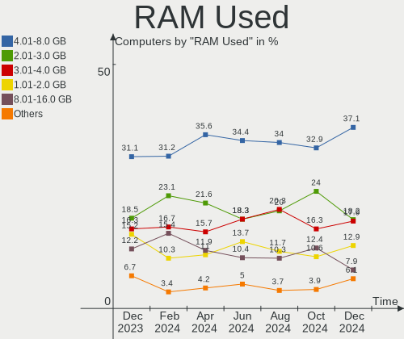
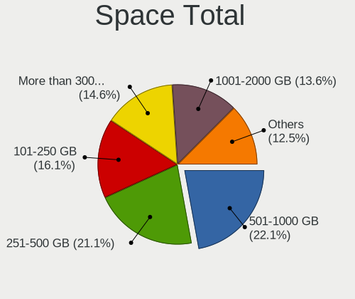
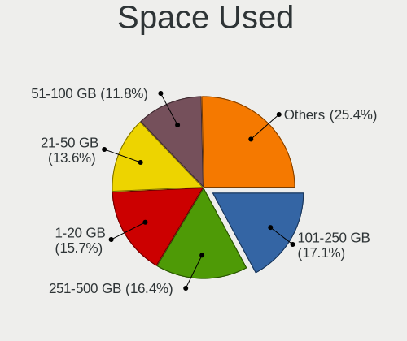
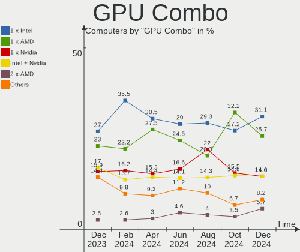
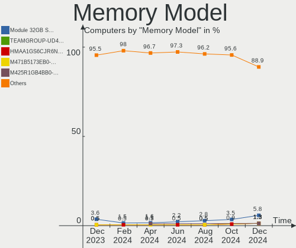

Arch Hardware Trends
--------------------

A project to identify most popular hardware characteristics and track their change
over time based on data collected by Arch users at https://Linux-Hardware.org.

Anyone can contribute to this report by the [hw-probe](https://github.com/linuxhw/hw-probe) tool:

    sudo -E hw-probe -all -upload

This is a report for all computer types. See also reports for [desktops](/Dist/Arch/Desktop/README.md) and [notebooks](/Dist/Arch/Notebook/README.md).

Full-feature report is available here: https://linux-hardware.org/?view=trends

Period: Jul, 2021.

Contents
--------

* [ System ](#system)
  - [ OS                       ](#os)
  - [ OS Family                ](#os-family)
  - [ Kernel                   ](#kernel)
  - [ Kernel Family            ](#kernel-family)
  - [ Kernel Major Ver.        ](#kernel-major-ver)
  - [ Arch                     ](#arch)
  - [ DE                       ](#de)
  - [ Display Server           ](#display-server)
  - [ Display Manager          ](#display-manager)
  - [ OS Lang                  ](#os-lang)
  - [ Boot Mode                ](#boot-mode)
  - [ Filesystem               ](#filesystem)
  - [ Part. scheme             ](#part-scheme)
  - [ Dual Boot with Linux/BSD ](#dual-boot-with-linuxbsd)
  - [ Dual Boot (Win)          ](#dual-boot-win)

* [ Board ](#board)
  - [ Vendor                   ](#vendor)
  - [ Model                    ](#model)
  - [ Model Family             ](#model-family)
  - [ MFG Year                 ](#mfg-year)
  - [ Form Factor              ](#form-factor)
  - [ Secure Boot              ](#secure-boot)
  - [ Coreboot                 ](#coreboot)
  - [ RAM Size                 ](#ram-size)
  - [ RAM Used                 ](#ram-used)
  - [ Total Drives             ](#total-drives)
  - [ Has CD-ROM               ](#has-cd-rom)
  - [ Has Ethernet             ](#has-ethernet)
  - [ Has WiFi                 ](#has-wifi)
  - [ Has Bluetooth            ](#has-bluetooth)

* [ Location ](#location)
  - [ Country                  ](#country)
  - [ City                     ](#city)

* [ Drives ](#drives)
  - [ Drive Vendor             ](#drive-vendor)
  - [ Drive Model              ](#drive-model)
  - [ HDD Vendor               ](#hdd-vendor)
  - [ SSD Vendor               ](#ssd-vendor)
  - [ Drive Kind               ](#drive-kind)
  - [ Drive Connector          ](#drive-connector)
  - [ Drive Size               ](#drive-size)
  - [ Space Total              ](#space-total)
  - [ Space Used               ](#space-used)
  - [ Malfunc. Drives          ](#malfunc-drives)
  - [ Malfunc. Drive Vendor    ](#malfunc-drive-vendor)
  - [ Malfunc. HDD Vendor      ](#malfunc-hdd-vendor)
  - [ Malfunc. Drive Kind      ](#malfunc-drive-kind)
  - [ Failed Drives            ](#failed-drives)
  - [ Failed Drive Vendor      ](#failed-drive-vendor)
  - [ Drive Status             ](#drive-status)

* [ Storage controller ](#storage-controller)
  - [ Storage Vendor           ](#storage-vendor)
  - [ Storage Model            ](#storage-model)
  - [ Storage Kind             ](#storage-kind)

* [ Processor ](#processor)
  - [ CPU Vendor               ](#cpu-vendor)
  - [ CPU Model                ](#cpu-model)
  - [ CPU Model Family         ](#cpu-model-family)
  - [ CPU Cores                ](#cpu-cores)
  - [ CPU Sockets              ](#cpu-sockets)
  - [ CPU Threads              ](#cpu-threads)
  - [ CPU Op-Modes             ](#cpu-op-modes)
  - [ CPU Microcode            ](#cpu-microcode)
  - [ CPU Microarch            ](#cpu-microarch)

* [ Graphics ](#graphics)
  - [ GPU Vendor               ](#gpu-vendor)
  - [ GPU Model                ](#gpu-model)
  - [ GPU Combo                ](#gpu-combo)
  - [ GPU Driver               ](#gpu-driver)
  - [ GPU Memory               ](#gpu-memory)

* [ Monitor ](#monitor)
  - [ Monitor Vendor           ](#monitor-vendor)
  - [ Monitor Model            ](#monitor-model)
  - [ Monitor Resolution       ](#monitor-resolution)
  - [ Monitor Diagonal         ](#monitor-diagonal)
  - [ Monitor Width            ](#monitor-width)
  - [ Aspect Ratio             ](#aspect-ratio)
  - [ Monitor Area             ](#monitor-area)
  - [ Pixel Density            ](#pixel-density)
  - [ Multiple Monitors        ](#multiple-monitors)

* [ Network ](#network)
  - [ Net Controller Vendor    ](#net-controller-vendor)
  - [ Net Controller Model     ](#net-controller-model)
  - [ Wireless Vendor          ](#wireless-vendor)
  - [ Wireless Model           ](#wireless-model)
  - [ Ethernet Vendor          ](#ethernet-vendor)
  - [ Ethernet Model           ](#ethernet-model)
  - [ Net Controller Kind      ](#net-controller-kind)
  - [ Used Controller          ](#used-controller)
  - [ NICs                     ](#nics)
  - [ IPv6                     ](#ipv6)

* [ Bluetooth ](#bluetooth)
  - [ Bluetooth Vendor         ](#bluetooth-vendor)
  - [ Bluetooth Model          ](#bluetooth-model)

* [ Sound ](#sound)
  - [ Sound Vendor             ](#sound-vendor)
  - [ Sound Model              ](#sound-model)

* [ Memory ](#memory)
  - [ Memory Vendor            ](#memory-vendor)
  - [ Memory Model             ](#memory-model)
  - [ Memory Kind              ](#memory-kind)
  - [ Memory Form Factor       ](#memory-form-factor)
  - [ Memory Size              ](#memory-size)
  - [ Memory Speed             ](#memory-speed)

* [ Printers & scanners ](#printers-&-scanners)
  - [ Printer Vendor           ](#printer-vendor)
  - [ Printer Model            ](#printer-model)
  - [ Scanner Vendor           ](#scanner-vendor)
  - [ Scanner Model            ](#scanner-model)

* [ Camera ](#camera)
  - [ Camera Vendor            ](#camera-vendor)
  - [ Camera Model             ](#camera-model)

* [ Security ](#security)
  - [ Fingerprint Vendor       ](#fingerprint-vendor)
  - [ Fingerprint Model        ](#fingerprint-model)
  - [ Chipcard Vendor          ](#chipcard-vendor)
  - [ Chipcard Model           ](#chipcard-model)

* [ Unsupported ](#unsupported)
  - [ Unsupported Devices      ](#unsupported-devices)
  - [ Unsupported Device Types ](#unsupported-device-types)

System
------

OS
--

Installed operating systems

| Name         | Computers | Percent |
|--------------|-----------|---------|
| Arch         | 95        | 56.21%  |
| Arch Rolling | 74        | 43.79%  |

OS Family
---------

OS without a version

| Name | Computers | Percent |
|------|-----------|---------|
| Arch | 169       | 100%    |

Kernel
------

Version of the Linux kernel

| Version                    | Computers | Percent |
|----------------------------|-----------|---------|
| 5.12.15-arch1-1            | 32        | 18.93%  |
| 5.12.14-arch1-1            | 27        | 15.98%  |
| 5.13.5-arch1-1             | 12        | 7.1%    |
| 5.13.4-arch2-1             | 11        | 6.51%   |
| 5.12.13-arch1-2            | 10        | 5.92%   |
| 5.12.15-zen1-1-zen         | 8         | 4.73%   |
| 5.13.4-arch1-1             | 7         | 4.14%   |
| 5.12.14-zen1-1-zen         | 7         | 4.14%   |
| 5.12.12-arch1-1            | 5         | 2.96%   |
| 5.10.47-1-lts              | 5         | 2.96%   |
| 5.13.6-arch1-1             | 4         | 2.37%   |
| 5.13.4-zen2-1-zen          | 4         | 2.37%   |
| 5.10.52-1-lts              | 3         | 1.78%   |
| 5.13.4-zen1-1-zen          | 2         | 1.18%   |
| 5.13.2-180-tkg-cacule      | 2         | 1.18%   |
| 5.12.18-1-ck               | 2         | 1.18%   |
| 5.12.13-zen1-2-zen         | 2         | 1.18%   |
| 5.13.6-zen1-1-zen          | 1         | 0.59%   |
| 5.13.5-zen1-1-zen          | 1         | 0.59%   |
| 5.13.4-xanmod1-1           | 1         | 0.59%   |
| 5.13.1-zen1-1-zen          | 1         | 0.59%   |
| 5.13.1-xanmod1-cacule-1    | 1         | 0.59%   |
| 5.13.1-arch1-amd-s0ix-1    | 1         | 0.59%   |
| 5.13.1-arch1-1             | 1         | 0.59%   |
| 5.13.1-178-tkg-pds         | 1         | 0.59%   |
| 5.13.0-rc7-170-tkg-pds     | 1         | 0.59%   |
| 5.13.0-172-tkg-pds         | 1         | 0.59%   |
| 5.13.0-1                   | 1         | 0.59%   |
| 5.12.3-arch1-1             | 1         | 0.59%   |
| 5.12.19-1-ck               | 1         | 0.59%   |
| 5.12.16-xanmod1-1          | 1         | 0.59%   |
| 5.12.15-hardened1-2-stable | 1         | 0.59%   |
| 5.12.14-xanmod1-1-edge     | 1         | 0.59%   |
| 5.12.14-lqx2-2-lqx         | 1         | 0.59%   |
| 5.12.12-zen1-1-zen         | 1         | 0.59%   |
| 5.12.10-arch1-1            | 1         | 0.59%   |
| 5.12.1-xanmod2-2           | 1         | 0.59%   |
| 5.11.13-arch2-1            | 1         | 0.59%   |
| 5.10.53-183-tkg-upds       | 1         | 0.59%   |
| 5.10.53-1-lts              | 1         | 0.59%   |
| 5.10.50-1-lts              | 1         | 0.59%   |
| 5.10.49-1-lts              | 1         | 0.59%   |
| 5.10.48-1-lts              | 1         | 0.59%   |

Kernel Family
-------------

Linux kernel without a distro release

| Version | Computers | Percent |
|---------|-----------|---------|
| 5.12.15 | 41        | 24.26%  |
| 5.12.14 | 36        | 21.3%   |
| 5.13.4  | 25        | 14.79%  |
| 5.13.5  | 13        | 7.69%   |
| 5.12.13 | 12        | 7.1%    |
| 5.12.12 | 6         | 3.55%   |
| 5.13.6  | 5         | 2.96%   |
| 5.13.1  | 5         | 2.96%   |
| 5.10.47 | 5         | 2.96%   |
| 5.13.0  | 3         | 1.78%   |
| 5.10.52 | 3         | 1.78%   |
| 5.13.2  | 2         | 1.18%   |
| 5.12.18 | 2         | 1.18%   |
| 5.10.53 | 2         | 1.18%   |
| 5.12.3  | 1         | 0.59%   |
| 5.12.19 | 1         | 0.59%   |
| 5.12.16 | 1         | 0.59%   |
| 5.12.10 | 1         | 0.59%   |
| 5.12.1  | 1         | 0.59%   |
| 5.11.13 | 1         | 0.59%   |
| 5.10.50 | 1         | 0.59%   |
| 5.10.49 | 1         | 0.59%   |
| 5.10.48 | 1         | 0.59%   |

Kernel Major Ver.
-----------------

Linux kernel major version

| Version | Computers | Percent |
|---------|-----------|---------|
| 5.12    | 102       | 60.36%  |
| 5.13    | 53        | 31.36%  |
| 5.10    | 13        | 7.69%   |
| 5.11    | 1         | 0.59%   |

Arch
----

OS architecture (x86_64, i586, etc.)

| Name   | Computers | Percent |
|--------|-----------|---------|
| x86_64 | 169       | 100%    |

DE
--

Desktop Environment

| Name              | Computers | Percent |
|-------------------|-----------|---------|
| GNOME             | 55        | 32.54%  |
| KDE5              | 48        | 28.4%   |
| XFCE              | 15        | 8.88%   |
| Unknown           | 14        | 8.28%   |
| i3                | 10        | 5.92%   |
| KDE               | 9         | 5.33%   |
| Budgie            | 4         | 2.37%   |
| sway              | 3         | 1.78%   |
| Deepin            | 2         | 1.18%   |
| Cinnamon          | 2         | 1.18%   |
| X-Cinnamon        | 1         | 0.59%   |
| qtile             | 1         | 0.59%   |
| LXDE              | 1         | 0.59%   |
| Enlightenment     | 1         | 0.59%   |
| bspwm             | 1         | 0.59%   |
| awesome           | 1         | 0.59%   |
| /usr/local/bin/i3 | 1         | 0.59%   |

Display Server
--------------

X11 or Wayland

| Name    | Computers | Percent |
|---------|-----------|---------|
| X11     | 103       | 60.95%  |
| Wayland | 40        | 23.67%  |
| Tty     | 14        | 8.28%   |
| Unknown | 12        | 7.1%    |

Display Manager
---------------

SDDM, LightDM, etc.

| Name    | Computers | Percent |
|---------|-----------|---------|
| Unknown | 55        | 32.54%  |
| SDDM    | 45        | 26.63%  |
| GDM     | 28        | 16.57%  |
| TDM     | 26        | 15.38%  |
| XDM     | 8         | 4.73%   |
| LightDM | 5         | 2.96%   |
| Ly      | 2         | 1.18%   |

OS Lang
-------

Language

| Lang       | Computers | Percent |
|------------|-----------|---------|
| en_US      | 88        | 52.07%  |
| en_GB      | 11        | 6.51%   |
| de_DE      | 9         | 5.33%   |
| ru_RU      | 7         | 4.14%   |
| Unknown    | 6         | 3.55%   |
| C          | 5         | 2.96%   |
| it_IT      | 4         | 2.37%   |
| fr_FR      | 4         | 2.37%   |
| pt_BR      | 3         | 1.78%   |
| pl_PL      | 3         | 1.78%   |
| es_ES      | 3         | 1.78%   |
| zh_CN      | 2         | 1.18%   |
| pt_PT      | 2         | 1.18%   |
| lv_LV      | 2         | 1.18%   |
| ja_JP      | 2         | 1.18%   |
| en_SG      | 2         | 1.18%   |
| uk_UA      | 1         | 0.59%   |
| tr_TR      | 1         | 0.59%   |
| ru_RU.UTF8 | 1         | 0.59%   |
| nl_NL      | 1         | 0.59%   |
| nb_NO      | 1         | 0.59%   |
| hu_HU      | 1         | 0.59%   |
| fr_FR.UTF8 | 1         | 0.59%   |
| es_UY      | 1         | 0.59%   |
| es_CO      | 1         | 0.59%   |
| en_NZ      | 1         | 0.59%   |
| en_IN      | 1         | 0.59%   |
| en_CA      | 1         | 0.59%   |
| en_AU      | 1         | 0.59%   |
| en-US      | 1         | 0.59%   |
| de_DE.UTF8 | 1         | 0.59%   |
| de_AT      | 1         | 0.59%   |

Boot Mode
---------

EFI or BIOS

| Mode | Computers | Percent |
|------|-----------|---------|
| EFI  | 109       | 64.5%   |
| BIOS | 60        | 35.5%   |

Filesystem
----------

Type of filesystem

| Type    | Computers | Percent |
|---------|-----------|---------|
| Ext4    | 114       | 67.46%  |
| Btrfs   | 41        | 24.26%  |
| Xfs     | 8         | 4.73%   |
| Zfs     | 2         | 1.18%   |
| F2fs    | 2         | 1.18%   |
| XXXXX   | 1         | 0.59%   |
| Unknown | 1         | 0.59%   |

Part. scheme
------------

Scheme of partitioning

| Type    | Computers | Percent |
|---------|-----------|---------|
| GPT     | 119       | 70.41%  |
| Unknown | 32        | 18.93%  |
| MBR     | 18        | 10.65%  |

Dual Boot with Linux/BSD
------------------------

Hosting more than one Linux/BSD

| Dual boot | Computers | Percent |
|-----------|-----------|---------|
| No        | 151       | 89.35%  |
| Yes       | 18        | 10.65%  |

Dual Boot (Win)
---------------

Hosting Linux and Windows

| Dual boot | Computers | Percent |
|-----------|-----------|---------|
| No        | 105       | 62.13%  |
| Yes       | 64        | 37.87%  |

Board
-----

Vendor
------

Motherboard manufacturer

| Name                | Computers | Percent |
|---------------------|-----------|---------|
| Lenovo              | 40        | 23.67%  |
| ASUSTek Computer    | 34        | 20.12%  |
| Hewlett-Packard     | 16        | 9.47%   |
| MSI                 | 15        | 8.88%   |
| Gigabyte Technology | 12        | 7.1%    |
| Dell                | 11        | 6.51%   |
| Acer                | 10        | 5.92%   |
| ASRock              | 7         | 4.14%   |
| TUXEDO              | 2         | 1.18%   |
| Sony                | 2         | 1.18%   |
| HUAWEI              | 2         | 1.18%   |
| Huanan              | 2         | 1.18%   |
| Toshiba             | 1         | 0.59%   |
| SLIMBOOK            | 1         | 0.59%   |
| SANTECH             | 1         | 0.59%   |
| Samsung Electronics | 1         | 0.59%   |
| Razer               | 1         | 0.59%   |
| Positivo            | 1         | 0.59%   |
| PC Specialist       | 1         | 0.59%   |
| Packard Bell        | 1         | 0.59%   |
| LG Electronics      | 1         | 0.59%   |
| Google              | 1         | 0.59%   |
| Eluktronics         | 1         | 0.59%   |
| Chuwi               | 1         | 0.59%   |
| Biostar             | 1         | 0.59%   |
| AZW                 | 1         | 0.59%   |
| AVITA               | 1         | 0.59%   |
| Unknown             | 1         | 0.59%   |

Model
-----

Motherboard model

| Name                                     | Computers | Percent |
|------------------------------------------|-----------|---------|
| ASUS All Series                          | 4         | 2.37%   |
| MSI MS-7B86                              | 2         | 1.18%   |
| Lenovo ThinkPad X13 Gen 1 20UGS2B800     | 2         | 1.18%   |
| Lenovo IdeaPad 5 15ARE05 81YQ            | 2         | 1.18%   |
| Gigabyte X570 AORUS ELITE                | 2         | 1.18%   |
| Dell Latitude E7440                      | 2         | 1.18%   |
| Dell Inspiron 1545                       | 2         | 1.18%   |
| ASUS TUF GAMING X570-PLUS                | 2         | 1.18%   |
| ASUS ROG STRIX B550-I GAMING             | 2         | 1.18%   |
| ASUS ROG STRIX B550-F GAMING             | 2         | 1.18%   |
| ASRock X470 Taichi                       | 2         | 1.18%   |
| ASRock B450 Gaming K4                    | 2         | 1.18%   |
| TUXEDO Pulse 15 Gen1                     | 1         | 0.59%   |
| TUXEDO InfinityBook Pro 14 Gen6          | 1         | 0.59%   |
| Toshiba Satellite L850-1LK               | 1         | 0.59%   |
| Sony SVE1713A1EW                         | 1         | 0.59%   |
| Sony SVE15111EBS                         | 1         | 0.59%   |
| SLIMBOOK PROX14-AMD                      | 1         | 0.59%   |
| SANTECH PCX0DX                           | 1         | 0.59%   |
| Samsung 340XAA/350XAA/550XAA             | 1         | 0.59%   |
| Razer Blade 14 - RZ09-0370               | 1         | 0.59%   |
| Positivo CHT12CP                         | 1         | 0.59%   |
| PC Specialist Fusion IV                  | 1         | 0.59%   |
| Packard Bell EasyNote TE69BM             | 1         | 0.59%   |
| MSI MS-7C75                              | 1         | 0.59%   |
| MSI MS-7C37                              | 1         | 0.59%   |
| MSI MS-7C35                              | 1         | 0.59%   |
| MSI MS-7C02                              | 1         | 0.59%   |
| MSI MS-7B93                              | 1         | 0.59%   |
| MSI MS-7B48                              | 1         | 0.59%   |
| MSI MS-7B07                              | 1         | 0.59%   |
| MSI MS-7A32                              | 1         | 0.59%   |
| MSI MS-7996                              | 1         | 0.59%   |
| MSI MS-7918                              | 1         | 0.59%   |
| MSI MS-7721                              | 1         | 0.59%   |
| MSI GT62VR 7RE                           | 1         | 0.59%   |
| MSI GL62M 7RDX                           | 1         | 0.59%   |
| LG 17UD70P-PX76K                         | 1         | 0.59%   |
| Lenovo Yoga Slim 7 Pro 14ACH5 82MS       | 1         | 0.59%   |
| Lenovo ThinkPad X395 20NL0005US          | 1         | 0.59%   |
| Lenovo ThinkPad X260 20F5S08P00          | 1         | 0.59%   |
| Lenovo ThinkPad X1 Carbon 5th 20HR002MGE | 1         | 0.59%   |
| Lenovo ThinkPad X1 Carbon 2nd 20A8S0ET00 | 1         | 0.59%   |
| Lenovo ThinkPad T580 20L90025GE          | 1         | 0.59%   |
| Lenovo ThinkPad T500 2089W6A             | 1         | 0.59%   |
| Lenovo ThinkPad T490 20N2S3H300          | 1         | 0.59%   |
| Lenovo ThinkPad T490 20N2S04200          | 1         | 0.59%   |
| Lenovo ThinkPad T480s 20L8S2N80D         | 1         | 0.59%   |
| Lenovo ThinkPad T480 20L50067US          | 1         | 0.59%   |
| Lenovo ThinkPad T470s W10DG 20JS0015US   | 1         | 0.59%   |
| Lenovo ThinkPad T460p 20FW0005AU         | 1         | 0.59%   |
| Lenovo ThinkPad T440 20B7S1N809          | 1         | 0.59%   |
| Lenovo ThinkPad T440 20B60061MD          | 1         | 0.59%   |
| Lenovo ThinkPad T430 2344BZU             | 1         | 0.59%   |
| Lenovo ThinkPad T410 2522W5D             | 1         | 0.59%   |
| Lenovo ThinkPad T14s Gen 1 20UJ0014FR    | 1         | 0.59%   |
| Lenovo ThinkPad T14s Gen 1 20UHS09300    | 1         | 0.59%   |
| Lenovo ThinkPad T14s Gen 1 20UH001ART    | 1         | 0.59%   |
| Lenovo ThinkPad P50 20EN0007MS           | 1         | 0.59%   |
| Lenovo ThinkPad L14 Gen 2a 20X50009GE    | 1         | 0.59%   |

Model Family
------------

Motherboard model prefix

| Name                  | Computers | Percent |
|-----------------------|-----------|---------|
| Lenovo ThinkPad       | 27        | 15.98%  |
| Lenovo IdeaPad        | 11        | 6.51%   |
| ASUS ROG              | 10        | 5.92%   |
| Acer Aspire           | 5         | 2.96%   |
| Dell Inspiron         | 4         | 2.37%   |
| ASUS TUF              | 4         | 2.37%   |
| ASUS PRIME            | 4         | 2.37%   |
| ASUS All              | 4         | 2.37%   |
| HP Pavilion           | 3         | 1.78%   |
| HP EliteBook          | 3         | 1.78%   |
| Gigabyte X570         | 3         | 1.78%   |
| Dell Latitude         | 3         | 1.78%   |
| MSI MS-7B86           | 2         | 1.18%   |
| HP ProBook            | 2         | 1.18%   |
| HP ENVY               | 2         | 1.18%   |
| Gigabyte B450         | 2         | 1.18%   |
| ASUS ZenBook          | 2         | 1.18%   |
| ASUS VivoBook         | 2         | 1.18%   |
| ASRock X470           | 2         | 1.18%   |
| ASRock B450           | 2         | 1.18%   |
| Acer Nitro            | 2         | 1.18%   |
| TUXEDO Pulse          | 1         | 0.59%   |
| TUXEDO InfinityBook   | 1         | 0.59%   |
| Toshiba Satellite     | 1         | 0.59%   |
| Sony SVE1713A1EW      | 1         | 0.59%   |
| Sony SVE15111EBS      | 1         | 0.59%   |
| SLIMBOOK PROX14-AMD   | 1         | 0.59%   |
| SANTECH PCX0DX        | 1         | 0.59%   |
| Samsung 340XAA        | 1         | 0.59%   |
| Razer Blade           | 1         | 0.59%   |
| Positivo CHT12CP      | 1         | 0.59%   |
| PC Specialist Fusion  | 1         | 0.59%   |
| Packard Bell EasyNote | 1         | 0.59%   |
| MSI MS-7C75           | 1         | 0.59%   |
| MSI MS-7C37           | 1         | 0.59%   |
| MSI MS-7C35           | 1         | 0.59%   |
| MSI MS-7C02           | 1         | 0.59%   |
| MSI MS-7B93           | 1         | 0.59%   |
| MSI MS-7B48           | 1         | 0.59%   |
| MSI MS-7B07           | 1         | 0.59%   |
| MSI MS-7A32           | 1         | 0.59%   |
| MSI MS-7996           | 1         | 0.59%   |
| MSI MS-7918           | 1         | 0.59%   |
| MSI MS-7721           | 1         | 0.59%   |
| MSI GT62VR            | 1         | 0.59%   |
| MSI GL62M             | 1         | 0.59%   |
| LG 17UD70P-PX76K      | 1         | 0.59%   |
| Lenovo Yoga           | 1         | 0.59%   |
| Lenovo Legion         | 1         | 0.59%   |
| HUAWEI NBLL-WXX9      | 1         | 0.59%   |
| HUAWEI HLYL-WXX9      | 1         | 0.59%   |
| Huanan X79            | 1         | 0.59%   |
| Huanan Board          | 1         | 0.59%   |
| HP Z620               | 1         | 0.59%   |
| HP Z600               | 1         | 0.59%   |
| HP ProDesk            | 1         | 0.59%   |
| HP OMEN               | 1         | 0.59%   |
| HP Laptop             | 1         | 0.59%   |
| HP 250                | 1         | 0.59%   |
| Google Helios         | 1         | 0.59%   |

MFG Year
--------

Motherboard manufacture year

| Year | Computers | Percent |
|------|-----------|---------|
| 2020 | 47        | 27.81%  |
| 2021 | 38        | 22.49%  |
| 2019 | 29        | 17.16%  |
| 2018 | 14        | 8.28%   |
| 2016 | 8         | 4.73%   |
| 2012 | 8         | 4.73%   |
| 2017 | 6         | 3.55%   |
| 2013 | 5         | 2.96%   |
| 2014 | 3         | 1.78%   |
| 2010 | 3         | 1.78%   |
| 2009 | 3         | 1.78%   |
| 2015 | 2         | 1.18%   |
| 2011 | 2         | 1.18%   |
| 2008 | 1         | 0.59%   |

Form Factor
-----------

Physical design of the computer

| Name        | Computers | Percent |
|-------------|-----------|---------|
| Notebook    | 97        | 57.4%   |
| Desktop     | 68        | 40.24%  |
| Convertible | 4         | 2.37%   |

Secure Boot
-----------

Enabled or disabled

| State    | Computers | Percent |
|----------|-----------|---------|
| Disabled | 168       | 99.41%  |
| Enabled  | 1         | 0.59%   |

Coreboot
--------

Have coreboot on board

| Used | Computers | Percent |
|------|-----------|---------|
| No   | 168       | 99.41%  |
| Yes  | 1         | 0.59%   |

RAM Size
--------

Total RAM memory

| Size in GB  | Computers | Percent |
|-------------|-----------|---------|
| 16.01-24.0  | 52        | 30.77%  |
| 8.01-16.0   | 36        | 21.3%   |
| 4.01-8.0    | 32        | 18.93%  |
| 32.01-64.0  | 30        | 17.75%  |
| 3.01-4.0    | 11        | 6.51%   |
| 64.01-256.0 | 5         | 2.96%   |
| 24.01-32.0  | 1         | 0.59%   |
| 2.01-3.0    | 1         | 0.59%   |
| 1.01-2.0    | 1         | 0.59%   |

RAM Used
--------

Used RAM memory

| Used GB    | Computers | Percent |
|------------|-----------|---------|
| 2.01-3.0   | 44        | 26.04%  |
| 4.01-8.0   | 36        | 21.3%   |
| 3.01-4.0   | 32        | 18.93%  |
| 1.01-2.0   | 30        | 17.75%  |
| 8.01-16.0  | 17        | 10.06%  |
| 0.51-1.0   | 6         | 3.55%   |
| 16.01-24.0 | 2         | 1.18%   |
| 24.01-32.0 | 1         | 0.59%   |
| 0.01-0.5   | 1         | 0.59%   |

Total Drives
------------

Number of drives on board

| Drives | Computers | Percent |
|--------|-----------|---------|
| 1      | 80        | 47.34%  |
| 2      | 49        | 28.99%  |
| 3      | 21        | 12.43%  |
| 5      | 10        | 5.92%   |
| 4      | 5         | 2.96%   |
| 9      | 2         | 1.18%   |
| 8      | 1         | 0.59%   |
| 6      | 1         | 0.59%   |

Has CD-ROM
----------

Has CD-ROM on board

| Presented | Computers | Percent |
|-----------|-----------|---------|
| No        | 145       | 85.8%   |
| Yes       | 24        | 14.2%   |

Has Ethernet
------------

Has Ethernet on board

| Presented | Computers | Percent |
|-----------|-----------|---------|
| Yes       | 141       | 83.43%  |
| No        | 28        | 16.57%  |

Has WiFi
--------

Has WiFi module

| Presented | Computers | Percent |
|-----------|-----------|---------|
| Yes       | 136       | 80.47%  |
| No        | 33        | 19.53%  |

Has Bluetooth
-------------

Has Bluetooth module

| Presented | Computers | Percent |
|-----------|-----------|---------|
| Yes       | 118       | 69.82%  |
| No        | 51        | 30.18%  |

Location
--------

Country
-------

Geographic location (country)

| Country            | Computers | Percent |
|--------------------|-----------|---------|
| USA                | 27        | 15.98%  |
| Germany            | 21        | 12.43%  |
| Brazil             | 11        | 6.51%   |
| France             | 10        | 5.92%   |
| Russia             | 9         | 5.33%   |
| Italy              | 7         | 4.14%   |
| UK                 | 6         | 3.55%   |
| Netherlands        | 6         | 3.55%   |
| Poland             | 5         | 2.96%   |
| Canada             | 5         | 2.96%   |
| Ukraine            | 4         | 2.37%   |
| Turkey             | 3         | 1.78%   |
| Spain              | 3         | 1.78%   |
| India              | 3         | 1.78%   |
| Hungary            | 3         | 1.78%   |
| Czechia            | 3         | 1.78%   |
| Colombia           | 3         | 1.78%   |
| Singapore          | 2         | 1.18%   |
| Norway             | 2         | 1.18%   |
| New Zealand        | 2         | 1.18%   |
| Latvia             | 2         | 1.18%   |
| Japan              | 2         | 1.18%   |
| Indonesia          | 2         | 1.18%   |
| China              | 2         | 1.18%   |
| Australia          | 2         | 1.18%   |
| Uzbekistan         | 1         | 0.59%   |
| Uruguay            | 1         | 0.59%   |
| Thailand           | 1         | 0.59%   |
| Sweden             | 1         | 0.59%   |
| South Korea        | 1         | 0.59%   |
| South Africa       | 1         | 0.59%   |
| Slovakia           | 1         | 0.59%   |
| Serbia             | 1         | 0.59%   |
| Qatar              | 1         | 0.59%   |
| Portugal           | 1         | 0.59%   |
| Pakistan           | 1         | 0.59%   |
| Moldova            | 1         | 0.59%   |
| Mexico             | 1         | 0.59%   |
| Kosovo             | 1         | 0.59%   |
| Ireland            | 1         | 0.59%   |
| Iran               | 1         | 0.59%   |
| Greece             | 1         | 0.59%   |
| Finland            | 1         | 0.59%   |
| Estonia            | 1         | 0.59%   |
| Dominican Republic | 1         | 0.59%   |
| Costa Rica         | 1         | 0.59%   |
| Belgium            | 1         | 0.59%   |
| Austria            | 1         | 0.59%   |
| Algeria            | 1         | 0.59%   |

City
----

Geographic location (city)

| City                     | Computers | Percent |
|--------------------------|-----------|---------|
| Valencia                 | 2         | 1.18%   |
| Sorocaba                 | 2         | 1.18%   |
| Riga                     | 2         | 1.18%   |
| Petropavlovsk-Kamchatsky | 2         | 1.18%   |
| Paris                    | 2         | 1.18%   |
| Munich                   | 2         | 1.18%   |
| Moscow                   | 2         | 1.18%   |
| Luhansk                  | 2         | 1.18%   |
| Los Angeles              | 2         | 1.18%   |
| Istanbul                 | 2         | 1.18%   |
| Frankfurt am Main        | 2         | 1.18%   |
| Budapest                 | 2         | 1.18%   |
| Brno                     | 2         | 1.18%   |
| Bogot??                  | 2         | 1.18%   |
| Évry                    | 1         | 0.59%   |
| Zhengzhou                | 1         | 0.59%   |
| Winston-Salem            | 1         | 0.59%   |
| Wellington               | 1         | 0.59%   |
| Villaricca               | 1         | 0.59%   |
| Viechtach                | 1         | 0.59%   |
| Vero Beach               | 1         | 0.59%   |
| Toulouse                 | 1         | 0.59%   |
| Tianjin                  | 1         | 0.59%   |
| Ternopil                 | 1         | 0.59%   |
| Tehran                   | 1         | 0.59%   |
| Tashkent                 | 1         | 0.59%   |
| Tallinn                  | 1         | 0.59%   |
| Sulistrowice             | 1         | 0.59%   |
| Stavanger                | 1         | 0.59%   |
| Staraya Yurga            | 1         | 0.59%   |
| Spijkenisse              | 1         | 0.59%   |
| Southend-on-Sea          | 1         | 0.59%   |
| Skawina                  | 1         | 0.59%   |
| Singapore                | 1         | 0.59%   |
| Seville                  | 1         | 0.59%   |
| Setagaya-ku              | 1         | 0.59%   |
| Sesto San Giovanni       | 1         | 0.59%   |
| Seoul                    | 1         | 0.59%   |
| Seattle                  | 1         | 0.59%   |
| Schiedam                 | 1         | 0.59%   |
| Sceaux                   | 1         | 0.59%   |
| S??o Paulo               | 1         | 0.59%   |
| Santo Domingo Este       | 1         | 0.59%   |
| Santa Cruz               | 1         | 0.59%   |
| Sant'Antonio Abate       | 1         | 0.59%   |
| Salt Lake City           | 1         | 0.59%   |
| Rotherham                | 1         | 0.59%   |
| Rostock                  | 1         | 0.59%   |
| Rio de Janeiro           | 1         | 0.59%   |
| Rincon de la Victoria    | 1         | 0.59%   |
| Rho                      | 1         | 0.59%   |
| Rennes                   | 1         | 0.59%   |
| Rayong                   | 1         | 0.59%   |
| Pristina                 | 1         | 0.59%   |
| Prague                   | 1         | 0.59%   |
| Porto Seguro             | 1         | 0.59%   |
| Portland                 | 1         | 0.59%   |
| Poprad                   | 1         | 0.59%   |
| Petrozavodsk             | 1         | 0.59%   |
| Paraparaumu              | 1         | 0.59%   |

Drives
------

Drive Vendor
------------

Hard drive vendors

| Vendor              | Computers | Drives | Percent |
|---------------------|-----------|--------|---------|
| Samsung Electronics | 65        | 84     | 22.73%  |
| WDC                 | 41        | 55     | 14.34%  |
| Seagate             | 32        | 47     | 11.19%  |
| SanDisk             | 23        | 25     | 8.04%   |
| Kingston            | 20        | 22     | 6.99%   |
| Toshiba             | 14        | 14     | 4.9%    |
| Crucial             | 11        | 12     | 3.85%   |
| SK Hynix            | 9         | 9      | 3.15%   |
| Intel               | 9         | 9      | 3.15%   |
| Hitachi             | 8         | 9      | 2.8%    |
| Unknown             | 6         | 6      | 2.1%    |
| A-DATA Technology   | 5         | 5      | 1.75%   |
| Silicon Motion      | 3         | 3      | 1.05%   |
| Patriot             | 3         | 3      | 1.05%   |
| HGST                | 3         | 3      | 1.05%   |
| China               | 3         | 3      | 1.05%   |
| PNY                 | 2         | 2      | 0.7%    |
| OCZ                 | 2         | 2      | 0.7%    |
| Netac               | 2         | 2      | 0.7%    |
| Lexar               | 2         | 2      | 0.7%    |
| Intenso             | 2         | 2      | 0.7%    |
| Corsair             | 2         | 2      | 0.7%    |
| ZHITAI              | 1         | 1      | 0.35%   |
| Transcend           | 1         | 1      | 0.35%   |
| SPCC                | 1         | 1      | 0.35%   |
| Phison              | 1         | 1      | 0.35%   |
| Mushkin             | 1         | 1      | 0.35%   |
| Morebeck-N100       | 1         | 1      | 0.35%   |
| Micron Technology   | 1         | 1      | 0.35%   |
| Marvell             | 1         | 1      | 0.35%   |
| Lite-On             | 1         | 1      | 0.35%   |
| Kross Elegance      | 1         | 1      | 0.35%   |
| KIOXIA              | 1         | 2      | 0.35%   |
| KingSpec            | 1         | 1      | 0.35%   |
| HGST HUS            | 1         | 1      | 0.35%   |
| Hewlett-Packard     | 1         | 2      | 0.35%   |
| GOODRAM             | 1         | 1      | 0.35%   |
| Fujitsu             | 1         | 1      | 0.35%   |
| BLueRay             | 1         | 1      | 0.35%   |
| BHT                 | 1         | 1      | 0.35%   |
| ASMT                | 1         | 1      | 0.35%   |

Drive Model
-----------

Hard drive models

| Model                            | Computers | Percent |
|----------------------------------|-----------|---------|
| Seagate ST1000LM035-1RK172 1TB   | 6         | 1.79%   |
| Samsung SSD 860 EVO 1TB          | 6         | 1.79%   |
| Sandisk NVMe SSD Drive 512GB     | 5         | 1.49%   |
| Kingston SA400S37120G 120GB SSD  | 5         | 1.49%   |
| Seagate ST2000DM006-2DM164 2TB   | 4         | 1.19%   |
| Samsung SSD 970 EVO Plus 1TB     | 4         | 1.19%   |
| Samsung SSD 850 EVO 250GB        | 4         | 1.19%   |
| Samsung NVMe SSD Drive 256GB     | 4         | 1.19%   |
| Seagate ST1000DM003-1ER162 1TB   | 3         | 0.89%   |
| Samsung SSD 970 EVO Plus 500GB   | 3         | 0.89%   |
| Samsung SSD 860 EVO M.2 250GB    | 3         | 0.89%   |
| Samsung NVMe SSD Drive 512GB     | 3         | 0.89%   |
| Samsung NVMe SSD Drive 500GB     | 3         | 0.89%   |
| Samsung NVMe SSD Drive 1TB       | 3         | 0.89%   |
| WDC WDS240G2G0A-00JH30 240GB SSD | 2         | 0.6%    |
| WDC WDS120G2G0A-00JH30 120GB SSD | 2         | 0.6%    |
| WDC WD40EFRX-68N32N0 4TB         | 2         | 0.6%    |
| Unknown SD/MMC/MS PRO 128GB      | 2         | 0.6%    |
| Toshiba HDWD240 4TB              | 2         | 0.6%    |
| SK Hynix NVMe SSD Drive 512GB    | 2         | 0.6%    |
| Seagate ST500LM021-1KJ152 500GB  | 2         | 0.6%    |
| Seagate ST3000VN000-1HJ166 3TB   | 2         | 0.6%    |
| Seagate Expansion 4TB            | 2         | 0.6%    |
| SanDisk SSD PLUS 120GB           | 2         | 0.6%    |
| SanDisk SDSSDA240G 240GB         | 2         | 0.6%    |
| Samsung SSD 980 PRO 500GB        | 2         | 0.6%    |
| Samsung SSD 970 EVO 250GB        | 2         | 0.6%    |
| Samsung SSD 960 EVO 250GB        | 2         | 0.6%    |
| Samsung SSD 860 EVO 500GB        | 2         | 0.6%    |
| Samsung SSD 850 EVO 1TB          | 2         | 0.6%    |
| Samsung MZVLW256HEHP-000L7 256GB | 2         | 0.6%    |
| Kingston SA2000M8500G 500GB      | 2         | 0.6%    |
| Kingston SA2000M81000G 1TB       | 2         | 0.6%    |
| Intel NVMe SSD Drive 512GB       | 2         | 0.6%    |
| HGST HTS545050A7E380 500GB       | 2         | 0.6%    |
| China SSD 120GB                  | 2         | 0.6%    |
| ZHITAI SC001 Active 1TB SSD      | 1         | 0.3%    |
| WDC WDS500G2X0C-00L350 500GB     | 1         | 0.3%    |
| WDC WDS500G2B0B-00YS70 500GB SSD | 1         | 0.3%    |
| WDC WDS480G2G0A-00JH30 480GB SSD | 1         | 0.3%    |
| WDC WDS250G2B0A-00SM50 250GB SSD | 1         | 0.3%    |
| WDC WDS250G1B0C-00S6U0 250GB     | 1         | 0.3%    |
| WDC WDS240G2G0B-00EPW0 240GB SSD | 1         | 0.3%    |
| WDC WDS200T2B0A-00SM50 2TB SSD   | 1         | 0.3%    |
| WDC WDS100T3X0C-00SJG0 1TB       | 1         | 0.3%    |
| WDC WD80EFZX-68UW8N0 8TB         | 1         | 0.3%    |
| WDC WD8003FRYZ-01JPDB1 8TB       | 1         | 0.3%    |
| WDC WD5000BPVT-22HXZT3 500GB     | 1         | 0.3%    |
| WDC WD5000BEKT-00KA9T0 500GB     | 1         | 0.3%    |
| WDC WD5000AZLX-00CL5A0 500GB     | 1         | 0.3%    |
| WDC WD5000AAKX-75U6AA0 500GB     | 1         | 0.3%    |
| WDC WD5000AAKX-22ERMA0 500GB     | 1         | 0.3%    |
| WDC WD5000AAKX-08U6AA0 500GB     | 1         | 0.3%    |
| WDC WD5000AAKX-001CA0 500GB      | 1         | 0.3%    |
| WDC WD5000AAKS-00A7B2 500GB      | 1         | 0.3%    |
| WDC WD40EZRZ-22GXCB0 4TB         | 1         | 0.3%    |
| WDC WD40EZRZ-00GXCB0 4TB         | 1         | 0.3%    |
| WDC WD40EFRX-68WT0N0 4TB         | 1         | 0.3%    |
| WDC WD4003FZEX-00Z4SA0 4TB       | 1         | 0.3%    |
| WDC WD30EZRX-00D8PB0 3TB         | 1         | 0.3%    |

HDD Vendor
----------

Hard disk drive vendors

| Vendor              | Computers | Drives | Percent |
|---------------------|-----------|--------|---------|
| Seagate             | 32        | 46     | 35.96%  |
| WDC                 | 30        | 37     | 33.71%  |
| Toshiba             | 10        | 10     | 11.24%  |
| Hitachi             | 8         | 9      | 8.99%   |
| Samsung Electronics | 5         | 6      | 5.62%   |
| HGST                | 3         | 3      | 3.37%   |
| ASMT                | 1         | 1      | 1.12%   |

SSD Vendor
----------

Solid state drive vendors

| Vendor              | Computers | Drives | Percent |
|---------------------|-----------|--------|---------|
| Samsung Electronics | 30        | 34     | 30%     |
| SanDisk             | 13        | 14     | 13%     |
| Kingston            | 11        | 11     | 11%     |
| WDC                 | 8         | 9      | 8%      |
| Crucial             | 8         | 9      | 8%      |
| Patriot             | 3         | 3      | 3%      |
| China               | 3         | 3      | 3%      |
| A-DATA Technology   | 3         | 3      | 3%      |
| OCZ                 | 2         | 2      | 2%      |
| Lexar               | 2         | 2      | 2%      |
| Intenso             | 2         | 2      | 2%      |
| Intel               | 2         | 2      | 2%      |
| ZHITAI              | 1         | 1      | 1%      |
| Transcend           | 1         | 1      | 1%      |
| SK Hynix            | 1         | 1      | 1%      |
| PNY                 | 1         | 1      | 1%      |
| Netac               | 1         | 1      | 1%      |
| Mushkin             | 1         | 1      | 1%      |
| Kross Elegance      | 1         | 1      | 1%      |
| KingSpec            | 1         | 1      | 1%      |
| GOODRAM             | 1         | 1      | 1%      |
| Fujitsu             | 1         | 1      | 1%      |
| Corsair             | 1         | 1      | 1%      |
| BLueRay             | 1         | 1      | 1%      |
| BHT                 | 1         | 1      | 1%      |

Drive Kind
----------

HDD or SSD

| Kind    | Computers | Drives | Percent |
|---------|-----------|--------|---------|
| NVMe    | 92        | 113    | 36.22%  |
| SSD     | 82        | 107    | 32.28%  |
| HDD     | 71        | 112    | 27.95%  |
| Unknown | 5         | 5      | 1.97%   |
| MMC     | 4         | 5      | 1.57%   |

Drive Connector
---------------

SATA, SAS, NVMe, etc.

| Type | Computers | Drives | Percent |
|------|-----------|--------|---------|
| SATA | 111       | 212    | 51.15%  |
| NVMe | 92        | 113    | 42.4%   |
| SAS  | 10        | 12     | 4.61%   |
| MMC  | 4         | 5      | 1.84%   |

Drive Size
----------

Size of hard drive

| Size in TB | Computers | Drives | Percent |
|------------|-----------|--------|---------|
| 0.01-0.5   | 76        | 109    | 45.78%  |
| 0.51-1.0   | 49        | 57     | 29.52%  |
| 1.01-2.0   | 17        | 22     | 10.24%  |
| 3.01-4.0   | 14        | 16     | 8.43%   |
| 2.01-3.0   | 5         | 10     | 3.01%   |
| 4.01-10.0  | 5         | 5      | 3.01%   |

Space Total
-----------

Amount of disk space available on the file system

| Size in GB     | Computers | Percent |
|----------------|-----------|---------|
| 101-250        | 43        | 25.44%  |
| 251-500        | 31        | 18.34%  |
| 1001-2000      | 29        | 17.16%  |
| More than 3000 | 27        | 15.98%  |
| 501-1000       | 24        | 14.2%   |
| 51-100         | 7         | 4.14%   |
| Unknown        | 3         | 1.78%   |
| 2001-3000      | 2         | 1.18%   |
| 1-20           | 2         | 1.18%   |
| 21-50          | 1         | 0.59%   |

Space Used
----------

Amount of used disk space

| Used GB        | Computers | Percent |
|----------------|-----------|---------|
| 21-50          | 27        | 15.98%  |
| 1-20           | 26        | 15.38%  |
| 51-100         | 25        | 14.79%  |
| 101-250        | 24        | 14.2%   |
| 251-500        | 19        | 11.24%  |
| 501-1000       | 19        | 11.24%  |
| More than 3000 | 11        | 6.51%   |
| 1001-2000      | 9         | 5.33%   |
| 2001-3000      | 6         | 3.55%   |
| Unknown        | 3         | 1.78%   |

Malfunc. Drives
---------------

Drive models with a malfunction

| Model                                        | Computers | Drives | Percent |
|----------------------------------------------|-----------|--------|---------|
| HGST HTS545050A7E380 500GB                   | 2         | 2      | 7.69%   |
| WDC WDS240G2G0A-00JH30 240GB SSD             | 1         | 1      | 3.85%   |
| WDC WD10EZEX-00WN4A0 1TB                     | 1         | 1      | 3.85%   |
| WDC WD10EARS-00Y5B1 1TB                      | 1         | 1      | 3.85%   |
| WDC WD1003FZEX-00MK2A0 1TB                   | 1         | 1      | 3.85%   |
| Toshiba MK6475GSX 640GB                      | 1         | 1      | 3.85%   |
| Seagate ST9320423AS 320GB                    | 1         | 1      | 3.85%   |
| Seagate ST500LM021-1KJ152 500GB              | 1         | 1      | 3.85%   |
| Seagate ST500DM002-1BD142 500GB              | 1         | 2      | 3.85%   |
| Seagate ST3500320AS 500GB                    | 1         | 1      | 3.85%   |
| Seagate ST2000DM006-2DM164 2TB               | 1         | 1      | 3.85%   |
| Seagate ST1000LM048-2E7172 1TB               | 1         | 1      | 3.85%   |
| Seagate ST1000LM035-1RK172 1TB               | 1         | 1      | 3.85%   |
| Seagate ST1000DM003-1ER162 1TB               | 1         | 1      | 3.85%   |
| SanDisk SSD PLUS 1000GB                      | 1         | 1      | 3.85%   |
| SanDisk SD7UB3Q256G1001 256GB SSD            | 1         | 1      | 3.85%   |
| Samsung Electronics SSD 960 EVO 250GB        | 1         | 1      | 3.85%   |
| Samsung Electronics MZVLW256HEHP-000L7 256GB | 1         | 1      | 3.85%   |
| Micron Technology 2200S NVMe 1024GB          | 1         | 1      | 3.85%   |
| Intel SSDSCKKW120H6 120GB                    | 1         | 1      | 3.85%   |
| Hitachi HTS545050A7E380 500GB                | 1         | 1      | 3.85%   |
| Hitachi HDS721032CLA362 320GB                | 1         | 1      | 3.85%   |
| Crucial CT525MX300SSD4 528GB                 | 1         | 1      | 3.85%   |
| BLueRay SDM8SI480A 480GB SSD                 | 1         | 1      | 3.85%   |
| ASMT ASM105x 752GB                           | 1         | 1      | 3.85%   |

Malfunc. Drive Vendor
---------------------

Vendors of faulty drives

| Vendor              | Computers | Drives | Percent |
|---------------------|-----------|--------|---------|
| Seagate             | 8         | 9      | 30.77%  |
| WDC                 | 4         | 4      | 15.38%  |
| SanDisk             | 2         | 2      | 7.69%   |
| Samsung Electronics | 2         | 2      | 7.69%   |
| Hitachi             | 2         | 2      | 7.69%   |
| HGST                | 2         | 2      | 7.69%   |
| Toshiba             | 1         | 1      | 3.85%   |
| Micron Technology   | 1         | 1      | 3.85%   |
| Intel               | 1         | 1      | 3.85%   |
| Crucial             | 1         | 1      | 3.85%   |
| BLueRay             | 1         | 1      | 3.85%   |
| ASMT                | 1         | 1      | 3.85%   |

Malfunc. HDD Vendor
-------------------

Vendors of faulty HDD drives

| Vendor  | Computers | Drives | Percent |
|---------|-----------|--------|---------|
| Seagate | 8         | 9      | 47.06%  |
| WDC     | 3         | 3      | 17.65%  |
| Hitachi | 2         | 2      | 11.76%  |
| HGST    | 2         | 2      | 11.76%  |
| Toshiba | 1         | 1      | 5.88%   |
| ASMT    | 1         | 1      | 5.88%   |

Malfunc. Drive Kind
-------------------

Kinds of faulty drives

| Kind | Computers | Drives | Percent |
|------|-----------|--------|---------|
| HDD  | 16        | 18     | 64%     |
| SSD  | 6         | 6      | 24%     |
| NVMe | 3         | 3      | 12%     |

Failed Drives
-------------

Failed drive models

Zero info for selected period =(

Failed Drive Vendor
-------------------

Failed drive vendors

Zero info for selected period =(

Drive Status
------------

Number of failed and malfunc. drives

| Status   | Computers | Drives | Percent |
|----------|-----------|--------|---------|
| Works    | 98        | 186    | 49.49%  |
| Detected | 75        | 129    | 37.88%  |
| Malfunc  | 25        | 27     | 12.63%  |

Storage controller
------------------

Storage Vendor
--------------

Storage controller vendors

| Vendor                       | Computers | Percent |
|------------------------------|-----------|---------|
| Intel                        | 85        | 33.86%  |
| AMD                          | 56        | 22.31%  |
| Samsung Electronics          | 38        | 15.14%  |
| Sandisk                      | 17        | 6.77%   |
| Kingston Technology Company  | 10        | 3.98%   |
| SK Hynix                     | 8         | 3.19%   |
| ASMedia Technology           | 8         | 3.19%   |
| Silicon Motion               | 6         | 2.39%   |
| Toshiba America Info Systems | 4         | 1.59%   |
| Phison Electronics           | 3         | 1.2%    |
| Marvell Technology Group     | 3         | 1.2%    |
| Micron/Crucial Technology    | 2         | 0.8%    |
| Micron Technology            | 2         | 0.8%    |
| JMicron Technology           | 2         | 0.8%    |
| ADATA Technology             | 2         | 0.8%    |
| Silicon Image                | 1         | 0.4%    |
| Lite-On Technology           | 1         | 0.4%    |
| KIOXIA                       | 1         | 0.4%    |
| Broadcom / LSI               | 1         | 0.4%    |
| ATTO Technology              | 1         | 0.4%    |

Storage Model
-------------

Storage controller models

| Model                                                                          | Computers | Percent |
|--------------------------------------------------------------------------------|-----------|---------|
| AMD FCH SATA Controller [AHCI mode]                                            | 42        | 14.79%  |
| Samsung NVMe SSD Controller SM981/PM981/PM983                                  | 29        | 10.21%  |
| AMD 400 Series Chipset SATA Controller                                         | 13        | 4.58%   |
| Intel 82801 Mobile SATA Controller [RAID mode]                                 | 9         | 3.17%   |
| Intel Sunrise Point-LP SATA Controller [AHCI mode]                             | 8         | 2.82%   |
| Intel 7 Series Chipset Family 6-port SATA Controller [AHCI mode]               | 8         | 2.82%   |
| ASMedia ASM1062 Serial ATA Controller                                          | 8         | 2.82%   |
| Sandisk WD Black SN750 / PC SN730 NVMe SSD                                     | 7         | 2.46%   |
| Samsung NVMe SSD Controller SM961/PM961/SM963                                  | 7         | 2.46%   |
| Kingston Company A2000 NVMe SSD                                                | 7         | 2.46%   |
| AMD Starship/Matisse Chipset SATA Controller [AHCI mode]                       | 7         | 2.46%   |
| SK Hynix NVMe SSD Controller                                                   | 4         | 1.41%   |
| Silicon Motion SM2263EN/SM2263XT SSD Controller                                | 4         | 1.41%   |
| Samsung NVMe SSD Controller PM9A1/PM9A3/980PRO                                 | 4         | 1.41%   |
| Intel SSD 660P Series                                                          | 4         | 1.41%   |
| Intel Q170/Q150/B150/H170/H110/Z170/CM236 Chipset SATA Controller [AHCI Mode]  | 4         | 1.41%   |
| Intel Comet Lake SATA AHCI Controller                                          | 4         | 1.41%   |
| Intel 9 Series Chipset Family SATA Controller [AHCI Mode]                      | 4         | 1.41%   |
| Intel 8 Series SATA Controller 1 [AHCI mode]                                   | 4         | 1.41%   |
| Intel 200 Series PCH SATA controller [AHCI mode]                               | 4         | 1.41%   |
| AMD SB7x0/SB8x0/SB9x0 SATA Controller [AHCI mode]                              | 4         | 1.41%   |
| Toshiba America Info Systems XG6 NVMe SSD Controller                           | 3         | 1.06%   |
| Sandisk WD Blue SN550 NVMe SSD                                                 | 3         | 1.06%   |
| Sandisk WD Blue SN500 / PC SN520 NVMe SSD                                      | 3         | 1.06%   |
| Intel Cannon Point-LP SATA Controller [AHCI Mode]                              | 3         | 1.06%   |
| Intel Cannon Lake PCH SATA AHCI Controller                                     | 3         | 1.06%   |
| Intel C600/X79 series chipset 6-Port SATA AHCI Controller                      | 3         | 1.06%   |
| Intel 82801IBM/IEM (ICH9M/ICH9M-E) 4 port SATA Controller [AHCI mode]          | 3         | 1.06%   |
| Intel 6 Series/C200 Series Chipset Family 6 port Mobile SATA AHCI Controller   | 3         | 1.06%   |
| AMD SB7x0/SB8x0/SB9x0 IDE Controller                                           | 3         | 1.06%   |
| SK Hynix Non-Volatile memory controller                                        | 2         | 0.7%    |
| Silicon Motion SM2262/SM2262EN SSD Controller                                  | 2         | 0.7%    |
| Sandisk WD Black 2018/SN750 / PC SN720 NVMe SSD                                | 2         | 0.7%    |
| Sandisk Non-Volatile memory controller                                         | 2         | 0.7%    |
| Phison E16 PCIe4 NVMe Controller                                               | 2         | 0.7%    |
| Micron/Crucial P2 NVMe PCIe SSD                                                | 2         | 0.7%    |
| Micron Non-Volatile memory controller                                          | 2         | 0.7%    |
| Intel HM170/QM170 Chipset SATA Controller [AHCI Mode]                          | 2         | 0.7%    |
| Intel Cannon Lake Mobile PCH SATA AHCI Controller                              | 2         | 0.7%    |
| Intel C610/X99 series chipset 6-Port SATA Controller [AHCI mode]               | 2         | 0.7%    |
| Intel Atom Processor E3800 Series SATA AHCI Controller                         | 2         | 0.7%    |
| Intel 82801IBM/IEM (ICH9M/ICH9M-E) 2 port SATA Controller [IDE mode]           | 2         | 0.7%    |
| Intel 8 Series/C220 Series Chipset Family 6-port SATA Controller 1 [AHCI mode] | 2         | 0.7%    |
| Intel 400 Series Chipset Family SATA AHCI Controller                           | 2         | 0.7%    |
| AMD X370 Series Chipset SATA Controller                                        | 2         | 0.7%    |
| AMD SB7x0/SB8x0/SB9x0 SATA Controller [IDE mode]                               | 2         | 0.7%    |
| AMD 300 Series Chipset SATA Controller                                         | 2         | 0.7%    |
| ADATA XPG SX8200 Pro PCIe Gen3x4 M.2 2280 Solid State Drive                    | 2         | 0.7%    |
| Toshiba America Info Systems BG3 NVMe SSD Controller                           | 1         | 0.35%   |
| SK Hynix BC511                                                                 | 1         | 0.35%   |
| SK Hynix BC501 NVMe Solid State Drive                                          | 1         | 0.35%   |
| Silicon Image PCI0680 Ultra ATA-133 Host Controller                            | 1         | 0.35%   |
| Sandisk WD Black SN850                                                         | 1         | 0.35%   |
| Samsung NVMe SSD Controller SM951/PM951                                        | 1         | 0.35%   |
| Samsung NVMe Controller                                                        | 1         | 0.35%   |
| Phison E12 NVMe Controller                                                     | 1         | 0.35%   |
| Marvell Group Marvell Non-Volatile memory controller                           | 1         | 0.35%   |
| Marvell Group 88SE91A3 SATA-600 Controller                                     | 1         | 0.35%   |
| Marvell Group 88SE9128 PCIe SATA 6 Gb/s RAID controller with HyperDuo          | 1         | 0.35%   |
| Lite-On Non-Volatile memory controller                                         | 1         | 0.35%   |

Storage Kind
------------

Kind of storage controller (IDE, SATA, NVMe, SAS, ...)

| Kind | Computers | Percent |
|------|-----------|---------|
| SATA | 123       | 52.12%  |
| NVMe | 91        | 38.56%  |
| RAID | 13        | 5.51%   |
| IDE  | 7         | 2.97%   |
| SAS  | 2         | 0.85%   |

Processor
---------

CPU Vendor
----------

Processor vendors

| Vendor | Computers | Percent |
|--------|-----------|---------|
| Intel  | 97        | 57.4%   |
| AMD    | 72        | 42.6%   |

CPU Model
---------

Processor models

| Model                                         | Computers | Percent |
|-----------------------------------------------|-----------|---------|
| AMD Ryzen 7 3700X 8-Core Processor            | 7         | 4.14%   |
| AMD Ryzen 5 2600 Six-Core Processor           | 5         | 2.96%   |
| Intel Core i5-8265U CPU @ 1.60GHz             | 4         | 2.37%   |
| Intel Core i5-7200U CPU @ 2.50GHz             | 4         | 2.37%   |
| Intel Core i5-4200U CPU @ 1.60GHz             | 4         | 2.37%   |
| AMD Ryzen 7 PRO 4750U with Radeon Graphics    | 4         | 2.37%   |
| Intel Core i5-8250U CPU @ 1.60GHz             | 3         | 1.78%   |
| Intel 11th Gen Core i7-1165G7 @ 2.80GHz       | 3         | 1.78%   |
| AMD Ryzen 7 4800H with Radeon Graphics        | 3         | 1.78%   |
| AMD Ryzen 7 2700 Eight-Core Processor         | 3         | 1.78%   |
| AMD Ryzen 5 4500U with Radeon Graphics        | 3         | 1.78%   |
| AMD Ryzen 5 3600 6-Core Processor             | 3         | 1.78%   |
| AMD Ryzen 5 2600X Six-Core Processor          | 3         | 1.78%   |
| AMD Ryzen 5 2500U with Radeon Vega Mobile Gfx | 3         | 1.78%   |
| Intel Core i7-9750H CPU @ 2.60GHz             | 2         | 1.18%   |
| Intel Core i7-4790 CPU @ 3.60GHz              | 2         | 1.18%   |
| Intel Core i5-7400 CPU @ 3.00GHz              | 2         | 1.18%   |
| Intel Core i5-6300U CPU @ 2.40GHz             | 2         | 1.18%   |
| Intel Core i5-6200U CPU @ 2.30GHz             | 2         | 1.18%   |
| AMD Ryzen 9 3900X 12-Core Processor           | 2         | 1.18%   |
| AMD Ryzen 7 5800H with Radeon Graphics        | 2         | 1.18%   |
| AMD Ryzen 7 4700U with Radeon Graphics        | 2         | 1.18%   |
| AMD Ryzen 5 5500U with Radeon Graphics        | 2         | 1.18%   |
| AMD Ryzen 5 4600H with Radeon Graphics        | 2         | 1.18%   |
| AMD Ryzen 3 3100 4-Core Processor             | 2         | 1.18%   |
| Intel Xeon E-2276M CPU @ 2.80GHz              | 1         | 0.59%   |
| Intel Xeon CPU X5670 @ 2.93GHz                | 1         | 0.59%   |
| Intel Xeon CPU E5-2699 v3 @ 2.30GHz           | 1         | 0.59%   |
| Intel Xeon CPU E5-2690 0 @ 2.90GHz            | 1         | 0.59%   |
| Intel Xeon CPU E5-2680 0 @ 2.70GHz            | 1         | 0.59%   |
| Intel Xeon CPU E5-2670 0 @ 2.60GHz            | 1         | 0.59%   |
| Intel Pentium Dual-Core CPU T4300 @ 2.10GHz   | 1         | 0.59%   |
| Intel Pentium Dual CPU T3400 @ 2.16GHz        | 1         | 0.59%   |
| Intel Pentium CPU G3220 @ 3.00GHz             | 1         | 0.59%   |
| Intel Pentium CPU B960 @ 2.20GHz              | 1         | 0.59%   |
| Intel Pentium CPU 2020M @ 2.40GHz             | 1         | 0.59%   |
| Intel Core i7-8700K CPU @ 3.70GHz             | 1         | 0.59%   |
| Intel Core i7-8700 CPU @ 3.20GHz              | 1         | 0.59%   |
| Intel Core i7-8665U CPU @ 1.90GHz             | 1         | 0.59%   |
| Intel Core i7-8650U CPU @ 1.90GHz             | 1         | 0.59%   |
| Intel Core i7-8565U CPU @ 1.80GHz             | 1         | 0.59%   |
| Intel Core i7-8550U CPU @ 1.80GHz             | 1         | 0.59%   |
| Intel Core i7-7700HQ CPU @ 2.80GHz            | 1         | 0.59%   |
| Intel Core i7-7700 CPU @ 3.60GHz              | 1         | 0.59%   |
| Intel Core i7-7600U CPU @ 2.80GHz             | 1         | 0.59%   |
| Intel Core i7-7500U CPU @ 2.70GHz             | 1         | 0.59%   |
| Intel Core i7-6820HQ CPU @ 2.70GHz            | 1         | 0.59%   |
| Intel Core i7-5820K CPU @ 3.30GHz             | 1         | 0.59%   |
| Intel Core i7-4790K CPU @ 4.00GHz             | 1         | 0.59%   |
| Intel Core i7-4600U CPU @ 2.10GHz             | 1         | 0.59%   |
| Intel Core i7-3632QM CPU @ 2.20GHz            | 1         | 0.59%   |
| Intel Core i7-3520M CPU @ 2.90GHz             | 1         | 0.59%   |
| Intel Core i7-2670QM CPU @ 2.20GHz            | 1         | 0.59%   |
| Intel Core i7-2630QM CPU @ 2.00GHz            | 1         | 0.59%   |
| Intel Core i7-2600K CPU @ 3.40GHz             | 1         | 0.59%   |
| Intel Core i7-10875H CPU @ 2.30GHz            | 1         | 0.59%   |
| Intel Core i7-10700K CPU @ 3.80GHz            | 1         | 0.59%   |
| Intel Core i7-1065G7 CPU @ 1.30GHz            | 1         | 0.59%   |
| Intel Core i7-10510U CPU @ 1.80GHz            | 1         | 0.59%   |
| Intel Core i7 CPU 930 @ 2.80GHz               | 1         | 0.59%   |

CPU Model Family
----------------

Processor model prefix

| Model                   | Computers | Percent |
|-------------------------|-----------|---------|
| Intel Core i5           | 37        | 21.89%  |
| Intel Core i7           | 28        | 16.57%  |
| AMD Ryzen 5             | 26        | 15.38%  |
| AMD Ryzen 7             | 22        | 13.02%  |
| Intel Core i3           | 9         | 5.33%   |
| Intel Xeon              | 6         | 3.55%   |
| AMD Ryzen 9             | 6         | 3.55%   |
| Other                   | 5         | 2.96%   |
| AMD Ryzen 7 PRO         | 5         | 2.96%   |
| AMD FX                  | 4         | 2.37%   |
| Intel Pentium           | 3         | 1.78%   |
| Intel Core 2 Duo        | 3         | 1.78%   |
| Intel Celeron           | 3         | 1.78%   |
| AMD Ryzen 5 PRO         | 2         | 1.18%   |
| AMD Ryzen 3             | 2         | 1.18%   |
| Intel Pentium Dual-Core | 1         | 0.59%   |
| Intel Pentium Dual      | 1         | 0.59%   |
| Intel Atom              | 1         | 0.59%   |
| AMD Ryzen Threadripper  | 1         | 0.59%   |
| AMD Phenom II X2        | 1         | 0.59%   |
| AMD Athlon 64 X2        | 1         | 0.59%   |
| AMD A4                  | 1         | 0.59%   |
| AMD A10                 | 1         | 0.59%   |

CPU Cores
---------

Number of processor cores

| Number | Computers | Percent |
|--------|-----------|---------|
| 4      | 55        | 32.54%  |
| 2      | 43        | 25.44%  |
| 8      | 31        | 18.34%  |
| 6      | 31        | 18.34%  |
| 12     | 4         | 2.37%   |
| 16     | 3         | 1.78%   |
| 24     | 1         | 0.59%   |
| 18     | 1         | 0.59%   |

CPU Sockets
-----------

Number of sockets

| Number | Computers | Percent |
|--------|-----------|---------|
| 1      | 166       | 98.22%  |
| 2      | 3         | 1.78%   |

CPU Threads
-----------

Threads per core (Hyper-Threading)

| Number | Computers | Percent |
|--------|-----------|---------|
| 2      | 136       | 80.47%  |
| 1      | 33        | 19.53%  |

CPU Op-Modes
------------

CPU Operation Modes (32-bit, 64-bit)

| Op mode        | Computers | Percent |
|----------------|-----------|---------|
| 32-bit, 64-bit | 169       | 100%    |

CPU Microcode
-------------

Microcode number

| Number     | Computers | Percent |
|------------|-----------|---------|
| Unknown    | 58        | 34.32%  |
| 0x08701021 | 9         | 5.33%   |
| 0x0800820d | 8         | 4.73%   |
| 0x08600106 | 7         | 4.14%   |
| 0x806ec    | 6         | 3.55%   |
| 0x40651    | 5         | 2.96%   |
| 0x306c3    | 5         | 2.96%   |
| 0x306a9    | 5         | 2.96%   |
| 0x906e9    | 4         | 2.37%   |
| 0x806ea    | 4         | 2.37%   |
| 0x806c1    | 4         | 2.37%   |
| 0x08600103 | 4         | 2.37%   |
| 0x906ea    | 3         | 1.78%   |
| 0x806e9    | 3         | 1.78%   |
| 0x406e3    | 3         | 1.78%   |
| 0x206a7    | 3         | 1.78%   |
| 0x1067a    | 3         | 1.78%   |
| 0x0a50000c | 3         | 1.78%   |
| 0x08600104 | 3         | 1.78%   |
| 0x06000852 | 3         | 1.78%   |
| 0x306f2    | 2         | 1.18%   |
| 0x0a201009 | 2         | 1.18%   |
| 0xa0655    | 1         | 0.59%   |
| 0xa0652    | 1         | 0.59%   |
| 0x906ed    | 1         | 0.59%   |
| 0x906eb    | 1         | 0.59%   |
| 0x706e5    | 1         | 0.59%   |
| 0x706a1    | 1         | 0.59%   |
| 0x6fd      | 1         | 0.59%   |
| 0x406c4    | 1         | 0.59%   |
| 0x306d4    | 1         | 0.59%   |
| 0x206c2    | 1         | 0.59%   |
| 0x20655    | 1         | 0.59%   |
| 0x106a5    | 1         | 0.59%   |
| 0x0a201016 | 1         | 0.59%   |
| 0x08701013 | 1         | 0.59%   |
| 0x08608103 | 1         | 0.59%   |
| 0x08600102 | 1         | 0.59%   |
| 0x08108109 | 1         | 0.59%   |
| 0x08108102 | 1         | 0.59%   |
| 0x0810100b | 1         | 0.59%   |
| 0x08101007 | 1         | 0.59%   |
| 0x08101004 | 1         | 0.59%   |
| 0x010000c8 | 1         | 0.59%   |

CPU Microarch
-------------

Microarchitecture

| Name          | Computers | Percent |
|---------------|-----------|---------|
| KabyLake      | 37        | 21.89%  |
| Zen 2         | 34        | 20.12%  |
| Zen+          | 15        | 8.88%   |
| Haswell       | 15        | 8.88%   |
| Zen 3         | 9         | 5.33%   |
| SandyBridge   | 9         | 5.33%   |
| Skylake       | 7         | 4.14%   |
| IvyBridge     | 7         | 4.14%   |
| TigerLake     | 5         | 2.96%   |
| Zen           | 4         | 2.37%   |
| Piledriver    | 4         | 2.37%   |
| Penryn        | 4         | 2.37%   |
| Silvermont    | 3         | 1.78%   |
| CometLake     | 3         | 1.78%   |
| Westmere      | 2         | 1.18%   |
| Unknown       | 2         | 1.18%   |
| Nehalem       | 1         | 0.59%   |
| K8 Hammer     | 1         | 0.59%   |
| K10           | 1         | 0.59%   |
| IceLake       | 1         | 0.59%   |
| Goldmont plus | 1         | 0.59%   |
| Excavator     | 1         | 0.59%   |
| Core          | 1         | 0.59%   |
| Bulldozer     | 1         | 0.59%   |
| Broadwell     | 1         | 0.59%   |

Graphics
--------

GPU Vendor
----------

Vendors of graphics cards

| Vendor | Computers | Percent |
|--------|-----------|---------|
| Intel  | 73        | 37.82%  |
| AMD    | 63        | 32.64%  |
| Nvidia | 57        | 29.53%  |

GPU Model
---------

Graphics card models

| Model                                                                       | Computers | Percent |
|-----------------------------------------------------------------------------|-----------|---------|
| AMD Renoir                                                                  | 18        | 9.18%   |
| AMD Ellesmere [Radeon RX 470/480/570/570X/580/580X/590]                     | 8         | 4.08%   |
| Intel WhiskeyLake-U GT2 [UHD Graphics 620]                                  | 7         | 3.57%   |
| Intel Haswell-ULT Integrated Graphics Controller                            | 7         | 3.57%   |
| AMD Navi 10 [Radeon RX 5600 OEM/5600 XT / 5700/5700 XT]                     | 7         | 3.57%   |
| Intel UHD Graphics 620                                                      | 6         | 3.06%   |
| Intel HD Graphics 620                                                       | 6         | 3.06%   |
| Intel TigerLake-LP GT2 [Iris Xe Graphics]                                   | 5         | 2.55%   |
| Intel Mobile 4 Series Chipset Integrated Graphics Controller                | 5         | 2.55%   |
| Intel 2nd Generation Core Processor Family Integrated Graphics Controller   | 5         | 2.55%   |
| AMD Cezanne                                                                 | 5         | 2.55%   |
| Nvidia GK208B [GeForce GT 710]                                              | 4         | 2.04%   |
| Intel Skylake GT2 [HD Graphics 520]                                         | 4         | 2.04%   |
| Intel 3rd Gen Core processor Graphics Controller                            | 4         | 2.04%   |
| Nvidia TU104 [GeForce RTX 2070 SUPER]                                       | 3         | 1.53%   |
| Nvidia GP107 [GeForce GTX 1050 Ti]                                          | 3         | 1.53%   |
| Nvidia GP106 [GeForce GTX 1060 6GB]                                         | 3         | 1.53%   |
| Intel HD Graphics 630                                                       | 3         | 1.53%   |
| Intel CometLake-U GT2 [UHD Graphics]                                        | 3         | 1.53%   |
| Intel CoffeeLake-H GT2 [UHD Graphics 630]                                   | 3         | 1.53%   |
| AMD Raven Ridge [Radeon Vega Series / Radeon Vega Mobile Series]            | 3         | 1.53%   |
| AMD Picasso                                                                 | 3         | 1.53%   |
| AMD Navi 21 [Radeon RX 6800/6800 XT / 6900 XT]                              | 3         | 1.53%   |
| AMD Baffin [Radeon RX 550 640SP / RX 560/560X]                              | 3         | 1.53%   |
| Nvidia TU116M [GeForce GTX 1660 Ti Mobile]                                  | 2         | 1.02%   |
| Nvidia GP107M [GeForce GTX 1050 Mobile]                                     | 2         | 1.02%   |
| Nvidia GP104 [GeForce GTX 1080]                                             | 2         | 1.02%   |
| Nvidia GP104 [GeForce GTX 1070]                                             | 2         | 1.02%   |
| Nvidia GM204 [GeForce GTX 970]                                              | 2         | 1.02%   |
| Nvidia GM108M [GeForce 940MX]                                               | 2         | 1.02%   |
| Nvidia GA104M [GeForce RTX 3070 Mobile / Max-Q]                             | 2         | 1.02%   |
| Intel Xeon E3-1200 v3/4th Gen Core Processor Integrated Graphics Controller | 2         | 1.02%   |
| Intel HD Graphics 530                                                       | 2         | 1.02%   |
| Intel CometLake-S GT2 [UHD Graphics 630]                                    | 2         | 1.02%   |
| Intel Atom Processor Z36xxx/Z37xxx Series Graphics & Display                | 2         | 1.02%   |
| AMD Thames [Radeon HD 7550M/7570M/7650M]                                    | 2         | 1.02%   |
| AMD Lucienne                                                                | 2         | 1.02%   |
| AMD Jet PRO [Radeon R5 M230 / R7 M260DX / Radeon 520 Mobile]                | 2         | 1.02%   |
| Nvidia TU117M [GeForce GTX 1650 Ti Mobile]                                  | 1         | 0.51%   |
| Nvidia TU117M [GeForce GTX 1650 Mobile / Max-Q]                             | 1         | 0.51%   |
| Nvidia TU117M                                                               | 1         | 0.51%   |
| Nvidia TU117GLM [Quadro T2000 Mobile / Max-Q]                               | 1         | 0.51%   |
| Nvidia TU117 [GeForce GTX 1650]                                             | 1         | 0.51%   |
| Nvidia TU106M [GeForce RTX 2070 Mobile]                                     | 1         | 0.51%   |
| Nvidia TU106 [GeForce RTX 2070]                                             | 1         | 0.51%   |
| Nvidia TU102 [GeForce RTX 2080 Ti]                                          | 1         | 0.51%   |
| Nvidia TU102 [GeForce RTX 2080 Ti Rev. A]                                   | 1         | 0.51%   |
| Nvidia GT218M [NVS 3100M]                                                   | 1         | 0.51%   |
| Nvidia GT200GL [Quadro FX 4800]                                             | 1         | 0.51%   |
| Nvidia GP108M [GeForce MX250]                                               | 1         | 0.51%   |
| Nvidia GP108M [GeForce MX150]                                               | 1         | 0.51%   |
| Nvidia GP107 [GeForce GTX 1050]                                             | 1         | 0.51%   |
| Nvidia GP106GL [Quadro P2000]                                               | 1         | 0.51%   |
| Nvidia GP106BM [GeForce GTX 1060 Mobile 6GB]                                | 1         | 0.51%   |
| Nvidia GP104BM [GeForce GTX 1080 Mobile]                                    | 1         | 0.51%   |
| Nvidia GP102 [GeForce GTX 1080 Ti]                                          | 1         | 0.51%   |
| Nvidia GM206GL [Quadro M2000]                                               | 1         | 0.51%   |
| Nvidia GM206 [GeForce GTX 960]                                              | 1         | 0.51%   |
| Nvidia GM200 [GeForce GTX 980 Ti]                                           | 1         | 0.51%   |
| Nvidia GM108M [GeForce 940M]                                                | 1         | 0.51%   |

GPU Combo
---------

Combinations of graphics cards

| Name           | Computers | Percent |
|----------------|-----------|---------|
| 1 x Intel      | 54        | 31.95%  |
| 1 x AMD        | 54        | 31.95%  |
| 1 x Nvidia     | 35        | 20.71%  |
| Intel + Nvidia | 15        | 8.88%   |
| AMD + Nvidia   | 5         | 2.96%   |
| Intel + AMD    | 3         | 1.78%   |
| 2 x Nvidia     | 2         | 1.18%   |
| 2 x AMD        | 1         | 0.59%   |

GPU Driver
----------

Free vs proprietary

| Driver      | Computers | Percent |
|-------------|-----------|---------|
| Free        | 141       | 83.43%  |
| Proprietary | 27        | 15.98%  |
| Unknown     | 1         | 0.59%   |

GPU Memory
----------

Total video memory

| Size in GB | Computers | Percent |
|------------|-----------|---------|
| Unknown    | 98        | 57.99%  |
| 7.01-8.0   | 16        | 9.47%   |
| 0.01-0.5   | 14        | 8.28%   |
| 1.01-2.0   | 11        | 6.51%   |
| 3.01-4.0   | 8         | 4.73%   |
| 5.01-6.0   | 7         | 4.14%   |
| 8.01-16.0  | 7         | 4.14%   |
| 0.51-1.0   | 7         | 4.14%   |
| 4.01-5.0   | 1         | 0.59%   |

Monitor
-------

Monitor Vendor
--------------

Monitor vendors

| Vendor               | Computers | Percent |
|----------------------|-----------|---------|
| AU Optronics         | 31        | 14.62%  |
| Samsung Electronics  | 26        | 12.26%  |
| LG Display           | 21        | 9.91%   |
| Chimei Innolux       | 16        | 7.55%   |
| BOE                  | 13        | 6.13%   |
| Dell                 | 12        | 5.66%   |
| Acer                 | 12        | 5.66%   |
| Philips              | 8         | 3.77%   |
| Goldstar             | 8         | 3.77%   |
| AOC                  | 8         | 3.77%   |
| ViewSonic            | 5         | 2.36%   |
| Sharp                | 5         | 2.36%   |
| Iiyama               | 5         | 2.36%   |
| BenQ                 | 5         | 2.36%   |
| Sony                 | 4         | 1.89%   |
| Lenovo               | 4         | 1.89%   |
| Hewlett-Packard      | 4         | 1.89%   |
| Ancor Communications | 4         | 1.89%   |
| Eizo                 | 3         | 1.42%   |
| InfoVision           | 2         | 0.94%   |
| ASUSTek Computer     | 2         | 0.94%   |
| Vestel Elektronik    | 1         | 0.47%   |
| Toshiba              | 1         | 0.47%   |
| TMX                  | 1         | 0.47%   |
| RTK                  | 1         | 0.47%   |
| NEC Computers        | 1         | 0.47%   |
| Medion               | 1         | 0.47%   |
| LOS                  | 1         | 0.47%   |
| Lenovo Group Limited | 1         | 0.47%   |
| KOIOS                | 1         | 0.47%   |
| KDC                  | 1         | 0.47%   |
| Huion                | 1         | 0.47%   |
| Hitachi              | 1         | 0.47%   |
| GDH                  | 1         | 0.47%   |
| CSO                  | 1         | 0.47%   |

Monitor Model
-------------

Monitor models

| Model                                                                  | Computers | Percent |
|------------------------------------------------------------------------|-----------|---------|
| AU Optronics LCD Monitor AUO5A2D 1920x1080 293x165mm 13.2-inch         | 3         | 1.39%   |
| Sharp LQ156M1JW01 SHP14C3 1920x1080 344x194mm 15.5-inch                | 2         | 0.93%   |
| Samsung Electronics LU28R55 SAM1015 3840x2160 632x360mm 28.6-inch      | 2         | 0.93%   |
| Samsung Electronics LCD Monitor SEC5441 1366x768 344x194mm 15.5-inch   | 2         | 0.93%   |
| LG Display LCD Monitor LGD0521 1920x1080 309x174mm 14.0-inch           | 2         | 0.93%   |
| LG Display LCD Monitor LGD03EA 1920x1080 309x174mm 14.0-inch           | 2         | 0.93%   |
| Chimei Innolux LCD Monitor CMN14D5 1920x1080 309x173mm 13.9-inch       | 2         | 0.93%   |
| Chimei Innolux LCD Monitor CMN1482 1600x900 309x174mm 14.0-inch        | 2         | 0.93%   |
| BOE LCD Monitor BOE07F7 1920x1080 309x174mm 14.0-inch                  | 2         | 0.93%   |
| AU Optronics LCD Monitor AUO71EC 1366x768 340x190mm 15.3-inch          | 2         | 0.93%   |
| AU Optronics LCD Monitor AUO573D 1920x1080 309x174mm 14.0-inch         | 2         | 0.93%   |
| AU Optronics LCD Monitor AUO38ED 1920x1080 340x190mm 15.3-inch         | 2         | 0.93%   |
| AOC 27G2G4 AOC2702 1920x1080 598x336mm 27.0-inch                       | 2         | 0.93%   |
| Ancor Communications VG248 ACI24A4 1920x1080 530x300mm 24.0-inch       | 2         | 0.93%   |
| ViewSonic VX2776 Series VSC3E32 1920x1080 598x336mm 27.0-inch          | 1         | 0.46%   |
| ViewSonic VX2235wm-3 VSCBA1E 1680x1050 474x296mm 22.0-inch             | 1         | 0.46%   |
| ViewSonic VA2418-FHD VSCD739 1920x1080 527x296mm 23.8-inch             | 1         | 0.46%   |
| ViewSonic LCD Monitor VSCDE2E 1920x1080 520x290mm 23.4-inch            | 1         | 0.46%   |
| ViewSonic LCD Monitor VA2418-FHD 1920x1080                             | 1         | 0.46%   |
| Vestel Elektronik 50UHD_LCD_TV VES3700 3840x2160 1872x1053mm 84.6-inch | 1         | 0.46%   |
| Toshiba LCD-MONITOR LCD1560 1366x768 344x194mm 15.5-inch               | 1         | 0.46%   |
| TMX TL140BDXP01-0 TMX1400 2560x1440 310x174mm 14.0-inch                | 1         | 0.46%   |
| Sony TV SNYEB01 1360x768 1600x900mm 72.3-inch                          | 1         | 0.46%   |
| Sony TV SNY3102 1920x1080 886x498mm 40.0-inch                          | 1         | 0.46%   |
| Sony TV *00 SNY7C04 3840x2160 1218x685mm 55.0-inch                     | 1         | 0.46%   |
| Sony SDM-S75A/E SNY3400 1280x1024 338x270mm 17.0-inch                  | 1         | 0.46%   |
| Sharp LCD Monitor SHP14F9 1920x1200 288x180mm 13.4-inch                | 1         | 0.46%   |
| Sharp LCD Monitor SHP14B9 3840x2160 344x194mm 15.5-inch                | 1         | 0.46%   |
| Sharp LCD Monitor SHP143B 3840x2160 350x190mm 15.7-inch                | 1         | 0.46%   |
| Samsung Electronics U32J59x SAM0F35 3840x2160 697x392mm 31.5-inch      | 1         | 0.46%   |
| Samsung Electronics SyncMaster SAM05CD 1920x1080                       | 1         | 0.46%   |
| Samsung Electronics SyncMaster SAM0375 1680x1050 494x320mm 23.2-inch   | 1         | 0.46%   |
| Samsung Electronics SyncMaster SAM0161 1280x1024 338x270mm 17.0-inch   | 1         | 0.46%   |
| Samsung Electronics S27E500 SAM0D0D 1920x1080 600x340mm 27.2-inch      | 1         | 0.46%   |
| Samsung Electronics S27D390 SAM0B67 1920x1080 600x340mm 27.2-inch      | 1         | 0.46%   |
| Samsung Electronics S24D300 SAM0B45 1920x1080 521x293mm 23.5-inch      | 1         | 0.46%   |
| Samsung Electronics S22D300 SAM0B3F 1920x1080 477x268mm 21.5-inch      | 1         | 0.46%   |
| Samsung Electronics LF22T35 SAM707B 1920x1080 477x268mm 21.5-inch      | 1         | 0.46%   |
| Samsung Electronics LCD Monitor SMBX2250                               | 1         | 0.46%   |
| Samsung Electronics LCD Monitor SEC3150 1366x768 344x193mm 15.5-inch   | 1         | 0.46%   |
| Samsung Electronics LCD Monitor SDC4C51 1366x768 344x194mm 15.5-inch   | 1         | 0.46%   |
| Samsung Electronics LCD Monitor SDC4C48 1920x1080 409x230mm 18.5-inch  | 1         | 0.46%   |
| Samsung Electronics LCD Monitor SAM0FBE 3840x2160 950x540mm 43.0-inch  | 1         | 0.46%   |
| Samsung Electronics LCD Monitor SAM0E35 1920x1080 1210x680mm 54.6-inch | 1         | 0.46%   |
| Samsung Electronics LCD Monitor SAM0DFA 3840x2160 890x500mm 40.2-inch  | 1         | 0.46%   |
| Samsung Electronics LCD Monitor SAM0DF6 3840x2160 890x500mm 40.2-inch  | 1         | 0.46%   |
| Samsung Electronics LCD Monitor SAM0C39 1920x1080 1050x590mm 47.4-inch | 1         | 0.46%   |
| Samsung Electronics LC49G95T SAM7053 3840x1080 1193x336mm 48.8-inch    | 1         | 0.46%   |
| Samsung Electronics Color LCD SDCA029 2160x1440 252x168mm 11.9-inch    | 1         | 0.46%   |
| Samsung Electronics C32HG7x SAM0E14 2560x1440 700x390mm 31.5-inch      | 1         | 0.46%   |
| Samsung Electronics C24F390 SAM0D2C 1920x1080 520x290mm 23.4-inch      | 1         | 0.46%   |
| RTK LCD Monitor RTK1D1A 1920x1080 1020x570mm 46.0-inch                 | 1         | 0.46%   |
| Philips PHL 349X7 PHLC149 3440x1440 797x334mm 34.0-inch                | 1         | 0.46%   |
| Philips PHL 328E1 PHLC204 3840x2160 697x392mm 31.5-inch                | 1         | 0.46%   |
| Philips PHL 276E7 PHLC108 1920x1080 598x336mm 27.0-inch                | 1         | 0.46%   |
| Philips PHL 273V7 PHLC156 1920x1080 598x336mm 27.0-inch                | 1         | 0.46%   |
| Philips PHL 271E1 PHLC208 1920x1080 598x336mm 27.0-inch                | 1         | 0.46%   |
| Philips PHL 245E1 PHLC20B 2560x1440 527x296mm 23.8-inch                | 1         | 0.46%   |
| Philips PHL 243V5 PHLC0D1 1920x1080 521x293mm 23.5-inch                | 1         | 0.46%   |
| Philips LCD Monitor PHL 273V7 1920x1080                                | 1         | 0.46%   |

Monitor Resolution
------------------

Monitor screen resolution

| Resolution         | Computers | Percent |
|--------------------|-----------|---------|
| 1920x1080 (FHD)    | 98        | 50.52%  |
| 1366x768 (WXGA)    | 22        | 11.34%  |
| 3840x2160 (4K)     | 20        | 10.31%  |
| 2560x1440 (QHD)    | 16        | 8.25%   |
| 1600x900 (HD+)     | 7         | 3.61%   |
| 3440x1440          | 5         | 2.58%   |
| 1680x1050 (WSXGA+) | 4         | 2.06%   |
| 1280x1024 (SXGA)   | 4         | 2.06%   |
| 2560x1080          | 3         | 1.55%   |
| 1920x1200 (WUXGA)  | 3         | 1.55%   |
| 1440x900 (WXGA+)   | 3         | 1.55%   |
| 5760x1080          | 1         | 0.52%   |
| 3840x1600          | 1         | 0.52%   |
| 3840x1080          | 1         | 0.52%   |
| 2880x1800          | 1         | 0.52%   |
| 2560x1600          | 1         | 0.52%   |
| 2240x1400          | 1         | 0.52%   |
| 1600x1200          | 1         | 0.52%   |
| 1360x768           | 1         | 0.52%   |
| Unknown            | 1         | 0.52%   |

Monitor Diagonal
----------------

Diagonal size in inches

| Inches  | Computers | Percent |
|---------|-----------|---------|
| 15      | 41        | 19.52%  |
| 13      | 26        | 12.38%  |
| 14      | 24        | 11.43%  |
| 27      | 22        | 10.48%  |
| 24      | 18        | 8.57%   |
| 23      | 13        | 6.19%   |
| 21      | 10        | 4.76%   |
| 34      | 8         | 3.81%   |
| 17      | 8         | 3.81%   |
| 19      | 6         | 2.86%   |
| Unknown | 6         | 2.86%   |
| 84      | 4         | 1.9%    |
| 31      | 4         | 1.9%    |
| 46      | 2         | 0.95%   |
| 32      | 2         | 0.95%   |
| 28      | 2         | 0.95%   |
| 22      | 2         | 0.95%   |
| 18      | 2         | 0.95%   |
| 72      | 1         | 0.48%   |
| 65      | 1         | 0.48%   |
| 54      | 1         | 0.48%   |
| 48      | 1         | 0.48%   |
| 47      | 1         | 0.48%   |
| 43      | 1         | 0.48%   |
| 37      | 1         | 0.48%   |
| 25      | 1         | 0.48%   |
| 16      | 1         | 0.48%   |
| 11      | 1         | 0.48%   |

Monitor Width
-------------

Physical width

| Width in mm | Computers | Percent |
|-------------|-----------|---------|
| 301-350     | 78        | 38.81%  |
| 501-600     | 47        | 23.38%  |
| 401-500     | 17        | 8.46%   |
| 201-300     | 13        | 6.47%   |
| 351-400     | 11        | 5.47%   |
| 701-800     | 10        | 4.98%   |
| 601-700     | 6         | 2.99%   |
| 1001-1500   | 6         | 2.99%   |
| Unknown     | 6         | 2.99%   |
| 1501-2000   | 5         | 2.49%   |
| 801-900     | 1         | 0.5%    |
| 901-1000    | 1         | 0.5%    |

Aspect Ratio
------------

Proportional relationship between the width and the height

| Ratio   | Computers | Percent |
|---------|-----------|---------|
| 16/9    | 145       | 80.11%  |
| 16/10   | 15        | 8.29%   |
| 21/9    | 9         | 4.97%   |
| Unknown | 5         | 2.76%   |
| 5/4     | 4         | 2.21%   |
| 4/3     | 1         | 0.55%   |
| 32/9    | 1         | 0.55%   |
| 3/2     | 1         | 0.55%   |

Monitor Area
------------

Area in inch²

| Area in inch² | Computers | Percent |
|----------------|-----------|---------|
| 101-110        | 42        | 20.1%   |
| 81-90          | 38        | 18.18%  |
| 201-250        | 32        | 15.31%  |
| 301-350        | 22        | 10.53%  |
| 351-500        | 16        | 7.66%   |
| 71-80          | 12        | 5.74%   |
| 151-200        | 9         | 4.31%   |
| 251-300        | 8         | 3.83%   |
| More than 1000 | 7         | 3.35%   |
| 121-130        | 6         | 2.87%   |
| 501-1000       | 6         | 2.87%   |
| Unknown        | 6         | 2.87%   |
| 141-150        | 4         | 1.91%   |
| 51-60          | 1         | 0.48%   |

Pixel Density
-------------

Pixels per inch

| Density       | Computers | Percent |
|---------------|-----------|---------|
| 121-160       | 65        | 32.99%  |
| 51-100        | 55        | 27.92%  |
| 101-120       | 44        | 22.34%  |
| 161-240       | 17        | 8.63%   |
| Unknown       | 6         | 3.05%   |
| More than 240 | 5         | 2.54%   |
| 1-50          | 5         | 2.54%   |

Multiple Monitors
-----------------

Total monitors connected

| Total | Computers | Percent |
|-------|-----------|---------|
| 1     | 119       | 70.41%  |
| 2     | 44        | 26.04%  |
| 3     | 4         | 2.37%   |
| 0     | 2         | 1.18%   |

Network
-------

Net Controller Vendor
---------------------

Controller vendors

| Vendor                          | Computers | Percent |
|---------------------------------|-----------|---------|
| Intel                           | 114       | 42.86%  |
| Realtek Semiconductor           | 88        | 33.08%  |
| Qualcomm Atheros                | 20        | 7.52%   |
| Broadcom                        | 5         | 1.88%   |
| TP-Link                         | 4         | 1.5%    |
| Marvell Technology Group        | 4         | 1.5%    |
| Lenovo                          | 4         | 1.5%    |
| Ralink Technology               | 3         | 1.13%   |
| Sierra Wireless                 | 2         | 0.75%   |
| Ralink                          | 2         | 0.75%   |
| Qualcomm                        | 2         | 0.75%   |
| Microsoft                       | 2         | 0.75%   |
| MEDIATEK                        | 2         | 0.75%   |
| Huawei Technologies             | 2         | 0.75%   |
| D-Link                          | 2         | 0.75%   |
| Broadcom Limited                | 2         | 0.75%   |
| Xiaomi                          | 1         | 0.38%   |
| ULi Electronics                 | 1         | 0.38%   |
| Qualcomm Atheros Communications | 1         | 0.38%   |
| IMC Networks                    | 1         | 0.38%   |
| ICS Advent                      | 1         | 0.38%   |
| Edimax Technology               | 1         | 0.38%   |
| Dell                            | 1         | 0.38%   |
| D-Link System                   | 1         | 0.38%   |

Net Controller Model
--------------------

Controller models

| Model                                                             | Computers | Percent |
|-------------------------------------------------------------------|-----------|---------|
| Realtek RTL8111/8168/8411 PCI Express Gigabit Ethernet Controller | 69        | 22.12%  |
| Intel Wi-Fi 6 AX200                                               | 32        | 10.26%  |
| Intel I211 Gigabit Network Connection                             | 16        | 5.13%   |
| Intel Wireless 8265 / 8275                                        | 9         | 2.88%   |
| Intel Dual Band Wireless-AC 3168NGW [Stone Peak]                  | 6         | 1.92%   |
| Realtek RTL8153 Gigabit Ethernet Adapter                          | 5         | 1.6%    |
| Realtek RTL810xE PCI Express Fast Ethernet controller             | 5         | 1.6%    |
| Intel Wireless 7260                                               | 5         | 1.6%    |
| Intel Wi-Fi 6 AX201                                               | 5         | 1.6%    |
| Intel Ethernet Controller I225-V                                  | 5         | 1.6%    |
| Realtek RTL8125 2.5GbE Controller                                 | 4         | 1.28%   |
| Intel Ethernet Connection I218-LM                                 | 4         | 1.28%   |
| Intel Ethernet Connection (2) I218-V                              | 4         | 1.28%   |
| Realtek RTL8822BE 802.11a/b/g/n/ac WiFi adapter                   | 3         | 0.96%   |
| Realtek RTL8821CE 802.11ac PCIe Wireless Network Adapter          | 3         | 0.96%   |
| Qualcomm Atheros QCA6174 802.11ac Wireless Network Adapter        | 3         | 0.96%   |
| Qualcomm Atheros AR9485 Wireless Network Adapter                  | 3         | 0.96%   |
| Intel Wireless-AC 9260                                            | 3         | 0.96%   |
| Intel Wireless 8260                                               | 3         | 0.96%   |
| Intel Comet Lake PCH-LP CNVi WiFi                                 | 3         | 0.96%   |
| Intel Centrino Advanced-N 6200                                    | 3         | 0.96%   |
| Intel Cannon Point-LP CNVi [Wireless-AC]                          | 3         | 0.96%   |
| Intel Cannon Lake PCH CNVi WiFi                                   | 3         | 0.96%   |
| Intel 82579LM Gigabit Network Connection (Lewisville)             | 3         | 0.96%   |
| Realtek RTL8822CE 802.11ac PCIe Wireless Network Adapter          | 2         | 0.64%   |
| Qualcomm Atheros QCA9565 / AR9565 Wireless Network Adapter        | 2         | 0.64%   |
| Qualcomm Atheros QCA9377 802.11ac Wireless Network Adapter        | 2         | 0.64%   |
| Qualcomm Atheros Killer E220x Gigabit Ethernet Controller         | 2         | 0.64%   |
| Qualcomm Atheros AR9462 Wireless Network Adapter                  | 2         | 0.64%   |
| Qualcomm Atheros AR8151 v2.0 Gigabit Ethernet                     | 2         | 0.64%   |
| Microsoft Xbox 360 Wireless Adapter                               | 2         | 0.64%   |
| MEDIATEK Network controller                                       | 2         | 0.64%   |
| Marvell Group 88E8071 PCI-E Gigabit Ethernet Controller           | 2         | 0.64%   |
| Marvell Group 88E8040 PCI-E Fast Ethernet Controller              | 2         | 0.64%   |
| Lenovo USB-C Dock Ethernet                                        | 2         | 0.64%   |
| Intel Wireless 7265                                               | 2         | 0.64%   |
| Intel Wireless 3160                                               | 2         | 0.64%   |
| Intel Ethernet Connection I219-LM                                 | 2         | 0.64%   |
| Intel Ethernet Connection (7) I219-V                              | 2         | 0.64%   |
| Intel Ethernet Connection (6) I219-V                              | 2         | 0.64%   |
| Intel Ethernet Connection (4) I219-V                              | 2         | 0.64%   |
| Intel Ethernet Connection (2) I219-V                              | 2         | 0.64%   |
| Intel Ethernet Connection (2) I219-LM                             | 2         | 0.64%   |
| Intel Dual Band Wireless-AC 3165 Plus Bluetooth                   | 2         | 0.64%   |
| Intel Centrino Advanced-N 6205 [Taylor Peak]                      | 2         | 0.64%   |
| Intel 82574L Gigabit Network Connection                           | 2         | 0.64%   |
| Broadcom Limited BCM4312 802.11b/g LP-PHY                         | 2         | 0.64%   |
| Broadcom BCM4360 802.11ac Wireless Network Adapter                | 2         | 0.64%   |
| Xiaomi Mi/Redmi series (RNDIS)                                    | 1         | 0.32%   |
| ULi SmartLink SmartPCI563 56K Modem                               | 1         | 0.32%   |
| TP-Link UE300 10/100/1000 LAN (ethernet mode) [Realtek RTL8153]   | 1         | 0.32%   |
| TP-Link TL-WN822N Version 4 RTL8192EU                             | 1         | 0.32%   |
| TP-Link RTL8812AU Archer T4U 802.11ac                             | 1         | 0.32%   |
| TP-Link 802.11ac NIC                                              | 1         | 0.32%   |
| Sierra Wireless EM7455 Qualcomm Snapdragon X7 LTE-A               | 1         | 0.32%   |
| Sierra Wireless EM7345 4G LTE                                     | 1         | 0.32%   |
| Realtek RTL8821AE 802.11ac PCIe Wireless Network Adapter          | 1         | 0.32%   |
| Realtek RTL8812AE 802.11ac PCIe Wireless Network Adapter          | 1         | 0.32%   |
| Realtek RTL8723BE PCIe Wireless Network Adapter                   | 1         | 0.32%   |
| Realtek RTL8188EUS 802.11n Wireless Network Adapter               | 1         | 0.32%   |

Wireless Vendor
---------------

Wireless vendors

| Vendor                          | Computers | Percent |
|---------------------------------|-----------|---------|
| Intel                           | 91        | 61.07%  |
| Qualcomm Atheros                | 15        | 10.07%  |
| Realtek Semiconductor           | 14        | 9.4%    |
| TP-Link                         | 3         | 2.01%   |
| Ralink Technology               | 3         | 2.01%   |
| Broadcom                        | 3         | 2.01%   |
| Sierra Wireless                 | 2         | 1.34%   |
| Ralink                          | 2         | 1.34%   |
| Qualcomm                        | 2         | 1.34%   |
| Microsoft                       | 2         | 1.34%   |
| MEDIATEK                        | 2         | 1.34%   |
| D-Link                          | 2         | 1.34%   |
| Broadcom Limited                | 2         | 1.34%   |
| Qualcomm Atheros Communications | 1         | 0.67%   |
| IMC Networks                    | 1         | 0.67%   |
| Huawei Technologies             | 1         | 0.67%   |
| Edimax Technology               | 1         | 0.67%   |
| Dell                            | 1         | 0.67%   |
| D-Link System                   | 1         | 0.67%   |

Wireless Model
--------------

Wireless models

| Model                                                                                         | Computers | Percent |
|-----------------------------------------------------------------------------------------------|-----------|---------|
| Intel Wi-Fi 6 AX200                                                                           | 32        | 21.48%  |
| Intel Wireless 8265 / 8275                                                                    | 9         | 6.04%   |
| Intel Dual Band Wireless-AC 3168NGW [Stone Peak]                                              | 6         | 4.03%   |
| Intel Wireless 7260                                                                           | 5         | 3.36%   |
| Intel Wi-Fi 6 AX201                                                                           | 5         | 3.36%   |
| Realtek RTL8822BE 802.11a/b/g/n/ac WiFi adapter                                               | 3         | 2.01%   |
| Realtek RTL8821CE 802.11ac PCIe Wireless Network Adapter                                      | 3         | 2.01%   |
| Qualcomm Atheros QCA6174 802.11ac Wireless Network Adapter                                    | 3         | 2.01%   |
| Qualcomm Atheros AR9485 Wireless Network Adapter                                              | 3         | 2.01%   |
| Intel Wireless-AC 9260                                                                        | 3         | 2.01%   |
| Intel Wireless 8260                                                                           | 3         | 2.01%   |
| Intel Comet Lake PCH-LP CNVi WiFi                                                             | 3         | 2.01%   |
| Intel Centrino Advanced-N 6200                                                                | 3         | 2.01%   |
| Intel Cannon Point-LP CNVi [Wireless-AC]                                                      | 3         | 2.01%   |
| Intel Cannon Lake PCH CNVi WiFi                                                               | 3         | 2.01%   |
| Realtek RTL8822CE 802.11ac PCIe Wireless Network Adapter                                      | 2         | 1.34%   |
| Qualcomm Atheros QCA9565 / AR9565 Wireless Network Adapter                                    | 2         | 1.34%   |
| Qualcomm Atheros QCA9377 802.11ac Wireless Network Adapter                                    | 2         | 1.34%   |
| Qualcomm Atheros AR9462 Wireless Network Adapter                                              | 2         | 1.34%   |
| Microsoft Xbox 360 Wireless Adapter                                                           | 2         | 1.34%   |
| MEDIATEK Network controller                                                                   | 2         | 1.34%   |
| Intel Wireless 7265                                                                           | 2         | 1.34%   |
| Intel Wireless 3160                                                                           | 2         | 1.34%   |
| Intel Dual Band Wireless-AC 3165 Plus Bluetooth                                               | 2         | 1.34%   |
| Intel Centrino Advanced-N 6205 [Taylor Peak]                                                  | 2         | 1.34%   |
| Broadcom Limited BCM4312 802.11b/g LP-PHY                                                     | 2         | 1.34%   |
| Broadcom BCM4360 802.11ac Wireless Network Adapter                                            | 2         | 1.34%   |
| TP-Link TL-WN822N Version 4 RTL8192EU                                                         | 1         | 0.67%   |
| TP-Link RTL8812AU Archer T4U 802.11ac                                                         | 1         | 0.67%   |
| TP-Link 802.11ac NIC                                                                          | 1         | 0.67%   |
| Sierra Wireless EM7455 Qualcomm Snapdragon X7 LTE-A                                           | 1         | 0.67%   |
| Sierra Wireless EM7345 4G LTE                                                                 | 1         | 0.67%   |
| Realtek RTL8821AE 802.11ac PCIe Wireless Network Adapter                                      | 1         | 0.67%   |
| Realtek RTL8812AE 802.11ac PCIe Wireless Network Adapter                                      | 1         | 0.67%   |
| Realtek RTL8723BE PCIe Wireless Network Adapter                                               | 1         | 0.67%   |
| Realtek RTL8188EUS 802.11n Wireless Network Adapter                                           | 1         | 0.67%   |
| Realtek Realtek 8812AU/8821AU 802.11ac WLAN Adapter [USB Wireless Dual-Band Adapter 2.4/5Ghz] | 1         | 0.67%   |
| Realtek 802.11ac NIC                                                                          | 1         | 0.67%   |
| Ralink RT5370 Wireless Adapter                                                                | 1         | 0.67%   |
| Ralink RT2870/RT3070 Wireless Adapter                                                         | 1         | 0.67%   |
| Ralink MT7601U Wireless Adapter                                                               | 1         | 0.67%   |
| Ralink RT3060 Wireless 802.11n 1T/1R                                                          | 1         | 0.67%   |
| Ralink RT2760 Wireless 802.11n 1T/2R                                                          | 1         | 0.67%   |
| Qualcomm QCA6390 Wireless Network Adapter [AX500-DBS (2x2)]                                   | 1         | 0.67%   |
| Qualcomm Gobi 2000                                                                            | 1         | 0.67%   |
| Qualcomm Atheros AR9271 802.11n                                                               | 1         | 0.67%   |
| Qualcomm Atheros AR93xx Wireless Network Adapter                                              | 1         | 0.67%   |
| Qualcomm Atheros AR9285 Wireless Network Adapter (PCI-Express)                                | 1         | 0.67%   |
| Qualcomm Atheros AR9227 Wireless Network Adapter                                              | 1         | 0.67%   |
| Intel Wireless 3165                                                                           | 1         | 0.67%   |
| Intel Wi-Fi 6 AX210/AX211/AX411 160MHz                                                        | 1         | 0.67%   |
| Intel PRO/Wireless 5100 AGN [Shiloh] Network Connection                                       | 1         | 0.67%   |
| Intel PRO/Wireless 4965 AG or AGN [Kedron] Network Connection                                 | 1         | 0.67%   |
| Intel Ice Lake-LP PCH CNVi WiFi                                                               | 1         | 0.67%   |
| Intel Centrino Wireless-N 2230                                                                | 1         | 0.67%   |
| Intel Centrino Ultimate-N 6300                                                                | 1         | 0.67%   |
| Intel Centrino Advanced-N 6235                                                                | 1         | 0.67%   |
| IMC Networks AW-NU137 802.11bgn Wireless Module [Atheros AR9271]                              | 1         | 0.67%   |
| Huawei Modem/Networkcard                                                                      | 1         | 0.67%   |
| Edimax EW-7811Un 802.11n Wireless Adapter [Realtek RTL8188CUS]                                | 1         | 0.67%   |

Ethernet Vendor
---------------

Ethernet vendors

| Vendor                   | Computers | Percent |
|--------------------------|-----------|---------|
| Realtek Semiconductor    | 83        | 53.21%  |
| Intel                    | 53        | 33.97%  |
| Qualcomm Atheros         | 6         | 3.85%   |
| Marvell Technology Group | 4         | 2.56%   |
| Lenovo                   | 4         | 2.56%   |
| Broadcom                 | 2         | 1.28%   |
| Xiaomi                   | 1         | 0.64%   |
| TP-Link                  | 1         | 0.64%   |
| ICS Advent               | 1         | 0.64%   |
| Huawei Technologies      | 1         | 0.64%   |

Ethernet Model
--------------

Ethernet models

| Model                                                             | Computers | Percent |
|-------------------------------------------------------------------|-----------|---------|
| Realtek RTL8111/8168/8411 PCI Express Gigabit Ethernet Controller | 69        | 42.59%  |
| Intel I211 Gigabit Network Connection                             | 16        | 9.88%   |
| Realtek RTL8153 Gigabit Ethernet Adapter                          | 5         | 3.09%   |
| Realtek RTL810xE PCI Express Fast Ethernet controller             | 5         | 3.09%   |
| Intel Ethernet Controller I225-V                                  | 5         | 3.09%   |
| Realtek RTL8125 2.5GbE Controller                                 | 4         | 2.47%   |
| Intel Ethernet Connection I218-LM                                 | 4         | 2.47%   |
| Intel Ethernet Connection (2) I218-V                              | 4         | 2.47%   |
| Intel 82579LM Gigabit Network Connection (Lewisville)             | 3         | 1.85%   |
| Qualcomm Atheros Killer E220x Gigabit Ethernet Controller         | 2         | 1.23%   |
| Qualcomm Atheros AR8151 v2.0 Gigabit Ethernet                     | 2         | 1.23%   |
| Marvell Group 88E8071 PCI-E Gigabit Ethernet Controller           | 2         | 1.23%   |
| Marvell Group 88E8040 PCI-E Fast Ethernet Controller              | 2         | 1.23%   |
| Lenovo USB-C Dock Ethernet                                        | 2         | 1.23%   |
| Intel Ethernet Connection I219-LM                                 | 2         | 1.23%   |
| Intel Ethernet Connection (7) I219-V                              | 2         | 1.23%   |
| Intel Ethernet Connection (6) I219-V                              | 2         | 1.23%   |
| Intel Ethernet Connection (4) I219-V                              | 2         | 1.23%   |
| Intel Ethernet Connection (2) I219-V                              | 2         | 1.23%   |
| Intel Ethernet Connection (2) I219-LM                             | 2         | 1.23%   |
| Intel 82574L Gigabit Network Connection                           | 2         | 1.23%   |
| Xiaomi Mi/Redmi series (RNDIS)                                    | 1         | 0.62%   |
| TP-Link UE300 10/100/1000 LAN (ethernet mode) [Realtek RTL8153]   | 1         | 0.62%   |
| Realtek Killer E2600 Gigabit Ethernet Controller                  | 1         | 0.62%   |
| Qualcomm Atheros QCA8171 Gigabit Ethernet                         | 1         | 0.62%   |
| Qualcomm Atheros Killer E2400 Gigabit Ethernet Controller         | 1         | 0.62%   |
| Lenovo USB-C Hub                                                  | 1         | 0.62%   |
| Lenovo ThinkPad TBT 3 Dock                                        | 1         | 0.62%   |
| Lenovo RTL8153 Gigabit Ethernet [ThinkPad OneLink Pro Dock]       | 1         | 0.62%   |
| Lenovo Ethernet adapter [U2L 100P-Y1]                             | 1         | 0.62%   |
| Intel Ethernet Connection I218-V                                  | 1         | 0.62%   |
| Intel Ethernet Connection I217-V                                  | 1         | 0.62%   |
| Intel Ethernet Connection (7) I219-LM                             | 1         | 0.62%   |
| Intel Ethernet Connection (6) I219-LM                             | 1         | 0.62%   |
| Intel Ethernet Connection (4) I219-LM                             | 1         | 0.62%   |
| Intel Ethernet Connection (3) I218-LM                             | 1         | 0.62%   |
| Intel Ethernet Connection (13) I219-V                             | 1         | 0.62%   |
| Intel 82579V Gigabit Network Connection                           | 1         | 0.62%   |
| Intel 82577LM Gigabit Network Connection                          | 1         | 0.62%   |
| Intel 82567LM Gigabit Network Connection                          | 1         | 0.62%   |
| ICS Advent DM9601 Fast Ethernet Adapter                           | 1         | 0.62%   |
| Huawei PRA-LX1                                                    | 1         | 0.62%   |
| Broadcom NetXtreme BCM57761 Gigabit Ethernet PCIe                 | 1         | 0.62%   |
| Broadcom NetXtreme BCM5764M Gigabit Ethernet PCIe                 | 1         | 0.62%   |

Net Controller Kind
-------------------

Ethernet, WiFi or modem

| Kind     | Computers | Percent |
|----------|-----------|---------|
| Ethernet | 141       | 50.54%  |
| WiFi     | 137       | 49.1%   |
| Modem    | 1         | 0.36%   |

Used Controller
---------------

Currently used network controller

| Kind     | Computers | Percent |
|----------|-----------|---------|
| WiFi     | 109       | 53.43%  |
| Ethernet | 95        | 46.57%  |

NICs
----

Total network controllers on board

| Total | Computers | Percent |
|-------|-----------|---------|
| 2     | 101       | 59.76%  |
| 1     | 63        | 37.28%  |
| 3     | 4         | 2.37%   |
| 0     | 1         | 0.59%   |

IPv6
----

IPv6 vs IPv4

| Used | Computers | Percent |
|------|-----------|---------|
| No   | 126       | 74.56%  |
| Yes  | 43        | 25.44%  |

Bluetooth
---------

Bluetooth Vendor
----------------

Controller vendors

| Vendor                          | Computers | Percent |
|---------------------------------|-----------|---------|
| Intel                           | 72        | 59.5%   |
| Cambridge Silicon Radio         | 10        | 8.26%   |
| Realtek Semiconductor           | 7         | 5.79%   |
| Lite-On Technology              | 6         | 4.96%   |
| Broadcom                        | 6         | 4.96%   |
| ASUSTek Computer                | 6         | 4.96%   |
| Qualcomm Atheros Communications | 4         | 3.31%   |
| Realtek                         | 2         | 1.65%   |
| Foxconn / Hon Hai               | 2         | 1.65%   |
| Toshiba                         | 1         | 0.83%   |
| IMC Networks                    | 1         | 0.83%   |
| HTC (High Tech Computer)        | 1         | 0.83%   |
| Dell                            | 1         | 0.83%   |
| Chicony Electronics             | 1         | 0.83%   |
| Apple                           | 1         | 0.83%   |

Bluetooth Model
---------------

Controller models

| Model                                                                | Computers | Percent |
|----------------------------------------------------------------------|-----------|---------|
| Intel AX200 Bluetooth                                                | 30        | 24.79%  |
| Intel Bluetooth wireless interface                                   | 18        | 14.88%  |
| Cambridge Silicon Radio Bluetooth Dongle (HCI mode)                  | 10        | 8.26%   |
| Intel AX201 Bluetooth                                                | 7         | 5.79%   |
| Intel Wireless-AC 3168 Bluetooth                                     | 6         | 4.96%   |
| Intel Bluetooth 9460/9560 Jefferson Peak (JfP)                       | 6         | 4.96%   |
| Realtek Bluetooth Radio                                              | 5         | 4.13%   |
| Lite-On Bluetooth Device                                             | 3         | 2.48%   |
| Intel Wireless-AC 9260 Bluetooth Adapter                             | 3         | 2.48%   |
| Realtek Bluetooth Radio                                              | 2         | 1.65%   |
| Qualcomm Atheros  Bluetooth Device                                   | 2         | 1.65%   |
| Foxconn / Hon Hai Bluetooth USB Host Controller                      | 2         | 1.65%   |
| ASUS Broadcom BCM20702A0 Bluetooth                                   | 2         | 1.65%   |
| ASUS Bluetooth Radio                                                 | 2         | 1.65%   |
| Toshiba Bluetooth USB Host Controller                                | 1         | 0.83%   |
| Realtek RTL8821A Bluetooth                                           | 1         | 0.83%   |
| Realtek  Bluetooth 4.2 Adapter                                       | 1         | 0.83%   |
| Qualcomm Atheros AR3012 Bluetooth 4.0                                | 1         | 0.83%   |
| Qualcomm Atheros AR3012 Bluetooth                                    | 1         | 0.83%   |
| Lite-On Wireless_Device                                              | 1         | 0.83%   |
| Lite-On Qualcomm Atheros QCA9377 Bluetooth                           | 1         | 0.83%   |
| Lite-On Atheros AR3012 Bluetooth                                     | 1         | 0.83%   |
| Intel Centrino Bluetooth Wireless Transceiver                        | 1         | 0.83%   |
| Intel Bluetooth Device                                               | 1         | 0.83%   |
| IMC Networks Wireless_Device                                         | 1         | 0.83%   |
| HTC (High Tech Computer) Vive Hub Bluetooth 4.1 (Broadcom BCM920703) | 1         | 0.83%   |
| Dell Wireless 360 Bluetooth                                          | 1         | 0.83%   |
| Chicony Bluetooth Radio                                              | 1         | 0.83%   |
| Broadcom HP Portable SoftSailing                                     | 1         | 0.83%   |
| Broadcom BCM43142A0 Bluetooth 4.0                                    | 1         | 0.83%   |
| Broadcom BCM20702A0 Bluetooth 4.0                                    | 1         | 0.83%   |
| Broadcom BCM20702 Bluetooth 4.0 [ThinkPad]                           | 1         | 0.83%   |
| Broadcom BCM2045B (BDC-2.1) [Bluetooth Controller]                   | 1         | 0.83%   |
| Broadcom BCM2045 Bluetooth                                           | 1         | 0.83%   |
| ASUS Broadcom BCM20702 Single-Chip Bluetooth 4.0 + LE                | 1         | 0.83%   |
| ASUS Bluetooth Adapter                                               | 1         | 0.83%   |
| Apple Bluetooth USB Host Controller                                  | 1         | 0.83%   |

Sound
-----

Sound Vendor
------------

Sound card vendors

| Vendor                      | Computers | Percent |
|-----------------------------|-----------|---------|
| Intel                       | 96        | 36.5%   |
| AMD                         | 74        | 28.14%  |
| Nvidia                      | 46        | 17.49%  |
| C-Media Electronics         | 14        | 5.32%   |
| Logitech                    | 3         | 1.14%   |
| Lenovo                      | 3         | 1.14%   |
| Kingston Technology         | 3         | 1.14%   |
| Focusrite-Novation          | 3         | 1.14%   |
| Samson Technologies         | 2         | 0.76%   |
| Realtek Semiconductor       | 2         | 0.76%   |
| GYROCOM C&C                 | 2         | 0.76%   |
| Creative Labs               | 2         | 0.76%   |
| Unknown                     | 1         | 0.38%   |
| Texas Instruments           | 1         | 0.38%   |
| SteelSeries ApS             | 1         | 0.38%   |
| Schiit Audio                | 1         | 0.38%   |
| Razer USA                   | 1         | 0.38%   |
| JMTek                       | 1         | 0.38%   |
| FiiO Electronics Technology | 1         | 0.38%   |
| Creative Technology         | 1         | 0.38%   |
| Corsair                     | 1         | 0.38%   |
| Cambridge Silicon Radio     | 1         | 0.38%   |
| Blue Microphones            | 1         | 0.38%   |
| BEHRINGER International     | 1         | 0.38%   |
| ASUSTek Computer            | 1         | 0.38%   |

Sound Model
-----------

Sound card models

| Model                                                                      | Computers | Percent |
|----------------------------------------------------------------------------|-----------|---------|
| AMD Family 17h (Models 10h-1fh) HD Audio Controller                        | 31        | 9.48%   |
| AMD Renoir Radeon High Definition Audio Controller                         | 21        | 6.42%   |
| AMD Starship/Matisse HD Audio Controller                                   | 20        | 6.12%   |
| Intel Sunrise Point-LP HD Audio                                            | 16        | 4.89%   |
| AMD Family 17h (Models 00h-0fh) HD Audio Controller                        | 10        | 3.06%   |
| Intel 7 Series/C216 Chipset Family High Definition Audio Controller        | 8         | 2.45%   |
| AMD Ellesmere HDMI Audio [Radeon RX 470/480 / 570/580/590]                 | 8         | 2.45%   |
| Intel Haswell-ULT HD Audio Controller                                      | 7         | 2.14%   |
| Intel Cannon Point-LP High Definition Audio Controller                     | 7         | 2.14%   |
| Intel Cannon Lake PCH cAVS                                                 | 7         | 2.14%   |
| Intel 8 Series HD Audio Controller                                         | 7         | 2.14%   |
| AMD Navi 10 HDMI Audio                                                     | 7         | 2.14%   |
| AMD SBx00 Azalia (Intel HDA)                                               | 6         | 1.83%   |
| AMD Raven/Raven2/Fenghuang HDMI/DP Audio Controller                        | 6         | 1.83%   |
| Nvidia GP107GL High Definition Audio Controller                            | 5         | 1.53%   |
| Nvidia GP106 High Definition Audio Controller                              | 5         | 1.53%   |
| Nvidia GP104 High Definition Audio Controller                              | 5         | 1.53%   |
| Nvidia GK208 HDMI/DP Audio Controller                                      | 5         | 1.53%   |
| Intel Tiger Lake-LP Smart Sound Technology Audio Controller                | 5         | 1.53%   |
| Intel 82801I (ICH9 Family) HD Audio Controller                             | 5         | 1.53%   |
| Intel 6 Series/C200 Series Chipset Family High Definition Audio Controller | 5         | 1.53%   |
| Intel 100 Series/C230 Series Chipset Family HD Audio Controller            | 5         | 1.53%   |
| Intel 9 Series Chipset Family HD Audio Controller                          | 4         | 1.22%   |
| Intel 200 Series PCH HD Audio                                              | 4         | 1.22%   |
| AMD Navi 21 HDMI Audio [Radeon RX 6800/6800 XT / 6900 XT]                  | 4         | 1.22%   |
| AMD Baffin HDMI/DP Audio [Radeon RX 550 640SP / RX 560/560X]               | 4         | 1.22%   |
| Nvidia TU107 GeForce GTX 1650 High Definition Audio Controller             | 3         | 0.92%   |
| Nvidia TU104 HD Audio Controller                                           | 3         | 0.92%   |
| Nvidia GF108 High Definition Audio Controller                              | 3         | 0.92%   |
| Kingston Technology HyperX 7.1 Audio                                       | 3         | 0.92%   |
| Intel Comet Lake PCH-LP cAVS                                               | 3         | 0.92%   |
| Intel C600/X79 series chipset High Definition Audio Controller             | 3         | 0.92%   |
| Realtek Semiconductor USB Audio                                            | 2         | 0.61%   |
| Nvidia TU116 High Definition Audio Controller                              | 2         | 0.61%   |
| Nvidia TU102 High Definition Audio Controller                              | 2         | 0.61%   |
| Nvidia GM206 High Definition Audio Controller                              | 2         | 0.61%   |
| Nvidia GM204 High Definition Audio Controller                              | 2         | 0.61%   |
| Nvidia GM107 High Definition Audio Controller [GeForce 940MX]              | 2         | 0.61%   |
| Nvidia GA104 High Definition Audio Controller                              | 2         | 0.61%   |
| Nvidia GA102 High Definition Audio Controller                              | 2         | 0.61%   |
| Intel Xeon E3-1200 v3/4th Gen Core Processor HD Audio Controller           | 2         | 0.61%   |
| Intel Comet Lake PCH cAVS                                                  | 2         | 0.61%   |
| Intel CM238 HD Audio Controller                                            | 2         | 0.61%   |
| Intel Atom Processor Z36xxx/Z37xxx Series High Definition Audio Controller | 2         | 0.61%   |
| Intel 82801JI (ICH10 Family) HD Audio Controller                           | 2         | 0.61%   |
| Intel 8 Series/C220 Series Chipset High Definition Audio Controller        | 2         | 0.61%   |
| GYROCOM C&C Fiio E10                                                       | 2         | 0.61%   |
| Creative Labs Sound Core3D [Sound Blaster Recon3D / Z-Series]              | 2         | 0.61%   |
| C-Media Electronics USB Audio Device                                       | 2         | 0.61%   |
| C-Media Electronics USB Advanced Audio Device                              | 2         | 0.61%   |
| C-Media Electronics GameFactor MCG700                                      | 2         | 0.61%   |
| C-Media Electronics CM108 Audio Controller                                 | 2         | 0.61%   |
| C-Media Electronics Blue Snowball                                          | 2         | 0.61%   |
| C-Media Electronics Audio Adapter (Unitek Y-247A)                          | 2         | 0.61%   |
| AMD Turks HDMI Audio [Radeon HD 6500/6600 / 6700M Series]                  | 2         | 0.61%   |
| Unknown USB Audio                                                          | 1         | 0.31%   |
| Texas Instruments PCM2704C stereo audio DAC                                | 1         | 0.31%   |
| SteelSeries ApS SteelSeries Arctis 7                                       | 1         | 0.31%   |
| Schiit Audio Schiit Modi 3+                                                | 1         | 0.31%   |
| Samson Technologies Meteor condenser microphone                            | 1         | 0.31%   |

Memory
------

Memory Vendor
-------------

Memory module vendors

| Vendor              | Computers | Percent |
|---------------------|-----------|---------|
| Samsung Electronics | 41        | 24.85%  |
| SK Hynix            | 18        | 10.91%  |
| Micron Technology   | 18        | 10.91%  |
| Kingston            | 17        | 10.3%   |
| G.Skill             | 14        | 8.48%   |
| Corsair             | 11        | 6.67%   |
| Unknown             | 10        | 6.06%   |
| Crucial             | 7         | 4.24%   |
| Team                | 4         | 2.42%   |
| A-DATA Technology   | 4         | 2.42%   |
| Ramaxel Technology  | 3         | 1.82%   |
| Patriot             | 2         | 1.21%   |
| Nanya Technology    | 2         | 1.21%   |
| GOODRAM             | 2         | 1.21%   |
| Elpida              | 2         | 1.21%   |
| Wilk Elektronik     | 1         | 0.61%   |
| Unknown (ABCD)      | 1         | 0.61%   |
| Transcend           | 1         | 0.61%   |
| Smart               | 1         | 0.61%   |
| PNY                 | 1         | 0.61%   |
| Kllisre             | 1         | 0.61%   |
| Goldkey             | 1         | 0.61%   |
| GEIL                | 1         | 0.61%   |
| Apogee              | 1         | 0.61%   |
| AMD                 | 1         | 0.61%   |

Memory Model
------------

Memory module models

| Model                                                           | Computers | Percent |
|-----------------------------------------------------------------|-----------|---------|
| Micron RAM 4ATF1G64HZ-3G2E1 8192MB SODIMM DDR4 3200MT/s         | 4         | 2.27%   |
| Corsair RAM CMK16GX4M2B3200C16 8GB DIMM DDR4 3600MT/s           | 4         | 2.27%   |
| SK Hynix RAM HMA81GS6AFR8N-UH 8GB SODIMM DDR4 2667MT/s          | 3         | 1.7%    |
| Samsung RAM M471A1K43DB1-CWE 8GB SODIMM DDR4 3200MT/s           | 3         | 1.7%    |
| SK Hynix RAM HMA81GS6DJR8N-XN 8GB SODIMM DDR4 3200MT/s          | 2         | 1.14%   |
| Samsung RAM M471B5173QH0-YK0 4GB SODIMM DDR3 1600MT/s           | 2         | 1.14%   |
| Samsung RAM M471A5244CB0-CTD 4GB SODIMM DDR4 2667MT/s           | 2         | 1.14%   |
| Samsung RAM M471A5244BB0-CRC 4096MB SODIMM DDR4 2667MT/s        | 2         | 1.14%   |
| Samsung RAM M471A2K43DB1-CWE 16GB SODIMM DDR4 3200MT/s          | 2         | 1.14%   |
| Samsung RAM M471A1K43CB1-CRC 8GB SODIMM DDR4 2667MT/s           | 2         | 1.14%   |
| Samsung RAM M471A1K43BB1-CRC 8GB SODIMM DDR4 2667MT/s           | 2         | 1.14%   |
| Samsung RAM M471A1G44AB0-CWE 8GB SODIMM DDR4 3200MT/s           | 2         | 1.14%   |
| Micron RAM 4ATF1G64HZ-3G2E1 8GB Row Of Chips DDR4 3200MT/s      | 2         | 1.14%   |
| Kingston RAM KHX3200C16D4/8GX 8GB DIMM DDR4 3533MT/s            | 2         | 1.14%   |
| G.Skill RAM F4-3200C16-8GVKB 8GB DIMM DDR4 3200MT/s             | 2         | 1.14%   |
| Wilk Elektronik RAM IRP3600D4V64L17/16G 16GB DIMM DDR4 3600MT/s | 1         | 0.57%   |
| Unknown SODIMM 2GB SODIMM DDR2 667MT/s                          | 1         | 0.57%   |
| Unknown SODIMM 1GB SODIMM DDR2 667MT/s                          | 1         | 0.57%   |
| Unknown RAM Module 8GB SODIMM DDR3 1600MT/s                     | 1         | 0.57%   |
| Unknown RAM Module 4GB SODIMM DDR4 2667MT/s                     | 1         | 0.57%   |
| Unknown RAM Module 4GB SODIMM DDR3 1066MT/s                     | 1         | 0.57%   |
| Unknown RAM Module 4GB SODIMM DDR3                              | 1         | 0.57%   |
| Unknown RAM Module 4GB LPDDR3 2133MT/s                          | 1         | 0.57%   |
| Unknown RAM Module 4GB DIMM 400MT/s                             | 1         | 0.57%   |
| Unknown RAM Module 4096MB DIMM 1333MT/s                         | 1         | 0.57%   |
| Unknown RAM Module 2GB SODIMM DDR3                              | 1         | 0.57%   |
| Unknown RAM Module 2GB SODIMM DDR2 200MT/s                      | 1         | 0.57%   |
| Unknown RAM Module 2GB Row Of Chips LPDDR4 4267MT/s             | 1         | 0.57%   |
| Unknown RAM Module 2048MB DIMM 1333MT/s                         | 1         | 0.57%   |
| Unknown (ABCD) RAM 123456789012345678 2GB DIMM LPDDR4 2133MT/s  | 1         | 0.57%   |
| Transcend RAM JM1066KSN-4G 4GB SODIMM DDR3 1067MT/s             | 1         | 0.57%   |
| Team RAM TEAMGROUP-UD4-3200 16GB DIMM DDR4 3200MT/s             | 1         | 0.57%   |
| Team RAM TEAMGROUP-UD4-3000 8GB DIMM DDR4 3000MT/s              | 1         | 0.57%   |
| Team RAM TEAMGROUP-SD4-2666 32GB SODIMM DDR4 2667MT/s           | 1         | 0.57%   |
| Team RAM TEAMGROUP-SD4-2400 16GB SODIMM DDR4 2667MT/s           | 1         | 0.57%   |
| Team RAM TEAMGROUP-SD4-2400 16GB Chip DDR4 2133MT/s             | 1         | 0.57%   |
| Smart RAM SF4641G8CK8IEHLSBG 8GB SODIMM DDR4 2667MT/s           | 1         | 0.57%   |
| SK Hynix RAM HYMP125S64CP8-S6 2GB SODIMM DDR2 975MT/s           | 1         | 0.57%   |
| SK Hynix RAM HMT41GS6AFR8C-PB 8GB SODIMM DDR3 1600MT/s          | 1         | 0.57%   |
| SK Hynix RAM HMT41GS6AFR8A-PB 8GB SODIMM DDR3 1600MT/s          | 1         | 0.57%   |
| SK Hynix RAM HMT351S6EFR8A-PB 4GB SODIMM DDR3 1600MT/s          | 1         | 0.57%   |
| SK Hynix RAM HMAB2GS6AMR6N-XN 16GB SODIMM DDR4 3200MT/s         | 1         | 0.57%   |
| SK Hynix RAM HMAA1GS6CMR6N-XN 8GB SODIMM DDR4 3200MT/s          | 1         | 0.57%   |
| SK Hynix RAM HMAA1GS6CMR6N-XN 8GB Row Of Chips DDR4 3200MT/s    | 1         | 0.57%   |
| SK Hynix RAM HMAA1GS6CJR6N-XN 8GB Row Of Chips DDR4 3200MT/s    | 1         | 0.57%   |
| SK Hynix RAM HMA851S6JJR6N-VK 4GB SODIMM DDR4 2400MT/s          | 1         | 0.57%   |
| SK Hynix RAM HMA851S6CJR6N-VK 4GB Row Of Chips DDR4 2667MT/s    | 1         | 0.57%   |
| SK Hynix RAM HMA851S6AFR6N-UH 4GB SODIMM DDR4 2400MT/s          | 1         | 0.57%   |
| SK Hynix RAM HMA851S6AFR6N-UH 4096MB SODIMM DDR4 2667MT/s       | 1         | 0.57%   |
| SK Hynix RAM HMA851S6AFR6N-TF 4096MB SODIMM DDR4 2133MT/s       | 1         | 0.57%   |
| SK Hynix RAM HMA82GS6DJR8N-VK 16GB SODIMM DDR4 2667MT/s         | 1         | 0.57%   |
| Samsung RAM Module 8GB SODIMM DDR4 2133MT/s                     | 1         | 0.57%   |
| Samsung RAM M471B5674-H0-YK0--- 4GB Chip DDR3 1600MT/s          | 1         | 0.57%   |
| Samsung RAM M471B5273DH0-YK0 4GB SODIMM DDR3 1600MT/s           | 1         | 0.57%   |
| Samsung RAM M471B5273DH0-CH9 4GB SODIMM DDR3 1334MT/s           | 1         | 0.57%   |
| Samsung RAM M471B5273CH0-YK0 4GB SODIMM DDR3 1600MT/s           | 1         | 0.57%   |
| Samsung RAM M471B5173EB0-YK0 4GB SODIMM DDR3 1600MT/s           | 1         | 0.57%   |
| Samsung RAM M471B1G73QH0-YK0 8GB SODIMM DDR3 1600MT/s           | 1         | 0.57%   |
| Samsung RAM M471A5244CB0-CWE 4GB Row Of Chips DDR4 3200MT/s     | 1         | 0.57%   |
| Samsung RAM M471A5244CB0-CRC 4GB SODIMM DDR4 2667MT/s           | 1         | 0.57%   |

Memory Kind
-----------

Memory module kinds

| Kind    | Computers | Percent |
|---------|-----------|---------|
| DDR4    | 97        | 68.79%  |
| DDR3    | 31        | 21.99%  |
| LPDDR4  | 4         | 2.84%   |
| DDR2    | 4         | 2.84%   |
| LPDDR3  | 2         | 1.42%   |
| Unknown | 2         | 1.42%   |
| DDR     | 1         | 0.71%   |

Memory Form Factor
------------------

Physical design of the memory module

| Name         | Computers | Percent |
|--------------|-----------|---------|
| SODIMM       | 76        | 54.29%  |
| DIMM         | 51        | 36.43%  |
| Row Of Chips | 10        | 7.14%   |
| Chip         | 2         | 1.43%   |
| Unknown      | 1         | 0.71%   |

Memory Size
-----------

Memory module size

| Size  | Computers | Percent |
|-------|-----------|---------|
| 8192  | 75        | 49.67%  |
| 4096  | 32        | 21.19%  |
| 16384 | 28        | 18.54%  |
| 2048  | 11        | 7.28%   |
| 32768 | 4         | 2.65%   |
| 1024  | 1         | 0.66%   |

Memory Speed
------------

Memory module speed

| Speed   | Computers | Percent |
|---------|-----------|---------|
| 3200    | 35        | 22.15%  |
| 2667    | 30        | 18.99%  |
| 1600    | 21        | 13.29%  |
| 2400    | 16        | 10.13%  |
| 3600    | 11        | 6.96%   |
| 2133    | 5         | 3.16%   |
| 3000    | 4         | 2.53%   |
| 1333    | 4         | 2.53%   |
| 1866    | 3         | 1.9%    |
| 1067    | 3         | 1.9%    |
| 4267    | 2         | 1.27%   |
| 3800    | 2         | 1.27%   |
| 3533    | 2         | 1.27%   |
| 2933    | 2         | 1.27%   |
| 1334    | 2         | 1.27%   |
| 1066    | 2         | 1.27%   |
| 800     | 2         | 1.27%   |
| 3866    | 1         | 0.63%   |
| 3666    | 1         | 0.63%   |
| 3466    | 1         | 0.63%   |
| 3400    | 1         | 0.63%   |
| 3066    | 1         | 0.63%   |
| 2666    | 1         | 0.63%   |
| 1867    | 1         | 0.63%   |
| 975     | 1         | 0.63%   |
| 667     | 1         | 0.63%   |
| 400     | 1         | 0.63%   |
| 200     | 1         | 0.63%   |
| Unknown | 1         | 0.63%   |

Printers & scanners
-------------------

Printer Vendor
--------------

Printer device vendors

| Vendor              | Computers | Percent |
|---------------------|-----------|---------|
| Seiko Epson         | 1         | 50%     |
| Prolific Technology | 1         | 50%     |

Printer Model
-------------

Printer device models

| Model                         | Computers | Percent |
|-------------------------------|-----------|---------|
| Seiko Epson XP-7100 Series    | 1         | 50%     |
| Prolific PL2305 Parallel Port | 1         | 50%     |

Scanner Vendor
--------------

Scanner device vendors

Zero info for selected period =(

Scanner Model
-------------

Scanner device models

Zero info for selected period =(

Camera
------

Camera Vendor
-------------

Camera device vendors

| Vendor                                 | Computers | Percent |
|----------------------------------------|-----------|---------|
| Chicony Electronics                    | 30        | 28.57%  |
| Logitech                               | 11        | 10.48%  |
| IMC Networks                           | 11        | 10.48%  |
| Microdia                               | 9         | 8.57%   |
| Acer                                   | 8         | 7.62%   |
| Syntek                                 | 5         | 4.76%   |
| Quanta                                 | 4         | 3.81%   |
| Cheng Uei Precision Industry (Foxlink) | 4         | 3.81%   |
| Realtek Semiconductor                  | 3         | 2.86%   |
| Lite-On Technology                     | 3         | 2.86%   |
| Suyin                                  | 2         | 1.9%    |
| Sunplus Innovation Technology          | 2         | 1.9%    |
| Ricoh                                  | 2         | 1.9%    |
| Alcor Micro                            | 2         | 1.9%    |
| Trust                                  | 1         | 0.95%   |
| Sonix Technology                       | 1         | 0.95%   |
| Silicon Motion                         | 1         | 0.95%   |
| Samsung Electronics                    | 1         | 0.95%   |
| Novatel Wireless                       | 1         | 0.95%   |
| MSD                                    | 1         | 0.95%   |
| Jieli Technology                       | 1         | 0.95%   |
| Generalplus Technology                 | 1         | 0.95%   |
| Aveo Technology                        | 1         | 0.95%   |

Camera Model
------------

Camera device models

| Model                                               | Computers | Percent |
|-----------------------------------------------------|-----------|---------|
| Chicony Integrated Camera                           | 12        | 11.11%  |
| Chicony HD Webcam                                   | 7         | 6.48%   |
| IMC Networks USB2.0 HD UVC WebCam                   | 4         | 3.7%    |
| Microdia Webcam Vitade AF                           | 3         | 2.78%   |
| Microdia Integrated_Webcam_HD                       | 3         | 2.78%   |
| Logitech C922 Pro Stream Webcam                     | 3         | 2.78%   |
| Lite-On Integrated Camera                           | 3         | 2.78%   |
| IMC Networks Integrated Camera                      | 3         | 2.78%   |
| Acer Integrated Camera                              | 3         | 2.78%   |
| Ricoh Integrated Webcam                             | 2         | 1.85%   |
| Quanta HD User Facing                               | 2         | 1.85%   |
| Microdia Integrated Webcam                          | 2         | 1.85%   |
| Chicony HP Wide Vision HD Camera                    | 2         | 1.85%   |
| Chicony EasyCamera                                  | 2         | 1.85%   |
| Cheng Uei Precision Industry (Foxlink) HP HD Camera | 2         | 1.85%   |
| Acer EasyCamera                                     | 2         | 1.85%   |
| Trust USB Camera                                    | 1         | 0.93%   |
| Syntek USB2.0 Camera                                | 1         | 0.93%   |
| Syntek USB Video Device                             | 1         | 0.93%   |
| Syntek Lenovo EasyCamera                            | 1         | 0.93%   |
| Syntek Integrated Camera                            | 1         | 0.93%   |
| Syntek EasyCamera                                   | 1         | 0.93%   |
| Suyin HP Truevision HD                              | 1         | 0.93%   |
| Suyin Acer/HP Integrated Webcam [CN0314]            | 1         | 0.93%   |
| Sunplus Integrated_Webcam_HD                        | 1         | 0.93%   |
| Sunplus HD WebCam                                   | 1         | 0.93%   |
| Sonix USB2.0 HD UVC WebCam                          | 1         | 0.93%   |
| Silicon Motion Web Camera                           | 1         | 0.93%   |
| Samsung Galaxy A5 (MTP)                             | 1         | 0.93%   |
| Realtek USB2.0 HD UVC WebCam                        | 1         | 0.93%   |
| Realtek USB Camera                                  | 1         | 0.93%   |
| Realtek HD WebCam                                   | 1         | 0.93%   |
| Quanta VGA WebCam                                   | 1         | 0.93%   |
| Quanta Integrated_Webcam_2M                         | 1         | 0.93%   |
| Novatel Wireless Merlin U740 (non-Vodafone)         | 1         | 0.93%   |
| MSD 30FPS                                           | 1         | 0.93%   |
| Microdia Integrated_Webcam_FHD                      | 1         | 0.93%   |
| Logitech Webcam C930e                               | 1         | 0.93%   |
| Logitech Webcam C925e                               | 1         | 0.93%   |
| Logitech Webcam C310                                | 1         | 0.93%   |
| Logitech Webcam C270                                | 1         | 0.93%   |
| Logitech HD Webcam C910                             | 1         | 0.93%   |
| Logitech HD Webcam C525                             | 1         | 0.93%   |
| Logitech HD Webcam C510                             | 1         | 0.93%   |
| Logitech HD Pro Webcam C920                         | 1         | 0.93%   |
| Jieli USB PHY 2.0                                   | 1         | 0.93%   |
| IMC Networks USB2.0 VGA UVC WebCam                  | 1         | 0.93%   |
| IMC Networks ov9734_azurewave_camera                | 1         | 0.93%   |
| IMC Networks HD Camera                              | 1         | 0.93%   |
| IMC Networks 2M Integrated Webcam                   | 1         | 0.93%   |
| Generalplus GENERAL WEBCAM                          | 1         | 0.93%   |
| Chicony USB2.0 Camera                               | 1         | 0.93%   |
| Chicony TOSHIBA Web Camera - HD                     | 1         | 0.93%   |
| Chicony ThinkPad T490 Webcam                        | 1         | 0.93%   |
| Chicony thinkpad t430s camera                       | 1         | 0.93%   |
| Chicony LG HD WebCam                                | 1         | 0.93%   |
| Chicony Integrated IR Camera                        | 1         | 0.93%   |
| Chicony Integrated 5M Camera                        | 1         | 0.93%   |
| Chicony HP Webcam                                   | 1         | 0.93%   |
| Chicony HP HD Webcam [Fixed]                        | 1         | 0.93%   |

Security
--------

Fingerprint Vendor
------------------

Fingerprint sensor vendors

| Vendor                     | Computers | Percent |
|----------------------------|-----------|---------|
| Synaptics                  | 12        | 42.86%  |
| Validity Sensors           | 7         | 25%     |
| Shenzhen Goodix Technology | 5         | 17.86%  |
| Elan Microelectronics      | 2         | 7.14%   |
| LighTuning Technology      | 1         | 3.57%   |
| AuthenTec                  | 1         | 3.57%   |

Fingerprint Model
-----------------

Fingerprint sensor models

| Model                                                       | Computers | Percent |
|-------------------------------------------------------------|-----------|---------|
| Synaptics Prometheus MIS Touch Fingerprint Reader           | 8         | 28.57%  |
| Shenzhen Goodix  Fingerprint Device                         | 4         | 14.29%  |
| Validity Sensors VFS7500 Touch Fingerprint Sensor           | 2         | 7.14%   |
| Validity Sensors VFS 5011 fingerprint sensor                | 2         | 7.14%   |
| Elan ELAN:Fingerprint                                       | 2         | 7.14%   |
| Validity Sensors VFS491                                     | 1         | 3.57%   |
| Validity Sensors Synaptics WBDI                             | 1         | 3.57%   |
| Validity Sensors Synaptics VFS7552 Touch Fingerprint Sensor | 1         | 3.57%   |
| Synaptics  WBDI                                             | 1         | 3.57%   |
| Synaptics  VFS7552 Touch Fingerprint Sensor with PurePrint  | 1         | 3.57%   |
| Synaptics Metallica MIS Touch Fingerprint Reader            | 1         | 3.57%   |
| Shenzhen Goodix Fingerprint Reader                          | 1         | 3.57%   |
| LighTuning ES603 Swipe Fingerprint Sensor                   | 1         | 3.57%   |
| AuthenTec AES2810                                           | 1         | 3.57%   |
| Unknown                                                     | 1         | 3.57%   |

Chipcard Vendor
---------------

Chipcard module vendors

| Vendor                   | Computers | Percent |
|--------------------------|-----------|---------|
| Alcor Micro              | 3         | 37.5%   |
| Broadcom                 | 2         | 25%     |
| SCM Microsystems         | 1         | 12.5%   |
| Reiner SCT Kartensysteme | 1         | 12.5%   |
| Clay Logic               | 1         | 12.5%   |

Chipcard Model
--------------

Chipcard module models

| Model                                                                        | Computers | Percent |
|------------------------------------------------------------------------------|-----------|---------|
| Alcor Micro AU9540 Smartcard Reader                                          | 3         | 37.5%   |
| Broadcom BCM5880 Secure Applications Processor with fingerprint swipe sensor | 2         | 25%     |
| SCM Microsystems SCR3340 - ExpressCard54 Smart Card Reader                   | 1         | 12.5%   |
| Reiner SCT Kartensysteme cyberJack RFID basis contactless smartcard reader   | 1         | 12.5%   |
| Clay Logic CanoKey                                                           | 1         | 12.5%   |

Unsupported
-----------

Unsupported Devices
-------------------

Total unsupported devices on board

| Total | Computers | Percent |
|-------|-----------|---------|
| 0     | 118       | 69.82%  |
| 1     | 47        | 27.81%  |
| 2     | 4         | 2.37%   |

Unsupported Device Types
------------------------

Types of unsupported devices

| Type                     | Computers | Percent |
|--------------------------|-----------|---------|
| Fingerprint reader       | 28        | 50%     |
| Chipcard                 | 6         | 10.71%  |
| Net/wireless             | 5         | 8.93%   |
| Graphics card            | 5         | 8.93%   |
| Multimedia controller    | 4         | 7.14%   |
| Unassigned class         | 2         | 3.57%   |
| Communication controller | 2         | 3.57%   |
| Camera                   | 2         | 3.57%   |
| Sound                    | 1         | 1.79%   |
| Bluetooth                | 1         | 1.79%   |

