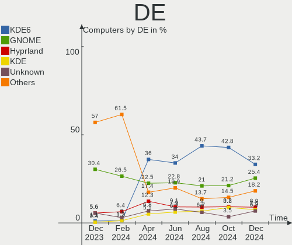
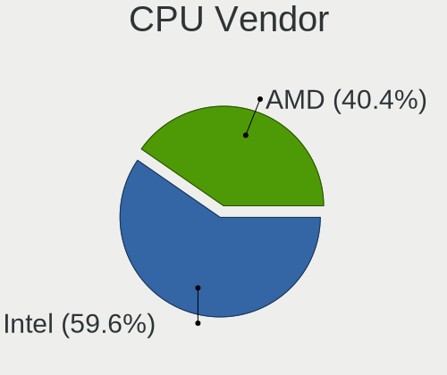

Arch - Hardware Trends
----------------------

A project to identify most popular hardware characteristics and track their change
over time based on data collected by Linux users at https://Linux-Hardware.org.

Anyone can contribute to this report by the [hw-probe](https://github.com/linuxhw/hw-probe) tool:

    sudo -E hw-probe -all -upload

This is a report for all computer types. See also reports for [desktops](/Dist/Arch/Desktop/README.md) and [notebooks](/Dist/Arch/Notebook/README.md).

This report is for one last month. Overall report since the beginning of time: [TestDays](https://github.com/linuxhw/TestDays)

Period: Jul, 2023.

Contents
--------

* [ System ](#system)
  - [ OS                       ](#os)
  - [ OS Family                ](#os-family)
  - [ Kernel                   ](#kernel)
  - [ Kernel Family            ](#kernel-family)
  - [ Kernel Major Ver.        ](#kernel-major-ver)
  - [ Arch                     ](#arch)
  - [ DE                       ](#de)
  - [ Display Server           ](#display-server)
  - [ Display Manager          ](#display-manager)
  - [ OS Lang                  ](#os-lang)
  - [ Boot Mode                ](#boot-mode)
  - [ Filesystem               ](#filesystem)
  - [ Part. scheme             ](#part-scheme)
  - [ Dual Boot with Linux/BSD ](#dual-boot-with-linuxbsd)
  - [ Dual Boot (Win)          ](#dual-boot-win)

* [ Board ](#board)
  - [ Vendor                   ](#vendor)
  - [ Model                    ](#model)
  - [ Model Family             ](#model-family)
  - [ MFG Year                 ](#mfg-year)
  - [ Form Factor              ](#form-factor)
  - [ Secure Boot              ](#secure-boot)
  - [ Coreboot                 ](#coreboot)
  - [ RAM Size                 ](#ram-size)
  - [ RAM Used                 ](#ram-used)
  - [ Total Drives             ](#total-drives)
  - [ Has CD-ROM               ](#has-cd-rom)
  - [ Has Ethernet             ](#has-ethernet)
  - [ Has WiFi                 ](#has-wifi)
  - [ Has Bluetooth            ](#has-bluetooth)

* [ Location ](#location)
  - [ Country                  ](#country)
  - [ City                     ](#city)

* [ Drives ](#drives)
  - [ Drive Vendor             ](#drive-vendor)
  - [ Drive Model              ](#drive-model)
  - [ HDD Vendor               ](#hdd-vendor)
  - [ SSD Vendor               ](#ssd-vendor)
  - [ Drive Kind               ](#drive-kind)
  - [ Drive Connector          ](#drive-connector)
  - [ Drive Size               ](#drive-size)
  - [ Space Total              ](#space-total)
  - [ Space Used               ](#space-used)
  - [ Malfunc. Drives          ](#malfunc-drives)
  - [ Malfunc. Drive Vendor    ](#malfunc-drive-vendor)
  - [ Malfunc. HDD Vendor      ](#malfunc-hdd-vendor)
  - [ Malfunc. Drive Kind      ](#malfunc-drive-kind)
  - [ Failed Drives            ](#failed-drives)
  - [ Failed Drive Vendor      ](#failed-drive-vendor)
  - [ Drive Status             ](#drive-status)

* [ Storage controller ](#storage-controller)
  - [ Storage Vendor           ](#storage-vendor)
  - [ Storage Model            ](#storage-model)
  - [ Storage Kind             ](#storage-kind)

* [ Processor ](#processor)
  - [ CPU Vendor               ](#cpu-vendor)
  - [ CPU Model                ](#cpu-model)
  - [ CPU Model Family         ](#cpu-model-family)
  - [ CPU Cores                ](#cpu-cores)
  - [ CPU Sockets              ](#cpu-sockets)
  - [ CPU Threads              ](#cpu-threads)
  - [ CPU Op-Modes             ](#cpu-op-modes)
  - [ CPU Microcode            ](#cpu-microcode)
  - [ CPU Microarch            ](#cpu-microarch)

* [ Graphics ](#graphics)
  - [ GPU Vendor               ](#gpu-vendor)
  - [ GPU Model                ](#gpu-model)
  - [ GPU Combo                ](#gpu-combo)
  - [ GPU Driver               ](#gpu-driver)
  - [ GPU Memory               ](#gpu-memory)

* [ Monitor ](#monitor)
  - [ Monitor Vendor           ](#monitor-vendor)
  - [ Monitor Model            ](#monitor-model)
  - [ Monitor Resolution       ](#monitor-resolution)
  - [ Monitor Diagonal         ](#monitor-diagonal)
  - [ Monitor Width            ](#monitor-width)
  - [ Aspect Ratio             ](#aspect-ratio)
  - [ Monitor Area             ](#monitor-area)
  - [ Pixel Density            ](#pixel-density)
  - [ Multiple Monitors        ](#multiple-monitors)

* [ Network ](#network)
  - [ Net Controller Vendor    ](#net-controller-vendor)
  - [ Net Controller Model     ](#net-controller-model)
  - [ Wireless Vendor          ](#wireless-vendor)
  - [ Wireless Model           ](#wireless-model)
  - [ Ethernet Vendor          ](#ethernet-vendor)
  - [ Ethernet Model           ](#ethernet-model)
  - [ Net Controller Kind      ](#net-controller-kind)
  - [ Used Controller          ](#used-controller)
  - [ NICs                     ](#nics)
  - [ IPv6                     ](#ipv6)

* [ Bluetooth ](#bluetooth)
  - [ Bluetooth Vendor         ](#bluetooth-vendor)
  - [ Bluetooth Model          ](#bluetooth-model)

* [ Sound ](#sound)
  - [ Sound Vendor             ](#sound-vendor)
  - [ Sound Model              ](#sound-model)

* [ Memory ](#memory)
  - [ Memory Vendor            ](#memory-vendor)
  - [ Memory Model             ](#memory-model)
  - [ Memory Kind              ](#memory-kind)
  - [ Memory Form Factor       ](#memory-form-factor)
  - [ Memory Size              ](#memory-size)
  - [ Memory Speed             ](#memory-speed)

* [ Printers & scanners ](#printers--scanners)
  - [ Printer Vendor           ](#printer-vendor)
  - [ Printer Model            ](#printer-model)
  - [ Scanner Vendor           ](#scanner-vendor)
  - [ Scanner Model            ](#scanner-model)

* [ Camera ](#camera)
  - [ Camera Vendor            ](#camera-vendor)
  - [ Camera Model             ](#camera-model)

* [ Security ](#security)
  - [ Fingerprint Vendor       ](#fingerprint-vendor)
  - [ Fingerprint Model        ](#fingerprint-model)
  - [ Chipcard Vendor          ](#chipcard-vendor)
  - [ Chipcard Model           ](#chipcard-model)

* [ Unsupported ](#unsupported)
  - [ Unsupported Devices      ](#unsupported-devices)
  - [ Unsupported Device Types ](#unsupported-device-types)

System
------

OS
--

Installed operating systems

| Name         | Computers | Percent |
|--------------|-----------|---------|
| Arch Rolling | 223       | 99.55%  |
| Arch 23.0.0  | 1         | 0.45%   |

OS Family
---------

OS without a version

| Name | Computers | Percent |
|------|-----------|---------|
| Arch | 224       | 100%    |

Kernel
------

Version of the Linux kernel

| Version                    | Computers | Percent |
|----------------------------|-----------|---------|
| 6.4.2-arch1-1              | 21        | 9.38%   |
| 6.3.9-arch1-1              | 21        | 9.38%   |
| 6.4.3-arch1-2              | 20        | 8.93%   |
| 6.4.4-arch1-1              | 19        | 8.48%   |
| 6.4.3-arch1-1              | 18        | 8.04%   |
| 6.4.1-arch2-1              | 18        | 8.04%   |
| 6.4.1-arch1-1              | 12        | 5.36%   |
| 6.4.6-arch1-1              | 9         | 4.02%   |
| 6.1.39-1-lts               | 9         | 4.02%   |
| 6.4.7-arch1-1              | 7         | 3.13%   |
| 6.4.3-zen1-2-zen           | 7         | 3.13%   |
| 6.4.2-zen1-1-zen           | 6         | 2.68%   |
| 6.1.38-1-lts               | 6         | 2.68%   |
| 6.4.1-zen1-1-zen           | 5         | 2.23%   |
| 6.4.5-arch1-1              | 4         | 1.79%   |
| 6.4.6-zen1-1-zen           | 3         | 1.34%   |
| 6.4.3-zen1-1-zen           | 3         | 1.34%   |
| 6.3.9-zen1-1-zen           | 3         | 1.34%   |
| 6.4.6-arch1-1-g14          | 2         | 0.89%   |
| 6.4.4-zen1-1-zen           | 2         | 0.89%   |
| 6.1.38-2-lts               | 2         | 0.89%   |
| 6.0.12-arch1-1             | 2         | 0.89%   |
| 6.5.0-rc2-2-cachyos-rc     | 1         | 0.45%   |
| 6.5.0-rc1-1-mainline       | 1         | 0.45%   |
| 6.4.6-hardened1-1-hardened | 1         | 0.45%   |
| 6.4.5-alderlake-xanmod1-1  | 1         | 0.45%   |
| 6.4.4-hardened1-1-hardened | 1         | 0.45%   |
| 6.4.3-zen1-1.1-zen         | 1         | 0.45%   |
| 6.4.3-hardened1-1-hardened | 1         | 0.45%   |
| 6.4.3-1-cachyos            | 1         | 0.45%   |
| 6.4.2-x64v3-xanmod1        | 1         | 0.45%   |
| 6.4.2-x64v2-xanmod1-3      | 1         | 0.45%   |
| 6.4.2-arch1-1-surface      | 1         | 0.45%   |
| 6.4.2-arch1-1-custom       | 1         | 0.45%   |
| 6.4.2-3-MANJARO            | 1         | 0.45%   |
| 6.4.2-1-clear              | 1         | 0.45%   |
| 6.4.1-zen2-1-zen           | 1         | 0.45%   |
| 6.4.1-arch1-1-custom       | 1         | 0.45%   |
| 6.4.0-arch1-1              | 1         | 0.45%   |
| 6.3.8-arch1-1              | 1         | 0.45%   |

Kernel Family
-------------

Linux kernel without a distro release

| Version | Computers | Percent |
|---------|-----------|---------|
| 6.4.3   | 51        | 22.77%  |
| 6.4.1   | 37        | 16.52%  |
| 6.4.2   | 33        | 14.73%  |
| 6.3.9   | 24        | 10.71%  |
| 6.4.4   | 22        | 9.82%   |
| 6.4.6   | 15        | 6.7%    |
| 6.1.39  | 9         | 4.02%   |
| 6.1.38  | 8         | 3.57%   |
| 6.4.7   | 7         | 3.13%   |
| 6.4.5   | 5         | 2.23%   |
| 6.5.0   | 2         | 0.89%   |
| 6.0.12  | 2         | 0.89%   |
| 6.4.0   | 1         | 0.45%   |
| 6.3.8   | 1         | 0.45%   |
| 6.3.6   | 1         | 0.45%   |
| 6.3.5   | 1         | 0.45%   |
| 6.3.4   | 1         | 0.45%   |
| 6.1.36  | 1         | 0.45%   |
| 6.1.1   | 1         | 0.45%   |
| 5.17.9  | 1         | 0.45%   |
| 5.10.54 | 1         | 0.45%   |

Kernel Major Ver.
-----------------

Linux kernel major version

| Version | Computers | Percent |
|---------|-----------|---------|
| 6.4     | 171       | 76.34%  |
| 6.3     | 28        | 12.5%   |
| 6.1     | 19        | 8.48%   |
| 6.5     | 2         | 0.89%   |
| 6.0     | 2         | 0.89%   |
| 5.17    | 1         | 0.45%   |
| 5.10    | 1         | 0.45%   |

Arch
----

OS architecture (x86_64, i586, etc.)

| Name   | Computers | Percent |
|--------|-----------|---------|
| x86_64 | 224       | 100%    |

DE
--

Desktop Environment

| Name          | Computers | Percent |
|---------------|-----------|---------|
| KDE5          | 96        | 42.86%  |
| GNOME         | 53        | 23.66%  |
| XFCE          | 23        | 10.27%  |
| Unknown       | 20        | 8.93%   |
| Hyprland      | 8         | 3.57%   |
| i3            | 5         | 2.23%   |
| X-Cinnamon    | 2         | 0.89%   |
| sway          | 2         | 0.89%   |
| MATE          | 2         | 0.89%   |
| GNOME-Classic | 2         | 0.89%   |
| GNOME Classic | 2         | 0.89%   |
| openbox       | 1         | 0.45%   |
| LXQT          | 1         | 0.45%   |
| LXDE          | 1         | 0.45%   |
| LeftWM        | 1         | 0.45%   |
| KDE           | 1         | 0.45%   |
| Enlightenment | 1         | 0.45%   |
| Deepin        | 1         | 0.45%   |
| bspwm         | 1         | 0.45%   |
| awesome       | 1         | 0.45%   |

Display Server
--------------

X11 or Wayland

| Name    | Computers | Percent |
|---------|-----------|---------|
| X11     | 114       | 50.89%  |
| Wayland | 73        | 32.59%  |
| Tty     | 19        | 8.48%   |
| Unknown | 18        | 8.04%   |

Display Manager
---------------

SDDM, LightDM, etc.

| Name    | Computers | Percent |
|---------|-----------|---------|
| Unknown | 94        | 41.96%  |
| SDDM    | 68        | 30.36%  |
| LightDM | 30        | 13.39%  |
| GDM     | 24        | 10.71%  |
| LY-DM   | 4         | 1.79%   |
| Ly      | 2         | 0.89%   |
| NODM    | 1         | 0.45%   |
| GREETD  | 1         | 0.45%   |

OS Lang
-------

Language

| Lang    | Computers | Percent |
|---------|-----------|---------|
| en_US   | 122       | 54.46%  |
| ru_RU   | 15        | 6.7%    |
| en_gb   | 13        | 5.8%    |
| pt_BR   | 9         | 4.02%   |
| C       | 9         | 4.02%   |
| Unknown | 7         | 3.13%   |
| de_DE   | 6         | 2.68%   |
| zh_CN   | 5         | 2.23%   |
| it_IT   | 5         | 2.23%   |
| en_DE   | 5         | 2.23%   |
| fr_FR   | 4         | 1.79%   |
| en_CA   | 4         | 1.79%   |
| es_ES   | 3         | 1.34%   |
| pl_PL   | 2         | 0.89%   |
| ja_JP   | 1         | 0.45%   |
| fr_CA   | 1         | 0.45%   |
| fi_FI   | 1         | 0.45%   |
| es_MX   | 1         | 0.45%   |
| es_GT   | 1         | 0.45%   |
| es_CL   | 1         | 0.45%   |
| es_BO   | 1         | 0.45%   |
| es_AR   | 1         | 0.45%   |
| en_ZA   | 1         | 0.45%   |
| en_NL   | 1         | 0.45%   |
| en_IN   | 1         | 0.45%   |
| en_IE   | 1         | 0.45%   |
| en_HK   | 1         | 0.45%   |
| en_AU   | 1         | 0.45%   |
| enGB    | 1         | 0.45%   |

Boot Mode
---------

EFI or BIOS

| Mode | Computers | Percent |
|------|-----------|---------|
| EFI  | 138       | 61.61%  |
| BIOS | 86        | 38.39%  |

Filesystem
----------

Type of filesystem

| Type    | Computers | Percent |
|---------|-----------|---------|
| Ext4    | 133       | 59.38%  |
| Btrfs   | 74        | 33.04%  |
| Overlay | 11        | 4.91%   |
| Xfs     | 2         | 0.89%   |
| Tmpfs   | 2         | 0.89%   |
| Jfs     | 1         | 0.45%   |
| F2fs    | 1         | 0.45%   |

Part. scheme
------------

Scheme of partitioning

| Type    | Computers | Percent |
|---------|-----------|---------|
| GPT     | 146       | 65.18%  |
| Unknown | 64        | 28.57%  |
| MBR     | 14        | 6.25%   |

Dual Boot with Linux/BSD
------------------------

Hosting more than one Linux/BSD

| Dual boot | Computers | Percent |
|-----------|-----------|---------|
| No        | 197       | 87.95%  |
| Yes       | 27        | 12.05%  |

Dual Boot (Win)
---------------

Hosting Linux and Windows

| Dual boot | Computers | Percent |
|-----------|-----------|---------|
| No        | 151       | 67.41%  |
| Yes       | 73        | 32.59%  |

Board
-----

Vendor
------

Motherboard manufacturer

| Name                   | Computers | Percent |
|------------------------|-----------|---------|
| ASUSTek Computer       | 55        | 24.55%  |
| Lenovo                 | 42        | 18.75%  |
| Hewlett-Packard        | 23        | 10.27%  |
| Dell                   | 17        | 7.59%   |
| MSI                    | 16        | 7.14%   |
| Gigabyte Technology    | 12        | 5.36%   |
| Acer                   | 10        | 4.46%   |
| ASRock                 | 9         | 4.02%   |
| HUAWEI                 | 5         | 2.23%   |
| Apple                  | 5         | 2.23%   |
| Microsoft              | 3         | 1.34%   |
| XIAOMI                 | 2         | 0.89%   |
| TUXEDO                 | 2         | 0.89%   |
| Pegatron               | 2         | 0.89%   |
| Timi                   | 1         | 0.45%   |
| Razer                  | 1         | 0.45%   |
| Purism                 | 1         | 0.45%   |
| Positivo               | 1         | 0.45%   |
| Panasonic              | 1         | 0.45%   |
| ONDA                   | 1         | 0.45%   |
| Medion                 | 1         | 0.45%   |
| MECHREVO               | 1         | 0.45%   |
| Lex BayTrail           | 1         | 0.45%   |
| Infinix                | 1         | 0.45%   |
| Huanan                 | 1         | 0.45%   |
| Google                 | 1         | 0.45%   |
| Fujitsu                | 1         | 0.45%   |
| Framework              | 1         | 0.45%   |
| ECS                    | 1         | 0.45%   |
| Biostar                | 1         | 0.45%   |
| AZW                    | 1         | 0.45%   |
| AYANEO                 | 1         | 0.45%   |
| Avell High Performance | 1         | 0.45%   |
| ASRockRack             | 1         | 0.45%   |
| Unknown                | 1         | 0.45%   |

Model
-----

Motherboard model

| Name                                  | Computers | Percent |
|---------------------------------------|-----------|---------|
| XIAOMI Redmi Book Pro 15 2023         | 2         | 0.89%   |
| MSI MS-7C37                           | 2         | 0.89%   |
| Gigabyte Z390 AORUS PRO               | 2         | 0.89%   |
| ASUS ROG Zephyrus G15 GA503QM_GA503QM | 2         | 0.89%   |
| ASUS All Series                       | 2         | 0.89%   |
| ASRock B450M Pro4                     | 2         | 0.89%   |
| Apple MacBookPro11,2                  | 2         | 0.89%   |
| TUXEDO Pulse 15 Gen1                  | 1         | 0.45%   |
| TUXEDO Aura 15 Gen1                   | 1         | 0.45%   |
| Timi Mi NoteBook Ultra                | 1         | 0.45%   |
| Razer Blade                           | 1         | 0.45%   |
| Purism Librem 14                      | 1         | 0.45%   |
| Positivo POS-PIG43BC                  | 1         | 0.45%   |
| Pegatron p2-1113w                     | 1         | 0.45%   |
| Pegatron 320-1030                     | 1         | 0.45%   |
| Panasonic CFSZ5-3                     | 1         | 0.45%   |
| ONDA A320SD4-ITX Ver:2.00             | 1         | 0.45%   |
| MSI Raider GE78HX 13VI                | 1         | 0.45%   |
| MSI MS-7D75                           | 1         | 0.45%   |
| MSI MS-7D53                           | 1         | 0.45%   |
| MSI MS-7D09                           | 1         | 0.45%   |
| MSI MS-7C91                           | 1         | 0.45%   |
| MSI MS-7C75                           | 1         | 0.45%   |
| MSI MS-7C56                           | 1         | 0.45%   |
| MSI MS-7C02                           | 1         | 0.45%   |
| MSI MS-7B93                           | 1         | 0.45%   |
| MSI MS-7B89                           | 1         | 0.45%   |
| MSI MS-7A15                           | 1         | 0.45%   |
| MSI MS-7971                           | 1         | 0.45%   |
| MSI MS-7721                           | 1         | 0.45%   |
| MSI MS-7592                           | 1         | 0.45%   |
| Microsoft Surface Pro 4               | 1         | 0.45%   |
| Microsoft Surface Pro 3               | 1         | 0.45%   |
| Microsoft Surface Pro                 | 1         | 0.45%   |
| Medion Erazer P7643 MD60299           | 1         | 0.45%   |
| MECHREVO F7BFD V1.0                   | 1         | 0.45%   |
| Lex BayTrail 2I380D                   | 1         | 0.45%   |
| Lenovo ThinkPad Yoga 370 20JJS1M111   | 1         | 0.45%   |
| Lenovo ThinkPad X390 20SDA018CD       | 1         | 0.45%   |
| Lenovo ThinkPad X260 20F5S4NR00       | 1         | 0.45%   |

Model Family
------------

Motherboard model prefix

| Name                 | Computers | Percent |
|----------------------|-----------|---------|
| Lenovo ThinkPad      | 21        | 9.38%   |
| ASUS ROG             | 15        | 6.7%    |
| Lenovo IdeaPad       | 9         | 4.02%   |
| ASUS PRIME           | 8         | 3.57%   |
| HP Pavilion          | 7         | 3.13%   |
| ASUS VivoBook        | 7         | 3.13%   |
| ASUS ZenBook         | 6         | 2.68%   |
| ASUS TUF             | 6         | 2.68%   |
| Dell Latitude        | 5         | 2.23%   |
| Acer Aspire          | 5         | 2.23%   |
| HP EliteBook         | 4         | 1.79%   |
| Dell Inspiron        | 4         | 1.79%   |
| Microsoft Surface    | 3         | 1.34%   |
| Lenovo ThinkCentre   | 3         | 1.34%   |
| Lenovo Legion        | 3         | 1.34%   |
| HP ProBook           | 3         | 1.34%   |
| HP ENVY              | 3         | 1.34%   |
| Dell OptiPlex        | 3         | 1.34%   |
| Apple MacBookPro11   | 3         | 1.34%   |
| XIAOMI Redmi         | 2         | 0.89%   |
| MSI MS-7C37          | 2         | 0.89%   |
| Gigabyte Z390        | 2         | 0.89%   |
| Gigabyte B450        | 2         | 0.89%   |
| Dell XPS             | 2         | 0.89%   |
| ASUS ASUS            | 2         | 0.89%   |
| ASUS All             | 2         | 0.89%   |
| ASRock B450M         | 2         | 0.89%   |
| Acer Nitro           | 2         | 0.89%   |
| TUXEDO Pulse         | 1         | 0.45%   |
| TUXEDO Aura          | 1         | 0.45%   |
| Timi Mi              | 1         | 0.45%   |
| Razer Blade          | 1         | 0.45%   |
| Purism Librem        | 1         | 0.45%   |
| Positivo POS-PIG43BC | 1         | 0.45%   |
| Pegatron p2-1113w    | 1         | 0.45%   |
| Pegatron 320-1030    | 1         | 0.45%   |
| Panasonic CFSZ5-3    | 1         | 0.45%   |
| ONDA A320SD4-ITX     | 1         | 0.45%   |
| MSI Raider           | 1         | 0.45%   |
| MSI MS-7D75          | 1         | 0.45%   |

MFG Year
--------

Motherboard manufacture year

| Year | Computers | Percent |
|------|-----------|---------|
| 2022 | 29        | 12.95%  |
| 2021 | 29        | 12.95%  |
| 2020 | 26        | 11.61%  |
| 2019 | 26        | 11.61%  |
| 2018 | 23        | 10.27%  |
| 2023 | 15        | 6.7%    |
| 2017 | 12        | 5.36%   |
| 2016 | 12        | 5.36%   |
| 2011 | 12        | 5.36%   |
| 2013 | 11        | 4.91%   |
| 2015 | 10        | 4.46%   |
| 2014 | 6         | 2.68%   |
| 2012 | 5         | 2.23%   |
| 2010 | 4         | 1.79%   |
| 2009 | 2         | 0.89%   |
| 2008 | 1         | 0.45%   |
| 2007 | 1         | 0.45%   |

Form Factor
-----------

Physical design of the computer

| Name        | Computers | Percent |
|-------------|-----------|---------|
| Notebook    | 122       | 54.46%  |
| Desktop     | 86        | 38.39%  |
| Convertible | 11        | 4.91%   |
| Tablet      | 5         | 2.23%   |

Secure Boot
-----------

Enabled or disabled

| State    | Computers | Percent |
|----------|-----------|---------|
| Disabled | 217       | 96.88%  |
| Enabled  | 7         | 3.13%   |

Coreboot
--------

Have coreboot on board

| Used | Computers | Percent |
|------|-----------|---------|
| No   | 222       | 99.11%  |
| Yes  | 2         | 0.89%   |

RAM Size
--------

Total RAM memory

| Size in GB  | Computers | Percent |
|-------------|-----------|---------|
| 16.01-24.0  | 67        | 29.91%  |
| 4.01-8.0    | 44        | 19.64%  |
| 8.01-16.0   | 43        | 19.2%   |
| 32.01-64.0  | 31        | 13.84%  |
| 3.01-4.0    | 12        | 5.36%   |
| 24.01-32.0  | 12        | 5.36%   |
| 64.01-256.0 | 11        | 4.91%   |
| 1.01-2.0    | 3         | 1.34%   |
| 0.51-1.0    | 1         | 0.45%   |

RAM Used
--------

Used RAM memory

| Used GB    | Computers | Percent |
|------------|-----------|---------|
| 4.01-8.0   | 65        | 29.02%  |
| 2.01-3.0   | 50        | 22.32%  |
| 3.01-4.0   | 39        | 17.41%  |
| 1.01-2.0   | 32        | 14.29%  |
| 8.01-16.0  | 22        | 9.82%   |
| 0.51-1.0   | 7         | 3.13%   |
| 0.01-0.5   | 6         | 2.68%   |
| 16.01-24.0 | 3         | 1.34%   |

Total Drives
------------

Number of drives on board

| Drives | Computers | Percent |
|--------|-----------|---------|
| 1      | 119       | 53.13%  |
| 2      | 55        | 24.55%  |
| 3      | 24        | 10.71%  |
| 5      | 11        | 4.91%   |
| 4      | 8         | 3.57%   |
| 7      | 4         | 1.79%   |
| 6      | 3         | 1.34%   |

Has CD-ROM
----------

Has CD-ROM on board

| Presented | Computers | Percent |
|-----------|-----------|---------|
| No        | 192       | 85.71%  |
| Yes       | 32        | 14.29%  |

Has Ethernet
------------

Has Ethernet on board

| Presented | Computers | Percent |
|-----------|-----------|---------|
| Yes       | 178       | 79.46%  |
| No        | 46        | 20.54%  |

Has WiFi
--------

Has WiFi module

| Presented | Computers | Percent |
|-----------|-----------|---------|
| Yes       | 182       | 81.25%  |
| No        | 42        | 18.75%  |

Has Bluetooth
-------------

Has Bluetooth module

| Presented | Computers | Percent |
|-----------|-----------|---------|
| Yes       | 170       | 75.89%  |
| No        | 54        | 24.11%  |

Location
--------

Country
-------

Geographic location (country)

| Country      | Computers | Percent |
|--------------|-----------|---------|
| USA          | 35        | 15.63%  |
| Russia       | 26        | 11.61%  |
| Germany      | 23        | 10.27%  |
| Brazil       | 15        | 6.7%    |
| UK           | 12        | 5.36%   |
| Canada       | 10        | 4.46%   |
| China        | 9         | 4.02%   |
| Poland       | 8         | 3.57%   |
| Italy        | 7         | 3.13%   |
| Hong Kong    | 7         | 3.13%   |
| France       | 6         | 2.68%   |
| Sweden       | 5         | 2.23%   |
| India        | 5         | 2.23%   |
| Netherlands  | 4         | 1.79%   |
| Turkey       | 3         | 1.34%   |
| Iran         | 3         | 1.34%   |
| Denmark      | 3         | 1.34%   |
| Chile        | 3         | 1.34%   |
| Australia    | 3         | 1.34%   |
| Spain        | 2         | 0.89%   |
| Mexico       | 2         | 0.89%   |
| Malaysia     | 2         | 0.89%   |
| Japan        | 2         | 0.89%   |
| Hungary      | 2         | 0.89%   |
| Finland      | 2         | 0.89%   |
| Austria      | 2         | 0.89%   |
| Vietnam      | 1         | 0.45%   |
| Venezuela    | 1         | 0.45%   |
| Uzbekistan   | 1         | 0.45%   |
| Uruguay      | 1         | 0.45%   |
| Switzerland  | 1         | 0.45%   |
| Sri Lanka    | 1         | 0.45%   |
| South Africa | 1         | 0.45%   |
| Singapore    | 1         | 0.45%   |
| Saudi Arabia | 1         | 0.45%   |
| Philippines  | 1         | 0.45%   |
| Peru         | 1         | 0.45%   |
| Norway       | 1         | 0.45%   |
| Moldova      | 1         | 0.45%   |
| Kenya        | 1         | 0.45%   |

City
----

Geographic location (city)

| City          | Computers | Percent |
|---------------|-----------|---------|
| Berlin        | 9         | 4.02%   |
| St Petersburg | 5         | 2.23%   |
| Moscow        | 5         | 2.23%   |
| Central       | 5         | 2.23%   |
| Warsaw        | 4         | 1.79%   |
| Volgograd     | 3         | 1.34%   |
| Chengdu       | 3         | 1.34%   |
| Zhongba       | 2         | 0.89%   |
| Wanchai       | 2         | 0.89%   |
| Valencia      | 2         | 0.89%   |
| Tehran        | 2         | 0.89%   |
| Sydney        | 2         | 0.89%   |
| Sao Paulo     | 2         | 0.89%   |
| Philadelphia  | 2         | 0.89%   |
| Osnabrück    | 2         | 0.89%   |
| Malmo         | 2         | 0.89%   |
| London        | 2         | 0.89%   |
| Las Vegas     | 2         | 0.89%   |
| Langen        | 2         | 0.89%   |
| Kuala Lumpur  | 2         | 0.89%   |
| Delhi         | 2         | 0.89%   |
| Athens        | 2         | 0.89%   |
| Ankara        | 2         | 0.89%   |
| Łomża       | 1         | 0.45%   |
| Zaraysk       | 1         | 0.45%   |
| Zabrowo       | 1         | 0.45%   |
| Yogyakarta    | 1         | 0.45%   |
| Xiamen        | 1         | 0.45%   |
| Waynesville   | 1         | 0.45%   |
| Wandsworth    | 1         | 0.45%   |
| Wallingford   | 1         | 0.45%   |
| Viña del Mar | 1         | 0.45%   |
| Vienna        | 1         | 0.45%   |
| Vejle         | 1         | 0.45%   |
| Varsta        | 1         | 0.45%   |
| Vancouver     | 1         | 0.45%   |
| Uberlândia   | 1         | 0.45%   |
| Toledo        | 1         | 0.45%   |
| Tokyo         | 1         | 0.45%   |
| Thornhill     | 1         | 0.45%   |

Drives
------

Drive Vendor
------------

Hard drive vendors

| Vendor                       | Computers | Drives | Percent |
|------------------------------|-----------|--------|---------|
| Samsung Electronics          | 73        | 91     | 19.84%  |
| Seagate                      | 37        | 47     | 10.05%  |
| WDC                          | 36        | 54     | 9.78%   |
| SanDisk                      | 30        | 33     | 8.15%   |
| Kingston                     | 23        | 26     | 6.25%   |
| Intel                        | 17        | 23     | 4.62%   |
| Toshiba                      | 16        | 18     | 4.35%   |
| Micron Technology            | 12        | 12     | 3.26%   |
| SK hynix                     | 11        | 12     | 2.99%   |
| Silicon Motion               | 8         | 8      | 2.17%   |
| Crucial                      | 8         | 8      | 2.17%   |
| KIOXIA                       | 7         | 8      | 1.9%    |
| Kingston Technology Company  | 6         | 6      | 1.63%   |
| ADATA Technology             | 6         | 6      | 1.63%   |
| Yangtze Memory Technologies  | 5         | 5      | 1.36%   |
| Phison Electronics           | 5         | 5      | 1.36%   |
| Micron/Crucial Technology    | 5         | 5      | 1.36%   |
| HGST                         | 5         | 5      | 1.36%   |
| A-DATA Technology            | 5         | 5      | 1.36%   |
| China                        | 4         | 4      | 1.09%   |
| Hitachi                      | 3         | 4      | 0.82%   |
| Apple                        | 3         | 4      | 0.82%   |
| Unknown                      | 2         | 2      | 0.54%   |
| Intenso                      | 2         | 2      | 0.54%   |
| GOODRAM                      | 2         | 2      | 0.54%   |
| Unknown                      | 2         | 2      | 0.54%   |
| ZHITAI                       | 1         | 2      | 0.27%   |
| USB3.0                       | 1         | 1      | 0.27%   |
| Transcend                    | 1         | 1      | 0.27%   |
| TO Exter                     | 1         | 1      | 0.27%   |
| SSSTC                        | 1         | 1      | 0.27%   |
| SSK                          | 1         | 1      | 0.27%   |
| SPCC                         | 1         | 1      | 0.27%   |
| Shenzhen Longsys Electronics | 1         | 1      | 0.27%   |
| Seagate Technology           | 1         | 1      | 0.27%   |
| SAGE                         | 1         | 1      | 0.27%   |
| SABRENT                      | 1         | 1      | 0.27%   |
| Realtek Semiconductor        | 1         | 1      | 0.27%   |
| Realtek                      | 1         | 1      | 0.27%   |
| Phison                       | 1         | 1      | 0.27%   |

Drive Model
-----------

Hard drive models

| Model                                                              | Computers | Percent |
|--------------------------------------------------------------------|-----------|---------|
| Samsung NVMe SSD Controller SM981/PM981/PM983 500GB                | 24        | 5.87%   |
| Samsung NVMe SSD Controller PM9A1/PM9A3/980PRO 1TB                 | 11        | 2.69%   |
| Sandisk WD Black SN750 / PC SN730 NVMe SSD 1024GB                  | 8         | 1.96%   |
| ADATA XPG SX8200 Pro PCIe Gen3x4 M.2 2280 Solid State Drive 1024GB | 5         | 1.22%   |
| Silicon Motion SM2263EN/SM2263XT SSD Controller 500GB              | 4         | 0.98%   |
| Samsung SSD 850 EVO 250GB                                          | 4         | 0.98%   |
| Kingston SA400S37240G 240GB SSD                                    | 4         | 0.98%   |
| WDC WD10EZEX-08WN4A0 1TB                                           | 3         | 0.73%   |
| Toshiba XG6 NVMe SSD Controller 512GB                              | 3         | 0.73%   |
| Toshiba MQ01ABD100 1TB                                             | 3         | 0.73%   |
| Seagate ST1000LM035-1RK172 1TB                                     | 3         | 0.73%   |
| Seagate ST1000LM024 HN-M101MBB 1TB                                 | 3         | 0.73%   |
| Sandisk WD Blue SN550 NVMe SSD 250GB                               | 3         | 0.73%   |
| Sandisk WD Black 2018/SN750 / PC SN720 NVMe SSD 1TB                | 3         | 0.73%   |
| Samsung SSD 990 PRO 1TB                                            | 3         | 0.73%   |
| Samsung SSD 860 EVO 500GB                                          | 3         | 0.73%   |
| Samsung SSD 860 EVO 1TB                                            | 3         | 0.73%   |
| Phison E12 NVMe Controller 2TB                                     | 3         | 0.73%   |
| Micron/Crucial P2 NVMe PCIe SSD 1TB                                | 3         | 0.73%   |
| Kingston SA400S37480G 480GB SSD                                    | 3         | 0.73%   |
| Intel SSD 660P Series 1024GB                                       | 3         | 0.73%   |
| Intel SSD 600P Series 512GB                                        | 3         | 0.73%   |
| Crucial CT2000MX500SSD1 2TB                                        | 3         | 0.73%   |
| Yangtze Memory ZHITAI PC005 Active 512GB                           | 2         | 0.49%   |
| WDC WDS500G2B0A-00SM50 500GB SSD                                   | 2         | 0.49%   |
| WDC WD10EZEX-22MFCA0 1TB                                           | 2         | 0.49%   |
| WDC WD10EZEX-00BN5A0 1TB                                           | 2         | 0.49%   |
| Toshiba MQ04ABF100 1TB                                             | 2         | 0.49%   |
| Toshiba DT01ACA050 500GB                                           | 2         | 0.49%   |
| Toshiba BG3 NVMe SSD Controller 256GB                              | 2         | 0.49%   |
| SK hynix SKHynix_HFS512GDE9X084N 512GB                             | 2         | 0.49%   |
| SK hynix BC501 NVMe Solid State Drive 512GB                        | 2         | 0.49%   |
| Silicon Motion SM2262/SM2262EN SSD Controller 512GB                | 2         | 0.49%   |
| Seagate ST500DM002-1BD142 500GB                                    | 2         | 0.49%   |
| Seagate ST4000VN006-3CW104 4TB                                     | 2         | 0.49%   |
| Seagate ST4000DM004-2CV104 4TB                                     | 2         | 0.49%   |
| Seagate ST2000DM008-2FR102 2TB                                     | 2         | 0.49%   |
| Seagate ST2000DM001-1CH164 2TB                                     | 2         | 0.49%   |
| Sandisk WD Blue SN570 1TB                                          | 2         | 0.49%   |
| Sandisk WD Black SN850 1TB                                         | 2         | 0.49%   |

HDD Vendor
----------

Hard disk drive vendors

| Vendor              | Computers | Drives | Percent |
|---------------------|-----------|--------|---------|
| Seagate             | 36        | 46     | 38.3%   |
| WDC                 | 30        | 45     | 31.91%  |
| Toshiba             | 11        | 13     | 11.7%   |
| HGST                | 5         | 5      | 5.32%   |
| Hitachi             | 3         | 4      | 3.19%   |
| Samsung Electronics | 2         | 3      | 2.13%   |
| USB3.0              | 1         | 1      | 1.06%   |
| SSK                 | 1         | 1      | 1.06%   |
| Maxtor              | 1         | 1      | 1.06%   |
| Inateck             | 1         | 1      | 1.06%   |
| External            | 1         | 1      | 1.06%   |
| ACASIS              | 1         | 1      | 1.06%   |
| Unknown             | 1         | 1      | 1.06%   |

SSD Vendor
----------

Solid state drive vendors

| Vendor              | Computers | Drives | Percent |
|---------------------|-----------|--------|---------|
| Samsung Electronics | 27        | 31     | 25.96%  |
| Kingston            | 17        | 18     | 16.35%  |
| WDC                 | 8         | 9      | 7.69%   |
| Crucial             | 8         | 8      | 7.69%   |
| SanDisk             | 7         | 9      | 6.73%   |
| China               | 4         | 4      | 3.85%   |
| Micron Technology   | 3         | 3      | 2.88%   |
| Intel               | 3         | 6      | 2.88%   |
| A-DATA Technology   | 3         | 3      | 2.88%   |
| Intenso             | 2         | 2      | 1.92%   |
| GOODRAM             | 2         | 2      | 1.92%   |
| Apple               | 2         | 2      | 1.92%   |
| ZHITAI              | 1         | 2      | 0.96%   |
| Transcend           | 1         | 1      | 0.96%   |
| TO Exter            | 1         | 1      | 0.96%   |
| SSSTC               | 1         | 1      | 0.96%   |
| SPCC                | 1         | 1      | 0.96%   |
| SAGE                | 1         | 1      | 0.96%   |
| Phison              | 1         | 1      | 0.96%   |
| OCZ-VERTEX3         | 1         | 1      | 0.96%   |
| OCZ                 | 1         | 1      | 0.96%   |
| LITEONIT            | 1         | 1      | 0.96%   |
| LITEON              | 1         | 1      | 0.96%   |
| KIOXIA-EXCERIA      | 1         | 1      | 0.96%   |
| KingFast            | 1         | 1      | 0.96%   |
| Gigabyte Technology | 1         | 1      | 0.96%   |
| Geonix              | 1         | 1      | 0.96%   |
| Corsair             | 1         | 1      | 0.96%   |
| Biostar             | 1         | 1      | 0.96%   |
| Unknown             | 1         | 1      | 0.96%   |

Drive Kind
----------

HDD or SSD

| Kind    | Computers | Drives | Percent |
|---------|-----------|--------|---------|
| NVMe    | 145       | 187    | 46.18%  |
| SSD     | 88        | 116    | 28.03%  |
| HDD     | 74        | 123    | 23.57%  |
| Unknown | 5         | 5      | 1.59%   |
| MMC     | 2         | 2      | 0.64%   |

Drive Connector
---------------

SATA, SAS, NVMe, etc.

| Type | Computers | Drives | Percent |
|------|-----------|--------|---------|
| NVMe | 144       | 185    | 49.83%  |
| SATA | 125       | 226    | 43.25%  |
| SAS  | 18        | 20     | 6.23%   |
| MMC  | 2         | 2      | 0.69%   |

Drive Size
----------

Size of hard drive

| Size in TB | Computers | Drives | Percent |
|------------|-----------|--------|---------|
| 0.01-0.5   | 91        | 111    | 47.64%  |
| 0.51-1.0   | 56        | 72     | 29.32%  |
| 1.01-2.0   | 20        | 24     | 10.47%  |
| 3.01-4.0   | 9         | 14     | 4.71%   |
| 2.01-3.0   | 6         | 7      | 3.14%   |
| 4.01-10.0  | 5         | 6      | 2.62%   |
| 10.01-20.0 | 3         | 4      | 1.57%   |
| 20.01-50.0 | 1         | 1      | 0.52%   |

Space Total
-----------

Amount of disk space available on the file system

| Size in GB     | Computers | Percent |
|----------------|-----------|---------|
| 251-500        | 43        | 19.2%   |
| More than 3000 | 38        | 16.96%  |
| 101-250        | 37        | 16.52%  |
| 501-1000       | 37        | 16.52%  |
| 1001-2000      | 32        | 14.29%  |
| 2001-3000      | 15        | 6.7%    |
| 51-100         | 9         | 4.02%   |
| Unknown        | 7         | 3.13%   |
| 1-20           | 5         | 2.23%   |
| 21-50          | 1         | 0.45%   |

Space Used
----------

Amount of used disk space

| Used GB        | Computers | Percent |
|----------------|-----------|---------|
| 1-20           | 43        | 19.2%   |
| 101-250        | 37        | 16.52%  |
| 21-50          | 34        | 15.18%  |
| 251-500        | 23        | 10.27%  |
| 51-100         | 22        | 9.82%   |
| 501-1000       | 21        | 9.38%   |
| 1001-2000      | 15        | 6.7%    |
| More than 3000 | 14        | 6.25%   |
| 2001-3000      | 8         | 3.57%   |
| Unknown        | 7         | 3.13%   |

Malfunc. Drives
---------------

Drive models with a malfunction

| Model                                               | Computers | Drives | Percent |
|-----------------------------------------------------|-----------|--------|---------|
| WDC WD60EDAZ-11U78B0 6TB                            | 1         | 1      | 3.85%   |
| WDC WD5001AALS-00L3B2 500GB                         | 1         | 1      | 3.85%   |
| WDC WD5000AAKX-22ERMA0 500GB                        | 1         | 1      | 3.85%   |
| WDC WD40EJRX-89AKWY0 4TB                            | 1         | 3      | 3.85%   |
| WDC WD20EFRX-68EUZN0 2TB                            | 1         | 2      | 3.85%   |
| WDC WD20EARS-00MVWB0 2TB                            | 1         | 1      | 3.85%   |
| WDC WD10JPLX-00MBPT1 1TB                            | 1         | 2      | 3.85%   |
| WDC WD10EFRX-68PJCN0 1TB                            | 1         | 1      | 3.85%   |
| Toshiba MQ01ABD100 1TB                              | 1         | 1      | 3.85%   |
| TO Exter nal USB 3.0 1TB                            | 1         | 1      | 3.85%   |
| SSSTC CV8-8E128-HP 128GB SSD                        | 1         | 1      | 3.85%   |
| Seagate ST500DM002-1BD142 500GB                     | 1         | 1      | 3.85%   |
| Seagate ST33000651NS 3TB                            | 1         | 1      | 3.85%   |
| Seagate ST3000DM001-1CH166 3TB                      | 1         | 1      | 3.85%   |
| Seagate ST2000DL003-9VT166 2TB                      | 1         | 1      | 3.85%   |
| Seagate ST1000LM035-1RK172 1TB                      | 1         | 1      | 3.85%   |
| Seagate ST1000DM010-2EP102 1TB                      | 1         | 1      | 3.85%   |
| Seagate ST1000DM003-1SB102 1TB                      | 1         | 1      | 3.85%   |
| SanDisk SDSSDXPS480G 480GB                          | 1         | 1      | 3.85%   |
| Samsung Electronics HD503HI 500GB                   | 1         | 2      | 3.85%   |
| OCZ VERTEX3 120GB SSD                               | 1         | 1      | 3.85%   |
| Micron Technology MTFDDAV256TBN-1AR15ABHA 256GB SSD | 1         | 1      | 3.85%   |
| Kingston SKC400S371T 1TB SSD                        | 1         | 1      | 3.85%   |
| Intel SSD 600P Series 512GB                         | 1         | 1      | 3.85%   |
| Crucial CT240M500SSD1 240GB                         | 1         | 1      | 3.85%   |
| Corsair Force LS SSD 240GB                          | 1         | 1      | 3.85%   |

Malfunc. Drive Vendor
---------------------

Vendors of faulty drives

| Vendor              | Computers | Drives | Percent |
|---------------------|-----------|--------|---------|
| WDC                 | 7         | 12     | 28%     |
| Seagate             | 7         | 7      | 28%     |
| Toshiba             | 1         | 1      | 4%      |
| TO Exter            | 1         | 1      | 4%      |
| SSSTC               | 1         | 1      | 4%      |
| SanDisk             | 1         | 1      | 4%      |
| Samsung Electronics | 1         | 2      | 4%      |
| OCZ                 | 1         | 1      | 4%      |
| Micron Technology   | 1         | 1      | 4%      |
| Kingston            | 1         | 1      | 4%      |
| Intel               | 1         | 1      | 4%      |
| Crucial             | 1         | 1      | 4%      |
| Corsair             | 1         | 1      | 4%      |

Malfunc. HDD Vendor
-------------------

Vendors of faulty HDD drives

| Vendor              | Computers | Drives | Percent |
|---------------------|-----------|--------|---------|
| WDC                 | 7         | 12     | 43.75%  |
| Seagate             | 7         | 7      | 43.75%  |
| Toshiba             | 1         | 1      | 6.25%   |
| Samsung Electronics | 1         | 2      | 6.25%   |

Malfunc. Drive Kind
-------------------

Kinds of faulty drives

| Kind | Computers | Drives | Percent |
|------|-----------|--------|---------|
| HDD  | 14        | 22     | 60.87%  |
| SSD  | 8         | 8      | 34.78%  |
| NVMe | 1         | 1      | 4.35%   |

Failed Drives
-------------

Failed drive models

Zero info for selected period =(

Failed Drive Vendor
-------------------

Failed drive vendors

Zero info for selected period =(

Drive Status
------------

Number of failed and malfunc. drives

| Status   | Computers | Drives | Percent |
|----------|-----------|--------|---------|
| Works    | 135       | 243    | 53.57%  |
| Detected | 95        | 159    | 37.7%   |
| Malfunc  | 22        | 31     | 8.73%   |

Storage controller
------------------

Storage Vendor
--------------

Storage controller vendors

| Vendor                       | Computers | Percent |
|------------------------------|-----------|---------|
| Intel                        | 107       | 31.2%   |
| AMD                          | 66        | 19.24%  |
| Samsung Electronics          | 52        | 15.16%  |
| SanDisk                      | 23        | 6.71%   |
| Kingston Technology Company  | 13        | 3.79%   |
| SK hynix                     | 11        | 3.21%   |
| Micron Technology            | 9         | 2.62%   |
| ASMedia Technology           | 9         | 2.62%   |
| Silicon Motion               | 8         | 2.33%   |
| ADATA Technology             | 8         | 2.33%   |
| KIOXIA                       | 7         | 2.04%   |
| Yangtze Memory Technologies  | 5         | 1.46%   |
| Toshiba America Info Systems | 5         | 1.46%   |
| Phison Electronics           | 5         | 1.46%   |
| Micron/Crucial Technology    | 5         | 1.46%   |
| Shenzhen Longsys Electronics | 2         | 0.58%   |
| Marvell Technology Group     | 2         | 0.58%   |
| Seagate Technology           | 1         | 0.29%   |
| Realtek Semiconductor        | 1         | 0.29%   |
| MAXIO Technology (Hangzhou)  | 1         | 0.29%   |
| Lenovo                       | 1         | 0.29%   |
| JMicron Technology           | 1         | 0.29%   |
| Apple                        | 1         | 0.29%   |

Storage Model
-------------

Storage controller models

| Model                                                                          | Computers | Percent |
|--------------------------------------------------------------------------------|-----------|---------|
| AMD FCH SATA Controller [AHCI mode]                                            | 45        | 12.03%  |
| Samsung NVMe SSD Controller SM981/PM981/PM983                                  | 25        | 6.68%   |
| Samsung NVMe SSD Controller PM9A1/PM9A3/980PRO                                 | 12        | 3.21%   |
| AMD 400 Series Chipset SATA Controller                                         | 12        | 3.21%   |
| SanDisk WD Black SN750 / PC SN730 NVMe SSD                                     | 8         | 2.14%   |
| Intel Volume Management Device NVMe RAID Controller                            | 8         | 2.14%   |
| Intel Sunrise Point-LP SATA Controller [AHCI mode]                             | 8         | 2.14%   |
| Intel Q170/Q150/B150/H170/H110/Z170/CM236 Chipset SATA Controller [AHCI Mode]  | 8         | 2.14%   |
| Intel 8 Series/C220 Series Chipset Family 6-port SATA Controller 1 [AHCI mode] | 8         | 2.14%   |
| ASMedia ASM1062 Serial ATA Controller                                          | 8         | 2.14%   |
| SK hynix Gold P31/BC711/PC711 NVMe Solid State Drive                           | 7         | 1.87%   |
| Samsung NVMe SSD Controller 980                                                | 7         | 1.87%   |
| AMD 500 Series Chipset SATA Controller                                         | 6         | 1.6%    |
| Kingston Company KC3000/Renegade NVMe SSD                                      | 5         | 1.34%   |
| Intel SSD 670p Series [Keystone Harbor]                                        | 5         | 1.34%   |
| Intel 6 Series/C200 Series Chipset Family 6 port Mobile SATA AHCI Controller   | 5         | 1.34%   |
| AMD SB7x0/SB8x0/SB9x0 SATA Controller [AHCI mode]                              | 5         | 1.34%   |
| ADATA XPG SX8200 Pro PCIe Gen3x4 M.2 2280 Solid State Drive                    | 5         | 1.34%   |
| Silicon Motion SM2263EN/SM2263XT (DRAM-less) NVMe SSD Controllers              | 4         | 1.07%   |
| Samsung NVMe SSD Controller S4LV008[Pascal]                                    | 4         | 1.07%   |
| Intel HM170/QM170 Chipset SATA Controller [AHCI Mode]                          | 4         | 1.07%   |
| Intel Cannon Lake Mobile PCH SATA AHCI Controller                              | 4         | 1.07%   |
| Intel 8 Series SATA Controller 1 [AHCI mode]                                   | 4         | 1.07%   |
| Intel 7 Series/C210 Series Chipset Family 6-port SATA Controller [AHCI mode]   | 4         | 1.07%   |
| Intel 7 Series Chipset Family 6-port SATA Controller [AHCI mode]               | 4         | 1.07%   |
| Toshiba America Info Systems XG6 NVMe SSD Controller                           | 3         | 0.8%    |
| SanDisk WD Blue SN550 NVMe SSD                                                 | 3         | 0.8%    |
| SanDisk WD Black 2018/SN750 / PC SN720 NVMe SSD                                | 3         | 0.8%    |
| Phison E12 NVMe Controller                                                     | 3         | 0.8%    |
| Micron/Crucial P2 [Nick P2] / P3 / P3 Plus NVMe PCIe SSD (DRAM-less)           | 3         | 0.8%    |
| Micron 2450 NVMe SSD [HendrixV] (DRAM-less)                                    | 3         | 0.8%    |
| KIOXIA NVMe SSD Controller BG4 (DRAM-less)                                     | 3         | 0.8%    |
| Kingston Company Company Non-Volatile memory controller                        | 3         | 0.8%    |
| Intel Wildcat Point-LP SATA Controller [AHCI Mode]                             | 3         | 0.8%    |
| Intel Volume Management Device NVMe RAID Controller Intel Corporation          | 3         | 0.8%    |
| Intel Tiger Lake-LP SATA Controller                                            | 3         | 0.8%    |
| Intel SSD 660P Series                                                          | 3         | 0.8%    |
| Intel SSD 600P Series                                                          | 3         | 0.8%    |
| Intel SATA Controller [RAID mode]                                              | 3         | 0.8%    |
| Intel Comet Lake SATA AHCI Controller                                          | 3         | 0.8%    |

Storage Kind
------------

Kind of storage controller (IDE, SATA, NVMe, SAS, ...)

| Kind | Computers | Percent |
|------|-----------|---------|
| SATA | 150       | 47.17%  |
| NVMe | 144       | 45.28%  |
| RAID | 17        | 5.35%   |
| IDE  | 7         | 2.2%    |

Processor
---------

CPU Vendor
----------

Processor vendors

| Vendor | Computers | Percent |
|--------|-----------|---------|
| Intel  | 128       | 57.14%  |
| AMD    | 96        | 42.86%  |

CPU Model
---------

Processor models

| Model                                         | Computers | Percent |
|-----------------------------------------------|-----------|---------|
| Intel 11th Gen Core i5-1135G7 @ 2.40GHz       | 5         | 2.23%   |
| AMD Ryzen 5 5600H with Radeon Graphics        | 5         | 2.23%   |
| Intel Core i5-7300U CPU @ 2.60GHz             | 4         | 1.79%   |
| Intel 11th Gen Core i7-1165G7 @ 2.80GHz       | 4         | 1.79%   |
| AMD Ryzen 7 3700X 8-Core Processor            | 4         | 1.79%   |
| AMD Ryzen 5 3500U with Radeon Vega Mobile Gfx | 4         | 1.79%   |
| AMD Ryzen 9 5950X 16-Core Processor           | 3         | 1.34%   |
| AMD Ryzen 7 5800H with Radeon Graphics        | 3         | 1.34%   |
| AMD Ryzen 5 3400G with Radeon Vega Graphics   | 3         | 1.34%   |
| Intel Core i7-9750H CPU @ 2.60GHz             | 2         | 0.89%   |
| Intel Core i7-7700HQ CPU @ 2.80GHz            | 2         | 0.89%   |
| Intel Core i7-6700HQ CPU @ 2.60GHz            | 2         | 0.89%   |
| Intel Core i7-4770HQ CPU @ 2.20GHz            | 2         | 0.89%   |
| Intel Core i7-4702MQ CPU @ 2.20GHz            | 2         | 0.89%   |
| Intel Core i7-10750H CPU @ 2.60GHz            | 2         | 0.89%   |
| Intel Core i7-10510U CPU @ 1.80GHz            | 2         | 0.89%   |
| Intel Core i5-9400F CPU @ 2.90GHz             | 2         | 0.89%   |
| Intel Core i5-9300H CPU @ 2.40GHz             | 2         | 0.89%   |
| Intel Core i5-8250U CPU @ 1.60GHz             | 2         | 0.89%   |
| Intel Core i5-6300U CPU @ 2.40GHz             | 2         | 0.89%   |
| Intel Core i5-4570T CPU @ 2.90GHz             | 2         | 0.89%   |
| Intel Core i5-4300U CPU @ 1.90GHz             | 2         | 0.89%   |
| Intel Core i5-10300H CPU @ 2.50GHz            | 2         | 0.89%   |
| Intel Core i5-10210U CPU @ 1.60GHz            | 2         | 0.89%   |
| Intel Core 2 Quad CPU Q6600 @ 2.40GHz         | 2         | 0.89%   |
| Intel 13th Gen Core i7-13700KF                | 2         | 0.89%   |
| Intel 12th Gen Core i7-1260P                  | 2         | 0.89%   |
| AMD Ryzen 9 7950X 16-Core Processor           | 2         | 0.89%   |
| AMD Ryzen 9 5900X 12-Core Processor           | 2         | 0.89%   |
| AMD Ryzen 9 5900HX with Radeon Graphics       | 2         | 0.89%   |
| AMD Ryzen 7 7840HS w/ Radeon 780M Graphics    | 2         | 0.89%   |
| AMD Ryzen 7 7735HS with Radeon Graphics       | 2         | 0.89%   |
| AMD Ryzen 7 6800H with Radeon Graphics        | 2         | 0.89%   |
| AMD Ryzen 7 5700U with Radeon Graphics        | 2         | 0.89%   |
| AMD Ryzen 7 5700G with Radeon Graphics        | 2         | 0.89%   |
| AMD Ryzen 7 4700U with Radeon Graphics        | 2         | 0.89%   |
| AMD Ryzen 7 3800X 8-Core Processor            | 2         | 0.89%   |
| AMD Ryzen 5 5625U with Radeon Graphics        | 2         | 0.89%   |
| AMD Ryzen 5 5600G with Radeon Graphics        | 2         | 0.89%   |
| AMD Ryzen 5 4600H with Radeon Graphics        | 2         | 0.89%   |

CPU Model Family
----------------

Processor model prefix

| Model                  | Computers | Percent |
|------------------------|-----------|---------|
| Intel Core i7          | 41        | 18.3%   |
| Intel Core i5          | 40        | 17.86%  |
| AMD Ryzen 7            | 31        | 13.84%  |
| Other                  | 28        | 12.5%   |
| AMD Ryzen 5            | 28        | 12.5%   |
| AMD Ryzen 9            | 15        | 6.7%    |
| Intel Core i3          | 5         | 2.23%   |
| Intel Celeron          | 4         | 1.79%   |
| AMD Ryzen 5 PRO        | 3         | 1.34%   |
| AMD A6                 | 3         | 1.34%   |
| Intel Xeon             | 2         | 0.89%   |
| Intel Core 2 Quad      | 2         | 0.89%   |
| AMD Ryzen 3            | 2         | 0.89%   |
| AMD Athlon II X2       | 2         | 0.89%   |
| AMD Athlon             | 2         | 0.89%   |
| AMD A8                 | 2         | 0.89%   |
| Intel Pentium Silver   | 1         | 0.45%   |
| Intel Pentium          | 1         | 0.45%   |
| Intel Core m3          | 1         | 0.45%   |
| Intel Core M           | 1         | 0.45%   |
| Intel Core i9          | 1         | 0.45%   |
| Intel Core 2 Duo       | 1         | 0.45%   |
| AMD Ryzen Threadripper | 1         | 0.45%   |
| AMD Ryzen 7 PRO        | 1         | 0.45%   |
| AMD PRO A10            | 1         | 0.45%   |
| AMD Phenom II X6       | 1         | 0.45%   |
| AMD FX                 | 1         | 0.45%   |
| AMD E                  | 1         | 0.45%   |
| AMD C-60               | 1         | 0.45%   |
| AMD A4                 | 1         | 0.45%   |

CPU Cores
---------

Number of processor cores

| Number | Computers | Percent |
|--------|-----------|---------|
| 4      | 73        | 32.59%  |
| 2      | 49        | 21.88%  |
| 8      | 40        | 17.86%  |
| 6      | 36        | 16.07%  |
| 12     | 10        | 4.46%   |
| 16     | 9         | 4.02%   |
| 14     | 3         | 1.34%   |
| 10     | 2         | 0.89%   |
| 24     | 1         | 0.45%   |
| 1      | 1         | 0.45%   |

CPU Sockets
-----------

Number of sockets

| Number | Computers | Percent |
|--------|-----------|---------|
| 1      | 223       | 99.55%  |
| 2      | 1         | 0.45%   |

CPU Threads
-----------

Threads per core (Hyper-Threading)

| Number | Computers | Percent |
|--------|-----------|---------|
| 2      | 193       | 86.16%  |
| 1      | 31        | 13.84%  |

CPU Op-Modes
------------

CPU Operation Modes (32-bit, 64-bit)

| Op mode        | Computers | Percent |
|----------------|-----------|---------|
| 32-bit, 64-bit | 224       | 100%    |

CPU Microcode
-------------

Microcode number

| Number     | Computers | Percent |
|------------|-----------|---------|
| Unknown    | 151       | 67.41%  |
| 0x0a50000d | 10        | 4.46%   |
| 0x0a601203 | 6         | 2.68%   |
| 0x0a50000c | 6         | 2.68%   |
| 0x0a404102 | 5         | 2.23%   |
| 0x08108109 | 4         | 1.79%   |
| 0x08701030 | 3         | 1.34%   |
| 0x08701021 | 3         | 1.34%   |
| 0x0a704103 | 2         | 0.89%   |
| 0x08701013 | 2         | 0.89%   |
| 0x08608103 | 2         | 0.89%   |
| 0x08600106 | 2         | 0.89%   |
| 0x08108102 | 2         | 0.89%   |
| 0x0800820d | 2         | 0.89%   |
| 0xa0652    | 1         | 0.45%   |
| 0x906ea    | 1         | 0.45%   |
| 0x906a4    | 1         | 0.45%   |
| 0x806ec    | 1         | 0.45%   |
| 0x806ea    | 1         | 0.45%   |
| 0x506e3    | 1         | 0.45%   |
| 0x40661    | 1         | 0.45%   |
| 0x306a9    | 1         | 0.45%   |
| 0x0a201205 | 1         | 0.45%   |
| 0x0a201025 | 1         | 0.45%   |
| 0x08608104 | 1         | 0.45%   |
| 0x08600109 | 1         | 0.45%   |
| 0x08600104 | 1         | 0.45%   |
| 0x08101016 | 1         | 0.45%   |
| 0x0810100b | 1         | 0.45%   |
| 0x08001138 | 1         | 0.45%   |
| 0x08001137 | 1         | 0.45%   |
| 0x07030104 | 1         | 0.45%   |
| 0x0600611a | 1         | 0.45%   |
| 0x06003106 | 1         | 0.45%   |
| 0x0600063e | 1         | 0.45%   |
| 0x05000119 | 1         | 0.45%   |
| 0x010000dc | 1         | 0.45%   |
| 0x010000b6 | 1         | 0.45%   |

CPU Microarch
-------------

Microarchitecture

| Name             | Computers | Percent |
|------------------|-----------|---------|
| KabyLake         | 38        | 16.96%  |
| Zen 3            | 30        | 13.39%  |
| Unknown          | 24        | 10.71%  |
| Zen 2            | 16        | 7.14%   |
| Haswell          | 15        | 6.7%    |
| Zen+             | 13        | 5.8%    |
| Skylake          | 13        | 5.8%    |
| TigerLake        | 11        | 4.91%   |
| Alderlake Hybrid | 10        | 4.46%   |
| IvyBridge        | 8         | 3.57%   |
| SandyBridge      | 6         | 2.68%   |
| CometLake        | 6         | 2.68%   |
| Zen              | 4         | 1.79%   |
| Icelake          | 4         | 1.79%   |
| K10              | 3         | 1.34%   |
| Broadwell        | 3         | 1.34%   |
| Westmere         | 2         | 0.89%   |
| Penryn           | 2         | 0.89%   |
| K10 Llano        | 2         | 0.89%   |
| Goldmont plus    | 2         | 0.89%   |
| Excavator        | 2         | 0.89%   |
| Core             | 2         | 0.89%   |
| Bobcat           | 2         | 0.89%   |
| Tremont          | 1         | 0.45%   |
| Steamroller      | 1         | 0.45%   |
| Silvermont       | 1         | 0.45%   |
| Puma             | 1         | 0.45%   |
| Piledriver       | 1         | 0.45%   |
| Bulldozer        | 1         | 0.45%   |

Graphics
--------

GPU Vendor
----------

Vendors of graphics cards

| Vendor | Computers | Percent |
|--------|-----------|---------|
| Intel  | 104       | 38.66%  |
| AMD    | 91        | 33.83%  |
| Nvidia | 74        | 27.51%  |

GPU Model
---------

Graphics card models

| Model                                                                       | Computers | Percent |
|-----------------------------------------------------------------------------|-----------|---------|
| AMD Cezanne [Radeon Vega Series / Radeon Vega Mobile Series]                | 16        | 5.69%   |
| Intel TigerLake-LP GT2 [Iris Xe Graphics]                                   | 11        | 3.91%   |
| AMD Picasso/Raven 2 [Radeon Vega Series / Radeon Vega Mobile Series]        | 11        | 3.91%   |
| Intel HD Graphics 620                                                       | 7         | 2.49%   |
| Intel HD Graphics 630                                                       | 6         | 2.14%   |
| AMD Renoir                                                                  | 6         | 2.14%   |
| AMD Rembrandt [Radeon 680M]                                                 | 6         | 2.14%   |
| Intel Haswell-ULT Integrated Graphics Controller                            | 5         | 1.78%   |
| Intel CoffeeLake-H GT2 [UHD Graphics 630]                                   | 5         | 1.78%   |
| Intel Alder Lake-P Integrated Graphics Controller                           | 5         | 1.78%   |
| Intel 2nd Generation Core Processor Family Integrated Graphics Controller   | 5         | 1.78%   |
| AMD Raphael                                                                 | 5         | 1.78%   |
| AMD Ellesmere [Radeon RX 470/480/570/570X/580/580X/590]                     | 5         | 1.78%   |
| Nvidia TU117M [GeForce GTX 1650 Mobile / Max-Q]                             | 4         | 1.42%   |
| Nvidia GA107M [GeForce RTX 3050 Mobile]                                     | 4         | 1.42%   |
| Intel Skylake GT2 [HD Graphics 520]                                         | 4         | 1.42%   |
| Intel CometLake-U GT2 [UHD Graphics]                                        | 4         | 1.42%   |
| Intel CometLake-H GT2 [UHD Graphics]                                        | 4         | 1.42%   |
| AMD Navi 21 [Radeon RX 6800/6800 XT / 6900 XT]                              | 4         | 1.42%   |
| Nvidia GP104 [GeForce GTX 1070]                                             | 3         | 1.07%   |
| Intel Xeon E3-1200 v3/4th Gen Core Processor Integrated Graphics Controller | 3         | 1.07%   |
| Intel UHD Graphics 620                                                      | 3         | 1.07%   |
| Intel HD Graphics 530                                                       | 3         | 1.07%   |
| Intel 4th Gen Core Processor Integrated Graphics Controller                 | 3         | 1.07%   |
| Intel 3rd Gen Core processor Graphics Controller                            | 3         | 1.07%   |
| AMD Phoenix1                                                                | 3         | 1.07%   |
| AMD Navi 22 [Radeon RX 6700/6700 XT/6750 XT / 6800M/6850M XT]               | 3         | 1.07%   |
| AMD Navi 21 [Radeon RX 6950 XT]                                             | 3         | 1.07%   |
| AMD Lucienne                                                                | 3         | 1.07%   |
| Nvidia TU117M [GeForce GTX 1650 Ti Mobile]                                  | 2         | 0.71%   |
| Nvidia TU117M                                                               | 2         | 0.71%   |
| Nvidia GP107 [GeForce GTX 1050 Ti]                                          | 2         | 0.71%   |
| Nvidia GP106 [GeForce GTX 1060 6GB]                                         | 2         | 0.71%   |
| Nvidia GM107M [GeForce GTX 960M]                                            | 2         | 0.71%   |
| Nvidia GA106M [GeForce RTX 3060 Mobile / Max-Q]                             | 2         | 0.71%   |
| Nvidia GA106 [GeForce RTX 3060 Lite Hash Rate]                              | 2         | 0.71%   |
| Nvidia GA104 [GeForce RTX 3070]                                             | 2         | 0.71%   |
| Nvidia GA104 [Geforce RTX 3070 Ti Laptop GPU]                               | 2         | 0.71%   |
| Nvidia AD106M [GeForce RTX 4070 Max-Q / Mobile]                             | 2         | 0.71%   |
| Nvidia AD103 [GeForce RTX 4080]                                             | 2         | 0.71%   |

GPU Combo
---------

Combinations of graphics cards

| Name           | Computers | Percent |
|----------------|-----------|---------|
| 1 x Intel      | 69        | 30.8%   |
| 1 x AMD        | 67        | 29.91%  |
| 1 x Nvidia     | 30        | 13.39%  |
| Intel + Nvidia | 30        | 13.39%  |
| AMD + Nvidia   | 12        | 5.36%   |
| 2 x AMD        | 9         | 4.02%   |
| Intel + AMD    | 3         | 1.34%   |
| 2 x Nvidia     | 2         | 0.89%   |
| 2 x Intel      | 2         | 0.89%   |

GPU Driver
----------

Free vs proprietary

| Driver      | Computers | Percent |
|-------------|-----------|---------|
| Free        | 164       | 73.21%  |
| Proprietary | 55        | 24.55%  |
| Unknown     | 5         | 2.23%   |

GPU Memory
----------

Total video memory

| Size in GB | Computers | Percent |
|------------|-----------|---------|
| Unknown    | 122       | 54.46%  |
| 0.01-0.5   | 22        | 9.82%   |
| 7.01-8.0   | 19        | 8.48%   |
| 1.01-2.0   | 19        | 8.48%   |
| 8.01-16.0  | 14        | 6.25%   |
| 3.01-4.0   | 11        | 4.91%   |
| 0.51-1.0   | 8         | 3.57%   |
| 5.01-6.0   | 5         | 2.23%   |
| 16.01-24.0 | 3         | 1.34%   |
| 2.01-3.0   | 1         | 0.45%   |

Monitor
-------

Monitor Vendor
--------------

Monitor vendors

| Vendor               | Computers | Percent |
|----------------------|-----------|---------|
| BOE                  | 31        | 11.57%  |
| AU Optronics         | 27        | 10.07%  |
| Samsung Electronics  | 26        | 9.7%    |
| Chimei Innolux       | 24        | 8.96%   |
| LG Display           | 16        | 5.97%   |
| Dell                 | 13        | 4.85%   |
| Goldstar             | 12        | 4.48%   |
| Ancor Communications | 10        | 3.73%   |
| Hewlett-Packard      | 9         | 3.36%   |
| BenQ                 | 9         | 3.36%   |
| Acer                 | 8         | 2.99%   |
| Philips              | 7         | 2.61%   |
| AOC                  | 7         | 2.61%   |
| ASUSTek Computer     | 6         | 2.24%   |
| TMX                  | 5         | 1.87%   |
| Sharp                | 5         | 1.87%   |
| Apple                | 4         | 1.49%   |
| Lenovo               | 3         | 1.12%   |
| Iiyama               | 3         | 1.12%   |
| Gigabyte Technology  | 3         | 1.12%   |
| CSO                  | 3         | 1.12%   |
| ViewSonic            | 2         | 0.75%   |
| Sceptre Tech         | 2         | 0.75%   |
| LG Electronics       | 2         | 0.75%   |
| GreenWood            | 2         | 0.75%   |
| ___                  | 1         | 0.37%   |
| Vizio                | 1         | 0.37%   |
| Valve                | 1         | 0.37%   |
| Unknown              | 1         | 0.37%   |
| Sunplus              | 1         | 0.37%   |
| Sony                 | 1         | 0.37%   |
| RTK                  | 1         | 0.37%   |
| Pixio                | 1         | 0.37%   |
| PANDA                | 1         | 0.37%   |
| Panasonic            | 1         | 0.37%   |
| Optoma               | 1         | 0.37%   |
| Onkyo                | 1         | 0.37%   |
| NEC Computers        | 1         | 0.37%   |
| MSI                  | 1         | 0.37%   |
| MSF                  | 1         | 0.37%   |

Monitor Model
-------------

Monitor models

| Model                                                                 | Computers | Percent |
|-----------------------------------------------------------------------|-----------|---------|
| Chimei Innolux LCD Monitor CMN1521 1920x1080 344x193mm 15.5-inch      | 3         | 1.09%   |
| AU Optronics LCD Monitor AUO61ED 1920x1080 344x193mm 15.5-inch        | 3         | 1.09%   |
| TMX TL156MDMP31-0 TMX2005 3200x2000 336x210mm 15.6-inch               | 2         | 0.73%   |
| Samsung Electronics LCD Monitor SDC4161 1920x1080 344x194mm 15.5-inch | 2         | 0.73%   |
| Gigabyte Technology G27QC GBT270B 2560x1440 597x336mm 27.0-inch       | 2         | 0.73%   |
| Dell P2423 DELA1EA 1920x1200 518x324mm 24.1-inch                      | 2         | 0.73%   |
| Chimei Innolux LCD Monitor CMN15F5 1920x1080 344x193mm 15.5-inch      | 2         | 0.73%   |
| Chimei Innolux LCD Monitor CMN152A 2560x1440 344x193mm 15.5-inch      | 2         | 0.73%   |
| Chimei Innolux LCD Monitor CMN1415 1920x1080 309x173mm 13.9-inch      | 2         | 0.73%   |
| BOE LCD Monitor BOE095F 2256x1504 285x190mm 13.5-inch                 | 2         | 0.73%   |
| BOE LCD Monitor BOE07D8 1920x1080 344x194mm 15.5-inch                 | 2         | 0.73%   |
| Apple Color LCD APPA022 2880x1800 331x207mm 15.4-inch                 | 2         | 0.73%   |
| AOC Q27G2SG4 AOC2702 2560x1440 597x336mm 27.0-inch                    | 2         | 0.73%   |
| Ancor Communications ROG PG278Q ACI27B1 2560x1440 600x340mm 27.2-inch | 2         | 0.73%   |
| ___ LCDTV16 ___9000 1360x768                                          | 1         | 0.36%   |
| Vizio D24h-G9 VIZ1028 1366x768 521x293mm 23.5-inch                    | 1         | 0.36%   |
| ViewSonic VX2210 SERIES VSC172B 1920x1080 476x268mm 21.5-inch         | 1         | 0.36%   |
| ViewSonic LCD Monitor VX2453 Series 1920x1080                         | 1         | 0.36%   |
| Valve Index HMD VLV91A8                                               | 1         | 0.36%   |
| Unknown LCDTV16 9000 1360x768 1600x900mm 72.3-inch                    | 1         | 0.36%   |
| TMX TL156MDMP01-0 TMX1560 3200x2000 336x210mm 15.6-inch               | 1         | 0.36%   |
| TMX TL140VDXP04-0 TMX1398 1920x1080 309x174mm 14.0-inch               | 1         | 0.36%   |
| TMX TL134ADXP01-0 TMX0001 2560x1600 288x180mm 13.4-inch               | 1         | 0.36%   |
| Sunplus TV SPV9107 1920x1440 408x255mm 18.9-inch                      | 1         | 0.36%   |
| Sony TV *02 SNYC403 1920x1080 1218x685mm 55.0-inch                    | 1         | 0.36%   |
| Sharp LQ156M1JW25 SHP152C 1920x1080 344x194mm 15.5-inch               | 1         | 0.36%   |
| Sharp LQ156M1JW01 SHP14C3 1920x1080 344x194mm 15.5-inch               | 1         | 0.36%   |
| Sharp LCD Monitor SHP14D0 3840x2400 336x210mm 15.6-inch               | 1         | 0.36%   |
| Sharp LCD Monitor SHP14BA 1920x1080 344x194mm 15.5-inch               | 1         | 0.36%   |
| Sharp LCD Monitor SHP141F 1920x1080 294x165mm 13.3-inch               | 1         | 0.36%   |
| Sceptre Tech Sceptre M25 SPT0A05 1920x1080 698x393mm 31.5-inch        | 1         | 0.36%   |
| Sceptre Tech Sceptre L27 SPT0AB8 1920x1080 598x336mm 27.0-inch        | 1         | 0.36%   |
| Samsung Electronics U28E590 SAM0C4D 3840x2160 607x345mm 27.5-inch     | 1         | 0.36%   |
| Samsung Electronics U28E590 SAM0C4C 3840x2160 608x345mm 27.5-inch     | 1         | 0.36%   |
| Samsung Electronics SyncMaster SAM05CC 1920x1080 530x300mm 24.0-inch  | 1         | 0.36%   |
| Samsung Electronics SyncMaster SAM011E 1280x1024 338x270mm 17.0-inch  | 1         | 0.36%   |
| Samsung Electronics SMC27A550U SAM07F6 1920x1080 598x336mm 27.0-inch  | 1         | 0.36%   |
| Samsung Electronics S24R35x SAM100E 1920x1080 527x296mm 23.8-inch     | 1         | 0.36%   |
| Samsung Electronics S24F350 SAM0D20 1920x1080 521x293mm 23.5-inch     | 1         | 0.36%   |
| Samsung Electronics S24D590 SAM0B47 1920x1080 521x293mm 23.5-inch     | 1         | 0.36%   |

Monitor Resolution
------------------

Monitor screen resolution

| Resolution         | Computers | Percent |
|--------------------|-----------|---------|
| 1920x1080 (FHD)    | 108       | 43.55%  |
| 2560x1440 (QHD)    | 26        | 10.48%  |
| 1366x768 (WXGA)    | 23        | 9.27%   |
| 3840x2160 (4K)     | 20        | 8.06%   |
| 2560x1600          | 10        | 4.03%   |
| 1920x1200 (WUXGA)  | 9         | 3.63%   |
| 1440x900 (WXGA+)   | 6         | 2.42%   |
| 2880x1800          | 5         | 2.02%   |
| 1600x900 (HD+)     | 4         | 1.61%   |
| 1280x1024 (SXGA)   | 4         | 1.61%   |
| 3440x1440          | 3         | 1.21%   |
| 3200x2000          | 3         | 1.21%   |
| 1680x1050 (WSXGA+) | 3         | 1.21%   |
| Unknown            | 3         | 1.21%   |
| 3840x2400          | 2         | 0.81%   |
| 3840x1080          | 2         | 0.81%   |
| 2736x1824          | 2         | 0.81%   |
| 2256x1504          | 2         | 0.81%   |
| 2160x1440          | 2         | 0.81%   |
| 1600x1200          | 2         | 0.81%   |
| 7680x2160          | 1         | 0.4%    |
| 3840x1100          | 1         | 0.4%    |
| 3000x2000          | 1         | 0.4%    |
| 2560x1080          | 1         | 0.4%    |
| 2240x1400          | 1         | 0.4%    |
| 1600x2560          | 1         | 0.4%    |
| 1360x768           | 1         | 0.4%    |
| 1280x800 (WXGA)    | 1         | 0.4%    |
| 1024x600           | 1         | 0.4%    |

Monitor Diagonal
----------------

Diagonal size in inches

| Inches  | Computers | Percent |
|---------|-----------|---------|
| 15      | 64        | 24.15%  |
| 27      | 28        | 10.57%  |
| 14      | 27        | 10.19%  |
| 13      | 23        | 8.68%   |
| 24      | 20        | 7.55%   |
| 21      | 14        | 5.28%   |
| 17      | 14        | 5.28%   |
| 23      | 13        | 4.91%   |
| Unknown | 13        | 4.91%   |
| 31      | 8         | 3.02%   |
| 16      | 8         | 3.02%   |
| 12      | 6         | 2.26%   |
| 34      | 4         | 1.51%   |
| 20      | 4         | 1.51%   |
| 18      | 4         | 1.51%   |
| 32      | 2         | 0.75%   |
| 22      | 2         | 0.75%   |
| 19      | 2         | 0.75%   |
| 72      | 1         | 0.38%   |
| 65      | 1         | 0.38%   |
| 49      | 1         | 0.38%   |
| 42      | 1         | 0.38%   |
| 39      | 1         | 0.38%   |
| 25      | 1         | 0.38%   |
| 11      | 1         | 0.38%   |
| 10      | 1         | 0.38%   |
| 8       | 1         | 0.38%   |

Monitor Width
-------------

Physical width

| Width in mm | Computers | Percent |
|-------------|-----------|---------|
| 301-350     | 105       | 41.83%  |
| 501-600     | 47        | 18.73%  |
| 401-500     | 25        | 9.96%   |
| 201-300     | 22        | 8.76%   |
| 351-400     | 15        | 5.98%   |
| Unknown     | 13        | 5.18%   |
| 601-700     | 12        | 4.78%   |
| 701-800     | 6         | 2.39%   |
| 1001-1500   | 2         | 0.8%    |
| 801-900     | 1         | 0.4%    |
| 1501-2000   | 1         | 0.4%    |
| 101-200     | 1         | 0.4%    |
| 901-1000    | 1         | 0.4%    |

Aspect Ratio
------------

Proportional relationship between the width and the height

| Ratio   | Computers | Percent |
|---------|-----------|---------|
| 16/9    | 158       | 69.6%   |
| 16/10   | 41        | 18.06%  |
| Unknown | 10        | 4.41%   |
| 3/2     | 7         | 3.08%   |
| 21/9    | 4         | 1.76%   |
| 5/4     | 3         | 1.32%   |
| 4/3     | 2         | 0.88%   |
| 3.40    | 1         | 0.44%   |
| 0.58    | 1         | 0.44%   |

Monitor Area
------------

Area in inch²

| Area in inch² | Computers | Percent |
|----------------|-----------|---------|
| 101-110        | 64        | 24.33%  |
| 81-90          | 38        | 14.45%  |
| 201-250        | 37        | 14.07%  |
| 301-350        | 28        | 10.65%  |
| 351-500        | 14        | 5.32%   |
| 151-200        | 13        | 4.94%   |
| Unknown        | 13        | 4.94%   |
| 71-80          | 11        | 4.18%   |
| 121-130        | 11        | 4.18%   |
| 111-120        | 8         | 3.04%   |
| 251-300        | 7         | 2.66%   |
| 61-70          | 5         | 1.9%    |
| More than 1000 | 3         | 1.14%   |
| 141-150        | 3         | 1.14%   |
| 51-60          | 2         | 0.76%   |
| 501-1000       | 2         | 0.76%   |
| 41-50          | 1         | 0.38%   |
| 1-40           | 1         | 0.38%   |
| 131-140        | 1         | 0.38%   |
| 91-100         | 1         | 0.38%   |

Pixel Density
-------------

Pixels per inch

| Density       | Computers | Percent |
|---------------|-----------|---------|
| 121-160       | 77        | 30.68%  |
| 101-120       | 53        | 21.12%  |
| 51-100        | 53        | 21.12%  |
| 161-240       | 37        | 14.74%  |
| More than 240 | 15        | 5.98%   |
| Unknown       | 13        | 5.18%   |
| 1-50          | 3         | 1.2%    |

Multiple Monitors
-----------------

Total monitors connected

| Total | Computers | Percent |
|-------|-----------|---------|
| 1     | 162       | 72.32%  |
| 2     | 45        | 20.09%  |
| 0     | 8         | 3.57%   |
| 3     | 7         | 3.13%   |
| 4     | 2         | 0.89%   |

Network
-------

Net Controller Vendor
---------------------

Controller vendors

| Vendor                     | Computers | Percent |
|----------------------------|-----------|---------|
| Intel                      | 120       | 37.5%   |
| Realtek Semiconductor      | 114       | 35.63%  |
| MediaTek                   | 24        | 7.5%    |
| Qualcomm Atheros           | 18        | 5.63%   |
| Broadcom                   | 17        | 5.31%   |
| ASIX Electronics           | 4         | 1.25%   |
| Marvell Technology Group   | 3         | 0.94%   |
| TP-Link                    | 2         | 0.63%   |
| Ralink                     | 2         | 0.63%   |
| OPPO Electronics           | 2         | 0.63%   |
| Unknown                    | 2         | 0.63%   |
| ZTE WCDMA Technologies MSM | 1         | 0.31%   |
| Xilinx                     | 1         | 0.31%   |
| Xiaomi                     | 1         | 0.31%   |
| Ralink Technology          | 1         | 0.31%   |
| Qualcomm                   | 1         | 0.31%   |
| Oculus VR                  | 1         | 0.31%   |
| Microsoft                  | 1         | 0.31%   |
| Mellanox Technologies      | 1         | 0.31%   |
| DisplayLink                | 1         | 0.31%   |
| BUFFALO                    | 1         | 0.31%   |
| Broadcom Limited           | 1         | 0.31%   |
| Attansic Technology        | 1         | 0.31%   |

Net Controller Model
--------------------

Controller models

| Model                                                             | Computers | Percent |
|-------------------------------------------------------------------|-----------|---------|
| Realtek RTL8111/8168/8411 PCI Express Gigabit Ethernet Controller | 78        | 20.47%  |
| Realtek RTL8125 2.5GbE Controller                                 | 17        | 4.46%   |
| Intel Wi-Fi 6 AX200                                               | 17        | 4.46%   |
| Intel I211 Gigabit Network Connection                             | 12        | 3.15%   |
| MediaTek MT7921 802.11ax PCI Express Wireless Network Adapter     | 11        | 2.89%   |
| Intel Wi-Fi 6 AX201                                               | 11        | 2.89%   |
| Realtek RTL8153 Gigabit Ethernet Adapter                          | 9         | 2.36%   |
| Intel Wireless 8265 / 8275                                        | 9         | 2.36%   |
| Intel Wi-Fi 6 AX210/AX211/AX411 160MHz                            | 9         | 2.36%   |
| MediaTek MT7922 802.11ax PCI Express Wireless Network Adapter     | 7         | 1.84%   |
| Intel Wireless 8260                                               | 7         | 1.84%   |
| Intel 82579LM Gigabit Network Connection (Lewisville)             | 7         | 1.84%   |
| Qualcomm Atheros QCA9377 802.11ac Wireless Network Adapter        | 6         | 1.57%   |
| MediaTek MT7921K (RZ608) Wi-Fi 6E 80MHz                           | 6         | 1.57%   |
| Intel Wireless 7265                                               | 6         | 1.57%   |
| Realtek RTL810xE PCI Express Fast Ethernet controller             | 5         | 1.31%   |
| Intel Wireless-AC 9260                                            | 5         | 1.31%   |
| Intel Ethernet Connection (4) I219-LM                             | 5         | 1.31%   |
| Intel Alder Lake-P PCH CNVi WiFi                                  | 5         | 1.31%   |
| Realtek RTL8822BE 802.11a/b/g/n/ac WiFi adapter                   | 4         | 1.05%   |
| Intel Ethernet Controller I225-V                                  | 4         | 1.05%   |
| Intel Comet Lake PCH-LP CNVi WiFi                                 | 4         | 1.05%   |
| Intel 700 Series Chipset Family Wi-Fi                             | 4         | 1.05%   |
| Broadcom BCM4360 802.11ac Wireless Network Adapter                | 4         | 1.05%   |
| ASIX AX88179 Gigabit Ethernet                                     | 4         | 1.05%   |
| Realtek RTL8852BE PCIe 802.11ax Wireless Network Controller       | 3         | 0.79%   |
| Realtek RTL8852AE 802.11ax PCIe Wireless Network Adapter          | 3         | 0.79%   |
| Qualcomm Atheros QCA6174 802.11ac Wireless Network Adapter        | 3         | 0.79%   |
| Qualcomm Atheros AR8151 v2.0 Gigabit Ethernet                     | 3         | 0.79%   |
| Marvell Group 88W8897 [AVASTAR] 802.11ac Wireless                 | 3         | 0.79%   |
| Intel Wireless 7260                                               | 3         | 0.79%   |
| Intel Ethernet Connection I217-LM                                 | 3         | 0.79%   |
| Realtek RTL8822CE 802.11ac PCIe Wireless Network Adapter          | 2         | 0.52%   |
| Realtek RTL8821CE 802.11ac PCIe Wireless Network Adapter          | 2         | 0.52%   |
| Realtek RTL8723BE PCIe Wireless Network Adapter                   | 2         | 0.52%   |
| Realtek RTL8188EUS 802.11n Wireless Network Adapter               | 2         | 0.52%   |
| Qualcomm Atheros AR9485 Wireless Network Adapter                  | 2         | 0.52%   |
| Qualcomm Atheros AR9462 Wireless Network Adapter                  | 2         | 0.52%   |
| Intel Tiger Lake PCH CNVi WiFi                                    | 2         | 0.52%   |
| Intel Ethernet Controller I226-V                                  | 2         | 0.52%   |

Wireless Vendor
---------------

Wireless vendors

| Vendor                   | Computers | Percent |
|--------------------------|-----------|---------|
| Intel                    | 99        | 54.1%   |
| Realtek Semiconductor    | 24        | 13.11%  |
| MediaTek                 | 24        | 13.11%  |
| Qualcomm Atheros         | 14        | 7.65%   |
| Broadcom                 | 11        | 6.01%   |
| Marvell Technology Group | 3         | 1.64%   |
| TP-Link                  | 2         | 1.09%   |
| Ralink                   | 2         | 1.09%   |
| Ralink Technology        | 1         | 0.55%   |
| Qualcomm                 | 1         | 0.55%   |
| BUFFALO                  | 1         | 0.55%   |
| Broadcom Limited         | 1         | 0.55%   |

Wireless Model
--------------

Wireless models

| Model                                                         | Computers | Percent |
|---------------------------------------------------------------|-----------|---------|
| Intel Wi-Fi 6 AX200                                           | 17        | 9.24%   |
| MediaTek MT7921 802.11ax PCI Express Wireless Network Adapter | 11        | 5.98%   |
| Intel Wi-Fi 6 AX201                                           | 11        | 5.98%   |
| Intel Wireless 8265 / 8275                                    | 9         | 4.89%   |
| Intel Wi-Fi 6 AX210/AX211/AX411 160MHz                        | 9         | 4.89%   |
| MediaTek MT7922 802.11ax PCI Express Wireless Network Adapter | 7         | 3.8%    |
| Intel Wireless 8260                                           | 7         | 3.8%    |
| Qualcomm Atheros QCA9377 802.11ac Wireless Network Adapter    | 6         | 3.26%   |
| MediaTek MT7921K (RZ608) Wi-Fi 6E 80MHz                       | 6         | 3.26%   |
| Intel Wireless 7265                                           | 6         | 3.26%   |
| Intel Wireless-AC 9260                                        | 5         | 2.72%   |
| Intel Alder Lake-P PCH CNVi WiFi                              | 5         | 2.72%   |
| Realtek RTL8822BE 802.11a/b/g/n/ac WiFi adapter               | 4         | 2.17%   |
| Intel Comet Lake PCH-LP CNVi WiFi                             | 4         | 2.17%   |
| Intel 700 Series Chipset Family Wi-Fi                         | 4         | 2.17%   |
| Broadcom BCM4360 802.11ac Wireless Network Adapter            | 4         | 2.17%   |
| Realtek RTL8852BE PCIe 802.11ax Wireless Network Controller   | 3         | 1.63%   |
| Realtek RTL8852AE 802.11ax PCIe Wireless Network Adapter      | 3         | 1.63%   |
| Qualcomm Atheros QCA6174 802.11ac Wireless Network Adapter    | 3         | 1.63%   |
| Marvell Group 88W8897 [AVASTAR] 802.11ac Wireless             | 3         | 1.63%   |
| Intel Wireless 7260                                           | 3         | 1.63%   |
| Realtek RTL8822CE 802.11ac PCIe Wireless Network Adapter      | 2         | 1.09%   |
| Realtek RTL8821CE 802.11ac PCIe Wireless Network Adapter      | 2         | 1.09%   |
| Realtek RTL8723BE PCIe Wireless Network Adapter               | 2         | 1.09%   |
| Realtek RTL8188EUS 802.11n Wireless Network Adapter           | 2         | 1.09%   |
| Qualcomm Atheros AR9485 Wireless Network Adapter              | 2         | 1.09%   |
| Qualcomm Atheros AR9462 Wireless Network Adapter              | 2         | 1.09%   |
| Intel Tiger Lake PCH CNVi WiFi                                | 2         | 1.09%   |
| Intel Comet Lake PCH CNVi WiFi                                | 2         | 1.09%   |
| Intel Centrino Advanced-N 6205 [Taylor Peak]                  | 2         | 1.09%   |
| Intel Cannon Lake PCH CNVi WiFi                               | 2         | 1.09%   |
| Broadcom BCM4352 802.11ac Wireless Network Adapter            | 2         | 1.09%   |
| Broadcom BCM4322 802.11a/b/g/n Wireless LAN Controller        | 2         | 1.09%   |
| Broadcom BCM43142 802.11b/g/n                                 | 2         | 1.09%   |
| TP-Link TL-WN823N v2/v3 [Realtek RTL8192EU]                   | 1         | 0.54%   |
| TP-Link Archer T3U [Realtek RTL8812BU]                        | 1         | 0.54%   |
| Realtek RTL88x2bu [AC1200 Techkey]                            | 1         | 0.54%   |
| Realtek RTL8192EE PCIe Wireless Network Adapter               | 1         | 0.54%   |
| Realtek RTL8192CE PCIe Wireless Network Adapter               | 1         | 0.54%   |
| Realtek RTL8188EE Wireless Network Adapter                    | 1         | 0.54%   |

Ethernet Vendor
---------------

Ethernet vendors

| Vendor                     | Computers | Percent |
|----------------------------|-----------|---------|
| Realtek Semiconductor      | 109       | 57.07%  |
| Intel                      | 57        | 29.84%  |
| Qualcomm Atheros           | 6         | 3.14%   |
| Broadcom                   | 6         | 3.14%   |
| ASIX Electronics           | 4         | 2.09%   |
| OPPO Electronics           | 2         | 1.05%   |
| ZTE WCDMA Technologies MSM | 1         | 0.52%   |
| Xilinx                     | 1         | 0.52%   |
| Xiaomi                     | 1         | 0.52%   |
| Microsoft                  | 1         | 0.52%   |
| Mellanox Technologies      | 1         | 0.52%   |
| DisplayLink                | 1         | 0.52%   |
| Attansic Technology        | 1         | 0.52%   |

Ethernet Model
--------------

Ethernet models

| Model                                                             | Computers | Percent |
|-------------------------------------------------------------------|-----------|---------|
| Realtek RTL8111/8168/8411 PCI Express Gigabit Ethernet Controller | 78        | 40.21%  |
| Realtek RTL8125 2.5GbE Controller                                 | 17        | 8.76%   |
| Intel I211 Gigabit Network Connection                             | 12        | 6.19%   |
| Realtek RTL8153 Gigabit Ethernet Adapter                          | 9         | 4.64%   |
| Intel 82579LM Gigabit Network Connection (Lewisville)             | 7         | 3.61%   |
| Realtek RTL810xE PCI Express Fast Ethernet controller             | 5         | 2.58%   |
| Intel Ethernet Connection (4) I219-LM                             | 5         | 2.58%   |
| Intel Ethernet Controller I225-V                                  | 4         | 2.06%   |
| ASIX AX88179 Gigabit Ethernet                                     | 4         | 2.06%   |
| Qualcomm Atheros AR8151 v2.0 Gigabit Ethernet                     | 3         | 1.55%   |
| Intel Ethernet Connection I217-LM                                 | 3         | 1.55%   |
| Intel Ethernet Controller I226-V                                  | 2         | 1.03%   |
| Intel Ethernet Connection I219-LM                                 | 2         | 1.03%   |
| Intel Ethernet Connection I218-LM                                 | 2         | 1.03%   |
| Intel Ethernet Connection (7) I219-V                              | 2         | 1.03%   |
| Intel Ethernet Connection (2) I219-V                              | 2         | 1.03%   |
| Broadcom NetXtreme BCM5761 Gigabit Ethernet PCIe                  | 2         | 1.03%   |
| ZTE WCDMA MSM USB SCSI CD-ROM                                     | 1         | 0.52%   |
| Xilinx Ethernet controller                                        | 1         | 0.52%   |
| Xiaomi Mi/Redmi series (RNDIS)                                    | 1         | 0.52%   |
| Realtek RTL-8100/8101L/8139 PCI Fast Ethernet Adapter             | 1         | 0.52%   |
| Realtek Killer E3000 2.5GbE Controller                            | 1         | 0.52%   |
| Realtek Killer E2600 Gigabit Ethernet Controller                  | 1         | 0.52%   |
| Qualcomm Atheros QCA8171 Gigabit Ethernet                         | 1         | 0.52%   |
| Qualcomm Atheros Killer E220x Gigabit Ethernet Controller         | 1         | 0.52%   |
| Qualcomm Atheros AR8152 v2.0 Fast Ethernet                        | 1         | 0.52%   |
| OPPO SM6375-QRD _SN:F4A23F05                                      | 1         | 0.52%   |
| OPPO SM6375-QRD _SN:0AF7C3B5                                      | 1         | 0.52%   |
| Microsoft RTL8153 GigE [Surface Ethernet Adapter]                 | 1         | 0.52%   |
| Mellanox MT27500 Family [ConnectX-3]                              | 1         | 0.52%   |
| Intel I210 Gigabit Network Connection                             | 1         | 0.52%   |
| Intel Ethernet Controller I225-LM                                 | 1         | 0.52%   |
| Intel Ethernet Connection I219-V                                  | 1         | 0.52%   |
| Intel Ethernet Connection I217-V                                  | 1         | 0.52%   |
| Intel Ethernet Connection (6) I219-V                              | 1         | 0.52%   |
| Intel Ethernet Connection (5) I219-V                              | 1         | 0.52%   |
| Intel Ethernet Connection (5) I219-LM                             | 1         | 0.52%   |
| Intel Ethernet Connection (4) I219-V                              | 1         | 0.52%   |
| Intel Ethernet Connection (3) I218-LM                             | 1         | 0.52%   |
| Intel Ethernet Connection (16) I219-V                             | 1         | 0.52%   |

Net Controller Kind
-------------------

Ethernet, WiFi or modem

| Kind     | Computers | Percent |
|----------|-----------|---------|
| WiFi     | 182       | 50.28%  |
| Ethernet | 177       | 48.9%   |
| Unknown  | 2         | 0.55%   |
| Modem    | 1         | 0.28%   |

Used Controller
---------------

Currently used network controller

| Kind     | Computers | Percent |
|----------|-----------|---------|
| WiFi     | 133       | 57.58%  |
| Ethernet | 98        | 42.42%  |

NICs
----

Total network controllers on board

| Total | Computers | Percent |
|-------|-----------|---------|
| 2     | 115       | 51.34%  |
| 1     | 99        | 44.2%   |
| 3     | 9         | 4.02%   |
| 4     | 1         | 0.45%   |

IPv6
----

IPv6 vs IPv4

| Used | Computers | Percent |
|------|-----------|---------|
| No   | 157       | 70.09%  |
| Yes  | 67        | 29.91%  |

Bluetooth
---------

Bluetooth Vendor
----------------

Controller vendors

| Vendor                          | Computers | Percent |
|---------------------------------|-----------|---------|
| Intel                           | 91        | 52.6%   |
| Realtek Semiconductor           | 16        | 9.25%   |
| Foxconn / Hon Hai               | 12        | 6.94%   |
| Qualcomm Atheros Communications | 9         | 5.2%    |
| MediaTek                        | 9         | 5.2%    |
| IMC Networks                    | 8         | 4.62%   |
| Cambridge Silicon Radio         | 4         | 2.31%   |
| Apple                           | 4         | 2.31%   |
| TP-Link                         | 3         | 1.73%   |
| Lite-On Technology              | 3         | 1.73%   |
| Broadcom                        | 3         | 1.73%   |
| Realtek                         | 2         | 1.16%   |
| Marvell Semiconductor           | 2         | 1.16%   |
| ASUSTek Computer                | 2         | 1.16%   |
| USI                             | 1         | 0.58%   |
| Ralink                          | 1         | 0.58%   |
| Hewlett-Packard                 | 1         | 0.58%   |
| Foxconn International           | 1         | 0.58%   |
| Actions                         | 1         | 0.58%   |

Bluetooth Model
---------------

Controller models

| Model                                               | Computers | Percent |
|-----------------------------------------------------|-----------|---------|
| Intel Bluetooth wireless interface                  | 24        | 13.87%  |
| Intel AX201 Bluetooth                               | 18        | 10.4%   |
| Intel AX200 Bluetooth                               | 17        | 9.83%   |
| MediaTek Wireless_Device                            | 9         | 5.2%    |
| Intel AX210 Bluetooth                               | 9         | 5.2%    |
| Realtek Bluetooth Radio                             | 8         | 4.62%   |
| Intel Bluetooth Device                              | 8         | 4.62%   |
| Intel Bluetooth 9460/9560 Jefferson Peak (JfP)      | 8         | 4.62%   |
| Qualcomm Atheros  Bluetooth Device                  | 6         | 3.47%   |
| Foxconn / Hon Hai Wireless_Device                   | 6         | 3.47%   |
| Intel Wireless-AC 9260 Bluetooth Adapter            | 5         | 2.89%   |
| IMC Networks Wireless_Device                        | 5         | 2.89%   |
| Realtek  Bluetooth 4.2 Adapter                      | 4         | 2.31%   |
| Foxconn / Hon Hai MediaTek Bluetooth Adapter        | 4         | 2.31%   |
| Cambridge Silicon Radio Bluetooth Dongle (HCI mode) | 4         | 2.31%   |
| TP-Link UB500 Adapter                               | 3         | 1.73%   |
| IMC Networks Bluetooth Radio                        | 3         | 1.73%   |
| Apple Bluetooth Host Controller                     | 3         | 1.73%   |
| Realtek RTL8723B Bluetooth                          | 2         | 1.16%   |
| Broadcom BCM2045B (BDC-2.1)                         | 2         | 1.16%   |
| USI Bluetooth Device                                | 1         | 0.58%   |
| Realtek RTL8822BE Bluetooth 4.2 Adapter             | 1         | 0.58%   |
| Realtek CSR BS8510                                  | 1         | 0.58%   |
| Realtek Bluetooth Radio                             | 1         | 0.58%   |
| Realtek 802.11ac WLAN Adapter                       | 1         | 0.58%   |
| Ralink RT3290 Bluetooth                             | 1         | 0.58%   |
| Qualcomm Atheros QCA61x4 Bluetooth 4.0              | 1         | 0.58%   |
| Qualcomm Atheros AR9462 Bluetooth                   | 1         | 0.58%   |
| Qualcomm Atheros AR3012 Bluetooth 4.0               | 1         | 0.58%   |
| Marvell Bluetooth and Wireless LAN Composite Device | 1         | 0.58%   |
| Marvell Bluetooth and Wireless LAN Composite        | 1         | 0.58%   |
| Lite-On Wireless_Device                             | 1         | 0.58%   |
| Lite-On Qualcomm Atheros QCA9377 Bluetooth          | 1         | 0.58%   |
| Lite-On Broadcom BCM43142A0 Bluetooth Device        | 1         | 0.58%   |
| Intel Wireless-AC 3168 Bluetooth                    | 1         | 0.58%   |
| Intel Centrino Bluetooth Wireless Transceiver       | 1         | 0.58%   |
| HP Broadcom 2070 Bluetooth Combo                    | 1         | 0.58%   |
| Foxconn International BCM43142A0 Bluetooth module   | 1         | 0.58%   |
| Foxconn / Hon Hai MediaTek MT7921 Bluetooth         | 1         | 0.58%   |
| Foxconn / Hon Hai Bluetooth Device                  | 1         | 0.58%   |

Sound
-----

Sound Vendor
------------

Sound card vendors

| Vendor                               | Computers | Percent |
|--------------------------------------|-----------|---------|
| Intel                                | 124       | 35.94%  |
| AMD                                  | 100       | 28.99%  |
| Nvidia                               | 56        | 16.23%  |
| C-Media Electronics                  | 8         | 2.32%   |
| Kingston Technology                  | 7         | 2.03%   |
| Razer USA                            | 5         | 1.45%   |
| Logitech                             | 5         | 1.45%   |
| JMTek                                | 4         | 1.16%   |
| ASUSTek Computer                     | 3         | 0.87%   |
| Yamaha                               | 2         | 0.58%   |
| Texas Instruments                    | 2         | 0.58%   |
| Microsoft                            | 2         | 0.58%   |
| Micro Star International             | 2         | 0.58%   |
| fifine Microphones                   | 2         | 0.58%   |
| DSEA A/S                             | 2         | 0.58%   |
| XMOS                                 | 1         | 0.29%   |
| www.hirestech.com 2012 REV 1.8       | 1         | 0.29%   |
| Valve Software                       | 1         | 0.29%   |
| Thesycon Systemsoftware & Consulting | 1         | 0.29%   |
| SteelSeries ApS                      | 1         | 0.29%   |
| Solid State System                   | 1         | 0.29%   |
| Sennheiser electronic                | 1         | 0.29%   |
| Samsung Electronics                  | 1         | 0.29%   |
| Samson Technologies                  | 1         | 0.29%   |
| RODE Microphones                     | 1         | 0.29%   |
| Plantronics                          | 1         | 0.29%   |
| Lenovo                               | 1         | 0.29%   |
| KTMicro                              | 1         | 0.29%   |
| GYROCOM C&C                          | 1         | 0.29%   |
| FiiO Electronics Technology          | 1         | 0.29%   |
| Creative Technology                  | 1         | 0.29%   |
| Corsair                              | 1         | 0.29%   |
| Conexant Systems                     | 1         | 0.29%   |
| BEHRINGER International              | 1         | 0.29%   |
| B & W Group                          | 1         | 0.29%   |
| Anlya.cn                             | 1         | 0.29%   |

Sound Model
-----------

Sound card models

| Model                                                                      | Computers | Percent |
|----------------------------------------------------------------------------|-----------|---------|
| AMD Family 17h/19h HD Audio Controller                                     | 57        | 12.98%  |
| AMD Renoir Radeon High Definition Audio Controller                         | 26        | 5.92%   |
| Intel Sunrise Point-LP HD Audio                                            | 19        | 4.33%   |
| AMD Starship/Matisse HD Audio Controller                                   | 15        | 3.42%   |
| AMD Rembrandt Radeon High Definition Audio Controller                      | 14        | 3.19%   |
| AMD Navi 21/23 HDMI/DP Audio Controller                                    | 14        | 3.19%   |
| AMD Raven/Raven2/Fenghuang HDMI/DP Audio Controller                        | 12        | 2.73%   |
| Nvidia Audio device                                                        | 11        | 2.51%   |
| Intel Tiger Lake-LP Smart Sound Technology Audio Controller                | 11        | 2.51%   |
| Intel 8 Series/C220 Series Chipset High Definition Audio Controller        | 10        | 2.28%   |
| Intel Cannon Lake PCH cAVS                                                 | 9         | 2.05%   |
| Intel 7 Series/C216 Chipset Family High Definition Audio Controller        | 8         | 1.82%   |
| Intel 100 Series/C230 Series Chipset Family HD Audio Controller            | 8         | 1.82%   |
| Nvidia GA104 High Definition Audio Controller                              | 7         | 1.59%   |
| Intel Alder Lake PCH-P High Definition Audio Controller                    | 7         | 1.59%   |
| Nvidia TU107 GeForce GTX 1650 High Definition Audio Controller             | 6         | 1.37%   |
| Intel Xeon E3-1200 v3/4th Gen Core Processor HD Audio Controller           | 6         | 1.37%   |
| AMD Ellesmere HDMI Audio [Radeon RX 470/480 / 570/580/590]                 | 6         | 1.37%   |
| Nvidia GP104 High Definition Audio Controller                              | 5         | 1.14%   |
| Nvidia GA106 High Definition Audio Controller                              | 5         | 1.14%   |
| Intel Haswell-ULT HD Audio Controller                                      | 5         | 1.14%   |
| Intel Comet Lake PCH-LP cAVS                                               | 5         | 1.14%   |
| Intel Comet Lake PCH cAVS                                                  | 5         | 1.14%   |
| Intel 8 Series HD Audio Controller                                         | 5         | 1.14%   |
| Intel 6 Series/C200 Series Chipset Family High Definition Audio Controller | 5         | 1.14%   |
| AMD SBx00 Azalia (Intel HDA)                                               | 5         | 1.14%   |
| AMD FCH Azalia Controller                                                  | 5         | 1.14%   |
| Nvidia GP106 High Definition Audio Controller                              | 4         | 0.91%   |
| Intel Tiger Lake-H HD Audio Controller                                     | 4         | 0.91%   |
| Intel 700 Series Chipset Family Precise Touch and Stylus Port #1           | 4         | 0.91%   |
| Intel 200 Series PCH HD Audio                                              | 4         | 0.91%   |
| Nvidia GP107GL High Definition Audio Controller                            | 3         | 0.68%   |
| Nvidia GM107 High Definition Audio Controller [GeForce 940MX]              | 3         | 0.68%   |
| Nvidia GA102 High Definition Audio Controller                              | 3         | 0.68%   |
| Kingston Technology HyperX QuadCast                                        | 3         | 0.68%   |
| JMTek USB PnP Audio Device                                                 | 3         | 0.68%   |
| Intel CM238 HD Audio Controller                                            | 3         | 0.68%   |
| Intel Broadwell-U Audio Controller                                         | 3         | 0.68%   |
| C-Media Electronics Blue Snowball                                          | 3         | 0.68%   |
| AMD Family 17h (Models 00h-0fh) HD Audio Controller                        | 3         | 0.68%   |

Memory
------

Memory Vendor
-------------

Memory module vendors

| Vendor              | Computers | Percent |
|---------------------|-----------|---------|
| Samsung Electronics | 34        | 18.99%  |
| SK hynix            | 22        | 12.29%  |
| Kingston            | 22        | 12.29%  |
| Crucial             | 19        | 10.61%  |
| Micron Technology   | 18        | 10.06%  |
| Corsair             | 14        | 7.82%   |
| G.Skill             | 11        | 6.15%   |
| Unknown             | 9         | 5.03%   |
| A-DATA Technology   | 4         | 2.23%   |
| Unknown             | 4         | 2.23%   |
| Team                | 2         | 1.12%   |
| Ramaxel Technology  | 2         | 1.12%   |
| Patriot             | 2         | 1.12%   |
| Elpida              | 2         | 1.12%   |
| Apacer              | 2         | 1.12%   |
| Teikon              | 1         | 0.56%   |
| Smart Brazil        | 1         | 0.56%   |
| Silicon Power       | 1         | 0.56%   |
| PNY                 | 1         | 0.56%   |
| Nanya Technology    | 1         | 0.56%   |
| Kingmax             | 1         | 0.56%   |
| Kimtigo             | 1         | 0.56%   |
| HT Micron           | 1         | 0.56%   |
| GOODRAM             | 1         | 0.56%   |
| CUSO                | 1         | 0.56%   |
| Avant               | 1         | 0.56%   |
| AMD                 | 1         | 0.56%   |

Memory Model
------------

Memory module models

| Model                                                        | Computers | Percent |
|--------------------------------------------------------------|-----------|---------|
| Unknown                                                      | 4         | 2.12%   |
| SK hynix RAM HMAA1GS6CJR6N-XN 8GB SODIMM DDR4 3200MT/s       | 2         | 1.06%   |
| SK hynix RAM HMAA1GS6CJR6N-XN 8GB Row Of Chips DDR4 3200MT/s | 2         | 1.06%   |
| SK hynix RAM HMA81GS6AFR8N-UH 8GB SODIMM DDR4 2667MT/s       | 2         | 1.06%   |
| Samsung RAM M471B5273DH0-CH9 4GB SODIMM DDR3 1334MT/s        | 2         | 1.06%   |
| Samsung RAM M471B5173QH0-YK0 4096MB SODIMM DDR3 1600MT/s     | 2         | 1.06%   |
| Samsung RAM M471A5244CB0-CTD 4GB SODIMM DDR4 3266MT/s        | 2         | 1.06%   |
| Samsung RAM M471A4G43AB1-CWE 32GB SODIMM DDR4 3200MT/s       | 2         | 1.06%   |
| Samsung RAM M471A2K43CB1-CRC 16GB SODIMM DDR4 2667MT/s       | 2         | 1.06%   |
| Samsung RAM M471A1G44AB0-CWE 8GB SODIMM DDR4 3200MT/s        | 2         | 1.06%   |
| Samsung RAM M471A1G44AB0-CWE 8GB Row Of Chips DDR4 3200MT/s  | 2         | 1.06%   |
| Micron RAM MTC4C10163S1SC48BA1 8GB SODIMM DDR5 4800MT/s      | 2         | 1.06%   |
| Micron RAM MT53E1G32D2NP-046 8GB SODIMM LPDDR4 4266MT/s      | 2         | 1.06%   |
| Micron RAM 8ATF1G64HZ-3G2R1 8GB SODIMM DDR4 3200MT/s         | 2         | 1.06%   |
| Kingston RAM KF2666C15S4/8G 8GB SODIMM DDR4 2667MT/s         | 2         | 1.06%   |
| Corsair RAM CMK16GX4M2B3200C16 8GB DIMM DDR4 3600MT/s        | 2         | 1.06%   |
| Unknown RAM Module 8GB SODIMM DDR4 3200MT/s                  | 1         | 0.53%   |
| Unknown RAM Module 8GB Row Of Chips LPDDR4 4267MT/s          | 1         | 0.53%   |
| Unknown RAM Module 8GB DIMM 1600MT/s                         | 1         | 0.53%   |
| Unknown RAM Module 4GB SODIMM DDR3 1600MT/s                  | 1         | 0.53%   |
| Unknown RAM Module 2GB SODIMM LPDDR4 2400MT/s                | 1         | 0.53%   |
| Unknown RAM Module 2GB SODIMM DDR3 1333MT/s                  | 1         | 0.53%   |
| Unknown RAM Module 2GB DIMM SDRAM 1066MT/s                   | 1         | 0.53%   |
| Unknown RAM Module 1GB SODIMM DDR3 1066MT/s                  | 1         | 0.53%   |
| Unknown RAM DDR4 NB 8G 2666 8GB SODIMM DDR4 2667MT/s         | 1         | 0.53%   |
| Teikon RAM TMA81GS6AFR8N-UHSC 8GB SODIMM DDR4 2400MT/s       | 1         | 0.53%   |
| Team RAM TEAMGROUP-UD4-3200 8GB DIMM DDR4 3800MT/s           | 1         | 0.53%   |
| Team RAM TEAMGROUP-UD4-3200 16GB DIMM DDR4 3733MT/s          | 1         | 0.53%   |
| Team RAM TEAMGROUP-UD4-2666 8GB DIMM DDR4 3000MT/s           | 1         | 0.53%   |
| Smart Brazil RAM SF464128CK8IWGKFEG 4GB SODIMM DDR4 2400MT/s | 1         | 0.53%   |
| SK hynix RAM Module 8GB SODIMM DDR3 1600MT/s                 | 1         | 0.53%   |
| SK hynix RAM Module 4GB SODIMM DDR3 1600MT/s                 | 1         | 0.53%   |
| SK hynix RAM HMT425S6AFR6R-PB 2GB Chip DDR3 1600MT/s         | 1         | 0.53%   |
| SK hynix RAM HMT351U6CFR8C-H9 4GB DIMM DDR3 1333MT/s         | 1         | 0.53%   |
| SK hynix RAM HMT351S6CFR8C-PB 4GB SODIMM DDR3 1600MT/s       | 1         | 0.53%   |
| SK hynix RAM HMT351S6CFR8C-H9 4GB SODIMM DDR3 1334MT/s       | 1         | 0.53%   |
| SK hynix RAM HMT351S6CFR8A-PB 4096MB SODIMM DDR3 1600MT/s    | 1         | 0.53%   |
| SK hynix RAM HMT351S6BFR8C-H9 4GB SODIMM 1334MT/s            | 1         | 0.53%   |
| SK hynix RAM HMCG88AGBSA092N 32GB SODIMM DDR5 5600MT/s       | 1         | 0.53%   |
| SK hynix RAM HMA851S6AFR6N-UH 4096MB SODIMM DDR4 2667MT/s    | 1         | 0.53%   |

Memory Kind
-----------

Memory module kinds

| Kind    | Computers | Percent |
|---------|-----------|---------|
| DDR4    | 88        | 55.7%   |
| DDR3    | 31        | 19.62%  |
| DDR5    | 15        | 9.49%   |
| LPDDR4  | 10        | 6.33%   |
| LPDDR5  | 5         | 3.16%   |
| LPDDR3  | 5         | 3.16%   |
| Unknown | 2         | 1.27%   |
| SDRAM   | 1         | 0.63%   |
| DDR2    | 1         | 0.63%   |

Memory Form Factor
------------------

Physical design of the memory module

| Name         | Computers | Percent |
|--------------|-----------|---------|
| SODIMM       | 85        | 52.8%   |
| DIMM         | 57        | 35.4%   |
| Row Of Chips | 16        | 9.94%   |
| Chip         | 2         | 1.24%   |
| Unknown      | 1         | 0.62%   |

Memory Size
-----------

Memory module size

| Size  | Computers | Percent |
|-------|-----------|---------|
| 8192  | 83        | 49.4%   |
| 16384 | 32        | 19.05%  |
| 4096  | 29        | 17.26%  |
| 32768 | 12        | 7.14%   |
| 2048  | 11        | 6.55%   |
| 1024  | 1         | 0.6%    |

Memory Speed
------------

Memory module speed

| Speed | Computers | Percent |
|-------|-----------|---------|
| 3200  | 36        | 21.56%  |
| 2667  | 19        | 11.38%  |
| 1600  | 17        | 10.18%  |
| 2400  | 14        | 8.38%   |
| 4800  | 9         | 5.39%   |
| 3600  | 8         | 4.79%   |
| 6400  | 7         | 4.19%   |
| 4267  | 4         | 2.4%    |
| 3800  | 4         | 2.4%    |
| 2133  | 4         | 2.4%    |
| 1334  | 4         | 2.4%    |
| 1333  | 4         | 2.4%    |
| 4266  | 3         | 1.8%    |
| 3266  | 3         | 1.8%    |
| 1867  | 3         | 1.8%    |
| 1066  | 3         | 1.8%    |
| 6000  | 2         | 1.2%    |
| 3733  | 2         | 1.2%    |
| 3400  | 2         | 1.2%    |
| 2933  | 2         | 1.2%    |
| 5600  | 1         | 0.6%    |
| 5200  | 1         | 0.6%    |
| 3666  | 1         | 0.6%    |
| 3533  | 1         | 0.6%    |
| 3333  | 1         | 0.6%    |
| 3066  | 1         | 0.6%    |
| 3000  | 1         | 0.6%    |
| 2800  | 1         | 0.6%    |
| 2666  | 1         | 0.6%    |
| 2600  | 1         | 0.6%    |
| 2200  | 1         | 0.6%    |
| 1866  | 1         | 0.6%    |
| 1800  | 1         | 0.6%    |
| 1648  | 1         | 0.6%    |
| 1067  | 1         | 0.6%    |
| 975   | 1         | 0.6%    |
| 667   | 1         | 0.6%    |

Printers & scanners
-------------------

Printer Vendor
--------------

Printer device vendors

| Vendor              | Computers | Percent |
|---------------------|-----------|---------|
| Prolific Technology | 1         | 50%     |
| Hewlett-Packard     | 1         | 50%     |

Printer Model
-------------

Printer device models

| Model                         | Computers | Percent |
|-------------------------------|-----------|---------|
| Prolific PL2305 Parallel Port | 1         | 50%     |
| HP LaserJet P1102             | 1         | 50%     |

Scanner Vendor
--------------

Scanner device vendors

Zero info for selected period =(

Scanner Model
-------------

Scanner device models

Zero info for selected period =(

Camera
------

Camera Vendor
-------------

Camera device vendors

| Vendor                                 | Computers | Percent |
|----------------------------------------|-----------|---------|
| IMC Networks                           | 27        | 19.71%  |
| Chicony Electronics                    | 27        | 19.71%  |
| Realtek Semiconductor                  | 10        | 7.3%    |
| Microdia                               | 8         | 5.84%   |
| Bison Electronics                      | 8         | 5.84%   |
| Sunplus Innovation Technology          | 6         | 4.38%   |
| Logitech                               | 6         | 4.38%   |
| Quanta                                 | 5         | 3.65%   |
| Luxvisions Innotech Limited            | 5         | 3.65%   |
| Lite-On Technology                     | 5         | 3.65%   |
| Sonix Technology                       | 4         | 2.92%   |
| Microsoft                              | 4         | 2.92%   |
| SunplusIT                              | 2         | 1.46%   |
| Lenovo                                 | 2         | 1.46%   |
| Anker PowerConf C200                   | 2         | 1.46%   |
| Acer                                   | 2         | 1.46%   |
| Unknown                                | 1         | 0.73%   |
| Trust                                  | 1         | 0.73%   |
| Syntek                                 | 1         | 0.73%   |
| Razer USA                              | 1         | 0.73%   |
| MacroSilicon                           | 1         | 0.73%   |
| LG Electronics                         | 1         | 0.73%   |
| kingcome                               | 1         | 0.73%   |
| Cubeternet                             | 1         | 0.73%   |
| Creative Technology                    | 1         | 0.73%   |
| Cheng Uei Precision Industry (Foxlink) | 1         | 0.73%   |
| Apple                                  | 1         | 0.73%   |
| Alpha Imaging Technology               | 1         | 0.73%   |
| Alcor Micro                            | 1         | 0.73%   |
| A4Tech                                 | 1         | 0.73%   |

Camera Model
------------

Camera device models

| Model                                               | Computers | Percent |
|-----------------------------------------------------|-----------|---------|
| Chicony Integrated Camera                           | 9         | 6.52%   |
| IMC Networks USB2.0 HD UVC WebCam                   | 8         | 5.8%    |
| IMC Networks Integrated Camera                      | 5         | 3.62%   |
| Realtek Integrated_Webcam_HD                        | 3         | 2.17%   |
| Microdia Integrated_Webcam_HD                       | 3         | 2.17%   |
| Luxvisions Innotech Limited Integrated Camera       | 3         | 2.17%   |
| Lite-On Integrated Camera                           | 3         | 2.17%   |
| IMC Networks USB2.0 VGA UVC WebCam                  | 3         | 2.17%   |
| IMC Networks HD Camera                              | 3         | 2.17%   |
| Chicony HD WebCam                                   | 3         | 2.17%   |
| SunplusIT XiaoMi USB 2.0 Webcam                     | 2         | 1.45%   |
| Sonix USB2.0 HD UVC WebCam                          | 2         | 1.45%   |
| Sonix USB2.0 FHD UVC WebCam                         | 2         | 1.45%   |
| Quanta HD User Facing                               | 2         | 1.45%   |
| Microsoft Xbox NUI Camera                           | 2         | 1.45%   |
| Microdia USB 2.0 Camera                             | 2         | 1.45%   |
| Luxvisions Innotech Limited HP TrueVision HD Camera | 2         | 1.45%   |
| Logitech Webcam C270                                | 2         | 1.45%   |
| Logitech HD Pro Webcam C920                         | 2         | 1.45%   |
| IMC Networks SunplusIT Integrated Camera            | 2         | 1.45%   |
| Chicony Lenovo Integrated Camera (0.3MP)            | 2         | 1.45%   |
| Chicony HP Truevision HD                            | 2         | 1.45%   |
| Chicony ACER HD User Facing                         | 2         | 1.45%   |
| Bison SunplusIT Integrated Camera                   | 2         | 1.45%   |
| Bison EasyCamera                                    | 2         | 1.45%   |
| Anker PowerConf C200 Anker PowerConf C200           | 2         | 1.45%   |
| Unknown HD camera                                   | 1         | 0.72%   |
| Trust 17676 Webcam                                  | 1         | 0.72%   |
| Syntek Integrated Camera                            | 1         | 0.72%   |
| Sunplus XiaoMi USB 2.0 Webcam                       | 1         | 0.72%   |
| Sunplus Integrated_Webcam_HD                        | 1         | 0.72%   |
| Sunplus Integrated_Webcam_FHD                       | 1         | 0.72%   |
| Sunplus HP HD Webcam [Fixed]                        | 1         | 0.72%   |
| Sunplus HP 8MP Camera                               | 1         | 0.72%   |
| Sunplus HD 720P webcam                              | 1         | 0.72%   |
| Realtek USB2.0 HD UVC WebCam                        | 1         | 0.72%   |
| Realtek Integrated_Webcam_FHD                       | 1         | 0.72%   |
| Realtek Integrated Webcam HD                        | 1         | 0.72%   |
| Realtek Integrated Webcam                           | 1         | 0.72%   |
| Realtek HP Full-HD Camera                           | 1         | 0.72%   |

Security
--------

Fingerprint Vendor
------------------

Fingerprint sensor vendors

| Vendor                     | Computers | Percent |
|----------------------------|-----------|---------|
| Validity Sensors           | 10        | 32.26%  |
| Synaptics                  | 10        | 32.26%  |
| Shenzhen Goodix Technology | 6         | 19.35%  |
| Upek                       | 2         | 6.45%   |
| Microsoft                  | 1         | 3.23%   |
| LighTuning Technology      | 1         | 3.23%   |
| Elan Microelectronics      | 1         | 3.23%   |

Fingerprint Model
-----------------

Fingerprint sensor models

| Model                                                     | Computers | Percent |
|-----------------------------------------------------------|-----------|---------|
| Validity Sensors VFS 5011 fingerprint sensor              | 3         | 9.68%   |
| Validity Sensors Synaptics WBDI                           | 3         | 9.68%   |
| Synaptics Prometheus MIS Touch Fingerprint Reader         | 3         | 9.68%   |
| Shenzhen Goodix Fingerprint Reader                        | 3         | 9.68%   |
| Upek Biometric Touchchip/Touchstrip Fingerprint Sensor    | 2         | 6.45%   |
| Synaptics UWP WBDI Device                                 | 2         | 6.45%   |
| Synaptics Metallica MIS Touch Fingerprint Reader          | 2         | 6.45%   |
| Synaptics Fingerprint reader [HP G6]                      | 2         | 6.45%   |
| Shenzhen Goodix  Fingerprint Device                       | 2         | 6.45%   |
| Validity Sensors VFS5011 Fingerprint Reader               | 1         | 3.23%   |
| Validity Sensors VFS495 Fingerprint Reader                | 1         | 3.23%   |
| Validity Sensors VFS471 Fingerprint Reader                | 1         | 3.23%   |
| Validity Sensors Swipe Fingerprint Sensor                 | 1         | 3.23%   |
| Synaptics  FS7604 Touch Fingerprint Sensor with PurePrint | 1         | 3.23%   |
| Shenzhen Goodix FingerPrint                               | 1         | 3.23%   |
| Microsoft Fingerprint Reader                              | 1         | 3.23%   |
| LighTuning Fingerprint Sensor                             | 1         | 3.23%   |
| Elan ELAN:Fingerprint                                     | 1         | 3.23%   |

Chipcard Vendor
---------------

Chipcard module vendors

| Vendor      | Computers | Percent |
|-------------|-----------|---------|
| Broadcom    | 4         | 50%     |
| Lenovo      | 2         | 25%     |
| Alcor Micro | 2         | 25%     |

Chipcard Model
--------------

Chipcard module models

| Model                                                                        | Computers | Percent |
|------------------------------------------------------------------------------|-----------|---------|
| Lenovo Integrated Smart Card Reader                                          | 2         | 25%     |
| Alcor Micro AU9540 Smartcard Reader                                          | 2         | 25%     |
| Broadcom BCM5880 Secure Applications Processor with fingerprint swipe sensor | 1         | 12.5%   |
| Broadcom BCM5880 Secure Applications Processor                               | 1         | 12.5%   |
| Broadcom 5880                                                                | 1         | 12.5%   |
| Broadcom 58200                                                               | 1         | 12.5%   |

Unsupported
-----------

Unsupported Devices
-------------------

Total unsupported devices on board

| Total | Computers | Percent |
|-------|-----------|---------|
| 0     | 153       | 68.3%   |
| 1     | 60        | 26.79%  |
| 2     | 11        | 4.91%   |

Unsupported Device Types
------------------------

Types of unsupported devices

| Type                     | Computers | Percent |
|--------------------------|-----------|---------|
| Fingerprint reader       | 30        | 37.04%  |
| Graphics card            | 16        | 19.75%  |
| Multimedia controller    | 12        | 14.81%  |
| Chipcard                 | 7         | 8.64%   |
| Net/wireless             | 4         | 4.94%   |
| Camera                   | 4         | 4.94%   |
| Network                  | 2         | 2.47%   |
| Net/ethernet             | 2         | 2.47%   |
| Unassigned class         | 1         | 1.23%   |
| Modem                    | 1         | 1.23%   |
| Communication controller | 1         | 1.23%   |
| Bluetooth                | 1         | 1.23%   |

