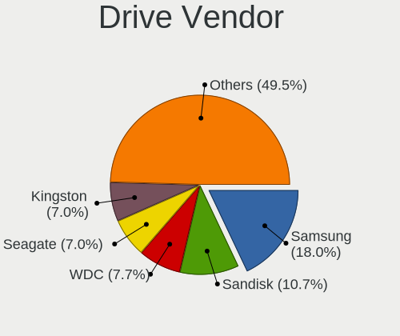
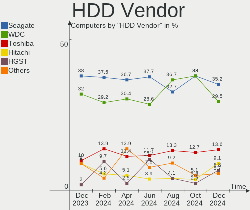
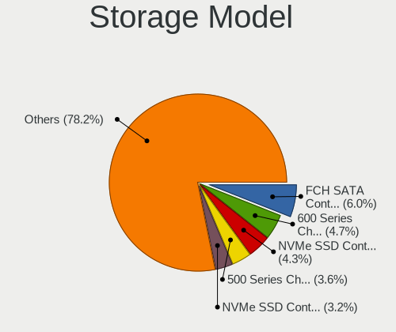
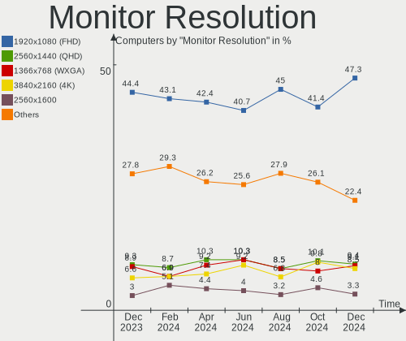
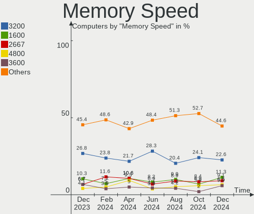

Arch - Hardware Trends
----------------------

A project to identify most popular hardware characteristics and track their change
over time based on data collected by Linux users at https://Linux-Hardware.org.

Anyone can contribute to this report by the [hw-probe](https://github.com/linuxhw/hw-probe) tool:

    sudo -E hw-probe -all -upload

This is a report for all computer types. See also reports for [desktops](/Dist/Arch/Desktop/README.md) and [notebooks](/Dist/Arch/Notebook/README.md).

This report is for one last month. Overall report since the beginning of time: [TestDays](https://github.com/linuxhw/TestDays)

Period: Sep, 2023.

Contents
--------

* [ System ](#system)
  - [ OS                       ](#os)
  - [ OS Family                ](#os-family)
  - [ Kernel                   ](#kernel)
  - [ Kernel Family            ](#kernel-family)
  - [ Kernel Major Ver.        ](#kernel-major-ver)
  - [ Arch                     ](#arch)
  - [ DE                       ](#de)
  - [ Display Server           ](#display-server)
  - [ Display Manager          ](#display-manager)
  - [ OS Lang                  ](#os-lang)
  - [ Boot Mode                ](#boot-mode)
  - [ Filesystem               ](#filesystem)
  - [ Part. scheme             ](#part-scheme)
  - [ Dual Boot with Linux/BSD ](#dual-boot-with-linuxbsd)
  - [ Dual Boot (Win)          ](#dual-boot-win)

* [ Board ](#board)
  - [ Vendor                   ](#vendor)
  - [ Model                    ](#model)
  - [ Model Family             ](#model-family)
  - [ MFG Year                 ](#mfg-year)
  - [ Form Factor              ](#form-factor)
  - [ Secure Boot              ](#secure-boot)
  - [ Coreboot                 ](#coreboot)
  - [ RAM Size                 ](#ram-size)
  - [ RAM Used                 ](#ram-used)
  - [ Total Drives             ](#total-drives)
  - [ Has CD-ROM               ](#has-cd-rom)
  - [ Has Ethernet             ](#has-ethernet)
  - [ Has WiFi                 ](#has-wifi)
  - [ Has Bluetooth            ](#has-bluetooth)

* [ Location ](#location)
  - [ Country                  ](#country)
  - [ City                     ](#city)

* [ Drives ](#drives)
  - [ Drive Vendor             ](#drive-vendor)
  - [ Drive Model              ](#drive-model)
  - [ HDD Vendor               ](#hdd-vendor)
  - [ SSD Vendor               ](#ssd-vendor)
  - [ Drive Kind               ](#drive-kind)
  - [ Drive Connector          ](#drive-connector)
  - [ Drive Size               ](#drive-size)
  - [ Space Total              ](#space-total)
  - [ Space Used               ](#space-used)
  - [ Malfunc. Drives          ](#malfunc-drives)
  - [ Malfunc. Drive Vendor    ](#malfunc-drive-vendor)
  - [ Malfunc. HDD Vendor      ](#malfunc-hdd-vendor)
  - [ Malfunc. Drive Kind      ](#malfunc-drive-kind)
  - [ Failed Drives            ](#failed-drives)
  - [ Failed Drive Vendor      ](#failed-drive-vendor)
  - [ Drive Status             ](#drive-status)

* [ Storage controller ](#storage-controller)
  - [ Storage Vendor           ](#storage-vendor)
  - [ Storage Model            ](#storage-model)
  - [ Storage Kind             ](#storage-kind)

* [ Processor ](#processor)
  - [ CPU Vendor               ](#cpu-vendor)
  - [ CPU Model                ](#cpu-model)
  - [ CPU Model Family         ](#cpu-model-family)
  - [ CPU Cores                ](#cpu-cores)
  - [ CPU Sockets              ](#cpu-sockets)
  - [ CPU Threads              ](#cpu-threads)
  - [ CPU Op-Modes             ](#cpu-op-modes)
  - [ CPU Microcode            ](#cpu-microcode)
  - [ CPU Microarch            ](#cpu-microarch)

* [ Graphics ](#graphics)
  - [ GPU Vendor               ](#gpu-vendor)
  - [ GPU Model                ](#gpu-model)
  - [ GPU Combo                ](#gpu-combo)
  - [ GPU Driver               ](#gpu-driver)
  - [ GPU Memory               ](#gpu-memory)

* [ Monitor ](#monitor)
  - [ Monitor Vendor           ](#monitor-vendor)
  - [ Monitor Model            ](#monitor-model)
  - [ Monitor Resolution       ](#monitor-resolution)
  - [ Monitor Diagonal         ](#monitor-diagonal)
  - [ Monitor Width            ](#monitor-width)
  - [ Aspect Ratio             ](#aspect-ratio)
  - [ Monitor Area             ](#monitor-area)
  - [ Pixel Density            ](#pixel-density)
  - [ Multiple Monitors        ](#multiple-monitors)

* [ Network ](#network)
  - [ Net Controller Vendor    ](#net-controller-vendor)
  - [ Net Controller Model     ](#net-controller-model)
  - [ Wireless Vendor          ](#wireless-vendor)
  - [ Wireless Model           ](#wireless-model)
  - [ Ethernet Vendor          ](#ethernet-vendor)
  - [ Ethernet Model           ](#ethernet-model)
  - [ Net Controller Kind      ](#net-controller-kind)
  - [ Used Controller          ](#used-controller)
  - [ NICs                     ](#nics)
  - [ IPv6                     ](#ipv6)

* [ Bluetooth ](#bluetooth)
  - [ Bluetooth Vendor         ](#bluetooth-vendor)
  - [ Bluetooth Model          ](#bluetooth-model)

* [ Sound ](#sound)
  - [ Sound Vendor             ](#sound-vendor)
  - [ Sound Model              ](#sound-model)

* [ Memory ](#memory)
  - [ Memory Vendor            ](#memory-vendor)
  - [ Memory Model             ](#memory-model)
  - [ Memory Kind              ](#memory-kind)
  - [ Memory Form Factor       ](#memory-form-factor)
  - [ Memory Size              ](#memory-size)
  - [ Memory Speed             ](#memory-speed)

* [ Printers & scanners ](#printers--scanners)
  - [ Printer Vendor           ](#printer-vendor)
  - [ Printer Model            ](#printer-model)
  - [ Scanner Vendor           ](#scanner-vendor)
  - [ Scanner Model            ](#scanner-model)

* [ Camera ](#camera)
  - [ Camera Vendor            ](#camera-vendor)
  - [ Camera Model             ](#camera-model)

* [ Security ](#security)
  - [ Fingerprint Vendor       ](#fingerprint-vendor)
  - [ Fingerprint Model        ](#fingerprint-model)
  - [ Chipcard Vendor          ](#chipcard-vendor)
  - [ Chipcard Model           ](#chipcard-model)

* [ Unsupported ](#unsupported)
  - [ Unsupported Devices      ](#unsupported-devices)
  - [ Unsupported Device Types ](#unsupported-device-types)

System
------

OS
--

Installed operating systems

| Name                   | Computers | Percent |
|------------------------|-----------|---------|
| Arch Rolling           | 211       | 99.53%  |
| Arch 20230723.0.166908 | 1         | 0.47%   |

OS Family
---------

OS without a version

| Name | Computers | Percent |
|------|-----------|---------|
| Arch | 212       | 100%    |

Kernel
------

Version of the Linux kernel

| Version                                   | Computers | Percent |
|-------------------------------------------|-----------|---------|
| 6.4.12-arch1-1                            | 56        | 26.42%  |
| 6.5.3-arch1-1                             | 36        | 16.98%  |
| 6.5.4-arch2-1                             | 24        | 11.32%  |
| 6.5.2-arch1-1                             | 18        | 8.49%   |
| 6.5.3-zen1-1-zen                          | 12        | 5.66%   |
| 6.4.12-zen1-1-zen                         | 9         | 4.25%   |
| 6.1.51-1-lts                              | 5         | 2.36%   |
| 6.5.5-zen1-1-zen                          | 4         | 1.89%   |
| 6.5.5-arch1-1                             | 4         | 1.89%   |
| 6.4.10-arch1-1                            | 3         | 1.42%   |
| 6.1.50-1-lts                              | 3         | 1.42%   |
| 6.5.4-zen2-1-zen                          | 2         | 0.94%   |
| 6.5.2-zen1-1-zen                          | 2         | 0.94%   |
| 6.1.54-1-lts                              | 2         | 0.94%   |
| 6.1.52-1-lts                              | 2         | 0.94%   |
| 6.6.0-rc2-1-mainline                      | 1         | 0.47%   |
| 6.6.0-rc1-273-tkg-eevdf-llvm              | 1         | 0.47%   |
| 6.5.5-AMD                                 | 1         | 0.47%   |
| 6.5.5-1-cachyos                           | 1         | 0.47%   |
| 6.5.4-hardened1-1-hardened                | 1         | 0.47%   |
| 6.5.3-zen1-1.1-zen                        | 1         | 0.47%   |
| 6.5.3-x64v2-xanmod1-1                     | 1         | 0.47%   |
| 6.5.3-intel_gna                           | 1         | 0.47%   |
| 6.5.3-AMD                                 | 1         | 0.47%   |
| 6.5.2-arch1-Ototsuku-T2-1-t2              | 1         | 0.47%   |
| 6.5.2-273-tkg-bore-eevdf                  | 1         | 0.47%   |
| 6.5.2-1-cachyos-bore                      | 1         | 0.47%   |
| 6.5.1-1-cachyos                           | 1         | 0.47%   |
| 6.5.0-rc7-1-drm-xe-next-git-g16e2c940ef53 | 1         | 0.47%   |
| 6.4.8-arch1-1                             | 1         | 0.47%   |
| 6.4.6-arch1-1                             | 1         | 0.47%   |
| 6.4.15-x64v2-xanmod1-1                    | 1         | 0.47%   |
| 6.4.14-x64v3-xanmod1                      | 1         | 0.47%   |
| 6.4.12-1-cachyos                          | 1         | 0.47%   |
| 6.4.11-x64v2-xanmod1-1                    | 1         | 0.47%   |
| 6.4.11-arch2-1                            | 1         | 0.47%   |
| 6.2.9-arch1-1                             | 1         | 0.47%   |
| 6.2.12-arch1-1                            | 1         | 0.47%   |
| 6.1.55-273-tkg-cfs                        | 1         | 0.47%   |
| 6.1.47-1-lts                              | 1         | 0.47%   |

Kernel Family
-------------

Linux kernel without a distro release

| Version | Computers | Percent |
|---------|-----------|---------|
| 6.4.12  | 66        | 31.13%  |
| 6.5.3   | 52        | 24.53%  |
| 6.5.4   | 27        | 12.74%  |
| 6.5.2   | 23        | 10.85%  |
| 6.5.5   | 10        | 4.72%   |
| 6.1.51  | 5         | 2.36%   |
| 6.4.10  | 3         | 1.42%   |
| 6.1.50  | 3         | 1.42%   |
| 6.6.0   | 2         | 0.94%   |
| 6.4.11  | 2         | 0.94%   |
| 6.1.54  | 2         | 0.94%   |
| 6.1.52  | 2         | 0.94%   |
| 6.5.1   | 1         | 0.47%   |
| 6.5.0   | 1         | 0.47%   |
| 6.4.8   | 1         | 0.47%   |
| 6.4.6   | 1         | 0.47%   |
| 6.4.15  | 1         | 0.47%   |
| 6.4.14  | 1         | 0.47%   |
| 6.2.9   | 1         | 0.47%   |
| 6.2.12  | 1         | 0.47%   |
| 6.1.55  | 1         | 0.47%   |
| 6.1.47  | 1         | 0.47%   |
| 6.1.39  | 1         | 0.47%   |
| 6.1.38  | 1         | 0.47%   |
| 6.1.19  | 1         | 0.47%   |
| 6.0.12  | 1         | 0.47%   |
| 5.10.54 | 1         | 0.47%   |

Kernel Major Ver.
-----------------

Linux kernel major version

| Version | Computers | Percent |
|---------|-----------|---------|
| 6.5     | 114       | 53.77%  |
| 6.4     | 75        | 35.38%  |
| 6.1     | 17        | 8.02%   |
| 6.6     | 2         | 0.94%   |
| 6.2     | 2         | 0.94%   |
| 6.0     | 1         | 0.47%   |
| 5.10    | 1         | 0.47%   |

Arch
----

OS architecture (x86_64, i586, etc.)

| Name   | Computers | Percent |
|--------|-----------|---------|
| x86_64 | 212       | 100%    |

DE
--

Desktop Environment

| Name              | Computers | Percent |
|-------------------|-----------|---------|
| KDE5              | 74        | 34.91%  |
| GNOME             | 68        | 32.08%  |
| i3                | 15        | 7.08%   |
| Unknown           | 14        | 6.6%    |
| XFCE              | 12        | 5.66%   |
| Hyprland          | 12        | 5.66%   |
| LXQt              | 4         | 1.89%   |
| sway              | 3         | 1.42%   |
| X-Cinnamon        | 2         | 0.94%   |
| KDE               | 2         | 0.94%   |
| Yaru:ubuntu:GNOME | 1         | 0.47%   |
| MATE              | 1         | 0.47%   |
| LXDE              | 1         | 0.47%   |
| dwm               | 1         | 0.47%   |
| Budgie            | 1         | 0.47%   |
| bspwm             | 1         | 0.47%   |

Display Server
--------------

X11 or Wayland

| Name    | Computers | Percent |
|---------|-----------|---------|
| X11     | 100       | 47.17%  |
| Wayland | 92        | 43.4%   |
| Tty     | 12        | 5.66%   |
| Unknown | 8         | 3.77%   |

Display Manager
---------------

SDDM, LightDM, etc.

| Name    | Computers | Percent |
|---------|-----------|---------|
| Unknown | 84        | 39.62%  |
| SDDM    | 62        | 29.25%  |
| LightDM | 31        | 14.62%  |
| GDM     | 26        | 12.26%  |
| GREETD  | 3         | 1.42%   |
| SLiM    | 2         | 0.94%   |
| LY-DM   | 2         | 0.94%   |
| Ly      | 1         | 0.47%   |
| LXDM    | 1         | 0.47%   |

OS Lang
-------

Language

| Lang      | Computers | Percent |
|-----------|-----------|---------|
| en_US     | 104       | 49.06%  |
| C         | 18        | 8.49%   |
| en_GB     | 17        | 8.02%   |
| ru_RU     | 11        | 5.19%   |
| it_IT     | 9         | 4.25%   |
| de_DE     | 9         | 4.25%   |
| Unknown   | 7         | 3.3%    |
| pt_BR     | 6         | 2.83%   |
| fr_FR     | 5         | 2.36%   |
| pl_PL     | 4         | 1.89%   |
| en_AU     | 3         | 1.42%   |
| tr_TR     | 2         | 0.94%   |
| es_ES     | 2         | 0.94%   |
| en_IE     | 2         | 0.94%   |
| en_CA     | 2         | 0.94%   |
| zh_CN     | 1         | 0.47%   |
| uk_UA     | 1         | 0.47%   |
| es_AR     | 1         | 0.47%   |
| en_NZ     | 1         | 0.47%   |
| en_IN     | 1         | 0.47%   |
| en_EN     | 1         | 0.47%   |
| en_DK     | 1         | 0.47%   |
| en_AG     | 1         | 0.47%   |
| de_DEutf8 | 1         | 0.47%   |
| de_CH     | 1         | 0.47%   |
| da_DK     | 1         | 0.47%   |

Boot Mode
---------

EFI or BIOS

| Mode | Computers | Percent |
|------|-----------|---------|
| EFI  | 132       | 62.26%  |
| BIOS | 80        | 37.74%  |

Filesystem
----------

Type of filesystem

| Type                | Computers | Percent |
|---------------------|-----------|---------|
| Ext4                | 131       | 61.79%  |
| Btrfs               | 69        | 32.55%  |
| Xfs                 | 5         | 2.36%   |
| Zfs                 | 2         | 0.94%   |
| Tmpfs               | 2         | 0.94%   |
| XXXXX               | 1         | 0.47%   |
| XXX4                | 1         | 0.47%   |
| Fuse.fuse-overlayfs | 1         | 0.47%   |

Part. scheme
------------

Scheme of partitioning

| Type    | Computers | Percent |
|---------|-----------|---------|
| GPT     | 140       | 66.04%  |
| Unknown | 63        | 29.72%  |
| MBR     | 9         | 4.25%   |

Dual Boot with Linux/BSD
------------------------

Hosting more than one Linux/BSD

| Dual boot | Computers | Percent |
|-----------|-----------|---------|
| No        | 185       | 87.26%  |
| Yes       | 27        | 12.74%  |

Dual Boot (Win)
---------------

Hosting Linux and Windows

| Dual boot | Computers | Percent |
|-----------|-----------|---------|
| No        | 159       | 75%     |
| Yes       | 53        | 25%     |

Board
-----

Vendor
------

Motherboard manufacturer

| Name                                 | Computers | Percent |
|--------------------------------------|-----------|---------|
| ASUSTek Computer                     | 52        | 24.53%  |
| Lenovo                               | 41        | 19.34%  |
| Dell                                 | 28        | 13.21%  |
| MSI                                  | 23        | 10.85%  |
| Hewlett-Packard                      | 19        | 8.96%   |
| Gigabyte Technology                  | 12        | 5.66%   |
| ASRock                               | 7         | 3.3%    |
| Acer                                 | 7         | 3.3%    |
| HUAWEI                               | 3         | 1.42%   |
| Timi                                 | 2         | 0.94%   |
| Shenzhen Meigao Electronic Equipment | 2         | 0.94%   |
| Samsung Electronics                  | 2         | 0.94%   |
| ECS                                  | 2         | 0.94%   |
| Apple                                | 2         | 0.94%   |
| ZOTAC                                | 1         | 0.47%   |
| Pegatron                             | 1         | 0.47%   |
| Microsoft                            | 1         | 0.47%   |
| Intel                                | 1         | 0.47%   |
| Google                               | 1         | 0.47%   |
| Fujitsu                              | 1         | 0.47%   |
| eMachines                            | 1         | 0.47%   |
| Biostar                              | 1         | 0.47%   |
| AZW                                  | 1         | 0.47%   |
| Unknown                              | 1         | 0.47%   |

Model
-----

Motherboard model

| Name                                       | Computers | Percent |
|--------------------------------------------|-----------|---------|
| ASUS All Series                            | 4         | 1.89%   |
| MSI MS-7B79                                | 3         | 1.42%   |
| Samsung 750XDA                             | 2         | 0.94%   |
| MSI MS-7C56                                | 2         | 0.94%   |
| MSI MS-7B86                                | 2         | 0.94%   |
| ASUS ASUS TUF Gaming F15 FX506LHB_FX506LHB | 2         | 0.94%   |
| ASRock B365 Pro4                           | 2         | 0.94%   |
| ZOTAC NM10                                 | 1         | 0.47%   |
| Timi Redmi G 2022                          | 1         | 0.47%   |
| Timi A35S                                  | 1         | 0.47%   |
| Shenzhen Meigao Electronic Equipment HX99G | 1         | 0.47%   |
| Shenzhen Meigao Electronic Equipment F7BSC | 1         | 0.47%   |
| Pegatron p2-1113w                          | 1         | 0.47%   |
| MSI MS-7D89                                | 1         | 0.47%   |
| MSI MS-7D53                                | 1         | 0.47%   |
| MSI MS-7D25                                | 1         | 0.47%   |
| MSI MS-7D15                                | 1         | 0.47%   |
| MSI MS-7C91                                | 1         | 0.47%   |
| MSI MS-7C02                                | 1         | 0.47%   |
| MSI MS-7B98                                | 1         | 0.47%   |
| MSI MS-7B89                                | 1         | 0.47%   |
| MSI MS-7B84                                | 1         | 0.47%   |
| MSI MS-7A70                                | 1         | 0.47%   |
| MSI MS-7A38                                | 1         | 0.47%   |
| MSI MS-7721                                | 1         | 0.47%   |
| MSI Modern 14 B11MOU                       | 1         | 0.47%   |
| MSI Katana GF76 11UE                       | 1         | 0.47%   |
| MSI GF75 Thin 10SC                         | 1         | 0.47%   |
| MSI Bravo 15 C7VF                          | 1         | 0.47%   |
| Microsoft Surface Book 2                   | 1         | 0.47%   |
| Lenovo YogaAir 14s APU8 83AA               | 1         | 0.47%   |
| Lenovo Yoga Slim 7 14APU8 83AA             | 1         | 0.47%   |
| Lenovo Yoga 6 13ALC7 82UD                  | 1         | 0.47%   |
| Lenovo V15 G3 ABA 82TV                     | 1         | 0.47%   |
| Lenovo ThinkPad Yoga 260 20FES2FE0E        | 1         | 0.47%   |
| Lenovo ThinkPad X390 20Q0002UUS            | 1         | 0.47%   |
| Lenovo ThinkPad X250 20CLS2TQ0E            | 1         | 0.47%   |
| Lenovo ThinkPad X220 4290LT8               | 1         | 0.47%   |
| Lenovo ThinkPad X1 Yoga 4th 20QFS1A600     | 1         | 0.47%   |
| Lenovo ThinkPad T480s 20L8002WMD           | 1         | 0.47%   |

Model Family
------------

Motherboard model prefix

| Name                                       | Computers | Percent |
|--------------------------------------------|-----------|---------|
| Lenovo ThinkPad                            | 20        | 9.43%   |
| Lenovo IdeaPad                             | 11        | 5.19%   |
| Dell Latitude                              | 9         | 4.25%   |
| ASUS PRIME                                 | 9         | 4.25%   |
| Dell Inspiron                              | 8         | 3.77%   |
| ASUS ROG                                   | 8         | 3.77%   |
| ASUS VivoBook                              | 6         | 2.83%   |
| ASUS ASUS                                  | 6         | 2.83%   |
| Lenovo Legion                              | 5         | 2.36%   |
| HP Pavilion                                | 5         | 2.36%   |
| ASUS Zenbook                               | 4         | 1.89%   |
| ASUS All                                   | 4         | 1.89%   |
| MSI MS-7B79                                | 3         | 1.42%   |
| HP ProBook                                 | 3         | 1.42%   |
| Dell XPS                                   | 3         | 1.42%   |
| Dell OptiPlex                              | 3         | 1.42%   |
| Samsung 750XDA                             | 2         | 0.94%   |
| MSI MS-7C56                                | 2         | 0.94%   |
| MSI MS-7B86                                | 2         | 0.94%   |
| Lenovo Yoga                                | 2         | 0.94%   |
| HP Laptop                                  | 2         | 0.94%   |
| HP EliteBook                               | 2         | 0.94%   |
| Dell Vostro                                | 2         | 0.94%   |
| ASUS TUF                                   | 2         | 0.94%   |
| ASUS P8P67                                 | 2         | 0.94%   |
| ASRock B365                                | 2         | 0.94%   |
| Acer Nitro                                 | 2         | 0.94%   |
| Acer Aspire                                | 2         | 0.94%   |
| ZOTAC NM10                                 | 1         | 0.47%   |
| Timi Redmi                                 | 1         | 0.47%   |
| Timi A35S                                  | 1         | 0.47%   |
| Shenzhen Meigao Electronic Equipment HX99G | 1         | 0.47%   |
| Shenzhen Meigao Electronic Equipment F7BSC | 1         | 0.47%   |
| Pegatron p2-1113w                          | 1         | 0.47%   |
| MSI MS-7D89                                | 1         | 0.47%   |
| MSI MS-7D53                                | 1         | 0.47%   |
| MSI MS-7D25                                | 1         | 0.47%   |
| MSI MS-7D15                                | 1         | 0.47%   |
| MSI MS-7C91                                | 1         | 0.47%   |
| MSI MS-7C02                                | 1         | 0.47%   |

MFG Year
--------

Motherboard manufacture year

| Year | Computers | Percent |
|------|-----------|---------|
| 2021 | 40        | 18.87%  |
| 2022 | 26        | 12.26%  |
| 2019 | 21        | 9.91%   |
| 2020 | 20        | 9.43%   |
| 2014 | 18        | 8.49%   |
| 2018 | 17        | 8.02%   |
| 2013 | 11        | 5.19%   |
| 2023 | 10        | 4.72%   |
| 2017 | 9         | 4.25%   |
| 2016 | 9         | 4.25%   |
| 2012 | 9         | 4.25%   |
| 2011 | 7         | 3.3%    |
| 2010 | 6         | 2.83%   |
| 2015 | 5         | 2.36%   |
| 2009 | 2         | 0.94%   |
| 2008 | 2         | 0.94%   |

Form Factor
-----------

Physical design of the computer

| Name        | Computers | Percent |
|-------------|-----------|---------|
| Notebook    | 117       | 55.19%  |
| Desktop     | 85        | 40.09%  |
| Convertible | 8         | 3.77%   |
| Tablet      | 2         | 0.94%   |

Secure Boot
-----------

Enabled or disabled

| State    | Computers | Percent |
|----------|-----------|---------|
| Disabled | 205       | 96.7%   |
| Enabled  | 7         | 3.3%    |

Coreboot
--------

Have coreboot on board

| Used | Computers | Percent |
|------|-----------|---------|
| No   | 211       | 99.53%  |
| Yes  | 1         | 0.47%   |

RAM Size
--------

Total RAM memory

| Size in GB  | Computers | Percent |
|-------------|-----------|---------|
| 8.01-16.0   | 49        | 23.11%  |
| 4.01-8.0    | 48        | 22.64%  |
| 32.01-64.0  | 43        | 20.28%  |
| 16.01-24.0  | 43        | 20.28%  |
| 3.01-4.0    | 11        | 5.19%   |
| 64.01-256.0 | 11        | 5.19%   |
| 24.01-32.0  | 5         | 2.36%   |
| 1.01-2.0    | 2         | 0.94%   |

RAM Used
--------

Used RAM memory

| Used GB    | Computers | Percent |
|------------|-----------|---------|
| 4.01-8.0   | 52        | 24.53%  |
| 2.01-3.0   | 48        | 22.64%  |
| 3.01-4.0   | 45        | 21.23%  |
| 1.01-2.0   | 34        | 16.04%  |
| 8.01-16.0  | 22        | 10.38%  |
| 0.51-1.0   | 5         | 2.36%   |
| 16.01-24.0 | 3         | 1.42%   |
| 32.01-64.0 | 1         | 0.47%   |
| 24.01-32.0 | 1         | 0.47%   |
| 0.01-0.5   | 1         | 0.47%   |

Total Drives
------------

Number of drives on board

| Drives | Computers | Percent |
|--------|-----------|---------|
| 1      | 112       | 52.83%  |
| 2      | 59        | 27.83%  |
| 3      | 19        | 8.96%   |
| 4      | 13        | 6.13%   |
| 5      | 5         | 2.36%   |
| 14     | 1         | 0.47%   |
| 12     | 1         | 0.47%   |
| 9      | 1         | 0.47%   |
| 7      | 1         | 0.47%   |

Has CD-ROM
----------

Has CD-ROM on board

| Presented | Computers | Percent |
|-----------|-----------|---------|
| No        | 171       | 80.66%  |
| Yes       | 41        | 19.34%  |

Has Ethernet
------------

Has Ethernet on board

| Presented | Computers | Percent |
|-----------|-----------|---------|
| Yes       | 173       | 81.6%   |
| No        | 39        | 18.4%   |

Has WiFi
--------

Has WiFi module

| Presented | Computers | Percent |
|-----------|-----------|---------|
| Yes       | 171       | 80.66%  |
| No        | 41        | 19.34%  |

Has Bluetooth
-------------

Has Bluetooth module

| Presented | Computers | Percent |
|-----------|-----------|---------|
| Yes       | 161       | 75.94%  |
| No        | 51        | 24.06%  |

Location
--------

Country
-------

Geographic location (country)

| Country      | Computers | Percent |
|--------------|-----------|---------|
| USA          | 36        | 16.98%  |
| Russia       | 19        | 8.96%   |
| Germany      | 15        | 7.08%   |
| UK           | 13        | 6.13%   |
| Italy        | 13        | 6.13%   |
| Brazil       | 8         | 3.77%   |
| India        | 7         | 3.3%    |
| France       | 7         | 3.3%    |
| Turkey       | 6         | 2.83%   |
| Spain        | 6         | 2.83%   |
| Poland       | 6         | 2.83%   |
| Indonesia    | 5         | 2.36%   |
| Canada       | 5         | 2.36%   |
| Netherlands  | 4         | 1.89%   |
| Ukraine      | 3         | 1.42%   |
| Switzerland  | 3         | 1.42%   |
| Romania      | 3         | 1.42%   |
| Mexico       | 3         | 1.42%   |
| Kenya        | 3         | 1.42%   |
| Denmark      | 3         | 1.42%   |
| Australia    | 3         | 1.42%   |
| Thailand     | 2         | 0.94%   |
| Serbia       | 2         | 0.94%   |
| Nepal        | 2         | 0.94%   |
| China        | 2         | 0.94%   |
| Chile        | 2         | 0.94%   |
| Belgium      | 2         | 0.94%   |
| Austria      | 2         | 0.94%   |
| Argentina    | 2         | 0.94%   |
| Uzbekistan   | 1         | 0.47%   |
| Sweden       | 1         | 0.47%   |
| Sri Lanka    | 1         | 0.47%   |
| South Africa | 1         | 0.47%   |
| Slovakia     | 1         | 0.47%   |
| Saudi Arabia | 1         | 0.47%   |
| Rwanda       | 1         | 0.47%   |
| Peru         | 1         | 0.47%   |
| Panama       | 1         | 0.47%   |
| Pakistan     | 1         | 0.47%   |
| New Zealand  | 1         | 0.47%   |

City
----

Geographic location (city)

| City                | Computers | Percent |
|---------------------|-----------|---------|
| St Petersburg       | 6         | 2.83%   |
| Berlin              | 5         | 2.36%   |
| Pine Island         | 4         | 1.89%   |
| Nairobi             | 3         | 1.42%   |
| Moscow              | 3         | 1.42%   |
| Milan               | 3         | 1.42%   |
| Turin               | 2         | 0.94%   |
| Shoreham            | 2         | 0.94%   |
| Sao Paulo           | 2         | 0.94%   |
| Rostov-on-Don       | 2         | 0.94%   |
| Rio de Janeiro      | 2         | 0.94%   |
| Pasadena            | 2         | 0.94%   |
| New York            | 2         | 0.94%   |
| Madrid              | 2         | 0.94%   |
| Jakarta             | 2         | 0.94%   |
| City of London      | 2         | 0.94%   |
| Bursa               | 2         | 0.94%   |
| Brisbane            | 2         | 0.94%   |
| Bengaluru           | 2         | 0.94%   |
| Bangkok             | 2         | 0.94%   |
| Bandung             | 2         | 0.94%   |
| Ankara              | 2         | 0.94%   |
| Zurich              | 1         | 0.47%   |
| Zrenjanin           | 1         | 0.47%   |
| Zofingen            | 1         | 0.47%   |
| Zduny               | 1         | 0.47%   |
| Zaandam             | 1         | 0.47%   |
| Worthing            | 1         | 0.47%   |
| West Lebanon        | 1         | 0.47%   |
| Warner Robins       | 1         | 0.47%   |
| Vladimir            | 1         | 0.47%   |
| Vittuone            | 1         | 0.47%   |
| Vitry-sur-Seine     | 1         | 0.47%   |
| Vijayawada          | 1         | 0.47%   |
| Vigo                | 1         | 0.47%   |
| Venice              | 1         | 0.47%   |
| Valencia            | 1         | 0.47%   |
| Užice              | 1         | 0.47%   |
| Uberlândia         | 1         | 0.47%   |
| Tuoro sul Trasimeno | 1         | 0.47%   |

Drives
------

Drive Vendor
------------

Hard drive vendors

| Vendor                         | Computers | Drives | Percent |
|--------------------------------|-----------|--------|---------|
| Samsung Electronics            | 58        | 71     | 16.34%  |
| Seagate                        | 36        | 41     | 10.14%  |
| SanDisk                        | 31        | 36     | 8.73%   |
| WDC                            | 29        | 38     | 8.17%   |
| Toshiba                        | 22        | 24     | 6.2%    |
| Kingston                       | 18        | 18     | 5.07%   |
| Intel                          | 15        | 16     | 4.23%   |
| SK hynix                       | 13        | 14     | 3.66%   |
| Crucial                        | 13        | 13     | 3.66%   |
| Micron Technology              | 10        | 10     | 2.82%   |
| Phison Electronics             | 7         | 7      | 1.97%   |
| KIOXIA                         | 7         | 7      | 1.97%   |
| HGST                           | 7         | 11     | 1.97%   |
| Unknown                        | 5         | 5      | 1.41%   |
| Micron/Crucial Technology      | 5         | 6      | 1.41%   |
| Kingston Technology Company    | 5         | 5      | 1.41%   |
| SPCC                           | 4         | 4      | 1.13%   |
| MAXIO Technology (Hangzhou)    | 4         | 4      | 1.13%   |
| Union Memory                   | 3         | 3      | 0.85%   |
| Team                           | 3         | 3      | 0.85%   |
| Silicon Motion                 | 3         | 3      | 0.85%   |
| Hitachi                        | 3         | 3      | 0.85%   |
| Apple                          | 3         | 3      | 0.85%   |
| A-DATA Technology              | 3         | 3      | 0.85%   |
| Solid State Storage Technology | 2         | 2      | 0.56%   |
| Shenzhen Longsys Electronics   | 2         | 2      | 0.56%   |
| PNY                            | 2         | 2      | 0.56%   |
| Maxtor                         | 2         | 2      | 0.56%   |
| JMicron Technology             | 2         | 9      | 0.56%   |
| Dogfish                        | 2         | 2      | 0.56%   |
| China                          | 2         | 2      | 0.56%   |
| ADATA Technology               | 2         | 3      | 0.56%   |
| Unknown                        | 2         | 2      | 0.56%   |
| Yangtze Memory Technologies    | 1         | 1      | 0.28%   |
| Verbatim                       | 1         | 1      | 0.28%   |
| USB                            | 1         | 1      | 0.28%   |
| UP                             | 1         | 1      | 0.28%   |
| Transcend                      | 1         | 1      | 0.28%   |
| TO Exter                       | 1         | 1      | 0.28%   |
| Timetec                        | 1         | 1      | 0.28%   |

Drive Model
-----------

Hard drive models

| Model                                                 | Computers | Percent |
|-------------------------------------------------------|-----------|---------|
| Samsung NVMe SSD Controller PM9A1/PM9A3/980PRO 1TB    | 14        | 3.64%   |
| Samsung NVMe SSD Controller SM981/PM981/PM983 256GB   | 12        | 3.12%   |
| Intel SSDPEKNU512GZ 512GB                             | 7         | 1.82%   |
| SPCC Solid State Disk 1TB                             | 4         | 1.04%   |
| Sandisk WD Black 2018/SN750 / PC SN720 NVMe SSD 1TB   | 4         | 1.04%   |
| Samsung SSD 850 EVO 250GB                             | 4         | 1.04%   |
| Seagate ST1000LM035-1RK172 1TB                        | 3         | 0.78%   |
| Seagate ST1000LM024 HN-M101MBB 1TB                    | 3         | 0.78%   |
| Seagate ST1000DM010-2EP102 1TB                        | 3         | 0.78%   |
| Sandisk WD Blue SN570 1TB                             | 3         | 0.78%   |
| Sandisk WD Black SN850 1TB                            | 3         | 0.78%   |
| Samsung SSD 860 EVO 500GB                             | 3         | 0.78%   |
| Phison E12 NVMe Controller 2TB                        | 3         | 0.78%   |
| Micron/Crucial P2 NVMe PCIe SSD 1TB                   | 3         | 0.78%   |
| Micron 2400_MTFDKBA512QFM 512GB                       | 3         | 0.78%   |
| MAXIO (Hangzhou) NVMe SSD Controller MAP1202 512GB    | 3         | 0.78%   |
| Kingston Company OM3PDP3 NVMe SSD 512GB               | 3         | 0.78%   |
| Kingston SA400S37240G 240GB SSD                       | 3         | 0.78%   |
| Intel SSD 660P Series 1024GB                          | 3         | 0.78%   |
| WDC WD5000BPKT-80PK4T0 500GB                          | 2         | 0.52%   |
| WDC WD2003FZEX-00SRLA0 2TB                            | 2         | 0.52%   |
| WDC WD10EZEX-08WN4A0 1TB                              | 2         | 0.52%   |
| Unknown MMC Card  128GB                               | 2         | 0.52%   |
| Union Memory UMIS RPJTJ256MEE1OWX 256GB               | 2         | 0.52%   |
| Toshiba TR200 480GB SSD                               | 2         | 0.52%   |
| Toshiba MQ04ABF100 1TB                                | 2         | 0.52%   |
| Toshiba HDWD130 3TB                                   | 2         | 0.52%   |
| Toshiba DT01ACA100 1TB                                | 2         | 0.52%   |
| SK hynix HFM512GD3JX013N 512GB                        | 2         | 0.52%   |
| SK hynix BC511 512GB                                  | 2         | 0.52%   |
| Silicon Motion SM2263EN/SM2263XT SSD Controller 512GB | 2         | 0.52%   |
| Seagate ST95005620AS 500GB                            | 2         | 0.52%   |
| Seagate ST31000524AS 1TB                              | 2         | 0.52%   |
| Seagate ST2000DM001-1ER164 2TB                        | 2         | 0.52%   |
| Seagate ST2000DL003-9VT166 2TB                        | 2         | 0.52%   |
| Seagate ST16000NM001G-2KK103 16TB                     | 2         | 0.52%   |
| Sandisk WD_BLACK SN850X 4000GB                        | 2         | 0.52%   |
| Sandisk WD Blue SN550 NVMe SSD 512GB                  | 2         | 0.52%   |
| Sandisk WD Black SN750 / PC SN730 NVMe SSD 512GB      | 2         | 0.52%   |
| SanDisk SDSSDA480G 480GB                              | 2         | 0.52%   |

HDD Vendor
----------

Hard disk drive vendors

| Vendor              | Computers | Drives | Percent |
|---------------------|-----------|--------|---------|
| Seagate             | 35        | 39     | 36.46%  |
| WDC                 | 28        | 36     | 29.17%  |
| Toshiba             | 17        | 17     | 17.71%  |
| HGST                | 7         | 11     | 7.29%   |
| Hitachi             | 3         | 3      | 3.13%   |
| Maxtor              | 2         | 2      | 2.08%   |
| USB                 | 1         | 1      | 1.04%   |
| TDAS                | 1         | 4      | 1.04%   |
| Samsung Electronics | 1         | 1      | 1.04%   |
| JMicron Technology  | 1         | 8      | 1.04%   |

SSD Vendor
----------

Solid state drive vendors

| Vendor              | Computers | Drives | Percent |
|---------------------|-----------|--------|---------|
| Samsung Electronics | 18        | 23     | 18.75%  |
| Crucial             | 13        | 13     | 13.54%  |
| Kingston            | 11        | 11     | 11.46%  |
| SanDisk             | 10        | 10     | 10.42%  |
| SPCC                | 4         | 4      | 4.17%   |
| Team                | 3         | 3      | 3.13%   |
| WDC                 | 2         | 2      | 2.08%   |
| Toshiba             | 2         | 4      | 2.08%   |
| PNY                 | 2         | 2      | 2.08%   |
| Micron Technology   | 2         | 2      | 2.08%   |
| Dogfish             | 2         | 2      | 2.08%   |
| China               | 2         | 2      | 2.08%   |
| Apple               | 2         | 2      | 2.08%   |
| A-DATA Technology   | 2         | 2      | 2.08%   |
| Verbatim            | 1         | 1      | 1.04%   |
| Transcend           | 1         | 1      | 1.04%   |
| TO Exter            | 1         | 1      | 1.04%   |
| Timetec             | 1         | 1      | 1.04%   |
| SK hynix            | 1         | 1      | 1.04%   |
| OCZ                 | 1         | 1      | 1.04%   |
| Netac               | 1         | 1      | 1.04%   |
| MicroFrom           | 1         | 1      | 1.04%   |
| Lexar               | 1         | 1      | 1.04%   |
| Kingmax             | 1         | 1      | 1.04%   |
| KingDian            | 1         | 1      | 1.04%   |
| Intenso             | 1         | 1      | 1.04%   |
| Intel               | 1         | 1      | 1.04%   |
| HS-SSD-E100         | 1         | 1      | 1.04%   |
| GOODRAM             | 1         | 1      | 1.04%   |
| geonix              | 1         | 1      | 1.04%   |
| FZ                  | 1         | 1      | 1.04%   |
| Fujitsu             | 1         | 1      | 1.04%   |
| Fanxiang            | 1         | 1      | 1.04%   |
| Apacer              | 1         | 1      | 1.04%   |
| Unknown             | 1         | 1      | 1.04%   |

Drive Kind
----------

HDD or SSD

| Kind    | Computers | Drives | Percent |
|---------|-----------|--------|---------|
| NVMe    | 142       | 174    | 45.66%  |
| HDD     | 82        | 122    | 26.37%  |
| SSD     | 79        | 103    | 25.4%   |
| Unknown | 5         | 5      | 1.61%   |
| MMC     | 3         | 3      | 0.96%   |

Drive Connector
---------------

SATA, SAS, NVMe, etc.

| Type | Computers | Drives | Percent |
|------|-----------|--------|---------|
| NVMe | 142       | 174    | 51.45%  |
| SATA | 121       | 210    | 43.84%  |
| SAS  | 10        | 20     | 3.62%   |
| MMC  | 3         | 3      | 1.09%   |

Drive Size
----------

Size of hard drive

| Size in TB | Computers | Drives | Percent |
|------------|-----------|--------|---------|
| 0.01-0.5   | 79        | 107    | 47.02%  |
| 0.51-1.0   | 51        | 57     | 30.36%  |
| 1.01-2.0   | 17        | 20     | 10.12%  |
| 4.01-10.0  | 9         | 18     | 5.36%   |
| 3.01-4.0   | 4         | 10     | 2.38%   |
| 2.01-3.0   | 4         | 4      | 2.38%   |
| 10.01-20.0 | 4         | 9      | 2.38%   |

Space Total
-----------

Amount of disk space available on the file system

| Size in GB     | Computers | Percent |
|----------------|-----------|---------|
| 251-500        | 49        | 23.11%  |
| More than 3000 | 36        | 16.98%  |
| 101-250        | 35        | 16.51%  |
| 1001-2000      | 30        | 14.15%  |
| 501-1000       | 29        | 13.68%  |
| 2001-3000      | 11        | 5.19%   |
| 1-20           | 9         | 4.25%   |
| Unknown        | 5         | 2.36%   |
| 21-50          | 4         | 1.89%   |
| 51-100         | 4         | 1.89%   |

Space Used
----------

Amount of used disk space

| Used GB        | Computers | Percent |
|----------------|-----------|---------|
| 1-20           | 47        | 22.17%  |
| 101-250        | 42        | 19.81%  |
| 51-100         | 26        | 12.26%  |
| 251-500        | 21        | 9.91%   |
| 21-50          | 21        | 9.91%   |
| 501-1000       | 20        | 9.43%   |
| More than 3000 | 13        | 6.13%   |
| 2001-3000      | 11        | 5.19%   |
| 1001-2000      | 6         | 2.83%   |
| Unknown        | 5         | 2.36%   |

Malfunc. Drives
---------------

Drive models with a malfunction

| Model                                                           | Computers | Drives | Percent |
|-----------------------------------------------------------------|-----------|--------|---------|
| WDC WD60EDAZ-11U78B0 6TB                                        | 1         | 1      | 4.55%   |
| WDC WD3200BPVT-22ZEST0 320GB                                    | 1         | 1      | 4.55%   |
| WDC WD10EZEX-08WN4A0 1TB                                        | 1         | 1      | 4.55%   |
| Transcend TS1TSSD230S 1TB                                       | 1         | 1      | 4.55%   |
| Seagate ST9320325AS 320GB                                       | 1         | 1      | 4.55%   |
| Seagate ST500DM002-1BD142 500GB                                 | 1         | 1      | 4.55%   |
| Seagate ST33000651NS 3TB                                        | 1         | 1      | 4.55%   |
| Seagate ST31000524AS 1TB                                        | 1         | 1      | 4.55%   |
| Seagate ST2000VN004-2E4164 2TB                                  | 1         | 1      | 4.55%   |
| Seagate ST1000LM024 HN-M101MBB 1TB                              | 1         | 1      | 4.55%   |
| Seagate ST1000DM010-2EP102 1TB                                  | 1         | 1      | 4.55%   |
| Samsung Electronics SSD 870 EVO 1TB                             | 1         | 1      | 4.55%   |
| Samsung Electronics SSD 860 EVO mSATA 250GB                     | 1         | 1      | 4.55%   |
| Samsung Electronics NVMe SSD Controller SM981/PM981/PM983 256GB | 1         | 1      | 4.55%   |
| Micron Technology MTFDDAK256TDL-1AW15ABHA 256GB SSD             | 1         | 1      | 4.55%   |
| Maxtor 6Y080L0 82GB                                             | 1         | 1      | 4.55%   |
| MAXIO Technology (Hangzhou) NVMe SSD Controller MAP1202 512GB   | 1         | 1      | 4.55%   |
| Intel SSDSC2BF360A5L 360GB                                      | 1         | 1      | 4.55%   |
| HGST HTS721010A9E630 1TB                                        | 1         | 1      | 4.55%   |
| HGST HTS541010A9E680 1TB                                        | 1         | 1      | 4.55%   |
| Crucial CT512M550SSD1 512GB                                     | 1         | 1      | 4.55%   |
| A-DATA Technology IM2P33F3 NVMe 512GB                           | 1         | 1      | 4.55%   |

Malfunc. Drive Vendor
---------------------

Vendors of faulty drives

| Vendor                      | Computers | Drives | Percent |
|-----------------------------|-----------|--------|---------|
| Seagate                     | 7         | 7      | 31.82%  |
| WDC                         | 3         | 3      | 13.64%  |
| Samsung Electronics         | 3         | 3      | 13.64%  |
| HGST                        | 2         | 2      | 9.09%   |
| Transcend                   | 1         | 1      | 4.55%   |
| Micron Technology           | 1         | 1      | 4.55%   |
| Maxtor                      | 1         | 1      | 4.55%   |
| MAXIO Technology (Hangzhou) | 1         | 1      | 4.55%   |
| Intel                       | 1         | 1      | 4.55%   |
| Crucial                     | 1         | 1      | 4.55%   |
| A-DATA Technology           | 1         | 1      | 4.55%   |

Malfunc. HDD Vendor
-------------------

Vendors of faulty HDD drives

| Vendor  | Computers | Drives | Percent |
|---------|-----------|--------|---------|
| Seagate | 7         | 7      | 53.85%  |
| WDC     | 3         | 3      | 23.08%  |
| HGST    | 2         | 2      | 15.38%  |
| Maxtor  | 1         | 1      | 7.69%   |

Malfunc. Drive Kind
-------------------

Kinds of faulty drives

| Kind | Computers | Drives | Percent |
|------|-----------|--------|---------|
| HDD  | 12        | 13     | 57.14%  |
| SSD  | 6         | 6      | 28.57%  |
| NVMe | 3         | 3      | 14.29%  |

Failed Drives
-------------

Failed drive models

Zero info for selected period =(

Failed Drive Vendor
-------------------

Failed drive vendors

Zero info for selected period =(

Drive Status
------------

Number of failed and malfunc. drives

| Status   | Computers | Drives | Percent |
|----------|-----------|--------|---------|
| Works    | 114       | 216    | 48.1%   |
| Detected | 102       | 169    | 43.04%  |
| Malfunc  | 21        | 22     | 8.86%   |

Storage controller
------------------

Storage Vendor
--------------

Storage controller vendors

| Vendor                         | Computers | Percent |
|--------------------------------|-----------|---------|
| Intel                          | 119       | 37.07%  |
| AMD                            | 48        | 14.95%  |
| Samsung Electronics            | 42        | 13.08%  |
| SanDisk                        | 22        | 6.85%   |
| SK hynix                       | 12        | 3.74%   |
| Kingston Technology Company    | 12        | 3.74%   |
| Micron Technology              | 8         | 2.49%   |
| Phison Electronics             | 7         | 2.18%   |
| KIOXIA                         | 7         | 2.18%   |
| Micron/Crucial Technology      | 5         | 1.56%   |
| MAXIO Technology (Hangzhou)    | 4         | 1.25%   |
| Marvell Technology Group       | 4         | 1.25%   |
| ASMedia Technology             | 4         | 1.25%   |
| Union Memory (Shenzhen)        | 3         | 0.93%   |
| Toshiba America Info Systems   | 3         | 0.93%   |
| Solid State Storage Technology | 3         | 0.93%   |
| Silicon Motion                 | 3         | 0.93%   |
| ADATA Technology               | 3         | 0.93%   |
| Shenzhen Longsys Electronics   | 2         | 0.62%   |
| Seagate Technology             | 2         | 0.62%   |
| JMicron Technology             | 2         | 0.62%   |
| Yangtze Memory Technologies    | 1         | 0.31%   |
| Solidigm                       | 1         | 0.31%   |
| Realtek Semiconductor          | 1         | 0.31%   |
| Lite-On Technology             | 1         | 0.31%   |
| Apple                          | 1         | 0.31%   |
| Unknown                        | 1         | 0.31%   |

Storage Model
-------------

Storage controller models

| Model                                                                          | Computers | Percent |
|--------------------------------------------------------------------------------|-----------|---------|
| AMD FCH SATA Controller [AHCI mode]                                            | 31        | 8.64%   |
| Samsung NVMe SSD Controller SM981/PM981/PM983                                  | 13        | 3.62%   |
| Samsung NVMe SSD Controller PM9A1/PM9A3/980PRO                                 | 13        | 3.62%   |
| Intel Volume Management Device NVMe RAID Controller                            | 12        | 3.34%   |
| Samsung NVMe SSD Controller 980                                                | 11        | 3.06%   |
| AMD 400 Series Chipset SATA Controller                                         | 11        | 3.06%   |
| Intel Sunrise Point-LP SATA Controller [AHCI mode]                             | 9         | 2.51%   |
| AMD 500 Series Chipset SATA Controller                                         | 9         | 2.51%   |
| Intel SSD 670p Series [Keystone Harbor]                                        | 8         | 2.23%   |
| Intel 200 Series PCH SATA controller [AHCI mode]                               | 8         | 2.23%   |
| Intel 8 Series/C220 Series Chipset Family 6-port SATA Controller 1 [AHCI mode] | 7         | 1.95%   |
| Intel 7 Series Chipset Family 6-port SATA Controller [AHCI mode]               | 7         | 1.95%   |
| SK hynix Gold P31/BC711/PC711 NVMe Solid State Drive                           | 5         | 1.39%   |
| Intel Wildcat Point-LP SATA Controller [AHCI Mode]                             | 5         | 1.39%   |
| Intel Cannon Lake Mobile PCH SATA AHCI Controller                              | 5         | 1.39%   |
| Intel 9 Series Chipset Family SATA Controller [AHCI Mode]                      | 5         | 1.39%   |
| Intel 82801 Mobile SATA Controller [RAID mode]                                 | 5         | 1.39%   |
| Intel 8 Series SATA Controller 1 [AHCI mode]                                   | 5         | 1.39%   |
| Intel 500 Series Chipset Family SATA AHCI Controller                           | 5         | 1.39%   |
| Sandisk Western Digital WD Black SN850X NVMe SSD                               | 4         | 1.11%   |
| SanDisk WD Black 2018/SN750 / PC SN720 NVMe SSD                                | 4         | 1.11%   |
| Intel Alder Lake-S PCH SATA Controller [AHCI Mode]                             | 4         | 1.11%   |
| Intel 6 Series/C200 Series Chipset Family 6 port Desktop SATA AHCI Controller  | 4         | 1.11%   |
| Intel 400 Series Chipset Family SATA AHCI Controller                           | 4         | 1.11%   |
| ASMedia ASM1062 Serial ATA Controller                                          | 4         | 1.11%   |
| SanDisk WD PC SN810 / Black SN850 NVMe SSD                                     | 3         | 0.84%   |
| SanDisk WD Blue SN570 NVMe SSD 1TB                                             | 3         | 0.84%   |
| Phison E12 NVMe Controller                                                     | 3         | 0.84%   |
| Micron/Crucial P2 [Nick P2] / P3 / P3 Plus NVMe PCIe SSD (DRAM-less)           | 3         | 0.84%   |
| Micron 2450 NVMe SSD [HendrixV] (DRAM-less)                                    | 3         | 0.84%   |
| Micron 2400 NVMe SSD (DRAM-less)                                               | 3         | 0.84%   |
| MAXIO (Hangzhou) NVMe SSD Controller MAP1202                                   | 3         | 0.84%   |
| KIOXIA NVMe SSD Controller BG4 (DRAM-less)                                     | 3         | 0.84%   |
| Kingston Company OM3PDP3 NVMe SSD                                              | 3         | 0.84%   |
| Kingston Company KC3000/Renegade NVMe SSD                                      | 3         | 0.84%   |
| Intel Tiger Lake-LP SATA Controller                                            | 3         | 0.84%   |
| Intel SSD 660P Series                                                          | 3         | 0.84%   |
| Intel Cannon Lake PCH SATA AHCI Controller                                     | 3         | 0.84%   |
| Intel 6 Series/C200 Series Chipset Family 6 port Mobile SATA AHCI Controller   | 3         | 0.84%   |
| Union Memory (Shenzhen) AM620 PCIe 3.0 NVMe SSD 256GB                          | 2         | 0.56%   |

Storage Kind
------------

Kind of storage controller (IDE, SATA, NVMe, SAS, ...)

| Kind | Computers | Percent |
|------|-----------|---------|
| SATA | 147       | 46.96%  |
| NVMe | 141       | 45.05%  |
| RAID | 19        | 6.07%   |
| IDE  | 6         | 1.92%   |

Processor
---------

CPU Vendor
----------

Processor vendors

| Vendor | Computers | Percent |
|--------|-----------|---------|
| Intel  | 142       | 66.98%  |
| AMD    | 70        | 33.02%  |

CPU Model
---------

Processor models

| Model                                       | Computers | Percent |
|---------------------------------------------|-----------|---------|
| AMD Ryzen 5 5600X 6-Core Processor          | 6         | 2.83%   |
| Intel 11th Gen Core i5-1135G7 @ 2.40GHz     | 5         | 2.36%   |
| Intel Core i5-3230M CPU @ 2.60GHz           | 4         | 1.89%   |
| Intel 11th Gen Core i3-1115G4 @ 3.00GHz     | 4         | 1.89%   |
| AMD Ryzen 7 5700U with Radeon Graphics      | 4         | 1.89%   |
| Intel Core i7-10750H CPU @ 2.60GHz          | 3         | 1.42%   |
| Intel Core i5-9400F CPU @ 2.90GHz           | 3         | 1.42%   |
| AMD Ryzen 9 6900HX with Radeon Graphics     | 3         | 1.42%   |
| AMD Ryzen 9 5900HX with Radeon Graphics     | 3         | 1.42%   |
| AMD Ryzen 5 5500U with Radeon Graphics      | 3         | 1.42%   |
| Intel Pentium Dual-Core CPU E5800 @ 3.20GHz | 2         | 0.94%   |
| Intel Core i7-8750H CPU @ 2.20GHz           | 2         | 0.94%   |
| Intel Core i7-8565U CPU @ 1.80GHz           | 2         | 0.94%   |
| Intel Core i7-7700K CPU @ 4.20GHz           | 2         | 0.94%   |
| Intel Core i7-7500U CPU @ 2.70GHz           | 2         | 0.94%   |
| Intel Core i7-4790K CPU @ 4.00GHz           | 2         | 0.94%   |
| Intel Core i7-4510U CPU @ 2.00GHz           | 2         | 0.94%   |
| Intel Core i7-4500U CPU @ 1.80GHz           | 2         | 0.94%   |
| Intel Core i7-2600K CPU @ 3.40GHz           | 2         | 0.94%   |
| Intel Core i5-9300H CPU @ 2.40GHz           | 2         | 0.94%   |
| Intel Core i5-8250U CPU @ 1.60GHz           | 2         | 0.94%   |
| Intel Core i5-7200U CPU @ 2.50GHz           | 2         | 0.94%   |
| Intel Core i5-4590 CPU @ 3.30GHz            | 2         | 0.94%   |
| Intel Core i5-10400F CPU @ 2.90GHz          | 2         | 0.94%   |
| Intel Core i5-10210U CPU @ 1.60GHz          | 2         | 0.94%   |
| Intel Celeron N4020 CPU @ 1.10GHz           | 2         | 0.94%   |
| Intel 13th Gen Core i9-13900K               | 2         | 0.94%   |
| Intel 13th Gen Core i5-13500H               | 2         | 0.94%   |
| Intel 12th Gen Core i5-12600K               | 2         | 0.94%   |
| Intel 11th Gen Core i7-1185G7 @ 3.00GHz     | 2         | 0.94%   |
| Intel 11th Gen Core i7-11800H @ 2.30GHz     | 2         | 0.94%   |
| Intel 11th Gen Core i7-1165G7 @ 2.80GHz     | 2         | 0.94%   |
| AMD Ryzen 9 5950X 16-Core Processor         | 2         | 0.94%   |
| AMD Ryzen 7 7840S with Radeon 780M Graphics | 2         | 0.94%   |
| AMD Ryzen 7 5800H with Radeon Graphics      | 2         | 0.94%   |
| AMD Ryzen 7 5700G with Radeon Graphics      | 2         | 0.94%   |
| AMD Ryzen 5 3600 6-Core Processor           | 2         | 0.94%   |
| AMD Ryzen 5 2600 Six-Core Processor         | 2         | 0.94%   |
| AMD Ryzen 3 7320U with Radeon Graphics      | 2         | 0.94%   |
| Intel Xeon CPU E3-1231 v3 @ 3.40GHz         | 1         | 0.47%   |

CPU Model Family
----------------

Processor model prefix

| Model                   | Computers | Percent |
|-------------------------|-----------|---------|
| Intel Core i7           | 43        | 20.28%  |
| Intel Core i5           | 41        | 19.34%  |
| Other                   | 35        | 16.51%  |
| AMD Ryzen 5             | 24        | 11.32%  |
| AMD Ryzen 7             | 20        | 9.43%   |
| AMD Ryzen 9             | 12        | 5.66%   |
| Intel Core i3           | 9         | 4.25%   |
| Intel Pentium           | 3         | 1.42%   |
| Intel Celeron           | 3         | 1.42%   |
| AMD Ryzen 3             | 3         | 1.42%   |
| AMD A10                 | 3         | 1.42%   |
| Intel Pentium Dual-Core | 2         | 0.94%   |
| Intel Core i9           | 2         | 0.94%   |
| Intel Xeon              | 1         | 0.47%   |
| Intel Core m5           | 1         | 0.47%   |
| Intel Core 2 Duo        | 1         | 0.47%   |
| Intel Atom              | 1         | 0.47%   |
| AMD Ryzen Threadripper  | 1         | 0.47%   |
| AMD Ryzen 7 PRO         | 1         | 0.47%   |
| AMD FX                  | 1         | 0.47%   |
| AMD E                   | 1         | 0.47%   |
| AMD Athlon X4           | 1         | 0.47%   |
| AMD Athlon II X2        | 1         | 0.47%   |
| AMD Athlon              | 1         | 0.47%   |
| AMD A8                  | 1         | 0.47%   |

CPU Cores
---------

Number of processor cores

| Number | Computers | Percent |
|--------|-----------|---------|
| 2      | 60        | 28.3%   |
| 4      | 52        | 24.53%  |
| 6      | 46        | 21.7%   |
| 8      | 35        | 16.51%  |
| 12     | 7         | 3.3%    |
| 10     | 5         | 2.36%   |
| 24     | 3         | 1.42%   |
| 16     | 3         | 1.42%   |
| 14     | 1         | 0.47%   |

CPU Sockets
-----------

Number of sockets

| Number | Computers | Percent |
|--------|-----------|---------|
| 1      | 212       | 100%    |

CPU Threads
-----------

Threads per core (Hyper-Threading)

| Number | Computers | Percent |
|--------|-----------|---------|
| 2      | 188       | 88.68%  |
| 1      | 24        | 11.32%  |

CPU Op-Modes
------------

CPU Operation Modes (32-bit, 64-bit)

| Op mode        | Computers | Percent |
|----------------|-----------|---------|
| 32-bit, 64-bit | 212       | 100%    |

CPU Microcode
-------------

Microcode number

| Number     | Computers | Percent |
|------------|-----------|---------|
| Unknown    | 149       | 70.28%  |
| 0x0a50000c | 7         | 3.3%    |
| 0x08608103 | 6         | 2.83%   |
| 0x0a50000d | 5         | 2.36%   |
| 0x0a404102 | 5         | 2.36%   |
| 0x0a601203 | 3         | 1.42%   |
| 0x0a20120a | 3         | 1.42%   |
| 0x08600106 | 3         | 1.42%   |
| 0x806e9    | 2         | 0.94%   |
| 0x306d4    | 2         | 0.94%   |
| 0x0a704101 | 2         | 0.94%   |
| 0x0a201025 | 2         | 0.94%   |
| 0x0a201016 | 2         | 0.94%   |
| 0x0800820d | 2         | 0.94%   |
| 0x06001119 | 2         | 0.94%   |
| 0xa0655    | 1         | 0.47%   |
| 0x906ea    | 1         | 0.47%   |
| 0x6fd      | 1         | 0.47%   |
| 0x406e3    | 1         | 0.47%   |
| 0x306c3    | 1         | 0.47%   |
| 0x306a9    | 1         | 0.47%   |
| 0x206a7    | 1         | 0.47%   |
| 0x0a404101 | 1         | 0.47%   |
| 0x0a201205 | 1         | 0.47%   |
| 0x08a00008 | 1         | 0.47%   |
| 0x08701030 | 1         | 0.47%   |
| 0x08701021 | 1         | 0.47%   |
| 0x08608104 | 1         | 0.47%   |
| 0x0600611a | 1         | 0.47%   |
| 0x06003104 | 1         | 0.47%   |
| 0x06000852 | 1         | 0.47%   |
| 0x010000c8 | 1         | 0.47%   |

CPU Microarch
-------------

Microarchitecture

| Name             | Computers | Percent |
|------------------|-----------|---------|
| KabyLake         | 36        | 16.98%  |
| Unknown          | 32        | 15.09%  |
| Zen 3            | 24        | 11.32%  |
| Haswell          | 21        | 9.91%   |
| TigerLake        | 14        | 6.6%    |
| CometLake        | 10        | 4.72%   |
| Alderlake Hybrid | 10        | 4.72%   |
| Zen 2            | 8         | 3.77%   |
| SandyBridge      | 8         | 3.77%   |
| IvyBridge        | 8         | 3.77%   |
| Skylake          | 7         | 3.3%    |
| IceLake          | 6         | 2.83%   |
| Broadwell        | 6         | 2.83%   |
| Zen+             | 5         | 2.36%   |
| Piledriver       | 3         | 1.42%   |
| Westmere         | 2         | 0.94%   |
| Penryn           | 2         | 0.94%   |
| Goldmont plus    | 2         | 0.94%   |
| Zen              | 1         | 0.47%   |
| Steamroller      | 1         | 0.47%   |
| Puma             | 1         | 0.47%   |
| K10              | 1         | 0.47%   |
| Excavator        | 1         | 0.47%   |
| Core             | 1         | 0.47%   |
| Bonnell          | 1         | 0.47%   |
| Bobcat           | 1         | 0.47%   |

Graphics
--------

GPU Vendor
----------

Vendors of graphics cards

| Vendor | Computers | Percent |
|--------|-----------|---------|
| Intel  | 110       | 41.98%  |
| Nvidia | 80        | 30.53%  |
| AMD    | 72        | 27.48%  |

GPU Model
---------

Graphics card models

| Model                                                                         | Computers | Percent |
|-------------------------------------------------------------------------------|-----------|---------|
| Intel TigerLake-LP GT2 [Iris Xe Graphics]                                     | 10        | 3.73%   |
| AMD Lucienne                                                                  | 8         | 2.99%   |
| AMD Cezanne [Radeon Vega Series / Radeon Vega Mobile Series]                  | 8         | 2.99%   |
| Intel HD Graphics 620                                                         | 7         | 2.61%   |
| Intel Haswell-ULT Integrated Graphics Controller                              | 7         | 2.61%   |
| Intel CoffeeLake-H GT2 [UHD Graphics 630]                                     | 7         | 2.61%   |
| Intel 3rd Gen Core processor Graphics Controller                              | 7         | 2.61%   |
| AMD Rembrandt [Radeon 680M]                                                   | 7         | 2.61%   |
| AMD Ellesmere [Radeon RX 470/480/570/570X/580/580X/590]                       | 6         | 2.24%   |
| Intel HD Graphics 5500                                                        | 5         | 1.87%   |
| Intel 2nd Generation Core Processor Family Integrated Graphics Controller     | 5         | 1.87%   |
| Intel Xeon E3-1200 v3/4th Gen Core Processor Integrated Graphics Controller   | 4         | 1.49%   |
| Intel WhiskeyLake-U GT2 [UHD Graphics 620]                                    | 4         | 1.49%   |
| Intel TigerLake-H GT1 [UHD Graphics]                                          | 4         | 1.49%   |
| Intel Tiger Lake-LP GT2 [UHD Graphics G4]                                     | 4         | 1.49%   |
| Intel CometLake-H GT2 [UHD Graphics]                                          | 4         | 1.49%   |
| AMD Renoir                                                                    | 4         | 1.49%   |
| AMD Navi 22 [Radeon RX 6700/6700 XT/6750 XT / 6800M/6850M XT]                 | 4         | 1.49%   |
| Nvidia TU117M [GeForce GTX 1650 Mobile / Max-Q]                               | 3         | 1.12%   |
| Nvidia GP106 [GeForce GTX 1060 6GB]                                           | 3         | 1.12%   |
| Nvidia GA107M [GeForce RTX 3050 Ti Mobile]                                    | 3         | 1.12%   |
| Nvidia GA107M [GeForce RTX 3050 Mobile]                                       | 3         | 1.12%   |
| Intel UHD Graphics 620                                                        | 3         | 1.12%   |
| Intel Skylake GT2 [HD Graphics 520]                                           | 3         | 1.12%   |
| Intel Raptor Lake-P [Iris Xe Graphics]                                        | 3         | 1.12%   |
| AMD Sun XT [Radeon HD 8670A/8670M/8690M / R5 M330 / M430 / Radeon 520 Mobile] | 3         | 1.12%   |
| AMD Phoenix1                                                                  | 3         | 1.12%   |
| AMD Navi 23 [Radeon RX 6600/6600 XT/6600M]                                    | 3         | 1.12%   |
| Nvidia TU117M [GeForce MX450]                                                 | 2         | 0.75%   |
| Nvidia TU117M [GeForce GTX 1650 Ti Mobile]                                    | 2         | 0.75%   |
| Nvidia TU117M                                                                 | 2         | 0.75%   |
| Nvidia TU116 [GeForce GTX 1660 SUPER]                                         | 2         | 0.75%   |
| Nvidia GP107M [GeForce GTX 1050 Ti Mobile]                                    | 2         | 0.75%   |
| Nvidia GP106 [GeForce GTX 1060 3GB]                                           | 2         | 0.75%   |
| Nvidia GP102 [GeForce GTX 1080 Ti]                                            | 2         | 0.75%   |
| Nvidia GM108M [GeForce MX110]                                                 | 2         | 0.75%   |
| Nvidia GM107 [GeForce GTX 750 Ti]                                             | 2         | 0.75%   |
| Nvidia GK208M [GeForce GT 740M]                                               | 2         | 0.75%   |
| Nvidia GK208M [GeForce GT 730M]                                               | 2         | 0.75%   |
| Nvidia GK208B [GeForce GT 710]                                                | 2         | 0.75%   |

GPU Combo
---------

Combinations of graphics cards

| Name           | Computers | Percent |
|----------------|-----------|---------|
| 1 x Intel      | 66        | 31.13%  |
| 1 x AMD        | 53        | 25%     |
| 1 x Nvidia     | 38        | 17.92%  |
| Intel + Nvidia | 33        | 15.57%  |
| Intel + AMD    | 8         | 3.77%   |
| AMD + Nvidia   | 7         | 3.3%    |
| 2 x AMD        | 4         | 1.89%   |
| 2 x Nvidia     | 2         | 0.94%   |
| 2 x Intel      | 1         | 0.47%   |

GPU Driver
----------

Free vs proprietary

| Driver      | Computers | Percent |
|-------------|-----------|---------|
| Free        | 148       | 69.81%  |
| Proprietary | 61        | 28.77%  |
| Unknown     | 3         | 1.42%   |

GPU Memory
----------

Total video memory

| Size in GB | Computers | Percent |
|------------|-----------|---------|
| Unknown    | 120       | 56.6%   |
| 0.01-0.5   | 20        | 9.43%   |
| 7.01-8.0   | 17        | 8.02%   |
| 3.01-4.0   | 14        | 6.6%    |
| 1.01-2.0   | 13        | 6.13%   |
| 8.01-16.0  | 10        | 4.72%   |
| 5.01-6.0   | 7         | 3.3%    |
| 0.51-1.0   | 6         | 2.83%   |
| 16.01-24.0 | 4         | 1.89%   |
| 2.01-3.0   | 1         | 0.47%   |

Monitor
-------

Monitor Vendor
--------------

Monitor vendors

| Vendor                  | Computers | Percent |
|-------------------------|-----------|---------|
| AU Optronics            | 36        | 14.52%  |
| Chimei Innolux          | 24        | 9.68%   |
| BOE                     | 22        | 8.87%   |
| Dell                    | 20        | 8.06%   |
| Samsung Electronics     | 18        | 7.26%   |
| LG Display              | 18        | 7.26%   |
| Goldstar                | 15        | 6.05%   |
| Acer                    | 9         | 3.63%   |
| BenQ                    | 8         | 3.23%   |
| Philips                 | 7         | 2.82%   |
| Hewlett-Packard         | 6         | 2.42%   |
| Ancor Communications    | 5         | 2.02%   |
| Unknown                 | 4         | 1.61%   |
| Sharp                   | 4         | 1.61%   |
| PANDA                   | 4         | 1.61%   |
| MSI                     | 4         | 1.61%   |
| ASUSTek Computer        | 4         | 1.61%   |
| AOC                     | 4         | 1.61%   |
| Panasonic               | 3         | 1.21%   |
| Lenovo                  | 3         | 1.21%   |
| Sony                    | 2         | 0.81%   |
| LG Electronics          | 2         | 0.81%   |
| InfoVision              | 2         | 0.81%   |
| Iiyama                  | 2         | 0.81%   |
| Chi Mei Optoelectronics | 2         | 0.81%   |
| Apple                   | 2         | 0.81%   |
| Valve                   | 1         | 0.4%    |
| TSL                     | 1         | 0.4%    |
| TMX                     | 1         | 0.4%    |
| SKG                     | 1         | 0.4%    |
| Sceptre Tech            | 1         | 0.4%    |
| Sceptre                 | 1         | 0.4%    |
| Packard Bell            | 1         | 0.4%    |
| NEC Computers           | 1         | 0.4%    |
| LG Philips              | 1         | 0.4%    |
| InnoLux Display         | 1         | 0.4%    |
| HKC                     | 1         | 0.4%    |
| Hitachi                 | 1         | 0.4%    |
| Grundig                 | 1         | 0.4%    |
| Elgato                  | 1         | 0.4%    |

Monitor Model
-------------

Monitor models

| Model                                                                 | Computers | Percent |
|-----------------------------------------------------------------------|-----------|---------|
| Chimei Innolux LCD Monitor CMN1521 1920x1080 344x193mm 15.5-inch      | 4         | 1.56%   |
| Unknown LCD Monitor FFFF 2288x1287 2550x2550mm 142.0-inch             | 3         | 1.17%   |
| Goldstar Ultra HD GSM5B09 3840x2160 600x340mm 27.2-inch               | 3         | 1.17%   |
| Chimei Innolux LCD Monitor CMN15F5 1920x1080 344x193mm 15.5-inch      | 3         | 1.17%   |
| Samsung Electronics LCD Monitor SDC4189 2944x1840 312x195mm 14.5-inch | 2         | 0.78%   |
| Samsung Electronics LCD Monitor SDC4171 2880x1800 302x189mm 14.0-inch | 2         | 0.78%   |
| PANDA LCD Monitor NCP004D 1920x1080 344x194mm 15.5-inch               | 2         | 0.78%   |
| Panasonic TV MEIA296 3840x2160 698x392mm 31.5-inch                    | 2         | 0.78%   |
| Chimei Innolux LCD Monitor CMN140A 1920x1080 309x173mm 13.9-inch      | 2         | 0.78%   |
| BOE LCD Monitor BOE0A06 1920x1080 344x194mm 15.5-inch                 | 2         | 0.78%   |
| BenQ GW2270 BNQ78DB 1920x1080 476x268mm 21.5-inch                     | 2         | 0.78%   |
| AU Optronics LCD Monitor AUO978F 1920x1080 382x215mm 17.3-inch        | 2         | 0.78%   |
| AU Optronics LCD Monitor AUO45EC 1366x768 344x193mm 15.5-inch         | 2         | 0.78%   |
| AU Optronics LCD Monitor AUO38ED 1920x1080 344x193mm 15.5-inch        | 2         | 0.78%   |
| AU Optronics LCD Monitor AUO22EC 1366x768 344x193mm 15.5-inch         | 2         | 0.78%   |
| AU Optronics LCD Monitor AUO106C 1366x768 277x156mm 12.5-inch         | 2         | 0.78%   |
| Valve Index HMD VLV91A8 2880x1600                                     | 1         | 0.39%   |
| Unknown LCD Monitor SAC DP 1920x1080                                  | 1         | 0.39%   |
| TSL 24MT600BF TSL0758 1920x1080 531x299mm 24.0-inch                   | 1         | 0.39%   |
| TMX TL142GDXP02-0 TMX1420 2520x1680 300x200mm 14.2-inch               | 1         | 0.39%   |
| Sony TV SNYE903 1920x1080                                             | 1         | 0.39%   |
| Sony TV *00 SNY7E04 3840x2160 1218x685mm 55.0-inch                    | 1         | 0.39%   |
| SKG AF27H1 SKG2722 1920x1080 600x330mm 27.0-inch                      | 1         | 0.39%   |
| Sharp LCD Monitor SHP14F9 1920x1200 288x180mm 13.4-inch               | 1         | 0.39%   |
| Sharp LCD Monitor SHP14D1 1920x1200 336x210mm 15.6-inch               | 1         | 0.39%   |
| Sharp LCD Monitor SHP144A 3200x1800 294x165mm 13.3-inch               | 1         | 0.39%   |
| Sharp LC-50LB261U SHP5043 1920x1080 1095x616mm 49.5-inch              | 1         | 0.39%   |
| Sceptre Tech Sceptre M25 SPT0A05 1920x1080 597x336mm 27.0-inch        | 1         | 0.39%   |
| Sceptre LCD Monitor K25 3520x1080                                     | 1         | 0.39%   |
| Sceptre LCD Monitor E20                                               | 1         | 0.39%   |
| Samsung Electronics U28E590 SAM0C4E 3840x2160 608x345mm 27.5-inch     | 1         | 0.39%   |
| Samsung Electronics U28E590 SAM0C4D 3840x2160 610x350mm 27.7-inch     | 1         | 0.39%   |
| Samsung Electronics SyncMaster SAM06A3 1360x768 410x230mm 18.5-inch   | 1         | 0.39%   |
| Samsung Electronics SyncMaster SAM0593 1920x1080 477x268mm 21.5-inch  | 1         | 0.39%   |
| Samsung Electronics SyncMaster SAM0302 1680x1050 459x296mm 21.5-inch  | 1         | 0.39%   |
| Samsung Electronics SyncMaster SAM011D 1024x768 304x228mm 15.0-inch   | 1         | 0.39%   |
| Samsung Electronics S24F350 SAM0D20 1920x1080 521x293mm 23.5-inch     | 1         | 0.39%   |
| Samsung Electronics LCD Monitor SDC5441 1366x768 309x174mm 14.0-inch  | 1         | 0.39%   |
| Samsung Electronics LCD Monitor SDC4161 1920x1080 344x194mm 15.5-inch | 1         | 0.39%   |
| Samsung Electronics LCD Monitor SDC4158 1920x1080 294x165mm 13.3-inch | 1         | 0.39%   |

Monitor Resolution
------------------

Monitor screen resolution

| Resolution         | Computers | Percent |
|--------------------|-----------|---------|
| 1920x1080 (FHD)    | 114       | 48.31%  |
| 1366x768 (WXGA)    | 32        | 13.56%  |
| 3840x2160 (4K)     | 20        | 8.47%   |
| 2560x1440 (QHD)    | 11        | 4.66%   |
| 1920x1200 (WUXGA)  | 8         | 3.39%   |
| 2560x1600          | 6         | 2.54%   |
| 1680x1050 (WSXGA+) | 6         | 2.54%   |
| 2880x1800          | 4         | 1.69%   |
| 2560x1080          | 4         | 1.69%   |
| Unknown            | 4         | 1.69%   |
| 2288x1287          | 3         | 1.27%   |
| 1440x900 (WXGA+)   | 3         | 1.27%   |
| 1280x1024 (SXGA)   | 3         | 1.27%   |
| 3440x1440          | 2         | 0.85%   |
| 2944x1840          | 2         | 0.85%   |
| 4480x1440          | 1         | 0.42%   |
| 3840x2400          | 1         | 0.42%   |
| 3840x1080          | 1         | 0.42%   |
| 3520x1080          | 1         | 0.42%   |
| 3456x2160          | 1         | 0.42%   |
| 3200x1800 (QHD+)   | 1         | 0.42%   |
| 2520x1680          | 1         | 0.42%   |
| 1920x1280          | 1         | 0.42%   |
| 1600x900 (HD+)     | 1         | 0.42%   |
| 1600x1200          | 1         | 0.42%   |
| 1360x768           | 1         | 0.42%   |
| 1280x800 (WXGA)    | 1         | 0.42%   |
| 1280x720 (HD)      | 1         | 0.42%   |
| 1024x768 (XGA)     | 1         | 0.42%   |

Monitor Diagonal
----------------

Diagonal size in inches

| Inches  | Computers | Percent |
|---------|-----------|---------|
| 15      | 64        | 25.81%  |
| 27      | 30        | 12.1%   |
| 13      | 25        | 10.08%  |
| 14      | 21        | 8.47%   |
| 23      | 15        | 6.05%   |
| 24      | 13        | 5.24%   |
| 21      | 11        | 4.44%   |
| 17      | 9         | 3.63%   |
| Unknown | 8         | 3.23%   |
| 34      | 6         | 2.42%   |
| 16      | 5         | 2.02%   |
| 12      | 5         | 2.02%   |
| 19      | 4         | 1.61%   |
| 18      | 4         | 1.61%   |
| 142     | 3         | 1.21%   |
| 84      | 3         | 1.21%   |
| 31      | 3         | 1.21%   |
| 22      | 3         | 1.21%   |
| 20      | 3         | 1.21%   |
| 72      | 2         | 0.81%   |
| 29      | 2         | 0.81%   |
| 25      | 2         | 0.81%   |
| 55      | 1         | 0.4%    |
| 54      | 1         | 0.4%    |
| 50      | 1         | 0.4%    |
| 49      | 1         | 0.4%    |
| 47      | 1         | 0.4%    |
| 46      | 1         | 0.4%    |
| 32      | 1         | 0.4%    |

Monitor Width
-------------

Physical width

| Width in mm    | Computers | Percent |
|----------------|-----------|---------|
| 301-350        | 103       | 42.56%  |
| 501-600        | 52        | 21.49%  |
| 401-500        | 22        | 9.09%   |
| 201-300        | 17        | 7.02%   |
| 351-400        | 12        | 4.96%   |
| 601-700        | 8         | 3.31%   |
| Unknown        | 8         | 3.31%   |
| 701-800        | 7         | 2.89%   |
| 1501-2000      | 5         | 2.07%   |
| 1001-1500      | 5         | 2.07%   |
| More than 2000 | 3         | 1.24%   |

Aspect Ratio
------------

Proportional relationship between the width and the height

| Ratio   | Computers | Percent |
|---------|-----------|---------|
| 16/9    | 169       | 74.12%  |
| 16/10   | 34        | 14.91%  |
| 21/9    | 7         | 3.07%   |
| Unknown | 7         | 3.07%   |
| 5/4     | 3         | 1.32%   |
| 3/2     | 3         | 1.32%   |
| 1.00    | 3         | 1.32%   |
| 4/3     | 2         | 0.88%   |

Monitor Area
------------

Area in inch²

| Area in inch² | Computers | Percent |
|----------------|-----------|---------|
| 101-110        | 63        | 26.14%  |
| 201-250        | 34        | 14.11%  |
| 81-90          | 33        | 13.69%  |
| 301-350        | 31        | 12.86%  |
| 351-500        | 11        | 4.56%   |
| More than 1000 | 10        | 4.15%   |
| 71-80          | 10        | 4.15%   |
| 151-200        | 10        | 4.15%   |
| 121-130        | 8         | 3.32%   |
| Unknown        | 8         | 3.32%   |
| 111-120        | 6         | 2.49%   |
| 61-70          | 5         | 2.07%   |
| 251-300        | 4         | 1.66%   |
| 91-100         | 3         | 1.24%   |
| 141-150        | 2         | 0.83%   |
| 501-1000       | 2         | 0.83%   |
| 131-140        | 1         | 0.41%   |

Pixel Density
-------------

Pixels per inch

| Density       | Computers | Percent |
|---------------|-----------|---------|
| 121-160       | 73        | 30.93%  |
| 51-100        | 67        | 28.39%  |
| 101-120       | 46        | 19.49%  |
| 161-240       | 26        | 11.02%  |
| 1-50          | 9         | 3.81%   |
| Unknown       | 8         | 3.39%   |
| More than 240 | 7         | 2.97%   |

Multiple Monitors
-----------------

Total monitors connected

| Total | Computers | Percent |
|-------|-----------|---------|
| 1     | 163       | 76.89%  |
| 2     | 37        | 17.45%  |
| 3     | 5         | 2.36%   |
| 0     | 4         | 1.89%   |
| 4     | 3         | 1.42%   |

Network
-------

Net Controller Vendor
---------------------

Controller vendors

| Vendor                                 | Computers | Percent |
|----------------------------------------|-----------|---------|
| Intel                                  | 125       | 40.32%  |
| Realtek Semiconductor                  | 112       | 36.13%  |
| MediaTek                               | 23        | 7.42%   |
| Qualcomm Atheros                       | 12        | 3.87%   |
| Broadcom                               | 10        | 3.23%   |
| Xiaomi                                 | 3         | 0.97%   |
| Broadcom Limited                       | 3         | 0.97%   |
| TP-Link                                | 2         | 0.65%   |
| Ralink Technology                      | 2         | 0.65%   |
| Ralink                                 | 2         | 0.65%   |
| Motorola PCS                           | 2         | 0.65%   |
| Marvell Technology Group               | 2         | 0.65%   |
| Lenovo                                 | 2         | 0.65%   |
| Aquantia                               | 2         | 0.65%   |
| Sony Ericsson Mobile Communications AB | 1         | 0.32%   |
| Sierra Wireless                        | 1         | 0.32%   |
| Qualcomm                               | 1         | 0.32%   |
| QinHeng Electronics                    | 1         | 0.32%   |
| IMC Networks                           | 1         | 0.32%   |
| Hewlett-Packard                        | 1         | 0.32%   |
| Emulex                                 | 1         | 0.32%   |
| ASIX Electronics                       | 1         | 0.32%   |

Net Controller Model
--------------------

Controller models

| Model                                                             | Computers | Percent |
|-------------------------------------------------------------------|-----------|---------|
| Realtek RTL8111/8168/8411 PCI Express Gigabit Ethernet Controller | 66        | 18.03%  |
| Realtek RTL8125 2.5GbE Controller                                 | 15        | 4.1%    |
| Intel Wi-Fi 6 AX201                                               | 14        | 3.83%   |
| Intel Wi-Fi 6 AX200                                               | 14        | 3.83%   |
| Intel Ethernet Controller I225-V                                  | 10        | 2.73%   |
| MediaTek MT7921 802.11ax PCI Express Wireless Network Adapter     | 9         | 2.46%   |
| Realtek RTL810xE PCI Express Fast Ethernet controller             | 8         | 2.19%   |
| Intel Wi-Fi 6 AX210/AX211/AX411 160MHz                            | 8         | 2.19%   |
| MediaTek MT7922 802.11ax PCI Express Wireless Network Adapter     | 7         | 1.91%   |
| Intel Wireless 7260                                               | 7         | 1.91%   |
| Intel Ethernet Connection (2) I219-V                              | 7         | 1.91%   |
| Realtek RTL8153 Gigabit Ethernet Adapter                          | 6         | 1.64%   |
| MediaTek MT7921K (RZ608) Wi-Fi 6E 80MHz                           | 6         | 1.64%   |
| Intel Wireless 8265 / 8275                                        | 6         | 1.64%   |
| Intel Wireless 8260                                               | 6         | 1.64%   |
| Intel I211 Gigabit Network Connection                             | 6         | 1.64%   |
| Realtek RTL8821CE 802.11ac PCIe Wireless Network Adapter          | 5         | 1.37%   |
| Intel Cannon Lake PCH CNVi WiFi                                   | 5         | 1.37%   |
| Intel Alder Lake-P PCH CNVi WiFi                                  | 5         | 1.37%   |
| Realtek RTL8822CE 802.11ac PCIe Wireless Network Adapter          | 4         | 1.09%   |
| Intel Wireless 7265                                               | 4         | 1.09%   |
| Intel Ethernet Connection (2) I218-V                              | 4         | 1.09%   |
| Intel Comet Lake PCH CNVi WiFi                                    | 4         | 1.09%   |
| Intel 82579V Gigabit Network Connection                           | 4         | 1.09%   |
| Intel 82579LM Gigabit Network Connection (Lewisville)             | 4         | 1.09%   |
| Realtek RTL8852BE PCIe 802.11ax Wireless Network Controller       | 3         | 0.82%   |
| Realtek Killer E2600 Gigabit Ethernet Controller                  | 3         | 0.82%   |
| Qualcomm Atheros QCA9377 802.11ac Wireless Network Adapter        | 3         | 0.82%   |
| Qualcomm Atheros AR9485 Wireless Network Adapter                  | 3         | 0.82%   |
| Intel Ethernet Controller I226-V                                  | 3         | 0.82%   |
| Intel Dual Band Wireless-AC 3168NGW [Stone Peak]                  | 3         | 0.82%   |
| Intel Alder Lake-S PCH CNVi WiFi                                  | 3         | 0.82%   |
| Intel 700 Series Chipset Family Wi-Fi                             | 3         | 0.82%   |
| Broadcom BCM4313 802.11bgn Wireless Network Adapter               | 3         | 0.82%   |
| Xiaomi Mi/Redmi series (RNDIS)                                    | 2         | 0.55%   |
| Realtek RTL88x2bu [AC1200 Techkey]                                | 2         | 0.55%   |
| Realtek RTL8852AE 802.11ax PCIe Wireless Network Adapter          | 2         | 0.55%   |
| Realtek RTL8812AU 802.11a/b/g/n/ac 2T2R DB WLAN Adapter           | 2         | 0.55%   |
| Realtek RTL8192EE PCIe Wireless Network Adapter                   | 2         | 0.55%   |
| Realtek RTL8188FTV 802.11b/g/n 1T1R 2.4G WLAN Adapter             | 2         | 0.55%   |

Wireless Vendor
---------------

Wireless vendors

| Vendor                   | Computers | Percent |
|--------------------------|-----------|---------|
| Intel                    | 97        | 56.07%  |
| MediaTek                 | 23        | 13.29%  |
| Realtek Semiconductor    | 22        | 12.72%  |
| Qualcomm Atheros         | 11        | 6.36%   |
| Broadcom                 | 9         | 5.2%    |
| TP-Link                  | 2         | 1.16%   |
| Ralink Technology        | 2         | 1.16%   |
| Ralink                   | 2         | 1.16%   |
| Sierra Wireless          | 1         | 0.58%   |
| Qualcomm                 | 1         | 0.58%   |
| Marvell Technology Group | 1         | 0.58%   |
| IMC Networks             | 1         | 0.58%   |
| Broadcom Limited         | 1         | 0.58%   |

Wireless Model
--------------

Wireless models

| Model                                                         | Computers | Percent |
|---------------------------------------------------------------|-----------|---------|
| Intel Wi-Fi 6 AX201                                           | 14        | 8.05%   |
| Intel Wi-Fi 6 AX200                                           | 14        | 8.05%   |
| MediaTek MT7921 802.11ax PCI Express Wireless Network Adapter | 9         | 5.17%   |
| Intel Wi-Fi 6 AX210/AX211/AX411 160MHz                        | 8         | 4.6%    |
| MediaTek MT7922 802.11ax PCI Express Wireless Network Adapter | 7         | 4.02%   |
| Intel Wireless 7260                                           | 7         | 4.02%   |
| MediaTek MT7921K (RZ608) Wi-Fi 6E 80MHz                       | 6         | 3.45%   |
| Intel Wireless 8265 / 8275                                    | 6         | 3.45%   |
| Intel Wireless 8260                                           | 6         | 3.45%   |
| Realtek RTL8821CE 802.11ac PCIe Wireless Network Adapter      | 5         | 2.87%   |
| Intel Cannon Lake PCH CNVi WiFi                               | 5         | 2.87%   |
| Intel Alder Lake-P PCH CNVi WiFi                              | 5         | 2.87%   |
| Realtek RTL8822CE 802.11ac PCIe Wireless Network Adapter      | 4         | 2.3%    |
| Intel Wireless 7265                                           | 4         | 2.3%    |
| Intel Comet Lake PCH CNVi WiFi                                | 4         | 2.3%    |
| Realtek RTL8852BE PCIe 802.11ax Wireless Network Controller   | 3         | 1.72%   |
| Qualcomm Atheros QCA9377 802.11ac Wireless Network Adapter    | 3         | 1.72%   |
| Qualcomm Atheros AR9485 Wireless Network Adapter              | 3         | 1.72%   |
| Intel Dual Band Wireless-AC 3168NGW [Stone Peak]              | 3         | 1.72%   |
| Intel Alder Lake-S PCH CNVi WiFi                              | 3         | 1.72%   |
| Intel 700 Series Chipset Family Wi-Fi                         | 3         | 1.72%   |
| Broadcom BCM4313 802.11bgn Wireless Network Adapter           | 3         | 1.72%   |
| Realtek RTL88x2bu [AC1200 Techkey]                            | 2         | 1.15%   |
| Realtek RTL8852AE 802.11ax PCIe Wireless Network Adapter      | 2         | 1.15%   |
| Realtek RTL8812AU 802.11a/b/g/n/ac 2T2R DB WLAN Adapter       | 2         | 1.15%   |
| Realtek RTL8192EE PCIe Wireless Network Adapter               | 2         | 1.15%   |
| Realtek RTL8188FTV 802.11b/g/n 1T1R 2.4G WLAN Adapter         | 2         | 1.15%   |
| Qualcomm Atheros QCA9565 / AR9565 Wireless Network Adapter    | 2         | 1.15%   |
| Qualcomm Atheros QCA6174 802.11ac Wireless Network Adapter    | 2         | 1.15%   |
| Intel Wireless 3165                                           | 2         | 1.15%   |
| Intel Tiger Lake PCH CNVi WiFi                                | 2         | 1.15%   |
| Intel Raptor Lake PCH CNVi WiFi                               | 2         | 1.15%   |
| Intel Ice Lake-LP PCH CNVi WiFi                               | 2         | 1.15%   |
| Intel Comet Lake PCH-LP CNVi WiFi                             | 2         | 1.15%   |
| Intel Cannon Point-LP CNVi [Wireless-AC]                      | 2         | 1.15%   |
| Broadcom BCM43142 802.11b/g/n                                 | 2         | 1.15%   |
| TP-Link Archer T2U PLUS [RTL8821AU]                           | 1         | 0.57%   |
| TP-Link 802.11n NIC                                           | 1         | 0.57%   |
| Sierra Wireless EM7345 4G LTE                                 | 1         | 0.57%   |
| Realtek RTL8821AE 802.11ac PCIe Wireless Network Adapter      | 1         | 0.57%   |

Ethernet Vendor
---------------

Ethernet vendors

| Vendor                                 | Computers | Percent |
|----------------------------------------|-----------|---------|
| Realtek Semiconductor                  | 99        | 53.8%   |
| Intel                                  | 67        | 36.41%  |
| Xiaomi                                 | 3         | 1.63%   |
| Qualcomm Atheros                       | 2         | 1.09%   |
| Broadcom Limited                       | 2         | 1.09%   |
| Aquantia                               | 2         | 1.09%   |
| Sony Ericsson Mobile Communications AB | 1         | 0.54%   |
| Motorola PCS                           | 1         | 0.54%   |
| MediaTek                               | 1         | 0.54%   |
| Marvell Technology Group               | 1         | 0.54%   |
| Lenovo                                 | 1         | 0.54%   |
| Hewlett-Packard                        | 1         | 0.54%   |
| Emulex                                 | 1         | 0.54%   |
| Broadcom                               | 1         | 0.54%   |
| ASIX Electronics                       | 1         | 0.54%   |

Ethernet Model
--------------

Ethernet models

| Model                                                             | Computers | Percent |
|-------------------------------------------------------------------|-----------|---------|
| Realtek RTL8111/8168/8411 PCI Express Gigabit Ethernet Controller | 66        | 34.92%  |
| Realtek RTL8125 2.5GbE Controller                                 | 15        | 7.94%   |
| Intel Ethernet Controller I225-V                                  | 10        | 5.29%   |
| Realtek RTL810xE PCI Express Fast Ethernet controller             | 8         | 4.23%   |
| Intel Ethernet Connection (2) I219-V                              | 7         | 3.7%    |
| Realtek RTL8153 Gigabit Ethernet Adapter                          | 6         | 3.17%   |
| Intel I211 Gigabit Network Connection                             | 6         | 3.17%   |
| Intel Ethernet Connection (2) I218-V                              | 4         | 2.12%   |
| Intel 82579V Gigabit Network Connection                           | 4         | 2.12%   |
| Intel 82579LM Gigabit Network Connection (Lewisville)             | 4         | 2.12%   |
| Realtek Killer E2600 Gigabit Ethernet Controller                  | 3         | 1.59%   |
| Intel Ethernet Controller I226-V                                  | 3         | 1.59%   |
| Xiaomi Mi/Redmi series (RNDIS)                                    | 2         | 1.06%   |
| Realtek RTL-8100/8101L/8139 PCI Fast Ethernet Adapter             | 2         | 1.06%   |
| Intel Ethernet Connection I219-LM                                 | 2         | 1.06%   |
| Intel Ethernet Connection I218-LM                                 | 2         | 1.06%   |
| Intel Ethernet Connection I217-V                                  | 2         | 1.06%   |
| Intel Ethernet Connection I217-LM                                 | 2         | 1.06%   |
| Intel Ethernet Connection (7) I219-V                              | 2         | 1.06%   |
| Intel Ethernet Connection (4) I219-V                              | 2         | 1.06%   |
| Intel Ethernet Connection (4) I219-LM                             | 2         | 1.06%   |
| Intel Ethernet Connection (3) I218-LM                             | 2         | 1.06%   |
| Intel Ethernet Connection (10) I219-V                             | 2         | 1.06%   |
| Xiaomi Mi/Redmi series (RNDIS + ADB)                              | 1         | 0.53%   |
| Sony Ericsson Mobile AB Xperia Z1                                 | 1         | 0.53%   |
| Realtek RTL8152 Fast Ethernet Adapter                             | 1         | 0.53%   |
| Realtek RTL-8110SC/8169SC Gigabit Ethernet                        | 1         | 0.53%   |
| Realtek Killer E2500 Gigabit Ethernet Controller                  | 1         | 0.53%   |
| Qualcomm Atheros AR8161 Gigabit Ethernet                          | 1         | 0.53%   |
| Qualcomm Atheros AR8152 v2.0 Fast Ethernet                        | 1         | 0.53%   |
| Motorola PCS moto g51 5G                                          | 1         | 0.53%   |
| MediaTek Infinix SMART 6 HD                                       | 1         | 0.53%   |
| Marvell Group 88E8071 PCI-E Gigabit Ethernet Controller           | 1         | 0.53%   |
| Lenovo ThinkPad TBT 3 Dock                                        | 1         | 0.53%   |
| Intel I210 Gigabit Network Connection                             | 1         | 0.53%   |
| Intel Ethernet Connection I219-V                                  | 1         | 0.53%   |
| Intel Ethernet Connection (7) I219-LM                             | 1         | 0.53%   |
| Intel Ethernet Connection (6) I219-V                              | 1         | 0.53%   |
| Intel Ethernet Connection (6) I219-LM                             | 1         | 0.53%   |
| Intel Ethernet Connection (2) I219-LM                             | 1         | 0.53%   |

Net Controller Kind
-------------------

Ethernet, WiFi or modem

| Kind     | Computers | Percent |
|----------|-----------|---------|
| Ethernet | 173       | 49.86%  |
| WiFi     | 171       | 49.28%  |
| Modem    | 2         | 0.58%   |
| Unknown  | 1         | 0.29%   |

Used Controller
---------------

Currently used network controller

| Kind     | Computers | Percent |
|----------|-----------|---------|
| WiFi     | 138       | 61.61%  |
| Ethernet | 86        | 38.39%  |

NICs
----

Total network controllers on board

| Total | Computers | Percent |
|-------|-----------|---------|
| 2     | 113       | 53.3%   |
| 1     | 90        | 42.45%  |
| 3     | 6         | 2.83%   |
| 0     | 2         | 0.94%   |
| 4     | 1         | 0.47%   |

IPv6
----

IPv6 vs IPv4

| Used | Computers | Percent |
|------|-----------|---------|
| No   | 161       | 75.94%  |
| Yes  | 51        | 24.06%  |

Bluetooth
---------

Bluetooth Vendor
----------------

Controller vendors

| Vendor                          | Computers | Percent |
|---------------------------------|-----------|---------|
| Intel                           | 93        | 57.06%  |
| IMC Networks                    | 11        | 6.75%   |
| Realtek Semiconductor           | 10        | 6.13%   |
| Cambridge Silicon Radio         | 9         | 5.52%   |
| MediaTek                        | 8         | 4.91%   |
| Foxconn / Hon Hai               | 6         | 3.68%   |
| Qualcomm Atheros Communications | 5         | 3.07%   |
| Lite-On Technology              | 5         | 3.07%   |
| ASUSTek Computer                | 5         | 3.07%   |
| Realtek                         | 3         | 1.84%   |
| Broadcom                        | 3         | 1.84%   |
| USI                             | 1         | 0.61%   |
| Ralink                          | 1         | 0.61%   |
| Opticis                         | 1         | 0.61%   |
| Marvell Semiconductor           | 1         | 0.61%   |
| Apple                           | 1         | 0.61%   |

Bluetooth Model
---------------

Controller models

| Model                                               | Computers | Percent |
|-----------------------------------------------------|-----------|---------|
| Intel AX201 Bluetooth                               | 24        | 14.72%  |
| Intel Bluetooth wireless interface                  | 22        | 13.5%   |
| Intel Bluetooth 9460/9560 Jefferson Peak (JfP)      | 14        | 8.59%   |
| Intel AX200 Bluetooth                               | 14        | 8.59%   |
| Realtek Bluetooth Radio                             | 9         | 5.52%   |
| Cambridge Silicon Radio Bluetooth Dongle (HCI mode) | 9         | 5.52%   |
| MediaTek Wireless_Device                            | 8         | 4.91%   |
| Intel AX210 Bluetooth                               | 8         | 4.91%   |
| IMC Networks Wireless_Device                        | 8         | 4.91%   |
| Intel Bluetooth Device                              | 6         | 3.68%   |
| Foxconn / Hon Hai Wireless_Device                   | 6         | 3.68%   |
| Realtek Bluetooth Radio                             | 3         | 1.84%   |
| Qualcomm Atheros  Bluetooth Device                  | 3         | 1.84%   |
| Intel Wireless-AC 3168 Bluetooth                    | 3         | 1.84%   |
| Lite-On Broadcom BCM43142A0 Bluetooth Device        | 2         | 1.23%   |
| IMC Networks Bluetooth Radio                        | 2         | 1.23%   |
| ASUS Broadcom BCM20702A0 Bluetooth                  | 2         | 1.23%   |
| USI Bluetooth Device                                | 1         | 0.61%   |
| Realtek  Bluetooth 4.2 Adapter                      | 1         | 0.61%   |
| Ralink RT3290 Bluetooth                             | 1         | 0.61%   |
| Qualcomm Atheros QCA61x4 Bluetooth 4.0              | 1         | 0.61%   |
| Qualcomm Atheros AR3012 Bluetooth 4.0               | 1         | 0.61%   |
| Opticis Bluetooth Radio                             | 1         | 0.61%   |
| Marvell Bluetooth and Wireless LAN Composite        | 1         | 0.61%   |
| Lite-On Wireless_Device                             | 1         | 0.61%   |
| Lite-On Bluetooth Device                            | 1         | 0.61%   |
| Lite-On Atheros AR3012 Bluetooth                    | 1         | 0.61%   |
| Intel Wireless-AC 9260 Bluetooth Adapter            | 1         | 0.61%   |
| Intel Centrino Bluetooth Wireless Transceiver       | 1         | 0.61%   |
| IMC Networks Atheros AR3012 Bluetooth 4.0 Adapter   | 1         | 0.61%   |
| Broadcom BCM43142 Bluetooth 4.0                     | 1         | 0.61%   |
| Broadcom BCM20702A0 Bluetooth 4.0                   | 1         | 0.61%   |
| Broadcom BCM2070 Bluetooth 2.1 + EDR                | 1         | 0.61%   |
| ASUS Qualcomm Bluetooth 4.1                         | 1         | 0.61%   |
| ASUS Bluetooth Adapter                              | 1         | 0.61%   |
| ASUS ASUS USB-BT500                                 | 1         | 0.61%   |
| Apple Bluetooth Host Controller                     | 1         | 0.61%   |

Sound
-----

Sound Vendor
------------

Sound card vendors

| Vendor                   | Computers | Percent |
|--------------------------|-----------|---------|
| Intel                    | 140       | 40.58%  |
| AMD                      | 81        | 23.48%  |
| Nvidia                   | 64        | 18.55%  |
| C-Media Electronics      | 7         | 2.03%   |
| ASUSTek Computer         | 7         | 2.03%   |
| Kingston Technology      | 6         | 1.74%   |
| Logitech                 | 4         | 1.16%   |
| Texas Instruments        | 3         | 0.87%   |
| Blue Microphones         | 3         | 0.87%   |
| SteelSeries ApS          | 2         | 0.58%   |
| Micro Star International | 2         | 0.58%   |
| Lenovo                   | 2         | 0.58%   |
| JMTek                    | 2         | 0.58%   |
| Creative Labs            | 2         | 0.58%   |
| BR23                     | 2         | 0.58%   |
| Apple                    | 2         | 0.58%   |
| Valve Software           | 1         | 0.29%   |
| Unknown (ABC)            | 1         | 0.29%   |
| Universal Audio          | 1         | 0.29%   |
| Solid State System       | 1         | 0.29%   |
| Schiit Audio             | 1         | 0.29%   |
| RODE Microphones         | 1         | 0.29%   |
| Realtek Semiconductor    | 1         | 0.29%   |
| Razer USA                | 1         | 0.29%   |
| Microsoft                | 1         | 0.29%   |
| JOUNIVO JV603            | 1         | 0.29%   |
| GYROCOM C&C              | 1         | 0.29%   |
| Generalplus Technology   | 1         | 0.29%   |
| Focusrite-Novation       | 1         | 0.29%   |
| Creative Technology      | 1         | 0.29%   |
| Cooler Master            | 1         | 0.29%   |
| Unknown                  | 1         | 0.29%   |

Sound Model
-----------

Sound card models

| Model                                                                      | Computers | Percent |
|----------------------------------------------------------------------------|-----------|---------|
| AMD Family 17h/19h HD Audio Controller                                     | 40        | 9.5%    |
| AMD Renoir Radeon High Definition Audio Controller                         | 22        | 5.23%   |
| Intel Sunrise Point-LP HD Audio                                            | 15        | 3.56%   |
| AMD Starship/Matisse HD Audio Controller                                   | 15        | 3.56%   |
| Intel Tiger Lake-LP Smart Sound Technology Audio Controller                | 14        | 3.33%   |
| AMD Rembrandt Radeon High Definition Audio Controller                      | 13        | 3.09%   |
| Nvidia Audio device                                                        | 11        | 2.61%   |
| AMD Navi 21/23 HDMI/DP Audio Controller                                    | 9         | 2.14%   |
| Nvidia GA104 High Definition Audio Controller                              | 8         | 1.9%    |
| Intel Cannon Lake PCH cAVS                                                 | 8         | 1.9%    |
| Intel 7 Series/C216 Chipset Family High Definition Audio Controller        | 8         | 1.9%    |
| Intel 6 Series/C200 Series Chipset Family High Definition Audio Controller | 8         | 1.9%    |
| Intel 200 Series PCH HD Audio                                              | 8         | 1.9%    |
| Intel Xeon E3-1200 v3/4th Gen Core Processor HD Audio Controller           | 7         | 1.66%   |
| Intel Haswell-ULT HD Audio Controller                                      | 7         | 1.66%   |
| Intel 8 Series/C220 Series Chipset High Definition Audio Controller        | 7         | 1.66%   |
| Intel 8 Series HD Audio Controller                                         | 7         | 1.66%   |
| Nvidia GP106 High Definition Audio Controller                              | 6         | 1.43%   |
| Intel Wildcat Point-LP High Definition Audio Controller                    | 6         | 1.43%   |
| Intel Comet Lake PCH cAVS                                                  | 6         | 1.43%   |
| Intel Broadwell-U Audio Controller                                         | 6         | 1.43%   |
| Intel Alder Lake PCH-P High Definition Audio Controller                    | 6         | 1.43%   |
| AMD Ellesmere HDMI Audio [Radeon RX 470/480 / 570/580/590]                 | 6         | 1.43%   |
| Nvidia TU107 GeForce GTX 1650 High Definition Audio Controller             | 5         | 1.19%   |
| Nvidia GA106 High Definition Audio Controller                              | 5         | 1.19%   |
| Intel Tiger Lake-H HD Audio Controller                                     | 5         | 1.19%   |
| Intel 9 Series Chipset Family HD Audio Controller                          | 5         | 1.19%   |
| Nvidia TU116 High Definition Audio Controller                              | 4         | 0.95%   |
| Intel Smart Sound Technology (SST) Audio Controller                        | 4         | 0.95%   |
| Intel Cannon Point-LP High Definition Audio Controller                     | 4         | 0.95%   |
| Intel Alder Lake-S HD Audio Controller                                     | 4         | 0.95%   |
| ASUSTek Computer USB Audio                                                 | 4         | 0.95%   |
| AMD FCH Azalia Controller                                                  | 4         | 0.95%   |
| AMD Family 17h (Models 00h-0fh) HD Audio Controller                        | 4         | 0.95%   |
| Nvidia TU106 High Definition Audio Controller                              | 3         | 0.71%   |
| Nvidia GP107GL High Definition Audio Controller                            | 3         | 0.71%   |
| Nvidia GK208 HDMI/DP Audio Controller                                      | 3         | 0.71%   |
| Intel Raptor Lake-P/U/H cAVS                                               | 3         | 0.71%   |
| Intel Ice Lake-LP Smart Sound Technology Audio Controller                  | 3         | 0.71%   |
| Intel 100 Series/C230 Series Chipset Family HD Audio Controller            | 3         | 0.71%   |

Memory
------

Memory Vendor
-------------

Memory module vendors

| Vendor              | Computers | Percent |
|---------------------|-----------|---------|
| Samsung Electronics | 37        | 21.89%  |
| SK hynix            | 35        | 20.71%  |
| Kingston            | 27        | 15.98%  |
| Micron Technology   | 15        | 8.88%   |
| Corsair             | 14        | 8.28%   |
| Crucial             | 8         | 4.73%   |
| G.Skill             | 7         | 4.14%   |
| Unknown             | 6         | 3.55%   |
| Ramaxel Technology  | 4         | 2.37%   |
| Team                | 3         | 1.78%   |
| A-DATA Technology   | 2         | 1.18%   |
| Wilk                | 1         | 0.59%   |
| Transcend           | 1         | 0.59%   |
| Timetec             | 1         | 0.59%   |
| Silicon Power       | 1         | 0.59%   |
| Patriot             | 1         | 0.59%   |
| Nanya Technology    | 1         | 0.59%   |
| Lexar               | 1         | 0.59%   |
| Kingmax             | 1         | 0.59%   |
| Apacer              | 1         | 0.59%   |
| AMD                 | 1         | 0.59%   |
| Unknown             | 1         | 0.59%   |

Memory Model
------------

Memory module models

| Model                                                        | Computers | Percent |
|--------------------------------------------------------------|-----------|---------|
| Samsung RAM M471A5244CB0-CWE 4GB SODIMM DDR4 3200MT/s        | 4         | 2.22%   |
| SK hynix RAM HMAA1GS6CJR6N-XN 8GB SODIMM DDR4 3200MT/s       | 3         | 1.67%   |
| Samsung RAM M471A5244CB0-CTD 4GB SODIMM DDR4 3266MT/s        | 3         | 1.67%   |
| Samsung RAM M471A1K43EB1-CWE 8GB SODIMM DDR4 3200MT/s        | 3         | 1.67%   |
| Corsair RAM CMK16GX4M2B3200C16 8GB DIMM DDR4 3600MT/s        | 3         | 1.67%   |
| Team RAM TEAMGROUP-UD4-3200 8GB DIMM DDR4 3800MT/s           | 2         | 1.11%   |
| SK hynix RAM HMAA1GS6CJR6N-XN 8GB Row Of Chips DDR4 3200MT/s | 2         | 1.11%   |
| SK hynix RAM HMA81GS6AFR8N-UH 8GB SODIMM DDR4 2667MT/s       | 2         | 1.11%   |
| SK hynix RAM H9JCNNNCP3MLYR-N6E 4GB SODIMM LPDDR5 6400MT/s   | 2         | 1.11%   |
| SK hynix RAM H9HCNNNCPMMLXR-NEE 8GB SODIMM LPDDR4 4266MT/s   | 2         | 1.11%   |
| Samsung RAM U6E3S4AA-MGCR 1GB Row Of Chips LPDDR4 4267MT/s   | 2         | 1.11%   |
| Samsung RAM M471B5273CH0-CH9 4GB SODIMM DDR3 1334MT/s        | 2         | 1.11%   |
| Samsung RAM M471A1K43BB1-CRC 8GB SODIMM DDR4 2667MT/s        | 2         | 1.11%   |
| Ramaxel RAM RMSA3340MB88HBF-3200 16GB SODIMM DDR4 3200MT/s   | 2         | 1.11%   |
| Micron RAM 8ATF1G64HZ-3G2R1 8GB SODIMM DDR4 3200MT/s         | 2         | 1.11%   |
| Micron RAM 8ATF1G64HZ-2G6J1 8GB SODIMM DDR4 2667MT/s         | 2         | 1.11%   |
| Kingston RAM KHX1866C10D3/8G 8GB DIMM DDR3 2133MT/s          | 2         | 1.11%   |
| Kingston RAM KF3200C16D4/16GX 16GB DIMM DDR4 3200MT/s        | 2         | 1.11%   |
| Corsair RAM CMK32GX4M2D3600C18 16GB DIMM DDR4 3800MT/s       | 2         | 1.11%   |
| Corsair RAM CMK16GX4M2B3000C15 8GB DIMM DDR4 3533MT/s        | 2         | 1.11%   |
| Wilk RAM IRX2666D464L16S/8G 8GB DIMM DDR4 2666MT/s           | 1         | 0.56%   |
| Unknown RAM Module 8GB SODIMM DDR4 3200MT/s                  | 1         | 0.56%   |
| Unknown RAM Module 8GB DIMM 1600MT/s                         | 1         | 0.56%   |
| Unknown RAM Module 4GB DIMM 800MT/s                          | 1         | 0.56%   |
| Unknown RAM Module 2GB SODIMM DDR2 800MT/s                   | 1         | 0.56%   |
| Unknown RAM Module 2GB Row Of Chips LPDDR4 4267MT/s          | 1         | 0.56%   |
| Unknown RAM 4400 C19 Series 8GB DIMM DDR4 2133MT/s           | 1         | 0.56%   |
| Transcend RAM JM3200HSE-32G 32GB SODIMM DDR4 3200MT/s        | 1         | 0.56%   |
| Timetec RAM U8G-1600 8GB DIMM DDR3 1600MT/s                  | 1         | 0.56%   |
| Team RAM TEAMGROUP-UD4-2666 16GB DIMM DDR4 3000MT/s          | 1         | 0.56%   |
| SK hynix RAM Module 8GB SODIMM DDR4 2133MT/s                 | 1         | 0.56%   |
| SK hynix RAM Module 4GB SODIMM LPDDR3 1867MT/s               | 1         | 0.56%   |
| SK hynix RAM Module 4GB SODIMM DDR3 1867MT/s                 | 1         | 0.56%   |
| SK hynix RAM Module 1GB Row Of Chips LPDDR4 4267MT/s         | 1         | 0.56%   |
| SK hynix RAM Module 16GB SODIMM DDR4 3200MT/s                | 1         | 0.56%   |
| SK hynix RAM HMT451S6MFR8C-H9 4GB SODIMM DDR3 1333MT/s       | 1         | 0.56%   |
| SK hynix RAM HMT451S6BFR8A-PB 4GB SODIMM DDR3 1600MT/s       | 1         | 0.56%   |
| SK hynix RAM HMT451S6BFR8A-PB 4096MB SODIMM DDR3 1600MT/s    | 1         | 0.56%   |
| SK hynix RAM HMT41GU6MFR8C 8GB DIMM DDR3 1866MT/s            | 1         | 0.56%   |
| SK hynix RAM HMT41GS6BFR8A-PB 8GB SODIMM DDR3 1600MT/s       | 1         | 0.56%   |

Memory Kind
-----------

Memory module kinds

| Kind    | Computers | Percent |
|---------|-----------|---------|
| DDR4    | 85        | 56.67%  |
| DDR3    | 30        | 20%     |
| DDR5    | 13        | 8.67%   |
| LPDDR4  | 11        | 7.33%   |
| LPDDR5  | 5         | 3.33%   |
| LPDDR3  | 2         | 1.33%   |
| DDR2    | 2         | 1.33%   |
| Unknown | 2         | 1.33%   |

Memory Form Factor
------------------

Physical design of the memory module

| Name         | Computers | Percent |
|--------------|-----------|---------|
| SODIMM       | 81        | 52.6%   |
| DIMM         | 52        | 33.77%  |
| Row Of Chips | 19        | 12.34%  |
| Chip         | 2         | 1.3%    |

Memory Size
-----------

Memory module size

| Size  | Computers | Percent |
|-------|-----------|---------|
| 8192  | 71        | 43.83%  |
| 16384 | 37        | 22.84%  |
| 4096  | 36        | 22.22%  |
| 32768 | 10        | 6.17%   |
| 2048  | 7         | 4.32%   |
| 1024  | 1         | 0.62%   |

Memory Speed
------------

Memory module speed

| Speed | Computers | Percent |
|-------|-----------|---------|
| 3200  | 33        | 20.37%  |
| 1600  | 22        | 13.58%  |
| 2667  | 14        | 8.64%   |
| 3600  | 10        | 6.17%   |
| 4800  | 9         | 5.56%   |
| 2133  | 9         | 5.56%   |
| 6400  | 7         | 4.32%   |
| 4267  | 7         | 4.32%   |
| 1867  | 6         | 3.7%    |
| 3800  | 5         | 3.09%   |
| 4266  | 4         | 2.47%   |
| 2400  | 4         | 2.47%   |
| 3266  | 3         | 1.85%   |
| 1866  | 3         | 1.85%   |
| 1334  | 3         | 1.85%   |
| 1333  | 3         | 1.85%   |
| 800   | 3         | 1.85%   |
| 5600  | 2         | 1.23%   |
| 3733  | 2         | 1.23%   |
| 3533  | 2         | 1.23%   |
| 3000  | 2         | 1.23%   |
| 2666  | 2         | 1.23%   |
| 3866  | 1         | 0.62%   |
| 3666  | 1         | 0.62%   |
| 3400  | 1         | 0.62%   |
| 3333  | 1         | 0.62%   |
| 3100  | 1         | 0.62%   |
| 2800  | 1         | 0.62%   |
| 1800  | 1         | 0.62%   |

Printers & scanners
-------------------

Printer Vendor
--------------

Printer device vendors

| Vendor              | Computers | Percent |
|---------------------|-----------|---------|
| Xerox               | 1         | 50%     |
| Prolific Technology | 1         | 50%     |

Printer Model
-------------

Printer device models

| Model                         | Computers | Percent |
|-------------------------------|-----------|---------|
| Xerox Phaser 3020             | 1         | 50%     |
| Prolific PL2305 Parallel Port | 1         | 50%     |

Scanner Vendor
--------------

Scanner device vendors

Zero info for selected period =(

Scanner Model
-------------

Scanner device models

Zero info for selected period =(

Camera
------

Camera Vendor
-------------

Camera device vendors

| Vendor                                 | Computers | Percent |
|----------------------------------------|-----------|---------|
| Chicony Electronics                    | 29        | 20.71%  |
| IMC Networks                           | 14        | 10%     |
| Realtek Semiconductor                  | 13        | 9.29%   |
| Microdia                               | 12        | 8.57%   |
| Logitech                               | 11        | 7.86%   |
| Luxvisions Innotech Limited            | 7         | 5%      |
| Cheng Uei Precision Industry (Foxlink) | 7         | 5%      |
| Bison Electronics                      | 7         | 5%      |
| Sonix Technology                       | 6         | 4.29%   |
| Syntek                                 | 5         | 3.57%   |
| Sunplus Innovation Technology          | 4         | 2.86%   |
| Quanta                                 | 4         | 2.86%   |
| Lite-On Technology                     | 3         | 2.14%   |
| Acer                                   | 3         | 2.14%   |
| Suyin                                  | 2         | 1.43%   |
| SunplusIT                              | 2         | 1.43%   |
| Microsoft                              | 2         | 1.43%   |
| webcamvendor                           | 1         | 0.71%   |
| Valve Software                         | 1         | 0.71%   |
| Trust                                  | 1         | 0.71%   |
| Primax Electronics                     | 1         | 0.71%   |
| Pixart Imaging                         | 1         | 0.71%   |
| MacroSilicon                           | 1         | 0.71%   |
| Lenovo                                 | 1         | 0.71%   |
| Creative Technology                    | 1         | 0.71%   |
| ARC International                      | 1         | 0.71%   |

Camera Model
------------

Camera device models

| Model                                                       | Computers | Percent |
|-------------------------------------------------------------|-----------|---------|
| Chicony Integrated Camera                                   | 11        | 7.8%    |
| Realtek Integrated_Webcam_HD                                | 7         | 4.96%   |
| Microdia Integrated_Webcam_HD                               | 6         | 4.26%   |
| Sonix USB2.0 HD UVC WebCam                                  | 5         | 3.55%   |
| IMC Networks USB2.0 HD UVC WebCam                           | 5         | 3.55%   |
| Syntek Integrated Camera                                    | 4         | 2.84%   |
| Logitech HD Pro Webcam C920                                 | 4         | 2.84%   |
| IMC Networks Integrated Camera                              | 4         | 2.84%   |
| Quanta USB2.0 HD UVC WebCam                                 | 3         | 2.13%   |
| Lite-On Integrated Camera                                   | 3         | 2.13%   |
| Chicony HP Truevision HD                                    | 3         | 2.13%   |
| Bison Integrated Camera                                     | 3         | 2.13%   |
| Acer Integrated Camera                                      | 3         | 2.13%   |
| Sunplus Integrated_Webcam_HD                                | 2         | 1.42%   |
| Realtek USB Camera                                          | 2         | 1.42%   |
| Microsoft Xbox NUI Camera                                   | 2         | 1.42%   |
| Luxvisions Innotech Limited Integrated Camera               | 2         | 1.42%   |
| Luxvisions Innotech Limited HP TrueVision HD Camera         | 2         | 1.42%   |
| Logitech Webcam C310                                        | 2         | 1.42%   |
| Logitech Webcam C270                                        | 2         | 1.42%   |
| IMC Networks USB2.0 VGA UVC WebCam                          | 2         | 1.42%   |
| IMC Networks HD Camera                                      | 2         | 1.42%   |
| Chicony HD User Facing                                      | 2         | 1.42%   |
| Bison HD Webcam                                             | 2         | 1.42%   |
| webcamvendor webcamproduct                                  | 1         | 0.71%   |
| Valve Software 3D Camera                                    | 1         | 0.71%   |
| Trust NexiGo N690 UHD Webcam Audio                          | 1         | 0.71%   |
| Syntek Lenovo EasyCamera                                    | 1         | 0.71%   |
| Suyin Integrated_Webcam_HD                                  | 1         | 0.71%   |
| Suyin 1.3M WebCam (notebook emachines E730, Acer sub-brand) | 1         | 0.71%   |
| SunplusIT XiaoMi Webcam                                     | 1         | 0.71%   |
| SunplusIT 720p HD Camera                                    | 1         | 0.71%   |
| Sunplus Integrated_Webcam_FHD                               | 1         | 0.71%   |
| Sunplus HD WebCam                                           | 1         | 0.71%   |
| Sonix USB2.0 FHD UVC WebCam                                 | 1         | 0.71%   |
| Realtek USB2.0 HD UVC WebCam                                | 1         | 0.71%   |
| Realtek Intergrated Camera 5M                               | 1         | 0.71%   |
| Realtek Intergrated Camera 2M                               | 1         | 0.71%   |
| Realtek Integrated Webcam HD                                | 1         | 0.71%   |
| Realtek Integrated Camera                                   | 1         | 0.71%   |

Security
--------

Fingerprint Vendor
------------------

Fingerprint sensor vendors

| Vendor                     | Computers | Percent |
|----------------------------|-----------|---------|
| Shenzhen Goodix Technology | 10        | 32.26%  |
| Validity Sensors           | 9         | 29.03%  |
| Synaptics                  | 6         | 19.35%  |
| HOLTEK                     | 2         | 6.45%   |
| Upek                       | 1         | 3.23%   |
| Microsoft                  | 1         | 3.23%   |
| LighTuning Technology      | 1         | 3.23%   |
| Elan Microelectronics      | 1         | 3.23%   |

Fingerprint Model
-----------------

Fingerprint sensor models

| Model                                                  | Computers | Percent |
|--------------------------------------------------------|-----------|---------|
| Shenzhen Goodix  Fingerprint Device                    | 5         | 16.13%  |
| Validity Sensors VFS5011 Fingerprint Reader            | 3         | 9.68%   |
| Shenzhen Goodix Fingerprint Reader                     | 3         | 9.68%   |
| Validity Sensors Synaptics WBDI                        | 2         | 6.45%   |
| Synaptics UWP WBDI Device                              | 2         | 6.45%   |
| Synaptics Prometheus MIS Touch Fingerprint Reader      | 2         | 6.45%   |
| Shenzhen Goodix FingerPrint                            | 2         | 6.45%   |
| HOLTEK FocalTech Fingerprint Device                    | 2         | 6.45%   |
| Validity Sensors VFS7500 Touch Fingerprint Sensor      | 1         | 3.23%   |
| Validity Sensors VFS495 Fingerprint Reader             | 1         | 3.23%   |
| Validity Sensors VFS 5011 fingerprint sensor           | 1         | 3.23%   |
| Validity Sensors Fingerprint scanner                   | 1         | 3.23%   |
| Upek Biometric Touchchip/Touchstrip Fingerprint Sensor | 1         | 3.23%   |
| Synaptics UWP WBDI                                     | 1         | 3.23%   |
| Synaptics Metallica MIS Touch Fingerprint Reader       | 1         | 3.23%   |
| Microsoft Fingerprint Reader                           | 1         | 3.23%   |
| LighTuning Fingerprint Sensor                          | 1         | 3.23%   |
| Elan ELAN:ARM-M4                                       | 1         | 3.23%   |

Chipcard Vendor
---------------

Chipcard module vendors

| Vendor      | Computers | Percent |
|-------------|-----------|---------|
| Alcor Micro | 5         | 55.56%  |
| Broadcom    | 4         | 44.44%  |

Chipcard Model
--------------

Chipcard module models

| Model                                          | Computers | Percent |
|------------------------------------------------|-----------|---------|
| Alcor Micro AU9540 Smartcard Reader            | 5         | 55.56%  |
| Broadcom 58200                                 | 2         | 22.22%  |
| Broadcom BCM5880 Secure Applications Processor | 1         | 11.11%  |
| Broadcom 5880                                  | 1         | 11.11%  |

Unsupported
-----------

Unsupported Devices
-------------------

Total unsupported devices on board

| Total | Computers | Percent |
|-------|-----------|---------|
| 0     | 157       | 74.06%  |
| 1     | 49        | 23.11%  |
| 2     | 6         | 2.83%   |

Unsupported Device Types
------------------------

Types of unsupported devices

| Type                     | Computers | Percent |
|--------------------------|-----------|---------|
| Fingerprint reader       | 30        | 48.39%  |
| Graphics card            | 10        | 16.13%  |
| Chipcard                 | 8         | 12.9%   |
| Net/wireless             | 5         | 8.06%   |
| Multimedia controller    | 3         | 4.84%   |
| Unassigned class         | 2         | 3.23%   |
| Network                  | 1         | 1.61%   |
| Communication controller | 1         | 1.61%   |
| Camera                   | 1         | 1.61%   |
| Bluetooth                | 1         | 1.61%   |

