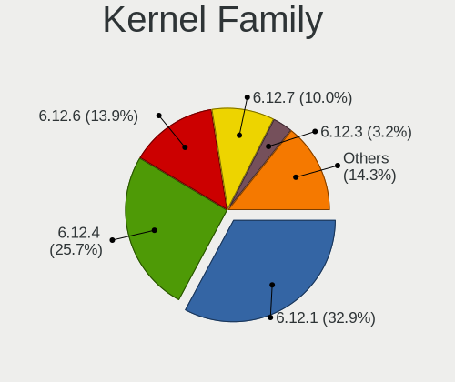
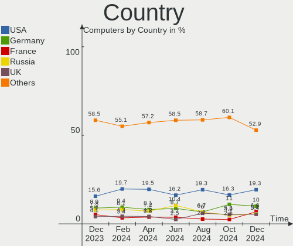
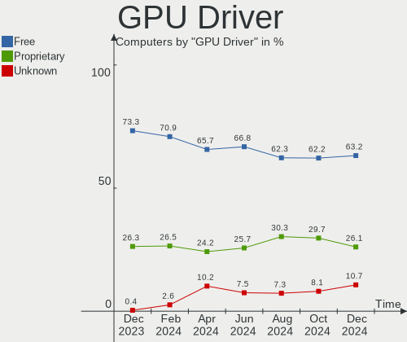

Arch Hardware Trends
--------------------

A project to identify most popular hardware characteristics and track their change
over time based on data collected by Arch users at https://Linux-Hardware.org.

Anyone can contribute to this report by the [hw-probe](https://github.com/linuxhw/hw-probe) tool:

    sudo -E hw-probe -all -upload

This is a report for all computer types. See also reports for [desktops](/Dist/Arch/Desktop/README.md) and [notebooks](/Dist/Arch/Notebook/README.md).

Full-feature report is available here: https://linux-hardware.org/?view=trends

Period: Mar, 2022.

Contents
--------

* [ System ](#system)
  - [ OS                       ](#os)
  - [ OS Family                ](#os-family)
  - [ Kernel                   ](#kernel)
  - [ Kernel Family            ](#kernel-family)
  - [ Kernel Major Ver.        ](#kernel-major-ver)
  - [ Arch                     ](#arch)
  - [ DE                       ](#de)
  - [ Display Server           ](#display-server)
  - [ Display Manager          ](#display-manager)
  - [ OS Lang                  ](#os-lang)
  - [ Boot Mode                ](#boot-mode)
  - [ Filesystem               ](#filesystem)
  - [ Part. scheme             ](#part-scheme)
  - [ Dual Boot with Linux/BSD ](#dual-boot-with-linuxbsd)
  - [ Dual Boot (Win)          ](#dual-boot-win)

* [ Board ](#board)
  - [ Vendor                   ](#vendor)
  - [ Model                    ](#model)
  - [ Model Family             ](#model-family)
  - [ MFG Year                 ](#mfg-year)
  - [ Form Factor              ](#form-factor)
  - [ Secure Boot              ](#secure-boot)
  - [ Coreboot                 ](#coreboot)
  - [ RAM Size                 ](#ram-size)
  - [ RAM Used                 ](#ram-used)
  - [ Total Drives             ](#total-drives)
  - [ Has CD-ROM               ](#has-cd-rom)
  - [ Has Ethernet             ](#has-ethernet)
  - [ Has WiFi                 ](#has-wifi)
  - [ Has Bluetooth            ](#has-bluetooth)

* [ Location ](#location)
  - [ Country                  ](#country)
  - [ City                     ](#city)

* [ Drives ](#drives)
  - [ Drive Vendor             ](#drive-vendor)
  - [ Drive Model              ](#drive-model)
  - [ HDD Vendor               ](#hdd-vendor)
  - [ SSD Vendor               ](#ssd-vendor)
  - [ Drive Kind               ](#drive-kind)
  - [ Drive Connector          ](#drive-connector)
  - [ Drive Size               ](#drive-size)
  - [ Space Total              ](#space-total)
  - [ Space Used               ](#space-used)
  - [ Malfunc. Drives          ](#malfunc-drives)
  - [ Malfunc. Drive Vendor    ](#malfunc-drive-vendor)
  - [ Malfunc. HDD Vendor      ](#malfunc-hdd-vendor)
  - [ Malfunc. Drive Kind      ](#malfunc-drive-kind)
  - [ Failed Drives            ](#failed-drives)
  - [ Failed Drive Vendor      ](#failed-drive-vendor)
  - [ Drive Status             ](#drive-status)

* [ Storage controller ](#storage-controller)
  - [ Storage Vendor           ](#storage-vendor)
  - [ Storage Model            ](#storage-model)
  - [ Storage Kind             ](#storage-kind)

* [ Processor ](#processor)
  - [ CPU Vendor               ](#cpu-vendor)
  - [ CPU Model                ](#cpu-model)
  - [ CPU Model Family         ](#cpu-model-family)
  - [ CPU Cores                ](#cpu-cores)
  - [ CPU Sockets              ](#cpu-sockets)
  - [ CPU Threads              ](#cpu-threads)
  - [ CPU Op-Modes             ](#cpu-op-modes)
  - [ CPU Microcode            ](#cpu-microcode)
  - [ CPU Microarch            ](#cpu-microarch)

* [ Graphics ](#graphics)
  - [ GPU Vendor               ](#gpu-vendor)
  - [ GPU Model                ](#gpu-model)
  - [ GPU Combo                ](#gpu-combo)
  - [ GPU Driver               ](#gpu-driver)
  - [ GPU Memory               ](#gpu-memory)

* [ Monitor ](#monitor)
  - [ Monitor Vendor           ](#monitor-vendor)
  - [ Monitor Model            ](#monitor-model)
  - [ Monitor Resolution       ](#monitor-resolution)
  - [ Monitor Diagonal         ](#monitor-diagonal)
  - [ Monitor Width            ](#monitor-width)
  - [ Aspect Ratio             ](#aspect-ratio)
  - [ Monitor Area             ](#monitor-area)
  - [ Pixel Density            ](#pixel-density)
  - [ Multiple Monitors        ](#multiple-monitors)

* [ Network ](#network)
  - [ Net Controller Vendor    ](#net-controller-vendor)
  - [ Net Controller Model     ](#net-controller-model)
  - [ Wireless Vendor          ](#wireless-vendor)
  - [ Wireless Model           ](#wireless-model)
  - [ Ethernet Vendor          ](#ethernet-vendor)
  - [ Ethernet Model           ](#ethernet-model)
  - [ Net Controller Kind      ](#net-controller-kind)
  - [ Used Controller          ](#used-controller)
  - [ NICs                     ](#nics)
  - [ IPv6                     ](#ipv6)

* [ Bluetooth ](#bluetooth)
  - [ Bluetooth Vendor         ](#bluetooth-vendor)
  - [ Bluetooth Model          ](#bluetooth-model)

* [ Sound ](#sound)
  - [ Sound Vendor             ](#sound-vendor)
  - [ Sound Model              ](#sound-model)

* [ Memory ](#memory)
  - [ Memory Vendor            ](#memory-vendor)
  - [ Memory Model             ](#memory-model)
  - [ Memory Kind              ](#memory-kind)
  - [ Memory Form Factor       ](#memory-form-factor)
  - [ Memory Size              ](#memory-size)
  - [ Memory Speed             ](#memory-speed)

* [ Printers & scanners ](#printers--scanners)
  - [ Printer Vendor           ](#printer-vendor)
  - [ Printer Model            ](#printer-model)
  - [ Scanner Vendor           ](#scanner-vendor)
  - [ Scanner Model            ](#scanner-model)

* [ Camera ](#camera)
  - [ Camera Vendor            ](#camera-vendor)
  - [ Camera Model             ](#camera-model)

* [ Security ](#security)
  - [ Fingerprint Vendor       ](#fingerprint-vendor)
  - [ Fingerprint Model        ](#fingerprint-model)
  - [ Chipcard Vendor          ](#chipcard-vendor)
  - [ Chipcard Model           ](#chipcard-model)

* [ Unsupported ](#unsupported)
  - [ Unsupported Devices      ](#unsupported-devices)
  - [ Unsupported Device Types ](#unsupported-device-types)

System
------

OS
--

Installed operating systems

| Name             | Computers | Percent |
|------------------|-----------|---------|
| Arch             | 71        | 56.8%   |
| Arch Rolling     | 53        | 42.4%   |
| Arch Workstation | 1         | 0.8%    |

OS Family
---------

OS without a version

| Name | Computers | Percent |
|------|-----------|---------|
| Arch | 125       | 100%    |

Kernel
------

Version of the Linux kernel

| Version                         | Computers | Percent |
|---------------------------------|-----------|---------|
| 5.16.16-arch1-1                 | 23        | 18.4%   |
| 5.16.15-arch1-1                 | 12        | 9.6%    |
| 5.16.14-arch1-1                 | 11        | 8.8%    |
| 5.16.13-arch1-1                 | 11        | 8.8%    |
| 5.16.16-zen1-1-zen              | 7         | 5.6%    |
| 5.16.12-zen1-1-zen              | 6         | 4.8%    |
| 5.16.12-arch1-1                 | 6         | 4.8%    |
| 5.16.14-zen1-1-zen              | 5         | 4%      |
| 5.16.11-arch1-2                 | 5         | 4%      |
| 5.16.11-arch1-1                 | 5         | 4%      |
| 5.17.1-arch1-1                  | 4         | 3.2%    |
| 5.16.15-zen1-1-zen              | 4         | 3.2%    |
| 5.15.31-1-lts                   | 3         | 2.4%    |
| 5.15.26-1-lts                   | 3         | 2.4%    |
| 5.16.10-arch1-1                 | 2         | 1.6%    |
| 5.15.27-xanmod1-1               | 2         | 1.6%    |
| 5.17.0-next-20220322-1-next-git | 1         | 0.8%    |
| 5.16.9-arch1-1                  | 1         | 0.8%    |
| 5.16.7-zen1-1-zen               | 1         | 0.8%    |
| 5.16.5-arch1-1                  | 1         | 0.8%    |
| 5.16.18-1-ck-generic-v3         | 1         | 0.8%    |
| 5.16.16-247-tkg-bmq             | 1         | 0.8%    |
| 5.16.14-247-tkg-cfs-llvm        | 1         | 0.8%    |
| 5.16.12-xanmod1-1               | 1         | 0.8%    |
| 5.16.11-nitrous-fire+           | 1         | 0.8%    |
| 5.16.11-246-tkg-pds             | 1         | 0.8%    |
| 5.16.11-1-cachyos-bmq-lto       | 1         | 0.8%    |
| 5.15.30-1-lts                   | 1         | 0.8%    |
| 5.15.29-1-lts                   | 1         | 0.8%    |
| 5.15.25-1-lts                   | 1         | 0.8%    |
| 5.15.13-arch1-1                 | 1         | 0.8%    |
| 5.15.11-zen1-1-zen              | 1         | 0.8%    |

Kernel Family
-------------

Linux kernel without a distro release

| Version | Computers | Percent |
|---------|-----------|---------|
| 5.16.16 | 31        | 24.8%   |
| 5.16.14 | 17        | 13.6%   |
| 5.16.15 | 16        | 12.8%   |
| 5.16.12 | 13        | 10.4%   |
| 5.16.11 | 13        | 10.4%   |
| 5.16.13 | 11        | 8.8%    |
| 5.17.1  | 4         | 3.2%    |
| 5.15.31 | 3         | 2.4%    |
| 5.15.26 | 3         | 2.4%    |
| 5.16.10 | 2         | 1.6%    |
| 5.15.27 | 2         | 1.6%    |
| 5.17.0  | 1         | 0.8%    |
| 5.16.9  | 1         | 0.8%    |
| 5.16.7  | 1         | 0.8%    |
| 5.16.5  | 1         | 0.8%    |
| 5.16.18 | 1         | 0.8%    |
| 5.15.30 | 1         | 0.8%    |
| 5.15.29 | 1         | 0.8%    |
| 5.15.25 | 1         | 0.8%    |
| 5.15.13 | 1         | 0.8%    |
| 5.15.11 | 1         | 0.8%    |

Kernel Major Ver.
-----------------

Linux kernel major version

| Version | Computers | Percent |
|---------|-----------|---------|
| 5.16    | 107       | 85.6%   |
| 5.15    | 13        | 10.4%   |
| 5.17    | 5         | 4%      |

Arch
----

OS architecture (x86_64, i586, etc.)

| Name   | Computers | Percent |
|--------|-----------|---------|
| x86_64 | 125       | 100%    |

DE
--

Desktop Environment

| Name       | Computers | Percent |
|------------|-----------|---------|
| KDE5       | 42        | 33.6%   |
| GNOME      | 41        | 32.8%   |
| XFCE       | 9         | 7.2%    |
| Unknown    | 9         | 7.2%    |
| i3         | 6         | 4.8%    |
| X-Cinnamon | 3         | 2.4%    |
| awesome    | 3         | 2.4%    |
| sway       | 2         | 1.6%    |
| MATE       | 2         | 1.6%    |
| qtile      | 1         | 0.8%    |
| Pantheon   | 1         | 0.8%    |
| LXQt       | 1         | 0.8%    |
| kde        | 1         | 0.8%    |
| dwm        | 1         | 0.8%    |
| Deepin     | 1         | 0.8%    |
| Cinnamon   | 1         | 0.8%    |
| Budgie     | 1         | 0.8%    |

Display Server
--------------

X11 or Wayland

| Name    | Computers | Percent |
|---------|-----------|---------|
| X11     | 76        | 60.8%   |
| Wayland | 33        | 26.4%   |
| Unknown | 9         | 7.2%    |
| Tty     | 7         | 5.6%    |

Display Manager
---------------

SDDM, LightDM, etc.

| Name    | Computers | Percent |
|---------|-----------|---------|
| Unknown | 51        | 40.8%   |
| SDDM    | 27        | 21.6%   |
| LightDM | 24        | 19.2%   |
| GDM     | 22        | 17.6%   |
| LXDM    | 1         | 0.8%    |

OS Lang
-------

Language

| Lang       | Computers | Percent |
|------------|-----------|---------|
| en_US      | 77        | 61.6%   |
| en_GB      | 7         | 5.6%    |
| pt_BR      | 5         | 4%      |
| de_DE      | 4         | 3.2%    |
| it_IT      | 3         | 2.4%    |
| en_AU      | 3         | 2.4%    |
| C          | 3         | 2.4%    |
| zh_CN      | 2         | 1.6%    |
| ru_RU      | 2         | 1.6%    |
| es_ES      | 2         | 1.6%    |
| en_IN      | 2         | 1.6%    |
| en_CA      | 2         | 1.6%    |
| Unknown    | 2         | 1.6%    |
| szl_PL     | 1         | 0.8%    |
| pl_PL      | 1         | 0.8%    |
| hu_HU      | 1         | 0.8%    |
| fr_FR      | 1         | 0.8%    |
| es_MX.UTF8 | 1         | 0.8%    |
| es_MX      | 1         | 0.8%    |
| es_AR      | 1         | 0.8%    |
| en_ZA      | 1         | 0.8%    |
| en_NZ      | 1         | 0.8%    |
| en_DK      | 1         | 0.8%    |
| cs_CZ      | 1         | 0.8%    |

Boot Mode
---------

EFI or BIOS

| Mode | Computers | Percent |
|------|-----------|---------|
| EFI  | 78        | 62.4%   |
| BIOS | 47        | 37.6%   |

Filesystem
----------

Type of filesystem

| Type  | Computers | Percent |
|-------|-----------|---------|
| Ext4  | 83        | 66.4%   |
| Btrfs | 36        | 28.8%   |
| Zfs   | 2         | 1.6%    |
| Xfs   | 2         | 1.6%    |
| F2fs  | 2         | 1.6%    |

Part. scheme
------------

Scheme of partitioning

| Type    | Computers | Percent |
|---------|-----------|---------|
| GPT     | 83        | 66.4%   |
| Unknown | 36        | 28.8%   |
| MBR     | 6         | 4.8%    |

Dual Boot with Linux/BSD
------------------------

Hosting more than one Linux/BSD

| Dual boot | Computers | Percent |
|-----------|-----------|---------|
| No        | 111       | 88.8%   |
| Yes       | 14        | 11.2%   |

Dual Boot (Win)
---------------

Hosting Linux and Windows

| Dual boot | Computers | Percent |
|-----------|-----------|---------|
| No        | 86        | 68.8%   |
| Yes       | 39        | 31.2%   |

Board
-----

Vendor
------

Motherboard manufacturer

| Name                   | Computers | Percent |
|------------------------|-----------|---------|
| ASUSTek Computer       | 24        | 19.2%   |
| Lenovo                 | 17        | 13.6%   |
| MSI                    | 15        | 12%     |
| Hewlett-Packard        | 14        | 11.2%   |
| Dell                   | 11        | 8.8%    |
| ASRock                 | 8         | 6.4%    |
| Gigabyte Technology    | 7         | 5.6%    |
| Acer                   | 6         | 4.8%    |
| HUAWEI                 | 4         | 3.2%    |
| Samsung Electronics    | 3         | 2.4%    |
| Toshiba                | 2         | 1.6%    |
| Notebook               | 2         | 1.6%    |
| Avell High Performance | 2         | 1.6%    |
| Apple                  | 2         | 1.6%    |
| Timi                   | 1         | 0.8%    |
| System76               | 1         | 0.8%    |
| Packard Bell           | 1         | 0.8%    |
| Microsoft              | 1         | 0.8%    |
| Inspur                 | 1         | 0.8%    |
| HONOR                  | 1         | 0.8%    |
| Eluktronics            | 1         | 0.8%    |
| Alienware              | 1         | 0.8%    |

Model
-----

Motherboard model

| Name                                   | Computers | Percent |
|----------------------------------------|-----------|---------|
| ASRock B450M-HDV R4.0                  | 3         | 2.4%    |
| MSI MS-7A38                            | 2         | 1.6%    |
| HP Laptop 14-dq0xxx                    | 2         | 1.6%    |
| Gigabyte B450M DS3H                    | 2         | 1.6%    |
| ASUS ROG Strix G513QY_G513QY           | 2         | 1.6%    |
| Toshiba Satellite L655                 | 1         | 0.8%    |
| Toshiba Satellite C50-A                | 1         | 0.8%    |
| Timi TM1701                            | 1         | 0.8%    |
| System76 Lemur Pro                     | 1         | 0.8%    |
| Samsung R530/R730                      | 1         | 0.8%    |
| Samsung 767XCL                         | 1         | 0.8%    |
| Samsung 670Z5E                         | 1         | 0.8%    |
| Packard Bell DOT S                     | 1         | 0.8%    |
| Notebook NV4XMB,ME,MZ                  | 1         | 0.8%    |
| Notebook N85_N87,HJ,HJ1,HK1            | 1         | 0.8%    |
| MSI Stealth GS66 12UGS                 | 1         | 0.8%    |
| MSI MS-7D32                            | 1         | 0.8%    |
| MSI MS-7C02                            | 1         | 0.8%    |
| MSI MS-7B89                            | 1         | 0.8%    |
| MSI MS-7B86                            | 1         | 0.8%    |
| MSI MS-7B78                            | 1         | 0.8%    |
| MSI MS-7A34                            | 1         | 0.8%    |
| MSI MS-7971                            | 1         | 0.8%    |
| MSI MS-7798                            | 1         | 0.8%    |
| MSI Modern 14 B4MW                     | 1         | 0.8%    |
| MSI GP66 Leopard 11UG                  | 1         | 0.8%    |
| MSI GP62 7QF                           | 1         | 0.8%    |
| MSI GL63 9SD                           | 1         | 0.8%    |
| Microsoft Surface Laptop               | 1         | 0.8%    |
| Lenovo Yoga 6 13ALC6 82ND              | 1         | 0.8%    |
| Lenovo V15 G2 ITL 82ME                 | 1         | 0.8%    |
| Lenovo ThinkStation K 11KMA07PCD       | 1         | 0.8%    |
| Lenovo ThinkPad X270 W10DG 20K5S14F00  | 1         | 0.8%    |
| Lenovo ThinkPad X220 4290LL3           | 1         | 0.8%    |
| Lenovo ThinkPad T490 20N2000KRT        | 1         | 0.8%    |
| Lenovo ThinkPad T14s Gen 1 20UHS0QT00  | 1         | 0.8%    |
| Lenovo ThinkPad P14s Gen 2a 21A00000FR | 1         | 0.8%    |
| Lenovo ThinkPad E15 Gen 2 20TD0003RA   | 1         | 0.8%    |
| Lenovo ThinkCentre M715q 10VHS23000    | 1         | 0.8%    |
| Lenovo Legion 5 Pro 16ACH6H 82JQ       | 1         | 0.8%    |
| Lenovo Legion 5 15ARH05 82B5           | 1         | 0.8%    |
| Lenovo IdeaPad S145-15IWL 81S9         | 1         | 0.8%    |
| Lenovo IdeaPad 5 Pro 14ACN6 82L7       | 1         | 0.8%    |
| Lenovo IdeaPad 5 15ITL05 82FG          | 1         | 0.8%    |
| Lenovo IdeaPad 320-15ABR 80XS          | 1         | 0.8%    |
| Lenovo G565 20071                      | 1         | 0.8%    |
| Inspur                                 | 1         | 0.8%    |
| HUAWEI NBLK-WAX9X                      | 1         | 0.8%    |
| HUAWEI KLVL-WXX9                       | 1         | 0.8%    |
| HUAWEI HVY-WXX9                        | 1         | 0.8%    |
| HUAWEI BOHB-WAX9                       | 1         | 0.8%    |
| HONOR NMH-WCX9                         | 1         | 0.8%    |
| HP ZBook 17 G2                         | 1         | 0.8%    |
| HP ProBook 455 G7                      | 1         | 0.8%    |
| HP ProBook 450 G4                      | 1         | 0.8%    |
| HP Pavilion Gaming Laptop 17-cd0xxx    | 1         | 0.8%    |
| HP Pavilion Gaming Laptop 15-dk1064TX  | 1         | 0.8%    |
| HP Laptop 14-fq1xxx                    | 1         | 0.8%    |
| HP Laptop 14-cm0xxx                    | 1         | 0.8%    |
| HP ENVY Laptop 13-ah0xxx               | 1         | 0.8%    |

Model Family
------------

Motherboard model prefix

| Name                  | Computers | Percent |
|-----------------------|-----------|---------|
| Lenovo ThinkPad       | 6         | 4.8%    |
| ASUS PRIME            | 6         | 4.8%    |
| ASUS ROG              | 5         | 4%      |
| Lenovo IdeaPad        | 4         | 3.2%    |
| HP Laptop             | 4         | 3.2%    |
| Dell XPS              | 4         | 3.2%    |
| HP EliteBook          | 3         | 2.4%    |
| Dell Inspiron         | 3         | 2.4%    |
| ASRock B450M-HDV      | 3         | 2.4%    |
| Acer Aspire           | 3         | 2.4%    |
| Toshiba Satellite     | 2         | 1.6%    |
| MSI MS-7A38           | 2         | 1.6%    |
| Lenovo Legion         | 2         | 1.6%    |
| HP ProBook            | 2         | 1.6%    |
| HP Pavilion           | 2         | 1.6%    |
| HP ENVY               | 2         | 1.6%    |
| Gigabyte B450M        | 2         | 1.6%    |
| Dell Precision        | 2         | 1.6%    |
| Dell Latitude         | 2         | 1.6%    |
| ASUS VivoBook         | 2         | 1.6%    |
| ASUS TUF              | 2         | 1.6%    |
| ASUS SABERTOOTH       | 2         | 1.6%    |
| Acer Nitro            | 2         | 1.6%    |
| Timi TM1701           | 1         | 0.8%    |
| System76 Lemur        | 1         | 0.8%    |
| Samsung R530          | 1         | 0.8%    |
| Samsung 767XCL        | 1         | 0.8%    |
| Samsung 670Z5E        | 1         | 0.8%    |
| Packard Bell DOT      | 1         | 0.8%    |
| Notebook NV4XMB       | 1         | 0.8%    |
| Notebook N85          | 1         | 0.8%    |
| MSI Stealth           | 1         | 0.8%    |
| MSI MS-7D32           | 1         | 0.8%    |
| MSI MS-7C02           | 1         | 0.8%    |
| MSI MS-7B89           | 1         | 0.8%    |
| MSI MS-7B86           | 1         | 0.8%    |
| MSI MS-7B78           | 1         | 0.8%    |
| MSI MS-7A34           | 1         | 0.8%    |
| MSI MS-7971           | 1         | 0.8%    |
| MSI MS-7798           | 1         | 0.8%    |
| MSI Modern            | 1         | 0.8%    |
| MSI GP66              | 1         | 0.8%    |
| MSI GP62              | 1         | 0.8%    |
| MSI GL63              | 1         | 0.8%    |
| Microsoft Surface     | 1         | 0.8%    |
| Lenovo Yoga           | 1         | 0.8%    |
| Lenovo V15            | 1         | 0.8%    |
| Lenovo ThinkStation   | 1         | 0.8%    |
| Lenovo ThinkCentre    | 1         | 0.8%    |
| Lenovo G565           | 1         | 0.8%    |
| Inspur                | 1         | 0.8%    |
| HUAWEI NBLK-WAX9X     | 1         | 0.8%    |
| HUAWEI KLVL-WXX9      | 1         | 0.8%    |
| HUAWEI HVY-WXX9       | 1         | 0.8%    |
| HUAWEI BOHB-WAX9      | 1         | 0.8%    |
| HONOR NMH-WCX9        | 1         | 0.8%    |
| HP ZBook              | 1         | 0.8%    |
| Gigabyte Z270X-Gaming | 1         | 0.8%    |
| Gigabyte X570         | 1         | 0.8%    |
| Gigabyte H310M        | 1         | 0.8%    |

MFG Year
--------

Motherboard manufacture year

| Year | Computers | Percent |
|------|-----------|---------|
| 2021 | 25        | 20%     |
| 2018 | 20        | 16%     |
| 2020 | 18        | 14.4%   |
| 2019 | 15        | 12%     |
| 2017 | 13        | 10.4%   |
| 2015 | 8         | 6.4%    |
| 2016 | 7         | 5.6%    |
| 2014 | 4         | 3.2%    |
| 2012 | 4         | 3.2%    |
| 2011 | 4         | 3.2%    |
| 2013 | 3         | 2.4%    |
| 2010 | 3         | 2.4%    |
| 2022 | 1         | 0.8%    |

Form Factor
-----------

Physical design of the computer

| Name        | Computers | Percent |
|-------------|-----------|---------|
| Notebook    | 79        | 63.2%   |
| Desktop     | 40        | 32%     |
| Convertible | 3         | 2.4%    |
| Tablet      | 1         | 0.8%    |
| Mini pc     | 1         | 0.8%    |
| All in one  | 1         | 0.8%    |

Secure Boot
-----------

Enabled or disabled

| State    | Computers | Percent |
|----------|-----------|---------|
| Disabled | 124       | 99.2%   |
| Enabled  | 1         | 0.8%    |

Coreboot
--------

Have coreboot on board

| Used | Computers | Percent |
|------|-----------|---------|
| No   | 124       | 99.2%   |
| Yes  | 1         | 0.8%    |

RAM Size
--------

Total RAM memory

| Size in GB  | Computers | Percent |
|-------------|-----------|---------|
| 16.01-24.0  | 44        | 35.2%   |
| 32.01-64.0  | 26        | 20.8%   |
| 4.01-8.0    | 20        | 16%     |
| 8.01-16.0   | 17        | 13.6%   |
| 3.01-4.0    | 12        | 9.6%    |
| 64.01-256.0 | 3         | 2.4%    |
| 24.01-32.0  | 1         | 0.8%    |
| 2.01-3.0    | 1         | 0.8%    |
| 1.01-2.0    | 1         | 0.8%    |

RAM Used
--------

Used RAM memory

| Used GB    | Computers | Percent |
|------------|-----------|---------|
| 2.01-3.0   | 37        | 29.6%   |
| 1.01-2.0   | 31        | 24.8%   |
| 4.01-8.0   | 28        | 22.4%   |
| 3.01-4.0   | 18        | 14.4%   |
| 8.01-16.0  | 7         | 5.6%    |
| 24.01-32.0 | 1         | 0.8%    |
| 16.01-24.0 | 1         | 0.8%    |
| 0.51-1.0   | 1         | 0.8%    |
| 0.01-0.5   | 1         | 0.8%    |

Total Drives
------------

Number of drives on board

| Drives | Computers | Percent |
|--------|-----------|---------|
| 1      | 56        | 44.8%   |
| 2      | 42        | 33.6%   |
| 3      | 20        | 16%     |
| 4      | 4         | 3.2%    |
| 5      | 2         | 1.6%    |
| 9      | 1         | 0.8%    |

Has CD-ROM
----------

Has CD-ROM on board

| Presented | Computers | Percent |
|-----------|-----------|---------|
| No        | 99        | 79.2%   |
| Yes       | 26        | 20.8%   |

Has Ethernet
------------

Has Ethernet on board

| Presented | Computers | Percent |
|-----------|-----------|---------|
| Yes       | 99        | 79.2%   |
| No        | 26        | 20.8%   |

Has WiFi
--------

Has WiFi module

| Presented | Computers | Percent |
|-----------|-----------|---------|
| Yes       | 104       | 83.2%   |
| No        | 21        | 16.8%   |

Has Bluetooth
-------------

Has Bluetooth module

| Presented | Computers | Percent |
|-----------|-----------|---------|
| Yes       | 94        | 75.2%   |
| No        | 31        | 24.8%   |

Location
--------

Country
-------

Geographic location (country)

| Country         | Computers | Percent |
|-----------------|-----------|---------|
| USA             | 28        | 22.4%   |
| Brazil          | 11        | 8.8%    |
| Poland          | 8         | 6.4%    |
| Germany         | 7         | 5.6%    |
| France          | 7         | 5.6%    |
| Russia          | 6         | 4.8%    |
| Canada          | 5         | 4%      |
| UK              | 4         | 3.2%    |
| Italy           | 4         | 3.2%    |
| Australia       | 4         | 3.2%    |
| Spain           | 3         | 2.4%    |
| Portugal        | 3         | 2.4%    |
| Turkey          | 2         | 1.6%    |
| Romania         | 2         | 1.6%    |
| Mexico          | 2         | 1.6%    |
| India           | 2         | 1.6%    |
| Finland         | 2         | 1.6%    |
| China           | 2         | 1.6%    |
| Bangladesh      | 2         | 1.6%    |
| Venezuela       | 1         | 0.8%    |
| Ukraine         | 1         | 0.8%    |
| Sri Lanka       | 1         | 0.8%    |
| South Africa    | 1         | 0.8%    |
| Slovenia        | 1         | 0.8%    |
| Norway          | 1         | 0.8%    |
| North Macedonia | 1         | 0.8%    |
| New Zealand     | 1         | 0.8%    |
| Netherlands     | 1         | 0.8%    |
| Ireland         | 1         | 0.8%    |
| Iran            | 1         | 0.8%    |
| Indonesia       | 1         | 0.8%    |
| Hungary         | 1         | 0.8%    |
| Georgia         | 1         | 0.8%    |
| Estonia         | 1         | 0.8%    |
| Czechia         | 1         | 0.8%    |
| Chile           | 1         | 0.8%    |
| Bulgaria        | 1         | 0.8%    |
| Austria         | 1         | 0.8%    |
| Argentina       | 1         | 0.8%    |
| Algeria         | 1         | 0.8%    |

City
----

Geographic location (city)

| City                      | Computers | Percent |
|---------------------------|-----------|---------|
| Warsaw                    | 3         | 2.4%    |
| St Petersburg             | 3         | 2.4%    |
| São Paulo                | 2         | 1.6%    |
| Recife                    | 2         | 1.6%    |
| Paris                     | 2         | 1.6%    |
| Munich                    | 2         | 1.6%    |
| Moscow                    | 2         | 1.6%    |
| Montreal                  | 2         | 1.6%    |
| Melbourne                 | 2         | 1.6%    |
| Madrid                    | 2         | 1.6%    |
| Lille                     | 2         | 1.6%    |
| Istanbul                  | 2         | 1.6%    |
| Dhaka                     | 2         | 1.6%    |
| Baton Rouge               | 2         | 1.6%    |
| Alpharetta                | 2         | 1.6%    |
| Wroclaw                   | 1         | 0.8%    |
| Whangarei                 | 1         | 0.8%    |
| Webster                   | 1         | 0.8%    |
| Viña del Mar             | 1         | 0.8%    |
| Vantaa                    | 1         | 0.8%    |
| Valencia                  | 1         | 0.8%    |
| Urbandale                 | 1         | 0.8%    |
| Uberlândia               | 1         | 0.8%    |
| Trivandrum                | 1         | 0.8%    |
| Taubate                   | 1         | 0.8%    |
| Tampere                   | 1         | 0.8%    |
| Tallinn                   | 1         | 0.8%    |
| Sydney                    | 1         | 0.8%    |
| Spokane                   | 1         | 0.8%    |
| Southend-on-Sea           | 1         | 0.8%    |
| Solingen                  | 1         | 0.8%    |
| Skopje                    | 1         | 0.8%    |
| Sighetu Marmaţiei        | 1         | 0.8%    |
| Sheffield                 | 1         | 0.8%    |
| Shanghai                  | 1         | 0.8%    |
| Setúbal                  | 1         | 0.8%    |
| Seattle                   | 1         | 0.8%    |
| San Luis Potosí City     | 1         | 0.8%    |
| San Francisco             | 1         | 0.8%    |
| Saint-Mathieu-de-Treviers | 1         | 0.8%    |
| Saint-Cyr-l'École        | 1         | 0.8%    |
| Sacramento                | 1         | 0.8%    |
| Ryazan                    | 1         | 0.8%    |
| Roseville                 | 1         | 0.8%    |
| Rome                      | 1         | 0.8%    |
| Riverside                 | 1         | 0.8%    |
| Rho                       | 1         | 0.8%    |
| Rexburg                   | 1         | 0.8%    |
| Reading                   | 1         | 0.8%    |
| Rasht                     | 1         | 0.8%    |
| Queens                    | 1         | 0.8%    |
| Prerov nad Labem          | 1         | 0.8%    |
| Poznan                    | 1         | 0.8%    |
| Porto                     | 1         | 0.8%    |
| Plovdiv                   | 1         | 0.8%    |
| Perpignan                 | 1         | 0.8%    |
| Paraná                   | 1         | 0.8%    |
| Pannipitiya               | 1         | 0.8%    |
| Ourinhos                  | 1         | 0.8%    |
| Oslo                      | 1         | 0.8%    |

Drives
------

Drive Vendor
------------

Hard drive vendors

| Vendor                    | Computers | Drives | Percent |
|---------------------------|-----------|--------|---------|
| Samsung Electronics       | 45        | 58     | 21.53%  |
| Seagate                   | 28        | 31     | 13.4%   |
| WDC                       | 27        | 33     | 12.92%  |
| Kingston                  | 13        | 13     | 6.22%   |
| Toshiba                   | 12        | 14     | 5.74%   |
| SanDisk                   | 11        | 12     | 5.26%   |
| Crucial                   | 11        | 12     | 5.26%   |
| SK Hynix                  | 8         | 8      | 3.83%   |
| Intel                     | 7         | 7      | 3.35%   |
| A-DATA Technology         | 6         | 6      | 2.87%   |
| Unknown                   | 5         | 5      | 2.39%   |
| Phison                    | 4         | 4      | 1.91%   |
| HGST                      | 4         | 4      | 1.91%   |
| LITEON                    | 3         | 3      | 1.44%   |
| Micron/Crucial Technology | 2         | 2      | 0.96%   |
| Micron Technology         | 2         | 2      | 0.96%   |
| Intenso                   | 2         | 2      | 0.96%   |
| Hitachi                   | 2         | 2      | 0.96%   |
| ZHITAI                    | 1         | 1      | 0.48%   |
| YMTC                      | 1         | 1      | 0.48%   |
| UMIS                      | 1         | 1      | 0.48%   |
| Transcend                 | 1         | 1      | 0.48%   |
| SSSTC                     | 1         | 1      | 0.48%   |
| SPCC                      | 1         | 1      | 0.48%   |
| Silicon Motion            | 1         | 1      | 0.48%   |
| Netac                     | 1         | 1      | 0.48%   |
| Lexar                     | 1         | 1      | 0.48%   |
| KingSpec                  | 1         | 1      | 0.48%   |
| GOODRAM                   | 1         | 1      | 0.48%   |
| Dell                      | 1         | 1      | 0.48%   |
| Corsair                   | 1         | 1      | 0.48%   |
| China                     | 1         | 1      | 0.48%   |
| BHT                       | 1         | 1      | 0.48%   |
| Apple                     | 1         | 1      | 0.48%   |
| Unknown                   | 1         | 1      | 0.48%   |

Drive Model
-----------

Hard drive models

| Model                                | Computers | Percent |
|--------------------------------------|-----------|---------|
| Seagate ST2000DM008-2FR102 2TB       | 6         | 2.6%    |
| Samsung SSD 970 EVO Plus 1TB         | 4         | 1.73%   |
| Samsung NVMe SSD Drive 512GB         | 4         | 1.73%   |
| Seagate ST2000DM006-2DM164 2TB       | 3         | 1.3%    |
| Sandisk NVMe SSD Drive 500GB         | 3         | 1.3%    |
| Samsung SSD 860 EVO 1TB              | 3         | 1.3%    |
| Samsung NVMe SSD Drive 500GB         | 3         | 1.3%    |
| Samsung NVMe SSD Drive 256GB         | 3         | 1.3%    |
| Kingston SA400S37480G 480GB SSD      | 3         | 1.3%    |
| HGST HTS721010A9E630 1TB             | 3         | 1.3%    |
| WDC WDS250G2B0B-00YS70 250GB SSD     | 2         | 0.87%   |
| Unknown MMC Card  64GB               | 2         | 0.87%   |
| Seagate ST1000LM035-1RK172 1TB       | 2         | 0.87%   |
| Seagate ST1000LM024 HN-M101MBB 1TB   | 2         | 0.87%   |
| Sandisk NVMe SSD Drive 1TB           | 2         | 0.87%   |
| Samsung SSD 970 EVO Plus 500GB       | 2         | 0.87%   |
| Samsung SSD 970 EVO Plus 250GB       | 2         | 0.87%   |
| Samsung SSD 870 EVO 500GB            | 2         | 0.87%   |
| Samsung SSD 860 EVO 500GB            | 2         | 0.87%   |
| Samsung SSD 850 EVO 1TB              | 2         | 0.87%   |
| Samsung SSD 830 Series 64GB          | 2         | 0.87%   |
| Micron/Crucial NVMe SSD Drive 1TB    | 2         | 0.87%   |
| LITEON CV8-8E128-HP 128GB SSD        | 2         | 0.87%   |
| Intel SSDPEKNW010T8 1TB              | 2         | 0.87%   |
| Crucial CT960BX500SSD1 960GB         | 2         | 0.87%   |
| Crucial CT500MX500SSD4 500GB         | 2         | 0.87%   |
| Crucial CT1000MX500SSD1 1TB          | 2         | 0.87%   |
| ZHITAI PC005 Active 1TB              | 1         | 0.43%   |
| YMTC PC005 512GB                     | 1         | 0.43%   |
| WDC WDS500G2B0B-00YS70 500GB SSD     | 1         | 0.43%   |
| WDC WDS480G2G0A-00JH30 480GB SSD     | 1         | 0.43%   |
| WDC WDS100T3X0C-00SJG0 1TB           | 1         | 0.43%   |
| WDC WDS100T2B0B 1TB SSD              | 1         | 0.43%   |
| WDC WDS100T2B0A 1TB SSD              | 1         | 0.43%   |
| WDC WDBRPG5000ANC-WRSN 500GB         | 1         | 0.43%   |
| WDC WD7501AALS-00J7B0 752GB          | 1         | 0.43%   |
| WDC WD5001AALS-00L3B2 500GB          | 1         | 0.43%   |
| WDC WD5000LPCX-21VHAT0 500GB         | 1         | 0.43%   |
| WDC WD5000KS-00MNB0 500GB            | 1         | 0.43%   |
| WDC WD5000AAKX-22ERMA0 500GB         | 1         | 0.43%   |
| WDC WD3200BPVT-22JJ5T0 320GB         | 1         | 0.43%   |
| WDC WD20EZBX-08AYR 2TB               | 1         | 0.43%   |
| WDC WD2003FZEX-00SRLA0 2TB           | 1         | 0.43%   |
| WDC WD1600BEVT-22ZCT0 160GB          | 1         | 0.43%   |
| WDC WD10SPZX-75Z10T1 1TB             | 1         | 0.43%   |
| WDC WD10SPZX-22Z10T1 1TB             | 1         | 0.43%   |
| WDC WD10SPZX-21Z10T0 1TB             | 1         | 0.43%   |
| WDC WD10SPSX-08A6W 1TB               | 1         | 0.43%   |
| WDC WD10JPVX-60JC3T0 1TB             | 1         | 0.43%   |
| WDC WD10JPVX-22JC3T0 1TB             | 1         | 0.43%   |
| WDC WD10EZEX-60M2NA0 1TB             | 1         | 0.43%   |
| WDC WD10EZEX-22RKKA0 1TB             | 1         | 0.43%   |
| WDC WD10EZEX-22MFCA0 1TB             | 1         | 0.43%   |
| WDC WD10EARX-32N0YB0 1TB             | 1         | 0.43%   |
| WDC WD10EARS-00Y5B1 1TB              | 1         | 0.43%   |
| WDC WD1002FAEX-00Y9A0 1TB            | 1         | 0.43%   |
| WDC PC SN730 SDBPNTY-512G-1027 512GB | 1         | 0.43%   |
| WDC PC SN530 SDBPMPZ-256G-1101 256GB | 1         | 0.43%   |
| WDC PC SN530 NVMe 512GB              | 1         | 0.43%   |
| WDC PC SN520 NVMe 512GB              | 1         | 0.43%   |

HDD Vendor
----------

Hard disk drive vendors

| Vendor              | Computers | Drives | Percent |
|---------------------|-----------|--------|---------|
| Seagate             | 28        | 31     | 48.28%  |
| WDC                 | 17        | 21     | 29.31%  |
| Toshiba             | 5         | 5      | 8.62%   |
| HGST                | 4         | 4      | 6.9%    |
| Hitachi             | 2         | 2      | 3.45%   |
| Unknown             | 1         | 1      | 1.72%   |
| Samsung Electronics | 1         | 1      | 1.72%   |

SSD Vendor
----------

Solid state drive vendors

| Vendor              | Computers | Drives | Percent |
|---------------------|-----------|--------|---------|
| Samsung Electronics | 20        | 22     | 28.99%  |
| Crucial             | 10        | 11     | 14.49%  |
| Kingston            | 7         | 7      | 10.14%  |
| WDC                 | 6         | 6      | 8.7%    |
| A-DATA Technology   | 5         | 5      | 7.25%   |
| SanDisk             | 3         | 3      | 4.35%   |
| Toshiba             | 2         | 4      | 2.9%    |
| LITEON              | 2         | 2      | 2.9%    |
| Intenso             | 2         | 2      | 2.9%    |
| Intel               | 2         | 2      | 2.9%    |
| Transcend           | 1         | 1      | 1.45%   |
| SPCC                | 1         | 1      | 1.45%   |
| Netac               | 1         | 1      | 1.45%   |
| Lexar               | 1         | 1      | 1.45%   |
| KingSpec            | 1         | 1      | 1.45%   |
| GOODRAM             | 1         | 1      | 1.45%   |
| Dell                | 1         | 1      | 1.45%   |
| China               | 1         | 1      | 1.45%   |
| BHT                 | 1         | 1      | 1.45%   |
| Apple               | 1         | 1      | 1.45%   |

Drive Kind
----------

HDD or SSD

| Kind    | Computers | Drives | Percent |
|---------|-----------|--------|---------|
| NVMe    | 76        | 91     | 40.21%  |
| SSD     | 54        | 74     | 28.57%  |
| HDD     | 54        | 65     | 28.57%  |
| MMC     | 4         | 4      | 2.12%   |
| Unknown | 1         | 1      | 0.53%   |

Drive Connector
---------------

SATA, SAS, NVMe, etc.

| Type | Computers | Drives | Percent |
|------|-----------|--------|---------|
| SATA | 81        | 131    | 47.65%  |
| NVMe | 76        | 91     | 44.71%  |
| SAS  | 9         | 9      | 5.29%   |
| MMC  | 4         | 4      | 2.35%   |

Drive Size
----------

Size of hard drive

| Size in TB | Computers | Drives | Percent |
|------------|-----------|--------|---------|
| 0.01-0.5   | 54        | 71     | 47.79%  |
| 0.51-1.0   | 39        | 46     | 34.51%  |
| 1.01-2.0   | 16        | 18     | 14.16%  |
| 3.01-4.0   | 4         | 4      | 3.54%   |

Space Total
-----------

Amount of disk space available on the file system

| Size in GB     | Computers | Percent |
|----------------|-----------|---------|
| 101-250        | 29        | 23.2%   |
| 251-500        | 25        | 20%     |
| 501-1000       | 19        | 15.2%   |
| 2001-3000      | 15        | 12%     |
| 1001-2000      | 15        | 12%     |
| More than 3000 | 10        | 8%      |
| 51-100         | 5         | 4%      |
| Unknown        | 5         | 4%      |
| 1-20           | 2         | 1.6%    |

Space Used
----------

Amount of used disk space

| Used GB        | Computers | Percent |
|----------------|-----------|---------|
| 101-250        | 25        | 20%     |
| 1-20           | 22        | 17.6%   |
| 51-100         | 17        | 13.6%   |
| 21-50          | 16        | 12.8%   |
| 1001-2000      | 15        | 12%     |
| 501-1000       | 12        | 9.6%    |
| 251-500        | 9         | 7.2%    |
| Unknown        | 5         | 4%      |
| More than 3000 | 3         | 2.4%    |
| 2001-3000      | 1         | 0.8%    |

Malfunc. Drives
---------------

Drive models with a malfunction

| Model                                    | Computers | Drives | Percent |
|------------------------------------------|-----------|--------|---------|
| WDC WD7501AALS-00J7B0 752GB              | 1         | 1      | 6.67%   |
| WDC WD5000AAKX-22ERMA0 500GB             | 1         | 1      | 6.67%   |
| WDC WD3200BPVT-22JJ5T0 320GB             | 1         | 1      | 6.67%   |
| WDC WD10EZEX-60M2NA0 1TB                 | 1         | 1      | 6.67%   |
| WDC WD10EZEX-22RKKA0 1TB                 | 1         | 1      | 6.67%   |
| WDC WD10EARS-00Y5B1 1TB                  | 1         | 1      | 6.67%   |
| Transcend TS1TSSD230S 1TB                | 1         | 1      | 6.67%   |
| Seagate ST500LM012 HN-M500MBB 500GB      | 1         | 1      | 6.67%   |
| Seagate ST4000DM004-2CV104 4TB           | 1         | 1      | 6.67%   |
| Seagate ST2000DM008-2FR102 2TB           | 1         | 1      | 6.67%   |
| Seagate ST2000DM006-2DM164 2TB           | 1         | 1      | 6.67%   |
| Samsung Electronics SSD 840 Series 250GB | 1         | 1      | 6.67%   |
| Samsung Electronics HD200HJ 200GB        | 1         | 1      | 6.67%   |
| LITEON CV8-8E128-HP 128GB SSD            | 1         | 1      | 6.67%   |
| Kingston SNS4151S316GD 16GB SSD          | 1         | 1      | 6.67%   |

Malfunc. Drive Vendor
---------------------

Vendors of faulty drives

| Vendor              | Computers | Drives | Percent |
|---------------------|-----------|--------|---------|
| WDC                 | 5         | 6      | 35.71%  |
| Seagate             | 4         | 4      | 28.57%  |
| Samsung Electronics | 2         | 2      | 14.29%  |
| Transcend           | 1         | 1      | 7.14%   |
| LITEON              | 1         | 1      | 7.14%   |
| Kingston            | 1         | 1      | 7.14%   |

Malfunc. HDD Vendor
-------------------

Vendors of faulty HDD drives

| Vendor              | Computers | Drives | Percent |
|---------------------|-----------|--------|---------|
| WDC                 | 5         | 6      | 50%     |
| Seagate             | 4         | 4      | 40%     |
| Samsung Electronics | 1         | 1      | 10%     |

Malfunc. Drive Kind
-------------------

Kinds of faulty drives

| Kind | Computers | Drives | Percent |
|------|-----------|--------|---------|
| HDD  | 10        | 11     | 71.43%  |
| SSD  | 4         | 4      | 28.57%  |

Failed Drives
-------------

Failed drive models

Zero info for selected period =(

Failed Drive Vendor
-------------------

Failed drive vendors

Zero info for selected period =(

Drive Status
------------

Number of failed and malfunc. drives

| Status   | Computers | Drives | Percent |
|----------|-----------|--------|---------|
| Works    | 73        | 134    | 52.14%  |
| Detected | 53        | 86     | 37.86%  |
| Malfunc  | 14        | 15     | 10%     |

Storage controller
------------------

Storage Vendor
--------------

Storage controller vendors

| Vendor                         | Computers | Percent |
|--------------------------------|-----------|---------|
| Intel                          | 61        | 33.15%  |
| AMD                            | 39        | 21.2%   |
| Samsung Electronics            | 28        | 15.22%  |
| Sandisk                        | 14        | 7.61%   |
| SK Hynix                       | 8         | 4.35%   |
| Kingston Technology Company    | 6         | 3.26%   |
| Phison Electronics             | 5         | 2.72%   |
| Toshiba America Info Systems   | 4         | 2.17%   |
| Micron/Crucial Technology      | 3         | 1.63%   |
| Yangtze Memory Technologies    | 2         | 1.09%   |
| Micron Technology              | 2         | 1.09%   |
| Marvell Technology Group       | 2         | 1.09%   |
| ASMedia Technology             | 2         | 1.09%   |
| Union Memory (Shenzhen)        | 1         | 0.54%   |
| Solid State Storage Technology | 1         | 0.54%   |
| Silicon Motion                 | 1         | 0.54%   |
| LSI Logic / Symbios Logic      | 1         | 0.54%   |
| Lite-On Technology             | 1         | 0.54%   |
| KIOXIA                         | 1         | 0.54%   |
| JMicron Technology             | 1         | 0.54%   |
| ADATA Technology               | 1         | 0.54%   |

Storage Model
-------------

Storage controller models

| Model                                                                            | Computers | Percent |
|----------------------------------------------------------------------------------|-----------|---------|
| AMD FCH SATA Controller [AHCI mode]                                              | 27        | 12.98%  |
| Samsung NVMe SSD Controller SM981/PM981/PM983                                    | 17        | 8.17%   |
| AMD 400 Series Chipset SATA Controller                                           | 16        | 7.69%   |
| Samsung NVMe SSD Controller 980                                                  | 9         | 4.33%   |
| Intel Sunrise Point-LP SATA Controller [AHCI mode]                               | 8         | 3.85%   |
| Intel HM170/QM170 Chipset SATA Controller [AHCI Mode]                            | 7         | 3.37%   |
| Sandisk WD Blue SN550 NVMe SSD                                                   | 5         | 2.4%    |
| Intel 82801 Mobile SATA Controller [RAID mode]                                   | 5         | 2.4%    |
| AMD 500 Series Chipset SATA Controller                                           | 5         | 2.4%    |
| Sandisk Non-Volatile memory controller                                           | 4         | 1.92%   |
| Intel Volume Management Device NVMe RAID Controller                              | 4         | 1.92%   |
| Intel SSD 660P Series                                                            | 4         | 1.92%   |
| Intel Cannon Lake Mobile PCH SATA AHCI Controller                                | 4         | 1.92%   |
| SK Hynix Non-Volatile memory controller                                          | 3         | 1.44%   |
| Samsung NVMe SSD Controller SM961/PM961/SM963                                    | 3         | 1.44%   |
| Micron/Crucial P1 NVMe PCIe SSD                                                  | 3         | 1.44%   |
| Kingston Company A2000 NVMe SSD                                                  | 3         | 1.44%   |
| Intel 7 Series Chipset Family 6-port SATA Controller [AHCI mode]                 | 3         | 1.44%   |
| Yangtze Memory Non-Volatile memory controller                                    | 2         | 0.96%   |
| Toshiba America Info Systems BG3 NVMe SSD Controller                             | 2         | 0.96%   |
| SK Hynix Gold P31 SSD                                                            | 2         | 0.96%   |
| SK Hynix BC501 NVMe Solid State Drive                                            | 2         | 0.96%   |
| Sandisk WD Black SN750 / PC SN730 NVMe SSD                                       | 2         | 0.96%   |
| Samsung NVMe SSD Controller PM9A1/PM9A3/980PRO                                   | 2         | 0.96%   |
| Phison PS5013 E13 NVMe Controller                                                | 2         | 0.96%   |
| Phison E12 NVMe Controller                                                       | 2         | 0.96%   |
| Micron Non-Volatile memory controller                                            | 2         | 0.96%   |
| Kingston Company Company Non-Volatile memory controller                          | 2         | 0.96%   |
| Intel Tiger Lake-LP SATA Controller [AHCI mode]                                  | 2         | 0.96%   |
| Intel C610/X99 series chipset sSATA Controller [AHCI mode]                       | 2         | 0.96%   |
| Intel Alder Lake-S PCH SATA Controller [AHCI Mode]                               | 2         | 0.96%   |
| Intel 8 Series/C220 Series Chipset Family 6-port SATA Controller 1 [AHCI mode]   | 2         | 0.96%   |
| Intel 8 Series SATA Controller 1 [AHCI mode]                                     | 2         | 0.96%   |
| Intel 6 Series/C200 Series Chipset Family 6 port Mobile SATA AHCI Controller     | 2         | 0.96%   |
| Intel 6 Series/C200 Series Chipset Family 6 port Desktop SATA AHCI Controller    | 2         | 0.96%   |
| Intel 200 Series PCH SATA controller [AHCI mode]                                 | 2         | 0.96%   |
| ASMedia ASM1062 Serial ATA Controller                                            | 2         | 0.96%   |
| AMD 300 Series Chipset SATA Controller                                           | 2         | 0.96%   |
| Union Memory (Shenzhen) AM630 PCIe 4.0 x4 NVMe SSD Controller                    | 1         | 0.48%   |
| Toshiba America Info Systems XG4 NVMe SSD Controller                             | 1         | 0.48%   |
| Toshiba America Info Systems Toshiba America Info Non-Volatile memory controller | 1         | 0.48%   |
| Solid State Storage Non-Volatile memory controller                               | 1         | 0.48%   |
| SK Hynix BC511                                                                   | 1         | 0.48%   |
| Silicon Motion SM2263EN/SM2263XT SSD Controller                                  | 1         | 0.48%   |
| Sandisk WD Blue SN500 / PC SN520 NVMe SSD                                        | 1         | 0.48%   |
| Sandisk WD Black 2018/SN750 / PC SN720 NVMe SSD                                  | 1         | 0.48%   |
| Sandisk PC SN520 NVMe SSD                                                        | 1         | 0.48%   |
| Samsung NVMe SSD Controller SM951/PM951                                          | 1         | 0.48%   |
| Phison NVMe Storage Controller                                                   | 1         | 0.48%   |
| Marvell Group 88SE9172 SATA 6Gb/s Controller                                     | 1         | 0.48%   |
| Marvell Group 88SE9128 PCIe SATA 6 Gb/s RAID controller with HyperDuo            | 1         | 0.48%   |
| LSI Logic / Symbios Logic SAS2004 PCI-Express Fusion-MPT SAS-2 [Spitfire]        | 1         | 0.48%   |
| Lite-On Non-Volatile memory controller                                           | 1         | 0.48%   |
| KIOXIA Non-Volatile memory controller                                            | 1         | 0.48%   |
| Kingston Company OM3PDP3 NVMe SSD                                                | 1         | 0.48%   |
| JMicron JMB362 SATA Controller                                                   | 1         | 0.48%   |
| Intel Wildcat Point-LP SATA Controller [AHCI Mode]                               | 1         | 0.48%   |
| Intel Q170/Q150/B150/H170/H110/Z170/CM236 Chipset SATA Controller [AHCI Mode]    | 1         | 0.48%   |
| Intel Non-Volatile memory controller                                             | 1         | 0.48%   |
| Intel NM10/ICH7 Family SATA Controller [AHCI mode]                               | 1         | 0.48%   |

Storage Kind
------------

Kind of storage controller (IDE, SATA, NVMe, SAS, ...)

| Kind | Computers | Percent |
|------|-----------|---------|
| SATA | 91        | 51.12%  |
| NVMe | 76        | 42.7%   |
| RAID | 9         | 5.06%   |
| SAS  | 1         | 0.56%   |
| IDE  | 1         | 0.56%   |

Processor
---------

CPU Vendor
----------

Processor vendors

| Vendor | Computers | Percent |
|--------|-----------|---------|
| Intel  | 76        | 60.8%   |
| AMD    | 49        | 39.2%   |

CPU Model
---------

Processor models

| Model                                   | Computers | Percent |
|-----------------------------------------|-----------|---------|
| Intel Core i7-8550U CPU @ 1.80GHz       | 4         | 3.2%    |
| Intel Core i7-6700HQ CPU @ 2.60GHz      | 4         | 3.2%    |
| Intel 11th Gen Core i7-1165G7 @ 2.80GHz | 4         | 3.2%    |
| AMD Ryzen 7 3700X 8-Core Processor      | 4         | 3.2%    |
| AMD Ryzen 5 3600 6-Core Processor       | 4         | 3.2%    |
| AMD Ryzen 5 2600 Six-Core Processor     | 4         | 3.2%    |
| Intel 11th Gen Core i5-1135G7 @ 2.40GHz | 3         | 2.4%    |
| AMD Ryzen 5 5500U with Radeon Graphics  | 3         | 2.4%    |
| Intel Core i7-8750H CPU @ 2.20GHz       | 2         | 1.6%    |
| Intel Core i7-8565U CPU @ 1.80GHz       | 2         | 1.6%    |
| Intel Core i7-7700HQ CPU @ 2.80GHz      | 2         | 1.6%    |
| Intel Core i5-6300U CPU @ 2.40GHz       | 2         | 1.6%    |
| Intel Core i5-5300U CPU @ 2.30GHz       | 2         | 1.6%    |
| Intel Core i3-8145U CPU @ 2.10GHz       | 2         | 1.6%    |
| Intel 11th Gen Core i7-11800H @ 2.30GHz | 2         | 1.6%    |
| AMD Ryzen 9 5900HX with Radeon Graphics | 2         | 1.6%    |
| AMD Ryzen 7 5800H with Radeon Graphics  | 2         | 1.6%    |
| AMD Ryzen 7 4700U with Radeon Graphics  | 2         | 1.6%    |
| AMD Ryzen 5 5600X 6-Core Processor      | 2         | 1.6%    |
| AMD Ryzen 5 4600H with Radeon Graphics  | 2         | 1.6%    |
| AMD Ryzen 5 3600X 6-Core Processor      | 2         | 1.6%    |
| AMD Ryzen 5 2600X Six-Core Processor    | 2         | 1.6%    |
| AMD Ryzen 3 3300X 4-Core Processor      | 2         | 1.6%    |
| Intel Xeon CPU E5-1650 v4 @ 3.60GHz     | 1         | 0.8%    |
| Intel Pentium CPU P6200 @ 2.13GHz       | 1         | 0.8%    |
| Intel Pentium CPU G3250 @ 3.20GHz       | 1         | 0.8%    |
| Intel Pentium CPU B960 @ 2.20GHz        | 1         | 0.8%    |
| Intel Core i9-9980HK CPU @ 2.40GHz      | 1         | 0.8%    |
| Intel Core i7-9750H CPU @ 2.60GHz       | 1         | 0.8%    |
| Intel Core i7-9700F CPU @ 3.00GHz       | 1         | 0.8%    |
| Intel Core i7-7Y75 CPU @ 1.30GHz        | 1         | 0.8%    |
| Intel Core i7-7700K CPU @ 4.20GHz       | 1         | 0.8%    |
| Intel Core i7-7600U CPU @ 2.80GHz       | 1         | 0.8%    |
| Intel Core i7-6850K CPU @ 3.60GHz       | 1         | 0.8%    |
| Intel Core i7-6700 CPU @ 3.40GHz        | 1         | 0.8%    |
| Intel Core i7-4810MQ CPU @ 2.80GHz      | 1         | 0.8%    |
| Intel Core i7-3930K CPU @ 3.20GHz       | 1         | 0.8%    |
| Intel Core i7-3820QM CPU @ 2.70GHz      | 1         | 0.8%    |
| Intel Core i7-3770 CPU @ 3.40GHz        | 1         | 0.8%    |
| Intel Core i7-2600K CPU @ 3.40GHz       | 1         | 0.8%    |
| Intel Core i7-10750H CPU @ 2.60GHz      | 1         | 0.8%    |
| Intel Core i7-10700 CPU @ 2.90GHz       | 1         | 0.8%    |
| Intel Core i7-1065G7 CPU @ 1.30GHz      | 1         | 0.8%    |
| Intel Core i5-L16G7 CPU @ 1.40GHz       | 1         | 0.8%    |
| Intel Core i5-9300H CPU @ 2.40GHz       | 1         | 0.8%    |
| Intel Core i5-8265U CPU @ 1.60GHz       | 1         | 0.8%    |
| Intel Core i5-8250U CPU @ 1.60GHz       | 1         | 0.8%    |
| Intel Core i5-7300HQ CPU @ 2.50GHz      | 1         | 0.8%    |
| Intel Core i5-7200U CPU @ 2.50GHz       | 1         | 0.8%    |
| Intel Core i5-4210U CPU @ 1.70GHz       | 1         | 0.8%    |
| Intel Core i5-4200U CPU @ 1.60GHz       | 1         | 0.8%    |
| Intel Core i5-3230M CPU @ 2.60GHz       | 1         | 0.8%    |
| Intel Core i5-2520M CPU @ 2.50GHz       | 1         | 0.8%    |
| Intel Core i5-2500S CPU @ 2.70GHz       | 1         | 0.8%    |
| Intel Core i5-10300H CPU @ 2.50GHz      | 1         | 0.8%    |
| Intel Core i3-8100 CPU @ 3.60GHz        | 1         | 0.8%    |
| Intel Core i3-7100U CPU @ 2.40GHz       | 1         | 0.8%    |
| Intel Core i3-6006U CPU @ 2.00GHz       | 1         | 0.8%    |
| Intel Core i3-3110M CPU @ 2.40GHz       | 1         | 0.8%    |
| Intel Core i3-10110U CPU @ 2.10GHz      | 1         | 0.8%    |

CPU Model Family
----------------

Processor model prefix

| Model                  | Computers | Percent |
|------------------------|-----------|---------|
| Intel Core i7          | 29        | 23.2%   |
| AMD Ryzen 5            | 24        | 19.2%   |
| Other                  | 16        | 12.8%   |
| Intel Core i5          | 16        | 12.8%   |
| AMD Ryzen 7            | 12        | 9.6%    |
| Intel Core i3          | 7         | 5.6%    |
| Intel Pentium          | 3         | 2.4%    |
| AMD Ryzen 9            | 3         | 2.4%    |
| AMD Ryzen 3            | 2         | 1.6%    |
| AMD A4                 | 2         | 1.6%    |
| Intel Xeon             | 1         | 0.8%    |
| Intel Core i9          | 1         | 0.8%    |
| Intel Core 2 Duo       | 1         | 0.8%    |
| Intel Celeron          | 1         | 0.8%    |
| Intel Atom             | 1         | 0.8%    |
| AMD Turion II          | 1         | 0.8%    |
| AMD Ryzen Threadripper | 1         | 0.8%    |
| AMD Ryzen 7 PRO        | 1         | 0.8%    |
| AMD Ryzen 5 PRO        | 1         | 0.8%    |
| AMD A6                 | 1         | 0.8%    |
| AMD A12                | 1         | 0.8%    |

CPU Cores
---------

Number of processor cores

| Number | Computers | Percent |
|--------|-----------|---------|
| 4      | 43        | 34.4%   |
| 6      | 30        | 24%     |
| 2      | 26        | 20.8%   |
| 8      | 20        | 16%     |
| 12     | 2         | 1.6%    |
| 16     | 1         | 0.8%    |
| 14     | 1         | 0.8%    |
| 5      | 1         | 0.8%    |
| 1      | 1         | 0.8%    |

CPU Sockets
-----------

Number of sockets

| Number | Computers | Percent |
|--------|-----------|---------|
| 1      | 125       | 100%    |

CPU Threads
-----------

Threads per core (Hyper-Threading)

| Number | Computers | Percent |
|--------|-----------|---------|
| 2      | 109       | 87.2%   |
| 1      | 16        | 12.8%   |

CPU Op-Modes
------------

CPU Operation Modes (32-bit, 64-bit)

| Op mode        | Computers | Percent |
|----------------|-----------|---------|
| 32-bit, 64-bit | 125       | 100%    |

CPU Microcode
-------------

Microcode number

| Number     | Computers | Percent |
|------------|-----------|---------|
| Unknown    | 42        | 33.6%   |
| 0x806c1    | 9         | 7.2%    |
| 0x0800820d | 6         | 4.8%    |
| 0x0a50000c | 5         | 4%      |
| 0x08701021 | 5         | 4%      |
| 0x08600106 | 5         | 4%      |
| 0x806ec    | 3         | 2.4%    |
| 0x806ea    | 3         | 2.4%    |
| 0x806d1    | 3         | 2.4%    |
| 0x206a7    | 3         | 2.4%    |
| 0x08108109 | 3         | 2.4%    |
| 0x906ed    | 2         | 1.6%    |
| 0x906e9    | 2         | 1.6%    |
| 0x806e9    | 2         | 1.6%    |
| 0x406e3    | 2         | 1.6%    |
| 0x0a201016 | 2         | 1.6%    |
| 0x906ea    | 1         | 0.8%    |
| 0x906a3    | 1         | 0.8%    |
| 0x90675    | 1         | 0.8%    |
| 0x90672    | 1         | 0.8%    |
| 0x806eb    | 1         | 0.8%    |
| 0x806a1    | 1         | 0.8%    |
| 0x706e5    | 1         | 0.8%    |
| 0x506e3    | 1         | 0.8%    |
| 0x406f1    | 1         | 0.8%    |
| 0x40651    | 1         | 0.8%    |
| 0x306d4    | 1         | 0.8%    |
| 0x306c3    | 1         | 0.8%    |
| 0x306a9    | 1         | 0.8%    |
| 0x30673    | 1         | 0.8%    |
| 0x30661    | 1         | 0.8%    |
| 0x206d7    | 1         | 0.8%    |
| 0x08701013 | 1         | 0.8%    |
| 0x08608103 | 1         | 0.8%    |
| 0x08600104 | 1         | 0.8%    |
| 0x0810100b | 1         | 0.8%    |
| 0x08001138 | 1         | 0.8%    |
| 0x08001137 | 1         | 0.8%    |
| 0x06006705 | 1         | 0.8%    |
| 0x06006704 | 1         | 0.8%    |
| 0x06006118 | 1         | 0.8%    |
| 0x06001119 | 1         | 0.8%    |
| 0x010000b6 | 1         | 0.8%    |
| 0x00000000 | 1         | 0.8%    |

CPU Microarch
-------------

Microarchitecture

| Name             | Computers | Percent |
|------------------|-----------|---------|
| KabyLake         | 26        | 20.8%   |
| Zen 2            | 18        | 14.4%   |
| Zen+             | 11        | 8.8%    |
| Zen 3            | 9         | 7.2%    |
| TigerLake        | 9         | 7.2%    |
| Skylake          | 8         | 6.4%    |
| SandyBridge      | 5         | 4%      |
| Unknown          | 5         | 4%      |
| IvyBridge        | 4         | 3.2%    |
| Icelake          | 4         | 3.2%    |
| Haswell          | 4         | 3.2%    |
| Broadwell        | 4         | 3.2%    |
| Zen              | 3         | 2.4%    |
| Excavator        | 3         | 2.4%    |
| CometLake        | 3         | 2.4%    |
| Alderlake Hybrid | 3         | 2.4%    |
| Westmere         | 1         | 0.8%    |
| Silvermont       | 1         | 0.8%    |
| Piledriver       | 1         | 0.8%    |
| Penryn           | 1         | 0.8%    |
| K10              | 1         | 0.8%    |
| Bonnell          | 1         | 0.8%    |

Graphics
--------

GPU Vendor
----------

Vendors of graphics cards

| Vendor | Computers | Percent |
|--------|-----------|---------|
| Intel  | 66        | 41.25%  |
| Nvidia | 56        | 35%     |
| AMD    | 38        | 23.75%  |

GPU Model
---------

Graphics card models

| Model                                                                     | Computers | Percent |
|---------------------------------------------------------------------------|-----------|---------|
| Intel TigerLake-LP GT2 [Iris Xe Graphics]                                 | 9         | 5.49%   |
| AMD Renoir                                                                | 6         | 3.66%   |
| AMD Ellesmere [Radeon RX 470/480/570/570X/580/580X/590]                   | 6         | 3.66%   |
| AMD Cezanne                                                               | 6         | 3.66%   |
| Intel WhiskeyLake-U GT2 [UHD Graphics 620]                                | 5         | 3.05%   |
| Intel UHD Graphics 620                                                    | 5         | 3.05%   |
| Intel CoffeeLake-H GT2 [UHD Graphics 630]                                 | 5         | 3.05%   |
| Nvidia GM107M [GeForce GTX 960M]                                          | 4         | 2.44%   |
| Intel HD Graphics 530                                                     | 4         | 2.44%   |
| Nvidia GP108M [GeForce MX150]                                             | 3         | 1.83%   |
| Nvidia GA106M [GeForce RTX 3060 Mobile / Max-Q]                           | 3         | 1.83%   |
| Intel TigerLake-H GT1 [UHD Graphics]                                      | 3         | 1.83%   |
| Intel Skylake GT2 [HD Graphics 520]                                       | 3         | 1.83%   |
| Intel HD Graphics 630                                                     | 3         | 1.83%   |
| Intel HD Graphics 620                                                     | 3         | 1.83%   |
| Intel 2nd Generation Core Processor Family Integrated Graphics Controller | 3         | 1.83%   |
| AMD Lucienne                                                              | 3         | 1.83%   |
| Nvidia TU117M [GeForce GTX 1650 Mobile / Max-Q]                           | 2         | 1.22%   |
| Nvidia TU116 [GeForce GTX 1660]                                           | 2         | 1.22%   |
| Nvidia TU116 [GeForce GTX 1650 SUPER]                                     | 2         | 1.22%   |
| Nvidia TU104 [GeForce RTX 2080 Rev. A]                                    | 2         | 1.22%   |
| Nvidia GP107M [GeForce GTX 1050 Mobile]                                   | 2         | 1.22%   |
| Nvidia GP106 [GeForce GTX 1060 6GB]                                       | 2         | 1.22%   |
| Nvidia GM108M [GeForce MX130]                                             | 2         | 1.22%   |
| Nvidia GA104 [GeForce RTX 3070 Ti]                                        | 2         | 1.22%   |
| Intel HD Graphics 5500                                                    | 2         | 1.22%   |
| Intel Haswell-ULT Integrated Graphics Controller                          | 2         | 1.22%   |
| Intel CometLake-H GT2 [UHD Graphics]                                      | 2         | 1.22%   |
| Intel 3rd Gen Core processor Graphics Controller                          | 2         | 1.22%   |
| AMD Stoney [Radeon R2/R3/R4/R5 Graphics]                                  | 2         | 1.22%   |
| AMD Picasso/Raven 2 [Radeon Vega Series / Radeon Vega Mobile Series]      | 2         | 1.22%   |
| AMD Navi 22 [Radeon RX 6700/6700 XT/6750 XT / 6800M]                      | 2         | 1.22%   |
| AMD Navi 10 [Radeon RX 5600 OEM/5600 XT / 5700/5700 XT]                   | 2         | 1.22%   |
| Nvidia TU117M [GeForce GTX 1650 Ti Mobile]                                | 1         | 0.61%   |
| Nvidia TU116M [GeForce GTX 1660 Ti Mobile]                                | 1         | 0.61%   |
| Nvidia TU116 [GeForce GTX 1660 SUPER]                                     | 1         | 0.61%   |
| Nvidia TU106M [GeForce RTX 2070 Mobile / Max-Q Refresh]                   | 1         | 0.61%   |
| Nvidia TU106M [GeForce RTX 2060 Max-Q]                                    | 1         | 0.61%   |
| Nvidia TU104 [GeForce RTX 2080 SUPER]                                     | 1         | 0.61%   |
| Nvidia TU104 [GeForce RTX 2070 SUPER]                                     | 1         | 0.61%   |
| Nvidia TU104 [GeForce RTX 2060]                                           | 1         | 0.61%   |
| Nvidia GT218M [GeForce 310M]                                              | 1         | 0.61%   |
| Nvidia GP108 [GeForce GT 1030]                                            | 1         | 0.61%   |
| Nvidia GP107M [GeForce GTX 1050 3 GB Max-Q]                               | 1         | 0.61%   |
| Nvidia GP106M [GeForce GTX 1060 Mobile]                                   | 1         | 0.61%   |
| Nvidia GP106BM [GeForce GTX 1060 Mobile 6GB]                              | 1         | 0.61%   |
| Nvidia GP106 [GeForce GTX 1060 6GB Rev. 2]                                | 1         | 0.61%   |
| Nvidia GP106 [GeForce GTX 1060 3GB]                                       | 1         | 0.61%   |
| Nvidia GP104 [GeForce GTX 1070]                                           | 1         | 0.61%   |
| Nvidia GP104 [GeForce GTX 1070 Ti]                                        | 1         | 0.61%   |
| Nvidia GM206 [GeForce GTX 960]                                            | 1         | 0.61%   |
| Nvidia GM204 [GeForce GTX 970]                                            | 1         | 0.61%   |
| Nvidia GM108M [GeForce MX110]                                             | 1         | 0.61%   |
| Nvidia GM107M [GeForce GTX 950M]                                          | 1         | 0.61%   |
| Nvidia GM107 [GeForce GTX 750 Ti]                                         | 1         | 0.61%   |
| Nvidia GK208BM [GeForce 920M]                                             | 1         | 0.61%   |
| Nvidia GK107M [GeForce GT 650M Mac Edition]                               | 1         | 0.61%   |
| Nvidia GK104GLM [Quadro K3100M]                                           | 1         | 0.61%   |
| Nvidia GF117M [GeForce 610M/710M/810M/820M / GT 620M/625M/630M/720M]      | 1         | 0.61%   |
| Nvidia GA107M [GeForce RTX 3050 Ti Mobile]                                | 1         | 0.61%   |

GPU Combo
---------

Combinations of graphics cards

| Name           | Computers | Percent |
|----------------|-----------|---------|
| 1 x Intel      | 35        | 28%     |
| 1 x AMD        | 31        | 24.8%   |
| Intel + Nvidia | 28        | 22.4%   |
| 1 x Nvidia     | 23        | 18.4%   |
| AMD + Nvidia   | 4         | 3.2%    |
| 2 x AMD        | 2         | 1.6%    |
| 2 x Nvidia     | 1         | 0.8%    |
| Intel + AMD    | 1         | 0.8%    |

GPU Driver
----------

Free vs proprietary

| Driver      | Computers | Percent |
|-------------|-----------|---------|
| Free        | 80        | 64%     |
| Proprietary | 44        | 35.2%   |
| Unknown     | 1         | 0.8%    |

GPU Memory
----------

Total video memory

| Size in GB | Computers | Percent |
|------------|-----------|---------|
| Unknown    | 76        | 60.8%   |
| 7.01-8.0   | 12        | 9.6%    |
| 0.01-0.5   | 11        | 8.8%    |
| 1.01-2.0   | 8         | 6.4%    |
| 5.01-6.0   | 7         | 5.6%    |
| 3.01-4.0   | 5         | 4%      |
| 2.01-3.0   | 2         | 1.6%    |
| 8.01-16.0  | 2         | 1.6%    |
| 0.51-1.0   | 2         | 1.6%    |

Monitor
-------

Monitor Vendor
--------------

Monitor vendors

| Vendor                  | Computers | Percent |
|-------------------------|-----------|---------|
| AU Optronics            | 22        | 14.67%  |
| Chimei Innolux          | 17        | 11.33%  |
| BOE                     | 17        | 11.33%  |
| Samsung Electronics     | 13        | 8.67%   |
| Dell                    | 12        | 8%      |
| LG Display              | 9         | 6%      |
| Goldstar                | 9         | 6%      |
| Ancor Communications    | 6         | 4%      |
| Acer                    | 6         | 4%      |
| Sharp                   | 5         | 3.33%   |
| AOC                     | 4         | 2.67%   |
| PANDA                   | 3         | 2%      |
| Hewlett-Packard         | 3         | 2%      |
| ASUSTek Computer        | 3         | 2%      |
| Philips                 | 2         | 1.33%   |
| Lenovo                  | 2         | 1.33%   |
| Apple                   | 2         | 1.33%   |
| Vita                    | 1         | 0.67%   |
| ViewSonic               | 1         | 0.67%   |
| Sceptre Tech            | 1         | 0.67%   |
| RTK                     | 1         | 0.67%   |
| RSR                     | 1         | 0.67%   |
| Panasonic               | 1         | 0.67%   |
| Kogan                   | 1         | 0.67%   |
| InfoVision              | 1         | 0.67%   |
| Iiyama                  | 1         | 0.67%   |
| HannStar                | 1         | 0.67%   |
| Gigabyte Technology     | 1         | 0.67%   |
| Chi Mei Optoelectronics | 1         | 0.67%   |
| BenQ                    | 1         | 0.67%   |
| AGO                     | 1         | 0.67%   |
| Unknown                 | 1         | 0.67%   |

Monitor Model
-------------

Monitor models

| Model                                                                  | Computers | Percent |
|------------------------------------------------------------------------|-----------|---------|
| Dell S2716DG DELA0D1 2560x1440 598x336mm 27.0-inch                     | 3         | 1.94%   |
| BOE LCD Monitor BOE0973 2560x1440 344x194mm 15.5-inch                  | 2         | 1.29%   |
| AU Optronics LCD Monitor AUO203C 1366x768 309x173mm 13.9-inch          | 2         | 1.29%   |
| Ancor Communications ASUS PB277 ACI27B5 2560x1440 597x336mm 27.0-inch  | 2         | 1.29%   |
| Vita V195EW-W VIT1950 1600x900 432x240mm 19.5-inch                     | 1         | 0.65%   |
| ViewSonic XG2705 VSC0E39 1920x1080 598x336mm 27.0-inch                 | 1         | 0.65%   |
| Sharp LQ156M1JW09 SHP14D3 1920x1080 344x194mm 15.5-inch                | 1         | 0.65%   |
| Sharp LQ156M1JW03 SHP155D 1920x1080 344x194mm 15.5-inch                | 1         | 0.65%   |
| Sharp LCD Monitor SHP14D0 3840x2400 336x210mm 15.6-inch                | 1         | 0.65%   |
| Sharp LCD Monitor SHP146A 1920x1080 294x165mm 13.3-inch                | 1         | 0.65%   |
| Sharp LCD Monitor SHP143E 3840x2160 346x194mm 15.6-inch                | 1         | 0.65%   |
| Sceptre Tech Sceptre C27 SPT0AD7 1920x1080 600x340mm 27.2-inch         | 1         | 0.65%   |
| Samsung Electronics SyncMaster SAM058B 1920x1080 530x300mm 24.0-inch   | 1         | 0.65%   |
| Samsung Electronics S24D330 SAM0D92 1920x1080 531x299mm 24.0-inch      | 1         | 0.65%   |
| Samsung Electronics S23B350 SAM08D6 1920x1080 510x287mm 23.0-inch      | 1         | 0.65%   |
| Samsung Electronics LS27A70 SAM71A0 3840x2160 597x336mm 27.0-inch      | 1         | 0.65%   |
| Samsung Electronics LF24T35 SAM707D 1920x1080 528x297mm 23.9-inch      | 1         | 0.65%   |
| Samsung Electronics LCD Monitor SEC3959 1366x768 344x194mm 15.5-inch   | 1         | 0.65%   |
| Samsung Electronics LCD Monitor SDCA029 3840x2160 344x194mm 15.5-inch  | 1         | 0.65%   |
| Samsung Electronics LCD Monitor SDC4347 1366x768 344x193mm 15.5-inch   | 1         | 0.65%   |
| Samsung Electronics LCD Monitor SAM0B30 1920x1080 1210x680mm 54.6-inch | 1         | 0.65%   |
| Samsung Electronics LCD Monitor SAM0902 1920x1080 890x500mm 40.2-inch  | 1         | 0.65%   |
| Samsung Electronics LCD Monitor LC27G5xT 2560x1440                     | 1         | 0.65%   |
| Samsung Electronics LC32G7xT SAM7058 2560x1440 698x393mm 31.5-inch     | 1         | 0.65%   |
| Samsung Electronics C24F390 SAM0D2C 1920x1080 521x293mm 23.5-inch      | 1         | 0.65%   |
| RTK FHD HDR RTKBC32 1920x1080 597x336mm 27.0-inch                      | 1         | 0.65%   |
| RSR LCD Monitor RSR0100 1920x1080 1872x1053mm 84.6-inch                | 1         | 0.65%   |
| Philips PHL 272B8Q PHL0918 2560x1440 597x336mm 27.0-inch               | 1         | 0.65%   |
| Philips PHL 243V7 PHLC155 1920x1080 527x296mm 23.8-inch                | 1         | 0.65%   |
| PANDA LCD Monitor NCP0058 1920x1080 344x194mm 15.5-inch                | 1         | 0.65%   |
| PANDA LCD Monitor NCP004D 1920x1080 344x194mm 15.5-inch                | 1         | 0.65%   |
| PANDA LCD Monitor NCP0035 1920x1080 309x174mm 14.0-inch                | 1         | 0.65%   |
| Panasonic VVX13F009G00 MEI96A2 1920x1080 344x193mm 15.5-inch           | 1         | 0.65%   |
| LG Display LP156WH2-TLAA LGD0230 1366x768 344x194mm 15.5-inch          | 1         | 0.65%   |
| LG Display LCD Monitor LGD06B3 1920x1200 336x210mm 15.6-inch           | 1         | 0.65%   |
| LG Display LCD Monitor LGD062E 1920x1080 344x194mm 15.5-inch           | 1         | 0.65%   |
| LG Display LCD Monitor LGD0608 1920x1080 309x174mm 14.0-inch           | 1         | 0.65%   |
| LG Display LCD Monitor LGD05C0 1920x1080 344x194mm 15.5-inch           | 1         | 0.65%   |
| LG Display LCD Monitor LGD0573 1920x1080 344x194mm 15.5-inch           | 1         | 0.65%   |
| LG Display LCD Monitor LGD0533 1920x1080 344x194mm 15.5-inch           | 1         | 0.65%   |
| LG Display LCD Monitor LGD046F 1920x1080 345x194mm 15.6-inch           | 1         | 0.65%   |
| LG Display LCD Monitor LGD02D3 1366x768 277x156mm 12.5-inch            | 1         | 0.65%   |
| Lenovo LEN LT1913pA LEN60AA 1280x1024 376x301mm 19.0-inch              | 1         | 0.65%   |
| Lenovo LCD Monitor LEN40BA 1920x1080 344x194mm 15.5-inch               | 1         | 0.65%   |
| Kogan KAMN34FXQULA KGN3400 3440x1440 797x334mm 34.0-inch               | 1         | 0.65%   |
| InfoVision LCD Monitor IVO8544 1920x1080 294x165mm 13.3-inch           | 1         | 0.65%   |
| Iiyama PL2470H IVM615B 1920x1080 527x296mm 23.8-inch                   | 1         | 0.65%   |
| Hewlett-Packard S2031 HWP2903 1600x900 443x249mm 20.0-inch             | 1         | 0.65%   |
| Hewlett-Packard 24fw HPN3545 1920x1080 527x296mm 23.8-inch             | 1         | 0.65%   |
| Hewlett-Packard 2311 HWP293A 1920x1080 509x286mm 23.0-inch             | 1         | 0.65%   |
| HannStar HZ281H HSD6735 1920x1200 590x370mm 27.4-inch                  | 1         | 0.65%   |
| Goldstar ULTRAWIDE GSM777A 3440x1440 800x334mm 34.1-inch               | 1         | 0.65%   |
| Goldstar ULTRAGEAR GSM773B 2560x1080 798x334mm 34.1-inch               | 1         | 0.65%   |
| Goldstar L1942 GSM4B85 1280x1024 380x300mm 19.1-inch                   | 1         | 0.65%   |
| Goldstar IPS FULLHD GSM5AB6 1920x1080 480x270mm 21.7-inch              | 1         | 0.65%   |
| Goldstar HDR 4K GSM7706 3840x2160 600x340mm 27.2-inch                  | 1         | 0.65%   |
| Goldstar HD GSM5ACB 1366x768 410x230mm 18.5-inch                       | 1         | 0.65%   |
| Goldstar E2342 GSM58C3 1920x1080 510x290mm 23.1-inch                   | 1         | 0.65%   |
| Goldstar 2D FHD TV GSM59C6 1920x1080 509x286mm 23.0-inch               | 1         | 0.65%   |
| Goldstar 27GL850 GSM5B80 2560x1440 697x392mm 31.5-inch                 | 1         | 0.65%   |

Monitor Resolution
------------------

Monitor screen resolution

| Resolution        | Computers | Percent |
|-------------------|-----------|---------|
| 1920x1080 (FHD)   | 72        | 52.17%  |
| 1366x768 (WXGA)   | 20        | 14.49%  |
| 2560x1440 (QHD)   | 16        | 11.59%  |
| 3840x2160 (4K)    | 8         | 5.8%    |
| 1920x1200 (WUXGA) | 4         | 2.9%    |
| 1600x900 (HD+)    | 4         | 2.9%    |
| 3440x1440         | 3         | 2.17%   |
| 1280x1024 (SXGA)  | 2         | 1.45%   |
| 5120x1440         | 1         | 0.72%   |
| 3840x2400         | 1         | 0.72%   |
| 2880x1800         | 1         | 0.72%   |
| 2560x1600         | 1         | 0.72%   |
| 2560x1080         | 1         | 0.72%   |
| 2240x1400         | 1         | 0.72%   |
| 2160x1440         | 1         | 0.72%   |
| 1024x600          | 1         | 0.72%   |
| Unknown           | 1         | 0.72%   |

Monitor Diagonal
----------------

Diagonal size in inches

| Inches  | Computers | Percent |
|---------|-----------|---------|
| 15      | 45        | 30.41%  |
| 27      | 19        | 12.84%  |
| 24      | 12        | 8.11%   |
| 23      | 12        | 8.11%   |
| 13      | 12        | 8.11%   |
| 14      | 10        | 6.76%   |
| 17      | 7         | 4.73%   |
| 34      | 4         | 2.7%    |
| 31      | 4         | 2.7%    |
| 21      | 4         | 2.7%    |
| 12      | 4         | 2.7%    |
| 19      | 3         | 2.03%   |
| 54      | 2         | 1.35%   |
| 16      | 2         | 1.35%   |
| Unknown | 2         | 1.35%   |
| 84      | 1         | 0.68%   |
| 30      | 1         | 0.68%   |
| 20      | 1         | 0.68%   |
| 18      | 1         | 0.68%   |
| 11      | 1         | 0.68%   |
| 10      | 1         | 0.68%   |

Monitor Width
-------------

Physical width

| Width in mm | Computers | Percent |
|-------------|-----------|---------|
| 301-350     | 63        | 43.45%  |
| 501-600     | 40        | 27.59%  |
| 201-300     | 11        | 7.59%   |
| 351-400     | 10        | 6.9%    |
| 401-500     | 7         | 4.83%   |
| 601-700     | 5         | 3.45%   |
| 701-800     | 4         | 2.76%   |
| 1001-1500   | 2         | 1.38%   |
| Unknown     | 2         | 1.38%   |
| 1501-2000   | 1         | 0.69%   |

Aspect Ratio
------------

Proportional relationship between the width and the height

| Ratio   | Computers | Percent |
|---------|-----------|---------|
| 16/9    | 111       | 86.05%  |
| 16/10   | 8         | 6.2%    |
| 21/9    | 4         | 3.1%    |
| 5/4     | 2         | 1.55%   |
| Unknown | 2         | 1.55%   |
| 4/3     | 1         | 0.78%   |
| 3/2     | 1         | 0.78%   |

Monitor Area
------------

Area in inch²

| Area in inch² | Computers | Percent |
|----------------|-----------|---------|
| 101-110        | 46        | 31.51%  |
| 201-250        | 24        | 16.44%  |
| 301-350        | 19        | 13.01%  |
| 81-90          | 18        | 12.33%  |
| 351-500        | 9         | 6.16%   |
| 71-80          | 5         | 3.42%   |
| 151-200        | 5         | 3.42%   |
| 121-130        | 5         | 3.42%   |
| More than 1000 | 3         | 2.05%   |
| 61-70          | 3         | 2.05%   |
| 131-140        | 2         | 1.37%   |
| Unknown        | 2         | 1.37%   |
| 51-60          | 1         | 0.68%   |
| 41-50          | 1         | 0.68%   |
| 251-300        | 1         | 0.68%   |
| 141-150        | 1         | 0.68%   |
| 111-120        | 1         | 0.68%   |

Pixel Density
-------------

Pixels per inch

| Density       | Computers | Percent |
|---------------|-----------|---------|
| 121-160       | 48        | 34.29%  |
| 51-100        | 37        | 26.43%  |
| 101-120       | 32        | 22.86%  |
| 161-240       | 15        | 10.71%  |
| More than 240 | 4         | 2.86%   |
| 1-50          | 2         | 1.43%   |
| Unknown       | 2         | 1.43%   |

Multiple Monitors
-----------------

Total monitors connected

| Total | Computers | Percent |
|-------|-----------|---------|
| 1     | 89        | 71.2%   |
| 2     | 34        | 27.2%   |
| 3     | 1         | 0.8%    |
| 0     | 1         | 0.8%    |

Network
-------

Net Controller Vendor
---------------------

Controller vendors

| Vendor                            | Computers | Percent |
|-----------------------------------|-----------|---------|
| Realtek Semiconductor             | 76        | 39.18%  |
| Intel                             | 69        | 35.57%  |
| Qualcomm Atheros                  | 21        | 10.82%  |
| MEDIATEK                          | 6         | 3.09%   |
| Broadcom                          | 6         | 3.09%   |
| Samsung Electronics               | 2         | 1.03%   |
| Marvell Technology Group          | 2         | 1.03%   |
| TP-Link                           | 1         | 0.52%   |
| Ralink Technology                 | 1         | 0.52%   |
| Ralink                            | 1         | 0.52%   |
| Microsoft                         | 1         | 0.52%   |
| Linksys                           | 1         | 0.52%   |
| Huawei Technologies               | 1         | 0.52%   |
| Hewlett-Packard                   | 1         | 0.52%   |
| Google                            | 1         | 0.52%   |
| FIBOCOM                           | 1         | 0.52%   |
| Ericsson Business Mobile Networks | 1         | 0.52%   |
| Broadcom Limited                  | 1         | 0.52%   |
| Arduino SA                        | 1         | 0.52%   |

Net Controller Model
--------------------

Controller models

| Model                                                             | Computers | Percent |
|-------------------------------------------------------------------|-----------|---------|
| Realtek RTL8111/8168/8411 PCI Express Gigabit Ethernet Controller | 55        | 25.46%  |
| Intel Wi-Fi 6 AX200                                               | 15        | 6.94%   |
| Intel Wireless 8265 / 8275                                        | 9         | 4.17%   |
| Intel Wi-Fi 6 AX201                                               | 7         | 3.24%   |
| Realtek RTL8153 Gigabit Ethernet Adapter                          | 6         | 2.78%   |
| MEDIATEK MT7921 802.11ax PCI Express Wireless Network Adapter     | 5         | 2.31%   |
| Realtek RTL8822CE 802.11ac PCIe Wireless Network Adapter          | 4         | 1.85%   |
| Realtek RTL8125 2.5GbE Controller                                 | 4         | 1.85%   |
| Qualcomm Atheros QCA9565 / AR9565 Wireless Network Adapter        | 4         | 1.85%   |
| Qualcomm Atheros QCA9377 802.11ac Wireless Network Adapter        | 4         | 1.85%   |
| Intel Wireless 7265                                               | 4         | 1.85%   |
| Intel Wi-Fi 6 AX210/AX211/AX411 160MHz                            | 4         | 1.85%   |
| Intel I211 Gigabit Network Connection                             | 4         | 1.85%   |
| Realtek RTL810xE PCI Express Fast Ethernet controller             | 3         | 1.39%   |
| Qualcomm Atheros Killer E2500 Gigabit Ethernet Controller         | 3         | 1.39%   |
| Qualcomm Atheros AR9485 Wireless Network Adapter                  | 3         | 1.39%   |
| Intel Wireless 8260                                               | 3         | 1.39%   |
| Intel Ethernet Controller I225-V                                  | 3         | 1.39%   |
| Intel Dual Band Wireless-AC 3168NGW [Stone Peak]                  | 3         | 1.39%   |
| Intel Cannon Lake PCH CNVi WiFi                                   | 3         | 1.39%   |
| Samsung Galaxy series, misc. (tethering mode)                     | 2         | 0.93%   |
| Realtek RTL8852AE 802.11ax PCIe Wireless Network Adapter          | 2         | 0.93%   |
| Qualcomm Atheros QCA6174 802.11ac Wireless Network Adapter        | 2         | 0.93%   |
| Qualcomm Atheros AR93xx Wireless Network Adapter                  | 2         | 0.93%   |
| Qualcomm Atheros AR8152 v1.1 Fast Ethernet                        | 2         | 0.93%   |
| Intel Tiger Lake PCH CNVi WiFi                                    | 2         | 0.93%   |
| Intel Ethernet Connection I217-LM                                 | 2         | 0.93%   |
| Intel Ethernet Connection (3) I218-LM                             | 2         | 0.93%   |
| Intel Dual Band Wireless-AC 3165 Plus Bluetooth                   | 2         | 0.93%   |
| Intel Comet Lake PCH CNVi WiFi                                    | 2         | 0.93%   |
| Intel Alder Lake-S PCH CNVi WiFi                                  | 2         | 0.93%   |
| Intel 82579V Gigabit Network Connection                           | 2         | 0.93%   |
| Broadcom BCM4360 802.11ac Wireless Network Adapter                | 2         | 0.93%   |
| TP-Link 802.11ac NIC                                              | 1         | 0.46%   |
| Realtek RTL8821AE 802.11ac PCIe Wireless Network Adapter          | 1         | 0.46%   |
| Realtek RTL8723DE Wireless Network Adapter                        | 1         | 0.46%   |
| Realtek RTL8188EE Wireless Network Adapter                        | 1         | 0.46%   |
| Realtek RTL8188CE 802.11b/g/n WiFi Adapter                        | 1         | 0.46%   |
| Realtek RTL8152 Fast Ethernet Adapter                             | 1         | 0.46%   |
| Realtek Realtek Network controller                                | 1         | 0.46%   |
| Realtek Killer E3000 2.5GbE Controller                            | 1         | 0.46%   |
| Realtek Killer E2600 Gigabit Ethernet Controller                  | 1         | 0.46%   |
| Ralink RT5370 Wireless Adapter                                    | 1         | 0.46%   |
| Ralink RT2790 Wireless 802.11n 1T/2R PCIe                         | 1         | 0.46%   |
| Qualcomm Atheros Killer E2400 Gigabit Ethernet Controller         | 1         | 0.46%   |
| Qualcomm Atheros AR9285 Wireless Network Adapter (PCI-Express)    | 1         | 0.46%   |
| Qualcomm Atheros AR8162 Fast Ethernet                             | 1         | 0.46%   |
| Microsoft XBOX ACC                                                | 1         | 0.46%   |
| MediaTek U FEEL                                                   | 1         | 0.46%   |
| Marvell Group 88W8897 [AVASTAR] 802.11ac Wireless                 | 1         | 0.46%   |
| Marvell Group 88E8040 PCI-E Fast Ethernet Controller              | 1         | 0.46%   |
| Linksys WUSB6300 V2                                               | 1         | 0.46%   |
| Intel Wireless-AC 9260                                            | 1         | 0.46%   |
| Intel Wireless 7260                                               | 1         | 0.46%   |
| Intel Ethernet Connection I219-LM                                 | 1         | 0.46%   |
| Intel Ethernet Connection (6) I219-V                              | 1         | 0.46%   |
| Intel Ethernet Connection (2) I219-V                              | 1         | 0.46%   |
| Intel Ethernet Connection (2) I218-V                              | 1         | 0.46%   |
| Intel Ethernet Connection (17) I219-V                             | 1         | 0.46%   |
| Intel Comet Lake PCH-LP CNVi WiFi                                 | 1         | 0.46%   |

Wireless Vendor
---------------

Wireless vendors

| Vendor                   | Computers | Percent |
|--------------------------|-----------|---------|
| Intel                    | 62        | 57.94%  |
| Qualcomm Atheros         | 16        | 14.95%  |
| Realtek Semiconductor    | 11        | 10.28%  |
| MEDIATEK                 | 5         | 4.67%   |
| Broadcom                 | 4         | 3.74%   |
| TP-Link                  | 1         | 0.93%   |
| Ralink Technology        | 1         | 0.93%   |
| Ralink                   | 1         | 0.93%   |
| Microsoft                | 1         | 0.93%   |
| Marvell Technology Group | 1         | 0.93%   |
| Linksys                  | 1         | 0.93%   |
| Hewlett-Packard          | 1         | 0.93%   |
| FIBOCOM                  | 1         | 0.93%   |
| Broadcom Limited         | 1         | 0.93%   |

Wireless Model
--------------

Wireless models

| Model                                                          | Computers | Percent |
|----------------------------------------------------------------|-----------|---------|
| Intel Wi-Fi 6 AX200                                            | 15        | 14.02%  |
| Intel Wireless 8265 / 8275                                     | 9         | 8.41%   |
| Intel Wi-Fi 6 AX201                                            | 7         | 6.54%   |
| MEDIATEK MT7921 802.11ax PCI Express Wireless Network Adapter  | 5         | 4.67%   |
| Realtek RTL8822CE 802.11ac PCIe Wireless Network Adapter       | 4         | 3.74%   |
| Qualcomm Atheros QCA9565 / AR9565 Wireless Network Adapter     | 4         | 3.74%   |
| Qualcomm Atheros QCA9377 802.11ac Wireless Network Adapter     | 4         | 3.74%   |
| Intel Wireless 7265                                            | 4         | 3.74%   |
| Qualcomm Atheros AR9485 Wireless Network Adapter               | 3         | 2.8%    |
| Intel Wireless 8260                                            | 3         | 2.8%    |
| Intel Wi-Fi 6 AX210/AX211/AX411 160MHz                         | 3         | 2.8%    |
| Intel Dual Band Wireless-AC 3168NGW [Stone Peak]               | 3         | 2.8%    |
| Intel Cannon Lake PCH CNVi WiFi                                | 3         | 2.8%    |
| Realtek RTL8852AE 802.11ax PCIe Wireless Network Adapter       | 2         | 1.87%   |
| Qualcomm Atheros QCA6174 802.11ac Wireless Network Adapter     | 2         | 1.87%   |
| Qualcomm Atheros AR93xx Wireless Network Adapter               | 2         | 1.87%   |
| Intel Tiger Lake PCH CNVi WiFi                                 | 2         | 1.87%   |
| Intel Dual Band Wireless-AC 3165 Plus Bluetooth                | 2         | 1.87%   |
| Intel Comet Lake PCH CNVi WiFi                                 | 2         | 1.87%   |
| Intel Alder Lake-S PCH CNVi WiFi                               | 2         | 1.87%   |
| Broadcom BCM4360 802.11ac Wireless Network Adapter             | 2         | 1.87%   |
| TP-Link 802.11ac NIC                                           | 1         | 0.93%   |
| Realtek RTL8821AE 802.11ac PCIe Wireless Network Adapter       | 1         | 0.93%   |
| Realtek RTL8723DE Wireless Network Adapter                     | 1         | 0.93%   |
| Realtek RTL8188EE Wireless Network Adapter                     | 1         | 0.93%   |
| Realtek RTL8188CE 802.11b/g/n WiFi Adapter                     | 1         | 0.93%   |
| Realtek Realtek Network controller                             | 1         | 0.93%   |
| Ralink RT5370 Wireless Adapter                                 | 1         | 0.93%   |
| Ralink RT2790 Wireless 802.11n 1T/2R PCIe                      | 1         | 0.93%   |
| Qualcomm Atheros AR9285 Wireless Network Adapter (PCI-Express) | 1         | 0.93%   |
| Microsoft XBOX ACC                                             | 1         | 0.93%   |
| Marvell Group 88W8897 [AVASTAR] 802.11ac Wireless              | 1         | 0.93%   |
| Linksys WUSB6300 V2                                            | 1         | 0.93%   |
| Intel Wireless-AC 9260                                         | 1         | 0.93%   |
| Intel Wireless 7260                                            | 1         | 0.93%   |
| Intel Comet Lake PCH-LP CNVi WiFi                              | 1         | 0.93%   |
| Intel Centrino Advanced-N 6235                                 | 1         | 0.93%   |
| Intel Centrino Advanced-N 6205 [Taylor Peak]                   | 1         | 0.93%   |
| Intel Cannon Point-LP CNVi [Wireless-AC]                       | 1         | 0.93%   |
| Intel Alder Lake-P PCH CNVi WiFi                               | 1         | 0.93%   |
| HP lt4112 Gobi 4G Module Network Device                        | 1         | 0.93%   |
| FIBOCOM L830-EB                                                | 1         | 0.93%   |
| Broadcom Limited BCM4331 802.11a/b/g/n                         | 1         | 0.93%   |
| Broadcom BCM43227 802.11b/g/n                                  | 1         | 0.93%   |
| Broadcom BCM4313 802.11bgn Wireless Network Adapter            | 1         | 0.93%   |

Ethernet Vendor
---------------

Ethernet vendors

| Vendor                   | Computers | Percent |
|--------------------------|-----------|---------|
| Realtek Semiconductor    | 70        | 66.04%  |
| Intel                    | 20        | 18.87%  |
| Qualcomm Atheros         | 7         | 6.6%    |
| Broadcom                 | 3         | 2.83%   |
| Samsung Electronics      | 2         | 1.89%   |
| MediaTek                 | 1         | 0.94%   |
| Marvell Technology Group | 1         | 0.94%   |
| Huawei Technologies      | 1         | 0.94%   |
| Google                   | 1         | 0.94%   |

Ethernet Model
--------------

Ethernet models

| Model                                                             | Computers | Percent |
|-------------------------------------------------------------------|-----------|---------|
| Realtek RTL8111/8168/8411 PCI Express Gigabit Ethernet Controller | 55        | 51.4%   |
| Realtek RTL8153 Gigabit Ethernet Adapter                          | 6         | 5.61%   |
| Realtek RTL8125 2.5GbE Controller                                 | 4         | 3.74%   |
| Intel I211 Gigabit Network Connection                             | 4         | 3.74%   |
| Realtek RTL810xE PCI Express Fast Ethernet controller             | 3         | 2.8%    |
| Qualcomm Atheros Killer E2500 Gigabit Ethernet Controller         | 3         | 2.8%    |
| Intel Ethernet Controller I225-V                                  | 3         | 2.8%    |
| Samsung Galaxy series, misc. (tethering mode)                     | 2         | 1.87%   |
| Qualcomm Atheros AR8152 v1.1 Fast Ethernet                        | 2         | 1.87%   |
| Intel Ethernet Connection I217-LM                                 | 2         | 1.87%   |
| Intel Ethernet Connection (3) I218-LM                             | 2         | 1.87%   |
| Intel 82579V Gigabit Network Connection                           | 2         | 1.87%   |
| Realtek RTL8152 Fast Ethernet Adapter                             | 1         | 0.93%   |
| Realtek Killer E3000 2.5GbE Controller                            | 1         | 0.93%   |
| Realtek Killer E2600 Gigabit Ethernet Controller                  | 1         | 0.93%   |
| Qualcomm Atheros Killer E2400 Gigabit Ethernet Controller         | 1         | 0.93%   |
| Qualcomm Atheros AR8162 Fast Ethernet                             | 1         | 0.93%   |
| MediaTek U FEEL                                                   | 1         | 0.93%   |
| Marvell Group 88E8040 PCI-E Fast Ethernet Controller              | 1         | 0.93%   |
| Intel Wi-Fi 6 AX210/AX211/AX411 160MHz                            | 1         | 0.93%   |
| Intel Ethernet Connection I219-LM                                 | 1         | 0.93%   |
| Intel Ethernet Connection (6) I219-V                              | 1         | 0.93%   |
| Intel Ethernet Connection (2) I219-V                              | 1         | 0.93%   |
| Intel Ethernet Connection (2) I218-V                              | 1         | 0.93%   |
| Intel Ethernet Connection (17) I219-V                             | 1         | 0.93%   |
| Intel 82579LM Gigabit Network Connection (Lewisville)             | 1         | 0.93%   |
| Huawei E353/E3131                                                 | 1         | 0.93%   |
| Google Pixel 6 Pro                                                | 1         | 0.93%   |
| Broadcom NetXtreme BCM57786 Gigabit Ethernet PCIe                 | 1         | 0.93%   |
| Broadcom NetXtreme BCM57765 Gigabit Ethernet PCIe                 | 1         | 0.93%   |
| Broadcom NetLink BCM57785 Gigabit Ethernet PCIe                   | 1         | 0.93%   |

Net Controller Kind
-------------------

Ethernet, WiFi or modem

| Kind     | Computers | Percent |
|----------|-----------|---------|
| WiFi     | 104       | 50.73%  |
| Ethernet | 99        | 48.29%  |
| Modem    | 2         | 0.98%   |

Used Controller
---------------

Currently used network controller

| Kind     | Computers | Percent |
|----------|-----------|---------|
| WiFi     | 84        | 59.57%  |
| Ethernet | 57        | 40.43%  |

NICs
----

Total network controllers on board

| Total | Computers | Percent |
|-------|-----------|---------|
| 2     | 64        | 51.2%   |
| 1     | 57        | 45.6%   |
| 3     | 4         | 3.2%    |

IPv6
----

IPv6 vs IPv4

| Used | Computers | Percent |
|------|-----------|---------|
| No   | 99        | 79.2%   |
| Yes  | 26        | 20.8%   |

Bluetooth
---------

Bluetooth Vendor
----------------

Controller vendors

| Vendor                          | Computers | Percent |
|---------------------------------|-----------|---------|
| Intel                           | 57        | 60.64%  |
| Realtek Semiconductor           | 6         | 6.38%   |
| Lite-On Technology              | 5         | 5.32%   |
| Qualcomm Atheros Communications | 4         | 4.26%   |
| IMC Networks                    | 4         | 4.26%   |
| Foxconn / Hon Hai               | 4         | 4.26%   |
| Cambridge Silicon Radio         | 4         | 4.26%   |
| Realtek                         | 3         | 3.19%   |
| Broadcom                        | 2         | 2.13%   |
| Apple                           | 2         | 2.13%   |
| Toshiba                         | 1         | 1.06%   |
| Hewlett-Packard                 | 1         | 1.06%   |
| Belkin Components               | 1         | 1.06%   |

Bluetooth Model
---------------

Controller models

| Model                                                 | Computers | Percent |
|-------------------------------------------------------|-----------|---------|
| Intel Bluetooth wireless interface                    | 18        | 19.15%  |
| Intel AX200 Bluetooth                                 | 12        | 12.77%  |
| Intel AX201 Bluetooth                                 | 11        | 11.7%   |
| Realtek Bluetooth Radio                               | 5         | 5.32%   |
| Intel Bluetooth 9460/9560 Jefferson Peak (JfP)        | 5         | 5.32%   |
| Qualcomm Atheros  Bluetooth Device                    | 4         | 4.26%   |
| Intel AX210 Bluetooth                                 | 4         | 4.26%   |
| Cambridge Silicon Radio Bluetooth Dongle (HCI mode)   | 4         | 4.26%   |
| Realtek Bluetooth Radio                               | 3         | 3.19%   |
| Intel Wireless-AC 3168 Bluetooth                      | 3         | 3.19%   |
| Intel Bluetooth Device                                | 3         | 3.19%   |
| Lite-On Qualcomm Atheros QCA9377 Bluetooth            | 2         | 2.13%   |
| IMC Networks Wireless_Device                          | 2         | 2.13%   |
| Foxconn / Hon Hai Wireless_Device                     | 2         | 2.13%   |
| Toshiba Bluetooth Device                              | 1         | 1.06%   |
| Realtek  Bluetooth 4.2 Adapter                        | 1         | 1.06%   |
| Lite-On Wireless_Device                               | 1         | 1.06%   |
| Lite-On Bluetooth Device                              | 1         | 1.06%   |
| Lite-On Atheros AR3012 Bluetooth                      | 1         | 1.06%   |
| Intel Centrino Bluetooth Wireless Transceiver         | 1         | 1.06%   |
| IMC Networks Bluetooth Radio                          | 1         | 1.06%   |
| IMC Networks Bluetooth Device                         | 1         | 1.06%   |
| HP Bluetooth Adapter                                  | 1         | 1.06%   |
| Foxconn / Hon Hai Broadcom Bluetooth 2.1 Device       | 1         | 1.06%   |
| Foxconn / Hon Hai Acer Module                         | 1         | 1.06%   |
| Broadcom BCM20702A0 Bluetooth 4.0                     | 1         | 1.06%   |
| Broadcom BCM2045B (BDC-2.1)                           | 1         | 1.06%   |
| Belkin Components F8T065BF Mini Bluetooth 4.0 Adapter | 1         | 1.06%   |
| Apple Built-in Bluetooth 2.0+EDR HCI                  | 1         | 1.06%   |
| Apple Bluetooth Host Controller                       | 1         | 1.06%   |

Sound
-----

Sound Vendor
------------

Sound card vendors

| Vendor                    | Computers | Percent |
|---------------------------|-----------|---------|
| Intel                     | 76        | 38.19%  |
| AMD                       | 51        | 25.63%  |
| Nvidia                    | 40        | 20.1%   |
| C-Media Electronics       | 6         | 3.02%   |
| Logitech                  | 5         | 2.51%   |
| SteelSeries ApS           | 3         | 1.51%   |
| JMTek                     | 3         | 1.51%   |
| Kingston Technology       | 2         | 1.01%   |
| Valve Software            | 1         | 0.5%    |
| Texas Instruments         | 1         | 0.5%    |
| Sony                      | 1         | 0.5%    |
| Sennheiser Communications | 1         | 0.5%    |
| RODE Microphones          | 1         | 0.5%    |
| Plantronics               | 1         | 0.5%    |
| Micro Star International  | 1         | 0.5%    |
| GN Netcom                 | 1         | 0.5%    |
| Creative Labs             | 1         | 0.5%    |
| Corsair                   | 1         | 0.5%    |
| Comtrue                   | 1         | 0.5%    |
| CMX Systems               | 1         | 0.5%    |
| Audio-Technica            | 1         | 0.5%    |

Sound Model
-----------

Sound card models

| Model                                                                      | Computers | Percent |
|----------------------------------------------------------------------------|-----------|---------|
| AMD Family 17h/19h HD Audio Controller                                     | 17        | 7.14%   |
| AMD Starship/Matisse HD Audio Controller                                   | 15        | 6.3%    |
| Intel Sunrise Point-LP HD Audio                                            | 12        | 5.04%   |
| AMD Renoir Radeon High Definition Audio Controller                         | 12        | 5.04%   |
| AMD Family 17h (Models 00h-0fh) HD Audio Controller                        | 10        | 4.2%    |
| Intel Tiger Lake-LP Smart Sound Technology Audio Controller                | 9         | 3.78%   |
| Nvidia TU116 High Definition Audio Controller                              | 6         | 2.52%   |
| Nvidia GP106 High Definition Audio Controller                              | 6         | 2.52%   |
| Intel Cannon Lake PCH cAVS                                                 | 6         | 2.52%   |
| AMD Ellesmere HDMI Audio [Radeon RX 470/480 / 570/580/590]                 | 6         | 2.52%   |
| Nvidia TU104 HD Audio Controller                                           | 5         | 2.1%    |
| Intel Cannon Point-LP High Definition Audio Controller                     | 5         | 2.1%    |
| Intel 100 Series/C230 Series Chipset Family HD Audio Controller            | 5         | 2.1%    |
| Nvidia GA104 High Definition Audio Controller                              | 4         | 1.68%   |
| Intel Tiger Lake-H HD Audio Controller                                     | 4         | 1.68%   |
| Intel 7 Series/C216 Chipset Family High Definition Audio Controller        | 4         | 1.68%   |
| Intel 6 Series/C200 Series Chipset Family High Definition Audio Controller | 4         | 1.68%   |
| Nvidia GP107GL High Definition Audio Controller                            | 3         | 1.26%   |
| Nvidia Audio device                                                        | 3         | 1.26%   |
| Intel CM238 HD Audio Controller                                            | 3         | 1.26%   |
| C-Media Electronics Blue Snowball                                          | 3         | 1.26%   |
| AMD Raven/Raven2/Fenghuang HDMI/DP Audio Controller                        | 3         | 1.26%   |
| AMD Navi 21/23 HDMI/DP Audio Controller                                    | 3         | 1.26%   |
| AMD Family 15h (Models 60h-6fh) Audio Controller                           | 3         | 1.26%   |
| SteelSeries ApS Arctis 7 wireless adapter                                  | 2         | 0.84%   |
| Nvidia TU106 High Definition Audio Controller                              | 2         | 0.84%   |
| Nvidia GP104 High Definition Audio Controller                              | 2         | 0.84%   |
| Logitech Blue Microphones                                                  | 2         | 0.84%   |
| JMTek USB PnP Audio Device                                                 | 2         | 0.84%   |
| Intel Wildcat Point-LP High Definition Audio Controller                    | 2         | 0.84%   |
| Intel Haswell-ULT HD Audio Controller                                      | 2         | 0.84%   |
| Intel Comet Lake PCH cAVS                                                  | 2         | 0.84%   |
| Intel C610/X99 series chipset HD Audio Controller                          | 2         | 0.84%   |
| Intel Broadwell-U Audio Controller                                         | 2         | 0.84%   |
| Intel Alder Lake-S HD Audio Controller                                     | 2         | 0.84%   |
| Intel 8 Series/C220 Series Chipset High Definition Audio Controller        | 2         | 0.84%   |
| Intel 8 Series HD Audio Controller                                         | 2         | 0.84%   |
| Intel 200 Series PCH HD Audio                                              | 2         | 0.84%   |
| AMD Navi 10 HDMI Audio                                                     | 2         | 0.84%   |
| AMD High Definition Audio Controller                                       | 2         | 0.84%   |
| AMD Baffin HDMI/DP Audio [Radeon RX 550 640SP / RX 560/560X]               | 2         | 0.84%   |
| Valve Software Valve VR Radio & HMD Mic                                    | 1         | 0.42%   |
| Texas Instruments PCM2902 Audio Codec                                      | 1         | 0.42%   |
| SteelSeries ApS Arctis Pro Wireless                                        | 1         | 0.42%   |
| Sony Wireless Controller                                                   | 1         | 0.42%   |
| Sennheiser Communications GSP 370                                          | 1         | 0.42%   |
| RODE Microphones RODE NT-USB                                               | 1         | 0.42%   |
| Plantronics Blackwire 5220 Series                                          | 1         | 0.42%   |
| Nvidia TU107 GeForce GTX 1650 High Definition Audio Controller             | 1         | 0.42%   |
| Nvidia High Definition Audio Controller                                    | 1         | 0.42%   |
| Nvidia GP108 High Definition Audio Controller                              | 1         | 0.42%   |
| Nvidia GM206 High Definition Audio Controller                              | 1         | 0.42%   |
| Nvidia GM204 High Definition Audio Controller                              | 1         | 0.42%   |
| Nvidia GM107 High Definition Audio Controller [GeForce 940MX]              | 1         | 0.42%   |
| Nvidia GK208 HDMI/DP Audio Controller                                      | 1         | 0.42%   |
| Nvidia GK107 HDMI Audio Controller                                         | 1         | 0.42%   |
| Nvidia GK104 HDMI Audio Controller                                         | 1         | 0.42%   |
| Nvidia GA102 High Definition Audio Controller                              | 1         | 0.42%   |
| Micro Star International USB Audio                                         | 1         | 0.42%   |
| Logitech [G533 Wireless Headset Dongle]                                    | 1         | 0.42%   |

Memory
------

Memory Vendor
-------------

Memory module vendors

| Vendor              | Computers | Percent |
|---------------------|-----------|---------|
| SK Hynix            | 19        | 18.45%  |
| Samsung Electronics | 19        | 18.45%  |
| Corsair             | 15        | 14.56%  |
| Micron Technology   | 12        | 11.65%  |
| G.Skill             | 8         | 7.77%   |
| Crucial             | 8         | 7.77%   |
| Kingston            | 7         | 6.8%    |
| Elpida              | 3         | 2.91%   |
| Team                | 2         | 1.94%   |
| Ramaxel Technology  | 2         | 1.94%   |
| Apacer              | 2         | 1.94%   |
| A-DATA Technology   | 2         | 1.94%   |
| Unknown             | 1         | 0.97%   |
| Smart               | 1         | 0.97%   |
| Patriot             | 1         | 0.97%   |
| Unknown             | 1         | 0.97%   |

Memory Model
------------

Memory module models

| Model                                                          | Computers | Percent |
|----------------------------------------------------------------|-----------|---------|
| Samsung RAM M471A1G44AB0-CWE 8GB SODIMM DDR4 3200MT/s          | 4         | 3.81%   |
| G.Skill RAM F4-3200C16-16GTZR 16GB DIMM DDR4 3333MT/s          | 3         | 2.86%   |
| Corsair RAM CMK16GX4M2B3000C15 8GB DIMM DDR4 3000MT/s          | 3         | 2.86%   |
| Team RAM TEAMGROUP-UD4-3200 8GB DIMM DDR4 3200MT/s             | 2         | 1.9%    |
| SK Hynix RAM HMAA2GS6CJR8N-XN 16GB SODIMM DDR4 3200MT/s        | 2         | 1.9%    |
| SK Hynix RAM HMA81GS6JJR8N-VK 8GB SODIMM DDR4 2667MT/s         | 2         | 1.9%    |
| SK Hynix RAM HMA81GS6AFR8N-UH 8GB SODIMM DDR4 2667MT/s         | 2         | 1.9%    |
| Samsung RAM M471A5244CB0-CRC 4GB SODIMM DDR4 2667MT/s          | 2         | 1.9%    |
| Samsung RAM M471A1K43CB1-CRC 8GB SODIMM DDR4 2667MT/s          | 2         | 1.9%    |
| Samsung RAM M471A1G44AB0-CWE 8GB Row Of Chips DDR4 3200MT/s    | 2         | 1.9%    |
| Micron RAM 4ATF51264HZ-2G6E1 4GB SODIMM DDR4 2667MT/s          | 2         | 1.9%    |
| G.Skill RAM F4-3200C16-8GVKB 8GB DIMM DDR4 3200MT/s            | 2         | 1.9%    |
| Corsair RAM CMW16GX4M2C3200C16 8GB DIMM DDR4 3266MT/s          | 2         | 1.9%    |
| Corsair RAM CMK32GX4M2B3200C16 16384MB DIMM DDR4 3400MT/s      | 2         | 1.9%    |
| Unknown RAM Module 8GB SODIMM DDR4 3200MT/s                    | 1         | 0.95%   |
| Smart RAM SF4641G8CK8IEHLSBG 8GB SODIMM DDR4 2667MT/s          | 1         | 0.95%   |
| SK Hynix RAM Module 8GB SODIMM DDR4 3200MT/s                   | 1         | 0.95%   |
| SK Hynix RAM Module 4GB Row Of Chips LPDDR4 4267MT/s           | 1         | 0.95%   |
| SK Hynix RAM HMT425S6AFR6A-PB 2GB SODIMM DDR3 1600MT/s         | 1         | 0.95%   |
| SK Hynix RAM HMT351S6CFR8C-PB 4096MB SODIMM DDR3 1600MT/s      | 1         | 0.95%   |
| SK Hynix RAM HMCG78MEBSA092N 16GB SODIMM 4800MT/s              | 1         | 0.95%   |
| SK Hynix RAM HMAA1GS6CJR6N-XN 8GB Row Of Chips DDR4 3200MT/s   | 1         | 0.95%   |
| SK Hynix RAM HMA851S6JJR6N-VK 4GB SODIMM DDR4 2400MT/s         | 1         | 0.95%   |
| SK Hynix RAM HMA851S6DJR6N-XN 4GB Row Of Chips DDR4 3200MT/s   | 1         | 0.95%   |
| SK Hynix RAM HMA851S6CJR6N-VK 4GB Row Of Chips DDR4 2667MT/s   | 1         | 0.95%   |
| SK Hynix RAM HMA82GS6DJR8N-XN 16GB SODIMM DDR4 3200MT/s        | 1         | 0.95%   |
| SK Hynix RAM HMA81GS6AFR8N-VK 8GB SODIMM DDR4 2667MT/s         | 1         | 0.95%   |
| SK Hynix RAM HMA81GR7AFR8N-VK 8GB RIMM DDR4 2667MT/s           | 1         | 0.95%   |
| SK Hynix RAM HCNNNCPMMLXR-NEE 2GB Row Of Chips LPDDR4 4267MT/s | 1         | 0.95%   |
| Samsung RAM Module 4GB SODIMM DDR3 1600MT/s                    | 1         | 0.95%   |
| Samsung RAM Module 4GB Row Of Chips LPDDR3 1867MT/s            | 1         | 0.95%   |
| Samsung RAM M471B5273DH0-CH9 4096MB SODIMM DDR3 1334MT/s       | 1         | 0.95%   |
| Samsung RAM M471B5173QH0-YK0 4096MB SODIMM DDR3 1600MT/s       | 1         | 0.95%   |
| Samsung RAM M471B5173EB0-YK0 4GB SODIMM DDR3 1600MT/s          | 1         | 0.95%   |
| Samsung RAM M471A2K43BB1-CRC 16GB SODIMM DDR4 2400MT/s         | 1         | 0.95%   |
| Samsung RAM M471A2K43BB1-CPB 16GB SODIMM DDR4 2133MT/s         | 1         | 0.95%   |
| Samsung RAM M471A1K43DB1-CWE 8192MB SODIMM DDR4 3200MT/s       | 1         | 0.95%   |
| Samsung RAM M471A1K43CB1-CTD 8192MB SODIMM DDR4 2667MT/s       | 1         | 0.95%   |
| Samsung RAM M471A1K43BB1-CTD 8GB SODIMM DDR4 2667MT/s          | 1         | 0.95%   |
| Ramaxel RAM RMT3160ED58E9W1600 4GB SODIMM DDR3 1600MT/s        | 1         | 0.95%   |
| Ramaxel RAM RMR5030ME68F9F1600 4GB DIMM DDR3 1600MT/s          | 1         | 0.95%   |
| Patriot RAM PSD48G266681 8GB DIMM DDR4 2934MT/s                | 1         | 0.95%   |
| Micron RAM TEAMGROUP-UD4-2400 16GB DIMM DDR4 2400MT/s          | 1         | 0.95%   |
| Micron RAM MT52L1G32D4PG-107 8GB Row Of Chips LPDDR3 1867MT/s  | 1         | 0.95%   |
| Micron RAM 8ATF1G64HZ-3G2J1 8GB SODIMM DDR4 3200MT/s           | 1         | 0.95%   |
| Micron RAM 8ATF1G64HZ-2G3H1 8GB SODIMM DDR4 2400MT/s           | 1         | 0.95%   |
| Micron RAM 53E1G32D4NQ-046 2GB Row Of Chips LPDDR4 4267MT/s    | 1         | 0.95%   |
| Micron RAM 4ATS2G64HZ-3G2B1 16GB SODIMM DDR4 3200MT/s          | 1         | 0.95%   |
| Micron RAM 4ATF1G64HZ-3G2E1 8GB SODIMM DDR4 3200MT/s           | 1         | 0.95%   |
| Micron RAM 4ATF1G64HZ-3G2E1 8GB Row Of Chips DDR4 3200MT/s     | 1         | 0.95%   |
| Micron RAM 4ATF1G64HZ-3G2B2 8GB SODIMM DDR4 3200MT/s           | 1         | 0.95%   |
| Micron RAM 18ASF1G72PZ-2G1A2 8GB RIMM DDR4 2133MT/s            | 1         | 0.95%   |
| Kingston RAM LV32D4S2S8HD-8 8GB SODIMM DDR4 3200MT/s           | 1         | 0.95%   |
| Kingston RAM KHX2400C15/8G 8GB DIMM DDR4 2933MT/s              | 1         | 0.95%   |
| Kingston RAM KHX2400C14S4/8G 8GB SODIMM DDR4 2400MT/s          | 1         | 0.95%   |
| Kingston RAM ACR26D4S9S8ME-8 8GB SODIMM DDR4 2667MT/s          | 1         | 0.95%   |
| Kingston RAM ACR16D3LS1KBG/4G 4GB SODIMM DDR3 1600MT/s         | 1         | 0.95%   |
| Kingston RAM 9905711-039.A00G 8GB SODIMM DDR4 3200MT/s         | 1         | 0.95%   |
| Kingston RAM 9905700-012.A00G 8GB SODIMM DDR4 2667MT/s         | 1         | 0.95%   |
| G.Skill RAM F4-3200C22-32GRS 32GB SODIMM DDR4 3200MT/s         | 1         | 0.95%   |

Memory Kind
-----------

Memory module kinds

| Kind    | Computers | Percent |
|---------|-----------|---------|
| DDR4    | 74        | 80.43%  |
| DDR3    | 12        | 13.04%  |
| LPDDR4  | 3         | 3.26%   |
| LPDDR3  | 2         | 2.17%   |
| Unknown | 1         | 1.09%   |

Memory Form Factor
------------------

Physical design of the memory module

| Name         | Computers | Percent |
|--------------|-----------|---------|
| SODIMM       | 51        | 54.84%  |
| DIMM         | 30        | 32.26%  |
| Row Of Chips | 11        | 11.83%  |
| RIMM         | 1         | 1.08%   |

Memory Size
-----------

Memory module size

| Size  | Computers | Percent |
|-------|-----------|---------|
| 8192  | 50        | 51.02%  |
| 4096  | 18        | 18.37%  |
| 16384 | 17        | 17.35%  |
| 32768 | 7         | 7.14%   |
| 2048  | 5         | 5.1%    |
| 1024  | 1         | 1.02%   |

Memory Speed
------------

Memory module speed

| Speed | Computers | Percent |
|-------|-----------|---------|
| 3200  | 27        | 28.13%  |
| 2667  | 23        | 23.96%  |
| 1600  | 7         | 7.29%   |
| 2400  | 6         | 6.25%   |
| 3466  | 5         | 5.21%   |
| 4267  | 3         | 3.13%   |
| 3333  | 3         | 3.13%   |
| 2133  | 3         | 3.13%   |
| 3600  | 2         | 2.08%   |
| 3400  | 2         | 2.08%   |
| 3266  | 2         | 2.08%   |
| 1867  | 2         | 2.08%   |
| 1334  | 2         | 2.08%   |
| 1333  | 2         | 2.08%   |
| 4800  | 1         | 1.04%   |
| 3066  | 1         | 1.04%   |
| 3000  | 1         | 1.04%   |
| 2934  | 1         | 1.04%   |
| 2933  | 1         | 1.04%   |
| 2666  | 1         | 1.04%   |
| 1067  | 1         | 1.04%   |

Printers & scanners
-------------------

Printer Vendor
--------------

Printer device vendors

| Vendor             | Computers | Percent |
|--------------------|-----------|---------|
| Brother Industries | 2         | 100%    |

Printer Model
-------------

Printer device models

| Model                    | Computers | Percent |
|--------------------------|-----------|---------|
| Brother Printer          | 1         | 50%     |
| Brother HL-L2320D series | 1         | 50%     |

Scanner Vendor
--------------

Scanner device vendors

Zero info for selected period =(

Scanner Model
-------------

Scanner device models

Zero info for selected period =(

Camera
------

Camera Vendor
-------------

Camera device vendors

| Vendor                                 | Computers | Percent |
|----------------------------------------|-----------|---------|
| Chicony Electronics                    | 22        | 24.72%  |
| IMC Networks                           | 11        | 12.36%  |
| Logitech                               | 7         | 7.87%   |
| Cheng Uei Precision Industry (Foxlink) | 7         | 7.87%   |
| Acer                                   | 7         | 7.87%   |
| Realtek Semiconductor                  | 5         | 5.62%   |
| Microdia                               | 5         | 5.62%   |
| Syntek                                 | 3         | 3.37%   |
| Samsung Electronics                    | 3         | 3.37%   |
| Quanta                                 | 3         | 3.37%   |
| Lite-On Technology                     | 3         | 3.37%   |
| Sunplus Innovation Technology          | 2         | 2.25%   |
| Apple                                  | 2         | 2.25%   |
| Valve Software                         | 1         | 1.12%   |
| Silicon Motion                         | 1         | 1.12%   |
| Ruision                                | 1         | 1.12%   |
| Microsoft                              | 1         | 1.12%   |
| MacroSilicon                           | 1         | 1.12%   |
| Luxvisions Innotech Limited            | 1         | 1.12%   |
| Jieli Technology                       | 1         | 1.12%   |
| Importek                               | 1         | 1.12%   |
| DigiTech                               | 1         | 1.12%   |

Camera Model
------------

Camera device models

| Model                                                                      | Computers | Percent |
|----------------------------------------------------------------------------|-----------|---------|
| Chicony Integrated Camera                                                  | 6         | 6.67%   |
| Acer HD Webcam                                                             | 4         | 4.44%   |
| Samsung Galaxy series, misc. (MTP mode)                                    | 3         | 3.33%   |
| Microdia Integrated_Webcam_HD                                              | 3         | 3.33%   |
| IMC Networks VGA UVC WebCam                                                | 3         | 3.33%   |
| Chicony HP Wide Vision HD Camera                                           | 3         | 3.33%   |
| Syntek Integrated Camera                                                   | 2         | 2.22%   |
| Realtek USB Camera                                                         | 2         | 2.22%   |
| Realtek Integrated Webcam HD                                               | 2         | 2.22%   |
| Quanta HD User Facing                                                      | 2         | 2.22%   |
| Logitech Webcam C270                                                       | 2         | 2.22%   |
| Lite-On HP HD Webcam                                                       | 2         | 2.22%   |
| IMC Networks Integrated Camera                                             | 2         | 2.22%   |
| IMC Networks HP TrueVision HD Camera                                       | 2         | 2.22%   |
| IMC Networks HD Camera                                                     | 2         | 2.22%   |
| Chicony USB2.0 HD UVC WebCam                                               | 2         | 2.22%   |
| Chicony USB2.0 Camera                                                      | 2         | 2.22%   |
| Chicony HD WebCam                                                          | 2         | 2.22%   |
| Apple FaceTime HD Camera (Built-in)                                        | 2         | 2.22%   |
| Valve Software 3D Camera                                                   | 1         | 1.11%   |
| Syntek EasyCamera                                                          | 1         | 1.11%   |
| Sunplus Laptop Integrated Webcam FHD                                       | 1         | 1.11%   |
| Sunplus Integrated_Webcam_HD                                               | 1         | 1.11%   |
| Silicon Motion WebCam SC-10HDP12631N                                       | 1         | 1.11%   |
| Ruision UVC Camera                                                         | 1         | 1.11%   |
| Realtek Integrated_Webcam_HD                                               | 1         | 1.11%   |
| Quanta HD Camera                                                           | 1         | 1.11%   |
| Microsoft Microsoft LifeCam Studio                                       | 1         | 1.11%   |
| Microdia Webcam Vitade AF                                                  | 1         | 1.11%   |
| Microdia Integrated_Webcam_FHD                                             | 1         | 1.11%   |
| MacroSilicon MiraBox Capture                                               | 1         | 1.11%   |
| Luxvisions Innotech Limited HP TrueVision HD Camera                        | 1         | 1.11%   |
| Logitech QuickCam Communicate MP/S5500                                     | 1         | 1.11%   |
| Logitech Logi Webcam C920e                                                 | 1         | 1.11%   |
| Logitech HD Pro Webcam C920                                                | 1         | 1.11%   |
| Logitech C922 Pro Stream Webcam                                            | 1         | 1.11%   |
| Logitech BRIO                                                              | 1         | 1.11%   |
| Lite-On HP HD Camera                                                       | 1         | 1.11%   |
| Jieli USB PHY 2.0                                                          | 1         | 1.11%   |
| Importek TOSHIBA Web Camera - HD                                           | 1         | 1.11%   |
| IMC Networks USB2.0 HD UVC WebCam                                          | 1         | 1.11%   |
| IMC Networks ov9734_azurewave_camera                                       | 1         | 1.11%   |
| DigiTech USB 2.0 PC Camera                                                 | 1         | 1.11%   |
| Chicony WebCam                                                             | 1         | 1.11%   |
| Chicony USB2.0 VGA UVC WebCam                                              | 1         | 1.11%   |
| Chicony USB 2.0 Camera                                                     | 1         | 1.11%   |
| Chicony Lenovo EasyCamera                                                  | 1         | 1.11%   |
| Chicony HD WebCam (Acer)                                                   | 1         | 1.11%   |
| Chicony HD User Facing                                                     | 1         | 1.11%   |
| Chicony 1.3M HD WebCam                                                     | 1         | 1.11%   |
| Cheng Uei Precision Industry (Foxlink) XiaoMi USB 2.0 Webcam               | 1         | 1.11%   |
| Cheng Uei Precision Industry (Foxlink) HP Wide Vision HD Integrated Webcam | 1         | 1.11%   |
| Cheng Uei Precision Industry (Foxlink) HP TrueVision HD Camera             | 1         | 1.11%   |
| Cheng Uei Precision Industry (Foxlink) HP Truevision HD                    | 1         | 1.11%   |
| Cheng Uei Precision Industry (Foxlink) HP IR Camera                        | 1         | 1.11%   |
| Cheng Uei Precision Industry (Foxlink) HP HD Camera                        | 1         | 1.11%   |
| Cheng Uei Precision Industry (Foxlink) HP EliteBook integrated HD Webcam   | 1         | 1.11%   |
| Cheng Uei Precision Industry (Foxlink) HD Camera                           | 1         | 1.11%   |
| Acer Integrated Camera                                                     | 1         | 1.11%   |
| Acer HD Camera                                                             | 1         | 1.11%   |

Security
--------

Fingerprint Vendor
------------------

Fingerprint sensor vendors

| Vendor                     | Computers | Percent |
|----------------------------|-----------|---------|
| Validity Sensors           | 5         | 38.46%  |
| Synaptics                  | 3         | 23.08%  |
| Shenzhen Goodix Technology | 3         | 23.08%  |
| LighTuning Technology      | 1         | 7.69%   |
| Elan Microelectronics      | 1         | 7.69%   |

Fingerprint Model
-----------------

Fingerprint sensor models

| Model                                                       | Computers | Percent |
|-------------------------------------------------------------|-----------|---------|
| Shenzhen Goodix  Fingerprint Device                         | 3         | 23.08%  |
| Validity Sensors VFS495 Fingerprint Reader                  | 2         | 15.38%  |
| Unknown                                                     | 2         | 15.38%  |
| Validity Sensors VFS7552 Touch Fingerprint Sensor           | 1         | 7.69%   |
| Validity Sensors Synaptics VFS7552 Touch Fingerprint Sensor | 1         | 7.69%   |
| Validity Sensors Fingerprint scanner                        | 1         | 7.69%   |
| Synaptics Prometheus MIS Touch Fingerprint Reader           | 1         | 7.69%   |
| LighTuning ES603 Swipe Fingerprint Sensor                   | 1         | 7.69%   |
| Elan ELAN:Fingerprint                                       | 1         | 7.69%   |

Chipcard Vendor
---------------

Chipcard module vendors

| Vendor      | Computers | Percent |
|-------------|-----------|---------|
| Broadcom    | 2         | 50%     |
| Alcor Micro | 2         | 50%     |

Chipcard Model
--------------

Chipcard module models

| Model                               | Computers | Percent |
|-------------------------------------|-----------|---------|
| Alcor Micro AU9540 Smartcard Reader | 2         | 50%     |
| Broadcom 5880                       | 1         | 25%     |
| Broadcom 58200                      | 1         | 25%     |

Unsupported
-----------

Unsupported Devices
-------------------

Total unsupported devices on board

| Total | Computers | Percent |
|-------|-----------|---------|
| 0     | 92        | 73.6%   |
| 1     | 24        | 19.2%   |
| 2     | 6         | 4.8%    |
| 3     | 2         | 1.6%    |
| 7     | 1         | 0.8%    |

Unsupported Device Types
------------------------

Types of unsupported devices

| Type                     | Computers | Percent |
|--------------------------|-----------|---------|
| Fingerprint reader       | 13        | 29.55%  |
| Camera                   | 7         | 15.91%  |
| Graphics card            | 6         | 13.64%  |
| Multimedia controller    | 4         | 9.09%   |
| Chipcard                 | 4         | 9.09%   |
| Unassigned class         | 2         | 4.55%   |
| Sound                    | 2         | 4.55%   |
| Net/wireless             | 2         | 4.55%   |
| Communication controller | 2         | 4.55%   |
| Net/ethernet             | 1         | 2.27%   |
| Modem                    | 1         | 2.27%   |

