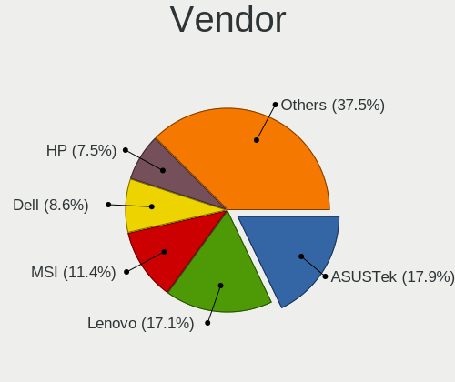
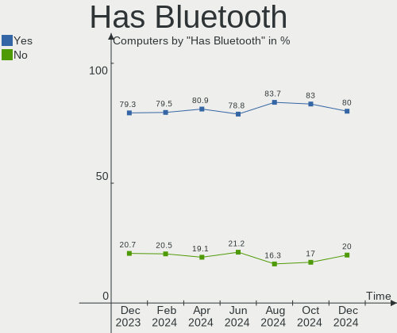
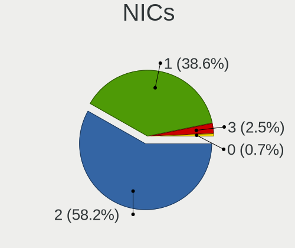

Arch - Hardware Trends
----------------------

A project to identify most popular hardware characteristics and track their change
over time based on data collected by Linux users at https://Linux-Hardware.org.

Anyone can contribute to this report by the [hw-probe](https://github.com/linuxhw/hw-probe) tool:

    sudo -E hw-probe -all -upload

This is a report for all computer types. See also reports for [desktops](/Dist/Arch/Desktop/README.md) and [notebooks](/Dist/Arch/Notebook/README.md).

This report is for one last month. Overall report since the beginning of time: [TestDays](https://github.com/linuxhw/TestDays)

Period: Mar, 2023.

Contents
--------

* [ System ](#system)
  - [ OS                       ](#os)
  - [ OS Family                ](#os-family)
  - [ Kernel                   ](#kernel)
  - [ Kernel Family            ](#kernel-family)
  - [ Kernel Major Ver.        ](#kernel-major-ver)
  - [ Arch                     ](#arch)
  - [ DE                       ](#de)
  - [ Display Server           ](#display-server)
  - [ Display Manager          ](#display-manager)
  - [ OS Lang                  ](#os-lang)
  - [ Boot Mode                ](#boot-mode)
  - [ Filesystem               ](#filesystem)
  - [ Part. scheme             ](#part-scheme)
  - [ Dual Boot with Linux/BSD ](#dual-boot-with-linuxbsd)
  - [ Dual Boot (Win)          ](#dual-boot-win)

* [ Board ](#board)
  - [ Vendor                   ](#vendor)
  - [ Model                    ](#model)
  - [ Model Family             ](#model-family)
  - [ MFG Year                 ](#mfg-year)
  - [ Form Factor              ](#form-factor)
  - [ Secure Boot              ](#secure-boot)
  - [ Coreboot                 ](#coreboot)
  - [ RAM Size                 ](#ram-size)
  - [ RAM Used                 ](#ram-used)
  - [ Total Drives             ](#total-drives)
  - [ Has CD-ROM               ](#has-cd-rom)
  - [ Has Ethernet             ](#has-ethernet)
  - [ Has WiFi                 ](#has-wifi)
  - [ Has Bluetooth            ](#has-bluetooth)

* [ Location ](#location)
  - [ Country                  ](#country)
  - [ City                     ](#city)

* [ Drives ](#drives)
  - [ Drive Vendor             ](#drive-vendor)
  - [ Drive Model              ](#drive-model)
  - [ HDD Vendor               ](#hdd-vendor)
  - [ SSD Vendor               ](#ssd-vendor)
  - [ Drive Kind               ](#drive-kind)
  - [ Drive Connector          ](#drive-connector)
  - [ Drive Size               ](#drive-size)
  - [ Space Total              ](#space-total)
  - [ Space Used               ](#space-used)
  - [ Malfunc. Drives          ](#malfunc-drives)
  - [ Malfunc. Drive Vendor    ](#malfunc-drive-vendor)
  - [ Malfunc. HDD Vendor      ](#malfunc-hdd-vendor)
  - [ Malfunc. Drive Kind      ](#malfunc-drive-kind)
  - [ Failed Drives            ](#failed-drives)
  - [ Failed Drive Vendor      ](#failed-drive-vendor)
  - [ Drive Status             ](#drive-status)

* [ Storage controller ](#storage-controller)
  - [ Storage Vendor           ](#storage-vendor)
  - [ Storage Model            ](#storage-model)
  - [ Storage Kind             ](#storage-kind)

* [ Processor ](#processor)
  - [ CPU Vendor               ](#cpu-vendor)
  - [ CPU Model                ](#cpu-model)
  - [ CPU Model Family         ](#cpu-model-family)
  - [ CPU Cores                ](#cpu-cores)
  - [ CPU Sockets              ](#cpu-sockets)
  - [ CPU Threads              ](#cpu-threads)
  - [ CPU Op-Modes             ](#cpu-op-modes)
  - [ CPU Microcode            ](#cpu-microcode)
  - [ CPU Microarch            ](#cpu-microarch)

* [ Graphics ](#graphics)
  - [ GPU Vendor               ](#gpu-vendor)
  - [ GPU Model                ](#gpu-model)
  - [ GPU Combo                ](#gpu-combo)
  - [ GPU Driver               ](#gpu-driver)
  - [ GPU Memory               ](#gpu-memory)

* [ Monitor ](#monitor)
  - [ Monitor Vendor           ](#monitor-vendor)
  - [ Monitor Model            ](#monitor-model)
  - [ Monitor Resolution       ](#monitor-resolution)
  - [ Monitor Diagonal         ](#monitor-diagonal)
  - [ Monitor Width            ](#monitor-width)
  - [ Aspect Ratio             ](#aspect-ratio)
  - [ Monitor Area             ](#monitor-area)
  - [ Pixel Density            ](#pixel-density)
  - [ Multiple Monitors        ](#multiple-monitors)

* [ Network ](#network)
  - [ Net Controller Vendor    ](#net-controller-vendor)
  - [ Net Controller Model     ](#net-controller-model)
  - [ Wireless Vendor          ](#wireless-vendor)
  - [ Wireless Model           ](#wireless-model)
  - [ Ethernet Vendor          ](#ethernet-vendor)
  - [ Ethernet Model           ](#ethernet-model)
  - [ Net Controller Kind      ](#net-controller-kind)
  - [ Used Controller          ](#used-controller)
  - [ NICs                     ](#nics)
  - [ IPv6                     ](#ipv6)

* [ Bluetooth ](#bluetooth)
  - [ Bluetooth Vendor         ](#bluetooth-vendor)
  - [ Bluetooth Model          ](#bluetooth-model)

* [ Sound ](#sound)
  - [ Sound Vendor             ](#sound-vendor)
  - [ Sound Model              ](#sound-model)

* [ Memory ](#memory)
  - [ Memory Vendor            ](#memory-vendor)
  - [ Memory Model             ](#memory-model)
  - [ Memory Kind              ](#memory-kind)
  - [ Memory Form Factor       ](#memory-form-factor)
  - [ Memory Size              ](#memory-size)
  - [ Memory Speed             ](#memory-speed)

* [ Printers & scanners ](#printers--scanners)
  - [ Printer Vendor           ](#printer-vendor)
  - [ Printer Model            ](#printer-model)
  - [ Scanner Vendor           ](#scanner-vendor)
  - [ Scanner Model            ](#scanner-model)

* [ Camera ](#camera)
  - [ Camera Vendor            ](#camera-vendor)
  - [ Camera Model             ](#camera-model)

* [ Security ](#security)
  - [ Fingerprint Vendor       ](#fingerprint-vendor)
  - [ Fingerprint Model        ](#fingerprint-model)
  - [ Chipcard Vendor          ](#chipcard-vendor)
  - [ Chipcard Model           ](#chipcard-model)

* [ Unsupported ](#unsupported)
  - [ Unsupported Devices      ](#unsupported-devices)
  - [ Unsupported Device Types ](#unsupported-device-types)

System
------

OS
--

Installed operating systems

| Name         | Computers | Percent |
|--------------|-----------|---------|
| Arch Rolling | 215       | 100%    |

OS Family
---------

OS without a version

| Name | Computers | Percent |
|------|-----------|---------|
| Arch | 215       | 100%    |

Kernel
------

Version of the Linux kernel

| Version                | Computers | Percent |
|------------------------|-----------|---------|
| 6.2.8-arch1-1          | 29        | 13.49%  |
| 6.2.2-arch1-1          | 29        | 13.49%  |
| 6.2.7-arch1-1          | 21        | 9.77%   |
| 6.2.6-arch1-1          | 21        | 9.77%   |
| 6.2.1-arch1-1          | 20        | 9.3%    |
| 6.2.2-arch2-1          | 10        | 4.65%   |
| 6.2.6-zen1-1-zen       | 8         | 3.72%   |
| 6.2.5-arch1-1          | 8         | 3.72%   |
| 6.2.2-zen1-1-zen       | 7         | 3.26%   |
| 6.2.7-zen1-1-zen       | 5         | 2.33%   |
| 6.2.8-zen1-1-zen       | 4         | 1.86%   |
| 6.2.5-zen1-1-zen       | 3         | 1.4%    |
| 6.2.2-zen2-1-zen       | 3         | 1.4%    |
| 6.1.21-1-lts           | 3         | 1.4%    |
| 6.1.20-1-lts           | 3         | 1.4%    |
| 6.1.15-1-lts           | 3         | 1.4%    |
| 6.1.12-zen1-1-zen      | 3         | 1.4%    |
| 6.1.12-arch1-1         | 3         | 1.4%    |
| 6.1.11-arch1-1         | 3         | 1.4%    |
| 6.2.6-273-tkg-pds      | 2         | 0.93%   |
| 6.1.19-1-lts           | 2         | 0.93%   |
| 6.1.14-1-lts           | 2         | 0.93%   |
| 6.3.0-rc1-273-tkg-cfs  | 1         | 0.47%   |
| 6.2.8-zen1-1.1-zen     | 1         | 0.47%   |
| 6.2.8-lqx2-1-lqx       | 1         | 0.47%   |
| 6.2.8-273-tkg-cfs      | 1         | 0.47%   |
| 6.2.6-arch1-g14-1      | 1         | 0.47%   |
| 6.2.6-arch1-1.1        | 1         | 0.47%   |
| 6.2.6-AMD              | 1         | 0.47%   |
| 6.2.6-273-tkg-bore     | 1         | 0.47%   |
| 6.2.5-x64v3-xanmod1    | 1         | 0.47%   |
| 6.2.4-273-tkg-pds      | 1         | 0.47%   |
| 6.2.2-x64v1-xanmod1-1  | 1         | 0.47%   |
| 6.2.2-1-clear          | 1         | 0.47%   |
| 6.2.1-arch1-1.1        | 1         | 0.47%   |
| 6.1.9-arch1-1          | 1         | 0.47%   |
| 6.1.18-1-lts           | 1         | 0.47%   |
| 6.1.14-xanmod1         | 1         | 0.47%   |
| 6.1.12-arch1-g14-1     | 1         | 0.47%   |
| 6.1.12-arch1-3-surface | 1         | 0.47%   |

Kernel Family
-------------

Linux kernel without a distro release

| Version | Computers | Percent |
|---------|-----------|---------|
| 6.2.2   | 51        | 23.72%  |
| 6.2.8   | 36        | 16.74%  |
| 6.2.6   | 35        | 16.28%  |
| 6.2.7   | 26        | 12.09%  |
| 6.2.1   | 21        | 9.77%   |
| 6.2.5   | 12        | 5.58%   |
| 6.1.12  | 9         | 4.19%   |
| 6.1.21  | 3         | 1.4%    |
| 6.1.20  | 3         | 1.4%    |
| 6.1.15  | 3         | 1.4%    |
| 6.1.14  | 3         | 1.4%    |
| 6.1.11  | 3         | 1.4%    |
| 6.1.19  | 2         | 0.93%   |
| 6.3.0   | 1         | 0.47%   |
| 6.2.4   | 1         | 0.47%   |
| 6.1.9   | 1         | 0.47%   |
| 6.1.18  | 1         | 0.47%   |
| 6.1.1   | 1         | 0.47%   |
| 6.0.5   | 1         | 0.47%   |
| 5.19.8  | 1         | 0.47%   |
| 5.15.94 | 1         | 0.47%   |

Kernel Major Ver.
-----------------

Linux kernel major version

| Version | Computers | Percent |
|---------|-----------|---------|
| 6.2     | 182       | 84.65%  |
| 6.1     | 29        | 13.49%  |
| 6.3     | 1         | 0.47%   |
| 6.0     | 1         | 0.47%   |
| 5.19    | 1         | 0.47%   |
| 5.15    | 1         | 0.47%   |

Arch
----

OS architecture (x86_64, i586, etc.)

| Name   | Computers | Percent |
|--------|-----------|---------|
| x86_64 | 215       | 100%    |

DE
--

Desktop Environment

| Name       | Computers | Percent |
|------------|-----------|---------|
| KDE5       | 88        | 40.93%  |
| GNOME      | 75        | 34.88%  |
| XFCE       | 14        | 6.51%   |
| Unknown    | 12        | 5.58%   |
| Hyprland   | 7         | 3.26%   |
| X-Cinnamon | 5         | 2.33%   |
| i3         | 4         | 1.86%   |
| LXQt       | 3         | 1.4%    |
| KDE        | 3         | 1.4%    |
| xmonad     | 1         | 0.47%   |
| MATE       | 1         | 0.47%   |
| Budgie     | 1         | 0.47%   |
| awesome    | 1         | 0.47%   |

Display Server
--------------

X11 or Wayland

| Name    | Computers | Percent |
|---------|-----------|---------|
| X11     | 110       | 51.16%  |
| Wayland | 80        | 37.21%  |
| Unknown | 13        | 6.05%   |
| Tty     | 12        | 5.58%   |

Display Manager
---------------

SDDM, LightDM, etc.

| Name    | Computers | Percent |
|---------|-----------|---------|
| Unknown | 90        | 41.86%  |
| SDDM    | 62        | 28.84%  |
| GDM     | 34        | 15.81%  |
| LightDM | 24        | 11.16%  |
| LXDM    | 2         | 0.93%   |
| GREETD  | 2         | 0.93%   |
| EMPTTY  | 1         | 0.47%   |

OS Lang
-------

Language

| Lang        | Computers | Percent |
|-------------|-----------|---------|
| en_US       | 101       | 46.98%  |
| C           | 18        | 8.37%   |
| en_GB       | 15        | 6.98%   |
| Unknown     | 12        | 5.58%   |
| ru_RU       | 10        | 4.65%   |
| it_IT       | 10        | 4.65%   |
| pl_PL       | 8         | 3.72%   |
| de_DE       | 7         | 3.26%   |
| fr_FR       | 6         | 2.79%   |
| pt_BR       | 4         | 1.86%   |
| zh_CN       | 3         | 1.4%    |
| hu_HU       | 2         | 0.93%   |
| es_ES       | 2         | 0.93%   |
| en_DK       | 2         | 0.93%   |
| en_AU       | 2         | 0.93%   |
| de_AT       | 2         | 0.93%   |
| pt_PT       | 1         | 0.47%   |
| ko_KR       | 1         | 0.47%   |
| it          | 1         | 0.47%   |
| es_PE       | 1         | 0.47%   |
| en_US_UTF-8 | 1         | 0.47%   |
| en_US.UFS-8 | 1         | 0.47%   |
| en_IE       | 1         | 0.47%   |
| en_CA       | 1         | 0.47%   |
| en_AU.UFT-8 | 1         | 0.47%   |
| de_DE.UTF8  | 1         | 0.47%   |
| -enUS       | 1         | 0.47%   |

Boot Mode
---------

EFI or BIOS

| Mode | Computers | Percent |
|------|-----------|---------|
| EFI  | 128       | 59.53%  |
| BIOS | 87        | 40.47%  |

Filesystem
----------

Type of filesystem

| Type    | Computers | Percent |
|---------|-----------|---------|
| Ext4    | 135       | 62.79%  |
| Btrfs   | 66        | 30.7%   |
| Xfs     | 7         | 3.26%   |
| Zfs     | 2         | 0.93%   |
| Overlay | 2         | 0.93%   |
| F2fs    | 2         | 0.93%   |
| Unknown | 1         | 0.47%   |

Part. scheme
------------

Scheme of partitioning

| Type    | Computers | Percent |
|---------|-----------|---------|
| GPT     | 135       | 62.79%  |
| Unknown | 64        | 29.77%  |
| MBR     | 16        | 7.44%   |

Dual Boot with Linux/BSD
------------------------

Hosting more than one Linux/BSD

| Dual boot | Computers | Percent |
|-----------|-----------|---------|
| No        | 192       | 89.3%   |
| Yes       | 23        | 10.7%   |

Dual Boot (Win)
---------------

Hosting Linux and Windows

| Dual boot | Computers | Percent |
|-----------|-----------|---------|
| No        | 157       | 73.02%  |
| Yes       | 58        | 26.98%  |

Board
-----

Vendor
------

Motherboard manufacturer

| Name                | Computers | Percent |
|---------------------|-----------|---------|
| Lenovo              | 39        | 18.14%  |
| ASUSTek Computer    | 35        | 16.28%  |
| Hewlett-Packard     | 28        | 13.02%  |
| Dell                | 22        | 10.23%  |
| Gigabyte Technology | 19        | 8.84%   |
| MSI                 | 17        | 7.91%   |
| Acer                | 11        | 5.12%   |
| ASRock              | 9         | 4.19%   |
| TUXEDO              | 3         | 1.4%    |
| Toshiba             | 3         | 1.4%    |
| Microsoft           | 3         | 1.4%    |
| Intel               | 3         | 1.4%    |
| HUAWEI              | 3         | 1.4%    |
| Apple               | 3         | 1.4%    |
| Timi                | 2         | 0.93%   |
| Monster             | 2         | 0.93%   |
| Acidanthera         | 2         | 0.93%   |
| Star Labs           | 1         | 0.47%   |
| Razer               | 1         | 0.47%   |
| Panasonic           | 1         | 0.47%   |
| IP3 Tech            | 1         | 0.47%   |
| IGEL Technology     | 1         | 0.47%   |
| HONOR               | 1         | 0.47%   |
| GPD                 | 1         | 0.47%   |
| Dynabook            | 1         | 0.47%   |
| DTRI                | 1         | 0.47%   |
| BESSTAR Tech        | 1         | 0.47%   |
| Unknown             | 1         | 0.47%   |

Model
-----

Motherboard model

| Name                                 | Computers | Percent |
|--------------------------------------|-----------|---------|
| MSI MS-7C02                          | 2         | 0.93%   |
| Gigabyte X570 AORUS MASTER           | 2         | 0.93%   |
| Dell XPS 15 9570                     | 2         | 0.93%   |
| Dell XPS 15 9500                     | 2         | 0.93%   |
| ASUS ROG STRIX B550-F GAMING         | 2         | 0.93%   |
| ASRock B450M Steel Legend            | 2         | 0.93%   |
| Unknown                              | 2         | 0.93%   |
| TUXEDO Pulse 15 Gen1                 | 1         | 0.47%   |
| TUXEDO Polaris Intel Gen3 (TGL)      | 1         | 0.47%   |
| TUXEDO InfinityBook Pro 14 Gen6      | 1         | 0.47%   |
| Toshiba TECRA Z50-C                  | 1         | 0.47%   |
| Toshiba Satellite C850-140           | 1         | 0.47%   |
| Toshiba Satellite C55D-B             | 1         | 0.47%   |
| Timi RedmiBook 14                    | 1         | 0.47%   |
| Timi Redmi Book Pro 14 2022          | 1         | 0.47%   |
| Star Labs StarBook                   | 1         | 0.47%   |
| Razer Blade 14 - RZ09-0370           | 1         | 0.47%   |
| Panasonic FZ40-1                     | 1         | 0.47%   |
| MSI Pulse GL66 11UGKV                | 1         | 0.47%   |
| MSI MS-7D76                          | 1         | 0.47%   |
| MSI MS-7D70                          | 1         | 0.47%   |
| MSI MS-7D69                          | 1         | 0.47%   |
| MSI MS-7D53                          | 1         | 0.47%   |
| MSI MS-7B89                          | 1         | 0.47%   |
| MSI MS-7B86                          | 1         | 0.47%   |
| MSI MS-7B79                          | 1         | 0.47%   |
| MSI MS-7B38                          | 1         | 0.47%   |
| MSI MS-7A38                          | 1         | 0.47%   |
| MSI MS-7693                          | 1         | 0.47%   |
| MSI Modern 14 B10MW                  | 1         | 0.47%   |
| MSI GS63VR 7RF                       | 1         | 0.47%   |
| MSI GP66 Leopard 11UG                | 1         | 0.47%   |
| MSI GF63 Thin 11UC                   | 1         | 0.47%   |
| Monster HUMA H4 V5.1                 | 1         | 0.47%   |
| Monster ABRA A7 V11.3                | 1         | 0.47%   |
| Microsoft Surface Pro 4              | 1         | 0.47%   |
| Microsoft Surface Laptop Go          | 1         | 0.47%   |
| Microsoft Surface Laptop 4           | 1         | 0.47%   |
| Lenovo Yoga 6 13ALC7 82UD            | 1         | 0.47%   |
| Lenovo ThinkPad Z16 Gen 1 21D40010MX | 1         | 0.47%   |

Model Family
------------

Motherboard model prefix

| Name                | Computers | Percent |
|---------------------|-----------|---------|
| Lenovo ThinkPad     | 23        | 10.7%   |
| Lenovo IdeaPad      | 9         | 4.19%   |
| ASUS ROG            | 9         | 4.19%   |
| ASUS PRIME          | 8         | 3.72%   |
| Acer Aspire         | 8         | 3.72%   |
| ASUS TUF            | 7         | 3.26%   |
| Dell XPS            | 6         | 2.79%   |
| HP Pavilion         | 5         | 2.33%   |
| HP ENVY             | 4         | 1.86%   |
| HP EliteBook        | 4         | 1.86%   |
| Dell Latitude       | 4         | 1.86%   |
| Dell Inspiron       | 4         | 1.86%   |
| Microsoft Surface   | 3         | 1.4%    |
| HP Spectre          | 3         | 1.4%    |
| Gigabyte X570       | 3         | 1.4%    |
| Dell OptiPlex       | 3         | 1.4%    |
| ASUS ASUS           | 3         | 1.4%    |
| Toshiba Satellite   | 2         | 0.93%   |
| MSI MS-7C02         | 2         | 0.93%   |
| Lenovo Legion       | 2         | 0.93%   |
| HP Victus           | 2         | 0.93%   |
| HP ProBook          | 2         | 0.93%   |
| Gigabyte Z390       | 2         | 0.93%   |
| Gigabyte X470       | 2         | 0.93%   |
| Gigabyte B550       | 2         | 0.93%   |
| Gigabyte B450M      | 2         | 0.93%   |
| Dell Precision      | 2         | 0.93%   |
| ASRock B450M        | 2         | 0.93%   |
| Apple MacBookPro11  | 2         | 0.93%   |
| Unknown             | 2         | 0.93%   |
| TUXEDO Pulse        | 1         | 0.47%   |
| TUXEDO Polaris      | 1         | 0.47%   |
| TUXEDO InfinityBook | 1         | 0.47%   |
| Toshiba TECRA       | 1         | 0.47%   |
| Timi RedmiBook      | 1         | 0.47%   |
| Timi Redmi          | 1         | 0.47%   |
| Star Labs StarBook  | 1         | 0.47%   |
| Razer Blade         | 1         | 0.47%   |
| Panasonic FZ40-1    | 1         | 0.47%   |
| MSI Pulse           | 1         | 0.47%   |

MFG Year
--------

Motherboard manufacture year

| Year | Computers | Percent |
|------|-----------|---------|
| 2022 | 38        | 17.67%  |
| 2021 | 35        | 16.28%  |
| 2020 | 28        | 13.02%  |
| 2018 | 28        | 13.02%  |
| 2019 | 21        | 9.77%   |
| 2017 | 13        | 6.05%   |
| 2014 | 11        | 5.12%   |
| 2012 | 8         | 3.72%   |
| 2015 | 7         | 3.26%   |
| 2010 | 5         | 2.33%   |
| 2016 | 4         | 1.86%   |
| 2009 | 4         | 1.86%   |
| 2013 | 3         | 1.4%    |
| 2011 | 3         | 1.4%    |
| 2023 | 2         | 0.93%   |
| 2008 | 2         | 0.93%   |
| 2007 | 2         | 0.93%   |
| 2005 | 1         | 0.47%   |

Form Factor
-----------

Physical design of the computer

| Name        | Computers | Percent |
|-------------|-----------|---------|
| Notebook    | 117       | 54.42%  |
| Desktop     | 80        | 37.21%  |
| Convertible | 7         | 3.26%   |
| Tablet      | 4         | 1.86%   |
| All in one  | 4         | 1.86%   |
| Mini pc     | 2         | 0.93%   |
| Server      | 1         | 0.47%   |

Secure Boot
-----------

Enabled or disabled

| State    | Computers | Percent |
|----------|-----------|---------|
| Disabled | 205       | 95.35%  |
| Enabled  | 10        | 4.65%   |

Coreboot
--------

Have coreboot on board

| Used | Computers | Percent |
|------|-----------|---------|
| No   | 213       | 99.07%  |
| Yes  | 2         | 0.93%   |

RAM Size
--------

Total RAM memory

| Size in GB  | Computers | Percent |
|-------------|-----------|---------|
| 16.01-24.0  | 54        | 25.12%  |
| 32.01-64.0  | 51        | 23.72%  |
| 4.01-8.0    | 38        | 17.67%  |
| 8.01-16.0   | 36        | 16.74%  |
| 3.01-4.0    | 17        | 7.91%   |
| 64.01-256.0 | 10        | 4.65%   |
| 24.01-32.0  | 6         | 2.79%   |
| 2.01-3.0    | 2         | 0.93%   |
| 1.01-2.0    | 1         | 0.47%   |

RAM Used
--------

Used RAM memory

| Used GB    | Computers | Percent |
|------------|-----------|---------|
| 4.01-8.0   | 57        | 26.51%  |
| 2.01-3.0   | 57        | 26.51%  |
| 3.01-4.0   | 37        | 17.21%  |
| 1.01-2.0   | 33        | 15.35%  |
| 8.01-16.0  | 19        | 8.84%   |
| 16.01-24.0 | 6         | 2.79%   |
| 0.51-1.0   | 4         | 1.86%   |
| 24.01-32.0 | 1         | 0.47%   |
| 0.01-0.5   | 1         | 0.47%   |

Total Drives
------------

Number of drives on board

| Drives | Computers | Percent |
|--------|-----------|---------|
| 1      | 118       | 54.88%  |
| 2      | 43        | 20%     |
| 3      | 31        | 14.42%  |
| 4      | 12        | 5.58%   |
| 5      | 8         | 3.72%   |
| 10     | 1         | 0.47%   |
| 8      | 1         | 0.47%   |
| 6      | 1         | 0.47%   |

Has CD-ROM
----------

Has CD-ROM on board

| Presented | Computers | Percent |
|-----------|-----------|---------|
| No        | 183       | 85.12%  |
| Yes       | 32        | 14.88%  |

Has Ethernet
------------

Has Ethernet on board

| Presented | Computers | Percent |
|-----------|-----------|---------|
| Yes       | 173       | 80.47%  |
| No        | 42        | 19.53%  |

Has WiFi
--------

Has WiFi module

| Presented | Computers | Percent |
|-----------|-----------|---------|
| Yes       | 176       | 81.86%  |
| No        | 39        | 18.14%  |

Has Bluetooth
-------------

Has Bluetooth module

| Presented | Computers | Percent |
|-----------|-----------|---------|
| Yes       | 171       | 79.53%  |
| No        | 44        | 20.47%  |

Location
--------

Country
-------

Geographic location (country)

| Country            | Computers | Percent |
|--------------------|-----------|---------|
| USA                | 39        | 18.14%  |
| Germany            | 20        | 9.3%    |
| Italy              | 19        | 8.84%   |
| Russia             | 15        | 6.98%   |
| Poland             | 10        | 4.65%   |
| Brazil             | 10        | 4.65%   |
| UK                 | 8         | 3.72%   |
| France             | 8         | 3.72%   |
| Turkey             | 7         | 3.26%   |
| India              | 6         | 2.79%   |
| Canada             | 6         | 2.79%   |
| Denmark            | 5         | 2.33%   |
| Australia          | 5         | 2.33%   |
| Sweden             | 4         | 1.86%   |
| Austria            | 4         | 1.86%   |
| Taiwan             | 3         | 1.4%    |
| Portugal           | 3         | 1.4%    |
| Philippines        | 3         | 1.4%    |
| Hungary            | 3         | 1.4%    |
| Vietnam            | 2         | 0.93%   |
| Spain              | 2         | 0.93%   |
| Norway             | 2         | 0.93%   |
| Netherlands        | 2         | 0.93%   |
| Nepal              | 2         | 0.93%   |
| Iran               | 2         | 0.93%   |
| Indonesia          | 2         | 0.93%   |
| Hong Kong          | 2         | 0.93%   |
| China              | 2         | 0.93%   |
| Bulgaria           | 2         | 0.93%   |
| Ukraine            | 1         | 0.47%   |
| South Korea        | 1         | 0.47%   |
| Singapore          | 1         | 0.47%   |
| Romania            | 1         | 0.47%   |
| Peru               | 1         | 0.47%   |
| Lithuania          | 1         | 0.47%   |
| Kyrgyzstan         | 1         | 0.47%   |
| Kazakhstan         | 1         | 0.47%   |
| Ireland            | 1         | 0.47%   |
| Dominican Republic | 1         | 0.47%   |
| Croatia            | 1         | 0.47%   |

City
----

Geographic location (city)

| City          | Computers | Percent |
|---------------|-----------|---------|
| Moscow        | 6         | 2.79%   |
| Melbourne     | 4         | 1.86%   |
| Munich        | 3         | 1.4%    |
| Dublin        | 3         | 1.4%    |
| Copenhagen    | 3         | 1.4%    |
| Berlin        | 3         | 1.4%    |
| Vienna        | 2         | 0.93%   |
| Stockholm     | 2         | 0.93%   |
| Sao Paulo     | 2         | 0.93%   |
| Rome          | 2         | 0.93%   |
| Nuremberg     | 2         | 0.93%   |
| Naples        | 2         | 0.93%   |
| Milwaukee     | 2         | 0.93%   |
| Milan         | 2         | 0.93%   |
| Houston       | 2         | 0.93%   |
| Central       | 2         | 0.93%   |
| Antalya       | 2         | 0.93%   |
| Zernica       | 1         | 0.47%   |
| Zagreb        | 1         | 0.47%   |
| Wroclaw       | 1         | 0.47%   |
| Wonju         | 1         | 0.47%   |
| Wisbech       | 1         | 0.47%   |
| Winona        | 1         | 0.47%   |
| Wilhelmshaven | 1         | 0.47%   |
| Wieliczka     | 1         | 0.47%   |
| Waterford     | 1         | 0.47%   |
| Warsaw        | 1         | 0.47%   |
| Walthamstow   | 1         | 0.47%   |
| Vlasikha      | 1         | 0.47%   |
| Vladivostok   | 1         | 0.47%   |
| Verbania      | 1         | 0.47%   |
| Venado Tuerto | 1         | 0.47%   |
| Van           | 1         | 0.47%   |
| Upland        | 1         | 0.47%   |
| Uetersen      | 1         | 0.47%   |
| Uberlândia   | 1         | 0.47%   |
| Tolyatti      | 1         | 0.47%   |
| Tistedal      | 1         | 0.47%   |
| Thuan An      | 1         | 0.47%   |
| Tarlac City   | 1         | 0.47%   |

Drives
------

Drive Vendor
------------

Hard drive vendors

| Vendor                      | Computers | Drives | Percent |
|-----------------------------|-----------|--------|---------|
| Samsung Electronics         | 70        | 98     | 20.23%  |
| WDC                         | 38        | 51     | 10.98%  |
| SanDisk                     | 29        | 30     | 8.38%   |
| Crucial                     | 23        | 23     | 6.65%   |
| Toshiba                     | 22        | 27     | 6.36%   |
| Kingston                    | 21        | 25     | 6.07%   |
| Seagate                     | 20        | 21     | 5.78%   |
| Micron Technology           | 13        | 13     | 3.76%   |
| Unknown                     | 11        | 12     | 3.18%   |
| Phison Electronics          | 11        | 12     | 3.18%   |
| SK hynix                    | 8         | 8      | 2.31%   |
| Micron/Crucial Technology   | 8         | 9      | 2.31%   |
| Intel                       | 8         | 9      | 2.31%   |
| Silicon Motion              | 6         | 7      | 1.73%   |
| HGST                        | 5         | 5      | 1.45%   |
| China                       | 5         | 5      | 1.45%   |
| Kingston Technology Company | 4         | 4      | 1.16%   |
| ADATA Technology            | 4         | 4      | 1.16%   |
| Solid State Storage         | 3         | 3      | 0.87%   |
| Realtek Semiconductor       | 3         | 3      | 0.87%   |
| KIOXIA                      | 3         | 3      | 0.87%   |
| GOODRAM                     | 3         | 3      | 0.87%   |
| A-DATA Technology           | 3         | 3      | 0.87%   |
| Transcend                   | 2         | 2      | 0.58%   |
| Phison                      | 2         | 2      | 0.58%   |
| Lexar                       | 2         | 2      | 0.58%   |
| Hitachi                     | 2         | 2      | 0.58%   |
| USB30                       | 1         | 1      | 0.29%   |
| Union Memory (Shenzhen)     | 1         | 1      | 0.29%   |
| SSK                         | 1         | 1      | 0.29%   |
| SPCC                        | 1         | 1      | 0.29%   |
| QNAP                        | 1         | 4      | 0.29%   |
| PNY                         | 1         | 1      | 0.29%   |
| OWC                         | 1         | 1      | 0.29%   |
| OCZ                         | 1         | 1      | 0.29%   |
| Netac                       | 1         | 1      | 0.29%   |
| Lenovo                      | 1         | 1      | 0.29%   |
| KIOXIA-EXCERIA              | 1         | 1      | 0.29%   |
| Kimtigo                     | 1         | 1      | 0.29%   |
| JMicron Technology          | 1         | 1      | 0.29%   |

Drive Model
-----------

Hard drive models

| Model                                                              | Computers | Percent |
|--------------------------------------------------------------------|-----------|---------|
| Samsung NVMe SSD Controller SM981/PM981/PM983 250GB                | 24        | 6.17%   |
| Samsung NVMe SSD Controller PM9A1/PM9A3/980PRO 1TB                 | 12        | 3.08%   |
| Micron/Crucial P2 NVMe PCIe SSD 1TB                                | 6         | 1.54%   |
| Kingston SA400S37240G 240GB SSD                                    | 6         | 1.54%   |
| Toshiba MQ04ABF100 1TB                                             | 5         | 1.29%   |
| Silicon Motion SM2263EN/SM2263XT SSD Controller 1024GB             | 5         | 1.29%   |
| Phison PS5013 E13 NVMe Controller 256GB                            | 5         | 1.29%   |
| Phison E12 NVMe Controller 256GB                                   | 5         | 1.29%   |
| Crucial CT1000MX500SSD1 1TB                                        | 5         | 1.29%   |
| Unknown MMC Card  64GB                                             | 4         | 1.03%   |
| Sandisk WD Blue SN550 NVMe SSD 256GB                               | 4         | 1.03%   |
| Samsung SSD 980 1TB                                                | 4         | 1.03%   |
| Samsung NVMe SSD Controller SM961/PM961/SM963 256GB                | 4         | 1.03%   |
| Kingston SA400S37480G 480GB SSD                                    | 4         | 1.03%   |
| Crucial CT500MX500SSD1 500GB                                       | 4         | 1.03%   |
| WDC WDS240G2G0A-00JH30 240GB SSD                                   | 3         | 0.77%   |
| Toshiba DT01ACA200 2TB                                             | 3         | 0.77%   |
| Sandisk WD_BLACK SN770 1TB                                         | 3         | 0.77%   |
| Sandisk WD Black SN750 / PC SN730 NVMe SSD 1TB                     | 3         | 0.77%   |
| Samsung SSD 860 QVO 1TB                                            | 3         | 0.77%   |
| Samsung NVMe SSD Controller SM951/PM951 128GB                      | 3         | 0.77%   |
| Intel SSD 660P Series 512GB                                        | 3         | 0.77%   |
| ADATA XPG SX8200 Pro PCIe Gen3x4 M.2 2280 Solid State Drive 1024GB | 3         | 0.77%   |
| WDC WD3200AAJS-00L7A0 320GB                                        | 2         | 0.51%   |
| WDC WD10EZEX-00WN4A0 1TB                                           | 2         | 0.51%   |
| Unknown xD/SD/M.S.                                                 | 2         | 0.51%   |
| Unknown MMC Card  256GB                                            | 2         | 0.51%   |
| Unknown MMC Card  128GB                                            | 2         | 0.51%   |
| SK hynix SC311 SATA 512GB SSD                                      | 2         | 0.51%   |
| Sandisk WD_BLACK SN850X 1000GB                                     | 2         | 0.51%   |
| SanDisk SSD PLUS 1000GB                                            | 2         | 0.51%   |
| Samsung SSD 870 QVO 1TB                                            | 2         | 0.51%   |
| Samsung SSD 860 EVO 500GB                                          | 2         | 0.51%   |
| Samsung SSD 860 EVO 250GB                                          | 2         | 0.51%   |
| Samsung SSD 860 EVO 1TB                                            | 2         | 0.51%   |
| Realtek XPG SPECTRIX S20G 500GB                                    | 2         | 0.51%   |
| Phison E16 PCIe4 NVMe Controller 1TB                               | 2         | 0.51%   |
| Micron/Crucial P1 NVMe PCIe SSD 1TB                                | 2         | 0.51%   |
| Micron 3400_MTFDKBA512TFH 512GB                                    | 2         | 0.51%   |
| Kingston Company SNV2S1000G 1TB                                    | 2         | 0.51%   |

HDD Vendor
----------

Hard disk drive vendors

| Vendor              | Computers | Drives | Percent |
|---------------------|-----------|--------|---------|
| WDC                 | 33        | 43     | 40.24%  |
| Seagate             | 19        | 20     | 23.17%  |
| Toshiba             | 15        | 18     | 18.29%  |
| Samsung Electronics | 5         | 6      | 6.1%    |
| HGST                | 5         | 5      | 6.1%    |
| Hitachi             | 2         | 2      | 2.44%   |
| Unknown             | 1         | 1      | 1.22%   |
| QNAP                | 1         | 4      | 1.22%   |
| Generic-            | 1         | 1      | 1.22%   |

SSD Vendor
----------

Solid state drive vendors

| Vendor              | Computers | Drives | Percent |
|---------------------|-----------|--------|---------|
| Crucial             | 23        | 23     | 21.7%   |
| Samsung Electronics | 21        | 26     | 19.81%  |
| Kingston            | 16        | 18     | 15.09%  |
| SanDisk             | 8         | 8      | 7.55%   |
| WDC                 | 7         | 8      | 6.6%    |
| China               | 5         | 5      | 4.72%   |
| Toshiba             | 3         | 5      | 2.83%   |
| GOODRAM             | 3         | 3      | 2.83%   |
| Transcend           | 2         | 2      | 1.89%   |
| SK hynix            | 2         | 2      | 1.89%   |
| Lexar               | 2         | 2      | 1.89%   |
| A-DATA Technology   | 2         | 2      | 1.89%   |
| USB30               | 1         | 1      | 0.94%   |
| SPCC                | 1         | 1      | 0.94%   |
| PNY                 | 1         | 1      | 0.94%   |
| OWC                 | 1         | 1      | 0.94%   |
| OCZ                 | 1         | 1      | 0.94%   |
| KIOXIA-EXCERIA      | 1         | 1      | 0.94%   |
| Kimtigo             | 1         | 1      | 0.94%   |
| JMicron Technology  | 1         | 1      | 0.94%   |
| Intel               | 1         | 1      | 0.94%   |
| Integral            | 1         | 1      | 0.94%   |
| Apacer              | 1         | 1      | 0.94%   |
| AMD                 | 1         | 1      | 0.94%   |

Drive Kind
----------

HDD or SSD

| Kind    | Computers | Drives | Percent |
|---------|-----------|--------|---------|
| NVMe    | 140       | 176    | 45.75%  |
| SSD     | 89        | 116    | 29.08%  |
| HDD     | 64        | 100    | 20.92%  |
| MMC     | 8         | 9      | 2.61%   |
| Unknown | 5         | 5      | 1.63%   |

Drive Connector
---------------

SATA, SAS, NVMe, etc.

| Type | Computers | Drives | Percent |
|------|-----------|--------|---------|
| NVMe | 140       | 176    | 50%     |
| SATA | 124       | 212    | 44.29%  |
| SAS  | 8         | 9      | 2.86%   |
| MMC  | 8         | 9      | 2.86%   |

Drive Size
----------

Size of hard drive

| Size in TB | Computers | Drives | Percent |
|------------|-----------|--------|---------|
| 0.01-0.5   | 88        | 124    | 53.66%  |
| 0.51-1.0   | 52        | 62     | 31.71%  |
| 1.01-2.0   | 11        | 13     | 6.71%   |
| 4.01-10.0  | 7         | 9      | 4.27%   |
| 3.01-4.0   | 3         | 5      | 1.83%   |
| 2.01-3.0   | 3         | 3      | 1.83%   |

Space Total
-----------

Amount of disk space available on the file system

| Size in GB     | Computers | Percent |
|----------------|-----------|---------|
| 251-500        | 43        | 20%     |
| 501-1000       | 39        | 18.14%  |
| 101-250        | 38        | 17.67%  |
| 1001-2000      | 35        | 16.28%  |
| More than 3000 | 23        | 10.7%   |
| 2001-3000      | 17        | 7.91%   |
| 51-100         | 9         | 4.19%   |
| Unknown        | 7         | 3.26%   |
| 1-20           | 3         | 1.4%    |
| 21-50          | 1         | 0.47%   |

Space Used
----------

Amount of used disk space

| Used GB        | Computers | Percent |
|----------------|-----------|---------|
| 101-250        | 39        | 18.14%  |
| 1-20           | 37        | 17.21%  |
| 21-50          | 33        | 15.35%  |
| 501-1000       | 27        | 12.56%  |
| 51-100         | 27        | 12.56%  |
| 251-500        | 20        | 9.3%    |
| 1001-2000      | 13        | 6.05%   |
| More than 3000 | 8         | 3.72%   |
| Unknown        | 7         | 3.26%   |
| 2001-3000      | 4         | 1.86%   |

Malfunc. Drives
---------------

Drive models with a malfunction

| Model                                                           | Computers | Drives | Percent |
|-----------------------------------------------------------------|-----------|--------|---------|
| WDC WDS240G2G0B-00EPW0 240GB SSD                                | 1         | 1      | 3.7%    |
| WDC WDS120G2G0A-00JH30 120GB SSD                                | 1         | 1      | 3.7%    |
| WDC WD5000LPCX-60VHAT0 500GB                                    | 1         | 1      | 3.7%    |
| WDC WD5000HHTZ-04N21V0 500GB                                    | 1         | 1      | 3.7%    |
| WDC WD5000AVDS-63U7B1 500GB                                     | 1         | 1      | 3.7%    |
| WDC WD5000AAKX-00ERMA0 500GB                                    | 1         | 1      | 3.7%    |
| WDC WD40EFRX-68WT0N0 4TB                                        | 1         | 2      | 3.7%    |
| WDC WD3200AAJS-00L7A0 320GB                                     | 1         | 1      | 3.7%    |
| WDC WD10EZEX-60M2NA0 1TB                                        | 1         | 1      | 3.7%    |
| WDC WD10EZEX-00WN4A0 1TB                                        | 1         | 1      | 3.7%    |
| WDC WD10EZEX-00MFCA0 1TB                                        | 1         | 1      | 3.7%    |
| Transcend TS1TSSD230S 1TB                                       | 1         | 1      | 3.7%    |
| Toshiba MQ01ABD050 500GB                                        | 1         | 1      | 3.7%    |
| Toshiba DT01ACA300 3TB                                          | 1         | 1      | 3.7%    |
| Seagate ST9320325AS 320GB                                       | 1         | 1      | 3.7%    |
| Seagate ST9250315AS 250GB                                       | 1         | 1      | 3.7%    |
| SanDisk SSD PLUS 480GB                                          | 1         | 1      | 3.7%    |
| SanDisk SSD PLUS 1000GB                                         | 1         | 1      | 3.7%    |
| Samsung Electronics NVMe SSD Controller SM981/PM981/PM983 250GB | 1         | 1      | 3.7%    |
| Samsung Electronics NVMe SSD Controller PM9A1/PM9A3/980PRO 1TB  | 1         | 1      | 3.7%    |
| Samsung Electronics MZNLH128HBHQ-000H1 128GB SSD                | 1         | 1      | 3.7%    |
| Samsung Electronics HD082GJ 80GB                                | 1         | 1      | 3.7%    |
| Kingston SKC400S371T 1TB SSD                                    | 1         | 1      | 3.7%    |
| Kingston SA400S37480G 480GB SSD                                 | 1         | 1      | 3.7%    |
| Hitachi HTS723216L9SA60 160GB                                   | 1         | 1      | 3.7%    |
| HGST HTS541010A9E680 1TB                                        | 1         | 1      | 3.7%    |
| A-DATA Technology SP550 480GB SSD                               | 1         | 1      | 3.7%    |

Malfunc. Drive Vendor
---------------------

Vendors of faulty drives

| Vendor              | Computers | Drives | Percent |
|---------------------|-----------|--------|---------|
| WDC                 | 9         | 12     | 36%     |
| Samsung Electronics | 4         | 4      | 16%     |
| Toshiba             | 2         | 2      | 8%      |
| Seagate             | 2         | 2      | 8%      |
| SanDisk             | 2         | 2      | 8%      |
| Kingston            | 2         | 2      | 8%      |
| Transcend           | 1         | 1      | 4%      |
| Hitachi             | 1         | 1      | 4%      |
| HGST                | 1         | 1      | 4%      |
| A-DATA Technology   | 1         | 1      | 4%      |

Malfunc. HDD Vendor
-------------------

Vendors of faulty HDD drives

| Vendor              | Computers | Drives | Percent |
|---------------------|-----------|--------|---------|
| WDC                 | 8         | 10     | 53.33%  |
| Toshiba             | 2         | 2      | 13.33%  |
| Seagate             | 2         | 2      | 13.33%  |
| Samsung Electronics | 1         | 1      | 6.67%   |
| Hitachi             | 1         | 1      | 6.67%   |
| HGST                | 1         | 1      | 6.67%   |

Malfunc. Drive Kind
-------------------

Kinds of faulty drives

| Kind | Computers | Drives | Percent |
|------|-----------|--------|---------|
| HDD  | 12        | 17     | 52.17%  |
| SSD  | 9         | 9      | 39.13%  |
| NVMe | 2         | 2      | 8.7%    |

Failed Drives
-------------

Failed drive models

Zero info for selected period =(

Failed Drive Vendor
-------------------

Failed drive vendors

Zero info for selected period =(

Drive Status
------------

Number of failed and malfunc. drives

| Status   | Computers | Drives | Percent |
|----------|-----------|--------|---------|
| Works    | 128       | 226    | 53.33%  |
| Detected | 91        | 152    | 37.92%  |
| Malfunc  | 21        | 28     | 8.75%   |

Storage controller
------------------

Storage Vendor
--------------

Storage controller vendors

| Vendor                         | Computers | Percent |
|--------------------------------|-----------|---------|
| Intel                          | 106       | 32.62%  |
| AMD                            | 63        | 19.38%  |
| Samsung Electronics            | 55        | 16.92%  |
| SanDisk                        | 21        | 6.46%   |
| Micron Technology              | 13        | 4%      |
| Phison Electronics             | 12        | 3.69%   |
| Kingston Technology Company    | 9         | 2.77%   |
| Micron/Crucial Technology      | 8         | 2.46%   |
| SK hynix                       | 6         | 1.85%   |
| Silicon Motion                 | 6         | 1.85%   |
| Toshiba America Info Systems   | 4         | 1.23%   |
| Realtek Semiconductor          | 4         | 1.23%   |
| ADATA Technology               | 4         | 1.23%   |
| Solid State Storage Technology | 3         | 0.92%   |
| KIOXIA                         | 3         | 0.92%   |
| ASMedia Technology             | 3         | 0.92%   |
| Union Memory (Shenzhen)        | 1         | 0.31%   |
| Netac Technology               | 1         | 0.31%   |
| Marvell Technology Group       | 1         | 0.31%   |
| Lenovo                         | 1         | 0.31%   |
| Compaq Computer                | 1         | 0.31%   |

Storage Model
-------------

Storage controller models

| Model                                                                          | Computers | Percent |
|--------------------------------------------------------------------------------|-----------|---------|
| AMD FCH SATA Controller [AHCI mode]                                            | 42        | 11.44%  |
| Samsung NVMe SSD Controller SM981/PM981/PM983                                  | 24        | 6.54%   |
| AMD 400 Series Chipset SATA Controller                                         | 18        | 4.9%    |
| Intel Volume Management Device NVMe RAID Controller                            | 15        | 4.09%   |
| Samsung NVMe SSD Controller PM9A1/PM9A3/980PRO                                 | 14        | 3.81%   |
| Samsung NVMe SSD Controller 980                                                | 14        | 3.81%   |
| Micron NVMe Storage Controller                                                 | 12        | 3.27%   |
| AMD 500 Series Chipset SATA Controller                                         | 9         | 2.45%   |
| Kingston Company Company Non-Volatile memory controller                        | 7         | 1.91%   |
| Intel 500 Series Chipset Family SATA AHCI Controller                           | 7         | 1.91%   |
| Micron/Crucial P2 NVMe PCIe SSD                                                | 6         | 1.63%   |
| Silicon Motion SM2263EN/SM2263XT SSD Controller                                | 5         | 1.36%   |
| SanDisk NVMe Controller                                                        | 5         | 1.36%   |
| Phison PS5013 E13 NVMe Controller                                              | 5         | 1.36%   |
| Phison E12 NVMe Controller                                                     | 5         | 1.36%   |
| Intel Sunrise Point-LP SATA Controller [AHCI mode]                             | 5         | 1.36%   |
| Intel SATA Controller [RAID mode]                                              | 5         | 1.36%   |
| Intel Cannon Lake PCH SATA AHCI Controller                                     | 5         | 1.36%   |
| Intel 82801 Mobile SATA Controller [RAID mode]                                 | 5         | 1.36%   |
| SanDisk WD Blue SN550 NVMe SSD                                                 | 4         | 1.09%   |
| SanDisk Non-Volatile memory controller                                         | 4         | 1.09%   |
| Samsung NVMe SSD Controller SM961/PM961/SM963                                  | 4         | 1.09%   |
| Intel Cannon Lake Mobile PCH SATA AHCI Controller                              | 4         | 1.09%   |
| Intel Alder Lake-S PCH SATA Controller [AHCI Mode]                             | 4         | 1.09%   |
| Intel Alder Lake-P SATA AHCI Controller                                        | 4         | 1.09%   |
| Intel 8 Series/C220 Series Chipset Family 6-port SATA Controller 1 [AHCI mode] | 4         | 1.09%   |
| Intel 8 Series SATA Controller 1 [AHCI mode]                                   | 4         | 1.09%   |
| Solid State Storage Non-Volatile memory controller                             | 3         | 0.82%   |
| SK hynix Gold P31/PC711 NVMe Solid State Drive                                 | 3         | 0.82%   |
| Sandisk Western Digital WD Black SN850X NVMe SSD                               | 3         | 0.82%   |
| SanDisk WD Black SN750 / PC SN730 NVMe SSD                                     | 3         | 0.82%   |
| Samsung NVMe SSD Controller SM951/PM951                                        | 3         | 0.82%   |
| Realtek NVMe Controller                                                        | 3         | 0.82%   |
| Intel Wildcat Point-LP SATA Controller [AHCI Mode]                             | 3         | 0.82%   |
| Intel SSD 660P Series                                                          | 3         | 0.82%   |
| Intel Q170/Q150/B150/H170/H110/Z170/CM236 Chipset SATA Controller [AHCI Mode]  | 3         | 0.82%   |
| Intel Comet Lake SATA AHCI Controller                                          | 3         | 0.82%   |
| Intel Atom Processor E3800 Series SATA AHCI Controller                         | 3         | 0.82%   |
| Intel 82801IBM/IEM (ICH9M/ICH9M-E) 4 port SATA Controller [AHCI mode]          | 3         | 0.82%   |
| Intel 7 Series/C210 Series Chipset Family 6-port SATA Controller [AHCI mode]   | 3         | 0.82%   |

Storage Kind
------------

Kind of storage controller (IDE, SATA, NVMe, SAS, ...)

| Kind | Computers | Percent |
|------|-----------|---------|
| SATA | 142       | 44.51%  |
| NVMe | 139       | 43.57%  |
| RAID | 30        | 9.4%    |
| IDE  | 8         | 2.51%   |

Processor
---------

CPU Vendor
----------

Processor vendors

| Vendor | Computers | Percent |
|--------|-----------|---------|
| Intel  | 138       | 64.19%  |
| AMD    | 77        | 35.81%  |

CPU Model
---------

Processor models

| Model                                      | Computers | Percent |
|--------------------------------------------|-----------|---------|
| AMD Ryzen 5 3600 6-Core Processor          | 6         | 2.79%   |
| Intel 11th Gen Core i5-1135G7 @ 2.40GHz    | 5         | 2.33%   |
| Intel 12th Gen Core i7-12700H              | 4         | 1.86%   |
| Intel 11th Gen Core i7-11800H @ 2.30GHz    | 4         | 1.86%   |
| Intel 11th Gen Core i7-1165G7 @ 2.80GHz    | 4         | 1.86%   |
| Intel Core i7-10510U CPU @ 1.80GHz         | 3         | 1.4%    |
| Intel 12th Gen Core i7-1260P               | 3         | 1.4%    |
| AMD Ryzen 9 7950X 16-Core Processor        | 3         | 1.4%    |
| AMD Ryzen 7 PRO 6850U with Radeon Graphics | 3         | 1.4%    |
| AMD Ryzen 7 5700G with Radeon Graphics     | 3         | 1.4%    |
| AMD Ryzen 5 5600G with Radeon Graphics     | 3         | 1.4%    |
| Intel Core i9-10885H CPU @ 2.40GHz         | 2         | 0.93%   |
| Intel Core i7-8750H CPU @ 2.20GHz          | 2         | 0.93%   |
| Intel Core i7-8650U CPU @ 1.90GHz          | 2         | 0.93%   |
| Intel Core i7-10750H CPU @ 2.60GHz         | 2         | 0.93%   |
| Intel Core i7-10700 CPU @ 2.90GHz          | 2         | 0.93%   |
| Intel Core i5-8350U CPU @ 1.70GHz          | 2         | 0.93%   |
| Intel Core i5-8250U CPU @ 1.60GHz          | 2         | 0.93%   |
| Intel Core i5-6300U CPU @ 2.40GHz          | 2         | 0.93%   |
| Intel Core i5-5300U CPU @ 2.30GHz          | 2         | 0.93%   |
| Intel Core i5-3470 CPU @ 3.20GHz           | 2         | 0.93%   |
| Intel Core i5-2400S CPU @ 2.50GHz          | 2         | 0.93%   |
| Intel Core i5-10400F CPU @ 2.90GHz         | 2         | 0.93%   |
| Intel Core i5-10300H CPU @ 2.50GHz         | 2         | 0.93%   |
| Intel Core i5 CPU M 520 @ 2.40GHz          | 2         | 0.93%   |
| Intel Core i3-4005U CPU @ 1.70GHz          | 2         | 0.93%   |
| Intel Core 2 Duo CPU T6600 @ 2.20GHz       | 2         | 0.93%   |
| Intel 11th Gen Core i7-1185G7 @ 3.00GHz    | 2         | 0.93%   |
| Intel 11th Gen Core i5-11400H @ 2.70GHz    | 2         | 0.93%   |
| AMD Ryzen 9 4900H with Radeon Graphics     | 2         | 0.93%   |
| AMD Ryzen 7 PRO 6850H with Radeon Graphics | 2         | 0.93%   |
| AMD Ryzen 7 5800X3D 8-Core Processor       | 2         | 0.93%   |
| AMD Ryzen 7 5800X 8-Core Processor         | 2         | 0.93%   |
| AMD Ryzen 7 5800H with Radeon Graphics     | 2         | 0.93%   |
| AMD Ryzen 7 5700X 8-Core Processor         | 2         | 0.93%   |
| AMD Ryzen 7 5700U with Radeon Graphics     | 2         | 0.93%   |
| AMD Ryzen 5 7600 6-Core Processor          | 2         | 0.93%   |
| AMD Ryzen 5 5600X 6-Core Processor         | 2         | 0.93%   |
| AMD Ryzen 5 5500U with Radeon Graphics     | 2         | 0.93%   |
| AMD Ryzen 5 3600X 6-Core Processor         | 2         | 0.93%   |

CPU Model Family
----------------

Processor model prefix

| Model                   | Computers | Percent |
|-------------------------|-----------|---------|
| Other                   | 38        | 17.67%  |
| Intel Core i5           | 35        | 16.28%  |
| Intel Core i7           | 31        | 14.42%  |
| AMD Ryzen 5             | 27        | 12.56%  |
| AMD Ryzen 7             | 20        | 9.3%    |
| AMD Ryzen 9             | 12        | 5.58%   |
| Intel Core i3           | 8         | 3.72%   |
| Intel Celeron           | 7         | 3.26%   |
| Intel Core 2 Duo        | 6         | 2.79%   |
| AMD Ryzen 7 PRO         | 5         | 2.33%   |
| Intel Atom              | 4         | 1.86%   |
| Intel Core i9           | 3         | 1.4%    |
| Intel Pentium           | 2         | 0.93%   |
| AMD Ryzen 3             | 2         | 0.93%   |
| AMD FX                  | 2         | 0.93%   |
| Intel Xeon              | 1         | 0.47%   |
| Intel Pentium Dual-Core | 1         | 0.47%   |
| Intel Pentium Dual      | 1         | 0.47%   |
| Intel Core m3           | 1         | 0.47%   |
| Intel Core 2 Quad       | 1         | 0.47%   |
| AMD Ryzen Threadripper  | 1         | 0.47%   |
| AMD Ryzen 5 PRO         | 1         | 0.47%   |
| AMD Phenom II X6        | 1         | 0.47%   |
| AMD Athlon II X4        | 1         | 0.47%   |
| AMD Athlon              | 1         | 0.47%   |
| AMD A8                  | 1         | 0.47%   |
| AMD A6                  | 1         | 0.47%   |
| AMD A4                  | 1         | 0.47%   |

CPU Cores
---------

Number of processor cores

| Number | Computers | Percent |
|--------|-----------|---------|
| 4      | 57        | 26.51%  |
| 2      | 44        | 20.47%  |
| 8      | 43        | 20%     |
| 6      | 43        | 20%     |
| 12     | 10        | 4.65%   |
| 16     | 6         | 2.79%   |
| 10     | 5         | 2.33%   |
| 14     | 4         | 1.86%   |
| 1      | 3         | 1.4%    |

CPU Sockets
-----------

Number of sockets

| Number | Computers | Percent |
|--------|-----------|---------|
| 1      | 214       | 99.53%  |
| 2      | 1         | 0.47%   |

CPU Threads
-----------

Threads per core (Hyper-Threading)

| Number | Computers | Percent |
|--------|-----------|---------|
| 2      | 170       | 79.07%  |
| 1      | 45        | 20.93%  |

CPU Op-Modes
------------

CPU Operation Modes (32-bit, 64-bit)

| Op mode        | Computers | Percent |
|----------------|-----------|---------|
| 32-bit, 64-bit | 215       | 100%    |

CPU Microcode
-------------

Microcode number

| Number     | Computers | Percent |
|------------|-----------|---------|
| Unknown    | 148       | 68.84%  |
| 0x0a50000d | 7         | 3.26%   |
| 0x0a601203 | 6         | 2.79%   |
| 0x0a50000c | 6         | 2.79%   |
| 0x0a404102 | 4         | 1.86%   |
| 0x08701021 | 4         | 1.86%   |
| 0x08701030 | 3         | 1.4%    |
| 0x08600106 | 3         | 1.4%    |
| 0x0800820d | 3         | 1.4%    |
| 0x0a20120a | 2         | 0.93%   |
| 0x0a201016 | 2         | 0.93%   |
| 0x08608103 | 2         | 0.93%   |
| 0x08108109 | 2         | 0.93%   |
| 0xf48      | 1         | 0.47%   |
| 0xa0655    | 1         | 0.47%   |
| 0x906ed    | 1         | 0.47%   |
| 0x906e9    | 1         | 0.47%   |
| 0x906a3    | 1         | 0.47%   |
| 0x90672    | 1         | 0.47%   |
| 0x806c1    | 1         | 0.47%   |
| 0x706e5    | 1         | 0.47%   |
| 0x6fd      | 1         | 0.47%   |
| 0x506c9    | 1         | 0.47%   |
| 0x30678    | 1         | 0.47%   |
| 0x206a7    | 1         | 0.47%   |
| 0x1067a    | 1         | 0.47%   |
| 0x0a201009 | 1         | 0.47%   |
| 0x08608102 | 1         | 0.47%   |
| 0x08600103 | 1         | 0.47%   |
| 0x08108102 | 1         | 0.47%   |
| 0x0800820b | 1         | 0.47%   |
| 0x08001137 | 1         | 0.47%   |
| 0x06006705 | 1         | 0.47%   |
| 0x06006118 | 1         | 0.47%   |
| 0x06000822 | 1         | 0.47%   |
| 0x010000dc | 1         | 0.47%   |

CPU Microarch
-------------

Microarchitecture

| Name             | Computers | Percent |
|------------------|-----------|---------|
| KabyLake         | 32        | 14.88%  |
| Unknown          | 25        | 11.63%  |
| Zen 3            | 24        | 11.16%  |
| Zen 2            | 19        | 8.84%   |
| CometLake        | 12        | 5.58%   |
| Alderlake Hybrid | 12        | 5.58%   |
| TigerLake        | 11        | 5.12%   |
| Haswell          | 11        | 5.12%   |
| Zen+             | 8         | 3.72%   |
| Penryn           | 8         | 3.72%   |
| Skylake          | 7         | 3.26%   |
| Silvermont       | 7         | 3.26%   |
| Icelake          | 7         | 3.26%   |
| SandyBridge      | 6         | 2.79%   |
| IvyBridge        | 6         | 2.79%   |
| Excavator        | 3         | 1.4%    |
| Broadwell        | 3         | 1.4%    |
| Zen              | 2         | 0.93%   |
| Westmere         | 2         | 0.93%   |
| Piledriver       | 2         | 0.93%   |
| K10              | 2         | 0.93%   |
| Tremont          | 1         | 0.47%   |
| Puma             | 1         | 0.47%   |
| NetBurst         | 1         | 0.47%   |
| Goldmont plus    | 1         | 0.47%   |
| Goldmont         | 1         | 0.47%   |
| Core             | 1         | 0.47%   |

Graphics
--------

GPU Vendor
----------

Vendors of graphics cards

| Vendor | Computers | Percent |
|--------|-----------|---------|
| Intel  | 114       | 44.71%  |
| Nvidia | 78        | 30.59%  |
| AMD    | 63        | 24.71%  |

GPU Model
---------

Graphics card models

| Model                                                                     | Computers | Percent |
|---------------------------------------------------------------------------|-----------|---------|
| Intel TigerLake-LP GT2 [Iris Xe Graphics]                                 | 11        | 4.25%   |
| Intel Alder Lake-P Integrated Graphics Controller                         | 8         | 3.09%   |
| Intel UHD Graphics 620                                                    | 7         | 2.7%    |
| AMD Renoir                                                                | 7         | 2.7%    |
| AMD Cezanne [Radeon Vega Series / Radeon Vega Mobile Series]              | 7         | 2.7%    |
| Intel CometLake-H GT2 [UHD Graphics]                                      | 6         | 2.32%   |
| Intel 2nd Generation Core Processor Family Integrated Graphics Controller | 6         | 2.32%   |
| AMD Rembrandt [Radeon 680M]                                               | 6         | 2.32%   |
| Nvidia TU117M [GeForce GTX 1650 Ti Mobile]                                | 5         | 1.93%   |
| Intel TigerLake-H GT1 [UHD Graphics]                                      | 5         | 1.93%   |
| Intel Skylake GT2 [HD Graphics 520]                                       | 5         | 1.93%   |
| Intel Haswell-ULT Integrated Graphics Controller                          | 5         | 1.93%   |
| Intel Atom Processor Z36xxx/Z37xxx Series Graphics & Display              | 5         | 1.93%   |
| Nvidia GA106M [GeForce RTX 3060 Mobile / Max-Q]                           | 4         | 1.54%   |
| Nvidia GA104M [GeForce RTX 3070 Mobile / Max-Q]                           | 4         | 1.54%   |
| Intel HD Graphics 630                                                     | 4         | 1.54%   |
| Intel CometLake-U GT2 [UHD Graphics]                                      | 4         | 1.54%   |
| Intel CoffeeLake-H GT2 [UHD Graphics 630]                                 | 4         | 1.54%   |
| AMD Raphael                                                               | 4         | 1.54%   |
| AMD Navi 22 [Radeon RX 6700/6700 XT/6750 XT / 6800M/6850M XT]             | 4         | 1.54%   |
| AMD Navi 21 [Radeon RX 6800/6800 XT / 6900 XT]                            | 4         | 1.54%   |
| AMD Lucienne                                                              | 4         | 1.54%   |
| AMD Ellesmere [Radeon RX 470/480/570/570X/580/580X/590]                   | 4         | 1.54%   |
| Nvidia TU106 [GeForce RTX 2060 Rev. A]                                    | 3         | 1.16%   |
| Nvidia GP108M [GeForce MX250]                                             | 3         | 1.16%   |
| Nvidia GA104 [GeForce RTX 3060 Ti Lite Hash Rate]                         | 3         | 1.16%   |
| Intel HD Graphics 5500                                                    | 3         | 1.16%   |
| Intel DG2 [Arc A770]                                                      | 3         | 1.16%   |
| Intel CoffeeLake-S GT2 [UHD Graphics 630]                                 | 3         | 1.16%   |
| Intel Alder Lake-UP3 GT2 [Iris Xe Graphics]                               | 3         | 1.16%   |
| Intel 4 Series Chipset Integrated Graphics Controller                     | 3         | 1.16%   |
| Intel 3rd Gen Core processor Graphics Controller                          | 3         | 1.16%   |
| AMD Picasso/Raven 2 [Radeon Vega Series / Radeon Vega Mobile Series]      | 3         | 1.16%   |
| AMD Navi 23 [Radeon RX 6600/6600 XT/6600M]                                | 3         | 1.16%   |
| AMD Navi 10 [Radeon RX 5600 OEM/5600 XT / 5700/5700 XT]                   | 3         | 1.16%   |
| Nvidia TU116M [GeForce GTX 1660 Ti Mobile]                                | 2         | 0.77%   |
| Nvidia GP108 [GeForce GT 1030]                                            | 2         | 0.77%   |
| Nvidia GP107M [GeForce GTX 1050 Ti Mobile]                                | 2         | 0.77%   |
| Nvidia GP107 [GeForce GTX 1050 Ti]                                        | 2         | 0.77%   |
| Nvidia GP104 [GeForce GTX 1070]                                           | 2         | 0.77%   |

GPU Combo
---------

Combinations of graphics cards

| Name           | Computers | Percent |
|----------------|-----------|---------|
| 1 x Intel      | 79        | 36.74%  |
| 1 x AMD        | 52        | 24.19%  |
| 1 x Nvidia     | 38        | 17.67%  |
| Intel + Nvidia | 32        | 14.88%  |
| AMD + Nvidia   | 7         | 3.26%   |
| 2 x AMD        | 3         | 1.4%    |
| 2 x Intel      | 2         | 0.93%   |
| 2 x Nvidia     | 1         | 0.47%   |
| Intel + AMD    | 1         | 0.47%   |

GPU Driver
----------

Free vs proprietary

| Driver      | Computers | Percent |
|-------------|-----------|---------|
| Free        | 158       | 73.49%  |
| Proprietary | 55        | 25.58%  |
| Unknown     | 2         | 0.93%   |

GPU Memory
----------

Total video memory

| Size in GB | Computers | Percent |
|------------|-----------|---------|
| Unknown    | 135       | 62.79%  |
| 0.01-0.5   | 19        | 8.84%   |
| 7.01-8.0   | 16        | 7.44%   |
| 8.01-16.0  | 14        | 6.51%   |
| 5.01-6.0   | 8         | 3.72%   |
| 3.01-4.0   | 8         | 3.72%   |
| 1.01-2.0   | 8         | 3.72%   |
| 0.51-1.0   | 5         | 2.33%   |
| 16.01-24.0 | 2         | 0.93%   |

Monitor
-------

Monitor Vendor
--------------

Monitor vendors

| Vendor              | Computers | Percent |
|---------------------|-----------|---------|
| BOE                 | 28        | 11.38%  |
| Samsung Electronics | 22        | 8.94%   |
| AU Optronics        | 22        | 8.94%   |
| LG Display          | 21        | 8.54%   |
| Chimei Innolux      | 19        | 7.72%   |
| Dell                | 16        | 6.5%    |
| Acer                | 13        | 5.28%   |
| BenQ                | 10        | 4.07%   |
| Sharp               | 9         | 3.66%   |
| Goldstar            | 9         | 3.66%   |
| AOC                 | 9         | 3.66%   |
| ViewSonic           | 5         | 2.03%   |
| LG Electronics      | 5         | 2.03%   |
| Lenovo              | 4         | 1.63%   |
| InfoVision          | 4         | 1.63%   |
| CSO                 | 4         | 1.63%   |
| PANDA               | 3         | 1.22%   |
| Hewlett-Packard     | 3         | 1.22%   |
| Gigabyte Technology | 3         | 1.22%   |
| Apple               | 3         | 1.22%   |
| Unknown             | 3         | 1.22%   |
| Sceptre Tech        | 2         | 0.81%   |
| Pixio               | 2         | 0.81%   |
| MSI                 | 2         | 0.81%   |
| Iiyama              | 2         | 0.81%   |
| Idek Iiyama         | 2         | 0.81%   |
| HUAWEI              | 2         | 0.81%   |
| ASUSTek Computer    | 2         | 0.81%   |
| Westinghouse        | 1         | 0.41%   |
| Unknown             | 1         | 0.41%   |
| Philips             | 1         | 0.41%   |
| Mi                  | 1         | 0.41%   |
| KTC                 | 1         | 0.41%   |
| Insignia            | 1         | 0.41%   |
| InnoLux Display     | 1         | 0.41%   |
| Hitachi             | 1         | 0.41%   |
| HannStar            | 1         | 0.41%   |
| G-Story             | 1         | 0.41%   |
| Elo Touch           | 1         | 0.41%   |
| ELO                 | 1         | 0.41%   |

Monitor Model
-------------

Monitor models

| Model                                                                 | Computers | Percent |
|-----------------------------------------------------------------------|-----------|---------|
| AOC 24G2W1G5 AOC2402 1920x1080 527x296mm 23.8-inch                    | 3         | 1.2%    |
| Unknown                                                               | 3         | 1.2%    |
| Sharp LCD Monitor SHP149A 1920x1080 344x194mm 15.5-inch               | 2         | 0.8%    |
| PANDA LCD Monitor NCP004D 1920x1080 344x194mm 15.5-inch               | 2         | 0.8%    |
| HUAWEI ZQE-CBA HWV6A25 3440x1440 797x334mm 34.0-inch                  | 2         | 0.8%    |
| Goldstar TV SSCR2 GSMC0C8 3840x2160                                   | 2         | 0.8%    |
| Dell P2414H DELA09A 1920x1080 527x297mm 23.8-inch                     | 2         | 0.8%    |
| BOE LCD Monitor BOE08D7 1920x1080 309x174mm 14.0-inch                 | 2         | 0.8%    |
| AU Optronics LCD Monitor AUOAF90 1920x1080 344x193mm 15.5-inch        | 2         | 0.8%    |
| AU Optronics LCD Monitor AUO403D 1920x1080 309x173mm 13.9-inch        | 2         | 0.8%    |
| AU Optronics LCD Monitor AUO243D 1920x1080 309x173mm 13.9-inch        | 2         | 0.8%    |
| AOC 27B2G5 AOC2702 1920x1080 598x336mm 27.0-inch                      | 2         | 0.8%    |
| Westinghouse L2210NW WDE5520 1680x1050 473x296mm 22.0-inch            | 1         | 0.4%    |
| ViewSonic XG2405 VSC0D39 1920x1080 527x296mm 23.8-inch                | 1         | 0.4%    |
| ViewSonic VX3276-QHD VSCE635 2560x1440 698x393mm 31.5-inch            | 1         | 0.4%    |
| ViewSonic VX2718-2KPC VSCB73A 2560x1440 598x336mm 27.0-inch           | 1         | 0.4%    |
| ViewSonic VP3881 VSCE234 3840x1600 880x367mm 37.5-inch                | 1         | 0.4%    |
| ViewSonic LCD Monitor XG270 4480x1080                                 | 1         | 0.4%    |
| Unknown LCDTV16 0101 1920x1080 1600x900mm 72.3-inch                   | 1         | 0.4%    |
| Sharp LQ156M1JW01 SHP14C3 1920x1080 344x194mm 15.5-inch               | 1         | 0.4%    |
| Sharp LQ150P1JX51 SHP14B4 2496x1664 317x211mm 15.0-inch               | 1         | 0.4%    |
| Sharp LQ140M1JW49 SHP1523 1920x1080 309x174mm 14.0-inch               | 1         | 0.4%    |
| Sharp LCD Monitor SHP14D6 3840x2400 366x229mm 17.0-inch               | 1         | 0.4%    |
| Sharp LCD Monitor SHP14D1 1920x1200 336x210mm 15.6-inch               | 1         | 0.4%    |
| Sharp LCD Monitor SHP14D0 3840x2400 336x210mm 15.6-inch               | 1         | 0.4%    |
| Sharp LCD Monitor SHP1453 1920x1080 346x194mm 15.6-inch               | 1         | 0.4%    |
| Sceptre Tech Sceptre N55 SPT15BC 3840x2160 575x323mm 26.0-inch        | 1         | 0.4%    |
| Sceptre Tech Sceptre F24 SPT09AB 1920x1080 520x320mm 24.0-inch        | 1         | 0.4%    |
| Sceptre Tech Sceptre F24 SPT09A8 1920x1080 530x290mm 23.8-inch        | 1         | 0.4%    |
| Samsung Electronics U28E590 SAM0C4D 3840x2160 607x345mm 27.5-inch     | 1         | 0.4%    |
| Samsung Electronics T28C570 SAM0AFA 1920x1080 649x369mm 29.4-inch     | 1         | 0.4%    |
| Samsung Electronics SyncMaster SAM0384 1280x1024 376x301mm 19.0-inch  | 1         | 0.4%    |
| Samsung Electronics SyncMaster SAM0379 1680x1050 433x271mm 20.1-inch  | 1         | 0.4%    |
| Samsung Electronics S24F350 SAM0D20 1920x1080 521x293mm 23.5-inch     | 1         | 0.4%    |
| Samsung Electronics S22C200 SAM09AF 1920x1080 477x268mm 21.5-inch     | 1         | 0.4%    |
| Samsung Electronics LU28R55 SAM1018 3840x2160 632x360mm 28.6-inch     | 1         | 0.4%    |
| Samsung Electronics LCD Monitor U28E590 3840x2160                     | 1         | 0.4%    |
| Samsung Electronics LCD Monitor SEC544B 1600x900 310x174mm 14.0-inch  | 1         | 0.4%    |
| Samsung Electronics LCD Monitor SEC454C 1366x768 309x174mm 14.0-inch  | 1         | 0.4%    |
| Samsung Electronics LCD Monitor SEC3848 1920x1200 367x230mm 17.1-inch | 1         | 0.4%    |

Monitor Resolution
------------------

Monitor screen resolution

| Resolution         | Computers | Percent |
|--------------------|-----------|---------|
| 1920x1080 (FHD)    | 108       | 45.38%  |
| 1366x768 (WXGA)    | 24        | 10.08%  |
| 3840x2160 (4K)     | 16        | 6.72%   |
| 1920x1200 (WUXGA)  | 13        | 5.46%   |
| 2560x1440 (QHD)    | 12        | 5.04%   |
| 3440x1440          | 7         | 2.94%   |
| 1280x1024 (SXGA)   | 7         | 2.94%   |
| Unknown            | 6         | 2.52%   |
| 1680x1050 (WSXGA+) | 5         | 2.1%    |
| 1600x900 (HD+)     | 5         | 2.1%    |
| 1440x900 (WXGA+)   | 5         | 2.1%    |
| 2560x1600          | 4         | 1.68%   |
| 2560x1080          | 3         | 1.26%   |
| 5120x1440          | 2         | 0.84%   |
| 3840x2400          | 2         | 0.84%   |
| 3840x1600          | 2         | 0.84%   |
| 2880x1800          | 2         | 0.84%   |
| 2736x1824          | 2         | 0.84%   |
| 7680x1440          | 1         | 0.42%   |
| 7280x1440          | 1         | 0.42%   |
| 4480x1080          | 1         | 0.42%   |
| 3840x1980          | 1         | 0.42%   |
| 3840x1080          | 1         | 0.42%   |
| 3072x1920          | 1         | 0.42%   |
| 3000x2000          | 1         | 0.42%   |
| 2520x1680          | 1         | 0.42%   |
| 2496x1664          | 1         | 0.42%   |
| 2160x1440          | 1         | 0.42%   |
| 1920x540           | 1         | 0.42%   |
| 1600x1200          | 1         | 0.42%   |
| 1360x768           | 1         | 0.42%   |

Monitor Diagonal
----------------

Diagonal size in inches

| Inches  | Computers | Percent |
|---------|-----------|---------|
| 15      | 53        | 21.81%  |
| 14      | 26        | 10.7%   |
| 13      | 21        | 8.64%   |
| Unknown | 19        | 7.82%   |
| 23      | 16        | 6.58%   |
| 27      | 15        | 6.17%   |
| 24      | 13        | 5.35%   |
| 21      | 10        | 4.12%   |
| 17      | 9         | 3.7%    |
| 16      | 9         | 3.7%    |
| 31      | 6         | 2.47%   |
| 34      | 5         | 2.06%   |
| 32      | 5         | 2.06%   |
| 18      | 5         | 2.06%   |
| 12      | 5         | 2.06%   |
| 20      | 4         | 1.65%   |
| 19      | 4         | 1.65%   |
| 72      | 3         | 1.23%   |
| 29      | 3         | 1.23%   |
| 22      | 3         | 1.23%   |
| 37      | 2         | 0.82%   |
| 11      | 2         | 0.82%   |
| 48      | 1         | 0.41%   |
| 40      | 1         | 0.41%   |
| 35      | 1         | 0.41%   |
| 28      | 1         | 0.41%   |
| 10      | 1         | 0.41%   |

Monitor Width
-------------

Physical width

| Width in mm | Computers | Percent |
|-------------|-----------|---------|
| 301-350     | 99        | 41.77%  |
| 501-600     | 39        | 16.46%  |
| 401-500     | 21        | 8.86%   |
| 201-300     | 19        | 8.02%   |
| Unknown     | 19        | 8.02%   |
| 601-700     | 11        | 4.64%   |
| 351-400     | 11        | 4.64%   |
| 701-800     | 10        | 4.22%   |
| 801-900     | 4         | 1.69%   |
| 1501-2000   | 3         | 1.27%   |
| 1001-1500   | 1         | 0.42%   |

Aspect Ratio
------------

Proportional relationship between the width and the height

| Ratio   | Computers | Percent |
|---------|-----------|---------|
| 16/9    | 147       | 65.92%  |
| 16/10   | 32        | 14.35%  |
| Unknown | 19        | 8.52%   |
| 21/9    | 10        | 4.48%   |
| 5/4     | 7         | 3.14%   |
| 3/2     | 6         | 2.69%   |
| 4/3     | 1         | 0.45%   |
| 1.96    | 1         | 0.45%   |

Monitor Area
------------

Area in inch²

| Area in inch² | Computers | Percent |
|----------------|-----------|---------|
| 101-110        | 56        | 23.33%  |
| 81-90          | 37        | 15.42%  |
| 201-250        | 34        | 14.17%  |
| 351-500        | 19        | 7.92%   |
| Unknown        | 19        | 7.92%   |
| 301-350        | 17        | 7.08%   |
| 151-200        | 13        | 5.42%   |
| 71-80          | 11        | 4.58%   |
| 111-120        | 6         | 2.5%    |
| 141-150        | 5         | 2.08%   |
| 61-70          | 4         | 1.67%   |
| 251-300        | 4         | 1.67%   |
| 121-130        | 4         | 1.67%   |
| 501-1000       | 4         | 1.67%   |
| More than 1000 | 3         | 1.25%   |
| 51-60          | 2         | 0.83%   |
| 41-50          | 1         | 0.42%   |
| 131-140        | 1         | 0.42%   |

Pixel Density
-------------

Pixels per inch

| Density       | Computers | Percent |
|---------------|-----------|---------|
| 121-160       | 79        | 33.62%  |
| 51-100        | 56        | 23.83%  |
| 101-120       | 46        | 19.57%  |
| 161-240       | 24        | 10.21%  |
| Unknown       | 19        | 8.09%   |
| More than 240 | 7         | 2.98%   |
| 1-50          | 4         | 1.7%    |

Multiple Monitors
-----------------

Total monitors connected

| Total | Computers | Percent |
|-------|-----------|---------|
| 1     | 172       | 80%     |
| 2     | 36        | 16.74%  |
| 3     | 4         | 1.86%   |
| 0     | 3         | 1.4%    |

Network
-------

Net Controller Vendor
---------------------

Controller vendors

| Vendor                          | Computers | Percent |
|---------------------------------|-----------|---------|
| Intel                           | 127       | 40.06%  |
| Realtek Semiconductor           | 112       | 35.33%  |
| Qualcomm Atheros                | 17        | 5.36%   |
| MediaTek                        | 11        | 3.47%   |
| Broadcom                        | 10        | 3.15%   |
| Qualcomm                        | 6         | 1.89%   |
| TP-Link                         | 3         | 0.95%   |
| Samsung Electronics             | 3         | 0.95%   |
| Ralink Technology               | 2         | 0.63%   |
| Ralink                          | 2         | 0.63%   |
| Microsoft                       | 2         | 0.63%   |
| Marvell Technology Group        | 2         | 0.63%   |
| Broadcom Limited                | 2         | 0.63%   |
| ASIX Electronics                | 2         | 0.63%   |
| Xiaomi                          | 1         | 0.32%   |
| U-Blox                          | 1         | 0.32%   |
| Tenda                           | 1         | 0.32%   |
| Sierra Wireless                 | 1         | 0.32%   |
| Qualcomm Atheros Communications | 1         | 0.32%   |
| Microchip Technology            | 1         | 0.32%   |
| Metrologic Instruments          | 1         | 0.32%   |
| LSI                             | 1         | 0.32%   |
| Hewlett-Packard                 | 1         | 0.32%   |
| Google                          | 1         | 0.32%   |
| Fibocom                         | 1         | 0.32%   |
| DisplayLink                     | 1         | 0.32%   |
| Dexcom                          | 1         | 0.32%   |
| D-Link                          | 1         | 0.32%   |
| Bose                            | 1         | 0.32%   |
| Aquantia                        | 1         | 0.32%   |

Net Controller Model
--------------------

Controller models

| Model                                                             | Computers | Percent |
|-------------------------------------------------------------------|-----------|---------|
| Realtek RTL8111/8168/8411 PCI Express Gigabit Ethernet Controller | 79        | 21.12%  |
| Intel Wireless 8265 / 8275                                        | 15        | 4.01%   |
| Realtek RTL8125 2.5GbE Controller                                 | 14        | 3.74%   |
| Intel Alder Lake-P PCH CNVi WiFi                                  | 12        | 3.21%   |
| Intel Wi-Fi 6 AX201                                               | 10        | 2.67%   |
| Intel Wi-Fi 6 AX200                                               | 10        | 2.67%   |
| Intel I211 Gigabit Network Connection                             | 10        | 2.67%   |
| Intel Ethernet Controller I225-V                                  | 10        | 2.67%   |
| Intel Dual Band Wireless-AC 3168NGW [Stone Peak]                  | 8         | 2.14%   |
| Realtek RTL8153 Gigabit Ethernet Adapter                          | 7         | 1.87%   |
| Qualcomm Atheros QCA9377 802.11ac Wireless Network Adapter        | 7         | 1.87%   |
| Realtek RTL810xE PCI Express Fast Ethernet controller             | 6         | 1.6%    |
| Intel Wi-Fi 6 AX210/AX211/AX411 160MHz                            | 6         | 1.6%    |
| Intel Ethernet Connection (7) I219-V                              | 6         | 1.6%    |
| Intel Wireless 7265                                               | 5         | 1.34%   |
| Intel Wireless 7260                                               | 5         | 1.34%   |
| Intel Tiger Lake PCH CNVi WiFi                                    | 5         | 1.34%   |
| Intel Comet Lake PCH CNVi WiFi                                    | 5         | 1.34%   |
| Realtek RTL8822CE 802.11ac PCIe Wireless Network Adapter          | 4         | 1.07%   |
| Qualcomm QCNFA765 Wireless Network Adapter                        | 4         | 1.07%   |
| Qualcomm Atheros QCA6174 802.11ac Wireless Network Adapter        | 4         | 1.07%   |
| MediaTek MT7921 802.11ax PCI Express Wireless Network Adapter     | 4         | 1.07%   |
| Intel Ethernet Connection (4) I219-LM                             | 4         | 1.07%   |
| Intel Comet Lake PCH-LP CNVi WiFi                                 | 4         | 1.07%   |
| Intel 82579LM Gigabit Network Connection (Lewisville)             | 4         | 1.07%   |
| Realtek RTL8852BE PCIe 802.11ax Wireless Network Controller       | 3         | 0.8%    |
| Realtek RTL8852AE 802.11ax PCIe Wireless Network Adapter          | 3         | 0.8%    |
| Realtek RTL8821CE 802.11ac PCIe Wireless Network Adapter          | 3         | 0.8%    |
| MediaTek MT7922 802.11ax PCI Express Wireless Network Adapter     | 3         | 0.8%    |
| MediaTek MT7921K (RZ608) Wi-Fi 6E 80MHz                           | 3         | 0.8%    |
| Intel Ethernet Connection (4) I219-V                              | 3         | 0.8%    |
| Intel Ethernet Connection (3) I218-LM                             | 3         | 0.8%    |
| TP-Link UE300 10/100/1000 LAN (ethernet mode) [Realtek RTL8153]   | 2         | 0.53%   |
| Samsung Galaxy series, misc. (tethering mode)                     | 2         | 0.53%   |
| Realtek RTL8188EUS 802.11n Wireless Network Adapter               | 2         | 0.53%   |
| Realtek 802.11ac NIC                                              | 2         | 0.53%   |
| Ralink RT2870/RT3070 Wireless Adapter                             | 2         | 0.53%   |
| Qualcomm QCA6390 Wireless Network Adapter                         | 2         | 0.53%   |
| Intel Wireless-AC 9260                                            | 2         | 0.53%   |
| Intel Wireless 8260                                               | 2         | 0.53%   |

Wireless Vendor
---------------

Wireless vendors

| Vendor                          | Computers | Percent |
|---------------------------------|-----------|---------|
| Intel                           | 104       | 57.78%  |
| Realtek Semiconductor           | 21        | 11.67%  |
| Qualcomm Atheros                | 16        | 8.89%   |
| MediaTek                        | 11        | 6.11%   |
| Broadcom                        | 7         | 3.89%   |
| Qualcomm                        | 6         | 3.33%   |
| Ralink Technology               | 2         | 1.11%   |
| Ralink                          | 2         | 1.11%   |
| Broadcom Limited                | 2         | 1.11%   |
| TP-Link                         | 1         | 0.56%   |
| Tenda                           | 1         | 0.56%   |
| Sierra Wireless                 | 1         | 0.56%   |
| Qualcomm Atheros Communications | 1         | 0.56%   |
| Microsoft                       | 1         | 0.56%   |
| Marvell Technology Group        | 1         | 0.56%   |
| Hewlett-Packard                 | 1         | 0.56%   |
| Fibocom                         | 1         | 0.56%   |
| D-Link                          | 1         | 0.56%   |

Wireless Model
--------------

Wireless models

| Model                                                         | Computers | Percent |
|---------------------------------------------------------------|-----------|---------|
| Intel Wireless 8265 / 8275                                    | 15        | 8.29%   |
| Intel Alder Lake-P PCH CNVi WiFi                              | 12        | 6.63%   |
| Intel Wi-Fi 6 AX201                                           | 10        | 5.52%   |
| Intel Wi-Fi 6 AX200                                           | 10        | 5.52%   |
| Intel Dual Band Wireless-AC 3168NGW [Stone Peak]              | 8         | 4.42%   |
| Qualcomm Atheros QCA9377 802.11ac Wireless Network Adapter    | 7         | 3.87%   |
| Intel Wi-Fi 6 AX210/AX211/AX411 160MHz                        | 6         | 3.31%   |
| Intel Wireless 7265                                           | 5         | 2.76%   |
| Intel Wireless 7260                                           | 5         | 2.76%   |
| Intel Tiger Lake PCH CNVi WiFi                                | 5         | 2.76%   |
| Intel Comet Lake PCH CNVi WiFi                                | 5         | 2.76%   |
| Realtek RTL8822CE 802.11ac PCIe Wireless Network Adapter      | 4         | 2.21%   |
| Qualcomm QCNFA765 Wireless Network Adapter                    | 4         | 2.21%   |
| Qualcomm Atheros QCA6174 802.11ac Wireless Network Adapter    | 4         | 2.21%   |
| MediaTek MT7921 802.11ax PCI Express Wireless Network Adapter | 4         | 2.21%   |
| Intel Comet Lake PCH-LP CNVi WiFi                             | 4         | 2.21%   |
| Realtek RTL8852BE PCIe 802.11ax Wireless Network Controller   | 3         | 1.66%   |
| Realtek RTL8852AE 802.11ax PCIe Wireless Network Adapter      | 3         | 1.66%   |
| Realtek RTL8821CE 802.11ac PCIe Wireless Network Adapter      | 3         | 1.66%   |
| MediaTek MT7922 802.11ax PCI Express Wireless Network Adapter | 3         | 1.66%   |
| MediaTek MT7921K (RZ608) Wi-Fi 6E 80MHz                       | 3         | 1.66%   |
| Realtek RTL8188EUS 802.11n Wireless Network Adapter           | 2         | 1.1%    |
| Realtek 802.11ac NIC                                          | 2         | 1.1%    |
| Ralink RT2870/RT3070 Wireless Adapter                         | 2         | 1.1%    |
| Qualcomm QCA6390 Wireless Network Adapter                     | 2         | 1.1%    |
| Intel Wireless-AC 9260                                        | 2         | 1.1%    |
| Intel Wireless 8260                                           | 2         | 1.1%    |
| Intel Wireless 3165                                           | 2         | 1.1%    |
| Intel Ice Lake-LP PCH CNVi WiFi                               | 2         | 1.1%    |
| Intel Dual Band Wireless-AC 3165 Plus Bluetooth               | 2         | 1.1%    |
| Intel Cannon Lake PCH CNVi WiFi                               | 2         | 1.1%    |
| Broadcom Limited BCM4360 802.11ac Wireless Network Adapter    | 2         | 1.1%    |
| Broadcom BCM4360 802.11ac Wireless Network Adapter            | 2         | 1.1%    |
| Broadcom BCM43142 802.11b/g/n                                 | 2         | 1.1%    |
| Broadcom BCM4313 802.11bgn Wireless Network Adapter           | 2         | 1.1%    |
| TP-Link 802.11ac NIC                                          | 1         | 0.55%   |
| Tenda U12                                                     | 1         | 0.55%   |
| Sierra Wireless EM7305                                        | 1         | 0.55%   |
| Realtek RTL8822BE 802.11a/b/g/n/ac WiFi adapter               | 1         | 0.55%   |
| Realtek RTL8723AE PCIe Wireless Network Adapter               | 1         | 0.55%   |

Ethernet Vendor
---------------

Ethernet vendors

| Vendor                   | Computers | Percent |
|--------------------------|-----------|---------|
| Realtek Semiconductor    | 105       | 57.07%  |
| Intel                    | 62        | 33.7%   |
| Samsung Electronics      | 3         | 1.63%   |
| Broadcom                 | 3         | 1.63%   |
| TP-Link                  | 2         | 1.09%   |
| ASIX Electronics         | 2         | 1.09%   |
| Xiaomi                   | 1         | 0.54%   |
| Qualcomm Atheros         | 1         | 0.54%   |
| Microsoft                | 1         | 0.54%   |
| Microchip Technology     | 1         | 0.54%   |
| Marvell Technology Group | 1         | 0.54%   |
| DisplayLink              | 1         | 0.54%   |
| Aquantia                 | 1         | 0.54%   |

Ethernet Model
--------------

Ethernet models

| Model                                                             | Computers | Percent |
|-------------------------------------------------------------------|-----------|---------|
| Realtek RTL8111/8168/8411 PCI Express Gigabit Ethernet Controller | 79        | 42.25%  |
| Realtek RTL8125 2.5GbE Controller                                 | 14        | 7.49%   |
| Intel I211 Gigabit Network Connection                             | 10        | 5.35%   |
| Intel Ethernet Controller I225-V                                  | 10        | 5.35%   |
| Realtek RTL8153 Gigabit Ethernet Adapter                          | 7         | 3.74%   |
| Realtek RTL810xE PCI Express Fast Ethernet controller             | 6         | 3.21%   |
| Intel Ethernet Connection (7) I219-V                              | 6         | 3.21%   |
| Intel Ethernet Connection (4) I219-LM                             | 4         | 2.14%   |
| Intel 82579LM Gigabit Network Connection (Lewisville)             | 4         | 2.14%   |
| Intel Ethernet Connection (4) I219-V                              | 3         | 1.6%    |
| Intel Ethernet Connection (3) I218-LM                             | 3         | 1.6%    |
| TP-Link UE300 10/100/1000 LAN (ethernet mode) [Realtek RTL8153]   | 2         | 1.07%   |
| Samsung Galaxy series, misc. (tethering mode)                     | 2         | 1.07%   |
| Intel Ethernet Connection I219-LM                                 | 2         | 1.07%   |
| Intel Ethernet Connection I218-LM                                 | 2         | 1.07%   |
| Intel Ethernet Connection (5) I219-LM                             | 2         | 1.07%   |
| Intel 82577LM Gigabit Network Connection                          | 2         | 1.07%   |
| Intel 82567LM-3 Gigabit Network Connection                        | 2         | 1.07%   |
| ASIX AX88179 Gigabit Ethernet                                     | 2         | 1.07%   |
| Xiaomi Mi/Redmi series (RNDIS + ADB)                              | 1         | 0.53%   |
| Samsung GT-I9070 (network tethering, USB debugging enabled)       | 1         | 0.53%   |
| Realtek Killer E2600 Gigabit Ethernet Controller                  | 1         | 0.53%   |
| Qualcomm Atheros Killer E2500 Gigabit Ethernet Controller         | 1         | 0.53%   |
| Microsoft RTL8153B GigE [Surface Ethernet Adapter]                | 1         | 0.53%   |
| Microchip SMSC9512/9514 Fast Ethernet Adapter                     | 1         | 0.53%   |
| Marvell Group 88E8071 PCI-E Gigabit Ethernet Controller           | 1         | 0.53%   |
| Intel Ethernet Connection I218-V                                  | 1         | 0.53%   |
| Intel Ethernet Connection I217-LM                                 | 1         | 0.53%   |
| Intel Ethernet Connection (2) I218-V                              | 1         | 0.53%   |
| Intel Ethernet Connection (17) I219-V                             | 1         | 0.53%   |
| Intel Ethernet Connection (16) I219-V                             | 1         | 0.53%   |
| Intel Ethernet Connection (16) I219-LM                            | 1         | 0.53%   |
| Intel Ethernet Connection (14) I219-V                             | 1         | 0.53%   |
| Intel Ethernet Connection (13) I219-LM                            | 1         | 0.53%   |
| Intel Ethernet Connection (11) I219-V                             | 1         | 0.53%   |
| Intel Ethernet Connection (11) I219-LM                            | 1         | 0.53%   |
| Intel 82567V-2 Gigabit Network Connection                         | 1         | 0.53%   |
| Intel 82567LM Gigabit Network Connection                          | 1         | 0.53%   |
| Intel 82541PI Gigabit Ethernet Controller                         | 1         | 0.53%   |
| DisplayLink ThinkPad USB 3.0 Ultra Dock                           | 1         | 0.53%   |

Net Controller Kind
-------------------

Ethernet, WiFi or modem

| Kind     | Computers | Percent |
|----------|-----------|---------|
| WiFi     | 175       | 49.44%  |
| Ethernet | 173       | 48.87%  |
| Modem    | 6         | 1.69%   |

Used Controller
---------------

Currently used network controller

| Kind     | Computers | Percent |
|----------|-----------|---------|
| WiFi     | 127       | 56.95%  |
| Ethernet | 96        | 43.05%  |

NICs
----

Total network controllers on board

| Total | Computers | Percent |
|-------|-----------|---------|
| 2     | 112       | 52.09%  |
| 1     | 94        | 43.72%  |
| 3     | 6         | 2.79%   |
| 0     | 3         | 1.4%    |

IPv6
----

IPv6 vs IPv4

| Used | Computers | Percent |
|------|-----------|---------|
| No   | 159       | 73.95%  |
| Yes  | 56        | 26.05%  |

Bluetooth
---------

Bluetooth Vendor
----------------

Controller vendors

| Vendor                          | Computers | Percent |
|---------------------------------|-----------|---------|
| Intel                           | 100       | 57.47%  |
| Realtek Semiconductor           | 13        | 7.47%   |
| Cambridge Silicon Radio         | 11        | 6.32%   |
| Qualcomm Atheros Communications | 9         | 5.17%   |
| MediaTek                        | 7         | 4.02%   |
| Apple                           | 5         | 2.87%   |
| Lite-On Technology              | 4         | 2.3%    |
| IMC Networks                    | 4         | 2.3%    |
| Foxconn / Hon Hai               | 4         | 2.3%    |
| USI                             | 3         | 1.72%   |
| Toshiba                         | 2         | 1.15%   |
| Hewlett-Packard                 | 2         | 1.15%   |
| Broadcom                        | 2         | 1.15%   |
| ASUSTek Computer                | 2         | 1.15%   |
| TP-Link                         | 1         | 0.57%   |
| Realtek                         | 1         | 0.57%   |
| Ralink                          | 1         | 0.57%   |
| Opticis                         | 1         | 0.57%   |
| Marvell Semiconductor           | 1         | 0.57%   |
| Integrated System Solution      | 1         | 0.57%   |

Bluetooth Model
---------------

Controller models

| Model                                                 | Computers | Percent |
|-------------------------------------------------------|-----------|---------|
| Intel Bluetooth wireless interface                    | 30        | 17.24%  |
| Intel AX201 Bluetooth                                 | 27        | 15.52%  |
| Realtek Bluetooth Radio                               | 11        | 6.32%   |
| Cambridge Silicon Radio Bluetooth Dongle (HCI mode)   | 11        | 6.32%   |
| Intel AX200 Bluetooth                                 | 10        | 5.75%   |
| Intel Bluetooth Device                                | 9         | 5.17%   |
| Intel Wireless-AC 3168 Bluetooth                      | 8         | 4.6%    |
| MediaTek Wireless_Device                              | 7         | 4.02%   |
| Intel AX210 Bluetooth                                 | 7         | 4.02%   |
| Qualcomm Atheros  Bluetooth Device                    | 6         | 3.45%   |
| Intel Bluetooth 9460/9560 Jefferson Peak (JfP)        | 6         | 3.45%   |
| Apple Bluetooth Host Controller                       | 4         | 2.3%    |
| USI Bluetooth Device                                  | 3         | 1.72%   |
| Qualcomm Atheros QCA61x4 Bluetooth 4.0                | 3         | 1.72%   |
| IMC Networks Wireless_Device                          | 3         | 1.72%   |
| Intel Wireless-AC 9260 Bluetooth Adapter              | 2         | 1.15%   |
| Foxconn / Hon Hai Wireless_Device                     | 2         | 1.15%   |
| ASUS ASUS USB-BT500                                   | 2         | 1.15%   |
| TP-Link UB500 Adapter                                 | 1         | 0.57%   |
| Toshiba RT Bluetooth Radio                            | 1         | 0.57%   |
| Toshiba Bluetooth Device                              | 1         | 0.57%   |
| Realtek  Bluetooth 4.2 Adapter                        | 1         | 0.57%   |
| Realtek Bluetooth 5.1 Radio                           | 1         | 0.57%   |
| Realtek Bluetooth Radio                               | 1         | 0.57%   |
| Ralink RT3290 Bluetooth                               | 1         | 0.57%   |
| Opticis Bluetooth Radio                               | 1         | 0.57%   |
| Marvell Bluetooth and Wireless LAN Composite          | 1         | 0.57%   |
| Lite-On Wireless_Device                               | 1         | 0.57%   |
| Lite-On Qualcomm Atheros QCA9377 Bluetooth            | 1         | 0.57%   |
| Lite-On Bluetooth Device                              | 1         | 0.57%   |
| Lite-On BCM43142A0                                    | 1         | 0.57%   |
| Intel Centrino Advanced-N 6230 Bluetooth adapter      | 1         | 0.57%   |
| Integrated System Solution KY-BT100 Bluetooth Adapter | 1         | 0.57%   |
| IMC Networks Bluetooth USB Host Controller            | 1         | 0.57%   |
| HP Broadcom 2070 Bluetooth Combo                      | 1         | 0.57%   |
| HP Bluetooth 2.0 Interface [Broadcom BCM2045]         | 1         | 0.57%   |
| Foxconn / Hon Hai Broadcom BCM20702 Bluetooth         | 1         | 0.57%   |
| Foxconn / Hon Hai Bluetooth Device                    | 1         | 0.57%   |
| Broadcom BCM43142 Bluetooth 4.0                       | 1         | 0.57%   |
| Broadcom BCM2045B (BDC-2.1)                           | 1         | 0.57%   |

Sound
-----

Sound Vendor
------------

Sound card vendors

| Vendor                               | Computers | Percent |
|--------------------------------------|-----------|---------|
| Intel                                | 134       | 40.98%  |
| AMD                                  | 81        | 24.77%  |
| Nvidia                               | 60        | 18.35%  |
| C-Media Electronics                  | 6         | 1.83%   |
| ASUSTek Computer                     | 4         | 1.22%   |
| Sony                                 | 3         | 0.92%   |
| Micro Star International             | 3         | 0.92%   |
| Kingston Technology                  | 3         | 0.92%   |
| Texas Instruments                    | 2         | 0.61%   |
| SteelSeries ApS                      | 2         | 0.61%   |
| Realtek Semiconductor                | 2         | 0.61%   |
| Focusrite-Novation                   | 2         | 0.61%   |
| Creative Technology                  | 2         | 0.61%   |
| Creative Labs                        | 2         | 0.61%   |
| Valve Software                       | 1         | 0.31%   |
| Trust                                | 1         | 0.31%   |
| Thesycon Systemsoftware & Consulting | 1         | 0.31%   |
| SM900 Microphone                     | 1         | 0.31%   |
| Shure                                | 1         | 0.31%   |
| Samson Technologies                  | 1         | 0.31%   |
| Nektar                               | 1         | 0.31%   |
| Musical Fidelity                     | 1         | 0.31%   |
| Microsoft                            | 1         | 0.31%   |
| M-Audio                              | 1         | 0.31%   |
| Logitech                             | 1         | 0.31%   |
| Lenovo                               | 1         | 0.31%   |
| JMTek                                | 1         | 0.31%   |
| GYROCOM C&C                          | 1         | 0.31%   |
| Giga-Byte Technology                 | 1         | 0.31%   |
| Fnatic Gear                          | 1         | 0.31%   |
| DCMT Technology                      | 1         | 0.31%   |
| Corsair                              | 1         | 0.31%   |
| Comtrue                              | 1         | 0.31%   |
| Audient                              | 1         | 0.31%   |
| Apple                                | 1         | 0.31%   |

Sound Model
-----------

Sound card models

| Model                                                                      | Computers | Percent |
|----------------------------------------------------------------------------|-----------|---------|
| AMD Family 17h/19h HD Audio Controller                                     | 37        | 9.34%   |
| AMD Renoir Radeon High Definition Audio Controller                         | 23        | 5.81%   |
| AMD Starship/Matisse HD Audio Controller                                   | 18        | 4.55%   |
| Intel Sunrise Point-LP HD Audio                                            | 15        | 3.79%   |
| Intel Alder Lake PCH-P High Definition Audio Controller                    | 13        | 3.28%   |
| AMD Navi 21/23 HDMI/DP Audio Controller                                    | 12        | 3.03%   |
| Intel Tiger Lake-LP Smart Sound Technology Audio Controller                | 11        | 2.78%   |
| Intel Cannon Lake PCH cAVS                                                 | 11        | 2.78%   |
| Nvidia GA104 High Definition Audio Controller                              | 10        | 2.53%   |
| Intel Comet Lake PCH cAVS                                                  | 10        | 2.53%   |
| AMD Rembrandt Radeon High Definition Audio Controller                      | 10        | 2.53%   |
| Intel 7 Series/C216 Chipset Family High Definition Audio Controller        | 8         | 2.02%   |
| Nvidia TU106 High Definition Audio Controller                              | 7         | 1.77%   |
| Intel Tiger Lake-H HD Audio Controller                                     | 7         | 1.77%   |
| Nvidia TU107 GeForce GTX 1650 High Definition Audio Controller             | 6         | 1.52%   |
| Nvidia GA106 High Definition Audio Controller                              | 6         | 1.52%   |
| AMD Family 17h (Models 00h-0fh) HD Audio Controller                        | 6         | 1.52%   |
| Intel Haswell-ULT HD Audio Controller                                      | 5         | 1.26%   |
| Intel CM238 HD Audio Controller                                            | 5         | 1.26%   |
| Intel 8 Series/C220 Series Chipset High Definition Audio Controller        | 5         | 1.26%   |
| Intel 8 Series HD Audio Controller                                         | 5         | 1.26%   |
| Nvidia TU116 High Definition Audio Controller                              | 4         | 1.01%   |
| Nvidia GA102 High Definition Audio Controller                              | 4         | 1.01%   |
| Intel Comet Lake PCH-LP cAVS                                               | 4         | 1.01%   |
| Intel 6 Series/C200 Series Chipset Family High Definition Audio Controller | 4         | 1.01%   |
| AMD Ellesmere HDMI Audio [Radeon RX 470/480 / 570/580/590]                 | 4         | 1.01%   |
| AMD Baffin HDMI/DP Audio [Radeon RX 550 640SP / RX 560/560X]               | 4         | 1.01%   |
| Nvidia GP107GL High Definition Audio Controller                            | 3         | 0.76%   |
| Nvidia GP104 High Definition Audio Controller                              | 3         | 0.76%   |
| Nvidia GF108 High Definition Audio Controller                              | 3         | 0.76%   |
| Micro Star International USB Audio                                         | 3         | 0.76%   |
| Intel Xeon E3-1200 v3/4th Gen Core Processor HD Audio Controller           | 3         | 0.76%   |
| Intel Wildcat Point-LP High Definition Audio Controller                    | 3         | 0.76%   |
| Intel DG2 Audio Controller                                                 | 3         | 0.76%   |
| Intel Broadwell-U Audio Controller                                         | 3         | 0.76%   |
| Intel Atom Processor Z36xxx/Z37xxx Series High Definition Audio Controller | 3         | 0.76%   |
| Intel 82801I (ICH9 Family) HD Audio Controller                             | 3         | 0.76%   |
| C-Media Electronics Audio Adapter (Unitek Y-247A)                          | 3         | 0.76%   |
| AMD SBx00 Azalia (Intel HDA)                                               | 3         | 0.76%   |
| AMD Raven/Raven2/Fenghuang HDMI/DP Audio Controller                        | 3         | 0.76%   |

Memory
------

Memory Vendor
-------------

Memory module vendors

| Vendor              | Computers | Percent |
|---------------------|-----------|---------|
| Samsung Electronics | 43        | 23.24%  |
| SK hynix            | 25        | 13.51%  |
| Kingston            | 20        | 10.81%  |
| Micron Technology   | 19        | 10.27%  |
| Crucial             | 16        | 8.65%   |
| Unknown             | 12        | 6.49%   |
| G.Skill             | 12        | 6.49%   |
| Corsair             | 10        | 5.41%   |
| Unknown             | 5         | 2.7%    |
| A-DATA Technology   | 4         | 2.16%   |
| Team                | 3         | 1.62%   |
| Patriot             | 3         | 1.62%   |
| Ramaxel Technology  | 2         | 1.08%   |
| PNY                 | 2         | 1.08%   |
| GOODRAM             | 2         | 1.08%   |
| Elpida              | 2         | 1.08%   |
| Transcend           | 1         | 0.54%   |
| Nanya Technology    | 1         | 0.54%   |
| GSkill              | 1         | 0.54%   |
| Golden Empire       | 1         | 0.54%   |
| Apacer              | 1         | 0.54%   |

Memory Model
------------

Memory module models

| Model                                                       | Computers | Percent |
|-------------------------------------------------------------|-----------|---------|
| Samsung RAM M471A1K43EB1-CWE 8GB SODIMM DDR4 3200MT/s       | 5         | 2.6%    |
| Unknown                                                     | 5         | 2.6%    |
| Samsung RAM M471A5244CB0-CTD 4GB SODIMM DDR4 3266MT/s       | 4         | 2.08%   |
| Samsung RAM M471A1K43CB1-CTD 8GB SODIMM DDR4 2667MT/s       | 3         | 1.56%   |
| Micron RAM MT62F2G32D8DR-031 WT 8GB SODIMM LPDDR5 6400MT/s  | 3         | 1.56%   |
| Unknown RAM 1866 CL10 Series 8192MB DIMM DDR3 933MT/s       | 2         | 1.04%   |
| Team RAM TEAMGROUP-UD4-3200 8GB DIMM DDR4 3800MT/s          | 2         | 1.04%   |
| SK hynix RAM HMAA1GS6CJR6N-XN 8GB SODIMM DDR4 3200MT/s      | 2         | 1.04%   |
| SK hynix RAM HMA81GS6AFR8N-UH 8GB SODIMM DDR4 2667MT/s      | 2         | 1.04%   |
| Samsung RAM Module 2GB SODIMM DDR3 1333MT/s                 | 2         | 1.04%   |
| Samsung RAM M471A1G44AB0-CWE 8GB SODIMM DDR4 3200MT/s       | 2         | 1.04%   |
| Samsung RAM M471A1G44AB0-CWE 8GB Row Of Chips DDR4 3200MT/s | 2         | 1.04%   |
| Micron RAM 8ATF2G64HZ-3G2E1 8GB Row Of Chips DDR4 3200MT/s  | 2         | 1.04%   |
| G.Skill RAM F5-6000J3636F16G 16GB DIMM DDR5 6400MT/s        | 2         | 1.04%   |
| G.Skill RAM F5-6000J3238G32G 32GB DIMM DDR5 4800MT/s        | 2         | 1.04%   |
| Crucial RAM BL16G32C16U4B.M16FE 16GB DIMM DDR4 3466MT/s     | 2         | 1.04%   |
| Corsair RAM CMK16GX4M2B3000C15 8GB DIMM DDR4 3200MT/s       | 2         | 1.04%   |
| A-DATA RAM DDR4 3200 8GB DIMM DDR4 3400MT/s                 | 2         | 1.04%   |
| Unknown RAM Module 4GB SODIMM DDR3 1333MT/s                 | 1         | 0.52%   |
| Unknown RAM Module 4GB Chip DDR4 2133MT/s                   | 1         | 0.52%   |
| Unknown RAM Module 2GB SODIMM DDR3 1333MT/s                 | 1         | 0.52%   |
| Unknown RAM Module 2GB DIMM DDR2 800MT/s                    | 1         | 0.52%   |
| Unknown RAM Module 2GB DIMM 667MT/s                         | 1         | 0.52%   |
| Unknown RAM Module 2GB DIMM 1333MT/s                        | 1         | 0.52%   |
| Unknown RAM Module 1GB DIMM DDR 400MT/s                     | 1         | 0.52%   |
| Unknown RAM Module 1GB DIMM 667MT/s                         | 1         | 0.52%   |
| Unknown RAM Module 16GB DIMM DDR4 2133MT/s                  | 1         | 0.52%   |
| Unknown RAM 3733 C17 Series 8192MB DIMM DDR4 2133MT/s       | 1         | 0.52%   |
| Unknown RAM 2400 C16 Series 8192MB DIMM DDR4 1200MT/s       | 1         | 0.52%   |
| Transcend RAM JM800QSU-2G 2GB SODIMM DDR2 975MT/s           | 1         | 0.52%   |
| Team RAM TEAMGROUP-UD4-3200 8GB DIMM DDR4 3733MT/s          | 1         | 0.52%   |
| SK hynix RAM Module 8GB SODIMM DDR4 3200MT/s                | 1         | 0.52%   |
| SK hynix RAM Module 8GB DIMM DDR3 1333MT/s                  | 1         | 0.52%   |
| SK hynix RAM Module 4GB SODIMM LPDDR3 1867MT/s              | 1         | 0.52%   |
| SK hynix RAM Module 2GB SODIMM DDR3 1066MT/s                | 1         | 0.52%   |
| SK hynix RAM HMT451S6DFR8A-PB 4GB SODIMM DDR3 1600MT/s      | 1         | 0.52%   |
| SK hynix RAM HMT451S6BFR8A-PB 4GB SODIMM DDR3 1600MT/s      | 1         | 0.52%   |
| SK hynix RAM HMT41GS6BFR8A-PB 8GB SODIMM DDR3 1600MT/s      | 1         | 0.52%   |
| SK hynix RAM HMT351S6CFR8C-PB 4GB SODIMM DDR3 1600MT/s      | 1         | 0.52%   |
| SK hynix RAM HMT325U6EFR8C-PB 2GB DIMM DDR3 1600MT/s        | 1         | 0.52%   |

Memory Kind
-----------

Memory module kinds

| Kind    | Computers | Percent |
|---------|-----------|---------|
| DDR4    | 98        | 62.42%  |
| DDR3    | 27        | 17.2%   |
| DDR5    | 10        | 6.37%   |
| LPDDR5  | 8         | 5.1%    |
| SDRAM   | 3         | 1.91%   |
| LPDDR4  | 3         | 1.91%   |
| Unknown | 3         | 1.91%   |
| LPDDR3  | 2         | 1.27%   |
| DDR2    | 2         | 1.27%   |
| DDR     | 1         | 0.64%   |

Memory Form Factor
------------------

Physical design of the memory module

| Name         | Computers | Percent |
|--------------|-----------|---------|
| SODIMM       | 82        | 52.56%  |
| DIMM         | 59        | 37.82%  |
| Row Of Chips | 14        | 8.97%   |
| Chip         | 1         | 0.64%   |

Memory Size
-----------

Memory module size

| Size  | Computers | Percent |
|-------|-----------|---------|
| 8192  | 74        | 43.79%  |
| 16384 | 34        | 20.12%  |
| 4096  | 26        | 15.38%  |
| 32768 | 16        | 9.47%   |
| 2048  | 16        | 9.47%   |
| 1024  | 3         | 1.78%   |

Memory Speed
------------

Memory module speed

| Speed | Computers | Percent |
|-------|-----------|---------|
| 3200  | 40        | 23.81%  |
| 2667  | 18        | 10.71%  |
| 1600  | 12        | 7.14%   |
| 2400  | 11        | 6.55%   |
| 1333  | 11        | 6.55%   |
| 6400  | 10        | 5.95%   |
| 3600  | 10        | 5.95%   |
| 4800  | 6         | 3.57%   |
| 3266  | 5         | 2.98%   |
| 3733  | 4         | 2.38%   |
| 3466  | 4         | 2.38%   |
| 3400  | 4         | 2.38%   |
| 4267  | 3         | 1.79%   |
| 3800  | 3         | 1.79%   |
| 2133  | 3         | 1.79%   |
| 1867  | 3         | 1.79%   |
| 1067  | 3         | 1.79%   |
| 3866  | 2         | 1.19%   |
| 1866  | 2         | 1.19%   |
| 800   | 2         | 1.19%   |
| 667   | 2         | 1.19%   |
| 6000  | 1         | 0.6%    |
| 5200  | 1         | 0.6%    |
| 4199  | 1         | 0.6%    |
| 3151  | 1         | 0.6%    |
| 3100  | 1         | 0.6%    |
| 3000  | 1         | 0.6%    |
| 1800  | 1         | 0.6%    |
| 1066  | 1         | 0.6%    |
| 975   | 1         | 0.6%    |
| 400   | 1         | 0.6%    |

Printers & scanners
-------------------

Printer Vendor
--------------

Printer device vendors

| Vendor              | Computers | Percent |
|---------------------|-----------|---------|
| Hewlett-Packard     | 2         | 50%     |
| Prolific Technology | 1         | 25%     |
| Canon               | 1         | 25%     |

Printer Model
-------------

Printer device models

| Model                         | Computers | Percent |
|-------------------------------|-----------|---------|
| Prolific PL2305 Parallel Port | 1         | 25%     |
| HP LaserJet 1012              | 1         | 25%     |
| HP DeskJet 840c               | 1         | 25%     |
| Canon PIXMA MG3100 Series     | 1         | 25%     |

Scanner Vendor
--------------

Scanner device vendors

Zero info for selected period =(

Scanner Model
-------------

Scanner device models

Zero info for selected period =(

Camera
------

Camera Vendor
-------------

Camera device vendors

| Vendor                                 | Computers | Percent |
|----------------------------------------|-----------|---------|
| Chicony Electronics                    | 24        | 18.46%  |
| Microdia                               | 16        | 12.31%  |
| Logitech                               | 13        | 10%     |
| IMC Networks                           | 12        | 9.23%   |
| Acer                                   | 11        | 8.46%   |
| Syntek                                 | 7         | 5.38%   |
| Quanta                                 | 7         | 5.38%   |
| Realtek Semiconductor                  | 5         | 3.85%   |
| Bison Electronics                      | 5         | 3.85%   |
| Luxvisions Innotech Limited            | 4         | 3.08%   |
| Cheng Uei Precision Industry (Foxlink) | 4         | 3.08%   |
| Lite-On Technology                     | 3         | 2.31%   |
| SunplusIT                              | 2         | 1.54%   |
| Sonix Technology                       | 2         | 1.54%   |
| Razer USA                              | 2         | 1.54%   |
| Microsoft                              | 2         | 1.54%   |
| Lenovo                                 | 2         | 1.54%   |
| Apple                                  | 2         | 1.54%   |
| Alcor Micro                            | 2         | 1.54%   |
| Trust                                  | 1         | 0.77%   |
| Suyin                                  | 1         | 0.77%   |
| Sunplus Innovation Technology          | 1         | 0.77%   |
| Silicon Motion                         | 1         | 0.77%   |
| Hopewin Electronic Material            | 1         | 0.77%   |

Camera Model
------------

Camera device models

| Model                                                | Computers | Percent |
|------------------------------------------------------|-----------|---------|
| Syntek Integrated Camera                             | 7         | 5.38%   |
| Microdia Integrated_Webcam_HD                        | 7         | 5.38%   |
| Microdia USB 2.0 Camera                              | 5         | 3.85%   |
| IMC Networks Integrated Camera                       | 5         | 3.85%   |
| Chicony HD Webcam                                    | 5         | 3.85%   |
| IMC Networks USB2.0 HD UVC WebCam                    | 4         | 3.08%   |
| Chicony Integrated Camera                            | 4         | 3.08%   |
| Realtek Integrated_Webcam_HD                         | 3         | 2.31%   |
| Quanta HP Wide Vision HD Camera                      | 3         | 2.31%   |
| Logitech HD Pro Webcam C920                          | 3         | 2.31%   |
| Lite-On Integrated Camera                            | 3         | 2.31%   |
| Acer SunplusIT Integrated Camera                     | 3         | 2.31%   |
| Acer HD Webcam                                       | 3         | 2.31%   |
| Razer USA Gaming Webcam [Kiyo]                       | 2         | 1.54%   |
| Quanta ACER HD User Facing                           | 2         | 1.54%   |
| Microdia Integrated_Webcam_FHD                       | 2         | 1.54%   |
| Luxvisions Innotech Limited HP Wide Vision HD Camera | 2         | 1.54%   |
| IMC Networks HD Camera                               | 2         | 1.54%   |
| Chicony VGA Webcam                                   | 2         | 1.54%   |
| Bison Integrated RGB Camera                          | 2         | 1.54%   |
| Bison Integrated Camera                              | 2         | 1.54%   |
| Trust USB Camera                                     | 1         | 0.77%   |
| Suyin HP Truevision HD                               | 1         | 0.77%   |
| SunplusIT XiaoMi USB 2.0 Webcam                      | 1         | 0.77%   |
| SunplusIT PC Camera                                  | 1         | 0.77%   |
| Sunplus Integrated Camera                            | 1         | 0.77%   |
| Sonix USB2.0 HD UVC WebCam                           | 1         | 0.77%   |
| Sonix Integrated Webcam_FHD                          | 1         | 0.77%   |
| Silicon Motion HP Webcam-101                         | 1         | 0.77%   |
| Realtek USB Camera                                   | 1         | 0.77%   |
| Realtek Integrated Webcam_HD                         | 1         | 0.77%   |
| Quanta HP True Vision HD Camera                      | 1         | 0.77%   |
| Quanta HD Camera                                     | 1         | 0.77%   |
| Microsoft Surface Camera Front                       | 1         | 0.77%   |
| Microsoft LifeCam Cinema                             | 1         | 0.77%   |
| Microdia Laptop_Integrated_Webcam_HD                 | 1         | 0.77%   |
| Microdia Integrated Webcam                           | 1         | 0.77%   |
| Luxvisions Innotech Limited Integrated RGB Camera    | 1         | 0.77%   |
| Luxvisions Innotech Limited HP HD Camera             | 1         | 0.77%   |
| Logitech Webcam C310                                 | 1         | 0.77%   |

Security
--------

Fingerprint Vendor
------------------

Fingerprint sensor vendors

| Vendor                     | Computers | Percent |
|----------------------------|-----------|---------|
| Synaptics                  | 13        | 44.83%  |
| Validity Sensors           | 6         | 20.69%  |
| Shenzhen Goodix Technology | 6         | 20.69%  |
| Elan Microelectronics      | 2         | 6.9%    |
| STMicroelectronics         | 1         | 3.45%   |
| AuthenTec                  | 1         | 3.45%   |

Fingerprint Model
-----------------

Fingerprint sensor models

| Model                                                                      | Computers | Percent |
|----------------------------------------------------------------------------|-----------|---------|
| Synaptics UWP WBDI                                                         | 4         | 13.79%  |
| Synaptics Metallica MIS Touch Fingerprint Reader                           | 3         | 10.34%  |
| Shenzhen Goodix  Fingerprint Device                                        | 3         | 10.34%  |
| Shenzhen Goodix FingerPrint                                                | 3         | 10.34%  |
| Synaptics UWP WBDI Device                                                  | 2         | 6.9%    |
| Synaptics Prometheus MIS Touch Fingerprint Reader                          | 2         | 6.9%    |
| Validity Sensors VFS5011 Fingerprint Reader                                | 1         | 3.45%   |
| Validity Sensors VFS495 Fingerprint Reader                                 | 1         | 3.45%   |
| Validity Sensors VFS Fingerprint sensor                                    | 1         | 3.45%   |
| Validity Sensors Synaptics WBDI                                            | 1         | 3.45%   |
| Validity Sensors Synaptics VFS7552 Touch Fingerprint Sensor with PurePrint | 1         | 3.45%   |
| Validity Sensors Fingerprint scanner                                       | 1         | 3.45%   |
| Synaptics Metallica MOH Touch Fingerprint Reader                           | 1         | 3.45%   |
| Synaptics FS7604 Touch Fingerprint Sensor with PurePrint                   | 1         | 3.45%   |
| STMicroelectronics Fingerprint Reader                                      | 1         | 3.45%   |
| Elan ELAN:Fingerprint                                                      | 1         | 3.45%   |
| Elan ELAN:ARM-M4                                                           | 1         | 3.45%   |
| AuthenTec AES2810                                                          | 1         | 3.45%   |

Chipcard Vendor
---------------

Chipcard module vendors

| Vendor                    | Computers | Percent |
|---------------------------|-----------|---------|
| Alcor Micro               | 5         | 50%     |
| Broadcom                  | 3         | 30%     |
| Yubico.com                | 1         | 10%     |
| Aladdin Knowledge Systems | 1         | 10%     |

Chipcard Model
--------------

Chipcard module models

| Model                                          | Computers | Percent |
|------------------------------------------------|-----------|---------|
| Alcor Micro AU9540 Smartcard Reader            | 5         | 50%     |
| Broadcom 5880                                  | 2         | 20%     |
| Yubico.com Yubikey 4/5 U2F+CCID                | 1         | 10%     |
| Broadcom BCM5880 Secure Applications Processor | 1         | 10%     |
| Aladdin Knowledge Systems Token JC             | 1         | 10%     |

Unsupported
-----------

Unsupported Devices
-------------------

Total unsupported devices on board

| Total | Computers | Percent |
|-------|-----------|---------|
| 0     | 158       | 73.49%  |
| 1     | 50        | 23.26%  |
| 2     | 6         | 2.79%   |
| 3     | 1         | 0.47%   |

Unsupported Device Types
------------------------

Types of unsupported devices

| Type                     | Computers | Percent |
|--------------------------|-----------|---------|
| Fingerprint reader       | 28        | 43.08%  |
| Graphics card            | 12        | 18.46%  |
| Multimedia controller    | 8         | 12.31%  |
| Chipcard                 | 6         | 9.23%   |
| Camera                   | 4         | 6.15%   |
| Net/wireless             | 3         | 4.62%   |
| Modem                    | 1         | 1.54%   |
| Dvb card                 | 1         | 1.54%   |
| Communication controller | 1         | 1.54%   |
| Bluetooth                | 1         | 1.54%   |

