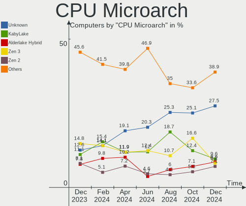
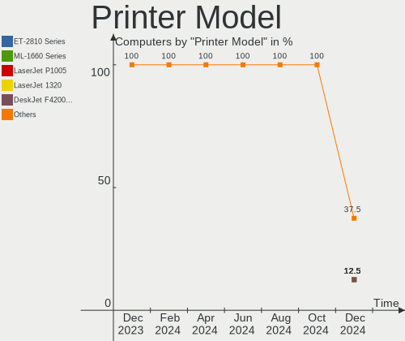
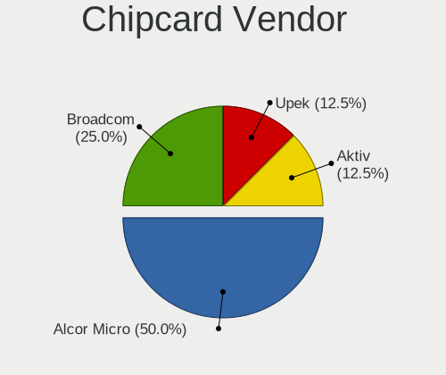

Arch - Hardware Trends
----------------------

A project to identify most popular hardware characteristics and track their change
over time based on data collected by Linux users at https://Linux-Hardware.org.

Anyone can contribute to this report by the [hw-probe](https://github.com/linuxhw/hw-probe) tool:

    sudo -E hw-probe -all -upload

This is a report for all computer types. See also reports for [desktops](/Dist/Arch/Desktop/README.md) and [notebooks](/Dist/Arch/Notebook/README.md).

This report is for one last month. Overall report since the beginning of time: [TestDays](https://github.com/linuxhw/TestDays)

Period: Dec, 2023.

Contents
--------

* [ System ](#system)
  - [ OS                       ](#os)
  - [ OS Family                ](#os-family)
  - [ Kernel                   ](#kernel)
  - [ Kernel Family            ](#kernel-family)
  - [ Kernel Major Ver.        ](#kernel-major-ver)
  - [ Arch                     ](#arch)
  - [ DE                       ](#de)
  - [ Display Server           ](#display-server)
  - [ Display Manager          ](#display-manager)
  - [ OS Lang                  ](#os-lang)
  - [ Boot Mode                ](#boot-mode)
  - [ Filesystem               ](#filesystem)
  - [ Part. scheme             ](#part-scheme)
  - [ Dual Boot with Linux/BSD ](#dual-boot-with-linuxbsd)
  - [ Dual Boot (Win)          ](#dual-boot-win)

* [ Board ](#board)
  - [ Vendor                   ](#vendor)
  - [ Model                    ](#model)
  - [ Model Family             ](#model-family)
  - [ MFG Year                 ](#mfg-year)
  - [ Form Factor              ](#form-factor)
  - [ Secure Boot              ](#secure-boot)
  - [ Coreboot                 ](#coreboot)
  - [ RAM Size                 ](#ram-size)
  - [ RAM Used                 ](#ram-used)
  - [ Total Drives             ](#total-drives)
  - [ Has CD-ROM               ](#has-cd-rom)
  - [ Has Ethernet             ](#has-ethernet)
  - [ Has WiFi                 ](#has-wifi)
  - [ Has Bluetooth            ](#has-bluetooth)

* [ Location ](#location)
  - [ Country                  ](#country)
  - [ City                     ](#city)

* [ Drives ](#drives)
  - [ Drive Vendor             ](#drive-vendor)
  - [ Drive Model              ](#drive-model)
  - [ HDD Vendor               ](#hdd-vendor)
  - [ SSD Vendor               ](#ssd-vendor)
  - [ Drive Kind               ](#drive-kind)
  - [ Drive Connector          ](#drive-connector)
  - [ Drive Size               ](#drive-size)
  - [ Space Total              ](#space-total)
  - [ Space Used               ](#space-used)
  - [ Malfunc. Drives          ](#malfunc-drives)
  - [ Malfunc. Drive Vendor    ](#malfunc-drive-vendor)
  - [ Malfunc. HDD Vendor      ](#malfunc-hdd-vendor)
  - [ Malfunc. Drive Kind      ](#malfunc-drive-kind)
  - [ Failed Drives            ](#failed-drives)
  - [ Failed Drive Vendor      ](#failed-drive-vendor)
  - [ Drive Status             ](#drive-status)

* [ Storage controller ](#storage-controller)
  - [ Storage Vendor           ](#storage-vendor)
  - [ Storage Model            ](#storage-model)
  - [ Storage Kind             ](#storage-kind)

* [ Processor ](#processor)
  - [ CPU Vendor               ](#cpu-vendor)
  - [ CPU Model                ](#cpu-model)
  - [ CPU Model Family         ](#cpu-model-family)
  - [ CPU Cores                ](#cpu-cores)
  - [ CPU Sockets              ](#cpu-sockets)
  - [ CPU Threads              ](#cpu-threads)
  - [ CPU Op-Modes             ](#cpu-op-modes)
  - [ CPU Microcode            ](#cpu-microcode)
  - [ CPU Microarch            ](#cpu-microarch)

* [ Graphics ](#graphics)
  - [ GPU Vendor               ](#gpu-vendor)
  - [ GPU Model                ](#gpu-model)
  - [ GPU Combo                ](#gpu-combo)
  - [ GPU Driver               ](#gpu-driver)
  - [ GPU Memory               ](#gpu-memory)

* [ Monitor ](#monitor)
  - [ Monitor Vendor           ](#monitor-vendor)
  - [ Monitor Model            ](#monitor-model)
  - [ Monitor Resolution       ](#monitor-resolution)
  - [ Monitor Diagonal         ](#monitor-diagonal)
  - [ Monitor Width            ](#monitor-width)
  - [ Aspect Ratio             ](#aspect-ratio)
  - [ Monitor Area             ](#monitor-area)
  - [ Pixel Density            ](#pixel-density)
  - [ Multiple Monitors        ](#multiple-monitors)

* [ Network ](#network)
  - [ Net Controller Vendor    ](#net-controller-vendor)
  - [ Net Controller Model     ](#net-controller-model)
  - [ Wireless Vendor          ](#wireless-vendor)
  - [ Wireless Model           ](#wireless-model)
  - [ Ethernet Vendor          ](#ethernet-vendor)
  - [ Ethernet Model           ](#ethernet-model)
  - [ Net Controller Kind      ](#net-controller-kind)
  - [ Used Controller          ](#used-controller)
  - [ NICs                     ](#nics)
  - [ IPv6                     ](#ipv6)

* [ Bluetooth ](#bluetooth)
  - [ Bluetooth Vendor         ](#bluetooth-vendor)
  - [ Bluetooth Model          ](#bluetooth-model)

* [ Sound ](#sound)
  - [ Sound Vendor             ](#sound-vendor)
  - [ Sound Model              ](#sound-model)

* [ Memory ](#memory)
  - [ Memory Vendor            ](#memory-vendor)
  - [ Memory Model             ](#memory-model)
  - [ Memory Kind              ](#memory-kind)
  - [ Memory Form Factor       ](#memory-form-factor)
  - [ Memory Size              ](#memory-size)
  - [ Memory Speed             ](#memory-speed)

* [ Printers & scanners ](#printers--scanners)
  - [ Printer Vendor           ](#printer-vendor)
  - [ Printer Model            ](#printer-model)
  - [ Scanner Vendor           ](#scanner-vendor)
  - [ Scanner Model            ](#scanner-model)

* [ Camera ](#camera)
  - [ Camera Vendor            ](#camera-vendor)
  - [ Camera Model             ](#camera-model)

* [ Security ](#security)
  - [ Fingerprint Vendor       ](#fingerprint-vendor)
  - [ Fingerprint Model        ](#fingerprint-model)
  - [ Chipcard Vendor          ](#chipcard-vendor)
  - [ Chipcard Model           ](#chipcard-model)

* [ Unsupported ](#unsupported)
  - [ Unsupported Devices      ](#unsupported-devices)
  - [ Unsupported Device Types ](#unsupported-device-types)

System
------

OS
--

Installed operating systems

| Name         | Computers | Percent |
|--------------|-----------|---------|
| Arch Rolling | 270       | 100%    |

OS Family
---------

OS without a version

| Name | Computers | Percent |
|------|-----------|---------|
| Arch | 270       | 100%    |

Kernel
------

Version of the Linux kernel

| Version                          | Computers | Percent |
|----------------------------------|-----------|---------|
| 6.6.7-arch1-1                    | 49        | 18.15%  |
| 6.6.3-arch1-1                    | 38        | 14.07%  |
| 6.6.8-arch1-1                    | 37        | 13.7%   |
| 6.6.4-arch1-1                    | 32        | 11.85%  |
| 6.6.6-arch1-1                    | 11        | 4.07%   |
| 6.6.7-zen1-1-zen                 | 10        | 3.7%    |
| 6.6.5-arch1-1                    | 10        | 3.7%    |
| 6.6.3-zen1-1-zen                 | 8         | 2.96%   |
| 6.6.2-arch1-1                    | 7         | 2.59%   |
| 6.6.8-zen1-1-zen                 | 6         | 2.22%   |
| 6.6.6-zen1-1-zen                 | 6         | 2.22%   |
| 6.6.4-zen1-1-zen                 | 6         | 2.22%   |
| 6.6.1-arch1-1                    | 5         | 1.85%   |
| 6.1.65-1-lts                     | 4         | 1.48%   |
| 6.6.5-zen1-1-zen                 | 3         | 1.11%   |
| 6.5.9-arch2-1                    | 3         | 1.11%   |
| 6.1.69-1-lts                     | 3         | 1.11%   |
| 6.1.68-1-lts                     | 3         | 1.11%   |
| 6.1.64-1-lts                     | 3         | 1.11%   |
| 6.6.6-arch1-1-surface            | 2         | 0.74%   |
| 6.1.67-1-lts                     | 2         | 0.74%   |
| 6.7.0-rc6-1-ml                   | 1         | 0.37%   |
| 6.7.0-rc5-273-tkg-eevdf          | 1         | 0.37%   |
| 6.7.0-rc4-1-git                  | 1         | 0.37%   |
| 6.6.8-x64v2-xanmod1-1            | 1         | 0.37%   |
| 6.6.8-273-tkg-bore-llvm          | 1         | 0.37%   |
| 6.6.8-1-cachyos-eevdf            | 1         | 0.37%   |
| 6.6.7-lqx1-1-lqx                 | 1         | 0.37%   |
| 6.6.7-273-tkg-linux-tkg-pds-llvm | 1         | 0.37%   |
| 6.6.6-arch1-1-g14                | 1         | 0.37%   |
| 6.6.6-2-cachyos                  | 1         | 0.37%   |
| 6.6.2-zen1-1-zen                 | 1         | 0.37%   |
| 6.6.0-pf2                        | 1         | 0.37%   |
| 6.5.13-x64v2-xanmod1-1           | 1         | 0.37%   |
| 6.5.13-hardened2-1-hardened      | 1         | 0.37%   |
| 6.5.13-hardened1-1-hardened      | 1         | 0.37%   |
| 6.5.10-hardened1-1-hardened      | 1         | 0.37%   |
| 6.4.9-arch1-1                    | 1         | 0.37%   |
| 6.3.2-arch1-1                    | 1         | 0.37%   |
| 6.1.63-1-lts                     | 1         | 0.37%   |

Kernel Family
-------------

Linux kernel without a distro release

| Version | Computers | Percent |
|---------|-----------|---------|
| 6.6.7   | 61        | 22.59%  |
| 6.6.8   | 46        | 17.04%  |
| 6.6.3   | 46        | 17.04%  |
| 6.6.4   | 38        | 14.07%  |
| 6.6.6   | 21        | 7.78%   |
| 6.6.5   | 13        | 4.81%   |
| 6.6.2   | 8         | 2.96%   |
| 6.6.1   | 5         | 1.85%   |
| 6.1.65  | 4         | 1.48%   |
| 6.7.0   | 3         | 1.11%   |
| 6.5.9   | 3         | 1.11%   |
| 6.5.13  | 3         | 1.11%   |
| 6.1.69  | 3         | 1.11%   |
| 6.1.68  | 3         | 1.11%   |
| 6.1.64  | 3         | 1.11%   |
| 6.1.67  | 2         | 0.74%   |
| 6.6.0   | 1         | 0.37%   |
| 6.5.10  | 1         | 0.37%   |
| 6.4.9   | 1         | 0.37%   |
| 6.3.2   | 1         | 0.37%   |
| 6.1.63  | 1         | 0.37%   |
| 6.1.4   | 1         | 0.37%   |
| 5.18.12 | 1         | 0.37%   |
| 5.15.90 | 1         | 0.37%   |

Kernel Major Ver.
-----------------

Linux kernel major version

| Version | Computers | Percent |
|---------|-----------|---------|
| 6.6     | 239       | 88.52%  |
| 6.1     | 17        | 6.3%    |
| 6.5     | 7         | 2.59%   |
| 6.7     | 3         | 1.11%   |
| 6.4     | 1         | 0.37%   |
| 6.3     | 1         | 0.37%   |
| 5.18    | 1         | 0.37%   |
| 5.15    | 1         | 0.37%   |

Arch
----

OS architecture (x86_64, i586, etc.)

| Name   | Computers | Percent |
|--------|-----------|---------|
| x86_64 | 269       | 99.63%  |
| i686   | 1         | 0.37%   |

DE
--

Desktop Environment

| Name          | Computers | Percent |
|---------------|-----------|---------|
| KDE5          | 100       | 37.04%  |
| GNOME         | 82        | 30.37%  |
| XFCE          | 18        | 6.67%   |
| i3            | 15        | 5.56%   |
| Hyprland      | 15        | 5.56%   |
| Unknown       | 15        | 5.56%   |
| X-Cinnamon    | 4         | 1.48%   |
| Budgie        | 4         | 1.48%   |
| MATE          | 3         | 1.11%   |
| KDE6          | 3         | 1.11%   |
| bspwm         | 2         | 0.74%   |
| xmonad        | 1         | 0.37%   |
| sway          | 1         | 0.37%   |
| qtile         | 1         | 0.37%   |
| LXQt          | 1         | 0.37%   |
| KDE           | 1         | 0.37%   |
| GNOME Classic | 1         | 0.37%   |
| dwm           | 1         | 0.37%   |
| Deepin        | 1         | 0.37%   |
| Cinnamon      | 1         | 0.37%   |

Display Server
--------------

X11 or Wayland

| Name    | Computers | Percent |
|---------|-----------|---------|
| X11     | 124       | 45.93%  |
| Wayland | 113       | 41.85%  |
| Tty     | 18        | 6.67%   |
| Unknown | 15        | 5.56%   |

Display Manager
---------------

SDDM, LightDM, etc.

| Name    | Computers | Percent |
|---------|-----------|---------|
| Unknown | 117       | 43.33%  |
| SDDM    | 67        | 24.81%  |
| LightDM | 47        | 17.41%  |
| GDM     | 29        | 10.74%  |
| LY-DM   | 5         | 1.85%   |
| EMPTTY  | 2         | 0.74%   |
| SLiM    | 1         | 0.37%   |
| LEMURS  | 1         | 0.37%   |
| GREETD  | 1         | 0.37%   |

OS Lang
-------

Language

| Lang        | Computers | Percent |
|-------------|-----------|---------|
| en_US       | 158       | 58.52%  |
| en_GB       | 19        | 7.04%   |
| C           | 17        | 6.3%    |
| it_IT       | 15        | 5.56%   |
| ru_RU       | 14        | 5.19%   |
| de_DE       | 9         | 3.33%   |
| fr_FR       | 6         | 2.22%   |
| Unknown     | 5         | 1.85%   |
| pt_BR       | 4         | 1.48%   |
| zh_CN       | 2         | 0.74%   |
| pl_PL       | 2         | 0.74%   |
| es_MX       | 2         | 0.74%   |
| en_IN       | 2         | 0.74%   |
| en_AU       | 2         | 0.74%   |
| tr_TR       | 1         | 0.37%   |
| fi_FI       | 1         | 0.37%   |
| es_UY       | 1         | 0.37%   |
| es_PE       | 1         | 0.37%   |
| es_ES       | 1         | 0.37%   |
| es_CL       | 1         | 0.37%   |
| es_AR       | 1         | 0.37%   |
| en_ZA       | 1         | 0.37%   |
| en_US_UTF-8 | 1         | 0.37%   |
| en_US.UTF=8 | 1         | 0.37%   |
| en_CA       | 1         | 0.37%   |
| de_AT       | 1         | 0.37%   |
| bg_BG       | 1         | 0.37%   |

Boot Mode
---------

EFI or BIOS

| Mode | Computers | Percent |
|------|-----------|---------|
| EFI  | 161       | 59.63%  |
| BIOS | 109       | 40.37%  |

Filesystem
----------

Type of filesystem

| Type     | Computers | Percent |
|----------|-----------|---------|
| Ext4     | 169       | 62.59%  |
| Btrfs    | 82        | 30.37%  |
| Xfs      | 4         | 1.48%   |
| Zfs      | 3         | 1.11%   |
| Tmpfs    | 3         | 1.11%   |
| Overlay  | 3         | 1.11%   |
| F2fs     | 2         | 0.74%   |
| Unknown  | 2         | 0.74%   |
| Ext3     | 1         | 0.37%   |
| Bcachefs | 1         | 0.37%   |

Part. scheme
------------

Scheme of partitioning

| Type    | Computers | Percent |
|---------|-----------|---------|
| GPT     | 174       | 64.44%  |
| Unknown | 83        | 30.74%  |
| MBR     | 13        | 4.81%   |

Dual Boot with Linux/BSD
------------------------

Hosting more than one Linux/BSD

| Dual boot | Computers | Percent |
|-----------|-----------|---------|
| No        | 235       | 87.04%  |
| Yes       | 35        | 12.96%  |

Dual Boot (Win)
---------------

Hosting Linux and Windows

| Dual boot | Computers | Percent |
|-----------|-----------|---------|
| No        | 200       | 74.07%  |
| Yes       | 70        | 25.93%  |

Board
-----

Vendor
------

Motherboard manufacturer

| Name                 | Computers | Percent |
|----------------------|-----------|---------|
| ASUSTek Computer     | 66        | 24.44%  |
| Lenovo               | 43        | 15.93%  |
| Hewlett-Packard      | 31        | 11.48%  |
| Gigabyte Technology  | 23        | 8.52%   |
| Dell                 | 18        | 6.67%   |
| MSI                  | 16        | 5.93%   |
| ASRock               | 13        | 4.81%   |
| Acer                 | 12        | 4.44%   |
| Apple                | 5         | 1.85%   |
| Samsung Electronics  | 4         | 1.48%   |
| Razer                | 4         | 1.48%   |
| Intel                | 4         | 1.48%   |
| Framework            | 4         | 1.48%   |
| Alienware            | 3         | 1.11%   |
| Microsoft            | 2         | 0.74%   |
| HUAWEI               | 2         | 0.74%   |
| Unknown              | 2         | 0.74%   |
| VPU Company          | 1         | 0.37%   |
| TUXEDO               | 1         | 0.37%   |
| TrekStor             | 1         | 0.37%   |
| Timi                 | 1         | 0.37%   |
| TECNO Mobile Limited | 1         | 0.37%   |
| System76             | 1         | 0.37%   |
| Sony                 | 1         | 0.37%   |
| Monster              | 1         | 0.37%   |
| Medion               | 1         | 0.37%   |
| Maibenben            | 1         | 0.37%   |
| GPD                  | 1         | 0.37%   |
| Google               | 1         | 0.37%   |
| Fujitsu              | 1         | 0.37%   |
| Casper               | 1         | 0.37%   |
| Canyon               | 1         | 0.37%   |
| Biostar              | 1         | 0.37%   |
| AZW                  | 1         | 0.37%   |
| AMI                  | 1         | 0.37%   |

Model
-----

Motherboard model

| Name                                       | Computers | Percent |
|--------------------------------------------|-----------|---------|
| ASUS TUF Gaming X670E-PLUS WIFI            | 3         | 1.11%   |
| ASUS PRIME B450-PLUS                       | 3         | 1.11%   |
| ASRock B450M Pro4                          | 3         | 1.11%   |
| Razer Blade 17 (2022) - RZ09-0423          | 2         | 0.74%   |
| MSI MS-7C95                                | 2         | 0.74%   |
| MSI MS-7C91                                | 2         | 0.74%   |
| MSI MS-7C56                                | 2         | 0.74%   |
| MSI MS-7B89                                | 2         | 0.74%   |
| Lenovo Legion 5 15ACH6H 82JU               | 2         | 0.74%   |
| Gigabyte B550M DS3H                        | 2         | 0.74%   |
| Gigabyte A320M-S2H V2                      | 2         | 0.74%   |
| Framework Laptop 13 (AMD Ryzen 7040Series) | 2         | 0.74%   |
| ASUS TUF Gaming B550M-PLUS                 | 2         | 0.74%   |
| ASUS PRIME X470-PRO                        | 2         | 0.74%   |
| Acer Nitro AN515-58                        | 2         | 0.74%   |
| Unknown                                    | 2         | 0.74%   |
| VPU Company VWNC71429-S                    | 1         | 0.37%   |
| TUXEDO Pulse 14 Gen3                       | 1         | 0.37%   |
| TrekStor Notebook Slim S130                | 1         | 0.37%   |
| Timi TM1604                                | 1         | 0.37%   |
| TECNO Mobile Limited MEGABOOK T15DA        | 1         | 0.37%   |
| System76 Lemur Pro                         | 1         | 0.37%   |
| Sony VPCCA3X1R                             | 1         | 0.37%   |
| Samsung RF511/RF411/RF711                  | 1         | 0.37%   |
| Samsung QX311/QX411/QX412/QX511            | 1         | 0.37%   |
| Samsung 750XDA                             | 1         | 0.37%   |
| Samsung 750QFG                             | 1         | 0.37%   |
| Razer Blade 15 (2022) - RZ09-0421          | 1         | 0.37%   |
| Razer Blade                                | 1         | 0.37%   |
| MSI MS-7E12                                | 1         | 0.37%   |
| MSI MS-7D75                                | 1         | 0.37%   |
| MSI MS-7D09                                | 1         | 0.37%   |
| MSI MS-7C94                                | 1         | 0.37%   |
| MSI MS-7C52                                | 1         | 0.37%   |
| MSI MS-7B86                                | 1         | 0.37%   |
| MSI MS-7B79                                | 1         | 0.37%   |
| MSI MS-7970                                | 1         | 0.37%   |
| Monster TULPAR T5 V23.2                    | 1         | 0.37%   |
| Microsoft Surface Pro 7                    | 1         | 0.37%   |
| Microsoft Surface Laptop Go                | 1         | 0.37%   |

Model Family
------------

Motherboard model prefix

| Name                    | Computers | Percent |
|-------------------------|-----------|---------|
| Lenovo ThinkPad         | 22        | 8.15%   |
| ASUS PRIME              | 16        | 5.93%   |
| ASUS ROG                | 11        | 4.07%   |
| ASUS VivoBook           | 9         | 3.33%   |
| ASUS ASUS               | 8         | 2.96%   |
| HP Pavilion             | 7         | 2.59%   |
| Dell Latitude           | 7         | 2.59%   |
| Dell Inspiron           | 7         | 2.59%   |
| ASUS TUF                | 7         | 2.59%   |
| Acer Aspire             | 7         | 2.59%   |
| Lenovo Legion           | 6         | 2.22%   |
| Razer Blade             | 4         | 1.48%   |
| HP ProBook              | 4         | 1.48%   |
| Framework Laptop        | 4         | 1.48%   |
| Acer Nitro              | 4         | 1.48%   |
| Lenovo IdeaPad          | 3         | 1.11%   |
| HP Laptop               | 3         | 1.11%   |
| HP ENVY                 | 3         | 1.11%   |
| Gigabyte A320M-S2H      | 3         | 1.11%   |
| ASRock B450M            | 3         | 1.11%   |
| MSI MS-7C95             | 2         | 0.74%   |
| MSI MS-7C91             | 2         | 0.74%   |
| MSI MS-7C56             | 2         | 0.74%   |
| MSI MS-7B89             | 2         | 0.74%   |
| Microsoft Surface       | 2         | 0.74%   |
| Lenovo Yoga             | 2         | 0.74%   |
| Lenovo ThinkBook        | 2         | 0.74%   |
| HP ZBook                | 2         | 0.74%   |
| HP Victus               | 2         | 0.74%   |
| HP OMEN                 | 2         | 0.74%   |
| Gigabyte Z790           | 2         | 0.74%   |
| Gigabyte X570           | 2         | 0.74%   |
| Gigabyte B550M          | 2         | 0.74%   |
| Gigabyte B550           | 2         | 0.74%   |
| Gigabyte AERO           | 2         | 0.74%   |
| Dell Precision          | 2         | 0.74%   |
| ASRock B760M            | 2         | 0.74%   |
| Unknown                 | 2         | 0.74%   |
| VPU Company VWNC71429-S | 1         | 0.37%   |
| TUXEDO Pulse            | 1         | 0.37%   |

MFG Year
--------

Motherboard manufacture year

| Year | Computers | Percent |
|------|-----------|---------|
| 2022 | 38        | 14.07%  |
| 2023 | 37        | 13.7%   |
| 2020 | 36        | 13.33%  |
| 2021 | 34        | 12.59%  |
| 2018 | 27        | 10%     |
| 2019 | 17        | 6.3%    |
| 2016 | 13        | 4.81%   |
| 2013 | 13        | 4.81%   |
| 2015 | 11        | 4.07%   |
| 2017 | 9         | 3.33%   |
| 2014 | 8         | 2.96%   |
| 2012 | 8         | 2.96%   |
| 2010 | 7         | 2.59%   |
| 2011 | 6         | 2.22%   |
| 2008 | 3         | 1.11%   |
| 2009 | 1         | 0.37%   |
| 2007 | 1         | 0.37%   |
| 2003 | 1         | 0.37%   |

Form Factor
-----------

Physical design of the computer

| Name        | Computers | Percent |
|-------------|-----------|---------|
| Notebook    | 145       | 53.7%   |
| Desktop     | 105       | 38.89%  |
| Convertible | 9         | 3.33%   |
| Mini pc     | 5         | 1.85%   |
| Tablet      | 4         | 1.48%   |
| All in one  | 1         | 0.37%   |
| Server      | 1         | 0.37%   |

Secure Boot
-----------

Enabled or disabled

| State    | Computers | Percent |
|----------|-----------|---------|
| Disabled | 263       | 97.41%  |
| Enabled  | 7         | 2.59%   |

Coreboot
--------

Have coreboot on board

| Used | Computers | Percent |
|------|-----------|---------|
| No   | 267       | 98.89%  |
| Yes  | 3         | 1.11%   |

RAM Size
--------

Total RAM memory

| Size in GB      | Computers | Percent |
|-----------------|-----------|---------|
| 16.01-24.0      | 58        | 21.48%  |
| 8.01-16.0       | 58        | 21.48%  |
| 32.01-64.0      | 52        | 19.26%  |
| 4.01-8.0        | 47        | 17.41%  |
| 24.01-32.0      | 17        | 6.3%    |
| 3.01-4.0        | 15        | 5.56%   |
| 64.01-256.0     | 15        | 5.56%   |
| 1.01-2.0        | 4         | 1.48%   |
| 2.01-3.0        | 3         | 1.11%   |
| More than 256.0 | 1         | 0.37%   |

RAM Used
--------

Used RAM memory

| Used GB    | Computers | Percent |
|------------|-----------|---------|
| 4.01-8.0   | 85        | 31.48%  |
| 2.01-3.0   | 49        | 18.15%  |
| 3.01-4.0   | 43        | 15.93%  |
| 1.01-2.0   | 41        | 15.19%  |
| 8.01-16.0  | 34        | 12.59%  |
| 0.51-1.0   | 10        | 3.7%    |
| 16.01-24.0 | 3         | 1.11%   |
| 32.01-64.0 | 2         | 0.74%   |
| 0.01-0.5   | 2         | 0.74%   |
| 24.01-32.0 | 1         | 0.37%   |

Total Drives
------------

Number of drives on board

| Drives | Computers | Percent |
|--------|-----------|---------|
| 1      | 141       | 52.22%  |
| 2      | 78        | 28.89%  |
| 3      | 24        | 8.89%   |
| 4      | 11        | 4.07%   |
| 5      | 10        | 3.7%    |
| 6      | 6         | 2.22%   |

Has CD-ROM
----------

Has CD-ROM on board

| Presented | Computers | Percent |
|-----------|-----------|---------|
| No        | 222       | 82.22%  |
| Yes       | 48        | 17.78%  |

Has Ethernet
------------

Has Ethernet on board

| Presented | Computers | Percent |
|-----------|-----------|---------|
| Yes       | 220       | 81.48%  |
| No        | 50        | 18.52%  |

Has WiFi
--------

Has WiFi module

| Presented | Computers | Percent |
|-----------|-----------|---------|
| Yes       | 223       | 82.59%  |
| No        | 47        | 17.41%  |

Has Bluetooth
-------------

Has Bluetooth module

| Presented | Computers | Percent |
|-----------|-----------|---------|
| Yes       | 214       | 79.26%  |
| No        | 56        | 20.74%  |

Location
--------

Country
-------

Geographic location (country)

| Country         | Computers | Percent |
|-----------------|-----------|---------|
| USA             | 42        | 15.56%  |
| Germany         | 24        | 8.89%   |
| Russia          | 21        | 7.78%   |
| Italy           | 17        | 6.3%    |
| France          | 14        | 5.19%   |
| UK              | 11        | 4.07%   |
| Poland          | 11        | 4.07%   |
| Brazil          | 9         | 3.33%   |
| India           | 8         | 2.96%   |
| Canada          | 8         | 2.96%   |
| Spain           | 5         | 1.85%   |
| Chile           | 5         | 1.85%   |
| Belgium         | 5         | 1.85%   |
| Austria         | 5         | 1.85%   |
| Vietnam         | 4         | 1.48%   |
| Sweden          | 4         | 1.48%   |
| Netherlands     | 4         | 1.48%   |
| Australia       | 4         | 1.48%   |
| Switzerland     | 3         | 1.11%   |
| Romania         | 3         | 1.11%   |
| Mexico          | 3         | 1.11%   |
| Kazakhstan      | 3         | 1.11%   |
| Israel          | 3         | 1.11%   |
| Estonia         | 3         | 1.11%   |
| Colombia        | 3         | 1.11%   |
| China           | 3         | 1.11%   |
| Uruguay         | 2         | 0.74%   |
| Turkey          | 2         | 0.74%   |
| Thailand        | 2         | 0.74%   |
| South Africa    | 2         | 0.74%   |
| Portugal        | 2         | 0.74%   |
| Morocco         | 2         | 0.74%   |
| Lithuania       | 2         | 0.74%   |
| Iran            | 2         | 0.74%   |
| Finland         | 2         | 0.74%   |
| Czechia         | 2         | 0.74%   |
| Belarus         | 2         | 0.74%   |
| Bangladesh      | 2         | 0.74%   |
| Ukraine         | 1         | 0.37%   |
| The Netherlands | 1         | 0.37%   |

City
----

Geographic location (city)

| City             | Computers | Percent |
|------------------|-----------|---------|
| St Petersburg    | 4         | 1.48%   |
| Zurich           | 3         | 1.11%   |
| Warsaw           | 3         | 1.11%   |
| Sindelfingen     | 3         | 1.11%   |
| Poznan           | 3         | 1.11%   |
| Moscow           | 3         | 1.11%   |
| Brussels         | 3         | 1.11%   |
| Bogotá          | 3         | 1.11%   |
| Berlin           | 3         | 1.11%   |
| Zapopan          | 2         | 0.74%   |
| Winchester       | 2         | 0.74%   |
| Vienna           | 2         | 0.74%   |
| Valga            | 2         | 0.74%   |
| Strasbourg       | 2         | 0.74%   |
| Southwark        | 2         | 0.74%   |
| Santiago         | 2         | 0.74%   |
| Portland         | 2         | 0.74%   |
| Perenchies       | 2         | 0.74%   |
| Novoshakhtinsk   | 2         | 0.74%   |
| Minsk            | 2         | 0.74%   |
| Malmo            | 2         | 0.74%   |
| Kazan'           | 2         | 0.74%   |
| Johannesburg     | 2         | 0.74%   |
| Ho Chi Minh City | 2         | 0.74%   |
| Hamburg          | 2         | 0.74%   |
| Graz             | 2         | 0.74%   |
| Edmonton         | 2         | 0.74%   |
| Calama           | 2         | 0.74%   |
| Yorktown         | 1         | 0.37%   |
| Winnipeg         | 1         | 0.37%   |
| Westchester      | 1         | 0.37%   |
| West Lebanon     | 1         | 0.37%   |
| Waukesha         | 1         | 0.37%   |
| Vilnius          | 1         | 0.37%   |
| Vigevano         | 1         | 0.37%   |
| Turin            | 1         | 0.37%   |
| Trelissac        | 1         | 0.37%   |
| Trebisacce       | 1         | 0.37%   |
| Tongi            | 1         | 0.37%   |
| Tokyo            | 1         | 0.37%   |

Drives
------

Drive Vendor
------------

Hard drive vendors

| Vendor                       | Computers | Drives | Percent |
|------------------------------|-----------|--------|---------|
| Samsung Electronics          | 83        | 111    | 19.12%  |
| WDC                          | 45        | 60     | 10.37%  |
| Seagate                      | 39        | 48     | 8.99%   |
| Sandisk                      | 35        | 40     | 8.06%   |
| Kingston                     | 30        | 33     | 6.91%   |
| SK hynix                     | 18        | 18     | 4.15%   |
| Toshiba                      | 17        | 17     | 3.92%   |
| Micron Technology            | 16        | 17     | 3.69%   |
| Crucial                      | 16        | 17     | 3.69%   |
| Intel                        | 15        | 16     | 3.46%   |
| Micron/Crucial Technology    | 11        | 12     | 2.53%   |
| Unknown                      | 9         | 9      | 2.07%   |
| Hitachi                      | 9         | 9      | 2.07%   |
| Phison Electronics           | 8         | 8      | 1.84%   |
| Silicon Motion               | 6         | 6      | 1.38%   |
| Kingston Technology Company  | 6         | 6      | 1.38%   |
| ADATA Technology             | 6         | 7      | 1.38%   |
| MAXIO Technology (Hangzhou)  | 5         | 5      | 1.15%   |
| ASMT                         | 5         | 5      | 1.15%   |
| PNY                          | 4         | 4      | 0.92%   |
| KIOXIA                       | 4         | 4      | 0.92%   |
| A-DATA Technology            | 4         | 4      | 0.92%   |
| Verbatim                     | 2         | 2      | 0.46%   |
| SPCC                         | 2         | 2      | 0.46%   |
| Shenzhen Longsys Electronics | 2         | 2      | 0.46%   |
| LITEON                       | 2         | 2      | 0.46%   |
| HGST                         | 2         | 2      | 0.46%   |
| China                        | 2         | 2      | 0.46%   |
| Apacer                       | 2         | 2      | 0.46%   |
| USB                          | 1         | 1      | 0.23%   |
| Union Memory                 | 1         | 1      | 0.23%   |
| Transcend                    | 1         | 1      | 0.23%   |
| SSK                          | 1         | 1      | 0.23%   |
| SHAREVDI                     | 1         | 1      | 0.23%   |
| Seagate Technology           | 1         | 1      | 0.23%   |
| SATA SSD                     | 1         | 1      | 0.23%   |
| Realtek Semiconductor        | 1         | 1      | 0.23%   |
| OCZ                          | 1         | 1      | 0.23%   |
| O2 Micro                     | 1         | 1      | 0.23%   |
| NGFF                         | 1         | 1      | 0.23%   |

Drive Model
-----------

Hard drive models

| Model                                                             | Computers | Percent |
|-------------------------------------------------------------------|-----------|---------|
| Samsung NVMe SSD Controller PM9A1/PM9A3/980PRO 2TB                | 19        | 3.93%   |
| Samsung NVMe SSD Controller SM981/PM981/PM983 512GB               | 18        | 3.72%   |
| Seagate ST1000DM010-2EP102 1TB                                    | 9         | 1.86%   |
| Kingston SA400S37240G 240GB SSD                                   | 9         | 1.86%   |
| Micron/Crucial P2 NVMe PCIe SSD 4TB                               | 6         | 1.24%   |
| Crucial CT240BX500SSD1 240GB                                      | 6         | 1.24%   |
| Samsung SSD 860 EVO 1TB                                           | 5         | 1.03%   |
| Samsung SSD 850 EVO 500GB                                         | 5         | 1.03%   |
| MAXIO (Hangzhou) NVMe SSD Controller MAP1202 256GB                | 5         | 1.03%   |
| Intel SSDPEKNU512GZ 512GB                                         | 5         | 1.03%   |
| Sandisk WD Blue SN550 NVMe SSD 1TB                                | 4         | 0.83%   |
| Sandisk WD Black SN850 1024GB                                     | 4         | 0.83%   |
| Sandisk WD Black SN750 / PC SN730 NVMe SSD 2TB                    | 4         | 0.83%   |
| Samsung SSD 850 EVO 250GB                                         | 4         | 0.83%   |
| Phison E12 NVMe Controller 1TB                                    | 4         | 0.83%   |
| Kingston SA400S37480G 480GB SSD                                   | 4         | 0.83%   |
| ADATA XPG SX8200 Pro PCIe Gen3x4 M.2 2280 Solid State Drive 512GB | 4         | 0.83%   |
| Silicon Motion SM2263EN/SM2263XT SSD Controller 500GB             | 3         | 0.62%   |
| Sandisk WD Blue SN570 1TB                                         | 3         | 0.62%   |
| Samsung SSD 990 PRO 2TB                                           | 3         | 0.62%   |
| Samsung SSD 990 PRO 1TB                                           | 3         | 0.62%   |
| Samsung SSD 980 1TB                                               | 3         | 0.62%   |
| Samsung SSD 840 EVO 250GB                                         | 3         | 0.62%   |
| Kingston Company SNV2S1000G 1TB                                   | 3         | 0.62%   |
| Kingston SA400S37960G 960GB SSD                                   | 3         | 0.62%   |
| Intel SSD 660P Series 1TB                                         | 3         | 0.62%   |
| Crucial CT1000MX500SSD1 1TB                                       | 3         | 0.62%   |
| WDC WDS240G2G0A-00JH30 240GB SSD                                  | 2         | 0.41%   |
| WDC WDS100T2B0A-00SM50 1TB SSD                                    | 2         | 0.41%   |
| WDC WDBNCE0010PNC 1TB SSD                                         | 2         | 0.41%   |
| WDC WD5000AZLX-60K2TA0 500GB                                      | 2         | 0.41%   |
| WDC WD5000AAKX-001CA0 500GB                                       | 2         | 0.41%   |
| WDC WD10EZEX-08M2NA0 1TB                                          | 2         | 0.41%   |
| WDC WD10EZEX-00WN4A0 1TB                                          | 2         | 0.41%   |
| WDC WD10EZEX-00BN5A0 1TB                                          | 2         | 0.41%   |
| Verbatim Vi550 S3 512GB                                           | 2         | 0.41%   |
| Unknown NVMe SSD Drive 1TB                                        | 2         | 0.41%   |
| Unknown MMC Card  128GB                                           | 2         | 0.41%   |
| Toshiba XG6 NVMe SSD Controller 512GB                             | 2         | 0.41%   |
| Toshiba DT01ACA100 1TB                                            | 2         | 0.41%   |

HDD Vendor
----------

Hard disk drive vendors

| Vendor              | Computers | Drives | Percent |
|---------------------|-----------|--------|---------|
| Seagate             | 38        | 47     | 37.62%  |
| WDC                 | 32        | 42     | 31.68%  |
| Toshiba             | 10        | 10     | 9.9%    |
| Hitachi             | 9         | 9      | 8.91%   |
| Samsung Electronics | 3         | 3      | 2.97%   |
| ASMT                | 3         | 3      | 2.97%   |
| HGST                | 2         | 2      | 1.98%   |
| USB                 | 1         | 1      | 0.99%   |
| Unknown             | 1         | 1      | 0.99%   |
| Generic-            | 1         | 1      | 0.99%   |
| Fujitsu             | 1         | 1      | 0.99%   |

SSD Vendor
----------

Solid state drive vendors

| Vendor              | Computers | Drives | Percent |
|---------------------|-----------|--------|---------|
| Samsung Electronics | 37        | 42     | 25.52%  |
| Kingston            | 24        | 27     | 16.55%  |
| WDC                 | 17        | 18     | 11.72%  |
| Crucial             | 16        | 17     | 11.03%  |
| SanDisk             | 8         | 8      | 5.52%   |
| Intel               | 5         | 6      | 3.45%   |
| PNY                 | 4         | 4      | 2.76%   |
| A-DATA Technology   | 3         | 3      | 2.07%   |
| Verbatim            | 2         | 2      | 1.38%   |
| SPCC                | 2         | 2      | 1.38%   |
| LITEON              | 2         | 2      | 1.38%   |
| China               | 2         | 2      | 1.38%   |
| Apacer              | 2         | 2      | 1.38%   |
| Transcend           | 1         | 1      | 0.69%   |
| Toshiba             | 1         | 1      | 0.69%   |
| SK hynix            | 1         | 1      | 0.69%   |
| SHAREVDI            | 1         | 1      | 0.69%   |
| OCZ                 | 1         | 1      | 0.69%   |
| NGFF                | 1         | 1      | 0.69%   |
| Netac               | 1         | 1      | 0.69%   |
| Maxtor              | 1         | 1      | 0.69%   |
| Leven               | 1         | 1      | 0.69%   |
| KingSpec            | 1         | 1      | 0.69%   |
| KingDian            | 1         | 1      | 0.69%   |
| JMicron Technology  | 1         | 1      | 0.69%   |
| HS-SSD-E100         | 1         | 1      | 0.69%   |
| Gigabyte Technology | 1         | 1      | 0.69%   |
| Drevo               | 1         | 1      | 0.69%   |
| DEXP                | 1         | 1      | 0.69%   |
| Corsair             | 1         | 1      | 0.69%   |
| ASMT                | 1         | 1      | 0.69%   |
| Apple               | 1         | 1      | 0.69%   |
| AMD                 | 1         | 1      | 0.69%   |
| Acer                | 1         | 1      | 0.69%   |

Drive Kind
----------

HDD or SSD

| Kind    | Computers | Drives | Percent |
|---------|-----------|--------|---------|
| NVMe    | 176       | 217    | 45.83%  |
| SSD     | 119       | 156    | 30.99%  |
| HDD     | 83        | 120    | 21.61%  |
| MMC     | 4         | 4      | 1.04%   |
| Unknown | 2         | 2      | 0.52%   |

Drive Connector
---------------

SATA, SAS, NVMe, etc.

| Type | Computers | Drives | Percent |
|------|-----------|--------|---------|
| NVMe | 176       | 214    | 51.01%  |
| SATA | 149       | 264    | 43.19%  |
| SAS  | 16        | 17     | 4.64%   |
| MMC  | 4         | 4      | 1.16%   |

Drive Size
----------

Size of hard drive

| Size in TB | Computers | Drives | Percent |
|------------|-----------|--------|---------|
| 0.01-0.5   | 107       | 139    | 47.98%  |
| 0.51-1.0   | 75        | 91     | 33.63%  |
| 1.01-2.0   | 20        | 21     | 8.97%   |
| 3.01-4.0   | 8         | 8      | 3.59%   |
| 4.01-10.0  | 8         | 9      | 3.59%   |
| 2.01-3.0   | 3         | 3      | 1.35%   |
| 10.01-20.0 | 2         | 5      | 0.9%    |

Space Total
-----------

Amount of disk space available on the file system

| Size in GB     | Computers | Percent |
|----------------|-----------|---------|
| 501-1000       | 55        | 20.37%  |
| 251-500        | 48        | 17.78%  |
| 101-250        | 45        | 16.67%  |
| More than 3000 | 43        | 15.93%  |
| 1001-2000      | 41        | 15.19%  |
| 2001-3000      | 17        | 6.3%    |
| 51-100         | 12        | 4.44%   |
| 1-20           | 4         | 1.48%   |
| Unknown        | 4         | 1.48%   |
| 21-50          | 1         | 0.37%   |

Space Used
----------

Amount of used disk space

| Used GB        | Computers | Percent |
|----------------|-----------|---------|
| 1-20           | 62        | 22.96%  |
| 101-250        | 44        | 16.3%   |
| 251-500        | 33        | 12.22%  |
| 51-100         | 33        | 12.22%  |
| 21-50          | 31        | 11.48%  |
| 501-1000       | 26        | 9.63%   |
| 1001-2000      | 22        | 8.15%   |
| More than 3000 | 10        | 3.7%    |
| 2001-3000      | 5         | 1.85%   |
| Unknown        | 4         | 1.48%   |

Malfunc. Drives
---------------

Drive models with a malfunction

| Model                                                           | Computers | Drives | Percent |
|-----------------------------------------------------------------|-----------|--------|---------|
| WDC WD5000AAKX-001CA0 500GB                                     | 2         | 2      | 6.25%   |
| WDC WDS240G2G0A-00JH30 240GB SSD                                | 1         | 1      | 3.13%   |
| WDC WD7500BPVT-60HXZT3 752GB                                    | 1         | 1      | 3.13%   |
| WDC WD60EDAZ-11U78B0 6TB                                        | 1         | 1      | 3.13%   |
| WDC WD5000LPVX-00V0TT0 500GB                                    | 1         | 1      | 3.13%   |
| WDC WD40EFRX-68N32N0 4TB                                        | 1         | 1      | 3.13%   |
| WDC WD1600AAJS-00B4A0 160GB                                     | 1         | 1      | 3.13%   |
| WDC WD10SPZX-75Z10T2 1TB                                        | 1         | 1      | 3.13%   |
| WDC WD10EZEX-08WN4A0 1TB                                        | 1         | 1      | 3.13%   |
| WDC WD10EADS-00P8B0 1TB                                         | 1         | 1      | 3.13%   |
| WDC WD Green 2.5 1000GB                                         | 1         | 1      | 3.13%   |
| Seagate ST8000VN004-3CP101 8TB                                  | 1         | 2      | 3.13%   |
| Seagate ST31000528AS 1TB                                        | 1         | 1      | 3.13%   |
| Seagate ST2000LM007-1R8174 2TB                                  | 1         | 1      | 3.13%   |
| Seagate ST2000DM006-2DM164 2TB                                  | 1         | 1      | 3.13%   |
| Seagate ST12000VN0007-2GS116 12TB                               | 1         | 1      | 3.13%   |
| Seagate ST1000DM010-2EP102 1TB                                  | 1         | 1      | 3.13%   |
| SanDisk SSD PLUS 240GB                                          | 1         | 1      | 3.13%   |
| Samsung Electronics SSD 870 EVO 1TB                             | 1         | 1      | 3.13%   |
| Samsung Electronics NVMe SSD Controller SM981/PM981/PM983 512GB | 1         | 1      | 3.13%   |
| Samsung Electronics NVMe SSD Controller PM9A1/PM9A3/980PRO 2TB  | 1         | 1      | 3.13%   |
| Samsung Electronics HD154UI 1TB                                 | 1         | 1      | 3.13%   |
| Realtek Semiconductor RTS5763DL NVMe SSD Controller 256GB       | 1         | 1      | 3.13%   |
| Micron Technology 2200V_MTFDHBA512TCK 512GB                     | 1         | 1      | 3.13%   |
| Kingston SKC400S371T 1TB SSD                                    | 1         | 1      | 3.13%   |
| Kingston SA400S37960G 960GB SSD                                 | 1         | 1      | 3.13%   |
| Hitachi HUA721010KLA330 1TB                                     | 1         | 1      | 3.13%   |
| Hitachi HTS545050B9A300 500GB                                   | 1         | 1      | 3.13%   |
| Hitachi HDS721016CLA382 160GB                                   | 1         | 1      | 3.13%   |
| Hitachi HDS721010KLA330 1TB                                     | 1         | 1      | 3.13%   |
| HGST HTS725050A7E630 500GB                                      | 1         | 1      | 3.13%   |

Malfunc. Drive Vendor
---------------------

Vendors of faulty drives

| Vendor                | Computers | Drives | Percent |
|-----------------------|-----------|--------|---------|
| WDC                   | 11        | 12     | 35.48%  |
| Seagate               | 6         | 7      | 19.35%  |
| Samsung Electronics   | 4         | 4      | 12.9%   |
| Hitachi               | 4         | 4      | 12.9%   |
| Kingston              | 2         | 2      | 6.45%   |
| SanDisk               | 1         | 1      | 3.23%   |
| Realtek Semiconductor | 1         | 1      | 3.23%   |
| Micron Technology     | 1         | 1      | 3.23%   |
| HGST                  | 1         | 1      | 3.23%   |

Malfunc. HDD Vendor
-------------------

Vendors of faulty HDD drives

| Vendor              | Computers | Drives | Percent |
|---------------------|-----------|--------|---------|
| WDC                 | 10        | 10     | 45.45%  |
| Seagate             | 6         | 7      | 27.27%  |
| Hitachi             | 4         | 4      | 18.18%  |
| Samsung Electronics | 1         | 1      | 4.55%   |
| HGST                | 1         | 1      | 4.55%   |

Malfunc. Drive Kind
-------------------

Kinds of faulty drives

| Kind | Computers | Drives | Percent |
|------|-----------|--------|---------|
| HDD  | 17        | 23     | 62.96%  |
| SSD  | 6         | 6      | 22.22%  |
| NVMe | 4         | 4      | 14.81%  |

Failed Drives
-------------

Failed drive models

Zero info for selected period =(

Failed Drive Vendor
-------------------

Failed drive vendors

Zero info for selected period =(

Drive Status
------------

Number of failed and malfunc. drives

| Status   | Computers | Drives | Percent |
|----------|-----------|--------|---------|
| Works    | 143       | 254    | 48.47%  |
| Detected | 129       | 212    | 43.73%  |
| Malfunc  | 23        | 33     | 7.8%    |

Storage controller
------------------

Storage Vendor
--------------

Storage controller vendors

| Vendor                       | Computers | Percent |
|------------------------------|-----------|---------|
| Intel                        | 127       | 31.59%  |
| AMD                          | 78        | 19.4%   |
| Samsung Electronics          | 56        | 13.93%  |
| SanDisk                      | 29        | 7.21%   |
| SK hynix                     | 17        | 4.23%   |
| Micron Technology            | 16        | 3.98%   |
| Kingston Technology Company  | 12        | 2.99%   |
| Micron/Crucial Technology    | 11        | 2.74%   |
| Phison Electronics           | 8         | 1.99%   |
| ADATA Technology             | 7         | 1.74%   |
| Toshiba America Info Systems | 6         | 1.49%   |
| Silicon Motion               | 6         | 1.49%   |
| MAXIO Technology (Hangzhou)  | 5         | 1.24%   |
| KIOXIA                       | 5         | 1.24%   |
| ASMedia Technology           | 5         | 1.24%   |
| Solidigm                     | 2         | 0.5%    |
| Shenzhen Longsys Electronics | 2         | 0.5%    |
| Union Memory (Shenzhen)      | 1         | 0.25%   |
| Seagate Technology           | 1         | 0.25%   |
| Realtek Semiconductor        | 1         | 0.25%   |
| O2 Micro                     | 1         | 0.25%   |
| Nvidia                       | 1         | 0.25%   |
| Marvell Technology Group     | 1         | 0.25%   |
| JMicron Technology           | 1         | 0.25%   |
| INNOGRIT                     | 1         | 0.25%   |
| Broadcom / LSI               | 1         | 0.25%   |
| Biwin Storage Technology     | 1         | 0.25%   |

Storage Model
-------------

Storage controller models

| Model                                                                            | Computers | Percent |
|----------------------------------------------------------------------------------|-----------|---------|
| AMD FCH SATA Controller [AHCI mode]                                              | 44        | 9.87%   |
| AMD 500 Series Chipset SATA Controller                                           | 21        | 4.71%   |
| Samsung NVMe SSD Controller PM9A1/PM9A3/980PRO                                   | 19        | 4.26%   |
| Samsung NVMe SSD Controller SM981/PM981/PM983                                    | 18        | 4.04%   |
| AMD 400 Series Chipset SATA Controller                                           | 17        | 3.81%   |
| Samsung NVMe SSD Controller 980 (DRAM-less)                                      | 14        | 3.14%   |
| Intel Volume Management Device NVMe RAID Controller                              | 11        | 2.47%   |
| Intel Sunrise Point-LP SATA Controller [AHCI mode]                               | 10        | 2.24%   |
| Intel 8 Series/C220 Series Chipset Family 6-port SATA Controller 1 [AHCI mode]   | 10        | 2.24%   |
| Intel 7 Series Chipset Family 6-port SATA Controller [AHCI mode]                 | 10        | 2.24%   |
| Intel 8 Series SATA Controller 1 [AHCI mode]                                     | 8         | 1.79%   |
| SK hynix Platinum P41/PC801 NVMe Solid State Drive                               | 6         | 1.35%   |
| SanDisk WD Black SN770 / PC SN740 256GB / PC SN560 (DRAM-less) NVMe SSD          | 6         | 1.35%   |
| Samsung NVMe SSD Controller S4LV008[Pascal]                                      | 6         | 1.35%   |
| Micron/Crucial P2 [Nick P2] / P3 / P3 Plus NVMe PCIe SSD (DRAM-less)             | 6         | 1.35%   |
| SK hynix Gold P31/BC711/PC711 NVMe Solid State Drive                             | 5         | 1.12%   |
| Sandisk WD Black SN850X NVMe SSD                                                 | 5         | 1.12%   |
| Micron 2400 NVMe SSD (DRAM-less)                                                 | 5         | 1.12%   |
| MAXIO (Hangzhou) NVMe SSD Controller MAP1202                                     | 5         | 1.12%   |
| Intel SSD 670p Series [Keystone Harbor]                                          | 5         | 1.12%   |
| Intel Q170/Q150/B150/H170/H110/Z170/CM236 Chipset SATA Controller [AHCI Mode]    | 5         | 1.12%   |
| Intel 82801 Mobile SATA Controller [RAID mode]                                   | 5         | 1.12%   |
| Intel 700 Series Chipset Family SATA AHCI Controller                             | 5         | 1.12%   |
| ASMedia ASM1062 Serial ATA Controller                                            | 5         | 1.12%   |
| SanDisk WD PC SN810 / Black SN850 NVMe SSD                                       | 4         | 0.9%    |
| SanDisk Ultra 3D / WD Blue SN550 NVMe SSD                                        | 4         | 0.9%    |
| SanDisk Extreme Pro / WD Black SN750 / PC SN730 / Red SN700 NVMe SSD             | 4         | 0.9%    |
| Phison E12 NVMe Controller                                                       | 4         | 0.9%    |
| Micron 3400 NVMe SSD [Hendrix]                                                   | 4         | 0.9%    |
| Kingston Company KC3000/FURY Renegade NVMe SSD E18                               | 4         | 0.9%    |
| Intel Wildcat Point-LP SATA Controller [AHCI Mode]                               | 4         | 0.9%    |
| Intel Volume Management Device NVMe RAID Controller Intel Corporation            | 4         | 0.9%    |
| Intel SSD 660P Series                                                            | 4         | 0.9%    |
| Intel SATA Controller [RAID mode]                                                | 4         | 0.9%    |
| Intel Atom/Celeron/Pentium Processor x5-E8000/J3xxx/N3xxx Series SATA Controller | 4         | 0.9%    |
| Intel 6 Series/C200 Series Chipset Family 6 port Mobile SATA AHCI Controller     | 4         | 0.9%    |
| Intel 400 Series Chipset Family SATA AHCI Controller                             | 4         | 0.9%    |
| Intel 200 Series PCH SATA controller [AHCI mode]                                 | 4         | 0.9%    |
| AMD FCH SATA Controller D                                                        | 4         | 0.9%    |
| ADATA XPG SX8200 Pro PCIe Gen3x4 M.2 2280 Solid State Drive                      | 4         | 0.9%    |

Storage Kind
------------

Kind of storage controller (IDE, SATA, NVMe, SAS, ...)

| Kind | Computers | Percent |
|------|-----------|---------|
| SATA | 177       | 45.74%  |
| NVMe | 176       | 45.48%  |
| RAID | 25        | 6.46%   |
| IDE  | 9         | 2.33%   |

Processor
---------

CPU Vendor
----------

Processor vendors

| Vendor | Computers | Percent |
|--------|-----------|---------|
| Intel  | 158       | 58.52%  |
| AMD    | 112       | 41.48%  |

CPU Model
---------

Processor models

| Model                                      | Computers | Percent |
|--------------------------------------------|-----------|---------|
| AMD Ryzen 5 3600 6-Core Processor          | 9         | 3.33%   |
| AMD Ryzen 7 5700G with Radeon Graphics     | 5         | 1.85%   |
| AMD Ryzen 7 3700X 8-Core Processor         | 5         | 1.85%   |
| AMD Ryzen 5 5600X 6-Core Processor         | 5         | 1.85%   |
| Intel Core i5-3230M CPU @ 2.60GHz          | 4         | 1.48%   |
| Intel 12th Gen Core i9-12900H              | 4         | 1.48%   |
| Intel 11th Gen Core i5-1135G7 @ 2.40GHz    | 4         | 1.48%   |
| AMD Ryzen 7 5800X 8-Core Processor         | 4         | 1.48%   |
| AMD Ryzen 7 5800H with Radeon Graphics     | 4         | 1.48%   |
| Intel Pentium CPU N3700 @ 1.60GHz          | 3         | 1.11%   |
| Intel Core i7-8550U CPU @ 1.80GHz          | 3         | 1.11%   |
| Intel Core i7-6700 CPU @ 3.40GHz           | 3         | 1.11%   |
| Intel Core i7-10750H CPU @ 2.60GHz         | 3         | 1.11%   |
| Intel Core i5-8350U CPU @ 1.70GHz          | 3         | 1.11%   |
| Intel Core i5-8250U CPU @ 1.60GHz          | 3         | 1.11%   |
| Intel Core i5-4300U CPU @ 1.90GHz          | 3         | 1.11%   |
| Intel Core i5-3210M CPU @ 2.50GHz          | 3         | 1.11%   |
| Intel 11th Gen Core i7-11800H @ 2.30GHz    | 3         | 1.11%   |
| AMD Ryzen 9 7950X3D 16-Core Processor      | 3         | 1.11%   |
| AMD Ryzen 9 7940HS w/ Radeon 780M Graphics | 3         | 1.11%   |
| AMD Ryzen 7 7730U with Radeon Graphics     | 3         | 1.11%   |
| AMD Ryzen 7 5700X 8-Core Processor         | 3         | 1.11%   |
| AMD Ryzen 5 5600H with Radeon Graphics     | 3         | 1.11%   |
| AMD Ryzen 5 5600G with Radeon Graphics     | 3         | 1.11%   |
| AMD Ryzen 5 4600H with Radeon Graphics     | 3         | 1.11%   |
| Intel Core i7-9750H CPU @ 2.60GHz          | 2         | 0.74%   |
| Intel Core i7-8700 CPU @ 3.20GHz           | 2         | 0.74%   |
| Intel Core i7-6700K CPU @ 4.00GHz          | 2         | 0.74%   |
| Intel Core i5-7200U CPU @ 2.50GHz          | 2         | 0.74%   |
| Intel Core i5-6200U CPU @ 2.30GHz          | 2         | 0.74%   |
| Intel Core i5-5300U CPU @ 2.30GHz          | 2         | 0.74%   |
| Intel Core i5-4300M CPU @ 2.60GHz          | 2         | 0.74%   |
| Intel Core i5-3470 CPU @ 3.20GHz           | 2         | 0.74%   |
| Intel Core i5-1035G4 CPU @ 1.10GHz         | 2         | 0.74%   |
| Intel Core i5-10300H CPU @ 2.50GHz         | 2         | 0.74%   |
| Intel Core i5-10210U CPU @ 1.60GHz         | 2         | 0.74%   |
| Intel Core i3-4005U CPU @ 1.70GHz          | 2         | 0.74%   |
| Intel 13th Gen Core i9-13900H              | 2         | 0.74%   |
| Intel 13th Gen Core i7-1360P               | 2         | 0.74%   |
| Intel 13th Gen Core i5-13600KF             | 2         | 0.74%   |

CPU Model Family
----------------

Processor model prefix

| Model                  | Computers | Percent |
|------------------------|-----------|---------|
| Intel Core i5          | 54        | 20%     |
| Other                  | 47        | 17.41%  |
| AMD Ryzen 7            | 42        | 15.56%  |
| AMD Ryzen 5            | 37        | 13.7%   |
| Intel Core i7          | 31        | 11.48%  |
| AMD Ryzen 9            | 17        | 6.3%    |
| Intel Core i3          | 6         | 2.22%   |
| Intel Pentium          | 5         | 1.85%   |
| Intel Core 2 Duo       | 4         | 1.48%   |
| AMD Ryzen 3            | 4         | 1.48%   |
| AMD FX                 | 4         | 1.48%   |
| Intel Xeon             | 3         | 1.11%   |
| Intel Celeron          | 3         | 1.11%   |
| Intel Atom             | 3         | 1.11%   |
| AMD Ryzen 7 PRO        | 3         | 1.11%   |
| AMD Phenom II X4       | 2         | 0.74%   |
| Intel Pentium Dual     | 1         | 0.37%   |
| Intel Core M           | 1         | 0.37%   |
| Intel Core i9          | 1         | 0.37%   |
| AMD Ryzen Threadripper | 1         | 0.37%   |
| AMD Athlon             | 1         | 0.37%   |

CPU Cores
---------

Number of processor cores

| Number | Computers | Percent |
|--------|-----------|---------|
| 4      | 70        | 25.93%  |
| 8      | 56        | 20.74%  |
| 2      | 54        | 20%     |
| 6      | 46        | 17.04%  |
| 14     | 12        | 4.44%   |
| 12     | 12        | 4.44%   |
| 16     | 10        | 3.7%    |
| 10     | 4         | 1.48%   |
| 24     | 2         | 0.74%   |
| 1      | 2         | 0.74%   |
| 32     | 1         | 0.37%   |
| 3      | 1         | 0.37%   |

CPU Sockets
-----------

Number of sockets

| Number | Computers | Percent |
|--------|-----------|---------|
| 1      | 269       | 99.63%  |
| 4      | 1         | 0.37%   |

CPU Threads
-----------

Threads per core (Hyper-Threading)

| Number | Computers | Percent |
|--------|-----------|---------|
| 2      | 237       | 87.78%  |
| 1      | 33        | 12.22%  |

CPU Op-Modes
------------

CPU Operation Modes (32-bit, 64-bit)

| Op mode        | Computers | Percent |
|----------------|-----------|---------|
| 32-bit, 64-bit | 269       | 99.63%  |
| 32-bit         | 1         | 0.37%   |

CPU Microcode
-------------

Microcode number

| Number     | Computers | Percent |
|------------|-----------|---------|
| Unknown    | 190       | 70.37%  |
| 0x0a50000d | 8         | 2.96%   |
| 0x0a601203 | 7         | 2.59%   |
| 0x0a601206 | 5         | 1.85%   |
| 0x0a50000c | 5         | 1.85%   |
| 0x08701030 | 4         | 1.48%   |
| 0x0a704103 | 3         | 1.11%   |
| 0x0a50000f | 3         | 1.11%   |
| 0x0a201025 | 3         | 1.11%   |
| 0x08108109 | 3         | 1.11%   |
| 0x0800820d | 3         | 1.11%   |
| 0x0a704104 | 2         | 0.74%   |
| 0x0a20120a | 2         | 0.74%   |
| 0x08701021 | 2         | 0.74%   |
| 0x08701013 | 2         | 0.74%   |
| 0x08608103 | 2         | 0.74%   |
| 0x08600106 | 2         | 0.74%   |
| 0x06000852 | 2         | 0.74%   |
| 0xf29      | 1         | 0.37%   |
| 0xa0653    | 1         | 0.37%   |
| 0xa0652    | 1         | 0.37%   |
| 0x906ea    | 1         | 0.37%   |
| 0x906e9    | 1         | 0.37%   |
| 0x806ea    | 1         | 0.37%   |
| 0x406c3    | 1         | 0.37%   |
| 0x206d7    | 1         | 0.37%   |
| 0x0a50000b | 1         | 0.37%   |
| 0x0a404102 | 1         | 0.37%   |
| 0x0a20120e | 1         | 0.37%   |
| 0x0a201204 | 1         | 0.37%   |
| 0x0a20102b | 1         | 0.37%   |
| 0x0a201009 | 1         | 0.37%   |
| 0x08608104 | 1         | 0.37%   |
| 0x08600109 | 1         | 0.37%   |
| 0x08008206 | 1         | 0.37%   |
| 0x08001137 | 1         | 0.37%   |
| 0x06000822 | 1         | 0.37%   |
| 0x0600063e | 1         | 0.37%   |
| 0x010000b6 | 1         | 0.37%   |
| 0x00000000 | 1         | 0.37%   |

CPU Microarch
-------------

Microarchitecture

| Name             | Computers | Percent |
|------------------|-----------|---------|
| Zen 3            | 40        | 14.81%  |
| Unknown          | 34        | 12.59%  |
| KabyLake         | 30        | 11.11%  |
| Zen 2            | 22        | 8.15%   |
| Alderlake Hybrid | 21        | 7.78%   |
| Haswell          | 19        | 7.04%   |
| TigerLake        | 14        | 5.19%   |
| IvyBridge        | 14        | 5.19%   |
| Zen+             | 11        | 4.07%   |
| Skylake          | 9         | 3.33%   |
| CometLake        | 9         | 3.33%   |
| IceLake          | 8         | 2.96%   |
| SandyBridge      | 7         | 2.59%   |
| Silvermont       | 5         | 1.85%   |
| Broadwell        | 5         | 1.85%   |
| Zen              | 4         | 1.48%   |
| Piledriver       | 3         | 1.11%   |
| Penryn           | 3         | 1.11%   |
| Westmere         | 2         | 0.74%   |
| K10              | 2         | 0.74%   |
| Core             | 2         | 0.74%   |
| Bonnell          | 2         | 0.74%   |
| NetBurst         | 1         | 0.37%   |
| Gracemont        | 1         | 0.37%   |
| Goldmont plus    | 1         | 0.37%   |
| Bulldozer        | 1         | 0.37%   |

Graphics
--------

GPU Vendor
----------

Vendors of graphics cards

| Vendor                     | Computers | Percent |
|----------------------------|-----------|---------|
| Intel                      | 132       | 37.39%  |
| Nvidia                     | 117       | 33.14%  |
| AMD                        | 103       | 29.18%  |
| Matrox Electronics Systems | 1         | 0.28%   |

GPU Model
---------

Graphics card models

| Model                                                                                    | Computers | Percent |
|------------------------------------------------------------------------------------------|-----------|---------|
| AMD Cezanne [Radeon Vega Series / Radeon Vega Mobile Series]                             | 19        | 5.25%   |
| Intel TigerLake-LP GT2 [Iris Xe Graphics]                                                | 12        | 3.31%   |
| AMD Raphael                                                                              | 11        | 3.04%   |
| Intel 3rd Gen Core processor Graphics Controller                                         | 10        | 2.76%   |
| AMD Phoenix1                                                                             | 10        | 2.76%   |
| Intel UHD Graphics 620                                                                   | 9         | 2.49%   |
| Intel Haswell-ULT Integrated Graphics Controller                                         | 8         | 2.21%   |
| Intel Alder Lake-P GT2 [Iris Xe Graphics]                                                | 8         | 2.21%   |
| AMD Renoir [Radeon RX Vega 6 (Ryzen 4000/5000 Mobile Series)]                            | 7         | 1.93%   |
| AMD Ellesmere [Radeon RX 470/480/570/570X/580/580X/590]                                  | 7         | 1.93%   |
| Nvidia TU117M [GeForce GTX 1650 Mobile / Max-Q]                                          | 6         | 1.66%   |
| Intel Raptor Lake-P [Iris Xe Graphics]                                                   | 6         | 1.66%   |
| Nvidia GA106M [GeForce RTX 3060 Mobile / Max-Q]                                          | 5         | 1.38%   |
| Nvidia AD107M [GeForce RTX 4060 Max-Q / Mobile]                                          | 5         | 1.38%   |
| Intel CometLake-H GT2 [UHD Graphics]                                                     | 5         | 1.38%   |
| Intel 4th Gen Core Processor Integrated Graphics Controller                              | 5         | 1.38%   |
| Intel 2nd Generation Core Processor Family Integrated Graphics Controller                | 5         | 1.38%   |
| AMD Picasso/Raven 2 [Radeon Vega Series / Radeon Vega Mobile Series]                     | 5         | 1.38%   |
| AMD Navi 23 [Radeon RX 6600/6600 XT/6600M]                                               | 5         | 1.38%   |
| AMD Navi 22 [Radeon RX 6700/6700 XT/6750 XT / 6800M/6850M XT]                            | 5         | 1.38%   |
| AMD Navi 21 [Radeon RX 6800/6800 XT / 6900 XT]                                           | 5         | 1.38%   |
| AMD Barcelo                                                                              | 5         | 1.38%   |
| Nvidia TU117M [GeForce GTX 1650 Ti Mobile]                                               | 4         | 1.1%    |
| Nvidia GA106 [GeForce RTX 3060 Lite Hash Rate]                                           | 4         | 1.1%    |
| Nvidia GA104M [GeForce RTX 3070 Mobile / Max-Q]                                          | 4         | 1.1%    |
| Intel HD Graphics 620                                                                    | 4         | 1.1%    |
| Intel CometLake-U GT2 [UHD Graphics]                                                     | 4         | 1.1%    |
| Intel Atom/Celeron/Pentium Processor x5-E8000/J3xxx/N3xxx Integrated Graphics Controller | 4         | 1.1%    |
| AMD Navi 33 [Radeon RX 7700S/7600/7600S/7600M XT/PRO W7600]                              | 4         | 1.1%    |
| AMD Lucienne                                                                             | 4         | 1.1%    |
| Nvidia GP107 [GeForce GTX 1050 Ti]                                                       | 3         | 0.83%   |
| Nvidia GP106 [GeForce GTX 1060 3GB]                                                      | 3         | 0.83%   |
| Nvidia GP104 [GeForce GTX 1080]                                                          | 3         | 0.83%   |
| Nvidia GM206 [GeForce GTX 960]                                                           | 3         | 0.83%   |
| Nvidia GF117M [GeForce 610M/710M/810M/820M / GT 620M/625M/630M/720M]                     | 3         | 0.83%   |
| Nvidia AD102 [GeForce RTX 4090]                                                          | 3         | 0.83%   |
| Intel TigerLake-H GT1 [UHD Graphics]                                                     | 3         | 0.83%   |
| Intel HD Graphics 5500                                                                   | 3         | 0.83%   |
| Intel HD Graphics 530                                                                    | 3         | 0.83%   |
| Intel CoffeeLake-H GT2 [UHD Graphics 630]                                                | 3         | 0.83%   |

GPU Combo
---------

Combinations of graphics cards

| Name           | Computers | Percent |
|----------------|-----------|---------|
| 1 x Intel      | 73        | 27.04%  |
| 1 x AMD        | 62        | 22.96%  |
| Intel + Nvidia | 46        | 17.04%  |
| 1 x Nvidia     | 43        | 15.93%  |
| AMD + Nvidia   | 26        | 9.63%   |
| Intel + AMD    | 8         | 2.96%   |
| 2 x AMD        | 7         | 2.59%   |
| 2 x Nvidia     | 2         | 0.74%   |
| 2 x Intel      | 2         | 0.74%   |
| 1 x Matrox     | 1         | 0.37%   |

GPU Driver
----------

Free vs proprietary

| Driver      | Computers | Percent |
|-------------|-----------|---------|
| Free        | 198       | 73.33%  |
| Proprietary | 71        | 26.3%   |
| Unknown     | 1         | 0.37%   |

GPU Memory
----------

Total video memory

| Size in GB | Computers | Percent |
|------------|-----------|---------|
| Unknown    | 152       | 56.3%   |
| 7.01-8.0   | 27        | 10%     |
| 0.01-0.5   | 21        | 7.78%   |
| 1.01-2.0   | 18        | 6.67%   |
| 3.01-4.0   | 15        | 5.56%   |
| 8.01-16.0  | 14        | 5.19%   |
| 5.01-6.0   | 10        | 3.7%    |
| 0.51-1.0   | 7         | 2.59%   |
| 2.01-3.0   | 3         | 1.11%   |
| 16.01-24.0 | 3         | 1.11%   |

Monitor
-------

Monitor Vendor
--------------

Monitor vendors

| Vendor                  | Computers | Percent |
|-------------------------|-----------|---------|
| Samsung Electronics     | 38        | 11.76%  |
| BOE                     | 35        | 10.84%  |
| Chimei Innolux          | 32        | 9.91%   |
| AU Optronics            | 30        | 9.29%   |
| Goldstar                | 19        | 5.88%   |
| LG Display              | 17        | 5.26%   |
| Dell                    | 17        | 5.26%   |
| Acer                    | 14        | 4.33%   |
| AOC                     | 9         | 2.79%   |
| Hewlett-Packard         | 7         | 2.17%   |
| ViewSonic               | 6         | 1.86%   |
| Unknown                 | 6         | 1.86%   |
| Sharp                   | 6         | 1.86%   |
| Philips                 | 6         | 1.86%   |
| Lenovo                  | 6         | 1.86%   |
| CSO                     | 6         | 1.86%   |
| BenQ                    | 6         | 1.86%   |
| ASUSTek Computer        | 5         | 1.55%   |
| Apple                   | 5         | 1.55%   |
| Ancor Communications    | 5         | 1.55%   |
| Gigabyte Technology     | 4         | 1.24%   |
| Chi Mei Optoelectronics | 4         | 1.24%   |
| Vizio                   | 3         | 0.93%   |
| PANDA                   | 3         | 0.93%   |
| MSI                     | 3         | 0.93%   |
| TMX                     | 2         | 0.62%   |
| Lenovo Group Limited    | 2         | 0.62%   |
| InfoVision              | 2         | 0.62%   |
| Iiyama                  | 2         | 0.62%   |
| ___                     | 1         | 0.31%   |
| Westinghouse            | 1         | 0.31%   |
| TMA                     | 1         | 0.31%   |
| Sony                    | 1         | 0.31%   |
| SGT                     | 1         | 0.31%   |
| Sceptre Tech            | 1         | 0.31%   |
| SAC                     | 1         | 0.31%   |
| RTK                     | 1         | 0.31%   |
| RGT                     | 1         | 0.31%   |
| PZG                     | 1         | 0.31%   |
| Panasonic               | 1         | 0.31%   |

Monitor Model
-------------

Monitor models

| Model                                                                 | Computers | Percent |
|-----------------------------------------------------------------------|-----------|---------|
| Unknown LCD Monitor FFFF 2288x1287 2550x2550mm 142.0-inch             | 5         | 1.52%   |
| Samsung Electronics LCD Monitor SDC4161 1920x1080 344x194mm 15.5-inch | 3         | 0.91%   |
| Goldstar ULTRAGEAR GSM5BD3 2560x1440 697x392mm 31.5-inch              | 3         | 0.91%   |
| Goldstar LG IPS FULLHD GSM5AB8 1920x1080 480x270mm 21.7-inch          | 3         | 0.91%   |
| Goldstar HDR WFHD GSM5B9F 2560x1080 798x334mm 34.1-inch               | 3         | 0.91%   |
| Chimei Innolux LCD Monitor CMN14D4 1920x1080 309x173mm 13.9-inch      | 3         | 0.91%   |
| PANDA LCD Monitor NCP004D 1920x1080 344x194mm 15.5-inch               | 2         | 0.61%   |
| LG Display LCD Monitor LGD0555 2736x1824 260x173mm 12.3-inch          | 2         | 0.61%   |
| Goldstar ULTRAWIDE GSM59F1 2560x1080 673x284mm 28.8-inch              | 2         | 0.61%   |
| CSO LCD Monitor CSO161B 2560x1600 344x215mm 16.0-inch                 | 2         | 0.61%   |
| Chimei Innolux LCD Monitor CMN15E7 1920x1080 344x193mm 15.5-inch      | 2         | 0.61%   |
| Chimei Innolux LCD Monitor CMN14F5 1920x1080 309x173mm 13.9-inch      | 2         | 0.61%   |
| Chimei Innolux LCD Monitor CMN14C9 1920x1080 309x173mm 13.9-inch      | 2         | 0.61%   |
| BOE LCD Monitor BOE0BCA 2256x1504 285x190mm 13.5-inch                 | 2         | 0.61%   |
| BOE LCD Monitor BOE095F 2256x1504 285x190mm 13.5-inch                 | 2         | 0.61%   |
| BOE LCD Monitor BOE0877 1920x1080 309x173mm 13.9-inch                 | 2         | 0.61%   |
| AU Optronics LCD Monitor AUO749D 3840x2160 381x214mm 17.2-inch        | 2         | 0.61%   |
| AU Optronics LCD Monitor AUO45EC 1366x768 344x193mm 15.5-inch         | 2         | 0.61%   |
| AU Optronics LCD Monitor AUO21ED 1920x1080 344x193mm 15.5-inch        | 2         | 0.61%   |
| AU Optronics LCD Monitor AUO123D 1920x1080 309x173mm 13.9-inch        | 2         | 0.61%   |
| Ancor Communications VX229 ACI22E5 1920x1080 476x268mm 21.5-inch      | 2         | 0.61%   |
| Acer S271HL ACR02CA 1920x1080 598x336mm 27.0-inch                     | 2         | 0.61%   |
| ___ LCDTV16 ___9000 1360x768                                          | 1         | 0.3%    |
| Westinghouse CW40T2RW WDT1C49 1920x1080 890x500mm 40.2-inch           | 1         | 0.3%    |
| Vizio V505-H1 VIZ1039 3840x2160 941x529mm 42.5-inch                   | 1         | 0.3%    |
| Vizio M220MV VIZ0062 1920x1080 480x270mm 21.7-inch                    | 1         | 0.3%    |
| Vizio E480i-C2 VIZ1004 1920x1080 477x268mm 21.5-inch                  | 1         | 0.3%    |
| ViewSonic VX3276-FHD VSCE735 1920x1080 698x393mm 31.5-inch            | 1         | 0.3%    |
| ViewSonic VP3881 VSCE234 3840x1600 880x367mm 37.5-inch                | 1         | 0.3%    |
| ViewSonic VG2719-2K VSC1935 2560x1440 600x340mm 27.2-inch             | 1         | 0.3%    |
| ViewSonic VA2261 Series VSC0F30 1920x1080 477x268mm 21.5-inch         | 1         | 0.3%    |
| ViewSonic VA2216w-2 VSC2920 1680x1050 495x291mm 22.6-inch             | 1         | 0.3%    |
| ViewSonic LCD Monitor XG320Q 2560x1440                                | 1         | 0.3%    |
| Unknown LCDTV16 9000 1360x768 1600x900mm 72.3-inch                    | 1         | 0.3%    |
| TMX TL160ADMP03-0 TMX1603 2560x1600 345x215mm 16.0-inch               | 1         | 0.3%    |
| TMX TL140ADXP22-0 TMX2002 2880x1800 300x190mm 14.0-inch               | 1         | 0.3%    |
| TMA TL140ADXP24-0 TMA2004 2880x1800 300x190mm 14.0-inch               | 1         | 0.3%    |
| Sony TV SNY4803 1920x1080 930x523mm 42.0-inch                         | 1         | 0.3%    |
| Sharp LQ173M1JW03 SHP14DC 1920x1080 382x215mm 17.3-inch               | 1         | 0.3%    |
| Sharp LQ156T1JW03 SHP1529 2560x1440 344x194mm 15.5-inch               | 1         | 0.3%    |

Monitor Resolution
------------------

Monitor screen resolution

| Resolution         | Computers | Percent |
|--------------------|-----------|---------|
| 1920x1080 (FHD)    | 133       | 43.89%  |
| 2560x1440 (QHD)    | 28        | 9.24%   |
| 1366x768 (WXGA)    | 27        | 8.91%   |
| 3840x2160 (4K)     | 19        | 6.27%   |
| 1920x1200 (WUXGA)  | 16        | 5.28%   |
| 2560x1600          | 9         | 2.97%   |
| 1600x900 (HD+)     | 9         | 2.97%   |
| 3440x1440          | 8         | 2.64%   |
| 1280x1024 (SXGA)   | 8         | 2.64%   |
| 2560x1080          | 6         | 1.98%   |
| 2288x1287          | 5         | 1.65%   |
| 1680x1050 (WSXGA+) | 5         | 1.65%   |
| 2256x1504          | 4         | 1.32%   |
| 2880x1800          | 3         | 0.99%   |
| 1440x900 (WXGA+)   | 3         | 0.99%   |
| 2736x1824          | 2         | 0.66%   |
| 1280x720 (HD)      | 2         | 0.66%   |
| Unknown            | 2         | 0.66%   |
| 6400x2560          | 1         | 0.33%   |
| 5760x2160          | 1         | 0.33%   |
| 3840x2400          | 1         | 0.33%   |
| 3840x1600          | 1         | 0.33%   |
| 3840x1080          | 1         | 0.33%   |
| 3200x2000          | 1         | 0.33%   |
| 3200x1800 (QHD+)   | 1         | 0.33%   |
| 3072x1920          | 1         | 0.33%   |
| 3000x2000          | 1         | 0.33%   |
| 1600x1200          | 1         | 0.33%   |
| 1360x768           | 1         | 0.33%   |
| 1280x800 (WXGA)    | 1         | 0.33%   |
| 1024x768 (XGA)     | 1         | 0.33%   |
| 1024x600           | 1         | 0.33%   |

Monitor Diagonal
----------------

Diagonal size in inches

| Inches  | Computers | Percent |
|---------|-----------|---------|
| 15      | 65        | 20.25%  |
| 13      | 34        | 10.59%  |
| 27      | 27        | 8.41%   |
| 24      | 24        | 7.48%   |
| 14      | 24        | 7.48%   |
| 17      | 20        | 6.23%   |
| 23      | 17        | 5.3%    |
| 21      | 16        | 4.98%   |
| 16      | 13        | 4.05%   |
| 34      | 12        | 3.74%   |
| 31      | 12        | 3.74%   |
| Unknown | 11        | 3.43%   |
| 142     | 5         | 1.56%   |
| 26      | 5         | 1.56%   |
| 22      | 4         | 1.25%   |
| 19      | 4         | 1.25%   |
| 18      | 4         | 1.25%   |
| 12      | 3         | 0.93%   |
| 10      | 3         | 0.93%   |
| 84      | 2         | 0.62%   |
| 40      | 2         | 0.62%   |
| 32      | 2         | 0.62%   |
| 20      | 2         | 0.62%   |
| 72      | 1         | 0.31%   |
| 69      | 1         | 0.31%   |
| 60      | 1         | 0.31%   |
| 54      | 1         | 0.31%   |
| 48      | 1         | 0.31%   |
| 41      | 1         | 0.31%   |
| 37      | 1         | 0.31%   |
| 33      | 1         | 0.31%   |
| 29      | 1         | 0.31%   |
| 28      | 1         | 0.31%   |

Monitor Width
-------------

Physical width

| Width in mm    | Computers | Percent |
|----------------|-----------|---------|
| 301-350        | 124       | 39.74%  |
| 501-600        | 67        | 21.47%  |
| 401-500        | 23        | 7.37%   |
| 351-400        | 22        | 7.05%   |
| 201-300        | 20        | 6.41%   |
| 701-800        | 15        | 4.81%   |
| 601-700        | 14        | 4.49%   |
| Unknown        | 11        | 3.53%   |
| More than 2000 | 5         | 1.6%    |
| 1501-2000      | 4         | 1.28%   |
| 801-900        | 3         | 0.96%   |
| 1001-1500      | 3         | 0.96%   |
| 901-1000       | 1         | 0.32%   |

Aspect Ratio
------------

Proportional relationship between the width and the height

| Ratio   | Computers | Percent |
|---------|-----------|---------|
| 16/9    | 198       | 68.99%  |
| 16/10   | 40        | 13.94%  |
| 21/9    | 15        | 5.23%   |
| Unknown | 10        | 3.48%   |
| 5/4     | 8         | 2.79%   |
| 3/2     | 7         | 2.44%   |
| 1.00    | 5         | 1.74%   |
| 4/3     | 2         | 0.7%    |
| 32/9    | 1         | 0.35%   |
| 2.00    | 1         | 0.35%   |

Monitor Area
------------

Area in inch²

| Area in inch² | Computers | Percent |
|----------------|-----------|---------|
| 101-110        | 65        | 20.44%  |
| 81-90          | 49        | 15.41%  |
| 201-250        | 45        | 14.15%  |
| 351-500        | 28        | 8.81%   |
| 301-350        | 28        | 8.81%   |
| 251-300        | 16        | 5.03%   |
| 121-130        | 15        | 4.72%   |
| 111-120        | 12        | 3.77%   |
| More than 1000 | 11        | 3.46%   |
| Unknown        | 11        | 3.46%   |
| 71-80          | 9         | 2.83%   |
| 151-200        | 8         | 2.52%   |
| 141-150        | 8         | 2.52%   |
| 501-1000       | 5         | 1.57%   |
| 41-50          | 3         | 0.94%   |
| 131-140        | 2         | 0.63%   |
| 91-100         | 2         | 0.63%   |
| 61-70          | 1         | 0.31%   |

Pixel Density
-------------

Pixels per inch

| Density       | Computers | Percent |
|---------------|-----------|---------|
| 51-100        | 96        | 30.57%  |
| 121-160       | 83        | 26.43%  |
| 101-120       | 69        | 21.97%  |
| 161-240       | 31        | 9.87%   |
| More than 240 | 15        | 4.78%   |
| Unknown       | 11        | 3.5%    |
| 1-50          | 9         | 2.87%   |

Multiple Monitors
-----------------

Total monitors connected

| Total | Computers | Percent |
|-------|-----------|---------|
| 1     | 209       | 77.41%  |
| 2     | 45        | 16.67%  |
| 3     | 11        | 4.07%   |
| 0     | 5         | 1.85%   |

Network
-------

Net Controller Vendor
---------------------

Controller vendors

| Vendor                          | Computers | Percent |
|---------------------------------|-----------|---------|
| Realtek Semiconductor           | 169       | 40.82%  |
| Intel                           | 131       | 31.64%  |
| MediaTek                        | 36        | 8.7%    |
| Qualcomm Atheros                | 21        | 5.07%   |
| Broadcom                        | 9         | 2.17%   |
| Microsoft                       | 4         | 0.97%   |
| TP-Link                         | 3         | 0.72%   |
| Ralink                          | 3         | 0.72%   |
| Qualcomm                        | 3         | 0.72%   |
| D-Link                          | 3         | 0.72%   |
| ASIX Electronics                | 3         | 0.72%   |
| Xiaomi                          | 2         | 0.48%   |
| Ralink Technology               | 2         | 0.48%   |
| Lenovo                          | 2         | 0.48%   |
| Broadcom Limited                | 2         | 0.48%   |
| ZyDAS                           | 1         | 0.24%   |
| Wacom                           | 1         | 0.24%   |
| vivo                            | 1         | 0.24%   |
| Tenda                           | 1         | 0.24%   |
| Samsung Electronics             | 1         | 0.24%   |
| Qualcomm Technologies           | 1         | 0.24%   |
| Qualcomm Atheros Communications | 1         | 0.24%   |
| Nvidia                          | 1         | 0.24%   |
| NetGear                         | 1         | 0.24%   |
| Motorola PCS                    | 1         | 0.24%   |
| MicroPython                     | 1         | 0.24%   |
| Microchip Technology            | 1         | 0.24%   |
| Marvell Technology Group        | 1         | 0.24%   |
| Linksys                         | 1         | 0.24%   |
| IMC Networks                    | 1         | 0.24%   |
| Hewlett-Packard                 | 1         | 0.24%   |
| Google                          | 1         | 0.24%   |
| Fibocom                         | 1         | 0.24%   |
| DisplayLink                     | 1         | 0.24%   |
| D-Link System                   | 1         | 0.24%   |
| Aquantia                        | 1         | 0.24%   |

Net Controller Model
--------------------

Controller models

| Model                                                             | Computers | Percent |
|-------------------------------------------------------------------|-----------|---------|
| Realtek RTL8111/8168/8411 PCI Express Gigabit Ethernet Controller | 104       | 21.62%  |
| Realtek RTL8125 2.5GbE Controller                                 | 28        | 5.82%   |
| Intel Wi-Fi 6 AX200                                               | 19        | 3.95%   |
| Realtek RTL810xE PCI Express Fast Ethernet controller             | 13        | 2.7%    |
| MediaTek MT7922 802.11ax PCI Express Wireless Network Adapter     | 12        | 2.49%   |
| Intel Alder Lake-P PCH CNVi WiFi                                  | 11        | 2.29%   |
| MediaTek MT7921 802.11ax PCI Express Wireless Network Adapter     | 10        | 2.08%   |
| MediaTek MT7921K (RZ608) Wi-Fi 6E 80MHz                           | 9         | 1.87%   |
| Intel Wireless 8265 / 8275                                        | 9         | 1.87%   |
| Intel Wi-Fi 6 AX201                                               | 9         | 1.87%   |
| Intel I211 Gigabit Network Connection                             | 9         | 1.87%   |
| Intel Wireless 7265                                               | 8         | 1.66%   |
| Intel Ethernet Controller I225-V                                  | 8         | 1.66%   |
| Realtek RTL8153 Gigabit Ethernet Adapter                          | 7         | 1.46%   |
| Qualcomm Atheros AR9485 Wireless Network Adapter                  | 7         | 1.46%   |
| Intel Wi-Fi 6 AX210/AX211/AX411 160MHz                            | 7         | 1.46%   |
| Realtek RTL8852AE 802.11ax PCIe Wireless Network Adapter          | 6         | 1.25%   |
| Intel Wireless 7260                                               | 6         | 1.25%   |
| Realtek RTL8852BE PCIe 802.11ax Wireless Network Controller       | 5         | 1.04%   |
| Realtek RTL8821CE 802.11ac PCIe Wireless Network Adapter          | 5         | 1.04%   |
| Qualcomm Atheros QCA9565 / AR9565 Wireless Network Adapter        | 5         | 1.04%   |
| Qualcomm Atheros QCA9377 802.11ac Wireless Network Adapter        | 5         | 1.04%   |
| MediaTek Wi-Fi 6E MT7902 Wireless Network Adapter                 | 5         | 1.04%   |
| Intel Wireless 3165                                               | 5         | 1.04%   |
| Intel Ethernet Connection I217-LM                                 | 5         | 1.04%   |
| Intel Comet Lake PCH CNVi WiFi                                    | 5         | 1.04%   |
| Realtek RTL8822CE 802.11ac PCIe Wireless Network Adapter          | 4         | 0.83%   |
| Realtek Killer E2600 Gigabit Ethernet Controller                  | 4         | 0.83%   |
| Intel Raptor Lake PCH CNVi WiFi                                   | 4         | 0.83%   |
| Intel Ethernet Connection (4) I219-LM                             | 4         | 0.83%   |
| Intel Ethernet Connection (2) I219-LM                             | 4         | 0.83%   |
| Realtek RTL88x2bu [AC1200 Techkey]                                | 3         | 0.62%   |
| Intel Wireless-AC 9260                                            | 3         | 0.62%   |
| Intel Ice Lake-LP PCH CNVi WiFi                                   | 3         | 0.62%   |
| Intel Ethernet Connection I218-LM                                 | 3         | 0.62%   |
| Intel Ethernet Connection (4) I219-V                              | 3         | 0.62%   |
| Intel Ethernet Connection (2) I219-V                              | 3         | 0.62%   |
| Intel Dual Band Wireless-AC 3168NGW [Stone Peak]                  | 3         | 0.62%   |
| Intel Comet Lake PCH-LP CNVi WiFi                                 | 3         | 0.62%   |
| Intel 82579V Gigabit Network Connection                           | 3         | 0.62%   |

Wireless Vendor
---------------

Wireless vendors

| Vendor                          | Computers | Percent |
|---------------------------------|-----------|---------|
| Intel                           | 110       | 46.22%  |
| Realtek Semiconductor           | 36        | 15.13%  |
| MediaTek                        | 36        | 15.13%  |
| Qualcomm Atheros                | 19        | 7.98%   |
| Broadcom                        | 9         | 3.78%   |
| Microsoft                       | 4         | 1.68%   |
| TP-Link                         | 3         | 1.26%   |
| Ralink                          | 3         | 1.26%   |
| D-Link                          | 3         | 1.26%   |
| Ralink Technology               | 2         | 0.84%   |
| ZyDAS                           | 1         | 0.42%   |
| Wacom                           | 1         | 0.42%   |
| Tenda                           | 1         | 0.42%   |
| Qualcomm Technologies           | 1         | 0.42%   |
| Qualcomm Atheros Communications | 1         | 0.42%   |
| Qualcomm                        | 1         | 0.42%   |
| NetGear                         | 1         | 0.42%   |
| Linksys                         | 1         | 0.42%   |
| IMC Networks                    | 1         | 0.42%   |
| Hewlett-Packard                 | 1         | 0.42%   |
| Fibocom                         | 1         | 0.42%   |
| D-Link System                   | 1         | 0.42%   |
| Broadcom Limited                | 1         | 0.42%   |

Wireless Model
--------------

Wireless models

| Model                                                         | Computers | Percent |
|---------------------------------------------------------------|-----------|---------|
| Intel Wi-Fi 6 AX200                                           | 19        | 7.95%   |
| MediaTek MT7922 802.11ax PCI Express Wireless Network Adapter | 12        | 5.02%   |
| Intel Alder Lake-P PCH CNVi WiFi                              | 11        | 4.6%    |
| MediaTek MT7921 802.11ax PCI Express Wireless Network Adapter | 10        | 4.18%   |
| MediaTek MT7921K (RZ608) Wi-Fi 6E 80MHz                       | 9         | 3.77%   |
| Intel Wireless 8265 / 8275                                    | 9         | 3.77%   |
| Intel Wi-Fi 6 AX201                                           | 9         | 3.77%   |
| Intel Wireless 7265                                           | 8         | 3.35%   |
| Qualcomm Atheros AR9485 Wireless Network Adapter              | 7         | 2.93%   |
| Intel Wi-Fi 6 AX210/AX211/AX411 160MHz                        | 7         | 2.93%   |
| Realtek RTL8852AE 802.11ax PCIe Wireless Network Adapter      | 6         | 2.51%   |
| Intel Wireless 7260                                           | 6         | 2.51%   |
| Realtek RTL8852BE PCIe 802.11ax Wireless Network Controller   | 5         | 2.09%   |
| Realtek RTL8821CE 802.11ac PCIe Wireless Network Adapter      | 5         | 2.09%   |
| Qualcomm Atheros QCA9565 / AR9565 Wireless Network Adapter    | 5         | 2.09%   |
| Qualcomm Atheros QCA9377 802.11ac Wireless Network Adapter    | 5         | 2.09%   |
| MediaTek Wi-Fi 6E MT7902 Wireless Network Adapter             | 5         | 2.09%   |
| Intel Wireless 3165                                           | 5         | 2.09%   |
| Intel Comet Lake PCH CNVi WiFi                                | 5         | 2.09%   |
| Realtek RTL8822CE 802.11ac PCIe Wireless Network Adapter      | 4         | 1.67%   |
| Intel Raptor Lake PCH CNVi WiFi                               | 4         | 1.67%   |
| Realtek RTL88x2bu [AC1200 Techkey]                            | 3         | 1.26%   |
| Intel Wireless-AC 9260                                        | 3         | 1.26%   |
| Intel Ice Lake-LP PCH CNVi WiFi                               | 3         | 1.26%   |
| Intel Dual Band Wireless-AC 3168NGW [Stone Peak]              | 3         | 1.26%   |
| Intel Comet Lake PCH-LP CNVi WiFi                             | 3         | 1.26%   |
| Realtek RTL8723BE PCIe Wireless Network Adapter               | 2         | 0.84%   |
| Realtek 802.11ac NIC                                          | 2         | 0.84%   |
| Ralink RT3290 Wireless 802.11n 1T/1R PCIe                     | 2         | 0.84%   |
| Qualcomm Atheros QCA6174 802.11ac Wireless Network Adapter    | 2         | 0.84%   |
| Microsoft Xbox Wireless Adapter for Windows                   | 2         | 0.84%   |
| Intel PRO/Wireless 5100 AGN [Shiloh] Network Connection       | 2         | 0.84%   |
| Intel Cannon Lake PCH CNVi WiFi                               | 2         | 0.84%   |
| Intel Alder Lake-S PCH CNVi WiFi                              | 2         | 0.84%   |
| Intel 700 Series Chipset Family Wi-Fi                         | 2         | 0.84%   |
| Broadcom BCM4331 802.11a/b/g/n                                | 2         | 0.84%   |
| Broadcom BCM4313 802.11bgn Wireless Network Adapter           | 2         | 0.84%   |
| ZyDAS ZD1211B 802.11g                                         | 1         | 0.42%   |
| Wacom ACK-40401 [Wireless Accessory Kit]                      | 1         | 0.42%   |
| TP-Link TL-WN823N v2/v3 [Realtek RTL8192EU]                   | 1         | 0.42%   |

Ethernet Vendor
---------------

Ethernet vendors

| Vendor                   | Computers | Percent |
|--------------------------|-----------|---------|
| Realtek Semiconductor    | 154       | 66.38%  |
| Intel                    | 55        | 23.71%  |
| Qualcomm Atheros         | 6         | 2.59%   |
| ASIX Electronics         | 3         | 1.29%   |
| Xiaomi                   | 2         | 0.86%   |
| Qualcomm                 | 2         | 0.86%   |
| Broadcom                 | 2         | 0.86%   |
| Nvidia                   | 1         | 0.43%   |
| Motorola PCS             | 1         | 0.43%   |
| Marvell Technology Group | 1         | 0.43%   |
| Lenovo                   | 1         | 0.43%   |
| Google                   | 1         | 0.43%   |
| DisplayLink              | 1         | 0.43%   |
| Broadcom Limited         | 1         | 0.43%   |
| Aquantia                 | 1         | 0.43%   |

Ethernet Model
--------------

Ethernet models

| Model                                                             | Computers | Percent |
|-------------------------------------------------------------------|-----------|---------|
| Realtek RTL8111/8168/8411 PCI Express Gigabit Ethernet Controller | 104       | 43.88%  |
| Realtek RTL8125 2.5GbE Controller                                 | 28        | 11.81%  |
| Realtek RTL810xE PCI Express Fast Ethernet controller             | 13        | 5.49%   |
| Intel I211 Gigabit Network Connection                             | 9         | 3.8%    |
| Intel Ethernet Controller I225-V                                  | 8         | 3.38%   |
| Realtek RTL8153 Gigabit Ethernet Adapter                          | 7         | 2.95%   |
| Intel Ethernet Connection I217-LM                                 | 5         | 2.11%   |
| Realtek Killer E2600 Gigabit Ethernet Controller                  | 4         | 1.69%   |
| Intel Ethernet Connection (4) I219-LM                             | 4         | 1.69%   |
| Intel Ethernet Connection (2) I219-LM                             | 4         | 1.69%   |
| Intel Ethernet Connection I218-LM                                 | 3         | 1.27%   |
| Intel Ethernet Connection (4) I219-V                              | 3         | 1.27%   |
| Intel Ethernet Connection (2) I219-V                              | 3         | 1.27%   |
| Intel 82579V Gigabit Network Connection                           | 3         | 1.27%   |
| Qualcomm FP3                                                      | 2         | 0.84%   |
| Qualcomm Atheros Killer E2500 Gigabit Ethernet Controller         | 2         | 0.84%   |
| Qualcomm Atheros AR8151 v2.0 Gigabit Ethernet                     | 2         | 0.84%   |
| Intel Ethernet Controller I226-V                                  | 2         | 0.84%   |
| Intel Ethernet Connection (3) I218-LM                             | 2         | 0.84%   |
| Intel Ethernet Connection (14) I219-V                             | 2         | 0.84%   |
| ASIX AX88179 Gigabit Ethernet                                     | 2         | 0.84%   |
| Xiaomi Mi/Redmi series (RNDIS)                                    | 1         | 0.42%   |
| Xiaomi Mi/Redmi series (RNDIS + ADB)                              | 1         | 0.42%   |
| Realtek RTL8152 Fast Ethernet Adapter                             | 1         | 0.42%   |
| Realtek RTL-8100/8101L/8139 PCI Fast Ethernet Adapter             | 1         | 0.42%   |
| Realtek Killer E3000 2.5GbE Controller                            | 1         | 0.42%   |
| Qualcomm Atheros QCA8172 Fast Ethernet                            | 1         | 0.42%   |
| Qualcomm Atheros AR8161 Gigabit Ethernet                          | 1         | 0.42%   |
| Nvidia MCP79 Ethernet                                             | 1         | 0.42%   |
| Motorola PCS motorola edge 40                                     | 1         | 0.42%   |
| Marvell Group 88E8058 PCI-E Gigabit Ethernet Controller           | 1         | 0.42%   |
| Lenovo Thinkpad LAN                                               | 1         | 0.42%   |
| Intel Ethernet Connection (5) I219-V                              | 1         | 0.42%   |
| Intel Ethernet Connection (2) I218-V                              | 1         | 0.42%   |
| Intel Ethernet Connection (13) I219-V                             | 1         | 0.42%   |
| Intel Ethernet Connection (10) I219-LM                            | 1         | 0.42%   |
| Intel 82579LM Gigabit Network Connection (Lewisville)             | 1         | 0.42%   |
| Intel 82577LC Gigabit Network Connection                          | 1         | 0.42%   |
| Intel 82576 Gigabit Network Connection                            | 1         | 0.42%   |
| Google Nexus/Pixel Device (tether+ debug)                         | 1         | 0.42%   |

Net Controller Kind
-------------------

Ethernet, WiFi or modem

| Kind     | Computers | Percent |
|----------|-----------|---------|
| WiFi     | 223       | 49.78%  |
| Ethernet | 220       | 49.11%  |
| Modem    | 4         | 0.89%   |
| Unknown  | 1         | 0.22%   |

Used Controller
---------------

Currently used network controller

| Kind     | Computers | Percent |
|----------|-----------|---------|
| WiFi     | 160       | 57.55%  |
| Ethernet | 118       | 42.45%  |

NICs
----

Total network controllers on board

| Total | Computers | Percent |
|-------|-----------|---------|
| 2     | 149       | 55.19%  |
| 1     | 110       | 40.74%  |
| 4     | 5         | 1.85%   |
| 3     | 3         | 1.11%   |
| 0     | 3         | 1.11%   |

IPv6
----

IPv6 vs IPv4

| Used | Computers | Percent |
|------|-----------|---------|
| No   | 183       | 67.78%  |
| Yes  | 87        | 32.22%  |

Bluetooth
---------

Bluetooth Vendor
----------------

Controller vendors

| Vendor                          | Computers | Percent |
|---------------------------------|-----------|---------|
| Intel                           | 101       | 46.33%  |
| Realtek Semiconductor           | 25        | 11.47%  |
| IMC Networks                    | 22        | 10.09%  |
| Foxconn / Hon Hai               | 13        | 5.96%   |
| MediaTek                        | 12        | 5.5%    |
| Cambridge Silicon Radio         | 9         | 4.13%   |
| Qualcomm Atheros Communications | 8         | 3.67%   |
| Broadcom                        | 7         | 3.21%   |
| ASUSTek Computer                | 5         | 2.29%   |
| Apple                           | 5         | 2.29%   |
| Lite-On Technology              | 3         | 1.38%   |
| Ralink                          | 2         | 0.92%   |
| Dell                            | 2         | 0.92%   |
| USI                             | 1         | 0.46%   |
| Realtek                         | 1         | 0.46%   |
| HTC (High Tech Computer)        | 1         | 0.46%   |
| Hewlett-Packard                 | 1         | 0.46%   |

Bluetooth Model
---------------

Controller models

| Model                                                                | Computers | Percent |
|----------------------------------------------------------------------|-----------|---------|
| Intel Bluetooth Device                                               | 38        | 17.43%  |
| Intel Bluetooth wireless interface                                   | 27        | 12.39%  |
| Realtek Bluetooth Radio                                              | 22        | 10.09%  |
| Intel AX200 Bluetooth                                                | 18        | 8.26%   |
| MediaTek Wireless_Device                                             | 12        | 5.5%    |
| IMC Networks Wireless_Device                                         | 12        | 5.5%    |
| Cambridge Silicon Radio Bluetooth Dongle (HCI mode)                  | 9         | 4.13%   |
| Intel AX210 Bluetooth                                                | 7         | 3.21%   |
| IMC Networks Bluetooth Radio                                         | 6         | 2.75%   |
| Qualcomm Atheros  Bluetooth Device                                   | 5         | 2.29%   |
| Foxconn / Hon Hai Wireless_Device                                    | 5         | 2.29%   |
| Intel Bluetooth 9460/9560 Jefferson Peak (JfP)                       | 4         | 1.83%   |
| Intel Wireless-AC 9260 Bluetooth Adapter                             | 3         | 1.38%   |
| Intel Wireless-AC 3168 Bluetooth                                     | 3         | 1.38%   |
| IMC Networks Bluetooth Device                                        | 3         | 1.38%   |
| Foxconn / Hon Hai MediaTek Bluetooth Adapter                         | 3         | 1.38%   |
| Foxconn / Hon Hai Bluetooth Adapter                                  | 3         | 1.38%   |
| Broadcom BCM20702A0 Bluetooth 4.0                                    | 3         | 1.38%   |
| ASUS Broadcom BCM20702A0 Bluetooth                                   | 3         | 1.38%   |
| Apple Bluetooth Host Controller                                      | 3         | 1.38%   |
| Realtek  Bluetooth 4.2 Adapter                                       | 2         | 0.92%   |
| Ralink RT3290 Bluetooth                                              | 2         | 0.92%   |
| Qualcomm Atheros AR3012 Bluetooth 4.0                                | 2         | 0.92%   |
| Broadcom Broadcom BCM2070 Bluetooth Device                           | 2         | 0.92%   |
| ASUS Bluetooth Device                                                | 2         | 0.92%   |
| USI Bluetooth Device                                                 | 1         | 0.46%   |
| Realtek RTL8723B Bluetooth                                           | 1         | 0.46%   |
| Realtek Bluetooth Radio                                              | 1         | 0.46%   |
| Qualcomm Atheros QCA61x4 Bluetooth 4.0                               | 1         | 0.46%   |
| Lite-On Qualcomm Atheros QCA9377 Bluetooth                           | 1         | 0.46%   |
| Lite-On Atheros Bluetooth                                            | 1         | 0.46%   |
| Lite-On Atheros AR3012 Bluetooth                                     | 1         | 0.46%   |
| Intel Centrino Bluetooth Wireless Transceiver                        | 1         | 0.46%   |
| IMC Networks Atheros AR3012 Bluetooth 4.0 Adapter                    | 1         | 0.46%   |
| HTC (High Tech Computer) Vive Hub Bluetooth 4.1 (Broadcom BCM920703) | 1         | 0.46%   |
| HP Broadcom 2070 Bluetooth Combo                                     | 1         | 0.46%   |
| Foxconn / Hon Hai Bluetooth USB Host Controller                      | 1         | 0.46%   |
| Foxconn / Hon Hai Bluetooth Device                                   | 1         | 0.46%   |
| Dell DW375 Bluetooth Module                                          | 1         | 0.46%   |
| Dell Broadcom BCM20702A0 Bluetooth                                   | 1         | 0.46%   |

Sound
-----

Sound Vendor
------------

Sound card vendors

| Vendor                   | Computers | Percent |
|--------------------------|-----------|---------|
| Intel                    | 155       | 34.91%  |
| AMD                      | 117       | 26.35%  |
| Nvidia                   | 94        | 21.17%  |
| Logitech                 | 8         | 1.8%    |
| C-Media Electronics      | 7         | 1.58%   |
| Texas Instruments        | 5         | 1.13%   |
| SteelSeries ApS          | 4         | 0.9%    |
| Kingston Technology      | 4         | 0.9%    |
| JMTek                    | 4         | 0.9%    |
| Razer USA                | 3         | 0.68%   |
| DCMT Technology          | 3         | 0.68%   |
| Sony                     | 2         | 0.45%   |
| GN Netcom                | 2         | 0.45%   |
| Generalplus Technology   | 2         | 0.45%   |
| Focusrite-Novation       | 2         | 0.45%   |
| Creative Technology      | 2         | 0.45%   |
| Corsair                  | 2         | 0.45%   |
| BR23                     | 2         | 0.45%   |
| YSTEK Technology         | 1         | 0.23%   |
| XMOS                     | 1         | 0.23%   |
| Silicon Motion           | 1         | 0.23%   |
| Shure                    | 1         | 0.23%   |
| Schiit Audio             | 1         | 0.23%   |
| Samson Technologies      | 1         | 0.23%   |
| RODE Microphones         | 1         | 0.23%   |
| RME                      | 1         | 0.23%   |
| OPPO Electronics         | 1         | 0.23%   |
| Microsoft                | 1         | 0.23%   |
| Micro Star International | 1         | 0.23%   |
| Medeli Electronics       | 1         | 0.23%   |
| M-Audio                  | 1         | 0.23%   |
| Lenovo                   | 1         | 0.23%   |
| Huawei Technologies      | 1         | 0.23%   |
| Hewlett-Packard          | 1         | 0.23%   |
| Genesis Radium 600       | 1         | 0.23%   |
| fifine Microphones       | 1         | 0.23%   |
| Elan Microelectronics    | 1         | 0.23%   |
| ASUSTek Computer         | 1         | 0.23%   |
| ASRock                   | 1         | 0.23%   |
| Apple                    | 1         | 0.23%   |

Sound Model
-----------

Sound card models

| Model                                                                      | Computers | Percent |
|----------------------------------------------------------------------------|-----------|---------|
| AMD Family 17h/19h HD Audio Controller                                     | 68        | 12.23%  |
| AMD Renoir Radeon High Definition Audio Controller                         | 32        | 5.76%   |
| AMD Starship/Matisse HD Audio Controller                                   | 28        | 5.04%   |
| AMD Rembrandt Radeon High Definition Audio Controller                      | 20        | 3.6%    |
| AMD Navi 21/23 HDMI/DP Audio Controller                                    | 19        | 3.42%   |
| Intel Sunrise Point-LP HD Audio                                            | 15        | 2.7%    |
| Nvidia Audio device                                                        | 14        | 2.52%   |
| Intel Tiger Lake-LP Smart Sound Technology Audio Controller                | 14        | 2.52%   |
| Nvidia GA106 High Definition Audio Controller                              | 12        | 2.16%   |
| Intel Alder Lake PCH-P High Definition Audio Controller                    | 11        | 1.98%   |
| Nvidia GA104 High Definition Audio Controller                              | 10        | 1.8%    |
| Intel 8 Series/C220 Series Chipset High Definition Audio Controller        | 10        | 1.8%    |
| Intel 7 Series/C216 Chipset Family High Definition Audio Controller        | 10        | 1.8%    |
| Nvidia TU107 GeForce GTX 1650 High Definition Audio Controller             | 9         | 1.62%   |
| Intel 6 Series/C200 Series Chipset Family High Definition Audio Controller | 9         | 1.62%   |
| Intel Haswell-ULT HD Audio Controller                                      | 8         | 1.44%   |
| Intel 8 Series HD Audio Controller                                         | 8         | 1.44%   |
| Intel 100 Series/C230 Series Chipset Family HD Audio Controller            | 8         | 1.44%   |
| AMD Ellesmere HDMI Audio [Radeon RX 470/480 / 570/580/590]                 | 8         | 1.44%   |
| Intel Xeon E3-1200 v3/4th Gen Core Processor HD Audio Controller           | 7         | 1.26%   |
| Intel Comet Lake PCH cAVS                                                  | 7         | 1.26%   |
| AMD Family 17h (Models 00h-0fh) HD Audio Controller                        | 7         | 1.26%   |
| Intel Raptor Lake-P/U/H cAVS                                               | 6         | 1.08%   |
| Intel 700 Series Chipset Family Precise Touch and Stylus Port #1           | 6         | 1.08%   |
| AMD SBx00 Azalia (Intel HDA)                                               | 6         | 1.08%   |
| AMD Raven/Raven2/Fenghuang HDMI/DP Audio Controller                        | 6         | 1.08%   |
| AMD Navi 31 HDMI/DP Audio                                                  | 6         | 1.08%   |
| Nvidia GP107GL High Definition Audio Controller                            | 5         | 0.9%    |
| Nvidia GP104 High Definition Audio Controller                              | 5         | 0.9%    |
| Intel Tiger Lake-H HD Audio Controller                                     | 5         | 0.9%    |
| Intel Broadwell-U Audio Controller                                         | 5         | 0.9%    |
| Texas Instruments PCM2902 Audio Codec                                      | 4         | 0.72%   |
| Nvidia TU116 High Definition Audio Controller                              | 4         | 0.72%   |
| Nvidia TU106 High Definition Audio Controller                              | 4         | 0.72%   |
| Nvidia TU104 HD Audio Controller                                           | 4         | 0.72%   |
| Nvidia GK208 HDMI/DP Audio Controller                                      | 4         | 0.72%   |
| JMTek USB PnP Audio Device                                                 | 4         | 0.72%   |
| Intel Wildcat Point-LP High Definition Audio Controller                    | 4         | 0.72%   |
| Intel NM10/ICH7 Family High Definition Audio Controller                    | 4         | 0.72%   |
| Intel Comet Lake PCH-LP cAVS                                               | 4         | 0.72%   |

Memory
------

Memory Vendor
-------------

Memory module vendors

| Vendor                                  | Computers | Percent |
|-----------------------------------------|-----------|---------|
| Samsung Electronics                     | 40        | 19.14%  |
| SK hynix                                | 28        | 13.4%   |
| Kingston                                | 24        | 11.48%  |
| Corsair                                 | 18        | 8.61%   |
| Crucial                                 | 17        | 8.13%   |
| Micron Technology                       | 16        | 7.66%   |
| G.Skill                                 | 12        | 5.74%   |
| Unknown                                 | 9         | 4.31%   |
| A-DATA Technology                       | 8         | 3.83%   |
| Unknown                                 | 8         | 3.83%   |
| Ramaxel Technology                      | 7         | 3.35%   |
| Team                                    | 5         | 2.39%   |
| Patriot                                 | 2         | 0.96%   |
| TwinMOS                                 | 1         | 0.48%   |
| TEXTORM                                 | 1         | 0.48%   |
| Silicon Power Computer & Communications | 1         | 0.48%   |
| Silicon Power                           | 1         | 0.48%   |
| Sesame                                  | 1         | 0.48%   |
| Patriot Memory (PDP Systems)            | 1         | 0.48%   |
| Patriot Memory                          | 1         | 0.48%   |
| Nanya Technology                        | 1         | 0.48%   |
| GOODRAM                                 | 1         | 0.48%   |
| Goldkey                                 | 1         | 0.48%   |
| Elpida                                  | 1         | 0.48%   |
| CSX                                     | 1         | 0.48%   |
| Asgard                                  | 1         | 0.48%   |
| Apacer                                  | 1         | 0.48%   |
| Acer                                    | 1         | 0.48%   |

Memory Model
------------

Memory module models

| Model                                                      | Computers | Percent |
|------------------------------------------------------------|-----------|---------|
| Unknown                                                    | 8         | 3.64%   |
| Team RAM TEAMGROUP-SD4-3200 16GB SODIMM DDR4 3200MT/s      | 3         | 1.36%   |
| SK hynix RAM HMA81GS6AFR8N-UH 8GB SODIMM DDR4 2667MT/s     | 3         | 1.36%   |
| Samsung RAM M471A1K43CB1-CRC 8GB SODIMM DDR4 2667MT/s      | 3         | 1.36%   |
| Samsung RAM M471A1G44BB0-CWE 8GB SODIMM DDR4 3200MT/s      | 3         | 1.36%   |
| Samsung RAM M471A1G44AB0-CWE 8GB SODIMM DDR4 3200MT/s      | 3         | 1.36%   |
| SK hynix RAM Module 8GB Row Of Chips LPDDR3 2133MT/s       | 2         | 0.91%   |
| Samsung RAM U6E3S4AA-MGCR 1GB Row Of Chips LPDDR4 4267MT/s | 2         | 0.91%   |
| Samsung RAM M471B5173QH0-YK0 4GB SODIMM DDR3 1600MT/s      | 2         | 0.91%   |
| Samsung RAM M471A5244CB0-CWE 4GB SODIMM DDR4 3200MT/s      | 2         | 0.91%   |
| Samsung RAM M471A1K43EB1-CWE 8GB SODIMM DDR4 3200MT/s      | 2         | 0.91%   |
| Samsung RAM M471A1K43DB1-CWE 8GB SODIMM DDR4 3200MT/s      | 2         | 0.91%   |
| Samsung RAM M425R2GA3BB0-CQKOL 16GB SODIMM DDR5 4800MT/s   | 2         | 0.91%   |
| Ramaxel RAM RMSA3330MJ78HBF-3200 16GB SODIMM DDR4 3200MT/s | 2         | 0.91%   |
| Patriot RAM 3200 C16 Series 8GB DIMM DDR4 3600MT/s         | 2         | 0.91%   |
| Micron RAM 4ATF1G64HZ-3G2F1 8GB SODIMM DDR4 3200MT/s       | 2         | 0.91%   |
| G.Skill RAM F4-3200C16-8GVKB 8GB DIMM DDR4 3866MT/s        | 2         | 0.91%   |
| Crucial RAM CT8G4SFS832A.M8FR 8GB SODIMM DDR4 3200MT/s     | 2         | 0.91%   |
| Corsair RAM CMK16GX4M2B3200C16 8GB DIMM DDR4 3600MT/s      | 2         | 0.91%   |
| A-DATA RAM DDR4 3200 8GB DIMM DDR4 3600MT/s                | 2         | 0.91%   |
| Unknown RAM Module 8GB DIMM 1600MT/s                       | 1         | 0.45%   |
| Unknown RAM Module 512MB DIMM SDRAM                        | 1         | 0.45%   |
| Unknown RAM Module 4GB SODIMM DDR4 2400MT/s                | 1         | 0.45%   |
| Unknown RAM Module 4GB SODIMM DDR3                         | 1         | 0.45%   |
| Unknown RAM Module 4GB DIMM 1600MT/s                       | 1         | 0.45%   |
| Unknown RAM Module 4GB DIMM 1333MT/s                       | 1         | 0.45%   |
| Unknown RAM Module 2GB SODIMM DDR2 667MT/s                 | 1         | 0.45%   |
| Unknown RAM Module 2GB DIMM 1333MT/s                       | 1         | 0.45%   |
| Unknown RAM Module 1GB SODIMM DDR2 667MT/s                 | 1         | 0.45%   |
| Unknown RAM Module 1GB DIMM DDR 800MT/s                    | 1         | 0.45%   |
| Unknown RAM 2400 C16 Series 8192MB DIMM DDR4 1200MT/s      | 1         | 0.45%   |
| Unknown RAM 1600 CL9 Series 8192MB DIMM DDR3 1066MT/s      | 1         | 0.45%   |
| TwinMOS RAM TM08GB3200N 8GB SODIMM DDR4 3200MT/s           | 1         | 0.45%   |
| TEXTORM RAM TXU16G2M2666C19 16GB DIMM DDR4 2666MT/s        | 1         | 0.45%   |
| Team RAM TEAMGROUP-UD4-3600 8GB DIMM DDR4 3600MT/s         | 1         | 0.45%   |
| Team RAM TEAMGROUP-UD4-3200 8GB DIMM DDR4 3733MT/s         | 1         | 0.45%   |
| SK hynix RAM Module 2GB SODIMM DDR3 1066MT/s               | 1         | 0.45%   |
| SK hynix RAM Module 16GB SODIMM DDR5 4800MT/s              | 1         | 0.45%   |
| SK hynix RAM HMT851S6AMR6A-PB 4GB Chip DDR3 1600MT/s       | 1         | 0.45%   |
| SK hynix RAM HMT451S6CFR6A-PB 4GB SODIMM DDR3 1600MT/s     | 1         | 0.45%   |

Memory Kind
-----------

Memory module kinds

| Kind    | Computers | Percent |
|---------|-----------|---------|
| DDR4    | 106       | 56.68%  |
| DDR3    | 32        | 17.11%  |
| DDR5    | 25        | 13.37%  |
| LPDDR5  | 8         | 4.28%   |
| LPDDR4  | 5         | 2.67%   |
| LPDDR3  | 4         | 2.14%   |
| Unknown | 3         | 1.6%    |
| SDRAM   | 2         | 1.07%   |
| DDR2    | 1         | 0.53%   |
| DDR     | 1         | 0.53%   |

Memory Form Factor
------------------

Physical design of the memory module

| Name         | Computers | Percent |
|--------------|-----------|---------|
| SODIMM       | 92        | 49.2%   |
| DIMM         | 76        | 40.64%  |
| Row Of Chips | 17        | 9.09%   |
| Chip         | 2         | 1.07%   |

Memory Size
-----------

Memory module size

| Size  | Computers | Percent |
|-------|-----------|---------|
| 8192  | 77        | 38.12%  |
| 16384 | 48        | 23.76%  |
| 4096  | 38        | 18.81%  |
| 32768 | 24        | 11.88%  |
| 2048  | 12        | 5.94%   |
| 1024  | 2         | 0.99%   |
| 512   | 1         | 0.5%    |

Memory Speed
------------

Memory module speed

| Speed   | Computers | Percent |
|---------|-----------|---------|
| 3200    | 52        | 26.67%  |
| 1600    | 21        | 10.77%  |
| 2667    | 13        | 6.67%   |
| 3600    | 12        | 6.15%   |
| 4800    | 10        | 5.13%   |
| 6400    | 9         | 4.62%   |
| 5600    | 8         | 4.1%    |
| 3733    | 6         | 3.08%   |
| 3000    | 6         | 3.08%   |
| 2133    | 6         | 3.08%   |
| 3800    | 4         | 2.05%   |
| 2400    | 4         | 2.05%   |
| 1333    | 4         | 2.05%   |
| 3866    | 3         | 1.54%   |
| 3666    | 3         | 1.54%   |
| 1334    | 3         | 1.54%   |
| 6000    | 2         | 1.03%   |
| 4267    | 2         | 1.03%   |
| 4266    | 2         | 1.03%   |
| 2800    | 2         | 1.03%   |
| 1067    | 2         | 1.03%   |
| 667     | 2         | 1.03%   |
| Unknown | 2         | 1.03%   |
| 8400    | 1         | 0.51%   |
| 7500    | 1         | 0.51%   |
| 6800    | 1         | 0.51%   |
| 5800    | 1         | 0.51%   |
| 5200    | 1         | 0.51%   |
| 4199    | 1         | 0.51%   |
| 3533    | 1         | 0.51%   |
| 3466    | 1         | 0.51%   |
| 3400    | 1         | 0.51%   |
| 3333    | 1         | 0.51%   |
| 3151    | 1         | 0.51%   |
| 2934    | 1         | 0.51%   |
| 2666    | 1         | 0.51%   |
| 2200    | 1         | 0.51%   |
| 1867    | 1         | 0.51%   |
| 1066    | 1         | 0.51%   |
| 800     | 1         | 0.51%   |

Printers & scanners
-------------------

Printer Vendor
--------------

Printer device vendors

| Vendor             | Computers | Percent |
|--------------------|-----------|---------|
| Brother Industries | 1         | 100%    |

Printer Model
-------------

Printer device models

| Model                      | Computers | Percent |
|----------------------------|-----------|---------|
| Brother HL-L3270CDW series | 1         | 100%    |

Scanner Vendor
--------------

Scanner device vendors

Zero info for selected period =(

Scanner Model
-------------

Scanner device models

Zero info for selected period =(

Camera
------

Camera Vendor
-------------

Camera device vendors

| Vendor                                 | Computers | Percent |
|----------------------------------------|-----------|---------|
| Chicony Electronics                    | 24        | 14.46%  |
| IMC Networks                           | 22        | 13.25%  |
| Realtek Semiconductor                  | 18        | 10.84%  |
| Logitech                               | 13        | 7.83%   |
| Sunplus Innovation Technology          | 12        | 7.23%   |
| Quanta                                 | 9         | 5.42%   |
| Sonix Technology                       | 8         | 4.82%   |
| Luxvisions Innotech Limited            | 7         | 4.22%   |
| Bison Electronics                      | 7         | 4.22%   |
| Cheng Uei Precision Industry (Foxlink) | 6         | 3.61%   |
| Microdia                               | 5         | 3.01%   |
| Apple                                  | 5         | 3.01%   |
| Syntek                                 | 3         | 1.81%   |
| Suyin                                  | 3         | 1.81%   |
| SunplusIT                              | 3         | 1.81%   |
| Lite-On Technology                     | 3         | 1.81%   |
| Silicon Motion                         | 2         | 1.2%    |
| Acer                                   | 2         | 1.2%    |
| YGTek                                  | 1         | 0.6%    |
| WaveRider Communications               | 1         | 0.6%    |
| Tobii Technology AB                    | 1         | 0.6%    |
| ShineTech                              | 1         | 0.6%    |
| Shine-optics                           | 1         | 0.6%    |
| Samsung Electronics                    | 1         | 0.6%    |
| Ricoh                                  | 1         | 0.6%    |
| Novatek Microelectronics               | 1         | 0.6%    |
| MacroSilicon                           | 1         | 0.6%    |
| Lenovo                                 | 1         | 0.6%    |
| Jieli Technology                       | 1         | 0.6%    |
| Arkmicro Technologies                  | 1         | 0.6%    |
| Alpha Imaging Technology               | 1         | 0.6%    |
| Alcor Micro                            | 1         | 0.6%    |

Camera Model
------------

Camera device models

| Model                                                           | Computers | Percent |
|-----------------------------------------------------------------|-----------|---------|
| IMC Networks USB2.0 HD UVC WebCam                               | 10        | 5.99%   |
| Chicony Integrated Camera                                       | 8         | 4.79%   |
| Sonix USB2.0 HD UVC WebCam                                      | 7         | 4.19%   |
| Logitech Webcam C270                                            | 5         | 2.99%   |
| IMC Networks Integrated Camera                                  | 5         | 2.99%   |
| Bison Integrated Camera                                         | 5         | 2.99%   |
| Realtek Integrated_Webcam_HD                                    | 4         | 2.4%    |
| IMC Networks Integrated RGB Camera                              | 4         | 2.4%    |
| Syntek Integrated Camera                                        | 3         | 1.8%    |
| Sunplus HD WebCam                                               | 3         | 1.8%    |
| Microdia USB 2.0 Camera                                         | 3         | 1.8%    |
| Cheng Uei Precision Industry (Foxlink) HP Wide Vision HD Camera | 3         | 1.8%    |
| Sunplus Laptop Integrated WebCam HD                             | 2         | 1.2%    |
| Silicon Motion WebCam SCB-1100N                                 | 2         | 1.2%    |
| Realtek USB2.0 VGA UVC WebCam                                   | 2         | 1.2%    |
| Realtek Integrated Webcam HD                                    | 2         | 1.2%    |
| Luxvisions Innotech Limited Integrated RGB Camera               | 2         | 1.2%    |
| Luxvisions Innotech Limited HP Wide Vision HD Camera            | 2         | 1.2%    |
| Logitech Webcam C930e                                           | 2         | 1.2%    |
| Logitech Webcam C310                                            | 2         | 1.2%    |
| Lite-On Integrated Camera                                       | 2         | 1.2%    |
| Chicony USB2.0 Camera                                           | 2         | 1.2%    |
| Chicony Integrated Camera (1280x720@30)                         | 2         | 1.2%    |
| Chicony HP Truevision HD                                        | 2         | 1.2%    |
| Chicony ACER HD User Facing                                     | 2         | 1.2%    |
| Apple Built-in iSight                                           | 2         | 1.2%    |
| YGTek Webcam                                                    | 1         | 0.6%    |
| WaveRider USB 2.0 Camera                                        | 1         | 0.6%    |
| Tobii AB EyeChip                                                | 1         | 0.6%    |
| Suyin UVC HD Webcam                                             | 1         | 0.6%    |
| Suyin Lenovo Integrated Webcam                                  | 1         | 0.6%    |
| Suyin HP Webcam-101                                             | 1         | 0.6%    |
| SunplusIT USB Camera                                            | 1         | 0.6%    |
| SunplusIT PC Camera                                             | 1         | 0.6%    |
| SunplusIT 1080p FHD Camera                                      | 1         | 0.6%    |
| Sunplus USB Video Device                                        | 1         | 0.6%    |
| Sunplus USB Camera                                              | 1         | 0.6%    |
| Sunplus Integrated_Webcam_HD                                    | 1         | 0.6%    |
| Sunplus Integrated_Webcam_FHD                                   | 1         | 0.6%    |
| Sunplus Integrated Camera                                       | 1         | 0.6%    |

Security
--------

Fingerprint Vendor
------------------

Fingerprint sensor vendors

| Vendor                     | Computers | Percent |
|----------------------------|-----------|---------|
| Synaptics                  | 13        | 41.94%  |
| Validity Sensors           | 8         | 25.81%  |
| Elan Microelectronics      | 5         | 16.13%  |
| Shenzhen Goodix Technology | 3         | 9.68%   |
| HOLTEK                     | 2         | 6.45%   |

Fingerprint Model
-----------------

Fingerprint sensor models

| Model                                                    | Computers | Percent |
|----------------------------------------------------------|-----------|---------|
| Synaptics Metallica MIS Touch Fingerprint Reader         | 4         | 12.9%   |
| Validity Sensors VFS495 Fingerprint Reader               | 3         | 9.68%   |
| Synaptics Prometheus MIS Touch Fingerprint Reader        | 3         | 9.68%   |
| Shenzhen Goodix  Fingerprint Device                      | 3         | 9.68%   |
| Elan ELAN:ARM-M4                                         | 3         | 9.68%   |
| Synaptics WBDI                                           | 2         | 6.45%   |
| HOLTEK FocalTech Fingerprint Device                      | 2         | 6.45%   |
| Elan ELAN:Fingerprint                                    | 2         | 6.45%   |
| Validity Sensors VFS5011 Fingerprint Reader              | 1         | 3.23%   |
| Validity Sensors VFS491                                  | 1         | 3.23%   |
| Validity Sensors VFS 5011 fingerprint sensor             | 1         | 3.23%   |
| Validity Sensors Synaptics WBDI                          | 1         | 3.23%   |
| Validity Sensors Swipe Fingerprint Sensor                | 1         | 3.23%   |
| Synaptics UWP WBDI                                       | 1         | 3.23%   |
| Synaptics FS7604 Touch Fingerprint Sensor with PurePrint | 1         | 3.23%   |
| Synaptics Fingerprint scanner                            | 1         | 3.23%   |
| Synaptics Fingerprint reader [HP G6]                     | 1         | 3.23%   |

Chipcard Vendor
---------------

Chipcard module vendors

| Vendor           | Computers | Percent |
|------------------|-----------|---------|
| Broadcom         | 7         | 46.67%  |
| Alcor Micro      | 7         | 46.67%  |
| SCM Microsystems | 1         | 6.67%   |

Chipcard Model
--------------

Chipcard module models

| Model                                                                        | Computers | Percent |
|------------------------------------------------------------------------------|-----------|---------|
| Alcor Micro AU9540 Smartcard Reader                                          | 7         | 46.67%  |
| Broadcom BCM5880 Secure Applications Processor with fingerprint swipe sensor | 3         | 20%     |
| Broadcom 58200                                                               | 3         | 20%     |
| SCM Microsystems SCR3340 - ExpressCard54 Smart Card Reader                   | 1         | 6.67%   |
| Broadcom 5880                                                                | 1         | 6.67%   |

Unsupported
-----------

Unsupported Devices
-------------------

Total unsupported devices on board

| Total | Computers | Percent |
|-------|-----------|---------|
| 0     | 186       | 68.89%  |
| 1     | 72        | 26.67%  |
| 2     | 10        | 3.7%    |
| 3     | 2         | 0.74%   |

Unsupported Device Types
------------------------

Types of unsupported devices

| Type                     | Computers | Percent |
|--------------------------|-----------|---------|
| Fingerprint reader       | 31        | 32.29%  |
| Graphics card            | 21        | 21.88%  |
| Chipcard                 | 13        | 13.54%  |
| Net/wireless             | 10        | 10.42%  |
| Multimedia controller    | 7         | 7.29%   |
| Communication controller | 4         | 4.17%   |
| Sound                    | 3         | 3.13%   |
| Card reader              | 2         | 2.08%   |
| Camera                   | 2         | 2.08%   |
| Bluetooth                | 2         | 2.08%   |
| Storage                  | 1         | 1.04%   |

