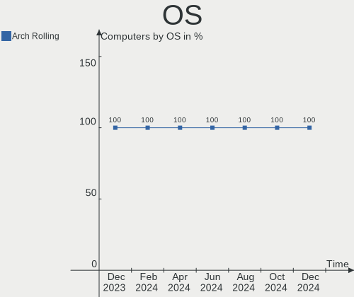
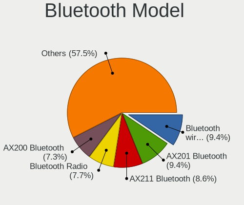

Arch Hardware Trends
--------------------

A project to identify most popular hardware characteristics and track their change
over time based on data collected by Arch users at https://Linux-Hardware.org.

Anyone can contribute to the study by uploading probes of their computers by
the [hw-probe](https://github.com/linuxhw/hw-probe) tool:

    sudo -E hw-probe -all -upload

This is a report for all computer types. See also reports for [desktops](/Dist/Arch/Desktop/README.md) and [notebooks](/Dist/Arch/Notebook/README.md).

Full-feature report is available here: https://linux-hardware.org/?view=trends

Period: May, 2021.

Contents
--------

- [ OS                       ](#os)
- [ OS Family                ](#os-family)
- [ Kernel                   ](#kernel)
- [ Kernel Family            ](#kernel-family)
- [ Kernel Major Ver.        ](#kernel-major-ver)
- [ Arch                     ](#arch)
- [ DE                       ](#de)
- [ Display Server           ](#display-server)
- [ Display Manager          ](#display-manager)
- [ OS Lang                  ](#os-lang)
- [ Boot Mode                ](#boot-mode)
- [ Filesystem               ](#filesystem)
- [ Part. scheme             ](#part-scheme)
- [ Dual Boot with Linux/BSD ](#dual-boot-with-linux/bsd)
- [ Dual Boot (Win)          ](#dual-boot-win)
- [ Country                  ](#country)
- [ City                     ](#city)
- [ Vendor                   ](#vendor)
- [ Model                    ](#model)
- [ Model Family             ](#model-family)
- [ MFG Year                 ](#mfg-year)
- [ Form Factor              ](#form-factor)
- [ Secure Boot              ](#secure-boot)
- [ Coreboot                 ](#coreboot)
- [ RAM Size                 ](#ram-size)
- [ RAM Used                 ](#ram-used)
- [ Has CD-ROM               ](#has-cd-rom)
- [ Total Drives             ](#total-drives)
- [ Has Ethernet             ](#has-ethernet)
- [ Has WiFi                 ](#has-wifi)
- [ Has Bluetooth            ](#has-bluetooth)
- [ Drive Vendor             ](#drive-vendor)
- [ Drive Model              ](#drive-model)
- [ HDD Vendor               ](#hdd-vendor)
- [ SSD Vendor               ](#ssd-vendor)
- [ Drive Kind               ](#drive-kind)
- [ Drive Connector          ](#drive-connector)
- [ Drive Size               ](#drive-size)
- [ Space Total              ](#space-total)
- [ Space Used               ](#space-used)
- [ Malfunc. Drives          ](#malfunc-drives)
- [ Malfunc. Drive Vendor    ](#malfunc-drive-vendor)
- [ Malfunc. HDD Vendor      ](#malfunc-hdd-vendor)
- [ Malfunc. Drive Kind      ](#malfunc-drive-kind)
- [ Failed Drives            ](#failed-drives)
- [ Failed Drive Vendor      ](#failed-drive-vendor)
- [ Drive Status             ](#drive-status)
- [ Storage Vendor           ](#storage-vendor)
- [ Storage Model            ](#storage-model)
- [ Storage Kind             ](#storage-kind)
- [ CPU Vendor               ](#cpu-vendor)
- [ CPU Model                ](#cpu-model)
- [ CPU Model Family         ](#cpu-model-family)
- [ CPU Cores                ](#cpu-cores)
- [ CPU Sockets              ](#cpu-sockets)
- [ CPU Threads              ](#cpu-threads)
- [ CPU Op-Modes             ](#cpu-op-modes)
- [ CPU Microcode            ](#cpu-microcode)
- [ CPU Microarch            ](#cpu-microarch)
- [ GPU Vendor               ](#gpu-vendor)
- [ GPU Model                ](#gpu-model)
- [ GPU Combo                ](#gpu-combo)
- [ GPU Driver               ](#gpu-driver)
- [ GPU Memory               ](#gpu-memory)
- [ Monitor Vendor           ](#monitor-vendor)
- [ Monitor Model            ](#monitor-model)
- [ Monitor Resolution       ](#monitor-resolution)
- [ Monitor Diagonal         ](#monitor-diagonal)
- [ Monitor Width            ](#monitor-width)
- [ Aspect Ratio             ](#aspect-ratio)
- [ Monitor Area             ](#monitor-area)
- [ Pixel Density            ](#pixel-density)
- [ Multiple Monitors        ](#multiple-monitors)
- [ Net Controller Vendor    ](#net-controller-vendor)
- [ Net Controller Model     ](#net-controller-model)
- [ Wireless Vendor          ](#wireless-vendor)
- [ Wireless Model           ](#wireless-model)
- [ Ethernet Vendor          ](#ethernet-vendor)
- [ Ethernet Model           ](#ethernet-model)
- [ Net Controller Kind      ](#net-controller-kind)
- [ Used Controller          ](#used-controller)
- [ NICs                     ](#nics)
- [ IPv6                     ](#ipv6)
- [ Memory Vendor            ](#memory-vendor)
- [ Memory Model             ](#memory-model)
- [ Memory Kind              ](#memory-kind)
- [ Memory Form Factor       ](#memory-form-factor)
- [ Memory Size              ](#memory-size)
- [ Memory Speed             ](#memory-speed)
- [ Sound Vendor             ](#sound-vendor)
- [ Sound Model              ](#sound-model)
- [ Camera Vendor            ](#camera-vendor)
- [ Camera Model             ](#camera-model)
- [ Fingerprint Vendor       ](#fingerprint-vendor)
- [ Fingerprint Model        ](#fingerprint-model)
- [ Chipcard Vendor          ](#chipcard-vendor)
- [ Chipcard Model           ](#chipcard-model)
- [ Printer Vendor           ](#printer-vendor)
- [ Printer Model            ](#printer-model)
- [ Scanner Vendor           ](#scanner-vendor)
- [ Scanner Model            ](#scanner-model)
- [ Bluetooth Vendor         ](#bluetooth-vendor)
- [ Bluetooth Model          ](#bluetooth-model)
- [ Unsupported Devices      ](#unsupported-devices)
- [ Unsupported Device Types ](#unsupported-device-types)

OS
--

Installed operating systems

| Name         | Computers | Percent |
|--------------|-----------|---------|
| Arch         | 90        | 61.64%  |
| Arch Rolling | 56        | 38.36%  |

OS Family
---------

OS without a version

| Name | Computers | Percent |
|------|-----------|---------|
| Arch | 146       | 100%    |

Kernel
------

Version of the Linux kernel

| Version                            | Computers | Percent |
|------------------------------------|-----------|---------|
| 5.11.16-arch1-1                    | 21        | 14.38%  |
| 5.12.4-arch1-2                     | 18        | 12.33%  |
| 5.12.3-arch1-1                     | 14        | 9.59%   |
| 5.12.1-arch1-1                     | 11        | 7.53%   |
| 5.12.2-arch1-1                     | 7         | 4.79%   |
| 5.12.7-arch1-1                     | 6         | 4.11%   |
| 5.12.6-arch1-1                     | 6         | 4.11%   |
| 5.12.1-zen2-1-zen                  | 6         | 4.11%   |
| 5.11.16-zen1-1-zen                 | 6         | 4.11%   |
| 5.12.6-zen1-1-zen                  | 5         | 3.42%   |
| 5.12.8-arch1-1                     | 4         | 2.74%   |
| 5.12.5-arch1-1                     | 4         | 2.74%   |
| 5.10.34-1-lts                      | 4         | 2.74%   |
| 5.12.4-zen1-2-zen                  | 3         | 2.05%   |
| 5.10.33-1-lts                      | 3         | 2.05%   |
| 5.12.5-zen1-1-zen                  | 2         | 1.37%   |
| 5.12.5-ck1-S                       | 2         | 1.37%   |
| 5.11.15-arch1-2                    | 2         | 1.37%   |
| 5.10.36-1-lts                      | 2         | 1.37%   |
| 5.9.3-1-MANJARO                    | 1         | 0.68%   |
| 5.4.102-rt53-1-rt-lts              | 1         | 0.68%   |
| 5.12.5-1mbp-16.1-linux-wifi        | 1         | 0.68%   |
| 5.12.5-158-tkg-pds                 | 1         | 0.68%   |
| 5.12.4-linux-kernel-cacule-rdb-gcc | 1         | 0.68%   |
| 5.12.4-arch1-1-vfio                | 1         | 0.68%   |
| 5.12.4-157-tkg-bmq                 | 1         | 0.68%   |
| 5.12.3-zen1-1-zen                  | 1         | 0.68%   |
| 5.12.2-1-ck-zen                    | 1         | 0.68%   |
| 5.12.1-xanmod2-2                   | 1         | 0.68%   |
| 5.12.0-152-tkg-pds                 | 1         | 0.68%   |
| 5.11.7-arch1-1                     | 1         | 0.68%   |
| 5.11.21-lqx2-1-lqx                 | 1         | 0.68%   |
| 5.11.20-1-mbp                      | 1         | 0.68%   |
| 5.11.18-hardened1-1-hardened       | 1         | 0.68%   |
| 5.10.41-1-lts                      | 1         | 0.68%   |
| 5.10.39-1-lts                      | 1         | 0.68%   |
| 5.10.37-1-lts                      | 1         | 0.68%   |
| 5.10.35-1-lts                      | 1         | 0.68%   |
| 5.10.27-1-lts                      | 1         | 0.68%   |

Kernel Family
-------------

Linux kernel without a distro release

| Version | Computers | Percent |
|---------|-----------|---------|
| 5.11.16 | 27        | 18.49%  |
| 5.12.4  | 24        | 16.44%  |
| 5.12.1  | 18        | 12.33%  |
| 5.12.3  | 15        | 10.27%  |
| 5.12.6  | 11        | 7.53%   |
| 5.12.5  | 10        | 6.85%   |
| 5.12.2  | 8         | 5.48%   |
| 5.12.7  | 6         | 4.11%   |
| 5.12.8  | 4         | 2.74%   |
| 5.10.34 | 4         | 2.74%   |
| 5.10.33 | 3         | 2.05%   |
| 5.11.15 | 2         | 1.37%   |
| 5.10.36 | 2         | 1.37%   |
| 5.9.3   | 1         | 0.68%   |
| 5.4.102 | 1         | 0.68%   |
| 5.12.0  | 1         | 0.68%   |
| 5.11.7  | 1         | 0.68%   |
| 5.11.21 | 1         | 0.68%   |
| 5.11.20 | 1         | 0.68%   |
| 5.11.18 | 1         | 0.68%   |
| 5.10.41 | 1         | 0.68%   |
| 5.10.39 | 1         | 0.68%   |
| 5.10.37 | 1         | 0.68%   |
| 5.10.35 | 1         | 0.68%   |
| 5.10.27 | 1         | 0.68%   |

Kernel Major Ver.
-----------------

Linux kernel major version

| Version | Computers | Percent |
|---------|-----------|---------|
| 5.12    | 97        | 66.44%  |
| 5.11    | 33        | 22.6%   |
| 5.10    | 14        | 9.59%   |
| 5.9     | 1         | 0.68%   |
| 5.4     | 1         | 0.68%   |

Arch
----

OS architecture (x86_64, i586, etc.)

| Name   | Computers | Percent |
|--------|-----------|---------|
| x86_64 | 146       | 100%    |

DE
--

Desktop Environment

| Name              | Computers | Percent |
|-------------------|-----------|---------|
| GNOME             | 49        | 33.56%  |
| KDE5              | 38        | 26.03%  |
| KDE               | 20        | 13.7%   |
| i3                | 11        | 7.53%   |
| XFCE              | 9         | 6.16%   |
| Unknown           | 6         | 4.11%   |
| Budgie            | 3         | 2.05%   |
| MATE              | 2         | 1.37%   |
| Cinnamon          | 2         | 1.37%   |
| Yaru:ubuntu:GNOME | 1         | 0.68%   |
| Unity             | 1         | 0.68%   |
| qtile             | 1         | 0.68%   |
| LXQt              | 1         | 0.68%   |
| Deepin            | 1         | 0.68%   |
| bspwm             | 1         | 0.68%   |

Display Server
--------------

X11 or Wayland

| Name    | Computers | Percent |
|---------|-----------|---------|
| X11     | 98        | 67.12%  |
| Wayland | 27        | 18.49%  |
| Tty     | 12        | 8.22%   |
| Unknown | 9         | 6.16%   |

Display Manager
---------------

SDDM, LightDM, etc.

| Name    | Computers | Percent |
|---------|-----------|---------|
| Unknown | 64        | 43.84%  |
| SDDM    | 44        | 30.14%  |
| GDM     | 18        | 12.33%  |
| TDM     | 12        | 8.22%   |
| LightDM | 4         | 2.74%   |
| XDM     | 3         | 2.05%   |
| SLiM    | 1         | 0.68%   |

OS Lang
-------

Language

| Lang    | Computers | Percent |
|---------|-----------|---------|
| en_US   | 77        | 52.74%  |
| en_GB   | 17        | 11.64%  |
| pt_BR   | 7         | 4.79%   |
| Unknown | 6         | 4.11%   |
| ru_RU   | 4         | 2.74%   |
| de_DE   | 4         | 2.74%   |
| C       | 4         | 2.74%   |
| it_IT   | 3         | 2.05%   |
| fr_FR   | 3         | 2.05%   |
| en_CA   | 3         | 2.05%   |
| zh_CN   | 2         | 1.37%   |
| pl_PL   | 2         | 1.37%   |
| hu_HU   | 2         | 1.37%   |
| en_DE   | 2         | 1.37%   |
| uk_UA   | 1         | 0.68%   |
| fr_CA   | 1         | 0.68%   |
| es_MX   | 1         | 0.68%   |
| es_ES   | 1         | 0.68%   |
| en_IN   | 1         | 0.68%   |
| en_AU   | 1         | 0.68%   |
| en-US   | 1         | 0.68%   |
| de_CH   | 1         | 0.68%   |
| de_AT   | 1         | 0.68%   |
| ca_ES   | 1         | 0.68%   |

Boot Mode
---------

EFI or BIOS

| Mode | Computers | Percent |
|------|-----------|---------|
| EFI  | 78        | 53.42%  |
| BIOS | 68        | 46.58%  |

Filesystem
----------

Type of filesystem

| Type    | Computers | Percent |
|---------|-----------|---------|
| Ext4    | 105       | 71.92%  |
| Btrfs   | 30        | 20.55%  |
| Xfs     | 5         | 3.42%   |
| F2fs    | 3         | 2.05%   |
| Zfs     | 1         | 0.68%   |
| Overlay | 1         | 0.68%   |
| Unknown | 1         | 0.68%   |

Part. scheme
------------

Scheme of partitioning

| Type    | Computers | Percent |
|---------|-----------|---------|
| GPT     | 88        | 60.27%  |
| Unknown | 50        | 34.25%  |
| MBR     | 8         | 5.48%   |

Dual Boot with Linux/BSD
------------------------

Hosting more than one Linux/BSD

| Dual boot | Computers | Percent |
|-----------|-----------|---------|
| No        | 126       | 86.3%   |
| Yes       | 20        | 13.7%   |

Dual Boot (Win)
---------------

Hosting Linux and Windows

| Dual boot | Computers | Percent |
|-----------|-----------|---------|
| No        | 102       | 69.86%  |
| Yes       | 44        | 30.14%  |

Country
-------

Geographic location (country)

| Country                | Computers | Percent |
|------------------------|-----------|---------|
| USA                    | 25        | 17.12%  |
| Germany                | 14        | 9.59%   |
| Russia                 | 10        | 6.85%   |
| Brazil                 | 8         | 5.48%   |
| UK                     | 7         | 4.79%   |
| Poland                 | 7         | 4.79%   |
| Italy                  | 7         | 4.79%   |
| Canada                 | 6         | 4.11%   |
| Sweden                 | 5         | 3.42%   |
| Ukraine                | 3         | 2.05%   |
| Spain                  | 3         | 2.05%   |
| India                  | 3         | 2.05%   |
| Hungary                | 3         | 2.05%   |
| France                 | 3         | 2.05%   |
| Austria                | 3         | 2.05%   |
| Vietnam                | 2         | 1.37%   |
| Uruguay                | 2         | 1.37%   |
| Switzerland            | 2         | 1.37%   |
| Finland                | 2         | 1.37%   |
| Colombia               | 2         | 1.37%   |
| Bosnia and Herzegovina | 2         | 1.37%   |
| Belgium                | 2         | 1.37%   |
| Belarus                | 2         | 1.37%   |
| Azerbaijan             | 2         | 1.37%   |
| Turkey                 | 1         | 0.68%   |
| Taiwan                 | 1         | 0.68%   |
| South Korea            | 1         | 0.68%   |
| South Africa           | 1         | 0.68%   |
| Serbia                 | 1         | 0.68%   |
| Réunion               | 1         | 0.68%   |
| Romania                | 1         | 0.68%   |
| Portugal               | 1         | 0.68%   |
| Philippines            | 1         | 0.68%   |
| New Zealand            | 1         | 0.68%   |
| Netherlands            | 1         | 0.68%   |
| Mexico                 | 1         | 0.68%   |
| Mauritius              | 1         | 0.68%   |
| Malta                  | 1         | 0.68%   |
| Lebanon                | 1         | 0.68%   |
| Latvia                 | 1         | 0.68%   |
| Kenya                  | 1         | 0.68%   |
| El Salvador            | 1         | 0.68%   |
| China                  | 1         | 0.68%   |
| Australia              | 1         | 0.68%   |
| Argentina              | 1         | 0.68%   |

City
----

Geographic location (city)

| City                   | Computers | Percent |
|------------------------|-----------|---------|
| Los Angeles            | 4         | 2.74%   |
| São Paulo             | 3         | 2.05%   |
| Moscow                 | 3         | 2.05%   |
| St Petersburg          | 2         | 1.37%   |
| San Cesario di Lecce   | 2         | 1.37%   |
| Palermo                | 2         | 1.37%   |
| Norrköping            | 2         | 1.37%   |
| Montevideo             | 2         | 1.37%   |
| Miskolc                | 2         | 1.37%   |
| Minsk                  | 2         | 1.37%   |
| Helsinki               | 2         | 1.37%   |
| Hanoi                  | 2         | 1.37%   |
| Baku                   | 2         | 1.37%   |
| Würzburg              | 1         | 0.68%   |
| Wuxi                   | 1         | 0.68%   |
| Wolverhampton          | 1         | 0.68%   |
| Wichita                | 1         | 0.68%   |
| Whitewater             | 1         | 0.68%   |
| Wellington             | 1         | 0.68%   |
| Warsaw                 | 1         | 0.68%   |
| Walthamstow            | 1         | 0.68%   |
| Voronezh               | 1         | 0.68%   |
| Villingen-Schwenningen | 1         | 0.68%   |
| Villa Ballester        | 1         | 0.68%   |
| Vienna                 | 1         | 0.68%   |
| Veracruz               | 1         | 0.68%   |
| Vaterstetten           | 1         | 0.68%   |
| Tuzla                  | 1         | 0.68%   |
| The Hague              | 1         | 0.68%   |
| Tambach-Dietharz       | 1         | 0.68%   |
| São José dos Campos  | 1         | 0.68%   |
| Szczecin               | 1         | 0.68%   |
| Sundsvall              | 1         | 0.68%   |
| Stockholm              | 1         | 0.68%   |
| St. Petersburg         | 1         | 0.68%   |
| Sorrento               | 1         | 0.68%   |
| Seattle                | 1         | 0.68%   |
| Schwanenstadt          | 1         | 0.68%   |
| Schonenwerd            | 1         | 0.68%   |
| Saratov                | 1         | 0.68%   |
| Santa Mariana          | 1         | 0.68%   |
| Santa Ana              | 1         | 0.68%   |
| San Salvador           | 1         | 0.68%   |
| Saint-Pierre           | 1         | 0.68%   |
| Saint Neots            | 1         | 0.68%   |
| Sabaneta               | 1         | 0.68%   |
| Sabadell               | 1         | 0.68%   |
| Rorbas                 | 1         | 0.68%   |
| Romford                | 1         | 0.68%   |
| Rockland               | 1         | 0.68%   |
| Riga                   | 1         | 0.68%   |
| Richmond Hill          | 1         | 0.68%   |
| Quatre Bornes          | 1         | 0.68%   |
| Qormi                  | 1         | 0.68%   |
| Provo                  | 1         | 0.68%   |
| Poznan                 | 1         | 0.68%   |
| Portland               | 1         | 0.68%   |
| Pomona                 | 1         | 0.68%   |
| Perm                   | 1         | 0.68%   |
| Panaon                 | 1         | 0.68%   |

Vendor
------

Motherboard manufacturer

| Name                | Computers | Percent |
|---------------------|-----------|---------|
| ASUSTek Computer    | 36        | 24.66%  |
| Lenovo              | 20        | 13.7%   |
| Hewlett-Packard     | 16        | 10.96%  |
| ASRock              | 15        | 10.27%  |
| MSI                 | 11        | 7.53%   |
| Gigabyte Technology | 10        | 6.85%   |
| Dell                | 10        | 6.85%   |
| Apple               | 5         | 3.42%   |
| Acer                | 4         | 2.74%   |
| Samsung Electronics | 3         | 2.05%   |
| Intel               | 3         | 2.05%   |
| HUAWEI              | 2         | 1.37%   |
| Unknown             | 2         | 1.37%   |
| Toshiba             | 1         | 0.68%   |
| Medion              | 1         | 0.68%   |
| IP3 Tech            | 1         | 0.68%   |
| Hyperbook           | 1         | 0.68%   |
| Fujitsu             | 1         | 0.68%   |
| Foxconn             | 1         | 0.68%   |
| Eluktronics         | 1         | 0.68%   |
| ECS                 | 1         | 0.68%   |
| 51nb                | 1         | 0.68%   |

Model
-----

Motherboard model

| Name                                     | Computers | Percent |
|------------------------------------------|-----------|---------|
| MSI MS-7B86                              | 3         | 2.05%   |
| ASRock X570M Pro4                        | 3         | 2.05%   |
| Unknown                                  | 3         | 2.05%   |
| MSI MS-7C02                              | 2         | 1.37%   |
| HUAWEI NBLK-WAX9X                        | 2         | 1.37%   |
| ASUS TUF GAMING X570-PLUS                | 2         | 1.37%   |
| ASUS TUF B360-PRO GAMING                 | 2         | 1.37%   |
| ASUS PRIME B550M-A                       | 2         | 1.37%   |
| Toshiba Satellite L775-11K               | 1         | 0.68%   |
| Samsung RV411/RV511/E3511/S3511          | 1         | 0.68%   |
| Samsung 700Z3C/700Z5C                    | 1         | 0.68%   |
| Samsung 300E5M/300E5L                    | 1         | 0.68%   |
| MSI MS-7C56                              | 1         | 0.68%   |
| MSI MS-7C37                              | 1         | 0.68%   |
| MSI MS-7B98                              | 1         | 0.68%   |
| MSI MS-7B84                              | 1         | 0.68%   |
| MSI MS-7816                              | 1         | 0.68%   |
| MSI GL62 6QF                             | 1         | 0.68%   |
| Medion S4216                             | 1         | 0.68%   |
| Lenovo ThinkPad X270 W10DG 20K5S0HN01    | 1         | 0.68%   |
| Lenovo ThinkPad X1 Carbon 7th 20QDS3B600 | 1         | 0.68%   |
| Lenovo ThinkPad T490 20N2003NUS          | 1         | 0.68%   |
| Lenovo ThinkPad T480 20L5S01J00          | 1         | 0.68%   |
| Lenovo ThinkPad T460s 20F9003UPB         | 1         | 0.68%   |
| Lenovo ThinkPad T460p 20FW0005AU         | 1         | 0.68%   |
| Lenovo ThinkPad T440s 20ARS3B000         | 1         | 0.68%   |
| Lenovo ThinkPad T430 2349N7G             | 1         | 0.68%   |
| Lenovo ThinkPad T420 42363Y5             | 1         | 0.68%   |
| Lenovo ThinkPad L380 20M50013UK          | 1         | 0.68%   |
| Lenovo ThinkPad L14 Gen 1 20U5S02700     | 1         | 0.68%   |
| Lenovo ThinkPad E480 20KN000UCD          | 1         | 0.68%   |
| Lenovo ThinkPad E14 Gen 2 20T6S00D00     | 1         | 0.68%   |
| Lenovo ThinkCentre M77 2209A12           | 1         | 0.68%   |
| Lenovo ThinkBook 13s G2 ARE 20WC         | 1         | 0.68%   |
| Lenovo IdeaPad Gaming 3 15ARH05 82EY     | 1         | 0.68%   |
| Lenovo IdeaPad 720S-13ARR 81BR           | 1         | 0.68%   |
| Lenovo IdeaPad 320-15AST 80XV            | 1         | 0.68%   |
| Lenovo G710 20252                        | 1         | 0.68%   |
| IP3 Tech AP34                            | 1         | 0.68%   |
| Intel NUC8i7BEH                          | 1         | 0.68%   |
| Intel NUC8i5BEH                          | 1         | 0.68%   |
| Intel NUC11TNHv5                         | 1         | 0.68%   |
| Hyperbook Z15 Zen                        | 1         | 0.68%   |
| HP Spectre x360 Convertible 13-aw0xxx    | 1         | 0.68%   |
| HP ProBook 470 G2                        | 1         | 0.68%   |
| HP Pavilion Sleekbook 15 PC              | 1         | 0.68%   |
| HP Pavilion Gaming Laptop 15-ec1xxx      | 1         | 0.68%   |
| HP Pavilion g6                           | 1         | 0.68%   |
| HP OMEN by HP Laptop 17-cb0xxx           | 1         | 0.68%   |
| HP OMEN by HP Laptop                     | 1         | 0.68%   |
| HP OMEN by HP Desktop PC 880-p0xx        | 1         | 0.68%   |
| HP Laptop 17-ak0xx                       | 1         | 0.68%   |
| HP kip                                   | 1         | 0.68%   |
| HP ElitePad 1000 G2                      | 1         | 0.68%   |
| HP EliteBook x360 1030 G2                | 1         | 0.68%   |
| HP EliteBook Revolve 810 G3              | 1         | 0.68%   |
| HP EliteBook 855 G7 Notebook PC          | 1         | 0.68%   |
| HP 250 G6 Notebook PC                    | 1         | 0.68%   |
| HP 15 Notebook PC                        | 1         | 0.68%   |
| Gigabyte Z97N-Gaming 5                   | 1         | 0.68%   |

Model Family
------------

Motherboard model prefix

| Name                   | Computers | Percent |
|------------------------|-----------|---------|
| Lenovo ThinkPad        | 13        | 8.9%    |
| ASUS PRIME             | 8         | 5.48%   |
| ASUS TUF               | 6         | 4.11%   |
| Dell Inspiron          | 4         | 2.74%   |
| ASUS ROG               | 4         | 2.74%   |
| MSI MS-7B86            | 3         | 2.05%   |
| Lenovo IdeaPad         | 3         | 2.05%   |
| HP Pavilion            | 3         | 2.05%   |
| HP OMEN                | 3         | 2.05%   |
| HP EliteBook           | 3         | 2.05%   |
| ASRock X570M           | 3         | 2.05%   |
| Acer Aspire            | 3         | 2.05%   |
| Unknown                | 3         | 2.05%   |
| MSI MS-7C02            | 2         | 1.37%   |
| HUAWEI NBLK-WAX9X      | 2         | 1.37%   |
| Gigabyte X570          | 2         | 1.37%   |
| Dell XPS               | 2         | 1.37%   |
| Dell Precision         | 2         | 1.37%   |
| ASUS VivoBook          | 2         | 1.37%   |
| Toshiba Satellite      | 1         | 0.68%   |
| Samsung RV411          | 1         | 0.68%   |
| Samsung 700Z3C         | 1         | 0.68%   |
| Samsung 300E5M         | 1         | 0.68%   |
| MSI MS-7C56            | 1         | 0.68%   |
| MSI MS-7C37            | 1         | 0.68%   |
| MSI MS-7B98            | 1         | 0.68%   |
| MSI MS-7B84            | 1         | 0.68%   |
| MSI MS-7816            | 1         | 0.68%   |
| MSI GL62               | 1         | 0.68%   |
| Medion S4216           | 1         | 0.68%   |
| Lenovo ThinkCentre     | 1         | 0.68%   |
| Lenovo ThinkBook       | 1         | 0.68%   |
| Lenovo G710            | 1         | 0.68%   |
| IP3 Tech AP34          | 1         | 0.68%   |
| Intel NUC8i7BEH        | 1         | 0.68%   |
| Intel NUC8i5BEH        | 1         | 0.68%   |
| Intel NUC11TNHv5       | 1         | 0.68%   |
| Hyperbook Z15          | 1         | 0.68%   |
| HP Spectre             | 1         | 0.68%   |
| HP ProBook             | 1         | 0.68%   |
| HP Laptop              | 1         | 0.68%   |
| HP kip                 | 1         | 0.68%   |
| HP ElitePad            | 1         | 0.68%   |
| HP 250                 | 1         | 0.68%   |
| HP 15                  | 1         | 0.68%   |
| Gigabyte Z97N-Gaming   | 1         | 0.68%   |
| Gigabyte Z77X-D3H      | 1         | 0.68%   |
| Gigabyte H87-HD3       | 1         | 0.68%   |
| Gigabyte GA-880GA-UD3H | 1         | 0.68%   |
| Gigabyte GA-780T-D3L   | 1         | 0.68%   |
| Gigabyte B450          | 1         | 0.68%   |
| Gigabyte AB350-Gaming  | 1         | 0.68%   |
| Gigabyte A520M         | 1         | 0.68%   |
| Fujitsu ESPRIMO        | 1         | 0.68%   |
| Foxconn p6653w         | 1         | 0.68%   |
| Eluktronics THINN-15   | 1         | 0.68%   |
| ECS Livermore8         | 1         | 0.68%   |
| Dell OptiPlex          | 1         | 0.68%   |
| Dell Latitude          | 1         | 0.68%   |
| ASUS Z170I             | 1         | 0.68%   |

MFG Year
--------

Motherboard manufacture year

| Year | Computers | Percent |
|------|-----------|---------|
| 2020 | 41        | 28.08%  |
| 2019 | 28        | 19.18%  |
| 2021 | 24        | 16.44%  |
| 2018 | 12        | 8.22%   |
| 2017 | 7         | 4.79%   |
| 2014 | 6         | 4.11%   |
| 2012 | 6         | 4.11%   |
| 2013 | 5         | 3.42%   |
| 2016 | 4         | 2.74%   |
| 2015 | 4         | 2.74%   |
| 2011 | 4         | 2.74%   |
| 2010 | 3         | 2.05%   |
| 2008 | 1         | 0.68%   |
| 2007 | 1         | 0.68%   |

Form Factor
-----------

Physical design of the computer

| Name        | Computers | Percent |
|-------------|-----------|---------|
| Desktop     | 70        | 47.95%  |
| Notebook    | 70        | 47.95%  |
| Mini pc     | 4         | 2.74%   |
| Convertible | 2         | 1.37%   |

Secure Boot
-----------

Enabled or disabled

| State    | Computers | Percent |
|----------|-----------|---------|
| Disabled | 146       | 100%    |

Coreboot
--------

Have coreboot on board

| Used | Computers | Percent |
|------|-----------|---------|
| No   | 144       | 98.63%  |
| Yes  | 2         | 1.37%   |

RAM Size
--------

Total RAM memory

| Size in GB  | Computers | Percent |
|-------------|-----------|---------|
| 16.01-24.0  | 41        | 28.08%  |
| 4.01-8.0    | 32        | 21.92%  |
| 32.01-64.0  | 30        | 20.55%  |
| 8.01-16.0   | 26        | 17.81%  |
| 3.01-4.0    | 9         | 6.16%   |
| 64.01-256.0 | 5         | 3.42%   |
| 24.01-32.0  | 2         | 1.37%   |
| 2.01-3.0    | 1         | 0.68%   |

RAM Used
--------

Used RAM memory

| Used GB    | Computers | Percent |
|------------|-----------|---------|
| 4.01-8.0   | 35        | 23.97%  |
| 3.01-4.0   | 28        | 19.18%  |
| 2.01-3.0   | 28        | 19.18%  |
| 1.01-2.0   | 28        | 19.18%  |
| 8.01-16.0  | 15        | 10.27%  |
| 0.51-1.0   | 9         | 6.16%   |
| 16.01-24.0 | 2         | 1.37%   |
| 0.01-0.5   | 1         | 0.68%   |

Has CD-ROM
----------

Has CD-ROM on board

| Presented | Computers | Percent |
|-----------|-----------|---------|
| No        | 108       | 73.97%  |
| Yes       | 38        | 26.03%  |

Total Drives
------------

Number of drives on board

| Drives | Computers | Percent |
|--------|-----------|---------|
| 1      | 59        | 40.41%  |
| 2      | 45        | 30.82%  |
| 3      | 21        | 14.38%  |
| 4      | 10        | 6.85%   |
| 6      | 5         | 3.42%   |
| 5      | 4         | 2.74%   |
| 14     | 1         | 0.68%   |
| 7      | 1         | 0.68%   |

Has Ethernet
------------

Has Ethernet on board

| Presented | Computers | Percent |
|-----------|-----------|---------|
| Yes       | 129       | 88.36%  |
| No        | 17        | 11.64%  |

Has WiFi
--------

Has WiFi module

| Presented | Computers | Percent |
|-----------|-----------|---------|
| Yes       | 110       | 75.34%  |
| No        | 36        | 24.66%  |

Has Bluetooth
-------------

Has Bluetooth module

| Presented | Computers | Percent |
|-----------|-----------|---------|
| Yes       | 96        | 65.75%  |
| No        | 50        | 34.25%  |

Drive Vendor
------------

Hard drive vendors

| Vendor                    | Computers | Drives | Percent |
|---------------------------|-----------|--------|---------|
| Samsung Electronics       | 50        | 70     | 18.25%  |
| WDC                       | 35        | 53     | 12.77%  |
| Seagate                   | 35        | 41     | 12.77%  |
| Toshiba                   | 24        | 27     | 8.76%   |
| Kingston                  | 18        | 19     | 6.57%   |
| SanDisk                   | 14        | 16     | 5.11%   |
| Intel                     | 12        | 13     | 4.38%   |
| Crucial                   | 10        | 10     | 3.65%   |
| Unknown                   | 8         | 9      | 2.92%   |
| SK Hynix                  | 8         | 8      | 2.92%   |
| A-DATA Technology         | 7         | 8      | 2.55%   |
| Phison                    | 5         | 5      | 1.82%   |
| Apple                     | 5         | 5      | 1.82%   |
| HGST                      | 4         | 6      | 1.46%   |
| SPCC                      | 3         | 3      | 1.09%   |
| Micron/Crucial Technology | 3         | 3      | 1.09%   |
| Transcend                 | 2         | 2      | 0.73%   |
| TO Exter                  | 2         | 2      | 0.73%   |
| SABRENT                   | 2         | 2      | 0.73%   |
| PLEXTOR                   | 2         | 2      | 0.73%   |
| Patriot                   | 2         | 2      | 0.73%   |
| OCZ                       | 2         | 2      | 0.73%   |
| Micron Technology         | 2         | 2      | 0.73%   |
| KingSpec                  | 2         | 2      | 0.73%   |
| Hitachi                   | 2         | 2      | 0.73%   |
| China                     | 2         | 2      | 0.73%   |
| Yangtze Memory            | 1         | 1      | 0.36%   |
| XPG                       | 1         | 2      | 0.36%   |
| QUMO                      | 1         | 1      | 0.36%   |
| PNY                       | 1         | 1      | 0.36%   |
| NeoTech                   | 1         | 1      | 0.36%   |
| Mushkin                   | 1         | 1      | 0.36%   |
| Lite-On                   | 1         | 1      | 0.36%   |
| Lenovo                    | 1         | 1      | 0.36%   |
| KingDian                  | 1         | 1      | 0.36%   |
| HS-SSD-E100               | 1         | 1      | 0.36%   |
| GOODRAM                   | 1         | 1      | 0.36%   |
| Gigabyte Technology       | 1         | 1      | 0.36%   |
| BAITITON                  | 1         | 1      | 0.36%   |

Drive Model
-----------

Hard drive models

| Model                                  | Computers | Percent |
|----------------------------------------|-----------|---------|
| Samsung SSD 970 EVO 1TB                | 6         | 1.92%   |
| Samsung SSD 860 EVO 500GB              | 6         | 1.92%   |
| Kingston SA400S37480G 480GB SSD        | 6         | 1.92%   |
| Seagate ST2000DM008-2FR102 2TB         | 4         | 1.28%   |
| Samsung SSD 850 EVO 500GB              | 4         | 1.28%   |
| Intel NVMe SSD Drive 512GB             | 4         | 1.28%   |
| Toshiba MQ01ABD100 1TB                 | 3         | 0.96%   |
| Toshiba HDWD130 3TB                    | 3         | 0.96%   |
| Seagate ST4000DM004-2CV104 4TB         | 3         | 0.96%   |
| Seagate ST1000LM024 HN-M101MBB 1TB     | 3         | 0.96%   |
| Samsung SSD 860 EVO 1TB                | 3         | 0.96%   |
| Samsung SSD 850 EVO 250GB              | 3         | 0.96%   |
| Samsung SSD 840 EVO 250GB              | 3         | 0.96%   |
| Samsung NVMe SSD Drive 512GB           | 3         | 0.96%   |
| Samsung NVMe SSD Drive 500GB           | 3         | 0.96%   |
| Crucial CT500MX500SSD1 500GB           | 3         | 0.96%   |
| WDC WDS240G2G0B-00EPW0 240GB SSD       | 2         | 0.64%   |
| WDC WD10SPZX-21Z10T0 1TB               | 2         | 0.64%   |
| WDC WD10EZEX-75WN4A0 1TB               | 2         | 0.64%   |
| WDC WD10EZEX-22MFCA0 1TB               | 2         | 0.64%   |
| WDC WD10EZEX-08WN4A0 1TB               | 2         | 0.64%   |
| Unknown SD/MMC/MS PRO 8GB              | 2         | 0.64%   |
| Toshiba MQ04ABF100 1TB                 | 2         | 0.64%   |
| TO Exter nal USB 3.0 1TB               | 2         | 0.64%   |
| Seagate ST500LT012-1DG142 500GB        | 2         | 0.64%   |
| Seagate ST4000VN008-2DR166 4TB         | 2         | 0.64%   |
| Seagate ST2000LX001-1RG174 2TB         | 2         | 0.64%   |
| Seagate ST2000DM006-2DM164 2TB         | 2         | 0.64%   |
| Seagate ST1000LM035-1RK172 1TB         | 2         | 0.64%   |
| Seagate ST1000DM003-1CH162 1TB         | 2         | 0.64%   |
| SanDisk SDSSDH3500G 500GB              | 2         | 0.64%   |
| Samsung SSD 970 EVO Plus 500GB         | 2         | 0.64%   |
| Samsung SSD 970 EVO Plus 1TB           | 2         | 0.64%   |
| Samsung SSD 970 EVO 250GB              | 2         | 0.64%   |
| Samsung SSD 850 PRO 512GB              | 2         | 0.64%   |
| Samsung NVMe SSD Drive 1024GB          | 2         | 0.64%   |
| SABRENT Disk 240GB                     | 2         | 0.64%   |
| Phison Sabrent Rocket 4.0 500GB        | 2         | 0.64%   |
| Patriot Burst 240GB SSD                | 2         | 0.64%   |
| Kingston SA400S37240G 240GB SSD        | 2         | 0.64%   |
| KingSpec P3-1TB SSD                    | 2         | 0.64%   |
| Crucial CT250MX500SSD1 250GB           | 2         | 0.64%   |
| A-DATA SX8200PNP 512GB                 | 2         | 0.64%   |
| Yangtze Memory ZHITAI PC005 Active 1TB | 1         | 0.32%   |
| XPG NVMe SSD Drive 1024GB              | 1         | 0.32%   |
| XPG GAMMIX S11 Pro 512GB               | 1         | 0.32%   |
| WDC WUH721414ALE604 14TB               | 1         | 0.32%   |
| WDC WDS500G2B0C-00PXH0 500GB           | 1         | 0.32%   |
| WDC WDS500G2B0B 500GB SSD              | 1         | 0.32%   |
| WDC WDS250G2B0B 250GB SSD              | 1         | 0.32%   |
| WDC WDS100T2G0A-00JH30 1TB SSD         | 1         | 0.32%   |
| WDC WDS100T2B0B-00YS70 1TB SSD         | 1         | 0.32%   |
| WDC WDS100T2B0A-00SM50 1TB SSD         | 1         | 0.32%   |
| WDC WDBRPG0010BNC-WRSN 1TB             | 1         | 0.32%   |
| WDC WD60EZRZ-00GZ5B1 6TB               | 1         | 0.32%   |
| WDC WD50EZRZ-00RWYB1 5TB               | 1         | 0.32%   |
| WDC WD5000LPVX-22V0TT0 500GB           | 1         | 0.32%   |
| WDC WD5000LPCX-24VHAT0 500GB           | 1         | 0.32%   |
| WDC WD5000AAKX-60U6AA0 500GB           | 1         | 0.32%   |
| WDC WD40EFRX-68WT0N0 4TB               | 1         | 0.32%   |

HDD Vendor
----------

Hard disk drive vendors

| Vendor              | Computers | Drives | Percent |
|---------------------|-----------|--------|---------|
| Seagate             | 35        | 40     | 38.04%  |
| WDC                 | 27        | 41     | 29.35%  |
| Toshiba             | 19        | 20     | 20.65%  |
| HGST                | 4         | 6      | 4.35%   |
| Samsung Electronics | 2         | 2      | 2.17%   |
| Hitachi             | 2         | 2      | 2.17%   |
| Apple               | 2         | 2      | 2.17%   |
| NeoTech             | 1         | 1      | 1.09%   |

SSD Vendor
----------

Solid state drive vendors

| Vendor              | Computers | Drives | Percent |
|---------------------|-----------|--------|---------|
| Samsung Electronics | 27        | 37     | 25.23%  |
| Kingston            | 15        | 16     | 14.02%  |
| SanDisk             | 13        | 15     | 12.15%  |
| Crucial             | 8         | 8      | 7.48%   |
| WDC                 | 7         | 8      | 6.54%   |
| Intel               | 4         | 4      | 3.74%   |
| A-DATA Technology   | 4         | 4      | 3.74%   |
| Toshiba             | 3         | 3      | 2.8%    |
| Transcend           | 2         | 2      | 1.87%   |
| TO Exter            | 2         | 2      | 1.87%   |
| SK Hynix            | 2         | 2      | 1.87%   |
| SABRENT             | 2         | 2      | 1.87%   |
| Patriot             | 2         | 2      | 1.87%   |
| OCZ                 | 2         | 2      | 1.87%   |
| KingSpec            | 2         | 2      | 1.87%   |
| China               | 2         | 2      | 1.87%   |
| SPCC                | 1         | 1      | 0.93%   |
| QUMO                | 1         | 1      | 0.93%   |
| PLEXTOR             | 1         | 1      | 0.93%   |
| Mushkin             | 1         | 1      | 0.93%   |
| Micron Technology   | 1         | 1      | 0.93%   |
| KingDian            | 1         | 1      | 0.93%   |
| HS-SSD-E100         | 1         | 1      | 0.93%   |
| GOODRAM             | 1         | 1      | 0.93%   |
| BAITITON            | 1         | 1      | 0.93%   |
| Apple               | 1         | 1      | 0.93%   |

Drive Kind
----------

HDD or SSD

| Kind    | Computers | Drives | Percent |
|---------|-----------|--------|---------|
| SSD     | 87        | 121    | 36.71%  |
| HDD     | 77        | 114    | 32.49%  |
| NVMe    | 64        | 85     | 27%     |
| MMC     | 6         | 7      | 2.53%   |
| Unknown | 3         | 3      | 1.27%   |

Drive Connector
---------------

SATA, SAS, NVMe, etc.

| Type | Computers | Drives | Percent |
|------|-----------|--------|---------|
| SATA | 113       | 227    | 58.55%  |
| NVMe | 64        | 85     | 33.16%  |
| SAS  | 10        | 11     | 5.18%   |
| MMC  | 6         | 7      | 3.11%   |

Drive Size
----------

Size of hard drive

| Size in TB | Computers | Drives | Percent |
|------------|-----------|--------|---------|
| 0.01-0.5   | 79        | 112    | 43.17%  |
| 0.51-1.0   | 60        | 65     | 32.79%  |
| 1.01-2.0   | 22        | 23     | 12.02%  |
| 3.01-4.0   | 10        | 12     | 5.46%   |
| 2.01-3.0   | 7         | 7      | 3.83%   |
| 4.01-10.0  | 4         | 6      | 2.19%   |
| 10.01-20.0 | 1         | 10     | 0.55%   |

Space Total
-----------

Amount of disk space available on the file system

| Size in GB     | Computers | Percent |
|----------------|-----------|---------|
| 101-250        | 29        | 19.86%  |
| 251-500        | 28        | 19.18%  |
| 1001-2000      | 27        | 18.49%  |
| 501-1000       | 23        | 15.75%  |
| More than 3000 | 16        | 10.96%  |
| 2001-3000      | 8         | 5.48%   |
| 51-100         | 6         | 4.11%   |
| 1-20           | 4         | 2.74%   |
| Unknown        | 3         | 2.05%   |
| 21-50          | 2         | 1.37%   |

Space Used
----------

Amount of used disk space

| Used GB        | Computers | Percent |
|----------------|-----------|---------|
| 101-250        | 25        | 17.12%  |
| 501-1000       | 22        | 15.07%  |
| 251-500        | 20        | 13.7%   |
| 51-100         | 20        | 13.7%   |
| 21-50          | 19        | 13.01%  |
| 1-20           | 18        | 12.33%  |
| 1001-2000      | 8         | 5.48%   |
| 2001-3000      | 6         | 4.11%   |
| More than 3000 | 5         | 3.42%   |
| Unknown        | 3         | 2.05%   |

Malfunc. Drives
---------------

Drive models with a malfunction

| Model                               | Computers | Drives | Percent |
|-------------------------------------|-----------|--------|---------|
| WDC WD40EFRX-68WT0N0 4TB            | 1         | 2      | 8.33%   |
| WDC WD20EARS-00MVWB0 2TB            | 1         | 1      | 8.33%   |
| Toshiba MQ02ABD100H 1TB             | 1         | 1      | 8.33%   |
| Seagate ST1000LM024 HN-M101MBB 1TB  | 1         | 1      | 8.33%   |
| Seagate ST1000DX001-1NS162 1TB      | 1         | 1      | 8.33%   |
| Samsung Electronics SSD 970 EVO 1TB | 1         | 1      | 8.33%   |
| Samsung Electronics HD103SJ 1TB     | 1         | 1      | 8.33%   |
| PLEXTOR PX-1TM8SeG 1TB              | 1         | 1      | 8.33%   |
| OCZ VERTEX3 240GB SSD               | 1         | 1      | 8.33%   |
| Intel SSDSCKJF180A5H RSED 180GB     | 1         | 1      | 8.33%   |
| BAITITON BT58SSD09S 240GB           | 1         | 1      | 8.33%   |
| Apple HDD HTS545050A7E362 500GB     | 1         | 1      | 8.33%   |

Malfunc. Drive Vendor
---------------------

Vendors of faulty drives

| Vendor              | Computers | Drives | Percent |
|---------------------|-----------|--------|---------|
| WDC                 | 2         | 3      | 16.67%  |
| Seagate             | 2         | 2      | 16.67%  |
| Samsung Electronics | 2         | 2      | 16.67%  |
| Toshiba             | 1         | 1      | 8.33%   |
| PLEXTOR             | 1         | 1      | 8.33%   |
| OCZ                 | 1         | 1      | 8.33%   |
| Intel               | 1         | 1      | 8.33%   |
| BAITITON            | 1         | 1      | 8.33%   |
| Apple               | 1         | 1      | 8.33%   |

Malfunc. HDD Vendor
-------------------

Vendors of faulty HDD drives

| Vendor              | Computers | Drives | Percent |
|---------------------|-----------|--------|---------|
| WDC                 | 2         | 3      | 28.57%  |
| Seagate             | 2         | 2      | 28.57%  |
| Toshiba             | 1         | 1      | 14.29%  |
| Samsung Electronics | 1         | 1      | 14.29%  |
| Apple               | 1         | 1      | 14.29%  |

Malfunc. Drive Kind
-------------------

Kinds of faulty drives

| Kind | Computers | Drives | Percent |
|------|-----------|--------|---------|
| HDD  | 7         | 8      | 58.33%  |
| SSD  | 3         | 3      | 25%     |
| NVMe | 2         | 2      | 16.67%  |

Failed Drives
-------------

Failed drive models

Zero info for selected period =(

Failed Drive Vendor
-------------------

Failed drive vendors

Zero info for selected period =(

Drive Status
------------

Number of failed and malfunc. drives

| Status   | Computers | Drives | Percent |
|----------|-----------|--------|---------|
| Detected | 80        | 143    | 48.48%  |
| Works    | 75        | 174    | 45.45%  |
| Malfunc  | 10        | 13     | 6.06%   |

Storage Vendor
--------------

Storage controller vendors

| Vendor                       | Computers | Percent |
|------------------------------|-----------|---------|
| Intel                        | 74        | 34.91%  |
| AMD                          | 55        | 25.94%  |
| Samsung Electronics          | 28        | 13.21%  |
| Phison Electronics           | 7         | 3.3%    |
| SK Hynix                     | 6         | 2.83%   |
| ASMedia Technology           | 6         | 2.83%   |
| Sandisk                      | 5         | 2.36%   |
| Marvell Technology Group     | 5         | 2.36%   |
| Micron/Crucial Technology    | 4         | 1.89%   |
| Kingston Technology Company  | 3         | 1.42%   |
| ADATA Technology             | 3         | 1.42%   |
| Toshiba America Info Systems | 2         | 0.94%   |
| Lite-On Technology           | 2         | 0.94%   |
| Apple                        | 2         | 0.94%   |
| Yangtze Memory Technologies  | 1         | 0.47%   |
| VIA Technologies             | 1         | 0.47%   |
| Silicon Motion               | 1         | 0.47%   |
| Realtek Semiconductor        | 1         | 0.47%   |
| Micron Technology            | 1         | 0.47%   |
| LSI Logic / Symbios Logic    | 1         | 0.47%   |
| Lenovo                       | 1         | 0.47%   |
| KIOXIA                       | 1         | 0.47%   |
| JMicron Technology           | 1         | 0.47%   |
| Broadcom / LSI               | 1         | 0.47%   |

Storage Model
-------------

Storage controller models

| Model                                                                            | Computers | Percent |
|----------------------------------------------------------------------------------|-----------|---------|
| AMD FCH SATA Controller [AHCI mode]                                              | 39        | 15.73%  |
| Samsung NVMe SSD Controller SM981/PM981/PM983                                    | 21        | 8.47%   |
| AMD 400 Series Chipset SATA Controller                                           | 15        | 6.05%   |
| Intel Sunrise Point-LP SATA Controller [AHCI mode]                               | 12        | 4.84%   |
| Intel 82801 Mobile SATA Controller [RAID mode]                                   | 8         | 3.23%   |
| ASMedia ASM1062 Serial ATA Controller                                            | 6         | 2.42%   |
| AMD Starship/Matisse Chipset SATA Controller [AHCI mode]                         | 6         | 2.42%   |
| Intel HM170/QM170 Chipset SATA Controller [AHCI Mode]                            | 5         | 2.02%   |
| AMD SB7x0/SB8x0/SB9x0 SATA Controller [AHCI mode]                                | 5         | 2.02%   |
| Phison E12 NVMe Controller                                                       | 4         | 1.61%   |
| Intel SSD 660P Series                                                            | 4         | 1.61%   |
| Intel SATA Controller [RAID mode]                                                | 4         | 1.61%   |
| Intel Q170/Q150/B150/H170/H110/Z170/CM236 Chipset SATA Controller [AHCI Mode]    | 4         | 1.61%   |
| Intel 7 Series Chipset Family 6-port SATA Controller [AHCI mode]                 | 4         | 1.61%   |
| Intel 6 Series/C200 Series Chipset Family 6 port Mobile SATA AHCI Controller     | 4         | 1.61%   |
| SK Hynix Non-Volatile memory controller                                          | 3         | 1.21%   |
| Samsung NVMe SSD Controller SM961/PM961/SM963                                    | 3         | 1.21%   |
| Phison E16 PCIe4 NVMe Controller                                                 | 3         | 1.21%   |
| Kingston Company A2000 NVMe SSD                                                  | 3         | 1.21%   |
| Intel C610/X99 series chipset sSATA Controller [AHCI mode]                       | 3         | 1.21%   |
| Intel C610/X99 series chipset 6-Port SATA Controller [AHCI mode]                 | 3         | 1.21%   |
| Intel 8 Series SATA Controller 1 [AHCI mode]                                     | 3         | 1.21%   |
| Intel 7 Series/C210 Series Chipset Family 6-port SATA Controller [AHCI mode]     | 3         | 1.21%   |
| AMD SB7x0/SB8x0/SB9x0 IDE Controller                                             | 3         | 1.21%   |
| AMD FCH SATA Controller D                                                        | 3         | 1.21%   |
| AMD 300 Series Chipset SATA Controller                                           | 3         | 1.21%   |
| ADATA XPG SX8200 Pro PCIe Gen3x4 M.2 2280 Solid State Drive                      | 3         | 1.21%   |
| Toshiba America Info Systems Toshiba America Info Non-Volatile memory controller | 2         | 0.81%   |
| SK Hynix NVMe SSD Controller                                                     | 2         | 0.81%   |
| Sandisk WD Black SN750 / PC SN730 NVMe SSD                                       | 2         | 0.81%   |
| Micron/Crucial P2 NVMe PCIe SSD                                                  | 2         | 0.81%   |
| Lite-On Non-Volatile memory controller                                           | 2         | 0.81%   |
| Intel NM10/ICH7 Family SATA Controller [IDE mode]                                | 2         | 0.81%   |
| Intel Cannon Lake Mobile PCH SATA AHCI Controller                                | 2         | 0.81%   |
| Intel 9 Series Chipset Family SATA Controller [AHCI Mode]                        | 2         | 0.81%   |
| Intel 82801G (ICH7 Family) IDE Controller                                        | 2         | 0.81%   |
| Intel 8 Series/C220 Series Chipset Family 6-port SATA Controller 1 [AHCI mode]   | 2         | 0.81%   |
| Apple ANS2 NVMe Controller                                                       | 2         | 0.81%   |
| AMD SB7x0/SB8x0/SB9x0 SATA Controller [IDE mode]                                 | 2         | 0.81%   |
| Yangtze Memory Non-Volatile memory controller                                    | 1         | 0.4%    |
| VIA VT6415 PATA IDE Host Controller                                              | 1         | 0.4%    |
| Toshiba America Info Systems XG6 NVMe SSD Controller                             | 1         | 0.4%    |
| SK Hynix BC511                                                                   | 1         | 0.4%    |
| Silicon Motion SM2263EN/SM2263XT SSD Controller                                  | 1         | 0.4%    |
| Sandisk WD Blue SN550 NVMe SSD                                                   | 1         | 0.4%    |
| Sandisk WD Blue SN500 / PC SN520 NVMe SSD                                        | 1         | 0.4%    |
| Sandisk WD Black 2018/SN750 / PC SN720 NVMe SSD                                  | 1         | 0.4%    |
| Samsung NVMe SSD Controller SM951/PM951                                          | 1         | 0.4%    |
| Samsung NVMe SSD Controller PM9A1/PM9A3/980PRO                                   | 1         | 0.4%    |
| Samsung NVMe Controller                                                          | 1         | 0.4%    |
| Samsung Electronics SATA controller                                              | 1         | 0.4%    |
| Realtek Realtek Non-Volatile memory controller                                   | 1         | 0.4%    |
| Phison PS5013 E13 NVMe Controller                                                | 1         | 0.4%    |
| Micron/Crucial P1 NVMe PCIe SSD                                                  | 1         | 0.4%    |
| Micron/Crucial Non-Volatile memory controller                                    | 1         | 0.4%    |
| Micron Non-Volatile memory controller                                            | 1         | 0.4%    |
| Marvell Group 88SE9215 PCIe 2.0 x1 4-port SATA 6 Gb/s Controller                 | 1         | 0.4%    |
| Marvell Group 88SE9172 SATA III 6Gb/s RAID Controller                            | 1         | 0.4%    |
| Marvell Group 88SE9172 SATA 6Gb/s Controller                                     | 1         | 0.4%    |
| Marvell Group 88SE9128 PCIe SATA 6 Gb/s RAID controller with HyperDuo            | 1         | 0.4%    |

Storage Kind
------------

Kind of storage controller (IDE, SATA, NVMe, SAS, ...)

| Kind | Computers | Percent |
|------|-----------|---------|
| SATA | 109       | 55.33%  |
| NVMe | 64        | 32.49%  |
| RAID | 15        | 7.61%   |
| IDE  | 8         | 4.06%   |
| SAS  | 1         | 0.51%   |

CPU Vendor
----------

Processor vendors

| Vendor | Computers | Percent |
|--------|-----------|---------|
| Intel  | 82        | 56.16%  |
| AMD    | 64        | 43.84%  |

CPU Model
---------

Processor models

| Model                                         | Computers | Percent |
|-----------------------------------------------|-----------|---------|
| AMD Ryzen 7 3700X 8-Core Processor            | 6         | 4.11%   |
| AMD Ryzen 5 3600 6-Core Processor             | 5         | 3.42%   |
| Intel Core i5-8250U CPU @ 1.60GHz             | 4         | 2.74%   |
| Intel Core i5-7200U CPU @ 2.50GHz             | 4         | 2.74%   |
| AMD Ryzen 5 2600X Six-Core Processor          | 4         | 2.74%   |
| Intel Core i7-9700 CPU @ 3.00GHz              | 3         | 2.05%   |
| Intel Core i5-6200U CPU @ 2.30GHz             | 3         | 2.05%   |
| AMD Ryzen 7 4800H with Radeon Graphics        | 3         | 2.05%   |
| AMD Ryzen 5 3600X 6-Core Processor            | 3         | 2.05%   |
| AMD Ryzen 5 1600 Six-Core Processor           | 3         | 2.05%   |
| Intel Core i7-9750H CPU @ 2.60GHz             | 2         | 1.37%   |
| Intel Core i7-8550U CPU @ 1.80GHz             | 2         | 1.37%   |
| Intel Core i7-7700HQ CPU @ 2.80GHz            | 2         | 1.37%   |
| Intel Core i7-5820K CPU @ 3.30GHz             | 2         | 1.37%   |
| Intel Core i7-4790K CPU @ 4.00GHz             | 2         | 1.37%   |
| Intel Core i7-3770 CPU @ 3.40GHz              | 2         | 1.37%   |
| Intel Core i5-3230M CPU @ 2.60GHz             | 2         | 1.37%   |
| Intel Core i5-2410M CPU @ 2.30GHz             | 2         | 1.37%   |
| AMD Ryzen 9 5900X 12-Core Processor           | 2         | 1.37%   |
| AMD Ryzen 9 3900X 12-Core Processor           | 2         | 1.37%   |
| AMD Ryzen 7 5800X 8-Core Processor            | 2         | 1.37%   |
| AMD Ryzen 7 4800U with Radeon Graphics        | 2         | 1.37%   |
| AMD Ryzen 7 2700X Eight-Core Processor        | 2         | 1.37%   |
| AMD Ryzen 5 3500U with Radeon Vega Mobile Gfx | 2         | 1.37%   |
| AMD A9-9420 RADEON R5, 5 COMPUTE CORES 2C+3G  | 2         | 1.37%   |
| Intel Xeon E-2286M CPU @ 2.40GHz              | 1         | 0.68%   |
| Intel Xeon CPU E5-1620 v3 @ 3.50GHz           | 1         | 0.68%   |
| Intel Pentium Dual-Core CPU E6600 @ 3.06GHz   | 1         | 0.68%   |
| Intel Pentium Dual CPU E2180 @ 2.00GHz        | 1         | 0.68%   |
| Intel Pentium CPU N3530 @ 2.16GHz             | 1         | 0.68%   |
| Intel Core i9-9880H CPU @ 2.30GHz             | 1         | 0.68%   |
| Intel Core i7-8850H CPU @ 2.60GHz             | 1         | 0.68%   |
| Intel Core i7-8750H CPU @ 2.20GHz             | 1         | 0.68%   |
| Intel Core i7-8700 CPU @ 3.20GHz              | 1         | 0.68%   |
| Intel Core i7-8665U CPU @ 1.90GHz             | 1         | 0.68%   |
| Intel Core i7-8559U CPU @ 2.70GHz             | 1         | 0.68%   |
| Intel Core i7-7600U CPU @ 2.80GHz             | 1         | 0.68%   |
| Intel Core i7-6700K CPU @ 4.00GHz             | 1         | 0.68%   |
| Intel Core i7-6700HQ CPU @ 2.60GHz            | 1         | 0.68%   |
| Intel Core i7-6500U CPU @ 2.50GHz             | 1         | 0.68%   |
| Intel Core i7-4770 CPU @ 3.40GHz              | 1         | 0.68%   |
| Intel Core i7-4702MQ CPU @ 2.20GHz            | 1         | 0.68%   |
| Intel Core i7-4600U CPU @ 2.10GHz             | 1         | 0.68%   |
| Intel Core i7-3635QM CPU @ 2.40GHz            | 1         | 0.68%   |
| Intel Core i7-2630QM CPU @ 2.00GHz            | 1         | 0.68%   |
| Intel Core i7-2600S CPU @ 2.80GHz             | 1         | 0.68%   |
| Intel Core i7-1065G7 CPU @ 1.30GHz            | 1         | 0.68%   |
| Intel Core i7 CPU 950 @ 3.07GHz               | 1         | 0.68%   |
| Intel Core i5-8365U CPU @ 1.60GHz             | 1         | 0.68%   |
| Intel Core i5-8259U CPU @ 2.30GHz             | 1         | 0.68%   |
| Intel Core i5-7300HQ CPU @ 2.50GHz            | 1         | 0.68%   |
| Intel Core i5-6600K CPU @ 3.50GHz             | 1         | 0.68%   |
| Intel Core i5-6500T CPU @ 2.50GHz             | 1         | 0.68%   |
| Intel Core i5-6440HQ CPU @ 2.60GHz            | 1         | 0.68%   |
| Intel Core i5-6300U CPU @ 2.40GHz             | 1         | 0.68%   |
| Intel Core i5-5350U CPU @ 1.80GHz             | 1         | 0.68%   |
| Intel Core i5-5300U CPU @ 2.30GHz             | 1         | 0.68%   |
| Intel Core i5-4210U CPU @ 1.70GHz             | 1         | 0.68%   |
| Intel Core i5-3450 CPU @ 3.10GHz              | 1         | 0.68%   |
| Intel Core i5-3317U CPU @ 1.70GHz             | 1         | 0.68%   |

CPU Model Family
----------------

Processor model prefix

| Model                   | Computers | Percent |
|-------------------------|-----------|---------|
| Intel Core i7           | 32        | 21.92%  |
| Intel Core i5           | 30        | 20.55%  |
| AMD Ryzen 5             | 22        | 15.07%  |
| AMD Ryzen 7             | 20        | 13.7%   |
| Other                   | 6         | 4.11%   |
| Intel Core i3           | 6         | 4.11%   |
| AMD Ryzen 9             | 4         | 2.74%   |
| AMD FX                  | 3         | 2.05%   |
| Intel Xeon              | 2         | 1.37%   |
| Intel Celeron           | 2         | 1.37%   |
| AMD Ryzen 3             | 2         | 1.37%   |
| AMD Phenom II X4        | 2         | 1.37%   |
| Intel Pentium Dual-Core | 1         | 0.68%   |
| Intel Pentium Dual      | 1         | 0.68%   |
| Intel Pentium           | 1         | 0.68%   |
| Intel Core i9           | 1         | 0.68%   |
| Intel Core 2 Duo        | 1         | 0.68%   |
| Intel Atom              | 1         | 0.68%   |
| AMD Ryzen 7 PRO         | 1         | 0.68%   |
| AMD Ryzen 5 PRO         | 1         | 0.68%   |
| AMD Athlon II X4        | 1         | 0.68%   |
| AMD Athlon II X2        | 1         | 0.68%   |
| AMD Athlon              | 1         | 0.68%   |
| AMD A8                  | 1         | 0.68%   |
| AMD A6                  | 1         | 0.68%   |
| AMD A4                  | 1         | 0.68%   |
| AMD A10                 | 1         | 0.68%   |

CPU Cores
---------

Number of processor cores

| Number | Computers | Percent |
|--------|-----------|---------|
| 4      | 51        | 34.93%  |
| 2      | 38        | 26.03%  |
| 6      | 28        | 19.18%  |
| 8      | 25        | 17.12%  |
| 12     | 4         | 2.74%   |

CPU Sockets
-----------

Number of sockets

| Number | Computers | Percent |
|--------|-----------|---------|
| 1      | 146       | 100%    |

CPU Threads
-----------

Threads per core (Hyper-Threading)

| Number | Computers | Percent |
|--------|-----------|---------|
| 2      | 119       | 81.51%  |
| 1      | 27        | 18.49%  |

CPU Op-Modes
------------

CPU Operation Modes (32-bit, 64-bit)

| Op mode        | Computers | Percent |
|----------------|-----------|---------|
| 32-bit, 64-bit | 146       | 100%    |

CPU Microcode
-------------

Microcode number

| Number     | Computers | Percent |
|------------|-----------|---------|
| Unknown    | 58        | 39.73%  |
| 0x08701021 | 9         | 6.16%   |
| 0x0800820d | 6         | 4.11%   |
| 0x08600106 | 5         | 3.42%   |
| 0x906e9    | 4         | 2.74%   |
| 0x306c3    | 4         | 2.74%   |
| 0x0a201009 | 4         | 2.74%   |
| 0x906ed    | 3         | 2.05%   |
| 0x806ea    | 3         | 2.05%   |
| 0x806e9    | 3         | 2.05%   |
| 0x506e3    | 3         | 2.05%   |
| 0x306a9    | 3         | 2.05%   |
| 0x30678    | 3         | 2.05%   |
| 0x08600103 | 3         | 2.05%   |
| 0x08108109 | 3         | 2.05%   |
| 0x08001138 | 3         | 2.05%   |
| 0x906ea    | 2         | 1.37%   |
| 0x806ec    | 2         | 1.37%   |
| 0x806c1    | 2         | 1.37%   |
| 0x406e3    | 2         | 1.37%   |
| 0x306d4    | 2         | 1.37%   |
| 0x206a7    | 2         | 1.37%   |
| 0x08701013 | 2         | 1.37%   |
| 0xa0671    | 1         | 0.68%   |
| 0x406f1    | 1         | 0.68%   |
| 0x40651    | 1         | 0.68%   |
| 0x306f2    | 1         | 0.68%   |
| 0x20655    | 1         | 0.68%   |
| 0x106a5    | 1         | 0.68%   |
| 0x1067a    | 1         | 0.68%   |
| 0x08101004 | 1         | 0.68%   |
| 0x08008206 | 1         | 0.68%   |
| 0x08001137 | 1         | 0.68%   |
| 0x06006705 | 1         | 0.68%   |
| 0x06003106 | 1         | 0.68%   |
| 0x06000822 | 1         | 0.68%   |
| 0x06000817 | 1         | 0.68%   |
| 0x06000629 | 1         | 0.68%   |

CPU Microarch
-------------

Microarchitecture

| Name        | Computers | Percent |
|-------------|-----------|---------|
| KabyLake    | 30        | 20.55%  |
| Zen 2       | 27        | 18.49%  |
| Zen+        | 13        | 8.9%    |
| Skylake     | 11        | 7.53%   |
| Haswell     | 10        | 6.85%   |
| IvyBridge   | 9         | 6.16%   |
| Zen         | 7         | 4.79%   |
| SandyBridge | 6         | 4.11%   |
| Zen 3       | 4         | 2.74%   |
| K10         | 4         | 2.74%   |
| TigerLake   | 3         | 2.05%   |
| Silvermont  | 3         | 2.05%   |
| Excavator   | 3         | 2.05%   |
| Piledriver  | 2         | 1.37%   |
| Penryn      | 2         | 1.37%   |
| Jaguar      | 2         | 1.37%   |
| Icelake     | 2         | 1.37%   |
| Broadwell   | 2         | 1.37%   |
| Westmere    | 1         | 0.68%   |
| Steamroller | 1         | 0.68%   |
| Nehalem     | 1         | 0.68%   |
| Goldmont    | 1         | 0.68%   |
| Core        | 1         | 0.68%   |
| Bulldozer   | 1         | 0.68%   |

GPU Vendor
----------

Vendors of graphics cards

| Vendor | Computers | Percent |
|--------|-----------|---------|
| Intel  | 61        | 34.66%  |
| AMD    | 59        | 33.52%  |
| Nvidia | 56        | 31.82%  |

GPU Model
---------

Graphics card models

| Model                                                                       | Computers | Percent |
|-----------------------------------------------------------------------------|-----------|---------|
| AMD Ellesmere [Radeon RX 470/480/570/570X/580/580X/590]                     | 11        | 6.04%   |
| AMD Renoir                                                                  | 10        | 5.49%   |
| Intel UHD Graphics 620                                                      | 6         | 3.3%    |
| Intel Skylake GT2 [HD Graphics 520]                                         | 6         | 3.3%    |
| Intel 3rd Gen Core processor Graphics Controller                            | 6         | 3.3%    |
| Intel HD Graphics 620                                                       | 5         | 2.75%   |
| AMD Picasso                                                                 | 5         | 2.75%   |
| Nvidia GF117M [GeForce 610M/710M/810M/820M / GT 620M/625M/630M/720M]        | 4         | 2.2%    |
| AMD Navi 10 [Radeon RX 5600 OEM/5600 XT / 5700/5700 XT]                     | 4         | 2.2%    |
| Nvidia GP106 [GeForce GTX 1060 6GB]                                         | 3         | 1.65%   |
| Nvidia GP104 [GeForce GTX 1070]                                             | 3         | 1.65%   |
| Intel TigerLake-LP GT2 [Iris Xe Graphics]                                   | 3         | 1.65%   |
| Intel HD Graphics 530                                                       | 3         | 1.65%   |
| Intel Haswell-ULT Integrated Graphics Controller                            | 3         | 1.65%   |
| Intel CoffeeLake-H GT2 [UHD Graphics 630]                                   | 3         | 1.65%   |
| Intel Atom Processor Z36xxx/Z37xxx Series Graphics & Display                | 3         | 1.65%   |
| Intel 2nd Generation Core Processor Family Integrated Graphics Controller   | 3         | 1.65%   |
| AMD Navi 14 [Radeon RX 5500/5500M / Pro 5500M]                              | 3         | 1.65%   |
| AMD Lexa PRO [Radeon 540/540X/550/550X / RX 540X/550/550X]                  | 3         | 1.65%   |
| Nvidia TU116M [GeForce GTX 1660 Ti Mobile]                                  | 2         | 1.1%    |
| Nvidia TU116 [GeForce GTX 1660]                                             | 2         | 1.1%    |
| Nvidia TU106 [GeForce RTX 2060 SUPER]                                       | 2         | 1.1%    |
| Nvidia TU104 [GeForce RTX 2070 SUPER]                                       | 2         | 1.1%    |
| Nvidia GP107M [GeForce GTX 1050 Mobile]                                     | 2         | 1.1%    |
| Nvidia GP107 [GeForce GTX 1050]                                             | 2         | 1.1%    |
| Nvidia GP104 [GeForce GTX 1080]                                             | 2         | 1.1%    |
| Nvidia GM108M [GeForce 940MX]                                               | 2         | 1.1%    |
| Nvidia GF116 [GeForce GTX 550 Ti]                                           | 2         | 1.1%    |
| Intel Xeon E3-1200 v3/4th Gen Core Processor Integrated Graphics Controller | 2         | 1.1%    |
| Intel Xeon E3-1200 v2/3rd Gen Core processor Graphics Controller            | 2         | 1.1%    |
| Intel WhiskeyLake-U GT2 [UHD Graphics 620]                                  | 2         | 1.1%    |
| Intel CoffeeLake-U GT3e [Iris Plus Graphics 655]                            | 2         | 1.1%    |
| AMD Vega 10 XL/XT [Radeon RX Vega 56/64]                                    | 2         | 1.1%    |
| AMD Stoney [Radeon R2/R3/R4/R5 Graphics]                                    | 2         | 1.1%    |
| AMD Curacao XT / Trinidad XT [Radeon R7 370 / R9 270X/370X]                 | 2         | 1.1%    |
| AMD Baffin [Radeon RX 550 640SP / RX 560/560X]                              | 2         | 1.1%    |
| AMD Baffin [Radeon RX 460/560D / Pro 450/455/460/555/555X/560/560X]         | 2         | 1.1%    |
| Nvidia TU117M [GeForce GTX 1650 Ti Mobile]                                  | 1         | 0.55%   |
| Nvidia TU117M [GeForce GTX 1650 Mobile / Max-Q]                             | 1         | 0.55%   |
| Nvidia TU117M                                                               | 1         | 0.55%   |
| Nvidia TU116 [GeForce GTX 1660 Ti]                                          | 1         | 0.55%   |
| Nvidia TU116 [GeForce GTX 1650 SUPER]                                       | 1         | 0.55%   |
| Nvidia TU106M [GeForce RTX 2060 Mobile]                                     | 1         | 0.55%   |
| Nvidia TU106 [GeForce RTX 2070]                                             | 1         | 0.55%   |
| Nvidia TU106 [GeForce RTX 2060 Rev. A]                                      | 1         | 0.55%   |
| Nvidia TU104 [GeForce RTX 2080 Rev. A]                                      | 1         | 0.55%   |
| Nvidia GT218M [GeForce 315M]                                                | 1         | 0.55%   |
| Nvidia GP107M [GeForce GTX 1050 Ti Mobile]                                  | 1         | 0.55%   |
| Nvidia GP107 [GeForce GTX 1050 Ti]                                          | 1         | 0.55%   |
| Nvidia GP106BM [GeForce GTX 1060 Mobile 6GB]                                | 1         | 0.55%   |
| Nvidia GP104BM [GeForce GTX 1070 Mobile]                                    | 1         | 0.55%   |
| Nvidia GP104 [GeForce GTX 1060 6GB]                                         | 1         | 0.55%   |
| Nvidia GM206 [GeForce GTX 960]                                              | 1         | 0.55%   |
| Nvidia GM204 [GeForce GTX 970]                                              | 1         | 0.55%   |
| Nvidia GM200 [GeForce GTX 980 Ti]                                           | 1         | 0.55%   |
| Nvidia GM107M [GeForce GTX 960M]                                            | 1         | 0.55%   |
| Nvidia GM107M [GeForce GTX 950M]                                            | 1         | 0.55%   |
| Nvidia GK208B [GeForce GT 730]                                              | 1         | 0.55%   |
| Nvidia GK208B [GeForce GT 710]                                              | 1         | 0.55%   |
| Nvidia GK107M [GeForce GT 640M]                                             | 1         | 0.55%   |

GPU Combo
---------

Combinations of graphics cards

| Name           | Computers | Percent |
|----------------|-----------|---------|
| 1 x AMD        | 42        | 28.77%  |
| 1 x Intel      | 39        | 26.71%  |
| 1 x Nvidia     | 31        | 21.23%  |
| Intel + Nvidia | 16        | 10.96%  |
| AMD + Nvidia   | 7         | 4.79%   |
| Intel + AMD    | 6         | 4.11%   |
| 2 x AMD        | 3         | 2.05%   |
| 2 x Nvidia     | 2         | 1.37%   |

GPU Driver
----------

Free vs proprietary

| Driver      | Computers | Percent |
|-------------|-----------|---------|
| Free        | 104       | 71.23%  |
| Proprietary | 41        | 28.08%  |
| Unknown     | 1         | 0.68%   |

GPU Memory
----------

Total video memory

| Size in GB | Computers | Percent |
|------------|-----------|---------|
| Unknown    | 76        | 52.05%  |
| 7.01-8.0   | 22        | 15.07%  |
| 5.01-6.0   | 11        | 7.53%   |
| 0.01-0.5   | 10        | 6.85%   |
| 1.01-2.0   | 9         | 6.16%   |
| 0.51-1.0   | 9         | 6.16%   |
| 3.01-4.0   | 8         | 5.48%   |
| 8.01-16.0  | 1         | 0.68%   |

Monitor Vendor
--------------

Monitor vendors

| Vendor                  | Computers | Percent |
|-------------------------|-----------|---------|
| Dell                    | 19        | 10.16%  |
| Samsung Electronics     | 17        | 9.09%   |
| Chimei Innolux          | 16        | 8.56%   |
| AU Optronics            | 14        | 7.49%   |
| BOE                     | 13        | 6.95%   |
| Hewlett-Packard         | 11        | 5.88%   |
| Acer                    | 11        | 5.88%   |
| LG Display              | 10        | 5.35%   |
| Goldstar                | 8         | 4.28%   |
| BenQ                    | 7         | 3.74%   |
| AOC                     | 7         | 3.74%   |
| Ancor Communications    | 7         | 3.74%   |
| Lenovo                  | 6         | 3.21%   |
| Apple                   | 5         | 2.67%   |
| Philips                 | 4         | 2.14%   |
| Unknown                 | 3         | 1.6%    |
| Sharp                   | 2         | 1.07%   |
| PANDA                   | 2         | 1.07%   |
| NEC Computers           | 2         | 1.07%   |
| InfoVision              | 2         | 1.07%   |
| Iiyama                  | 2         | 1.07%   |
| Eizo                    | 2         | 1.07%   |
| Chi Mei Optoelectronics | 2         | 1.07%   |
| AUS                     | 2         | 1.07%   |
| ___                     | 1         | 0.53%   |
| ViewSonic               | 1         | 0.53%   |
| Vestel Elektronik       | 1         | 0.53%   |
| STD                     | 1         | 0.53%   |
| Plain Tree Systems      | 1         | 0.53%   |
| Panasonic               | 1         | 0.53%   |
| OEM                     | 1         | 0.53%   |
| MSI                     | 1         | 0.53%   |
| Microstep               | 1         | 0.53%   |
| HannStar                | 1         | 0.53%   |
| DENON                   | 1         | 0.53%   |
| CHR                     | 1         | 0.53%   |
| ASUSTek Computer        | 1         | 0.53%   |

Monitor Model
-------------

Monitor models

| Model                                                                  | Computers | Percent |
|------------------------------------------------------------------------|-----------|---------|
| Lenovo LEN L24q-30 LEN65FB 2560x1440 527x296mm 23.8-inch               | 3         | 1.55%   |
| Dell U2412M DELA07B 1920x1200 518x324mm 24.1-inch                      | 3         | 1.55%   |
| Dell U2412M DELA07A 1920x1200 518x324mm 24.1-inch                      | 3         | 1.55%   |
| Chimei Innolux LCD Monitor CMN14D4 1920x1080 309x173mm 13.9-inch       | 2         | 1.03%   |
| AUS LCD Monitor ASUS VG289 3840x2160                                   | 2         | 1.03%   |
| AOC U2879G6 AOC2879 3840x2160 621x341mm 27.9-inch                      | 2         | 1.03%   |
| Ancor Communications VG248 ACI24A4 1920x1080 530x300mm 24.0-inch       | 2         | 1.03%   |
| ___ LCDTV ___6068 1360x768 700x390mm 31.5-inch                         | 1         | 0.52%   |
| ViewSonic XG2405 VSC0D39 1920x1080 530x300mm 24.0-inch                 | 1         | 0.52%   |
| Vestel Elektronik 50UHD_LCD_TV VES3700 3840x2160 1872x1053mm 84.6-inch | 1         | 0.52%   |
| Unknown LCDTV 6068 1360x768 700x390mm 31.5-inch                        | 1         | 0.52%   |
| Unknown LCD Monitor XMI Mi Monitor 3440x1440                           | 1         | 0.52%   |
| Unknown LCD Monitor LHC V3L6W 5360x1440                                | 1         | 0.52%   |
| STD LED STD0001 1920x1080 480x260mm 21.5-inch                          | 1         | 0.52%   |
| Sharp LQ156M1JW01 SHP14C3 1920x1080 344x194mm 15.5-inch                | 1         | 0.52%   |
| Sharp LCD Monitor SHP14F9 1920x1200 288x180mm 13.4-inch                | 1         | 0.52%   |
| Samsung Electronics T22B300 SAM092B 1920x1080 477x268mm 21.5-inch      | 1         | 0.52%   |
| Samsung Electronics SyncMaster SAM05CD 1920x1080                       | 1         | 0.52%   |
| Samsung Electronics SyncMaster SAM01CF 1600x1200 432x324mm 21.3-inch   | 1         | 0.52%   |
| Samsung Electronics SyncMaster SAM01BB 1280x1024 376x301mm 19.0-inch   | 1         | 0.52%   |
| Samsung Electronics SMS22A100 SAM0868 1920x1080 477x268mm 21.5-inch    | 1         | 0.52%   |
| Samsung Electronics S24F350 SAM0D20 1920x1080 521x293mm 23.5-inch      | 1         | 0.52%   |
| Samsung Electronics S24D330 SAM0D92 1920x1080 531x299mm 24.0-inch      | 1         | 0.52%   |
| Samsung Electronics S22F350 SAM0D1B 1920x1080 477x268mm 21.5-inch      | 1         | 0.52%   |
| Samsung Electronics LF24T35 SAM707D 1920x1080 528x297mm 23.9-inch      | 1         | 0.52%   |
| Samsung Electronics LCD Monitor SEC5441 1366x768 344x194mm 15.5-inch   | 1         | 0.52%   |
| Samsung Electronics LCD Monitor SEC315A 1366x768 344x194mm 15.5-inch   | 1         | 0.52%   |
| Samsung Electronics LCD Monitor SEC314B 1680x945 409x230mm 18.5-inch   | 1         | 0.52%   |
| Samsung Electronics LCD Monitor SEC304C 1920x1080 353x198mm 15.9-inch  | 1         | 0.52%   |
| Samsung Electronics LCD Monitor SDC4142 3840x2160 294x165mm 13.3-inch  | 1         | 0.52%   |
| Samsung Electronics LCD Monitor SAM0FBE 3840x2160 950x540mm 43.0-inch  | 1         | 0.52%   |
| Samsung Electronics LCD Monitor SAM0902 1920x1080 1020x570mm 46.0-inch | 1         | 0.52%   |
| Samsung Electronics LCD Monitor SAM0390 1920x1080                      | 1         | 0.52%   |
| Plain Tree Systems 572 PTS1215 1024x768 304x228mm 15.0-inch            | 1         | 0.52%   |
| Philips PHL 273V7 PHLC156 1920x1080 598x336mm 27.0-inch                | 1         | 0.52%   |
| Philips PHL 246E9Q PHLC17C 1920x1080 527x296mm 23.8-inch               | 1         | 0.52%   |
| Philips PHL 223V5 PHLC0CF 1920x1080 480x270mm 21.7-inch                | 1         | 0.52%   |
| Philips 236V4 PHLC0B3 1920x1080 510x287mm 23.0-inch                    | 1         | 0.52%   |
| PANDA LCD Monitor NCP004D 1920x1080 344x194mm 15.5-inch                | 1         | 0.52%   |
| PANDA LCD Monitor NCP0036 1920x1080 344x194mm 15.5-inch                | 1         | 0.52%   |
| Panasonic TV MEIA296 1920x1080 1280x720mm 57.8-inch                    | 1         | 0.52%   |
| OEM 32W_LCD_TV OEM3700 1920x1080                                       | 1         | 0.52%   |
| NEC Computers LCD1970NXp NEC668E 1280x1024 376x301mm 19.0-inch         | 1         | 0.52%   |
| NEC Computers LCD1770NX NEC6664 1280x1024 338x270mm 17.0-inch          | 1         | 0.52%   |
| MSI Optix AG32C MSI1462 1920x1080 700x390mm 31.5-inch                  | 1         | 0.52%   |
| Microstep LCD Monitor Optix G27C2 3840x1080                            | 1         | 0.52%   |
| LG Display LCD Monitor LGD058D 3840x2160 293x165mm 13.2-inch           | 1         | 0.52%   |
| LG Display LCD Monitor LGD0582 3000x2000 275x183mm 13.0-inch           | 1         | 0.52%   |
| LG Display LCD Monitor LGD053F 1920x1080 344x194mm 15.5-inch           | 1         | 0.52%   |
| LG Display LCD Monitor LGD04FF 1920x1080 309x174mm 14.0-inch           | 1         | 0.52%   |
| LG Display LCD Monitor LGD04EF 1920x1080 294x165mm 13.3-inch           | 1         | 0.52%   |
| LG Display LCD Monitor LGD04E8 1920x1080 382x215mm 17.3-inch           | 1         | 0.52%   |
| LG Display LCD Monitor LGD046E 1920x1080 380x210mm 17.1-inch           | 1         | 0.52%   |
| LG Display LCD Monitor LGD0396 1600x900 382x215mm 17.3-inch            | 1         | 0.52%   |
| LG Display LCD Monitor LGD02F7 1600x900 382x215mm 17.3-inch            | 1         | 0.52%   |
| LG Display LCD Monitor LGD02E2 1600x900 310x174mm 14.0-inch            | 1         | 0.52%   |
| Lenovo T24h-10 LEN61B5 2560x1440 530x300mm 24.0-inch                   | 1         | 0.52%   |
| Lenovo Q24h-10 LEN66A8 2560x1440 526x296mm 23.8-inch                   | 1         | 0.52%   |
| Lenovo LEN T2424pA LEN60C8 1920x1080 527x296mm 23.8-inch               | 1         | 0.52%   |
| Lenovo LEN T2324pA LEN60C7 1920x1080 509x286mm 23.0-inch               | 1         | 0.52%   |

Monitor Resolution
------------------

Monitor screen resolution

| Resolution         | Computers | Percent |
|--------------------|-----------|---------|
| 1920x1080 (FHD)    | 81        | 46.82%  |
| 1366x768 (WXGA)    | 16        | 9.25%   |
| 3840x2160 (4K)     | 15        | 8.67%   |
| 2560x1440 (QHD)    | 12        | 6.94%   |
| 1920x1200 (WUXGA)  | 8         | 4.62%   |
| 1280x1024 (SXGA)   | 7         | 4.05%   |
| 1600x900 (HD+)     | 5         | 2.89%   |
| 3440x1440          | 3         | 1.73%   |
| 2560x1080          | 3         | 1.73%   |
| 1680x1050 (WSXGA+) | 3         | 1.73%   |
| 1440x900 (WXGA+)   | 2         | 1.16%   |
| 1280x800 (WXGA)    | 2         | 1.16%   |
| 1024x768 (XGA)     | 2         | 1.16%   |
| Unknown            | 2         | 1.16%   |
| 6400x2160          | 1         | 0.58%   |
| 5360x1440          | 1         | 0.58%   |
| 3840x1600          | 1         | 0.58%   |
| 3840x1080          | 1         | 0.58%   |
| 3072x1920          | 1         | 0.58%   |
| 3000x2000          | 1         | 0.58%   |
| 2880x1800          | 1         | 0.58%   |
| 2560x1600          | 1         | 0.58%   |
| 1920x540           | 1         | 0.58%   |
| 1680x945           | 1         | 0.58%   |
| 1600x1200          | 1         | 0.58%   |
| 1360x768           | 1         | 0.58%   |

Monitor Diagonal
----------------

Diagonal size in inches

| Inches  | Computers | Percent |
|---------|-----------|---------|
| 24      | 31        | 16.94%  |
| 15      | 29        | 15.85%  |
| 13      | 22        | 12.02%  |
| 23      | 15        | 8.2%    |
| 27      | 14        | 7.65%   |
| 21      | 12        | 6.56%   |
| Unknown | 12        | 6.56%   |
| 17      | 10        | 5.46%   |
| 19      | 6         | 3.28%   |
| 14      | 6         | 3.28%   |
| 34      | 5         | 2.73%   |
| 31      | 3         | 1.64%   |
| 84      | 2         | 1.09%   |
| 25      | 2         | 1.09%   |
| 22      | 2         | 1.09%   |
| 18      | 2         | 1.09%   |
| 11      | 2         | 1.09%   |
| 72      | 1         | 0.55%   |
| 46      | 1         | 0.55%   |
| 43      | 1         | 0.55%   |
| 37      | 1         | 0.55%   |
| 20      | 1         | 0.55%   |
| 16      | 1         | 0.55%   |
| 12      | 1         | 0.55%   |
| 10      | 1         | 0.55%   |

Monitor Width
-------------

Physical width

| Width in mm | Computers | Percent |
|-------------|-----------|---------|
| 501-600     | 52        | 29.71%  |
| 301-350     | 46        | 26.29%  |
| 401-500     | 17        | 9.71%   |
| 351-400     | 17        | 9.71%   |
| 201-300     | 15        | 8.57%   |
| Unknown     | 12        | 6.86%   |
| 701-800     | 5         | 2.86%   |
| 601-700     | 5         | 2.86%   |
| 1501-2000   | 3         | 1.71%   |
| 801-900     | 1         | 0.57%   |
| 1001-1500   | 1         | 0.57%   |
| 901-1000    | 1         | 0.57%   |

Aspect Ratio
------------

Proportional relationship between the width and the height

| Ratio   | Computers | Percent |
|---------|-----------|---------|
| 16/9    | 117       | 71.78%  |
| 16/10   | 19        | 11.66%  |
| Unknown | 10        | 6.13%   |
| 5/4     | 7         | 4.29%   |
| 21/9    | 6         | 3.68%   |
| 4/3     | 3         | 1.84%   |
| 3/2     | 1         | 0.61%   |

Monitor Area
------------

Area in inch²

| Area in inch² | Computers | Percent |
|----------------|-----------|---------|
| 201-250        | 40        | 22.86%  |
| 101-110        | 29        | 16.57%  |
| 81-90          | 19        | 10.86%  |
| 301-350        | 14        | 8%      |
| 251-300        | 12        | 6.86%   |
| Unknown        | 12        | 6.86%   |
| 151-200        | 10        | 5.71%   |
| 71-80          | 9         | 5.14%   |
| 121-130        | 9         | 5.14%   |
| 351-500        | 8         | 4.57%   |
| More than 1000 | 3         | 1.71%   |
| 501-1000       | 3         | 1.71%   |
| 51-60          | 2         | 1.14%   |
| 141-150        | 2         | 1.14%   |
| 61-70          | 1         | 0.57%   |
| 41-50          | 1         | 0.57%   |
| 111-120        | 1         | 0.57%   |

Pixel Density
-------------

Pixels per inch

| Density       | Computers | Percent |
|---------------|-----------|---------|
| 51-100        | 62        | 36.26%  |
| 121-160       | 45        | 26.32%  |
| 101-120       | 37        | 21.64%  |
| Unknown       | 12        | 7.02%   |
| 161-240       | 9         | 5.26%   |
| More than 240 | 3         | 1.75%   |
| 1-50          | 3         | 1.75%   |

Multiple Monitors
-----------------

Total monitors connected

| Total | Computers | Percent |
|-------|-----------|---------|
| 1     | 93        | 63.7%   |
| 2     | 45        | 30.82%  |
| 3     | 4         | 2.74%   |
| 0     | 4         | 2.74%   |

Net Controller Vendor
---------------------

Controller vendors

| Vendor                   | Computers | Percent |
|--------------------------|-----------|---------|
| Realtek Semiconductor    | 82        | 38.68%  |
| Intel                    | 79        | 37.26%  |
| Qualcomm Atheros         | 21        | 9.91%   |
| Broadcom                 | 6         | 2.83%   |
| TP-Link                  | 3         | 1.42%   |
| Apple                    | 3         | 1.42%   |
| Ralink                   | 2         | 0.94%   |
| Marvell Technology Group | 2         | 0.94%   |
| Hewlett-Packard          | 2         | 0.94%   |
| Sierra Wireless          | 1         | 0.47%   |
| Samsung Electronics      | 1         | 0.47%   |
| Ralink Technology        | 1         | 0.47%   |
| Oculus VR                | 1         | 0.47%   |
| Motorola PCS             | 1         | 0.47%   |
| Microsoft                | 1         | 0.47%   |
| Mellanox Technologies    | 1         | 0.47%   |
| Lenovo                   | 1         | 0.47%   |
| Huawei Technologies      | 1         | 0.47%   |
| Google                   | 1         | 0.47%   |
| D-Link                   | 1         | 0.47%   |
| Broadcom Limited         | 1         | 0.47%   |

Net Controller Model
--------------------

Controller models

| Model                                                             | Computers | Percent |
|-------------------------------------------------------------------|-----------|---------|
| Realtek RTL8111/8168/8411 PCI Express Gigabit Ethernet Controller | 64        | 25.2%   |
| Intel Wi-Fi 6 AX200                                               | 17        | 6.69%   |
| Intel I211 Gigabit Network Connection                             | 13        | 5.12%   |
| Realtek RTL810xE PCI Express Fast Ethernet controller             | 10        | 3.94%   |
| Intel Wireless 8260                                               | 6         | 2.36%   |
| Qualcomm Atheros QCA9377 802.11ac Wireless Network Adapter        | 5         | 1.97%   |
| Intel Wireless 8265 / 8275                                        | 5         | 1.97%   |
| Intel Cannon Lake PCH CNVi WiFi                                   | 5         | 1.97%   |
| Realtek RTL8822CE 802.11ac PCIe Wireless Network Adapter          | 4         | 1.57%   |
| Intel Wireless 7260                                               | 4         | 1.57%   |
| Intel Wireless 3165                                               | 4         | 1.57%   |
| Intel Ethernet Connection (7) I219-V                              | 4         | 1.57%   |
| Intel Dual Band Wireless-AC 3168NGW [Stone Peak]                  | 4         | 1.57%   |
| Intel Cannon Point-LP CNVi [Wireless-AC]                          | 4         | 1.57%   |
| Qualcomm Atheros QCA6174 802.11ac Wireless Network Adapter        | 3         | 1.18%   |
| Qualcomm Atheros AR9485 Wireless Network Adapter                  | 3         | 1.18%   |
| Intel Wi-Fi 6 AX201                                               | 3         | 1.18%   |
| Intel 82579LM Gigabit Network Connection (Lewisville)             | 3         | 1.18%   |
| Realtek RTL88x2bu [AC1200 Techkey]                                | 2         | 0.79%   |
| Realtek RTL8822BE 802.11a/b/g/n/ac WiFi adapter                   | 2         | 0.79%   |
| Realtek RTL8153 Gigabit Ethernet Adapter                          | 2         | 0.79%   |
| Realtek RTL8125 2.5GbE Controller                                 | 2         | 0.79%   |
| Qualcomm Atheros AR9285 Wireless Network Adapter (PCI-Express)    | 2         | 0.79%   |
| Intel Wireless-AC 9260                                            | 2         | 0.79%   |
| Intel Wireless 7265                                               | 2         | 0.79%   |
| Intel Ethernet Connection I219-LM                                 | 2         | 0.79%   |
| Intel Ethernet Connection (6) I219-V                              | 2         | 0.79%   |
| Intel Ethernet Connection (6) I219-LM                             | 2         | 0.79%   |
| Intel Ethernet Connection (2) I219-V                              | 2         | 0.79%   |
| Intel Ethernet Connection (2) I219-LM                             | 2         | 0.79%   |
| Intel Ethernet Connection (2) I218-V                              | 2         | 0.79%   |
| Intel Centrino Advanced-N 6205 [Taylor Peak]                      | 2         | 0.79%   |
| Broadcom BCM4364 802.11ac Wireless Network Adapter                | 2         | 0.79%   |
| Apple T2 Controller                                               | 2         | 0.79%   |
| TP-Link Archer T3U [Realtek RTL8812BU]                            | 1         | 0.39%   |
| TP-Link AC600 wireless Realtek RTL8811AU [Archer T2U Nano]        | 1         | 0.39%   |
| TP-Link 802.11ac NIC                                              | 1         | 0.39%   |
| Sierra Wireless EM7455                                            | 1         | 0.39%   |
| Samsung GT-I9070 (network tethering, USB debugging enabled)       | 1         | 0.39%   |
| Realtek RTL8821CE 802.11ac PCIe Wireless Network Adapter          | 1         | 0.39%   |
| Realtek RTL8821AE 802.11ac PCIe Wireless Network Adapter          | 1         | 0.39%   |
| Realtek RTL8723DE Wireless Network Adapter                        | 1         | 0.39%   |
| Realtek RTL8723BE PCIe Wireless Network Adapter                   | 1         | 0.39%   |
| Realtek RTL8192CE PCIe Wireless Network Adapter                   | 1         | 0.39%   |
| Realtek RTL8188EUS 802.11n Wireless Network Adapter               | 1         | 0.39%   |
| Realtek RTL8188EE Wireless Network Adapter                        | 1         | 0.39%   |
| Realtek RTL8188CUS 802.11n WLAN Adapter                           | 1         | 0.39%   |
| Realtek RTL8187B Wireless 802.11g 54Mbps Network Adapter          | 1         | 0.39%   |
| Realtek RTL8187 Wireless Adapter                                  | 1         | 0.39%   |
| Ralink MT7601U Wireless Adapter                                   | 1         | 0.39%   |
| Ralink RT5360 Wireless 802.11n 1T/1R                              | 1         | 0.39%   |
| Ralink RT3290 Wireless 802.11n 1T/1R PCIe                         | 1         | 0.39%   |
| Qualcomm Atheros QCA9565 / AR9565 Wireless Network Adapter        | 1         | 0.39%   |
| Qualcomm Atheros QCA8172 Fast Ethernet                            | 1         | 0.39%   |
| Qualcomm Atheros QCA8171 Gigabit Ethernet                         | 1         | 0.39%   |
| Qualcomm Atheros Killer E2500 Gigabit Ethernet Controller         | 1         | 0.39%   |
| Qualcomm Atheros Killer E220x Gigabit Ethernet Controller         | 1         | 0.39%   |
| Qualcomm Atheros AR9462 Wireless Network Adapter                  | 1         | 0.39%   |
| Qualcomm Atheros AR9287 Wireless Network Adapter (PCI-Express)    | 1         | 0.39%   |
| Qualcomm Atheros AR8152 v2.0 Fast Ethernet                        | 1         | 0.39%   |

Wireless Vendor
---------------

Wireless vendors

| Vendor                | Computers | Percent |
|-----------------------|-----------|---------|
| Intel                 | 62        | 55.36%  |
| Realtek Semiconductor | 18        | 16.07%  |
| Qualcomm Atheros      | 16        | 14.29%  |
| Broadcom              | 5         | 4.46%   |
| TP-Link               | 3         | 2.68%   |
| Ralink                | 2         | 1.79%   |
| Hewlett-Packard       | 2         | 1.79%   |
| Sierra Wireless       | 1         | 0.89%   |
| Ralink Technology     | 1         | 0.89%   |
| Microsoft             | 1         | 0.89%   |
| Broadcom Limited      | 1         | 0.89%   |

Wireless Model
--------------

Wireless models

| Model                                                          | Computers | Percent |
|----------------------------------------------------------------|-----------|---------|
| Intel Wi-Fi 6 AX200                                            | 17        | 15.18%  |
| Intel Wireless 8260                                            | 6         | 5.36%   |
| Qualcomm Atheros QCA9377 802.11ac Wireless Network Adapter     | 5         | 4.46%   |
| Intel Wireless 8265 / 8275                                     | 5         | 4.46%   |
| Intel Cannon Lake PCH CNVi WiFi                                | 5         | 4.46%   |
| Realtek RTL8822CE 802.11ac PCIe Wireless Network Adapter       | 4         | 3.57%   |
| Intel Wireless 7260                                            | 4         | 3.57%   |
| Intel Wireless 3165                                            | 4         | 3.57%   |
| Intel Dual Band Wireless-AC 3168NGW [Stone Peak]               | 4         | 3.57%   |
| Intel Cannon Point-LP CNVi [Wireless-AC]                       | 4         | 3.57%   |
| Qualcomm Atheros QCA6174 802.11ac Wireless Network Adapter     | 3         | 2.68%   |
| Qualcomm Atheros AR9485 Wireless Network Adapter               | 3         | 2.68%   |
| Intel Wi-Fi 6 AX201                                            | 3         | 2.68%   |
| Realtek RTL88x2bu [AC1200 Techkey]                             | 2         | 1.79%   |
| Realtek RTL8822BE 802.11a/b/g/n/ac WiFi adapter                | 2         | 1.79%   |
| Qualcomm Atheros AR9285 Wireless Network Adapter (PCI-Express) | 2         | 1.79%   |
| Intel Wireless-AC 9260                                         | 2         | 1.79%   |
| Intel Wireless 7265                                            | 2         | 1.79%   |
| Intel Centrino Advanced-N 6205 [Taylor Peak]                   | 2         | 1.79%   |
| Broadcom BCM4364 802.11ac Wireless Network Adapter             | 2         | 1.79%   |
| TP-Link Archer T3U [Realtek RTL8812BU]                         | 1         | 0.89%   |
| TP-Link AC600 wireless Realtek RTL8811AU [Archer T2U Nano]     | 1         | 0.89%   |
| TP-Link 802.11ac NIC                                           | 1         | 0.89%   |
| Sierra Wireless EM7455                                         | 1         | 0.89%   |
| Realtek RTL8821CE 802.11ac PCIe Wireless Network Adapter       | 1         | 0.89%   |
| Realtek RTL8821AE 802.11ac PCIe Wireless Network Adapter       | 1         | 0.89%   |
| Realtek RTL8723DE Wireless Network Adapter                     | 1         | 0.89%   |
| Realtek RTL8723BE PCIe Wireless Network Adapter                | 1         | 0.89%   |
| Realtek RTL8192CE PCIe Wireless Network Adapter                | 1         | 0.89%   |
| Realtek RTL8188EUS 802.11n Wireless Network Adapter            | 1         | 0.89%   |
| Realtek RTL8188EE Wireless Network Adapter                     | 1         | 0.89%   |
| Realtek RTL8188CUS 802.11n WLAN Adapter                        | 1         | 0.89%   |
| Realtek RTL8187B Wireless 802.11g 54Mbps Network Adapter       | 1         | 0.89%   |
| Realtek RTL8187 Wireless Adapter                               | 1         | 0.89%   |
| Ralink MT7601U Wireless Adapter                                | 1         | 0.89%   |
| Ralink RT5360 Wireless 802.11n 1T/1R                           | 1         | 0.89%   |
| Ralink RT3290 Wireless 802.11n 1T/1R PCIe                      | 1         | 0.89%   |
| Qualcomm Atheros QCA9565 / AR9565 Wireless Network Adapter     | 1         | 0.89%   |
| Qualcomm Atheros AR9462 Wireless Network Adapter               | 1         | 0.89%   |
| Qualcomm Atheros AR9287 Wireless Network Adapter (PCI-Express) | 1         | 0.89%   |
| Microsoft Xbox 360 Wireless Adapter                            | 1         | 0.89%   |
| Intel Ice Lake-LP PCH CNVi WiFi                                | 1         | 0.89%   |
| Intel Centrino Wireless-N 2230                                 | 1         | 0.89%   |
| Intel Centrino Wireless-N 1030 [Rainbow Peak]                  | 1         | 0.89%   |
| Intel Centrino Advanced-N 6235                                 | 1         | 0.89%   |
| HP lt4112 Gobi 4G Module Network Device                        | 1         | 0.89%   |
| HP lt4111 LTE/EV-DO/HSPA+ Gobi 4G Module                       | 1         | 0.89%   |
| Broadcom Limited BCM4360 802.11ac Wireless Network Adapter     | 1         | 0.89%   |
| Broadcom BCM4360 802.11ac Wireless Network Adapter             | 1         | 0.89%   |
| Broadcom BCM4331 802.11a/b/g/n                                 | 1         | 0.89%   |
| Broadcom BCM4321 802.11a/b/g/n                                 | 1         | 0.89%   |

Ethernet Vendor
---------------

Ethernet vendors

| Vendor                   | Computers | Percent |
|--------------------------|-----------|---------|
| Realtek Semiconductor    | 78        | 56.12%  |
| Intel                    | 42        | 30.22%  |
| Qualcomm Atheros         | 6         | 4.32%   |
| Apple                    | 3         | 2.16%   |
| Marvell Technology Group | 2         | 1.44%   |
| Broadcom                 | 2         | 1.44%   |
| Samsung Electronics      | 1         | 0.72%   |
| Motorola PCS             | 1         | 0.72%   |
| Mellanox Technologies    | 1         | 0.72%   |
| Lenovo                   | 1         | 0.72%   |
| Google                   | 1         | 0.72%   |
| D-Link                   | 1         | 0.72%   |

Ethernet Model
--------------

Ethernet models

| Model                                                             | Computers | Percent |
|-------------------------------------------------------------------|-----------|---------|
| Realtek RTL8111/8168/8411 PCI Express Gigabit Ethernet Controller | 64        | 45.71%  |
| Intel I211 Gigabit Network Connection                             | 13        | 9.29%   |
| Realtek RTL810xE PCI Express Fast Ethernet controller             | 10        | 7.14%   |
| Intel Ethernet Connection (7) I219-V                              | 4         | 2.86%   |
| Intel 82579LM Gigabit Network Connection (Lewisville)             | 3         | 2.14%   |
| Realtek RTL8153 Gigabit Ethernet Adapter                          | 2         | 1.43%   |
| Realtek RTL8125 2.5GbE Controller                                 | 2         | 1.43%   |
| Intel Ethernet Connection I219-LM                                 | 2         | 1.43%   |
| Intel Ethernet Connection (6) I219-V                              | 2         | 1.43%   |
| Intel Ethernet Connection (6) I219-LM                             | 2         | 1.43%   |
| Intel Ethernet Connection (2) I219-V                              | 2         | 1.43%   |
| Intel Ethernet Connection (2) I219-LM                             | 2         | 1.43%   |
| Intel Ethernet Connection (2) I218-V                              | 2         | 1.43%   |
| Apple T2 Controller                                               | 2         | 1.43%   |
| Samsung GT-I9070 (network tethering, USB debugging enabled)       | 1         | 0.71%   |
| Qualcomm Atheros QCA8172 Fast Ethernet                            | 1         | 0.71%   |
| Qualcomm Atheros QCA8171 Gigabit Ethernet                         | 1         | 0.71%   |
| Qualcomm Atheros Killer E2500 Gigabit Ethernet Controller         | 1         | 0.71%   |
| Qualcomm Atheros Killer E220x Gigabit Ethernet Controller         | 1         | 0.71%   |
| Qualcomm Atheros AR8152 v2.0 Fast Ethernet                        | 1         | 0.71%   |
| Qualcomm Atheros AR8151 v2.0 Gigabit Ethernet                     | 1         | 0.71%   |
| Motorola PCS MotoE2(4G-LTE)                                       | 1         | 0.71%   |
| Mellanox MT26448 [ConnectX EN 10GigE, PCIe 2.0 5GT/s]             | 1         | 0.71%   |
| Marvell Group 88E8058 PCI-E Gigabit Ethernet Controller           | 1         | 0.71%   |
| Marvell Group 88E8056 PCI-E Gigabit Ethernet Controller           | 1         | 0.71%   |
| Lenovo ThinkPad Lan                                               | 1         | 0.71%   |
| Intel Ethernet Controller I225-LM                                 | 1         | 0.71%   |
| Intel Ethernet Controller 10G X550T                               | 1         | 0.71%   |
| Intel Ethernet Connection I219-V                                  | 1         | 0.71%   |
| Intel Ethernet Connection I218-LM                                 | 1         | 0.71%   |
| Intel Ethernet Connection I217-LM                                 | 1         | 0.71%   |
| Intel Ethernet Connection (7) I219-LM                             | 1         | 0.71%   |
| Intel Ethernet Connection (4) I219-V                              | 1         | 0.71%   |
| Intel Ethernet Connection (3) I218-LM                             | 1         | 0.71%   |
| Intel Ethernet Connection (14) I219-V                             | 1         | 0.71%   |
| Intel 82579V Gigabit Network Connection                           | 1         | 0.71%   |
| Intel 82574L Gigabit Network Connection                           | 1         | 0.71%   |
| Google Nexus/Pixel Device (tether)                                | 1         | 0.71%   |
| D-Link DUB-E100 Fast Ethernet Adapter(rev.C1) [ASIX AX88772]      | 1         | 0.71%   |
| Broadcom NetXtreme BCM57765 Gigabit Ethernet PCIe                 | 1         | 0.71%   |
| Broadcom NetXtreme BCM5761 Gigabit Ethernet PCIe                  | 1         | 0.71%   |
| Apple iPad 4/Mini1                                                | 1         | 0.71%   |

Net Controller Kind
-------------------

Ethernet, WiFi or modem

| Kind     | Computers | Percent |
|----------|-----------|---------|
| Ethernet | 129       | 53.53%  |
| WiFi     | 110       | 45.64%  |
| Modem    | 2         | 0.83%   |

Used Controller
---------------

Currently used network controller

| Kind     | Computers | Percent |
|----------|-----------|---------|
| WiFi     | 92        | 50.27%  |
| Ethernet | 91        | 49.73%  |

NICs
----

Total network controllers on board

| Total | Computers | Percent |
|-------|-----------|---------|
| 2     | 83        | 56.85%  |
| 1     | 60        | 41.1%   |
| 0     | 2         | 1.37%   |
| 3     | 1         | 0.68%   |

IPv6
----

IPv6 vs IPv4

| Used | Computers | Percent |
|------|-----------|---------|
| No   | 106       | 72.6%   |
| Yes  | 40        | 27.4%   |

Memory Vendor
-------------

Memory module vendors

| Vendor              | Computers | Percent |
|---------------------|-----------|---------|
| Corsair             | 18        | 16.67%  |
| SK Hynix            | 15        | 13.89%  |
| Samsung Electronics | 14        | 12.96%  |
| Kingston            | 14        | 12.96%  |
| Unknown             | 8         | 7.41%   |
| Micron Technology   | 8         | 7.41%   |
| G.Skill             | 7         | 6.48%   |
| Crucial             | 5         | 4.63%   |
| A-DATA Technology   | 4         | 3.7%    |
| Patriot             | 3         | 2.78%   |
| Teikon              | 2         | 1.85%   |
| Team                | 2         | 1.85%   |
| Thermaltake         | 1         | 0.93%   |
| Smart               | 1         | 0.93%   |
| Ramaxel Technology  | 1         | 0.93%   |
| PNY                 | 1         | 0.93%   |
| Nanya Technology    | 1         | 0.93%   |
| GOODRAM             | 1         | 0.93%   |
| Goldkey             | 1         | 0.93%   |
| Elpida              | 1         | 0.93%   |

Memory Model
------------

Memory module models

| Model                                                         | Computers | Percent |
|---------------------------------------------------------------|-----------|---------|
| Corsair RAM CMK16GX4M2B3000C15 8GB DIMM DDR4 3466MT/s         | 4         | 3.42%   |
| Samsung RAM M471B5273CH0-CH9 4GB SODIMM DDR3 1334MT/s         | 3         | 2.56%   |
| Kingston RAM KHX3200C16D4/8GX 8GB DIMM DDR4 3533MT/s          | 3         | 2.56%   |
| SK Hynix RAM HMA851S6CJR6N-VK 4GB Row Of Chips DDR4 2667MT/s  | 2         | 1.71%   |
| SK Hynix RAM HMA81GS6AFR8N-UH 8GB SODIMM DDR4 2667MT/s        | 2         | 1.71%   |
| Samsung RAM M471A2K43CB1-CRC 16GB SODIMM DDR4 2667MT/s        | 2         | 1.71%   |
| Samsung RAM M471A1K43DB1-CWE 8192MB SODIMM DDR4 3200MT/s      | 2         | 1.71%   |
| Patriot RAM 3200 C16 Series 8GB DIMM DDR4 3200MT/s            | 2         | 1.71%   |
| Kingston RAM HX424S14R2/16 16GB SODIMM DDR4 2400MT/s          | 2         | 1.71%   |
| Corsair RAM CMK16GX4M2D3600C18 8GB DIMM DDR4 3600MT/s         | 2         | 1.71%   |
| Corsair RAM CMK16GX4M2B3200C16 8GB DIMM DDR4 3600MT/s         | 2         | 1.71%   |
| Corsair RAM CMK16GX4M2A2400C14 8GB DIMM DDR4 2800MT/s         | 2         | 1.71%   |
| Unknown RAM Module 8GB DIMM DDR3 1600MT/s                     | 1         | 0.85%   |
| Unknown RAM Module 4GB DIMM 1600MT/s                          | 1         | 0.85%   |
| Unknown RAM Module 4GB DIMM 1066MT/s                          | 1         | 0.85%   |
| Unknown RAM Module 4GB Chip DDR4 2133MT/s                     | 1         | 0.85%   |
| Unknown RAM Module 4096MB DIMM SDRAM                          | 1         | 0.85%   |
| Unknown RAM Module 2GB Row Of Chips LPDDR4 4267MT/s           | 1         | 0.85%   |
| Unknown RAM Module 16GB SODIMM DDR4 2133MT/s                  | 1         | 0.85%   |
| Unknown RAM 3400 C16 Series 8GB DIMM DDR4 2133MT/s            | 1         | 0.85%   |
| Thermaltake RAM R009D408GX2-3200C16A 8GB DIMM DDR4 2933MT/s   | 1         | 0.85%   |
| Teikon RAM TMA81GS6AFR8N-UHSC 8GB SODIMM DDR4 2400MT/s        | 1         | 0.85%   |
| Teikon RAM TMA451S6AFR8N-TFSC 4GB SODIMM DDR4 2133MT/s        | 1         | 0.85%   |
| Team RAM TEAMGROUP-UD4-3200 8GB DIMM DDR4 3200MT/s            | 1         | 0.85%   |
| Team RAM TEAMGROUP-UD4-3000 8GB DIMM DDR4 3000MT/s            | 1         | 0.85%   |
| Smart RAM SH564568FH8NZPHSCG 2GB SODIMM DDR3 1333MT/s         | 1         | 0.85%   |
| SK Hynix RAM Module 8GB Row Of Chips LPDDR3 2133MT/s          | 1         | 0.85%   |
| SK Hynix RAM Module 4GB SODIMM DDR3 1600MT/s                  | 1         | 0.85%   |
| SK Hynix RAM Module 2GB SODIMM DDR3 1066MT/s                  | 1         | 0.85%   |
| SK Hynix RAM Module 2048MB SODIMM DDR3 1600MT/s               | 1         | 0.85%   |
| SK Hynix RAM HMT451S6BFR8A-PB 4GB SODIMM DDR3 1600MT/s        | 1         | 0.85%   |
| SK Hynix RAM HMT451S6AFR8A-PB 4096MB SODIMM DDR3 1600MT/s     | 1         | 0.85%   |
| SK Hynix RAM HMT351S6EFR8C-PB 4096MB SODIMM DDR3 1600MT/s     | 1         | 0.85%   |
| SK Hynix RAM HMT351S6CFR8C-PB 4GB SODIMM DDR3 1600MT/s        | 1         | 0.85%   |
| SK Hynix RAM HMA851S6CJR6N-XN 4096MB SODIMM DDR4 3200MT/s     | 1         | 0.85%   |
| SK Hynix RAM HMA82GS6CJR8N-VK 16GB SODIMM DDR4 2667MT/s       | 1         | 0.85%   |
| SK Hynix RAM HMA81GS6CJR8N-VK 8GB SODIMM DDR4 2667MT/s        | 1         | 0.85%   |
| SK Hynix RAM HMA81GR7AFR8N-VK 8GB RIMM DDR4 2667MT/s          | 1         | 0.85%   |
| Samsung RAM Module 8GB SODIMM DDR4 3200MT/s                   | 1         | 0.85%   |
| Samsung RAM M471A5143EB0-CPB 4GB SODIMM DDR4 2133MT/s         | 1         | 0.85%   |
| Samsung RAM M471A5143DB0-CPB 4GB SODIMM DDR4 2133MT/s         | 1         | 0.85%   |
| Samsung RAM M471A4G43MB1-CTD 32GB SODIMM DDR4 2667MT/s        | 1         | 0.85%   |
| Samsung RAM M471A2K43BB1-CRC 16GB SODIMM DDR4 2400MT/s        | 1         | 0.85%   |
| Samsung RAM M471A1K43CB1-CRC 8192MB SODIMM DDR4 2667MT/s      | 1         | 0.85%   |
| Samsung RAM M471A1K43BB1-CTD 8192MB SODIMM DDR4 2667MT/s      | 1         | 0.85%   |
| Samsung RAM M471A1K43BB1-CRC 8GB SODIMM DDR4 2667MT/s         | 1         | 0.85%   |
| Samsung RAM M471A1G44AB0-CWE 8192MB SODIMM DDR4 3200MT/s      | 1         | 0.85%   |
| Ramaxel RAM RMT3170EB68F9W1600 4GB SODIMM DDR3 1600MT/s       | 1         | 0.85%   |
| PNY RAM 16GU2X08LIII43-12-K 16384MB SODIMM DDR4 2400MT/s      | 1         | 0.85%   |
| Patriot RAM PSD432G32002S 32GB SODIMM DDR4 3200MT/s           | 1         | 0.85%   |
| Nanya RAM NT4GC64B8HB0NS-CG 4GB SODIMM DDR3 1334MT/s          | 1         | 0.85%   |
| Micron RAM MT53E1G32D2NP-046 8GB Row Of Chips LPDDR4 4266MT/s | 1         | 0.85%   |
| Micron RAM 8KTF51264HZ-1G6E1 4096MB SODIMM DDR3 1600MT/s      | 1         | 0.85%   |
| Micron RAM 8ATF1G64HZ-2G6E1 8192MB SODIMM DDR4 2667MT/s       | 1         | 0.85%   |
| Micron RAM 4ATF51264HZ-2G3B1 4096MB SODIMM DDR4 2400MT/s      | 1         | 0.85%   |
| Micron RAM 4ATF1G64HZ-3G2E1 8192MB Row Of Chips DDR4 3200MT/s | 1         | 0.85%   |
| Micron RAM 18ASF1G72PZ-2G1A2 8GB RIMM DDR4 2133MT/s           | 1         | 0.85%   |
| Micron RAM 16KTF51264HZ-1G4M1 4GB SODIMM DDR3 1333MT/s        | 1         | 0.85%   |
| Micron RAM 16ATF4G64HZ-2G6B2 32GB SODIMM DDR4 2667MT/s        | 1         | 0.85%   |
| Micron RAM 16ATF2G64HZ-2G3E1 16GB SODIMM DDR4 2667MT/s        | 1         | 0.85%   |

Memory Kind
-----------

Memory module kinds

| Kind    | Computers | Percent |
|---------|-----------|---------|
| DDR4    | 72        | 75%     |
| DDR3    | 18        | 18.75%  |
| LPDDR4  | 2         | 2.08%   |
| Unknown | 2         | 2.08%   |
| SDRAM   | 1         | 1.04%   |
| LPDDR3  | 1         | 1.04%   |

Memory Form Factor
------------------

Physical design of the memory module

| Name         | Computers | Percent |
|--------------|-----------|---------|
| DIMM         | 47        | 48.45%  |
| SODIMM       | 42        | 43.3%   |
| Row Of Chips | 6         | 6.19%   |
| RIMM         | 1         | 1.03%   |
| Chip         | 1         | 1.03%   |

Memory Size
-----------

Memory module size

| Size  | Computers | Percent |
|-------|-----------|---------|
| 8192  | 43        | 43.43%  |
| 4096  | 27        | 27.27%  |
| 16384 | 15        | 15.15%  |
| 32768 | 10        | 10.1%   |
| 2048  | 4         | 4.04%   |

Memory Speed
------------

Memory module speed

| Speed   | Computers | Percent |
|---------|-----------|---------|
| 2667    | 21        | 20.19%  |
| 3200    | 15        | 14.42%  |
| 1600    | 12        | 11.54%  |
| 2400    | 10        | 9.62%   |
| 2133    | 9         | 8.65%   |
| 3600    | 7         | 6.73%   |
| 3466    | 4         | 3.85%   |
| 1334    | 4         | 3.85%   |
| 3533    | 3         | 2.88%   |
| 3000    | 2         | 1.92%   |
| 2933    | 2         | 1.92%   |
| 2800    | 2         | 1.92%   |
| 1867    | 2         | 1.92%   |
| 1333    | 2         | 1.92%   |
| 1066    | 2         | 1.92%   |
| 4267    | 1         | 0.96%   |
| 4266    | 1         | 0.96%   |
| 3800    | 1         | 0.96%   |
| 3066    | 1         | 0.96%   |
| 2666    | 1         | 0.96%   |
| 2134    | 1         | 0.96%   |
| Unknown | 1         | 0.96%   |

Sound Vendor
------------

Sound card vendors

| Vendor                    | Computers | Percent |
|---------------------------|-----------|---------|
| Intel                     | 78        | 33.62%  |
| AMD                       | 73        | 31.47%  |
| Nvidia                    | 43        | 18.53%  |
| C-Media Electronics       | 8         | 3.45%   |
| Focusrite-Novation        | 4         | 1.72%   |
| Creative Labs             | 3         | 1.29%   |
| Valve Software            | 2         | 0.86%   |
| Sennheiser Communications | 2         | 0.86%   |
| Logitech                  | 2         | 0.86%   |
| JMTek                     | 2         | 0.86%   |
| ASUSTek Computer          | 2         | 0.86%   |
| Apple                     | 2         | 0.86%   |
| Yamaha                    | 1         | 0.43%   |
| Sony                      | 1         | 0.43%   |
| Samson Technologies       | 1         | 0.43%   |
| RODE Microphones          | 1         | 0.43%   |
| Nordic Semiconductor ASA  | 1         | 0.43%   |
| M-Audio                   | 1         | 0.43%   |
| HiFiBerry                 | 1         | 0.43%   |
| Creative Technology       | 1         | 0.43%   |
| Cooler Master             | 1         | 0.43%   |
| Comtrue                   | 1         | 0.43%   |
| AKAI Professional M.I.    | 1         | 0.43%   |

Sound Model
-----------

Sound card models

| Model                                                                      | Computers | Percent |
|----------------------------------------------------------------------------|-----------|---------|
| AMD Starship/Matisse HD Audio Controller                                   | 20        | 7.12%   |
| Intel Sunrise Point-LP HD Audio                                            | 18        | 6.41%   |
| AMD Family 17h (Models 10h-1fh) HD Audio Controller                        | 16        | 5.69%   |
| AMD Family 17h (Models 00h-0fh) HD Audio Controller                        | 13        | 4.63%   |
| AMD Ellesmere HDMI Audio [Radeon RX 470/480 / 570/580/590]                 | 11        | 3.91%   |
| Intel 7 Series/C216 Chipset Family High Definition Audio Controller        | 10        | 3.56%   |
| Intel Cannon Lake PCH cAVS                                                 | 8         | 2.85%   |
| AMD Baffin HDMI/DP Audio [Radeon RX 550 640SP / RX 560/560X]               | 8         | 2.85%   |
| Nvidia GP104 High Definition Audio Controller                              | 7         | 2.49%   |
| AMD SBx00 Azalia (Intel HDA)                                               | 7         | 2.49%   |
| AMD Renoir Radeon High Definition Audio Controller                         | 7         | 2.49%   |
| AMD Navi 10 HDMI Audio                                                     | 7         | 2.49%   |
| Nvidia TU116 High Definition Audio Controller                              | 6         | 2.14%   |
| Intel 100 Series/C230 Series Chipset Family HD Audio Controller            | 6         | 2.14%   |
| Nvidia TU106 High Definition Audio Controller                              | 5         | 1.78%   |
| Intel 6 Series/C200 Series Chipset Family High Definition Audio Controller | 5         | 1.78%   |
| AMD Raven/Raven2/Fenghuang HDMI/DP Audio Controller                        | 5         | 1.78%   |
| Nvidia GP107GL High Definition Audio Controller                            | 4         | 1.42%   |
| Nvidia GP106 High Definition Audio Controller                              | 4         | 1.42%   |
| Intel Cannon Point-LP High Definition Audio Controller                     | 4         | 1.42%   |
| Nvidia TU107 GeForce GTX 1650 High Definition Audio Controller             | 3         | 1.07%   |
| Nvidia TU104 HD Audio Controller                                           | 3         | 1.07%   |
| Intel Xeon E3-1200 v3/4th Gen Core Processor HD Audio Controller           | 3         | 1.07%   |
| Intel Tiger Lake-LP Smart Sound Technology Audio Controller                | 3         | 1.07%   |
| Intel Haswell-ULT HD Audio Controller                                      | 3         | 1.07%   |
| Intel CM238 HD Audio Controller                                            | 3         | 1.07%   |
| Intel C610/X99 series chipset HD Audio Controller                          | 3         | 1.07%   |
| Intel 8 Series HD Audio Controller                                         | 3         | 1.07%   |
| C-Media Electronics Blue Snowball                                          | 3         | 1.07%   |
| AMD FCH Azalia Controller                                                  | 3         | 1.07%   |
| AMD Family 15h (Models 60h-6fh) Audio Controller                           | 3         | 1.07%   |
| Valve Software Valve VR Radio & HMD Mic                                    | 2         | 0.71%   |
| Nvidia GK208 HDMI/DP Audio Controller                                      | 2         | 0.71%   |
| Nvidia GF116 High Definition Audio Controller                              | 2         | 0.71%   |
| JMTek USB PnP Audio Device                                                 | 2         | 0.71%   |
| Intel Wildcat Point-LP High Definition Audio Controller                    | 2         | 0.71%   |
| Intel NM10/ICH7 Family High Definition Audio Controller                    | 2         | 0.71%   |
| Intel Broadwell-U Audio Controller                                         | 2         | 0.71%   |
| Intel Atom Processor Z36xxx/Z37xxx Series High Definition Audio Controller | 2         | 0.71%   |
| Intel 9 Series Chipset Family HD Audio Controller                          | 2         | 0.71%   |
| Intel 8 Series/C220 Series Chipset High Definition Audio Controller        | 2         | 0.71%   |
| Creative Labs Sound Core3D [Sound Blaster Recon3D / Z-Series]              | 2         | 0.71%   |
| Apple Audio Device                                                         | 2         | 0.71%   |
| AMD Vega 10 HDMI Audio [Radeon Vega 56/64]                                 | 2         | 0.71%   |
| AMD Oland/Hainan/Cape Verde/Pitcairn HDMI Audio [Radeon HD 7000 Series]    | 2         | 0.71%   |
| AMD Kabini HDMI/DP Audio                                                   | 2         | 0.71%   |
| AMD High Definition Audio Controller                                       | 2         | 0.71%   |
| Yamaha Steinberg UR22mkII                                                  | 1         | 0.36%   |
| Sony Wireless Controller                                                   | 1         | 0.36%   |
| Sennheiser Communications SC5x5 MS                                         | 1         | 0.36%   |
| Sennheiser Communications GSP 370                                          | 1         | 0.36%   |
| Samson Technologies Q1U dynamic microphone                                 | 1         | 0.36%   |
| RODE Microphones RODE NT-USB                                               | 1         | 0.36%   |
| Nvidia High Definition Audio Controller                                    | 1         | 0.36%   |
| Nvidia GM206 High Definition Audio Controller                              | 1         | 0.36%   |
| Nvidia GM204 High Definition Audio Controller                              | 1         | 0.36%   |
| Nvidia GM200 High Definition Audio                                         | 1         | 0.36%   |
| Nvidia GK104 HDMI Audio Controller                                         | 1         | 0.36%   |
| Nvidia GF119 HDMI Audio Controller                                         | 1         | 0.36%   |
| Nvidia GF108 High Definition Audio Controller                              | 1         | 0.36%   |

Camera Vendor
-------------

Camera device vendors

| Vendor                                 | Computers | Percent |
|----------------------------------------|-----------|---------|
| Chicony Electronics                    | 14        | 16.67%  |
| IMC Networks                           | 12        | 14.29%  |
| Sunplus Innovation Technology          | 7         | 8.33%   |
| Acer                                   | 7         | 8.33%   |
| Realtek Semiconductor                  | 6         | 7.14%   |
| Logitech                               | 6         | 7.14%   |
| Quanta                                 | 5         | 5.95%   |
| Microdia                               | 4         | 4.76%   |
| Cheng Uei Precision Industry (Foxlink) | 4         | 4.76%   |
| Silicon Motion                         | 3         | 3.57%   |
| Apple                                  | 3         | 3.57%   |
| Suyin                                  | 2         | 2.38%   |
| MACROSILICON                           | 2         | 2.38%   |
| Valve Software                         | 1         | 1.19%   |
| Samsung Electronics                    | 1         | 1.19%   |
| Microsoft                              | 1         | 1.19%   |
| Luxvisions Innotech Limited            | 1         | 1.19%   |
| Lite-On Technology                     | 1         | 1.19%   |
| Holitech                               | 1         | 1.19%   |
| Hewlett-Packard                        | 1         | 1.19%   |
| Cubeternet                             | 1         | 1.19%   |
| Anker                                  | 1         | 1.19%   |

Camera Model
------------

Camera device models

| Model                                                                      | Computers | Percent |
|----------------------------------------------------------------------------|-----------|---------|
| Acer Integrated Camera                                                     | 6         | 7.06%   |
| IMC Networks Integrated Camera                                             | 5         | 5.88%   |
| IMC Networks USB2.0 HD UVC WebCam                                          | 3         | 3.53%   |
| Chicony Integrated Camera                                                  | 3         | 3.53%   |
| Chicony HD Webcam                                                          | 3         | 3.53%   |
| Sunplus Integrated_Webcam_HD                                               | 2         | 2.35%   |
| Microdia Webcam Vitade AF                                                  | 2         | 2.35%   |
| MACROSILICON USB Video                                                     | 2         | 2.35%   |
| IMC Networks USB2.0 VGA UVC WebCam                                         | 2         | 2.35%   |
| IMC Networks ov9734_azurewave_camera                                       | 2         | 2.35%   |
| Chicony EasyCamera                                                         | 2         | 2.35%   |
| Apple FaceTime HD Camera (Built-in)                                        | 2         | 2.35%   |
| Valve Software 3D Camera                                                   | 1         | 1.18%   |
| Suyin Asus Integrated Webcam                                               | 1         | 1.18%   |
| Suyin 1.3M WebCam (notebook emachines E730, Acer sub-brand)                | 1         | 1.18%   |
| Sunplus USB2.0 Camera                                                      | 1         | 1.18%   |
| Sunplus Laptop_Integrated_Webcam_HD                                        | 1         | 1.18%   |
| Sunplus HD 720P webcam                                                     | 1         | 1.18%   |
| Sunplus Full HD webcam                                                     | 1         | 1.18%   |
| Sunplus ezcap U3 capture                                                   | 1         | 1.18%   |
| Silicon Motion WebCam SCB-0385N                                            | 1         | 1.18%   |
| Silicon Motion WebCam SC-13HDL12131N                                       | 1         | 1.18%   |
| Silicon Motion Web Camera                                                  | 1         | 1.18%   |
| Samsung Galaxy A5 (MTP)                                                    | 1         | 1.18%   |
| Realtek USB2.0 VGA UVC WebCam                                              | 1         | 1.18%   |
| Realtek Integrated_Webcam_HD                                               | 1         | 1.18%   |
| Realtek Integrated Webcam HD                                               | 1         | 1.18%   |
| Realtek HP Truevision HD                                                   | 1         | 1.18%   |
| Realtek HD WebCam                                                          | 1         | 1.18%   |
| Realtek Full HD webcam                                                     | 1         | 1.18%   |
| Quanta HP TrueVision HD Webcam                                             | 1         | 1.18%   |
| Quanta HP TrueVision HD Camera                                             | 1         | 1.18%   |
| Quanta HP True Vision HD Camera                                            | 1         | 1.18%   |
| Quanta HP HD Camera                                                        | 1         | 1.18%   |
| Quanta HD User Facing                                                      | 1         | 1.18%   |
| Microsoft LifeCam HD-3000                                                  | 1         | 1.18%   |
| Microdia Integrated_Webcam_HD                                              | 1         | 1.18%   |
| Microdia AQIRYS PHASE 1080p Webcam                                         | 1         | 1.18%   |
| Luxvisions Innotech Limited HP TrueVision HD Camera                        | 1         | 1.18%   |
| Logitech Webcam C930e                                                      | 1         | 1.18%   |
| Logitech Webcam C300                                                       | 1         | 1.18%   |
| Logitech Webcam C270                                                       | 1         | 1.18%   |
| Logitech Webcam C170                                                       | 1         | 1.18%   |
| Logitech C922 Pro Stream Webcam                                            | 1         | 1.18%   |
| Logitech C505e HD Webcam                                                   | 1         | 1.18%   |
| Lite-On Integrated Camera                                                  | 1         | 1.18%   |
| Holitech USB2.0 HD UVC WebCam                                              | 1         | 1.18%   |
| HP Elite Autofocus Webcam                                                  | 1         | 1.18%   |
| Cubeternet USB2.0 Camera                                                   | 1         | 1.18%   |
| Chicony USB 2.0 Webcam Device                                              | 1         | 1.18%   |
| Chicony HP Wide Vision HD Camera                                           | 1         | 1.18%   |
| Chicony HP TrueVision HD Camera                                            | 1         | 1.18%   |
| Chicony HP Truevision HD                                                   | 1         | 1.18%   |
| Chicony HP HD Webcam                                                       | 1         | 1.18%   |
| Chicony CNF9055 Toshiba Webcam                                             | 1         | 1.18%   |
| Cheng Uei Precision Industry (Foxlink) HP Wide Vision HD integrated webcam | 1         | 1.18%   |
| Cheng Uei Precision Industry (Foxlink) HP Webcam                           | 1         | 1.18%   |
| Cheng Uei Precision Industry (Foxlink) HP IR Camera                        | 1         | 1.18%   |
| Cheng Uei Precision Industry (Foxlink) HP HD Camera                        | 1         | 1.18%   |
| Cheng Uei Precision Industry (Foxlink) HP EliteBook integrated HD Webcam   | 1         | 1.18%   |

Fingerprint Vendor
------------------

Fingerprint sensor vendors

| Vendor                     | Computers | Percent |
|----------------------------|-----------|---------|
| Synaptics                  | 6         | 42.86%  |
| Validity Sensors           | 4         | 28.57%  |
| Shenzhen Goodix Technology | 2         | 14.29%  |
| LighTuning Technology      | 1         | 7.14%   |
| Elan Microelectronics      | 1         | 7.14%   |

Fingerprint Model
-----------------

Fingerprint sensor models

| Model                                                       | Computers | Percent |
|-------------------------------------------------------------|-----------|---------|
| Validity Sensors VFS7500 Touch Fingerprint Sensor           | 2         | 14.29%  |
| Synaptics Prometheus MIS Touch Fingerprint Reader           | 2         | 14.29%  |
| Shenzhen Goodix  Fingerprint Device                         | 2         | 14.29%  |
| Validity Sensors VFS495 Fingerprint Reader                  | 1         | 7.14%   |
| Validity Sensors Synaptics VFS7552 Touch Fingerprint Sensor | 1         | 7.14%   |
| Synaptics  WBDI                                             | 1         | 7.14%   |
| Synaptics  FS7604 Touch Fingerprint Sensor with PurePrint   | 1         | 7.14%   |
| Synaptics Metallica MIS Touch Fingerprint Reader            | 1         | 7.14%   |
| LighTuning Fingerprint Reader                               | 1         | 7.14%   |
| Elan ELAN:Fingerprint                                       | 1         | 7.14%   |
| Unknown                                                     | 1         | 7.14%   |

Chipcard Vendor
---------------

Chipcard module vendors

| Vendor      | Computers | Percent |
|-------------|-----------|---------|
| Broadcom    | 2         | 40%     |
| Upek        | 1         | 20%     |
| Lenovo      | 1         | 20%     |
| Alcor Micro | 1         | 20%     |

Chipcard Model
--------------

Chipcard module models

| Model                                                      | Computers | Percent |
|------------------------------------------------------------|-----------|---------|
| Upek TouchChip Fingerprint Coprocessor (WBF advanced mode) | 1         | 20%     |
| Lenovo Integrated Smart Card Reader                        | 1         | 20%     |
| Broadcom 5880                                              | 1         | 20%     |
| Broadcom 58200                                             | 1         | 20%     |
| Alcor Micro AU9540 Smartcard Reader                        | 1         | 20%     |

Printer Vendor
--------------

Printer device vendors

| Vendor              | Computers | Percent |
|---------------------|-----------|---------|
| Prolific Technology | 1         | 33.33%  |
| Hewlett-Packard     | 1         | 33.33%  |
| Brother Industries  | 1         | 33.33%  |

Printer Model
-------------

Printer device models

| Model                         | Computers | Percent |
|-------------------------------|-----------|---------|
| Prolific PL2305 Parallel Port | 1         | 33.33%  |
| HP LaserJet P1005             | 1         | 33.33%  |
| Brother MFC-1910W             | 1         | 33.33%  |

Scanner Vendor
--------------

Scanner device vendors

| Vendor | Computers | Percent |
|--------|-----------|---------|
| Canon  | 1         | 100%    |

Scanner Model
-------------

Scanner device models

| Model                  | Computers | Percent |
|------------------------|-----------|---------|
| Canon CanoScan LiDE 60 | 1         | 100%    |

Bluetooth Vendor
----------------

Controller vendors

| Vendor                          | Computers | Percent |
|---------------------------------|-----------|---------|
| Intel                           | 56        | 57.14%  |
| Realtek Semiconductor           | 11        | 11.22%  |
| Qualcomm Atheros Communications | 7         | 7.14%   |
| ASUSTek Computer                | 6         | 6.12%   |
| IMC Networks                    | 4         | 4.08%   |
| Cambridge Silicon Radio         | 4         | 4.08%   |
| Apple                           | 3         | 3.06%   |
| Realtek                         | 2         | 2.04%   |
| Lite-On Technology              | 2         | 2.04%   |
| Ralink                          | 1         | 1.02%   |
| HTC (High Tech Computer)        | 1         | 1.02%   |
| Broadcom                        | 1         | 1.02%   |

Bluetooth Model
---------------

Controller models

| Model                                                                | Computers | Percent |
|----------------------------------------------------------------------|-----------|---------|
| Intel AX200 Bluetooth                                                | 15        | 15.31%  |
| Intel Bluetooth wireless interface                                   | 13        | 13.27%  |
| Intel Bluetooth Device                                               | 11        | 11.22%  |
| Realtek Bluetooth Radio                                              | 9         | 9.18%   |
| Intel Bluetooth 9460/9560 Jefferson Peak (JfP)                       | 9         | 9.18%   |
| Intel Wireless-AC 3168 Bluetooth                                     | 4         | 4.08%   |
| IMC Networks Bluetooth Device                                        | 4         | 4.08%   |
| Cambridge Silicon Radio Bluetooth Dongle (HCI mode)                  | 4         | 4.08%   |
| ASUS Broadcom BCM20702A0 Bluetooth                                   | 4         | 4.08%   |
| Qualcomm Atheros  Bluetooth Device                                   | 3         | 3.06%   |
| Realtek Bluetooth Radio                                              | 2         | 2.04%   |
| Qualcomm Atheros AR3011 Bluetooth                                    | 2         | 2.04%   |
| Lite-On Qualcomm Atheros QCA9377 Bluetooth                           | 2         | 2.04%   |
| Intel Wireless-AC 9260 Bluetooth Adapter                             | 2         | 2.04%   |
| Intel Centrino Bluetooth Wireless Transceiver                        | 2         | 2.04%   |
| Apple Bluetooth USB Host Controller                                  | 2         | 2.04%   |
| Realtek RTL8821A Bluetooth                                           | 1         | 1.02%   |
| Realtek  Bluetooth 4.2 Adapter                                       | 1         | 1.02%   |
| Ralink RT3290 Bluetooth                                              | 1         | 1.02%   |
| Qualcomm Atheros Bluetooth USB Host Controller                       | 1         | 1.02%   |
| Qualcomm Atheros AR3012 Bluetooth 4.0                                | 1         | 1.02%   |
| HTC (High Tech Computer) Vive Hub Bluetooth 4.1 (Broadcom BCM920703) | 1         | 1.02%   |
| Broadcom BCM20702A0 Bluetooth 4.0                                    | 1         | 1.02%   |
| ASUS Qualcomm Bluetooth 4.1                                          | 1         | 1.02%   |
| ASUS Broadcom BCM20702 Single-Chip Bluetooth 4.0 + LE                | 1         | 1.02%   |
| Apple Bluetooth HCI MacBookPro (HID mode)                            | 1         | 1.02%   |

Unsupported Devices
-------------------

Total unsupported devices on board

| Total | Computers | Percent |
|-------|-----------|---------|
| 0     | 113       | 77.4%   |
| 1     | 30        | 20.55%  |
| 2     | 3         | 2.05%   |

Unsupported Device Types
------------------------

Types of unsupported devices

| Type                     | Computers | Percent |
|--------------------------|-----------|---------|
| Fingerprint reader       | 14        | 38.89%  |
| Graphics card            | 6         | 16.67%  |
| Chipcard                 | 5         | 13.89%  |
| Unassigned class         | 3         | 8.33%   |
| Multimedia controller    | 3         | 8.33%   |
| Net/wireless             | 2         | 5.56%   |
| Dvb card                 | 1         | 2.78%   |
| Communication controller | 1         | 2.78%   |
| Bluetooth                | 1         | 2.78%   |

