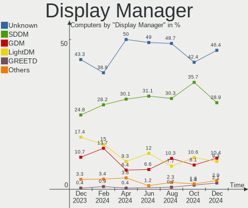
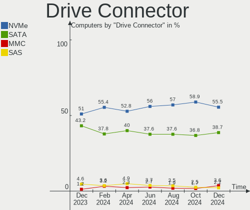
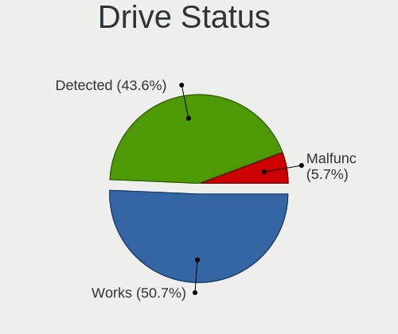
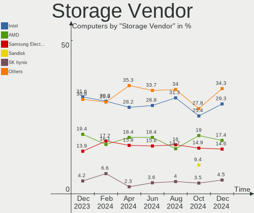
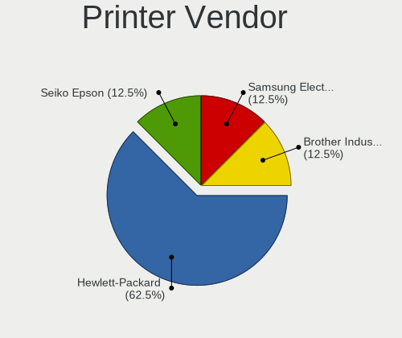

Arch Hardware Trends
--------------------

A project to identify most popular hardware characteristics and track their change
over time based on data collected by Arch users at https://Linux-Hardware.org.

Anyone can contribute to this report by the [hw-probe](https://github.com/linuxhw/hw-probe) tool:

    sudo -E hw-probe -all -upload

This is a report for all computer types. See also reports for [desktops](/Dist/Arch/Desktop/README.md) and [notebooks](/Dist/Arch/Notebook/README.md).

Full-feature report is available here: https://linux-hardware.org/?view=trends

Period: Sep, 2021.

Contents
--------

* [ System ](#system)
  - [ OS                       ](#os)
  - [ OS Family                ](#os-family)
  - [ Kernel                   ](#kernel)
  - [ Kernel Family            ](#kernel-family)
  - [ Kernel Major Ver.        ](#kernel-major-ver)
  - [ Arch                     ](#arch)
  - [ DE                       ](#de)
  - [ Display Server           ](#display-server)
  - [ Display Manager          ](#display-manager)
  - [ OS Lang                  ](#os-lang)
  - [ Boot Mode                ](#boot-mode)
  - [ Filesystem               ](#filesystem)
  - [ Part. scheme             ](#part-scheme)
  - [ Dual Boot with Linux/BSD ](#dual-boot-with-linuxbsd)
  - [ Dual Boot (Win)          ](#dual-boot-win)

* [ Board ](#board)
  - [ Vendor                   ](#vendor)
  - [ Model                    ](#model)
  - [ Model Family             ](#model-family)
  - [ MFG Year                 ](#mfg-year)
  - [ Form Factor              ](#form-factor)
  - [ Secure Boot              ](#secure-boot)
  - [ Coreboot                 ](#coreboot)
  - [ RAM Size                 ](#ram-size)
  - [ RAM Used                 ](#ram-used)
  - [ Total Drives             ](#total-drives)
  - [ Has CD-ROM               ](#has-cd-rom)
  - [ Has Ethernet             ](#has-ethernet)
  - [ Has WiFi                 ](#has-wifi)
  - [ Has Bluetooth            ](#has-bluetooth)

* [ Location ](#location)
  - [ Country                  ](#country)
  - [ City                     ](#city)

* [ Drives ](#drives)
  - [ Drive Vendor             ](#drive-vendor)
  - [ Drive Model              ](#drive-model)
  - [ HDD Vendor               ](#hdd-vendor)
  - [ SSD Vendor               ](#ssd-vendor)
  - [ Drive Kind               ](#drive-kind)
  - [ Drive Connector          ](#drive-connector)
  - [ Drive Size               ](#drive-size)
  - [ Space Total              ](#space-total)
  - [ Space Used               ](#space-used)
  - [ Malfunc. Drives          ](#malfunc-drives)
  - [ Malfunc. Drive Vendor    ](#malfunc-drive-vendor)
  - [ Malfunc. HDD Vendor      ](#malfunc-hdd-vendor)
  - [ Malfunc. Drive Kind      ](#malfunc-drive-kind)
  - [ Failed Drives            ](#failed-drives)
  - [ Failed Drive Vendor      ](#failed-drive-vendor)
  - [ Drive Status             ](#drive-status)

* [ Storage controller ](#storage-controller)
  - [ Storage Vendor           ](#storage-vendor)
  - [ Storage Model            ](#storage-model)
  - [ Storage Kind             ](#storage-kind)

* [ Processor ](#processor)
  - [ CPU Vendor               ](#cpu-vendor)
  - [ CPU Model                ](#cpu-model)
  - [ CPU Model Family         ](#cpu-model-family)
  - [ CPU Cores                ](#cpu-cores)
  - [ CPU Sockets              ](#cpu-sockets)
  - [ CPU Threads              ](#cpu-threads)
  - [ CPU Op-Modes             ](#cpu-op-modes)
  - [ CPU Microcode            ](#cpu-microcode)
  - [ CPU Microarch            ](#cpu-microarch)

* [ Graphics ](#graphics)
  - [ GPU Vendor               ](#gpu-vendor)
  - [ GPU Model                ](#gpu-model)
  - [ GPU Combo                ](#gpu-combo)
  - [ GPU Driver               ](#gpu-driver)
  - [ GPU Memory               ](#gpu-memory)

* [ Monitor ](#monitor)
  - [ Monitor Vendor           ](#monitor-vendor)
  - [ Monitor Model            ](#monitor-model)
  - [ Monitor Resolution       ](#monitor-resolution)
  - [ Monitor Diagonal         ](#monitor-diagonal)
  - [ Monitor Width            ](#monitor-width)
  - [ Aspect Ratio             ](#aspect-ratio)
  - [ Monitor Area             ](#monitor-area)
  - [ Pixel Density            ](#pixel-density)
  - [ Multiple Monitors        ](#multiple-monitors)

* [ Network ](#network)
  - [ Net Controller Vendor    ](#net-controller-vendor)
  - [ Net Controller Model     ](#net-controller-model)
  - [ Wireless Vendor          ](#wireless-vendor)
  - [ Wireless Model           ](#wireless-model)
  - [ Ethernet Vendor          ](#ethernet-vendor)
  - [ Ethernet Model           ](#ethernet-model)
  - [ Net Controller Kind      ](#net-controller-kind)
  - [ Used Controller          ](#used-controller)
  - [ NICs                     ](#nics)
  - [ IPv6                     ](#ipv6)

* [ Bluetooth ](#bluetooth)
  - [ Bluetooth Vendor         ](#bluetooth-vendor)
  - [ Bluetooth Model          ](#bluetooth-model)

* [ Sound ](#sound)
  - [ Sound Vendor             ](#sound-vendor)
  - [ Sound Model              ](#sound-model)

* [ Memory ](#memory)
  - [ Memory Vendor            ](#memory-vendor)
  - [ Memory Model             ](#memory-model)
  - [ Memory Kind              ](#memory-kind)
  - [ Memory Form Factor       ](#memory-form-factor)
  - [ Memory Size              ](#memory-size)
  - [ Memory Speed             ](#memory-speed)

* [ Printers & scanners ](#printers--scanners)
  - [ Printer Vendor           ](#printer-vendor)
  - [ Printer Model            ](#printer-model)
  - [ Scanner Vendor           ](#scanner-vendor)
  - [ Scanner Model            ](#scanner-model)

* [ Camera ](#camera)
  - [ Camera Vendor            ](#camera-vendor)
  - [ Camera Model             ](#camera-model)

* [ Security ](#security)
  - [ Fingerprint Vendor       ](#fingerprint-vendor)
  - [ Fingerprint Model        ](#fingerprint-model)
  - [ Chipcard Vendor          ](#chipcard-vendor)
  - [ Chipcard Model           ](#chipcard-model)

* [ Unsupported ](#unsupported)
  - [ Unsupported Devices      ](#unsupported-devices)
  - [ Unsupported Device Types ](#unsupported-device-types)

System
------

OS
--

Installed operating systems

| Name         | Computers | Percent |
|--------------|-----------|---------|
| Arch         | 97        | 62.99%  |
| Arch Rolling | 57        | 37.01%  |

OS Family
---------

OS without a version

| Name | Computers | Percent |
|------|-----------|---------|
| Arch | 154       | 100%    |

Kernel
------

Version of the Linux kernel

| Version                                   | Computers | Percent |
|-------------------------------------------|-----------|---------|
| 5.13.13-arch1-1                           | 34        | 22.08%  |
| 5.14.6-arch1-1                            | 17        | 11.04%  |
| 5.14.2-arch1-2                            | 12        | 7.79%   |
| 5.14.7-arch1-1                            | 11        | 7.14%   |
| 5.14.3-arch1-1                            | 9         | 5.84%   |
| 5.14.8-arch1-1                            | 6         | 3.9%    |
| 5.14.5-arch1-1                            | 6         | 3.9%    |
| 5.13.13-zen1-1-zen                        | 6         | 3.9%    |
| 5.14.6-zen1-1-zen                         | 5         | 3.25%   |
| 5.14.2-zen1-2-zen                         | 4         | 2.6%    |
| 5.10.63-1-lts                             | 4         | 2.6%    |
| 5.10.52-1-lts                             | 4         | 2.6%    |
| 5.10.69-1-lts                             | 3         | 1.95%   |
| 5.10.62-1-lts                             | 3         | 1.95%   |
| 5.13.12-arch1-1                           | 2         | 1.3%    |
| 5.10.68-1-lts                             | 2         | 1.3%    |
| 5.10.67-1-lts                             | 2         | 1.3%    |
| 5.10.64-1-lts                             | 2         | 1.3%    |
| 5.15.0-rc2-1-mainline                     | 1         | 0.65%   |
| 5.14.8-zen1-1-zen                         | 1         | 0.65%   |
| 5.14.7-zen1-1-zen                         | 1         | 0.65%   |
| 5.14.6-lqx1-2-lqx                         | 1         | 0.65%   |
| 5.14.5-zen1-1-zen                         | 1         | 0.65%   |
| 5.14.5-hardened1-1-hardened               | 1         | 0.65%   |
| 5.14.5-arch1-1-surface                    | 1         | 0.65%   |
| 5.14.1-xanmod1-1                          | 1         | 0.65%   |
| 5.13.9-arch1-1                            | 1         | 0.65%   |
| 5.13.7-arch1-1                            | 1         | 0.65%   |
| 5.13.17-xanmod1-1                         | 1         | 0.65%   |
| 5.13.15-lqx1-1-lqx                        | 1         | 0.65%   |
| 5.13.13-hardened1-1-hardened              | 1         | 0.65%   |
| 5.13.13-arch1-1-51400p-04                 | 1         | 0.65%   |
| 5.13.12                                   | 1         | 0.65%   |
| 5.13.10-zen1-1-zen                        | 1         | 0.65%   |
| 5.12.19-2-mbp                             | 1         | 0.65%   |
| 5.12.11-arch1-1                           | 1         | 0.65%   |
| 5.12.10-arch1-1                           | 1         | 0.65%   |
| 5.11.0-rc5-2-amd-s0ix-02293-ga34b64a7d2e8 | 1         | 0.65%   |
| 5.10.61-1mbp-16.1-linux-wifi              | 1         | 0.65%   |
| 5.10.61-1-lts                             | 1         | 0.65%   |

Kernel Family
-------------

Linux kernel without a distro release

| Version | Computers | Percent |
|---------|-----------|---------|
| 5.13.13 | 42        | 27.27%  |
| 5.14.6  | 23        | 14.94%  |
| 5.14.2  | 16        | 10.39%  |
| 5.14.7  | 12        | 7.79%   |
| 5.14.5  | 9         | 5.84%   |
| 5.14.3  | 9         | 5.84%   |
| 5.14.8  | 7         | 4.55%   |
| 5.10.63 | 4         | 2.6%    |
| 5.10.52 | 4         | 2.6%    |
| 5.13.12 | 3         | 1.95%   |
| 5.10.69 | 3         | 1.95%   |
| 5.10.62 | 3         | 1.95%   |
| 5.10.68 | 2         | 1.3%    |
| 5.10.67 | 2         | 1.3%    |
| 5.10.64 | 2         | 1.3%    |
| 5.10.61 | 2         | 1.3%    |
| 5.15.0  | 1         | 0.65%   |
| 5.14.1  | 1         | 0.65%   |
| 5.13.9  | 1         | 0.65%   |
| 5.13.7  | 1         | 0.65%   |
| 5.13.17 | 1         | 0.65%   |
| 5.13.15 | 1         | 0.65%   |
| 5.13.10 | 1         | 0.65%   |
| 5.12.19 | 1         | 0.65%   |
| 5.12.11 | 1         | 0.65%   |
| 5.12.10 | 1         | 0.65%   |
| 5.11.0  | 1         | 0.65%   |

Kernel Major Ver.
-----------------

Linux kernel major version

| Version | Computers | Percent |
|---------|-----------|---------|
| 5.14    | 77        | 50%     |
| 5.13    | 50        | 32.47%  |
| 5.10    | 22        | 14.29%  |
| 5.12    | 3         | 1.95%   |
| 5.15    | 1         | 0.65%   |
| 5.11    | 1         | 0.65%   |

Arch
----

OS architecture (x86_64, i586, etc.)

| Name   | Computers | Percent |
|--------|-----------|---------|
| x86_64 | 154       | 100%    |

DE
--

Desktop Environment

| Name          | Computers | Percent |
|---------------|-----------|---------|
| KDE5          | 40        | 25.97%  |
| GNOME         | 39        | 25.32%  |
| XFCE          | 15        | 9.74%   |
| i3            | 12        | 7.79%   |
| Unknown       | 11        | 7.14%   |
| KDE           | 7         | 4.55%   |
| X-Cinnamon    | 4         | 2.6%    |
| MATE          | 4         | 2.6%    |
| Openbox       | 3         | 1.95%   |
| xmonad        | 2         | 1.3%    |
| sway          | 2         | 1.3%    |
| DWM           | 2         | 1.3%    |
| Budgie        | 2         | 1.3%    |
| bspwm         | 2         | 1.3%    |
| awesome       | 2         | 1.3%    |
| LXQt          | 1         | 0.65%   |
| LXDE          | 1         | 0.65%   |
| leftwm        | 1         | 0.65%   |
| fvwm2         | 1         | 0.65%   |
| Enlightenment | 1         | 0.65%   |
| Deepin        | 1         | 0.65%   |
| Cinnamon      | 1         | 0.65%   |

Display Server
--------------

X11 or Wayland

| Name    | Computers | Percent |
|---------|-----------|---------|
| X11     | 96        | 62.34%  |
| Wayland | 26        | 16.88%  |
| Tty     | 18        | 11.69%  |
| Unknown | 14        | 9.09%   |

Display Manager
---------------

SDDM, LightDM, etc.

| Name    | Computers | Percent |
|---------|-----------|---------|
| Unknown | 55        | 35.71%  |
| SDDM    | 36        | 23.38%  |
| LightDM | 34        | 22.08%  |
| GDM     | 18        | 11.69%  |
| LXDM    | 8         | 5.19%   |
| SLiM    | 1         | 0.65%   |
| Ly      | 1         | 0.65%   |
| GREETD  | 1         | 0.65%   |

OS Lang
-------

Language

| Lang       | Computers | Percent |
|------------|-----------|---------|
| en_US      | 88        | 57.14%  |
| de_DE      | 8         | 5.19%   |
| en_GB      | 7         | 4.55%   |
| pt_BR      | 6         | 3.9%    |
| C          | 6         | 3.9%    |
| fr_FR      | 4         | 2.6%    |
| es_ES      | 3         | 1.95%   |
| en_AU      | 3         | 1.95%   |
| Unknown    | 3         | 1.95%   |
| unm_US     | 2         | 1.3%    |
| tr_TR      | 2         | 1.3%    |
| ru_RU      | 2         | 1.3%    |
| hu_HU      | 2         | 1.3%    |
| en_CA      | 2         | 1.3%    |
| zh_CN      | 1         | 0.65%   |
| ru_UA      | 1         | 0.65%   |
| nl_NL      | 1         | 0.65%   |
| nl_BE      | 1         | 0.65%   |
| ja_JP      | 1         | 0.65%   |
| it_IT      | 1         | 0.65%   |
| es_MX      | 1         | 0.65%   |
| es_ES.UTF8 | 1         | 0.65%   |
| es_CL      | 1         | 0.65%   |
| es_AR      | 1         | 0.65%   |
| en_ZA      | 1         | 0.65%   |
| en_US.UTF8 | 1         | 0.65%   |
| en_IN      | 1         | 0.65%   |
| en_IE      | 1         | 0.65%   |
| de_AT      | 1         | 0.65%   |
| cs_CZ      | 1         | 0.65%   |

Boot Mode
---------

EFI or BIOS

| Mode | Computers | Percent |
|------|-----------|---------|
| EFI  | 98        | 63.64%  |
| BIOS | 56        | 36.36%  |

Filesystem
----------

Type of filesystem

| Type    | Computers | Percent |
|---------|-----------|---------|
| Ext4    | 104       | 67.53%  |
| Btrfs   | 40        | 25.97%  |
| Xfs     | 5         | 3.25%   |
| Overlay | 4         | 2.6%    |
| F2fs    | 1         | 0.65%   |

Part. scheme
------------

Scheme of partitioning

| Type    | Computers | Percent |
|---------|-----------|---------|
| GPT     | 109       | 70.78%  |
| Unknown | 34        | 22.08%  |
| MBR     | 11        | 7.14%   |

Dual Boot with Linux/BSD
------------------------

Hosting more than one Linux/BSD

| Dual boot | Computers | Percent |
|-----------|-----------|---------|
| No        | 134       | 87.01%  |
| Yes       | 20        | 12.99%  |

Dual Boot (Win)
---------------

Hosting Linux and Windows

| Dual boot | Computers | Percent |
|-----------|-----------|---------|
| No        | 107       | 69.48%  |
| Yes       | 47        | 30.52%  |

Board
-----

Vendor
------

Motherboard manufacturer

| Name                             | Computers | Percent |
|----------------------------------|-----------|---------|
| ASUSTek Computer                 | 36        | 23.38%  |
| Lenovo                           | 30        | 19.48%  |
| Hewlett-Packard                  | 17        | 11.04%  |
| MSI                              | 10        | 6.49%   |
| Gigabyte Technology              | 9         | 5.84%   |
| Dell                             | 9         | 5.84%   |
| Acer                             | 8         | 5.19%   |
| ASRock                           | 7         | 4.55%   |
| Apple                            | 4         | 2.6%    |
| TUXEDO                           | 2         | 1.3%    |
| Shuttle                          | 2         | 1.3%    |
| Samsung Electronics              | 2         | 1.3%    |
| Intel                            | 2         | 1.3%    |
| Toshiba                          | 1         | 0.65%   |
| Sony                             | 1         | 0.65%   |
| Pegatron                         | 1         | 0.65%   |
| Notebook                         | 1         | 0.65%   |
| Nokia Solutions and Networks     | 1         | 0.65%   |
| Microsoft                        | 1         | 0.65%   |
| MECHREVO                         | 1         | 0.65%   |
| HPE                              | 1         | 0.65%   |
| HC                               | 1         | 0.65%   |
| GPD                              | 1         | 0.65%   |
| Google                           | 1         | 0.65%   |
| FUJITSU CLIENT COMPUTING LIMITED | 1         | 0.65%   |
| Framework                        | 1         | 0.65%   |
| Eluktronics                      | 1         | 0.65%   |
| Biostar                          | 1         | 0.65%   |
| Unknown                          | 1         | 0.65%   |

Model
-----

Motherboard model

| Name                                                | Computers | Percent |
|-----------------------------------------------------|-----------|---------|
| ASUS TUF GAMING X570-PLUS                           | 3         | 1.95%   |
| ASUS All Series                                     | 3         | 1.95%   |
| MSI MS-7B98                                         | 2         | 1.3%    |
| HP Pavilion g6                                      | 2         | 1.3%    |
| Dell XPS 15 9500                                    | 2         | 1.3%    |
| ASUS TUF GAMING B450-PLUS II                        | 2         | 1.3%    |
| TUXEDO TUXEDO_Book_XA1510                           | 1         | 0.65%   |
| TUXEDO Book BA1510                                  | 1         | 0.65%   |
| Toshiba dynabook T55/PW                             | 1         | 0.65%   |
| Sony VPCEH1S1E                                      | 1         | 0.65%   |
| Shuttle SH67H                                       | 1         | 0.65%   |
| Shuttle DH110                                       | 1         | 0.65%   |
| Samsung 950QDB                                      | 1         | 0.65%   |
| Samsung 275E4E/275E5E                               | 1         | 0.65%   |
| Pegatron AY138AA-ABA CQ5320Y                        | 1         | 0.65%   |
| Notebook P7xxTM1                                    | 1         | 0.65%   |
| Nokia Solutions and Networks AR-S5008A-5A/AF1294.05 | 1         | 0.65%   |
| MSI MS-B90111                                       | 1         | 0.65%   |
| MSI MS-7C91                                         | 1         | 0.65%   |
| MSI MS-7C37                                         | 1         | 0.65%   |
| MSI MS-7C35                                         | 1         | 0.65%   |
| MSI MS-7A34                                         | 1         | 0.65%   |
| MSI MS-7971                                         | 1         | 0.65%   |
| MSI GL65 9SEK                                       | 1         | 0.65%   |
| MSI EG194AA-ABA A1250N                              | 1         | 0.65%   |
| Microsoft Surface Book 3                            | 1         | 0.65%   |
| MECHREVO Code 01 Series PF5NU1G                     | 1         | 0.65%   |
| Lenovo Yoga 900-13ISK 80MK                          | 1         | 0.65%   |
| Lenovo Yoga 9 14ITL5 82BG                           | 1         | 0.65%   |
| Lenovo Yoga 720-13IKB 81C3                          | 1         | 0.65%   |
| Lenovo ThinkStation D20 4158E93                     | 1         | 0.65%   |
| Lenovo ThinkPad X390 20Q00058MH                     | 1         | 0.65%   |
| Lenovo ThinkPad X220 Tablet 4298A11                 | 1         | 0.65%   |
| Lenovo ThinkPad X200 74574AC                        | 1         | 0.65%   |
| Lenovo ThinkPad X140e 20BL000BUS                    | 1         | 0.65%   |
| Lenovo ThinkPad X13 Gen 1 20UF000KCK                | 1         | 0.65%   |
| Lenovo ThinkPad X1 Yoga 1st 20FQ000RUS              | 1         | 0.65%   |
| Lenovo ThinkPad W541 20EFS01B09                     | 1         | 0.65%   |
| Lenovo ThinkPad T490 20N20009RT                     | 1         | 0.65%   |
| Lenovo ThinkPad T480 20L5CTO1WW                     | 1         | 0.65%   |
| Lenovo ThinkPad T460p 20FW0005AU                    | 1         | 0.65%   |
| Lenovo ThinkPad T440 20B6CTO1WW                     | 1         | 0.65%   |
| Lenovo ThinkPad T14s Gen 1 20UHS09300               | 1         | 0.65%   |
| Lenovo ThinkPad T14 Gen 2a 20XK001BUS               | 1         | 0.65%   |
| Lenovo ThinkPad T14 Gen 1 20UES4XD00                | 1         | 0.65%   |
| Lenovo ThinkPad P50 20EQS25D0G                      | 1         | 0.65%   |
| Lenovo ThinkPad L14 Gen 1 20U5001WTX                | 1         | 0.65%   |
| Lenovo ThinkPad E14 Gen 2 20TACTO1WW                | 1         | 0.65%   |
| Lenovo ThinkPad E14 Gen 2 20T6000SIX                | 1         | 0.65%   |
| Lenovo Legion 5 15ACH6H 82JU                        | 1         | 0.65%   |
| Lenovo IdeaPad S340-15IWL 81N8                      | 1         | 0.65%   |
| Lenovo IdeaPad S145-15IWL 81MV                      | 1         | 0.65%   |
| Lenovo IdeaPad 5 15IIL05 81YK                       | 1         | 0.65%   |
| Lenovo IdeaPad 5 15ALC05 82LN                       | 1         | 0.65%   |
| Lenovo IdeaPad 5 14ALC05 82LM                       | 1         | 0.65%   |
| Lenovo IdeaPad 320S-14IKB 80X4                      | 1         | 0.65%   |
| Lenovo IdeaPad 320S-13IKB 81AK                      | 1         | 0.65%   |
| Intel X79 V2.72B                                    | 1         | 0.65%   |
| Intel Pine Trail - M                                | 1         | 0.65%   |
| HPE ProLiant DL360 Gen10                            | 1         | 0.65%   |

Model Family
------------

Motherboard model prefix

| Name                                      | Computers | Percent |
|-------------------------------------------|-----------|---------|
| Lenovo ThinkPad                           | 18        | 11.69%  |
| Lenovo IdeaPad                            | 7         | 4.55%   |
| ASUS ROG                                  | 7         | 4.55%   |
| ASUS TUF                                  | 6         | 3.9%    |
| Acer Aspire                               | 6         | 3.9%    |
| HP ProBook                                | 4         | 2.6%    |
| Lenovo Yoga                               | 3         | 1.95%   |
| HP Pavilion                               | 3         | 1.95%   |
| Gigabyte X570                             | 3         | 1.95%   |
| Gigabyte B450                             | 3         | 1.95%   |
| Dell XPS                                  | 3         | 1.95%   |
| Dell Inspiron                             | 3         | 1.95%   |
| ASUS PRIME                                | 3         | 1.95%   |
| ASUS All                                  | 3         | 1.95%   |
| MSI MS-7B98                               | 2         | 1.3%    |
| HP Laptop                                 | 2         | 1.3%    |
| HP EliteBook                              | 2         | 1.3%    |
| Dell Latitude                             | 2         | 1.3%    |
| ASUS ASUS                                 | 2         | 1.3%    |
| TUXEDO TUXEDO                             | 1         | 0.65%   |
| TUXEDO Book                               | 1         | 0.65%   |
| Toshiba dynabook                          | 1         | 0.65%   |
| Sony VPCEH1S1E                            | 1         | 0.65%   |
| Shuttle SH67H                             | 1         | 0.65%   |
| Shuttle DH110                             | 1         | 0.65%   |
| Samsung 950QDB                            | 1         | 0.65%   |
| Samsung 275E4E                            | 1         | 0.65%   |
| Pegatron AY138AA-ABA                      | 1         | 0.65%   |
| Notebook P7xxTM1                          | 1         | 0.65%   |
| Nokia Solutions and Networks AR-S5008A-5A | 1         | 0.65%   |
| MSI MS-B90111                             | 1         | 0.65%   |
| MSI MS-7C91                               | 1         | 0.65%   |
| MSI MS-7C37                               | 1         | 0.65%   |
| MSI MS-7C35                               | 1         | 0.65%   |
| MSI MS-7A34                               | 1         | 0.65%   |
| MSI MS-7971                               | 1         | 0.65%   |
| MSI GL65                                  | 1         | 0.65%   |
| MSI EG194AA-ABA                           | 1         | 0.65%   |
| Microsoft Surface                         | 1         | 0.65%   |
| MECHREVO Code                             | 1         | 0.65%   |
| Lenovo ThinkStation                       | 1         | 0.65%   |
| Lenovo Legion                             | 1         | 0.65%   |
| Intel X79                                 | 1         | 0.65%   |
| Intel Pine                                | 1         | 0.65%   |
| HPE ProLiant                              | 1         | 0.65%   |
| HP Z820                                   | 1         | 0.65%   |
| HP Z4                                     | 1         | 0.65%   |
| HP Z240                                   | 1         | 0.65%   |
| HP ENVY                                   | 1         | 0.65%   |
| HP Compaq                                 | 1         | 0.65%   |
| HP 350                                    | 1         | 0.65%   |
| HC HCAR357-MI                             | 1         | 0.65%   |
| GPD G1618-03                              | 1         | 0.65%   |
| Google Delbin                             | 1         | 0.65%   |
| Gigabyte X470                             | 1         | 0.65%   |
| Gigabyte A520                             | 1         | 0.65%   |
| Gigabyte A320M-S2H                        | 1         | 0.65%   |
| FUJITSU CLIENT COMPUTING LIMITED LIFEBOOK | 1         | 0.65%   |
| Framework Laptop                          | 1         | 0.65%   |
| Eluktronics RP-15                         | 1         | 0.65%   |

MFG Year
--------

Motherboard manufacture year

| Year    | Computers | Percent |
|---------|-----------|---------|
| 2021    | 48        | 31.17%  |
| 2020    | 33        | 21.43%  |
| 2019    | 21        | 13.64%  |
| 2018    | 12        | 7.79%   |
| 2016    | 6         | 3.9%    |
| 2012    | 6         | 3.9%    |
| 2017    | 5         | 3.25%   |
| 2013    | 5         | 3.25%   |
| 2011    | 5         | 3.25%   |
| 2015    | 4         | 2.6%    |
| 2014    | 3         | 1.95%   |
| 2009    | 2         | 1.3%    |
| 2010    | 1         | 0.65%   |
| 2008    | 1         | 0.65%   |
| 2005    | 1         | 0.65%   |
| Unknown | 1         | 0.65%   |

Form Factor
-----------

Physical design of the computer

| Name        | Computers | Percent |
|-------------|-----------|---------|
| Notebook    | 84        | 54.55%  |
| Desktop     | 59        | 38.31%  |
| Convertible | 6         | 3.9%    |
| All in one  | 2         | 1.3%    |
| Server      | 2         | 1.3%    |
| Tablet      | 1         | 0.65%   |

Secure Boot
-----------

Enabled or disabled

| State    | Computers | Percent |
|----------|-----------|---------|
| Disabled | 152       | 98.7%   |
| Enabled  | 2         | 1.3%    |

Coreboot
--------

Have coreboot on board

| Used | Computers | Percent |
|------|-----------|---------|
| No   | 153       | 99.35%  |
| Yes  | 1         | 0.65%   |

RAM Size
--------

Total RAM memory

| Size in GB      | Computers | Percent |
|-----------------|-----------|---------|
| 32.01-64.0      | 44        | 28.57%  |
| 16.01-24.0      | 37        | 24.03%  |
| 8.01-16.0       | 33        | 21.43%  |
| 4.01-8.0        | 17        | 11.04%  |
| 3.01-4.0        | 12        | 7.79%   |
| 64.01-256.0     | 6         | 3.9%    |
| 24.01-32.0      | 2         | 1.3%    |
| More than 256.0 | 1         | 0.65%   |
| 2.01-3.0        | 1         | 0.65%   |
| 0.51-1.0        | 1         | 0.65%   |

RAM Used
--------

Used RAM memory

| Used GB    | Computers | Percent |
|------------|-----------|---------|
| 1.01-2.0   | 41        | 26.62%  |
| 2.01-3.0   | 40        | 25.97%  |
| 4.01-8.0   | 27        | 17.53%  |
| 3.01-4.0   | 20        | 12.99%  |
| 8.01-16.0  | 15        | 9.74%   |
| 0.51-1.0   | 6         | 3.9%    |
| 16.01-24.0 | 4         | 2.6%    |
| 0.01-0.5   | 1         | 0.65%   |

Total Drives
------------

Number of drives on board

| Drives | Computers | Percent |
|--------|-----------|---------|
| 1      | 83        | 53.9%   |
| 2      | 36        | 23.38%  |
| 3      | 15        | 9.74%   |
| 4      | 11        | 7.14%   |
| 5      | 7         | 4.55%   |
| 7      | 1         | 0.65%   |
| 0      | 1         | 0.65%   |

Has CD-ROM
----------

Has CD-ROM on board

| Presented | Computers | Percent |
|-----------|-----------|---------|
| No        | 119       | 77.27%  |
| Yes       | 35        | 22.73%  |

Has Ethernet
------------

Has Ethernet on board

| Presented | Computers | Percent |
|-----------|-----------|---------|
| Yes       | 130       | 84.42%  |
| No        | 24        | 15.58%  |

Has WiFi
--------

Has WiFi module

| Presented | Computers | Percent |
|-----------|-----------|---------|
| Yes       | 123       | 79.87%  |
| No        | 31        | 20.13%  |

Has Bluetooth
-------------

Has Bluetooth module

| Presented | Computers | Percent |
|-----------|-----------|---------|
| Yes       | 93        | 60.39%  |
| No        | 61        | 39.61%  |

Location
--------

Country
-------

Geographic location (country)

| Country      | Computers | Percent |
|--------------|-----------|---------|
| USA          | 32        | 20.78%  |
| Germany      | 14        | 9.09%   |
| France       | 11        | 7.14%   |
| India        | 9         | 5.84%   |
| Brazil       | 9         | 5.84%   |
| Russia       | 8         | 5.19%   |
| Spain        | 6         | 3.9%    |
| Canada       | 5         | 3.25%   |
| Austria      | 5         | 3.25%   |
| Turkey       | 3         | 1.95%   |
| Sweden       | 3         | 1.95%   |
| Pakistan     | 3         | 1.95%   |
| Netherlands  | 3         | 1.95%   |
| Hungary      | 3         | 1.95%   |
| Australia    | 3         | 1.95%   |
| Ukraine      | 2         | 1.3%    |
| UK           | 2         | 1.3%    |
| Italy        | 2         | 1.3%    |
| Iran         | 2         | 1.3%    |
| Estonia      | 2         | 1.3%    |
| Czechia      | 2         | 1.3%    |
| China        | 2         | 1.3%    |
| Chile        | 2         | 1.3%    |
| Belgium      | 2         | 1.3%    |
| Argentina    | 2         | 1.3%    |
| Vietnam      | 1         | 0.65%   |
| Uzbekistan   | 1         | 0.65%   |
| Thailand     | 1         | 0.65%   |
| South Africa | 1         | 0.65%   |
| Poland       | 1         | 0.65%   |
| New Zealand  | 1         | 0.65%   |
| Nepal        | 1         | 0.65%   |
| Mexico       | 1         | 0.65%   |
| Lithuania    | 1         | 0.65%   |
| Japan        | 1         | 0.65%   |
| Hong Kong    | 1         | 0.65%   |
| Denmark      | 1         | 0.65%   |
| Croatia      | 1         | 0.65%   |
| Colombia     | 1         | 0.65%   |
| Bulgaria     | 1         | 0.65%   |
| Bangladesh   | 1         | 0.65%   |
| Azerbaijan   | 1         | 0.65%   |

City
----

Geographic location (city)

| City                    | Computers | Percent |
|-------------------------|-----------|---------|
| St Petersburg           | 4         | 2.6%    |
| Valencia                | 3         | 1.95%   |
| Tehran                  | 2         | 1.3%    |
| Paris                   | 2         | 1.3%    |
| Munich                  | 2         | 1.3%    |
| Los Angeles             | 2         | 1.3%    |
| Khammam                 | 2         | 1.3%    |
| Buenos Aires            | 2         | 1.3%    |
| Austin                  | 2         | 1.3%    |
| Zaragoza                | 1         | 0.65%   |
| Yarraville              | 1         | 0.65%   |
| Wroclaw                 | 1         | 0.65%   |
| Wellington              | 1         | 0.65%   |
| Waynesburg              | 1         | 0.65%   |
| Vinassan                | 1         | 0.65%   |
| Vienna                  | 1         | 0.65%   |
| Victoria                | 1         | 0.65%   |
| Valpara?­so             | 1         | 0.65%   |
| Ulpur                   | 1         | 0.65%   |
| Tours                   | 1         | 0.65%   |
| Tashkent                | 1         | 0.65%   |
| Tartu                   | 1         | 0.65%   |
| Tallinn                 | 1         | 0.65%   |
| Sz?©kesfeh?©rv??r       | 1         | 0.65%   |
| Suzano                  | 1         | 0.65%   |
| Surat                   | 1         | 0.65%   |
| Strausberg              | 1         | 0.65%   |
| Stockholm               | 1         | 0.65%   |
| St. Petersburg          | 1         | 0.65%   |
| Sile                    | 1         | 0.65%   |
| Siegen                  | 1         | 0.65%   |
| Seattle                 | 1         | 0.65%   |
| Schrobenhausen          | 1         | 0.65%   |
| Santiago                | 1         | 0.65%   |
| Sankt P?¶lten           | 1         | 0.65%   |
| San Francisco           | 1         | 0.65%   |
| San Fernando            | 1         | 0.65%   |
| Saint John              | 1         | 0.65%   |
| Rio de Janeiro          | 1         | 0.65%   |
| Rimpar                  | 1         | 0.65%   |
| Riemst                  | 1         | 0.65%   |
| Rennes                  | 1         | 0.65%   |
| Recife                  | 1         | 0.65%   |
| Rayong                  | 1         | 0.65%   |
| Pune                    | 1         | 0.65%   |
| Prayssas                | 1         | 0.65%   |
| Pompano Beach           | 1         | 0.65%   |
| Poitiers                | 1         | 0.65%   |
| Plasencia               | 1         | 0.65%   |
| Pilisvorosvar           | 1         | 0.65%   |
| Pfaffenhofen an der Ilm | 1         | 0.65%   |
| Pearland                | 1         | 0.65%   |
| Pasadena                | 1         | 0.65%   |
| Osasco                  | 1         | 0.65%   |
| Nussbach                | 1         | 0.65%   |
| Novosibirsk             | 1         | 0.65%   |
| Novocherkassk           | 1         | 0.65%   |
| Mumbai                  | 1         | 0.65%   |
| Mosonmagyar??v??r       | 1         | 0.65%   |
| Morgantown              | 1         | 0.65%   |

Drives
------

Drive Vendor
------------

Hard drive vendors

| Vendor                    | Computers | Drives | Percent |
|---------------------------|-----------|--------|---------|
| Samsung Electronics       | 47        | 64     | 19.58%  |
| WDC                       | 35        | 45     | 14.58%  |
| Seagate                   | 25        | 29     | 10.42%  |
| Toshiba                   | 22        | 23     | 9.17%   |
| Sandisk                   | 14        | 16     | 5.83%   |
| Kingston                  | 14        | 18     | 5.83%   |
| Crucial                   | 14        | 15     | 5.83%   |
| SK Hynix                  | 13        | 14     | 5.42%   |
| A-DATA Technology         | 7         | 7      | 2.92%   |
| Micron Technology         | 6         | 6      | 2.5%    |
| Intel                     | 5         | 5      | 2.08%   |
| Unknown                   | 4         | 4      | 1.67%   |
| Silicon Motion            | 4         | 4      | 1.67%   |
| Apple                     | 4         | 5      | 1.67%   |
| Transcend                 | 2         | 2      | 0.83%   |
| Phison                    | 2         | 3      | 0.83%   |
| Hitachi                   | 2         | 2      | 0.83%   |
| HGST                      | 2         | 2      | 0.83%   |
| Union Memory              | 1         | 1      | 0.42%   |
| TO Exter                  | 1         | 1      | 0.42%   |
| STM                       | 1         | 1      | 0.42%   |
| SABRENT                   | 1         | 1      | 0.42%   |
| Realtek Semiconductor     | 1         | 1      | 0.42%   |
| Realtek                   | 1         | 1      | 0.42%   |
| Patriot                   | 1         | 1      | 0.42%   |
| Micron/Crucial Technology | 1         | 1      | 0.42%   |
| MaxDigital                | 1         | 1      | 0.42%   |
| Lite-On                   | 1         | 1      | 0.42%   |
| Lexar                     | 1         | 1      | 0.42%   |
| KIOXIA                    | 1         | 1      | 0.42%   |
| HS-SSD-C100               | 1         | 1      | 0.42%   |
| External                  | 1         | 1      | 0.42%   |
| Corsair                   | 1         | 1      | 0.42%   |
| BRAVEEAGLE                | 1         | 1      | 0.42%   |
| ASMT109x                  | 1         | 1      | 0.42%   |
| Unknown                   | 1         | 1      | 0.42%   |

Drive Model
-----------

Hard drive models

| Model                            | Computers | Percent |
|----------------------------------|-----------|---------|
| Samsung SSD 970 EVO Plus 1TB     | 5         | 1.83%   |
| Samsung SSD 860 EVO 1TB          | 5         | 1.83%   |
| Toshiba DT01ACA100 1TB           | 4         | 1.47%   |
| Samsung SSD 970 EVO Plus 500GB   | 4         | 1.47%   |
| Toshiba MQ04ABF100 1TB           | 3         | 1.1%    |
| Toshiba MQ01ABD100 1TB           | 3         | 1.1%    |
| SK Hynix NVMe SSD Drive 512GB    | 3         | 1.1%    |
| Samsung SSD 860 EVO 500GB        | 3         | 1.1%    |
| Samsung SSD 850 EVO 250GB        | 3         | 1.1%    |
| Samsung NVMe SSD Drive 256GB     | 3         | 1.1%    |
| Kingston SV300S37A120G 120GB SSD | 3         | 1.1%    |
| Toshiba DT01ACA200 2TB           | 2         | 0.73%   |
| Seagate ST4000DM004-2CV104 4TB   | 2         | 0.73%   |
| Seagate ST3500418AS 500GB        | 2         | 0.73%   |
| Seagate ST2000DM008-2FR102 2TB   | 2         | 0.73%   |
| Seagate ST2000DM006-2DM164 2TB   | 2         | 0.73%   |
| Seagate ST1000LM035-1RK172 1TB   | 2         | 0.73%   |
| Seagate ST1000DM003-1CH162 1TB   | 2         | 0.73%   |
| SanDisk SSD PLUS 120 GB          | 2         | 0.73%   |
| SanDisk SDSSDA240G 240GB         | 2         | 0.73%   |
| Sandisk NVMe SSD Drive 1TB       | 2         | 0.73%   |
| Samsung SSD 950 PRO 512GB        | 2         | 0.73%   |
| Samsung SSD 860 EVO 250GB        | 2         | 0.73%   |
| Samsung NVMe SSD Drive 1TB       | 2         | 0.73%   |
| Kingston SA400S37480G 480GB SSD  | 2         | 0.73%   |
| Kingston SA400S37240G 240GB SSD  | 2         | 0.73%   |
| Intel SSDPEKNW010T8 1TB          | 2         | 0.73%   |
| HGST HTS721010A9E630 1TB         | 2         | 0.73%   |
| Crucial CT500MX500SSD1 500GB     | 2         | 0.73%   |
| Crucial CT480BX500SSD1 480GB     | 2         | 0.73%   |
| Crucial CT1000MX500SSD1 1TB      | 2         | 0.73%   |
| WDC WDS500G3X0C-00SJG0 500GB     | 1         | 0.37%   |
| WDC WDS500G2B0C-00PXH0 500GB     | 1         | 0.37%   |
| WDC WDS500G2B0B-00YS70 500GB SSD | 1         | 0.37%   |
| WDC WDS500G2B0A 500GB SSD        | 1         | 0.37%   |
| WDC WDS240G2G0A-00JH30 240GB SSD | 1         | 0.37%   |
| WDC WDS120G2G0B-00EPW0 120GB SSD | 1         | 0.37%   |
| WDC WDS120G1G0A-00SS50 120GB SSD | 1         | 0.37%   |
| WDC WDS100T2B0C-00PXH0 1TB       | 1         | 0.37%   |
| WDC WDS100T2B0C 1TB              | 1         | 0.37%   |
| WDC WDS100T2B0B-00YS70 1TB SSD   | 1         | 0.37%   |
| WDC WD5000BEKT-00KA9T0 500GB     | 1         | 0.37%   |
| WDC WD40EZRZ-00GXCB0 4TB         | 1         | 0.37%   |
| WDC WD40EFRX-68N32N0 4TB         | 1         | 0.37%   |
| WDC WD4002FYYZ-01B7CB1 4TB       | 1         | 0.37%   |
| WDC WD3200AAJS-56M0A0 320GB      | 1         | 0.37%   |
| WDC WD2500BEVT-00A23T0 250GB     | 1         | 0.37%   |
| WDC WD20EZAZ-00GGJB0 2TB         | 1         | 0.37%   |
| WDC WD20EFRX-68EUZN0 2TB         | 1         | 0.37%   |
| WDC WD20EARS-00MVWB0 2TB         | 1         | 0.37%   |
| WDC WD20EARS-00J2GB0 2TB         | 1         | 0.37%   |
| WDC WD2003FZEX-00Z4SA0 2TB       | 1         | 0.37%   |
| WDC WD2003FZEX-00SRLA0 2TB       | 1         | 0.37%   |
| WDC WD10SPZX-75Z10T3 1TB         | 1         | 0.37%   |
| WDC WD10EZEX-60WN4A0 1TB         | 1         | 0.37%   |
| WDC WD10EZEX-22MFCA0 1TB         | 1         | 0.37%   |
| WDC WD10EZEX-08WN4A0 1TB         | 1         | 0.37%   |
| WDC WD10EZEX-00BN5A0 1TB         | 1         | 0.37%   |
| WDC WD10EARS-00Y5B1 1TB          | 1         | 0.37%   |
| WDC WD10EARS-003BB1 1TB          | 1         | 0.37%   |

HDD Vendor
----------

Hard disk drive vendors

| Vendor              | Computers | Drives | Percent |
|---------------------|-----------|--------|---------|
| Seagate             | 25        | 29     | 36.76%  |
| Toshiba             | 19        | 19     | 27.94%  |
| WDC                 | 16        | 25     | 23.53%  |
| Hitachi             | 2         | 2      | 2.94%   |
| HGST                | 2         | 2      | 2.94%   |
| TO Exter            | 1         | 1      | 1.47%   |
| Samsung Electronics | 1         | 1      | 1.47%   |
| MaxDigital          | 1         | 1      | 1.47%   |
| Apple               | 1         | 1      | 1.47%   |

SSD Vendor
----------

Solid state drive vendors

| Vendor              | Computers | Drives | Percent |
|---------------------|-----------|--------|---------|
| Samsung Electronics | 26        | 30     | 32.5%   |
| Kingston            | 11        | 13     | 13.75%  |
| Crucial             | 11        | 12     | 13.75%  |
| SanDisk             | 10        | 11     | 12.5%   |
| WDC                 | 6         | 6      | 7.5%    |
| A-DATA Technology   | 3         | 3      | 3.75%   |
| Transcend           | 2         | 2      | 2.5%    |
| Toshiba             | 2         | 2      | 2.5%    |
| SK Hynix            | 2         | 2      | 2.5%    |
| Patriot             | 1         | 1      | 1.25%   |
| Micron Technology   | 1         | 1      | 1.25%   |
| Lexar               | 1         | 1      | 1.25%   |
| BRAVEEAGLE          | 1         | 1      | 1.25%   |
| ASMT109x            | 1         | 1      | 1.25%   |
| Apple               | 1         | 1      | 1.25%   |
| Unknown             | 1         | 1      | 1.25%   |

Drive Kind
----------

HDD or SSD

| Kind    | Computers | Drives | Percent |
|---------|-----------|--------|---------|
| NVMe    | 88        | 106    | 39.29%  |
| SSD     | 72        | 88     | 32.14%  |
| HDD     | 57        | 81     | 25.45%  |
| Unknown | 5         | 5      | 2.23%   |
| MMC     | 2         | 2      | 0.89%   |

Drive Connector
---------------

SATA, SAS, NVMe, etc.

| Type | Computers | Drives | Percent |
|------|-----------|--------|---------|
| SATA | 97        | 165    | 49.49%  |
| NVMe | 87        | 104    | 44.39%  |
| SAS  | 10        | 11     | 5.1%    |
| MMC  | 2         | 2      | 1.02%   |

Drive Size
----------

Size of hard drive

| Size in TB | Computers | Drives | Percent |
|------------|-----------|--------|---------|
| 0.01-0.5   | 64        | 76     | 47.06%  |
| 0.51-1.0   | 48        | 59     | 35.29%  |
| 1.01-2.0   | 17        | 22     | 12.5%   |
| 3.01-4.0   | 7         | 12     | 5.15%   |

Space Total
-----------

Amount of disk space available on the file system

| Size in GB     | Computers | Percent |
|----------------|-----------|---------|
| 251-500        | 35        | 22.73%  |
| 101-250        | 32        | 20.78%  |
| 501-1000       | 31        | 20.13%  |
| 1001-2000      | 19        | 12.34%  |
| More than 3000 | 12        | 7.79%   |
| 2001-3000      | 9         | 5.84%   |
| 51-100         | 8         | 5.19%   |
| Unknown        | 6         | 3.9%    |
| 21-50          | 2         | 1.3%    |

Space Used
----------

Amount of used disk space

| Used GB        | Computers | Percent |
|----------------|-----------|---------|
| 101-250        | 28        | 18.18%  |
| 21-50          | 24        | 15.58%  |
| 1-20           | 24        | 15.58%  |
| 501-1000       | 22        | 14.29%  |
| 251-500        | 18        | 11.69%  |
| 1001-2000      | 12        | 7.79%   |
| 51-100         | 12        | 7.79%   |
| Unknown        | 6         | 3.9%    |
| More than 3000 | 5         | 3.25%   |
| 2001-3000      | 3         | 1.95%   |

Malfunc. Drives
---------------

Drive models with a malfunction

| Model                                 | Computers | Drives | Percent |
|---------------------------------------|-----------|--------|---------|
| WDC WD20EARS-00J2GB0 2TB              | 1         | 1      | 8.33%   |
| WDC WD1002FAEX-00Z3A0 1TB             | 1         | 2      | 8.33%   |
| Transcend TS256GSSD230S 256GB         | 1         | 1      | 8.33%   |
| Toshiba MQ01ABD075 752GB              | 1         | 1      | 8.33%   |
| Toshiba HDWK105 500GB                 | 1         | 1      | 8.33%   |
| Toshiba DT01ABA100V 1TB               | 1         | 1      | 8.33%   |
| SK Hynix HFS500G32TND-3110A 500GB SSD | 1         | 1      | 8.33%   |
| Seagate ST500LM012 HN-M500MBB 500GB   | 1         | 1      | 8.33%   |
| Seagate ST320LM010-1KJ15C 320GB       | 1         | 1      | 8.33%   |
| Seagate ST1000LX015-1U7172-SSHD 1TB   | 1         | 1      | 8.33%   |
| Intel SSDPEKNW010T8 1TB               | 1         | 1      | 8.33%   |
| HGST HTS721010A9E630 1TB              | 1         | 1      | 8.33%   |

Malfunc. Drive Vendor
---------------------

Vendors of faulty drives

| Vendor    | Computers | Drives | Percent |
|-----------|-----------|--------|---------|
| Toshiba   | 3         | 3      | 25%     |
| Seagate   | 3         | 3      | 25%     |
| WDC       | 2         | 3      | 16.67%  |
| Transcend | 1         | 1      | 8.33%   |
| SK Hynix  | 1         | 1      | 8.33%   |
| Intel     | 1         | 1      | 8.33%   |
| HGST      | 1         | 1      | 8.33%   |

Malfunc. HDD Vendor
-------------------

Vendors of faulty HDD drives

| Vendor  | Computers | Drives | Percent |
|---------|-----------|--------|---------|
| Toshiba | 3         | 3      | 33.33%  |
| Seagate | 3         | 3      | 33.33%  |
| WDC     | 2         | 3      | 22.22%  |
| HGST    | 1         | 1      | 11.11%  |

Malfunc. Drive Kind
-------------------

Kinds of faulty drives

| Kind | Computers | Drives | Percent |
|------|-----------|--------|---------|
| HDD  | 9         | 10     | 75%     |
| SSD  | 2         | 2      | 16.67%  |
| NVMe | 1         | 1      | 8.33%   |

Failed Drives
-------------

Failed drive models

| Model                            | Computers | Drives | Percent |
|----------------------------------|-----------|--------|---------|
| Kingston SV300S37A120G 120GB SSD | 1         | 1      | 100%    |

Failed Drive Vendor
-------------------

Failed drive vendors

| Vendor   | Computers | Drives | Percent |
|----------|-----------|--------|---------|
| Kingston | 1         | 1      | 100%    |

Drive Status
------------

Number of failed and malfunc. drives

| Status   | Computers | Drives | Percent |
|----------|-----------|--------|---------|
| Works    | 93        | 156    | 57.06%  |
| Detected | 57        | 112    | 34.97%  |
| Malfunc  | 12        | 13     | 7.36%   |
| Failed   | 1         | 1      | 0.61%   |

Storage controller
------------------

Storage Vendor
--------------

Storage controller vendors

| Vendor                       | Computers | Percent |
|------------------------------|-----------|---------|
| Intel                        | 72        | 33.18%  |
| AMD                          | 48        | 22.12%  |
| Samsung Electronics          | 30        | 13.82%  |
| Sandisk                      | 17        | 7.83%   |
| SK Hynix                     | 11        | 5.07%   |
| Micron Technology            | 5         | 2.3%    |
| Kingston Technology Company  | 5         | 2.3%    |
| Silicon Motion               | 4         | 1.84%   |
| Micron/Crucial Technology    | 4         | 1.84%   |
| Phison Electronics           | 3         | 1.38%   |
| ADATA Technology             | 3         | 1.38%   |
| Toshiba America Info Systems | 2         | 0.92%   |
| Realtek Semiconductor        | 2         | 0.92%   |
| ASMedia Technology           | 2         | 0.92%   |
| Apple                        | 2         | 0.92%   |
| Union Memory (Shenzhen)      | 1         | 0.46%   |
| Nvidia                       | 1         | 0.46%   |
| LSI Logic / Symbios Logic    | 1         | 0.46%   |
| Lite-On Technology           | 1         | 0.46%   |
| KIOXIA                       | 1         | 0.46%   |
| Broadcom / LSI               | 1         | 0.46%   |
| Biwin Storage Technology     | 1         | 0.46%   |

Storage Model
-------------

Storage controller models

| Model                                                                          | Computers | Percent |
|--------------------------------------------------------------------------------|-----------|---------|
| AMD FCH SATA Controller [AHCI mode]                                            | 37        | 15.04%  |
| Samsung NVMe SSD Controller SM981/PM981/PM983                                  | 18        | 7.32%   |
| Intel Q170/Q150/B150/H170/H110/Z170/CM236 Chipset SATA Controller [AHCI Mode]  | 10        | 4.07%   |
| AMD 400 Series Chipset SATA Controller                                         | 9         | 3.66%   |
| Intel Sunrise Point-LP SATA Controller [AHCI mode]                             | 7         | 2.85%   |
| AMD Starship/Matisse Chipset SATA Controller [AHCI mode]                       | 6         | 2.44%   |
| Sandisk WD Black SN750 / PC SN730 NVMe SSD                                     | 5         | 2.03%   |
| Micron Non-Volatile memory controller                                          | 5         | 2.03%   |
| Kingston Company A2000 NVMe SSD                                                | 5         | 2.03%   |
| Intel 6 Series/C200 Series Chipset Family 6 port Mobile SATA AHCI Controller   | 5         | 2.03%   |
| Sandisk WD Black 2018/SN750 / PC SN720 NVMe SSD                                | 4         | 1.63%   |
| Intel Cannon Point-LP SATA Controller [AHCI Mode]                              | 4         | 1.63%   |
| Intel Cannon Lake PCH SATA AHCI Controller                                     | 4         | 1.63%   |
| Intel 8 Series/C220 Series Chipset Family 6-port SATA Controller 1 [AHCI mode] | 4         | 1.63%   |
| Intel 7 Series Chipset Family 6-port SATA Controller [AHCI mode]               | 4         | 1.63%   |
| AMD SB7x0/SB8x0/SB9x0 SATA Controller [AHCI mode]                              | 4         | 1.63%   |
| SK Hynix Non-Volatile memory controller                                        | 3         | 1.22%   |
| SK Hynix Gold P31 SSD                                                          | 3         | 1.22%   |
| SK Hynix BC501 NVMe Solid State Drive                                          | 3         | 1.22%   |
| Silicon Motion SM2263EN/SM2263XT SSD Controller                                | 3         | 1.22%   |
| Sandisk WD Blue SN550 NVMe SSD                                                 | 3         | 1.22%   |
| Sandisk Non-Volatile memory controller                                         | 3         | 1.22%   |
| Samsung NVMe SSD Controller SM951/PM951                                        | 3         | 1.22%   |
| Samsung NVMe SSD Controller PM9A1/PM9A3/980PRO                                 | 3         | 1.22%   |
| Samsung NVMe SSD Controller 980                                                | 3         | 1.22%   |
| Phison E12 NVMe Controller                                                     | 3         | 1.22%   |
| Intel Wildcat Point-LP SATA Controller [AHCI Mode]                             | 3         | 1.22%   |
| Intel SSD 660P Series                                                          | 3         | 1.22%   |
| Intel SATA Controller [RAID mode]                                              | 3         | 1.22%   |
| ADATA XPG SX8200 Pro PCIe Gen3x4 M.2 2280 Solid State Drive                    | 3         | 1.22%   |
| Samsung NVMe SSD Controller SM961/PM961/SM963                                  | 2         | 0.81%   |
| Micron/Crucial P1 NVMe PCIe SSD                                                | 2         | 0.81%   |
| Micron/Crucial NVMe Controller                                                 | 2         | 0.81%   |
| Intel Volume Management Device NVMe RAID Controller                            | 2         | 0.81%   |
| Intel HM170/QM170 Chipset SATA Controller [AHCI Mode]                          | 2         | 0.81%   |
| Intel C620 Series Chipset Family SATA Controller [AHCI mode]                   | 2         | 0.81%   |
| Intel C600/X79 series chipset SATA RAID Controller                             | 2         | 0.81%   |
| Intel 82801 Mobile SATA Controller [RAID mode]                                 | 2         | 0.81%   |
| Intel 8 Series SATA Controller 1 [AHCI mode]                                   | 2         | 0.81%   |
| ASMedia ASM1062 Serial ATA Controller                                          | 2         | 0.81%   |
| Apple ANS2 NVMe Controller                                                     | 2         | 0.81%   |
| AMD 300 Series Chipset SATA Controller                                         | 2         | 0.81%   |
| Union Memory (Shenzhen) Non-Volatile memory controller                         | 1         | 0.41%   |
| Toshiba America Info Systems XG6 NVMe SSD Controller                           | 1         | 0.41%   |
| Toshiba America Info Systems XG4 NVMe SSD Controller                           | 1         | 0.41%   |
| SK Hynix PC401 NVMe Solid State Drive 256GB                                    | 1         | 0.41%   |
| SK Hynix BC511                                                                 | 1         | 0.41%   |
| Silicon Motion SM2262/SM2262EN SSD Controller                                  | 1         | 0.41%   |
| Sandisk WD Blue SN500 / PC SN520 NVMe SSD                                      | 1         | 0.41%   |
| Sandisk WD Black SN850                                                         | 1         | 0.41%   |
| Samsung Electronics SATA controller                                            | 1         | 0.41%   |
| Samsung Electronics Non-Volatile memory controller                             | 1         | 0.41%   |
| Realtek RTS5763DL NVMe SSD Controller                                          | 1         | 0.41%   |
| Realtek Realtek Non-Volatile memory controller                                 | 1         | 0.41%   |
| Nvidia MCP61 SATA Controller                                                   | 1         | 0.41%   |
| LSI Logic / Symbios Logic SAS1068E PCI-Express Fusion-MPT SAS                  | 1         | 0.41%   |
| Lite-On NVMe Controller                                                        | 1         | 0.41%   |
| KIOXIA Non-Volatile memory controller                                          | 1         | 0.41%   |
| Intel SSD 600P Series                                                          | 1         | 0.41%   |
| Intel NVMe Optane Memory Series                                                | 1         | 0.41%   |

Storage Kind
------------

Kind of storage controller (IDE, SATA, NVMe, SAS, ...)

| Kind | Computers | Percent |
|------|-----------|---------|
| SATA | 110       | 51.16%  |
| NVMe | 87        | 40.47%  |
| RAID | 9         | 4.19%   |
| IDE  | 7         | 3.26%   |
| SAS  | 1         | 0.47%   |
| SCSI | 1         | 0.47%   |

Processor
---------

CPU Vendor
----------

Processor vendors

| Vendor | Computers | Percent |
|--------|-----------|---------|
| Intel  | 91        | 59.09%  |
| AMD    | 63        | 40.91%  |

CPU Model
---------

Processor models

| Model                                         | Computers | Percent |
|-----------------------------------------------|-----------|---------|
| AMD Ryzen 7 3700X 8-Core Processor            | 5         | 3.25%   |
| Intel Core i7-6700K CPU @ 4.00GHz             | 4         | 2.6%    |
| Intel Core i5-8265U CPU @ 1.60GHz             | 4         | 2.6%    |
| AMD Ryzen 5 3600 6-Core Processor             | 4         | 2.6%    |
| Intel Core i7-8565U CPU @ 1.80GHz             | 3         | 1.95%   |
| Intel Core i5-8250U CPU @ 1.60GHz             | 3         | 1.95%   |
| Intel 11th Gen Core i7-1165G7 @ 2.80GHz       | 3         | 1.95%   |
| Intel 11th Gen Core i5-1135G7 @ 2.40GHz       | 3         | 1.95%   |
| AMD Ryzen 7 PRO 4750U with Radeon Graphics    | 3         | 1.95%   |
| AMD Ryzen 7 2700 Eight-Core Processor         | 3         | 1.95%   |
| AMD Ryzen 5 4500U with Radeon Graphics        | 3         | 1.95%   |
| Intel Core i7-9750H CPU @ 2.60GHz             | 2         | 1.3%    |
| Intel Core i7-8650U CPU @ 1.90GHz             | 2         | 1.3%    |
| Intel Core i7-6700 CPU @ 3.40GHz              | 2         | 1.3%    |
| Intel Core i7-2670QM CPU @ 2.20GHz            | 2         | 1.3%    |
| Intel Core i7-1065G7 CPU @ 1.30GHz            | 2         | 1.3%    |
| Intel Core i5-6600K CPU @ 3.50GHz             | 2         | 1.3%    |
| AMD Ryzen 9 5900HS with Radeon Graphics       | 2         | 1.3%    |
| AMD Ryzen 9 3900X 12-Core Processor           | 2         | 1.3%    |
| AMD Ryzen 7 5800H with Radeon Graphics        | 2         | 1.3%    |
| AMD Ryzen 7 4800H with Radeon Graphics        | 2         | 1.3%    |
| AMD Ryzen 7 2700X Eight-Core Processor        | 2         | 1.3%    |
| AMD Ryzen 5 5600X 6-Core Processor            | 2         | 1.3%    |
| AMD Ryzen 5 5500U with Radeon Graphics        | 2         | 1.3%    |
| AMD Ryzen 5 3600X 6-Core Processor            | 2         | 1.3%    |
| AMD Ryzen 5 3500U with Radeon Vega Mobile Gfx | 2         | 1.3%    |
| AMD Ryzen 5 2500U with Radeon Vega Mobile Gfx | 2         | 1.3%    |
| AMD FX-8350 Eight-Core Processor              | 2         | 1.3%    |
| Intel Xeon W-2123 CPU @ 3.60GHz               | 1         | 0.65%   |
| Intel Xeon Silver 4112 CPU @ 2.60GHz          | 1         | 0.65%   |
| Intel Xeon CPU X5660 @ 2.80GHz                | 1         | 0.65%   |
| Intel Xeon CPU X5650 @ 2.67GHz                | 1         | 0.65%   |
| Intel Xeon CPU E5-2670 0 @ 2.60GHz            | 1         | 0.65%   |
| Intel Xeon CPU E5-2640 0 @ 2.50GHz            | 1         | 0.65%   |
| Intel Xeon Bronze 3104 CPU @ 1.70GHz          | 1         | 0.65%   |
| Intel Pentium CPU P6100 @ 2.00GHz             | 1         | 0.65%   |
| Intel Pentium CPU N3710 @ 1.60GHz             | 1         | 0.65%   |
| Intel Core i9-9900KF CPU @ 3.60GHz            | 1         | 0.65%   |
| Intel Core i9-10885H CPU @ 2.40GHz            | 1         | 0.65%   |
| Intel Core i7-9700K CPU @ 3.60GHz             | 1         | 0.65%   |
| Intel Core i7-9700 CPU @ 3.00GHz              | 1         | 0.65%   |
| Intel Core i7-8850H CPU @ 2.60GHz             | 1         | 0.65%   |
| Intel Core i7-8700 CPU @ 3.20GHz              | 1         | 0.65%   |
| Intel Core i7-8550U CPU @ 1.80GHz             | 1         | 0.65%   |
| Intel Core i7-7500U CPU @ 2.70GHz             | 1         | 0.65%   |
| Intel Core i7-6900K CPU @ 3.20GHz             | 1         | 0.65%   |
| Intel Core i7-6820HQ CPU @ 2.70GHz            | 1         | 0.65%   |
| Intel Core i7-6700HQ CPU @ 2.60GHz            | 1         | 0.65%   |
| Intel Core i7-6500U CPU @ 2.50GHz             | 1         | 0.65%   |
| Intel Core i7-5500U CPU @ 2.40GHz             | 1         | 0.65%   |
| Intel Core i7-4810MQ CPU @ 2.80GHz            | 1         | 0.65%   |
| Intel Core i7-4790K CPU @ 4.00GHz             | 1         | 0.65%   |
| Intel Core i7-4770 CPU @ 3.40GHz              | 1         | 0.65%   |
| Intel Core i7-4720HQ CPU @ 2.60GHz            | 1         | 0.65%   |
| Intel Core i7-3770 CPU @ 3.40GHz              | 1         | 0.65%   |
| Intel Core i7-2600K CPU @ 3.40GHz             | 1         | 0.65%   |
| Intel Core i7-10750H CPU @ 2.60GHz            | 1         | 0.65%   |
| Intel Core i7-10700 CPU @ 2.90GHz             | 1         | 0.65%   |
| Intel Core i7-10510U CPU @ 1.80GHz            | 1         | 0.65%   |
| Intel Core i5-9400F CPU @ 2.90GHz             | 1         | 0.65%   |

CPU Model Family
----------------

Processor model prefix

| Model             | Computers | Percent |
|-------------------|-----------|---------|
| Intel Core i7     | 37        | 24.03%  |
| Intel Core i5     | 26        | 16.88%  |
| AMD Ryzen 5       | 20        | 12.99%  |
| AMD Ryzen 7       | 19        | 12.34%  |
| Other             | 8         | 5.19%   |
| AMD Ryzen 9       | 7         | 4.55%   |
| Intel Core i3     | 6         | 3.9%    |
| Intel Xeon        | 5         | 3.25%   |
| AMD Ryzen 7 PRO   | 4         | 2.6%    |
| AMD FX            | 3         | 1.95%   |
| Intel Pentium     | 2         | 1.3%    |
| Intel Core i9     | 2         | 1.3%    |
| Intel Core 2 Duo  | 2         | 1.3%    |
| AMD Ryzen 3       | 2         | 1.3%    |
| Intel Xeon Silver | 1         | 0.65%   |
| Intel Xeon Bronze | 1         | 0.65%   |
| Intel Atom        | 1         | 0.65%   |
| AMD Ryzen 5 PRO   | 1         | 0.65%   |
| AMD E2            | 1         | 0.65%   |
| AMD E1            | 1         | 0.65%   |
| AMD C-60          | 1         | 0.65%   |
| AMD Athlon II X2  | 1         | 0.65%   |
| AMD Athlon 64 X2  | 1         | 0.65%   |
| AMD A6            | 1         | 0.65%   |
| AMD A4            | 1         | 0.65%   |

CPU Cores
---------

Number of processor cores

| Number | Computers | Percent |
|--------|-----------|---------|
| 4      | 60        | 38.96%  |
| 8      | 32        | 20.78%  |
| 2      | 28        | 18.18%  |
| 6      | 24        | 15.58%  |
| 12     | 6         | 3.9%    |
| 16     | 2         | 1.3%    |
| 3      | 1         | 0.65%   |
| 1      | 1         | 0.65%   |

CPU Sockets
-----------

Number of sockets

| Number | Computers | Percent |
|--------|-----------|---------|
| 1      | 150       | 97.4%   |
| 2      | 4         | 2.6%    |

CPU Threads
-----------

Threads per core (Hyper-Threading)

| Number | Computers | Percent |
|--------|-----------|---------|
| 2      | 128       | 83.12%  |
| 1      | 26        | 16.88%  |

CPU Op-Modes
------------

CPU Operation Modes (32-bit, 64-bit)

| Op mode        | Computers | Percent |
|----------------|-----------|---------|
| 32-bit, 64-bit | 154       | 100%    |

CPU Microcode
-------------

Microcode number

| Number     | Computers | Percent |
|------------|-----------|---------|
| Unknown    | 54        | 35.06%  |
| 0x08701021 | 8         | 5.19%   |
| 0x506e3    | 7         | 4.55%   |
| 0x806ea    | 6         | 3.9%    |
| 0x0a50000c | 6         | 3.9%    |
| 0x08600103 | 4         | 2.6%    |
| 0x906ea    | 3         | 1.95%   |
| 0x806ec    | 3         | 1.95%   |
| 0x806c1    | 3         | 1.95%   |
| 0x306d4    | 3         | 1.95%   |
| 0x306c3    | 3         | 1.95%   |
| 0x08600106 | 3         | 1.95%   |
| 0x0810100b | 3         | 1.95%   |
| 0xa0652    | 2         | 1.3%    |
| 0x50654    | 2         | 1.3%    |
| 0x406e3    | 2         | 1.3%    |
| 0x40651    | 2         | 1.3%    |
| 0x206d7    | 2         | 1.3%    |
| 0x206a7    | 2         | 1.3%    |
| 0x08701013 | 2         | 1.3%    |
| 0x08608102 | 2         | 1.3%    |
| 0x0800820d | 2         | 1.3%    |
| 0x06000852 | 2         | 1.3%    |
| 0x05000119 | 2         | 1.3%    |
| 0xa0655    | 1         | 0.65%   |
| 0xa0653    | 1         | 0.65%   |
| 0x906ed    | 1         | 0.65%   |
| 0x906ec    | 1         | 0.65%   |
| 0x906e9    | 1         | 0.65%   |
| 0x806eb    | 1         | 0.65%   |
| 0x806e9    | 1         | 0.65%   |
| 0x706e5    | 1         | 0.65%   |
| 0x6fb      | 1         | 0.65%   |
| 0x406f1    | 1         | 0.65%   |
| 0x406c4    | 1         | 0.65%   |
| 0x306a9    | 1         | 0.65%   |
| 0x20655    | 1         | 0.65%   |
| 0x106ca    | 1         | 0.65%   |
| 0x0a201016 | 1         | 0.65%   |
| 0x0a201009 | 1         | 0.65%   |
| 0x08608103 | 1         | 0.65%   |
| 0x08108109 | 1         | 0.65%   |
| 0x08108102 | 1         | 0.65%   |
| 0x08008206 | 1         | 0.65%   |
| 0x08001138 | 1         | 0.65%   |
| 0x08001137 | 1         | 0.65%   |
| 0x07000110 | 1         | 0.65%   |
| 0x06000822 | 1         | 0.65%   |
| 0x05000101 | 1         | 0.65%   |
| 0x03000027 | 1         | 0.65%   |

CPU Microarch
-------------

Microarchitecture

| Name        | Computers | Percent |
|-------------|-----------|---------|
| KabyLake    | 27        | 17.53%  |
| Zen 2       | 26        | 16.88%  |
| Skylake     | 17        | 11.04%  |
| Zen 3       | 11        | 7.14%   |
| SandyBridge | 9         | 5.84%   |
| Zen+        | 8         | 5.19%   |
| TigerLake   | 8         | 5.19%   |
| Haswell     | 6         | 3.9%    |
| Zen         | 5         | 3.25%   |
| CometLake   | 5         | 3.25%   |
| Broadwell   | 5         | 3.25%   |
| IvyBridge   | 4         | 2.6%    |
| Westmere    | 3         | 1.95%   |
| Piledriver  | 3         | 1.95%   |
| IceLake     | 3         | 1.95%   |
| Bobcat      | 3         | 1.95%   |
| Unknown     | 3         | 1.95%   |
| Silvermont  | 1         | 0.65%   |
| Penryn      | 1         | 0.65%   |
| K8 Hammer   | 1         | 0.65%   |
| K10 Llano   | 1         | 0.65%   |
| K10         | 1         | 0.65%   |
| Jaguar      | 1         | 0.65%   |
| Core        | 1         | 0.65%   |
| Bonnell     | 1         | 0.65%   |

Graphics
--------

GPU Vendor
----------

Vendors of graphics cards

| Vendor                     | Computers | Percent |
|----------------------------|-----------|---------|
| Intel                      | 66        | 36.07%  |
| Nvidia                     | 62        | 33.88%  |
| AMD                        | 53        | 28.96%  |
| Matrox Electronics Systems | 1         | 0.55%   |
| ASPEED Technology          | 1         | 0.55%   |

GPU Model
---------

Graphics card models

| Model                                                                     | Computers | Percent |
|---------------------------------------------------------------------------|-----------|---------|
| AMD Renoir                                                                | 10        | 5.43%   |
| Intel WhiskeyLake-U GT2 [UHD Graphics 620]                                | 7         | 3.8%    |
| Intel TigerLake-LP GT2 [Iris Xe Graphics]                                 | 7         | 3.8%    |
| Intel HD Graphics 530                                                     | 7         | 3.8%    |
| AMD Cezanne                                                               | 7         | 3.8%    |
| Intel UHD Graphics 620                                                    | 6         | 3.26%   |
| Intel 2nd Generation Core Processor Family Integrated Graphics Controller | 6         | 3.26%   |
| AMD Ellesmere [Radeon RX 470/480/570/570X/580/580X/590]                   | 5         | 2.72%   |
| Nvidia TU116 [GeForce GTX 1660 SUPER]                                     | 3         | 1.63%   |
| Nvidia TU106M [GeForce RTX 2060 Mobile]                                   | 3         | 1.63%   |
| Nvidia TU106 [GeForce RTX 2060 SUPER]                                     | 3         | 1.63%   |
| Nvidia GP104 [GeForce GTX 1080]                                           | 3         | 1.63%   |
| Nvidia GP104 [GeForce GTX 1070]                                           | 3         | 1.63%   |
| Intel HD Graphics 620                                                     | 3         | 1.63%   |
| Intel HD Graphics 5500                                                    | 3         | 1.63%   |
| Intel CometLake-H GT2 [UHD Graphics]                                      | 3         | 1.63%   |
| Intel 3rd Gen Core processor Graphics Controller                          | 3         | 1.63%   |
| AMD Picasso                                                               | 3         | 1.63%   |
| AMD Navi 10 [Radeon RX 5600 OEM/5600 XT / 5700/5700 XT]                   | 3         | 1.63%   |
| AMD Lucienne                                                              | 3         | 1.63%   |
| Nvidia TU117M [GeForce GTX 1650 Ti Mobile]                                | 2         | 1.09%   |
| Nvidia GM204 [GeForce GTX 970]                                            | 2         | 1.09%   |
| Nvidia GM108M [GeForce MX130]                                             | 2         | 1.09%   |
| Nvidia GM107M [GeForce GTX 950M]                                          | 2         | 1.09%   |
| Nvidia GM107 [GeForce GTX 750 Ti]                                         | 2         | 1.09%   |
| Nvidia GK208B [GeForce GT 730]                                            | 2         | 1.09%   |
| Nvidia GF108M [GeForce GT 620M/630M/635M/640M LE]                         | 2         | 1.09%   |
| Nvidia GA106M [GeForce RTX 3060 Mobile / Max-Q]                           | 2         | 1.09%   |
| Nvidia GA104M [GeForce RTX 3070 Mobile / Max-Q]                           | 2         | 1.09%   |
| Intel Skylake GT2 [HD Graphics 520]                                       | 2         | 1.09%   |
| Intel Iris Plus Graphics G7                                               | 2         | 1.09%   |
| Intel Haswell-ULT Integrated Graphics Controller                          | 2         | 1.09%   |
| Intel CometLake-S GT2 [UHD Graphics 630]                                  | 2         | 1.09%   |
| Intel CoffeeLake-H GT2 [UHD Graphics 630]                                 | 2         | 1.09%   |
| Intel 4th Gen Core Processor Integrated Graphics Controller               | 2         | 1.09%   |
| AMD Raven Ridge [Radeon Vega Series / Radeon Vega Mobile Series]          | 2         | 1.09%   |
| AMD Navi 22 [Radeon RX 6700/6700 XT / 6800M]                              | 2         | 1.09%   |
| AMD Baffin [Radeon RX 460/560D / Pro 450/455/460/555/555X/560/560X]       | 2         | 1.09%   |
| Nvidia TU117M                                                             | 1         | 0.54%   |
| Nvidia TU116M [GeForce GTX 1660 Ti Mobile]                                | 1         | 0.54%   |
| Nvidia TU116 [GeForce GTX 1650 SUPER]                                     | 1         | 0.54%   |
| Nvidia TU106BM [GeForce RTX 2060 Mobile]                                  | 1         | 0.54%   |
| Nvidia TU106 [GeForce RTX 2070]                                           | 1         | 0.54%   |
| Nvidia TU106 [GeForce RTX 2060 Rev. A]                                    | 1         | 0.54%   |
| Nvidia TU104 [GeForce RTX 2080 SUPER]                                     | 1         | 0.54%   |
| Nvidia TU104 [GeForce RTX 2080 Rev. A]                                    | 1         | 0.54%   |
| Nvidia TU104 [GeForce RTX 2070 SUPER]                                     | 1         | 0.54%   |
| Nvidia GT216M [GeForce GT 320M]                                           | 1         | 0.54%   |
| Nvidia GT200GL [Quadro FX 4800]                                           | 1         | 0.54%   |
| Nvidia GP108M [GeForce MX230]                                             | 1         | 0.54%   |
| Nvidia GP108M [GeForce MX150]                                             | 1         | 0.54%   |
| Nvidia GP107 [GeForce GTX 1050]                                           | 1         | 0.54%   |
| Nvidia GP107 [GeForce GTX 1050 Ti]                                        | 1         | 0.54%   |
| Nvidia GP106GL [Quadro P2000]                                             | 1         | 0.54%   |
| Nvidia GP102 [GeForce GTX 1080 Ti]                                        | 1         | 0.54%   |
| Nvidia GM206 [GeForce GTX 960]                                            | 1         | 0.54%   |
| Nvidia GM108M [GeForce 920MX]                                             | 1         | 0.54%   |
| Nvidia GM107M [GeForce GTX 960M]                                          | 1         | 0.54%   |
| Nvidia GM107GLM [Quadro M1000M]                                           | 1         | 0.54%   |
| Nvidia GM107 [GeForce GTX 750]                                            | 1         | 0.54%   |

GPU Combo
---------

Combinations of graphics cards

| Name           | Computers | Percent |
|----------------|-----------|---------|
| 1 x AMD        | 44        | 28.57%  |
| 1 x Intel      | 43        | 27.92%  |
| 1 x Nvidia     | 36        | 23.38%  |
| Intel + Nvidia | 19        | 12.34%  |
| AMD + Nvidia   | 6         | 3.9%    |
| Intel + AMD    | 3         | 1.95%   |
| 2 x Nvidia     | 1         | 0.65%   |
| 1 x Matrox     | 1         | 0.65%   |
| 1 x ASPEED     | 1         | 0.65%   |

GPU Driver
----------

Free vs proprietary

| Driver      | Computers | Percent |
|-------------|-----------|---------|
| Free        | 110       | 71.43%  |
| Proprietary | 42        | 27.27%  |
| Unknown     | 2         | 1.3%    |

GPU Memory
----------

Total video memory

| Size in GB | Computers | Percent |
|------------|-----------|---------|
| Unknown    | 75        | 48.7%   |
| 0.01-0.5   | 20        | 12.99%  |
| 1.01-2.0   | 17        | 11.04%  |
| 7.01-8.0   | 15        | 9.74%   |
| 3.01-4.0   | 11        | 7.14%   |
| 5.01-6.0   | 7         | 4.55%   |
| 0.51-1.0   | 5         | 3.25%   |
| 8.01-16.0  | 3         | 1.95%   |
| 4.01-5.0   | 1         | 0.65%   |

Monitor
-------

Monitor Vendor
--------------

Monitor vendors

| Vendor                  | Computers | Percent |
|-------------------------|-----------|---------|
| AU Optronics            | 21        | 11.11%  |
| Samsung Electronics     | 18        | 9.52%   |
| LG Display              | 18        | 9.52%   |
| BOE                     | 18        | 9.52%   |
| Dell                    | 13        | 6.88%   |
| Chimei Innolux          | 13        | 6.88%   |
| Acer                    | 13        | 6.88%   |
| AOC                     | 9         | 4.76%   |
| Goldstar                | 8         | 4.23%   |
| Ancor Communications    | 6         | 3.17%   |
| PANDA                   | 5         | 2.65%   |
| Hewlett-Packard         | 4         | 2.12%   |
| BenQ                    | 4         | 2.12%   |
| Apple                   | 4         | 2.12%   |
| Sharp                   | 3         | 1.59%   |
| Philips                 | 3         | 1.59%   |
| Valve                   | 2         | 1.06%   |
| Sceptre Tech            | 2         | 1.06%   |
| NEC Computers           | 2         | 1.06%   |
| Lenovo                  | 2         | 1.06%   |
| Denver                  | 2         | 1.06%   |
| ASUSTek Computer        | 2         | 1.06%   |
| ViewSonic               | 1         | 0.53%   |
| Vestel Elektronik       | 1         | 0.53%   |
| Unknown                 | 1         | 0.53%   |
| Toshiba                 | 1         | 0.53%   |
| Planar                  | 1         | 0.53%   |
| Panasonic               | 1         | 0.53%   |
| Onkyo                   | 1         | 0.53%   |
| MSI                     | 1         | 0.53%   |
| Lenovo Group Limited    | 1         | 0.53%   |
| ITE                     | 1         | 0.53%   |
| InfoVision              | 1         | 0.53%   |
| Iiyama                  | 1         | 0.53%   |
| Gigabyte Technology     | 1         | 0.53%   |
| Element                 | 1         | 0.53%   |
| DPL                     | 1         | 0.53%   |
| Chi Mei Optoelectronics | 1         | 0.53%   |
| AGO                     | 1         | 0.53%   |

Monitor Model
-------------

Monitor models

| Model                                                                   | Computers | Percent |
|-------------------------------------------------------------------------|-----------|---------|
| Valve Index HMD VLV91A8                                                 | 2         | 1.03%   |
| Samsung Electronics LU28R55 SAM1017 3840x2160 630x360mm 28.6-inch       | 2         | 1.03%   |
| LG Display LCD Monitor LGD02F2 1366x768 344x194mm 15.5-inch             | 2         | 1.03%   |
| Goldstar FULL HD GSM5B55 1920x1080 480x270mm 21.7-inch                  | 2         | 1.03%   |
| Dell E1709W DELD022 1440x900 370x230mm 17.2-inch                        | 2         | 1.03%   |
| Chimei Innolux LCD Monitor CMN15F5 1920x1080 344x193mm 15.5-inch        | 2         | 1.03%   |
| Chimei Innolux LCD Monitor CMN15E8 1920x1080 344x193mm 15.5-inch        | 2         | 1.03%   |
| BOE LCD Monitor BOE0812 1920x1080 344x194mm 15.5-inch                   | 2         | 1.03%   |
| AU Optronics LCD Monitor AUO403D 1920x1080 309x173mm 13.9-inch          | 2         | 1.03%   |
| AOC 24B1W AOC2401 1920x1080 521x293mm 23.5-inch                         | 2         | 1.03%   |
| Ancor Communications ASUS VS247 ACI249A 1920x1080 521x293mm 23.5-inch   | 2         | 1.03%   |
| ViewSonic VX2250 SERIES VSCCB25 1920x1080 477x268mm 21.5-inch           | 1         | 0.52%   |
| Vestel Elektronik 50UHD_LCD_TV VES3700 3840x2160 1872x1053mm 84.6-inch  | 1         | 0.52%   |
| Unknown LCD Monitor HYO DUAL-DVI 2560x1440                              | 1         | 0.52%   |
| Toshiba TV TSB0206 1920x1080 886x498mm 40.0-inch                        | 1         | 0.52%   |
| Sharp LQ134N1JW52 SHP151E 1920x1200 288x180mm 13.4-inch                 | 1         | 0.52%   |
| Sharp LCD Monitor SHP14D1 1920x1200 336x210mm 15.6-inch                 | 1         | 0.52%   |
| Sharp LCD Monitor SHP14D0 3840x2400 336x210mm 15.6-inch                 | 1         | 0.52%   |
| Sceptre Tech E248W-1920 SPT099D 1920x1080 443x249mm 20.0-inch           | 1         | 0.52%   |
| Sceptre Tech E205W-1600 SPT080D 1600x900 477x268mm 21.5-inch            | 1         | 0.52%   |
| Samsung Electronics U28E590 SAM0C4E 3840x2160 608x345mm 27.5-inch       | 1         | 0.52%   |
| Samsung Electronics SyncMaster SAM05D5 1360x768                         | 1         | 0.52%   |
| Samsung Electronics SyncMaster SAM05CD 1920x1080                        | 1         | 0.52%   |
| Samsung Electronics SyncMaster SAM0524 1920x1080 477x268mm 21.5-inch    | 1         | 0.52%   |
| Samsung Electronics SyncMaster SAM04E5 1920x1080 480x270mm 21.7-inch    | 1         | 0.52%   |
| Samsung Electronics SA300/350/360 SAM07D6 1920x1080 531x299mm 24.0-inch | 1         | 0.52%   |
| Samsung Electronics S27F358 SAM0D72 1920x1080 598x336mm 27.0-inch       | 1         | 0.52%   |
| Samsung Electronics S27D590 SAM0B49 1920x1080 598x336mm 27.0-inch       | 1         | 0.52%   |
| Samsung Electronics S22B310 SAM0914 1920x1080 477x268mm 21.5-inch       | 1         | 0.52%   |
| Samsung Electronics LCD Monitor SyncMaster 1680x1050                    | 1         | 0.52%   |
| Samsung Electronics LCD Monitor SEC4542 1280x800 303x190mm 14.1-inch    | 1         | 0.52%   |
| Samsung Electronics LCD Monitor SDC4A51 1366x768 344x194mm 15.5-inch    | 1         | 0.52%   |
| Samsung Electronics LCD Monitor SDC454A 3200x1800 293x165mm 13.2-inch   | 1         | 0.52%   |
| Samsung Electronics LCD Monitor SDC4159 1920x1080 344x194mm 15.5-inch   | 1         | 0.52%   |
| Samsung Electronics LCD Monitor SDC324C 1920x1080 344x194mm 15.5-inch   | 1         | 0.52%   |
| Samsung Electronics LCD Monitor C32HG7x 2560x1440                       | 1         | 0.52%   |
| Samsung Electronics C49RG9x SAM0F99 3840x1080 1193x336mm 48.8-inch      | 1         | 0.52%   |
| Samsung Electronics C24F390 SAM0D2C 1920x1080 520x290mm 23.4-inch       | 1         | 0.52%   |
| Planar PLL2210W PLN2210 1920x1080 476x268mm 21.5-inch                   | 1         | 0.52%   |
| Philips PHL 278E1 PHLC217 3840x2160 597x336mm 27.0-inch                 | 1         | 0.52%   |
| Philips PHL 273V5 PHLC0D2 1920x1080 600x340mm 27.2-inch                 | 1         | 0.52%   |
| Philips LCD Monitor PHL 273V7 1920x1080                                 | 1         | 0.52%   |
| PANDA LCD Monitor NCP005E 1920x1080 309x174mm 14.0-inch                 | 1         | 0.52%   |
| PANDA LCD Monitor NCP004D 1920x1080 344x194mm 15.5-inch                 | 1         | 0.52%   |
| PANDA LCD Monitor NCP004B 1920x1080 344x194mm 15.5-inch                 | 1         | 0.52%   |
| PANDA LCD Monitor NCP0046 1920x1080 344x194mm 15.5-inch                 | 1         | 0.52%   |
| PANDA LCD Monitor NCP0040 1920x1080 344x194mm 15.5-inch                 | 1         | 0.52%   |
| Panasonic VVX13F009G00 MEI96A2 1920x1080 290x170mm 13.2-inch            | 1         | 0.52%   |
| Onkyo AV Receiver ONK1130 1920x1080 890x500mm 40.2-inch                 | 1         | 0.52%   |
| NEC Computers LCD1770NX NEC6665 1280x1024 338x270mm 17.0-inch           | 1         | 0.52%   |
| NEC Computers EA234WMi NEC6920 1920x1080 510x290mm 23.1-inch            | 1         | 0.52%   |
| MSI MAG274R MSI3CA7 1920x1080 590x330mm 26.6-inch                       | 1         | 0.52%   |
| LG Display LCD Monitor LGD065A 1920x1080 344x194mm 15.5-inch            | 1         | 0.52%   |
| LG Display LCD Monitor LGD062C 1920x1080 309x174mm 14.0-inch            | 1         | 0.52%   |
| LG Display LCD Monitor LGD060F 1920x1080 309x174mm 14.0-inch            | 1         | 0.52%   |
| LG Display LCD Monitor LGD060A 1920x1080 294x165mm 13.3-inch            | 1         | 0.52%   |
| LG Display LCD Monitor LGD05CE 1920x1080 344x194mm 15.5-inch            | 1         | 0.52%   |
| LG Display LCD Monitor LGD0597 1920x1080 294x165mm 13.3-inch            | 1         | 0.52%   |
| LG Display LCD Monitor LGD0554 3240x2160 317x211mm 15.0-inch            | 1         | 0.52%   |
| LG Display LCD Monitor LGD0521 1920x1080 309x174mm 14.0-inch            | 1         | 0.52%   |

Monitor Resolution
------------------

Monitor screen resolution

| Resolution         | Computers | Percent |
|--------------------|-----------|---------|
| 1920x1080 (FHD)    | 83        | 47.43%  |
| 1366x768 (WXGA)    | 21        | 12%     |
| 3840x2160 (4K)     | 14        | 8%      |
| 2560x1440 (QHD)    | 13        | 7.43%   |
| 1600x900 (HD+)     | 8         | 4.57%   |
| 1680x1050 (WSXGA+) | 5         | 2.86%   |
| Unknown            | 5         | 2.86%   |
| 1920x1200 (WUXGA)  | 4         | 2.29%   |
| 1440x900 (WXGA+)   | 3         | 1.71%   |
| 3440x1440          | 2         | 1.14%   |
| 2560x1080          | 2         | 1.14%   |
| 7680x2160          | 1         | 0.57%   |
| 6400x2160          | 1         | 0.57%   |
| 5120x1440          | 1         | 0.57%   |
| 3840x2400          | 1         | 0.57%   |
| 3840x1200          | 1         | 0.57%   |
| 3840x1080          | 1         | 0.57%   |
| 3240x2160          | 1         | 0.57%   |
| 3200x1800 (QHD+)   | 1         | 0.57%   |
| 3072x1920          | 1         | 0.57%   |
| 2880x1800          | 1         | 0.57%   |
| 2256x1504          | 1         | 0.57%   |
| 1920x550           | 1         | 0.57%   |
| 1360x768           | 1         | 0.57%   |
| 1280x800 (WXGA)    | 1         | 0.57%   |
| 1280x1024 (SXGA)   | 1         | 0.57%   |

Monitor Diagonal
----------------

Diagonal size in inches

| Inches  | Computers | Percent |
|---------|-----------|---------|
| 15      | 43        | 22.87%  |
| 13      | 19        | 10.11%  |
| 24      | 17        | 9.04%   |
| Unknown | 16        | 8.51%   |
| 14      | 15        | 7.98%   |
| 27      | 13        | 6.91%   |
| 21      | 12        | 6.38%   |
| 23      | 10        | 5.32%   |
| 17      | 7         | 3.72%   |
| 22      | 4         | 2.13%   |
| 12      | 4         | 2.13%   |
| 34      | 3         | 1.6%    |
| 11      | 3         | 1.6%    |
| 31      | 2         | 1.06%   |
| 28      | 2         | 1.06%   |
| 20      | 2         | 1.06%   |
| 19      | 2         | 1.06%   |
| 18      | 2         | 1.06%   |
| 84      | 1         | 0.53%   |
| 74      | 1         | 0.53%   |
| 72      | 1         | 0.53%   |
| 48      | 1         | 0.53%   |
| 40      | 1         | 0.53%   |
| 38      | 1         | 0.53%   |
| 35      | 1         | 0.53%   |
| 33      | 1         | 0.53%   |
| 32      | 1         | 0.53%   |
| 26      | 1         | 0.53%   |
| 25      | 1         | 0.53%   |
| 16      | 1         | 0.53%   |

Monitor Width
-------------

Physical width

| Width in mm | Computers | Percent |
|-------------|-----------|---------|
| 301-350     | 69        | 37.91%  |
| 501-600     | 37        | 20.33%  |
| 401-500     | 19        | 10.44%  |
| 201-300     | 17        | 9.34%   |
| Unknown     | 16        | 8.79%   |
| 601-700     | 6         | 3.3%    |
| 351-400     | 6         | 3.3%    |
| 701-800     | 5         | 2.75%   |
| 801-900     | 3         | 1.65%   |
| 1501-2000   | 3         | 1.65%   |
| 1001-1500   | 1         | 0.55%   |

Aspect Ratio
------------

Proportional relationship between the width and the height

| Ratio   | Computers | Percent |
|---------|-----------|---------|
| 16/9    | 124       | 75.61%  |
| 16/10   | 17        | 10.37%  |
| Unknown | 13        | 7.93%   |
| 21/9    | 4         | 2.44%   |
| 32/9    | 2         | 1.22%   |
| 3/2     | 2         | 1.22%   |
| 5/4     | 1         | 0.61%   |
| 4/3     | 1         | 0.61%   |

Monitor Area
------------

Area in inch²

| Area in inch² | Computers | Percent |
|----------------|-----------|---------|
| 101-110        | 43        | 23.24%  |
| 201-250        | 34        | 18.38%  |
| 81-90          | 26        | 14.05%  |
| Unknown        | 16        | 8.65%   |
| 301-350        | 14        | 7.57%   |
| 351-500        | 10        | 5.41%   |
| 71-80          | 9         | 4.86%   |
| 151-200        | 7         | 3.78%   |
| 251-300        | 4         | 2.16%   |
| 121-130        | 4         | 2.16%   |
| More than 1000 | 3         | 1.62%   |
| 61-70          | 3         | 1.62%   |
| 51-60          | 3         | 1.62%   |
| 141-150        | 3         | 1.62%   |
| 501-1000       | 3         | 1.62%   |
| 131-140        | 2         | 1.08%   |
| 111-120        | 1         | 0.54%   |

Pixel Density
-------------

Pixels per inch

| Density       | Computers | Percent |
|---------------|-----------|---------|
| 121-160       | 65        | 36.72%  |
| 51-100        | 48        | 27.12%  |
| 101-120       | 27        | 15.25%  |
| Unknown       | 16        | 9.04%   |
| 161-240       | 14        | 7.91%   |
| More than 240 | 5         | 2.82%   |
| 1-50          | 2         | 1.13%   |

Multiple Monitors
-----------------

Total monitors connected

| Total | Computers | Percent |
|-------|-----------|---------|
| 1     | 113       | 73.38%  |
| 2     | 37        | 24.03%  |
| 3     | 3         | 1.95%   |
| 0     | 1         | 0.65%   |

Network
-------

Net Controller Vendor
---------------------

Controller vendors

| Vendor                          | Computers | Percent |
|---------------------------------|-----------|---------|
| Intel                           | 88        | 37.45%  |
| Realtek Semiconductor           | 77        | 32.77%  |
| Qualcomm Atheros                | 19        | 8.09%   |
| Broadcom                        | 13        | 5.53%   |
| MediaTek                        | 6         | 2.55%   |
| Ralink Technology               | 5         | 2.13%   |
| Apple                           | 3         | 1.28%   |
| Ralink                          | 2         | 0.85%   |
| Mellanox Technologies           | 2         | 0.85%   |
| Lenovo                          | 2         | 0.85%   |
| DisplayLink                     | 2         | 0.85%   |
| Broadcom Limited                | 2         | 0.85%   |
| Sierra Wireless                 | 1         | 0.43%   |
| Qualcomm Atheros Communications | 1         | 0.43%   |
| Qualcomm                        | 1         | 0.43%   |
| Padix (Rockfire)                | 1         | 0.43%   |
| OnePlus Technology (Shenzhen)   | 1         | 0.43%   |
| Oculus VR                       | 1         | 0.43%   |
| Nvidia                          | 1         | 0.43%   |
| Microsoft                       | 1         | 0.43%   |
| Linksys                         | 1         | 0.43%   |
| LG Electronics                  | 1         | 0.43%   |
| Hewlett-Packard                 | 1         | 0.43%   |
| Google                          | 1         | 0.43%   |
| ASIX Electronics                | 1         | 0.43%   |
| American Megatrends             | 1         | 0.43%   |

Net Controller Model
--------------------

Controller models

| Model                                                             | Computers | Percent |
|-------------------------------------------------------------------|-----------|---------|
| Realtek RTL8111/8168/8411 PCI Express Gigabit Ethernet Controller | 54        | 19.22%  |
| Intel Wi-Fi 6 AX200                                               | 22        | 7.83%   |
| Intel I211 Gigabit Network Connection                             | 14        | 4.98%   |
| Realtek RTL810xE PCI Express Fast Ethernet controller             | 6         | 2.14%   |
| Intel Wireless 8260                                               | 6         | 2.14%   |
| Realtek RTL8153 Gigabit Ethernet Adapter                          | 5         | 1.78%   |
| Realtek RTL8125 2.5GbE Controller                                 | 5         | 1.78%   |
| Qualcomm Atheros QCA9377 802.11ac Wireless Network Adapter        | 5         | 1.78%   |
| Intel Ethernet Connection (2) I219-V                              | 5         | 1.78%   |
| Intel Ethernet Connection (2) I219-LM                             | 5         | 1.78%   |
| Intel Cannon Point-LP CNVi [Wireless-AC]                          | 5         | 1.78%   |
| MEDIATEK Network controller                                       | 4         | 1.42%   |
| Intel Wi-Fi 6 AX210/AX211/AX411 160MHz                            | 4         | 1.42%   |
| Intel Wi-Fi 6 AX201                                               | 4         | 1.42%   |
| Intel Ethernet Connection (7) I219-V                              | 4         | 1.42%   |
| Intel 82579LM Gigabit Network Connection (Lewisville)             | 4         | 1.42%   |
| Realtek RTL8852AE 802.11ax PCIe Wireless Network Adapter          | 3         | 1.07%   |
| Realtek RTL8822CE 802.11ac PCIe Wireless Network Adapter          | 3         | 1.07%   |
| Realtek RTL8821CE 802.11ac PCIe Wireless Network Adapter          | 3         | 1.07%   |
| Qualcomm Atheros QCA6174 802.11ac Wireless Network Adapter        | 3         | 1.07%   |
| Qualcomm Atheros AR9485 Wireless Network Adapter                  | 3         | 1.07%   |
| Intel Wireless 8265 / 8275                                        | 3         | 1.07%   |
| Intel Wireless 7260                                               | 3         | 1.07%   |
| Intel Ice Lake-LP PCH CNVi WiFi                                   | 3         | 1.07%   |
| Intel Ethernet Connection (6) I219-V                              | 3         | 1.07%   |
| Realtek RTL8812AU 802.11a/b/g/n/ac 2T2R DB WLAN Adapter           | 2         | 0.71%   |
| Ralink RT2870/RT3070 Wireless Adapter                             | 2         | 0.71%   |
| Ralink MT7601U Wireless Adapter                                   | 2         | 0.71%   |
| Qualcomm Atheros AR9285 Wireless Network Adapter (PCI-Express)    | 2         | 0.71%   |
| Mellanox MT27700 Family [ConnectX-4]                              | 2         | 0.71%   |
| Intel Wireless-AC 9260                                            | 2         | 0.71%   |
| Intel Wireless 3165                                               | 2         | 0.71%   |
| Intel Ethernet Connection (4) I219-LM                             | 2         | 0.71%   |
| Intel Ethernet Connection (2) I218-V                              | 2         | 0.71%   |
| Intel Dual Band Wireless-AC 3168NGW [Stone Peak]                  | 2         | 0.71%   |
| Broadcom BCM4364 802.11ac Wireless Network Adapter                | 2         | 0.71%   |
| Broadcom BCM4360 802.11ac Wireless Network Adapter                | 2         | 0.71%   |
| Apple iBridge                                                     | 2         | 0.71%   |
| Sierra Wireless EM7345 4G LTE                                     | 1         | 0.36%   |
| Realtek RTL88x2bu [AC1200 Techkey]                                | 1         | 0.36%   |
| Realtek RTL8822BE 802.11a/b/g/n/ac WiFi adapter                   | 1         | 0.36%   |
| Realtek RTL8812AE 802.11ac PCIe Wireless Network Adapter          | 1         | 0.36%   |
| Realtek RTL8723BE PCIe Wireless Network Adapter                   | 1         | 0.36%   |
| Realtek RTL8192EU 802.11b/g/n WLAN Adapter                        | 1         | 0.36%   |
| Realtek RTL8192CE PCIe Wireless Network Adapter                   | 1         | 0.36%   |
| Realtek RTL8188CE 802.11b/g/n WiFi Adapter                        | 1         | 0.36%   |
| Realtek RTL-8100/8101L/8139 PCI Fast Ethernet Adapter             | 1         | 0.36%   |
| Realtek 802.11ac NIC                                              | 1         | 0.36%   |
| Ralink RT3572 Wireless Adapter                                    | 1         | 0.36%   |
| Ralink RT5390 Wireless 802.11n 1T/1R PCIe                         | 1         | 0.36%   |
| Ralink RT2760 Wireless 802.11n 1T/2R                              | 1         | 0.36%   |
| Qualcomm QCA6390 Wireless Network Adapter [AX500-DBS (2x2)]       | 1         | 0.36%   |
| Qualcomm Atheros Killer E2500 Gigabit Ethernet Controller         | 1         | 0.36%   |
| Qualcomm Atheros AR9271 802.11n                                   | 1         | 0.36%   |
| Qualcomm Atheros AR9462 Wireless Network Adapter                  | 1         | 0.36%   |
| Qualcomm Atheros AR93xx Wireless Network Adapter                  | 1         | 0.36%   |
| Qualcomm Atheros AR922X Wireless Network Adapter                  | 1         | 0.36%   |
| Qualcomm Atheros AR8161 Gigabit Ethernet                          | 1         | 0.36%   |
| Qualcomm Atheros AR8152 v2.0 Fast Ethernet                        | 1         | 0.36%   |
| Qualcomm Atheros AR8151 v2.0 Gigabit Ethernet                     | 1         | 0.36%   |

Wireless Vendor
---------------

Wireless vendors

| Vendor                          | Computers | Percent |
|---------------------------------|-----------|---------|
| Intel                           | 67        | 52.34%  |
| Realtek Semiconductor           | 19        | 14.84%  |
| Qualcomm Atheros                | 16        | 12.5%   |
| Broadcom                        | 8         | 6.25%   |
| Ralink Technology               | 5         | 3.91%   |
| MEDIATEK                        | 5         | 3.91%   |
| Ralink                          | 2         | 1.56%   |
| Sierra Wireless                 | 1         | 0.78%   |
| Qualcomm Atheros Communications | 1         | 0.78%   |
| Qualcomm                        | 1         | 0.78%   |
| Microsoft                       | 1         | 0.78%   |
| Linksys                         | 1         | 0.78%   |
| Broadcom Limited                | 1         | 0.78%   |

Wireless Model
--------------

Wireless models

| Model                                                          | Computers | Percent |
|----------------------------------------------------------------|-----------|---------|
| Intel Wi-Fi 6 AX200                                            | 22        | 17.19%  |
| Intel Wireless 8260                                            | 6         | 4.69%   |
| Qualcomm Atheros QCA9377 802.11ac Wireless Network Adapter     | 5         | 3.91%   |
| Intel Cannon Point-LP CNVi [Wireless-AC]                       | 5         | 3.91%   |
| MEDIATEK Network controller                                    | 4         | 3.13%   |
| Intel Wi-Fi 6 AX210/AX211/AX411 160MHz                         | 4         | 3.13%   |
| Intel Wi-Fi 6 AX201                                            | 4         | 3.13%   |
| Realtek RTL8852AE 802.11ax PCIe Wireless Network Adapter       | 3         | 2.34%   |
| Realtek RTL8822CE 802.11ac PCIe Wireless Network Adapter       | 3         | 2.34%   |
| Realtek RTL8821CE 802.11ac PCIe Wireless Network Adapter       | 3         | 2.34%   |
| Qualcomm Atheros QCA6174 802.11ac Wireless Network Adapter     | 3         | 2.34%   |
| Qualcomm Atheros AR9485 Wireless Network Adapter               | 3         | 2.34%   |
| Intel Wireless 8265 / 8275                                     | 3         | 2.34%   |
| Intel Wireless 7260                                            | 3         | 2.34%   |
| Intel Ice Lake-LP PCH CNVi WiFi                                | 3         | 2.34%   |
| Realtek RTL8812AU 802.11a/b/g/n/ac 2T2R DB WLAN Adapter        | 2         | 1.56%   |
| Ralink RT2870/RT3070 Wireless Adapter                          | 2         | 1.56%   |
| Ralink MT7601U Wireless Adapter                                | 2         | 1.56%   |
| Qualcomm Atheros AR9285 Wireless Network Adapter (PCI-Express) | 2         | 1.56%   |
| Intel Wireless-AC 9260                                         | 2         | 1.56%   |
| Intel Wireless 3165                                            | 2         | 1.56%   |
| Intel Dual Band Wireless-AC 3168NGW [Stone Peak]               | 2         | 1.56%   |
| Broadcom BCM4364 802.11ac Wireless Network Adapter             | 2         | 1.56%   |
| Broadcom BCM4360 802.11ac Wireless Network Adapter             | 2         | 1.56%   |
| Sierra Wireless EM7345 4G LTE                                  | 1         | 0.78%   |
| Realtek RTL88x2bu [AC1200 Techkey]                             | 1         | 0.78%   |
| Realtek RTL8822BE 802.11a/b/g/n/ac WiFi adapter                | 1         | 0.78%   |
| Realtek RTL8812AE 802.11ac PCIe Wireless Network Adapter       | 1         | 0.78%   |
| Realtek RTL8723BE PCIe Wireless Network Adapter                | 1         | 0.78%   |
| Realtek RTL8192EU 802.11b/g/n WLAN Adapter                     | 1         | 0.78%   |
| Realtek RTL8192CE PCIe Wireless Network Adapter                | 1         | 0.78%   |
| Realtek RTL8188CE 802.11b/g/n WiFi Adapter                     | 1         | 0.78%   |
| Realtek 802.11ac NIC                                           | 1         | 0.78%   |
| Ralink RT3572 Wireless Adapter                                 | 1         | 0.78%   |
| Ralink RT5390 Wireless 802.11n 1T/1R PCIe                      | 1         | 0.78%   |
| Ralink RT2760 Wireless 802.11n 1T/2R                           | 1         | 0.78%   |
| Qualcomm QCA6390 Wireless Network Adapter [AX500-DBS (2x2)]    | 1         | 0.78%   |
| Qualcomm Atheros AR9271 802.11n                                | 1         | 0.78%   |
| Qualcomm Atheros AR9462 Wireless Network Adapter               | 1         | 0.78%   |
| Qualcomm Atheros AR93xx Wireless Network Adapter               | 1         | 0.78%   |
| Qualcomm Atheros AR922X Wireless Network Adapter               | 1         | 0.78%   |
| Microsoft XBOX ACC                                             | 1         | 0.78%   |
| MediaTek WiFi                                                  | 1         | 0.78%   |
| Linksys WUSB6100M 802.11a/b/g/n/ac Wireless Adapter            | 1         | 0.78%   |
| Intel Wireless 7265                                            | 1         | 0.78%   |
| Intel Wireless 3160                                            | 1         | 0.78%   |
| Intel PRO/Wireless 5100 AGN [Shiloh] Network Connection        | 1         | 0.78%   |
| Intel Dual Band Wireless-AC 3165 Plus Bluetooth                | 1         | 0.78%   |
| Intel Comet Lake PCH-LP CNVi WiFi                              | 1         | 0.78%   |
| Intel Comet Lake PCH CNVi WiFi                                 | 1         | 0.78%   |
| Intel Centrino Wireless-N 100                                  | 1         | 0.78%   |
| Intel Centrino Ultimate-N 6300                                 | 1         | 0.78%   |
| Intel Centrino Advanced-N 6205 [Taylor Peak]                   | 1         | 0.78%   |
| Intel Centrino Advanced-N + WiMAX 6250 [Kilmer Peak]           | 1         | 0.78%   |
| Intel Cannon Lake PCH CNVi WiFi                                | 1         | 0.78%   |
| Broadcom Limited BCM4360 802.11ac Wireless Network Adapter     | 1         | 0.78%   |
| Broadcom BCM43602 802.11ac Wireless LAN SoC                    | 1         | 0.78%   |
| Broadcom BCM43228 802.11a/b/g/n                                | 1         | 0.78%   |
| Broadcom BCM4313 802.11bgn Wireless Network Adapter            | 1         | 0.78%   |
| Broadcom BCM4311 802.11a/b/g                                   | 1         | 0.78%   |

Ethernet Vendor
---------------

Ethernet vendors

| Vendor                        | Computers | Percent |
|-------------------------------|-----------|---------|
| Realtek Semiconductor         | 69        | 48.25%  |
| Intel                         | 46        | 32.17%  |
| Broadcom                      | 7         | 4.9%    |
| Qualcomm Atheros              | 4         | 2.8%    |
| Apple                         | 3         | 2.1%    |
| Mellanox Technologies         | 2         | 1.4%    |
| Lenovo                        | 2         | 1.4%    |
| DisplayLink                   | 2         | 1.4%    |
| OnePlus Technology (Shenzhen) | 1         | 0.7%    |
| Nvidia                        | 1         | 0.7%    |
| MediaTek                      | 1         | 0.7%    |
| LG Electronics                | 1         | 0.7%    |
| Google                        | 1         | 0.7%    |
| Broadcom Limited              | 1         | 0.7%    |
| ASIX Electronics              | 1         | 0.7%    |
| American Megatrends           | 1         | 0.7%    |

Ethernet Model
--------------

Ethernet models

| Model                                                             | Computers | Percent |
|-------------------------------------------------------------------|-----------|---------|
| Realtek RTL8111/8168/8411 PCI Express Gigabit Ethernet Controller | 54        | 36%     |
| Intel I211 Gigabit Network Connection                             | 14        | 9.33%   |
| Realtek RTL810xE PCI Express Fast Ethernet controller             | 6         | 4%      |
| Realtek RTL8153 Gigabit Ethernet Adapter                          | 5         | 3.33%   |
| Realtek RTL8125 2.5GbE Controller                                 | 5         | 3.33%   |
| Intel Ethernet Connection (2) I219-V                              | 5         | 3.33%   |
| Intel Ethernet Connection (2) I219-LM                             | 5         | 3.33%   |
| Intel Ethernet Connection (7) I219-V                              | 4         | 2.67%   |
| Intel 82579LM Gigabit Network Connection (Lewisville)             | 4         | 2.67%   |
| Intel Ethernet Connection (6) I219-V                              | 3         | 2%      |
| Mellanox MT27700 Family [ConnectX-4]                              | 2         | 1.33%   |
| Intel Ethernet Connection (4) I219-LM                             | 2         | 1.33%   |
| Intel Ethernet Connection (2) I218-V                              | 2         | 1.33%   |
| Apple iBridge                                                     | 2         | 1.33%   |
| Realtek RTL-8100/8101L/8139 PCI Fast Ethernet Adapter             | 1         | 0.67%   |
| Qualcomm Atheros Killer E2500 Gigabit Ethernet Controller         | 1         | 0.67%   |
| Qualcomm Atheros AR8161 Gigabit Ethernet                          | 1         | 0.67%   |
| Qualcomm Atheros AR8152 v2.0 Fast Ethernet                        | 1         | 0.67%   |
| Qualcomm Atheros AR8151 v2.0 Gigabit Ethernet                     | 1         | 0.67%   |
| OnePlus (Shenzhen) IN2013                                         | 1         | 0.67%   |
| Nvidia MCP61 Ethernet                                             | 1         | 0.67%   |
| MediaTek Titan                                                    | 1         | 0.67%   |
| LG G2 Android Phone [tethering mode]                              | 1         | 0.67%   |
| Lenovo ThinkPad Lan                                               | 1         | 0.67%   |
| Lenovo Mini Dock                                                  | 1         | 0.67%   |
| Intel I210 Gigabit Network Connection                             | 1         | 0.67%   |
| Intel Ethernet Controller I225-V                                  | 1         | 0.67%   |
| Intel Ethernet Connection I219-V                                  | 1         | 0.67%   |
| Intel Ethernet Connection I218-LM                                 | 1         | 0.67%   |
| Intel Ethernet Connection I217-LM                                 | 1         | 0.67%   |
| Intel Ethernet Connection (3) I218-LM                             | 1         | 0.67%   |
| Intel Ethernet Connection (14) I219-V                             | 1         | 0.67%   |
| Intel Ethernet Connection (10) I219-LM                            | 1         | 0.67%   |
| Intel Centrino Advanced-N + WiMAX 6250                            | 1         | 0.67%   |
| Intel 82574L Gigabit Network Connection                           | 1         | 0.67%   |
| Intel 82567LM Gigabit Network Connection                          | 1         | 0.67%   |
| Intel 82566MM Gigabit Network Connection                          | 1         | 0.67%   |
| Google Nexus/Pixel Device (tether)                                | 1         | 0.67%   |
| DisplayLink Dell Universal Dock D6000                             | 1         | 0.67%   |
| DisplayLink Dell D3100 Docking Station                            | 1         | 0.67%   |
| Broadcom NetXtreme II BCM5706 Gigabit Ethernet                    | 1         | 0.67%   |
| Broadcom NetXtreme BCM57766 Gigabit Ethernet PCIe                 | 1         | 0.67%   |
| Broadcom NetXtreme BCM5764M Gigabit Ethernet PCIe                 | 1         | 0.67%   |
| Broadcom NetXtreme BCM5754 Gigabit Ethernet PCI Express           | 1         | 0.67%   |
| Broadcom NetXtreme BCM5719 Gigabit Ethernet PCIe                  | 1         | 0.67%   |
| Broadcom NetLink BCM57785 Gigabit Ethernet PCIe                   | 1         | 0.67%   |
| Broadcom NetLink BCM57780 Gigabit Ethernet PCIe                   | 1         | 0.67%   |
| Broadcom Limited NetXtreme BCM5755 Gigabit Ethernet PCI Express   | 1         | 0.67%   |
| ASIX AX88179 Gigabit Ethernet                                     | 1         | 0.67%   |
| Apple Ethernet Adapter [A1277]                                    | 1         | 0.67%   |
| American Megatrends Virtual Ethernet                              | 1         | 0.67%   |

Net Controller Kind
-------------------

Ethernet, WiFi or modem

| Kind     | Computers | Percent |
|----------|-----------|---------|
| Ethernet | 130       | 50.78%  |
| WiFi     | 123       | 48.05%  |
| Unknown  | 2         | 0.78%   |
| Modem    | 1         | 0.39%   |

Used Controller
---------------

Currently used network controller

| Kind     | Computers | Percent |
|----------|-----------|---------|
| WiFi     | 93        | 52.84%  |
| Ethernet | 83        | 47.16%  |

NICs
----

Total network controllers on board

| Total | Computers | Percent |
|-------|-----------|---------|
| 2     | 83        | 53.9%   |
| 1     | 65        | 42.21%  |
| 3     | 4         | 2.6%    |
| 6     | 1         | 0.65%   |
| 4     | 1         | 0.65%   |

IPv6
----

IPv6 vs IPv4

| Used | Computers | Percent |
|------|-----------|---------|
| No   | 119       | 77.27%  |
| Yes  | 35        | 22.73%  |

Bluetooth
---------

Bluetooth Vendor
----------------

Controller vendors

| Vendor                          | Computers | Percent |
|---------------------------------|-----------|---------|
| Intel                           | 58        | 62.37%  |
| Realtek Semiconductor           | 9         | 9.68%   |
| Qualcomm Atheros Communications | 7         | 7.53%   |
| IMC Networks                    | 4         | 4.3%    |
| Cambridge Silicon Radio         | 4         | 4.3%    |
| Lite-On Technology              | 2         | 2.15%   |
| Foxconn / Hon Hai               | 2         | 2.15%   |
| Broadcom                        | 2         | 2.15%   |
| ASUSTek Computer                | 2         | 2.15%   |
| Apple                           | 2         | 2.15%   |
| Syntek                          | 1         | 1.08%   |

Bluetooth Model
---------------

Controller models

| Model                                                 | Computers | Percent |
|-------------------------------------------------------|-----------|---------|
| Intel AX200 Bluetooth                                 | 20        | 21.51%  |
| Intel Bluetooth wireless interface                    | 11        | 11.83%  |
| Realtek Bluetooth Radio                               | 9         | 9.68%   |
| Intel AX201 Bluetooth                                 | 9         | 9.68%   |
| Intel Bluetooth Device                                | 8         | 8.6%    |
| Intel Bluetooth 9460/9560 Jefferson Peak (JfP)        | 6         | 6.45%   |
| Intel AX210 Bluetooth                                 | 4         | 4.3%    |
| IMC Networks Wireless_Device                          | 4         | 4.3%    |
| Cambridge Silicon Radio Bluetooth Dongle (HCI mode)   | 4         | 4.3%    |
| Qualcomm Atheros  Bluetooth Device                    | 3         | 3.23%   |
| Qualcomm Atheros AR3012 Bluetooth 4.0                 | 2         | 2.15%   |
| Foxconn / Hon Hai Bluetooth Device                    | 2         | 2.15%   |
| Apple Bluetooth USB Host Controller                   | 2         | 2.15%   |
| Syntek 802.11g + Bluetooth Wireless Adapter           | 1         | 1.08%   |
| Qualcomm Atheros QCA61x4 Bluetooth 4.0                | 1         | 1.08%   |
| Qualcomm Atheros AR3011 Bluetooth                     | 1         | 1.08%   |
| Lite-On Qualcomm Atheros QCA9377 Bluetooth            | 1         | 1.08%   |
| Lite-On Bluetooth Device                              | 1         | 1.08%   |
| Broadcom HP Portable Valentine                        | 1         | 1.08%   |
| Broadcom HP Portable SoftSailing                      | 1         | 1.08%   |
| ASUS Broadcom BCM20702A0 Bluetooth                    | 1         | 1.08%   |
| ASUS Broadcom BCM20702 Single-Chip Bluetooth 4.0 + LE | 1         | 1.08%   |

Sound
-----

Sound Vendor
------------

Sound card vendors

| Vendor                    | Computers | Percent |
|---------------------------|-----------|---------|
| Intel                     | 87        | 35.95%  |
| AMD                       | 70        | 28.93%  |
| Nvidia                    | 48        | 19.83%  |
| Logitech                  | 3         | 1.24%   |
| Kingston Technology       | 3         | 1.24%   |
| C-Media Electronics       | 3         | 1.24%   |
| Valve Software            | 2         | 0.83%   |
| Sennheiser Communications | 2         | 0.83%   |
| Samson Technologies       | 2         | 0.83%   |
| Razer USA                 | 2         | 0.83%   |
| Lenovo                    | 2         | 0.83%   |
| Focusrite-Novation        | 2         | 0.83%   |
| Corsair                   | 2         | 0.83%   |
| Apple                     | 2         | 0.83%   |
| WOER                      | 1         | 0.41%   |
| Texas Instruments         | 1         | 0.41%   |
| Shenzhen Rapoo Technology | 1         | 0.41%   |
| Plantronics               | 1         | 0.41%   |
| OPPO Electronics          | 1         | 0.41%   |
| MAG Technology            | 1         | 0.41%   |
| JOUNIVO                   | 1         | 0.41%   |
| Goldvish                  | 1         | 0.41%   |
| Cooler Master             | 1         | 0.41%   |
| Cambridge Silicon Radio   | 1         | 0.41%   |
| Antlion Audio             | 1         | 0.41%   |
| AKAI Professional M.I.    | 1         | 0.41%   |

Sound Model
-----------

Sound card models

| Model                                                                      | Computers | Percent |
|----------------------------------------------------------------------------|-----------|---------|
| AMD Family 17h (Models 10h-1fh) HD Audio Controller                        | 26        | 8.87%   |
| AMD Starship/Matisse HD Audio Controller                                   | 20        | 6.83%   |
| AMD Renoir Radeon High Definition Audio Controller                         | 17        | 5.8%    |
| Intel 100 Series/C230 Series Chipset Family HD Audio Controller            | 13        | 4.44%   |
| Intel Sunrise Point-LP HD Audio                                            | 11        | 3.75%   |
| Nvidia TU106 High Definition Audio Controller                              | 9         | 3.07%   |
| Intel Tiger Lake-LP Smart Sound Technology Audio Controller                | 8         | 2.73%   |
| Intel Cannon Point-LP High Definition Audio Controller                     | 7         | 2.39%   |
| Intel 6 Series/C200 Series Chipset Family High Definition Audio Controller | 7         | 2.39%   |
| AMD Family 17h (Models 00h-0fh) HD Audio Controller                        | 7         | 2.39%   |
| Nvidia GP104 High Definition Audio Controller                              | 6         | 2.05%   |
| Intel Cannon Lake PCH cAVS                                                 | 6         | 2.05%   |
| AMD Raven/Raven2/Fenghuang HDMI/DP Audio Controller                        | 5         | 1.71%   |
| AMD Ellesmere HDMI Audio [Radeon RX 470/480 / 570/580/590]                 | 5         | 1.71%   |
| Nvidia TU116 High Definition Audio Controller                              | 4         | 1.37%   |
| Nvidia GM107 High Definition Audio Controller [GeForce 940MX]              | 4         | 1.37%   |
| Intel Wildcat Point-LP High Definition Audio Controller                    | 4         | 1.37%   |
| Intel Comet Lake PCH cAVS                                                  | 4         | 1.37%   |
| Intel Broadwell-U Audio Controller                                         | 4         | 1.37%   |
| Intel 8 Series/C220 Series Chipset High Definition Audio Controller        | 4         | 1.37%   |
| Intel 7 Series/C216 Chipset Family High Definition Audio Controller        | 4         | 1.37%   |
| AMD SBx00 Azalia (Intel HDA)                                               | 4         | 1.37%   |
| AMD Navi 10 HDMI Audio                                                     | 4         | 1.37%   |
| AMD FCH Azalia Controller                                                  | 4         | 1.37%   |
| AMD Baffin HDMI/DP Audio [Radeon RX 550 640SP / RX 560/560X]               | 4         | 1.37%   |
| Nvidia TU104 HD Audio Controller                                           | 3         | 1.02%   |
| Nvidia GK208 HDMI/DP Audio Controller                                      | 3         | 1.02%   |
| Nvidia Audio device                                                        | 3         | 1.02%   |
| Intel Xeon E3-1200 v3/4th Gen Core Processor HD Audio Controller           | 3         | 1.02%   |
| Intel Ice Lake-LP Smart Sound Technology Audio Controller                  | 3         | 1.02%   |
| AMD Wrestler HDMI Audio                                                    | 3         | 1.02%   |
| Valve Software Valve VR Radio & HMD Mic                                    | 2         | 0.68%   |
| Samson Technologies GoMic compact condenser mic                            | 2         | 0.68%   |
| Nvidia GP107GL High Definition Audio Controller                            | 2         | 0.68%   |
| Nvidia GM204 High Definition Audio Controller                              | 2         | 0.68%   |
| Nvidia GF108 High Definition Audio Controller                              | 2         | 0.68%   |
| Nvidia GA104 High Definition Audio Controller                              | 2         | 0.68%   |
| Intel Haswell-ULT HD Audio Controller                                      | 2         | 0.68%   |
| Intel C600/X79 series chipset High Definition Audio Controller             | 2         | 0.68%   |
| Intel 82801JI (ICH10 Family) HD Audio Controller                           | 2         | 0.68%   |
| Intel 8 Series HD Audio Controller                                         | 2         | 0.68%   |
| Intel 200 Series PCH HD Audio                                              | 2         | 0.68%   |
| Apple Audio Device                                                         | 2         | 0.68%   |
| AMD Navi 21 HDMI Audio [Radeon RX 6800/6800 XT / 6900 XT]                  | 2         | 0.68%   |
| WOER WOER                                                                  | 1         | 0.34%   |
| Texas Instruments PCM2902 Audio Codec                                      | 1         | 0.34%   |
| Shenzhen Rapoo Technology Rapoo Gaming Headset                             | 1         | 0.34%   |
| Sennheiser Communications Headset [PC 8]                                   | 1         | 0.34%   |
| Sennheiser Communications GSP 370                                          | 1         | 0.34%   |
| Razer USA RZ19-0229 Gaming Microphone                                      | 1         | 0.34%   |
| Razer USA Kraken Tournament Edition                                        | 1         | 0.34%   |
| Plantronics Poly Blackwire 3320 Series                                     | 1         | 0.34%   |
| OPPO Electronics CPH1979                                                   | 1         | 0.34%   |
| Nvidia TU107 GeForce GTX 1650 High Definition Audio Controller             | 1         | 0.34%   |
| Nvidia MCP61 High Definition Audio                                         | 1         | 0.34%   |
| Nvidia GT216 HDMI Audio Controller                                         | 1         | 0.34%   |
| Nvidia GP106 High Definition Audio Controller                              | 1         | 0.34%   |
| Nvidia GP102 HDMI Audio Controller                                         | 1         | 0.34%   |
| Nvidia GM206 High Definition Audio Controller                              | 1         | 0.34%   |
| Nvidia GK107 HDMI Audio Controller                                         | 1         | 0.34%   |

Memory
------

Memory Vendor
-------------

Memory module vendors

| Vendor              | Computers | Percent |
|---------------------|-----------|---------|
| Samsung Electronics | 30        | 21.43%  |
| SK Hynix            | 24        | 17.14%  |
| Kingston            | 19        | 13.57%  |
| Corsair             | 15        | 10.71%  |
| Micron Technology   | 14        | 10%     |
| Crucial             | 10        | 7.14%   |
| Unknown             | 7         | 5%      |
| G.Skill             | 5         | 3.57%   |
| A-DATA Technology   | 4         | 2.86%   |
| Elpida              | 3         | 2.14%   |
| Patriot             | 2         | 1.43%   |
| Nanya Technology    | 2         | 1.43%   |
| Unknown             | 2         | 1.43%   |
| Smart               | 1         | 0.71%   |
| GEIL                | 1         | 0.71%   |
| 48spaces            | 1         | 0.71%   |

Memory Model
------------

Memory module models

| Model                                                            | Computers | Percent |
|------------------------------------------------------------------|-----------|---------|
| Corsair RAM CMK16GX4M2B3200C16 8192MB DIMM DDR4 3600MT/s         | 3         | 1.95%   |
| SK Hynix RAM Module 8GB SODIMM DDR4 3200MT/s                     | 2         | 1.3%    |
| SK Hynix RAM HMT451S6BFR8A-PB 4GB SODIMM DDR3 1600MT/s           | 2         | 1.3%    |
| SK Hynix RAM HMA81GS6CJR8N-VK 8192MB SODIMM DDR4 2667MT/s        | 2         | 1.3%    |
| Samsung RAM M471A5244CB0-CTD 4096MB SODIMM DDR4 3266MT/s         | 2         | 1.3%    |
| Samsung RAM M471A2K43DB1-CWE 16384MB SODIMM DDR4 3200MT/s        | 2         | 1.3%    |
| Samsung RAM M471A2G44AM0-CWE 16GB SODIMM DDR4 3200MT/s           | 2         | 1.3%    |
| Samsung RAM M471A1K43DB1-CWE 8192MB SODIMM DDR4 3200MT/s         | 2         | 1.3%    |
| Samsung RAM M471A1G44AB0-CWE 8GB SODIMM DDR4 3200MT/s            | 2         | 1.3%    |
| Micron RAM 4ATF51264HZ-2G6E1 4096MB SODIMM DDR4 2667MT/s         | 2         | 1.3%    |
| Micron RAM 4ATF1G64HZ-3G2E1 8GB SODIMM DDR4 3200MT/s             | 2         | 1.3%    |
| Corsair RAM CMK16GX4M2B3000C15 8192MB DIMM DDR4 3466MT/s         | 2         | 1.3%    |
| A-DATA RAM AD73I1C1674EV 4096MB SODIMM DDR3 1334MT/s             | 2         | 1.3%    |
| Unknown                                                          | 2         | 1.3%    |
| Unknown RAM Module 8GB SODIMM DDR3 1600MT/s                      | 1         | 0.65%   |
| Unknown RAM Module 8GB Row Of Chips DDR4 2667MT/s                | 1         | 0.65%   |
| Unknown RAM Module 8GB DIMM 1600MT/s                             | 1         | 0.65%   |
| Unknown RAM Module 512MB DIMM DDR 400MT/s                        | 1         | 0.65%   |
| Unknown RAM Module 4GB SODIMM DDR3 1600MT/s                      | 1         | 0.65%   |
| Unknown RAM Module 4GB SODIMM DDR3                               | 1         | 0.65%   |
| Unknown RAM Module 1GB DIMM DDR 400MT/s                          | 1         | 0.65%   |
| Unknown RAM AM1L16BC2P1-B1FS 2GB SODIMM DDR3 1067MT/s            | 1         | 0.65%   |
| Smart RAM SH564128FJ8NZRNSDR 4GB SODIMM DDR3 1600MT/s            | 1         | 0.65%   |
| SK Hynix RAM Module 8GB SODIMM DDR4 2667MT/s                     | 1         | 0.65%   |
| SK Hynix RAM Module 4GB SODIMM DDR4 2400MT/s                     | 1         | 0.65%   |
| SK Hynix RAM Module 4GB SODIMM DDR3 1600MT/s                     | 1         | 0.65%   |
| SK Hynix RAM HMT451S6DFR8A-PB 4GB SODIMM DDR3 1600MT/s           | 1         | 0.65%   |
| SK Hynix RAM HMT41GS6BFR8A-PB 8192MB SODIMM DDR3 1600MT/s        | 1         | 0.65%   |
| SK Hynix RAM HMT41GS6AFR8A-PB 8GB SODIMM DDR3 1600MT/s           | 1         | 0.65%   |
| SK Hynix RAM HMT351S6CFR8C-PB 4096MB SODIMM DDR3 1600MT/s        | 1         | 0.65%   |
| SK Hynix RAM HMT351S6CFR8A-PB 4096MB SODIMM DDR3 1600MT/s        | 1         | 0.65%   |
| SK Hynix RAM HMAB2GS6AMR6N-XN 16GB SODIMM DDR4 3200MT/s          | 1         | 0.65%   |
| SK Hynix RAM HMAA4GS6AJR8N-XN 32GB SODIMM DDR4 3200MT/s          | 1         | 0.65%   |
| SK Hynix RAM HMAA1GS6CMR6N-XN 8192MB SODIMM DDR4 3200MT/s        | 1         | 0.65%   |
| SK Hynix RAM HMAA1GS6CJR6N-XN 8GB Row Of Chips DDR4 3200MT/s     | 1         | 0.65%   |
| SK Hynix RAM HMA851S6CJR6N-VK 4GB SODIMM DDR4 2667MT/s           | 1         | 0.65%   |
| SK Hynix RAM HMA851S6AFR6N-UH 4GB SODIMM DDR4 2667MT/s           | 1         | 0.65%   |
| SK Hynix RAM HMA82GS6MFR8N-TF 16GB SODIMM DDR4 2133MT/s          | 1         | 0.65%   |
| SK Hynix RAM HMA82GS6CJR8N-VK 16384MB SODIMM DDR4 2667MT/s       | 1         | 0.65%   |
| SK Hynix RAM HMA81GS6AFR8N-UH 8192MB SODIMM DDR4 2667MT/s        | 1         | 0.65%   |
| SK Hynix RAM HCNNNCPMBLHR-NEE 2GB Row Of Chips LPDDR4 4267MT/s   | 1         | 0.65%   |
| SK Hynix RAM H9CCNNNCLGALAR-NVD 8GB Row Of Chips LPDDR3 2133MT/s | 1         | 0.65%   |
| SK Hynix RAM H9CCNNNBJTMLAR 4GB SODIMM LPDDR3 1867MT/s           | 1         | 0.65%   |
| SK Hynix RAM H9CCNNNBJTMLAR 4GB Chip LPDDR3 1867MT/s             | 1         | 0.65%   |
| Samsung RAM UBE3D4AA-MGCR 2048MB Row Of Chips LPDDR4 4267MT/s    | 1         | 0.65%   |
| Samsung RAM Module 8GB SODIMM DDR4 2667MT/s                      | 1         | 0.65%   |
| Samsung RAM Module 8GB DIMM DDR4 2133MT/s                        | 1         | 0.65%   |
| Samsung RAM Module 16GB SODIMM DDR4 2400MT/s                     | 1         | 0.65%   |
| Samsung RAM M471B5173QH0-YK0 4GB SODIMM DDR3 1600MT/s            | 1         | 0.65%   |
| Samsung RAM M471B5173EB0-YK0 4GB SODIMM DDR3 1600MT/s            | 1         | 0.65%   |
| Samsung RAM M471B1G73EB0-YK0 8192MB SODIMM DDR3 1600MT/s         | 1         | 0.65%   |
| Samsung RAM M471B1G73DB0-YK0 8192MB SODIMM DDR3 1600MT/s         | 1         | 0.65%   |
| Samsung RAM M471A4G43AB1-CWE 32GB SODIMM DDR4 3200MT/s           | 1         | 0.65%   |
| Samsung RAM M471A2K43CB1-CRC 16GB SODIMM DDR4 2667MT/s           | 1         | 0.65%   |
| Samsung RAM M471A2G43AB2-CWE 16384MB SODIMM DDR4 3200MT/s        | 1         | 0.65%   |
| Samsung RAM M471A1K43EB1-CWE 8GB SODIMM DDR4 3200MT/s            | 1         | 0.65%   |
| Samsung RAM M471A1K43CB1-CTD 8192MB SODIMM DDR4 2667MT/s         | 1         | 0.65%   |
| Samsung RAM M471A1K43CB1-CRC 8192MB SODIMM DDR4 2667MT/s         | 1         | 0.65%   |
| Samsung RAM M471A1K43BB1-CRC 8GB SODIMM DDR4 2667MT/s            | 1         | 0.65%   |
| Samsung RAM M471A1K43BB1-CPB 8GB SODIMM DDR4 2133MT/s            | 1         | 0.65%   |

Memory Kind
-----------

Memory module kinds

| Kind    | Computers | Percent |
|---------|-----------|---------|
| DDR4    | 80        | 65.57%  |
| DDR3    | 29        | 23.77%  |
| LPDDR4  | 6         | 4.92%   |
| LPDDR3  | 3         | 2.46%   |
| SDRAM   | 1         | 0.82%   |
| DDR2    | 1         | 0.82%   |
| DDR     | 1         | 0.82%   |
| Unknown | 1         | 0.82%   |

Memory Form Factor
------------------

Physical design of the memory module

| Name         | Computers | Percent |
|--------------|-----------|---------|
| SODIMM       | 71        | 58.2%   |
| DIMM         | 42        | 34.43%  |
| Row Of Chips | 8         | 6.56%   |
| Chip         | 1         | 0.82%   |

Memory Size
-----------

Memory module size

| Size  | Computers | Percent |
|-------|-----------|---------|
| 8192  | 70        | 53.03%  |
| 16384 | 25        | 18.94%  |
| 4096  | 24        | 18.18%  |
| 32768 | 5         | 3.79%   |
| 2048  | 5         | 3.79%   |
| 1024  | 2         | 1.52%   |
| 512   | 1         | 0.76%   |

Memory Speed
------------

Memory module speed

| Speed   | Computers | Percent |
|---------|-----------|---------|
| 3200    | 28        | 21.05%  |
| 1600    | 21        | 15.79%  |
| 2667    | 18        | 13.53%  |
| 2400    | 12        | 9.02%   |
| 2133    | 9         | 6.77%   |
| 3600    | 6         | 4.51%   |
| 4267    | 4         | 3.01%   |
| 1334    | 4         | 3.01%   |
| 1333    | 4         | 3.01%   |
| 3266    | 3         | 2.26%   |
| 3000    | 3         | 2.26%   |
| 2933    | 3         | 2.26%   |
| 3466    | 2         | 1.5%    |
| 1867    | 2         | 1.5%    |
| 667     | 2         | 1.5%    |
| 4266    | 1         | 0.75%   |
| 3866    | 1         | 0.75%   |
| 3733    | 1         | 0.75%   |
| 3533    | 1         | 0.75%   |
| 3334    | 1         | 0.75%   |
| 3100    | 1         | 0.75%   |
| 2800    | 1         | 0.75%   |
| 2666    | 1         | 0.75%   |
| 2048    | 1         | 0.75%   |
| 1067    | 1         | 0.75%   |
| 400     | 1         | 0.75%   |
| Unknown | 1         | 0.75%   |

Printers & scanners
-------------------

Printer Vendor
--------------

Printer device vendors

| Vendor          | Computers | Percent |
|-----------------|-----------|---------|
| Hewlett-Packard | 1         | 50%     |
| Canon           | 1         | 50%     |

Printer Model
-------------

Printer device models

| Model                  | Computers | Percent |
|------------------------|-----------|---------|
| HP DeskJet 2130 series | 1         | 50%     |
| Canon TS6300 series    | 1         | 50%     |

Scanner Vendor
--------------

Scanner device vendors

| Vendor | Computers | Percent |
|--------|-----------|---------|
| Canon  | 1         | 100%    |

Scanner Model
-------------

Scanner device models

| Model                   | Computers | Percent |
|-------------------------|-----------|---------|
| Canon CanoScan LiDE 210 | 1         | 100%    |

Camera
------

Camera Vendor
-------------

Camera device vendors

| Vendor                                 | Computers | Percent |
|----------------------------------------|-----------|---------|
| Chicony Electronics                    | 26        | 27.37%  |
| IMC Networks                           | 10        | 10.53%  |
| Microdia                               | 7         | 7.37%   |
| Logitech                               | 6         | 6.32%   |
| Acer                                   | 6         | 6.32%   |
| Sunplus Innovation Technology          | 5         | 5.26%   |
| Quanta                                 | 4         | 4.21%   |
| Cheng Uei Precision Industry (Foxlink) | 4         | 4.21%   |
| Apple                                  | 4         | 4.21%   |
| Realtek Semiconductor                  | 3         | 3.16%   |
| Valve Software                         | 2         | 2.11%   |
| Syntek                                 | 2         | 2.11%   |
| Sonix Technology                       | 2         | 2.11%   |
| Luxvisions Innotech Limited            | 2         | 2.11%   |
| Z-Star Microelectronics                | 1         | 1.05%   |
| YGTek                                  | 1         | 1.05%   |
| Unknown                                | 1         | 1.05%   |
| Suyin                                  | 1         | 1.05%   |
| Silicon Motion                         | 1         | 1.05%   |
| Samsung Electronics                    | 1         | 1.05%   |
| Primax Electronics                     | 1         | 1.05%   |
| Lite-On Technology                     | 1         | 1.05%   |
| Generalplus Technology                 | 1         | 1.05%   |
| DJKCVA1BIDQ8CL                         | 1         | 1.05%   |
| Anchor Chips                           | 1         | 1.05%   |
| Alcor Micro                            | 1         | 1.05%   |

Camera Model
------------

Camera device models

| Model                                                                      | Computers | Percent |
|----------------------------------------------------------------------------|-----------|---------|
| Chicony Integrated Camera                                                  | 7         | 7.37%   |
| IMC Networks Integrated Camera                                             | 5         | 5.26%   |
| Chicony HD Webcam                                                          | 5         | 5.26%   |
| Microdia Integrated_Webcam_HD                                              | 4         | 4.21%   |
| Cheng Uei Precision Industry (Foxlink) HP Wide Vision HD Integrated Webcam | 3         | 3.16%   |
| Apple FaceTime HD Camera (Built-in)                                        | 3         | 3.16%   |
| Acer Integrated Camera                                                     | 3         | 3.16%   |
| Valve Software 3D Camera                                                   | 2         | 2.11%   |
| Syntek Integrated Camera                                                   | 2         | 2.11%   |
| Sunplus HD WebCam                                                          | 2         | 2.11%   |
| Sonix USB2.0 HD UVC WebCam                                                 | 2         | 2.11%   |
| Logitech Webcam C270                                                       | 2         | 2.11%   |
| Logitech HD Pro Webcam C920                                                | 2         | 2.11%   |
| IMC Networks USB2.0 HD UVC WebCam                                          | 2         | 2.11%   |
| Chicony EasyCamera                                                         | 2         | 2.11%   |
| Z-Star Venus USB2.0 Camera                                                 | 1         | 1.05%   |
| YGTek Webcam                                                               | 1         | 1.05%   |
| Unknown 720p HD Camera                                                     | 1         | 1.05%   |
| Suyin Sony Visual Communication Camera                                     | 1         | 1.05%   |
| Sunplus Integrated_Webcam_HD                                               | 1         | 1.05%   |
| Sunplus Integrated Webcam                                                  | 1         | 1.05%   |
| Sunplus ASUS USB2.0 Webcam                                                 | 1         | 1.05%   |
| Silicon Motion WebCam SC-10HDD12636N                                       | 1         | 1.05%   |
| Samsung Galaxy A5 (MTP)                                                    | 1         | 1.05%   |
| Realtek USB2.0 HD UVC WebCam                                               | 1         | 1.05%   |
| Realtek Lenovo EasyCamera                                                  | 1         | 1.05%   |
| Realtek Integrated_Webcam_HD                                               | 1         | 1.05%   |
| Quanta USB2.0 HD UVC WebCam                                                | 1         | 1.05%   |
| Quanta HP Wide Vision HD Camera                                            | 1         | 1.05%   |
| Quanta HD Webcam                                                           | 1         | 1.05%   |
| Quanta HD User Facing                                                      | 1         | 1.05%   |
| Primax webcam                                                              | 1         | 1.05%   |
| Microdia Sonix USB 2.0 Camera                                              | 1         | 1.05%   |
| Microdia HP Webcam-101                                                     | 1         | 1.05%   |
| Microdia ACR010 USB Webcam                                                 | 1         | 1.05%   |
| Luxvisions Innotech Limited Integrated Camera                              | 1         | 1.05%   |
| Luxvisions Innotech Limited HP HD Camera                                   | 1         | 1.05%   |
| Logitech Webcam C310                                                       | 1         | 1.05%   |
| Logitech HD Webcam C615                                                    | 1         | 1.05%   |
| Lite-On Integrated Camera                                                  | 1         | 1.05%   |
| IMC Networks USB2.0 VGA UVC WebCam                                         | 1         | 1.05%   |
| IMC Networks USB2.0 UVC HD Webcam                                          | 1         | 1.05%   |
| IMC Networks 2M Integrated Webcam                                          | 1         | 1.05%   |
| Generalplus WEB CAM                                                        | 1         | 1.05%   |
| DJKCVA1BIDQ8CL HP TrueVision HD Camera                                     | 1         | 1.05%   |
| Chicony USB2.0 HD UVC WebCam                                               | 1         | 1.05%   |
| Chicony USB2.0 Camera                                                      | 1         | 1.05%   |
| Chicony TOSHIBA Web Camera - HD                                            | 1         | 1.05%   |
| Chicony ThinkPad T490 Webcam                                               | 1         | 1.05%   |
| Chicony Lenovo Integrated Camera (0.3MP)                                   | 1         | 1.05%   |
| Chicony HP Wide Vision HD Camera                                           | 1         | 1.05%   |
| Chicony HP TrueVision HD Camera                                            | 1         | 1.05%   |
| Chicony HP HD Webcam [Fixed]                                               | 1         | 1.05%   |
| Chicony HP HD Camera                                                       | 1         | 1.05%   |
| Chicony HD User Facing                                                     | 1         | 1.05%   |
| Chicony FJ Camera                                                          | 1         | 1.05%   |
| Chicony 1.3M Webcam                                                        | 1         | 1.05%   |
| Cheng Uei Precision Industry (Foxlink) Webcam                              | 1         | 1.05%   |
| Apple iPhone5/5C/5S/6                                                      | 1         | 1.05%   |
| Anchor Chips USB2.0 Camera                                                 | 1         | 1.05%   |

Security
--------

Fingerprint Vendor
------------------

Fingerprint sensor vendors

| Vendor                     | Computers | Percent |
|----------------------------|-----------|---------|
| Synaptics                  | 12        | 44.44%  |
| Validity Sensors           | 6         | 22.22%  |
| Shenzhen Goodix Technology | 6         | 22.22%  |
| Upek                       | 1         | 3.7%    |
| Elan Microelectronics      | 1         | 3.7%    |
| AuthenTec                  | 1         | 3.7%    |

Fingerprint Model
-----------------

Fingerprint sensor models

| Model                                                                      | Computers | Percent |
|----------------------------------------------------------------------------|-----------|---------|
| Synaptics Prometheus MIS Touch Fingerprint Reader                          | 6         | 22.22%  |
| Shenzhen Goodix  FingerPrint Device                                        | 3         | 11.11%  |
| Validity Sensors VFS7500 Touch Fingerprint Sensor                          | 2         | 7.41%   |
| Shenzhen Goodix FingerPrint                                                | 2         | 7.41%   |
| Unknown                                                                    | 2         | 7.41%   |
| Validity Sensors VFS491                                                    | 1         | 3.7%    |
| Validity Sensors VFS 5011 fingerprint sensor                               | 1         | 3.7%    |
| Validity Sensors Synaptics VFS7552 Touch Fingerprint Sensor with PurePrint | 1         | 3.7%    |
| Validity Sensors Swipe Fingerprint Sensor                                  | 1         | 3.7%    |
| Upek Biometric Touchchip/Touchstrip Fingerprint Sensor                     | 1         | 3.7%    |
| Synaptics WBDI Device                                                      | 1         | 3.7%    |
| Synaptics  WBDI                                                            | 1         | 3.7%    |
| Synaptics  VFS7552 Touch Fingerprint Sensor with PurePrint                 | 1         | 3.7%    |
| Synaptics Metallica MIS Touch Fingerprint Reader                           | 1         | 3.7%    |
| Shenzhen Goodix Fingerprint Reader                                         | 1         | 3.7%    |
| Elan ELAN:Fingerprint                                                      | 1         | 3.7%    |
| AuthenTec AES2501 Fingerprint Sensor                                       | 1         | 3.7%    |

Chipcard Vendor
---------------

Chipcard module vendors

| Vendor          | Computers | Percent |
|-----------------|-----------|---------|
| Alcor Micro     | 8         | 80%     |
| Hewlett-Packard | 1         | 10%     |
| Broadcom        | 1         | 10%     |

Chipcard Model
--------------

Chipcard module models

| Model                                                                        | Computers | Percent |
|------------------------------------------------------------------------------|-----------|---------|
| Alcor Micro AU9540 Smartcard Reader                                          | 8         | 80%     |
| Hewlett-Packard SC Keyboard - Apollo (Liteon)                                | 1         | 10%     |
| Broadcom BCM5880 Secure Applications Processor with fingerprint swipe sensor | 1         | 10%     |

Unsupported
-----------

Unsupported Devices
-------------------

Total unsupported devices on board

| Total | Computers | Percent |
|-------|-----------|---------|
| 0     | 110       | 71.43%  |
| 1     | 28        | 18.18%  |
| 2     | 8         | 5.19%   |
| 3     | 6         | 3.9%    |
| 4     | 2         | 1.3%    |

Unsupported Device Types
------------------------

Types of unsupported devices

| Type                     | Computers | Percent |
|--------------------------|-----------|---------|
| Fingerprint reader       | 27        | 40.91%  |
| Graphics card            | 9         | 13.64%  |
| Chipcard                 | 9         | 13.64%  |
| Net/wireless             | 4         | 6.06%   |
| Unassigned class         | 3         | 4.55%   |
| Sound                    | 2         | 3.03%   |
| Multimedia controller    | 2         | 3.03%   |
| Communication controller | 2         | 3.03%   |
| Card reader              | 2         | 3.03%   |
| Camera                   | 2         | 3.03%   |
| Tv card                  | 1         | 1.52%   |
| Network                  | 1         | 1.52%   |
| Net/ethernet             | 1         | 1.52%   |
| Bluetooth                | 1         | 1.52%   |

