Arch - Hardware Trends
----------------------

A project to identify most popular hardware characteristics and track their change
over time based on data collected by Linux users at https://Linux-Hardware.org.

Anyone can contribute to this report by the [hw-probe](https://github.com/linuxhw/hw-probe) tool:

    sudo -E hw-probe -all -upload

This is a report for all computer types. See also reports for [desktops](/Dist/Arch/Desktop/README.md) and [notebooks](/Dist/Arch/Notebook/README.md).

This report is for one last month. Overall report since the beginning of time: [TestCoverage](https://github.com/linuxhw/TestCoverage)

Period: Dec, 2022.

Contents
--------

* [ System ](#system)
  - [ OS                       ](#os)
  - [ OS Family                ](#os-family)
  - [ Kernel                   ](#kernel)
  - [ Kernel Family            ](#kernel-family)
  - [ Kernel Major Ver.        ](#kernel-major-ver)
  - [ Arch                     ](#arch)
  - [ DE                       ](#de)
  - [ Display Server           ](#display-server)
  - [ Display Manager          ](#display-manager)
  - [ OS Lang                  ](#os-lang)
  - [ Boot Mode                ](#boot-mode)
  - [ Filesystem               ](#filesystem)
  - [ Part. scheme             ](#part-scheme)
  - [ Dual Boot with Linux/BSD ](#dual-boot-with-linuxbsd)
  - [ Dual Boot (Win)          ](#dual-boot-win)

* [ Board ](#board)
  - [ Vendor                   ](#vendor)
  - [ Model                    ](#model)
  - [ Model Family             ](#model-family)
  - [ MFG Year                 ](#mfg-year)
  - [ Form Factor              ](#form-factor)
  - [ Secure Boot              ](#secure-boot)
  - [ Coreboot                 ](#coreboot)
  - [ RAM Size                 ](#ram-size)
  - [ RAM Used                 ](#ram-used)
  - [ Total Drives             ](#total-drives)
  - [ Has CD-ROM               ](#has-cd-rom)
  - [ Has Ethernet             ](#has-ethernet)
  - [ Has WiFi                 ](#has-wifi)
  - [ Has Bluetooth            ](#has-bluetooth)

* [ Location ](#location)
  - [ Country                  ](#country)
  - [ City                     ](#city)

* [ Drives ](#drives)
  - [ Drive Vendor             ](#drive-vendor)
  - [ Drive Model              ](#drive-model)
  - [ HDD Vendor               ](#hdd-vendor)
  - [ SSD Vendor               ](#ssd-vendor)
  - [ Drive Kind               ](#drive-kind)
  - [ Drive Connector          ](#drive-connector)
  - [ Drive Size               ](#drive-size)
  - [ Space Total              ](#space-total)
  - [ Space Used               ](#space-used)
  - [ Malfunc. Drives          ](#malfunc-drives)
  - [ Malfunc. Drive Vendor    ](#malfunc-drive-vendor)
  - [ Malfunc. HDD Vendor      ](#malfunc-hdd-vendor)
  - [ Malfunc. Drive Kind      ](#malfunc-drive-kind)
  - [ Failed Drives            ](#failed-drives)
  - [ Failed Drive Vendor      ](#failed-drive-vendor)
  - [ Drive Status             ](#drive-status)

* [ Storage controller ](#storage-controller)
  - [ Storage Vendor           ](#storage-vendor)
  - [ Storage Model            ](#storage-model)
  - [ Storage Kind             ](#storage-kind)

* [ Processor ](#processor)
  - [ CPU Vendor               ](#cpu-vendor)
  - [ CPU Model                ](#cpu-model)
  - [ CPU Model Family         ](#cpu-model-family)
  - [ CPU Cores                ](#cpu-cores)
  - [ CPU Sockets              ](#cpu-sockets)
  - [ CPU Threads              ](#cpu-threads)
  - [ CPU Op-Modes             ](#cpu-op-modes)
  - [ CPU Microcode            ](#cpu-microcode)
  - [ CPU Microarch            ](#cpu-microarch)

* [ Graphics ](#graphics)
  - [ GPU Vendor               ](#gpu-vendor)
  - [ GPU Model                ](#gpu-model)
  - [ GPU Combo                ](#gpu-combo)
  - [ GPU Driver               ](#gpu-driver)
  - [ GPU Memory               ](#gpu-memory)

* [ Monitor ](#monitor)
  - [ Monitor Vendor           ](#monitor-vendor)
  - [ Monitor Model            ](#monitor-model)
  - [ Monitor Resolution       ](#monitor-resolution)
  - [ Monitor Diagonal         ](#monitor-diagonal)
  - [ Monitor Width            ](#monitor-width)
  - [ Aspect Ratio             ](#aspect-ratio)
  - [ Monitor Area             ](#monitor-area)
  - [ Pixel Density            ](#pixel-density)
  - [ Multiple Monitors        ](#multiple-monitors)

* [ Network ](#network)
  - [ Net Controller Vendor    ](#net-controller-vendor)
  - [ Net Controller Model     ](#net-controller-model)
  - [ Wireless Vendor          ](#wireless-vendor)
  - [ Wireless Model           ](#wireless-model)
  - [ Ethernet Vendor          ](#ethernet-vendor)
  - [ Ethernet Model           ](#ethernet-model)
  - [ Net Controller Kind      ](#net-controller-kind)
  - [ Used Controller          ](#used-controller)
  - [ NICs                     ](#nics)
  - [ IPv6                     ](#ipv6)

* [ Bluetooth ](#bluetooth)
  - [ Bluetooth Vendor         ](#bluetooth-vendor)
  - [ Bluetooth Model          ](#bluetooth-model)

* [ Sound ](#sound)
  - [ Sound Vendor             ](#sound-vendor)
  - [ Sound Model              ](#sound-model)

* [ Memory ](#memory)
  - [ Memory Vendor            ](#memory-vendor)
  - [ Memory Model             ](#memory-model)
  - [ Memory Kind              ](#memory-kind)
  - [ Memory Form Factor       ](#memory-form-factor)
  - [ Memory Size              ](#memory-size)
  - [ Memory Speed             ](#memory-speed)

* [ Printers & scanners ](#printers--scanners)
  - [ Printer Vendor           ](#printer-vendor)
  - [ Printer Model            ](#printer-model)
  - [ Scanner Vendor           ](#scanner-vendor)
  - [ Scanner Model            ](#scanner-model)

* [ Camera ](#camera)
  - [ Camera Vendor            ](#camera-vendor)
  - [ Camera Model             ](#camera-model)

* [ Security ](#security)
  - [ Fingerprint Vendor       ](#fingerprint-vendor)
  - [ Fingerprint Model        ](#fingerprint-model)
  - [ Chipcard Vendor          ](#chipcard-vendor)
  - [ Chipcard Model           ](#chipcard-model)

* [ Unsupported ](#unsupported)
  - [ Unsupported Devices      ](#unsupported-devices)
  - [ Unsupported Device Types ](#unsupported-device-types)

System
------

OS
--

Installed operating systems

| Name         | Computers | Percent |
|--------------|-----------|---------|
| Arch Rolling | 193       | 100%    |

OS Family
---------

OS without a version

| Name | Computers | Percent |
|------|-----------|---------|
| Arch | 193       | 100%    |

Kernel
------

Version of the Linux kernel

| Version                | Computers | Percent |
|------------------------|-----------|---------|
| 6.0.12-arch1-1         | 41        | 21.24%  |
| 6.1.1-arch1-1          | 29        | 15.03%  |
| 6.0.11-arch1-1         | 28        | 14.51%  |
| 6.0.10-arch2-1         | 17        | 8.81%   |
| 6.0.9-arch1-1          | 10        | 5.18%   |
| 6.0.11-zen1-1-zen      | 8         | 4.15%   |
| 6.0.12-zen1-1-zen      | 7         | 3.63%   |
| 6.1.1-zen1-1-zen       | 6         | 3.11%   |
| 6.0.10-zen2-1-zen      | 4         | 2.07%   |
| 5.15.80-1-lts          | 4         | 2.07%   |
| 6.1.0-arch1-1          | 3         | 1.55%   |
| 5.15.85-1-lts          | 3         | 1.55%   |
| 5.15.83-1-lts          | 3         | 1.55%   |
| 5.15.82-1-lts          | 3         | 1.55%   |
| 5.15.81-1-lts          | 3         | 1.55%   |
| 5.19.13-arch1-1        | 2         | 1.04%   |
| 5.15.79-1-lts          | 2         | 1.04%   |
| 6.1.0-x64v1-xanmod1-1  | 1         | 0.52%   |
| 6.1.0-AMD-znver2       | 1         | 0.52%   |
| 6.1.0-1-mainline       | 1         | 0.52%   |
| 6.0.9-arch1-1-surface  | 1         | 0.52%   |
| 6.0.8-arch1-1          | 1         | 0.52%   |
| 6.0.7-arch1-1          | 1         | 0.52%   |
| 6.0.6-zen1-2-zen       | 1         | 0.52%   |
| 6.0.12-lqx1-1-lqx      | 1         | 0.52%   |
| 6.0.12-272-tkg-pds     | 1         | 0.52%   |
| 6.0.11-x64v1-xanmod1-1 | 1         | 0.52%   |
| 6.0.11-lqx2-1-lqx      | 1         | 0.52%   |
| 6.0.10-mykernel        | 1         | 0.52%   |
| 6.0.10-arch2-1.1       | 1         | 0.52%   |
| 5.19.13-custom         | 1         | 0.52%   |
| 5.19.12-arch1-1        | 1         | 0.52%   |
| 5.18.6-arch1-1         | 1         | 0.52%   |
| 5.18.19-xanmod1-1      | 1         | 0.52%   |
| 5.18.11-arch1-1        | 1         | 0.52%   |
| 5.15.84-1-lts          | 1         | 0.52%   |
| 5.15.52-1.0-lts        | 1         | 0.52%   |

Kernel Family
-------------

Linux kernel without a distro release

| Version | Computers | Percent |
|---------|-----------|---------|
| 6.0.12  | 50        | 25.91%  |
| 6.0.11  | 38        | 19.69%  |
| 6.1.1   | 35        | 18.13%  |
| 6.0.10  | 23        | 11.92%  |
| 6.0.9   | 11        | 5.7%    |
| 6.1.0   | 6         | 3.11%   |
| 5.15.80 | 4         | 2.07%   |
| 5.19.13 | 3         | 1.55%   |
| 5.15.85 | 3         | 1.55%   |
| 5.15.83 | 3         | 1.55%   |
| 5.15.82 | 3         | 1.55%   |
| 5.15.81 | 3         | 1.55%   |
| 5.15.79 | 2         | 1.04%   |
| 6.0.8   | 1         | 0.52%   |
| 6.0.7   | 1         | 0.52%   |
| 6.0.6   | 1         | 0.52%   |
| 5.19.12 | 1         | 0.52%   |
| 5.18.6  | 1         | 0.52%   |
| 5.18.19 | 1         | 0.52%   |
| 5.18.11 | 1         | 0.52%   |
| 5.15.84 | 1         | 0.52%   |
| 5.15.52 | 1         | 0.52%   |

Kernel Major Ver.
-----------------

Linux kernel major version

| Version | Computers | Percent |
|---------|-----------|---------|
| 6.0     | 125       | 64.77%  |
| 6.1     | 41        | 21.24%  |
| 5.15    | 20        | 10.36%  |
| 5.19    | 4         | 2.07%   |
| 5.18    | 3         | 1.55%   |

Arch
----

OS architecture (x86_64, i586, etc.)

| Name   | Computers | Percent |
|--------|-----------|---------|
| x86_64 | 192       | 99.48%  |
| i686   | 1         | 0.52%   |

DE
--

Desktop Environment

| Name         | Computers | Percent |
|--------------|-----------|---------|
| GNOME        | 72        | 37.31%  |
| KDE5         | 58        | 30.05%  |
| Unknown      | 15        | 7.77%   |
| XFCE         | 13        | 6.74%   |
| i3           | 8         | 4.15%   |
| X-Cinnamon   | 4         | 2.07%   |
| sway         | 4         | 2.07%   |
| Cinnamon     | 4         | 2.07%   |
| bspwm        | 3         | 1.55%   |
| MATE         | 2         | 1.04%   |
| LXQt         | 2         | 1.04%   |
| LXDE         | 2         | 1.04%   |
| Hyprland     | 2         | 1.04%   |
| qtile        | 1         | 0.52%   |
| openbox      | 1         | 0.52%   |
| herbstluftwm | 1         | 0.52%   |
| Budgie       | 1         | 0.52%   |

Display Server
--------------

X11 or Wayland

| Name    | Computers | Percent |
|---------|-----------|---------|
| X11     | 100       | 51.81%  |
| Wayland | 59        | 30.57%  |
| Unknown | 18        | 9.33%   |
| Tty     | 16        | 8.29%   |

Display Manager
---------------

SDDM, LightDM, etc.

| Name    | Computers | Percent |
|---------|-----------|---------|
| Unknown | 84        | 43.52%  |
| SDDM    | 40        | 20.73%  |
| LightDM | 38        | 19.69%  |
| GDM     | 27        | 13.99%  |
| XDM     | 1         | 0.52%   |
| Ly      | 1         | 0.52%   |
| LXDM    | 1         | 0.52%   |
| GREETD  | 1         | 0.52%   |

OS Lang
-------

Language

| Lang        | Computers | Percent |
|-------------|-----------|---------|
| en_US       | 92        | 47.67%  |
| C           | 14        | 7.25%   |
| ru_RU       | 13        | 6.74%   |
| en_GB       | 12        | 6.22%   |
| it_IT       | 11        | 5.7%    |
| de_DE       | 10        | 5.18%   |
| en_AU       | 9         | 4.66%   |
| Unknown     | 6         | 3.11%   |
| fr_FR       | 5         | 2.59%   |
| pt_BR       | 4         | 2.07%   |
| es_MX       | 2         | 1.04%   |
| en_CA       | 2         | 1.04%   |
| tr_TR       | 1         | 0.52%   |
| pt_PT       | 1         | 0.52%   |
| pt_BRutf8   | 1         | 0.52%   |
| pl_PL       | 1         | 0.52%   |
| nl_BE       | 1         | 0.52%   |
| es_PE       | 1         | 0.52%   |
| es_ES       | 1         | 0.52%   |
| es_AR       | 1         | 0.52%   |
| en_US.UTf-8 | 1         | 0.52%   |
| en_NZ       | 1         | 0.52%   |
| en_AG       | 1         | 0.52%   |
| cs_CZ       | 1         | 0.52%   |
| bg_BG       | 1         | 0.52%   |

Boot Mode
---------

EFI or BIOS

| Mode | Computers | Percent |
|------|-----------|---------|
| EFI  | 113       | 58.55%  |
| BIOS | 80        | 41.45%  |

Filesystem
----------

Type of filesystem

| Type    | Computers | Percent |
|---------|-----------|---------|
| Ext4    | 125       | 64.77%  |
| Btrfs   | 51        | 26.42%  |
| Zfs     | 10        | 5.18%   |
| Xfs     | 3         | 1.55%   |
| F2fs    | 2         | 1.04%   |
| Overlay | 1         | 0.52%   |
| Unknown | 1         | 0.52%   |

Part. scheme
------------

Scheme of partitioning

| Type    | Computers | Percent |
|---------|-----------|---------|
| GPT     | 126       | 65.28%  |
| Unknown | 55        | 28.5%   |
| MBR     | 12        | 6.22%   |

Dual Boot with Linux/BSD
------------------------

Hosting more than one Linux/BSD

| Dual boot | Computers | Percent |
|-----------|-----------|---------|
| No        | 167       | 86.53%  |
| Yes       | 26        | 13.47%  |

Dual Boot (Win)
---------------

Hosting Linux and Windows

| Dual boot | Computers | Percent |
|-----------|-----------|---------|
| No        | 131       | 67.88%  |
| Yes       | 62        | 32.12%  |

Board
-----

Vendor
------

Motherboard manufacturer

| Name                  | Computers | Percent |
|-----------------------|-----------|---------|
| ASUSTek Computer      | 41        | 21.24%  |
| Lenovo                | 35        | 18.13%  |
| Hewlett-Packard       | 22        | 11.4%   |
| Dell                  | 17        | 8.81%   |
| Gigabyte Technology   | 15        | 7.77%   |
| MSI                   | 13        | 6.74%   |
| Acer                  | 10        | 5.18%   |
| ASRock                | 6         | 3.11%   |
| HUAWEI                | 5         | 2.59%   |
| Intel                 | 4         | 2.07%   |
| Samsung Electronics   | 2         | 1.04%   |
| IBM                   | 2         | 1.04%   |
| Google                | 2         | 1.04%   |
| Alienware             | 2         | 1.04%   |
| ZOTAC                 | 1         | 0.52%   |
| WYSE                  | 1         | 0.52%   |
| Toshiba               | 1         | 0.52%   |
| System76              | 1         | 0.52%   |
| Sony                  | 1         | 0.52%   |
| Shuttle               | 1         | 0.52%   |
| Positivo Bahia - VAIO | 1         | 0.52%   |
| PCWare                | 1         | 0.52%   |
| Packard Bell          | 1         | 0.52%   |
| Notebook              | 1         | 0.52%   |
| MouseComputer         | 1         | 0.52%   |
| Microsoft             | 1         | 0.52%   |
| LG Electronics        | 1         | 0.52%   |
| HONOR                 | 1         | 0.52%   |
| eMachines             | 1         | 0.52%   |
| Biostar               | 1         | 0.52%   |
| Apple                 | 1         | 0.52%   |

Model
-----

Motherboard model

| Name                                            | Computers | Percent |
|-------------------------------------------------|-----------|---------|
| MSI MS-7C02                                     | 3         | 1.55%   |
| HUAWEI BOHK-WAX9X                               | 2         | 1.04%   |
| HP Pavilion Aero Laptop 13-be0xxx               | 2         | 1.04%   |
| ASUS TUF Gaming X570-PLUS                       | 2         | 1.04%   |
| ASUS ROG STRIX X670E-E GAMING WIFI              | 2         | 1.04%   |
| ZOTAC ZBOX-ID42-BE                              | 1         | 0.52%   |
| WYSE XM CLASS                                   | 1         | 0.52%   |
| Toshiba Satellite R630                          | 1         | 0.52%   |
| System76 Darter Pro                             | 1         | 0.52%   |
| Sony VPCEB3D4R                                  | 1         | 0.52%   |
| Shuttle DS81D                                   | 1         | 0.52%   |
| Samsung 730QED                                  | 1         | 0.52%   |
| Samsung 730QAA                                  | 1         | 0.52%   |
| Positivo Bahia - VAIO VJFE42F11X-XXXXXX         | 1         | 0.52%   |
| PCWare IPMH110G                                 | 1         | 0.52%   |
| Packard Bell EasyNote LJ65                      | 1         | 0.52%   |
| Notebook PCX0DX                                 | 1         | 0.52%   |
| MSI Vector GP76 12UGS                           | 1         | 0.52%   |
| MSI MS-7C95                                     | 1         | 0.52%   |
| MSI MS-7C91                                     | 1         | 0.52%   |
| MSI MS-7B93                                     | 1         | 0.52%   |
| MSI MS-7B86                                     | 1         | 0.52%   |
| MSI MS-7B78                                     | 1         | 0.52%   |
| MSI MS-7693                                     | 1         | 0.52%   |
| MSI Modern 14 B11MOU                            | 1         | 0.52%   |
| MSI GL75 Leopard 10SDK                          | 1         | 0.52%   |
| MSI Alpha 15 A4DEK                              | 1         | 0.52%   |
| MouseComputer BC-MB1485UD11A-191                | 1         | 0.52%   |
| Microsoft Surface Pro 7                         | 1         | 0.52%   |
| LG 15Z95N-G.AAC6U1                              | 1         | 0.52%   |
| Lenovo Yoga Slim 7 ProX 14IAH7 82TK             | 1         | 0.52%   |
| Lenovo Yoga Slim 7 14ITL05 82A3                 | 1         | 0.52%   |
| Lenovo Yoga 6 13ALC7 82UD                       | 1         | 0.52%   |
| Lenovo ThinkPad X240 20AMA40QLM                 | 1         | 0.52%   |
| Lenovo ThinkPad X13 Gen 1 20UFCTO1WW            | 1         | 0.52%   |
| Lenovo ThinkPad X12 Detachable Gen 1 20UW0013US | 1         | 0.52%   |
| Lenovo ThinkPad X1 Extreme 2nd 20QWS18X00       | 1         | 0.52%   |
| Lenovo ThinkPad X1 Carbon 6th 20KGS0YB00        | 1         | 0.52%   |
| Lenovo ThinkPad T470s 20HF003QUS                | 1         | 0.52%   |
| Lenovo ThinkPad T440p 20AW007QMS                | 1         | 0.52%   |

Model Family
------------

Motherboard model prefix

| Name                                    | Computers | Percent |
|-----------------------------------------|-----------|---------|
| Lenovo ThinkPad                         | 15        | 7.77%   |
| ASUS PRIME                              | 10        | 5.18%   |
| Lenovo IdeaPad                          | 8         | 4.15%   |
| HP Pavilion                             | 6         | 3.11%   |
| ASUS TUF                                | 6         | 3.11%   |
| HP Laptop                               | 5         | 2.59%   |
| Acer Aspire                             | 5         | 2.59%   |
| Dell XPS                                | 4         | 2.07%   |
| Dell Latitude                           | 4         | 2.07%   |
| ASUS ROG                                | 4         | 2.07%   |
| ASUS ASUS                               | 4         | 2.07%   |
| Acer Swift                              | 4         | 2.07%   |
| MSI MS-7C02                             | 3         | 1.55%   |
| Lenovo Yoga                             | 3         | 1.55%   |
| HP ProBook                              | 3         | 1.55%   |
| Gigabyte B550                           | 3         | 1.55%   |
| Dell Inspiron                           | 3         | 1.55%   |
| ASUS Zenbook                            | 3         | 1.55%   |
| ASUS VivoBook                           | 3         | 1.55%   |
| Lenovo ThinkBook                        | 2         | 1.04%   |
| Lenovo MIIX                             | 2         | 1.04%   |
| Lenovo Legion                           | 2         | 1.04%   |
| IBM System                              | 2         | 1.04%   |
| HUAWEI BOHK-WAX9X                       | 2         | 1.04%   |
| HP EliteBook                            | 2         | 1.04%   |
| Gigabyte X570                           | 2         | 1.04%   |
| Dell PowerEdge                          | 2         | 1.04%   |
| Dell OptiPlex                           | 2         | 1.04%   |
| ZOTAC ZBOX-ID42-BE                      | 1         | 0.52%   |
| WYSE XM                                 | 1         | 0.52%   |
| Toshiba Satellite                       | 1         | 0.52%   |
| System76 Darter                         | 1         | 0.52%   |
| Sony VPCEB3D4R                          | 1         | 0.52%   |
| Shuttle DS81D                           | 1         | 0.52%   |
| Samsung 730QED                          | 1         | 0.52%   |
| Samsung 730QAA                          | 1         | 0.52%   |
| Positivo Bahia - VAIO VJFE42F11X-XXXXXX | 1         | 0.52%   |
| PCWare IPMH110G                         | 1         | 0.52%   |
| Packard Bell EasyNote                   | 1         | 0.52%   |
| Notebook PCX0DX                         | 1         | 0.52%   |

MFG Year
--------

Motherboard manufacture year

| Year | Computers | Percent |
|------|-----------|---------|
| 2020 | 32        | 16.58%  |
| 2022 | 31        | 16.06%  |
| 2019 | 26        | 13.47%  |
| 2021 | 23        | 11.92%  |
| 2018 | 20        | 10.36%  |
| 2017 | 14        | 7.25%   |
| 2014 | 9         | 4.66%   |
| 2015 | 7         | 3.63%   |
| 2012 | 7         | 3.63%   |
| 2013 | 5         | 2.59%   |
| 2011 | 5         | 2.59%   |
| 2010 | 5         | 2.59%   |
| 2016 | 4         | 2.07%   |
| 2009 | 3         | 1.55%   |
| 2008 | 1         | 0.52%   |
| 2007 | 1         | 0.52%   |

Form Factor
-----------

Physical design of the computer

| Name        | Computers | Percent |
|-------------|-----------|---------|
| Notebook    | 109       | 56.48%  |
| Desktop     | 63        | 32.64%  |
| Convertible | 7         | 3.63%   |
| Server      | 5         | 2.59%   |
| Tablet      | 4         | 2.07%   |
| All in one  | 3         | 1.55%   |
| Mini pc     | 2         | 1.04%   |

Secure Boot
-----------

Enabled or disabled

| State    | Computers | Percent |
|----------|-----------|---------|
| Disabled | 191       | 98.96%  |
| Enabled  | 2         | 1.04%   |

Coreboot
--------

Have coreboot on board

| Used | Computers | Percent |
|------|-----------|---------|
| No   | 190       | 98.45%  |
| Yes  | 3         | 1.55%   |

RAM Size
--------

Total RAM memory

| Size in GB  | Computers | Percent |
|-------------|-----------|---------|
| 32.01-64.0  | 44        | 22.8%   |
| 16.01-24.0  | 44        | 22.8%   |
| 4.01-8.0    | 41        | 21.24%  |
| 8.01-16.0   | 32        | 16.58%  |
| 64.01-256.0 | 10        | 5.18%   |
| 3.01-4.0    | 8         | 4.15%   |
| 24.01-32.0  | 7         | 3.63%   |
| 1.01-2.0    | 4         | 2.07%   |
| 2.01-3.0    | 3         | 1.55%   |

RAM Used
--------

Used RAM memory

| Used GB     | Computers | Percent |
|-------------|-----------|---------|
| 4.01-8.0    | 50        | 25.91%  |
| 2.01-3.0    | 44        | 22.8%   |
| 1.01-2.0    | 29        | 15.03%  |
| 3.01-4.0    | 27        | 13.99%  |
| 8.01-16.0   | 26        | 13.47%  |
| 0.51-1.0    | 6         | 3.11%   |
| 16.01-24.0  | 4         | 2.07%   |
| 32.01-64.0  | 3         | 1.55%   |
| 24.01-32.0  | 3         | 1.55%   |
| 64.01-256.0 | 1         | 0.52%   |

Total Drives
------------

Number of drives on board

| Drives | Computers | Percent |
|--------|-----------|---------|
| 1      | 99        | 51.3%   |
| 2      | 51        | 26.42%  |
| 3      | 19        | 9.84%   |
| 4      | 10        | 5.18%   |
| 5      | 8         | 4.15%   |
| 13     | 2         | 1.04%   |
| 8      | 2         | 1.04%   |
| 6      | 2         | 1.04%   |

Has CD-ROM
----------

Has CD-ROM on board

| Presented | Computers | Percent |
|-----------|-----------|---------|
| No        | 160       | 82.9%   |
| Yes       | 33        | 17.1%   |

Has Ethernet
------------

Has Ethernet on board

| Presented | Computers | Percent |
|-----------|-----------|---------|
| Yes       | 154       | 79.79%  |
| No        | 39        | 20.21%  |

Has WiFi
--------

Has WiFi module

| Presented | Computers | Percent |
|-----------|-----------|---------|
| Yes       | 152       | 78.76%  |
| No        | 41        | 21.24%  |

Has Bluetooth
-------------

Has Bluetooth module

| Presented | Computers | Percent |
|-----------|-----------|---------|
| Yes       | 148       | 76.68%  |
| No        | 45        | 23.32%  |

Location
--------

Country
-------

Geographic location (country)

| Country      | Computers | Percent |
|--------------|-----------|---------|
| USA          | 31        | 16.06%  |
| Italy        | 20        | 10.36%  |
| Russia       | 18        | 9.33%   |
| Germany      | 17        | 8.81%   |
| Australia    | 12        | 6.22%   |
| France       | 8         | 4.15%   |
| Brazil       | 8         | 4.15%   |
| UK           | 6         | 3.11%   |
| India        | 6         | 3.11%   |
| Turkey       | 4         | 2.07%   |
| Portugal     | 4         | 2.07%   |
| Spain        | 3         | 1.55%   |
| Romania      | 3         | 1.55%   |
| Poland       | 3         | 1.55%   |
| Netherlands  | 3         | 1.55%   |
| Indonesia    | 3         | 1.55%   |
| Finland      | 3         | 1.55%   |
| Croatia      | 3         | 1.55%   |
| Canada       | 3         | 1.55%   |
| Taiwan       | 2         | 1.04%   |
| Serbia       | 2         | 1.04%   |
| New Zealand  | 2         | 1.04%   |
| Mexico       | 2         | 1.04%   |
| Japan        | 2         | 1.04%   |
| Hong Kong    | 2         | 1.04%   |
| Azerbaijan   | 2         | 1.04%   |
| Argentina    | 2         | 1.04%   |
| Vietnam      | 1         | 0.52%   |
| UAE          | 1         | 0.52%   |
| Sweden       | 1         | 0.52%   |
| South Africa | 1         | 0.52%   |
| Slovenia     | 1         | 0.52%   |
| Peru         | 1         | 0.52%   |
| Nepal        | 1         | 0.52%   |
| Maldives     | 1         | 0.52%   |
| Kyrgyzstan   | 1         | 0.52%   |
| Kosovo       | 1         | 0.52%   |
| Kazakhstan   | 1         | 0.52%   |
| Guatemala    | 1         | 0.52%   |
| Denmark      | 1         | 0.52%   |

City
----

Geographic location (city)

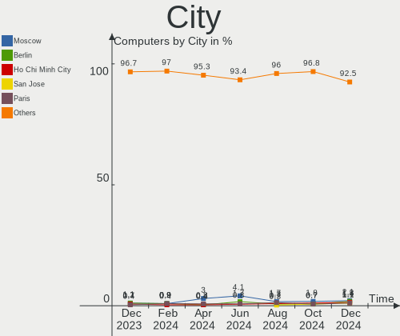

| City                 | Computers | Percent |
|----------------------|-----------|---------|
| Melbourne            | 11        | 5.7%    |
| Moscow               | 8         | 4.15%   |
| Paris                | 6         | 3.11%   |
| Milan                | 3         | 1.55%   |
| Helsinki             | 3         | 1.55%   |
| Dublin               | 3         | 1.55%   |
| Stuttgart            | 2         | 1.04%   |
| St Petersburg        | 2         | 1.04%   |
| Reggio Calabria      | 2         | 1.04%   |
| Mesa                 | 2         | 1.04%   |
| Matteson             | 2         | 1.04%   |
| Madrid               | 2         | 1.04%   |
| Lisbon               | 2         | 1.04%   |
| Krasnodar            | 2         | 1.04%   |
| Istanbul             | 2         | 1.04%   |
| Central              | 2         | 1.04%   |
| Berlin               | 2         | 1.04%   |
| Baku                 | 2         | 1.04%   |
| Auckland             | 2         | 1.04%   |
| Amsterdam            | 2         | 1.04%   |
| Zagreb               | 1         | 0.52%   |
| Wiekszyce            | 1         | 0.52%   |
| Wausau               | 1         | 0.52%   |
| Warsaw               | 1         | 0.52%   |
| Vyara                | 1         | 0.52%   |
| Votorantim           | 1         | 0.52%   |
| Vittuone             | 1         | 0.52%   |
| Vienna               | 1         | 0.52%   |
| Victoria             | 1         | 0.52%   |
| Veruno               | 1         | 0.52%   |
| Valencia             | 1         | 0.52%   |
| Utica                | 1         | 0.52%   |
| Ulyanovsk            | 1         | 0.52%   |
| Ulan-Ude             | 1         | 0.52%   |
| Uberlândia          | 1         | 0.52%   |
| Turin                | 1         | 0.52%   |
| Tulcea               | 1         | 0.52%   |
| Trostberg an der Alz | 1         | 0.52%   |
| Trebon               | 1         | 0.52%   |
| Tamil Nadu           | 1         | 0.52%   |

Drives
------

Drive Vendor
------------

Hard drive vendors

| Vendor                         | Computers | Drives | Percent |
|--------------------------------|-----------|--------|---------|
| Samsung Electronics            | 65        | 91     | 20.5%   |
| Seagate                        | 27        | 35     | 8.52%   |
| WDC                            | 26        | 41     | 8.2%    |
| SanDisk                        | 23        | 25     | 7.26%   |
| Kingston                       | 19        | 21     | 5.99%   |
| Crucial                        | 17        | 19     | 5.36%   |
| Toshiba                        | 14        | 17     | 4.42%   |
| SK hynix                       | 14        | 14     | 4.42%   |
| Phison Electronics             | 12        | 12     | 3.79%   |
| Intel                          | 10        | 14     | 3.15%   |
| Micron Technology              | 8         | 8      | 2.52%   |
| Unknown                        | 7         | 8      | 2.21%   |
| Micron/Crucial Technology      | 6         | 6      | 1.89%   |
| ADATA Technology               | 5         | 6      | 1.58%   |
| A-DATA Technology              | 5         | 5      | 1.58%   |
| Realtek Semiconductor          | 4         | 4      | 1.26%   |
| KIOXIA                         | 4         | 4      | 1.26%   |
| Kingston Technology Company    | 4         | 4      | 1.26%   |
| HGST                           | 4         | 7      | 1.26%   |
| China                          | 4         | 4      | 1.26%   |
| Team                           | 3         | 3      | 0.95%   |
| SPCC                           | 3         | 3      | 0.95%   |
| PNY                            | 3         | 4      | 0.95%   |
| Hitachi                        | 3         | 3      | 0.95%   |
| TO Exter                       | 2         | 2      | 0.63%   |
| Silicon Motion                 | 2         | 2      | 0.63%   |
| Lenovo                         | 2         | 2      | 0.63%   |
| JMicron Technology             | 2         | 2      | 0.63%   |
| GOODRAM                        | 2         | 2      | 0.63%   |
| Unknown                        | 2         | 3      | 0.63%   |
| YS                             | 1         | 1      | 0.32%   |
| XPG                            | 1         | 1      | 0.32%   |
| Verbatim                       | 1         | 1      | 0.32%   |
| Solid State Storage Technology | 1         | 1      | 0.32%   |
| OCZ                            | 1         | 1      | 0.32%   |
| Mushkin                        | 1         | 1      | 0.32%   |
| Lexar                          | 1         | 1      | 0.32%   |
| LaCie                          | 1         | 1      | 0.32%   |
| IBM-ESXS                       | 1         | 8      | 0.32%   |
| HGST HTS                       | 1         | 1      | 0.32%   |

Drive Model
-----------

Hard drive models

| Model                                                           | Computers | Percent |
|-----------------------------------------------------------------|-----------|---------|
| Samsung NVMe SSD Controller SM981/PM981/PM983 500GB             | 19        | 5.38%   |
| Samsung NVMe SSD Controller PM9A1/PM9A3/980PRO 2TB              | 8         | 2.27%   |
| Kingston SA400S37240G 240GB SSD                                 | 7         | 1.98%   |
| Sandisk WD Black SN750 / PC SN730 NVMe SSD 512GB                | 6         | 1.7%    |
| Phison E12 NVMe Controller 1TB                                  | 5         | 1.42%   |
| ADATA XPG SX8200 Pro PCIe Gen3x4 M.2 2280 Solid State Drive 1TB | 5         | 1.42%   |
| SK hynix BC501 NVMe Solid State Drive 512GB                     | 4         | 1.13%   |
| Samsung SSD 850 EVO 250GB                                       | 4         | 1.13%   |
| Phison PS5013 E13 NVMe Controller 512GB                         | 4         | 1.13%   |
| Micron/Crucial P2 NVMe PCIe SSD 500GB                           | 4         | 1.13%   |
| Intel SSD 660P Series 1024GB                                    | 4         | 1.13%   |
| Unknown MMC Card  32GB                                          | 3         | 0.85%   |
| Seagate ST1000LM035-1RK172 1TB                                  | 3         | 0.85%   |
| Sandisk WD Blue SN500 / PC SN520 NVMe SSD 256GB                 | 3         | 0.85%   |
| Sandisk WD Black SN850 1TB                                      | 3         | 0.85%   |
| Samsung SSD 980 1TB                                             | 3         | 0.85%   |
| Samsung SSD 860 QVO 1TB                                         | 3         | 0.85%   |
| Realtek RTS5763DL NVMe SSD Controller 512GB                     | 3         | 0.85%   |
| Kingston SA400S37120G 120GB SSD                                 | 3         | 0.85%   |
| Crucial CT1000MX500SSD1 1TB                                     | 3         | 0.85%   |
| WDC WD30EFRX-68EUZN0 3TB                                        | 2         | 0.57%   |
| WDC WD20EZBX-00AYRA0 2TB                                        | 2         | 0.57%   |
| WDC WD10EZEX-75WN4A1 1TB                                        | 2         | 0.57%   |
| WDC WD10EZEX-08WN4A0 1TB                                        | 2         | 0.57%   |
| WDC WD1003FZEX-00MK2A0 1TB                                      | 2         | 0.57%   |
| Toshiba XG6 NVMe SSD Controller 256GB                           | 2         | 0.57%   |
| Toshiba MQ04ABF100 1TB                                          | 2         | 0.57%   |
| Toshiba DT01ACA300 3TB                                          | 2         | 0.57%   |
| TO Exter nal USB 3.0 512GB                                      | 2         | 0.57%   |
| SPCC Solid State Disk 512GB                                     | 2         | 0.57%   |
| SK hynix HFM001TD3JX013N 1TB                                    | 2         | 0.57%   |
| Seagate ST500DM002-1BD142 500GB                                 | 2         | 0.57%   |
| Seagate ST1000LM024 HN-M101MBB 1TB                              | 2         | 0.57%   |
| Seagate ST1000DM010-2EP102 1TB                                  | 2         | 0.57%   |
| Sandisk WD Blue SN550 NVMe SSD 500GB                            | 2         | 0.57%   |
| Samsung SSD 860 EVO 500GB                                       | 2         | 0.57%   |
| Samsung SSD 860 EVO 250GB                                       | 2         | 0.57%   |
| Samsung SSD 860 EVO 1TB                                         | 2         | 0.57%   |
| Samsung SSD 850 EVO 500GB                                       | 2         | 0.57%   |
| Samsung SSD 840 EVO 120GB                                       | 2         | 0.57%   |

HDD Vendor
----------

Hard disk drive vendors

| Vendor              | Computers | Drives | Percent |
|---------------------|-----------|--------|---------|
| WDC                 | 25        | 39     | 36.76%  |
| Seagate             | 23        | 31     | 33.82%  |
| Toshiba             | 8         | 11     | 11.76%  |
| HGST                | 4         | 7      | 5.88%   |
| Hitachi             | 3         | 3      | 4.41%   |
| Unknown             | 1         | 1      | 1.47%   |
| Samsung Electronics | 1         | 1      | 1.47%   |
| HGST HTS            | 1         | 1      | 1.47%   |
| ASMT                | 1         | 1      | 1.47%   |
| Apple               | 1         | 1      | 1.47%   |

SSD Vendor
----------

Solid state drive vendors

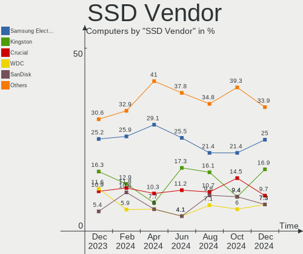

| Vendor              | Computers | Drives | Percent |
|---------------------|-----------|--------|---------|
| Samsung Electronics | 24        | 34     | 24.24%  |
| Kingston            | 17        | 19     | 17.17%  |
| Crucial             | 15        | 17     | 15.15%  |
| SanDisk             | 6         | 7      | 6.06%   |
| A-DATA Technology   | 5         | 5      | 5.05%   |
| China               | 4         | 4      | 4.04%   |
| Toshiba             | 3         | 3      | 3.03%   |
| Team                | 3         | 3      | 3.03%   |
| PNY                 | 3         | 4      | 3.03%   |
| WDC                 | 2         | 2      | 2.02%   |
| TO Exter            | 2         | 2      | 2.02%   |
| SPCC                | 2         | 2      | 2.02%   |
| GOODRAM             | 2         | 2      | 2.02%   |
| YS                  | 1         | 1      | 1.01%   |
| Verbatim            | 1         | 1      | 1.01%   |
| OCZ                 | 1         | 1      | 1.01%   |
| Mushkin             | 1         | 1      | 1.01%   |
| Lexar               | 1         | 1      | 1.01%   |
| JMicron Technology  | 1         | 1      | 1.01%   |
| Intel               | 1         | 1      | 1.01%   |
| Hewlett-Packard     | 1         | 1      | 1.01%   |
| Fujitsu             | 1         | 1      | 1.01%   |
| Emtec               | 1         | 1      | 1.01%   |
| Unknown             | 1         | 2      | 1.01%   |

Drive Kind
----------

HDD or SSD

| Kind    | Computers | Drives | Percent |
|---------|-----------|--------|---------|
| NVMe    | 131       | 162    | 46.29%  |
| SSD     | 78        | 116    | 27.56%  |
| HDD     | 63        | 96     | 22.26%  |
| MMC     | 6         | 7      | 2.12%   |
| Unknown | 5         | 12     | 1.77%   |

Drive Connector
---------------

SATA, SAS, NVMe, etc.

| Type | Computers | Drives | Percent |
|------|-----------|--------|---------|
| NVMe | 131       | 162    | 52.19%  |
| SATA | 104       | 206    | 41.43%  |
| SAS  | 10        | 18     | 3.98%   |
| MMC  | 6         | 7      | 2.39%   |

Drive Size
----------

Size of hard drive

| Size in TB | Computers | Drives | Percent |
|------------|-----------|--------|---------|
| 0.01-0.5   | 70        | 95     | 45.45%  |
| 0.51-1.0   | 52        | 64     | 33.77%  |
| 1.01-2.0   | 15        | 23     | 9.74%   |
| 3.01-4.0   | 6         | 10     | 3.9%    |
| 2.01-3.0   | 6         | 10     | 3.9%    |
| 4.01-10.0  | 5         | 10     | 3.25%   |

Space Total
-----------

Amount of disk space available on the file system

| Size in GB     | Computers | Percent |
|----------------|-----------|---------|
| 251-500        | 48        | 24.87%  |
| 101-250        | 35        | 18.13%  |
| 1001-2000      | 27        | 13.99%  |
| 501-1000       | 26        | 13.47%  |
| More than 3000 | 25        | 12.95%  |
| 1-20           | 11        | 5.7%    |
| 51-100         | 9         | 4.66%   |
| Unknown        | 7         | 3.63%   |
| 2001-3000      | 4         | 2.07%   |
| 21-50          | 1         | 0.52%   |

Space Used
----------

Amount of used disk space

| Used GB        | Computers | Percent |
|----------------|-----------|---------|
| 1-20           | 40        | 20.73%  |
| 101-250        | 32        | 16.58%  |
| 21-50          | 29        | 15.03%  |
| 251-500        | 28        | 14.51%  |
| 51-100         | 17        | 8.81%   |
| 501-1000       | 15        | 7.77%   |
| 1001-2000      | 11        | 5.7%    |
| More than 3000 | 9         | 4.66%   |
| Unknown        | 7         | 3.63%   |
| 2001-3000      | 5         | 2.59%   |

Malfunc. Drives
---------------

Drive models with a malfunction

| Model                                                     | Computers | Drives | Percent |
|-----------------------------------------------------------|-----------|--------|---------|
| Realtek Semiconductor RTS5763DL NVMe SSD Controller 512GB | 2         | 2      | 12.5%   |
| WDC WD40EFRX-68N32N0 4TB                                  | 1         | 1      | 6.25%   |
| WDC WD20SPZX-00CRAT0 2TB                                  | 1         | 1      | 6.25%   |
| WDC WD10SPZX-24Z10T0 1TB                                  | 1         | 1      | 6.25%   |
| WDC WD10EZEX-08WN4A0 1TB                                  | 1         | 1      | 6.25%   |
| WDC WD10EZEX-08M2NA0 1TB                                  | 1         | 1      | 6.25%   |
| Toshiba MK2035GSS 200GB                                   | 1         | 1      | 6.25%   |
| Toshiba DT01ACA300 3TB                                    | 1         | 1      | 6.25%   |
| Seagate ST500DM002-1BD142 500GB                           | 1         | 1      | 6.25%   |
| Seagate ST2000DM008-2FR102 2TB                            | 1         | 1      | 6.25%   |
| Seagate ST1000DM010-2EP102 1TB                            | 1         | 1      | 6.25%   |
| Samsung Electronics SSD 980 1TB                           | 1         | 1      | 6.25%   |
| Samsung Electronics SSD 840 PRO Series 512GB              | 1         | 1      | 6.25%   |
| Kingston SV300S37A120G 120GB SSD                          | 1         | 1      | 6.25%   |
| A-DATA Technology SU650 240GB SSD                         | 1         | 1      | 6.25%   |

Malfunc. Drive Vendor
---------------------

Vendors of faulty drives

| Vendor                | Computers | Drives | Percent |
|-----------------------|-----------|--------|---------|
| WDC                   | 3         | 5      | 23.08%  |
| Toshiba               | 2         | 2      | 15.38%  |
| Seagate               | 2         | 3      | 15.38%  |
| Samsung Electronics   | 2         | 2      | 15.38%  |
| Realtek Semiconductor | 2         | 2      | 15.38%  |
| Kingston              | 1         | 1      | 7.69%   |
| A-DATA Technology     | 1         | 1      | 7.69%   |

Malfunc. HDD Vendor
-------------------

Vendors of faulty HDD drives

| Vendor  | Computers | Drives | Percent |
|---------|-----------|--------|---------|
| WDC     | 3         | 5      | 42.86%  |
| Toshiba | 2         | 2      | 28.57%  |
| Seagate | 2         | 3      | 28.57%  |

Malfunc. Drive Kind
-------------------

Kinds of faulty drives

| Kind | Computers | Drives | Percent |
|------|-----------|--------|---------|
| HDD  | 7         | 10     | 53.85%  |
| NVMe | 3         | 3      | 23.08%  |
| SSD  | 3         | 3      | 23.08%  |

Failed Drives
-------------

Failed drive models

Zero info for selected period =(

Failed Drive Vendor
-------------------

Failed drive vendors

Zero info for selected period =(

Drive Status
------------

Number of failed and malfunc. drives

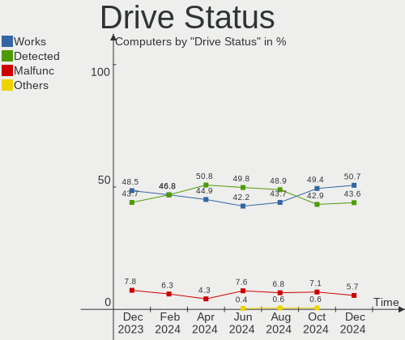

| Status   | Computers | Drives | Percent |
|----------|-----------|--------|---------|
| Detected | 97        | 179    | 47.09%  |
| Works    | 96        | 198    | 46.6%   |
| Malfunc  | 13        | 16     | 6.31%   |

Storage controller
------------------

Storage Vendor
--------------

Storage controller vendors

| Vendor                         | Computers | Percent |
|--------------------------------|-----------|---------|
| Intel                          | 90        | 29.61%  |
| AMD                            | 57        | 18.75%  |
| Samsung Electronics            | 48        | 15.79%  |
| SanDisk                        | 17        | 5.59%   |
| SK hynix                       | 14        | 4.61%   |
| Phison Electronics             | 13        | 4.28%   |
| Micron Technology              | 9         | 2.96%   |
| Micron/Crucial Technology      | 7         | 2.3%    |
| ASMedia Technology             | 7         | 2.3%    |
| Kingston Technology Company    | 6         | 1.97%   |
| Broadcom / LSI                 | 6         | 1.97%   |
| ADATA Technology               | 6         | 1.97%   |
| Realtek Semiconductor          | 4         | 1.32%   |
| KIOXIA                         | 4         | 1.32%   |
| Toshiba America Info Systems   | 3         | 0.99%   |
| Seagate Technology             | 3         | 0.99%   |
| Marvell Technology Group       | 3         | 0.99%   |
| Silicon Motion                 | 2         | 0.66%   |
| Lenovo                         | 2         | 0.66%   |
| Solid State Storage Technology | 1         | 0.33%   |
| JMicron Technology             | 1         | 0.33%   |
| Adaptec                        | 1         | 0.33%   |

Storage Model
-------------

Storage controller models

| Model                                                                          | Computers | Percent |
|--------------------------------------------------------------------------------|-----------|---------|
| AMD FCH SATA Controller [AHCI mode]                                            | 37        | 11.14%  |
| Samsung NVMe SSD Controller SM981/PM981/PM983                                  | 20        | 6.02%   |
| Samsung NVMe SSD Controller 980                                                | 15        | 4.52%   |
| Intel Volume Management Device NVMe RAID Controller                            | 13        | 3.92%   |
| AMD 500 Series Chipset SATA Controller                                         | 10        | 3.01%   |
| AMD 400 Series Chipset SATA Controller                                         | 10        | 3.01%   |
| Samsung NVMe SSD Controller PM9A1/PM9A3/980PRO                                 | 9         | 2.71%   |
| Micron Non-Volatile memory controller                                          | 9         | 2.71%   |
| Intel 82801 Mobile SATA Controller [RAID mode]                                 | 8         | 2.41%   |
| SanDisk WD Black SN750 / PC SN730 NVMe SSD                                     | 6         | 1.81%   |
| Phison E12 NVMe Controller                                                     | 6         | 1.81%   |
| Intel Sunrise Point-LP SATA Controller [AHCI mode]                             | 6         | 1.81%   |
| Intel 8 Series/C220 Series Chipset Family 6-port SATA Controller 1 [AHCI mode] | 6         | 1.81%   |
| ASMedia ASM1062 Serial ATA Controller                                          | 6         | 1.81%   |
| ADATA XPG SX8200 Pro PCIe Gen3x4 M.2 2280 Solid State Drive                    | 6         | 1.81%   |
| SK hynix Gold P31/PC711 NVMe Solid State Drive                                 | 5         | 1.51%   |
| Micron/Crucial P2 NVMe PCIe SSD                                                | 5         | 1.51%   |
| Intel Q170/Q150/B150/H170/H110/Z170/CM236 Chipset SATA Controller [AHCI Mode]  | 5         | 1.51%   |
| SK hynix Non-Volatile memory controller                                        | 4         | 1.2%    |
| SK hynix BC501 NVMe Solid State Drive                                          | 4         | 1.2%    |
| SanDisk WD PC SN810 / Black SN850 NVMe SSD                                     | 4         | 1.2%    |
| Phison PS5013 E13 NVMe Controller                                              | 4         | 1.2%    |
| Intel Tiger Lake-LP SATA Controller                                            | 4         | 1.2%    |
| Intel SSD 660P Series                                                          | 4         | 1.2%    |
| AMD SATA controller                                                            | 4         | 1.2%    |
| SanDisk WD Blue SN500 / PC SN520 NVMe SSD                                      | 3         | 0.9%    |
| Realtek RTS5763DL NVMe SSD Controller                                          | 3         | 0.9%    |
| KIOXIA NVMe SSD Controller BG4                                                 | 3         | 0.9%    |
| Kingston Company Company Non-Volatile memory controller                        | 3         | 0.9%    |
| Intel Non-Volatile memory controller                                           | 3         | 0.9%    |
| Intel HM170/QM170 Chipset SATA Controller [AHCI Mode]                          | 3         | 0.9%    |
| Intel Alder Lake-S PCH SATA Controller [AHCI Mode]                             | 3         | 0.9%    |
| Intel 82801IBM/IEM (ICH9M/ICH9M-E) 4 port SATA Controller [AHCI mode]          | 3         | 0.9%    |
| Intel 8 Series SATA Controller 1 [AHCI mode]                                   | 3         | 0.9%    |
| Intel 7 Series Chipset Family 6-port SATA Controller [AHCI mode]               | 3         | 0.9%    |
| Intel 6 Series/C200 Series Chipset Family 6 port Desktop SATA AHCI Controller  | 3         | 0.9%    |
| Intel 5 Series/3400 Series Chipset 4 port SATA AHCI Controller                 | 3         | 0.9%    |
| Broadcom / LSI SAS2008 PCI-Express Fusion-MPT SAS-2 [Falcon]                   | 3         | 0.9%    |
| AMD SB7x0/SB8x0/SB9x0 SATA Controller [AHCI mode]                              | 3         | 0.9%    |
| Toshiba America Info Systems XG6 NVMe SSD Controller                           | 2         | 0.6%    |

Storage Kind
------------

Kind of storage controller (IDE, SATA, NVMe, SAS, ...)

| Kind | Computers | Percent |
|------|-----------|---------|
| NVMe | 131       | 45.8%   |
| SATA | 117       | 40.91%  |
| RAID | 25        | 8.74%   |
| IDE  | 8         | 2.8%    |
| SAS  | 5         | 1.75%   |

Processor
---------

CPU Vendor
----------

Processor vendors

| Vendor | Computers | Percent |
|--------|-----------|---------|
| Intel  | 116       | 60.1%   |
| AMD    | 77        | 39.9%   |

CPU Model
---------

Processor models

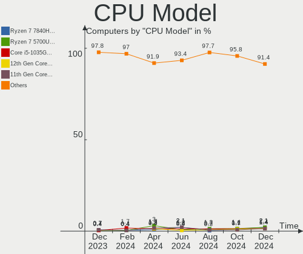

| Model                                         | Computers | Percent |
|-----------------------------------------------|-----------|---------|
| AMD Ryzen 5 5500U with Radeon Graphics        | 6         | 3.11%   |
| Intel Core i7-8565U CPU @ 1.80GHz             | 5         | 2.59%   |
| Intel 11th Gen Core i5-1135G7 @ 2.40GHz       | 5         | 2.59%   |
| AMD Ryzen 5 3600 6-Core Processor             | 5         | 2.59%   |
| AMD Ryzen 5 3500U with Radeon Vega Mobile Gfx | 5         | 2.59%   |
| Intel 12th Gen Core i7-12700H                 | 4         | 2.07%   |
| AMD Ryzen 9 7950X 16-Core Processor           | 4         | 2.07%   |
| AMD Ryzen 9 3900X 12-Core Processor           | 4         | 2.07%   |
| AMD Ryzen 7 3700X 8-Core Processor            | 4         | 2.07%   |
| Intel Core i7-8550U CPU @ 1.80GHz             | 3         | 1.55%   |
| Intel Core i7-1065G7 CPU @ 1.30GHz            | 3         | 1.55%   |
| Intel Core i5-8250U CPU @ 1.60GHz             | 3         | 1.55%   |
| Intel Core i5-7400 CPU @ 3.00GHz              | 3         | 1.55%   |
| AMD Ryzen 7 5800X 8-Core Processor            | 3         | 1.55%   |
| AMD Ryzen 7 4800H with Radeon Graphics        | 3         | 1.55%   |
| AMD Ryzen 5 5600U with Radeon Graphics        | 3         | 1.55%   |
| AMD Ryzen 5 3550H with Radeon Vega Mobile Gfx | 3         | 1.55%   |
| Intel Core i7-8700 CPU @ 3.20GHz              | 2         | 1.04%   |
| Intel Core i7-7700HQ CPU @ 2.80GHz            | 2         | 1.04%   |
| Intel Core i7-2600K CPU @ 3.40GHz             | 2         | 1.04%   |
| Intel Core i7-10750H CPU @ 2.60GHz            | 2         | 1.04%   |
| Intel Core i5-7200U CPU @ 2.50GHz             | 2         | 1.04%   |
| Intel Core i5-10210U CPU @ 1.60GHz            | 2         | 1.04%   |
| Intel Celeron CPU 847 @ 1.10GHz               | 2         | 1.04%   |
| Intel 12th Gen Core i5-12500H                 | 2         | 1.04%   |
| Intel 12th Gen Core i5-1235U                  | 2         | 1.04%   |
| Intel 11th Gen Core i7-11800H @ 2.30GHz       | 2         | 1.04%   |
| AMD Ryzen 9 5900X 12-Core Processor           | 2         | 1.04%   |
| AMD Ryzen 7 5700U with Radeon Graphics        | 2         | 1.04%   |
| AMD Ryzen 5 5500                              | 2         | 1.04%   |
| Intel Xeon CPU X5687 @ 3.60GHz                | 1         | 0.52%   |
| Intel Xeon CPU X5650 @ 2.67GHz                | 1         | 0.52%   |
| Intel Xeon CPU X5470 @ 3.33GHz                | 1         | 0.52%   |
| Intel Xeon CPU E5640 @ 2.67GHz                | 1         | 0.52%   |
| Intel Xeon CPU E5-2650 v2 @ 2.60GHz           | 1         | 0.52%   |
| Intel Xeon CPU E3-1230 v3 @ 3.30GHz           | 1         | 0.52%   |
| Intel Xeon CPU E3-1230 V2 @ 3.30GHz           | 1         | 0.52%   |
| Intel Pentium CPU J4205 @ 1.50GHz             | 1         | 0.52%   |
| Intel Genuine CPU 575 @ 2.00GHz               | 1         | 0.52%   |
| Intel Core i9-10885H CPU @ 2.40GHz            | 1         | 0.52%   |

CPU Model Family
----------------

Processor model prefix

| Model                   | Computers | Percent |
|-------------------------|-----------|---------|
| Other                   | 31        | 16.06%  |
| Intel Core i7           | 31        | 16.06%  |
| AMD Ryzen 5             | 30        | 15.54%  |
| Intel Core i5           | 24        | 12.44%  |
| AMD Ryzen 7             | 22        | 11.4%   |
| AMD Ryzen 9             | 13        | 6.74%   |
| Intel Core i3           | 11        | 5.7%    |
| Intel Xeon              | 7         | 3.63%   |
| Intel Celeron           | 5         | 2.59%   |
| AMD Ryzen 3             | 3         | 1.55%   |
| Intel Atom              | 2         | 1.04%   |
| AMD Ryzen 7 PRO         | 2         | 1.04%   |
| AMD FX                  | 2         | 1.04%   |
| Intel Pentium           | 1         | 0.52%   |
| Intel Genuine           | 1         | 0.52%   |
| Intel Core i9           | 1         | 0.52%   |
| Intel Core 2 Duo        | 1         | 0.52%   |
| Intel Celeron Dual-Core | 1         | 0.52%   |
| AMD Ryzen Threadripper  | 1         | 0.52%   |
| AMD Ryzen 5 PRO         | 1         | 0.52%   |
| AMD G                   | 1         | 0.52%   |
| AMD Athlon              | 1         | 0.52%   |
| AMD A8                  | 1         | 0.52%   |

CPU Cores
---------

Number of processor cores

| Number | Computers | Percent |
|--------|-----------|---------|
| 4      | 68        | 35.23%  |
| 8      | 33        | 17.1%   |
| 6      | 33        | 17.1%   |
| 2      | 30        | 15.54%  |
| 12     | 12        | 6.22%   |
| 16     | 5         | 2.59%   |
| 14     | 5         | 2.59%   |
| 10     | 5         | 2.59%   |
| 24     | 1         | 0.52%   |
| 1      | 1         | 0.52%   |

CPU Sockets
-----------

Number of sockets

| Number | Computers | Percent |
|--------|-----------|---------|
| 1      | 189       | 97.93%  |
| 2      | 4         | 2.07%   |

CPU Threads
-----------

Threads per core (Hyper-Threading)

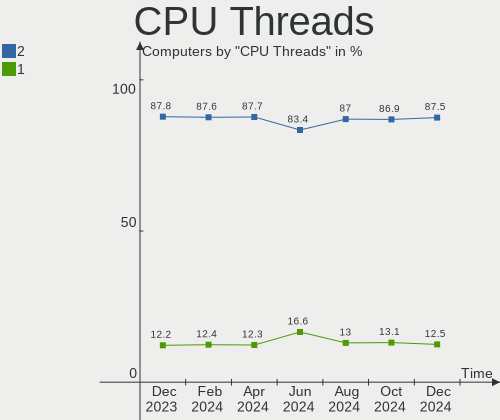

| Number | Computers | Percent |
|--------|-----------|---------|
| 2      | 164       | 84.97%  |
| 1      | 29        | 15.03%  |

CPU Op-Modes
------------

CPU Operation Modes (32-bit, 64-bit)

| Op mode        | Computers | Percent |
|----------------|-----------|---------|
| 32-bit, 64-bit | 193       | 100%    |

CPU Microcode
-------------

Microcode number

| Number     | Computers | Percent |
|------------|-----------|---------|
| Unknown    | 84        | 43.52%  |
| 0x906a3    | 6         | 3.11%   |
| 0x806c1    | 6         | 3.11%   |
| 0x806ea    | 5         | 2.59%   |
| 0x0a50000d | 5         | 2.59%   |
| 0x08701021 | 5         | 2.59%   |
| 0x08108109 | 5         | 2.59%   |
| 0x906e9    | 4         | 2.07%   |
| 0x706e5    | 4         | 2.07%   |
| 0x206a7    | 4         | 2.07%   |
| 0x0a601203 | 4         | 2.07%   |
| 0x806ec    | 3         | 1.55%   |
| 0x0a20120a | 3         | 1.55%   |
| 0x08108102 | 3         | 1.55%   |
| 0xa0652    | 2         | 1.04%   |
| 0x906ea    | 2         | 1.04%   |
| 0x90672    | 2         | 1.04%   |
| 0x806e9    | 2         | 1.04%   |
| 0x806d1    | 2         | 1.04%   |
| 0x506e3    | 2         | 1.04%   |
| 0x406c4    | 2         | 1.04%   |
| 0x40651    | 2         | 1.04%   |
| 0x20652    | 2         | 1.04%   |
| 0x1067a    | 2         | 1.04%   |
| 0x0a50000c | 2         | 1.04%   |
| 0x0a404102 | 2         | 1.04%   |
| 0x0a201016 | 2         | 1.04%   |
| 0x08701013 | 2         | 1.04%   |
| 0x08608103 | 2         | 1.04%   |
| 0x08001138 | 2         | 1.04%   |
| 0x06000822 | 2         | 1.04%   |
| 0xb0671    | 1         | 0.52%   |
| 0xa0653    | 1         | 0.52%   |
| 0x906a4    | 1         | 0.52%   |
| 0x706a8    | 1         | 0.52%   |
| 0x6fd      | 1         | 0.52%   |
| 0x506c9    | 1         | 0.52%   |
| 0x306c3    | 1         | 0.52%   |
| 0x306a9    | 1         | 0.52%   |
| 0x30678    | 1         | 0.52%   |

CPU Microarch
-------------

Microarchitecture

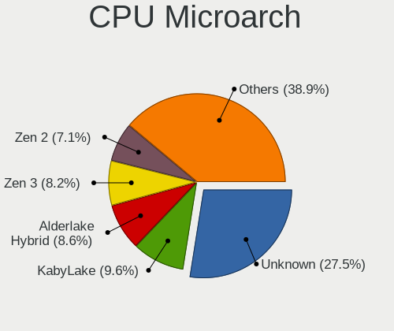

| Name             | Computers | Percent |
|------------------|-----------|---------|
| KabyLake         | 31        | 16.06%  |
| Unknown          | 23        | 11.92%  |
| Zen 2            | 21        | 10.88%  |
| Zen 3            | 20        | 10.36%  |
| TigerLake        | 13        | 6.74%   |
| Zen+             | 12        | 6.22%   |
| Alderlake Hybrid | 10        | 5.18%   |
| Haswell          | 9         | 4.66%   |
| SandyBridge      | 8         | 4.15%   |
| Westmere         | 7         | 3.63%   |
| CometLake        | 6         | 3.11%   |
| Skylake          | 5         | 2.59%   |
| IceLake          | 5         | 2.59%   |
| IvyBridge        | 4         | 2.07%   |
| Zen              | 3         | 1.55%   |
| Silvermont       | 3         | 1.55%   |
| Penryn           | 3         | 1.55%   |
| Piledriver       | 2         | 1.04%   |
| Goldmont         | 2         | 1.04%   |
| Puma             | 1         | 0.52%   |
| Nehalem          | 1         | 0.52%   |
| Jaguar           | 1         | 0.52%   |
| Goldmont plus    | 1         | 0.52%   |
| Core             | 1         | 0.52%   |
| Bobcat           | 1         | 0.52%   |

Graphics
--------

GPU Vendor
----------

Vendors of graphics cards

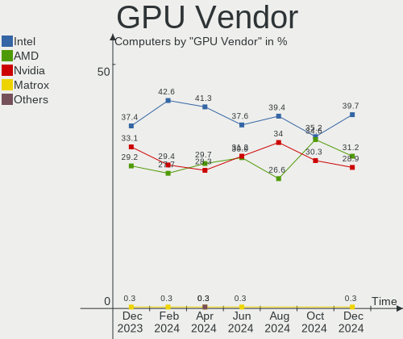

| Vendor                     | Computers | Percent |
|----------------------------|-----------|---------|
| Intel                      | 95        | 39.58%  |
| Nvidia                     | 70        | 29.17%  |
| AMD                        | 70        | 29.17%  |
| Matrox Electronics Systems | 5         | 2.08%   |

GPU Model
---------

Graphics card models

| Model                                                                       | Computers | Percent |
|-----------------------------------------------------------------------------|-----------|---------|
| Intel TigerLake-LP GT2 [Iris Xe Graphics]                                   | 10        | 4.03%   |
| AMD Picasso/Raven 2 [Radeon Vega Series / Radeon Vega Mobile Series]        | 10        | 4.03%   |
| AMD Cezanne [Radeon Vega Series / Radeon Vega Mobile Series]                | 10        | 4.03%   |
| Intel Alder Lake-P Integrated Graphics Controller                           | 8         | 3.23%   |
| AMD Lucienne                                                                | 8         | 3.23%   |
| Intel UHD Graphics 620                                                      | 7         | 2.82%   |
| AMD Ellesmere [Radeon RX 470/480/570/570X/580/580X/590]                     | 7         | 2.82%   |
| Intel WhiskeyLake-U GT2 [UHD Graphics 620]                                  | 6         | 2.42%   |
| AMD Renoir                                                                  | 6         | 2.42%   |
| Nvidia GA106M [GeForce RTX 3060 Mobile / Max-Q]                             | 5         | 2.02%   |
| Intel HD Graphics 630                                                       | 5         | 2.02%   |
| Intel CometLake-H GT2 [UHD Graphics]                                        | 5         | 2.02%   |
| AMD Navi 10 [Radeon RX 5600 OEM/5600 XT / 5700/5700 XT]                     | 5         | 2.02%   |
| AMD Raphael                                                                 | 4         | 1.61%   |
| Nvidia GP107 [GeForce GTX 1050 Ti]                                          | 3         | 1.21%   |
| Intel Xeon E3-1200 v3/4th Gen Core Processor Integrated Graphics Controller | 3         | 1.21%   |
| Intel Iris Plus Graphics G7                                                 | 3         | 1.21%   |
| Intel HD Graphics 620                                                       | 3         | 1.21%   |
| Intel Haswell-ULT Integrated Graphics Controller                            | 3         | 1.21%   |
| Intel Core Processor Integrated Graphics Controller                         | 3         | 1.21%   |
| Intel CometLake-U GT2 [UHD Graphics]                                        | 3         | 1.21%   |
| Intel 2nd Generation Core Processor Family Integrated Graphics Controller   | 3         | 1.21%   |
| AMD Rembrandt [Radeon 680M]                                                 | 3         | 1.21%   |
| AMD Navi 23 [Radeon RX 6600/6600 XT/6600M]                                  | 3         | 1.21%   |
| Nvidia TU117M [GeForce GTX 1650 Ti Mobile]                                  | 2         | 0.81%   |
| Nvidia TU117M [GeForce GTX 1650 Mobile / Max-Q]                             | 2         | 0.81%   |
| Nvidia TU116 [GeForce GTX 1660 SUPER]                                       | 2         | 0.81%   |
| Nvidia TU104 [GeForce RTX 2070 SUPER]                                       | 2         | 0.81%   |
| Nvidia GP107M [GeForce GTX 1050 Mobile]                                     | 2         | 0.81%   |
| Nvidia GP104 [GeForce GTX 1070]                                             | 2         | 0.81%   |
| Nvidia GK106 [GeForce GTX 660]                                              | 2         | 0.81%   |
| Nvidia GA107M [GeForce RTX 3050 Ti Mobile]                                  | 2         | 0.81%   |
| Nvidia GA104M [GeForce RTX 3080 Mobile / Max-Q 8GB/16GB]                    | 2         | 0.81%   |
| Nvidia GA104 [GeForce RTX 3070]                                             | 2         | 0.81%   |
| Matrox Electronics Systems MGA G200eW WPCM450                               | 2         | 0.81%   |
| Intel TigerLake-H GT1 [UHD Graphics]                                        | 2         | 0.81%   |
| Intel Tiger Lake-LP GT2 [UHD Graphics G4]                                   | 2         | 0.81%   |
| Intel Skylake GT2 [HD Graphics 520]                                         | 2         | 0.81%   |
| Intel Mobile 4 Series Chipset Integrated Graphics Controller                | 2         | 0.81%   |
| Intel HD Graphics 530                                                       | 2         | 0.81%   |

GPU Combo
---------

Combinations of graphics cards

| Name            | Computers | Percent |
|-----------------|-----------|---------|
| 1 x Intel       | 57        | 29.53%  |
| 1 x AMD         | 52        | 26.94%  |
| Intel + Nvidia  | 32        | 16.58%  |
| 1 x Nvidia      | 24        | 12.44%  |
| AMD + Nvidia    | 10        | 5.18%   |
| 2 x AMD         | 5         | 2.59%   |
| 1 x Matrox      | 4         | 2.07%   |
| 2 x Nvidia      | 3         | 1.55%   |
| Intel + AMD     | 3         | 1.55%   |
| 2 x Intel       | 2         | 1.04%   |
| Nvidia + Matrox | 1         | 0.52%   |

GPU Driver
----------

Free vs proprietary

| Driver      | Computers | Percent |
|-------------|-----------|---------|
| Free        | 139       | 72.02%  |
| Proprietary | 52        | 26.94%  |
| Unknown     | 2         | 1.04%   |

GPU Memory
----------

Total video memory

| Size in GB | Computers | Percent |
|------------|-----------|---------|
| Unknown    | 128       | 66.32%  |
| 7.01-8.0   | 19        | 9.84%   |
| 1.01-2.0   | 13        | 6.74%   |
| 0.01-0.5   | 13        | 6.74%   |
| 3.01-4.0   | 7         | 3.63%   |
| 5.01-6.0   | 6         | 3.11%   |
| 8.01-16.0  | 4         | 2.07%   |
| 0.51-1.0   | 2         | 1.04%   |
| 2.01-3.0   | 1         | 0.52%   |

Monitor
-------

Monitor Vendor
--------------

Monitor vendors

| Vendor               | Computers | Percent |
|----------------------|-----------|---------|
| AU Optronics         | 31        | 13.36%  |
| Samsung Electronics  | 22        | 9.48%   |
| BOE                  | 22        | 9.48%   |
| Goldstar             | 20        | 8.62%   |
| Chimei Innolux       | 17        | 7.33%   |
| LG Display           | 16        | 6.9%    |
| Dell                 | 16        | 6.9%    |
| Sharp                | 8         | 3.45%   |
| Gigabyte Technology  | 7         | 3.02%   |
| ASUSTek Computer     | 6         | 2.59%   |
| PANDA                | 5         | 2.16%   |
| Lenovo               | 5         | 2.16%   |
| AOC                  | 5         | 2.16%   |
| Acer                 | 5         | 2.16%   |
| BenQ                 | 4         | 1.72%   |
| Ancor Communications | 4         | 1.72%   |
| ViewSonic            | 3         | 1.29%   |
| Sony                 | 3         | 1.29%   |
| Hewlett-Packard      | 3         | 1.29%   |
| Philips              | 2         | 0.86%   |
| LG Electronics       | 2         | 0.86%   |
| Eizo                 | 2         | 0.86%   |
| VIE                  | 1         | 0.43%   |
| TMX                  | 1         | 0.43%   |
| Sceptre Tech         | 1         | 0.43%   |
| RS                   | 1         | 0.43%   |
| Pixio                | 1         | 0.43%   |
| Panasonic            | 1         | 0.43%   |
| Packard Bell         | 1         | 0.43%   |
| NEC Computers        | 1         | 0.43%   |
| Lenovo Group Limited | 1         | 0.43%   |
| Kogan                | 1         | 0.43%   |
| Insignia             | 1         | 0.43%   |
| InnoLux Display      | 1         | 0.43%   |
| InfoVision           | 1         | 0.43%   |
| Iiyama               | 1         | 0.43%   |
| HKC                  | 1         | 0.43%   |
| GDH                  | 1         | 0.43%   |
| Gateway              | 1         | 0.43%   |
| EMT                  | 1         | 0.43%   |

Monitor Model
-------------

Monitor models

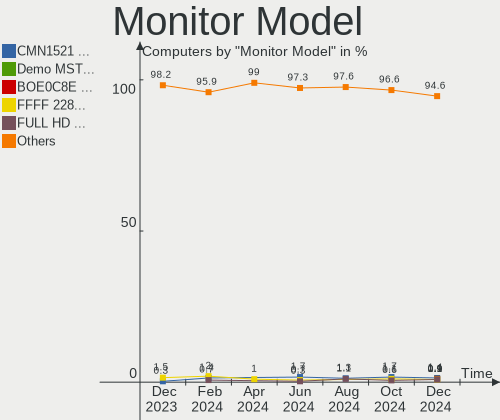

| Model                                                                  | Computers | Percent |
|------------------------------------------------------------------------|-----------|---------|
| AU Optronics LCD Monitor AUO61ED 1920x1080 344x194mm 15.5-inch         | 5         | 2.06%   |
| Gigabyte Technology M27Q GBT270D 2560x1440 596x335mm 26.9-inch         | 4         | 1.65%   |
| Dell U2412M DELA079 1920x1200 518x324mm 24.1-inch                      | 3         | 1.23%   |
| BOE LCD Monitor BOE0872 1920x1080 344x194mm 15.5-inch                  | 3         | 1.23%   |
| Sharp LQ156M1JW26 SHP1532 1920x1080 344x194mm 15.5-inch                | 2         | 0.82%   |
| Samsung Electronics S24F350 SAM0D20 1920x1080 520x290mm 23.4-inch      | 2         | 0.82%   |
| Samsung Electronics LCD Monitor SDC4171 2880x1800 302x189mm 14.0-inch  | 2         | 0.82%   |
| Goldstar ULTRAWIDE GSM76F9 2560x1080 531x298mm 24.0-inch               | 2         | 0.82%   |
| Goldstar Ultra HD GSM5B08 3840x2160 600x340mm 27.2-inch                | 2         | 0.82%   |
| Goldstar LG HDR QHD GSM771B 2560x1440 700x390mm 31.5-inch              | 2         | 0.82%   |
| Dell U2412M DELA07A 1920x1200 518x324mm 24.1-inch                      | 2         | 0.82%   |
| Chimei Innolux LCD Monitor CMN15F5 1920x1080 344x193mm 15.5-inch       | 2         | 0.82%   |
| Chimei Innolux LCD Monitor CMN14D4 1920x1080 309x173mm 13.9-inch       | 2         | 0.82%   |
| BOE LCD Monitor BOE0A9B 2560x1600 344x215mm 16.0-inch                  | 2         | 0.82%   |
| AU Optronics LCD Monitor AUO38ED 1920x1080 344x193mm 15.5-inch         | 2         | 0.82%   |
| AU Optronics LCD Monitor AUO21ED 1920x1080 344x193mm 15.5-inch         | 2         | 0.82%   |
| ASUSTek Computer VP28U AUS28B1 3840x2160 621x341mm 27.9-inch           | 2         | 0.82%   |
| AOC 2460G5 AOC246A 1920x1080 531x299mm 24.0-inch                       | 2         | 0.82%   |
| ViewSonic VX2363 Series VSC6B2F 1920x1080 509x286mm 23.0-inch          | 1         | 0.41%   |
| ViewSonic VX2245wm VSCBB1E 1680x1050 474x296mm 22.0-inch               | 1         | 0.41%   |
| ViewSonic LCD Monitor VX2239 SERIES 3840x1080                          | 1         | 0.41%   |
| VIE R66F144 VIE0999 1920x1080 520x320mm 24.0-inch                      | 1         | 0.41%   |
| TMX TL140BDXP01-0 TMX1400 2560x1440 310x174mm 14.0-inch                | 1         | 0.41%   |
| Sony TV SNYEE01 1920x1080                                              | 1         | 0.41%   |
| Sony TV *00 SNY7E04 3840x2160 1218x685mm 55.0-inch                     | 1         | 0.41%   |
| Sony NvidiaDefault SNY05FA 1366x768 290x170mm 13.2-inch                | 1         | 0.41%   |
| Sharp LQ134R1JW51 SHP151B 3840x2400 288x180mm 13.4-inch                | 1         | 0.41%   |
| Sharp LCD Monitor SHP154D 1920x1080 309x174mm 14.0-inch                | 1         | 0.41%   |
| Sharp LCD Monitor SHP1515 1920x1200 336x210mm 15.6-inch                | 1         | 0.41%   |
| Sharp LCD Monitor SHP14F9 1920x1200 288x180mm 13.4-inch                | 1         | 0.41%   |
| Sharp LCD Monitor SHP14D0 3840x2400 336x210mm 15.6-inch                | 1         | 0.41%   |
| Sharp LCD Monitor SHP143E 3840x2160 346x194mm 15.6-inch                | 1         | 0.41%   |
| Sceptre Tech Sceptre N55 SPT15BC 3840x2160 575x323mm 26.0-inch         | 1         | 0.41%   |
| Samsung Electronics U28E590 SAM0C4E 3840x2160 608x345mm 27.5-inch      | 1         | 0.41%   |
| Samsung Electronics U28E590 SAM0C4D 3840x2160 607x345mm 27.5-inch      | 1         | 0.41%   |
| Samsung Electronics SyncMaster SAM0225 1440x900 410x257mm 19.1-inch    | 1         | 0.41%   |
| Samsung Electronics SMXL2370HD SAM072B 1920x1080 510x287mm 23.0-inch   | 1         | 0.41%   |
| Samsung Electronics S24D330 SAM0D92 1920x1080 531x299mm 24.0-inch      | 1         | 0.41%   |
| Samsung Electronics S19F350 SAM0D46 1366x768 410x230mm 18.5-inch       | 1         | 0.41%   |
| Samsung Electronics Odyssey G50A SAM7181 2560x1440 597x336mm 27.0-inch | 1         | 0.41%   |

Monitor Resolution
------------------

Monitor screen resolution

| Resolution         | Computers | Percent |
|--------------------|-----------|---------|
| 1920x1080 (FHD)    | 113       | 51.6%   |
| 3840x2160 (4K)     | 18        | 8.22%   |
| 2560x1440 (QHD)    | 16        | 7.31%   |
| 1366x768 (WXGA)    | 16        | 7.31%   |
| 1920x1200 (WUXGA)  | 15        | 6.85%   |
| 2560x1600          | 4         | 1.83%   |
| 3840x1080          | 3         | 1.37%   |
| 3440x1440          | 3         | 1.37%   |
| 2880x1800          | 3         | 1.37%   |
| 1680x1050 (WSXGA+) | 3         | 1.37%   |
| 1600x900 (HD+)     | 3         | 1.37%   |
| 1280x1024 (SXGA)   | 3         | 1.37%   |
| Unknown            | 3         | 1.37%   |
| 3840x2400          | 2         | 0.91%   |
| 2560x1080          | 2         | 0.91%   |
| 1440x900 (WXGA+)   | 2         | 0.91%   |
| 1360x768           | 2         | 0.91%   |
| 5120x1440          | 1         | 0.46%   |
| 4480x1440          | 1         | 0.46%   |
| 3072x1920          | 1         | 0.46%   |
| 2736x1824          | 1         | 0.46%   |
| 2240x1400          | 1         | 0.46%   |
| 2160x1440          | 1         | 0.46%   |
| 1920x1280          | 1         | 0.46%   |
| 1280x800 (WXGA)    | 1         | 0.46%   |

Monitor Diagonal
----------------

Diagonal size in inches

| Inches  | Computers | Percent |
|---------|-----------|---------|
| 15      | 55        | 23.81%  |
| 14      | 29        | 12.55%  |
| 27      | 24        | 10.39%  |
| 24      | 22        | 9.52%   |
| 23      | 20        | 8.66%   |
| 13      | 18        | 7.79%   |
| 17      | 8         | 3.46%   |
| Unknown | 8         | 3.46%   |
| 31      | 7         | 3.03%   |
| 21      | 7         | 3.03%   |
| 34      | 5         | 2.16%   |
| 19      | 4         | 1.73%   |
| 18      | 4         | 1.73%   |
| 32      | 3         | 1.3%    |
| 22      | 3         | 1.3%    |
| 16      | 3         | 1.3%    |
| 12      | 3         | 1.3%    |
| 11      | 2         | 0.87%   |
| 84      | 1         | 0.43%   |
| 72      | 1         | 0.43%   |
| 55      | 1         | 0.43%   |
| 54      | 1         | 0.43%   |
| 52      | 1         | 0.43%   |
| 48      | 1         | 0.43%   |

Monitor Width
-------------

Physical width

| Width in mm | Computers | Percent |
|-------------|-----------|---------|
| 301-350     | 93        | 41.89%  |
| 501-600     | 56        | 25.23%  |
| 201-300     | 17        | 7.66%   |
| 401-500     | 16        | 7.21%   |
| 601-700     | 10        | 4.5%    |
| 351-400     | 9         | 4.05%   |
| 701-800     | 8         | 3.6%    |
| Unknown     | 8         | 3.6%    |
| 1001-1500   | 4         | 1.8%    |
| 1501-2000   | 1         | 0.45%   |

Aspect Ratio
------------

Proportional relationship between the width and the height

| Ratio   | Computers | Percent |
|---------|-----------|---------|
| 16/9    | 152       | 73.08%  |
| 16/10   | 36        | 17.31%  |
| Unknown | 8         | 3.85%   |
| 21/9    | 5         | 2.4%    |
| 5/4     | 3         | 1.44%   |
| 3/2     | 3         | 1.44%   |
| 32/9    | 1         | 0.48%   |

Monitor Area
------------

Area in inch²

| Area in inch² | Computers | Percent |
|----------------|-----------|---------|
| 101-110        | 53        | 23.14%  |
| 81-90          | 36        | 15.72%  |
| 201-250        | 35        | 15.28%  |
| 301-350        | 24        | 10.48%  |
| 351-500        | 15        | 6.55%   |
| 251-300        | 14        | 6.11%   |
| 71-80          | 11        | 4.8%    |
| Unknown        | 8         | 3.49%   |
| 121-130        | 7         | 3.06%   |
| 151-200        | 6         | 2.62%   |
| 141-150        | 5         | 2.18%   |
| More than 1000 | 4         | 1.75%   |
| 111-120        | 4         | 1.75%   |
| 61-70          | 2         | 0.87%   |
| 51-60          | 2         | 0.87%   |
| 91-100         | 2         | 0.87%   |
| 501-1000       | 1         | 0.44%   |

Pixel Density
-------------

Pixels per inch

| Density       | Computers | Percent |
|---------------|-----------|---------|
| 121-160       | 82        | 37.27%  |
| 51-100        | 68        | 30.91%  |
| 101-120       | 27        | 12.27%  |
| 161-240       | 22        | 10%     |
| More than 240 | 9         | 4.09%   |
| Unknown       | 8         | 3.64%   |
| 1-50          | 4         | 1.82%   |

Multiple Monitors
-----------------

Total monitors connected

| Total | Computers | Percent |
|-------|-----------|---------|
| 1     | 141       | 73.06%  |
| 2     | 38        | 19.69%  |
| 3     | 8         | 4.15%   |
| 0     | 5         | 2.59%   |
| 4     | 1         | 0.52%   |

Network
-------

Net Controller Vendor
---------------------

Controller vendors

| Vendor                          | Computers | Percent |
|---------------------------------|-----------|---------|
| Realtek Semiconductor           | 108       | 37.5%   |
| Intel                           | 106       | 36.81%  |
| Qualcomm Atheros                | 20        | 6.94%   |
| Broadcom                        | 9         | 3.13%   |
| MediaTek                        | 8         | 2.78%   |
| TP-Link                         | 6         | 2.08%   |
| Lenovo                          | 4         | 1.39%   |
| QLogic                          | 3         | 1.04%   |
| Broadcom Limited                | 3         | 1.04%   |
| Xiaomi                          | 2         | 0.69%   |
| Qualcomm                        | 2         | 0.69%   |
| IBM                             | 2         | 0.69%   |
| DisplayLink                     | 2         | 0.69%   |
| ASIX Electronics                | 2         | 0.69%   |
| Samsung Electronics             | 1         | 0.35%   |
| Qualcomm Atheros Communications | 1         | 0.35%   |
| Microsoft                       | 1         | 0.35%   |
| Marvell Technology Group        | 1         | 0.35%   |
| IMC Networks                    | 1         | 0.35%   |
| ICS Advent                      | 1         | 0.35%   |
| HTC (High Tech Computer)        | 1         | 0.35%   |
| D-Link                          | 1         | 0.35%   |
| ASUSTek Computer                | 1         | 0.35%   |
| Aquantia                        | 1         | 0.35%   |
| Apple                           | 1         | 0.35%   |

Net Controller Model
--------------------

Controller models

| Model                                                             | Computers | Percent |
|-------------------------------------------------------------------|-----------|---------|
| Realtek RTL8111/8168/8411 PCI Express Gigabit Ethernet Controller | 72        | 21.56%  |
| Intel Wi-Fi 6 AX200                                               | 19        | 5.69%   |
| Intel Alder Lake-P PCH CNVi WiFi                                  | 12        | 3.59%   |
| Realtek RTL8822CE 802.11ac PCIe Wireless Network Adapter          | 11        | 3.29%   |
| Realtek RTL8125 2.5GbE Controller                                 | 11        | 3.29%   |
| Qualcomm Atheros QCA6174 802.11ac Wireless Network Adapter        | 9         | 2.69%   |
| Realtek RTL8821CE 802.11ac PCIe Wireless Network Adapter          | 8         | 2.4%    |
| Intel Wi-Fi 6 AX201                                               | 8         | 2.4%    |
| Intel Wireless 8265 / 8275                                        | 7         | 2.1%    |
| Intel I211 Gigabit Network Connection                             | 7         | 2.1%    |
| Realtek RTL8153 Gigabit Ethernet Adapter                          | 5         | 1.5%    |
| Realtek RTL810xE PCI Express Fast Ethernet controller             | 5         | 1.5%    |
| MediaTek MT7922 802.11ax PCI Express Wireless Network Adapter     | 5         | 1.5%    |
| Qualcomm Atheros AR9485 Wireless Network Adapter                  | 4         | 1.2%    |
| Intel Wi-Fi 6 AX210/AX211/AX411 160MHz                            | 4         | 1.2%    |
| Intel 82579V Gigabit Network Connection                           | 4         | 1.2%    |
| TP-Link TL-WN823N v2/v3 [Realtek RTL8192EU]                       | 3         | 0.9%    |
| TP-Link AC600 wireless Realtek RTL8811AU [Archer T2U Nano]        | 3         | 0.9%    |
| Qualcomm Atheros QCA9377 802.11ac Wireless Network Adapter        | 3         | 0.9%    |
| QLogic cLOM8214 1/10GbE Controller                                | 3         | 0.9%    |
| Intel Wireless 8260                                               | 3         | 0.9%    |
| Intel Ice Lake-LP PCH CNVi WiFi                                   | 3         | 0.9%    |
| Intel Ethernet Controller I225-V                                  | 3         | 0.9%    |
| Intel Ethernet Connection (4) I219-LM                             | 3         | 0.9%    |
| Intel Ethernet Connection (16) I219-V                             | 3         | 0.9%    |
| Intel Comet Lake PCH CNVi WiFi                                    | 3         | 0.9%    |
| Xiaomi Mi/Redmi series (RNDIS)                                    | 2         | 0.6%    |
| Realtek RTL8821AE 802.11ac PCIe Wireless Network Adapter          | 2         | 0.6%    |
| Realtek RTL8812AU 802.11a/b/g/n/ac 2T2R DB WLAN Adapter           | 2         | 0.6%    |
| Realtek Realtek Network controller                                | 2         | 0.6%    |
| Qualcomm Atheros AR9285 Wireless Network Adapter (PCI-Express)    | 2         | 0.6%    |
| MediaTek MT7921 802.11ax PCI Express Wireless Network Adapter     | 2         | 0.6%    |
| Intel Wireless-AC 9260                                            | 2         | 0.6%    |
| Intel Wireless 7260                                               | 2         | 0.6%    |
| Intel I210 Gigabit Network Connection                             | 2         | 0.6%    |
| Intel Ethernet Connection I217-LM                                 | 2         | 0.6%    |
| Intel Ethernet Connection (7) I219-LM                             | 2         | 0.6%    |
| Intel Dual Band Wireless-AC 3168NGW [Stone Peak]                  | 2         | 0.6%    |
| Intel Dual Band Wireless-AC 3165 Plus Bluetooth                   | 2         | 0.6%    |
| Intel Comet Lake PCH-LP CNVi WiFi                                 | 2         | 0.6%    |

Wireless Vendor
---------------

Wireless vendors

| Vendor                          | Computers | Percent |
|---------------------------------|-----------|---------|
| Intel                           | 80        | 50.96%  |
| Realtek Semiconductor           | 30        | 19.11%  |
| Qualcomm Atheros                | 20        | 12.74%  |
| MediaTek                        | 8         | 5.1%    |
| TP-Link                         | 6         | 3.82%   |
| Broadcom                        | 5         | 3.18%   |
| Broadcom Limited                | 2         | 1.27%   |
| Qualcomm Atheros Communications | 1         | 0.64%   |
| Qualcomm                        | 1         | 0.64%   |
| Microsoft                       | 1         | 0.64%   |
| IMC Networks                    | 1         | 0.64%   |
| D-Link                          | 1         | 0.64%   |
| ASUSTek Computer                | 1         | 0.64%   |

Wireless Model
--------------

Wireless models

| Model                                                          | Computers | Percent |
|----------------------------------------------------------------|-----------|---------|
| Intel Wi-Fi 6 AX200                                            | 19        | 12.1%   |
| Intel Alder Lake-P PCH CNVi WiFi                               | 12        | 7.64%   |
| Realtek RTL8822CE 802.11ac PCIe Wireless Network Adapter       | 11        | 7.01%   |
| Qualcomm Atheros QCA6174 802.11ac Wireless Network Adapter     | 9         | 5.73%   |
| Realtek RTL8821CE 802.11ac PCIe Wireless Network Adapter       | 8         | 5.1%    |
| Intel Wi-Fi 6 AX201                                            | 8         | 5.1%    |
| Intel Wireless 8265 / 8275                                     | 7         | 4.46%   |
| MediaTek MT7922 802.11ax PCI Express Wireless Network Adapter  | 5         | 3.18%   |
| Qualcomm Atheros AR9485 Wireless Network Adapter               | 4         | 2.55%   |
| Intel Wi-Fi 6 AX210/AX211/AX411 160MHz                         | 4         | 2.55%   |
| TP-Link TL-WN823N v2/v3 [Realtek RTL8192EU]                    | 3         | 1.91%   |
| TP-Link AC600 wireless Realtek RTL8811AU [Archer T2U Nano]     | 3         | 1.91%   |
| Qualcomm Atheros QCA9377 802.11ac Wireless Network Adapter     | 3         | 1.91%   |
| Intel Wireless 8260                                            | 3         | 1.91%   |
| Intel Ice Lake-LP PCH CNVi WiFi                                | 3         | 1.91%   |
| Intel Comet Lake PCH CNVi WiFi                                 | 3         | 1.91%   |
| Realtek RTL8821AE 802.11ac PCIe Wireless Network Adapter       | 2         | 1.27%   |
| Realtek RTL8812AU 802.11a/b/g/n/ac 2T2R DB WLAN Adapter        | 2         | 1.27%   |
| Realtek Realtek Network controller                             | 2         | 1.27%   |
| Qualcomm Atheros AR9285 Wireless Network Adapter (PCI-Express) | 2         | 1.27%   |
| MediaTek MT7921 802.11ax PCI Express Wireless Network Adapter  | 2         | 1.27%   |
| Intel Wireless-AC 9260                                         | 2         | 1.27%   |
| Intel Wireless 7260                                            | 2         | 1.27%   |
| Intel Dual Band Wireless-AC 3168NGW [Stone Peak]               | 2         | 1.27%   |
| Intel Dual Band Wireless-AC 3165 Plus Bluetooth                | 2         | 1.27%   |
| Intel Comet Lake PCH-LP CNVi WiFi                              | 2         | 1.27%   |
| Intel Cannon Point-LP CNVi [Wireless-AC]                       | 2         | 1.27%   |
| Realtek RTL8852AE 802.11ax PCIe Wireless Network Adapter       | 1         | 0.64%   |
| Realtek RTL8822BE 802.11a/b/g/n/ac WiFi adapter                | 1         | 0.64%   |
| Realtek RTL8723BE PCIe Wireless Network Adapter                | 1         | 0.64%   |
| Realtek RTL8192CU 802.11n WLAN Adapter                         | 1         | 0.64%   |
| Realtek RTL8192CE PCIe Wireless Network Adapter                | 1         | 0.64%   |
| Qualcomm QCA6390 Wireless Network Adapter                      | 1         | 0.64%   |
| Qualcomm Atheros AR9271 802.11n                                | 1         | 0.64%   |
| Qualcomm Atheros AR9462 Wireless Network Adapter               | 1         | 0.64%   |
| Qualcomm Atheros AR93xx Wireless Network Adapter               | 1         | 0.64%   |
| Microsoft XBOX ACC                                             | 1         | 0.64%   |
| MediaTek MT7921K (RZ608) Wi-Fi 6E 80MHz                        | 1         | 0.64%   |
| Intel Wireless 7265                                            | 1         | 0.64%   |
| Intel Wireless 3160                                            | 1         | 0.64%   |

Ethernet Vendor
---------------

Ethernet vendors

| Vendor                   | Computers | Percent |
|--------------------------|-----------|---------|
| Realtek Semiconductor    | 94        | 54.97%  |
| Intel                    | 50        | 29.24%  |
| Broadcom                 | 6         | 3.51%   |
| QLogic                   | 3         | 1.75%   |
| Xiaomi                   | 2         | 1.17%   |
| Lenovo                   | 2         | 1.17%   |
| IBM                      | 2         | 1.17%   |
| DisplayLink              | 2         | 1.17%   |
| ASIX Electronics         | 2         | 1.17%   |
| Samsung Electronics      | 1         | 0.58%   |
| Qualcomm                 | 1         | 0.58%   |
| Marvell Technology Group | 1         | 0.58%   |
| ICS Advent               | 1         | 0.58%   |
| HTC (High Tech Computer) | 1         | 0.58%   |
| Broadcom Limited         | 1         | 0.58%   |
| Aquantia                 | 1         | 0.58%   |
| Apple                    | 1         | 0.58%   |

Ethernet Model
--------------

Ethernet models

| Model                                                                          | Computers | Percent |
|--------------------------------------------------------------------------------|-----------|---------|
| Realtek RTL8111/8168/8411 PCI Express Gigabit Ethernet Controller              | 72        | 41.14%  |
| Realtek RTL8125 2.5GbE Controller                                              | 11        | 6.29%   |
| Intel I211 Gigabit Network Connection                                          | 7         | 4%      |
| Realtek RTL8153 Gigabit Ethernet Adapter                                       | 5         | 2.86%   |
| Realtek RTL810xE PCI Express Fast Ethernet controller                          | 5         | 2.86%   |
| Intel 82579V Gigabit Network Connection                                        | 4         | 2.29%   |
| QLogic cLOM8214 1/10GbE Controller                                             | 3         | 1.71%   |
| Intel Ethernet Controller I225-V                                               | 3         | 1.71%   |
| Intel Ethernet Connection (4) I219-LM                                          | 3         | 1.71%   |
| Intel Ethernet Connection (16) I219-V                                          | 3         | 1.71%   |
| Xiaomi Mi/Redmi series (RNDIS)                                                 | 2         | 1.14%   |
| Intel I210 Gigabit Network Connection                                          | 2         | 1.14%   |
| Intel Ethernet Connection I217-LM                                              | 2         | 1.14%   |
| Intel Ethernet Connection (7) I219-LM                                          | 2         | 1.14%   |
| Intel 82599ES 10-Gigabit SFI/SFP+ Network Connection                           | 2         | 1.14%   |
| Intel 82579LM Gigabit Network Connection (Lewisville)                          | 2         | 1.14%   |
| Intel 82571EB/82571GB Gigabit Ethernet Controller (Copper)                     | 2         | 1.14%   |
| IBM RNDIS/CDC ETHER                                                            | 2         | 1.14%   |
| Broadcom NetXtreme II BCM5709 Gigabit Ethernet                                 | 2         | 1.14%   |
| ASIX AX88179 Gigabit Ethernet                                                  | 2         | 1.14%   |
| Samsung GT-I9070 (network tethering, USB debugging enabled)                    | 1         | 0.57%   |
| Realtek RTL8152 Fast Ethernet Adapter                                          | 1         | 0.57%   |
| Realtek Killer E3000 2.5GbE Controller                                         | 1         | 0.57%   |
| Qualcomm Nokia 5.4                                                             | 1         | 0.57%   |
| Marvell Group Yukon Optima 88E8059 [PCIe Gigabit Ethernet Controller with AVB] | 1         | 0.57%   |
| Lenovo ThinkPad Lan                                                            | 1         | 0.57%   |
| Lenovo ThinkPad Dock Ethernet [Realtek RTL8153B]                               | 1         | 0.57%   |
| Intel I350 Gigabit Network Connection                                          | 1         | 0.57%   |
| Intel Ethernet Controller I226-V                                               | 1         | 0.57%   |
| Intel Ethernet Connection I219-LM                                              | 1         | 0.57%   |
| Intel Ethernet Connection I218-LM                                              | 1         | 0.57%   |
| Intel Ethernet Connection (7) I219-V                                           | 1         | 0.57%   |
| Intel Ethernet Connection (5) I219-V                                           | 1         | 0.57%   |
| Intel Ethernet Connection (5) I219-LM                                          | 1         | 0.57%   |
| Intel Ethernet Connection (4) I219-V                                           | 1         | 0.57%   |
| Intel Ethernet Connection (2) I219-V                                           | 1         | 0.57%   |
| Intel Ethernet Connection (2) I219-LM                                          | 1         | 0.57%   |
| Intel Ethernet Connection (2) I218-V                                           | 1         | 0.57%   |
| Intel Ethernet Connection (17) I219-LM                                         | 1         | 0.57%   |
| Intel Ethernet Connection (16) I219-LM                                         | 1         | 0.57%   |

Net Controller Kind
-------------------

Ethernet, WiFi or modem

| Kind     | Computers | Percent |
|----------|-----------|---------|
| Ethernet | 154       | 50%     |
| WiFi     | 152       | 49.35%  |
| Modem    | 2         | 0.65%   |

Used Controller
---------------

Currently used network controller

| Kind     | Computers | Percent |
|----------|-----------|---------|
| WiFi     | 116       | 61.05%  |
| Ethernet | 74        | 38.95%  |

NICs
----

Total network controllers on board

| Total | Computers | Percent |
|-------|-----------|---------|
| 2     | 92        | 47.67%  |
| 1     | 85        | 44.04%  |
| 3     | 8         | 4.15%   |
| 0     | 3         | 1.55%   |
| 5     | 2         | 1.04%   |
| 4     | 2         | 1.04%   |
| 8     | 1         | 0.52%   |

IPv6
----

IPv6 vs IPv4

| Used | Computers | Percent |
|------|-----------|---------|
| No   | 147       | 76.17%  |
| Yes  | 46        | 23.83%  |

Bluetooth
---------

Bluetooth Vendor
----------------

Controller vendors

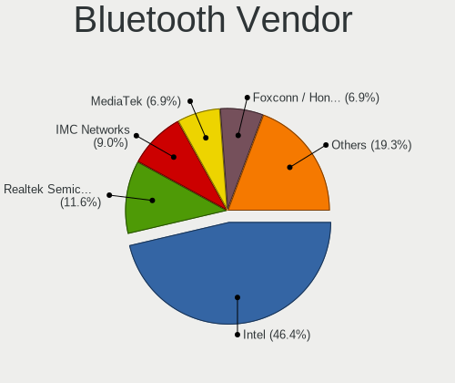

| Vendor                          | Computers | Percent |
|---------------------------------|-----------|---------|
| Intel                           | 76        | 50.67%  |
| Realtek Semiconductor           | 22        | 14.67%  |
| Cambridge Silicon Radio         | 10        | 6.67%   |
| Foxconn / Hon Hai               | 9         | 6%      |
| Qualcomm Atheros Communications | 7         | 4.67%   |
| Realtek                         | 5         | 3.33%   |
| IMC Networks                    | 5         | 3.33%   |
| Lite-On Technology              | 4         | 2.67%   |
| ASUSTek Computer                | 4         | 2.67%   |
| TP-Link                         | 2         | 1.33%   |
| Apple                           | 2         | 1.33%   |
| Toshiba                         | 1         | 0.67%   |
| MediaTek                        | 1         | 0.67%   |
| Dell                            | 1         | 0.67%   |
| Broadcom                        | 1         | 0.67%   |

Bluetooth Model
---------------

Controller models

| Model                                                                               | Computers | Percent |
|-------------------------------------------------------------------------------------|-----------|---------|
| Intel AX200 Bluetooth                                                               | 19        | 12.67%  |
| Intel Bluetooth wireless interface                                                  | 15        | 10%     |
| Intel AX201 Bluetooth                                                               | 15        | 10%     |
| Realtek Bluetooth Radio                                                             | 14        | 9.33%   |
| Intel Bluetooth Device                                                              | 11        | 7.33%   |
| Cambridge Silicon Radio Bluetooth Dongle (HCI mode)                                 | 10        | 6.67%   |
| Intel Bluetooth 9460/9560 Jefferson Peak (JfP)                                      | 7         | 4.67%   |
| Foxconn / Hon Hai Wireless_Device                                                   | 6         | 4%      |
| Realtek  Bluetooth 4.2 Adapter                                                      | 5         | 3.33%   |
| Realtek Bluetooth Radio                                                             | 5         | 3.33%   |
| Qualcomm Atheros  Bluetooth Device                                                  | 4         | 2.67%   |
| Intel AX210 Bluetooth                                                               | 4         | 2.67%   |
| Qualcomm Atheros QCA61x4 Bluetooth 4.0                                              | 3         | 2%      |
| IMC Networks Bluetooth Radio                                                        | 3         | 2%      |
| TP-Link UB500 Adapter                                                               | 2         | 1.33%   |
| Realtek RTL8821A Bluetooth                                                          | 2         | 1.33%   |
| Lite-On Qualcomm Atheros QCA9377 Bluetooth                                          | 2         | 1.33%   |
| Lite-On Bluetooth Device                                                            | 2         | 1.33%   |
| Intel Wireless-AC 9260 Bluetooth Adapter                                            | 2         | 1.33%   |
| Intel Wireless-AC 3168 Bluetooth                                                    | 2         | 1.33%   |
| Foxconn / Hon Hai Bluetooth Device                                                  | 2         | 1.33%   |
| ASUS Broadcom BCM20702A0 Bluetooth                                                  | 2         | 1.33%   |
| Apple Bluetooth USB Host Controller                                                 | 2         | 1.33%   |
| Toshiba Askey Bluetooth Module                                                      | 1         | 0.67%   |
| Realtek RTL8723B Bluetooth                                                          | 1         | 0.67%   |
| MediaTek Wireless_Device                                                            | 1         | 0.67%   |
| Intel Centrino Bluetooth Wireless Transceiver                                       | 1         | 0.67%   |
| IMC Networks Wireless_Device                                                        | 1         | 0.67%   |
| IMC Networks Bluetooth USB Host Controller                                          | 1         | 0.67%   |
| Foxconn / Hon Hai Foxconn T77H114 BCM2070 [Single-Chip Bluetooth 2.1 + EDR Adapter] | 1         | 0.67%   |
| Dell BCM20702A0 Bluetooth Module                                                    | 1         | 0.67%   |
| Broadcom BCM43142A0 Bluetooth Device                                                | 1         | 0.67%   |
| ASUS Bluetooth Device                                                               | 1         | 0.67%   |
| ASUS Bluetooth Adapter                                                              | 1         | 0.67%   |

Sound
-----

Sound Vendor
------------

Sound card vendors

| Vendor                      | Computers | Percent |
|-----------------------------|-----------|---------|
| Intel                       | 108       | 36.36%  |
| AMD                         | 86        | 28.96%  |
| Nvidia                      | 51        | 17.17%  |
| C-Media Electronics         | 9         | 3.03%   |
| Logitech                    | 4         | 1.35%   |
| ASUSTek Computer            | 4         | 1.35%   |
| Kingston Technology         | 3         | 1.01%   |
| Samson Technologies         | 2         | 0.67%   |
| JMTek                       | 2         | 0.67%   |
| FiiO Electronics Technology | 2         | 0.67%   |
| Corsair                     | 2         | 0.67%   |
| Blue Microphones            | 2         | 0.67%   |
| Audio-Technica              | 2         | 0.67%   |
| ZOOM                        | 1         | 0.34%   |
| Unknown                     | 1         | 0.34%   |
| Texas Instruments           | 1         | 0.34%   |
| SteelSeries ApS             | 1         | 0.34%   |
| Sony                        | 1         | 0.34%   |
| Realtek Semiconductor       | 1         | 0.34%   |
| Razer USA                   | 1         | 0.34%   |
| Native Instruments          | 1         | 0.34%   |
| MVSI                        | 1         | 0.34%   |
| Lenovo                      | 1         | 0.34%   |
| Khadas                      | 1         | 0.34%   |
| Hewlett-Packard             | 1         | 0.34%   |
| GN Netcom                   | 1         | 0.34%   |
| Focusrite-Novation          | 1         | 0.34%   |
| Creative Technology         | 1         | 0.34%   |
| CMX Systems                 | 1         | 0.34%   |
| BR25                        | 1         | 0.34%   |
| Astro Gaming                | 1         | 0.34%   |
| ARCAM                       | 1         | 0.34%   |
| Unknown                     | 1         | 0.34%   |

Sound Model
-----------

Sound card models

| Model                                                                      | Computers | Percent |
|----------------------------------------------------------------------------|-----------|---------|
| AMD Family 17h/19h HD Audio Controller                                     | 41        | 11.36%  |
| AMD Renoir Radeon High Definition Audio Controller                         | 25        | 6.93%   |
| AMD Starship/Matisse HD Audio Controller                                   | 20        | 5.54%   |
| Intel Tiger Lake-LP Smart Sound Technology Audio Controller                | 13        | 3.6%    |
| Intel Sunrise Point-LP HD Audio                                            | 12        | 3.32%   |
| Intel Alder Lake PCH-P High Definition Audio Controller                    | 12        | 3.32%   |
| Nvidia GA104 High Definition Audio Controller                              | 9         | 2.49%   |
| AMD Navi 21/23 HDMI/DP Audio Controller                                    | 9         | 2.49%   |
| AMD Raven/Raven2/Fenghuang HDMI/DP Audio Controller                        | 8         | 2.22%   |
| Nvidia GA106 High Definition Audio Controller                              | 7         | 1.94%   |
| AMD Rembrandt Radeon High Definition Audio Controller                      | 7         | 1.94%   |
| AMD Ellesmere HDMI Audio [Radeon RX 470/480 / 570/580/590]                 | 7         | 1.94%   |
| Intel Cannon Point-LP High Definition Audio Controller                     | 6         | 1.66%   |
| Intel 6 Series/C200 Series Chipset Family High Definition Audio Controller | 6         | 1.66%   |
| Nvidia GP107GL High Definition Audio Controller                            | 5         | 1.39%   |
| Intel Xeon E3-1200 v3/4th Gen Core Processor HD Audio Controller           | 5         | 1.39%   |
| Intel Comet Lake PCH cAVS                                                  | 5         | 1.39%   |
| Intel 8 Series/C220 Series Chipset High Definition Audio Controller        | 5         | 1.39%   |
| Intel 5 Series/3400 Series Chipset High Definition Audio                   | 5         | 1.39%   |
| Intel 100 Series/C230 Series Chipset Family HD Audio Controller            | 5         | 1.39%   |
| AMD Navi 10 HDMI Audio                                                     | 5         | 1.39%   |
| AMD Family 17h (Models 00h-0fh) HD Audio Controller                        | 5         | 1.39%   |
| Nvidia TU116 High Definition Audio Controller                              | 4         | 1.11%   |
| Nvidia TU107 GeForce GTX 1650 High Definition Audio Controller             | 4         | 1.11%   |
| Nvidia TU106 High Definition Audio Controller                              | 4         | 1.11%   |
| Intel Ice Lake-LP Smart Sound Technology Audio Controller                  | 4         | 1.11%   |
| Intel CM238 HD Audio Controller                                            | 4         | 1.11%   |
| Intel Cannon Lake PCH cAVS                                                 | 4         | 1.11%   |
| Intel 7 Series/C216 Chipset Family High Definition Audio Controller        | 4         | 1.11%   |
| Nvidia TU104 HD Audio Controller                                           | 3         | 0.83%   |
| Nvidia GP104 High Definition Audio Controller                              | 3         | 0.83%   |
| Nvidia GM107 High Definition Audio Controller [GeForce 940MX]              | 3         | 0.83%   |
| Intel Haswell-ULT HD Audio Controller                                      | 3         | 0.83%   |
| Intel Comet Lake PCH-LP cAVS                                               | 3         | 0.83%   |
| Intel Alder Lake-S HD Audio Controller                                     | 3         | 0.83%   |
| Intel 82801I (ICH9 Family) HD Audio Controller                             | 3         | 0.83%   |
| Intel 8 Series HD Audio Controller                                         | 3         | 0.83%   |
| AMD Baffin HDMI/DP Audio [Radeon RX 550 640SP / RX 560/560X]               | 3         | 0.83%   |
| Nvidia GM206 High Definition Audio Controller                              | 2         | 0.55%   |
| Nvidia GK106 HDMI Audio Controller                                         | 2         | 0.55%   |

Memory
------

Memory Vendor
-------------

Memory module vendors

| Vendor              | Computers | Percent |
|---------------------|-----------|---------|
| Samsung Electronics | 35        | 21.88%  |
| SK hynix            | 30        | 18.75%  |
| Micron Technology   | 22        | 13.75%  |
| Crucial             | 19        | 11.88%  |
| Kingston            | 16        | 10%     |
| G.Skill             | 10        | 6.25%   |
| Unknown             | 7         | 4.38%   |
| Corsair             | 7         | 4.38%   |
| Team                | 4         | 2.5%    |
| GOODRAM             | 2         | 1.25%   |
| Unknown             | 2         | 1.25%   |
| Smart Brazil        | 1         | 0.63%   |
| RZX                 | 1         | 0.63%   |
| Nanya Technology    | 1         | 0.63%   |
| fef5                | 1         | 0.63%   |
| A-DATA Technology   | 1         | 0.63%   |
| 4ea5                | 1         | 0.63%   |

Memory Model
------------

Memory module models

| Model                                                           | Computers | Percent |
|-----------------------------------------------------------------|-----------|---------|
| Unknown RAM 1866 CL10 Series 8192MB DIMM DDR3 933MT/s           | 3         | 1.76%   |
| Samsung RAM M471A1G44AB0-CWE 8GB SODIMM DDR4 3200MT/s           | 3         | 1.76%   |
| Micron RAM 4ATF1G64HZ-3G2E1 8GB SODIMM DDR4 3200MT/s            | 3         | 1.76%   |
| SK hynix RAM HMCG78MEBSA092N 16GB SODIMM DDR5 4800MT/s          | 2         | 1.18%   |
| SK hynix RAM HMAA4GS6AJR8N-XN 32GB SODIMM DDR4 3200MT/s         | 2         | 1.18%   |
| SK hynix RAM HMAA1GS6CJR6N-XN 8GB SODIMM DDR4 3200MT/s          | 2         | 1.18%   |
| SK hynix RAM HMA851S6CJR6N-VK 4GB SODIMM DDR4 2667MT/s          | 2         | 1.18%   |
| SK hynix RAM HMA81GS6DJR8N-XN 8GB SODIMM DDR4 3200MT/s          | 2         | 1.18%   |
| SK hynix RAM H9JCNNNCP3MLYR-N6E 2GB Row Of Chips 6400MT/s       | 2         | 1.18%   |
| Samsung RAM M471A5244CB0-CWE 4GB SODIMM DDR4 3200MT/s           | 2         | 1.18%   |
| Samsung RAM M471A5244CB0-CRC 4GB SODIMM DDR4 2667MT/s           | 2         | 1.18%   |
| Samsung RAM M471A1K43CB1-CTD 8GB SODIMM DDR4 2667MT/s           | 2         | 1.18%   |
| Samsung RAM K4E6E304EB-EGCG 4GB Row Of Chips LPDDR3 2133MT/s    | 2         | 1.18%   |
| Micron RAM 8ATF1G64HZ-2G6E1 8GB SODIMM DDR4 2667MT/s            | 2         | 1.18%   |
| Micron RAM 16ATF2G64HZ-2G3E1 16GB SODIMM DDR4 2667MT/s          | 2         | 1.18%   |
| G.Skill RAM F4-3600C16-16GTZNC 16GB DIMM DDR4 3600MT/s          | 2         | 1.18%   |
| Unknown                                                         | 2         | 1.18%   |
| Unknown RAM Module 4GB DIMM SDRAM                               | 1         | 0.59%   |
| Unknown RAM Module 2GB SODIMM DDR3 1600MT/s                     | 1         | 0.59%   |
| Unknown RAM Module 2GB SODIMM DDR3 1333MT/s                     | 1         | 0.59%   |
| Unknown RAM Module 2GB Row Of Chips LPDDR4 4267MT/s             | 1         | 0.59%   |
| Unknown RAM Module 2GB DIMM SDRAM                               | 1         | 0.59%   |
| Team RAM TEAMGROUP-UD4-3200 16GB DIMM DDR4 3800MT/s             | 1         | 0.59%   |
| Team RAM TEAMGROUP-SD4-3200 16GB SODIMM DDR4 3200MT/s           | 1         | 0.59%   |
| Team RAM TEAMGROUP-SD3-1600 8GB SODIMM DDR3 1600MT/s            | 1         | 0.59%   |
| Team RAM SD5-4800 32GB SODIMM DDR5 4800MT/s                     | 1         | 0.59%   |
| Smart Brazil RAM SMS4TDC3C0K0446SCG 4096MB SODIMM DDR4 2667MT/s | 1         | 0.59%   |
| SK hynix RAM Module 4GB Row Of Chips LPDDR4 3733MT/s            | 1         | 0.59%   |
| SK hynix RAM Module 16GB SODIMM DDR4 2667MT/s                   | 1         | 0.59%   |
| SK hynix RAM HYMP112S64CP6-Y5 1GB SODIMM DDR2 667MT/s           | 1         | 0.59%   |
| SK hynix RAM HMT451S6BFR8A-PB 4GB SODIMM DDR3 1600MT/s          | 1         | 0.59%   |
| SK hynix RAM HMT425S6CFR6A-PB 2GB SODIMM DDR3 1600MT/s          | 1         | 0.59%   |
| SK hynix RAM HMT41GS6BFR8A-PB 8GB SODIMM DDR3 1600MT/s          | 1         | 0.59%   |
| SK hynix RAM HMT351U6CFR8C-H9 4GB DIMM DDR3 1600MT/s            | 1         | 0.59%   |
| SK hynix RAM HMT31GR7CFR4C-H9 8GB DIMM DDR3 1333MT/s            | 1         | 0.59%   |
| SK hynix RAM HMT31GR7BFR4C-H9 8GB DIMM DDR3 1333MT/s            | 1         | 0.59%   |
| SK hynix RAM HMT125R7TFR8C-H9 2GB DIMM DDR3 1333MT/s            | 1         | 0.59%   |
| SK hynix RAM HMT125R7BFR8C-H9 2GB DIMM DDR3 1333MT/s            | 1         | 0.59%   |
| SK hynix RAM HMAA4GS6CJR8N-XN 32GB SODIMM DDR4 3200MT/s         | 1         | 0.59%   |
| SK hynix RAM HMAA2GS6AJR8N-XN 16GB SODIMM DDR4 3200MT/s         | 1         | 0.59%   |

Memory Kind
-----------

Memory module kinds

| Kind    | Computers | Percent |
|---------|-----------|---------|
| DDR4    | 81        | 58.27%  |
| DDR3    | 26        | 18.71%  |
| DDR5    | 9         | 6.47%   |
| LPDDR4  | 7         | 5.04%   |
| LPDDR5  | 5         | 3.6%    |
| LPDDR3  | 4         | 2.88%   |
| SDRAM   | 3         | 2.16%   |
| DDR2    | 3         | 2.16%   |
| Unknown | 1         | 0.72%   |

Memory Form Factor
------------------

Physical design of the memory module

| Name         | Computers | Percent |
|--------------|-----------|---------|
| SODIMM       | 72        | 52.94%  |
| DIMM         | 46        | 33.82%  |
| Row Of Chips | 16        | 11.76%  |
| Unknown      | 2         | 1.47%   |

Memory Size
-----------

Memory module size

| Size  | Computers | Percent |
|-------|-----------|---------|
| 8192  | 58        | 38.93%  |
| 16384 | 37        | 24.83%  |
| 4096  | 25        | 16.78%  |
| 2048  | 18        | 12.08%  |
| 32768 | 9         | 6.04%   |
| 1024  | 2         | 1.34%   |

Memory Speed
------------

Memory module speed

| Speed   | Computers | Percent |
|---------|-----------|---------|
| 3200    | 35        | 22.73%  |
| 2667    | 23        | 14.94%  |
| 1600    | 15        | 9.74%   |
| 2400    | 14        | 9.09%   |
| 4800    | 8         | 5.19%   |
| 3600    | 8         | 5.19%   |
| 2133    | 7         | 4.55%   |
| 1333    | 7         | 4.55%   |
| 6400    | 5         | 3.25%   |
| 2933    | 4         | 2.6%    |
| 1866    | 4         | 2.6%    |
| 3733    | 3         | 1.95%   |
| 1867    | 3         | 1.95%   |
| 4267    | 2         | 1.3%    |
| 667     | 2         | 1.3%    |
| 8400    | 1         | 0.65%   |
| 5200    | 1         | 0.65%   |
| 4266    | 1         | 0.65%   |
| 4199    | 1         | 0.65%   |
| 3866    | 1         | 0.65%   |
| 3800    | 1         | 0.65%   |
| 3533    | 1         | 0.65%   |
| 3466    | 1         | 0.65%   |
| 3000    | 1         | 0.65%   |
| 2048    | 1         | 0.65%   |
| 1334    | 1         | 0.65%   |
| 1067    | 1         | 0.65%   |
| 1066    | 1         | 0.65%   |
| Unknown | 1         | 0.65%   |

Printers & scanners
-------------------

Printer Vendor
--------------

Printer device vendors

| Vendor          | Computers | Percent |
|-----------------|-----------|---------|
| Hewlett-Packard | 1         | 50%     |
| Canon           | 1         | 50%     |

Printer Model
-------------

Printer device models

| Model              | Computers | Percent |
|--------------------|-----------|---------|
| HP LaserJet 1012   | 1         | 50%     |
| Canon PIXMA TS6250 | 1         | 50%     |

Scanner Vendor
--------------

Scanner device vendors

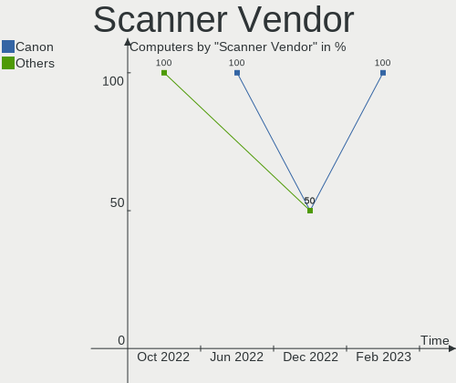

| Vendor      | Computers | Percent |
|-------------|-----------|---------|
| Seiko Epson | 1         | 50%     |
| Canon       | 1         | 50%     |

Scanner Model
-------------

Scanner device models

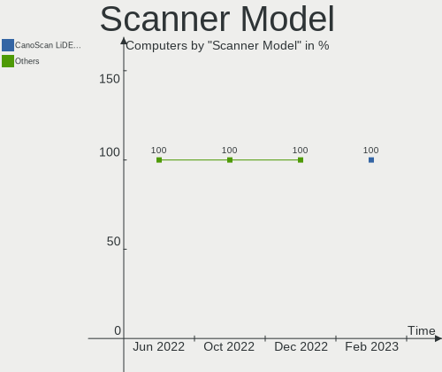

| Model                                       | Computers | Percent |
|---------------------------------------------|-----------|---------|
| Seiko Epson GT-X820 [Perfection V600 Photo] | 1         | 50%     |
| Canon CanoScan LiDE 220                     | 1         | 50%     |

Camera
------

Camera Vendor
-------------

Camera device vendors

| Vendor                        | Computers | Percent |
|-------------------------------|-----------|---------|
| Chicony Electronics           | 27        | 20.15%  |
| Acer                          | 17        | 12.69%  |
| IMC Networks                  | 15        | 11.19%  |
| Logitech                      | 13        | 9.7%    |
| Quanta                        | 12        | 8.96%   |
| Microdia                      | 11        | 8.21%   |
| Luxvisions Innotech Limited   | 5         | 3.73%   |
| Sunplus Innovation Technology | 4         | 2.99%   |
| Lite-On Technology            | 4         | 2.99%   |
| Syntek                        | 3         | 2.24%   |
| Sonix Technology              | 3         | 2.24%   |
| Samsung Electronics           | 3         | 2.24%   |
| Suyin                         | 2         | 1.49%   |
| Realtek Semiconductor         | 2         | 1.49%   |
| Apple                         | 2         | 1.49%   |
| SunplusIT                     | 1         | 0.75%   |
| Sunplus IT                    | 1         | 0.75%   |
| Silicon Motion                | 1         | 0.75%   |
| Primax Electronics            | 1         | 0.75%   |
| Microsoft                     | 1         | 0.75%   |
| Hewlett-Packard               | 1         | 0.75%   |
| Google                        | 1         | 0.75%   |
| Generalplus Technology        | 1         | 0.75%   |
| Dell                          | 1         | 0.75%   |
| ALi                           | 1         | 0.75%   |
| A4Tech                        | 1         | 0.75%   |

Camera Model
------------

Camera device models

| Model                                             | Computers | Percent |
|---------------------------------------------------|-----------|---------|
| Microdia Integrated_Webcam_HD                     | 8         | 5.93%   |
| Chicony Integrated Camera                         | 8         | 5.93%   |
| Acer Integrated Camera                            | 7         | 5.19%   |
| IMC Networks USB2.0 HD UVC WebCam                 | 5         | 3.7%    |
| IMC Networks Integrated Camera                    | 4         | 2.96%   |
| Sunplus Integrated_Webcam_HD                      | 3         | 2.22%   |
| Sonix USB2.0 HD UVC WebCam                        | 3         | 2.22%   |
| Samsung Galaxy A5 (MTP)                           | 3         | 2.22%   |
| Luxvisions Innotech Limited Integrated RGB Camera | 3         | 2.22%   |
| Chicony USB2.0 HD UVC WebCam                      | 3         | 2.22%   |
| Chicony HP TrueVision HD Camera                   | 3         | 2.22%   |
| Acer HD Webcam                                    | 3         | 2.22%   |
| Quanta VGA WebCam                                 | 2         | 1.48%   |
| Quanta USB2.0 HD UVC WebCam                       | 2         | 1.48%   |
| Quanta HP TrueVision HD Camera                    | 2         | 1.48%   |
| Quanta HP HD Camera                               | 2         | 1.48%   |
| Quanta HD Camera                                  | 2         | 1.48%   |
| Microdia USB 2.0 Camera                           | 2         | 1.48%   |
| Logitech Webcam C270                              | 2         | 1.48%   |
| Logitech Webcam C170                              | 2         | 1.48%   |
| Logitech HD Pro Webcam C920                       | 2         | 1.48%   |
| Logitech C920 PRO HD Webcam                       | 2         | 1.48%   |
| IMC Networks ov9734_azurewave_camera              | 2         | 1.48%   |
| IMC Networks HD Camera                            | 2         | 1.48%   |
| Chicony USB2.0 Camera                             | 2         | 1.48%   |
| Chicony HP HD Camera                              | 2         | 1.48%   |
| Chicony HD WebCam                                 | 2         | 1.48%   |
| Acer EasyCamera                                   | 2         | 1.48%   |
| Syntek Integrated RGB Camera                      | 1         | 0.74%   |
| Syntek Integrated Camera                          | 1         | 0.74%   |
| Syntek EasyCamera                                 | 1         | 0.74%   |
| Suyin HD WebCam                                   | 1         | 0.74%   |
| Suyin Acer/HP Integrated Webcam [CN0314]          | 1         | 0.74%   |
| SunplusIT 720p HD Camera                          | 1         | 0.74%   |
| Sunplus IT AUKEY PC-LM1 USB Camera                | 1         | 0.74%   |
| Sunplus HD 720P webcam                            | 1         | 0.74%   |
| Silicon Motion Web Camera                         | 1         | 0.74%   |
| Realtek USB Camera                                | 1         | 0.74%   |
| Realtek Realtek USB MIC                           | 1         | 0.74%   |
| Realtek Integrated_Webcam_HD                      | 1         | 0.74%   |

Security
--------

Fingerprint Vendor
------------------

Fingerprint sensor vendors

| Vendor                     | Computers | Percent |
|----------------------------|-----------|---------|
| Shenzhen Goodix Technology | 9         | 29.03%  |
| Synaptics                  | 8         | 25.81%  |
| Validity Sensors           | 7         | 22.58%  |
| Elan Microelectronics      | 3         | 9.68%   |
| LighTuning Technology      | 2         | 6.45%   |
| Samsung Electronics        | 1         | 3.23%   |
| Microsoft                  | 1         | 3.23%   |

Fingerprint Model
-----------------

Fingerprint sensor models

| Model                                                     | Computers | Percent |
|-----------------------------------------------------------|-----------|---------|
| Shenzhen Goodix  Fingerprint Device                       | 6         | 19.35%  |
| Synaptics Prometheus MIS Touch Fingerprint Reader         | 4         | 12.9%   |
| Validity Sensors VFS 5011 fingerprint sensor              | 2         | 6.45%   |
| Validity Sensors Synaptics WBDI                           | 2         | 6.45%   |
| Shenzhen Goodix FingerPrint                               | 2         | 6.45%   |
| LighTuning EgisTec Touch Fingerprint Sensor               | 2         | 6.45%   |
| Elan ELAN:ARM-M4                                          | 2         | 6.45%   |
| Validity Sensors VFS7500 Touch Fingerprint Sensor         | 1         | 3.23%   |
| Validity Sensors VFS5011 Fingerprint Reader               | 1         | 3.23%   |
| Validity Sensors VFS471 Fingerprint Reader                | 1         | 3.23%   |
| Synaptics  FS7604 Touch Fingerprint Sensor with PurePrint | 1         | 3.23%   |
| Synaptics Metallica MOH Touch Fingerprint Reader          | 1         | 3.23%   |
| Synaptics Metallica MIS Touch Fingerprint Reader          | 1         | 3.23%   |
| Shenzhen Goodix Fingerprint Reader                        | 1         | 3.23%   |
| Samsung Fingerprint Device                                | 1         | 3.23%   |
| Microsoft Fingerprint Reader                              | 1         | 3.23%   |
| Elan ELAN:Fingerprint                                     | 1         | 3.23%   |
| Unknown                                                   | 1         | 3.23%   |

Chipcard Vendor
---------------

Chipcard module vendors

| Vendor      | Computers | Percent |
|-------------|-----------|---------|
| Alcor Micro | 5         | 83.33%  |
| Broadcom    | 1         | 16.67%  |

Chipcard Model
--------------

Chipcard module models

| Model                                                                        | Computers | Percent |
|------------------------------------------------------------------------------|-----------|---------|
| Alcor Micro AU9540 Smartcard Reader                                          | 5         | 83.33%  |
| Broadcom BCM5880 Secure Applications Processor with fingerprint swipe sensor | 1         | 16.67%  |

Unsupported
-----------

Unsupported Devices
-------------------

Total unsupported devices on board

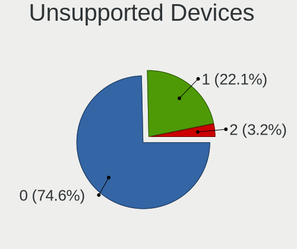

| Total | Computers | Percent |
|-------|-----------|---------|
| 0     | 132       | 68.39%  |
| 1     | 49        | 25.39%  |
| 2     | 10        | 5.18%   |
| 4     | 1         | 0.52%   |
| 3     | 1         | 0.52%   |

Unsupported Device Types
------------------------

Types of unsupported devices

| Type                  | Computers | Percent |
|-----------------------|-----------|---------|
| Fingerprint reader    | 30        | 40.54%  |
| Graphics card         | 14        | 18.92%  |
| Net/wireless          | 10        | 13.51%  |
| Multimedia controller | 10        | 13.51%  |
| Chipcard              | 5         | 6.76%   |
| Camera                | 2         | 2.7%    |
| Sound                 | 1         | 1.35%   |
| Dvb card              | 1         | 1.35%   |
| Card reader           | 1         | 1.35%   |

