Arch - Hardware Trends (Desktops)
---------------------------------

A project to identify most popular hardware characteristics and track their change
over time based on data collected by Linux users at https://Linux-Hardware.org.

Anyone can contribute to this report by the [hw-probe](https://github.com/linuxhw/hw-probe) tool:

    sudo -E hw-probe -all -upload

This report is for one last month. Overall report since the beginning of time: [TestDays](https://github.com/linuxhw/TestDays)

Period: Dec, 2025.

Contents
--------

* [ System ](#system)
  - [ OS                       ](#os)
  - [ OS Family                ](#os-family)
  - [ Kernel                   ](#kernel)
  - [ Kernel Family            ](#kernel-family)
  - [ Kernel Major Ver.        ](#kernel-major-ver)
  - [ Arch                     ](#arch)
  - [ DE                       ](#de)
  - [ Display Server           ](#display-server)
  - [ Display Manager          ](#display-manager)
  - [ OS Lang                  ](#os-lang)
  - [ Boot Mode                ](#boot-mode)
  - [ Filesystem               ](#filesystem)
  - [ Part. scheme             ](#part-scheme)
  - [ Dual Boot with Linux/BSD ](#dual-boot-with-linuxbsd)
  - [ Dual Boot (Win)          ](#dual-boot-win)

* [ Board ](#board)
  - [ Vendor                   ](#vendor)
  - [ Model                    ](#model)
  - [ Model Family             ](#model-family)
  - [ MFG Year                 ](#mfg-year)
  - [ Form Factor              ](#form-factor)
  - [ Secure Boot              ](#secure-boot)
  - [ Coreboot                 ](#coreboot)
  - [ RAM Size                 ](#ram-size)
  - [ RAM Used                 ](#ram-used)
  - [ Total Drives             ](#total-drives)
  - [ Has CD-ROM               ](#has-cd-rom)
  - [ Has Ethernet             ](#has-ethernet)
  - [ Has WiFi                 ](#has-wifi)
  - [ Has Bluetooth            ](#has-bluetooth)

* [ Location ](#location)
  - [ Country                  ](#country)
  - [ City                     ](#city)

* [ Drives ](#drives)
  - [ Drive Vendor             ](#drive-vendor)
  - [ Drive Model              ](#drive-model)
  - [ HDD Vendor               ](#hdd-vendor)
  - [ SSD Vendor               ](#ssd-vendor)
  - [ Drive Kind               ](#drive-kind)
  - [ Drive Connector          ](#drive-connector)
  - [ Drive Size               ](#drive-size)
  - [ Space Total              ](#space-total)
  - [ Space Used               ](#space-used)
  - [ Malfunc. Drives          ](#malfunc-drives)
  - [ Malfunc. Drive Vendor    ](#malfunc-drive-vendor)
  - [ Malfunc. HDD Vendor      ](#malfunc-hdd-vendor)
  - [ Malfunc. Drive Kind      ](#malfunc-drive-kind)
  - [ Failed Drives            ](#failed-drives)
  - [ Failed Drive Vendor      ](#failed-drive-vendor)
  - [ Drive Status             ](#drive-status)

* [ Storage controller ](#storage-controller)
  - [ Storage Vendor           ](#storage-vendor)
  - [ Storage Model            ](#storage-model)
  - [ Storage Kind             ](#storage-kind)

* [ Processor ](#processor)
  - [ CPU Vendor               ](#cpu-vendor)
  - [ CPU Model                ](#cpu-model)
  - [ CPU Model Family         ](#cpu-model-family)
  - [ CPU Cores                ](#cpu-cores)
  - [ CPU Sockets              ](#cpu-sockets)
  - [ CPU Threads              ](#cpu-threads)
  - [ CPU Op-Modes             ](#cpu-op-modes)
  - [ CPU Microcode            ](#cpu-microcode)
  - [ CPU Microarch            ](#cpu-microarch)

* [ Graphics ](#graphics)
  - [ GPU Vendor               ](#gpu-vendor)
  - [ GPU Model                ](#gpu-model)
  - [ GPU Combo                ](#gpu-combo)
  - [ GPU Driver               ](#gpu-driver)
  - [ GPU Memory               ](#gpu-memory)

* [ Monitor ](#monitor)
  - [ Monitor Vendor           ](#monitor-vendor)
  - [ Monitor Model            ](#monitor-model)
  - [ Monitor Resolution       ](#monitor-resolution)
  - [ Monitor Diagonal         ](#monitor-diagonal)
  - [ Monitor Width            ](#monitor-width)
  - [ Aspect Ratio             ](#aspect-ratio)
  - [ Monitor Area             ](#monitor-area)
  - [ Pixel Density            ](#pixel-density)
  - [ Multiple Monitors        ](#multiple-monitors)

* [ Network ](#network)
  - [ Net Controller Vendor    ](#net-controller-vendor)
  - [ Net Controller Model     ](#net-controller-model)
  - [ Wireless Vendor          ](#wireless-vendor)
  - [ Wireless Model           ](#wireless-model)
  - [ Ethernet Vendor          ](#ethernet-vendor)
  - [ Ethernet Model           ](#ethernet-model)
  - [ Net Controller Kind      ](#net-controller-kind)
  - [ Used Controller          ](#used-controller)
  - [ NICs                     ](#nics)
  - [ IPv6                     ](#ipv6)

* [ Bluetooth ](#bluetooth)
  - [ Bluetooth Vendor         ](#bluetooth-vendor)
  - [ Bluetooth Model          ](#bluetooth-model)

* [ Sound ](#sound)
  - [ Sound Vendor             ](#sound-vendor)
  - [ Sound Model              ](#sound-model)

* [ Memory ](#memory)
  - [ Memory Vendor            ](#memory-vendor)
  - [ Memory Model             ](#memory-model)
  - [ Memory Kind              ](#memory-kind)
  - [ Memory Form Factor       ](#memory-form-factor)
  - [ Memory Size              ](#memory-size)
  - [ Memory Speed             ](#memory-speed)

* [ Printers & scanners ](#printers--scanners)
  - [ Printer Vendor           ](#printer-vendor)
  - [ Printer Model            ](#printer-model)
  - [ Scanner Vendor           ](#scanner-vendor)
  - [ Scanner Model            ](#scanner-model)

* [ Camera ](#camera)
  - [ Camera Vendor            ](#camera-vendor)
  - [ Camera Model             ](#camera-model)

* [ Security ](#security)
  - [ Fingerprint Vendor       ](#fingerprint-vendor)
  - [ Fingerprint Model        ](#fingerprint-model)
  - [ Chipcard Vendor          ](#chipcard-vendor)
  - [ Chipcard Model           ](#chipcard-model)

* [ Unsupported ](#unsupported)
  - [ Unsupported Devices      ](#unsupported-devices)
  - [ Unsupported Device Types ](#unsupported-device-types)

System
------

OS
--

Installed operating systems

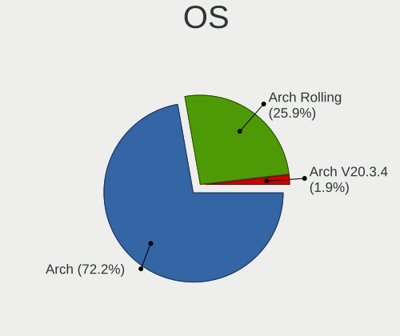

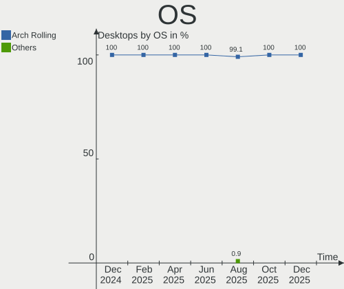

| Name         | Desktops | Percent |
|--------------|----------|---------|
| Arch Rolling | 167      | 100%    |

OS Family
---------

OS without a version

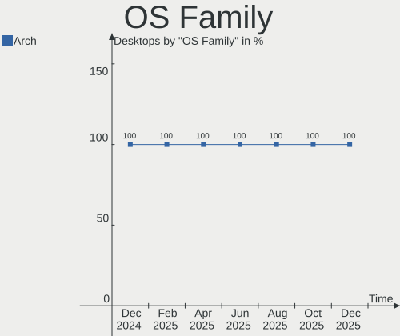

| Name | Desktops | Percent |
|------|----------|---------|
| Arch | 167      | 100%    |

Kernel
------

Version of the Linux kernel

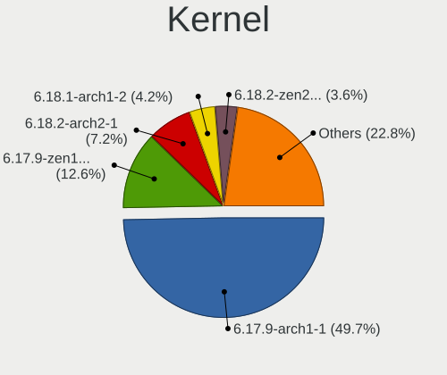

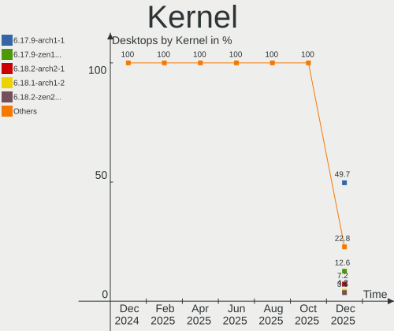

| Version                        | Desktops | Percent |
|--------------------------------|----------|---------|
| 6.17.9-arch1-1                 | 83       | 49.7%   |
| 6.17.9-zen1-1-zen              | 21       | 12.57%  |
| 6.18.2-arch2-1                 | 12       | 7.19%   |
| 6.18.1-arch1-2                 | 7        | 4.19%   |
| 6.18.2-zen2-1-zen              | 6        | 3.59%   |
| 6.17.8-arch1-1                 | 5        | 2.99%   |
| 6.18.0-arch1-1                 | 2        | 1.2%    |
| 6.18.0-2-cachyos               | 2        | 1.2%    |
| 6.17.7-zen1-1-zen              | 2        | 1.2%    |
| 6.12.61-1-lts                  | 2        | 1.2%    |
| 6.12.59-1-lts                  | 2        | 1.2%    |
| 6.18.1-zen1-2-zen              | 1        | 0.6%    |
| 6.18.1-1-cachyos               | 1        | 0.6%    |
| 6.18.0-273-tkg-eevdf           | 1        | 0.6%    |
| 6.18.0-1-cachyos               | 1        | 0.6%    |
| 6.17.9-xenon-ga521330584a8     | 1        | 0.6%    |
| 6.17.9-arch1-1.1               | 1        | 0.6%    |
| 6.17.9-2-cachyos               | 1        | 0.6%    |
| 6.17.9-1-cachyos-bore          | 1        | 0.6%    |
| 6.17.8-zen1-1-zen              | 1        | 0.6%    |
| 6.17.7-arch1-1                 | 1        | 0.6%    |
| 6.17.5-zen-xanmod1-1           | 1        | 0.6%    |
| 6.17.2-arch1-1                 | 1        | 0.6%    |
| 6.17.11-hardened1-1-hardened   | 1        | 0.6%    |
| 6.17.11-200.nobara.fc43.x86_64 | 1        | 0.6%    |
| 6.17.10-lqx1-1-lqx             | 1        | 0.6%    |
| 6.17.1-arch1-1                 | 1        | 0.6%    |
| 6.15.2-zen1-1-zen              | 1        | 0.6%    |
| 6.14.2-arch1-1                 | 1        | 0.6%    |
| 6.12.63-2-cachyos-lts          | 1        | 0.6%    |
| 6.12.63-1-lts                  | 1        | 0.6%    |
| 6.12.62-1-lts                  | 1        | 0.6%    |
| 6.12.60-1-lts                  | 1        | 0.6%    |
| 6.12.1-arch1-1                 | 1        | 0.6%    |

Kernel Family
-------------

Linux kernel without a distro release

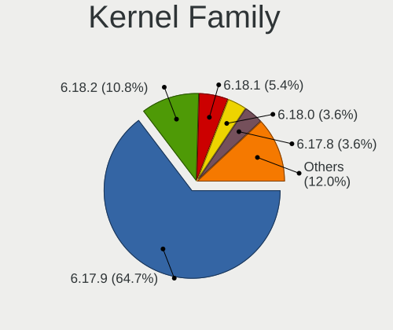

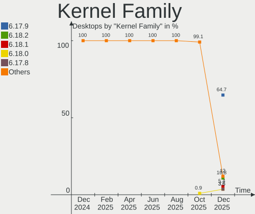

| Version | Desktops | Percent |
|---------|----------|---------|
| 6.17.9  | 108      | 64.67%  |
| 6.18.2  | 18       | 10.78%  |
| 6.18.1  | 9        | 5.39%   |
| 6.18.0  | 6        | 3.59%   |
| 6.17.8  | 6        | 3.59%   |
| 6.17.7  | 3        | 1.8%    |
| 6.17.11 | 2        | 1.2%    |
| 6.12.63 | 2        | 1.2%    |
| 6.12.61 | 2        | 1.2%    |
| 6.12.59 | 2        | 1.2%    |
| 6.17.5  | 1        | 0.6%    |
| 6.17.2  | 1        | 0.6%    |
| 6.17.10 | 1        | 0.6%    |
| 6.17.1  | 1        | 0.6%    |
| 6.15.2  | 1        | 0.6%    |
| 6.14.2  | 1        | 0.6%    |
| 6.12.62 | 1        | 0.6%    |
| 6.12.60 | 1        | 0.6%    |
| 6.12.1  | 1        | 0.6%    |

Kernel Major Ver.
-----------------

Linux kernel major version

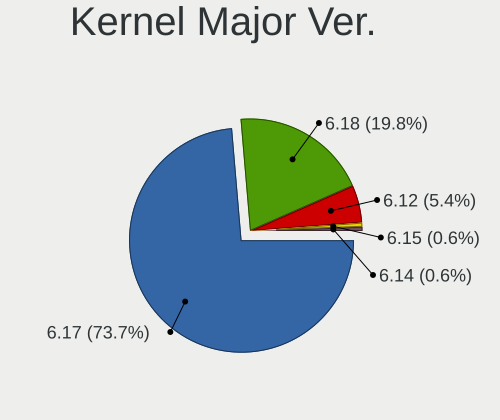

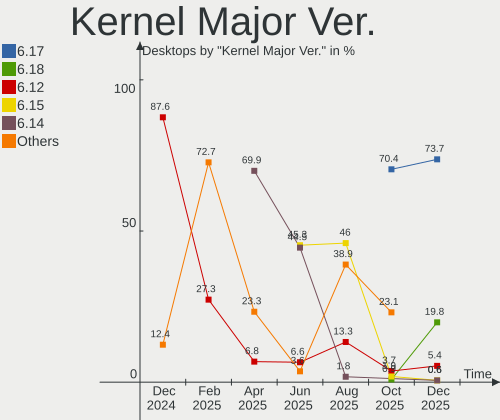

| Version | Desktops | Percent |
|---------|----------|---------|
| 6.17    | 123      | 73.65%  |
| 6.18    | 33       | 19.76%  |
| 6.12    | 9        | 5.39%   |
| 6.15    | 1        | 0.6%    |
| 6.14    | 1        | 0.6%    |

Arch
----

OS architecture (x86_64, i586, etc.)

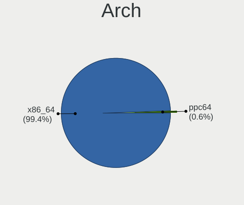

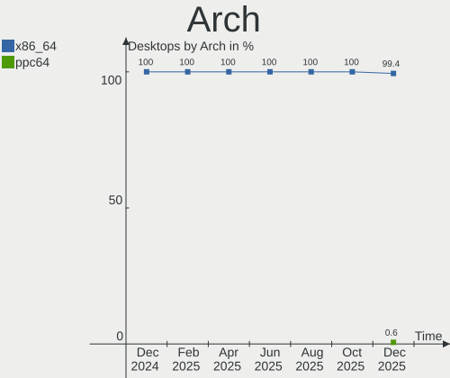

| Name   | Desktops | Percent |
|--------|----------|---------|
| x86_64 | 166      | 99.4%   |
| ppc64  | 1        | 0.6%    |

DE
--

Desktop Environment

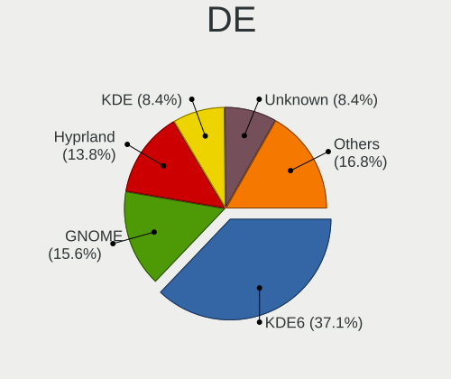

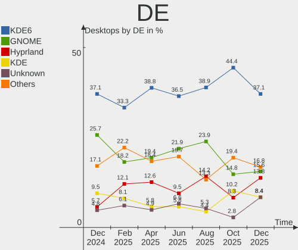

| Name                  | Desktops | Percent |
|-----------------------|----------|---------|
| KDE6                  | 62       | 37.13%  |
| GNOME                 | 26       | 15.57%  |
| Hyprland              | 23       | 13.77%  |
| KDE                   | 14       | 8.38%   |
| Unknown               | 14       | 8.38%   |
| i3                    | 6        | 3.59%   |
| niri                  | 5        | 2.99%   |
| XFCE                  | 4        | 2.4%    |
| sway:wlroots          | 2        | 1.2%    |
| COSMIC                | 2        | 1.2%    |
| X-Cinnamon            | 1        | 0.6%    |
| sway:wlroots:sway-run | 1        | 0.6%    |
| sway                  | 1        | 0.6%    |
| MATE                  | 1        | 0.6%    |
| GNOME Classic         | 1        | 0.6%    |
| Deepin                | 1        | 0.6%    |
| Cinnamon              | 1        | 0.6%    |
| Budgie                | 1        | 0.6%    |
| bspwm                 | 1        | 0.6%    |

Display Server
--------------

X11 or Wayland

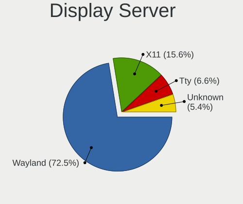

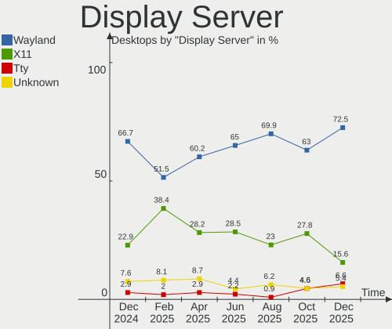

| Name    | Desktops | Percent |
|---------|----------|---------|
| Wayland | 121      | 72.46%  |
| X11     | 26       | 15.57%  |
| Tty     | 11       | 6.59%   |
| Unknown | 9        | 5.39%   |

Display Manager
---------------

SDDM, LightDM, etc.

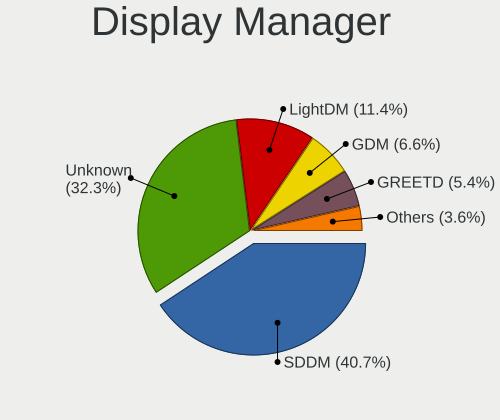

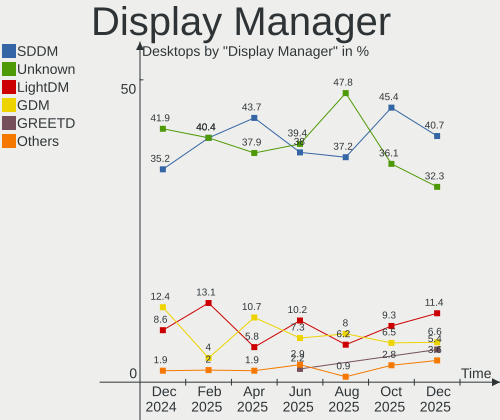

| Name    | Desktops | Percent |
|---------|----------|---------|
| SDDM    | 68       | 40.72%  |
| Unknown | 54       | 32.34%  |
| LightDM | 19       | 11.38%  |
| GDM     | 11       | 6.59%   |
| GREETD  | 9        | 5.39%   |
| LY-DM   | 5        | 2.99%   |
| Ly      | 1        | 0.6%    |

OS Lang
-------

Language

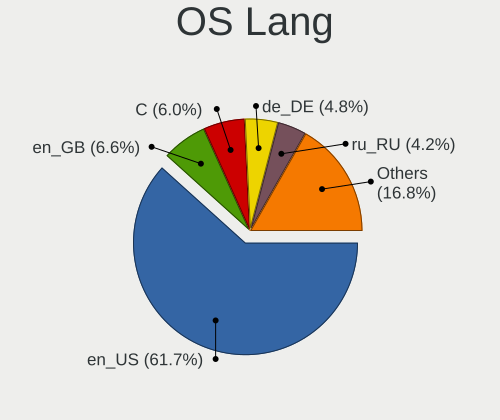

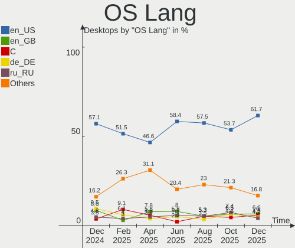

| Lang        | Desktops | Percent |
|-------------|----------|---------|
| en_US       | 103      | 61.68%  |
| en_GB       | 11       | 6.59%   |
| C           | 10       | 5.99%   |
| de_DE       | 8        | 4.79%   |
| ru_RU       | 7        | 4.19%   |
| pt_BR       | 4        | 2.4%    |
| it_IT       | 3        | 1.8%    |
| fr_FR       | 2        | 1.2%    |
| en_AU       | 2        | 1.2%    |
| Unknown     | 2        | 1.2%    |
| uk_UA       | 1        | 0.6%    |
| sk_SK       | 1        | 0.6%    |
| pt_PT       | 1        | 0.6%    |
| pt_BR.UFT-8 | 1        | 0.6%    |
| pl_PL       | 1        | 0.6%    |
| nb_NO       | 1        | 0.6%    |
| es_MX       | 1        | 0.6%    |
| es_ES       | 1        | 0.6%    |
| es_AR       | 1        | 0.6%    |
| en_ZA       | 1        | 0.6%    |
| en_NZ       | 1        | 0.6%    |
| en_IE       | 1        | 0.6%    |
| en_CA       | 1        | 0.6%    |
| de_CH       | 1        | 0.6%    |
| de_AT       | 1        | 0.6%    |

Boot Mode
---------

EFI or BIOS

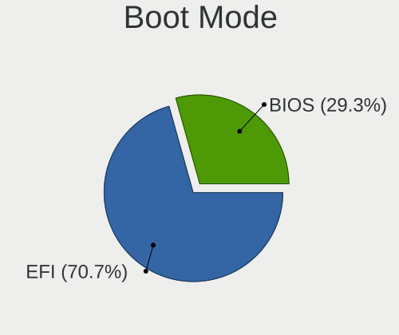

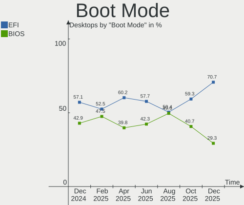

| Mode | Desktops | Percent |
|------|----------|---------|
| EFI  | 118      | 70.66%  |
| BIOS | 49       | 29.34%  |

Filesystem
----------

Type of filesystem

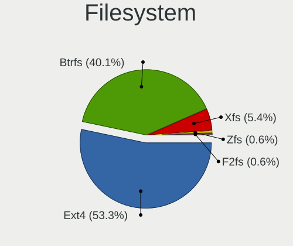

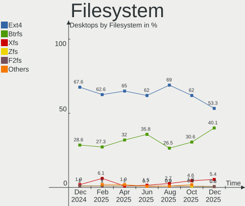

| Type  | Desktops | Percent |
|-------|----------|---------|
| Ext4  | 89       | 53.29%  |
| Btrfs | 67       | 40.12%  |
| Xfs   | 9        | 5.39%   |
| Zfs   | 1        | 0.6%    |
| F2fs  | 1        | 0.6%    |

Part. scheme
------------

Scheme of partitioning

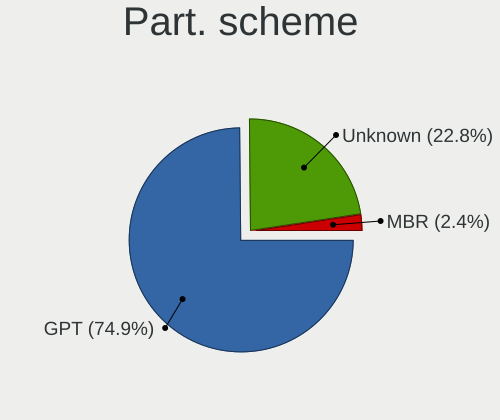

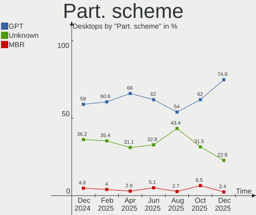

| Type    | Desktops | Percent |
|---------|----------|---------|
| GPT     | 125      | 74.85%  |
| Unknown | 38       | 22.75%  |
| MBR     | 4        | 2.4%    |

Dual Boot with Linux/BSD
------------------------

Hosting more than one Linux/BSD

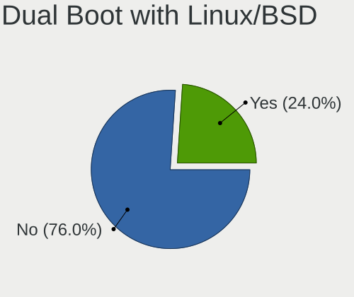

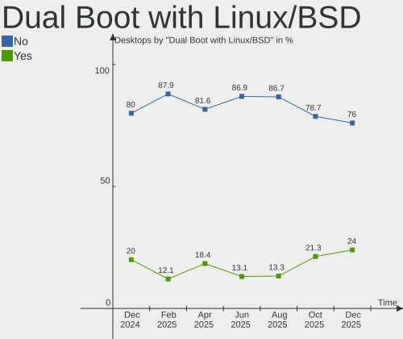

| Dual boot | Desktops | Percent |
|-----------|----------|---------|
| No        | 127      | 76.05%  |
| Yes       | 40       | 23.95%  |

Dual Boot (Win)
---------------

Hosting Linux and Windows

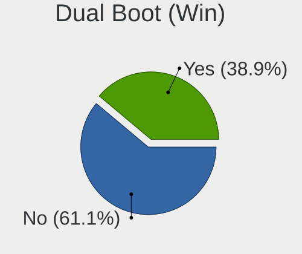

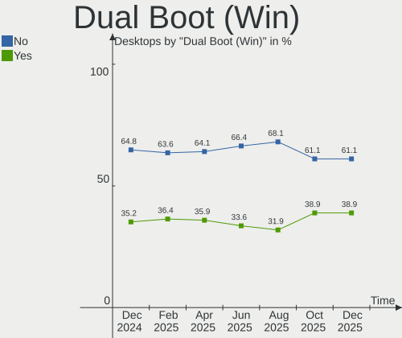

| Dual boot | Desktops | Percent |
|-----------|----------|---------|
| No        | 102      | 61.08%  |
| Yes       | 65       | 38.92%  |

Board
-----

Vendor
------

Motherboard manufacturer

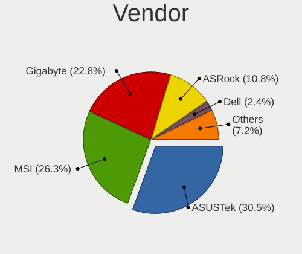

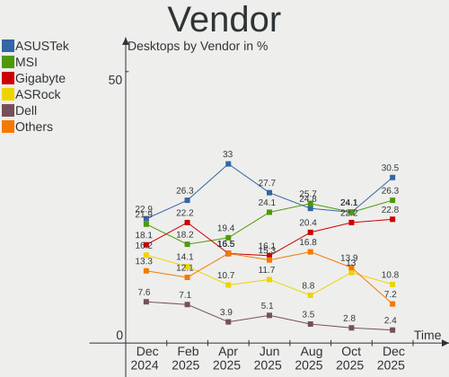

| Name                | Desktops | Percent |
|---------------------|----------|---------|
| ASUSTek Computer    | 51       | 30.54%  |
| MSI                 | 44       | 26.35%  |
| Gigabyte Technology | 38       | 22.75%  |
| ASRock              | 18       | 10.78%  |
| Dell                | 4        | 2.4%    |
| Unknown             | 2        | 1.2%    |
| WeiBu               | 1        | 0.6%    |
| Medion              | 1        | 0.6%    |
| MACHINIST           | 1        | 0.6%    |
| JGINYUE             | 1        | 0.6%    |
| Intel               | 1        | 0.6%    |
| IBM                 | 1        | 0.6%    |
| Huanan              | 1        | 0.6%    |
| Hewlett-Packard     | 1        | 0.6%    |
| GHIA                | 1        | 0.6%    |
| ECS                 | 1        | 0.6%    |

Model
-----

Motherboard model

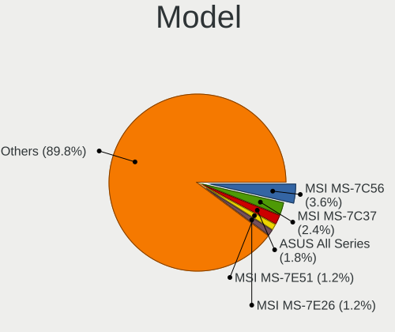

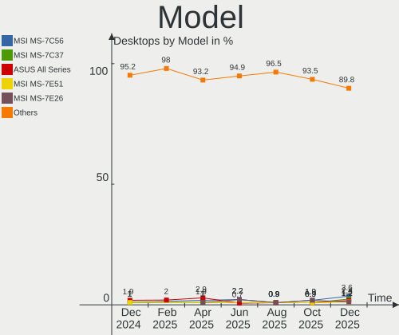

| Name                              | Desktops | Percent |
|-----------------------------------|----------|---------|
| MSI MS-7C56                       | 6        | 3.59%   |
| MSI MS-7C37                       | 4        | 2.4%    |
| ASUS All Series                   | 3        | 1.8%    |
| MSI MS-7E51                       | 2        | 1.2%    |
| MSI MS-7E26                       | 2        | 1.2%    |
| MSI MS-7D91                       | 2        | 1.2%    |
| MSI MS-7C95                       | 2        | 1.2%    |
| MSI MS-7C91                       | 2        | 1.2%    |
| MSI MS-7C84                       | 2        | 1.2%    |
| MSI MS-7821                       | 2        | 1.2%    |
| Gigabyte Z790 UD AX               | 2        | 1.2%    |
| Gigabyte X870E AORUS ELITE WIFI7  | 2        | 1.2%    |
| Gigabyte B850M GAMING X WIFI6E    | 2        | 1.2%    |
| Gigabyte B650M AORUS ELITE AX ICE | 2        | 1.2%    |
| ASUS TUF Gaming X570-PLUS         | 2        | 1.2%    |
| ASUS TUF Gaming B850-PLUS WIFI    | 2        | 1.2%    |
| ASUS ROG STRIX B550-F GAMING      | 2        | 1.2%    |
| ASUS ROG CROSSHAIR X870E HERO     | 2        | 1.2%    |
| ASUS PRIME X570-P                 | 2        | 1.2%    |
| ASRock B650M-HDV/M.2              | 2        | 1.2%    |
| ASRock A320M-HDV R4.0             | 2        | 1.2%    |
| Unknown                           | 2        | 1.2%    |
| WeiBu ADL-N                       | 1        | 0.6%    |
| MSI MS-7E56                       | 1        | 0.6%    |
| MSI MS-7E34                       | 1        | 0.6%    |
| MSI MS-7E28                       | 1        | 0.6%    |
| MSI MS-7E10                       | 1        | 0.6%    |
| MSI MS-7D78                       | 1        | 0.6%    |
| MSI MS-7D75                       | 1        | 0.6%    |
| MSI MS-7D54                       | 1        | 0.6%    |
| MSI MS-7D48                       | 1        | 0.6%    |
| MSI MS-7D31                       | 1        | 0.6%    |
| MSI MS-7D22                       | 1        | 0.6%    |
| MSI MS-7C96                       | 1        | 0.6%    |
| MSI MS-7C94                       | 1        | 0.6%    |
| MSI MS-7C75                       | 1        | 0.6%    |
| MSI MS-7C02                       | 1        | 0.6%    |
| MSI MS-7B96                       | 1        | 0.6%    |
| MSI MS-7B84                       | 1        | 0.6%    |
| MSI MS-7B18                       | 1        | 0.6%    |

Model Family
------------

Motherboard model prefix

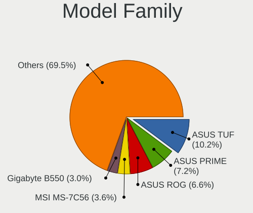

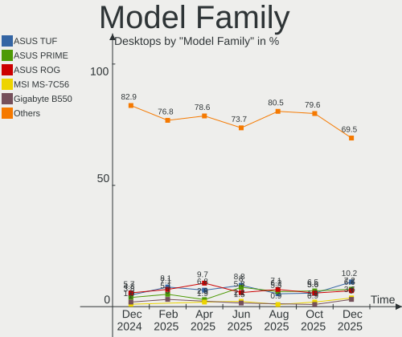

| Name             | Desktops | Percent |
|------------------|----------|---------|
| ASUS TUF         | 17       | 10.18%  |
| ASUS PRIME       | 12       | 7.19%   |
| ASUS ROG         | 11       | 6.59%   |
| MSI MS-7C56      | 6        | 3.59%   |
| Gigabyte B550    | 5        | 2.99%   |
| MSI MS-7C37      | 4        | 2.4%    |
| Gigabyte X870E   | 4        | 2.4%    |
| Gigabyte B450    | 4        | 2.4%    |
| Gigabyte X570    | 3        | 1.8%    |
| ASUS All         | 3        | 1.8%    |
| MSI MS-7E51      | 2        | 1.2%    |
| MSI MS-7E26      | 2        | 1.2%    |
| MSI MS-7D91      | 2        | 1.2%    |
| MSI MS-7C95      | 2        | 1.2%    |
| MSI MS-7C91      | 2        | 1.2%    |
| MSI MS-7C84      | 2        | 1.2%    |
| MSI MS-7821      | 2        | 1.2%    |
| Gigabyte Z790    | 2        | 1.2%    |
| Gigabyte Z690    | 2        | 1.2%    |
| Gigabyte B850M   | 2        | 1.2%    |
| Gigabyte B650M   | 2        | 1.2%    |
| Gigabyte B650    | 2        | 1.2%    |
| Dell OptiPlex    | 2        | 1.2%    |
| ASUS ProArt      | 2        | 1.2%    |
| ASUS Pro         | 2        | 1.2%    |
| ASRock X570      | 2        | 1.2%    |
| ASRock B650M-HDV | 2        | 1.2%    |
| ASRock B550M     | 2        | 1.2%    |
| ASRock B550      | 2        | 1.2%    |
| ASRock B450M     | 2        | 1.2%    |
| ASRock A320M-HDV | 2        | 1.2%    |
| Unknown          | 2        | 1.2%    |
| WeiBu ADL-N      | 1        | 0.6%    |
| MSI MS-7E56      | 1        | 0.6%    |
| MSI MS-7E34      | 1        | 0.6%    |
| MSI MS-7E28      | 1        | 0.6%    |
| MSI MS-7E10      | 1        | 0.6%    |
| MSI MS-7D78      | 1        | 0.6%    |
| MSI MS-7D75      | 1        | 0.6%    |
| MSI MS-7D54      | 1        | 0.6%    |

MFG Year
--------

Motherboard manufacture year

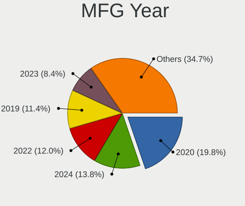

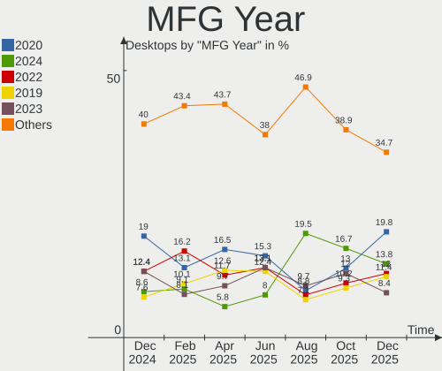

| Year    | Desktops | Percent |
|---------|----------|---------|
| 2020    | 33       | 19.76%  |
| 2024    | 23       | 13.77%  |
| 2022    | 20       | 11.98%  |
| 2019    | 19       | 11.38%  |
| 2023    | 14       | 8.38%   |
| 2021    | 12       | 7.19%   |
| 2018    | 11       | 6.59%   |
| 2013    | 7        | 4.19%   |
| 2017    | 6        | 3.59%   |
| 2025    | 5        | 2.99%   |
| 2016    | 3        | 1.8%    |
| 2015    | 3        | 1.8%    |
| 2012    | 3        | 1.8%    |
| 2014    | 2        | 1.2%    |
| 2011    | 2        | 1.2%    |
| 2009    | 1        | 0.6%    |
| 2007    | 1        | 0.6%    |
| 2006    | 1        | 0.6%    |
| Unknown | 1        | 0.6%    |

Form Factor
-----------

Physical design of the computer

| Name    | Desktops | Percent |
|---------|----------|---------|
| Desktop | 167      | 100%    |

Secure Boot
-----------

Enabled or disabled

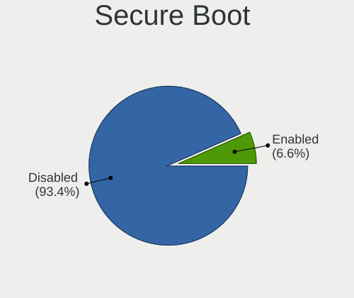

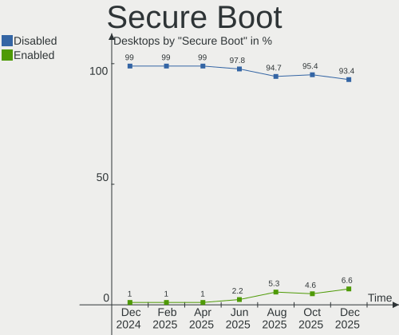

| State    | Desktops | Percent |
|----------|----------|---------|
| Disabled | 156      | 93.41%  |
| Enabled  | 11       | 6.59%   |

Coreboot
--------

Have coreboot on board

| Used | Desktops | Percent |
|------|----------|---------|
| No   | 167      | 100%    |

RAM Size
--------

Total RAM memory

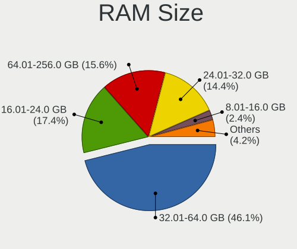

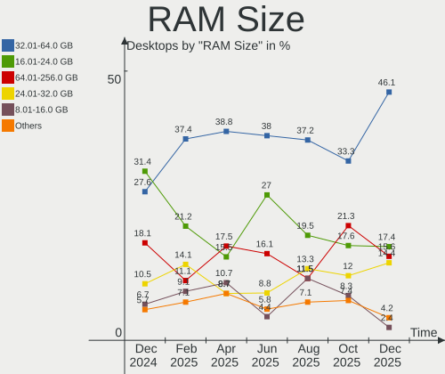

| Size in GB  | Desktops | Percent |
|-------------|----------|---------|
| 32.01-64.0  | 77       | 46.11%  |
| 16.01-24.0  | 29       | 17.37%  |
| 64.01-256.0 | 26       | 15.57%  |
| 24.01-32.0  | 24       | 14.37%  |
| 8.01-16.0   | 4        | 2.4%    |
| 4.01-8.0    | 3        | 1.8%    |
| 3.01-4.0    | 2        | 1.2%    |
| 0.51-1.0    | 1        | 0.6%    |
| 0.01-0.5    | 1        | 0.6%    |

RAM Used
--------

Used RAM memory

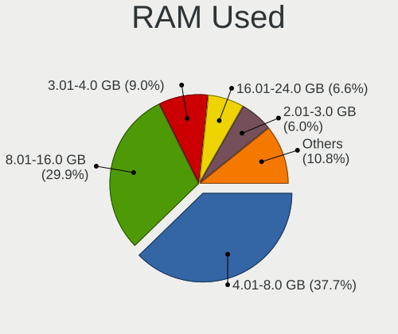

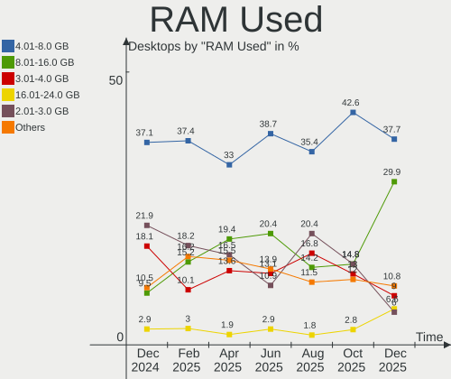

| Used GB     | Desktops | Percent |
|-------------|----------|---------|
| 4.01-8.0    | 63       | 37.72%  |
| 8.01-16.0   | 50       | 29.94%  |
| 3.01-4.0    | 15       | 8.98%   |
| 16.01-24.0  | 11       | 6.59%   |
| 2.01-3.0    | 10       | 5.99%   |
| 1.01-2.0    | 8        | 4.79%   |
| 32.01-64.0  | 4        | 2.4%    |
| 24.01-32.0  | 3        | 1.8%    |
| 0.01-0.5    | 2        | 1.2%    |
| 64.01-256.0 | 1        | 0.6%    |

Total Drives
------------

Number of drives on board

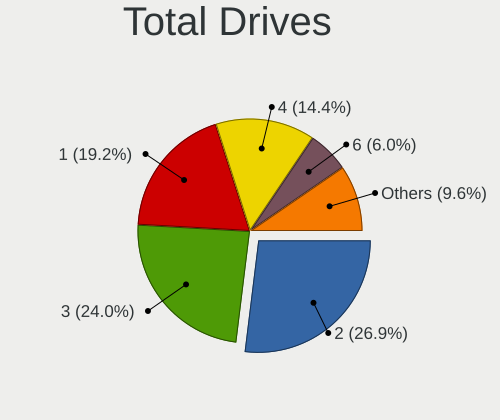

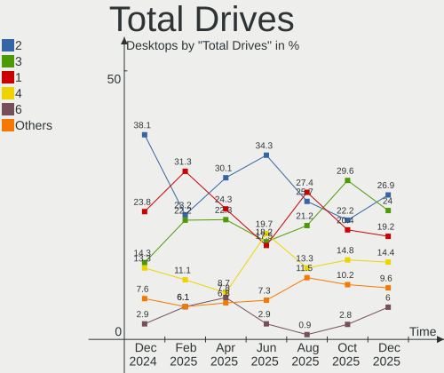

| Drives | Desktops | Percent |
|--------|----------|---------|
| 2      | 45       | 26.95%  |
| 3      | 40       | 23.95%  |
| 1      | 32       | 19.16%  |
| 4      | 24       | 14.37%  |
| 6      | 10       | 5.99%   |
| 5      | 9        | 5.39%   |
| 7      | 3        | 1.8%    |
| 12     | 2        | 1.2%    |
| 8      | 1        | 0.6%    |
| 0      | 1        | 0.6%    |

Has CD-ROM
----------

Has CD-ROM on board

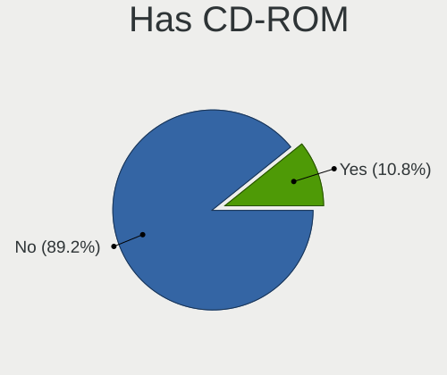

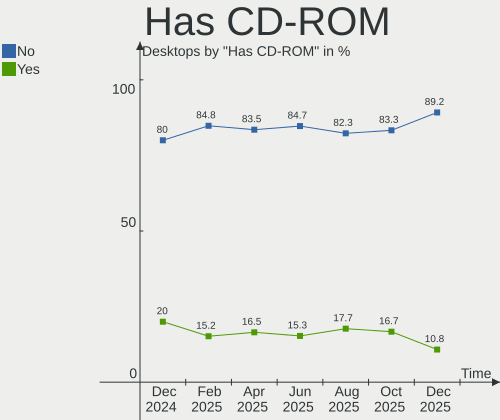

| Presented | Desktops | Percent |
|-----------|----------|---------|
| No        | 149      | 89.22%  |
| Yes       | 18       | 10.78%  |

Has Ethernet
------------

Has Ethernet on board

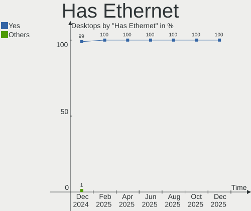

| Presented | Desktops | Percent |
|-----------|----------|---------|
| Yes       | 167      | 100%    |

Has WiFi
--------

Has WiFi module

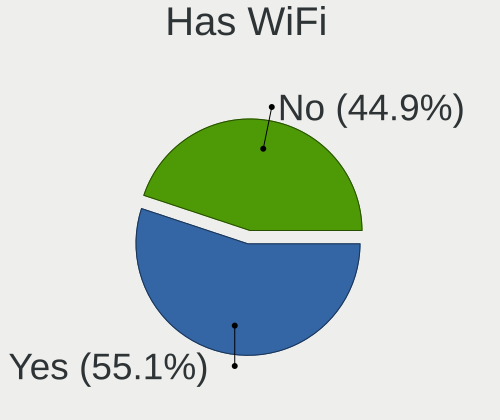

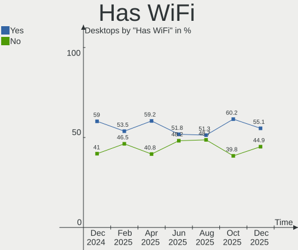

| Presented | Desktops | Percent |
|-----------|----------|---------|
| Yes       | 92       | 55.09%  |
| No        | 75       | 44.91%  |

Has Bluetooth
-------------

Has Bluetooth module

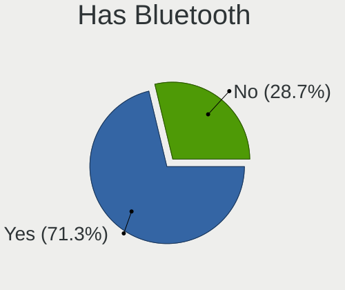

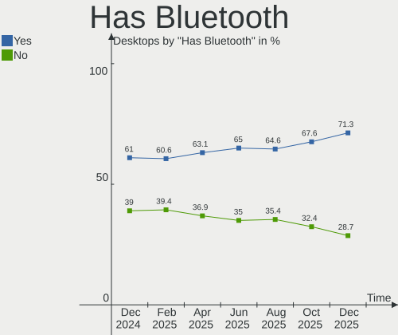

| Presented | Desktops | Percent |
|-----------|----------|---------|
| Yes       | 119      | 71.26%  |
| No        | 48       | 28.74%  |

Location
--------

Country
-------

Geographic location (country)

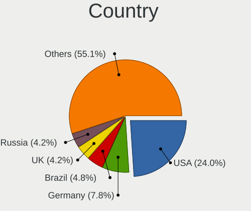

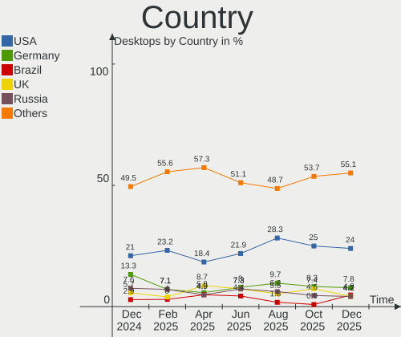

| Country         | Desktops | Percent |
|-----------------|----------|---------|
| USA             | 40       | 23.95%  |
| Germany         | 13       | 7.78%   |
| Brazil          | 8        | 4.79%   |
| UK              | 7        | 4.19%   |
| Russia          | 7        | 4.19%   |
| France          | 7        | 4.19%   |
| Netherlands     | 6        | 3.59%   |
| Poland          | 5        | 2.99%   |
| Italy           | 5        | 2.99%   |
| Canada          | 5        | 2.99%   |
| The Netherlands | 4        | 2.4%    |
| Greece          | 4        | 2.4%    |
| Switzerland     | 3        | 1.8%    |
| Sweden          | 3        | 1.8%    |
| Philippines     | 3        | 1.8%    |
| India           | 3        | 1.8%    |
| Bulgaria        | 3        | 1.8%    |
| Austria         | 3        | 1.8%    |
| Australia       | 3        | 1.8%    |
| Turkey          | 2        | 1.2%    |
| Portugal        | 2        | 1.2%    |
| Mexico          | 2        | 1.2%    |
| Finland         | 2        | 1.2%    |
| Czechia         | 2        | 1.2%    |
| Ukraine         | 1        | 0.6%    |
| Spain           | 1        | 0.6%    |
| South Korea     | 1        | 0.6%    |
| South Africa    | 1        | 0.6%    |
| Slovakia        | 1        | 0.6%    |
| Serbia          | 1        | 0.6%    |
| Romania         | 1        | 0.6%    |
| Norway          | 1        | 0.6%    |
| New Zealand     | 1        | 0.6%    |
| Kenya           | 1        | 0.6%    |
| Jordan          | 1        | 0.6%    |
| Iraq            | 1        | 0.6%    |
| Iran            | 1        | 0.6%    |
| Hungary         | 1        | 0.6%    |
| Georgia         | 1        | 0.6%    |
| Estonia         | 1        | 0.6%    |

City
----

Geographic location (city)

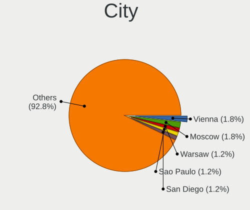

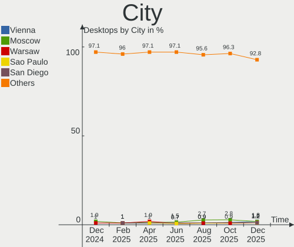

| City               | Desktops | Percent |
|--------------------|----------|---------|
| Vienna             | 3        | 1.8%    |
| Moscow             | 3        | 1.8%    |
| Warsaw             | 2        | 1.2%    |
| Sao Paulo          | 2        | 1.2%    |
| San Diego          | 2        | 1.2%    |
| New York           | 2        | 1.2%    |
| Lancaster          | 2        | 1.2%    |
| Hilversum          | 2        | 1.2%    |
| Gävle             | 2        | 1.2%    |
| Düsseldorf        | 2        | 1.2%    |
| Breda              | 2        | 1.2%    |
| Amsterdam          | 2        | 1.2%    |
| Alexandroupoli     | 2        | 1.2%    |
| Zurich             | 1        | 0.6%    |
| Yakutsk            | 1        | 0.6%    |
| Wohlen             | 1        | 0.6%    |
| Watsonville        | 1        | 0.6%    |
| Umraniye           | 1        | 0.6%    |
| Tver               | 1        | 0.6%    |
| Troy               | 1        | 0.6%    |
| Toulouse           | 1        | 0.6%    |
| Torres Novas       | 1        | 0.6%    |
| Toronto            | 1        | 0.6%    |
| Tijuana            | 1        | 0.6%    |
| Tehran             | 1        | 0.6%    |
| Tbilisi            | 1        | 0.6%    |
| Tandil             | 1        | 0.6%    |
| Tampere            | 1        | 0.6%    |
| Svätý Jur        | 1        | 0.6%    |
| Stuttgart          | 1        | 0.6%    |
| St. Petersburg     | 1        | 0.6%    |
| Spartanburg        | 1        | 0.6%    |
| Sofia              | 1        | 0.6%    |
| Sint-Truiden       | 1        | 0.6%    |
| Sighetu Marmaţiei | 1        | 0.6%    |
| Sheridan           | 1        | 0.6%    |
| Schiphol-Rijk      | 1        | 0.6%    |
| Sarajevo           | 1        | 0.6%    |
| San Jose           | 1        | 0.6%    |
| Salo               | 1        | 0.6%    |

Drives
------

Drive Vendor
------------

Hard drive vendors

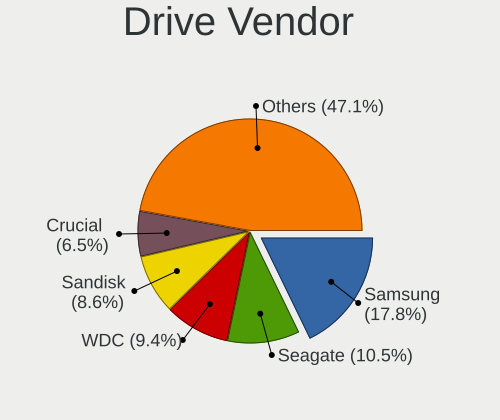

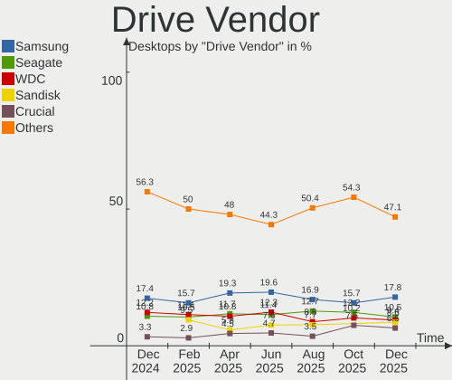

| Vendor                       | Desktops | Drives | Percent |
|------------------------------|----------|--------|---------|
| Samsung Electronics          | 68       | 119    | 17.8%   |
| Seagate                      | 40       | 51     | 10.47%  |
| WDC                          | 36       | 55     | 9.42%   |
| Sandisk                      | 33       | 40     | 8.64%   |
| Crucial                      | 25       | 31     | 6.54%   |
| Kingston                     | 18       | 20     | 4.71%   |
| Micron/Crucial Technology    | 17       | 19     | 4.45%   |
| Kingston Technology Company  | 17       | 19     | 4.45%   |
| Toshiba                      | 11       | 15     | 2.88%   |
| Hitachi                      | 11       | 12     | 2.88%   |
| MAXIO Technology (Hangzhou)  | 10       | 11     | 2.62%   |
| Phison Electronics           | 8        | 8      | 2.09%   |
| Micron Technology            | 8        | 11     | 2.09%   |
| Intel                        | 7        | 7      | 1.83%   |
| Silicon Motion               | 6        | 6      | 1.57%   |
| Shenzhen Longsys Electronics | 6        | 7      | 1.57%   |
| ADATA Technology             | 6        | 8      | 1.57%   |
| HGST                         | 4        | 4      | 1.05%   |
| SPCC                         | 3        | 3      | 0.79%   |
| SK hynix                     | 3        | 3      | 0.79%   |
| PNY                          | 3        | 3      | 0.79%   |
| Intenso                      | 3        | 3      | 0.79%   |
| China                        | 3        | 3      | 0.79%   |
| Solidigm                     | 2        | 2      | 0.52%   |
| Seagate Technology           | 2        | 2      | 0.52%   |
| Realtek Semiconductor        | 2        | 2      | 0.52%   |
| OCZ                          | 2        | 2      | 0.52%   |
| KIOXIA                       | 2        | 2      | 0.52%   |
| INNOGRIT                     | 2        | 3      | 0.52%   |
| Hosin Global Electronics     | 2        | 2      | 0.52%   |
| A-DATA Technology            | 2        | 2      | 0.52%   |
| XrayDisk                     | 1        | 1      | 0.26%   |
| WALRAM                       | 1        | 1      | 0.26%   |
| Team                         | 1        | 1      | 0.26%   |
| T-FORCE                      | 1        | 1      | 0.26%   |
| Plextor                      | 1        | 1      | 0.26%   |
| Phison                       | 1        | 1      | 0.26%   |
| Mushkin                      | 1        | 1      | 0.26%   |
| LITEONIT                     | 1        | 1      | 0.26%   |
| Lexar                        | 1        | 1      | 0.26%   |

Drive Model
-----------

Hard drive models

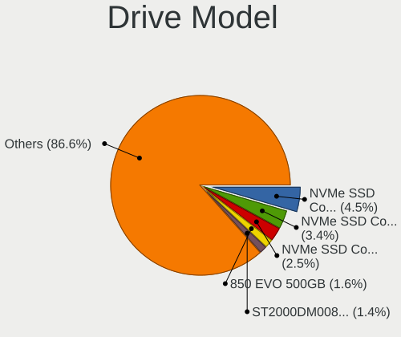

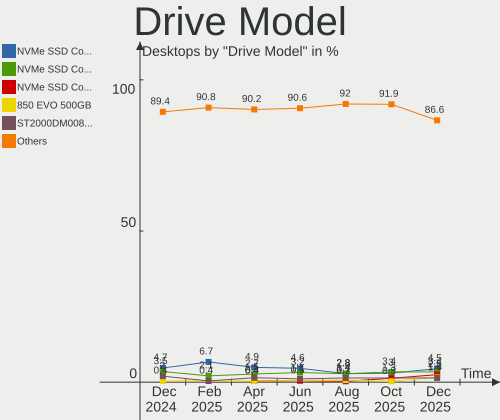

| Model                                                                      | Desktops | Percent |
|----------------------------------------------------------------------------|----------|---------|
| Samsung NVMe SSD Controller SM981/PM981/PM983 1TB                          | 20       | 4.54%   |
| Samsung NVMe SSD Controller PM9A1/PM9A3/980PRO 1TB                         | 15       | 3.4%    |
| Samsung NVMe SSD Controller S4LV008[Pascal] 4TB                            | 11       | 2.49%   |
| Samsung SSD 850 EVO 500GB                                                  | 7        | 1.59%   |
| Seagate ST2000DM008-2FR102 2TB                                             | 6        | 1.36%   |
| Sandisk WD Black SN770 / PC SN740 256GB / PC SN560 (DRAM-less) NVMe SSD    | 6        | 1.36%   |
| Kingston SA400S37480G 480GB SSD                                            | 6        | 1.36%   |
| Kingston SA400S37240G 240GB SSD                                            | 5        | 1.13%   |
| Crucial CT1000MX500SSD1 1TB                                                | 5        | 1.13%   |
| Silicon Motion SM2263EN/SM2263XT SSD Controller 512GB                      | 4        | 0.91%   |
| Sandisk Extreme Pro / WD Black SN750 / PC SN730 / Red SN700 NVMe SSD 500GB | 4        | 0.91%   |
| Samsung SSD 990 PRO 2TB                                                    | 4        | 0.91%   |
| Samsung NVMe SSD Controller 980 (DRAM-less) 256GB                          | 4        | 0.91%   |
| Micron/Crucial P2 [Nick P2] / P3 / P3 Plus NVMe PCIe SSD (DRAM-less) 2TB   | 4        | 0.91%   |
| Kingston Company NV2 NVMe SSD [SM2267XT] (DRAM-less) 1TB                   | 4        | 0.91%   |
| Crucial CT1000BX500SSD1 1TB                                                | 4        | 0.91%   |
| WDC WD10EZEX-08WN4A0 1TB                                                   | 3        | 0.68%   |
| Shenzhen Longsys Lexar NM790 NVME SSD (DRAM-less) 1TB                      | 3        | 0.68%   |
| Seagate ST2000DM008-2UB102 2TB                                             | 3        | 0.68%   |
| Seagate ST1000DM010-2EP102 1TB                                             | 3        | 0.68%   |
| Seagate ST1000DM003-1CH162 1TB                                             | 3        | 0.68%   |
| Samsung SSD 870 QVO 1TB                                                    | 3        | 0.68%   |
| MAXIO (Hangzhou) NVMe SSD Controller MAP1202 2TB                           | 3        | 0.68%   |
| Kingston Company KC3000/FURY Renegade NVMe SSD [E18] 2TB                   | 3        | 0.68%   |
| HGST HTS541010A9E680 1TB                                                   | 3        | 0.68%   |
| Crucial CT500MX500SSD1 500GB                                               | 3        | 0.68%   |
| Crucial CT2000BX500SSD1 2TB                                                | 3        | 0.68%   |
| ADATA XPG SX8200 Pro PCIe Gen3x4 M.2 2280 Solid State Drive 1024GB         | 3        | 0.68%   |
| WDC WD6003FZBX-00K5WB0 6TB                                                 | 2        | 0.45%   |
| WDC WD40EFRX-68N32N0 4TB                                                   | 2        | 0.45%   |
| Toshiba MQ01ABD100 1TB                                                     | 2        | 0.45%   |
| Toshiba HDWE140 4TB                                                        | 2        | 0.45%   |
| Seagate ST500DM002-1BD142 500GB                                            | 2        | 0.45%   |
| Seagate ST2000DM001-1ER164 2TB                                             | 2        | 0.45%   |
| Seagate ST1000DM003-1SB102 1TB                                             | 2        | 0.45%   |
| Sandisk WD PC SN5000S M.2 2280 NVMe SSD (DRAM-less) 1TB                    | 2        | 0.45%   |
| Sandisk WD Blue SN580 1TB                                                  | 2        | 0.45%   |
| Sandisk WD Blue SN570 500GB                                                | 2        | 0.45%   |
| Sandisk WD Blue SN550 NVMe SSD 1024GB                                      | 2        | 0.45%   |
| Sandisk WD Black SN750 / PC SN730 NVMe SSD 500GB                           | 2        | 0.45%   |

HDD Vendor
----------

Hard disk drive vendors

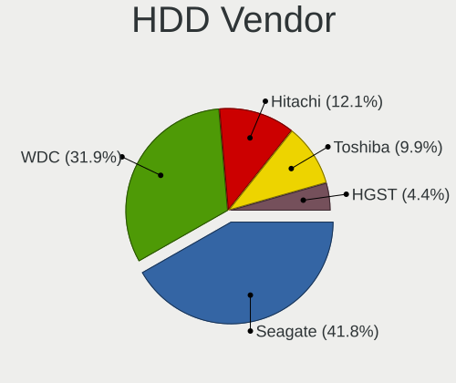

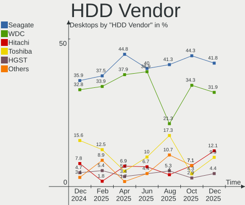

| Vendor  | Desktops | Drives | Percent |
|---------|----------|--------|---------|
| Seagate | 38       | 47     | 41.76%  |
| WDC     | 29       | 44     | 31.87%  |
| Hitachi | 11       | 12     | 12.09%  |
| Toshiba | 9        | 13     | 9.89%   |
| HGST    | 4        | 4      | 4.4%    |

SSD Vendor
----------

Solid state drive vendors

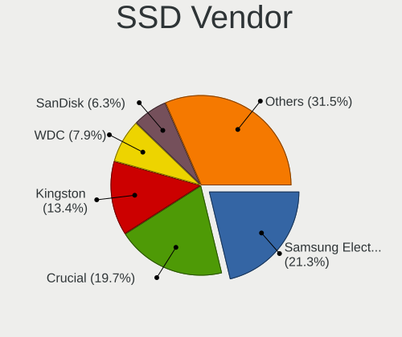

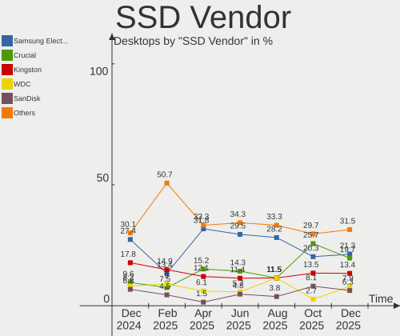

| Vendor              | Desktops | Drives | Percent |
|---------------------|----------|--------|---------|
| Samsung Electronics | 27       | 44     | 21.26%  |
| Crucial             | 25       | 31     | 19.69%  |
| Kingston            | 17       | 17     | 13.39%  |
| WDC                 | 10       | 11     | 7.87%   |
| SanDisk             | 8        | 11     | 6.3%    |
| SPCC                | 3        | 3      | 2.36%   |
| PNY                 | 3        | 3      | 2.36%   |
| Intenso             | 3        | 3      | 2.36%   |
| Intel               | 3        | 3      | 2.36%   |
| China               | 3        | 3      | 2.36%   |
| Toshiba             | 2        | 2      | 1.57%   |
| Seagate             | 2        | 2      | 1.57%   |
| OCZ                 | 2        | 2      | 1.57%   |
| A-DATA Technology   | 2        | 2      | 1.57%   |
| WALRAM              | 1        | 1      | 0.79%   |
| Team                | 1        | 1      | 0.79%   |
| T-FORCE             | 1        | 1      | 0.79%   |
| SK hynix            | 1        | 1      | 0.79%   |
| Plextor             | 1        | 1      | 0.79%   |
| Mushkin             | 1        | 1      | 0.79%   |
| Micron Technology   | 1        | 1      | 0.79%   |
| LITEONIT            | 1        | 1      | 0.79%   |
| Lexar               | 1        | 1      | 0.79%   |
| KingDian            | 1        | 1      | 0.79%   |
| HS-SSD-E100N        | 1        | 1      | 0.79%   |
| Emtec               | 1        | 1      | 0.79%   |
| EDILOCA             | 1        | 1      | 0.79%   |
| EAGET               | 1        | 1      | 0.79%   |
| Corsair             | 1        | 1      | 0.79%   |
| Apacer              | 1        | 1      | 0.79%   |
| Unknown             | 1        | 1      | 0.79%   |

Drive Kind
----------

HDD or SSD

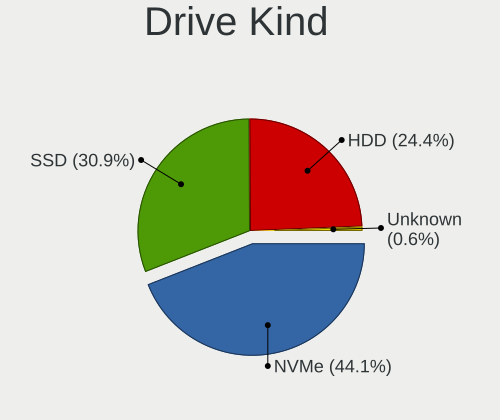

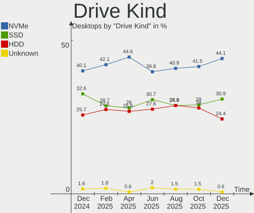

| Kind    | Desktops | Drives | Percent |
|---------|----------|--------|---------|
| NVMe    | 137      | 220    | 44.05%  |
| SSD     | 96       | 154    | 30.87%  |
| HDD     | 76       | 120    | 24.44%  |
| Unknown | 2        | 2      | 0.64%   |

Drive Connector
---------------

SATA, SAS, NVMe, etc.

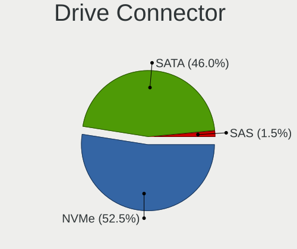

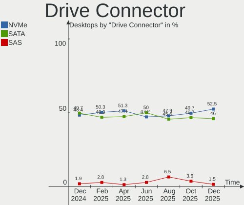

| Type | Desktops | Drives | Percent |
|------|----------|--------|---------|
| NVMe | 137      | 220    | 52.49%  |
| SATA | 120      | 270    | 45.98%  |
| SAS  | 4        | 6      | 1.53%   |

Drive Size
----------

Size of hard drive

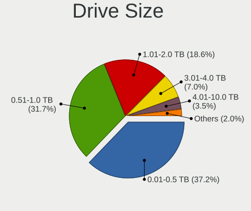

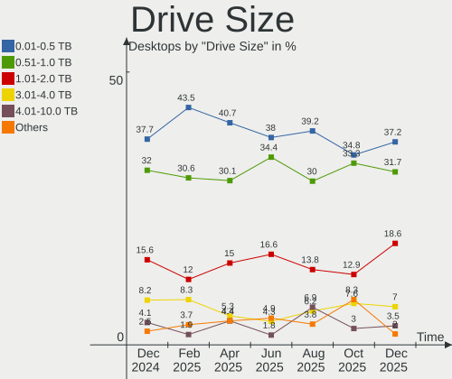

| Size in TB | Desktops | Drives | Percent |
|------------|----------|--------|---------|
| 0.01-0.5   | 74       | 98     | 37.19%  |
| 0.51-1.0   | 63       | 87     | 31.66%  |
| 1.01-2.0   | 37       | 43     | 18.59%  |
| 3.01-4.0   | 14       | 30     | 7.04%   |
| 4.01-10.0  | 7        | 10     | 3.52%   |
| 2.01-3.0   | 2        | 2      | 1.01%   |
| 10.01-20.0 | 2        | 4      | 1.01%   |

Space Total
-----------

Amount of disk space available on the file system

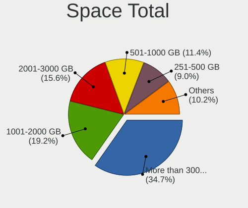

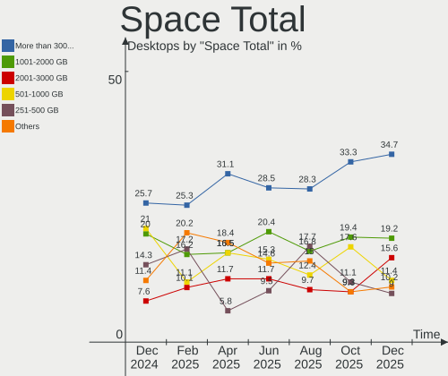

| Size in GB     | Desktops | Percent |
|----------------|----------|---------|
| More than 3000 | 58       | 34.73%  |
| 1001-2000      | 32       | 19.16%  |
| 2001-3000      | 26       | 15.57%  |
| 501-1000       | 19       | 11.38%  |
| 251-500        | 15       | 8.98%   |
| 101-250        | 9        | 5.39%   |
| 1-20           | 3        | 1.8%    |
| 51-100         | 2        | 1.2%    |
| Unknown        | 2        | 1.2%    |
| 21-50          | 1        | 0.6%    |

Space Used
----------

Amount of used disk space

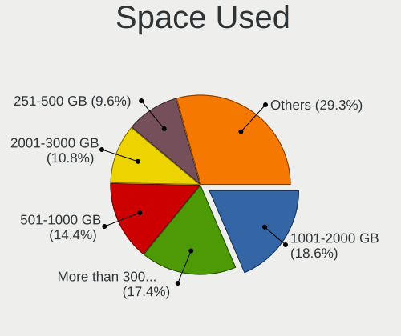

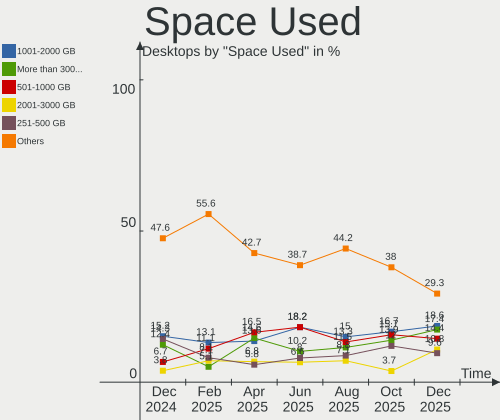

| Used GB        | Desktops | Percent |
|----------------|----------|---------|
| 1001-2000      | 31       | 18.56%  |
| More than 3000 | 29       | 17.37%  |
| 501-1000       | 24       | 14.37%  |
| 2001-3000      | 18       | 10.78%  |
| 251-500        | 16       | 9.58%   |
| 101-250        | 16       | 9.58%   |
| 21-50          | 13       | 7.78%   |
| 1-20           | 9        | 5.39%   |
| 51-100         | 9        | 5.39%   |
| Unknown        | 2        | 1.2%    |

Malfunc. Drives
---------------

Drive models with a malfunction

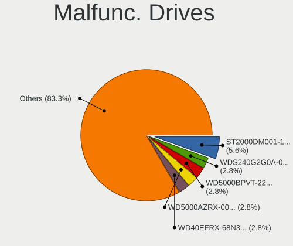

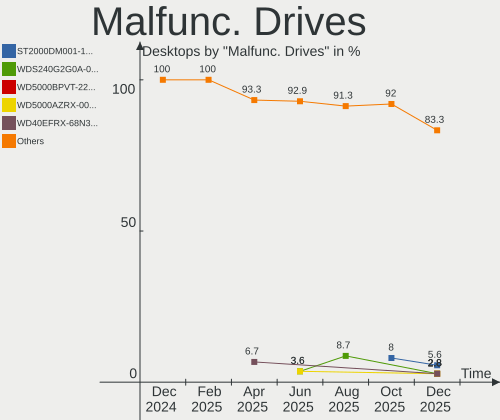

| Model                                                            | Desktops | Drives | Percent |
|------------------------------------------------------------------|----------|--------|---------|
| Seagate ST2000DM001-1ER164 2TB                                   | 2        | 3      | 5.56%   |
| WDC WDS240G2G0A-00JH30 240GB SSD                                 | 1        | 1      | 2.78%   |
| WDC WD5000BPVT-22HXZT3 500GB                                     | 1        | 1      | 2.78%   |
| WDC WD5000AZRX-00A8LB0 500GB                                     | 1        | 1      | 2.78%   |
| WDC WD40EFRX-68N32N0 4TB                                         | 1        | 1      | 2.78%   |
| WDC WD3003FZEX-00Z4SA0 3TB                                       | 1        | 1      | 2.78%   |
| WDC WD20EARS-00MVWB0 2TB                                         | 1        | 1      | 2.78%   |
| WDC WD2003FZEX-00Z4SA0 2TB                                       | 1        | 1      | 2.78%   |
| WDC WD10EZEX-60M2NA0 1TB                                         | 1        | 1      | 2.78%   |
| WDC WD10EZEX-08WN4A0 1TB                                         | 1        | 1      | 2.78%   |
| WDC WD10EADS-00L5B1 1TB                                          | 1        | 1      | 2.78%   |
| WDC WD1002FBYS-02A6B0 1TB                                        | 1        | 1      | 2.78%   |
| Seagate ST500DM009-2F110A 500GB                                  | 1        | 1      | 2.78%   |
| Seagate ST500DM002-1BD142 500GB                                  | 1        | 1      | 2.78%   |
| Seagate ST4000VN008-2DR166 4TB                                   | 1        | 1      | 2.78%   |
| Seagate ST4000DX001-1CE168 4TB                                   | 1        | 1      | 2.78%   |
| Seagate ST4000DM000-1F2168 4TB                                   | 1        | 1      | 2.78%   |
| Seagate ST3500418AS 500GB                                        | 1        | 1      | 2.78%   |
| Seagate ST3160212SCE 160GB                                       | 1        | 1      | 2.78%   |
| Seagate ST3000DM001-1ER166 3TB                                   | 1        | 1      | 2.78%   |
| Seagate ST240HM000-1G5152 240GB SSD                              | 1        | 1      | 2.78%   |
| Seagate ST1000DM010-2EP102 1TB                                   | 1        | 2      | 2.78%   |
| SanDisk SDSSDXPS960G 960GB                                       | 1        | 2      | 2.78%   |
| Samsung Electronics NVMe SSD Controller SM981/PM981/PM983 1TB    | 1        | 1      | 2.78%   |
| Samsung Electronics NVMe SSD Controller SM961/PM961/SM963 1024GB | 1        | 1      | 2.78%   |
| Samsung Electronics NVMe SSD Controller 980 (DRAM-less) 256GB    | 1        | 1      | 2.78%   |
| OCZ AGILITY3 64GB SSD                                            | 1        | 1      | 2.78%   |
| Mushkin MKNSSDTR1TB-3D                                           | 1        | 1      | 2.78%   |
| Kingston SA400S37240G 240GB SSD                                  | 1        | 1      | 2.78%   |
| Intel SSDSCKKW240H6 240GB                                        | 1        | 1      | 2.78%   |
| Intel SSDSC2KW256G8 256GB                                        | 1        | 1      | 2.78%   |
| Hitachi HTS723225L9A360 250GB                                    | 1        | 1      | 2.78%   |
| Hitachi HTS542512K9SA00 120GB                                    | 1        | 1      | 2.78%   |
| Hitachi HDS721010CLA330 1TB                                      | 1        | 1      | 2.78%   |
| HGST HTS721010A9E630 1TB                                         | 1        | 1      | 2.78%   |

Malfunc. Drive Vendor
---------------------

Vendors of faulty drives

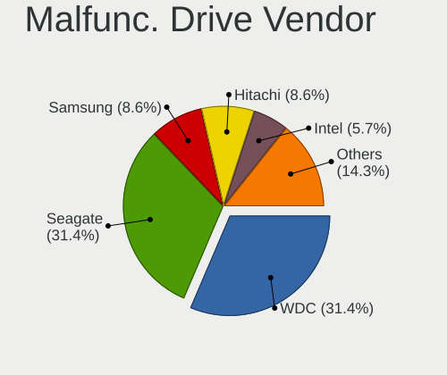

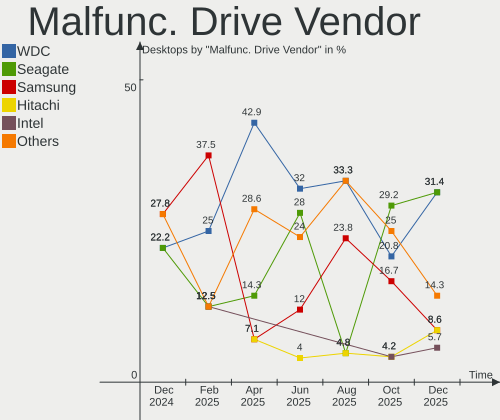

| Vendor              | Desktops | Drives | Percent |
|---------------------|----------|--------|---------|
| WDC                 | 11       | 11     | 31.43%  |
| Seagate             | 11       | 14     | 31.43%  |
| Samsung Electronics | 3        | 3      | 8.57%   |
| Hitachi             | 3        | 3      | 8.57%   |
| Intel               | 2        | 2      | 5.71%   |
| SanDisk             | 1        | 2      | 2.86%   |
| OCZ                 | 1        | 1      | 2.86%   |
| Mushkin             | 1        | 1      | 2.86%   |
| Kingston            | 1        | 1      | 2.86%   |
| HGST                | 1        | 1      | 2.86%   |

Malfunc. HDD Vendor
-------------------

Vendors of faulty HDD drives

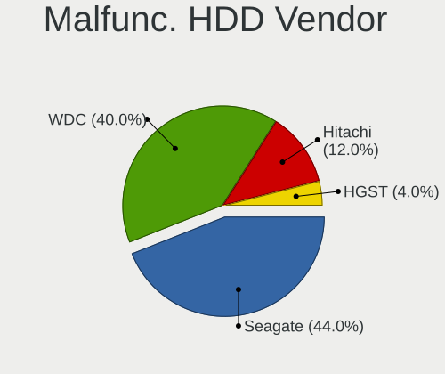

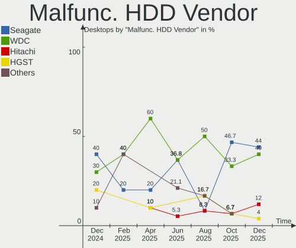

| Vendor  | Desktops | Drives | Percent |
|---------|----------|--------|---------|
| Seagate | 11       | 13     | 44%     |
| WDC     | 10       | 10     | 40%     |
| Hitachi | 3        | 3      | 12%     |
| HGST    | 1        | 1      | 4%      |

Malfunc. Drive Kind
-------------------

Kinds of faulty drives

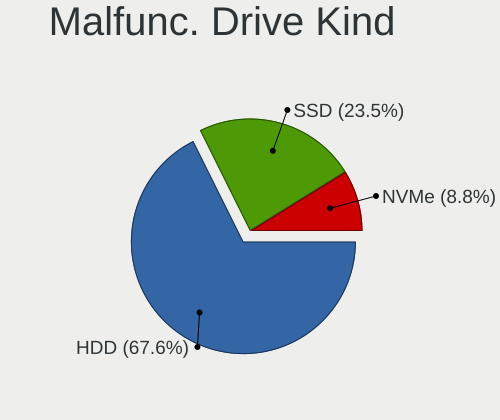

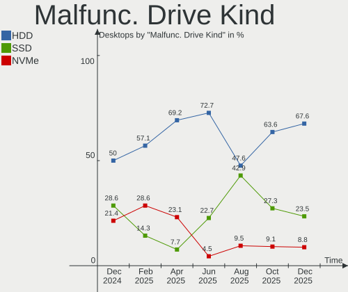

| Kind | Desktops | Drives | Percent |
|------|----------|--------|---------|
| HDD  | 23       | 27     | 67.65%  |
| SSD  | 8        | 9      | 23.53%  |
| NVMe | 3        | 3      | 8.82%   |

Failed Drives
-------------

Failed drive models

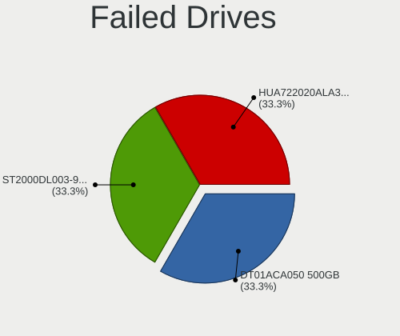

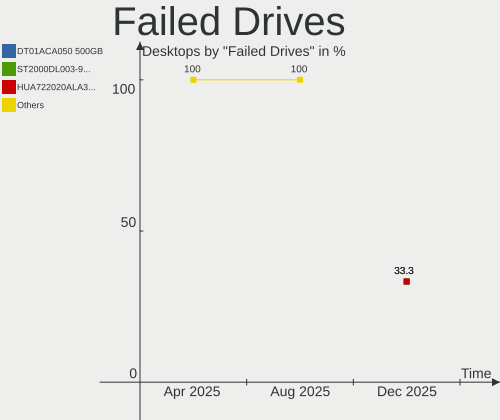

| Model                          | Desktops | Drives | Percent |
|--------------------------------|----------|--------|---------|
| Toshiba DT01ACA050 500GB       | 1        | 1      | 33.33%  |
| Seagate ST2000DL003-9VT166 2TB | 1        | 1      | 33.33%  |
| Hitachi HUA722020ALA330 2TB    | 1        | 1      | 33.33%  |

Failed Drive Vendor
-------------------

Failed drive vendors

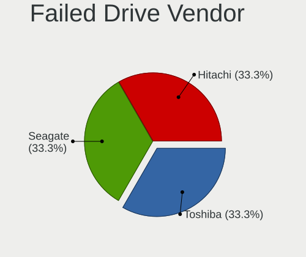

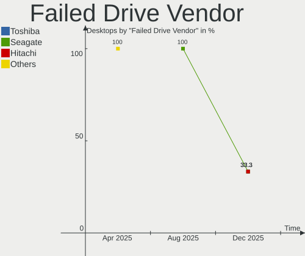

| Vendor  | Desktops | Drives | Percent |
|---------|----------|--------|---------|
| Toshiba | 1        | 1      | 33.33%  |
| Seagate | 1        | 1      | 33.33%  |
| Hitachi | 1        | 1      | 33.33%  |

Drive Status
------------

Number of failed and malfunc. drives

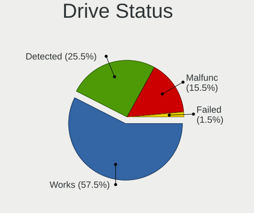

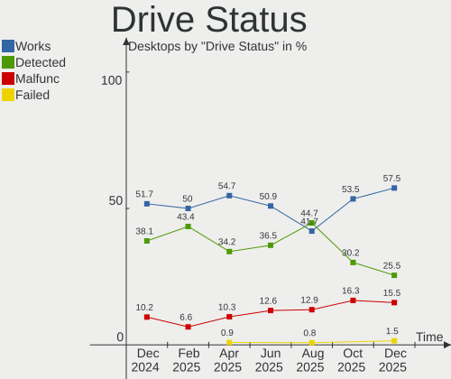

| Status   | Desktops | Drives | Percent |
|----------|----------|--------|---------|
| Works    | 115      | 327    | 57.5%   |
| Detected | 51       | 127    | 25.5%   |
| Malfunc  | 31       | 39     | 15.5%   |
| Failed   | 3        | 3      | 1.5%    |

Storage controller
------------------

Storage Vendor
--------------

Storage controller vendors

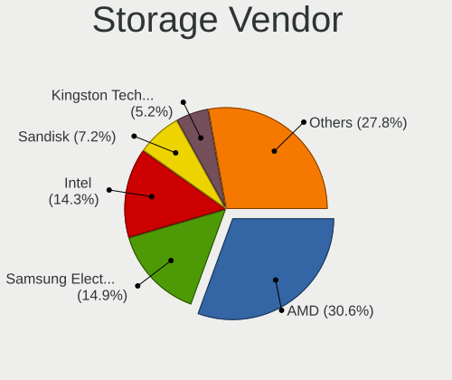

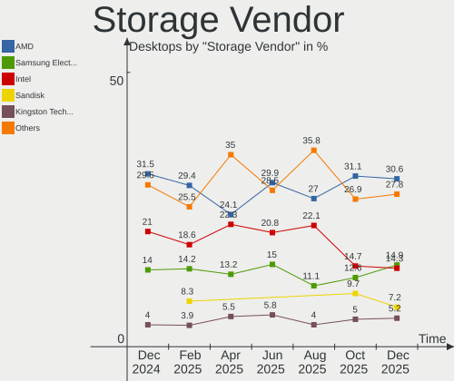

| Vendor                       | Desktops | Percent |
|------------------------------|----------|---------|
| AMD                          | 111      | 30.58%  |
| Samsung Electronics          | 54       | 14.88%  |
| Intel                        | 52       | 14.33%  |
| Sandisk                      | 26       | 7.16%   |
| Kingston Technology Company  | 19       | 5.23%   |
| Micron/Crucial Technology    | 17       | 4.68%   |
| ASMedia Technology           | 17       | 4.68%   |
| MAXIO Technology (Hangzhou)  | 10       | 2.75%   |
| Phison Electronics           | 9        | 2.48%   |
| Shenzhen Longsys Electronics | 7        | 1.93%   |
| Micron Technology            | 7        | 1.93%   |
| Silicon Motion               | 6        | 1.65%   |
| ADATA Technology             | 6        | 1.65%   |
| Seagate Technology           | 3        | 0.83%   |
| KIOXIA                       | 3        | 0.83%   |
| Hosin Global Electronics     | 3        | 0.83%   |
| Solidigm                     | 2        | 0.55%   |
| SK hynix                     | 2        | 0.55%   |
| Realtek Semiconductor        | 2        | 0.55%   |
| INNOGRIT                     | 2        | 0.55%   |
| Microsoft                    | 1        | 0.28%   |
| Marvell Technology Group     | 1        | 0.28%   |
| LSI Logic / Symbios Logic    | 1        | 0.28%   |
| JMicron Technology           | 1        | 0.28%   |
| Corsair Memory               | 1        | 0.28%   |

Storage Model
-------------

Storage controller models

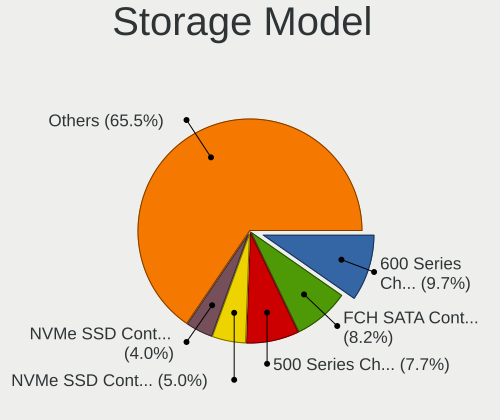

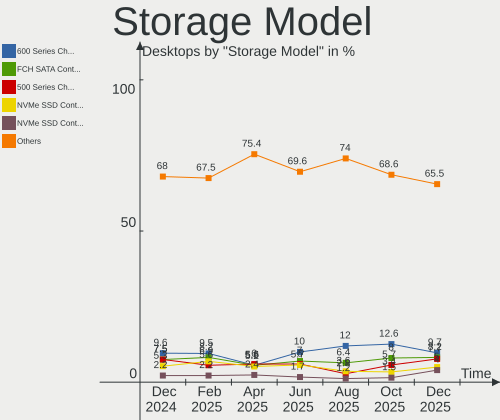

| Model                                                                                                              | Desktops | Percent |
|--------------------------------------------------------------------------------------------------------------------|----------|---------|
| AMD 600 Series Chipset SATA Controller                                                                             | 39       | 9.68%   |
| AMD FCH SATA Controller [AHCI mode]                                                                                | 33       | 8.19%   |
| AMD 500 Series Chipset SATA Controller                                                                             | 31       | 7.69%   |
| Samsung NVMe SSD Controller SM981/PM981/PM983                                                                      | 20       | 4.96%   |
| Samsung NVMe SSD Controller S4LV008[Pascal]                                                                        | 16       | 3.97%   |
| Samsung NVMe SSD Controller PM9A1/PM9A3/980PRO                                                                     | 15       | 3.72%   |
| ASMedia ASM1061/ASM1062 Serial ATA Controller                                                                      | 14       | 3.47%   |
| AMD 400 Series Chipset SATA Controller                                                                             | 11       | 2.73%   |
| Intel Raptor Lake SATA AHCI Controller                                                                             | 9        | 2.23%   |
| Intel Alder Lake-S PCH SATA Controller [AHCI Mode]                                                                 | 7        | 1.74%   |
| SanDisk WD SN560/SN740/SN770/SN5000 NVMe SSD                                                                       | 6        | 1.49%   |
| SanDisk Extreme Pro / WD Black SN750 / PC SN730 / Red SN700 NVMe SSD                                               | 6        | 1.49%   |
| Micron/Crucial P2 [Nick P2] / P3 / P3 Plus NVMe PCIe SSD (DRAM-less)                                               | 6        | 1.49%   |
| Intel 8 Series/C220 Series Chipset Family 6-port SATA Controller 1 [AHCI mode]                                     | 6        | 1.49%   |
| Silicon Motion SM2263EN/SM2263XT (DRAM-less) NVMe SSD Controllers                                                  | 5        | 1.24%   |
| Samsung NVMe SSD Controller 980 (DRAM-less)                                                                        | 5        | 1.24%   |
| MAXIO (Hangzhou) NVMe SSD Controller MAP1202 (DRAM-less)                                                           | 5        | 1.24%   |
| Intel Volume Management Device NVMe RAID Controller                                                                | 5        | 1.24%   |
| Intel 200 Series PCH SATA controller [AHCI mode]                                                                   | 5        | 1.24%   |
| AMD A320 Chipset SATA Controller [AHCI mode]                                                                       | 5        | 1.24%   |
| Samsung NVMe SSD Controller PM9C1a (DRAM-less)                                                                     | 4        | 0.99%   |
| Phison E18 PCIe4 NVMe Controller                                                                                   | 4        | 0.99%   |
| Micron 2550 NVMe SSD (DRAM-less)                                                                                   | 4        | 0.99%   |
| Kingston Company NV2 NVMe SSD [SM2267XT] (DRAM-less)                                                               | 4        | 0.99%   |
| Kingston Company KC3000/FURY Renegade NVMe SSD [E18]                                                               | 4        | 0.99%   |
| Intel Cannon Lake PCH SATA AHCI Controller                                                                         | 4        | 0.99%   |
| Shenzhen Longsys Lexar NM790 / Patriot Viper VP4300 Lite NVMe SSD (DRAM-less)                                      | 3        | 0.74%   |
| Sandisk WD PC SN5000S M.2 2280 NVMe SSD (DRAM-less)                                                                | 3        | 0.74%   |
| SanDisk Ultra 3D / WD PC SN530, IX SN530, Blue SN550 NVMe SSD (DRAM-less)                                          | 3        | 0.74%   |
| Micron/Crucial P1 NVMe PCIe SSD[Frampton]                                                                          | 3        | 0.74%   |
| Micron/Crucial P1 NVMe PCIe SSD[Frampton2]                                                                         | 3        | 0.74%   |
| MAXIO (Hangzhou) NVMe SSD Controller MAP1602 (DRAM-less)                                                           | 3        | 0.74%   |
| Intel Comet Lake SATA AHCI Controller                                                                              | 3        | 0.74%   |
| Intel 500 Series Chipset Family SATA AHCI Controller                                                               | 3        | 0.74%   |
| Hosin Global Patriot P300 NVMe SSD (DRAM-less)                                                                     | 3        | 0.74%   |
| ASMedia ASM1064 Serial ATA Controller                                                                              | 3        | 0.74%   |
| ADATA XPG SX8200 Pro PCIe Gen3x4 M.2 2280 Solid State Drive                                                        | 3        | 0.74%   |
| Shenzhen Longsys FORESEE XP1000 / Lexar Professional CFexpress Type B Gold series, NM620 PCIe NVME SSD (DRAM-less) | 2        | 0.5%    |
| Sandisk WD Blue SN580 NVMe SSD (DRAM-less)                                                                         | 2        | 0.5%    |
| Sandisk WD Black SN850X NVMe SSD                                                                                   | 2        | 0.5%    |

Storage Kind
------------

Kind of storage controller (IDE, SATA, NVMe, SAS, ...)

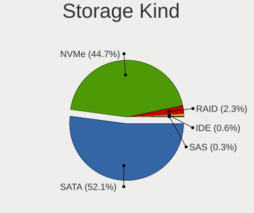

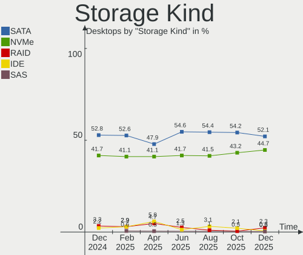

| Kind | Desktops | Percent |
|------|----------|---------|
| SATA | 161      | 52.1%   |
| NVMe | 138      | 44.66%  |
| RAID | 7        | 2.27%   |
| IDE  | 2        | 0.65%   |
| SAS  | 1        | 0.32%   |

Processor
---------

CPU Vendor
----------

Processor vendors

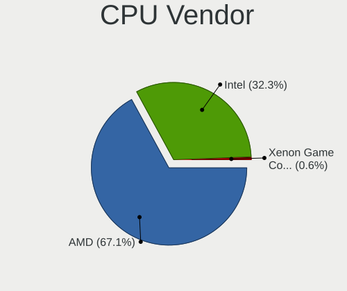

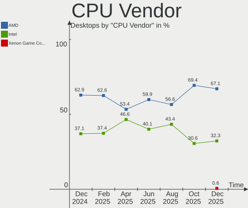

| Vendor             | Desktops | Percent |
|--------------------|----------|---------|
| AMD                | 112      | 67.07%  |
| Intel              | 54       | 32.34%  |
| Xenon Game Console | 1        | 0.6%    |

CPU Model
---------

Processor models

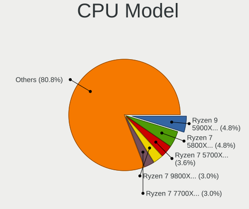

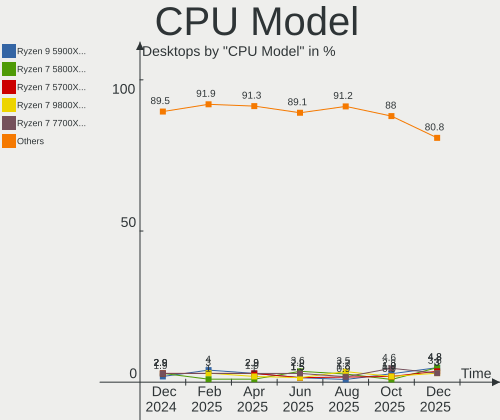

| Model                                       | Desktops | Percent |
|---------------------------------------------|----------|---------|
| AMD Ryzen 9 5900X 12-Core Processor         | 8        | 4.79%   |
| AMD Ryzen 7 5800X 8-Core Processor          | 8        | 4.79%   |
| AMD Ryzen 7 5700X 8-Core Processor          | 6        | 3.59%   |
| AMD Ryzen 7 9800X3D 8-Core Processor        | 5        | 2.99%   |
| AMD Ryzen 7 7700X 8-Core Processor          | 5        | 2.99%   |
| AMD Ryzen 5 5600X 6-Core Processor          | 5        | 2.99%   |
| AMD Ryzen 9 7900X 12-Core Processor         | 4        | 2.4%    |
| AMD Ryzen 7 9700X 8-Core Processor          | 4        | 2.4%    |
| AMD Ryzen 7 5800X3D 8-Core Processor        | 4        | 2.4%    |
| AMD Ryzen 5 5600G with Radeon Graphics      | 4        | 2.4%    |
| AMD Ryzen 5 5600 6-Core Processor           | 4        | 2.4%    |
| AMD Ryzen 5 3600 6-Core Processor           | 4        | 2.4%    |
| Intel 13th Gen Core i7-13700K               | 3        | 1.8%    |
| Intel 12th Gen Core i5-12400                | 3        | 1.8%    |
| AMD Ryzen 9 9950X3D 16-Core Processor       | 3        | 1.8%    |
| AMD Ryzen 9 9950X 16-Core Processor         | 3        | 1.8%    |
| AMD Ryzen 9 3900X 12-Core Processor         | 3        | 1.8%    |
| Intel Core i9-10900K CPU @ 3.70GHz          | 2        | 1.2%    |
| Intel Core i7-9700K CPU @ 3.60GHz           | 2        | 1.2%    |
| Intel Core i7-4770K CPU @ 3.50GHz           | 2        | 1.2%    |
| Intel Core i7-3770 CPU @ 3.40GHz            | 2        | 1.2%    |
| Intel 12th Gen Core i9-12900K               | 2        | 1.2%    |
| Intel 12th Gen Core i7-12700K               | 2        | 1.2%    |
| Intel 12th Gen Core i5-12400F               | 2        | 1.2%    |
| AMD Ryzen 9 7950X 16-Core Processor         | 2        | 1.2%    |
| AMD Ryzen 9 5950X 16-Core Processor         | 2        | 1.2%    |
| AMD Ryzen 7 5700X3D 8-Core Processor        | 2        | 1.2%    |
| AMD Ryzen 7 5700G with Radeon Graphics      | 2        | 1.2%    |
| AMD Ryzen 7 3800XT 8-Core Processor         | 2        | 1.2%    |
| AMD Ryzen 7 3700X 8-Core Processor          | 2        | 1.2%    |
| AMD Ryzen 5 8600G w/ Radeon 760M Graphics   | 2        | 1.2%    |
| AMD Ryzen 5 7600X 6-Core Processor          | 2        | 1.2%    |
| AMD Ryzen 5 3500X 6-Core Processor          | 2        | 1.2%    |
| AMD Ryzen 5 2600 Six-Core Processor         | 2        | 1.2%    |
| Xenon Game Console Xenon, altivec supported | 1        | 0.6%    |
| Intel Xeon CPU W3550 @ 3.07GHz              | 1        | 0.6%    |
| Intel Xeon CPU E5-2650 v4 @ 2.20GHz         | 1        | 0.6%    |
| Intel Xeon CPU E5-2640 v3 @ 2.60GHz         | 1        | 0.6%    |
| Intel Pentium 4 CPU 3.00GHz                 | 1        | 0.6%    |
| Intel N150                                  | 1        | 0.6%    |

CPU Model Family
----------------

Processor model prefix

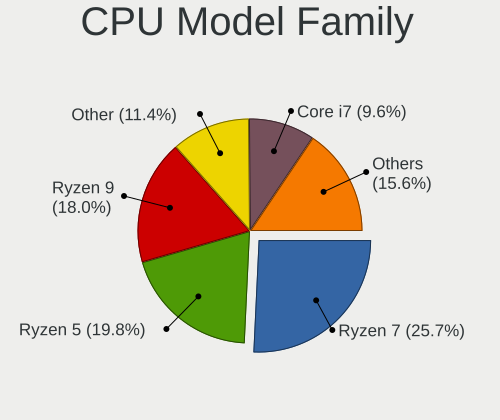

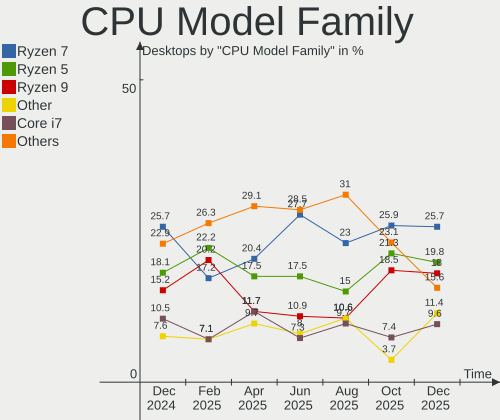

| Model                  | Desktops | Percent |
|------------------------|----------|---------|
| AMD Ryzen 7            | 43       | 25.75%  |
| AMD Ryzen 5            | 33       | 19.76%  |
| AMD Ryzen 9            | 30       | 17.96%  |
| Other                  | 19       | 11.38%  |
| Intel Core i7          | 16       | 9.58%   |
| Intel Core i5          | 7        | 4.19%   |
| Intel Xeon             | 3        | 1.8%    |
| Intel Core i9          | 3        | 1.8%    |
| Intel Core i3          | 3        | 1.8%    |
| AMD Ryzen Threadripper | 2        | 1.2%    |
| Intel Pentium 4        | 1        | 0.6%    |
| Intel Core 2 Duo       | 1        | 0.6%    |
| Intel Core             | 1        | 0.6%    |
| Intel Atom             | 1        | 0.6%    |
| AMD Ryzen 3 PRO        | 1        | 0.6%    |
| AMD Ryzen 3            | 1        | 0.6%    |
| AMD FX                 | 1        | 0.6%    |
| AMD Athlon             | 1        | 0.6%    |

CPU Cores
---------

Number of processor cores

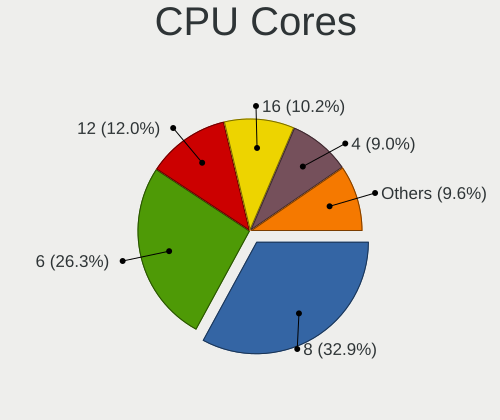

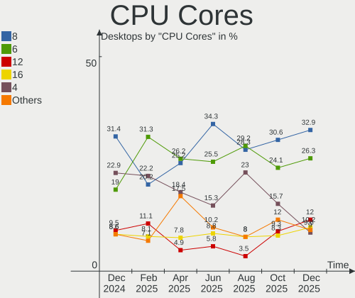

| Number | Desktops | Percent |
|--------|----------|---------|
| 8      | 55       | 32.93%  |
| 6      | 44       | 26.35%  |
| 12     | 20       | 11.98%  |
| 16     | 17       | 10.18%  |
| 4      | 15       | 8.98%   |
| 10     | 4        | 2.4%    |
| 2      | 4        | 2.4%    |
| 24     | 2        | 1.2%    |
| 20     | 2        | 1.2%    |
| 32     | 1        | 0.6%    |
| 14     | 1        | 0.6%    |
| 3      | 1        | 0.6%    |
| 1      | 1        | 0.6%    |

CPU Sockets
-----------

Number of sockets

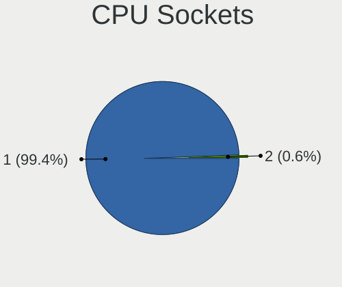

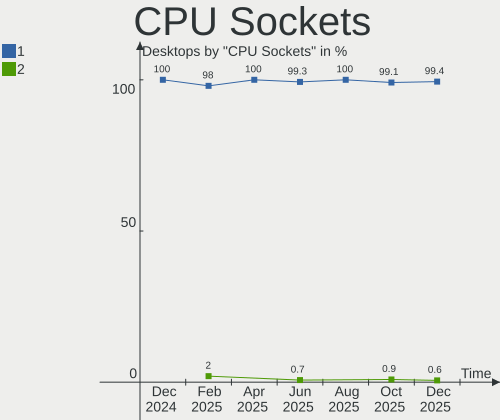

| Number | Desktops | Percent |
|--------|----------|---------|
| 1      | 166      | 99.4%   |
| 2      | 1        | 0.6%    |

CPU Threads
-----------

Threads per core (Hyper-Threading)

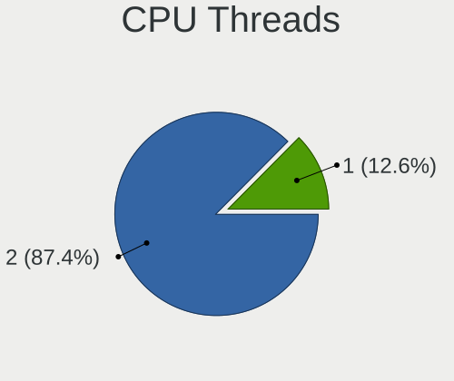

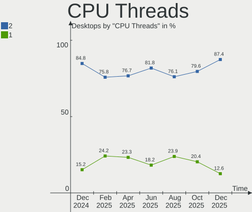

| Number | Desktops | Percent |
|--------|----------|---------|
| 2      | 146      | 87.43%  |
| 1      | 21       | 12.57%  |

CPU Op-Modes
------------

CPU Operation Modes (32-bit, 64-bit)

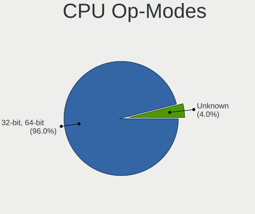

| Op mode        | Desktops | Percent |
|----------------|----------|---------|
| 32-bit, 64-bit | 167      | 100%    |

CPU Microcode
-------------

Microcode number

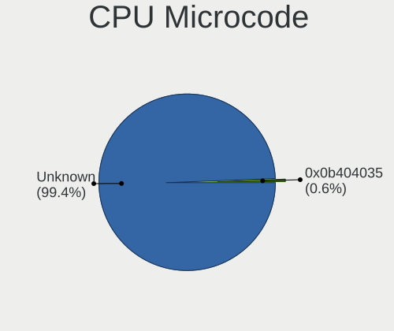

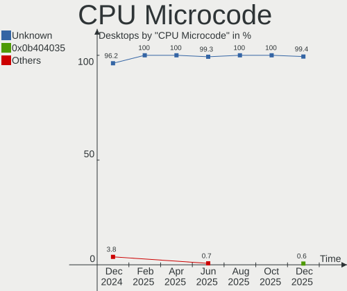

| Number     | Desktops | Percent |
|------------|----------|---------|
| Unknown    | 166      | 99.4%   |
| 0x0b404035 | 1        | 0.6%    |

CPU Microarch
-------------

Microarchitecture

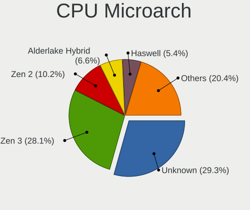

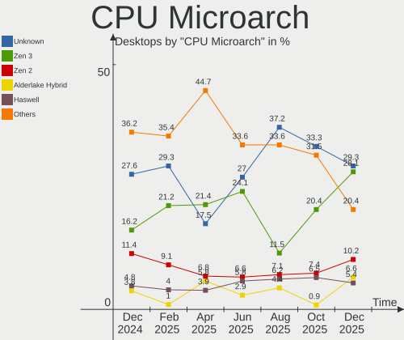

| Name             | Desktops | Percent |
|------------------|----------|---------|
| Unknown          | 49       | 29.34%  |
| Zen 3            | 47       | 28.14%  |
| Zen 2            | 17       | 10.18%  |
| Alderlake Hybrid | 11       | 6.59%   |
| Haswell          | 9        | 5.39%   |
| KabyLake         | 8        | 4.79%   |
| Zen+             | 6        | 3.59%   |
| Skylake          | 3        | 1.8%    |
| IvyBridge        | 3        | 1.8%    |
| CometLake        | 3        | 1.8%    |
| Icelake          | 2        | 1.2%    |
| Zen              | 1        | 0.6%    |
| Silvermont       | 1        | 0.6%    |
| Piledriver       | 1        | 0.6%    |
| Penryn           | 1        | 0.6%    |
| NetBurst         | 1        | 0.6%    |
| Nehalem          | 1        | 0.6%    |
| Lunarlake Hybrid | 1        | 0.6%    |
| Gracemont        | 1        | 0.6%    |
| Broadwell        | 1        | 0.6%    |

Graphics
--------

GPU Vendor
----------

Vendors of graphics cards

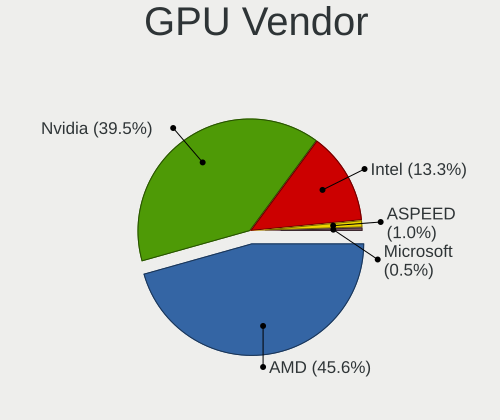

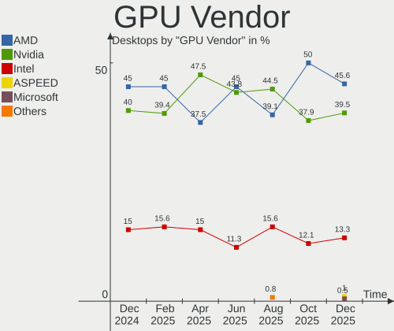

| Vendor            | Desktops | Percent |
|-------------------|----------|---------|
| AMD               | 89       | 45.64%  |
| Nvidia            | 77       | 39.49%  |
| Intel             | 26       | 13.33%  |
| ASPEED Technology | 2        | 1.03%   |
| Microsoft         | 1        | 0.51%   |

GPU Model
---------

Graphics card models

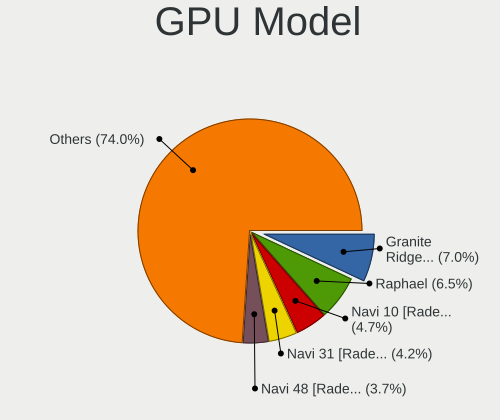

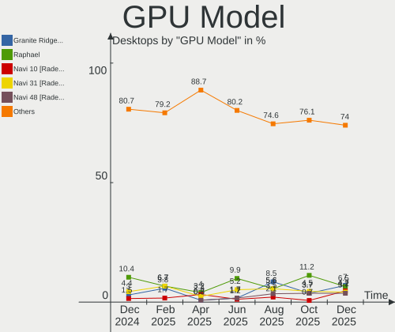

| Model                                                                     | Desktops | Percent |
|---------------------------------------------------------------------------|----------|---------|
| AMD Granite Ridge [Radeon Graphics]                                       | 15       | 6.98%   |
| AMD Raphael                                                               | 14       | 6.51%   |
| AMD Navi 10 [Radeon RX 5600 OEM/5600 XT / 5700/5700 XT]                   | 10       | 4.65%   |
| AMD Navi 31 [Radeon RX 7900 XT/7900 XTX/7900 GRE/7900M]                   | 9        | 4.19%   |
| AMD Navi 48 [Radeon RX 9070/9070 XT/9070 GRE]                             | 8        | 3.72%   |
| AMD Navi 33 [Radeon RX 7600/7600 XT/7600M XT/7600S/7700S / PRO W7600]     | 7        | 3.26%   |
| AMD Navi 21 [Radeon RX 6800/6800 XT / 6900 XT]                            | 7        | 3.26%   |
| Nvidia AD107 [GeForce RTX 4060]                                           | 6        | 2.79%   |
| AMD Navi 22 [Radeon RX 6700/6700 XT/6750 XT / 6800M/6850M XT]             | 6        | 2.79%   |
| AMD Navi 44 [Radeon RX 9060 XT]                                           | 5        | 2.33%   |
| AMD Navi 23 [Radeon RX 6600/6600 XT/6600M]                                | 5        | 2.33%   |
| Nvidia GB203 [GeForce RTX 5080]                                           | 4        | 1.86%   |
| Nvidia GA106 [GeForce RTX 3060 Lite Hash Rate]                            | 4        | 1.86%   |
| Nvidia GA102 [GeForce RTX 3090]                                           | 4        | 1.86%   |
| Nvidia GA102 [GeForce RTX 3080]                                           | 4        | 1.86%   |
| Nvidia GA102 [GeForce RTX 3080 Lite Hash Rate]                            | 4        | 1.86%   |
| Intel Raptor Lake-S GT1 [UHD Graphics 770]                                | 4        | 1.86%   |
| AMD Navi 32 [Radeon RX 7700 XT / 7800 XT]                                 | 4        | 1.86%   |
| AMD Ellesmere [Radeon RX 470/480/570/570X/580/580X/590]                   | 4        | 1.86%   |
| Nvidia GB203 [GeForce RTX 5070 Ti]                                        | 3        | 1.4%    |
| Nvidia GA106 [GeForce RTX 3060]                                           | 3        | 1.4%    |
| Intel Alder Lake-S GT1 [UHD Graphics 730]                                 | 3        | 1.4%    |
| Nvidia TU116 [GeForce GTX 1660 Ti]                                        | 2        | 0.93%   |
| Nvidia TU116 [GeForce GTX 1660 SUPER]                                     | 2        | 0.93%   |
| Nvidia TU104 [GeForce RTX 2070 SUPER]                                     | 2        | 0.93%   |
| Nvidia TU102 [GeForce RTX 2080 Ti Rev. A]                                 | 2        | 0.93%   |
| Nvidia GP107 [GeForce GTX 1050]                                           | 2        | 0.93%   |
| Nvidia GP107 [GeForce GTX 1050 Ti]                                        | 2        | 0.93%   |
| Nvidia GP104 [GeForce GTX 1080]                                           | 2        | 0.93%   |
| Nvidia GK208B [GeForce GT 710]                                            | 2        | 0.93%   |
| Nvidia GB205 [GeForce RTX 5070]                                           | 2        | 0.93%   |
| Nvidia GA104 [GeForce RTX 3070]                                           | 2        | 0.93%   |
| Nvidia GA104 [GeForce RTX 3070 Lite Hash Rate]                            | 2        | 0.93%   |
| Nvidia GA102 [GeForce RTX 3080 12GB]                                      | 2        | 0.93%   |
| Nvidia AD104 [GeForce RTX 4070]                                           | 2        | 0.93%   |
| Intel IvyBridge GT2 [HD Graphics 4000]                                    | 2        | 0.93%   |
| Intel Battlemage G21 [Arc B580]                                           | 2        | 0.93%   |
| Intel Alder Lake-S GT1 [UHD Graphics 770]                                 | 2        | 0.93%   |
| Intel 4th Generation Core Processor Family Integrated Graphics Controller | 2        | 0.93%   |
| ASPEED Technology ASPEED Graphics Family                                  | 2        | 0.93%   |

GPU Combo
---------

Combinations of graphics cards

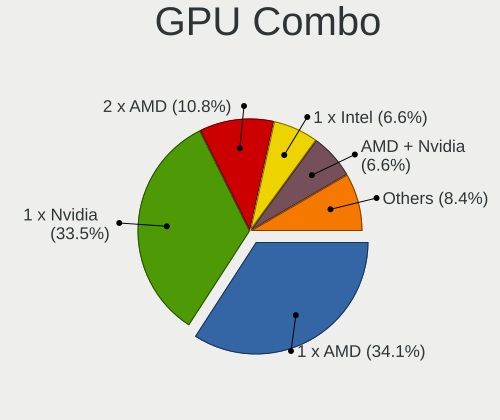

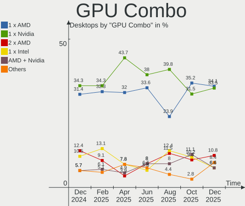

| Name                     | Desktops | Percent |
|--------------------------|----------|---------|
| 1 x AMD                  | 57       | 34.13%  |
| 1 x Nvidia               | 56       | 33.53%  |
| 2 x AMD                  | 18       | 10.78%  |
| 1 x Intel                | 11       | 6.59%   |
| AMD + Nvidia             | 11       | 6.59%   |
| Intel + Nvidia           | 6        | 3.59%   |
| 2 x Nvidia               | 1        | 0.6%    |
| 2 x Intel                | 1        | 0.6%    |
| 2 x AMD + 1 x Nvidia     | 1        | 0.6%    |
| Nvidia + ASPEED          | 1        | 0.6%    |
| 1 x Microsoft            | 1        | 0.6%    |
| Intel + AMD + 1 x Nvidia | 1        | 0.6%    |
| Intel + AMD              | 1        | 0.6%    |
| 1 x ASPEED               | 1        | 0.6%    |

GPU Driver
----------

Free vs proprietary

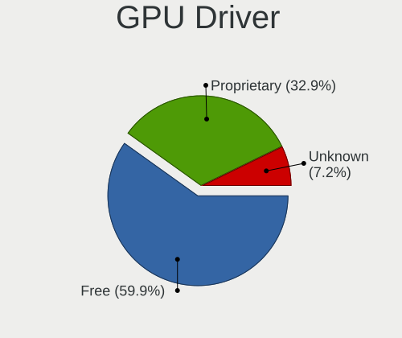

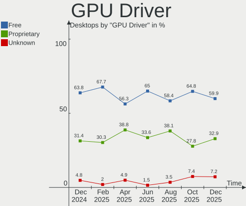

| Driver      | Desktops | Percent |
|-------------|----------|---------|
| Free        | 100      | 59.88%  |
| Proprietary | 55       | 32.93%  |
| Unknown     | 12       | 7.19%   |

GPU Memory
----------

Total video memory

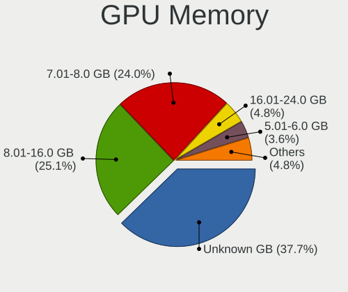

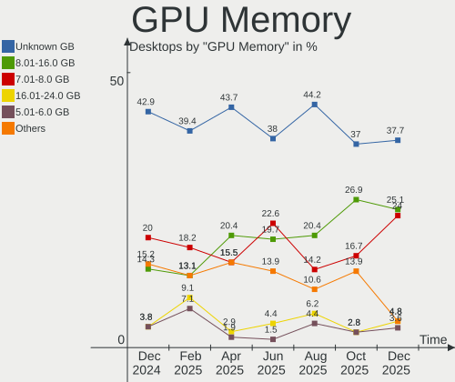

| Size in GB | Desktops | Percent |
|------------|----------|---------|
| Unknown    | 63       | 37.72%  |
| 8.01-16.0  | 42       | 25.15%  |
| 7.01-8.0   | 40       | 23.95%  |
| 16.01-24.0 | 8        | 4.79%   |
| 5.01-6.0   | 6        | 3.59%   |
| 0.01-0.5   | 4        | 2.4%    |
| 1.01-2.0   | 3        | 1.8%    |
| 3.01-4.0   | 1        | 0.6%    |

Monitor
-------

Monitor Vendor
--------------

Monitor vendors

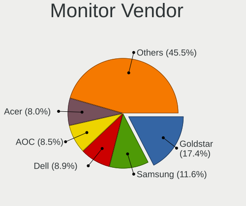

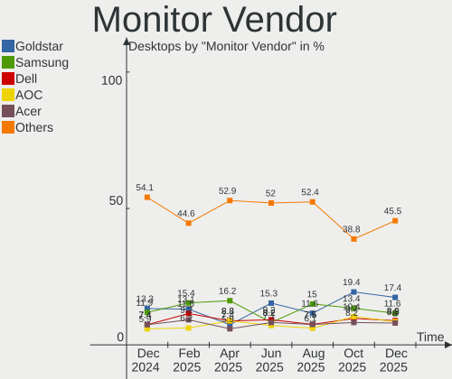

| Vendor               | Desktops | Percent |
|----------------------|----------|---------|
| Goldstar             | 39       | 17.41%  |
| Samsung Electronics  | 26       | 11.61%  |
| Dell                 | 20       | 8.93%   |
| AOC                  | 19       | 8.48%   |
| Acer                 | 18       | 8.04%   |
| ASUSTek Computer     | 12       | 5.36%   |
| BenQ                 | 10       | 4.46%   |
| Ancor Communications | 9        | 4.02%   |
| MSI                  | 8        | 3.57%   |
| Philips              | 6        | 2.68%   |
| Lenovo               | 5        | 2.23%   |
| Hewlett-Packard      | 4        | 1.79%   |
| Gigabyte Technology  | 4        | 1.79%   |
| Wacom                | 2        | 0.89%   |
| ViewSonic            | 2        | 0.89%   |
| Unknown              | 2        | 0.89%   |
| Toshiba              | 2        | 0.89%   |
| Sony                 | 2        | 0.89%   |
| SAC                  | 2        | 0.89%   |
| Iiyama               | 2        | 0.89%   |
| HKC                  | 2        | 0.89%   |
| Denver               | 2        | 0.89%   |
| Vizio                | 1        | 0.45%   |
| Viotek               | 1        | 0.45%   |
| Valve                | 1        | 0.45%   |
| TEL                  | 1        | 0.45%   |
| TCT                  | 1        | 0.45%   |
| STD                  | 1        | 0.45%   |
| SKG                  | 1        | 0.45%   |
| Sharp                | 1        | 0.45%   |
| SANSUI               | 1        | 0.45%   |
| Pioneer              | 1        | 0.45%   |
| Philco               | 1        | 0.45%   |
| Onkyo                | 1        | 0.45%   |
| NEC Computers        | 1        | 0.45%   |
| MSD                  | 1        | 0.45%   |
| MNN                  | 1        | 0.45%   |
| Mi                   | 1        | 0.45%   |
| Huion                | 1        | 0.45%   |
| HSI                  | 1        | 0.45%   |

Monitor Model
-------------

Monitor models

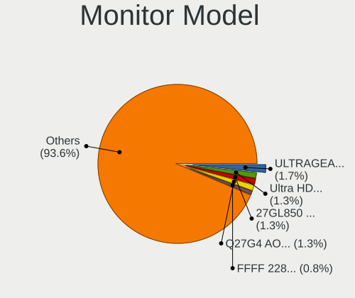

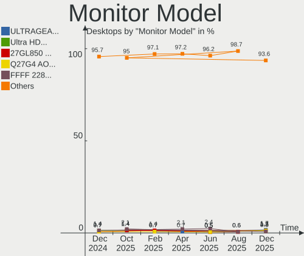

| Model                                                                | Desktops | Percent |
|----------------------------------------------------------------------|----------|---------|
| Goldstar ULTRAGEAR GSM5BD3 2560x1440 697x392mm 31.5-inch             | 4        | 1.69%   |
| Goldstar Ultra HD GSM5B09 3840x2160 600x340mm 27.2-inch              | 3        | 1.27%   |
| Goldstar 27GL850 GSM5B7F 2560x1440 597x336mm 27.0-inch               | 3        | 1.27%   |
| AOC Q27G4 AOCB403 2560x1440 597x336mm 27.0-inch                      | 3        | 1.27%   |
| Unknown LCD Monitor FFFF 2288x1287 2550x2550mm 142.0-inch            | 2        | 0.85%   |
| Goldstar ULTRAGEAR GSM5BD2 2560x1440 697x392mm 31.5-inch             | 2        | 0.85%   |
| Goldstar FULL HD GSM5B55 1920x1080 480x270mm 21.7-inch               | 2        | 0.85%   |
| Dell S2721DGF DEL41D9 2560x1440 597x336mm 27.0-inch                  | 2        | 0.85%   |
| Dell P3223DE DEL4294 2560x1440 698x393mm 31.5-inch                   | 2        | 0.85%   |
| AOC AG273QS3R4 AOC2730 2560x1440 597x336mm 27.0-inch                 | 2        | 0.85%   |
| AOC 27G2G4 AOC2702 1920x1080 598x336mm 27.0-inch                     | 2        | 0.85%   |
| AOC 27G1G4 AOC2701 1920x1080 598x336mm 27.0-inch                     | 2        | 0.85%   |
| AOC 24G2W1G3 AOC2402 1920x1080 527x296mm 23.8-inch                   | 2        | 0.85%   |
| Wacom One 13 WAC1070 1920x1080 294x166mm 13.3-inch                   | 1        | 0.42%   |
| Wacom Cintiq 16 WAC1071 1920x1080 344x193mm 15.5-inch                | 1        | 0.42%   |
| Vizio VFD40M-0809 VIZ0109 1920x1080 890x490mm 40.0-inch              | 1        | 0.42%   |
| Viotek GN34CW VTK3400 3440x1440 795x334mm 33.9-inch                  | 1        | 0.42%   |
| ViewSonic VX2758-C-MH VSC35DD 1920x1080 597x336mm 27.0-inch          | 1        | 0.42%   |
| ViewSonic E771-4 VSC5941 1280x1024 300x225mm 14.8-inch               | 1        | 0.42%   |
| Valve Index HMD VLV91A8                                              | 1        | 0.42%   |
| Toshiba TV TSB0200 1920x1080 410x230mm 18.5-inch                     | 1        | 0.42%   |
| Toshiba 43UHD_LCD_TV TSB3700 3840x2160 940x540mm 42.7-inch           | 1        | 0.42%   |
| TEL 27GM620BF TEL2709 1920x1080 600x330mm 27.0-inch                  | 1        | 0.42%   |
| TCT DP1080P60 TCT0270 2560x1600 520x290mm 23.4-inch                  | 1        | 0.42%   |
| STD ARUR STD2700 2560x1440 598x336mm 27.0-inch                       | 1        | 0.42%   |
| Sony TV SNY4903 1920x1080 1110x620mm 50.1-inch                       | 1        | 0.42%   |
| Sony TV *00 SNY8004 3840x2160 1439x809mm 65.0-inch                   | 1        | 0.42%   |
| SKG DEXP DQ32N1 SKG3213 2560x1440 531x298mm 24.0-inch                | 1        | 0.42%   |
| Sharp HDMI SHP1009 1360x768 820x460mm 37.0-inch                      | 1        | 0.42%   |
| SANSUI ES-G27F4Q XEC1030 2560x1440 597x336mm 27.0-inch               | 1        | 0.42%   |
| Samsung Electronics U32R59x SAM0F96 3840x2160 697x392mm 31.5-inch    | 1        | 0.42%   |
| Samsung Electronics U32J59x SAM0F35 3840x2160 697x392mm 31.5-inch    | 1        | 0.42%   |
| Samsung Electronics SyncMaster SAM01B7 1280x1024 340x270mm 17.1-inch | 1        | 0.42%   |
| Samsung Electronics S27C31x SAM7312 1920x1080 597x336mm 27.0-inch    | 1        | 0.42%   |
| Samsung Electronics S24E390 SAM0C1A 1920x1080 521x293mm 23.5-inch    | 1        | 0.42%   |
| Samsung Electronics S24C31x SAM7311 1920x1080 527x296mm 23.8-inch    | 1        | 0.42%   |
| Samsung Electronics S24A31x SAM7115 1920x1080 527x296mm 23.8-inch    | 1        | 0.42%   |
| Samsung Electronics S22F350 SAM0D1A 1920x1080 477x268mm 21.5-inch    | 1        | 0.42%   |
| Samsung Electronics S22D300 SAM0B3F 1920x1080 477x268mm 21.5-inch    | 1        | 0.42%   |
| Samsung Electronics S22B350 SAM08D4 1920x1080 477x268mm 21.5-inch    | 1        | 0.42%   |

Monitor Resolution
------------------

Monitor screen resolution

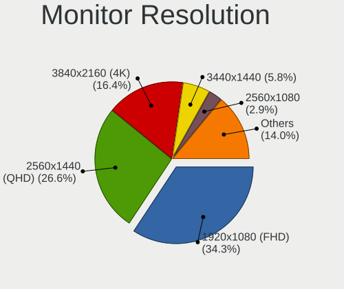

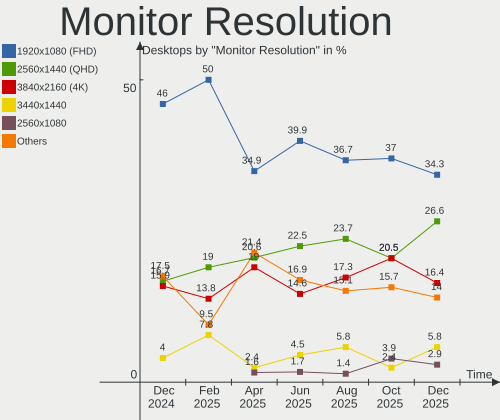

| Resolution         | Desktops | Percent |
|--------------------|----------|---------|
| 1920x1080 (FHD)    | 71       | 34.3%   |
| 2560x1440 (QHD)    | 55       | 26.57%  |
| 3840x2160 (4K)     | 34       | 16.43%  |
| 3440x1440          | 12       | 5.8%    |
| 2560x1080          | 6        | 2.9%    |
| 1366x768 (WXGA)    | 6        | 2.9%    |
| 1680x1050 (WSXGA+) | 4        | 1.93%   |
| 1280x1024 (SXGA)   | 4        | 1.93%   |
| 2288x1287          | 2        | 0.97%   |
| 1920x1200 (WUXGA)  | 2        | 0.97%   |
| 1600x900 (HD+)     | 2        | 0.97%   |
| 1440x900 (WXGA+)   | 2        | 0.97%   |
| 6400x1440          | 1        | 0.48%   |
| 3840x1600          | 1        | 0.48%   |
| 3840x1080          | 1        | 0.48%   |
| 2560x1600          | 1        | 0.48%   |
| 1360x768           | 1        | 0.48%   |
| 1280x960           | 1        | 0.48%   |
| Unknown            | 1        | 0.48%   |

Monitor Diagonal
----------------

Diagonal size in inches

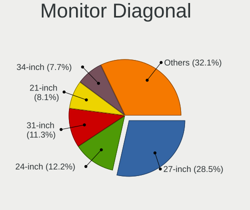

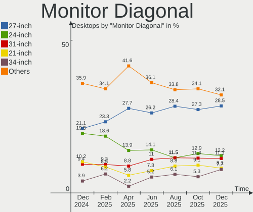

| Inches  | Desktops | Percent |
|---------|----------|---------|
| 27      | 63       | 28.51%  |
| 24      | 27       | 12.22%  |
| 31      | 25       | 11.31%  |
| 21      | 18       | 8.14%   |
| 34      | 17       | 7.69%   |
| 23      | 16       | 7.24%   |
| 84      | 6        | 2.71%   |
| 32      | 5        | 2.26%   |
| 26      | 4        | 1.81%   |
| 20      | 4        | 1.81%   |
| 22      | 3        | 1.36%   |
| 18      | 3        | 1.36%   |
| 15      | 3        | 1.36%   |
| Unknown | 3        | 1.36%   |
| 142     | 2        | 0.9%    |
| 42      | 2        | 0.9%    |
| 40      | 2        | 0.9%    |
| 37      | 2        | 0.9%    |
| 19      | 2        | 0.9%    |
| 17      | 2        | 0.9%    |
| 70      | 1        | 0.45%   |
| 65      | 1        | 0.45%   |
| 63      | 1        | 0.45%   |
| 55      | 1        | 0.45%   |
| 54      | 1        | 0.45%   |
| 48      | 1        | 0.45%   |
| 46      | 1        | 0.45%   |
| 43      | 1        | 0.45%   |
| 35      | 1        | 0.45%   |
| 29      | 1        | 0.45%   |
| 14      | 1        | 0.45%   |
| 13      | 1        | 0.45%   |

Monitor Width
-------------

Physical width

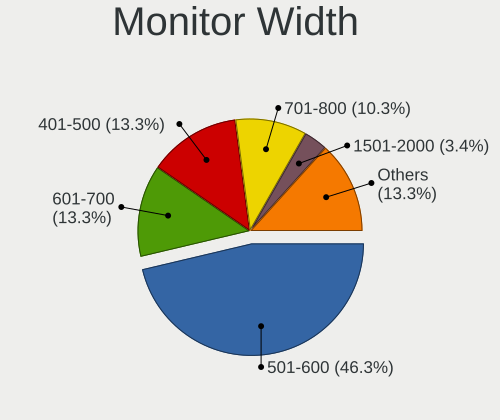

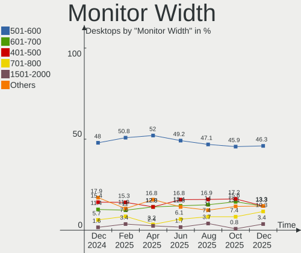

| Width in mm    | Desktops | Percent |
|----------------|----------|---------|
| 501-600        | 94       | 46.31%  |
| 601-700        | 27       | 13.3%   |
| 401-500        | 27       | 13.3%   |
| 701-800        | 21       | 10.34%  |
| 1501-2000      | 7        | 3.45%   |
| 801-900        | 6        | 2.96%   |
| 1001-1500      | 6        | 2.96%   |
| 301-350        | 5        | 2.46%   |
| Unknown        | 3        | 1.48%   |
| More than 2000 | 2        | 0.99%   |
| 201-300        | 2        | 0.99%   |
| 901-1000       | 2        | 0.99%   |
| 351-400        | 1        | 0.49%   |

Aspect Ratio
------------

Proportional relationship between the width and the height

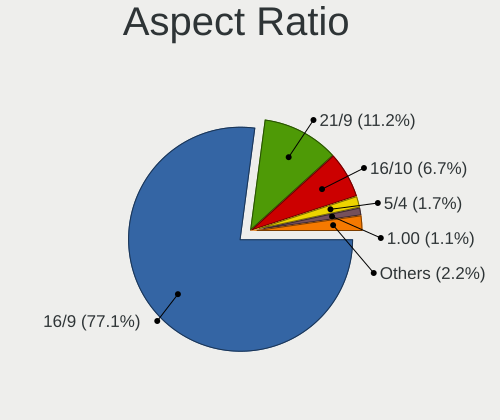

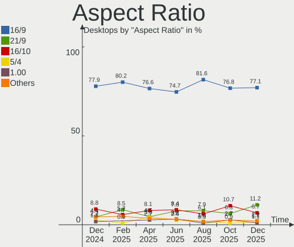

| Ratio   | Desktops | Percent |
|---------|----------|---------|
| 16/9    | 138      | 77.09%  |
| 21/9    | 20       | 11.17%  |
| 16/10   | 12       | 6.7%    |
| 5/4     | 3        | 1.68%   |
| 1.00    | 2        | 1.12%   |
| Unknown | 2        | 1.12%   |
| 4/3     | 1        | 0.56%   |
| 32/9    | 1        | 0.56%   |

Monitor Area
------------

Area in inch²

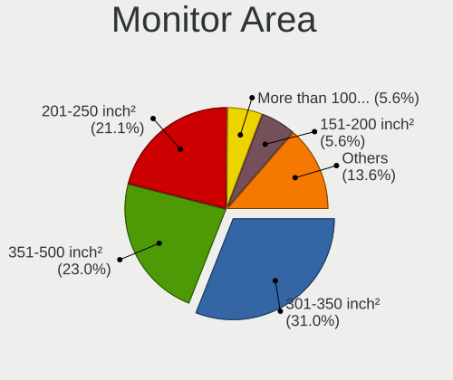

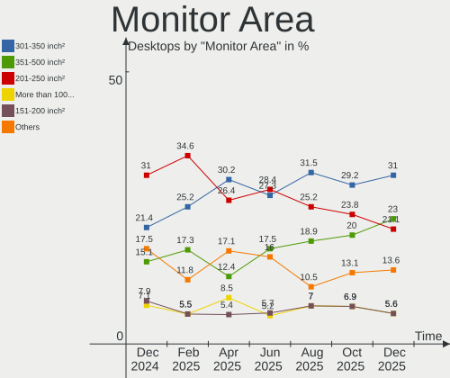

| Area in inch² | Desktops | Percent |
|----------------|----------|---------|
| 301-350        | 66       | 30.99%  |
| 351-500        | 49       | 23%     |
| 201-250        | 45       | 21.13%  |
| More than 1000 | 12       | 5.63%   |
| 151-200        | 12       | 5.63%   |
| 251-300        | 9        | 4.23%   |
| 501-1000       | 7        | 3.29%   |
| 141-150        | 5        | 2.35%   |
| 101-110        | 4        | 1.88%   |
| Unknown        | 3        | 1.41%   |
| 71-80          | 1        | 0.47%   |

Pixel Density
-------------

Pixels per inch

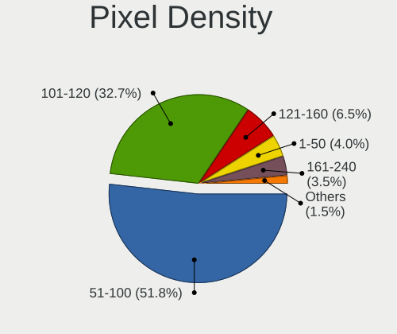

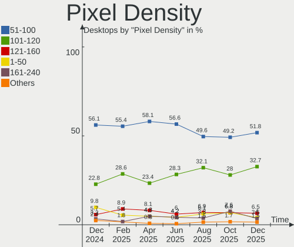

| Density | Desktops | Percent |
|---------|----------|---------|
| 51-100  | 103      | 51.76%  |
| 101-120 | 65       | 32.66%  |
| 121-160 | 13       | 6.53%   |
| 1-50    | 8        | 4.02%   |
| 161-240 | 7        | 3.52%   |
| Unknown | 3        | 1.51%   |

Multiple Monitors
-----------------

Total monitors connected

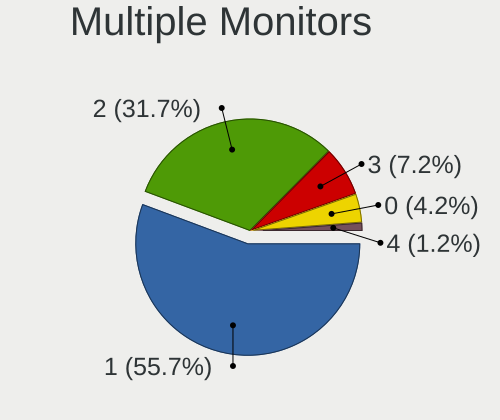

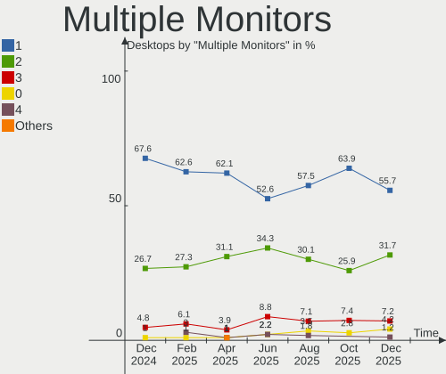

| Total | Desktops | Percent |
|-------|----------|---------|
| 1     | 93       | 55.69%  |
| 2     | 53       | 31.74%  |
| 3     | 12       | 7.19%   |
| 0     | 7        | 4.19%   |
| 4     | 2        | 1.2%    |

Network
-------

Net Controller Vendor
---------------------

Controller vendors

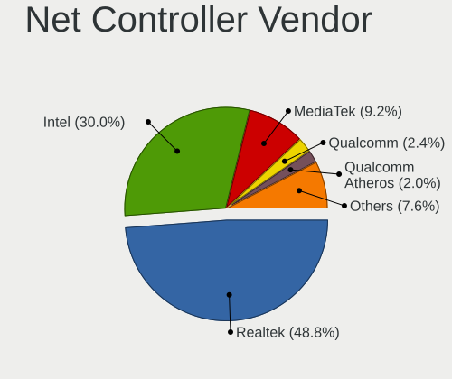

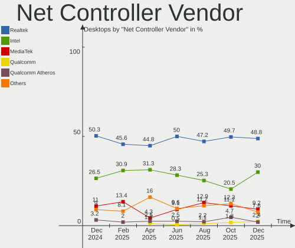

| Vendor                | Desktops | Percent |
|-----------------------|----------|---------|
| Realtek Semiconductor | 122      | 48.8%   |
| Intel                 | 75       | 30%     |
| MediaTek              | 23       | 9.2%    |
| Qualcomm Technologies | 6        | 2.4%    |
| Qualcomm Atheros      | 5        | 2%      |
| Microsoft             | 4        | 1.6%    |
| Aquantia              | 4        | 1.6%    |
| ASIX Electronics      | 3        | 1.2%    |
| Broadcom              | 2        | 0.8%    |
| Realtek               | 1        | 0.4%    |
| Ralink Technology     | 1        | 0.4%    |
| NetGear               | 1        | 0.4%    |
| D-Link System         | 1        | 0.4%    |
| Broadcom Limited      | 1        | 0.4%    |
| ASUSTek Computer      | 1        | 0.4%    |

Net Controller Model
--------------------

Controller models

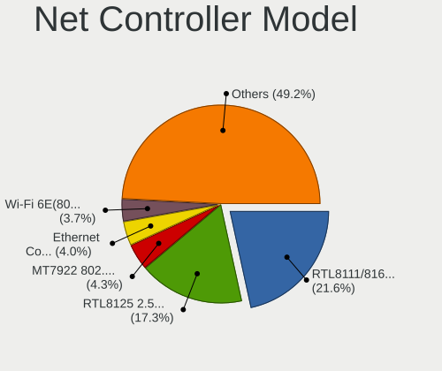

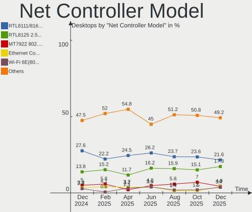

| Model                                                                           | Desktops | Percent |
|---------------------------------------------------------------------------------|----------|---------|
| Realtek RTL8111/8168/8211/8411 PCI Express Gigabit Ethernet Controller          | 65       | 21.59%  |
| Realtek RTL8125 2.5GbE Controller                                               | 52       | 17.28%  |
| MediaTek MT7922 802.11ax PCI Express Wireless Network Adapter                   | 13       | 4.32%   |
| Intel Ethernet Controller I225-V                                                | 12       | 3.99%   |
| Intel Wi-Fi 6E(802.11ax) AX210/AX1675* 2x2 [Typhoon Peak]                       | 11       | 3.65%   |
| Intel I211 Gigabit Network Connection                                           | 11       | 3.65%   |
| Intel Wi-Fi 6 AX200                                                             | 10       | 3.32%   |
| Intel Ethernet Controller I226-V                                                | 7        | 2.33%   |
| Intel 700 Series Chipset CNVi WiFi                                              | 7        | 2.33%   |
| Realtek RTL8126 5GbE Controller                                                 | 6        | 1.99%   |
| Qualcomm WCN785x Wi-Fi 7(802.11be) 320MHz 2x2 [FastConnect 7800]                | 6        | 1.99%   |
| Intel Ethernet Connection (2) I219-V                                            | 6        | 1.99%   |
| Realtek RTL8852CE PCIe 802.11ax Wireless Network Controller                     | 5        | 1.66%   |
| Intel Dual Band Wireless-AC 3168NGW [Stone Peak]                                | 4        | 1.33%   |
| Realtek RTL8922AE 802.11be PCIe Wireless Network Adapter                        | 3        | 1%      |
| Realtek RTL8851BE PCIe 802.11ax Wireless Network Controller                     | 3        | 1%      |
| Realtek RTL8153 Gigabit Ethernet Adapter                                        | 3        | 1%      |
| Intel Wireless 7260                                                             | 3        | 1%      |
| Intel Wi-Fi 5(802.11ac) Wireless-AC 9x6x [Thunder Peak]                         | 3        | 1%      |
| Intel Ethernet Connection (7) I219-V                                            | 3        | 1%      |
| Intel Cannon Lake PCH CNVi WiFi                                                 | 3        | 1%      |
| Intel Alder Lake-S PCH CNVi WiFi                                                | 3        | 1%      |
| ASIX AX88179 Gigabit Ethernet                                                   | 3        | 1%      |
| Aquantia AQtion AQC113CS NBase-T/IEEE 802.3an Ethernet Controller [Antigua 10G] | 3        | 1%      |
| Realtek RTL8821CE 802.11ac PCIe Wireless Network Adapter                        | 2        | 0.66%   |
| Qualcomm Atheros Killer E220x Gigabit Ethernet Controller                       | 2        | 0.66%   |
| Microsoft Xbox Wireless Adapter for Windows                                     | 2        | 0.66%   |
| MediaTek MT7927 802.11be 320MHz 2x2 PCIe Wireless Network Adapter [Filogic 380] | 2        | 0.66%   |
| MediaTek MT7925 802.11be 160MHz 2x2 PCIe Wireless Network Adapter [Filogic 360] | 2        | 0.66%   |
| MediaTek MT7921K (RZ608) Wi-Fi 6E 80MHz                                         | 2        | 0.66%   |
| MediaTek MT7902 802.11ax PCIe Wireless Network Adapter [Filogic 310]            | 2        | 0.66%   |
| Intel I210 Gigabit Network Connection                                           | 2        | 0.66%   |
| Intel Comet Lake PCH CNVi WiFi                                                  | 2        | 0.66%   |
| Intel 82599ES 10-Gigabit SFI/SFP+ Network Connection                            | 2        | 0.66%   |
| Realtek USB 10/100/1G/2.5 LAN                                                   | 1        | 0.33%   |
| Realtek RTL8852BE PCIe 802.11ax Wireless Network Controller                     | 1        | 0.33%   |
| Realtek RTL8821CE PCIe 802.11ac Wireless Network Controller                     | 1        | 0.33%   |
| Realtek RTL8192EU 802.11b/g/n WLAN Adapter                                      | 1        | 0.33%   |
| Realtek RTL8188EE Wireless Network Adapter                                      | 1        | 0.33%   |
| Realtek RTL8169 PCI Gigabit Ethernet Controller                                 | 1        | 0.33%   |

Wireless Vendor
---------------

Wireless vendors

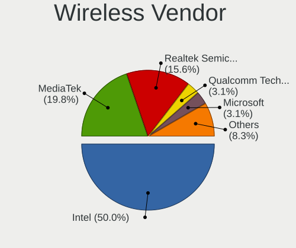

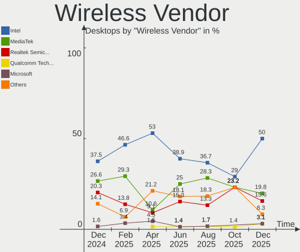

| Vendor                | Desktops | Percent |
|-----------------------|----------|---------|
| Intel                 | 48       | 50%     |
| MediaTek              | 19       | 19.79%  |
| Realtek Semiconductor | 15       | 15.63%  |
| Qualcomm Technologies | 3        | 3.13%   |
| Microsoft             | 3        | 3.13%   |
| Qualcomm Atheros      | 2        | 2.08%   |
| Realtek               | 1        | 1.04%   |
| Ralink Technology     | 1        | 1.04%   |
| NetGear               | 1        | 1.04%   |
| D-Link System         | 1        | 1.04%   |
| Broadcom              | 1        | 1.04%   |
| ASUSTek Computer      | 1        | 1.04%   |

Wireless Model
--------------

Wireless models

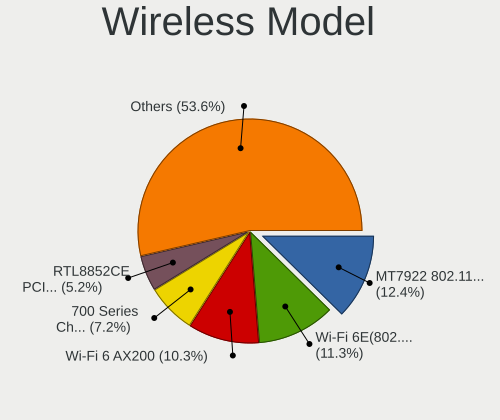

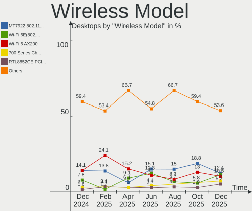

| Model                                                                           | Desktops | Percent |
|---------------------------------------------------------------------------------|----------|---------|
| MediaTek MT7922 802.11ax PCI Express Wireless Network Adapter                   | 12       | 12.37%  |
| Intel Wi-Fi 6E(802.11ax) AX210/AX1675* 2x2 [Typhoon Peak]                       | 11       | 11.34%  |
| Intel Wi-Fi 6 AX200                                                             | 10       | 10.31%  |
| Intel 700 Series Chipset CNVi WiFi                                              | 7        | 7.22%   |
| Realtek RTL8852CE PCIe 802.11ax Wireless Network Controller                     | 5        | 5.15%   |
| Intel Dual Band Wireless-AC 3168NGW [Stone Peak]                                | 4        | 4.12%   |
| Realtek RTL8851BE PCIe 802.11ax Wireless Network Controller                     | 3        | 3.09%   |
| Qualcomm WCN785x Wi-Fi 7(802.11be) 320MHz 2x2 [FastConnect 7800]                | 3        | 3.09%   |
| Intel Wireless 7260                                                             | 3        | 3.09%   |
| Intel Wi-Fi 5(802.11ac) Wireless-AC 9x6x [Thunder Peak]                         | 3        | 3.09%   |
| Intel Cannon Lake PCH CNVi WiFi                                                 | 3        | 3.09%   |
| Intel Alder Lake-S PCH CNVi WiFi                                                | 3        | 3.09%   |
| Realtek RTL8821CE 802.11ac PCIe Wireless Network Adapter                        | 2        | 2.06%   |
| Microsoft Xbox Wireless Adapter for Windows                                     | 2        | 2.06%   |
| MediaTek MT7927 802.11be 320MHz 2x2 PCIe Wireless Network Adapter [Filogic 380] | 2        | 2.06%   |
| MediaTek MT7921K (RZ608) Wi-Fi 6E 80MHz                                         | 2        | 2.06%   |
| MediaTek MT7902 802.11ax PCIe Wireless Network Adapter [Filogic 310]            | 2        | 2.06%   |
| Intel Comet Lake PCH CNVi WiFi                                                  | 2        | 2.06%   |
| Realtek RTL8922AE 802.11be PCIe Wireless Network Adapter                        | 1        | 1.03%   |
| Realtek RTL8852BE PCIe 802.11ax Wireless Network Controller                     | 1        | 1.03%   |
| Realtek RTL8821CE PCIe 802.11ac Wireless Network Controller                     | 1        | 1.03%   |
| Realtek RTL8192EU 802.11b/g/n WLAN Adapter                                      | 1        | 1.03%   |
| Realtek RTL8188EE Wireless Network Adapter                                      | 1        | 1.03%   |
| Realtek 802.11ac WLAN Adapter                                                   | 1        | 1.03%   |
| Ralink MT7601U Wireless Adapter                                                 | 1        | 1.03%   |
| Qualcomm Atheros AR9287 Wireless Network Adapter (PCI-Express)                  | 1        | 1.03%   |
| Qualcomm Atheros AR9227 Wireless Network Adapter                                | 1        | 1.03%   |
| NetGear Wireless_Device                                                         | 1        | 1.03%   |
| Microsoft Xbox 360 Wireless Adapter                                             | 1        | 1.03%   |
| MediaTek MT7925 802.11be 160MHz 2x2 PCIe Wireless Network Adapter [Filogic 360] | 1        | 1.03%   |
| Intel Wireless 8265 / 8275                                                      | 1        | 1.03%   |
| Intel Wireless 8260                                                             | 1        | 1.03%   |
| Intel Wireless 7265                                                             | 1        | 1.03%   |
| D-Link System DWA-125 Wireless N 150 Adapter(rev.A1) [Ralink RT3070]            | 1        | 1.03%   |
| Broadcom BCM4352 802.11ac Dual Band Wireless Network Adapter                    | 1        | 1.03%   |
| ASUS 802.11ac NIC                                                               | 1        | 1.03%   |

Ethernet Vendor
---------------

Ethernet vendors

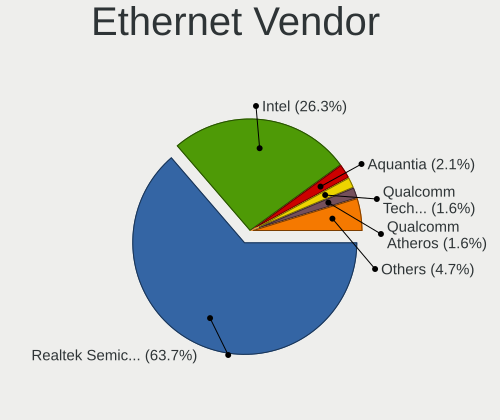

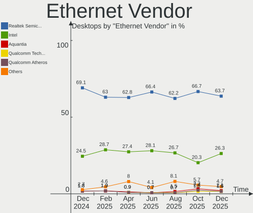

| Vendor                | Desktops | Percent |
|-----------------------|----------|---------|
| Realtek Semiconductor | 121      | 63.68%  |
| Intel                 | 50       | 26.32%  |
| Aquantia              | 4        | 2.11%   |
| Qualcomm Technologies | 3        | 1.58%   |
| Qualcomm Atheros      | 3        | 1.58%   |
| MediaTek              | 3        | 1.58%   |
| ASIX Electronics      | 3        | 1.58%   |
| Microsoft             | 1        | 0.53%   |
| Broadcom Limited      | 1        | 0.53%   |
| Broadcom              | 1        | 0.53%   |

Ethernet Model
--------------

Ethernet models

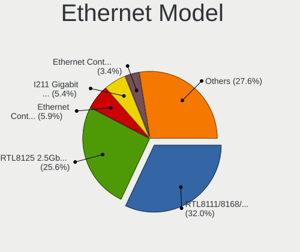

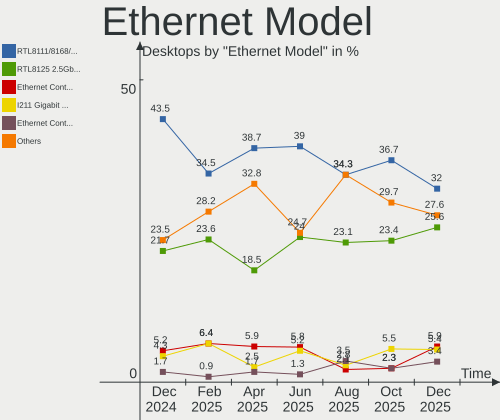

| Model                                                                           | Desktops | Percent |
|---------------------------------------------------------------------------------|----------|---------|
| Realtek RTL8111/8168/8211/8411 PCI Express Gigabit Ethernet Controller          | 65       | 32.02%  |
| Realtek RTL8125 2.5GbE Controller                                               | 52       | 25.62%  |
| Intel Ethernet Controller I225-V                                                | 12       | 5.91%   |
| Intel I211 Gigabit Network Connection                                           | 11       | 5.42%   |
| Intel Ethernet Controller I226-V                                                | 7        | 3.45%   |
| Realtek RTL8126 5GbE Controller                                                 | 6        | 2.96%   |
| Intel Ethernet Connection (2) I219-V                                            | 6        | 2.96%   |
| Realtek RTL8153 Gigabit Ethernet Adapter                                        | 3        | 1.48%   |
| Qualcomm WCN785x Wi-Fi 7(802.11be) 320MHz 2x2 [FastConnect 7800]                | 3        | 1.48%   |
| Intel Ethernet Connection (7) I219-V                                            | 3        | 1.48%   |
| ASIX AX88179 Gigabit Ethernet                                                   | 3        | 1.48%   |
| Aquantia AQtion AQC113CS NBase-T/IEEE 802.3an Ethernet Controller [Antigua 10G] | 3        | 1.48%   |
| Realtek RTL8922AE 802.11be PCIe Wireless Network Adapter                        | 2        | 0.99%   |
| Qualcomm Atheros Killer E220x Gigabit Ethernet Controller                       | 2        | 0.99%   |
| Intel I210 Gigabit Network Connection                                           | 2        | 0.99%   |
| Intel 82599ES 10-Gigabit SFI/SFP+ Network Connection                            | 2        | 0.99%   |
| Realtek USB 10/100/1G/2.5 LAN                                                   | 1        | 0.49%   |
| Realtek RTL8169 PCI Gigabit Ethernet Controller                                 | 1        | 0.49%   |
| Realtek RTL8111/8168/8411 PCI Express Gigabit Ethernet Controller               | 1        | 0.49%   |
| Realtek Killer E5000 5GbE Controller                                            | 1        | 0.49%   |
| Qualcomm Atheros Killer E2500 Gigabit Ethernet Controller                       | 1        | 0.49%   |
| Microsoft Fast Ethernet Adapter (Xenon)                                         | 1        | 0.49%   |
| MediaTek MT7925 802.11be 160MHz 2x2 PCIe Wireless Network Adapter [Filogic 360] | 1        | 0.49%   |
| MediaTek MT7922 802.11ax PCI Express Wireless Network Adapter                   | 1        | 0.49%   |
| MediaTek A015                                                                   | 1        | 0.49%   |
| Intel Wi-Fi 7(802.11be) AX1775*/AX1790*/BE20*/BE401/BE1750* 2x2                 | 1        | 0.49%   |
| Intel Ethernet Controller X550                                                  | 1        | 0.49%   |
| Intel Ethernet Connection I217-V                                                | 1        | 0.49%   |
| Intel Ethernet Connection (2) I218-V                                            | 1        | 0.49%   |
| Intel Ethernet Connection (2) I218-LM                                           | 1        | 0.49%   |
| Intel Ethernet Connection (14) I219-V                                           | 1        | 0.49%   |
| Intel Ethernet Connection (10) I219-V                                           | 1        | 0.49%   |
| Intel 82579LM Gigabit Network Connection (Lewisville)                           | 1        | 0.49%   |
| Intel 82573E Gigabit Ethernet Controller (Copper)                               | 1        | 0.49%   |
| Broadcom NetXtreme BCM5761 Gigabit Ethernet PCIe                                | 1        | 0.49%   |
| Broadcom Limited NetXtreme BCM5751 Gigabit Ethernet PCI Express                 | 1        | 0.49%   |
| Aquantia AQtion AQC107 NBase-T/IEEE 802.3an Ethernet Controller [Atlantic 10G]  | 1        | 0.49%   |

Net Controller Kind
-------------------

Ethernet, WiFi or modem

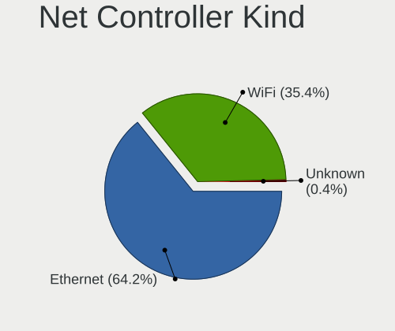

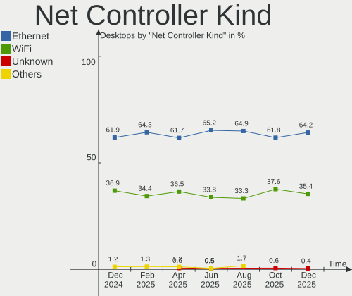

| Kind     | Desktops | Percent |
|----------|----------|---------|
| Ethernet | 167      | 64.23%  |
| WiFi     | 92       | 35.38%  |
| Unknown  | 1        | 0.38%   |

Used Controller
---------------

Currently used network controller

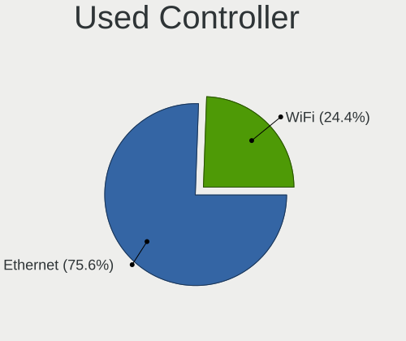

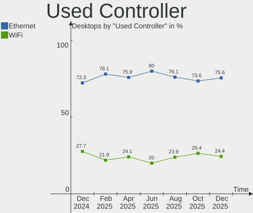

| Kind     | Desktops | Percent |
|----------|----------|---------|
| Ethernet | 133      | 75.57%  |
| WiFi     | 43       | 24.43%  |

NICs
----

Total network controllers on board

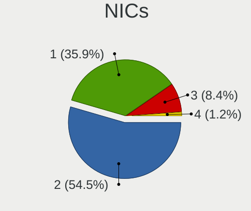

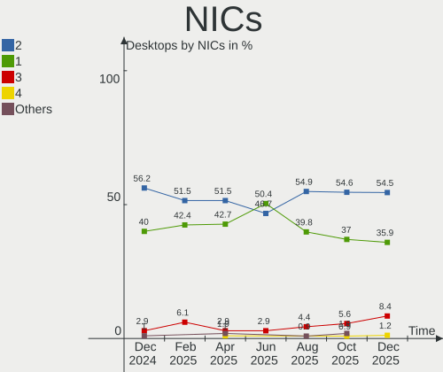

| Total | Desktops | Percent |
|-------|----------|---------|
| 2     | 91       | 54.49%  |
| 1     | 60       | 35.93%  |
| 3     | 14       | 8.38%   |
| 4     | 2        | 1.2%    |

IPv6
----

IPv6 vs IPv4

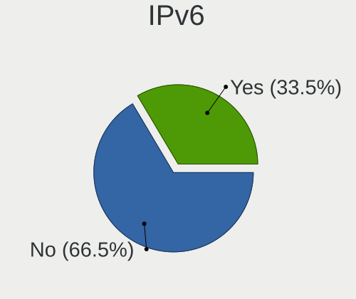

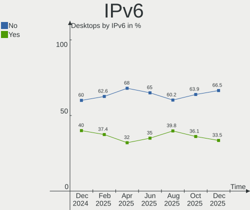

| Used | Desktops | Percent |
|------|----------|---------|
| No   | 111      | 66.47%  |
| Yes  | 56       | 33.53%  |

Bluetooth
---------

Bluetooth Vendor
----------------

Controller vendors

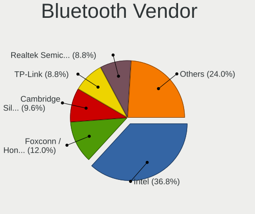

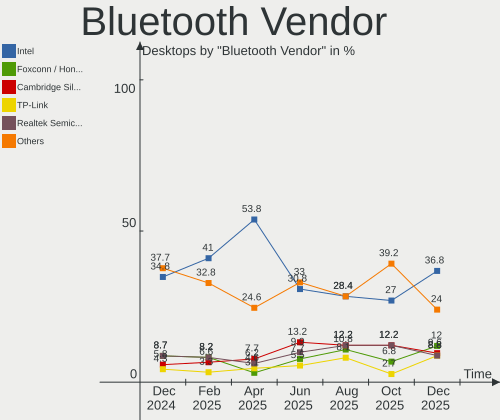

| Vendor                     | Desktops | Percent |
|----------------------------|----------|---------|
| Intel                      | 46       | 36.8%   |
| Foxconn / Hon Hai          | 15       | 12%     |
| Cambridge Silicon Radio    | 12       | 9.6%    |
| TP-Link                    | 11       | 8.8%    |
| Realtek Semiconductor      | 11       | 8.8%    |
| MediaTek                   | 11       | 8.8%    |
| IMC Networks               | 9        | 7.2%    |
| ASUSTek Computer           | 5        | 4%      |
| Broadcom                   | 2        | 1.6%    |
| Realtek                    | 1        | 0.8%    |
| Integrated System Solution | 1        | 0.8%    |
| Actions                    | 1        | 0.8%    |

Bluetooth Model
---------------

Controller models

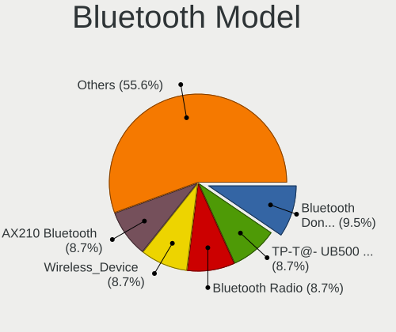

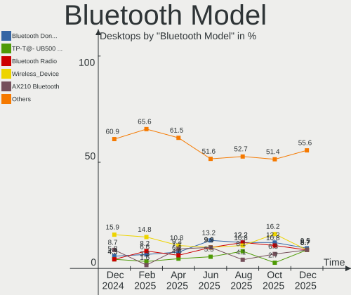

| Model                                               | Desktops | Percent |
|-----------------------------------------------------|----------|---------|
| Cambridge Silicon Radio Bluetooth Dongle (HCI mode) | 12       | 9.52%   |
| TP-Link TP-T@- UB500 Adapter                        | 11       | 8.73%   |
| Realtek Bluetooth Radio                             | 11       | 8.73%   |
| MediaTek Wireless_Device                            | 11       | 8.73%   |
| Intel AX210 Bluetooth                               | 11       | 8.73%   |
| Intel AX200 Bluetooth                               | 10       | 7.94%   |
| Foxconn / Hon Hai Wireless_Device                   | 8        | 6.35%   |
| Intel AX201 Bluetooth                               | 7        | 5.56%   |
| Intel Bluetooth Device                              | 6        | 4.76%   |
| IMC Networks Bluetooth Radio                        | 5        | 3.97%   |
| Foxconn / Hon Hai Bluetooth Device                  | 5        | 3.97%   |
| Intel Wireless-AC 3168 Bluetooth                    | 4        | 3.17%   |
| IMC Networks Wireless_Device                        | 4        | 3.17%   |
| ASUS ASUS USB-BT500                                 | 4        | 3.17%   |
| Intel Wireless-AC 9260 Bluetooth Adapter            | 3        | 2.38%   |
| Intel Bluetooth wireless interface                  | 3        | 2.38%   |
| Intel Bluetooth 9460/9560 Jefferson Peak (JfP)      | 3        | 2.38%   |
| Foxconn / Hon Hai Bluetooth Radio                   | 2        | 1.59%   |
| Broadcom BCM20702A0 Bluetooth 4.0                   | 2        | 1.59%   |
| Realtek Bluetooth Radio                             | 1        | 0.79%   |
| Integrated System Solution Bluetooth Device         | 1        | 0.79%   |
| ASUS Bluetooth Radio                                | 1        | 0.79%   |
| Actions general adapter                             | 1        | 0.79%   |

Sound
-----

Sound Vendor
------------

Sound card vendors

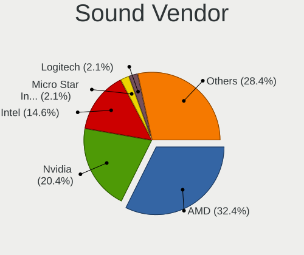

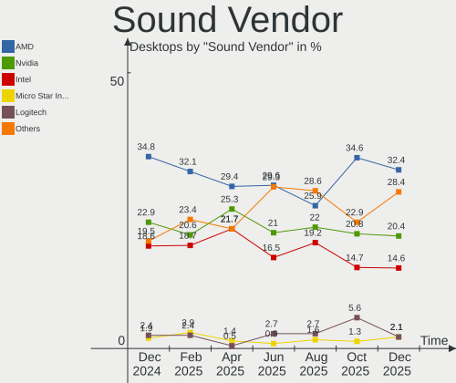

| Vendor                               | Desktops | Percent |
|--------------------------------------|----------|---------|
| AMD                                  | 122      | 32.36%  |
| Nvidia                               | 77       | 20.42%  |
| Intel                                | 55       | 14.59%  |
| Micro Star International             | 8        | 2.12%   |
| Logitech                             | 8        | 2.12%   |
| C-Media Electronics                  | 7        | 1.86%   |
| ASUSTek Computer                     | 7        | 1.86%   |
| Sony                                 | 6        | 1.59%   |
| Kingston Technology                  | 6        | 1.59%   |
| Focusrite-Novation                   | 5        | 1.33%   |
| Blue Microphones                     | 5        | 1.33%   |
| Audio-Technica                       | 5        | 1.33%   |
| SteelSeries ApS                      | 4        | 1.06%   |
| JMTek                                | 4        | 1.06%   |
| Yamaha                               | 3        | 0.8%    |
| Samson Technologies                  | 3        | 0.8%    |
| Razer USA                            | 3        | 0.8%    |
| Hewlett-Packard                      | 3        | 0.8%    |
| DSEA A/S                             | 3        | 0.8%    |
| SAVITECH                             | 2        | 0.53%   |
| KTMicro                              | 2        | 0.53%   |
| GN Netcom                            | 2        | 0.53%   |
| FiiO Electronics Technology          | 2        | 0.53%   |
| Dell                                 | 2        | 0.53%   |
| Creative Technology                  | 2        | 0.53%   |
| Unknown                              | 2        | 0.53%   |
| VIA Technologies                     | 1        | 0.27%   |
| Valve Software                       | 1        | 0.27%   |
| Thesycon Systemsoftware & Consulting | 1        | 0.27%   |
| Texas Instruments                    | 1        | 0.27%   |
| SM900T Microphone                    | 1        | 0.27%   |
| Sennheiser                           | 1        | 0.27%   |
| Schiit Audio                         | 1        | 0.27%   |
| RODE Microphones                     | 1        | 0.27%   |
| Realtek Semiconductor                | 1        | 0.27%   |
| Ploopy                               | 1        | 0.27%   |
| Plantronics                          | 1        | 0.27%   |
| NZXT                                 | 1        | 0.27%   |
| Nor-Tec streaming mic                | 1        | 0.27%   |
| Native Instruments                   | 1        | 0.27%   |

Sound Model
-----------

Sound card models

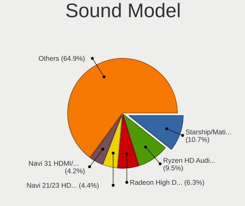

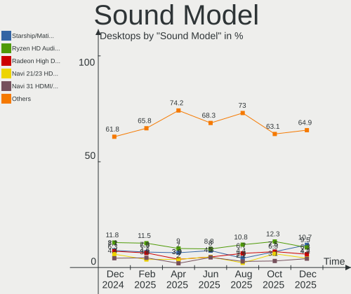

| Model                                                               | Desktops | Percent |
|---------------------------------------------------------------------|----------|---------|
| AMD Starship/Matisse HD Audio Controller                            | 51       | 10.71%  |
| AMD Ryzen HD Audio Controller                                       | 45       | 9.45%   |
| AMD Radeon High Definition Audio Controller                         | 30       | 6.3%    |
| AMD Navi 21/23 HDMI/DP Audio Controller                             | 21       | 4.41%   |
| AMD Navi 31 HDMI/DP Audio                                           | 20       | 4.2%    |
| Nvidia GA102 High Definition Audio Controller                       | 14       | 2.94%   |
| AMD Navi 48 HDMI/DP Audio Controller                                | 13       | 2.73%   |
| AMD Navi 10 HDMI Audio                                              | 11       | 2.31%   |
| Intel Raptor Lake High Definition Audio Controller                  | 10       | 2.1%    |
| AMD Renoir/Cezanne HDMI/DP Audio Controller                         | 9        | 1.89%   |
| Nvidia GA104 High Definition Audio Controller                       | 8        | 1.68%   |
| Micro Star International USB Audio                                  | 8        | 1.68%   |
| Nvidia GB203 High Definition Audio Controller                       | 7        | 1.47%   |
| Nvidia GA106 High Definition Audio Controller                       | 7        | 1.47%   |
| Intel Alder Lake-S HD Audio Controller                              | 7        | 1.47%   |
| Intel 8 Series/C220 Series Chipset High Definition Audio Controller | 7        | 1.47%   |
| Nvidia AD107 High Definition Audio Controller                       | 6        | 1.26%   |
| ASUSTek Computer USB Audio                                          | 6        | 1.26%   |
| Nvidia GP107GL High Definition Audio Controller                     | 5        | 1.05%   |
| Nvidia GP104 High Definition Audio Controller                       | 5        | 1.05%   |
| Intel Cannon Lake PCH cAVS                                          | 5        | 1.05%   |
| Intel 200 Series PCH HD Audio                                       | 5        | 1.05%   |
| Blue Microphones Yeti Stereo Microphone                             | 5        | 1.05%   |
| AMD Ellesmere HDMI Audio [Radeon RX 470/480 / 570/580/590]          | 5        | 1.05%   |
| Sony DualShock 4 [CUH-ZCT2x]                                        | 4        | 0.84%   |
| Nvidia TU116 High Definition Audio Controller                       | 4        | 0.84%   |
| AMD Family 17h (Models 00h-0fh) HD Audio Controller                 | 4        | 0.84%   |
| Nvidia TU104 HD Audio Controller                                    | 3        | 0.63%   |
| Nvidia AD104 High Definition Audio Controller                       | 3        | 0.63%   |
| Kingston Technology HyperX 7.1 Audio                                | 3        | 0.63%   |
| Intel C610/X99 series chipset HD Audio Controller                   | 3        | 0.63%   |
| SteelSeries ApS Arctis Nova Pro Wireless                            | 2        | 0.42%   |
| Sony DualSense wireless controller (PS5)                            | 2        | 0.42%   |
| Nvidia TU102 High Definition Audio Controller                       | 2        | 0.42%   |
| Nvidia GK208 HDMI/DP Audio Controller                               | 2        | 0.42%   |
| Nvidia GB205 High Definition Audio Controller                       | 2        | 0.42%   |
| Logitech Blue Microphones                                           | 2        | 0.42%   |
| JMTek USB PnP Audio Device                                          | 2        | 0.42%   |
| Intel Xeon E3-1200 v3/4th Gen Core Processor HD Audio Controller    | 2        | 0.42%   |
| Intel Tiger Lake-H HD Audio Controller                              | 2        | 0.42%   |

Memory
------

Memory Vendor
-------------

Memory module vendors

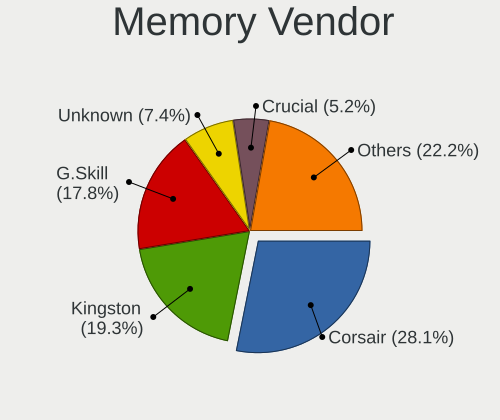

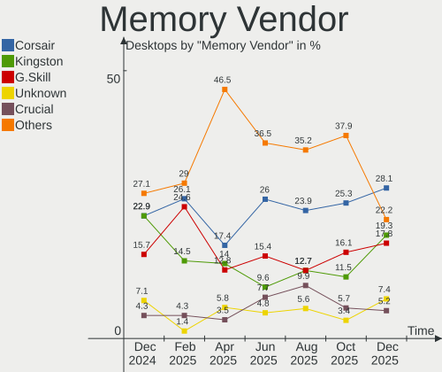

| Vendor                             | Desktops | Percent |
|------------------------------------|----------|---------|
| Corsair                            | 38       | 28.15%  |
| Kingston                           | 26       | 19.26%  |
| G.Skill                            | 24       | 17.78%  |
| Unknown                            | 10       | 7.41%   |
| Crucial                            | 7        | 5.19%   |
| Unknown                            | 4        | 2.96%   |
| SK hynix                           | 4        | 2.96%   |
| Micron Technology                  | 3        | 2.22%   |
| A-DATA Technology                  | 3        | 2.22%   |
| TeamGroup                          | 2        | 1.48%   |
| Samsung Electronics                | 2        | 1.48%   |
| Patriot                            | 2        | 1.48%   |
| Wilk                               | 1        | 0.74%   |
| Team                               | 1        | 0.74%   |
| Silicon Power                      | 1        | 0.74%   |
| PNY                                | 1        | 0.74%   |
| Kllisre                            | 1        | 0.74%   |
| Kimtigo Semiconductor (HK) Limited | 1        | 0.74%   |
| Juhor                              | 1        | 0.74%   |
| Gowe                               | 1        | 0.74%   |
| ASint Technology                   | 1        | 0.74%   |
| Apacer                             | 1        | 0.74%   |

Memory Model
------------

Memory module models

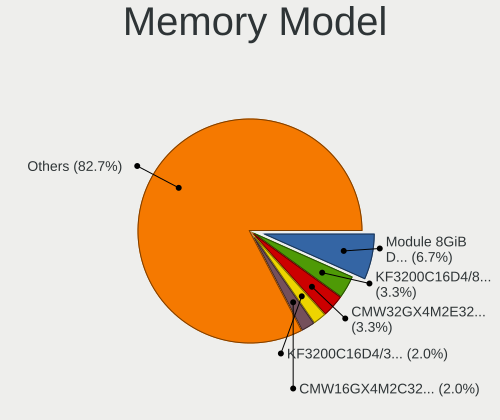

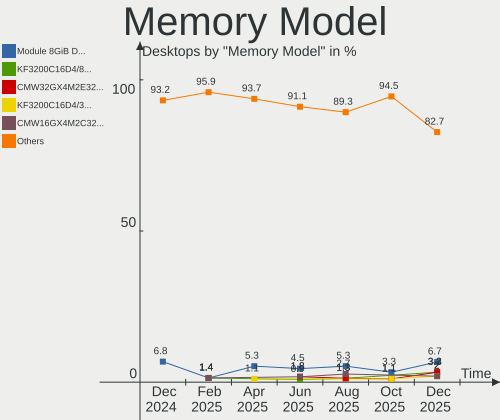

| Model                                                   | Desktops | Percent |
|---------------------------------------------------------|----------|---------|
| Unknown                                                 | 10       | 6.67%   |
| Kingston RAM KF3200C16D4/8GX 8GiB DIMM DDR4 3600MT/s    | 5        | 3.33%   |
| Corsair RAM CMW32GX4M2E3200C16 16GB DIMM DDR4 3200MT/s  | 5        | 3.33%   |
| Kingston RAM KF3200C16D4/32GX 32GB DIMM DDR4 3933MT/s   | 3        | 2%      |
| Corsair RAM CMW16GX4M2C3200C16 8GB DIMM DDR4 3733MT/s   | 3        | 2%      |
| Corsair RAM CMK32GX4M2E3200C16 16GB DIMM DDR4 3600MT/s  | 3        | 2%      |
| Kingston RAM KF560C36-16 16GB DIMM DDR5 6000MT/s        | 2        | 1.33%   |
| Kingston RAM KF560C30-32 32GB DIMM DDR5 6000MT/s        | 2        | 1.33%   |
| Kingston RAM KF3200C16D4/16GX 16GB DIMM DDR4 3733MT/s   | 2        | 1.33%   |
| G.Skill RAM F5-6000J3636F16G 16GB DIMM DDR5 6400MT/s    | 2        | 1.33%   |
| G.Skill RAM F4-3200C16-16GVK 16GB DIMM DDR4 3600MT/s    | 2        | 1.33%   |
| Corsair RAM CMK32GX5M2B5600C36 16GB DIMM DDR5 5800MT/s  | 2        | 1.33%   |
| Corsair RAM CMK32GX4M2A2666C16 16GB DIMM DDR4 2667MT/s  | 2        | 1.33%   |
| Corsair RAM CMK16GX4M2B3200C16 8GB DIMM DDR4 3600MT/s   | 2        | 1.33%   |
| Wilk RAM IRX2666D464L16S/8G 8GB DIMM DDR4 2933MT/s      | 1        | 0.67%   |
| Unknown RAM Module 8GB DIMM DDR4 3200MT/s               | 1        | 0.67%   |
| Unknown RAM Module 8GB DIMM DDR3 1333MT/s               | 1        | 0.67%   |
| Unknown RAM Module 16GB DIMM DDR4 2400MT/s              | 1        | 0.67%   |
| Unknown RAM 3733 C17 Series 8192MB DIMM DDR4 2133MT/s   | 1        | 0.67%   |
| TeamGroup RAM UD5-6400 16GB DIMM DDR5 6400MT/s          | 1        | 0.67%   |
| TeamGroup RAM UD5-6000 16GB DIMM DDR5 6000MT/s          | 1        | 0.67%   |
| Team RAM TEAMGROUP-UD4-3200 8GB DIMM DDR4 3800MT/s      | 1        | 0.67%   |
| SK hynix RAM MB48G56U80H2R8.RtR 48GB DIMM DDR5 5600MT/s | 1        | 0.67%   |
| SK hynix RAM HMT451U6AFR8C-PB 4GB DIMM DDR3 1600MT/s    | 1        | 0.67%   |
| SK hynix RAM HMT351U7BFR8A-H9 4GB DIMM DDR3 1333MT/s    | 1        | 0.67%   |
| SK hynix RAM HMT351U6CFR8C-H9 4GB DIMM DDR3 1333MT/s    | 1        | 0.67%   |
| SK hynix RAM HMA81GU6DJR8N-XN 8GB DIMM DDR4 3200MT/s    | 1        | 0.67%   |
| Silicon Power RAM Module 16GB DIMM DDR5 4800MT/s        | 1        | 0.67%   |
| Samsung RAM M378B5173EB0-CK0 4GB DIMM DDR3 1600MT/s     | 1        | 0.67%   |
| Samsung RAM M378A2G43AB3-CWE 16GB DIMM DDR4 3200MT/s    | 1        | 0.67%   |
| PNY RAM 16GP1X1664HNN104-14-K 16GiB DIMM DDR5 6200MT/s  | 1        | 0.67%   |
| Patriot RAM PSD48G240081 8GB DIMM DDR4 2800MT/s         | 1        | 0.67%   |
| Patriot RAM PSD416G32002 16GB DIMM DDR4 3200MT/s        | 1        | 0.67%   |
| Patriot RAM 2666 C16 Series 16GB DIMM DDR4 3400MT/s     | 1        | 0.67%   |
| Micron RAM CP16G64C38U5B.M8D1 16GB DIMM DDR5 6000MT/s   | 1        | 0.67%   |
| Micron RAM 8KTF51264AZ-1G6E1 4GB DIMM DDR3 1600MT/s     | 1        | 0.67%   |
| Micron RAM 18JSF51272AZ-1G6K1 4GB DIMM DDR3 1600MT/s    | 1        | 0.67%   |
| Kllisre RAM Module 16GB DIMM DDR4 2400MT/s              | 1        | 0.67%   |
| Kingston RAM Module 8GB DIMM DDR4 2667MT/s              | 1        | 0.67%   |
| Kingston RAM KHX3600C17D4/16GX 16GB DIMM DDR4 3800MT/s  | 1        | 0.67%   |

Memory Kind
-----------

Memory module kinds

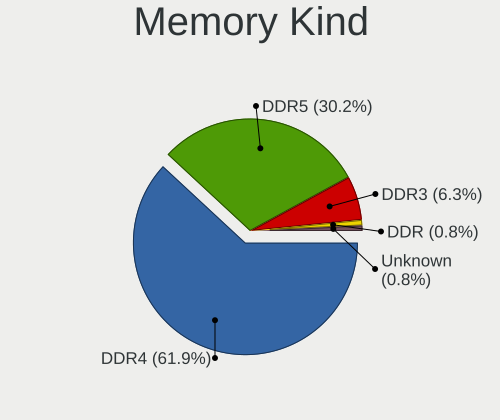

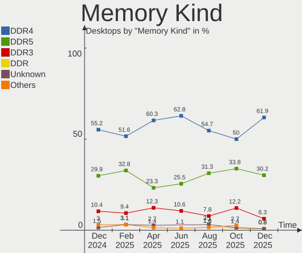

| Kind    | Desktops | Percent |
|---------|----------|---------|
| DDR4    | 78       | 61.9%   |
| DDR5    | 38       | 30.16%  |
| DDR3    | 8        | 6.35%   |
| DDR     | 1        | 0.79%   |
| Unknown | 1        | 0.79%   |

Memory Form Factor
------------------

Physical design of the memory module

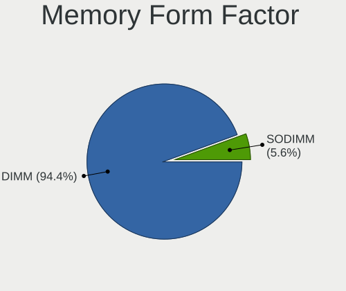

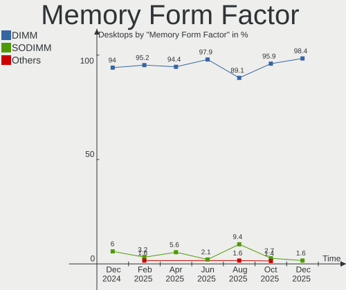

| Name   | Desktops | Percent |
|--------|----------|---------|
| DIMM   | 124      | 98.41%  |
| SODIMM | 2        | 1.59%   |

Memory Size
-----------

Memory module size

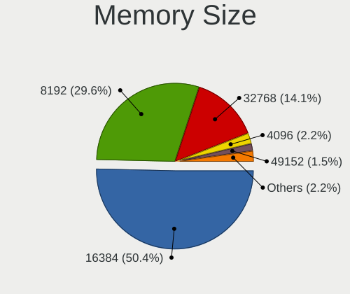

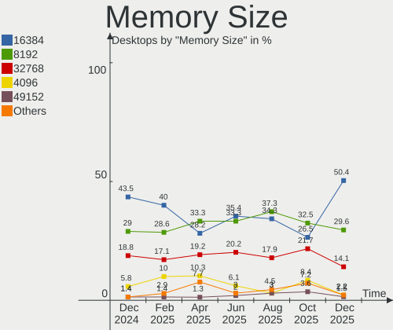

| Size  | Desktops | Percent |
|-------|----------|---------|
| 16384 | 68       | 50.37%  |
| 8192  | 40       | 29.63%  |
| 32768 | 19       | 14.07%  |
| 4096  | 3        | 2.22%   |
| 49152 | 2        | 1.48%   |
| 65536 | 1        | 0.74%   |
| 24576 | 1        | 0.74%   |
| 1024  | 1        | 0.74%   |

Memory Speed
------------

Memory module speed

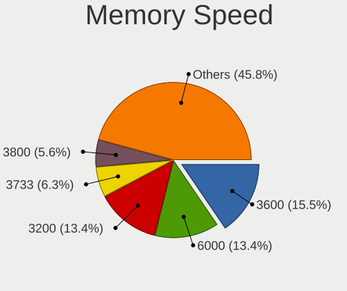

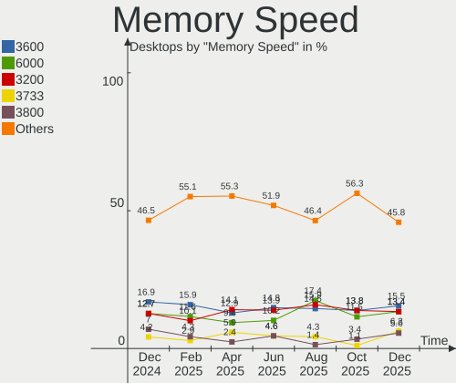

| Speed | Desktops | Percent |
|-------|----------|---------|
| 3600  | 22       | 15.49%  |
| 6000  | 19       | 13.38%  |
| 3200  | 19       | 13.38%  |
| 3733  | 9        | 6.34%   |
| 3800  | 8        | 5.63%   |
| 2667  | 8        | 5.63%   |
| 4800  | 5        | 3.52%   |
| 1600  | 5        | 3.52%   |
| 2400  | 4        | 2.82%   |
| 2133  | 4        | 2.82%   |
| 6400  | 3        | 2.11%   |
| 5200  | 3        | 2.11%   |
| 3933  | 3        | 2.11%   |
| 3666  | 3        | 2.11%   |
| 6200  | 2        | 1.41%   |
| 5800  | 2        | 1.41%   |
| 5600  | 2        | 1.41%   |
| 3866  | 2        | 1.41%   |
| 3400  | 2        | 1.41%   |
| 3100  | 2        | 1.41%   |
| 2933  | 2        | 1.41%   |
| 1333  | 2        | 1.41%   |
| 12800 | 1        | 0.7%    |
| 7000  | 1        | 0.7%    |
| 4333  | 1        | 0.7%    |
| 3533  | 1        | 0.7%    |
| 3333  | 1        | 0.7%    |
| 3266  | 1        | 0.7%    |
| 3066  | 1        | 0.7%    |
| 3007  | 1        | 0.7%    |
| 2800  | 1        | 0.7%    |
| 2747  | 1        | 0.7%    |
| 533   | 1        | 0.7%    |

Printers & scanners
-------------------

Printer Vendor
--------------

Printer device vendors

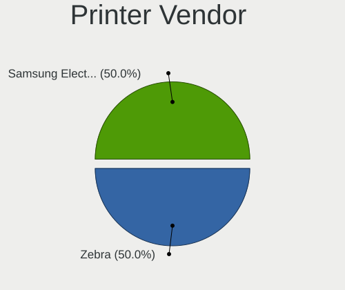

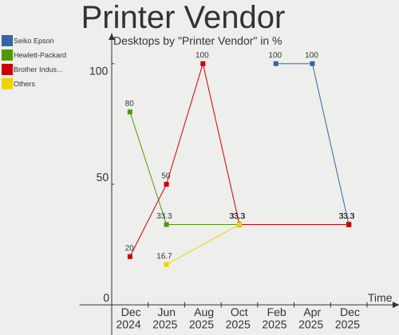

| Vendor             | Desktops | Percent |
|--------------------|----------|---------|
| Seiko Epson        | 1        | 33.33%  |
| Hewlett-Packard    | 1        | 33.33%  |
| Brother Industries | 1        | 33.33%  |

Printer Model
-------------

Printer device models

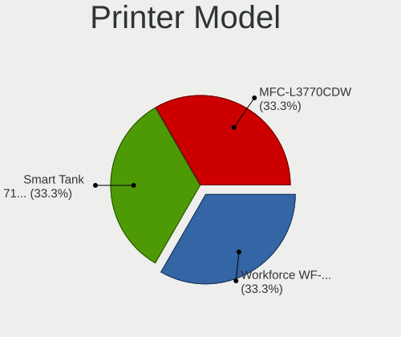

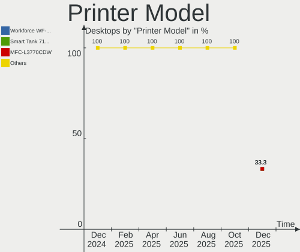

| Model                                     | Desktops | Percent |
|-------------------------------------------|----------|---------|
| Seiko Epson Workforce WF-7820/7840 Series | 1        | 33.33%  |
| HP Smart Tank 710-720 series              | 1        | 33.33%  |
| Brother MFC-L3770CDW                      | 1        | 33.33%  |

Scanner Vendor
--------------

Scanner device vendors

Zero info for selected period =(

Scanner Model
-------------

Scanner device models

Zero info for selected period =(

Camera
------

Camera Vendor
-------------

Camera device vendors

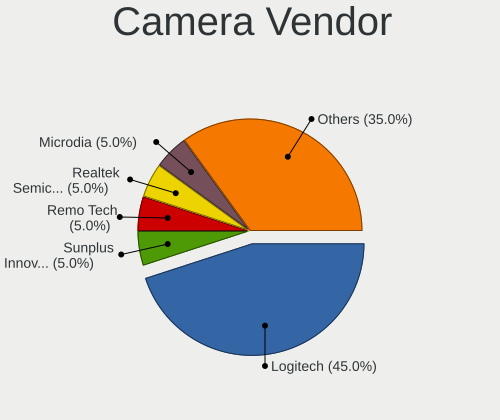

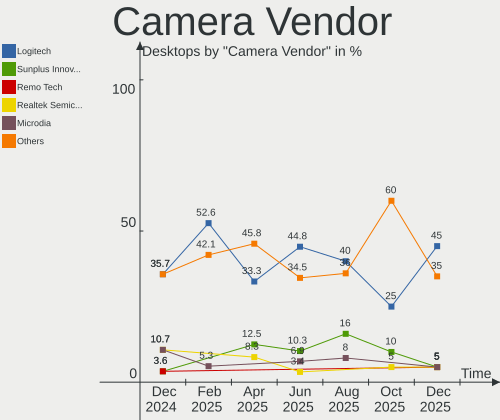

| Vendor                        | Desktops | Percent |
|-------------------------------|----------|---------|
| Logitech                      | 18       | 45%     |
| Sunplus Innovation Technology | 2        | 5%      |
| Remo Tech                     | 2        | 5%      |
| Realtek Semiconductor         | 2        | 5%      |
| Microdia                      | 2        | 5%      |
| webcamvendor                  | 1        | 2.5%    |
| Web Camera                    | 1        | 2.5%    |
| Valve Software                | 1        | 2.5%    |
| USB3.0 HD Audio Capture       | 1        | 2.5%    |
| Razer USA                     | 1        | 2.5%    |
| Nikon                         | 1        | 2.5%    |
| Microsoft                     | 1        | 2.5%    |
| LG Electronics                | 1        | 2.5%    |
| Google                        | 1        | 2.5%    |
| eMeet                         | 1        | 2.5%    |
| Elgato Systems                | 1        | 2.5%    |
| Creative Technology           | 1        | 2.5%    |
| Apple                         | 1        | 2.5%    |
| Unknown                       | 1        | 2.5%    |

Camera Model
------------

Camera device models

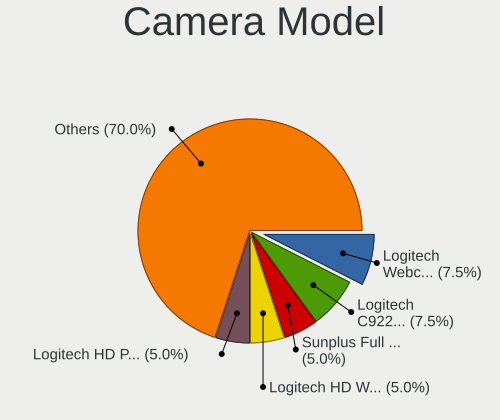

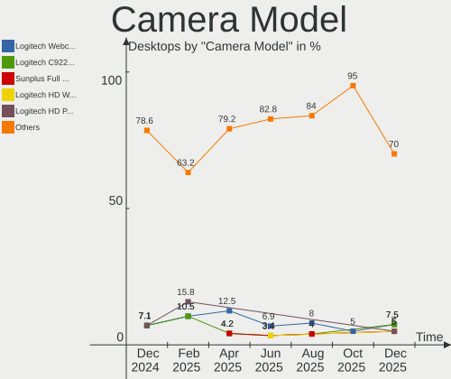

| Model                                           | Desktops | Percent |
|-------------------------------------------------|----------|---------|
| Logitech Webcam C270                            | 3        | 7.5%    |
| Logitech C922 Pro Stream Webcam                 | 3        | 7.5%    |
| Sunplus Full HD webcam                          | 2        | 5%      |
| Logitech HD Webcam C615                         | 2        | 5%      |
| Logitech HD Pro Webcam C920                     | 2        | 5%      |
| Logitech C920 PRO HD Webcam                     | 2        | 5%      |
| Logitech BRIO Ultra HD Webcam                   | 2        | 5%      |
| webcamvendor NexiGo N60 FHD Webcam              | 1        | 2.5%    |
| Web Camera Web Camera                           | 1        | 2.5%    |
| Valve Software 3D Camera                        | 1        | 2.5%    |
| USB3.0 HD Audio Capture USB3.0 HD Video Capture | 1        | 2.5%    |
| Remo Tech OBSBOT Tiny 2 Lite                    | 1        | 2.5%    |
| Remo Tech OBSBOT Tiny 2                         | 1        | 2.5%    |
| Realtek Thronmax StreamGo Webcam                | 1        | 2.5%    |
| Realtek Thronmax Stream Go Pro Webcam           | 1        | 2.5%    |
| Razer USA Gaming Webcam [Kiyo]                  | 1        | 2.5%    |
| Nikon D5100                                     | 1        | 2.5%    |
| Microsoft LifeCam HD-3000                       | 1        | 2.5%    |
| Microdia USB 2.0 Camera                         | 1        | 2.5%    |
| Microdia Integrated Camera                      | 1        | 2.5%    |
| Logitech Webcam C310                            | 1        | 2.5%    |
| Logitech Webcam C210                            | 1        | 2.5%    |
| Logitech StreamCam                              | 1        | 2.5%    |
| Logitech Logi Webcam C920e                      | 1        | 2.5%    |
| LG LG UltraFine Display Camera                  | 1        | 2.5%    |
| Google Nexus/Pixel Device (MTP + debug)         | 1        | 2.5%    |
| eMeet HD Webcam C960                            | 1        | 2.5%    |
| Elgato Systems Elgato Facecam                   | 1        | 2.5%    |
| Creative Live! Cam Sync 1080p                   | 1        | 2.5%    |
| Apple iPhone 5/5C/5S/6/SE/7/8/X                 | 1        | 2.5%    |
| Unknown                                         | 1        | 2.5%    |

Security
--------

Fingerprint Vendor
------------------

Fingerprint sensor vendors

Zero info for selected period =(

Fingerprint Model
-----------------

Fingerprint sensor models

Zero info for selected period =(

Chipcard Vendor
---------------

Chipcard module vendors

Zero info for selected period =(

Chipcard Model
--------------

Chipcard module models

Zero info for selected period =(

Unsupported
-----------

Unsupported Devices
-------------------

Total unsupported devices on board

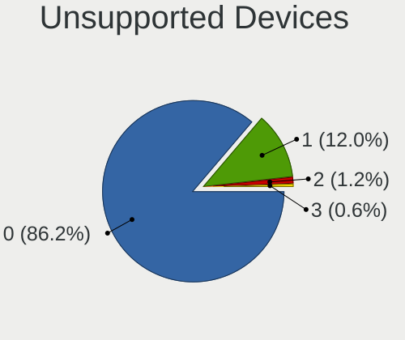

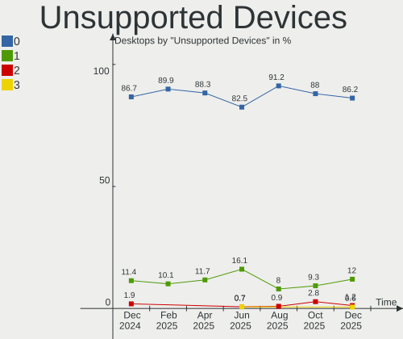

| Total | Desktops | Percent |
|-------|----------|---------|
| 0     | 144      | 86.23%  |
| 1     | 20       | 11.98%  |
| 2     | 2        | 1.2%    |
| 3     | 1        | 0.6%    |

Unsupported Device Types
------------------------

Types of unsupported devices

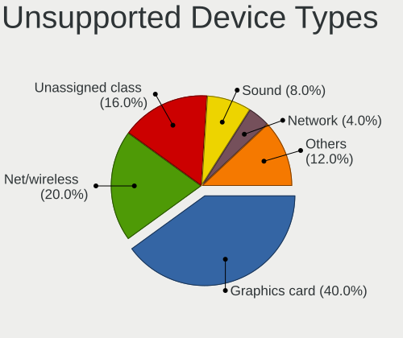

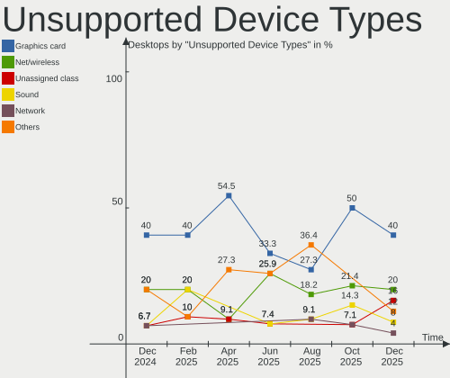

| Type                     | Desktops | Percent |
|--------------------------|----------|---------|
| Graphics card            | 10       | 40%     |
| Net/wireless             | 5        | 20%     |
| Unassigned class         | 4        | 16%     |
| Sound                    | 2        | 8%      |
| Network                  | 1        | 4%      |
| Multimedia controller    | 1        | 4%      |
| Communication controller | 1        | 4%      |
| Camera                   | 1        | 4%      |

