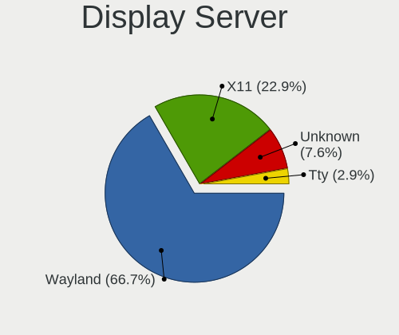
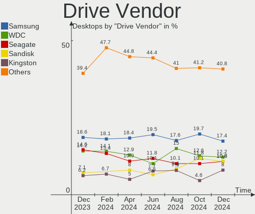
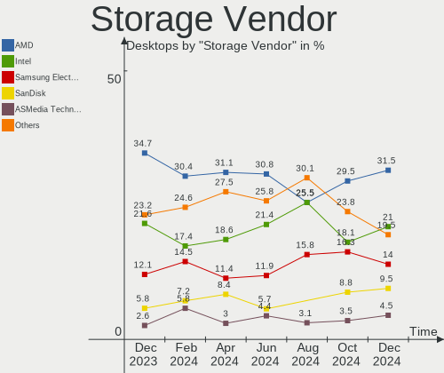
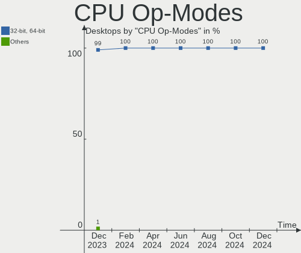
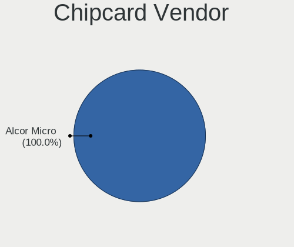
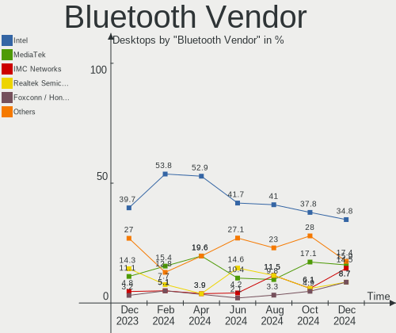
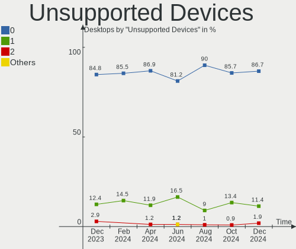

Arch Hardware Trends (Desktop)
------------------------------

A project to identify most popular hardware characteristics and track their change
over time based on data collected by Arch users at https://Linux-Hardware.org.

Anyone can contribute to the study by uploading probes of their computers by
the [hw-probe](https://github.com/linuxhw/hw-probe) tool:

    sudo -E hw-probe -all -upload

Full-feature report is available here: https://linux-hardware.org/?view=trends&formfactor=desktop

Period: Dec, 2020.

Contents
--------

- [ OS                       ](#os)
- [ OS Family                ](#os-family)
- [ Kernel                   ](#kernel)
- [ Kernel Family            ](#kernel-family)
- [ Kernel Major Ver.        ](#kernel-major-ver)
- [ Arch                     ](#arch)
- [ DE                       ](#de)
- [ Display Server           ](#display-server)
- [ Display Manager          ](#display-manager)
- [ OS Lang                  ](#os-lang)
- [ Boot Mode                ](#boot-mode)
- [ Filesystem               ](#filesystem)
- [ Part. scheme             ](#part-scheme)
- [ Dual Boot with Linux/BSD ](#dual-boot-with-linux/bsd)
- [ Dual Boot (Win)          ](#dual-boot-win)
- [ Country                  ](#country)
- [ City                     ](#city)
- [ Vendor                   ](#vendor)
- [ Model                    ](#model)
- [ Model Family             ](#model-family)
- [ MFG Year                 ](#mfg-year)
- [ Form Factor              ](#form-factor)
- [ Secure Boot              ](#secure-boot)
- [ Coreboot                 ](#coreboot)
- [ RAM Size                 ](#ram-size)
- [ RAM Used                 ](#ram-used)
- [ Has CD-ROM               ](#has-cd-rom)
- [ Total Drives             ](#total-drives)
- [ Has Ethernet             ](#has-ethernet)
- [ Drive Vendor             ](#drive-vendor)
- [ Drive Model              ](#drive-model)
- [ HDD Vendor               ](#hdd-vendor)
- [ SSD Vendor               ](#ssd-vendor)
- [ Drive Kind               ](#drive-kind)
- [ Drive Connector          ](#drive-connector)
- [ Drive Size               ](#drive-size)
- [ Space Total              ](#space-total)
- [ Space Used               ](#space-used)
- [ Malfunc. Drives          ](#malfunc-drives)
- [ Malfunc. Drive Vendor    ](#malfunc-drive-vendor)
- [ Malfunc. HDD Vendor      ](#malfunc-hdd-vendor)
- [ Malfunc. Drive Kind      ](#malfunc-drive-kind)
- [ Failed Drives            ](#failed-drives)
- [ Failed Drive Vendor      ](#failed-drive-vendor)
- [ Drive Status             ](#drive-status)
- [ Storage Vendor           ](#storage-vendor)
- [ Storage Model            ](#storage-model)
- [ Storage Kind             ](#storage-kind)
- [ CPU Vendor               ](#cpu-vendor)
- [ CPU Model                ](#cpu-model)
- [ CPU Model Family         ](#cpu-model-family)
- [ CPU Cores                ](#cpu-cores)
- [ CPU Sockets              ](#cpu-sockets)
- [ CPU Threads              ](#cpu-threads)
- [ CPU Op-Modes             ](#cpu-op-modes)
- [ CPU Microcode            ](#cpu-microcode)
- [ CPU Microarch            ](#cpu-microarch)
- [ GPU Vendor               ](#gpu-vendor)
- [ GPU Model                ](#gpu-model)
- [ GPU Combo                ](#gpu-combo)
- [ GPU Driver               ](#gpu-driver)
- [ GPU Memory               ](#gpu-memory)
- [ Monitor Vendor           ](#monitor-vendor)
- [ Monitor Model            ](#monitor-model)
- [ Monitor Resolution       ](#monitor-resolution)
- [ Monitor Diagonal         ](#monitor-diagonal)
- [ Monitor Width            ](#monitor-width)
- [ Aspect Ratio             ](#aspect-ratio)
- [ Monitor Area             ](#monitor-area)
- [ Pixel Density            ](#pixel-density)
- [ Multiple Monitors        ](#multiple-monitors)
- [ Net Controller Vendor    ](#net-controller-vendor)
- [ Net Controller Model     ](#net-controller-model)
- [ Wireless Vendor          ](#wireless-vendor)
- [ Wireless Model           ](#wireless-model)
- [ Ethernet Vendor          ](#ethernet-vendor)
- [ Ethernet Model           ](#ethernet-model)
- [ Net Controller Kind      ](#net-controller-kind)
- [ Used Controller          ](#used-controller)
- [ NICs                     ](#nics)
- [ Memory Vendor            ](#memory-vendor)
- [ Memory Model             ](#memory-model)
- [ Memory Kind              ](#memory-kind)
- [ Memory Form Factor       ](#memory-form-factor)
- [ Memory Size              ](#memory-size)
- [ Memory Speed             ](#memory-speed)
- [ Sound Vendor             ](#sound-vendor)
- [ Sound Model              ](#sound-model)
- [ Camera Vendor            ](#camera-vendor)
- [ Camera Model             ](#camera-model)
- [ Fingerprint Vendor       ](#fingerprint-vendor)
- [ Fingerprint Model        ](#fingerprint-model)
- [ Chipcard Vendor          ](#chipcard-vendor)
- [ Chipcard Model           ](#chipcard-model)
- [ Printer Vendor           ](#printer-vendor)
- [ Printer Model            ](#printer-model)
- [ Scanner Vendor           ](#scanner-vendor)
- [ Scanner Model            ](#scanner-model)
- [ Bluetooth Vendor         ](#bluetooth-vendor)
- [ Bluetooth Model          ](#bluetooth-model)
- [ Unsupported Devices      ](#unsupported-devices)
- [ Unsupported Device Types ](#unsupported-device-types)

OS
--

Installed operating systems

| Name         | Desktops | Percent |
|--------------|----------|---------|
| Arch         | 48       | 69.57%  |
| Arch Rolling | 21       | 30.43%  |

OS Family
---------

OS without a version

| Name | Desktops | Percent |
|------|----------|---------|
| Arch | 69       | 100%    |

Kernel
------

Version of the Linux kernel

| Version            | Desktops | Percent |
|--------------------|----------|---------|
| 5.9.14-arch1-1     | 23       | 33.33%  |
| 5.9.11-arch2-1     | 12       | 17.39%  |
| 5.9.13-arch1-1     | 6        | 8.7%    |
| 5.9.12-arch1-1     | 4        | 5.8%    |
| 5.9.14-zen1-1-zen  | 3        | 4.35%   |
| 5.9.9-arch1-1      | 2        | 2.9%    |
| 5.9.11-zen2-1-zen  | 2        | 2.9%    |
| 5.9.10-arch1-1     | 2        | 2.9%    |
| 5.4.82-1-lts       | 2        | 2.9%    |
| 5.4.80-2-lts       | 2        | 2.9%    |
| 5.10.1-xanmod1-1   | 2        | 2.9%    |
| 5.9.6.a-1-hardened | 1        | 1.45%   |
| 5.9.13-zen1-1-zen  | 1        | 1.45%   |
| 5.9.13-98-tkg-pds  | 1        | 1.45%   |
| 5.9.12-1-blueperil | 1        | 1.45%   |
| 5.6.10-arch1-1     | 1        | 1.45%   |
| 5.4.85-1-lts       | 1        | 1.45%   |
| 5.4.84-1-lts       | 1        | 1.45%   |
| 5.10.3-zen1-1-zen  | 1        | 1.45%   |
| 5.10.1-arch1-1     | 1        | 1.45%   |

Kernel Family
-------------

Linux kernel without a distro release

| Version | Desktops | Percent |
|---------|----------|---------|
| 5.9.14  | 26       | 37.68%  |
| 5.9.11  | 14       | 20.29%  |
| 5.9.13  | 8        | 11.59%  |
| 5.9.12  | 5        | 7.25%   |
| 5.10.1  | 3        | 4.35%   |
| 5.9.9   | 2        | 2.9%    |
| 5.9.10  | 2        | 2.9%    |
| 5.4.82  | 2        | 2.9%    |
| 5.4.80  | 2        | 2.9%    |
| 5.9.6   | 1        | 1.45%   |
| 5.6.10  | 1        | 1.45%   |
| 5.4.85  | 1        | 1.45%   |
| 5.4.84  | 1        | 1.45%   |
| 5.10.3  | 1        | 1.45%   |

Kernel Major Ver.
-----------------

Linux kernel major version

| Version | Desktops | Percent |
|---------|----------|---------|
| 5.9     | 58       | 84.06%  |
| 5.4     | 6        | 8.7%    |
| 5.10    | 4        | 5.8%    |
| 5.6     | 1        | 1.45%   |

Arch
----

OS architecture (x86_64, i586, etc.)

| Name   | Desktops | Percent |
|--------|----------|---------|
| x86_64 | 69       | 100%    |

DE
--

Desktop Environment

| Name       | Desktops | Percent |
|------------|----------|---------|
| GNOME      | 31       | 44.93%  |
| KDE        | 9        | 13.04%  |
| KDE5       | 8        | 11.59%  |
| XFCE       | 6        | 8.7%    |
| Unknown    | 5        | 7.25%   |
| X-Cinnamon | 3        | 4.35%   |
| Deepin     | 2        | 2.9%    |
| MATE       | 1        | 1.45%   |
| LXDE       | 1        | 1.45%   |
| default    | 1        | 1.45%   |
| Budgie     | 1        | 1.45%   |
| awesome    | 1        | 1.45%   |

Display Server
--------------

X11 or Wayland

| Name    | Desktops | Percent |
|---------|----------|---------|
| X11     | 47       | 68.12%  |
| Wayland | 13       | 18.84%  |
| Tty     | 6        | 8.7%    |
| Unknown | 2        | 2.9%    |
| Web     | 1        | 1.45%   |

Display Manager
---------------

SDDM, LightDM, etc.

| Name    | Desktops | Percent |
|---------|----------|---------|
| Unknown | 39       | 56.52%  |
| SDDM    | 9        | 13.04%  |
| TDM     | 8        | 11.59%  |
| GDM     | 8        | 11.59%  |
| XDM     | 2        | 2.9%    |
| LXDM    | 2        | 2.9%    |
| LightDM | 1        | 1.45%   |

OS Lang
-------

Language

| Lang       | Desktops | Percent |
|------------|----------|---------|
| en_US      | 46       | 66.67%  |
| en_GB      | 4        | 5.8%    |
| de_DE      | 3        | 4.35%   |
| C          | 3        | 4.35%   |
| ru_RU      | 2        | 2.9%    |
| pt_BR      | 2        | 2.9%    |
| en_US.utf8 | 2        | 2.9%    |
| zh_CN      | 1        | 1.45%   |
| ru_UA      | 1        | 1.45%   |
| pt_PT      | 1        | 1.45%   |
| nl_NL      | 1        | 1.45%   |
| es_CR.utf8 | 1        | 1.45%   |
| es_AR      | 1        | 1.45%   |
| Unknown    | 1        | 1.45%   |

Boot Mode
---------

EFI or BIOS

| Mode | Desktops | Percent |
|------|----------|---------|
| EFI  | 50       | 72.46%  |
| BIOS | 19       | 27.54%  |

Filesystem
----------

Type of filesystem

| Type  | Desktops | Percent |
|-------|----------|---------|
| Ext4  | 54       | 78.26%  |
| Btrfs | 12       | 17.39%  |
| Xfs   | 2        | 2.9%    |
| F2fs  | 1        | 1.45%   |

Part. scheme
------------

Scheme of partitioning

| Type    | Desktops | Percent |
|---------|----------|---------|
| GPT     | 37       | 53.62%  |
| Unknown | 25       | 36.23%  |
| MBR     | 7        | 10.14%  |

Dual Boot with Linux/BSD
------------------------

Hosting more than one Linux/BSD

| Dual boot | Desktops | Percent |
|-----------|----------|---------|
| No        | 56       | 81.16%  |
| Yes       | 13       | 18.84%  |

Dual Boot (Win)
---------------

Hosting Linux and Windows

| Dual boot | Desktops | Percent |
|-----------|----------|---------|
| No        | 46       | 66.67%  |
| Yes       | 23       | 33.33%  |

Country
-------

Geographic location (country)

| Country             | Desktops | Percent |
|---------------------|----------|---------|
| USA                 | 15       | 21.74%  |
| Germany             | 7        | 10.14%  |
| Russia              | 4        | 5.8%    |
| Austria             | 4        | 5.8%    |
| Ukraine             | 3        | 4.35%   |
| Serbia              | 3        | 4.35%   |
| Italy               | 3        | 4.35%   |
| China               | 3        | 4.35%   |
| UK                  | 2        | 2.9%    |
| Netherlands         | 2        | 2.9%    |
| Finland             | 2        | 2.9%    |
| Brazil              | 2        | 2.9%    |
| Vietnam             | 1        | 1.45%   |
| Turkey              | 1        | 1.45%   |
| Trinidad and Tobago | 1        | 1.45%   |
| Thailand            | 1        | 1.45%   |
| Romania             | 1        | 1.45%   |
| Mexico              | 1        | 1.45%   |
| Luxembourg          | 1        | 1.45%   |
| Japan               | 1        | 1.45%   |
| Israel              | 1        | 1.45%   |
| India               | 1        | 1.45%   |
| Hungary             | 1        | 1.45%   |
| Greece              | 1        | 1.45%   |
| France              | 1        | 1.45%   |
| Costa Rica          | 1        | 1.45%   |
| Canada              | 1        | 1.45%   |
| Belgium             | 1        | 1.45%   |
| Armenia             | 1        | 1.45%   |
| Argentina           | 1        | 1.45%   |
| Angola              | 1        | 1.45%   |

City
----

Geographic location (city)

| City                   | Desktops | Percent |
|------------------------|----------|---------|
| Moscow                 | 3        | 4.35%   |
| Stuttgart              | 2        | 2.9%    |
| San Diego              | 2        | 2.9%    |
| Linz                   | 2        | 2.9%    |
| Chesapeake             | 2        | 2.9%    |
| Zrenjanin              | 1        | 1.45%   |
| Yaroslavl              | 1        | 1.45%   |
| Tuusula                | 1        | 1.45%   |
| Tobelbad               | 1        | 1.45%   |
| Thunder Bay            | 1        | 1.45%   |
| Tel Aviv               | 1        | 1.45%   |
| São Bernardo do Campo | 1        | 1.45%   |
| Secaucus               | 1        | 1.45%   |
| Seattle                | 1        | 1.45%   |
| San José              | 1        | 1.45%   |
| Poysbrunn              | 1        | 1.45%   |
| Portsmouth             | 1        | 1.45%   |
| Pleasanton             | 1        | 1.45%   |
| Oviedo                 | 1        | 1.45%   |
| New York               | 1        | 1.45%   |
| New Braunfels          | 1        | 1.45%   |
| Monza                  | 1        | 1.45%   |
| Mexico City            | 1        | 1.45%   |
| Luxembourg             | 1        | 1.45%   |
| Ludwigshafen am Rhein  | 1        | 1.45%   |
| Lubango                | 1        | 1.45%   |
| Lier                   | 1        | 1.45%   |
| Legnano                | 1        | 1.45%   |
| Langfang               | 1        | 1.45%   |
| Kyiv                   | 1        | 1.45%   |
| Kruševac              | 1        | 1.45%   |
| Komárom               | 1        | 1.45%   |
| Katerini               | 1        | 1.45%   |
| Kanagawa               | 1        | 1.45%   |
| Hanoi                  | 1        | 1.45%   |
| Hafenlohr              | 1        | 1.45%   |
| Gütersloh             | 1        | 1.45%   |
| Guilin                 | 1        | 1.45%   |
| Forio                  | 1        | 1.45%   |
| Fontenay-sous-Bois     | 1        | 1.45%   |
| Essen                  | 1        | 1.45%   |
| Espoo                  | 1        | 1.45%   |
| Erlangen               | 1        | 1.45%   |
| Dnipro                 | 1        | 1.45%   |
| Denton                 | 1        | 1.45%   |
| Cleveland              | 1        | 1.45%   |
| Chennai                | 1        | 1.45%   |
| Charleston             | 1        | 1.45%   |
| Buenos Aires           | 1        | 1.45%   |
| Bucharest              | 1        | 1.45%   |
| Bila Tserkva           | 1        | 1.45%   |
| Belmont                | 1        | 1.45%   |
| Bellevue               | 1        | 1.45%   |
| Belgrade               | 1        | 1.45%   |
| Beijing                | 1        | 1.45%   |
| Bedford                | 1        | 1.45%   |
| Beaverdam              | 1        | 1.45%   |
| Bauru                  | 1        | 1.45%   |
| Ban Chang              | 1        | 1.45%   |
| Amsterdam              | 1        | 1.45%   |

Vendor
------

Motherboard manufacturer

| Name                | Desktops | Percent |
|---------------------|----------|---------|
| ASUSTek Computer    | 26       | 37.68%  |
| Gigabyte Technology | 15       | 21.74%  |
| ASRock              | 9        | 13.04%  |
| MSI                 | 8        | 11.59%  |
| Lenovo              | 3        | 4.35%   |
| Hewlett-Packard     | 3        | 4.35%   |
| Positivo            | 1        | 1.45%   |
| Fujitsu             | 1        | 1.45%   |
| Biostar             | 1        | 1.45%   |
| ASRockRack          | 1        | 1.45%   |
| Apple               | 1        | 1.45%   |

Model
-----

Motherboard model

| Name                                   | Desktops | Percent |
|----------------------------------------|----------|---------|
| ASUS All Series                        | 3        | 4.35%   |
| ASUS TUF GAMING X570-PLUS              | 2        | 2.9%    |
| ASUS ROG CROSSHAIR VII HERO            | 2        | 2.9%    |
| ASUS PRIME B450M-A                     | 2        | 2.9%    |
| Positivo Master D570a                  | 1        | 1.45%   |
| MSI MS-7C95                            | 1        | 1.45%   |
| MSI MS-7C02                            | 1        | 1.45%   |
| MSI MS-7B86                            | 1        | 1.45%   |
| MSI MS-7B22                            | 1        | 1.45%   |
| MSI MS-7A38                            | 1        | 1.45%   |
| MSI MS-7A20                            | 1        | 1.45%   |
| MSI MS-7917                            | 1        | 1.45%   |
| MSI MS-7529                            | 1        | 1.45%   |
| Lenovo ThinkCentre xxx 7339AL2         | 1        | 1.45%   |
| Lenovo ThinkCentre Edge71 1607P9G      | 1        | 1.45%   |
| Lenovo IdeaCentre 3 07ADA05 90MV009QTX | 1        | 1.45%   |
| HP EliteDesk 800 G4 SFF                | 1        | 1.45%   |
| HP Compaq 6200 Pro MT PC               | 1        | 1.45%   |
| HP 251-152l                            | 1        | 1.45%   |
| Gigabyte Z390 UD                       | 1        | 1.45%   |
| Gigabyte Z170N-WIFI-CF                 | 1        | 1.45%   |
| Gigabyte X58A-UD3R                     | 1        | 1.45%   |
| Gigabyte X570 I AORUS PRO WIFI         | 1        | 1.45%   |
| Gigabyte X570 AORUS PRO                | 1        | 1.45%   |
| Gigabyte X570 AORUS ELITE              | 1        | 1.45%   |
| Gigabyte X470 AORUS ULTRA GAMING       | 1        | 1.45%   |
| Gigabyte X399 DESIGNARE EX             | 1        | 1.45%   |
| Gigabyte GA-78LMT-USB3 6.0             | 1        | 1.45%   |
| Gigabyte GA-78LMT-S2PV                 | 1        | 1.45%   |
| Gigabyte B85M-HD3                      | 1        | 1.45%   |
| Gigabyte B550 AORUS ELITE              | 1        | 1.45%   |
| Gigabyte B250M-D3H                     | 1        | 1.45%   |
| Gigabyte B150M-D3H                     | 1        | 1.45%   |
| Gigabyte 970A-DS3P                     | 1        | 1.45%   |
| Fujitsu ESPRIMO_D756                   | 1        | 1.45%   |
| Biostar A320MH                         | 1        | 1.45%   |
| ASUS Z170 PRO GAMING                   | 1        | 1.45%   |
| ASUS TS10                              | 1        | 1.45%   |
| ASUS STRIX Z270F GAMING                | 1        | 1.45%   |
| ASUS ROG STRIX X570-I GAMING           | 1        | 1.45%   |
| ASUS ROG STRIX B550-F GAMING           | 1        | 1.45%   |
| ASUS ROG STRIX B550-A GAMING           | 1        | 1.45%   |
| ASUS ROG STRIX B450-F GAMING           | 1        | 1.45%   |
| ASUS ROG Maximus XI HERO               | 1        | 1.45%   |
| ASUS PRIME X570-P                      | 1        | 1.45%   |
| ASUS PRIME X370-PRO                    | 1        | 1.45%   |
| ASUS PRIME B450M-GAMING/BR             | 1        | 1.45%   |
| ASUS P8Z77-V LE                        | 1        | 1.45%   |
| ASUS P5QC                              | 1        | 1.45%   |
| ASUS ONE GAMING Ultra AN03             | 1        | 1.45%   |
| ASUS Maximus V FORMULA                 | 1        | 1.45%   |
| ASUS H170 PRO GAMING                   | 1        | 1.45%   |
| ASUS A58M-K                            | 1        | 1.45%   |
| ASRockRack B450D4U-V1L                 | 1        | 1.45%   |
| ASRock Z390 Taichi Ultimate            | 1        | 1.45%   |
| ASRock Z390 Pro4                       | 1        | 1.45%   |
| ASRock Z270 Killer SLI/ac              | 1        | 1.45%   |
| ASRock X99 Extreme4                    | 1        | 1.45%   |
| ASRock X570 Taichi                     | 1        | 1.45%   |
| ASRock X570 Pro4                       | 1        | 1.45%   |

Model Family
------------

Motherboard model prefix

| Name                   | Desktops | Percent |
|------------------------|----------|---------|
| ASUS ROG               | 7        | 10.14%  |
| ASUS PRIME             | 5        | 7.25%   |
| Gigabyte X570          | 3        | 4.35%   |
| ASUS All               | 3        | 4.35%   |
| Lenovo ThinkCentre     | 2        | 2.9%    |
| ASUS TUF               | 2        | 2.9%    |
| ASRock Z390            | 2        | 2.9%    |
| ASRock X570            | 2        | 2.9%    |
| Positivo Master        | 1        | 1.45%   |
| MSI MS-7C95            | 1        | 1.45%   |
| MSI MS-7C02            | 1        | 1.45%   |
| MSI MS-7B86            | 1        | 1.45%   |
| MSI MS-7B22            | 1        | 1.45%   |
| MSI MS-7A38            | 1        | 1.45%   |
| MSI MS-7A20            | 1        | 1.45%   |
| MSI MS-7917            | 1        | 1.45%   |
| MSI MS-7529            | 1        | 1.45%   |
| Lenovo IdeaCentre      | 1        | 1.45%   |
| HP EliteDesk           | 1        | 1.45%   |
| HP Compaq              | 1        | 1.45%   |
| HP 251-152l            | 1        | 1.45%   |
| Gigabyte Z390          | 1        | 1.45%   |
| Gigabyte Z170N-WIFI-CF | 1        | 1.45%   |
| Gigabyte X58A-UD3R     | 1        | 1.45%   |
| Gigabyte X470          | 1        | 1.45%   |
| Gigabyte X399          | 1        | 1.45%   |
| Gigabyte GA-78LMT-USB3 | 1        | 1.45%   |
| Gigabyte GA-78LMT-S2PV | 1        | 1.45%   |
| Gigabyte B85M-HD3      | 1        | 1.45%   |
| Gigabyte B550          | 1        | 1.45%   |
| Gigabyte B250M-D3H     | 1        | 1.45%   |
| Gigabyte B150M-D3H     | 1        | 1.45%   |
| Gigabyte 970A-DS3P     | 1        | 1.45%   |
| Fujitsu ESPRIMO        | 1        | 1.45%   |
| Biostar A320MH         | 1        | 1.45%   |
| ASUS Z170              | 1        | 1.45%   |
| ASUS TS10              | 1        | 1.45%   |
| ASUS STRIX             | 1        | 1.45%   |
| ASUS P8Z77-V           | 1        | 1.45%   |
| ASUS P5QC              | 1        | 1.45%   |
| ASUS ONE               | 1        | 1.45%   |
| ASUS Maximus           | 1        | 1.45%   |
| ASUS H170              | 1        | 1.45%   |
| ASUS A58M-K            | 1        | 1.45%   |
| ASRockRack B450D4U-V1L | 1        | 1.45%   |
| ASRock Z270            | 1        | 1.45%   |
| ASRock X99             | 1        | 1.45%   |
| ASRock X370            | 1        | 1.45%   |
| ASRock B550            | 1        | 1.45%   |
| ASRock B450            | 1        | 1.45%   |
| Apple MacPro5          | 1        | 1.45%   |

MFG Year
--------

Motherboard manufacture year

| Year | Desktops | Percent |
|------|----------|---------|
| 2020 | 22       | 31.88%  |
| 2019 | 14       | 20.29%  |
| 2018 | 8        | 11.59%  |
| 2014 | 7        | 10.14%  |
| 2016 | 5        | 7.25%   |
| 2017 | 3        | 4.35%   |
| 2015 | 2        | 2.9%    |
| 2013 | 2        | 2.9%    |
| 2010 | 2        | 2.9%    |
| 2012 | 1        | 1.45%   |
| 2011 | 1        | 1.45%   |
| 2009 | 1        | 1.45%   |
| 2008 | 1        | 1.45%   |

Form Factor
-----------

Physical design of the computer

| Name    | Desktops | Percent |
|---------|----------|---------|
| Desktop | 69       | 100%    |

Secure Boot
-----------

Enabled or disabled

| State    | Desktops | Percent |
|----------|----------|---------|
| Disabled | 69       | 100%    |

Coreboot
--------

Have coreboot on board

| Used | Desktops | Percent |
|------|----------|---------|
| No   | 69       | 100%    |

RAM Size
--------

Total RAM memory

| Size in GB  | Desktops | Percent |
|-------------|----------|---------|
| 16.01-24.0  | 25       | 36.23%  |
| 32.01-64.0  | 17       | 24.64%  |
| 8.01-16.0   | 10       | 14.49%  |
| 64.01-256.0 | 5        | 7.25%   |
| 4.01-8.0    | 4        | 5.8%    |
| 24.01-32.0  | 4        | 5.8%    |
| 0.51-1.0    | 2        | 2.9%    |
| 3.01-4.0    | 1        | 1.45%   |
| 1.01-2.0    | 1        | 1.45%   |

RAM Used
--------

Used RAM memory

| Used GB   | Desktops | Percent |
|-----------|----------|---------|
| 4.01-8.0  | 21       | 30.43%  |
| 2.01-3.0  | 14       | 20.29%  |
| 1.01-2.0  | 14       | 20.29%  |
| 8.01-16.0 | 9        | 13.04%  |
| 3.01-4.0  | 8        | 11.59%  |
| 0.51-1.0  | 3        | 4.35%   |

Has CD-ROM
----------

Has CD-ROM on board

| Presented | Desktops | Percent |
|-----------|----------|---------|
| No        | 53       | 76.81%  |
| Yes       | 16       | 23.19%  |

Total Drives
------------

Number of drives on board

| Drives | Desktops | Percent |
|--------|----------|---------|
| 3      | 21       | 30.43%  |
| 2      | 17       | 24.64%  |
| 1      | 15       | 21.74%  |
| 4      | 7        | 10.14%  |
| 5      | 4        | 5.8%    |
| 7      | 2        | 2.9%    |
| 9      | 1        | 1.45%   |
| 8      | 1        | 1.45%   |
| 6      | 1        | 1.45%   |

Has Ethernet
------------

Has Ethernet on board

| Presented | Desktops | Percent |
|-----------|----------|---------|
| Yes       | 68       | 98.55%  |
| No        | 1        | 1.45%   |

Drive Vendor
------------

Hard drive vendors

| Vendor                | Desktops | Drives | Percent |
|-----------------------|----------|--------|---------|
| Samsung Electronics   | 34       | 54     | 23.13%  |
| WDC                   | 31       | 40     | 21.09%  |
| Seagate               | 20       | 26     | 13.61%  |
| Toshiba               | 9        | 11     | 6.12%   |
| SanDisk               | 9        | 12     | 6.12%   |
| Kingston              | 6        | 6      | 4.08%   |
| Crucial               | 6        | 15     | 4.08%   |
| Unknown               | 4        | 4      | 2.72%   |
| Hitachi               | 4        | 5      | 2.72%   |
| Transcend             | 2        | 2      | 1.36%   |
| Phison                | 2        | 2      | 1.36%   |
| Mushkin               | 2        | 2      | 1.36%   |
| Intel                 | 2        | 2      | 1.36%   |
| A-DATA Technology     | 2        | 2      | 1.36%   |
| ZOTAC                 | 1        | 1      | 0.68%   |
| XPG                   | 1        | 1      | 0.68%   |
| USB3.0                | 1        | 1      | 0.68%   |
| Silicon Motion        | 1        | 1      | 0.68%   |
| Realtek Semiconductor | 1        | 1      | 0.68%   |
| PLEXTOR               | 1        | 1      | 0.68%   |
| Patriot               | 1        | 1      | 0.68%   |
| OCZ                   | 1        | 1      | 0.68%   |
| Maxtor                | 1        | 1      | 0.68%   |
| Intenso               | 1        | 1      | 0.68%   |
| HGST                  | 1        | 2      | 0.68%   |
| GALAX                 | 1        | 1      | 0.68%   |
| Corsair               | 1        | 1      | 0.68%   |
| Biostar               | 1        | 1      | 0.68%   |

Drive Model
-----------

Hard drive models

| Model                                | Desktops | Percent |
|--------------------------------------|----------|---------|
| Samsung SSD 850 EVO 500GB            | 7        | 3.72%   |
| Seagate ST1000DM010-2EP102 1TB       | 4        | 2.13%   |
| Samsung NVMe SSD Drive 500GB         | 4        | 2.13%   |
| WDC WD10EZEX-08WN4A0 1TB             | 3        | 1.6%    |
| SanDisk SDSSDA240G 240GB             | 3        | 1.6%    |
| Samsung SSD 970 EVO Plus 500GB       | 3        | 1.6%    |
| Samsung SSD 860 QVO 1TB              | 3        | 1.6%    |
| Samsung SSD 860 EVO 250GB            | 3        | 1.6%    |
| WDC WD20EZRZ-00Z5HB0 2TB             | 2        | 1.06%   |
| WDC WD20EZRX-00D8PB0 2TB             | 2        | 1.06%   |
| WDC WD10EZEX-00WN4A0 1TB             | 2        | 1.06%   |
| Toshiba HDWE160 6TB                  | 2        | 1.06%   |
| Toshiba DT01ACA100 1TB               | 2        | 1.06%   |
| Seagate ST2000DM008-2FR102 2TB       | 2        | 1.06%   |
| SanDisk SDSSDH31024G 1TB             | 2        | 1.06%   |
| Samsung SSD 970 EVO Plus 250GB       | 2        | 1.06%   |
| Samsung SSD 970 EVO Plus 1TB         | 2        | 1.06%   |
| Samsung SSD 860 EVO 500GB            | 2        | 1.06%   |
| Samsung SSD 860 EVO 1TB              | 2        | 1.06%   |
| Samsung SSD 840 EVO 250GB            | 2        | 1.06%   |
| Samsung NVMe SSD Drive 1TB           | 2        | 1.06%   |
| Mushkin MKNSSDCR240GB-7              | 2        | 1.06%   |
| Intel SSDPEKKW128G8 128GB            | 2        | 1.06%   |
| Crucial CT525MX300SSD1 528GB         | 2        | 1.06%   |
| Crucial CT500MX500SSD1 500GB         | 2        | 1.06%   |
| ZOTAC ZTSSD-S11-120G-MD 120GB        | 1        | 0.53%   |
| XPG NVMe SSD Drive 512GB             | 1        | 0.53%   |
| WDC WDS500G2B0A-00SM50 500GB SSD     | 1        | 0.53%   |
| WDC WDS250G1B0B-00AS40 250GB SSD     | 1        | 0.53%   |
| WDC WDS240G2G0B-00EPW0 240GB SSD     | 1        | 0.53%   |
| WDC WDS120G2G0B-00EPW0 120GB SSD     | 1        | 0.53%   |
| WDC WDS100T2B0B-00YS70 1TB SSD       | 1        | 0.53%   |
| WDC WDS100T1X0E-00AFY0 1TB           | 1        | 0.53%   |
| WDC WD5001AALS-00E3A0 500GB          | 1        | 0.53%   |
| WDC WD5000AAKX-08ERMA0 500GB         | 1        | 0.53%   |
| WDC WD5000AAKX-00ERMA0 500GB         | 1        | 0.53%   |
| WDC WD5000AAKX-001CA0 500GB          | 1        | 0.53%   |
| WDC WD40EZRZ-00GXCB0 4TB             | 1        | 0.53%   |
| WDC WD3200AVJS-63B6A0 320GB          | 1        | 0.53%   |
| WDC WD3200AAJS-56B4A0 320GB          | 1        | 0.53%   |
| WDC WD30EZRZ-00GXCB0 3TB             | 1        | 0.53%   |
| WDC WD30EFRX-68EUZN0 3TB             | 1        | 0.53%   |
| WDC WD2500JS-22NCB1 250GB            | 1        | 0.53%   |
| WDC WD20PURX-64P6ZY0 2TB             | 1        | 0.53%   |
| WDC WD20EARS-00MVWB0 2TB             | 1        | 0.53%   |
| WDC WD1600AAJS-60Z0A0 160GB          | 1        | 0.53%   |
| WDC WD1500HLFS-01G6U4 150GB          | 1        | 0.53%   |
| WDC WD10EZEX-60WN4A1 1TB             | 1        | 0.53%   |
| WDC WD10EZEX-22MFCA0 1TB             | 1        | 0.53%   |
| WDC WD10EZEX-00UD2A0 1TB             | 1        | 0.53%   |
| WDC WD10EZEX-00BN5A0 1TB             | 1        | 0.53%   |
| WDC WD10EFRX-68FYTN0 1TB             | 1        | 0.53%   |
| WDC WD10EARX-00N0YB0 1TB             | 1        | 0.53%   |
| WDC WD10EADS-65M2B1 1TB              | 1        | 0.53%   |
| WDC WD1002FAEX-00Z3A0 1TB            | 1        | 0.53%   |
| WDC PC SN730 SDBQNTY-512G-1001 512GB | 1        | 0.53%   |
| WDC PC SN530 SDBPMPZ-256G-1001 256GB | 1        | 0.53%   |
| USB3.0 Disk 80GB                     | 1        | 0.53%   |
| Unknown SD/MMC/MS PRO 128GB          | 1        | 0.53%   |
| Unknown MMC Card  32GB               | 1        | 0.53%   |

HDD Vendor
----------

Hard disk drive vendors

| Vendor              | Desktops | Drives | Percent |
|---------------------|----------|--------|---------|
| WDC                 | 26       | 32     | 40.63%  |
| Seagate             | 19       | 25     | 29.69%  |
| Toshiba             | 8        | 9      | 12.5%   |
| Samsung Electronics | 4        | 5      | 6.25%   |
| Hitachi             | 4        | 5      | 6.25%   |
| USB3.0              | 1        | 1      | 1.56%   |
| Maxtor              | 1        | 1      | 1.56%   |
| HGST                | 1        | 2      | 1.56%   |

SSD Vendor
----------

Solid state drive vendors

| Vendor              | Desktops | Drives | Percent |
|---------------------|----------|--------|---------|
| Samsung Electronics | 24       | 30     | 38.71%  |
| SanDisk             | 8        | 11     | 12.9%   |
| Crucial             | 6        | 13     | 9.68%   |
| WDC                 | 5        | 5      | 8.06%   |
| Kingston            | 5        | 5      | 8.06%   |
| Transcend           | 2        | 2      | 3.23%   |
| Mushkin             | 2        | 2      | 3.23%   |
| ZOTAC               | 1        | 1      | 1.61%   |
| Unknown             | 1        | 1      | 1.61%   |
| Seagate             | 1        | 1      | 1.61%   |
| Patriot             | 1        | 1      | 1.61%   |
| OCZ                 | 1        | 1      | 1.61%   |
| Intenso             | 1        | 1      | 1.61%   |
| GALAX               | 1        | 1      | 1.61%   |
| Corsair             | 1        | 1      | 1.61%   |
| Biostar             | 1        | 1      | 1.61%   |
| A-DATA Technology   | 1        | 1      | 1.61%   |

Drive Kind
----------

HDD or SSD

| Kind    | Desktops | Drives | Percent |
|---------|----------|--------|---------|
| SSD     | 48       | 78     | 37.8%   |
| HDD     | 45       | 80     | 35.43%  |
| NVMe    | 31       | 37     | 24.41%  |
| Unknown | 2        | 2      | 1.57%   |
| MMC     | 1        | 1      | 0.79%   |

Drive Connector
---------------

SATA, SAS, NVMe, etc.

| Type | Desktops | Drives | Percent |
|------|----------|--------|---------|
| SATA | 61       | 156    | 63.54%  |
| NVMe | 31       | 37     | 32.29%  |
| SAS  | 3        | 4      | 3.13%   |
| MMC  | 1        | 1      | 1.04%   |

Drive Size
----------

Size of hard drive

| Size in TB | Desktops | Drives | Percent |
|------------|----------|--------|---------|
| 0.01-0.5   | 52       | 83     | 48.6%   |
| 0.51-1.0   | 31       | 48     | 28.97%  |
| 1.01-2.0   | 14       | 15     | 13.08%  |
| 2.01-3.0   | 4        | 5      | 3.74%   |
| 3.01-4.0   | 3        | 3      | 2.8%    |
| 4.01-10.0  | 3        | 4      | 2.8%    |

Space Total
-----------

Amount of disk space available on the file system

| Size in GB     | Desktops | Percent |
|----------------|----------|---------|
| More than 3000 | 15       | 21.74%  |
| 101-250        | 14       | 20.29%  |
| 501-1000       | 13       | 18.84%  |
| 1001-2000      | 11       | 15.94%  |
| 251-500        | 8        | 11.59%  |
| 2001-3000      | 4        | 5.8%    |
| 51-100         | 2        | 2.9%    |
| 21-50          | 1        | 1.45%   |
| Unknown        | 1        | 1.45%   |

Space Used
----------

Amount of used disk space

| Used GB        | Desktops | Percent |
|----------------|----------|---------|
| 101-250        | 12       | 17.39%  |
| 1001-2000      | 12       | 17.39%  |
| 1-20           | 10       | 14.49%  |
| 251-500        | 9        | 13.04%  |
| 501-1000       | 9        | 13.04%  |
| 51-100         | 7        | 10.14%  |
| 21-50          | 5        | 7.25%   |
| More than 3000 | 2        | 2.9%    |
| 2001-3000      | 2        | 2.9%    |
| Unknown        | 1        | 1.45%   |

Malfunc. Drives
---------------

Drive models with a malfunction

| Model                             | Desktops | Drives | Percent |
|-----------------------------------|----------|--------|---------|
| WDC WDS240G2G0B-00EPW0 240GB SSD  | 1        | 1      | 7.69%   |
| WDC WD5000AAKX-08ERMA0 500GB      | 1        | 1      | 7.69%   |
| WDC WD5000AAKX-001CA0 500GB       | 1        | 1      | 7.69%   |
| WDC WD20EZRZ-00Z5HB0 2TB          | 1        | 1      | 7.69%   |
| WDC WD20EARS-00MVWB0 2TB          | 1        | 1      | 7.69%   |
| WDC WD10EZEX-60WN4A1 1TB          | 1        | 1      | 7.69%   |
| WDC WD10EADS-65M2B1 1TB           | 1        | 1      | 7.69%   |
| Seagate ST3250410AS 250GB         | 1        | 1      | 7.69%   |
| SanDisk SD7UB3Q256G1001 256GB SSD | 1        | 1      | 7.69%   |
| Samsung Electronics HD250HJ 250GB | 1        | 1      | 7.69%   |
| Samsung Electronics HD103UJ 1TB   | 1        | 1      | 7.69%   |
| PLEXTOR PX-1TM8SeG 1TB            | 1        | 1      | 7.69%   |
| Crucial CT525MX300SSD1 528GB      | 1        | 1      | 7.69%   |

Malfunc. Drive Vendor
---------------------

Vendors of faulty drives

| Vendor              | Desktops | Drives | Percent |
|---------------------|----------|--------|---------|
| WDC                 | 7        | 7      | 53.85%  |
| Samsung Electronics | 2        | 2      | 15.38%  |
| Seagate             | 1        | 1      | 7.69%   |
| SanDisk             | 1        | 1      | 7.69%   |
| PLEXTOR             | 1        | 1      | 7.69%   |
| Crucial             | 1        | 1      | 7.69%   |

Malfunc. HDD Vendor
-------------------

Vendors of faulty HDD drives

| Vendor              | Desktops | Drives | Percent |
|---------------------|----------|--------|---------|
| WDC                 | 6        | 6      | 66.67%  |
| Samsung Electronics | 2        | 2      | 22.22%  |
| Seagate             | 1        | 1      | 11.11%  |

Malfunc. Drive Kind
-------------------

Kinds of faulty drives

| Kind | Desktops | Drives | Percent |
|------|----------|--------|---------|
| HDD  | 8        | 9      | 66.67%  |
| SSD  | 3        | 3      | 25%     |
| NVMe | 1        | 1      | 8.33%   |

Failed Drives
-------------

Failed drive models

Zero info for selected period =(

Failed Drive Vendor
-------------------

Failed drive vendors

Zero info for selected period =(

Drive Status
------------

Number of failed and malfunc. drives

| Status   | Desktops | Drives | Percent |
|----------|----------|--------|---------|
| Detected | 37       | 93     | 45.12%  |
| Works    | 34       | 92     | 41.46%  |
| Malfunc  | 11       | 13     | 13.41%  |

Storage Vendor
--------------

Storage controller vendors

| Vendor                       | Desktops | Percent |
|------------------------------|----------|---------|
| AMD                          | 36       | 33.03%  |
| Intel                        | 32       | 29.36%  |
| Samsung Electronics          | 17       | 15.6%   |
| Sandisk                      | 4        | 3.67%   |
| Marvell Technology Group     | 4        | 3.67%   |
| ASMedia Technology           | 4        | 3.67%   |
| Phison Electronics           | 2        | 1.83%   |
| Micron/Crucial Technology    | 2        | 1.83%   |
| ADATA Technology             | 2        | 1.83%   |
| Toshiba America Info Systems | 1        | 0.92%   |
| Silicon Motion               | 1        | 0.92%   |
| Realtek Semiconductor        | 1        | 0.92%   |
| Lite-On Technology           | 1        | 0.92%   |
| Kingston Technology Company  | 1        | 0.92%   |
| JMicron Technology           | 1        | 0.92%   |

Storage Model
-------------

Storage controller models

| Model                                                                          | Desktops | Percent |
|--------------------------------------------------------------------------------|----------|---------|
| AMD FCH SATA Controller [AHCI mode]                                            | 26       | 19.85%  |
| Samsung NVMe SSD Controller SM981/PM981/PM983                                  | 17       | 12.98%  |
| AMD 400 Series Chipset SATA Controller                                         | 11       | 8.4%    |
| Intel Q170/Q150/B150/H170/H110/Z170/CM236 Chipset SATA Controller [AHCI Mode]  | 5        | 3.82%   |
| Intel Cannon Lake PCH SATA AHCI Controller                                     | 5        | 3.82%   |
| Intel 8 Series/C220 Series Chipset Family 6-port SATA Controller 1 [AHCI mode] | 5        | 3.82%   |
| AMD SATA controller                                                            | 5        | 3.82%   |
| ASMedia ASM1062 Serial ATA Controller                                          | 4        | 3.05%   |
| Intel 7 Series/C210 Series Chipset Family 6-port SATA Controller [AHCI mode]   | 3        | 2.29%   |
| Intel 200 Series PCH SATA controller [AHCI mode]                               | 3        | 2.29%   |
| AMD SB7x0/SB8x0/SB9x0 SATA Controller [AHCI mode]                              | 3        | 2.29%   |
| AMD SB7x0/SB8x0/SB9x0 IDE Controller                                           | 3        | 2.29%   |
| Sandisk Non-Volatile memory controller                                         | 2        | 1.53%   |
| Micron/Crucial P1 NVMe PCIe SSD                                                | 2        | 1.53%   |
| Intel SSD Pro 7600p/760p/E 6100p Series                                        | 2        | 1.53%   |
| Intel 82801JI (ICH10 Family) 4 port SATA IDE Controller #1                     | 2        | 1.53%   |
| Intel 82801JI (ICH10 Family) 2 port SATA IDE Controller #2                     | 2        | 1.53%   |
| Intel 6 Series/C200 Series Chipset Family 6 port Desktop SATA AHCI Controller  | 2        | 1.53%   |
| AMD X370 Series Chipset SATA Controller                                        | 2        | 1.53%   |
| AMD FCH SATA Controller D                                                      | 2        | 1.53%   |
| ADATA XPG SX8200 Pro PCIe Gen3x4 M.2 2280 Solid State Drive                    | 2        | 1.53%   |
| Toshiba America Info Systems XG6 NVMe SSD Controller                           | 1        | 0.76%   |
| Silicon Motion SM2263EN/SM2263XT SSD Controller                                | 1        | 0.76%   |
| Sandisk WD Black SN750 / PC SN730 NVMe SSD                                     | 1        | 0.76%   |
| Sandisk WD Black 2018 / PC SN720 NVMe SSD                                      | 1        | 0.76%   |
| Realtek RTS5763DL NVMe SSD Controller                                          | 1        | 0.76%   |
| Phison E16 PCIe4 NVMe Controller                                               | 1        | 0.76%   |
| Phison E12 NVMe Controller                                                     | 1        | 0.76%   |
| Marvell Group 88SE9128 PCIe SATA 6 Gb/s RAID controller with HyperDuo          | 1        | 0.76%   |
| Marvell Group 88SE9128 PCIe SATA 6 Gb/s RAID controller                        | 1        | 0.76%   |
| Marvell Group 88SE9120 SATA 6Gb/s Controller                                   | 1        | 0.76%   |
| Marvell Group 88SE6111/6121 SATA II / PATA Controller                          | 1        | 0.76%   |
| Lite-On Non-Volatile memory controller                                         | 1        | 0.76%   |
| Kingston Company A2000 NVMe SSD                                                | 1        | 0.76%   |
| JMicron JMB363 SATA/IDE Controller                                             | 1        | 0.76%   |
| Intel SATA Controller [RAID mode]                                              | 1        | 0.76%   |
| Intel NM10/ICH7 Family SATA Controller [IDE mode]                              | 1        | 0.76%   |
| Intel C610/X99 series chipset 6-Port SATA Controller [AHCI mode]               | 1        | 0.76%   |
| Intel 9 Series Chipset Family SATA Controller [AHCI Mode]                      | 1        | 0.76%   |
| Intel 82801JI (ICH10 Family) SATA AHCI Controller                              | 1        | 0.76%   |
| Intel 82801G (ICH7 Family) IDE Controller                                      | 1        | 0.76%   |
| AMD X399 Series Chipset SATA Controller                                        | 1        | 0.76%   |
| AMD SB600 Non-Raid-5 SATA                                                      | 1        | 0.76%   |
| AMD SB600 IDE                                                                  | 1        | 0.76%   |

Storage Kind
------------

Kind of storage controller (IDE, SATA, NVMe, SAS, ...)

| Kind | Desktops | Percent |
|------|----------|---------|
| SATA | 62       | 60.78%  |
| NVMe | 31       | 30.39%  |
| IDE  | 8        | 7.84%   |
| RAID | 1        | 0.98%   |

CPU Vendor
----------

Processor vendors

| Vendor | Desktops | Percent |
|--------|----------|---------|
| AMD    | 37       | 53.62%  |
| Intel  | 32       | 46.38%  |

CPU Model
---------

Processor models

| Model                                          | Desktops | Percent |
|------------------------------------------------|----------|---------|
| AMD Ryzen 7 3700X 8-Core Processor             | 4        | 5.8%    |
| AMD Ryzen 5 3600 6-Core Processor              | 4        | 5.8%    |
| Intel Core i7-7700K CPU @ 4.20GHz              | 2        | 2.9%    |
| Intel Core i7-4790 CPU @ 3.60GHz               | 2        | 2.9%    |
| Intel Core i7-3770K CPU @ 3.50GHz              | 2        | 2.9%    |
| AMD Ryzen 7 3800X 8-Core Processor             | 2        | 2.9%    |
| AMD Ryzen 7 2700X Eight-Core Processor         | 2        | 2.9%    |
| AMD Ryzen 7 2700 Eight-Core Processor          | 2        | 2.9%    |
| AMD Ryzen 5 2600 Six-Core Processor            | 2        | 2.9%    |
| AMD Ryzen 5 1600X Six-Core Processor           | 2        | 2.9%    |
| Intel Xeon CPU X5690 @ 3.47GHz                 | 1        | 1.45%   |
| Intel Pentium Gold G5400 CPU @ 3.70GHz         | 1        | 1.45%   |
| Intel Pentium Dual-Core CPU E6700 @ 3.20GHz    | 1        | 1.45%   |
| Intel Genuine CPU @ 2.00GHz                    | 1        | 1.45%   |
| Intel Core i9-9900KS CPU @ 4.00GHz             | 1        | 1.45%   |
| Intel Core i9-9900K CPU @ 3.60GHz              | 1        | 1.45%   |
| Intel Core i7-9700F CPU @ 3.00GHz              | 1        | 1.45%   |
| Intel Core i7-8700 CPU @ 3.20GHz               | 1        | 1.45%   |
| Intel Core i7-7700 CPU @ 3.60GHz               | 1        | 1.45%   |
| Intel Core i7-6700K CPU @ 4.00GHz              | 1        | 1.45%   |
| Intel Core i7-6700 CPU @ 3.40GHz               | 1        | 1.45%   |
| Intel Core i7-5820K CPU @ 3.30GHz              | 1        | 1.45%   |
| Intel Core i7 CPU 930 @ 2.80GHz                | 1        | 1.45%   |
| Intel Core i5-8600K CPU @ 3.60GHz              | 1        | 1.45%   |
| Intel Core i5-6600K CPU @ 3.50GHz              | 1        | 1.45%   |
| Intel Core i5-4690K CPU @ 3.50GHz              | 1        | 1.45%   |
| Intel Core i5-4690 CPU @ 3.50GHz               | 1        | 1.45%   |
| Intel Core i5-4670K CPU @ 3.40GHz              | 1        | 1.45%   |
| Intel Core i5-4440 CPU @ 3.10GHz               | 1        | 1.45%   |
| Intel Core i5-3470S CPU @ 2.90GHz              | 1        | 1.45%   |
| Intel Core i5-2400 CPU @ 3.10GHz               | 1        | 1.45%   |
| Intel Core i3-7100 CPU @ 3.90GHz               | 1        | 1.45%   |
| Intel Core i3-6100 CPU @ 3.70GHz               | 1        | 1.45%   |
| Intel Core i3-2120 CPU @ 3.30GHz               | 1        | 1.45%   |
| Intel Core 2 Quad CPU Q8400 @ 2.66GHz          | 1        | 1.45%   |
| Intel Atom x5-Z8350 CPU @ 1.44GHz              | 1        | 1.45%   |
| AMD Ryzen Threadripper 2950X 16-Core Processor | 1        | 1.45%   |
| AMD Ryzen 9 5950X 16-Core Processor            | 1        | 1.45%   |
| AMD Ryzen 9 5900X 12-Core Processor            | 1        | 1.45%   |
| AMD Ryzen 9 3950X 16-Core Processor            | 1        | 1.45%   |
| AMD Ryzen 9 3900XT 12-Core Processor           | 1        | 1.45%   |
| AMD Ryzen 9 3900X 12-Core Processor            | 1        | 1.45%   |
| AMD Ryzen 7 5800X 8-Core Processor             | 1        | 1.45%   |
| AMD Ryzen 7 1800X Eight-Core Processor         | 1        | 1.45%   |
| AMD Ryzen 7 1700X Eight-Core Processor         | 1        | 1.45%   |
| AMD Ryzen 5 5600X 6-Core Processor             | 1        | 1.45%   |
| AMD Ryzen 5 2600X Six-Core Processor           | 1        | 1.45%   |
| AMD Ryzen 3 3200G with Radeon Vega Graphics    | 1        | 1.45%   |
| AMD Ryzen 3 1200 Quad-Core Processor           | 1        | 1.45%   |
| AMD Processor model unknown                    | 1        | 1.45%   |
| AMD Phenom II X4 910 Processor                 | 1        | 1.45%   |
| AMD FX-8320 Eight-Core Processor               | 1        | 1.45%   |
| AMD FX-4170 Quad-Core Processor                | 1        | 1.45%   |
| AMD Athlon Silver 3050U with Radeon Graphics   | 1        | 1.45%   |
| AMD A6-6400K APU with Radeon HD Graphics       | 1        | 1.45%   |

CPU Model Family
----------------

Processor model prefix

| Model                   | Desktops | Percent |
|-------------------------|----------|---------|
| Intel Core i7           | 13       | 18.84%  |
| AMD Ryzen 7             | 13       | 18.84%  |
| AMD Ryzen 5             | 10       | 14.49%  |
| Intel Core i5           | 8        | 11.59%  |
| AMD Ryzen 9             | 5        | 7.25%   |
| Intel Core i3           | 3        | 4.35%   |
| Intel Core i9           | 2        | 2.9%    |
| AMD Ryzen 3             | 2        | 2.9%    |
| AMD FX                  | 2        | 2.9%    |
| Other                   | 1        | 1.45%   |
| Intel Xeon              | 1        | 1.45%   |
| Intel Pentium Gold      | 1        | 1.45%   |
| Intel Pentium Dual-Core | 1        | 1.45%   |
| Intel Genuine           | 1        | 1.45%   |
| Intel Core 2 Quad       | 1        | 1.45%   |
| Intel Atom              | 1        | 1.45%   |
| AMD Ryzen Threadripper  | 1        | 1.45%   |
| AMD Phenom II X4        | 1        | 1.45%   |
| AMD Athlon              | 1        | 1.45%   |
| AMD A6                  | 1        | 1.45%   |

CPU Cores
---------

Number of processor cores

| Number | Desktops | Percent |
|--------|----------|---------|
| 4      | 23       | 33.33%  |
| 8      | 16       | 23.19%  |
| 6      | 13       | 18.84%  |
| 2      | 8        | 11.59%  |
| 12     | 5        | 7.25%   |
| 16     | 3        | 4.35%   |
| 1      | 1        | 1.45%   |

CPU Sockets
-----------

Number of sockets

| Number | Desktops | Percent |
|--------|----------|---------|
| 1      | 68       | 98.55%  |
| 2      | 1        | 1.45%   |

CPU Threads
-----------

Threads per core (Hyper-Threading)

| Number | Desktops | Percent |
|--------|----------|---------|
| 2      | 51       | 73.91%  |
| 1      | 18       | 26.09%  |

CPU Op-Modes
------------

CPU Operation Modes (32-bit, 64-bit)

| Op mode        | Desktops | Percent |
|----------------|----------|---------|
| 32-bit, 64-bit | 69       | 100%    |

CPU Microcode
-------------

Microcode number

| Number     | Desktops | Percent |
|------------|----------|---------|
| 0x08701021 | 10       | 14.49%  |
| Unknown    | 10       | 14.49%  |
| 0x0800820d | 7        | 10.14%  |
| 0x306c3    | 6        | 8.7%    |
| 0x0a201009 | 4        | 5.8%    |
| 0x08001138 | 4        | 5.8%    |
| 0x906e9    | 3        | 4.35%   |
| 0x906ed    | 2        | 2.9%    |
| 0x906ea    | 2        | 2.9%    |
| 0x306a9    | 2        | 2.9%    |
| 0x206a7    | 2        | 2.9%    |
| 0x1067a    | 2        | 2.9%    |
| 0x08701013 | 2        | 2.9%    |
| 0x08108109 | 2        | 2.9%    |
| 0x906ec    | 1        | 1.45%   |
| 0x406c4    | 1        | 1.45%   |
| 0x306f2    | 1        | 1.45%   |
| 0x306f1    | 1        | 1.45%   |
| 0x106a5    | 1        | 1.45%   |
| 0x0800820b | 1        | 1.45%   |
| 0x08001137 | 1        | 1.45%   |
| 0x06001119 | 1        | 1.45%   |
| 0x0600063e | 1        | 1.45%   |
| 0x010000db | 1        | 1.45%   |
| 0x010000c8 | 1        | 1.45%   |

CPU Microarch
-------------

Microarchitecture

| Name        | Desktops | Percent |
|-------------|----------|---------|
| Zen 2       | 13       | 18.84%  |
| Zen+        | 10       | 14.49%  |
| KabyLake    | 10       | 14.49%  |
| Haswell     | 8        | 11.59%  |
| Zen         | 5        | 7.25%   |
| Skylake     | 4        | 5.8%    |
| Unknown     | 4        | 5.8%    |
| IvyBridge   | 3        | 4.35%   |
| SandyBridge | 2        | 2.9%    |
| Piledriver  | 2        | 2.9%    |
| Penryn      | 2        | 2.9%    |
| K10         | 2        | 2.9%    |
| Westmere    | 1        | 1.45%   |
| Silvermont  | 1        | 1.45%   |
| Nehalem     | 1        | 1.45%   |
| Bulldozer   | 1        | 1.45%   |

GPU Vendor
----------

Vendors of graphics cards

| Vendor            | Desktops | Percent |
|-------------------|----------|---------|
| Nvidia            | 35       | 46.05%  |
| AMD               | 28       | 36.84%  |
| Intel             | 12       | 15.79%  |
| ASPEED Technology | 1        | 1.32%   |

GPU Model
---------

Graphics card models

| Model                                                                                    | Desktops | Percent |
|------------------------------------------------------------------------------------------|----------|---------|
| AMD Ellesmere [Radeon RX 470/480/570/570X/580/580X/590]                                  | 8        | 10.26%  |
| Nvidia GP107 [GeForce GTX 1050 Ti]                                                       | 6        | 7.69%   |
| AMD Navi 10 [Radeon RX 5600 OEM/5600 XT / 5700/5700 XT]                                  | 5        | 6.41%   |
| Intel Xeon E3-1200 v3/4th Gen Core Processor Integrated Graphics Controller              | 3        | 3.85%   |
| AMD Vega 10 XL/XT [Radeon RX Vega 56/64]                                                 | 3        | 3.85%   |
| AMD Lexa PRO [Radeon 540/540X/550/550X / RX 540X/550/550X]                               | 3        | 3.85%   |
| Nvidia TU104 [GeForce RTX 2070 SUPER]                                                    | 2        | 2.56%   |
| Nvidia GP108 [GeForce GT 1030]                                                           | 2        | 2.56%   |
| Nvidia GP106 [GeForce GTX 1060 6GB]                                                      | 2        | 2.56%   |
| Nvidia GP104 [GeForce GTX 1080]                                                          | 2        | 2.56%   |
| Nvidia GM206 [GeForce GTX 960]                                                           | 2        | 2.56%   |
| Nvidia GK208B [GeForce GT 730]                                                           | 2        | 2.56%   |
| Intel Xeon E3-1200 v2/3rd Gen Core processor Graphics Controller                         | 2        | 2.56%   |
| Intel UHD Graphics 630 (Desktop)                                                         | 2        | 2.56%   |
| Intel HD Graphics 630                                                                    | 2        | 2.56%   |
| Nvidia TU116 [GeForce GTX 1660 SUPER]                                                    | 1        | 1.28%   |
| Nvidia TU116 [GeForce GTX 1650]                                                          | 1        | 1.28%   |
| Nvidia TU106 [GeForce RTX 2060 SUPER]                                                    | 1        | 1.28%   |
| Nvidia TU106 [GeForce RTX 2060 Rev. A]                                                   | 1        | 1.28%   |
| Nvidia TU102 [GeForce RTX 2080 Ti Rev. A]                                                | 1        | 1.28%   |
| Nvidia GT200 [GeForce GTX 260]                                                           | 1        | 1.28%   |
| Nvidia GP107GL [Quadro P400]                                                             | 1        | 1.28%   |
| Nvidia GP106 [GeForce GTX 1060 3GB]                                                      | 1        | 1.28%   |
| Nvidia GP104 [GeForce GTX 1070]                                                          | 1        | 1.28%   |
| Nvidia GM204 [GeForce GTX 970]                                                           | 1        | 1.28%   |
| Nvidia GM200 [GeForce GTX TITAN X]                                                       | 1        | 1.28%   |
| Nvidia GK208B [GeForce GT 710]                                                           | 1        | 1.28%   |
| Nvidia GK104 [GeForce GTX 760]                                                           | 1        | 1.28%   |
| Nvidia GK104 [GeForce GTX 670]                                                           | 1        | 1.28%   |
| Nvidia GA104 [GeForce RTX 3060 Ti]                                                       | 1        | 1.28%   |
| Nvidia GA102 [GeForce RTX 3080]                                                          | 1        | 1.28%   |
| Nvidia G92 [GeForce GTS 250]                                                             | 1        | 1.28%   |
| Nvidia G84 [GeForce 8400 GS]                                                             | 1        | 1.28%   |
| Intel HD Graphics 530                                                                    | 1        | 1.28%   |
| Intel Atom/Celeron/Pentium Processor x5-E8000/J3xxx/N3xxx Integrated Graphics Controller | 1        | 1.28%   |
| Intel 2nd Generation Core Processor Family Integrated Graphics Controller                | 1        | 1.28%   |
| ASPEED Technology ASPEED Graphics Family                                                 | 1        | 1.28%   |
| AMD Turks PRO [Radeon HD 6570/7570/8550]                                                 | 1        | 1.28%   |
| AMD RV620 LE [Radeon HD 3450]                                                            | 1        | 1.28%   |
| AMD RS690 [Radeon X1200]                                                                 | 1        | 1.28%   |
| AMD Richland [Radeon HD 8470D]                                                           | 1        | 1.28%   |
| AMD Picasso                                                                              | 1        | 1.28%   |
| AMD Navi 21 [Radeon RX 6800/6800 XT / 6900 XT]                                           | 1        | 1.28%   |
| AMD Navi 14 [Radeon RX 5500/5500M / Pro 5500M]                                           | 1        | 1.28%   |
| AMD Juniper XT [Radeon HD 5770]                                                          | 1        | 1.28%   |
| AMD Caicos PRO [Radeon HD 7450]                                                          | 1        | 1.28%   |
| AMD Baffin [Radeon RX 550 640SP / RX 560/560X]                                           | 1        | 1.28%   |

GPU Combo
---------

Combinations of graphics cards

| Name           | Desktops | Percent |
|----------------|----------|---------|
| 1 x Nvidia     | 29       | 42.03%  |
| 1 x AMD        | 24       | 34.78%  |
| 1 x Intel      | 8        | 11.59%  |
| AMD + Nvidia   | 3        | 4.35%   |
| Intel + Nvidia | 2        | 2.9%    |
| 2 x Nvidia     | 1        | 1.45%   |
| 2 x AMD        | 1        | 1.45%   |
| 1 x ASPEED     | 1        | 1.45%   |

GPU Driver
----------

Free vs proprietary

| Driver      | Desktops | Percent |
|-------------|----------|---------|
| Free        | 37       | 53.62%  |
| Proprietary | 31       | 44.93%  |
| Unknown     | 1        | 1.45%   |

GPU Memory
----------

Total video memory

| Size in GB | Desktops | Percent |
|------------|----------|---------|
| 7.01-8.0   | 20       | 28.99%  |
| Unknown    | 16       | 23.19%  |
| 1.01-2.0   | 10       | 14.49%  |
| 3.01-4.0   | 9        | 13.04%  |
| 5.01-6.0   | 4        | 5.8%    |
| 0.01-0.5   | 4        | 5.8%    |
| 8.01-16.0  | 3        | 4.35%   |
| 0.51-1.0   | 2        | 2.9%    |
| 2.01-3.0   | 1        | 1.45%   |

Monitor Vendor
--------------

Monitor vendors

| Vendor               | Desktops | Percent |
|----------------------|----------|---------|
| Acer                 | 12       | 15.19%  |
| Samsung Electronics  | 9        | 11.39%  |
| Goldstar             | 7        | 8.86%   |
| AOC                  | 7        | 8.86%   |
| ViewSonic            | 5        | 6.33%   |
| Hewlett-Packard      | 5        | 6.33%   |
| Dell                 | 5        | 6.33%   |
| Ancor Communications | 5        | 6.33%   |
| Philips              | 4        | 5.06%   |
| LG Electronics       | 4        | 5.06%   |
| BenQ                 | 4        | 5.06%   |
| MSI                  | 2        | 2.53%   |
| Yakumo               | 1        | 1.27%   |
| Unknown              | 1        | 1.27%   |
| Sony                 | 1        | 1.27%   |
| NEC Computers        | 1        | 1.27%   |
| Iiyama               | 1        | 1.27%   |
| Idek Iiyama          | 1        | 1.27%   |
| HVR                  | 1        | 1.27%   |
| Eizo                 | 1        | 1.27%   |
| AUS                  | 1        | 1.27%   |
| ASUSTek Computer     | 1        | 1.27%   |

Monitor Model
-------------

Monitor models

| Model                                                                 | Desktops | Percent |
|-----------------------------------------------------------------------|----------|---------|
| ViewSonic VX2758-Series VSCA738 2560x1440 598x336mm 27.0-inch         | 2        | 2.44%   |
| Acer V246HL ACR0336 1920x1080 531x299mm 24.0-inch                     | 2        | 2.44%   |
| Yakumo 19WJT YAK1FB1 1440x900 410x260mm 19.1-inch                     | 1        | 1.22%   |
| ViewSonic VA2759 Series VSC6832 1920x1080 598x336mm 27.0-inch         | 1        | 1.22%   |
| ViewSonic VA1912 SERIES VSCBA2B 1366x768 410x230mm 18.5-inch          | 1        | 1.22%   |
| ViewSonic LCD Monitor VX2458-mhd 3286x1080                            | 1        | 1.22%   |
| Unknown LCD Monitor SAMSUNG                                           | 1        | 1.22%   |
| Sony LCD Monitor AVSYSTEM                                             | 1        | 1.22%   |
| Samsung Electronics SyncMaster SAM0657 1920x1080                      | 1        | 1.22%   |
| Samsung Electronics SyncMaster SAM037B 1680x1050 474x296mm 22.0-inch  | 1        | 1.22%   |
| Samsung Electronics SMT27A950 SAM080F 1920x1080 598x336mm 27.0-inch   | 1        | 1.22%   |
| Samsung Electronics SMBX2440 SAM068B 1920x1080 530x300mm 24.0-inch    | 1        | 1.22%   |
| Samsung Electronics S24F350 SAM0D20 1920x1080 521x293mm 23.5-inch     | 1        | 1.22%   |
| Samsung Electronics S24B300 SAM08B4 1920x1080 521x293mm 23.5-inch     | 1        | 1.22%   |
| Samsung Electronics LCD Monitor SyncMaster 1920x1200                  | 1        | 1.22%   |
| Samsung Electronics LCD Monitor SAM0AC6 1920x1080 700x390mm 31.5-inch | 1        | 1.22%   |
| Samsung Electronics LC49G95T SAM7053 3840x1080 1193x336mm 48.8-inch   | 1        | 1.22%   |
| Philips PHL 326M6V PHLC193 3840x2160 698x398mm 31.6-inch              | 1        | 1.22%   |
| Philips PHL 246E9Q PHLC17C 1920x1080 527x296mm 23.8-inch              | 1        | 1.22%   |
| Philips PHL 231B4Q PHL08EB 1920x1080 509x286mm 23.0-inch              | 1        | 1.22%   |
| Philips LCD Monitor PHL 278E1 1920x1080                               | 1        | 1.22%   |
| NEC Computers LCD2490WUXi NEC66CE 1920x1200 520x320mm 24.0-inch       | 1        | 1.22%   |
| MSI Optix MAG27CQ MSI1462 2560x1440 597x336mm 27.0-inch               | 1        | 1.22%   |
| MSI MP241 MSI3BA9 1920x1080 527x296mm 23.8-inch                       | 1        | 1.22%   |
| LG Electronics LCD Monitor W2361 1920x1080                            | 1        | 1.22%   |
| LG Electronics LCD Monitor LG ULTRAWIDE 2560x1080                     | 1        | 1.22%   |
| LG Electronics LCD Monitor LG IPS FULLHD 1920x1080                    | 1        | 1.22%   |
| LG Electronics LCD Monitor LG HDR WFHD 2560x1080                      | 1        | 1.22%   |
| Iiyama PL2083H IVM53A1 1600x900 434x236mm 19.4-inch                   | 1        | 1.22%   |
| Idek Iiyama LCD Monitor PL2409HD                                      | 1        | 1.22%   |
| HVR HTC-VIVE HVRAA01 2160x1200                                        | 1        | 1.22%   |
| Hewlett-Packard LA2306 HWP2949 1920x1080 509x286mm 23.0-inch          | 1        | 1.22%   |
| Hewlett-Packard 27w HPN3494 1920x1080 598x336mm 27.0-inch             | 1        | 1.22%   |
| Hewlett-Packard 25x HPN357E 1920x1080 544x303mm 24.5-inch             | 1        | 1.22%   |
| Hewlett-Packard 24o HPN337E 1920x1080 531x299mm 24.0-inch             | 1        | 1.22%   |
| Hewlett-Packard 22xi HWP302F 1920x1080 480x270mm 21.7-inch            | 1        | 1.22%   |
| Goldstar W2043 GSM4E9E 1600x900 443x249mm 20.0-inch                   | 1        | 1.22%   |
| Goldstar Ultra HD GSM5B09 3840x2160 600x340mm 27.2-inch               | 1        | 1.22%   |
| Goldstar T730SH GSM43CB 1152x864 310x230mm 15.2-inch                  | 1        | 1.22%   |
| Goldstar LG ULTRAWIDE GSM59F1 1920x1080 580x240mm 24.7-inch           | 1        | 1.22%   |
| Goldstar FULL HD GSM5B55 1920x1080 480x270mm 21.7-inch                | 1        | 1.22%   |
| Goldstar 23EA53 GSM59A8 1680x1050 510x290mm 23.1-inch                 | 1        | 1.22%   |
| Goldstar 22M35 GSM5A32 1920x1080 480x270mm 21.7-inch                  | 1        | 1.22%   |
| Eizo LCD Monitor S2410W                                               | 1        | 1.22%   |
| Dell S2721DS DELA19D 2560x1440 597x336mm 27.0-inch                    | 1        | 1.22%   |
| Dell S2721DS DELA19C 2560x1440 597x336mm 27.0-inch                    | 1        | 1.22%   |
| Dell S2218H DELD0B8 1920x1080 476x268mm 21.5-inch                     | 1        | 1.22%   |
| Dell LCD Monitor U2711 5760x1440                                      | 1        | 1.22%   |
| Dell LCD Monitor P2213                                                | 1        | 1.22%   |
| Dell 2407WFP DELA017 1680x1050 520x330mm 24.2-inch                    | 1        | 1.22%   |
| BenQ LCD Monitor GC2870 1920x1080                                     | 1        | 1.22%   |
| BenQ GL2450H BNQ78A7 1920x1080 530x300mm 24.0-inch                    | 1        | 1.22%   |
| BenQ GC2870 BNQ78DD 1920x1080 621x341mm 27.9-inch                     | 1        | 1.22%   |
| BenQ G900HD BNQ7816 1366x768 430x254mm 19.7-inch                      | 1        | 1.22%   |
| AUS LCD Monitor VZ27A 4240x1440                                       | 1        | 1.22%   |
| ASUSTek Computer XG27WQ AUS2724 2560x1440 597x336mm 27.0-inch         | 1        | 1.22%   |
| AOC LCD Monitor 1970W                                                 | 1        | 1.22%   |
| AOC AG251FWG2 AOC2510 1920x1080 540x300mm 24.3-inch                   | 1        | 1.22%   |
| AOC 2781 AOC2781 1920x1080 598x336mm 27.0-inch                        | 1        | 1.22%   |
| AOC 2369M AOC2369 1920x1080 509x286mm 23.0-inch                       | 1        | 1.22%   |

Monitor Resolution
------------------

Monitor screen resolution

| Resolution         | Desktops | Percent |
|--------------------|----------|---------|
| 1920x1080 (FHD)    | 38       | 50%     |
| 2560x1440 (QHD)    | 7        | 9.21%   |
| Unknown            | 5        | 6.58%   |
| 2560x1080          | 3        | 3.95%   |
| 1920x1200 (WUXGA)  | 3        | 3.95%   |
| 1600x900 (HD+)     | 3        | 3.95%   |
| 3840x2160 (4K)     | 2        | 2.63%   |
| 3840x1080          | 2        | 2.63%   |
| 3440x1440          | 2        | 2.63%   |
| 1440x900 (WXGA+)   | 2        | 2.63%   |
| 1366x768 (WXGA)    | 2        | 2.63%   |
| 7680x2160          | 1        | 1.32%   |
| 5760x1440          | 1        | 1.32%   |
| 4240x1440          | 1        | 1.32%   |
| 3286x1080          | 1        | 1.32%   |
| 2160x1200          | 1        | 1.32%   |
| 1680x1050 (WSXGA+) | 1        | 1.32%   |
| 1152x864           | 1        | 1.32%   |

Monitor Diagonal
----------------

Diagonal size in inches

| Inches  | Desktops | Percent |
|---------|----------|---------|
| 24      | 15       | 20.83%  |
| 27      | 14       | 19.44%  |
| Unknown | 14       | 19.44%  |
| 23      | 8        | 11.11%  |
| 21      | 6        | 8.33%   |
| 19      | 5        | 6.94%   |
| 34      | 3        | 4.17%   |
| 48      | 1        | 1.39%   |
| 40      | 1        | 1.39%   |
| 31      | 1        | 1.39%   |
| 22      | 1        | 1.39%   |
| 20      | 1        | 1.39%   |
| 18      | 1        | 1.39%   |
| 15      | 1        | 1.39%   |

Monitor Width
-------------

Physical width

| Width in mm | Desktops | Percent |
|-------------|----------|---------|
| 501-600     | 33       | 48.53%  |
| Unknown     | 14       | 20.59%  |
| 401-500     | 13       | 19.12%  |
| 701-800     | 3        | 4.41%   |
| 601-700     | 2        | 2.94%   |
| 801-900     | 1        | 1.47%   |
| 301-350     | 1        | 1.47%   |
| 1001-1500   | 1        | 1.47%   |

Aspect Ratio
------------

Proportional relationship between the width and the height

| Ratio   | Desktops | Percent |
|---------|----------|---------|
| 16/9    | 45       | 67.16%  |
| Unknown | 12       | 17.91%  |
| 16/10   | 5        | 7.46%   |
| 21/9    | 3        | 4.48%   |
| 4/3     | 1        | 1.49%   |
| 32/9    | 1        | 1.49%   |

Monitor Area
------------

Area in inch²

| Area in inch² | Desktops | Percent |
|----------------|----------|---------|
| 201-250        | 25       | 34.72%  |
| 301-350        | 14       | 19.44%  |
| Unknown        | 14       | 19.44%  |
| 151-200        | 7        | 9.72%   |
| 351-500        | 4        | 5.56%   |
| 251-300        | 4        | 5.56%   |
| 501-1000       | 2        | 2.78%   |
| 141-150        | 1        | 1.39%   |
| 111-120        | 1        | 1.39%   |

Pixel Density
-------------

Pixels per inch

| Density | Desktops | Percent |
|---------|----------|---------|
| 51-100  | 39       | 56.52%  |
| 101-120 | 14       | 20.29%  |
| Unknown | 14       | 20.29%  |
| 161-240 | 1        | 1.45%   |
| 121-160 | 1        | 1.45%   |

Multiple Monitors
-----------------

Total monitors connected

| Total | Desktops | Percent |
|-------|----------|---------|
| 1     | 49       | 71.01%  |
| 2     | 11       | 15.94%  |
| 3     | 5        | 7.25%   |
| 0     | 4        | 5.8%    |

Net Controller Vendor
---------------------

Controller vendors

| Vendor                                        | Desktops | Percent |
|-----------------------------------------------|----------|---------|
| Intel                                         | 39       | 44.83%  |
| Realtek Semiconductor                         | 30       | 34.48%  |
| Qualcomm Atheros                              | 6        | 6.9%    |
| Ralink Technology                             | 2        | 2.3%    |
| Microchip Technology                          | 2        | 2.3%    |
| Broadcom Inc. and subsidiaries                | 2        | 2.3%    |
| TP-Link                                       | 1        | 1.15%   |
| Ralink                                        | 1        | 1.15%   |
| Mercucys                                      | 1        | 1.15%   |
| Linux 2.6.35.3-571-gcca29a0 with fsl-usb2-udc | 1        | 1.15%   |
| D-Link System                                 | 1        | 1.15%   |
| Aquantia                                      | 1        | 1.15%   |

Net Controller Model
--------------------

Controller models

| Model                                                                        | Desktops | Percent |
|------------------------------------------------------------------------------|----------|---------|
| Realtek RTL8111/8168/8411 PCI Express Gigabit Ethernet Controller            | 25       | 24.75%  |
| Intel I211 Gigabit Network Connection                                        | 15       | 14.85%  |
| Intel Ethernet Connection (2) I219-V                                         | 8        | 7.92%   |
| Intel Wi-Fi 6 AX200                                                          | 6        | 5.94%   |
| Intel Ethernet Controller I225-V                                             | 4        | 3.96%   |
| Intel Ethernet Connection (7) I219-V                                         | 4        | 3.96%   |
| Realtek RTL-8100/8101L/8139 PCI Fast Ethernet Adapter                        | 2        | 1.98%   |
| Ralink MT7601U Wireless Adapter                                              | 2        | 1.98%   |
| Intel Wireless-AC 9260                                                       | 2        | 1.98%   |
| Intel Ethernet Connection (2) I218-V                                         | 2        | 1.98%   |
| Intel 82579LM Gigabit Network Connection (Lewisville)                        | 2        | 1.98%   |
| TP-Link AC600 wireless Realtek RTL8811AU [Archer T2U Nano]                   | 1        | 0.99%   |
| Realtek RTL8812AU 802.11a/b/g/n/ac 2T2R DB WLAN Adapter                      | 1        | 0.99%   |
| Realtek RTL8812AE 802.11ac PCIe Wireless Network Adapter                     | 1        | 0.99%   |
| Realtek RTL8125 2.5GbE Controller                                            | 1        | 0.99%   |
| Realtek RTL810xE PCI Express Fast Ethernet controller                        | 1        | 0.99%   |
| Ralink RT2561/RT61 802.11g PCI                                               | 1        | 0.99%   |
| Qualcomm Atheros QCA9377 802.11ac Wireless Network Adapter                   | 1        | 0.99%   |
| Qualcomm Atheros QCA6174 802.11ac Wireless Network Adapter                   | 1        | 0.99%   |
| Qualcomm Atheros Killer E220x Gigabit Ethernet Controller                    | 1        | 0.99%   |
| Qualcomm Atheros AR93xx Wireless Network Adapter                             | 1        | 0.99%   |
| Qualcomm Atheros AR9287 Wireless Network Adapter (PCI-Express)               | 1        | 0.99%   |
| Qualcomm Atheros AR8121/AR8113/AR8114 Gigabit or Fast Ethernet               | 1        | 0.99%   |
| Microchip MCP2200 USB Serial Port Emulator                                   | 1        | 0.99%   |
| Microchip HTC Hub Controller                                                 | 1        | 0.99%   |
| Mercucys 802.11n NIC                                                         | 1        | 0.99%   |
| Linux 2.6.35.3-571-gcca29a0 with fsl-usb2-udc Ethernet Gadget                | 1        | 0.99%   |
| Intel Wireless-AC 9560 [Jefferson Peak]                                      | 1        | 0.99%   |
| Intel Wireless 8265 / 8275                                                   | 1        | 0.99%   |
| Intel Wireless 8260                                                          | 1        | 0.99%   |
| Intel I210 Gigabit Network Connection                                        | 1        | 0.99%   |
| Intel Ethernet Connection (7) I219-LM                                        | 1        | 0.99%   |
| Intel Dual Band Wireless-AC 3168NGW [Stone Peak]                             | 1        | 0.99%   |
| Intel Centrino Wireless-N 2230                                               | 1        | 0.99%   |
| Intel 82579V Gigabit Network Connection                                      | 1        | 0.99%   |
| Intel 82574L Gigabit Network Connection                                      | 1        | 0.99%   |
| D-Link System DGE-528T Gigabit Ethernet Adapter                              | 1        | 0.99%   |
| Broadcom Inc. and subsidiaries Network controller                            | 1        | 0.99%   |
| Broadcom Inc. and subsidiaries BCM4322 802.11a/b/g/n Wireless LAN Controller | 1        | 0.99%   |
| Aquantia AQC107 NBase-T/IEEE 802.3bz Ethernet Controller [AQtion]            | 1        | 0.99%   |

Wireless Vendor
---------------

Wireless vendors

| Vendor                         | Desktops | Percent |
|--------------------------------|----------|---------|
| Intel                          | 13       | 50%     |
| Qualcomm Atheros               | 4        | 15.38%  |
| Realtek Semiconductor          | 2        | 7.69%   |
| Ralink Technology              | 2        | 7.69%   |
| Broadcom Inc. and subsidiaries | 2        | 7.69%   |
| TP-Link                        | 1        | 3.85%   |
| Ralink                         | 1        | 3.85%   |
| Mercucys                       | 1        | 3.85%   |

Wireless Model
--------------

Wireless models

| Model                                                                        | Desktops | Percent |
|------------------------------------------------------------------------------|----------|---------|
| Intel Wi-Fi 6 AX200                                                          | 6        | 23.08%  |
| Ralink MT7601U Wireless Adapter                                              | 2        | 7.69%   |
| Intel Wireless-AC 9260                                                       | 2        | 7.69%   |
| TP-Link AC600 wireless Realtek RTL8811AU [Archer T2U Nano]                   | 1        | 3.85%   |
| Realtek RTL8812AU 802.11a/b/g/n/ac 2T2R DB WLAN Adapter                      | 1        | 3.85%   |
| Realtek RTL8812AE 802.11ac PCIe Wireless Network Adapter                     | 1        | 3.85%   |
| Ralink RT2561/RT61 802.11g PCI                                               | 1        | 3.85%   |
| Qualcomm Atheros QCA9377 802.11ac Wireless Network Adapter                   | 1        | 3.85%   |
| Qualcomm Atheros QCA6174 802.11ac Wireless Network Adapter                   | 1        | 3.85%   |
| Qualcomm Atheros AR93xx Wireless Network Adapter                             | 1        | 3.85%   |
| Qualcomm Atheros AR9287 Wireless Network Adapter (PCI-Express)               | 1        | 3.85%   |
| Mercucys 802.11n NIC                                                         | 1        | 3.85%   |
| Intel Wireless-AC 9560 [Jefferson Peak]                                      | 1        | 3.85%   |
| Intel Wireless 8265 / 8275                                                   | 1        | 3.85%   |
| Intel Wireless 8260                                                          | 1        | 3.85%   |
| Intel Dual Band Wireless-AC 3168NGW [Stone Peak]                             | 1        | 3.85%   |
| Intel Centrino Wireless-N 2230                                               | 1        | 3.85%   |
| Broadcom Inc. and subsidiaries Network controller                            | 1        | 3.85%   |
| Broadcom Inc. and subsidiaries BCM4322 802.11a/b/g/n Wireless LAN Controller | 1        | 3.85%   |

Ethernet Vendor
---------------

Ethernet vendors

| Vendor                                        | Desktops | Percent |
|-----------------------------------------------|----------|---------|
| Intel                                         | 37       | 52.11%  |
| Realtek Semiconductor                         | 29       | 40.85%  |
| Qualcomm Atheros                              | 2        | 2.82%   |
| Linux 2.6.35.3-571-gcca29a0 with fsl-usb2-udc | 1        | 1.41%   |
| D-Link System                                 | 1        | 1.41%   |
| Aquantia                                      | 1        | 1.41%   |

Ethernet Model
--------------

Ethernet models

| Model                                                             | Desktops | Percent |
|-------------------------------------------------------------------|----------|---------|
| Realtek RTL8111/8168/8411 PCI Express Gigabit Ethernet Controller | 25       | 34.25%  |
| Intel I211 Gigabit Network Connection                             | 15       | 20.55%  |
| Intel Ethernet Connection (2) I219-V                              | 8        | 10.96%  |
| Intel Ethernet Controller I225-V                                  | 4        | 5.48%   |
| Intel Ethernet Connection (7) I219-V                              | 4        | 5.48%   |
| Realtek RTL-8100/8101L/8139 PCI Fast Ethernet Adapter             | 2        | 2.74%   |
| Intel Ethernet Connection (2) I218-V                              | 2        | 2.74%   |
| Intel 82579LM Gigabit Network Connection (Lewisville)             | 2        | 2.74%   |
| Realtek RTL8125 2.5GbE Controller                                 | 1        | 1.37%   |
| Realtek RTL810xE PCI Express Fast Ethernet controller             | 1        | 1.37%   |
| Qualcomm Atheros Killer E220x Gigabit Ethernet Controller         | 1        | 1.37%   |
| Qualcomm Atheros AR8121/AR8113/AR8114 Gigabit or Fast Ethernet    | 1        | 1.37%   |
| Linux 2.6.35.3-571-gcca29a0 with fsl-usb2-udc Ethernet Gadget     | 1        | 1.37%   |
| Intel I210 Gigabit Network Connection                             | 1        | 1.37%   |
| Intel Ethernet Connection (7) I219-LM                             | 1        | 1.37%   |
| Intel 82579V Gigabit Network Connection                           | 1        | 1.37%   |
| Intel 82574L Gigabit Network Connection                           | 1        | 1.37%   |
| D-Link System DGE-528T Gigabit Ethernet Adapter                   | 1        | 1.37%   |
| Aquantia AQC107 NBase-T/IEEE 802.3bz Ethernet Controller [AQtion] | 1        | 1.37%   |

Net Controller Kind
-------------------

Ethernet, WiFi or modem

| Kind     | Desktops | Percent |
|----------|----------|---------|
| Ethernet | 68       | 70.83%  |
| WiFi     | 26       | 27.08%  |
| Modem    | 2        | 2.08%   |

Used Controller
---------------

Currently used network controller

| Kind     | Desktops | Percent |
|----------|----------|---------|
| Ethernet | 63       | 77.78%  |
| WiFi     | 18       | 22.22%  |

NICs
----

Total network controllers on board

| Total | Desktops | Percent |
|-------|----------|---------|
| 1     | 48       | 69.57%  |
| 2     | 17       | 24.64%  |
| 3     | 3        | 4.35%   |
| 4     | 1        | 1.45%   |

Memory Vendor
-------------

Memory module vendors

| Vendor              | Desktops | Percent |
|---------------------|----------|---------|
| Corsair             | 12       | 26.09%  |
| Unknown             | 6        | 13.04%  |
| Samsung Electronics | 6        | 13.04%  |
| Kingston            | 6        | 13.04%  |
| G.Skill             | 6        | 13.04%  |
| Crucial             | 6        | 13.04%  |
| Ramaxel Technology  | 1        | 2.17%   |
| PNY                 | 1        | 2.17%   |
| Patriot             | 1        | 2.17%   |
| A-DATA Technology   | 1        | 2.17%   |

Memory Model
------------

Memory module models

| Model                                                    | Desktops | Percent |
|----------------------------------------------------------|----------|---------|
| Corsair RAM CMK32GX4M2B3200C16 16GB DIMM DDR4 3400MT/s   | 3        | 5.77%   |
| Unknown RAM Module 8GB DIMM DDR4 2133MT/s                | 1        | 1.92%   |
| Unknown RAM Module 512MB DIMM SDRAM 667MT/s              | 1        | 1.92%   |
| Unknown RAM Module 512MB DIMM DDR2 333MT/s               | 1        | 1.92%   |
| Unknown RAM Module 4096MB DIMM DDR3 1600MT/s             | 1        | 1.92%   |
| Unknown RAM Module 2GB DIMM DDR3 1600MT/s                | 1        | 1.92%   |
| Unknown RAM 4000 C19 Series 8192MB DIMM DDR4 4000MT/s    | 1        | 1.92%   |
| Samsung RAM Module 8GB DIMM DDR3 1333MT/s                | 1        | 1.92%   |
| Samsung RAM Module 4GB DIMM DDR3 1333MT/s                | 1        | 1.92%   |
| Samsung RAM Module 16GB DIMM DDR4 2667MT/s               | 1        | 1.92%   |
| Samsung RAM M471A5244CB0-CWE 4096MB SODIMM DDR4 3200MT/s | 1        | 1.92%   |
| Samsung RAM M378A4G43MB1-CTD 32GB DIMM DDR4 2667MT/s     | 1        | 1.92%   |
| Samsung RAM M378A1K43CB2-CTD 8192MB DIMM DDR4 3200MT/s   | 1        | 1.92%   |
| Samsung RAM M378A1G43EB1-CPB 8GB DIMM DDR4 2133MT/s      | 1        | 1.92%   |
| Ramaxel RAM RMR5030ME68F9F1600 4GB DIMM DDR3 1600MT/s    | 1        | 1.92%   |
| PNY RAM 8GBF1X08QFHH36-135-K 8GB DIMM DDR4 2400MT/s      | 1        | 1.92%   |
| Patriot RAM 4000 C19 Series 8GB DIMM DDR4 4200MT/s       | 1        | 1.92%   |
| Kingston RAM KHX3200C16D4/8GX 8192MB DIMM DDR4 3533MT/s  | 1        | 1.92%   |
| Kingston RAM KHX2666C16/8G 8GB DIMM DDR4 2800MT/s        | 1        | 1.92%   |
| Kingston RAM KHX2400C15/8G 8GB DIMM DDR4 2933MT/s        | 1        | 1.92%   |
| Kingston RAM KHX1600C10D3/8G 8192MB DIMM DDR3 1867MT/s   | 1        | 1.92%   |
| Kingston RAM 99U5474-038.A00LF 4GB DIMM DDR3 1333MT/s    | 1        | 1.92%   |
| Kingston RAM 99U5471-056.A00LF 8GB DIMM DDR3 1600MT/s    | 1        | 1.92%   |
| Kingston RAM 9965413-002.A00LF 4096MB DIMM DDR3 1333MT/s | 1        | 1.92%   |
| G.Skill RAM F4-3600C18-32GVK 32GB DIMM DDR4 3600MT/s     | 1        | 1.92%   |
| G.Skill RAM F4-3600C16-8GTZN 8GB DIMM DDR4 3600MT/s      | 1        | 1.92%   |
| G.Skill RAM F4-3200C16-8GVK 8GB DIMM DDR4 3200MT/s       | 1        | 1.92%   |
| G.Skill RAM F4-3200C16-8GTZR 8GB DIMM DDR4 2933MT/s      | 1        | 1.92%   |
| G.Skill RAM F4-3200C16-8GTRS 8GB DIMM DDR4 3600MT/s      | 1        | 1.92%   |
| G.Skill RAM F4-3200C16-16GIS 16GB DIMM DDR4 3200MT/s     | 1        | 1.92%   |
| Crucial RAM CT8G4DFS824A.C8FHD1 8GB DIMM DDR4 2667MT/s   | 1        | 1.92%   |
| Crucial RAM CT8G4DFS824A.C8FE 8GB DIMM DDR4 2667MT/s     | 1        | 1.92%   |
| Crucial RAM CT8G4DFS824A.C8FAD1 8GB DIMM DDR4 2667MT/s   | 1        | 1.92%   |
| Crucial RAM CT8G4DFRA32A.C4FE 8GB DIMM DDR4 3200MT/s     | 1        | 1.92%   |
| Crucial RAM CT16G4DFD824A.C16FBD 16GB DIMM DDR4 2400MT/s | 1        | 1.92%   |
| Crucial RAM BLS4G3D1609DS1S00. 4GB DIMM DDR3 1600MT/s    | 1        | 1.92%   |
| Crucial RAM BL8G30C15U4W.M8FE1 8192MB DIMM DDR4 3000MT/s | 1        | 1.92%   |
| Crucial RAM BL32G36C16U4B.M16FB1 32GB DIMM DDR4 3600MT/s | 1        | 1.92%   |
| Corsair RAM CMW32GX4M2Z3200C16 16GB DIMM DDR4 3200MT/s   | 1        | 1.92%   |
| Corsair RAM CMW32GX4M2C3200C16 16GB DIMM DDR4 3200MT/s   | 1        | 1.92%   |
| Corsair RAM CMU32GX4M2C3200C16 16GB DIMM DDR4 3200MT/s   | 1        | 1.92%   |
| Corsair RAM CML8GX3M2A1600C9 4096MB DIMM DDR3 1867MT/s   | 1        | 1.92%   |
| Corsair RAM CML16GX3M2A1600C10 8192MB DIMM DDR3 1600MT/s | 1        | 1.92%   |
| Corsair RAM CMK32GX4M2D3600C18 16GB DIMM DDR4 2133MT/s   | 1        | 1.92%   |
| Corsair RAM CMK32GX4M2B3000C15 16GB DIMM DDR4 3000MT/s   | 1        | 1.92%   |
| Corsair RAM CMK16GX4M2B3200C16 8192MB DIMM DDR4 3266MT/s | 1        | 1.92%   |
| Corsair RAM CMK16GX4M1B3000C15 16GB DIMM DDR4 3400MT/s   | 1        | 1.92%   |
| Corsair RAM CMK16GX4M1A2400C16 16GB DIMM DDR4 2133MT/s   | 1        | 1.92%   |
| Corsair RAM CM4X8GD3000C16K4D 8192MB DIMM DDR4 2666MT/s  | 1        | 1.92%   |
| A-DATA RAM Module 32GB DIMM DDR4 3200MT/s                | 1        | 1.92%   |

Memory Kind
-----------

Memory module kinds

| Kind  | Desktops | Percent |
|-------|----------|---------|
| DDR4  | 32       | 74.42%  |
| DDR3  | 9        | 20.93%  |
| SDRAM | 1        | 2.33%   |
| DDR2  | 1        | 2.33%   |

Memory Form Factor
------------------

Physical design of the memory module

| Name   | Desktops | Percent |
|--------|----------|---------|
| DIMM   | 42       | 97.67%  |
| SODIMM | 1        | 2.33%   |

Memory Size
-----------

Memory module size

| Size  | Desktops | Percent |
|-------|----------|---------|
| 8192  | 20       | 44.44%  |
| 16384 | 11       | 24.44%  |
| 4096  | 7        | 15.56%  |
| 32768 | 4        | 8.89%   |
| 512   | 2        | 4.44%   |
| 2048  | 1        | 2.22%   |

Memory Speed
------------

Memory module speed

| Speed | Desktops | Percent |
|-------|----------|---------|
| 3200  | 8        | 16.33%  |
| 1600  | 6        | 12.24%  |
| 3600  | 5        | 10.2%   |
| 3400  | 4        | 8.16%   |
| 2133  | 4        | 8.16%   |
| 1333  | 4        | 8.16%   |
| 2667  | 3        | 6.12%   |
| 3000  | 2        | 4.08%   |
| 2400  | 2        | 4.08%   |
| 1867  | 2        | 4.08%   |
| 4200  | 1        | 2.04%   |
| 4000  | 1        | 2.04%   |
| 3533  | 1        | 2.04%   |
| 3266  | 1        | 2.04%   |
| 2933  | 1        | 2.04%   |
| 2800  | 1        | 2.04%   |
| 2666  | 1        | 2.04%   |
| 667   | 1        | 2.04%   |
| 333   | 1        | 2.04%   |

Sound Vendor
------------

Sound card vendors

| Vendor                        | Desktops | Percent |
|-------------------------------|----------|---------|
| AMD                           | 44       | 32.59%  |
| Nvidia                        | 33       | 24.44%  |
| Intel                         | 30       | 22.22%  |
| C-Media Electronics           | 6        | 4.44%   |
| Creative Labs                 | 4        | 2.96%   |
| Focusrite-Novation            | 3        | 2.22%   |
| Texas Instruments             | 2        | 1.48%   |
| Yamaha                        | 1        | 0.74%   |
| SteelSeries ApS               | 1        | 0.74%   |
| Samson Technologies           | 1        | 0.74%   |
| Razer USA                     | 1        | 0.74%   |
| OnePlus Technology (Shenzhen) | 1        | 0.74%   |
| Logitech                      | 1        | 0.74%   |
| Kingston Technology           | 1        | 0.74%   |
| GYROCOM C&C                   | 1        | 0.74%   |
| GN Netcom                     | 1        | 0.74%   |
| Creative Technology           | 1        | 0.74%   |
| Blue Microphones              | 1        | 0.74%   |
| BEHRINGER International       | 1        | 0.74%   |
| Antlion Audio                 | 1        | 0.74%   |

Sound Model
-----------

Sound card models

| Model                                                                      | Desktops | Percent |
|----------------------------------------------------------------------------|----------|---------|
| AMD Starship/Matisse HD Audio Controller                                   | 16       | 10.19%  |
| AMD Family 17h (Models 00h-0fh) HD Audio Controller                        | 12       | 7.64%   |
| AMD Ellesmere HDMI Audio [Radeon RX 470/480 / 570/580/590]                 | 8        | 5.1%    |
| Nvidia GP107GL High Definition Audio Controller                            | 7        | 4.46%   |
| AMD Navi 10 HDMI Audio                                                     | 6        | 3.82%   |
| Intel Cannon Lake PCH cAVS                                                 | 5        | 3.18%   |
| Intel 8 Series/C220 Series Chipset High Definition Audio Controller        | 5        | 3.18%   |
| Intel 100 Series/C230 Series Chipset Family HD Audio Controller            | 5        | 3.18%   |
| AMD SBx00 Azalia (Intel HDA)                                               | 4        | 2.55%   |
| AMD Baffin HDMI/DP Audio [Radeon RX 550 640SP / RX 560/560X]               | 4        | 2.55%   |
| Nvidia GP106 High Definition Audio Controller                              | 3        | 1.91%   |
| Nvidia GP104 High Definition Audio Controller                              | 3        | 1.91%   |
| Nvidia GK208 HDMI/DP Audio Controller                                      | 3        | 1.91%   |
| Intel Xeon E3-1200 v3/4th Gen Core Processor HD Audio Controller           | 3        | 1.91%   |
| Intel 82801JI (ICH10 Family) HD Audio Controller                           | 3        | 1.91%   |
| Intel 7 Series/C216 Chipset Family High Definition Audio Controller        | 3        | 1.91%   |
| Intel 200 Series PCH HD Audio                                              | 3        | 1.91%   |
| Creative Labs Sound Core3D [Sound Blaster Recon3D / Z-Series]              | 3        | 1.91%   |
| C-Media Electronics Blue Snowball                                          | 3        | 1.91%   |
| AMD Vega 10 HDMI Audio [Radeon Vega 56/64]                                 | 3        | 1.91%   |
| Nvidia TU116 High Definition Audio Controller                              | 2        | 1.27%   |
| Nvidia TU106 High Definition Audio Controller                              | 2        | 1.27%   |
| Nvidia TU104 HD Audio Controller                                           | 2        | 1.27%   |
| Nvidia GP108 High Definition Audio Controller                              | 2        | 1.27%   |
| Nvidia GM206 High Definition Audio Controller                              | 2        | 1.27%   |
| Nvidia GK104 HDMI Audio Controller                                         | 2        | 1.27%   |
| Intel C610/X99 series chipset HD Audio Controller                          | 2        | 1.27%   |
| Intel 6 Series/C200 Series Chipset Family High Definition Audio Controller | 2        | 1.27%   |
| AMD Family 17h (Models 10h-1fh) HD Audio Controller                        | 2        | 1.27%   |
| Yamaha Steinberg UR22mkII                                                  | 1        | 0.64%   |
| Texas Instruments PCM2904 Audio Codec                                      | 1        | 0.64%   |
| Texas Instruments PCM2902 Audio Codec                                      | 1        | 0.64%   |
| SteelSeries ApS SteelSeries Arctis 5                                       | 1        | 0.64%   |
| Samson Technologies GoMic compact condenser mic                            | 1        | 0.64%   |
| Razer USA Razer Kraken X USB                                               | 1        | 0.64%   |
| OnePlus Technology (Shenzhen) ED117                                        | 1        | 0.64%   |
| Nvidia TU102 High Definition Audio Controller                              | 1        | 0.64%   |
| Nvidia GM204 High Definition Audio Controller                              | 1        | 0.64%   |
| Nvidia GM200 High Definition Audio                                         | 1        | 0.64%   |
| Nvidia GA104 High Definition Audio Controller                              | 1        | 0.64%   |
| Nvidia Audio device                                                        | 1        | 0.64%   |
| Logitech G633 Gaming Headset                                               | 1        | 0.64%   |
| Kingston Technology HyperX 7.1 Audio                                       | 1        | 0.64%   |
| Intel NM10/ICH7 Family High Definition Audio Controller                    | 1        | 0.64%   |
| Intel 9 Series Chipset Family HD Audio Controller                          | 1        | 0.64%   |
| GYROCOM C&C Fiio E10                                                       | 1        | 0.64%   |
| GN Netcom Jabra Link 370                                                   | 1        | 0.64%   |
| Focusrite-Novation Scarlett 2i4                                            | 1        | 0.64%   |
| Focusrite-Novation Focusrite Scarlett 6i6                                  | 1        | 0.64%   |
| Focusrite-Novation Focusrite Scarlett 2i2                                  | 1        | 0.64%   |
| Creative Technology Sound Blaster Play! 2                                  | 1        | 0.64%   |
| Creative Labs CA0108/CA10300 [Sound Blaster Audigy Series]                 | 1        | 0.64%   |
| C-Media Electronics USB-BH209A                                             | 1        | 0.64%   |
| C-Media Electronics Schiit Modi 3                                          | 1        | 0.64%   |
| C-Media Electronics CMI8788 [Oxygen HD Audio]                              | 1        | 0.64%   |
| C-Media Electronics Audio Adapter (Unitek Y-247A)                          | 1        | 0.64%   |
| Blue Microphones Yeti Stereo Microphone                                    | 1        | 0.64%   |
| BEHRINGER International UMC202HD 192k                                      | 1        | 0.64%   |
| Antlion Audio Antlion Wireless Microphone                                  | 1        | 0.64%   |
| AMD Turks HDMI Audio [Radeon HD 6500/6600 / 6700M Series]                  | 1        | 0.64%   |

Camera Vendor
-------------

Camera device vendors

| Vendor                   | Desktops | Percent |
|--------------------------|----------|---------|
| Logitech                 | 10       | 50%     |
| Samsung Electronics      | 2        | 10%     |
| Z-Star Microelectronics  | 1        | 5%      |
| Razer USA                | 1        | 5%      |
| Microsoft                | 1        | 5%      |
| Microdia                 | 1        | 5%      |
| Magic Control Technology | 1        | 5%      |
| Google                   | 1        | 5%      |
| Aveo Technology          | 1        | 5%      |
| ARC International        | 1        | 5%      |

Camera Model
------------

Camera device models

| Model                                   | Desktops | Percent |
|-----------------------------------------|----------|---------|
| Logitech HD Pro Webcam C920             | 4        | 20%     |
| Logitech Webcam C270                    | 3        | 15%     |
| Samsung Galaxy A5 (MTP)                 | 2        | 10%     |
| Z-Star Venus USB2.0 Camera              | 1        | 5%      |
| Razer USA Gaming Webcam [Kiyo]          | 1        | 5%      |
| Microsoft LifeCam HD-3000               | 1        | 5%      |
| Microdia Sonix USB 2.0 Camera           | 1        | 5%      |
| Magic Control j5 WebCam JVCU100         | 1        | 5%      |
| Logitech Webcam C930e                   | 1        | 5%      |
| Logitech Webcam C925e                   | 1        | 5%      |
| Logitech BRIO                           | 1        | 5%      |
| Google Nexus/Pixel Device (MTP + debug) | 1        | 5%      |
| Aveo Camera                             | 1        | 5%      |
| ARC International Camera                | 1        | 5%      |

Fingerprint Vendor
------------------

Fingerprint sensor vendors

Zero info for selected period =(

Fingerprint Model
-----------------

Fingerprint sensor models

Zero info for selected period =(

Chipcard Vendor
---------------

Chipcard module vendors

| Vendor       | Desktops | Percent |
|--------------|----------|---------|
| Yubico.com   | 1        | 50%     |
| Aladdin R.D. | 1        | 50%     |

Chipcard Model
--------------

Chipcard module models

| Model                           | Desktops | Percent |
|---------------------------------|----------|---------|
| Yubico.com Yubikey 4/5 U2F+CCID | 1        | 50%     |
| Aladdin R.D. JaCarta            | 1        | 50%     |

Printer Vendor
--------------

Printer device vendors

| Vendor | Desktops | Percent |
|--------|----------|---------|
| Zebra  | 1        | 100%    |

Printer Model
-------------

Printer device models

| Model                | Desktops | Percent |
|----------------------|----------|---------|
| Zebra LP2844 Printer | 1        | 100%    |

Scanner Vendor
--------------

Scanner device vendors

Zero info for selected period =(

Scanner Model
-------------

Scanner device models

Zero info for selected period =(

Bluetooth Vendor
----------------

Controller vendors

| Vendor                          | Desktops | Percent |
|---------------------------------|----------|---------|
| Cambridge Silicon Radio         | 14       | 41.18%  |
| Intel                           | 12       | 35.29%  |
| Broadcom                        | 2        | 5.88%   |
| ASUSTek Computer                | 2        | 5.88%   |
| Qualcomm Atheros Communications | 1        | 2.94%   |
| IMC Networks                    | 1        | 2.94%   |
| HTC (High Tech Computer)        | 1        | 2.94%   |
| Apple                           | 1        | 2.94%   |

Bluetooth Model
---------------

Controller models

| Model                                                                | Desktops | Percent |
|----------------------------------------------------------------------|----------|---------|
| Cambridge Silicon Radio Bluetooth Dongle (HCI mode)                  | 14       | 41.18%  |
| Intel Bluetooth Device                                               | 7        | 20.59%  |
| Intel Wireless-AC 9260 Bluetooth Adapter                             | 2        | 5.88%   |
| Broadcom BCM20702A0 Bluetooth 4.0                                    | 2        | 5.88%   |
| Qualcomm Atheros QCA61x4 Bluetooth 4.0                               | 1        | 2.94%   |
| Intel Wireless-AC 3168 Bluetooth                                     | 1        | 2.94%   |
| Intel Centrino Bluetooth Wireless Transceiver                        | 1        | 2.94%   |
| Intel Bluetooth 9460/9560 Jefferson Peak (JfP)                       | 1        | 2.94%   |
| IMC Networks Bluetooth Device                                        | 1        | 2.94%   |
| HTC (High Tech Computer) Vive Hub Bluetooth 4.1 (Broadcom BCM920703) | 1        | 2.94%   |
| ASUS Broadcom BCM20702A0 Bluetooth                                   | 1        | 2.94%   |
| ASUS Bluetooth Radio                                                 | 1        | 2.94%   |
| Apple Built-in Bluetooth 2.0+EDR HCI                                 | 1        | 2.94%   |

Unsupported Devices
-------------------

Total unsupported devices on board

| Total | Desktops | Percent |
|-------|----------|---------|
| 0     | 60       | 86.96%  |
| 1     | 9        | 13.04%  |

Unsupported Device Types
------------------------

Types of unsupported devices

| Type             | Desktops | Percent |
|------------------|----------|---------|
| Graphics card    | 4        | 44.44%  |
| Unassigned class | 2        | 22.22%  |
| Network          | 1        | 11.11%  |
| Chipcard         | 1        | 11.11%  |
| Camera           | 1        | 11.11%  |

