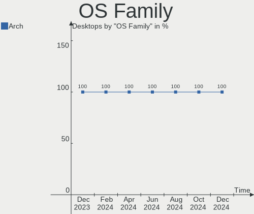
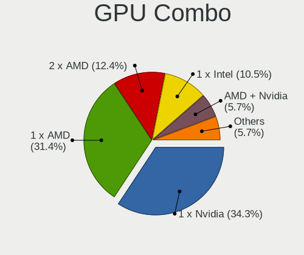
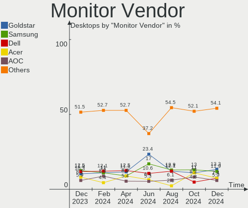

Arch Hardware Trends (Desktop)
------------------------------

A project to identify most popular hardware characteristics and track their change
over time based on data collected by Arch users at https://Linux-Hardware.org.

Anyone can contribute to the study by uploading probes of their computers by
the [hw-probe](https://github.com/linuxhw/hw-probe) tool:

    sudo hw-probe -all -upload

Full-feature report is available here: https://linux-hardware.org/?view=trends&formfactor=desktop

Period: Jan, 2020.

Contents
--------

- [ OS                       ](#os)
- [ OS Family                ](#os-family)
- [ Kernel                   ](#kernel)
- [ Kernel Family            ](#kernel-family)
- [ Kernel Major Ver.        ](#kernel-major-ver)
- [ Arch                     ](#arch)
- [ DE                       ](#de)
- [ Display Server           ](#display-server)
- [ OS Lang                  ](#os-lang)
- [ Boot Mode                ](#boot-mode)
- [ Filesystem               ](#filesystem)
- [ Dual Boot with Linux     ](#dual-boot-with-linux)
- [ Dual Boot (Win)          ](#dual-boot-win)
- [ Country                  ](#country)
- [ City                     ](#city)
- [ Vendor                   ](#vendor)
- [ Model                    ](#model)
- [ Model Family             ](#model-family)
- [ MFG Year                 ](#mfg-year)
- [ Form Factor              ](#form-factor)
- [ Secure Boot              ](#secure-boot)
- [ Coreboot                 ](#coreboot)
- [ RAM Size                 ](#ram-size)
- [ RAM Used                 ](#ram-used)
- [ Drive Vendor             ](#drive-vendor)
- [ Drive Model              ](#drive-model)
- [ Drive Kind               ](#drive-kind)
- [ Drive Connector          ](#drive-connector)
- [ Drive Size               ](#drive-size)
- [ Space Total              ](#space-total)
- [ Space Used               ](#space-used)
- [ Malfunc. Drives          ](#malfunc-drives)
- [ Malfunc. Drive Vendor    ](#malfunc-drive-vendor)
- [ Malfunc. Drive Kind      ](#malfunc-drive-kind)
- [ Failed Drives            ](#failed-drives)
- [ Failed Drive Vendor      ](#failed-drive-vendor)
- [ Drive Status             ](#drive-status)
- [ CPU Vendor               ](#cpu-vendor)
- [ CPU Model                ](#cpu-model)
- [ CPU Model Family         ](#cpu-model-family)
- [ CPU Cores                ](#cpu-cores)
- [ CPU Sockets              ](#cpu-sockets)
- [ CPU Threads              ](#cpu-threads)
- [ CPU Op-Modes             ](#cpu-op-modes)
- [ CPU Microarch            ](#cpu-microarch)
- [ CPU Microcode            ](#cpu-microcode)
- [ GPU Vendor               ](#gpu-vendor)
- [ GPU Model                ](#gpu-model)
- [ GPU Combo                ](#gpu-combo)
- [ GPU Driver               ](#gpu-driver)
- [ GPU Memory               ](#gpu-memory)
- [ Monitor Vendor           ](#monitor-vendor)
- [ Monitor Model            ](#monitor-model)
- [ Monitor Resolution       ](#monitor-resolution)
- [ Monitor Diagonal         ](#monitor-diagonal)
- [ Monitor Width            ](#monitor-width)
- [ Aspect Ratio             ](#aspect-ratio)
- [ Monitor Area             ](#monitor-area)
- [ Pixel Density            ](#pixel-density)
- [ Multiple Monitors        ](#multiple-monitors)
- [ Net Controller Vendor    ](#net-controller-vendor)
- [ Net Controller Model     ](#net-controller-model)
- [ Net Controller Kind      ](#net-controller-kind)
- [ Used Controller          ](#used-controller)
- [ NICs                     ](#nics)
- [ Unsupported Devices      ](#unsupported-devices)
- [ Unsupported Device Types ](#unsupported-device-types)

OS
--

Installed operating systems

| Name         | Computers | Percent |
|--------------|-----------|---------|
| Arch         | 33        | 55%     |
| Arch Rolling | 27        | 45%     |

OS Family
---------

OS without a version

| Name | Computers | Percent |
|------|-----------|---------|
| Arch | 60        | 100%    |

Kernel
------

Version of the Linux kernel

| Version                                                  | Computers | Percent |
|----------------------------------------------------------|-----------|---------|
| 5.4.13-arch1-1                                           | 12        | 20%     |
| 5.4.14-arch1-1                                           | 8         | 13.33%  |
| 5.4.7-arch1-1                                            | 4         | 6.67%   |
| 5.4.15-arch1-1                                           | 4         | 6.67%   |
| 5.4.8-arch1-1                                            | 3         | 5%      |
| 5.4.13-zen1-1-zen                                        | 3         | 5%      |
| 5.4.12-zen1-1-zen                                        | 3         | 5%      |
| 5.4.12-arch1-1                                           | 3         | 5%      |
| 5.4.10-arch1-1                                           | 2         | 3.33%   |
| 4.19.97-1-lts                                            | 2         | 3.33%   |
| 4.19.92-1-lts                                            | 2         | 3.33%   |
| 5.4.8-1-ck-core2                                         | 1         | 1.67%   |
| 5.4.7-zen1-1-zen                                         | 1         | 1.67%   |
| 5.4.6-arch3-1                                            | 1         | 1.67%   |
| 5.4.2-arch1-1                                            | 1         | 1.67%   |
| 5.4.15-zen1-1-zen                                        | 1         | 1.67%   |
| 5.4.13                                                   | 1         | 1.67%   |
| 5.4.12-xanmod7-1-xanmod                                  | 1         | 1.67%   |
| 5.4.0-rc7-1-amd-staging-drm-next-git-01902-g38419046943f | 1         | 1.67%   |
| 5.3.13-arch1-1-vfio                                      | 1         | 1.67%   |
| 5.2.9-1-ck                                               | 1         | 1.67%   |
| 5.1.16-arch1-1-ARCH                                      | 1         | 1.67%   |
| 4.19.98-1-lts                                            | 1         | 1.67%   |
| 4.19.93-1-lts                                            | 1         | 1.67%   |
| 4.19.91-1-lts                                            | 1         | 1.67%   |

Kernel Family
-------------

Linux kernel without a distro release

| Version | Computers | Percent |
|---------|-----------|---------|
| 5.4.13  | 16        | 26.67%  |
| 5.4.14  | 8         | 13.33%  |
| 5.4.12  | 7         | 11.67%  |
| 5.4.7   | 5         | 8.33%   |
| 5.4.15  | 5         | 8.33%   |
| 5.4.8   | 4         | 6.67%   |
| 5.4.10  | 2         | 3.33%   |
| 4.19.97 | 2         | 3.33%   |
| 4.19.92 | 2         | 3.33%   |
| 5.4.6   | 1         | 1.67%   |
| 5.4.2   | 1         | 1.67%   |
| 5.4.0   | 1         | 1.67%   |
| 5.3.13  | 1         | 1.67%   |
| 5.2.9   | 1         | 1.67%   |
| 5.1.16  | 1         | 1.67%   |
| 4.19.98 | 1         | 1.67%   |
| 4.19.93 | 1         | 1.67%   |
| 4.19.91 | 1         | 1.67%   |

Kernel Major Ver.
-----------------

Linux kernel major version

| Version | Computers | Percent |
|---------|-----------|---------|
| 5.4     | 50        | 83.33%  |
| 4.19    | 7         | 11.67%  |
| 5.3     | 1         | 1.67%   |
| 5.2     | 1         | 1.67%   |
| 5.1     | 1         | 1.67%   |

Arch
----

OS architecture (x86_64, i586, etc.)

| Name   | Computers | Percent |
|--------|-----------|---------|
| x86_64 | 60        | 100%    |

DE
--

Desktop Environment

| Name          | Computers | Percent |
|---------------|-----------|---------|
| Unknown       | 21        | 35%     |
| GNOME         | 18        | 30%     |
| KDE5          | 8         | 13.33%  |
| XFCE          | 4         | 6.67%   |
| MATE          | 2         | 3.33%   |
| Budgie        | 2         | 3.33%   |
| openbox       | 1         | 1.67%   |
| LXQt          | 1         | 1.67%   |
| KDE           | 1         | 1.67%   |
| Enlightenment | 1         | 1.67%   |
| Cinnamon      | 1         | 1.67%   |

Display Server
--------------

X11 or Wayland

| Name    | Computers | Percent |
|---------|-----------|---------|
| Unknown | 46        | 76.67%  |
| X11     | 6         | 10%     |
| Wayland | 6         | 10%     |
| Tty     | 2         | 3.33%   |

OS Lang
-------

Language

| Lang    | Computers | Percent |
|---------|-----------|---------|
| en_US   | 20        | 33.33%  |
| Unknown | 18        | 30%     |
| en_GB   | 5         | 8.33%   |
| de_DE   | 4         | 6.67%   |
| nl_NL   | 2         | 3.33%   |
| fr_FR   | 2         | 3.33%   |
| en_IE   | 2         | 3.33%   |
| uk_UA   | 1         | 1.67%   |
| pt_PT   | 1         | 1.67%   |
| pt_BR   | 1         | 1.67%   |
| mni_IN  | 1         | 1.67%   |
| en_ZA   | 1         | 1.67%   |
| en_IN   | 1         | 1.67%   |
| en_AU   | 1         | 1.67%   |

Boot Mode
---------

EFI or BIOS

| Mode | Computers | Percent |
|------|-----------|---------|
| EFI  | 43        | 71.67%  |
| BIOS | 17        | 28.33%  |

Filesystem
----------

Type of filesystem

| Type  | Computers | Percent |
|-------|-----------|---------|
| Ext4  | 48        | 80%     |
| Btrfs | 7         | 11.67%  |
| Xfs   | 3         | 5%      |
| F2fs  | 2         | 3.33%   |

Dual Boot with Linux
--------------------

Hosting more than one Linux

| Dual boot | Computers | Percent |
|-----------|-----------|---------|
| No        | 48        | 80%     |
| Yes       | 12        | 20%     |

Dual Boot (Win)
---------------

Hosting Linux and Windows

| Dual boot | Computers | Percent |
|-----------|-----------|---------|
| No        | 37        | 61.67%  |
| Yes       | 23        | 38.33%  |

Country
-------

Geographic location (country)

| Country        | Computers | Percent |
|----------------|-----------|---------|
| USA            | 10        | 16.67%  |
| Germany        | 7         | 11.67%  |
| Netherlands    | 6         | 10%     |
| Poland         | 5         | 8.33%   |
| UK             | 4         | 6.67%   |
| Russia         | 3         | 5%      |
| France         | 3         | 5%      |
| Spain          | 2         | 3.33%   |
| India          | 2         | 3.33%   |
| Czech Republic | 2         | 3.33%   |
| Canada         | 2         | 3.33%   |
| Brazil         | 2         | 3.33%   |
| Austria        | 2         | 3.33%   |
| Vietnam        | 1         | 1.67%   |
| Ukraine        | 1         | 1.67%   |
| Switzerland    | 1         | 1.67%   |
| Sweden         | 1         | 1.67%   |
| South Africa   | 1         | 1.67%   |
| Israel         | 1         | 1.67%   |
| Hungary        | 1         | 1.67%   |
| Finland        | 1         | 1.67%   |
| Belarus        | 1         | 1.67%   |
| Australia      | 1         | 1.67%   |

City
----

Geographic location (city)

| City               | Computers | Percent |
|--------------------|-----------|---------|
| Prague             | 2         | 3.33%   |
| Paris              | 2         | 3.33%   |
| Enschede           | 2         | 3.33%   |
| Amsterdam          | 2         | 3.33%   |
| Zug                | 1         | 1.67%   |
| Yekaterinburg      | 1         | 1.67%   |
| Welver             | 1         | 1.67%   |
| Warsaw             | 1         | 1.67%   |
| Vienna             | 1         | 1.67%   |
| Uman'              | 1         | 1.67%   |
| Tuttlingen         | 1         | 1.67%   |
| Toulon             | 1         | 1.67%   |
| Torrelavega        | 1         | 1.67%   |
| Sulz im Wienerwald | 1         | 1.67%   |
| Stuttgart          | 1         | 1.67%   |
| Stockport          | 1         | 1.67%   |
| Steubenville       | 1         | 1.67%   |
| St Louis           | 1         | 1.67%   |
| Skövde            | 1         | 1.67%   |
| Sao Jose           | 1         | 1.67%   |
| Royal Oak          | 1         | 1.67%   |
| Ramat Gan          | 1         | 1.67%   |
| Rakszawa           | 1         | 1.67%   |
| Québec            | 1         | 1.67%   |
| Poznan             | 1         | 1.67%   |
| Perm               | 1         | 1.67%   |
| Olenegorsk         | 1         | 1.67%   |
| Nottingham         | 1         | 1.67%   |
| Natal              | 1         | 1.67%   |
| Nagpur             | 1         | 1.67%   |
| Mostoles           | 1         | 1.67%   |
| Montreal           | 1         | 1.67%   |
| Minsk              | 1         | 1.67%   |
| London             | 1         | 1.67%   |
| Loehne             | 1         | 1.67%   |
| Lippstadt          | 1         | 1.67%   |
| Legnica            | 1         | 1.67%   |
| Krakow             | 1         | 1.67%   |
| Kingsport          | 1         | 1.67%   |
| Johannesburg       | 1         | 1.67%   |
| Ho Chi Minh City   | 1         | 1.67%   |
| Helsinki           | 1         | 1.67%   |
| Helena             | 1         | 1.67%   |
| Goldkronach        | 1         | 1.67%   |
| Gloucester City    | 1         | 1.67%   |
| Eureka Springs     | 1         | 1.67%   |
| Dresden            | 1         | 1.67%   |
| Chennai            | 1         | 1.67%   |
| Castenray          | 1         | 1.67%   |
| Bristol            | 1         | 1.67%   |
| Brentwood          | 1         | 1.67%   |
| Bloomington        | 1         | 1.67%   |
| Bilthoven          | 1         | 1.67%   |
| Bettendorf         | 1         | 1.67%   |
| Almasfuzito        | 1         | 1.67%   |
| Albion Park Rail   | 1         | 1.67%   |

Vendor
------

Motherboard manufacturer

| Name                | Computers | Percent |
|---------------------|-----------|---------|
| ASUSTek Computer    | 17        | 28.33%  |
| MSI                 | 14        | 23.33%  |
| ASRock              | 10        | 16.67%  |
| Gigabyte Technology | 8         | 13.33%  |
| Intel               | 2         | 3.33%   |
| Hewlett-Packard     | 2         | 3.33%   |
| Dell                | 2         | 3.33%   |
| PCWare              | 1         | 1.67%   |
| Medion              | 1         | 1.67%   |
| Lenovo              | 1         | 1.67%   |
| Gateway             | 1         | 1.67%   |
| Alienware           | 1         | 1.67%   |

Model
-----

Motherboard model

| Name                         | Computers | Percent |
|------------------------------|-----------|---------|
| MS-7A34                      | 3         | 5%      |
| ROG STRIX B450-F GAMING      | 2         | 3.33%   |
| MS-7C02                      | 2         | 3.33%   |
| Z87-HD3                      | 1         | 1.67%   |
| Z68A-D3-B3                   | 1         | 1.67%   |
| Z390 AORUS PRO               | 1         | 1.67%   |
| Z230 SFF Workstation         | 1         | 1.67%   |
| X99 Taichi                   | 1         | 1.67%   |
| X399 Taichi                  | 1         | 1.67%   |
| X370 Killer SLI              | 1         | 1.67%   |
| X370 Gaming K4               | 1         | 1.67%   |
| TUF Z390M-PRO GAMING         | 1         | 1.67%   |
| ThinkStation P310 30AT000LUS | 1         | 1.67%   |
| SX2370                       | 1         | 1.67%   |
| ROG STRIX X470-I GAMING      | 1         | 1.67%   |
| ROG STRIX X470-F GAMING      | 1         | 1.67%   |
| ROG STRIX X370-F GAMING      | 1         | 1.67%   |
| ROG STRIX B450-E GAMING      | 1         | 1.67%   |
| ProDesk 400 G2 MINI          | 1         | 1.67%   |
| PRIME Z390-A                 | 1         | 1.67%   |
| PRIME Z270-A                 | 1         | 1.67%   |
| PRIME X370-PRO               | 1         | 1.67%   |
| Precision 5820 Tower         | 1         | 1.67%   |
| P8P67 WS REVOLUTION          | 1         | 1.67%   |
| P8H77-M                      | 1         | 1.67%   |
| P7P55D                       | 1         | 1.67%   |
| OptiPlex 980                 | 1         | 1.67%   |
| MZGLKCP-00                   | 1         | 1.67%   |
| MS-7C37                      | 1         | 1.67%   |
| MS-7B89                      | 1         | 1.67%   |
| MS-7B84                      | 1         | 1.67%   |
| MS-7B45                      | 1         | 1.67%   |
| MS-7A40                      | 1         | 1.67%   |
| MS-7A38                      | 1         | 1.67%   |
| MS-7A37                      | 1         | 1.67%   |
| MS-7885                      | 1         | 1.67%   |
| MS-7850                      | 1         | 1.67%   |
| M5A97 R2.0                   | 1         | 1.67%   |
| M5A78L-M LX3                 | 1         | 1.67%   |
| M4A78T-E                     | 1         | 1.67%   |
| IPMH81G1                     | 1         | 1.67%   |
| H97M Anniversary             | 1         | 1.67%   |
| H97-D3H                      | 1         | 1.67%   |
| G31M-S2L                     | 1         | 1.67%   |
| DH67CF AAG10215-208          | 1         | 1.67%   |
| DH61WW AAG23116-303          | 1         | 1.67%   |
| B450 Gaming K4               | 1         | 1.67%   |
| B360M AORUS Gaming 3         | 1         | 1.67%   |
| AX370-Gaming 5               | 1         | 1.67%   |
| Aurora R6                    | 1         | 1.67%   |
| All Series                   | 1         | 1.67%   |
| Akoya E6239                  | 1         | 1.67%   |
| AB350M Pro4                  | 1         | 1.67%   |
| AB350 Gaming-ITX/ac          | 1         | 1.67%   |
| A88M-G                       | 1         | 1.67%   |
| 990FX Professional           | 1         | 1.67%   |

Model Family
------------

Motherboard model prefix

| Name                  | Computers | Percent |
|-----------------------|-----------|---------|
| ASUS ROG              | 6         | 10%     |
| MSI MS-7A34           | 3         | 5%      |
| ASUS PRIME            | 3         | 5%      |
| MSI MS-7C02           | 2         | 3.33%   |
| ASRock X370           | 2         | 3.33%   |
| PCWare IPMH81G1       | 1         | 1.67%   |
| MSI MS-7C37           | 1         | 1.67%   |
| MSI MS-7B89           | 1         | 1.67%   |
| MSI MS-7B84           | 1         | 1.67%   |
| MSI MS-7B45           | 1         | 1.67%   |
| MSI MS-7A40           | 1         | 1.67%   |
| MSI MS-7A38           | 1         | 1.67%   |
| MSI MS-7A37           | 1         | 1.67%   |
| MSI MS-7885           | 1         | 1.67%   |
| MSI MS-7850           | 1         | 1.67%   |
| Medion Akoya          | 1         | 1.67%   |
| Lenovo ThinkStation   | 1         | 1.67%   |
| Intel DH67CF          | 1         | 1.67%   |
| Intel DH61WW          | 1         | 1.67%   |
| HP Z230               | 1         | 1.67%   |
| HP ProDesk            | 1         | 1.67%   |
| Gigabyte Z87-HD3      | 1         | 1.67%   |
| Gigabyte Z68A-D3-B3   | 1         | 1.67%   |
| Gigabyte Z390         | 1         | 1.67%   |
| Gigabyte MZGLKCP-00   | 1         | 1.67%   |
| Gigabyte H97-D3H      | 1         | 1.67%   |
| Gigabyte G31M-S2L     | 1         | 1.67%   |
| Gigabyte B360M        | 1         | 1.67%   |
| Gigabyte AX370-Gaming | 1         | 1.67%   |
| Gateway SX2370        | 1         | 1.67%   |
| Dell Precision        | 1         | 1.67%   |
| Dell OptiPlex         | 1         | 1.67%   |
| ASUS TUF              | 1         | 1.67%   |
| ASUS P8P67            | 1         | 1.67%   |
| ASUS P8H77-M          | 1         | 1.67%   |
| ASUS P7P55D           | 1         | 1.67%   |
| ASUS M5A97            | 1         | 1.67%   |
| ASUS M5A78L-M         | 1         | 1.67%   |
| ASUS M4A78T-E         | 1         | 1.67%   |
| ASUS All              | 1         | 1.67%   |
| ASRock X99            | 1         | 1.67%   |
| ASRock X399           | 1         | 1.67%   |
| ASRock H97M           | 1         | 1.67%   |
| ASRock B450           | 1         | 1.67%   |
| ASRock AB350M         | 1         | 1.67%   |
| ASRock AB350          | 1         | 1.67%   |
| ASRock A88M-G         | 1         | 1.67%   |
| ASRock 990FX          | 1         | 1.67%   |
| Alienware Aurora      | 1         | 1.67%   |

MFG Year
--------

Motherboard manufacture year

| Year | Computers | Percent |
|------|-----------|---------|
| 2019 | 23        | 38.33%  |
| 2018 | 12        | 20%     |
| 2016 | 5         | 8.33%   |
| 2017 | 4         | 6.67%   |
| 2014 | 4         | 6.67%   |
| 2013 | 3         | 5%      |
| 2011 | 3         | 5%      |
| 2015 | 2         | 3.33%   |
| 2012 | 2         | 3.33%   |
| 2010 | 1         | 1.67%   |
| 2009 | 1         | 1.67%   |

Form Factor
-----------

Physical design of the computer

| Name    | Computers | Percent |
|---------|-----------|---------|
| Desktop | 60        | 100%    |

Secure Boot
-----------

Enabled or disabled

| State    | Computers | Percent |
|----------|-----------|---------|
| Disabled | 60        | 100%    |

Coreboot
--------

Have coreboot on board

| Used | Computers | Percent |
|------|-----------|---------|
| No   | 60        | 100%    |

RAM Size
--------

Total RAM memory

| Size in GB  | Computers | Percent |
|-------------|-----------|---------|
| 16.01-24.0  | 23        | 38.33%  |
| 32.01-64.0  | 14        | 23.33%  |
| 8.01-16.0   | 13        | 21.67%  |
| 4.01-8.0    | 4         | 6.67%   |
| 3.01-4.0    | 3         | 5%      |
| 24.01-32.0  | 2         | 3.33%   |
| 64.01-256.0 | 1         | 1.67%   |

RAM Used
--------

Used RAM memory

| Used GB    | Computers | Percent |
|------------|-----------|---------|
| 4.01-8.0   | 18        | 30%     |
| 2.01-3.0   | 15        | 25%     |
| 3.01-4.0   | 11        | 18.33%  |
| 1.01-2.0   | 10        | 16.67%  |
| 8.01-16.0  | 3         | 5%      |
| 0.01-1.0   | 2         | 3.33%   |
| 16.01-24.0 | 1         | 1.67%   |

Drive Vendor
------------

Hard drive vendors

| Vendor              | Computers | Drives | Percent |
|---------------------|-----------|--------|---------|
| Samsung Electronics | 28        | 44     | 21.71%  |
| WDC                 | 26        | 35     | 20.16%  |
| Seagate             | 20        | 27     | 15.5%   |
| Crucial             | 11        | 13     | 8.53%   |
| SanDisk             | 9         | 9      | 6.98%   |
| Kingston            | 7         | 8      | 5.43%   |
| Toshiba             | 6         | 8      | 4.65%   |
| Intel               | 3         | 4      | 2.33%   |
| Hitachi             | 3         | 4      | 2.33%   |
| Transcend           | 2         | 2      | 1.55%   |
| Corsair             | 2         | 2      | 1.55%   |
| USB30               | 1         | 3      | 0.78%   |
| PNY                 | 1         | 2      | 0.78%   |
| PLEXTOR             | 1         | 1      | 0.78%   |
| Phison              | 1         | 1      | 0.78%   |
| Micron Technology   | 1         | 1      | 0.78%   |
| LDLC                | 1         | 1      | 0.78%   |
| HGST                | 1         | 1      | 0.78%   |
| Hewlett-Packard     | 1         | 1      | 0.78%   |
| GOODRAM             | 1         | 1      | 0.78%   |
| China               | 1         | 1      | 0.78%   |
| AMD                 | 1         | 1      | 0.78%   |
| A-DATA Technology   | 1         | 1      | 0.78%   |

Drive Model
-----------

Hard drive models

| Model                        | Computers | Percent |
|------------------------------|-----------|---------|
| SSD 850 EVO 500GB            | 5         | 3.09%   |
| ST4000DM000-1F2168 4TB       | 3         | 1.85%   |
| CT500MX500SSD1 500GB         | 3         | 1.85%   |
| CT480BX500SSD1 480GB         | 3         | 1.85%   |
| WDS240G2G0A-00JH30 240GB SSD | 2         | 1.23%   |
| WD40EZRZ-00GXCB0 4TB         | 2         | 1.23%   |
| WD10EADS-00M2B0 1TB          | 2         | 1.23%   |
| SUV500480G 480GB SSD         | 2         | 1.23%   |
| ST31000528AS 1TB             | 2         | 1.23%   |
| ST2000DX002-2DV164 2TB       | 2         | 1.23%   |
| SSD 970 EVO Plus 500GB       | 2         | 1.23%   |
| SSD 970 EVO 500GB            | 2         | 1.23%   |
| SSD 850 PRO 256GB            | 2         | 1.23%   |
| SSD 850 EVO 1TB              | 2         | 1.23%   |
| SSD 850 500GB                | 2         | 1.23%   |
| SSD 840 EVO 250GB            | 2         | 1.23%   |
| SDSSDP128G 126GB             | 2         | 1.23%   |
| SDSSDA240G 240GB             | 2         | 1.23%   |
| HDWD110 1TB                  | 2         | 1.23%   |
| DT01ABA200 2TB               | 2         | 1.23%   |
| WDBNCE5000P 500GB SSD        | 1         | 0.62%   |
| WD7500BPVT-5 752GB           | 1         | 0.62%   |
| WD5000LPVX-2 500GB           | 1         | 0.62%   |
| WD5000LPLX-6 500GB           | 1         | 0.62%   |
| WD30EFRX-68N32N0 3TB         | 1         | 0.62%   |
| WD30EFRX-68EUZN0 3TB         | 1         | 0.62%   |
| WD30EFRX-68E 3TB             | 1         | 0.62%   |
| WD2500JS-22NCB1 250GB        | 1         | 0.62%   |
| WD2500JD-00HBC0 250GB        | 1         | 0.62%   |
| WD20SPZX-11U 2TB             | 1         | 0.62%   |
| WD20NPVT-00Z 2TB             | 1         | 0.62%   |
| WD20EZRZ-00Z 2TB             | 1         | 0.62%   |
| WD20EURX-63T0FY0 2TB         | 1         | 0.62%   |
| WD20EFRX-68EUZN0 2TB         | 1         | 0.62%   |
| WD20EFRX-68E 2TB             | 1         | 0.62%   |
| WD2003FZEX-0 2TB             | 1         | 0.62%   |
| WD10EZRX-00A8LB0 1TB         | 1         | 0.62%   |
| WD10EZEX-08WN4A0 1TB         | 1         | 0.62%   |
| WD10EZEX-08W 1TB             | 1         | 0.62%   |
| WD10EARS-00Z5B1 1TB          | 1         | 0.62%   |
| WD10EARS-00Y5B1 1TB          | 1         | 0.62%   |
| WD10EALS-002BA0 1TB          | 1         | 0.62%   |
| WD10EADX-22TDHB0 1TB         | 1         | 0.62%   |
| WD100EMAZ-00WJTA0 10TB       | 1         | 0.62%   |
| WD100EMAZ-00 10TB            | 1         | 0.62%   |
| WD1003FZEX-0 1TB             | 1         | 0.62%   |
| WD1002FAEX-00Y9A0 1TB        | 1         | 0.62%   |
| WD1002FAEX-0 1TB             | 1         | 0.62%   |
| WD1001FALS-75J7B0 1TB        | 1         | 0.62%   |
| Viper M.2 VPN100 512GB       | 1         | 0.62%   |
| Ultra II 480GB SSD           | 1         | 0.62%   |
| TS1TSSD230S 1TB              | 1         | 0.62%   |
| TS128GMTS400 128GB SSD       | 1         | 0.62%   |
| TR200 480GB SSD              | 1         | 0.62%   |
| TR200 240GB SSD              | 1         | 0.62%   |
| SV300S37A120G 120GB SSD      | 1         | 0.62%   |
| SUV400S37120G 120GB SSD      | 1         | 0.62%   |
| SU800 2TB SSD                | 1         | 0.62%   |
| ST8000DM004-2CX188 8TB       | 1         | 0.62%   |
| ST500DM002-1BD142 500GB      | 1         | 0.62%   |

Drive Kind
----------

HDD or SSD

| Kind    | Computers | Drives | Percent |
|---------|-----------|--------|---------|
| SSD     | 48        | 76     | 45.28%  |
| HDD     | 43        | 76     | 40.57%  |
| NVMe    | 13        | 15     | 12.26%  |
| Unknown | 2         | 4      | 1.89%   |

Drive Connector
---------------

SATA, SAS, NVMe, etc.

| Type | Computers | Drives | Percent |
|------|-----------|--------|---------|
| SATA | 58        | 152    | 79.45%  |
| NVMe | 13        | 15     | 17.81%  |
| SAS  | 2         | 4      | 2.74%   |

Drive Size
----------

Size of hard drive

| Size in TB | Computers | Drives | Percent |
|------------|-----------|--------|---------|
| 0.01-0.5   | 49        | 90     | 44.95%  |
| 0.51-1.0   | 32        | 43     | 29.36%  |
| 1.01-2.0   | 17        | 25     | 15.6%   |
| 3.01-4.0   | 5         | 5      | 4.59%   |
| 2.01-3.0   | 4         | 5      | 3.67%   |
| 4.01-10.0  | 2         | 3      | 1.83%   |

Space Total
-----------

Amount of disk space available on the file system

| Size in GB     | Computers | Percent |
|----------------|-----------|---------|
| More than 3000 | 15        | 25%     |
| 251-500        | 13        | 21.67%  |
| 1001-2000      | 9         | 15%     |
| 501-1000       | 9         | 15%     |
| 2001-3000      | 6         | 10%     |
| 101-250        | 6         | 10%     |
| 51-100         | 2         | 3.33%   |

Space Used
----------

Amount of used disk space

| Used GB        | Computers | Percent |
|----------------|-----------|---------|
| 101-250        | 13        | 21.67%  |
| 251-500        | 11        | 18.33%  |
| 1001-2000      | 9         | 15%     |
| 501-1000       | 8         | 13.33%  |
| More than 3000 | 5         | 8.33%   |
| 21-50          | 5         | 8.33%   |
| 1-20           | 4         | 6.67%   |
| 51-100         | 3         | 5%      |
| 2001-3000      | 2         | 3.33%   |

Malfunc. Drives
---------------

Drive models with a malfunction

| Model                  | Computers | Drives | Percent |
|------------------------|-----------|--------|---------|
| WD30EFRX-68EUZN0 3TB   | 1         | 1      | 5.88%   |
| WD20EZRZ-00Z 2TB       | 1         | 1      | 5.88%   |
| WD10EARS-00Z5B1 1TB    | 1         | 1      | 5.88%   |
| WD10EADS-00M2B0 1TB    | 1         | 1      | 5.88%   |
| WD1003FZEX-0 1TB       | 1         | 1      | 5.88%   |
| ST8000DM004-2CX188 8TB | 1         | 1      | 5.88%   |
| ST3250620AS 250GB      | 1         | 1      | 5.88%   |
| ST31500341AS 1TB       | 1         | 1      | 5.88%   |
| SSD 960 PRO 512GB      | 1         | 1      | 5.88%   |
| SSD 960 EVO 500GB      | 1         | 1      | 5.88%   |
| SSD 840 EVO 250GB      | 1         | 1      | 5.88%   |
| SP1614C 160GB          | 1         | 1      | 5.88%   |
| SD7UB3Q2 256GB SSD     | 1         | 1      | 5.88%   |
| HDS725050KLA360 500GB  | 1         | 1      | 5.88%   |
| HDS72302 2TB           | 1         | 2      | 5.88%   |
| HD501LJ 500GB          | 1         | 1      | 5.88%   |
| GB0250EAFYK 250GB      | 1         | 1      | 5.88%   |

Malfunc. Drive Vendor
---------------------

Vendors of faulty drives

| Vendor              | Computers | Drives | Percent |
|---------------------|-----------|--------|---------|
| Samsung Electronics | 5         | 5      | 31.25%  |
| WDC                 | 4         | 5      | 25%     |
| Seagate             | 3         | 3      | 18.75%  |
| Hitachi             | 2         | 3      | 12.5%   |
| SanDisk             | 1         | 1      | 6.25%   |
| Hewlett-Packard     | 1         | 1      | 6.25%   |

Malfunc. Drive Kind
-------------------

Kinds of faulty drives

| Kind | Computers | Drives | Percent |
|------|-----------|--------|---------|
| HDD  | 10        | 14     | 71.43%  |
| NVMe | 2         | 2      | 14.29%  |
| SSD  | 2         | 2      | 14.29%  |

Failed Drives
-------------

Failed drive models

Zero info for selected period =(

Failed Drive Vendor
-------------------

Failed drive vendors

Zero info for selected period =(

Drive Status
------------

Number of failed and malfunc. drives

| Status   | Computers | Drives | Percent |
|----------|-----------|--------|---------|
| Works    | 36        | 97     | 50%     |
| Detected | 24        | 56     | 33.33%  |
| Malfunc  | 12        | 18     | 16.67%  |

CPU Vendor
----------

Processor vendors

| Vendor | Computers | Percent |
|--------|-----------|---------|
| AMD    | 31        | 51.67%  |
| Intel  | 29        | 48.33%  |

CPU Model
---------

Processor models

| Model                                           | Computers | Percent |
|-------------------------------------------------|-----------|---------|
| AMD Ryzen 7 2700X Eight-Core Processor          | 5         | 8.33%   |
| AMD Ryzen 7 1700X Eight-Core Processor          | 3         | 5%      |
| AMD Ryzen 7 1700 Eight-Core Processor           | 3         | 5%      |
| AMD Ryzen 5 2600X Six-Core Processor            | 3         | 5%      |
| Intel Core i7-5820K CPU @ 3.30GHz               | 2         | 3.33%   |
| Intel Core i5-9600K CPU @ 3.70GHz               | 2         | 3.33%   |
| Intel Core i5-4460 CPU @ 3.20GHz                | 2         | 3.33%   |
| AMD Ryzen 5 2400G with Radeon Vega Graphics     | 2         | 3.33%   |
| AMD Ryzen 5 1600 Six-Core Processor             | 2         | 3.33%   |
| AMD Ryzen 3 1200 Quad-Core Processor            | 2         | 3.33%   |
| Intel Xeon W-2123 CPU @ 3.60GHz                 | 1         | 1.67%   |
| Intel Xeon CPU E3-1265L v4 @ 2.30GHz            | 1         | 1.67%   |
| Intel Xeon CPU E3-1230 v3 @ 3.30GHz             | 1         | 1.67%   |
| Intel Pentium Dual-Core CPU E5200 @ 2.50GHz     | 1         | 1.67%   |
| Intel Pentium CPU N3530 @ 2.16GHz               | 1         | 1.67%   |
| Intel Pentium CPU G870 @ 3.10GHz                | 1         | 1.67%   |
| Intel Core i9-9900K CPU @ 3.60GHz               | 1         | 1.67%   |
| Intel Core i7-8700K CPU @ 3.70GHz               | 1         | 1.67%   |
| Intel Core i7-7700K CPU @ 4.20GHz               | 1         | 1.67%   |
| Intel Core i7-7700 CPU @ 3.60GHz                | 1         | 1.67%   |
| Intel Core i7-6800K CPU @ 3.40GHz               | 1         | 1.67%   |
| Intel Core i7-6700 CPU @ 3.40GHz                | 1         | 1.67%   |
| Intel Core i7-4770K CPU @ 3.50GHz               | 1         | 1.67%   |
| Intel Core i7-3770K CPU @ 3.50GHz               | 1         | 1.67%   |
| Intel Core i7-2600K CPU @ 3.40GHz               | 1         | 1.67%   |
| Intel Core i7 CPU 870 @ 2.93GHz                 | 1         | 1.67%   |
| Intel Core i5-9400F CPU @ 2.90GHz               | 1         | 1.67%   |
| Intel Core i5-6500T CPU @ 2.50GHz               | 1         | 1.67%   |
| Intel Core i5-4440 CPU @ 3.10GHz                | 1         | 1.67%   |
| Intel Core i5-2500K CPU @ 3.30GHz               | 1         | 1.67%   |
| Intel Core i5 CPU 750 @ 2.67GHz                 | 1         | 1.67%   |
| Intel Core i3-2100 CPU @ 3.10GHz                | 1         | 1.67%   |
| Intel Celeron N4000 CPU @ 1.10GHz               | 1         | 1.67%   |
| AMD Ryzen Threadripper 2950X 16-Core Processor  | 1         | 1.67%   |
| AMD Ryzen 7 3800X 8-Core Processor              | 1         | 1.67%   |
| AMD Ryzen 5 3600 6-Core Processor               | 1         | 1.67%   |
| AMD Ryzen 5 2600 Six-Core Processor             | 1         | 1.67%   |
| AMD Ryzen 5 1600X Six-Core Processor            | 1         | 1.67%   |
| AMD Ryzen 3 2200G with Radeon Vega Graphics     | 1         | 1.67%   |
| AMD Phenom II X4 945 Processor                  | 1         | 1.67%   |
| AMD FX-8320 Eight-Core Processor                | 1         | 1.67%   |
| AMD Athlon II X4 559 Processor                  | 1         | 1.67%   |
| AMD A6-3600 APU with Radeon HD Graphics         | 1         | 1.67%   |
| AMD A10-7860K Radeon R7, 12 Compute Cores 4C+8G | 1         | 1.67%   |

CPU Model Family
----------------

Processor model prefix

| Model                   | Computers | Percent |
|-------------------------|-----------|---------|
| AMD Ryzen 7             | 12        | 20%     |
| Intel Core i7           | 11        | 18.33%  |
| AMD Ryzen 5             | 10        | 16.67%  |
| Intel Core i5           | 9         | 15%     |
| Intel Xeon              | 3         | 5%      |
| AMD Ryzen 3             | 3         | 5%      |
| Intel Pentium           | 2         | 3.33%   |
| Intel Pentium Dual-Core | 1         | 1.67%   |
| Intel Core i9           | 1         | 1.67%   |
| Intel Core i3           | 1         | 1.67%   |
| Intel Celeron           | 1         | 1.67%   |
| AMD Ryzen Threadripper  | 1         | 1.67%   |
| AMD Phenom II X4        | 1         | 1.67%   |
| AMD FX                  | 1         | 1.67%   |
| AMD Athlon II X4        | 1         | 1.67%   |
| AMD A6                  | 1         | 1.67%   |
| AMD A10                 | 1         | 1.67%   |

CPU Cores
---------

Number of processor cores

| Number | Computers | Percent |
|--------|-----------|---------|
| 4      | 26        | 43.33%  |
| 6      | 15        | 25%     |
| 8      | 13        | 21.67%  |
| 2      | 5         | 8.33%   |
| 16     | 1         | 1.67%   |

CPU Sockets
-----------

Number of sockets

| Number | Computers | Percent |
|--------|-----------|---------|
| 1      | 60        | 100%    |

CPU Threads
-----------

Threads per core (Hyper-Threading)

| Number | Computers | Percent |
|--------|-----------|---------|
| 2      | 41        | 68.33%  |
| 1      | 19        | 31.67%  |

CPU Op-Modes
------------

CPU Operation Modes (32-bit, 64-bit)

| Op mode        | Computers | Percent |
|----------------|-----------|---------|
| 32-bit, 64-bit | 58        | 96.67%  |
| Unknown        | 2         | 3.33%   |

CPU Microarch
-------------

Microarchitecture

| Name          | Computers | Percent |
|---------------|-----------|---------|
| Zen           | 14        | 23.33%  |
| Zen+          | 10        | 16.67%  |
| Haswell       | 7         | 11.67%  |
| Skylake       | 6         | 10%     |
| SandyBridge   | 4         | 6.67%   |
| KabyLake      | 4         | 6.67%   |
| Zen 2         | 2         | 3.33%   |
| Nehalem       | 2         | 3.33%   |
| K10           | 2         | 3.33%   |
| Broadwell     | 2         | 3.33%   |
| Steamroller   | 1         | 1.67%   |
| Silvermont    | 1         | 1.67%   |
| Piledriver    | 1         | 1.67%   |
| K10 Llano     | 1         | 1.67%   |
| IvyBridge     | 1         | 1.67%   |
| Goldmont plus | 1         | 1.67%   |
| Core          | 1         | 1.67%   |

CPU Microcode
-------------

Microcode number

| Number     | Computers | Percent |
|------------|-----------|---------|
| 0x0800820d | 9         | 15%     |
| Unknown    | 8         | 13.33%  |
| 0x08001138 | 6         | 10%     |
| 0x306c3    | 4         | 6.67%   |
| 0x08001137 | 4         | 6.67%   |
| 0x906ec    | 3         | 5%      |
| 0x206a7    | 3         | 5%      |
| 0x906ea    | 2         | 3.33%   |
| 0x506e3    | 2         | 3.33%   |
| 0x306f2    | 2         | 3.33%   |
| 0x106e5    | 2         | 3.33%   |
| 0x08701013 | 2         | 3.33%   |
| 0x08101016 | 2         | 3.33%   |
| 0x906e9    | 1         | 1.67%   |
| 0x50654    | 1         | 1.67%   |
| 0x306a9    | 1         | 1.67%   |
| 0x10676    | 1         | 1.67%   |
| 0x0800820b | 1         | 1.67%   |
| 0x08001126 | 1         | 1.67%   |
| 0x06003106 | 1         | 1.67%   |
| 0x06000822 | 1         | 1.67%   |
| 0x03000014 | 1         | 1.67%   |
| 0x010000c8 | 1         | 1.67%   |
| 0x010000b6 | 1         | 1.67%   |

GPU Vendor
----------

Vendors of graphics cards

| Vendor | Computers | Percent |
|--------|-----------|---------|
| AMD    | 30        | 46.15%  |
| Nvidia | 26        | 40%     |
| Intel  | 9         | 13.85%  |

GPU Model
---------

Graphics card models

| Model                                                                 | Computers | Percent |
|-----------------------------------------------------------------------|-----------|---------|
| Ellesmere [Radeon RX 470/480/570/570X/580/580X/590]                   | 14        | 20.59%  |
| GP104 [GeForce GTX 1070]                                              | 4         | 5.88%   |
| GP102 [GeForce GTX 1080 Ti]                                           | 4         | 5.88%   |
| GP106 [GeForce GTX 1060 6GB]                                          | 3         | 4.41%   |
| Curacao PRO [Radeon R7 370 / R9 270/370 OEM]                          | 3         | 4.41%   |
| Raven Ridge [Radeon Vega Series / Radeon Vega Mobile Series]          | 2         | 2.94%   |
| HD Graphics 530                                                       | 2         | 2.94%   |
| GP104 [GeForce GTX 1080]                                              | 2         | 2.94%   |
| GK104 [GeForce GTX 770]                                               | 2         | 2.94%   |
| Baffin [Radeon RX 550 640SP / RX 560/560X]                            | 2         | 2.94%   |
| Xeon E3-1200 v3/4th Gen Core Processor Integrated Graphics Controller | 1         | 1.47%   |
| Vega 10 XL/XT [Radeon RX Vega 56/64]                                  | 1         | 1.47%   |
| UHD Graphics 630 (Desktop 9 Series)                                   | 1         | 1.47%   |
| UHD Graphics 605                                                      | 1         | 1.47%   |
| TU117 [GeForce GTX 1650]                                              | 1         | 1.47%   |
| TU106 [GeForce RTX 2060 Rev. A]                                       | 1         | 1.47%   |
| TU104 [GeForce RTX 2080 Rev. A]                                       | 1         | 1.47%   |
| Tonga PRO [Radeon R9 285/380]                                         | 1         | 1.47%   |
| Sumo [Radeon HD 6530D]                                                | 1         | 1.47%   |
| Oland PRO [Radeon R7 240/340]                                         | 1         | 1.47%   |
| Navi 10 [Radeon RX 5600 OEM/5600 XT / 5700/5700 XT]                   | 1         | 1.47%   |
| Lexa PRO [Radeon 540/540X/550/550X / RX 540X/550/550X]                | 1         | 1.47%   |
| Kaveri [Radeon R7 Graphics]                                           | 1         | 1.47%   |
| Juniper XT [Radeon HD 6770]                                           | 1         | 1.47%   |
| Iris Pro Graphics P6300                                               | 1         | 1.47%   |
| HD Graphics 630                                                       | 1         | 1.47%   |
| GP107 [GeForce GTX 1050]                                              | 1         | 1.47%   |
| GP106 [GeForce GTX 1060 3GB]                                          | 1         | 1.47%   |
| GM206 [GeForce GTX 960]                                               | 1         | 1.47%   |
| GM206 [GeForce GTX 950]                                               | 1         | 1.47%   |
| GM204 [GeForce GTX 980]                                               | 1         | 1.47%   |
| GM107 [GeForce GTX 750 Ti]                                            | 1         | 1.47%   |
| GK208B [GeForce GT 710]                                               | 1         | 1.47%   |
| GF119 [NVS 310]                                                       | 1         | 1.47%   |
| GF108 [GeForce GT 620]                                                | 1         | 1.47%   |
| G96C [GeForce 9500 GT]                                                | 1         | 1.47%   |
| Ellesmere [Radeon Pro WX 5100]                                        | 1         | 1.47%   |
| Cedar [Radeon HD 5000/6000/7350/8350 Series]                          | 1         | 1.47%   |
| Atom Processor Z36xxx/Z37xxx Series Graphics & Display                | 1         | 1.47%   |
| 2nd Generation Core Processor Family Integrated Graphics Controller   | 1         | 1.47%   |

GPU Combo
---------

Combinations of graphics cards

| Name           | Computers | Percent |
|----------------|-----------|---------|
| 1 x AMD        | 28        | 46.67%  |
| 1 x Nvidia     | 22        | 36.67%  |
| 1 x Intel      | 5         | 8.33%   |
| 2 x Nvidia     | 2         | 3.33%   |
| Intel + Nvidia | 1         | 1.67%   |
| Intel + AMD    | 1         | 1.67%   |
| AMD + Nvidia   | 1         | 1.67%   |

GPU Driver
----------

Free vs proprietary

| Driver      | Computers | Percent |
|-------------|-----------|---------|
| Free        | 39        | 65%     |
| Proprietary | 21        | 35%     |

GPU Memory
----------

Total video memory

| Size in GB | Computers | Percent |
|------------|-----------|---------|
| 7.01-8.0   | 16        | 26.67%  |
| 1.01-2.0   | 16        | 26.67%  |
| Unknown    | 10        | 16.67%  |
| 5.01-6.0   | 4         | 6.67%   |
| 3.01-4.0   | 4         | 6.67%   |
| 8.01-16.0  | 4         | 6.67%   |
| 0.51-1.0   | 3         | 5%      |
| 0.01-0.5   | 2         | 3.33%   |
| 2.01-3.0   | 1         | 1.67%   |

Monitor Vendor
--------------

Monitor vendors

| Vendor               | Computers | Percent |
|----------------------|-----------|---------|
| Dell                 | 14        | 20%     |
| Samsung Electronics  | 8         | 11.43%  |
| Goldstar             | 8         | 11.43%  |
| BenQ                 | 6         | 8.57%   |
| AOC                  | 6         | 8.57%   |
| Ancor Communications | 6         | 8.57%   |
| Acer                 | 5         | 7.14%   |
| Philips              | 4         | 5.71%   |
| Hewlett-Packard      | 3         | 4.29%   |
| Unknown              | 1         | 1.43%   |
| Toshiba              | 1         | 1.43%   |
| MSI                  | 1         | 1.43%   |
| Medion Akoya         | 1         | 1.43%   |
| LG Display           | 1         | 1.43%   |
| Iiyama               | 1         | 1.43%   |
| HYO                  | 1         | 1.43%   |
| HannStar Display     | 1         | 1.43%   |
| Fujitsu Siemens      | 1         | 1.43%   |
| ASUSTek Computer     | 1         | 1.43%   |

Monitor Model
-------------

Monitor models

| Model                                              | Computers | Percent |
|----------------------------------------------------|-----------|---------|
| U2412M DELA07B 1920x1200 518x324mm 24.1-inch       | 3         | 4.05%   |
| ZR2440w HWP2954 1920x1080 518x324mm 24.1-inch      | 1         | 1.35%   |
| ZOWIE XL LCD BNQ7F3F 1920x1080 530x300mm 24.0-inch | 1         | 1.35%   |
| XL2420Z BNQ7F2F 1920x1080 530x300mm 24.0-inch      | 1         | 1.35%   |
| XL2420T BNQ7F04 1920x1080 521x293mm 23.5-inch      | 1         | 1.35%   |
| VG248 ACI24A4 1920x1080 530x300mm 24.0-inch        | 1         | 1.35%   |
| VG245 AUS24A1 1920x1080 531x299mm 24.0-inch        | 1         | 1.35%   |
| ULTRAWIDE GSM76FA 2560x1080 798x334mm 34.1-inch    | 1         | 1.35%   |
| ULTRAWIDE GSM5AFB 2560x1080 798x334mm 34.1-inch    | 1         | 1.35%   |
| U2717D DEL40EB 2560x1440 597x336mm 27.0-inch       | 1         | 1.35%   |
| U2717D DEL40EA 2560x1440 600x340mm 27.2-inch       | 1         | 1.35%   |
| U2518D DEL413A 2560x1440 553x311mm 25.0-inch       | 1         | 1.35%   |
| U2515H DELD06E 1920x1080 550x310mm 24.9-inch       | 1         | 1.35%   |
| U2414H DELA0A4 1920x1080 530x300mm 24.0-inch       | 1         | 1.35%   |
| U2412M DELA07A 1920x1200 518x324mm 24.1-inch       | 1         | 1.35%   |
| U2410 DELF017 1920x1200 518x324mm 24.1-inch        | 1         | 1.35%   |
| U2212HM DELD047 1920x1080 475x267mm 21.5-inch      | 1         | 1.35%   |
| TV TSB0105 1920x1080 708x398mm 32.0-inch           | 1         | 1.35%   |
| SyncMaster SAM0373 1680x1050 459x296mm 21.5-inch   | 1         | 1.35%   |
| SyncMaster SAM027F 1680x1050 474x296mm 22.0-inch   | 1         | 1.35%   |
| SMBX2440 SAM068B 1920x1080 530x300mm 24.0-inch     | 1         | 1.35%   |
| SE2717H/HX DELD0A1 1920x1080 600x340mm 27.2-inch   | 1         | 1.35%   |
| SE2417HG DELD08D 1920x1080 521x293mm 23.5-inch     | 1         | 1.35%   |
| SA300/SA350 SAM078E 1680x1050 480x270mm 21.7-inch  | 1         | 1.35%   |
| SA230 ACR057E 1920x1080 509x286mm 23.0-inch        | 1         | 1.35%   |
| S27F350 SAM0D22 1920x1080 598x336mm 27.0-inch      | 1         | 1.35%   |
| S27D390 SAM0B67 1920x1080 600x340mm 27.2-inch      | 1         | 1.35%   |
| R240HY ACR046F 1920x1080 530x300mm 24.0-inch       | 1         | 1.35%   |
| Q3279WG5B AOC3279 2560x1440 730x430mm 33.4-inch    | 1         | 1.35%   |
| PL2730H IVM663A 1920x1080 598x336mm 27.0-inch      | 1         | 1.35%   |
| PHL BDM4350 PHL08FA 3840x2160 950x540mm 43.0-inch  | 1         | 1.35%   |
| PHL 275E1 PHLC20C 2560x1440 597x336mm 27.0-inch    | 1         | 1.35%   |
| PHL 245E1 PHLC20B 2560x1440 527x296mm 23.8-inch    | 1         | 1.35%   |
| PB248 ACI24A3 1920x1200 518x324mm 24.1-inch        | 1         | 1.35%   |
| MP59G GSM5B33 1920x1080 480x270mm 21.7-inch        | 1         | 1.35%   |
| MD20581 MEC7201 1920x1080 597x336mm 27.0-inch      | 1         | 1.35%   |
| MAG271CQR MSI3FA7 2560x1440 597x336mm 27.0-inch    | 1         | 1.35%   |
| M2280A GSM57EC 1920x1080 476x268mm 21.5-inch       | 1         | 1.35%   |
| LP2475w HWP26F8 1920x1200 546x352mm 25.6-inch      | 1         | 1.35%   |
| LG ULTRAWIDE GSM59F1 1920x1080 580x240mm 24.7-inch | 1         | 1.35%   |
| LCD Monitor VX248 1920x1080                        | 1         | 1.35%   |
| LCD Monitor SAMSUNG 1920x1080                      | 1         | 1.35%   |
| LCD Monitor SAM0C39 1920x1080 1050x590mm 47.4-inch | 1         | 1.35%   |
| LCD Monitor PHL 276E8V 7680x2160                   | 1         | 1.35%   |
| LCD Monitor LP2475w 1920x1200                      | 1         | 1.35%   |
| LCD Monitor LGD03DB 1366x768 345x194mm 15.6-inch   | 1         | 1.35%   |
| LCD Monitor LCD                                    | 1         | 1.35%   |
| LCD Monitor Hanns.G HH221 1920x1080                | 1         | 1.35%   |
| LCD Monitor DELA103 1920x1080 540x300mm 24.3-inch  | 1         | 1.35%   |
| L24W-2 FUS077A 1920x1200 518x324mm 24.1-inch       | 1         | 1.35%   |
| KG241 P ACR069A 1920x1080 531x299mm 24.0-inch      | 1         | 1.35%   |
| IPS FULLHD GSM5AB8 1920x1080 480x270mm 21.7-inch   | 1         | 1.35%   |
| IPS FULLHD GSM5AB7 1920x1080 480x270mm 21.7-inch   | 1         | 1.35%   |
| GW2470 BNQ78D9 1920x1080 530x300mm 24.0-inch       | 1         | 1.35%   |
| GN246HL ACR02F9 1920x1080 531x299mm 24.0-inch      | 1         | 1.35%   |
| G922HDL BNQ784E 1366x768 410x230mm 18.5-inch       | 1         | 1.35%   |
| EB321HQ A ACR0506 1920x1080 698x393mm 31.5-inch    | 1         | 1.35%   |
| E2417H DELA0E2 1920x1080 527x296mm 23.8-inch       | 1         | 1.35%   |
| E2400HD BNQ790E 1920x1080 480x270mm 21.7-inch      | 1         | 1.35%   |
| DUAL-DVI HYO049B 2560x1440 597x336mm 27.0-inch     | 1         | 1.35%   |

Monitor Resolution
------------------

Monitor screen resolution

| Resolution         | Computers | Percent |
|--------------------|-----------|---------|
| 1920x1080 (FHD)    | 36        | 55.38%  |
| 2560x1440 (QHD)    | 11        | 16.92%  |
| 1920x1200 (WUXGA)  | 6         | 9.23%   |
| 2560x1080          | 3         | 4.62%   |
| 1680x1050 (WSXGA+) | 2         | 3.08%   |
| 1366x768 (WXGA)    | 2         | 3.08%   |
| 7680x2160          | 1         | 1.54%   |
| 3840x2160 (4K)     | 1         | 1.54%   |
| 3840x1080          | 1         | 1.54%   |
| 1600x900 (HD+)     | 1         | 1.54%   |
| Unknown            | 1         | 1.54%   |

Monitor Diagonal
----------------

Diagonal size in inches

| Inches  | Computers | Percent |
|---------|-----------|---------|
| 24      | 14        | 20.29%  |
| 27      | 13        | 18.84%  |
| 23      | 11        | 15.94%  |
| 21      | 10        | 14.49%  |
| Unknown | 5         | 7.25%   |
| 25      | 3         | 4.35%   |
| 34      | 2         | 2.9%    |
| 31      | 2         | 2.9%    |
| 48      | 1         | 1.45%   |
| 43      | 1         | 1.45%   |
| 33      | 1         | 1.45%   |
| 32      | 1         | 1.45%   |
| 28      | 1         | 1.45%   |
| 22      | 1         | 1.45%   |
| 19      | 1         | 1.45%   |
| 18      | 1         | 1.45%   |
| 15      | 1         | 1.45%   |

Monitor Width
-------------

Physical width

| Width in mm | Computers | Percent |
|-------------|-----------|---------|
| 501-600     | 36        | 56.25%  |
| 401-500     | 13        | 20.31%  |
| Unknown     | 5         | 7.81%   |
| 701-800     | 4         | 6.25%   |
| 601-700     | 3         | 4.69%   |
| 301-350     | 1         | 1.56%   |
| 1001-1500   | 1         | 1.56%   |
| 901-1000    | 1         | 1.56%   |

Aspect Ratio
------------

Proportional relationship between the width and the height

| Ratio   | Computers | Percent |
|---------|-----------|---------|
| 16/9    | 44        | 70.97%  |
| 16/10   | 8         | 12.9%   |
| Unknown | 5         | 8.06%   |
| 21/9    | 3         | 4.84%   |
| 32/9    | 1         | 1.61%   |
| 3/2     | 1         | 1.61%   |

Monitor Area
------------

Area in inch²

| Area in inch² | Computers | Percent |
|----------------|-----------|---------|
| 201-250        | 23        | 34.33%  |
| 301-350        | 13        | 19.4%   |
| 251-300        | 11        | 16.42%  |
| 351-500        | 6         | 8.96%   |
| 151-200        | 5         | 7.46%   |
| Unknown        | 5         | 7.46%   |
| 501-1000       | 2         | 2.99%   |
| 141-150        | 1         | 1.49%   |
| 101-110        | 1         | 1.49%   |

Pixel Density
-------------

Pixels per inch

| Density | Computers | Percent |
|---------|-----------|---------|
| 51-100  | 37        | 58.73%  |
| 101-120 | 20        | 31.75%  |
| Unknown | 5         | 7.94%   |
| 121-160 | 1         | 1.59%   |

Multiple Monitors
-----------------

Total monitors connected

| Total | Computers | Percent |
|-------|-----------|---------|
| 1     | 46        | 76.67%  |
| 2     | 12        | 20%     |
| 3     | 2         | 3.33%   |

Net Controller Vendor
---------------------

Controller vendors

| Vendor                         | Computers | Percent |
|--------------------------------|-----------|---------|
| Intel                          | 19        | 86.36%  |
| Samsung Electronics            | 1         | 4.55%   |
| Prusa Research (prusa3d.com)   | 1         | 4.55%   |
| Broadcom Inc. and subsidiaries | 1         | 4.55%   |

Net Controller Model
--------------------

Controller models

| Model                                               | Computers | Percent |
|-----------------------------------------------------|-----------|---------|
| I211 Gigabit Network Connection                     | 13        | 59.09%  |
| 82579V Gigabit Network Connection                   | 2         | 9.09%   |
| 82574L Gigabit Network Connection                   | 2         | 9.09%   |
| Wi-Fi 6 AX200                                       | 1         | 4.55%   |
| Original Prusa i3 MK2                               | 1         | 4.55%   |
| Network controller                                  | 1         | 4.55%   |
| GT-I9070 (network tethering, USB debugging enabled) | 1         | 4.55%   |
| 82578DM Gigabit Network Connection                  | 1         | 4.55%   |

Net Controller Kind
-------------------

Ethernet, WiFi or modem

| Kind     | Computers | Percent |
|----------|-----------|---------|
| Ethernet | 19        | 86.36%  |
| WiFi     | 2         | 9.09%   |
| Modem    | 1         | 4.55%   |

Used Controller
---------------

Currently used network controller

| Kind     | Computers | Percent |
|----------|-----------|---------|
| Ethernet | 13        | 86.67%  |
| WiFi     | 2         | 13.33%  |

NICs
----

Total network controllers on board

| Total | Computers | Percent |
|-------|-----------|---------|
| 1     | 41        | 68.33%  |
| 2     | 15        | 25%     |
| 3     | 4         | 6.67%   |

Unsupported Devices
-------------------

Total unsupported devices on board

| Total | Computers | Percent |
|-------|-----------|---------|
| 0     | 52        | 86.67%  |
| 1     | 8         | 13.33%  |

Unsupported Device Types
------------------------

Types of unsupported devices

| Type             | Computers | Percent |
|------------------|-----------|---------|
| Unassigned class | 3         | 37.5%   |
| Sound            | 1         | 12.5%   |
| Network          | 1         | 12.5%   |
| Net/wireless     | 1         | 12.5%   |
| Graphics card    | 1         | 12.5%   |
| Camera           | 1         | 12.5%   |

