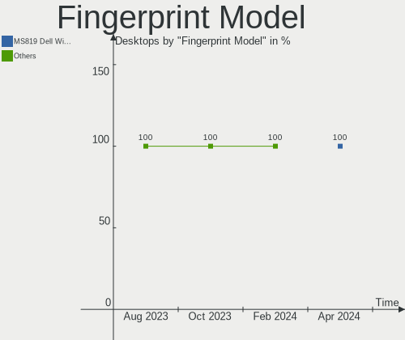

Arch - Hardware Trends (Desktops)
---------------------------------

A project to identify most popular hardware characteristics and track their change
over time based on data collected by Linux users at https://Linux-Hardware.org.

Anyone can contribute to this report by the [hw-probe](https://github.com/linuxhw/hw-probe) tool:

    sudo -E hw-probe -all -upload

This report is for one last month. Overall report since the beginning of time: [TestDays](https://github.com/linuxhw/TestDays)

Period: Apr, 2024.

Contents
--------

* [ System ](#system)
  - [ OS                       ](#os)
  - [ OS Family                ](#os-family)
  - [ Kernel                   ](#kernel)
  - [ Kernel Family            ](#kernel-family)
  - [ Kernel Major Ver.        ](#kernel-major-ver)
  - [ Arch                     ](#arch)
  - [ DE                       ](#de)
  - [ Display Server           ](#display-server)
  - [ Display Manager          ](#display-manager)
  - [ OS Lang                  ](#os-lang)
  - [ Boot Mode                ](#boot-mode)
  - [ Filesystem               ](#filesystem)
  - [ Part. scheme             ](#part-scheme)
  - [ Dual Boot with Linux/BSD ](#dual-boot-with-linuxbsd)
  - [ Dual Boot (Win)          ](#dual-boot-win)

* [ Board ](#board)
  - [ Vendor                   ](#vendor)
  - [ Model                    ](#model)
  - [ Model Family             ](#model-family)
  - [ MFG Year                 ](#mfg-year)
  - [ Form Factor              ](#form-factor)
  - [ Secure Boot              ](#secure-boot)
  - [ Coreboot                 ](#coreboot)
  - [ RAM Size                 ](#ram-size)
  - [ RAM Used                 ](#ram-used)
  - [ Total Drives             ](#total-drives)
  - [ Has CD-ROM               ](#has-cd-rom)
  - [ Has Ethernet             ](#has-ethernet)
  - [ Has WiFi                 ](#has-wifi)
  - [ Has Bluetooth            ](#has-bluetooth)

* [ Location ](#location)
  - [ Country                  ](#country)
  - [ City                     ](#city)

* [ Drives ](#drives)
  - [ Drive Vendor             ](#drive-vendor)
  - [ Drive Model              ](#drive-model)
  - [ HDD Vendor               ](#hdd-vendor)
  - [ SSD Vendor               ](#ssd-vendor)
  - [ Drive Kind               ](#drive-kind)
  - [ Drive Connector          ](#drive-connector)
  - [ Drive Size               ](#drive-size)
  - [ Space Total              ](#space-total)
  - [ Space Used               ](#space-used)
  - [ Malfunc. Drives          ](#malfunc-drives)
  - [ Malfunc. Drive Vendor    ](#malfunc-drive-vendor)
  - [ Malfunc. HDD Vendor      ](#malfunc-hdd-vendor)
  - [ Malfunc. Drive Kind      ](#malfunc-drive-kind)
  - [ Failed Drives            ](#failed-drives)
  - [ Failed Drive Vendor      ](#failed-drive-vendor)
  - [ Drive Status             ](#drive-status)

* [ Storage controller ](#storage-controller)
  - [ Storage Vendor           ](#storage-vendor)
  - [ Storage Model            ](#storage-model)
  - [ Storage Kind             ](#storage-kind)

* [ Processor ](#processor)
  - [ CPU Vendor               ](#cpu-vendor)
  - [ CPU Model                ](#cpu-model)
  - [ CPU Model Family         ](#cpu-model-family)
  - [ CPU Cores                ](#cpu-cores)
  - [ CPU Sockets              ](#cpu-sockets)
  - [ CPU Threads              ](#cpu-threads)
  - [ CPU Op-Modes             ](#cpu-op-modes)
  - [ CPU Microcode            ](#cpu-microcode)
  - [ CPU Microarch            ](#cpu-microarch)

* [ Graphics ](#graphics)
  - [ GPU Vendor               ](#gpu-vendor)
  - [ GPU Model                ](#gpu-model)
  - [ GPU Combo                ](#gpu-combo)
  - [ GPU Driver               ](#gpu-driver)
  - [ GPU Memory               ](#gpu-memory)

* [ Monitor ](#monitor)
  - [ Monitor Vendor           ](#monitor-vendor)
  - [ Monitor Model            ](#monitor-model)
  - [ Monitor Resolution       ](#monitor-resolution)
  - [ Monitor Diagonal         ](#monitor-diagonal)
  - [ Monitor Width            ](#monitor-width)
  - [ Aspect Ratio             ](#aspect-ratio)
  - [ Monitor Area             ](#monitor-area)
  - [ Pixel Density            ](#pixel-density)
  - [ Multiple Monitors        ](#multiple-monitors)

* [ Network ](#network)
  - [ Net Controller Vendor    ](#net-controller-vendor)
  - [ Net Controller Model     ](#net-controller-model)
  - [ Wireless Vendor          ](#wireless-vendor)
  - [ Wireless Model           ](#wireless-model)
  - [ Ethernet Vendor          ](#ethernet-vendor)
  - [ Ethernet Model           ](#ethernet-model)
  - [ Net Controller Kind      ](#net-controller-kind)
  - [ Used Controller          ](#used-controller)
  - [ NICs                     ](#nics)
  - [ IPv6                     ](#ipv6)

* [ Bluetooth ](#bluetooth)
  - [ Bluetooth Vendor         ](#bluetooth-vendor)
  - [ Bluetooth Model          ](#bluetooth-model)

* [ Sound ](#sound)
  - [ Sound Vendor             ](#sound-vendor)
  - [ Sound Model              ](#sound-model)

* [ Memory ](#memory)
  - [ Memory Vendor            ](#memory-vendor)
  - [ Memory Model             ](#memory-model)
  - [ Memory Kind              ](#memory-kind)
  - [ Memory Form Factor       ](#memory-form-factor)
  - [ Memory Size              ](#memory-size)
  - [ Memory Speed             ](#memory-speed)

* [ Printers & scanners ](#printers--scanners)
  - [ Printer Vendor           ](#printer-vendor)
  - [ Printer Model            ](#printer-model)
  - [ Scanner Vendor           ](#scanner-vendor)
  - [ Scanner Model            ](#scanner-model)

* [ Camera ](#camera)
  - [ Camera Vendor            ](#camera-vendor)
  - [ Camera Model             ](#camera-model)

* [ Security ](#security)
  - [ Fingerprint Vendor       ](#fingerprint-vendor)
  - [ Fingerprint Model        ](#fingerprint-model)
  - [ Chipcard Vendor          ](#chipcard-vendor)
  - [ Chipcard Model           ](#chipcard-model)

* [ Unsupported ](#unsupported)
  - [ Unsupported Devices      ](#unsupported-devices)
  - [ Unsupported Device Types ](#unsupported-device-types)

System
------

OS
--

Installed operating systems

| Name         | Desktops | Percent |
|--------------|----------|---------|
| Arch Rolling | 83       | 100%    |

OS Family
---------

OS without a version

| Name | Desktops | Percent |
|------|----------|---------|
| Arch | 83       | 100%    |

Kernel
------

Version of the Linux kernel

| Version                  | Desktops | Percent |
|--------------------------|----------|---------|
| 6.8.7-arch1-1            | 12       | 14.46%  |
| 6.8.2-arch2-1            | 11       | 13.25%  |
| 6.8.2-zen2-1-zen         | 10       | 12.05%  |
| 6.8.7-arch1-2            | 8        | 9.64%   |
| 6.8.5-arch1-1            | 6        | 7.23%   |
| 6.8.4-arch1-1            | 6        | 7.23%   |
| 6.8.7-zen1-1-zen         | 4        | 4.82%   |
| 6.6.28-1-lts             | 4        | 4.82%   |
| 6.6.23-1-lts             | 3        | 3.61%   |
| 6.8.6-zen1-1-zen         | 2        | 2.41%   |
| 6.8.6-arch1-1            | 2        | 2.41%   |
| 6.8.4-zen1-1-zen         | 2        | 2.41%   |
| 6.7.9-arch1-1            | 2        | 2.41%   |
| 6.8.7-zen1-2-zen         | 1        | 1.2%    |
| 6.8.7-lqx2-1-lqx         | 1        | 1.2%    |
| 6.8.7-3-cachyos          | 1        | 1.2%    |
| 6.8.7-1-clear            | 1        | 1.2%    |
| 6.8.5-zen1-1-zen         | 1        | 1.2%    |
| 6.8.4-273-tkg-eevdf-llvm | 1        | 1.2%    |
| 6.8.4-1-cachyos          | 1        | 1.2%    |
| 6.8.2-273-tkg-eevdf-llvm | 1        | 1.2%    |
| 6.8.0-rc6-273-tkg-eevdf  | 1        | 1.2%    |
| 6.7.2-273-tkg-pds-llvm   | 1        | 1.2%    |
| 6.6.15-2-lts             | 1        | 1.2%    |

Kernel Family
-------------

Linux kernel without a distro release

| Version | Desktops | Percent |
|---------|----------|---------|
| 6.8.7   | 28       | 33.73%  |
| 6.8.2   | 22       | 26.51%  |
| 6.8.4   | 10       | 12.05%  |
| 6.8.5   | 7        | 8.43%   |
| 6.8.6   | 4        | 4.82%   |
| 6.6.28  | 4        | 4.82%   |
| 6.6.23  | 3        | 3.61%   |
| 6.7.9   | 2        | 2.41%   |
| 6.8.0   | 1        | 1.2%    |
| 6.7.2   | 1        | 1.2%    |
| 6.6.15  | 1        | 1.2%    |

Kernel Major Ver.
-----------------

Linux kernel major version

| Version | Desktops | Percent |
|---------|----------|---------|
| 6.8     | 72       | 86.75%  |
| 6.6     | 8        | 9.64%   |
| 6.7     | 3        | 3.61%   |

Arch
----

OS architecture (x86_64, i586, etc.)

| Name   | Desktops | Percent |
|--------|----------|---------|
| x86_64 | 83       | 100%    |

DE
--

Desktop Environment

| Name       | Desktops | Percent |
|------------|----------|---------|
| KDE6       | 39       | 46.99%  |
| GNOME      | 14       | 16.87%  |
| Hyprland   | 11       | 13.25%  |
| Unknown    | 5        | 6.02%   |
| XFCE       | 4        | 4.82%   |
| KDE        | 3        | 3.61%   |
| i3         | 3        | 3.61%   |
| X-Cinnamon | 2        | 2.41%   |
| MATE       | 1        | 1.2%    |
| Cinnamon   | 1        | 1.2%    |

Display Server
--------------

X11 or Wayland

| Name    | Desktops | Percent |
|---------|----------|---------|
| Wayland | 39       | 46.99%  |
| X11     | 37       | 44.58%  |
| Tty     | 5        | 6.02%   |
| Unknown | 2        | 2.41%   |

Display Manager
---------------

SDDM, LightDM, etc.

| Name    | Desktops | Percent |
|---------|----------|---------|
| Unknown | 43       | 51.81%  |
| SDDM    | 29       | 34.94%  |
| LightDM | 8        | 9.64%   |
| GDM     | 2        | 2.41%   |
| LY-DM   | 1        | 1.2%    |

OS Lang
-------

Language

| Lang        | Desktops | Percent |
|-------------|----------|---------|
| en_US       | 48       | 57.83%  |
| C           | 7        | 8.43%   |
| pt_BR       | 5        | 6.02%   |
| it_IT       | 3        | 3.61%   |
| fr_FR       | 3        | 3.61%   |
| en_GB       | 3        | 3.61%   |
| ru_RU       | 2        | 2.41%   |
| es_ES       | 2        | 2.41%   |
| de_AT       | 2        | 2.41%   |
| tr_TR       | 1        | 1.2%    |
| ru          | 1        | 1.2%    |
| pl_PL       | 1        | 1.2%    |
| es_CL       | 1        | 1.2%    |
| en_CA       | 1        | 1.2%    |
| en_AU       | 1        | 1.2%    |
| de_de-UTF-8 | 1        | 1.2%    |
| de_DE       | 1        | 1.2%    |

Boot Mode
---------

EFI or BIOS

| Mode | Desktops | Percent |
|------|----------|---------|
| EFI  | 42       | 50.6%   |
| BIOS | 41       | 49.4%   |

Filesystem
----------

Type of filesystem

| Type    | Desktops | Percent |
|---------|----------|---------|
| Ext4    | 47       | 56.63%  |
| Btrfs   | 29       | 34.94%  |
| F2fs    | 3        | 3.61%   |
| XXX     | 1        | 1.2%    |
| Xfs     | 1        | 1.2%    |
| Tmpfs   | 1        | 1.2%    |
| Overlay | 1        | 1.2%    |

Part. scheme
------------

Scheme of partitioning

| Type    | Desktops | Percent |
|---------|----------|---------|
| GPT     | 42       | 50.6%   |
| Unknown | 38       | 45.78%  |
| MBR     | 3        | 3.61%   |

Dual Boot with Linux/BSD
------------------------

Hosting more than one Linux/BSD

| Dual boot | Desktops | Percent |
|-----------|----------|---------|
| No        | 71       | 85.54%  |
| Yes       | 12       | 14.46%  |

Dual Boot (Win)
---------------

Hosting Linux and Windows

| Dual boot | Desktops | Percent |
|-----------|----------|---------|
| No        | 59       | 71.08%  |
| Yes       | 24       | 28.92%  |

Board
-----

Vendor
------

Motherboard manufacturer

| Name                                 | Desktops | Percent |
|--------------------------------------|----------|---------|
| ASUSTek Computer                     | 24       | 28.92%  |
| MSI                                  | 21       | 25.3%   |
| Gigabyte Technology                  | 12       | 14.46%  |
| ASRock                               | 10       | 12.05%  |
| Hewlett-Packard                      | 3        | 3.61%   |
| Biostar                              | 2        | 2.41%   |
| Unknown                              | 2        | 2.41%   |
| TSINGHUA TONGFANG COMPUTER           | 1        | 1.2%    |
| Shenzhen Meigao Electronic Equipment | 1        | 1.2%    |
| Medion                               | 1        | 1.2%    |
| MANCER                               | 1        | 1.2%    |
| Lenovo                               | 1        | 1.2%    |
| Intel                                | 1        | 1.2%    |
| Fujitsu                              | 1        | 1.2%    |
| ECS                                  | 1        | 1.2%    |
| AAEON                                | 1        | 1.2%    |

Model
-----

Motherboard model

| Name                                       | Desktops | Percent |
|--------------------------------------------|----------|---------|
| MSI MS-7C56                                | 4        | 4.82%   |
| MSI MS-7E16                                | 2        | 2.41%   |
| MSI MS-7C91                                | 2        | 2.41%   |
| ASUS ROG STRIX X570-E GAMING               | 2        | 2.41%   |
| ASUS ROG STRIX B550-E GAMING               | 2        | 2.41%   |
| ASUS PRIME A320M-K                         | 2        | 2.41%   |
| Unknown                                    | 2        | 2.41%   |
| TSINGHUA TONGFANG COMPUTER E500            | 1        | 1.2%    |
| Shenzhen Meigao Electronic Equipment HX99G | 1        | 1.2%    |
| MSI MS-7E12                                | 1        | 1.2%    |
| MSI MS-7D95                                | 1        | 1.2%    |
| MSI MS-7D93                                | 1        | 1.2%    |
| MSI MS-7D85                                | 1        | 1.2%    |
| MSI MS-7D73                                | 1        | 1.2%    |
| MSI MS-7D70                                | 1        | 1.2%    |
| MSI MS-7D69                                | 1        | 1.2%    |
| MSI MS-7D32                                | 1        | 1.2%    |
| MSI MS-7C96                                | 1        | 1.2%    |
| MSI MS-7C95                                | 1        | 1.2%    |
| MSI MS-7C81                                | 1        | 1.2%    |
| MSI MS-7B86                                | 1        | 1.2%    |
| MSI MS-7823                                | 1        | 1.2%    |
| Medion MD34898                             | 1        | 1.2%    |
| MANCER A320M-DA                            | 1        | 1.2%    |
| Lenovo ThinkCentre M910q 10MUS0U12E        | 1        | 1.2%    |
| Intel UNLOCK INSTALL                       | 1        | 1.2%    |
| HP Z240 SFF Workstation                    | 1        | 1.2%    |
| HP Pavilion Desktop PC 570-p0xx            | 1        | 1.2%    |
| HP 110-329nv                               | 1        | 1.2%    |
| Gigabyte Z790 UD                           | 1        | 1.2%    |
| Gigabyte Z790 D DDR4                       | 1        | 1.2%    |
| Gigabyte Z590 AORUS ULTRA                  | 1        | 1.2%    |
| Gigabyte Z170X-Gaming 5                    | 1        | 1.2%    |
| Gigabyte X570 AORUS XTREME                 | 1        | 1.2%    |
| Gigabyte X570 AORUS MASTER                 | 1        | 1.2%    |
| Gigabyte TRX40 AORUS PRO WIFI              | 1        | 1.2%    |
| Gigabyte B550M AORUS ELITE                 | 1        | 1.2%    |
| Gigabyte B550 UD AC                        | 1        | 1.2%    |
| Gigabyte B550 AORUS ELITE V2               | 1        | 1.2%    |
| Gigabyte AB350M-DS3H                       | 1        | 1.2%    |

Model Family
------------

Motherboard model prefix

| Name                                       | Desktops | Percent |
|--------------------------------------------|----------|---------|
| ASUS ROG                                   | 9        | 10.84%  |
| ASUS PRIME                                 | 8        | 9.64%   |
| MSI MS-7C56                                | 4        | 4.82%   |
| ASUS TUF                                   | 3        | 3.61%   |
| MSI MS-7E16                                | 2        | 2.41%   |
| MSI MS-7C91                                | 2        | 2.41%   |
| Gigabyte Z790                              | 2        | 2.41%   |
| Gigabyte X570                              | 2        | 2.41%   |
| Gigabyte B550                              | 2        | 2.41%   |
| ASUS P8Z77-V                               | 2        | 2.41%   |
| Unknown                                    | 2        | 2.41%   |
| TSINGHUA TONGFANG COMPUTER E500            | 1        | 1.2%    |
| Shenzhen Meigao Electronic Equipment HX99G | 1        | 1.2%    |
| MSI MS-7E12                                | 1        | 1.2%    |
| MSI MS-7D95                                | 1        | 1.2%    |
| MSI MS-7D93                                | 1        | 1.2%    |
| MSI MS-7D85                                | 1        | 1.2%    |
| MSI MS-7D73                                | 1        | 1.2%    |
| MSI MS-7D70                                | 1        | 1.2%    |
| MSI MS-7D69                                | 1        | 1.2%    |
| MSI MS-7D32                                | 1        | 1.2%    |
| MSI MS-7C96                                | 1        | 1.2%    |
| MSI MS-7C95                                | 1        | 1.2%    |
| MSI MS-7C81                                | 1        | 1.2%    |
| MSI MS-7B86                                | 1        | 1.2%    |
| MSI MS-7823                                | 1        | 1.2%    |
| Medion MD34898                             | 1        | 1.2%    |
| MANCER A320M-DA                            | 1        | 1.2%    |
| Lenovo ThinkCentre                         | 1        | 1.2%    |
| Intel UNLOCK                               | 1        | 1.2%    |
| HP Z240                                    | 1        | 1.2%    |
| HP Pavilion                                | 1        | 1.2%    |
| HP 110-329nv                               | 1        | 1.2%    |
| Gigabyte Z590                              | 1        | 1.2%    |
| Gigabyte Z170X-Gaming                      | 1        | 1.2%    |
| Gigabyte TRX40                             | 1        | 1.2%    |
| Gigabyte B550M                             | 1        | 1.2%    |
| Gigabyte AB350M-DS3H                       | 1        | 1.2%    |
| Gigabyte A520M                             | 1        | 1.2%    |
| Fujitsu CELSIUS                            | 1        | 1.2%    |

MFG Year
--------

Motherboard manufacture year

| Year | Desktops | Percent |
|------|----------|---------|
| 2020 | 22       | 26.51%  |
| 2023 | 11       | 13.25%  |
| 2022 | 10       | 12.05%  |
| 2019 | 10       | 12.05%  |
| 2021 | 7        | 8.43%   |
| 2017 | 5        | 6.02%   |
| 2018 | 4        | 4.82%   |
| 2012 | 3        | 3.61%   |
| 2011 | 3        | 3.61%   |
| 2024 | 2        | 2.41%   |
| 2014 | 2        | 2.41%   |
| 2016 | 1        | 1.2%    |
| 2010 | 1        | 1.2%    |
| 2008 | 1        | 1.2%    |
| 2007 | 1        | 1.2%    |

Form Factor
-----------

Physical design of the computer

| Name    | Desktops | Percent |
|---------|----------|---------|
| Desktop | 83       | 100%    |

Secure Boot
-----------

Enabled or disabled

| State    | Desktops | Percent |
|----------|----------|---------|
| Disabled | 79       | 95.18%  |
| Enabled  | 4        | 4.82%   |

Coreboot
--------

Have coreboot on board

| Used | Desktops | Percent |
|------|----------|---------|
| No   | 83       | 100%    |

RAM Size
--------

Total RAM memory

| Size in GB  | Desktops | Percent |
|-------------|----------|---------|
| 32.01-64.0  | 32       | 38.55%  |
| 16.01-24.0  | 20       | 24.1%   |
| 64.01-256.0 | 13       | 15.66%  |
| 24.01-32.0  | 6        | 7.23%   |
| 4.01-8.0    | 5        | 6.02%   |
| 8.01-16.0   | 4        | 4.82%   |
| 3.01-4.0    | 3        | 3.61%   |

RAM Used
--------

Used RAM memory

| Used GB    | Desktops | Percent |
|------------|----------|---------|
| 4.01-8.0   | 38       | 45.78%  |
| 3.01-4.0   | 16       | 19.28%  |
| 2.01-3.0   | 12       | 14.46%  |
| 8.01-16.0  | 9        | 10.84%  |
| 1.01-2.0   | 6        | 7.23%   |
| 16.01-24.0 | 1        | 1.2%    |
| 0.51-1.0   | 1        | 1.2%    |

Total Drives
------------

Number of drives on board

| Drives | Desktops | Percent |
|--------|----------|---------|
| 2      | 25       | 30.12%  |
| 3      | 22       | 26.51%  |
| 1      | 14       | 16.87%  |
| 4      | 12       | 14.46%  |
| 7      | 3        | 3.61%   |
| 6      | 3        | 3.61%   |
| 5      | 3        | 3.61%   |
| 8      | 1        | 1.2%    |

Has CD-ROM
----------

Has CD-ROM on board

| Presented | Desktops | Percent |
|-----------|----------|---------|
| No        | 67       | 80.72%  |
| Yes       | 16       | 19.28%  |

Has Ethernet
------------

Has Ethernet on board

| Presented | Desktops | Percent |
|-----------|----------|---------|
| Yes       | 82       | 98.8%   |
| No        | 1        | 1.2%    |

Has WiFi
--------

Has WiFi module

| Presented | Desktops | Percent |
|-----------|----------|---------|
| Yes       | 48       | 57.83%  |
| No        | 35       | 42.17%  |

Has Bluetooth
-------------

Has Bluetooth module

| Presented | Desktops | Percent |
|-----------|----------|---------|
| Yes       | 50       | 60.24%  |
| No        | 33       | 39.76%  |

Location
--------

Country
-------

Geographic location (country)

| Country            | Desktops | Percent |
|--------------------|----------|---------|
| USA                | 18       | 21.69%  |
| Russia             | 6        | 7.23%   |
| Brazil             | 6        | 7.23%   |
| Poland             | 5        | 6.02%   |
| Italy              | 5        | 6.02%   |
| Germany            | 4        | 4.82%   |
| France             | 4        | 4.82%   |
| Spain              | 3        | 3.61%   |
| Canada             | 3        | 3.61%   |
| UK                 | 2        | 2.41%   |
| Sweden             | 2        | 2.41%   |
| Philippines        | 2        | 2.41%   |
| Netherlands        | 2        | 2.41%   |
| Lithuania          | 2        | 2.41%   |
| Chile              | 2        | 2.41%   |
| Austria            | 2        | 2.41%   |
| Turkey             | 1        | 1.2%    |
| Switzerland        | 1        | 1.2%    |
| Singapore          | 1        | 1.2%    |
| Malaysia           | 1        | 1.2%    |
| Israel             | 1        | 1.2%    |
| India              | 1        | 1.2%    |
| Hungary            | 1        | 1.2%    |
| Hong Kong          | 1        | 1.2%    |
| Greece             | 1        | 1.2%    |
| Finland            | 1        | 1.2%    |
| Dominican Republic | 1        | 1.2%    |
| Colombia           | 1        | 1.2%    |
| Bulgaria           | 1        | 1.2%    |
| Belgium            | 1        | 1.2%    |
| Australia          | 1        | 1.2%    |

City
----

Geographic location (city)

| City                 | Desktops | Percent |
|----------------------|----------|---------|
| Moscow               | 3        | 3.61%   |
| Dallas               | 2        | 2.41%   |
| Campinas             | 2        | 2.41%   |
| Zonguldak            | 1        | 1.2%    |
| Zapyškis            | 1        | 1.2%    |
| Wroclaw              | 1        | 1.2%    |
| Wiesbaden            | 1        | 1.2%    |
| West Lebanon         | 1        | 1.2%    |
| Vilnius              | 1        | 1.2%    |
| Vienna               | 1        | 1.2%    |
| Valchedram           | 1        | 1.2%    |
| Urbana               | 1        | 1.2%    |
| Turenki              | 1        | 1.2%    |
| Tucson               | 1        | 1.2%    |
| Toulouse             | 1        | 1.2%    |
| Torre Orsaia         | 1        | 1.2%    |
| Thessaloniki         | 1        | 1.2%    |
| Southwark            | 1        | 1.2%    |
| Singapore            | 1        | 1.2%    |
| Siena                | 1        | 1.2%    |
| Sertaozinho          | 1        | 1.2%    |
| Serpukhov            | 1        | 1.2%    |
| Sao Carlos           | 1        | 1.2%    |
| Santo Domingo Este   | 1        | 1.2%    |
| Sandomierz           | 1        | 1.2%    |
| San Antonio          | 1        | 1.2%    |
| Salzburg             | 1        | 1.2%    |
| Rio de Janeiro       | 1        | 1.2%    |
| Renens               | 1        | 1.2%    |
| Périgueux           | 1        | 1.2%    |
| Paw Paw              | 1        | 1.2%    |
| Oxford               | 1        | 1.2%    |
| Olathe               | 1        | 1.2%    |
| Novoural'sk          | 1        | 1.2%    |
| Nova Milanese        | 1        | 1.2%    |
| Nogent-sur-Vernisson | 1        | 1.2%    |
| Newalla              | 1        | 1.2%    |
| New London           | 1        | 1.2%    |
| New Albany           | 1        | 1.2%    |
| Munich               | 1        | 1.2%    |

Drives
------

Drive Vendor
------------

Hard drive vendors

| Vendor                       | Desktops | Drives | Percent |
|------------------------------|----------|--------|---------|
| Samsung Electronics          | 37       | 53     | 18.5%   |
| WDC                          | 26       | 33     | 13%     |
| Seagate                      | 22       | 28     | 11%     |
| Sandisk                      | 16       | 19     | 8%      |
| Crucial                      | 10       | 11     | 5%      |
| Kingston                     | 9        | 11     | 4.5%    |
| Phison Electronics           | 8        | 8      | 4%      |
| Micron/Crucial Technology    | 6        | 7      | 3%      |
| Toshiba                      | 5        | 5      | 2.5%    |
| Kingston Technology Company  | 5        | 5      | 2.5%    |
| MAXIO Technology (Hangzhou)  | 4        | 4      | 2%      |
| ADATA Technology             | 4        | 5      | 2%      |
| Unknown                      | 3        | 3      | 1.5%    |
| SPCC                         | 3        | 3      | 1.5%    |
| Shenzhen Longsys Electronics | 3        | 3      | 1.5%    |
| Realtek Semiconductor        | 3        | 3      | 1.5%    |
| Lexar                        | 3        | 3      | 1.5%    |
| Intel                        | 3        | 4      | 1.5%    |
| Hitachi                      | 3        | 3      | 1.5%    |
| SK hynix                     | 2        | 3      | 1%      |
| Silicon Motion               | 2        | 2      | 1%      |
| Micron Technology            | 2        | 2      | 1%      |
| HS-SSD-C100                  | 2        | 2      | 1%      |
| A-DATA Technology            | 2        | 2      | 1%      |
| Yangtze Memory Technologies  | 1        | 1      | 0.5%    |
| Verbatim                     | 1        | 1      | 0.5%    |
| Team                         | 1        | 1      | 0.5%    |
| T-FORCE                      | 1        | 1      | 0.5%    |
| Seagate Technology           | 1        | 1      | 0.5%    |
| PNY                          | 1        | 1      | 0.5%    |
| MSFT                         | 1        | 1      | 0.5%    |
| MACROVIP                     | 1        | 1      | 0.5%    |
| Leven                        | 1        | 1      | 0.5%    |
| HS-SSD-E100N                 | 1        | 1      | 0.5%    |
| Gigastone                    | 1        | 1      | 0.5%    |
| Drevo                        | 1        | 1      | 0.5%    |
| Biwin Storage Technology     | 1        | 1      | 0.5%    |
| Asgard                       | 1        | 1      | 0.5%    |
| Apple                        | 1        | 1      | 0.5%    |
| AMD                          | 1        | 2      | 0.5%    |

Drive Model
-----------

Hard drive models

| Model                                                           | Desktops | Percent |
|-----------------------------------------------------------------|----------|---------|
| Samsung NVMe SSD Controller SM981/PM981/PM983 1TB               | 8        | 3.46%   |
| Samsung NVMe SSD Controller PM9A1/PM9A3/980PRO 1TB              | 8        | 3.46%   |
| Phison E12 NVMe Controller 2TB                                  | 5        | 2.16%   |
| Micron/Crucial P2 NVMe PCIe SSD 4TB                             | 5        | 2.16%   |
| Seagate ST1000DM010-2EP102 1TB                                  | 4        | 1.73%   |
| Sandisk WD Blue SN570 1TB                                       | 4        | 1.73%   |
| Samsung SSD 860 EVO 1TB                                         | 4        | 1.73%   |
| WDC WDS240G2G0A-00JH30 240GB SSD                                | 3        | 1.3%    |
| Seagate ST8000DM004-2U9188 8TB                                  | 3        | 1.3%    |
| Seagate ST4000DM004-2CV104 4TB                                  | 3        | 1.3%    |
| Seagate ST2000DM008-2FR102 2TB                                  | 3        | 1.3%    |
| Samsung SSD 980 1TB                                             | 3        | 1.3%    |
| Samsung SSD 850 EVO 500GB                                       | 3        | 1.3%    |
| MAXIO (Hangzhou) NVMe SSD Controller MAP1202 256GB              | 3        | 1.3%    |
| Crucial CT2000MX500SSD1 2TB                                     | 3        | 1.3%    |
| WDC WD20EZBX-00AYRA0 2TB                                        | 2        | 0.87%   |
| WDC WD10EZEX-00BN5A0 1TB                                        | 2        | 0.87%   |
| Unknown SD/MMC/MS PRO 128GB                                     | 2        | 0.87%   |
| Toshiba DT01ACA100 1TB                                          | 2        | 0.87%   |
| Silicon Motion SM2263EN/SM2263XT SSD Controller 256GB           | 2        | 0.87%   |
| Seagate ST31000528AS 1TB                                        | 2        | 0.87%   |
| Sandisk WD_BLACK SN770 1TB                                      | 2        | 0.87%   |
| Samsung SSD 990 PRO 1TB                                         | 2        | 0.87%   |
| Samsung SSD 870 EVO 500GB                                       | 2        | 0.87%   |
| Samsung SSD 860 EVO 2TB                                         | 2        | 0.87%   |
| Samsung SSD 850 EVO 250GB                                       | 2        | 0.87%   |
| Realtek SPCC M.2 PCIe SSD 1TB                                   | 2        | 0.87%   |
| Kingston Company SNV2S1000G 1TB                                 | 2        | 0.87%   |
| Kingston SA400S37480G 480GB SSD                                 | 2        | 0.87%   |
| Kingston SA400S37240G 240GB SSD                                 | 2        | 0.87%   |
| Hitachi HDS721010CLA332 1TB                                     | 2        | 0.87%   |
| ADATA XPG SX8200 Pro PCIe Gen3x4 M.2 2280 Solid State Drive 1TB | 2        | 0.87%   |
| Yangtze Memory ZHITAI TiPlus5000 1TB                            | 1        | 0.43%   |
| WDC WDS500G2B0A-00SM50 500GB SSD                                | 1        | 0.43%   |
| WDC WDS500G1B0A-00H9H0 500GB SSD                                | 1        | 0.43%   |
| WDC WDS480G2G0A-00JH30 480GB SSD                                | 1        | 0.43%   |
| WDC WDS240G2G0B-00EPW0 240GB SSD                                | 1        | 0.43%   |
| WDC WD6400AAKS-75A7B2 640GB                                     | 1        | 0.43%   |
| WDC WD60EFRX-68L0BN1 6TB                                        | 1        | 0.43%   |
| WDC WD6003FZBX-00K5WB0 6TB                                      | 1        | 0.43%   |

HDD Vendor
----------

Hard disk drive vendors

| Vendor              | Desktops | Drives | Percent |
|---------------------|----------|--------|---------|
| WDC                 | 23       | 25     | 40.35%  |
| Seagate             | 21       | 26     | 36.84%  |
| Toshiba             | 5        | 5      | 8.77%   |
| Hitachi             | 3        | 3      | 5.26%   |
| Unknown             | 2        | 2      | 3.51%   |
| Samsung Electronics | 1        | 1      | 1.75%   |
| MSFT                | 1        | 1      | 1.75%   |
| Apple               | 1        | 1      | 1.75%   |

SSD Vendor
----------

Solid state drive vendors

| Vendor              | Desktops | Drives | Percent |
|---------------------|----------|--------|---------|
| Samsung Electronics | 20       | 23     | 30.77%  |
| Crucial             | 10       | 11     | 15.38%  |
| Kingston            | 7        | 9      | 10.77%  |
| WDC                 | 6        | 8      | 9.23%   |
| SPCC                | 3        | 3      | 4.62%   |
| SanDisk             | 3        | 4      | 4.62%   |
| Lexar               | 3        | 3      | 4.62%   |
| A-DATA Technology   | 2        | 2      | 3.08%   |
| Verbatim            | 1        | 1      | 1.54%   |
| Team                | 1        | 1      | 1.54%   |
| PNY                 | 1        | 1      | 1.54%   |
| Micron Technology   | 1        | 1      | 1.54%   |
| Leven               | 1        | 1      | 1.54%   |
| Intel               | 1        | 2      | 1.54%   |
| HS-SSD-E100N        | 1        | 1      | 1.54%   |
| HS-SSD-C100         | 1        | 1      | 1.54%   |
| Gigastone           | 1        | 1      | 1.54%   |
| Drevo               | 1        | 1      | 1.54%   |
| Asgard              | 1        | 1      | 1.54%   |

Drive Kind
----------

HDD or SSD

| Kind    | Desktops | Drives | Percent |
|---------|----------|--------|---------|
| NVMe    | 61       | 96     | 38.61%  |
| HDD     | 48       | 64     | 30.38%  |
| SSD     | 44       | 75     | 27.85%  |
| Unknown | 4        | 4      | 2.53%   |
| MMC     | 1        | 1      | 0.63%   |

Drive Connector
---------------

SATA, SAS, NVMe, etc.

| Type | Desktops | Drives | Percent |
|------|----------|--------|---------|
| SATA | 63       | 137    | 48.46%  |
| NVMe | 60       | 94     | 46.15%  |
| SAS  | 6        | 8      | 4.62%   |
| MMC  | 1        | 1      | 0.77%   |

Drive Size
----------

Size of hard drive

| Size in TB | Desktops | Drives | Percent |
|------------|----------|--------|---------|
| 0.01-0.5   | 36       | 59     | 35.64%  |
| 0.51-1.0   | 29       | 40     | 28.71%  |
| 1.01-2.0   | 23       | 26     | 22.77%  |
| 3.01-4.0   | 7        | 8      | 6.93%   |
| 4.01-10.0  | 5        | 5      | 4.95%   |
| 10.01-20.0 | 1        | 1      | 0.99%   |

Space Total
-----------

Amount of disk space available on the file system

| Size in GB     | Desktops | Percent |
|----------------|----------|---------|
| More than 3000 | 22       | 26.51%  |
| 1001-2000      | 17       | 20.48%  |
| 501-1000       | 17       | 20.48%  |
| 2001-3000      | 9        | 10.84%  |
| 251-500        | 8        | 9.64%   |
| 101-250        | 6        | 7.23%   |
| 51-100         | 2        | 2.41%   |
| Unknown        | 2        | 2.41%   |

Space Used
----------

Amount of used disk space

| Used GB        | Desktops | Percent |
|----------------|----------|---------|
| 501-1000       | 14       | 16.87%  |
| 51-100         | 14       | 16.87%  |
| 101-250        | 11       | 13.25%  |
| 1001-2000      | 10       | 12.05%  |
| 2001-3000      | 9        | 10.84%  |
| 1-20           | 7        | 8.43%   |
| 251-500        | 6        | 7.23%   |
| More than 3000 | 5        | 6.02%   |
| 21-50          | 5        | 6.02%   |
| Unknown        | 2        | 2.41%   |

Malfunc. Drives
---------------

Drive models with a malfunction

| Model                               | Desktops | Drives | Percent |
|-------------------------------------|----------|--------|---------|
| WDC WD5000AADS-00S9B0 500GB         | 1        | 1      | 10%     |
| Seagate ST9320325AS 320GB           | 1        | 1      | 10%     |
| Seagate ST3500418AS 500GB           | 1        | 1      | 10%     |
| Seagate ST2000DM008-2FR102 2TB      | 1        | 1      | 10%     |
| Samsung Electronics SSD 980 1TB     | 1        | 1      | 10%     |
| Samsung Electronics SSD 970 EVO 1TB | 1        | 1      | 10%     |
| Kingston SKC400S371T 1024GB SSD     | 1        | 1      | 10%     |
| Crucial CT2000MX500SSD1 2TB         | 1        | 1      | 10%     |
| Crucial CT1050MX300SSD1 1050GB      | 1        | 1      | 10%     |
| Apple HDD HTS541010A9E662 1TB       | 1        | 1      | 10%     |

Malfunc. Drive Vendor
---------------------

Vendors of faulty drives

| Vendor              | Desktops | Drives | Percent |
|---------------------|----------|--------|---------|
| Seagate             | 3        | 3      | 30%     |
| Samsung Electronics | 2        | 2      | 20%     |
| Crucial             | 2        | 2      | 20%     |
| WDC                 | 1        | 1      | 10%     |
| Kingston            | 1        | 1      | 10%     |
| Apple               | 1        | 1      | 10%     |

Malfunc. HDD Vendor
-------------------

Vendors of faulty HDD drives

| Vendor  | Desktops | Drives | Percent |
|---------|----------|--------|---------|
| Seagate | 3        | 3      | 60%     |
| WDC     | 1        | 1      | 20%     |
| Apple   | 1        | 1      | 20%     |

Malfunc. Drive Kind
-------------------

Kinds of faulty drives

| Kind | Desktops | Drives | Percent |
|------|----------|--------|---------|
| HDD  | 5        | 5      | 50%     |
| SSD  | 3        | 3      | 30%     |
| NVMe | 2        | 2      | 20%     |

Failed Drives
-------------

Failed drive models

Zero info for selected period =(

Failed Drive Vendor
-------------------

Failed drive vendors

Zero info for selected period =(

Drive Status
------------

Number of failed and malfunc. drives

| Status   | Desktops | Drives | Percent |
|----------|----------|--------|---------|
| Detected | 51       | 142    | 53.68%  |
| Works    | 36       | 88     | 37.89%  |
| Malfunc  | 8        | 10     | 8.42%   |

Storage controller
------------------

Storage Vendor
--------------

Storage controller vendors

| Vendor                       | Desktops | Percent |
|------------------------------|----------|---------|
| AMD                          | 52       | 31.33%  |
| Intel                        | 31       | 18.67%  |
| Samsung Electronics          | 19       | 11.45%  |
| SanDisk                      | 14       | 8.43%   |
| Phison Electronics           | 8        | 4.82%   |
| Kingston Technology Company  | 7        | 4.22%   |
| Micron/Crucial Technology    | 6        | 3.61%   |
| ASMedia Technology           | 5        | 3.01%   |
| MAXIO Technology (Hangzhou)  | 4        | 2.41%   |
| ADATA Technology             | 4        | 2.41%   |
| Shenzhen Longsys Electronics | 3        | 1.81%   |
| Realtek Semiconductor        | 3        | 1.81%   |
| SK hynix                     | 2        | 1.2%    |
| Silicon Motion               | 2        | 1.2%    |
| Seagate Technology           | 2        | 1.2%    |
| Yangtze Memory Technologies  | 1        | 0.6%    |
| Micron Technology            | 1        | 0.6%    |
| JMicron Technology           | 1        | 0.6%    |
| Biwin Storage Technology     | 1        | 0.6%    |

Storage Model
-------------

Storage controller models

| Model                                                                         | Desktops | Percent |
|-------------------------------------------------------------------------------|----------|---------|
| AMD 500 Series Chipset SATA Controller                                        | 21       | 11.17%  |
| AMD FCH SATA Controller [AHCI mode]                                           | 16       | 8.51%   |
| AMD 600 Series Chipset SATA Controller                                        | 11       | 5.85%   |
| Samsung NVMe SSD Controller PM9A1/PM9A3/980PRO                                | 8        | 4.26%   |
| Samsung NVMe SSD Controller SM981/PM981/PM983                                 | 7        | 3.72%   |
| Intel Raptor Lake SATA AHCI Controller                                        | 6        | 3.19%   |
| SanDisk Ultra 3D / WD Blue SN570 NVMe SSD (DRAM-less)                         | 5        | 2.66%   |
| Phison E12 NVMe Controller                                                    | 5        | 2.66%   |
| Micron/Crucial P2 [Nick P2] / P3 / P3 Plus NVMe PCIe SSD (DRAM-less)          | 5        | 2.66%   |
| AMD 400 Series Chipset SATA Controller                                        | 5        | 2.66%   |
| Samsung NVMe SSD Controller S4LV008[Pascal]                                   | 4        | 2.13%   |
| Intel 500 Series Chipset Family SATA AHCI Controller                          | 4        | 2.13%   |
| ASMedia ASM1061/ASM1062 Serial ATA Controller                                 | 4        | 2.13%   |
| SanDisk WD Black SN770 / PC SN740 256GB / PC SN560 (DRAM-less) NVMe SSD       | 3        | 1.6%    |
| Samsung NVMe SSD Controller 980 (DRAM-less)                                   | 3        | 1.6%    |
| MAXIO (Hangzhou) NVMe SSD Controller MAP1202 (DRAM-less)                      | 3        | 1.6%    |
| Kingston Company NV2 NVMe SSD SM2267XT (DRAM-less)                            | 3        | 1.6%    |
| AMD FCH SATA Controller D                                                     | 3        | 1.6%    |
| Silicon Motion SM2263EN/SM2263XT (DRAM-less) NVMe SSD Controllers             | 2        | 1.06%   |
| Shenzhen Longsys Lexar NM790 NVME SSD (DRAM-less)                             | 2        | 1.06%   |
| Realtek RTS5765DL NVMe SSD Controller (DRAM-less)                             | 2        | 1.06%   |
| Kingston Company KC3000/FURY Renegade NVMe SSD E18                            | 2        | 1.06%   |
| Intel Alder Lake-S PCH SATA Controller [AHCI Mode]                            | 2        | 1.06%   |
| Intel 7 Series/C210 Series Chipset Family 6-port SATA Controller [AHCI mode]  | 2        | 1.06%   |
| Intel 6 Series/C200 Series Chipset Family 6 port Desktop SATA AHCI Controller | 2        | 1.06%   |
| Intel 400 Series Chipset Family SATA AHCI Controller                          | 2        | 1.06%   |
| Intel 200 Series PCH SATA controller [AHCI mode]                              | 2        | 1.06%   |
| AMD SB7x0/SB8x0/SB9x0 SATA Controller [AHCI mode]                             | 2        | 1.06%   |
| ADATA XPG SX8200 Pro PCIe Gen3x4 M.2 2280 Solid State Drive                   | 2        | 1.06%   |
| Yangtze Memory ZHITAI TiPro5000 NVMe SSD                                      | 1        | 0.53%   |
| SK hynix Platinum P41/PC801 NVMe Solid State Drive                            | 1        | 0.53%   |
| SK hynix Gold P31/BC711/PC711 NVMe Solid State Drive                          | 1        | 0.53%   |
| SK hynix BC501 NVMe Solid State Drive                                         | 1        | 0.53%   |
| Shenzhen Longsys SM2263EN/SM2263XT-based OEM NVME SSD (DRAM-less)             | 1        | 0.53%   |
| Seagate FireCuda 540 SSD                                                      | 1        | 0.53%   |
| Seagate FireCuda 530 SSD                                                      | 1        | 0.53%   |
| SanDisk WD PC SN810 / Black SN850 NVMe SSD                                    | 1        | 0.53%   |
| SanDisk WD Green SN350 240GB (DRAM-less) / SN560E NVMe SSD                    | 1        | 0.53%   |
| SanDisk WD Blue SN570 NVMe SSD 2TB                                            | 1        | 0.53%   |
| Sandisk WD Black SN850X NVMe SSD                                              | 1        | 0.53%   |

Storage Kind
------------

Kind of storage controller (IDE, SATA, NVMe, SAS, ...)

| Kind | Desktops | Percent |
|------|----------|---------|
| SATA | 76       | 53.15%  |
| NVMe | 59       | 41.26%  |
| IDE  | 5        | 3.5%    |
| RAID | 3        | 2.1%    |

Processor
---------

CPU Vendor
----------

Processor vendors

| Vendor | Desktops | Percent |
|--------|----------|---------|
| AMD    | 53       | 63.86%  |
| Intel  | 30       | 36.14%  |

CPU Model
---------

Processor models

| Model                                       | Desktops | Percent |
|---------------------------------------------|----------|---------|
| AMD Ryzen 7 3700X 8-Core Processor          | 4        | 4.82%   |
| AMD Ryzen 5 5600X 6-Core Processor          | 4        | 4.82%   |
| AMD Ryzen 7 7700X 8-Core Processor          | 3        | 3.61%   |
| AMD Ryzen 7 5800X3D 8-Core Processor        | 3        | 3.61%   |
| AMD Ryzen 5 5500                            | 3        | 3.61%   |
| Intel 12th Gen Core i9-12900K               | 2        | 2.41%   |
| AMD Ryzen 9 5950X 16-Core Processor         | 2        | 2.41%   |
| AMD Ryzen 9 5900X 12-Core Processor         | 2        | 2.41%   |
| AMD Ryzen 7 5700X 8-Core Processor          | 2        | 2.41%   |
| AMD Ryzen 5 7600X 6-Core Processor          | 2        | 2.41%   |
| AMD Ryzen 5 7600 6-Core Processor           | 2        | 2.41%   |
| AMD Ryzen 5 5600 6-Core Processor           | 2        | 2.41%   |
| AMD Ryzen 5 4600G with Radeon Graphics      | 2        | 2.41%   |
| Intel Xeon CPU X5675 @ 3.07GHz              | 1        | 1.2%    |
| Intel Xeon CPU E3-1230 v6 @ 3.50GHz         | 1        | 1.2%    |
| Intel Pentium Dual-Core CPU E5400 @ 2.70GHz | 1        | 1.2%    |
| Intel N100                                  | 1        | 1.2%    |
| Intel Core i7-9700K CPU @ 3.60GHz           | 1        | 1.2%    |
| Intel Core i7-7700 CPU @ 3.60GHz            | 1        | 1.2%    |
| Intel Core i7-6700K CPU @ 4.00GHz           | 1        | 1.2%    |
| Intel Core i7-3770K CPU @ 3.50GHz           | 1        | 1.2%    |
| Intel Core i7-14700K                        | 1        | 1.2%    |
| Intel Core i7-10700K CPU @ 3.80GHz          | 1        | 1.2%    |
| Intel Core i7-10700 CPU @ 2.90GHz           | 1        | 1.2%    |
| Intel Core i5-9600K CPU @ 3.70GHz           | 1        | 1.2%    |
| Intel Core i5-3570K CPU @ 3.40GHz           | 1        | 1.2%    |
| Intel Core i5-2400 CPU @ 3.10GHz            | 1        | 1.2%    |
| Intel Core i3-4160 CPU @ 3.60GHz            | 1        | 1.2%    |
| Intel Core i3-3240T CPU @ 2.90GHz           | 1        | 1.2%    |
| Intel Core i3-10100F CPU @ 3.60GHz          | 1        | 1.2%    |
| Intel Core 2 Quad CPU Q9550 @ 2.83GHz       | 1        | 1.2%    |
| Intel Core 2 Quad CPU Q6600 @ 2.40GHz       | 1        | 1.2%    |
| Intel Celeron J6412 @ 2.00GHz               | 1        | 1.2%    |
| Intel 13th Gen Core i9-13900K               | 1        | 1.2%    |
| Intel 13th Gen Core i5-13600KF              | 1        | 1.2%    |
| Intel 13th Gen Core i5-13400F               | 1        | 1.2%    |
| Intel 12th Gen Core i7-12700K               | 1        | 1.2%    |
| Intel 12th Gen Core i5-12600K               | 1        | 1.2%    |
| Intel 11th Gen Core i9-11900KF @ 3.50GHz    | 1        | 1.2%    |
| Intel 11th Gen Core i9-11900K @ 3.50GHz     | 1        | 1.2%    |

CPU Model Family
----------------

Processor model prefix

| Model                   | Desktops | Percent |
|-------------------------|----------|---------|
| AMD Ryzen 5             | 18       | 21.69%  |
| AMD Ryzen 7             | 15       | 18.07%  |
| Other                   | 11       | 13.25%  |
| AMD Ryzen 9             | 10       | 12.05%  |
| Intel Core i7           | 7        | 8.43%   |
| Intel Core i5           | 3        | 3.61%   |
| Intel Core i3           | 3        | 3.61%   |
| AMD Ryzen 3             | 3        | 3.61%   |
| Intel Xeon              | 2        | 2.41%   |
| Intel Core 2 Quad       | 2        | 2.41%   |
| AMD FX                  | 2        | 2.41%   |
| AMD A10                 | 2        | 2.41%   |
| Intel Pentium Dual-Core | 1        | 1.2%    |
| Intel Celeron           | 1        | 1.2%    |
| AMD Ryzen Threadripper  | 1        | 1.2%    |
| AMD Ryzen 7 PRO         | 1        | 1.2%    |
| AMD Athlon              | 1        | 1.2%    |

CPU Cores
---------

Number of processor cores

| Number | Desktops | Percent |
|--------|----------|---------|
| 8      | 22       | 26.51%  |
| 6      | 20       | 24.1%   |
| 4      | 15       | 18.07%  |
| 12     | 7        | 8.43%   |
| 16     | 6        | 7.23%   |
| 2      | 6        | 7.23%   |
| 24     | 2        | 2.41%   |
| 10     | 2        | 2.41%   |
| 20     | 1        | 1.2%    |
| 14     | 1        | 1.2%    |
| 3      | 1        | 1.2%    |

CPU Sockets
-----------

Number of sockets

| Number | Desktops | Percent |
|--------|----------|---------|
| 1      | 82       | 98.8%   |
| 2      | 1        | 1.2%    |

CPU Threads
-----------

Threads per core (Hyper-Threading)

| Number | Desktops | Percent |
|--------|----------|---------|
| 2      | 72       | 86.75%  |
| 1      | 11       | 13.25%  |

CPU Op-Modes
------------

CPU Operation Modes (32-bit, 64-bit)

| Op mode        | Desktops | Percent |
|----------------|----------|---------|
| 32-bit, 64-bit | 83       | 100%    |

CPU Microcode
-------------

Microcode number

| Number     | Desktops | Percent |
|------------|----------|---------|
| Unknown    | 82       | 98.8%   |
| 0x0600081c | 1        | 1.2%    |

CPU Microarch
-------------

Microarchitecture

| Name             | Desktops | Percent |
|------------------|----------|---------|
| Zen 3            | 20       | 24.1%   |
| Unknown          | 17       | 20.48%  |
| Zen 2            | 12       | 14.46%  |
| Alderlake Hybrid | 5        | 6.02%   |
| KabyLake         | 4        | 4.82%   |
| Zen+             | 3        | 3.61%   |
| IvyBridge        | 3        | 3.61%   |
| CometLake        | 3        | 3.61%   |
| Zen              | 2        | 2.41%   |
| Piledriver       | 2        | 2.41%   |
| Penryn           | 2        | 2.41%   |
| Westmere         | 1        | 1.2%    |
| Tremont          | 1        | 1.2%    |
| Steamroller      | 1        | 1.2%    |
| Skylake          | 1        | 1.2%    |
| SandyBridge      | 1        | 1.2%    |
| Icelake          | 1        | 1.2%    |
| Haswell          | 1        | 1.2%    |
| Gracemont        | 1        | 1.2%    |
| Excavator        | 1        | 1.2%    |
| Core             | 1        | 1.2%    |

Graphics
--------

GPU Vendor
----------

Vendors of graphics cards

| Vendor | Desktops | Percent |
|--------|----------|---------|
| AMD    | 40       | 42.11%  |
| Nvidia | 37       | 38.95%  |
| Intel  | 18       | 18.95%  |

GPU Model
---------

Graphics card models

| Model                                                            | Desktops | Percent |
|------------------------------------------------------------------|----------|---------|
| AMD Raphael                                                      | 8        | 7.84%   |
| Nvidia GA102 [GeForce RTX 3080]                                  | 4        | 3.92%   |
| AMD Navi 32 [Radeon RX 7700 XT / 7800 XT]                        | 4        | 3.92%   |
| Nvidia GP107 [GeForce GTX 1050 Ti]                               | 3        | 2.94%   |
| Nvidia GA106 [GeForce RTX 3060 Lite Hash Rate]                   | 3        | 2.94%   |
| Nvidia AD107 [GeForce RTX 4060]                                  | 3        | 2.94%   |
| Nvidia AD104 [GeForce RTX 4070]                                  | 3        | 2.94%   |
| Intel AlderLake-S GT1                                            | 3        | 2.94%   |
| AMD Navi 31 [Radeon RX 7900 XT/7900 XTX/7900M]                   | 3        | 2.94%   |
| AMD Navi 22 [Radeon RX 6700/6700 XT/6750 XT / 6800M/6850M XT]    | 3        | 2.94%   |
| AMD Ellesmere [Radeon RX 470/480/570/570X/580/580X/590]          | 3        | 2.94%   |
| Nvidia TU104 [GeForce RTX 2060]                                  | 2        | 1.96%   |
| Nvidia GA104 [GeForce RTX 3060]                                  | 2        | 1.96%   |
| Intel CoffeeLake-S GT2 [UHD Graphics 630]                        | 2        | 1.96%   |
| AMD Renoir [Radeon RX Vega 6 (Ryzen 4000/5000 Mobile Series)]    | 2        | 1.96%   |
| AMD Navi 33 [Radeon RX 7700S/7600/7600S/7600M XT/PRO W7600]      | 2        | 1.96%   |
| AMD Navi 24 [Radeon RX 6400/6500 XT/6500M]                       | 2        | 1.96%   |
| AMD Navi 23 [Radeon RX 6650 XT / 6700S / 6800S]                  | 2        | 1.96%   |
| AMD Navi 21 [Radeon RX 6800/6800 XT / 6900 XT]                   | 2        | 1.96%   |
| AMD Navi 10 [Radeon RX 5600 OEM/5600 XT / 5700/5700 XT]          | 2        | 1.96%   |
| AMD Cezanne [Radeon Vega Series / Radeon Vega Mobile Series]     | 2        | 1.96%   |
| Nvidia TU117 [GeForce GTX 1650]                                  | 1        | 0.98%   |
| Nvidia TU116 [GeForce GTX 1650 SUPER]                            | 1        | 0.98%   |
| Nvidia TU106 [GeForce RTX 2060 SUPER]                            | 1        | 0.98%   |
| Nvidia TU104GL [Quadro RTX 4000]                                 | 1        | 0.98%   |
| Nvidia TU104 [GeForce RTX 2080 Rev. A]                           | 1        | 0.98%   |
| Nvidia TU104 [GeForce RTX 2070 SUPER]                            | 1        | 0.98%   |
| Nvidia GP108 [GeForce GT 1030]                                   | 1        | 0.98%   |
| Nvidia GP106 [GeForce GTX 1060 3GB]                              | 1        | 0.98%   |
| Nvidia GP104 [GeForce GTX 1070 Ti]                               | 1        | 0.98%   |
| Nvidia GM206 [GeForce GTX 960]                                   | 1        | 0.98%   |
| Nvidia GM204 [GeForce GTX 980]                                   | 1        | 0.98%   |
| Nvidia GA104 [GeForce RTX 3070 Ti]                               | 1        | 0.98%   |
| Nvidia GA104 [GeForce RTX 3060 Ti]                               | 1        | 0.98%   |
| Nvidia GA104 [GeForce RTX 3060 Ti Lite Hash Rate]                | 1        | 0.98%   |
| Nvidia GA102 [GeForce RTX 3090]                                  | 1        | 0.98%   |
| Nvidia GA102 [GeForce RTX 3080 Lite Hash Rate]                   | 1        | 0.98%   |
| Nvidia AD103 [GeForce RTX 4080]                                  | 1        | 0.98%   |
| Nvidia AD102 [GeForce RTX 4090]                                  | 1        | 0.98%   |
| Intel Xeon E3-1200 v2/3rd Gen Core processor Graphics Controller | 1        | 0.98%   |

GPU Combo
---------

Combinations of graphics cards

| Name                 | Desktops | Percent |
|----------------------|----------|---------|
| 1 x Nvidia           | 29       | 34.94%  |
| 1 x AMD              | 29       | 34.94%  |
| 1 x Intel            | 9        | 10.84%  |
| 2 x AMD              | 5        | 6.02%   |
| Intel + Nvidia       | 3        | 3.61%   |
| AMD + Nvidia         | 3        | 3.61%   |
| Intel + AMD          | 2        | 2.41%   |
| 2 x Nvidia           | 1        | 1.2%    |
| 2 x Intel            | 1        | 1.2%    |
| 2 x AMD + 1 x Nvidia | 1        | 1.2%    |

GPU Driver
----------

Free vs proprietary

| Driver      | Desktops | Percent |
|-------------|----------|---------|
| Free        | 47       | 56.63%  |
| Proprietary | 33       | 39.76%  |
| Unknown     | 3        | 3.61%   |

GPU Memory
----------

Total video memory

| Size in GB | Desktops | Percent |
|------------|----------|---------|
| Unknown    | 33       | 39.76%  |
| 8.01-16.0  | 19       | 22.89%  |
| 7.01-8.0   | 14       | 16.87%  |
| 3.01-4.0   | 9        | 10.84%  |
| 16.01-24.0 | 4        | 4.82%   |
| 5.01-6.0   | 2        | 2.41%   |
| 1.01-2.0   | 2        | 2.41%   |

Monitor
-------

Monitor Vendor
--------------

Monitor vendors

| Vendor               | Desktops | Percent |
|----------------------|----------|---------|
| Dell                 | 14       | 12.61%  |
| Goldstar             | 13       | 11.71%  |
| ASUSTek Computer     | 10       | 9.01%   |
| Acer                 | 10       | 9.01%   |
| Samsung Electronics  | 9        | 8.11%   |
| Hewlett-Packard      | 7        | 6.31%   |
| AOC                  | 6        | 5.41%   |
| BenQ                 | 5        | 4.5%    |
| Unknown              | 5        | 4.5%    |
| Unknown              | 4        | 3.6%    |
| ViewSonic            | 3        | 2.7%    |
| Philips              | 2        | 1.8%    |
| NEC Computers        | 2        | 1.8%    |
| Mi                   | 2        | 1.8%    |
| Gigabyte Technology  | 2        | 1.8%    |
| Vizio                | 1        | 0.9%    |
| Viotek               | 1        | 0.9%    |
| SGT                  | 1        | 0.9%    |
| Sceptre Tech         | 1        | 0.9%    |
| MSI                  | 1        | 0.9%    |
| MIG                  | 1        | 0.9%    |
| LG Electronics       | 1        | 0.9%    |
| Lenovo Group Limited | 1        | 0.9%    |
| JYR                  | 1        | 0.9%    |
| Insignia             | 1        | 0.9%    |
| Iiyama               | 1        | 0.9%    |
| Huion                | 1        | 0.9%    |
| HUAWEI               | 1        | 0.9%    |
| HKC                  | 1        | 0.9%    |
| Eizo                 | 1        | 0.9%    |
| Denver               | 1        | 0.9%    |
| Ancor Communications | 1        | 0.9%    |

Monitor Model
-------------

Monitor models

| Model                                                                   | Desktops | Percent |
|-------------------------------------------------------------------------|----------|---------|
| Unknown                                                                 | 5        | 4.2%    |
| Unknown LCD Monitor FFFF 2288x1287 2550x2550mm 142.0-inch               | 3        | 2.52%   |
| ASUSTek Computer VG245 AUS24A1 1920x1080 531x299mm 24.0-inch            | 2        | 1.68%   |
| AOC 27G2G3 AOC2702 1920x1080 598x336mm 27.0-inch                        | 2        | 1.68%   |
| Vizio E280i-A1 VIZ1002 1360x768 607x345mm 27.5-inch                     | 1        | 0.84%   |
| Viotek GFV22CB VTK0236 1920x1080 476x267mm 21.5-inch                    | 1        | 0.84%   |
| ViewSonic VX2457 VSCB931 1920x1080 521x293mm 23.5-inch                  | 1        | 0.84%   |
| ViewSonic VP3881 VSCE234 3840x1600 880x370mm 37.6-inch                  | 1        | 0.84%   |
| ViewSonic LCD Monitor VX3276-QHD 2560x1440                              | 1        | 0.84%   |
| Unknown LCD Monitor SAMSUNG                                             | 1        | 0.84%   |
| SGT HDMI SGT2383 1280x768 360x250mm 17.3-inch                           | 1        | 0.84%   |
| Sceptre Tech E20 SPT080D 1600x900 410x280mm 19.5-inch                   | 1        | 0.84%   |
| Samsung Electronics SA300/SA350 SAM078E 1920x1080 477x268mm 21.5-inch   | 1        | 0.84%   |
| Samsung Electronics S27D590 SAM0BE9 1920x1080 600x340mm 27.2-inch       | 1        | 0.84%   |
| Samsung Electronics S22C300 SAM0A20 1920x1080 477x268mm 21.5-inch       | 1        | 0.84%   |
| Samsung Electronics S19C150 SAM0AE6 1366x768 410x230mm 18.5-inch        | 1        | 0.84%   |
| Samsung Electronics LF24T450F SAM7096 1920x1080 527x296mm 23.8-inch     | 1        | 0.84%   |
| Samsung Electronics LCD Monitor U28E590                                 | 1        | 0.84%   |
| Samsung Electronics LCD Monitor SAM0FEF 3840x2160 1872x1053mm 84.6-inch | 1        | 0.84%   |
| Samsung Electronics LCD Monitor Q700A 3840x2160                         | 1        | 0.84%   |
| Samsung Electronics LC34G55T SAM711A 3440x1440 798x334mm 34.1-inch      | 1        | 0.84%   |
| Philips PHL 275E1 PHLC20C 2560x1440 597x336mm 27.0-inch                 | 1        | 0.84%   |
| Philips 150S PHL080B 1024x768 307x230mm 15.1-inch                       | 1        | 0.84%   |
| NEC Computers EA241WM NEC674E 1920x1200 480x300mm 22.3-inch             | 1        | 0.84%   |
| NEC Computers EA234WMi NEC6920 1920x1080 509x286mm 23.0-inch            | 1        | 0.84%   |
| MSI MAG274QRF-QD MSI3CA8 2560x1440 596x335mm 26.9-inch                  | 1        | 0.84%   |
| MIG E2019 MIG1900 1440x900 421x237mm 19.0-inch                          | 1        | 0.84%   |
| Mi V22FAB-RA XMIF001 1920x1080 479x260mm 21.5-inch                      | 1        | 0.84%   |
| Mi Monitor XMI2701 2560x1440 597x336mm 27.0-inch                        | 1        | 0.84%   |
| LG Electronics LCD Monitor LG ULTRAWIDE 6400x2160                       | 1        | 0.84%   |
| Lenovo Group Limited LCD Monitor E24q-20                                | 1        | 0.84%   |
| JYR HDMI JYR1010 1280x800 276x207mm 13.6-inch                           | 1        | 0.84%   |
| Insignia NS-L22Q-10A BBY2210 1360x768 477x268mm 21.5-inch               | 1        | 0.84%   |
| Iiyama PL2280H IVM5620 1920x1080 477x268mm 21.5-inch                    | 1        | 0.84%   |
| Huion Kamvas 13 HAT1330 1920x1080 290x170mm 13.2-inch                   | 1        | 0.84%   |
| HUAWEI AD80HW HWV2402 1920x1080 527x296mm 23.8-inch                     | 1        | 0.84%   |
| HKC 24E3 HKC2431 1920x1080 527x296mm 23.8-inch                          | 1        | 0.84%   |
| Hewlett-Packard Z24nq HWP323C 2560x1440 527x296mm 23.8-inch             | 1        | 0.84%   |
| Hewlett-Packard Z24nq HWP3239 2560x1440 527x296mm 23.8-inch             | 1        | 0.84%   |
| Hewlett-Packard V222 HWP325F 1920x1080 520x290mm 23.4-inch              | 1        | 0.84%   |

Monitor Resolution
------------------

Monitor screen resolution

| Resolution         | Desktops | Percent |
|--------------------|----------|---------|
| 1920x1080 (FHD)    | 36       | 34.29%  |
| 2560x1440 (QHD)    | 20       | 19.05%  |
| 3840x2160 (4K)     | 13       | 12.38%  |
| 3440x1440          | 9        | 8.57%   |
| 1440x900 (WXGA+)   | 4        | 3.81%   |
| Unknown            | 4        | 3.81%   |
| 2288x1287          | 3        | 2.86%   |
| 1366x768 (WXGA)    | 3        | 2.86%   |
| 1920x1200 (WUXGA)  | 2        | 1.9%    |
| 6400x2160          | 1        | 0.95%   |
| 5560x2000          | 1        | 0.95%   |
| 5206x1080          | 1        | 0.95%   |
| 3840x1600          | 1        | 0.95%   |
| 3840x1080          | 1        | 0.95%   |
| 2560x1080          | 1        | 0.95%   |
| 1680x1050 (WSXGA+) | 1        | 0.95%   |
| 1600x900 (HD+)     | 1        | 0.95%   |
| 1360x768           | 1        | 0.95%   |
| 1280x800 (WXGA)    | 1        | 0.95%   |
| 1024x768 (XGA)     | 1        | 0.95%   |

Monitor Diagonal
----------------

Diagonal size in inches

| Inches  | Desktops | Percent |
|---------|----------|---------|
| 27      | 23       | 22.12%  |
| 24      | 18       | 17.31%  |
| 23      | 14       | 13.46%  |
| Unknown | 10       | 9.62%   |
| 34      | 8        | 7.69%   |
| 21      | 8        | 7.69%   |
| 31      | 4        | 3.85%   |
| 142     | 3        | 2.88%   |
| 19      | 3        | 2.88%   |
| 18      | 3        | 2.88%   |
| 15      | 2        | 1.92%   |
| 84      | 1        | 0.96%   |
| 72      | 1        | 0.96%   |
| 49      | 1        | 0.96%   |
| 38      | 1        | 0.96%   |
| 37      | 1        | 0.96%   |
| 33      | 1        | 0.96%   |
| 26      | 1        | 0.96%   |
| 13      | 1        | 0.96%   |

Monitor Width
-------------

Physical width

| Width in mm    | Desktops | Percent |
|----------------|----------|---------|
| 501-600        | 45       | 48.39%  |
| 401-500        | 14       | 15.05%  |
| Unknown        | 10       | 10.75%  |
| 701-800        | 8        | 8.6%    |
| 601-700        | 5        | 5.38%   |
| More than 2000 | 3        | 3.23%   |
| 801-900        | 2        | 2.15%   |
| 301-350        | 2        | 2.15%   |
| 1501-2000      | 2        | 2.15%   |
| 201-300        | 1        | 1.08%   |
| 1001-1500      | 1        | 1.08%   |

Aspect Ratio
------------

Proportional relationship between the width and the height

| Ratio   | Desktops | Percent |
|---------|----------|---------|
| 16/9    | 56       | 62.92%  |
| Unknown | 10       | 11.24%  |
| 21/9    | 9        | 10.11%  |
| 16/10   | 7        | 7.87%   |
| 1.00    | 3        | 3.37%   |
| 4/3     | 2        | 2.25%   |
| 32/9    | 1        | 1.12%   |
| 2.00    | 1        | 1.12%   |

Monitor Area
------------

Area in inch²

| Area in inch² | Desktops | Percent |
|----------------|----------|---------|
| 201-250        | 29       | 28.71%  |
| 301-350        | 23       | 22.77%  |
| 351-500        | 12       | 11.88%  |
| Unknown        | 10       | 9.9%    |
| 251-300        | 8        | 7.92%   |
| 151-200        | 6        | 5.94%   |
| More than 1000 | 5        | 4.95%   |
| 501-1000       | 3        | 2.97%   |
| 141-150        | 2        | 1.98%   |
| 81-90          | 1        | 0.99%   |
| 101-110        | 1        | 0.99%   |
| 91-100         | 1        | 0.99%   |

Pixel Density
-------------

Pixels per inch

| Density | Desktops | Percent |
|---------|----------|---------|
| 51-100  | 47       | 51.09%  |
| 101-120 | 25       | 27.17%  |
| Unknown | 10       | 10.87%  |
| 1-50    | 4        | 4.35%   |
| 161-240 | 3        | 3.26%   |
| 121-160 | 3        | 3.26%   |

Multiple Monitors
-----------------

Total monitors connected

| Total | Desktops | Percent |
|-------|----------|---------|
| 1     | 48       | 57.83%  |
| 2     | 23       | 27.71%  |
| 3     | 10       | 12.05%  |
| 0     | 2        | 2.41%   |

Network
-------

Net Controller Vendor
---------------------

Controller vendors

| Vendor                   | Desktops | Percent |
|--------------------------|----------|---------|
| Realtek Semiconductor    | 55       | 44.35%  |
| Intel                    | 38       | 30.65%  |
| MediaTek                 | 13       | 10.48%  |
| Aquantia                 | 5        | 4.03%   |
| Qualcomm Atheros         | 3        | 2.42%   |
| TP-Link                  | 2        | 1.61%   |
| Samsung Electronics      | 2        | 1.61%   |
| Microsoft                | 2        | 1.61%   |
| Motorola PCS             | 1        | 0.81%   |
| Marvell Technology Group | 1        | 0.81%   |
| Broadcom                 | 1        | 0.81%   |
| ASIX Electronics         | 1        | 0.81%   |

Net Controller Model
--------------------

Controller models

| Model                                                                           | Desktops | Percent |
|---------------------------------------------------------------------------------|----------|---------|
| Realtek RTL8111/8168/8211/8411 PCI Express Gigabit Ethernet Controller          | 32       | 21.19%  |
| Realtek RTL8125 2.5GbE Controller                                               | 20       | 13.25%  |
| Intel Wi-Fi 6 AX200                                                             | 14       | 9.27%   |
| MediaTek MT7922 802.11ax PCI Express Wireless Network Adapter                   | 8        | 5.3%    |
| Intel I211 Gigabit Network Connection                                           | 8        | 5.3%    |
| Intel Ethernet Controller I225-V                                                | 7        | 4.64%   |
| MediaTek MT7921 802.11ax PCI Express Wireless Network Adapter                   | 4        | 2.65%   |
| Intel Wi-Fi 6E(802.11ax) AX210/AX1675* 2x2 [Typhoon Peak]                       | 4        | 2.65%   |
| Intel Ethernet Controller I226-V                                                | 4        | 2.65%   |
| Intel Raptor Lake-S PCH CNVi WiFi                                               | 3        | 1.99%   |
| Aquantia AQtion AQC107 NBase-T/IEEE 802.3an Ethernet Controller [Atlantic 10G]  | 3        | 1.99%   |
| Realtek RTL8821CE 802.11ac PCIe Wireless Network Adapter                        | 2        | 1.32%   |
| Realtek RTL810xE PCI Express Fast Ethernet controller                           | 2        | 1.32%   |
| Qualcomm Atheros Killer E220x Gigabit Ethernet Controller                       | 2        | 1.32%   |
| Intel I350 Gigabit Network Connection                                           | 2        | 1.32%   |
| Intel Ethernet Connection (2) I219-V                                            | 2        | 1.32%   |
| Intel Ethernet Connection (2) I219-LM                                           | 2        | 1.32%   |
| Intel Ethernet Connection (14) I219-V                                           | 2        | 1.32%   |
| Intel Dual Band Wireless-AC 3168NGW [Stone Peak]                                | 2        | 1.32%   |
| Aquantia AQtion AQC113CS NBase-T/IEEE 802.3an Ethernet Controller [Antigua 10G] | 2        | 1.32%   |
| TP-Link Archer T3U [Realtek RTL8812BU]                                          | 1        | 0.66%   |
| TP-Link 802.11ac WLAN Adapter                                                   | 1        | 0.66%   |
| Samsung GT-I9070 (network tethering, USB debugging enabled)                     | 1        | 0.66%   |
| Samsung Galaxy series, misc. (tethering mode)                                   | 1        | 0.66%   |
| Realtek RTL8811AU 802.11a/b/g/n/ac WLAN Adapter                                 | 1        | 0.66%   |
| Realtek RTL8188EE Wireless Network Adapter                                      | 1        | 0.66%   |
| Realtek RTL8187 Wireless Adapter                                                | 1        | 0.66%   |
| Realtek RTL8153 Gigabit Ethernet Adapter                                        | 1        | 0.66%   |
| Realtek RTL8111/8168/8411 PCI Express Gigabit Ethernet Controller               | 1        | 0.66%   |
| Realtek RTL-8110SC/8169SC Gigabit Ethernet                                      | 1        | 0.66%   |
| Realtek 802.11ac NIC                                                            | 1        | 0.66%   |
| Qualcomm Atheros Attansic L2 Fast Ethernet                                      | 1        | 0.66%   |
| Motorola PCS moto g(7) power                                                    | 1        | 0.66%   |
| Microsoft XBOX ACC                                                              | 1        | 0.66%   |
| Microsoft Xbox 360 Wireless Adapter                                             | 1        | 0.66%   |
| MediaTek MT7921K (RZ608) Wi-Fi 6E 80MHz                                         | 1        | 0.66%   |
| Marvell Group 88E8056 PCI-E Gigabit Ethernet Controller                         | 1        | 0.66%   |
| Intel Wireless 8265 / 8275                                                      | 1        | 0.66%   |
| Intel I210 Gigabit Network Connection                                           | 1        | 0.66%   |
| Intel Ethernet Connection (7) I219-V                                            | 1        | 0.66%   |

Wireless Vendor
---------------

Wireless vendors

| Vendor                | Desktops | Percent |
|-----------------------|----------|---------|
| Intel                 | 26       | 52%     |
| MediaTek              | 13       | 26%     |
| Realtek Semiconductor | 6        | 12%     |
| TP-Link               | 2        | 4%      |
| Microsoft             | 2        | 4%      |
| Broadcom              | 1        | 2%      |

Wireless Model
--------------

Wireless models

| Model                                                         | Desktops | Percent |
|---------------------------------------------------------------|----------|---------|
| Intel Wi-Fi 6 AX200                                           | 14       | 28%     |
| MediaTek MT7922 802.11ax PCI Express Wireless Network Adapter | 8        | 16%     |
| MediaTek MT7921 802.11ax PCI Express Wireless Network Adapter | 4        | 8%      |
| Intel Wi-Fi 6E(802.11ax) AX210/AX1675* 2x2 [Typhoon Peak]     | 4        | 8%      |
| Intel Raptor Lake-S PCH CNVi WiFi                             | 3        | 6%      |
| Realtek RTL8821CE 802.11ac PCIe Wireless Network Adapter      | 2        | 4%      |
| Intel Dual Band Wireless-AC 3168NGW [Stone Peak]              | 2        | 4%      |
| TP-Link Archer T3U [Realtek RTL8812BU]                        | 1        | 2%      |
| TP-Link 802.11ac WLAN Adapter                                 | 1        | 2%      |
| Realtek RTL8811AU 802.11a/b/g/n/ac WLAN Adapter               | 1        | 2%      |
| Realtek RTL8188EE Wireless Network Adapter                    | 1        | 2%      |
| Realtek RTL8187 Wireless Adapter                              | 1        | 2%      |
| Realtek 802.11ac NIC                                          | 1        | 2%      |
| Microsoft XBOX ACC                                            | 1        | 2%      |
| Microsoft Xbox 360 Wireless Adapter                           | 1        | 2%      |
| MediaTek MT7921K (RZ608) Wi-Fi 6E 80MHz                       | 1        | 2%      |
| Intel Wireless 8265 / 8275                                    | 1        | 2%      |
| Intel Cannon Lake PCH CNVi WiFi                               | 1        | 2%      |
| Intel Alder Lake-S PCH CNVi WiFi                              | 1        | 2%      |
| Broadcom BCM4360 802.11ac Dual Band Wireless Network Adapter  | 1        | 2%      |

Ethernet Vendor
---------------

Ethernet vendors

| Vendor                   | Desktops | Percent |
|--------------------------|----------|---------|
| Realtek Semiconductor    | 54       | 55.67%  |
| Intel                    | 30       | 30.93%  |
| Aquantia                 | 5        | 5.15%   |
| Qualcomm Atheros         | 3        | 3.09%   |
| Samsung Electronics      | 2        | 2.06%   |
| Motorola PCS             | 1        | 1.03%   |
| Marvell Technology Group | 1        | 1.03%   |
| ASIX Electronics         | 1        | 1.03%   |

Ethernet Model
--------------

Ethernet models

| Model                                                                           | Desktops | Percent |
|---------------------------------------------------------------------------------|----------|---------|
| Realtek RTL8111/8168/8211/8411 PCI Express Gigabit Ethernet Controller          | 32       | 31.68%  |
| Realtek RTL8125 2.5GbE Controller                                               | 20       | 19.8%   |
| Intel I211 Gigabit Network Connection                                           | 8        | 7.92%   |
| Intel Ethernet Controller I225-V                                                | 7        | 6.93%   |
| Intel Ethernet Controller I226-V                                                | 4        | 3.96%   |
| Aquantia AQtion AQC107 NBase-T/IEEE 802.3an Ethernet Controller [Atlantic 10G]  | 3        | 2.97%   |
| Realtek RTL810xE PCI Express Fast Ethernet controller                           | 2        | 1.98%   |
| Qualcomm Atheros Killer E220x Gigabit Ethernet Controller                       | 2        | 1.98%   |
| Intel I350 Gigabit Network Connection                                           | 2        | 1.98%   |
| Intel Ethernet Connection (2) I219-V                                            | 2        | 1.98%   |
| Intel Ethernet Connection (2) I219-LM                                           | 2        | 1.98%   |
| Intel Ethernet Connection (14) I219-V                                           | 2        | 1.98%   |
| Aquantia AQtion AQC113CS NBase-T/IEEE 802.3an Ethernet Controller [Antigua 10G] | 2        | 1.98%   |
| Samsung GT-I9070 (network tethering, USB debugging enabled)                     | 1        | 0.99%   |
| Samsung Galaxy series, misc. (tethering mode)                                   | 1        | 0.99%   |
| Realtek RTL8153 Gigabit Ethernet Adapter                                        | 1        | 0.99%   |
| Realtek RTL8111/8168/8411 PCI Express Gigabit Ethernet Controller               | 1        | 0.99%   |
| Realtek RTL-8110SC/8169SC Gigabit Ethernet                                      | 1        | 0.99%   |
| Qualcomm Atheros Attansic L2 Fast Ethernet                                      | 1        | 0.99%   |
| Motorola PCS moto g(7) power                                                    | 1        | 0.99%   |
| Marvell Group 88E8056 PCI-E Gigabit Ethernet Controller                         | 1        | 0.99%   |
| Intel I210 Gigabit Network Connection                                           | 1        | 0.99%   |
| Intel Ethernet Connection (7) I219-V                                            | 1        | 0.99%   |
| Intel 82579V Gigabit Network Connection                                         | 1        | 0.99%   |
| Intel 82567LM-3 Gigabit Network Connection                                      | 1        | 0.99%   |
| ASIX AX88179 Gigabit Ethernet                                                   | 1        | 0.99%   |

Net Controller Kind
-------------------

Ethernet, WiFi or modem

| Kind     | Desktops | Percent |
|----------|----------|---------|
| Ethernet | 82       | 63.08%  |
| WiFi     | 48       | 36.92%  |

Used Controller
---------------

Currently used network controller

| Kind     | Desktops | Percent |
|----------|----------|---------|
| Ethernet | 62       | 70.45%  |
| WiFi     | 26       | 29.55%  |

NICs
----

Total network controllers on board

| Total | Desktops | Percent |
|-------|----------|---------|
| 2     | 38       | 45.78%  |
| 1     | 33       | 39.76%  |
| 3     | 8        | 9.64%   |
| 5     | 2        | 2.41%   |
| 4     | 2        | 2.41%   |

IPv6
----

IPv6 vs IPv4

| Used | Desktops | Percent |
|------|----------|---------|
| No   | 57       | 68.67%  |
| Yes  | 26       | 31.33%  |

Bluetooth
---------

Bluetooth Vendor
----------------

Controller vendors

| Vendor                  | Desktops | Percent |
|-------------------------|----------|---------|
| Intel                   | 27       | 54%     |
| MediaTek                | 9        | 18%     |
| ASUSTek Computer        | 5        | 10%     |
| TP-Link                 | 3        | 6%      |
| Realtek Semiconductor   | 2        | 4%      |
| IMC Networks            | 2        | 4%      |
| Cambridge Silicon Radio | 1        | 2%      |
| Broadcom                | 1        | 2%      |

Bluetooth Model
---------------

Controller models

| Model                                               | Desktops | Percent |
|-----------------------------------------------------|----------|---------|
| Intel AX200 Bluetooth                               | 14       | 28%     |
| MediaTek Wireless_Device                            | 9        | 18%     |
| Intel AX210 Bluetooth                               | 5        | 10%     |
| TP-Link UB500 Adapter                               | 3        | 6%      |
| Intel Wireless-AC 3168 Bluetooth                    | 2        | 4%      |
| Intel AX211 Bluetooth                               | 2        | 4%      |
| Intel AX201 Bluetooth                               | 2        | 4%      |
| IMC Networks Wireless_Device                        | 2        | 4%      |
| ASUS Broadcom BCM20702A0 Bluetooth                  | 2        | 4%      |
| ASUS Bluetooth Radio                                | 2        | 4%      |
| Realtek Bluetooth Radio                             | 1        | 2%      |
| Realtek Bluetooth 5.3 Radio                         | 1        | 2%      |
| Intel Bluetooth Device                              | 1        | 2%      |
| Intel Bluetooth 9460/9560 Jefferson Peak (JfP)      | 1        | 2%      |
| Cambridge Silicon Radio Bluetooth Dongle (HCI mode) | 1        | 2%      |
| Broadcom BCM20702A0 Bluetooth 4.0                   | 1        | 2%      |
| ASUS ASUS USB-BT500                                 | 1        | 2%      |

Sound
-----

Sound Vendor
------------

Sound card vendors

| Vendor                               | Desktops | Percent |
|--------------------------------------|----------|---------|
| AMD                                  | 56       | 30.77%  |
| Nvidia                               | 37       | 20.33%  |
| Intel                                | 29       | 15.93%  |
| Micro Star International             | 5        | 2.75%   |
| Kingston Technology                  | 5        | 2.75%   |
| Razer USA                            | 4        | 2.2%    |
| Logitech                             | 4        | 2.2%    |
| C-Media Electronics                  | 4        | 2.2%    |
| Hewlett-Packard                      | 3        | 1.65%   |
| XMOS                                 | 2        | 1.1%    |
| Texas Instruments                    | 2        | 1.1%    |
| Samson Technologies                  | 2        | 1.1%    |
| Giga-Byte Technology                 | 2        | 1.1%    |
| Focusrite-Novation                   | 2        | 1.1%    |
| ASUSTek Computer                     | 2        | 1.1%    |
| Yamaha                               | 1        | 0.55%   |
| Thesycon Systemsoftware & Consulting | 1        | 0.55%   |
| SteelSeries ApS                      | 1        | 0.55%   |
| Schiit Audio                         | 1        | 0.55%   |
| Realtek Semiconductor                | 1        | 0.55%   |
| Quanta                               | 1        | 0.55%   |
| PreSonus Audio Electronics           | 1        | 0.55%   |
| Native Instruments                   | 1        | 0.55%   |
| Microchip Technology                 | 1        | 0.55%   |
| JMTek                                | 1        | 0.55%   |
| GYROCOM C&C                          | 1        | 0.55%   |
| Generalplus Technology               | 1        | 0.55%   |
| FIFINE Microphones                   | 1        | 0.55%   |
| DCMT Technology                      | 1        | 0.55%   |
| Creative Technology                  | 1        | 0.55%   |
| Creative Labs                        | 1        | 0.55%   |
| Corsair                              | 1        | 0.55%   |
| BR25                                 | 1        | 0.55%   |
| Behringer.......                     | 1        | 0.55%   |
| BEHRINGER International              | 1        | 0.55%   |
| Audio-Technica                       | 1        | 0.55%   |
| Astro Gaming                         | 1        | 0.55%   |
| Unknown                              | 1        | 0.55%   |

Sound Model
-----------

Sound card models

| Model                                                                      | Desktops | Percent |
|----------------------------------------------------------------------------|----------|---------|
| AMD Starship/Matisse HD Audio Controller                                   | 22       | 9.69%   |
| AMD Family 17h/19h HD Audio Controller                                     | 20       | 8.81%   |
| AMD Navi 21/23 HDMI/DP Audio Controller                                    | 11       | 4.85%   |
| AMD Renoir Radeon High Definition Audio Controller                         | 9        | 3.96%   |
| AMD Rembrandt Radeon High Definition Audio Controller                      | 9        | 3.96%   |
| AMD Navi 31 HDMI/DP Audio                                                  | 9        | 3.96%   |
| Nvidia Audio device                                                        | 7        | 3.08%   |
| Nvidia GA102 High Definition Audio Controller                              | 6        | 2.64%   |
| Intel Raptor Lake High Definition Audio Controller                         | 6        | 2.64%   |
| Nvidia TU104 HD Audio Controller                                           | 5        | 2.2%    |
| Nvidia GA104 High Definition Audio Controller                              | 5        | 2.2%    |
| Micro Star International USB Audio                                         | 5        | 2.2%    |
| Nvidia GP107GL High Definition Audio Controller                            | 3        | 1.32%   |
| Nvidia GA106 High Definition Audio Controller                              | 3        | 1.32%   |
| Intel Tiger Lake-H HD Audio Controller                                     | 3        | 1.32%   |
| AMD Ellesmere HDMI Audio [Radeon RX 470/480 / 570/580/590]                 | 3        | 1.32%   |
| Texas Instruments PCM2902 Audio Codec                                      | 2        | 0.88%   |
| Samson Technologies Meteor condenser microphone                            | 2        | 0.88%   |
| Razer USA Razer Seiren Mini                                                | 2        | 0.88%   |
| Kingston Technology HyperX 7.1 Audio                                       | 2        | 0.88%   |
| Intel Comet Lake PCH-V cAVS                                                | 2        | 0.88%   |
| Intel Alder Lake-S HD Audio Controller                                     | 2        | 0.88%   |
| Intel 7 Series/C216 Chipset Family High Definition Audio Controller        | 2        | 0.88%   |
| Intel 6 Series/C200 Series Chipset Family High Definition Audio Controller | 2        | 0.88%   |
| Intel 200 Series PCH HD Audio                                              | 2        | 0.88%   |
| Intel 100 Series/C230 Series Chipset Family HD Audio Controller            | 2        | 0.88%   |
| Giga-Byte Technology USB Audio                                             | 2        | 0.88%   |
| C-Media Electronics CMI8788 [Oxygen HD Audio]                              | 2        | 0.88%   |
| ASUSTek Computer USB Audio                                                 | 2        | 0.88%   |
| AMD SBx00 Azalia (Intel HDA)                                               | 2        | 0.88%   |
| AMD Raven/Raven2/Fenghuang HDMI/DP Audio Controller                        | 2        | 0.88%   |
| AMD Oland/Hainan/Cape Verde/Pitcairn HDMI Audio [Radeon HD 7000 Series]    | 2        | 0.88%   |
| AMD Navi 10 HDMI Audio                                                     | 2        | 0.88%   |
| AMD Family 17h (Models 00h-0fh) HD Audio Controller                        | 2        | 0.88%   |
| AMD Baffin HDMI/DP Audio [Radeon RX 550 640SP / RX 560/560X]               | 2        | 0.88%   |
| Yamaha MG-XU                                                               | 1        | 0.44%   |
| XMOS XMOS XS1-U208                                                         | 1        | 0.44%   |
| XMOS JDS Labs Element II                                                   | 1        | 0.44%   |
| Thesycon Systemsoftware & Consulting LOXJIE AUDIO                          | 1        | 0.44%   |
| SteelSeries ApS Arctis 7P+                                                 | 1        | 0.44%   |

Memory
------

Memory Vendor
-------------

Memory module vendors

| Vendor                          | Desktops | Percent |
|---------------------------------|----------|---------|
| Corsair                         | 14       | 28.57%  |
| G.Skill                         | 10       | 20.41%  |
| Kingston                        | 8        | 16.33%  |
| Crucial                         | 4        | 8.16%   |
| Unknown                         | 3        | 6.12%   |
| Team                            | 2        | 4.08%   |
| A-DATA Technology               | 2        | 4.08%   |
| SK hynix                        | 1        | 2.04%   |
| Shenzhen SKIHOTAR Semiconductor | 1        | 2.04%   |
| Samsung Electronics             | 1        | 2.04%   |
| Micron Technology               | 1        | 2.04%   |
| KINGBANK                        | 1        | 2.04%   |
| GOODRAM                         | 1        | 2.04%   |

Memory Model
------------

Memory module models

| Model                                                            | Desktops | Percent |
|------------------------------------------------------------------|----------|---------|
| G.Skill RAM F5-6000J3636F16G 16GB DIMM DDR5 6400MT/s             | 2        | 3.92%   |
| Corsair RAM CMK16GX4M2B3200C16 8GB DIMM DDR4 3600MT/s            | 2        | 3.92%   |
| Unknown RAM Module 4GB DIMM DDR3 1600MT/s                        | 1        | 1.96%   |
| Unknown RAM Module 2GB DIMM SDRAM                                | 1        | 1.96%   |
| Unknown RAM 1866 CL10 Series 8192MB DIMM DDR3 933MT/s            | 1        | 1.96%   |
| Team RAM UD5-7200 16GB DIMM DDR5 7200MT/s                        | 1        | 1.96%   |
| Team RAM TEAMGROUP-UD4-3000 8GB DIMM DDR4 3200MT/s               | 1        | 1.96%   |
| SK hynix RAM HMT451U6BFR8C-PB 4GB DIMM DDR3 1600MT/s             | 1        | 1.96%   |
| Shenzhen SKIHOTAR RAM SKIHOTAR-32GB-2666 32GB DIMM DDR4 2667MT/s | 1        | 1.96%   |
| Samsung RAM M425R1GB4BB0-CQKOL 8GB SODIMM 4800MT/s               | 1        | 1.96%   |
| Micron RAM Module 16GB SODIMM DDR4 2667MT/s                      | 1        | 1.96%   |
| Kingston RAM Module 16GB DIMM DDR4 2400MT/s                      | 1        | 1.96%   |
| Kingston RAM KHX3466C16D4/8GX 8GB DIMM DDR4 3466MT/s             | 1        | 1.96%   |
| Kingston RAM KHX2400C15/8G 8GB DIMM DDR4 3400MT/s                | 1        | 1.96%   |
| Kingston RAM KF552C40-32 32GB DIMM DDR5 5200MT/s                 | 1        | 1.96%   |
| Kingston RAM KF3600C16D4/16GX 16GB DIMM DDR4 3800MT/s            | 1        | 1.96%   |
| Kingston RAM KF3200C16D4/8GX 8192MB DIMM DDR4 3600MT/s           | 1        | 1.96%   |
| Kingston RAM KF3200C16D4/32GX 32GB DIMM DDR4 3933MT/s            | 1        | 1.96%   |
| Kingston RAM KF2666C16D4/8G 8GB DIMM DDR4 2667MT/s               | 1        | 1.96%   |
| Kingston RAM 9905700-101.A00G 16GB SODIMM DDR4 3200MT/s          | 1        | 1.96%   |
| KINGBANK RAM Module 32GB DIMM DDR5 4800MT/s                      | 1        | 1.96%   |
| GOODRAM RAM GR800D26 2GB DIMM DDR2 800MT/s                       | 1        | 1.96%   |
| G.Skill RAM F5-8000J4048F24G 24GB DIMM DDR5 5600MT/s             | 1        | 1.96%   |
| G.Skill RAM F5-6400J3239F48G 48GB DIMM DDR5 5600MT/s             | 1        | 1.96%   |
| G.Skill RAM F5-6000J3040F16G 16GB DIMM DDR5 6000MT/s             | 1        | 1.96%   |
| G.Skill RAM F5-6000J3038F16G 16GB DIMM DDR5 6000MT/s             | 1        | 1.96%   |
| G.Skill RAM F4-3600C18-32GTZR 32GB DIMM DDR4 3600MT/s            | 1        | 1.96%   |
| G.Skill RAM F4-3600C16-16GTZR 16GB DIMM DDR4 3600MT/s            | 1        | 1.96%   |
| G.Skill RAM F4-3200C16-8GVKB 8GB DIMM DDR4 3866MT/s              | 1        | 1.96%   |
| G.Skill RAM F3-12800CL9-4GBSR 4GB DIMM DDR3 1600MT/s             | 1        | 1.96%   |
| Crucial RAM CT8G4DFRA32A.M4FE 8GB DIMM DDR4 3200MT/s             | 1        | 1.96%   |
| Crucial RAM CT16G4DFRA266.C16FP 16GB DIMM DDR4 2667MT/s          | 1        | 1.96%   |
| Crucial RAM BLS8G4D30AESEK.M8FE 8GB DIMM DDR4 3600MT/s           | 1        | 1.96%   |
| Crucial RAM BL8G36C16U4B.M8FE1 8GB DIMM DDR4 3733MT/s            | 1        | 1.96%   |
| Crucial RAM BL16G36C16U4B.M16FE1 16GB DIMM DDR4 3600MT/s         | 1        | 1.96%   |
| Corsair RAM CMW32GX4M2C3200C16 16GB DIMM DDR4 3400MT/s           | 1        | 1.96%   |
| Corsair RAM CMT32GX5M2B5600C36 16GB DIMM DDR5 5600MT/s           | 1        | 1.96%   |
| Corsair RAM CMK8GX4M1E3200C16 8GB DIMM DDR4 3200MT/s             | 1        | 1.96%   |
| Corsair RAM CMK64GX5M2B5600C40 32GB DIMM DDR5 5600MT/s           | 1        | 1.96%   |
| Corsair RAM CMK32GX5M2D6000C36 16GB DIMM DDR5 6000MT/s           | 1        | 1.96%   |

Memory Kind
-----------

Memory module kinds

| Kind  | Desktops | Percent |
|-------|----------|---------|
| DDR4  | 25       | 55.56%  |
| DDR5  | 15       | 33.33%  |
| DDR3  | 3        | 6.67%   |
| SDRAM | 1        | 2.22%   |
| DDR2  | 1        | 2.22%   |

Memory Form Factor
------------------

Physical design of the memory module

| Name   | Desktops | Percent |
|--------|----------|---------|
| DIMM   | 42       | 93.33%  |
| SODIMM | 3        | 6.67%   |

Memory Size
-----------

Memory module size

| Size  | Desktops | Percent |
|-------|----------|---------|
| 16384 | 21       | 43.75%  |
| 8192  | 13       | 27.08%  |
| 32768 | 8        | 16.67%  |
| 4096  | 2        | 4.17%   |
| 2048  | 2        | 4.17%   |
| 49152 | 1        | 2.08%   |
| 24576 | 1        | 2.08%   |

Memory Speed
------------

Memory module speed

| Speed   | Desktops | Percent |
|---------|----------|---------|
| 3600    | 8        | 16.33%  |
| 3200    | 6        | 12.24%  |
| 6000    | 4        | 8.16%   |
| 5600    | 4        | 8.16%   |
| 2667    | 4        | 8.16%   |
| 4800    | 3        | 6.12%   |
| 6400    | 2        | 4.08%   |
| 3800    | 2        | 4.08%   |
| 3400    | 2        | 4.08%   |
| 1600    | 2        | 4.08%   |
| 7200    | 1        | 2.04%   |
| 5200    | 1        | 2.04%   |
| 3933    | 1        | 2.04%   |
| 3866    | 1        | 2.04%   |
| 3733    | 1        | 2.04%   |
| 3666    | 1        | 2.04%   |
| 3534    | 1        | 2.04%   |
| 3466    | 1        | 2.04%   |
| 2400    | 1        | 2.04%   |
| 1866    | 1        | 2.04%   |
| 800     | 1        | 2.04%   |
| Unknown | 1        | 2.04%   |

Printers & scanners
-------------------

Printer Vendor
--------------

Printer device vendors

| Vendor          | Desktops | Percent |
|-----------------|----------|---------|
| Hewlett-Packard | 1        | 50%     |
| Canon           | 1        | 50%     |

Printer Model
-------------

Printer device models

| Model                     | Desktops | Percent |
|---------------------------|----------|---------|
| HP ENVY Photo 6200 series | 1        | 50%     |
| Canon G4010 series        | 1        | 50%     |

Scanner Vendor
--------------

Scanner device vendors

Zero info for selected period =(

Scanner Model
-------------

Scanner device models

Zero info for selected period =(

Camera
------

Camera Vendor
-------------

Camera device vendors

| Vendor                        | Desktops | Percent |
|-------------------------------|----------|---------|
| Logitech                      | 8        | 42.11%  |
| Microdia                      | 2        | 10.53%  |
| SunplusIT                     | 1        | 5.26%   |
| Sunplus Innovation Technology | 1        | 5.26%   |
| Razer USA                     | 1        | 5.26%   |
| Quanta                        | 1        | 5.26%   |
| Lenovo                        | 1        | 5.26%   |
| Jieli Technology              | 1        | 5.26%   |
| Genesys Logic                 | 1        | 5.26%   |
| Elgato Systems                | 1        | 5.26%   |
| Creative Technology           | 1        | 5.26%   |

Camera Model
------------

Camera device models

| Model                                     | Desktops | Percent |
|-------------------------------------------|----------|---------|
| Logitech HD Pro Webcam C920               | 4        | 21.05%  |
| SunplusIT USB 2.0 Camera                  | 1        | 5.26%   |
| Sunplus 5Mega Webcam                      | 1        | 5.26%   |
| Razer USA Gaming Webcam [Kiyo]            | 1        | 5.26%   |
| Quanta HD Camera                          | 1        | 5.26%   |
| Microdia Rapoo Camera                     | 1        | 5.26%   |
| Microdia Camera                           | 1        | 5.26%   |
| Logitech Webcam C310                      | 1        | 5.26%   |
| Logitech Webcam C270                      | 1        | 5.26%   |
| Logitech C922 Pro Stream Webcam           | 1        | 5.26%   |
| Logitech BRIO Ultra HD Webcam             | 1        | 5.26%   |
| Lenovo Lenovo 500 RGB Camera              | 1        | 5.26%   |
| Jieli USB Composite Device                | 1        | 5.26%   |
| Genesys Logic Digital Microscope          | 1        | 5.26%   |
| Elgato Systems Game Capture HD60 X        | 1        | 5.26%   |
| Creative Creative Live! Cam Sync 1080p V2 | 1        | 5.26%   |

Security
--------

Fingerprint Vendor
------------------

Fingerprint sensor vendors

| Vendor | Desktops | Percent |
|--------|----------|---------|
| Dell   | 1        | 100%    |

Fingerprint Model
-----------------

Fingerprint sensor models

| Model                                               | Desktops | Percent |
|-----------------------------------------------------|----------|---------|
| Dell MS819 Dell Wired Mouse With Fingerprint Reader | 1        | 100%    |

Chipcard Vendor
---------------

Chipcard module vendors

Zero info for selected period =(

Chipcard Model
--------------

Chipcard module models

Zero info for selected period =(

Unsupported
-----------

Unsupported Devices
-------------------

Total unsupported devices on board

| Total | Desktops | Percent |
|-------|----------|---------|
| 0     | 71       | 85.54%  |
| 1     | 11       | 13.25%  |
| 2     | 1        | 1.2%    |

Unsupported Device Types
------------------------

Types of unsupported devices

| Type                     | Desktops | Percent |
|--------------------------|----------|---------|
| Graphics card            | 6        | 46.15%  |
| Net/wireless             | 3        | 23.08%  |
| Sound                    | 2        | 15.38%  |
| Storage/raid             | 1        | 7.69%   |
| Communication controller | 1        | 7.69%   |

