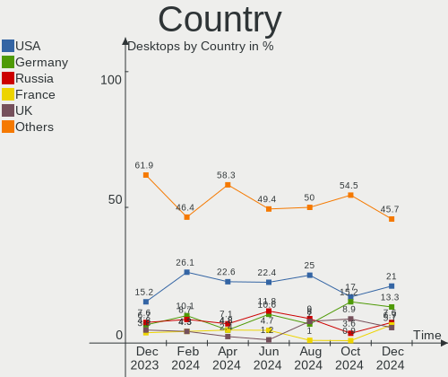
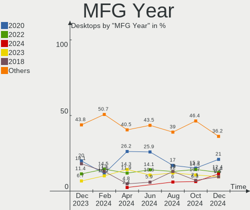

Arch Hardware Trends (Desktop)
------------------------------

A project to identify most popular hardware characteristics and track their change
over time based on data collected by Arch users at https://Linux-Hardware.org.

Anyone can contribute to the study by uploading probes of their computers by
the [hw-probe](https://github.com/linuxhw/hw-probe) tool:

    sudo hw-probe -all -upload

Full-feature report is available here: https://linux-hardware.org/?view=trends&formfactor=desktop

Period: Mar, 2020.

Contents
--------

- [ OS                       ](#os)
- [ OS Family                ](#os-family)
- [ Kernel                   ](#kernel)
- [ Kernel Family            ](#kernel-family)
- [ Kernel Major Ver.        ](#kernel-major-ver)
- [ Arch                     ](#arch)
- [ DE                       ](#de)
- [ Display Server           ](#display-server)
- [ OS Lang                  ](#os-lang)
- [ Boot Mode                ](#boot-mode)
- [ Filesystem               ](#filesystem)
- [ Dual Boot with Linux     ](#dual-boot-with-linux)
- [ Dual Boot (Win)          ](#dual-boot-win)
- [ Country                  ](#country)
- [ City                     ](#city)
- [ Vendor                   ](#vendor)
- [ Model                    ](#model)
- [ Model Family             ](#model-family)
- [ MFG Year                 ](#mfg-year)
- [ Form Factor              ](#form-factor)
- [ Secure Boot              ](#secure-boot)
- [ Coreboot                 ](#coreboot)
- [ RAM Size                 ](#ram-size)
- [ RAM Used                 ](#ram-used)
- [ Drive Vendor             ](#drive-vendor)
- [ Drive Model              ](#drive-model)
- [ Drive Kind               ](#drive-kind)
- [ Drive Connector          ](#drive-connector)
- [ Drive Size               ](#drive-size)
- [ Space Total              ](#space-total)
- [ Space Used               ](#space-used)
- [ Malfunc. Drives          ](#malfunc-drives)
- [ Malfunc. Drive Vendor    ](#malfunc-drive-vendor)
- [ Malfunc. Drive Kind      ](#malfunc-drive-kind)
- [ Failed Drives            ](#failed-drives)
- [ Failed Drive Vendor      ](#failed-drive-vendor)
- [ Drive Status             ](#drive-status)
- [ Storage Vendor           ](#storage-vendor)
- [ Storage Model            ](#storage-model)
- [ Storage Kind             ](#storage-kind)
- [ CPU Vendor               ](#cpu-vendor)
- [ CPU Model                ](#cpu-model)
- [ CPU Model Family         ](#cpu-model-family)
- [ CPU Cores                ](#cpu-cores)
- [ CPU Sockets              ](#cpu-sockets)
- [ CPU Threads              ](#cpu-threads)
- [ CPU Op-Modes             ](#cpu-op-modes)
- [ CPU Microarch            ](#cpu-microarch)
- [ CPU Microcode            ](#cpu-microcode)
- [ GPU Vendor               ](#gpu-vendor)
- [ GPU Model                ](#gpu-model)
- [ GPU Combo                ](#gpu-combo)
- [ GPU Driver               ](#gpu-driver)
- [ GPU Memory               ](#gpu-memory)
- [ Monitor Vendor           ](#monitor-vendor)
- [ Monitor Model            ](#monitor-model)
- [ Monitor Resolution       ](#monitor-resolution)
- [ Monitor Diagonal         ](#monitor-diagonal)
- [ Monitor Width            ](#monitor-width)
- [ Aspect Ratio             ](#aspect-ratio)
- [ Monitor Area             ](#monitor-area)
- [ Pixel Density            ](#pixel-density)
- [ Multiple Monitors        ](#multiple-monitors)
- [ Net Controller Vendor    ](#net-controller-vendor)
- [ Net Controller Model     ](#net-controller-model)
- [ Net Controller Kind      ](#net-controller-kind)
- [ Used Controller          ](#used-controller)
- [ NICs                     ](#nics)
- [ Unsupported Devices      ](#unsupported-devices)
- [ Unsupported Device Types ](#unsupported-device-types)

OS
--

Installed operating systems

| Name         | Computers | Percent |
|--------------|-----------|---------|
| Arch         | 20        | 74.07%  |
| Arch Rolling | 7         | 25.93%  |

OS Family
---------

OS without a version

| Name | Computers | Percent |
|------|-----------|---------|
| Arch | 27        | 100%    |

Kernel
------

Version of the Linux kernel

| Version             | Computers | Percent |
|---------------------|-----------|---------|
| 5.5.8-arch1-1       | 6         | 22.22%  |
| 5.5.7-arch1-1       | 4         | 14.81%  |
| 5.5.9-arch1-2       | 2         | 7.41%   |
| 5.5.8-zen1-1-zen    | 2         | 7.41%   |
| 5.5.6-arch1-1       | 2         | 7.41%   |
| 5.5.10-arch1-1      | 2         | 7.41%   |
| 5.4.23-1-lts        | 2         | 7.41%   |
| 5.6.0-rc4-1-tkg-pds | 1         | 3.7%    |
| 5.5.9-zen1-2-zen    | 1         | 3.7%    |
| 5.5.4-arch1-1       | 1         | 3.7%    |
| 5.5.11-arch1-1      | 1         | 3.7%    |
| 5.5.10-zen1-1-zen   | 1         | 3.7%    |
| 5.4.25-2-lts        | 1         | 3.7%    |
| 5.4.24-1-lts        | 1         | 3.7%    |

Kernel Family
-------------

Linux kernel without a distro release

| Version | Computers | Percent |
|---------|-----------|---------|
| 5.5.8   | 8         | 29.63%  |
| 5.5.7   | 4         | 14.81%  |
| 5.5.9   | 3         | 11.11%  |
| 5.5.10  | 3         | 11.11%  |
| 5.5.6   | 2         | 7.41%   |
| 5.4.23  | 2         | 7.41%   |
| 5.6.0   | 1         | 3.7%    |
| 5.5.4   | 1         | 3.7%    |
| 5.5.11  | 1         | 3.7%    |
| 5.4.25  | 1         | 3.7%    |
| 5.4.24  | 1         | 3.7%    |

Kernel Major Ver.
-----------------

Linux kernel major version

| Version | Computers | Percent |
|---------|-----------|---------|
| 5.5     | 22        | 81.48%  |
| 5.4     | 4         | 14.81%  |
| 5.6     | 1         | 3.7%    |

Arch
----

OS architecture (x86_64, i586, etc.)

| Name   | Computers | Percent |
|--------|-----------|---------|
| x86_64 | 27        | 100%    |

DE
--

Desktop Environment

| Name            | Computers | Percent |
|-----------------|-----------|---------|
| GNOME           | 13        | 48.15%  |
| KDE             | 5         | 18.52%  |
| KDE5            | 3         | 11.11%  |
| XFCE            | 2         | 7.41%   |
| i3              | 1         | 3.7%    |
| GNOME Flashback | 1         | 3.7%    |
| GNOME Classic   | 1         | 3.7%    |
| Cinnamon        | 1         | 3.7%    |

Display Server
--------------

X11 or Wayland

| Name    | Computers | Percent |
|---------|-----------|---------|
| X11     | 16        | 59.26%  |
| Wayland | 9         | 33.33%  |
| Tty     | 2         | 7.41%   |

OS Lang
-------

Language

| Lang  | Computers | Percent |
|-------|-----------|---------|
| de_DE | 7         | 25.93%  |
| en_US | 6         | 22.22%  |
| C     | 4         | 14.81%  |
| pl_PL | 3         | 11.11%  |
| pt_BR | 1         | 3.7%    |
| nl_NL | 1         | 3.7%    |
| hu_HU | 1         | 3.7%    |
| fi_FI | 1         | 3.7%    |
| es_AR | 1         | 3.7%    |
| en_GB | 1         | 3.7%    |
| en_AU | 1         | 3.7%    |

Boot Mode
---------

EFI or BIOS

| Mode | Computers | Percent |
|------|-----------|---------|
| EFI  | 16        | 59.26%  |
| BIOS | 11        | 40.74%  |

Filesystem
----------

Type of filesystem

| Type  | Computers | Percent |
|-------|-----------|---------|
| Ext4  | 23        | 85.19%  |
| Btrfs | 2         | 7.41%   |
| Zfs   | 1         | 3.7%    |
| F2fs  | 1         | 3.7%    |

Dual Boot with Linux
--------------------

Hosting more than one Linux

| Dual boot | Computers | Percent |
|-----------|-----------|---------|
| No        | 25        | 92.59%  |
| Yes       | 2         | 7.41%   |

Dual Boot (Win)
---------------

Hosting Linux and Windows

| Dual boot | Computers | Percent |
|-----------|-----------|---------|
| No        | 22        | 81.48%  |
| Yes       | 5         | 18.52%  |

Country
-------

Geographic location (country)

| Country     | Computers | Percent |
|-------------|-----------|---------|
| Germany     | 8         | 29.63%  |
| USA         | 3         | 11.11%  |
| Poland      | 3         | 11.11%  |
| Finland     | 2         | 7.41%   |
| Canada      | 2         | 7.41%   |
| UK          | 1         | 3.7%    |
| Russia      | 1         | 3.7%    |
| Netherlands | 1         | 3.7%    |
| Japan       | 1         | 3.7%    |
| Hungary     | 1         | 3.7%    |
| France      | 1         | 3.7%    |
| Brazil      | 1         | 3.7%    |
| Australia   | 1         | 3.7%    |
| Argentina   | 1         | 3.7%    |

City
----

Geographic location (city)

| City               | Computers | Percent |
|--------------------|-----------|---------|
| Warsaw             | 2         | 7.41%   |
| Oulu               | 2         | 7.41%   |
| Zwolle             | 1         | 3.7%    |
| Sydney             | 1         | 3.7%    |
| Pietrowice Wielkie | 1         | 3.7%    |
| Paraná            | 1         | 3.7%    |
| Norderstedt        | 1         | 3.7%    |
| Nishiwaki          | 1         | 3.7%    |
| New York           | 1         | 3.7%    |
| Munich             | 1         | 3.7%    |
| Muhr am See        | 1         | 3.7%    |
| Moscow             | 1         | 3.7%    |
| Lawrence           | 1         | 3.7%    |
| Laatzen            | 1         | 3.7%    |
| Hof                | 1         | 3.7%    |
| Hanover            | 1         | 3.7%    |
| Gatineau           | 1         | 3.7%    |
| Edmonton           | 1         | 3.7%    |
| Denver             | 1         | 3.7%    |
| Darmstadt          | 1         | 3.7%    |
| Cologne            | 1         | 3.7%    |
| Cardiff            | 1         | 3.7%    |
| Budapest           | 1         | 3.7%    |
| Bons-en-Chablais   | 1         | 3.7%    |
| Anápolis          | 1         | 3.7%    |

Vendor
------

Motherboard manufacturer

| Name                | Computers | Percent |
|---------------------|-----------|---------|
| ASUSTek Computer    | 12        | 44.44%  |
| ASRock              | 6         | 22.22%  |
| MSI                 | 4         | 14.81%  |
| Gigabyte Technology | 3         | 11.11%  |
| XFX                 | 1         | 3.7%    |
| AAEON               | 1         | 3.7%    |

Model
-----

Motherboard model

| Name                            | Computers | Percent |
|---------------------------------|-----------|---------|
| XFX nForce 790i Ultra 3-Way SLI | 1         | 3.7%    |
| MSI MS-7C02                     | 1         | 3.7%    |
| MSI MS-7B79                     | 1         | 3.7%    |
| MSI MS-7808                     | 1         | 3.7%    |
| MSI MS-7522                     | 1         | 3.7%    |
| Gigabyte Z87X-UD3H              | 1         | 3.7%    |
| Gigabyte GA-990X-Gaming SLI-CF  | 1         | 3.7%    |
| Gigabyte 970A-UD3P              | 1         | 3.7%    |
| ASUS WS C422 PRO_SE             | 1         | 3.7%    |
| ASUS TUF Z370-PLUS GAMING       | 1         | 3.7%    |
| ASUS TUF GAMING X570-PLUS       | 1         | 3.7%    |
| ASUS PRIME Z270M-PLUS           | 1         | 3.7%    |
| ASUS PRIME X470-PRO             | 1         | 3.7%    |
| ASUS PRIME X370-PRO             | 1         | 3.7%    |
| ASUS P8Z77-V PRO                | 1         | 3.7%    |
| ASUS P8Z77-V LX                 | 1         | 3.7%    |
| ASUS P7P55D-E LX                | 1         | 3.7%    |
| ASUS P6T DELUXE V2              | 1         | 3.7%    |
| ASUS M5A97 R2.0                 | 1         | 3.7%    |
| ASUS All Series                 | 1         | 3.7%    |
| ASRock X570 Taichi              | 1         | 3.7%    |
| ASRock Q1900-ITX                | 1         | 3.7%    |
| ASRock H110M-HDV R3.0           | 1         | 3.7%    |
| ASRock D1800M                   | 1         | 3.7%    |
| ASRock 970 Extreme4             | 1         | 3.7%    |
| ASRock 960GM-VGS3 FX            | 1         | 3.7%    |
| AAEON MF-001                    | 1         | 3.7%    |

Model Family
------------

Motherboard model prefix

| Name                    | Computers | Percent |
|-------------------------|-----------|---------|
| ASUS PRIME              | 3         | 11.11%  |
| ASUS TUF                | 2         | 7.41%   |
| ASUS P8Z77-V            | 2         | 7.41%   |
| XFX nForce              | 1         | 3.7%    |
| MSI MS-7C02             | 1         | 3.7%    |
| MSI MS-7B79             | 1         | 3.7%    |
| MSI MS-7808             | 1         | 3.7%    |
| MSI MS-7522             | 1         | 3.7%    |
| Gigabyte Z87X-UD3H      | 1         | 3.7%    |
| Gigabyte GA-990X-Gaming | 1         | 3.7%    |
| Gigabyte 970A-UD3P      | 1         | 3.7%    |
| ASUS WS                 | 1         | 3.7%    |
| ASUS P7P55D-E           | 1         | 3.7%    |
| ASUS P6T                | 1         | 3.7%    |
| ASUS M5A97              | 1         | 3.7%    |
| ASUS All                | 1         | 3.7%    |
| ASRock X570             | 1         | 3.7%    |
| ASRock Q1900-ITX        | 1         | 3.7%    |
| ASRock H110M-HDV        | 1         | 3.7%    |
| ASRock D1800M           | 1         | 3.7%    |
| ASRock 970              | 1         | 3.7%    |
| ASRock 960GM-VGS3       | 1         | 3.7%    |
| AAEON MF-001            | 1         | 3.7%    |

MFG Year
--------

Motherboard manufacture year

| Year | Computers | Percent |
|------|-----------|---------|
| 2018 | 7         | 25.93%  |
| 2019 | 6         | 22.22%  |
| 2013 | 4         | 14.81%  |
| 2016 | 2         | 7.41%   |
| 2012 | 2         | 7.41%   |
| 2017 | 1         | 3.7%    |
| 2015 | 1         | 3.7%    |
| 2014 | 1         | 3.7%    |
| 2011 | 1         | 3.7%    |
| 2010 | 1         | 3.7%    |
| 2009 | 1         | 3.7%    |

Form Factor
-----------

Physical design of the computer

| Name    | Computers | Percent |
|---------|-----------|---------|
| Desktop | 27        | 100%    |

Secure Boot
-----------

Enabled or disabled

| State    | Computers | Percent |
|----------|-----------|---------|
| Disabled | 27        | 100%    |

Coreboot
--------

Have coreboot on board

| Used | Computers | Percent |
|------|-----------|---------|
| No   | 27        | 100%    |

RAM Size
--------

Total RAM memory

| Size in GB  | Computers | Percent |
|-------------|-----------|---------|
| 16.01-24.0  | 11        | 40.74%  |
| 8.01-16.0   | 5         | 18.52%  |
| 32.01-64.0  | 4         | 14.81%  |
| 4.01-8.0    | 2         | 7.41%   |
| 24.01-32.0  | 2         | 7.41%   |
| 3.01-4.0    | 1         | 3.7%    |
| 64.01-256.0 | 1         | 3.7%    |
| 1.01-2.0    | 1         | 3.7%    |

RAM Used
--------

Used RAM memory

| Used GB   | Computers | Percent |
|-----------|-----------|---------|
| 4.01-8.0  | 8         | 29.63%  |
| 1.01-2.0  | 7         | 25.93%  |
| 2.01-3.0  | 6         | 22.22%  |
| 3.01-4.0  | 4         | 14.81%  |
| 8.01-16.0 | 1         | 3.7%    |
| 0.01-1.0  | 1         | 3.7%    |

Drive Vendor
------------

Hard drive vendors

| Vendor              | Computers | Drives | Percent |
|---------------------|-----------|--------|---------|
| WDC                 | 12        | 20     | 18.75%  |
| Seagate             | 9         | 13     | 14.06%  |
| Samsung Electronics | 9         | 10     | 14.06%  |
| Toshiba             | 4         | 4      | 6.25%   |
| SanDisk             | 4         | 8      | 6.25%   |
| Crucial             | 4         | 4      | 6.25%   |
| A-DATA Technology   | 4         | 4      | 6.25%   |
| Hitachi             | 3         | 3      | 4.69%   |
| Patriot             | 2         | 2      | 3.13%   |
| OCZ                 | 2         | 2      | 3.13%   |
| Kingston            | 2         | 2      | 3.13%   |
| Intel               | 2         | 2      | 3.13%   |
| XPG                 | 1         | 1      | 1.56%   |
| Unknown             | 1         | 1      | 1.56%   |
| PLEXTOR             | 1         | 1      | 1.56%   |
| MGS                 | 1         | 1      | 1.56%   |
| Maxtor              | 1         | 1      | 1.56%   |
| Integral            | 1         | 1      | 1.56%   |
| Gigabyte Technology | 1         | 1      | 1.56%   |

Drive Model
-----------

Hard drive models

| Model                      | Computers | Percent |
|----------------------------|-----------|---------|
| ST2000DM001-1CH164 2TB     | 2         | 2.56%   |
| SSD 850 EVO 500GB          | 2         | 2.56%   |
| SDSSDA240G 240GB           | 2         | 2.56%   |
| HDWE140 4TB                | 2         | 2.56%   |
| WD80EFAX-68KNBN0 8TB       | 1         | 1.28%   |
| WD800BB-00DKA0 80GB        | 1         | 1.28%   |
| WD6400AAKS-65Z7B0 640GB    | 1         | 1.28%   |
| WD6400AAKS-22A7B0 640GB    | 1         | 1.28%   |
| WD60EZAZ-00ZGHB0 6TB       | 1         | 1.28%   |
| WD5000AAVS-00ZTB0 500GB    | 1         | 1.28%   |
| WD40EFRX-68WT0N0 4TB       | 1         | 1.28%   |
| WD30EFRX-68AX9N0 3TB       | 1         | 1.28%   |
| WD20SPZX-00CRAT0 2TB       | 1         | 1.28%   |
| WD20EZRZ-00Z5HB0 2TB       | 1         | 1.28%   |
| WD20EZRX-00D8PB0 2TB       | 1         | 1.28%   |
| WD2003FZEX-00Z4SA0 2TB     | 1         | 1.28%   |
| WD15EARS-00MVWB0 1TB       | 1         | 1.28%   |
| WD15EADS-00P8B0 1TB        | 1         | 1.28%   |
| WD10EZRX-00D8PB0 1TB       | 1         | 1.28%   |
| WD10EZEX-08WN4A0 1TB       | 1         | 1.28%   |
| WD10EZEX-00ZF5A0 1TB       | 1         | 1.28%   |
| WD10EADS-00P8B0 1TB        | 1         | 1.28%   |
| WD10EADS-00M2B0 1TB        | 1         | 1.28%   |
| WD1002FAEX-00Z3A0 1TB      | 1         | 1.28%   |
| VERTEX3 240GB SSD          | 1         | 1.28%   |
| V Series SATA SSD 240GB    | 1         | 1.28%   |
| SU800 512GB SSD            | 1         | 1.28%   |
| SU800 1024GB SSD           | 1         | 1.28%   |
| SU650 480GB SSD            | 1         | 1.28%   |
| ST9500420AS 500GB          | 1         | 1.28%   |
| ST500LM021-1KJ152 500GB    | 1         | 1.28%   |
| ST500DM002-1BD142 500GB    | 1         | 1.28%   |
| ST3160815AS 160GB          | 1         | 1.28%   |
| ST3160023A 160GB           | 1         | 1.28%   |
| ST3000DM008-2DM166 3TB     | 1         | 1.28%   |
| ST2000DM006-2DM164 2TB     | 1         | 1.28%   |
| ST2000DL003-9VT166 2TB     | 1         | 1.28%   |
| ST1000DM003-9YN162 1TB     | 1         | 1.28%   |
| SSDSC2CW240A3 192GB        | 1         | 1.28%   |
| SSDPEKKW256G8 256GB        | 1         | 1.28%   |
| SSD 970 PRO 1TB            | 1         | 1.28%   |
| SSD 970 EVO 500GB          | 1         | 1.28%   |
| SSD 960 EVO 500GB          | 1         | 1.28%   |
| SSD 860 EVO 250GB          | 1         | 1.28%   |
| SSD 850 EVO 250GB          | 1         | 1.28%   |
| SSD 850 EVO 1TB            | 1         | 1.28%   |
| SSD 840 EVO 500GB          | 1         | 1.28%   |
| SSD 120GB                  | 1         | 1.28%   |
| SP550 240GB SSD            | 1         | 1.28%   |
| SHFS37A120G 120GB SSD      | 1         | 1.28%   |
| SDSSDA-1T00 1TB            | 1         | 1.28%   |
| SD7UB3Q256G1022 256GB SSD  | 1         | 1.28%   |
| SD7UB2Q512G1122 512GB SSD  | 1         | 1.28%   |
| SD6SB2M512G1022I 512GB SSD | 1         | 1.28%   |
| SA400S37240G 240GB SSD     | 1         | 1.28%   |
| PX-128M6S 128GB SSD        | 1         | 1.28%   |
| P200 1TB SSD               | 1         | 1.28%   |
| MQ03ABB200 2TB             | 1         | 1.28%   |
| M52516  16GB               | 1         | 1.28%   |
| M3 Portable 500GB          | 1         | 1.28%   |

Drive Kind
----------

HDD or SSD

| Kind | Computers | Drives | Percent |
|------|-----------|--------|---------|
| HDD  | 21        | 42     | 45.65%  |
| SSD  | 20        | 33     | 43.48%  |
| NVMe | 4         | 5      | 8.7%    |
| MMC  | 1         | 1      | 2.17%   |

Drive Connector
---------------

SATA, SAS, NVMe, etc.

| Type | Computers | Drives | Percent |
|------|-----------|--------|---------|
| SATA | 26        | 72     | 78.79%  |
| NVMe | 4         | 5      | 12.12%  |
| SAS  | 2         | 3      | 6.06%   |
| MMC  | 1         | 1      | 3.03%   |

Drive Size
----------

Size of hard drive

| Size in TB | Computers | Drives | Percent |
|------------|-----------|--------|---------|
| 0.01-0.5   | 23        | 38     | 42.59%  |
| 0.51-1.0   | 12        | 23     | 22.22%  |
| 1.01-2.0   | 11        | 12     | 20.37%  |
| 3.01-4.0   | 3         | 3      | 5.56%   |
| 2.01-3.0   | 3         | 3      | 5.56%   |
| 4.01-10.0  | 2         | 2      | 3.7%    |

Space Total
-----------

Amount of disk space available on the file system

| Size in GB     | Computers | Percent |
|----------------|-----------|---------|
| 251-500        | 6         | 22.22%  |
| More than 3000 | 4         | 14.81%  |
| 1001-2000      | 4         | 14.81%  |
| 501-1000       | 4         | 14.81%  |
| 2001-3000      | 3         | 11.11%  |
| 21-50          | 2         | 7.41%   |
| 1-20           | 2         | 7.41%   |
| 101-250        | 1         | 3.7%    |
| Unknown        | 1         | 3.7%    |

Space Used
----------

Amount of used disk space

| Used GB        | Computers | Percent |
|----------------|-----------|---------|
| 501-1000       | 6         | 22.22%  |
| 1-20           | 5         | 18.52%  |
| 101-250        | 4         | 14.81%  |
| 1001-2000      | 4         | 14.81%  |
| 21-50          | 3         | 11.11%  |
| 251-500        | 2         | 7.41%   |
| More than 3000 | 1         | 3.7%    |
| 51-100         | 1         | 3.7%    |
| Unknown        | 1         | 3.7%    |

Malfunc. Drives
---------------

Drive models with a malfunction

| Model                | Computers | Drives | Percent |
|----------------------|-----------|--------|---------|
| WD20EZRZ-00Z5HB0 2TB | 1         | 1      | 25%     |
| WD15EARS-00MVWB0 1TB | 1         | 1      | 25%     |
| SU650 480GB SSD      | 1         | 1      | 25%     |
| HUA723030ALA640 3TB  | 1         | 1      | 25%     |

Malfunc. Drive Vendor
---------------------

Vendors of faulty drives

| Vendor            | Computers | Drives | Percent |
|-------------------|-----------|--------|---------|
| WDC               | 2         | 2      | 50%     |
| Hitachi           | 1         | 1      | 25%     |
| A-DATA Technology | 1         | 1      | 25%     |

Malfunc. Drive Kind
-------------------

Kinds of faulty drives

| Kind | Computers | Drives | Percent |
|------|-----------|--------|---------|
| HDD  | 3         | 3      | 75%     |
| SSD  | 1         | 1      | 25%     |

Failed Drives
-------------

Failed drive models

Zero info for selected period =(

Failed Drive Vendor
-------------------

Failed drive vendors

Zero info for selected period =(

Drive Status
------------

Number of failed and malfunc. drives

| Status   | Computers | Drives | Percent |
|----------|-----------|--------|---------|
| Detected | 18        | 51     | 62.07%  |
| Works    | 8         | 26     | 27.59%  |
| Malfunc  | 3         | 4      | 10.34%  |

Storage Vendor
--------------

Storage controller vendors

| Vendor                   | Computers | Percent |
|--------------------------|-----------|---------|
| Intel                    | 14        | 34.15%  |
| AMD                      | 11        | 26.83%  |
| Samsung Electronics      | 5         | 12.2%   |
| ASMedia Technology       | 3         | 7.32%   |
| Marvell Technology Group | 2         | 4.88%   |
| JMicron Technology       | 2         | 4.88%   |
| VIA Technologies         | 1         | 2.44%   |
| Phison Electronics       | 1         | 2.44%   |
| Nvidia                   | 1         | 2.44%   |
| ADATA Technology         | 1         | 2.44%   |

Storage Model
-------------

Storage controller models

| Model                                                                    | Computers | Percent |
|--------------------------------------------------------------------------|-----------|---------|
| FCH SATA Controller [AHCI mode]                                          | 6         | 12%     |
| NVMe SSD Controller SM981/PM981/PM983                                    | 4         | 8%      |
| SB7x0/SB8x0/SB9x0 SATA Controller [AHCI mode]                            | 3         | 6%      |
| SB7x0/SB8x0/SB9x0 IDE Controller                                         | 3         | 6%      |
| ASM1062 Serial ATA Controller                                            | 3         | 6%      |
| 7 Series/C210 Series Chipset Family 6-port SATA Controller [AHCI mode]   | 3         | 6%      |
| 400 Series Chipset SATA Controller                                       | 3         | 6%      |
| 200 Series PCH SATA controller [AHCI mode]                               | 3         | 6%      |
| SB7x0/SB8x0/SB9x0 SATA Controller [IDE mode]                             | 2         | 4%      |
| XPG SX8200 Pro PCIe Gen3x4 M.2 2280 Solid State Drive                    | 1         | 2%      |
| X370 Series Chipset SATA Controller                                      | 1         | 2%      |
| VT6421 IDE/SATA Controller                                               | 1         | 2%      |
| SSD Pro 7600p/760p/E 6100p Series                                        | 1         | 2%      |
| Q170/Q150/B150/H170/H110/Z170/CM236 Chipset SATA Controller [AHCI Mode]  | 1         | 2%      |
| NVMe SSD Controller SM961/PM961                                          | 1         | 2%      |
| MCP55 SATA Controller                                                    | 1         | 2%      |
| MCP55 IDE                                                                | 1         | 2%      |
| JMB363 SATA/IDE Controller                                               | 1         | 2%      |
| JMB361 AHCI/IDE                                                          | 1         | 2%      |
| E12 NVMe Controller                                                      | 1         | 2%      |
| Atom Processor E3800 Series SATA AHCI Controller                         | 1         | 2%      |
| 9 Series Chipset Family SATA Controller [AHCI Mode]                      | 1         | 2%      |
| 88SE9172 SATA 6Gb/s Controller                                           | 1         | 2%      |
| 88SE912x SATA 6Gb/s Controller [IDE mode]                                | 1         | 2%      |
| 82801JI (ICH10 Family) SATA AHCI Controller                              | 1         | 2%      |
| 82801JI (ICH10 Family) 4 port SATA IDE Controller #1                     | 1         | 2%      |
| 82801JI (ICH10 Family) 2 port SATA IDE Controller #2                     | 1         | 2%      |
| 8 Series/C220 Series Chipset Family 6-port SATA Controller 1 [AHCI mode] | 1         | 2%      |
| 5 Series/3400 Series Chipset 6 port SATA AHCI Controller                 | 1         | 2%      |

Storage Kind
------------

Kind of storage controller (IDE, SATA, NVMe, SAS, ...)

| Kind | Computers | Percent |
|------|-----------|---------|
| SATA | 24        | 63.16%  |
| NVMe | 7         | 18.42%  |
| IDE  | 6         | 15.79%  |
| RAID | 1         | 2.63%   |

CPU Vendor
----------

Processor vendors

| Vendor | Computers | Percent |
|--------|-----------|---------|
| Intel  | 16        | 59.26%  |
| AMD    | 11        | 40.74%  |

CPU Model
---------

Processor models

| Model                                  | Computers | Percent |
|----------------------------------------|-----------|---------|
| AMD Ryzen 7 3700X 8-Core Processor     | 2         | 7.41%   |
| Intel Xeon W-2125 CPU @ 4.00GHz        | 1         | 3.7%    |
| Intel Pentium CPU G4560 @ 3.50GHz      | 1         | 3.7%    |
| Intel Core i7-8700K CPU @ 3.70GHz      | 1         | 3.7%    |
| Intel Core i7-4790K CPU @ 4.00GHz      | 1         | 3.7%    |
| Intel Core i7-4770 CPU @ 3.40GHz       | 1         | 3.7%    |
| Intel Core i7-3770K CPU @ 3.50GHz      | 1         | 3.7%    |
| Intel Core i7 CPU 950 @ 3.07GHz        | 1         | 3.7%    |
| Intel Core i7 CPU 920 @ 2.67GHz        | 1         | 3.7%    |
| Intel Core i5-7500 CPU @ 3.40GHz       | 1         | 3.7%    |
| Intel Core i5-3570K CPU @ 3.40GHz      | 1         | 3.7%    |
| Intel Core i5-3470 CPU @ 3.20GHz       | 1         | 3.7%    |
| Intel Core i3 CPU 540 @ 3.07GHz        | 1         | 3.7%    |
| Intel Core 2 Quad CPU Q9400 @ 2.66GHz  | 1         | 3.7%    |
| Intel Celeron CPU J1900 @ 1.99GHz      | 1         | 3.7%    |
| Intel Celeron CPU J1800 @ 2.41GHz      | 1         | 3.7%    |
| Intel Atom x5-Z8350 CPU @ 1.44GHz      | 1         | 3.7%    |
| AMD Ryzen 7 2700X Eight-Core Processor | 1         | 3.7%    |
| AMD Ryzen 7 1700 Eight-Core Processor  | 1         | 3.7%    |
| AMD Ryzen 5 2600X Six-Core Processor   | 1         | 3.7%    |
| AMD Ryzen 5 2600 Six-Core Processor    | 1         | 3.7%    |
| AMD FX-8350 Eight-Core Processor       | 1         | 3.7%    |
| AMD FX-8320 Eight-Core Processor       | 1         | 3.7%    |
| AMD FX-6300 Six-Core Processor         | 1         | 3.7%    |
| AMD FX-4300 Quad-Core Processor        | 1         | 3.7%    |
| AMD Athlon II X2 250 Processor         | 1         | 3.7%    |

CPU Model Family
----------------

Processor model prefix

| Model             | Computers | Percent |
|-------------------|-----------|---------|
| Intel Core i7     | 6         | 22.22%  |
| AMD Ryzen 7       | 4         | 14.81%  |
| AMD FX            | 4         | 14.81%  |
| Intel Core i5     | 3         | 11.11%  |
| Intel Celeron     | 2         | 7.41%   |
| AMD Ryzen 5       | 2         | 7.41%   |
| Intel Xeon        | 1         | 3.7%    |
| Intel Pentium     | 1         | 3.7%    |
| Intel Core i3     | 1         | 3.7%    |
| Intel Core 2 Quad | 1         | 3.7%    |
| Intel Atom        | 1         | 3.7%    |
| AMD Athlon II X2  | 1         | 3.7%    |

CPU Cores
---------

Number of processor cores

| Number | Computers | Percent |
|--------|-----------|---------|
| 4      | 14        | 51.85%  |
| 2      | 5         | 18.52%  |
| 8      | 4         | 14.81%  |
| 6      | 3         | 11.11%  |
| 3      | 1         | 3.7%    |

CPU Sockets
-----------

Number of sockets

| Number | Computers | Percent |
|--------|-----------|---------|
| 1      | 27        | 100%    |

CPU Threads
-----------

Threads per core (Hyper-Threading)

| Number | Computers | Percent |
|--------|-----------|---------|
| 2      | 19        | 70.37%  |
| 1      | 8         | 29.63%  |

CPU Op-Modes
------------

CPU Operation Modes (32-bit, 64-bit)

| Op mode        | Computers | Percent |
|----------------|-----------|---------|
| 32-bit, 64-bit | 27        | 100%    |

CPU Microarch
-------------

Microarchitecture

| Name       | Computers | Percent |
|------------|-----------|---------|
| Piledriver | 4         | 14.81%  |
| Zen+       | 3         | 11.11%  |
| Skylake    | 3         | 11.11%  |
| Silvermont | 3         | 11.11%  |
| IvyBridge  | 3         | 11.11%  |
| Zen 2      | 2         | 7.41%   |
| Nehalem    | 2         | 7.41%   |
| Haswell    | 2         | 7.41%   |
| Zen        | 1         | 3.7%    |
| Westmere   | 1         | 3.7%    |
| KabyLake   | 1         | 3.7%    |
| K10        | 1         | 3.7%    |
| Core       | 1         | 3.7%    |

CPU Microcode
-------------

Microcode number

| Number     | Computers | Percent |
|------------|-----------|---------|
| Unknown    | 4         | 14.81%  |
| 0x0800820d | 3         | 11.11%  |
| 0x306a9    | 2         | 7.41%   |
| 0x06000822 | 2         | 7.41%   |
| 0x906ea    | 1         | 3.7%    |
| 0x906e9    | 1         | 3.7%    |
| 0x50654    | 1         | 3.7%    |
| 0x406c4    | 1         | 3.7%    |
| 0x306c3    | 1         | 3.7%    |
| 0x30678    | 1         | 3.7%    |
| 0x30673    | 1         | 3.7%    |
| 0x20655    | 1         | 3.7%    |
| 0x106a5    | 1         | 3.7%    |
| 0x106a4    | 1         | 3.7%    |
| 0x1067a    | 1         | 3.7%    |
| 0x08701013 | 1         | 3.7%    |
| 0x08001138 | 1         | 3.7%    |
| 0x06000852 | 1         | 3.7%    |
| 0x06000817 | 1         | 3.7%    |
| 0x010000c7 | 1         | 3.7%    |

GPU Vendor
----------

Vendors of graphics cards

| Vendor | Computers | Percent |
|--------|-----------|---------|
| Nvidia | 12        | 42.86%  |
| AMD    | 10        | 35.71%  |
| Intel  | 6         | 21.43%  |

GPU Model
---------

Graphics card models

| Model                                                                              | Computers | Percent |
|------------------------------------------------------------------------------------|-----------|---------|
| Ellesmere [Radeon RX 470/480/570/570X/580/580X/590]                                | 3         | 10.71%  |
| Navi 10 [Radeon RX 5600 OEM/5600 XT / 5700/5700 XT]                                | 2         | 7.14%   |
| Atom Processor Z36xxx/Z37xxx Series Graphics & Display                             | 2         | 7.14%   |
| Xeon E3-1200 v2/3rd Gen Core processor Graphics Controller                         | 1         | 3.57%   |
| Vega 10 XTX [Radeon Vega Frontier Edition]                                         | 1         | 3.57%   |
| Vega 10 XL/XT [Radeon RX Vega 56/64]                                               | 1         | 3.57%   |
| TU116 [GeForce GTX 1660 SUPER]                                                     | 1         | 3.57%   |
| TU104 [GeForce RTX 2070 SUPER]                                                     | 1         | 3.57%   |
| Tahiti XT [Radeon HD 7970/8970 OEM / R9 280X]                                      | 1         | 3.57%   |
| RV670 [Radeon HD 3690/3850]                                                        | 1         | 3.57%   |
| HD Graphics 630                                                                    | 1         | 3.57%   |
| HD Graphics 610                                                                    | 1         | 3.57%   |
| GP104 [GeForce GTX 1080]                                                           | 1         | 3.57%   |
| GP104 [GeForce GTX 1070 Ti]                                                        | 1         | 3.57%   |
| GM206 [GeForce GTX 960]                                                            | 1         | 3.57%   |
| GM204 [GeForce GTX 970]                                                            | 1         | 3.57%   |
| GK208B [GeForce GT 730]                                                            | 1         | 3.57%   |
| GK110 [GeForce GTX TITAN]                                                          | 1         | 3.57%   |
| GK107 [GeForce GT 740]                                                             | 1         | 3.57%   |
| GK107 [GeForce GT 640]                                                             | 1         | 3.57%   |
| GF119 [GeForce GT 520]                                                             | 1         | 3.57%   |
| GF108 [GeForce GT 620]                                                             | 1         | 3.57%   |
| Curacao XT / Trinidad XT [Radeon R7 370 / R9 270X/370X]                            | 1         | 3.57%   |
| Atom/Celeron/Pentium Processor x5-E8000/J3xxx/N3xxx Integrated Graphics Controller | 1         | 3.57%   |

GPU Combo
---------

Combinations of graphics cards

| Name       | Computers | Percent |
|------------|-----------|---------|
| 1 x Nvidia | 12        | 44.44%  |
| 1 x AMD    | 10        | 37.04%  |
| 1 x Intel  | 5         | 18.52%  |

GPU Driver
----------

Free vs proprietary

| Driver      | Computers | Percent |
|-------------|-----------|---------|
| Free        | 18        | 66.67%  |
| Proprietary | 7         | 25.93%  |
| Unknown     | 2         | 7.41%   |

GPU Memory
----------

Total video memory

| Size in GB | Computers | Percent |
|------------|-----------|---------|
| Unknown    | 11        | 40.74%  |
| 7.01-8.0   | 5         | 18.52%  |
| 1.01-2.0   | 4         | 14.81%  |
| 5.01-6.0   | 2         | 7.41%   |
| 3.01-4.0   | 2         | 7.41%   |
| 2.01-3.0   | 1         | 3.7%    |
| 8.01-16.0  | 1         | 3.7%    |
| 0.51-1.0   | 1         | 3.7%    |

Monitor Vendor
--------------

Monitor vendors

| Vendor               | Computers | Percent |
|----------------------|-----------|---------|
| Acer                 | 5         | 16.13%  |
| Samsung Electronics  | 4         | 12.9%   |
| BenQ                 | 4         | 12.9%   |
| Goldstar             | 3         | 9.68%   |
| Dell                 | 3         | 9.68%   |
| LG Electronics       | 2         | 6.45%   |
| Hewlett-Packard      | 2         | 6.45%   |
| Ancor Communications | 2         | 6.45%   |
| Vestel Elektronik    | 1         | 3.23%   |
| Unknown              | 1         | 3.23%   |
| Idek Iiyama          | 1         | 3.23%   |
| HYO                  | 1         | 3.23%   |
| Belinea              | 1         | 3.23%   |
| AOC                  | 1         | 3.23%   |

Monitor Model
-------------

Monitor models

| Model                                                | Computers | Percent |
|------------------------------------------------------|-----------|---------|
| X34 P ACR054F 3440x1440 798x335mm 34.1-inch          | 1         | 3.13%   |
| VG271U ACR06D7 2560x1440 597x336mm 27.0-inch         | 1         | 3.13%   |
| U2515H DELD070 2560x1440 553x311mm 25.0-inch         | 1         | 3.13%   |
| S27A950D SAM079E 1920x1080 598x336mm 27.0-inch       | 1         | 3.13%   |
| S24B300 SAM08CC 1920x1080 521x293mm 23.5-inch        | 1         | 3.13%   |
| S22D390 SAM0B62 1920x1080 477x268mm 21.5-inch        | 1         | 3.13%   |
| PD2700U BNQ802E 3840x2160 600x340mm 27.2-inch        | 1         | 3.13%   |
| LCD Monitor SAMSUNG 1920x1080                        | 1         | 3.13%   |
| LCD Monitor S24B300 1920x1080                        | 1         | 3.13%   |
| LCD Monitor PLE2607WS                                | 1         | 3.13%   |
| LCD Monitor LP2475w 1920x1200                        | 1         | 3.13%   |
| LCD Monitor LG FULL HD 1920x1080                     | 1         | 3.13%   |
| LCD Monitor 24MB35 1920x1080                         | 1         | 3.13%   |
| KA270H ACR0469 1920x1080 598x336mm 27.0-inch         | 1         | 3.13%   |
| K242HL ACR03E3 1920x1080 531x299mm 24.0-inch         | 1         | 3.13%   |
| HDR 4K GSM7707 3840x2160 600x340mm 27.2-inch         | 1         | 3.13%   |
| GL2460 BNQ78CE 1920x1080 531x299mm 24.0-inch         | 1         | 3.13%   |
| GL2450 BNQ78A5 1920x1080 531x298mm 24.0-inch         | 1         | 3.13%   |
| G2200W BNQ780D 1680x1050 474x296mm 22.0-inch         | 1         | 3.13%   |
| E2351 GSM5872 1920x1080 510x290mm 23.1-inch          | 1         | 3.13%   |
| E2342 GSM58C3 1920x1080 510x290mm 23.1-inch          | 1         | 3.13%   |
| E2210H DELD031 1920x1080 477x268mm 21.5-inch         | 1         | 3.13%   |
| DUAL-DVI HYO049B 2560x1440 600x340mm 27.2-inch       | 1         | 3.13%   |
| CF791 SAM0DC4 3440x1440 797x333mm 34.0-inch          | 1         | 3.13%   |
| Bel2230S1W MAX089B 1680x1050 470x300mm 22.0-inch     | 1         | 3.13%   |
| ASUS VS247 ACI249A 1920x1080 521x293mm 23.5-inch     | 1         | 3.13%   |
| ASUS VP278 ACI27C8 1920x1080 598x336mm 27.0-inch     | 1         | 3.13%   |
| AL1916 ACRAD63 1280x1024 376x301mm 19.0-inch         | 1         | 3.13%   |
| 50UHD_LCD_TV VES3700 3840x2160 1872x1053mm 84.6-inch | 1         | 3.13%   |
| 2590G4 AOC2590 1920x1080 544x303mm 24.5-inch         | 1         | 3.13%   |
| 22xw HWP3185 1920x1080 476x268mm 21.5-inch           | 1         | 3.13%   |
| 2209WA DELF011 1680x1050 474x296mm 22.0-inch         | 1         | 3.13%   |

Monitor Resolution
------------------

Monitor screen resolution

| Resolution         | Computers | Percent |
|--------------------|-----------|---------|
| 1920x1080 (FHD)    | 16        | 55.17%  |
| 2560x1440 (QHD)    | 3         | 10.34%  |
| 1680x1050 (WSXGA+) | 3         | 10.34%  |
| 3840x2160 (4K)     | 2         | 6.9%    |
| 3440x1440          | 2         | 6.9%    |
| 1920x1200 (WUXGA)  | 1         | 3.45%   |
| 1280x1024 (SXGA)   | 1         | 3.45%   |
| Unknown            | 1         | 3.45%   |

Monitor Diagonal
----------------

Diagonal size in inches

| Inches  | Computers | Percent |
|---------|-----------|---------|
| Unknown | 6         | 20%     |
| 27      | 5         | 16.67%  |
| 24      | 4         | 13.33%  |
| 23      | 4         | 13.33%  |
| 22      | 3         | 10%     |
| 21      | 3         | 10%     |
| 34      | 2         | 6.67%   |
| 57      | 1         | 3.33%   |
| 25      | 1         | 3.33%   |
| 19      | 1         | 3.33%   |

Monitor Width
-------------

Physical width

| Width in mm | Computers | Percent |
|-------------|-----------|---------|
| 501-600     | 13        | 44.83%  |
| 401-500     | 6         | 20.69%  |
| Unknown     | 6         | 20.69%  |
| 701-800     | 2         | 6.9%    |
| 351-400     | 1         | 3.45%   |
| 1001-1500   | 1         | 3.45%   |

Aspect Ratio
------------

Proportional relationship between the width and the height

| Ratio   | Computers | Percent |
|---------|-----------|---------|
| 16/9    | 17        | 58.62%  |
| Unknown | 6         | 20.69%  |
| 16/10   | 3         | 10.34%  |
| 21/9    | 2         | 6.9%    |
| 5/4     | 1         | 3.45%   |

Monitor Area
------------

Area in inch²

| Area in inch² | Computers | Percent |
|----------------|-----------|---------|
| 201-250        | 10        | 33.33%  |
| Unknown        | 6         | 20%     |
| 301-350        | 5         | 16.67%  |
| 151-200        | 4         | 13.33%  |
| 351-500        | 2         | 6.67%   |
| 251-300        | 2         | 6.67%   |
| More than 1000 | 1         | 3.33%   |

Pixel Density
-------------

Pixels per inch

| Density | Computers | Percent |
|---------|-----------|---------|
| 51-100  | 12        | 41.38%  |
| 101-120 | 8         | 27.59%  |
| Unknown | 6         | 20.69%  |
| 161-240 | 2         | 6.9%    |
| 1-50    | 1         | 3.45%   |

Multiple Monitors
-----------------

Total monitors connected

| Total | Computers | Percent |
|-------|-----------|---------|
| 1     | 21        | 77.78%  |
| 2     | 4         | 14.81%  |
| 4     | 1         | 3.7%    |
| 0     | 1         | 3.7%    |

Net Controller Vendor
---------------------

Controller vendors

| Vendor                | Computers | Percent |
|-----------------------|-----------|---------|
| Intel                 | 6         | 66.67%  |
| Realtek Semiconductor | 2         | 22.22%  |
| Nvidia                | 1         | 11.11%  |

Net Controller Model
--------------------

Controller models

| Model                             | Computers | Percent |
|-----------------------------------|-----------|---------|
| I211 Gigabit Network Connection   | 4         | 40%     |
| Wi-Fi 6 AX200                     | 1         | 10%     |
| RTL8187 Wireless LAN Adapter      | 1         | 10%     |
| RTL8153 Gigabit Ethernet Adapter  | 1         | 10%     |
| MCP55 Ethernet                    | 1         | 10%     |
| I210 Gigabit Network Connection   | 1         | 10%     |
| 82579V Gigabit Network Connection | 1         | 10%     |

Net Controller Kind
-------------------

Ethernet, WiFi or modem

| Kind     | Computers | Percent |
|----------|-----------|---------|
| Ethernet | 8         | 80%     |
| WiFi     | 2         | 20%     |

Used Controller
---------------

Currently used network controller

| Kind     | Computers | Percent |
|----------|-----------|---------|
| Ethernet | 6         | 85.71%  |
| WiFi     | 1         | 14.29%  |

NICs
----

Total network controllers on board

| Total | Computers | Percent |
|-------|-----------|---------|
| 1     | 16        | 59.26%  |
| 2     | 10        | 37.04%  |
| 0     | 1         | 3.7%    |

Unsupported Devices
-------------------

Total unsupported devices on board

| Total | Computers | Percent |
|-------|-----------|---------|
| 0     | 23        | 85.19%  |
| 1     | 3         | 11.11%  |
| 2     | 1         | 3.7%    |

Unsupported Device Types
------------------------

Types of unsupported devices

| Type          | Computers | Percent |
|---------------|-----------|---------|
| Graphics card | 3         | 60%     |
| Dvb card      | 1         | 20%     |
| Chipcard      | 1         | 20%     |

