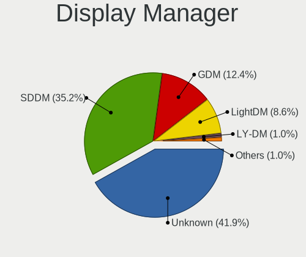
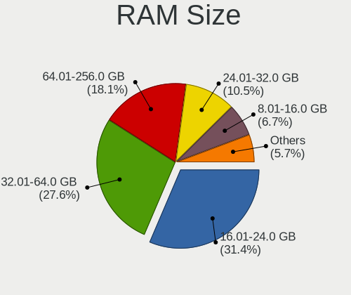
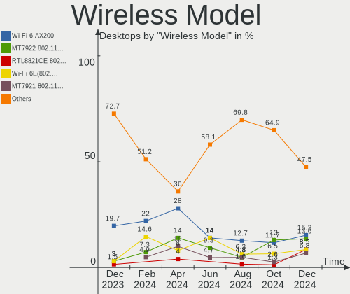

Arch - Hardware Trends (Desktops)
---------------------------------

A project to identify most popular hardware characteristics and track their change
over time based on data collected by Linux users at https://Linux-Hardware.org.

Anyone can contribute to this report by the [hw-probe](https://github.com/linuxhw/hw-probe) tool:

    sudo -E hw-probe -all -upload

This report is for one last month. Overall report since the beginning of time: [TestDays](https://github.com/linuxhw/TestDays)

Period: Sep, 2023.

Contents
--------

* [ System ](#system)
  - [ OS                       ](#os)
  - [ OS Family                ](#os-family)
  - [ Kernel                   ](#kernel)
  - [ Kernel Family            ](#kernel-family)
  - [ Kernel Major Ver.        ](#kernel-major-ver)
  - [ Arch                     ](#arch)
  - [ DE                       ](#de)
  - [ Display Server           ](#display-server)
  - [ Display Manager          ](#display-manager)
  - [ OS Lang                  ](#os-lang)
  - [ Boot Mode                ](#boot-mode)
  - [ Filesystem               ](#filesystem)
  - [ Part. scheme             ](#part-scheme)
  - [ Dual Boot with Linux/BSD ](#dual-boot-with-linuxbsd)
  - [ Dual Boot (Win)          ](#dual-boot-win)

* [ Board ](#board)
  - [ Vendor                   ](#vendor)
  - [ Model                    ](#model)
  - [ Model Family             ](#model-family)
  - [ MFG Year                 ](#mfg-year)
  - [ Form Factor              ](#form-factor)
  - [ Secure Boot              ](#secure-boot)
  - [ Coreboot                 ](#coreboot)
  - [ RAM Size                 ](#ram-size)
  - [ RAM Used                 ](#ram-used)
  - [ Total Drives             ](#total-drives)
  - [ Has CD-ROM               ](#has-cd-rom)
  - [ Has Ethernet             ](#has-ethernet)
  - [ Has WiFi                 ](#has-wifi)
  - [ Has Bluetooth            ](#has-bluetooth)

* [ Location ](#location)
  - [ Country                  ](#country)
  - [ City                     ](#city)

* [ Drives ](#drives)
  - [ Drive Vendor             ](#drive-vendor)
  - [ Drive Model              ](#drive-model)
  - [ HDD Vendor               ](#hdd-vendor)
  - [ SSD Vendor               ](#ssd-vendor)
  - [ Drive Kind               ](#drive-kind)
  - [ Drive Connector          ](#drive-connector)
  - [ Drive Size               ](#drive-size)
  - [ Space Total              ](#space-total)
  - [ Space Used               ](#space-used)
  - [ Malfunc. Drives          ](#malfunc-drives)
  - [ Malfunc. Drive Vendor    ](#malfunc-drive-vendor)
  - [ Malfunc. HDD Vendor      ](#malfunc-hdd-vendor)
  - [ Malfunc. Drive Kind      ](#malfunc-drive-kind)
  - [ Failed Drives            ](#failed-drives)
  - [ Failed Drive Vendor      ](#failed-drive-vendor)
  - [ Drive Status             ](#drive-status)

* [ Storage controller ](#storage-controller)
  - [ Storage Vendor           ](#storage-vendor)
  - [ Storage Model            ](#storage-model)
  - [ Storage Kind             ](#storage-kind)

* [ Processor ](#processor)
  - [ CPU Vendor               ](#cpu-vendor)
  - [ CPU Model                ](#cpu-model)
  - [ CPU Model Family         ](#cpu-model-family)
  - [ CPU Cores                ](#cpu-cores)
  - [ CPU Sockets              ](#cpu-sockets)
  - [ CPU Threads              ](#cpu-threads)
  - [ CPU Op-Modes             ](#cpu-op-modes)
  - [ CPU Microcode            ](#cpu-microcode)
  - [ CPU Microarch            ](#cpu-microarch)

* [ Graphics ](#graphics)
  - [ GPU Vendor               ](#gpu-vendor)
  - [ GPU Model                ](#gpu-model)
  - [ GPU Combo                ](#gpu-combo)
  - [ GPU Driver               ](#gpu-driver)
  - [ GPU Memory               ](#gpu-memory)

* [ Monitor ](#monitor)
  - [ Monitor Vendor           ](#monitor-vendor)
  - [ Monitor Model            ](#monitor-model)
  - [ Monitor Resolution       ](#monitor-resolution)
  - [ Monitor Diagonal         ](#monitor-diagonal)
  - [ Monitor Width            ](#monitor-width)
  - [ Aspect Ratio             ](#aspect-ratio)
  - [ Monitor Area             ](#monitor-area)
  - [ Pixel Density            ](#pixel-density)
  - [ Multiple Monitors        ](#multiple-monitors)

* [ Network ](#network)
  - [ Net Controller Vendor    ](#net-controller-vendor)
  - [ Net Controller Model     ](#net-controller-model)
  - [ Wireless Vendor          ](#wireless-vendor)
  - [ Wireless Model           ](#wireless-model)
  - [ Ethernet Vendor          ](#ethernet-vendor)
  - [ Ethernet Model           ](#ethernet-model)
  - [ Net Controller Kind      ](#net-controller-kind)
  - [ Used Controller          ](#used-controller)
  - [ NICs                     ](#nics)
  - [ IPv6                     ](#ipv6)

* [ Bluetooth ](#bluetooth)
  - [ Bluetooth Vendor         ](#bluetooth-vendor)
  - [ Bluetooth Model          ](#bluetooth-model)

* [ Sound ](#sound)
  - [ Sound Vendor             ](#sound-vendor)
  - [ Sound Model              ](#sound-model)

* [ Memory ](#memory)
  - [ Memory Vendor            ](#memory-vendor)
  - [ Memory Model             ](#memory-model)
  - [ Memory Kind              ](#memory-kind)
  - [ Memory Form Factor       ](#memory-form-factor)
  - [ Memory Size              ](#memory-size)
  - [ Memory Speed             ](#memory-speed)

* [ Printers & scanners ](#printers--scanners)
  - [ Printer Vendor           ](#printer-vendor)
  - [ Printer Model            ](#printer-model)
  - [ Scanner Vendor           ](#scanner-vendor)
  - [ Scanner Model            ](#scanner-model)

* [ Camera ](#camera)
  - [ Camera Vendor            ](#camera-vendor)
  - [ Camera Model             ](#camera-model)

* [ Security ](#security)
  - [ Fingerprint Vendor       ](#fingerprint-vendor)
  - [ Fingerprint Model        ](#fingerprint-model)
  - [ Chipcard Vendor          ](#chipcard-vendor)
  - [ Chipcard Model           ](#chipcard-model)

* [ Unsupported ](#unsupported)
  - [ Unsupported Devices      ](#unsupported-devices)
  - [ Unsupported Device Types ](#unsupported-device-types)

System
------

OS
--

Installed operating systems

| Name         | Desktops | Percent |
|--------------|----------|---------|
| Arch Rolling | 85       | 100%    |

OS Family
---------

OS without a version

| Name | Desktops | Percent |
|------|----------|---------|
| Arch | 85       | 100%    |

Kernel
------

Version of the Linux kernel

| Version                                   | Desktops | Percent |
|-------------------------------------------|----------|---------|
| 6.4.12-arch1-1                            | 27       | 31.76%  |
| 6.5.3-arch1-1                             | 17       | 20%     |
| 6.5.3-zen1-1-zen                          | 7        | 8.24%   |
| 6.5.4-arch2-1                             | 4        | 4.71%   |
| 6.5.2-arch1-1                             | 4        | 4.71%   |
| 6.4.12-zen1-1-zen                         | 4        | 4.71%   |
| 6.5.5-arch1-1                             | 2        | 2.35%   |
| 6.5.2-zen1-1-zen                          | 2        | 2.35%   |
| 6.4.10-arch1-1                            | 2        | 2.35%   |
| 6.6.0-rc1-273-tkg-eevdf-llvm              | 1        | 1.18%   |
| 6.5.5-zen1-1-zen                          | 1        | 1.18%   |
| 6.5.5-AMD                                 | 1        | 1.18%   |
| 6.5.3-intel_gna                           | 1        | 1.18%   |
| 6.5.3-AMD                                 | 1        | 1.18%   |
| 6.5.2-273-tkg-bore-eevdf                  | 1        | 1.18%   |
| 6.5.2-1-cachyos-bore                      | 1        | 1.18%   |
| 6.5.1-1-cachyos                           | 1        | 1.18%   |
| 6.5.0-rc7-1-drm-xe-next-git-g16e2c940ef53 | 1        | 1.18%   |
| 6.4.8-arch1-1                             | 1        | 1.18%   |
| 6.4.12-1-cachyos                          | 1        | 1.18%   |
| 6.4.11-x64v2-xanmod1-1                    | 1        | 1.18%   |
| 6.1.50-1-lts                              | 1        | 1.18%   |
| 6.1.47-1-lts                              | 1        | 1.18%   |
| 6.1.38-1-lts                              | 1        | 1.18%   |
| 5.10.54-1-lts                             | 1        | 1.18%   |

Kernel Family
-------------

Linux kernel without a distro release

| Version | Desktops | Percent |
|---------|----------|---------|
| 6.4.12  | 32       | 37.65%  |
| 6.5.3   | 26       | 30.59%  |
| 6.5.2   | 8        | 9.41%   |
| 6.5.5   | 4        | 4.71%   |
| 6.5.4   | 4        | 4.71%   |
| 6.4.10  | 2        | 2.35%   |
| 6.6.0   | 1        | 1.18%   |
| 6.5.1   | 1        | 1.18%   |
| 6.5.0   | 1        | 1.18%   |
| 6.4.8   | 1        | 1.18%   |
| 6.4.11  | 1        | 1.18%   |
| 6.1.50  | 1        | 1.18%   |
| 6.1.47  | 1        | 1.18%   |
| 6.1.38  | 1        | 1.18%   |
| 5.10.54 | 1        | 1.18%   |

Kernel Major Ver.
-----------------

Linux kernel major version

| Version | Desktops | Percent |
|---------|----------|---------|
| 6.5     | 44       | 51.76%  |
| 6.4     | 36       | 42.35%  |
| 6.1     | 3        | 3.53%   |
| 6.6     | 1        | 1.18%   |
| 5.10    | 1        | 1.18%   |

Arch
----

OS architecture (x86_64, i586, etc.)

| Name   | Desktops | Percent |
|--------|----------|---------|
| x86_64 | 85       | 100%    |

DE
--

Desktop Environment

| Name              | Desktops | Percent |
|-------------------|----------|---------|
| KDE5              | 35       | 41.18%  |
| GNOME             | 26       | 30.59%  |
| i3                | 5        | 5.88%   |
| XFCE              | 4        | 4.71%   |
| Unknown           | 4        | 4.71%   |
| LXQt              | 3        | 3.53%   |
| Hyprland          | 3        | 3.53%   |
| Yaru:ubuntu:GNOME | 1        | 1.18%   |
| sway              | 1        | 1.18%   |
| LXDE              | 1        | 1.18%   |
| KDE               | 1        | 1.18%   |
| dwm               | 1        | 1.18%   |

Display Server
--------------

X11 or Wayland

| Name    | Desktops | Percent |
|---------|----------|---------|
| X11     | 44       | 51.76%  |
| Wayland | 31       | 36.47%  |
| Tty     | 6        | 7.06%   |
| Unknown | 4        | 4.71%   |

Display Manager
---------------

SDDM, LightDM, etc.

| Name    | Desktops | Percent |
|---------|----------|---------|
| Unknown | 37       | 43.53%  |
| SDDM    | 27       | 31.76%  |
| LightDM | 10       | 11.76%  |
| GDM     | 7        | 8.24%   |
| GREETD  | 3        | 3.53%   |
| LXDM    | 1        | 1.18%   |

OS Lang
-------

Language

| Lang    | Desktops | Percent |
|---------|----------|---------|
| en_US   | 42       | 49.41%  |
| C       | 8        | 9.41%   |
| en_GB   | 7        | 8.24%   |
| ru_RU   | 6        | 7.06%   |
| Unknown | 4        | 4.71%   |
| it_IT   | 3        | 3.53%   |
| de_DE   | 3        | 3.53%   |
| pt_BR   | 2        | 2.35%   |
| pl_PL   | 2        | 2.35%   |
| en_AU   | 2        | 2.35%   |
| tr_TR   | 1        | 1.18%   |
| es_ES   | 1        | 1.18%   |
| en_NZ   | 1        | 1.18%   |
| en_IE   | 1        | 1.18%   |
| en_EN   | 1        | 1.18%   |
| de_CH   | 1        | 1.18%   |

Boot Mode
---------

EFI or BIOS

| Mode | Desktops | Percent |
|------|----------|---------|
| EFI  | 48       | 56.47%  |
| BIOS | 37       | 43.53%  |

Filesystem
----------

Type of filesystem

| Type  | Desktops | Percent |
|-------|----------|---------|
| Ext4  | 57       | 67.06%  |
| Btrfs | 27       | 31.76%  |
| Xfs   | 1        | 1.18%   |

Part. scheme
------------

Scheme of partitioning

| Type    | Desktops | Percent |
|---------|----------|---------|
| GPT     | 52       | 61.18%  |
| Unknown | 29       | 34.12%  |
| MBR     | 4        | 4.71%   |

Dual Boot with Linux/BSD
------------------------

Hosting more than one Linux/BSD

| Dual boot | Desktops | Percent |
|-----------|----------|---------|
| No        | 70       | 82.35%  |
| Yes       | 15       | 17.65%  |

Dual Boot (Win)
---------------

Hosting Linux and Windows

| Dual boot | Desktops | Percent |
|-----------|----------|---------|
| No        | 62       | 72.94%  |
| Yes       | 23       | 27.06%  |

Board
-----

Vendor
------

Motherboard manufacturer

| Name                                 | Desktops | Percent |
|--------------------------------------|----------|---------|
| ASUSTek Computer                     | 32       | 37.65%  |
| MSI                                  | 19       | 22.35%  |
| Gigabyte Technology                  | 12       | 14.12%  |
| ASRock                               | 7        | 8.24%   |
| Dell                                 | 3        | 3.53%   |
| Shenzhen Meigao Electronic Equipment | 2        | 2.35%   |
| ECS                                  | 2        | 2.35%   |
| ZOTAC                                | 1        | 1.18%   |
| Pegatron                             | 1        | 1.18%   |
| Intel                                | 1        | 1.18%   |
| Hewlett-Packard                      | 1        | 1.18%   |
| Biostar                              | 1        | 1.18%   |
| AZW                                  | 1        | 1.18%   |
| Acer                                 | 1        | 1.18%   |
| Unknown                              | 1        | 1.18%   |

Model
-----

Motherboard model

| Name                                       | Desktops | Percent |
|--------------------------------------------|----------|---------|
| ASUS All Series                            | 4        | 4.71%   |
| MSI MS-7B79                                | 3        | 3.53%   |
| MSI MS-7C56                                | 2        | 2.35%   |
| MSI MS-7B86                                | 2        | 2.35%   |
| ASRock B365 Pro4                           | 2        | 2.35%   |
| ZOTAC NM10                                 | 1        | 1.18%   |
| Shenzhen Meigao Electronic Equipment HX99G | 1        | 1.18%   |
| Shenzhen Meigao Electronic Equipment F7BSC | 1        | 1.18%   |
| Pegatron p2-1113w                          | 1        | 1.18%   |
| MSI MS-7D89                                | 1        | 1.18%   |
| MSI MS-7D53                                | 1        | 1.18%   |
| MSI MS-7D25                                | 1        | 1.18%   |
| MSI MS-7D15                                | 1        | 1.18%   |
| MSI MS-7C91                                | 1        | 1.18%   |
| MSI MS-7C02                                | 1        | 1.18%   |
| MSI MS-7B98                                | 1        | 1.18%   |
| MSI MS-7B89                                | 1        | 1.18%   |
| MSI MS-7B84                                | 1        | 1.18%   |
| MSI MS-7A70                                | 1        | 1.18%   |
| MSI MS-7A38                                | 1        | 1.18%   |
| MSI MS-7721                                | 1        | 1.18%   |
| Intel DH55TC AAE70932-206                  | 1        | 1.18%   |
| HP 700-570na                               | 1        | 1.18%   |
| Gigabyte Z97P-D3                           | 1        | 1.18%   |
| Gigabyte Z87X-UD5H                         | 1        | 1.18%   |
| Gigabyte Z490 AORUS ELITE AC               | 1        | 1.18%   |
| Gigabyte Z270X-Ultra Gaming                | 1        | 1.18%   |
| Gigabyte X99-UD4-CF                        | 1        | 1.18%   |
| Gigabyte X570 AORUS ELITE                  | 1        | 1.18%   |
| Gigabyte H61M-S2PV                         | 1        | 1.18%   |
| Gigabyte H410M H V3                        | 1        | 1.18%   |
| Gigabyte F2A85X-UP4                        | 1        | 1.18%   |
| Gigabyte B550M AORUS PRO-P                 | 1        | 1.18%   |
| Gigabyte B550 AORUS ELITE AX V2            | 1        | 1.18%   |
| Gigabyte B360M-D2V                         | 1        | 1.18%   |
| ECS H81H3-M4                               | 1        | 1.18%   |
| ECS A880GM-AD3                             | 1        | 1.18%   |
| Dell OptiPlex 9020                         | 1        | 1.18%   |
| Dell OptiPlex 790                          | 1        | 1.18%   |
| Dell OptiPlex 5060                         | 1        | 1.18%   |

Model Family
------------

Motherboard model prefix

| Name                                       | Desktops | Percent |
|--------------------------------------------|----------|---------|
| ASUS PRIME                                 | 9        | 10.59%  |
| ASUS ROG                                   | 8        | 9.41%   |
| ASUS All                                   | 4        | 4.71%   |
| MSI MS-7B79                                | 3        | 3.53%   |
| Dell OptiPlex                              | 3        | 3.53%   |
| MSI MS-7C56                                | 2        | 2.35%   |
| MSI MS-7B86                                | 2        | 2.35%   |
| ASUS TUF                                   | 2        | 2.35%   |
| ASUS P8P67                                 | 2        | 2.35%   |
| ASRock B365                                | 2        | 2.35%   |
| ZOTAC NM10                                 | 1        | 1.18%   |
| Shenzhen Meigao Electronic Equipment HX99G | 1        | 1.18%   |
| Shenzhen Meigao Electronic Equipment F7BSC | 1        | 1.18%   |
| Pegatron p2-1113w                          | 1        | 1.18%   |
| MSI MS-7D89                                | 1        | 1.18%   |
| MSI MS-7D53                                | 1        | 1.18%   |
| MSI MS-7D25                                | 1        | 1.18%   |
| MSI MS-7D15                                | 1        | 1.18%   |
| MSI MS-7C91                                | 1        | 1.18%   |
| MSI MS-7C02                                | 1        | 1.18%   |
| MSI MS-7B98                                | 1        | 1.18%   |
| MSI MS-7B89                                | 1        | 1.18%   |
| MSI MS-7B84                                | 1        | 1.18%   |
| MSI MS-7A70                                | 1        | 1.18%   |
| MSI MS-7A38                                | 1        | 1.18%   |
| MSI MS-7721                                | 1        | 1.18%   |
| Intel DH55TC                               | 1        | 1.18%   |
| HP 700-570na                               | 1        | 1.18%   |
| Gigabyte Z97P-D3                           | 1        | 1.18%   |
| Gigabyte Z87X-UD5H                         | 1        | 1.18%   |
| Gigabyte Z490                              | 1        | 1.18%   |
| Gigabyte Z270X-Ultra                       | 1        | 1.18%   |
| Gigabyte X99-UD4-CF                        | 1        | 1.18%   |
| Gigabyte X570                              | 1        | 1.18%   |
| Gigabyte H61M-S2PV                         | 1        | 1.18%   |
| Gigabyte H410M                             | 1        | 1.18%   |
| Gigabyte F2A85X-UP4                        | 1        | 1.18%   |
| Gigabyte B550M                             | 1        | 1.18%   |
| Gigabyte B550                              | 1        | 1.18%   |
| Gigabyte B360M-D2V                         | 1        | 1.18%   |

MFG Year
--------

Motherboard manufacture year

| Year | Desktops | Percent |
|------|----------|---------|
| 2021 | 13       | 15.29%  |
| 2018 | 11       | 12.94%  |
| 2019 | 10       | 11.76%  |
| 2014 | 10       | 11.76%  |
| 2020 | 8        | 9.41%   |
| 2022 | 7        | 8.24%   |
| 2010 | 5        | 5.88%   |
| 2016 | 4        | 4.71%   |
| 2011 | 4        | 4.71%   |
| 2023 | 3        | 3.53%   |
| 2012 | 3        | 3.53%   |
| 2017 | 2        | 2.35%   |
| 2013 | 2        | 2.35%   |
| 2009 | 2        | 2.35%   |
| 2015 | 1        | 1.18%   |

Form Factor
-----------

Physical design of the computer

| Name    | Desktops | Percent |
|---------|----------|---------|
| Desktop | 85       | 100%    |

Secure Boot
-----------

Enabled or disabled

| State    | Desktops | Percent |
|----------|----------|---------|
| Disabled | 81       | 95.29%  |
| Enabled  | 4        | 4.71%   |

Coreboot
--------

Have coreboot on board

| Used | Desktops | Percent |
|------|----------|---------|
| No   | 85       | 100%    |

RAM Size
--------

Total RAM memory

| Size in GB  | Desktops | Percent |
|-------------|----------|---------|
| 32.01-64.0  | 34       | 40%     |
| 16.01-24.0  | 19       | 22.35%  |
| 8.01-16.0   | 13       | 15.29%  |
| 64.01-256.0 | 9        | 10.59%  |
| 3.01-4.0    | 5        | 5.88%   |
| 4.01-8.0    | 3        | 3.53%   |
| 24.01-32.0  | 1        | 1.18%   |
| 1.01-2.0    | 1        | 1.18%   |

RAM Used
--------

Used RAM memory

| Used GB    | Desktops | Percent |
|------------|----------|---------|
| 4.01-8.0   | 24       | 28.24%  |
| 3.01-4.0   | 19       | 22.35%  |
| 2.01-3.0   | 15       | 17.65%  |
| 8.01-16.0  | 11       | 12.94%  |
| 1.01-2.0   | 9        | 10.59%  |
| 0.51-1.0   | 3        | 3.53%   |
| 16.01-24.0 | 2        | 2.35%   |
| 32.01-64.0 | 1        | 1.18%   |
| 0.01-0.5   | 1        | 1.18%   |

Total Drives
------------

Number of drives on board

| Drives | Desktops | Percent |
|--------|----------|---------|
| 2      | 28       | 32.94%  |
| 3      | 18       | 21.18%  |
| 1      | 17       | 20%     |
| 4      | 13       | 15.29%  |
| 5      | 5        | 5.88%   |
| 14     | 1        | 1.18%   |
| 12     | 1        | 1.18%   |
| 9      | 1        | 1.18%   |
| 7      | 1        | 1.18%   |

Has CD-ROM
----------

Has CD-ROM on board

| Presented | Desktops | Percent |
|-----------|----------|---------|
| No        | 63       | 74.12%  |
| Yes       | 22       | 25.88%  |

Has Ethernet
------------

Has Ethernet on board

| Presented | Desktops | Percent |
|-----------|----------|---------|
| Yes       | 84       | 98.82%  |
| No        | 1        | 1.18%   |

Has WiFi
--------

Has WiFi module

| Presented | Desktops | Percent |
|-----------|----------|---------|
| Yes       | 45       | 52.94%  |
| No        | 40       | 47.06%  |

Has Bluetooth
-------------

Has Bluetooth module

| Presented | Desktops | Percent |
|-----------|----------|---------|
| Yes       | 46       | 54.12%  |
| No        | 39       | 45.88%  |

Location
--------

Country
-------

Geographic location (country)

| Country      | Desktops | Percent |
|--------------|----------|---------|
| USA          | 22       | 25.88%  |
| Russia       | 10       | 11.76%  |
| UK           | 6        | 7.06%   |
| Italy        | 4        | 4.71%   |
| Germany      | 4        | 4.71%   |
| Turkey       | 3        | 3.53%   |
| Indonesia    | 3        | 3.53%   |
| Australia    | 3        | 3.53%   |
| Spain        | 2        | 2.35%   |
| Romania      | 2        | 2.35%   |
| Poland       | 2        | 2.35%   |
| Mexico       | 2        | 2.35%   |
| Canada       | 2        | 2.35%   |
| Brazil       | 2        | 2.35%   |
| Switzerland  | 1        | 1.18%   |
| Sweden       | 1        | 1.18%   |
| South Africa | 1        | 1.18%   |
| Slovakia     | 1        | 1.18%   |
| New Zealand  | 1        | 1.18%   |
| Netherlands  | 1        | 1.18%   |
| Kosovo       | 1        | 1.18%   |
| Kazakhstan   | 1        | 1.18%   |
| Iran         | 1        | 1.18%   |
| India        | 1        | 1.18%   |
| Hong Kong    | 1        | 1.18%   |
| Greece       | 1        | 1.18%   |
| Finland      | 1        | 1.18%   |
| China        | 1        | 1.18%   |
| Chile        | 1        | 1.18%   |
| Bulgaria     | 1        | 1.18%   |
| Brunei       | 1        | 1.18%   |
| Austria      | 1        | 1.18%   |

City
----

Geographic location (city)

| City                  | Desktops | Percent |
|-----------------------|----------|---------|
| St Petersburg         | 5        | 5.88%   |
| Pine Island           | 3        | 3.53%   |
| New York              | 2        | 2.35%   |
| Bursa                 | 2        | 2.35%   |
| Brisbane              | 2        | 2.35%   |
| Bandung               | 2        | 2.35%   |
| Zofingen              | 1        | 1.18%   |
| Zaandam               | 1        | 1.18%   |
| West Lebanon          | 1        | 1.18%   |
| Warner Robins         | 1        | 1.18%   |
| Vladimir              | 1        | 1.18%   |
| Vijayawada            | 1        | 1.18%   |
| Turin                 | 1        | 1.18%   |
| Torun                 | 1        | 1.18%   |
| Taohua                | 1        | 1.18%   |
| Sydney                | 1        | 1.18%   |
| Surrey                | 1        | 1.18%   |
| Suceava               | 1        | 1.18%   |
| Sibiu                 | 1        | 1.18%   |
| Shumen                | 1        | 1.18%   |
| Sao Bernardo do Campo | 1        | 1.18%   |
| Santiago              | 1        | 1.18%   |
| Saalfeld              | 1        | 1.18%   |
| Riverside             | 1        | 1.18%   |
| Rio de Janeiro        | 1        | 1.18%   |
| Queen Creek           | 1        | 1.18%   |
| Puebla City           | 1        | 1.18%   |
| Pristina              | 1        | 1.18%   |
| Portsmouth            | 1        | 1.18%   |
| Plymouth              | 1        | 1.18%   |
| Pasadena              | 1        | 1.18%   |
| Opole                 | 1        | 1.18%   |
| Ocean Springs         | 1        | 1.18%   |
| Northampton           | 1        | 1.18%   |
| Nizhniy Novgorod      | 1        | 1.18%   |
| Moscow                | 1        | 1.18%   |
| Milano                | 1        | 1.18%   |
| Marcaria              | 1        | 1.18%   |
| Makawao               | 1        | 1.18%   |
| Los Angeles           | 1        | 1.18%   |

Drives
------

Drive Vendor
------------

Hard drive vendors

| Vendor                       | Desktops | Drives | Percent |
|------------------------------|----------|--------|---------|
| Seagate                      | 29       | 34     | 14.57%  |
| Samsung Electronics          | 28       | 38     | 14.07%  |
| WDC                          | 19       | 28     | 9.55%   |
| Sandisk                      | 17       | 21     | 8.54%   |
| Kingston                     | 15       | 15     | 7.54%   |
| Toshiba                      | 12       | 14     | 6.03%   |
| Crucial                      | 9        | 9      | 4.52%   |
| Phison Electronics           | 5        | 5      | 2.51%   |
| Micron/Crucial Technology    | 5        | 6      | 2.51%   |
| HGST                         | 5        | 9      | 2.51%   |
| SPCC                         | 3        | 3      | 1.51%   |
| MAXIO Technology (Hangzhou)  | 3        | 3      | 1.51%   |
| Kingston Technology Company  | 3        | 3      | 1.51%   |
| Intel                        | 3        | 3      | 1.51%   |
| Hitachi                      | 3        | 3      | 1.51%   |
| Team                         | 2        | 2      | 1.01%   |
| SK hynix                     | 2        | 3      | 1.01%   |
| Silicon Motion               | 2        | 2      | 1.01%   |
| PNY                          | 2        | 2      | 1.01%   |
| Maxtor                       | 2        | 2      | 1.01%   |
| JMicron Technology           | 2        | 9      | 1.01%   |
| ADATA Technology             | 2        | 3      | 1.01%   |
| A-DATA Technology            | 2        | 2      | 1.01%   |
| Unknown                      | 2        | 2      | 1.01%   |
| Verbatim                     | 1        | 1      | 0.5%    |
| Unknown                      | 1        | 1      | 0.5%    |
| Transcend                    | 1        | 1      | 0.5%    |
| Timetec                      | 1        | 1      | 0.5%    |
| TDAS                         | 1        | 4      | 0.5%    |
| Shenzhen Longsys Electronics | 1        | 1      | 0.5%    |
| Seagate Technology           | 1        | 1      | 0.5%    |
| Realtek Semiconductor        | 1        | 1      | 0.5%    |
| OCZ                          | 1        | 1      | 0.5%    |
| Netac                        | 1        | 1      | 0.5%    |
| Micron Technology            | 1        | 1      | 0.5%    |
| Mercury                      | 1        | 1      | 0.5%    |
| Lexar                        | 1        | 1      | 0.5%    |
| KIOXIA-EXCERIA               | 1        | 1      | 0.5%    |
| KIOXIA                       | 1        | 1      | 0.5%    |
| Kingmax                      | 1        | 1      | 0.5%    |

Drive Model
-----------

Hard drive models

| Model                                                             | Desktops | Percent |
|-------------------------------------------------------------------|----------|---------|
| Samsung NVMe SSD Controller SM981/PM981/PM983 256GB               | 8        | 3.56%   |
| Samsung NVMe SSD Controller PM9A1/PM9A3/980PRO 1TB                | 4        | 1.78%   |
| SPCC Solid State Disk 1TB                                         | 3        | 1.33%   |
| Seagate ST1000DM010-2EP102 1TB                                    | 3        | 1.33%   |
| Sandisk WD Blue SN570 1TB                                         | 3        | 1.33%   |
| Sandisk WD Black SN850 1TB                                        | 3        | 1.33%   |
| Sandisk WD Black 2018/SN750 / PC SN720 NVMe SSD 1TB               | 3        | 1.33%   |
| Samsung SSD 860 EVO 500GB                                         | 3        | 1.33%   |
| Micron/Crucial P2 NVMe PCIe SSD 1TB                               | 3        | 1.33%   |
| Kingston SA400S37240G 240GB SSD                                   | 3        | 1.33%   |
| WDC WD5000BPKT-80PK4T0 500GB                                      | 2        | 0.89%   |
| WDC WD2003FZEX-00SRLA0 2TB                                        | 2        | 0.89%   |
| WDC WD10EZEX-08WN4A0 1TB                                          | 2        | 0.89%   |
| Toshiba TR200 480GB SSD                                           | 2        | 0.89%   |
| Toshiba HDWD130 3TB                                               | 2        | 0.89%   |
| Toshiba DT01ACA100 1TB                                            | 2        | 0.89%   |
| Silicon Motion SM2263EN/SM2263XT SSD Controller 512GB             | 2        | 0.89%   |
| Seagate ST95005620AS 500GB                                        | 2        | 0.89%   |
| Seagate ST31000524AS 1TB                                          | 2        | 0.89%   |
| Seagate ST2000DM001-1ER164 2TB                                    | 2        | 0.89%   |
| Seagate ST2000DL003-9VT166 2TB                                    | 2        | 0.89%   |
| Seagate ST16000NM001G-2KK103 16TB                                 | 2        | 0.89%   |
| Seagate ST1000LM024 HN-M101MBB 1TB                                | 2        | 0.89%   |
| SanDisk SDSSDA480G 480GB                                          | 2        | 0.89%   |
| Samsung SSD 980 1TB                                               | 2        | 0.89%   |
| Samsung SSD 850 EVO 500GB                                         | 2        | 0.89%   |
| Samsung SSD 850 EVO 250GB                                         | 2        | 0.89%   |
| Phison E12 NVMe Controller 2TB                                    | 2        | 0.89%   |
| MAXIO (Hangzhou) NVMe SSD Controller MAP1202 512GB                | 2        | 0.89%   |
| Kingston Company A2000 NVMe SSD 1TB                               | 2        | 0.89%   |
| Intel SSD 660P Series 1024GB                                      | 2        | 0.89%   |
| HGST HTS541010A9E680 1TB                                          | 2        | 0.89%   |
| Crucial CT500MX500SSD1 500GB                                      | 2        | 0.89%   |
| ADATA XPG SX8200 Pro PCIe Gen3x4 M.2 2280 Solid State Drive 256GB | 2        | 0.89%   |
| Unknown                                                           | 2        | 0.89%   |
| WDC WDS100T2B0A-00SM50 1TB SSD                                    | 1        | 0.44%   |
| WDC WD800JD-60LUA0 80GB                                           | 1        | 0.44%   |
| WDC WD60EZAZ-00ZGHB0 6TB                                          | 1        | 0.44%   |
| WDC WD60EDAZ-11U78B0 6TB                                          | 1        | 0.44%   |
| WDC WD5002AALX-32Z3A0 500GB                                       | 1        | 0.44%   |

HDD Vendor
----------

Hard disk drive vendors

| Vendor             | Desktops | Drives | Percent |
|--------------------|----------|--------|---------|
| Seagate            | 28       | 32     | 40.58%  |
| WDC                | 19       | 27     | 27.54%  |
| Toshiba            | 10       | 10     | 14.49%  |
| HGST               | 5        | 9      | 7.25%   |
| Hitachi            | 3        | 3      | 4.35%   |
| Maxtor             | 2        | 2      | 2.9%    |
| TDAS               | 1        | 4      | 1.45%   |
| JMicron Technology | 1        | 8      | 1.45%   |

SSD Vendor
----------

Solid state drive vendors

| Vendor              | Desktops | Drives | Percent |
|---------------------|----------|--------|---------|
| Samsung Electronics | 12       | 16     | 19.35%  |
| Kingston            | 10       | 10     | 16.13%  |
| Crucial             | 9        | 9      | 14.52%  |
| SanDisk             | 6        | 6      | 9.68%   |
| SPCC                | 3        | 3      | 4.84%   |
| Toshiba             | 2        | 4      | 3.23%   |
| Team                | 2        | 2      | 3.23%   |
| PNY                 | 2        | 2      | 3.23%   |
| A-DATA Technology   | 2        | 2      | 3.23%   |
| WDC                 | 1        | 1      | 1.61%   |
| Verbatim            | 1        | 1      | 1.61%   |
| Transcend           | 1        | 1      | 1.61%   |
| Timetec             | 1        | 1      | 1.61%   |
| OCZ                 | 1        | 1      | 1.61%   |
| Netac               | 1        | 1      | 1.61%   |
| Lexar               | 1        | 1      | 1.61%   |
| Kingmax             | 1        | 1      | 1.61%   |
| KingDian            | 1        | 1      | 1.61%   |
| Fujitsu             | 1        | 1      | 1.61%   |
| China               | 1        | 1      | 1.61%   |
| Apple               | 1        | 1      | 1.61%   |
| Apacer              | 1        | 1      | 1.61%   |
| Unknown             | 1        | 1      | 1.61%   |

Drive Kind
----------

HDD or SSD

| Kind    | Desktops | Drives | Percent |
|---------|----------|--------|---------|
| NVMe    | 55       | 80     | 34.59%  |
| HDD     | 55       | 95     | 34.59%  |
| SSD     | 46       | 68     | 28.93%  |
| Unknown | 3        | 3      | 1.89%   |

Drive Connector
---------------

SATA, SAS, NVMe, etc.

| Type | Desktops | Drives | Percent |
|------|----------|--------|---------|
| SATA | 66       | 150    | 51.97%  |
| NVMe | 55       | 80     | 43.31%  |
| SAS  | 6        | 16     | 4.72%   |

Drive Size
----------

Size of hard drive

| Size in TB | Desktops | Drives | Percent |
|------------|----------|--------|---------|
| 0.01-0.5   | 48       | 73     | 44.04%  |
| 0.51-1.0   | 26       | 32     | 23.85%  |
| 1.01-2.0   | 14       | 17     | 12.84%  |
| 4.01-10.0  | 9        | 18     | 8.26%   |
| 3.01-4.0   | 4        | 10     | 3.67%   |
| 2.01-3.0   | 4        | 4      | 3.67%   |
| 10.01-20.0 | 4        | 9      | 3.67%   |

Space Total
-----------

Amount of disk space available on the file system

| Size in GB     | Desktops | Percent |
|----------------|----------|---------|
| More than 3000 | 26       | 30.59%  |
| 1001-2000      | 16       | 18.82%  |
| 251-500        | 11       | 12.94%  |
| 101-250        | 9        | 10.59%  |
| 501-1000       | 8        | 9.41%   |
| 2001-3000      | 7        | 8.24%   |
| 1-20           | 3        | 3.53%   |
| 21-50          | 2        | 2.35%   |
| Unknown        | 2        | 2.35%   |
| 51-100         | 1        | 1.18%   |

Space Used
----------

Amount of used disk space

| Used GB        | Desktops | Percent |
|----------------|----------|---------|
| 1-20           | 15       | 17.65%  |
| More than 3000 | 12       | 14.12%  |
| 251-500        | 12       | 14.12%  |
| 101-250        | 11       | 12.94%  |
| 501-1000       | 11       | 12.94%  |
| 51-100         | 8        | 9.41%   |
| 1001-2000      | 6        | 7.06%   |
| 2001-3000      | 5        | 5.88%   |
| 21-50          | 3        | 3.53%   |
| Unknown        | 2        | 2.35%   |

Malfunc. Drives
---------------

Drive models with a malfunction

| Model                                                           | Desktops | Drives | Percent |
|-----------------------------------------------------------------|----------|--------|---------|
| WDC WD60EDAZ-11U78B0 6TB                                        | 1        | 1      | 5.88%   |
| WDC WD10EZEX-08WN4A0 1TB                                        | 1        | 1      | 5.88%   |
| Transcend TS1TSSD230S 1TB                                       | 1        | 1      | 5.88%   |
| Seagate ST9320325AS 320GB                                       | 1        | 1      | 5.88%   |
| Seagate ST500DM002-1BD142 500GB                                 | 1        | 1      | 5.88%   |
| Seagate ST33000651NS 3TB                                        | 1        | 1      | 5.88%   |
| Seagate ST31000524AS 1TB                                        | 1        | 1      | 5.88%   |
| Seagate ST2000VN004-2E4164 2TB                                  | 1        | 1      | 5.88%   |
| Seagate ST1000LM024 HN-M101MBB 1TB                              | 1        | 1      | 5.88%   |
| Seagate ST1000DM010-2EP102 1TB                                  | 1        | 1      | 5.88%   |
| Samsung Electronics SSD 870 EVO 1TB                             | 1        | 1      | 5.88%   |
| Samsung Electronics SSD 860 EVO mSATA 250GB                     | 1        | 1      | 5.88%   |
| Samsung Electronics NVMe SSD Controller SM981/PM981/PM983 256GB | 1        | 1      | 5.88%   |
| Maxtor 6Y080L0 82GB                                             | 1        | 1      | 5.88%   |
| MAXIO Technology (Hangzhou) NVMe SSD Controller MAP1202 512GB   | 1        | 1      | 5.88%   |
| HGST HTS541010A9E680 1TB                                        | 1        | 1      | 5.88%   |
| Crucial CT512M550SSD1 512GB                                     | 1        | 1      | 5.88%   |

Malfunc. Drive Vendor
---------------------

Vendors of faulty drives

| Vendor                      | Desktops | Drives | Percent |
|-----------------------------|----------|--------|---------|
| Seagate                     | 7        | 7      | 41.18%  |
| Samsung Electronics         | 3        | 3      | 17.65%  |
| WDC                         | 2        | 2      | 11.76%  |
| Transcend                   | 1        | 1      | 5.88%   |
| Maxtor                      | 1        | 1      | 5.88%   |
| MAXIO Technology (Hangzhou) | 1        | 1      | 5.88%   |
| HGST                        | 1        | 1      | 5.88%   |
| Crucial                     | 1        | 1      | 5.88%   |

Malfunc. HDD Vendor
-------------------

Vendors of faulty HDD drives

| Vendor  | Desktops | Drives | Percent |
|---------|----------|--------|---------|
| Seagate | 7        | 7      | 63.64%  |
| WDC     | 2        | 2      | 18.18%  |
| Maxtor  | 1        | 1      | 9.09%   |
| HGST    | 1        | 1      | 9.09%   |

Malfunc. Drive Kind
-------------------

Kinds of faulty drives

| Kind | Desktops | Drives | Percent |
|------|----------|--------|---------|
| HDD  | 10       | 11     | 62.5%   |
| SSD  | 4        | 4      | 25%     |
| NVMe | 2        | 2      | 12.5%   |

Failed Drives
-------------

Failed drive models

Zero info for selected period =(

Failed Drive Vendor
-------------------

Failed drive vendors

Zero info for selected period =(

Drive Status
------------

Number of failed and malfunc. drives

| Status   | Desktops | Drives | Percent |
|----------|----------|--------|---------|
| Works    | 50       | 139    | 49.02%  |
| Detected | 36       | 90     | 35.29%  |
| Malfunc  | 16       | 17     | 15.69%  |

Storage controller
------------------

Storage Vendor
--------------

Storage controller vendors

| Vendor                       | Desktops | Percent |
|------------------------------|----------|---------|
| Intel                        | 47       | 29.75%  |
| AMD                          | 36       | 22.78%  |
| Samsung Electronics          | 19       | 12.03%  |
| Sandisk                      | 12       | 7.59%   |
| Kingston Technology Company  | 8        | 5.06%   |
| Phison Electronics           | 5        | 3.16%   |
| Micron/Crucial Technology    | 5        | 3.16%   |
| Marvell Technology Group     | 4        | 2.53%   |
| ASMedia Technology           | 4        | 2.53%   |
| MAXIO Technology (Hangzhou)  | 3        | 1.9%    |
| SK hynix                     | 2        | 1.27%   |
| Silicon Motion               | 2        | 1.27%   |
| Seagate Technology           | 2        | 1.27%   |
| JMicron Technology           | 2        | 1.27%   |
| ADATA Technology             | 2        | 1.27%   |
| Solidigm                     | 1        | 0.63%   |
| Shenzhen Longsys Electronics | 1        | 0.63%   |
| Realtek Semiconductor        | 1        | 0.63%   |
| Micron Technology            | 1        | 0.63%   |
| KIOXIA                       | 1        | 0.63%   |

Storage Model
-------------

Storage controller models

| Model                                                                          | Desktops | Percent |
|--------------------------------------------------------------------------------|----------|---------|
| AMD FCH SATA Controller [AHCI mode]                                            | 19       | 10.33%  |
| AMD 400 Series Chipset SATA Controller                                         | 11       | 5.98%   |
| Samsung NVMe SSD Controller SM981/PM981/PM983                                  | 9        | 4.89%   |
| AMD 500 Series Chipset SATA Controller                                         | 9        | 4.89%   |
| Intel 200 Series PCH SATA controller [AHCI mode]                               | 8        | 4.35%   |
| Intel 9 Series Chipset Family SATA Controller [AHCI Mode]                      | 5        | 2.72%   |
| Intel 8 Series/C220 Series Chipset Family 6-port SATA Controller 1 [AHCI mode] | 5        | 2.72%   |
| Intel 500 Series Chipset Family SATA AHCI Controller                           | 5        | 2.72%   |
| Samsung NVMe SSD Controller PM9A1/PM9A3/980PRO                                 | 4        | 2.17%   |
| Intel Alder Lake-S PCH SATA Controller [AHCI Mode]                             | 4        | 2.17%   |
| Intel 6 Series/C200 Series Chipset Family 6 port Desktop SATA AHCI Controller  | 4        | 2.17%   |
| ASMedia ASM1062 Serial ATA Controller                                          | 4        | 2.17%   |
| Sandisk Western Digital WD Black SN850X NVMe SSD                               | 3        | 1.63%   |
| SanDisk WD PC SN810 / Black SN850 NVMe SSD                                     | 3        | 1.63%   |
| SanDisk WD Blue SN570 NVMe SSD 1TB                                             | 3        | 1.63%   |
| SanDisk WD Black 2018/SN750 / PC SN720 NVMe SSD                                | 3        | 1.63%   |
| Samsung NVMe SSD Controller 980                                                | 3        | 1.63%   |
| Micron/Crucial P2 [Nick P2] / P3 / P3 Plus NVMe PCIe SSD (DRAM-less)           | 3        | 1.63%   |
| Intel Volume Management Device NVMe RAID Controller                            | 3        | 1.63%   |
| Intel Cannon Lake PCH SATA AHCI Controller                                     | 3        | 1.63%   |
| SK hynix Platinum P41/PC801 NVMe Solid State Drive                             | 2        | 1.09%   |
| Silicon Motion SM2263EN/SM2263XT (DRAM-less) NVMe SSD Controllers              | 2        | 1.09%   |
| Samsung NVMe SSD Controller S4LV008[Pascal]                                    | 2        | 1.09%   |
| Phison E12 NVMe Controller                                                     | 2        | 1.09%   |
| MAXIO (Hangzhou) NVMe SSD Controller MAP1202                                   | 2        | 1.09%   |
| Marvell Group 88SE9230 PCIe 2.0 x2 4-port SATA 6 Gb/s RAID Controller          | 2        | 1.09%   |
| Kingston Company NVMe Controller                                               | 2        | 1.09%   |
| Kingston Company KC3000/Renegade NVMe SSD                                      | 2        | 1.09%   |
| Kingston Company A2000 NVMe SSD                                                | 2        | 1.09%   |
| JMicron JMB362 SATA Controller                                                 | 2        | 1.09%   |
| Intel SSD 660P Series                                                          | 2        | 1.09%   |
| Intel NM10/ICH7 Family SATA Controller [IDE mode]                              | 2        | 1.09%   |
| Intel C610/X99 series chipset sSATA Controller [AHCI mode]                     | 2        | 1.09%   |
| Intel 700 Series Chipset Family SATA AHCI Controller                           | 2        | 1.09%   |
| AMD SB7x0/SB8x0/SB9x0 SATA Controller [AHCI mode]                              | 2        | 1.09%   |
| ADATA XPG SX8200 Pro PCIe Gen3x4 M.2 2280 Solid State Drive                    | 2        | 1.09%   |
| Solidigm P41 Plus NVMe SSD (DRAM-less)                                         | 1        | 0.54%   |
| Shenzhen Longsys Lexar NM620 NVME SSD (DRAM-less)                              | 1        | 0.54%   |
| Seagate FireCuda/IronWolf 510 SSD                                              | 1        | 0.54%   |
| Seagate FireCuda 530 SSD                                                       | 1        | 0.54%   |

Storage Kind
------------

Kind of storage controller (IDE, SATA, NVMe, SAS, ...)

| Kind | Desktops | Percent |
|------|----------|---------|
| SATA | 78       | 54.55%  |
| NVMe | 55       | 38.46%  |
| IDE  | 6        | 4.2%    |
| RAID | 4        | 2.8%    |

Processor
---------

CPU Vendor
----------

Processor vendors

| Vendor | Desktops | Percent |
|--------|----------|---------|
| Intel  | 46       | 54.12%  |
| AMD    | 39       | 45.88%  |

CPU Model
---------

Processor models

| Model                                       | Desktops | Percent |
|---------------------------------------------|----------|---------|
| AMD Ryzen 5 5600X 6-Core Processor          | 6        | 7.06%   |
| Intel Core i5-9400F CPU @ 2.90GHz           | 3        | 3.53%   |
| Intel Pentium Dual-Core CPU E5800 @ 3.20GHz | 2        | 2.35%   |
| Intel Core i7-7700K CPU @ 4.20GHz           | 2        | 2.35%   |
| Intel Core i7-4790K CPU @ 4.00GHz           | 2        | 2.35%   |
| Intel Core i7-2600K CPU @ 3.40GHz           | 2        | 2.35%   |
| Intel Core i5-4590 CPU @ 3.30GHz            | 2        | 2.35%   |
| Intel Core i5-10400F CPU @ 2.90GHz          | 2        | 2.35%   |
| Intel 13th Gen Core i9-13900K               | 2        | 2.35%   |
| Intel 12th Gen Core i5-12600K               | 2        | 2.35%   |
| AMD Ryzen 9 6900HX with Radeon Graphics     | 2        | 2.35%   |
| AMD Ryzen 9 5950X 16-Core Processor         | 2        | 2.35%   |
| AMD Ryzen 7 5700G with Radeon Graphics      | 2        | 2.35%   |
| AMD Ryzen 5 3600 6-Core Processor           | 2        | 2.35%   |
| AMD Ryzen 5 2600 Six-Core Processor         | 2        | 2.35%   |
| Intel Xeon CPU E3-1231 v3 @ 3.40GHz         | 1        | 1.18%   |
| Intel Pentium CPU G3258 @ 3.20GHz           | 1        | 1.18%   |
| Intel Core i9-9900K CPU @ 3.60GHz           | 1        | 1.18%   |
| Intel Core i7-8700K CPU @ 3.70GHz           | 1        | 1.18%   |
| Intel Core i7-7700 CPU @ 3.60GHz            | 1        | 1.18%   |
| Intel Core i7-6700K CPU @ 4.00GHz           | 1        | 1.18%   |
| Intel Core i7-5930K CPU @ 3.50GHz           | 1        | 1.18%   |
| Intel Core i7-5820K CPU @ 3.30GHz           | 1        | 1.18%   |
| Intel Core i7-4790 CPU @ 3.60GHz            | 1        | 1.18%   |
| Intel Core i7-2600 CPU @ 3.40GHz            | 1        | 1.18%   |
| Intel Core i7-10700KF CPU @ 3.80GHz         | 1        | 1.18%   |
| Intel Core i7-10700 CPU @ 2.90GHz           | 1        | 1.18%   |
| Intel Core i5-8500T CPU @ 2.10GHz           | 1        | 1.18%   |
| Intel Core i5-8500 CPU @ 3.00GHz            | 1        | 1.18%   |
| Intel Core i5-4460 CPU @ 3.20GHz            | 1        | 1.18%   |
| Intel Core i5-3330 CPU @ 3.00GHz            | 1        | 1.18%   |
| Intel Core i5-10400 CPU @ 2.90GHz           | 1        | 1.18%   |
| Intel Core i5 CPU 660 @ 3.33GHz             | 1        | 1.18%   |
| Intel Core i3-8100T CPU @ 3.10GHz           | 1        | 1.18%   |
| Intel Core i3-4170 CPU @ 3.70GHz            | 1        | 1.18%   |
| Intel Core i3-4160 CPU @ 3.60GHz            | 1        | 1.18%   |
| Intel Core i3-2100 CPU @ 3.10GHz            | 1        | 1.18%   |
| Intel Atom CPU D525 @ 1.80GHz               | 1        | 1.18%   |
| Intel 13th Gen Core i9-13900KF              | 1        | 1.18%   |
| Intel 12th Gen Core i7-12700K               | 1        | 1.18%   |

CPU Model Family
----------------

Processor model prefix

| Model                   | Desktops | Percent |
|-------------------------|----------|---------|
| Intel Core i7           | 15       | 17.65%  |
| AMD Ryzen 5             | 14       | 16.47%  |
| Intel Core i5           | 13       | 15.29%  |
| AMD Ryzen 9             | 9        | 10.59%  |
| Other                   | 8        | 9.41%   |
| AMD Ryzen 7             | 8        | 9.41%   |
| Intel Core i3           | 4        | 4.71%   |
| Intel Pentium Dual-Core | 2        | 2.35%   |
| AMD A10                 | 2        | 2.35%   |
| Intel Xeon              | 1        | 1.18%   |
| Intel Pentium           | 1        | 1.18%   |
| Intel Core i9           | 1        | 1.18%   |
| Intel Atom              | 1        | 1.18%   |
| AMD Ryzen Threadripper  | 1        | 1.18%   |
| AMD FX                  | 1        | 1.18%   |
| AMD E                   | 1        | 1.18%   |
| AMD Athlon X4           | 1        | 1.18%   |
| AMD Athlon II X2        | 1        | 1.18%   |
| AMD Athlon              | 1        | 1.18%   |

CPU Cores
---------

Number of processor cores

| Number | Desktops | Percent |
|--------|----------|---------|
| 6      | 27       | 31.76%  |
| 4      | 17       | 20%     |
| 8      | 15       | 17.65%  |
| 2      | 14       | 16.47%  |
| 12     | 4        | 4.71%   |
| 24     | 3        | 3.53%   |
| 16     | 3        | 3.53%   |
| 10     | 2        | 2.35%   |

CPU Sockets
-----------

Number of sockets

| Number | Desktops | Percent |
|--------|----------|---------|
| 1      | 85       | 100%    |

CPU Threads
-----------

Threads per core (Hyper-Threading)

| Number | Desktops | Percent |
|--------|----------|---------|
| 2      | 70       | 82.35%  |
| 1      | 15       | 17.65%  |

CPU Op-Modes
------------

CPU Operation Modes (32-bit, 64-bit)

| Op mode        | Desktops | Percent |
|----------------|----------|---------|
| 32-bit, 64-bit | 85       | 100%    |

CPU Microcode
-------------

Microcode number

| Number     | Desktops | Percent |
|------------|----------|---------|
| Unknown    | 54       | 63.53%  |
| 0x0a50000d | 4        | 4.71%   |
| 0x0a601203 | 3        | 3.53%   |
| 0x0a20120a | 3        | 3.53%   |
| 0x0a404102 | 2        | 2.35%   |
| 0x0a201025 | 2        | 2.35%   |
| 0x0a201016 | 2        | 2.35%   |
| 0x0800820d | 2        | 2.35%   |
| 0x06001119 | 2        | 2.35%   |
| 0xa0655    | 1        | 1.18%   |
| 0x206a7    | 1        | 1.18%   |
| 0x0a704101 | 1        | 1.18%   |
| 0x0a50000c | 1        | 1.18%   |
| 0x0a201205 | 1        | 1.18%   |
| 0x08701030 | 1        | 1.18%   |
| 0x08701021 | 1        | 1.18%   |
| 0x08600106 | 1        | 1.18%   |
| 0x06003104 | 1        | 1.18%   |
| 0x06000852 | 1        | 1.18%   |
| 0x010000c8 | 1        | 1.18%   |

CPU Microarch
-------------

Microarchitecture

| Name             | Desktops | Percent |
|------------------|----------|---------|
| Zen 3            | 16       | 18.82%  |
| Haswell          | 12       | 14.12%  |
| KabyLake         | 11       | 12.94%  |
| Unknown          | 10       | 11.76%  |
| Zen 2            | 5        | 5.88%   |
| CometLake        | 5        | 5.88%   |
| Zen+             | 4        | 4.71%   |
| SandyBridge      | 4        | 4.71%   |
| Alderlake Hybrid | 4        | 4.71%   |
| Piledriver       | 3        | 3.53%   |
| Penryn           | 2        | 2.35%   |
| Zen              | 1        | 1.18%   |
| Westmere         | 1        | 1.18%   |
| Steamroller      | 1        | 1.18%   |
| Skylake          | 1        | 1.18%   |
| K10              | 1        | 1.18%   |
| IvyBridge        | 1        | 1.18%   |
| Icelake          | 1        | 1.18%   |
| Bonnell          | 1        | 1.18%   |
| Bobcat           | 1        | 1.18%   |

Graphics
--------

GPU Vendor
----------

Vendors of graphics cards

| Vendor | Desktops | Percent |
|--------|----------|---------|
| Nvidia | 42       | 44.68%  |
| AMD    | 37       | 39.36%  |
| Intel  | 15       | 15.96%  |

GPU Model
---------

Graphics card models

| Model                                                                       | Desktops | Percent |
|-----------------------------------------------------------------------------|----------|---------|
| AMD Ellesmere [Radeon RX 470/480/570/570X/580/580X/590]                     | 6        | 6.12%   |
| Intel Xeon E3-1200 v3/4th Gen Core Processor Integrated Graphics Controller | 4        | 4.08%   |
| Nvidia GP106 [GeForce GTX 1060 6GB]                                         | 3        | 3.06%   |
| AMD Navi 23 [Radeon RX 6600/6600 XT/6600M]                                  | 3        | 3.06%   |
| AMD Navi 22 [Radeon RX 6700/6700 XT/6750 XT / 6800M/6850M XT]               | 3        | 3.06%   |
| AMD Cezanne [Radeon Vega Series / Radeon Vega Mobile Series]                | 3        | 3.06%   |
| Nvidia TU116 [GeForce GTX 1660 SUPER]                                       | 2        | 2.04%   |
| Nvidia GP106 [GeForce GTX 1060 3GB]                                         | 2        | 2.04%   |
| Nvidia GP102 [GeForce GTX 1080 Ti]                                          | 2        | 2.04%   |
| Nvidia GM107 [GeForce GTX 750 Ti]                                           | 2        | 2.04%   |
| Nvidia GK208B [GeForce GT 710]                                              | 2        | 2.04%   |
| Nvidia GA106 [GeForce RTX 3060 Lite Hash Rate]                              | 2        | 2.04%   |
| Nvidia GA104 [GeForce RTX 3070 Lite Hash Rate]                              | 2        | 2.04%   |
| Nvidia AD102 [GeForce RTX 4090]                                             | 2        | 2.04%   |
| Intel CoffeeLake-S GT2 [UHD Graphics 630]                                   | 2        | 2.04%   |
| Intel AlderLake-S GT1                                                       | 2        | 2.04%   |
| AMD Rembrandt [Radeon 680M]                                                 | 2        | 2.04%   |
| AMD Raphael                                                                 | 2        | 2.04%   |
| AMD Navi 31 [Radeon RX 7900 XT/7900 XTX]                                    | 2        | 2.04%   |
| AMD Navi 10 [Radeon RX 5600 OEM/5600 XT / 5700/5700 XT]                     | 2        | 2.04%   |
| Nvidia TU116 [GeForce GTX 1650 SUPER]                                       | 1        | 1.02%   |
| Nvidia TU106 [GeForce RTX 2070 Rev. A]                                      | 1        | 1.02%   |
| Nvidia TU106 [GeForce RTX 2060 Rev. A]                                      | 1        | 1.02%   |
| Nvidia TU104 [GeForce RTX 2080 Rev. A]                                      | 1        | 1.02%   |
| Nvidia TU104 [GeForce RTX 2060]                                             | 1        | 1.02%   |
| Nvidia GT218 [ION]                                                          | 1        | 1.02%   |
| Nvidia GP108 [GeForce GT 1030]                                              | 1        | 1.02%   |
| Nvidia GP107 [GeForce GTX 1050 Ti]                                          | 1        | 1.02%   |
| Nvidia GP104 [GeForce GTX 1080]                                             | 1        | 1.02%   |
| Nvidia GP104 [GeForce GTX 1070]                                             | 1        | 1.02%   |
| Nvidia GM206 [GeForce GTX 960]                                              | 1        | 1.02%   |
| Nvidia GK107 [GeForce GT 740]                                               | 1        | 1.02%   |
| Nvidia GK104GL [Quadro K4200]                                               | 1        | 1.02%   |
| Nvidia GF108 [GeForce GT 440]                                               | 1        | 1.02%   |
| Nvidia GA106 [GeForce RTX 3060]                                             | 1        | 1.02%   |
| Nvidia GA106 [Geforce RTX 3050]                                             | 1        | 1.02%   |
| Nvidia GA104 [GeForce RTX 3070]                                             | 1        | 1.02%   |
| Nvidia GA104 [GeForce RTX 3060]                                             | 1        | 1.02%   |
| Nvidia GA104 [GeForce RTX 3060 Ti]                                          | 1        | 1.02%   |
| Nvidia GA104 [GeForce RTX 3060 Ti Lite Hash Rate]                           | 1        | 1.02%   |

GPU Combo
---------

Combinations of graphics cards

| Name           | Desktops | Percent |
|----------------|----------|---------|
| 1 x Nvidia     | 35       | 41.18%  |
| 1 x AMD        | 30       | 35.29%  |
| 1 x Intel      | 8        | 9.41%   |
| Intel + Nvidia | 3        | 3.53%   |
| Intel + AMD    | 3        | 3.53%   |
| 2 x Nvidia     | 2        | 2.35%   |
| 2 x AMD        | 2        | 2.35%   |
| AMD + Nvidia   | 2        | 2.35%   |

GPU Driver
----------

Free vs proprietary

| Driver      | Desktops | Percent |
|-------------|----------|---------|
| Free        | 48       | 56.47%  |
| Proprietary | 34       | 40%     |
| Unknown     | 3        | 3.53%   |

GPU Memory
----------

Total video memory

| Size in GB | Desktops | Percent |
|------------|----------|---------|
| Unknown    | 28       | 32.94%  |
| 7.01-8.0   | 16       | 18.82%  |
| 8.01-16.0  | 10       | 11.76%  |
| 3.01-4.0   | 7        | 8.24%   |
| 5.01-6.0   | 6        | 7.06%   |
| 0.01-0.5   | 5        | 5.88%   |
| 16.01-24.0 | 4        | 4.71%   |
| 1.01-2.0   | 4        | 4.71%   |
| 0.51-1.0   | 4        | 4.71%   |
| 2.01-3.0   | 1        | 1.18%   |

Monitor
-------

Monitor Vendor
--------------

Monitor vendors

| Vendor               | Desktops | Percent |
|----------------------|----------|---------|
| Dell                 | 17       | 16.67%  |
| Goldstar             | 13       | 12.75%  |
| Samsung Electronics  | 7        | 6.86%   |
| Acer                 | 7        | 6.86%   |
| Philips              | 6        | 5.88%   |
| Hewlett-Packard      | 6        | 5.88%   |
| BenQ                 | 6        | 5.88%   |
| Ancor Communications | 5        | 4.9%    |
| Unknown              | 4        | 3.92%   |
| MSI                  | 3        | 2.94%   |
| ASUSTek Computer     | 3        | 2.94%   |
| Sony                 | 2        | 1.96%   |
| Panasonic            | 2        | 1.96%   |
| LG Electronics       | 2        | 1.96%   |
| Iiyama               | 2        | 1.96%   |
| AOC                  | 2        | 1.96%   |
| Valve                | 1        | 0.98%   |
| SKG                  | 1        | 0.98%   |
| Sharp                | 1        | 0.98%   |
| Sceptre Tech         | 1        | 0.98%   |
| Sceptre              | 1        | 0.98%   |
| Packard Bell         | 1        | 0.98%   |
| NEC Computers        | 1        | 0.98%   |
| Lenovo               | 1        | 0.98%   |
| InnoLux Display      | 1        | 0.98%   |
| HKC                  | 1        | 0.98%   |
| Hitachi              | 1        | 0.98%   |
| Grundig              | 1        | 0.98%   |
| Elgato               | 1        | 0.98%   |
| Daewoo               | 1        | 0.98%   |
| Unknown              | 1        | 0.98%   |

Monitor Model
-------------

Monitor models

| Model                                                                   | Desktops | Percent |
|-------------------------------------------------------------------------|----------|---------|
| Unknown LCD Monitor FFFF 2288x1287 2550x2550mm 142.0-inch               | 3        | 2.73%   |
| Goldstar Ultra HD GSM5B09 3840x2160 600x340mm 27.2-inch                 | 3        | 2.73%   |
| Panasonic TV MEIA296 3840x2160 698x392mm 31.5-inch                      | 2        | 1.82%   |
| Valve Index HMD VLV91A8 2880x1600                                       | 1        | 0.91%   |
| Unknown LCD Monitor SAC DP 1920x1080                                    | 1        | 0.91%   |
| Sony TV SNYE903 1920x1080                                               | 1        | 0.91%   |
| Sony TV *00 SNY7E04 3840x2160 1218x685mm 55.0-inch                      | 1        | 0.91%   |
| SKG AF27H1 SKG2722 1920x1080 600x330mm 27.0-inch                        | 1        | 0.91%   |
| Sharp LC-50LB261U SHP5043 1920x1080 1095x616mm 49.5-inch                | 1        | 0.91%   |
| Sceptre Tech Sceptre M25 SPT0A05 1920x1080 597x336mm 27.0-inch          | 1        | 0.91%   |
| Sceptre LCD Monitor K25 3520x1080                                       | 1        | 0.91%   |
| Sceptre LCD Monitor E20                                                 | 1        | 0.91%   |
| Samsung Electronics U28E590 SAM0C4E 3840x2160 608x345mm 27.5-inch       | 1        | 0.91%   |
| Samsung Electronics U28E590 SAM0C4D 3840x2160 610x350mm 27.7-inch       | 1        | 0.91%   |
| Samsung Electronics SyncMaster SAM06A3 1360x768 410x230mm 18.5-inch     | 1        | 0.91%   |
| Samsung Electronics SyncMaster SAM0593 1920x1080 477x268mm 21.5-inch    | 1        | 0.91%   |
| Samsung Electronics SyncMaster SAM0302 1680x1050 459x296mm 21.5-inch    | 1        | 0.91%   |
| Samsung Electronics SyncMaster SAM011D 1024x768 304x228mm 15.0-inch     | 1        | 0.91%   |
| Samsung Electronics LCD Monitor SAM0FEE 3840x2160 1872x1053mm 84.6-inch | 1        | 0.91%   |
| Samsung Electronics LCD Monitor SAM0B28 1280x720 1124x627mm 50.7-inch   | 1        | 0.91%   |
| Samsung Electronics LCD Monitor SAM07C0 1920x1080 1020x570mm 46.0-inch  | 1        | 0.91%   |
| Samsung Electronics C32F391 SAM0D34 1920x1080 698x393mm 31.5-inch       | 1        | 0.91%   |
| Philips PHL 242M8 PHLC253 1920x1080 527x296mm 23.8-inch                 | 1        | 0.91%   |
| Philips PHL 233V5 PHLC0D0 1920x1080 509x286mm 23.0-inch                 | 1        | 0.91%   |
| Philips LCD Monitor PHL8222 1360x768 760x450mm 34.8-inch                | 1        | 0.91%   |
| Philips 236V4 PHLC0B3 1920x1080 510x287mm 23.0-inch                     | 1        | 0.91%   |
| Philips 226VL PHLC081 1920x1080 480x268mm 21.6-inch                     | 1        | 0.91%   |
| Philips 220BLPY PHL08C0 1680x1050 473x296mm 22.0-inch                   | 1        | 0.91%   |
| Philips 190V PHL0081 1440x900 400x250mm 18.6-inch                       | 1        | 0.91%   |
| Packard Bell Viseo193DX PKB0375 1366x768 410x230mm 18.5-inch            | 1        | 0.91%   |
| NEC Computers E245WMi NEC2C63 1920x1200 519x324mm 24.1-inch             | 1        | 0.91%   |
| MSI Optix MAG27C MSI1462 1920x1080 598x336mm 27.0-inch                  | 1        | 0.91%   |
| MSI MAG301CR2 MSI3CB4 2560x1080 690x291mm 29.5-inch                     | 1        | 0.91%   |
| MSI G241 MSI3BA4 1920x1080 527x296mm 23.8-inch                          | 1        | 0.91%   |
| LG Electronics LCD Monitor LG ULTRAGEAR+ 3840x2160                      | 1        | 0.91%   |
| LG Electronics LCD Monitor LG ULTRAGEAR 4480x1440                       | 1        | 0.91%   |
| LG Electronics LCD Monitor LG ULTRAGEAR                                 | 1        | 0.91%   |
| Lenovo LEN L27m-28 LEN65E6 1920x1080 597x336mm 27.0-inch                | 1        | 0.91%   |
| InnoLux Display GM27-FQ ARGB CMI0227 2560x1440 597x336mm 27.0-inch      | 1        | 0.91%   |
| Iiyama PL2730H IVM663A 1920x1080 598x336mm 27.0-inch                    | 1        | 0.91%   |

Monitor Resolution
------------------

Monitor screen resolution

| Resolution         | Desktops | Percent |
|--------------------|----------|---------|
| 1920x1080 (FHD)    | 37       | 38.14%  |
| 3840x2160 (4K)     | 15       | 15.46%  |
| 2560x1440 (QHD)    | 10       | 10.31%  |
| 1680x1050 (WSXGA+) | 5        | 5.15%   |
| 2560x1080          | 4        | 4.12%   |
| 1366x768 (WXGA)    | 4        | 4.12%   |
| Unknown            | 4        | 4.12%   |
| 2288x1287          | 3        | 3.09%   |
| 1280x1024 (SXGA)   | 3        | 3.09%   |
| 1920x1200 (WUXGA)  | 2        | 2.06%   |
| 1440x900 (WXGA+)   | 2        | 2.06%   |
| 4480x1440          | 1        | 1.03%   |
| 3840x1080          | 1        | 1.03%   |
| 3520x1080          | 1        | 1.03%   |
| 3440x1440          | 1        | 1.03%   |
| 1600x1200          | 1        | 1.03%   |
| 1360x768           | 1        | 1.03%   |
| 1280x720 (HD)      | 1        | 1.03%   |
| 1024x768 (XGA)     | 1        | 1.03%   |

Monitor Diagonal
----------------

Diagonal size in inches

| Inches  | Desktops | Percent |
|---------|----------|---------|
| 27      | 25       | 24.51%  |
| 23      | 11       | 10.78%  |
| 21      | 10       | 9.8%    |
| 24      | 9        | 8.82%   |
| Unknown | 8        | 7.84%   |
| 34      | 4        | 3.92%   |
| 19      | 4        | 3.92%   |
| 142     | 3        | 2.94%   |
| 84      | 3        | 2.94%   |
| 31      | 3        | 2.94%   |
| 20      | 3        | 2.94%   |
| 18      | 3        | 2.94%   |
| 25      | 2        | 1.96%   |
| 22      | 2        | 1.96%   |
| 15      | 2        | 1.96%   |
| 72      | 1        | 0.98%   |
| 55      | 1        | 0.98%   |
| 54      | 1        | 0.98%   |
| 50      | 1        | 0.98%   |
| 49      | 1        | 0.98%   |
| 47      | 1        | 0.98%   |
| 46      | 1        | 0.98%   |
| 32      | 1        | 0.98%   |
| 29      | 1        | 0.98%   |
| 17      | 1        | 0.98%   |

Monitor Width
-------------

Physical width

| Width in mm    | Desktops | Percent |
|----------------|----------|---------|
| 501-600        | 40       | 41.67%  |
| 401-500        | 19       | 19.79%  |
| Unknown        | 8        | 8.33%   |
| 601-700        | 6        | 6.25%   |
| 701-800        | 5        | 5.21%   |
| 1001-1500      | 5        | 5.21%   |
| 351-400        | 4        | 4.17%   |
| 1501-2000      | 4        | 4.17%   |
| More than 2000 | 3        | 3.13%   |
| 301-350        | 2        | 2.08%   |

Aspect Ratio
------------

Proportional relationship between the width and the height

| Ratio   | Desktops | Percent |
|---------|----------|---------|
| 16/9    | 59       | 64.13%  |
| 16/10   | 12       | 13.04%  |
| Unknown | 7        | 7.61%   |
| 21/9    | 5        | 5.43%   |
| 5/4     | 3        | 3.26%   |
| 1.00    | 3        | 3.26%   |
| 4/3     | 2        | 2.17%   |
| 3/2     | 1        | 1.09%   |

Monitor Area
------------

Area in inch

| Area in inch | Desktops | Percent |
|----------------|----------|---------|
| 301-350        | 26       | 26.8%   |
| 201-250        | 26       | 26.8%   |
| More than 1000 | 9        | 9.28%   |
| 151-200        | 9        | 9.28%   |
| 351-500        | 8        | 8.25%   |
| Unknown        | 8        | 8.25%   |
| 251-300        | 4        | 4.12%   |
| 141-150        | 2        | 2.06%   |
| 101-110        | 2        | 2.06%   |
| 501-1000       | 2        | 2.06%   |
| 131-140        | 1        | 1.03%   |

Pixel Density
-------------

Pixels per inch

| Density | Desktops | Percent |
|---------|----------|---------|
| 51-100  | 52       | 55.91%  |
| 101-120 | 20       | 21.51%  |
| 1-50    | 8        | 8.6%    |
| Unknown | 8        | 8.6%    |
| 161-240 | 4        | 4.3%    |
| 121-160 | 1        | 1.08%   |

Multiple Monitors
-----------------

Total monitors connected

| Total | Desktops | Percent |
|-------|----------|---------|
| 1     | 53       | 62.35%  |
| 2     | 23       | 27.06%  |
| 0     | 4        | 4.71%   |
| 3     | 3        | 3.53%   |
| 4     | 2        | 2.35%   |

Network
-------

Net Controller Vendor
---------------------

Controller vendors

| Vendor                                 | Desktops | Percent |
|----------------------------------------|----------|---------|
| Realtek Semiconductor                  | 50       | 41.67%  |
| Intel                                  | 48       | 40%     |
| MediaTek                               | 8        | 6.67%   |
| Qualcomm Atheros                       | 3        | 2.5%    |
| TP-Link                                | 2        | 1.67%   |
| Ralink Technology                      | 2        | 1.67%   |
| Xiaomi                                 | 1        | 0.83%   |
| Sony Ericsson Mobile Communications AB | 1        | 0.83%   |
| QinHeng Electronics                    | 1        | 0.83%   |
| Marvell Technology Group               | 1        | 0.83%   |
| IMC Networks                           | 1        | 0.83%   |
| Emulex                                 | 1        | 0.83%   |
| Aquantia                               | 1        | 0.83%   |

Net Controller Model
--------------------

Controller models

| Model                                                             | Desktops | Percent |
|-------------------------------------------------------------------|----------|---------|
| Realtek RTL8111/8168/8411 PCI Express Gigabit Ethernet Controller | 30       | 20.83%  |
| Realtek RTL8125 2.5GbE Controller                                 | 14       | 9.72%   |
| Intel Ethernet Controller I225-V                                  | 10       | 6.94%   |
| Intel Ethernet Connection (2) I219-V                              | 7        | 4.86%   |
| Intel I211 Gigabit Network Connection                             | 6        | 4.17%   |
| MediaTek MT7921K (RZ608) Wi-Fi 6E 80MHz                           | 5        | 3.47%   |
| Intel Wi-Fi 6 AX210/AX211/AX411 160MHz                            | 5        | 3.47%   |
| Intel Wi-Fi 6 AX200                                               | 5        | 3.47%   |
| Intel Ethernet Connection (2) I218-V                              | 4        | 2.78%   |
| Intel Ethernet Controller I226-V                                  | 3        | 2.08%   |
| Intel Dual Band Wireless-AC 3168NGW [Stone Peak]                  | 3        | 2.08%   |
| Intel Alder Lake-S PCH CNVi WiFi                                  | 3        | 2.08%   |
| Intel 700 Series Chipset Family Wi-Fi                             | 3        | 2.08%   |
| Realtek RTL88x2bu [AC1200 Techkey]                                | 2        | 1.39%   |
| Realtek RTL8812AU 802.11a/b/g/n/ac 2T2R DB WLAN Adapter           | 2        | 1.39%   |
| Realtek RTL8192EE PCIe Wireless Network Adapter                   | 2        | 1.39%   |
| Realtek RTL8188FTV 802.11b/g/n 1T1R 2.4G WLAN Adapter             | 2        | 1.39%   |
| Realtek RTL-8100/8101L/8139 PCI Fast Ethernet Adapter             | 2        | 1.39%   |
| MediaTek MT7922 802.11ax PCI Express Wireless Network Adapter     | 2        | 1.39%   |
| Intel Ethernet Connection (7) I219-V                              | 2        | 1.39%   |
| Intel 82579V Gigabit Network Connection                           | 2        | 1.39%   |
| Xiaomi Mi/Redmi series (RNDIS + ADB)                              | 1        | 0.69%   |
| TP-Link Archer T2U PLUS [RTL8821AU]                               | 1        | 0.69%   |
| TP-Link 802.11n NIC                                               | 1        | 0.69%   |
| Sony Ericsson Mobile AB Xperia Z1                                 | 1        | 0.69%   |
| Realtek RTL8822CE 802.11ac PCIe Wireless Network Adapter          | 1        | 0.69%   |
| Realtek RTL8152 Fast Ethernet Adapter                             | 1        | 0.69%   |
| Realtek RTL-8110SC/8169SC Gigabit Ethernet                        | 1        | 0.69%   |
| Ralink RT5572 Wireless Adapter                                    | 1        | 0.69%   |
| Ralink MT7601U Wireless Adapter                                   | 1        | 0.69%   |
| Qualcomm Atheros QCA6174 802.11ac Wireless Network Adapter        | 1        | 0.69%   |
| Qualcomm Atheros AR9285 Wireless Network Adapter (PCI-Express)    | 1        | 0.69%   |
| Qualcomm Atheros AR8152 v2.0 Fast Ethernet                        | 1        | 0.69%   |
| QinHeng UsbMonitor                                                | 1        | 0.69%   |
| MediaTek MT7921 802.11ax PCI Express Wireless Network Adapter     | 1        | 0.69%   |
| Marvell Group 88E8071 PCI-E Gigabit Ethernet Controller           | 1        | 0.69%   |
| Intel Wireless 8260                                               | 1        | 0.69%   |
| Intel Wireless 7265                                               | 1        | 0.69%   |
| Intel I210 Gigabit Network Connection                             | 1        | 0.69%   |
| Intel Ethernet Connection I217-V                                  | 1        | 0.69%   |

Wireless Vendor
---------------

Wireless vendors

| Vendor                | Desktops | Percent |
|-----------------------|----------|---------|
| Intel                 | 23       | 50%     |
| Realtek Semiconductor | 8        | 17.39%  |
| MediaTek              | 8        | 17.39%  |
| TP-Link               | 2        | 4.35%   |
| Ralink Technology     | 2        | 4.35%   |
| Qualcomm Atheros      | 2        | 4.35%   |
| IMC Networks          | 1        | 2.17%   |

Wireless Model
--------------

Wireless models

| Model                                                            | Desktops | Percent |
|------------------------------------------------------------------|----------|---------|
| MediaTek MT7921K (RZ608) Wi-Fi 6E 80MHz                          | 5        | 10.64%  |
| Intel Wi-Fi 6 AX210/AX211/AX411 160MHz                           | 5        | 10.64%  |
| Intel Wi-Fi 6 AX200                                              | 5        | 10.64%  |
| Intel Dual Band Wireless-AC 3168NGW [Stone Peak]                 | 3        | 6.38%   |
| Intel Alder Lake-S PCH CNVi WiFi                                 | 3        | 6.38%   |
| Intel 700 Series Chipset Family Wi-Fi                            | 3        | 6.38%   |
| Realtek RTL88x2bu [AC1200 Techkey]                               | 2        | 4.26%   |
| Realtek RTL8812AU 802.11a/b/g/n/ac 2T2R DB WLAN Adapter          | 2        | 4.26%   |
| Realtek RTL8192EE PCIe Wireless Network Adapter                  | 2        | 4.26%   |
| Realtek RTL8188FTV 802.11b/g/n 1T1R 2.4G WLAN Adapter            | 2        | 4.26%   |
| MediaTek MT7922 802.11ax PCI Express Wireless Network Adapter    | 2        | 4.26%   |
| TP-Link Archer T2U PLUS [RTL8821AU]                              | 1        | 2.13%   |
| TP-Link 802.11n NIC                                              | 1        | 2.13%   |
| Realtek RTL8822CE 802.11ac PCIe Wireless Network Adapter         | 1        | 2.13%   |
| Ralink RT5572 Wireless Adapter                                   | 1        | 2.13%   |
| Ralink MT7601U Wireless Adapter                                  | 1        | 2.13%   |
| Qualcomm Atheros QCA6174 802.11ac Wireless Network Adapter       | 1        | 2.13%   |
| Qualcomm Atheros AR9285 Wireless Network Adapter (PCI-Express)   | 1        | 2.13%   |
| MediaTek MT7921 802.11ax PCI Express Wireless Network Adapter    | 1        | 2.13%   |
| Intel Wireless 8260                                              | 1        | 2.13%   |
| Intel Wireless 7265                                              | 1        | 2.13%   |
| Intel Comet Lake PCH CNVi WiFi                                   | 1        | 2.13%   |
| Intel Cannon Lake PCH CNVi WiFi                                  | 1        | 2.13%   |
| IMC Networks AW-NU137 802.11bgn Wireless Module [Atheros AR9271] | 1        | 2.13%   |

Ethernet Vendor
---------------

Ethernet vendors

| Vendor                                 | Desktops | Percent |
|----------------------------------------|----------|---------|
| Realtek Semiconductor                  | 46       | 49.46%  |
| Intel                                  | 41       | 44.09%  |
| Xiaomi                                 | 1        | 1.08%   |
| Sony Ericsson Mobile Communications AB | 1        | 1.08%   |
| Qualcomm Atheros                       | 1        | 1.08%   |
| Marvell Technology Group               | 1        | 1.08%   |
| Emulex                                 | 1        | 1.08%   |
| Aquantia                               | 1        | 1.08%   |

Ethernet Model
--------------

Ethernet models

| Model                                                               | Desktops | Percent |
|---------------------------------------------------------------------|----------|---------|
| Realtek RTL8111/8168/8411 PCI Express Gigabit Ethernet Controller   | 30       | 31.25%  |
| Realtek RTL8125 2.5GbE Controller                                   | 14       | 14.58%  |
| Intel Ethernet Controller I225-V                                    | 10       | 10.42%  |
| Intel Ethernet Connection (2) I219-V                                | 7        | 7.29%   |
| Intel I211 Gigabit Network Connection                               | 6        | 6.25%   |
| Intel Ethernet Connection (2) I218-V                                | 4        | 4.17%   |
| Intel Ethernet Controller I226-V                                    | 3        | 3.13%   |
| Realtek RTL-8100/8101L/8139 PCI Fast Ethernet Adapter               | 2        | 2.08%   |
| Intel Ethernet Connection (7) I219-V                                | 2        | 2.08%   |
| Intel 82579V Gigabit Network Connection                             | 2        | 2.08%   |
| Xiaomi Mi/Redmi series (RNDIS + ADB)                                | 1        | 1.04%   |
| Sony Ericsson Mobile AB Xperia Z1                                   | 1        | 1.04%   |
| Realtek RTL8152 Fast Ethernet Adapter                               | 1        | 1.04%   |
| Realtek RTL-8110SC/8169SC Gigabit Ethernet                          | 1        | 1.04%   |
| Qualcomm Atheros AR8152 v2.0 Fast Ethernet                          | 1        | 1.04%   |
| Marvell Group 88E8071 PCI-E Gigabit Ethernet Controller             | 1        | 1.04%   |
| Intel I210 Gigabit Network Connection                               | 1        | 1.04%   |
| Intel Ethernet Connection I217-V                                    | 1        | 1.04%   |
| Intel Ethernet Connection I217-LM                                   | 1        | 1.04%   |
| Intel Ethernet Connection (17) I219-V                               | 1        | 1.04%   |
| Intel Ethernet Connection (14) I219-V                               | 1        | 1.04%   |
| Intel Ethernet Connection (10) I219-V                               | 1        | 1.04%   |
| Intel 82579LM Gigabit Network Connection (Lewisville)               | 1        | 1.04%   |
| Intel 82578DC Gigabit Network Connection                            | 1        | 1.04%   |
| Emulex OneConnect 10Gb NIC (be3)                                    | 1        | 1.04%   |
| Aquantia AQC113CS NBase-T/IEEE 802.3bz Ethernet Controller [AQtion] | 1        | 1.04%   |

Net Controller Kind
-------------------

Ethernet, WiFi or modem

| Kind     | Desktops | Percent |
|----------|----------|---------|
| Ethernet | 84       | 64.62%  |
| WiFi     | 45       | 34.62%  |
| Modem    | 1        | 0.77%   |

Used Controller
---------------

Currently used network controller

| Kind     | Desktops | Percent |
|----------|----------|---------|
| Ethernet | 67       | 73.63%  |
| WiFi     | 24       | 26.37%  |

NICs
----

Total network controllers on board

| Total | Desktops | Percent |
|-------|----------|---------|
| 1     | 44       | 51.76%  |
| 2     | 34       | 40%     |
| 3     | 5        | 5.88%   |
| 4     | 1        | 1.18%   |
| 0     | 1        | 1.18%   |

IPv6
----

IPv6 vs IPv4

| Used | Desktops | Percent |
|------|----------|---------|
| No   | 66       | 77.65%  |
| Yes  | 19       | 22.35%  |

Bluetooth
---------

Bluetooth Vendor
----------------

Controller vendors

| Vendor                  | Desktops | Percent |
|-------------------------|----------|---------|
| Intel                   | 22       | 46.81%  |
| Cambridge Silicon Radio | 8        | 17.02%  |
| MediaTek                | 7        | 14.89%  |
| ASUSTek Computer        | 5        | 10.64%  |
| Foxconn / Hon Hai       | 2        | 4.26%   |
| Realtek Semiconductor   | 1        | 2.13%   |
| Realtek                 | 1        | 2.13%   |
| Broadcom                | 1        | 2.13%   |

Bluetooth Model
---------------

Controller models

| Model                                               | Desktops | Percent |
|-----------------------------------------------------|----------|---------|
| Cambridge Silicon Radio Bluetooth Dongle (HCI mode) | 8        | 17.02%  |
| MediaTek Wireless_Device                            | 7        | 14.89%  |
| Intel AX210 Bluetooth                               | 5        | 10.64%  |
| Intel AX200 Bluetooth                               | 5        | 10.64%  |
| Intel Wireless-AC 3168 Bluetooth                    | 3        | 6.38%   |
| Intel Bluetooth Device                              | 3        | 6.38%   |
| Intel AX201 Bluetooth                               | 3        | 6.38%   |
| Intel Bluetooth 9460/9560 Jefferson Peak (JfP)      | 2        | 4.26%   |
| Foxconn / Hon Hai Wireless_Device                   | 2        | 4.26%   |
| ASUS Broadcom BCM20702A0 Bluetooth                  | 2        | 4.26%   |
| Realtek Bluetooth Radio                             | 1        | 2.13%   |
| Realtek Bluetooth Radio                             | 1        | 2.13%   |
| Intel Bluetooth wireless interface                  | 1        | 2.13%   |
| Broadcom BCM20702A0 Bluetooth 4.0                   | 1        | 2.13%   |
| ASUS Qualcomm Bluetooth 4.1                         | 1        | 2.13%   |
| ASUS Bluetooth Adapter                              | 1        | 2.13%   |
| ASUS ASUS USB-BT500                                 | 1        | 2.13%   |

Sound
-----

Sound Vendor
------------

Sound card vendors

| Vendor                   | Desktops | Percent |
|--------------------------|----------|---------|
| AMD                      | 50       | 27.17%  |
| Intel                    | 45       | 24.46%  |
| Nvidia                   | 41       | 22.28%  |
| C-Media Electronics      | 7        | 3.8%    |
| Kingston Technology      | 5        | 2.72%   |
| ASUSTek Computer         | 5        | 2.72%   |
| Texas Instruments        | 3        | 1.63%   |
| Logitech                 | 3        | 1.63%   |
| Blue Microphones         | 3        | 1.63%   |
| SteelSeries ApS          | 2        | 1.09%   |
| Micro Star International | 2        | 1.09%   |
| Creative Labs            | 2        | 1.09%   |
| BR23                     | 2        | 1.09%   |
| Valve Software           | 1        | 0.54%   |
| Universal Audio          | 1        | 0.54%   |
| Solid State System       | 1        | 0.54%   |
| Schiit Audio             | 1        | 0.54%   |
| Realtek Semiconductor    | 1        | 0.54%   |
| Razer USA                | 1        | 0.54%   |
| Microsoft                | 1        | 0.54%   |
| JOUNIVO JV603            | 1        | 0.54%   |
| JMTek                    | 1        | 0.54%   |
| GYROCOM C&C              | 1        | 0.54%   |
| Generalplus Technology   | 1        | 0.54%   |
| Focusrite-Novation       | 1        | 0.54%   |
| Creative Technology      | 1        | 0.54%   |
| Apple                    | 1        | 0.54%   |

Sound Model
-----------

Sound card models

| Model                                                                      | Desktops | Percent |
|----------------------------------------------------------------------------|----------|---------|
| AMD Starship/Matisse HD Audio Controller                                   | 15       | 6.88%   |
| AMD Family 17h/19h HD Audio Controller                                     | 13       | 5.96%   |
| Intel 200 Series PCH HD Audio                                              | 8        | 3.67%   |
| AMD Navi 21/23 HDMI/DP Audio Controller                                    | 8        | 3.67%   |
| Nvidia GA104 High Definition Audio Controller                              | 7        | 3.21%   |
| AMD Renoir Radeon High Definition Audio Controller                         | 6        | 2.75%   |
| AMD Ellesmere HDMI Audio [Radeon RX 470/480 / 570/580/590]                 | 6        | 2.75%   |
| Nvidia GP106 High Definition Audio Controller                              | 5        | 2.29%   |
| Intel Xeon E3-1200 v3/4th Gen Core Processor HD Audio Controller           | 5        | 2.29%   |
| Intel 9 Series Chipset Family HD Audio Controller                          | 5        | 2.29%   |
| Intel 8 Series/C220 Series Chipset High Definition Audio Controller        | 5        | 2.29%   |
| Intel 6 Series/C200 Series Chipset Family High Definition Audio Controller | 5        | 2.29%   |
| AMD Rembrandt Radeon High Definition Audio Controller                      | 5        | 2.29%   |
| Nvidia GA106 High Definition Audio Controller                              | 4        | 1.83%   |
| Intel Smart Sound Technology (SST) Audio Controller                        | 4        | 1.83%   |
| Intel Alder Lake-S HD Audio Controller                                     | 4        | 1.83%   |
| ASUSTek Computer USB Audio                                                 | 4        | 1.83%   |
| AMD Family 17h (Models 00h-0fh) HD Audio Controller                        | 4        | 1.83%   |
| Nvidia TU116 High Definition Audio Controller                              | 3        | 1.38%   |
| C-Media Electronics Audio Adapter (Unitek Y-247A)                          | 3        | 1.38%   |
| Blue Microphones Yeti Stereo Microphone                                    | 3        | 1.38%   |
| AMD SBx00 Azalia (Intel HDA)                                               | 3        | 1.38%   |
| AMD Navi 31 HDMI/DP Audio                                                  | 3        | 1.38%   |
| AMD FCH Azalia Controller                                                  | 3        | 1.38%   |
| Texas Instruments PCM2902 Audio Codec                                      | 2        | 0.92%   |
| Nvidia TU106 High Definition Audio Controller                              | 2        | 0.92%   |
| Nvidia TU104 HD Audio Controller                                           | 2        | 0.92%   |
| Nvidia GP104 High Definition Audio Controller                              | 2        | 0.92%   |
| Nvidia GP102 HDMI Audio Controller                                         | 2        | 0.92%   |
| Nvidia GM107 High Definition Audio Controller [GeForce 940MX]              | 2        | 0.92%   |
| Nvidia GK208 HDMI/DP Audio Controller                                      | 2        | 0.92%   |
| Nvidia GA102 High Definition Audio Controller                              | 2        | 0.92%   |
| Nvidia AD102 High Definition Audio Controller                              | 2        | 0.92%   |
| Micro Star International USB Audio                                         | 2        | 0.92%   |
| Kingston Technology HyperX SoloCast                                        | 2        | 0.92%   |
| Intel NM10/ICH7 Family High Definition Audio Controller                    | 2        | 0.92%   |
| Intel Cannon Lake PCH cAVS                                                 | 2        | 0.92%   |
| Intel C610/X99 series chipset HD Audio Controller                          | 2        | 0.92%   |
| Intel 700 Series Chipset Family Precise Touch and Stylus Port #1           | 2        | 0.92%   |
| C-Media Electronics USB Audio Device                                       | 2        | 0.92%   |

Memory
------

Memory Vendor
-------------

Memory module vendors

| Vendor              | Desktops | Percent |
|---------------------|----------|---------|
| Kingston            | 15       | 24.19%  |
| Corsair             | 14       | 22.58%  |
| G.Skill             | 7        | 11.29%  |
| Unknown             | 4        | 6.45%   |
| Crucial             | 4        | 6.45%   |
| Team                | 3        | 4.84%   |
| SK hynix            | 2        | 3.23%   |
| Samsung Electronics | 2        | 3.23%   |
| Ramaxel Technology  | 2        | 3.23%   |
| Wilk                | 1        | 1.61%   |
| Timetec             | 1        | 1.61%   |
| Silicon Power       | 1        | 1.61%   |
| Patriot             | 1        | 1.61%   |
| Lexar               | 1        | 1.61%   |
| Kingmax             | 1        | 1.61%   |
| Apacer              | 1        | 1.61%   |
| AMD                 | 1        | 1.61%   |
| A-DATA Technology   | 1        | 1.61%   |

Memory Model
------------

Memory module models

| Model                                                   | Desktops | Percent |
|---------------------------------------------------------|----------|---------|
| Corsair RAM CMK16GX4M2B3200C16 8GB DIMM DDR4 3600MT/s   | 3        | 4.48%   |
| Team RAM TEAMGROUP-UD4-3200 8GB DIMM DDR4 3800MT/s      | 2        | 2.99%   |
| Kingston RAM KHX1866C10D3/8G 8GB DIMM DDR3 2133MT/s     | 2        | 2.99%   |
| Kingston RAM KF3200C16D4/16GX 16GB DIMM DDR4 3200MT/s   | 2        | 2.99%   |
| Corsair RAM CMK32GX4M2D3600C18 16GB DIMM DDR4 3800MT/s  | 2        | 2.99%   |
| Corsair RAM CMK16GX4M2B3000C15 8GB DIMM DDR4 3533MT/s   | 2        | 2.99%   |
| Wilk RAM IRX2666D464L16S/8G 8GB DIMM DDR4 2666MT/s      | 1        | 1.49%   |
| Unknown RAM Module 8GB DIMM 1600MT/s                    | 1        | 1.49%   |
| Unknown RAM Module 4GB DIMM 800MT/s                     | 1        | 1.49%   |
| Unknown RAM Module 2GB SODIMM DDR2 800MT/s              | 1        | 1.49%   |
| Unknown RAM 4400 C19 Series 8GB DIMM DDR4 2133MT/s      | 1        | 1.49%   |
| Timetec RAM U8G-1600 8GB DIMM DDR3 1600MT/s             | 1        | 1.49%   |
| Team RAM TEAMGROUP-UD4-2666 16GB DIMM DDR4 3000MT/s     | 1        | 1.49%   |
| SK hynix RAM HMT41GU6MFR8C 8GB DIMM DDR3 1866MT/s       | 1        | 1.49%   |
| SK hynix RAM HMCG78AGBUA081N 16GB DIMM DDR5 5600MT/s    | 1        | 1.49%   |
| Silicon Power RAM Module 8GB DIMM DDR4 2666MT/s         | 1        | 1.49%   |
| Samsung RAM M378B1G73QH0-CK0 8GB DIMM DDR3 1600MT/s     | 1        | 1.49%   |
| Samsung RAM K4A8G045WD-BCWE 16GB DIMM DDR4 2400MT/s     | 1        | 1.49%   |
| Ramaxel RAM RMR5040ED58E9W1600 4GB DIMM DDR3 1600MT/s   | 1        | 1.49%   |
| Ramaxel RAM RMR5030ED58E8W1600 2GB DIMM DDR3 1600MT/s   | 1        | 1.49%   |
| Patriot RAM 2666 C16 Series 16GB DIMM DDR4 2800MT/s     | 1        | 1.49%   |
| Lexar RAM LD4AU016G-H3200GST 16GB DIMM DDR4 3200MT/s    | 1        | 1.49%   |
| Kingston RAM KHX3200C16D4/8GX 8GB DIMM DDR4 3600MT/s    | 1        | 1.49%   |
| Kingston RAM KHX3200C16D4/16GX 16GB DIMM DDR4 3600MT/s  | 1        | 1.49%   |
| Kingston RAM KHX1866C10D3/4G 4GB DIMM DDR3 1923MT/s     | 1        | 1.49%   |
| Kingston RAM KHX1600C10D3/8G 8GB DIMM DDR3 1648MT/s     | 1        | 1.49%   |
| Kingston RAM KHX1600C10D3/4G 4GB DIMM DDR3 1600MT/s     | 1        | 1.49%   |
| Kingston RAM KF560C40-32 32GB DIMM DDR5 4800MT/s        | 1        | 1.49%   |
| Kingston RAM KF556C36-16 16GB DIMM DDR5 6400MT/s        | 1        | 1.49%   |
| Kingston RAM KF3733C19D4/16GX 16GB DIMM DDR4 3733MT/s   | 1        | 1.49%   |
| Kingston RAM CBD56S46BD8HA-32 32GB SODIMM DDR5 5600MT/s | 1        | 1.49%   |
| Kingston RAM CBD32D4S2S8MF-16 16GB SODIMM DDR4 3200MT/s | 1        | 1.49%   |
| Kingston RAM 99P5474-013.A00LF 4GB DIMM DDR3 1600MT/s   | 1        | 1.49%   |
| Kingston RAM 9905402-193.A00LF 2GB DIMM 1333MT/s        | 1        | 1.49%   |
| Kingmax RAM FLFF65F-C8ML9 4GB DIMM DDR3 1333MT/s        | 1        | 1.49%   |
| G.Skill RAM F5-6400J3239G32G 32GB DIMM DDR5 6400MT/s    | 1        | 1.49%   |
| G.Skill RAM F5-6000J3238G32G 32GB DIMM DDR5 4800MT/s    | 1        | 1.49%   |
| G.Skill RAM F4-3600C16-8GVKC 8GB DIMM DDR4 3600MT/s     | 1        | 1.49%   |
| G.Skill RAM F4-3200C16-8GVKB 8GB DIMM DDR4 3866MT/s     | 1        | 1.49%   |
| G.Skill RAM F4-3200C16-8GTZR 8GB DIMM DDR4 3200MT/s     | 1        | 1.49%   |

Memory Kind
-----------

Memory module kinds

| Kind    | Desktops | Percent |
|---------|----------|---------|
| DDR4    | 34       | 59.65%  |
| DDR3    | 12       | 21.05%  |
| DDR5    | 8        | 14.04%  |
| Unknown | 2        | 3.51%   |
| DDR2    | 1        | 1.75%   |

Memory Form Factor
------------------

Physical design of the memory module

| Name   | Desktops | Percent |
|--------|----------|---------|
| DIMM   | 52       | 91.23%  |
| SODIMM | 5        | 8.77%   |

Memory Size
-----------

Memory module size

| Size  | Desktops | Percent |
|-------|----------|---------|
| 8192  | 25       | 40.98%  |
| 16384 | 19       | 31.15%  |
| 32768 | 7        | 11.48%  |
| 4096  | 7        | 11.48%  |
| 2048  | 3        | 4.92%   |

Memory Speed
------------

Memory module speed

| Speed | Desktops | Percent |
|-------|----------|---------|
| 3600  | 10       | 15.38%  |
| 1600  | 7        | 10.77%  |
| 3800  | 5        | 7.69%   |
| 4800  | 4        | 6.15%   |
| 3200  | 4        | 6.15%   |
| 2133  | 3        | 4.62%   |
| 1867  | 3        | 4.62%   |
| 1866  | 3        | 4.62%   |
| 6400  | 2        | 3.08%   |
| 5600  | 2        | 3.08%   |
| 3733  | 2        | 3.08%   |
| 3533  | 2        | 3.08%   |
| 3000  | 2        | 3.08%   |
| 2666  | 2        | 3.08%   |
| 1333  | 2        | 3.08%   |
| 800   | 2        | 3.08%   |
| 4266  | 1        | 1.54%   |
| 3866  | 1        | 1.54%   |
| 3666  | 1        | 1.54%   |
| 3400  | 1        | 1.54%   |
| 3333  | 1        | 1.54%   |
| 3100  | 1        | 1.54%   |
| 2800  | 1        | 1.54%   |
| 2667  | 1        | 1.54%   |
| 2400  | 1        | 1.54%   |
| 1800  | 1        | 1.54%   |

Printers & scanners
-------------------

Printer Vendor
--------------

Printer device vendors

| Vendor              | Desktops | Percent |
|---------------------|----------|---------|
| Xerox               | 1        | 50%     |
| Prolific Technology | 1        | 50%     |

Printer Model
-------------

Printer device models

| Model                         | Desktops | Percent |
|-------------------------------|----------|---------|
| Xerox Phaser 3020             | 1        | 50%     |
| Prolific PL2305 Parallel Port | 1        | 50%     |

Scanner Vendor
--------------

Scanner device vendors

Zero info for selected period =(

Scanner Model
-------------

Scanner device models

Zero info for selected period =(

Camera
------

Camera Vendor
-------------

Camera device vendors

| Vendor              | Desktops | Percent |
|---------------------|----------|---------|
| Logitech            | 9        | 45%     |
| Microsoft           | 2        | 10%     |
| Microdia            | 2        | 10%     |
| webcamvendor        | 1        | 5%      |
| Valve Software      | 1        | 5%      |
| Trust               | 1        | 5%      |
| Pixart Imaging      | 1        | 5%      |
| MacroSilicon        | 1        | 5%      |
| Creative Technology | 1        | 5%      |
| ARC International   | 1        | 5%      |

Camera Model
------------

Camera device models

| Model                                | Desktops | Percent |
|--------------------------------------|----------|---------|
| Logitech HD Pro Webcam C920          | 3        | 15%     |
| Microsoft Xbox NUI Camera            | 2        | 10%     |
| Logitech Webcam C310                 | 2        | 10%     |
| Logitech Webcam C270                 | 2        | 10%     |
| webcamvendor webcamproduct           | 1        | 5%      |
| Valve Software 3D Camera             | 1        | 5%      |
| Trust NexiGo N690 UHD Webcam Audio   | 1        | 5%      |
| Pixart Imaging GE 1.3 MP MiniCam Pro | 1        | 5%      |
| Microdia USB 2.0 Camera              | 1        | 5%      |
| Microdia Camera                      | 1        | 5%      |
| MacroSilicon USB3. 0 capture         | 1        | 5%      |
| Logitech Webcam C260                 | 1        | 5%      |
| Logitech HD Webcam C615              | 1        | 5%      |
| Creative Live! Cam Chat HD [VF0700]  | 1        | 5%      |
| ARC International Camera             | 1        | 5%      |

Security
--------

Fingerprint Vendor
------------------

Fingerprint sensor vendors

| Vendor                | Desktops | Percent |
|-----------------------|----------|---------|
| Microsoft             | 1        | 50%     |
| LighTuning Technology | 1        | 50%     |

Fingerprint Model
-----------------

Fingerprint sensor models

| Model                         | Desktops | Percent |
|-------------------------------|----------|---------|
| Microsoft Fingerprint Reader  | 1        | 50%     |
| LighTuning Fingerprint Sensor | 1        | 50%     |

Chipcard Vendor
---------------

Chipcard module vendors

Zero info for selected period =(

Chipcard Model
--------------

Chipcard module models

Zero info for selected period =(

Unsupported
-----------

Unsupported Devices
-------------------

Total unsupported devices on board

| Total | Desktops | Percent |
|-------|----------|---------|
| 0     | 74       | 87.06%  |
| 1     | 10       | 11.76%  |
| 2     | 1        | 1.18%   |

Unsupported Device Types
------------------------

Types of unsupported devices

| Type                     | Desktops | Percent |
|--------------------------|----------|---------|
| Graphics card            | 3        | 25%     |
| Unassigned class         | 2        | 16.67%  |
| Net/wireless             | 2        | 16.67%  |
| Fingerprint reader       | 2        | 16.67%  |
| Network                  | 1        | 8.33%   |
| Multimedia controller    | 1        | 8.33%   |
| Communication controller | 1        | 8.33%   |

