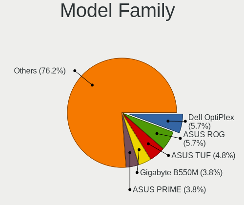
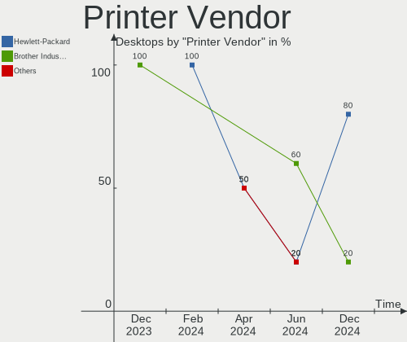

Arch - Hardware Trends (Desktops)
---------------------------------

A project to identify most popular hardware characteristics and track their change
over time based on data collected by Linux users at https://Linux-Hardware.org.

Anyone can contribute to this report by the [hw-probe](https://github.com/linuxhw/hw-probe) tool:

    sudo -E hw-probe -all -upload

This report is for one last month. Overall report since the beginning of time: [TestDays](https://github.com/linuxhw/TestDays)

Period: Jan, 2024.

Contents
--------

* [ System ](#system)
  - [ OS                       ](#os)
  - [ OS Family                ](#os-family)
  - [ Kernel                   ](#kernel)
  - [ Kernel Family            ](#kernel-family)
  - [ Kernel Major Ver.        ](#kernel-major-ver)
  - [ Arch                     ](#arch)
  - [ DE                       ](#de)
  - [ Display Server           ](#display-server)
  - [ Display Manager          ](#display-manager)
  - [ OS Lang                  ](#os-lang)
  - [ Boot Mode                ](#boot-mode)
  - [ Filesystem               ](#filesystem)
  - [ Part. scheme             ](#part-scheme)
  - [ Dual Boot with Linux/BSD ](#dual-boot-with-linuxbsd)
  - [ Dual Boot (Win)          ](#dual-boot-win)

* [ Board ](#board)
  - [ Vendor                   ](#vendor)
  - [ Model                    ](#model)
  - [ Model Family             ](#model-family)
  - [ MFG Year                 ](#mfg-year)
  - [ Form Factor              ](#form-factor)
  - [ Secure Boot              ](#secure-boot)
  - [ Coreboot                 ](#coreboot)
  - [ RAM Size                 ](#ram-size)
  - [ RAM Used                 ](#ram-used)
  - [ Total Drives             ](#total-drives)
  - [ Has CD-ROM               ](#has-cd-rom)
  - [ Has Ethernet             ](#has-ethernet)
  - [ Has WiFi                 ](#has-wifi)
  - [ Has Bluetooth            ](#has-bluetooth)

* [ Location ](#location)
  - [ Country                  ](#country)
  - [ City                     ](#city)

* [ Drives ](#drives)
  - [ Drive Vendor             ](#drive-vendor)
  - [ Drive Model              ](#drive-model)
  - [ HDD Vendor               ](#hdd-vendor)
  - [ SSD Vendor               ](#ssd-vendor)
  - [ Drive Kind               ](#drive-kind)
  - [ Drive Connector          ](#drive-connector)
  - [ Drive Size               ](#drive-size)
  - [ Space Total              ](#space-total)
  - [ Space Used               ](#space-used)
  - [ Malfunc. Drives          ](#malfunc-drives)
  - [ Malfunc. Drive Vendor    ](#malfunc-drive-vendor)
  - [ Malfunc. HDD Vendor      ](#malfunc-hdd-vendor)
  - [ Malfunc. Drive Kind      ](#malfunc-drive-kind)
  - [ Failed Drives            ](#failed-drives)
  - [ Failed Drive Vendor      ](#failed-drive-vendor)
  - [ Drive Status             ](#drive-status)

* [ Storage controller ](#storage-controller)
  - [ Storage Vendor           ](#storage-vendor)
  - [ Storage Model            ](#storage-model)
  - [ Storage Kind             ](#storage-kind)

* [ Processor ](#processor)
  - [ CPU Vendor               ](#cpu-vendor)
  - [ CPU Model                ](#cpu-model)
  - [ CPU Model Family         ](#cpu-model-family)
  - [ CPU Cores                ](#cpu-cores)
  - [ CPU Sockets              ](#cpu-sockets)
  - [ CPU Threads              ](#cpu-threads)
  - [ CPU Op-Modes             ](#cpu-op-modes)
  - [ CPU Microcode            ](#cpu-microcode)
  - [ CPU Microarch            ](#cpu-microarch)

* [ Graphics ](#graphics)
  - [ GPU Vendor               ](#gpu-vendor)
  - [ GPU Model                ](#gpu-model)
  - [ GPU Combo                ](#gpu-combo)
  - [ GPU Driver               ](#gpu-driver)
  - [ GPU Memory               ](#gpu-memory)

* [ Monitor ](#monitor)
  - [ Monitor Vendor           ](#monitor-vendor)
  - [ Monitor Model            ](#monitor-model)
  - [ Monitor Resolution       ](#monitor-resolution)
  - [ Monitor Diagonal         ](#monitor-diagonal)
  - [ Monitor Width            ](#monitor-width)
  - [ Aspect Ratio             ](#aspect-ratio)
  - [ Monitor Area             ](#monitor-area)
  - [ Pixel Density            ](#pixel-density)
  - [ Multiple Monitors        ](#multiple-monitors)

* [ Network ](#network)
  - [ Net Controller Vendor    ](#net-controller-vendor)
  - [ Net Controller Model     ](#net-controller-model)
  - [ Wireless Vendor          ](#wireless-vendor)
  - [ Wireless Model           ](#wireless-model)
  - [ Ethernet Vendor          ](#ethernet-vendor)
  - [ Ethernet Model           ](#ethernet-model)
  - [ Net Controller Kind      ](#net-controller-kind)
  - [ Used Controller          ](#used-controller)
  - [ NICs                     ](#nics)
  - [ IPv6                     ](#ipv6)

* [ Bluetooth ](#bluetooth)
  - [ Bluetooth Vendor         ](#bluetooth-vendor)
  - [ Bluetooth Model          ](#bluetooth-model)

* [ Sound ](#sound)
  - [ Sound Vendor             ](#sound-vendor)
  - [ Sound Model              ](#sound-model)

* [ Memory ](#memory)
  - [ Memory Vendor            ](#memory-vendor)
  - [ Memory Model             ](#memory-model)
  - [ Memory Kind              ](#memory-kind)
  - [ Memory Form Factor       ](#memory-form-factor)
  - [ Memory Size              ](#memory-size)
  - [ Memory Speed             ](#memory-speed)

* [ Printers & scanners ](#printers--scanners)
  - [ Printer Vendor           ](#printer-vendor)
  - [ Printer Model            ](#printer-model)
  - [ Scanner Vendor           ](#scanner-vendor)
  - [ Scanner Model            ](#scanner-model)

* [ Camera ](#camera)
  - [ Camera Vendor            ](#camera-vendor)
  - [ Camera Model             ](#camera-model)

* [ Security ](#security)
  - [ Fingerprint Vendor       ](#fingerprint-vendor)
  - [ Fingerprint Model        ](#fingerprint-model)
  - [ Chipcard Vendor          ](#chipcard-vendor)
  - [ Chipcard Model           ](#chipcard-model)

* [ Unsupported ](#unsupported)
  - [ Unsupported Devices      ](#unsupported-devices)
  - [ Unsupported Device Types ](#unsupported-device-types)

System
------

OS
--

Installed operating systems

| Name         | Desktops | Percent |
|--------------|----------|---------|
| Arch Rolling | 92       | 100%    |

OS Family
---------

OS without a version

| Name | Desktops | Percent |
|------|----------|---------|
| Arch | 92       | 100%    |

Kernel
------

Version of the Linux kernel

| Version                                | Desktops | Percent |
|----------------------------------------|----------|---------|
| 6.6.10-arch1-1                         | 14       | 15.22%  |
| 6.7.0-arch3-1                          | 11       | 11.96%  |
| 6.6.9-arch1-1                          | 8        | 8.7%    |
| 6.7.1-arch1-1                          | 7        | 7.61%   |
| 6.6.8-arch1-1                          | 7        | 7.61%   |
| 6.6.10-zen1-1-zen                      | 7        | 7.61%   |
| 6.7.2-arch1-1                          | 4        | 4.35%   |
| 6.7.0-zen3-1-zen                       | 4        | 4.35%   |
| 6.6.8-zen1-1-zen                       | 3        | 3.26%   |
| 6.7.1-zen1-1-zen                       | 2        | 2.17%   |
| 6.7.0-zen3-1.1-zen                     | 2        | 2.17%   |
| 6.6.7-arch1-1                          | 2        | 2.17%   |
| 6.6.12-1-lts                           | 2        | 2.17%   |
| 6.7.2-x64v3-xanmod1                    | 1        | 1.09%   |
| 6.7.0-3-cachyos                        | 1        | 1.09%   |
| 6.7.0-273-tkg-eevdf-llvm               | 1        | 1.09%   |
| 6.6.9-zen1-1-zen                       | 1        | 1.09%   |
| 6.6.9-arch1-1-drm-amd-issue-2991-patch | 1        | 1.09%   |
| 6.6.9-1-cachyos-bore                   | 1        | 1.09%   |
| 6.6.8-zen1                             | 1        | 1.09%   |
| 6.6.8-273-tkg-eevdf                    | 1        | 1.09%   |
| 6.6.7-arch1-1.1                        | 1        | 1.09%   |
| 6.6.6-1-cachyos                        | 1        | 1.09%   |
| 6.6.14-1-lts                           | 1        | 1.09%   |
| 6.6.13-1-lts                           | 1        | 1.09%   |
| 6.6.11-lqx1-1-lqx                      | 1        | 1.09%   |
| 6.6.11-1-lts                           | 1        | 1.09%   |
| 6.6.10-arch1-1.1                       | 1        | 1.09%   |
| 6.6.1-arch1-1                          | 1        | 1.09%   |
| 6.1.71-1-lts                           | 1        | 1.09%   |
| 6.1.69-1-lts                           | 1        | 1.09%   |
| 5.18.12-arch1-1                        | 1        | 1.09%   |

Kernel Family
-------------

Linux kernel without a distro release

| Version | Desktops | Percent |
|---------|----------|---------|
| 6.6.10  | 22       | 23.91%  |
| 6.7.0   | 19       | 20.65%  |
| 6.6.8   | 12       | 13.04%  |
| 6.6.9   | 11       | 11.96%  |
| 6.7.1   | 9        | 9.78%   |
| 6.7.2   | 5        | 5.43%   |
| 6.6.7   | 3        | 3.26%   |
| 6.6.12  | 2        | 2.17%   |
| 6.6.11  | 2        | 2.17%   |
| 6.6.6   | 1        | 1.09%   |
| 6.6.14  | 1        | 1.09%   |
| 6.6.13  | 1        | 1.09%   |
| 6.6.1   | 1        | 1.09%   |
| 6.1.71  | 1        | 1.09%   |
| 6.1.69  | 1        | 1.09%   |
| 5.18.12 | 1        | 1.09%   |

Kernel Major Ver.
-----------------

Linux kernel major version

| Version | Desktops | Percent |
|---------|----------|---------|
| 6.6     | 56       | 60.87%  |
| 6.7     | 33       | 35.87%  |
| 6.1     | 2        | 2.17%   |
| 5.18    | 1        | 1.09%   |

Arch
----

OS architecture (x86_64, i586, etc.)

| Name   | Desktops | Percent |
|--------|----------|---------|
| x86_64 | 92       | 100%    |

DE
--

Desktop Environment

| Name       | Desktops | Percent |
|------------|----------|---------|
| KDE5       | 49       | 53.26%  |
| GNOME      | 14       | 15.22%  |
| XFCE       | 7        | 7.61%   |
| Hyprland   | 5        | 5.43%   |
| Unknown    | 4        | 4.35%   |
| X-Cinnamon | 3        | 3.26%   |
| i3         | 3        | 3.26%   |
| awesome    | 2        | 2.17%   |
| sway       | 1        | 1.09%   |
| LXQt       | 1        | 1.09%   |
| KDE6       | 1        | 1.09%   |
| ICEWM      | 1        | 1.09%   |
| dwm        | 1        | 1.09%   |

Display Server
--------------

X11 or Wayland

| Name    | Desktops | Percent |
|---------|----------|---------|
| X11     | 47       | 51.09%  |
| Wayland | 34       | 36.96%  |
| Unknown | 6        | 6.52%   |
| Tty     | 5        | 5.43%   |

Display Manager
---------------

SDDM, LightDM, etc.

| Name    | Desktops | Percent |
|---------|----------|---------|
| SDDM    | 37       | 40.22%  |
| Unknown | 34       | 36.96%  |
| LightDM | 14       | 15.22%  |
| GDM     | 4        | 4.35%   |
| XDM     | 1        | 1.09%   |
| LY-DM   | 1        | 1.09%   |
| GREETD  | 1        | 1.09%   |

OS Lang
-------

Language

| Lang    | Desktops | Percent |
|---------|----------|---------|
| en_US   | 54       | 58.7%   |
| C       | 5        | 5.43%   |
| Unknown | 4        | 4.35%   |
| zh_CN   | 3        | 3.26%   |
| ru_RU   | 3        | 3.26%   |
| pt_BR   | 3        | 3.26%   |
| de_DE   | 3        | 3.26%   |
| pl_PL   | 2        | 2.17%   |
| it_IT   | 2        | 2.17%   |
| es_ES   | 2        | 2.17%   |
| en_IE   | 2        | 2.17%   |
| en_AU   | 2        | 2.17%   |
| tr_TR   | 1        | 1.09%   |
| ru      | 1        | 1.09%   |
| es_UY   | 1        | 1.09%   |
| es_AR   | 1        | 1.09%   |
| es      | 1        | 1.09%   |
| en_IN   | 1        | 1.09%   |
| en_CA   | 1        | 1.09%   |

Boot Mode
---------

EFI or BIOS

| Mode | Desktops | Percent |
|------|----------|---------|
| EFI  | 55       | 59.78%  |
| BIOS | 37       | 40.22%  |

Filesystem
----------

Type of filesystem

| Type    | Desktops | Percent |
|---------|----------|---------|
| Ext4    | 61       | 66.3%   |
| Btrfs   | 24       | 26.09%  |
| Xfs     | 4        | 4.35%   |
| Overlay | 2        | 2.17%   |
| Zfs     | 1        | 1.09%   |

Part. scheme
------------

Scheme of partitioning

| Type    | Desktops | Percent |
|---------|----------|---------|
| GPT     | 61       | 66.3%   |
| Unknown | 28       | 30.43%  |
| MBR     | 3        | 3.26%   |

Dual Boot with Linux/BSD
------------------------

Hosting more than one Linux/BSD

| Dual boot | Desktops | Percent |
|-----------|----------|---------|
| No        | 73       | 79.35%  |
| Yes       | 19       | 20.65%  |

Dual Boot (Win)
---------------

Hosting Linux and Windows

| Dual boot | Desktops | Percent |
|-----------|----------|---------|
| No        | 65       | 70.65%  |
| Yes       | 27       | 29.35%  |

Board
-----

Vendor
------

Motherboard manufacturer

| Name                                 | Desktops | Percent |
|--------------------------------------|----------|---------|
| ASUSTek Computer                     | 31       | 33.7%   |
| MSI                                  | 16       | 17.39%  |
| Gigabyte Technology                  | 15       | 16.3%   |
| ASRock                               | 9        | 9.78%   |
| Dell                                 | 6        | 6.52%   |
| Hewlett-Packard                      | 5        | 5.43%   |
| Intel                                | 2        | 2.17%   |
| Shenzhen Meigao Electronic Equipment | 1        | 1.09%   |
| NZXT                                 | 1        | 1.09%   |
| Medion                               | 1        | 1.09%   |
| Lenovo                               | 1        | 1.09%   |
| AZW                                  | 1        | 1.09%   |
| AMI                                  | 1        | 1.09%   |
| Acer                                 | 1        | 1.09%   |
| Unknown                              | 1        | 1.09%   |

Model
-----

Motherboard model

| Name                                       | Desktops | Percent |
|--------------------------------------------|----------|---------|
| MSI MS-7E26                                | 2        | 2.17%   |
| MSI MS-7B86                                | 2        | 2.17%   |
| Gigabyte B550M DS3H                        | 2        | 2.17%   |
| Gigabyte B550 AORUS ELITE V2               | 2        | 2.17%   |
| ASUS TUF Gaming X570-PLUS                  | 2        | 2.17%   |
| ASUS ROG STRIX X670E-F GAMING WIFI         | 2        | 2.17%   |
| ASUS PRIME X470-PRO                        | 2        | 2.17%   |
| ASUS Maximus VIII HERO                     | 2        | 2.17%   |
| Shenzhen Meigao Electronic Equipment HX99G | 1        | 1.09%   |
| NZXT N7 B650E                              | 1        | 1.09%   |
| MSI MS-7E25                                | 1        | 1.09%   |
| MSI MS-7E12                                | 1        | 1.09%   |
| MSI MS-7D52                                | 1        | 1.09%   |
| MSI MS-7C95                                | 1        | 1.09%   |
| MSI MS-7C91                                | 1        | 1.09%   |
| MSI MS-7C56                                | 1        | 1.09%   |
| MSI MS-7B98                                | 1        | 1.09%   |
| MSI MS-7B89                                | 1        | 1.09%   |
| MSI MS-7B79                                | 1        | 1.09%   |
| MSI MS-7A70                                | 1        | 1.09%   |
| MSI MS-7A32                                | 1        | 1.09%   |
| MSI MS-7592                                | 1        | 1.09%   |
| Medion MD34898                             | 1        | 1.09%   |
| Lenovo ThinkStation E31 2552CP2            | 1        | 1.09%   |
| Intel Jasper Lake Client Platform          | 1        | 1.09%   |
| Intel AIder Lake PCH B660 M-ATX G660       | 1        | 1.09%   |
| HP Victus by 15L Gaming Desktop TG02-0xxx  | 1        | 1.09%   |
| HP Pavilion Gaming Desktop TG01-0xxx       | 1        | 1.09%   |
| HP OMEN 25L Desktop GT12-1xxx              | 1        | 1.09%   |
| HP EliteDesk 800 G3 SFF                    | 1        | 1.09%   |
| HP Compaq Pro 6300 MT                      | 1        | 1.09%   |
| Gigabyte Z87X-UD5H                         | 1        | 1.09%   |
| Gigabyte Z790 UD AX                        | 1        | 1.09%   |
| Gigabyte Z390 AORUS PRO WIFI               | 1        | 1.09%   |
| Gigabyte H61M-S2P                          | 1        | 1.09%   |
| Gigabyte B85M-DS3H-A                       | 1        | 1.09%   |
| Gigabyte B550M K                           | 1        | 1.09%   |
| Gigabyte B550M AORUS PRO-P                 | 1        | 1.09%   |
| Gigabyte B450M DS3H V2                     | 1        | 1.09%   |
| Gigabyte B450M DS3H                        | 1        | 1.09%   |

Model Family
------------

Motherboard model prefix

| Name                                       | Desktops | Percent |
|--------------------------------------------|----------|---------|
| ASUS ROG                                   | 9        | 9.78%   |
| ASUS TUF                                   | 8        | 8.7%    |
| ASUS PRIME                                 | 8        | 8.7%    |
| Gigabyte B550M                             | 4        | 4.35%   |
| MSI MS-7E26                                | 2        | 2.17%   |
| MSI MS-7B86                                | 2        | 2.17%   |
| Gigabyte B550                              | 2        | 2.17%   |
| Gigabyte B450M                             | 2        | 2.17%   |
| Dell Precision                             | 2        | 2.17%   |
| Dell Inspiron                              | 2        | 2.17%   |
| ASUS Maximus                               | 2        | 2.17%   |
| Shenzhen Meigao Electronic Equipment HX99G | 1        | 1.09%   |
| NZXT N7                                    | 1        | 1.09%   |
| MSI MS-7E25                                | 1        | 1.09%   |
| MSI MS-7E12                                | 1        | 1.09%   |
| MSI MS-7D52                                | 1        | 1.09%   |
| MSI MS-7C95                                | 1        | 1.09%   |
| MSI MS-7C91                                | 1        | 1.09%   |
| MSI MS-7C56                                | 1        | 1.09%   |
| MSI MS-7B98                                | 1        | 1.09%   |
| MSI MS-7B89                                | 1        | 1.09%   |
| MSI MS-7B79                                | 1        | 1.09%   |
| MSI MS-7A70                                | 1        | 1.09%   |
| MSI MS-7A32                                | 1        | 1.09%   |
| MSI MS-7592                                | 1        | 1.09%   |
| Medion MD34898                             | 1        | 1.09%   |
| Lenovo ThinkStation                        | 1        | 1.09%   |
| Intel Jasper                               | 1        | 1.09%   |
| Intel AIder                                | 1        | 1.09%   |
| HP Victus                                  | 1        | 1.09%   |
| HP Pavilion                                | 1        | 1.09%   |
| HP OMEN                                    | 1        | 1.09%   |
| HP EliteDesk                               | 1        | 1.09%   |
| HP Compaq                                  | 1        | 1.09%   |
| Gigabyte Z87X-UD5H                         | 1        | 1.09%   |
| Gigabyte Z790                              | 1        | 1.09%   |
| Gigabyte Z390                              | 1        | 1.09%   |
| Gigabyte H61M-S2P                          | 1        | 1.09%   |
| Gigabyte B85M-DS3H-A                       | 1        | 1.09%   |
| Gigabyte B450                              | 1        | 1.09%   |

MFG Year
--------

Motherboard manufacture year

| Year | Desktops | Percent |
|------|----------|---------|
| 2020 | 18       | 19.57%  |
| 2022 | 15       | 16.3%   |
| 2023 | 13       | 14.13%  |
| 2018 | 13       | 14.13%  |
| 2019 | 7        | 7.61%   |
| 2021 | 6        | 6.52%   |
| 2017 | 5        | 5.43%   |
| 2013 | 4        | 4.35%   |
| 2016 | 3        | 3.26%   |
| 2014 | 2        | 2.17%   |
| 2012 | 2        | 2.17%   |
| 2015 | 1        | 1.09%   |
| 2011 | 1        | 1.09%   |
| 2010 | 1        | 1.09%   |
| 2007 | 1        | 1.09%   |

Form Factor
-----------

Physical design of the computer

| Name    | Desktops | Percent |
|---------|----------|---------|
| Desktop | 92       | 100%    |

Secure Boot
-----------

Enabled or disabled

| State    | Desktops | Percent |
|----------|----------|---------|
| Disabled | 88       | 95.65%  |
| Enabled  | 4        | 4.35%   |

Coreboot
--------

Have coreboot on board

| Used | Desktops | Percent |
|------|----------|---------|
| No   | 92       | 100%    |

RAM Size
--------

Total RAM memory

| Size in GB  | Desktops | Percent |
|-------------|----------|---------|
| 32.01-64.0  | 30       | 32.61%  |
| 16.01-24.0  | 21       | 22.83%  |
| 64.01-256.0 | 19       | 20.65%  |
| 4.01-8.0    | 10       | 10.87%  |
| 8.01-16.0   | 6        | 6.52%   |
| 24.01-32.0  | 5        | 5.43%   |
| 1.01-2.0    | 1        | 1.09%   |

RAM Used
--------

Used RAM memory

| Used GB    | Desktops | Percent |
|------------|----------|---------|
| 4.01-8.0   | 26       | 28.26%  |
| 2.01-3.0   | 20       | 21.74%  |
| 8.01-16.0  | 19       | 20.65%  |
| 3.01-4.0   | 13       | 14.13%  |
| 1.01-2.0   | 9        | 9.78%   |
| 24.01-32.0 | 2        | 2.17%   |
| 32.01-64.0 | 1        | 1.09%   |
| 16.01-24.0 | 1        | 1.09%   |
| 0.51-1.0   | 1        | 1.09%   |

Total Drives
------------

Number of drives on board

| Drives | Desktops | Percent |
|--------|----------|---------|
| 3      | 25       | 27.17%  |
| 2      | 24       | 26.09%  |
| 1      | 21       | 22.83%  |
| 4      | 14       | 15.22%  |
| 5      | 4        | 4.35%   |
| 6      | 2        | 2.17%   |
| 9      | 1        | 1.09%   |
| 7      | 1        | 1.09%   |

Has CD-ROM
----------

Has CD-ROM on board

| Presented | Desktops | Percent |
|-----------|----------|---------|
| No        | 72       | 78.26%  |
| Yes       | 20       | 21.74%  |

Has Ethernet
------------

Has Ethernet on board

| Presented | Desktops | Percent |
|-----------|----------|---------|
| Yes       | 92       | 100%    |

Has WiFi
--------

Has WiFi module

| Presented | Desktops | Percent |
|-----------|----------|---------|
| Yes       | 62       | 67.39%  |
| No        | 30       | 32.61%  |

Has Bluetooth
-------------

Has Bluetooth module

| Presented | Desktops | Percent |
|-----------|----------|---------|
| Yes       | 53       | 57.61%  |
| No        | 39       | 42.39%  |

Location
--------

Country
-------

Geographic location (country)

| Country     | Desktops | Percent |
|-------------|----------|---------|
| USA         | 26       | 28.26%  |
| Germany     | 10       | 10.87%  |
| Russia      | 4        | 4.35%   |
| Poland      | 3        | 3.26%   |
| Italy       | 3        | 3.26%   |
| Hong Kong   | 3        | 3.26%   |
| France      | 3        | 3.26%   |
| Canada      | 3        | 3.26%   |
| Brazil      | 3        | 3.26%   |
| Spain       | 2        | 2.17%   |
| Netherlands | 2        | 2.17%   |
| Lithuania   | 2        | 2.17%   |
| Czechia     | 2        | 2.17%   |
| Belgium     | 2        | 2.17%   |
| Australia   | 2        | 2.17%   |
| Argentina   | 2        | 2.17%   |
| Vietnam     | 1        | 1.09%   |
| Uruguay     | 1        | 1.09%   |
| UK          | 1        | 1.09%   |
| Türkiye    | 1        | 1.09%   |
| Turkey      | 1        | 1.09%   |
| Switzerland | 1        | 1.09%   |
| Sweden      | 1        | 1.09%   |
| Singapore   | 1        | 1.09%   |
| Romania     | 1        | 1.09%   |
| Portugal    | 1        | 1.09%   |
| New Zealand | 1        | 1.09%   |
| Kenya       | 1        | 1.09%   |
| Japan       | 1        | 1.09%   |
| India       | 1        | 1.09%   |
| Greece      | 1        | 1.09%   |
| Egypt       | 1        | 1.09%   |
| Croatia     | 1        | 1.09%   |
| Brunei      | 1        | 1.09%   |
| Bolivia     | 1        | 1.09%   |
| Austria     | 1        | 1.09%   |

City
----

Geographic location (city)

| City                    | Desktops | Percent |
|-------------------------|----------|---------|
| Santander               | 2        | 2.17%   |
| Prague                  | 2        | 2.17%   |
| Munich                  | 2        | 2.17%   |
| Los Angeles             | 2        | 2.17%   |
| Kharino                 | 2        | 2.17%   |
| Zielonki                | 1        | 1.09%   |
| Yverdon-les-Bains       | 1        | 1.09%   |
| Yekaterinburg           | 1        | 1.09%   |
| Wooster                 | 1        | 1.09%   |
| Wilrijk                 | 1        | 1.09%   |
| Wilhelmshaven           | 1        | 1.09%   |
| West Lebanon            | 1        | 1.09%   |
| Warsaw                  | 1        | 1.09%   |
| Wanchai                 | 1        | 1.09%   |
| Vilnius                 | 1        | 1.09%   |
| Villingen-Schwenningen  | 1        | 1.09%   |
| Villefranche-sur-Saône | 1        | 1.09%   |
| Vienna                  | 1        | 1.09%   |
| Udine                   | 1        | 1.09%   |
| Tupa                    | 1        | 1.09%   |
| Tucson                  | 1        | 1.09%   |
| Tseung Kwan O           | 1        | 1.09%   |
| Tablada                 | 1        | 1.09%   |
| Sydney                  | 1        | 1.09%   |
| South Weymouth          | 1        | 1.09%   |
| Singapore               | 1        | 1.09%   |
| Seattle                 | 1        | 1.09%   |
| Scandolara Ravara       | 1        | 1.09%   |
| San Jose                | 1        | 1.09%   |
| San Dimas               | 1        | 1.09%   |
| Samos                   | 1        | 1.09%   |
| Rome                    | 1        | 1.09%   |
| Płock                  | 1        | 1.09%   |
| Pozuelos                | 1        | 1.09%   |
| Porto                   | 1        | 1.09%   |
| Ploieşti               | 1        | 1.09%   |
| Passo Fundo             | 1        | 1.09%   |
| Osijek                  | 1        | 1.09%   |
| Oldenburg               | 1        | 1.09%   |
| Ocean Springs           | 1        | 1.09%   |

Drives
------

Drive Vendor
------------

Hard drive vendors

| Vendor                       | Desktops | Drives | Percent |
|------------------------------|----------|--------|---------|
| WDC                          | 34       | 48     | 16.43%  |
| Samsung Electronics          | 32       | 40     | 15.46%  |
| Sandisk                      | 25       | 30     | 12.08%  |
| Seagate                      | 24       | 29     | 11.59%  |
| Kingston                     | 11       | 13     | 5.31%   |
| Crucial                      | 8        | 9      | 3.86%   |
| Phison Electronics           | 7        | 7      | 3.38%   |
| Unknown                      | 6        | 7      | 2.9%    |
| Micron Technology            | 5        | 5      | 2.42%   |
| Toshiba                      | 4        | 4      | 1.93%   |
| Shenzhen Longsys Electronics | 4        | 5      | 1.93%   |
| Realtek Semiconductor        | 4        | 4      | 1.93%   |
| Micron/Crucial Technology    | 4        | 4      | 1.93%   |
| MAXIO Technology (Hangzhou)  | 4        | 4      | 1.93%   |
| Phison                       | 3        | 4      | 1.45%   |
| Intel                        | 3        | 3      | 1.45%   |
| Hitachi                      | 3        | 3      | 1.45%   |
| HGST                         | 3        | 3      | 1.45%   |
| SK hynix                     | 2        | 2      | 0.97%   |
| Silicon Motion               | 2        | 2      | 0.97%   |
| PNY                          | 2        | 2      | 0.97%   |
| Kimtigo                      | 2        | 2      | 0.97%   |
| China                        | 2        | 2      | 0.97%   |
| ADATA Technology             | 2        | 2      | 0.97%   |
| Verbatim                     | 1        | 1      | 0.48%   |
| Team                         | 1        | 2      | 0.48%   |
| Plextor                      | 1        | 1      | 0.48%   |
| OCZ                          | 1        | 1      | 0.48%   |
| KIOXIA                       | 1        | 1      | 0.48%   |
| Intenso                      | 1        | 1      | 0.48%   |
| GOODRAM                      | 1        | 1      | 0.48%   |
| Fanxiang                     | 1        | 1      | 0.48%   |
| Cablet                       | 1        | 1      | 0.48%   |
| Biwin Storage Technology     | 1        | 1      | 0.48%   |
| AMD                          | 1        | 1      | 0.48%   |

Drive Model
-----------

Hard drive models

| Model                                                           | Desktops | Percent |
|-----------------------------------------------------------------|----------|---------|
| Samsung NVMe SSD Controller SM981/PM981/PM983 1TB               | 10       | 4.22%   |
| Samsung NVMe SSD Controller PM9A1/PM9A3/980PRO 2TB              | 9        | 3.8%    |
| Sandisk WD Black SN750 / PC SN730 NVMe SSD 512GB                | 6        | 2.53%   |
| Seagate ST2000DM008-2FR102 2TB                                  | 4        | 1.69%   |
| Seagate ST1000DM010-2EP102 1TB                                  | 4        | 1.69%   |
| MAXIO (Hangzhou) NVMe SSD Controller MAP1202 512GB              | 4        | 1.69%   |
| Sandisk WD_BLACK SN850X 2000GB                                  | 3        | 1.27%   |
| Sandisk WD_BLACK SN850X 1000GB                                  | 3        | 1.27%   |
| Sandisk WD Blue SN570 1TB                                       | 3        | 1.27%   |
| Samsung NVMe SSD Controller SM961/PM961/SM963 256GB             | 3        | 1.27%   |
| Phison E12 NVMe Controller 1TB                                  | 3        | 1.27%   |
| Micron/Crucial P2 NVMe PCIe SSD 1TB                             | 3        | 1.27%   |
| Crucial CT480BX500SSD1 480GB                                    | 3        | 1.27%   |
| Crucial CT1000BX500SSD1 1TB                                     | 3        | 1.27%   |
| WDC WD40EZAZ-00SF3B0 4TB                                        | 2        | 0.84%   |
| WDC WD20EZAZ-00GGJB0 2TB                                        | 2        | 0.84%   |
| WDC WD20EARX-00PASB0 2TB                                        | 2        | 0.84%   |
| WDC WD10EZEX-00BN5A0 1TB                                        | 2        | 0.84%   |
| Unknown NVMe SSD Drive 2TB                                      | 2        | 0.84%   |
| Silicon Motion SM2263EN/SM2263XT SSD Controller 128GB           | 2        | 0.84%   |
| Shenzhen Longsys Lexar SSD NM790 4TB                            | 2        | 0.84%   |
| Shenzhen Longsys Lexar SSD NM790 2TB                            | 2        | 0.84%   |
| Seagate ST1000DM003-1CH162 1TB                                  | 2        | 0.84%   |
| SanDisk SSD PLUS 480GB                                          | 2        | 0.84%   |
| Samsung SSD 850 EVO 500GB                                       | 2        | 0.84%   |
| Realtek RTS5763DL NVMe SSD Controller 2TB                       | 2        | 0.84%   |
| Kingston SA400S37240G 240GB SSD                                 | 2        | 0.84%   |
| Crucial CT500MX500SSD1 500GB                                    | 2        | 0.84%   |
| ADATA XPG SX8200 Pro PCIe Gen3x4 M.2 2280 Solid State Drive 2TB | 2        | 0.84%   |
| WDC WUH722020ALE6L4 20TB                                        | 1        | 0.42%   |
| WDC WDS200T2B0A-00SM50 2TB SSD                                  | 1        | 0.42%   |
| WDC WDS120G2G0A-00JH30 120GB SSD                                | 1        | 0.42%   |
| WDC WDBNCE0010PNC 1TB SSD                                       | 1        | 0.42%   |
| WDC WD6400AAKS-65A7B0 640GB                                     | 1        | 0.42%   |
| WDC WD60EDAZ-11U78B0 6TB                                        | 1        | 0.42%   |
| WDC WD6003FZBX-00K5WB0 6TB                                      | 1        | 0.42%   |
| WDC WD5003ABYX-50WERA1 500GB                                    | 1        | 0.42%   |
| WDC WD5000LPVX-28V0TT0 500GB                                    | 1        | 0.42%   |
| WDC WD5000LPVX-22V0TT0 500GB                                    | 1        | 0.42%   |
| WDC WD5000LPLX-08ZNTT0 500GB                                    | 1        | 0.42%   |

HDD Vendor
----------

Hard disk drive vendors

| Vendor              | Desktops | Drives | Percent |
|---------------------|----------|--------|---------|
| WDC                 | 31       | 45     | 45.59%  |
| Seagate             | 24       | 29     | 35.29%  |
| Toshiba             | 4        | 4      | 5.88%   |
| Hitachi             | 3        | 3      | 4.41%   |
| HGST                | 3        | 3      | 4.41%   |
| Samsung Electronics | 2        | 2      | 2.94%   |
| Unknown             | 1        | 1      | 1.47%   |

SSD Vendor
----------

Solid state drive vendors

| Vendor              | Desktops | Drives | Percent |
|---------------------|----------|--------|---------|
| Samsung Electronics | 13       | 13     | 22.81%  |
| SanDisk             | 8        | 9      | 14.04%  |
| Kingston            | 8        | 8      | 14.04%  |
| Crucial             | 8        | 9      | 14.04%  |
| WDC                 | 3        | 3      | 5.26%   |
| PNY                 | 2        | 2      | 3.51%   |
| Kimtigo             | 2        | 2      | 3.51%   |
| Intel               | 2        | 2      | 3.51%   |
| China               | 2        | 2      | 3.51%   |
| Verbatim            | 1        | 1      | 1.75%   |
| Team                | 1        | 2      | 1.75%   |
| SK hynix            | 1        | 1      | 1.75%   |
| Plextor             | 1        | 1      | 1.75%   |
| OCZ                 | 1        | 1      | 1.75%   |
| Micron Technology   | 1        | 1      | 1.75%   |
| Intenso             | 1        | 1      | 1.75%   |
| GOODRAM             | 1        | 1      | 1.75%   |
| Fanxiang            | 1        | 1      | 1.75%   |

Drive Kind
----------

HDD or SSD

| Kind    | Desktops | Drives | Percent |
|---------|----------|--------|---------|
| NVMe    | 74       | 97     | 42.53%  |
| HDD     | 50       | 87     | 28.74%  |
| SSD     | 48       | 60     | 27.59%  |
| MMC     | 1        | 1      | 0.57%   |
| Unknown | 1        | 1      | 0.57%   |

Drive Connector
---------------

SATA, SAS, NVMe, etc.

| Type | Desktops | Drives | Percent |
|------|----------|--------|---------|
| NVMe | 74       | 97     | 51.75%  |
| SATA | 63       | 143    | 44.06%  |
| SAS  | 5        | 5      | 3.5%    |
| MMC  | 1        | 1      | 0.7%    |

Drive Size
----------

Size of hard drive

| Size in TB | Desktops | Drives | Percent |
|------------|----------|--------|---------|
| 0.01-0.5   | 39       | 57     | 34.21%  |
| 0.51-1.0   | 34       | 39     | 29.82%  |
| 1.01-2.0   | 17       | 23     | 14.91%  |
| 3.01-4.0   | 11       | 14     | 9.65%   |
| 4.01-10.0  | 8        | 9      | 7.02%   |
| 2.01-3.0   | 3        | 3      | 2.63%   |
| 10.01-20.0 | 2        | 2      | 1.75%   |

Space Total
-----------

Amount of disk space available on the file system

| Size in GB     | Desktops | Percent |
|----------------|----------|---------|
| More than 3000 | 28       | 30.43%  |
| 501-1000       | 21       | 22.83%  |
| 251-500        | 13       | 14.13%  |
| 1001-2000      | 13       | 14.13%  |
| 101-250        | 9        | 9.78%   |
| 2001-3000      | 3        | 3.26%   |
| Unknown        | 3        | 3.26%   |
| 51-100         | 2        | 2.17%   |

Space Used
----------

Amount of used disk space

| Used GB        | Desktops | Percent |
|----------------|----------|---------|
| 21-50          | 16       | 17.39%  |
| 251-500        | 12       | 13.04%  |
| 1001-2000      | 11       | 11.96%  |
| 501-1000       | 11       | 11.96%  |
| 1-20           | 10       | 10.87%  |
| More than 3000 | 8        | 8.7%    |
| 2001-3000      | 8        | 8.7%    |
| 101-250        | 7        | 7.61%   |
| 51-100         | 6        | 6.52%   |
| Unknown        | 3        | 3.26%   |

Malfunc. Drives
---------------

Drive models with a malfunction

| Model                               | Desktops | Drives | Percent |
|-------------------------------------|----------|--------|---------|
| Seagate ST2000DM008-2FR102 2TB      | 2        | 2      | 11.11%  |
| SanDisk SSD PLUS 480GB              | 2        | 2      | 11.11%  |
| WDC WD60EDAZ-11U78B0 6TB            | 1        | 1      | 5.56%   |
| WDC WD5003ABYX-50WERA1 500GB        | 1        | 1      | 5.56%   |
| WDC WD5000LPLX-08ZNTT0 500GB        | 1        | 1      | 5.56%   |
| WDC WD3200AAJS-56M0A0 320GB         | 1        | 1      | 5.56%   |
| WDC WD2500AAKX-75U6AA0 250GB        | 1        | 1      | 5.56%   |
| WDC WD20EFRX-68EUZN0 2TB            | 1        | 2      | 5.56%   |
| WDC WD2002FAEX-007BA0 2TB           | 1        | 1      | 5.56%   |
| Toshiba HDWE150 5TB                 | 1        | 1      | 5.56%   |
| Seagate ST500LT012-9WS142 500GB     | 1        | 1      | 5.56%   |
| Seagate ST2000LM003 HN-M201RAD 2TB  | 1        | 1      | 5.56%   |
| Seagate ST1000DM010-2EP102 1TB      | 1        | 1      | 5.56%   |
| Seagate ST1000DM003-9YN162 1TB      | 1        | 1      | 5.56%   |
| Seagate ST1000DM003-1SB102 1TB      | 1        | 1      | 5.56%   |
| Samsung Electronics SSD 850 EVO 1TB | 1        | 1      | 5.56%   |

Malfunc. Drive Vendor
---------------------

Vendors of faulty drives

| Vendor              | Desktops | Drives | Percent |
|---------------------|----------|--------|---------|
| WDC                 | 7        | 8      | 38.89%  |
| Seagate             | 7        | 7      | 38.89%  |
| SanDisk             | 2        | 2      | 11.11%  |
| Toshiba             | 1        | 1      | 5.56%   |
| Samsung Electronics | 1        | 1      | 5.56%   |

Malfunc. HDD Vendor
-------------------

Vendors of faulty HDD drives

| Vendor  | Desktops | Drives | Percent |
|---------|----------|--------|---------|
| WDC     | 7        | 8      | 46.67%  |
| Seagate | 7        | 7      | 46.67%  |
| Toshiba | 1        | 1      | 6.67%   |

Malfunc. Drive Kind
-------------------

Kinds of faulty drives

| Kind | Desktops | Drives | Percent |
|------|----------|--------|---------|
| HDD  | 13       | 16     | 81.25%  |
| SSD  | 3        | 3      | 18.75%  |

Failed Drives
-------------

Failed drive models

Zero info for selected period =(

Failed Drive Vendor
-------------------

Failed drive vendors

Zero info for selected period =(

Drive Status
------------

Number of failed and malfunc. drives

| Status   | Desktops | Drives | Percent |
|----------|----------|--------|---------|
| Works    | 52       | 114    | 46.02%  |
| Detected | 45       | 113    | 39.82%  |
| Malfunc  | 16       | 19     | 14.16%  |

Storage controller
------------------

Storage Vendor
--------------

Storage controller vendors

| Vendor                                  | Desktops | Percent |
|-----------------------------------------|----------|---------|
| AMD                                     | 59       | 31.72%  |
| Intel                                   | 31       | 16.67%  |
| Samsung Electronics                     | 24       | 12.9%   |
| SanDisk                                 | 19       | 10.22%  |
| Phison Electronics                      | 10       | 5.38%   |
| ASMedia Technology                      | 5        | 2.69%   |
| Shenzhen Longsys Electronics            | 4        | 2.15%   |
| Realtek Semiconductor                   | 4        | 2.15%   |
| Micron/Crucial Technology               | 4        | 2.15%   |
| Micron Technology                       | 4        | 2.15%   |
| MAXIO Technology (Hangzhou)             | 4        | 2.15%   |
| Kingston Technology Company             | 4        | 2.15%   |
| Solidigm                                | 3        | 1.61%   |
| Silicon Motion                          | 2        | 1.08%   |
| ADATA Technology                        | 2        | 1.08%   |
| SK hynix                                | 1        | 0.54%   |
| Marvell Technology Group                | 1        | 0.54%   |
| KIOXIA                                  | 1        | 0.54%   |
| JMicron Technology                      | 1        | 0.54%   |
| Jiangsu Xinsheng Intelligent Technology | 1        | 0.54%   |
| Broadcom / LSI                          | 1        | 0.54%   |
| Biwin Storage Technology                | 1        | 0.54%   |

Storage Model
-------------

Storage controller models

| Model                                                                          | Desktops | Percent |
|--------------------------------------------------------------------------------|----------|---------|
| AMD FCH SATA Controller [AHCI mode]                                            | 20       | 9.52%   |
| AMD 500 Series Chipset SATA Controller                                         | 17       | 8.1%    |
| AMD 400 Series Chipset SATA Controller                                         | 16       | 7.62%   |
| AMD 600 Series Chipset SATA Controller                                         | 15       | 7.14%   |
| Samsung NVMe SSD Controller SM981/PM981/PM983                                  | 10       | 4.76%   |
| Samsung NVMe SSD Controller PM9A1/PM9A3/980PRO                                 | 9        | 4.29%   |
| Sandisk WD Black SN850X NVMe SSD                                               | 7        | 3.33%   |
| SanDisk Extreme Pro / WD Black SN750 / PC SN730 / Red SN700 NVMe SSD           | 6        | 2.86%   |
| Intel Raptor Lake SATA AHCI Controller                                         | 5        | 2.38%   |
| ASMedia ASM1061/ASM1062 Serial ATA Controller                                  | 5        | 2.38%   |
| Shenzhen Longsys Lexar NM790 NVME SSD (DRAM-less)                              | 4        | 1.9%    |
| Phison E12 NVMe Controller                                                     | 4        | 1.9%    |
| MAXIO (Hangzhou) NVMe SSD Controller MAP1202 (DRAM-less)                       | 4        | 1.9%    |
| Solidigm P44 Pro NVMe SSD [Hollywood Beach]                                    | 3        | 1.43%   |
| SanDisk Ultra 3D / WD Blue SN570 NVMe SSD (DRAM-less)                          | 3        | 1.43%   |
| Samsung NVMe SSD Controller SM961/PM961/SM963                                  | 3        | 1.43%   |
| Micron/Crucial P2 [Nick P2] / P3 / P3 Plus NVMe PCIe SSD (DRAM-less)           | 3        | 1.43%   |
| Intel Q170/Q150/B150/H170/H110/Z170/CM236 Chipset SATA Controller [AHCI Mode]  | 3        | 1.43%   |
| Intel 8 Series/C220 Series Chipset Family 6-port SATA Controller 1 [AHCI mode] | 3        | 1.43%   |
| Intel 200 Series PCH SATA controller [AHCI mode]                               | 3        | 1.43%   |
| Silicon Motion SM2263EN/SM2263XT (DRAM-less) NVMe SSD Controllers              | 2        | 0.95%   |
| Samsung NVMe SSD Controller 980 (DRAM-less)                                    | 2        | 0.95%   |
| Realtek RTS5765DL NVMe SSD Controller (DRAM-less)                              | 2        | 0.95%   |
| Realtek RTS5762 NVMe SSD Controller                                            | 2        | 0.95%   |
| Phison E18 PCIe4 NVMe Controller                                               | 2        | 0.95%   |
| Phison E16 PCIe4 NVMe Controller                                               | 2        | 0.95%   |
| Micron 2550 NVMe SSD (DRAM-less)                                               | 2        | 0.95%   |
| Kingston Company KC3000/FURY Renegade NVMe SSD E18                             | 2        | 0.95%   |
| Intel Volume Management Device NVMe RAID Controller Intel Corporation          | 2        | 0.95%   |
| Intel Cannon Lake PCH SATA AHCI Controller                                     | 2        | 0.95%   |
| Intel 7 Series/C210 Series Chipset Family 6-port SATA Controller [AHCI mode]   | 2        | 0.95%   |
| Intel 500 Series Chipset Family SATA AHCI Controller                           | 2        | 0.95%   |
| AMD 300 Series Chipset SATA Controller                                         | 2        | 0.95%   |
| ADATA XPG SX8200 Pro PCIe Gen3x4 M.2 2280 Solid State Drive                    | 2        | 0.95%   |
| SK hynix Gold P31/BC711/PC711 NVMe Solid State Drive                           | 1        | 0.48%   |
| SanDisk WD Green SN350 240GB (DRAM-less) / SN560E NVMe SSD                     | 1        | 0.48%   |
| SanDisk WD Blue SN570 NVMe SSD 2TB                                             | 1        | 0.48%   |
| SanDisk WD Black SN770 / PC SN740 256GB / PC SN560 (DRAM-less) NVMe SSD        | 1        | 0.48%   |
| SanDisk PC SN735 NVMe SSD (DRAM-less)                                          | 1        | 0.48%   |
| Samsung NVMe SSD Controller S4LV008[Pascal]                                    | 1        | 0.48%   |

Storage Kind
------------

Kind of storage controller (IDE, SATA, NVMe, SAS, ...)

| Kind | Desktops | Percent |
|------|----------|---------|
| SATA | 85       | 50.6%   |
| NVMe | 74       | 44.05%  |
| IDE  | 5        | 2.98%   |
| RAID | 3        | 1.79%   |
| SAS  | 1        | 0.6%    |

Processor
---------

CPU Vendor
----------

Processor vendors

| Vendor | Desktops | Percent |
|--------|----------|---------|
| AMD    | 61       | 66.3%   |
| Intel  | 31       | 33.7%   |

CPU Model
---------

Processor models

| Model                                  | Desktops | Percent |
|----------------------------------------|----------|---------|
| AMD Ryzen 9 7950X3D 16-Core Processor  | 4        | 4.35%   |
| AMD Ryzen 7 5800X 8-Core Processor     | 4        | 4.35%   |
| Intel Core i5-10400 CPU @ 2.90GHz      | 3        | 3.26%   |
| AMD Ryzen 9 7900X 12-Core Processor    | 3        | 3.26%   |
| AMD Ryzen 9 5900X 12-Core Processor    | 3        | 3.26%   |
| AMD Ryzen 7 7800X3D 8-Core Processor   | 3        | 3.26%   |
| AMD Ryzen 7 7700X 8-Core Processor     | 3        | 3.26%   |
| AMD Ryzen 7 5700G with Radeon Graphics | 3        | 3.26%   |
| AMD Ryzen 5 5600X 6-Core Processor     | 3        | 3.26%   |
| AMD Ryzen 5 5600G with Radeon Graphics | 3        | 3.26%   |
| AMD Ryzen 5 3600 6-Core Processor      | 3        | 3.26%   |
| Intel Core i7-6700K CPU @ 4.00GHz      | 2        | 2.17%   |
| Intel Core i7-4770 CPU @ 3.40GHz       | 2        | 2.17%   |
| Intel 13th Gen Core i9-13900KF         | 2        | 2.17%   |
| AMD Ryzen 7 5800X3D 8-Core Processor   | 2        | 2.17%   |
| AMD Ryzen 7 3800X 8-Core Processor     | 2        | 2.17%   |
| AMD Ryzen 7 1800X Eight-Core Processor | 2        | 2.17%   |
| AMD Ryzen 7 1700 Eight-Core Processor  | 2        | 2.17%   |
| AMD Ryzen 5 5600 6-Core Processor      | 2        | 2.17%   |
| AMD Ryzen 5 2600 Six-Core Processor    | 2        | 2.17%   |
| Intel Xeon CPU E5440 @ 2.83GHz         | 1        | 1.09%   |
| Intel Xeon CPU E5-2695 v2 @ 2.40GHz    | 1        | 1.09%   |
| Intel Xeon CPU E3-1245 v5 @ 3.50GHz    | 1        | 1.09%   |
| Intel Pentium CPU G4560 @ 3.50GHz      | 1        | 1.09%   |
| Intel Pentium CPU G3258 @ 3.20GHz      | 1        | 1.09%   |
| Intel Core i9-9900K CPU @ 3.60GHz      | 1        | 1.09%   |
| Intel Core i9-14900K                   | 1        | 1.09%   |
| Intel Core i7-9700K CPU @ 3.60GHz      | 1        | 1.09%   |
| Intel Core i7-7700K CPU @ 4.20GHz      | 1        | 1.09%   |
| Intel Core i7-3770 CPU @ 3.40GHz       | 1        | 1.09%   |
| Intel Core i5-6400 CPU @ 2.70GHz       | 1        | 1.09%   |
| Intel Core i5-4670K CPU @ 3.40GHz      | 1        | 1.09%   |
| Intel Core i5-3470 CPU @ 3.20GHz       | 1        | 1.09%   |
| Intel Core i5-3340 CPU @ 3.10GHz       | 1        | 1.09%   |
| Intel Core i5-10400F CPU @ 2.90GHz     | 1        | 1.09%   |
| Intel Core 2 Quad CPU Q8400 @ 2.66GHz  | 1        | 1.09%   |
| Intel Celeron N5105 @ 2.00GHz          | 1        | 1.09%   |
| Intel Celeron CPU N3350 @ 1.10GHz      | 1        | 1.09%   |
| Intel Celeron CPU G550 @ 2.60GHz       | 1        | 1.09%   |
| Intel 13th Gen Core i5-13600KF         | 1        | 1.09%   |

CPU Model Family
----------------

Processor model prefix

| Model             | Desktops | Percent |
|-------------------|----------|---------|
| AMD Ryzen 7       | 25       | 27.17%  |
| AMD Ryzen 5       | 19       | 20.65%  |
| AMD Ryzen 9       | 14       | 15.22%  |
| Intel Core i5     | 8        | 8.7%    |
| Intel Core i7     | 7        | 7.61%   |
| Other             | 5        | 5.43%   |
| Intel Xeon        | 3        | 3.26%   |
| Intel Celeron     | 3        | 3.26%   |
| Intel Pentium     | 2        | 2.17%   |
| Intel Core i9     | 2        | 2.17%   |
| Intel Core 2 Quad | 1        | 1.09%   |
| AMD Ryzen 7 PRO   | 1        | 1.09%   |
| AMD FX            | 1        | 1.09%   |
| AMD A6            | 1        | 1.09%   |

CPU Cores
---------

Number of processor cores

| Number | Desktops | Percent |
|--------|----------|---------|
| 8      | 29       | 31.52%  |
| 6      | 20       | 21.74%  |
| 4      | 18       | 19.57%  |
| 12     | 7        | 7.61%   |
| 16     | 6        | 6.52%   |
| 24     | 4        | 4.35%   |
| 2      | 4        | 4.35%   |
| 10     | 2        | 2.17%   |
| 14     | 1        | 1.09%   |
| 1      | 1        | 1.09%   |

CPU Sockets
-----------

Number of sockets

| Number | Desktops | Percent |
|--------|----------|---------|
| 1      | 91       | 98.91%  |
| 2      | 1        | 1.09%   |

CPU Threads
-----------

Threads per core (Hyper-Threading)

| Number | Desktops | Percent |
|--------|----------|---------|
| 2      | 80       | 86.96%  |
| 1      | 12       | 13.04%  |

CPU Op-Modes
------------

CPU Operation Modes (32-bit, 64-bit)

| Op mode        | Desktops | Percent |
|----------------|----------|---------|
| 32-bit, 64-bit | 92       | 100%    |

CPU Microcode
-------------

Microcode number

| Number     | Desktops | Percent |
|------------|----------|---------|
| Unknown    | 69       | 75%     |
| 0x0a601206 | 3        | 3.26%   |
| 0x08701021 | 3        | 3.26%   |
| 0x0a601203 | 2        | 2.17%   |
| 0x0a50000d | 2        | 2.17%   |
| 0x0a20120a | 2        | 2.17%   |
| 0x08701030 | 2        | 2.17%   |
| 0x0a704103 | 1        | 1.09%   |
| 0x0a50000f | 1        | 1.09%   |
| 0x0a20120e | 1        | 1.09%   |
| 0x08701013 | 1        | 1.09%   |
| 0x08108109 | 1        | 1.09%   |
| 0x0800820d | 1        | 1.09%   |
| 0x08001138 | 1        | 1.09%   |
| 0x08001137 | 1        | 1.09%   |
| 0x06000852 | 1        | 1.09%   |

CPU Microarch
-------------

Microarchitecture

| Name             | Desktops | Percent |
|------------------|----------|---------|
| Zen 3            | 21       | 22.83%  |
| Unknown          | 19       | 20.65%  |
| Zen 2            | 10       | 10.87%  |
| Zen+             | 6        | 6.52%   |
| Zen              | 5        | 5.43%   |
| Skylake          | 4        | 4.35%   |
| KabyLake         | 4        | 4.35%   |
| IvyBridge        | 4        | 4.35%   |
| Haswell          | 4        | 4.35%   |
| CometLake        | 4        | 4.35%   |
| Alderlake Hybrid | 4        | 4.35%   |
| Penryn           | 2        | 2.17%   |
| Tremont          | 1        | 1.09%   |
| SandyBridge      | 1        | 1.09%   |
| Piledriver       | 1        | 1.09%   |
| Goldmont         | 1        | 1.09%   |
| Excavator        | 1        | 1.09%   |

Graphics
--------

GPU Vendor
----------

Vendors of graphics cards

| Vendor | Desktops | Percent |
|--------|----------|---------|
| AMD    | 48       | 48%     |
| Nvidia | 40       | 40%     |
| Intel  | 12       | 12%     |

GPU Model
---------

Graphics card models

| Model                                                                       | Desktops | Percent |
|-----------------------------------------------------------------------------|----------|---------|
| AMD Raphael                                                                 | 13       | 12.15%  |
| AMD Navi 31 [Radeon RX 7900 XT/7900 XTX/7900M]                              | 7        | 6.54%   |
| AMD Navi 23 [Radeon RX 6600/6600 XT/6600M]                                  | 5        | 4.67%   |
| AMD Navi 21 [Radeon RX 6800/6800 XT / 6900 XT]                              | 4        | 3.74%   |
| AMD Ellesmere [Radeon RX 470/480/570/570X/580/580X/590]                     | 4        | 3.74%   |
| Nvidia GP106 [GeForce GTX 1060 6GB]                                         | 3        | 2.8%    |
| Nvidia GP104 [GeForce GTX 1080]                                             | 3        | 2.8%    |
| Nvidia AD102 [GeForce RTX 4090]                                             | 3        | 2.8%    |
| AMD Cezanne [Radeon Vega Series / Radeon Vega Mobile Series]                | 3        | 2.8%    |
| Nvidia TU117 [GeForce GTX 1650]                                             | 2        | 1.87%   |
| Nvidia TU106 [GeForce RTX 2060 Rev. A]                                      | 2        | 1.87%   |
| Nvidia GP104 [GeForce GTX 1070]                                             | 2        | 1.87%   |
| Nvidia GK208B [GeForce GT 710]                                              | 2        | 1.87%   |
| Nvidia GA106 [GeForce RTX 3060 Lite Hash Rate]                              | 2        | 1.87%   |
| Nvidia GA104 [GeForce RTX 3070]                                             | 2        | 1.87%   |
| Intel Xeon E3-1200 v3/4th Gen Core Processor Integrated Graphics Controller | 2        | 1.87%   |
| Intel Xeon E3-1200 v2/3rd Gen Core processor Graphics Controller            | 2        | 1.87%   |
| Intel CometLake-S GT2 [UHD Graphics 630]                                    | 2        | 1.87%   |
| AMD Picasso/Raven 2 [Radeon Vega Series / Radeon Vega Mobile Series]        | 2        | 1.87%   |
| AMD Navi 23 [Radeon RX 6650 XT / 6700S / 6800S]                             | 2        | 1.87%   |
| AMD Navi 22 [Radeon RX 6700/6700 XT/6750 XT / 6800M/6850M XT]               | 2        | 1.87%   |
| Nvidia TU116 [GeForce GTX 1660 Ti]                                          | 1        | 0.93%   |
| Nvidia TU116 [GeForce GTX 1650 SUPER]                                       | 1        | 0.93%   |
| Nvidia TU106 [GeForce RTX 2070]                                             | 1        | 0.93%   |
| Nvidia TU106 [GeForce RTX 2070 Rev. A]                                      | 1        | 0.93%   |
| Nvidia TU106 [GeForce RTX 2060 SUPER]                                       | 1        | 0.93%   |
| Nvidia TU104 [GeForce RTX 2070 SUPER]                                       | 1        | 0.93%   |
| Nvidia TU102 [GeForce RTX 2080 Ti Rev. A]                                   | 1        | 0.93%   |
| Nvidia GP102 [GeForce GTX 1080 Ti]                                          | 1        | 0.93%   |
| Nvidia GK208 [GeForce GT 720]                                               | 1        | 0.93%   |
| Nvidia GK107GL [Quadro K600]                                                | 1        | 0.93%   |
| Nvidia GK104 [GeForce GTX 770]                                              | 1        | 0.93%   |
| Nvidia GF106GL [Quadro 2000]                                                | 1        | 0.93%   |
| Nvidia GA104 [GeForce RTX 3070 Ti]                                          | 1        | 0.93%   |
| Nvidia GA104 [GeForce RTX 3070 Lite Hash Rate]                              | 1        | 0.93%   |
| Nvidia GA102 [GeForce RTX 3090]                                             | 1        | 0.93%   |
| Nvidia GA102 [GeForce RTX 3080]                                             | 1        | 0.93%   |
| Nvidia GA102 [GeForce RTX 3080 Ti]                                          | 1        | 0.93%   |
| Nvidia G96C [GeForce 9400 GT]                                               | 1        | 0.93%   |
| Nvidia AD104 [GeForce RTX 4070]                                             | 1        | 0.93%   |

GPU Combo
---------

Combinations of graphics cards

| Name         | Desktops | Percent |
|--------------|----------|---------|
| 1 x AMD      | 33       | 35.87%  |
| 1 x Nvidia   | 32       | 34.78%  |
| 1 x Intel    | 11       | 11.96%  |
| AMD + Nvidia | 8        | 8.7%    |
| 2 x AMD      | 7        | 7.61%   |
| Other        | 1        | 1.09%   |

GPU Driver
----------

Free vs proprietary

| Driver      | Desktops | Percent |
|-------------|----------|---------|
| Free        | 58       | 63.04%  |
| Proprietary | 33       | 35.87%  |
| Unknown     | 1        | 1.09%   |

GPU Memory
----------

Total video memory

| Size in GB | Desktops | Percent |
|------------|----------|---------|
| Unknown    | 31       | 33.7%   |
| 7.01-8.0   | 18       | 19.57%  |
| 8.01-16.0  | 12       | 13.04%  |
| 16.01-24.0 | 7        | 7.61%   |
| 5.01-6.0   | 6        | 6.52%   |
| 3.01-4.0   | 6        | 6.52%   |
| 1.01-2.0   | 6        | 6.52%   |
| 0.51-1.0   | 3        | 3.26%   |
| 0.01-0.5   | 3        | 3.26%   |

Monitor
-------

Monitor Vendor
--------------

Monitor vendors

| Vendor               | Desktops | Percent |
|----------------------|----------|---------|
| Samsung Electronics  | 16       | 14.41%  |
| Dell                 | 13       | 11.71%  |
| Hewlett-Packard      | 9        | 8.11%   |
| BenQ                 | 8        | 7.21%   |
| Goldstar             | 7        | 6.31%   |
| AOC                  | 6        | 5.41%   |
| Philips              | 5        | 4.5%    |
| Ancor Communications | 5        | 4.5%    |
| Acer                 | 5        | 4.5%    |
| ViewSonic            | 4        | 3.6%    |
| ASUSTek Computer     | 4        | 3.6%    |
| Unknown              | 4        | 3.6%    |
| MSI                  | 3        | 2.7%    |
| SKG                  | 2        | 1.8%    |
| Sceptre Tech         | 2        | 1.8%    |
| LG Electronics       | 2        | 1.8%    |
| HKC                  | 2        | 1.8%    |
| Gigabyte Technology  | 2        | 1.8%    |
| Unknown              | 1        | 0.9%    |
| Sony                 | 1        | 0.9%    |
| SAC                  | 1        | 0.9%    |
| PZG                  | 1        | 0.9%    |
| ONN                  | 1        | 0.9%    |
| NEC Computers        | 1        | 0.9%    |
| Lenovo               | 1        | 0.9%    |
| ITE                  | 1        | 0.9%    |
| Iiyama               | 1        | 0.9%    |
| Hitachi              | 1        | 0.9%    |
| GVS                  | 1        | 0.9%    |
| CVT                  | 1        | 0.9%    |

Monitor Model
-------------

Monitor models

| Model                                                                  | Desktops | Percent |
|------------------------------------------------------------------------|----------|---------|
| Unknown                                                                | 4        | 3.36%   |
| Dell U2412M DELA07B 1920x1200 518x324mm 24.1-inch                      | 2        | 1.68%   |
| Dell P2419H DELD0DA 1920x1080 527x296mm 23.8-inch                      | 2        | 1.68%   |
| Dell E1914H DELD03A 1366x768 410x230mm 18.5-inch                       | 2        | 1.68%   |
| ViewSonic VX2462 series VSC7A3F 1920x1080 530x300mm 24.0-inch          | 1        | 0.84%   |
| ViewSonic VP2458 VSC5337 1920x1080 530x300mm 24.0-inch                 | 1        | 0.84%   |
| ViewSonic VA2251 SERIES VSC112B 1920x1080 480x270mm 21.7-inch          | 1        | 0.84%   |
| ViewSonic VA2233-FHD VSCCD3E 1920x1080 479x260mm 21.5-inch             | 1        | 0.84%   |
| Unknown LCD Monitor FFFF 2288x1287 2550x2550mm 142.0-inch              | 1        | 0.84%   |
| Sony TV SNY4C03 1920x1080 1328x747mm 60.0-inch                         | 1        | 0.84%   |
| SKG W2438S SKG2438 1920x1080 598x336mm 27.0-inch                       | 1        | 0.84%   |
| SKG AF27H1 SKG2722 1920x1080 600x330mm 27.0-inch                       | 1        | 0.84%   |
| Sceptre Tech Sceptre P30 SPT0BCC 2560x1080 690x291mm 29.5-inch         | 1        | 0.84%   |
| Sceptre Tech E225W-1920 SPT08D5 1920x1080 443x249mm 20.0-inch          | 1        | 0.84%   |
| Samsung Electronics SyncMaster SAM060D 1920x1080 531x299mm 24.0-inch   | 1        | 0.84%   |
| Samsung Electronics SyncMaster SAM03E5 1680x1050 474x296mm 22.0-inch   | 1        | 0.84%   |
| Samsung Electronics S27F350 SAM0D22 1920x1080 598x336mm 27.0-inch      | 1        | 0.84%   |
| Samsung Electronics S27E330 SAM0D90 1920x1080 598x336mm 27.0-inch      | 1        | 0.84%   |
| Samsung Electronics S24F350 SAM0D20 1920x1080 521x293mm 23.5-inch      | 1        | 0.84%   |
| Samsung Electronics S24B300 SAM08CC 1920x1080 521x293mm 23.5-inch      | 1        | 0.84%   |
| Samsung Electronics S22D300 SAM0B3B 1920x1080 477x268mm 21.5-inch      | 1        | 0.84%   |
| Samsung Electronics S19B300 SAM08A5 1366x768 410x230mm 18.5-inch       | 1        | 0.84%   |
| Samsung Electronics LF22T35 SAM707B 1920x1080 477x268mm 21.5-inch      | 1        | 0.84%   |
| Samsung Electronics LCD Monitor SAM0D3B 3840x2160 1020x570mm 46.0-inch | 1        | 0.84%   |
| Samsung Electronics LCD Monitor S24B150                                | 1        | 0.84%   |
| Samsung Electronics LCD Monitor Odyssey G93SC 3840x1080                | 1        | 0.84%   |
| Samsung Electronics LCD Monitor LS24A600N 2560x1440                    | 1        | 0.84%   |
| Samsung Electronics LCD Monitor C49RG9x 3840x1080                      | 1        | 0.84%   |
| Samsung Electronics C49RG9x SAM0F9C 3840x1080 1193x336mm 48.8-inch     | 1        | 0.84%   |
| Samsung Electronics C34J79x SAM0F1D 3440x1440 797x333mm 34.0-inch      | 1        | 0.84%   |
| Samsung Electronics C27F390 SAM0D32 1920x1080 598x336mm 27.0-inch      | 1        | 0.84%   |
| SAC LED MONITOR SAC952D 1920x1080 480x270mm 21.7-inch                  | 1        | 0.84%   |
| PZG HDMI PZG2380 1920x1080 527x296mm 23.8-inch                         | 1        | 0.84%   |
| Philips PHL 272S9 PHL0989 1920x1080 598x336mm 27.0-inch                | 1        | 0.84%   |
| Philips PHL 246E9Q PHLC17C 1920x1080 527x296mm 23.8-inch               | 1        | 0.84%   |
| Philips PHL 242M8 PHLC253 1920x1080 527x296mm 23.8-inch                | 1        | 0.84%   |
| Philips 27M1C5200W PHLC30C 1920x1080 598x336mm 27.0-inch               | 1        | 0.84%   |
| Philips 190V PHL0081 1440x900 400x250mm 18.6-inch                      | 1        | 0.84%   |
| ONN ONA24HB19T01 ONN0101 1920x1080 520x320mm 24.0-inch                 | 1        | 0.84%   |
| NEC Computers EA192M NEC680E 1280x1024 376x301mm 19.0-inch             | 1        | 0.84%   |

Monitor Resolution
------------------

Monitor screen resolution

| Resolution         | Desktops | Percent |
|--------------------|----------|---------|
| 1920x1080 (FHD)    | 49       | 47.57%  |
| 2560x1440 (QHD)    | 17       | 16.5%   |
| 3840x2160 (4K)     | 8        | 7.77%   |
| 3440x1440          | 6        | 5.83%   |
| 3840x1080          | 4        | 3.88%   |
| 2560x1080          | 3        | 2.91%   |
| 1366x768 (WXGA)    | 3        | 2.91%   |
| 1920x1200 (WUXGA)  | 2        | 1.94%   |
| 1680x1050 (WSXGA+) | 2        | 1.94%   |
| 1440x900 (WXGA+)   | 2        | 1.94%   |
| 1280x1024 (SXGA)   | 2        | 1.94%   |
| Unknown            | 2        | 1.94%   |
| 3840x1600          | 1        | 0.97%   |
| 2560x2880          | 1        | 0.97%   |
| 2288x1287          | 1        | 0.97%   |

Monitor Diagonal
----------------

Diagonal size in inches

| Inches  | Desktops | Percent |
|---------|----------|---------|
| 24      | 22       | 20.18%  |
| 27      | 17       | 15.6%   |
| 23      | 14       | 12.84%  |
| Unknown | 12       | 11.01%  |
| 21      | 9        | 8.26%   |
| 34      | 5        | 4.59%   |
| 31      | 5        | 4.59%   |
| 18      | 4        | 3.67%   |
| 19      | 3        | 2.75%   |
| 84      | 2        | 1.83%   |
| 29      | 2        | 1.83%   |
| 26      | 2        | 1.83%   |
| 22      | 2        | 1.83%   |
| 142     | 1        | 0.92%   |
| 72      | 1        | 0.92%   |
| 60      | 1        | 0.92%   |
| 48      | 1        | 0.92%   |
| 40      | 1        | 0.92%   |
| 37      | 1        | 0.92%   |
| 35      | 1        | 0.92%   |
| 32      | 1        | 0.92%   |
| 28      | 1        | 0.92%   |
| 25      | 1        | 0.92%   |

Monitor Width
-------------

Physical width

| Width in mm    | Desktops | Percent |
|----------------|----------|---------|
| 501-600        | 48       | 47.52%  |
| 401-500        | 17       | 16.83%  |
| Unknown        | 12       | 11.88%  |
| 601-700        | 8        | 7.92%   |
| 701-800        | 5        | 4.95%   |
| 801-900        | 3        | 2.97%   |
| 1501-2000      | 3        | 2.97%   |
| 351-400        | 2        | 1.98%   |
| 1001-1500      | 2        | 1.98%   |
| More than 2000 | 1        | 0.99%   |

Aspect Ratio
------------

Proportional relationship between the width and the height

| Ratio   | Desktops | Percent |
|---------|----------|---------|
| 16/9    | 61       | 62.89%  |
| Unknown | 12       | 12.37%  |
| 16/10   | 10       | 10.31%  |
| 21/9    | 9        | 9.28%   |
| 5/4     | 2        | 2.06%   |
| 32/9    | 1        | 1.03%   |
| 1.00    | 1        | 1.03%   |
| 0.89    | 1        | 1.03%   |

Monitor Area
------------

Area in inch²

| Area in inch² | Desktops | Percent |
|----------------|----------|---------|
| 201-250        | 35       | 32.41%  |
| 301-350        | 20       | 18.52%  |
| 351-500        | 13       | 12.04%  |
| 251-300        | 12       | 11.11%  |
| Unknown        | 12       | 11.11%  |
| More than 1000 | 5        | 4.63%   |
| 151-200        | 5        | 4.63%   |
| 141-150        | 3        | 2.78%   |
| 501-1000       | 3        | 2.78%   |

Pixel Density
-------------

Pixels per inch

| Density | Desktops | Percent |
|---------|----------|---------|
| 51-100  | 58       | 60.42%  |
| 101-120 | 20       | 20.83%  |
| Unknown | 12       | 12.5%   |
| 121-160 | 4        | 4.17%   |
| 1-50    | 2        | 2.08%   |

Multiple Monitors
-----------------

Total monitors connected

| Total | Desktops | Percent |
|-------|----------|---------|
| 1     | 62       | 67.39%  |
| 2     | 21       | 22.83%  |
| 3     | 5        | 5.43%   |
| 0     | 3        | 3.26%   |
| 4     | 1        | 1.09%   |

Network
-------

Net Controller Vendor
---------------------

Controller vendors

| Vendor                          | Desktops | Percent |
|---------------------------------|----------|---------|
| Realtek Semiconductor           | 68       | 45.03%  |
| Intel                           | 47       | 31.13%  |
| MediaTek                        | 15       | 9.93%   |
| Ralink Technology               | 4        | 2.65%   |
| Qualcomm Atheros                | 3        | 1.99%   |
| Qualcomm Atheros Communications | 2        | 1.32%   |
| Microsoft                       | 2        | 1.32%   |
| Broadcom                        | 2        | 1.32%   |
| TP-Link                         | 1        | 0.66%   |
| Qualcomm                        | 1        | 0.66%   |
| NetGear                         | 1        | 0.66%   |
| Marvell Technology Group        | 1        | 0.66%   |
| Hewlett-Packard                 | 1        | 0.66%   |
| Edimax Technology               | 1        | 0.66%   |
| ASIX Electronics                | 1        | 0.66%   |
| Aquantia                        | 1        | 0.66%   |

Net Controller Model
--------------------

Controller models

| Model                                                                  | Desktops | Percent |
|------------------------------------------------------------------------|----------|---------|
| Realtek RTL8111/8168/8211/8411 PCI Express Gigabit Ethernet Controller | 45       | 26.32%  |
| Realtek RTL8125 2.5GbE Controller                                      | 19       | 11.11%  |
| Intel Ethernet Controller I225-V                                       | 12       | 7.02%   |
| Intel Wi-Fi 6 AX200                                                    | 11       | 6.43%   |
| MediaTek MT7922 802.11ax PCI Express Wireless Network Adapter          | 7        | 4.09%   |
| Realtek RTL8821CE 802.11ac PCIe Wireless Network Adapter               | 5        | 2.92%   |
| MediaTek MT7921K (RZ608) Wi-Fi 6E 80MHz                                | 5        | 2.92%   |
| Intel Wi-Fi 6E(802.11ax) AX210/AX1675* 2x2 [Typhoon Peak]              | 5        | 2.92%   |
| Intel Wireless 7265                                                    | 3        | 1.75%   |
| Intel I211 Gigabit Network Connection                                  | 3        | 1.75%   |
| Intel 82579LM Gigabit Network Connection (Lewisville)                  | 3        | 1.75%   |
| Realtek 802.11ac NIC                                                   | 2        | 1.17%   |
| Ralink RT5370 Wireless Adapter                                         | 2        | 1.17%   |
| Qualcomm Atheros AR9271 802.11n                                        | 2        | 1.17%   |
| Intel Raptor Lake-S PCH CNVi WiFi                                      | 2        | 1.17%   |
| Intel I210 Gigabit Network Connection                                  | 2        | 1.17%   |
| Intel Ethernet Controller I226-V                                       | 2        | 1.17%   |
| Intel Ethernet Connection (7) I219-V                                   | 2        | 1.17%   |
| Intel Ethernet Connection (5) I219-LM                                  | 2        | 1.17%   |
| Intel Ethernet Connection (2) I219-V                                   | 2        | 1.17%   |
| TP-Link AC600 wireless Realtek RTL8811AU [Archer T2U Nano]             | 1        | 0.58%   |
| Realtek RTL88x2bu [AC1200 Techkey]                                     | 1        | 0.58%   |
| Realtek RTL8192EE PCIe Wireless Network Adapter                        | 1        | 0.58%   |
| Realtek RTL8188EUS 802.11n Wireless Network Adapter                    | 1        | 0.58%   |
| Realtek RTL8153 Gigabit Ethernet Adapter                               | 1        | 0.58%   |
| Realtek RTL-8100/8101L/8139 PCI Fast Ethernet Adapter                  | 1        | 0.58%   |
| Realtek Killer E3000 2.5GbE Controller                                 | 1        | 0.58%   |
| Ralink RT3072 Wireless Adapter                                         | 1        | 0.58%   |
| Ralink MT7601U Wireless Adapter                                        | 1        | 0.58%   |
| Qualcomm Redmi 9T                                                      | 1        | 0.58%   |
| Qualcomm Atheros QCA9565 / AR9565 Wireless Network Adapter             | 1        | 0.58%   |
| Qualcomm Atheros AR9485 Wireless Network Adapter                       | 1        | 0.58%   |
| Qualcomm Atheros AR8151 v2.0 Gigabit Ethernet                          | 1        | 0.58%   |
| NetGear A6100 AC600 DB Wireless Adapter [Realtek RTL8811AU]            | 1        | 0.58%   |
| Microsoft Xbox Wireless Adapter for Windows                            | 1        | 0.58%   |
| Microsoft Xbox 360 Wireless Adapter                                    | 1        | 0.58%   |
| MediaTek WiFi                                                          | 1        | 0.58%   |
| MediaTek MT7921 802.11ax PCI Express Wireless Network Adapter          | 1        | 0.58%   |
| MediaTek MT7612U 802.11a/b/g/n/ac Wireless Adapter                     | 1        | 0.58%   |
| Marvell Group 88E8056 PCI-E Gigabit Ethernet Controller                | 1        | 0.58%   |

Wireless Vendor
---------------

Wireless vendors

| Vendor                          | Desktops | Percent |
|---------------------------------|----------|---------|
| Intel                           | 26       | 39.39%  |
| MediaTek                        | 15       | 22.73%  |
| Realtek Semiconductor           | 10       | 15.15%  |
| Ralink Technology               | 4        | 6.06%   |
| Qualcomm Atheros Communications | 2        | 3.03%   |
| Qualcomm Atheros                | 2        | 3.03%   |
| Microsoft                       | 2        | 3.03%   |
| Broadcom                        | 2        | 3.03%   |
| TP-Link                         | 1        | 1.52%   |
| NetGear                         | 1        | 1.52%   |
| Edimax Technology               | 1        | 1.52%   |

Wireless Model
--------------

Wireless models

| Model                                                         | Desktops | Percent |
|---------------------------------------------------------------|----------|---------|
| Intel Wi-Fi 6 AX200                                           | 11       | 16.67%  |
| MediaTek MT7922 802.11ax PCI Express Wireless Network Adapter | 7        | 10.61%  |
| Realtek RTL8821CE 802.11ac PCIe Wireless Network Adapter      | 5        | 7.58%   |
| MediaTek MT7921K (RZ608) Wi-Fi 6E 80MHz                       | 5        | 7.58%   |
| Intel Wi-Fi 6E(802.11ax) AX210/AX1675* 2x2 [Typhoon Peak]     | 5        | 7.58%   |
| Intel Wireless 7265                                           | 3        | 4.55%   |
| Realtek 802.11ac NIC                                          | 2        | 3.03%   |
| Ralink RT5370 Wireless Adapter                                | 2        | 3.03%   |
| Qualcomm Atheros AR9271 802.11n                               | 2        | 3.03%   |
| Intel Raptor Lake-S PCH CNVi WiFi                             | 2        | 3.03%   |
| TP-Link AC600 wireless Realtek RTL8811AU [Archer T2U Nano]    | 1        | 1.52%   |
| Realtek RTL88x2bu [AC1200 Techkey]                            | 1        | 1.52%   |
| Realtek RTL8192EE PCIe Wireless Network Adapter               | 1        | 1.52%   |
| Realtek RTL8188EUS 802.11n Wireless Network Adapter           | 1        | 1.52%   |
| Ralink RT3072 Wireless Adapter                                | 1        | 1.52%   |
| Ralink MT7601U Wireless Adapter                               | 1        | 1.52%   |
| Qualcomm Atheros QCA9565 / AR9565 Wireless Network Adapter    | 1        | 1.52%   |
| Qualcomm Atheros AR9485 Wireless Network Adapter              | 1        | 1.52%   |
| NetGear A6100 AC600 DB Wireless Adapter [Realtek RTL8811AU]   | 1        | 1.52%   |
| Microsoft Xbox Wireless Adapter for Windows                   | 1        | 1.52%   |
| Microsoft Xbox 360 Wireless Adapter                           | 1        | 1.52%   |
| MediaTek WiFi                                                 | 1        | 1.52%   |
| MediaTek MT7921 802.11ax PCI Express Wireless Network Adapter | 1        | 1.52%   |
| MediaTek MT7612U 802.11a/b/g/n/ac Wireless Adapter            | 1        | 1.52%   |
| Intel Wireless 3165                                           | 1        | 1.52%   |
| Intel Wi-Fi 5(802.11ac) Wireless-AC 9x6x [Thunder Peak]       | 1        | 1.52%   |
| Intel Tiger Lake PCH CNVi WiFi                                | 1        | 1.52%   |
| Intel Comet Lake PCH CNVi WiFi                                | 1        | 1.52%   |
| Intel Cannon Lake PCH CNVi WiFi                               | 1        | 1.52%   |
| Edimax 802.11ax WLAN Adapter                                  | 1        | 1.52%   |
| Broadcom BCM4360 802.11ac Dual Band Wireless Network Adapter  | 1        | 1.52%   |
| Broadcom BCM4352 802.11ac Dual Band Wireless Network Adapter  | 1        | 1.52%   |

Ethernet Vendor
---------------

Ethernet vendors

| Vendor                   | Desktops | Percent |
|--------------------------|----------|---------|
| Realtek Semiconductor    | 65       | 65%     |
| Intel                    | 29       | 29%     |
| Qualcomm Atheros         | 1        | 1%      |
| Qualcomm                 | 1        | 1%      |
| Marvell Technology Group | 1        | 1%      |
| Hewlett-Packard          | 1        | 1%      |
| ASIX Electronics         | 1        | 1%      |
| Aquantia                 | 1        | 1%      |

Ethernet Model
--------------

Ethernet models

| Model                                                                           | Desktops | Percent |
|---------------------------------------------------------------------------------|----------|---------|
| Realtek RTL8111/8168/8211/8411 PCI Express Gigabit Ethernet Controller          | 45       | 42.86%  |
| Realtek RTL8125 2.5GbE Controller                                               | 19       | 18.1%   |
| Intel Ethernet Controller I225-V                                                | 12       | 11.43%  |
| Intel I211 Gigabit Network Connection                                           | 3        | 2.86%   |
| Intel 82579LM Gigabit Network Connection (Lewisville)                           | 3        | 2.86%   |
| Intel I210 Gigabit Network Connection                                           | 2        | 1.9%    |
| Intel Ethernet Controller I226-V                                                | 2        | 1.9%    |
| Intel Ethernet Connection (7) I219-V                                            | 2        | 1.9%    |
| Intel Ethernet Connection (5) I219-LM                                           | 2        | 1.9%    |
| Intel Ethernet Connection (2) I219-V                                            | 2        | 1.9%    |
| Realtek RTL8153 Gigabit Ethernet Adapter                                        | 1        | 0.95%   |
| Realtek RTL-8100/8101L/8139 PCI Fast Ethernet Adapter                           | 1        | 0.95%   |
| Realtek Killer E3000 2.5GbE Controller                                          | 1        | 0.95%   |
| Qualcomm Redmi 9T                                                               | 1        | 0.95%   |
| Qualcomm Atheros AR8151 v2.0 Gigabit Ethernet                                   | 1        | 0.95%   |
| Marvell Group 88E8056 PCI-E Gigabit Ethernet Controller                         | 1        | 0.95%   |
| Intel Ethernet Connection I217-V                                                | 1        | 0.95%   |
| Intel Ethernet Connection I217-LM                                               | 1        | 0.95%   |
| Intel Ethernet Connection (14) I219-V                                           | 1        | 0.95%   |
| Intel 82599ES 10-Gigabit SFI/SFP+ Network Connection                            | 1        | 0.95%   |
| HP HP L2311c LAN7500 Ethernet                                                   | 1        | 0.95%   |
| ASIX AX88179 Gigabit Ethernet                                                   | 1        | 0.95%   |
| Aquantia AQtion AQC113CS NBase-T/IEEE 802.3an Ethernet Controller [Antigua 10G] | 1        | 0.95%   |

Net Controller Kind
-------------------

Ethernet, WiFi or modem

| Kind     | Desktops | Percent |
|----------|----------|---------|
| Ethernet | 92       | 60.13%  |
| WiFi     | 61       | 39.87%  |

Used Controller
---------------

Currently used network controller

| Kind     | Desktops | Percent |
|----------|----------|---------|
| Ethernet | 65       | 64.36%  |
| WiFi     | 36       | 35.64%  |

NICs
----

Total network controllers on board

| Total | Desktops | Percent |
|-------|----------|---------|
| 2     | 46       | 50%     |
| 1     | 40       | 43.48%  |
| 3     | 6        | 6.52%   |

IPv6
----

IPv6 vs IPv4

| Used | Desktops | Percent |
|------|----------|---------|
| No   | 62       | 67.39%  |
| Yes  | 30       | 32.61%  |

Bluetooth
---------

Bluetooth Vendor
----------------

Controller vendors

| Vendor                          | Desktops | Percent |
|---------------------------------|----------|---------|
| Intel                           | 25       | 46.3%   |
| MediaTek                        | 8        | 14.81%  |
| Realtek Semiconductor           | 7        | 12.96%  |
| Foxconn / Hon Hai               | 4        | 7.41%   |
| Cambridge Silicon Radio         | 3        | 5.56%   |
| TP-Link                         | 2        | 3.7%    |
| IMC Networks                    | 2        | 3.7%    |
| Qualcomm Atheros Communications | 1        | 1.85%   |
| Nordic Semiconductor ASA        | 1        | 1.85%   |
| ASUSTek Computer                | 1        | 1.85%   |

Bluetooth Model
---------------

Controller models

| Model                                               | Desktops | Percent |
|-----------------------------------------------------|----------|---------|
| Intel AX200 Bluetooth                               | 11       | 20.37%  |
| MediaTek Wireless_Device                            | 8        | 14.81%  |
| Realtek Bluetooth Radio                             | 5        | 9.26%   |
| Intel AX210 Bluetooth                               | 5        | 9.26%   |
| Foxconn / Hon Hai Wireless_Device                   | 4        | 7.41%   |
| Intel Bluetooth wireless interface                  | 3        | 5.56%   |
| Cambridge Silicon Radio Bluetooth Dongle (HCI mode) | 3        | 5.56%   |
| TP-Link UB500 Adapter                               | 2        | 3.7%    |
| Intel Bluetooth Device                              | 2        | 3.7%    |
| Intel AX201 Bluetooth                               | 2        | 3.7%    |
| Realtek  Bluetooth 4.2 Adapter                      | 1        | 1.85%   |
| Realtek Bluetooth 5.3 Radio                         | 1        | 1.85%   |
| Qualcomm Atheros  Bluetooth Device                  | 1        | 1.85%   |
| Nordic ASA nRF Sniffer for Bluetooth LE             | 1        | 1.85%   |
| Intel Wireless-AC 9260 Bluetooth Adapter            | 1        | 1.85%   |
| Intel Bluetooth 9460/9560 Jefferson Peak (JfP)      | 1        | 1.85%   |
| IMC Networks Wireless_Device                        | 1        | 1.85%   |
| IMC Networks Bluetooth Radio                        | 1        | 1.85%   |
| ASUS ASUS USB-BT500                                 | 1        | 1.85%   |

Sound
-----

Sound Vendor
------------

Sound card vendors

| Vendor                   | Desktops | Percent |
|--------------------------|----------|---------|
| AMD                      | 63       | 33.69%  |
| Nvidia                   | 39       | 20.86%  |
| Intel                    | 29       | 15.51%  |
| C-Media Electronics      | 6        | 3.21%   |
| ASUSTek Computer         | 6        | 3.21%   |
| Focusrite-Novation       | 3        | 1.6%    |
| Texas Instruments        | 2        | 1.07%   |
| Nektar                   | 2        | 1.07%   |
| Micro Star International | 2        | 1.07%   |
| Logitech                 | 2        | 1.07%   |
| Kingston Technology      | 2        | 1.07%   |
| JMTek                    | 2        | 1.07%   |
| DSEA A/S                 | 2        | 1.07%   |
| BEHRINGER International  | 2        | 1.07%   |
| AKAI Professional M.I.   | 2        | 1.07%   |
| Xiaomi                   | 1        | 0.53%   |
| Valve Software           | 1        | 0.53%   |
| TEAC                     | 1        | 0.53%   |
| Synaptics                | 1        | 0.53%   |
| Sony                     | 1        | 0.53%   |
| SM950T Microphone        | 1        | 0.53%   |
| Sennheiser electronic    | 1        | 0.53%   |
| Schiit Audio             | 1        | 0.53%   |
| Razer USA                | 1        | 0.53%   |
| Native Instruments       | 1        | 0.53%   |
| KTMicro                  | 1        | 0.53%   |
| GYROCOM C&C              | 1        | 0.53%   |
| GN Netcom                | 1        | 0.53%   |
| Generalplus Technology   | 1        | 0.53%   |
| Edifier Technology       | 1        | 0.53%   |
| Creative Technology      | 1        | 0.53%   |
| Creative Labs            | 1        | 0.53%   |
| Corsair                  | 1        | 0.53%   |
| Conexant Systems         | 1        | 0.53%   |
| Cambridge Silicon Radio  | 1        | 0.53%   |
| AudioQuest               | 1        | 0.53%   |
| Astro Gaming             | 1        | 0.53%   |
| Arturia                  | 1        | 0.53%   |

Sound Model
-----------

Sound card models

| Model                                                               | Desktops | Percent |
|---------------------------------------------------------------------|----------|---------|
| AMD Starship/Matisse HD Audio Controller                            | 24       | 10%     |
| AMD Family 17h/19h HD Audio Controller                              | 22       | 9.17%   |
| AMD Rembrandt Radeon High Definition Audio Controller               | 15       | 6.25%   |
| AMD Navi 21/23 HDMI/DP Audio Controller                             | 14       | 5.83%   |
| AMD Navi 31 HDMI/DP Audio                                           | 9        | 3.75%   |
| AMD Family 17h (Models 00h-0fh) HD Audio Controller                 | 7        | 2.92%   |
| AMD Renoir Radeon High Definition Audio Controller                  | 6        | 2.5%    |
| Nvidia TU106 High Definition Audio Controller                       | 5        | 2.08%   |
| Nvidia GP104 High Definition Audio Controller                       | 5        | 2.08%   |
| Intel Raptor Lake High Definition Audio Controller                  | 5        | 2.08%   |
| ASUSTek Computer USB Audio                                          | 5        | 2.08%   |
| AMD Ellesmere HDMI Audio [Radeon RX 470/480 / 570/580/590]          | 5        | 2.08%   |
| Nvidia GA104 High Definition Audio Controller                       | 4        | 1.67%   |
| Nvidia GP106 High Definition Audio Controller                       | 3        | 1.25%   |
| Nvidia GK208 HDMI/DP Audio Controller                               | 3        | 1.25%   |
| Nvidia GA102 High Definition Audio Controller                       | 3        | 1.25%   |
| Nvidia AD102 High Definition Audio Controller                       | 3        | 1.25%   |
| Intel 8 Series/C220 Series Chipset High Definition Audio Controller | 3        | 1.25%   |
| Intel 7 Series/C216 Chipset Family High Definition Audio Controller | 3        | 1.25%   |
| Intel 200 Series PCH HD Audio                                       | 3        | 1.25%   |
| Intel 100 Series/C230 Series Chipset Family HD Audio Controller     | 3        | 1.25%   |
| AMD Raven/Raven2/Fenghuang HDMI/DP Audio Controller                 | 3        | 1.25%   |
| Nvidia TU116 High Definition Audio Controller                       | 2        | 0.83%   |
| Nvidia TU107 GeForce GTX 1650 High Definition Audio Controller      | 2        | 0.83%   |
| Nvidia GA106 High Definition Audio Controller                       | 2        | 0.83%   |
| Micro Star International USB Audio                                  | 2        | 0.83%   |
| Logitech G432 Gaming Headset                                        | 2        | 0.83%   |
| Kingston Technology HyperX 7.1 Audio                                | 2        | 0.83%   |
| Intel Xeon E3-1200 v3/4th Gen Core Processor HD Audio Controller    | 2        | 0.83%   |
| Intel Smart Sound Technology (SST) Audio Controller                 | 2        | 0.83%   |
| Intel Cannon Lake PCH cAVS                                          | 2        | 0.83%   |
| C-Media Electronics Audio Adapter (Unitek Y-247A)                   | 2        | 0.83%   |
| Xiaomi Redmi                                                        | 1        | 0.42%   |
| Valve Software Valve VR Radio & HMD Mic                             | 1        | 0.42%   |
| Texas Instruments PCM2902 Audio Codec                               | 1        | 0.42%   |
| Texas Instruments PCM2900C Audio CODEC                              | 1        | 0.42%   |
| TEAC TEAC AI-101 Audio                                              | 1        | 0.42%   |
| Synaptics CX31993 384Khz HIFI AUDIO                                 | 1        | 0.42%   |
| Sony DualShock 4 [CUH-ZCT2x]                                        | 1        | 0.42%   |
| SM950T Microphone SM950T Microphone                                 | 1        | 0.42%   |

Memory
------

Memory Vendor
-------------

Memory module vendors

| Vendor                       | Desktops | Percent |
|------------------------------|----------|---------|
| Corsair                      | 15       | 21.43%  |
| G.Skill                      | 14       | 20%     |
| Kingston                     | 11       | 15.71%  |
| Crucial                      | 6        | 8.57%   |
| Unknown                      | 5        | 7.14%   |
| SK hynix                     | 4        | 5.71%   |
| Samsung Electronics          | 3        | 4.29%   |
| Patriot                      | 2        | 2.86%   |
| Micron Technology            | 2        | 2.86%   |
| A-DATA Technology            | 2        | 2.86%   |
| Unknown                      | 2        | 2.86%   |
| Patriot Memory (PDP Systems) | 1        | 1.43%   |
| KINGBANK                     | 1        | 1.43%   |
| Gold Key                     | 1        | 1.43%   |
| Elpida                       | 1        | 1.43%   |

Memory Model
------------

Memory module models

| Model                                                                    | Desktops | Percent |
|--------------------------------------------------------------------------|----------|---------|
| Kingston RAM KF3200C16D4/32GX 32GB DIMM DDR4 3933MT/s                    | 2        | 2.7%    |
| G.Skill RAM F5-6000J3040G32G 32GB DIMM DDR5 6000MT/s                     | 2        | 2.7%    |
| G.Skill RAM F4-3200C16-16GVK 16GB DIMM DDR4 3600MT/s                     | 2        | 2.7%    |
| Corsair RAM CMK16GX4M2D3600C18 8GB DIMM DDR4 3600MT/s                    | 2        | 2.7%    |
| Unknown                                                                  | 2        | 2.7%    |
| Unknown RAM Module 8GB DIMM 400MT/s                                      | 1        | 1.35%   |
| Unknown RAM Module 4GB SODIMM DDR4 2400MT/s                              | 1        | 1.35%   |
| Unknown RAM Module 4GB DIMM SDRAM 1066MT/s                               | 1        | 1.35%   |
| Unknown RAM Module 2GB DIMM SDRAM 1066MT/s                               | 1        | 1.35%   |
| Unknown RAM Module 2GB DIMM DDR 667MT/s                                  | 1        | 1.35%   |
| Unknown RAM Module 16GB DIMM DDR4 2666MT/s                               | 1        | 1.35%   |
| SK hynix RAM HMT451U6AFR8C-PB 4GB DIMM DDR3 1600MT/s                     | 1        | 1.35%   |
| SK hynix RAM HMT41GU6MFR8C-PB 8GB DIMM DDR3 1600MT/s                     | 1        | 1.35%   |
| SK hynix RAM HMT351U6EFR8C-PB 4096MB DIMM DDR3 1800MT/s                  | 1        | 1.35%   |
| SK hynix RAM HMAA1GU6CJR6N-XN 8GB DIMM DDR4 3200MT/s                     | 1        | 1.35%   |
| Samsung RAM Module 6GB Row Of Chips LPDDR4 3733MT/s                      | 1        | 1.35%   |
| Samsung RAM M425R2GA3BB0-CQKOL 16GB SODIMM DDR5 4800MT/s                 | 1        | 1.35%   |
| Samsung RAM M393B2G70DB0-CMA 16GB DIMM DDR3 1867MT/s                     | 1        | 1.35%   |
| Patriot RAM 4133 C19 Series 8GB DIMM DDR4 3600MT/s                       | 1        | 1.35%   |
| Patriot RAM 3200 C16 Series 16GB DIMM DDR4 3600MT/s                      | 1        | 1.35%   |
| Patriot Memory (PDP Systems) RAM 5600 C36 Series 16GB DIMM DDR5 5600MT/s | 1        | 1.35%   |
| Micron RAM 16KTF51264AZ-1G6M1 4GB DIMM DDR3 1600MT/s                     | 1        | 1.35%   |
| Micron RAM 16KTF1G64AZ-1G6P1 8GB DIMM DDR3 1600MT/s                      | 1        | 1.35%   |
| Kingston RAM LV48U40BS8MA-16FIM 16GB DIMM DDR5 4200MT/s                  | 1        | 1.35%   |
| Kingston RAM KHX3200C16D4/8GX 8GB DIMM DDR4 3733MT/s                     | 1        | 1.35%   |
| Kingston RAM KHX1600C10D3L/4G 4GB DIMM DDR3 1867MT/s                     | 1        | 1.35%   |
| Kingston RAM KHX1600C10D3/8G 8GB DIMM DDR3 1648MT/s                      | 1        | 1.35%   |
| Kingston RAM KHX1600C10D3/4G 4096MB DIMM DDR3 1600MT/s                   | 1        | 1.35%   |
| Kingston RAM KF560C40-16 16GB DIMM DDR5 6000MT/s                         | 1        | 1.35%   |
| Kingston RAM KF560C36-32 32GB DIMM DDR5 4800MT/s                         | 1        | 1.35%   |
| Kingston RAM KF556C36-16 16GB DIMM DDR5 6400MT/s                         | 1        | 1.35%   |
| Kingston RAM KF3200C16D4/8GX 8GB DIMM DDR4 3600MT/s                      | 1        | 1.35%   |
| Kingston RAM HX432C16FB3/16 16GB DIMM DDR4 3200MT/s                      | 1        | 1.35%   |
| KINGBANK RAM Module 8GB DIMM DDR4 3200MT/s                               | 1        | 1.35%   |
| Gold Key RAM NMUD480E85-3000D 8GB DIMM DDR4 2400MT/s                     | 1        | 1.35%   |
| G.Skill RAM F5-6400J3239G32G 32GB DIMM DDR5 6400MT/s                     | 1        | 1.35%   |
| G.Skill RAM F5-6400J3239G16G 16GB DIMM DDR5 7000MT/s                     | 1        | 1.35%   |
| G.Skill RAM F5-6000J3636F16G 16GB DIMM DDR5 6400MT/s                     | 1        | 1.35%   |
| G.Skill RAM F5-6000J3238F16G 16GB DIMM DDR5 6000MT/s                     | 1        | 1.35%   |
| G.Skill RAM F5-5600J3036D32G 32GB DIMM DDR5 5600MT/s                     | 1        | 1.35%   |

Memory Kind
-----------

Memory module kinds

| Kind    | Desktops | Percent |
|---------|----------|---------|
| DDR4    | 35       | 54.69%  |
| DDR5    | 17       | 26.56%  |
| DDR3    | 8        | 12.5%   |
| SDRAM   | 1        | 1.56%   |
| LPDDR4  | 1        | 1.56%   |
| DDR     | 1        | 1.56%   |
| Unknown | 1        | 1.56%   |

Memory Form Factor
------------------

Physical design of the memory module

| Name         | Desktops | Percent |
|--------------|----------|---------|
| DIMM         | 60       | 93.75%  |
| SODIMM       | 3        | 4.69%   |
| Row Of Chips | 1        | 1.56%   |

Memory Size
-----------

Memory module size

| Size  | Desktops | Percent |
|-------|----------|---------|
| 16384 | 23       | 33.33%  |
| 8192  | 22       | 31.88%  |
| 32768 | 14       | 20.29%  |
| 4096  | 7        | 10.14%  |
| 2048  | 2        | 2.9%    |
| 6144  | 1        | 1.45%   |

Memory Speed
------------

Memory module speed

| Speed | Desktops | Percent |
|-------|----------|---------|
| 3600  | 10       | 14.08%  |
| 3200  | 7        | 9.86%   |
| 1600  | 6        | 8.45%   |
| 2400  | 5        | 7.04%   |
| 6000  | 4        | 5.63%   |
| 5600  | 4        | 5.63%   |
| 4800  | 4        | 5.63%   |
| 6400  | 3        | 4.23%   |
| 3733  | 3        | 4.23%   |
| 3666  | 3        | 4.23%   |
| 1867  | 3        | 4.23%   |
| 3933  | 2        | 2.82%   |
| 3800  | 2        | 2.82%   |
| 7000  | 1        | 1.41%   |
| 5200  | 1        | 1.41%   |
| 4200  | 1        | 1.41%   |
| 4000  | 1        | 1.41%   |
| 3534  | 1        | 1.41%   |
| 3400  | 1        | 1.41%   |
| 2933  | 1        | 1.41%   |
| 2800  | 1        | 1.41%   |
| 2666  | 1        | 1.41%   |
| 1866  | 1        | 1.41%   |
| 1800  | 1        | 1.41%   |
| 1334  | 1        | 1.41%   |
| 1066  | 1        | 1.41%   |
| 667   | 1        | 1.41%   |
| 400   | 1        | 1.41%   |

Printers & scanners
-------------------

Printer Vendor
--------------

Printer device vendors

| Vendor              | Desktops | Percent |
|---------------------|----------|---------|
| STMicroelectronics  | 1        | 33.33%  |
| QinHeng Electronics | 1        | 33.33%  |
| Brother Industries  | 1        | 33.33%  |

Printer Model
-------------

Printer device models

| Model                                                     | Desktops | Percent |
|-----------------------------------------------------------|----------|---------|
| STMicroelectronics LED badge -- mini LED display -- 11x44 | 1        | 33.33%  |
| QinHeng CH340S                                            | 1        | 33.33%  |
| Brother MFC-L2710DW series                                | 1        | 33.33%  |

Scanner Vendor
--------------

Scanner device vendors

Zero info for selected period =(

Scanner Model
-------------

Scanner device models

Zero info for selected period =(

Camera
------

Camera Vendor
-------------

Camera device vendors

| Vendor                   | Desktops | Percent |
|--------------------------|----------|---------|
| Logitech                 | 11       | 39.29%  |
| Microdia                 | 4        | 14.29%  |
| MacroSilicon             | 3        | 10.71%  |
| Valve Software           | 1        | 3.57%   |
| SN0002                   | 1        | 3.57%   |
| Pixart Imaging           | 1        | 3.57%   |
| Novatek Microelectronics | 1        | 3.57%   |
| NONIN MEDICAL            | 1        | 3.57%   |
| Microsoft                | 1        | 3.57%   |
| HRY                      | 1        | 3.57%   |
| Generalplus Technology   | 1        | 3.57%   |
| Chicony Electronics      | 1        | 3.57%   |
| A4Tech                   | 1        | 3.57%   |

Camera Model
------------

Camera device models

| Model                                       | Desktops | Percent |
|---------------------------------------------|----------|---------|
| MacroSilicon USB3. 0 capture                | 3        | 10.71%  |
| Microdia USB 2.0 Camera                     | 2        | 7.14%   |
| Logitech Webcam C270                        | 2        | 7.14%   |
| Logitech C922 Pro Stream Webcam             | 2        | 7.14%   |
| Valve Software 3D Camera                    | 1        | 3.57%   |
| SN0002 2K USB Camera                        | 1        | 3.57%   |
| Pixart Imaging GE 1.3 MP MiniCam Pro        | 1        | 3.57%   |
| Novatek NTK96550-based camera (webcam mode) | 1        | 3.57%   |
| NONIN MEDICAL Usb Camera Audio              | 1        | 3.57%   |
| Microsoft LifeCam Cinema                    | 1        | 3.57%   |
| Microdia Webcam Vitade AF                   | 1        | 3.57%   |
| Microdia CyberTrack H6                      | 1        | 3.57%   |
| Logitech Webcam C600                        | 1        | 3.57%   |
| Logitech Webcam C310                        | 1        | 3.57%   |
| Logitech HD Webcam C910                     | 1        | 3.57%   |
| Logitech HD Webcam C525                     | 1        | 3.57%   |
| Logitech HD Pro Webcam C920                 | 1        | 3.57%   |
| Logitech C920 PRO HD Webcam                 | 1        | 3.57%   |
| Logitech BRIO Ultra HD Webcam               | 1        | 3.57%   |
| HRY USB Camera                              | 1        | 3.57%   |
| Generalplus 808 Camera                      | 1        | 3.57%   |
| Chicony HP 720p HD Monitor Webcam           | 1        | 3.57%   |
| A4Tech USB Live camera                      | 1        | 3.57%   |

Security
--------

Fingerprint Vendor
------------------

Fingerprint sensor vendors

| Vendor                | Desktops | Percent |
|-----------------------|----------|---------|
| LighTuning Technology | 1        | 100%    |

Fingerprint Model
-----------------

Fingerprint sensor models

| Model                         | Desktops | Percent |
|-------------------------------|----------|---------|
| LighTuning Fingerprint Sensor | 1        | 100%    |

Chipcard Vendor
---------------

Chipcard module vendors

| Vendor      | Desktops | Percent |
|-------------|----------|---------|
| Alcor Micro | 1        | 100%    |

Chipcard Model
--------------

Chipcard module models

| Model                               | Desktops | Percent |
|-------------------------------------|----------|---------|
| Alcor Micro AU9540 Smartcard Reader | 1        | 100%    |

Unsupported
-----------

Unsupported Devices
-------------------

Total unsupported devices on board

| Total | Desktops | Percent |
|-------|----------|---------|
| 0     | 86       | 93.48%  |
| 1     | 5        | 5.43%   |
| 2     | 1        | 1.09%   |

Unsupported Device Types
------------------------

Types of unsupported devices

| Type               | Desktops | Percent |
|--------------------|----------|---------|
| Net/wireless       | 2        | 28.57%  |
| Graphics card      | 2        | 28.57%  |
| Net/ethernet       | 1        | 14.29%  |
| Fingerprint reader | 1        | 14.29%  |
| Chipcard           | 1        | 14.29%  |

