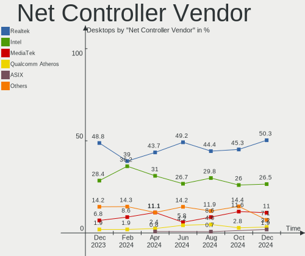
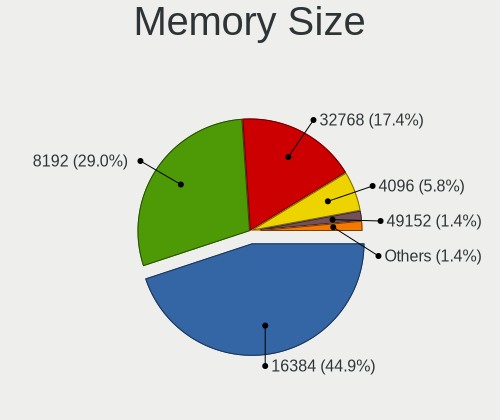

Arch - Hardware Trends (Desktops)
---------------------------------

A project to identify most popular hardware characteristics and track their change
over time based on data collected by Linux users at https://Linux-Hardware.org.

Anyone can contribute to this report by the [hw-probe](https://github.com/linuxhw/hw-probe) tool:

    sudo -E hw-probe -all -upload

This report is for one last month. Overall report since the beginning of time: [TestCoverage](https://github.com/linuxhw/TestCoverage)

Period: Sep, 2022.

Contents
--------

* [ System ](#system)
  - [ OS                       ](#os)
  - [ OS Family                ](#os-family)
  - [ Kernel                   ](#kernel)
  - [ Kernel Family            ](#kernel-family)
  - [ Kernel Major Ver.        ](#kernel-major-ver)
  - [ Arch                     ](#arch)
  - [ DE                       ](#de)
  - [ Display Server           ](#display-server)
  - [ Display Manager          ](#display-manager)
  - [ OS Lang                  ](#os-lang)
  - [ Boot Mode                ](#boot-mode)
  - [ Filesystem               ](#filesystem)
  - [ Part. scheme             ](#part-scheme)
  - [ Dual Boot with Linux/BSD ](#dual-boot-with-linuxbsd)
  - [ Dual Boot (Win)          ](#dual-boot-win)

* [ Board ](#board)
  - [ Vendor                   ](#vendor)
  - [ Model                    ](#model)
  - [ Model Family             ](#model-family)
  - [ MFG Year                 ](#mfg-year)
  - [ Form Factor              ](#form-factor)
  - [ Secure Boot              ](#secure-boot)
  - [ Coreboot                 ](#coreboot)
  - [ RAM Size                 ](#ram-size)
  - [ RAM Used                 ](#ram-used)
  - [ Total Drives             ](#total-drives)
  - [ Has CD-ROM               ](#has-cd-rom)
  - [ Has Ethernet             ](#has-ethernet)
  - [ Has WiFi                 ](#has-wifi)
  - [ Has Bluetooth            ](#has-bluetooth)

* [ Location ](#location)
  - [ Country                  ](#country)
  - [ City                     ](#city)

* [ Drives ](#drives)
  - [ Drive Vendor             ](#drive-vendor)
  - [ Drive Model              ](#drive-model)
  - [ HDD Vendor               ](#hdd-vendor)
  - [ SSD Vendor               ](#ssd-vendor)
  - [ Drive Kind               ](#drive-kind)
  - [ Drive Connector          ](#drive-connector)
  - [ Drive Size               ](#drive-size)
  - [ Space Total              ](#space-total)
  - [ Space Used               ](#space-used)
  - [ Malfunc. Drives          ](#malfunc-drives)
  - [ Malfunc. Drive Vendor    ](#malfunc-drive-vendor)
  - [ Malfunc. HDD Vendor      ](#malfunc-hdd-vendor)
  - [ Malfunc. Drive Kind      ](#malfunc-drive-kind)
  - [ Failed Drives            ](#failed-drives)
  - [ Failed Drive Vendor      ](#failed-drive-vendor)
  - [ Drive Status             ](#drive-status)

* [ Storage controller ](#storage-controller)
  - [ Storage Vendor           ](#storage-vendor)
  - [ Storage Model            ](#storage-model)
  - [ Storage Kind             ](#storage-kind)

* [ Processor ](#processor)
  - [ CPU Vendor               ](#cpu-vendor)
  - [ CPU Model                ](#cpu-model)
  - [ CPU Model Family         ](#cpu-model-family)
  - [ CPU Cores                ](#cpu-cores)
  - [ CPU Sockets              ](#cpu-sockets)
  - [ CPU Threads              ](#cpu-threads)
  - [ CPU Op-Modes             ](#cpu-op-modes)
  - [ CPU Microcode            ](#cpu-microcode)
  - [ CPU Microarch            ](#cpu-microarch)

* [ Graphics ](#graphics)
  - [ GPU Vendor               ](#gpu-vendor)
  - [ GPU Model                ](#gpu-model)
  - [ GPU Combo                ](#gpu-combo)
  - [ GPU Driver               ](#gpu-driver)
  - [ GPU Memory               ](#gpu-memory)

* [ Monitor ](#monitor)
  - [ Monitor Vendor           ](#monitor-vendor)
  - [ Monitor Model            ](#monitor-model)
  - [ Monitor Resolution       ](#monitor-resolution)
  - [ Monitor Diagonal         ](#monitor-diagonal)
  - [ Monitor Width            ](#monitor-width)
  - [ Aspect Ratio             ](#aspect-ratio)
  - [ Monitor Area             ](#monitor-area)
  - [ Pixel Density            ](#pixel-density)
  - [ Multiple Monitors        ](#multiple-monitors)

* [ Network ](#network)
  - [ Net Controller Vendor    ](#net-controller-vendor)
  - [ Net Controller Model     ](#net-controller-model)
  - [ Wireless Vendor          ](#wireless-vendor)
  - [ Wireless Model           ](#wireless-model)
  - [ Ethernet Vendor          ](#ethernet-vendor)
  - [ Ethernet Model           ](#ethernet-model)
  - [ Net Controller Kind      ](#net-controller-kind)
  - [ Used Controller          ](#used-controller)
  - [ NICs                     ](#nics)
  - [ IPv6                     ](#ipv6)

* [ Bluetooth ](#bluetooth)
  - [ Bluetooth Vendor         ](#bluetooth-vendor)
  - [ Bluetooth Model          ](#bluetooth-model)

* [ Sound ](#sound)
  - [ Sound Vendor             ](#sound-vendor)
  - [ Sound Model              ](#sound-model)

* [ Memory ](#memory)
  - [ Memory Vendor            ](#memory-vendor)
  - [ Memory Model             ](#memory-model)
  - [ Memory Kind              ](#memory-kind)
  - [ Memory Form Factor       ](#memory-form-factor)
  - [ Memory Size              ](#memory-size)
  - [ Memory Speed             ](#memory-speed)

* [ Printers & scanners ](#printers--scanners)
  - [ Printer Vendor           ](#printer-vendor)
  - [ Printer Model            ](#printer-model)
  - [ Scanner Vendor           ](#scanner-vendor)
  - [ Scanner Model            ](#scanner-model)

* [ Camera ](#camera)
  - [ Camera Vendor            ](#camera-vendor)
  - [ Camera Model             ](#camera-model)

* [ Security ](#security)
  - [ Fingerprint Vendor       ](#fingerprint-vendor)
  - [ Fingerprint Model        ](#fingerprint-model)
  - [ Chipcard Vendor          ](#chipcard-vendor)
  - [ Chipcard Model           ](#chipcard-model)

* [ Unsupported ](#unsupported)
  - [ Unsupported Devices      ](#unsupported-devices)
  - [ Unsupported Device Types ](#unsupported-device-types)

System
------

OS
--

Installed operating systems

| Name         | Desktops | Percent |
|--------------|----------|---------|
| Arch         | 48       | 56.47%  |
| Arch Rolling | 37       | 43.53%  |

OS Family
---------

OS without a version

| Name | Desktops | Percent |
|------|----------|---------|
| Arch | 85       | 100%    |

Kernel
------

Version of the Linux kernel

| Version             | Desktops | Percent |
|---------------------|----------|---------|
| 5.19.9-arch1-1      | 11       | 12.94%  |
| 5.19.7-arch1-1      | 10       | 11.76%  |
| 5.19.6-arch1-1      | 9        | 10.59%  |
| 5.19.11-arch1-1     | 9        | 10.59%  |
| 5.19.7-zen2-1-zen   | 6        | 7.06%   |
| 5.19.9-zen1-1-zen   | 4        | 4.71%   |
| 5.19.5-arch1-1      | 4        | 4.71%   |
| 5.19.4-arch1-1      | 4        | 4.71%   |
| 5.19.10-arch1-1     | 4        | 4.71%   |
| 5.19.8-arch1-1      | 3        | 3.53%   |
| 5.19.6-zen1-1-zen   | 3        | 3.53%   |
| 5.19.5-zen1-1-zen   | 2        | 2.35%   |
| 5.15.68-1-lts       | 2        | 2.35%   |
| 5.15.67-1-lts       | 2        | 2.35%   |
| 5.15.64-1-lts       | 2        | 2.35%   |
| 6.0.0-rc6           | 1        | 1.18%   |
| 5.19.7-1-clear      | 1        | 1.18%   |
| 5.19.11-zen1-1-zen  | 1        | 1.18%   |
| 5.19.10-269-tkg-pds | 1        | 1.18%   |
| 5.19.1-arch2-1      | 1        | 1.18%   |
| 5.15.71-1-lts       | 1        | 1.18%   |
| 5.15.70-1-lts       | 1        | 1.18%   |
| 5.15.7-arch1-1      | 1        | 1.18%   |
| 5.15.69-1-lts       | 1        | 1.18%   |
| 5.15.65-1-lts       | 1        | 1.18%   |

Kernel Family
-------------

Linux kernel without a distro release

| Version | Desktops | Percent |
|---------|----------|---------|
| 5.19.7  | 17       | 20%     |
| 5.19.9  | 15       | 17.65%  |
| 5.19.6  | 12       | 14.12%  |
| 5.19.11 | 10       | 11.76%  |
| 5.19.5  | 6        | 7.06%   |
| 5.19.10 | 5        | 5.88%   |
| 5.19.4  | 4        | 4.71%   |
| 5.19.8  | 3        | 3.53%   |
| 5.15.68 | 2        | 2.35%   |
| 5.15.67 | 2        | 2.35%   |
| 5.15.64 | 2        | 2.35%   |
| 6.0.0   | 1        | 1.18%   |
| 5.19.1  | 1        | 1.18%   |
| 5.15.71 | 1        | 1.18%   |
| 5.15.70 | 1        | 1.18%   |
| 5.15.7  | 1        | 1.18%   |
| 5.15.69 | 1        | 1.18%   |
| 5.15.65 | 1        | 1.18%   |

Kernel Major Ver.
-----------------

Linux kernel major version

| Version | Desktops | Percent |
|---------|----------|---------|
| 5.19    | 73       | 85.88%  |
| 5.15    | 11       | 12.94%  |
| 6.0     | 1        | 1.18%   |

Arch
----

OS architecture (x86_64, i586, etc.)

| Name   | Desktops | Percent |
|--------|----------|---------|
| x86_64 | 85       | 100%    |

DE
--

Desktop Environment

| Name            | Desktops | Percent |
|-----------------|----------|---------|
| GNOME           | 32       | 37.65%  |
| KDE5            | 29       | 34.12%  |
| i3              | 5        | 5.88%   |
| XFCE            | 4        | 4.71%   |
| Unknown         | 4        | 4.71%   |
| sway            | 2        | 2.35%   |
| MATE            | 2        | 2.35%   |
| openbox         | 1        | 1.18%   |
| LXDE            | 1        | 1.18%   |
| LeftWM          | 1        | 1.18%   |
| GNOME Flashback | 1        | 1.18%   |
| Deepin          | 1        | 1.18%   |
| Cinnamon        | 1        | 1.18%   |
| bspwm           | 1        | 1.18%   |

Display Server
--------------

X11 or Wayland

| Name    | Desktops | Percent |
|---------|----------|---------|
| X11     | 53       | 62.35%  |
| Wayland | 22       | 25.88%  |
| Tty     | 6        | 7.06%   |
| Unknown | 4        | 4.71%   |

Display Manager
---------------

SDDM, LightDM, etc.

| Name    | Desktops | Percent |
|---------|----------|---------|
| Unknown | 34       | 40%     |
| LightDM | 17       | 20%     |
| SDDM    | 15       | 17.65%  |
| GDM     | 14       | 16.47%  |
| Ly      | 2        | 2.35%   |
| XINIT   | 1        | 1.18%   |
| LXDM    | 1        | 1.18%   |
| GREETD  | 1        | 1.18%   |

OS Lang
-------

Language

| Lang    | Desktops | Percent |
|---------|----------|---------|
| en_US   | 34       | 40%     |
| it_IT   | 10       | 11.76%  |
| C       | 9        | 10.59%  |
| de_DE   | 6        | 7.06%   |
| en_GB   | 5        | 5.88%   |
| pt_BR   | 4        | 4.71%   |
| fr_FR   | 4        | 4.71%   |
| es_ES   | 4        | 4.71%   |
| en_CA   | 3        | 3.53%   |
| zh_CN   | 1        | 1.18%   |
| ru_RU   | 1        | 1.18%   |
| en_IN   | 1        | 1.18%   |
| en_AU   | 1        | 1.18%   |
| bg_BG   | 1        | 1.18%   |
| Unknown | 1        | 1.18%   |

Boot Mode
---------

EFI or BIOS

| Mode | Desktops | Percent |
|------|----------|---------|
| EFI  | 50       | 58.82%  |
| BIOS | 35       | 41.18%  |

Filesystem
----------

Type of filesystem

| Type  | Desktops | Percent |
|-------|----------|---------|
| Ext4  | 60       | 70.59%  |
| Btrfs | 25       | 29.41%  |

Part. scheme
------------

Scheme of partitioning

| Type    | Desktops | Percent |
|---------|----------|---------|
| GPT     | 54       | 63.53%  |
| Unknown | 28       | 32.94%  |
| MBR     | 3        | 3.53%   |

Dual Boot with Linux/BSD
------------------------

Hosting more than one Linux/BSD

| Dual boot | Desktops | Percent |
|-----------|----------|---------|
| No        | 72       | 84.71%  |
| Yes       | 13       | 15.29%  |

Dual Boot (Win)
---------------

Hosting Linux and Windows

| Dual boot | Desktops | Percent |
|-----------|----------|---------|
| No        | 58       | 68.24%  |
| Yes       | 27       | 31.76%  |

Board
-----

Vendor
------

Motherboard manufacturer

| Name                | Desktops | Percent |
|---------------------|----------|---------|
| ASUSTek Computer    | 26       | 30.59%  |
| Gigabyte Technology | 20       | 23.53%  |
| MSI                 | 14       | 16.47%  |
| ASRock              | 7        | 8.24%   |
| Dell                | 4        | 4.71%   |
| Intel               | 3        | 3.53%   |
| Lenovo              | 2        | 2.35%   |
| Hewlett-Packard     | 2        | 2.35%   |
| Acer                | 2        | 2.35%   |
| PCWare              | 1        | 1.18%   |
| Huanan              | 1        | 1.18%   |
| Gateway             | 1        | 1.18%   |
| Foxconn             | 1        | 1.18%   |
| Biostar             | 1        | 1.18%   |

Model
-----

Motherboard model

| Name                                   | Desktops | Percent |
|----------------------------------------|----------|---------|
| MSI MS-7C91                            | 3        | 3.53%   |
| MSI MS-7C56                            | 2        | 2.35%   |
| MSI MS-7C37                            | 2        | 2.35%   |
| PCWare IPMH110G                        | 1        | 1.18%   |
| MSI MS-7D09                            | 1        | 1.18%   |
| MSI MS-7C96                            | 1        | 1.18%   |
| MSI MS-7C52                            | 1        | 1.18%   |
| MSI MS-7C02                            | 1        | 1.18%   |
| MSI MS-7B79                            | 1        | 1.18%   |
| MSI MS-7A38                            | 1        | 1.18%   |
| MSI MS-7885                            | 1        | 1.18%   |
| Lenovo ThinkCentre M93p 10A8S33600     | 1        | 1.18%   |
| Lenovo IdeaCentre 720-18ASU 90H1004TIX | 1        | 1.18%   |
| Intel X99 V1.0                         | 1        | 1.18%   |
| Intel H55                              | 1        | 1.18%   |
| Intel DN2800MT AAG23738-801            | 1        | 1.18%   |
| Huanan Gaming F8                       | 1        | 1.18%   |
| HP EliteDesk 705 G4 DM 35W (TAA)       | 1        | 1.18%   |
| HP Compaq 6005 Pro SFF PC              | 1        | 1.18%   |
| Gigabyte Z690 AORUS ELITE AX DDR4      | 1        | 1.18%   |
| Gigabyte Z390 AORUS PRO                | 1        | 1.18%   |
| Gigabyte X570S AORUS ELITE AX          | 1        | 1.18%   |
| Gigabyte X570 AORUS PRO WIFI           | 1        | 1.18%   |
| Gigabyte X570 AORUS MASTER             | 1        | 1.18%   |
| Gigabyte X470 AORUS ULTRA GAMING       | 1        | 1.18%   |
| Gigabyte H61M-S2P-R3                   | 1        | 1.18%   |
| Gigabyte H410M S2H V3                  | 1        | 1.18%   |
| Gigabyte H310N 2.0                     | 1        | 1.18%   |
| Gigabyte B660M DS3H DDR4               | 1        | 1.18%   |
| Gigabyte B660M DS3H AX DDR4            | 1        | 1.18%   |
| Gigabyte B560M DS3H V2                 | 1        | 1.18%   |
| Gigabyte B450M H                       | 1        | 1.18%   |
| Gigabyte B450M DS3H                    | 1        | 1.18%   |
| Gigabyte B450 AORUS PRO WIFI           | 1        | 1.18%   |
| Gigabyte B365M DS3H                    | 1        | 1.18%   |
| Gigabyte AX370-Gaming K5               | 1        | 1.18%   |
| Gigabyte A520M DS3H AC                 | 1        | 1.18%   |
| Gigabyte 990XA-UD3                     | 1        | 1.18%   |
| Gigabyte 990FXA-UD5                    | 1        | 1.18%   |
| Gateway SX2803                         | 1        | 1.18%   |

Model Family
------------

Motherboard model prefix

| Name                  | Desktops | Percent |
|-----------------------|----------|---------|
| ASUS PRIME            | 13       | 15.29%  |
| ASUS TUF              | 5        | 5.88%   |
| ASUS ROG              | 5        | 5.88%   |
| MSI MS-7C91           | 3        | 3.53%   |
| Dell OptiPlex         | 3        | 3.53%   |
| MSI MS-7C56           | 2        | 2.35%   |
| MSI MS-7C37           | 2        | 2.35%   |
| Gigabyte X570         | 2        | 2.35%   |
| Gigabyte B660M        | 2        | 2.35%   |
| Gigabyte B450M        | 2        | 2.35%   |
| Acer Aspire           | 2        | 2.35%   |
| PCWare IPMH110G       | 1        | 1.18%   |
| MSI MS-7D09           | 1        | 1.18%   |
| MSI MS-7C96           | 1        | 1.18%   |
| MSI MS-7C52           | 1        | 1.18%   |
| MSI MS-7C02           | 1        | 1.18%   |
| MSI MS-7B79           | 1        | 1.18%   |
| MSI MS-7A38           | 1        | 1.18%   |
| MSI MS-7885           | 1        | 1.18%   |
| Lenovo ThinkCentre    | 1        | 1.18%   |
| Lenovo IdeaCentre     | 1        | 1.18%   |
| Intel X99             | 1        | 1.18%   |
| Intel H55             | 1        | 1.18%   |
| Intel DN2800MT        | 1        | 1.18%   |
| Huanan Gaming         | 1        | 1.18%   |
| HP EliteDesk          | 1        | 1.18%   |
| HP Compaq             | 1        | 1.18%   |
| Gigabyte Z690         | 1        | 1.18%   |
| Gigabyte Z390         | 1        | 1.18%   |
| Gigabyte X570S        | 1        | 1.18%   |
| Gigabyte X470         | 1        | 1.18%   |
| Gigabyte H61M-S2P-R3  | 1        | 1.18%   |
| Gigabyte H410M        | 1        | 1.18%   |
| Gigabyte H310N        | 1        | 1.18%   |
| Gigabyte B560M        | 1        | 1.18%   |
| Gigabyte B450         | 1        | 1.18%   |
| Gigabyte B365M        | 1        | 1.18%   |
| Gigabyte AX370-Gaming | 1        | 1.18%   |
| Gigabyte A520M        | 1        | 1.18%   |
| Gigabyte 990XA-UD3    | 1        | 1.18%   |

MFG Year
--------

Motherboard manufacture year

| Year | Desktops | Percent |
|------|----------|---------|
| 2020 | 15       | 17.65%  |
| 2021 | 14       | 16.47%  |
| 2019 | 14       | 16.47%  |
| 2018 | 13       | 15.29%  |
| 2017 | 9        | 10.59%  |
| 2013 | 5        | 5.88%   |
| 2022 | 3        | 3.53%   |
| 2015 | 3        | 3.53%   |
| 2014 | 2        | 2.35%   |
| 2011 | 2        | 2.35%   |
| 2016 | 1        | 1.18%   |
| 2012 | 1        | 1.18%   |
| 2010 | 1        | 1.18%   |
| 2009 | 1        | 1.18%   |
| 2007 | 1        | 1.18%   |

Form Factor
-----------

Physical design of the computer

| Name    | Desktops | Percent |
|---------|----------|---------|
| Desktop | 85       | 100%    |

Secure Boot
-----------

Enabled or disabled

| State    | Desktops | Percent |
|----------|----------|---------|
| Disabled | 85       | 100%    |

Coreboot
--------

Have coreboot on board

| Used | Desktops | Percent |
|------|----------|---------|
| No   | 85       | 100%    |

RAM Size
--------

Total RAM memory

| Size in GB  | Desktops | Percent |
|-------------|----------|---------|
| 32.01-64.0  | 29       | 34.12%  |
| 16.01-24.0  | 23       | 27.06%  |
| 8.01-16.0   | 13       | 15.29%  |
| 4.01-8.0    | 9        | 10.59%  |
| 64.01-256.0 | 5        | 5.88%   |
| 3.01-4.0    | 4        | 4.71%   |
| 24.01-32.0  | 2        | 2.35%   |

RAM Used
--------

Used RAM memory

| Used GB    | Desktops | Percent |
|------------|----------|---------|
| 4.01-8.0   | 23       | 27.06%  |
| 2.01-3.0   | 16       | 18.82%  |
| 1.01-2.0   | 15       | 17.65%  |
| 8.01-16.0  | 14       | 16.47%  |
| 3.01-4.0   | 11       | 12.94%  |
| 0.51-1.0   | 4        | 4.71%   |
| 24.01-32.0 | 1        | 1.18%   |
| 16.01-24.0 | 1        | 1.18%   |

Total Drives
------------

Number of drives on board

| Drives | Desktops | Percent |
|--------|----------|---------|
| 2      | 28       | 32.94%  |
| 1      | 18       | 21.18%  |
| 4      | 16       | 18.82%  |
| 3      | 13       | 15.29%  |
| 6      | 3        | 3.53%   |
| 5      | 3        | 3.53%   |
| 9      | 2        | 2.35%   |
| 7      | 1        | 1.18%   |
| 0      | 1        | 1.18%   |

Has CD-ROM
----------

Has CD-ROM on board

| Presented | Desktops | Percent |
|-----------|----------|---------|
| No        | 70       | 82.35%  |
| Yes       | 15       | 17.65%  |

Has Ethernet
------------

Has Ethernet on board

| Presented | Desktops | Percent |
|-----------|----------|---------|
| Yes       | 85       | 100%    |

Has WiFi
--------

Has WiFi module

| Presented | Desktops | Percent |
|-----------|----------|---------|
| Yes       | 45       | 52.94%  |
| No        | 40       | 47.06%  |

Has Bluetooth
-------------

Has Bluetooth module

| Presented | Desktops | Percent |
|-----------|----------|---------|
| Yes       | 46       | 54.12%  |
| No        | 39       | 45.88%  |

Location
--------

Country
-------

Geographic location (country)

| Country          | Desktops | Percent |
|------------------|----------|---------|
| USA              | 14       | 16.47%  |
| Italy            | 12       | 14.12%  |
| Germany          | 7        | 8.24%   |
| Brazil           | 7        | 8.24%   |
| UK               | 6        | 7.06%   |
| Spain            | 4        | 4.71%   |
| Canada           | 4        | 4.71%   |
| Austria          | 4        | 4.71%   |
| Russia           | 3        | 3.53%   |
| France           | 3        | 3.53%   |
| Australia        | 3        | 3.53%   |
| Vietnam          | 1        | 1.18%   |
| Turkey           | 1        | 1.18%   |
| Switzerland      | 1        | 1.18%   |
| Serbia           | 1        | 1.18%   |
| Romania          | 1        | 1.18%   |
| Poland           | 1        | 1.18%   |
| Norway           | 1        | 1.18%   |
| North Macedonia  | 1        | 1.18%   |
| Netherlands      | 1        | 1.18%   |
| Japan            | 1        | 1.18%   |
| Hong Kong        | 1        | 1.18%   |
| Greece           | 1        | 1.18%   |
| French Polynesia | 1        | 1.18%   |
| Finland          | 1        | 1.18%   |
| China            | 1        | 1.18%   |
| Chile            | 1        | 1.18%   |
| Bulgaria         | 1        | 1.18%   |
| Algeria          | 1        | 1.18%   |

City
----

Geographic location (city)

| City               | Desktops | Percent |
|--------------------|----------|---------|
| Vienna             | 3        | 3.53%   |
| Twickenham         | 2        | 2.35%   |
| Sydney             | 2        | 2.35%   |
| Milan              | 2        | 2.35%   |
| Chicago            | 2        | 2.35%   |
| Unknown            | 2        | 2.35%   |
| Zurich             | 1        | 1.18%   |
| Wroclaw            | 1        | 1.18%   |
| Villejuif          | 1        | 1.18%   |
| Vigo               | 1        | 1.18%   |
| Verona             | 1        | 1.18%   |
| Thessaloniki       | 1        | 1.18%   |
| Terrebonne         | 1        | 1.18%   |
| Sulmona            | 1        | 1.18%   |
| Stockport          | 1        | 1.18%   |
| St Petersburg      | 1        | 1.18%   |
| Somma Vesuviana    | 1        | 1.18%   |
| Sesto San Giovanni | 1        | 1.18%   |
| Seattle            | 1        | 1.18%   |
| Sao Jose           | 1        | 1.18%   |
| Santo André       | 1        | 1.18%   |
| San Francisco      | 1        | 1.18%   |
| Roubaix            | 1        | 1.18%   |
| Ribeirao Preto     | 1        | 1.18%   |
| Quincy             | 1        | 1.18%   |
| Pleven             | 1        | 1.18%   |
| Piquete            | 1        | 1.18%   |
| Pforzheim          | 1        | 1.18%   |
| Pasian di Prato    | 1        | 1.18%   |
| Paris              | 1        | 1.18%   |
| Papeete            | 1        | 1.18%   |
| Palermo            | 1        | 1.18%   |
| Oslo               | 1        | 1.18%   |
| Nurtingen          | 1        | 1.18%   |
| Montreal           | 1        | 1.18%   |
| Mitcham            | 1        | 1.18%   |
| Mannheim           | 1        | 1.18%   |
| Madrid             | 1        | 1.18%   |
| Lugo               | 1        | 1.18%   |
| Los Angeles        | 1        | 1.18%   |

Drives
------

Drive Vendor
------------

Hard drive vendors

| Vendor                       | Desktops | Drives | Percent |
|------------------------------|----------|--------|---------|
| Samsung Electronics          | 31       | 52     | 17.22%  |
| WDC                          | 29       | 39     | 16.11%  |
| Seagate                      | 21       | 33     | 11.67%  |
| Kingston                     | 16       | 18     | 8.89%   |
| Sandisk                      | 15       | 21     | 8.33%   |
| Toshiba                      | 13       | 17     | 7.22%   |
| Crucial                      | 12       | 15     | 6.67%   |
| Hitachi                      | 6        | 8      | 3.33%   |
| Silicon Motion               | 5        | 5      | 2.78%   |
| China                        | 5        | 5      | 2.78%   |
| Phison Electronics           | 3        | 4      | 1.67%   |
| Micron/Crucial Technology    | 3        | 3      | 1.67%   |
| Patriot                      | 2        | 2      | 1.11%   |
| OCZ                          | 2        | 2      | 1.11%   |
| ADATA Technology             | 2        | 2      | 1.11%   |
| USB30                        | 1        | 1      | 0.56%   |
| USB                          | 1        | 1      | 0.56%   |
| Transcend                    | 1        | 1      | 0.56%   |
| TO Exter                     | 1        | 1      | 0.56%   |
| Team                         | 1        | 1      | 0.56%   |
| SPCC                         | 1        | 1      | 0.56%   |
| Shenzhen Longsys Electronics | 1        | 1      | 0.56%   |
| PNY                          | 1        | 1      | 0.56%   |
| Micron Technology            | 1        | 1      | 0.56%   |
| LITEONIT                     | 1        | 1      | 0.56%   |
| Kingston Technology Company  | 1        | 1      | 0.56%   |
| KingDian                     | 1        | 1      | 0.56%   |
| Intenso                      | 1        | 1      | 0.56%   |
| Intel                        | 1        | 1      | 0.56%   |
| Inateck                      | 1        | 1      | 0.56%   |

Drive Model
-----------

Hard drive models

| Model                                                  | Desktops | Percent |
|--------------------------------------------------------|----------|---------|
| Samsung NVMe SSD Controller SM981/PM981/PM983 256GB    | 8        | 3.62%   |
| Samsung NVMe SSD Controller PM9A1/PM9A3/980PRO 1024GB  | 5        | 2.26%   |
| Crucial CT240BX500SSD1 240GB                           | 5        | 2.26%   |
| Toshiba HDWD110 1TB                                    | 4        | 1.81%   |
| Seagate ST2000DM006-2DM164 2TB                         | 4        | 1.81%   |
| WDC WD10EZEX-00WN4A0 1TB                               | 3        | 1.36%   |
| Silicon Motion SM2263EN/SM2263XT SSD Controller 1024GB | 3        | 1.36%   |
| Seagate ST4000DM004-2CV104 4TB                         | 3        | 1.36%   |
| Seagate ST2000DM008-2FR102 2TB                         | 3        | 1.36%   |
| Sandisk WD Black SN750 / PC SN730 NVMe SSD 1024GB      | 3        | 1.36%   |
| SanDisk NVMe SSD Drive 1TB                             | 3        | 1.36%   |
| Samsung SSD 870 EVO 1TB                                | 3        | 1.36%   |
| Samsung SSD 850 EVO 500GB                              | 3        | 1.36%   |
| Samsung SSD 850 EVO 250GB                              | 3        | 1.36%   |
| Kingston SV300S37A240G 240GB SSD                       | 3        | 1.36%   |
| Kingston SA400S37240G 240GB SSD                        | 3        | 1.36%   |
| Crucial CT1000MX500SSD1 1TB                            | 3        | 1.36%   |
| WDC WDS500G2B0B-00YS70 500GB SSD                       | 2        | 0.9%    |
| WDC WD40EFZX-68AWUN0 4TB                               | 2        | 0.9%    |
| WDC WD10EADX-22TDHB0 1TB                               | 2        | 0.9%    |
| Toshiba DT01ACA300 3TB                                 | 2        | 0.9%    |
| Toshiba DT01ACA200 2TB                                 | 2        | 0.9%    |
| Toshiba DT01ACA100 1TB                                 | 2        | 0.9%    |
| Silicon Motion SM2262/SM2262EN SSD Controller 1024GB   | 2        | 0.9%    |
| Sandisk WD Blue SN570 1TB                              | 2        | 0.9%    |
| Sandisk WD Black 2018/SN750 / PC SN720 NVMe SSD 512GB  | 2        | 0.9%    |
| Samsung SSD 870 QVO 2TB                                | 2        | 0.9%    |
| Samsung SSD 860 EVO 1TB                                | 2        | 0.9%    |
| Samsung SSD 840 EVO 250GB                              | 2        | 0.9%    |
| Samsung NVMe SSD Controller SM961/PM961/SM963 256GB    | 2        | 0.9%    |
| Phison E16 PCIe4 NVMe Controller 1TB                   | 2        | 0.9%    |
| Patriot Burst 240GB SSD                                | 2        | 0.9%    |
| Micron/Crucial P1 NVMe PCIe SSD 1TB                    | 2        | 0.9%    |
| Kingston SNVS250G 250GB                                | 2        | 0.9%    |
| Kingston SA400S37480G 480GB SSD                        | 2        | 0.9%    |
| Crucial CT480BX500SSD1 480GB                           | 2        | 0.9%    |
| WDC WDS500G2B0A-00SM50 500GB SSD                       | 1        | 0.45%   |
| WDC WDS240G2G0A-00JH30 240GB SSD                       | 1        | 0.45%   |
| WDC WDS200T2B0A 2TB SSD                                | 1        | 0.45%   |
| WDC WDS120G2G0A-00JH30 120GB SSD                       | 1        | 0.45%   |

HDD Vendor
----------

Hard disk drive vendors

| Vendor  | Desktops | Drives | Percent |
|---------|----------|--------|---------|
| WDC     | 22       | 31     | 36.07%  |
| Seagate | 20       | 32     | 32.79%  |
| Toshiba | 12       | 14     | 19.67%  |
| Hitachi | 6        | 8      | 9.84%   |
| USB     | 1        | 1      | 1.64%   |

SSD Vendor
----------

Solid state drive vendors

| Vendor              | Desktops | Drives | Percent |
|---------------------|----------|--------|---------|
| Samsung Electronics | 20       | 27     | 27.4%   |
| Kingston            | 11       | 12     | 15.07%  |
| Crucial             | 11       | 14     | 15.07%  |
| WDC                 | 7        | 7      | 9.59%   |
| China               | 5        | 5      | 6.85%   |
| SanDisk             | 4        | 4      | 5.48%   |
| Patriot             | 2        | 2      | 2.74%   |
| OCZ                 | 2        | 2      | 2.74%   |
| USB30               | 1        | 1      | 1.37%   |
| Transcend           | 1        | 1      | 1.37%   |
| Toshiba             | 1        | 3      | 1.37%   |
| TO Exter            | 1        | 1      | 1.37%   |
| Team                | 1        | 1      | 1.37%   |
| SPCC                | 1        | 1      | 1.37%   |
| Seagate             | 1        | 1      | 1.37%   |
| PNY                 | 1        | 1      | 1.37%   |
| LITEONIT            | 1        | 1      | 1.37%   |
| KingDian            | 1        | 1      | 1.37%   |
| Intenso             | 1        | 1      | 1.37%   |

Drive Kind
----------

HDD or SSD

| Kind    | Desktops | Drives | Percent |
|---------|----------|--------|---------|
| SSD     | 53       | 86     | 33.97%  |
| HDD     | 52       | 86     | 33.33%  |
| NVMe    | 49       | 67     | 31.41%  |
| Unknown | 2        | 2      | 1.28%   |

Drive Connector
---------------

SATA, SAS, NVMe, etc.

| Type | Desktops | Drives | Percent |
|------|----------|--------|---------|
| SATA | 74       | 164    | 56.06%  |
| NVMe | 49       | 67     | 37.12%  |
| SAS  | 9        | 10     | 6.82%   |

Drive Size
----------

Size of hard drive

| Size in TB | Desktops | Drives | Percent |
|------------|----------|--------|---------|
| 0.01-0.5   | 47       | 71     | 38.21%  |
| 0.51-1.0   | 36       | 45     | 29.27%  |
| 1.01-2.0   | 19       | 23     | 15.45%  |
| 2.01-3.0   | 8        | 9      | 6.5%    |
| 3.01-4.0   | 7        | 13     | 5.69%   |
| 4.01-10.0  | 6        | 11     | 4.88%   |

Space Total
-----------

Amount of disk space available on the file system

| Size in GB     | Desktops | Percent |
|----------------|----------|---------|
| More than 3000 | 22       | 25.88%  |
| 101-250        | 14       | 16.47%  |
| 1001-2000      | 14       | 16.47%  |
| 501-1000       | 14       | 16.47%  |
| 251-500        | 9        | 10.59%  |
| 2001-3000      | 8        | 9.41%   |
| 21-50          | 2        | 2.35%   |
| 51-100         | 2        | 2.35%   |

Space Used
----------

Amount of used disk space

| Used GB        | Desktops | Percent |
|----------------|----------|---------|
| 1001-2000      | 15       | 17.65%  |
| 501-1000       | 14       | 16.47%  |
| 1-20           | 12       | 14.12%  |
| More than 3000 | 10       | 11.76%  |
| 51-100         | 10       | 11.76%  |
| 21-50          | 8        | 9.41%   |
| 251-500        | 7        | 8.24%   |
| 101-250        | 7        | 8.24%   |
| 2001-3000      | 2        | 2.35%   |

Malfunc. Drives
---------------

Drive models with a malfunction

| Model                                 | Desktops | Drives | Percent |
|---------------------------------------|----------|--------|---------|
| WDC WD5000AAKX-00PWEA0 500GB          | 1        | 1      | 7.69%   |
| WDC WD20EZRX-00D8PB0 2TB              | 1        | 1      | 7.69%   |
| WDC WD10EZEX-00MFCA0 1TB              | 1        | 1      | 7.69%   |
| WDC WD10EURX-63FH1Y0 1TB              | 1        | 1      | 7.69%   |
| Transcend TS1TSSD230S 1TB             | 1        | 1      | 7.69%   |
| Seagate ST500DM002-1BD142 500GB       | 1        | 1      | 7.69%   |
| Seagate ST2000DM006-2DM164 2TB        | 1        | 1      | 7.69%   |
| Seagate ST2000DM001-9YN164 2TB        | 1        | 1      | 7.69%   |
| Seagate ST1000LM024 HN-M101MBB 1TB    | 1        | 1      | 7.69%   |
| Samsung Electronics SSD 840 EVO 120GB | 1        | 1      | 7.69%   |
| Kingston SKC400S371T 1TB SSD          | 1        | 1      | 7.69%   |
| Kingston SA400S37240G 240GB SSD       | 1        | 1      | 7.69%   |
| Hitachi HDS721050CLA362 500GB         | 1        | 1      | 7.69%   |

Malfunc. Drive Vendor
---------------------

Vendors of faulty drives

| Vendor              | Desktops | Drives | Percent |
|---------------------|----------|--------|---------|
| WDC                 | 4        | 4      | 30.77%  |
| Seagate             | 4        | 4      | 30.77%  |
| Kingston            | 2        | 2      | 15.38%  |
| Transcend           | 1        | 1      | 7.69%   |
| Samsung Electronics | 1        | 1      | 7.69%   |
| Hitachi             | 1        | 1      | 7.69%   |

Malfunc. HDD Vendor
-------------------

Vendors of faulty HDD drives

| Vendor  | Desktops | Drives | Percent |
|---------|----------|--------|---------|
| WDC     | 4        | 4      | 44.44%  |
| Seagate | 4        | 4      | 44.44%  |
| Hitachi | 1        | 1      | 11.11%  |

Malfunc. Drive Kind
-------------------

Kinds of faulty drives

| Kind | Desktops | Drives | Percent |
|------|----------|--------|---------|
| HDD  | 9        | 9      | 69.23%  |
| SSD  | 4        | 4      | 30.77%  |

Failed Drives
-------------

Failed drive models

Zero info for selected period =(

Failed Drive Vendor
-------------------

Failed drive vendors

Zero info for selected period =(

Drive Status
------------

Number of failed and malfunc. drives

| Status   | Desktops | Drives | Percent |
|----------|----------|--------|---------|
| Detected | 45       | 117    | 45.45%  |
| Works    | 42       | 111    | 42.42%  |
| Malfunc  | 12       | 13     | 12.12%  |

Storage controller
------------------

Storage Vendor
--------------

Storage controller vendors

| Vendor                       | Desktops | Percent |
|------------------------------|----------|---------|
| AMD                          | 45       | 31.25%  |
| Intel                        | 40       | 27.78%  |
| Samsung Electronics          | 19       | 13.19%  |
| SanDisk                      | 11       | 7.64%   |
| Kingston Technology Company  | 6        | 4.17%   |
| Silicon Motion               | 5        | 3.47%   |
| Micron/Crucial Technology    | 4        | 2.78%   |
| ASMedia Technology           | 4        | 2.78%   |
| Phison Electronics           | 3        | 2.08%   |
| Marvell Technology Group     | 2        | 1.39%   |
| ADATA Technology             | 2        | 1.39%   |
| Shenzhen Longsys Electronics | 1        | 0.69%   |
| Micron Technology            | 1        | 0.69%   |
| LSI Logic / Symbios Logic    | 1        | 0.69%   |

Storage Model
-------------

Storage controller models

| Model                                                                                   | Desktops | Percent |
|-----------------------------------------------------------------------------------------|----------|---------|
| AMD FCH SATA Controller [AHCI mode]                                                     | 29       | 16.86%  |
| AMD 400 Series Chipset SATA Controller                                                  | 13       | 7.56%   |
| AMD 500 Series Chipset SATA Controller                                                  | 12       | 6.98%   |
| Samsung NVMe SSD Controller SM981/PM981/PM983                                           | 9        | 5.23%   |
| Intel 200 Series PCH SATA controller [AHCI mode]                                        | 8        | 4.65%   |
| Intel 500 Series Chipset Family SATA AHCI Controller                                    | 7        | 4.07%   |
| Intel Alder Lake-S PCH SATA Controller [AHCI Mode]                                      | 6        | 3.49%   |
| Samsung NVMe SSD Controller PM9A1/PM9A3/980PRO                                          | 5        | 2.91%   |
| ASMedia ASM1062 Serial ATA Controller                                                   | 4        | 2.33%   |
| Silicon Motion SM2263EN/SM2263XT SSD Controller                                         | 3        | 1.74%   |
| SanDisk WD Blue SN570 NVMe SSD                                                          | 3        | 1.74%   |
| SanDisk WD Black SN750 / PC SN730 NVMe SSD                                              | 3        | 1.74%   |
| SanDisk WD Black 2018/SN750 / PC SN720 NVMe SSD                                         | 3        | 1.74%   |
| Samsung NVMe SSD Controller 980                                                         | 3        | 1.74%   |
| Intel 8 Series/C220 Series Chipset Family 6-port SATA Controller 1 [AHCI mode]          | 3        | 1.74%   |
| AMD SB7x0/SB8x0/SB9x0 SATA Controller [AHCI mode]                                       | 3        | 1.74%   |
| Silicon Motion SM2262/SM2262EN SSD Controller                                           | 2        | 1.16%   |
| Samsung NVMe SSD Controller SM961/PM961/SM963                                           | 2        | 1.16%   |
| Samsung NVMe SSD Controller SM951/PM951                                                 | 2        | 1.16%   |
| Phison E16 PCIe4 NVMe Controller                                                        | 2        | 1.16%   |
| Micron/Crucial P1 NVMe PCIe SSD                                                         | 2        | 1.16%   |
| Kingston Company Company Non-Volatile memory controller                                 | 2        | 1.16%   |
| Kingston Company A2000 NVMe SSD                                                         | 2        | 1.16%   |
| Intel C610/X99 series chipset 6-Port SATA Controller [AHCI mode]                        | 2        | 1.16%   |
| Intel 6 Series/C200 Series Chipset Family Desktop SATA Controller (IDE mode, ports 4-5) | 2        | 1.16%   |
| Intel 6 Series/C200 Series Chipset Family Desktop SATA Controller (IDE mode, ports 0-3) | 2        | 1.16%   |
| Intel 6 Series/C200 Series Chipset Family 6 port Desktop SATA AHCI Controller           | 2        | 1.16%   |
| AMD X370 Series Chipset SATA Controller                                                 | 2        | 1.16%   |
| AMD 300 Series Chipset SATA Controller                                                  | 2        | 1.16%   |
| Shenzhen Longsys SM2263EN/SM2263XT-based OEM SSD                                        | 1        | 0.58%   |
| SanDisk WD Blue SN500 / PC SN520 NVMe SSD                                               | 1        | 0.58%   |
| SanDisk WD Black NVMe SSD                                                               | 1        | 0.58%   |
| SanDisk Non-Volatile memory controller                                                  | 1        | 0.58%   |
| Phison E7 NVMe Controller                                                               | 1        | 0.58%   |
| Phison E12 NVMe Controller                                                              | 1        | 0.58%   |
| Micron/Crucial P2 NVMe PCIe SSD                                                         | 1        | 0.58%   |
| Micron/Crucial Non-Volatile memory controller                                           | 1        | 0.58%   |
| Micron Non-Volatile memory controller                                                   | 1        | 0.58%   |
| Marvell Group 88SE9215 PCIe 2.0 x1 4-port SATA 6 Gb/s Controller                        | 1        | 0.58%   |
| Marvell Group 88SE9172 SATA 6Gb/s Controller                                            | 1        | 0.58%   |

Storage Kind
------------

Kind of storage controller (IDE, SATA, NVMe, SAS, ...)

| Kind | Desktops | Percent |
|------|----------|---------|
| SATA | 81       | 58.27%  |
| NVMe | 49       | 35.25%  |
| IDE  | 5        | 3.6%    |
| RAID | 3        | 2.16%   |
| SAS  | 1        | 0.72%   |

Processor
---------

CPU Vendor
----------

Processor vendors

| Vendor | Desktops | Percent |
|--------|----------|---------|
| AMD    | 45       | 52.94%  |
| Intel  | 40       | 47.06%  |

CPU Model
---------

Processor models

| Model                                       | Desktops | Percent |
|---------------------------------------------|----------|---------|
| AMD Ryzen 7 3700X 8-Core Processor          | 4        | 4.71%   |
| AMD Ryzen 5 3600 6-Core Processor           | 4        | 4.71%   |
| AMD Ryzen 5 2600 Six-Core Processor         | 4        | 4.71%   |
| AMD Ryzen 9 5900X 12-Core Processor         | 3        | 3.53%   |
| AMD Ryzen 7 5800X 8-Core Processor          | 3        | 3.53%   |
| AMD Ryzen 5 5600G with Radeon Graphics      | 3        | 3.53%   |
| Intel Core i5-7400 CPU @ 3.00GHz            | 2        | 2.35%   |
| Intel Core i5-4460 CPU @ 3.20GHz            | 2        | 2.35%   |
| Intel Core i3-8100 CPU @ 3.60GHz            | 2        | 2.35%   |
| Intel 12th Gen Core i5-12600K               | 2        | 2.35%   |
| AMD Ryzen 7 5700G with Radeon Graphics      | 2        | 2.35%   |
| AMD Ryzen 7 2700X Eight-Core Processor      | 2        | 2.35%   |
| AMD Ryzen 7 2700 Eight-Core Processor       | 2        | 2.35%   |
| AMD Ryzen 5 5600X 6-Core Processor          | 2        | 2.35%   |
| AMD Ryzen 5 2600X Six-Core Processor        | 2        | 2.35%   |
| Intel Xeon CPU E5-2673 v3 @ 2.40GHz         | 1        | 1.18%   |
| Intel Xeon CPU E5-2666 v3 @ 2.90GHz         | 1        | 1.18%   |
| Intel Pentium Dual-Core CPU E6700 @ 3.20GHz | 1        | 1.18%   |
| Intel Core i9-9900K CPU @ 3.60GHz           | 1        | 1.18%   |
| Intel Core i9-10900K CPU @ 3.70GHz          | 1        | 1.18%   |
| Intel Core i7-9700K CPU @ 3.60GHz           | 1        | 1.18%   |
| Intel Core i7-5820K CPU @ 3.30GHz           | 1        | 1.18%   |
| Intel Core i7-3770 CPU @ 3.40GHz            | 1        | 1.18%   |
| Intel Core i7 CPU 860 @ 2.80GHz             | 1        | 1.18%   |
| Intel Core i5-9600K CPU @ 3.70GHz           | 1        | 1.18%   |
| Intel Core i5-8600K CPU @ 3.60GHz           | 1        | 1.18%   |
| Intel Core i5-7500T CPU @ 2.70GHz           | 1        | 1.18%   |
| Intel Core i5-6400 CPU @ 2.70GHz            | 1        | 1.18%   |
| Intel Core i5-4570 CPU @ 3.20GHz            | 1        | 1.18%   |
| Intel Core i5-10400F CPU @ 2.90GHz          | 1        | 1.18%   |
| Intel Core i5-10400 CPU @ 2.90GHz           | 1        | 1.18%   |
| Intel Core i3-2125 CPU @ 3.30GHz            | 1        | 1.18%   |
| Intel Core i3-2120 CPU @ 3.30GHz            | 1        | 1.18%   |
| Intel Core i3-2100 CPU @ 3.10GHz            | 1        | 1.18%   |
| Intel Core i3-10105F CPU @ 3.70GHz          | 1        | 1.18%   |
| Intel Core 2 Quad CPU Q9650 @ 3.00GHz       | 1        | 1.18%   |
| Intel Celeron J4125 CPU @ 2.00GHz           | 1        | 1.18%   |
| Intel Celeron G4930 CPU @ 3.20GHz           | 1        | 1.18%   |
| Intel Atom CPU N2800 @ 1.86GHz              | 1        | 1.18%   |
| Intel 12th Gen Core i9-12900K               | 1        | 1.18%   |

CPU Model Family
----------------

Processor model prefix

| Model                   | Desktops | Percent |
|-------------------------|----------|---------|
| AMD Ryzen 5             | 17       | 20%     |
| AMD Ryzen 7             | 14       | 16.47%  |
| Intel Core i5           | 11       | 12.94%  |
| Other                   | 10       | 11.76%  |
| Intel Core i3           | 6        | 7.06%   |
| AMD Ryzen 9             | 6        | 7.06%   |
| Intel Core i7           | 4        | 4.71%   |
| Intel Xeon              | 2        | 2.35%   |
| Intel Core i9           | 2        | 2.35%   |
| Intel Celeron           | 2        | 2.35%   |
| AMD FX                  | 2        | 2.35%   |
| Intel Pentium Dual-Core | 1        | 1.18%   |
| Intel Core 2 Quad       | 1        | 1.18%   |
| Intel Atom              | 1        | 1.18%   |
| AMD Ryzen 5 PRO         | 1        | 1.18%   |
| AMD Ryzen 3             | 1        | 1.18%   |
| AMD PRO A10             | 1        | 1.18%   |
| AMD Athlon II X2        | 1        | 1.18%   |
| AMD Athlon              | 1        | 1.18%   |
| AMD A8                  | 1        | 1.18%   |

CPU Cores
---------

Number of processor cores

| Number | Desktops | Percent |
|--------|----------|---------|
| 6      | 26       | 30.59%  |
| 4      | 19       | 22.35%  |
| 8      | 17       | 20%     |
| 2      | 10       | 11.76%  |
| 12     | 6        | 7.06%   |
| 10     | 4        | 4.71%   |
| 16     | 3        | 3.53%   |

CPU Sockets
-----------

Number of sockets

| Number | Desktops | Percent |
|--------|----------|---------|
| 1      | 85       | 100%    |

CPU Threads
-----------

Threads per core (Hyper-Threading)

| Number | Desktops | Percent |
|--------|----------|---------|
| 2      | 68       | 80%     |
| 1      | 17       | 20%     |

CPU Op-Modes
------------

CPU Operation Modes (32-bit, 64-bit)

| Op mode        | Desktops | Percent |
|----------------|----------|---------|
| 32-bit, 64-bit | 85       | 100%    |

CPU Microcode
-------------

Microcode number

| Number     | Desktops | Percent |
|------------|----------|---------|
| Unknown    | 34       | 40%     |
| 0x08701021 | 8        | 9.41%   |
| 0x0a201016 | 5        | 5.88%   |
| 0x0800820d | 4        | 4.71%   |
| 0xa0671    | 3        | 3.53%   |
| 0x906e9    | 3        | 3.53%   |
| 0xa0653    | 2        | 2.35%   |
| 0x90675    | 2        | 2.35%   |
| 0x306c3    | 2        | 2.35%   |
| 0x0a50000d | 2        | 2.35%   |
| 0x0a50000b | 2        | 2.35%   |
| 0x0a20120a | 2        | 2.35%   |
| 0xa0655    | 1        | 1.18%   |
| 0x906ed    | 1        | 1.18%   |
| 0x906ec    | 1        | 1.18%   |
| 0x906eb    | 1        | 1.18%   |
| 0x906ea    | 1        | 1.18%   |
| 0x90672    | 1        | 1.18%   |
| 0x706a8    | 1        | 1.18%   |
| 0x306f2    | 1        | 1.18%   |
| 0x306a9    | 1        | 1.18%   |
| 0x206a7    | 1        | 1.18%   |
| 0x106e5    | 1        | 1.18%   |
| 0x1067a    | 1        | 1.18%   |
| 0x0a201204 | 1        | 1.18%   |
| 0x08001137 | 1        | 1.18%   |
| 0x06001119 | 1        | 1.18%   |
| 0x010000b6 | 1        | 1.18%   |

CPU Microarch
-------------

Microarchitecture

| Name             | Desktops | Percent |
|------------------|----------|---------|
| Zen 3            | 15       | 17.65%  |
| Zen 2            | 12       | 14.12%  |
| Zen+             | 11       | 12.94%  |
| KabyLake         | 10       | 11.76%  |
| Haswell          | 6        | 7.06%   |
| CometLake        | 4        | 4.71%   |
| Unknown          | 4        | 4.71%   |
| SandyBridge      | 3        | 3.53%   |
| Piledriver       | 3        | 3.53%   |
| Icelake          | 3        | 3.53%   |
| Alderlake Hybrid | 3        | 3.53%   |
| Zen              | 2        | 2.35%   |
| Penryn           | 2        | 2.35%   |
| Skylake          | 1        | 1.18%   |
| Nehalem          | 1        | 1.18%   |
| K10              | 1        | 1.18%   |
| IvyBridge        | 1        | 1.18%   |
| Goldmont plus    | 1        | 1.18%   |
| Excavator        | 1        | 1.18%   |
| Bonnell          | 1        | 1.18%   |

Graphics
--------

GPU Vendor
----------

Vendors of graphics cards

| Vendor | Desktops | Percent |
|--------|----------|---------|
| Nvidia | 43       | 47.78%  |
| AMD    | 31       | 34.44%  |
| Intel  | 16       | 17.78%  |

GPU Model
---------

Graphics card models

| Model                                                                       | Desktops | Percent |
|-----------------------------------------------------------------------------|----------|---------|
| AMD Ellesmere [Radeon RX 470/480/570/570X/580/580X/590]                     | 9        | 9.89%   |
| Nvidia GP107 [GeForce GTX 1050 Ti]                                          | 5        | 5.49%   |
| Nvidia GA102 [GeForce RTX 3080 Ti]                                          | 5        | 5.49%   |
| AMD Navi 23 [Radeon RX 6600/6600 XT/6600M]                                  | 5        | 5.49%   |
| Nvidia TU116 [GeForce GTX 1660 SUPER]                                       | 3        | 3.3%    |
| Nvidia TU104 [GeForce RTX 2070 SUPER]                                       | 3        | 3.3%    |
| AMD Navi 10 [Radeon RX 5600 OEM/5600 XT / 5700/5700 XT]                     | 3        | 3.3%    |
| Nvidia GP106 [GeForce GTX 1060 6GB]                                         | 2        | 2.2%    |
| Nvidia GP102 [GeForce GTX 1080 Ti]                                          | 2        | 2.2%    |
| Nvidia GM204 [GeForce GTX 970]                                              | 2        | 2.2%    |
| Intel Xeon E3-1200 v3/4th Gen Core Processor Integrated Graphics Controller | 2        | 2.2%    |
| Intel HD Graphics 630                                                       | 2        | 2.2%    |
| Intel AlderLake-S GT1                                                       | 2        | 2.2%    |
| Intel 2nd Generation Core Processor Family Integrated Graphics Controller   | 2        | 2.2%    |
| AMD Navi 22 [Radeon RX 6700/6700 XT/6750 XT / 6800M]                        | 2        | 2.2%    |
| AMD Navi 21 [Radeon RX 6800/6800 XT / 6900 XT]                              | 2        | 2.2%    |
| AMD Cezanne                                                                 | 2        | 2.2%    |
| Nvidia TU117 [GeForce GTX 1650]                                             | 1        | 1.1%    |
| Nvidia TU116 [GeForce GTX 1650 SUPER]                                       | 1        | 1.1%    |
| Nvidia TU104 [GeForce RTX 2080 SUPER]                                       | 1        | 1.1%    |
| Nvidia TU104 [GeForce RTX 2080 Rev. A]                                      | 1        | 1.1%    |
| Nvidia GP108 [GeForce GT 1030]                                              | 1        | 1.1%    |
| Nvidia GP104 [GeForce GTX 1080]                                             | 1        | 1.1%    |
| Nvidia GP104 [GeForce GTX 1070]                                             | 1        | 1.1%    |
| Nvidia GM206 [GeForce GTX 960]                                              | 1        | 1.1%    |
| Nvidia GM107GL [Quadro K620]                                                | 1        | 1.1%    |
| Nvidia GM107GL [Quadro K1200]                                               | 1        | 1.1%    |
| Nvidia GM107 [GeForce GTX 750]                                              | 1        | 1.1%    |
| Nvidia GK208B [GeForce GT 710]                                              | 1        | 1.1%    |
| Nvidia GK104 [GeForce GTX 770]                                              | 1        | 1.1%    |
| Nvidia GF119 [GeForce GT 620 OEM]                                           | 1        | 1.1%    |
| Nvidia GF108 [GeForce GT 630]                                               | 1        | 1.1%    |
| Nvidia GA106 [GeForce RTX 3060]                                             | 1        | 1.1%    |
| Nvidia GA106 [GeForce RTX 3060 Lite Hash Rate]                              | 1        | 1.1%    |
| Nvidia GA106 [Geforce RTX 3050]                                             | 1        | 1.1%    |
| Nvidia GA104 [GeForce RTX 3070]                                             | 1        | 1.1%    |
| Nvidia GA104 [GeForce RTX 3070 Ti]                                          | 1        | 1.1%    |
| Nvidia GA104 [GeForce RTX 3070 Lite Hash Rate]                              | 1        | 1.1%    |
| Intel VGA compatible controller                                             | 1        | 1.1%    |
| Intel IvyBridge GT2 [HD Graphics 4000]                                      | 1        | 1.1%    |

GPU Combo
---------

Combinations of graphics cards

| Name         | Desktops | Percent |
|--------------|----------|---------|
| 1 x Nvidia   | 40       | 47.06%  |
| 1 x AMD      | 27       | 31.76%  |
| 1 x Intel    | 14       | 16.47%  |
| AMD + Nvidia | 3        | 3.53%   |
| 2 x AMD      | 1        | 1.18%   |

GPU Driver
----------

Free vs proprietary

| Driver      | Desktops | Percent |
|-------------|----------|---------|
| Free        | 50       | 58.82%  |
| Proprietary | 34       | 40%     |
| Unknown     | 1        | 1.18%   |

GPU Memory
----------

Total video memory

| Size in GB | Desktops | Percent |
|------------|----------|---------|
| Unknown    | 33       | 38.82%  |
| 7.01-8.0   | 19       | 22.35%  |
| 8.01-16.0  | 12       | 14.12%  |
| 3.01-4.0   | 11       | 12.94%  |
| 5.01-6.0   | 4        | 4.71%   |
| 1.01-2.0   | 4        | 4.71%   |
| 0.51-1.0   | 1        | 1.18%   |
| 0.01-0.5   | 1        | 1.18%   |

Monitor
-------

Monitor Vendor
--------------

Monitor vendors

| Vendor               | Desktops | Percent |
|----------------------|----------|---------|
| Samsung Electronics  | 17       | 15.89%  |
| AOC                  | 15       | 14.02%  |
| Goldstar             | 13       | 12.15%  |
| Dell                 | 12       | 11.21%  |
| Acer                 | 6        | 5.61%   |
| Philips              | 5        | 4.67%   |
| Hewlett-Packard      | 4        | 3.74%   |
| BenQ                 | 4        | 3.74%   |
| Ancor Communications | 4        | 3.74%   |
| NEC Computers        | 3        | 2.8%    |
| LG Electronics       | 3        | 2.8%    |
| ASUSTek Computer     | 3        | 2.8%    |
| ___                  | 2        | 1.87%   |
| Vestel Elektronik    | 1        | 0.93%   |
| Unknown              | 1        | 0.93%   |
| SZS                  | 1        | 0.93%   |
| Sony                 | 1        | 0.93%   |
| Sceptre Tech         | 1        | 0.93%   |
| RTK                  | 1        | 0.93%   |
| QBell                | 1        | 0.93%   |
| Lenovo               | 1        | 0.93%   |
| IPS                  | 1        | 0.93%   |
| Insignia             | 1        | 0.93%   |
| HUAWEI               | 1        | 0.93%   |
| HSO                  | 1        | 0.93%   |
| HPN                  | 1        | 0.93%   |
| Gigabyte Technology  | 1        | 0.93%   |
| Fujitsu Siemens      | 1        | 0.93%   |
| Eizo                 | 1        | 0.93%   |

Monitor Model
-------------

Monitor models

| Model                                                                  | Desktops | Percent |
|------------------------------------------------------------------------|----------|---------|
| Samsung Electronics U28E590 SAM0C4D 3840x2160 607x345mm 27.5-inch      | 3        | 2.48%   |
| Samsung Electronics S24F350 SAM0D20 1920x1080 521x293mm 23.5-inch      | 3        | 2.48%   |
| Goldstar FULL HD GSM5B55 1920x1080 480x270mm 21.7-inch                 | 3        | 2.48%   |
| AOC 24B2W1G5 AOC2402 1920x1080 527x296mm 23.8-inch                     | 3        | 2.48%   |
| ___ TV ___9000 1360x768                                                | 2        | 1.65%   |
| Goldstar 2D HD TV GSM59CA 1366x768 509x286mm 23.0-inch                 | 2        | 1.65%   |
| Dell SE2717H/HX DELD0A1 1920x1080 598x336mm 27.0-inch                  | 2        | 1.65%   |
| AOC Q32G1WG4 AOC3201 2560x1440 697x393mm 31.5-inch                     | 2        | 1.65%   |
| Vestel Elektronik 24W_LCD_TV VES3700 1920x1080 706x398mm 31.9-inch     | 1        | 0.83%   |
| Unknown LCDTV16 9000 1360x768 1600x900mm 72.3-inch                     | 1        | 0.83%   |
| SZS MR1242 SZS1242 1920x1080 530x300mm 24.0-inch                       | 1        | 0.83%   |
| Sony TV *00 SNY3F05 3840x2160 1660x934mm 75.0-inch                     | 1        | 0.83%   |
| Sceptre Tech Sceptre F24 SPT09AB 1920x1080 521x293mm 23.5-inch         | 1        | 0.83%   |
| Samsung Electronics U28E590 SAM0C4E 3840x2160 610x350mm 27.7-inch      | 1        | 0.83%   |
| Samsung Electronics U28E590 SAM0C4C 3840x2160 608x345mm 27.5-inch      | 1        | 0.83%   |
| Samsung Electronics SMB2240W SAM0699 1680x1050 459x296mm 21.5-inch     | 1        | 0.83%   |
| Samsung Electronics S24C350 SAM0A3A 1920x1080 531x299mm 24.0-inch      | 1        | 0.83%   |
| Samsung Electronics S22B150 SAM08A3 1920x1080 480x270mm 21.7-inch      | 1        | 0.83%   |
| Samsung Electronics S19B150 SAM08A2 1366x768 410x230mm 18.5-inch       | 1        | 0.83%   |
| Samsung Electronics LS27A800U SAM71A4 3840x2160 597x336mm 27.0-inch    | 1        | 0.83%   |
| Samsung Electronics LCD Monitor SAM0C26 1920x1080 1209x680mm 54.6-inch | 1        | 0.83%   |
| Samsung Electronics LCD Monitor S22C200 8320x1440                      | 1        | 0.83%   |
| Samsung Electronics LCD Monitor S22C200                                | 1        | 0.83%   |
| Samsung Electronics LCD Monitor LC27G5xT 2560x1440                     | 1        | 0.83%   |
| Samsung Electronics LCD Monitor LC27G5xT                               | 1        | 0.83%   |
| Samsung Electronics LC49G95T SAM7053 3840x1080 1193x336mm 48.8-inch    | 1        | 0.83%   |
| Samsung Electronics LC27T55 SAM701F 1920x1080 609x349mm 27.6-inch      | 1        | 0.83%   |
| Samsung Electronics LC27G5xT SAM7079 2560x1440 597x336mm 27.0-inch     | 1        | 0.83%   |
| Samsung Electronics C27F390 SAM0D32 1920x1080 600x340mm 27.2-inch      | 1        | 0.83%   |
| Samsung Electronics C24F390 SAM0D2C 1920x1080 521x293mm 23.5-inch      | 1        | 0.83%   |
| RTK LCD Monitor RTK1D1A 1920x1080 1020x570mm 46.0-inch                 | 1        | 0.83%   |
| QBell LCD Monitor QBL01E5 1680x1050 470x290mm 21.7-inch                | 1        | 0.83%   |
| Philips PHL 273V7 PHLC156 1920x1080 598x336mm 27.0-inch                | 1        | 0.83%   |
| Philips PHL 241P6E PHL08F7 1920x1080 527x296mm 23.8-inch               | 1        | 0.83%   |
| Philips PHL 223V5 PHLC0CF 1920x1080 477x268mm 21.5-inch                | 1        | 0.83%   |
| Philips PHL 193V5 PHLC0CD 1366x768 410x230mm 18.5-inch                 | 1        | 0.83%   |
| Philips 170C4 PHLC005 1280x1024 338x270mm 17.0-inch                    | 1        | 0.83%   |
| NEC Computers EA244WMi NEC68D6 1920x1200 519x324mm 24.1-inch           | 1        | 0.83%   |
| NEC Computers EA241WM NEC674F 1920x1200 518x324mm 24.1-inch            | 1        | 0.83%   |
| NEC Computers EA234WMi NEC6921 1920x1080 509x286mm 23.0-inch           | 1        | 0.83%   |

Monitor Resolution
------------------

Monitor screen resolution

| Resolution         | Desktops | Percent |
|--------------------|----------|---------|
| 1920x1080 (FHD)    | 46       | 44.66%  |
| 3840x2160 (4K)     | 17       | 16.5%   |
| 2560x1440 (QHD)    | 11       | 10.68%  |
| 1680x1050 (WSXGA+) | 5        | 4.85%   |
| 1366x768 (WXGA)    | 5        | 4.85%   |
| 1920x1200 (WUXGA)  | 3        | 2.91%   |
| 1440x900 (WXGA+)   | 3        | 2.91%   |
| Unknown            | 3        | 2.91%   |
| 2560x1080          | 2        | 1.94%   |
| 1280x1024 (SXGA)   | 2        | 1.94%   |
| 8320x1440          | 1        | 0.97%   |
| 6400x2160          | 1        | 0.97%   |
| 3840x1200          | 1        | 0.97%   |
| 3840x1080          | 1        | 0.97%   |
| 3440x1440          | 1        | 0.97%   |
| 1360x768           | 1        | 0.97%   |

Monitor Diagonal
----------------

Diagonal size in inches

| Inches  | Desktops | Percent |
|---------|----------|---------|
| 27      | 26       | 23.64%  |
| 24      | 18       | 16.36%  |
| 23      | 18       | 16.36%  |
| 21      | 11       | 10%     |
| Unknown | 10       | 9.09%   |
| 31      | 5        | 4.55%   |
| 18      | 5        | 4.55%   |
| 22      | 3        | 2.73%   |
| 34      | 2        | 1.82%   |
| 17      | 2        | 1.82%   |
| 84      | 1        | 0.91%   |
| 75      | 1        | 0.91%   |
| 72      | 1        | 0.91%   |
| 60      | 1        | 0.91%   |
| 48      | 1        | 0.91%   |
| 46      | 1        | 0.91%   |
| 32      | 1        | 0.91%   |
| 28      | 1        | 0.91%   |
| 20      | 1        | 0.91%   |
| 19      | 1        | 0.91%   |

Monitor Width
-------------

Physical width

| Width in mm | Desktops | Percent |
|-------------|----------|---------|
| 501-600     | 47       | 47.47%  |
| 401-500     | 21       | 21.21%  |
| 601-700     | 10       | 10.1%   |
| Unknown     | 10       | 10.1%   |
| 701-800     | 3        | 3.03%   |
| 1501-2000   | 3        | 3.03%   |
| 1001-1500   | 3        | 3.03%   |
| 301-350     | 2        | 2.02%   |

Aspect Ratio
------------

Proportional relationship between the width and the height

| Ratio   | Desktops | Percent |
|---------|----------|---------|
| 16/9    | 70       | 74.47%  |
| 16/10   | 11       | 11.7%   |
| Unknown | 8        | 8.51%   |
| 5/4     | 2        | 2.13%   |
| 21/9    | 2        | 2.13%   |
| 32/9    | 1        | 1.06%   |

Monitor Area
------------

Area in inch²

| Area in inch² | Desktops | Percent |
|----------------|----------|---------|
| 201-250        | 40       | 37.74%  |
| 301-350        | 26       | 24.53%  |
| Unknown        | 10       | 9.43%   |
| 351-500        | 9        | 8.49%   |
| 141-150        | 7        | 6.6%    |
| 251-300        | 6        | 5.66%   |
| More than 1000 | 4        | 3.77%   |
| 151-200        | 2        | 1.89%   |
| 501-1000       | 2        | 1.89%   |

Pixel Density
-------------

Pixels per inch

| Density | Desktops | Percent |
|---------|----------|---------|
| 51-100  | 54       | 56.84%  |
| 101-120 | 18       | 18.95%  |
| Unknown | 10       | 10.53%  |
| 161-240 | 5        | 5.26%   |
| 121-160 | 5        | 5.26%   |
| 1-50    | 3        | 3.16%   |

Multiple Monitors
-----------------

Total monitors connected

| Total | Desktops | Percent |
|-------|----------|---------|
| 1     | 52       | 61.18%  |
| 2     | 24       | 28.24%  |
| 3     | 6        | 7.06%   |
| 0     | 2        | 2.35%   |
| 4     | 1        | 1.18%   |

Network
-------

Net Controller Vendor
---------------------

Controller vendors

| Vendor                          | Desktops | Percent |
|---------------------------------|----------|---------|
| Realtek Semiconductor           | 57       | 45.24%  |
| Intel                           | 44       | 34.92%  |
| TP-Link                         | 5        | 3.97%   |
| Microsoft                       | 4        | 3.17%   |
| Qualcomm Atheros                | 3        | 2.38%   |
| Broadcom                        | 3        | 2.38%   |
| Ralink Technology               | 2        | 1.59%   |
| Xiaomi                          | 1        | 0.79%   |
| Samsung Electronics             | 1        | 0.79%   |
| Ralink                          | 1        | 0.79%   |
| Qualcomm Atheros Communications | 1        | 0.79%   |
| Mellanox Technologies           | 1        | 0.79%   |
| MediaTek                        | 1        | 0.79%   |
| Marvell Technology Group        | 1        | 0.79%   |
| Google                          | 1        | 0.79%   |

Net Controller Model
--------------------

Controller models

| Model                                                             | Desktops | Percent |
|-------------------------------------------------------------------|----------|---------|
| Realtek RTL8111/8168/8411 PCI Express Gigabit Ethernet Controller | 45       | 30%     |
| Realtek RTL8125 2.5GbE Controller                                 | 10       | 6.67%   |
| Intel I211 Gigabit Network Connection                             | 10       | 6.67%   |
| Intel Wi-Fi 6 AX200                                               | 8        | 5.33%   |
| Intel Dual Band Wireless-AC 3168NGW [Stone Peak]                  | 6        | 4%      |
| Intel Ethernet Controller I225-V                                  | 5        | 3.33%   |
| Intel Wireless-AC 9260                                            | 3        | 2%      |
| Intel Ethernet Connection (2) I219-V                              | 3        | 2%      |
| Intel Ethernet Connection (14) I219-V                             | 3        | 2%      |
| Intel Alder Lake-S PCH CNVi WiFi                                  | 3        | 2%      |
| Realtek 802.11ac NIC                                              | 2        | 1.33%   |
| Microsoft XBOX ACC                                                | 2        | 1.33%   |
| Intel Wi-Fi 6 AX210/AX211/AX411 160MHz                            | 2        | 1.33%   |
| Intel Ethernet Connection (7) I219-V                              | 2        | 1.33%   |
| Intel 82579V Gigabit Network Connection                           | 2        | 1.33%   |
| Xiaomi Mi/Redmi series (RNDIS)                                    | 1        | 0.67%   |
| TP-Link TL-WN823N v2/v3 [Realtek RTL8192EU]                       | 1        | 0.67%   |
| TP-Link TL-WN822N Version 4 RTL8192EU                             | 1        | 0.67%   |
| TP-Link TL-WN722N v2/v3 [Realtek RTL8188EUS]                      | 1        | 0.67%   |
| TP-Link AC600 wireless Realtek RTL8811AU [Archer T2U Nano]        | 1        | 0.67%   |
| TP-Link 802.11ac NIC                                              | 1        | 0.67%   |
| Samsung Galaxy series, misc. (tethering mode)                     | 1        | 0.67%   |
| Realtek RTL8822BE 802.11a/b/g/n/ac WiFi adapter                   | 1        | 0.67%   |
| Realtek RTL8821AE 802.11ac PCIe Wireless Network Adapter          | 1        | 0.67%   |
| Realtek RTL8814AU 802.11a/b/g/n/ac Wireless Adapter               | 1        | 0.67%   |
| Realtek RTL8192EE PCIe Wireless Network Adapter                   | 1        | 0.67%   |
| Realtek RTL8188FTV 802.11b/g/n 1T1R 2.4G WLAN Adapter             | 1        | 0.67%   |
| Realtek RTL8188EUS 802.11n Wireless Network Adapter               | 1        | 0.67%   |
| Realtek RTL8153 Gigabit Ethernet Adapter                          | 1        | 0.67%   |
| Realtek RTL810xE PCI Express Fast Ethernet controller             | 1        | 0.67%   |
| Realtek RTL-8110SC/8169SC Gigabit Ethernet                        | 1        | 0.67%   |
| Realtek Killer E2600 Gigabit Ethernet Controller                  | 1        | 0.67%   |
| Ralink RT5370 Wireless Adapter                                    | 1        | 0.67%   |
| Ralink RT2501/RT2573 Wireless Adapter                             | 1        | 0.67%   |
| Ralink RT3090 Wireless 802.11n 1T/1R PCIe                         | 1        | 0.67%   |
| Qualcomm Atheros QCA9377 802.11ac Wireless Network Adapter        | 1        | 0.67%   |
| Qualcomm Atheros QCA8171 Gigabit Ethernet                         | 1        | 0.67%   |
| Qualcomm Atheros Killer E220x Gigabit Ethernet Controller         | 1        | 0.67%   |
| Qualcomm Atheros AR9271 802.11n                                   | 1        | 0.67%   |
| Qualcomm Atheros AR9462 Wireless Network Adapter                  | 1        | 0.67%   |

Wireless Vendor
---------------

Wireless vendors

| Vendor                          | Desktops | Percent |
|---------------------------------|----------|---------|
| Intel                           | 24       | 48.98%  |
| Realtek Semiconductor           | 7        | 14.29%  |
| TP-Link                         | 5        | 10.2%   |
| Microsoft                       | 4        | 8.16%   |
| Ralink Technology               | 2        | 4.08%   |
| Qualcomm Atheros                | 2        | 4.08%   |
| Broadcom                        | 2        | 4.08%   |
| Ralink                          | 1        | 2.04%   |
| Qualcomm Atheros Communications | 1        | 2.04%   |
| MediaTek                        | 1        | 2.04%   |

Wireless Model
--------------

Wireless models

| Model                                                      | Desktops | Percent |
|------------------------------------------------------------|----------|---------|
| Intel Wi-Fi 6 AX200                                        | 8        | 16%     |
| Intel Dual Band Wireless-AC 3168NGW [Stone Peak]           | 6        | 12%     |
| Intel Wireless-AC 9260                                     | 3        | 6%      |
| Intel Alder Lake-S PCH CNVi WiFi                           | 3        | 6%      |
| Realtek 802.11ac NIC                                       | 2        | 4%      |
| Microsoft XBOX ACC                                         | 2        | 4%      |
| Intel Wi-Fi 6 AX210/AX211/AX411 160MHz                     | 2        | 4%      |
| TP-Link TL-WN823N v2/v3 [Realtek RTL8192EU]                | 1        | 2%      |
| TP-Link TL-WN822N Version 4 RTL8192EU                      | 1        | 2%      |
| TP-Link TL-WN722N v2/v3 [Realtek RTL8188EUS]               | 1        | 2%      |
| TP-Link AC600 wireless Realtek RTL8811AU [Archer T2U Nano] | 1        | 2%      |
| TP-Link 802.11ac NIC                                       | 1        | 2%      |
| Realtek RTL8822BE 802.11a/b/g/n/ac WiFi adapter            | 1        | 2%      |
| Realtek RTL8821AE 802.11ac PCIe Wireless Network Adapter   | 1        | 2%      |
| Realtek RTL8814AU 802.11a/b/g/n/ac Wireless Adapter        | 1        | 2%      |
| Realtek RTL8192EE PCIe Wireless Network Adapter            | 1        | 2%      |
| Realtek RTL8188FTV 802.11b/g/n 1T1R 2.4G WLAN Adapter      | 1        | 2%      |
| Realtek RTL8188EUS 802.11n Wireless Network Adapter        | 1        | 2%      |
| Ralink RT5370 Wireless Adapter                             | 1        | 2%      |
| Ralink RT2501/RT2573 Wireless Adapter                      | 1        | 2%      |
| Ralink RT3090 Wireless 802.11n 1T/1R PCIe                  | 1        | 2%      |
| Qualcomm Atheros QCA9377 802.11ac Wireless Network Adapter | 1        | 2%      |
| Qualcomm Atheros AR9271 802.11n                            | 1        | 2%      |
| Qualcomm Atheros AR9462 Wireless Network Adapter           | 1        | 2%      |
| Microsoft Xbox 360 Wireless Adapter                        | 1        | 2%      |
| Microsoft Wireless XBox Controller Dongle                  | 1        | 2%      |
| MediaTek MT7921K (RZ608) Wi-Fi 6E 80MHz                    | 1        | 2%      |
| Intel Wireless 7265                                        | 1        | 2%      |
| Intel Cannon Lake PCH CNVi WiFi                            | 1        | 2%      |
| Broadcom Network controller                                | 1        | 2%      |
| Broadcom BCM4360 802.11ac Wireless Network Adapter         | 1        | 2%      |

Ethernet Vendor
---------------

Ethernet vendors

| Vendor                   | Desktops | Percent |
|--------------------------|----------|---------|
| Realtek Semiconductor    | 56       | 58.95%  |
| Intel                    | 31       | 32.63%  |
| Qualcomm Atheros         | 2        | 2.11%   |
| Xiaomi                   | 1        | 1.05%   |
| Samsung Electronics      | 1        | 1.05%   |
| Mellanox Technologies    | 1        | 1.05%   |
| Marvell Technology Group | 1        | 1.05%   |
| Google                   | 1        | 1.05%   |
| Broadcom                 | 1        | 1.05%   |

Ethernet Model
--------------

Ethernet models

| Model                                                             | Desktops | Percent |
|-------------------------------------------------------------------|----------|---------|
| Realtek RTL8111/8168/8411 PCI Express Gigabit Ethernet Controller | 45       | 45%     |
| Realtek RTL8125 2.5GbE Controller                                 | 10       | 10%     |
| Intel I211 Gigabit Network Connection                             | 10       | 10%     |
| Intel Ethernet Controller I225-V                                  | 5        | 5%      |
| Intel Ethernet Connection (2) I219-V                              | 3        | 3%      |
| Intel Ethernet Connection (14) I219-V                             | 3        | 3%      |
| Intel Ethernet Connection (7) I219-V                              | 2        | 2%      |
| Intel 82579V Gigabit Network Connection                           | 2        | 2%      |
| Xiaomi Mi/Redmi series (RNDIS)                                    | 1        | 1%      |
| Samsung Galaxy series, misc. (tethering mode)                     | 1        | 1%      |
| Realtek RTL8153 Gigabit Ethernet Adapter                          | 1        | 1%      |
| Realtek RTL810xE PCI Express Fast Ethernet controller             | 1        | 1%      |
| Realtek RTL-8110SC/8169SC Gigabit Ethernet                        | 1        | 1%      |
| Realtek Killer E2600 Gigabit Ethernet Controller                  | 1        | 1%      |
| Qualcomm Atheros QCA8171 Gigabit Ethernet                         | 1        | 1%      |
| Qualcomm Atheros Killer E220x Gigabit Ethernet Controller         | 1        | 1%      |
| Mellanox MT27500 Family [ConnectX-3]                              | 1        | 1%      |
| Marvell Group 88E8056 PCI-E Gigabit Ethernet Controller           | 1        | 1%      |
| Intel Ethernet Connection I217-LM                                 | 1        | 1%      |
| Intel Ethernet Connection (5) I219-LM                             | 1        | 1%      |
| Intel Ethernet Connection (2) I218-V                              | 1        | 1%      |
| Intel Ethernet Connection (17) I219-LM                            | 1        | 1%      |
| Intel 82599ES 10-Gigabit SFI/SFP+ Network Connection              | 1        | 1%      |
| Intel 82574L Gigabit Network Connection                           | 1        | 1%      |
| Intel 82572EI Gigabit Ethernet Controller (Copper)                | 1        | 1%      |
| Intel 82567V-2 Gigabit Network Connection                         | 1        | 1%      |
| Google Pixel 6                                                    | 1        | 1%      |
| Broadcom NetXtreme BCM5761 Gigabit Ethernet PCIe                  | 1        | 1%      |

Net Controller Kind
-------------------

Ethernet, WiFi or modem

| Kind     | Desktops | Percent |
|----------|----------|---------|
| Ethernet | 85       | 65.38%  |
| WiFi     | 45       | 34.62%  |

Used Controller
---------------

Currently used network controller

| Kind     | Desktops | Percent |
|----------|----------|---------|
| Ethernet | 69       | 77.53%  |
| WiFi     | 20       | 22.47%  |

NICs
----

Total network controllers on board

| Total | Desktops | Percent |
|-------|----------|---------|
| 1     | 44       | 51.76%  |
| 2     | 34       | 40%     |
| 3     | 7        | 8.24%   |

IPv6
----

IPv6 vs IPv4

| Used | Desktops | Percent |
|------|----------|---------|
| No   | 61       | 71.76%  |
| Yes  | 24       | 28.24%  |

Bluetooth
---------

Bluetooth Vendor
----------------

Controller vendors

| Vendor                     | Desktops | Percent |
|----------------------------|----------|---------|
| Intel                      | 25       | 54.35%  |
| Cambridge Silicon Radio    | 8        | 17.39%  |
| Realtek Semiconductor      | 4        | 8.7%    |
| ASUSTek Computer           | 3        | 6.52%   |
| TP-Link                    | 2        | 4.35%   |
| MediaTek                   | 1        | 2.17%   |
| Lite-On Technology         | 1        | 2.17%   |
| Integrated System Solution | 1        | 2.17%   |
| IMC Networks               | 1        | 2.17%   |

Bluetooth Model
---------------

Controller models

| Model                                                 | Desktops | Percent |
|-------------------------------------------------------|----------|---------|
| Intel AX200 Bluetooth                                 | 9        | 19.57%  |
| Cambridge Silicon Radio Bluetooth Dongle (HCI mode)   | 8        | 17.39%  |
| Intel Wireless-AC 3168 Bluetooth                      | 6        | 13.04%  |
| Realtek Bluetooth Radio                               | 4        | 8.7%    |
| Intel Wireless-AC 9260 Bluetooth Adapter              | 3        | 6.52%   |
| TP-Link UB500 Adapter                                 | 2        | 4.35%   |
| Intel Bluetooth Device                                | 2        | 4.35%   |
| Intel AX210 Bluetooth                                 | 2        | 4.35%   |
| MediaTek Wireless_Device                              | 1        | 2.17%   |
| Lite-On Qualcomm Atheros QCA9377 Bluetooth            | 1        | 2.17%   |
| Intel Bluetooth wireless interface                    | 1        | 2.17%   |
| Intel Bluetooth 9460/9560 Jefferson Peak (JfP)        | 1        | 2.17%   |
| Intel AX201 Bluetooth                                 | 1        | 2.17%   |
| Integrated System Solution KY-BT100 Bluetooth Adapter | 1        | 2.17%   |
| IMC Networks Bluetooth Device                         | 1        | 2.17%   |
| ASUS Broadcom BCM20702A0 Bluetooth                    | 1        | 2.17%   |
| ASUS Bluetooth Radio                                  | 1        | 2.17%   |
| ASUS ASUS USB-BT500                                   | 1        | 2.17%   |

Sound
-----

Sound Vendor
------------

Sound card vendors

| Vendor                      | Desktops | Percent |
|-----------------------------|----------|---------|
| AMD                         | 50       | 29.76%  |
| Nvidia                      | 43       | 25.6%   |
| Intel                       | 40       | 23.81%  |
| C-Media Electronics         | 5        | 2.98%   |
| SAVITECH                    | 3        | 1.79%   |
| Kingston Technology         | 3        | 1.79%   |
| Focusrite-Novation          | 3        | 1.79%   |
| ASUSTek Computer            | 3        | 1.79%   |
| Razer USA                   | 2        | 1.19%   |
| Logitech                    | 2        | 1.19%   |
| XMOS                        | 1        | 0.6%    |
| Samson Technologies         | 1        | 0.6%    |
| Realtek Semiconductor       | 1        | 0.6%    |
| Medeli Electronics          | 1        | 0.6%    |
| Mackie Designs              | 1        | 0.6%    |
| JMTek                       | 1        | 0.6%    |
| JBL                         | 1        | 0.6%    |
| Generalplus Technology      | 1        | 0.6%    |
| FiiO Electronics Technology | 1        | 0.6%    |
| Creative Technology         | 1        | 0.6%    |
| Creative Labs               | 1        | 0.6%    |
| Corsair                     | 1        | 0.6%    |
| BEHRINGER International     | 1        | 0.6%    |
| Apple                       | 1        | 0.6%    |

Sound Model
-----------

Sound card models

| Model                                                                      | Desktops | Percent |
|----------------------------------------------------------------------------|----------|---------|
| AMD Starship/Matisse HD Audio Controller                                   | 19       | 9.55%   |
| AMD Navi 21/23 HDMI/DP Audio Controller                                    | 12       | 6.03%   |
| AMD Family 17h (Models 00h-0fh) HD Audio Controller                        | 11       | 5.53%   |
| AMD Ellesmere HDMI Audio [Radeon RX 470/480 / 570/580/590]                 | 9        | 4.52%   |
| Intel 200 Series PCH HD Audio                                              | 8        | 4.02%   |
| AMD Family 17h/19h HD Audio Controller                                     | 7        | 3.52%   |
| Intel Alder Lake-S HD Audio Controller                                     | 6        | 3.02%   |
| AMD Renoir Radeon High Definition Audio Controller                         | 6        | 3.02%   |
| Nvidia TU104 HD Audio Controller                                           | 5        | 2.51%   |
| Nvidia GP107GL High Definition Audio Controller                            | 5        | 2.51%   |
| Nvidia GA102 High Definition Audio Controller                              | 5        | 2.51%   |
| Nvidia TU116 High Definition Audio Controller                              | 4        | 2.01%   |
| Intel Tiger Lake-H HD Audio Controller                                     | 4        | 2.01%   |
| Intel 6 Series/C200 Series Chipset Family High Definition Audio Controller | 4        | 2.01%   |
| AMD Navi 10 HDMI Audio                                                     | 4        | 2.01%   |
| Nvidia GM107 High Definition Audio Controller [GeForce 940MX]              | 3        | 1.51%   |
| Nvidia GA106 High Definition Audio Controller                              | 3        | 1.51%   |
| Nvidia GA104 High Definition Audio Controller                              | 3        | 1.51%   |
| Intel Audio device                                                         | 3        | 1.51%   |
| Intel 8 Series/C220 Series Chipset High Definition Audio Controller        | 3        | 1.51%   |
| Focusrite-Novation Scarlett Solo (3rd Gen.)                                | 3        | 1.51%   |
| AMD SBx00 Azalia (Intel HDA)                                               | 3        | 1.51%   |
| Nvidia GP106 High Definition Audio Controller                              | 2        | 1.01%   |
| Nvidia GP104 High Definition Audio Controller                              | 2        | 1.01%   |
| Nvidia GP102 HDMI Audio Controller                                         | 2        | 1.01%   |
| Nvidia GM204 High Definition Audio Controller                              | 2        | 1.01%   |
| Intel Xeon E3-1200 v3/4th Gen Core Processor HD Audio Controller           | 2        | 1.01%   |
| Intel Cannon Lake PCH cAVS                                                 | 2        | 1.01%   |
| Intel C610/X99 series chipset HD Audio Controller                          | 2        | 1.01%   |
| C-Media Electronics Blue Snowball                                          | 2        | 1.01%   |
| C-Media Electronics Audio Adapter (Unitek Y-247A)                          | 2        | 1.01%   |
| XMOS JDS Labs Element II                                                   | 1        | 0.5%    |
| SAVITECH USB HIFI Audio                                                    | 1        | 0.5%    |
| SAVITECH ODAC-revB                                                         | 1        | 0.5%    |
| SAVITECH MX3                                                               | 1        | 0.5%    |
| Samson Technologies Q2U handheld mic with XLR                              | 1        | 0.5%    |
| Realtek Semiconductor USB Audio                                            | 1        | 0.5%    |
| Razer USA RZ19-0229 Gaming Microphone                                      | 1        | 0.5%    |
| Razer USA Razer USB Sound Card                                             | 1        | 0.5%    |
| Nvidia TU107 GeForce GTX 1650 High Definition Audio Controller             | 1        | 0.5%    |

Memory
------

Memory Vendor
-------------

Memory module vendors

| Vendor              | Desktops | Percent |
|---------------------|----------|---------|
| Corsair             | 23       | 34.85%  |
| Samsung Electronics | 8        | 12.12%  |
| Kingston            | 8        | 12.12%  |
| G.Skill             | 8        | 12.12%  |
| Crucial             | 7        | 10.61%  |
| Unknown             | 3        | 4.55%   |
| Micron Technology   | 3        | 4.55%   |
| Team                | 1        | 1.52%   |
| SK hynix            | 1        | 1.52%   |
| Juhor               | 1        | 1.52%   |
| Chun Well           | 1        | 1.52%   |
| A-DATA Technology   | 1        | 1.52%   |
| Unknown             | 1        | 1.52%   |

Memory Model
------------

Memory module models

| Model                                                   | Desktops | Percent |
|---------------------------------------------------------|----------|---------|
| Corsair RAM CMK16GX4M2B3000C15 8GB DIMM DDR4 3200MT/s   | 3        | 4.35%   |
| Kingston RAM KF3200C16D4/8GX 8GB DIMM DDR4 3600MT/s     | 2        | 2.9%    |
| G.Skill RAM F4-3000C16-8GTZR 8GB DIMM DDR4 3200MT/s     | 2        | 2.9%    |
| Crucial RAM CT8G4DFS824A.C8FDD1 8GB DIMM DDR4 3200MT/s  | 2        | 2.9%    |
| Corsair RAM CMK16GX4M2B3200C16 8GB DIMM DDR4 3600MT/s   | 2        | 2.9%    |
| Unknown RAM Module 8GB DIMM DDR4 3200MT/s               | 1        | 1.45%   |
| Unknown RAM Module 4GB DIMM SDRAM                       | 1        | 1.45%   |
| Unknown RAM D4 8G 8GB DIMM DDR4 2666MT/s                | 1        | 1.45%   |
| Team RAM TEAMGROUP-UD4-3200 8GB DIMM DDR4 3733MT/s      | 1        | 1.45%   |
| SK hynix RAM HMT41GU6BFR8C-PB 8GB DIMM DDR3 1600MT/s    | 1        | 1.45%   |
| Samsung RAM Module 1GB DIMM DDR3 1066MT/s               | 1        | 1.45%   |
| Samsung RAM M471A5244CB0-CTD 4GB SODIMM DDR4 3266MT/s   | 1        | 1.45%   |
| Samsung RAM M471A1K43CB1-CTD 8GB SODIMM DDR4 2667MT/s   | 1        | 1.45%   |
| Samsung RAM M378B5273DH0-CK0 4GB DIMM DDR3 2200MT/s     | 1        | 1.45%   |
| Samsung RAM M378B5173EB0-YK0 4GB DIMM DDR3 1600MT/s     | 1        | 1.45%   |
| Samsung RAM M378B5173DB0-CK0 4GB DIMM DDR3 1600MT/s     | 1        | 1.45%   |
| Samsung RAM M378A1K43CB2-CRC 8GB DIMM DDR4 3500MT/s     | 1        | 1.45%   |
| Samsung RAM M378A1G44AB0-CWE 8GB DIMM DDR4 3200MT/s     | 1        | 1.45%   |
| Micron RAM Module 16GB SODIMM DDR4 2400MT/s             | 1        | 1.45%   |
| Micron RAM 8ATF1G64HZ-3G2J1 8GB SODIMM DDR4 3200MT/s    | 1        | 1.45%   |
| Micron RAM 8ATF1G64HZ-2G3E1 8GB SODIMM DDR4 2400MT/s    | 1        | 1.45%   |
| Kingston RAM Module 4GB DIMM DDR3 1333MT/s              | 1        | 1.45%   |
| Kingston RAM Module 2GB DIMM DDR3 1333MT/s              | 1        | 1.45%   |
| Kingston RAM KHX3200C16D4/8GX 8GB DIMM DDR4 3600MT/s    | 1        | 1.45%   |
| Kingston RAM KHX2133C14D4/4G 4GB DIMM DDR4 2933MT/s     | 1        | 1.45%   |
| Kingston RAM KF3600C16D4/16GX 16GB DIMM DDR4 3600MT/s   | 1        | 1.45%   |
| Kingston RAM KF2666C16D4/8G 8GB DIMM DDR4 2667MT/s      | 1        | 1.45%   |
| Kingston RAM 9905678-012.A00G 8GB DIMM DDR4 2400MT/s    | 1        | 1.45%   |
| Juhor RAM JHD2666U1908JG 8GB DIMM DDR4 2667MT/s         | 1        | 1.45%   |
| G.Skill RAM F4-3600C17-16GTZSW 16GB DIMM DDR4 3600MT/s  | 1        | 1.45%   |
| G.Skill RAM F4-3200C16-8GTZB 8GB DIMM DDR4 3200MT/s     | 1        | 1.45%   |
| G.Skill RAM F4-3200C16-16GVK 16GB DIMM DDR4 3600MT/s    | 1        | 1.45%   |
| G.Skill RAM F4-3200C16-16GTZR 16GB DIMM DDR4 3333MT/s   | 1        | 1.45%   |
| G.Skill RAM F4-3200C16-16GIS 16GB DIMM DDR4 3600MT/s    | 1        | 1.45%   |
| G.Skill RAM F4-3000C16-8GISB 8GB DIMM DDR4 3200MT/s     | 1        | 1.45%   |
| Crucial RAM CT8G4DFS824A.M8FH3 8GB DIMM DDR4 2400MT/s   | 1        | 1.45%   |
| Crucial RAM CT8G4DFS824A.C8FHD1 8GB DIMM DDR4 3200MT/s  | 1        | 1.45%   |
| Crucial RAM CT16G4DFD824A.C16FJ 16GB DIMM DDR4 2400MT/s | 1        | 1.45%   |
| Crucial RAM CT102464BD160B.C16 8GB DIMM DDR3 1600MT/s   | 1        | 1.45%   |
| Crucial RAM BLS8G4D30AESEK.M8FE 8GB DIMM DDR4 3600MT/s  | 1        | 1.45%   |

Memory Kind
-----------

Memory module kinds

| Kind  | Desktops | Percent |
|-------|----------|---------|
| DDR4  | 50       | 86.21%  |
| DDR3  | 7        | 12.07%  |
| SDRAM | 1        | 1.72%   |

Memory Form Factor
------------------

Physical design of the memory module

| Name   | Desktops | Percent |
|--------|----------|---------|
| DIMM   | 54       | 93.1%   |
| SODIMM | 4        | 6.9%    |

Memory Size
-----------

Memory module size

| Size  | Desktops | Percent |
|-------|----------|---------|
| 8192  | 32       | 53.33%  |
| 16384 | 14       | 23.33%  |
| 4096  | 9        | 15%     |
| 32768 | 3        | 5%      |
| 2048  | 1        | 1.67%   |
| 1024  | 1        | 1.67%   |

Memory Speed
------------

Memory module speed

| Speed   | Desktops | Percent |
|---------|----------|---------|
| 3600    | 14       | 22.22%  |
| 3200    | 13       | 20.63%  |
| 2400    | 7        | 11.11%  |
| 2667    | 4        | 6.35%   |
| 3466    | 3        | 4.76%   |
| 1600    | 3        | 4.76%   |
| 3400    | 2        | 3.17%   |
| 3266    | 2        | 3.17%   |
| 1333    | 2        | 3.17%   |
| 3733    | 1        | 1.59%   |
| 3666    | 1        | 1.59%   |
| 3500    | 1        | 1.59%   |
| 3333    | 1        | 1.59%   |
| 3000    | 1        | 1.59%   |
| 2933    | 1        | 1.59%   |
| 2802    | 1        | 1.59%   |
| 2666    | 1        | 1.59%   |
| 2200    | 1        | 1.59%   |
| 2133    | 1        | 1.59%   |
| 1867    | 1        | 1.59%   |
| 1066    | 1        | 1.59%   |
| Unknown | 1        | 1.59%   |

Printers & scanners
-------------------

Printer Vendor
--------------

Printer device vendors

| Vendor              | Desktops | Percent |
|---------------------|----------|---------|
| Samsung Electronics | 1        | 100%    |

Printer Model
-------------

Printer device models

| Model                                | Desktops | Percent |
|--------------------------------------|----------|---------|
| Samsung ML-216x Series Laser Printer | 1        | 100%    |

Scanner Vendor
--------------

Scanner device vendors

| Vendor | Desktops | Percent |
|--------|----------|---------|
| Canon  | 2        | 100%    |

Scanner Model
-------------

Scanner device models

| Model                      | Desktops | Percent |
|----------------------------|----------|---------|
| Canon CanoScan N650U/N656U | 1        | 50%     |
| Canon CanoScan LiDE 200    | 1        | 50%     |

Camera
------

Camera Vendor
-------------

Camera device vendors

| Vendor                        | Desktops | Percent |
|-------------------------------|----------|---------|
| Logitech                      | 14       | 42.42%  |
| Sunplus Innovation Technology | 3        | 9.09%   |
| Microdia                      | 3        | 9.09%   |
| Z-Star Microelectronics       | 2        | 6.06%   |
| Samsung Electronics           | 2        | 6.06%   |
| Lenovo                        | 2        | 6.06%   |
| Razer USA                     | 1        | 3.03%   |
| Microsoft                     | 1        | 3.03%   |
| Magic Control Technology      | 1        | 3.03%   |
| MacroSilicon                  | 1        | 3.03%   |
| KYE Systems (Mouse Systems)   | 1        | 3.03%   |
| Generalplus Technology        | 1        | 3.03%   |
| ARC International             | 1        | 3.03%   |

Camera Model
------------

Camera device models

| Model                                     | Desktops | Percent |
|-------------------------------------------|----------|---------|
| Logitech Webcam C270                      | 4        | 12.12%  |
| Sunplus Aukey-PC-LM1E Camera              | 2        | 6.06%   |
| Samsung Galaxy A5 (MTP)                   | 2        | 6.06%   |
| Microdia CameraA                          | 2        | 6.06%   |
| Logitech HD Pro Webcam C920               | 2        | 6.06%   |
| Logitech C922 Pro Stream Webcam           | 2        | 6.06%   |
| Logitech BRIO Ultra HD Webcam             | 2        | 6.06%   |
| Z-Star Vega USB 2.0 Camera                | 1        | 3.03%   |
| Z-Star A4 TECH HD PC Camera               | 1        | 3.03%   |
| Sunplus HD 720P webcam                    | 1        | 3.03%   |
| Razer USA Gaming Webcam [Kiyo]            | 1        | 3.03%   |
| Microsoft LifeCam Cinema                  | 1        | 3.03%   |
| Microdia Webcam Vitade AF                 | 1        | 3.03%   |
| Magic Control j5 WebCam JVCU100           | 1        | 3.03%   |
| MacroSilicon USB Video                    | 1        | 3.03%   |
| Logitech Webcam C930e                     | 1        | 3.03%   |
| Logitech Webcam C925e                     | 1        | 3.03%   |
| Logitech C920 PRO HD Webcam               | 1        | 3.03%   |
| Logitech C505 HD Webcam                   | 1        | 3.03%   |
| Lenovo FHD Webcam                         | 1        | 3.03%   |
| Lenovo 500 RGB Camera                     | 1        | 3.03%   |
| KYE Systems (Mouse Systems) FaceCam 1000X | 1        | 3.03%   |
| Generalplus GENERAL WEBCAM                | 1        | 3.03%   |
| ARC International Camera                  | 1        | 3.03%   |

Security
--------

Fingerprint Vendor
------------------

Fingerprint sensor vendors

| Vendor    | Desktops | Percent |
|-----------|----------|---------|
| Synaptics | 1        | 100%    |

Fingerprint Model
-----------------

Fingerprint sensor models

| Model                                        | Desktops | Percent |
|----------------------------------------------|----------|---------|
| Synaptics  WBDI Fingerprint Reader - USB 052 | 1        | 100%    |

Chipcard Vendor
---------------

Chipcard module vendors

| Vendor      | Desktops | Percent |
|-------------|----------|---------|
| Alcor Micro | 2        | 100%    |

Chipcard Model
--------------

Chipcard module models

| Model                               | Desktops | Percent |
|-------------------------------------|----------|---------|
| Alcor Micro Watchdata W 1981        | 1        | 50%     |
| Alcor Micro AU9540 Smartcard Reader | 1        | 50%     |

Unsupported
-----------

Unsupported Devices
-------------------

Total unsupported devices on board

| Total | Desktops | Percent |
|-------|----------|---------|
| 0     | 70       | 82.35%  |
| 1     | 15       | 17.65%  |

Unsupported Device Types
------------------------

Types of unsupported devices

| Type               | Desktops | Percent |
|--------------------|----------|---------|
| Net/wireless       | 6        | 40%     |
| Unassigned class   | 2        | 13.33%  |
| Graphics card      | 2        | 13.33%  |
| Chipcard           | 2        | 13.33%  |
| Camera             | 2        | 13.33%  |
| Fingerprint reader | 1        | 6.67%   |

